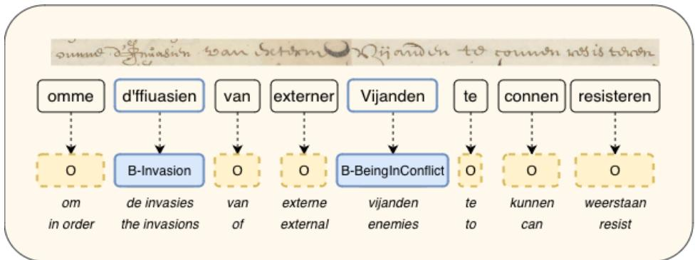
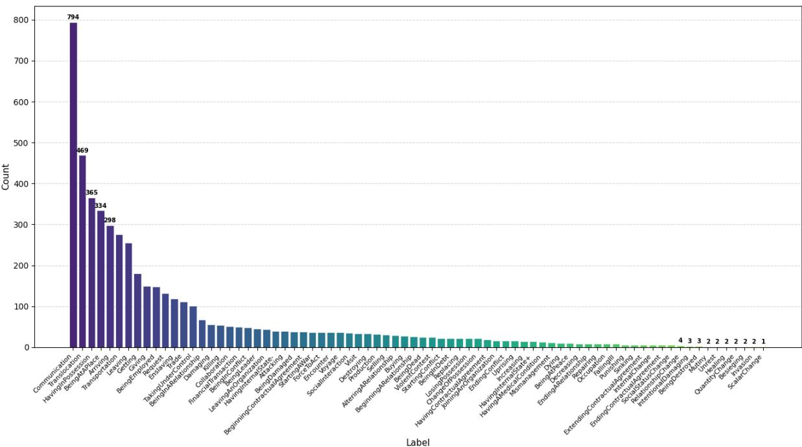
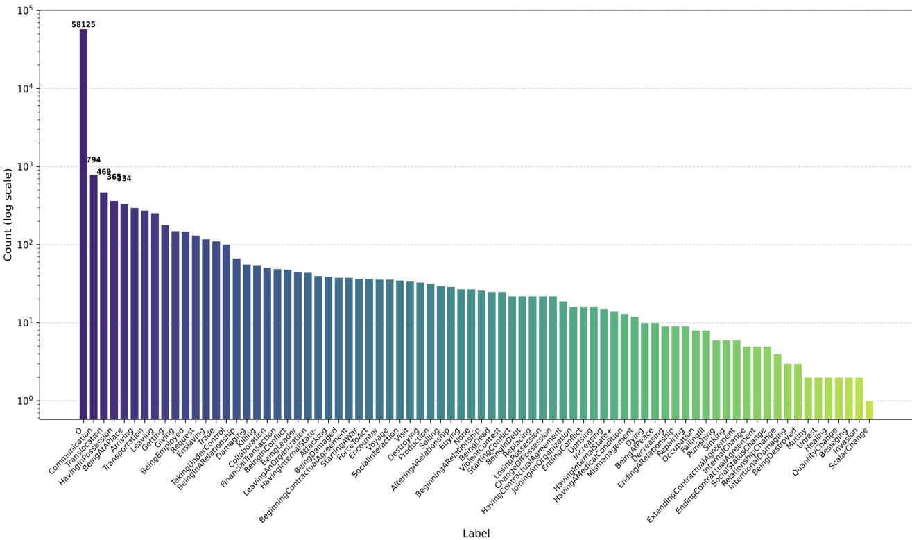

# ROBE: Reversed-Order-Biased-Experts for Extracting Extreme Long-tail Events from Historical Texts

Stella Verkijk1,2,\*, Piek Vossen1

1Vrije Universiteit Amsterdam

2Huygens Instituut

## Abstract

This paper proposes methods to extract over 50 types of events from a Dutch historical corpus spanning the 17th and 18th centuries. The methods we propose aim to tackle the impossible: extracting the long-tail of the long-tail. Historic data from before the 19th century is in itself a niche domain not covered in the pre-training of Large Language Models, and we aim to extract events only very scarcely annotated in the training data available for this domain. We propose creating expert classifiers for subgroups of the events present in the training data. We make these groupings based on similar frequency in the training data or on semantic relatedness. Experts trained on underrepresented events are assigned higher priority when predicting to avoid being dominated by frequency biases. We refer to this new way of combining classifiers, specifically tailored to protect the long-tail, as ROBE: Reversed Order Biased Experts. We also propose a controlled method to create domain-specific synthetic data. Our two implementations of ROBE outperform a simple fine-tuned encoder model with a .10 increase in recall and a .16 increase in precision respectively. The best model achieves a .10 increase in f1 for a group of long-tail classes in our niche data set.

## Keywords

Information Extraction, Computational History, Low-Resource NLP, Synthetic Data, Combining Classifiers

## 1. Introduction

Even in the age of huge models, extracting long-tail information from free text remains a massive problem. The term “long-tail” can be interpreted in diferent ways. Any information from a niche domain can be seen as long-tail because it is infrequent in comparison to information widely available on the web. Similarly, any low-resource language can be considered long-tail. Additionally, the less frequent entities (persons, places, events, etc.) in a data set are considered to be long-tail. In this study, we propose a solution to deal with the long-tail of the long-tail, as we extract events from the archives of the Dutch East India Company (VOC) (1602-1799), handwritten in Early Modern Dutch, that show a very skewed distribution in the training data set.

We formulate this task as a multiclass token classification problem (see Figure 1). Our dataset features 70 label types with the most frequent label occurring 794 times and the least frequent label once. The main problem we face, is the skewed data distribution and the relatively large number of scarce data classes. We therefore build expert models for groups of event classes and apply these in a reversed order of bias: a Reversed-Order-of-Biased-Experts (ROBE) approach. We split the dataset into groups of labels that either have a similar frequency distribution in the training data or are semantically similar. We fine-tune a model for each group of labels, which we refer to as an expert. Each expert is also assigned a priority. Priority is assigned linearly where the expert trained on the labels with the smallest representation in the training data gets the highest priority and the expert trained on the labels with the biggest representation gets lowest priority. We then let each expert label our test dataset and resolve disagreements between event classes by choosing the label predicted by the model with the highest priority. A complete motivation and description of our ROBE approach is given in Section 4.1.

Previous research has shown that neither monolingual Dutch encoders nor larger multilingual encoders are capable of representing the semantics of these VOC archives, concluding that they are unable to capture relevant generalizations even after fine-tuning on domain-specific data [1, 2, 3]. Our ROBE approach therefore consists of diferent fine-tuned implementations of GloBERTise, an encoder model pre-trained solely on the archives of the VOC1.

  
Figure 1: Example of event extraction task. In this example the nouns invasions and enemies (implicitly) refer to events, whereas the main verb resist does not refer to any event from GLOBALISE’s event tag set and is therefore not annotated. Recognizing that any part of speech can refer to an event means widening the variation space of tokens that can refer to a single event class, making some instances of events even more long-tail.

We show that compared to a model fine-tuned on all classes simultaneously without any data manipulation, a ROBE approach drastically improves precision, while a ROBE combined with a general fine-tuned model (ROBE+) improves both recall and precision. We also employ a specialized method to create synthetic data. Incorporating the resulting synthetic data in the fine-tuning process improves precision, but not recall.

This research gives insight into how to deal with a skewed dataset in a highly domain-specific and low-resource setting. We ofer a solution that can be adopted with little to no extra resources or complicated engineering. We show that creating synthetic data can help if you have a way to infuse your data with domain-specific samples, but that splitting up your dataset and training models on specific label groups increases performance even more. We highlight that underperformance on long-tail knowledge can be mitigated without access to additional domain-specific resources or large generative models. We hope it inspires other researchers to devise new ways to tackle extreme long tail information extraction.

## 2. Related Work

Historical event extraction: There is some previous work related to event extraction in older data like ours [4, 5, 6]. Borrenstein et al. [4] aim to extract event information from historical newspaper adverts in diferent languages. However, they only extract attributes of events, and do not classify the events themselves. Lai et al. [5] present BRAD, an annotated dataset of nineteenth century African American periodicals published from 1827 to 1909. Their task does involve event classification, but only of 12 event types. The authors report that transformer-based models applied on BRAD’s event extraction task score substantially worse than when applied on the modern event dataset ACE [7]. Albuquerque et al. [6] apply an event detection and classification system based on FrameNet for Portuguese [8] on 17th century letters, but do not report precision, recall or f1 scores. Other research that proposes automatic systems to extract events from historical texts was conducted on data from the 20th century [9, 10].

A study investigating the performance on generative LLMs on event extraction reports that ChatGPT reaches only 51.04% of the performance of a task-specific model in long-tail and complex scenarios [11]. Kister & Schirmer conclude that open-source LLMs’ can summarize Apartheit Witness Reports but lag behind when extracting entities from them (low precision being the main culprit), even though this dataset is from 1996 [12].

Combining classifiers: Combining classifiers to solve a machine learning task is nothing new under the sun [13]. A popular method in Machine Learning is ensembling: training diferent classifiers on varying features of the dataset and combining the classifier’s representations, for example by averaging over their embeddings, or more simply, combining their predictions with a majority vote scheme or a weighted average. ROBE does not combine all classifiers equally, but rather pushes classifiers representing the strongest biases prevalent in the training data to the background by overriding their predictions. Our approach is closer to what is known as a mixture of(competing) experts [14, 15]. However, we do not use an extra classifier selection algorithm but rather use a simple rule-based approach to define the order of classifiers once. Also similar to our approach is bagging, where classifiers are trained on subsets of the training data. In contrast to our approach, these subsets tend to be randomly sampled.

Synthetic data generation: Creating synthetic data to enhance Machine Learning systems has been a common practice for years [16, 17]. By automatically creating data as training material, laborious human data annotation and curation can be avoided. Whereas earlier methods relied on, for example, GANs [18, 19], the rise of high-performing generative Large Language Models has introduced a new era of synthetic data creation, especially for solving low-resource NLP problems [20, 21, 22, 23]. There are several advantages in using generative LLMs, such as the ease of prompting with natural language and, more importantly, the creativity of these probabilistic models, which makes it easier to spawn variety in the synthetic data. However, the inconsistency of LLMs, their largely unpredictable behavior, and their lack of knowledge of some specialized domains are downsides. Additionally, high frequency data and classes lead to generalizations adopted by a generative model that suppress long-tail interpretations.

Although synthetic data augmentation can be seen as an established method, the speed at which the wide ofer of LLMs that are now used for this method are being published, updated or adapted means the research into this method is also ongoing. Where some research focuses on evaluating diferent LLMs on their generation abilities [24], or on how to actually evaluate the generated data [25], and thereby the algorithms producing them [26], others focus on enhancing methods in prompting, for example by thinking of ways to generate data from existing datasets [27], using knowledge graphs [28] or entity samples [29].

We draw on this last line of thinking by infusing our prompt templates with data points and (annotation) examples specific to our domain. By doing so, we ingrain domain-specific attributes into our synthetic data without the need to fine-tune or instruct a generative model. This allows us to steer the training towards long-tail phenomena. We describe this process in detail in Section 4.2.

## 3. Data

The data we work with was created and made publicly available by the GLOBALISE project. GLOBALISE uses their own event ontology as a backbone of their annotation process. This ontology organizes events taxonomically and makes relations between states and changes-of-state explicit. We refer to the GLOBALISE papers on the ontology and the annotation process for further details [30, 31]. The training data consists of 280 scans from 26 documents and the test data of 18 scans from 3 documents.

The task is diferent from classical event extraction tasks that rely on locating the predicate of the sentence: Any part of speech can refer to an event (see Figure 1). The reasoning behind this task design is twofold: i) the archival texts contain very long sentences with unclear to no sentence boundaries, and ii) historically relevant information about events is often expressed implicitly, for example through nouns or adjectives, rather than only through verbs.

Figure 2 shows the highly skewed label distribution in the training data. The frequencies follow a Zipfian distribution. The diference between the most frequent event (Communication with 794 tokens, 16% of all tokens with an event label) and the least frequent (ScalarChange with 1, 0.02%) is extreme. Also, the diference between the most frequent event and the runner-up (Translocation) is large: Translocation represents 9% of all annotated events. 92% of tokens do not refer to an event.

The VOC archives are known to describe a lot of trade and politics, but also violence. The VOC was a colonial enterprise and political entity that spread war and slave labor. However, describing the violence was not the main focus of the employees of the VOC, as writing letters was more often motivated by a need for more money and resources from the homeland, the obligation to report on evolving relationships with local rulers, and other economically relevant topics. As we can see in Figure 2, some of the events at the extreme end of the long-tail are Mutiny, Besieging and Invasion. Other events that are typical of VOC violence, such as Enslaving, TakingUnderControl, Attacking and ForceToAct are also much less frequent than classes related to translocation and trade, hence there is a cultural bias reflected in the data distirbution. A system that is only able to extract frequent classes will inaccurately represent the history of the VOC and the ability to extract long-tail events is therefore essential.

## 4. Method

## 4.1. The ROBE approach

The idea behind ROBE is to split the classification problem into smaller chunks (bootstrapping) by training diferent models on diferent groups of events. These groupings are based on their representation in the training data and on their semantics (putting semantically similar events in the same group). Grouping classes with similar representations avoids one class being pushed to the background by other classes with much more examples in the training data.

A typical thing you see when training models on little data is that after a small amount of epochs, the model is only able to recognize the most common classes it has seen in the training data and starts predicting those any time it encounters something that refers to an event. The intuition is thus that grouping classes with similar representations in one task makes the model converge for each class at a similar moment during training. All models were fine-tuned with learning rate 5e-5. For further parameter settings we refer to our repository with all code and data to fine-tune models.

When training a model for a single group, all annotated labels of classes that were not included in the group are relabeled as ‘O’, similar to a one-against-all training regime. The downside is that each group has an even bigger ‘O’ class. The impact of this is however limited because the O class is already extremely dominant, with 92% of tokens (see Figure 3 in the Appendix).

See Table 1 for an overview of all groups with their representation in the training data. For the ROBE

  
Figure 2: Label distribution in the expert annotated data of all event classes. Counts are per token.

<table><tr><td>Event classes in group</td><td>#classes</td><td>Grouped on repr. window</td><td>Grouped on semantics</td><td>#e</td><td>Prio</td></tr><tr><td>Buying, BeginningARelationship, ViolentContest, BeingInDebt, Replacing, LosingPossession, Change- OfPossession,JoiningAnOrganization, Unrest, HavingInternalState+, Mismanagement, HavingAMedi- calCondition, BeingAtPeace, QuantityChange</td><td>14</td><td>10-30</td><td>n/a</td><td>20</td><td>1</td></tr><tr><td>TakingUnderControl, Enslaving, Unrest, Attacking, StartingAWar, Killing, BeingInConflict, ViolentContest, ForceToAct</td><td>9</td><td>n/a</td><td>Violence, re- 20 pression, con- flict</td><td></td><td>2</td></tr><tr><td>BeingInARelationship, Damaging, Killing, Collabo- ration, FinancialTransaction, BeingInConflict, Bein- gLeader, LeavingAnOrganization, HavingInternalState- , Attacking, BeingDamaged, HavingContractualAgree- ment, StartingAWar, ForceToAct, Encounter, SocialIn- teraction, Visit, BeingDestroyed, Production, Selling, BeingDead, RelationshipChange</td><td>22</td><td>30-100</td><td>n/a</td><td>18</td><td>3</td></tr><tr><td>Getting, Giving, BeingEmployed, Request, Enslaving, Trade, TakingUnderControl</td><td>7</td><td>100-200</td><td>n/a</td><td>12</td><td>4</td></tr><tr><td>HavingInPossession, Giving, Buying, Selling, Change- OfPossession, Trade, FinancialTransaction, LosingPos- session, Getting</td><td>9</td><td>n/a</td><td>Possession</td><td>20</td><td>5</td></tr><tr><td>HavingInPossession</td><td>1</td><td>300-400</td><td>n/a</td><td>20</td><td>6</td></tr><tr><td>Translocation, Transportation, Leaving, Arriving, Voy- age, BeingAtAPlace</td><td>6</td><td>n/a</td><td>Translocation</td><td>20</td><td>7</td></tr><tr><td>Communication</td><td>1</td><td>&gt;700</td><td>n/a</td><td>10</td><td>8</td></tr></table>

Event classes grouped for training the experts of ROBE, given in order of priority. Groups with long-tail classes get higher priority. #e = number of epochs the expert was trained; Prio = Priority. Numbers of representation window given in amount of tokens, not mentions.

experts, some classes are merged in order to increase their representation. Classes are only considered for merge if it concerns i) a related Dynamic and Static Event, ii) events that are subclasses of the same class in the taxonomy, or iii) events that are one step away from each other in the taxonomy. Examples of the first are Dying and BeingDead; Destroying and BeingDestroyed. Examples of the second are Besieging and Invasion, where both are subclasses of Attacking. Examples of the third are EndingARelationship and RelationshipChange, where the first is a subtype of the second. Table 5 in the Appendix shows which classes are merged, what type of merge it is, and what their individual representation is.

## 4.2. Synthetic data creation

As explained in Section 2, previous studies on creating synthetic data have shown that infusing (domainspecific) knowledge from existing datasets can lead to more representative synthetic data for niche domains. Part of GLOBALISE’s work involves creating structured data of persons, places, ships and commodities described in the archives (i.e., [32]). We use GLOBALISE’s published dataset on the "Namebooks" of the VOC to extract names of persons, their professions and the location they were mentioned 2. Additionally, we use their published commodities thesaurus to extract names of commodities and their definitions[33]3. Lastly, GLOBALISE provided a ship dataset4 from which we extract names of ship types and their descriptions. We then create prompt templates that combine these data like so:

See the following example ofan annotated sentence: <example>. Create a sentence in Early Modern Dutch in which <commodity> is transported. This is the definition of <commodity>: <definition>. Write a sentence that could be found in the Archives ofthe Dutch East India Company (1602-1799). Make sure to adjust your style to the Dutch East India Company. Put the word that refers to the transportation in square brackets like in the example.

We create prompts by randomly sampling from the aforementioned datasets and a small selection of 9 example annotations to create several combinations for each prompt template. Some prompt templates do not use an example annotation to promote diversity in the output. We use a total of 8 prompt templates. Table 6 in the Appendix contains all the prompt templates used and Table 7 all annotation examples. Using the created prompt templates between 15 to 30 times we create 375 annotated synthetic sentences for Translocation and Transportation with gpt-4o5. All code and the resulting synthetic data can be found in this repository.

## 4.3. Overview of evaluated methods

Table 2 gives an overview of all methods evaluated against the test set. The first model is simple: GloBERTise fine-tuned once on all available human-annotated training data without any data manipulation (EtE). We also fine-tune a version of this model on the training data augmented with our syntehtic data. Apart from ROBE as described in Section 4.1, we also propose a version of ROBE where we include EtE as an expert: ROBE+. EtE gets lowest priority in ROBE+ (i.e., place 9).

The lexicon and the GenLLM serve as baselines: the first representing the extreme end of domainspecificity and human labor and the second representing the extreme end of general pre-trained models that do not require any human annotations. As per the previous research mentioned so far indicating general pre-trained models do not perform well on long-tail domains [2, 1, 22, 12] as well as research that shows that Generative LLMs do not fare well when applied to classification problems where the label set is large [34], we do not expect the GenLLM to perform well. From the lexicon we can expect more, as it was created in an iterative manner, using seeds from human annotations and expanding with a specialized Word2Vec model. Annotators added words to the lexicon over a time span of years6.

<table><tr><td>Approach</td><td>Acronym</td><td>Design</td></tr><tr><td>End to End</td><td>EtE</td><td>Fine-tuned GloBERTise on all data</td></tr><tr><td>End to End with augmented data</td><td>EtE+synth</td><td>EtE trained on all data plus additional synthetic data</td></tr><tr><td>Reversed-Order-Biased-Expert</td><td>ROBE</td><td>Eight fine-tuned GloBERTises on different label groups</td></tr><tr><td>ROBE with EtE</td><td>ROBE+</td><td>Nine fine-tuned GloBERises, of which one EtE</td></tr><tr><td>Lexical</td><td>Lexical</td><td>Lexical Baseline provided by GLOBALISE</td></tr><tr><td>gpt-5.1</td><td>GenLLM</td><td>Generative baseline using gpt-5.1, zero-shot and few-shot setting</td></tr></table>

Table 2  
Overview of evaluated methods

## 4.4. Evaluation

GLOBALISE released three documents annotated by at least four annotators as test data. We adjudicated these annotations by extracting the majority vote where possible, and otherwise consulting the annotation guidelines and consulting historians. We kept track of our progress and concluded that the percentage of adjudications that could be done through a majority vote was only 47%. Of those, the percentage where the majority vote (three out of four annotations) was ‘O’ was 52%. Additionally, the percentage of manual adjudications that could be made on ontological basis was only 12%. Hence, when annotators disagreed between event types, there was often no simple way to adjudicate them. These statistics show that the annotation is partially subjective, a phenomenon that is encountered often in NLP [35]. We therefore evaluate both on the adjudicated and the non-adjudicated test set. For the latter, we count a prediction of the system as correct if it is the same as one of the gold labels.

## 5. Results

## 5.1. Evaluation on test set

<table><tr><td></td><td colspan="3">Lexicon</td><td colspan="3">EtE</td><td colspan="3">EtE+synth</td><td colspan="3">ROBE</td><td colspan="3">ROBE+</td><td></td></tr><tr><td></td><td>P</td><td>R</td><td>F1</td><td>P</td><td>R</td><td>F1</td><td>P</td><td>R</td><td>F1</td><td>P</td><td>R</td><td>F1</td><td>P</td><td>R</td><td>F1</td><td>Supp.</td></tr><tr><td colspan="10">Adjudicated Gold</td><td colspan="7"></td></tr><tr><td>Overall</td><td>0.69</td><td>0.14</td><td>0.23</td><td>0.29</td><td>0.20</td><td>0.24</td><td>0.42</td><td>0.19</td><td>0.26</td><td>0.45</td><td>0.20</td><td>0.28</td><td>0.31</td><td>0.25</td><td>0.27</td><td>626</td></tr><tr><td>translocation</td><td>0.77</td><td>0.25</td><td>0.38</td><td>0.66</td><td>0.59</td><td>0.62</td><td>0.75</td><td>0.49</td><td>0.59</td><td>0.74</td><td>0.51</td><td>0.60</td><td>0.66</td><td>0.65</td><td>0.65</td><td>208</td></tr><tr><td>violence</td><td>1.00</td><td>0.03</td><td>0.05</td><td>50.20</td><td>0.04</td><td>0.07</td><td>0.40</td><td>0.08</td><td>0.14</td><td>0.38</td><td>0.08</td><td>0.13</td><td>0.31</td><td>0.12</td><td>0.18</td><td>73</td></tr><tr><td colspan="10">Non-Adjudicated Gold</td><td colspan="7"></td></tr><tr><td>Overall</td><td>0.78</td><td>0.30</td><td>0.43 1</td><td>0.44</td><td>0.63</td><td>0.52</td><td>0.57</td><td>0.51</td><td>0.53</td><td>1 0.60</td><td>0.49</td><td>0.54 1</td><td>0.47</td><td>0.73</td><td>0.57</td><td>800</td></tr><tr><td>translocation</td><td>0.76</td><td>0.29</td><td>0.42 1</td><td>0.51</td><td>0.43</td><td>0.47</td><td>0.68</td><td>0.46</td><td>0.55</td><td>0.66</td><td>0.47</td><td>0.54 1</td><td>0.56</td><td>0.49</td><td>0.52</td><td>287</td></tr><tr><td>violence</td><td>1.00</td><td>0.08</td><td></td><td>0.15 0.22</td><td>0.06</td><td>0.09 1</td><td>0.25</td><td>0.06</td><td>0.10 1</td><td>0.38</td><td>0.12</td><td>0.18</td><td>0.31</td><td>0.13</td><td>0.19</td><td>113</td></tr></table>

## Table 3

Micro average results across event classes for EtE, EtE+synth, ROBE, ROBE+, and the lexical baseline. For the overall scores, we apply strict evaluation on BIO labels and event types (a prediction is only correct if it has the correct BIO label and the correct event type). For both the scores on translocation and violence, we count a prediction as correct if it falls within the set of labels that refer to either translocation or violence (as specified in Table 1. BIO labels do not have to overlap. To exemplify: if the gold label is B-Translocation and the model predicts I-Transportation, we count it as correct. We do not include the ’O’ class in any metric.

As we can see in Table 3, the lexicon ofers a strong baseline, scoring highest in precision across the board. Gpt5.1 performs poorly overall and unreliably for long-tail classes, as shown in Table 10 in the Appendix. ROBE scores up to .16 higher in precision over EtE. Recall also increases slightly for the more challenging long-tail events referring to violence, repression and conflict. On the other hand, recall decreases in the overall score. Our combined model, ROBE+, scores highest in recall and f1 in most evaluation settings. The EtE model trained with additional synthetic data drastically improves precision over EtE, but declines in recall. We think this is caused by the fact the synthetic data contains unlabelled mentions of other events than Transportation and Translocation, providing the model with negative examples for classes it should recognize. Although it scores highest f1 when predicting translocation classes in the non-adjudicated test set, it does not score much higher than ROBE. Training an expert translocation model on the augmented dataset, and replacing the original translocation expert with the synthetic expert in the ROBE model does not increase scores for ROBE or ROBE+, as can be seen in Table 8 in the Appendix7.

The results indicate that assigning higher priority to classifiers that are experts on long-tail events does not hurt performance on events that are not long-tail. A general model trained on all data receives more examples of event classes and therefore scores higher on recall; experts on subsets of the dataset are more conservative and improve precision. Combining experts with a general model trained on the complete dataset balances out precision and recall8.

## 5.2. External Validation

We also gathered external user validation of a simplified version of the ROBE model9. See the results of this simplified ROBE on the part of the test set that validators judged in Table 4. These external validation data were gathered during two iterations of a workshop for historians about Machine Learning. Participants were asked to assign one of two values to each prediction of ROBE: useful or misleading.

In the first iteration of the workshop, the model’s predictions were labeled as useful 75% of the time (average of six validators). This is based on a total of 329 validated predictions. Of the validators, three had 1-5 years of experience reading archives, two had one year of experience and one had none. One validator was discarded because they did not pass a translation task made to assess their level of reading Early Modern Dutch. Interestingly, the participants labeled our adjudicated gold data as useful 68% of the time (based on a total of 78 validated gold labels). This reiterates that we are dealing with a complicated task where multiple interpretations of the text are possible. Three out of six annotators did not validate any gold data (they did not reach that part of the assignment).

<table><tr><td></td><td>P</td><td>R</td><td>F1</td><td>Support</td></tr><tr><td colspan="5">Adjudicated Gold</td></tr><tr><td>Overall</td><td>0.38</td><td>0.13</td><td>0.20</td><td>260</td></tr><tr><td>translocation</td><td>0.75</td><td>0.55</td><td>0.64</td><td>78</td></tr><tr><td>violence</td><td>0.00</td><td>0.00</td><td>0.00</td><td>19</td></tr><tr><td colspan="5">Non-Adjudicated Gold</td></tr><tr><td>Overall</td><td>0.54</td><td>0.43</td><td>0.48</td><td>425</td></tr><tr><td>translocation</td><td>0.58</td><td>0.46</td><td>0.52</td><td>122</td></tr><tr><td>violence</td><td>0.00</td><td>0.00</td><td>0.00</td><td>65</td></tr></table>

## Table 4

Micro average results for a simplified ROBE on part of the test set. Metrics calculated as in Table 3

In the second iteration (9 participants), ROBE’s predictions were labeled useful 79% of the time, based on a total of 578 validated predictions. In this group, there was one person with 1-5 years of experience reading archives, one with less than half a year, and the rest had none. They labeled our adjudicated gold data as useful 84% of the time, which was based on a total of 190 validated gold labels. One person did not validate any gold data10.

Since validators only judged events predicted by ROBE, they did not have any way to judge events ROBE might have missed, hence, we are only validating the model’s precision, and we cannot say anything about the recall. However, the conclusion we can draw is that in the external validation, ROBE scores much higher on precision than in our classical evaluation, as can be seen in Table 4. We believe this finding contextualizes the somewhat low scores accross the board in Table 3.

## 6. Discussion

Our paper ofers an accessible approach to enhance performance when classifying long-tail events in a low-resource language and niche domain. By combining classifiers and assigning a fixed picking order, where classifiers trained on underrepresented labels in the training data receive highest priority, it is possible to improve performance across classes in a skewed dataset and balance out precision and recall.

Our paper has a few limitations. An analysis of the synthetic data would give more insight into why it improves precision but not recall. Also, a more fine-grained error analysis where we compare predictions of diferent models on tokens that refer to specific long-tail events in the test set would provide a clearer analysis of the diference between model configurations.

## References

[1] S. Arnoult, B. Nijman, L. v. Wissen, Fine-grained named-entity recognition for the east-india company domain, Anthology of Computers and the Humanities 3 (2025) 953–967.

[2] S. Verkijk, P. Vossen, P. Sommerauer, Language models lack temporal generalization and bigger is not better, in: Findings of the Association for Computational Linguistics: ACL 2025, 2025, pp. 20629–20637.

[3] S. Verkijk, P. Vossen, Out-of-tune rather than fine-tuned: How pre-training, fine-tuning and tokenization afect semantic similarity in a historical, non-standardized domain, in: Proceedings of the Second Workshop on Language Models for Low-Resource Languages (LoResLM 2026), 2026, pp. 515–531.

[4] N. Borenstein, N. da Silva Perez, I. Augenstein, Multilingual event extraction from historical newspaper adverts, in: Proceedings of the 61st Annual Meeting of the Association for Computational Linguistics (Volume 1: Long Papers), 2023, pp. 10304–10325.

[5] V. D. Lai, M. Van Nguyen, H. Kaufman, T. H. Nguyen, Event extraction from historical texts: A new dataset for black rebellions, in: Findings of the Association for Computational Linguistics: ACL-IJCNLP 2021, 2021, pp. 2390–2400.

[6] G. C. Albuquerque, M. Souza, R. Vieira, A. S. Ribeiro, Applying event classification to reveal the estado da índia, in: Proceedings of the 16th International Conference on Computational Processing of Portuguese-Vol. 1, 2024, pp. 247–254.

[7] C. Walker, S. Strassel, J. Medero, K. Maeda, Ace 2005 multilingual training corpus, (No Title) (2006).

[8] A. d. S. B. Sacramento, M. Souza, Joint event extraction with contextualized word embeddings for the portuguese language, in: Brazilian Conference on Intelligent Systems, Springer, 2021, pp. 496–510.

[9] R. Sprugnoli, S. Tonelli, Novel event detection and classification for historical texts, Computational Linguistics 45 (2019) 229–265.

[10] A. Cybulska, P. Vossen, Historical event extraction from text, in: Proceedings of the 5th ACL-HLT Workshop on Language Technology for Cultural Heritage, Social Sciences, and Humanities, 2011, pp. 39–43.

[11] J. Gao, H. Zhao, C. Yu, R. Xu, Exploring the feasibility of chatgpt for event extraction, arXiv preprint arXiv:2303.03836 (2023).

[12] P. Kister, M. Schirmer, Evaluating open-source LLMs for text summarization and named entity recognition in long, unstructured text, in: S. Hamilton, E. Öhman, R. M. M. Hicke, Y. Bizzoni, A. Bax, J. A. Matthews, M. Hämäläinen (Eds.), Proceedings of the 6th International Conference on Natural Language Processing for the Digital Humanities, Association for Computational Linguistics, San Diego, USA, 2026, pp. 390–410. URL: https://aclanthology.org/2026.nlp4dh-1.35/. doi:10.18653/v1/2026.nlp4dh-1.35.

[13] S. Abimannan, E.-S. M. El-Alfy, Y.-S. Chang, S. Hussain, S. Shukla, D. Satheesh, Ensemble multifeatured deep learning models and applications: A survey, IEEE Access 11 (2023) 107194–107217.

[14] A. A. Aburomman, M. B. I. Reaz, A survey of intrusion detection systems based on ensemble and hybrid classifiers, Computers & security 65 (2017) 135–152.

[15] S. Masoudnia, R. Ebrahimpour, Mixture of experts: a literature survey, Artificial Intelligence Review 42 (2014) 275–293.

[16] A. Mikołajczyk, M. Grochowski, Data augmentation for improving deep learning in image classification problem, in: 2018 international interdisciplinary PhD workshop (IIPhDW), IEEE, 2018, pp. 117–122.

[17] K. Maharana, S. Mondal, B. Nemade, A review: Data pre-processing and data augmentation techniques, Global Transitions Proceedings 3 (2022) 91–99.

[18] F. H. K. dos Santos Tanaka, C. Aranha, Data augmentation using gans, Proceedings of Machine Learning Research XXX 1 (2019) 16.

[19] Y. Akkem, S. K. Biswas, A. Varanasi, A comprehensive review of synthetic data generation in

smart farming by using variational autoencoder and generative adversarial network, Engineering Applications of Artificial Intelligence 131 (2024) 107881.

[20] Y. Meng, J. Huang, Y. Zhang, J. Han, Generating training data with language models: Towards zero-shot language understanding, Advances in Neural Information Processing Systems 35 (2022) 462–477.

[21] Z. Tan, D. Li, S. Wang, A. Beigi, B. Jiang, A. Bhattacharjee, M. Karami, J. Li, L. Cheng, H. Liu, Large language models for data annotation and synthesis: A survey, arXiv preprint arXiv:2402.13446 (2024).

[22] J. Gao, R. Pi, Y. Lin, H. Xu, J. Ye, Z. Wu, W. Zhang, X. Liang, Z. Li, L. Kong, Self-guided noise-free data generation for eficient zero-shot learning, arXiv preprint arXiv:2205.12679 (2022).

[23] J. Ye, J. Gao, Q. Li, H. Xu, J. Feng, Z. Wu, T. Yu, L. Kong, Zerogen: Eficient zero-shot learning via dataset generation, in: Proceedings of the 2022 Conference on Empirical Methods in Natural Language Processing, 2022, pp. 11653–11669.

[24] S. Kim, J. Suk, X. Yue, V. Viswanathan, S. Lee, Y. Wang, K. Gashteovski, C. Lawrence, S. Welleck, G. Neubig, Evaluating language models as synthetic data generators, CoRR (2024).

[25] K. Ramesh, D. Smolyak, Z. Zhao, N. Gandhi, R. Agarwal, M. Bjarnadóttir, A. Field, Synthtexteval: Synthetic text data generation and evaluation for high-stakes domains, arXiv preprint arXiv:2507.07229 (2025).

[26] A. Havrilla, A. Dai, L. O’Mahony, K. Oostermeijer, V. Zisler, A. Albalak, F. Milo, S. C. Raparthy, K. Gandhi, B. Abbasi, et al., Surveying the efects of quality, diversity, and complexity in synthetic data from large language models, arXiv preprint arXiv:2412.02980 (2024).

[27] S. Gandhi, R. Gala, V. Viswanathan, T. Wu, G. Neubig, Better synthetic data by retrieving and transforming existing datasets, in: Findings of the Association for Computational Linguistics: ACL 2024, 2024, pp. 6453–6466.

[28] H. Kim, J. Hessel, L. Jiang, P. West, X. Lu, Y. Yu, P. Zhou, R. Bras, M. Alikhani, G. Kim, et al., Soda: Million-scale dialogue distillation with social commonsense contextualization, in: Proceedings of the 2023 Conference on Empirical Methods in Natural Language Processing, 2023, pp. 12930–12949.

[29] Z. Yang, N. Band, S. Li, E. Candes, T. Hashimoto, Synthetic continued pretraining, arXiv preprint arXiv:2409.07431 (2024).

[30] S. Verkijk, P. Vossen, Sunken ships shan’t sail: Ontology design for reconstructing events in the dutch east india company archives., in: CHR, 2023, pp. 320–332.

[31] S. Verkijk, P. Sommerauer, P. Vossen, Studying language variation considering the re-usability of modern theories, tools and resources for annotating explicit and implicit events in centuries old text, in: Proceedings of the Eleventh Workshop on NLP for Similar Languages, Varieties, and Dialects (VarDial 2024), 2024, pp. 174–187.

[32] R. Mourits, K. Pepping, T. van Oort, P. Konings, B. van Duijvenvoorde, Modelling the enslaved as historical persons: Extending the persons in context (pico) model to fit enslaved individuals, in: Digital Humanities Benelux 2025, 2025.

[33] K. Pepping, Reflections on encoding languages in historical data: Working with the multilingual dimension of the dutch east india company archives, Journal of Open Humanities Data 10 (2024).

[34] O. Khrapunova, Bridging zero-shot and fine-tuned performance in text classification throughretrieval-augmented prompting, American Academic Scientific Research Journal for Engineering, Technology, and Sciences (2025).

[35] A. N. Uma, T. Fornaciari, D. Hovy, S. Paun, B. Plank, M. Poesio, Learning from disagreement: A survey, Journal of Artificial Intelligence Research 72 (2021) 1385–1470.

  
Figure 3: Label distribution in the expert annotated data of all classes (including ’O’).

<table><tr><td>Classes merged</td><td>Rep</td><td>Merge type</td><td>New name</td><td>New rep</td></tr><tr><td>TakingUnderControl, Occupation</td><td>101,8</td><td>Stat-Dyn</td><td>TakingUnderControl</td><td>109</td></tr><tr><td>Attacking, Besieging, Invasion</td><td>39,2,2</td><td>Taxonomic</td><td>Attacking</td><td>43</td></tr><tr><td>Destroying, BeingDestroyed</td><td>33,3</td><td>Stat-Dyn</td><td>BeingDestroyed</td><td>36</td></tr><tr><td>BeginningContractualAgreement, Extend- 38, 6, 5, 19 ingContractualAgreement, EndingCon- tractualAgreement, HavingContractualA-</td><td></td><td>Stat-Dyn</td><td>HavingContractualAgreement</td><td>68</td></tr><tr><td>greement</td><td></td><td></td><td></td><td></td></tr><tr><td>Dying, BeingDead AlteringARelationship, EndingARelation-</td><td>10,25 29,9,4</td><td>Stat-Dyn Taxonomic</td><td>BeingDead</td><td>35</td></tr><tr><td>ship, RelationshipChange</td><td></td><td></td><td>RelationshipChange</td><td>42</td></tr><tr><td>StartingConflict, EndingConflict, BeingIn- Conflict</td><td>22, 16,48</td><td>Stat-Dyn</td><td>BeingInConflict</td><td>86</td></tr><tr><td>Uprising, Mutiny, Unrest</td><td>16,2,2</td><td>Stat-Dyn</td><td>Unrest</td><td>20</td></tr><tr><td>Repairing, Healing, HavingInternalState+</td><td>9,2,14</td><td>Stat-Dyn</td><td>HavingInternalState+</td><td>25</td></tr><tr><td>FallingIll, HavingAMedicalCondition</td><td>8,13</td><td>Stat-Dyn</td><td>HavingAMedicalCondition</td><td>21</td></tr></table>

Merged event classes. Rep = representation.

Table 5

See the following example of an annotated sentence: example. Create a sentence in Early Modern Dutch in which label is transported. This is the definition of label: definition. Write a sentence that could be found in the Archives of the Dutch East India Company (1602-1799). Make sure to adjust your style to the Dutch East India Company. Put the word that refers to the transportation in square brackets like in the example.

See the following example of an annotated sentence: example. Create a sentence in Early Modern Dutch in which label is transported. This is the definition of label: definition. Write a sentence that could be found in the Archives of the Dutch East India Company (1602-1799). Make sure to adjust your style to the Dutch East India Company. Put the word that refers to the transportation in square brackets like in the example. Do not repeat the definition as given in the prompt, only use it for your own context.

See the following example of an annotated sentence: example Create a sentence in Early Modern Dutch in which a translocation is taking place with a label. This is the definition of label: definition. Write a sentence that could be found in the Archives of the Dutch East India Company (1602-1799). Make sure to adjust your style to the Dutch East India Company. Put the word that refers to the translocation in square brackets like in the example. Make sure to vary in syntax.

See the following example of an annotated sentence: example Create a sentence in Early Modern Dutch in which a translocation is taking place with a label. This is the definition of label: definition. Write a sentence that could be found in the Archives of the Dutch East India Company (1602-1799). Make sure to adjust your style to the Dutch East India Company. Put the word that refers to the translocation in square brackets like in the example. A translocatiion could for example be an arrival, a departure, a voyage or a transport. Make sure to vary in syntax.

Create a sentence in Early Modern Dutch in which a translocation is taking place with a label. This is the definition of label: definition. Write a sentence that could be found in the Archives of the Dutch East India Company (1602-1799). Make sure to adjust your style to the Dutch East India Company. Put the word that refers to the translocation in square brackets. Do not start your sentence with a time indication.

See the following example of an annotated sentence: example. Create a similar sentence, that difers in syntax and vocabulary, in Early Modern Dutch in which a translocation is taking place. A translocation could for example be an arrival, a departure, a voyage or a transport. Write a sentence that could be found in the Archives of the Dutch East India Company (1602-1799). Make sure to adjust your style to the Dutch East India Company. Put the word that refers to the translocation in square brackets like in the example.

Create a sentence in Early Modern Dutch in which name is travelling to or from location. The way name is travelling can be inspired by their profession, which is function. Write a sentence that could be found in the Archives of the Dutch East India Company (1602-1799). Make sure to adjust your style to the Dutch East India Company. Put the word that refers to the translocation in square brackets.

Create a sentence in Early Modern Dutch in which name is travelling to or from location. The way name is travelling can be inspired by their profession, which is function. Write a sentence that could be found in the Archives of the Dutch East India Company (1602-1799). Make sure to adjust your style to the Dutch East India Company. Put the word that refers to the translocation in square brackets. Do not start the sentence with name.

## Table 6

All prompts used to create synthetic data

<table><tr><td>wordende door de onderkooplieden Jevers en van Bijland aan de vrlreep gerecibieert, en bij de hand naar den Heer Commissaris [geleid] bestaande in Aria soeradikarsa, Aria wangsanagara Aria ong Jaija, en den Ingabeij Ratoe Bagoes Pringalaija Den 27=en Januarij 1625 sijn dan hier in sloote naer t vaderslandt [vertrocken], ondert Commandement,</td></tr><tr><td>vanden E: Cornelis Geuertss de Scheepen hollandia Goudaende Middelburch. Vant vaderslandt sijn hier Godtloff alle de Schepen uijt gesondert alckmaer int Gexel behouden [aenge-</td></tr><tr><td>comen] Namentlijck . T Jacht de Hase den 4 Junij 1625 T schip de Cameel den 19: septemb = r Is bij onsen scheeps Raet goet gevonden om [voort te seijlen] naer de soute Eijlande om hem aldaer te</td></tr><tr><td>vinden ofte een dach off drie te verwachten deen 25 . november sijn wij [gepasseert] het Eijlant palma ende vernomen dat ons Esels hooft gans veermolsent (was soo dat wij L. tgroote marsseyjl niet dorsten voeren den 10 december sin wij [gearrineert]</td></tr><tr><td>opde rede voor Jlijo de maijo alwaer wij een ander Esels hooft hebben toe gestelt man die binnen boord bleeven , in de boot aan land [gevlugt], en daar soolange verbleven waren tot tijd enwijle sagen dat hetselve bij hare chialoup — aan boord gelegen , daar eenige uuren aandoende geweest dog die nae dato weder [verlaten] , en [&#x27;t zee gat gekosen] hadde , als wanneer hun ook weder</td></tr><tr><td>naar derwaarts [begeven], en aan boord komende door de twee aldaar verblevene maats te verstaan gegeven was</td></tr><tr><td>t beste benevens diverse provi sien , Equipagie goederen &amp; t  a tesamen omtrend ter waardije van 400 : thailen daar [uijtgeligt] envoor een goede buijt [mede gevoert] hadden t beste benevens diverse provi sien , Equipagie goederen &amp; t  a tesamen omtrend ter waardije van 400 :</td></tr><tr><td>thailen daar [uijtgeligt] envoor een goede buijt [mede gevoert] hadden waar nae demallabaren met  $\mathrm { ~ d ~ } , \mathrm { ~ o ~ }$  chialoup ook [terug gekeert] , en weder op de atchinse rheede [gelopen]</td></tr></table>

All example annotations used to fill the prompt templates’ example slots

## Table 7

<table><tr><td rowspan="2"></td><td colspan="3">ME+synth</td><td colspan="3">Combined+synth</td><td rowspan="2">Support</td></tr><tr><td>P</td><td>R</td><td>F1</td><td>P</td><td>R</td><td>F1</td></tr><tr><td>Adjudicated Gold</td><td></td><td></td><td>1</td><td></td><td></td><td></td><td></td></tr><tr><td>Overall</td><td>0.45</td><td>0.18</td><td>0.26</td><td>0.30</td><td>0.24</td><td>0.27</td><td>626</td></tr><tr><td>translocation</td><td>0.77</td><td>0.45</td><td>0.57</td><td>0.65</td><td>0.63</td><td>0.64</td><td>208</td></tr><tr><td>violence</td><td>0.38</td><td>0.08</td><td>0.13</td><td>0.32</td><td>0.12</td><td>0.18</td><td>73</td></tr><tr><td colspan="2">Non-Adjudicated Gold</td><td></td><td></td><td>1 1</td><td></td><td></td><td></td></tr><tr><td>Overall</td><td>0.60</td><td>0.46</td><td>0.52</td><td>0.46</td><td>0.71</td><td>0.56</td><td>800</td></tr><tr><td>translocation</td><td>0.66</td><td>0.42</td><td>0.52</td><td>0.54</td><td>0.47</td><td>0.50</td><td>287</td></tr><tr><td>violence</td><td>0.38</td><td>0.12</td><td>0.18 </td><td>0.27</td><td>0.10</td><td>0.15</td><td>113</td></tr></table>

Table 8  
Results across event classes for ME+synth and Combined+synth systems

<table><tr><td>Model</td><td>Category</td><td>P</td><td>R</td><td>F1</td><td>Support</td></tr><tr><td rowspan="6">ROBE (synth)</td><td>Adjudicated – Overall</td><td>0.45</td><td>0.18</td><td>0.26</td><td>626</td></tr><tr><td>Adjudicated – Translocation</td><td>0.77</td><td>0.45</td><td>0.57</td><td>208</td></tr><tr><td>Adjudicated – Violence</td><td>0.38</td><td>0.08</td><td>0.13</td><td>73</td></tr><tr><td>Non-adjudicated – Overall</td><td>0.60</td><td>0.46</td><td>0.52</td><td>800</td></tr><tr><td>Non-adjudicated – Translocation</td><td>0.66</td><td>0.42</td><td>0.52</td><td>287</td></tr><tr><td>Non-adjudicated – Violence</td><td>0.38</td><td>0.12</td><td>0.18</td><td>113</td></tr><tr><td rowspan="6">ROBE+ (synth)</td><td>Adjudicated – Overall</td><td>0.30</td><td>0.24</td><td>0.27</td><td>626</td></tr><tr><td>Adjudicated – Translocation</td><td>0.65</td><td>0.63</td><td>0.64</td><td>208</td></tr><tr><td>Adjudicated – Violence</td><td>0.32</td><td>0.12</td><td>0.18</td><td>73</td></tr><tr><td>Non-adjudicated – Overall</td><td>0.46</td><td>0.71</td><td>0.56</td><td>800</td></tr><tr><td>Non-adjudicated – Translocation</td><td>0.54</td><td>0.47</td><td>0.50</td><td>287</td></tr><tr><td>Non-adjudicated – Violence</td><td>0.27</td><td>0.10</td><td>0.15</td><td>113</td></tr></table>

## Table 9

Precision, recall, and F1 scores for ROBE\_synth and ROBE\_plus\_synth models across adjudicated and nonadjudicated data.
<table><tr><td></td><td colspan="3">Zero-shot</td><td colspan="10">Few-shot</td></tr><tr><td></td><td>P</td><td>R</td><td>F1</td><td>P</td><td>R</td><td>F1</td><td>P</td><td>R</td><td>F1</td><td>P</td><td>R</td><td>F1</td><td>Support</td></tr><tr><td colspan="10">Adjudicated Gold</td><td colspan="3"></td><td colspan="3"></td></tr><tr><td>Overall</td><td>0.07</td><td>0.04</td><td>0.05</td><td>0.07</td><td>0.05</td><td>0.06</td><td>0.03</td><td>0.04</td><td>0.04</td><td>0.03</td><td>0.04</td><td>0.04</td><td></td><td>626</td></tr><tr><td>translocation</td><td>0.21</td><td>0.12</td><td>0.15</td><td>0.20</td><td>0.11</td><td>0.14</td><td>0.14</td><td>0.13</td><td>0.13</td><td>0.15</td><td>0.13</td><td></td><td>0.14</td><td>208</td></tr><tr><td>violence</td><td>0.42</td><td>0.11</td><td>0.17</td><td>0.42</td><td>0.07</td><td>0.12</td><td>0.14 1</td><td>0.08</td><td>0.10</td><td>1 0.18</td><td>0.05</td><td></td><td>0.08</td><td>73</td></tr><tr><td colspan="10">Non-Adjudicated Gold</td><td colspan="3"></td><td colspan="3"></td></tr><tr><td>Overall</td><td>0.33</td><td>0.13</td><td>0.19</td><td>1 0.35</td><td>0.14</td><td>0.20</td><td>1 0.24</td><td>0.13</td><td>0.17</td><td>1 0.23</td><td></td><td>0.13</td><td>0.17</td><td>800</td></tr><tr><td>translocation</td><td>0.36</td><td>0.08</td><td>0.12</td><td>0.44</td><td>0.07</td><td>0.12</td><td>0.29</td><td>0.07</td><td>0.11</td><td>0.29</td><td>0.07</td><td></td><td>0.11</td><td>287</td></tr><tr><td>violence</td><td>0.66</td><td>0.19</td><td>0.29</td><td>0.50</td><td>0.10</td><td>0.16</td><td>1 0.25</td><td>0.05</td><td>0.08</td><td>1 0.00</td><td>0.00</td><td></td><td>0.00</td><td>113</td></tr></table>

## Table 10

Macro results across event classes for two runs of gpt-5.1 in zero-shot setting and two runs in few-shot setting with temperature=0. Metric scores are calculated in the same way as in Table 3.