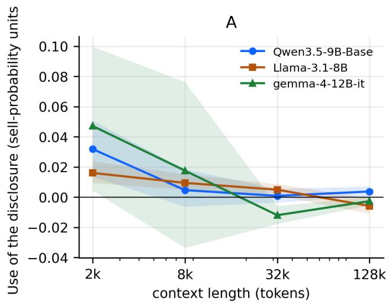
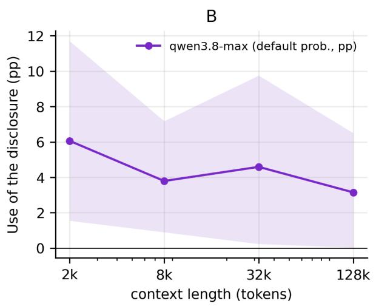
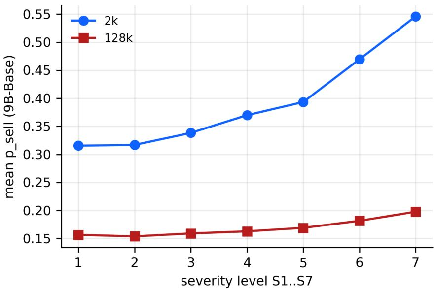
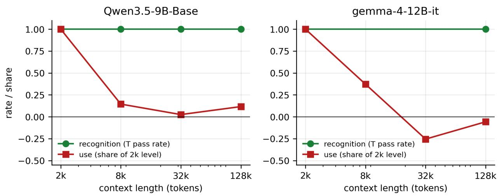
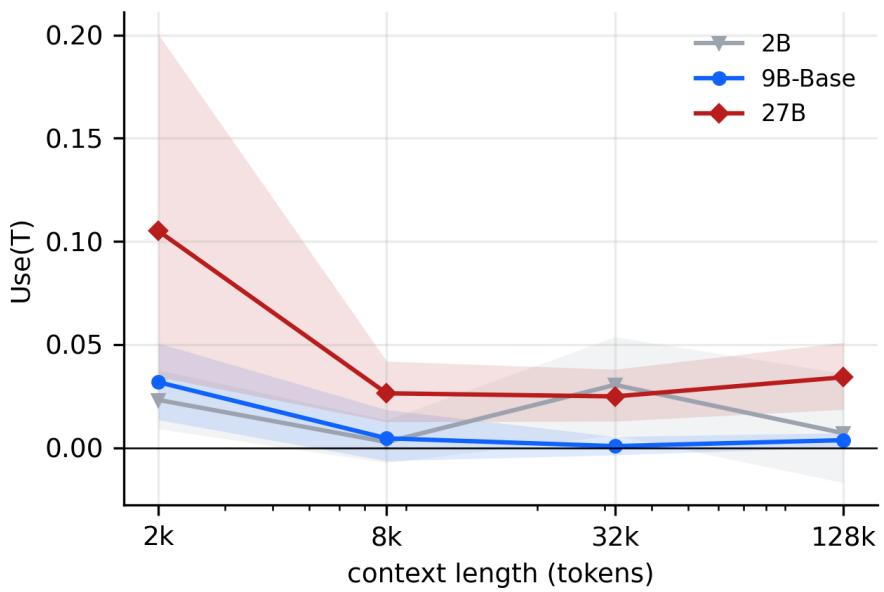
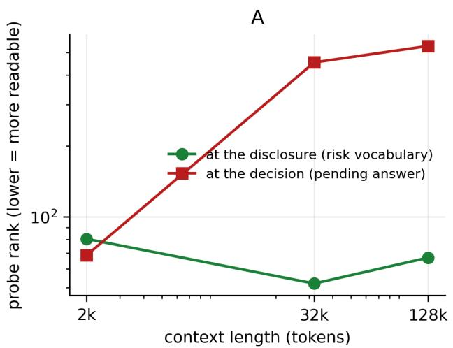
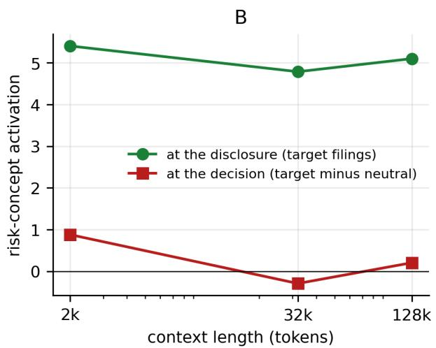
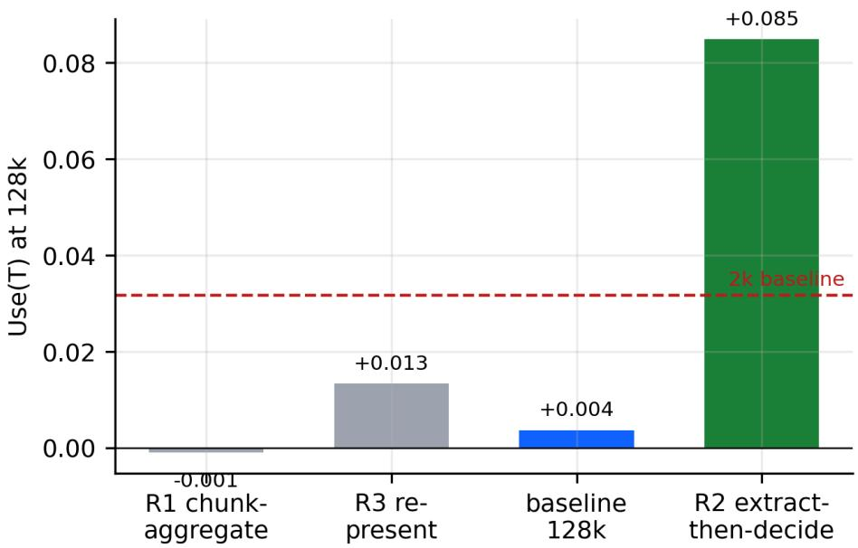

# Reading Is Not Using: Retrieval, Judgment, and the Design of AI Financial Research Workflows∗

Miao Liu† Zhizhe Liu‡

This draft: August 2026

## Abstract

Large language models (LLMs) are increasingly deployed as AI analysts to process financial disclosures and support AI-assisted investment decisions. Yet such systems are usually evaluated by what they can retrieve, not whether retrieved information affects their judgments. We identify a retrieval–integration gap in long-context financial analysis. Holding focal-firm information fixed and varying only unrelated context from 2,000 to 128,000 tokens, we find that a risk disclosure’s influence on investment judgments falls to the experimental noise floor even as direct retrieval remains accurate. The pattern replicates across model families and judgment tasks and in experiments removing real disclosures from actual 10-K filings. More capable models postpone but do not eliminate the gap. Causal memory interventions show that compressed summaries and source-text lookup jointly transmit disclosures into judgments. Workflow architecture determines whether this transmission succeeds: chunk-and-summarize pipelines evict relevant information, whereas a targeted, structured restatement adjacent to the decision restores its influence. AI analyst performance is therefore jointly determined by model capability and workflow architecture. Retrieval-based evaluations can certify systems whose investment judgments ignore information they demonstrably retrieved.

Keywords: Generative AI; large language models; AI analysts; AI-assisted decision making;   
long-context analysis; AI workflow architecture; retrieval–integration gap.

## 1 Introduction

Large language models (LLMs) are becoming AI analysts: they read financial disclosures, answer firm-specific questions, and increasingly support investment decisions. Retail investors query generative AI tools about firms at scale, and aggregate trading activity is associated with the recommendations those tools provide (Ecker et al., 2026). Capital-market intermediaries use AI to help produce investment research (Bradshaw et al., 2026), while the technology is reshaping how information is produced, disseminated, and processed throughout capital markets (Cao et al., 2026). Experimental evidence further shows that interacting with these tools changes investor judgments, and not always for the better (Croom, 2026). By transferring both information acquisition and preliminary analysis to the model, users are doing more than adopting a passive tool: they are delegating a consequential task to an agentic information system (Baird and Maruping, 2021). As LLMs move from document search into AI-assisted decision making, a basic performance question follows: does information that an AI analyst can retrieve actually influence the investment judgment it produces?

Finding information and using it are distinct stages of decision support. The disclosure processing cost framework separates the cost of locating information from the cost of integrating it into a judgment (Blankespoor et al., 2020). Prior evidence similarly shows that reducing information-acquisition costs can change firms’ disclosure choices without eliminating downstream processing frictions (Blankespoor, 2019). LLMs sharply reduce the retrieval cost: when asked a targeted question, a modern model can often recite a covenant threshold or settlement amount from a 100,000-token filing. But retrieval accuracy does not establish decision usefulness. We call the divergence between what an AI analyst can retrieve and what afects its judgment the retrieval–integration gap. We ask whether this gap widens as context grows and whether AI analyst performance depends not only on model capability but also on the architecture of the workflow connecting disclosure reading to investment judgment. This framing treats performance as an outcome of the complete AI system, rather than as an inherent property of the underlying model alone.

We identify the retrieval–integration gap through controlled experiments that measure retrieval and decision influence separately. For each of twelve U.S. registrants, we construct a firm-specific, quantitatively verifiable risk disclosure—such as a covenant threshold, settlement payment, or indemnification cap—that is coherent with the surrounding filing. We define the disclosure’s marginal decision influence as the diference between the model’s investment judgment when the disclosure is present and its average judgment when the same location contains one of five equal-length neutral replacements. We then expand only the economically unrelated, genre-matched surrounding text from 2,000 to 128,000 tokens, leaving the decision-relevant information about the focal firm unchanged. This design isolates the efect of context load from legitimate updating on additional firm information. In separate calls scored against frozen answer keys, we test whether the model can still retrieve the disclosure’s facts. The resulting measures distinguish what an AI analyst can state from what it actually uses. Section 3 provides the complete design, and Table 1 summarizes it.

Integration does not keep pace with retrieval. For our primary open-weight model, the disclosure raises the model’s sell probability by 3.2 percentage points in a 2,000-token filing— an economically meaningful response to one paragraph. Between 8,000 and 32,000 tokens, however, its influence becomes statistically indistinguishable from the efects of inserting neutral text and remains at that empirical noise floor through 128,000 tokens (Figure 1; Table 2). A higher-capability production model postpones but does not avoid the decline: its response falls by roughly half and is no longer distinguishable from neutral-insertion noise at full length. Direct retrieval, by contrast, remains stable. At 128,000 tokens, the primary model retrieves the disclosure for all twelve firms and produces no false retrievals on neutral filings; retrieval by the higher-capability production model is similarly undiminished (Table 3; Figure 3). Nor does context length simply make judgments uniformly less responsive. Across a seven-step severity ladder, the model’s response range compresses by a factor of 5.6 while its ability to order the risks degrades much less (Figure 2). At full length, the model can still rank risks but no longer scales its judgment to their severity. Direct factual accuracy and downstream decision influence therefore separate sharply: reading is not using.

The result is not specific to one model family or to constructed disclosures. The retrieval– integration gap replicates across three independently trained model families, although the context length at which it becomes binding difers across them. It also appears in an exploratory experiment using real disclosures. We identify twenty complete 10-K filings containing self-contained, quantified disclosures and compare the model’s judgment before and after removing the original passage. The real disclosure afects judgment in a short excerpt but has essentially no influence in the complete filing, even though the model retrieves it correctly in all twenty cases (Table 5). Capability shifts the failure frontier outward. The largest open-weight model retains a 3.4-percentage-point efect at 128,000 tokens—approximately what the mid-sized model achieves at 2,000 tokens—whereas a lower-capability commercial system eventually loses retrieval as well as decision influence (Figure 4; Table 4). Capability therefore buys distance from the failure, not evidence of immunity from it: the efective decision context of an AI analyst need not equal its advertised context window.

We next investigate why retrieval and decision influence diverge. Because the processor is a model rather than a person, we can inspect its intermediate representations and intervene directly on the channels through which previously read information reaches the final judgment. Representation analyses first show that the disclosure’s risk content remains stably encoded where it was read at every context length. The model therefore forms a usable representation of the disclosure even in long documents. At the decision position, however, standard probes do not recover disclosure-specific content, and the legibility of the pending decision deteriorates as context grows (Section 5; Figure 5).

The architecture provides two potential transmission channels from reading to judgment: a compressed recurrent state that summarizes preceding content and attention-based lookup over the source text. Causal interventions isolate both channels. Transplanting the compressed state between matched documents removes roughly two-thirds of the disclosure’s influence when the disclosure is erased from that state, even though its source text remains available for lookup. Conversely, implanting the disclosure into the compressed state recreates nearly half of its influence in a document that does not contain it (Table 6). Matched attention-blackout experiments identify a disclosure-specific lookup efect of comparable magnitude, and the two estimated channel efects are statistically indistinguishable. These interventions locate the failure at integration rather than comprehension: the disclosure remains encoded and retrievable, but the channels carrying it into the judgment weaken as competing context grows.

The mechanism generates a direct system-design prediction: reorganizing information flow should be more efective than merely increasing computation. The workflow experiments support that prediction (Section 6; Table 7). Enabling extended reasoning does not restore the disclosure’s influence and reduces it at short context lengths. A generic chunk-andsummarize workflow performs even worse: it eliminates the disclosure’s influence at every length, including 2,000 tokens, because its bounded notes omit the target information before the decision stage sees it. Simply repeating the disclosure verbatim near the decision also accomplishes little. What works is a targeted, structured restatement of the disclosure’s decision-relevant facts placed immediately before the investment judgment while the source filing remains available. This workflow raises the disclosure’s influence at 128,000 tokens to 8.5 percentage points, with all twelve firms responding in the predicted direction. An experimenter-written restatement works as well as the model’s own extraction, and the remedy also succeeds in complete filings containing real disclosures (Tables 8 and 9). The same model, information, and decision task therefore produce materially diferent judgments solely because the workflow routes information diferently. AI analyst performance is jointly determined by model capability and workflow architecture; retrieval-based evaluations can certify systems whose investment judgments ignore information they demonstrably retrieved.

This paper makes four contributions. First, it extends IS research on delegation from the allocation of work between humans and AI to the execution of work within an agentic artifact. Prior research develops theory and evidence on how tasks and decision rights should be allocated between humans and AI and when alternative arrangements improve performance (Baird and Maruping, 2021; F¨ugener et al., 2022). We study the next stage: what happens after an end-to-end task has been delegated and the artifact must carry information across its own processing stages. We identify a distinct post-delegation failure: an AI agent can demonstrably retrieve decision-relevant information yet fail to incorporate it into the judgment it was delegated to form. The retrieval–integration gap thus shows that successful performance on a verifiable intermediate operation need not imply completion of the delegated objective—a failure that becomes increasingly consequential as agentic systems perform multistage tasks with limited human visibility.

Second, we contribute a task-aligned approach to the design and evaluation of generative AI systems. Technically grounded IS design research calls for rigorous artifact evaluation, consequential domain adaptation, and actionable design knowledge (Abbasi et al., 2024). Related research identifies a “construct gap” when the observable proxy around which an ML system is designed omits important dimensions of the decision-relevant construct (De-Arteaga et al., 2025). We identify an analogous gap in AI evaluation: retrieval accuracy is a convenient and observable performance proxy, but it does not establish that retrieved information afects the decision the system is meant to support. To measure that ultimate objective, we introduce marginal decision influence, a continuous counterfactual measure of how much a particular input changes an AI system’s judgment while all other decisionrelevant information is held fixed. The measure reveals that retrieval-based evaluations can certify systems whose downstream judgments are efectively invariant to the facts they successfully retrieve.

Third, we move from detecting the retrieval–integration gap to explaining it and deriving design knowledge. Internal interventions identify two channels through which a disclosure can reach judgment—a compressed running summary and attention-based lookup—and show how context load disrupts the transmission of decision-relevant information. The workflow experiments yield a decision-proximal representation principle: information critical to a judgment should be extracted into a targeted, structured representation and placed at the point of judgment rather than routed through generic, capacity-constrained summaries. Whereas Chen and Chan (2024) show that the consequences of human–LLM collaboration depend on collaboration modality and user expertise, we extend this configuration logic to the internal workflow of a delegated AI analyst. Generic chunk-and-summarize workflows and additional reasoning fail to restore the disclosure’s influence, whereas a targeted, structured restatement succeeds. Consistent with calls to manage AI as an organizationally embedded and partly inscrutable artifact (Berente et al., 2021), our results show that model capability and workflow architecture play distinct but complementary roles: capability moves the failure frontier, whereas workflow architecture determines whether decision-relevant information reaches the judgment at all.

Fourth, we contribute to research on financial disclosure processing and machine readership by distinguishing machine readability from machine decision usefulness. Generative AI does not eliminate disclosure processing costs; it relocates them from finding information to integrating it into judgment (Blankespoor et al., 2020). Retrieval becomes inexpensive, but integration remains sensitive to document length, model capability, and workflow architecture. For investors and intermediaries, this distinction means that an AI analyst should be validated by whether economically meaningful changes in its information produce appropriate changes in its judgment, not merely by whether it answers factual questions correctly. For disclosure regulators, machine-readable presentation and successful retrieval do not establish that a disclosure is decision useful to a machine reader. More broadly, the financial-disclosure setting demonstrates how the information artifact, the model, and the surrounding workflow jointly determine whether available information is transformed into consequential action.

Our mechanism claims are deliberately bounded. We study AI processors, not human cognition, and therefore do not examine whether users trust, accept, or override the resulting recommendations. The connection to the limited-attention literature, in which salience and processing load afect market responses even when information is public (Hirshleifer and Teoh, 2003; Hirshleifer et al., 2009), is an economic analogy rather than a claim that humans and LLMs share a cognitive mechanism. Our analysis instead isolates the reliability of the artifact after a user has delegated the analytical task to it.

Relative to computer-science research on long-context degradation, which shows that additional context can reduce retrieval and reasoning accuracy even when relevant information remains accessible (Liu et al., 2024; Levy et al., 2024; Du et al., 2025), our contribution lies in measuring an economically consequential downstream judgment, holding the focal information set fixed, causally identifying the channels that transmit a retrieved fact into that judgment, and testing workflow remedies. Relative to emerging accounting and finance research on what LLMs can produce from financial statements and market information (Lopez-Lira and Tang, 2026; de Kok, 2025; Cao et al., 2026), we ask whether a particular disclosure changes the model’s judgment. That is the stage at which an AI analyst’s output becomes economically consequential and a disclosure becomes decision useful.

The remainder of the paper proceeds as follows. Section 2 develops the framework and hypotheses. Section 3 presents the experimental design. Section 4 establishes the retrieval– integration gap and its robustness. Section 5 identifies the transmission mechanism, and Section 6 evaluates alternative workflow architectures. Section 7 concludes.

## 2 Background and Hypotheses

## 2.1 Delegation to an Agentic IS Artifact

When an investor asks a language model to read a filing and recommend an action, the model is not being used as a passive tool. The user transfers both the acquisition of information and the analytical work that follows, and receives back a judgment rather than a document. Information systems research characterizes this arrangement as delegation to an agentic IS artifact: the artifact holds decision rights over how a task is carried out, and the user’s role shifts from performing the work to specifying it and accepting or rejecting its output (Baird and Maruping, 2021). A parallel stream studies how tasks should be allocated between humans and machines and shows that delegation improves performance only under particular conditions, since people delegate poorly when they cannot observe where the machine is strong (F¨ugener et al., 2022). Both streams take the boundary of delegation as the object of theory: which party should do what, and with what visibility into the other’s competence.

This paper takes up what happens on the far side of that boundary. Once an endto-end analytical task has been delegated, the artifact must execute it internally, carrying information across its own processing stages—reading the document, forming an internal representation of what it read, and producing a judgment conditioned on that representation. Each stage is a transmission step, and none of them is observable to the user, who sees only the final recommendation. Delegation therefore creates a distinctive failure mode that is invisible at the delegation boundary: the artifact may complete a verifiable intermediate operation and still fail to complete the objective it was delegated to achieve. That divergence between what an AI analyst can retrieve from a document and what actually afects the judgment it produces—the retrieval–integration gap—is what this paper measures.

The gap is consequential precisely because agentic artifacts are trusted on the strength of intermediate evidence. A user who watches a model quote a covenant threshold verbatim from a hundred-page filing has direct evidence that the information was found, and reasonably infers that the subsequent recommendation reflects it. That inference is what we test. Managing AI as an organizationally embedded and partly inscrutable artifact requires knowing which observable behaviors license which conclusions about unobservable ones (Berente et al., 2021), and the retrieval–integration gap is a case in which a highly legible behavior licenses much less than it appears to.

## 2.2 Why Disclosure Processing Makes the Distinction Consequential

Financial disclosure is a setting in which the diference between finding information and using it has long been theorized and has direct economic stakes. A large literature organizes the frictions between mandated disclosure and investor behavior around processing costs: before a disclosure can move a decision, an investor must become aware that it exists, acquire it, and integrate it into a judgment (Blankespoor et al., 2020). The framework’s central move—treating acquisition and integration as separate costs that need not fall together— is exactly the distinction that the retrieval–integration gap makes operational for machine readers. Each stage is costly, and the costs are not small. Annual reports have grown longer and less readable over time (Li, 2008; Loughran and McDonald, 2014), with much of the growth concentrated in boilerplate-heavy sections that bury firm-specific content (Dyer et al., 2017). Market participants respond to these costs the way the framework predicts: when a mandate lowered users’ processing costs, firms supplied more detailed disclosure in response (Blankespoor, 2019), and when machine readership of filings became widespread, firms adjusted how they write to accommodate the machines that now read them first (Cao et al., 2023).

Generative artificial intelligence changes the terms of this bargain more abruptly than any prior processing technology. A large language model can take an entire 10-K in a single pass and, on direct questioning, locate a footnote, quote an amount, and characterize a risk in seconds. Early evidence suggests such capabilities translate into economically meaningful analysis: language models extract decision-relevant information from financial disclosures (Huang et al., 2023; de Kok, 2025), extract return-relevant signals from news (Lopez-Lira and Tang, 2026), predict future earnings changes when fine-tuned on financial statements (Dou and Fu, 2026), and machine analysis of corporate disclosures can rival human analysts forecasts (Cao et al., 2024). Adoption on the user side is no longer hypothetical. Retail investors interact with AI assistants about specific stocks at scale (Ecker et al., 2026), capital market intermediaries visibly use generative tools in their published research (Bradshaw et al., 2026), sell-side analysts adopt them in forecasting (Xue et al., 2025), and the profession is beginning to take stock of how AI reshapes information production and processing end to end (Cao et al., 2026).

Read through the delegation lens, the processing-cost framework yields a sharper question than whether these tools are useful. AI changes the acquisition stage most visibly: once a document is in context, a capable model locates and recites a named item almost without error. (Our design measures exactly this conditional retrieval—of an item the question names—not awareness, and not the time or money costs of processing.) But the framework treats integration as a separate cost, and there is no a priori reason it falls in proportion. Indeed, experimental evidence on human users already hints at a wedge between access and judgment: interacting with a generative AI assistant raises investors’ confidence in their information advantage more than it raises their actual judgment quality (Croom, 2026). This paper asks the analogous question about the artifact itself. When a model demonstrably can retrieve a disclosure—when directed retrieval of the named item is essentially perfect—does the disclosure actually enter the model’s judgment? If retrieval becomes inexpensive while integration does not, the binding constraint on disclosure efectiveness moves from finding the information to finding it and not using it. That distinction separates machine readability from machine decision usefulness, and it is a failure mode that standard evaluations of AI reading comprehension are not designed to detect.

## 2.3 Evaluating a Delegated Decision Task

The evaluation problem is not unique to disclosure. Technically grounded IS design research argues that generative systems should be assessed by rigorous artifact evaluation against consequential domain outcomes rather than by convenient benchmark performance (Abbasi et al., 2024). Research on machine-learning decision support identifies the underlying dificulty as a “construct gap”: systems are optimized and validated against an observable proxy that omits dimensions of the construct the decision actually turns on (De-Arteaga et al., 2025). Retrieval accuracy is such a proxy. It is cheap to score, it is unambiguous, and it certifies that the artifact completed one processing stage—but it is silent on whether the retrieved content reached the judgment the artifact was delegated to form. Closing that gap requires an outcome measure defined on the delegated task itself. We use the marginal decision influence of a disclosure: the change in the artifact’s judgment attributable to the presence of that disclosure, holding all other decision-relevant information fixed. It is continuous rather than binary, defined against an explicit counterfactual, and it moves only when information changes the decision.

Computer science has documented that long inputs degrade language-model performance, and this literature supplies the proximate reason to expect transmission across processing stages to fail. Models answer questions less accurately when relevant material sits in the middle of a long context (Liu et al., 2024); reasoning accuracy falls as inputs lengthen even when the added text is irrelevant (Levy et al., 2024); and efective context windows measured on controlled benchmarks are far shorter than advertised ones (Hsieh et al., 2024a; Yen et al., 2025). The result closest to ours is that of Du et al. (2025), who show that input length alone reduces downstream task performance even when retrieval of the relevant passage is perfect. Mechanistic accounts point to attention: a small set of attention heads carries long-context recall (Wu et al., 2025), and positional biases in attention explain much of the middle-of-context loss (Hsieh et al., 2024b).

Three things are missing from this literature for evaluating a delegated decision task. First, the dependent variable. Benchmark studies score answers right or wrong, which is precisely the proxy whose suficiency is in question; assessing a delegated judgment requires measuring whether retrieved information changes that judgment—a continuous quantity, measured against an explicit counterfactual in which the information is absent. Second, identification. Comparing a short excerpt with a full filing confounds context length with the information the longer document adds; a clean answer requires holding the focal firm’s information set fixed while varying only the surrounding load. Third, consequences and design knowledge. If long-context degradation aflicts delegated financial analysis, the practical question is which processing arrangements restore the lost influence—a question about workflow architecture, and one whose answer is actionable for anyone assembling an AI analyst from a model, a document store, and a sequence of intermediate steps.

A separate lesson from the interpretability literature disciplines our mechanism analysis. That information can be decoded from a model’s internal states does not imply the model uses it: a probe can recover content that plays no causal role in the output, and even interventions on plausible-looking internal directions can produce behavioral efects for uninteresting reasons (Makelov et al., 2024). We therefore treat “the model read it” and “the model used it” as distinct, separately measured claims throughout, and we hold internal-representation evidence to explicit control and resolution standards described in Section 5.

## 2.4 Hypotheses

Our first hypothesis states the retrieval–integration gap as a comparative prediction and translates it into the fixed-information design of Section 3.

H1. Holding the focal firm’s information set fixed, the marginal influence of a risk disclosure on the model’s investment judgment declines as unrelated context grows.

The reasoning is about transmission under load. A delegated analytical task requires the artifact to carry a specific fact from the point where it was read to the point where the judgment is formed, and every additional token of unrelated material competes for the finite representational capacity that carries it. The economic analogue is limited attention: investors underreact to relevant news when competing stimuli crowd the processing stage (Hirshleifer et al., 2009), and disclosure placement and salience matter precisely because attention, not access, binds (Hirshleifer and Teoh, 2003). H1 asks whether an artifact with no fatigue and every word of the filing simultaneously in view exhibits the same signature. We draw the analogy at the level of the prediction, not the mechanism.

H2. The decline in influence is not retrieval failure: at context lengths where the disclosure’s influence on judgment has fallen, the model still retrieves the disclosure accurately under direct questioning.

H2 is what makes the failure a post-delegation failure rather than a reading deficit. If retrieval and influence fell together, longer contexts would simply make models worse readers, the artifact would be failing at an observable stage, and the remedy would be better retrieval. If retrieval survives while influence dies, the artifact completes the stage its evaluator can see and fails at the stage its evaluator cannot—the integration stage that the processing-cost framework identifies as distinct. H2 is thus the test of whether the retrieval proxy sufers the construct gap described above: a system passing it may nonetheless produce judgments invariant to the facts it demonstrably retrieved.

H3. If within-context retention is the operative mechanism, text arriving after the disclosure should reduce its influence more than the same text arriving before it.

H3 localizes where in the artifact’s processing the transmission degrades. Placing filler after the target increases the distance the disclosure must travel to the point of decision; placing it before does not. Architectural considerations make this comparison informative: models with recurrent or compressed sequence processing exhibit measurable limits on carrying early content forward (Jelassi et al., 2024; Arora et al., 2024a). We designate H3 as a pre-specified secondary comparison rather than a primary test, because a null behavioral diference would not rule out retention failures that internal measurements can still detect. H4. Reorganizing the decision process restores the disclosure’s influence at long context; adding computation does not.

H4 is a hypothesis about workflow architecture rather than about the model. If the disclosure is present, retrievable, and nonetheless unused, the deficiency lies in how the system routes information between its stages, not in how much capability or computation it applies at any one of them. Reorganizing that routing—for example, requiring the artifact to state what the filing says about the risk immediately before deciding—should recover influence, whereas allowing the model to deliberate longer should not, and a generic summarization stage that compresses the document before the decision stage sees it may make matters worse. The prediction extends a configuration logic already established for human–AI collaboration, where outcomes depend on how the collaboration is arranged rather than on the model alone (Chen and Chan, 2024), to the internal arrangement of a delegated AI analyst. H4 turns the mechanism into treatments: each remedy in Section 6 corresponds to a distinct hypothesis about where the integration failure sits, their comparative performance is itself evidence about mechanism, and the comparison yields design knowledge about where decision-relevant information should be represented in an agentic workflow.

## 3 Experimental Design

Table 1 summarizes the design. Its purpose is to measure one quantity cleanly: the marginal influence of a single, known risk disclosure on an AI analyst’s investment judgment, as a function of how much other text surrounds it. The design measures retrieval and decision influence separately, in distinct calls, so that what the AI analyst can state about a disclosure and what that disclosure does to its judgment are two independent observations rather than one. That separation is what renders the retrieval–integration gap observable.

## 3.1 The Measurand

Marginal decision influence is a continuous, counterfactual measure of how much one input changes an AI system’s judgment while all other decision-relevant information is held fixed. It is defined on the delegated decision task itself rather than on a retrieval proxy: the quantity of interest is movement in the judgment the AI analyst was asked to produce, not accuracy on an intermediate question about the document. We construct it as follows.

For each firm and context length ℓ, we construct a family of otherwise identical filings that difer only in one paragraph. The target version (T) contains a firm-specific risk disclosure. Five neutral versions $( N _ { 1 } , \ldots , N _ { 5 } )$ replace that paragraph with equal-length neutral text. The marginal decision influence of the disclosure is

$$
\operatorname { U s e } ( \ell ) \ = \ \operatorname { D e c i s i o n } ( T , \ell ) \ - \ { \frac { 1 } { 5 } } \sum _ { m = 1 } ^ { 5 } \operatorname { D e c i s i o n } ( N _ { m } , \ell ) ,
$$

the diference between the model’s judgment with the disclosure present and its average judgment across the neutral replacements. Averaging over five replacements matters because any single replacement text induces its own deterministic shift in a model’s output; the average absorbs those idiosyncrasies so that Use(ℓ) isolates the disclosure itself rather than the accident of what replaced it. Because $\mathrm { U s e } ( \ell )$ is a diference in the artifact’s own decision output, it is expressed in the units of the delegated task and remains well defined regardless of whether the model can articulate the disclosure on request. That is the property a retrieval score lacks, and it is why the two measures can diverge.

The decision readout difers by model class. For open-weight models we read the model’s propensity to recommend selling versus buying directly from its output distribution at a fixed decision prompt—a deterministic, continuous readout that requires no sampling. Commercial API models do not expose output distributions, so for them we elicit a unit-bearing numeric judgment: the probability the firm defaults within twelve months, in percentage points. The two readouts are never mixed; each model’s decline is measured in its own units against its own baseline.

The sell-versus-buy propensity is not the only judgment we elicit. A second task asks, of the identical documents, whether a credit-rating downgrade within twelve months is likely, read out through the same restricted one-token machinery so that the answer is again a deterministic probability. Any conclusion that depended on how the investment question happens to be phrased should fail to survive this change of question; Section 4 shows that the central result survives it.

Separately—in a diferent call, by design—we measure retrieval: we ask the model directly what the filing says about the target matter and score its answer against frozen answer keys covering the disclosed amounts and status. Keeping the retrieval and decision readouts in separate calls is deliberate. It means H2 compares two independent measurements, and no instruction to “first find, then use” contaminates the decision task. The resulting pair—one reading on the retrieval proxy, one on the delegated decision—is what makes the retrieval– integration gap a measured quantity rather than an inference from a single score. Because both readouts are deterministic, diferences across conditions are not sampling noise; run-torun variation is controlled by pinning hardware and software configuration (Appendix B).

## 3.2 Materials

The experimental environment is built from the annual reports of twelve U.S. registrants. For each firm we author a target risk paragraph—a covenant threshold with limited headroom, a litigation settlement, an indemnification cap, or a similar locally describable exposure— containing verifiable amounts and written to be insertable at a specific location in the notes or MD&A. Authoring the paragraph, rather than sampling existing disclosures, is what makes the counterfactual exact: we know precisely what information the neutral versions remove.

The threat to validity from authored text is not whether it “sounds real”; it is whether the inserted fact is consistent with the rest of the filing. Every candidate therefore passes a whole-filing coherence audit against the financial statements, related notes, MD&A, risk factors, legal proceedings, and audit report, and against the filing’s timeline. We impose a single-edit rule: if making the fact true would require changes at more than one location in the filing—restating a covenant table, altering a subtotal—the candidate is discarded rather than patched. Multi-point edits would turn one treatment into several. The audit protocol, per-firm materials, and a seven-level severity ladder used to calibrate the decision readout’s sensitivity (from benign to near-default variants of each disclosure) are described

in Appendix A.

## 3.3 The Length Manipulation

The identification problem with the natural comparison—a short excerpt versus the full 10- K—is that the full filing adds information about the same firm: mitigating detail, related exposures, context that could legitimately dilute or amplify the target’s weight. A rational reader should respond diferently. Our main manipulation therefore holds the focal firm’s information set fixed. Each firm’s material is condensed into a fixed mini-filing containing the target (or neutral) paragraph, its local section context, and the same decision prompt. Context is then extended to 2,000, 8,000, 32,000, and 128,000 tokens by adding text that is economically unrelated to the firm and the target risk but matched in genre—accounting and legal prose of the kind that populates real filings. Nothing about the focal firm changes across lengths; only the surrounding load does.

“Unrelated” is a verified property, not an assumption. Before entering the experiment, filler pools are certified by measuring their efect on pure-filler baselines; filler text does shift the level of model judgments, and the diferenced design absorbs exactly such level shifts. Within each length we also manipulate arrangement: the filler appears either entirely before the focal mini-filing or entirely after it, holding total length and content fixed. The before/after comparison is the pre-specified secondary test of H3.

A finer version of the same manipulation separates how much text the model has read from how far the disclosure sits from the decision. Holding total context fixed at 32,000 or 128,000 tokens, the filler is split around the focal filing so that the disclosure’s distance to the decision question takes values from 1,000 to 64,000 tokens, while the union of filler text remains byte-identical across the cells of each row. If proximity to the decision is what preserves influence, moving the disclosure adjacent to the question should restore it; if total load is what matters, distance should be irrelevant.

Two extensions connect the controlled design to real reporting environments. A samegenre semantic interference arm replaces unrelated filler with risk disclosures of other firms. And an ecological arm inserts the target paragraph into complete, investor-visible 10-K filings—with any conflicting original passages removed through recorded, machine-verified edits—accepting that this condition changes the firm’s information set in exchange for realism (Appendix E).

A third extension removes the authored paragraph from the design altogether. For twenty additional registrants—every filing dated after the models’ training cutofs—we identify a genuinely self-contained, quantified disclosure already present in the filing: covenant headroom, a litigation settlement, an indemnification obligation, a customer concentration. Use is then measured by redaction rather than insertion: the verbatim filing is compared with a version in which the disclosure is surgically replaced by a length-matched neutral paragraph, and every other passage that repeats the disclosure’s distinctive amounts is excised from both versions, so the contrast isolates the disclosure itself. A placebo edit—the same replacement applied to an unrelated, token-matched passage—bounds the efect of editing per se; a window of roughly 2,000 tokens around the disclosure provides the short-context endpoint; and directed retrieval on the redacted version doubles as a probe for leakage and memorization, since a model that answers the retrieval question without the disclosure must be drawing on something other than the document. Materials and audits appear in Appendix A.

## 3.4 Inference

The unit of observation is the firm-filing. Our design and primary contrasts were fixed in advance of the frozen runs reported here; analyses that go beyond them are labeled exploratory where they appear. All formal statements rest on two complementary procedures. First, a firm-level bootstrap resamples the twelve firms with replacement to attach confidence intervals to mean Use(ℓ). Second, and more stringently, we construct an empirical null: for every cell we run ten additional pseudo-target insertions $( P _ { 1 } , \ldots , P _ { 1 0 } )$ , which apply the identical insertion machinery to paragraphs with no decision-relevant content. These pseudo-efects are not zero—insertion itself perturbs a deterministic reader—and they define the noise floor of the instrument. Target efects are judged against this distribution by randomization inference, drawing one pseudo-insertion per firm and recomputing the pooled statistic.

The empirical null enforces a resolution principle that matters most at the long end: a null result at 128,000 tokens is interpretable as a loss of influence only because the same instrument, on the same firms, resolves clearly nonzero efects at shorter lengths. Where the instrument cannot resolve an efect, we say so, rather than reporting an uninformative zero.

## 3.5 Models

Table 1 lists the model set. The primary family is Qwen3.5: a 9-billion-parameter base model serves as the workhorse for all internal-representation analysis, and post-trained 2B, 9B, and 27B variants form a scale ladder that asks whether capability changes the phenomenon rather than merely its level. We flag the workhorse choice openly: it is dictated by instrumentation, not by behavior—the pretrained sparse autoencoders our mechanism analysis requires exist only for base checkpoints—and the base model is not what anyone deploys. The behavioral results therefore report both 9B variants side by side (Table 4), including a post-training anomaly discussed in Section 4 that the base model does not share. Because scale-ladder members must be able to respond to risk at all for their length profiles to be interpretable, each model passes a pre-specified capability gate—it must order the seven-level severity ladder at short context; one candidate control model (a full-attention model from the prior Qwen generation) failed this gate and is excluded from length-decay interpretation (Appendix E).

Two cross-family rows, Llama-3.1-8B and gemma-4-12B, establish that the retrieval– integration gap is not specific to one model family, at the cost of minor measurement accommodations documented in Appendix B. External validity on current commercial systems comes from qwen3.8-max, a production API model, with a dated model snapshot retained for reproducibility, and from Gemini 3.1 Flash-Lite, a low-cost commercial system measured behavior-only as a capability endpoint (Section 4; Appendix Table 22). All open-weight inference runs on pinned hardware, software, and numerical configuration; the same disclosure, at the same length, always meets the same machine.

## 4 The Retrieval–Integration Gap Under a Fixed Information Set

This section establishes the retrieval–integration gap empirically. We first document that the marginal decision influence of the target disclosure declines sharply as context grows, holding the focal firm’s information set fixed (H1). We then show that the decline is not a failure of retrieval: under direct questioning, the same AI analysts recover the disclosure with undiminished accuracy at every length we study (H2), and the same retrieval–integration gap appears when the disclosures are ones firms actually filed. We close the section with three results that discipline interpretation—the efect of model capability, the separation between ordinal and cardinal sensitivity to disclosure severity, and a set of pre-specified secondary analyses.

## 4.1 Declining Decision Influence as Context Grows

Table 2 and Figure 1 report the main result. For the 9B workhorse model, the disclosure moves the investment judgment by +0.032 in sell-probability units at 2,000 tokens, an economically meaningful revision given that the neutral-control baseline places substantial probability on a hold recommendation. As unrelated filler text expands the context—with the focal firm’s information set unchanged—the influence falls to +0.005 at 8,000 tokens, +0.001 at 32,000, and +0.004 at 128,000 tokens. Firm-level bootstrap intervals exclude zero at 2,000 tokens in both arrangements (+0.032 with filler before the focal filing, +0.025 with filler after) and only sporadically thereafter.

Because a small mechanical efect of inserting any paragraph could masquerade as “use,” our inference compares the target efect not with zero but with an empirical null distribution: the same insertion machinery applied to ten irrelevant pseudo-disclosures per firm (Appendix Table 11). Against this null, the 9B model’s use is resolvable at 2,000 tokens (permutation $p \ = \ 0 . 0 2 5$ and $p \ = \ 0 . 0 0 1 5$ in the two arrangements) and at 8,000 tokens in the afterarrangement $( p \ = \ 0 . 0 3 8 )$ ; at 32,000 and 128,000 tokens the target efect is statistically indistinguishable from an irrelevant insertion (all $p > 0 . 5 )$ . This structure is what makes the long-context null interpretable: the same instrument that resolves non-zero use at short lengths finds none at long lengths, so the 128k result reflects a genuine loss of influence rather than a loss of measurement resolution.

Panel B of Table 2 repeats the design on a current production model accessed through its commercial interface, using a unit-bearing readout: the model’s stated twelve-month default probability. The disclosure raises the stated default probability by 6.06 percentage points at 2,000 tokens, and by 3.79, 4.59, and 3.15 percentage points at 8,000, 32,000, and 128,000 tokens. Two complementary tests apply. Against zero, the efect remains significant at every length, including 128k. Against the empirical insertion null, the efect is resolvable through 32,000 tokens $( p \ : = \ : 0 . 0 0 0 5 )$ but falls inside the insertion-noise band at 128,000 tokens $( p = 0 . 1 1 )$ . The two tests answer diferent questions, and we report both: at 128k the production model’s response to the disclosure is nonzero, yet no larger than its response to an economically irrelevant paragraph subjected to the same insertion.

The pattern replicates across model families (Figure 1, Panel A). In the Llama family, use declines monotonically from +0.016 at 2,000 tokens to −0.006 at 128,000; in the Gemma family, from $+ 0 . 0 4 7 \cdot$ —the largest short-context response among the open-weight models—to $- 0 . 0 1 2$ at 32,000 tokens, where only one of twelve firms retains a positive efect. Three architectures with diferent attention designs, training data, and providers produce the same qualitative phenomenon: strong use of the disclosure in short contexts, decay toward (and occasionally through) zero as unrelated text accumulates. The decay is therefore not an idiosyncrasy of one model family, and—because the focal firm’s information is fixed by construction—it cannot reflect rational updating on new information. The design’s primary contrast can also be tested directly as a within-firm paired diference, $\mathrm { U s e } _ { 2 k } - \mathrm { U s e } _ { 1 2 8 k } ;$ : the decline is $+ 0 . 0 2 6$ for the workhorse model with arrangements pooled (exact sign-flip $p =$ 0.0044), +0.015 for Llama $( p = 0 . 0 0 1 0 )$ , and $+ 0 . 0 4 0$ for Gemma $( p = 0 . 0 3 5 2 )$ , while the production model’s paired decline (+2.47 percentage points) is not statistically resolved $( p = 0 . 1 9 9 )$ and its curve should be read as a point-estimate pattern (Appendix Table 19). Related work documents that input length degrades task accuracy (Levy et al., 2024; Liu et al., 2024), and does so even when retrieval is verified perfect (Du et al., 2025); our contribution here is to show the analogous result for the economic weight a model places on a financial disclosure, under a design that separates pure context load from information content.

Nor does the decline depend on how the judgment is elicited. Asked instead whether a credit-rating downgrade is likely—a diferent economic question, read out through the same one-token machinery—the workhorse model’s use of the disclosure falls monotonically from $+ 0 . 0 4 9$ at 2,000 tokens, an efect roughly seven times the dispersion across neutral versions, to $+ 0 . 0 0 6$ at 128,000 in the after-arrangement (Appendix Table 20). The decline is a property of the judgment stage, not of one question’s phrasing.

## 4.2 What the Disclosure Still Does: Ordinal Without Cardinal

The single-disclosure efect of the previous subsection has a natural yardstick: how much can this disclosure move the judgment at all? To answer, each firm’s target exists in seven calibrated severity variants, from nearly innocuous to near-default, and the ladder is run in full at both endpoint lengths. At 2,000 tokens the primary model’s judgment tracks severity clearly in aggregate: the most severe variant draws a higher sell probability than the mildest for twelve of twelve firms, severity-level means pooled across firms rise monotonically through the ladder, and pairwise ordering accuracy is 0.929—though the full seven-level ordering is strictly monotone within only two individual firms. The pooled response spans 0.23 in sellprobability units from the mildest to the most severe variant—the scale against which the baseline efect of +0.032 (roughly 14% of the full span) should be read. At 128,000 tokens two things happen at once (Figure 2): the range of the response collapses from 0.23 to 0.04—a factor of 5.6—while the model’s ability to order severities degrades only modestly (pairwise ordering accuracy falls from 0.93 to 0.79). Because the compression statistic is a ratio of the model’s own response spans, it is unit-free and does not depend on the noise-floor argument that bounds the single-disclosure result. The production model shows the same asymmetry in attenuated form, retaining 88% of its severity response range at 128k (35.8 to 31.5 percentage points).

The disclosure’s surviving footprint at long context is therefore ordinal rather than cardinal: the model still partially ranks worse news as worse, but transmits almost none of the magnitude into its judgment. An investor relying on such a system would receive directionally sensible but economically flattened judgments—a risk ranked correctly but weighted at close to nothing.

## 4.3 The Decline Is Not Retrieval Failure

A natural reading of Section 4.1 is that the model simply loses the disclosure in the haystack: with 128,000 tokens in context, it can no longer find the covenant threshold or the settlement amount, so the disclosure cannot afect its judgment. Table 3 and Figure 3 reject this reading.

In a separate call on the identical documents, we ask each model directly what the filing says about the target matter and score its answer against frozen fact keys. The 9B model passes this retrieval test for twelve of twelve firms at every context length, including 128,000 tokens, where its behavioral use of the same facts is statistically indistinguishable from an irrelevant insertion. The Gemma model retrieves the disclosure for twelve of twelve firms at 2,000 tokens and ten of ten at 128,000 tokens—at which lengths its measured use is approximately zero—and the production model’s retrieval completeness is essentially flat (0.77, 0.76, 0.72, 0.74) across the four lengths. Neutral-control filings discipline these numbers: the Qwen models produce zero false-positive “retrievals” on filings from which the target was removed, across hundreds of control calls, so the retrieval scores do not reflect a model willing to assert facts that are not in the document.1

The divergence between these two measurements is the retrieval–integration gap, and it is the central fact of the paper. At 128,000 tokens the model can state the covenant threshold, the remaining headroom, and the consequence of breach—and its investment judgment does not move. In the language of disclosure processing costs (Blankespoor et al., 2020), our design holds the awareness stage fixed—the retrieval question names the issue— and shows that, conditional on that naming, directed retrieval stays essentially perfect at every length we study. What does not survive is the integration of the located disclosure into a revised judgment. Within the stages the design can separate, integration, not retrieval, binds. This is also the evaluation point: retrieval accuracy is an observable and convenient proxy for whether an AI analyst has processed a disclosure, but it does not establish decision usefulness. An artifact audited only on what it can state would pass every check in Table 3 while its investment judgments remained invariant to the facts it demonstrably retrieved.

The gap is not an artifact of our constructed mini-filings. In an ecological validation, we surgically insert the target disclosure into the firms’ complete, investor-visible 10-K filings (removing any conflicting original passages through recorded, machine-verified edits). On these complete filings, retrieval completeness is 0.931 while measured use is approximately zero (Appendix Table 17)—the same retrieval–integration gap, in the information environment investors actually face.

## 4.4 Real Disclosures, Surgically Redacted

Constructed materials buy identification; the natural objection is that investors do not read researcher-authored paragraphs. The redaction design of Section 3 addresses it on twenty actual filings, using disclosures the registrants themselves wrote, in an analysis we label exploratory and capability-conditional. On the most capable open-weight model, removing a real disclosure from a roughly 2,000-token excerpt moves the investment judgment by +0.037 on average across all twenty filings, with a confidence interval that narrowly includes zero $\left( \left[ - 0 . 0 0 3 , + 0 . 0 7 9 \right] \right)$ ; on the sixteen disclosures labeled unambiguously adverse, the efect is +0.042 with an interval excluding zero $( [ + 0 . 0 0 3 , + 0 . 0 8 9 ] )$ . The same removal from the complete filing moves the judgment by $+ 0 . 0 0 0 \ \left( \left[ - 0 . 0 0 3 , + 0 . 0 0 3 \right] \right)$ , indistinguishable from the placebo edit (+0.001), while directed retrieval on the complete filings passes for twenty of twenty firms (Table 5). A disclosure the model demonstrably reads—written by the registrant, in the place the registrant put it—appears to influence the judgment when the surrounding document is short and loses that influence entirely at full length.

Two qualifications attach. First, the workhorse 9B model shows no excerpt-level response to real disclosures (−0.006). Real filings are denser and less curated than the constructed materials, and a mid-sized model does not extract a usable signal from a single real paragraph even at short length; the real-disclosure result therefore rests on the capable model, a capability moderation consistent with the next subsection. Second, real disclosures are directionally heterogeneous—a settlement can resolve a litigation overhang, and a covenant paragraph can certify comfortable compliance—which is why the adverse-only subset is the sharper test, and why the constructed materials, with their calibrated severity, remain the workhorse of the design.

## 4.5 Capability Moves the Horizon Outward

Does the problem disappear as models improve? Table 4 and Figure 4 address the question within a single model family, holding tokenizer lineage and training pipeline approximately constant. The smallest (2B) model shows weak, noisy use—it responds to the disclosure at 2,000 tokens (+0.023) but discriminates within a compressed band around a strong prior toward selling, and its length profile is not monotone (Appendix Table 10 reports the capability gate that documents this compression). The 9B base model resolves use at 2,000–8,000 tokens, as above. The 27B model uses the disclosure far more at every length (+0.105 at 2,000 tokens) and is the only open-weight model whose use remains statistically significant at every length in both arrangements, with a 128k efect (+0.034) roughly equal to the 9B models’ short-context efect. The production-scale commercial model, as noted, resolves use through 32,000 tokens.

A low-cost commercial system from a third family anchors the bottom of the capability range (Appendix Table 22). With its reasoning fixed at the lowest setting its provider allows, Gemini 3.1 Flash-Lite shows the retrieval–integration gap on the recommendation readout: its use of the disclosure falls from +0.165 at 2,000 tokens to +0.042 at 32,000 and +0.029 at 128,000—retaining roughly 18 percent of its short-context level—and its severity span compresses by a factor of 2.5 (45.0 to 18.0 percentage points), between the open-weight workhorse’s 5.6 and the production system’s 1.14. Uniquely among the systems we study, its retrieval also degrades, from twelve of twelve firms at 2,000 tokens to seven of twelve at 32,000 and 128,000. Even there the gap retains its shape—retrieval falls to 58 percent of its short-context level while use falls to 18 percent—but the result marks a capability floor below which the lookup stage itself begins to fail. Capability, in short, buys distance from the failure at both ends of the commercial range, and several currently deployable open-weight and commercial systems—every open-weight model in our ladder and the production system above—operate well inside their failure horizons.

Table 4 also reports the post-trained 9B variant, and we flag its behavior openly because it is the one result in the family that does not fit the pattern. In the before-arrangement shown in the table, the post-trained 9B responds to the risk disclosure with a significantly negative use at 8,000 tokens and beyond (−0.030 to −0.051, all intervals excluding zero), while in the after-arrangement its use is significantly positive at the same lengths (+0.009 to +0.019; Appendix Table 15). This is not an artifact of low capability—the post-trained 9B has the strongest severity discrimination in the entire ladder $( S _ { 7 } - S _ { 1 }$ range of +0.42, versus +0.23 for its base counterpart; Appendix Table 10)—and we do not have a mechanism for it. What the pattern indicates is that post-training changes not only how strongly a model responds to a risk disclosure but the sign structure of that response across document layouts, an instability that the base model does not share and that deployment-oriented evaluations of AI analysts should be aware of. The capability conclusion above does not depend on this rung: it rests on the 2B–27B endpoints and on the production model, which agree.

We summarize this pattern as an integration horizon that moves outward with capability: more capable models sustain the disclosure’s influence deeper into the context. Within every model whose horizon lies inside our design, the influence at the longest contexts is a small fraction of its short-context value: the horizon moves, but nothing in the ladder suggests the gap closes except by buying a more capable reader. For practice, the implication is doubleedged. Disclosure efectiveness under AI readership depends on which reader an investor can aford, and the context lengths at which mid-tier commercial systems are marketed for full-filing analysis are precisely the lengths at which those systems no longer distinguish the target disclosure from an irrelevant insertion.

## 4.6 Secondary and Additional Analyses

Placement and distance of the added text. Our design varies whether the filler precedes or follows the focal filing, a contrast pre-specified to speak to retention-based mechanisms. Once use itself is small, however, this diference-of-diferences asks more resolution of the behavioral instrument than it has: on the workhorse model, at every length, the placement gap is within the range produced by the insertion machinery alone (Appendix Table 14); on the post-trained 9B the contrast is confounded by the sign instability just discussed. The fixed-total factorial of Section 3 speaks to one side of the question directly: holding total context at 32,000 tokens while the disclosure’s distance to the decision question moves from 1,000 to 24,000 tokens—or at 128,000 tokens while it moves from 1,000 to 64,000—leaves use flat at the noise floor in every cell (Appendix Table 21). At lengths past the failure horizon, then, proximity does not rescue the disclosure: bringing it within 1,000 tokens of the decision recovers nothing. Below the horizon, where use is alive, two direct contrasts speak to the explanations. Holding total context at 8,000 tokens and moving the disclosure from 1,000 to 5,500 tokens before the decision changes use by less than 0.0001 in absolute value (95% CI [−0.007, +0.009], exact $p = 0 . 9 9 )$ ; holding distance at 1,000 tokens and raising total context from 8,000 to 32,000 lowers use by 0.008 (CI $[ + 0 . 0 0 2 , + 0 . 0 1 5 ]$ 2 $p = 0 . 0 3 )$ . In the tested cells, then, total context load matters and a moderate change in distance does not—evidence supporting, though not by itself fully separating, the two explanations, and consistent with the capacity-limited running summary Section 5 examines.

Repetition. Disclosure salience matters when the reader’s attention is limited (Hirshleifer and Teoh, 2003), and repeating a disclosure is a natural prescription for raising it. Repeating the target paragraph (holding total length and the position of the final occurrence fixed) helps only partially and not uniformly: four occurrences raise use above the singleoccurrence level in the pooled length cells, while two occurrences do not improve every cell, and at 128,000 tokens even four occurrences deliver less than a third of the influence a single occurrence commands at 2,000 tokens. Repetition partially refreshes, but does not restore, the disclosure’s weight.

Semantically similar context. When the added text consists of other firms’ risk disclosures of the same type—rather than economically unrelated material—the production model’s use falls further (+3.7 versus +5.5 percentage points at 2,000 tokens) and turns negative at 8,000 tokens (−4.3), consistent with interference from competing, similar-sounding information rather than pure context load (cf. Hirshleifer et al., 2009). The local 9B model shows no such separation, suggesting that susceptibility to semantic interference is itself capabilitydependent.

Sign inversions. Finally, in two model families the point estimate of use turns negative at long context with confidence intervals excluding zero (Gemma at 32,000 tokens, −0.012; Llama at 128,000 tokens, −0.006; Appendix Table 15): the risk disclosure makes these models marginally less inclined to sell. With roughly forty cells tested, about two such stars would be expected by chance, and we treat the inversions as suggestive. We note them because they echo across independent architectures at adjacent lengths, and because a mildly contrarian response to half-processed risk news is, if real, more troubling for users than simple neglect.

## 5 Mechanism: Where the Disclosure Is Lost

The behavioral evidence in Section 4 establishes the retrieval–integration gap: a disclosure the AI analyst can retrieve on demand loses its influence on the judgment it produces as context grows. Behavior alone, however, cannot say where inside the artifact the disclosure is lost. Three accounts are consistent with the same outward pattern. The system may never form a usable internal representation of the disclosure once the document is long. It may form that representation but fail to carry it forward to the point at which the judgment is produced. Or it may carry the information forward and simply fail to weight it. These accounts have diferent implications for design and practice—the first is a reading failure, the second a transmission failure, the third a judgment failure—and they suggest diferent remedies. Because the delegated analyst is an artifact rather than a person, we can do what archival research on human information processing cannot: open the processor and measure its intermediate states directly (Blankespoor et al., 2020).

## 5.1 Two Instruments

We measure internal states through two independent instruments. The first is a vocabularyspace probe (Gurnee et al., 2026), which reads any internal representation out along directions that correspond to the model’s own vocabulary; intuitively, it asks what words an internal state “says,” and how loudly, at any point in the document and at any depth in the model. To our knowledge this is the first application of the method in information systems research. The second instrument is a dictionary of interpretable directions estimated by a sparse autoencoder (Deng et al., 2026; Templeton et al., 2024); from this dictionary we freeze a small set of risk-concept features—directions that activate on covenant, default, and litigation language—and measure how strongly they fire at chosen positions. The two instruments are estimated independently and measure diferent things: the probe measures whether particular words are readable from a position; the feature dictionary measures whether particular concepts are present there. Implementation details, layer selection, and calibration are in Appendix C.

Both instruments are applied at two locations in every filing: the disclosure position—the tokens of the target paragraph itself—and the decision position, the final token before the model produces its recommendation, where whatever information the judgment draws on must be available.

## 5.2 The Disclosure Stays Encoded Where It Was Read

The first result rules out the reading-failure account. At the disclosure’s own position, the probe finds the risk vocabulary of the target paragraph readable at essentially constant strength regardless of document length: the median rank of the best risk word is stable (approximately 80, 52, and 67 at 2k, 32k, and 128k tokens) at the model’s reading layer. The feature dictionary agrees: risk-concept activation at the disclosure position is flat from 2k to 128k tokens and strongly target-specific at the encoding layer (roughly sixty times more intense on target filings than on neutral controls at 2k, and thirty-fold at 32k and 128k). Whatever the model does with the disclosure downstream, it forms the same local representation of it in a 128k-token filing as in a 2k-token one. This is the internal counterpart of the retrieval result in Section 4: the model reads the disclosure, and its reading does not degrade.

## 5.3 The Decision Stage Never Holds the Disclosure—and Degrades with Length

The decision position tells a diferent story, and it is sharper than a simple mirror image. Neither instrument detects disclosure-specific signal at the decision position at any length. The feature dictionary finds no disclosure-specific risk content there: target and neutral filings are statistically indistinguishable even at 2k tokens, where behavior responds strongly (Panel B of Figure 5). The probe agrees: the legibility of the model’s pending answer at the decision position is the same on target and neutral filings (median target-to-neutral ratio approximately 1.0 at every length). What the probe adds is that this legibility—whatever the filing contains—degrades roughly eightfold as context grows (the median rank of the best decision token moves from 68 at 2k to 454 at 32k and 533 at 128k tokens; Panel A of Figure 5). Both instruments test particular signal classes—vocabulary-readable directions and a frozen feature dictionary—so these nulls bound what the decision position detectably holds rather than everything it could possibly encode.

Read together, these facts favor a particular architecture of the failure. If the decision position detectably holds no disclosure content even when influence is strong, a natural account is that the influence is mediated by the model’s ability to draw, at the moment of judgment, on memory formed earlier—whether by reaching back to the disclosure’s own position, where the content remains fully intact, or through an intermediate store. A division of labor in which content stays where it was encoded and is fetched when needed is the account of factual recall developed in the interpretability literature (Geva et al., 2023; Wu et al., 2025; Feng and Steinhardt, 2024; Olsson et al., 2022; Variengien and Winsor, 2023), and it gives representational form to the behavioral finding of Du et al. (2025) that length harms performance even when retrieval is perfect. On this reading, the failure documented in Section 4 is a transmission failure located at integration rather than at comprehension: the reading is intact, the reader is intact, and what degrades with length are the channels connecting them at decision time. The causal experiments below ask which channels those

are.

Two validation results discipline this interpretation. First, our primary model family interleaves fixed-size linear-attention layers with standard full-attention layers, and fixed-size recurrent state is a natural suspect for retention pressure (Jelassi et al., 2024; Arora et al., 2024a); the probe, however, had previously been validated only on standard architectures. A calibration exercise across adjacent layer pairs shows that readability tracks depth, not layer type—adjacent linear- and full-attention layers agree pairwise—so the decay we measure is not an artifact of the architecture’s unusual layers (Appendix C). Second, the decay reproduces across independently chosen layers and across the two endpoints of the severity ladder, so it is not a peculiarity of one probe location.

The remainder of this section probes the transmission account causally by editing the artifact’s internal computation directly. The architecture provides two transmission channels through which information read earlier can reach the judgment: a fixed-size recurrent memory state that summarizes preceding content, referred to intuitively below as a running summary, and attention-based lookup over the source text. The verdict, stated in advance: both channels carry the disclosure. Matched-slot blackouts produce a disclosure-specific attention efect equal to 44 to 48 percent of the disclosure’s contrast; channel transplants show the running summary removing about two-thirds and recreating nearly half; and the two estimated channel efects are statistically indistinguishable in size, so the result is a dual-carrier identification, not a ranking.

## 5.4 Which Channel Carries the Disclosure to the Judgment

A language model of our workhorse’s class maintains both transmission channels while it reads. The first is a lookup store: the attention mechanism keeps every token’s representation and can, in principle, consult any of them when a later computation asks for it. The second is the running summary: the model’s linear-attention layers compress everything read so far into a recurrent state of fixed size, updated token by token, in the manner of a reader keeping cumulative notes rather than re-consulting the document (Katharopoulos et al., 2020; Yang et al., 2025). A fixed-size summary has a known limitation: its capacity to retain any individual fact falls as more text competes for the same space (Arora et al., 2024b; Jelassi et al., 2024; Arora et al., 2024a). This combination of the two channels is a design shared by a growing set of recently released long-context architectures (Yang et al., 2025; Deng et al., 2026), so the question of which channel carries a disclosure into a judgment is not a curiosity of one model.

We first locate the lookup route. Measuring, at the moment of decision, how much attention each head directs at the disclosure’s tokens—against matched neutral text in the same slot—identifies a small set of heads whose reading is content-driven with high cross-firm consistency (eight to twelve of twelve firms across the five most selective heads); in the hybrid workhorse these heads concentrate in the model’s later layers, while in the pure-attention comparison architecture the most selective heads split between the first layer and the late layers (Appendix Table 23). At full length this content-selective reading collapses to a few percent of its short-document strength in both architectures while directed retrieval remains intact: the lookup route visibly exists, and visibly withers with length.

Visibility, however, is not causal weight. Severing the identified heads’ access to the disclosure—zeroing their attention to its tokens throughout the decision computation, with random-head and wrong-span controls, following standard practice for such interventions (Meng et al., 2022; Wang et al., 2023; Zhang and Nanda, 2024)— leaves the judgment unchanged: the selective heads are individually redundant. Severing every attention head’s access is a diferent matter. The operative matched control is the identical blackout applied to the neutral document’s slot, and it is cleanly null; netting it out, the disclosure-specific efect of removing all attention access is 44 to 48 percent of the disclosure’s own contrast, in ten to eleven of twelve firms depending on scope (Appendix Table 24). A further sham that blacks out a content-free span proved unstable across firms and is reported as a failed control rather than used in the identification, which rests on the matched neutral-slot diference. The lookup route, once properly identified, carries a substantial share.

A complementary intervention concerns the running summary. Because target and neutral filings are byte-identical outside the disclosure’s slot, both can be processed to the end of that slot and their two memories recombined—the lookup store from one reading spliced with the running summary from the other—before the identical remainder of the document is processed (Table 6). When the model reads the target filing but its running summary is the one formed on the neutral filing, roughly two-thirds of the disclosure’s influence disappears (a ratio of full-sample means of 65 percent) although the disclosure sits intact in the lookup store. When the model reads the neutral filing but its running summary is the one formed on the target filing, nearly half of the influence appears from nothing (44 percent) although the disclosure is nowhere in the document being processed. A neutralto-neutral sham transplant—identical surgery, nothing to transmit—moves the readout by 0.046 in unsigned magnitude, 37 percent of the removal efect and 54 percent of the smaller recreation efect, bounding the generic component of the intervention. The sham’s signed per-firm mean, however, is $+ 0 . 0 0 8$ (95% CI $[ - 0 . 0 1 0 , + 0 . 0 2 4 ] \rangle$ : the surgery perturbs the read out without pushing it in any particular direction, and the real removal exceeds the sham within firm by +0.116 (eleven of twelve firms, exact sign-flip $p = 0 . 0 0 2 \mathrm { : }$ ; Table 6). Both real directions are consistent in ten of twelve firms; one firm responds to neither transplant and is reported as an exception, and the remaining limitations—a single neutral counterfactual and no additivity across channels—are stated in the table and appendix.

The picture these interventions paint jointly is of two working transmission channels rather than one: the running summary and attention-based lookup each carry a substantial share of the disclosure’s influence, the two estimated efects are statistically indistinguishable in size when compared firm by firm (paired diference of the removal against the directional attention removal, +0.025, exact sign-flip $p = 0 . 5 4$ ; Appendix Table 24), and they need not, and do not, sum to one, because the channels feed each other during processing. What unifies them is what happens under length. The distance experiment speaks to the two candidate explanations: at below-horizon totals the disclosure’s influence is alive and flat in its distance to the decision in the tested cells, while it declines significantly in total context at fixed distance (Section 4, Appendix Table 21) —a pattern supporting capacity pressure on memory formed during reading over a lengthening reach at decision time. Directed retrieval survives because a question that names the disclosure can redirect the intact lookup route. The response range compresses before the ordering does, as a fading trace loses magnitude before sign. And the earlier finding that no single internal direction carries the judgment (Appendix D) fits an account in which the operative state is distributed and compressed rather than localized (Geva et al., 2023; Vig et al., 2020; Makelov et al., 2024).

The mechanism conclusion we defend is therefore the following: the retrieval–integration gap is a failure of integration rather than of comprehension—the disclosure remains encoded and retrievable, the judgment machinery is intact, and what weakens as competing context grows are the channels that carry the disclosure into the judgment—and both channels, the fixed-size recurrent running summary and attention-based lookup, are causally implicated as substantial carriers, with no resolvable ranking between them. The dilution dynamics of the summary itself are consistent with every behavioral signature but await designs that manipulate its capacity directly. Locating the failure in transmission rather than in reading also yields a design implication we take up next: if decision-relevant information is lost between reading and judgment, the leverage lies in how a workflow routes that information to the point of judgment rather than in how much computation the artifact expends once it arrives there. Section 6 tests that implication against alternative workflow architectures.

## 6 Workflow Architecture: Routing, Not Computation

If the mechanism section is right that the disclosure is lost in transmission—read faithfully, encoded stably, but no longer legible at the point of judgment—then the retrieval–integration gap should be closable by rearchitecting the workflow that carries information from reading to judgment, and closable in a particular way: workflows that route the disclosure’s content back within reach of the decision should work, while interventions that merely add computation, or that sever the judgment from the original document, should not. Our fourth hypothesis (H4) predicted that reorganized processing—chunked summarization, forced reconciliation of the retrieval answer with the decision, and pre-decision re-presentation—would restore the disclosure’s influence at long context. As the results below show, only one of the predicted reorganizations does, so H4 is partially supported, and the failures of the other two predicted remedies turn out to be as informative as the success. The workflow experiments test four protocols, each an alternative workflow architecture tied to the same outcome variable Use(ℓ), on the same twelve firms and the same workhorse model as the main design (Section 3). Table 7 and Figure 6 summarize the results at 128k tokens; Appendix Table 12 reports both filler arrangements. Two further sets of treatments then sharpen the result: a matched decomposition that probes which ingredients of the successful workflow matter (Table 8), and a replication of the key workflows on complete real filings (Table 9).

## 6.1 Four Workflow Architectures

Extract-then-decide asks the model the directed-retrieval question first—what does this filing say about the target matter, with amounts and status—and then prepends the model’s own answer to the decision prompt, with the full filing still in context. It changes no information; it only makes the model restate what it already knows before deciding. Chunkthen-aggregate processes the filing section by section, collects the model’s extraction notes from each segment, and asks for a decision on the consolidated notes; this is our bounded, generic implementation of a chunked, note-based workflow used when documents exceed comfortable context sizes—a diferent architecture from retrieval-augmented generation proper, which retrieves from an external index (Lewis et al., 2020)—and our results speak to this implementation rather than to every variant deployed in practice. Re-present places a verbatim copy of the target paragraph immediately before the decision question, adapting the recitation-style mitigation proposed in the long-context literature (Du et al., 2025). Finally, on the production API model we vary extended reasoning across three efort tiers, holding the document and prompt fixed—the vendor’s own mechanism for spending more computation on a harder problem.

## 6.2 A Sharply Ordered Gradient Across Workflows

The four workflow architectures produce a gradient far more ordered than we anticipated. The cleanest statistic is the within-protocol retention rate: the share of a workflow’s own short-context influence that survives at 128k tokens. Under the baseline, 12 percent survives $( + 0 . 0 3 2  + 0 . 0 0 4 )$ . Under extract-then-decide, 67 percent survives $( + 0 . 1 2 6  + 0 . 0 8 5 ) -$ the workflow raises the length retention of the disclosure’s influence by a factor of five, with all twelve firms responding in the same direction at 128k (the after-arrangement figures are similar; Appendix Table 12). Because the ratio compares each workflow with itself, it is immune to the observation that the workflow also amplifies influence at short context (+0.126 at 2k)—making the model restate a disclosure evidently makes it salient wherever it sits—and the diferenced design keeps even the levels honest, because the neutral-control filings pass through the identical workflow. As color rather than argument: the workflow’s 128k influence exceeds the unassisted 2k baseline. Retention of 67 rather than 100 percent also records, honestly, that rearchitecting the workflow attenuates without eliminating the underlying erosion.

Chunk-then-aggregate sits at the opposite end of the gradient, and its result is the most practically consequential in the paper. Deciding on the model’s own consolidated notes eliminates the disclosure’s influence entirely: −0.001 at 128k, and—strikingly—−0.001 at 2k as well, where the entire document fits within a single chunk and the “pipeline” reduces to summarize-then-decide. Sign counts across firms are indistinguishable from coin flips.

An audit rerun that archives every note verbatim decomposes this zero, and the decomposition is unanimous (Appendix Table 18). Scored against the same frozen fact keys used for directed retrieval, the target disclosure is absent from the consolidated notes in twenty-four of twenty-four firm-arrangement cells at 2k, and in twenty-one of twenty-four at 128k. The notes reveal why: under a per-segment token budget typical of practical pipelines, the model transcribes facts from the head of each segment—revenue, expenses, cash—until our per-segment budget binds (many notes truncate mid-sentence), and a single-paragraph risk disclosure loses the competition for note space before the decision stage ever sees it. The failure is not decision-stage neglect of extracted facts; it is eviction at extraction. This also explains, in one stroke, why extract-then-decide sits at the opposite end of the same gradient: the two workflows run the same model over the same filing, and difer only in how they route information—in whether extraction is targeted (a directed question about the matter at hand) or budgeted and generic (summarize everything in k tokens). Targeted extraction retains the disclosure; budgeted summarization evicts it. The practical reading is stated at the strength the evidence supports: our bounded, generic implementation of a retrieve-summarize-decide pattern reproduced none of the disclosure’s decision influence in our setting, at any length.

The remaining two workflows bracket the mechanism. Re-presenting the disclosure verbatim before the question—injecting the raw source paragraph where extract-then-decide injects a structured, targeted answer—moves essentially nothing (+0.013 at 128k, seven of twelve firms positive, within the noise band of the empirical null); what separates the two workflows, whether authorship or the form the injected text takes, is the question the decomposition below is designed to probe. And in the one setting where we test the computation margin—the production API model’s own extended-reasoning modes, a diferent system from the workhorse that runs the workflow treatments—no efort tier restores any influence at 128k tokens, while at 2k tokens enabling reasoning reduces measured use from +5.5 to between +0.7 and +1.9 percentage points (arrangement-pooled figures; Appendix Table 13 reports the before-arrangement, +6.1 to +1.9/+2.0). In the tested vendor’s reasoning modes, more thinking about the same context does not put the disclosure back into

the judgment; at short context it appears instead to dilute it.

## 6.3 Decomposing the Successful Workflow

Extract-then-decide bundles several ingredients: the restatement is produced by the model itself, it answers a targeted question about the focal matter, it arrives in a compact structured form, and it sits immediately adjacent to the decision with the filing still in context. To separate them, we run five matched conditions that inject text into the identical position, with the identical framing, before the identical decision question (Table 8). The model’s own targeted extraction yields +0.113 at 2k and +0.055 at 128k (after-arrangement). An extraction written by the experimenter from the disclosure’s answer key—same facts, same structured form, same token budget—yields +0.151 and +0.056: statistically indistinguishable from the model’s own, and if anything larger at short length. The identified conclusion is therefore precise but narrow: conditional on the same structured, targeted form and content, the model’s own authorship is not necessary. A targeted extraction produced by a diferent, less capable model recovers about a quarter of the efect at 128k (+0.013, with an interval that includes zero)—a deficit consistent with that model’s lower extraction fidelity, though the five conditions jointly vary targeting, structure, compactness, fidelity, and wording, so no single mediating ingredient is isolated. The two unstructured conditions recover little: the model’s own words in verbatim form (asked to copy, not to answer) retain a small but reliable efect at 128k (+0.018), and the re-presented source paragraph essentially none. What the pattern points to is a targeted, structured restatement adjacent to the decision as the operative package. For practice the authorship result is suggestive good news: it implies the workflow need not depend on the model’s introspection, and that a research workflow could supply the focal extraction externally—though we have tested an experimenter-written answer key, not analyst workflows in the field.

## 6.4 Complete Real Filings

The workflow ordering survives the move from constructed documents to complete statutory filings. On the twelve complete, surgically edited real 10-Ks of Section 3, direct reading of the full filing leaves the disclosure without influence (−0.004)—the ecological replication of the main result—and the two poles of the gradient reproduce around that zero (Table 9). Chunk-then-aggregate cannot destroy what direct reading already fails to deliver, but its notes audit shows the same eviction documented above operating on real filings: across seven to fifteen chunks per filing, the disclosure’s facts survive into the consolidated notes in zero of twelve cases. And extract-then-decide does not merely retain influence here—it creates it where direct reading produces essentially none (the direct baseline is in fact slightly negative, −0.004), reaching +0.043 with eleven of twelve firms positive (95 percent interval [+0.026, +0.059]). On real filings as on constructed ones, whether a disclosure reaches the recommendation is a property of the workflow architecture, not of the disclosure.

## 6.5 What the Gradient Teaches: The Decision-Proximal Representation Principle

Two features of the pattern discipline its interpretation. First, the successful workflow and the failed ones are separated not by whether the disclosure’s substance is placed before the decision—re-present puts the source paragraph itself there—but by the form the routed information takes and what remains in view. Influence returns when a targeted, structured answer to the focal question sits adjacent to the decision with the source document still present, whether the model or the experimenter wrote it; it largely does not return when the raw passage is re-presented, and it disappears altogether when the document is replaced by notes. This is the shape the mechanism evidence would predict: if the judgment draws on the model’s running summary of the document, a compact restatement placed at the point of decision re-enters that summary, where a passive copy of source text and the diluted trace of the original paragraph do not. Second, in the one computation margin we test— the production model’s reasoning tiers—efort does not substitute for structure. H4 fared worse than hypothesized on its breadth and better on its point: of the three predicted reorganizations, chunked summarization and raw re-presentation failed, and only targeted extract-then-decide restores influence—so the hypothesis is partially supported, and what the tested workflows collectively indicate is that workflow architecture, not added computation, governed whether a retrieved disclosure was used in our setting.

We state the resulting design knowledge as a decision-proximal representation principle: information critical to a judgment should be extracted into a targeted, structured representation and placed at the point of judgment, rather than routed through generic, capacity-constrained summaries. Each clause of the principle is earned by a diferent arm of the gradient. Targeted: the extraction must answer the focal question, because budgeted generic summarization evicts the disclosure at the extraction stage, before the decision stage ever sees it. Structured: a passive verbatim copy of the source paragraph, placed in the same position and read by the same model, recovers little, so it is the form the representation takes and not proximity alone that carries influence. Decision-proximal, without displacing the source: the restatement works while the filing remains in context, whereas replacing the document with notes removes the disclosure’s influence altogether. The principle is a claim about routing rather than about computation or about the model itself: the same model, the same filing, and the same decision question yield materially diferent judgments depending only on where, and in what form, decision-relevant information is placed. Our design supports the principle as a package—the five decomposition conditions jointly vary targeting, structure, compactness, fidelity, and wording—and identifies model self-authorship as unnecessary conditional on that package rather than isolating which single ingredient mediates the efect. Within the single vendor whose reasoning tiers we are able to test, added computation was not a substitute for this reorganization; we do not claim that computation never helps.

For practice, the gradient cuts in two directions. For the designers of AI-assisted investment research, it implies that workflow architecture is a first-order determinant of whether disclosures reach judgments: mandatory targeted extraction before the recommendation, produced by the model or, our decomposition suggests, supplied externally, is cheap and efective, while a generic chunk-and-summarize pattern of the kind we implement silently discards decision-relevant content even for short documents, on constructed and real filings alike. For evaluators of disclosure efectiveness—including regulators asking whether machine readers “see” a required disclosure—it implies that testing retrieval is not enough. The retrieval–integration gap is a property of the deployed workflow as much as of the model: a system can pass any question-answering audit of a filing and still assign the audited disclosure no weight, so the audit must reach the judgment stage, because reading is not using.

## 7 Conclusion

A model that can recite a disclosure has not necessarily incorporated that disclosure into its judgment. That is the central fact this paper establishes, and it survives every robustness lens we apply. Holding a firm’s information set fixed and lengthening only the economically unrelated surrounding context from 2,000 to 128,000 tokens, the marginal decision influence of an authored risk disclosure falls from 3.2 percentage points to—and in two model families slightly through—the design’s noise floor. The decline is not a uniform flattening of judgment: across a seven-step severity ladder the model’s response range compresses by a factor of 5.6 while its ability to order the same risks degrades far less, so at full length the model can still rank risks but no longer scales its judgment to them. Directed retrieval of the same disclosure, meanwhile, stays flat in length. The divergence between what an AI analyst can state and what moves its recommendation—the retrieval–integration gap—is therefore a property of the integration stage rather than of comprehension or recall.

Causal experiments on the model’s memory locate that stage concretely. Transplanting the model’s fixed-size recurrent memory state—the compressed running summary its linearattention layers maintain over the document—between matched filings removes roughly twothirds of the disclosure’s influence when only that state forgets it, and recreates nearly half of it when only that state retains it. Severing every attention head’s access to the disclosure’s text, with matched controls in which the identical blackout on a neutral document’s slot does nothing, removes 44 to 48 percent of the disclosure’s contrast. Both memories therefore carry the disclosure: the two estimated channel efects are statistically indistinguishable in size, neither is exclusive, and we do not claim a ranking between them or an additive decomposition of the total efect. A running summary has fixed capacity that must dilute as total context grows, and that account is consistent with what we observe—influence eroding with total length, proximity to the decision failing to rescue it past the horizon, direct questioning still succeeding, and a targeted extract next to the decision restoring what was lost—though the dilution dynamics themselves await designs that manipulate them directly. Consistent with that account, the failure yields to process design rather than to computation. The tested vendor’s extended-reasoning modes do not restore the lost influence; chunk-based summarization destroys it outright; but requiring the model to answer the retrieval question first and decide with its own answer in view raises the share of short-context influence retained at full length from 12 to 67 percent, an influence of 8.5 percentage points at 128,000 tokens.

These results extend information systems research on delegation from the allocation of work between humans and AI to the execution of work inside an agentic artifact. Once an end-to-end analytical task has been delegated, the artifact must carry decision-relevant information across its own processing stages, and our experiments show that this internal handof can fail while every externally verifiable intermediate operation succeeds. The gap we document is a post-delegation failure in the strict sense: the agent demonstrably retrieves the fact it was given, and demonstrably does not use it in the judgment it was delegated to form. Success on a checkable subtask is thus not evidence of completion of the delegated objective—a distinction that grows more consequential as agentic systems execute multistage work with little human visibility into the stages in between.

The finding also carries a task-aligned lesson for how generative AI systems are evaluated. Retrieval accuracy is convenient and observable, but it is a proxy for the decision the system exists to support, not a measure of it; our evidence shows that retrieval-based evaluations can certify systems whose judgments are efectively invariant to the facts they successfully retrieved. Marginal decision influence supplies the missing outcome measure. It is counterfactual, continuous, and manipulable, and because the processor can be probed and re-run at will, it converts questions that are infeasible with human subjects—how influence varies with placement, repetition, severity calibration, or surrounding text, holding everything else fixed—into controlled experiments. Both the measurand and the fixed-information length design that isolates it are portable to any AI system whose value depends on whether retrieved information reaches a decision.

Moving from detection to explanation yields design knowledge. The workflow gradient is sharply ordered and, once the transmission channels are identified, interpretable: what separates the protocol that works from the ones that do not is the form the injected information takes and what remains in view, not merely whether the disclosure’s substance sits near the decision. The design knowledge that follows is the decision-proximal representation principle of Section 6: information critical to a judgment belongs in a targeted, structured representation at the point of judgment rather than in a generic, capacity-constrained summary. Pipelines that summarize documents in chunks and reason over the notes—at least in the bounded, generic form we implement—silently strip disclosures of their decision influence, and a verbatim audit of the notes shows why: budgeted, generic summaries evict a single-paragraph disclosure before the decision stage ever sees it, in twenty-four of twentyfour cases even when the whole document fits in one chunk, and in all twelve complete real filings we test. Pipelines that surface a targeted extraction adjacent to the decision retain it, and since an experimenter-written extraction works as well as the model’s own, the decomposition suggests the fix could deploy as an externally supplied restatement of the focal disclosure. Model capability and workflow architecture accordingly play distinct and complementary roles: capability moves the integration horizon outward, while workflow architecture determines whether decision-relevant information reaches the judgment at all.

For financial disclosure processing and machine readership, the results distinguish machine readability from machine decision usefulness. A natural reading of the automation of disclosure processing is that concerns about document length and complexity lose force once the marginal reader is a machine; firms already write with algorithmic readers in mind (Cao et al., 2023). Our evidence points the other way. Generative AI does not eliminate disclosure processing costs so much as relocate them from finding information to integrating it: the integration stage of a machine reader degrades with length faster than its retrieval stage— which in our more capable systems does not measurably degrade at all—so the efective weight of any single disclosure falls as filings grow, and falls quietly, because retrieval-based checks will not detect it. Investors and intermediaries should therefore validate an AI analyst by whether economically meaningful changes in its information produce appropriate changes in its judgment, and evaluations of disclosure efectiveness for machine readers should be conducted at the judgment stage, where the retrieval–integration gap lives, rather than at the retrieval stage, where it is invisible.

The limitations are those of a first controlled study. The causal identification of the transmission channels comes from one model family, whose hybrid design makes the recurrent memory state separable from the attention store; the behavioral dissociation replicates in two other families, and the collapse of decision-time reading replicates in a pure-attention architecture, but how the disclosure travels in architectures without a recurrent channel remains to be mapped. Our primary treatments are researcher-authored, a choice that buys severity calibration and clean identification; the concern that this manufactures the phenomenon is answered by twenty real disclosures surgically redacted from actual filings, where the capable model shows the same gap—influence in a short excerpt, none in the full filing, retrieval intact throughout—though the mid-sized workhorse does not respond to real single disclosures even at short length, so the real-filing evidence is an exploratory, capability-conditional replication rather than a universal one. Finally, the integration horizon itself is capability-dependent in both directions: more capable models within a family sustain influence deeper into the context, while on a low-cost commercial system even the retrieval stage begins to degrade at length—a capability floor beneath the gap. Whether a disclosure is decision useful under AI readership therefore depends on which machine reads the filing, and evaluations of that usefulness cannot assume any particular reader. Whether future systems close the retrieval–integration gap at every length at which disclosure is written, or merely move it, is a question this paper’s instrument is built to keep answering.

## References

Ahmed Abbasi, Jefrey Parsons, Gautam Pant, Olivia R. Liu Sheng, and Suprateek Sarker. Pathways for design research on artificial intelligence. Information Systems Research, 35 (2):441–459, 2024. doi: 10.1287/isre.2024.editorial.v35.n2.

Andy Arditi, Oscar Obeso, Aaquib Syed, Daniel Paleka, Nina Panickssery, Wes Gurnee, and Neel Nanda. Refusal in language models is mediated by a single direction. In Advances in Neural Information Processing Systems, volume 37, 2024. URL https://arxiv.org/ abs/2406.11717.

Simran Arora, Sabri Eyuboglu, Aman Timalsina, Isys Johnson, Michael Poli, James Zou, Atri Rudra, and Christopher R´e. Zoology: Measuring and improving recall in eficient language models. In The Twelfth International Conference on Learning Representations (ICLR), 2024a. URL https://arxiv.org/abs/2312.04927.

Simran Arora, Sabri Eyuboglu, Michael Zhang, Aman Timalsina, Silas Alberti, James Zou, Atri Rudra, and Christopher R´e. Simple linear attention language models balance the recall-throughput tradeof. In Proceedings of the 41st International Conference on Machine Learning (ICML), volume 235, pages 1763–1840, 2024b.

Aaron Baird and Likoebe M. Maruping. The next generation of research on IS use: A theoretical framework of delegation to and from agentic IS artifacts. MIS Quarterly, 45 (1):315–341, 2021. doi: 10.25300/MISQ/2021/15882.

Nicholas Berente, Bin Gu, Jan Recker, and Radhika Santhanam. Managing artificial intelligence. MIS Quarterly, 45(3):1433–1450, 2021. doi: 10.25300/MISQ/2021/16274.

Elizabeth Blankespoor. The impact of information processing costs on firm disclosure choice: Evidence from the XBRL mandate. Journal of Accounting Research, 57(4):919–967, 2019. doi: 10.1111/1475-679X.12268.

Elizabeth Blankespoor, Ed deHaan, and Iv´an Marinovic. Disclosure processing costs, investors’ information choice, and equity market outcomes: A review. Journal of Accounting and Economics, 70(2–3):101344, 2020. doi: 10.1016/j.jacceco.2020.101344.

Mark T. Bradshaw, Chenyang Ma, Benjamin Yost, and Yuan Zou. Generative AI use by capital market information intermediaries: Evidence from Seeking Alpha. Journal of Accounting Research, 64(3):1233–1286, 2026. doi: 10.1111/1475-679X.70053.

Sean Cao, Wei Jiang, Baozhong Yang, and Alan L. Zhang. How to talk when a machine is listening: Corporate disclosure in the age of AI. The Review of Financial Studies, 36 (9):3603–3642, 2023. URL https://academic.oup.com/rfs/article-abstract/36/9/ 3603/7087110.

Sean Cao, Wei Jiang, Junbo L. Wang, and Baozhong Yang. From man vs. machine to man + machine: The art and AI of stock analyses. Journal of Financial Economics, 160:103910, 2024. doi: 10.1016/j.jfineco.2024.103910.

Sean Cao, Wilbur Chen, Guang Ma, and Suraj Srinivasan. Generative AI in capital markets: Information production, dissemination, and processing. Journal of Accounting Research, 64(3):1427–1450, 2026. doi: 10.1111/1475-679X.70061.

Zenan Chen and Jason Chan. Large language model in creative work: The role of collaboration modality and user expertise. Management Science, 70(12):9101–9117, 2024. doi: 10.1287/mnsc.2023.03014.

Joe Croom. Interactivity and illusions of ability: How using generative AI afects investor judgments. Journal ofAccounting Research, 64(2):681–719, 2026. doi: 10.1111/1475-679X. 70017.

Maria De-Arteaga, Vincent Jeanselme, Artur Dubrawski, and Alexandra Chouldechova. Leveraging expert consistency to improve algorithmic decision support. Management Science, 71(12):10465–10485, 2025. doi: 10.1287/mnsc.2022.01576.

Ties de Kok. ChatGPT for textual analysis? how to use generative LLMs in accounting research. Management Science, 71(9):7888–7906, 2025. doi: 10.1287/mnsc.2023.03253.

Boyi Deng, Xu Wang, Yaoning Wang, et al. Qwen-scope: Turning sparse features into development tools for large language models. Technical report, arXiv preprint arXiv:2605.11887, 2026. URL https://arxiv.org/abs/2605.11887.

Yiwei Dou and Qishen Fu. Supervised fine-tuning of large language models on financial statements to predict future earnings changes. Working paper, SSRN 6484841, 2026.

Yufeng Du, Minyang Tian, Srikanth Ronanki, Subendhu Rongali, Sravan Babu Bodapati, Aram Galstyan, Azton Wells, Roy Schwartz, Eliu A. Huerta, and Hao Peng. Context length alone hurts LLM performance despite perfect retrieval. In Findings of the Association for Computational Linguistics: EMNLP 2025, pages 23281–23298, 2025. doi: 10.18653/v1/ 2025.findings-emnlp.1264.

Travis Dyer, Mark Lang, and Lorien Stice-Lawrence. The evolution of 10-K textual disclosure: Evidence from Latent Dirichlet Allocation. Journal of Accounting and Economics, 64:221–245, 2017. doi: 10.1016/j.jacceco.2017.07.002.

Frank Ecker, Xitong Li, Yilan Li, and Fan Wu. How stock market participants use generative artificial intelligence: Evidence from user-platform interaction data. Journal of Accounting Research, 64(3):1375–1426, 2026. doi: 10.1111/1475-679X.70051.

Jiahai Feng and Jacob Steinhardt. How do language models bind entities in context? In The Twelfth International Conference on Learning Representations (ICLR), 2024. URL https://arxiv.org/abs/2310.17191.

Andreas F¨ugener, J¨orn Grahl, Alok Gupta, and Wolfgang Ketter. Cognitive challenges in human–artificial intelligence collaboration: Investigating the path toward productive delegation. Information Systems Research, 33(2):678–696, 2022. doi: 10.1287/isre.2021. 1079.

Mor Geva, Jasmijn Bastings, Katja Filippova, and Amir Globerson. Dissecting recall of factual associations in auto-regressive language models. In Proceedings of the 2023 Conference on Empirical Methods in Natural Language Processing, pages 12216–12235, 2023. URL https://aclanthology.org/2023.emnlp-main.751/.

Wes Gurnee, Nicholas Sofroniew, Adam Pearce, Mateusz Piotrowski, Isaac Kauvar, Runjin Chen, Anna Soligo, Paul Bogdan, Euan Ong, Rowan Wang, et al. Verbalizable representations form a global workspace in language models. Transformer Circuits Thread, 2026. URL https://transformer-circuits.pub/2026/workspace/. Also available as arXiv preprint arXiv:2607.15495.

David Hirshleifer and Siew Hong Teoh. Limited attention, information disclosure, and financial reporting. Journal of Accounting and Economics, 36(1–3):337–386, 2003. doi: 10.1016/j.jacceco.2003.10.002.

David Hirshleifer, Sonya Seongyeon Lim, and Siew Hong Teoh. Driven to distraction: Extraneous events and underreaction to earnings news. The Journal of Finance, 64(5): 2289–2325, 2009. doi: 10.1111/j.1540-6261.2009.01501.x.

Cheng-Ping Hsieh, Simeng Sun, Samuel Kriman, Shantanu Acharya, Dima Rekesh, Fei Jia, Yang Zhang, and Boris Ginsburg. RULER: What’s the real context size of your longcontext language models? In First Conference on Language Modeling (COLM), 2024a. URL https://arxiv.org/abs/2404.06654.

Cheng-Yu Hsieh, Yung-Sung Chuang, Chun-Liang Li, Zifeng Wang, Long Le, Abhishek Kumar, James Glass, Alexander Ratner, Chen-Yu Lee, Ranjay Krishna, and Tomas Pfister. Found in the middle: Calibrating positional attention bias improves long context utilization. In Findings of the Association for Computational Linguistics: ACL 2024, pages 14982–14995, 2024b. URL https://aclanthology.org/2024.findings-acl.890/.

Allen H. Huang, Hui Wang, and Yi Yang. FinBERT: A large language model for extracting information from financial text. Contemporary Accounting Research, 40(2):806–841, 2023. doi: 10.1111/1911-3846.12832.

Samy Jelassi, David Brandfonbrener, Sham M. Kakade, and Eran Malach. Repeat after me: Transformers are better than state space models at copying. In Proceedings of the 41st International Conference on Machine Learning, volume 235 of Proceedings of Machine Learning Research, pages 21502–21521, 2024. URL https://proceedings.mlr.press/ v235/jelassi24a.html.

Angelos Katharopoulos, Apoorv Vyas, Nikolaos Pappas, and Fran¸cois Fleuret. Transformers are RNNs: Fast autoregressive transformers with linear attention. In Proceedings of the 37th International Conference on Machine Learning (ICML), volume 119, pages 5156– 5165, 2020.

Mosh Levy, Alon Jacoby, and Yoav Goldberg. Same task, more tokens: The impact of input length on the reasoning performance of large language models. In Proceedings of the 62nd Annual Meeting of the Association for Computational Linguistics (Volume 1: Long Papers), pages 15339–15353, 2024. URL https://aclanthology.org/2024.acl-long. 818/.

Patrick Lewis, Ethan Perez, Aleksandra Piktus, Fabio Petroni, Vladimir Karpukhin, Naman Goyal, Heinrich K¨uttler, Mike Lewis, Wen-tau Yih, Tim Rockt¨aschel, Sebastian Riedel, and Douwe Kiela. Retrieval-augmented generation for knowledge-intensive NLP tasks. In Advances in Neural Information Processing Systems, volume 33, 2020. URL https: //arxiv.org/abs/2005.11401.

Feng Li. Annual report readability, current earnings, and earnings persistence. Journal of Accounting and Economics, 45:221–247, 2008. doi: 10.1016/j.jacceco.2008.02.003.

Nelson F. Liu, Kevin Lin, John Hewitt, Ashwin Paranjape, Michele Bevilacqua, Fabio Petroni, and Percy Liang. Lost in the middle: How language models use long contexts. Transactions of the Association for Computational Linguistics, 12:157–173, 2024. doi: 10.1162/tacl a 00638.

Alejandro Lopez-Lira and Yuehua Tang. Can ChatGPT forecast stock price movements? return predictability and large language models. Journal of Financial Economics, 184: 104335, 2026. doi: 10.1016/j.jfineco.2026.104335. URL https://ssrn.com/abstract= 4412788.

Tim Loughran and Bill McDonald. Measuring readability in financial disclosures. The Journal of Finance, 69(4):1643–1671, 2014. doi: 10.1111/jofi.12162.

Aleksandar Makelov, Georg Lange, Atticus Geiger, and Neel Nanda. Is this the subspace you are looking for? an interpretability illusion for subspace activation patching. In The Twelfth International Conference on Learning Representations (ICLR), 2024. URL https://openreview.net/forum?id=Ebt7JgMHv1.

Samuel Marks, Can Rager, Eric J. Michaud, Yonatan Belinkov, David Bau, and Aaron Mueller. Sparse feature circuits: Discovering and editing interpretable causal graphs in language models. In The Thirteenth International Conference on Learning Representations (ICLR), 2025. URL https://arxiv.org/abs/2403.19647.

Kevin Meng, David Bau, Alex Andonian, and Yonatan Belinkov. Locating and editing factual associations in GPT. In Advances in Neural Information Processing Systems, volume 35, 2022. URL https://arxiv.org/abs/2202.05262.

Catherine Olsson, Nelson Elhage, Neel Nanda, Nicholas Joseph, Nova DasSarma, Tom Henighan, et al. In-context learning and induction heads. Transformer Circuits Thread, 2022. URL https://transformer-circuits.pub/2022/ in-context-learning-and-induction-heads/index.html.

Adly Templeton et al. Scaling monosemanticity: Extracting interpretable features from Claude 3 Sonnet. Transformer Circuits Thread, 2024. URL https:// transformer-circuits.pub/2024/scaling-monosemanticity/.

Alexander Matt Turner, Lisa Thiergart, Gavin Leech, David Udell, Juan J. Vazquez, Ulisse Mini, and Monte MacDiarmid. Steering language models with activation engineering. arXiv preprint arXiv:2308.10248, 2023. URL https://arxiv.org/abs/2308.10248.

Alexandre Variengien and Eric Winsor. Look before you leap: A universal emergent decomposition of retrieval tasks in language models. arXiv preprint arXiv:2312.10091, 2023. URL https://arxiv.org/abs/2312.10091.

Jesse Vig, Sebastian Gehrmann, Yonatan Belinkov, Sharon Qian, Daniel Nevo, Yaron Singer, and Stuart Shieber. Investigating gender bias in language models using causal mediation analysis. In Advances in Neural Information Processing Systems, volume 33, 2020. URL https://proceedings.neurips.cc/paper/2020/hash/ 92650b2e92217715fe312e6fa7b90d82-Abstract.html.

Kevin Ro Wang, Alexandre Variengien, Arthur Conmy, Buck Shlegeris, and Jacob Steinhardt. Interpretability in the wild: A circuit for indirect object identification in GPT-2 small. In The Eleventh International Conference on Learning Representations (ICLR), 2023.

Wenhao Wu, Yizhong Wang, Guangxuan Xiao, Hao Peng, and Yao Fu. Retrieval head mechanistically explains long-context factuality. In The Thirteenth International Conference on Learning Representations (ICLR), 2025. URL https://arxiv.org/abs/2404.15574.

Jian Xue, Qian Zhang, and Wu Zhu. Generative AI for analysts. Working paper, arXiv preprint arXiv:2512.19705, 2025. URL https://arxiv.org/abs/2512.19705.

Songlin Yang, Jan Kautz, and Ali Hatamizadeh. Gated delta networks: Improving Mamba2 with delta rule. In The Thirteenth International Conference on Learning Representations (ICLR), 2025.

Howard Yen, Tianyu Gao, Minmin Hou, Ke Ding, Daniel Fleischer, Peter Izsak, Moshe Wasserblat, and Danqi Chen. HELMET: How to evaluate long-context language models efectively and thoroughly. In The Thirteenth International Conference on Learning Representations (ICLR), 2025. URL https://arxiv.org/abs/2410.02694.

Fred Zhang and Neel Nanda. Towards best practices of activation patching in language models: Metrics and methods. In The Twelfth International Conference on Learning Representations (ICLR), 2024.

Table 1: Experimental design and sample
<table><tr><td>Component</td><td>Description</td></tr><tr><td>Sample</td><td>12 U.S. registrants&#x27; annual reports (10-K filings), screened so that a single researcher-authored risk paragraph can be inserted without requiring changes elsewhere in the filing; every paragraph passes a whole-filing coherence audit.</td></tr><tr><td>Target (T)</td><td>A firm-specific risk disclosure with verifiable amounts (covenant thresholds, settlement amounts, indemnification caps), authored to be locally insertable in the notes or MD&amp;A.</td></tr><tr><td>Neutral controls  $( N _ { 1 } . . N _ { 5 } )$ </td><td>Five equal-length neutral replacements of the target paragraph; the marginal decision influence of the disclosure is  $\begin{array} { r l } { \mathrm { U s e } ( \ell ) } & { { } = } \end{array}$   $\operatorname { D e c i s i o n } ( T , \ell ) - \overline { { \operatorname { D e c i s i o n } ( N , \ell ) } }$ </td></tr><tr><td>Context length l</td><td>2,000 / 8,000 / 32,000 / 128,000 tokens; the focal firm&#x27;s information set is held fixed and only economically unrelated, genre-matched filler text is added.</td></tr><tr><td>Arrangements</td><td>Filler placed entirely before or entirely after the focal mini-filing (pre- specified secondary comparison).</td></tr><tr><td>Empirical null</td><td>Ten pseudo-target insertions  $\left( P _ { 1 } . . P _ { 1 0 } \right)$  per cell apply the identical in- sertion machinery to irrelevant paragraphs, providing the reference distribution against which target effects are judged.</td></tr><tr><td>Decision readouts</td><td>Deterministic sell-vs-buy readout at a fixed decision prompt (open- weight models); a unit-bearing numeric judgment (twelve-month de-</td></tr><tr><td>Retrieval readout</td><td>fault probability) for commercial API models. A separate directed-questioning call scores retrieval of the target&#x27;s amounts and status against frozen answer keys.</td></tr><tr><td>Models</td><td>Qwen3.5 family (2B, 9B, 9B-Base, 27B), Qwen3-8B-Base (full- attention control), Llama-3.1-8B-Instruct and gemma-4-12B-it (cross- family rows), qwen3.8-max and a dated qwen3.5-plus snapshot (API),</td></tr></table>

Table 2: The marginal decision influence of a disclosure declines with context length
<table><tr><td rowspan="2">Model</td><td colspan="4">Context length</td></tr><tr><td>2k</td><td>8k</td><td>32k</td><td>128k</td></tr><tr><td colspan="5">Panel A: open-weight models, Use(l) in sell-probability units (filler before target)</td></tr><tr><td>Qwen3.5-9B-Base</td><td> $+ 0 . 0 3 2 ^ { * \dagger }$ </td><td>+0.005</td><td>+0.001</td><td>+0.004*</td></tr><tr><td>Llama-3.1-8B</td><td> $[ + 0 . 0 1 4 , + 0 . 0 5 1 ]$   $+ 0 . 0 1 6 ^ { * }$ </td><td> $[ - 0 . 0 0 6 , + 0 . 0 1 8 ]$  +0.009*</td><td>[−0.004, +0.005] +0.005*</td><td>[+0.000, +0.007] -0.006*</td></tr><tr><td>gemma-4-12B-it</td><td> $+ 0 . 0 4 7 ^ { * }$ </td><td>[+0.009,+0.024][+0.005,+0.015] +0.018</td><td>[+0.001,+0.009] -0.012*</td><td>[-0.011,-0.001] -0.003 [−0.005,+0.000]</td></tr><tr><td>Panel B: production API model, numeric judgment (percentage points of default probability)</td><td>[+0.004,+0.100] [-0.034,+0.076] [-0.018,-0.006]</td><td></td><td></td><td></td></tr><tr><td colspan="5">qwen3.8-max</td></tr><tr><td></td><td> $+ 6 . 0 6 ^ { * \dagger }$   $[ + 1 . 5 5 , + 1 1 . 6 9 ]$ </td><td> $+ 3 . 7 9 ^ { * \dagger }$   $[ + 0 . 9 0 , + 7 . 1 7 ]$ </td><td> $+ 4 . 5 9 ^ { * \dagger }$   $[ + 0 . 2 4 , + 9 . 7 5 ]$ </td><td>+3.15* [+0.03, +6.50]</td></tr></table>

Notes: This table reports the mean marginal decision influence Use(ℓ) across the 12 sample firms, with 95% confidence intervals from a firm-level bootstrap (10,000 draws) in brackets. The primary criterion is the pre-specified empirical null, which compares target efects with identical pseudo-insertions rather than with zero: † marks cells significant under that criterion (permutation $p < 0 . 0 5 ;$ available for the primary and API arms, whose designs include pseudo-insertions; full p-values in Appendix Table 11). ∗ marks the descriptive criterion that the bootstrap interval excludes zero; where the two disagree—most notably the primary model’s 128k cell (p = 0.95 against the empirical null)—the empirical-null reading governs. Six malformed API numeric responses are excluded; afected firm-cells require at least four of five neutral controls.

Table 3: Declining influence is not retrieval failure
<table><tr><td rowspan="2"></td><td colspan="4">Context length</td></tr><tr><td>2k</td><td>8k</td><td>32k</td><td>128k</td></tr><tr><td colspan="5">Panel A: directed retrieval of the target facts (target present)</td></tr><tr><td>Qwen3.5-9B-Base</td><td>12/12</td><td>12/12</td><td>12/12</td><td>12/12</td></tr><tr><td>gemma-4-12B-it</td><td>12/12</td><td></td><td></td><td>10/10</td></tr><tr><td>qwen3.8-max</td><td>0.77</td><td>0.76</td><td>0.72</td><td>0.74</td></tr><tr><td colspan="5">Panel B: use as a share of its own 2k level (before-arrangement)</td></tr><tr><td>Qwen3.5-9B-Base</td><td>1.00</td><td>0.14</td><td>0.03</td><td>0.12</td></tr><tr><td>gemma-4-12B-it</td><td>1.00</td><td>0.37</td><td>-0.25</td><td>-0.06</td></tr><tr><td>qwen3.8-max</td><td>1.00</td><td>0.63</td><td>0.76</td><td>0.52</td></tr></table>

Notes: Panel A reports directed-retrieval performance on target filings: for open-weight models, the number of firms whose answers match the frozen fact keys over firms evaluated; for the API model, the mean per-item completeness score. The cross-family rows run retrieval at the design’s two endpoint lengths. Neutral-control filings generate zero false-positive retrievals for Qwen models at every length; Llama and Gemma show 5–25% false-positive rates, a family diference read through the target-minusneutral retrieval contrast rather than raw pass rates. Panel B rescales each model’s Use(ℓ) by its own 2k value. Retrieval remains at or near ceiling at 128k while use declines toward—and in gemma-4 through— zero.

Table 4: Model capability moves the integration horizon outward
<table><tr><td rowspan="2">Model</td><td colspan="4">Use(l), before-arrangement</td></tr><tr><td>2k</td><td>8k</td><td>32k</td><td>128k</td></tr><tr><td>Qwen3.5-2B</td><td>+0.023*</td><td>+0.003</td><td>+0.030*</td><td>+0.007</td></tr><tr><td>Qwen3.5-9B (post-trained)</td><td>-0.018</td><td>-0.051*</td><td>-0.047*</td><td>-0.030*</td></tr><tr><td>Qwen3.5-9B-Base</td><td>+0.032*</td><td>+0.005</td><td>+0.001</td><td>+0.004*</td></tr><tr><td>Qwen3.5-27B</td><td> $+ 0 . 1 0 5 ^ { * }$ </td><td>+0.026*</td><td>+0.025*</td><td>+0.034*</td></tr></table>

Notes: ∗ marks bootstrap intervals excluding zero, as in Table 2; the pre-specified empirical-null criterion is available for the 9B-Base row (Appendix Table 11). The capability claim rests on the endpoints: the 27B model is the only open-weight model whose use remains significant at every length, and its 128k use approximately equals the 9B models’ 2k use. The 9B-Base row is the mechanism workhorse (its choice is dictated by the availability of pretrained sparse autoencoders, Section 3). The post-trained 9B exhibits an arrangement-dependent sign reversal discussed in the text (negative use in the beforearrangement shown here; positive in the after-arrangement; Appendix Table 15). The 2B model orders severity but discriminates within a compressed band around a strong sell prior (Appendix Table 10); its non-monotone pattern reflects that compression.

Table 5: Exploratory extension: surgical redaction of twenty actual 10-K disclosures (capabilityconditional replication)
<table><tr><td>Model</td><td>Use, excerpt</td><td>Use, full filing</td><td>Placebo edit</td><td>Retrieval, full</td></tr><tr><td>27B (capable open-weight)</td><td>+0.037 [−0.003, +0.079]</td><td>+0.000 [−0.003, +0.003]</td><td>+0.001 [−0.001, +0.003]</td><td>20/20</td></tr><tr><td>adverse-only subset (n=16)</td><td>+0.042* [+0.003, +0.089]</td><td>-0.001</td><td></td><td></td></tr><tr><td>9B-Base (workhorse)</td><td>-0.006 [−0.019, +0.008] -0.006</td><td>[−0.004, +0.003]</td><td>+0.001 [−0.002, +0.004]</td><td>13/19</td></tr><tr><td>adverse-only subset (n=16)</td><td>[−0.021, +0.010]</td><td></td><td></td><td></td></tr></table>

Notes: Each of twenty registrants’ actual filings (all filed after the models’ training cutofs) is measured verbatim and with its focal disclosure surgically replaced by a length-matched neutral paragraph; every other passage that repeats the disclosure’s distinctive amounts is excised from both versions, so the contrast isolates the disclosure itself. Use is the sell-probability gap between the intact and redacted versions; the placebo column applies the same edit to an unrelated, token-matched passage. Excerpts are ∼2,000-token windows around the disclosure. Brackets are seeded firm-bootstrap 95% intervals (10,000 draws); ∗ marks intervals excluding zero. Retrieval is directed recognition scored against frozen answer keys on the complete filing.

Table 6: Transplanting one memory channel at a time: the running summary carries a large share of the disclosure’s influence
<table><tr><td>Quantity (decision-score units, 2,000 tokens)</td><td>Mean</td><td>95% CI</td><td>Firms &gt; 0</td></tr><tr><td>Influence of the disclosure (baseline)</td><td>+0.191*</td><td> $[ + 0 . 1 1 0 , + 0 . 2 6 8 ]$ </td><td>10/12</td></tr><tr><td>removed when only the running summary forgets it</td><td> $+ 0 . 1 2 4 ^ { * }$ </td><td> $[ + 0 . 0 6 4 , + 0 . 1 8 7 ]$ </td><td>10/12</td></tr><tr><td>recreated when only the running summary retains it</td><td>+0.085*</td><td> $[ + 0 . 0 2 6 , + 0 . 1 4 7 ]$ </td><td>10/12</td></tr><tr><td>neutral-to-neutral sham transplant (magnitude bound)</td><td>0.046</td><td>(mean |∆|, n=24)</td><td></td></tr><tr><td>sham, signed per-firm mean (surgery bias)</td><td>+0.008</td><td>[-0.010, +0.024]</td><td>8/12</td></tr><tr><td>removal - sham, firm-paired</td><td> $+ 0 . 1 1 6 ^ { * }$ </td><td> $[ + 0 . 0 6 0 , + 0 . 1 7 9 ]$ </td><td>11/12</td></tr></table>

Notes: Target and neutral documents are byte-identical outside the disclosure’s slot, so both can be processed to the end of the slot and their two forms of memory recombined: the lookup store (attention key–value cache) from one run with the running summary (the recurrent state of the model’s linearattention layers) from the other. Row two processes the target document while only the running summary comes from the neutral run; row three processes the neutral document while only the running summary comes from the target run. As a ratio of full-sample means, the transplant removes 65% of the baseline contrast and recreates 44%. Three identification caveats apply: the contrast uses a single neutral version rather than the design’s mean of five; slot boundaries difer by a few tokens across versions, and a neutralto-neutral sham transplant bounds that generic perturbation (fourth to sixth rows: swapping the channel between two neutral documents perturbs the readout, but its signed per-firm mean is indistinguishable from zero—the surgery is noisy but unbiased—and the firm-paired contrast of the real removal against the sham remains large and consistently positive, exact sign-flip $p = 0 . 0 0 2 )$ ; and these ratios are therefore evidence that the running summary carries a large share of the disclosure’s influence, not an additive channel decomposition. Brackets: seeded firm bootstrap, 95%; excludes zero.

Table 7: Reorganizing the decision process restores disclosure influence; additional computation does not
<table><tr><td>Protocol</td><td>Use at 2k</td><td>Use at 128k</td><td>Retention (128k/2k)</td><td>Firms &gt; 0 at 128k</td></tr><tr><td>Chunk-then-aggregate</td><td>-0.001</td><td>-0.001</td><td></td><td>5/12</td></tr><tr><td>Baseline</td><td>+0.032</td><td>+0.004</td><td>0.12</td><td>8/12</td></tr><tr><td>Re-present excerpt</td><td>+0.002</td><td>+0.013</td><td></td><td>7/12</td></tr><tr><td>Extract-then-decide</td><td>+0.126</td><td>+0.085</td><td>0.67</td><td>12/12</td></tr></table>

Notes: Mean Use across 12 firms on Qwen3.5-9B-Base. The retention column is the within-protocol ratio of 128k use to 2k use—the share of the disclosure’s short-context influence that survives at full length under each protocol; it is undefined for protocols whose 2k use is at the noise floor. Extractthen-decide raises retention from 12% to 67% (before-arrangement; both arrangements in Appendix Table 12). Extract-then-decide asks the model to answer the directed-retrieval question first and prepends its own answer to the decision prompt, keeping the filing in context. Chunk-then-aggregate replaces the filing with the model’s own section-by-section notes, eliminating the disclosure’s influence even at 2k, where the document fits in a single chunk. Re-present prepends a verbatim copy of the target paragraph. Extended-reasoning tiers on the production API model leave use unchanged at every efort level (Appendix Table 13).

Table 8: What makes extract-then-decide work: model authorship is unnecessary; targeted structured restatements perform best
<table><tr><td>Injected before the decision</td><td colspan="2">Use at 2,000</td><td colspan="2">Use at 128,000</td></tr><tr><td></td><td>mean</td><td>firms &gt; 0</td><td>mean</td><td>firms &gt; 0</td></tr><tr><td>Model&#x27;s own targeted extraction (extract-then-decide)</td><td>+0.113*</td><td>12/12</td><td>+0.055*</td><td>11/12</td></tr><tr><td>Experimenter-written targeted extraction (answer key)</td><td>+0.151*</td><td>11/12</td><td>+0.056*</td><td>12/12</td></tr><tr><td>Another model&#x27;s targeted extraction</td><td>+0.050*</td><td>9/12</td><td>+0.013</td><td>8/12</td></tr><tr><td>Model&#x27;s own verbatim copy of the passage</td><td>+0.016</td><td>8/12</td><td>+0.018*</td><td>10/12</td></tr><tr><td>Verbatim re-presentation of the passage</td><td>-0.002</td><td>6/12</td><td>+0.004</td><td>6/12</td></tr></table>

Notes: Every condition injects text into the same position with the same framing immediately before the decision question, with the full filing still in context (after-arrangement; both arrangements and confidence intervals in Appendix Table 25). The first two rows are statistically indistinguishable: an experimenterwritten extraction in the same structured form works as well as the model’s own, so self-generation is not the operative ingredient. Another model’s extraction (row three) recovers about a quarter of that efect at full length and its interval includes zero; the model’s own words in unstructured verbatim form (row four) retain a small significant efect and re-presented source text (row five) none. The conditions jointly vary form, fidelity, and wording, so they identify that model authorship is unnecessary conditional on the structured targeted form—not which single ingredient mediates. Neutral cells run the identical pipeline, so each contrast nets out the injection itself.

Table 9: On complete real 10-K filings, workflow design decides whether the disclosure reaches the recommendation
<table><tr><td>Protocol</td><td>Mean Use</td><td>95% CI</td><td>Firms  $> 0$ </td></tr><tr><td>Direct full-filing reading</td><td>-0.004*</td><td>[−0.007,-0.000]</td><td>5/12</td></tr><tr><td>Chunk-then-aggregate (summary notes)</td><td>-0.003</td><td>[−0.014, +0.008]</td><td>6/12</td></tr><tr><td>Extract-then-decide</td><td>+0.043*</td><td>[+0.026, +0.059]</td><td>11/12</td></tr></table>

Notes: Twelve complete, surgically edited real filings (Section 3); Use is the sell-probability contrast between the disclosure-bearing version and the mean of five neutral versions. Direct reading of the full filing leaves the disclosure without influence, and chunked summarization cannot destroy what is already absent—its notes audit shows the disclosure’s facts survive into the notes in 0 of 12 filings (7–15 chunks each). The direct-reading baseline is slightly negative rather than literally zero; extract-then-decide creates influence from that essentially nil baseline. Brackets: seeded firm bootstrap, 95%; ∗ excludes zero.

  
Figure 1: The marginal decision influence of a fixed disclosure declines with context length. Panel A: three open-weight model families, sell-probability readout, with firm-bootstrap 95% confidence bands. Panel B: production API model, unit-bearing numeric judgment. The focal firm’s information set is identical at every length; only economically unrelated filler text is added.

  
Figure 2: Ordinal sensitivity survives; cardinal transmission collapses. Mean sell probability by disclosure severity (S1–S7) at 2k and 128k tokens (primary model, 12 firms). The model’s response range across the full severity ladder compresses from 0.23 to 0.04—a factor of 5.6—while its ability to order severities only partly degrades (pairwise ordering accuracy $0 . 9 3  0 . 7 9 )$ . At full length the model can still rank risks; it no longer scales its judgment to them.

  
Figure 3: Reading survives; using dies. Directed retrieval of the target facts (green) remains at ceiling at every context length, while the same disclosure’s influence on the investment judgment (red, scaled by its own 2k level) collapses — and in gemma-4 mildly inverts.

  
Figure 4: Capability moves the integration horizon outward. Within the Qwen3.5 family, the largest model is the only one whose use of the disclosure remains statistically distinguishable from zero at every length, retaining at 128k tokens roughly what the mid-sized model achieves at 2k; the ordering is not a monotone size ladder cell by cell.

  
Figure 5: Where the disclosure is lost. Panel A: a vocabulary-space probe shows the risk content of the disclosure remains readable at the disclosure’s own position at every length (green), while the legibility of the model’s pending answer at the decision position degrades roughly eightfold with length (red); this degradation is common to target and neutral filings, so it is a property of the decision stage, not of the disclosure. Panel B: sparse-autoencoder risk features confirm the disclosure’s conceptual encoding is stable at its own position, while neither instrument detects disclosure-specific content at the decision position at any length — including lengths at which behavior responds strongly. Together the panels indicate that the judgment draws on memory formed earlier rather than on content held at the decision position, and that the decision stage’s condition degrades with length.

  
Figure 6: The remedy gradient at 128k tokens. Replacing the filing with the model’s own notes destroys the disclosure’s influence; verbatim re-presentation leaves it unchanged; asking the model to answer the retrieval question first and decide with its own answer in view raises the share of short-context influence retained at 128k from 12 to 67 percent (dashed line: the unassisted 2k baseline).

## A Materials and Stimulus Construction

## A.1 Target Disclosures

Each of the twelve sample firms receives one researcher-authored target paragraph describing a firm-specific risk with verifiable quantities. We restrict attention to fact classes that can be described completely within a single passage—debt-covenant thresholds and measured headroom, litigation settlement amounts, and indemnification caps—because such facts can be added to a filing at one location without creating obligations to restate other numbers. Every candidate paragraph passes a whole-filing coherence audit before entering the sample: we check for conflicts with the three primary financial statements, the related notes, management’s discussion and analysis, the risk-factor section, legal proceedings, and the audit opinion; we check that the fact is consistent with the filing’s timeline; and we ask whether GAAP or SEC rules would require the fact, if true, to alter other disclosures. A single discard rule governs the audit: if a candidate fact would require edits in more than one location to be coherent, the candidate is dropped rather than patched. Multi-point edits would destroy the single-treatment interpretation of the design.

## A.2 Controls, Severity Ladder, and Filler

For each firm we author five neutral replacement paragraphs of equal length that occupy the target’s slot without conveying decision-relevant information; the marginal decision influence measure diferences the target condition against the mean of the five neutral conditions, absorbing any deterministic efect of occupying the slot. Each firm additionally has a sevenstep severity ladder $( S _ { 1 } – S _ { 7 } )$ of increasingly adverse versions of the target fact. The full ladder runs at the 2k and 128k endpoints, with anchor severities at 8k and 32k; the ladder calibrates the instrument (Appendix Table 10) and supports the range-compression analysis in the main text.

Context length is manipulated with filler pools of genre-matched accounting and legal text that is economically unrelated to the focal firm and its risk. Pools are pre-assigned across firms. Because “unrelated” is a design property rather than a linguistic absolute, filler is certified empirically: we verify that pure-filler baselines move the level of the decision readout (they make the models modestly more optimistic) but that this level shift is common to target and neutral conditions and is therefore absorbed by diferencing. Documents are assembled at sentence boundaries under exact token budgets, holding the focal mini-filing— the target or neutral paragraph, its local headings, and adjacent text—byte-identical across lengths. All materials are frozen in a registry with content hashes before any measurement run.

## A.3 Ecological Arm

The stylized documents purchase identification at the cost of realism, so we validate the central retrieval–integration gap in complete, investor-visible 10-K filings. For each firm the target paragraph is inserted into the real filing at a recorded anchor location, and original passages that would contradict the inserted fact are removed through machine-verified verbatim deletions (the deletion registry holds 33 entries for the twelve filings, of which 30 are nonzero logical deletions covering 33 removed occurrences, taken as the union across severity levels so a single edited document serves all conditions). An assembly audit verifies that every deletion matches exactly once, that no deleted string survives, that the insertion appears exactly once, and that the edit introduces no whitespace fingerprints (blank lines, trailing spaces, or spacing patterns absent from the source); all filings pass all checks. Results appear in Appendix Table 17.

## A.4 Real-Disclosure Redaction Sample

The redaction experiment of Table 5 reverses the ecological arm’s logic: rather than inserting an authored paragraph into a real filing, it removes a real one. Candidate disclosures were screened from EDGAR full-text search over 10-K filings filed February through August 2026—after every studied model’s training cutof—in six categories (covenant headroom or compliance status, debt maturity and liquidity constraints, litigation settlements and exposures, indemnification obligations, customer or supplier concentration, and quantified regulatory liabilities). A candidate qualifies only if the disclosure is self-contained in one passage, states at least two verifiable quantities, and is not woven through the filing: a machine prescreen requires the passage to match the normalized filing text exactly once and counts every recurrence of its distinctive amounts elsewhere. Twenty of twenty-five curated candidates pass; three fail because the passage text itself recurs verbatim in the filing and two because the curated transcription could not be aligned to the normalized text. For each surviving firm we author a token-length-matched neutral replacement (within ten percent of the passage, in the register of its section), a directed-retrieval question, and frozen answer keys. Because a real matter often echoes elsewhere in a filing, every passage outside the focal disclosure that repeats its distinctive amounts is excised from all document versions (the excision registry holds 102 reviewed sentence-level records, of which 100 are applicable and 99 are applied as deletions in the current builds), so the redaction contrast isolates the focal passage; without this excision the redacted version can still answer retrieval questions from the echoes, which is the failure the excision removes. The placebo version replaces a sentence-aligned, token-matched prose block far from the disclosure with the same neutral text. Excerpt versions take a sentence-aligned window of roughly 2,000 tokens centered on the disclosure slot. Retrieval on the redacted full filing doubles as a memorization probe: a correct answer there can come only from residual echoes or pretraining, and the three firms that trigger it are flagged (their measured influence is thereby understated). Each disclosure is labeled by predicted direction; the labels were assigned before the 27B extension was run. The four labeled ambiguous include a going-concern doubt resolved by a post-year-end financing and two settlements that resolve litigation overhangs, and the sign heterogeneity the labels predict is visible in the firm-level results.

## B Measurement, Readouts, and Inference

## B.1 Decision Readouts

For open-weight models the decision readout is deterministic. A fixed decision prompt asks for exactly one of three action codes (buy, hold, sell); we read the next-token logits of the three codes at the final position and report the sell probability from a softmax over the three. Because a bf16 output head quantizes logits at approximately 0.125—coarser than several contrasts we measure—the three code logits are recomputed in float32 from the final-layer hidden state. Commercial API models do not expose logits, so the cross-arm readout is a unit-bearing numeric judgment (the twelve-month default probability, in percentage points) elicited under an identical document and prompt structure. Across the full two-model, twoarrangement API archive, seven numeric responses are malformed and unparseable—all from the production model, six of them in the before-arrangement cells the main table reports; afected firm-cells are retained when at least four of the five neutral controls parse.

## B.2 Retrieval Readout

Directed retrieval is a separate call that asks what the filing says about the target matter. Answers are scored against frozen per-firm fact keys with alias groups, so paraphrases of an amount or status match without judgment calls at scoring time. Two accommodations were required for the cross-family rows: normalization of paraphrased section labels and stripping of code-fence wrappers around otherwise exact structured answers. Both changes were verified to leave the primary family’s scores invariant (0 of more than 3,700 rescored results changed). Neutral-condition filings provide a false-positive check; the primary family produces zero false-positive retrievals at every length, and the cross-family rows produce 5–25%, a diference the diferenced design absorbs.

## B.3 Inference

The unit of inference is the firm-filing. Two procedures are used. First, a pooled randomization test against an empirical null: for every cell we create ten pseudo-target insertions that apply the identical insertion machinery to irrelevant paragraphs; each of 2,000 permutation draws picks one pseudo-insertion per firm, recomputes the pooled mean influence, and the target statistic is compared with the centered draw distribution (Appendix Table 11). This machinery is what licenses interpreting long-context null results as loss of use rather than instrument failure: the same device resolves clearly non-zero efects at short lengths. Second, firm-level bootstrap confidence intervals (10,000 draws) for every model-length-arrangement cell reported in Table 2.

## B.4 Computational Environment

Because several measured contrasts are small, the runtime is pinned: a single library version, a single kernel path for the hybrid-attention layers, fixed numeric precision, and a fixed device policy for all paired conditions. Hardware-induced numerical variation is treated as a property of the environment to be held constant, not averaged over. During the study a multi-GPU communication defect was identified on the compute platform; all results produced under the afected configuration were discarded and regenerated under a verified-correct configuration.

## C Mechanism Methods

## C.1 Vocabulary-Space Probe

The first mechanism instrument reads intermediate representations along the model’s own vocabulary directions using the probe of Gurnee et al. (2026). The probe is fit on a heldout calibration set of prompts and then, for each experimental document, applied at two positions: the final token of the target disclosure (the “fact position”) and the final token before the model’s answer (the “decision position”). At the fact position we record the probe rank of a frozen set of risk words; at the decision position, the rank of the three action codes. Retention trajectories interpolate the readout at intermediate positions between the two. Rank readouts are summarized by medians across firms.

Because the workhorse architecture interleaves fixed-size recurrent (linear-attention) layers with full-attention layers—an architecture class whose retention properties are themselves an object of study (Jelassi et al., 2024; Arora et al., 2024a)—we validate the probe by refitting on a twelve-layer set containing six adjacent linear/full pairs. Readability tracks depth, not attention type: median probe ranks agree within pairs (approximately 122,000 versus 75,000 at layers 7/8, declining to 26 versus 116 at layers 27/28), so the main-text findings at the decision-readout layer are not artifacts of layer type.

## C.2 Sparse-Autoencoder Instrument

The second instrument uses the pretrained residual-stream sparse autoencoders of Deng et al. (2026), in the tradition of dictionary-learning interpretability (Templeton et al., 2024). For each analyzed layer we freeze a risk-feature set—the twenty-four features with the largest mean activation contrast between risk and non-risk sentences in a labeled concept corpus— before looking at any experimental readout. We then record summed risk-feature activation at the fact and decision positions. Reconstruction quality at the analyzed layers is adequate for representation decomposition (explained variance 0.65–0.78; cosine similarity 0.81–0.88) and is not treated as evidence of causal validity. Two facts anchor the main text: at the encoding layer, fact-position risk activation is strongly target-specific at every length—approximately sixty times the neutral level at 2k and roughly thirty times at 32k and 128k—while its absolute level is flat in context length; and at the decision position, target and neutral documents are indistinguishable in this basis at every length, including lengths at which behavior responds. The decision position therefore appears to carry a readable pointer to the pending decision rather than the disclosure’s conceptual content, an arrangement consistent with binding- and pointer-based accounts of in-context reference (Feng and Steinhardt, 2024; Variengien and Winsor, 2023) and with readout-time retrieval via attention (Geva et al., 2023; Olsson et al., 2022).

## D Causal Interventions

We attempted to convert the descriptive mechanism picture into causal claims with three intervention designs, each with matched controls (Appendix Table 16).

First, decision-position subspace patching: a rank-8 orthonormal basis for the risk subspace is formed from the singular vectors of the frozen SAE decoder directions, and the risk component of the decision-position residual is restored (long context) or deleted (short context), with rank- and norm-matched random subspaces, an unrelated-concept subspace, and a non-workspace layer as controls. Second, fact-position subspace ablation: the same basis is projected out of the residual stream across the disclosure’s entire token span at the encoding layer, in the lineage of position-targeted causal tracing (Meng et al., 2022) and sparse-feature ablation (Marks et al., 2025). Third, a short-to-long transplant: the decision-position difference between target and mean neutral representations at 2k—a diference-in-means direction in the tradition of activation steering (Turner et al., 2023; Arditi et al., 2024) and cross-context request patching (Variengien and Winsor, 2023)—is added at the 128k decision position at two magnitudes, with a norm-matched random direction and, critically, the same patch applied to a neutral document in which there is nothing to dereference.

Instrument resolution was verified rather than assumed: at the scale of the sought efects a bf16 readout quantizes distinct conditions to bitwise-identical efects, so all interventions use a float32 readout. Under the verified instrument all three designs produce nulls with working controls: ablation efects do not exceed matched random ablations (t = −1.38 across firms), transplants produce no dose response and no target/neutral asymmetry, and a wronglayer control that reached t = +2.41 in the wrong direction calibrates the noise scale of the test battery. These nulls establish boundary conditions—the decision is not causally carried by decision-position conceptual content, by a single-layer fact-position risk subspace, or by transplantation of the decision-position direction—and, in retrospect, they are the expected signature of a carrier that is distributed and compressed rather than localized. We treat all subspace-intervention results with interpretive caution: apparently positive efects can arise through causally disconnected pathways (Makelov et al., 2024), while nulls can reflect downstream recomputation rather than the absence of mediation (Vig et al., 2020). The two designs below address the remaining routes: the attention battery bounds the lookup channel, and the memory-channel transplant provides the study’s strongest causal evidence, implicating the recurrent running summary as a major carrier without claiming an exclusive one.

## D.1 Attention-Access Interventions

Decision-time attention is measured without materializing any full attention matrix: the document is prefilled in cache-preserving blocks exactly as the frozen decision readout runs, and the final token is then forwarded alone against the cache, so each attention layer returns the decision position’s full row of weights. Localization contrasts the mass on the disclosure span in the target document with the mass on the same slot’s neutral replacement in the neutral document (a content-selectivity measure), with a length-matched control span between the disclosure and the query. Access interventions zero and renormalize the post-softmax weights from the listed query positions to the listed key span for the listed heads, following the restore/destroy logic of causal tracing (Meng et al., 2022) and head-level circuit analysis (Wang et al., 2023), with random-head, wrong-span, and scope-ladder controls chosen per the patching-practice recommendations of Zhang and Nanda (2024). The original battery’s all-heads conditions lacked their matched shams; the completing battery adds them. The operative matched control is the identical all-heads blackout applied to the neutral document’s slot span, which is cleanly null, and the identifying quantity is the diference-in-diferences between the target and neutral slot conditions. A second sham on a content-free control span proved unstable across firms (individual-firm efects range over several decision-score units) and is reported as a failed control, not used in the identification. Every condition, baselines included, runs under one attention implementation with an explicit causal mask, so conditions difer from their baseline only by the intervention; all decision logits are recomputed in float32.

## D.2 Memory-Channel Transplant

The hybrid architecture keeps two caches during prefill: per-layer key–value stores for its full-attention layers and per-layer recurrent states (a convolutional bufer and a gated-deltarule state (Yang et al., 2025)) for its linear-attention layers. Because target and neutral documents are byte-identical outside the disclosure slot, both are prefilled to their slot-end boundary and the two channels are recombined by copying the linear layers’ states from one run into the other run’s cache; the hybrid then processes the remainder of the document— itself byte-identical across versions—and the decision is read out in float32. The transplanted state carries no positional index, and the key–value store defines the token stream, so each hybrid continues with the sufix of the document whose lookup store it keeps. Three design limitations qualify the estimates. The contrast is taken against a single neutral version rather than the main design’s mean of five. The target and neutral slots difer slightly in tokenized length (−9 to +11 tokens across firms; mean absolute diference 5.25), so the splice point is not perfectly aligned; a neutral-to-neutral sham transplant—recombining the channels of two neutral versions, where no content diference exists—bounds the generic boundary and cache-compatibility perturbation this could introduce. And the two channel efects need not be additive, so the removal and recreation ratios are not a decomposition. One firm (of twelve) responds to neither transplant direction despite a positive baseline contrast; the routing of its influence is not identified, and it is reported unmodified in all aggregates. In the pure-attention comparison architecture there is no recurrent channel to transplant; there, the all-heads access intervention is the operative test, and its direction is consistent with attention carrying the load (seven of twelve firms negative) but its magnitude is not sharply estimated because that family’s short-context baseline efect is itself small— we therefore claim the cross-architecture replication for the localization signature, not for a carrier share. The signature itself also difers in geography: the workhorse’s most selective heads concentrate in late layers, while the comparison architecture’s top five sit at layers 0, 0, 30, 0, and 28—content-selective reading exists in both, but where it lives is architecturespecific.

## E Robustness and Additional Results

## E.1 Capability Gate

A model that cannot order disclosure severities in a short context cannot carry length-decay interpretation. Appendix Table 10 reports the gate: the post-trained 9B and the base 9B pass with wide severity ranges; the 2B passes marginally, discriminating within a compressed band around a strong sell prior; and the full-attention control model fails outright (a twopercentage-point range, rank correlation near zero) and is excluded from decay interpretation. Post-training approximately doubles severity discrimination on identical stimuli.

## E.2 Arrangement Contrast

Placing filler before versus after the focal filing changes the distance between disclosure and decision. Appendix Table 14 shows the behavioral arrangement contrast is a calibrated null: at every length the before-minus-after gap is statistically indistinguishable from the same gap computed on pseudo-target insertions. The retention interpretation in the main text rests on the internal-representation evidence and the workflow gradient, not on this contrast.

## E.3 Sign Inversions

Appendix Table 15 collects cells in which the risk disclosure makes models marginally less likely to sell: one mid-length cell in one family, one long-context cell in another, and an arrangement-dependent flip in the post-trained 9B. Roughly two false-positive stars are expected by chance across the forty cells tested, so we report these as suggestive; the crossfamily echo at adjacent lengths is why they are reported at all.

## E.4 Repetition and Semantic Interference

Controlled repetition of the disclosure (k = 2, 4; total length and final position fixed) helps partially and unevenly: fourfold repetition exceeds the single-occurrence level in the pooled length cells, twofold repetition does not improve every cell, and neither restores long-context use—fourfold repetition at 128k recovers less than one third of a single mention’s 2k influence. Same-risk filler—disclosures of similar risks from other firms—separates from unrelated filler only on the production API model, where it reduces use at 2k and turns it negative at 8k; the local workhorse shows no separation. Semantic interference is therefore real but capability-dependent, and it is not the primary driver of the main efect, which obtains with economically unrelated filler.

## E.5 Out-of-Sample API Arm and Workflow Details

A dated API snapshot that predates the sample filings replicates the retrieval result (flat directed-retrieval performance, zero neutral false positives) but its numeric readout is too noisy for firm-level behavioral claims; we retain it solely as an out-of-sample retrieval witness.

Appendix Table 12 reports the full workflow matrix in both arrangements; the extract-thendecide workflow’s internal ratio (128k to 2k of roughly 0.5–0.7) shows residual length erosion inside the workflow itself. Appendix Table 13 shows extended-reasoning tiers do not restore use at any efort level and reduce measured use at 2k, consistent with length efects that persist despite successful retrieval (Du et al., 2025) and with benchmark evidence that longcontext capacity generalizes poorly (Liu et al., 2024; Hsieh et al., 2024a; Yen et al., 2025; Levy et al., 2024); positional-attention accounts and calibration remedies (Hsieh et al., 2024b) suggest one route by which such efects arise. Finally, our bounded, generic implementation of a chunked, note-based pipeline eliminates the disclosure’s influence entirely in our setting, even at 2k where the document fits in one chunk—the practical warning the workflowarchitecture section develops.

Table 10: Severity capability gate at 2k tokens
<table><tr><td>Model</td><td>Arrangement</td><td> $S _ { 7 } - S _ { 1 }$  range</td><td>Spearman ρ</td><td>Verdict</td></tr><tr><td>Qwen3.5-9B (post-trained)</td><td>before</td><td>+0.42</td><td>+0.48</td><td>pass</td></tr><tr><td>Qwen3.5-9B (post-trained)</td><td>after</td><td>+0.34</td><td>+0.38</td><td>pass</td></tr><tr><td>Qwen3.5-9B-Base</td><td>before</td><td>+0.23</td><td>+0.54</td><td>pass</td></tr><tr><td>Qwen3.5-2B</td><td>before</td><td>+0.09</td><td>+0.43</td><td>marginal</td></tr><tr><td>Qwen3-8B-Base (full attn.)</td><td>both</td><td>+0.02 / −0.00</td><td>+0.10 / -0.09</td><td>fail</td></tr></table>

Notes: Mean sell probability by severity level (S1–S7) at 2k tokens, 12 firms pooled. A model that cannot order severities at 2k cannot carry length-decay interpretation; the full-attention control fails this gate and is excluded from the main analysis. Post-training approximately doubles severity discrimination relative to the base model on identical stimuli.

Table 11: Pooled randomization inference against the empirical insertion null
<table><tr><td rowspan="2">Model</td><td rowspan="2">Arrangement</td><td colspan="4">Two-sided permutation p (2,000 draws)</td></tr><tr><td>2k</td><td>8k</td><td>32k</td><td>128k</td></tr><tr><td>Qwen3.5-9B-Base</td><td>before</td><td>0.025</td><td>0.8481</td><td>0.5707</td><td>0.947</td></tr><tr><td>Qwen3.5-9B-Base</td><td>after</td><td>0.0015</td><td>0.0385</td><td>0.935</td><td>0.8026</td></tr><tr><td>qwen3.8-max</td><td>before</td><td>0.0005</td><td>0.0005</td><td>0.0005</td><td>0.1079</td></tr><tr><td>qwen3.8-max</td><td>after</td><td>0.0005</td><td>0.0005</td><td>0.0965</td><td>0.4923</td></tr></table>

Notes: The null distribution draws one pseudo-target insertion $\left( P _ { 1 } . . P _ { 1 0 } \right)$ per firm and recomputes the pooled mean use; the target statistic is compared with 2,000 centered draws. The pseudo-insertion null has a small positive mean, which the centering removes; this machinery is what licenses interpreting the 128k null as loss of use rather than instrument failure. Numeric-task pseudo insertions parse at 60–100% per firm; a firm contributes when at least five of ten pseudo draws parse.

Table 12: Full remedy results, both arrangements
<table><tr><td>Protocol</td><td>2k before</td><td>2k after</td><td>128k before</td><td>128k after</td></tr><tr><td>Baseline</td><td>+0.032</td><td>+0.025</td><td>+0.004</td><td>+0.001</td></tr><tr><td>R1 chunk-then-aggregate</td><td>-0.001</td><td>-0.002</td><td>-0.001</td><td>-0.002</td></tr><tr><td>R2 extract-then-decide</td><td>+0.126</td><td>+0.113</td><td>+0.085</td><td>+0.055</td></tr><tr><td>R3 re-present excerpt</td><td>+0.002</td><td>-0.002</td><td>+0.013</td><td>+0.004</td></tr></table>

Notes: Mean Use across 12 firms, Qwen3.5-9B-Base. R2’s within-protocol ratio $( 1 2 8 \mathrm { { k } / 2 \mathrm { { k } } \approx 0 . 5 \mathrm { { - } 0 . 7 ) } }$ shows residual length erosion inside the remedy. R1 note text is archived verbatim, and the notes audit separating extraction failure from decision-stage neglect appears in Appendix Table 18.

Table 13: Extended reasoning does not restore use (production API model)
<table><tr><td>Configuration</td><td>Use at 2k (pp)</td><td>Use at 128k (pp)</td></tr><tr><td>No reasoning (primary)</td><td>+6.1</td><td>+3.1</td></tr><tr><td>Reasoning, low effort</td><td>+1.9</td><td>+2.2</td></tr><tr><td>Reasoning, extra-high effort</td><td>+2.0</td><td>+0.2</td></tr></table>

Notes: qwen3.8-max numeric-judgment readout, before-arrangement, mean across firms. Enabling extended reasoning reduces measured use at 2k and does not restore it at 128k at any efort tier.

Table 14: The arrangement contrast is a calibrated null
<table><tr><td>Length</td><td>Use before</td><td>Use after</td><td>Gap</td><td>Pseudo gap</td><td>z vs. pseudo</td></tr><tr><td>2k</td><td>+0.032</td><td>+0.025</td><td>+0.007</td><td>+0.008</td><td>-0.09</td></tr><tr><td>8k</td><td>+0.005</td><td>+0.006</td><td>-0.002</td><td>+0.004</td><td>-0.59</td></tr><tr><td>32k</td><td>+0.001</td><td>+0.001</td><td>-0.001</td><td>-0.003</td><td>+0.45</td></tr><tr><td>128k</td><td>+0.004</td><td>+0.001</td><td>+0.003</td><td>+0.003</td><td>-0.01</td></tr></table>

Notes: The before−after gap in use is compared with the identical paired contrast computed on pseudotarget insertions. At every length the behavioral arrangement contrast is statistically indistinguishable from the insertion-machinery artifact; the retention mechanism is carried by the internal-representation evidence, not by this contrast.

Table 15: Sign inversions at long context
<table><tr><td>Model</td><td>Cell</td><td>Mean use</td><td>95% CI</td></tr><tr><td>gemma-4-12B-it</td><td>32k, before</td><td>-0.012</td><td>[-0.018, -0.006]</td></tr><tr><td>Llama-3.1-8B</td><td>128k, before</td><td>-0.006</td><td>[-0.011, -0.001]</td></tr><tr><td>Qwen3.5-9B (post)</td><td>8k-128k, before</td><td>-0.051 to -0.030</td><td>all exclude 0</td></tr><tr><td>Qwen3.5-9B (post)</td><td>8k–32k, after</td><td>+0.009 to +0.019</td><td>all exclude 0</td></tr></table>

Notes: Negative entries indicate that the risk disclosure makes the model marginally less likely to sell. Approximately two false-positive stars are expected by chance across the forty cells tested; the crossfamily echo at adjacent lengths, and the arrangement-dependent flip in the post-trained 9B, motivate reporting these as suggestive rather than confirmed.

Table 16: Causal-intervention boundary: a resolution-verified null
<table><tr><td>Design</td><td>Statistic</td><td>Verdict</td></tr><tr><td>Decision-position risk-subspace patch</td><td> $\mathrm { e f f e c t s } \le 0 . 5 \mathrm { p p } , = \mathrm { c o n t r o l s }$ </td><td>null</td></tr><tr><td>Fact-position subspace ablation (L16)</td><td> $\mathrm { r i s k - r a n d o m } = - 0 . 0 0 2 4 , t = - 1 . 3 8$ </td><td>null</td></tr><tr><td>Wrong-layer control (L24)</td><td> $t = + 2 . 4 1 , \mathrm { w r o n g ~ d i r e c t i o n }$ </td><td>calibrates noise</td></tr><tr><td>Short→long pointer transplant</td><td> $\alpha { = } 1 \colon + 0 . 0 0 0 2 ; \alpha { = } 2 \colon + 0 . 0 0 0 1$ </td><td>null</td></tr><tr><td>Random-direction / no-referent controls</td><td> $+ 0 . 0 0 0 5 \ : / \ : + 0 . 0 0 0 5$ </td><td></td></tr></table>

Notes: All interventions use an fp32 readout, whose resolution is verified for the efects sought; a bf16 readout quantizes them at the logit step. Three mediation routes are excluded: decision-position conceptual content, single-layer fact-position subspace content (subject to recomputation by later layers), and transplantation of the decision-position direction. These nulls motivated the direct tests of the two memory channels—the attention-access battery and the memory-channel transplants—reported in the appendices that follow.

Table 17: Ecological validation: surgically edited full 10-K filings
<table><tr><td>Quantity</td><td>Value</td></tr><tr><td>Firms with complete results</td><td>12</td></tr><tr><td>Deletion-registry entries (union across severity levels)</td><td>33</td></tr><tr><td>of which nonzero logical deletions</td><td>30</td></tr><tr><td>occurrences removed across the twelve filings</td><td>33</td></tr><tr><td>Whitespace-fingerprint failures after assembly audit</td><td>0</td></tr><tr><td>Directed-retrieval completeness (target present)</td><td>0.931</td></tr><tr><td>Marginal decision influence</td><td>-0.0037</td></tr></table>

Notes: Real filings with the target risk surgically inserted (and conflicting original passages removed with recorded, machine-verified edits). The retrieval–use dissociation replicates in complete, investor-visible filings: the model retrieves the inserted disclosure almost perfectly and its investment judgment does not respond.

Table 18: Chunk-then-aggregate notes audit: the disclosure is evicted at extraction
<table><tr><td>Length</td><td>Facts fully in notes</td><td>Partially</td><td>Absent</td><td>Mean use given absent</td></tr><tr><td>2k</td><td>0</td><td>0</td><td>24</td><td>-0.0011</td></tr><tr><td>128k</td><td>1</td><td>2</td><td>21</td><td>-0.0015</td></tr></table>

Notes: Firm-arrangement cells on target filings, notes archived verbatim and scored against the frozen retrieval fact keys (alias groups). Notes are generated under a per-segment token budget typical of practical pipelines; they routinely transcribe facts from the head of each segment until the budget binds (many truncate mid-sentence) and the single-point risk disclosure is evicted before the decision stage ever sees it. The audit attributes the protocol’s zero influence to the extraction stage, not to decision-stage neglect of extracted facts.

Table 19: The pre-specified primary contrast, tested directly: within-firm decline in disclosure influence from 2,000 to 128,000 tokens
<table><tr><td>Model / arrangement</td><td>Mean decline</td><td>95% CI</td><td>Firms declining</td><td>Exact p</td></tr><tr><td>9B-Base, filler before</td><td>+0.028</td><td>[+0.010, +0.046]</td><td>8/12</td><td>0.0132</td></tr><tr><td>9B-Base, filler after</td><td>+0.024</td><td>[+0.014, +0.033]</td><td>10/12</td><td>0.0024</td></tr><tr><td>9B-Base, arrangements pooled</td><td>+0.026</td><td>[+0.013, +0.038]</td><td>10/12</td><td>0.0044</td></tr><tr><td>Llama-3.1-8B, pooled</td><td>+0.015</td><td>[+0.010, +0.022]</td><td>11/12</td><td>0.0010</td></tr><tr><td>Gemma-4-12B, pooled</td><td>+0.040</td><td>[+0.007, +0.082]</td><td>9/12</td><td>0.0352</td></tr><tr><td>Production API (default prob., pp), pooled</td><td>+2.47</td><td>[−0.65,+6.13]</td><td>8/12</td><td>0.1992</td></tr></table>

Notes: Each firm contributes one paired diference $\mathrm { U s e } _ { 2 k } - \mathrm { U s e } _ { 1 2 8 k }$ (averaged within firm when arrangements are pooled). Open-weight rows are in sell-probability units; the production-API row is in percentage points of stated default probability. The exact p enumerates all $2 ^ { 1 2 }$ sign flips of the firm-level diferences. The production-API decline is not statistically resolved and its curve should be read as a point-estimate pattern.

Table 20: The decline in disclosure influence replicates on a second economic judgment: probability of a credit-rating downgrade
<table><tr><td rowspan="2">Context length</td><td colspan="2">Use of the disclosure</td><td colspan="2">Neutral dispersion</td></tr><tr><td>filler before</td><td>filler after</td><td>before</td><td>after</td></tr><tr><td>2,000</td><td>+0.041* [+0.012, +0.074]</td><td>+0.049* [+0.028, +0.075]</td><td>0.010</td><td>0.007</td></tr><tr><td>8,000</td><td>+0.026* [+0.008, +0.047]</td><td>+0.014* [+0.006, +0.022]</td><td>0.013</td><td>0.005</td></tr><tr><td>32,000</td><td>+0.012 [-0.004, +0.029]</td><td>+0.006 [-0.001,+0.013]</td><td>0.010</td><td>0.004</td></tr><tr><td>128,000</td><td>+0.003 [−0.010, +0.016]</td><td>+0.006* [+0.002, +0.010]</td><td>0.008</td><td>0.004</td></tr></table>

Notes: One-token restricted-softmax readout of the probability that the model assesses a credit-rating downgrade as likely, on the workhorse model; Use is the target-minus-neutral contrast in this probability, and neutral dispersion is the standard deviation across the five neutral versions. Brackets: seeded firm bootstrap, 95%, ∗ excludes zero.

Table 21: Disclosure influence by total context and disclosure-to-decision distance
<table><tr><td>Total context</td><td colspan="4">Disclosure-to-decision distance (tokens)</td></tr><tr><td></td><td>500-1,000</td><td>1,500-8,000</td><td>24,000</td><td>64,000</td></tr><tr><td>4,000</td><td>+0.010* [+0.007, +0.014]</td><td>+0.014* [+0.008, +0.019]</td><td></td><td></td></tr><tr><td>8,000</td><td>+0.007* [+0.000, +0.014]</td><td>+0.007* [+0.003, +0.010]</td><td></td><td></td></tr><tr><td>32,000</td><td>-0.002 [−0.005, +0.002]</td><td>+0.001 [−0.002, +0.004]</td><td>+0.001 [−0.004, +0.005]</td><td></td></tr><tr><td>128,000</td><td>-0.001 [-0.003,+0.001]</td><td>+0.001 [-0.001, +0.003]</td><td>+0.001 [-0.000, +0.003]</td><td>+0.001 [-0.001, +0.003]</td></tr></table>

Notes: The same filler is split around the fixed focal-firm filing so that the disclosure sits at the stated distance from the decision question while total context is held fixed; the filler union is byte-identical across cells of a row; column headers give the distance range realized at each total. The 4,000- and 8,000-token rows sit below the failure horizon; there, moving the disclosure from 1,000 to 5,500 tokens before the decision at fixed 8,000-token total changes use by less than 0.0001 in absolute value (exact sign-flip p = 0.99), while raising total context from 8,000 to 32,000 at fixed 1,000-token distance lowers use by 0.008 (p = 0.03)—total load matters in the tested cells, a moderate distance change does not. At 32,000 tokens and beyond, all cells sit at the noise floor: moving the disclosure next to the decision does not rescue it. Brackets: seeded firm bootstrap, 95%.

Table 22: A low-cost frontier-generation commercial system, held at its minimal reasoning setting
<table><tr><td>Model / length</td><td>Use (default, pp)</td><td>Use (P(sell))</td><td>Retrieval</td><td>Sev. span (pp)</td><td>Neutral disp. (pp)</td></tr><tr><td>Gemini 3.1 Flash-Lite</td><td></td><td></td><td></td><td></td><td></td></tr><tr><td>2,000</td><td> $+ 5 . 7 4 ^ { * }$  [+1.52, +10.71]</td><td>+0.165*</td><td>12/12</td><td>45.0</td><td>3.71</td></tr><tr><td>32,000</td><td> $+ 5 . 2 8 ^ { * }$  [+0.27, +10.88]</td><td>+0.042</td><td>7/12</td><td></td><td>7.39</td></tr><tr><td>128,000</td><td>-7.17 [-18.53, +1.26]</td><td>+0.029</td><td>7/12</td><td>18.0</td><td>8.29</td></tr></table>

Notes: Behavior-only commercial arm on the frozen stimuli (after-arrangement), batch inference, reasoning fixed at the lowest setting the provider allows (low; the API does not expose a fully disabled mode). Use (default probability) is the target-minus-neutral contrast in the stated 12-month default probability, in percentage points; Use (P(sell)) is the same contrast in the share of sampled recommendations that are SELL (10 samples on the Qwen arm, 4 on Gemini—the provider cap). Severity span is the range of mean stated default probability across the seven-step severity ladder. Brackets: seeded firm bootstrap, 95%; ∗ excludes zero.

Table 23: Decision-time reading heads: content-selective attention to the disclosure exists at short length and collapses at full length, in both architectures
<table><tr><td>Layer.head</td><td>Selectivity, 2k</td><td>Consistency</td><td>Mass on target, 2k</td><td>Mass on target, 128k</td><td>Selectivity, 128k</td></tr><tr><td colspan="6">Qwen3.5-9B-Base (hybrid)</td></tr><tr><td>L27.H4</td><td>+0.0112</td><td>11/12</td><td>0.0149</td><td>0.0006</td><td>+0.0005</td></tr><tr><td>L3.H14</td><td>+0.0105</td><td>12/12</td><td>0.0370</td><td>0.0006</td><td>+0.0001</td></tr><tr><td>L27.H9</td><td>+0.0074</td><td>12/12</td><td>0.0148</td><td>0.0002</td><td>+0.0001</td></tr><tr><td>L27.H6</td><td>+0.0071</td><td>8/12</td><td>0.0159</td><td>0.0004</td><td>+0.0002</td></tr><tr><td>L27.H3</td><td>+0.0066</td><td>11/12</td><td>0.0117</td><td>0.0002</td><td>+0.0001</td></tr><tr><td colspan="6">Llama-3.1-8B (full attention)</td></tr><tr><td>L0.H29</td><td>+0.0294</td><td>11/12</td><td>0.0541</td><td>0.0003</td><td>+0.0000</td></tr><tr><td>L0.H28</td><td>+0.0166</td><td>9/12</td><td>0.0659</td><td>0.0010</td><td>+0.0000</td></tr><tr><td>L30.H29</td><td>+0.0113</td><td>12/12</td><td>0.0177</td><td>0.0004</td><td>+0.0002</td></tr><tr><td>L0.H30</td><td>+0.0104</td><td>8/12</td><td>0.0318</td><td>0.0006</td><td>+0.0000</td></tr><tr><td>L28.H24</td><td>+0.0100</td><td>11/12</td><td>0.0167</td><td>0.0007</td><td>+0.0005</td></tr></table>

Notes: Attention mass is measured from the final (decision) position over the whole document in a singletoken forward pass against the prefilled cache. Selectivity is the mass a head places on the disclosure span in the target document minus the mass it places on the same slot’s neutral replacement in the neutra document—the content-driven component of reading. Consistency counts firms with positive selectivity. The five most selective heads per architecture are shown.

Table 24: Severing attention access to the disclosure: the scope ladder
<table><tr><td>Condition (2,000 tokens)</td><td>Mean ∆</td><td>95% CI</td><td>Firms &lt; 0</td></tr><tr><td>Selected heads, disclosure span, query window</td><td>+0.040</td><td>[−0.022, +0.134]</td><td>4/12</td></tr><tr><td>Random heads, disclosure span, query window</td><td>+0.029</td><td>[−0.033,+0.129]</td><td>5/12</td></tr><tr><td>Selected heads, control span, query window</td><td>+0.049</td><td>[−0.049,+0.175]</td><td>8/12</td></tr><tr><td>All heads, disclosure span, query window</td><td>-0.054</td><td>[−0.140,+0.054]</td><td>11/12</td></tr><tr><td>All heads, disclosure span, every position after it</td><td>-0.084*</td><td>[−0.151, -0.013]</td><td>11/12</td></tr><tr><td colspan="4">Query-window donor patches at 128,000 tokens (∆ vs. its base)</td></tr><tr><td>Restore: donor from target run</td><td>+0.206*</td><td>[+0.045, +0.353]</td><td>10/12 &gt; 0</td></tr><tr><td>Restore: donor from neutral run</td><td>+0.184*</td><td>[+0.024, +0.332]</td><td>10/12 &gt; 0</td></tr><tr><td>Restore: norm-matched random donor</td><td>+0.124</td><td>[−0.065, +0.322]</td><td>6/12 &gt; 0</td></tr><tr><td colspan="4">Matched all-heads controls at 2,000 tokens (∆ vs. own base)</td></tr><tr><td>Disclosure span, target document, query window</td><td>-0.092*</td><td>[−0.145, -0.046]</td><td>12/12</td></tr><tr><td>Same slot, neutral document, query window</td><td>+0.007</td><td>[-0.013,+0.029]</td><td>6/12</td></tr><tr><td>Control span, target document, query window</td><td>-0.039</td><td>[-0.982, +0.888]</td><td>8/12</td></tr><tr><td>Disclosure span, target document, post-slot</td><td>-0.105*</td><td>[-0.157, -0.059]</td><td>12/12</td></tr><tr><td>Same slot, neutral document, post-slot</td><td>+0.003</td><td>[−0.024, +0.028]</td><td>6/12</td></tr><tr><td>Control span, target document, post-slot</td><td>-0.054</td><td>[-0.989, +0.870]</td><td>7/12</td></tr><tr><td>net disclosure-specific (target — neutral slot, query)</td><td>-0.099*</td><td>[−0.157, -0.046]</td><td>11/12</td></tr><tr><td>channel comparison (removal - directional attn. removal)</td><td>+0.025</td><td>[−0.055,+0.100]</td><td>exact p = 0.54</td></tr><tr><td>content-specific component (target - neutral donor)</td><td>+0.022</td><td>[−0.012, +0.056]</td><td>8/12 &gt; 0</td></tr></table>

Notes: Attention weights from the decision computation to the listed span are zeroed and renormalized for the listed heads over the listed positions; all runs share one attention implementation so conditions difer from their base only by the intervention. The relevant scale is the disclosure’s own contrast at 2k (target minus neutral, +0.22 decision-score units in these runs): the all-heads conditions shift the readout by roughly a quarter to a third of that contrast (11/12 firms in a consistent direction). The matched controls below complete the identification: the same blackout on the neutral document’s slot is null, so the net disclosure-specific component—the T-document efect minus the neutral-slot sham—is 44–48% of the disclosure contrast. The content-free control-span rows are unstable across firms (note their intervals) and serve as a failed control, not as part of the identification. Donor patches replace the selected heads outputs over the decision-query window with the same positions’ outputs from a 2k run; the contentspecific component (last row) is small relative to the generic patch efect. The channel-comparison row diferences, within firm, the recurrent-transplant removal against the directional attention removal (the negative of the matched signed diference-in-diferences; wrong-direction firms enter with their sign): the two channel efects are statistically indistinguishable in size. Brackets: seeded firm bootstrap, 95%.

Table 25: Matched decomposition of extract-then-decide: all cells
<table><tr><td>Condition</td><td>2k, before</td><td>2k, after</td><td>128k, before</td><td>128k, after</td></tr><tr><td>Model&#x27;s own targeted extraction</td><td>+0.126* [+0.077, +0.174]</td><td>+0.113* [+0.075, +0.153]</td><td>+0.085* [+0.067, +0.103]</td><td>+0.055* [+0.038, +0.072]</td></tr><tr><td>Experimenter-written targeted extraction</td><td>+0.165* [+0.104, +0.224]</td><td>+0.151* [+0.106, +0.199]</td><td>+0.088* [+0.074, +0.102]</td><td>+0.056* [+0.042, +0.069]</td></tr><tr><td>Another model&#x27;s targeted extraction</td><td>+0.060* [+0.033, +0.086]</td><td>+0.050* [+0.016, +0.082]</td><td>+0.044* [+0.017, +0.072]</td><td>+0.013 [−0.004, +0.030]</td></tr><tr><td>Model&#x27;s own verbatim copy of the passage</td><td>+0.020 [-0.013, +0.053]</td><td>+0.016 [-0.013,+0.043]</td><td>+0.047* [+0.029,+0.067]</td><td>+0.018* [+0.009, +0.027]</td></tr><tr><td>Verbatim re-presentation of the passage</td><td>+0.002 [-0.016, +0.023]</td><td>-0.002 [-0.024,+0.024]</td><td>+0.013* [+0.001,+0.029]</td><td>+0.004 [-0.005,+0.011]</td></tr></table>

Notes: Mean Use with seeded firm-bootstrap 95% intervals; ∗ excludes zero. Conditions as in Table 8.