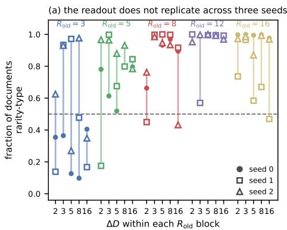
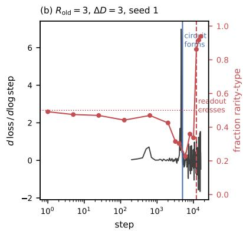
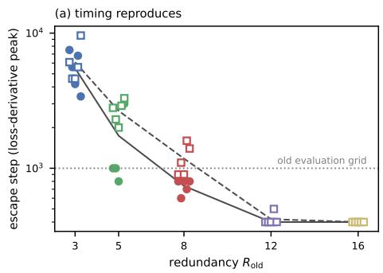
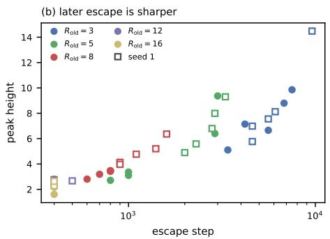
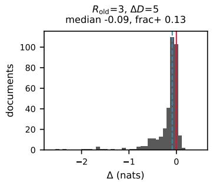
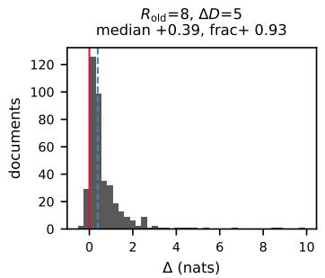
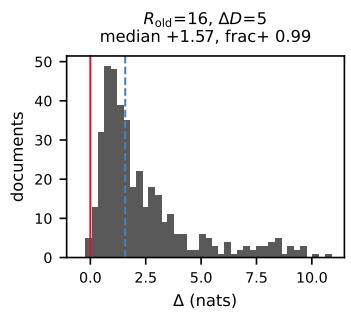

# SHORTCUT BEFORE CIRCUIT: DOCUMENT STATISTICS TIME IN-CONTEXT CONFLICT RESOLUTION

Yijun Liao liuyingliao0620@gmail.com

Fanwei Liang 202466331178@mail.scut.edu.cn

## ABSTRACT

When a context asserts two values for one fact, a model commits to a cue— recency, repetition, position—but natural data rarely makes these disagree, so behavior cannot reveal which. We train 26M-parameter transformers on a synthetic language where recency and rarity are exactly coextensive, and separate them with a minimal causal edit that inverts one cue while holding the truth, token count and answer position fixed. All 75 runs reach accuracy ≥ 0.999, including where the trivial heuristic fails, so no held-in evaluation distinguishes them. Under intervention the per-cell readout does not replicate: 13 of 25 cells differ by more than 0.3 in sign fraction across three seeds, the largest by 0.879 against a standard error of 0.025. The construction predicts this—coextensive rules leave the objective indifferent between them—and the variance is ordered by how much of the optimization each comparison releases. What replicates is timing: escape from a positional shortcut with a closed-form ceiling, monotone in redundancy. Probed before that escape, attribution reverses sign in 32 of 75 runs at unchanged accuracy, and gating on circuit formation is necessary but not sufficient. The corpus fixes when a mechanism appears, not which one — a criterion for when mechanistic attribution to data is available at all, and our construction makes the unavailable case exact.

## 1 INTRODUCTION

A document may assert that a slot holds one value and later assert that it holds another. Answering a query about that slot requires committing to a cue, and in ordinary text the cues agree: the value stated later is usually also the value stated once rather than many times. Because they agree, accuracy reveals nothing about which cue a model uses. The commitment surfaces only when they come apart—a stale retrieval corpus, a partially edited document, an inconsistently propagated update— and by then the choice was fixed during pretraining.

Documents in our synthetic assignment language are sequences of (entity, attribute, value) statements followed by a query; the answer is the most recent value assigned to the queried slot. Bindings are resampled per document and the training stream is infinite, so the task cannot be solved from weights. We vary two statistics of the cue structure while holding the task, its Bayes-optimal policy, and the entire training recipe fixed: $R _ { \mathrm { o l d } }$ , the number of times a superseded value is repeated, and $\Delta D ,$ , the number of statements from the last update to the query. Because the current value appears exactly once and each superseded value appears $R _ { \mathrm { o l d } }$ times, “take the rarest value” and “take the most recent value” select the same value on every training document, so no observational analysis can separate them. We therefore read out the rule with a minimal causal edit that inverts the multiplicities of the two competing values, leaving the ground truth, the token count, the answer position, and every other token unchanged. The signed change in log-odds, ∆, is positive when the readout tracks rarity and negative when multiplicity boosts the value the model should suppress.

Every analyzed cell reaches acc ≥ 0.999, including on the stratum where the trivial “the last update is the answer” heuristic fails, so two mechanisms with opposite dependence on repetition count receive the same score from any held-in evaluation. Under intervention the same models separate: pooled over three seeds the sign fraction rises monotonically by redundancy level through $R _ { \mathrm { o l d } } =$ 12, while a control edit on a non-queried slot perturbs the same number of tokens and stays within 0.015 nats. Before acquiring retrieval, models converge on a rule that copies the value at a fixed token offset from the end, whose ceiling $1 / | \mathrm { s u p p } ( \Delta D ) |$ follows from the token layout and which they saturate to within 2% at narrow support. Applying our probe during this phase yields strongly negative ∆, which read as a rule attribution would place a clean frequency-type region at low $R _ { \mathrm { o l d } }$ — produced by models with no retrieval circuit at all (§6.3).

Taken together these give a criterion rather than a map. A mechanism can be attributed to a corpus statistic when the objective is not indifferent between the alternatives, and cannot when it is. On the indifferent side our construction makes the indifference exact, and we show the consequence three ways: the per-cell readout moves 0.879 across seeds where documents give a standard error of 0.025, its within-run standard deviation across post-formation checkpoints reaches 0.303, and doubling the schedule moves cells that no data statistic distinguishes in advance. On the determined side timing survives every one of those comparisons. What the corpus fixes is when a mechanism appears, not which one.

## 2 RELATED WORK

Behavioral studies of knowledge conflict establish that models resolve conflicting evidence systematically, with preferences tracking entity popularity and evidence coherence (Longpre et al., 2021; Xie et al., 2024), update plausibility (Kortukov et al., 2024), the number of agreeing sources (Chen et al., 2022; Jin et al., 2024a), surface repetition (Yan et al., 2024) and source authority (Schuster et al., 2026), and over-attention to superseded state in multi-session dialogue (Liao, 2026). These measure which cue wins in a deployed model but cannot attribute the preference to data: the corpus is fixed and, for the cues at issue, unobservable, and because natural documents rarely make the candidate cues disagree, any observed preference is confounded with whatever cue happened to correlate with the answer. Mechanistic work localizes the components carrying conflicting information (Jin et al., 2024b), with end-to-end circuits demonstrated for non-trivial behaviors in trained models, though completeness remains difficult to certify (Wang et al., 2023), and identifies prefixmatching induction heads as a canonical copy-based mechanism associated with in-context learning (Olsson et al., 2022), traced in detail (Singh et al., 2024) and shown to be non-monotone (Singh et al., 2023), while controlled-corpus studies establish distributional properties governing whether in-context learning appears at all (Chan et al., 2022; Raventos et al., 2023; Bratuli ´ c et al., 2025;´ Kim et al., 2026; Han et al., 2023), with a parallel line on how parametric knowledge is stored and extracted (Allen-Zhu & Li, 2024). Reddy (2024) is the closest antecedent for our timing result, tracing the abrupt appearance of an induction head to the data distribution and identifying progress measures that precede in-context learning, as our loss-derivative peak does. What is explained there is when a single mechanism appears, extended by Gibson et al. (2026) to four algorithmic phases implemented by two qualitatively distinct multi-layer subcircuits whose boundaries are set by data diversity; ours is which of two a model commits to once it has, with the appearance left intact in every cell. In both lines the contrast is whether in-context retrieval is used, or context against weights; the cues within the context are never separated, because natural data does not separate them.

Concurrent work establishes that mechanistic explanations are frequently non-unique. Enumerating candidate explanations on Boolean functions and small networks yields systematic nonidentifiability: several circuits replicate a behavior, and one circuit admits several interpretations (Meloux et al., 2025). Structurally near-disjoint circuits can be simultaneously faithful, sparse and´ complete on the same task (Chen et al., 2026), and circuit-level conclusions can fail to survive defensible variation in the analysis pipeline itself (Mahale, 2026). These results document multiplicity; none of them says when an explanation is determined. Our construction supplies one such condition on the data side: where two rules are coextensive on the training distribution the objective cannot select between them, and where they are not it can. The distinction is testable here because both sides are measured in the same grid — escape timing replicates across seeds, the rule readout does not. The variance we report is across training runs rather than across analytic choices, which is the axis those three studies hold fixed.

Our positional rule is a shortcut (Geirhos et al., 2020; McCoy et al., 2019; Liu et al., 2024), unusual in that the token layout is ours to fix, so its payoff follows in closed form along a controlled axis rather than being diagnosed after the fact. Abrupt reorganizations are often summarized as phase diagrams (Power et al., 2022; Nanda et al., 2023; Doshi et al., 2024; Goddard et al., 2025), and claims of abruptness require care since discontinuous metrics can manufacture transitions from smooth change (Schaeffer et al., 2023); we report the transition in unthresholded metrics alongside the gate. Park et al. (2025) is closest, a phase diagram for a synthetic in-context task with phases framed as competition between algorithms, but their axes are properties of the task distribution and phases are assigned by matching outputs against candidate algorithms. Ours are statistics of the cue structure within a document, with the task and its Bayes-optimal policy identical in every cell, so the indistribution optimum is attained everywhere and behavioral matching cannot distinguish the phases at all.

## 3 SETUP

## 3.1 A LANGUAGE WITH AN ALIASED RULE PAIR

Documents are sequences of assignment statements followed by a query. Each statement binds a value to an (entity, attribute) pair, which we call a slot, and is emitted as four tokens [ent] [attr] [val] [SEP]; the query appends [QUERY] [ent] [attr] [ARROW] and the target is the value currently bound to the queried slot. Identifiers come from disjoint vocabularies of size 200, 8 and 512. Bindings are resampled per document and the stream is infinite, so the task is not solvable from weights.

Every document contains one queried slot: a value $v _ { \mathrm { o l d } }$ is bound to it and repeated $R _ { \mathrm { o l d } }$ times, a later statement rebinds the slot to $v _ { \mathrm { n e w } }$ , and the query follows $\Delta D$ statements after that rebinding. Remaining positions are filled by statements from other slots, each independently receiving an update with probability $p _ { \mathrm { u p d a t e } } = 0 . 5$ . Values are drawn without replacement within a document, so each identifier belongs to at most one slot; this makes “the answer value occurs exactly once before the query” structural rather than probabilistic, removing a baseline noise term from every measurement.

The alias. Because each superseded value is repeated $R _ { \mathrm { o l d } }$ times while the current value is written once, for the queried slot s of any document d

$$
\underbrace { \arg \operatorname* { m a x } _ { i } \mathrm { p o s } ( s _ { i } ) } _ { \mathrm { R E C E N C Y } } = \underbrace { \arg \operatorname* { m i n } _ { v } \bigl | \{ i : \mathrm { v a l } ( s _ { i } ) = v \} \bigr | } _ { \mathrm { R A R I T Y } } \qquad \mathrm { f o r ~ a l l } \ d ,\tag{1}
$$

with ties in RARITY broken toward the more recent occurrence. Equation 1 is an identity of the generator, not a statistical tendency: the two rules never disagree on a single training document, the objective is indifferent between them, and no observational analysis can separate them. Five further candidates are separable observationally; per-cell rates and the closed forms they match are in App. A.3.

## 3.2 THE TWO AXES

Neither axis changes the target function; both change how expensive each mechanism is to implement.

Redundancy $R _ { \mathrm { o l d } } \in \{ 3 , 5 , 8 , 1 2 , 1 6 \}$ , fixed per configuration, sets how often the language demonstrates that a value appearing more than once is not the current one. Two lower values are excluded: at $R _ { \mathrm { o l d } } = 1$ RARITY carries no information and the edit has no domain, and at $R _ { \mathrm { o l d } } = 2$ the retrieval circuit fails to form within our budget in four of five cells (App. D.4). The upper end is structural: superseded copies are placed in a window of width spread $\times ~ n _ { \mathrm { s t m t s } }$ before the rebinding, and once $2 R _ { \mathrm { o l d } }$ approaches that width the window degenerates into a solid block abutting the rebinding, making the queried slot identifiable without reading the query. At spread = 0.8 and $n _ { \mathrm { s t m t s } } \geq 4 5$ the largest admissible value is 16.

Update-to-query distance $\Delta D$ is the number of statements between the final rebinding and the query. A recency mechanism must match the queried slot and select its latest occurrence, attending across the $\Delta D$ intervening statements; suppressing repeated values within a slot has no such dependence. We sample $\mathbf { \bar { \Delta } } D \sim U [ \ell ( d ) , \dot { h } \dot { ( d ) } ]$ with $\ell ( d ) = \mathrm { m a x } ( 1 , \mathrm { r o u n d } ( d / 2 ) )$ and $h ( d ) = \operatorname* { m a x } ( \ell { + } 1 , \operatorname { r o u n d } ( 3 d / 2 ) )$ for nominal $d \in \{ 2 , 3 , 5 , 8 , 1 6 \}$

The support is an interval rather than a point because at constant $\Delta D$ the answer sits at a fixed token offset from the end and “copy the value at offset $k ^ { \prime \prime }$ becomes fully correct with no slot matching.

Support width bounds such a rule at $1 / | \mathrm { s u p p } ( \Delta D )$ |, falling from 0.333 at $d \in \{ 2 , 3 \}$ to 0.059 at $d = 1 6 ; \ S 6 . 1$ derives this and shows models occupy it for thousands of steps.

## 3.3 INVARIANTS AND TRAINING

Because the argument rests on the two axes being the only systematic difference between cells, we verify five generator invariants on 1500 documents per cell before training; four hold exactly and the fifth partially, with antecedent distance exceeding the filler mean by 2–22% (App. A.1). Document length is sampled from U[45, 55] statements independently of both axes, with the lower bound set by the most demanding cell $( n _ { \mathrm { s t m t s } } ~ \ge ~ R _ { \mathrm { o l d } } + \Delta D _ { \mathrm { m a x } } + 5 )$ and then used everywhere, since a cell-dependent length distribution would itself be a covariate. We deliberately do not equalize the tail-update fraction $( 1 - \rho ) ^ { \Delta D }$ : forcing it constant requires inserting distractor updates in the tail, which at small $\Delta D$ creates a different perfect shortcut, so we report it as a covariate and stratify held-in evaluation on it.

We train decoder-only transformers with 8 layers, $d _ { \mathrm { m o d e l } } = 5 1 2$ , 8 heads, rotary embeddings and pre-norm blocks (26.1M parameters). Attention uses per-head RMS normalization on queries and keys with a learnable per-dimension gain initialized to the constant 2.0 rather than 1.0; optimization moves it down from there rather than up (App. B.1). Each configuration is trained for 16000 steps at batch size 256 with AdamW $( \mathrm { l r } = 1 0 ^ { - 3 }$ , cosine decay, weight decay 0.1, none on embeddings) in bfloat16, with loss on all tokens and documents generated on the fly. The budget is set by the slowest cell: the circuit forms before step 1000 at $R _ { \mathrm { o l d } } = 1 6$ but near step 6000 at $R _ { \mathrm { o l d } } = 3 ( \ S 6 )$ so 16000 steps leaves every analyzed cell at least 6000 post-formation steps, and all but two at least 9000. App. F shows the readout is stable across an $8 \times$ budget range in the interior of the grid.

## 4 READING OUT THE RULE

## 4.1 THE MULTIPLICITY INVERSION

To separate aliased rules we apply minimal edits to held-out documents. The logic is that of an interchange intervention (Geiger et al., 2021; 2024), applied at the input rather than to an internal variable. An edit targets one rule, moves that rule’s prediction, and leaves the ground truth unchanged. Writing $m ( \bar { x } ; v ^ { \star } ) = \log p ( v ^ { \star } \mid x ) - \log p ( v _ { \mathrm { t r u t h } } \mid x )$ , the readout is the paired difference

$$
\Delta = m ( x _ { \mathrm { e d i t } } ; v ^ { \star } ) - m ( x _ { \mathrm { b a s e } } ; v ^ { \star } ) ,\tag{2}
$$

where both terms use the same contrast value $v ^ { \star } ,$ , chosen as the target rule’s post-edit prediction and required to differ from the ground truth on both sides.

The edit separating RARITY from RECENCY inverts value multiplicity inside the queried slot: one copy of $v _ { \mathrm { o l d } }$ is retained and every other copy is rewritten as a copy of $v _ { \mathrm { n e w } } .$ , so post-edit counts are $\{ v _ { \mathrm { o l d } } : 1 , v _ { \mathrm { n e w } } : R \}$ , exchanged relative to the base. Under this edit RECENCY still predicts $v _ { \mathrm { n e w } }$ (the last statement of the slot is untouched), FREQUENCY predicts $v _ { \mathrm { n e w } } .$ , PRIMACY predicts $v _ { \mathrm { o l d } }$ on both sides and cancels in Equation 2, and only RARITY flips. The retained copy is the earliest, which makes any first-occurrence positional account cancel between the two terms (App. A.1).

## 4.2 WHAT WE REPORT

The primary dependent variable is the fraction of held-out documents on which $\Delta$ has the expected sign, over 400 documents at the final checkpoint, with an exact binomial test. We report the median and interquartile range alongside it but treat the sign fraction as primary. Per-document $\Delta$ is heavytailed, so the mean is unstable where the sign fraction is not, and the median is bounded from above by contrast-pair mass in exactly the high-effect cells where the separation is largest (§5.5); the sign fraction depends on neither magnitude nor scale, so it compares across seeds and budgets, where the unit of replication is the run rather than the document. Table 15 reports every summary we computed for seed 0, Table 16 the sign fraction for all three.

## 5 RESULTS

## 5.1 BEHAVIOR SATURATES EVERYWHERE

Every analyzed cell reaches in-distribution accuracy $\geq 0 . 9 9 9$ , including on the stratum where no update follows the queried rebinding, so any evaluation restricted to the training distribution assigns these 75 models the same score. This holds of the analyzed grid, not the language: in the excluded $R _ { \mathrm { o l d } } = 2 $ column three of five cells terminate at another mechanism’s analytic ceiling (App. D.4). Behavioral saturation is a regime the data statistics must permit, not a given.

## 5.2 THE MECHANISM IS ORDERED BY REDUNDANCY

Under intervention the same models separate (Figure 1), and pooled over three seeds the sign fraction is ordered by redundancy level: row means run 0.479, 0.768, 0.858, 0.962 and 0.879 at $R _ { \mathrm { o l d } } = 3 , 5 , 8 , 1 2 ,$ 16, monotone through 12 and breaking at 16. Two of the three seeds are monotone through 12 individually; seed 2 falls from 0.905 at 5 to 0.812 at $^ { 8 , }$ so only the $3  5$ and $8  1 2$ steps hold in every seed. The break at 16 is one seed’s: the row mean falls 0.225 in seed 1 and 0.024 in seed 2 while seed 0 does not fall at all, so nine tenths of the pooled decrease comes from seed 1, whose three lowest cells there are among the widest-spread in Table 16. The exception is an instance of the non-replication rather than a feature of the axis.

  
Figure 1: (a) Sign fraction at 16000 steps for the 25 cells under three seeds, joined per cell; filled circles seed 0, open squares seed 1, open triangles seed 2. Line length is the range across seeds, reaching 0.879 against a binomial standard error of 0.025. (b) The $R _ { \mathrm { o l d } } = 3 , \Delta D = 3$ run of seed 1 (§6.3): d loss/d log step (left axis) and sign fraction (right axis). The interior peak marks circuit formation near step 4600; the readout crosses near step 12000 at unchanged accuracy (§6.3).

Per cell it does not reproduce, and we therefore do not assign a mechanism to a cell. Thirteen of 25 cells span more than 0.3 across seeds, and in eight the three seeds do not agree on which side of indifference the cell lies. The widest is $R _ { \mathrm { o l d } } = 3 , \Delta D = 8$ at 0.098, 0.477 and 0.977, a range of 0.879, whose endpoints are separately decisive at $p = 1 \times 1 0 ^ { - 5 4 }$ and $p = 5 \times 1 0 ^ { - 8 8 }$ in opposite directions: either run alone would license a confident attribution, and no number of documents within one run detects the other. The spread is not a measurement artifact: within a single run the sign fraction has median standard deviation 0.069 across post-formation checkpoints and the range in the widest cells does not narrow over further training (App. F), while training is bit-identical on rerun at fixed seed (App. A.1). We treat a cell-to-cell difference as meaningful only when it exceeds the range in Table 16, which leaves the row ordering and rules out the per-cell map.

The low end is where the readout is least determined rather than where it reverses. All five $R _ { \mathrm { o l d } } = 3$ cells of seed 0 have negative gated medians and a row mean sign fraction of 0.270; the same row reads 0.538 and 0.630 in seeds 1 and 2, spanning 0.098 to 0.977 across the fifteen runs. It is also where the circuit forms most slowly (§6). The $\Delta \bar { D }$ axis carries no ordering we interpret.

## 5.3 WHAT THE SIGN RULES OUT, AND WHERE

The multiplicity inversion raises the occurrence count of the correct answer from one to R and lowers the superseded value to one, so any mechanism that accumulates evidence with occurrence count predicts $\Delta < 0 :$ a context-frequency prior, or an induction head aggregating over matches. Pooled by row the gated median is positive at every $R _ { \mathrm { o l d } } ~ \geq ~ 5$ in all three seeds; per cell it fails in four, all within 0.031 nats of zero $( - 0 . 0 3 0 , \ : - 0 . 0 1 2 , \ : - 0 . 0 0 9 , \ : - 0 . 0 0 6 )$ . At the high end the readout is therefore inconsistent with accumulation and consistent with suppression, opposing both the majority-rule preference reported under knowledge conflict (Jin et al., 2024a) and the repetitiondriven token co-occurrence reinforcement reported for in-context learning (Yan et al., 2024) — not tightly, since those settings repeat across documents rather than within a slot. What the sign separates is a family of mechanisms rather than our two named rules, at the level of the row.

## 5.4 COVARIATES

Three quantities shift with the axes and cannot be held fixed; we report them per cell (Table 2) rather than adjusting for them. Slot count falls with $R _ { \mathrm { o l d } } ;$ realized redundancy falls with ∆D because copies outside the document canvas are discarded; and edit domain tracks realized redundancy, so the cells with the weakest readout condition on the smallest subset.

The last admits a within-cell test, since initialization and data order are fixed within a run and the spread of Table 16 therefore cannot enter it. Realized redundancy is recorded per document, so we split each cell at its median and ask whether the readout tracks it inside the cell as across cells. It does, in whichever direction that cell points: at $R _ { \mathrm { o l d } } ~ = ~ 1 6 , ~ \Delta D = 2$ the high-redundancy half reads +2.274 against +1.351 (Table 14), and at $R _ { \mathrm { o l d } } = 3 , \Delta D = 5 -$ where the seed-0 median is negative — −0.120 against −0.069, more negative rather than less. The gradient holds in 65 of the 75 runs, and six of the ten exceptions have pooled medians below 0.15 nats in absolute value, where there is no effect to stratify. This does not sit in tension with §5.2. The gradient runs in the direction of each cell’s own effect, so the corpus statistic sets how much the readout responds while the run sets which way it points: sensitivity replicates, baseline does not. A single seed would have reported both as one number. This is strong evidence available to us that $R _ { \mathrm { o l d } }$ acts through the statistic rather than through document selection.

## 5.5 WHERE THE MEASUREMENT DEGRADES

Contrast-pair mass falls as the effect grows, reaching 0.59 in the worst cell of the three seeds, which bounds the instrument. Gating per document at mass ≥ 0.5 shifts the cell median by 2% where mass is 0.98 and by 14–63% in the ten cells where mass falls below 0.85. Cells whose readout exceeds roughly 2 nats therefore cannot be separated from one another by median; every median we quote in the main text for such a cell is gated, and cross-cell differences in median are lower bounds, compressed most where the effect is largest. The sign fraction is computed over all documents with edit domain and is unaffected by the gate by construction (App. H).

## 5.6 WHAT THE OBJECTIVE DETERMINES, AND WHAT IT DOES NOT

The cross-seed spread of §5.2 is not a failure of the instrument but a consequence of Equation 1. Because RECENCY and RARITY select the same value on every training document, a model implementing one and a model implementing the other incur identical loss on every training document: the objective is indifferent between them, and nothing in the data selects one. This is underspecification (D’Amour et al., 2022) localized to a mechanism: many predictors with equivalent held-in performance, differing in which of two rules they implement rather than in which features they use. That claim predicts where the variance lives: it should scale with how much of the optimization a comparison releases, not with how many documents the probe sees. It does. Against a binomial standard error of 0.025 across documents, the within-run term across post-formation checkpoints reaches 0.303 over 69 runs (App. F), doubling the cosine period moves a cell by up to 0.55 (§8), and the seed term reaches 0.879 — four orders of comparison, ordered by how much optimization each releases. A cell whose entry is one run at one checkpoint under one schedule therefore reports a draw from that distribution rather than a property of the data statistics. Nothing in behavior distinguishes the endpoints: all 75 runs sit a $\cdot \geq 0 . 9 9 9$ on both strata and on the copy diagnostic. The classification analogue is predictive multiplicity (Marx et al., 2020).

Consistently, the loss derivative has exactly one interior peak in all 50 runs of seeds 0 and 1 and none where the readout changes sign (§6.3), which excludes a non-flat reorganization as the driver of the crossing.

We also tried to measure the geometry directly and report the attempt as uninformative: the direction that trades the two rules is flat relative to the loss gradient, but so is every direction we construct the same way from seven other readouts, including two the objective constrains (App. I). $\mathrm { A t ~ 2 . 6 ~ \times }$ $1 0 ^ { 7 }$ parameters the measurement does not separate a coextensive pair from a separable one, so the argument rests on Equation 1 and on the variance ordering above.

## 6 SHORTCUT DYNAMICS

Training does not proceed monotonically toward retrieval, and the route differs by cell. Where the circuit forms slowly and the shortcut pays well, models spend thousands of steps on a plateau implementing a positional rule; where it forms quickly they pass through a low-accuracy regime and acquire retrieval without ever saturating the shortcut.

## 6.1 THE PLATEAU HAS A CLOSED-FORM CEILING AND MODELS SATURATE IT

Statements occupy exactly four tokens, so the answer’s offset measured backward from the end is $4 \Delta D + 6$ , independent of document length. A rule that ignores the query and emits the value at a fixed offset is therefore correct exactly when $\Delta D$ takes one particular value, so

$$
\mathrm { p o s C e i l } \ = \ \operatorname* { m a x } _ { d } \mathrm { P r } [ \Delta D = d ] \ = \ \frac { 1 } { | \mathrm { s u p p } ( \Delta D ) | }\tag{3}
$$

since $\Delta D$ is uniform on its support (App. D.1 derives both, and states the two conditions under which the bound could be exceeded). Table 7 compares this to plateau accuracy in five cells: the two at |supp| = 3 saturate the bound to within 2% and agree with each other to 0.0002, while the wider-support cells attain 70–73% of a ceiling that is itself falling, with one exception that attains neither (App. D.1).

Saturating Eq. 3 shows only that a positional rule suffices, not that retrieval is absent. For that we use the copy diagnostic: accuracy on in-context value tokens repeating an earlier value of the same slot, which needs slot matching but is scored on tokens the positional rule cannot reach. Throughout the plateau it reads 0.001–0.046 against sequence accuracies of 0.077–0.326 in the four cells that reach a plateau (Table 7).

## 6.2 ESCAPE TIME IS SET JOINTLY BY BOTH STATISTICS

Escape is abrupt on the evaluation grid: the copy diagnostic moves from near chance to above 0.95 between consecutive evaluations in every cell that escapes, and sequence accuracy jumps from Eq. 3 to 1.000. Because a discrete gate on a coarse grid can manufacture a transition from smooth change (Schaeffer et al., 2023), we locate the reorganization in the training loss instead, which is recorded every 100 steps and involves no threshold. Its derivative with respect to log step has exactly one interior peak in every one of the 50 runs of seeds 0 and 1, a few hundred steps before the gate is crossed. The peak locates a reorganization without certifying which one, which is why the gate is on the copy diagnostic and not on the loss curve.

The peak also locates escape at 100-step rather than 1000-step resolution, which resolves the grid floor. Row means of the peak position are 5500 and 6100 steps at $R _ { \mathrm { o l d } } = 3 $ , 1740 and 2660 at 5, 740 and 1180 at 8, 400 and 420 at 12, and 400 and 400 at 16, for seeds 0 and 1: escape is monotone in $R _ { \mathrm { o l d } }$ across four separable levels in both seeds, where the gate separated only three. Seed 2 gives 4220, 1960 and 820 at $R _ { \mathrm { o l d } } = 3 , 5 , 8 ,$ , so the row means of the three seeds do not overlap below $R _ { \mathrm { o l d } } = 1 2 \colon 4 2 2 0 – 6 1 0 0$ steps at 3 against 1740–2660 at 5 and 740–1180 at 8. $R _ { \mathrm { o l d } } = 1 2 $ and 16 are the pair the derivative does not separate, both sitting within one recording interval of 400 steps, so the four levels are 3, 5, 8 and {12, 16} rather than five. Peak height increases with escape step across the 50 runs of seeds 0 and 1 (Spearman $\rho = 0 . 9 3 3$ on average ranks), from 1.60 at step 400 to 14.48 at 9600. Where escape is very early the peak is small, and the cosine schedule’s final decay exceeds it in three runs of seed $0 \left( 1 6 , \Delta D \in \{ 2 , 3 , 5 \} \right)$ ) and four of seed $2 \left( 1 2 , \Delta D \in \{ 8 , 1 6 \} \right.$ and 16, $\Delta D \in \{ 5 , 1 6 \} )$ , so at $R _ { \mathrm { o l d } } \geq 1 2$ we rely on the gate. Neither axis predicts escape alone: at 16 every cell of seeds 0 and 1 escapes by step 400 regardless of band width, and at 3 escape spans 1900–9600 steps across the three seeds, broadly inverse with band width but not monotone in it. The ordering is consistent with a race between the circuit’s loss reduction and the shortcut’s, which we state as a reading rather than an isolated mechanism. Per-run values and both views of the peak: Table 9 and Figure 2, App. E.

## 6.3 ATTRIBUTION ON THE PLATEAU REVERSES THE CONCLUSION

Applying the probe of §4 before escape yields strongly negative ∆ throughout the main grid, not only in the excluded cells. On the last probe point preceding escape, the sign fraction is below 0.20 in 32 of the 75 runs and below 0.05 in 22 of them, spanning every row across the three seeds (−3.36 with 0.01 of documents positive at $R _ { \mathrm { o l d } } = 1 6 , \Delta D = 2 ; - 4 . 0 2$ with 0.01 at 12, 8; −1.32 with 0.02 at 3, 5). The excluded $\bar { R _ { \mathrm { o l d } } } = 2$ cells (App. D.4) are the terminal version of the same phenomenon rather than a separate case.

Read as a rule attribution this is a clean “frequency-type” region: multiplicity boosting the superseded value, exactly the pattern the majority-rule literature would predict. It is an artifact — the models producing it have no retrieval circuit, so the reading cannot reflect a contest between recency and rarity whatever else it reflects. A positional account of the sign is natural but not testable from data-side quantities alone (App. D.4). The reading is not uniformly negative: in five runs the preescape sign fraction is above 0.6, and in all five the last pre-escape probe sits within one evaluation interval of escape, so we cannot separate a genuinely positive plateau reading from a probe that caught the transition.

Nothing in task performance signals that the quantity being measured has changed meaning: in the $R _ { \mathrm { o l d } } = 3 , \Delta D = 2$ run at the 32000-step schedule ∆ crosses from −0.587 to +1.802 across one evaluation interval with accuracy 1.000 at both ends. We therefore gate every cell on the copy diagnostic before reporting ∆, classify each run as retrieval, positional, or neither, and report the classification alongside the read-out (App. E). Read-outs are taken at a fixed budget of 16000 steps; post-escape trajectories drift in both directions (App. F).

Gating on formation is necessary but not sufficient. In the $R _ { \mathrm { o l d } } = 3 , \Delta D = 3$ cell of seed 1 the copy diagnostic reaches 1.000 at step 5000 and the readout stays frequency-type for a further 7000 steps (sign fractions 0.23, 0.36, 0.34 at steps 6000, 8000, 10000) before crossing to 0.86 at 12000 and settling at 0.94. Accuracy is 1.000 at every one of those points and the loss derivative has no peak near step 12000, its four largest values falling at steps 4600, 4700, 4300 and 15400 (Figure 1, right). A gate on circuit formation would have admitted this run at step 6000 and returned the opposite conclusion — the readout moves 0.71 in sign fraction with no signature in behavior or in loss, which is §5.6 in a single run.

## 7 DISCUSSION

The construction was built to ask which cue a model commits to and answers a different question: when a cue can be attributed to a model at all. Where two rules are coextensive on the training distri bution the loss does not choose between them, so a measurement of which one a model implements is a measurement of where that run stopped along a direction the objective does not constrain. Such measurements are not meaningless; their unit of replication is the run. The claim is conditional on coextensiveness rather than on scale. What a larger model or a natural corpus would change is which pairs of rules are coextensive and therefore which readouts are underdetermined, not whether coextensiveness has this consequence; the synthetic language is what makes the condition exact enough to check.

Three practices follow for any phase diagram whose cells are mechanisms. Report seed variance per cell: a per-document p-value speaks to sampling within one run, and none of our conclusions would survive a protocol reporting one seed per cell (van der Wal et al., 2025). Gate on circuit formation rather than task accuracy, since 32 of our 75 runs return a confident reversed attribution before the circuit exists, with no behavioral signal that the probe is measuring nothing. And treat that gate as necessary but not sufficient: even a gated single-checkpoint readout can report either direction.

What survives is what the objective is not indifferent to: escape timing, monotone in redundancy across four levels in seeds 0 and 1 and three in seed 2, recovered from an unthresholded quantity; the shortcut’s closed-form ceiling, saturated to within 2%; and the within-cell dose-response, which holds in 65 of the 75 runs with the run fixed. Timing is a property of the corpus here. Mechanism identity, at the resolution of one cell, is not.

This argues for aliased constructions, not against them. The alias makes the underdetermination visible; in natural data the same indifference exists wherever cues agree, but there a single-seed measurement returns a confident number with nothing to contradict it. What remains open is the comparison this construction cannot make: every cell is aliased by Equation 1, so we have no nonaliased control in which to measure the same geometry and find it absent.

## 8 LIMITATIONS

The endpoint of the readout is set jointly by the corpus and the optimizer. Retraining a cell with an identical seed and data stream but a cosine schedule of twice the length moves the terminal sign fraction by up to 0.55 (Table 10). Three cells that escape at step 1000 under both budgets isolate the schedule from the escape step: two move (0.45 to 0.98 and 0.47 to 0.79) and one does not (0.58 to 0.54, the endpoint itself indistinguishable from indifference at $p = 0 . 1 1$ , and flat across 18 post-formation checkpoints), while saturated cells are stable. One is converging slowly toward a value it has not reached and another is not converging, and nothing in the data distinguishes them in advance. We therefore report the map at one budget and one schedule, and cannot say how much of the cross-seed spread at 16000 steps is incomplete convergence rather than a different endpoint. The question we set out to answer was which cue wins; the one we can answer is when that question has an answer a corpus can supply.

Two collinearities, one partly broken. The positional ceiling $1 / | \mathrm { s u p p } ( \Delta D ) |$ falls from 0.333 to 0.059 across the $\Delta D$ axis, and the readout at $R _ { \mathrm { o l d } } = 1 6$ falls with it. A fixed-width band $( \Delta D \sim$ $U [ d , d { \ + } 8 ] )$ holds the ceiling at 0.111; run at $R _ { \mathrm { o l d } } = 3$ in three seeds it leaves the cross-seed spread intact $( \mathrm { A p p . ~ G } . 3 )$ , so that spread is not mediated by shortcut payoff — but the $R _ { \mathrm { o l d } } = 1 6$ gradient itself remains untested. Slot count falls with $R _ { \mathrm { o l d } }$ and cannot be held fixed together with everything else it moves. Matching it by shortening the documents recovers 85–97% of the gap in sign fraction across three seeds but only 17–74% of the gap in median, with the residual redundancy confound running counter to the observed change in all three (App. G.1); matching it at fixed length by moving pupdate instead removes almost none of the dispersion difference, and there the two cells do not converge under one pooling statistic and converge almost completely under another (App. G.2). The length–sparsity complex carries the direction at this point in the grid; which component of it does is unresolved.

Two of ourfive data knobs admit no causal readout. With explicit update markers the edit changes sequence length; with history-indexed queries the target rule is no longer the last value, so Equation 2 does not apply. For these we can report observational agreement but not a mechanism, and we exclude them rather than report a readout we cannot validate.

The queried slot is notperfectly indistinguishable. Spreading $R _ { \mathrm { o l d } }$ copies over a fixed window leaves the queried slot’s copies more dispersed than a filler slot’s (App. A.1), so a model could locate it without reading the query. Every analyzed run reaches 1.000 on the copy diagnostic, which requires genuine slot matching, so the cue is at most a redundant path — but it is collinear with both axes and we cannot rule out a contribution.

One architecturefamily, one taskfamily. The grid is 8 layers at $d _ { \mathrm { m o d e l } } = 5 1 2 ( 2 6 . 1 \mathrm { { M } }$ parameters) on a single synthetic language, with a depth arm at 4 and 12 layers on the $\Delta D = 5$ column (App. B.2). Escape ordering and the within-cell gradient survive both depths, while the per-cell readout moves as much with depth as with seed and in a seed-dependent direction, so depth is a further draw from the direction of §5.6 rather than a control on it. Depth and capacity covary at fixed width; with no ordering in depth, there is nothing for that separation to explain. The QK-normalization gain is a choice of the same kind: halving it removes the circuit from the slowest-forming cell within our budget (App. B.1), so the analyzed grid is defined partly by it.

## REPRODUCIBILITY STATEMENT

The language and its two axes are fully specified in §3.1–§3.2, training in §3.3, and the edit with its five invariants in §4. Generator invariants (App. A.1), the state classification that gates every readout (App. E), and per-cell collision rates (App. A.3) are measured rather than asserted. Code reproducing every table, together with the generator, the edit suite and the per-cell readout logs, is at https://github.com/lyj20071013/Shortcut-Before-Circuit.

## REFERENCES

Zeyuan Allen-Zhu and Yuanzhi Li. Physics of language models: Part 3.1, knowledge storage and extraction. In Ruslan Salakhutdinov, Zico Kolter, Katherine Heller, Adrian Weller, Nuria Oliver, Jonathan Scarlett, and Felix Berkenkamp (eds.), Proceedings of the 41st International Conference on Machine Learning, volume 235 of Proceedings of Machine Learning Research, pp. 1067–1077. PMLR, 21–27 Jul 2024. URL https://proceedings.mlr.press/v235/ allen-zhu24a.html.

Jelena Bratulic, Sudhanshu Mittal, David T. Hoffmann, Samuel B´ ohm, Robin Tibor Schirrmeis-¨ ter, Tonio Ball, Christian Rupprecht, and Thomas Brox. Unlocking in-context learning for natural datasets beyond language modelling, 2025. URL https://arxiv.org/abs/2501. 06256.

Stephanie Chan, Adam Santoro, Andrew Lampinen, Jane Wang, Aaditya Singh, Pierre Richemond, James McClelland, and Felix Hill. Data distributional properties drive emergent in-context learning in transformers. In S. Koyejo, S. Mohamed, A. Agarwal, D. Belgrave, K. Cho, and A. Oh (eds.), Advances in Neural Information Processing Systems, volume 35, pp. 18878–18891. Curran Associates, Inc., 2022. doi: 10.52202/ 068431-1371. URL https://proceedings.neurips.cc/paper\_files/paper/ 2022/file/77c6ccacfd9962e2307fc64680fc5ace-Paper-Conference.pdf.

Hung-Ting Chen, Michael Zhang, and Eunsol Choi. Rich knowledge sources bring complex knowledge conflicts: Recalibrating models to reflect conflicting evidence. In Yoav Goldberg, Zornitsa Kozareva, and Yue Zhang (eds.), Proceedings of the 2022 Conference on Empirical Methods in Natural Language Processing, pp. 2292–2307, Abu Dhabi, United Arab Emirates, December 2022. Association for Computational Linguistics. doi: 10.18653/v1/2022.emnlp-main.146. URL https://aclanthology.org/2022.emnlp-main.146/.

Xi Chen, Mingyu Jin, Jingcheng Niu, Yutong Yin, Jinman Zhao, Bangwei Guo, Dimitris N. Metaxas, Zhaoran Wang, Yutao Yue, and Gerald Penn. All circuits lead to rome: Rethinking functional anisotropy in circuit and sheaf discovery for LLMs. In Forty-third International Conference on Machine Learning, 2026. URL https://openreview.net/forum?id=3uC9teMlUt.

Alexander D’Amour, Katherine Heller, Dan Moldovan, Ben Adlam, Babak Alipanahi, Alex Beutel, Christina Chen, Jonathan Deaton, Jacob Eisenstein, Matthew D. Hoffman, Farhad Hormozdiari, Neil Houlsby, Shaobo Hou, Ghassen Jerfel, Alan Karthikesalingam, Mario Lucic, Yian Ma, Cory McLean, Diana Mincu, Akinori Mitani, Andrea Montanari, Zachary Nado, Vivek Natarajan, Christopher Nielson, Thomas F. Osborne, Rajiv Raman, Kim Ramasamy, Rory Sayres, Jessica Schrouff, Martin Seneviratne, Shannon Sequeira, Harini Suresh, Victor Veitch, Max Vladymyrov, Xuezhi Wang, Kellie Webster, Steve Yadlowsky, Taedong Yun, Xiaohua Zhai, and D. Sculley. Underspecification presents challenges for credibility in modern machine learning. Journal of Machine Learning Research, 23(226):1–61, 2022. URL http://jmlr.org/papers/v23/20-1335.html.

Darshil Doshi, Aritra Das, Tianyu He, and Andrey Gromov. To grok or not to grok: Disentangling generalization and memorization on corrupted algorithmic datasets. In B. Kim, Y. Yue, S. Chaudhuri, K. Fragkiadaki, M. Khan, and Y. Sun (eds.), International Conference on Learning Representations, volume 2024, pp. 3782–3810, 2024. URL https://proceedings.iclr.cc/paper\_files/paper/2024/file/ 105fdc31cc9eb927cc5a0110f4031287-Paper-Conference.pdf.

Atticus Geiger, Hanson Lu, Thomas Icard, and Christopher Potts. Causal abstractions of neural networks. In M. Ranzato, A. Beygelzimer, Y. Dauphin, P.S. Liang, and J. Wortman Vaughan (eds.), Advances in Neural Information Processing Systems, volume 34, pp. 9574–9586. Curran Associates, Inc., 2021. URL https://proceedings.neurips.cc/paper\_files/ paper/2021/file/4f5c422f4d49a5a807eda27434231040-Paper.pdf.

Atticus Geiger, Zhengxuan Wu, Christopher Potts, Thomas Icard, and Noah Goodman. Finding alignments between interpretable causal variables and distributed neural representations. In Francesco Locatello and Vanessa Didelez (eds.), Proceedings of the Third Conference on Causal Learning and Reasoning, volume 236 of Proceedings of Machine Learning Research, pp. 160–187. PMLR, 01–03 Apr 2024. URL https://proceedings.mlr.press/v236/ geiger24a.html.

Robert Geirhos, Jorn-Henrik Jacobsen, Claudio Michaelis, Richard Zemel, Wieland Brendel,¨ Matthias Bethge, and Felix A. Wichmann. Shortcut learning in deep neural networks. Nature Machine Intelligence, 2(11):665–673, November 2020. ISSN 2522-5839. doi: 10.1038/ s42256-020-00257-z. URL http://dx.doi.org/10.1038/s42256-020-00257-z.

Cole Gibson, Wenping Cui, and Gautam Reddy. Distinct mechanisms underlying in-context learning in transformers, 2026. URL https://arxiv.org/abs/2604.12151.

Chase Goddard, Lindsay M. Smith, Vudtiwat Ngampruetikorn, and David J. Schwab. When can in-context learning generalize out of task distribution? In Aarti Singh, Maryam Fazel, Daniel Hsu, Simon Lacoste-Julien, Felix Berkenkamp, Tegan Maharaj, Kiri Wagstaff, and Jerry Zhu (eds.), Proceedings of the 42nd International Conference on Machine Learning, volume 267 of Proceedings of Machine Learning Research, pp. 19585–19599. PMLR, 13–19 Jul 2025. URL https://proceedings.mlr.press/v267/goddard25a.html.

Xiaochuang Han, Daniel Simig, Todor Mihaylov, Yulia Tsvetkov, Asli Celikyilmaz, and Tianlu Wang. Understanding in-context learning via supportive pretraining data. In Anna Rogers, Jordan Boyd-Graber, and Naoaki Okazaki (eds.), Proceedings ofthe 61st Annual Meeting ofthe Associationfor Computational Linguistics (Volume 1: Long Papers), pp. 12660–12673, Toronto, Canada, July 2023. Association for Computational Linguistics. doi: 10.18653/v1/2023.acl-long.708. URL https://aclanthology.org/2023.acl-long.708/.

Zhuoran Jin, Pengfei Cao, Yubo Chen, Kang Liu, Xiaojian Jiang, Jiexin Xu, Qiuxia Li, and Jun Zhao. Tug-of-war between knowledge: Exploring and resolving knowledge conflicts in retrieval-augmented language models. In Nicoletta Calzolari, Min-Yen Kan, Veronique Hoste, Alessandro Lenci, Sakriani Sakti, and Nianwen Xue (eds.), Proceedings of the 2024 Joint International Conference on Computational Linguistics, Language Resources and Evaluation (LREC-COLING 2024), pp. 16867–16878, Torino, Italia, May 2024a. ELRA and ICCL. URL https://aclanthology.org/2024.lrec-main.1466/.

Zhuoran Jin, Pengfei Cao, Hongbang Yuan, Yubo Chen, Jiexin Xu, Huaijun Li, Xiaojian Jiang, Kang Liu, and Jun Zhao. Cutting off the head ends the conflict: A mechanism for interpreting and mitigating knowledge conflicts in language models. In Lun-Wei Ku, Andre Martins, and Vivek Srikumar (eds.), Findings of the Association for Computational Linguistics: ACL 2024, pp. 1193–1215, Bangkok, Thailand, August 2024b. Association for Computational Linguistics. doi: 10.18653/v1/2024.findings-acl.70. URL https://aclanthology.org/2024. findings-acl.70/.

Minsung Kim, Dong-Kyum Kim, Jea Kwon, Nakyeong Yang, Kyomin Jung, and Meeyoung Cha. How training data shapes the use of parametric and in-context knowledge in language models, 2026. URL https://arxiv.org/abs/2510.02370.

Evgenii Kortukov, Alexander Rubinstein, Elisa Nguyen, and Seong Joon Oh. Studying large language model behaviors under context-memory conflicts with real documents. In First Conference on Language Modeling, 2024. URL https://openreview.net/forum?id= xm8zYRfrqE.

Yijun Liao. Overcoming state inertia: Minimally invasive temporal alignment for evolving contexts, 2026. URL https://arxiv.org/abs/2512.03704.

Nelson F. Liu, Kevin Lin, John Hewitt, Ashwin Paranjape, Michele Bevilacqua, Fabio Petroni, and Percy Liang. Lost in the middle: How language models use long contexts. Transactions of the Associationfor Computational Linguistics, 12:157–173, 2024. doi: 10.1162/tacl a 00638. URL https://aclanthology.org/2024.tacl-1.9/.

Shayne Longpre, Kartik Perisetla, Anthony Chen, Nikhil Ramesh, Chris DuBois, and Sameer Singh. Entity-based knowledge conflicts in question answering. In Marie-Francine Moens, Xuanjing Huang, Lucia Specia, and Scott Wen-tau Yih (eds.), Proceedings of the 2021 Conference on Empirical Methods in Natural Language Processing, pp. 7052–7063, Online and Punta Cana, Dominican Republic, November 2021. Association for Computational Linguistics. doi: 10.18653/v1/2021.emnlp-main.565. URL https://aclanthology.org/2021. emnlp-main.565/.

Ajay Pravin Mahale. Explanation multiplicity: Circuit-level interpretability evidence does not survive defensible analytic variation, 2026. URL https://arxiv.org/abs/2608.13754.

Charles T. Marx, Flavio du Pin Calmon, and Berk Ustun. Predictive multiplicity in classification, 2020. URL https://arxiv.org/abs/1909.06677.

R. Thomas McCoy, Ellie Pavlick, and Tal Linzen. Right for the wrong reasons: Diagnosing syntactic heuristics in natural language inference. In Anna Korhonen, David Traum, and Llu´ıs Marquez\` (eds.), Proceedings of the 57th Annual Meeting of the Association for Computational Linguistics, pp. 3428–3448, Florence, Italy, July 2019. Association for Computational Linguistics. doi: 10. 18653/v1/P19-1334. URL https://aclanthology.org/P19-1334/.

Maxime Meloux, Silviu Maniu, Franc¸ois Portet, and Maxime Peyrard. Everything, everywhere, all´ at once: Is mechanistic interpretability identifiable? In Y. Yue, A. Garg, N. Peng, F. Sha, and R. Yu (eds.), International Conference on Learning Representations, volume 2025, pp. 32900– 32923, 2025. URL https://proceedings.iclr.cc/paper\_files/paper/2025/ file/51157713f1f1f572a05647e1aef1b1ed-Paper-Conference.pdf.

Neel Nanda, Lawrence Chan, Tom Lieberum, Jess Smith, and Jacob Steinhardt. Progress measures for grokking via mechanistic interpretability. In The Eleventh International Conference on Learning Representations, 2023. URL https://openreview.net/forum?id=9XFSbDPmdW.

Catherine Olsson, Nelson Elhage, Neel Nanda, Nicholas Joseph, Nova DasSarma, Tom Henighan, Ben Mann, Amanda Askell, Yuntao Bai, Anna Chen, Tom Conerly, Dawn Drain, Deep Ganguli, Zac Hatfield-Dodds, Danny Hernandez, Scott Johnston, Andy Jones, Jackson Kernion, Liane Lovitt, Kamal Ndousse, Dario Amodei, Tom Brown, Jack Clark, Jared Kaplan, Sam McCandlish, and Chris Olah. In-context learning and induction heads, 2022. URL https://arxiv.org/ abs/2209.11895.

Core Francisco Park, Ekdeep Singh Lubana, and Hidenori Tanaka. Competition dynamics shape algorithmic phases of in-context learning. In Y. Yue, A. Garg, N. Peng, F. Sha, and R. Yu (eds.), International Conference on Learning Representations, volume 2025, pp. 66381–66433, 2025. URL https://proceedings.iclr.cc/paper\_files/paper/2025/file/ a635abfdd007c9a698410c8bbe5ebc33-Paper-Conference.pdf.

Alethea Power, Yuri Burda, Harri Edwards, Igor Babuschkin, and Vedant Misra. Grokking: Generalization beyond overfitting on small algorithmic datasets, 2022. URL https://arxiv.org/ abs/2201.02177.

Allan Raventos, Mansheej Paul, Feng Chen, and Surya Ganguli. Pretraining task diversity and´ the emergence of non-bayesian in-context learning for regression. In A. Oh, T. Naumann, A. Globerson, K. Saenko, M. Hardt, and S. Levine (eds.), Advances in Neural Information Processing Systems, volume 36, pp. 14228–14246. Curran Associates, Inc., 2023. doi: 10.52202/ 075280-0626. URL https://proceedings.neurips.cc/paper\_files/paper/ 2023/file/2e10b2c2e1aa4f8083c37dfe269873f8-Paper-Conference.pdf.

Gautam Reddy. The mechanistic basis of data dependence and abrupt learning in an in-context classification task. In The Twelfth International Conference on Learning Representations, 2024. URL https://openreview.net/forum?id=aN4Jf6Cx69.

Rylan Schaeffer, Brando Miranda, and Sanmi Koyejo. Are emergent abilities of large language models a mirage? In A. Oh, T. Naumann, A. Globerson, K. Saenko, M. Hardt, and S. Levine (eds.), Advances in Neural Information Processing Systems, volume 36, pp. 55565–55581. Curran Associates, Inc., 2023. doi: 10.52202/ 075280-2425. URL https://proceedings.neurips.cc/paper\_files/paper/ 2023/file/adc98a266f45005c403b8311ca7e8bd7-Paper-Conference.pdf.

Jakob Schuster, Vagrant Gautam, and Katja Markert. Whose facts win? LLM source preferences under knowledge conflicts. In Maria Liakata, Viviane P. Moreira, Jiajun Zhang, and David Jurgens (eds.), Proceedings ofthe 64th Annual Meeting ofthe Associationfor Computational Linguistics (Volume 1: Long Papers), pp. 29430–29459, San Diego, California, United States, July 2026. Association for Computational Linguistics. ISBN 979-8-89176-390-6. doi: 10.18653/v1/2026. acl-long.1357. URL https://aclanthology.org/2026.acl-long.1357/.

Aaditya Singh, Stephanie Chan, Ted Moskovitz, Erin Grant, Andrew Saxe, and Felix Hill. The transient nature of emergent in-context learning in transformers. In A. Oh, T. Naumann, A. Globerson, K. Saenko, M. Hardt, and S. Levine (eds.), Advances in Neural Information Processing Systems, volume 36, pp. 27801–27819. Curran Associates, Inc., 2023. doi: 10.52202/ 075280-1208. URL https://proceedings.neurips.cc/paper\_files/paper/ 2023/file/58692a1701314e09cbd7a5f5f3871cc9-Paper-Conference.pdf.

Aaditya K Singh, Ted Moskovitz, Felix Hill, Stephanie C.Y. Chan, and Andrew M Saxe. What needs to go right for an induction head? A mechanistic study of in-context learning circuits and their formation. In Ruslan Salakhutdinov, Zico Kolter, Katherine Heller, Adrian Weller, Nuria Oliver, Jonathan Scarlett, and Felix Berkenkamp (eds.), Proceedings of the 41st International Conference on Machine Learning, volume 235 of Proceedings of Machine Learning Research, pp. 45637–45662. PMLR, 21–27 Jul 2024. URL https://proceedings.mlr.press/ v235/singh24c.html.

Oskar van der Wal, Pietro Lesci, Max Muller-Eberstein, Naomi Saphra, Hailey Schoelkopf,¨ Willem Zuidema, and Stella R Biderman. Polypythias: Stability and outliers across fifty language model pre-training runs. In Y. Yue, A. Garg, N. Peng, F. Sha, and R. Yu (eds.), International Conference on Learning Representations, volume 2025, pp. 86180–86204, 2025. URL https://proceedings.iclr.cc/paper\_files/paper/2025/file/ d611d06e3207330555fbc10810e70163-Paper-Conference.pdf.

Kevin Ro Wang, Alexandre Variengien, Arthur Conmy, Buck Shlegeris, and Jacob Steinhardt. Interpretability in the wild: a circuit for indirect object identification in GPT-2 small. In The Eleventh International Conference on Learning Representations, 2023. URL https: //openreview.net/forum?id=NpsVSN6o4ul.

Jian Xie, Kai Zhang, Jiangjie Chen, Renze Lou, and Yu Su. Adaptive chameleon or stubborn sloth: Revealing the behavior of large language models in knowledge conflicts. In B. Kim, Y. Yue, S. Chaudhuri, K. Fragkiadaki, M. Khan, and Y. Sun (eds.), International Conference on Learning Representations, volume 2024, pp. 35623–35646, 2024. URL https://proceedings.iclr.cc/paper\_files/paper/2024/file/ 99261adc8a6356b38bcf999bba9a26dc-Paper-Conference.pdf.

Jianhao Yan, Jin Xu, Chiyu Song, Chenming Wu, Yafu Li, and Yue Zhang. Understanding in-context learning from repetitions. In B. Kim, Y. Yue, S. Chaudhuri, K. Fragkiadaki, M. Khan, and Y. Sun (eds.), International Conference on Learning Representations, volume 2024, pp. 49968–49989, 2024. URL https://proceedings.iclr.cc/paper\_files/paper/2024/file/ d88f6f81e1aaf606776ffdd06fdf24ef-Paper-Conference.pdf.

## A GENERATOR MEASUREMENTS

Everything in this appendix is measured on 1500 documents per cell before training. These are properties of the generator, not of any trained model.

Table 1: Generator invariants, 1500 documents per cell. Columns are defined in the text below: bindMax cross-document binding reuse, $r _ { \mathrm { l e n } }$ correlation between realized $\Delta D$ and token count, ansLast trivial-copy documents, updDens pre-query update density in the final decile, adj/ant sameslot adjacency rate and antecedent distance for the queried (q) and filler $( f )$ slots. The fifth invariant holds only partially: $\mathrm { a n t } _ { q }$ exceeds $\mathrm { a n t } _ { f }$ by 2–22%.
<table><tr><td> $R _ { \mathrm { o l d } }$ </td><td> $\Delta D$ </td><td>bindMax</td><td> $r _ { \mathrm { l e n } }$ </td><td>ansLast</td><td>updDens</td><td> $\operatorname { a d j } _ { q }$ </td><td> $\operatorname { a d j } _ { f }$ </td><td> $\operatorname { a n t } _ { q }$ </td><td> $\mathrm { a n t } _ { f }$ </td></tr><tr><td>3</td><td>2</td><td>3</td><td>-0.024</td><td>0</td><td>1.029</td><td>0.056</td><td>0.078</td><td>13.32</td><td>10.92</td></tr><tr><td>3</td><td>3</td><td>3</td><td>-0.023</td><td>0</td><td>1.020</td><td>0.058</td><td>0.077</td><td>13.21</td><td>10.95</td></tr><tr><td>3</td><td>5</td><td>3</td><td>+0.028</td><td>0</td><td>1.022</td><td>0.056</td><td>0.074</td><td>13.09</td><td>11.00</td></tr><tr><td>3</td><td>8</td><td>3</td><td>-0.035</td><td>0</td><td>1.021</td><td>0.060</td><td>0.077</td><td>12.55</td><td>10.92</td></tr><tr><td>3</td><td>16</td><td>3</td><td>-0.002</td><td>0</td><td>0.984</td><td>0.074</td><td>0.076</td><td>11.49</td><td>11.03</td></tr><tr><td>5</td><td>2</td><td>3</td><td>-0.003</td><td>0</td><td>1.074</td><td>0.087</td><td>0.104</td><td>9.57</td><td>8.29</td></tr><tr><td>5</td><td>3</td><td>3</td><td>-0.003</td><td>0</td><td>1.071</td><td>0.088</td><td>0.105</td><td>9.53</td><td>8.31</td></tr><tr><td>5</td><td>5</td><td>3</td><td>+0.009</td><td>0</td><td>1.013</td><td>0.090</td><td>0.107</td><td>9.30</td><td>8.34</td></tr><tr><td>5</td><td>8</td><td>3</td><td>+0.007</td><td>0</td><td>1.015</td><td>0.091</td><td>0.106</td><td>9.22</td><td>8.35</td></tr><tr><td>5</td><td>16</td><td>4</td><td>-0.013</td><td>0</td><td>1.008</td><td>0.092</td><td>0.106</td><td>8.54</td><td>8.36</td></tr><tr><td>8</td><td>2</td><td>3</td><td>+0.031</td><td>0</td><td>1.041</td><td>0.135</td><td>0.152</td><td>6.93</td><td>6.30</td></tr><tr><td>8</td><td>3</td><td>3</td><td>+0.031</td><td>0</td><td>1.031</td><td>0.135</td><td>0.151</td><td>6.91</td><td>6.32</td></tr><tr><td>8</td><td>5</td><td>3</td><td>-0.039</td><td>0</td><td>0.994</td><td>0.135</td><td>0.150</td><td>6.88</td><td>6.34</td></tr><tr><td>8</td><td>8</td><td>3</td><td>-0.003</td><td>0</td><td>0.981</td><td>0.132</td><td>0.150</td><td>6.81</td><td>6.29</td></tr><tr><td>8</td><td>16</td><td>3</td><td>-0.008</td><td>0</td><td>1.006</td><td>0.138</td><td>0.155</td><td>6.52</td><td>6.22</td></tr><tr><td>12</td><td>2</td><td>3</td><td>+0.007</td><td>0</td><td>1.102</td><td>0.180</td><td>0.197</td><td>5.35</td><td>5.00</td></tr><tr><td>12</td><td>3</td><td>3</td><td>+0.007</td><td>0</td><td>1.101</td><td>0.181</td><td>0.196</td><td>5.33</td><td>5.01</td></tr><tr><td>12</td><td>5</td><td>3</td><td>-0.036</td><td>0</td><td>1.083</td><td>0.183</td><td>0.198</td><td>5.36</td><td>5.00</td></tr><tr><td>12</td><td>8</td><td>3</td><td>+0.006</td><td>0</td><td>0.946</td><td>0.189</td><td>0.200</td><td>5.28</td><td>4.92</td></tr><tr><td>12</td><td>16</td><td>3</td><td>-0.043</td><td>0</td><td>1.056</td><td>0.188</td><td>0.206</td><td>5.16</td><td>4.84</td></tr><tr><td>16</td><td>2</td><td>3</td><td>+0.022</td><td>0</td><td>1.065</td><td>0.213</td><td>0.236</td><td>4.71</td><td>4.22</td></tr><tr><td>16</td><td>3</td><td>3</td><td>+0.022</td><td>0</td><td>1.059</td><td>0.213</td><td>0.237</td><td>4.71</td><td>4.23</td></tr><tr><td>16</td><td>5</td><td>2</td><td>+0.001</td><td>0</td><td>1.097</td><td>0.212</td><td>0.249</td><td>4.74</td><td>4.16</td></tr><tr><td>16</td><td>8</td><td>3</td><td>-0.018</td><td>0</td><td>1.052</td><td>0.213</td><td>0.248</td><td>4.69</td><td>4.16</td></tr><tr><td>16</td><td>16</td><td>2</td><td>-0.024</td><td>0</td><td>1.048</td><td>0.218</td><td>0.260</td><td>4.54</td><td>4.02</td></tr></table>

## A.1 INVARIANTS AND FAILURE MODES

bindMax: the largest number of distinct documents in which any single (slot, value) triple appears. Bounded by 4 throughout, consistent with chance collision at $2 0 0 \times 8 \times 5 1 2$ possible triples and 75000 statements sampled, so bindings are not memorizable across documents. Note that counting raw occurrences rather than documents would return $\ge R _ { \mathrm { o l d } }$ by construction, since the queried slot holds $R _ { \mathrm { o l d } }$ copies of one value within a single document.

$r _ { \mathrm { l e n } } \colon$ Pearson correlation between realized $\Delta D$ and document token count, $| r | \leq 0 . 0 4 3$ in every cell.   
Without this the $\Delta D$ axis would confound distance with length.

ansLast: documents in which the answer value equals the last value token before the query, which would admit a trivial copy rule. Zero in all 25 cells, by construction rather than by chance — values are drawn without replacement within a document.

updDens: density of update statements in the final decile of the pre-query region, divided by the global density, computed over filler slots only. Within $[ 0 . 9 4 6 , 1 . 1 0 \dot { 2 } ]$ throughout. The queried slot’s own rebinding is excluded because it sits at a fixed offset $m - \Delta D - 1$ and would land in the final decile at small $\Delta D$ , reporting the construction as a violation.

adj, ant: same-slot adjacency rate and mean distance to nearest same-slot antecedent, for the queried slot $( q )$ and filler slots $( f )$ . Adjacency is matched within $0 . 0 4 2$ in every cell. Antecedent distance is not: $\mathrm { a n t } _ { q }$ exceeds antf by $2 - 2 2 \%$ , largest at $R _ { \mathrm { o l d } } = 3 , \Delta D = 2$ where $1 3 . 3 2 / 1 0 . 9 2 = 1 . 2 2$ . This follows from spreading $R _ { \mathrm { o l d } }$ copies over a window of width spread $\times \ n _ { \mathrm { s t m t s } } = 0 . 8 \times 5 0 = 4 0$ statements: $4 0 \mathrm { { \bar { / } 3 } = 1 \mathrm { { \bar { 3 } } . 3 } }$ , matching the measured value. The gap varies along both axes and is discussed as a limitation in §8. Three earlier versions of the generator failed one of these invariants.

The most consequential had a bias that scaled in $R _ { \mathrm { o l d } }$ , collinear with our main axis and therefore invisible to any cross-cell comparison.

A dataloader failure mode that manufactures a phase transition. An earlier version of the loader reused the same seed offset across passes, replaying a fixed document set rather than drawing from the infinite stream. Training loss then falls below the analytic entropy floor of the task while held-out loss rises, and the crossing looks like an abrupt reorganization on the training curve. It is entirely memorization, and it is worth stating because the diagnostic we rely on in §6.2 is a feature of the training loss: any account that locates a transition in that curve has to rule this out first. Comparing training loss against the closed-form floor does so in one line.

Bit-identical reruns. Retraining a cell with the same seed under a later version of the training script, which differs only in the density of probe evaluations, reproduces the training loss exactly: 88 logged steps agree to all recorded digits, including steps after the shortcut transition. The probe therefore does not consume randomness shared with the training data stream, and the cross-seed vari ation of §5.2 contains no contribution from numerical nondeterminism — kernel selection, bfloat16 accumulation order, or dataloader races. A run is replayable given its seed.

Two probe densities, one scale. The probe evaluated during training uses 200 documents and the terminal probe 400. Across the 50 runs of seeds 0 and 1 the two agree to 0.012 on average and 0.060 at worst in sign fraction, so trajectories (§6.3, App. F) and terminal values (Table 15) are reported on the same scale. Both are computed over all documents with edit domain and neither is gated on contrast-pair mass.

Why the label is deterministic. An alternative way to make two rules compete is to make the label itself ambiguous: return $v _ { \mathrm { n e w } }$ with probability p and $v _ { \mathrm { o l d } }$ with probability $1 - p .$ . This does not answer the question we are asking. The optimal policy becomes reproducing p, so the objective pins the answer down and what becomes measurable is calibration error rather than mechanism identity — a model implementing either rule with the right output distribution is optimal, and the two remain indistinguishable for the same reason as before.

The aliased construction instead leaves mechanism choice underdetermined by the loss while keeping the ground truth deterministic. Accuracy therefore remains a meaningful convergence criterion: a model at 1.000 has solved the task, and the question of which rule it uses is separate from the question of whether it has converged. This separation is what makes §5.1 and §5.2 independent claims rather than two readings of the same measurement.

The temporal invariant constrains the edit. Update flags are non-decreasing within a slot and same-valued occurrences are contiguous, so a document in which the second of three $v _ { \mathrm { o l d } }$ copies is replaced while the first and third remain is outside the language. This is why the multiplicity inversion of §4 retains the earliest copy rather than an arbitrary one: retaining a middle copy would interleave generations.

The choice has a side effect the readout depends on. Because $v _ { \mathrm { o l d } }$ occupies the first position of the queried slot in the base document and still occupies it after the edit, any position-based account of the readout contributes equally to both terms of Equation 2 and cancels. This includes the specific failure mode of attention degrading to a slot’s first occurrence under off-distribution input, which the edit is otherwise a natural candidate to trigger.

## A.2 COVARIATES

slots: distinct (entity, attribute) pairs per document. $R _ { \mathrm { r e a l } } { \mathrm { : } }$ : surviving copies of $v _ { \mathrm { o l d } }$ in the queried slot, below nominal because copies placed outside the document canvas are discarded. domain: fraction of documents with at least two surviving copies, the upper bound on edit coverage before invariant re-checking. support and posCeil are the realized $\Delta \bar { D }$ interval and the positional ceiling $1 / | \mathrm { s u p p } ( \Delta D )$ | of §6.1. tail0-frac: fraction with no update after the queried rebinding, matching $( \dot { 1 } - \dot { \rho } ) ^ { \Delta D }$ to within 1.5 points in every cell. This is a property of the corpus, not the stratified accuracy on the same subset (§5.1, App. E).

Table 2: Covariates that shift with the axes, 1500 documents per cell. Columns are defined in the text above.
<table><tr><td> $R _ { \mathrm { o l d } }$ </td><td>∆D</td><td>support</td><td>posCeil</td><td>slots</td><td> $R _ { \mathrm { r e a l } }$ </td><td>domain</td><td>tail-0</td></tr><tr><td>3</td><td>2</td><td>[1, 3]</td><td>0.333</td><td>27.6</td><td>2.52</td><td>0.92</td><td>0.66</td></tr><tr><td>3</td><td>3</td><td>[2, 4]</td><td>0.333</td><td>27.6</td><td>2.47</td><td>0.91</td><td>0.52</td></tr><tr><td>3</td><td>5</td><td>[2,8]</td><td>0.143</td><td>27.6</td><td>2.39</td><td>0.89</td><td>0.37</td></tr><tr><td>3</td><td>8</td><td>[4, 12]</td><td>0.111</td><td>27.6</td><td>2.23</td><td>0.81</td><td>0.19</td></tr><tr><td>3</td><td>16</td><td>[8, 24]</td><td>0.059</td><td>27.9</td><td>1.91</td><td>0.66</td><td>0.04</td></tr><tr><td>5</td><td>2</td><td>[1, 3]</td><td>0.333</td><td>20.2</td><td>3.99</td><td>0.99</td><td>0.71</td></tr><tr><td>5</td><td>3</td><td>[2, 4]</td><td>0.333</td><td>20.3</td><td>3.89</td><td>0.99</td><td>0.61</td></tr><tr><td>5</td><td>5</td><td>[2, 8]</td><td>0.143</td><td>20.4</td><td>3.72</td><td>0.97</td><td>0.48</td></tr><tr><td>5</td><td>8</td><td>[4, 12]</td><td>0.111</td><td>20.5</td><td>3.48</td><td>0.96</td><td>0.31</td></tr><tr><td>5</td><td>16</td><td>[8, 24]</td><td>0.059</td><td>20.6</td><td>2.87</td><td>0.87</td><td>0.10</td></tr><tr><td>8</td><td>2</td><td>[1, 3]</td><td>0.333</td><td>14.6</td><td>5.82</td><td>1.00</td><td>0.82</td></tr><tr><td>8</td><td>3</td><td>[2, 4]</td><td>0.333</td><td>14.6</td><td>5.71</td><td>1.00</td><td>0.73</td></tr><tr><td>8</td><td>5</td><td>[2, 8]</td><td>0.143</td><td>14.8</td><td>5.44</td><td>0.99</td><td>0.62</td></tr><tr><td>8</td><td>8</td><td>[4, 12]</td><td>0.111</td><td>14.8</td><td>5.08</td><td>0.99</td><td>0.46</td></tr><tr><td>8</td><td>16</td><td>[8, 24]</td><td>0.059</td><td>15.0</td><td>4.06</td><td>0.95</td><td>0.19</td></tr><tr><td>12</td><td>2</td><td>[1, 3]</td><td>0.333</td><td>10.8</td><td>7.84</td><td>1.00</td><td>0.86</td></tr><tr><td>12</td><td>3</td><td>[2, 4]</td><td>0.333</td><td>10.8</td><td>7.69</td><td>1.00</td><td>0.79</td></tr><tr><td>12</td><td>5</td><td>[2, 8]</td><td>0.143</td><td>11.0</td><td>7.25</td><td>1.00</td><td>0.70</td></tr><tr><td>12</td><td>8</td><td>[4, 12]</td><td>0.111</td><td>11.0</td><td>6.79</td><td>0.99</td><td>0.59</td></tr><tr><td>12</td><td>16</td><td>[8, 24]</td><td>0.059</td><td>11.1</td><td>5.42</td><td>0.98</td><td>0.34</td></tr><tr><td>16</td><td>2</td><td>[1, 3]</td><td>0.333</td><td>8.7</td><td>9.05</td><td>1.00</td><td>0.90</td></tr><tr><td>16</td><td>3</td><td>[2,4]</td><td>0.333</td><td>8.7</td><td>8.87</td><td>1.00</td><td>0.85</td></tr><tr><td>16</td><td>5</td><td>[2, 8]</td><td>0.143</td><td>8.8</td><td>8.37</td><td>1.00</td><td>0.75</td></tr><tr><td>16</td><td>8</td><td>[4, 12]</td><td>0.111</td><td>8.9</td><td>7.81</td><td>1.00</td><td>0.65</td></tr><tr><td>16</td><td>16</td><td>[8, 24]</td><td>0.059</td><td>9.1</td><td>6.34</td><td>0.98</td><td>0.41</td></tr></table>

## A.3 COLLISION RATES

Table 3 reports how often each candidate rule selects the ground truth. A rule colliding with the truth on every document cannot be separated from it by any observational method — no probe, no attention pattern, no output comparison — because no document exists on which the two disagree. This is what forces the causal edit of §4.

RECENCY and RARITY both collide at 1.000 in every cell. This is Equation 1 restated empirically: the identity holds document by document, so the two are indistinguishable to any method that observes only inputs and outputs.

FREQUENCY and PRIMACY collide at 0.001–0.309 and 0.000 respectively. Both select $v _ { \mathrm { o l d } }$ whenever more than one copy survives, so they are the target’s complement rather than its alias. FRE-QUENCY’s rate matches 1− domain from Table 2 cell by cell (0.085 against 0.08 at $R _ { \mathrm { o l d } } \ = \ 3 \AA$ $\Delta D = 2 ; 0 . 0 0 2$ against 0.00 at $R _ { \mathrm { o l d } } = 1 6 , \Delta D = 2 )$ , since those are exactly the documents in which one copy survives and both rules degenerate to RECENCY.

GLOBAL LAST UPDATE is the candidate whose rate varies most across the grid, from 0.042 to 0.900, following $( 1 - \rho ) ^ { \Delta D }$ . It agrees with the tail0-frac column of Table 2 to within 0.04 in every cell, the largest gap being 0.033 at $R _ { \mathrm { o l d } } = 1 2 , \Delta D = 3 - $ two independent computations of the same quantity, one from the closed form and one by counting, on separate document samples.

LAST VALUE TOKEN collides at 0.000 everywhere. Values are drawn without replacement within a document, so the token immediately before the query is never the answer. This removes a trivial copy baseline by construction rather than by chance, and is one of the five invariants of App. A.1.

POSITIONAL collides at 0.069–0.353, tracking $1 / | \mathrm { s u p p } ( \Delta D )$ | across the four support sizes: 0.337– 0.353 against 0.333 at $| \mathrm { s u p p } | = 3 , 0 . 1 5 3 \mathrm { - } 0 . 1 6 3$ against 0.143 at 7, 0.119–0.127 against 0.111 at 9, and 0.069–0.074 against 0.059 at 17. The measured values sit one to two points above the analytic bound because the empirical mode of a discrete uniform sample slightly exceeds $1 / | \mathrm { s u p p } |$ . This

Table 3: Fraction of documents on which each candidate rule selects the ground truth, 1500 documents per cell. REC recency, RAR rarity, FRQ frequency, PRI primacy, GLU global last update, LTK last value token before the query, POS best fixed offset from the end.
<table><tr><td> $R _ { \mathrm { o l d } }$ </td><td> $\Delta D$ </td><td>REC</td><td>RAR</td><td>FRQ</td><td>PRI</td><td>GLU</td><td>LTK</td><td>POS</td></tr><tr><td>3</td><td>2</td><td>1.000</td><td>1.000</td><td>0.085</td><td>0.000</td><td>0.651</td><td>0.000</td><td>0.341</td></tr><tr><td>3</td><td>3</td><td>1.000</td><td>1.000</td><td>0.099</td><td>0.000</td><td>0.528</td><td>0.000</td><td>0.345</td></tr><tr><td>3</td><td>5</td><td>1.000</td><td>1.000</td><td>0.120</td><td>0.000</td><td>0.359</td><td>0.000</td><td>0.163</td></tr><tr><td>3</td><td>8</td><td>1.000</td><td>1.000</td><td>0.163</td><td>0.000</td><td>0.183</td><td>0.000</td><td>0.127</td></tr><tr><td>3</td><td>16</td><td>1.000</td><td>1.000</td><td>0.309</td><td>0.000</td><td>0.042</td><td>0.000</td><td>0.070</td></tr><tr><td>5</td><td>2</td><td>1.000</td><td>1.000</td><td>0.024</td><td>0.000</td><td>0.722</td><td>0.000</td><td>0.339</td></tr><tr><td>5</td><td>3</td><td>1.000</td><td>1.000</td><td>0.028</td><td>0.000</td><td>0.612</td><td>0.000</td><td>0.343</td></tr><tr><td>5</td><td>5</td><td>1.000</td><td>1.000</td><td>0.026</td><td>0.000</td><td>0.487</td><td>0.000</td><td>0.163</td></tr><tr><td>5</td><td>8</td><td>1.000</td><td>1.000</td><td>0.043</td><td>0.000</td><td>0.303</td><td>0.000</td><td>0.122</td></tr><tr><td>5</td><td>16</td><td>1.000</td><td>1.000</td><td>0.130</td><td>0.000</td><td>0.101</td><td>0.000</td><td>0.071</td></tr><tr><td>8</td><td>2</td><td>1.000</td><td>1.000</td><td>0.005</td><td>0.000</td><td>0.831</td><td>0.000</td><td>0.353</td></tr><tr><td>8</td><td>3</td><td>1.000</td><td>1.000</td><td>0.005</td><td>0.000</td><td>0.741</td><td>0.000</td><td>0.353</td></tr><tr><td>8</td><td>5</td><td>1.000</td><td>1.000</td><td>0.009</td><td>0.000</td><td>0.626</td><td>0.000</td><td>0.155</td></tr><tr><td>8</td><td>8</td><td>1.000</td><td>1.000</td><td>0.013</td><td>0.000</td><td>0.447</td><td>0.000</td><td>0.119</td></tr><tr><td>8</td><td>16</td><td>1.000</td><td>1.000</td><td>0.049</td><td>0.000</td><td>0.195</td><td>0.000</td><td>0.069</td></tr><tr><td>12</td><td>2</td><td>1.000</td><td>1.000</td><td>0.001</td><td>0.000</td><td>0.884</td><td>0.000</td><td>0.351</td></tr><tr><td>12</td><td>3</td><td>1.000</td><td>1.000</td><td>0.002</td><td>0.000</td><td>0.823</td><td>0.000</td><td>0.351</td></tr><tr><td>12</td><td>5</td><td>1.000</td><td>1.000</td><td>0.006</td><td>0.000</td><td>0.720</td><td>0.000</td><td>0.153</td></tr><tr><td>12</td><td>8</td><td>1.000</td><td>1.000</td><td>0.005</td><td>0.000</td><td>0.567</td><td>0.000</td><td>0.122</td></tr><tr><td>12</td><td>16</td><td>1.000</td><td>1.000</td><td>0.021</td><td>0.000</td><td>0.333</td><td>0.000</td><td>0.070</td></tr><tr><td>16</td><td>2</td><td>1.000</td><td>1.000</td><td>0.002</td><td>0.000</td><td>0.900</td><td>0.000</td><td>0.337</td></tr><tr><td>16</td><td>3</td><td>1.000</td><td>1.000</td><td>0.002</td><td>0.000</td><td>0.861</td><td>0.000</td><td>0.337</td></tr><tr><td>16</td><td>5</td><td>1.000</td><td>1.000</td><td>0.002</td><td>0.000</td><td>0.755</td><td>0.000</td><td>0.161</td></tr><tr><td>16</td><td>8</td><td>1.000</td><td>1.000</td><td>0.003</td><td>0.000</td><td>0.649</td><td>0.000</td><td>0.122</td></tr><tr><td>16</td><td>16</td><td>1.000</td><td>1.000</td><td>0.025</td><td>0.000</td><td>0.442</td><td>0.000</td><td>0.074</td></tr></table>

is Equation 3 arrived at by counting rather than by derivation, and the agreement is a check on the derivation that involves no trained model.

## B ARCHITECTURE CHOICES

Three architectural choices could interact with the axes rather than sitting orthogonal to them: the QK-normalization gain, the presence of the normalization itself, and depth. We test the initial gain and depth against the main grid on subsets of cells. We do not ablate the normalization itself; §B.1 states what that leaves open.

## B.1 THE QK-NORMALIZATION GAIN

Our attention applies RMS normalization to queries and keys per head before the dot product. The normalization carries a learnable gain: one vector of length $d _ { h }$ for queries and one for keys in every layer, initialized to the constant $\gamma = 2 . 0$ . Writing $w ^ { ( q ) } , w ^ { ( k ) } \in \mathbb { R } ^ { d _ { h } }$ for those vectors and $\hat { q } , \hat { k }$ for the normalized query and key, each of unit root-mean-square per component so that $\| \hat { q } \| = \| \hat { k } \| = \sqrt { d _ { h } }$ the logit is

$$
z = \frac { 1 } { \sqrt { d _ { h } } } \sum _ { i = 1 } ^ { d _ { h } } w _ { i } ^ { ( q ) } w _ { i } ^ { ( k ) } \hat { q } _ { i } \hat { k } _ { i } , \qquad | z | \le \Big ( \operatorname* { m a x } _ { i } | w _ { i } ^ { ( q ) } w _ { i } ^ { ( k ) } | \Big ) \sqrt { d _ { h } } .\tag{4}
$$

At initialization every component equals $\gamma _ { \mathrm { : } }$ so this specializes to $z = \gamma ^ { 2 } \hat { q } \cdot \hat { k } / \sqrt { d _ { h } }$ with $| z | \leq$ $\gamma ^ { 2 } \sqrt { d _ { h } }$ , which at $d _ { h } = 6 4 \mathrm { i s } 8 \gamma ^ { 2 }$ . Two things this bound is not. It is not a limit on what the architec ture can express: the gains are learnable and a model can raise the range by raising them, uniformly or on selected dimensions, the latter requiring the query–key signal to be carried consistently on those dimensions. And it is not what separates normalized from unnormalized attention, since at fixed weights the unnormalized logit is also bounded — by $\| q \| \| k \|$ , which is input-dependent rather than parametric. What normalization does is remove the input’s own norm from the logit scale and place that scale under explicit parametric control.

The requirement comes from the sequence length. A document of m statements is 4m $+ 4$ tokens, 224 at $m = 5 5$ . Suppose a head places fraction p of its attention on one position out of n and the other $n - 1$ logits are equal to $z _ { o } ;$ then

$$
z _ { t } - z _ { o } = \log \frac { p \left( n - 1 \right) } { 1 - p } .\tag{5}
$$

At $n = 2 2 4$ and $p = 0 . 9$ this is 7.6. The equal-distractor assumption is what makes this a statement about a pairwise gap: in general the condition is $\begin{array} { r } { z _ { t } - \log \dot { \sum _ { j \neq t } } e ^ { z _ { j } } \ge \log \frac { p } { 1 - p } . } \end{array}$ , and a uniform gap of 7.6 is sufficient rather than necessary, since a head that has learned to suppress particular positions can reach $p = 0 . 9$ with a smaller maximum gap. We use the equal-distractor case because it describes a head that has not yet learned which positions to suppress, which is the situation during formation.

At initialization the gap decomposes as $\Delta z = 8 \gamma ^ { 2 } \left( \cos \theta _ { t } - \cos \theta _ { o } \right)$ , writing cos θ for $\hat { q } \cdot \hat { k } / d _ { h } \in$ $[ - 1 , 1 ]$ Reaching 7.6 therefore requires a target–distractor cosine gap of 0.95 at $\gamma = 1$ against 0.24 at $\gamma = 2$ . The first is attainable only near perfect alignment on the target together with near orthogonality on the other 223 positions, and it must be found while the same head also needs intermediate confidences on other inputs; the second leaves most of the range for graded preferences.

The interaction with our task is specific, and it is an expectation the arm tests rather than a fact we assert. Both mechanisms need selective routing. The difference is that the positional shortcut can reuse one input-independent offset pattern on every document, which RoPE supplies directly, while retrieval needs a content match between the query and the correct slot and therefore an inputdependent alignment. We expect a restricted initial logit scale to impede the second more than the first, which would make it a confound on the axis we measure; that is what the arm below is for. We set $\gamma = 2$ so that Equation 5 is satisfied with margin at every $n \leq 2 2 4$

The gain is checked at one point, in two cells. We ran $\gamma = 1$ at $R _ { \mathrm { o l d } } ~ = ~ 3 , \Delta D ~ = ~ 5$ and $R _ { \mathrm { o l d } } ~ = ~ 1 6 , \Delta D = 2$ , two seeds each, with every other field of the corpus, model and training configuration verified identical to the main grid. The two cells differ fivefold in escape time at $\gamma = 2$ (gate at 5000 and 1000 steps), so the arm compares a slowly forming circuit against a fast one.

The constraint binds only on the slow cell. At $R _ { \mathrm { { o l d } } } ~ = ~ 1 6$ the gate is crossed at step 1000 under both gains and both seeds, with accuracy and the copy diagnostic both at 1.000 from the 1000-step evaluation onward. At $R _ { \mathrm { { o l d } } } = 3 $ neither seed crosses it within 16000 steps: the copy diagnostic terminates at 0.132 and 0.244 against 1.000 at $\gamma = 2$ , and accuracy at 0.092 and $0 . 1 9 4 - 6 5 \%$ and 136% of the positional ceiling of 0.143.

The logit bound does not explain that asymmetry. The bound of Equation 4 is set by the learned gains, so we measured them at the final checkpoint of all four runs and of the main grid (Table 4). Three findings, and the first two are against the account above. $\mathbf { A } \mathbf { t } \gamma = 1$ the terminal bound is 20.5 to 36.9, three to five times the 7.6 that Equation 5 requires, and the $R _ { \mathrm { o l d } } = 3$ seed-1 run reaches 36.9 while never forming the circuit — higher than several main-grid runs that form it by step 1000. The gains do not stay at their initialization: the mean falls while the largest component roughly doubles, so the distribution spreads and the bound rises even as the average gain drops. And $\bar { R } _ { \mathrm { o l d } } = 1 6$ at $\gamma = 1$ crosses the gate at step 1000, when the gains cannot yet have moved far, so a bound near the initial 8.0 is sufficient for the circuit in that cell. Whatever prevents formation at $R _ { \mathrm { o l d } } = 3 , \gamma = 1$ it is not that the attainable logit range is too small to express confident retrieval.

We therefore report the arm as an observation without a mechanism. What it establishes is that the initial gain is not a free parameter with respect to which cells can be analyzed; what it does not establish is why. Distinguishing the remaining accounts — that the constraint binds early and the cosine schedule has decayed by the time the gains spread, that the initial region satisfying Equation 5 is small enough to be hard to find from a cold start, or that the gain interacts with formation in a way the logit range does not capture — requires the gain trajectory rather than its endpoint, which our checkpoints of this arm do not carry.

Table 4: Terminal QK-norm gains. mean, max and std are over all $2 d _ { h } n _ { \mathrm { l a y e r } } = 1 0 2 4$ components; bound is $\operatorname* { m a x } _ { i } | w _ { i } ^ { ( q ) } w _ { i } ^ { ( k ) } | \sqrt { d _ { h } }$ , the right-hand side of Equation 4, against the 7.6 that Equation 5 requires at $n = { \dot { 2 } } 2 4 , { \dot { p } } = 0 . 9$ . Initial bounds are 8.0 at $\gamma = 1$ and 32.0 at $\gamma = 2$ . escape is the 1000-step gate. Main-grid rows are the range over the 50 runs of seeds 0 and 1.
<table><tr><td>run</td><td>γ</td><td>escape</td><td>mean</td><td>max</td><td>std</td><td>bound</td></tr><tr><td> $R _ { \mathrm { o l d } } = 3 , \Delta D = 5 , \mathrm { s 0 }$ </td><td>1.0</td><td>none</td><td>0.848</td><td>1.703</td><td>0.345</td><td>22.9</td></tr><tr><td> $R _ { \mathrm { o l d } } = 3 , \Delta D = 5 , \mathrm { s 1 }$ </td><td>1.0</td><td>none</td><td>0.958</td><td>2.156</td><td>0.425</td><td>36.9</td></tr><tr><td> $R _ { \mathrm { o l d } } = 1 6 , \Delta D = 2 , \mathrm { s 0 }$ </td><td>1.0</td><td>1000</td><td>1.067</td><td>1.602</td><td>0.248</td><td>20.5</td></tr><tr><td> $R _ { \mathrm { o l d } } = 1 6 , \Delta D = 2 , \mathrm { s } 1$ </td><td>1.0</td><td>1000</td><td>1.023</td><td>1.727</td><td>0.274</td><td>23.6</td></tr><tr><td>main grid, 50 runs</td><td>2.0</td><td>1000-10000</td><td>1.47-1.74</td><td>2.11–2.55</td><td>0.15–0.35</td><td>33-52</td></tr></table>

The initialization is not binding at $\gamma = 2 .$ Across the 50 main-grid runs the terminal mean gain is 1.47 to 1.74, below its initialization of 2.0, and it falls monotonically with budget in the two cells where we varied that: 1.832, 1.621 and 1.475 at 4000, 16000 and 32000 steps at $R _ { \mathrm { o l d } } = 1 6 $ $\Delta D = 2$ , and 1.660 against 1.451 at 16000 and 32000 at $R _ { \mathrm { o l d } } = 3 , \Delta D = 2$ . Optimization moves the gain down from 2.0 rather than up, so at $\gamma = 2$ the initialization sits above what the task uses and does not constrain the runs the paper analyzes. This is the sense in which the choice is conservative.

Table 5: The $\gamma = 1$ arm. escape is the first evaluation at which the copy diagnostic exceeds 0.95; none means it is never crossed within 16000 steps. mass is mean contrast-pair mass and median is ungated, both as in Table 15. Readouts are omitted at $R _ { \mathrm { o l d } } = 3 , \gamma = 1 \colon$ mass is 0.15 there, with 0.11 and 0.02 of documents clearing the per-document gate, so those two runs report on circuit formation and not on rule attribution.
<table><tr><td>cell</td><td>γ</td><td>escape</td><td>acc</td><td>copy</td><td>mass</td><td>median</td><td>frac+</td></tr><tr><td> $R _ { \mathrm { o l d } } = 3 , \Delta D = 5 , \mathrm { s 0 }$ </td><td>2.0</td><td>5000</td><td>1.000</td><td>1.000</td><td>1.00</td><td>-0.087</td><td>0.126</td></tr><tr><td> $R _ { \mathrm { o l d } } = 3 , \Delta D = 5 , \mathrm { s 0 }$ </td><td>1.0</td><td>none</td><td>0.092</td><td>0.132</td><td>0.15</td><td></td><td></td></tr><tr><td> $R _ { \mathrm { o l d } } = 3 , \Delta D = 5 , \mathrm { s 1 }$ </td><td>2.0</td><td>5000</td><td>1.000</td><td>1.000</td><td>0.66</td><td>+1.964</td><td>0.972</td></tr><tr><td> $R _ { \mathrm { o l d } } = 3 , \Delta D = 5 , \mathrm { s 1 }$ </td><td>1.0</td><td>none</td><td>0.194</td><td>0.244</td><td>0.15</td><td></td><td></td></tr><tr><td> $R _ { \mathrm { o l d } } = 1 6 , \Delta D = 2 , \mathrm { s 0 }$ </td><td>2.0</td><td>1000</td><td>1.000</td><td>1.000</td><td>0.98</td><td>+1.827</td><td>0.998</td></tr><tr><td> $R _ { \mathrm { o l d } } = 1 6 , \Delta D = 2 , \mathrm { s 0 }$ </td><td>1.0</td><td>1000</td><td>1.000</td><td>1.000</td><td>0.97</td><td>+2.095</td><td>0.993</td></tr><tr><td> $R _ { \mathrm { o l d } } = 1 6 , \Delta D = 2 , \mathrm { s } 1$ </td><td>2.0</td><td>1000</td><td>1.000</td><td>1.000</td><td>1.00</td><td>+0.113</td><td>0.736</td></tr><tr><td> $R _ { \mathrm { o l d } } = 1 6 , \Delta D = 2 , \mathrm { s } 1$ </td><td>1.0</td><td>1000</td><td>1.000</td><td>1.000</td><td>0.89</td><td>+2.143</td><td>0.987</td></tr></table>

Two consequences for the grid. First, the composition of the analyzed grid depends on γ: at $\gamma = 1$ the tested $R _ { \mathrm { o l d } } = 3 , { \bar { \Delta } } D = 5$ cell leaves it the way the $R _ { \mathrm { o l d } } = 2 $ column does at $\gamma = 2$ (App. D.4), so that column would no longer be fully analyzable. Second, the readout at $R _ { \mathrm { o l d } } = 3$ is not reportable at $\gamma = 1$ in either seed: contrast-pair mass is 0.15 with 0.11 and 0.02 of documents clearing the per-document gate, so those two runs enter this appendix as a statement about circuit formation and not about rule attribution. At $R _ { \mathrm { o l d } } = 1 6 ~ ( \mathrm { T a b l e } ~ 5 )$ the gated medians at $\gamma = 1$ are +2.05 and +1.84 with sign fractions 0.99 and 0.99; the cross-seed spread of that cell at $\gamma = 2$ is of the same order as any difference between the gains, so we do not read a readout effect off two seeds.

We did not remove the normalization. The arm above varies the initial gain at fixed architecture; it does not separate the effect of normalizing from the effect of the initial scale. The third condition — normalization removed entirely, which is not $\gamma = 0$ since the gain is a learnable vector and this removes it along with $2 d _ { h } n _ { \mathrm { l a y e r } } = 1 0 2 4$ parameters — is not run. Under the initialization of §3.3, and by the calculation above rather than by measurement, the unnormalized attention logit has standard deviation near 1 at the start, close to what $\gamma = 1 \ { \mathrm { g i v e s } } $ , so the two conditions may not be far apart at initialization. What distinguishes them is the parameterization: with normalization the input-wise logit range is set by the gain vectors and is independent of the raw query and key norms, while without it those norms provide an additional input-dependent route.

## B.2 DEPTH

We repeated the $\Delta D = 5$ column at 4 and 12 layers, $R _ { \mathrm { o l d } } \in \{ 3 , 8 , 1 6 \}$ , two seeds each; the 8-layer entries are the main grid’s. Width is fixed at $d _ { \mathrm { m o d e l } } = 5 1 2$ , so depth and capacity covary (13.4M, 26.1M and 38.7M parameters). The corpus configuration is identical to the main grid, so at a given seed the documents are the same to the byte and the comparison is paired at the document level, which the arm of App. G.3 cannot be.

Both positive claims survive. All twelve runs reach in-distribution accuracy 1.000, the copy diagnostic 1.000, and the RETRIEVAL state, so depth does not change which cells are analyzable — unlike the gain of App. B.1. On the 1000-step gate, escape is 4000–6000 steps at $R _ { \mathrm { o l d } } = 3 .$ , 1000– 2000 at 8 and 1000 at 16 across both new depths, so the ordering of §6.2 holds at 4, 8 and 12 layers, with 8 and 16 on the gate’s floor as they are in the grid. The within-cell gradient of §5.4 runs in the direction of each cell’s own effect in all twelve runs, including the two whose cell median is negative. Pooled over seeds, $R _ { \mathrm { o l d } } = 3 $ has the lowest sign fraction at every depth (0.59, 0.55 and 0.42 at 4, 8 and 12 layers), while the ordering between 8 and 16 is not consistent across depths (0.99 against 0.97 at four layers, 0.97 against 0.79 at eight, 0.81 against 0.99 at twelve).

The loss derivative does not sharpen the separation here. In the grid the derivative peak resolves four levels of $R _ { \mathrm { o l d } }$ where the gate resolves three (App. E). It does not do so in this arm. Table 6 gives the peaks. Four of the twelve runs are unusable because the schedule’s final decay exceeds the escape peak, and those four remove $R _ { \mathrm { o l d } } = 1 6$ entirely at twelve layers. What the usable runs support is the coarse ordering with a wide margin $- R _ { \mathrm { o l d } } = 3$ at 3400–5100 steps against 400–1200 elsewhere — and not the finer separation: at four layers the usable 8 and 16 peaks are both 400, and at twelve layers there is no usable 16 peak to compare against 8. The gate is coarser but complete, and gives the same coarse ordering at both depths. Each row here is one cell per seed against five in the grid, so the loss of resolution is consistent with reduced power rather than with an effect of depth, and the arm cannot separate the two.

Table 6: Loss-derivative peak position in the depth arm, both seeds, on the 100-step recording grid. † marks runs where the cosine schedule’s final decay exceeds the escape peak, so the search returns a position inside the decay rather than at formation (§6.2); those values are not usable. The 8-layer rows are the main grid’s (Table 9).
<table><tr><td>layers</td><td> $R _ { \mathrm { o l d } }$ </td><td>seed 0</td><td>seed 1</td></tr><tr><td>4</td><td>3</td><td>3400</td><td>5100</td></tr><tr><td>4</td><td>8</td><td>400</td><td>500†</td></tr><tr><td>4</td><td>16</td><td>300†</td><td>400</td></tr><tr><td>8</td><td>3</td><td>4200</td><td>4600</td></tr><tr><td>8</td><td>8</td><td>800</td><td>900</td></tr><tr><td>8</td><td>16</td><td>400</td><td>400</td></tr><tr><td>12</td><td>3</td><td>5100</td><td>4400</td></tr><tr><td>12</td><td>8</td><td>1200</td><td>1000</td></tr><tr><td>12</td><td>16</td><td>400†</td><td>400†</td></tr></table>

The per-cell readout moves with depth, without an ordering in it. At $R _ { \mathrm { o l d } } = 3$ the sign fraction is 0.91, 0.13 and 0.12 in seed 0 at 4, 8 and 12 layers and 0.26, 0.97 and 0.72 in seed 1. Seed 0 falls with depth and seed 1 rises then falls, so the two share no trend and place opposite sides of 0.5 at the same depths. The cell median at $R _ { \mathrm { o l d } } = 3 .$ , seed 0 moves from +2.858 at 4 layers to −0.058 at 12 — a change of sign, not merely of magnitude. The largest movement with depth at fixed seed is 0.79 in sign fraction; the largest with seed at fixed depth is 0.65 in this arm and 0.846 in the same cell of the grid. With two seeds per depth the arm cannot rank the two terms, so we claim only that the movement associated with changing depth and capacity together is of the same order as the movement associated with reseeding — which is what §5.6 predicts for a direction the objective does not constrain.

What this arm does not settle. Depth and capacity are not separated, and because the readout has no ordering in depth we cannot say whether a deeper model would eventually stabilize it. The arm is one column, chosen when two seeds were available, at which point $\Delta D \stackrel { . } { = } 5$ carried the widest cross-seed spread at $R _ { \mathrm { o l d } } = 3 ( 0 . 8 4 6 ) \colon$ ; with the third seed it is second to $\Delta D = 8 ( 0 . 8 4 5$ against 0.879, Table 16). Either way the readout comparison at that row is among the least conclusive available, and the escape comparison is unaffected.

## C EDIT VALIDITY IN DETAIL

The five edit invariants. Token count, answer position, ground-truth answer and statement count are preserved by construction. The fifth — the distance from the final queried statement to its nearest same-slot antecedent — is not automatic: an edit changing it would covary with $\Delta D$ in a way absent from training. We verify all five document by document and discard violations, which is one of two reasons edit coverage is below 1.00 (the other is that the inversion requires at least two surviving copies of $v _ { \mathrm { o l d } } )$

Idealized predictors. A predictor assigning logit κ to the target rule’s prediction returns $\Delta = 2 \kappa ;$ one assigning it to the ground truth returns $\Delta = 0$ identically. $\mathrm { A t } \ \kappa = 8$ we measure $+ 1 6 . 0$ and $| \Delta | < 1 \mathrm { \bar { 0 } } ^ { - 9 }$ in every cell. This is a check on the construction rather than a result: the values follow from Equation 2, and measuring them confirms the edit has no side effect on the contrast pair.

A trained model with no mechanism. Before the circuit forms, $\Delta$ is +0.000 with 0.49 of documents positive at step 2000 and −0.002 with 0.40 at step 4000 $( R _ { \mathrm { o l d } } = 3 , \Delta D = 2 )$ . This is stronger than the idealized check, because the network is trained rather than constructed — if the edit perturbed logits on its own, a model with nothing to move would not return zero.

The filler-slot control. The same inversion applied to a non-queried slot perturbs the same number of tokens while leaving the queried slot untouched, and reads −0.009 to +0.015 across the grid — below 1% of the targeted readout wherever that readout exceeds 1 nat. In the five $R _ { \mathrm { o l d } } = 3$ cells of seed 0, where the median is 0.011–0.087 nats, the control is opposite in sign in all five and at most 5% of the median, so it is not producing a spurious effect in the same direction there. Two cells elsewhere in the grid do not admit that argument: at $R _ { \mathrm { o l d } } = 8 , \Delta D = 2$ in seed 1 the control is −0.009 against a gated median of −0.006, and at 8, 16 in seed 2 it is −0.005 against −0.012, the signs agreeing in both. Both are among the four cells whose gated median is negative at $R _ { \mathrm { o l d } } \geq 5$ (§5.3), which is a reason to read those four as edit noise rather than as accumulation. The most extreme case is outside the grid: −0.020 against a median of −0.055 with the signs agreeing, at $R _ { \mathrm { o l d } } ~ = ~ 8 , ~ \Delta D ~ = ~ 2$ in the $p _ { \mathrm { u p d a t e } }$ arm, whose readout we therefore report as uninterpretable (App. G.2). Per-cell control values: Table 15.

The off-distribution mass gate. The inversion makes the answer value occur more than once before the query, which never happens during training. We therefore report the probability mass on $\{ \boldsymbol { v } ^ { \star } , \boldsymbol { v } _ { \mathrm { t r u t h } } \}$ and treat readouts below 0.5 as invalid, applying the gate per document so that a cell mean cannot conceal documents on which the model has left the task. Measured mass is 0.59–1.00 across the analyzed grid, falling as the effect grows (§5.5); in one cell the gate moves the median by 1% at 4000 steps and 16% at 32000, and the mechanism is a growing subpopulation of near-saturated documents rather than a longer tail (App. F).

Why coverage falls with $\Delta D .$ The edit requires at least two copies of $v _ { \mathrm { o l d } }$ to survive into the document, giving a domain of 0.69–1.00 after all five invariants are re-checked, or 0.66–1.00 counting only surviving copies (Table 2). Coverage falls with ∆D because copies placed outside the document canvas are discarded, so cells at low $R _ { \mathrm { o l d } }$ and high $\Delta D$ condition on a subset with higher realized redundancy. §5.4 tests this with a within-cell split.

## D THE POSITIONAL SHORTCUT

The shortcut’s ceiling follows in closed form from the token layout; the cells that occupy it longest are the excluded $R _ { \mathrm { o l d } } = 2$ column, so the derivation and those cells are reported together.

## D.1 DERIVATION OF THE CEILING

Each statement occupies exactly four tokens, so statement j (zero-indexed) spans token positions 4j through $4 j + 3$ with its value token at $4 j + 2$ . The query appends four tokens, giving a document of $4 m + 4$ tokens for m statements.

If the query follows $\Delta D$ statements after the rebinding of the queried slot, that rebinding is statement $m - \Delta D - 1$ and its value token sits at position $4 ( m \bar { - } \Delta D \bar { - } 1 ) + 2 = 4 m - 4 \Delta D \bar { - } 2$ . Counting from the end of the sequence,

offset of the answer value from the last tok ${ \mathfrak { s n } } = ( 4 m + 4 ) - ( 4 m - 4 \Delta D - 2 ) = 4 \Delta D + 6 .$

(6)

Equation 6 does not contain $m .$ The answer’s position measured backward from the end depends only on $\Delta D ;$ document length cancels.

Consider a rule that ignores the query tokens and emits the value token at a fixed offset k from the end. By Equation 6 it is correct exactly when $4 \Delta D + 6 = k .$ , that is when $\Delta D$ takes one particular value. Maximizing over $k ,$

$$
\mathrm { p o s C e i l } = \operatorname* { m a x } _ { d } \mathrm { P r } [ \Delta D = d ] = \frac { 1 } { | \mathrm { s u p p } ( \Delta D ) | } ,\tag{7}
$$

the second equality holding because $\Delta D$ is uniform on its support.

## D.2 WHAT THE BOUND REQUIRES

Equation 7 is an upper bound over positional rules only if $\Delta D$ cannot be predicted from anything the model observes. A rule conditioning on an observable feature correlated with ∆D could exceed it.

Two features are candidates. Document length is uninformative by Equation 6: the offset is lengthindependent, so length carries no signal about where the answer lies. Empirically the correlation between realized $\Delta D$ and document length is at most 0.043 in every cell (Table 1). The support is also uniform in practice, not merely by design: at $| \mathrm { s u p p } ( \Delta D ) | = \mathrm { \bar { 1 7 } }$ the seventeen values carry 0.050–0.063 of the probability each over 3000 documents, a max-to-min ratio of 1.26 where sampling 3000 documents into 17 bins gives a standard error of 0.004 per bin. (The mean over the seventeen is $1 / 1 7$ identically and is not a check.) This makes the second equality in Equation 7 exact rather than approximate, and it also means no positional offset is preferred over another at wide support — a fact we return to in App. D.4. Local token content is uninformative because the queried slot’s statements are drawn from the same vocabularies and emitted in the same format as filler statements, and the unmarked language contains no update token to distinguish a rebinding from an initial binding.

One constraint deserves note. Length must satisfy $n _ { \mathrm { s t m t s } } \geq R _ { \mathrm { o l d } } + \Delta D _ { \mathrm { m a x } } + 5$ , which at the widest cell $( R _ { \mathrm { o l d } } = 1 6 , \Delta D _ { \mathrm { m a x } } = 2 4 )$ requires $n _ { \mathrm { s t m t s } } \geq 4 5 - \mathrm { e x a c t l y }$ the lower end of $U [ 4 5 , 5 5 ]$ . The constraint is satisfied without truncating the $\Delta D$ distribution, but it binds at the boundary: widening either axis further would induce a correlation between $\Delta D$ and length and thereby break the bound rather than merely loosen it, since a rule could then read length to predict $\Delta D$

The queried slot is not, however, perfectly unmarked: its copies are more dispersed than a filler slot’s by 2–22% (App. A.1). A rule that located the slot from this dispersion and then read its final value would exceed Equation 7, but it would also require the slot-matching computation that the copy diagnostic detects, so it is not a positional rule in the sense bounded here.

## D.3 OBSERVED PLATEAU HEIGHTS

Four of these five cells are at $R _ { \mathrm { o l d } } = 2$ and therefore outside the analyzed grid (§3.2); they are the cells that occupy the plateau longest and so the only ones where its height is measurable for thousands of steps.

The two cells at $| \mathrm { s u p p } | = 3$ saturate the bound and agree with each other to 0.0002 despite drawing from different bands, an internal replicate of the closed-form account: same ceiling, independent cells. The three wider-support cells attain 70–73% of their ceilings or less, so occupancy falls with support width while the bound itself falls. We report the ratio rather than the raw accuracy for this reason.

Table 7: Positional ceiling against observed plateau accuracy. Accuracy is taken at the last evaluation before the copy diagnostic leaves chance, except in the last row $( R _ { \mathrm { o l d } } \stackrel { \cdot } { = } 2 , \Delta D = 5 )$ , where it never leaves chance and the value is the terminal one at 12000 steps.
<table><tr><td> $R _ { \mathrm { o l d } }$ </td><td> $\Delta D$ </td><td>support</td><td>|supp|</td><td>posCeil</td><td>acc</td><td>copy</td><td>ratio</td></tr><tr><td>2</td><td>2</td><td>[1, 3]</td><td>3</td><td>0.333</td><td>0.3255</td><td>0.002</td><td>98%</td></tr><tr><td>2</td><td>3</td><td>[2, 4]</td><td>3</td><td>0.333</td><td>0.3253</td><td>0.001</td><td>98%</td></tr><tr><td>3</td><td>5</td><td>[2, 8]</td><td>7</td><td>0.143</td><td>0.1045</td><td>0.002</td><td>73%</td></tr><tr><td>2</td><td>8</td><td>[4, 12]</td><td>9</td><td>0.111</td><td>0.0773</td><td>0.046</td><td>70%</td></tr><tr><td>2</td><td>5</td><td>[2, 8]</td><td>7</td><td>0.143</td><td>0.0018</td><td>0.003</td><td>1%</td></tr></table>

The row is non-monotone in band width: 98%, 98%, 1%, 70% at $\Delta D = 2 , 3 , 5 , 8$ with $R _ { \mathrm { o l d } } = 2 $ The $\Delta D = 5$ cell reaches neither the positional ceiling nor retrieval within 12000 steps, terminating at 0.0018 accuracy with a copy diagnostic of 0.003. Its neighbour at $\Delta D = 8$ occupies 70% of a lower ceiling. We have no account of why one cell fails to find either solution while both its neighbours find one, and we report it because it bears on §6.2: whatever sets escape time, it is not a monotone function of shortcut payoff alone.

## D.4 THE $R _ { \mathrm { o l d } } = 2 \mathrm { c E L L S }$

These five cells are excluded from the main grid because four of them never acquire the retrieval circuit within our budget; three of those four terminate in the POSITIONAL state and one in NEITHER. We report them because they are the clearest evidence for the two-phase account of §6: models that terminate on the positional shortcut, and a probe reading taken on those models that would be misread as a rule attribution

Terminal states. All five were trained for 12000 steps under the same recipe as the main grid.

Table 8: The excluded $R _ { \mathrm { o l d } } = 2$ column at 12000 steps, seed 0. Four of the five never acquire the retrieval circuit within the budget: three terminate POSITIONAL and one NEITHER. The probe reading on the three positional runs is the artifact analyzed in §6.3.
<table><tr><td>∆D</td><td>support</td><td>posCeil</td><td>acc</td><td>copy</td><td>∆ / sign frac</td><td>state</td></tr><tr><td>2</td><td>[1, 3]</td><td>0.333</td><td>0.3255</td><td>0.002</td><td>-0.47 / 0.05</td><td>positional, 98% of ceiling</td></tr><tr><td>3</td><td>[2, 4]</td><td>0.333</td><td>0.3253</td><td>0.001</td><td>-0.44/0.01</td><td>positional, 98%</td></tr><tr><td>5</td><td>[2, 8]</td><td>0.143</td><td>0.0018</td><td>0.003</td><td>-0.00/0.22</td><td>neither, 1%</td></tr><tr><td>8</td><td>[4, 12]</td><td>0.111</td><td>0.0773</td><td>0.046</td><td>-1.30 / 0.02</td><td>positional, 70%</td></tr><tr><td>16</td><td>[8, 24]</td><td>0.059</td><td>1.0000</td><td>0.999</td><td>+0.33 /0.72</td><td>retrieval, escaped at 5000</td></tr></table>

Two features of this table matter beyond the exclusion decision. The row is non-monotone in band width, analyzed in §D.1. And the three positional rows return ∆ with the same sign and much higher internal consistency than any $\mathrm { l o w } { - } R _ { \mathrm { o l d } }$ cell in the main grid — 0.01 to 0.05 of documents positive, against 0.09 to 0.41 at $R _ { \mathrm { o l d } } = 3$

Why the reading is not a rule attribution. Taken at face value, $, - 0 . 4 7 , - 1 . 3 0$ and a third pilot measurement of −0.94 (sign fraction 0.03, at $R _ { \mathrm { o l d } } = 3 , \Delta D = 5$ under an earlier vocabulary setting of 128 values, so not directly comparable) describe a strongly frequency-type region at low redundancy: multiplicity boosting the value the model should suppress, precisely the majority-rule pattern the knowledge-conflict literature reports. The models producing these numbers have copy diagnostics of 0.001 to 0.046. They have no retrieval mechanism to attribute. Whatever the edit is doing to their logits, it is not selecting between a recency rule and a rarity rule, because neither is implemented.

A candidate account, and why we cannot test it here. The natural account is positional. The inversion rewrites $R - 1$ copies of $v _ { \mathrm { o l d } }$ as copies of $v _ { \mathrm { n e w } }$ at their original statement positions; a positional rule reads the value token at a fixed offset $4 \Delta D + 6$ from the end $( \mathrm { A p p . ~ D . { \bar { 1 } } } )$ , so when that offset lands on a rewritten copy the rule’s output flips toward $v _ { \mathrm { n e w } } .$ , and since $v ^ { \star } = v _ { \mathrm { o l d } }$ for this edit, $\Delta$ is negative.

Testing this requires knowing which offset the model settled on, and that is identified only where the $\Delta D$ distribution has a distinct mode. It does not: $\Delta D$ is uniform on its support by construction, so at $| \mathrm { s u p p } | = 1 7$ each of the seventeen values carries 0.050–0.063 of the probability and the empirical mode moves between samples. Computing the overlap between the rewritten positions and the modal offset gives 0.345, 0.339, 0.161, 0.120 and 0.091 at $\Delta D = 2 , 3 , 5 , 8 , 1 6 .$ , but only the first two rest on an identified offset $( | \mathrm { s u p p } | = 3 .$ , where the mode carries a third of the mass). Those two are consistent with the account — the highest overlaps, with $| \Delta |$ of 0.47 and 0.44 — and two points establish nothing.

We therefore report the plateau readings as an artifact whose mechanism we have not identified, and note that identifying it would require reading the offset off the model rather than inferring it from the data distribution. The argument of §6.3 does not depend on that identification: it needs only the copy diagnostics.

What we do with these cells. Nothing in the main results depends on them; they are excluded before any readout is reported. The reason for excluding by circuit formation rather than by accuracy is that accuracy does not separate them from the analyzed grid in the way one might expect. The $\Delta D = 1 6$ cell reaches 1.000 and enters no analysis only because $R _ { \mathrm { o l d } } = 2 $ is outside the grid — had it been at $R _ { \mathrm { o l d } } = 3$ it would have been analyzed, and correctly so. Conversely a cell at 0.3255 accuracy is not a failed run in any ordinary sense: it has converged, to a different function. This is why the gate in $\ S 6$ is on the copy diagnostic and not on loss or accuracy.

## E PER-CELL STATE CLASSIFICATION

Every readout in this paper is gated on circuit formation, so we report the gate per cell. A run is classified RETRIEVAL if the copy diagnostic exceeds 0.95 and in-distribution accuracy exceeds 0.99 at the final checkpoint, POSITIONAL if the copy diagnostic stays below 0.5 and accuracy is at least half the positional ceiling (Eq. 7), with the attained fraction of that ceiling reported alongside the label, and NEITHER otherwise. The three states are disjoint on the runs that enter the main results: across the analyzed grid and the $R _ { \mathrm { o l d } } = 2 $ column, the copy diagnostic at each run’s final checkpoint is either at most 0.046 or at least 0.999, so any threshold in [0.05, 0.95] returns the same labels. The $\gamma = 1$ runs of App. B.1 sit between those bounds (0.132 and 0.244); they are outside the analyzed grid, and the label we report for them is the attained fraction of the positional ceiling rather than a threshold-insensitive state.

All 75 runs across the three seeds terminate in the RETRIEVAL state. Accuracy is 1.000 to four decimals in every cell except $R _ { \mathrm { o l d } } = 3 , \Delta D = 1 6$ of seed 0 (0.9998) and $R _ { \mathrm { o l d } } = 8 , \Delta D = 1 6$ of seed $2 \ ( 0 . 9 9 9 7 5 ) .$ , which is why the main text states the bound $\mathrm { a s \geq 0 . 9 9 9 }$ ; accuracy restricted to documents with no update after the queried rebinding is 1.000 in every cell, matching unstratified accuracy to four decimals; and the copy diagnostic is 1.000 in every cell. Escape steps on the 1000-step gate are the gate column of Table 9, which reports both seeds and both localizations.

The gate is not doing selection work within the analyzed grid. All 75 runs pass, so the classification excludes nothing here. Its function is to exclude the $R _ { \mathrm { o l d } } = 2$ column (App. D.4, where three of five cells terminate POSITIONAL) and to timestamp the readouts: because escape is as late as step 10000 at $R _ { \mathrm { o l d } } = 3 _ { \mathrm { : } }$ , a probe applied at step 4000 would have returned a rule attribution for a model with no rule (§6.3).

Escape is monotone in $R _ { \mathbf { 0 l d } } ,$ and the gate saturates where the loss derivative does not. On the 1000-step gate, row means are 6000, 2400, 1000, 1000, 1000 in seed 0, 6600, 3400, 1600, 1000, 1000 in seed 1 and 4800, 2600, 1000, 1000, 1000 in seed 2, so the gate saturates at $R _ { \mathrm { { o l d } } } \geq 8$ in seeds 0 and 2, where 17 and 15 of 25 cells escape at the first evaluation. Seed 2’s peak row means are 4220, 1960, 820, 400 and 375, the last two excluding (12, 8), (12, 16) and (16, 5), where the derivative rises monotonically into the cosine ramp and the search returns a position inside the decay rather than at formation. §6.2 lists four seed-2 runs whose peak height is exceeded by the decay; the fourth, (16, 16), has its peak at 400 steps and is retained here, only its height being affected. Four hundred steps is the smallest peak among seeds 0 and 1 rather than a grid limit: the derivative is computable from step 200, and seed 2 attains 300 at $R _ { \mathrm { o l d } } = 1 6 , \Delta D = \bar { 3 }$

Table 9: Escape step located two ways, both seeds. gate is the first evaluation at which the copy diagnostic exceeds 0.95 and is resolved only to the 1000-step evaluation grid. peak is the position of the single interior maximum of d loss/d log step, recorded every 100 steps and involving no threshold, with its height h. The peak resolves escape ten times more finely and separates four levels of $R _ { \mathrm { o l d } } ~ ( 3 , 5 , 8$ and {12, 16}) where the gate separates three. Peak height increases with escape step (Spearman $\rho = 0 . 9 3 3$ over these 50 runs); the cosine schedule’s final decay exceeds the escape peak in the three cells marked †, so the unthresholded argument is weak there and we rely on the gate. Nineteen of the 50 runs share a peak position of 400 steps, the floor of the 100-step recording grid; the Spearman coefficient of $\ S 6 . 2$ uses average ranks over that tie group. The table covers seeds 0 and 1; seed 2’s gate and peak columns are in the text below. No seed-1 run is affected by the cosine tail.
<table><tr><td colspan="2"></td><td colspan="3">seed 0</td><td colspan="3">seed 1</td></tr><tr><td> $R _ { \mathrm { o l d } }$ </td><td>∆D</td><td>gate</td><td>peak</td><td>h</td><td>gate</td><td>peak</td><td>h</td></tr><tr><td>3</td><td>2</td><td>8000</td><td>7500</td><td>9.86</td><td>7000</td><td>6100</td><td>8.12</td></tr><tr><td>3</td><td>3</td><td>6000</td><td>5600</td><td>6.66</td><td>5000</td><td>4600</td><td>6.98</td></tr><tr><td>3</td><td>5</td><td>5000</td><td>4200</td><td>7.15</td><td>5000</td><td>4600</td><td>5.77</td></tr><tr><td>3</td><td>8</td><td>7000</td><td>6800</td><td>8.80</td><td>6000</td><td>5600</td><td>7.55</td></tr><tr><td>3</td><td>16</td><td>4000</td><td>3400</td><td>5.11</td><td>10000</td><td>9600</td><td>14.48</td></tr><tr><td>5</td><td>2</td><td>2000</td><td>1000</td><td>3.36</td><td>3000</td><td>2800</td><td>6.80</td></tr><tr><td>5</td><td>3</td><td>1000</td><td>1000</td><td>3.10</td><td>3000</td><td>2300</td><td>5.59</td></tr><tr><td>5</td><td>5</td><td>1000</td><td>800</td><td>2.71</td><td>3000</td><td>2000</td><td>4.90</td></tr><tr><td>5</td><td>8</td><td>4000</td><td>2900</td><td>6.40</td><td>4000</td><td>2900</td><td>7.99</td></tr><tr><td>5</td><td>16</td><td>4000</td><td>3000</td><td>9.37</td><td>4000</td><td>3300</td><td>9.30</td></tr><tr><td>8</td><td>2</td><td>1000</td><td>800</td><td>3.46</td><td>1000</td><td>900</td><td>4.13</td></tr><tr><td>8</td><td>3</td><td>1000</td><td>600</td><td>2.80</td><td>2000</td><td>1100</td><td>4.77</td></tr><tr><td>8</td><td>5</td><td>1000</td><td>800</td><td>3.42</td><td>1000</td><td>900</td><td>3.97</td></tr><tr><td>8</td><td>8</td><td>1000</td><td>700</td><td>3.19</td><td>2000</td><td>1600</td><td>6.36</td></tr><tr><td>8</td><td>16</td><td>1000</td><td>800</td><td>3.48</td><td>2000</td><td>1400</td><td>5.20</td></tr><tr><td>12</td><td>2</td><td>1000</td><td>400</td><td>2.62</td><td>1000</td><td>400</td><td>2.72</td></tr><tr><td>12</td><td>3</td><td>1000</td><td>400</td><td>2.80</td><td>1000</td><td>400</td><td>2.74</td></tr><tr><td>12</td><td>5</td><td>1000</td><td>400</td><td>2.75</td><td>1000</td><td>400</td><td>2.75</td></tr><tr><td>12</td><td>8</td><td>1000</td><td>400</td><td>2.63</td><td>1000</td><td>500</td><td>2.67</td></tr><tr><td>12</td><td>16</td><td>1000</td><td>400</td><td>2.64</td><td>1000</td><td>400</td><td>2.71</td></tr><tr><td>16</td><td>2</td><td>1000</td><td>400†</td><td>1.60</td><td>1000</td><td>400</td><td>2.38</td></tr><tr><td>16</td><td>3</td><td>1000</td><td>400†</td><td>2.27</td><td>1000</td><td>400</td><td>2.60</td></tr><tr><td>16</td><td>5</td><td>1000</td><td>400†</td><td>2.17</td><td>1000</td><td>400</td><td>2.30</td></tr><tr><td>16</td><td>8</td><td>1000</td><td>400</td><td>2.44</td><td>1000</td><td>400</td><td>2.28</td></tr><tr><td>16</td><td>16</td><td>1000</td><td>400</td><td>2.37</td><td>1000</td><td>400</td><td>2.63</td></tr></table>

A note on the escape threshold. We use 0.95 on the copy diagnostic; the transitions are sharp enough that the choice does not matter within the analyzed grid — the diagnostic moves from below 0.05 to above 0.99 between consecutive evaluations in every cell, so any threshold in [0.05, 0.99] gives the same escape step. It does matter in one excluded cell: at $R _ { \mathrm { o l d } } = 2 , \Delta D = 1 6$ the diagnostic reads 0.839 at step 4000 and 0.998 at 5000, so a 0.5 threshold would report escape at 4000 and our 0.95 threshold reports 5000. We use 5000 in App. D.4 and note the ambiguity there.

  
Figure 2: Escape located from the peak of d loss/d log step, recorded every 100 steps with no threshold; filled markers seed 0, open markers seed 1. Left: peak position against $R _ { \mathrm { o l d } } ,$ with the 1000-step evaluation grid marked. Right: peak height against peak position over all 50 runs.

## F BUDGET SENSITIVITY AND POST-FORMATION DRIFT

Every readout in this paper is taken at a fixed budget, so it matters how much of the map is a property of that choice. We ran two cells at three budgets each and tracked one of them across 13 post-formation checkpoints.

The interior is stable; the boundary is not. At $R _ { \mathrm { o l d } } = 1 6 , \Delta D = 2$ the sign fraction is 0.995– 1.000 across an 8× budget range while the median varies between +1.81 and +2.43 without ordering by budget — the spread expected from mass compression at this effect size (§5.5), while the sign fraction is effectively saturated at both ends. At $\bar { R _ { \mathrm { o l d } } } = 3 , \Delta D = 2 - \mathrm { o n }$ the boundary, where §5.2 declines to assign a phase — the sign fraction moves by 0.55 over the same kind of range.

Table 10: Readout against step budget. The first two cells vary the budget at fixed seed; the last three hold the escape step fixed at 1000 under both budgets, so any difference between their rows is in the schedule rather than in when the circuit formed. Medians are gated at mass $\geq 0 . 5$ . The 12000-step row is from the earlier round of this appendix and is resolved on a finer evaluation grid, hence its non-multiple-of-1000 escape step.
<table><tr><td>cell</td><td>budget</td><td>escape</td><td>median</td><td>sign fraction</td><td>seed</td></tr><tr><td rowspan="3"> $R _ { \mathrm { o l d } } = 1 6 , \Delta D = 2$ </td><td>4000</td><td>1000</td><td>+2.363</td><td>0.995</td><td>0</td></tr><tr><td>16000</td><td>1000</td><td>+1.811</td><td>0.998</td><td>0</td></tr><tr><td>32000</td><td>2000</td><td>+2.433</td><td>1.000</td><td>0</td></tr><tr><td rowspan="3"> $R _ { \mathrm { o l d } } = 3 , \Delta D = 2$ </td><td>12000</td><td>2508</td><td>-0.000</td><td>0.43</td><td>0</td></tr><tr><td>16000</td><td>8000</td><td>-0.011</td><td>0.354</td><td>0</td></tr><tr><td>32000</td><td>6000</td><td>+0.262</td><td>0.907</td><td>0</td></tr><tr><td rowspan="2"> $R _ { \mathrm { o l d } } = 8 , \Delta D = 2$ </td><td>16000</td><td>1000</td><td>-0.006</td><td>0.45</td><td>1</td></tr><tr><td>32000</td><td>1000</td><td>+0.338</td><td>0.98</td><td>1</td></tr><tr><td rowspan="2"> $R _ { \mathrm { o l d } } = 1 6 , \Delta D = 1 6$ </td><td>16000</td><td>1000</td><td>-0.009</td><td>0.47</td><td>1</td></tr><tr><td>32000</td><td>1000</td><td>+0.102</td><td>0.79</td><td>1</td></tr><tr><td rowspan="2"> $R _ { \mathrm { o l d } } = 1 6 , \Delta D = 5$ </td><td>16000</td><td>1000</td><td>+0.040</td><td>0.58</td><td>1</td></tr><tr><td>32000</td><td>1000</td><td>+0.013</td><td>0.54</td><td>1</td></tr></table>

The rows differ in what changes. In the first cell escape happens at the first or second evaluation under every budget, so all three readouts are taken long after the circuit exists and they agree. In the second the escape step itself moves with the schedule (§8), so the three readouts are taken at different distances past formation and they do not agree.

In the last three rows the readouts are taken at the same distance past formation, so any difference is in the trajectory rather than in when it started. Two move and one does not, and the two that differ most are the same row and the same seed. Doubling the cosine period is therefore not a uniform sharpening: it changes where some runs stop along the flat direction of §5.6 and leaves others where they were. This is the basis for reporting the location of the boundary as budget-dependent while treating the existence of the two regions as not.

Post-formation trajectories drift, and in one run the drift crosses zero. Across the 13 evaluations from step 8000 to 32000 in the $R _ { \mathrm { o l d } } = 3 , \Delta D = 2$ run at the 32000-step budget, the mean of $\Delta$ has standard deviation 0.49 nats over a range $[ + 1 . 3 3 , + 3 . 1 5 ]$ , while the sign fraction has standard deviation 0.03 over [0.85, 0.95]. Accuracy is 1.000 and the copy diagnostic is 1.000 at every one of those points, so nothing in behavior distinguishes them. This is the second of the three instabilities that motivate reporting the sign fraction rather than the mean (§4.2); the third is below.

That run is not typical of the grid. Over the 69 runs with at least five post-formation probe points, the sign fraction has within-run standard deviation between 0.006 and 0.303 with a median of 0.069 — more than twice the value in the cell above. The largest is the $R _ { \mathrm { o l d } } = 3 , \Delta D = 3$ run of seed 1, where the sign itself crosses 7000 steps after the circuit forms (§6.3). Per-seed medians are 0.069, 0.079 and 0.063, so the term does not shrink with a third seed, and the depth arm of App. B.2 spans 0.007–0.313 over its twelve runs, with the largest at four layers, so the term does not shrink at other depths either.

The mass gate moves more at long budgets, and why. Gating per document on contrast-pair $\mathrm { m a s s } \geq 0 . 5$ shifts the cell median by 1% at 4000 steps and 16% at 32000 in the $R _ { \mathrm { o l d } } = 1 6 , \Delta D \stackrel { \cdot } { = } 2$ cell. The cause is visible in the per-document distribution rather than in any summary. At 4000 steps, 2 of 400 documents have $\Delta > 8$ nats and the largest is 10.86. At 32000 a growing subpopulation exceeds 8 nats and the distribution between 8 and 14 is close to flat rather than decaying, with a maximum of 14.26 against the analytic ceiling $2 \kappa = 1 6$ . The bulk of the distribution is essentially unchanged — hence a median shift of 16% against a much larger change in the tail — so what the longer budget produces is a subpopulation of documents on which the model has become nearly saturated, not a uniform sharpening.

A cross-budget consistency check on the first round. An earlier round of the grid at 12000 steps overlaps the main grid in six cells. Sign fractions agree to within 0.02 in the four interior cells $( R _ { \mathrm { o l d } } = 1 6 ~ \mathrm { a t } ~ \Delta D \in \{ 2 , 5 , 1 6 \} \colon 1 . 0 0 / 1 . 0 0 , ~ 1 . 0 0 / 1 . 0 0 , ~ 0 . 9 8 / 0 . 9 6 )$ and move in the two boundary cells $( R _ { \mathrm { o l d } } = 3 , \Delta D = 2 ; 0 . 4 3 / \bar { 0 } . 3 5 4 ; R _ { \mathrm { o l d } } = 5 , \Delta D = 5 ; 0 . 6 9 / 0 . 4 9 )$ . The pattern matches the one above — interior cells reproduce across budgets, cells near the boundary move — and it is obtained at no additional cost, since those runs exist for other reasons. The two rounds differ in step count only; we do not pool them.

## F.1 THE CROSS-SEED RANGE DOES NOT NARROW WHERE IT IS WIDEST

If the spread of §5.2 were the residue of incomplete convergence, the range across seeds at a fixed cell should narrow as training continues past formation. We computed it at every probe step common to all three seeds, restricted to steps 8000–16000 so that every cell is compared over the same absolute interval and the same stretch of the schedule. Twenty of 25 cells have four or more such points; the other five are at $R _ { \mathrm { o l d } } = 3 , \Delta D \in \{ 2 , 1 6 \}$ , whose escape steps of 8000 and 10000 leave one point, and at $R _ { \mathrm { o l d } } = 1 6 , \Delta D \in \{ 2 , 5 , 1 6 \}$ , where one seed has two.

Averaged over cells the range falls from 0.335 to 0.305 between the first and second half of that window, which is not significant: 13 of 20 cells narrow at $p = 0 . 0 7 7$ on a one-sided Wilcoxon test. In the three widest cells it does not narrow at all. At $R _ { \mathrm { o l d } } = 3 , \Delta D = 8$ the mean range is 0.882 early and 0.884 late; at 3, 5 it is 0.949 and 0.899, both above the terminal 0.845; and at 3, 3 it widens from 0.491 to 0.537, that being the window in which the seed-1 run’s sign fraction crosses (§6.3).

Where the range does narrow, the bound explains it. The mean sign fraction across seeds correlates with the ratio of late to early range at Spearman $\rho = - 0 . 7 0$ over the 20 cells: the range collapses from 0.038 to 0.012 at $R _ { \mathrm { o l d } } { \mathrm { = } } 1 \dot { 2 } , \Delta D \dot { = } 5$ and from 0.040 to 0.012 at 12, $1 2 , 8 ,$ , where all three seeds sit above 0.99 on a quantity confined to [0, 1] and no range wider than 0.02 is available to them. The three widest cells sit at 0.45 to 0.74, where a range near 0.9 is available and the observed range is within 8% of it. Two cells at intermediate level widen rather than narrow (5, 5 at 0.69 and 8, 16 at

0.76), so the pattern is not a gradient in either axis but a consequence of how much room each cell has.

What this supports is that the cells carrying the paper’s largest cross-seed differences are not observably converging over the checkpoints available. It does not establish that they would fail to converge under an arbitrarily longer schedule, which §8 already declines to claim.

## G BREAKING THE COLLINEARITIES

Two covariates of §8 are collinear with the axes by construction: slot count with $R _ { \mathrm { o l d } }$ , and the positional ceiling with $\Delta D ,$ . Three arms below hold one of them fixed and rerun. The first two both match slot count and differ in what they cannot hold fixed alongside it — document length in one, copy dispersion in the other — which is what lets them be read against each other.

## G.1 SLOT COUNT

Slot count falls monotonically in $R _ { \mathrm { o l d } }$ (Table 2) and cannot be held constant at fixed length and $p _ { \mathrm { u p d a t e } } \left( \ S 8 \right)$ . It can be matched across two cells by shortening the documents in one. Calibrating on 2000 documents, $n _ { \mathrm { s t m t s } } \sim U [ 2 3 , 3 3 ]$ brings $R _ { \mathrm { o l d } } = 8 , \Delta D = 2$ to 8.95 slots against 8.73 for $R _ { \mathrm { o l d } } ~ = ~ 1 6$ , and brings copy dispersion most of the way with it: the two cells differ by 11% in dispersion where the main grid has them 41% apart (Table 12, where all four figures are measured on one path). Slot count is matched and dispersion is nearly matched; realized redundancy is not, and moves counter to the change. Training and evaluation are otherwise identical to the main grid.

Table 11: Slot-matched arm. The shortened cell has the slot count of $R _ { \mathrm { o l d } } = 1 6$ and most of its copy dispersion (Table 12) while retaining $R _ { \mathrm { o l d } } = 8$ . The median column is gated at contrast-pair mass $\geq 0 . 5 ;$ medHi and medLo split all documents with edit domain at each cell’s own $q _ { \mathrm { k e p t } }$ median and are ungated, so they are not directly comparable to the median column where mass is low. The two reference rows carry no split here $( - ) ;$ ; their within-cell splits are in Table 14, where the seed-1 row at $R _ { \mathrm { o l d } } = 8$ is one of the six cells whose pooled median falls below the 0.15-nat floor of §5.4. The seed-1 reference row is itself one of the 13 non-replicating cells (+0.113 at 0.74, against +1.811 at 1.00 in seed 0), so percentages in the text are computed against the seed-0 reference and baseline and the seed-1 and seed-2 rows are read as directional replication.
<table><tr><td>cell</td><td>slots</td><td> $q _ { \mathrm { k e p t } }$ </td><td>tokens</td><td>median</td><td>frac+</td><td>p</td><td>medHi</td><td>medLo</td></tr><tr><td> $R _ { \mathrm { o l d } } = 8$  main, s0</td><td>14.59</td><td>5.75</td><td>204</td><td>+0.037</td><td>0.66</td><td>9e-11</td><td>+0.086</td><td>+0.003</td></tr><tr><td> $R _ { \mathrm { o l d } } = 8 \mathrm { m a i n } , \mathrm { s } 1$ </td><td>14.59</td><td>5.75</td><td>204</td><td>-0.005</td><td>0.45</td><td>0.06</td><td></td><td></td></tr><tr><td> $R _ { \mathrm { o l d } } = 8 ~ \mathrm { s h o r t e n e d } , \mathrm { s 0 }$ </td><td>8.95</td><td>4.02</td><td>116</td><td>+0.337</td><td>0.95</td><td>2e-81</td><td>+0.413</td><td>+0.172</td></tr><tr><td> $R _ { \mathrm { o l d } } = 8 ~ \mathrm { s h o r t e n e d } , \mathrm { s 1 }$ </td><td>8.95</td><td>4.02</td><td>116</td><td>+0.821</td><td>0.99</td><td>4e-104</td><td>+1.070</td><td>+0.432</td></tr><tr><td> $R _ { \mathrm { o l d } } = 8 ~ \mathrm { s h o r t e n e d } , \mathrm { s 2 }$ </td><td>8.95</td><td>4.02</td><td>116</td><td>+1.351</td><td>0.98</td><td>3e-96</td><td>+1.683</td><td>+1.109</td></tr><tr><td> $R _ { \mathrm { o l d } } = 1 6 \mathrm { m a i n } , \mathrm { s 0 }$ </td><td>8.73</td><td>8.94</td><td>204</td><td>+1.811</td><td>1.00</td><td>3e-118</td><td>+2.274</td><td>+1.351</td></tr><tr><td> $R _ { \mathrm { o l d } } = 1 6 \ \mathrm { m a i n } , \mathrm { s } 1$ </td><td>8.73</td><td>8.94</td><td>204</td><td>+0.113</td><td>0.74</td><td>2e-21</td><td></td><td></td></tr></table>

Matching slot count moves the readout toward $R _ { \mathrm { o l d } } ~ = ~ 1 6$ on both summaries, but only one of them reproduces across seeds. The sign fraction covers 85%, 97% and 95% of the gap in seeds 0, 1 and 2 (0.95, 0.989, 0.983 against a reference of 1.00 and a baseline of 0.66), and all three lie outside the three-seed range of the unshortened cell (0.450–0.763), so the arm clears the replication criterion of §5.2. One consequence of that criterion applies to the arm itself. In seed 1 the shortened cell reads 0.989 against a reference of 0.736 in the same seed, so matching slot count overshoots the reference rather than approaching it. The percentages above are computed against the seed-0 reference, whose own cross-seed spread (0.998 to 0.736) is of the same order as the gap being closed: the arm establishes a direction, and the quantity it would have to be measured against is not stable enough across seeds to support a fraction. The median does not: it covers 17%, 44% and 74% of the same gap $( + 0 . 3 3 7 , + \bar { 0 } . \bar { 8 } 2 1 , + 1 . 3 5 1$ against +1.811), a fourfold spread across seeds that brackets the effect we are trying to attribute. The advantage $R _ { \mathrm { o l d } }$ retains in magnitude is 5.4-fold in seed 0 and 1.34-fold in seed 2, so we do not report it. Read jointly: the length–sparsity complex accounts for the direction at this point in the grid; whether it also accounts for the magnitude is not resolved by three seeds, and the single-seed version of this arm would have said otherwise. Which component of that complex carries the direction is also unresolved: App. G.2 matches slot count at fixed length instead and does not settle it.

This arm is the paper’s clearest instance of the asymmetry §4.2 relies on. Over three seeds of one configuration the sign fraction spans 0.039 and the median spans 1.014, a factor of 26 difference in relative spread, with accuracy 1.000 and the copy diagnostic 1.000 in all three.

The remaining confound runs the wrong way. Shortening also lowers realized redundancy, from 5.75 to 4.02 — away from the 8.94 of the reference cell, not toward it. Since the readout scales with realized redundancy both across and within cells (§5.4), this covariate predicts a decrease. We observe an increase, so the change cannot be attributed to it. The within-cell split sharpens this: the shortened cell’s low-redundancy half reads +0.172, twice the main-grid cell’s high-redundancy half at +0.086, on documents carrying fewer surviving copies. Two subsets ordered oppositely in redundancy are ordered the same way as the cells. This holds in all three seeds and strengthens with each: the shortened cell’s low-redundancy half reads +0.172, +0.432 and +1.109 across seeds 0, 1 and 2, against +0.086 for the main cell’s high-redundancy half.

What this arm does not establish. Shortening changes document length along with slot count (204 tokens to 116), and length governs attention span and the effective range of the positional encoding. App. G.2 matches slot count at fixed length instead, by moving $p _ { \mathrm { u p d a t e } } ;$ that arm holds length to within a token but removes almost none of the dispersion difference, so between the two arms slot count is never matched with both of its companions held. What this arm establishes on its own is that the effect is not carried by realized redundancy, which the confound above settle independently of either separation. Read against §8: one confounded reading has become two readings confounded in different ways, which is weaker than control and stronger than a single measurement.

## G.2 SLOT COUNT AT FIXED LENGTH

Raising $p _ { \mathrm { u p d a t e } }$ makes each filler slot absorb more statements, so at fixed statement count it lowers the number of distinct slots without touching document length. Slot count can therefore be matched across two cells by moving that parameter instead of shortening the documents, which is the separation App. G.1 cannot perform. We ran it at $\Delta D = 2$ , three seeds per leg, with $p _ { \mathrm { u p d a t e } } = 0 . 9 0$ at $R _ { \mathrm { o l d } } = 8$ and 0.28 at $R _ { \mathrm { o l d } } = 1 6$ against 0.5 in the main grid. Calibration on 2000 documents (Table 12) gives 11.51 slots against 11.55, a match to 0.04 slots, at 205 tokens on both legs; the main-grid rows reproduce Table 11 to 0.04 slots and 0.10 in realized redundancy. Training and evaluation are otherwise identical to the main grid, and the two legs differ from it in $p _ { \mathrm { u p d a t e } }$ alone.

Table 12: Calibration of the $p _ { \mathrm { u p d a t e } }$ arm, 2000 documents per configuration. ${ q - g a p }$ is the generator’s per-document antecedent distance for the queried slot, the same quantity as $a n t _ { q }$ in Table 1; the two measurement paths read 0.4–0.5 apart on the cells they share, so dispersion is compared within a path throughout. q kept is realized redundancy, tail0 the fraction of documents with no update after the queried rebinding, and $\rho = p _ { \mathrm { u p d a t e } } / ( 1 + p _ { \mathrm { u p d a t e } } R _ { \mathrm { o l d } } )$ the filler-side update density. The shortened row is the arm of App. G.1, remeasured here so that all four dispersion figures come from one path; it reproduces that table’s slot count, realized redundancy and token count to within 1.1% and its dispersion figure does not.
<table><tr><td>cell</td><td>pupdate</td><td>slots</td><td>q-gap</td><td>q-kept</td><td>tokens</td><td>tail0</td><td> $\rho$ </td></tr><tr><td> $R _ { \mathrm { o l d } } = 8$ </td><td>0.28</td><td>18.87</td><td>7.60</td><td>5.69</td><td>205.3</td><td>0.840</td><td>0.086</td></tr><tr><td>main</td><td>0.50</td><td>14.60</td><td>7.37</td><td>5.84</td><td>204.4</td><td>0.822</td><td>0.100</td></tr><tr><td>arm</td><td>0.90</td><td>11.51</td><td>7.48</td><td>5.94</td><td>205.2</td><td>0.791</td><td>0.110</td></tr><tr><td>shortened</td><td>0.50</td><td>8.94</td><td>5.82</td><td>3.98</td><td>117.3</td><td>0.821</td><td>0.100</td></tr><tr><td> $R _ { \mathrm { o l d } } = 1 6 \mathrm { a r m }$ </td><td>0.28</td><td>11.55</td><td>5.51</td><td>8.90</td><td>205.2</td><td>0.900</td><td>0.051</td></tr><tr><td rowspan="3">main</td><td>0.50</td><td>8.69</td><td>5.23</td><td>9.04</td><td>205.0</td><td>0.898</td><td>0.056</td></tr><tr><td>0.90</td><td>6.75</td><td>5.23</td><td>9.43</td><td>204.9</td><td>0.896</td><td>0.058</td></tr><tr><td></td><td></td><td></td><td></td><td></td><td></td><td></td></tr></table>

Table 13: Readouts in the $p _ { \mathrm { u p d a t e } }$ arm. The median column is gated at contrast-pair mass $\geq 0 . 5 ;$ medHi and medLo split all documents with edit domain at each cell’s own realized-redundancy median and are ungated, so they are not comparable to the median column where mass is low. Reference rows give the main grid’s sign fraction only (Table 16); their medians and controls are in Table 15 and Table 14. The seed-0 row of the $R _ { \mathrm { o l d } } = 8$ leg carries a control of −0.020 against its median of −0.055 and is not interpretable; its sign fraction is bracketed.
<table><tr><td>cell</td><td>pupdate</td><td>seed</td><td>median</td><td>frac+</td><td>mass</td><td>medHi</td><td>medLo</td></tr><tr><td rowspan="3"> $R _ { \mathrm { o l d } } = 8 \mathrm { m a i n }$ </td><td>0.50</td><td>0</td><td></td><td>0.662</td><td></td><td></td><td></td></tr><tr><td>0.50</td><td>1</td><td></td><td>0.450</td><td></td><td></td><td></td></tr><tr><td>0.50</td><td>2</td><td></td><td>0.763</td><td></td><td></td><td></td></tr><tr><td rowspan="3"> $R _ { \mathrm { o l d } } = 8 \mathrm { a r m }$ </td><td>0.90</td><td>0</td><td>-0.055</td><td>[0.154]</td><td>1.00</td><td>-0.063</td><td>-0.047</td></tr><tr><td>0.90</td><td>1</td><td>+2.852</td><td>1.000</td><td>0.66</td><td>+4.371</td><td>+3.540</td></tr><tr><td>0.90</td><td>2</td><td>+1.159</td><td>0.997</td><td>0.97</td><td>+1.288</td><td>+0.914</td></tr><tr><td rowspan="3"> $R _ { \mathrm { o l d } } = 1 6 \mathrm { a r m }$ </td><td>0.28</td><td>0</td><td>+0.936</td><td>0.997</td><td>0.99</td><td>+0.999</td><td>+0.862</td></tr><tr><td>0.28</td><td>1</td><td>+1.235</td><td>1.000</td><td>0.97</td><td>+1.441</td><td>+1.060</td></tr><tr><td>0.28</td><td>2</td><td>+2.543</td><td>1.000</td><td>0.82</td><td>+3.691</td><td>+2.311</td></tr><tr><td rowspan="3"> $R _ { \mathrm { o l d } } = 1 6$  main</td><td>0.50</td><td>0</td><td></td><td>0.998</td><td></td><td></td><td></td></tr><tr><td>0.50</td><td>1</td><td></td><td>0.736</td><td></td><td></td><td></td></tr><tr><td>0.50</td><td>2</td><td></td><td>0.972</td><td></td><td></td><td></td></tr></table>

The arm does not reproduce the shortened arm, and is not powered to refute it. If slot count carries the effect, two cells carrying 11.5 slots should read alike: the readout at $R _ { \mathrm { o l d } } = 8$ should rise toward $R _ { \mathrm { o l d } } ~ = ~ 1 6$ and the readout at 16 should fall toward 8. Both rise. The sign fraction goes to 0.154, 1.000 and 0.997 at $R _ { \mathrm { o l d } } = 8$ against 0.662, 0.450 and 0.763 in the main grid, and to 0.997, 1.000 and 1.000 at 16 against 0.998, 0.736 and 0.972. Two facts prevent us from calling this a refutation. Averaging the sign fraction over seeds leaves the difference between the two cells where it was, 0.277 in the main grid against 0.282 here, while taking the median over seeds collapses it from 0.310 to 0.003, because the median discards the one seed that reverses; a conclusion that inverts with the pooling statistic is not a conclusion. And the reference contrast is itself the size of its own noise: the main-grid difference between these cells is 0.277 in sign fraction against cross-seed ranges of 0.313 and 0.261 (Table 16). The shortened arm covers $8 5 { - } 9 7 \%$ of the same difference with no seed reversing; this arm does not, and three seeds at this signal-to-noise ratio cannot distinguish a failure to reproduce from a failure to detect.

Nor can it isolate slot count, for a reason independent of power. Copy dispersion is a nearestneighbour distance among the queried slot’s surviving copies, and its product with realized redundancy is an empirical invariant of each row under this parameter: across $p _ { \mathrm { u p d a t e } } \in [ 0 . 2 8 , 0 . 9 0 ]$ that product is constant to within 4% (43.0 to 44.4 at $R _ { \mathrm { o l d } } = 8 , 4 7 . 3$ to 49.3 at 16) and dispersion itself moves by under 6% (7.37 to 7.60 and 5.23 to 5.51) while slot count changes by a factor of 1.64 and 1.71 (Table 12). The parameter acts only on filler slots — the queried slot is built with its update forced, so its own copy count does not read $p _ { \mathrm { u p d a t e } } -$ and it therefore moves slot count without moving the geometry dispersion is computed from. Matching slot count by this route leaves the two cells 36% apart in dispersion where the main grid has them 41% apart, while shortening brings the same difference to 11%. Read that against the results: the effect appears in the arm that removes most of the dispersion difference and moves length, and is not detectable in the arm that holds length and removes almost none of it. Under the mean pooling above, that is the pattern an account in which copy dispersion rather than slot count carries the readout would predict, and the same account fits the main grid, where dispersion falls from 13.32 at $R _ { \mathrm { o l d } } = 3$ to 4.71 at 16 (Table 1) as the readout rises. Under median pooling it does not hold, and the ordering rests on two arms, so the two of them point at such an account without establishing it.

What survives either pooling. Slot count falls 21% at $R _ { \mathrm { o l d } } = 8$ and rises 33% at 16 while the readout rises in both legs, and the filler update density ρ also moves in opposite directions (0.100 to 0.110 against 0.056 to 0.051) while the readout does not. No monotone function of either quantity describes the two legs together. This is a statement about the signs of four differences and does not depend on how seeds are pooled; it is also weaker than it sounds, since it excludes monotone dependence on these covariates alone rather than identifying what the readout does follow.

One readout is not interpretable. At $R _ { \mathrm { o l d } } = 8 ,$ seed 0 the median is −0.055 and the filler-slot control reads −0.020, 36% of it with the two signs agreeing. The control is outside the −0.009 to +0.015 range the grid spans, and the argument App. C uses for low-median cells — that the control is opposite in sign to the readout and at most 5% of it — is unavailable here. We therefore do not read this run’s 0.154 as a reversal, and it is the seed the median pooling above discards. In the $R _ { \mathrm { o l d } } = 1 6$ leg, where the arm’s conclusion would otherwise rest, the three controls are $- 0 . 0 0 1 , + 0 . 0 0 2$ and −0.006 against ungated medians of +0.938, +1.258 and +2.895 (gated: +0.936, +1.235, +2.543, as in Table 13).

Four findings that replicate. All six runs reach in-distribution accuracy 1.000, the copy diagnostic 1.000 and the RETRIEVAL state, with the gate crossed at step 1000 in five and 2000 in one, so a configuration absent from the main grid $- \operatorname { a t } p _ { \mathrm { u p d a t e } } = 0 . 9 0$ nine filler slots in ten receive an update — does not disturb circuit formation. The within-cell gradient of §5.4 runs in the direction of each cell’s own effect in all six, including the negative one (−0.063 against −0.047). Contrast-pair mass is strictly decreasing in the size of the effect across all six runs (0.999, 0.989, 0.973, 0.971, 0.821, 0.664 against ungated medians from −0.055 to +4.126), a rank correlation of −1.000 and the sharpest instance in the paper of §5.5. And the cross-seed ranges follow the bound of App. F: 0.003 at $R _ { \mathrm { o l d } } = 1 6$ , where all three seeds sit above 0.997 and no larger range is available, against 0.846 at 8, where the pooled level of 0.72 leaves room for about 0.9. The first of those two is a ceiling effect and not evidence of stability.

No single knob isolates slot count. Slot count responds to three parameters and each moves something else: $n _ { \mathrm { s t m t s } }$ moves length, $p _ { \mathrm { u p d a t e } }$ moves the filler-side update density, and spread moves the window the queried slot’s copies are placed in and hence both dispersion and how many of them survive. Because $p _ { \mathrm { u p d a t e } }$ is the filler-side update probability, an account in which the readout responds to slot sparsity and one in which it responds to filler update density make the same prediction in this arm as well. What the two arms buy jointly is one negative result and one boundary: realized redundancy does not carry the effect (App. G.1, where it moves counter to it and the within-cell split confirms the direction), and neither arm decomposes the length–sparsity complex. A third arm moving spread and $p _ { \mathrm { u p d a t e } }$ together might match slot count, length and dispersion at once; whether three knobs can hit those three targets while realized redundancy also responds to one of them we have not checked, and we did not run it. The two arms here bracket the question rather than closing it.

## G.3 FIXED-WIDTH BANDS

The $\Delta D$ axis of the main grid varies band width with $d ,$ so the positional ceiling $1 / | \mathrm { s u p p } ( \Delta D ) |$ falls from 0.333 to 0.059 along it (§8). We repeated the $R _ { \mathrm { o l d } } ~ = ~ 3$ row with $\Delta D \ \sim \ U [ d , d + 8 ]$ at $d \in \{ 1 , 4 , 8 , 1 6 \}$ , three seeds each, holding the ceiling at $1 / 9 = 0 . 1 1 1$ in every cell. Training and evaluation are otherwise identical to the main grid. The $d = 4$ cell coincides with the main grid’s $R _ { \mathrm { o l d } } = 3 , \Delta D = 8$ cell, whose band [4, 12] already has width 9; retrained under the new configuration name it reproduces the original to all recorded digits in all three seeds, which extend the bit-identical check of App. A.1 across configuration names.

The ceiling is held and the alias survives. Measured positional collision is 0.120, 0.127, 0.121 and 0.131 against the analytic 0.111, a spread of 0.011 where the main grid spans 0.069–0.353 (App. A.3). All five generator invariants pass in all four cells, and the antecedent-distance ratio that holds only partially in the main grid improves: 1.19, 1.15, 1.09 and 0.98 against up to 1.22 there, so the dispersion cue of §8 weakens as the band widens. RECENCY and RARITY collide at 1.000 in every cell, making Equation 1 a property of the construction rather than of one band geometry, and FREQUENCY reaches 0.420 at d = 16, extending the 1 − domain identity of App. A.3 past the main grid’s range (0.420 against 1 − 0.573).

The cross-seed spread survives at constant ceiling. Sign fractions are 0.870/0.104/0.204 at $d =$ 1, 0.098/0.477/0.977 at 4, 0.319/0.359/0.418 at 8 and 0.584/0.486 at 16, where the third seed carries no readout (below). Three of the four cells straddle 0.5, and row means by seed are 0.468, 0.357 and 0.533 against 0.270, 0.538 and 0.630 for the same row of the main grid. The d = 1 cell spans 0.766 with every endpoint individually decisive $( p = 1 \times 1 0 ^ { - 4 8 }$ in the rarity-type direction, $3 \times \mathrm { 1 0 ^ { - 5 5 } }$ and $3 \times 1 0 ^ { - 3 \mathrm { { \overline { { 0 } } } } }$ in the frequency-type one), so it is a fresh instance of $\ S 5 . \dot { 2 }$ in a cell absent from the main grid. Because the ceiling is identical across these four cells, the spread cannot be mediated by how much the positional shortcut pays — the one account of §5.2 that the main grid, where ceiling and $\Delta D$ are collinear, cannot exclude.

Table 14: Within-cell dose-response, three seeds. Each cell is split at its own median realized redundancy; medHi and medLo are the medians of the two halves, over all documents with edit domain and ungated, so they are not comparable to the gated medians of Table 15 where mass is low. The gradient runs in the direction of the cell’s own effect in 65 of the 75 runs. a marks the six exceptions whose pooled median is below 0.15 nats in absolute value, where there is no effect to stratify. b marks the four that invert a gradient while carrying an effect: the inversion is 8% and 3% of the pooled median in seeds 0 and 1, and 17% and 10% in the two contributed by seed 2. The two-seed version of this table carried no inversion above 8%, so the claim the third seed removes is that inversions are confined to gradients negligible relative to their cell; what survives is that the split tracks the size of the effect, at Spearman $\rho = 0 . 8 6 5$ over the 50 runs of seeds 0 and 1.
<table><tr><td colspan="2"></td><td colspan="2">seed 0</td><td colspan="2">seed 1</td><td colspan="2">seed 2</td></tr><tr><td> $R _ { \mathrm { o l d } }$ </td><td>∆D</td><td>medHi</td><td>medLo</td><td>medHi</td><td>medLo</td><td>medHi</td><td>medLo</td></tr><tr><td>3</td><td>2</td><td>-0.016</td><td>-0.005</td><td>-0.051</td><td>-0.041</td><td>+0.029</td><td>+0.002</td></tr><tr><td>3</td><td>3</td><td>-0.046ª</td><td>-0.047</td><td>+2.879</td><td>+2.592</td><td>+1.472</td><td>+0.467</td></tr><tr><td>3</td><td>5</td><td>-0.120</td><td>-0.069</td><td>+7.458</td><td>+0.430</td><td>-0.017</td><td>-0.011</td></tr><tr><td>3</td><td>8</td><td>-0.041</td><td>-0.015</td><td>-0.001ª</td><td>-0.001</td><td>+1.486</td><td>+0.870</td></tr><tr><td>3</td><td>16</td><td>−0.022ª</td><td>-0.024</td><td>-0.032</td><td>-0.017</td><td>-0.032</td><td>-0.007</td></tr><tr><td>5</td><td>2</td><td>+0.083</td><td>+0.018</td><td>-0.043</td><td>-0.013</td><td>+0.481</td><td>+0.322</td></tr><tr><td>5</td><td>3</td><td>+0.014</td><td>+0.003</td><td>+1.847</td><td>+1.129</td><td>+0.242</td><td>+0.199</td></tr><tr><td>5</td><td>5</td><td>+0.013</td><td>-0.009</td><td>+0.059</td><td>+0.006</td><td>+0.300</td><td>+0.175</td></tr><tr><td>5</td><td>8</td><td>+0.190</td><td>+0.098</td><td>+0.073a</td><td>+0.136</td><td>+0.596</td><td>+0.158</td></tr><tr><td>5</td><td>16</td><td>+0.115</td><td>+0.044</td><td>+0.433</td><td>+0.250</td><td>+0.172</td><td>+0.025</td></tr><tr><td>8</td><td>2</td><td>+0.086</td><td>+0.003</td><td>+0.000ª</td><td>-0.019</td><td>+0.113</td><td>+0.081</td></tr><tr><td>8</td><td>3</td><td>+0.618</td><td>+0.572</td><td>+6.420</td><td>+4.106</td><td>+1.022</td><td>+0.936</td></tr><tr><td>8</td><td>5</td><td>+0.476</td><td>+0.250</td><td>+2.326</td><td>+1.752</td><td>+0.997</td><td>+0.974</td></tr><tr><td>8</td><td>8</td><td>+0.356</td><td>+0.285</td><td>+5.651</td><td>+4.318</td><td>+2.054</td><td>+0.327</td></tr><tr><td>8</td><td>16</td><td>+0.295</td><td>+0.142</td><td>+0.507</td><td>+0.287</td><td>-0.016</td><td>-0.008</td></tr><tr><td>12</td><td>2</td><td>+3.747</td><td>+3.136</td><td>+7.589</td><td>+2.943</td><td>+0.833</td><td>+0.318</td></tr><tr><td>12</td><td>3</td><td>+0.681</td><td>+0.599</td><td>+0.003a</td><td>+0.023</td><td>+4.017b</td><td>+4.447</td></tr><tr><td>12</td><td>5</td><td>+6.119</td><td>+3.987</td><td>+1.042b</td><td>+1.074</td><td>+5.089</td><td>+2.802</td></tr><tr><td>12</td><td>8</td><td>+3.164</td><td>+2.098</td><td>+2.301</td><td>+1.076</td><td>+1.987</td><td>+0.610</td></tr><tr><td>12</td><td>16</td><td>+2.218</td><td>+0.997</td><td>+1.406</td><td>+0.728</td><td>+1.111</td><td>+0.455</td></tr><tr><td>16</td><td>2</td><td>+2.274</td><td>+1.351</td><td>+0.117</td><td>+0.111</td><td>+0.780b</td><td>+0.923</td></tr><tr><td>16</td><td>3</td><td>+3.556b</td><td>+3.857</td><td>+1.129</td><td>+0.543</td><td>+1.448</td><td>+0.608</td></tr><tr><td>16</td><td>5</td><td>+1.857</td><td>+1.171</td><td>+0.040</td><td>+0.034</td><td>+0.444</td><td>+0.213</td></tr><tr><td>16</td><td>8</td><td>+2.344</td><td>+1.967</td><td>+0.099</td><td>+0.048</td><td>+1.420</td><td>+0.945</td></tr><tr><td>16</td><td>16</td><td>+1.096</td><td>+0.624</td><td>-0.028</td><td>+0.024</td><td>+0.955</td><td>+0.652</td></tr></table>

What this row does not settle. The gradient §8 names is at $R _ { \mathrm { o l d } } = 1 6$ and this arm is at 3, where the main grid has no $\Delta D$ ordering to begin with; the row means here (0.393, 0.517, 0.365, 0.535) have none either, which is consistent with both accounts and distinguishes neither. Escape time also fails to order: gate row means rise 5000, 5333, 6333 and 7667 steps with d, but the loss-derivative peak at d = 16 is 1400, 6500 and 10100 across the three seeds, a sevenfold within-cell spread that swamps the between-cell differences. This is the evidence behind reporting the $R _ { \mathrm { o l d } } = 3$ escape range rather than a $. \Delta D$ trend (App. E).

  
Figure 3: Per-document readout in three cells along the $\Delta D = 5$ column. Red line at zero, blue dashed at the median. Note the asymmetry in shape: the negative-side distribution is concentrated near zero with a thin tail, while the positive-side distributions are broad. Axes are not shared.

One run acquires the circuit without solving the task. At $d = 1 6$ , seed 2 ends with the copy diagnostic at 1.000 and a loss-derivative peak of 10.16 at step 10100, both signatures of circuit formation, but in-distribution accuracy of 0.128 — 1.15 times the positional ceiling — and 0.05 on the no-tail-update stratum. Contrast-pair mass is 0.12 with 3% of documents clearing the perdocument gate, so the cell carries no readout and we exclude it. It is the only run we have seen in which the two conditions of the RETRIEVAL label come apart: the copy diagnostic clears 0.95 while accuracy does not clear 0.99, so the label falls to NEITHER on a model that demonstrably performs slot matching. This is a second and sharper form of §6.3’s point that gating on circuit formation is necessary but not sufficient — there the gate admits a run whose readout later reverses, here it would admit a run that has not solved the task at all. Whether the circuit would convert to accuracy past our budget or is a different solution we cannot say from one run.

## H SUMMARY STATISTICS

Table 15 reports every summary we computed for each cell of seed 0, including the ones §4.2 argues against using. Seeds 1 and 2 enter through Table 16, which is the comparison the paper’s central claim rests on; its per-cell medians and controls are quoted in §5.3 and §5.5 where they bear on an argument. Medians and interquartile ranges are over the documents on which the edit has a domain; the sign fraction is the fraction of those documents on which ∆ has the rarity-type sign, with p from a two-sided exact binomial test against 0.5. ctrl is the median of the magnitude-matched control edit on a non-queried slot. mass is the mean probability assigned to $\{ \boldsymbol { v } ^ { \star } , \boldsymbol { v } _ { \mathrm { t r u t h } } \}$ under the edit and mOK the fraction of documents clearing the 0.5 gate.

Mass and the gated median. Contrast-pair mass is 1.00 with mOK 1.00 in all five $R _ { \mathrm { o l d } } ~ = ~ 3$ cells of seed 0 and 0.98–1.00 at $R _ { \mathrm { o l d } } = 5$ and 8. It falls below 0.85 in ten cells across the three seeds, lowest at $R _ { \mathrm { o l d } } = 1 2 , \Delta D = 2$ in seed 1 (0.59), at 12, 5 in seed 0 and 3, 5 in seed 1 (both 0.66), and at 12, 5 and 12, 3 in seed 2 (0.69 and 0.70), so mass tracks the realized effect rather than either axis. The $R _ { \mathrm { o l d } } = 1 2$ row of seed 0 shows the consequence for the median: values run +3.52, $+ 0 . 6 4 , + 5 . 3 3 , + 2 . 6 8 , + 1 . 8 7$ in $\Delta D$ and the low cell is the one with the highest mass (0.98 against 0.66 and 0.80 in its neighbours), so the ordering tracks what the instrument can register rather than a mechanism gradient, while the sign fraction is 0.98–1.00 across the row. The sign fraction is computed over all documents with edit domain rather than over the gated subset, so it is unaffected by the gate by construction (§4.2). The median column of Table 15 is ungated; gated medians are quoted in the main text where an argument depends on them (§5.3, §5.5).

Mean against sign fraction. The mean and the sign fraction disagree in ordering at two places in the grid. At $R _ { \mathrm { o l d } } = 5 , \Delta D = 5$ the mean is +0.176 — larger than the mean at $\Delta D = 3$ in the same row $\left( + 0 . 0 2 9 \right) -$ while the sign fraction is 0.52 against 0.61 and the binomial test returns $p = 0 . 4 8 .$ The mean is carried by four documents above +8 nats in a distribution otherwise concentrated within ±0.5. At $R _ { \mathrm { o l d } } \stackrel { \cdot } { = } 1 2 , \Delta D = 3$ the mean is +1.02 against +5.53 two columns over, a fivefold difference where the sign fraction differs by 0.01. Both are cells where the 5%-trimmed mean sits closer to the median than to the mean, which is the signature of a heavy tail rather than a shifted centre.

Table 15: Per-cell readouts, main grid at 16000 steps, seed 0, 400 held-out documents per cell. n is the number with edit domain.
<table><tr><td>R ∆D</td><td></td><td>n</td><td>yield</td><td>median</td><td>IQR low</td><td>IQR high</td><td>frac+</td><td>p</td><td>mean</td><td>trim</td><td>ctrl</td><td>mass</td><td>mOK</td></tr><tr><td>3</td><td></td><td>2 364</td><td>0.91</td><td>-0.011</td><td>-0.043</td><td>+0.007</td><td>0.35</td><td>3e-08</td><td>-0.109</td><td>-0.034</td><td>+0.000</td><td>1.00</td><td>1.00</td></tr><tr><td>3</td><td></td><td>3362</td><td>0.91</td><td>-0.046</td><td>-0.213</td><td>+0.055</td><td>0.36</td><td>3e-07</td><td>-0.170</td><td>-0.115</td><td>+0.001</td><td>1.00</td><td>1.00</td></tr><tr><td>3</td><td></td><td>5 364</td><td>0.91</td><td>-0.087</td><td>-0.219</td><td>-0.030</td><td>0.13</td><td>4e-51</td><td>-0.218</td><td>-0.150</td><td>+0.004</td><td>1.00</td><td>1.00</td></tr><tr><td>3</td><td></td><td>8 328</td><td>0.82</td><td>-0.024</td><td>-0.075</td><td>-0.009</td><td>0.10</td><td>1e-54</td><td>-0.073</td><td>-0.055</td><td>+0.000</td><td>1.00</td><td>1.00</td></tr><tr><td>3</td><td></td><td>16274</td><td>0.69</td><td>-0.023</td><td>-0.104</td><td>+0.038</td><td>0.41</td><td>2e-03</td><td>-0.094</td><td>-0.058</td><td>+0.001</td><td>1.00</td><td>1.00</td></tr><tr><td>5</td><td></td><td>2 397</td><td>0.99</td><td>+0.066</td><td>+0.008</td><td>+0.137</td><td>0.78</td><td>2e-30</td><td>+0.087</td><td>+0.076</td><td>-0.006</td><td>1.00</td><td>1.00</td></tr><tr><td>5</td><td></td><td>3 393</td><td>0.98</td><td>+0.010</td><td>-0.013</td><td>+0.037</td><td>0.61</td><td>8e-06</td><td>+0.029</td><td>+0.014</td><td>+0.002</td><td>1.00</td><td>1.00</td></tr><tr><td>5</td><td></td><td>5 395</td><td>0.99</td><td>+0.003</td><td>-0.033</td><td>+0.049</td><td>0.52</td><td>0.48</td><td>+0.176</td><td>+0.014</td><td>-0.001</td><td>0.98</td><td>0.98</td></tr><tr><td>5</td><td></td><td>8 380</td><td>0.95</td><td>+0.147</td><td>+0.027</td><td>+0.333</td><td>0.80</td><td>2e-33</td><td>+0.293</td><td>+0.199</td><td>-0.000</td><td>0.99</td><td>0.99</td></tr><tr><td>5</td><td>16 343</td><td></td><td>0.86</td><td>+0.090</td><td>+0.012</td><td>+0.255</td><td>0.80</td><td>2e-29</td><td>+0.298</td><td>+0.154</td><td>+0.004</td><td>0.98</td><td>0.99</td></tr><tr><td>8</td><td></td><td>2 397</td><td>0.99</td><td>+0.037</td><td>-0.015</td><td>+0.159</td><td>0.66</td><td>9e-11</td><td>+0.199</td><td>+0.107</td><td>-0.003</td><td>1.00</td><td>1.00</td></tr><tr><td>8</td><td></td><td>3 397</td><td>0.99</td><td>+0.604</td><td>+0.350</td><td>+1.080</td><td>0.99</td><td>6e-113</td><td>+0.888</td><td>+0.776</td><td>-0.002</td><td>0.99</td><td>1.00</td></tr><tr><td>8</td><td></td><td>5 397</td><td>0.99</td><td>+0.385</td><td>+0.156</td><td>+0.872</td><td>0.93</td><td>4e-78</td><td>+0.749</td><td>+0.552</td><td>+0.002</td><td>0.98</td><td>0.98</td></tr><tr><td>8</td><td></td><td>8396</td><td>0.99</td><td>+0.338</td><td>+0.191</td><td>+0.626</td><td>0.97</td><td>3e-97</td><td>+0.547</td><td>+0.439</td><td>+0.004</td><td>0.99</td><td>0.99</td></tr><tr><td>8</td><td>16 389</td><td></td><td>0.97</td><td>+0.243</td><td>+0.106</td><td>+0.532</td><td>0.89</td><td>9e-62</td><td>+0.526</td><td>+0.371</td><td>+0.004</td><td>0.99</td><td>0.99</td></tr><tr><td>12</td><td></td><td>2 400</td><td>1.00</td><td>+3.523</td><td>+1.888</td><td>+6.091</td><td>1.00</td><td>8e-121</td><td>+4.258</td><td>+4.067</td><td>+0.001</td><td>0.80</td><td>0.82</td></tr><tr><td>12</td><td></td><td>3 399</td><td>1.00</td><td>+0.643</td><td>+0.393</td><td>+1.030</td><td>0.99</td><td>2e-111</td><td>+1.024</td><td>+0.791</td><td>+0.001</td><td>0.98</td><td>0.98</td></tr><tr><td>12</td><td></td><td>5 398</td><td>0.99</td><td>+5.329</td><td>+2.953</td><td>+7.951</td><td>1.00</td><td>1e-117</td><td>+5.527</td><td>+5.465</td><td>+0.014</td><td>0.66</td><td>0.66</td></tr><tr><td>12</td><td></td><td>8 398</td><td>0.99</td><td>+2.678</td><td>+1.567</td><td>+4.416</td><td>1.00</td><td>3e-120</td><td>+3.391</td><td>+3.178</td><td>+0.010</td><td>0.89</td><td>0.91</td></tr><tr><td>12</td><td>16396</td><td></td><td>0.99</td><td>+1.867</td><td>+0.900</td><td>+3.367</td><td>0.98</td><td>2e-103</td><td>+2.468</td><td>+2.239</td><td>-0.001</td><td>0.91</td><td>0.93</td></tr><tr><td>16</td><td></td><td>2 400</td><td>1.00</td><td>+1.827</td><td>+1.095</td><td>+3.153</td><td>1.00</td><td>3e-118</td><td>+2.210</td><td>+2.075</td><td>+0.012</td><td>0.98</td><td>0.99</td></tr><tr><td>16</td><td></td><td>3400</td><td>1.00</td><td>+3.625</td><td>+2.088</td><td>+5.923</td><td>1.00</td><td>8e-121</td><td>+4.278</td><td>+4.066</td><td>-0.004</td><td>0.82</td><td>0.83</td></tr><tr><td>16</td><td></td><td>5 399</td><td>1.00</td><td>+1.575</td><td>+0.935</td><td>+3.057</td><td>0.99</td><td>1e-115</td><td>+2.454</td><td>+2.209</td><td>+0.006</td><td>0.91</td><td>0.91</td></tr><tr><td>16</td><td></td><td>8 398</td><td>0.99</td><td>+2.216</td><td>+1.538</td><td>+3.240</td><td>1.00</td><td>1e-117</td><td>+2.580</td><td>+2.423</td><td>+0.004</td><td>0.95</td><td>0.98</td></tr><tr><td>16</td><td></td><td>16395</td><td>0.99</td><td>+0.891</td><td>+0.364</td><td>+2.011</td><td>0.98</td><td>1e-101</td><td>+1.463</td><td>+1.250</td><td>+0.001</td><td>0.98</td><td>0.98</td></tr></table>

Table 16: Sign fraction per cell under three seeds at 16000 steps, 400 held-out documents each, ordered by the range across seeds. Thirteen of 25 cells span more than 0.3; the binomial standard error at $n = 4 0 0$ is at most 0.025, so the largest range is 35 standard errors. All 75 runs reach in-distribution accuracy ≥ 0.999 and terminate in the RETRIEVAL state, so no held-in evaluation separates any pair of entries. §5.2 treats a cell-to-cell difference as meaningful only when it exceeds the range in this table. Adding the third seed widened the maximum from 0.845 to 0.879 and moved the cell carrying it from (3, 5) to (3, 8).
<table><tr><td> $R _ { \mathrm { o l d } }$ </td><td>∆D</td><td>s0</td><td>s1</td><td>s2</td><td>range</td><td> $R _ { \mathrm { o l d } }$ </td><td>∆D</td><td>s0</td><td>s1</td><td>s2</td><td>range</td></tr><tr><td>3</td><td>8</td><td>0.098</td><td>0.477</td><td>0.977</td><td>0.879</td><td>16</td><td>2</td><td>0.998</td><td>0.736</td><td>0.972</td><td>0.261</td></tr><tr><td>3</td><td>5</td><td>0.126</td><td>0.972</td><td>0.270</td><td>0.845</td><td>3</td><td>16</td><td>0.405</td><td>0.167</td><td>0.349</td><td>0.238</td></tr><tr><td>5</td><td>2</td><td>0.781</td><td>0.175</td><td>0.967</td><td>0.792</td><td>5</td><td>8</td><td>0.800</td><td>0.798</td><td>0.931</td><td>0.133</td></tr><tr><td>3</td><td>3</td><td>0.365</td><td>0.934</td><td>0.930</td><td>0.569</td><td>8</td><td>5</td><td>0.932</td><td>1.000</td><td>0.947</td><td>0.068</td></tr><tr><td>16</td><td>16</td><td>0.977</td><td>0.469</td><td>0.969</td><td>0.508</td><td>8</td><td>8</td><td>0.970</td><td>0.997</td><td>0.934</td><td>0.063</td></tr><tr><td>3</td><td>2</td><td>0.354</td><td>0.138</td><td>0.625</td><td>0.487</td><td>5</td><td>16</td><td>0.796</td><td>0.844</td><td>0.784</td><td>0.060</td></tr><tr><td>8</td><td>16</td><td>0.895</td><td>0.916</td><td>0.432</td><td>0.484</td><td>12</td><td>2</td><td>1.000</td><td>1.000</td><td>0.953</td><td>0.047</td></tr><tr><td>12</td><td>3</td><td>0.990</td><td>0.570</td><td>0.998</td><td>0.428</td><td>16</td><td>3</td><td>1.000</td><td>0.965</td><td>0.985</td><td>0.035</td></tr><tr><td>16</td><td>5</td><td>0.995</td><td>0.584</td><td>0.870</td><td>0.411</td><td>12</td><td>16</td><td>0.980</td><td>0.992</td><td>0.969</td><td>0.023</td></tr><tr><td>5</td><td>3</td><td>0.613</td><td>0.997</td><td>0.964</td><td>0.384</td><td>8</td><td>3</td><td>0.992</td><td>0.997</td><td>0.985</td><td>0.012</td></tr><tr><td>5</td><td>5</td><td>0.519</td><td>0.675</td><td>0.880</td><td>0.361</td><td>12</td><td>8</td><td>1.000</td><td>0.995</td><td>0.992</td><td>0.008</td></tr><tr><td>16</td><td>8</td><td>0.997</td><td>0.670</td><td>0.992</td><td>0.327</td><td>12</td><td>5</td><td>0.997</td><td>0.995</td><td>1.000</td><td>0.005</td></tr><tr><td>8</td><td>2</td><td>0.662</td><td>0.450</td><td>0.763</td><td>0.313</td><td></td><td></td><td></td><td></td><td></td><td></td></tr></table>

Distribution shape by sign. Figure 3 shows the per-document readout in three cells along the ∆D = 5 column. The two directions differ in shape as well as in sign: at $R _ { \mathrm { o l d } } = 3$ the distribution is concentrated within ±0.1 nats with a thin negative tail reaching −3.4, while at $R _ { \mathrm { o l d } } = 1 6$ it is broad and spans 0 to 12 nats. The same edit produces near-indifference plus a few strong reactions on one side of the axis and a large shift in most documents on the other. This is consistent with the low- $R _ { \mathrm { o l d } }$ cells lacking a stable mechanism rather than implementing an opposite one, the reading §5.2 declines to settle.

All five $R _ { \mathrm { o l d } } = 3$ cells are unimodal under this binning, so the negative median is not a mixture of two populations using different rules. Two cells show a second local maximum in the histogram $( \Delta D \in \{ 5 , 8 \} )$ ), both adjacent to the mode and within counting noise of it.

## I ATTEMPTING TO MEASURE THE GEOMETRY

§5.6 argues from where the variance lives. We also tried to measure the geometry directly. The measurement does not support the conclusion, and we report it because the reason it fails applies to anyone attempting the same test.

What is computed. At $R _ { \mathrm { o l d } } = 3 , \Delta D = 5$ and $R _ { \mathrm { o l d } } = 1 6 , \Delta D = 2$ , seed 0, at twelve checkpoints each, we take $g _ { L } = \nabla _ { \theta } L$ on 512 fresh documents from the training distribution and $g _ { \Delta } = \nabla _ { \theta } \mathbb { E } [ \Delta ]$ on the held-out probe set, form $\hat { u } _ { \Delta . }$ by removing the $g _ { L }$ component from $g _ { \Delta }$ and normalizing, and evaluate L and $\mathbb { E } [ \Delta ]$ $\theta \pm \varepsilon \hat { u }$ at $\varepsilon = 3 \times 1 0 ^ { - 4 } \lVert { \boldsymbol { \theta } } \rVert$ , the one step size that is both above the fp32 noise floor on $\Delta L$ and inside the linear regime. Every evaluation reuses the same documents and the same edit pairs; all arithmetic is fp32 with TF32 disabled. Because $\Delta$ is a difference of two log-odds sharing a normalizer, it reduces to a difference of raw logits and the gradient does not pass through a softmax. Both runs are the main-grid runs re-executed with periodic checkpointing; the first 2000 logged losses are bit-identical to the originals, so checkpointing does not perturb the trajectory (§3.3).

The readout reproduces. At 16000 steps the median and sign fraction agree with Table 15 and Table 16 to two decimals in both cells $\left( - 0 . 0 8 7 4 / 0 . 1 2 6 \right)$ and +1.8218 / 0.998). This is an independent check on the readout arithmetic: the code path shares the edit construction of $\ S 4$ but computes ∆ from raw logits with no caching and no per-document loop.

Seven other readouts, built the same way. The comparison the measurement needs is against a direction constructed identically but trading a pair the objective distinguishes. We built seven. Five are further edits from the probe suite, each moving one candidate rule’s prediction while leaving the ground truth fixed, with token count, answer position, statement count and antecedent distance verified per document as in App. C. Frequency: the superseded value’s copies are reduced to one and the surplus rewritten as fresh singleton slots, so the majority value changes while the most recent does not. Primacy: every copy of the superseded value is relabelled to one fresh value, changing which value occupies the slot’s first position without changing any count. Position: the final queried statement is exchanged with an earlier filler and the latest superseded copy is moved by the same distance, so $\Delta D$ grows while the distance to the nearest same-slot antecedent is preserved. Global last update contributes two edits with complementary domains, one inserting an update on a different slot after the queried rebinding and one reassigning the slots of all updates that follow it. The remaining two readouts are constrained by the objective directly: a paired difference between two valid training documents whose ground truths differ, obtained by rewriting the queried slot’s final value to a fresh one, and a single-document margin between the superseded value and the truth, which is not a paired difference at all and so cannot be moved by changing behaviour on an edited document alone. Collision rates with the ground truth (Table 3) are 0.000 for PRIMACY in both cells, 0.115 and 0.003 for FREQUENCY, 0.161 and $0 . 3 5 3$ for POSITION, and 0.371 and 0.900 for GLOBAL LAST UPDATE, the pairs being the $R _ { \mathrm { o l d } } = 3$ and $R _ { \mathrm { o l d } } = 1 6$ cells. Eight readouts are measurable at $R _ { \mathrm { o l d } } = 3$ and seven at 16, where one edit’s domain falls below our floor of 40 document pairs.

The window in which they can be compared. Two conditions must hold at once. The readout requires contrast-pair mass $\geq 0 . 5$ , which no readout attains before the circuit forms — at $R _ { \mathrm { o l d } } = 3$ mass stays below 0.15 for all seven readouts that have a contrast pair until step 5000, a property of the model’s early flatness rather than of any edit, since the multiplicity inversion’s mass is as high as any control’s there. And $g _ { L }$ must be estimable, which we require as cos $( g _ { L } ^ { A } , g _ { L } ^ { B } ) \ge 0 . 3$ on two halves of the loss batch; this fails from step 12000 at $R _ { \mathrm { o l d } } = 3$ and step 8000 at 16. The two windows overlap in ten checkpoints, four in the first cell and six in the second, and we discard the one further checkpoint that clears both but precedes the gate $( R _ { \mathrm { o l d } } = 1 6 $ , step 400, where the readout is the plateau artifact of §6.3 whatever its mass). Those ten are Table 17.

Table 17: Eight readouts at the ten checkpoints where every readout with a contrast pair is valid (mass $\geq 0 . 5 )$ and $g _ { L }$ is estimable $( \mathrm { h a l f } \stackrel { . } { = } \cos ( g _ { L } ^ { A } , g _ { L } ^ { B } ) \geq \stackrel { . } { 0 . } 3 )$ . Columns alias, $t \mathrm { - } d i f f$ and margin are $| \cos ( g _ { L } , g _ { \Delta } ) |$ for the multiplicity inversion, for the paired difference whose two ground truths differ, and for the single-document margin; chance is $2 . 0 \times 1 0 ^ { - 4 }$ throughout and mass is the aliased readout’s. The two ratio columns are t-diff and margin over alias. The five remaining edits are omitted here and summarized in the text: their |cos| is not ordered by collision rate at any checkpoint.
<table><tr><td colspan="4"></td><td colspan="3"> $| \cos ( g _ { L } , g _ { \Delta } ) |$ </td><td colspan="2">ratio to alias</td></tr><tr><td> $R _ { \mathrm { o l d } }$ </td><td>step</td><td>half</td><td>mass</td><td>alias</td><td>t-diff</td><td>margin</td><td>t-diff</td><td>margin</td></tr><tr><td>3</td><td>5000</td><td>0.599</td><td>1.00</td><td>0.00877</td><td>0.03965</td><td>0.03347</td><td>4.5×</td><td>3.8×</td></tr><tr><td>3</td><td>6000</td><td>0.535</td><td>1.00</td><td>0.00317</td><td>0.02532</td><td>0.02199</td><td>8.0×</td><td>6.9×</td></tr><tr><td>3</td><td>8000</td><td>0.350</td><td>1.00</td><td>0.01437</td><td>0.00317</td><td>0.00576</td><td>0.2×</td><td>0.4×</td></tr><tr><td>3</td><td>10000</td><td>0.405</td><td>1.00</td><td>0.00060</td><td>0.00138</td><td>0.00058</td><td>2.3×</td><td>1.0×</td></tr><tr><td>16</td><td>1000</td><td>0.514</td><td>0.99</td><td>0.01838</td><td>0.04785</td><td>0.04113</td><td>2.6×</td><td>2.2×</td></tr><tr><td>16</td><td>2000</td><td>0.474</td><td>0.95</td><td>0.00056</td><td>0.00428</td><td>0.00409</td><td>7.6×</td><td>7.3×</td></tr><tr><td>16</td><td>3000</td><td>0.367</td><td>0.95</td><td>0.00683</td><td>0.00530</td><td>0.00135</td><td>0.8×</td><td>0.2×</td></tr><tr><td>16</td><td>4000</td><td>0.344</td><td>0.89</td><td>0.00464</td><td>0.00510</td><td>0.00730</td><td>1.1×</td><td>1.6×</td></tr><tr><td>16</td><td>5000</td><td>0.320</td><td>0.94</td><td>0.00012</td><td>0.00240</td><td>0.00513</td><td>20.5×</td><td>43.9×</td></tr><tr><td>16</td><td>6000</td><td>0.334</td><td>0.86</td><td>0.00776</td><td>0.00985</td><td>0.01075</td><td>1.3×</td><td>1.4×</td></tr></table>

The aliased direction is flat. Over the ten, removing the $g _ { L }$ component changes $\| g _ { \Delta } \|$ by less than $1 . 7 \times 1 0 ^ { - 4 } ;$ ; equivalently $| \cos ( g _ { L } , g _ { \Delta } ) |$ is at most 0.018 against a chance level of $1 / \sqrt { 2 . 6 \times 1 0 ^ { 7 } } =$ $2 . 0 \times 1 0 ^ { - 4 }$ . These are one fact and not two, since the rejected fraction is $\cos ^ { 2 } / 2$ to first order. Curvature along $\hat { u } _ { \Delta \perp }$ is one to two orders of magnitude below curvature along $\hat { u } _ { L }$

So is every one of the seven. Three readings, all against Table 17 and the per-checkpoint detail behind it. First, collision rate does not order the edits. The rank correlation between collision rate and |cos| within each checkpoint is $+ 0 . 2 0 3 , + 0 . 4 6 4 , - 0 . 1 4 5 , - 0 . 3 4 8 , - 0 . 2 0 0 , - 0 . 1 0 0 , - 0 . 6 0 0$ +0.700, −0.900 and +0.700 — four positive, six negative, averaging −0.023 — over the five or six edits available at each. Second, the two constrained readouts do exceed the aliased one more often than not, in 8 and 7 of the ten, but neither is significant on a one-sided binomial test $( p = 0 . 0 5 5$ and $p = 0 . 1 7 )$ and the ratio ranges from 0.2× to 44×. Its largest value comes from a checkpoint where the aliased |cos| is $1 . 2 \times 1 0 ^ { - 4 }$ , below chance, so that ratio is a division by noise. Third, |cos| is not stable even for one fixed readout: for the aliased pair it spans $1 . 2 \times 1 0 ^ { - { \bar { 4 } } } { \mathrm { ~ t o ~ } } 1 . 8 \times 1 0 ^ { - 2 }$ across the ten, a factor of 153, with the three smallest at $0 . 6 , 2 . 9$ and 3.1 times chance, the first of them below it. Curvature does not order the readouts either: at $R _ { \mathrm { o l d } } = 3$ , step 5000 the aliased direction is near the lowest of the eight and the highest belongs to a rule colliding at 0.371, while at $R _ { \mathrm { o l d } } = 1 6$ , step 5000 it is second highest of the seven.

Why the test fails. Two reasons, both structural rather than particular to this implementation. A unit vector in $2 . 6 \times 1 0 ^ { 7 }$ dimensions obtained by rejecting $g _ { L }$ from any gradient has curvature set by the bulk of the loss surface rather than by the readout that produced it: across the eight readouts at $R _ { \mathrm { o l d } } = 3 .$ , step 16000 — a checkpoint outside the ten, where the quadratic relation does not require $g _ { L }$ to be estimable — the induced $\Delta L$ equals the quadratic term $\begin{array} { r } { \frac { 1 } { 2 } \varepsilon ^ { 2 } \hat { u } ^ { \top } H _ { L } \hat { u } } \end{array}$ to within 15%, so $\Delta L$ and the curvature are one measurement and neither is a property of the readout. Separately, the answer is one token of roughly two hundred and its cross-entropy is saturated once the circuit forms, so any readout defined at that position is nearly orthogonal to the token-averaged loss gradient whatever it measures. The second reason worsens with training: $\cos ( g _ { L } ^ { A } , g _ { L } ^ { B } )$ falls from 0.82 and 0.64 at step 400 to between 0.03 and 0.13 at 14000–16000 steps, so at the budget where the paper’s readouts are taken $g _ { L }$ is itself mostly noise and orthogonality to it carries little information. The two conditions of the previous paragraph are in tension for the same reason: mass requires late, gL requires early.

What we conclude. The direction that trades RECENCY against RARITY is flat relative to what the objective uses. So is every other direction we constructed the same way, including two the objective constrains. We therefore rest no claim on this measurement. §5.6 rests on Equation 1, an identity holding on every document (Table 3), together with the variance ordering it reports; the geometry was to have been a third and independent line of evidence and it is not one. The negative result is itself bounded: it covers two cells in one seed, at ten checkpoints, with the aliased readout’s |cos| falling to chance at one of them.