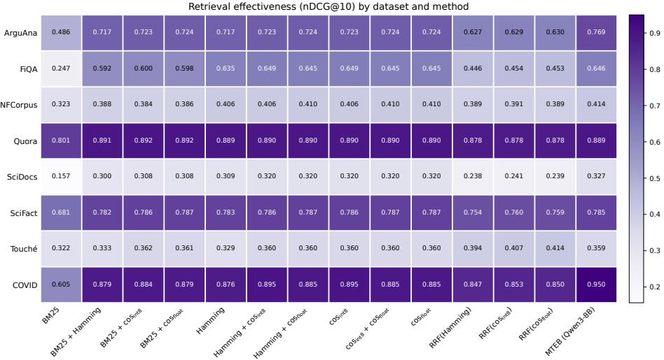
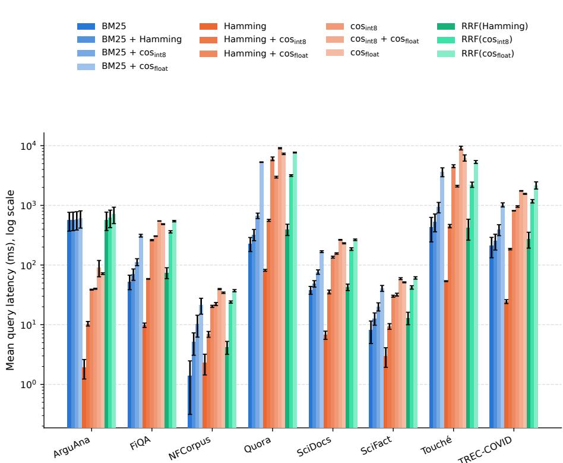

# SQLite is Enough. Lexical, Semantic, and Hybrid Search with scrydb

Timo Breuer<sup>1</sup>

TH Köln – University of Applied Sciences, 50968 Köln, Germany timobreuer@acm.org

Abstract. This work introduces scrydb, a Python library that enables lexical, semantic, and hybrid search within SQLite. For lexical search, scrydb leverages SQLite’s full-text search extension FTS5. Semantic search builds on sqlite-vec, a SQLite extension for vector search. Furthermore, the library allows users to rerank and fuse retrieval results to combine both lexical and semantic approaches, providing a lightweight solution for downstream tasks in information retrieval (IR) or agentic search. We evaluate scrydb on various IR benchmark datasets and demonstrate its efectiveness in text retrieval based on keyword matching, semantic similarity, and rank fusion. In addition, we provide insights into query latency and the trade-of between eficiency and efectiveness. scrydb is available under the MIT license.

<sup>‡</sup> https://github.com/breuert/scrydb/

Keywords: Semantic Search · Text Embeddings · Eficiency · SQLite.

## 1 Introduction

scrydb is built around the idea of packaging an entire small-to-medium-scale search pipeline and the corresponding resources, i.e., documents, lexical index, and embeddings, into an artifact that is as easy to share, archive, and rerun as a single file. It is a minimalist library for lexical, semantic, and hybrid search that stores everything a text retrieval component needs inside a single SQLite database file, with no server process, no external index, and no separate vector store to keep in sync. Lexical search is provided by SQLite’s FTS5 extension and its BM25 ranking function [19]. Semantic search over the entire index is enabled by sqlite-vec, a SQLite extension for vector search at diferent levels of precision. For instance, binary embeddings enable eficient search, while results can also be retrieved with full-precision embeddings at the cost of increased query latency. The retrieved first-stage candidates can optionally be reranked using more costly approaches, e.g., with full-precision embeddings and cosine similarity. Alternatively, the full embeddings can be discarded to keep disk usage low. Additionally, hybrid search allows fusing the lexical and semantic rankings via Reciprocal Rank Fusion (RRF) [7].

The core contributions of this work are as follows:

– Lexical, semantic, and hybrid search with SQLite. scrydb implements lexical scoring, semantic scoring, second-stage reranking, and rank fusion in a single library, rather than requiring application-level orchestration across multiple systems.

– Single-file reproducibility with an archival-grade storage format. By colocating raw documents, the lexical index, and embeddings in one SQLite file, scrydb reduces an entire IR resource to a single artifact: one file to share it all, rather than a bundle of index dumps, vector-store snapshots, and configuration files. Consequently, a scrydb database inherits the longterm preservation properties of any other archival dataset.

Experimental evaluation of efectiveness and eficiency. We evaluate scrydb on a range of BEIR datasets [22], comparing it to MTEB baseline results [16]. Specifically, the experiments shed light on query latency and on the efectiveness of diferent retrieval pipelines and levels of vector precision, providing insights into the trade-ofs between retrieval quality and resource requirements.

– Reusable resources for follow-up research. scrydb is an open-source Python library released under the MIT license, allowing others to build on it. Additionally, we provide prebuilt scrydb databases for the evaluated datasets, including embeddings computed with Qwen3-Embedding-8B [26], and the final retrieval runs used in our evaluation, so that future work can reproduce our results or use them as baselines for comparison.<sup>1</sup>

## 2 Related Work

Beyond raw efectiveness, the IR and NLP communities have increasingly scrutinized the computational cost and environmental footprint of the systems they build [20,21]. This has fueled a broader call for retrieval methods and system designs that are more eficient and less energy-intensive, rather than the pursuit of efectiveness gains at any computational cost. The ReNeuIR workshop series [4] has become a forum for this discussion, examining eficiency in the era of neural information retrieval and encouraging more sustainable research by identifying best practices in the development of retrieval models.

Alongside eficiency, reproducibility has become a central concern for the IR community when it comes to making research practices more sustainable [14]. scrydb contributes to this goal by facilitating single-file reproducibility: it relies on SQLite, which the Library of Congress lists as a preferred dataset format in its Recommended Formats Statement (RFS).

Neural bi-encoder models such as Dense Passage Retrieval (DPR) [12] and Sentence-BERT [18] map queries and documents into a shared embedding space in which semantic relevance is approximated by vector similarity. At scale, exhaustively comparing a query embedding against every document embedding is costly, motivating a large body of work on approximate nearest neighbor (ANN)

search, like inverted-file and product-quantization indexes as implemented in Faiss [9,10], and graph-based indexes such as Hierarchical Navigable Small World (HNSW) [15], both trading exactness for sublinear query time.

Recently, the practice of binarizing (and, less aggressively, scalar-quantizing to int8) the output of sentence-embedding models has been popularized as a way to shrink the memory footprint of embedding indexes by an order of magnitude [3]. The use of random hyperplane projections to derive compact binary codes from real-valued vectors traces back to locality-sensitive hashing and, in particular, SimHash [5], which underlies sign-based binarization. Product quantization [9] ofers a complementary compression strategy, decomposing a vector into subspaces that are each quantized using a small codebook rather than reduced to a single bit.

Purpose-built vector databases such as Milvus, Pinecone, Weaviate, and Qdrant provide managed ANN indexing and hybrid retrieval features, but typically run as standalone services with their own storage engines and operational footprints. Closer to scrydb’s design point are systems that add vector search to an existing relational or embedded database rather than introducing a new one: pgvector contributes vector types and ANN indexes to PostgreSQL, while DuckDB [17] follows a similar embedded, single-file philosophy for OLAP workloads and likewise ofers a vector-search extension. scrydb shares this embedded philosophy but targets text retrieval specifically, combining lexical scoring, quantized vector search, reranking, and rank fusion into a single library and a single database file.

## 3 Eficient Semantic Search Within SQLite

Semantic search becomes practically feasible within SQLite through binarization of the embeddings and comparison via the Hamming distance, with int8 scalar quantization as an intermediate precision. We refer the reader to earlier work for details on how the Hamming distance over binary embeddings approximates cosine similarity over full, 32-bit floating-point embeddings [3, 5, 8].

Full Embeddings and Cosine Similarity. For semantic search, each document $D$ and query $Q$ is mapped to a dense embedding vector $\mathbf { e } \in \mathbb { R } ^ { d }$ , denoted $\mathbf { e } _ { D }$ and $\mathbf { e } _ { Q }$ respectively. The relevance of a document to a query is conventionally measured by the cosine similarity between their embeddings,

$$
\mathrm { s i m } _ { \mathrm { c o s } } ( \mathbf { e } _ { Q } , \mathbf { e } _ { D } ) = \frac { \mathbf { e } _ { Q } \cdot \mathbf { e } _ { D } } { \| \mathbf { e } _ { Q } \| \| \mathbf { e } _ { D } \| } = \mathrm { c o s } ( \theta ) ,\tag{1}
$$

where $\theta$ is the angle between $\mathbf { e } _ { Q }$ and $\mathbf { e } _ { D }$ . Although this measure is accurat $^ \mathrm { e , }$ computing it exhaustively over a full-precision, high-dimensional index is memoryand compute-intensive, motivating lower-precision representations.

Embedding Binarization and Hamming Distance. To keep both storage and comparison cost low, each d-dimensional embedding $\mathbf { e } = ( e _ { 1 } , \ldots , e _ { d } )$ is binarized into

a bit vector $\mathbf { b } = ( b _ { 1 } , \ldots , b _ { d } ) \in \{ 0 , 1 \} ^ { d }$ using a Heaviside step quantizer applied component-wise,

$$
b _ { i } = H ( e _ { i } ) = \left\{ 1 , \quad e _ { i } > 0 \atop 0 , \quad e _ { i } \leq 0  , \qquad i = 1 , \ldots , d . \right.\tag{2}
$$

The resulting bit vector is packed into $d / 8$ bytes and stored alongside the document, reducing the storage footprint by a factor of 32 relative to 32-bit floatingpoint embeddings. Semantic search over the full index is performed by comparing the binary query code ${ \bf b } _ { Q }$ against every binary document code $\mathbf { b } _ { D }$ using the Hamming distance, evaluated by a bitwise XOR followed by a population count,

$$
d _ { H } ( \mathbf { b } _ { Q } , \mathbf { b } _ { D } ) = \sum _ { i = 1 } ^ { d } { \big ( } b _ { Q , i } \oplus b _ { D , i } { \big ) } = { \mathrm { p o p c o u n t } } ( \mathbf { b } _ { Q } \oplus \mathbf { b } _ { D } ) .\tag{3}
$$

Scalar Quantization to int8. As an intermediate point between the 1-bit code and the full 32-bit embedding, scalar quantization to int8 maps each component of an L2-normalized embedding from [−1, 1] onto the int8 range by the afine rule $q _ { i } = \mathrm { t r u n c } \left( 2 5 5 \left( e _ { i } + 1 \right) / 2 - 1 2 8 \right)$ . The result is 4× smaller than float32 and retains per-dimension magnitude rather than only the sign, so int8 embeddings are ranked by cosine similarity, trading some of the binary code’s speed for a closer approximation of Equation (1).

## 4 Software Library and Implementation Details

scrydb is published on the Python Package Index and can be installed with a single command, pip install scrydb. Neither SQLite extension it builds on has to be compiled locally. FTS5 is part of virtually every SQLite build shipped with CPython, and sqlite-vec ships prebuilt loadable binaries as a pip package. Installation is a plain, wheel-only download whose only further runtime dependencies are numpy and tqdm, with the heavier machine-learning stack kept behind optional extras. The package is released under the MIT license and ships a command-line interface and a Dockerfile, so that it can also be driven without writing any code.

## 4.1 SQLite Extensions

Lexical retrieval is delegated to FTS5, the full-text search module that is part of SQLite itself. It exposes an inverted index as a virtual table, queried through the MATCH operator and maintained transactionally alongside ordinary tables in the same database file. scrydb also surfaces FTS5’s snippet() and highlight() auxiliary functions, which return short keyword-in-context fragments or fully marked-up passages without any post-processing on the application side.

sqlite-vec stores float32, int8, or binary vectors in virtual tables queried via a dedicated vec0 module. scrydb maintains one vec0 table per collection and precision, so that binary, int8, and full-precision embeddings are stored side by side in the same database, with both the binarization and the int8 scalar quantization carried out inside SQLite. The full index can thus be scanned exhaustively at any of the three precisions, trading retrieval cost against ranking quality, and any one of them can rerank the candidates returned by another.

```python
from scrydb import Index, SentenceEmbedding
with Index.open("scifact.db") as index:
index.add_model(SentenceEmbedding("Qwen/Qwen3-Embedding-8B"))
# Embeddings are computed on the fly, or taken verbatim from
# ‘embedding_field‘ if the input rows already carry them.
index.index_documents("corpus.jsonl", id_field="docid")
index.index_queries("queries.jsonl", id_field="qid")
# Interactive search: FTS5 and sqlite-vec, fused with RRF.
hits = index.search("vitamin B12", mode="hybrid", rerank="float")
text = index.documents[hits[0].id]["text"] # mapping-style lookups
emb = index.document_embeddings_binary[hits[0].id]
# Batch retrieval over all stored queries, exported as a TREC run.
run = index.batch_search(mode="semantic", precision="binary")
run.write_trec("run.trec", tag="hamming")
```  
Fig. 1. Indexing a corpus and running interactive as well as batch retrieval with scrydb.

## 4.2 Library Interface

The public API is centered on a single Index object that owns the underlying SQLite connection and doubles as a context manager, mirroring the ergonomics of sqlite3.connect. Figure 1 shows a complete retrieval experiment, from indexing a corpus to writing a TREC run, in a handful of lines.

Documents and queries are indexed by providing a JSONL path or any iterable of dictionary-like rows, e.g., a Hugging Face dataset or a pandas data frame. scrydb embeds query and document texts out of the box with Sentence Transformers, the library introduced alongside Sentence-BERT [18], configured through the SentenceEmbedding wrapper. Precomputed embeddings can also be stored directly by naming the field that carries them, decoupling scrydb from any particular embedding model.

search() takes a single query string, while batch\_search() evaluates all queries stored in the index. Both share the same three parameters: mode selects lexical, semantic, or hybrid retrieval; precision selects the representation of the semantic stage, namely binary, int8, or float; and rerank optionally adds a second stage over the top candidates of the first, at any of the three precisions.

An index also behaves like a set of read-only Python mappings: documents and queries resolve an identifier to the stored record; document\_embeddings and query\_embeddings, together with their \_binary and \_int8 variants, resolve identifiers to numpy arrays, making a scrydb database a document and embedding store in its own right. Results support both attribute- and dictionary-style access, and batch\_search() returns a Run that exports to the standard sixcolumn TREC format or to a pandas data frame.

## 5 Experimental Evaluations

scrydb is evaluated on eight publicly available retrieval datasets drawn from BEIR [22], including ArguAna [24] (8.67K documents, argument retrieval), FiQA [13] (57K documents, financial question-answering), NFCorpus [2] (3.6K documents, biomedical/nutrition retrieval), Quora [11, 22] (523K documents, duplicate question-pair retrieval), SciDocs [6] (25K documents, scientific document retrieval), SciFact [25] (5K documents, fact-checking), Touché [1] (382K documents, argument retrieval), and TREC-COVID [23] (171K documents, ad-hoc biomedical retrieval).

As a baseline, we use the retrieval efectiveness figures reported by the Massive Text Embedding Benchmark (MTEB) [16], which hosts BEIR’s retrieval tasks as one of its constituent benchmark families and publishes per-model, perdataset leaderboard results. Specifically, we take the oficially reported MTEB results for Qwen3-Embedding-8B [26] computed with the model’s full, 32-bit floating-point embeddings. This baseline represents the retrieval quality attainable by full-precision cosine search.

For our own runs, we independently recompute the query and document embeddings for all eight BEIR datasets above using the same model, Qwen3- Embedding-8B. The following retrieval methods are evaluated.

The lexical configurations start from BM25 [19], returning 1000 documents per query directly from the FTS5 index. Optionally, a reranking pass over this entire candidate list is added, performed with either the Hamming distance (BM25 + Hamming) or cosine similarity over the int8-quantized and full-precision embeddings $\mathbf { ( B M 2 5 + c o s _ { i n t 8 } }$ or $\mathbf { B M 2 5 + c o s _ { f l o a t } }$ , respectively).

The semantic configurations instead retrieve by exhaustively scanning the entire corpus’s embeddings at a given precision, returning 1000 documents per query (Hamming, $\mathbf { c o s } _ { \mathrm { i n t } 8 } .$ , and $\mathbf { c o s _ { f l o a t } } )$ . Each of the two coarser first-stage rankings can optionally be refined by reranking candidates at a higher precision $( \mathbf { H a m m i n g + c o s _ { i n t 8 } }$ , Hamming + cos<sub>float</sub>, $\mathbf { c o s _ { i n t 8 } + c o s _ { f l o a t } } )$

Finally, the hybrid configurations fuse a lexical and a semantic ranking with RRF [7]: RRF(Hamming), $\mathbf { R R F } ( \cos _ { \mathrm { i n t } 8 } )$ , and $\mathbf { R R F ( c o s _ { f l o a t } ) }$ each fuse the BM25 ranking with the corresponding semantic ranking, without any reranking.

All retrieval experiments are run on a single consumer machine: an Apple MacBook Air (Mac14,15) with an Apple M2 system-on-chip (8 cores: 4 performance + 4 eficiency; ARM64) and 24 GB of unified memory, running macOS 26.5.2. No GPU is used for retrieval; the document and query embeddings are computed once, ahead of time, through a remote embedding API.

## 5.1 Retrieval Efectiveness

Table 1 reports four standard IR efectiveness measures, including Average Precision (AP), Reciprocal Rank (RR), Precision@10 (P@10), and nDCG@10, for each of the thirteen scrydb retrieval configurations against the full-precision MTEB baseline for Qwen3-Embedding-8B, across all eight BEIR datasets; Figure 2 renders the same nDCG@10 figures as a dataset-by-method heatmap. We focus the discussion on nDCG@10, the primary measure used by both BEIR and MTEB, and use it as a shorthand for the general efectiveness trends, which are consistent across AP, RR, and P@10 unless noted otherwise.

<table><tr><td rowspan=1 colspan=1>Dataset</td><td rowspan=1 colspan=1>Measure</td><td rowspan=1 colspan=1>BM25</td><td rowspan=1 colspan=1>BMmmg + mng</td><td rowspan=1 colspan=1>BMi5 + it8</td><td rowspan=1 colspan=1>+ooo atBM25</td><td rowspan=1 colspan=1>Hamng</td><td rowspan=1 colspan=1>Haing + ontsg</td><td rowspan=1 colspan=1>0o Haming</td><td rowspan=1 colspan=1>CoSnt8</td><td rowspan=1 colspan=1>Cosioat  oat</td><td rowspan=1 colspan=1>CoSoat</td><td rowspan=1 colspan=1>RH)mng)</td><td rowspan=1 colspan=1>Rit8)</td><td rowspan=1 colspan=1>R)a)</td><td rowspan=1 colspan=1>(w-8B)MITEB</td></tr><tr><td rowspan=2 colspan=1>ArguAna</td><td rowspan=2 colspan=1>|AP     |RRP@10nDCG@100</td><td rowspan=2 colspan=1>0.405|0.4050.078.486|</td><td rowspan=2 colspan=1>0.643|0.6430.0950.717</td><td rowspan=2 colspan=1>0.648|0.6480.0960.723</td><td rowspan=2 colspan=1>0.649|00.64900.09600.7240</td><td rowspan=2 colspan=1>.643|.643.095.717</td><td rowspan=2 colspan=1>0.648|0.6480.0960.723</td><td rowspan=1 colspan=1>0.649|0.6490.096</td><td rowspan=1 colspan=1>0.648|0.6480.096</td><td rowspan=1 colspan=1>0.649|0.6490.096</td><td rowspan=1 colspan=1>0.649|00.6490.096</td><td rowspan=2 colspan=1>.548|0.5480.089.627</td><td rowspan=2 colspan=1>0.549|0.5490.0900.629</td><td rowspan=2 colspan=1>0.551|0.5510.0900.630</td><td rowspan=2 colspan=1>|0.7050.7050.0970.769</td></tr><tr><td rowspan=1 colspan=1>0.724</td><td rowspan=1 colspan=1>0.723</td><td rowspan=1 colspan=1>0.724</td><td rowspan=1 colspan=1>0.7240</td></tr><tr><td rowspan=2 colspan=1>FiQA</td><td rowspan=2 colspan=1>|APRR     0P@10nDCG@10|0</td><td rowspan=2 colspan=1>|0.205|.31400.068|.2477|</td><td rowspan=2 colspan=1>0.525|.6840.1550.592|</td><td rowspan=2 colspan=1>0.5300.6930.1580.600</td><td rowspan=2 colspan=1>0.529|00.68900.15800.598|</td><td rowspan=2 colspan=1>.567|.711.1730.635|</td><td rowspan=2 colspan=1>0.5780.7260.1770.649</td><td rowspan=1 colspan=1>0.5750.721</td><td rowspan=1 colspan=1>0.5780.726</td><td rowspan=1 colspan=1>0.575|0.721</td><td rowspan=2 colspan=1>0.575|00.7210.1760.645</td><td rowspan=2 colspan=1>.383|0.5330.1260.446</td><td rowspan=2 colspan=1>0.3920.5430.1270.454</td><td rowspan=2 colspan=1>0.390|0.5420.1270.453</td><td rowspan=2 colspan=1>0.5780.7240.1750.646</td></tr><tr><td rowspan=1 colspan=1>0.1760.645</td><td rowspan=1 colspan=1>0.1770.649</td><td rowspan=1 colspan=1>0.1760.645</td></tr><tr><td rowspan=3 colspan=1>NFCorpus</td><td rowspan=3 colspan=1>|APRRP@10nDCG@10</td><td rowspan=3 colspan=1>|0.151|[0.525[0.23100.323|</td><td rowspan=3 colspan=1>0.182|0.6150.2840.388</td><td rowspan=3 colspan=1>0.181|0.6040.2800.384</td><td rowspan=3 colspan=1>0.182|00.606|0.282|0.386|</td><td rowspan=1 colspan=1>.217|0.620</td><td rowspan=2 colspan=1>0.220|0.6160.300</td><td rowspan=1 colspan=1>0.222|0.620</td><td rowspan=1 colspan=1>0.220|0.616</td><td rowspan=2 colspan=1>0.222|0.6200.304</td><td rowspan=2 colspan=1>0.222|00.6200.304</td><td rowspan=2 colspan=1>.207|0.6040.288</td><td rowspan=3 colspan=1>0.2120.6060.2870.391</td><td rowspan=3 colspan=1>|0.212|0.6030.2860.389</td><td rowspan=3 colspan=1>0.2250.6270.3080.414</td></tr><tr><td rowspan=1 colspan=1>0.301</td><td rowspan=1 colspan=1>0.304</td><td rowspan=1 colspan=1>0.300</td></tr><tr><td rowspan=1 colspan=1>0.406</td><td rowspan=1 colspan=1>0.406</td><td rowspan=1 colspan=1>0.410</td><td rowspan=1 colspan=1>0.406</td><td rowspan=1 colspan=1>0.410</td><td rowspan=1 colspan=1>0.410</td><td rowspan=1 colspan=1>0.389</td></tr><tr><td rowspan=3 colspan=1>Quora</td><td rowspan=3 colspan=1>|APRRP@10nDCG@10</td><td rowspan=3 colspan=1>|0.759|0.7970.1210.801</td><td rowspan=3 colspan=1>0.861|0.8820.1350.891</td><td rowspan=3 colspan=1>0.86220.8830.1360.892</td><td rowspan=1 colspan=1>|0.862|0.8830</td><td rowspan=1 colspan=1>0.859|.880</td><td rowspan=1 colspan=1>0.8610.881</td><td rowspan=1 colspan=1>0.8610.881</td><td rowspan=1 colspan=1>0.8610.881</td><td rowspan=1 colspan=1>0.8610.881</td><td rowspan=1 colspan=1>0.861|00.881</td><td rowspan=3 colspan=1>.844|0.8730.1330.878</td><td rowspan=3 colspan=1>0.845|0.8740.1330.878</td><td rowspan=3 colspan=1>0.845|0.8740.1330.878</td><td rowspan=3 colspan=1>0.8590.8790.1360.889</td></tr><tr><td rowspan=2 colspan=1>0.8920.889</td><td rowspan=2 colspan=1>0.1359</td><td rowspan=2 colspan=1>0.1360.890</td><td rowspan=2 colspan=1>0.1360.890</td><td rowspan=1 colspan=1>0.136</td><td rowspan=1 colspan=1>0.136</td><td rowspan=2 colspan=1>0.136|0.890</td></tr><tr><td rowspan=1 colspan=1>0.890</td><td rowspan=1 colspan=1>0.890</td></tr><tr><td rowspan=3 colspan=1>SciDocs</td><td rowspan=3 colspan=1>|APRRP@10nDCG@10|0.</td><td rowspan=3 colspan=1>|0.109|0.28500.081|157|</td><td rowspan=3 colspan=1>0.216|.4830.1560.300</td><td rowspan=2 colspan=1>0.221|0.4920.161</td><td rowspan=2 colspan=1>0.221|00.492|0.161|0</td><td rowspan=2 colspan=1>.236|0.495.162|</td><td rowspan=1 colspan=1>0.243|0.500</td><td rowspan=1 colspan=1>0.2440.503</td><td rowspan=1 colspan=1>0.243|0.500</td><td rowspan=1 colspan=1>0.244|0.503</td><td rowspan=1 colspan=1>0.244|0.503</td><td rowspan=3 colspan=1>0.182|0.4140.123.238|</td><td rowspan=3 colspan=1>0.185|0.4150.1240.241</td><td rowspan=3 colspan=1>0.184|0.4130.1230.239</td><td rowspan=3 colspan=1>0.2520.5100.1730.327</td></tr><tr><td rowspan=1 colspan=1>0.170</td><td rowspan=1 colspan=1>0.169</td><td rowspan=1 colspan=1>0.170</td><td rowspan=1 colspan=1>0.169</td><td rowspan=1 colspan=1>0.169|</td></tr><tr><td rowspan=1 colspan=1>0.308|</td><td rowspan=1 colspan=1>0.308|0</td><td rowspan=1 colspan=1>.309|</td><td rowspan=1 colspan=1>0.320</td><td rowspan=1 colspan=1>0.320</td><td rowspan=1 colspan=1>0.320</td><td rowspan=1 colspan=1>0.320</td><td rowspan=1 colspan=1>0.320|0</td></tr><tr><td rowspan=4 colspan=1>SciFact</td><td rowspan=4 colspan=1>|AP     |RRP@10nDCG@10</td><td rowspan=4 colspan=1>0.642||0.653|0.089|0.6810</td><td rowspan=4 colspan=1>0.740|0.748|0.103.782</td><td rowspan=2 colspan=1>0.7450.752</td><td rowspan=1 colspan=1>|0.745|0</td><td rowspan=1 colspan=1>.741|</td><td rowspan=1 colspan=1>0.743|</td><td rowspan=1 colspan=1>0.744|</td><td rowspan=1 colspan=1>0.743</td><td rowspan=1 colspan=1>0.744|</td><td rowspan=1 colspan=1>0.744|0</td><td rowspan=4 colspan=1>.710|0.7200.0990.754</td><td rowspan=4 colspan=1>0.718|0.7300.0990.760</td><td rowspan=4 colspan=1>0.717|0.7290.0990.759</td><td rowspan=4 colspan=1>0.7410.7490.1040.785</td></tr><tr><td rowspan=1 colspan=1>0.7520</td><td rowspan=1 colspan=1>.749</td><td rowspan=1 colspan=1>0.751</td><td rowspan=1 colspan=1>0.752</td><td rowspan=1 colspan=1>0.751</td><td rowspan=1 colspan=1>0.752</td><td rowspan=1 colspan=1>0.752</td></tr><tr><td rowspan=2 colspan=1>0.1040.786</td><td rowspan=2 colspan=1>0.104|0.7870</td><td rowspan=2 colspan=1>0.104.783</td><td rowspan=2 colspan=1>0.1040.786</td><td rowspan=2 colspan=1>0.1050.787</td><td rowspan=1 colspan=1>0.104</td><td rowspan=2 colspan=1>0.1050.787</td><td rowspan=2 colspan=1>[0.1050.7877</td></tr><tr><td rowspan=1 colspan=1>0.786</td></tr><tr><td rowspan=4 colspan=1>Touché</td><td rowspan=4 colspan=1>|AP     |RRP@10|nDCG@10|</td><td rowspan=4 colspan=1>0.229|0.600|0.29400.322</td><td rowspan=4 colspan=1>0.238|0.588.2942|0.333</td><td rowspan=4 colspan=1>0.247|0.6520.3160.362</td><td rowspan=3 colspan=1>0.248|00.62100.316|</td><td rowspan=2 colspan=1>.233|.587</td><td rowspan=2 colspan=1>0.2430.649</td><td rowspan=2 colspan=1>0.244|0.618</td><td rowspan=1 colspan=1>0.243|</td><td rowspan=2 colspan=1>0.244|0.618</td><td rowspan=2 colspan=1>0.244|00.618</td><td rowspan=4 colspan=1>.278|0.6800.3430.394</td><td rowspan=4 colspan=1>|0.291|0.6820.3470.407|</td><td rowspan=4 colspan=1>0.2900.7000.3550.414</td><td rowspan=4 colspan=1>0.2540.5760.3180.359</td></tr><tr><td rowspan=1 colspan=1>0.649</td></tr><tr><td rowspan=1 colspan=1>0.288</td><td rowspan=1 colspan=1>0.314</td><td rowspan=1 colspan=1>0.316</td><td rowspan=1 colspan=1>0.314</td><td rowspan=1 colspan=1>0.316</td><td rowspan=1 colspan=1>0.316</td></tr><tr><td rowspan=1 colspan=1>0.361|0</td><td rowspan=1 colspan=1>.329|</td><td rowspan=1 colspan=1>0.360</td><td rowspan=1 colspan=1>0.360</td><td rowspan=1 colspan=1>0.360</td><td rowspan=1 colspan=1>0.360</td><td rowspan=1 colspan=1>0.360|</td></tr><tr><td rowspan=4 colspan=1>COVID</td><td rowspan=4 colspan=1>|AP     |RRP@10nDCG@10|</td><td rowspan=2 colspan=1>0.195|0.885</td><td rowspan=1 colspan=1>0.303|</td><td rowspan=1 colspan=1>0.308|</td><td rowspan=2 colspan=1>0.308|01.000|0</td><td rowspan=1 colspan=1>.393|</td><td rowspan=1 colspan=1>0.407|</td><td rowspan=1 colspan=1>0.406</td><td rowspan=1 colspan=1>0.413</td><td rowspan=1 colspan=1>0.412|</td><td rowspan=1 colspan=1>0.412||</td><td rowspan=2 colspan=1>0.358|0.977</td><td rowspan=2 colspan=1>0.367|0.970</td><td rowspan=2 colspan=1>0.366|0.967</td><td rowspan=4 colspan=1>0.4841.0000.9740.950</td></tr><tr><td rowspan=1 colspan=1>0.975</td><td rowspan=1 colspan=1>1.000</td><td rowspan=1 colspan=1>.985</td><td rowspan=1 colspan=1>1.000</td><td rowspan=1 colspan=1>0.990</td><td rowspan=1 colspan=1>1.000</td><td rowspan=1 colspan=1>0.990</td><td rowspan=1 colspan=1>0.990</td></tr><tr><td rowspan=2 colspan=1>0.6360.605|</td><td rowspan=1 colspan=1>0.918|</td><td rowspan=1 colspan=1>0.916</td><td rowspan=1 colspan=1>0.910|</td><td rowspan=1 colspan=1>0.912</td><td rowspan=1 colspan=1>0.926</td><td rowspan=1 colspan=1>0.916</td><td rowspan=1 colspan=1>0.926</td><td rowspan=1 colspan=1>0.916</td><td rowspan=1 colspan=1>0.916</td><td rowspan=1 colspan=1>0.882</td><td rowspan=1 colspan=1>0.890</td><td rowspan=1 colspan=1>0.890</td></tr><tr><td rowspan=1 colspan=1>0.879</td><td rowspan=1 colspan=1>0.884</td><td rowspan=1 colspan=1>0.879|0</td><td rowspan=1 colspan=1>.876|</td><td rowspan=1 colspan=1>0.895</td><td rowspan=1 colspan=1>0.885</td><td rowspan=1 colspan=1>0.895</td><td rowspan=1 colspan=1>0.885</td><td rowspan=1 colspan=1>0.885</td><td rowspan=1 colspan=1>0.847</td><td rowspan=1 colspan=1>0.853</td><td rowspan=1 colspan=1>0.850</td></tr></table>

Table 1. Retrieval efectiveness (AP, RR, P@10, nDCG@10) of each retrieval method against the full-precision embedding baseline reported by MTEB for Qwen3- Embedding-8B. Best score per row in bold, second-best underlined; tied methods share the mark, with ties determined by the unrounded scores.

Reranking improves over raw BM25 in nDCG@10 on every dataset, substantially so on all but Touché, where the gain is marginal and RR in fact degrades slightly. Notably, reranking by the inexpensive Hamming distance already captures nearly all of this gain. The binary codes therefore retain enough of the relevance signal to serve as a cheap drop-in for cosine-based reranking on most, though not all, corpora. Semantic retrieval over the full binarized index outperforms BM25 in nDCG@10 on all eight datasets, in several cases by a wide margin, confirming that the semantic signal captured by the binarized Qwen3- Embedding-8B embeddings is more informative than exact lexical overlap.

  
Fig. 2. Retrieval efectiveness (nDCG@10) evaluated by dataset for all methods.

A more consequential pattern emerges from the reranked semantic configurations: refining a coarse ranking to higher precision is equivalent, at the top of the ranking, to scanning the whole corpus at that precision. Hamming $+ \cos _ { \mathrm { i n t } 8 }$ and exhaustive $\cos _ { \mathrm { i n t } 8 }$ yield identical P@10 and nDCG@10 to three decimals on all eight datasets, as do Hamming $+ \cos _ { \mathrm { f l o a t } }$ and $\mathrm { c o s } _ { \mathrm { f l o a t } }$ , and likewise $\cos _ { \mathrm { i n t } 8 } + \cos _ { \mathrm { f l o a t } }$ and $\cos _ { \mathrm { f l o a t } } ;$ within each pair the columns diverge only in $\mathrm { A P } ,$ where documents ranked below the 1000-document reranking depth still contribute. The binary first stage thus already places the documents that a full-precision exhaustive scan would rank in the top ten inside its top-1000 candidates, so the coarse Hamming pass costs nothing in early-precision terms. Since rescoring 1000 candidates is far cheaper than scanning an entire corpus at int8 or float precision, Hamming $+ \cos _ { \mathrm { i n t } 8 }$ dominates exhaustive $\mathrm { c o s } _ { \mathrm { i n t } 8 }$ at the top of the ranking, matching its top-10 efectiveness at roughly one-fifth of the mean latency (164.5 ms vs. 822.5 ms) while trailing it marginally in AP (0.407 vs. 0.413 on TREC-COVID); by the same argument Hamming $+ \cos _ { \mathrm { f l o a t } }$ dominates plain $\mathrm { c o s } _ { \mathrm { f l o a t } }$ , being cheaper and indistinguishable in terms of nDCG@10. This is the central efectiveness argument for the binary-first design.

On four of the eight datasets, a scrydb configuration meets or exceeds the MTEB baseline: Hamming $+ \cos _ { \mathrm { i n t } 8 }$ reaches 0.649 nDCG@10 on FiQA vs. 0.646, $\mathrm { B M 2 5 + c o s _ { f l o a t } \ 0 . 8 9 2 }$ on Quora vs. 0.889, Hamming $+ \cos _ { \mathrm { f l o a t } }$ 0.787 on SciFact vs. 0.785, and $\mathrm { R R F } ( \cos _ { \mathrm { f l o a t } } )$ 0.414 on Touché vs. 0.359. The remaining gaps in effectiveness are not attributable to scrydb’s compressed representations. Our own exhaustive full-precision run, $\mathrm { c o s } _ { \mathrm { f l o a t } }$ , which performs precisely the computation the baseline describes, reproduces the TREC-COVID deficit (0.885 nDCG@10 against the reported 0.950), so the deficit is already present before any binarization or quantization is applied and more likely originates in the embedding pipeline, e.g., in prompt formatting, than in the index.

<table><tr><td rowspan=1 colspan=1>Dataset</td><td rowspan=1 colspan=1>Size</td><td rowspan=1 colspan=1>uery egth</td><td rowspan=1 colspan=1>BM25</td><td rowspan=1 colspan=1>Hamng十BM25</td><td rowspan=1 colspan=1>COin BM25</td><td rowspan=1 colspan=2>COSoat十BM25</td><td rowspan=1 colspan=2>Hamng</td><td rowspan=1 colspan=1>Hain + oontg</td><td rowspan=1 colspan=1>Haon + aat</td><td rowspan=1 colspan=1>COoSint8</td><td rowspan=1 colspan=1>cosiot</td><td rowspan=1 colspan=1>oat    COSoat</td><td rowspan=1 colspan=1>R)ning)</td><td rowspan=1 colspan=1>R)nt8)</td><td rowspan=1 colspan=2>R)at)</td></tr><tr><td rowspan=2 colspan=1>ArguAnaFiQANFCorpus</td><td rowspan=1 colspan=1>|8.67K|57K</td><td rowspan=1 colspan=1>|181.4|11.0</td><td rowspan=1 colspan=1>|566.8|53.1</td><td rowspan=1 colspan=1>|573.6||70.7</td><td rowspan=1 colspan=1>584.5|112.6</td><td rowspan=1 colspan=2>612.3|310.7</td><td rowspan=1 colspan=2>1.9|9.8</td><td rowspan=1 colspan=1>10.458.5</td><td rowspan=1 colspan=1>38.7|261.3</td><td rowspan=1 colspan=1>40.0|304.9</td><td rowspan=1 colspan=1>91.3|547.8</td><td rowspan=1 colspan=1>71.7484.1</td><td rowspan=1 colspan=1>|574.7|74.7</td><td rowspan=1 colspan=1>626.9|360.3</td><td rowspan=1 colspan=2>712.7543.6</td></tr><tr><td rowspan=1 colspan=1>3.6K</td><td rowspan=1 colspan=1>3.9</td><td rowspan=1 colspan=1>1.4</td><td rowspan=1 colspan=1>5.2</td><td rowspan=1 colspan=1>10.3</td><td rowspan=1 colspan=1>2</td><td rowspan=1 colspan=1>4</td><td rowspan=1 colspan=2>2.3</td><td rowspan=2 colspan=1>6.9560.6</td><td rowspan=2 colspan=1>20.36034.1</td><td rowspan=2 colspan=1>22.22971.0</td><td rowspan=2 colspan=1>39.6</td><td rowspan=1 colspan=1>34.3</td><td rowspan=3 colspan=1>4.2397.442.7</td><td rowspan=3 colspan=1>24.03160.0185.1</td><td rowspan=2 colspan=2>37.27669.6</td></tr><tr><td rowspan=1 colspan=1>Quora</td><td rowspan=1 colspan=1>523K</td><td rowspan=1 colspan=1>9.9</td><td rowspan=1 colspan=1>228.7</td><td rowspan=1 colspan=1>324.7</td><td rowspan=1 colspan=1>[670.9</td><td rowspan=1 colspan=2>5293.5</td><td rowspan=1 colspan=1>81</td><td></td><td rowspan=1 colspan=1>9073.1</td><td rowspan=1 colspan=1>|7294.8|</td></tr><tr><td rowspan=1 colspan=1>SciDocs</td><td rowspan=1 colspan=1>25K</td><td rowspan=1 colspan=1>10.0</td><td rowspan=1 colspan=1>38.0</td><td rowspan=1 colspan=1>48.7</td><td rowspan=1 colspan=1>76.5</td><td rowspan=1 colspan=2>167.7</td><td rowspan=1 colspan=2>6.7</td><td rowspan=1 colspan=1>35.4</td><td rowspan=1 colspan=1>135.6</td><td rowspan=1 colspan=1>156.1</td><td rowspan=1 colspan=1>264.3</td><td rowspan=1 colspan=1>231.2</td><td rowspan=1 colspan=1>1.7</td></tr><tr><td rowspan=1 colspan=1>SciFact</td><td rowspan=1 colspan=1>5K</td><td rowspan=1 colspan=1>12.6</td><td rowspan=1 colspan=1>8.2</td><td rowspan=1 colspan=1>12.8</td><td rowspan=1 colspan=1>20.1</td><td rowspan=1 colspan=2>40.8</td><td rowspan=1 colspan=2>3.0</td><td rowspan=1 colspan=1>9.4</td><td rowspan=1 colspan=1>30.0</td><td rowspan=1 colspan=1>31.9</td><td rowspan=1 colspan=1>59.1</td><td rowspan=1 colspan=1>51.3</td><td rowspan=1 colspan=1>13.1</td><td rowspan=1 colspan=1>42.2</td><td rowspan=2 colspan=2>60.85325.8</td></tr><tr><td rowspan=1 colspan=1>Touché</td><td rowspan=1 colspan=1>382K</td><td rowspan=1 colspan=1>6.3</td><td rowspan=1 colspan=1>436.5</td><td rowspan=1 colspan=1>538.2</td><td rowspan=1 colspan=1>933.9</td><td rowspan=1 colspan=2>3635.6</td><td rowspan=1 colspan=2>53.7</td><td rowspan=1 colspan=1>449.8</td><td rowspan=1 colspan=1>4532.4</td><td rowspan=1 colspan=1>2097.8</td><td rowspan=1 colspan=1>9138.4</td><td rowspan=1 colspan=1>[6259.0</td><td rowspan=1 colspan=1>423.5</td><td rowspan=1 colspan=1>2225.4</td></tr><tr><td rowspan=1 colspan=1>COVID</td><td rowspan=1 colspan=1>171K</td><td rowspan=1 colspan=1>9.5</td><td rowspan=1 colspan=1>211.6</td><td rowspan=1 colspan=1>253.4</td><td rowspan=1 colspan=1>392.2</td><td rowspan=1 colspan=2>1020.3</td><td rowspan=1 colspan=2>24.4</td><td rowspan=1 colspan=1>184.6</td><td rowspan=1 colspan=1>812.7</td><td rowspan=1 colspan=1>955.8</td><td rowspan=1 colspan=1>1748.2</td><td rowspan=1 colspan=1>1558.4</td><td rowspan=1 colspan=1>273.2</td><td rowspan=1 colspan=1>1172.8|</td><td rowspan=1 colspan=2>2174.9</td></tr><tr><td rowspan=1 colspan=1>Mean</td><td rowspan=1 colspan=1></td><td rowspan=1 colspan=1></td><td rowspan=1 colspan=1>-|193.0|</td><td rowspan=1 colspan=1>228.4|</td><td rowspan=1 colspan=1>350.1|</td><td rowspan=1 colspan=2>1387.8|</td><td rowspan=1 colspan=2>22.9|</td><td rowspan=1 colspan=1>164.5|</td><td rowspan=1 colspan=1>1483.1|</td><td rowspan=1 colspan=1>822.5|2</td><td rowspan=1 colspan=1>620.2|</td><td rowspan=1 colspan=1>1998.1|</td><td rowspan=1 colspan=1>225.4|</td><td rowspan=1 colspan=1>974.6|</td><td rowspan=1 colspan=2>2098.7</td></tr></table>

Table 2. Mean query latency (ms) of each retrieval strategy, per BEIR dataset and averaged across datasets (Mean row), alongside corpus size and mean query length (words, computed over the queries timed for that row). Fastest method per row in bold, second-fastest underlined.

RRF hybrid search is the best-performing scrydb configuration on exactly one dataset, Touché, where RRF $\left( \cos _ { \mathrm { f l o a t } } \right)$ wins on RR, P@10, and nDCG@10 and exceeds the MTEB baseline, with RRF $\left( \cos _ { \mathrm { i n t 8 } } \right)$ marginally ahead on AP. On the remaining seven datasets, RRF trails the better of the two rankings it fuses. RRF in scrydb is therefore worthwhile only where lexical and semantic retrieval are of comparable strength and make complementary rather than redundant errors, and is not a uniformly safe default.

## 5.2 Query Latency

Figure 3 and Table 2 report the mean end-to-end query latency, in milliseconds, for each configuration across all eight BEIR datasets, alongside the corpus sizes and mean query lengths that relate cost to both dimensions; the figure additionally shows the standard deviation across queries as error bars and uses a logarithmic axis, since latencies span almost four orders of magnitude, from 1.4 ms (BM25 on NFCorpus) to 9138.4 ms $\mathrm { ( c o s _ { i n t 8 } + c o s _ { f l o a t } }$ on Touché).

Hamming search is the cheapest form of semantic retrieval and the fastest of all thirteen configurations on seven of the eight datasets. Its latency scales with corpus size rather than query length, as expected from its exhaustive, wordparallel scan over every stored binary code, growing to 81.5 ms on the 523Kdocument Quora corpus. Scanning the same embeddings at higher precision is markedly more expensive: exhaustive cosine similarity over int8-quantized embeddings costs, on average across datasets, 36× as much as Hamming (822.5 ms vs. 22.9 ms), and over full-precision embeddings a further 2.4× beyond that (1998.1 ms). Binarization is therefore not merely a storage optimization but the main lever that keeps exhaustive semantic search cheap.

  
Fig. 3. Query latency evaluated by dataset for all retrieval methods.

BM25 shows the opposite dependency: because FTS5 only touches the postings lists of the terms present in a query, its latency tracks query length far more than corpus size. This is most visible on ArguAna, whose 8.67K-document corpus is the third-smallest of the eight, yet whose queries are themselves full arguments averaging 181.4 words, an order of magnitude longer than any other dataset’s, so that each query touches far more postings lists than a handful of keywords would; its BM25 latency (566.8 ms) accordingly exceeds that of the 382K-document Touché corpus (436.5 ms).

Reranking adds a cost that grows with both the underlying corpus size and the precision of the target representation, rather than staying fixed at the reranking depth of 1000 as a pure top-k rescoring would suggest. Rescoring the top-1000 candidates by the compact binary codes adds roughly 0.2–1.1 ms per thousand corpus documents on top of the first-stage ranking, by int8-quantized embeddings roughly 0.9–2.5 ms, and by full-precision embeddings roughly 4–12 ms (+45.5 ms on ArguAna, but +5064.8 ms on Quora). This ordering, which holds whether the first-stage ranking being refined is BM25’s or Hamming’s, tracks the on-disk width of each representation, suggesting that a reranking pass is dominated by the cost of reading the candidates’ stored vectors rather than by the comparison itself.

The most expensive configurations combine an exhaustive first-stage semantic scan with a further reranking or fusion pass. Stacking a full int8 scan with a full-precision cosine rerank $( \cos _ { \mathrm { i n t 8 } } + \cos _ { \mathrm { f l o a t } } )$ is the costliest of all, averaging 2620.2 ms across the eight datasets and reaching 9138.4 ms on Touché, and fusing BM25 with a full-precision scan is comparably expensive. The cheaper RRF(Hamming) fusion, by contrast, broadly tracks the sum of its two standalone components plus a fusion overhead, reflecting that RRF is computed over the two raw, unreranked result lists rather than over already-reranked ones.

Despite this wide range, the cheapest configurations remain practical at scale: plain Hamming search still answers a query in 81.5 ms at the 523K-document scale of Quora, and its int8-precision rerank averages 164.5 ms across datasets, while the multi-second latencies are confined to configurations that stack two exhaustive high-precision scans, on the order of 100× more expensive than plain Hamming search, without a correspondingly large efectiveness gain over cheaper alternatives. The word-parallel Hamming-distance scan thus keeps exhaustive binary-code search practical at this scale without resorting to approximate nearest-neighbor structures.

## 6 Discussion

The experimental results put a concrete number on the central design bet behind scrydb: that collapsing a retrieval experiment into a single, self-contained SQLite file need not come at a prohibitive cost in either efectiveness or latency. Across the eight datasets, the best-performing scrydb configuration trails the full-precision MTEB baseline for Qwen3-Embedding-8B by a mean of 0.006 nDCG@10, and meets or exceeds it on four of the eight, despite operating on embeddings binarized to one thirty-second of their original size.

None of this is an argument that scrydb obsoletes the vector-database and ANN ecosystem. Purpose-built systems and the ANN algorithms underlying them, e.g., inverted-file and product-quantization indexes as in Faiss, and graphbased indexes such as HNSW, solve problems that a single embedded SQLite file, by construction, does not attempt to solve: concurrent, multi-tenant query serving; horizontal sharding and replication across machines; real-time ingestion and updates against a corpus that grows without bound; GPU-accelerated index construction and search; and the operational tooling needed to run all of this reliably in production. scrydb’s exhaustive scan over binary codes is not a substitute for the sublinear query time these systems achieve at web scale. If anything, scrydb is only possible because of this existing technology stack, not in spite of it.

scrydb is best understood as occupying a diferent point in the same design space rather than as a competitor to those systems: it trades away sublinear query time, horizontal scalability, and concurrent serving in exchange for being expressible as a single, dependency-light, portable file. For a production search service fielding concurrent trafic over a continuously growing corpus, a purposebuilt vector database remains the right tool. This is a call to weigh that cost against the actual requirements rather than pay it unconditionally for headroom that may never be used, not a claim that lightweight, self-contained tools are categorically preferable to mature systems.

That trade-of has a concrete boundary, which the latency results let us quantify rather than merely assert. Across the eight evaluated corpora, Hamming search latency scales at a marginal rate of roughly 0.15 ms per thousand documents, on top of a fixed per-query overhead of about 1.3 ms. This scan does not, however, become sublinear the way an ANN index does: extrapolating the measured rate linearly, a corpus of a few million documents is still answered in under a second, but mean per-query latency reaches several seconds at around twenty million documents, and a corpus at the scale purpose-built vector databases are designed for, tens of millions to billions of documents, would be impractical to search exhaustively on commodity hardware, regardless of how cheap the wordparallel popcount makes each individual comparison.

The same 32× compression that keeps this scan cheap in absolute terms also keeps its memory footprint low, and it is worth stating that footprint concretely: a 4096-dimensional Qwen3-Embedding-8B vector occupies 512 bytes once binarized, compared with 16 KB in full 32-bit precision. Even a severalmillion-document collection’s entire semantic index therefore amounts to a few gigabytes and fits comfortably in the memory of a consumer machine, rather than the tens of gigabytes the same collection would require at full precision. This is precisely the regime in which scrydb is a practical resource: for smallto-medium-scale collections, up to roughly a few million documents, it ofers eficient, low-memory-footprint search that scans the entire collection exhaustively, without needing to build, tune, or maintain an approximate index at all.

## 7 Conclusion

This paper presented scrydb, a minimalist library that packages lexical, semantic, and hybrid search into a single, self-contained SQLite file. By colocating documents, the lexical index, and embeddings in one file, scrydb turns an entire retrieval resource into a single artifact that can be shared, archived, and rerun as easily as any other dataset file, making retrieval experiments more reproducible.

scrydb is not a replacement for the vector-database and ANN ecosystem; rather, it makes the case for reaching for that heavier, more scalable stack when a task’s scale and serving requirements actually call for it, and for settling on a single, self-contained, easily archived file otherwise. We hope that this positioning makes scrydb databases practical artifacts for accompanying published retrieval experiments and for supporting small-to-medium-scale projects.

## References

1. Bondarenko, A., Fröbe, M., Beloucif, M., Gienapp, L., Ajjour, Y., Panchenko, A., Biemann, C., Stein, B., Wachsmuth, H., Potthast, M., Hagen, M.: Overview of touché 2020: Argument retrieval. In: Cappellato, L., Eickhof, C., Ferro, N., Névéol, A. (eds.) Working Notes of CLEF 2020 - Conference and Labs of the Evaluation Forum, Thessaloniki, Greece, September 22-25, 2020. CEUR Workshop Proceedings, vol. 2696. CEUR-WS.org (2020), https://ceur-ws.org/Vol-2696/ paper\_261.pdf

2. Boteva, V., Ghalandari, D.G., Sokolov, A., Riezler, S.: A full-text learning to rank dataset for medical information retrieval. In: Ferro, N., Crestani, F., Moens, M., Mothe, J., Silvestri, F., Nunzio, G.M.D., Hauf, C., Silvello, G. (eds.) Advances in Information Retrieval - 38th European Conference on IR Research, ECIR 2016, Padua, Italy, March 20-23, 2016. Proceedings. Lecture Notes in Computer Science, vol. 9626, pp. 716–722. Springer (2016). https://doi.org/10.1007/ 978-3-319-30671-1\_58, https://doi.org/10.1007/978-3-319-30671-1\_58

3. Bruch, S.: Foundations of Vector Retrieval. Springer (2024). https://doi.org/10. 1007/978-3-031-55182-6, https://doi.org/10.1007/978-3-031-55182-6

4. Bruch, S., Lucchese, C., Nardini, F.M.: Reneuir: Reaching eficiency in neural information retrieval. In: Amigó, E., Castells, P., Gonzalo, J., Carterette, B., Culpepper, J.S., Kazai, G. (eds.) SIGIR ’22: The 45th International ACM SIGIR Conference on Research and Development in Information Retrieval, Madrid, Spain, July 11 - 15, 2022. pp. 3462–3465. ACM (2022). https://doi.org/10.1145/3477495.3531704, https://doi.org/10.1145/3477495.3531704

5. Charikar, M.: Similarity estimation techniques from rounding algorithms. In: Reif, J.H. (ed.) Proceedings on 34th Annual ACM Symposium on Theory of Computing, May 19-21, 2002, Montréal, Québec, Canada. pp. 380–388. ACM (2002). https: //doi.org/10.1145/509907.509965, https://doi.org/10.1145/509907.509965

6. Cohan, A., Feldman, S., Beltagy, I., Downey, D., Weld, D.S.: SPECTER: document-level representation learning using citation-informed transformers. In: Jurafsky, D., Chai, J., Schluter, N., Tetreault, J.R. (eds.) Proceedings of the 58th Annual Meeting of the Association for Computational Linguistics, ACL 2020, Online, July 5-10, 2020. pp. 2270–2282. Association for Computational Linguistics (2020). https://doi.org/10.18653/V1/2020.ACL-MAIN.207, https: //doi.org/10.18653/v1/2020.acl-main.207

7. Cormack, G.V., Clarke, C.L.A., Büttcher, S.: Reciprocal rank fusion outperforms condorcet and individual rank learning methods. In: Allan, J., Aslam, J.A., Sanderson, M., Zhai, C., Zobel, J. (eds.) Proceedings of the 32nd Annual International ACM SIGIR Conference on Research and Development in Information Retrieval, SIGIR 2009, Boston, MA, USA, July 19-23, 2009. pp. 758– 759. ACM (2009). https://doi.org/10.1145/1571941.1572114, https://doi. org/10.1145/1571941.1572114

8. Goemans, M.X., Williamson, D.P.: Improved approximation algorithms for maximum cut and satisfiability problems using semidefinite programming. J. ACM 42(6), 1115–1145 (1995). https://doi.org/10.1145/227683.227684, https:// doi.org/10.1145/227683.227684

9. Jégou, H., Douze, M., Schmid, C.: Product quantization for nearest neighbor search. IEEE Trans. Pattern Anal. Mach. Intell. 33(1), 117–128 (2011). https: //doi.org/10.1109/TPAMI.2010.57, https://doi.org/10.1109/TPAMI.2010.57

10. Johnson, J., Douze, M., Jégou, H.: Billion-scale similarity search with gpus. IEEE Trans. Big Data 7(3), 535–547 (2021). https://doi.org/10.1109/TBDATA.2019. 2921572, https://doi.org/10.1109/TBDATA.2019.2921572

11. Kamalloo, E., Thakur, N., Lassance, C., Ma, X., Yang, J., Lin, J.: Resources for brewing BEIR: reproducible reference models and statistical analyses. In: Yang, G.H., Wang, H., Han, S., Hauf, C., Zuccon, G., Zhang, Y. (eds.) Proceedings of the 47th International ACM SIGIR Conference on Research and Development in Information Retrieval, SIGIR 2024, Washington DC, USA, July 14-18, 2024. pp. 1431–1440. ACM (2024). https://doi.org/10.1145/3626772.3657862, https:// doi.org/10.1145/3626772.3657862

12. Karpukhin, V., Oguz, B., Min, S., Lewis, P., Wu, L., Edunov, S., Chen, D., Yih, W.: Dense passage retrieval for open-domain question answering. In: Webber, B., Cohn, T., He, Y., Liu, Y. (eds.) Proceedings of the 2020 Conference on Empirical Methods in Natural Language Processing, EMNLP 2020, Online, November 16-20, 2020. pp. 6769–6781. Association for Computational Linguistics (2020). https://doi.org/10.18653/V1/2020.EMNLP-MAIN.550, https://doi. org/10.18653/v1/2020.emnlp-main.550

13. Maia, M., Handschuh, S., Freitas, A., Davis, B., McDermott, R., Zarrouk, M., Balahur, A.: Www’18 open challenge: Financial opinion mining and question answering. In: Champin, P., Gandon, F., Lalmas, M., Ipeirotis, P.G. (eds.) Companion Proceedings of the The Web Conference 2018, WWW 2018, Lyon , France, April 23-27, 2018. pp. 1941–1942. ACM (2018). https://doi.org/10.1145/3184558. 3192301, https://doi.org/10.1145/3184558.3192301

14. Maistro, M., Breuer, T., Ferro, N.: Reproducibility in information retrieval. Foundations and Trends® in Information Retrieval 20(4), 225–379 (2026). https://doi.org/10.1108/ftinr-05-2025-0087, http://dx.doi.org/10.1108/ FTINR-05-2025-0087

15. Malkov, Y.A., Yashunin, D.A.: Eficient and robust approximate nearest neighbor search using hierarchical navigable small world graphs. IEEE Trans. Pattern Anal. Mach. Intell. 42(4), 824–836 (2020). https://doi.org/10.1109/TPAMI. 2018.2889473, https://doi.org/10.1109/TPAMI.2018.2889473

16. Muennighof, N., Tazi, N., Magne, L., Reimers, N.: MTEB: massive text embedding benchmark. In: Vlachos, A., Augenstein, I. (eds.) Proceedings of the 17th Conference of the European Chapter of the Association for Computational Linguistics, EACL 2023, Dubrovnik, Croatia, May 2-6, 2023. pp. 2006–2029. Association for Computational Linguistics (2023). https://doi.org/10.18653/V1/2023. EACL-MAIN.148, https://doi.org/10.18653/v1/2023.eacl-main.148

17. Raasveldt, M., Mühleisen, H.: Duckdb: an embeddable analytical database. In: Boncz, P., Manegold, S., Ailamaki, A., Deshpande, A., Kraska, T. (eds.) Proceedings of the 2019 International Conference on Management of Data, SIG-MOD Conference 2019, Amsterdam, The Netherlands, June 30 - July 5, 2019. pp. 1981–1984. ACM (2019). https://doi.org/10.1145/3299869.3320212, https: //doi.org/10.1145/3299869.3320212

18. Reimers, N., Gurevych, I.: Sentence-bert: Sentence embeddings using siamese bert-networks. In: Inui, K., Jiang, J., Ng, V., Wan, X. (eds.) Proceedings of the 2019 Conference on Empirical Methods in Natural Language Processing and the 9th International Joint Conference on Natural Language Processing, EMNLP-IJCNLP 2019, Hong Kong, China, November 3-7, 2019. pp. 3980–3990. Association for Computational Linguistics (2019). https://doi.org/10.18653/V1/D19-1410, https://doi.org/10.18653/v1/D19-1410

19. Robertson, S.E., Walker, S., Jones, S., Hancock-Beaulieu, M., Gatford, M.: Okapi at TREC-3. In: Harman, D.K. (ed.) Proceedings of The Third Text REtrieval Conference, TREC 1994, Gaithersburg, Maryland, USA, November 2-4, 1994. NIST Special Publication, vol. 500-225, pp. 109–126. National Institute of Standards and Technology (NIST) (1994). https://doi.org/10.6028/NIST.SP.500-225. routing-city, http://trec.nist.gov/pubs/trec3/papers/city.ps.gz

20. Scells, H., Zhuang, S., Zuccon, G.: Reduce, reuse, recycle: Green information retrieval research. In: Amigó, E., Castells, P., Gonzalo, J., Carterette, B., Culpepper, J.S., Kazai, G. (eds.) SIGIR ’22: The 45th International ACM SIGIR Conference on Research and Development in Information Retrieval, Madrid, Spain, July 11 - 15, 2022. pp. 2825–2837. ACM (2022). https://doi.org/10.1145/3477495.3531766, https://doi.org/10.1145/3477495.3531766

21. Strubell, E., Ganesh, A., McCallum, A.: Energy and policy considerations for deep learning in NLP. In: Korhonen, A., Traum, D.R., Màrquez, L. (eds.) Proceedings of the 57th Conference of the Association for Computational Linguistics, ACL 2019, Florence, Italy, July 28- August 2, 2019, Volume 1: Long Papers. pp. 3645–3650. Association for Computational Linguistics (2019). https://doi.org/10.18653/ V1/P19-1355, https://doi.org/10.18653/v1/p19-1355

22. Thakur, N., Reimers, N., Rücklé, A., Srivastava, A., Gurevych, I.: BEIR: A heterogeneous benchmark for zero-shot evaluation of information retrieval models. In: Vanschoren, J., Yeung, S. (eds.) Proceedings of the Neural Information Processing Systems Track on Datasets and Benchmarks 1, NeurIPS Datasets and Benchmarks 2021, December 2021, virtual (2021), https://datasets-benchmarks-proceedings.neurips.cc/paper/2021/ hash/65b9eea6e1cc6bb9f0cd2a47751a186f-Abstract-round2.html

23. Voorhees, E.M., Roberts, K.: On the quality of the TREC-COVID IR test collections. In: Diaz, F., Shah, C., Suel, T., Castells, P., Jones, R., Sakai, T. (eds.) SIGIR ’21: The 44th International ACM SIGIR Conference on Research and Development in Information Retrieval, Virtual Event, Canada, July 11-15, 2021. pp. 2422–2428. ACM (2021). https://doi.org/10.1145/3404835.3463244, https://doi.org/10.1145/3404835.3463244

24. Wachsmuth, H., Syed, S., Stein, B.: Retrieval of the best counterargument without prior topic knowledge. In: Gurevych, I., Miyao, Y. (eds.) Proceedings of the 56th Annual Meeting of the Association for Computational Linguistics, ACL 2018, Melbourne, Australia, July 15-20, 2018, Volume 1: Long Papers. pp. 241–251. Association for Computational Linguistics (2018). https://doi.org/10.18653/V1/ P18-1023, https://aclanthology.org/P18-1023/

25. Wadden, D., Lin, S., Lo, K., Wang, L.L., van Zuylen, M., Cohan, A., Hajishirzi, H.: Fact or fiction: Verifying scientific claims. In: Webber, B., Cohn, T., He, Y., Liu, Y. (eds.) Proceedings of the 2020 Conference on Empirical Methods in Natural Language Processing, EMNLP 2020, Online, November 16-20, 2020. pp. 7534–7550. Association for Computational Linguistics (2020). https://doi.org/10.18653/V1/ 2020.EMNLP-MAIN.609, https://doi.org/10.18653/v1/2020.emnlp-main.609

26. Zhang, Y., Li, M., Long, D., Zhang, X., Lin, H., Yang, B., Xie, P., Yang, A., Liu, D., Lin, J., Huang, F., Zhou, J.: Qwen3 embedding: Advancing text embedding and reranking through foundation models. CoRR abs/2506.05176 (2025). https://doi.org/10.48550/ARXIV.2506.05176, https://doi.org/10. 48550/arXiv.2506.05176