# SkillForge: Evolving Verifiable Skills for Reinforcement Learning Agents

Shidong Yang\*, Ziyu Ma\*, Tongwen Huang, Xucong Wang, Renda Li, Yiming Hu, Yong Wang†, Xiangxiang Chu AMAP, Alibaba Group

## Abstract

Large language model (LLM) agents are trained with reinforcement learning (RL) for complex decision-making tasks. However, most RL-trained agents remain episodic and cannot accumulate reusable knowledge across episodes. Recent skill-based approaches, such as SKILLRL, attempt to address this issue by extracting skills from raw trajectories, but treat the skill bank as an append-only repository without verifying whether stored skills remain effective. In this paper, we propose SKILL-FORGE, a framework for continuous skill evolution that enables skills to be verified and refined through environment interaction. By making skill usage explicit during agent interaction, RL can directly optimize both environment actions and skill invocation decisions. SKILL-FORGE further introduces evidence-based skill verification and multi-pathway skill induction, allowing the skill bank to continuously grow while maintaining its quality. Extensive experiments on ALFWorld, WebShop, and AppWorld show that SKILLFORGE consistently outperforms SKILLRL, demonstrating the effectiveness of continuously verified skills in training stronger LLM agents.

## 1 Introduction

The rapid advancement of large language models (LLMs) (Liu et al., 2024; Yang et al., 2025) has driven the development of LLM-based agents (Yao et al., 2023; Shinn et al., 2023), which are now widely used in applications such as web navigation (Google, 2025; OpenAI, 2025a), deep research, and personal assistance (OpenAI, 2025b; Google, 2024; Team et al., 2025). Reinforcement learning (RL) (Guo et al., 2025; Sun et al., 2024; Ji et al., 2026; Chu et al., 2026) has become the dominant approach for training such agents, enabling them to acquire adaptive behaviors in open-ended environments. However, most RL-trained agents (Li et al., 2025; Mai et al., 2026; Lin et al., 2025) remain episodic: each episode starts from scratch without retaining reusable knowledge from past successes or failures (Zhang et al., 2025b). As a result, agents often have to rediscover effective behaviors repeatedly, leading to inefficient learning. This raises a fundamental question: how can agents accumulate and reuse knowledge across episodes?

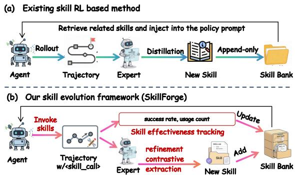  
Figure 1: (a) Existing methods distill trajectories into skills and append them to the bank, but skills are injected in bulk without explicit usage tracking or quality control. (b) SKILLFORGE introduces explicit skill calling with per-skill effectiveness tracking to update existing skills, and multi-pathway induction to continuously add new skills to the evolving bank.

A common solution is to equip agents with external memory that stores past trajectories for future reference (Shinn et al., 2023; Zhao et al., 2024; Chhikara et al., 2025). However, raw trajectories are often long, redundant, and noisy (Chhikara et al., 2025), making them difficult to reuse effectively. Even with compression or online updates (Zhang et al., 2025b, 2026), existing memorybased methods mainly rely on recalling past episodes rather than extracting reusable knowledge. Instead of memorizing what happened in previous trajectories, a more effective strategy is to distill experience into skills, which are compact decision principles that capture what to do, why it works, and when to apply it (Anthropic, 2025). Such skills are concise, reusable across episodes, and easy to retrieve during decision making. Recent work such as SKILLRL (Xia et al., 2026) demonstrates the effectiveness of this direction by extracting skills from raw trajectories and injecting them into the policy prompt (as shown in Fig. 1(a)), achieving substantial improvements over both vanilla RL and memory-based approaches.

Despite these improvements, SKILLRL and related approaches treat the skill bank as an appendonly skill repository in which skills are continuously added but rarely examined (Xia et al., 2026). In practice, skills are written once and then repeatedly injected into the prompt without verifying whether they are actually useful. This design leads to three important limitations. First, skill usage is not observable. Skills are inserted in bulk, and it is unclear whether the agent truly relies on a specific skill during decision making. Second, skill effectiveness is difficult to attribute. Without explicit usage signals, it is hard to determine whether a successful trajectory is caused by a particular skill or simply coincides with it. Third, skill quality is not controlled. Incorrect or outdated skills may remain in the skill bank indefinitely, gradually polluting the knowledge base.

To address these issues, we propose SKILL-FORGE, a skill evolution framework that enables skills to be continuously verified through environment interaction (Fig. 1(b)). The key idea is to make skill usage explicit during agent interaction. Instead of injecting full skill descriptions into the prompt, SKILLFORGE provides a compact catalog and allows the agent to invoke skills on demand using structured tags. Each invocation becomes a discrete event in the trajectory, making skill usage directly observable and allowing RL to reinforce useful skills while suppressing ineffective ones. SKILLFORGE further introduces evidencebased skill verification. For each skill, the framework tracks statistics such as success rate and usage count, which are aggregated into an underperformance score used for skill review. High-scoring skills show stronger evidence of underperformance and are prioritized for LLM-based reflexion, and they are revised when needed to maintain skill quality. Finally, SKILLFORGE introduces a multipathway skill induction mechanism that synthesizes new skills from successful trajectories, failed attempts, and contrastive outcome analysis, enabling the skill bank to continuously grow while improving its quality. We evaluate SKILLFORGE on ALFWorld (Shridhar et al., 2021), WebShop (Yao et al., 2022), and AppWorld (Trivedi et al., 2024). Without cold-start initialization, SKILLFORGE improves over SKILLRL by 6.3% on average, demonstrating that continuously verified skills lead to stronger agents.

Our contributions can be summarized as follows:

• We propose SKILLFORGE, a continuous skill evolution framework that enables skills to be verified and refined through environment interaction.

• We design an explicit skill calling strategy that makes skill usage observable and allows RL to jointly optimize actions and skill invocations.

• Extensive experiments on three diverse benchmarks show that SKILLFORGE consistently outperforms existing skill-based baselines.

## 2 Related Work

LLM Agents. Recent progress in large language models has led to a surge of autonomous agents that can reason, act, and interact with external environments (Wei et al., 2026). Representative frameworks such as ReAct (Yao et al., 2023) and Reflexion (Shinn et al., 2023) augment agent behavior with interleaved reasoning or self-reflection, while AutoGen (Wu et al., 2024) and CAMEL (Li et al., 2023) extend this paradigm to multi-agent collaboration and tool use. Despite their strong empirical performance, most existing agents are still built on in-context learning (Dong et al., 2024) and remain fundamentally episodic, with little ability to accumulate reusable knowledge across interactions.

Memory in Agents. To improve long-horizon decision making, many agent systems introduce external memory (Hu et al., 2025). Early approaches mainly rely on retrieval-augmented generation or direct storage of past trajectories (Wang et al., 2024; Chhikara et al., 2025; Zhang et al., 2025a; Wang et al., 2025). More recent work moves toward compressing experience into summaries, tips, or higherlevel reflections (Wang and Chen, 2025; Tang et al., 2025; Fang et al., 2026; Zhao et al., 2024; Ouyang et al., 2026; Wei et al., 2025). Although these methods improve memory efficiency, they retain noisy or weakly grounded information, making it difficult to extract reusable knowledge that can benefit future decisions.

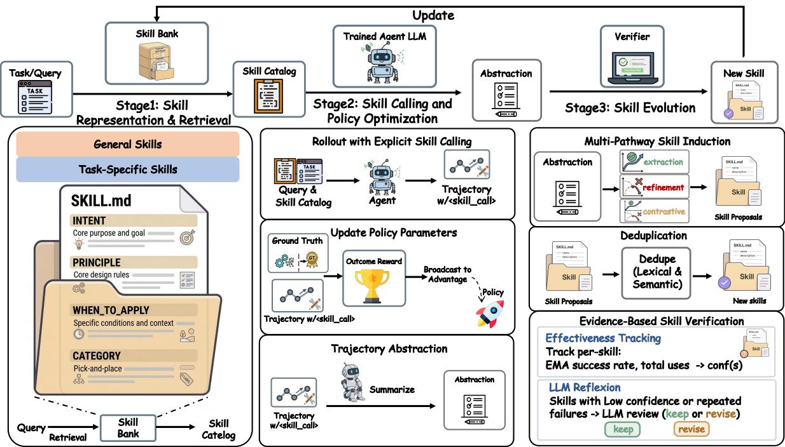  
Figure 2: Overview of the SKILLFORGE framework. Skills are retrieved from the skill bank and injected as a compact catalog into the agent’s prompt (§3.1). During rollout, the agent explicitly invokes skills via structured tags, and the policy is optimized with GRPO (§3.2). Rollout trajectories then drive multi-pathway skill induction and evidence-based verification to continuously evolve the skill bank (§3.3).

Skill Learning for Agents. Beyond generic memory, recent studies increasingly explore reusable skills as a more structured form of experience abstraction (Anthropic, 2025; Gao et al., 2025; Xia et al., 2025; Liu et al., 2025; Xia et al., 2026; Ma et al., 2026). This direction is related to continual learning (Parisi et al., 2019) and is also connected to reinforcement learning, which has been widely used for model alignment and reasoning optimization (Schulman et al., 2017; Ouyang et al., 2022; Shao et al., 2024). However, skill learning in openended agent environments remains underexplored, especially when skills must be updated according to long-horizon interaction outcomes. This motivates studying skills not as static memory items, but as reusable capabilities that can improve over time.

## 3 Method

We propose SKILLFORGE, a framework that maintains a continuously verifiable skill bank alongside the agent’s policy during RL training. In this section, we first describe the skill representation and retrieval process in Section 3.1. We then present the rollout and policy optimization process with explicit skill calling in Section 3.2. Finally, Section 3.3 introduces skill induction, verification, and update based on environment interaction. The overall framework is illustrated in Fig. 2.

## 3.1 Skill Representation and Retrieval

Problem Setup. We consider an LLM agent with policy $\pi _ { \theta }$ interacting with an environment E over multi-step episodes. Each task is specified by a description d. At step t, the agent observes $o _ { t } .$ , produces action $a _ { t } .$ , and receives the next observation $o _ { t + 1 }$ , forming a trajectory $\tau = ( o _ { 0 } , a _ { 0 } , . . . , o _ { T } )$ with binary reward $r ( \tau ) \in \{ 0 , 1 \}$ . We augment the agent with a skill bank $B = B _ { g } \cup \bigcup _ { k = 1 } ^ { K } B _ { k }$ , where $B _ { g }$ contains general skills and each $\boldsymbol { B _ { k } }$ corresponds to a task type and contains its associated skills. The joint objective is:

$$
\operatorname* { m a x } _ { \theta , \mathcal { B } } \mathbb { E } _ { d \sim \mathcal { D } } \Big [ \mathbb { E } _ { \tau \sim \pi _ { \theta } ( \cdot | d , \mathcal { B } ) } \big [ r ( \tau ) \big ] \Big ] .\tag{1}
$$

Skill Schema. Each skill $s \in B$ is a structured knowledge unit. It consists of a title as the callable identifier, an intent describing its purpose, a principle encoding the core decision strategy, applicability conditions specifying when to apply it, a category label (general or task type k), and a status flag for tracking whether the skill is active or under revision. This design keeps each skill selfcontained: the agent can judge its relevance from the intent and access the full content only after explicit invocation.

Skill Bank Initialization. We construct the initial skill bank $B _ { 0 }$ by rolling out the initial instruction-tuned policy model in the target environment and distilling the collected trajectories through a teacher LLM $M _ { T }$ , following SKILLRL (Xia et al., 2026). Successful trajectories are distilled into strategic patterns, while failed ones are synthesized into concise corrective lessons. The resulting skills are organized into a two-level hierarchy: general skills $B _ { g }$ capture universal strategies applicable across all task types (e.g., systematic exploration, precondition checking), while task-specific skills $B _ { k }$ encode specialized knowledge for each task category k (e.g., domain-specific action sequences, common failure modes). This initial bank serves as the starting point for subsequent evolution during RL training.

Retrieval and Catalog Injection. At the beginning of each episode, the system retrieves a subset of skills from $B _ { g } \cup B _ { k }$ using embedding-based retrieval, which ranks all skills by semantic similarity to the task description d and selects the top-K:

$$
\begin{array} { r } { S _ { \mathrm { r e t } } = \mathrm { T o p } { - } K \cos ( { \bf e } _ { d } , { \bf e } _ { s } ) , } \\ { { s } \in { \mathcal { B } } \qquad } \end{array}\tag{2}
$$

where $\mathbf { e } _ { d }$ and $\mathbf { e } _ { s }$ are the embeddings of the task description and skill intent, respectively. The retrieved skills are formatted into a compact catalog containing only the title and a one-line intent summary, and then appended to the system prompt. This design keeps the prompt compact regardless of the bank size, while the full skill content, including the principle and applicability conditions, is revealed only after explicit skill calling (§3.2).

## 3.2 Skill Calling and Policy Optimization

Rollout with Explicit Skill Calling. For each task $d ,$ the retrieved skill catalog $S _ { \mathrm { { r e t } } }$ is appended to the prompt together with the task query. During interaction with the environment, the agent’s output at each step consists of an environment action $a _ { t } ^ { \mathrm { { e n v } } }$ and an optional skill invocation $c _ { t } .$

$$
a _ { t } = \big ( a _ { t } ^ { \mathrm { e n v } } , ~ c _ { t } \big ) , \quad c _ { t } \in \{ \emptyset \} \cup S _ { \mathrm { r e t } } ,\tag{3}
$$

where $c _ { t }$ selects a skill from the retrieved catalog or $\emptyset$ if no skill is invoked. In practice, the agent emits a structured <skill\_call>NAME</skill\_call> tag within its response. The framework resolves the called name against the catalog and returns the full structured skill content (intent, principle, and applicability conditions) as feedback in the next observation:

$$
o _ { t + 1 } = \left\{ \begin{array} { l l } { \displaystyle \mathcal { E } ( a _ { t } ^ { \mathrm { e n v } } ) \oplus \mathrm { C o n t e n t } ( c _ { t } ) , } & { \mathrm { i f } c _ { t } \neq \emptyset , } \\ { \displaystyle \mathcal { E } ( a _ { t } ^ { \mathrm { e n v } } ) , } & { \mathrm { o t h e r w i s e } , } \end{array} \right.\tag{4}
$$

where ⊕ denotes concatenation. This design treats skill invocation as a discrete, traceable action within the trajectory, making skill usage both observable and attributable. Since the calling tag is part of the generated token sequence, RL directly optimizes when and which skills the agent invokes. Per-skill usage events further enable effectiveness tracking in Section 3.3.

Policy Update. The agent samples G trajectories $\{ \tau ^ { ( i ) } \} _ { i = 1 } ^ { G } \sim \pi _ { \theta } ( \cdot \mid d , S _ { \mathrm { r e t } } )$ with skill calling events recorded. Each trajectory is scored against the ground-truth outcome reward $R _ { i } = r ( \tau ^ { ( i ) } )$ , from which we compute the group-relative advantage $\hat { A } _ { i } = ( R _ { i } - \bar { R } ) / \sigma _ { R }$ . The policy is optimized via GRPO (Guo et al., 2025):

$$
\begin{array} { r } { J ( \theta ) = \mathbb { E } \left[ \frac { 1 } { G } \displaystyle \sum _ { i = 1 } ^ { G } \operatorname* { m i n } \Bigl ( \rho _ { i } \hat { A } _ { i } , ~ \mathrm { c l i p } ( \rho _ { i } , 1 - \epsilon , 1 + \epsilon ) \hat { A } _ { i } \Bigr ) \right. } \\ { \left. - \beta D _ { \mathrm { K L } } ( \pi _ { \theta } \| \pi _ { \mathrm { r e f } } ) \right] } \end{array}\tag{5}
$$

where $\rho _ { i } = \pi _ { \theta } / \pi _ { \theta _ { \mathrm { o l d } } }$ is the importance ratio, ϵ is the clipping range, and $\pi _ { \mathrm { r e f } }$ is a fixed reference policy. Since the <skill\_call> tag is part of the generated token sequence, the same objective jointly optimizes actions and skill invocation decisions.

Trajectory Abstraction. Each rollout trajectory is summarized by an LLM into a concise abstraction preserving key decisions, skill calls, and outcomes while discarding redundant observations. Trajectories are partitioned into successful $( T ^ { + } )$ and failed (T−) sets according to reward and stored in per-task-type buffers, which serve as structured input for skill induction.

## 3.3 Skill Evolution

The skill bank evolves continuously through two processes. Induction adds new skills from rollout trajectories, while verification evaluates and refines existing skills using usage evidence.

Multi-Pathway Skill Induction. Every I training steps, a teacher LLM $M _ { T }$ synthesizes new skills from the trajectory abstractions collected in

<table><tr><td rowspan="2">Method</td><td colspan="7">ALFWorld</td><td colspan="2">WebShop</td><td colspan="2">AppWorld</td></tr><tr><td>Pick</td><td>Look</td><td>Clean</td><td>Heat</td><td>Cool</td><td>Pick2</td><td>All</td><td>Score</td><td>Succ.</td><td>TGC</td><td>SGC</td></tr><tr><td colspan="10">Closed-source LLMs</td></tr><tr><td>GPT-40</td><td>75.3</td><td>60.8</td><td>31.2</td><td>56.7</td><td>21.6</td><td>49.8</td><td>48.0</td><td>31.8</td><td>23.7</td><td>48.8</td><td>32.1</td></tr><tr><td>Gemini-2.5-Pro</td><td>92.8</td><td>63.3</td><td>62.1</td><td>69.0</td><td>26.6</td><td>58.7</td><td>60.3</td><td>42.5</td><td>35.9</td><td></td><td>一</td></tr><tr><td colspan="10">Qwen2.5-7B-Instruct</td></tr><tr><td>Qwen2.5</td><td>33.4</td><td>21.6</td><td>19.3</td><td>6.90</td><td>2.80</td><td>3.20</td><td>14.8</td><td>26.4</td><td>7.80</td><td>0.59</td><td>0.00</td></tr><tr><td colspan="10">Prompt-based Agentic or Memory-based Methods</td></tr><tr><td>ReAct*</td><td>48.5</td><td>35.4</td><td>34.3</td><td>13.2</td><td>18.2</td><td>17.6</td><td>31.2</td><td>46.2</td><td>19.5</td><td>0.59</td><td>0.00</td></tr><tr><td>Reflexion*</td><td>62.0</td><td>41.6</td><td>44.9</td><td>30.9</td><td>36.3</td><td>23.8</td><td>42.7</td><td>58.1</td><td>28.8</td><td>1.19</td><td>0.00</td></tr><tr><td>Mem0</td><td>54.0</td><td>55.0</td><td>26.9</td><td>36.4</td><td>20.8</td><td>7.69</td><td>33.6</td><td>23.9</td><td>2.00</td><td></td><td></td></tr><tr><td>SimpleMem</td><td>64.5</td><td>33.3</td><td>20.0</td><td>12.5</td><td>33.3</td><td>3.84</td><td>29.7</td><td>33.2</td><td>8.59</td><td></td><td>一</td></tr><tr><td colspan="10"></td></tr><tr><td>RL-based Methods RLOO*</td><td></td><td>78.2</td><td>87.3</td><td>81.3</td><td>71.9</td><td>48.9</td><td>75.5</td><td></td><td></td><td></td><td></td></tr><tr><td>GRPO*</td><td>87.6 90.8</td><td>66.1</td><td>89.3</td><td>74.7</td><td>72.5</td><td>64.7</td><td>77.6</td><td>80.3 79.3</td><td>65.7 66.1</td><td>17.9</td><td>3.57</td></tr><tr><td colspan="10">Memory-Augmented RL-based Methods</td></tr><tr><td>Mem0+GRPO</td><td>78.1</td><td>54.8</td><td>56.1</td><td>31.0</td><td>65.0</td><td>26.9</td><td>54.7</td><td>58.1</td><td>37.5</td><td>一</td><td></td></tr><tr><td>SimpleMem+GRPO</td><td>89.5</td><td>36.3</td><td>60.0</td><td>50.0</td><td>64.9</td><td>26.3</td><td>62.5</td><td>67.8</td><td>46.9</td><td></td><td></td></tr><tr><td>SkiliRL</td><td>97.9</td><td>71.4</td><td>90.0</td><td>90.0</td><td>95.5</td><td>87.5</td><td>89.9</td><td>85.2</td><td>72.7</td><td>19.0</td><td>5.36</td></tr><tr><td>OURS(Qwen2.5-7B)</td><td>100</td><td>100</td><td>92.6</td><td>100</td><td>80.0</td><td>91.7</td><td>93.6</td><td>89.8</td><td>83.0</td><td>23.8</td><td>14.3</td></tr><tr><td>OURS(Qwen3-4B)</td><td>94.3</td><td>92.3</td><td>92.6</td><td>81.3</td><td>84.0</td><td>79.2</td><td>87.9</td><td>90.8</td><td>84.0</td><td>44.6</td><td>30.4</td></tr><tr><td>OURs(Qwen3-30B-A3B)</td><td>100</td><td>84.6</td><td>92.6</td><td>93.8</td><td>92.0</td><td>95.8</td><td>94.3</td><td>90.8</td><td>83.8</td><td>59.5</td><td>37.5</td></tr></table>

Table 1: Performance on ALFWorld, WebShop, and AppWorld. For ALFWorld, we report the average success rate (%) for each subtask as well as the overall result. For WebShop, we report both the average score and the average success rate (%). For AppWorld, we report Task Goal Completion (TGC) and Scenario Goal Completion (SGC). ∗ denotes the results replicated from (Feng et al., 2025).

Section 3.2. Depending on the trajectory buffer, one of three induction pathways is selected. Extraction extracts generalizable strategies from successful trajectories $\mathcal { T } ^ { + }$ . Refinement identifies recurring failure patterns from T− and formulates corrective strategies. Contrastive analysis pairs successes with failures to identify decisive behavioral differences. The teacher synthesizes new skills as:

$$
S _ { \mathrm { n e w } } = M _ { T } ( T ^ { + } , T ^ { - } , B , \ m ) ,\tag{6}
$$

where the mode m is contrastive when both $| \tau ^ { + } | , | T ^ { - } | > 0 .$ , extraction when only successes are available, and refinement when only failures exist. The existing bank B is provided as context to avoid generating redundant skills. New skills are deduplicated via lexical matching and semantic similarity before being added to the bank.

Evidence-Based Skill Verification. Explicit skill calling (Section 3.2) makes each skill invocation a traceable event tied to an episode outcome. This enables fine-grained effectiveness tracking. We maintain per-skill statistics updated after every training step. Specifically, each time skill s is invoked in an episode with outcome $r \in \{ 0 , 1 \}$ , its exponential moving average (EMA) success rate is updated as:

$$
\hat { p } _ { s } \gets \alpha \cdot r + ( 1 - \alpha ) \cdot \hat { p } _ { s } ,\tag{7}
$$

where $\alpha$ is the smoothing factor. We additionally track total uses $n _ { s }$ . These statistics are combined into an underperformance score:

$$
\mathrm { c o n f } ( s ) = ( 1 - \hat { p } _ { s } ) \cdot \left( 1 - 0 . 5 ^ { n _ { s } / h } \right) ,\tag{8}
$$

where h is the usage half-life. A skill with low success rate and high usage receives a high underperformance score, indicating stronger evidence that it should be prioritized for reflexion. An LLM reviews the skill definition against its recent usage contexts and returns a verdict of keep or revise (rewriting the principle and applicability conditions). This process ensures that skills that no longer contribute are revised in a timely manner, preventing knowledge decay and maintaining the overall reliability of the skill bank.

Training Procedure. Algorithm 1 summarizes the complete loop. Each training step consists of skill-augmented rollout (Section 3.2) followed by policy update. Every I steps, the skill bank is updated: new skills are induced and deduplicated, existing skills are verified through effectiveness tracking and reflexion, and the updated bank is immediately available to subsequent rollouts. This ensures that skills are continuously generated, tested, and refined through environment interactions.

<table><tr><td>Method</td><td>ALFWorld</td><td>AppWorld</td></tr><tr><td>SKILLFORGE</td><td>87.9</td><td>44.6</td></tr><tr><td colspan="3">Skill Calling</td></tr><tr><td>w/o Explicit Calling</td><td>77.9</td><td>33.3</td></tr><tr><td>w/o Skill Bank</td><td>79.3</td><td>34.5</td></tr><tr><td colspan="3">Skill Induction</td></tr><tr><td>w/o Multi-Pathway</td><td>82.1</td><td>36.9</td></tr><tr><td>w/o Deduplication</td><td>86.4</td><td>38.7</td></tr><tr><td colspan="3">Skill Verification</td></tr><tr><td>w/o Effectiveness Tracking</td><td>83.6</td><td>36.3</td></tr><tr><td>w/o LLM Reflexion</td><td>82.1</td><td>39.3</td></tr></table>

Table 2: Ablation study on Qwen3-4B. We report ALF-World success rate (%) and AppWorld TGC (%).

## 4 Experiments

## 4.1 Experimental Setup

We evaluate SKILLFORGE on three benchmarks: ALFWorld (Shridhar et al., 2021), WebShop (Yao et al., 2022), and AppWorld (Trivedi et al., 2024). For ALFWorld, we report per-subtask and overall success rate (%). For WebShop, we report average score and success rate (%). For AppWorld, we report Task Goal Completion (TGC) and Scenario Goal Completion (SGC).

## 4.2 Implementation Details

We implement all experiments with the VeRL framework (Sheng et al., 2025). Specifically, Qwen2.5-7B-Instruct and Qwen3-4B-Instruct are trained on one node with 8 NVIDIA H20 GPUs, while Qwen3-30B-A3B-Instruct is trained on 16 H20 GPUs. We use GRPO with a constant learning rate of 1e−6, G=8 samples per prompt, and KL coefficient 1e−3. Rollout temperature is 0.9. The skill bank is updated every I=5 training steps using Qwen3-Max as the teacher LLM M . For skill retrieval, we use Qwen3-Embedding-0.6B to encode task descriptions and serialized skill representations.

## 4.3 Main Results

Overall Performance. Table 1 reports the main results. SKILLFORGE consistently outperforms all baselines. With Qwen2.5-7B, it achieves 93.6 on ALFWorld and 89.8/83.0 (score/success) on WebShop, improving over GRPO by +16.0 and +10.5 score (+16.9 success), respectively. On the more challenging AppWorld, it further increases TGC/SGC from 17.9/3.57 to 23.8/14.3, demonstrating strong improvements on multi-step tasks.

Comparison with Skill-based Methods. Compared with the strongest baseline SKILLRL, SKILL-FORGE improves performance under the same backbone by +3.7 on ALFWorld (93.6 vs. 89.9) and +10.3 success on WebShop (83.0 vs. 72.7). The gap becomes larger on AppWorld, where TGC increases from 19.0 to 23.8 and SGC nearly triples (5.36 → 14.3), highlighting the benefit of continuous skill refinement.

Scaling Across Models. SKILLFORGE benefits all model scales. Notably, Qwen3-4B already achieves strong performance (87.9 ALFWorld, 84.0 WebShop success), approaching or surpassing Qwen2.5-7B with SKILLRL. Scaling to Qwen3- 30B-A3B further yields the best results (94.3 ALF-World, 59.5 AppWorld TGC).

## 4.4 Analysis

Effect of Skill Evolution Components. Table 2 studies the contribution of each component on Qwen3-4B. Removing explicit skill calling or the skill bank leads to large drops (87.9→77.9 and 79.3 on ALFWorld), confirming the importance of external skill retrieval. Within skill induction, multi-pathway induction is the most critical component, while deduplication is important on App-World, where TGC drops from 44.6 to 38.7. For skill verification, both effectiveness tracking and LLM reflexion improve performance, with the former contributing more substantially. Overall, skill calling, induction, and verification all provide complementary gains.

Skill Bank Evolution. Fig. 3 illustrates how the skill bank evolves during training on ALFWorld and AppWorld. The total number of active skills grows steadily (44→90 on ALFWorld and 44→86 on AppWorld) as the agent encounters diverse task failures. General skills increase gradually, while task-specific skills expand to address environmentspecific requirements. This controlled growth suggests that SKILLFORGE continuously induces useful skills while revising unreliable ones through reflexion, maintaining a compact yet expressive skill bank.

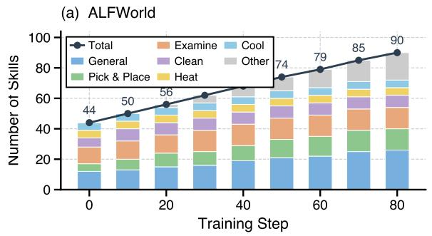

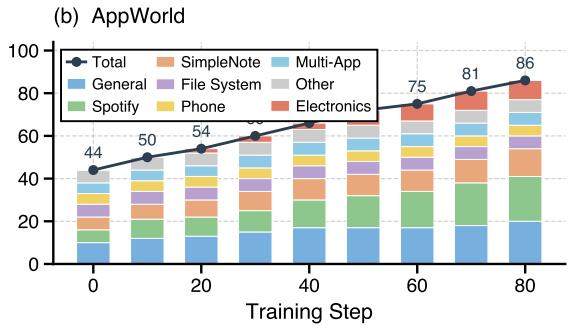  
Figure 3: Evolution of the skill bank during training on ALFWorld and AppWorld. The y-axis shows the number of active skills, grouped into general and task-specific categories. New skills are continuously induced via trajectory analysis, while potentially underperforming ones are reviewed and revised when needed through reflexion, resulting in steady but controlled growth.

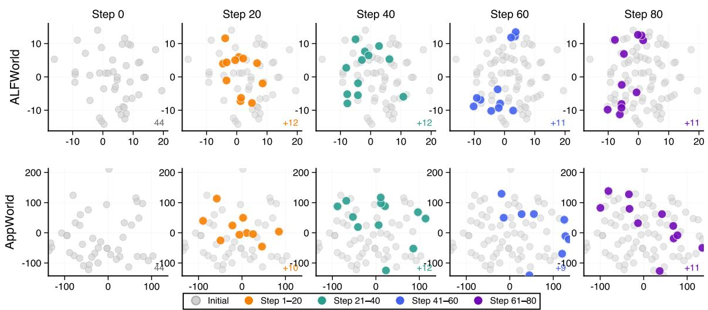  
Figure 4: t-SNE visualization of skill intent embeddings at different training steps on ALFWorld (top) and AppWorld (bottom). Gray points denote the initial skill bank, while colored points represent skills induced during training. As training progresses (Step 20, 40, 60, and 80), newly generated skills gradually expand into previously unexplored regions of the embedding space, indicating the progressive diversification of the skill bank through trajectory-driven induction and reflexion-based refinement.

<table><tr><td>Skill Bank Source</td><td>ALFWorld</td><td>AppWorld</td></tr><tr><td>No skill</td><td>26.4</td><td>26.8</td></tr><tr><td>Qwen3-4B @ init (step 0)</td><td>27.9</td><td>27.4</td></tr><tr><td>Qwen3-4B @ step 20</td><td>28.6</td><td>28.6</td></tr><tr><td>Qwen3-4B @ step 40</td><td>28.6</td><td>31.5</td></tr><tr><td>Qwen3-4B @ step 80</td><td>32.9</td><td>31.5</td></tr><tr><td>Qwen3-30B-A3B self-evolved</td><td>34.3</td><td>30.4</td></tr></table>

Table 3: Skill transferability across model scales. Skill banks produced by Qwen3-4B-Instruct at different training stages are directly applied to Qwen3-30B-A3B-Instruct without further training.

Skill Distribution. Fig. 4 visualizes the t-SNE projection of skill intent embeddings at different training steps on both ALFWorld and AppWorld. The initial skill bank (gray points) occupies a limited region of the embedding space. As training progresses, newly induced skills (colored points) gradually expand into new regions, indicating the increasing diversity of the learned strategies. This expansion pattern suggests that trajectory-driven induction continuously introduces skills addressing new task situations, while reflexion-based verification helps maintain the coherence of existing skills. As a result, the skill bank evolves from a small initial set into a richer and more specialized collection of decision strategies.

Skill Transferability. Table 3 examines whether evolved skills transfer across model scales by applying Qwen3-4B skill banks to Qwen3-30B-A3B without further training. Later-stage skills consistently outperform earlier ones (32.9 vs. 27.9 on

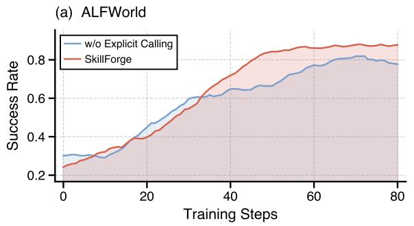

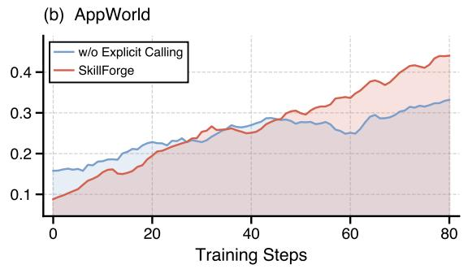  
Figure 5: Training curves on ALFWorld and AppWorld. SKILLFORGE achieves faster convergence and higher asymptotic performance than the variant without explicit calling.

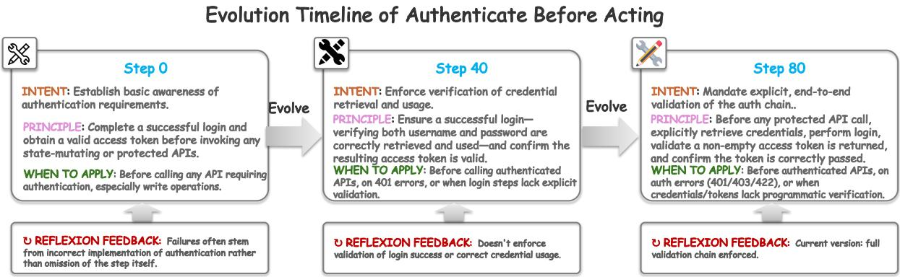  
Figure 6: Evolution timeline of a representative skill (Authenticate Before Acting) across training stages on AppWorld. The figure shows how the skill evolves from Step 0 to Step 40 and Step 80 through trajectory-driven induction and reflexion. The initial version captures a basic authentication strategy. As training progresses, the skill is refined to include explicit credential verification and stronger applicability conditions. Green text marks newly added content, while red text indicates revised or removed parts of the skill definition.

ALFWorld, 31.5 vs. 27.4 on AppWorld), and even initial skills already improve over the no-skill baseline, confirming that SKILLFORGE’s skills store transferable knowledge rather than model-specific artifacts. Notably, Qwen3-4B step-80 skills match or exceed Qwen3-30B-A3B’s self-evolved bank on AppWorld (31.5 vs. 30.4), suggesting that a smaller model with sufficient evolution can produce skills competitive with those from a larger model.

Training Dynamics. Fig. 5 shows training curves on ALFWorld and AppWorld. SKILLFORGE initially lags behind the variant without explicit calling due to the overhead of learning skill usage, but quickly surpasses it and achieves both faster convergence and higher final performance. The gap widens in later stages, indicating that continuous skill induction and verification provide compounding benefits during training.

Case Study. Fig. 6 illustrates how a representative skill evolves during training on AppWorld. The initial version (Step 0) captures a coarse strategy that simply requires obtaining a valid authentication token before calling protected APIs. As training progresses, trajectory feedback reveals common failure patterns, such as missing credential validation or incorrect token usage. The reflexion process then revises the skill to incorporate stronger verification rules and clearer applicability conditions. By Step 80, the skill becomes a more precise and structured decision guideline that explicitly enforces end-to-end authentication checks. This example demonstrates how SKILLFORGE continuously refines skills through environment feedback, transforming simple heuristics into more reliable strategies over the course of training.

## 5 Conclusion

We present SKILLFORGE, a framework for continuous skill evolution in reinforcement learning agents. By making skill usage explicit during interaction, SKILLFORGE enables reinforcement learning to optimize both environment actions and skill invocation decisions, while introducing evidence-based skill verification and multi-pathway skill induction to maintain skill quality as the bank grows. Experiments on ALFWorld, WebShop, and AppWorld show that SKILLFORGE consistently outperforms existing approaches such as SKILLRL without requiring an SFT initialization stage. These results highlight the importance of continuously verifying and refining skills during training and point toward more adaptive, skill-driven reinforcement learning agents in open-ended environments.

## Limitations

While SKILLFORGE demonstrates consistent improvements across multiple agent benchmarks, it has several limitations. First, the skill induction and verification processes rely on an external teacher LLM to synthesize and revise skills from trajectory abstractions. The quality of the resulting skill bank therefore depends on the capability of the teacher model. Second, although the verification mechanism helps maintain skill quality, the skill bank may still grow over time as new skills are continuously induced, which could introduce additional retrieval overhead in long training runs. Finally, the explicit skill calling design introduces additional tokens during interaction, which may increase prompt length and inference cost in largescale deployments.

## References

Arash Ahmadian, Chris Cremer, Matthias Gallé, Marzieh Fadaee, Julia Kreutzer, Olivier Pietquin, Ahmet Üstün, and Sara Hooker. 2024. Back to basics: Revisiting REINFORCE-style optimization for learning from human feedback in LLMs. In Proceedings of the 62nd Annual Meeting of the Association for Computational Linguistics (Volume 1: Long Papers), pages 12248–12267, Bangkok, Thailand. Association for Computational Linguistics.

Anthropic. 2025. Equipping agents for the real world with agent skills.

Prateek Chhikara, Dev Khant, Saket Aryan, Taranjeet Singh, and Deshraj Yadav. 2025. Mem0: Building production-ready AI agents with scalable long-term memory. In ECAI 2025 – 28th European Conference on Artificial Intelligence, volume 413 of Frontiers in Artificial Intelligence and Applications, pages 2993– 3000. IOS Press.

Xiangxiang Chu, Hailang Huang, Xiao Zhang, Fei Wei, and Yong Wang. 2026. GPG: A simple and strong reinforcement learning baseline for model reasoning. In International Conference on Learning Representations.

Gheorghe Comanici, Eric Bieber, Mike Schaekermann, Ice Pasupat, Noveen Sachdeva, Inderjit Dhillon, Marcel Blistein, Ori Ram, Dan Zhang, Evan Rosen, et al. 2025. Gemini 2.5: Pushing the frontier with advanced reasoning, multimodality, long context, and next generation agentic capabilities. arXiv preprint arXiv:2507.06261.

Qingxiu Dong, Lei Li, Damai Dai, Ce Zheng, Jingyuan Ma, Rui Li, Heming Xia, Jingjing Xu, Zhiyong Wu, Baobao Chang, Xu Sun, Lei Li, and Zhifang Sui. 2024. A survey on in-context learning. In Proceedings ofthe 2024 Conference on Empirical Methods in Natural Language Processing, pages 1107–1128, Miami, Florida, USA. Association for Computational Linguistics.

Runnan Fang, Yuan Liang, Xiaobin Wang, Jialong Wu, Shuofei Qiao, Pengjun Xie, Fei Huang, Huajun Chen, and Ningyu Zhang. 2026. Memp: Exploring agent procedural memory. In Findings of the Association for Computational Linguistics: ACL 2026, San Diego, California, United States. Association for Computational Linguistics.

Lang Feng, Zhenghai Xue, Tingcong Liu, and Bo An. 2025. Group-in-group policy optimization for LLM agent training. In Advances in Neural Information Processing Systems, volume 38, pages 51797–51830.

Huan-ang Gao, Jiayi Geng, Wenyue Hua, Mengkang Hu, Xinzhe Juan, Hongzhang Liu, Shilong Liu, Jiahao Qiu, Xuan Qi, Yiran Wu, et al. 2025. A survey of self-evolving agents: What, when, how, and where to evolve on the path to artificial super intelligence. arXiv preprint arXiv:2507.21046.

Google. 2024. Try deep research and our new experimental model in gemini, your ai assistant.

Google. 2025. Introducing the gemini 2.5 computer use model.

Daya Guo, Dejian Yang, Haowei Zhang, Junxiao Song, Peiyi Wang, Qihao Zhu, Runxin Xu, Ruoyu Zhang, Shirong Ma, Xiao Bi, et al. 2025. Deepseek-r1 incentivizes reasoning in llms through reinforcement learning. Nature, 645(8081):633–638.

Yuyang Hu, Shichun Liu, Yanwei Yue, Guibin Zhang, Boyang Liu, Fangyi Zhu, Jiahang Lin, Honglin Guo, Shihan Dou, Zhiheng Xi, et al. 2025. Memory in the age of ai agents. arXiv preprint arXiv:2512.13564.

Yuxiang Ji, Ziyu Ma, Yong Wang, Guanhua Chen, Xiangxiang Chu, and Liaoni Wu. 2026. Tree search for LLM agent reinforcement learning. In International Conference on Learning Representations.

Guohao Li, Hasan Hammoud, Hani Itani, Dmitrii Khizbullin, and Bernard Ghanem. 2023. Camel: Communicative agents for" mind" exploration of large language model society. In Advances in Neural Information Processing Systems, volume 36, pages 51991–52008.

Xiaoxi Li, Wenxiang Jiao, Jiarui Jin, Guanting Dong, Jiajie Jin, Yinuo Wang, Hao Wang, Yutao Zhu, Ji-Rong Wen, Yuan Lu, et al. 2025. Deepagent: A general reasoning agent with scalable toolsets. arXiv preprint arXiv:2510.21618.

Minhua Lin, Zongyu Wu, Zhichao Xu, Hui Liu, Xianfeng Tang, Qi He, Charu Aggarwal, Xiang Zhang, and Suhang Wang. 2025. A comprehensive survey on reinforcement learning-based agentic search: Foundations, roles, optimizations, evaluations, and applications. arXiv preprint arXiv:2510.16724.

Aixin Liu, Bei Feng, Bing Xue, Bingxuan Wang, Bochao Wu, Chengda Lu, Chenggang Zhao, Chengqi Deng, Chenyu Zhang, Chong Ruan, et al. 2024. Deepseek-v3 technical report. arXiv preprint arXiv:2412.19437.

Jiaqi Liu, Yaofeng Su, Peng Xia, Siwei Han, Zeyu Zheng, Cihang Xie, Mingyu Ding, and Huaxiu Yao. 2026. Simplemem: Efficient lifelong memory for llm agents. arXiv preprint arXiv:2601.02553.

Jiaqi Liu, Kaiwen Xiong, Peng Xia, Yiyang Zhou, Haonian Ji, Lu Feng, Siwei Han, Mingyu Ding, and Huaxiu Yao. 2025. Agent0-vl: Exploring selfevolving agent for tool-integrated vision-language reasoning. arXiv preprint arXiv:2511.19900.

Ziyu Ma, Shidong Yang, Yuxiang Ji, Xucong Wang, Yong Wang, Yiming Hu, Tongwen Huang, and Xiangxiang Chu. 2026. SkillClaw: Let skills evolve collectively with agentic evolver. arXiv preprint arXiv:2604.08377.

Xinji Mai, Haotian Xu, Zhong-Zhi Li, Xing W, Weinong Wang, Jian Hu, Yingying Zhang, and Wenqiang Zhang. 2026. Agent rl scaling law: Agent rl with spontaneous code execution for mathematical problem solving. In International Conference on Learning Representations.

OpenAI. 2024. Gpt-4o system card. https://openai. com/index/gpt-4o-system-card/.

OpenAI. 2025a. Openai computer-using agent.

OpenAI. 2025b. Openai deep research system card.

Long Ouyang, Jeffrey Wu, Xu Jiang, Diogo Almeida, Carroll Wainwright, Pamela Mishkin, Chong Zhang, Sandhini Agarwal, Katarina Slama, Alex Ray, et al. 2022. Training language models to follow instructions with human feedback. In Advances in Neural Information Processing Systems, volume 35, pages 27730–27744.

Siru Ouyang, Jun Yan, I-Hung Hsu, Yanfei Chen, Ke Jiang, Zifeng Wang, Rujun Han, Long T Le, Samira Daruki, Xiangru Tang, et al. 2026. Reasoningbank: Scaling agent self-evolving with reasoning memory. In International Conference on Learning Representations.

German I Parisi, Ronald Kemker, Jose L Part, Christopher Kanan, and Stefan Wermter. 2019. Continual lifelong learning with neural networks: A review. Neural networks, 113:54–71.

John Schulman, Filip Wolski, Prafulla Dhariwal, Alec Radford, and Oleg Klimov. 2017. Proximal policy optimization algorithms. arXiv preprint arXiv:1707.06347.

Zhihong Shao, Peiyi Wang, Qihao Zhu, Runxin Xu, Junxiao Song, Xiao Bi, Haowei Zhang, Mingchuan Zhang, YK Li, Yang Wu, et al. 2024. Deepseekmath: Pushing the limits of mathematical reasoning in open language models. arXiv preprint arXiv:2402.03300.

Guangming Sheng, Chi Zhang, Zilingfeng Ye, Xibin Wu, Wang Zhang, Ru Zhang, Yanghua Peng, Haibin Lin, and Chuan Wu. 2025. Hybridflow: A flexible and efficient rlhf framework. In Proceedings ofthe Twentieth European Conference on Computer Systems, EuroSys ’25, page 1279–1297, New York, NY, USA. Association for Computing Machinery.

Noah Shinn, Federico Cassano, Ashwin Gopinath, Karthik Narasimhan, and Shunyu Yao. 2023. Reflexion: Language agents with verbal reinforcement learning. In Advances in Neural Information Processing Systems, volume 36, pages 8634–8652.

Mohit Shridhar, Xingdi Yuan, Marc-Alexandre Cote, Yonatan Bisk, Adam Trischler, and Matthew Hausknecht. 2021. Alfworld: Aligning text and embodied environments for interactive learning. In International Conference on Learning Representations.

Chuanneng Sun, Songjun Huang, and Dario Pompili. 2024. Llm-based multi-agent reinforcement learning: Current and future directions. arXiv preprint arXiv:2405.11106.

Xiangru Tang, Tianrui Qin, Tianhao Peng, Ziyang Zhou, Daniel Shao, Tingting Du, Xinming Wei, Peng Xia, Fang Wu, He Zhu, et al. 2025. Agent kb: Leveraging cross-domain experience for agentic problem solving. arXiv preprint arXiv:2507.06229.

Qwen Team. 2025. Qwen3-max: Just scale it.

Tongyi DeepResearch Team, Baixuan Li, Bo Zhang, Dingchu Zhang, Fei Huang, Guangyu Li, Guoxin Chen, Huifeng Yin, Jialong Wu, Jingren Zhou, et al. 2025. Tongyi deepresearch technical report. arXiv preprint arXiv:2510.24701.

Harsh Trivedi, Tushar Khot, Mareike Hartmann, Ruskin Manku, Vinty Dong, Edward Li, Shashank Gupta, Ashish Sabharwal, and Niranjan Balasubramanian. 2024. AppWorld: A controllable world of apps and people for benchmarking interactive coding agents. In Proceedings of the 62nd Annual Meeting of the Association for Computational Linguistics (Volume 1: Long Papers), pages 16022–16076, Bangkok, Thailand. Association for Computational Linguistics.

Guanzhi Wang, Yuqi Xie, Yunfan Jiang, Ajay Mandlekar, Chaowei Xiao, Yuke Zhu, Linxi Fan, and Anima Anandkumar. 2024. Voyager: An open-ended embodied agent with large language models. Transactions on Machine Learning Research.

Yu Wang and Xi Chen. 2025. Mirix: Multi-agent memory system for llm-based agents. arXiv preprint arXiv:2507.07957.

Zora Zhiruo Wang, Jiayuan Mao, Daniel Fried, and Graham Neubig. 2025. Agent workflow memory. In Proceedings of the 42nd International Conference on Machine Learning, volume 267 of Proceedings of Machine Learning Research, pages 63897–63911. PMLR.

Tianxin Wei, Ting-Wei Li, Zhining Liu, Xuying Ning, Ze Yang, Jiaru Zou, Zhichen Zeng, Ruizhong Qiu, Xiao Lin, Dongqi Fu, et al. 2026. Agentic reasoning for large language models. arXiv preprint arXiv:2601.12538.

Tianxin Wei, Noveen Sachdeva, Benjamin Coleman, Zhankui He, Yuanchen Bei, Xuying Ning, Mengting Ai, Yunzhe Li, Jingrui He, Ed H Chi, et al. 2025. Evo-memory: Benchmarking llm agent test-time learning with self-evolving memory. arXiv preprint arXiv:2511.20857.

Qingyun Wu, Gagan Bansal, Jieyu Zhang, Yiran Wu, Beibin Li, Erkang Zhu, Li Jiang, Xiaoyun Zhang, Shaokun Zhang, Jiale Liu, et al. 2024. AutoGen: Enabling next-gen LLM applications via multi-agent conversations. In First Conference on Language Modeling.

Peng Xia, Jianwen Chen, Hanyang Wang, Jiaqi Liu, Kaide Zeng, Yu Wang, Siwei Han, Yiyang Zhou, Xujiang Zhao, Haifeng Chen, et al. 2026. Skillrl: Evolving agents via recursive skill-augmented reinforcement learning. arXiv preprint arXiv:2602.08234.

Peng Xia, Kaide Zeng, Jiaqi Liu, Can Qin, Fang Wu, Yiyang Zhou, Caiming Xiong, and Huaxiu Yao. 2025. Agent0: Unleashing self-evolving agents from zero data via tool-integrated reasoning. arXiv preprint arXiv:2511.16043.

An Yang, Anfeng Li, Baosong Yang, Beichen Zhang, Binyuan Hui, Bo Zheng, Bowen Yu, Chang Gao, Chengen Huang, Chenxu Lv, et al. 2025. Qwen3 technical report. arXiv preprint arXiv:2505.09388.

Shunyu Yao, Howard Chen, John Yang, and Karthik Narasimhan. 2022. Webshop: Towards scalable realworld web interaction with grounded language agents. In Advances in Neural Information Processing Systems, volume 35, pages 20744–20757.

Shunyu Yao, Jeffrey Zhao, Dian Yu, Nan Du, Izhak Shafran, Karthik Narasimhan, and Yuan Cao. 2023. ReAct: Synergizing reasoning and acting in language models. In International Conference on Learning Representations.

Guibin Zhang, Muxin Fu, Kun Wang, Frank Wan, Miao Yu, and Shuicheng Yan. 2025a. G-memory: Tracing hierarchical memory for multi-agent systems. In Advances in Neural Information Processing Systems, volume 38.

Guibin Zhang, Haotian Ren, Chong Zhan, Zhenhong Zhou, Junhao Wang, He Zhu, Wangchunshu Zhou, and Shuicheng Yan. 2025b. Memevolve: Metaevolution of agent memory systems. arXiv preprint arXiv:2512.18746.

Shengtao Zhang, Jiaqian Wang, Ruiwen Zhou, Junwei Liao, Yuchen Feng, Zhuo Li, Yujie Zheng, Weinan Zhang, Ying Wen, Zhiyu Li, Feiyu Xiong, Yutao Qi, Bo Tang, and Muning Wen. 2026. Memrl: Self-evolving agents via runtime reinforcement learning on episodic memory. arXiv preprint arXiv:2601.03192.

Andrew Zhao, Daniel Huang, Quentin Xu, Matthieu Lin, Yong-Jin Liu, and Gao Huang. 2024. ExpeL: LLM agents are experiential learners. In Proceedings of the AAAI Conference on Artificial Intelligence, volume 38, pages 19632–19642.

## A Appendix

## A.1 Dataset

AppWorld. AppWorld (Trivedi et al., 2024) is a simulated environment for real-world digital service interactions, covering applications such as calendaring, email, music streaming, and social platforms. Agents execute tasks by invoking Python APIs (e.g., “find the most-liked song in my Spotify playlists”), which typically require multi-step reasoning and cross-application information integration. We report Task Goal Completion (TGC) and Scenario Goal Completion (SGC). TGC is the percentage of individual tasks for which the agent passes all evaluation tests. Each task scenario defines a common underlying task pattern and is instantiated into three independent task variants with different requirements and initial states. SGC is the percentage of scenarios for which the agent successfully completes all three variants. Thus, TGC measures per-task capability, whereas SGC measures whether the agent performs consistently across variations of the same scenario.

ALFWorld. ALFWorld (Shridhar et al., 2021) is a text-based interactive environment grounded in household embodied tasks from ALFRED. An agent must complete long-horizon goals in partially observable rooms by issuing textual actions for navigation, container manipulation, and object interaction, covering tasks such as pick-and-place, examination, cleaning, heating, cooling, and multi-object placement. Evaluation is based on task success rate: an episode is counted as successful only if the full goal is completed, and we report both per-subtask success rates and the overall average success rate.

WebShop. WebShop (Yao et al., 2022) is an interactive environment that simulates an e-commerce shopping scenario. An agent interacts with the environment via two actions, search[query] and click[element], to complete natural-language shopping requests through product search, attribute filtering, and purchase decision-making. Evaluation is based on the attribute-matching score between the final selected product and the user’s request.

## A.2 Baselines

We compare SKILLFORGE with four categories of methods. First, we include closed-source LLMs, including GPT-4o (OpenAI, 2024) and Gemini-2.5-Pro (Comanici et al., 2025), which represent strong general-purpose reasoning capabilities. Second, we consider prompt-based and memory-based agents, including ReAct (Yao et al., 2023), Reflexion (Shinn et al., 2023), Mem0 (Chhikara et al., 2025), and SimpleMem (Liu et al., 2026), which rely on in-context prompting or external memory without parameter updates. Third, we evaluate RL-based methods, including RLOO (Ahmadian et al., 2024) and GRPO (Shao et al., 2024), which optimize policies via group-based advantage estimation. Fourth, we include memory-augmented RL methods, such as Mem0+GRPO and Simple-Mem+GRPO (Liu et al., 2026), which integrate persistent memory into RL training. Finally, we compare against SKILLRL (Xia et al., 2026), the most closely related approach that learns skills from raw trajectories but treats the skill bank as an append-only repository.

## A.3 Implementation Details

We train our agents with GRPO using the VeRL framework (Sheng et al., 2025). The detailed hyperparameters are summarized in Table 4. We run Qwen2.5-7B-Instruct and Qwen3-4B-Instruct on a single node with 8× NVIDIA H20 GPUs (tensor parallelism = 1), and train Qwen3-30B-A3B-Instruct on two nodes, each with 8× H20 GPUs (tensor parallelism = 2). Each rollout is truncated to at most 15 environment steps for WebShop and ALFWorld, and 30 steps for AppWorld; trajectories that exceed the step limit are counted as failures.

<table><tr><td>Parameter</td><td>Value</td></tr><tr><td>Learning rate</td><td>1e-6</td></tr><tr><td>Group size (n)</td><td>8</td></tr><tr><td>Training batch size</td><td>32</td></tr><tr><td>Optimizer</td><td>AdamW</td></tr><tr><td>Clip ratio low</td><td>0.20</td></tr><tr><td>Clip ratio high</td><td>0.28</td></tr><tr><td>KL coefficient</td><td>1e-3</td></tr><tr><td>Rollout temperature</td><td>0.9</td></tr><tr><td>Evaluation temperature</td><td>0</td></tr><tr><td>Max response length</td><td>4096</td></tr><tr><td>Reward signal</td><td>success = 1, failure = 0</td></tr></table>

Table 4: Hyperparameters for RL training.

We use Qwen3-Max (Team, 2025) as the expert model.

Across all experiments, we employ embeddingbased retrieval, selecting the top 6 general skills and the top 6 task-specific skills for each episode. For evidence-based skill verification, we use an EMA smoothing factor of α = 0.1 and set the usage half-life to h = 20.

## A.4 Training Procedure for SKILLFORGE

Algorithm 1 summarizes the training loop of SKILLFORGE. Training alternates between (i) skillaugmented rollouts and (ii) policy optimization. At each step, the agent first retrieves a small, taskrelevant subset of skills from the current bank and conditions the rollout on these retrieved skills (Section 3.2). The collected trajectories are then used to update the policy parameters via Eq. (5). Meanwhile, SKILLFORGE maintains online effectiveness statistics for each skill by aggregating skill-calling events (Eq. (7)), enabling the system to estimate whether a skill remains useful under the current policy and environment dynamics.

Every I steps, SKILLFORGE performs a skillbank maintenance cycle. We first abstract trajectories and split them into successful and unsuccessful sets, ${ \mathcal { T } } ^ { + }$ and $\mathcal { T } ^ { - }$ , based on reward. An expert LLM $M _ { T }$ then induces candidate skills from both ${ \mathcal { T } } ^ { + }$ and $\tau ^ { - } \left( \operatorname { E q . } \left( 6 \right) \right)$ , allowing the bank to grow not only by distilling what worked but also by capturing fixes for common failure modes. Newly induced skills are deduplicated before insertion to control redundancy. For existing skills, we compute a confidence score conf(s) (Eq. (8)) from the tracked evidence and flag those whose effectiveness degrades. Flagged skills are subsequently sent to a reflexion stage, where the expert model decides to keep the skill (if evidence is insufficient or noisy) or revise it (if the skill has become stale or misleading). The updated bank B is immediately used by subsequent rollouts, ensuring skills are continuously generated, tested, and refined through environment interaction.

Algorithm 1 SKILLFORGE Training   
Require: Policy $\pi _ { \theta } .$ , initial skill bank $B _ { 0 } .$ , expert   
LLM $M _ { T } ,$ , update interval I   
1: $B  B _ { 0 }$ ; initialize per-task-type trajectory   
buffers   
2: for step = 1 to N do   
3: for each task d in batch do   
4: $S _ { \mathrm { r e t } }  \mathrm { R }$ etrieveCatalog(d, B) ▷ Eq. (2)   
5: Sample $\{ \tau ^ { ( i ) } \} _ { i = 1 } ^ { G } \sim \pi _ { \theta } ( \cdot \mid d , S _ { \mathrm { r e t } } )$ ▷   
Eq. (3)   
6: end for   
7: Update θ via Eq. (5)   
8: LLM-abstract trajectories; partition into   
$\tau ^ { + } , \tau ^ { - }$ by reward   
9: Update per-skill statistics from calling   
events ▷ Eq. (7)   
10: if step mod $I = 0$ then   
11: $S _ { \mathrm { n e w } } \gets M _ { T } ( T ^ { + } , T ^ { - } , \mathcal { B } , m )$ ▷ Eq. (6)   
12: Deduplicate $\mathcal { S } _ { \mathrm { n e w } } ;$ add to B   
13: Compute conf(s) via Eq. (8) and flag   
skills with stronger evidence for review   
14: Reflexion on flagged skills: keep or re  
vise   
15: end if   
16: end for   
17: return $\pi _ { \boldsymbol { \theta } } , B$

## A.5 Formal Skill Definition and Representation

In SKILLFORGE, a skill is a callable, environmentverifiable decision unit that encodes reusable knowledge distilled from agent-environment interaction. Each skill is represented as a structured tuple:

$$
\begin{array} { c } { { s = ( t i t l e , ~ i n t e n t , ~ p r i n c i p l e , } } \\ { { a p p l i c a b i l i t y , ~ c a t e g o r y , ~ s t a t u s ) , } } \end{array}
$$

where title is the unique callable identifier that the agent emits inside a <skill\_call> tag during rollout; intent is a one-sentence description of the skill’s purpose shown in the compact skill catalog; principle is the core decision strategy returned to the agent upon invocation; applicability specifies the trigger condition in terms of observable states or task properties; category is either general or specific, used for retrieval routing; and status is one of active, under-review, or deprecated, managed by the evidence-based verification mechanism.

Two properties distinguish skills from generic memory or prompt-injected advice. First, skills are callable: the agent sees only a compact catalog listing each skill’s callable name and a one-line applicability trigger, and must explicitly emit a <skill\_call> tag to access the full content. Each invocation is recorded as a discrete event in the trajectory, making skill usage directly observable. Second, skills are environment-verifiable: because each invocation is linked to the final task outcome, per-skill statistics such as success rate and usage count can be computed from rollout data without additional annotation, and these statistics drive the confidence score and determine whether a skill should be revised or retained. At inference time, the agent interacts with skills in two stages: the catalog exposes up to $k _ { g } + k _ { s }$ entries containing only callable names and compact applicability triggers, and a successful skill call returns the corresponding intent, principle, and full applicability conditions in the next observation, keeping the prompt compact while preserving on-demand access to detailed guidance.

## A.6 Detailed Comparison with SkillRL

SkillRL is the closest prior work and also maintains a skill library that co-evolves with the agent’s policy during reinforcement learning. Here we provide a more detailed comparison from both conceptual and empirical perspectives.

Table 5 summarizes the key conceptual differences. SkillRL injects retrieved skills as prompt context and uses trajectory-level success or failure to recursively expand the skill library. SkillForge instead lets the policy explicitly emit <skill\_call> tags during rollout, so that each invocation is recorded as a discrete event linked to the task outcome. This design enables skill-level credit assignment: the framework can identify which skill was actually used, whether it contributed to the outcome, and which specific skill should be revised after failure. SkillRL’s recursive library growth can improve the skill bank over time, but the rollout does not reveal which retrieved skill was relied upon, making fine-grained verification difficult. In

addition, SkillRL requires an SFT stage before RL training, whereas SkillForge operates in an RL-only setting without SFT initialization.
<table><tr><td>Aspect</td><td>SkillRL / SkillForge</td></tr><tr><td>Pipeline</td><td>SFT + RL / RL only</td></tr><tr><td>Skill use</td><td>Prompt injection / Explicit call</td></tr><tr><td>Signal</td><td>Trajectory-level / Skill-level</td></tr><tr><td>Update</td><td>Library expansion / Per-skill verify</td></tr><tr><td>Optimization</td><td>Skills as context / Action + skill</td></tr></table>

Table 5: Conceptual comparison between SkillRL and SkillForge.

Empirically, under the same Qwen2.5-7B-Instruct backbone, SkillForge improves over SkillRL by +3.7 on ALFWorld, +10.3 on Web-Shop success rate, and raises AppWorld TGC/SGC from 19.0/5.36 to 23.8/14.3. Ablation results in the main paper further support this gap: removing explicit skill calling, effectiveness tracking, or LLM reflexion all degrades performance, confirming that the gains come from the proposed verification loop rather than superficial differences in setup.

Table 6 reports end-to-end training time on the same hardware. Despite adding explicit skill invocation, per-skill tracking, and teacher-driven verification, SkillForge uses less wall-clock time than SkillRL on all three benchmarks. This result is consistent with reusable skills reducing redundant exploration and shortening rollout episodes.

<table><tr><td>Benchmark</td><td>SkillForge</td><td>SkillRL</td></tr><tr><td>AppWorld</td><td>16.5h</td><td>18.7h</td></tr><tr><td>ALFWorld</td><td>5.9h</td><td>6.7h</td></tr><tr><td>WebShop</td><td>7.0h</td><td>7.7h</td></tr></table>

Table 6: End-to-end training time comparison.

## A.7 Teacher Sensitivity Analysis

A natural question is how much of SkillForge’s gain comes from the framework itself versus the capability of the external teacher LLM used for skill induction and revision. To isolate this factor, we fix the policy model as Qwen3-4B-Instruct and vary only the teacher model across three settings: no teacher (vanilla GRPO baseline), the policy model itself as teacher (self-teacher), and Qwen3-Max as teacher.

Two observations follow. First, SkillForge improves over the no-teacher GRPO baseline on all three benchmarks even in the self-teacher setting, where the teacher is the same model as the policy. Since no stronger external model is involved, this gain cannot be attributed to teacher capability alone and suggests that the framework design itself contributes meaningfully. Second, replacing the self-teacher with Qwen3-Max further raises performance on all benchmarks, indicating that framework design and teacher quality are complementary: a stronger teacher produces higher-quality skill inductions and revisions, which the verification loop can then validate through environment interaction. Together, these results suggest that SkillForge’s gains stem from both the explicit skill calling and verification mechanisms and the quality of the teacher, with neither factor alone fully accounting for the improvements.

<table><tr><td>Setting</td><td>Score</td></tr><tr><td>WebShop GRPO (no teacher) Self-teacher (4B) Qwen3-Max teacher</td><td>79.4 82.0 84.0</td></tr><tr><td>ALFWorld GRPO (no teacher) Self-teacher (4B) Qwen3-Max teacher</td><td>79.3 85.0 87.9</td></tr><tr><td>AppWorld GRPO (no teacher) Self-teacher (4B) Qwen3-Max teacher</td><td>34.5 39.3 44.6</td></tr></table>

Table 7: Teacher sensitivity analysis with Qwen3-4B-Instruct as the fixed policy model.

## A.8 Efficiency Analysis

To quantify the computational overhead introduced by SkillForge, we decompose the skill-related training cost into two parts: (i) skill retrieval and calling ratio, measuring the time spent on skill retrieval and explicit skill calling during rollout, and (ii) skill update ratio, measuring the time spent on trajectory abstraction and dynamic skill generation or revision.

The total skill-related overhead stays below 10% across all three benchmarks. In terms of wall-clock time, SkillForge is faster than the GRPO baseline on ALFWorld and WebShop, and adds only 0.4h on AppWorld while improving the score from 34.5 to 44.6. This suggests that reusable skills reduce redundant exploration and shorten rollout episodes, offsetting the cost of skill retrieval, calling, and update. The overhead is therefore modest relative to the consistent performance gains.

<table><tr><td>Metric</td><td>Value</td></tr><tr><td>AppWorld</td><td></td></tr><tr><td>GRPO score / time</td><td>34.5 / 16.1h</td></tr><tr><td>SkillForge score / time</td><td>44.6 / 16.5h</td></tr><tr><td>Skill retrieve &amp; calling ratio</td><td>2.48%</td></tr><tr><td>Skill update ratio</td><td>1.70% 4.18%</td></tr><tr><td>Total skill-related ratio</td><td></td></tr><tr><td>ALFWorld GRPO score / time</td><td>79.3 / 6.9h</td></tr><tr><td></td><td>87.9 / 5.9h</td></tr><tr><td>SkillForge score / time</td><td>6.56%</td></tr><tr><td>Skill retrieve &amp; calling ratio</td><td>2.92%</td></tr><tr><td>Skill update ratio</td><td></td></tr><tr><td>Total skill-related ratio</td><td>9.48%</td></tr><tr><td>WebShop</td><td></td></tr><tr><td>GRPO score / time</td><td>79.4 / 7.2h</td></tr><tr><td>SkillForge score / time</td><td>84.0 / 7.0h</td></tr><tr><td>Skill retrieve &amp; calling ratio</td><td>7.22%</td></tr><tr><td></td><td>2.25%</td></tr><tr><td>Skill update ratio Total skill-related ratio</td><td>9.47%</td></tr></table>

Table 8: Efficiency breakdown of SkillForge-specific overhead across three benchmarks.

## A.9 Case Study: Skill Calling in Action

To illustrate how the agent leverages evolved skills during inference, we present representative rollout trajectories from three environments: ALFWorld (Fig. 7), AppWorld (Fig. 8), and WebShop (Fig. 9). Each case highlights a clear cause-and-effect chain between skill invocation and subsequent agent behavior.

ALFWorld (Fig. 7). The task is to heat a tomato and place it in the garbage can. No tomato is visible from the room center, so the agent first navigates to fridge 1, opens it to reveal tomato 1 and tomato 2, and picks up tomato 1. With the target object now in inventory, the agent moves toward the microwave and simultaneously triggers <skill\_call>Open Then Heat</skill\_call>. The skill output returns the principle: “Upon reaching the microwave with the target in hand, always open the door, place the object inside, and execute the heat action before leaving.” Guided by this procedural reminder, the agent executes open microwave 1 followed by heat tomato 1 with microwave 1, and then carries the heated tomato to garbagecan 1 to complete the task. The skill transforms a generic navigation decision into a procedure-aware appliance interaction, preventing a common failure mode where agents attempt to heat the object without first opening the microwave.

AppWorld (Fig. 8). The task is to find the duration of the user’s longest Spotify playlist in minutes. After authenticating and inspecting the API documentation, the agent recognizes that the task is scoped to user-owned data and invokes <skill\_call>Enumerate User-Owned Entities First</skill\_call>. The returned principle instructs the agent to enumerate userspecific collections via dedicated APIs (e.g., show\_playlist\_library) rather than substituting global search results. Following this guidance, the agent paginates through show\_playlist\_library and retrieves all 4 playlists, keeping the solution grounded in the user’s own collection.

WebShop (Fig. 9). The task requires finding gluten-free pantry staples with flavor “sesame seeds,” size “4.25 ounce (pack of 6),” and price under \$50. The initial search returns no listing satisfying all constraints—the obvious sesame candidate fails on size (3.5 oz), pack count (12), and price (\$100). The agent triggers <skill\_call>Fallback to Best Match</skill\_call>, which advises considering nearest matches that satisfy all hard constraints. Guided by this strategy, the agent clicks into a nearmatch product page (Blue Diamond Nut Thins, \$34.44), where the environment progressively discloses hidden variant options—selectable flavors including “sesame seeds” and sizes including “4.25 ounce (pack of 6)”—that were not visible in the search listing. The agent selects both variants and completes the purchase at \$34.44.

Across all three environments, the case studies share a consistent pattern: the agent uses <think> reasoning to assess the current state, identifies a relevant skill from the catalog, invokes it via the <skill\_call> mechanism, and integrates the returned guidance into its subsequent actions. Notably, skills serve different roles depending on the environment: procedural sequencing in ALFWorld, data-access scoping in AppWorld, and adaptive search strategy in WebShop.

## A.10 Prompts Used in SKILLFORGE

We describe the full prompt templates used in the skill calling, induction, and verification stages of SKILLFORGE. Fig. 10 illustrates the skill calling procedure: (a) the calling instruction and a compact skill catalog are appended to the first user message, and (b) the full skill content is returned upon a successful <skill\_call> invocation. Fig. 11 shows the trajectory abstraction prompt, which compresses each rollout into a structured summary (context description, refined key steps, and strategic guidelines) that serves as input to skill induction. Fig. 12 presents the skill induction prompt, where the expert LLM synthesizes new skills from successful and failed trajectory abstractions via extraction, refinement, or contrastive pathways, while deduplicating against existing skills. Finally, Fig. 13 depicts skill verification: (a) trajectory abstraction with causal attribution, and (b) the reflexion prompt where the LLM checks a flagged skill’s definition against its usage contexts and outputs keep or revise.

## A.11 The Large Language Model Usage.

During manuscript preparation, we use large language models (LLMs) to (i) improve grammar and spelling without altering the intended scientific content, and (ii) provide lightweight coding assistance (e.g., scripts and formatting help). All reported numerical results, analyses, and claims are produced by the authors. The authors design the methods, conduct the experiments, and verify the findings.

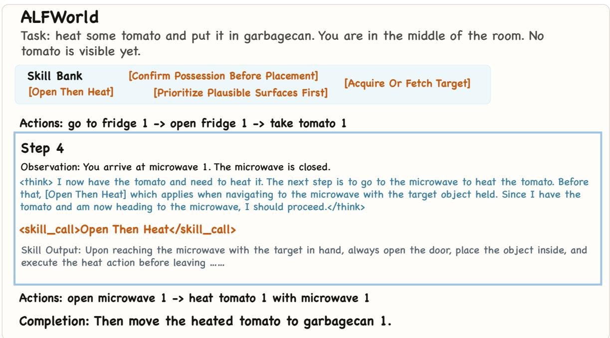  
Figure 7: Case study on ALFWorld. The agent invokes Open Then Heat upon navigating to the microwave with the tomato in hand. The skill output provides the procedural sequence (open → heat), which the agent follows to complete the task successfully.

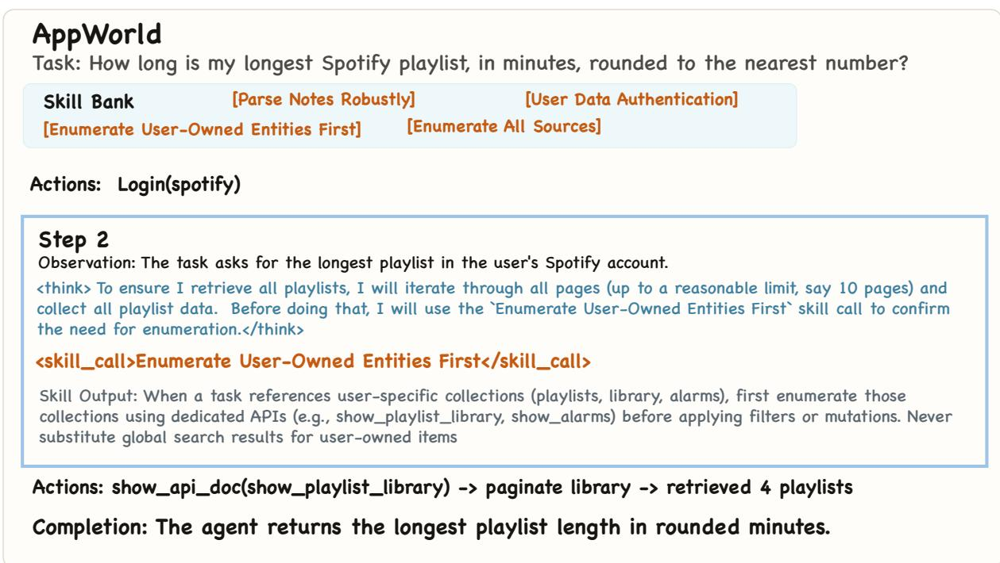  
Figure 8: Case study on AppWorld. The agent invokes Enumerate User-Owned Entities First to scope playlist retrieval to user-owned data via show\_playlist\_library with pagination, avoiding the failure mode of substituting global search results for user-owned items.

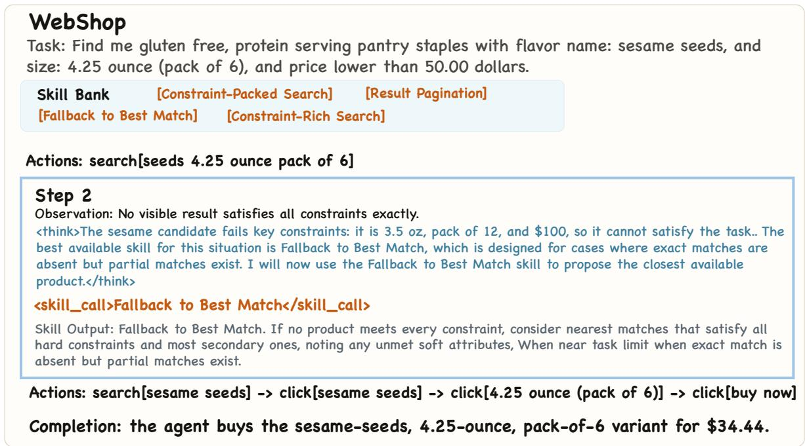  
Figure 9: Case study on WebShop. When no search result satisfies all constraints, the agent invokes Fallback to Best Match. Guided by the skill, it clicks into the nearest candidate’s product page, where hidden variant options (flavor: “sesame seeds”; size: “4.25 ounce (pack of 6)”) are progressively disclosed, enabling a successful purchase at \$34.44.

(a) Skill Catalog Injection (appended to first user message)   
## Skill (Optional)   
You may append <skill\_call>CALL\_NAME</skill\_call> after your normal action.   
Use CALL\_NAME exactly as shown in the catalog.   
Do not break the required action format of the environment (e.g., keep <action>...</action> intact).   
## Skill Catalog (General)   
− call\_name: {general\_skill\_1\_call\_name}   
description: {general\_skill\_1\_trigger}   
## Skill Catalog (Specific)   
− call\_name: {specific\_skill\_1\_call\_name}   
description: {specific\_skill\_1\_trigger}

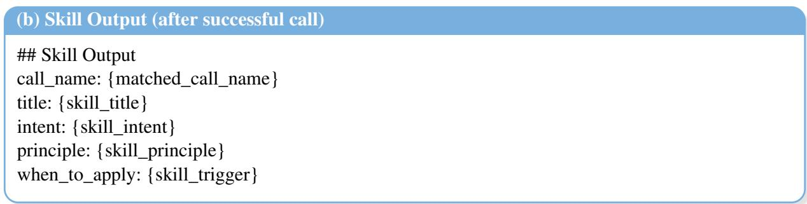  
Figure 10: Skill calling prompts: (a) the calling instruction and compact catalog jointly appended to the first user message, listing only callable names and one-line trigger descriptions (up to $k _ { g } + k _ { s }$ entries), and (b) the full skill content returned in the next observation after a successful <skill\_call> invocation.

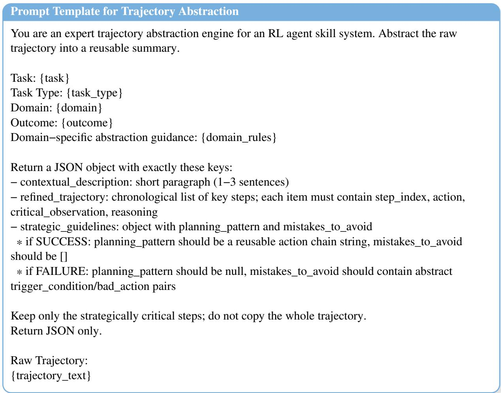  
Figure 11: Prompt for trajectory abstraction (§3.2). Each rollout trajectory is compressed into a structured summary containing a contextual description, a refined key-step trajectory, and strategic guidelines. The resulting abstractions serve as input to the skill induction prompt (Fig. 12).

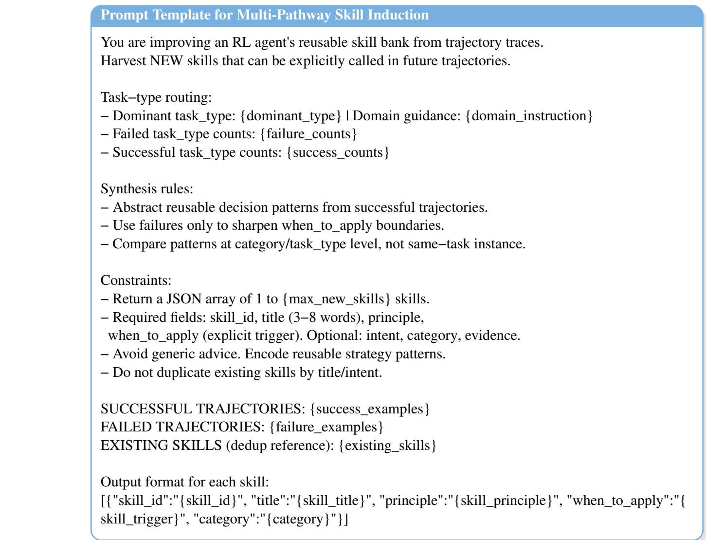  
Figure 12: Prompt for multi-pathway skill induction (§3.3). The teacher LLM MT synthesizes new skills from successful and failed trajectory abstractions, with domain-specific routing and deduplication against existing skills.

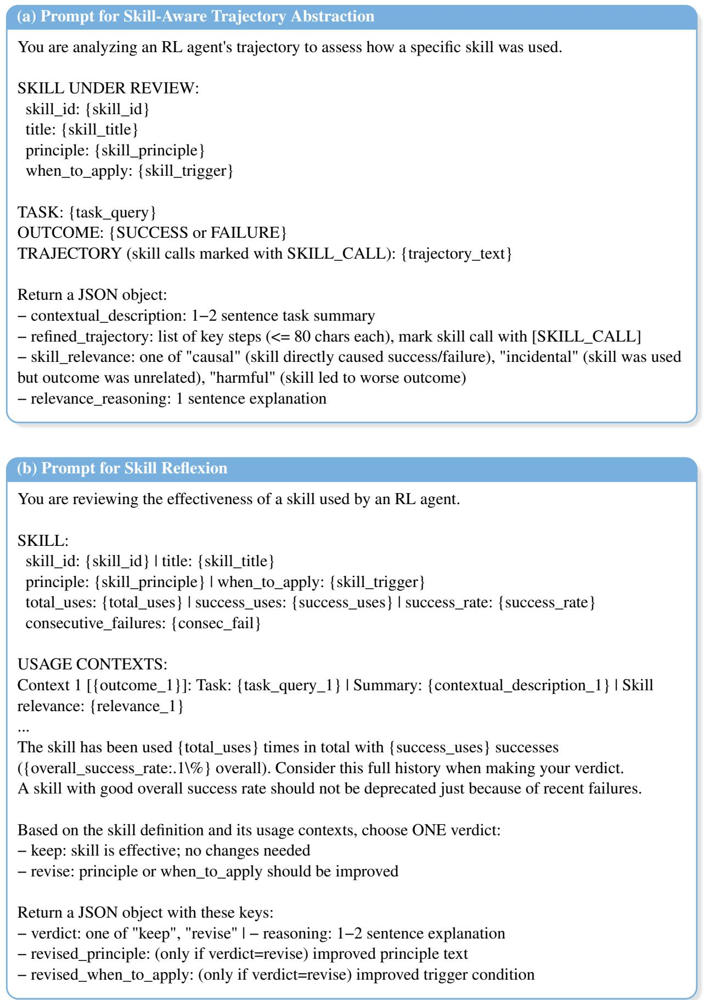  
Figure 13: Skill verification prompts (§3.3): (a) trajectory abstraction with causal attribution (causal/incidental/harmful), and (b) reflexion verdict based on effectiveness statistics and abstracted usage contexts. The LLM returns keep or revise (with updated principle and trigger).