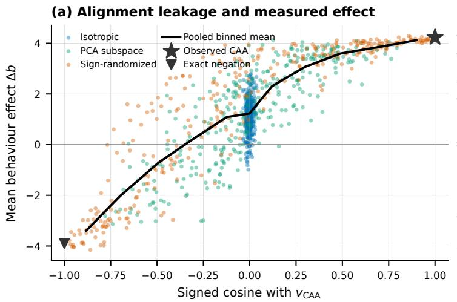
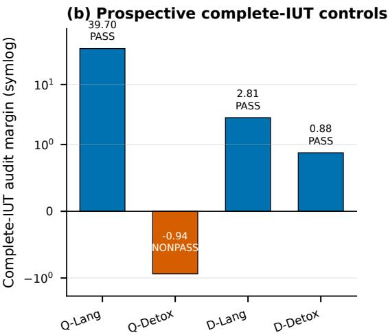
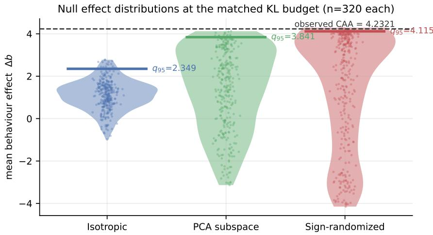

# SteerCheck: Attribution Specificity and Alignment Leakage in Activation-Steering Audits

Daming Luo Christy Liang Junyu Xuan University of Technology Sydney daming.luo@student.uts.edu.au Jie.Liang@uts.edu.au Junyu.Xuan@uts.edu.au

## Abstract

Activation steering can change behaviour without establishing that the efect is specific to the intended concept. We introduce SteerCheck, a preregistered attribution audit that matches of-target KL and separates mean, protected-tail, polarity, transfer, and semantic claims. Exact replay of 960 Qwen3-14B interventions reveals complementary limits of common controls: isotropic directions occupy a narrow near-orthogonal region, whereas sign-randomized same-construction directions often retain substantial target alignment. Efect is strongly associated with signed cosine within the sign-randomized family (ρ = .94); 25.3% of its draws exceed cosine .5, and every draw exceeding the observed mean efect has cosine above .80. This alignment leakage does not by itself invalidate a conditional randomization test; it limits what the comparator can distinguish and motivates reporting exchangeability assumptions, a construction diagnostic A, and the empirical cosine distribution. The primary Qwen complete gate remains negative because the protected tai fails all families. On independent data, continuous margin transfers only in Qwen and accuracy transfers in no selected cell. Prospectively registered language controls pass the complete gate in Qwen and DeepSeek, while a passing DeepSeek detox comparator rules out categorical separation; all nominal passes are sensitive to Γ = 1.10. Frozen three-rater open-generation evaluation supports factual correction in DeepSeek but not Qwen; the automatic judge fails calibration (macro-F1 .562), so null-wide semantic results remain descriptive. SteerCheck makes these conditional and mixed conclusions auditable.

## 1 Introduction

Activation steering modifies a language model at inference time by adding a vector to an intermediate representation. Contrastive mean diferences, learned head directions, and latent control vectors can alter truthfulness, style, refusal, and other behaviours without updating model weights (Subramani et al., 2022; Li et al., 2023; Turner et al., 2023; Rimsky et al., 2024; Zou et al., 2023). A behavioural change alone, however, does not identify its cause: the same result may arise from the intended concept, a broadly disruptive direction, a construction artifact, or a tendency to oppose the user.

The standard evidence for attribution is a random-direction control. A steering vector is compared with directions of matched Euclidean norm; if it moves the behaviour score further, the direction is often described as concept-specific. That comparison has a narrow estimand: in a high-dimensional space, isotropic draws probe the near-orthogonal region. A stronger same-construction comparator rebuilds the direction after independently reversing paired contrasts, but its randomization interpretation is conditional on within-pair orientation exchangeability and it need not be alignment-free.

We measure both limitations at a matched functional budget. Exact reconstruction of 320 isotropic, 320 PCA-subspace, and 320 sign-randomized directions recovers their signed cosines with CAA. Isotropic cosines have standard deviation .014; the sign-randomized family has standard deviation .577, with

25.3% of draws above cosine .5. Within that family, signed cosine and measured efect have Spearman $\rho = . 9 4$ . The result is not a new validity test: exchangeability determines randomization validity. It is an alignment-leakage and discriminability diagnostic showing that label randomization can retain much of the observed direction after normalization and KL matching.

Practically, an audit should match a functional budget, show the efect–alignment profile rather than only a threshold crossing, report the assumptions and target alignment of any same-construction comparator, and decompose “steering worked” into separately testable claims. Appendix A gives the six-step protocol and the failure each step catches.

SteerCheck implements these as a preregistered protocol with matched of-target KL, three null families, an intersection–union specificity gate, polarity mirroring, and prospective positive controls. Statistical gates, Monte Carlo budgets, split access, and stop rules were frozen before their corresponding outputs were observed, and every failed, aborted, or superseded run is retained rather than replaced. Section 4 shows the gate is passable; Sections 5 and 6 report the alignment diagnostics; Section 7 reports the transfer and polarity results.

The preregistered Qwen question was whether CAA exceeds all three families at Holm α = .01. The complete answer remains no: the strict tail fails all three families, and the mean also fails against sign randomization. The cosine analysis is post-hoc, exactly reproducible from the frozen seed, and changes the scientific interpretation of the comparator without changing the frozen verdict.

Our contributions are a measured efect–alignment profile over 960 matched-KL interventions; a construction diagnostic A and a 21-cell measurement of alignment retained by sign randomization; prospective evidence that the complete gate is passable in two model families; and a frozen humancalibrated open-generation test that separates a DeepSeek pass, a Qwen non-pass, and an automaticjudge calibration failure. The primary evidence concerns one anti-sycophancy/truth-consistency behaviour, CAA as the real-direction construction, and one selected layer per model; Section 8 states the boundary.

## 2 Related work

Activation steering. Latent steering vectors have been extracted from pretrained decoders for controlled generation (Subramani et al., 2022). Activation Addition and CAA form directions from contrastive activations and add them during inference (Turner et al., 2023; Rimsky et al., 2024). ITI learns and intervenes on truth-related attention-head directions (Li et al., 2023), while representation engineering treats population-level representations as a general interface for monitoring and control (Zou et al., 2023). These works establish that activation interventions change outputs. We ask what control and calibration are required to attribute that change to a labelled direction.

Evaluation reliability. Prior frameworks call for likelihood-aware metrics, downstream-like contexts, standardized comparisons, and explicit baselines (Pres et al., 2024). Steering vectors are brittle under prompt shifts and vary across models and methods (Tan et al., 2024; Da Silva et al., 2025); geometry and coherence predict further reliability failures (Braun et al., 2025); changing only the activation source can change steering success (Ye et al., 2026); open-ended evaluation introduces coherence and threat-model requirements absent from forced choice (Herbster et al., 2026); and Goyal and Daum´e III (2026) study behavioural specificity across general, control, and shifted conditions.

What is new here. This literature argues that steering evaluations are unreliable; it does not measure the association between efect and direction alignment at a fixed functional budget, nor quantify how much target alignment a same-construction sign-randomization comparator retains. Where Ye et al. (2026) change the activation source, we hold it fixed; where Goyal and Daum´e III (2026) target behavioural specificity across conditions, we target attribution specificity at a fixed source and operating point. Appendix F, Table 9 locates our contribution as a combination of controls rather than claiming any one component is individually new.

  
Figure 1: Two complementary diagnostics. (a) Post-hoc exact replay of 960 matched-KL Qwen3-14B layer-28 interventions. Points are measured forward passes; the black curve is a descriptive pooled binned mean, while the family-stratified associations are $\rho = . 9 3 8$ for sign randomization and .843 for PCA). Broad sign-randomized cosine support is target-alignment leakage, not by itself evidence that randomization is invalid. (b) Prospective P2G complete-IUT margins: both language controls and DeepSeek Detox pass; Qwen Detox does not. Q-Lang/Q-Detox and D-Lang/D-Detox denote Qwen and DeepSeek language controls/comparators. P2G uses a separately frozen balanced block-Rademacher design, not the iid S3 design in panel (a).

## 3 Matched-budget steering audits

For paired construction examples, let $h _ { \ell } ( x _ { i } ^ { + } )$ and $h _ { \ell } ( x _ { i } ^ { - } )$ be the last-token residual activations for the positive and negative members of pair i. CAA forms the normalized mean contrast and adds it after the prompt:

$$
d _ { i } = h _ { \ell } ( x _ { i } ^ { + } ) - h _ { \ell } ( x _ { i } ^ { - } ) , \qquad v _ { \mathrm { C A A } } = \frac { \bar { d } } { \| \bar { d } \| _ { 2 } } , \quad \bar { d } = \frac { 1 } { n } \sum _ { i = 1 } ^ { n } d _ { i } , \qquad h _ { \ell , t } ^ { \prime } = h _ { \ell , t } + c v ( t > t _ { \mathrm { p r o m p t } } ) .\tag{1}
$$

On a neutral prompt bank N disjoint from the behavioural data, the of-target budget is

$$
\begin{array} { r } { \kappa = \mathbb { E } _ { \boldsymbol { x } \sim \mathcal { N } } \left[ \mathrm { K L } \left( p _ { \theta } ( \cdot  { | } \ \boldsymbol { x } )  { \lVert } p _ { \theta , c v } ( \cdot  { | } \ \boldsymbol { x } ) \right) \right] . } \end{array}\tag{2}
$$

The expectation uses a frozen 16-token horizon; all confirmatory directions are matched to $\kappa \in$ [0.09, 0.11].

Why the budget is KL rather than norm. For small interventions,

$$
\begin{array} { c c } { \kappa \approx \frac { 1 } { 2 } c ^ { 2 } \boldsymbol { v } ^ { \top } \boldsymbol { F } \boldsymbol { v } , } & { \quad \Delta s \approx \sqrt { 2 \kappa } \frac { \boldsymbol { v } ^ { \top } \nabla \boldsymbol { s } } { \sqrt { \boldsymbol { v } ^ { \top } \boldsymbol { F } \boldsymbol { v } } } , } \end{array}\tag{3}
$$

where F is the local Fisher information and s is a behaviour score. Matching κ fixes the perturbation’s Fisher norm and leaves alignment with the behaviour gradient free—the quantity a specificity audit must isolate. Matching $\lVert \boldsymbol { v } \rVert _ { 2 }$ instead leaves $v ^ { \top } F v$ free, so norm-matched directions need not be comparably dosed. The matched budget is conditional on the reference-prompt distribution, token horizon, and model setting.

For each direction, a bracketed search selects c using only the neutral-KL bank; behaviour scores, answer accuracy, and confirmation outputs never tune it. Direction hashes are written before any confirmation output is accessed. Steering is applied at the frozen layer to post-prompt token positions. The negative-direction gate uses the exact negation of the observed vector.

## 3.1 Null families

We compare the observed direction with three families: isotropic random directions; directions inside   
the top-eight activation PCA subspace; and sign-randomized directions. Writing $U _ { k }$ for the top-k   
PCA basis and $\epsilon _ { i } ^ { ( b ) } \overset { \mathrm { i i d } } { \sim } \mathrm { R a d } ( 1 / 2 )$ ，

$$
v _ { \mathrm { i s o } } ^ { ( b ) } = \frac { z _ { b } } { \| z _ { b } \| _ { 2 } } , \quad z _ { b } \sim \mathcal { N } ( 0 , I _ { d } ) , \qquad v _ { \mathrm { P C A } } ^ { ( b ) } = \frac { U _ { k } a _ { b } } { \| U _ { k } a _ { b } \| _ { 2 } } , \quad a _ { b } \sim \mathcal { N } ( 0 , I _ { k } ) ,\tag{4}
$$

$$
v _ { \mathrm { s h u f } } ^ { ( b ) } = \frac { 1 } { n } \sum _ { i = 1 } ^ { n } \epsilon _ { i } ^ { ( b ) } d _ { i } .\tag{5}
$$

The isotropic family is a geometric null: it preserves nothing but scale. The PCA family preserves the dominant activation subspace. The sign-randomized family preserves paired rows, activation geometry, estimator, and scale, and attempts to remove the coherent label association while retaining the construction—which is why it was preregistered as the strongest of the three. Its randomization inference is conditional on within-pair sign exchangeability. It need not, however, be geometrically unrelated to the observed direction. Section 5 measures that retained alignment and clarifies what the comparator can distinguish; alignment overlap alone is not a proof that the randomization model is invalid.

## 3.2 Endpoints, gates, and what a non-pass means

The discovery audit uses a continuous forced-choice logit contrast b. The independent-bank study reports both the mean margin change and the change in forced-choice accuracy. Within each family, the specificity gate is intersection–union: both a mean statistic and a strict lower-tail statistic must pass Holm-corrected $\alpha = 0 . 0 1$ (Holm, 1979). Null ordering and signed direction transport are separate preregistered gates, and models are never pooled.

For 128 item-level efects the tail statistic $z _ { 7 }$ is the seventh-smallest efect, approximating the empirical fifth percentile; both statistics are compared to each family’s Monte Carlo distribution and Holm-adjusted within statistic. Appendix A gives the estimator definitions, the finite-sample p-value, and the null-ordering statistic $D _ { 9 5 }$

How to read a non-pass. An intersection–union test passes only if every component passes, so a non-pass is only as interpretable as the weakest component. Two limits apply throughout. First, the protected-tail component’s power against any alternative is uncalibrated: our implant ladder calibrates the mean component only. Second, a family can be exchangeable yet retain substantial alignment with the target, which limits the alternatives that its comparison can discriminate. We therefore report component-wise results, name the responsible family, and keep randomization validity (exchangeability) separate from geometric discriminability (alignment leakage).

We did not redefine any gate after seeing results. The intersection–union definition, the tail order statistic, and α were frozen before confirmatory access, and the preregistration forbids re-tuning to flip a verdict. Section 5 refines what one comparator can establish, without changing a threshold or the original verdict retained in Appendix E.

## 3.3 Prospective positive-control design

The language positive control and detox copy-controlled comparator were prespecified before confirmation access; geometry does not choose behaviours. Construction-only banks select one layer per fixed model–behaviour cell under the lower-layer tie rule $\ell ^ { * } = \operatorname* { m i n } \arg \operatorname* { m a x } _ { \ell } C _ { \ell }$ , and the reserve bank remains sealed. Synthetic-only power and throughput analyses selected the 512-item configuration with $m = 5 1 2 , B = 9 9 9$ , and 256 unrelated neutral-KL prompts; the protected statistic is $\delta _ { ( 2 6 ) }$ . Each of the four cells independently applies the strict Holm $\alpha < . 0 1$ complete IUT against isotropic, PCA-subspace, and separately frozen balanced block-Rademacher nulls, which assign exactly eight positive and eight negative signs within each block of 16. Models and behaviours are not pooled.

## 4 The gate is passable: prospective positive controls

Chronology. This study was prespecified and executed after the audit in Section 5. We present it first because a negative audit is uninterpretable until the gate is shown to be passable. Appendix E preserves the actual execution order, and no result here was used to modify any gate applied elsewhere.

Three facts follow. First, the complete gate—including the protected-tail component—is passable, in two model families, under the same matched-KL protocol and the same three comparator roles used elsewhere. Its structured family is a separately frozen balanced block-Rademacher design; the iid alignment diagnostic in Section 5 does not transfer to it without a separate analysis. Second, the predicted within-model ordering holds: in each model the language-control margin exceeds the detox comparator’s. Third, ordering is not categorical separation: Qwen Detox does not pass while DeepSeek Detox does, so construction-only coherence ranks cells without partitioning them. All four ledgers contain 2,999 unique successful keys with no reserve-bank access, every direction independently matched to the same of-target KL interval; a disclosed fixed-horizon implementation correction occurred after authorized confirmation access but before any formal result event (Appendix G).

Boundary. The three nominally passing cells pass under the frozen randomization model, but none remains robust under a conservative $\Gamma = 1 . 1 0$ sensitivity envelope. Exact negation and sensitivity are secondary diagnostics and cannot rescue a primary non-pass. This study calibrates the frozen CAA constructions and does not validate all steering methods or direction constructions.

## 5 Target-direction leakage limits what a matched comparator can distinguish

We audit CAA on Qwen3-14B layer 28 with 128 anti-sycophancy rows (Rimsky et al., 2024; Yang et al., 2025). An initial $B = 1 0 0$ screen could not resolve a three-family Holm test at $\alpha = . 0 1$ (minimum adjusted p is $3 / 1 0 1 \approx . 0 2 9 7 )$ ; a synthetic power gate required $B \geq 2 9 9$ , and the confirmatory audit uses $B = 3 2 0$

Table 2 gives two diferent facts that must not be conflated. The frozen conditional randomization comparison fails its mean gate, while the same draws retain much more target-direction alignment than the isotropic family. The former remains the preregistered decision under within-pair sign exchangeability; the latter measures the alternatives that this comparator is able to separate from the observed construction.

Table 1: Prospective positive-control cells. Language is the FLORES English-to-French continuation control; Detox is the copy-controlled semantic comparator. Decisions are cell-specific complete IUTs at strict Holm $\alpha = . 0 1 ;$ non-pass is not equivalence to the null.
<table><tr><td>Model</td><td>Behaviour</td><td>Layer</td><td>LOO</td><td>Mean</td><td>Tail</td><td>Margin</td><td>Complete IUT</td></tr><tr><td>Qwen3-14B</td><td>Language</td><td>20</td><td>0.708</td><td>12.5</td><td>7.17</td><td>39.70</td><td>PASS</td></tr><tr><td>Qwen3-14B</td><td>Detox</td><td>28</td><td>0.403</td><td>1.12</td><td>-0.285</td><td>-0.94</td><td>non-pass</td></tr><tr><td>DeepSeek-V2-Lite</td><td>Language</td><td>24</td><td>0.717</td><td>1.23</td><td>0.534</td><td>2.81</td><td>PASS</td></tr><tr><td>DeepSeek-V2-Lite</td><td>Detox</td><td>18</td><td>0.402</td><td>2.65</td><td>0.611</td><td>0.88</td><td>PASS</td></tr></table>

Table 2: Confirmatory audit at $B = 3 2 0$ , with each family’s measured alignment to the direction it is a null for. Observed mean $\Delta b = 4 . 2 3 2 1 ;$ a family passes the mean component when Holm $p < . 0 1$ . The left block is what the audit sees; the right block is why.
<table><tr><td></td><td colspan="4">effect at matched KL</td><td colspan="4">alignment with  $v _ { \mathrm { C A A } }$ </td></tr><tr><td>Null family</td><td>q95</td><td>Exceed.</td><td></td><td>Holm p Mean comp.</td><td>sd cos</td><td>q05</td><td>q95</td><td> $P ( \cos \geq . 5 )$ </td></tr><tr><td>Isotropic</td><td>2.349</td><td>0/320</td><td>.00935</td><td>pass</td><td>.0141</td><td>-.022</td><td>+.024</td><td>.000</td></tr><tr><td>PCA subspace</td><td>3.841</td><td>0/320</td><td>.00935</td><td>pass</td><td>.3376</td><td>-.554</td><td>+.574</td><td>.078</td></tr><tr><td>Sign-randomized</td><td>4.115</td><td>4/320</td><td>.01558 fail</td><td></td><td>.5769</td><td>-.873</td><td>+.875</td><td>.253</td></tr></table>

The randomized directions retain target alignment. The sign-randomized directions come from a single frozen random stream, so they reconstruct exactly; validating against each draw’s recorded perturbation norm matches to $1 . 7 \times 1 0 ^ { - 1 6 }$ relative error for all 320 draws. Their cosines with $v _ { \mathrm { C A A } }$ are then immediate, and they appear in the right-hand block of Table 2.

A quarter of the sign-randomized draws are more than half aligned with $v _ { \mathrm { C A A } } ;$ one in twenty is more than 90% aligned. All four draws that exceed the observed efect have cosines of .9286, .8664, .8584, and .8044—they are close in direction to the observed vector. This geometry explains why the structured reference distribution approaches the observed efect. It does not by itself invalidate the Holm $p = . 0 1 5 5 8 \colon$ that p-value is conditional on the frozen exchangeability model. It does show that the comparison is not a test against alignment-free alternatives and therefore supports a narrower specificity claim.

Why, and when it happens. The randomized vector is mean-zero— $- \mathbb { E } [ v _ { \mathrm { s h u f } } ] = 0 \cdot$ —but its normalized alignment is governed by a diferent quantity. Write $u = \bar { d } / \| \bar { d } \| _ { 2 }$ and $p _ { i } = d _ { i } ^ { \top } u$ . The component of $v _ { \mathrm { s h u f } }$ along u is $\textstyle { \frac { 1 } { n } } \sum _ { i } \epsilon _ { i } p _ { i }$ , with standard deviation rms $\mathfrak { s } ( p ) / \sqrt { n }$ , while $\lVert v _ { \mathrm { s h u f } } \rVert$ concentrates at rms $( \left. d _ { i } \right. ) / { \sqrt { n } }$ The $\sqrt { n }$ cancels, leaving

$$
\mathrm { s d } \big ( \cos ( v _ { \mathrm { s h u f } } , v _ { \mathrm { o b s } } ) \big ) \approx A , \qquad A = \frac { \mathrm { r m s } _ { i } \big ( d _ { i } ^ { \top } u \big ) } { \mathrm { r m s } _ { i } \big ( \| d _ { i } \| _ { 2 } \big ) } .\tag{6}
$$

A is the root-mean-square fraction of an individual pair contrast’s energy that lies along the mean direction—not a property of the mean’s magnitude. In this first-order approximation the $\sqrt { n }$ factors cancel, so increasing the number of pairs does not automatically shrink the normalized alignment spread. A is therefore an alignment-concentration diagnostic, not a validity threshold: randomization validity still depends on exchangeability. For the Qwen3-14B layer-28 cell, A = .606 against the measured $\mathrm { s d } ( \cos ) = . 5 7 7$

The pattern recurs across the available banks. Because $\cos ( \boldsymbol { v } _ { \mathrm { s h u f } } , \boldsymbol { v } _ { \mathrm { o b s } } )$ depends only on the stored paired activation bank, it is computable without any forward pass. We evaluated every eligible construction bank we hold—three construction banks over seven layers each: Qwen3-14B antisycophancy, Qwen3-14B benign-compliance, and Qwen2.5-7B anti-sycophancy (Qwen Team, 2024)—by simulating 4,000 sign-randomized draws per cell. These are two related Qwen model series, not independent model-family replication.

Table 3: Alignment leakage across 21 constructions. A is the predicted, and $\operatorname { s d } ( \cos )$ the simulated, standard deviation of the randomized direction’s alignment with the observed direction. No pass/fail cutof was preregistered.
<table><tr><td>Behaviour</td><td>Model</td><td>Layers</td><td>A range</td><td> $\operatorname { s d } ( \cos )$  range</td><td> $P ( \cos \geq . 5 )$  range</td></tr><tr><td>anti-sycophancy</td><td>Qwen3-14B</td><td>8-32</td><td>.424-.977</td><td>.440-.921</td><td>.154-.480</td></tr><tr><td>benign-compliance</td><td>Qwen3-14B</td><td>8-32</td><td>.777-.972</td><td>.640-.870</td><td>.321-.456</td></tr><tr><td>anti-sycophancy</td><td>Qwen2.5-7B</td><td>6-22</td><td>.436-.983</td><td>.454-.917</td><td>.154-.471</td></tr></table>

A predicts the simulated sd(cos) with Pearson $r = . 9 7 9$ and mean absolute error .075 across the 21 cells; every measured sd(cos) is at least .440. This is a continuous diagnostic with no confirmatory threshold. The result shows substantial retained alignment across all three available banks and layers; it does not establish a universal property of contrastive mean-diference constructions or an exchangeability failure.

The reporting requirement. For a construction-matched comparator, we recommend publishing A and the empirical distribution of $\cos ( { v _ { \mathrm { n u l l } } } , { v _ { \mathrm { o b s } } } )$ . Both are one line of linear algebra on the activation bank and need no forward pass. The randomization p-value can then be read together with what the comparator actually removes and retains, instead of being mistaken for an alignment-free test.

What survives. The isotropic family provides a near-orthogonal geometric baseline $( \mathrm { s d } ( \mathrm { c o s } ) = . 0 1 4 )$ and CAA clears it at Holm $p = . 0 0 9 3 5 ;$ it also clears the PCA family, whose draws nevertheless reach $q _ { 9 5 } \cos = . 5 7 4$ . The sign-randomized mean comparison remains a non-pass under the frozen conditional randomization model. The strict-tail statistic $z _ { 7 } = - 1 . 5 0 0$ fails all three families (adjusted $p = . 9 6 9 , . 8 7 2 , . 7 9 4 )$ , so the complete intersection–union verdict is negative—but per Section 3.2 the tail component’s power is uncalibrated, so this is a failure to establish, not evidence of absence. A separate sign-reversal check passes: the exact negation moves the efect to −3.898.

Takeaway. CAA’s mean efect clears a random-direction baseline but not the structured conditional comparator, and the protected tail fails all three families. The alignment-leakage diagnostic explains why the structured reference is dificult to separate from the observed vector without reversing the frozen decision or declaring the randomization model invalid. Section 6 asks what the geometric baseline and the retained-alignment profile establish together.

## 6 Measured efect is associated with alignment at a matched KL budget

The 960 reconstructed directions come with their measured efects, giving a post-hoc alignment–efect profile at a fixed functional budget, measured on real steered forward passes rather than implanted. Because cosine was observed, not experimentally assigned, the profile is descriptive rather than causal.

Alignment is strongly associated with efect: Spearman $\rho ( \cos , \Delta b ) { \mathrm { ~ i s ~ } } + . 9 3 8$ within the signrandomized family and +.843 within the PCA family (within the isotropic famil $\mathrm { 5 , + . 1 5 7 }$ , because its cosine range is $\mathrm { o n l y \pm . 0 2 4 \mathrm { - t h e r e } }$ is nothing to correlate with). Pooled over all 960 draws, $\rho = + . 7 8 5$

The isotropic family alone—a near-orthogonal geometric baseline, mean $\cos = - . 0 0 0 7 \mathrm { - } \mathrm { { h a s } }$ mean efect 1.120, i.e. 26.5% of the observed efect. Moving from cosine 0 to 0.30 buys another 44 points of the efect; the remaining 70 points of alignment buy only 27 more.

Table 4: Descriptive alignment–efect profile, all 960 KL-matched directions pooled into signed-cosine bins, with the observed direction at cos = 1. Family-specific associations are reported in the text.
<table><tr><td>COS</td><td>n</td><td>∆b</td><td>% obs.</td><td>COS</td><td>n</td><td> $\Delta b$ </td><td>% obs.</td></tr><tr><td>-0.883</td><td>31</td><td>-3.404</td><td>-80%</td><td>+0.299</td><td>82</td><td> $+ 3 . 0 7 2$ </td><td>+73%</td></tr><tr><td>-0.491</td><td>60</td><td>-0.704</td><td>-17%</td><td>+0.491</td><td>63</td><td> $+ 3 . 5 9 6$ </td><td>+85%</td></tr><tr><td>-0.123</td><td>102</td><td>+1.089</td><td>+26%</td><td>+0.689</td><td>55</td><td> $+ 3 . 8 4 2$ </td><td>+91%</td></tr><tr><td>-0.001</td><td>374</td><td>+1.230</td><td>+29%</td><td>+0.900</td><td>26</td><td> $+ 4 . 1 2 5$ </td><td>+97%</td></tr><tr><td>+0.120</td><td>53</td><td>+2.305</td><td>+54%</td><td>+1.000</td><td>1</td><td>+4.232</td><td>100%</td></tr></table>

Consequence for specificity claims. A random-direction control asks whether the observed direction beats the cosine-≈ 0 region of this profile. That comparison is cleared, while directions near cosine .30 also produce substantial measured efects and clear the isotropic $q _ { 9 5 }$ of 2.349. Thus the baseline supports outperformance of near-orthogonal random directions, but not uniqueness of the observed construction. The pooled profile is relatively flat at high positive cosine, where a strong directional-identification claim would require the most separation.

What the curve does establish. The measured efect is direction-dependent and signed: the exact negation lands at −3.898, the cos ≈ −0.88 bin at −3.404, and the curve is monotone across its whole range. CAA is not doing nothing, and it is not a generic perturbation efect: at the same KL budget, direction sign flips the outcome. The supported statement is quantitative rather than binary: within this cell, substantial efect is observed for directions that are less aligned with CAA, while the observed vector remains the largest point in the pooled profile.

Caveats. Table 4 pools three families that difer in more than alignment, so the binned means are descriptive of the pooled population rather than a controlled alignment experiment; the within-family Spearman coeficients are family-stratified rather than causal. The ladder uses B = 100 per family under $\mathrm { ~ a ~ } q _ { 9 5 }$ rule while the confirmatory audit uses B = 320 under Holm, so Tables 10 and 2 are not on the same decision scale. All of this is one behaviour, one layer, one model.

## 7 Transfer, polarity, and what they add

Two further frozen studies test whether the audited efect survives new data and a polarity contrast.   
Full protocols, prose, and diagnostics are in Appendices B and $\mathrm { C } ;$ the decisions are here.

Table 5: Independent-bank results in three selected model-layer cells. Entries are $D _ { 9 5 }$ with the 99% lower confidence bound in parentheses. Cells are not pooled.
<table><tr><td>Model</td><td>Margin</td><td>Accuracy</td><td>Verdict</td></tr><tr><td>Qwen3-14B</td><td>0.3945 (0.2606)</td><td>0.0010 (-0.0029)</td><td>Margin only</td></tr><tr><td>DeepSeek-V2-Lite</td><td>-0.0114 (−0.0292)</td><td>-0.0146 (−0.0264)</td><td>No replication</td></tr><tr><td>Gemma-3-27B</td><td>-0.5966 (-0.8479)</td><td>0.0039 (-0.0020)</td><td>No replication</td></tr></table>

On a fresh FEVER-derived bank of 1,024 confirmation rows, evaluated in three selected model-layer cells under one frozen protocol (Thorne et al., 2018; Yang et al., 2025; DeepSeek-AI, 2024; Gemma Team, 2025), only Qwen retains continuous margin transport, forced-choice accuracy transfers in none of the three cells, and no cell passes the complete specificity gate. $D _ { 9 5 }$ compares the sign-randomized and isotropic null tails, so after Section 5 it should be read as a measure of how much construction information the sign-randomized reference retains relative to the isotropic reference on this bank, not as a standalone measure of eficacy or randomization validity.

Table 6: Polarity-mirrored transfer results. Efects are observed minus base score with 99% lower confidence bounds in parentheses. The last three gates require both polarity cells to pass.
<table><tr><td>Model</td><td>Endpoint</td><td>Wrong user</td><td>Correct user</td><td></td><td>Wrong+NI</td><td></td><td></td><td>Signed Tail order Specificity</td></tr><tr><td>Qwen3-14B</td><td>choice</td><td>1.8553 (1.2160)</td><td>3.0629</td><td>(2.7908)</td><td>pass</td><td>pass</td><td>pass</td><td>fail</td></tr><tr><td>Qwen3-14B</td><td>continuation</td><td>.1600 (.1391)</td><td>-.1251</td><td>(−.1444)</td><td>fail</td><td>fail</td><td>pass</td><td>fail</td></tr><tr><td>DeepSeek-V2-Lite choice</td><td></td><td>.3127 (.0923)</td><td>-.2918</td><td>(−.5224)</td><td>fail</td><td>fail</td><td>fail</td><td>fail</td></tr><tr><td>DeepSeek-V2-Lite continuation</td><td></td><td>.0868 (.0757)</td><td>-.1304</td><td>(−.1519)</td><td>fail</td><td>fail</td><td>fail</td><td>fail</td></tr></table>

Replaying the same frozen directions on an output-unseen 64-fact OpenBookQA bank with a wrong-user prompt and a correct-user mirror per fact, all four model-endpoint cells raise the wrong-user score—the metric a paper reporting this steering vector would naturally report—but only the Qwen choice-score cell also preserves correct-user performance at the frozen −.10 noninferiority margin. The other three raise the wrong-user score while lowering the correct-user score at both endpoints, a pattern consistent with generic opposition to the user rather than factual correction. That conclusion rests on the polarity contrast and the exact-negation check, not on any null family; the specificity column remains conditional on the frozen exchangeability model, and the isotropic family is the only purely geometric comparator.

Human-calibrated free generation. Three raters independently completed 768 direct-arm and 600 stratified-null rows (4,104 response ratings). On varying dimensions, Krippendorf α is .985–1.000; truth stance is unanimous, while 15 user-relation rows split 2–1 and none needs a fourth rater. Table 7 applies the preregistered human-core O1/O2 tests.

Table 7: Human-core E3: observed-minus-base correct-fact rate (one-sided 99% lower bound). O1 requires wrong-user $> 0 ;$ O2 requires correct-user $> - . 1 0$
<table><tr><td>Model</td><td>Wrong user</td><td>Correct user</td><td>01</td><td>02</td><td>Joint</td></tr><tr><td>Qwen3-14B</td><td>.016 (−.094)</td><td>.000 (.000)</td><td>fail</td><td>pass</td><td>fail</td></tr><tr><td>DeepSeek-V2-Lite</td><td>.172 (.047)</td><td>.031 (−.063)</td><td>pass</td><td>pass</td><td>pass</td></tr></table>

DeepSeek passes both gates; Qwen fails O1. The locked Gemma judge also fails calibration (classmacro F1 $. 5 6 2 < . 8 0 ;$ minimum supported primary-class $\mathrm { F 1 ~ 0 < \it . 7 0 ) }$ , so human-core O1/O2 remain confirmatory but judge-wide $\mathrm { O 3 / O 4 }$ are descriptive. This endpoint disagreement is an audit finding, not a general judge benchmark.

## 8 Limitations

The central measurement is post-hoc. It was not preregistered; it was made possible by the frozen seed and the retained per-draw ledger, and it is exactly reproducible from released code. It changes the interpretation of a preregistered verdict, not the verdict itself, which is retained unaltered in Appendix E. Equation 6 is a first-order concentration argument validated against 21 simulated cells $( r = . 9 7 9$ , mean absolute error .075) rather than proved; it will degrade when $\lVert d _ { i } \rVert$ varies strongly across pairs, since it is the denominator’s concentration that makes $\sqrt { n }$ cancel. An earlier draft proposed a signal-to-noise heuristic for the same quantity; it agreed with the audited cell by coincidence, fails across the panel $( r = . 2 6 0 )$ , and is superseded. Both are computed in the released script so the correction is auditable.

Scope. The alignment-leakage diagnostic spans 21 cells from three stored banks and two related Qwen model series, but the alignment–efect profile does not: Table 4 is one behaviour, one layer, one model, one construction, and extending it requires steered forward passes. Whether the profile transfers is the most important question we leave open. The primary evidence throughout concerns one anti-sycophancy/truth-consistency construction with CAA as the real-direction source; accuracy is a thresholded view of the same margin, not an independent endpoint; each architecture contributes one checkpoint-layer cell, so between-cell diferences are setting-conditional rather than causal model-family efects. There is no Llama result, and the Gemma cell reuses the locked bank and was registered after partial results. The 21-cell analysis is therefore not independent model-family transfer.

Gate power and conditionality. The 512-item configuration retains a strict protected-tail gate with limited tail power; B = 999 improves Monte Carlo resolution, not confirmation-sample power. The implant ladder calibrates only the mean component, so the complete gate’s sensitivity remains unknown, and the Section 4 nominal passes are sensitive to a conservative Γ = 1.10 envelope. Matched KL is conditional on the neutral reference distribution, token horizon, and model setting. The PCA null family reaches q cos = .574 with $v _ { \mathrm { C A A } }$ , so it is intermediate in retained alignment between the near-orthogonal geometric baseline and the sign-randomized family. Answer ordering and source are constant in the construction bank and cannot be tested as exchangeability strata.

Open-generation scope and provenance. The frozen 64-token cap saturates 99.996% of Qwen and 97.736% of DeepSeek outputs; 44/1,368 rows are invalid and unresolved. Agreement is partly lowentropy: all rows are relevant and 1,367 are coherent; alpha is undefined for zero-variance dimensions. The human result covers two models and 64 mirrored facts, not long-form generation; judge-wide O3/O4 remain descriptive. Rater-ID correction and hash reconstruction appear in Appendix G.

## 9 Conclusion

Specificity audits require both a frozen decision rule and an account of what a comparator preserves. At matched of-target KL, isotropic directions average 26.5% of the observed efect, while sign randomization retains substantial alignment $( \mathrm { s d } ( \mathrm { c o s } ) = . 5 7 7 ; P ( \mathrm { c o s } \geq . 5 ) = . 2 5 3 )$ . Across 21 stored model-layer-bank cells, alignment leakage ranges from .440 to .921. These measurements narrow the structured estimand; they do not themselves invalidate conditional randomization inference.

The frozen Qwen complete gate remains negative: the mean does not clear sign randomization and the protected tail fails every family. This is failure to establish the intersection–union claim, not evidence of no efect. Conditional p-values still require sign exchangeability, while A and the cosine distribution expose geometric discriminability. Matched KL fixes an operating point rather than a dose; its approximately quadratic scaling does not justify outcome extrapolation.

The remaining evidence is deliberately mixed: accuracy transfers in no selected cell, human-rated generation supports factual correction in DeepSeek but not Qwen, and the automatic judge fails calibration. Prospective controls show the complete gate is passable, while Γ = 1.10 marks its nominal passes as sensitivity-boundary results. SteerCheck keeps eficacy, polarity, specificity, transfer, and semantic claims separately auditable.

## References

Joschka Braun, Carsten Eickhof, David Krueger, Seyed Ali Bahrainian, and Dmitrii Krasheninnikov. Understanding (un)reliability of steering vectors in language models. arXiv preprint arXiv:2505.22637, 2025. URL https://arxiv.org/abs/2505.22637.

Patrick Queiroz Da Silva, Hari Sethuraman, Dheeraj Rajagopal, Hannaneh Hajishirzi, and Sachin Kumar. Steering of course: Reliability challenges in steering language models. In Proceedings of the 63rd Annual Meeting of the Association for Computational Linguistics, pages 19856–19882, 2025. doi: 10.18653/v1/2025.acl-long.974. URL https://aclanthology.org/2025.acl-long.974/.

DeepSeek-AI. DeepSeek-V2: A strong, economical, and eficient mixture-of-experts language model. In arXiv preprint arXiv:2405.04434, 2024. URL https://arxiv.org/abs/2405.04434.

Gemma Team. Gemma 3 technical report. arXiv preprint arXiv:2503.19786, 2025. URL https: //arxiv.org/abs/2503.19786.

Navita Goyal and Hal Daum´e III. Steering safely or of a clif? rethinking specificity and robustness in inference-time interventions. In Proceedings of the 19th Conference of the European Chapter of the Association for Computational Linguistics, pages 5723–5738, 2026. doi: 10.18653/v1/2026.eacl-long. 268. URL https://aclanthology.org/2026.eacl-long.268/.

Niklas Herbster, Martin Zborowski, Alberto Tosato, Gauthier Gidel, and Tommaso Tosato. Activation steering for aligned open-ended generation without sacrificing coherence. arXiv preprint arXiv:2604.08169, 2026. URL https://arxiv.org/abs/2604.08169.

Sture Holm. A simple sequentially rejective multiple test procedure. Scandinavian Journal of Statistics, 6(2):65–70, 1979.

Kenneth Li, Oam Patel, Fernanda Vi´egas, Hanspeter Pfister, and Martin Wattenberg. Inference-time intervention: Eliciting truthful answers from a language model. In Advances in Neural Information Processing Systems, volume 36, 2023. URL https://proceedings.neurips.cc/paper\_files/ paper/2023/hash/81b8390039b7302c909cb769f8b6cd93-Abstract-Conference.html.

Itamar Pres, Laura Ruis, Ekdeep Singh Lubana, and David Krueger. Towards reliable evaluation of behavior steering interventions in LLMs. arXiv preprint arXiv:2410.17245, 2024. URL https: //arxiv.org/abs/2410.17245.

Qwen Team. Qwen2.5 technical report. arXiv preprint arXiv:2412.15115, 2024. URL https://arxiv. org/abs/2412.15115.

Nina Rimsky, Nick Gabrieli, Julian Schulz, Meg Tong, Evan Hubinger, and Alexander Turner. Steering llama 2 via contrastive activation addition. In Proceedings of the 62nd Annual Meeting of the Association for Computational Linguistics, pages 15504–15522, 2024. doi: 10.18653/v1/2024.acl-long. 828. URL https://aclanthology.org/2024.acl-long.828/.

Nishant Subramani, Nivedita Suresh, and Matthew E. Peters. Extracting latent steering vectors from pretrained language models. In Findings of the Association for Computational Linguistics: ACL 2022, pages 566–581, 2022. URL https://aclanthology.org/2022.findings-acl.48/.

Daniel Tan, David Chanin, Aengus Lynch, Dimitrios Kanoulas, Brooks Paige, Adri\`a Garriga-Alonso, and Robert Kirk. Analyzing the generalization and reliability of steering vectors. arXiv preprint arXiv:2407.12404, 2024. URL https://arxiv.org/abs/2407.12404.

James Thorne, Andreas Vlachos, Christos Christodoulopoulos, and Arpit Mittal. FEVER: a large-scale dataset for fact extraction and VERification. In Proceedings of NAACL-HLT, pages 809–819, 2018. doi: 10.18653/v1/N18-1074. URL https://aclanthology.org/N18-1074/.

Alexander Matt Turner, Lisa Thiergart, Gavin Leech, David Udell, Juan J. Vazquez, Ulisse Mini, and Monte MacDiarmid. Steering language models with activation engineering. arXiv preprint arXiv:2308.10248, 2023. URL https://arxiv.org/abs/2308.10248.

An Yang, Anfeng Li, Baosong Yang, Beichen Zhang, Binyuan Hui, Bo Zheng, et al. Qwen3 technical report. arXiv preprint arXiv:2505.09388, 2025. URL https://arxiv.org/abs/2505.09388.

Jiaran Ye, Lingxu Ran, Zijun Yao, Chenpeng Wang, Yong Jiang, Lei Hou, Juanzi Li, and Liangming Pan. Where steering signals come from: Activation source selection in activation steering. arXiv preprint arXiv:2607.25270, 2026. URL https://arxiv.org/abs/2607.25270.

Andy Zou, Long Phan, Sarah Chen, James Campbell, Phillip Guo, Richard Ren, et al. Representation engineering: A top-down approach to AI transparency. arXiv preprint arXiv:2310.01405, 2023. URL https://arxiv.org/abs/2310.01405.

## Ethics statement

This work audits the reliability of activation steering rather than proposing a deployment mechanism. Steering is dual use: the same intervention can aid controlled analysis or induce unwanted behaviour. We report failed gates and model-conditional efects, avoid presenting the method as a safety guarantee, and release diagnostic code rather than model weights. Transfer banks derive from FEVER and OpenBookQA. The reported three-rater activity used anonymized model responses; no participant attributes or personal data are analysed. Polarity mirroring changes the asserted user stance but introduces no personal or sensitive data.

## Reproducibility statement

The project reproducibility archive contains preregistrations, frozen gate definitions, locked data, analysis code, selected final append-only matrices, split-access checks, integrity reports, the exploratory open-generation analyzer, the length-risk audit, the exchangeability sensitivity, the versioned claim audit, and the author-review provenance audit. The direction reconstruction, cosine measurement, alignment–efect analysis, and 21-cell alignment-leakage diagnostic of Sections 5 and 6 are included as standalone CPU-only scripts that regenerate Tables 2, 3, and 4 and Figure 1 from the released confirmatory report and activation banks in under a minute; none requires a GPU or model weights. A standalone verifier checks hashes, unique key counts, split flags, matched-budget coverage, and report dependencies. Direction tensors and the largest ledgers are omitted from the size-limited conference upload; their hashes, completion records, and integrity audits are included, and the full ledgers accompany the archival release. Failed, aborted, and post-lock divergent artifacts are released separately and are not pooled into their replacements.

## AI use statement

Generative AI tools assisted with methodology feedback, code implementation and debugging, data cleaning and reformatting, semantic prescreening, qualitative analysis, result summarization, and manuscript drafting and editing. AI screening was advisory; the authors remain responsible for the retained data, facts, frozen gates, numerical claims, integrity reports, and manuscript text. The authorization-time record states that an author reviewed the retained bank before model-output access.

## A The SteerCheck protocol

1. Freeze the operating point. Neutral prompt bank disjoint from the behavioural data, token horizon, target of-target KL $\kappa _ { \star }$ . Catches: incomparable doses across directions.

2. Fit every coeficient blind. Bracket-search $c ( v )$ against $\kappa _ { \star }$ on the neutral bank only, for observed and null directions alike. Catches: coeficient tuning that silently optimizes the endpoint.

3. Measure the alignment–efect profile. Record $\cos ( v , v _ { \mathrm { o b s } } )$ for every evaluated direction, and plot efect against it. Catches: a specificity claim resting on an empirically flat region; this is descriptive unless alignment is assigned.

4. If you build a construction-matched comparator, audit it. Report A and the empirical distribution of $\cos ( { v _ { \mathrm { n u l l } } } , { v _ { \mathrm { o b s } } } )$ ; no forward pass is required. Catches: retained target alignment that narrows the comparator’s discriminability.

5. Decompose the claim—continuous score change, observed-versus-null specificity, exact-negation signed transport, discrete accuracy—per model and per layer, unpooled. Catches: a metricconditional efect presented as eficacy.

6. Calibrate before concluding negatively. Implant known-alignment directions at the same operating point and report the alignment at which your statistic detects them. Catches: an underpowered gate reported as evidence of absence.

Steps 1–3 and 5 are required for a positive claim; 4 and 6 for a negative one. A standalone verifier checks hashes, unique keys, split flags, matched-budget coverage, and report dependencies.

Estimator and decision definitions. For confirmation item $j$ with score $s _ { j }$

$$
\delta _ { j } ( v ) = s _ { j } ( \theta , c ( v ) v ) - s _ { j } ( \theta , 0 ) , \quad T _ { \mathrm { m e a n } } ( v ) = \frac 1 m \sum _ { j = 1 } ^ { m } \delta _ { j } ( v ) , \quad T _ { \mathrm { t a i l } } ( v ) = \delta _ { ( 7 ) } ( v ) ,\tag{7}
$$

$$
p _ { f , r } = \frac { 1 + \sum _ { b = 1 } ^ { B } \mathbf { 1 } \{ T _ { r } ( v _ { f } ^ { ( b ) } ) \geq T _ { r } ( v _ { \mathrm { C A A } } ) \} } { B + 1 } , \qquad \mathrm { P A S S } _ { \mathrm { I U T } } = \bigwedge _ { f \ r \in \{ \mathrm { m e a n } , \mathrm { t a i l } \} } \big [ \widetilde { p } _ { f , r } < \alpha \big ] ,\tag{8}
$$

with $\widetilde { p } _ { f , r }$ the frozen within-statistic Holm adjustment. For independent-bank null ordering we report $D _ { 9 5 } = q _ { 9 5 } ^ { \mathrm { s h u f } } - q _ { 9 5 } ^ { \mathrm { i s o } }$ with a 99% lower confidence bound from 20,000 frozen bootstrap resamples.

## B Independent-bank transfer study

We constructed a new bank from FEVER (Thorne et al., 2018): 512 construction rows, 1,024 confirmation rows, and 256 neutral-KL prompts, balanced across target sign, answer position, source label, and eight seeded prompt templates, with construction and confirmation claims disjoint and all 1,536 rows screened and reviewed before locking. Qwen3-14B (layer 28) and DeepSeek-V2-Lite-Chat (layer 18) were evaluated under one frozen protocol (Yang et al., 2025; DeepSeek-AI, 2024); Gemma-3-27B (layer 43) was preregistered as an extension on the same locked bank after partial results for the other two were known (Gemma Team, 2025). Each model produced 962 unique records—observed, negation, and 320 per null family—all KL matched and passing split, key, and manifest audits.

Qwen passes continuous-margin null ordering and signed margin transport: observed margin change 0.3655 (99% LCB 0.3153), negated direction −0.8986 (99% UCB −0.8056). Accuracy transport fails, with exact one-sided p-values 0.6875 and 0.8125. The selected DeepSeek cell passes neither metric. The selected Gemma cell fails both: its observed margin moves adversely (−0.1340, 99% LCB −0.1981), although the negated direction moves as expected, so the joint signed gate fails.

A note on $D _ { 9 5 }$ after Section 5. This statistic compares the sign-randomized and isotropic reference tails. It should be read as a measure of how much construction information the sign-randomized family retains relative to the geometric baseline on this bank, not as evidence about steering eficacy or randomization validity. It was always described as not an eficacy test; Section 5 makes the retained-alignment interpretation explicit.

Accuracy passes in zero of three cells, and no cell passes the complete specificity gate. Because Gemma is a sequential same-bank extension, it broadens the evaluated settings but is not an independent new-data replication. The earlier single-metric precursor study, which reversed both expected signs, is retained as a failed preregistered study.

## C Polarity-mirrored study

We replayed the frozen Qwen3-14B and DeepSeek-V2-Lite directions on an output-unseen 64-fact OpenBookQA bank, each fact producing a wrong-user prompt and a correct-user mirror. The 128 prompts were evaluated under base, observed, exact-negation, and 320 directions per null family, yielding 123,264 records per model and endpoint; all ledgers pass the append-only key, response-hash, authorization, and coverage audit. The choice-score endpoint scores complete response choices; the continuation endpoint scores length-normalized correct versus incorrect continuations.

All four cells pass the wrong-user correction-score gate—the metric a paper reporting this steering vector would most naturally report. Only the Qwen choice-score cell also passes correct-user noninferiority at the frozen margin of −.10, and even there the pass is score-level: wrong-user accuracy moves from .7969 at base to .7812 under the observed direction, while correct-user accuracy remains .9844. At the continuation endpoint, Qwen increases the correct-continuation score for wrong users but violates correct-user noninferiority and reduces the positive-margin fraction from .3438 to .1094. DeepSeek shows the same asymmetry at both endpoints. These three asymmetric cells are consistent with generic opposition to the user rather than factual correction—a conclusion that rests on the polarity contrast and the exact-negation check, not on any null family.

The specificity column remains conditional on within-pair exchangeability: the Qwen choice-score cell’s adjusted p-values are .00935 against isotropic, .04984 against PCA-subspace, and .08100 against sign randomization. The isotropic family is the only purely geometric comparator; the other two deliberately retain progressively more construction geometry.

## D Evidence binding and verification

Every confirmatory result is bound to an append-only ledger with a content hash written before the corresponding output was accessed. The top-level frozen matrix report for the positive-control study is 4ae18aab...beaa1736; each of its four cell-specific ledgers contains 2,999 unique successful keys, unpooled. Construction geometry selected Qwen layers 20/28 and DeepSeek layers 24/18. A prior synthetic stage audited four 962-key full synthetic cells and four 98-key probes before selecting B = 999, which improves finite Monte Carlo resolution without increasing the 512 confirmation items that power the protected 26th-order statistic.

The complete hash manifest—bank lock, geometry lock, code lock, authorization, execution lock, and per-cell raw/status/metadata/report digests—is released in the project archive as MANIFEST.json with a standalone verifier. Retained allocation failures, container scheduling failures, a fixed-horizon traceback, a cancelled pre-result chain, and strict-resume histories are preserved separately from the authoritative ledgers.

Reconstruction provenance. The 960 confirmatory null directions are regenerated with NumPy’s default rng, using seed SEED + 1 + seed offset, with SEED = 20260717 and seed offset = 0. Draws are consumed in the frozen family order (isotropic, PCA, sign-randomized), 320 draws each, against the locked vectors file. The reconstruction is validated by recomputing each draw’s ∥v∥ from the ledger’s perturbation norm / c; agreement is within $1 . 7 \times 1 0 ^ { - 1 6 }$ relative error for all 320 sign-randomized draws, which is exact in double precision.

## E Complete evidence ledger

Aborted and superseded runs are retained as separate evidence and are not pooled into their replacements. The confirmatory verdict of the discovery audit is retained here as originally frozen; Section 5 refines what the structured comparator can establish without changing its numbers.

Table 8: Authoritative experiment ledger.
<table><tr><td>Stage</td><td></td><td>Scale Frozen outcome</td></tr><tr><td>Discovery screen</td><td></td><td>Qwen3 anti-sycophancy passes; benign compliance fails monotonicity.</td></tr><tr><td>Monte Carlo power gate</td><td></td><td>199/299 B = 199 aborts for power .887 &lt; .90; B = 299 passes with power .947.</td></tr><tr><td>First GPU implementation</td><td></td><td>smoke First implementation aborts; repaired implementation</td></tr><tr><td>Reachability sweep</td><td></td><td>recovers 6/6 synthetic signatures. 2,196 No authoritative common budget.</td></tr><tr><td>Metric-panel sweep</td><td></td><td>6,588 Metric- and panel-dependent labels; operational labels are not mechanism explanations.</td></tr><tr><td>Cross-model reachability</td><td></td><td>59,292 Nine cells reachable and side-channel dominant, but anchors do not reproduce; label-level causal-path claim</td></tr><tr><td>LoRA learned directions</td><td></td><td>withdrawn. 6,588 Six of six reachable; zero of six recover a mechanism</td></tr><tr><td>Dose extension</td><td></td><td>signature. 6,588 Score shifts grow but answer flips remain rare; the only</td></tr><tr><td>KL-coefficient scaling</td><td></td><td>flip-floor hit costs KL 64.66. 12 fits Quadratic law holds; efficacy per  $\sqrt { \kappa }$  not constant across </td></tr><tr><td>Graft detection rule</td><td></td><td>radius. 24 cases Rule v1 sensitivity 6/18 fails; v2 detects 18/18 non-null</td></tr><tr><td>Single-metric precursor</td><td></td><td>and rejects 6/6 null cases on the same grafts. 962 Nonreplication with both expected signs reversed; re-</td></tr><tr><td>Discovery audit (confirmatory)</td><td></td><td>tained as a failed preregistered study. 962 ∆b = 4.2321; iso and PCA mean pass, sign-randomized fails, z7 fails all three. Structured-comparator inter-</td></tr><tr><td>Independent-bank study</td><td></td><td>pretation refined in Section 5; verdict unchanged. 3 × 962 Qwen margin-only; DeepSeek and Gemma negative; ac-</td></tr><tr><td>Exchangeability replay</td><td></td><td>curacy passes 0/3. 640 nulls Exact seed/hash replay; balanced subsets retain all four</td></tr><tr><td>Polarity-mirrored study</td><td></td><td>α = .01 decisions. 4 × 123,264 Four wrong-user score passes, one joint pass, zero four-</td></tr><tr><td>Open-generation labels</td><td></td><td>way specificity passes. 246,528 Automatic labels complete and integrity-audited; re-</td></tr><tr><td>Positive-control study</td><td></td><td>ported as exploratory only. 4 × 2,999 Both language controls pass the complete IUT; Qwen</td></tr><tr><td>Alignment-leakage measurement</td><td></td><td>detox does not, DeepSeek detox does. 960 dirs Post-hoc CPU reconstruction; sign-randomized sd(cos) = .577, P(cos ≥ .9) = .047; frozen random-</td></tr><tr><td>Alignment-leakage panel</td><td></td><td>ization verdict unchanged. 21 cells CPU simulation over three construction banks × seven layers in two related Qwen series; sd(cos) ∈</td></tr></table>

## F Supporting diagnostics

  
Figure 2: Null efect distributions at the matched KL budget, 320 draws per family, with $q _ { 9 5 }$ markers and the observed CAA line. This is the comparison Table 2 tests. Read together with Table 2, the rightward shift of the sign-randomized family reflects its retained alignment with $v _ { \mathrm { C A A } }$ , not a property of label-free directions.

Table 9: Relationship to reliability-oriented steering evaluations. “Open” denotes open-ended generation; “matched null” denotes a null produced by the same contrast construction rather than an arbitrary random vector.
<table><tr><td>Work</td><td>Context</td><td>Open</td><td>Geom.</td><td>Variation</td><td>Audit/calibration</td></tr><tr><td>Pres et al. (2024)</td><td>yes</td><td>yes</td><td></td><td></td><td></td></tr><tr><td>Braun et al. (2025)</td><td>yes</td><td></td><td>yes</td><td></td><td></td></tr><tr><td>Da Silva et al. (2025)</td><td>yes</td><td></td><td></td><td>models</td><td></td></tr><tr><td>Ye et al. (2026)</td><td>yes</td><td></td><td></td><td>sources</td><td></td></tr><tr><td>Herbster et al. (2026)</td><td>yes</td><td>yes</td><td>coherence</td><td></td><td></td></tr><tr><td>Goyal and Daumé III (2026)</td><td>gen./ctrl.</td><td>yes</td><td></td><td></td><td>specificity tests</td></tr><tr><td>SteerCheck (ours)</td><td></td><td></td><td></td><td></td><td>forced + mirrored explor. KL budget fixed CAA alignment profile + leakage audit</td></tr></table>

The sign-exchangeability assumption. The sign-randomized family’s null interpretation assumes that, absent the intended directional association, the orientation within every pair is exchangeable. Construction and confirmation banks are balanced by truth label and prompt template. In the construction bank, response ordering is fixed by design (the positive target begins “No” and the negative target “Yes”), and the source dataset and split are constant, so those variables cannot serve as empirical exchangeability strata. It is therefore not an unconditional exact test of semantic label independence. Exchangeability remains the validity condition. Section 5 measures a separate property— internal agreement and the resulting alignment leakage—that governs geometric discriminability, not validity.

Implant-ladder cross-check. An independent known-alignment implant ladder, built against the measured behaviour gradient rather than against vCAA, gives a consistent picture at the same operating point.

A ten-fold increase in gradient alignment, from t = .02 to t = .20, buys a 2.5-fold increase in efect—the same saturation, on a diferent axis. The real CAA direction has measured gradient alignment .1539, for which the ladder predicts 3.94–3.96 against an observed 4.232. The two axes are

Table 10: Mean-component response to implanted alignment t with the behaviour gradient, at the frozen KL budget.
<table><tr><td>Alignment t</td><td>.20</td><td>.15</td><td>.10</td><td>.07</td><td>.05</td><td>.03</td><td>.02</td></tr><tr><td>Mean ∆b</td><td>4.271</td><td>3.938</td><td>3.423</td><td>2.923</td><td>2.499</td><td>2.004</td><td>1.702</td></tr><tr><td>Detected (995 rule)</td><td>yes</td><td>no</td><td>no</td><td>no</td><td>no</td><td>no</td><td>no</td></tr></table>

not interchangeable—cosine with $v _ { \mathrm { C A A } }$ is not cosine with $\nabla s ,$ and CAA itself is only .15 aligned with the gradient—so we report them separately without treating either profile as a causal intervention on alignment.

Re-scoring the ladder under the gate as frozen. Table 10 scores detection under a q95 rule, whereas the confirmatory verdict uses Holm $\alpha = . 0 1$ , which at $B = 3 2 0$ requires zero exceedances. Against the isotropic family that threshold is the isotropic maximum 2.776, reached between $t = . 0 5$ and $t = . 0 7 ;$ ; a direction of CAA’s gradient alignment clears it. We note this because an earlier draft of this paper reported a detection floor derived against the sign-randomized family, which Section 5 shows is a leakage-afected conditional comparator rather than an alignment-free reference.

Exchangeability sensitivity. A CPU-only sensitivity was frozen before inspection. All 640 structured directions reconstruct exactly from their recorded seeds and hashes—the same property Section 5 exploits. Restricting to directions whose 16 truth-by-template cells each have absolute mean sign at most .375 retains 225/320 Qwen and 236/320 DeepSeek nulls; raw p-values change from .1807 to .1549 (Qwen margin), .4673 to .4690 (Qwen accuracy), .7882 to .8059 (DeepSeek margin), .6885 to .7089 (DeepSeek accuracy), and all four $\alpha = . 0 1$ decisions remain negative. Nineteen of 30 predeclared activation-geometry tests flag truth/template-linked heterogeneity after Holm correction. This supports decision stability under the specified balance envelope, not exchangeability itself. The alignment-leakage audit is a separate diagnostic and cannot establish or refute exchangeability.

## Human-calibrated open-generation evidence

The blinded packet contains all 768 base/observed/negated responses and 600 frozen-stratified null responses. Majority vote is defined per dimension. Across 1,368 rows, truth stance, coherence, invalidity, refusal, relevance, and repetition are unanimous; 15 user-relation rows split 2–1, and no row has a three-way disagreement. Krippendorf α is 1.000 for truth stance, coherence, and invalidity and .985 for user relation; it is undefined for the three zero-variance dimensions. Consensus truth counts are 1,141 correct, 146 false, 34 mixed, and 47 unresolved. The frozen paired bootstrap (20,000 resamples, seed 20260803) yields Table 7.

Automatic-judge calibration and exploratory nulls. Against human consensus, the locked gemma-3-27b-it parser-v1.1 judge has overall class-macro F1 .562, truth-stance macro-F1 .405, and a minimum supported primary-class F1 of zero. It therefore fails both frozen thresholds. Its 246,528 complete labels remain exploratory: observed joint semantic quality is .773 against a null-family median of .812 for Qwen, and .859 against .906, .906, and .891 for DeepSeek. The 64-token cap saturates 99.996% of Qwen and 97.736% of DeepSeek outputs, and arm lengths difer by up to 1.32 tokens.

Disclosed correction. The sealed first-version analyzer correctly separated the wrong-user and correct-user gates but pooled polarity for signed transport, null-tail ordering, and specificity, and omitted preregistered choice-score accuracy. We retain its reports and disclose a post-output protocolconformance correction that separates those cells without changing any threshold, seed, model, direction, coeficient, null, or prompt.

Implant construction. The frozen known-alignment implant of Table 10 is

$$
\widehat { g } _ { b } = \frac { g _ { b } } { \| g _ { b } \| _ { 2 } } , \qquad \widehat { n } _ { \perp } = \frac { n _ { \perp } } { \| n _ { \perp } \| _ { 2 } } , \qquad \widetilde { v } ( t ) = \| v _ { \mathrm { C A A } } \| _ { 2 } \left( t \widehat { g } _ { b } + \sqrt { 1 - t ^ { 2 } } \widehat { n } _ { \perp } \right) ,\tag{9}
$$

with $\widehat { n } _ { \bot } ^ { \top } \widehat { g } _ { b } = 0$ , so t is the exact cosine with the measured behaviour gradient while the real direction’s norm is preserved before KL matching. Four seeds per level; a level counts as detected when at least 75% of seeds clear the $q _ { 9 5 }$ of all three 100-draw null families.

Layer selection. Construction-only leave-one-out coherence selected layer 20 (0.708) and 28 (0.403) for Qwen and 24 (0.717) and 18 (0.402) for DeepSeek under the lower-layer tie rule. The reserve bank was not accessed.

Reachability and metric conditionality. The reachability sweep (2,196 points) finds no common budget. At $\kappa = 1 0 ^ { - 5 }$ , reachability is zero except for PCA (0.20–0.30); at radius 0.10, neutral KL $7 . 8 \times 1 0 ^ { - 8 }$ coexists with a fit-head efect near 70.72. The metric-panel sweep (6,588 points) finds two metric-dependent and four panel-dependent cases, but no locally invisible case.

Cross-model reachability and learned directions. 59,292 records over three layers each of Qwen2.5, Qwen3, and DeepSeek: all nine cells are broad-context reachable, side-channel dominant, and depth-stable, but the preregistered Qwen2.5 anchors fail on the independent bank, so the label-level causal-path claim is withdrawn. All six Qwen2.5 layer-20 LoRA directions are reachable, yet none matches its preregistered signature; the task-score shift grows from roughly 4 to 12 over $\rho \in [ . 1 5 , . 8 0 ]$ but only one instance reaches the 0.10 flip floor, at $\rho = 0 . 8 0$ and KL 64.66.

## G Integrity, corrections, and retained failures

Table 11: Exploratory automatic-label rates for base, observed, and negated arms. Joint quality requires a correct-fact stance, appropriate relation to the user’s position, coherence, relevance, no refusal, no invalidity, and no repetition.
<table><tr><td>Model</td><td>Arms</td><td>Truth correct</td><td>User relation</td><td>Joint quality</td></tr><tr><td>Qwen3-14B</td><td>base/obs./neg.</td><td>.898/.867/.914</td><td>.820/.812/.812</td><td>.805/.773/.797</td></tr><tr><td>DeepSeek-V2-Lite</td><td>base/obs./neg.</td><td>.945/.883/.945</td><td>.922/.867/.938</td><td>.922/.859/.930</td></tr></table>

Output-length saturation and between-arm length imbalance are stated in Section 8. The three independently completed rating files contain 1,368 unique blind IDs each, no missing or illegal labels, and exact packet-ID coverage. All copies initially inherited the demonstration value R1 in the rater-ID column. After labels were frozen, that field alone was corrected to R1/R2/R3: reversing the R2 and R3 substitutions reproduces the pre-correction SHA-256 hashes exactly. No label changed. The source hashes, consensus, calibration report, and byte-level correction check are included with the manuscript source. A separate single-author qualitative face-validity review produced no per-row labels and is not used as calibration or inter-rater evidence.

Structured-null sensitivity. The frozen CPU-only analysis reconstructs all 640 structured-direction hashes. Maximum joint-cell imbalance is not associated with either outcome after Holm correction, but 19/30 activation norm/projection/PCA tests satisfy the predeclared heterogeneity concern rule. Source and answer-order strata are degenerate. These results preserve the original verdict and probe the exchangeability model; the alignment-leakage analysis in Section 5 addresses a separate discriminability axis.

Ledger integrity and retained failures. Each final matrix contains 962 rows and 962 unique keys: observed 1, negated 1, and 320 per null family. Every row is budget matched. Confirmation access occurs only after the signed lock; sealed legacy splits are untouched. The archive preserves the B = 199 power abort, the first GPU implementation failure, the first inefective LoRA training set, and the single-metric nonreplication. Two preregistration defects are retained: the LoRA study’s underspecified format ratio, stable over a 0.1–2.0 sensitivity sweep; and the dose-extension study’s ill-defined one-token coherence guard, whose maximally adverse counterfactual leaves its gate unchanged.

Three provenance anomalies. (i) One report schema emits no self-recorded script hash; the on-disk analysis script was hashed at read time and recorded in the manifest. (ii) One access-time seal was invalidated by a read and is documented rather than reconstructed. (iii) The working-tree author-review CSV (SHA-256 prefix dc6406) difers from the CSV named by the signof; running the frozen finalizer over the unchanged review template reconstructs the signed bytes exactly (prefix 1aacf1). The full-run authorization, execution lock, lock manifest, and target-bank hashes remain mutually consistent. None of the three changes any bound numerical matrix, content hash, split flag, or the formal authorization chain.