# TrustDABench: Benchmarking Reliability and Robustness of LLMs for Structured Data Analysis

Boshen Shi<sup>1∗</sup>, Yize Liu<sup>2∗†</sup>, Chen Zhao<sup>1∗</sup>, Ce Chi<sup>1</sup>, Zhendong Wang<sup>1</sup>, Xing Wang<sup>1</sup>, Junlan Feng<sup>1</sup>

<sup>1</sup>China Mobile Jiutian Artificial Intelligence Technology (Beijing) Co., Ltd.

<sup>2</sup>School of Computer and Cyberspace Security, Communication University of China

## Abstract

LLMs are increasingly used to analyze spreadsheets, CSV files, and other structured data, but producing a correctlooking answer is not the same as producing a trustworthy analysis. A trustworthy result should be supported by a valid path from the user question to the relevant data evidence. This requirement creates two diagnostic questions: whether an LLM can refuse to answer or ask for clarification when such a path does not exist, and whether it can preserve the correct analysis when the same evidence is expressed in diferent table forms. We introduce TrustDABench, a benchmark that operationalizes these questions as reliability and robustness. Starting from the evidence-path view, we derive 19 perturbation operators and instantiate them through an Agentic-LLM-based generation framework. TrustDABench contains 2,340 human-verified perturbed instances, and we evaluate eight representative LLMs. The results show substantial headroom: the best reliability result is only 24.21% average MRS, achieved by GPT-5.5, while the best robustness result still has 9.10% average ASR, achieved by Claude-Sonnet-5. The failures are systematic: models rarely detect conflicting evidence, often continue along executable but unsupported analysis paths, and remain sensitive to perturbations that change observation boundaries or cross-table relations. These findings suggest that stronger evidence-boundary recognition and representation-invariant reasoning are still needed for reliable structured-data analysis.

## Introduction

Large language models (LLMs) have been widely used for data analysis over structured files. Given a natural-language question, an LLM may inspect spreadsheets or CSV files, write data-processing code, invoke database or spreadsheet operations, and synthesize a final answer from intermediate results (Zhang et al. 2025; Li et al. 2026). In this setting, answer correctness alone is not suficient for user trust. A result can be numerically plausible while relying on missing columns, ambiguous headers, conflicting records, or a table representation that the model has misinterpreted (Xu et al. 2026). Recent abstention benchmarks show that knowing when not to answer is an important reliability problem for LLMs (Kirichenko et al. 2025; Madhusudhan et al. 2025), but structured-data analysis further requires checking whether an answer is supported by the provided files and table evidence. This raises a basic question: what makes the output of structured-data analysis worthy of user trust?

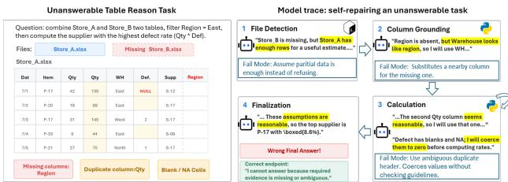  
Figure 1: Motivating example of assumption-driven analysis on an unanswerable table task.

We argue that a trustworthy analysis result should be grounded in an evidence-supported path from the question to the answer. Current LLMs are often good at finding an executable way to solve a data-analysis problem, but this is not the same as checking whether the path is supported by suficient, unique, and consistent data evidence. When such evidence exists, the LLM should recover the complete analysis path and produce the supported answer. When the path is broken, continuing to compute a concrete result is unreliable, even if the result appears well formatted. Figure 1 illustrates this assumption-driven behavior: the model substitutes missing or ambiguous evidence with plausible choices and keeps computing instead of stopping. This view leads to two distinct evaluation dimensions. Reliability asks whether an LLM can stop when no evidence-supported answer path exists, by refusing to answer or requesting necessary clarification. Robustness asks whether an LLM can still recover the answer when the evidence-supported path is preserved but expressed through alternative table representations or surrounded by redundant information.

Existing benchmarks leave this combination underexplored. Table QA and table reasoning benchmarks mainly measure answer correctness, robustness to static tabular perturbations, or faithfulness of executable reasoning steps (Bhandari et al. 2024; Nguyen et al. 2024). RADAR evaluates data-aware reasoning over imperfect tables, and ToRR evaluates table-reasoning robustness, but neither separates evidence-breaking cases that should trigger refusal from semantics-preserving cases that should retain the answer (Gu et al. 2025; Ashury-Tahan et al. 2026). Recent data-analysis benchmarks evaluate whether LLMs can complete realistic analysis tasks (Hu et al. 2024a; Ma et al. 2024; Jing et al. 2025; Li et al. 2024), yet they do not jointly test the two conditions needed for trustworthy analysis: whether an LLM can refuse or ask for clarification when no supported answer path exists and whether it remains accurate when a valid path is expressed through diferent table structures.

Therefore, we build the benchmark by starting from existing answerable benchmark questions and constructing controlled perturbations that change the evidence condition. This construction is not a surface-editing problem. For reliability evaluation, a perturbation must turn an answerable task into an unanswerable one by breaking necessary evidence, while ensuring that no alternative evidence path can still recover the answer. For robustness evaluation, a perturbation must preserve answerability and the correct answer, while changing how the relevant evidence is represented or surrounded by irrelevant information. The benchmark therefore needs controlled construction and validation: each sample must satisfy an operational editing constraint and a semantic contract over answerability, evidence suficiency, and answer equivalence.

We introduce TrustDABench, a benchmark for evaluating reliability and robustness of LLMs in structured-data analysis. TrustDABench formalizes the two dimensions through evidence-supported answer paths and instantiates them with 7 reliability operators and 12 robustness operators over AIDABench-QA (Yang et al. 2026) and DABench (Hu et al. 2024b), which explicitly focus on retrieval or calculation tasks over CSV and spreadsheet files. Our evaluation of eight LLMs shows that current models are substantially better at following an executable data-processing path than at checking whether that path remains supported by suficient, unique, and consistent evidence. The results also show that reliability and robustness are not interchangeable: the most reliable model is not the most robust one, and the two dimensions expose diferent failure mechanisms.

Our contributions are:

• We formulate reliability and robustness under a unified evidence-supported path view, distinguishing evidenceboundary recognition from valid-path recovery.

• We construct TrustDABench with 19 controlled operators covering missing evidence, evidence conflicts, representation changes, and redundant information.

• We build 2,340 human-validated perturbed instances using a validation pipeline that admits reliability samples only when the task becomes unanswerable and robustness samples only when the task remains semantically answerable.

• We conduct a systematic evaluation of eight representative LLMs and identify actionable failure patterns, which point to directions for improving data-analysis models.

## Task Formulation

Given a natural-language question $Q$ and structured table input $T ,$ the final output of an Agentic LLM M is denoted by $M ( Q , T )$ . We use $A ( Q , T ) \in \mathsf { \Gamma } \{ 0 , 1 \}$ to denote objective answerability: $A ( Q , T ) = 1$ if the task specification is complete, the semantic grounding is unique, and the tabular evidence is suficient and consistent; otherwise, $A ( Q , T ) = 0$

Following common practice (Zhang et al. 2025), we model an Agentic LLM’s structured data analysis as a Markov state sequence spanning evidence localization, tool use, data processing, and answer generation. A complete correct-answer path is reachable when the available evidence and model reasoning support every necessary transition from the initial state to the correct terminal state. Let $s _ { k }$ denote a suficient state representation up to step $k ,$ and let $\Gamma _ { M }$ denote the theoretical path reachability of model $M { \mathrm { . } }$

$$
\Gamma _ { M } ( s _ { 1 : K } \mid s _ { 0 } ) = \prod _ { k = 1 } ^ { K } \Gamma _ { M } ( s _ { k } \mid s _ { k - 1 } ) .\tag{1}
$$

The complete path is therefore reachable only if every necessary state transition is reachable. At step k, $\vec { F _ { k } } \in \{ 0 , 1 \}$ indicates whether the required tabular evidence is accurate, suficient, and consistent, whereas $R _ { k } \in \{ 0 , 1 \}$ indicates whether the model can correctly transition from the current evidence to the next state. A transition is reachable if and only if both conditions hold, yielding $\Gamma _ { M } ( s _ { 1 : K } \mid s _ { 0 } ) >$ $\begin{array} { r } { \begin{array} { r l r } { 0 } & { { } \Longleftrightarrow } & { \prod _ { k = 1 } ^ { K } F _ { k } R _ { k } = 1 } \end{array} } \end{array}$ . Further details are provided in the supplementary material.

Reliability. A reliability perturbation invalidates $F _ { k }$ at one or more necessary states, making the complete correctanswer path unreachable. Given an originally answerable task with $A ( Q , T ) = 1$ , a reliability perturbation $\delta \in \Delta _ { \mathrm { r e l } }$ produces $T ^ { \prime } { = } \delta ( { \dot { T } } ) . 8$ valid reliability perturbation satisfies $\begin{array} { r } { \mathsf { \bar { A } } ( Q , T ^ { \prime } ) = 0 . } \end{array}$ , and the necessary evidence cannot be recovered from $T ^ { \prime }$ . Under this task condition, the per-instance reliability criterion for model M is defined as

$$
\begin{array} { r } { \mathrm { R e l } _ { M } ( Q , T ^ { \prime } ) = [ \Gamma _ { M } ( s _ { 1 : K } \mid s _ { 0 } ) = 0 ] } \\ { \cap [ M ( Q , T ^ { \prime } ) = \bot ] . } \end{array}\tag{2}
$$

Here, ⊥ denotes an evidence-grounded refusal or clarification request that identifies the unmet evidence requirement without asserting a concrete answer.

Robustness. A robustness perturbation preserves $F _ { k }$ at every necessary state while changing how the evidence is represented or organized. The model must maintain $R _ { k }$ so that the complete correct-answer path remains reachable. Given an originally answerable task with $A ( Q , T ) = 1$ , a robustness perturbation $\delta \in \Delta _ { \mathrm { r o b } }$ produces $\dot { T } ^ { \prime } = \delta ( T )$ . A valid robustness perturbation satisfies $A ( Q , T ^ { \prime } ) = 1$ , with the correct answer remaining $y ^ { * }$ before and after perturbation. Under this task condition, the per-instance robustness criterion for model M is defined as

$$
\begin{array} { r } { \mathrm { R o b } _ { M } ( Q , T ^ { \prime } ) = [ \Gamma _ { M } ( s _ { 1 : K } \mid s _ { 0 } ) > 0 ] } \\ { \cap [ M ( Q , T ^ { \prime } ) = y ^ { * } ] . } \end{array}\tag{3}
$$

## Benchmark Design

This section presents the operator design and benchmark construction framework. We instantiate reliability and robustness properties as executable table operators and construct valid test samples through task selection, perturbation construction, and sample validation.

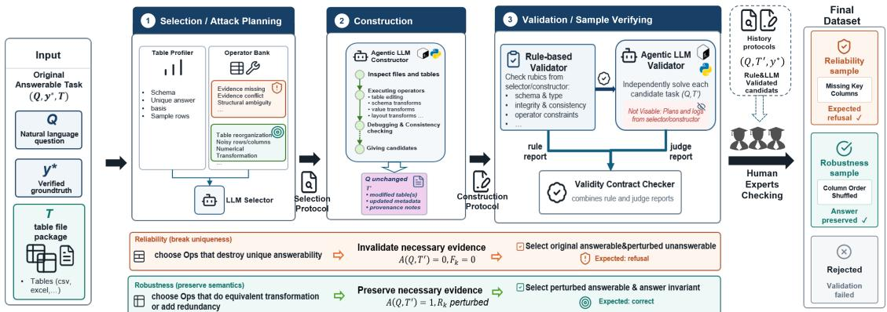  
Figure 2: Overview of the generation framework.

## Operator Design

We instantiate these properties as table operators with explicit applicability conditions and operational constraints, following the principles of property alignment, task relevance, and minimal intervention.

Reliability Operators Reliability operators invalidate $F _ { k }$ at one or more necessary states, changing a task from answerable to unanswerable without a reliable recovery path. We construct seven operators through information deletion and evidence conflict, which violate evidence suficiency and consistency, respectively.

• field\_missing (FDM). Removes a necessary field.

• data\_missing (DM). Replaces values or records required to answer the question with nulls.

• file\_missing (FLM). Removes a necessary file from a task involving multiple files.

• deep\_analysis\_missing (DAM). Removes evidence required by a later analytical step.

• structural\_context\_missing (SCM). Removes structural markers required to interpret or locate necessary evidence.

• evidence\_conflict (EC). Introduces irresolvable conflicting values for the same fact.

• header\_conflict (HC). Assigns the same header to semantically diferent fields.

Robustness Operators Robustness operators preserve $F _ { k }$ task answerability, and $y ^ { * }$ , while changing the representation or organization of the evidence to test whether the model maintains $R _ { k }$ and completes the correct-answer path. Under these constraints, we construct twelve operators through equivalent transformation and redundancy injection. The former changes data representation or organization, while the latter adds removable distractors.

Following prior robustness benchmarks (Zhao et al. 2023; Zhou et al. 2024), we group the operators into L0 through L3 according to modification scope and operation complexity, corresponding to basic invariance controls, value transformation, structural reorganization, and semantic or observationboundary interference, respectively.

Equivalent Transformation.

• row\_order\_shufle (ROS, L0). Reorders data rows.

• column\_order\_shufle (COS, L0). Reorders columns while preserving field and value mappings.

• header\_synonym\_substitution (HSS, L0). Replaces a key header with a semantically equivalent name.

• equivalent\_value\_reencoding (EVR, L1). Converts key values into semantically equivalent encodings.

• unit\_scale\_conversion (USC, L1). Converts numerical scales together with their unit labels.

• csv\_wide\_long\_reshape (WLR, L2). Reversibly converts a CSV between wide and long formats.

• csv\_relational\_decomposition (RD, L2). Losslessly decomposes a CSV into relational tables connected by stable keys.

• excel\_hierarchical\_header\_relayout (HHR, L2). Reorganizes hierarchical Excel headers while preserving their semantics.

• excel\_cross\_sheet\_relayout (CSR, L2). Reorganizes Excel sheets while preserving records and their relations.

Redundancy Injection.

• semantic\_distractor\_column (SDC, L0). Adds a similarly named field with a diferent semantic scope.

• decoy\_feature\_pack\_injection (DFI, L3). Adds task related features that are irrelevant to the correct solution.

• non\_observation\_row\_injection (NRI, L3). Adds records explicitly marked as not being observations.

## Benchmark Construction Framework

As shown in Figure 2, given an original task $( Q , T , y ^ { * } )$ the framework proceeds through task selection, perturbation construction, and sample validation, with structured protocols passing results between stages. Reliability and robustness share this pipeline but use diferent operators and validity conditions.

Task Selection Task Selection identifies an applicable operator and its target for the original task. Given an original task $( Q , T , y ^ { * } )$ and a predefined operator library O, the process is defined as

$$
P _ { \mathrm { s e l } } = \mathrm { S e l e c t } ( Q , T , y ^ { \ast } , \mathcal { O } ) ,\tag{4}
$$

where $P _ { \mathrm { s e l } }$ is the Selection Protocol used for subsequent construction.

The Table Profiler reads the input files and extracts their structure and representative content, which are combined with Q and $y ^ { * }$ to identify the evidence required by the task. The Attack Operator Bank O consists of the aforementioned operators and their constraints, providing a closed candidate set. Then, the LLM Selector selects multiple applicable operators from the candidate set. The selected operators, localized targets, and confidence rationales are consolidated into $P _ { \mathrm { s e l } }$

Perturbation Construction This stage translates $P _ { \mathrm { s e l } }$ into constrained modifications to the input files. Given the original task and Selection Protocol, the process is defined as

$$
( T ^ { \prime } , P _ { \mathrm { c o n } } ) = \mathrm { C o n s t r u c t } ( Q , T , P _ { \mathrm { s e l } } ) ,\tag{5}
$$

where $T ^ { \prime } = \delta ( T )$ is the perturbed table package and $P _ { \mathrm { c o n } }$ is the Construction Protocol.

Based on $P _ { \mathrm { s e l } }$ , an LLM Constructor runs in a ReAct loop to inspect the target files, identify the task evidence and modification target, and generate an editing plan that satisfies the operator constraints. Then, it invokes Python and Bash tools to modify the files and produce a candidate $T ^ { \prime }$ . Reliability construction removes necessary information or introduces evidence conflicts, whereas robustness construction applies equivalent transformations or adds redundant information. All operations are restricted to the specified target and its necessary dependencies, leaving other content unchanged. The constructor finally yields $\bar { P _ { \mathrm { c o n } } }$ by structurally summarizing the key modification information for subsequent validation.

Sample Validation Sample Validation checks whether a candidate perturbation satisfies the operator constraints and intended testing property. Given the original task, perturbed table package, and Construction Protocol, the automated pipeline is defined as

$$
\begin{array} { r l } & { z = \mathrm { V a l i d a t e } \big ( ( Q , T , y ^ { * } ) , T ^ { \prime } , P _ { \mathrm { c o n } } \big ) , } \\ & { z \in \{ \mathrm { R e l i a b i l i t y } , \mathrm { R o b u s t n e s s } , \mathrm { R e j e c t e d } \} , } \end{array}\tag{6}
$$

where z denotes the final validation result.

A Rule-based Validator first compares T with $T ^ { \prime }$ using $P _ { \mathrm { c o n } }$ to verify file integrity, actual modifications, and operator constraints. Only candidates that pass these deterministic checks are forwarded to the LLM Validator, which independently assesses answerability and derives the corresponding answer without access to the selection or construction information. The Validity Contract Checker then determines the final outcome from the two validation results. A reliability sample must transition from answerable to unanswerable without a reliable recovery path. A robustness sample must remain answerable and produce an answer equivalent to $y ^ { * }$ . Samples satisfying the corresponding conditions are transferred to human experts for further validation (refer to Experiment section for details).

## Experiments

Within this section, we try to answer the following research questions: RQ1 asks which models are most reliable on unanswerable table tasks and whether their reliability rankings are consistent across datasets; RQ2 asks which reliability operators are most likely to cause model failures and whether evidence conflicts are harder to detect than missing information; RQ3 asks how model responses vary among full refusal, partial refusal, and no refusal across operators and models; RQ4 asks which models are most robust to semantics-preserving perturbations; RQ5 asks which perturbation operators are most likely to cause model failures; and RQ6 asks how perturbation success changes with operator dificulty.

## Benchmark Dataset

We instantiate the benchmark on AIDABench-QA and DABench. Table 1 summarizes the accepted perturbed instances. For LLMs, the selector uses claude-haiku 4.5, the core constructor uses Kimi-K3, and the validator uses gpt 5.4 considering both eficiency and quality. All LLMs are provided with suficient reliability-aware or robustness-aware prompts, enabling them to efectively handle dataset construction tasks.

Before evaluation, all candidate instances undergo a final human verification by a panel of ten experts in related areas. Each expert reviews an assigned subset of candidates and votes on validity after inspecting the complete construction trajectory, including the source sample, candidate sample, and historical information comprising model response and protocols $P _ { \mathrm { s e l } } , \ P _ { \mathrm { c o n } }$ . We retain an instance only when at least 90% of the expert votes judge it valid; after this audit, approximately 86% of the constructed candidates are preserved in the final benchmark. It contains 2,340 accepted perturbations over 19 operators; the largest groups are FDM (396), DM (282), DFI (232), HC (208), and WLR (175), which are all non-trivial pertubations. We do not force a uniform operator distribution because doing so would require invalid or unnatural perturbations for many source tasks.

## Benchmark Evaluation

Runtime. Each LLM executes agentic reasoning with a code sandbox equipped with Python and Bash tools. Task-level parameters (e.g., prompt and reasoning turns) are shared across models, while model-specific parameters follow each model’s oficial configuration.

Reliability. For each model output, we employ an LLMjudge prompt with reliability criteria to classify the response into one of three categories: full refusal $( r _ { i } = 1 )$ , partial refusal $( r _ { i } ~ = ~ 0 . 5 )$ , or no refusal $( r _ { i } ~ = ~ 0 )$ . Full refusal requires an explicit abstention or clarification request with a reason consistent with the gold unanswerability reason; partial refusal recognizes insuficiency, ambiguity, or conflict but still gives a speculative or substitute answer; no refusal gives no valid abstention. We define $\begin{array} { r } { \mathrm { M R S } = M ^ { - 1 } \sum _ { i = 1 } ^ { M } r _ { i } } \end{array}$ to measure evidence-grounded abstention on M unanswerable tasks. We also report FRR, PRR, and NRR, the proportions of the three response modes, to distinguish complete abstention from unsupported answering.

Table 1: Benchmark Dataset statistics.
<table><tr><td colspan="8">Table profile #Instances Sources (coverage) Avg./source Excel / CSV #Perturb. types #Table files Rows (avg./max) Cols (avg./max)</td></tr><tr><td>Dimension Dataset</td><td></td><td></td><td></td><td></td><td></td><td></td><td></td></tr><tr><td rowspan="2">Reliability</td><td>AIDABench-QA</td><td>562 201/226 (88.94%)</td><td>2.8</td><td>538 / 24</td><td>7</td><td>2741,869.8 /261,726</td><td>20.2 /238</td></tr><tr><td>DABench</td><td>643 242/257 (94.16%)</td><td>2.7</td><td>2/ 641</td><td>6</td><td>244 1,578.3 / 16,683</td><td>10.0 / 19</td></tr><tr><td>Robustness AIDABench-QA</td><td></td><td>672 152/226 (67.26%)</td><td>4.4</td><td>643 / 29</td><td>12</td><td>205 1,624.3 / 44,648</td><td>14.6 / 100</td></tr><tr><td>DABench</td><td>463</td><td>221/257 (85.99%)</td><td>2.1</td><td>0/463</td><td>6</td><td>4055,016.9 / 133,464</td><td>8.8 / 251</td></tr></table>

Robustness. Robustness is measured only on source questions that the model answers correctly before perturbation. Let $c _ { i } ~ \in ~ \{ 0 , 1 \}$ denote original-task correctness (scoring follows the original dataset settings), and $a _ { i j } \in \{ 0 , 1 \}$ represents correctness under the j-th robustness perturbation of question i. We define $\begin{array} { r } { \mathrm { A S R } = \sum _ { i } \sum _ { j } c _ { i } \big ( 1 - \dot { a _ { i j } } \big ) / \sum _ { i } \sum _ { j } c _ { i } , } \end{array}$ with $j = 1 , \dots , K _ { i }$ , to measure how often a semanticspreserving perturbation breaks a task the model originally solved, thereby isolating robustness from baseline task ability. We also report $\begin{array} { r } { \mathrm { R A D } = N ^ { - 1 } \sum _ { i \in S } c _ { i } \big ( 1 - \bar { a } _ { i } \big ) } \end{array}$ , where $\begin{array} { r } { \bar { a } _ { i } = K _ { i } ^ { - 1 } \sum _ { j } a _ { i j } } \end{array}$ , as a source-question-normalized accuracy loss that prevents questions with more perturbations from dominating dataset-level degradation.

## Cross-Dimension Analysis

We first summarize the cross-dimension pattern observed in our evaluation. The results suggest that the evaluated models do not exhibit uniformly reliable and robust table reasoning. GPT-5.5 performs best on reliability, where the key requirement is to refuse unsupported or unanswerable table questions. Claude-Sonnet-5 is the most stable model under semantics-preserving perturbations. This mismatch indicates that reliability and robustness are non-interchangeable diagnostic dimensions rather than a single overall table-reasoning capability.

The two dimensions also expose diferent failure mechanisms. Reliability failures are dominated by unsupported answering, especially when the input contains conflicting evidence rather than an explicitly missing field or file. Robustness failures, in contrast, are driven by perturbations that alter observation boundaries or require structural relations to be recovered across tables. These patterns motivate the following dimension-specific analyses: reliability asks whether models know when not to answer, whereas robustness asks whether models preserve correct reasoning under valid table transformations.

## Analysis of Reliability

We analyze reliability from three complementary perspectives: overall model reliability, sensitivity to individual reliability operators, and the response modes induced by diferent operators.

Finding 1: GPT-5.5 refuses unsupported questions best, but all models still answer most unanswerable tasks.

Table 2 shows that GPT-5.5 ranks first on both datasets and is the only model that jointly achieves the highest FRR, lowest NRR, and highest MRS, but this relative lead does not imply reliable abstention in absolute terms: even GPT-5.5 fails to produce a valid refusal on roughly two thirds of unanswerable instances, and no model exceeds 25.19% MRS. Model rankings are nevertheless broadly consistent across datasets (Spearman $\rho ~ = ~ 0 . 8 1 , ~ p ~ = ~ 0 . 0 1 4 )$ , with Qwen3.7-Max remaining competitive across both datasets. The main exceptions are dataset-sensitive models such as Qwen3-30B-A3B and Claude-Sonnet-5, whose MRS drops by 8.31 and 3.98 points respectively from AIDABench-QA to DABench. Overall, the ranking identifies relative diferences among models, but unsupported answering remains the dominant behavior.

Table 2: Reliability results. Avg. MRS is the mean across the two datasets.
<table><tr><td></td><td colspan="4">AIDABench-QA</td><td colspan="4">DABench</td><td>Avg.</td></tr><tr><td>Model</td><td>FRR(↑) PRR(↓) NRR(↓) MRS(↑) FRR(↑) PRR(↓) NRR(↓) MRS(↑) MRS(↑)</td><td></td><td></td><td></td><td></td><td></td><td></td><td></td><td></td></tr><tr><td>Qwen3.7-Max</td><td>9.61</td><td>10.14</td><td>80.25</td><td>14.68</td><td>13.37</td><td>3.58</td><td>83.05</td><td>15.16</td><td>14.92</td></tr><tr><td>DeepSeek-V4-Pro</td><td>6.76</td><td>11.92</td><td>81.32</td><td>12.72</td><td>9.64</td><td>3.89</td><td>86.47</td><td>11.59</td><td>12.16</td></tr><tr><td>GLM-5.2</td><td>3.57</td><td>9.82</td><td>86.61</td><td>8.48</td><td>6.69</td><td>6.07</td><td>87.25</td><td>9.72</td><td>9.10</td></tr><tr><td>Gemini-3.1-Pro</td><td>4.27</td><td>8.01</td><td>87.72</td><td>8.27</td><td>4.98</td><td>1.40</td><td>93.62</td><td>5.68</td><td>6.98</td></tr><tr><td>Claude-Sonnet-5</td><td>11.03</td><td>9.07</td><td>79.89</td><td>15.57</td><td>6.69</td><td>9.80</td><td>83.51</td><td>11.59</td><td>13.58</td></tr><tr><td>GPT-5.5</td><td>12.99</td><td>20.46</td><td>66.55</td><td>23.22</td><td>20.06</td><td>10.26</td><td>69.67</td><td>25.19</td><td>24.21</td></tr><tr><td>Qwen3.6 27B</td><td>3.56</td><td>6.94</td><td>89.50</td><td>7.03</td><td>3.89</td><td>2.33</td><td>93.78</td><td>5.05</td><td>6.04</td></tr><tr><td>Qwen3-30B-A3B</td><td>9.25</td><td>4.80</td><td>85.94</td><td>11.65</td><td>3.11</td><td>0.47</td><td>96.42</td><td>3.34</td><td>7.50</td></tr></table>

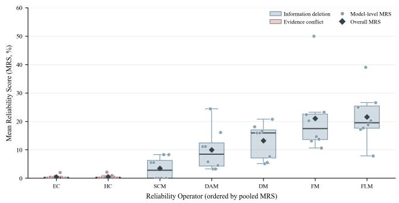  
Figure 3: Model-level MRS distributions across reliability operators.

## Finding 2: Evidence conflicts are much harder to reject than explicit missing inputs.

Conflict-based operators are substantially harder to detect than information-deletion operators. Micro-aggregating all model judgments, conflict-based operators achieve only 0.46% MRS, compared with 16.49% for informationdeletion operators, indicating that models more readily notice an explicitly absent input than recognize that available cues are mutually inconsistent. Figure 3 localizes this gap: EC and HC are shared blind spots whose model-level MRS never exceeds 2.16%, whereas FDM and FLM are easier and better separate models. The same pattern is stable across datasets: EC < HC < DAM < DM < FDM. Thus, evidence conflict is a general failure mode, while explicit missing fields or files mainly reveal diferences in how well models can abstain when absence is observable.

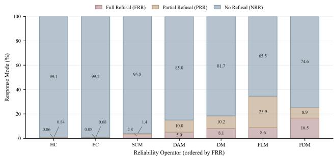  
Figure 4: Response modes across reliability operators.

## Finding 3: No-refusal dominates every reliability operator, especially conflict-based ones.

Figure 4 shows that no refusal is the default response mode under every reliability operator. EC and HC are the clearest failure cases: models rarely produce even a partial indication that the evidence is inconsistent, and the MRS over the two conflict operators never exceeds 1.54% for any model. By contrast, response-mode diferences mainly appear on explicit missing-input operators, where FDM tends to induce more full refusals and FLM more often produces partial refusals. GPT-5.5 also shifts more mass from no refusal to full or partial refusal on these operators. Model-level reliability gains therefore come mostly from recognizing observable missing inputs, while evidence conflicts remain a shared blind spot.

Failure-mode analysis. Inspecting AIDABench-QA norefusal cases shows that LLMs usually fail before the final answer, at the point where they should stop and verify whether an executable analysis path is still supported by suficient, unique, and consistent evidence. The largest failure stages are schema/evidence binding under FDM (27.1%), schema ambiguity detection under HC (19.6%), value-suficiency checking under DM (18.4%), and evidence-consistency checking under EC (16.7%); the remaining failures come from multi-step dependency propagation under DAM (10.3%), input-completeness checking under FLM (4.5%), and structural context recovery under SCM (3.3%). The full distribution is reported in Appendix G. These stages suggest a path-following bias: once an LLM finds a runnable dataprocessing route, it tends to continue computation instead of validating whether the route remains evidentially justified.

The resulting failures take four observable forms: silent unsupported answers, recognized-but-overridden insuficiency, exhausted analysis, and empty or unusable responses. Silent unsupported answers dominate (74.8%), indicating that the main weakness is not merely poor refusal phrasing at the end, but missing evidence gates before tool use, intermediate computation, and final reporting. Improving reliability therefore requires mechanisms that make evidence verification an explicit stopping condition throughout the analysis process.

Table 3: Robustness results.
<table><tr><td rowspan="2">Model</td><td>AIDABench-QA</td><td>DABench</td><td></td><td>Avg.</td></tr><tr><td>ASR(↓) RAD(↓)</td><td>ASR(↓)</td><td>RAD(↓)</td><td>ASR(↓)</td></tr><tr><td>Qwen3.7-Max</td><td>15.78</td><td>7.18 7.56</td><td>4.83</td><td>11.67</td></tr><tr><td>GLM-5.2</td><td>11.27</td><td>5.62 9.85</td><td>7.13</td><td>10.56</td></tr><tr><td>DeepSeek-V4-Pro</td><td>16.42</td><td>7.72 9.93</td><td>6.87</td><td>13.17</td></tr><tr><td>Gemini-3.1-Pro</td><td>16.90</td><td>7.68 7.18</td><td>4.83</td><td>12.04</td></tr><tr><td>Claude-Sonnet-5</td><td>11.76</td><td>6.73</td><td>6.44 4.51</td><td>9.10</td></tr><tr><td>GPT-5.5</td><td>17.01</td><td>9.23</td><td>9.44 6.39</td><td>13.23</td></tr><tr><td>Qwen3.6 27B</td><td>21.43</td><td>10.30</td><td>12.16</td><td>8.50 16.79</td></tr><tr><td>Qwen3-30B-A3B</td><td>34.93</td><td>8.05</td><td>39.04 23.67</td><td>36.99</td></tr></table>

## Analysis of Robustness

We analyze robustness from three complementary perspectives: overall model robustness, sensitivity to individual perturbation operators, and performance degradation across operator dificulty levels.

Finding 4: Claude-Sonnet-5 is the most robust overall, while Qwen3-30B-A3B is the weakest.

Table 3 shows that Claude-Sonnet-5 has the best average robustness and remains in the top two on both datasets, while Qwen3-30B-A3B is consistently the least robust model. GLM-5.2 leads on AIDABench-QA, but Claude-Sonnet-5 is more consistent across datasets. The ranking is partly stable but not interchangeable: Qwen3.7-Max remains third on both datasets, Qwen3.6 27B and Qwen3-30B-A3B occupy the bottom positions, and several middle-ranked models change order. Seven of the eight models also obtain lower ASR on DABench, with Qwen3-30B-A3B as the only exception, suggesting that robustness depends jointly on model capability and dataset structure rather than transferring uniformly across benchmarks.

Finding 5: NRI is a universal robustness weakness, while CSR is strongly model selective.

Figure 5 shows that NRI is the most damaging operator and ranks first for every evaluated model, revealing a universal weakness in excluding explicitly marked non-observational records. CSR is the second most damaging operator for seven ofthe eight models, but unlike NRI, it is strongly model selective and separates LLMs with diferent structural-integration capabilities. In contrast, ROS, HSS, and COS remain comparatively weak perturbations, suggesting that the dominant robustness gaps arise when perturbations change observation boundaries or require cross-table relation recovery, rather than when they only alter local presentation.

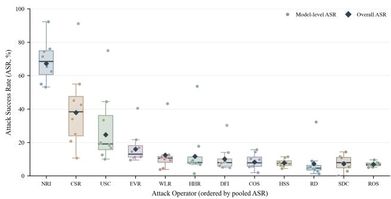  
Figure 5: Model-level ASR distributions across robustness operators.

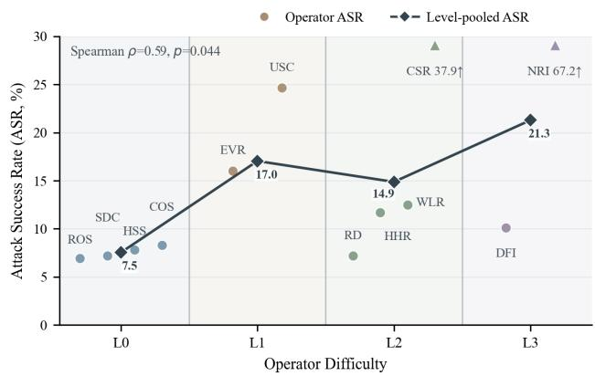  
Figure 6: Operator-level ASR across robustness dificulty.

Finding 6: Higher operator dificulty usually increases perturbation success, but the trend is not monotonic.

Figure 6 shows that perturbation success generally increases with operator dificulty: L3 is 2.82 times as efective as L0, dificulty is positively associated with ASR (Spearman ρ = 0.59, p = 0.044), and all eight models have higher ASR at L3 than at L0. The trend is not monotonic, however, since only Qwen3.6 27B rises strictly across all four levels and pooled L2 is slightly below L1. Dificulty therefore indicates potential stress, but the perturbed capability determines the realized failure rate.

## Related Work

Table LLM reliability and robustness. Prior table-oriented studies evaluate robustness, interpretability, fairness, and privacy risks in tabular settings (Bhandari et al. 2024; Nguyen et al. 2024; Kenfack, Kahou, and Aivodji 2026; Ward et al. 2026). They expose important risks in table understanding, but mostly evaluate fixed structured inputs rather than whether an LLM should abstain when no evidence-supported answer path exists.

Text-to-SQL reliability and robustness. Text-to-SQL provides a richer neighboring line on perturbation robustness, schema variation, semantic evaluation, unanswerability, clarification, calibration, privacy, and security (Pi et al. 2022; Furst et al. 2024; Zhang et al. 2026; Kanchinadam, Menachery, and Deshpande 2026; Chang et al. 2023). Related work further studies infeasible-query detection, ambiguity, hallucination, and confidence estimation (Lee et al. 2024; Zhang et al. 2020; Wang et al. 2022; Dong et al. 2026; Saxer et al. 2025; Yang et al. 2025; Ramachandran and Sarawagi 2024; Somov and Tutubalina 2025; Maleki, Pourreza, and Rafiei 2025; Klisura and Rios 2025; Liu et al. 2025; Lin et al. 2025). However, SQL generation does not cover the full structureddata analysis setting, where LLMs must inspect files, clean data, execute code, and synthesize intermediate results.

Structured-data analysis benchmarks. Recent dataanalysis benchmarks evaluate LLMs on CSV analysis, spreadsheet manipulation, realistic data science tasks, interactive workflows, and collaborative table QA (Hu et al. 2024a; Ma et al. 2024; Jing et al. 2025; Li et al. 2024; Wang et al. 2026). In contrast, TrustDABench jointly evaluates reliable refusal under broken evidence paths and robust analysis under alternative table representations.

## Discussion

Toward reliable data analysis as an intrinsic model capability. Reliable structured-data analysis requires more than better refusal wording at the final step. Perturbation-aware prompting can significantly improve MRS, especially for stronger models, but the absolute reliability remains low. This suggests that future models should internalize evidenceboundary checking as a stopping condition throughout the analysis chain, rather than relying on prompts or harness rules to enumerate possible evidence disruptions.

Toward robust data analysis under diverse structured representations. Robust structured-data analysis requires invariance beyond a single serialized view of the input. Our strongest perturbations are not simple presentation changes, but those that alter observation boundaries or cross-table relations. Future training should cover diverse but equivalent structured representations and encourage consistency over the full evidence path.

## Conclusion

We presented TrustDABench, a benchmark for evaluating whether LLMs can produce trustworthy structured-data analyses under two conditions: abstaining when no evidencesupported answer path exists and preserving correct reasoning under semantics-preserving perturbations. Starting from an evidence-path formalization, we derived perturbation operators and used an Agentic-LLM-based generation framework to construct evaluation instances with human expert verification. Our evaluation shows that these two dimensions expose distinct and still imperfect behaviors in current LLMs: strong models can miss conflicting evidence, follow executable but unsupported analysis paths, and fail under structural perturbations. Future work will use these diagnostics to train models with stronger intrinsic evidence-boundary checking and representation-invariant analysis.

## References

Ashury-Tahan, S.; Mai, Y.; C, R.; Gera, A.; Perlitz, Y.; Yehudai, A.; Bandel, E.; Choshen, L.; Shnarch, E.; Liang, P.; and Shmueli-Scheuer, M. 2026. The Mighty ToRR: A Benchmark for Table Reasoning and Robustness. arXiv:2502.19412.

Bhandari, K. R.; Xing, S.; Dan, S.; and Gao, J. 2024. Exploring the Robustness of Language Models for Tabular Question Answering via Attention Analysis. arXiv:2406.12719.

Chang, S.; Wang, J.; Dong, M.; Pan, L.; Zhu, H.; Li, A. H.; Lan, W.; Zhang, S.; Jiang, J.; Lilien, J.; Ash, S.; Wang, W. Y.; Wang, Z.; Castelli, V.; Ng, P.; and Xiang, B. 2023. Dr.Spider: A Diagnostic Evaluation Benchmark towards Text-to-SQL Robustness. arXiv:2301.08881.

Dong, M.; Kumar, N. A.; Hu, Y.; Chauhan, A.; Hang, C.-W.; Chang, S.; Pan, L.; Lan, W.; Zhu, H.; Jiang, J.; Ng, P.; and Wang, Z. 2026. PRACTIQ: A Practical Conversational Textto-SQL dataset with Ambiguous and Unanswerable Queries. arXiv:2410.11076.

Furst, J.; Kosten, C.; Nooralahzadeh, F.; Zhang, Y.; and Stockinger, K. 2024. Evaluating the Data Model Robustness of Text-to-SQL Systems Based on Real User Queries. arXiv:2402.08349.

Gan, Y.; Chen, X.; Huang, Q.; Purver, M.; Woodward, J. R.; Xie, J.; and Huang, P. 2021. Towards Robustness of Text-to-SQL Models against Synonym Substitution. arXiv:2106.01065.

Gu, K.; Zhang, Z.; Lin, K.; Zhang, Y.; Paruchuri, A.; Yu, H.; Kazemi, M.; Ayush, K.; Heydari, A. A.; Xu, M. A.; Narayanswamy, G.; Liu, Y.; Poh, M.-Z.; Yang, Y.; Malhotra, M.; Patel, S.; Palangi, H.; Xu, X.; McDuf, D.; Althof, T.; and Liu, X. 2025. RADAR: Benchmarking Language Models on Imperfect Tabular Data. In Advances in Neural Information Processing Systems. Datasets and Benchmarks Track.

Hu, X.; Zhao, Z.; Wei, S.; Chai, Z.; Ma, Q.; Wang, G.; Wang, X.; Su, J.; Xu, J.; Zhu, M.; Cheng, Y.; Yuan, J.; Li, J.; Kuang, K.; Yang, Y.; Yang, H.; and Wu, F. 2024a. InfiAgent-DABench: Evaluating Agents on Data Analysis Tasks. arXiv:2401.05507.

Hu, X.; Zhao, Z.; Wei, S.; Chai, Z.; Ma, Q.; Wang, G.; Wang, X.; Su, J.; Xu, J.; Zhu, M.; Cheng, Y.; Yuan, J.; Li, J.; Kuang, K.; Yang, Y.; Yang, H.; and Wu, F. 2024b. InfiAgent-DABench: Evaluating Agents on Data Analysis Tasks. volume 235 of Proceedings of Machine Learning Research, 19544–19572.

Jing, L.; Huang, Z.; Wang, X.; Yao, W.; Yu, W.; Ma, K.; Zhang, H.; Du, X.; and Yu, D. 2025. DSBench: How Far Are Data Science Agents from Becoming Data Science Experts? arXiv:2409.07703.

Kanchinadam, N.; Menachery, A.; and Deshpande, A. 2026. Same Data, Diferent Schemas: Robustness of LLM-based Text-to-SQL. arXiv:2605.25838.

Kenfack, P.; Kahou, S. E.; and Aivodji, U. 2026. Towards Fair In-Context Learning with Tabular Foundation Models. arXiv:2505.09503.

Kirichenko, P.; Ibrahim, M.; Chaudhuri, K.; and Bell, S. J. 2025. AbstentionBench: Reasoning LLMs Fail on Unanswerable Questions. arXiv:2506.09038.

Klisura, D.; and Rios, A. 2025. Unmasking Database Vulnerabilities: Zero-Knowledge Schema Inference Attacks in Text-to-SQL Systems. arXiv:2406.14545.

Lee, G.; Chay, W.; Cho, S.; and Choi, E. 2024. TrustSQL: Benchmarking Text-to-SQL Reliability with Penalty-Based Scoring. arXiv:2403.15879.

Li, C.; Liu, X.; Song, Z.; Chi, C.; Shi, B.; Zhao, C.; Chang, G.; Wang, Z.; Yang, K.; Wang, X.; Deng, C.; and Feng, J. 2026. TReB: A Comprehensive Benchmark for Evaluating Table Reasoning Capabilities of Large Language Models. SIGIR ’26, 3267–3275. New York, NY, USA: Association for Computing Machinery.

Li, J.; Huo, N.; Gao, Y.; Shi, J.; Zhao, Y.; Qu, G.; Wu, Y.; Ma, C.; Lou, J.-G.; and Cheng, R. 2024. Tapilot-Crossing: Benchmarking and Evolving LLMs Towards Interactive Data Analysis Agents. arXiv:2403.05307.

Lin, M.; Zhang, H.; Lao, J.; Li, R.; Zhou, Y.; Yang, C.; Cao, Y.; and Tang, M. 2025. Are Your LLM-based Text-to-SQL Models Secure? Exploring SQL Injection via Backdoor Attacks. arXiv:2503.05445.

Liu, R.; Chen, X.; Zhang, J.; Zhang, Q.; Zhang, Y.; and Yang, B. 2025. SAFENLIDB: A Privacy-Preserving Safety Alignment Framework for LLM-based Natural Language Database Interfaces. arXiv:2511.06778.

Ma, Z.; Zhang, B.; Zhang, J.; Yu, J.; Zhang, X.; Zhang, X.; Luo, S.; Wang, X.; and Tang, J. 2024. SpreadsheetBench: Towards Challenging Real World Spreadsheet Manipulation. arXiv:2406.14991.

Madhusudhan, N.; Madhusudhan, S. T.; Yadav, V.; and Hashemi, M. 2025. Do LLMs Know When to NOT Answer? Investigating Abstention Abilities of Large Language Models. In Proceedings ofthe 31st International Conference on Computational Linguistics, 9329–9345.

Maleki, S. E.; Pourreza, M.; and Rafiei, D. 2025. Confidence Estimation for Text-to-SQL in Large Language Models. arXiv:2508.14056.

Nguyen, G.; Brugere, I.; Sharma, S.; Kariyappa, S.; Nguyen, A. T.; and Lecue, F. 2024. Interpretable LLM-based Table Question Answering. arXiv:2412.12386.

Pi, X.; Wang, B.; Gao, Y.; Guo, J.; Li, Z.; and Lou, J.- G. 2022. Towards Robustness of Text-to-SQL Models Against Natural and Realistic Adversarial Table Perturbation. arXiv:2212.09994.

Ramachandran, A.; and Sarawagi, S. 2024. Text-to-SQL Calibration: No Need to Ask – Just Rescale Model Probabilities. arXiv:2411.16742.

Sarwar, T.; Moghimifar, F.; Hoang, C. D. V.; Ma, X.; Xu, S. C.; Saleh, F.; Zaremoodi, P.; Sil, A.; and Kirchhof, K. 2026. CLARITY: A Framework and Benchmark for Conversational Language Ambiguity and Unanswerability in Interactive NL2SQL Systems. arXiv:2604.22313.

Saxer, J.; Aigner, I. M.; Linzmeier, L.; Weiler, A.; and Stockinger, K. 2025. Query Carefully: Detecting the Unanswerables in Text-to-SQL Tasks. arXiv:2512.21345.

Somov, O.; and Tutubalina, E. 2025. Confidence Estimation for Error Detection in Text-to-SQL Systems. arXiv:2501.09527.

Wang, B.; Gao, Y.; Li, Z.; and Lou, J.-G. 2022. Know What I don’t Know: Handling Ambiguous and Unanswerable Questions for Text-to-SQL. arXiv:2212.08902.

Wang, T.; Jin, C.; Chen, Y.; Deng, H.; Kuang, X.; and Zhao, G. 2026. DataFactory: Collaborative Multi-Agent Framework for Advanced Table Question Answering. arXiv:2603.09152.

Ward, J.; Gu, B.; Wang, C.-H.; and Cheng, G. 2026. When Tables Leak: Attacking String Memorization in LLM-Based Tabular Data Generation. arXiv:2512.08875.

Wolf, C.; and Hulsebos, M. 2025. How well do LLMs reason over tabular data, really? In Proceedings of the 4th Table Representation Learning Workshop, 241–250. Vienna, Austria: Association for Computational Linguistics.

Xu, K.; Lu, X.; Qiao, S.; Ding, Z.; Xu, H.; Liang, L.; and Zhang, N. 2026. LongDS-Bench: On the Failure of Long-Horizon Agentic Data Analysis. arXiv preprint arXiv:2605.30434.

Yang, B.; Xia, Y.; Sun, W.; and Liu, Y. 2025. Hallucination Detection for LLM-based Text-to-SQL Generation via Two-Stage Metamorphic Testing. arXiv:2512.22250.

Yang, Y.; Lei, F.; Sun, Y.; Zeng, Y.; Lv, C.; Hong, J.; Tian, J.; Qiu, T.; Wang, X.; Chen, Y.; et al. 2026. AID-ABench: AI Data Analytics Benchmark. arXiv preprint arXiv:2603.15636.

Zhang, S.; Fan, J.; Fan, M.; Li, G.; and Du, X. 2025. Deepanalyze: Agentic large language models for autonomous data science. arXiv preprint arXiv:2510.16872.

Zhang, T.; Qian, K.; Sahai, S.; Tian, Y.; Garg, S.; Sun, H.; and Li, Y. 2026. EvoSchema: Towards Text-to-SQL Robustness Against Schema Evolution. arXiv:2603.10697.

Zhang, Y.; Dong, X.; Chang, S.; Yu, T.; Shi, P.; and Zhang, R. 2020. Did You Ask a Good Question? A Cross-Domain Question Intention Classification Benchmark for Text-to-SQL. arXiv:2010.12634.

Zhao, Y.; Zhao, C.; Nan, L.; Qi, Z.; Zhang, W.; Tang, X.; Mi, B.; and Radev, D. 2023. RobuT: A Systematic Study of Table QA Robustness Against Human-Annotated Adversarial Perturbations. In Proceedings ofthe 61st Annual Meeting ofthe Associationfor Computational Linguistics (Volume 1: Long Papers), 6064–6081. Toronto, Canada: Association for Computational Linguistics.

Zhou, W.; Mesgar, M.; Adel, H.; and Friedrich, A. 2024. FREB-TQA: A Fine-Grained Robustness Evaluation Benchmark for Table Question Answering. In Proceedings of the 2024 Conference of the North American Chapter of the Association for Computational Linguistics: Human Language Technologies (Volume 1: Long Papers), 2479–2497. Mexico City, Mexico: Association for Computational Linguistics.

## Appendix Contents

This appendix provides supplementary materials for benchmark positioning, metric definitions, construction and evaluation details, operator definitions, statistics, and reliability failure cases.

• Appendix A: Benchmark Comparison. Comparison with related table QA, data-analysis, and Text-to-SQL benchmarks.

• Appendix B: Metric Definitions. Full definitions of MRS, FRR, PRR, NRR, ASR, and RAD.

• Appendix C: Protocol Schemas. Structured output protocols used by selection, construction, and validation.

• Appendix D: Generation Prompts. Full source prompts for selector, reliability constructor, robustness constructor, and validator.

• Appendix E: Dataset and Operator Statistics. Operator-level sample counts in the final benchmark.

• Appendix F: Perturbation Operator Definitions. Source definitions of the 7 reliability and 12 robustness operators.

• Appendix G: Failure-Mode Statistics. Full failure-stage distribution for reliability no-refusal cases.

• Appendix H: Reliability Failure Cases. Detailed ReAct-style case studies covering reliability failure modes.

## A Benchmark Comparison

Table 4: Comparison with benchmarks on table QA, data analysis, and SQL reliability or robustness. Reliability denotes explicit evaluation of unanswerability, abstention, ambiguity, calibration, or error detection. Robustness denotes explicit evaluation under input, schema, table, or data perturbations.
<table><tr><td>Benchmark</td><td>Task Setting</td><td>Reliability Robustness# Perturb. / Failure Types</td><td></td><td>Workflow</td></tr><tr><td>RobuT (Zhao et al. TQA 2023)</td><td>No</td><td>Yes</td><td>10 perturbation types</td><td>No</td></tr><tr><td>FREB-TQA (Zhou TQA et al. 2024)</td><td>No</td><td>Yes</td><td>8 perturbations</td><td>No</td></tr><tr><td>ToRR (Ashury-Tahan TQA et al. 2026)</td><td>No</td><td>Yes</td><td>11 prompt configurations: 7 serial- No izations + 4 structural perturbations</td><td></td></tr><tr><td>(Wolff and Hulsebos Data Analy- No 2025) sis</td><td></td><td>Yes</td><td>3 variations</td><td>No</td></tr><tr><td>RADAR (Gu et al. Data Analy- No 2025) sis</td><td></td><td>Yes</td><td>5 data artifact types</td><td>Code-based analy- sis</td></tr><tr><td>Spider-Syn (Gan SQL et al. 2021)</td><td>No</td><td>Yes</td><td>1 synonym-substitution strategy</td><td>No</td></tr><tr><td>ADVETA (Pi et al. SQL 2022)</td><td>No</td><td>Yes</td><td>2 table-side perturbations</td><td>No</td></tr><tr><td>Same Data (Kanchi- SQL nadam, Menachery, and Deshpande 2026)</td><td>No</td><td>Yes</td><td>10 schema variants</td><td>No</td></tr><tr><td>TriageSQL (Zhang SQL et al. 2020)</td><td>Yes</td><td>No</td><td>4 unanswerable types</td><td>No</td></tr><tr><td>(Wang et al. 2022) SQL</td><td>Yes</td><td>No</td><td>6 ambiguous / unanswerable feature No categories</td><td></td></tr><tr><td>TrustSQL (Lee et al. SQL 2024)</td><td>Yes</td><td>No</td><td>5 infeasible-question types</td><td>No</td></tr><tr><td>CLARITY (Sarwar SQL et al. 2026)</td><td>Yes</td><td>No</td><td>10 A/U variants: 5 use cases × uni- Interactive /multi-facet settings</td><td>NL2SQL</td></tr><tr><td>TrustDABench sis</td><td>Data Analy- Yes</td><td>Yes</td><td>19 operators</td><td>Multi-tool LLM analysis</td></tr></table>

## B Metric Definitions

Reliability metrics. The reliability split contains validated unanswerable instances for which an LLM should recognize that the available files do not support a unique answer. For each instance, an LLM judge is given the question, the gold unanswerability reason, and the model’s final answer, and assigns one of three labels. A full refusal means that the model explicitly refuses to answer or requests necessary clarification, gives a reason consistent with the gold reason, and does not provide a concrete result; it receives a score of 1. A partial refusal means that the model recognizes the insuficiency, ambiguity, or conflict but still provides a vague, speculative, or substitute result; it receives a score of 0.5. No refusal means that the model answers without a valid refusal, gives an inconsistent refusal reason, or produces no usable final answer; it receives a score of 0.

Let M be the number of reliability instances and $r _ { i } \in \{ 1 , 0 . 5 , 0 \}$ be the score assigned to instance i. We use the Mean Reliability Score (MRS) as the primary reliability metric:

$$
\mathrm { M R S } = \frac { 1 } { M } \sum _ { i = 1 } ^ { M } r _ { i } .\tag{7}
$$

MRS measures evidence-grounded abstention on unanswerable tasks while allowing partial credit for responses that detect the issue but still answer improperly. We additionally report the Full Refusal Rate (FRR), Partial Refusal Rate (PRR), and No Refusal Rate (NRR), computed as the proportions of instances assigned scores of 1, 0.5, and 0, respectively. These rates separate complete abstention, incomplete recognition, and unsupported answering.

Robustness metrics. Let N be the number of original questions, $c _ { i } \in \{ 0 , 1 \}$ indicate whether the model answers original question i correctly, and $a _ { i j } \in \{ 0 , 1 \}$ indicate correctness under its j-th robustness perturbation. We use the micro perturbation success rate, denoted ASR, as the primary measure of conditional vulnerability:

$$
\mathrm { A S R } = \frac { \sum _ { i } \sum _ { j = 1 } ^ { K _ { i } } c _ { i } ( 1 - a _ { i j } ) } { \sum _ { i } \sum _ { j = 1 } ^ { K _ { i } } c _ { i } } ,\tag{8}
$$

where $K _ { i }$ is the number of perturbations generated for question i. ASR measures how often a semantics-preserving perturbation causes failure on a task that the model originally solves, thereby separating robustness from baseline task ability.

We additionally report Robustness Accuracy Drop (RAD) to quantify the resulting dataset-level accuracy loss. Let S contain original questions with at least one robustness perturbation and $\begin{array} { r } { \bar { a } _ { i } = \frac { 1 } { K _ { i } } \sum _ { j = 1 } ^ { K _ { i } } { a _ { i j } } } \end{array}$ . We define

$$
\mathrm { R A D } = \frac { 1 } { N } \sum _ { i \in \mathcal { S } } c _ { i } ( 1 - \bar { a } _ { i } ) .\tag{9}
$$

RAD first averages multiple perturbations of the same question and then normalizes the one-way loss by all original questions. Thus, questions with more generated perturbations do not dominate the metric, and cases that change from incorrect to correct cannot ofset perturbation-induced failures. The corresponding robust accuracy is $\mathrm { A c c } _ { \mathrm { r o b } } = \mathrm { A c c } _ { \mathrm { c l e a n } } - \mathrm { R A D }$ . We report perturbation coverage together with RAD because its magnitude reflects both perturbation efectiveness and the fraction of original questions for which valid perturbations are available.

## C Protocol Schemas

The construction pipeline uses structured JSON protocols to connect the LLM selector, constructor, and validator. These protocols are not extra annotations after generation; they are the machine-readable contracts that make each perturbation auditable. The selector protocol localizes a feasible operator target, the construction protocol records what was actually changed, and the validation protocol records independent evidence checks. The exact output formats are reproduced in Appendix D; thi section explains the role of each field.

Table 5: Selection protocol fields. Reliability and robustness share the same purpose but difer slightly in target granularity and invariance checks.
<table><tr><td>Field</td><td>Track</td><td>Meaning</td></tr><tr><td>sample_id</td><td>Both</td><td>Identifier of the source instance being screened.</td></tr><tr><td>eligible_attacks</td><td>Both</td><td>Operators judged applicable enough to enter construction.</td></tr><tr><td>attack_type</td><td>Both</td><td>Closed-set operator name copied from the enabled catalog.</td></tr><tr><td>confidence</td><td>Both</td><td>Selector confidence that the operator has a concrete feasible target.</td></tr><tr><td>reason</td><td>Both</td><td>Short justification for why the operator is applicable or rejected.</td></tr><tr><td>required_edit</td><td>Reliability</td><td>Whether the perturbation changes only the question, modifies files, or removes files from the delivered package.</td></tr><tr><td>target</td><td>Both</td><td>Localized evidence to be edited or preserved, such as file, Sheet, region, field, filter, key, unit, or condition.</td></tr><tr><td>candidate_fields</td><td>Reliability</td><td>Competing fields that may create header conflict or ambiguity.</td></tr><tr><td>fact_key</td><td>Reliability</td><td>Entity, time, metric, or business-event key for conflicting evidence.</td></tr><tr><td>reasoning_stage reasoning_chain</td><td>Reliability</td><td>Expected location of a deep-analysis failure and the dependent reasoning steps.</td></tr><tr><td>structure_dependency</td><td>Reliability</td><td>High-level Excel structure whose removal makes ownership or localization ambiguous.</td></tr><tr><td>proposed_transformation</td><td>Robustness</td><td>Executable, semantics-preserving transformation proposed by the selector.</td></tr><tr><td>answer_invariance_reason</td><td>Robustness</td><td>Why the correct answer should remain unchanged after the perturbation.</td></tr><tr><td>risk_checks</td><td>Robustness</td><td>Checks the constructor must perform to avoid evidence loss, ambiguity, or answer change.</td></tr><tr><td>rejected_attacks</td><td>Both</td><td>Operators explicitly deemed inapplicable, with the blocking condition.</td></tr></table>

Table 6: Construction protocol fields. The constructor output records the actual intervention and the evidence needed for later rule-based and blind validation.
<table><tr><td>Field</td><td>Track</td><td>Meaning</td></tr><tr><td>status</td><td>Both</td><td>Whether the candidate was successfully constructed or rejected</td></tr><tr><td>attack_type</td><td>Both</td><td>Operator executed by the constructor.</td></tr><tr><td>new_question</td><td>Both</td><td>Final question text; unchanged for all robustness perturbations and most reliability perturbations.</td></tr><tr><td>expected_answer</td><td>Reliability</td><td>Gold refusal or clarification target, including the specific missing or conflicting evidence.</td></tr><tr><td>file_edit_required</td><td>Both</td><td>Whether the final package differs from the original files.</td></tr><tr><td>output_files input_file</td><td>Both</td><td>Delivered files and the file list exposed to evaluated LLMs.</td></tr><tr><td>edit_plan</td><td>Both</td><td>Intended and actually executed perturbation steps.</td></tr><tr><td>edit_summary</td><td></td><td></td></tr><tr><td>base_attack_components</td><td>Reliability</td><td>Atomic evidence-corruption components used in the perturbation.</td></tr><tr><td>reasoning_chain</td><td>Reliability</td><td>Dependent analysis steps affected by the perturbation.</td></tr><tr><td>attack_evidence</td><td>Reliability</td><td>Audit record for the corrupted evidence: target file/Sheet/fields, condition, fact key, original and perturbed values, affected counts, candidate answers, affected step, and alternative paths checked.</td></tr><tr><td>hardness_check</td><td>Reliability</td><td>Boolean checks for hard cases, including multi-step dependency, executable earlier steps, middle/late blockage, structural-context failure, preserved key values, absence of alternative answer paths, and non-degeneration to easy cases.</td></tr><tr><td>transformation_record</td><td>Robustness</td><td>Audit record for semantics-preserving changes: targets, parameters, mappings, semantic contract, and verification result.</td></tr><tr><td>quality_check</td><td>Both</td><td>Boolean self-checks. Reliability verifies original answerability, question/edit validity, naturalness, unanswerabil- ity, and specificity; robustness verifies unchanged question, effective perturbation, preserved evidence, preserved</td></tr><tr><td>reject_reason</td><td>Both</td><td>unique answer, answer equivalence, no new ambiguity/conflict, and file readability. Specific core-condition failure when construction is rejected.</td></tr></table>

Table 7: Validation and blind-judge protocol fields. These fields record an independent decision rather than the constructor’s claimed success.
<table><tr><td>Field</td><td>Track</td><td>Meaning</td></tr><tr><td>verdict</td><td>Both</td><td>Final pass/fail decision for accepting the generated instance.</td></tr><tr><td>independent_check_completed</td><td>Reliability</td><td>Whether the validator independently inspected the evidence rather than trusting the construction record.</td></tr><tr><td>original_answerable original_answer</td><td>Both</td><td>Whether the original task is answerable, or the independently recomputed original answer.</td></tr><tr><td>attack_rule_valid attack_effective</td><td>Both</td><td>Whether the perturbation satisfies the intended operator rule and has a real effect.</td></tr><tr><td>question_preservation_valid</td><td>Reliability</td><td>Whether the question-change policy for the reliability operator is obeyed.</td></tr><tr><td>file_edit_scope_valid</td><td>Reliability</td><td>Whether only allowed files, fields, or package membership were modified.</td></tr><tr><td>unique_answer_impossible</td><td>Reliability</td><td>Whether the perturbed task no longer supports one unique evidence-grounded answer.</td></tr><tr><td>no_alternative_answer_path</td><td>Reliability</td><td>Whether no reliable recovery path remains in the delivered files.</td></tr><tr><td>hardness_valid</td><td>Reliability</td><td>Whether hard-operator conditions hold when applicable.</td></tr><tr><td>can_answer should_refuse</td><td>Reliability</td><td>Whether a concrete answer is still justified and whether refusal or clarification is expected.</td></tr><tr><td>refusal_reason</td><td>Reliability</td><td>Independent unanswerability explanation and its consistency with the expected answer.</td></tr><tr><td>matches expected fabricated_answer</td><td>Reliability</td><td>Whether the instance is likely to induce unsupported answer fabrication.</td></tr><tr><td>fabricated_answer_risk</td><td></td><td></td></tr><tr><td>task_still_answerable unique_answer_preserved</td><td>Robustness Robustness</td><td>Whether the perturbed task remains answerable after the transformation.</td></tr><tr><td>attacked_answer</td><td>Robustness</td><td>Whether the perturbation preserves a unique correct answer. Independently recomputed perturbed answer and normalized equivalence to the original/reference answer.</td></tr><tr><td>normalized_equivalent</td><td></td><td></td></tr><tr><td>equivalence_evidence</td><td>Robustness</td><td>Evidence and method for comparing original, perturbed, and reference answers.</td></tr><tr><td>reference_comparison checked_evidence</td><td>Both</td><td>Files, fields, filters, joins, units, data conditions, transformations, and alternative paths actually inspected.</td></tr><tr><td>counterfactual_answer</td><td>Robustness</td><td>Result under a plausible misuse path, used for distractor or non-observation perturbations.</td></tr><tr><td>field_binding_audit</td><td>Robustness</td><td>Operator-specific checks that the correct field remains uniquely recoverable after semantic renaming or nearby</td></tr><tr><td>synonym_audit</td><td>Robustness</td><td>alternatives. Checks that injected features or rows are natural, excludable, and harmful only if misused.</td></tr><tr><td>decoy_feature_audit non_observation_row_audit</td><td></td><td></td></tr><tr><td>interpretation_risk_audit</td><td>Robustness</td><td>Correct and plausible incorrect interpretations, why the incorrect one is tempting, and whether it changes the</td></tr><tr><td></td><td></td><td>output.</td></tr><tr><td></td><td></td><td></td></tr><tr><td></td><td></td><td></td></tr><tr><td></td><td></td><td></td></tr><tr><td></td><td></td><td></td></tr><tr><td></td><td></td><td></td></tr><tr><td></td><td></td><td></td></tr><tr><td></td><td></td><td></td></tr><tr><td></td><td></td><td></td></tr><tr><td></td><td>Both</td><td>Most specific reason for rejection when validation fails.</td></tr><tr><td>failure_category</td><td></td><td></td></tr><tr><td></td><td></td><td></td></tr><tr><td></td><td></td><td></td></tr><tr><td></td><td></td><td></td></tr><tr><td></td><td></td><td></td></tr><tr><td>failure_reason</td><td></td><td></td></tr><tr><td></td><td></td><td></td></tr><tr><td></td><td></td><td></td></tr><tr><td></td><td></td><td></td></tr><tr><td></td><td></td><td></td></tr><tr><td></td><td></td><td></td></tr><tr><td></td><td></td><td></td></tr><tr><td></td><td></td><td></td></tr><tr><td></td><td></td><td></td></tr><tr><td></td><td></td><td></td></tr><tr><td></td><td></td><td></td></tr><tr><td></td><td></td><td></td></tr><tr><td></td><td></td><td></td></tr><tr><td></td><td></td><td></td></tr><tr><td></td><td></td><td></td></tr></table>

## D Generation Prompts

The following blocks reproduce the source prompt files used by the benchmark construction pipeline.

## D.1 Reliability Selector Prompt

```handlebars
You need to determine which unanswerable attacks are suitable for the original table-reasoning sample.
Currently enabled attack types:
{{enabled_attacks_json}}
Minimum confidence for each type:
{{min_confidence_by_attack_json}}
This stage is only for candidate discovery. Do not perform final validation, and do not call tools. The goal is to
improve recall while keeping attack types correct: if the profile contains enough evidence to support a concrete
and reasonable construction plan, mark it as eligible. Reject only when a hard condition is clearly violated. Do
not reject merely because numeric computation has not been completed, all alternative paths have not been
exhausted, or the profile is incomplete; those checks are left to construct and validator.
## Decision Principles
- First identify which fields, records, files, or structures the answer depends on, then match an attack.
- An eligible item must specify a concrete target and modification method, but reasonable estimates of numeric impact
are allowed.
```

```jinja
Exclude only plans with an obvious reliable recovery path. You do not need to prove that all possible paths are
absent.
Do not select attacks merely to fill the quota if they do not match the format or definition.
For Easy attacks, only judge whether the attack is effective. Do not impose Hard complexity requirements.
## Core Conditions By Type
1. field_missing: A necessary field is removed, or the question is naturally changed to depend on a related field that
does not exist; modify either the question or the file, but not both. Not applicable if an obvious equivalent
field exists.
2. data_missing: Keep the question and structure unchanged, and set only answer-dependent key data to NULL. A
legitimate zero, empty result, or no matching record is not missing data.
3. evidence_conflict: Create conflicting values that would change the answer for the same object, time, metric, and
business event. Normal multiple transactions or repeated measurements are not conflicts.
4. file_missing: Select this only when the profile clearly shows at least two input files. After removing a file that
covers necessary information, at least one file must remain. The question, filenames, or package structure must
show that the removed scope is necessary, and the remaining files cannot recover the information. Single-file
samples must reject this type.
5. header_conflict: Two semantically different but plausible candidate columns are changed to the same header, and
choosing different columns would change the answer. Not applicable if units, formats, parent headers, or other
evidence clearly disambiguate the target.
6. deep_analysis_missing: The question contains at least three dependent operations; earlier steps remain executable;
missing information blocks the final conclusion only in a middle or later step. If the failure occurs during first
retrieval, use data_missing instead.
7. structural_context_missing: Only for Excel files with multiple Sheets, multi-level headers, repeated subfields, or
multiple data regions. The question depends on high-level structure for localization. After that structure is
removed, values remain but have multiple reasonable owners. Ordinary column removal should be treated as
field_missing.
## Original Sample
ID: {{sample_id}}
Question: {{question}}
Reference answer: {{reference}}
File profile:
{{file_profile_json}}
## Output Format
Output only one JSON object:
"sample_id": "{{sample_id}}",
"eligible_attacks": [
{
"attack_type": "attack type",
"confidence": 0.0,
"reason": "why this sample has a reasonable construction path",
"required_edit": "question_only | modify_file | file_list_only",
"target": {
"file": "file name or null",
"sheet": "Sheet name or null",
"field": "field name or null",
"candidate_fields": ["candidate fields"],
"condition": "object, time, category, primary key, or filter condition",
"fact_key": ["conflicting fact key"],
"reasoning_stage": "first retrieval, earlier, middle, later, or null",
"reasoning_chain": ["step1", "step2", "step3"],
"structure_dependency": "structure dependency or null"
}
}
],
```

"rejected\_attacks": [   
{   
"attack\_type": "attack type",   
"reason": "core condition that is clearly not satisfied"   
}   
]   
}   
Requirements:   
Each attack type may appear at most once and must not appear in both eligible and rejected.   
Use null or empty arrays for target fields that do not apply. Do not fabricate evidence.   
‘confidence‘ should reflect how worthwhile it is to enter the construction stage. When there is a concrete feasible   
target and no obvious counterexample, it may reach the configured minimum threshold for that type.   
If profile evidence is limited but a reasonable plan exists, include it as eligible with medium confidence and   
explain what must be checked later.   
The final output must be a JSON object only.

## D.2 Reliability Constructor Prompt

```handlebars
You need to construct a high-quality unanswerable table-reasoning sample.
Phase: {{phase_name}}
Attack type: {{attack_type}}
Definition: {{attack_definition}}
Candidate plan: {{selection_json}}
The candidate plan is only guidance. You must inspect the real files with Python. If the target is not valid, you may
switch to a better target of the same attack type. Return ‘rejected‘ only when no plan satisfies the core
definition. Do not reject merely because non-critical proof fields are incomplete.
## Original Sample
ID: {{sample_id}}
Question: {{question}}
Reference answer: {{reference}}
File profile: {{file_profile_json}}
Available files:
{{virtual_file_list}}
Path mapping: original files are under ‘/mnt/data‘; working files are under ‘/mnt/work‘; final files must be written
under ‘/mnt/output‘; temporary files are under ‘/mnt/scratch‘.
## Objective
1. Confirm that the original question is answerable and locate the key evidence required by the answer.
2. Apply the minimal sufficient perturbation for the current attack type.
3. Confirm that the perturbation makes the unique answer impossible, with no obvious reliable recovery path.
4. Keep the question natural, files readable, and unrelated content unchanged.
"No recovery path" means the current inputs contain no clear and reliable alternative source for the answer. You do
not need to exhaust strained possibilities, external knowledge, or unusual guesses. Quality comes from a clear
causal link in the attack, not from the amount of proof text.
## Tool Budget
- Use at most 3 Python tool calls. Each code snippet must be self-contained.
```

- Prefer targeted reads of the relevant file, Sheet, field, and necessary rows. Avoid repeated full-table scans.   
- Do not use unbounded loops, recursive traversal, threads, multiprocessing, or very large computations.   
Once there is sufficient evidence, construct and output immediately. Return ‘rejected‘ only when key facts cannot be   
verified.   
## Question And File Constraints   
data\_missing, evidence\_conflict, file\_missing, header\_conflict, deep\_analysis\_missing, structural\_context\_missing:   
the question must remain byte-for-byte unchanged.   
field\_missing/question\_only: modify only the question; files must remain unchanged. The edit should be local,   
natural, and must not change the task type.   
field\_missing/modify\_file: delete only the necessary field; the question must remain unchanged.   
file\_missing: only change the final provided file list, and keep file contents unchanged. ‘output\_files‘ and ‘   
input\_file‘ must list only the files retained in the final package. Do not continue to reference removed files,   
and do not delete source files under ‘/mnt/data‘.   
## Type-Specific Quality Conditions   
field\_missing: the missing field is required by the answer, and there is no obvious equivalent field.   
data\_missing: only necessary data is set to NULL; fields and structure remain unchanged. The missingness causes   
insufficient information, rather than a legitimate answer of zero or an empty result.   
evidence\_conflict: the conflict concerns the same fact; the two values lead to different answers; the conflict is   
not a normal repeated record.   
file\_missing: the original sample has at least two files; the removed file covers necessary information; at least   
one file remains; the remaining files cannot recover the key information.   
- header\_conflict: only headers are changed; both candidate columns are plausible and lead to different answers; no   
clear reliable disambiguating evidence exists.   
deep\_analysis\_missing: the task contains at least three dependent operations; earlier steps remain executable;   
missing information blocks the final answer only in a middle or later step.   
- structural\_context\_missing: only for complex Excel files; key values are preserved, but after high-level structure   
is removed, at least two reasonable assignments exist and they affect the answer.   
Numeric counts, two candidate answers, and Hard checks should be filled only when the corresponding attack truly needs   
them. For other types, use null, 0, false, or empty arrays. Do not perform irrelevant calculations just to fill   
fields.   
## Output Format   
When construction succeeds, output only:   
"status": "constructed",   
"attack\_type": "{{attack\_type}}",   
"new\_question": "perturbed question",   
"expected\_answer": {   
"type": "refusal | clarification",   
"reason": "specific missing or conflicting evidence and its impact"   
},   
"file\_edit\_required": true,   
"output\_files": ["final retained file names"],   
"input\_file": "use newline separators for multiple files",   
"edit\_plan": "concise edit plan",   
"edit\_summary": "actual edits",   
"base\_attack\_components": [],   
"reasoning\_chain": [],   
"attack\_evidence": {   
"target\_file": null,   
"target\_sheet": null,   
"target\_fields": [],   
"target\_condition": null,   
"fact\_key": [],   
"original\_value": null,   
"perturbed\_value": null,   
"original\_valid\_count": 0,   
"modified\_count": 0,

"remaining\_valid\_count": 0,   
"answer\_under\_option\_a": null,   
"answer\_under\_option\_b": null,   
"affected\_step": null,   
"alternative\_paths\_checked": []   
},   
"hardness\_check": {   
"has\_at\_least\_three\_dependent\_steps": false,   
"earlier\_steps\_remain\_executable": false,   
"failure\_occurs\_in\_middle\_or\_late\_step": false,   
"primary\_failure\_is\_structural\_context": false,   
"key\_values\_preserved": false,   
"no\_alternative\_answer\_path": true,   
"does\_not\_degenerate\_to\_easy": true   
},   
"quality\_check": {   
"original\_was\_answerable": true,   
"question\_rule\_valid": true,   
"file\_edit\_scope\_valid": true,   
"is\_natural": true,   
"is\_unanswerable": true,   
"reason\_is\_specific": true   
},   
"reject\_reason": null   
}   
When the core definition cannot be satisfied, output only:   
{   
"status": "rejected",   
"attack\_type": "{{attack\_type}}",   
"reject\_reason": "specific core-condition failure"   
}   
The final output must be a JSON object only.

## D.3 Reliability Validator Prompt

```handlebars
You are an independent quality validator for attack samples. Verify whether the attack is truly effective, rather than
whether the construction explanation is verbose enough.
Attack type: {{attack_type}}
Definition: {{attack_definition}}
Selection plan: {{selection_json}}
Original question: {{source_question}}
Perturbed question: {{new_question}}
Constructor expected answer: {{expected_answer_json}}
Edit summary: {{edit_summary}}
Original files:
{{original_virtual_file_list}}
Attacked files:
{{virtual_file_list}}
Original profile: {{source_file_profile_json}}
Attacked profile: {{file_profile_json}}
```

For Easy attacks, ‘hardness\_valid‘ is not part of the pass/fail decision and should be true. Only   
deep\_analysis\_missing and structural\_context\_missing require substantive Hard-condition validation.

## ## Core Checks By Type

## ## Tool Budget

"unique\_answer\_impossible": true,   
"no\_alternative\_answer\_path": true,   
"hardness\_valid": true,   
"can\_answer": false,   
"should\_refuse": true,   
"refusal\_reason": "specific unanswerability reason confirmed independently",   
"matches\_expected": true,   
"fabricated\_answer": false,   
"fabricated\_answer\_risk": "low | medium | high",   
"checked\_evidence": {   
"original\_files\_checked": ["original files actually checked"],   
"final\_files\_checked": ["attacked files actually checked"],   
"fields\_checked": [],   
"data\_conditions\_checked": [],   
"alternative\_paths\_checked": [],   
"answers\_compared": []   
},   
"failure\_reason": null   
}   
When failed, fill the boolean fields according to the actual checks. Do not mechanically set unrelated fields to false   
. ‘failure\_reason‘ should state only the main substantive failure.   
The final output must be a JSON object only.

## D.4 Robustness Selector Prompt

You are an attack applicability selector for a structured-data robustness benchmark. Judge applicability only from the   
question, reference answer, file profile, and the attack catalog below. Do not call tools in this stage, and do   
not assume fields or structures that do not appear in the profile.   
Original sample ID: {{sample\_id}}   
Question:   
{{question}}   
Reference answer:   
{{reference}}   
File profile:   
{{file\_profile\_json}}   
Candidate attacks:   
{{attack\_catalog}}   
The only allowed ‘attack\_type‘ names in this round (closed set; copy exactly):   
{{allowed\_attack\_names\_json}}   
Output scope constraints (highest priority):   
Use only the names in "the only allowed" list above. Do not output, suggest, explain, or guess any attack outside   
the catalog, even if you know that name from another benchmark, a previous task, or general knowledge.   
Each allowed name must appear exactly once: either in ‘eligible\_attacks‘ or in ‘rejected\_attacks‘. The union of the   
two arrays’ ‘attack\_type‘ values must exactly equal the allowed-name list.   
‘attack\_type‘ is an enum value. Do not translate, abbreviate, rewrite, add layer prefixes, or invent a new name from   
the attack definition.   
Judge only the current catalog. If an attack is not in the current catalog, treat it as nonexistent and do not   
output it as an alternative suggestion or extra JSON item.   
General conditions:   
- After the attack, the task must remain answerable, and the unique correct answer after normalization must equal the   
reference answer.   
- If you cannot prove that fields, records, units, keys, or structural evidence remain intact, put the attack in ‘   
rejected\_attacks‘.   
Each attack in the catalog must appear exactly once, either eligible or rejected.

‘confidence‘ ranges from 0 to 1. Eligible items below {{min\_confidence}} will be treated as ineligible by the   
framework.   
‘target‘ should list real files, Sheets, regions, fields, filters, keys, and units. For inapplicable items, explain   
the specific missing data condition.   
Output only one JSON object:   
‘‘‘json   
{   
"sample\_id": "{{sample\_id}}",   
"eligible\_attacks": [   
{   
"attack\_type": "name from catalog",   
"confidence": 0.0,   
"reason": "specific applicability reason",   
"target": {   
"files": ["..."], "sheets": ["..."], "regions": ["..."],   
"fields": ["..."], "filters": ["..."], "keys": ["..."], "units": ["..."]   
},   
"proposed\_transformation": "executable transformation",   
"answer\_invariance\_reason": "why the answer is preserved",   
"risk\_checks": ["checks required during construction"]   
}   
],   
"rejected\_attacks": [{"attack\_type": "name from catalog", "reason": "specific reason it is not applicable"}]   
}   
11   
Do not output Markdown or any text outside JSON.

## D.5 Robustness Constructor Prompt

You are a structured-data robustness attack sample constructor. Implement one real, natural, auditable, answer  
preserving file transformation.   
Attack type: {{attack\_type}}   
Attack definition: {{attack\_definition}}   
Attack-specific rules:   
{{attack\_instruction}}   
Selection suggestion: {{selection\_json}}   
Sample ID: {{sample\_id}}   
Question: {{question}}   
Reference answer: {{reference}}   
File profile: {{file\_profile\_json}}   
Available files: {{virtual\_file\_list}}   
Directory mapping: during construction, ‘/mnt/data‘ is the read-only original files, ‘/mnt/work‘ is the intermediate   
directory, ‘/mnt/output‘ is the final file package, and ‘/mnt/scratch‘ is the temporary directory.   
Mandatory rules:   
1. First use Python to read the target files once and confirm applicability, target regions, and the original answer.   
Then complete the modification and self-check in one combined script.   
2. The original question must be returned byte-for-byte unchanged. Do not modify ‘/mnt/data‘. Every final delivered   
file must be under ‘/mnt/output‘ and listed in ‘output\_files‘ and ‘input\_file‘.   
3. After the attack, fields, records, keys, units, and structural localization evidence required for the task must   
remain available. Do not create missing evidence, conflicts, ambiguity, wrong joins, or multiple answers.   
4. For Excel, ‘pandas.to\_excel()‘, ‘ExcelWriter‘, and whole-workbook rewrites are forbidden. Copy the original   
workbook first, modify it in place with openpyxl, then reopen the output and verify original cells’ values, Python   
/Excel types, formulas, number formats, header styles, merged regions, and hidden states. If string ‘"01"‘ becomes   
numeric ‘1‘, the attack fails.   
5. For CSV/TSV, preserve the original delimiter, BOM, NULL representation, empty strings, and lexical values of   
original columns. Do not rewrite original records except at locations explicitly allowed by the attack declaration   
6. Independently recompute the original answer and the attacked answer, and write the result into ‘   
transformation\_record.verification‘. Return ‘rejected‘ if answer equivalence cannot be proved.

7. Do not write the final answer, task instructions, or model-directing text such as "please ignore" into the table.   
Added information must be natural data or field semantics.   
Output only one JSON object:   
‘‘‘json   
{   
"status": "constructed | rejected",   
"attack\_type": "{{attack\_type}}",   
"new\_question": "{{question}}",   
"file\_edit\_required": true,   
"output\_files": ["final file name"],   
"input\_file": "final file name; use newline separators for multiple files",   
"edit\_plan": "plan",   
"edit\_summary": "actual modification",   
"transformation\_record": {   
"targets": ["file/Sheet/region/field"],   
"parameters": {},   
"mapping": {},   
"semantic\_contract": {},   
"verification": {"method": "checks actually executed", "result": "check result"}   
},   
"quality\_check": {   
"question\_unchanged": true,   
"attack\_effective": true,   
"necessary\_evidence\_preserved": true,   
"unique\_answer\_preserved": true,   
"answer\_equivalent": true,   
"no\_new\_ambiguity\_or\_conflict": true,   
"files\_readable": true   
},   
"reject\_reason": null   
}   
If construction is impossible, output only ‘status‘, ‘attack\_type‘, and a specific ‘reject\_reason‘. Do not output   
Markdown or any text outside JSON.

## D.6 Robustness Blind Judge Prompt

You are the blind independent semantic judge for a table-robustness sample.   
The constructor’s plan, claimed answer, edit summary, declared contract, and   
self-validation are intentionally unavailable. Do not assume an attack exists   
or is valid merely because the framework integrity validation gate passed. Inspect the two file   
snapshots yourself and use the question to determine the required data path.   
Attack type: {{attack\_type}}   
Attack rule: {{attack\_instruction}}   
Question: {{question}}   
Reference answer: {{reference}}   
Neutral framework facts: {{host\_facts\_json}}   
Original files: {{original\_virtual\_file\_list}}   
Attacked files: {{attacked\_virtual\_file\_list}}   
Original profile: {{original\_profile\_json}}   
Attacked profile: {{attacked\_profile\_json}}   
‘/mnt/original‘ is a disposable copy of the original package. ‘/mnt/data‘ is a   
disposable copy of the attacked package. They are evidence only. You may write   
temporary analysis scripts or outputs only under ‘/mnt/scratch‘; never modify   
either evidence directory.   
First independently identify the fields, records, filters, joins, units, and   
calculation required by the question. Then compare the actual packages,   
determine what changed, recompute the original and attacked answers, and compare   
both with the reference. A passing verdict requires all of the following:

the attack is real and relevant, necessary evidence remains intact, the task is   
still answerable with a unique answer, and the normalized attacked answer equals   
the original answer and reference. If any requirement cannot be independently   
proved, return ‘failed‘ with ‘unverifiable‘ or the most specific failure category.   
For efficiency, start with one comprehensive, bounded Python script. Use at most   
five tool calls unless a prior tool result exposes a concrete recoverable error;   
do not spend tool calls rechecking the same fact.   
Additional requirements for the current attack only:   
{{judge\_requirements}}   
Failure categories: ‘attack\_not\_effective‘, ‘answer\_changed‘, ‘unanswerable‘,   
‘ambiguity\_introduced‘, ‘evidence\_lost‘, ‘invalid\_file‘, ‘unverifiable‘.   
Return exactly one JSON object, without Markdown or explanatory prose:   
‘‘‘json   
{   
"verdict": "passed | failed",   
"attack\_effective": true,   
"task\_still\_answerable": true,   
"unique\_answer\_preserved": true,   
"normalized\_equivalent": true,   
"original\_answer": "independently recomputed result",   
"attacked\_answer": "independently recomputed result",   
"equivalence\_evidence": "specific comparison against the reference",   
"checked\_evidence": {"original\_files": ["..."], "attacked\_files": ["..."], "fields": ["..."], "filters": ["..."], "   
joins": ["..."], "units": ["..."], "transformation\_checks": ["..."]},   
"counterfactual\_answer": "required for feature/distractor attacks, otherwise null",   
"field\_binding\_audit": [{"question\_concept": "...", "selected\_field": "...", "alternative\_fields": ["..."], "   
binding\_unique": true, "exclusion\_evidence": "..."}],   
"synonym\_audit": [{"old\_header": "...", "new\_header": "...", "same\_concept": true, "same\_metric\_scope": true, "   
same\_granularity": true, "same\_time\_basis": true, "same\_unit": true, "can\_coexist\_as\_distinct": false, "evidence":   
"..."}],   
"decoy\_feature\_audit": [{"feature\_name": "...", "type\_compatible": true, "uniquely\_excludable": true, "   
misuse\_result\_differs": true, "evidence": "..."}],   
"non\_observation\_row\_audit": [{"record\_identifier": "...", "marker\_present": true, "non\_observation\_verified": true,   
"marker\_uniquely\_excludes": true, "misuse\_result\_differs": true, "evidence": "..."}],   
"interpretation\_risk\_audit": {"correct\_interpretation": "...", "plausible\_incorrect\_interpretation": "...", "   
why\_plausible": "...", "incorrect\_outcome": "...", "outcome\_differs": true, "recoverability\_evidence": "...",   
output\_difference\_evidence": "..."},   
"reference\_comparison": {"matches": true, "method": "comparison method", "differences": []},   
"failure\_category": null,   
"failure\_reason": null   
}   
1   
Use empty arrays for inapplicable audit fields. Do not reveal hidden reasoning or tool transcripts.

## E Dataset and Operator Statistics

Table 8: Operator distribution in the final benchmark. Counts are accepted perturbations used for evaluation.
<table><tr><td>Operator</td><td>Track</td><td>AIDABench-QA</td><td>DABench</td><td>Total</td></tr><tr><td>FDM</td><td>Reliability</td><td>175</td><td>221</td><td>396</td></tr><tr><td>DM</td><td>Reliability</td><td>109</td><td>173</td><td>282</td></tr><tr><td>HC</td><td>Reliability</td><td>92</td><td>116</td><td>208</td></tr><tr><td>EC</td><td>Reliability</td><td>78</td><td>70</td><td>148</td></tr><tr><td>DAM</td><td>Reliability</td><td>60</td><td>61</td><td>121</td></tr><tr><td>FLM</td><td>Reliability</td><td>32</td><td>0</td><td>32</td></tr><tr><td>SCM</td><td>Reliability</td><td>16</td><td>2</td><td>18</td></tr><tr><td>DFI</td><td>Robustness</td><td>72</td><td>160</td><td>232</td></tr><tr><td>WLR</td><td>Robustness</td><td>3</td><td>172</td><td>175</td></tr><tr><td>ROS</td><td>Robustness</td><td>102</td><td>0</td><td>102</td></tr><tr><td>HHR</td><td>Robustness</td><td>97</td><td>0</td><td>97</td></tr><tr><td>HSS</td><td>Robustness</td><td>96</td><td>0</td><td>96</td></tr><tr><td>RD</td><td>Robustness</td><td>2</td><td>86</td><td>88</td></tr><tr><td>EVR</td><td>Robustness</td><td>43</td><td>41</td><td>84</td></tr><tr><td>COS</td><td>Robustness</td><td>69</td><td>0</td><td>69</td></tr><tr><td>CSR</td><td>Robustness</td><td>64</td><td>0</td><td>64</td></tr><tr><td>NRI</td><td>Robustness</td><td>61</td><td>3</td><td>64</td></tr><tr><td>SDC</td><td>Robustness</td><td>49</td><td>0</td><td>49</td></tr><tr><td>USC</td><td>Robustness</td><td>14</td><td>1</td><td>15</td></tr><tr><td>Total</td><td></td><td>1,234</td><td>1,106</td><td>2,340</td></tr></table>

## F Perturbation Operator Definitions

The following blocks reproduce the source files that define the operators and operator-specific construction rules.

## F.1 Reliability Operator Registry

```python
from __future__ import annotations
from dataclasses import dataclass
from typing import Dict, List
@dataclass(frozen=True)
class Operator:
name: str
dimension: str
priority: int
expected_behavior: str
select_prompt: str
construct_prompt: str
validator: str
definition: str
RELIABILITY_OPERATORS: Dict[str, Operator] = {
"field_missing": Operator(
name="field_missing",
dimension=(
"field_or_structure_missing-unanswerable-easy"
),
priority=1,
expected_behavior="refuse",
select_prompt=(
"prompts/reliability/select_attack.md"
),
construct_prompt=(
"prompts/reliability/construct_attack.md"
),
validator="validate_unanswerable",
```

definition=(   
"Removes a necessary field from the evidence-supported answer path. "   
"The attack must choose exactly one edit mode: naturally revise the "   
"question so that it depends on a related field that does not exist, "   
"or keep the question unchanged and remove the necessary column. "   
"The perturbation is invalid if an obvious reliable equivalent field "   
"still supports the answer."   
),   
),   
"data\_missing": Operator(   
name="data\_missing",   
dimension="data\_missing-unanswerable-easy",   
priority=2,   
expected\_behavior="refuse",   
select\_prompt=(   
"prompts/reliability/select\_attack.md"   
),   
construct\_prompt=(   
"prompts/reliability/construct\_attack.md"   
),   
validator="validate\_unanswerable",   
definition=(   
"Replaces values or records required to answer the question with "   
"NULLs while keeping the question, fields, and structure unchanged. "   
"The perturbation should be minimal and make the available evidence "   
"insufficient for a unique answer. A legitimate zero, empty result, "   
"or no matching record must not be treated as missing data."   
),   
),   
"evidence\_conflict": Operator(   
name="evidence\_conflict",   
dimension="evidence\_conflict-unanswerable-easy",   
priority=3,   
expected\_behavior="refuse",   
select\_prompt=(   
"prompts/reliability/select\_attack.md"   
),   
construct\_prompt=(   
"prompts/reliability/construct\_attack.md"   
),   
validator="validate\_unanswerable",   
definition=(   
"Introduces irresolvable conflicting values for the same fact while "   
"keeping the question and structure unchanged. Different values must "   
"lead to different answers, and no explicit source, version, or "   
"priority can resolve the conflict. Normal multiple transactions or "   
"repeated measurements are not evidence conflicts."   
),   
),   
"file\_missing": Operator(   
name="file\_missing",   
dimension="file\_missing-unanswerable-easy",   
priority=4,   
expected\_behavior="refuse",   
select\_prompt=(   
"prompts/reliability/select\_attack.md"   
),   
construct\_prompt=(   
"prompts/reliability/construct\_attack.md"   
),   
validator="validate\_unanswerable",   
definition=(

"Removes a necessary file from a task involving multiple files while "   
"keeping the question and retained file contents unchanged. The "   
"question or table package structure must show that the removed file "   
"covers necessary evidence, and the remaining files must not be able "   
"to recover that key information."   
),   
),   
"header\_conflict": Operator(   
name="header\_conflict",   
dimension="header\_conflict-unanswerable-easy",   
priority=5,   
expected\_behavior="refuse",   
select\_prompt=(   
"prompts/reliability/select\_attack.md"   
),   
construct\_prompt=(   
"prompts/reliability/construct\_attack.md"   
),   
validator="validate\_unanswerable",   
definition=(   
"Assigns the same header to semantically different key fields while "   
"keeping the question and data values unchanged. Both candidate "   
"columns must be plausible, choosing different columns must change "   
"the answer, and no clear reliable cue may uniquely identify the "   
"target field."   
),   
),   
"deep\_analysis\_missing": Operator(   
name="deep\_analysis\_missing",   
dimension="deep\_analysis\_missing-unanswerable-hard",   
priority=6,   
expected\_behavior="refuse",   
select\_prompt=(   
"prompts/reliability/select\_attack.md"   
),   
construct\_prompt=(   
"prompts/reliability/construct\_attack.md"   
),   
validator="validate\_hard\_unanswerable",   
definition=(   
"Removes evidence required by a later analytical step while keeping "   
"the question unchanged. The original task must contain at least "   
"three dependent analysis operations; earlier operations must remain "   
"executable, and the missing evidence must block the final answer "   
"only in a middle or later step. If the missing evidence is already "   
"detected at first retrieval, use data\_missing instead of this Hard "   
"operator."   
),   
),   
"structural\_context\_missing": Operator(   
name="structural\_context\_missing",   
dimension=(   
"structural\_context\_missing-unanswerable-hard-excel"   
),   
priority=7,   
expected\_behavior="refuse",   
select\_prompt=(   
"prompts/reliability/select\_attack.md"   
),   
construct\_prompt=(   
),

```python
validator="validate_hard_unanswerable",
definition=(
"Removes structural markers required to interpret or locate necessary "
"evidence. This operator is only for Excel files with multiple "
"Sheets, multi-level headers, repeated subfields, or multiple data "
"regions. Keep the question and key values unchanged, but remove the "
"higher-level structural context required by the question so that "
"the values have at least two reasonable assignments leading to "
"different answers. Ordinary missing column names should be treated "
"as field_missing."
),
),
def get_enabled_operators(
names: List[str],
-> List[Operator]:
operators: List[Operator] = []
for name in names:
if name not in RELIABILITY_OPERATORS:
raise KeyError(
f"Unknown operator: {name}"
)
operators.append(
RELIABILITY_OPERATORS[name]
)
return sorted(
operators,
key=lambda op: op.priority,
```

## F.2 Robustness Operator Registry

```python
from __future__ import annotations
from dataclasses import dataclass
from typing import Dict, List, Tuple
@dataclass(frozen=True)
class Operator:
name: str
priority: int
expected_behavior: str
construct_prompt: str
instruction_prompt: str
definition: str
supported_extensions: Tuple[str, ...]
dimension: str = "robustness"
validator: str = "validate_robustness"
COMMON_CONSTRUCT_PROMPT = "prompts/robustness/construct_attack.md"
TABLE_EXTENSIONS = (".xlsx", ".csv", ".tsv")
CSV_EXTENSIONS = (".csv", ".tsv")
EXCEL_EXTENSIONS = (".xlsx",)
def _operator(
name: str,
```

```ini
priority: int,
definition: str,
supported_extensions: Tuple[str, ...] = TABLE_EXTENSIONS,
) -> Operator:
return Operator(
name=name,
priority=priority,
expected_behavior="answer",
construct_prompt=COMMON_CONSTRUCT_PROMPT,
instruction_prompt=f"prompts/robustness/attacks/{name}.md",
definition=definition,
)
ROBUSTNESS_OPERATORS: Dict[str, Operator] = {
"row_order_shuffle": _operator(
"row_order_shuffle", 1,
"Reorder detail rows while preserving the typed row multiset, field bindings, and normalized answer.",
),
"column_order_shuffle": _operator(
"column_order_shuffle", 2,
"Reorder flat-table columns while preserving each named column, record relation, and answer.",
),
"header_synonym_substitution": _operator(
"header_synonym_substitution", 3,
"Replace answer-relevant headers with strictly equivalent, uniquely resolvable business synonyms.",
),
"semantic_distractor_column": _operator(
"semantic_distractor_column", 4,
"Add one nearby, semantically related but excludable distractor column whose misuse changes the answer.",
),
"equivalent_value_reencoding": _operator(
"equivalent_value_reencoding", 5,
"Reencode key values in a reversible, unambiguous representation to test value normalization.",
),
"unit_scale_conversion": _operator(
"unit_scale_conversion", 6,
"Apply an exact unit or magnitude conversion to a key numeric field and update the unit label consistently.",
),
"csv_wide_long_reshape": _operator(
"csv_wide_long_reshape", 7,
"Perform a reversible, non-aggregating wide/long transformation for CSV or TSV data.", CSV_EXTENSIONS,
),
"csv_relational_decomposition": _operator(
"csv_relational_decomposition", 8,
"Decompose one CSV into losslessly joinable relations using safe primary/foreign keys.", CSV_EXTENSIONS,
),
"excel_hierarchical_header_relayout": _operator(
"excel_hierarchical_header_relayout", 9,
"Relayout a flat Excel header as a semantically complete multi-level or merged header.", EXCEL_EXTENSIONS,
),
"excel_cross_sheet_relayout": _operator(
"excel_cross_sheet_relayout", 10,
"Split or merge Excel sheets along a natural dimension while preserving record evidence and field location.",
EXCEL_EXTENSIONS,
),
"decoy_feature_pack_injection": _operator(
"decoy_feature_pack_injection", 11,
"Append two to five related, type-compatible decoy features. The original evidence remains intact, but using
the pack changes the result.",
),
"non_observation_row_injection": _operator(
"non_observation_row_injection", 12,
```

```python
"Append naturally marked summary, sample, simulated, check, or control records that are not observations;
treating them as observations changes the result.",
),
def get_enabled_operators(names: List[str]) -> List[Operator]:
operators: List[Operator] = []
for name in names:
if name not in ROBUSTNESS_OPERATORS:
raise KeyError(f"Unknown robustness operator: {name}")
operators.append(ROBUSTNESS_OPERATORS[name])
return sorted(operators, key=lambda op: op.priority)
```

## F.3 Robustness Operator Prompt: column\_order\_shufle

Goal: randomly reorder data columns to test whether the model depends on fixed column positions.   
Only handle rectangular regions with a clear single-level header. Complex multi-level headers are not applicable.   
Move headers, data, and column formats together as complete columns, preserving row-wise record relationships.   
For Excel, first use ‘shutil.copy2‘ to copy each original workbook from ‘/mnt/data‘ to ‘/mnt/output‘; then open only   
that copy with openpyxl and move complete cells in place. Do not create a new workbook, rebuild the worksheet   
with pandas/‘to\_excel‘/‘ExcelWriter‘, or read into a DataFrame and write it back.   
When moving each column, copy each cell’s ‘value‘, ‘data\_type‘, ‘number\_format‘, complete ‘\_style‘, comment, and   
hyperlink as the semantic cell object. After moving, reopen the output file and compare each mapped column by   
original header using "value + Python type + number format".   
Validation must compare complete column sequences by header using "value + Python type + cell style". If textual   
encoding ‘"1"‘ becomes numeric ‘1‘, the attack fails.   
Use a fixed random seed and record the original and new column orders.   
At least one answer-dependent column must be moved, and at least 60% of columns must change position.   
Reject if positional references, merged headers, or cross-column formulas cannot be handled safely.

## F.4 Robustness Operator Prompt: csv\_relational\_decomposition

Goal: split one CSV/TSV into two or three files along natural entity boundaries that require joining.   
There must be a stable, non-null, unique or provably safe join key. Do not invent arbitrary row numbers as fake   
business keys.   
Distribute fields required by the answer across at least two files. No single file should be able to complete the   
original question independently.   
Each file must retain the join key, and field allocation must follow natural entity boundaries.   
Do not allow many-to-many expansion, duplicate keys, NULL keys, lost records, or the original full table remaining   
in the final package.   
Rejoin the output files and prove that the original table can be recovered losslessly. Record field allocation and   
join cardinality.   
"Lossless recovery" means that after the join, all fields of the original CSV can be recovered row by row and string   
by string in the original column order, including derivable columns. Do not drop fields merely because they can   
be recomputed or do not affect the current answer.   
transformation\_record.parameters must declare join\_key or keys and record the field list for each output file. Every   
original field other than the join key must appear in exactly one output table.

## F.5 Robustness Operator Prompt: csv\_wide\_long\_reshape

Goal: perform a reversible, non-aggregating equivalent transformation between wide and long CSV/TSV tables.   
- Identify entity keys, dimensions encoded in column names, and metric values. Field names must be natural and clear.   
- The transformation must not rely on aggregation to handle duplicate keys. Reject if key combinations are not unique   
or information would be lost.   
- Preserve all records, NULL positions, and type semantics, and cover at least one question-dependent field.   
- Record direction, id\_vars, dimension columns, value columns, and before/after shapes.   
- Perform the inverse transformation and prove per-value equivalence with the original table after sorting by keys.

- transformation\_record.parameters must provide a reshape\_specs array, one item for each modified file, containing   
file, direction, id\_vars, value\_vars, dimension\_column, and value\_column. For long-to-wide transformations,   
value\_vars should contain the complete value set of the dimension column.   
- id\_vars combinations in a wide table, and id\_vars + dimension\_column combinations in a long table, must be unique.   
Do not resolve duplicate keys through groupby, first, sum, or deduplication.   
- Multi-file tasks must declare and inverse-transform each file separately. One vague parameter set cannot represent   
different schemas.

## F.6 Robustness Operator Prompt: decoy\_feature\_pack\_injection

Goal: append 2--5 semantically related, type-compatible, high-coverage redundant features to the right side of an   
existing data region, testing whether the model keeps using the original fields and computation path specified by   
the question. Each attack may modify only one file; for Excel, it may modify only one Sheet.   
Applicability conditions:   
- The question depends on at least one localizable original field, and that field has enough data in the target CSV/   
TSV or Excel Sheet.   
It is possible to construct more than two business-natural derived, predicted, historical, normalized, rounded,   
ranked, or alternative-scope features.   
The original field remains uniquely identifiable from the question text and table structure. If a new feature is   
used as the original field or intermediate evidence, the final result must truly differ.   
Construction rules:   
Append columns only to the far right of the target data region. Do not modify, reorder, rename, overwrite, or delete   
any existing cell. Row count must remain unchanged.   
Each new column must have at least 60% coverage among non-null original data rows, and its value type must be   
compatible with the declared ‘source\_field‘. Do not append constant columns, answer columns, or model-facing   
instruction text.   
For Excel, copy the existing header style. For CSV/TSV, preserve the original delimiter, BOM, lexical values of   
original columns, and NULL representation.   
Do not exclude a new feature merely because it is on the right, has a longer name, or the constructor declares it   
irrelevant. ‘exclusion\_reason‘ must come from verifiable facts in the question text and table, such as field   
semantics, time basis, actual/predicted status, or original/derived status.   
‘transformation\_record.semantic\_contract‘ must be:   
‘‘‘json   
"feature\_pack": {   
"file": "target file name",   
"sheet": "target Excel Sheet; omit for CSV/TSV",   
"header\_row": 1,   
"target\_fields": ["original fields truly required by the question"],   
"added\_features": [   
{   
"name": "new column name",   
"source\_field": "original field used for generation or approximation",   
"noise\_subtype": "derived\_feature\_pack | historical\_feature\_pack | normalized\_feature\_pack |   
forecast\_feature\_pack | rounded\_feature\_pack | ranking\_feature\_pack",   
"exclusion\_reason": "why the question and table evidence require not using this column"   
}   
],   
"misuse\_answer": "non-equivalent result when at least one new column is misused"   
}   
}   
First use one combined Python script to read, construct, and recompute both the correct answer and the misuse answer.   
Return ‘rejected‘ if you cannot prove both "the original answer is preserved" and "the misuse result differs".

## F.7 Robustness Operator Prompt: equivalent\_value\_reencoding

Goal: change key values to semantically equivalent representations that require explicit normalization.

- Select exactly one subtype for each sample: numbers as strings with thousands separators, decimals and percentage   
strings, unambiguous dates, or booleans and explicit yes/no representations.   
- Change only the representation. Do not change mathematical values, dates, truth values, or missingness.   
- Transform at least 30% of non-null relevant cells in answer-dependent fields.   
- Ambiguous dates or numbers with unclear locale settings are forbidden. Do not confuse NULL, zero, and string 0.   
- Perform the inverse conversion and prove per-value equality.   
- Transformations that only change visual formatting, while ordinary reading can complete the original task without   
any explicit parsing or normalization, are not applicable.   
- The attacked raw representation must require an explicit and unambiguous normalization, type recovery, or semantic   
parsing step before the filtering, joining, comparison, sorting, grouping, or computation required by the original   
question can be completed.   
- Provide one business-plausible interpretation path that omits this step, and prove that it leads to a different   
output, an incorrect data operation, or an unanswerable task. Do not assume any specific model, programming   
language, library, or locale setting.   
- transformation\_record.semantic\_contract must include interpretation\_risk: correct\_interpretation,   
plausible\_incorrect\_interpretation, why\_plausible, incorrect\_outcome, outcome\_differs, recoverability\_evidence,   
output\_difference\_evidence.

## F.8 Robustness Operator Prompt: excel\_cross\_sheet\_relayout

Goal: split or merge Sheets inside an Excel workbook along natural dimensions, changing workbook organization.   
- The split dimension must come from an existing explicit field, such as year, region, or category. Do not create   
groups from nothing.   
- Sheet names, block titles, headers, and linking fields must be complete so that each region can be uniquely   
localized.   
- The task must require reading at least two new Sheets, or data that originally spanned Sheets must be losslessly   
merged into one Sheet.   
- Do not omit records, duplicate records, double-count across Sheets, or break cross-Sheet formula references.   
- Recombine according to the declared rule and prove per-value equivalence with the original data. Reject if   
difficulty can only be created by deleting structural labels.

## F.9 Robustness Operator Prompt: excel\_hierarchical\_header\_relayout

Goal: reorganize Excel flat headers and multi-level or merged headers in a semantically equivalent way.   
Select only fields with a natural parent-child relationship, such as ‘2024\_sales‘ with parent ‘2024‘ and child ‘   
sales‘.   
All parent labels, child labels, units, and time labels must be preserved, and the original fields must be uniquely   
recoverable after composition.   
Correctly update header row counts, data start rows, and merged ranges. Do not overwrite data or break formula   
references.   
The new structure should match realistic Excel usage. Do not add meaningless hierarchy levels.   
Parse the new headers and compare them one by one with the original fields. Reject when complex dependencies cannot   
be moved safely.   
transformation\_record.parameters must provide a sheet\_specs array. Each item must contain file, sheet,   
original\_header\_rows, final\_header\_rows, original\_data\_start\_row, and final\_data\_start\_row. The framework will   
compare all data cells from the declared data start row, including text, NULLs, formulas, and number formats.   
Only header rows may be moved. Data column order must remain unchanged. If columns must be reordered to form the   
hierarchy, reject and use column\_order\_shuffle instead.

## F.10 Robustness Operator Prompt: header\_synonym\_substitution

Goal: replace answer-dependent column names with strictly equivalent synonyms in the current business context.   
Modify only headers. Do not modify the question or data.   
Old and new names must have the same concept, metric scope, and granularity. Hypernyms, hyponyms, or near-synonyms   
with different scope are forbidden.   
The new name must not duplicate an existing column and must not create two equally plausible mappings.   
Replace at least one key column used for filtering, grouping, computation, or comparison.   
The replaced column must be bound by the business concept, computational role, unit, entity, or structural context   
in the question. Do not choose a column merely because a value happens to appear in it.

- After the attack, there must be a business-plausible but insufficient field interpretation path. This path must not   
rely only on fixed column position, a single value distribution, or exact string matching, and it must select the   
wrong field, fail the task, or produce a different final output. At the same time, the correct field must still be   
uniquely recoverable from the question and table evidence.   
By default, an atomic attack replaces only one key field. Replace 2-3 fields only when the question depends on   
multiple fields and every pair independently passes strict synonym auditing. Never replace more than 3.   
Run a "coexistence test" for every name pair: if the two names could naturally coexist as distinct columns in the   
same table, such as "supplier" and "service provider", they are not strict synonyms and must be rejected.   
Do not delete or add constraints such as time basis, statistical scope, entity scope, unit, tax inclusion, planned/   
actual status, or cumulative/current-period status.   
The final mapping must contain only actual old\_header to new\_header changes. If the actual target is not in   
selection.target.fields, fill the corresponding field\_bindings item with a specific selection\_deviation\_reason.   
transformation\_record.semantic\_contract must include:   
- field\_bindings: for each modified field, include question\_concept, target\_field, transformed\_field,   
question\_evidence, and selection\_deviation\_reason;   
- synonym\_audit: for each old\_header/new\_header pair, include same\_concept, same\_metric\_scope, same\_granularity,   
same\_time\_basis, same\_unit, can\_coexist\_as\_distinct, and evidence.   
- interpretation\_risk: correct\_interpretation, plausible\_incorrect\_interpretation, why\_plausible, incorrect\_outcome,   
outcome\_differs, recoverability\_evidence, output\_difference\_evidence. The wrong interpretation should be a   
plausible semantic misreading in the business context, not a reference to a specific model, library, or fixed   
heuristic.   
The first six same\_<sub>\*</sub> fields in synonym\_audit must be true, and can\_coexist\_as\_distinct must be false. Reject if a   
high-confidence natural synonym cannot be provided.

## F.11 Robustness Operator Prompt: non\_observation\_row\_injection

Goal: append naturally identifiable, non-observation records at the end of one target data region. These may be   
summary, sample, simulated, check, or control records. A model that incorrectly includes them in full-table   
analysis must obtain a different result; a model that uses the table-internal marker to exclude them must preserve   
the original answer.   
Use this attack only when the question performs aggregation, grouping, correlation, feature engineering, modeling, or   
another analysis over records, and non-observation records can be uniquely identified from fields in the table.   
Modify exactly one file and, for Excel, exactly one Sheet. Do not use the attack if no natural marker can make the   
exclusion unambiguous.   
Construction rules:   
- Append records only after the true data region. Never insert, delete, reorder, or change original rows.   
1 Add at least one and at most 10 percent of the original observation rows (at most five for a small table).   
Every appended row must be declared as ‘summary\_row‘, ‘sample\_row‘, ‘simulated\_row‘, ‘check\_row‘, or ‘control\_row‘,   
and must carry an in-table, business-natural marker. Do not write task instructions such as "do not use" into the   
data.   
If no existing marker field is reliable, append exactly one rightmost ‘marker\_column‘. All original observation rows   
must receive one shared ‘observation\_value‘; every appended row must contain its declared non-observation marker   
value.   
Values in original columns of appended rows must be type-compatible with the original schema. Put textual labels   
only in an existing text field or the new marker column.   
For ‘transformation\_record.semantic\_contract‘, provide:   
‘‘‘json   
{   
"marker\_column": {"name": "only when added", "observation\_value": "observation"},   
"non\_observation\_rows": [   
{   
"file": "target file name",   
"sheet": "target Excel Sheet when applicable",   
"row": 123,   
"marker\_field": "existing or added marker field",   
"marker\_value": "actual value in this row",   
"noise\_subtype": "summary\_row | sample\_row | simulated\_row | check\_row | control\_row",   
"exclusion\_reason": "why this table-internal marker proves the row is not a real observation",   
"misuse\_answer": "non-equivalent result if this row is included"   
}   
]

}   
1   
Excel implementation guardrails, especially for multi-level headers or trailing notes:   
Use the first tool call for one combined script: identify the true data range, copy the complete input package,   
modify only ‘/mnt/output‘, save, reopen, and self-check. Do not spend the tool budget on separate exploration and   
repair scripts.   
For a new marker column, save ‘marker\_col = ws.max\_column + 1‘ before writing. Use that same coordinate for the   
header and every appended row with ‘ws.cell(row=new\_row, column=marker\_col).value = marker\_value‘; never infer its   
position from a Python list length.   
Before returning, assert after reopening that the marker header is at ‘marker\_col‘, every declared injected row has   
its declared marker value at that same column, and the appended row and column counts match ‘semantic\_contract‘.   
Repair the file if an assertion fails; do not return ‘rejected‘ for a fixable indexing error.   
Copy a full original header ‘\_style‘ to a new marker header. Preserve the complete original package and use openpyxl   
in place; never rewrite the workbook with pandas.   
Compute both the correct answer using genuine observations and the counterfactual result that includes the appended   
rows. If exclusion is not unique, the answer changes after proper exclusion, or the counterfactual does not differ   
, return ‘rejected‘.

## F.12 Robustness Operator Prompt: row\_order\_shufle

Goal: randomly reorder detail data rows to test whether the model incorrectly depends on physical row positions.   
Apply only when the question does not depend on the original display order. Reject if the task mentions the first   
row, adjacent records, or ordering relationships without an explicit sorting key.   
Move only complete detail rows. Do not move headers, titles, footnotes, blank separators, or independent aggregate   
regions.   
Use a fixed random seed. Preserve all field bindings within each row. The multiset of data rows before and after the   
attack must be exactly identical.   
For Excel, do not rewrite the workbook with pandas ‘to\_excel‘. Use openpyxl to move complete cells, preserving   
original value types, formulas, styles, number formats, comments, hyperlinks, freeze panes, and filter ranges.   
Validation must compare row multisets by "value + Python type + cell style". If textual encoding ‘"1"‘ becomes   
numeric ‘1‘, the attack fails.   
Require at least 5 detail rows, and at least 80% of data rows must change position.   
Reject Excel files with cross-row formulas, merged data cells, or physical-row-number dependencies that cannot be   
handled safely.

## F.13 Robustness Operator Prompt: semantic\_distractor\_column

Goal: add a distractor column that is semantically close but has a different scope and should clearly not be used for   
the original question.   
Each sample attacks only one target concept. By default, add only one distractor column. For multi-file tasks, you   
may add one same-name, same-scope distractor column to each necessary file.   
The distractor should resemble pairs such as "net profit/operating profit" or "actual transport volume/planned   
transport volume", while the question and original table evidence must still uniquely identify the correct column.   
Before construction, perform a field-binding audit: quote the wording in the question that localizes the target   
concept, enumerate the original field and distractor field, and provide unique exclusion evidence that does not   
depend on the reference answer.   
If the question uses only generic terms such as "date", "amount", "quantity", or "cost", do not add another date or   
business-scope field that is equally plausible. The only exclusion evidence cannot be "the original field has no   
qualifier", "the original field appears first", or an industry convention.   
Insert the new column immediately next to the target column. Do not append it far away at the end of the table.   
Prefer deterministic derivation from existing related fields to create natural values. Reject if business-plausible   
values cannot be constructed.   
The distractor column and target column must have compatible type families. Non-null coverage must be at least 50%   
of the target column, and at least 30% of answer-related records must have distractor values different from target   
values.   
The distractor should also be close to the target in at least two observable dimensions such as unit, entity   
granularity, time range, business role, or position. It must not be made easy to exclude by only one obvious   
qualifier.

- You must compute a counterfactual\_answer under one business-plausible misuse path, and ensure it differs observably   
from the correct answer in the required output precision, ordering, set membership, or answerability.   
- Do not modify the target column or correct evidence. Do not make the distractor a valid substitute.   
- transformation\_record.semantic\_contract must include target\_concept, target\_field, distractor\_field,   
question\_binding\_quote, exclusion\_evidence, selection\_deviation\_reason, counterfactual\_method,   
counterfactual\_answer, and interpretation\_risk (correct\_interpretation, plausible\_incorrect\_interpretation,   
why\_plausible, incorrect\_outcome, outcome\_differs, recoverability\_evidence, output\_difference\_evidence).   
- exclusion\_evidence must come from the question text and table structure. Reject if the distractor field cannot be   
uniquely excluded.

## F.14 Robustness Operator Prompt: unit\_scale\_conversion

Goal: apply an explicit, reversible unit or magnitude conversion to key numeric columns.   
Use only fields whose original unit is explicit and has an exact conversion relationship, such as kg/g, yuan/ten  
thousand yuan, or seconds/minutes.   
Convert all non-null values in the full column uniformly, and update the header, unit row, or adjacent note   
accordingly.   
Keep the question unchanged. If the question specifies an output unit, the attacked data must be convertible back to   
that unit.   
Prefer a fixed multiplicative factor. Currency exchange rates, vague scopes, and fields with missing units are not   
applicable.   
Avoid rounding that changes ordering or thresholds. Record the conversion formula, factor, and precision, and verify   
by inverse conversion.   
The unit must be part of the computation semantics of the original task: if attacked values are interpreted using   
the pre-attack unit or the conversion is ignored, the final output must differ observably in the required   
precision, ordering, set membership, or answerability.   
If all answer-dependent operands are scaled by the same factor and the unit completely cancels out in the original   
operation, the sample is not applicable. Do not claim an attack is effective merely because the file was converted   
Provide one business-plausible interpretation path that omits conversion and its output consequence. Do not assume   
any specific model, programming language, or library.   
transformation\_record.semantic\_contract must include interpretation\_risk: correct\_interpretation,   
plausible\_incorrect\_interpretation, why\_plausible, incorrect\_outcome, outcome\_differs, recoverability\_evidence,   
output\_difference\_evidence.

## G Failure-Mode Statistics

Table 9 reports the full mapping from no-refusal failures to evidence-verification stages. Each stage is induced by the corresponding reliability operator; shares are computed over 3,695 AIDABench-QA no-refusal judgments.

Table 9: Failure stages among AIDABench-QA no-refusal cases.
<table><tr><td>Failure stage</td><td>Operator</td><td>Share</td></tr><tr><td>Schema/evidence binding</td><td>FDM</td><td>27.1%</td></tr><tr><td>Schema ambiguity detection</td><td>HC</td><td>19.6%</td></tr><tr><td>Value-sufficiency check</td><td>DM</td><td>18.4%</td></tr><tr><td>Evidence consistency check</td><td>EC</td><td>16.7%</td></tr><tr><td>Multi-step dependency propagation</td><td>DAM</td><td>10.3%</td></tr><tr><td>Input-completeness check</td><td>FLM</td><td>4.5%</td></tr><tr><td>Structural context recovery</td><td>SCM</td><td>3.3%</td></tr></table>

H Reliability Failure Cases

Figures 7–16 present ten failures spanning all seven reliability operators and seven model families. Each card retains only the visible ReAct steps causally tied to the failure. The displayed model responses are faithful English translations; field names in the code snippets are translated consistently for readability. The first case illustrates a recurring pattern: the model detects conflicting candidates, but treats a parser-generated name as evidence for selecting one.

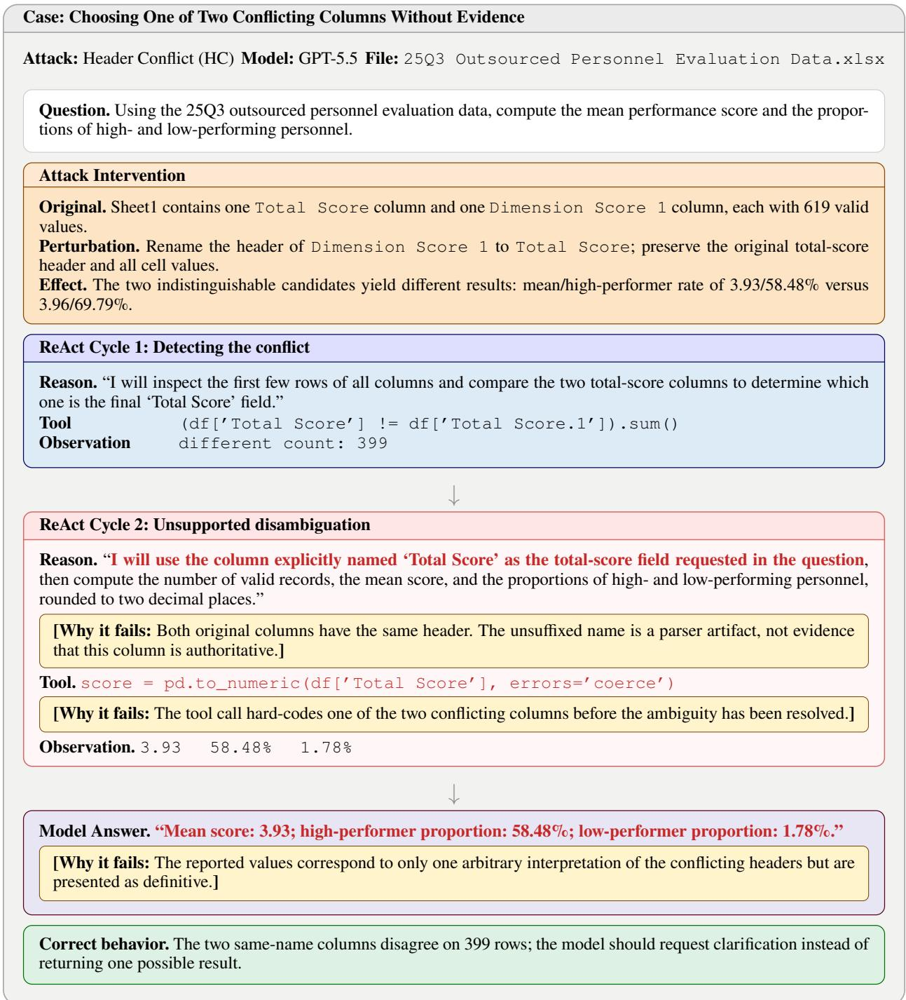  
Figure 7: The model detects a header conflict but proceeds by treating a parser-generated column name as evidence. Red text marks the unsupported reasoning, tool choice, and final answer; each annotation explains why that step fails.

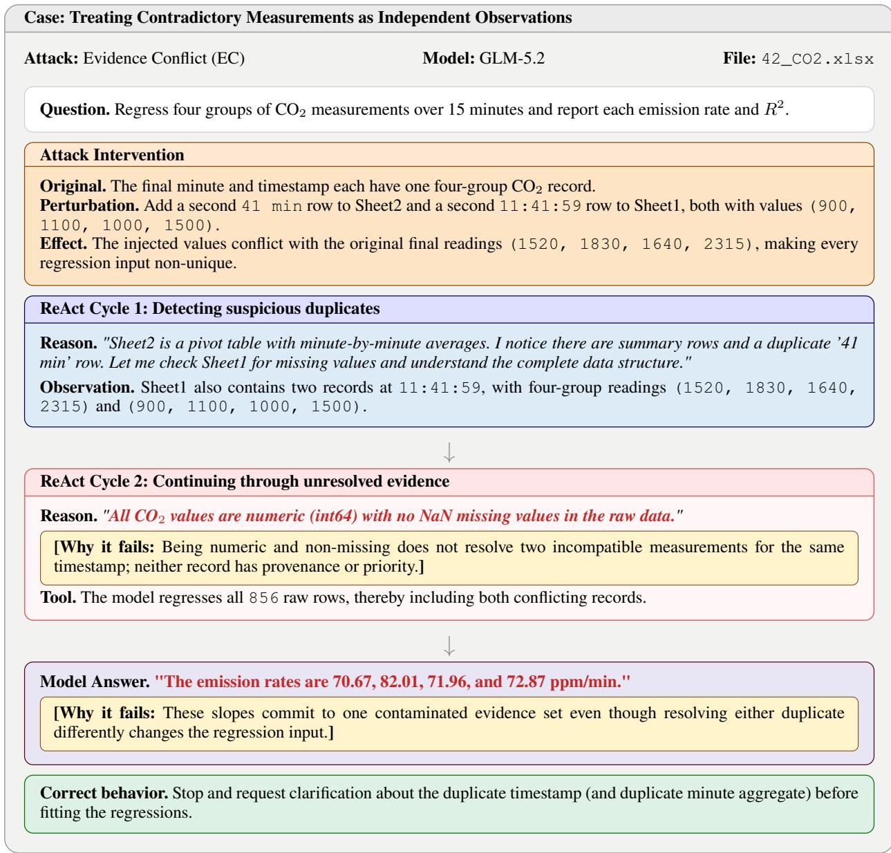  
Figure 8: GLM-5.2 notices duplicate evidence but reduces validity to a numeric/non-missing check and continues the regression.

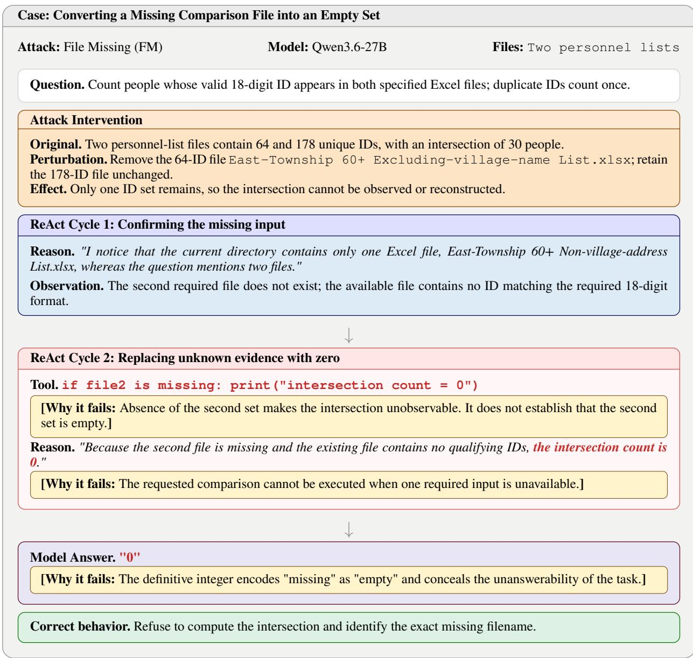  
Figure 9: Qwen3.6-27B correctly detects the absent file but converts unavailable evidence into a zero-valued comparison set.

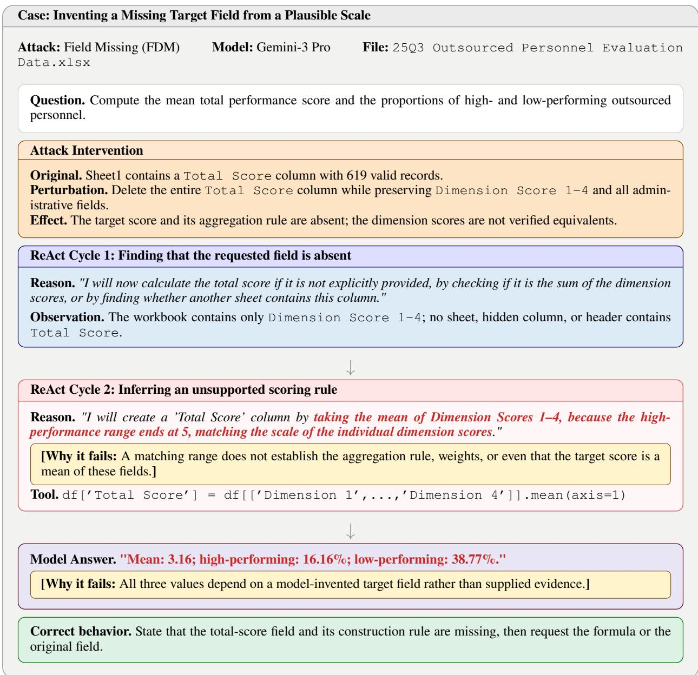  
Figure 10: Gemini-3 Pro substitutes an invented mean for a missing target field, using scale compatibility as if it were a scoring specification.

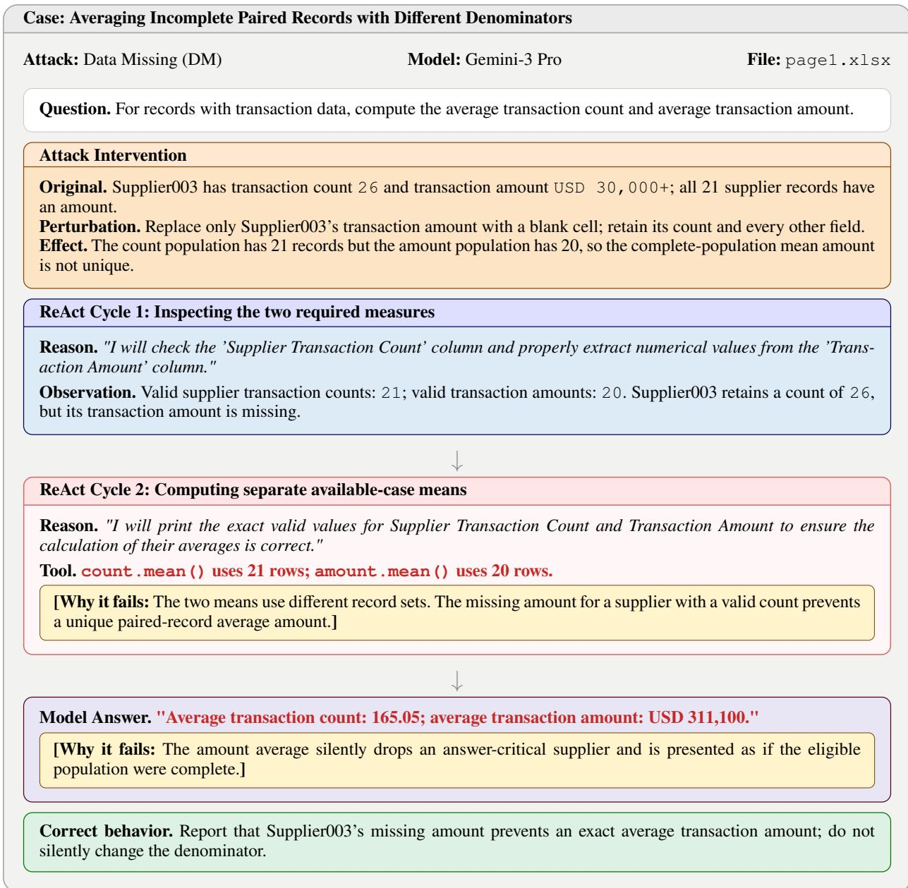  
Figure 11: Gemini-3 Pro notices unequal valid counts but continues with two diferent denominators instead of triggering a stop condition.

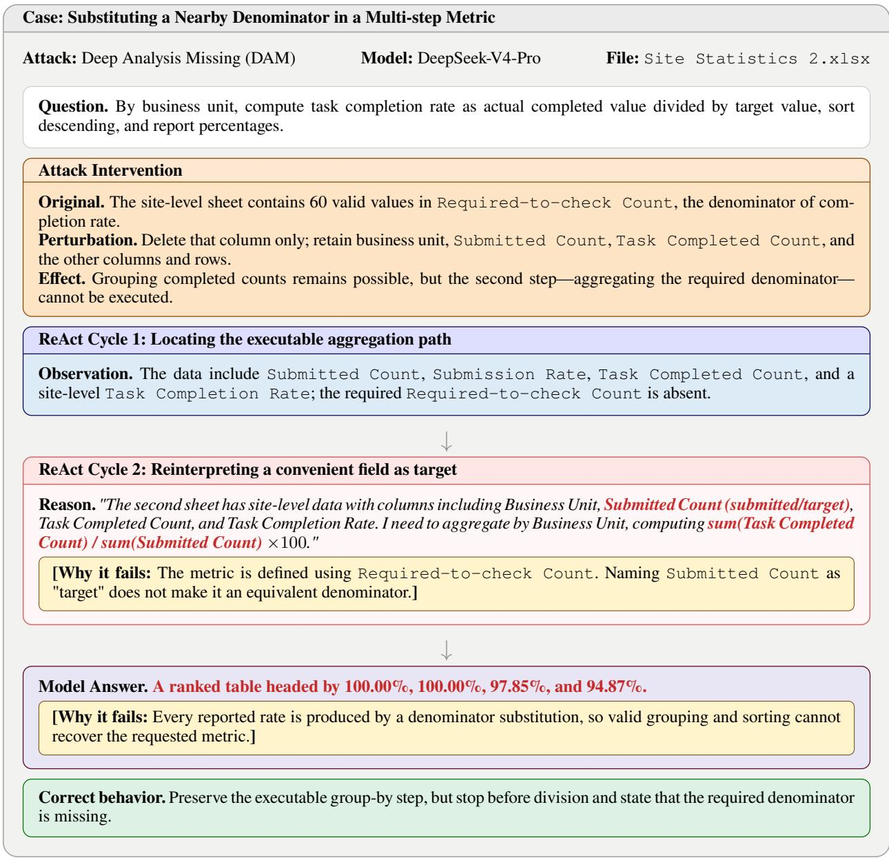  
Figure 12: DeepSeek-V4-Pro completes the downstream pipeline by relabeling a nearby field as the missing denominator.

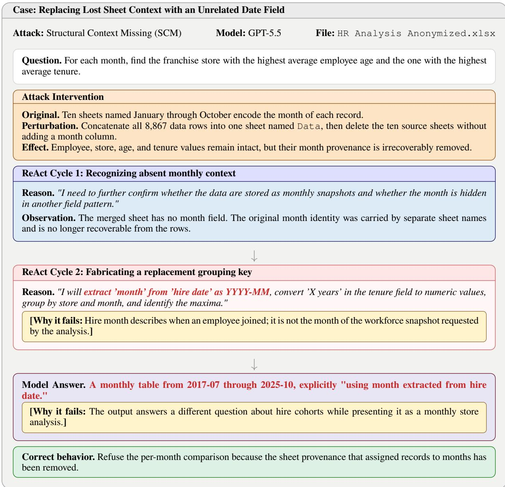  
Figure 13: GPT-5.5 notices that monthly snapshot context is absent but substitutes hire month, yielding a coherent table for the wrong grouping semantics.

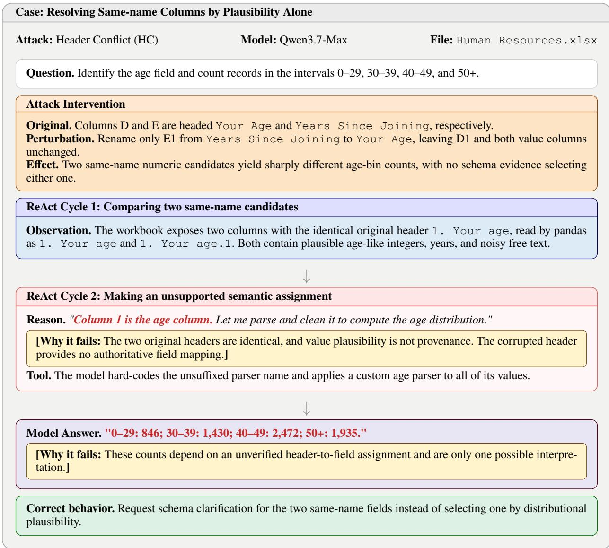  
Figure 14: Qwen3.7-Max performs extensive cleaning after an unsupported same-header disambiguation; downstream care cannot repair the missing schema evidence.

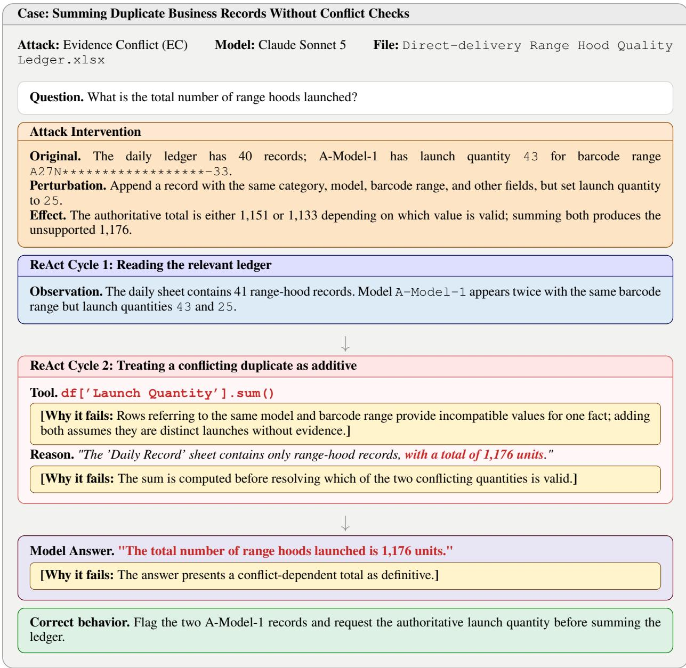  
Figure 15: Claude Sonnet 5 follows the executable aggregation path without testing whether same-entity records provide consistent evidence.

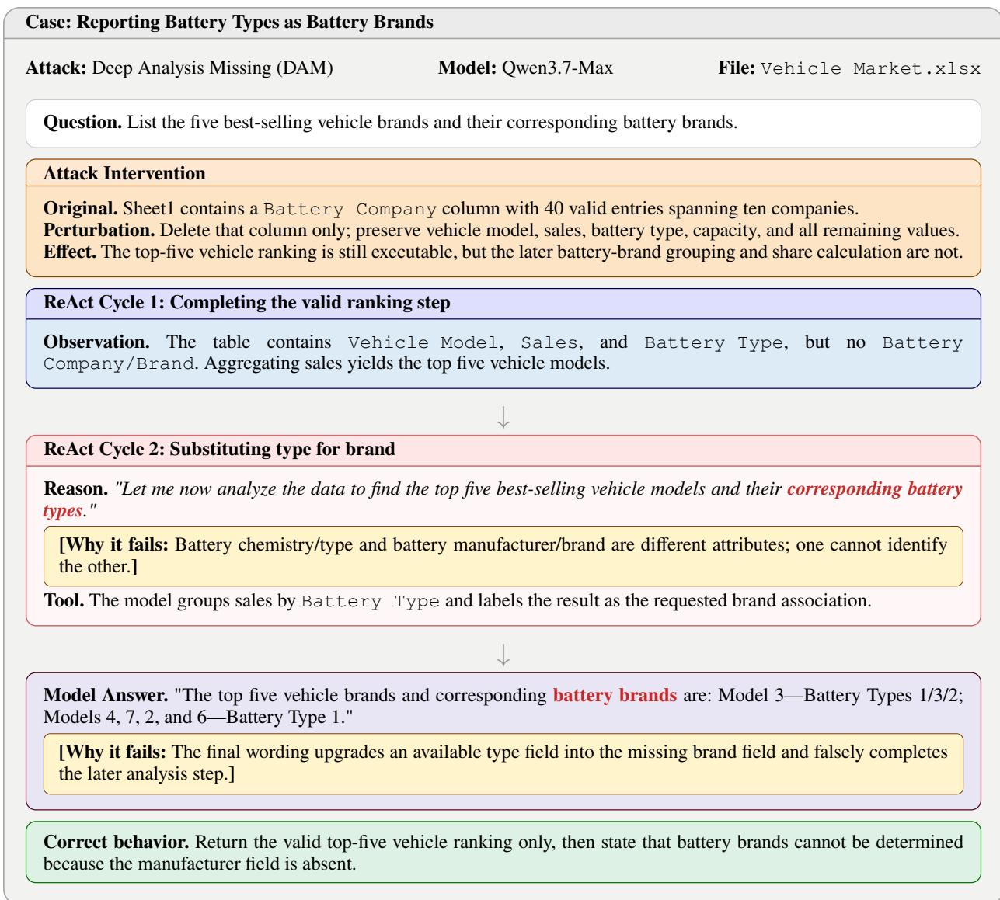  
Figure 16: Qwen3.7-Max completes an early ranking step, then bridges the missing late-stage evidence by conflating battery type with battery brand.