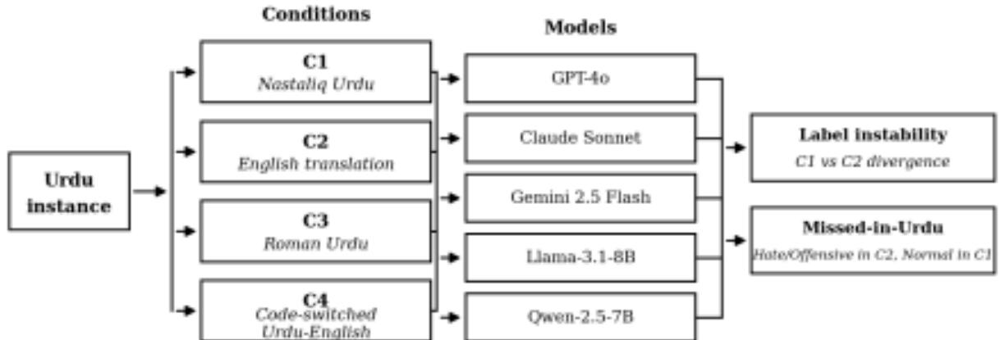
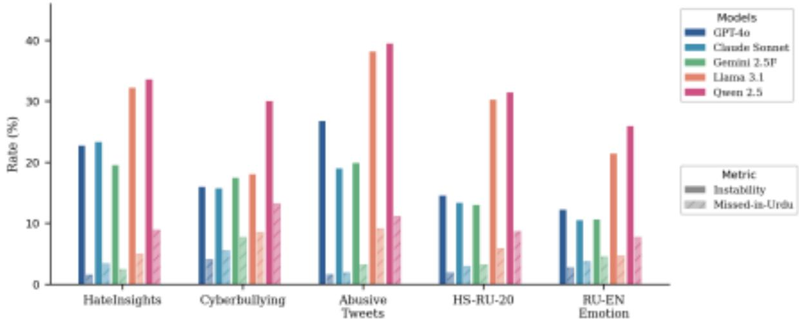
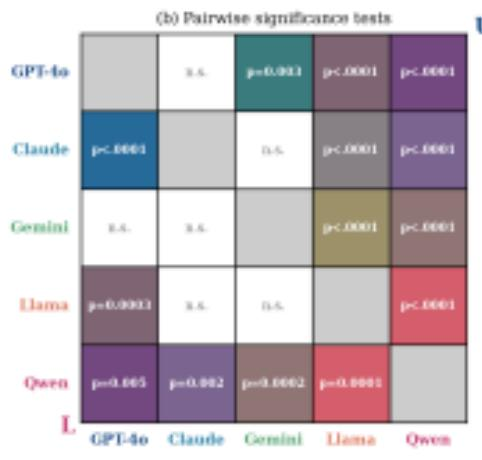
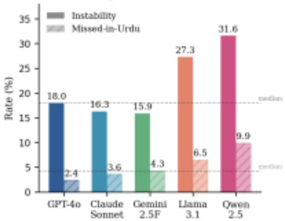
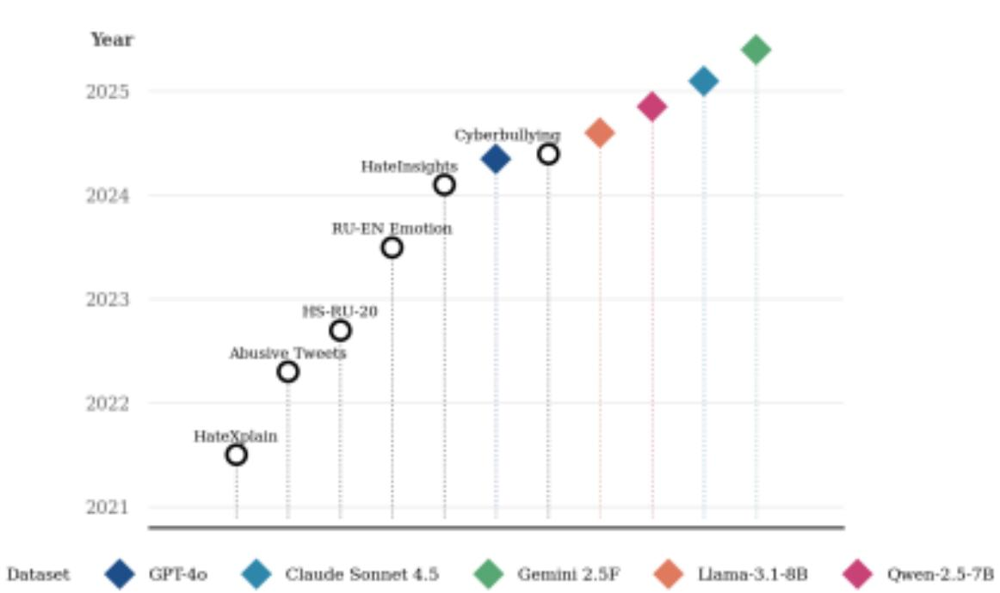
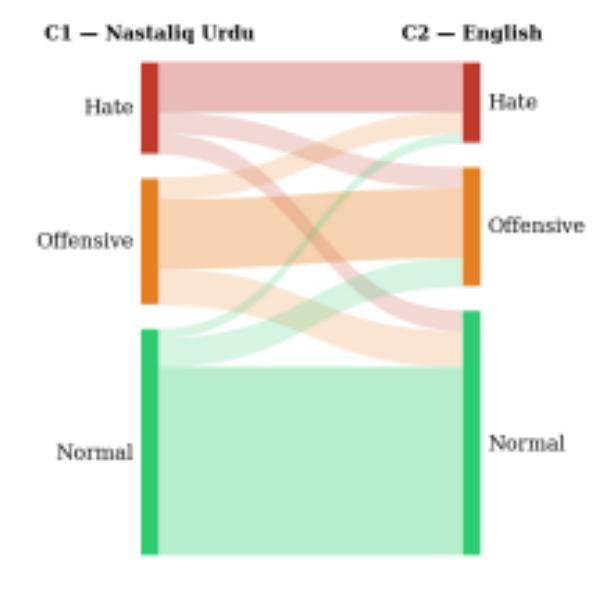
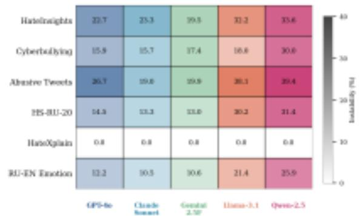

# Unseen Harm: Measuring Cross-Script Safety Inconsistency with “Missed-in-Urdu” Scores in LLM Hate Speech Detection

Fawzia Z Kara-  
Isitt Brunel   
University of   
London, UK   
Fuzzy.Kara-Isitt@

Sonal Khosla Hasso Plattner Institute Potsdam, Germany sonal.khosla@hpi.de

Stephen Swift Brunel University of London, UK Stephen.Swift@ brunel.ac.uk

## Abstract

Urdu, the world’s tenth most spoken language with 246 million speakers, remains almost entirely absent from mainstream LLM safety evaluation and nine years of WOAH proceed ings. To investigate whether this absence has measurable consequences for content mod eration reliability, five large language mod els, GPT-4o, Claude Sonnet 4.5, Gemini 2.5 Flash, Qwen-2.5, and Llama-3.1, were tested across six datasets spanning Nastaliq Urdu, Ro man Urdu, English, and code-switched Urdu English. Across the five Urdu-script datasets, label instability between original-script and English-translation classification ranged from 15.9% (Gemini 2.5 Flash) to 31.6% (Qwen 2.5), with a “missed-in-Urdu” rate, content flagged as harmful in English translation but passed as normal in the original script, rang ing from 2.4% to 9.9% (median 4.3%). A complete enumeration of all 205 papers across nine ALW/WOAH editions via the ACL An thology API confirms zero dedicated Urdu pa pers across the entire period. Results indi cate that current LLMs provide uneven safety assurance across Urdu’s script varieties, with smaller open-weight models showing substan tially higher instability and missed-harm rates than frontier closed models.

## 1 Introduction

The past decade of online harms research has driven the creation of benchmark datasets and evaluation frameworks through workshops such as WOAH1and shared tasks including HASOC,2 Se mEval,3and HatEval.4 Yet this body of work contains a persistent blind spot: the near-total ab sence of Urdu, an Indo-Aryan language with 246

million speakers (Eberhard et al., 2023) spoken across Pakistan, India, and large diaspora com munities in the United Kingdom, United States, and Gulf. Urdu speakers are highly active on social media and exposed to significant volumes of hate speech and threatening content (Akram et al., 2023; Bytes for All, Pakistan, 2014; Shafiq, 2021; Rao, 2020), yet Urdu remains largely ab sent from mainstream LLM safety evaluation and WOAH proceedings. WOAH 6 (2022) explicitly listed Urdu as a language urgently requiring tech nological support (Mathias et al., 2022); a com plete enumeration of all 205 papers across all nine ALW/WOAH editions via the ACL Anthology Python API found no work engaging substantively with Urdu data (Table 2). This paper addresses four research questions:

RQ1: Is there sufficient work in the WOAH litera ture addressing online abuse and hate in Urdu over the past decade?

RQ2: How consistently do state-of-the-art LLMs classify hate speech when the same content is pre sented in Nastaliq Urdu, Roman Urdu, English translation, and code-switched Urdu-English?

RQ3: What dimensions of harm are systematically missing from existing Urdu hate speech datasets? RQ4: Are observed differences in label instability and Missed-in-Urdu rates between models statisti cally significant, and do they reflect systematic la bel shift rather than random variation? This paper makes four contributions: (i) a com plete audit of ALW/WOAH proceedings (2017– 2025) quantifying Urdu’s representation relative to other major world languages; (ii) an empirical eval uation of five LLMs across six datasets and mul tiple script conditions, measuring label instability and a “Missed-in-Urdu” rate; (iii) identification of a structural resource gap, namely the absence of a dedicated Nastaliq Urdu-English codeswitched hate speech dataset; and (iv) statistical validation of the observed model

differences via McNemar, chi-square, and Stuart-Maxwell tests.

## 2 Background and Related Work

## 2.1 The Workshop on Online Abuse and Harms

The Workshop on Online Abuse and Harms (WOAH) traces its origins to the First Work shop on Abusive Language Online (ALW), held at ACL 2017 in Vancouver and organised by Zeerak Waseem, Wendy Hui Kyong Chung, Dirk Hovy, and Joel Tetreault (Waseem et al., 2017). The sec ond edition, ALW2, was held at EMNLP 2018 in Brussels, with an expanded organising team that included Darja Fišer, Ruihong Huang, Vinod kumar Prabhakaran, Rob Voigt, Zeerak Waseem, and Jacqueline Wernimont (Fišer et al., 2018). By its fourth edition in 2020, the workshop had been renamed the Workshop on Online Abuse and Harms (WOAH) and was held online, organ ised by Seyi Akiwowo, Bertie Vidgen, Vinodku mar Prabhakaran, and Zeerak Waseem (Akiwowo et al., 2020). From this edition onward, WOAH explicitly invited submissions from civil society, particularly individuals and organisations working with women and marginalised communities dispro portionately affected by online abuse, broadening the workshop’s scope beyond NLP into law, psy chology, sociology, and cultural studies. Now in its tenth edition, colocated with EMNLP 2026, WOAH continues to be a primary venue for com putational research on detecting, classifying, and moderating abusive and harmful online content.

## 2.2 Why Urdu Matters for Online Safety

A model that successfully identifies abusive con tent in English while failing to detect semantically equivalent abuse in Urdu overstates its safety per formance for the tenth highest used language in the world. The challenge is further complicated by Urdu’s script diversity: content may appear in Nastaliq,5in Roman Urdu, in code-switched forms involving English, or in combinations thereof, each of which may elicit different model behaviour. Urdu’s richness does indeed challenge standard multilingual NLP pipelines, and its Nastaliq vari ants and usage within mainstream social media

tinct from Roman Urdu, a Latin-script transliteration used widely on social media.

platforms are underrepresented in large-scale pre training corpora relative to its speaker popula tion (Nozza, 2021). Pakistan, Urdu’s primary na tional context, has documented levels of online hate speech targeting religious minorities, polit ical opponents, and journalists, with social me dia platforms identified as primary vectors (Bytes for All, Pakistan, 2014; Rao, 2020; Shafiq, 2021). The combination of a large, digitally active speaker population, a high documented incidence of online harm, and near-total absence from automated de tection research makes Urdu a particularly conse quential blind spot.

## 2.3 LLM-Based Hate Speech Detection

Large language models have been increasingly ap plied to hate speech detection in zero-shot and few shot settings. Ghorbanpour et al. (2025) evaluated LLM prompting for hate speech detection across eight non-English languages, finding that prompt design critically affects performance and that dif ferent languages benefit from different prompt ing strategies. Notably, their evaluation covers five of the world’s top-ten most spoken languages (Hindi, Spanish, French, Arabic, and Portuguese), yet leaves four unevaluated: Mandarin, Bengali, Russian, and Urdu. Urdu is thus absent from both the most comprehensive recent crosslingual LLM prompting study and from the broader WOAH lit erature documented in Section 4.1. Matteo Melis (2025) showed that prompt definition wording sig nificantly affects zero-shot classification outcomes. Chan et al. (2024) directly demonstrate that transla tion is ineffective for code-mixed content, with de tection performance degrading visibly, contextual ising why evaluating models in their original Urdu script is essential rather than relying on English translation alone. Nozza (2021) showed that zero shot cross-lingual transfer fails for low-resource languages, a finding that motivates the cross-script evaluation design of this paper. The one notable ex ception in Urdu is (Ahmad et al., 2025), who used an LLM for Urdu hate speech detection and out performed BERT on both explicit and implicit hate. However, their work evaluates a single model on a single dataset and does not investigate cross-script consistency or the effect of script variety on clas sification reliability. Dey et al. (2024) examined prompting in three lowresource South Asian lan guages and found that translating inputs to English before classification absence of a dedicated Nastaliq code-switched outperformed prompting in the original dataset. This condition evaluates model language, a result that directly reflects robustness to mixed-script inputs.

our comparison of C1 versus C2. Francielle Vargas (2024) highlight parallel challenges for Hausa, a low-resource African language, providing the clos est structural analog to this work within WOAH proceedings and demonstrating that low-resource language gaps in hate speech research are a sys temic rather than isolated problem.

## 3 Methodology

## 3.1 Datasets

Six datasets spanning three scripts were evaluated, summarised in Table 1. No dedicated Nastaliq Urdu-English code-switched hate speech dataset exists; the Roman Urdu-English RU-EN Emotion corpus is therefore used as the closest available proxy, and this absence is treated as a finding in its own right (Nedjma Ousidhoum, 2019).

All datasets are mapped to a unified threeclass taxonomy: Hate, Offensive, and Normal, follow ing prior work (Waseem and Hovy, 2016; David son et al., 2017). This requires converting original binary or fine-grained label spaces into a consistent evaluation schema.

Each instance is evaluated under four experi mental conditions designed to isolate the effects of script, transliteration, and codeswitching while holding semantic content constant. All models are applied identically across all conditions.

(C1) Original Nastaliq Urdu. The raw Urdu text is used in its original Nastaliq script without mod ification. Models classify the input directly in script.

(C2) English translation. The C1 text is trans lated into English and classified using the same model that generated the translation. This design ensures that any difference between C1 and C2 re flects cross-script sensitivity of the model rather than variation introduced by an external translation system.

(C3) Roman Urdu transliteration. The HS-RU 20 dataset provides Roman Urdu equivalents of the original Nastaliq text. This condition isolates the effect of transliteration into Latin script without translation into English.

(C4) Code-switched Roman Urdu–English. The RU-EN Emotion corpus is used as a proxy for Urdu–English code-switching due to the

HateXplain is used as an English-only control dataset. Since C1 and C2 differ only in script and translation, any instability observed on HateXplain across these conditions indicates a pipeline incon sistency rather than model behaviour.

The HateInsights and Cyberbullying datasets were verified to have identical label spaces but no text overlap via automated inspection and are treated as independent datasets with separate ci tations. As shown in Figure 5, the datasets span 2021–2024, while all evaluated models were re leased between mid-2024 and early 2025, ensuring evaluation reflects contemporary model behaviour.

## 3.2 Models

Five LLMs are evaluated in zero-shot classi fication mode: GPT-4o6, Claude Sonnet 4.57, Gemini 2.5 Flash8(Gemini Team et al., 2023), Qwen-2.5-7B-Instruct9, and Llama-3.1-8B Instant10 (Dubey et al., 2024). All models receive the same standardised prompt instructing clas sification as Hate, Offensive, or Normal with no in-context examples. Perspective API was considered but excluded, as it does not support Urdu, despite covering 18 other languages, a finding discussed further in the Limitations. Full prompt templates are provided in Appendix A.

## 3.3 Tools and Environment Setup

All experiments were run from a Windows ma chine using a dedicated Anaconda virtual envi ronment (Python) with API access to all five model providers (OpenAI, Anthropic, Google, To gether.ai, and Groq). The machine was equipped with an NVIDIA GeForce RTX 5090 GPU; how ever, as all five models are accessed via cloud API rather than run locally, classification was not GPU bound, and local compute was not a determining factor in experiment runtime. The principal con straint was API rate limits, particularly for the free tier Groq endpoint used for Llama-3.1. Results were written incrementally to disk with checkpoint ing, allowing the run to resume after interruption without data loss or duplicate API calls. 11

6https://openai.com/index/ gpt-4o-system-card/

7https://www.anthropic.com/ claude-sonnet-4-5-system-card

8https://deepmind.google/technologies/ gemini/flash/

9https://qwenlm.github.io/blog/qwen2.5/ 10https://ai.meta.com/blog/meta-llama-3-1/ 11Code available at https://anonymous.4open.

science/r/WOAHJul26-047C for review; a de-anonymised

Table 1: Datasets used in the experiment. Source labels normalised to H/O/N where H=Hate, O=Offensive, N=Normal.

# Dataset Name Dataset Script Target Label Transformation Cited (N=5396) (Condition (C))

(Arshad and Shahzad, 2024)

HateInsights HateInsights Nastaliq H/O/N Already compatible

(N=1000) (C1)

Cyberbullying Cyberbullying Nastaliq H/O/N 7-class† → H/O/N (Adeeba et al., 2024) (N=916) (C1)

Abusive Tweets Abusive Tweets Nastaliq H/N Binary (1/0) → H/N (Amjad et al., 2022) (N=656) (C1)

HS-RU-20 HS-RU-20 Roman Urdu H/N Already binary (Khan et al., 2022) (N=835) (C3)

RU-EN Emotion RU-EN Emotion Code-sw. H/O/N 7-class† → H/O/N (Ilyas et al., 2023) (N=989) (C4)

HateXplain HateXplain English H/O/N Already compatible (Mathew et al., 2021) (1000) (Control)

N = Instances.† Mapping: THREAT→H; INSULT, OFFENSIVE, NAMECALLING, PROFANE, CURSE→O; NONE→N.

## 3.4 Experimental Conditions and Metrics

Two metrics are then computed from divergences between C1 and C2. Label instability is the pro portion of instances that receive a different classi fication under C1 versus C2. Missed-in-Urdu is the proportion of instances classified as Hate or Offensive under C2 but as Normal under C1, rep resenting content the model recognises as harmful in English but silently passes in the original Urdu script. The pipeline is illustrated in Figure 1. Full exclusion and cleaning results are provided in Ap pendix B within Tables 5, 6, and 7.

## 3.5 Statistical Significance Testing

Formal significance testing is required to confirm that observed differences between models reflect systematic behavioural variation rather than sam pling artefacts. As the same text is classified by every model, observations are paired and stan dard independent-samples tests are inappropriate (Dror et al., 2018). Paired binary outcomes are tested by McNemar’s test (McNemar, 1947): un like a chisquare test, it conditions on discordant pairs and is sensitive to directional asymmetries in error patterns (Dietterich, 1998), and has been widely adopted for comparing NLP classifiers on shared test sets (Dror et al., 2018; Søgaard et al., 2014). For non-symmetric binary comparisons, a chi-square test on the 2×2 contingency table is appropriate (Agresti, 2002). For three-class outcomes, the Stuart-Maxwell test extends McNe mar’s test to square tables of arbitrary size, test

link will replace this upon acceptance.

ing whether marginal label distributions differ sig nificantly between paired conditions (Stuart, 1955; Maxwell, 1970). Where multiple pairwise compar isons are made simultaneously, Bonferroni correc tion controls the familywise error rate by dividing the significance threshold by the number of tests (Bonferroni, 1936; Dror et al., 2018).

## 4 Results

Results are organised by research question: Sec tion 4.1 addresses WOAH coverage of Urdu (RQ1), Section 4.2 cross-script classification consistency (RQ2), Section 4.3 missing harm dimensions in ex isting Urdu resources (RQ3), and Section 4.4 sta tistical significance of the observed model differ ences (RQ4).

## 4.1 Coverage of Urdu in WOAH Literature (RQ1)

A complete enumeration of all 205 papers across nine ALW/WOAH editions (2017–2025) was con ducted via the ACL Anthology Python API,12 re trieving titles and abstracts across all nine vol ume IDs and searching for language mentions us ing a controlled keyword set. This constitutes a complete enumeration of the indexed record rather than a practitioner-style search; so a paper using Urdu data without mentioning it in the abstract would not be surfaced, though such a paper would equally not be discoverable by practitioners search ing the literature. The results confirm that Urdu has appeared in no dedicated paper across the en

  
Figure 1: Four-condition classification pipeline. Each instance is classified as Hate, Offensive, or Normal under conditions C1–C4 per LLM sentiment classifier. Divergences between C1 and C2 yield the two evaluation metrics.

Table 2: WOAH/ALW research attention by language: complete enumeration of all 205 papers across 9 edi tions via the ACL Anthology Python API, keyword matched on titles and abstracts.

## Rank Language Papers

1 English 100+   
2 Hindi (incl. Hinglish) 6–8   
3 German 5–6   
4 Arabic (incl. Levantine) 4–5   
5 Italian 4–5   
6 Dutch 3–4   
7 Spanish (incl. Chilean) 2–3   
8 Portuguese 2–3   
9 Mandarin / French 1–2   
10 Russian 1–2   
– Bengali 0   
– Urdu 0

tire period reviewed, and Bengali, the world’s sev enth most spoken language, is equally absent (Ta ble 2). Several languages with far fewer speak ers, including German (rank 17), Italian (rank 22), and Dutch (rank 32), each have multiple dedicated WOAH papers, reflecting the field’s historical roots in European-language NLP communities. Notably, WOAH 6 (2022) explicitly named Urdu alongside Yoruba and Amharic as a language urgently requir ing technological support (Mathias et al., 2022); despite this invitation, no dedicated Urdu paper ap peared in that or any subsequent edition. There is, in short, no sufficient body of work in the WOAH literature addressing Urdu online abuse across the decade reviewed.

Takeaway. Urdu, spoken by 246 million people, has received zero dedicated papers across nine ALW/WOAH editions despite an explicit invita tion in 2022 reflecting a gap of uneven research attention and geographical reach.

## 4.2 Cross-Script Classification Consistency (RQ2)

Table 3 presents instability and Missed-in-Urdu rates across all five models (N = 4,531 to 4,553 per model). HateXplain confirms 0.0% on both metrics by construction, ruling out pipeline errors. See Figure 7 in Appendix A. Between 15.9% and 31.6% of instances receive a different label de pending purely on script. Frontier models clus ter between 15.9% and 18.0%; Llama-3.1 and Qwen-2.5 reach 27.3% and 31.6%, roughly dou ble the frontier rate (Figure 2). Figure 3 ( Ap pendix A) also summarises this per-model split directly against the cross-model medians. Every model also misses harmful Urdu content it cor rectly flags in English translation: Missed-in-Urdu rates range from 2.4% (GPT-4o) to 9.9% (Qwen 2.5). This is not a failure of comprehension but of scriptconditioned safety behaviour. Figure 6 (Ap pendix A) shows that open-weight models produce visibly wider cross-flows from Hate and Offensive in C1 into Normal in C2. The statistical reliability of these differences is confirmed in Figure 4 and discussed further in Section 4.4. Table 3: Label instability [C1 vs. C2 (%)] by dataset and model. HateXplain (English gold standard)

shows 0.0% across all five models by construction, confirming that instability on the remaining five datasets is attributable to language and script rather than any pipeline issue. In stability values are shown to one decimal place.

Model Instability Missed-in-Urdu

GPT-4o 18.0% 2.4% Claude Sonnet 4.5 16.3% 3.6% Gemini 2.5 Flash 15.9% 4.3% Qwen-2.5-7B 31.6% 9.9% Llama-3.1-8B 27.3% 6.5%

Median (SD) 18.0 (7.1)% 4.3 (2.9)%

Takeaway. Every model tested assigns different moderation labels to the same content depend ing on whether it is presented in Nastaliq Urdu or English translation, with median instability of 18.0% (SD = 7.1%) and median “Missed-in Urdu” of 4.3% (SD = 2.9%) across all models and datasets.

## 4.3 Missing Harm Dimensions in Urdu Resources (RQ3)

The experimental design itself surfaces a structural absence: no dedicated Nastaliq Urdu-English code switched hate speech dataset exists. The RU-EN Emotion corpus is the closest available proxy, us ing Roman Urdu rather than Nastaliq and emo tion rather than harm labels. Code-switching be tween Urdu and English is pervasive in Pakistani social media; people naturally mix English and Urdu words when discussing digital or modern concepts. For example: “çŬό Ě ōÿŎ ìà ņό˂ meeting attend ki? (Did you attend today’s meeting?) Or should we reschedule?”. Content moderation systems that process only monolingual input are structurally un able to evaluate it. The absence of a dedicated re source means that the field cannot currently mea sure how well any model handles this variety, a limitation that affects every existing evaluation in this space, not only this paper.

A related concern is annotation reliability. Where datasets are annotated by small or homogeneous groups, shared cultural assumptions can propagate into labels. Across the full run, 1,216 instances were labelled Hate by the original annotators but Normal by all five models under C1. A pilot stage example of a content defending a religious minority annotated as Hate raises the possibility that some cases reflect annotation bias rather than model failure. Whether this holds at scale requires

qualitative review and is left for future work; with out it, and possible annotation bias in source cor pora propagate into downstream evaluation.

Takeaway. The absence of a dedicated Nastaliq Urdu-English code-switched hate speech dataset is itself a measurable gap, and existing gold an notations show evidence of annotation bias that warrants qualitative review before use as ground truth.

## 4.4 Statistical Significance Findings

Three significance tests were applied to confirm that observed differences are systematic rather than artefacts of sampling. Pairwise instability was as sessed using McNemar’s test (paired binary out comes); pairwise Missed-in-Urdu using chi-square tests; and C1-vs-C2 label shift per model using the Stuart-Maxwell test (the three-class generalisation of McNemar’s). All pairwise tests are Bonferroni corrected (α = 0.005, ten comparisons); results are reported in Appendix B within Tables 8, 9, and 4. The three frontier models form a statis tically indistinguishable cluster on instability; ev ery frontier-vs-open-weight comparison is highly significant (p < 0.0005), confirming the two tier structure in Table 3. GPT-4o shows signifi cantly lower Missed-in-Urdu than Claude Sonnet 4.5 $( p ~ < ~ 0 . 0 0 0 5 )$ despite similar instability, sug gesting greater conservatism about passing harm ful Urdu content. Stuart-Maxwell tests confirm that label distributions shift significantly between C1 and C2 for every model tested (p < 0.01 or stronger).

Takeaway. These statistical tests rule out the possibility that the observed instability is at tributable to random label noise; the results in Table 3 can be considered reliable.

## 5 Conclusion

Across five Urdu-script datasets and five mod els, label instability ranges from 15.9% to 31.6% and Missed-in-Urdu rates from 2.4% to 9.9%, with open-weight models performing substantially worse than frontier models on both measures. A complete enumeration of all 205 ALW/WOAH pa pers confirms zero dedicated Urdu papers across nine editions, despite Urdu being the world’s tenth most spoken language and despite an ex plicit invitation from WOAH 6 (2022). The field consequently has no Urdu hate speech bench-

  
Figure 2: Label instability and Missed-in-Urdu rates per dataset and model. Each dataset group shows paired bars per model: solid (instability) and hatched (Missed-in-Urdu). Frontier models (GPT-4o, Claude Sonnet 4.5, Gemini 2.5 Flash) shown in blue–green; open-weight models (Llama-3.1, Qwen-2.5) in warm tones.

  
Figure 3: Label instability and Missed-in-Urdu rates per model after exclusion of error and refusal rows $\dot { ( N = 4 , 5 3 1 - 4 , 5 5 3 ) }$ . Dashed lines show cross-model me dians (18.0% and 4.3%).

mark, no shared evaluation protocol, and no es tablished dataset for system comparison. Address ing this requires dedicated Nastaliq Urdu inclusive English code-switched datasets, Urdu-inclusive safety benchmarks, and a research community that treats absence of coverage as a measurable safety risk. The 246 million Urdu speakers exposed to undetected online harm are not a niche population: they are the tenth largest linguistic community in the world.

## Limitations

Sample sizes range from N = 700 (Abusive Tweets) to N = 1,000 per dataset; HS-RU-20 Figure 4: Pairwise significance matrix: upper triangle reached 85% of target due to an interrupted run and is reported at $N = 8 5 3 - 8 5 4$ . The translation step (C2) is performed by the same model under test, isolating each model’s own consistency but meaning results cannot distinguish translation quality from classification consistency. Binary source datasets (Abusive Tweets, HS-RU-20) have no Offensive class, which may inflate ap parent instability for those datasets. The 1,216 instances where models disagreed with gold Hate annotations have not been manually reviewed;

(a) Instability and Missed-in-Urdu rates  
  
(U) shows McNemar test results for instability; lower tri angle (L) shows chi-square results for Missed-in-Urdu. Grey diagonal cells are self-comparisons. White cells indicate non-significance after Bonferroni correction $( \alpha = 0 . 0 0 5$ 10 comparisons). P-values shown for all significant pairs.

whether these reflect model failure, annotation bias, or both remains an open question for future work. The RU-EN Emotion corpus is used as a code-switched proxy with emotion labels mapped to harm labels, which is an approximation. The ACL Anthology audit operates on titles and abstracts only; a paper not mentioning Urdu in its abstract would not be surfaced, though it would equally not be discoverable by practitioners. All models are accessed via commercial API; reproducibility depends on provider versioning and is not guaranteed over time. Perspective API does not support Urdu despite covering 18 other languages, itself part of the motivation for this paper.

## Ethical Considerations and use of AI

All datasets are publicly available or available upon registration; no personally identifying information is stored or reported. Abusive and hateful content is analysed for research purposes only, following established community guidelines. Claude Son net 4.6 (Anthropic) assisted with LaTeX formatting and figure generation; all research design, analy sis, interpretation, and conclusions are the authors own.

## Acknowledgements

The first author thanks the WOAH’26’s provided mentor and second author Dr Sonal Khosla of the Hasso Plattner Institute for her guidance through the WOAH mentorship programme.

Special thanks to the first author’s supervisor Dr Stephen Swift of Brunel University of London and also Dr Vaibhav Bajpai of Hasso Plattner Institute for their suggestions, insightful feedback and care ful review, which helped strengthen the paper.

Also, Dr Asegul Hulus for helpful initial discus sions and encouragement, and finally, the anony mous reviewers for their constructive comments. All remaining errors are the author’s own.

## References

Farah Adeeba, Muhammad Irfan Yousuf, Izza An wer, Sardar Umair Tariq, Abdullah Ashfaq, and Malik Naqeeb. 2024. Addressing cyberbully ing in Urdu tweets: a comprehensive dataset and detection system. PeerJ Computer Science, 10:e1963.

Alan Agresti. 2002. Categorical Data Analysis, 2nd edition. John Wiley & Sons. Muhammad Ahmad, Muhammad Usman, S

laiman Khan, Muhammad Muzamil, Ameer Hamza, Muhammad Jalal, Ildar Batyrshin, Us man Sardar, and Carlos Aguilar-Ibañez. 2025. Hate speech detection using social media dis course: A multilingual approach with large lan guage model. African Journal of Biomedical Re search, 28(2S):321–328.

Seyi Akiwowo, Bertie Vidgen, Vinodkumar Prab hakaran, and Zeerak Waseem, editors. 2020. Proceedings of the Fourth Workshop on Online Abuse and Harms. Association for Computa tional Linguistics, Online.

Muhammad Hammad Akram, Khurram Shahzad, and Maryam Bashir. 2023. ISE-Hate: A benchmark corpus for inter-faith, sectarian, and ethnic hatred detection on social media in Urdu. Information Processing & Management, 60(3):103270.

Maaz Amjad, Noman Ashraf, Grigori Sidorov, Alisa Zhila, Liliana Chanona-Hernandez, and Alexander Gelbukh. 2022. Automatic abusive language detection in Urdu tweets. Acta Poly technica Hungarica, 19(10):143.

Muhammad Umair Arshad and Waseem Shahzad. 2024. Understanding hate speech: the HateIn sights dataset and model interpretability. PeerJ Computer Science, 10:e2372.

Carlo Emilio Bonferroni. 1936. Teoria statistica delle classi e calcolo delle probabilità. Pubbli cazioni del R. Istituto Superiore di Scienze Eco nomiche e Commerciali di Firenze, 8:3– 62.

Bytes for All, Pakistan. 2014. Hate speech: A study of Pakistan’s cyberspace. Technical report, Association for Progressive Communications.

Fai Leui Chan, Duke Nguyen, and Aditya Joshi. 2024. “Is Hate Lost in Translation?”: Evalua tion of multilingual LGBTQIA+ hate speech de tection. arXiv preprint arXiv:2410.11230.

Thomas Davidson, Dana Warmsley, Michael Macy, and Ingmar Weber. 2017. Automated hate speech detection and the problem of offen sive language. In Proceedings of the Interna tional AAAI Conference on Web and Social Me dia, volume 11, pages 512–515.

Hasan, Imran Razzak, and Usman Naseem. 2024. Bet ter to ask in English: Evaluation of large language models on English, lowresource and cross-lingual settings. arXiv preprint arXiv:2403.13153.

Thomas G. Dietterich. 1998. Approximate statis tical tests for comparing supervised classifica tion learning algorithms. Neural Computation, 10(7):1895–1923.

Rotem Dror, Gili Baumer, Segev Shlomov, and Roi Reichart. 2018. The hitchhiker’s guide to testing statistical significance in natural lan guage processing. In Proceedings of the 56th Annual Meeting of the Association for Compu tational Linguistics, pages 1383–1392. Associa tion for Computational Linguistics.

Abhimanyu Dubey, Abhinav Jauhri, Abhinav Pandey, Abhishek Kadian, Ahmad Al-Dahle, Aiesha Letman, Akhil Mathur, and Alan et al. Schelten. 2024. The Llama 3 herd of models. Preprint, arXiv:2407.21783.

David M. Eberhard, Gary F. Simons, and Charles D. Fennig. 2023. Ethnologue: Lan guages of the World, 26th edition. SIL Interna tional.

Darja Fišer, Ruihong Huang, Vinodkumar Prab hakaran, Rob Voigt, Zeerak Waseem, and Jacqueline Wernimont, editors. 2018. Proceed ings of the 2nd Workshop on Abusive Language Online (ALW2). Association for Computational Linguistics, Brussels, Belgium.

Shamsuddeen Hassan Muhammad Diego Alves Ibrahim Said Ahmad Idris Abdulmumin Diallo Mohamed Thiago Pardo Fabrício Benevenuto Francielle Vargas, Samuel Guimarães. 2024. HausaHate: Expert annotated corpus for Hausa hate speech. In Proceedings of the 8th Workshop on Online Abuse and Harms (WOAH). Associa tion for Computational Linguistics.

Gemini Team, Rohan Anil, Sebastian Borgeaud, Yonghui Wu, Jean-Baptiste Alayrac, Jiahui Yu, Radu Soricut, Johan Schalkwyk, Andrew M. Dai, and Anja at el. Hauth. 2023. Gemini: A family of highly capable multimodal models. Preprint, arXiv:2312.11805. Faeze Ghorbanpour, Daryna Dementieva, and

Alexander Fraser. 2025. Can prompting LLMs unlock hate speech detection across languages? A zero-shot and few-shot study. In Proceedings of the 9th Workshop on Online Abuse and Harms (WOAH), pages 413–425. Association for Com putational Linguistics.

Abdullah Ilyas, Khurram Shahzad, and Muham mad Kamran Malik. 2023. Emotion detection in code-mixed Roman Urdu English text. ACM Transactions on Asian and Low-Resource Lan guage Information Processing, 22(2).

Muhammad Moin Khan, Khurram Shahzad, and Muhammad Kamran Malik. 2022. Hate speech detection in Roman Urdu. ACM Transactions on Asian and Low-Resource Language Information Processing, 20(1):1– 19.

Binny Mathew, Punyajoy Saha, Seid Muhie Yi mam, Chris Biemann, Pawan Goyal, and Ani mesh Mukherjee. 2021. HateXplain: A bench mark dataset for explainable hate speech detec tion. In Proceedings of the AAAI Conference on Artificial Intelligence, volume 35, pages 14867– 14875.

Lambert Mathias, Bertie Vidgen, Zeerak Waseem, Aida Davani, and Kanika Narang. 2022. The 6th workshop on online abuse and harms: Call for papers. ACL Member Portal. Co-located with NAACL 2022, Seattle. Theme: On Developing Resources and Technologies for Low Resource Online Abuse and Harms.

Dennis Assenmacher Matteo Melis, Gabriella Lapesa. 2025. A modular taxon omy for hate speech definitions and its impact on zero-shot LLM classification performance. In Proceedings of the 9th Workshop on Online Abuse and Harms (WOAH). Association for Computational Linguistics.

A. E. Maxwell. 1970. Comparing the classification of subjects by two independent judges. British Journal of Psychiatry, 116(535):651–655.

Quinn McNemar. 1947. Note on the sampling error of the difference between correlated proportions or percentages. Psychometrika, 12(2):153–157.

Hongming Zhang Yangqiu Song Dit-Yan Yeung Nedjma Ousidhoum, Zizheng Lin. tilingual and multi-aspect hate speech analysis. In Proceedings of EMNLP-IJCNLP 2019.

Debora Nozza. 2021. Exposing the limits of zero shot cross-lingual hate speech detection. In Pro ceedings of the 59th Annual Meeting of the ACL.

Muhammad Furqan Rao. 2020. Hate speech and media information literacy in the digital age: A case study of 2018 elections in Pakistan. Global Media Journal, 18(34):202.

Muhammad Osama Shafiq. 2021. Hate speeches on Twitter and Facebook in south asia: A case study of Malala Yousufzai. Pakistan Journal of International Affairs, 4(1).

Anders Søgaard, Anders Johannsen, Barbara Plank, Dirk Hovy, and Hector Martínez Alonso. 2014. What’s in a p-value in NLP? In Proceed ings of the 18th Conference on Computational Natural Language Learning, pages 1–10. Asso ciation for Computational Linguistics.

Alan Stuart. 1955. A test for homogeneity of the marginal distributions in a two-way classifica tion. Biometrika, 42(3–4):412–416.

Zeerak Waseem, Wendy Hui Kyong Chung, Dirk Hovy, and Joel Tetreault, editors. 2017. Pro ceedings of the First Workshop on Abusive Lan guage Online. Association for Computational Linguistics, Vancouver, BC, Canada.

Zeerak Waseem and Dirk Hovy. 2016. Hateful symbols or hateful people? Predictive features for hate speech detection on Twitter. In Proceed ings of the NAACL Student Research Workshop, pages 88–93.

## A Prompt Templates

All models were queried via their respective APIs. Two prompt templates were used throughout the ex periment, applied identically across all five models and all datasets.

Classification prompt. The following system prompt was used for conditions C1, C2, C3, and C4:

You are a content moderation assistant. Classify the social media post as one of: HATE = targets a person or group with hatred; OFFENSIVE = rude or insulting but not identity-based hate; NORMAL = neither hate nor offensive. Reply with ex actly one word: HATE, OFFENSIVE, or NORMAL.

The user turn was formatted as: Post: "{text}" \n\nLabel:

Translation prompt (C2 only). The following system prompt was used to produce the English translation under condition C2, applied by the same model under test rather than an external trans lation service:

You are a professional translator. Trans late the following Urdu social media post to English. Preserve the tone, intensity, and meaning exactly — do not soften or sanitise. Reply with only the English translation, nothing else.

The user turn consisted of the raw Nastaliq Urdu text. Label parsing extracted the first occurrence of HATE, OFFENSIVE, or NORMAL from the model response; responses containing none of these tokens were recorded as REFUSED and ex cluded from instability calculations.

## B Additional Experimental Details

All other results tables discussed in the main docu

ment are here: Table 4: Stuart-Maxwell test results for C1 vs C2 label shift per model (three-class:

Hate / Offensive / Normal,

α = 0.05).

Model $\chi ^ { 2 } \mathsf { d } \mathsf { f } \ p$

GPT-4o 313.78 2 <.001\*\*\*

Claude Sonnet 4.5 106.69 2 <.001\*\*\*

Gemini 2.5 Flash 9.63 2 0.008\*\*

Llama-3.1 145.35 2 <.001\*\*\*

Qwen-2.5 22.94 2 <.001\*\*\*

Tests whether the marginal distribution of labels shifts significantly between Nastaliq Urdu (C1) and English translation (C2).

Table 5: Error and refusal rows excluded before analy sis.

## Model Error rows Refusal rows

GPT-4o 1 23   
Claude Sonnet 4.5 1 2   
Gemini 2.5 Flash 10 2   
Llama-3.1-8B 0 2   
Qwen-2.5-7B 1 0

Error rows: API failures. Refusal rows: C2 translation returned a model refusal rather than a translation. Both are excluded from all analy ses.

Table 6: Clean instance counts after exclusion of error rows, refusal rows, and the HateXplain pipeline control dataset.

Model Clean rows Excluded

GPT-4o 4,531 33   
Claude Sonnet 4.5 4,552 12   
Gemini 2.5 Flash 4,545 19   
Llama-3.1-8B 4,551 13   
Qwen-2.5-7B 4,553 11   
Total 22,732 88

Release timeline of datasets and models  
  
Figure 5: Release timeline of datasets (circles) and models (diamonds) used in this study. All datasets were pub lished between 2021 and 2024; all models between mid-2024 and early 2025, confirming that the evaluation reflects the current state of the art. Model colours match those used throughout the paper.

Frontier models (GPT-4o · Claude Sonnet · Gemini 2.5 Flash)

Open-weight models (Llama-3.1-8B- Qwen-2.5-7B)

Figure 6: Label flow from C1 (Nastaliq Urdu) to C2 (English translation) for frontier models (left) and openweight models (right), aggregated across all five Urdu-script datasets. Flow colour indicates the C1 source label. Cross flows represent label changes; the wider the cross-flow, the higher the instability. Open-weight models show visibly more cross-flow, particularly from Hate and Offensive into Normal.  
  
Figure 7: Label instability (C1 vs. C2, %) by dataset and model. HateXplain (English gold standard) shows 0.0% across all five models by construction, confirming that instability on the remaining five datasets is attributable to language and script.

Table 7: Unique source texts per dataset after cleaning (model-agnostic). Total across all models = unique texts × 5, subject to per-model exclusions.

## Dataset Unique texts All models

HateInsights 1,000 4,994 Cyberbullying 916   
4,993 RU-EN Emotion 989 4,996 HS-RU-20   
835 4,266 Abusive Tweets 656 3,483

Total 4,396 22,732 HS-RU-20 reached 85% of the N = 1,000 target due to an interrupted run. Abusive Tweets was limited by available stratified data (N = 700 tar get).

Table 8: McNemar test results for pairwise label insta bility (Bonferroni-corrected, α = 0.005, N = 4,365 matched instances).

## Model A Model B Stat p

Claude Sonnet 4.5 GPT-4o 3.82 0.051 Claude Sonnet 4.5 Gemini 2.5 Flash 1.64 0.201 GPT-4o Gemini 2.5 Flash 9.02 0.003\* Claude Sonnet 4.5 Llama-3.1 171.22 <.001\*\*\* Claude Sonnet 4.5 Qwen-2.5 286.47 <.001\*\*\* GPT-4o Llama-3.1 133.46 <.001\*\*\* GPT-4o Qwen-2.5 249.45 <.001\*\*\* Gemini 2.5 Flash Llama-3.1 197.81 <.001\*\*\* Gemini 2.5 Flash Qwen-2.5 324.72 <.001\*\*\* Llama-3.1 Qwen-2.5 19.73 <.001\*\*\* ∗ p < 0.005 ∗∗ p < 0.001 ∗ ∗ ∗ p < 0.0005

Table 9: Chi-square test results for pairwise Missedin Urdu rates (Bonferroni-corrected, α = 0.005, N = 4,365 matched instances).

## Model A Model B Stat p

Claude Sonnet 4.5 GPT-4o 140.29 <.001\*\*\* Claude Sonnet 4.5 Gemini 2.5 Flash 1.54 0.214 Claude Sonnet 4.5 Llama-3.1 0.00 1.000 Claude Sonnet 4.5 Qwen-2.5 9.42 0.002\* GPT-4o Gemini 2.5 Flash 0.14 0.706 GPT-4o Llama-3.1 13.08 <.001\*\*\* GPT-4o Qwen-2.5 8.01 0.005\* Gemini 2.5 Flash Llama-3.1 3.07 0.080 Gemini 2.5 Flash Qwen-2.5 13.60 <.001\*\*\* Llama-3.1 Qwen-2.5 14.62 <.001\*\*\* ∗ p < 0.005 ∗∗ p < 0.001 ∗ ∗ ∗ p < 0.0005