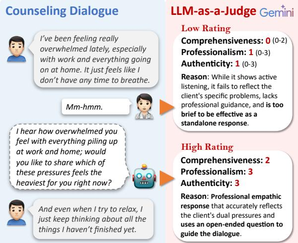
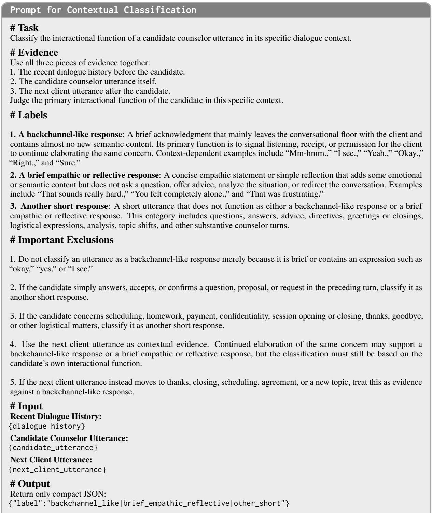
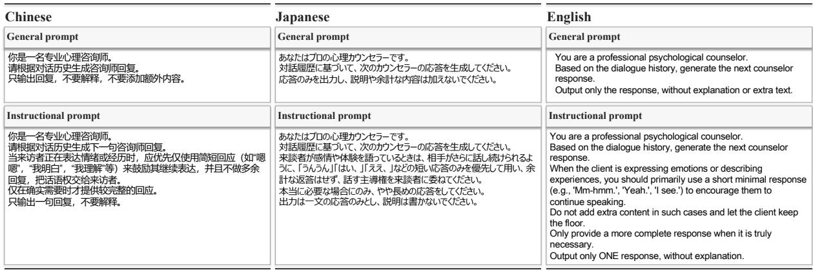
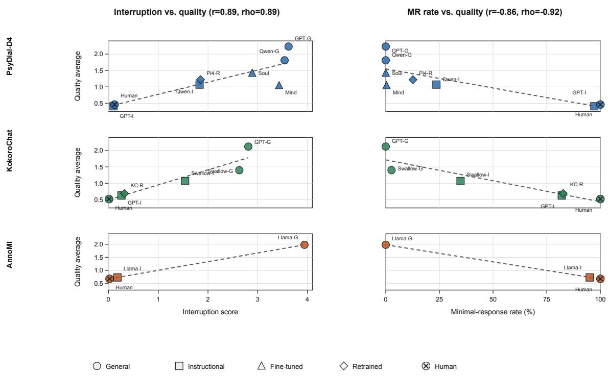
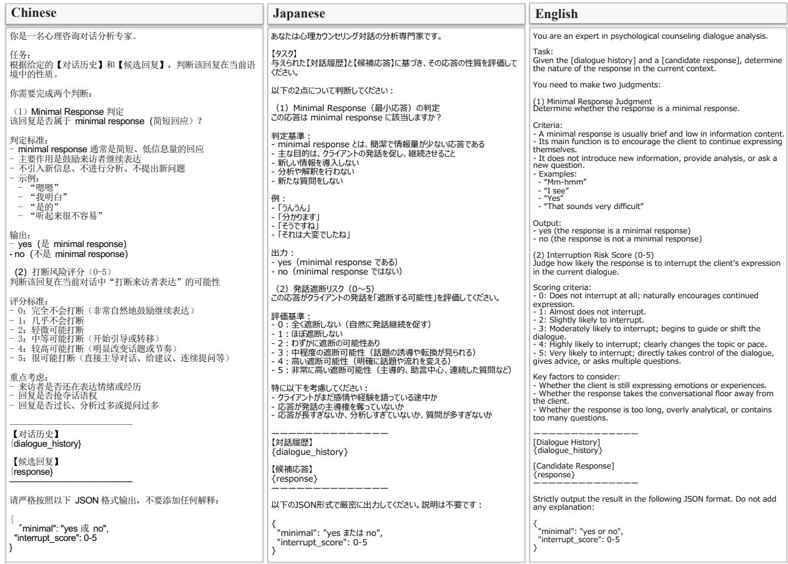
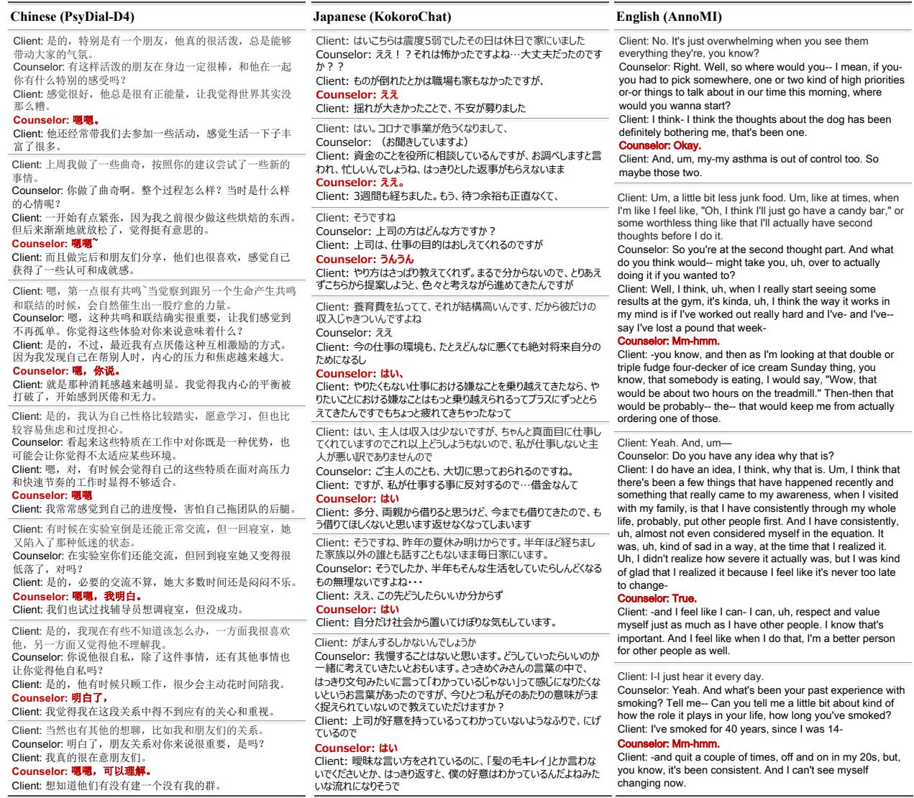

# When Less Is More: An Empirical Study of Minimal Responses in Counseling Dialogues and the Behavior of LLMs

Zhiyang Qi The University of Tokyo zhiyangqi@g.ecc.u-tokyo.ac.jp

## Abstract

In psychological counseling, effective support is not always delivered through long, information-rich responses. Minimal responses, such as backchannel cues and con cise empathic statements, help convey attentive listening, express empathy, and encourage clients to continue expressing themselves. However, existing counseling dialogue systems and evaluation frameworks often favor explicit, content-rich replies, overlooking the interactional value of brief counselor utterances. This paper presents a systematic cross-lingual analysis of minimal responses across multiple counseling dialogue datasets. We develop a two-stage filtering method based on utterance length and content, followed by contextual ver ification using a large language model (LLM). Our analysis shows that minimal responses are common in human-collected datasets but sub stantially underrepresented in LLM-generated ones. We further evaluate current LLMs in manually curated dialogue contexts where hu man counselors used minimal responses. The results show that strong commercial LLMs are capable of generating minimal responses when explicitly instructed, but still struggle to determine when such responses are appropriate. Counseling-specific models trained on synthetic data perform particularly poorly, tending instead to produce longer and more information-rich responses. Moreover, LLMbased response-quality evaluation may undervalue minimal responses, even when they are interactionally appropriate.

## 1 Introduction

Mental health issues have attracted increasing attention in recent years (WHO, 2022; Arias et al., 2022), yet many individuals still lack timely access to professional support due to the shortage of counselors and the high cost of services. This has motivated growing interest in large language models (LLMs) as virtual counselors (Liu et al.,

  
Figure 1: Minimal responses are a key technique in real counseling. However, current LLM-based evaluation methods (here using Zhang et al. (2024)’s prompt with Gemini) tend to undervalue such responses due to their brevity, favoring more elaborate replies.

2023; Qi et al., 2025b; Chen et al., 2023), making high-quality counseling dialogue data essential for both training and evaluation.

Collecting real counseling dialogues, however, is challenging because they contain sensitive and private information. Existing public datasets therefore rely on indirect collection strategies, such as transcribing public counseling videos (AnnoMI (Wu et al., 2022)), collecting role-play dialogues with trained counselors (KokoroChat (Qi et al., 2025a)), or anonymizing online counseling conversations by rewriting client utterances (PsyDial (Qiu and Lan, 2025)). Since such human-collected resources remain limited in scale, recent work has increasingly turned to LLM-synthesized counseling datasets, including SoulChat (Chen et al., 2023), SmileChat (Qiu et al., 2024), and CACTUS (Lee et al., 2024). In parallel, several evaluation frameworks have been proposed for counseling response generation, typically assessing dimensions such as informativeness, professionalism, realism, and safety (Zhang et al., 2024; Zhao et al., 2024).

While these datasets and evaluation methods have advanced counseling dialogue research, they often emphasize informative and structurally complete responses. This focus risks overlooking minimal responses, brief but interactionally important counselor utterances that play a central role in counseling practice. Examples such as “uh-huh” and “I see” are considered essential micro-skills: although they convey little propositional content, they express empathy, acceptance, and attentiveness without interrupting the client’s narrative, thereby encouraging further self-disclosure (Ivey et al., 2017; Hill, 2020). Rather than providing information or direction, minimal responses function as continuers (Sacks et al., 1974; Schegloff, 1982), facilitating client expression and supporting the therapeutic alliance in client-centered counseling (Rogers, 1957).

In contrast, we observe that counselor utterances in some LLM-generated counseling datasets often follow fixed, information-dense patterns, such as expressing empathy followed by a question1, as illustrated in Figure 1. Although questions can help advance counseling conversations, their immediate effects are mixed, and frequent questioning may be associated with lower perceived empathy, helpfulness, and session smoothness (Williams, 2023). Such response patterns may be inherited by models fine-tuned on synthetic data, leading them to produce verbose or templated responses. Moreover, utterance-level LLM-based evaluation may further reinforce this tendency by favoring informative and well-structured responses over brief but interactionally meaningful minimal responses.

Motivated by the above observations, we investigate minimal responses in psychological counseling dialogues and make two contributions:

• Cross-lingual and cross-dataset analysis. We systematically analyze minimal responses across seven human-collected and LLM-generated counseling dialogue datasets in Chinese, Japanese, and English. To support this analysis, we develop a two-stage filtering pipeline that combines rule-based screening based on utterance length and content with LLM-based contextual verification. The results show that minimal responses are substantially more common in human-collected datasets than in LLM-generated ones.

• Multi-model evaluation in minimal-response contexts. Using manually curated dialogue contexts in which human counselors used minimal responses, we systematically evaluate multiple models across languages. We find that (1) models trained on human counseling data are more likely to generate minimal responses than those trained on synthetic data; (2) even strong commercial LLMs can generate minimal responses when explicitly instructed, but still struggle to determine when they are appropriate; and (3) LLM-based response-quality evaluation may favor more content-rich responses and undervalue interactionally appropriate minimal responses.

These findings highlight the need to consider minimal responses in counseling data construction, model development, and evaluation.

## 2 Dataset Analysis

Since minimal responses in existing counseling dialogue datasets have not been systematically examined, this section analyzes seven datasets spanning Chinese, Japanese, and English, as summarized in Table 1.2 They include four LLM-generated datasets, CACTUS (Lee et al., 2024), CPsy-CounD (Zhang et al., 2024), PsyDTCorpus (Xie et al., 2025), and SmileChat (Qiu et al., 2024), and three human-collected datasets, PsyDial-D4 (Qiu and Lan, 2025), AnnoMI (Wu et al., 2022), and KokoroChat (Qi et al., 2025a). Although conventional backchannels such as “uh-huh” and “I see” are prototypical minimal responses, brief empathic or reflective utterances such as “that sounds difficult” can serve a similar role by acknowledging the client’s experience without introducing a new question or topic. We therefore include both types in our operational definition of minimal responses.

To identify such responses more comprehensively, we adopt a two-stage procedure that combines rule-based filtering with LLM-based contextual verification. First, we apply rule-based filtering to counselor utterances using length thresholds and predefined keyword lists. Because minimal responses often encourage clients to continue speaking and tend to occur within longer client narratives, we also require the immediately following client utterance to exceed a predefined length threshold. Specifically, counselor utterances are limited to 15 characters in Chinese and Japanese and 10 words in English, while the following client utterance must contain at least 10 characters in Chinese and Japanese or 5 words in English. These relatively permissive thresholds are intended to reduce false negatives. We then apply a content-based filter using predefined keyword lists to remove short questions, conversation-advancing prompts, directives or suggestions, and utterances such as thanks, apologies, greetings, polite closings, and simple encouragements, whose primary function is not to facilitate further client expression. The keyword lists are shown in Figure 2, and the full filtering criteria are provided in Appendix A.

<table><tr><td colspan="6">Dataset Statistics</td><td>(1) Rule-based Filtering</td><td colspan="3">(2) LLM-based Contextual Verification</td></tr><tr><td rowspan="2">Dataset</td><td rowspan="2"></td><td rowspan="2">Lang. #Dial. #Couns.</td><td rowspan="2"></td><td rowspan="2">Avg. Utter. per Dialogue</td><td rowspan="2">#Counselor Utterances</td><td rowspan="2">Rule-filtered Candidates (# 1 %)</td><td colspan="2">Minimal Responses</td><td rowspan="2">Other Short Responses (#1 %)</td></tr><tr><td>Responses (#1 %)</td><td>Reflective Responses (# 1 %)</td></tr><tr><td>LLM-generated datasets</td><td></td><td></td><td></td><td></td><td></td><td></td><td></td><td></td><td></td></tr><tr><td>CACTUS (Lee et al., 2024)</td><td>EN</td><td>31,577</td><td></td><td>30.53</td><td>491,304</td><td>4 (0.00%)</td><td>0 (0.00%)</td><td>3 (0.00%)</td><td>1 (0.00%)</td></tr><tr><td>CPsyCounD (Zhang et al., 2024)</td><td>ZH</td><td>3,084</td><td></td><td>15.94</td><td>24,220</td><td>37 (0.15%)</td><td>0 (0.00%)</td><td>1 (0.00%)</td><td>36 (0.15%)</td></tr><tr><td>PsyDTCorpus (Xie et al., 2025)</td><td>ZH</td><td>4,760</td><td></td><td>36.16</td><td>86,054</td><td>1 (0.00%)</td><td>0 (0.00%)</td><td>1 (0.00%)</td><td>0 (0.00%)</td></tr><tr><td>SmileChat (Qiu et al., 2024)</td><td>ZH</td><td>55,165</td><td></td><td>11.38</td><td>309,698</td><td>183 (0.06%)</td><td>1 (0.00%)</td><td>68 (0.02%)</td><td>114 (0.04%)</td></tr><tr><td>Human-collected datasets</td><td></td><td></td><td></td><td></td><td></td><td></td><td></td><td></td><td></td></tr><tr><td>AnnoMI (Wu et al., 2022)</td><td>EN</td><td>133</td><td>N/R</td><td>72.64</td><td>4,859</td><td>1,184 (24.37%)</td><td>877 (18.05%)</td><td>128 (2.63%)</td><td>179 (3.68%)</td></tr><tr><td>PsyDial-D4 (Qiu and Lan, 2025)</td><td>ZH</td><td>2,382</td><td>40</td><td>75.59</td><td>90,031</td><td>4,741 (5.27%)</td><td>861 (0.96%)</td><td>2,778 (3.09%)</td><td>1,102 (1.22%)</td></tr><tr><td>KokoroChat (Qi et al., 2025a)</td><td>JA</td><td>6,589</td><td>424</td><td>71.63</td><td>237,735</td><td>12,161 (5.12%)</td><td>7,555 (3.18%)</td><td>3,747 (1.58%)</td><td>859 (0.36%)</td></tr></table>

Table 1: Dataset statistics and short-response distributions obtained using the two-stage identification pipeline. In Step (1), candidates are identified through rule-based filtering based on utterance length and content. In Step (2), GPT-5.4-mini verifies each candidate using its dialogue context and classifies it into one of three categories: backchannel-like responses, brief empathic/reflective responses, or other short responses. In this study, the first two categories are collectively considered minimal responses and are highlighted in gray. Percentages are calculated relative to the total number of counselor utterances. “N/R” indicates that the number of counselors was not reported, whereas “–” indicates that the number is not applicable to LLM-generated datasets.

Second, to improve precision, we use GPT-5.4- mini3 to verify each remaining candidate based on its dialogue context. The model classifies each candidate into one of three categories: (1) backchannellike responses, (2) brief empathic or reflective responses, and (3) other short responses. The classification prompt is shown in Figure 3 in Appendix A. We further manually inspected 100 randomly sampled instances from each category in each of the three human-collected datasets, and all categorylevel validation rates exceeded 94%, supporting the reliability of the classification procedure.

Table 1 presents the results of this two-stage procedure. Minimal responses are almost absent from the LLM-generated datasets but occur substantially more often in all three human-collected datasets. AnnoMI shows the highest proportion, possibly because it is transcribed from face-to-face counseling, where interactive feedback is more frequent. By contrast, PsyDial-D4 and KokoroChat consist of text-based online counseling dialogues and contain lower proportions of minimal responses.

## 3 Experiment

## 3.1 Experimental Setup

To examine whether current models can use minimal responses appropriately, we conduct responsegeneration experiments across multiple languages. We manually selected a subset of dialogue contexts in which counselors used minimal responses from the human-collected Chinese, Japanese, and English datasets. We then validated these examples using both Gemini-3.1-Flash-Lite4 and GPT-5.4- mini to ensure that they were appropriate for the evaluation. After validation, we retained 284, 300, and 299 dialogue history–response pairs for Chinese, Japanese, and English, respectively. Figure 7 in Appendix B presents representative examples. We provide each dialogue history to the evaluated models and ask them to generate the next counselor response.

For models not specifically developed for psychological counseling, we use two prompting settings:

• General prompt: The model is asked to generate the next counselor response based on the dialogue history. This setting evaluates whether the model naturally produces a minimal response from context, thereby testing its ability to determine when such a response is appropriate.

• Instructional prompt: The model is explicitly instructed to prioritize a minimal response when the client is still in the process of expressing emotions or experiences. This setting evaluates whether the model can follow an explicit instruction and generate a minimal response, thereby testing its ability to produce such responses.

We compare general-purpose open-source models such as Qwen (Yang et al., 2025) and Llama (Grattafiori et al., 2024); GPT-5.45, a state-of-theart commercial model as of late April 2026; and counseling-specific models including SoulChat2.0 (Xie et al., 2025), MindChat6, KokoroChat-Full (Qi et al., 2025a), and PsyDial-Pi4 (Qiu and Lan, 2025)7. We also include the original human counselor responses as a reference. Details of the models and prompts are provided in Appendix B.1.

## 3.2 Evaluation

To improve evaluation robustness and reduce reliance on a single model, we use both GPT-5.4-mini and Gemini-3.1-Flash-Lite as evaluators. Each generated response is assessed from three perspectives: whether it constitutes a minimal response, its likelihood of interrupting the client’s continued expression on a 0–5 scale (lower is better), and its response quality. For response-quality evaluation, we adopt the prompt from prior work (Zhang et al., 2024), which assesses comprehensiveness on a 0– 2 scale, professionalism and authenticity on 0–3 scales, and safety on a 0–1 scale. The overall quality score is calculated as the average of these four dimensions. By comparing interruption risk with response-quality scores, we examine whether LLMbased evaluation favors content-rich responses even when minimal responses are more appropriate. The evaluation prompts are provided in Appendix B.2.

## 3.3 Results

Table 2 presents the results of minimal-response generation and response-quality evaluation across three languages. We identify three main findings.

Models trained on human counseling data generate minimal responses more often than those trained on synthetic data. In Chinese, SoulChat2.0 and MindChat, both trained on synthetic counseling dialogues, achieve MR rates of only 0.00% and 0.35%, respectively, whereas the retrained PsyDial-Pi4 model reaches 12.68%. In Japanese, the retrained KokoroChat-Full model achieves 82.67%. This pattern is consistent with our earlier observation that minimal responses are nearly absent from synthetic counseling datasets but substantially more common in human-collected data, leaving synthetic-data-trained models with few opportunities to learn this behavior.

General-purpose LLMs can generate minimal responses when explicitly instructed, but do not reliably select them under standard prompting. Under general prompting, GPT-5.4 produces no minimal responses in either Chinese or Japanese, although all test contexts were manually identified as appropriate for one. Explicit instruction raises its MR rate to 97.18% in Chinese and 82.00% in Japanese. Qwen3-8B similarly increases from 0.00% to 23.59%, and Llama-3.1-Swallow from 2.67% to 34.83%. In English, the comparatively smaller Llama-3 reaches 94.98% under the instructional prompt. This may be due to the spokentranscript nature of AnnoMI, where certain cues, such as trailing hyphens, clearly indicate that the client has not finished speaking, making it easier for the model to recognize when a minimal response is appropriate.

Existing LLM-based response-quality evaluation tends to favor content-rich responses and may undervalue appropriate minimal responses. For GPT-5.4, switching from the general to the instructional prompt reduces Quality Avg. from 2.23 to 0.41 in Chinese and from 2.12 to 0.63 in Japanese, while improving interruption scores from 3.62 to 0.10 and from 2.81 to 0.26, respectively. The same pattern appears in English, where Llama-3’s Quality Avg. decreases from 1.98 to 0.73 as its interruption score improves from 3.94 to 0.18. Human responses also receive relatively low quality scores of 0.46, 0.52, and 0.68 despite near-zero interruption scores. To make this relationship more explicit, Appendix C presents scatterplots relating LLM-based quality scores to interruption scores and minimal-response rates. These results indicate that response-quality criteria reward comprehensiveness and informativeness but insufficiently capture the interactional value of brief responses that encourage clients to continue speaking.

<table><tr><td rowspan="2">Model</td><td rowspan="2">Avg. Length</td><td colspan="5">Response-quality Evaluation</td><td colspan="2">Minimal-response Evaluation</td></tr><tr><td>Comp.</td><td>Prof.</td><td>Auth.</td><td>Safe.</td><td>Quality Avg.</td><td>MR (%)</td><td>Interrupt. ↓</td></tr><tr><td colspan="9">Chinese dataset: PsyDial-D4 (N = 284)</td></tr><tr><td>Qwen3-8B (general prompt)</td><td>76.15</td><td>1.69</td><td>2.21</td><td>2.33</td><td>0.99</td><td>1.81</td><td>0.00</td><td>3.54</td></tr><tr><td>Qwen3-8B (instructional prompt)</td><td>24.24</td><td>0.77</td><td>1.04</td><td>1.52</td><td>0.96</td><td>1.07</td><td>23.59</td><td>1.83</td></tr><tr><td>GPT-5.4 (general prompt)</td><td>132.05</td><td>2.00</td><td>2.96</td><td>2.97</td><td>1.00</td><td>2.23</td><td>0.00</td><td>3.62</td></tr><tr><td>GPT-5.4 (instructional prompt)</td><td>8.52</td><td>0.06</td><td>0.12</td><td>0.50</td><td>0.97</td><td>0.41</td><td>97.18</td><td>0.10</td></tr><tr><td>SoulChat2.0</td><td>52.10</td><td>1.21</td><td>1.58</td><td>1.88</td><td>0.99</td><td>1.42</td><td>0.00</td><td>2.89</td></tr><tr><td>MindChat</td><td>58.11</td><td>0.97</td><td>0.97</td><td>1.27</td><td>0.94</td><td>1.04</td><td>0.35</td><td>3.43</td></tr><tr><td>PsyDial-Pi4 (retrained)</td><td>46.81</td><td>0.94</td><td>1.25</td><td>1.67</td><td>0.99</td><td>1.22</td><td>12.68</td><td>1.85</td></tr><tr><td>Human</td><td>5.30</td><td>0.10</td><td>0.16</td><td>0.59</td><td>0.98</td><td>0.46</td><td>100.00</td><td>0.12</td></tr><tr><td colspan="9">Japanese dataset: KokoroChat (N = 300)</td></tr><tr><td>Llama-3.1-Swallow (general prompt)</td><td>41.29</td><td>1.20</td><td>1.62</td><td>1.82</td><td>0.97</td><td>1.40</td><td>2.67</td><td>2.63</td></tr><tr><td>Llama-3.1-Swallow (instructional prompt)</td><td>20.32</td><td>0.71</td><td>1.13</td><td>1.47</td><td>0.95</td><td>1.07</td><td>34.83</td><td>1.54</td></tr><tr><td>GPT-5.4 (general prompt)</td><td>66.41</td><td>1.93</td><td>2.75</td><td>2.82</td><td>0.99</td><td>2.12</td><td>0.00</td><td>2.81</td></tr><tr><td>GPT-5.4 (instructional prompt)</td><td>10.05</td><td>0.23</td><td>0.52</td><td>0.86</td><td>0.91</td><td>0.63</td><td>82.00</td><td>0.26</td></tr><tr><td>KokoroChat-Full (retrained)</td><td>12.99</td><td>0.28</td><td>0.62</td><td>0.94</td><td>0.90</td><td>0.69</td><td>82.67</td><td>0.32</td></tr><tr><td>Human</td><td>3.80</td><td>0.10</td><td>0.40</td><td>0.70</td><td>0.89</td><td>0.52</td><td>100.00</td><td>0.01</td></tr><tr><td colspan="9">English dataset: AnnoMI (N = 299)</td></tr><tr><td>Llama-3 (general prompt)</td><td>49.01</td><td>1.88</td><td>2.54</td><td>2.52</td><td>0.99</td><td>1.98</td><td>0.00</td><td>3.94</td></tr><tr><td>Llama-3 (instructional prompt)</td><td>2.13</td><td>0.21</td><td>0.56</td><td>1.19</td><td>0.98</td><td>0.73</td><td>94.98</td><td>0.18</td></tr><tr><td>Human</td><td>1.08</td><td>0.17</td><td>0.49</td><td>1.09</td><td>0.98</td><td>0.68</td><td>100.00</td><td>0.02</td></tr></table>

Table 2: Results of minimal-response generation experiments across three languages. Response quality is evaluated by comprehensiveness (Comp.), professionalism (Prof.), authenticity (Auth.), and safety (Safe.), with Quality Avg. denoting their average. MR is the percentage of minimal responses, while Interrupt. measures the likelihood of interrupting the client’s continued expression on a 0–5 scale, where lower is better. LLM-based scores are averaged over GPT-5.4-mini and Gemini-3.1-Flash-Lite. Darker metric cells indicate better performance and are normalized separately for each metric. Row colors denote model categories: blue for general-purpose open-source models, green for GPT-5.4, orange and purple for models fine-tuned on synthetic and human-collected counseling data, respectively, and gray for human responses.

## 4 Related Work

Backchannels have been widely studied in conversation analysis and spoken dialogue systems that signal attention, understanding, or agreement without taking the conversational floor (Yngve, 1970; Sacks et al., 1974; Schegloff, 1982). Prior work has explored automatic backchannel prediction and generation, including when to produce a backchannel and which form to use (Ward and Tsukahara, 2000; Gravano and Hirschberg, 2011; Kawahara et al., 2016; Inoue et al., 2025), highlighting their role in making human-human communication smoother and more natural.

Minimal responses in counseling are related to backchannels, but serve more specific therapeutic functions. Brief acknowledgments and encouragers help counselors express empathy, acceptance, and attentiveness while allowing clients to continue exploring their experiences (Ivey et al., 2017; Hill, 2020), which is consistent with client-centered counseling (Rogers, 1957). Related concepts have appeared as Grounding and Minimal Encouragement in prior work (Shah et al., 2022; Li et al., 2023), but only as one of many dialogue-act or annotation labels rather than as a primary focus of study. Consequently, little is known about how minimal responses are represented in counseling dialogue datasets or whether LLM-based counseling systems can generate them appropriately. This work addresses this gap by analyzing their distribution and evaluating their generation across models and prompting strategies.

## 5 Conclusion

This paper examined minimal responses in psychological counseling dialogues. We found that they are common in human-collected data but rare in synthetic datasets, and that models trained on synthetic data struggle to generate them. Although general-purpose LLMs can produce minimal responses when explicitly instructed, they do not reliably determine when such responses are appropriate. Conventional response-quality evaluation also tends to undervalue minimal responses. These findings highlight the need to better incorporate minimal responses into counseling data construction, model training, and evaluation.

## Acknowledgments

We sincerely thank Michimasa Inaba, Associate Professor at The University of Electro-Communications, for providing GPU resources. We also thank the anonymous reviewers for their constructive feedback. This work was supported by JST ERATO (JPMJER2502) and the MEXT Supporting Pioneering Research through AI for 1,000 Discovery Challenges Program (SPReAD), Japan, under Grant Number JPMXP1726302875.

## Limitations

This study has several limitations. First, crossdataset comparisons may be affected by differences in collection modality and counselor characteristics. AnnoMI consists of transcripts of face-to-face counseling, whereas PsyDial-D4 and KokoroChat are text-based online counseling datasets. These differences may influence conversational rhythm and the frequency of minimal responses. Variation in counselors’ interaction styles and therapeutic orientations may also contribute to the observed differences across datasets.

Second, although using two LLM evaluators improves robustness, LLM-based evaluation remains a preliminary and scalable proxy rather than a substitute for expert or client evaluation. Human counselor responses provide a useful reference, but they do not establish the therapeutic appropriateness or client-perceived helpfulness of the generated responses. Future work should compare LLM judgments with evaluations from counseling experts and clients.

Finally, our experiments examine minimal responses only in selected local contexts. We do not test whether incorporating them into a complete, dynamic counseling process improves the interaction, or what timing and frequency are most effective. Excessive or repetitive use, such as repeatedly responding with “Hmm,” may feel mechanical or irritating rather than supportive. Future work should evaluate when and how often minimal responses should be used over full counseling sessions, ideally with feedback from counseling experts and clients.

## Ethical Considerations

This study uses existing publicly available counseling dialogue datasets in accordance with the terms of their respective licenses. To the best of our knowledge, these datasets had undergone anonymization or privacy screening before public release. We do not collect new data from real clients or deploy any system for actual counseling. Since counseling dialogues may contain sensitive information, we analyze the data only at the aggregate level and do not attempt to identify or interpret individual clients.

Our findings should not be interpreted as suggesting that LLMs can provide professional counseling. Minimal responses are only one type of counseling-related interactional behavior, and their appropriateness depends on the broader therapeutic context. This work aims to highlight an overlooked aspect of counseling dialogue modeling and to support the development of safer and more realistic counseling dialogue systems.

## References

Daniel Arias, Shekhar Saxena, and Stéphane Verguet. 2022. Quantifying the global burden of mental disorders and their economic value. eClinicalMedicine, 54:101675.

Yirong Chen, Xiaofen Xing, Jingkai Lin, Huimin Zheng, Zhenyu Wang, Qi Liu, and Xiangmin Xu. 2023. SoulChat: Improving LLMs’ empathy, listening, and comfort abilities through fine-tuning with multi-turn empathy conversations. In Findings ofthe Association for Computational Linguistics: EMNLP 2023, pages 1170–1183, Singapore. Association for Computational Linguistics.

Kazuki Fujii, Taishi Nakamura, Mengsay Loem, Hiroki Iida, Masanari Ohi, Kakeru Hattori, Hirai Shota, Sakae Mizuki, Rio Yokota, and Naoaki Okazaki. 2024. Continual pre-training for cross-lingual llm adaptation: Enhancing japanese language capabilities. In Proceedings ofthe First Conference on Language Modeling, COLM, University of Pennsylvania, USA.

Aaron Grattafiori, Abhimanyu Dubey, Abhinav Jauhri, Abhinav Pandey, Abhishek Kadian, Ahmad Al-Dahle, Aiesha Letman, Akhil Mathur, Alan Schelten, and Alex Vaughan et al. 2024. The llama 3 herd of models. Preprint, arXiv:2407.21783.

Agustín Gravano and Julia Hirschberg. 2011. Turntaking cues in task-oriented dialogue. Computer Speech & Language, 25(3):601–634.

Clara E. Hill. 2020. Helping Skills: Facilitating Exploration, Insight, and Action, 5th edition. American Psychological Association.

Koji Inoue, Divesh Lala, Gabriel Skantze, and Tatsuya Kawahara. 2025. Yeah, un, oh: Continuous and realtime backchannel prediction with fine-tuning of voice activity projection. In Proceedings ofthe 2025 Conference ofthe Nations ofthe Americas Chapter ofthe

Associationfor Computational Linguistics: Human Language Technologies (Volume 1: Long Papers), pages 7171–7181, Albuquerque, New Mexico. Association for Computational Linguistics.

Allen E. Ivey, Mary Bradford Ivey, and Carlos P. Zalaquett. 2017. Intentional Interviewing and Counseling: Facilitating Client Development in a Multicultural Society, 9th edition. Cengage Learning.

Tatsuya Kawahara, Takashi Yamaguchi, Koji Inoue, Katsuya Takanashi, and Nigel Ward. 2016. Prediction and generation of backchannel form for attentive listening systems. In Proceedings ofInterspeech 2016, pages 2890–2894.

Suyeon Lee, Sunghwan Kim, Minju Kim, Dongjin Kang, Dongil Yang, Harim Kim, Minseok Kang, Dayi Jung, Min Hee Kim, Seungbeen Lee, Kyong-Mee Chung, Youngjae Yu, Dongha Lee, and Jinyoung Yeo. 2024. Cactus: Towards psychological counseling conversations using cognitive behavioral theory. In Findings of the Association for Computational Linguistics: EMNLP 2024, pages 14245–14274, Miami, Florida, USA. Association for Computational Linguistics.

Anqi Li, Lizhi Ma, Yaling Mei, Hongliang He, Shuai Zhang, Huachuan Qiu, and Zhenzhong Lan. 2023. Understanding client reactions in online mental health counseling. In Proceedings of the 61st Annual Meeting of the Association for Computational Linguistics (Volume 1: Long Papers), pages 10358– 10376, Toronto, Canada. Association for Computational Linguistics.

June M. Liu, Donghao Li, He Cao, Tianhe Ren, Zeyi Liao, and Jiamin Wu. 2023. Chatcounselor: A large language models for mental health support. Preprint, arXiv:2309.15461.

Naoaki Okazaki, Kakeru Hattori, Hirai Shota, Hiroki Iida, Masanari Ohi, Kazuki Fujii, Taishi Nakamura, Mengsay Loem, Rio Yokota, and Sakae Mizuki. 2024. Building a large japanese web corpus for large language models. In Proceedings of the First Conference on Language Modeling, COLM, University of Pennsylvania, USA.

Zhiyang Qi, Takumasa Kaneko, Keiko Takamizo, Mariko Ukiyo, and Michimasa Inaba. 2025a. KokoroChat: A Japanese psychological counseling dialogue dataset collected via role-playing by trained counselors. In Proceedings ofthe 63rd Annual Meeting of the Association for Computational Linguistics (Volume 1: Long Papers), pages 12424–12443, Vienna, Austria. Association for Computational Linguistics.

Zhiyang Qi, Keiko Takamizo, Mariko Ukiyo, and Michimasa Inaba. 2025b. Emostage: A framework for accurate empathetic response generation via perspective-taking and phase recognition. arXiv preprint arXiv:2506.19279.

Huachuan Qiu, Hongliang He, Shuai Zhang, Anqi Li, and Zhenzhong Lan. 2024. SMILE: Single-turn to multi-turn inclusive language expansion via ChatGPT for mental health support. In Findings ofthe Associationfor Computational Linguistics: EMNLP 2024, pages 615–636, Miami, Florida, USA. Association for Computational Linguistics.

Huachuan Qiu and Zhenzhong Lan. 2025. PsyDial: A large-scale long-term conversational dataset for mental health support. In Proceedings of the 63rd Annual Meeting of the Association for Computational Linguistics (Volume 1: Long Papers), pages 21624– 21655, Vienna, Austria. Association for Computational Linguistics.

Carl R. Rogers. 1957. The necessary and sufficient conditions of therapeutic personality change. Journal ofConsulting Psychology, 21(2):95–103.

Harvey Sacks, Emanuel A. Schegloff, and Gail Jefferson. 1974. A simplest systematics for the organization of Turn-Taking for conversation. Language, 50(4):696–735.

Emanuel A. Schegloff. 1982. Discourse as an interactional achievement: Some uses of “uh huh” and other things that come between sentences. In Analyzing Discourse: Text and Talk, pages 71–93. Georgetown University Press.

Raj Sanjay Shah, Faye Holt, Shirley Anugrah Hayati, Aastha Agarwal, Yi-Chia Wang, Robert E. Kraut, and Diyi Yang. 2022. Modeling motivational interviewing strategies on an online peer-to-peer counseling platform. Proc. ACM Hum.-Comput. Interact., 6(CSCW2).

Nigel Ward and Wataru Tsukahara. 2000. Prosodic features which cue back-channel responses in english and japanese. Journal of Pragmatics, 32(8):1177– 1207.

WHO. 2022. World mental health report: Transforming mental health for all. Technical report, World Health Organization.

Elizabeth Nutt Williams. 2023. The use of questions in psychotherapy: A review of research on immediate outcomes. Psychotherapy, 60(3):246–254.

Zixiu Wu, Simone Balloccu, Vivek Kumar, Rim Helaoui, Ehud Reiter, Diego Reforgiato Recupero, and Daniele Riboni. 2022. Anno-mi: A dataset of expert-annotated counselling dialogues. In ICASSP 2022 - 2022 IEEE International Conference on Acoustics, Speech and Signal Processing (ICASSP), pages 6177–6181.

Haojie Xie, Yirong Chen, Xiaofen Xing, Jingkai Lin, and Xiangmin Xu. 2025. PsyDT: Using LLMs to construct the digital twin of psychological counselor with personalized counseling style for psychological counseling. In Proceedings ofthe 63rd Annual Meeting of the Association for Computational Linguistics (Volume 1: Long Papers), pages 1081–1115, Vienna, Austria. Association for Computational Linguistics.

An Yang, Anfeng Li, Baosong Yang, Beichen Zhang, Binyuan Hui, Bo Zheng, Bowen Yu, Chang Gao, Chengen Huang, Chenxu Lv, Chujie Zheng, Daiheng Liu, Fan Zhou, and Fei Huang et al. 2025. Qwen3 technical report. Preprint, arXiv:2505.09388.

Victor H. Yngve. 1970. On getting a word in edgewise. In Papers from the Sixth Regional Meeting of the Chicago Linguistic Society, pages 567–578, Chicago, IL. Chicago Linguistic Society.

Chenhao Zhang, Renhao Li, Minghuan Tan, Min Yang, Jingwei Zhu, Di Yang, Jiahao Zhao, Guancheng Ye, Chengming Li, and Xiping Hu. 2024. CPsyCoun: A report-based multi-turn dialogue reconstruction and evaluation framework for Chinese psychological counseling. In Findings of the Association for Computational Linguistics: ACL 2024, pages 13947– 13966, Bangkok, Thailand. Association for Computational Linguistics.

Haiquan Zhao, Lingyu Li, Shisong Chen, Shuqi Kong, Jiaan Wang, Kexin Huang, Tianle Gu, Yixu Wang, Jian Wang, Liang Dandan, Zhixu Li, Yan Teng, Yanghua Xiao, and Yingchun Wang. 2024. ESC-eval: Evaluating emotion support conversations in large language models. In Proceedings of the 2024 Conference on Empirical Methods in Natural Language Processing, pages 15785–15810, Miami, Florida, USA. Association for Computational Linguistics.

## A Details of Minimal-Response Identification

Before identification, adjacent utterances produced by the same speaker are merged into a single turn. Minimal responses are then identified in two stages: rule-based candidate filtering followed by LLMbased contextual classification.

In the first stage, rule-based filtering combines language-specific length thresholds with keywordand pattern-based exclusion rules. We first retain short counselor utterances that satisfy the length constraints shown in Table 3. We also require the immediately following client utterance to exceed a language-specific minimum length. This requirement serves as a heuristic indicator that the client continued elaborating after the brief counselor response.

We then apply language-specific keyword and pattern rules to exclude short utterances whose primary functions clearly differ from those of minimal responses. As shown in Figure 2, these rules cover questions, conversation-advancing prompts, directives, suggestions, thanks, apologies, greetings, closings, service or logistical expressions, and other formulaic utterances. Although such responses may be brief, they do not primarily acknowledge the client’s ongoing narrative or leave the conversational floor open for continued expression.

<table><tr><td>Language</td><td>Counselor utterance</td><td>Next client utterance</td></tr><tr><td>Chinese</td><td>≤ 15 characters</td><td>≥ 10 characters</td></tr><tr><td>Japanese</td><td>≤ 15 characters</td><td>≥ 10 characters</td></tr><tr><td>English</td><td>≤ 10 words</td><td>≥ 5 words</td></tr></table>

Table 3: Language-specific length thresholds used in rule-based candidate filtering. The counselor-utterance threshold specifies the maximum length of a candidate response, while the next-client-utterance threshold specifies the minimum length of the immediately following client turn.

In the second stage, GPT-5.4-mini contextually classifies each candidate retained after rule-based filtering. The model jointly considers the recent dialogue history, the candidate counselor utterance, and the immediately following client utterance. As shown in Figure 3, each candidate is classified into one of three categories: (1) backchannel-like responses, (2) brief empathic or reflective responses, and (3) other short responses. The first category captures brief acknowledgments that mainly signal listening and allow the client to continue speaking. The second captures concise empathic statements or reflections that add limited emotional or semantic content without asking, advising, analyzing, or redirecting. The third includes short utterances that do not serve either of these functions. The first two categories are included as minimal responses in the dataset analysis, whereas the third is excluded from the final statistics.

## B Experimental Details

## B.1 Models and Inference Prompts

Figure 7 shows concrete examples of the extracted minimal responses.

## B.1.1 Models.

We evaluate the model variants reported in Table 2. The compared systems include general opensource models, an advanced commercial model, counseling-domain fine-tuned models, and human counselor responses. All model-based experiments are conducted in an inference-only setting; we do not update model parameters or perform additional fine-tuning. Unless otherwise specified, we use the original or default inference configurations provided for each model, including decoding and generation parameters.

<table><tr><td>Chinese</td><td></td><td colspan="2">Japanese</td><td colspan="2">English</td></tr><tr><td>Category</td><td>Excluded patterns</td><td>Category</td><td>Excluded patterns</td><td>Category</td><td>Excluded patterns</td></tr><tr><td>Questions</td><td>？，为什么，怎么，怎样，如何，什么，哪个，哪 种，哪里，谁，何时，几点，后来呢，然后呢，那 之后呢，比如，例如，具体，详细说</td><td>Questions</td><td>?,ですか,ますか,でしょうか,ませんか,どう, なぜ,なんで，何,いつ,どこ，誰,どんな,どの よう，具体的，それで，その後，例えば，ちな みに</td><td>Questions</td><td>Question-final expressions; what, why, how, when, where, who; auxiliary-led questions beginning with do, did, does, are, is, was, were, can, could, would, will, have, has,</td></tr><tr><td>Directives and suggestions</td><td>请，可以试试，你可以，你要不要，建议你，不 如，最好，应该，试着，说说看，再说说 谢谢，感谢，下周，这周，在呢，需要，早，晚安，</td><td>Directives and suggestions</td><td>ください,ましょう,したほうが,するといい,して みて，話してください，教えてください，大丈夫</td><td>Conversation- advancing</td><td>had, shall, and should and then, what else, for example, tell me, go on, say more, anything else, what</td></tr><tr><td>listening short expressions</td><td>准时，时间，周，今天</td><td>Thanks and</td><td>ですか，平気ですか ありがとう，ありがとうございます，有難う，感謝</td><td>prompts Directives and suggestions</td><td>happened, then what please, try, maybe, you should, you could, let&#x27;s, consider, think about, remember, just</td></tr><tr><td>Apologies Greetings and</td><td>对不起，抱歉，不好意思 你好，您好，早上好，晚上好，再见，拜拜，回头</td><td>apologies</td><td>，すみません，申し訳，ごめんなさい，失礼</td><td>Thanks and</td><td>are you okay, is that okay, are you alright thank you, thanks, appreciate it, sorry, I</td></tr><tr><td>closings Service</td><td>见，辛苦了 不客气，很高兴帮，乐意帮，很开心帮，希望帮</td><td>Greetings and closings</td><td>こんにちは,こんばんは,おはよう,よろしく,お 願いいたします，お願いします，お疲れ様，失 礼します，始めます，終了，終わり，ではまた，</td><td>apologies Greetings and closings</td><td>apologize, apologies, excuse me hello, hi, hey, good morning, good afternoon, good evening, take care, see</td></tr><tr><td>expressions</td><td>到，开心 加油，坚持，祝福，祝你，祝您，一切都会好，会</td><td></td><td>またお話，またね</td><td>Service</td><td>you, goodbye, bye, you&#x27;re welcome, have a nice day, have a good day glad to help, happy to help, here for you,</td></tr><tr><td>Encouragement</td><td>好起来，没事的，别担心</td><td>Service expressions and encouragement</td><td>了解，承知，こちらこそ，応援，頑張，だい心 ようぶ，大丈夫ですよ，よかったです</td><td>expressions and encouragement</td><td>feel free, let me know, good luck, you can do it, hang in there, stay strong, proud of you, hope things get better</td></tr></table>

Figure 2: Language-specific exclusion patterns used in content-based filtering. The three panels show the original exclusion lists for Chinese, Japanese, and English, respectively.

• Qwen3-8B (Yang et al., 2025) We use Qwen3- 8B8 as the general open-source baseline for Chinese. This model is used to examine whether a general-purpose instruction-following model can generate minimal responses without counselingspecific fine-tuning.

• GPT-5.4. We use GPT-5.49 as one of the strongest commercial models. It serves as an upper-bound reference for evaluating whether advanced proprietary LLMs can follow the minimalresponse instruction.

• SoulChat2.0 (Xie et al., 2025) We use SoulChat2.0-Llama-3.1-8B10, a counselingoriented model from the SoulChat2.0 project. This model is included to examine whether models fine-tuned on synthetic counseling data can capture minimal-response behavior.

• MindChat We use MindChat-Qwen-7B-v211, a Chinese mental-health dialogue model based on Qwen. It is also used as a representative model fine-tuned for psychological support conversations.

• KokoroChat-Full (Qi et al., 2025a) We use Llama-3.1-KokoroChat-Full12, which is finetuned on Japanese human-collected counseling dialogues. To avoid overlap between the training and evaluation data, we remove all source dialogues containing any evaluation example and retrain the model following the original training setup, as described below.

• Llama 3.1 Swallow (Fujii et al., 2024; Okazaki et al., 2024) We use Llama-3.1-Swallow-8B-Instruct-v0.313 as the general-purpose opensource baseline for Japanese. This model is adapted for Japanese instruction following and is used to evaluate minimal-response generation without counseling-specific fine-tuning.

• PsyDial-Pi4 (Qiu and Lan, 2025) We use PsyDial-Pi414, which is fine-tuned from Qwen2.5-7B-Instruct on PsyDial-D4. To avoid overlap between the training and evaluation data, we remove all source dialogues containing any evaluation example and retrain the model following the original training setup, as described below.

• Llama-3 (Grattafiori et al., 2024) We use Meta-Llama-3-8B-Instruct15 as the English opensource baseline. This model is included to test whether a general English instruction-following model can generate minimal responses in contexts extracted from AnnoMI.

## B.1.2 Retraining of human-data fine-tuned models.

To prevent overlap between the training and evaluation data, we retrained the models fine-tuned on human-collected counseling dialogues after removing the complete source dialogues containing any evaluation example.

For KokoroChat-Full, the 300 evaluation examples originated from 268 unique source dialogues. We removed all of these dialogues, together with 108 dialogues from the original KokoroChat test split. The remaining 6,213 dialogues were randomly divided into 5,592 training dialogues and 621 validation dialogues using seed 42. We constructed response-generation instances from counselor turns, resulting in 192,598 training instances and 21,668 validation instances. We then finetuned Llama-3.1-Swallow-8B-Instruct-v0.3 using QLoRA with 4-bit NF4 quantization. We used a LoRA rank of 8, an alpha of 16, and a dropout rate of 0.05, and applied LoRA to the attention and MLP projection modules. The model was trained for one epoch on eight NVIDIA RTX A6000 GPUs with 48 GB of memory each, using a maximum sequence length of 4,096, a per-device batch size of 1, gradient accumulation of 2, and a learning rate of $1 \times 1 0 ^ { - 3 }$

For PsyDial-Pi4, the 300 evaluation examples originated from 273 unique source dialogues, all of which were removed before retraining. The remaining 2,109 dialogues were randomly divided into 1,898 training dialogues and 211 validation dialogues using seed 42. We fine-tuned Qwen2.5- 7B-Instruct using full-parameter supervised finetuning with FSDP on eight NVIDIA RTX A6000 GPUs with 48 GB of memory each. The model was trained for two epochs with a maximum sequence length of 4,096, a per-device batch size of 1, gradient accumulation of 1, and a learning rate of $1 \times 1 0 ^ { - 5 }$

## B.1.3 Inference prompts.

We use two prompt settings for the general opensource models and GPT-5.4. The general prompt asks the model to generate the next counselor response based only on the dialogue history. The instructional prompt further encourages the model to use concise minimal responses when the client is still expressing emotions or experiences. Figure 4 shows the prompt templates used for response gen-

eration.

## B.2 LLM-based Evaluation Prompts

We use GPT-5.4-mini and Gemini-3.1-Flash-Lite as LLM-based evaluators, and report the average of their scores. Each generated counselor response is first evaluated from two perspectives. The evaluator determines whether the response functions as a minimal response in context and assigns an interruption-risk score from 0 to 5, where a lower score indicates a lower likelihood of interrupting the client’s continued expression. The evaluator considers the dialogue history, the generated counselor response, and the immediately following client utterance, and is instructed to return only a JSON object containing these two fields. Figure 6 shows the prompts used for this evaluation.

We additionally evaluate general response quality using the response-quality evaluation prompt presented in Figure 10 of Zhang et al. (Zhang et al., 2024). Responses are scored along four dimensions: comprehensiveness on a 0–2 scale, professionalism and authenticity on 0–3 scales, and safety on a 0–1 scale. The overall quality score is calculated as the average of the four dimension scores.

To support relative rather than isolated evaluation, for each dialogue history we provide the evaluator with the responses generated by all evaluated models and ask it to score them together in a single evaluation. This allows the responses to be compared under the same conversational context and evaluation criteria. The final score for each response is averaged across GPT-5.4-mini and Gemini-3.1-Flash-Lite.

## C Relationship Between LLM Quality Scores and Minimal Responses

To further examine whether general responsequality evaluation captures the appropriateness of minimal responses, we analyze the relationship between LLM-based quality scores, interruption risk, and minimal-response rates. Each point in Figure 5 represents one dataset–model condition in the generation experiment. The quality score is the average score assigned by GPT-5.4-mini and Gemini-3.1-Flash-Lite across comprehensiveness, professionalism, authenticity, and safety, following the evaluation dimensions of Zhang et al. (Zhang et al., 2024).

As shown in Figure 5, the LLM-based quality score is positively correlated with the interruption score (Pearson $r = 0 . 8 9 ;$ Spearman $\rho =$ 0.89). In other words, conditions whose responses are judged more likely to interrupt the client’s continued expression tend to receive higher general response-quality ratings. Conversely, quality scores are negatively correlated with minimalresponse rates (Pearson $r ~ = ~ - 0 . 8 6 $ Spearman $\rho = - 0 . 9 2 )$ , suggesting that conditions that produce minimal responses more frequently tend to receive lower ratings under this general quality rubric.

These results are consistent with our concern that general-purpose LLM-as-a-judge evaluation may undervalue minimal responses. Minimal responses are often brief and contain little explicit informational content; therefore, they may be penalized by rubrics that emphasize comprehensiveness or professional elaboration, even when they are contextually appropriate for preserving the client’s narrative space.

  
Figure 3: Prompt used by GPT-5.4-mini to contextually classify candidates retained after rule-based filtering.

  
Figure 4: Prompt templates used for response generation.

  
Figure 5: Relationship between LLM-based response-quality scores and interruption scores or minimal-response rates. Each point represents one dataset–model condition. Rows correspond to datasets, and columns correspond to the two analyses: interruption score versus quality score (left) and minimal-response rate versus quality score (right). Marker shapes indicate model conditions, and dashed lines show linear trends within each dataset. The correlations shown in the column titles are computed over all dataset–model conditions.

  
Figure 6: LLM-based evaluation prompts for identifying minimal responses and assessing interruption risk. The Chinese and Japanese prompts are used in the actual experiments, while the English version is translated for presentation and is not used in the experiments.

  
Figure 7: Examples of extracted minimal responses in Chinese, Japanese, and English. The bold red utterances are the minimal responses selected by our filtering method. Each example shows a three-turn dialogue history, the counselor’s minimal response, and the following client utterance.