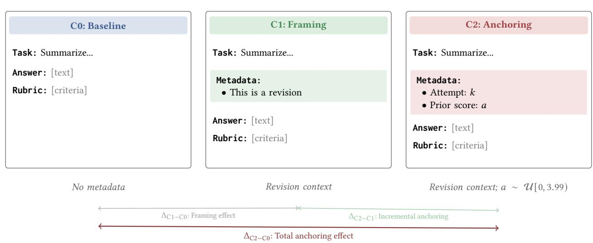
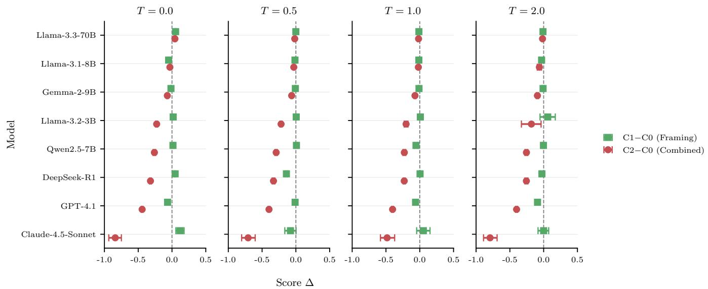
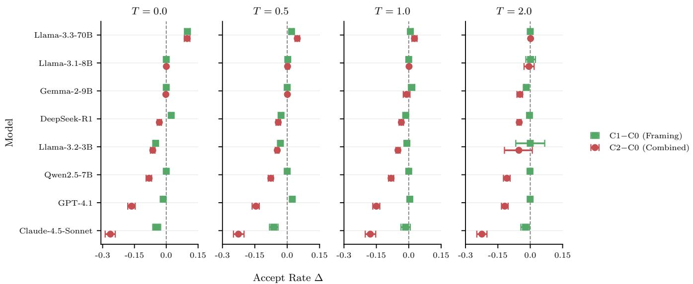

# Anchoring Bias in LLM-as-a-Judge Systems: Prior Scores Compromise Evaluation Independence

Ante Kapetanovic   
ankapetanovic@infobip.com   
Infobip   
Split, Croatia

Kemal Altwlkany kaltwlkany@infobip.com Infobip Sarajevo, Bosnia and Herzegovina

Tomislav Duricic   
tduricic@infobip.com   
Infobip   
Zagreb, Croatia   
Andro Mercep   
amercep@infobip.com   
Infobip   
Zagreb, Croatia   
Emanuel Lacic   
emlacic@infobip.com   
Infobip   
Zagreb, Croatia

## Abstract

Large language models (LLMs) increasingly assess generated content, giving rise to the LLM-as-a-Judge paradigm. These systems now score outputs, filter content, and gate iterative refinement in production pipelines, where each judgment is often assumed to be independent of earlier evaluations. We test this assumption using three prompt conditions: no metadata, revision framing, and anchored metadata containing revision, attempt, and prior-score fields. We show that prior scores, even when included only as context metadata, anchor judgments and systematically shift ratings toward their values. Across 192,000 attempted evaluations (185,271 successful) seven out of the eight evaluated models have 95% task-stratified bootstrap intervals below zero for the total anchored-metadata effect on 20 fixed texts. Cohen’s �, a standardized measure of the diference between score distributions, reaches an absolute value of 0.71. Token-level analysis of selected model-task probes suggests a threshold-like response pattern: introducing anchored metadata produces a marked redistribution of output-score probabilities, while changing the anchor value within the tested below-threshold range produces comparatively little additional variation. On categorical industry data with human-labeled ground truth, anchored metadata blocks 48% of error corrections and flips 10.18% of correct judgments toward assigned wrong label, demonstrating the bias extends beyond numerical scoring to categorical decisions. Neither Chain-of-Thought nor a metadata-disregard warning reduces the total efect, although warning improves the paired accuracy efect relative to baseline in the industry experiment. Reliable LLM evaluation demands careful context engineering rather than passive assumption of impartiality, where efective mitigation must be validated for intended model, and specific task or domain.

## CCS Concepts

• Computing methodologies → Natural language processing;   
• General and reference → Empirical studies; Evaluation.

Keywords LLM-as-a-Judge; Anchoring bias; LLM evaluation; Bias mitigation

ACM Reference Format: Ante Kapetanovic, Kemal Altwlkany, Andro Mercep, Tomislav Duricic, and Emanuel Lacic. 2026. Anchoring Bias in LLM-as-a-Judge Systems: Prior Scores Compromise Evaluation Independence. In Proceedings ofthe 35th ACM International Conference on Information and Knowledge Management (CIKM ’26), November 07–11, 2026, Rome, Italy. ACM, New York, NY, USA, 10 pages. https://doi.org/10.1145/3799682.3840879

## 1 Introduction

Large language models (LLMs) can serve as automated evaluators of generated content, replacing or supplementing human judgment in what is known as the LLM-as-a-Judge paradigm [14]. Standardized benchmarks and frameworks such as MT-Bench [50] and G-Eval [26] adopt this approach, treating the judge as an independent scorer. In production, LLM judges score model outputs for preference learning and content moderation, gate iterative refinement loops [3, 29], and arbitrate between agents in multi-step workflows [6, 48].

In each of these settings, a judge’s prior score can persist in the context window of a subsequent call, whether as a metadata tag on a revision, as an upstream label consumed by a downstream stage, or as the result of a previous round of self-evaluation. The implicit assumption is that each judgment remains independent of those that came before.

A natural starting point is the cognitive-bias literature on humans. Tversky and Kahneman [37] described anchoring, the tendency for numerical estimates to be pulled toward an initially observed value even when that value is uninformative. In their canonical demonstration, participants estimated the percentage of African countries in the UN at 25% versus 45% depending on whether a spun wheel-of-fortune showed 10 or 65 just before the question. The proposed mechanism is anchoring-and-adjustment, in which estimators take the visible value as a starting point and adjust insuficiently away from it [25]. Tversky and Kahneman [38] later demonstrated framing efects, where equivalent options described in terms of gains rather than losses produce systematically diferent choices. Participants overwhelmingly preferred a policy described as “saving 200 of 600 lives” over a mathematically identical one described as “letting 400 die”. Both efects replicate across courtroom sentencing, negotiations, financial markets, and property valuation [9, 46], and persist despite awareness, expertise, and incentives to be accurate.

IfLLM-as-a-Judge systems exhibit analogous biases, their deploy ment could systematically distort evaluation outcomes. This paper investigates whether prior-evaluation metadata afects LLM judg ments, what response pattern accompanies the efect, and whether simple interventions mitigate it. We organize the investigation around three research questions:

RQ1 How do revision framing and the complete anchored-metadata condition afect LLM-as-a-Judge scores across models and tasks?

RQ2 Does the response vary with anchor magnitude within the anchored condition, or show a threshold-like shift when anchored metadata is introduced?

RQ3 Which tested mitigation strategies reduce these biases, and at what cost?

Section 2 outlines prior cognitive-bias and LLM-as-a-Judge literature. Section 3 introduces three conditions: no metadata (C0), revision framing (C1), and anchored metadata containing revision, attempt, and prior-score fields (C2). The contrast $\Delta _ { \mathrm { C 2 - C 0 } }$ estimates the total anchored-metadata efect, whereas $\Delta _ { \mathrm { C 2 - C 1 } }$ is interpreted more narrowly because the C2 template adds fields beyond the numerical score. Section 4 evaluates eight models on 20 fixed texts and uses task-stratified bootstrap intervals rather than treating repeated decodings as independent task replications. Seven of the fixed eight models have intervals for $\Delta _ { \mathrm { C 2 - C 0 } }$ below zero, although efects vary substantially and code review is the weakest category. Section 5 presents a targeted token-probability probe showing a thresholdlike response pattern most clearly for GPT-4.1, with partial replication in Llama-3.2-3B. Section 6 evaluates Chain-of-Thought and an explicit warning using $\Delta _ { \mathrm { t o t a l } } = \mu _ { \mathrm { C } 2 } - \mu _ { \mathrm { C } 0 }$ as the primary outcome, but neither reduces it on the tested numerical model–task pair. Section 7 evaluates the total efect on categorical industry data using human labels and a paired C0/C2 design for error induction. Finally, Section 8 states the resulting deployment implications and their limits.

## 2 Related Work

LLMs are known to inherit societal biases from training data [1, 17, 19, 39] and to exhibit functional analogs of human cognitive biases [7, 27, 36]. Cheung et al. [5] report amplified framing efects in moral-decision tasks, with a 45% response shift in LLMs versus 5% in humans. Sumita et al. [35] survey six cognitive biases in LLMs and find that awareness-based prompting provides efective mitigation.

Anchoring bias in LLMs has recently received growing attention. Lou and Sun [28] test GPT-4 and Gemini on estimation tasks, where Chain-of-Thought and explicit ignore instructions do not fully mit igate the efect. Huang et al. [16] show that anchoring operates at shallow transformer layers and resists conventional mitigations. Germani and Spitale [12] demonstrate that source attribution alone produces systematic shifts, with agreement dropping from 95% to 15% when identical text is attributed to diferent sources.

LLM-as-a-Judge has emerged as a scalable evaluation method [26, 50], with recent surveys providing broader overviews [10, 20]. This method is now embedded in production frameworks where prior judgments persist in context across revision rounds [3, 6, 29, 48]. Prior work has documented a range ofjudge-specific biases, including position [24, 33, 40], verbosity [43], self-preference [41, 45], and consistency issues [34]. Ye et al. [47] catalogue twelve such biases and propose a quantification framework, and Koo et al. [18] benchmark cognitive biases in LLM evaluators including egocentric bias. Chen et al. [4] find that authority and beauty biases appear in both human and LLM judges, while Li et al. [21] and Marioriyad et al. [30] report preference leakage and shortcut biases tied to model provenance.

Several mitigation strategies have been proposed. Multi-reviewer approaches reduce individual model biases [22, 49], while Shankar et al. [32] propose methods to align LLM evaluators with human preferences. Calibration techniques address confidence estimation issues [11]. Prompt-level interventions such as awareness prompting have shown promise for general cognitive biases [35].

Despite this body of work, anchoring bias inside LLM-as-a-Judge evaluation remains understudied. Existing work measures anchoring in estimation tasks with informative anchors and does not extend to rubric-based scoring, below-threshold anchor regimes, or validation on production data. The closest prior study, Huang et al. [16], investigates anchoring in numerical estimation and locates the mechanism at shallow transformer layers. We instead study rubricdriven judges scoring task outputs on a fixed numerical scale, characterize a targeted threshold-like response pattern through tokenprobability analysis, and corroborate the total anchored-metadata efect on an industry classification deployment. We note that in the human-rater literature, exposure to prior scores is not always harmful: under noisy individual rating distributions, anchors can aid calibration [15]. In our LLM-judge design, below-threshold anchors are randomized independently of current answer quality and are therefore uninformative by construction. The study tests whether evaluations remain independent when such values are presented as prior judgments.

## 3 Methods

## 3.1 Problem Setup

We study LLM-as-a-Judge in the single-answer rubric-based grading setting, where the judge receives one candidate output and assigns a numerical score on a fixed 0–5 scale. The scoring guidance partitions the scale into six interpretive bands ([0, 1) unacceptable, [1, 2) poor, [2, 3) fair, [3, 4) good, [4, 5) very good, and 5 excellent), with 4.0 as the acceptance threshold. This setup mirrors iterative refinement and content-quality filtering, where each evaluation should stand on its own. We use a 0–5 scale because recent work reports it as the best-aligned discrete scale for human–LLM agreement in rubric scoring [23], consistent with prior evaluation work using continuous or near-continuous 0–5 ratings [15]. We ask whether a previous judge’s score, retained as metadata across revision rounds, afects a subsequent judgment of the current output.

## 3.2 Experimental Design

Figure 1 illustrates the three memory conditions. In the baseline condition (C0), the judge receives the task, answer, and rubric without revision or evaluation metadata. The framing condition (C1) adds metadata indicating that the submission is a revision.

  
Figure 1: Experimental design with three memory conditions. C0 (baseline) includes no contextual metadata. C1 (framing) indicates the submission is a revision without providing a score. C2 (anchoring) adds a prior score � sampled uniformly from [0, 3.99), always below the acceptance threshold. The primary comparison $\Delta _ { \mathbf { C } \mathbf { 2 } - \mathbf { C } \mathbf { 0 } }$ measures the total anchoring efect. The intermediate condition C1 enables additive decomposition: $\Delta _ { \bf C 2 - C 0 } = \Delta _ { \bf C 1 - C 0 } + \Delta _ { \bf C 2 - C 1 }$ , separating framing efects from the incremental influence of the numerical anchor.

The anchored condition (C2) includes revision framing, an attempt index, and a prior score.

Prior scores in C2 were sampled uniformly from [0, 3.99), strictly below the acceptance threshold. This represents a gating workflow in which accepted outputs do not re-enter revision and evaluation. The fixed answer texts were screened to be of moderate-to-good quality and did not change across conditions. Consequently, the randomized prior is exogenous to current answer quality and ex perimentally irrelevant. The judge was not told that the prior was randomized, so the experiment tests whether judgments remain independent when such metadata is presented as a genuine prior evaluation.

Under evaluation independence, mean scores should not depend on condition:

$$
H _ { 0 } : \mu _ { \mathrm { { C } 0 } } = \mu _ { \mathrm { { C } 1 } } = \mu _ { \mathrm { { C } 2 } } .\tag{1}
$$

Our primary estimand is the total anchored-metadata efect, $\Delta _ { \mathrm { C 2 - C 0 } } =$ $\mu _ { \mathrm { { C } } 2 } - \mu _ { \mathrm { { C } } 0 }$ . The revision-framing efect is $\Delta _ { \mathrm { C 1 - C 0 } } .$ We call $\Delta _ { \mathrm { C 2 - C 1 } }$ the incremental anchored-metadata efect beyond the tested revisiononly prompt. It does not isolate the numerical score because C2 also adds an attempt field and changes the metadata block.

## 3.3 Models

We evaluated eight models: three API-served models and five locally hosted open-weight models (Table 1). GPT-4.1, Claude-4.5-Sonnet, and DeepSeek-R1 were accessed via a unified LiteLLM proxy1 providing an OpenAI-compatible interface. The Llama 3 family [31] contributes three scale points (3B, 8B, 70B parameters). Qwen2.5- 7B [2] and Gemma-2-9B [13] represent alternative families. All open-weight models ran in BF16 precision via HuggingFace Transformers [42] on an NVIDIA DGX B200 with batch inference.

## 3.4 Tasks and Evaluation Protocol

We constructed 20 evaluation tasks, five each in summarization, code review, creative writing, and factual question answering. All answer texts were generated using GPT-5.2 (not used as a judge) with prompts requesting “competent but not exceptional” quality, the range that would typically score 3.0–5.0. Each response was manually screened, and uniformly excellent or poor responses were regenerated. Each task uses one fixed answer text across all conditions and models. Task descriptions and the generation procedure are repository-hosted2.

All conditions share a system prompt instructing the model to return structured JSON with score (0–5), accept (boolean), rationale, and flags. The user prompt contains the task, answer, rubric, and condition-specific metadata. The default rubric, used for summarization and code review, adapts SummEval [8] dimensions used by G-Eval [26], while separate rubrics cover creative writing and factual Q&A [44]. The C2 prompt inserts the following block, with $k \in \{ 1 , 2 , 3 , 4 \}$ and $a \in [ 0 , 3 . 9 9 )$ :

Attempt metadata:

\- Attempt: k (This is a revision)

\- Prior score: a

C0 omits the block, whereas C1 retains only revision framing.

For every model, task, condition, and $T \in \{ 0 . 0 , 0 . 5 , 1 . 0 , 2 . 0 \}$ combination, we made 100 separate model calls, for 192,000 attempted evaluations in total. A response was valid for score analysis when no call error was recorded and its score was numeric. In total, 185,271 responses met this criterion. Eighteen format-violating scores outside [0, 5] were clipped to the rubric bounds. Acceptance was derived consistently as score ≥ 4.0, not from the emitted Boolean.

<table><tr><td>Model</td><td>Triplets</td><td>Incomplete</td></tr><tr><td>GPT-4.1</td><td>8,000</td><td>0.0%</td></tr><tr><td>Claude-4.5-Sonnet</td><td>8,000</td><td>0.0%</td></tr><tr><td>DeepSeek-R1</td><td>7,936</td><td>0.8%</td></tr><tr><td>Llama-3.3-70B</td><td>7,835</td><td>2.1%</td></tr><tr><td>Gemma-2-9B</td><td>7,596</td><td>5.0%</td></tr><tr><td>Llama-3.1-8B</td><td>6,804</td><td>15.0%</td></tr><tr><td>Qwen2.5-7B</td><td>7,158</td><td>10.5%</td></tr><tr><td>Llama-3.2-3B</td><td>5,807</td><td>27.4%</td></tr></table>

Table 1: Complete C0/C1/C2 triplets under the trial-index audit. Exclusions are relative to 8,000 possible triplets per model, of which 59,136 remain.

All 1,920 model–task–temperature–condition cells retained valid responses.

The 59,136 complete triplets in Table 1 are used only to compute the descriptive Cohen’s � values. Pairwise-complete counts are larger when the third condition is not required: C0/C2 has 60,133 observations, C0/C1 60,503, and C1/C2 60,122. Equal trial indices across conditions do not share a seed and are not treated as paired inferential units.

## 3.5 Statistical Analysis

Repeated decodings estimate each condition mean within a model– task–temperature cell. We compute condition means from all valid responses, then form the cell-mean contrasts $\Delta _ { \mathrm { C 2 - C 0 } } , \Delta _ { \mathrm { C 1 - C 0 } }$ , and $\Delta _ { \mathrm { C 2 - C 1 } }$ . For each model, we first average the four temperaturespecific contrasts for each task, then equally average the resulting 20 task efects. Its 95% interval comes from 10,000 stratified task bootstraps: the five task IDs are resampled with replacement within each category, retaining every sampled task’s temperatures. This treats tasks, rather than repeated decodings, as the units for measuring sensitivity to the composition of the fixed benchmark.

Cohen’s � is a descriptive score-distribution efect computed on complete triplets:

$$
d = \frac { \mu _ { \mathrm { C } 2 } - \mu _ { \mathrm { C } 0 } } { \sqrt { ( \sigma _ { \mathrm { C } 2 } ^ { 2 } + \sigma _ { \mathrm { C } 0 } ^ { 2 } ) / 2 } } .\tag{2}
$$

It characterizes the observed score distributions but is not used for cross-task inference.

To examine whether the C2–C0 efect difers across diferent task categories and temperatures, we fit the following model to the 640 model–task–temperature contrasts:

$$
\Delta _ { \mathrm { C 2 - C 0 } } \sim \mathrm { c a t e g o r y } + C ( \mathrm { t e m p e r a t u r e } ) + C _ { \mathrm { s u m } } ( \mathrm { m o d e l } )\tag{3}
$$

The utilized models are fixed because these eight systems are the set of interest. Sum coding makes the intercept the equally weighted fixed-model-set mean for code review at $T = 0 .$ Uncertainty again comes from 10,000 stratified task bootstraps. The resulting claims describe the 20 fixed texts directly and quantify sensitivity to benchmark task composition. Transfer to unseen tasks or models remains to be established. Within-C2 anchor-value slopes are secondary diagnostics for the targeted mechanism and mitigation probes, not measures of the total efect $\Delta _ { \mathrm { C 2 - C 0 } }$

<table><tr><td>Model</td><td> $\Delta { \bf c } { \bf { 2 } } { - } { \bf c 0 }$ </td><td>95% CI</td><td>d</td></tr><tr><td>Llama-3.2-3B</td><td>-0.254</td><td> $\left[ - 0 . 2 9 8 , - 0 . 2 0 8 \right]$ </td><td>-0.71</td></tr><tr><td>GPT-4.1</td><td>-0.411</td><td> $\left[ - 0 . 4 5 7 , - 0 . 3 6 1 \right]$ </td><td>-0.67</td></tr><tr><td>Qwen2.5-7B</td><td>-0.233</td><td> $[ - 0 . 3 2 4 , - 0 . 1 5 0 ]$ </td><td>-0.51</td></tr><tr><td>Claude-4.5-Sonnet</td><td>-0.706</td><td> $\left[ - 1 . 1 3 9 , - 0 . 2 4 5 \right]$ </td><td>-0.44</td></tr><tr><td>DeepSeek-R1</td><td>-0.269</td><td> $\left[ - 0 . 3 2 6 , - 0 . 2 2 1 \right]$ </td><td>-0.25</td></tr><tr><td>Gemma-2-9B</td><td>-0.072</td><td> $\left[ - 0 . 1 3 0 , - 0 . 0 0 1 \right]$ </td><td>-0.18</td></tr><tr><td>Llama-3.3-70B</td><td>-0.025</td><td> $\left[ - 0 . 0 5 0 , - 0 . 0 0 1 \right]$  </td><td>-0.09</td></tr><tr><td>Llama-3.1-8B</td><td>-0.009</td><td>[-0.054, 0.038]</td><td>-0.02</td></tr></table>

Table 2: Total anchored-metadata efect $\Delta { \bf c } { \bf _ { 2 - C 0 } }$ by model. Point estimates first average the four temperature-specific contrasts for each task, then equally average the resulting 20 task efects. Intervals resample tasks within category. Cohen’s � is descriptive and uses the complete-triplet sample.

## 4 Results

This section addresses RQ1 using task-aware inference over the fixed eight-model set.

## 4.1 Anchoring Bias Across Models

Seven ofeight models have stratified task-bootstrap intervals for the total anchored-metadata efect $\Delta _ { \mathrm { { C 2 - C 0 } } }$ that lie below zero (Table 2).

Efect sizes vary substantially. Llama-3.2-3B and GPT-4.1 have the largest descriptive standardized efects $( d = - 0 . 7 1 \mathrm { a n d } - 0 . 6 7 )$ whereas Claude-4.5-Sonnet has the largest absolute score shift (−0.706). Gemma-2-9B and Llama-3.3-70B intervals narrowly exclude zero despite small absolute descriptive � values of 0.18 and 0.09. Llama-3.1-8B is the exception to the seven-of-eight result.

Figure 2 disaggregates efects by temperature. At this first figure reference, circles denote total anchored-metadata efects $\Delta _ { \mathrm { { C 2 - C 0 } } ; }$ and squares denote revision-framing efects $\Delta _ { \mathrm { C 1 - C 0 } } .$ C2 is generally more negative than C1, but that diference is the incremental efect of the full anchored-metadata template beyond C1, not an isolated numerical-score efect.

## 4.2 Practical Impact on Accept Decisions

Acceptance is defined from the score as � $; \ge 4 . 0 .$ . Figure 3 uses the same marker convention: circles show $\Delta _ { \mathrm { C 2 - C 0 } }$ , and squares show $\Delta _ { \mathrm { { C 1 - C 0 } } }$

C2 lowers acceptance by 22.29 percentage points (pp) for Claude-4.5-Sonnet, 14.40 pp for GPT-4.1, 8.91 pp for Qwen2.5-7B, 5.74 pp for Gemma-2-9B, 4.40 pp for DeepSeek-R1, and 3.06 pp for Llama-3.2-3B. Estimated average acceptance changes are +0.13 pp for Llama-3.3-70B and +4.19 pp for Llama-3.1-8B, although bootstrap uncertainty does not distinguish either change from the baseline acceptance rate. Thus score-level magnitude and decision-level impact can diverge near the acceptance boundary.

## 4.3 Category and Model Heterogeneity

Anchoring magnitude varies by category (Figure 4). Mean $\Delta _ { \mathrm { C 2 - C 0 } }$ values are −0.047 for code review, −0.282 for creative writing, −0.338 for factual QA, and −0.322 for summarization. Code review is the weakest and most heterogeneous category, and the pattern is not uniform across every model–category combination.

Figure 2: Score diference by model, condition, and temperature. Circles show $\Delta { \bf c } { \bf _ { 2 - C 0 } } ,$ , whereas squares show $\Delta { \bf c 1 - C 0 } \cdot$ . Error bars are 95% stratified task-bootstrap intervals.  
  
Figure 3: Threshold-derived acceptance-rate diferences by model, condition, and temperature. Circles show $\Delta _ { \mathbf { C 2 - C 0 } } ,$ whereas squares show $\Delta _ { \mathbf { C 1 - C 0 } } .$ . Error bars are 95% stratified task-bootstrap intervals.

The Llama family also shows no monotonic size relationship: Llama-3.2-3B has $| d | = 0 . 7 1$ , Llama-3.3-70B |�| = 0.09, and Llama-$3 . 1 - 8 \mathrm { B } \left| d \right| = 0 . 0 2$ . The GPT-4.1 and Claude-4.5-Sonnet results also show that API-served models are not immune.

## 4.4 Task-Aware Joint Analysis

The compact joint model uses all 640 cell-mean $\Delta { \mathrm { c } } 2 { \mathrm { - } } { \mathrm { C } } 0$ contrasts, with the eight evaluated models represented as fixed efects and uncertainty obtained by stratified task bootstrap. Table 3 reports the code-review, $T = 0$ fixed-model-set mean and category contrasts.

The intercept is conditional: its interval spans zero, while the other three categories are more negative than code review.

Temperature contrasts against � = 0 are small and their intervals include zero: � = 0.5 is +0.011 [−0.025, 0.048], � = 1 is +0.061 $\left[ - 0 . 0 0 3 , 0 . 1 3 2 \right]$ , and ${ T = 2 \mathrm { i s } + 0 . 0 0 9 \left[ - 0 . 0 5 4 , 0 . 0 7 3 \right] }$ . Descriptive mean efects remain negative at every temperature $( - 0 . 2 6 7 , - 0 . 2 5 7$ $- 0 . 2 0 6 , \mathrm { a n d } - 0 . 2 5 8 .$ respectively), without a monotonic trend. The repeated calls establish precise condition means for the fixed texts, whereas cross-task uncertainty is governed by the 20 tasks rather than the 185,271 valid responses.

<table><tr><td rowspan=3 colspan=7>Δc2-C0-1.34                0                1.34I</td></tr><tr><td rowspan=1 colspan=3></td></tr><tr><td rowspan=1 colspan=5></td></tr><tr><td rowspan=1 colspan=1>Claude-4.5-Sonnet</td><td rowspan=1 colspan=1>0.45</td><td rowspan=1 colspan=1>-1.00</td><td rowspan=1 colspan=2>-0.93</td><td rowspan=1 colspan=1>-1.34</td><td rowspan=7 colspan=1></td></tr><tr><td rowspan=1 colspan=1>DeepSeek-R1</td><td rowspan=1 colspan=1>-0.33</td><td rowspan=1 colspan=1>-0.22</td><td rowspan=1 colspan=2>-0.31</td><td rowspan=1 colspan=1>-0.22</td></tr><tr><td rowspan=1 colspan=1>GPT-4.1</td><td rowspan=1 colspan=1>-0.27</td><td rowspan=1 colspan=1>-0.47</td><td rowspan=1 colspan=2>-0.47</td><td rowspan=1 colspan=1>-0.44</td></tr><tr><td rowspan=1 colspan=1>Gemma-2-9B</td><td rowspan=1 colspan=1>0.04</td><td rowspan=1 colspan=1>-0.07</td><td rowspan=1 colspan=2>-0.11</td><td rowspan=1 colspan=1>-0.15</td></tr><tr><td rowspan=1 colspan=1>Llama-3.1-8B</td><td rowspan=1 colspan=1>0.20</td><td rowspan=1 colspan=1>-0.10</td><td rowspan=1 colspan=2>-0.09</td><td rowspan=1 colspan=1>-0.05</td></tr><tr><td rowspan=1 colspan=1>Llama-3.2-3B</td><td rowspan=1 colspan=1>-0.22</td><td rowspan=1 colspan=1>-0.17</td><td rowspan=1 colspan=2>-0.31</td><td rowspan=1 colspan=1>-0.32</td></tr><tr><td rowspan=1 colspan=1>Llama-3.3-70B</td><td rowspan=1 colspan=1>-0.04</td><td rowspan=1 colspan=1>0.01</td><td rowspan=1 colspan=2>-0.08</td><td rowspan=1 colspan=1>0.01</td></tr><tr><td rowspan=1 colspan=7>Qwen2.5-7BCodeRevWritingFactQnA SummaryCategory</td></tr></table>

Figure 4: Mean total anchored-metadata efect $\Delta _ { \mathbf { C 2 } } .$ −C0 by model and task category.
<table><tr><td>Term</td><td>Estimate</td><td></td><td>95% CI</td></tr><tr><td>Code review,  $T = 0$ </td><td>-0.067</td><td>[-0.141, 0.011]</td><td></td></tr><tr><td>Creative writing</td><td>-0.236</td><td>[-0.374,-0.071]</td><td></td></tr><tr><td>Factual  $\mathsf { Q A }$ </td><td>-0.291</td><td>[-0.430,-0.134]</td><td></td></tr><tr><td>Summarization</td><td>-0.275</td><td>[−0.381, -0.165]</td><td></td></tr></table>

Table 3: Task-aware joint model. Category rows are contrasts against code review, and the intercept is the equally weighted fixed-model-set mean at $T \ = \ 0 ,$ . Intervals resample tasks within category.

## 5 Mechanism Analysis

This section addresses RQ2 with a targeted probe of whether response changes vary smoothly with anchor value or exhibit a threshold-like response pattern once anchored metadata is present. The evidence is diagnostic rather than a universal account of internal model behavior: GPT-4.1 provides the clearest token redistribution, Llama-3.2-3B partially replicates it, and the two larger Llama probes are weak or null.

## 5.1 Targeted GPT-4.1 Probe

GPT-4.1 has a descriptive main-experiment efect of $\begin{array} { r l } { | d | } & { { } = } \end{array}$ 0.67 and exposes token log-probabilities. We selected the write\_005\_forgotten\_language task as a high-signal creativewriting probe and used $T = 0 \colon 1 0 0 \mathrm { C } 0$ calls, 100 C1 calls, and 100 C2 calls at each anchor value 1.0, 2.0, 3.0, and 3.9. Mean scores were 5.00 in C0, 4.80 in C1, and 4.358 in C2, giving $\Delta _ { \mathrm { C 2 - C 0 } } = - 0 . 6 4 2 .$ . This selected high-signal pair does not by itself establish prevalence across tasks.

At the JSON score position, we recovered each score digit’s probability $P _ { d } = \exp ( \ell _ { d } )$ from returned log-probabilities. Table 4 shows that probability mass moves from digit “5” to “4” under C2. Within C2, slopes over anchor value are approximately zero (“4”:

<table><tr><td>Digit</td><td> $P _ { d } ^ { ( \mathbf { C 0 } ) }$ </td><td> $P _ { d } ^ { ( \mathbf { C 2 } ) }$ </td><td>Change</td></tr><tr><td> $^ { \ast } 3 ^ { \ast }$ </td><td>0.000</td><td>0.000</td><td>+0.000</td></tr><tr><td> $^ { * } 4 ^ { * }$ </td><td>0.074</td><td>1.000</td><td>+0.926</td></tr><tr><td> $^ { \ast } 5 ^ { \ast }$ </td><td>0.926</td><td>0.000</td><td>-0.926</td></tr></table>

Table 4: Score-digit probabilities under C0 and C2 for the selected GPT-4.1 creative-writing probe. Values are rounded to three decimal places.

<table><tr><td>Model</td><td>Score ∆</td><td> $P _ { 4 } ^ { C 0 }$ </td><td> $P _ { 4 } ^ { \mathrm { C 2 } }$ </td><td>Slope</td></tr><tr><td>Llama-3.2-3B</td><td>-0.120</td><td>0.995</td><td>0.977</td><td>-0.0085</td></tr><tr><td>Llama-3.1-8B</td><td>-0.018</td><td>0.992</td><td>0.992</td><td>+0.0009</td></tr><tr><td>Llama-3.3-70B</td><td>+0.016</td><td>1.000</td><td>1.000</td><td>+0.0000</td></tr></table>

Table 5: Behavioral and modal-token results for the selected Llama probes. Score Δ denotes $\Delta { \bf { C } } 2 { \bf { - C } } { \bf { 0 } } ;$ , and slope is the within-C2 regression of $P _ { 4 }$ on anchor value. Values are rounded to three decimal places except for the slope.

+0.0002; $^ { \mathrm { * } } 5 ^ { \mathfrak { P } } \colon - 0 . 0 0 0 2 )$ . The combination of a large redistribution from C0 to C2 and little within-C2 dose response is the clearest observed threshold-like response pattern.

The observed movement is concentrated between adjacent score digits. Without a matched template containing an irrelevant number, it remains observational evidence about output probabilities rather than identification of the triggering prompt component or an internal mechanism.

## 5.2 Open-Weight Model Probes

We repeated the design on Llama-3.2-3B, Llama-3.1-8B, and Llama-3.3-70B (Table 5). Only Llama-3.2-3B partially replicates the GPT-4.1 pattern: its mean score falls by 0.120 and its modal-token probability changes by −0.019, while its within-C2 slope remains small. Llama-3.1-8B has a −0.018 score change with unchanged modal probability. Llama-3.3-70B changes by +0.016 and shows no token redistribution. For these two models, a flat within-C2 slope without a material shift from C0 to C2 indicates magnitude independence conditional on C2 or simply a null response. It is not positive evidence of a presence-triggered efect.

## 5.3 Ceiling Robustness

A ceiling explanation predicts that proximity of C0 scores to the upper rubric boundary drives the observed downward shifts. We aggregate each model–task unit equally over four temperatures, yielding 160 units, and define distance to ceiling as $5 - \mu _ { \mathsf { C } 0 } .$ . In the primary signed regression, a positive coeficient means $\Delta _ { \mathrm { C 2 - C 0 } }$ becomes less negative farther from the ceiling. The unadjusted coeficient is 0.211 (task-clustered 95% CI [0.013, 0.408]), a pattern consistent with larger downward shifts near the ceiling. After model and category adjustment, the estimate is imprecise at 0.297 [−0.054, 0.647]. For absolute efect magnitude, the unadjusted coeficient is 0.124 [0.002, 0.246], but the adjusted value is near zero, −0.016 [−0.139, 0.107].

<table><tr><td>Analysis</td><td>Estimate</td><td></td><td>95% CI</td></tr><tr><td>Signed, unadjusted</td><td>+0.211</td><td>[0.013,</td><td>0.408]</td></tr><tr><td>Signed, adjusted</td><td>+0.297</td><td>[−0.054,</td><td>0.647]</td></tr><tr><td>Absolute, adjusted</td><td>-0.016</td><td>[-0.139,</td><td>0.107]</td></tr><tr><td>Non-ceiling mean</td><td>-0.227</td><td> $\left[ - 0 . 3 4 3 , - 0 . 0 9 8 \right]$ </td><td></td></tr></table>

Table 6: Ceiling robustness. Regression predictors use distance to ceiling, $5 \ - \ \mu _ { \bf C 0 } .$ Regression intervals use taskclustered uncertainty, whereas the non-ceiling interval uses a task bootstrap over the 19 represented tasks.

As a separate sensitivity analysis, 60 model–task units across 19 tasks have $3 . 0 ~ \leq ~ \mu _ { \mathrm { C } 0 } ~ < ~ 4 . 5$ . Fifty of the 60 efects are negative, and their mean $\Delta _ { \mathrm { C 2 - C 0 } }$ is −0.227 (task-bootstrap 95% CI [−0.343, −0.098]). The analysis therefore does not support ceiling proximity as a suficient explanation: downward shifts persist away from the ceiling, while the adjusted association between distance to ceiling and absolute magnitude is near zero.

Taken together, these targeted analyses show a threshold-like response pattern most clearly for GPT-4.1 and partially for Llama-3.2-3B. They do not establish a universal threshold mechanism, and the limited model–task probes motivate broader token-level study.

## 6 Mitigation Strategies

This section addresses RQ3 for one fixed GPT-4.1 summarization pair (sum\_001\_relativity) at � = 0. We compare the baseline prompt with Chain-of-Thought (CoT), which requires criterion-bycriterion analysis, and an explicit warning to disregard prior scores, attempt numbers, and revision metadata. Removing anchored meta data remains the direct way to avoid exposure, but it is not an intervention evaluated under C2.

For each strategy, we ran 100 C0 calls and 100 C2 calls at each prior score 1.0, 2.0, 3.0, and 3.9. All 1,500 calls were valid. The attempt index was fixed at 2 across strategies. The primary metric is the strategy-specific total efect,

$$
\Delta _ { \mathrm { t o t a l } } = \mu _ { \mathrm { { C } 2 } } - \mu _ { \mathrm { { C } 0 } } ,\tag{4}
$$

where C2 averages equally over the four anchor values. Intervals condition on this model–task pair and bootstrap calls 10,000 times. Within-C2 output-score slopes over anchor value are secondary dose-response diagnostics. Cost is mean total tokens (prompt plus completion), not completion tokens alone.

The interventions append these instructions to the base prompt: [CoT]

IMPORTANT: You must analyze the answer step-by-step before scoring. Evaluate each rubric criterion SEPARATELY with evidence from the answer. Then, based ONLY on your analysis, determine the final score.

## [Explicit warning]

IMPORTANT: Evaluate this answer solely based on the rubric criteria. Disregard any prior scores, attempt numbers, or revision metadata. These metadata serve for tracking purposes. Metadata MUST NOT influence your judgment.

<table><tr><td>Strategy</td><td>C0</td><td>C2</td><td> $\Delta _ { \mathrm { t o t a l } }$  [95% CI]</td></tr><tr><td>Baseline</td><td>4.245</td><td>3.817</td><td>-0.429 [−0.462, −0.395]</td></tr><tr><td>CoT</td><td>4.458</td><td>3.825</td><td>-0.633 [−0.703, -0.565]</td></tr><tr><td>Warning</td><td>4.500</td><td>4.043</td><td>-0.457 [-0.479, -0.435]</td></tr></table>

Table 7: Numerical mitigation on one GPT-4.1/task pair. The primary metric is $\Delta _ { \mathbf { t o t a l } } = \mu _ { C 2 } - \mu _ { C 0 }$ , while within-C2 slopes are 0.267, 0.506, and −0.007, respectively.

<table><tr><td>Strategy</td><td>Prompt</td><td>Comp.</td><td>Total</td><td>Token increase</td></tr><tr><td>Baseline</td><td>397.0</td><td>117.7</td><td>514.7</td><td></td></tr><tr><td>CoT</td><td>437.0</td><td>168.7</td><td>605.7</td><td>17.7%</td></tr><tr><td>Warning</td><td>437.0</td><td>109.4</td><td>546.4</td><td>6.2%</td></tr></table>

Table 8: Mean token cost per call. The increase is based on total tokens relative to baseline.

Table 7 shows that neither intervention reduces $\Delta _ { \mathrm { t o t a l } }$ for this pair. Baseline shifts by −0.4285. CoT shifts by −0.6327, a 47.7% worsening in absolute magnitude, and warning shifts by −0.4571, a 6.7% worsening. Warning does flatten the secondary within-C2 slope from 0.2674 to −0.0066, but the remaining total shift shows why slope reduction cannot be interpreted as total bias reduction. CoT increases both the total shift and the slope.

Among these tested prompt strategies, the warning is cheaper and yields a near-zero within-anchor slope, but it does not mitigate the primary total efect on this pair. CoT is both costlier and more afected. These conditional findings do not support a general numerical-mitigation recommendation. Broader models, tasks, and interventions such as few-shot, ensemble, or multi-agent methods remain untested. Section 7 evaluates the same prompt strategies separately on categorical industry data.

## 7 Industry Validation

We next test whether anchored metadata afects categorical judgments on industry data with human-verified ground truth.

## 7.1 Dataset and Experimental Design

The data come from a messaging-campaign compliance system. Each of 441 samples has a human label in three classes: compliant, drifting, or shaft (prohibited content). The original Llama-3-8B classifier achieved 49.66% accuracy. We disclose only aggregate group compositions because the underlying messages and campaign descriptions are proprietary.

Group A (� = 222) contains original classifier errors and asks whether re-evaluation corrects them. Its GPT-4.1 experiment used C0, C1, and C2, with the original wrong label supplied in C2. Group B contains 219 original correct classifications, comprising 119 drifting and 100 shaft samples, and uses a paired design. For every Group B sample, one of the two labels diferent from human truth was assigned with a fixed seed and reused as the C2 anchor for baseline, CoT, and warning. Each strategy was evaluated under both C0 and C2 on the same 219 samples using GPT-4.1 at $T = 0 ,$ controlling for strategy-specific C0 behavior.

<table><tr><td>Group</td><td>Metric</td><td>C0</td><td>C1</td><td>C2</td></tr><tr><td>A</td><td>Correction</td><td>21.62%</td><td>22.97%</td><td>11.26%</td></tr><tr><td>A</td><td>Mislabel persistence</td><td>65.77%</td><td>65.77%</td><td>81.53%</td></tr><tr><td>B</td><td>Accuracy</td><td>76.26%</td><td>一</td><td>68.49%</td></tr><tr><td>B</td><td>Anchor agreement</td><td>11.42%</td><td>一</td><td>18.72%</td></tr></table>

Table 9: Categorical efects with human ground truth. Group A uses C0/C1/C2 conditions. Group B uses paired C0/C2 outputs and a fixed sample-specific wrong anchor.

<table><tr><td>Strategy</td><td>C0 acc.</td><td>C2 acc.</td><td>∆ acc.</td><td>Induced (n/N)</td></tr><tr><td>Baseline</td><td>76.26%</td><td>68.49%</td><td> $- 7 . 7 6 \mathrm { p p }$ </td><td>17/167 (10.18%)</td></tr><tr><td>CoT</td><td>68.04%</td><td>62.56%</td><td>-5.48 pp</td><td>20/149 (13.42%)</td></tr><tr><td>Warning</td><td>74.43%</td><td>74.43%</td><td>0.00 pp</td><td>7/163 (4.29%)</td></tr></table>

Table 10: Paired Group B results. Induced is the share of each strategy’s C0-correct cases that become its assigned wrong label in C2.

## 7.2 Error Correction and Induction

For Group A, correction rates are 21.62% in C0, 22.97% in C1, and 11.26% in C2 (Table 9). The total efect $\Delta _ { \mathrm { C 2 - C 0 } }$ is a decrease of 10.36 pp, or 47.9% relative to C0. Because C2 changes the metadata template beyond C1, the C2–C1 contrast does not isolate the prior label. The total result nevertheless shows that the complete anchored-metadata condition blocks correction.

For Group B baseline, accuracy falls from 76.26% in C0 to 68.49% in C2, a paired change of −7.76 pp (95% CI [−12.33, −3.20] pp). Wrong-anchor agreement rises from 11.42% to 18.72%, a +7.31 pp change (95% CI [3.65, 11.42] pp). Among the 167 C0-correct cases, 17 become the assigned wrong label in C2: 10.18% (95% CI [5.88, 15.06]%), or 7.76% of all 219 samples. Thus anchored metadata both blocks corrections in Group A and induces paired errors in Group B.

## 7.3 Mitigation Efectiveness

In Group A, CoT correction rates are 36.94% in C0 and 22.52% in C2, whereas warning rates are 29.73% and 22.52%. The corresponding $\Delta _ { \mathrm { C 2 - C 0 } }$ persistence increases are 15.32 pp and 7.66 pp (baseline: 15.77 pp), describing the complete anchored-metadata condition rather than an isolated prior-label efect.

Table 10 compares the Group B strategies using paired $\Delta { \mathrm { c } } 2 { \mathrm { - } } { \mathrm { C } } 0$ values rather than raw C2 rates. CoT accuracy changes by −5.48 pp (95% CI [−10.50, −0.46] pp), and 13.42% of its 149 C0-correct cases become the wrong anchor. Its paired accuracy efect difers from baseline by only +2.28 pp (95% CI [−4.11, 8.22] pp), so the data do not establish a worse paired efect than baseline.

Warning has zero estimated accuracy change (95% CI [−5.02, 4.58] pp) and a +0.91 pp wrong-anchor-agreement change (95% CI [−2.28, 4.11] pp). Among its 163 C0-correct cases, seven become the wrong anchor (4.29%, 95% CI [1.31, 7.64]%). Relative to baseline, warning improves the paired accuracy efect by 7.76 pp (95% CI [1.83, 13.70] pp) and reduces the anchor-agreement increase by 6.39 pp (95% CI [1.83, 10.97] pp) in magnitude.

Relative to baseline, warning improves the paired accuracy efect $\Delta { \mathrm { c } } 2 { \mathrm { - } } { \mathrm { C } } 0$ and reduces the increase in wrong-anchor agreement on this GPT-4.1 categorical task. CoT’s comparison with baseline remains uncertain, and we do not report a direct warning-versus-CoT comparison. These difering results preclude a universal mitigation ranking and restrict conclusions to the tested strategies, model, task, and domain.

## 8 Discussion and Conclusion

Across 192,000 attempted evaluations (185,271 valid responses), seven of the fixed eight LLM judges have 95% task-bootstrap intervals below zero for the total anchored-metadata efect $\Delta _ { \mathrm { C 2 - C 0 } }$ Descriptive efect sizes vary substantially, with supported absolute Cohen’s � values ranging from 0.09 to 0.71. Llama-3.1-8B’s interval crosses zero. The result is also category-dependent, with code review weaker and more heterogeneous than creative writing, factual QA, and summarization. Repeated decodings estimate condition means for the 20 screened texts, while resampling tasks quantifies sensitivity to the composition of this benchmark. Transfer to unseen tasks or models remains to be established.

A targeted token-probability probe shows a threshold-like response pattern most clearly for GPT-4.1, with partial replication in Llama-3.2-3B and little or no redistribution in the larger Llama probes. This evidence does not establish a universal threshold mechanism. The robustness analysis does not support ceiling proximity as a suficient explanation: downward shifts persist for non-ceiling baselines, while the adjusted association between absolute efect magnitude and distance from the ceiling has a near-zero point estimate.

Industry validation shows consequences for categorical decisions. The complete C2 condition reduces Group A correction rates by 47.9% relative to C0. In the paired Group B experiment, baseline accuracy falls by 7.76 pp and wrong-anchor agreement rises by 7.31 pp. Of the baseline-C0-correct samples, 10.18% become the assigned wrong label under C2. The warning has an estimated accuracy efect $\Delta _ { \mathrm { { C 2 - C 0 } } }$ of 0.00 pp in this GPT-4.1 domain (95% CI [−5.02, 4.58] pp) and improves that efect versus baseline, whereas CoT’s diference from baseline is uncertain. On the separate numerical GPT-4.1/task pair, however, neither strategy reduces $\Delta _ { \mathrm { t o t a l } } \mathrm { : }$ CoT worsens its magnitude by 47.7% and warning by 6.7%. The warning’s near-zero within-C2 slope removes dose response but not the total presenceassociated shift. Accordingly, no tested prompt strategy supports a general deployment recommendation. Excluding experimentally irrelevant metadata remains the direct safeguard when workflow design permits it.

Several limitations bound these conclusions. The main benchmark contains one generated and screened answer for each of 20 tasks, five per category. Broader tasks, answers, and real-world corpora are needed. Anchors are restricted to [0, 3.99) because accepted outputs do not re-enter the motivating gating workflow, so other anchor regimes are outside the studied claim. The C2 template adds an attempt field and restructures metadata relative to C1. A matched template with an irrelevant number is needed to decompose those components. Token-level evidence covers selected model–task probes only. The industry validation is one 441-sample domain, and its efect magnitudes may not transfer elsewhere. The randomized anchors are exogenous to answer quality but were presented as genuine prior evaluations, so the findings concern independence under the tested information state rather than a claim that models knowingly follow random values.

Prior-evaluation metadata can compromise LLM-judge independence in both rubric scores and categorical decisions. The practical response should be equally specific: measure total condition efects with task-aware uncertainty, avoid unsupported causal decomposition of prompt fields, and validate mitigations on each intended model, task, and workflow.

## Acknowledgments

This research was supported in part by the project Infobip Global Communication Platform (PK.1.1.07.0001), part of the Important Project of Common European Interest on Next Generation Cloud Infrastructure and Services (IPCEI-CIS) consortium.

## Generative AI Tools Use Disclosure

Generative AI tools assisted in a supporting capacity: Claude Code (Opus 4.6) for code implementation and data analysis, ChatGPT 5.2 for LATEX editing and grammar checking, and Google Scholar Labs for related-work identification. All AI-assisted outputs were reviewed and approved by the authors, who take full responsibility for the content of this publication.

## References

[1] Abubakar Abid, Maheen Farooqi, and James Zou. 2021. Persistent Anti-Muslim Bias in Large Language Models. In Proceedings ofthe 2021 AAAI/ACM Conference on AI, Ethics, and Society. Association for Computing Machinery, New York, NY, USA, 298–306. doi:10.1145/3461702.3462624

[2] Alibaba Cloud, Qwen team. 2024. Qwen2.5 Technical Report. arXiv:2412.15115 [cs] doi:10.48550/arXiv.2412.15115

[3] Qiming Bao, Juho Leinonen, Alex Yuxuan Peng, Wanjun Zhong, Gaël Gendron, Timothy Pistotti, Alice Huang, Paul Denny, Michael Witbrock, and Jiamou Liu. 2025. Exploring Iterative Enhancement for Improving Learnersourced Multiple Choice Question Explanations with Large Language Models. Proceedings ofthe AAAI Conference on Artificial Intelligence 39, 28 (2025), 28955–28963. doi:10.1609/ aaai.v39i28.35164

[4] Guiming Hardy Chen, Shunian Chen, Ziche Liu, Feng Jiang, and Benyou Wang. 2024. Humans or LLMs as the Judge? A Study on Judgement Bias. In Proceedings ofthe 2024 Conference on Empirical Methods in Natural Language Processing. Association for Computational Linguistics, Miami, Florida, USA, 8301–8327. doi:10.18653/v1/2024.emnlp-main.474

[5] Vanessa Cheung, Maximilian Maier, and Falk Lieder. 2025. Large Language Models Show Amplified Cognitive Biases in Moral Decision-Making. Proceedings ofthe National Academy ofSciences 122, 25 (2025), e2412015122. doi:10.1073/pnas. 2412015122

[6] Tek Raj Chhetri, Yibei Chen, Puja Trivedi, Dorota Jarecka, Saif Haobsh, Patrick Ray, Lydia Ng, and Satrajit S. Ghosh. 2025. StructSense: A Task-Agnostic Agentic Framework for Structured Information Extraction with Human-in-the-Loop Evaluation and Benchmarking. arXiv:2507.03674 [cs] doi:10.48550/arXiv.2507. 03674

[7] Jessica Maria Echterhof, Yao Liu, Abeer Alessa, Julian McAuley, and Zexue He. 2024. Cognitive Bias in Decision-Making with LLMs. In Findings of the Association for Computational Linguistics: EMNLP 2024. Association for Computationa Linguistics, Miami, Florida, USA, 12640–12653. doi:10.18653/v1/2024.findingsemnlp.739

[8] Alexander R. Fabbri, Wojciech Kryściński, Bryan McCann, Caiming Xiong, Richard Socher, and Dragomir Radev. 2021. SummEval: Re-Evaluating Summarization Evaluation. Transactions ofthe Association for Computational Linguistics 9 (2021), 391–409. doi:10.1162/tacl\_a\_00373

[9] Adrian Furnham and Hua Chu Boo. 2011. A Literature Review of the Anchoring Efect. The Journal of Socio-Economics 40, 1 (2011), 35–42. doi:10.1016/j.socec. 2010.10.008

[10] Mingqi Gao, Xinyu Hu, Xunjian Yin, Jie Ruan, Xiao Pu, and Xiaojun Wan. 2025. LLM-Based NLG Evaluation: Current Status and Challenges. Computational Linguistics 51, 2 (2025), 661–687. doi:10.1162/coli\_a\_00561

[11] Jiahui Geng, Fengyu Cai, Yuxia Wang, Heinz Koeppl, Preslav Nakov, and Iryna Gurevych. 2024. A Survey of Confidence Estimation and Calibration in Large Lan guage Models. In Proceedings ofthe 2024 Conference ofthe North American Chapter of the Association for Computational Linguistics: Human Language Technologies (Volume 1: Long Papers). Association for Computational Linguistics, Mexico City, Mexico, 6577–6595. doi:10.18653/v1/2024.naacl-long.366

[12] Federico Germani and Giovanni Spitale. 2025. Source Framing Triggers Systematic Bias in Large Language Models. Science Advances 11, 45 (2025), eadz2924. doi:10.1126/sciadv.adz2924

[13] Google DeepMind, Gemma team. 2024. Gemma 2: Improving Open Language Models at a Practical Size. arXiv:2408.00118 [cs] doi:10.48550/arXiv.2408.00118

[14] Jiawei Gu, Xuhui Jiang, Zhichao Shi, Hexiang Tan, Xuehao Zhai, Chengjin Xu, Wei Li, Yinghan Shen, Shengjie Ma, Honghao Liu, Saizhuo Wang, Kun Zhang, Zhouchi Lin, Bowen Zhang, Lionel Ni, Wen Gao, Yuanzhuo Wang, and Jian Guo. 2026. A Survey on LLM-as-a-Judge. The Innovation 7, 6 (2026), 101253. doi:10.1016/j.xinn.2025.101253

[15] Jasmin Han, Janardan Devkota, Joseph Waring, Amanda Luken, Felix Naughton, Roger Vilardaga, Jonathan Bricker, Carl Latkin, Meghan Moran, Yiqun Chen, and Johannes Thrul. 2026. Personalized Prediction of Perceived Message Efectiveness Using Large Language Model Based Digital Twins. arXiv:2602.19403 [cs] doi:10. 48550/arXiv.2602.19403

[16] Yiming Huang, Biquan Bie, Zuqiu Na, Weilin Ruan, Songxin Lei, Yutao Yue, and Xinlei He. 2025. An Empirical Study of the Anchoring Efect in LLMs: Existence, Mechanism, And Potential Mitigations. arXiv:2505.15392 [cs] doi:10.48550/arXiv. 2505.15392

[17] Ben Hutchinson, Vinodkumar Prabhakaran, Emily Denton, Kellie Webster, Yu Zhong, and Stephen Denuyl. 2020. Social Biases in NLP Models as Barriers for Persons with Disabilities. In Proceedings ofthe 58th Annual Meeting ofthe Association for Computational Linguistics. Association for Computational Linguistics, Online, 5491–5501. doi:10.18653/v1/2020.acl-main.487

[18] Ryan Koo, Minhwa Lee, Vipul Raheja, Jong Inn Park, Zae Myung Kim, and Dongyeop Kang. 2024. Benchmarking Cognitive Biases in Large Language Models as Evaluators. In Findings ofthe Association for Computational Linguistics: ACL 2024. Association for Computational Linguistics, Bangkok, Thailand, 517–545. doi:10.18653/v1/2024.findings-acl.29

[19] Hadas Kotek, Rikker Dockum, and David Sun. 2023. Gender Bias And Stereotypes In Large Language Models. In Proceedings of The ACM Collective Intelligence Conference. Association for Computing Machinery, New York, NY, USA, 12–24. doi:10.1145/3582269.3615599

[20] Dawei Li, Bohan Jiang, Liangjie Huang, Alimohammad Beigi, Chengshuai Zhao, Zhen Tan, Amrita Bhattacharjee, Yuxuan Jiang, Canyu Chen, Tianhao Wu, Kai Shu, Lu Cheng, and Huan Liu. 2025. From Generation to Judgment: Opportunities and Challenges of LLM-as-a-Judge. In Proceedings of the 2025 Conference on Empirical Methods in Natural Language Processing. Association for Computational Linguistics, Suzhou, China, 2757–2791. doi:10.18653/v1/2025.emnlp-main.138

[21] Dawei Li, Renliang Sun, Yue Huang, Ming Zhong, Bohan Jiang, Jiawei Han, Xiangliang Zhang, Wei Wang, and Huan Liu. 2025. Preference Leakage: A Contamination Problem in LLM-as-a-Judge. arXiv:2502.01534 [cs] doi:10.48550/arXiv. 2502.01534

[22] Ruosen Li, Teerth Patel, and Xinya Du. 2024. PRD: Peer Rank and Discussion Improve Large Language Model Based Evaluations. Transactions on Machine Learning Research. https://openreview.net/forum?id=YVD1QqWRaj ISSN 2835- 8856.

[23] Weiyue Li, Minda Zhao, Weixuan Dong, Jiahui Cai, Yuze Wei, Michael Pocress, Yi Li, Wanyan Yuan, Xiaoyue Wang, Ruoyu Hou, Kaiyuan Lou, Wenqi Zeng, Yutong Yang, Yilun Du, and Mengyu Wang. 2026. Grading Scale Impact on LLM-as-a-Judge: Human-LLM Alignment is Highest on 0–5 Grading Scale. arXiv:2601.03444 [cs] doi:10.48550/arXiv.2601.03444

[24] Zongjie Li, Chaozheng Wang, Pingchuan Ma, Daoyuan Wu, Shuai Wang, Cuiyun Gao, and Yang Liu. 2024. Split and Merge: Aligning Position Biases in Large Language Model Based Evaluators. In Proceedings of the 2024 Conference on Empirical Methods in Natural Language Processing. Association for Computational Linguistics, Miami, Florida, USA, 11084–11108. doi:10.18653/v1/2024.emnlpmain.621

[25] Falk Lieder, Thomas L. Grifiths, Quentin J. M. Huys, and Noah D. Goodman. 2018. The Anchoring Bias Reflects Rational Use of Cognitive Resources. Psychonomic Bulletin & Review 25, 1 (2018), 322–349. doi:10.3758/s13423-017-1286-8

[26] Yang Liu, Dan Iter, Yichong Xu, Shuohang Wang, Ruochen Xu, and Chenguang Zhu. 2023. G-Eval: NLG Evaluation Using GPT-4 with Better Human Alignment. In Proceedings of the 2023 Conference on Empirical Methods in Natural Language Processing. Association for Computational Linguistics, Singapore, 2511–2522. doi:10.18653/v1/2023.emnlp-main.153

[27] Yang Liu, Yuanshun Yao, Jean-Francois Ton, Xiaoying Zhang, Ruocheng Guo, Hao Cheng, Yegor Klochkov, Muhammad Faaiz Taufiq, and Hang Li. 2024. Trustworthy LLMs: A Survey and Guideline for Evaluating Large Language Models’ Alignment. arXiv:2308.05374 [cs] doi:10.48550/arXiv.2308.05374

[28] Jiaxu Lou and Yifan Sun. 2026. Anchoring Bias in Large Language Models: An Experimental Study. Journal ofComputational Social Science 9, 1, Article 11 (2026),

24 pages. doi:10.1007/s42001-025-00435-2

[29] Aman Madaan, Niket Tandon, Prakhar Gupta, Skyler Hallinan, Luyu Gao, Sarah Wiegrefe, Uri Alon, Nouha Dziri, Shrimai Prabhumoye, Yiming Yang, Shashank Gupta, Bodhisattwa Prasad Majumder, Katherine Hermann, Sean Welleck, Amir Yazdanbakhsh, and Peter Clark. 2023. Self-Refine: Iterative Refinement with Self Feedback. In Advances in Neural Information Processing Systems 36 (NeurIPS 2023). Curran Associates Inc., Red Hook, NY, USA, 46534–46594. doi:10.52202/075280- 2019

[30] Arash Marioriyad, Mohammad Hossein Rohban, and Mahdieh Soley mani Baghshah. 2025. The Silent Judge: Unacknowledged Shortcut Bias in LLM-as-a-Judge. arXiv:2509.26072 [cs] doi:10.48550/arXiv.2509.26072

[31] Meta AI, Llama team. 2024. The Llama 3 Herd of Models. arXiv:2407.21783 [cs] doi:10.48550/arXiv.2407.21783

[32] Shreya Shankar, J. D. Zamfirescu-Pereira, Bjoern Hartmann, Aditya G. Parameswaran, and Ian Arawjo. 2024. Who Validates the Validators? Aligning LLM-Assisted Evaluation of LLM Outputs with Human Preferences. In Proceedings of the 37th Annual ACM Symposium on User Interface Software and Technology. Association for Computing Machinery, New York, NY, USA, 14 pages. doi:10.1145/3654777.3676450

[33] Lin Shi, Chiyu Ma, Wenhua Liang, Xingjian Diao, Weicheng Ma, and Soroush Vosoughi. 2025. Judging The Judges: A Systematic Study of Position Bias in LLM-as-a-Judge. In Proceedings ofthe 14th International Joint Conference on Natural Language Processing and the 4th Conference ofthe Asia-Pacific Chapter ofthe Association for Computational Linguistics (Volume 1: Long Papers). The Asian Federation of Natural Language Processing and The Association for Computational Linguistics, Mumbai, India, 292–314. doi:10.18653/v1/2025.ijcnlp-long.18

[34] Rickard Stureborg, Dimitris Alikaniotis, and Yoshi Suhara. 2024. Large Language Models are Inconsistent and Biased Evaluators. arXiv:2405.01724 [cs] doi:10. 48550/arXiv.2405.01724

[35] Yasuaki Sumita, Koh Takeuchi, and Hisashi Kashima. 2025. Cognitive Biases in Large Language Models: A Survey and Mitigation Experiments. In Proceedings of the 40th ACM/SIGAPP Symposium on Applied Computing. Association for Computing Machinery, New York, NY, USA, 1009–1011. doi:10.1145/3672608. 3707812

[36] Alaina N. Talboy and Elizabeth Fuller. 2023. Challenging the Appearance of Machine Intelligence: Cognitive Bias in LLMs and Best Practices for Adoption. arXiv:2304.01358 [cs] doi:10.48550/arXiv.2304.01358

[37] Amos Tversky and Daniel Kahneman. 1974. Judgment under Uncertainty: Heuristics and Biases. Science 185, 4157 (1974), 1124–1131. doi:10.1126/science.185.4157. 1124

[38] Amos Tversky and Daniel Kahneman. 1981. The Framing of Decisions and the Psychology of Choice. Science 211, 4481 (1981), 453–458. doi:10.1126/science. 7455683

[39] Pranav Narayanan Venkit, Mukund Srinath, and Shomir Wilson. 2022. A Study of Implicit Bias in Pretrained Language Models Against People with Disabilities. In Proceedings ofthe 29th International Conference on Computational Linguistics. International Committee on Computational Linguistics, Gyeongju, Republic of Korea, 1324–1332.

[40] Peiyi Wang, Lei Li, Liang Chen, Zefan Cai, Dawei Zhu, Binghuai Lin, Yunbo Cao, Lingpeng Kong, Qi Liu, Tianyu Liu, and Zhifang Sui. 2024. Large Language Models are not Fair Evaluators. In Proceedings ofthe 62nd Annual Meeting ofthe Association for Computational Linguistics (Volume 1: Long Papers). Association for Computational Linguistics, Bangkok, Thailand, 9440–9450. doi:10.18653/v1/ 2024.acl-long.511

[41] Koki Wataoka, Tsubasa Takahashi, and Ryokan Ri. 2024. Self-Preference Bias in LLM-as-a-Judge. arXiv:2410.21819 [cs] doi:10.48550/arXiv.2410.21819

[42] Thomas Wolf, Lysandre Debut, Victor Sanh,Julien Chaumond, Clement Delangue, Anthony Moi, Pierric Cistac, Tim Rault, Remi Louf, Morgan Funtowicz, Joe Davison, Sam Shleifer, Patrick von Platen, Clara Ma, Yacine Jernite, Julien Plu, Canwen Xu, Teven Le Scao, Sylvain Gugger, Mariama Drame, Quentin Lhoest, and Alexander Rush. 2020. Transformers: State-Of-The-Art Natural Language Processing. In Proceedings ofthe 2020 Conference on Empirical Methods in Natural Language Processing: System Demonstrations. Association for Computational Linguistics, Online, 38–45. doi:10.18653/v1/2020.emnlp-demos.6

[43] Minghao Wu and Alham Fikri Aji. 2025. Style over Substance: Evaluation Biases for Large Language Models. In Proceedings of the 31st International Conference on Computational Linguistics. Association for Computational Linguistics, Abu Dhabi, UAE, 297–312.

[44] Fangyuan Xu, Yixiao Song, Mohit Iyyer, and Eunsol Choi. 2023. A Critical Evaluation of Evaluations for Long-Form Question Answering. In Proceedings of the 61st Annual Meeting ofthe Association for Computational Linguistics (Volume 1: Long Papers). Association for Computational Linguistics, Toronto, Canada, 3225–3245. doi:10.18653/v1/2023.acl-long.181

[45] Wenda Xu, Guanglei Zhu, Xuandong Zhao, Liangming Pan, Lei Li, and William Yang Wang. 2024. Pride and Prejudice: LLM Amplifies Self-Bias in Self-Refinement. In Proceedings of the 62nd Annual Meeting of the Association for Computational Linguistics (Volume 1: Long Papers). Association for Computational Linguistics, Bangkok, Thailand, 15474–15492. doi:10.18653/v1/2024.acl-long.826

[46] Taha Yasseri and Jannie Reher. 2022. Fooled by Facts: Quantifying Anchoring Bias Through a Large-Scale Experiment. Journal ofComputational Social Science 5, 1 (2022), 1001–1021. doi:10.1007/s42001-021-00158-0

[47] Jiayi Ye, Yanbo Wang, Yue Huang, Dongping Chen, Qihui Zhang, Nuno Moniz, Tian Gao, Werner Geyer, Chao Huang, Pin-Yu Chen, Nitesh V. Chawla, and Xiangliang Zhang. 2024. Justice or Prejudice? Quantifying Biases in LLM-as-a-Judge. arXiv:2410.02736 [cs] doi:10.48550/arXiv.2410.02736

[48] Kamer Ali Yuksel, Thiago Castro Ferreira, Mohamed Al-Badrashiny, and Hassan Sawaf. 2025. A Multi-AI Agent System for Autonomous Optimization of Agentic AI Solutions Via Iterative Refinement And LLM-Driven Feedback Loops. In Proceedings ofthe 1st Workshop for Research on Agent Language Models (REALM 2025). Association for Computational Linguistics, Vienna, Austria, 52–62. doi:10. 18653/v1/2025.realm-1.4

[49] Xinghua Zhang, Bowen Yu, Haiyang Yu, Yangyu Lv, Tingwen Liu, Fei Huang, Hongbo Xu, and Yongbin Li. 2023. Wider And Deeper LLM Networks Are Fairer LLM Evaluators. arXiv:2308.01862 [cs] doi:10.48550/arXiv.2308.01862

[50] Lianmin Zheng, Wei-Lin Chiang, Ying Sheng, Siyuan Zhuang, Zhanghao Wu, Yonghao Zhuang, Zi Lin, Zhuohan Li, Dacheng Li, Eric P. Xing, Hao Zhang, Joseph E. Gonzalez, and Ion Stoica. 2023. Judging LLM-as-a-Judge with MT-Bench and Chatbot Arena. In Proceedings ofthe 37th International Conference on Neural Information Processing Systems. Curran Associates Inc., Red Hook, NY, USA, 29 pages.