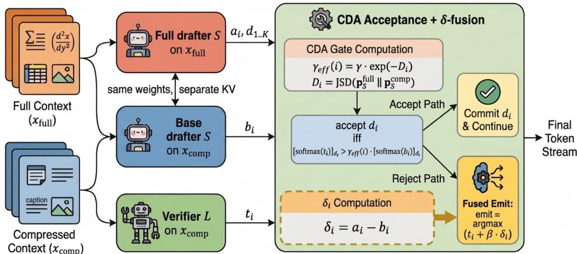

# AsymSpec: Context-Asymmetric Speculative Decoding for Agentic LLMs

Sheng Liang<sup>1</sup>, Yongyue Zhang<sup>1</sup>, Nathanael Brian<sup>1</sup>, Hang Lv<sup>2</sup>,

Hao Wang<sup>2</sup>, Chen Zhang<sup>1</sup>, Yong Liu<sup>1</sup>,

<sup>1</sup>Huawei Technologies Co., Ltd.

<sup>2</sup>University of Science and Technology of China

## Abstract

Agentic LLM pipelines face escalating inference costs as context accumulates across retrieval, tool use, and multi-turn interactions. To control latency, deployments routinely compress inputs, but this degrades task accuracy. Speculative decoding (SD) accelerates generation losslessly, yet it assumes the drafter and verifier share an identical context, preventing SD from resolving the accuracy–overhead trade-off. We propose ASYMSPEC, an asymmetric speculative decoding framework that breaks this symmetry: a lightweight drafter reads the full input while the large verifier operates on the compressed view. The drafter steers the verifier via a contrastive δ-fusion of logits, modulated by a divergence-aware acceptance gate that preserves verification stability and high draft acceptance rates. Evaluated across four agentic capabilities and two end-to-end agent benchmarks, ASYMSPEC reaches ≈90% of full-context accuracy on average, delivering 1.3–1.7× throughput speedups at 0.2–0.3× the compute cost on isolated text capabilities. These results show that asymmetric context access yields substantial gains precisely when compression discards critical reasoning signals.

## 1 Introduction

Modern LLM deployments increasingly operate as agentic pipelines—retrieving documents (Lewis et al., 2020; Gao et al., 2023; Wu et al., 2025a), invoking tools (Yao et al., 2023; Schick et al., 2023), maintaining multi-turn dialogue and memory (Sirdeshmukh et al., 2025; Zhang et al., 2025b; Wu et al., 2025b), and processing multimodal inputs (Liu et al., 2023). These settings issue repeated LLM calls over context that grows with every step. As retrieved passages, tool observations, and interaction histories accumulate, the forward pass becomes the dominant latency bottleneck, making context length the primary driver of inference overhead in production.

To control this overhead, deployments routinely compress the context (Pan et al., 2024b): RAG pipelines summarize retrieved passages, tool-use agents pass only API signatures instead of full documentation, and multimodal workflows feed short captions instead of raw images. Compression reduces serving cost but systematically discards finegrained details critical for task accuracy. Deployments thus face a rigid accuracy–overhead tradeoff: absorb the prohibitive latency of full-context generation, or accept significant degradation.

Speculative decoding (SD) (Leviathan et al., 2023; Chen et al., 2023) has become the standard approach for accelerating LLM inference: a lightweight drafter proposes candidate tokens that a large verifier checks in parallel, guaranteeing lossless generation under the target distribution. Despite extensive improvements to drafter architectures (Li et al., 2024c; Cai et al., 2024; Li et al., 2024b) and contrastive logit fusion in the speculative loop (Yuan et al., 2023), all existing SD methods share a foundational constraint: drafter and verifier process the same input tokens. SD accelerates a fixed target distribution without changing what the target model sees; once the verifier is compressed, SD can only accelerate the compressed model—it cannot recover what compression removed. Either both models pay the full-context cost, or both inherit the compression loss.

Our key observation is a structural compute asymmetry: per-step latency is dominated by the large verifier, while a lightweight drafter adds negligible overhead. Compressing only the verifier captures most of the latency savings, but standard SD cannot exploit this because it enforces identical input. We break this symmetry with ASYM-SPEC, an asymmetric speculative decoding framework that explicitly decouples context access. The verifier operates strictly on the compressed view for efficiency, while the drafter reads the full input to reconstruct the discarded information. We realize this recovery through a contrastive mechanism: the drafter processes both context views, and subtracting their output distributions removes the drafter’s context-independent preferences, isolating the information gain the uncompressed input provides. This gain signal, δ, is fused into the verifier’s logits and modulated by a parameter-free Context-Divergence Acceptance (CDA) gate. By scaling injection strength with the context divergence, the gate maintains stable verification and high acceptance rates. Since only the drafter processes the full input, ASYMSPEC recovers full-context reasoning fidelity at the compressed verifier’s latency, and extends to cross-modal settings (e.g., a vision– language drafter on raw images steering a text-only verifier on captions).

## Contributions.

1. We propose ASYMSPEC, a contextasymmetric speculative decoding framework: the verifier runs on a compressed view while the drafter consumes the full input, opening an operating point—compressed cost with near-ceiling accuracy—inaccessible to symmetric SD, and extending naturally to cross-modal settings.

2. Two coupled mechanisms instantiate the framework: a same-model cross-context δ-fusion that cancels drafter capacity biases to isolate the context-gain signal, and a parameter-free Context-Divergence Acceptance (CDA) gate that bounds steering strength without per-dataset tuning.

3. Across four agentic capabilities and two endto-end agent benchmarks, ASYMSPEC recovers ≈90% of full-context accuracy at 0.2– 0.3× compute and 1.3–1.7× throughput.

## 2 Related Work

## 2.1 Speculative decoding

Speculative decoding (SD) (Leviathan et al., 2023; Chen et al., 2023) accelerates autoregressive generation by having a lightweight drafter propose candidate tokens that a large verifier validates in parallel, preserving the target distribution via rejection sampling. Subsequent work improves drafter quality (EAGLE (Li et al., 2024c,b, 2025b), Medusa (Cai et al., 2024)) or targets long-context inference latency via hierarchical or sparse-KV speculation (TriForce (Sun et al., 2024), MagicDec (Sadhukhan et al., 2025)). All these methods feed the drafter and verifier the same input tokens, even when KVcache structure differs across stages. This symmetry prevents SD from exploiting the compute asymmetry inherent in long-context decoding. We relax this constraint in §3, letting the two models operate on distinct context views without breaking the speculative verification loop.

## 2.2 Context compression

Context compression is the standard mechanism for reducing long-context inference overhead (Lv et al., 2026b). Hard-prompt methods prune tokens by importance (LLMLingua (Jiang et al., 2024; Pan et al., 2024b)), soft-context approaches learn compact latents (Gist Tokens (Mu et al., 2023), ICAE (Ge et al., 2024)), and KV-cache techniques operate directly on cached states (StreamingLLM (Xiao et al., 2024), SnapKV (Li et al., 2024a)). Comprehensive surveys (Li et al., 2024d) document these approaches. Across this literature, accuracy degradation is treated as an unavoidable cost. We treat any compressor as a black box and show in §3 how a full-context drafter can systematically recover the discarded information, turning compression from a lossy shortcut into a steerable efficiency knob.

## 2.3 Contrastive decoding and logit fusion

Contrastive decoding (Li et al., 2023b) improves generation quality by subtracting an amateur model’s logits from an expert’s, amplifying expertspecific signals. This principle has been extended to multi-step reasoning (O’Brien and Lewis, 2023) and integrated into the speculative loop as Speculative Contrastive Decoding (SCD) (Yuan et al., 2023). However, SCD and its variants operate on a single shared context, using logit differences to bridge a model-capacity gap. The same subtractive principle has also been used to remove contentindependent positional priors with CapCal (Lv et al., 2026a), mitigate linguistic inertia after reasoning-chain compression with LICD (Zhang et al., 2026b), and transfer local context-induced preferences to a remote model with CoSteer (Lv et al., 2025). Together, these methods frame logit differences as signal isolators. ASYMSPEC brings this view into speculative verification: both logit terms come from the same drafter under full and compressed context views, so δ isolates the context gain rather than a model-capacity gap. We formalize this cross-context transfer and its biascancellation property in §3.2.

## 2.4 Asymmetric and multimodal speculation

Recent work has begun to explore asymmetric configurations. RAPID (Chen et al., 2025) adopts an inverse design: a retrieval-truncated drafter steers a full-context verifier to inject external knowledge, prioritizing full-context fidelity at full-context latency. Speculative RAG (Wang et al., 2025b) drafts answer candidates from retrieved-document subsets and then verifies them. Concurrent multimodal SD methods (SpecVLM, Spec-LLaVA, ViSpec (Huang et al., 2025; Huo et al., 2025; Kang et al., 2025); MASSV (Ganesan et al., 2025)) focus on visual-token prefill acceleration or keep both models within a single modality. SD2 (Berdoz et al., 2026) reverses the steering direction by conditioning the drafter on verifier signals. SpecSteer uses asymmetric local–cloud speculation, keeping private personalization context with a local drafter while drawing on cloud-scale reasoning (Lv et al., 2026c). Across these designs, asymmetry serves personalization and privacy, retrieval allocation, or modality-specific acceleration. ASYMSPEC instead uses asymmetric context access to change the efficiency operating point: a rich-input drafter compensates for a strictly compressed verifier, recovering accuracy at compressed-verifier latency (§3; design-space comparison in Table 8).

## 2.5 Speculation in agentic settings

Most SD work targets single-turn generation; longcontext variants (Sun et al., 2024; Sadhukhan et al., 2025) extend the regime but remain prompt-level. Recent agent-oriented methods accelerate the decision loop by speculating over high-level action sequences (Ye et al., 2025), tool invocations (Nichols et al., 2025), or plans (Hua et al., 2024). Dyna-Think likewise reduces inference cost by choosing between fast and deliberative reasoning at the request level (Pan et al., 2024a). Such action- and request-level mechanisms are orthogonal to tokenlevel decoding engines. We demonstrate in §5.3 that ASYMSPEC composes with live agentic loops, providing token-level accuracy recovery whenever tool outputs or retrieved contexts are compressed online.

## 3 Method

## 3.1 Problem setup

Let L be a large verifier and $S$ a lightweight drafter $( | S | \ll | L | )$ . A task provides a full prompt x<sub>full</sub>; a black-box compressor produces a compressed view $x _ { \mathrm { { c o m p } } }$ with $| x _ { \mathrm { c o m p } } | \ll | x _ { \mathrm { f u l l } } |$ . Per-step latency is dominated by $L ^ { \prime } s$ forward pass, which scales super-linearly with context length. This overhead structure defines two baseline operating points:

$L ( \cdot \mid x _ { \mathrm { f u l l } } )$ : peak accuracy, but prohibitive latency in agentic loops;

$L ( \cdot \mid x _ { \mathrm { c o m p } } )$ : low latency, but accuracy degraded by compression.

Compressing only $L ^ { \prime } s$ input captures the majority of latency savings, while $S _ { \textrm { s } }$ extra forward on $x _ { \mathrm { f u l l } }$ remains far cheaper than the verifier’s saved forward on $x _ { \mathrm { f u l l } }$ . Standard speculative decoding cannot exploit this asymmetry because it forces identical context access. ASYMSPEC explicitly decouples the two: L operates strictly on $x _ { \mathrm { { c o m p } } }$ for efficiency, while S reads $x _ { \mathrm { f u l l } }$ to reconstruct discarded information.

## 3.2 Contrastive δ-fusion

Each speculation step executes three forward passes over the current sequence (Figure 1a):

1. Augmented drafter: $S ( x _ { \mathrm { f u l l } } )$ produces logits a and samples K draft tokens $d _ { 1 : K }$

2. Base drafter: $S ( x _ { \mathrm { c o m p } } )$ produces logits b at the same $K + 1$ positions.

3. Verifier: $L ( x _ { \mathrm { c o m p } } )$ scores all K drafts in parallel, yielding logits t.

We define the context-gain signal in logit space:

$$
\delta _ { i } \ = \ a _ { i } - b _ { i } ,\tag{1}
$$

where $a _ { i } , b _ { i } \in \mathbb { R } ^ { | \mathcal { V } | }$ are the per-position logits. Subtracting $b _ { i }$ from $a _ { i }$ removes the drafter’s contextindependent preferences, isolating the shift induced by the additional context. Upon draft rejection, $\delta _ { i }$ is fused into the verifier’s distribution:

$$
d _ { i } ^ { \prime } = \arg \operatorname* { m a x } \bigl ( t _ { i } + \beta \delta _ { i } \bigr ) ,\tag{2}
$$

where $\beta \in \ [ 0 , 1 ]$ controls the steering strength. This injection shifts the verifier’s prediction toward what the full-context input would have produced, without requiring L to attend to $x _ { \mathrm { f u l l } }$

## 3.3 Context-divergence acceptance (CDA)

When the full and compressed views diverge sharply, a fixed acceptance threshold $\gamma$ usually over-rejects the drafts and wastes context-gain signals. We replace it with a threshold that relaxes proportionally to context divergence, instantiating the per-position divergence $D _ { i }$ as the Jensen–Shannon divergence (JSD):

  
Figure 1: ASYMSPEC speculation step. (a) Drafting & verification: drafter $S$ reads $x _ { \mathrm { f u l l } }$ (logits a, drafts $d _ { 1 : K } )$ and x (logits b); verifier L reads $x _ { \mathrm { { c o m p } } }$ (logits t). (b) CDA gate & δ-fusion: $\gamma _ { \mathrm { e f f } } ( i )$ relaxes as full-vs-compressed divergence grows; accepted drafts are committed, otherwise the δ-fused arg max is emitted. Only $S$ consumes x<sub>full</sub>.

$$
\begin{array} { r } { \gamma _ { \mathrm { e f f } } ( i ) = \gamma \cdot \mathrm { e x p } ( - D _ { i } ) , \qquad } \\ { D _ { i } = \mathrm { J S D } \big ( \mathrm { s o f t m a x } ( a _ { i } ) \| \mathrm { s o f t m a x } ( b _ { i } ) \big ) . } \end{array}\tag{3}
$$

We choose JSD specifically for its strict upper bound, which guarantees $\gamma _ { \mathrm { e f f } } \in [ \gamma / 2 , \gamma ]$ without clipping or introducing additional hyperparameters; the exponential form is the unique solution to a multiplicative-composition axiom (derivation in Section A). A large $D _ { i }$ signals context-induced divergence (not capacity-induced)—these are the positions where the compressed verifier most likely under-scores useful full-context drafts, so relaxing acceptance there is appropriate. The drafted token $d _ { i }$ is accepted iff:

$$
\begin{array} { r } { [ \mathrm { s o f t m a x } ( t _ { i } ) ] _ { d _ { i } } > \gamma _ { \mathrm { e f f } } ( i ) \cdot [ \mathrm { s o f t m a x } ( b _ { i } ) ] _ { d _ { i } } . } \end{array}\tag{4}
$$

Upon the first rejection, we emit the δ-fused token from Equation (2) (Figure 1b). The mechanism degenerates to standard verification on $x _ { \mathrm { { c o m p } } }$ when $\beta = 0$ and $\gamma = 1$ . The strict range $\gamma _ { \mathrm { e f f } } \in [ \gamma / 2 , \gamma ]$ keeps the acceptance criterion stable across positions, preserving predictable draft acceptance rates even under severe compression. Unlike standard SD, ASYMSPEC does not preserve a strict target distribution; it is a speculative-style steering scheme calibrated for greedy emission.

## 3.4 Cross-modal extension

Cross-modal asymmetry follows directly from the framework. Since drafter and verifier share an output token vocabulary V, the signals $\delta \in \mathbb { R } ^ { | \nu | }$ and $\gamma _ { \mathrm { e f f } } \in \mathbb { R }$ are computed entirely on the output side (Equations (1) to (4)) and remain well-defined regardless of the drafter’s input modality: a vision– language drafter can process raw images as x<sub>full</sub> while a text-only verifier reads captions as $x _ { \mathrm { { c o m p } } } ,$ with the speculative loop unchanged. The vision encoder runs once per request and its outputs are cached on the drafter’s KV side, so the per-token overhead of cross-modal δ vanishes at long generations and asymptotically matches that of text-only ASYMSPEC. Routing vision embeddings through the speculative engine’s drafter prefill is a nontrivial vLLM modification detailed in Section E.

## 4 Experiments

## 4.1 Tasks & compression protocol

We evaluate four isolated agentic capabilities under realistic compression: long-context multi-hop QA (LongBench (Bai et al., 2024), using its three multihop subsets), multi-turn instruction following (MultiChallenge (Sirdeshmukh et al., 2025)), tool use (API-Bank (Li et al., 2023a)), and multimodal reasoning (MathVista (Lu et al., 2024)). End-to-end agentic performance is measured on GAIA (Mialon et al., 2024) and SimpleQA (Wei et al., 2024), orchestrated via the smolagents (Roucher et al., 2025) framework. We enforce a strict asymmetric protocol across all benchmarks: the verifier receives only a compressed view (e.g., per-turn LLMLingua-2 (Pan et al., 2024b) summaries or API signatures), while the drafter reads the full uncompressed input. Dataset statistics, compression ratios, and metrics are summarized in Table 9; per-benchmark compression pipelines and tool-execution protocols are in Section B.

GAIA harness. GAIA runs through the smolagents CodeAgent ReAct loop with cached Duck-DuckGo search and visit-webpage as the only tools, identical across both ASYMSPEC variants reported in Table 4. The first variant uses our default Qwen3- 4B text drafter, same as every other benchmark in this paper. The second variant swaps the drafter to Qwen3-VL-2B-Instruct so it can read image attachments directly through the cross-modal patches of Section E; the verifier still receives pre-computed VL captions, as it cannot consume pixels. Compression, $K { = } 2 ,$ , and $\beta { = } 1 . 0$ are shared across both runs; the two variants differ only in drafter capacity and in whether image attachments reach the drafter as pixels or as captions.

Algorithm 1 ASYMSPEC Decoding   
Require: Verifier $L ,$ drafter S, prompts x<sub>full</sub>, x<sub>comp</sub>, spec   
length K, threshold $\gamma \in ( 0 , 1 ] .$ , fusion weight $\beta \in [ 0 , 1 ]$   
Ensure: Generated sequence y   
1: $y  [ ]$   
2: while generation not complete do   
3: Autoregressively sample $d _ { 1 : K }$ from $S ( x _ { \mathrm { f u l l } } \oplus y )$ (KV   
cache reused); let $a _ { 1 : K + 1 }$ be the logits at the correspond  
ing positions   
4: $\bar { b } _ { 1 : K + 1 }  S ( x _ { \mathrm { c o m p } } \oplus y \oplus d _ { 1 : K } )$ at the same positions   
5: $t \gets L ( x _ { \mathrm { c o m p } } \oplus$ y ⊕ d<sub>1:K</sub>)   
6: for $i = 1$ to K do   
7: $\delta _ { i }  a _ { i } - b _ { i }$   
8: $D _ { i } \gets$ JSD(softmax $\left( a _ { i } \right) \parallel$ softmax(b<sub>i</sub>))   
9: $\gamma _ { \mathrm { e f f } } ( i )  \gamma \mathrm { e x p } ( - D _ { i } )$   
10: end for   
11: accepted ← True   
12: for $\hat { i } = 1$ to K do   
13: if [softmax(t<sub>i</sub>)]<sub>d</sub> > γ<sub>eff</sub>(i)[softmax(b<sub>i</sub>)]<sub>d</sub>   
then   
14: $y  y \oplus [ d _ { i } ]$   
15: else   
16: $y  y$ ⊕ [arg max(t<sub>i</sub> + βδ<sub>i</sub>)]   
17: accepted ← False; break   
18: end if   
19: end for   
20: if accepted then   
21: y ← y ⊕ [arg max $\left( t \kappa + 1 \right) ]$   
22: end if   
23: end while   
24: return y

## 4.2 Models & hyperparameters

Our primary experiments use Qwen3-32B (Yang et al., 2025) as the verifier; Section D additionally evaluates Llama-3.3-70B-Instruct and Llama-3.2-3B-Instruct (Llama Team, 2024) in same- and cross-family Qwen–Llama pairings. Qwen3 offers open weights at 0.6B/1.7B/4B/32B from a common training recipe, post-training for tool use and multi-turn dialogue, and stable speculativedecoding support in vLLM (Kwon et al., 2023); primary experiments run on vLLM with the extensions in Section E. For text tasks, we sweep drafter sizes (0.6B, 1.7B, 4B) and report the 4B configuration as primary; for multimodal reasoning, we use Qwen3-VL-2B. All generation uses greedy decoding $( \tau = 0 )$ . Headline results use speculation depth K = 2, fusion weight $\beta = 1 . 0 \mathrm { { ; } }$ , and base threshold $\gamma = 0 . 5$ . Per-benchmark output length, context window, and harness bounds are listed in Table 7; complete hyperparameter grids, sensitivity analyses, and benchmark-specific drafter selections are detailed in Section B.

## 4.3 Metrics

We report task accuracy with each benchmark’s official metric (Table 9). Efficiency is reported along two axes: Speedup is the wall-clock token throughput ratio over the full-context Ceiling on a single accelerator (Table 11; Section F); FLOPs are perstep prefill compute normalized by the Ceiling’s verifier-only prefill, computed from the Qwen3 architecture and measured context lengths following Kaplan et al. (2020) (per-benchmark accounting in Table 5). Speedup measures realized latency while FLOPs measure energy / compute cost—the two diverge because decoding is memory-bandwidthbound at 30B+ scale.

## 4.4 Baselines

We compare against five references: (1) Floor: L on $x _ { \mathrm { { c o m p } } }$ alone; (2) Ceiling: L on x<sub>full</sub> alone; (3) SD: standard speculative decoding on shared context, evaluated on $x _ { \mathrm { f u l l } }$ (SD on $x _ { \mathrm { { c o m p } } }$ matches Floor by construction); (4) SCD (Yuan et al., 2023): combines verifier logits t with amateur logits b on a shared context (L, S both on $x _ { \mathrm { { c o m p } } }$ here), closing a model-capacity gap at SD speed (details in Section B); (5) RAPID (Chen et al., 2025): inverse asymmetric design (S on $x _ { \mathrm { { c o m p } } } ,$ L on x )— preserves the verifier’s target distribution at fullcontext compute. In cross-modal settings, the textonly Ceiling is undefined; we use the VL drafter alone as the reference bound. All throughput and compute metrics are normalized to the full-context Ceiling.

## 5 Results

## 5.1 Agentic capabilities

We first evaluate the three text-based agentic capabilities (§4). Table 1 reports accuracy and efficiency, with LongBench broken into its hotpotQA / 2WikiMQA / MuSiQue multi-hop subsets. ASYM-SPEC occupies an operating point inaccessible to symmetric methods: it delivers near-ceiling accuracy while retaining compressed-verifier latency. It reaches 87–99% of the full-context performance, closing the Floor–Ceiling gap to 0.9–9.7 residual points. The residual gap is structural: the verifier remains input-constrained and cannot fully reconstruct multi-hop reasoning chains or complex tool dependencies from logit steering alone. Full K and drafter-size sweeps are deferred to §6.

<table><tr><td></td><td colspan="3">Long-context multi-hop (LongBench)</td><td>Multi-turn</td><td>Tool use</td><td>Speedup</td><td>FLOPs</td></tr><tr><td>Method</td><td></td><td>hotpotQA 2WikiMQA</td><td>MuSiQue</td><td>(MultiChal.)</td><td>(API-Bank)</td><td>over Ceiling</td><td>over Ceiling</td></tr><tr><td>Floor</td><td>49.4</td><td>52.8</td><td>32.7</td><td>23.4</td><td>57.7</td><td>1.17×</td><td>0.11×</td></tr><tr><td>Ceiling</td><td>64.9</td><td>76.5</td><td>55.0</td><td>26.4</td><td>66.1</td><td>1.00×</td><td>1.00×</td></tr><tr><td>SD</td><td>65.5</td><td>76.6</td><td>55.1</td><td>26.7</td><td>66.1</td><td>1.73×</td><td>1.04×</td></tr><tr><td>SCD (Yuan et al., 2023)</td><td>46.6</td><td>52.7</td><td>32.0</td><td>22.6</td><td>56.7</td><td>1.04×</td><td>0.12×</td></tr><tr><td>RAPID (Chen et al., 2025)</td><td>63.2</td><td>75.3</td><td>52.5</td><td>25.8</td><td>64.3</td><td>1.38×</td><td>1.01×</td></tr><tr><td>AsymSpec (Ours)</td><td>64.0</td><td>66.8</td><td>48.4</td><td>23.5</td><td>63.5</td><td>1.45×</td><td>0.23×</td></tr></table>

Table 1: Accuracy and efficiency on isolated agentic capabilities (K=2). ASYMSPEC closes 59–94% of the Floor–Ceiling gap on long-context multi-hop QA and tool use, at 0.23× the Ceiling’s compute—a trade-off point inaccessible to symmetric SD or SCD. Speedup and FLOPs are averaged across the three text benchmarks; FLOPs follow the parameters × token-ratio convention. Drafter-alone accuracy across drafter sizes is in Section H. Metric definitions in §4.3; per-benchmark FLOPs in Table 5.

Baseline comparisons reinforce the design’s advantage. Standard SD preserves the target distribution but is structurally bound to symmetric context: it either inherits the Floor’s accuracy (on compressed input) or the Ceiling’s latency (on full input). SCD stays at or below the Floor across all five cells (e.g., LongBench mean 43.8 vs. Floor 45.0; API-Bank 56.7 vs. 57.7), showing that single-context contrastive fusion cannot recover compression-induced loss when expert and amateur both read the compressed view—the gain is specific to our asymmetric construction. RAPID’s inverse asymmetric design (drafter on x<sub>comp</sub>, verifier on x<sub>full</sub>) reaches near-Ceiling accuracy but at near-Ceiling compute (1.01× FLOPs); it targets the opposite trade-off point and is dominated on the compute axis where ASYMSPEC operates. Running the drafter alone on full context cuts cost but degrades sharply on reasoning-heavy subsets where the 4B model lacks sufficient capacity (per-size numbers in Section H). ASYMSPEC bridges these extremes by retaining the 32B verifier’s reasoning while offloading context recovery to the lightweight drafter.

The gains are directly tied to compressioninduced information loss, not task-specific overfitting. On MultiChallenge, where compression is near-lossless (Ceiling–Floor gap of 3.0 points), ASYMSPEC yields negligible improvement (23.5 vs. 23.4). This inertness supports the diagnostic that the mechanism activates only when compression discards critical signals. We further verify this diagnostic on a continuous axis by sweeping the verifier’s truncation budget on LongBench while keeping the drafter on full passages (Table 2). The recovered accuracy scales monotonically with compression severity: at a 500-token budget, ASYM-SPEC restores over two-thirds of the Floor–Ceiling gap; at 12k tokens, the gain naturally vanishes as the verifier approaches the uncompressed ceiling. Stable acceptance rates (0.851–0.855) suggest the gap variation is due to information recovery, not unstable verification.

## 5.2 Multimodal reasoning

We next evaluate the cross-modal extension, where a vision–language drafter processes raw images while the text-only verifier reads captions and OCR text. Since a text-only verifier cannot consume images, the full-context Ceiling is undefined; we use the VL drafter alone as the reference bound. Table 3 reports results on MathVista.

ASYMSPEC reaches 53.9% overall accuracy, outperforming symmetric SD by 10.1 points. The per-task breakdown reveals a clear complementarity pattern. On geometry problem solving (GPS), caption and OCR text already capture the necessary structure, yielding minimal gain. On visual question answering (VQA) and figure question answering (FQA), the drafter provides visual grounding while the verifier supplies causal logic, lifting accuracy over the Floor by 10.0 and 16.7 points respectively. The remaining gap to the VL drafter alone (53.9 vs. 60.5%) is structural: the text-only verifier cannot fully internalize pixel-level cues. Nevertheless, the result demonstrates that organizations with fixed text-only verifiers can extend them to vision-reasoning tasks without re-provisioning multimodal infrastructure. Realizing these gains requires proper routing of vision-tower embeddings through the speculative engine; ablation without these patches drops accuracy to 30.5% (implementation details in Section E).

## 5.3 End-to-end agentic loops

We finally evaluate ASYMSPEC inside live agent loops where context accumulates and is re-compressed online. Table 4 reports results on GAIA and SimpleQA, orchestrated via smolagents. ASYMSPEC reaches 24.2% on GAIA and 65.0% on SimpleQA, matching or exceeding the available full-context reference (persubset for GAIA, Table 4) with no degradation as context accumulates. The aggregate GAIA gain masks distinct subset dynamics: on the web-only ReAct loop, compression forces tighter history encoding and benefits token-hungry planning; on the file-attachment subset, the drafter’s full-text access compensates for the verifier’s 2000-token truncation. SimpleQA favors the Ceiling due to its minimal compression headroom (1.33× token ratio). Across both benchmarks, the method maintains stable draft acceptance (0.88–0.90, Table 13), confirming that online re-compression does not erode verification quality.

Compute efficiency directly tracks compression severity. GAIA applies a 1.91× per-turn compression ratio, yielding 0.78× full-context FLOPs. SimpleQA’s lighter 1.33× compression yields 0.80×. This linear relationship matches the core design premise: the verifier’s prefill reduction scales proportionally with context shortening, while the drafter’s dual pass remains the smaller component. In live agent loops as in static benchmarks, compression headroom reliably predicts both accuracy recovery and efficiency gains.

To verify that the modality-agnostic property (§3.4) holds inside live agent loops, we additionally swap the drafter to Qwen3-VL-2B in the identical harness. ASYMSPEC reaches 23.0% on the full n=165 split, +3.6 pp over Floor and +3.0 pp over Ceiling—the operating-point gain survives draftermodality substitution. The gain concentrates on the web subset (+7.1 pp over Floor); on the fileattachment subset the 2B drafter’s text capacity limits the gain (consistent with the ≥1.7B threshold from §6.4) and ASYMSPEC falls below the Floor.

<table><tr><td>Trunc tokens</td><td>Floor</td><td>AsymSpec</td><td>∆</td></tr><tr><td>500</td><td>25.8</td><td>52.5</td><td>+26.7</td></tr><tr><td>1500</td><td>32.6</td><td>53.7</td><td>+21.1</td></tr><tr><td>3000</td><td>39.5</td><td>55.5</td><td>+16.0</td></tr><tr><td>6000</td><td>50.6</td><td>59.2</td><td>+8.6</td></tr><tr><td>12000</td><td>63.1</td><td>63.9</td><td>+0.8</td></tr></table>

Table 2: Truncation-budget sweep on LongBench (K=2, β=1, 4B drafter; overall F1). Recovery scales monotonically with compression severity and vanishes as the verifier approaches the uncompressed Ceiling (65.5 F1, full context).

## 6 Ablations

We systematically ablate the speculation depth K, core components (CDA gate vs. δ-fusion), δ-source construction, divergence metrics, and drafter capacity. Extended grids and baseline comparisons against fixed-γ are provided in Sections G and H.

## 6.1 Speculation depth (K)

Table 12 justifies K=2 as the default speculation depth. MultiChallenge acts as the binding constraint: all methods degrade at K=4 under the llmjudge, and none recovers its K=2 performance. API-Bank is flat across K, while LongBench shows only marginal gains at $K { = } 4 \ ( 5 9 . 7  6 1 . 1 )$ and saturates at K=6 (58.7). Since K=2 matches the standard SD default and yields the most stable accuracy–efficiency trade-off, we adopt it for all text benchmarks. The cross-modal setting is the sole exception where deeper speculation helps (MathVista K=4 outperforms K=2); we report it at its optimal depth (Table 3).

<table><tr><td>Method</td><td>GPS</td><td>VQA</td><td>FQA</td><td>Overall</td></tr><tr><td>VL drafter alone</td><td>53.4</td><td>56.4</td><td>67.7</td><td>60.5</td></tr><tr><td>Floor</td><td>62.0</td><td>49.1</td><td>29.0</td><td>44.5</td></tr><tr><td>SD</td><td>62.0</td><td>46.4</td><td>28.6</td><td>43.8</td></tr><tr><td>AsymSpec (ours)</td><td>62.1</td><td>59.1</td><td>45.7</td><td>53.9</td></tr></table>

Table 3: MathVista results under the cross-modal setup. The text-only verifier cannot consume raw images, so the Ceiling is undefined; the VL drafter alone (Qwen3- VL-2B reading the image) is the reference upper bound. Floor is the verifier on the official Bard caption plus EasyOCR text; SD is symmetric speculative decoding with a text drafter on the same caption input.

## 6.2 Mechanism ablation

Disabling fusion (β=0) isolates each mechanism’s contribution (Table 6). The CDA gate alone lifts LongBench from 45.0 to 52.8 by admitting contextaware drafts that a fixed threshold would overreject; adding δ-fusion drives recovery to 59.7. The δ source itself is non-trivial: replacing our same-model $a \mathrm { ~ - ~ } b$ with raw augmented logits costs 2.8 points, and the two-model SCD-style contrast collapses 11.7 points. This confirms that the same-model cross-context construction—not generic logit fusion—is what makes δ informative: only by subtracting two passes through identical weights can we isolate the context-induced shift from the drafter’s own preferences. A token-level walkthrough on API-Bank (Section 6.3) makes this concrete: δ-fusion redirects emission from Floor’s free-text formats to the structured patterns visible only in the full spec.

<table><tr><td>Setting</td><td>Method</td><td>Acc</td><td>Spd</td><td>FLOPs</td></tr><tr><td>GAIA</td><td></td><td></td><td></td><td></td></tr><tr><td rowspan="2">Web-only</td><td>Floor</td><td>17.3</td><td></td><td></td></tr><tr><td>Ceiling AsymSpec(4B)</td><td>18.9 22.0</td><td></td><td></td></tr><tr><td rowspan="2"></td><td>AsymSpec(vl-2B)</td><td>24.4</td><td></td><td></td></tr><tr><td>Floor</td><td>26.3</td><td></td><td></td></tr><tr><td rowspan="2">File-attach</td><td>Ceiling</td><td>23.7</td><td></td><td></td></tr><tr><td>AsymSpec(4B) AsymSpec(vl-2B)</td><td>31.6 18.4</td><td></td><td></td></tr><tr><td rowspan="2">Full</td><td>Floor</td><td>19.4</td><td>1.25×</td><td>0.49×</td></tr><tr><td>Ceiling AsymSpec(4B)</td><td>20.0 24.2</td><td>1.00× 1.41×</td><td>1.00× 0.78×</td></tr><tr><td>SimpleQA</td><td>AsymSpec(vl-2B)</td><td>23.0</td><td>1.65×</td><td>0.53×</td></tr><tr><td rowspan="3">Aggregate</td><td>Floor</td><td>63.0</td><td>1.17×</td><td>0.74×</td></tr><tr><td>Ceiling</td><td>66.0</td><td>1.00×</td><td>1.00×</td></tr><tr><td>AsymSpec(4B)</td><td>65.0</td><td>1.38×</td><td>0.80×</td></tr></table>

Table 4: End-to-end accuracy and efficiency in live agentic loops, with GAIA per-subset breakdown and SimpleQA. On GAIA, “Ceiling” is the best per-subset reference available under each harness: Qwen3-32B-onfull for the web subset; the vl-2B-drafter-alone reference for the file-attachment subset. Speedup and FLOPs measure LLM-only inference at the aggregate level.

<table><tr><td>Setting</td><td> $L _ { \mathrm { f u l l } }$ </td><td> $L _ { \mathrm { c o m p } }$ </td><td>ratio</td><td>Verifier</td><td>Total</td></tr><tr><td>GAIA</td><td>4650</td><td>2434</td><td>1.9×</td><td>49%</td><td>0.78×</td></tr><tr><td>SimpleQA</td><td>3606</td><td>2712</td><td>1.3×</td><td>74%</td><td>0.80×</td></tr><tr><td>LongBench</td><td>12437</td><td>1532</td><td>8.1×</td><td>9%</td><td>0.28×</td></tr><tr><td>MultiChallenge</td><td>1598</td><td>211</td><td>7.6×</td><td>13%</td><td>0.28×</td></tr><tr><td>API-Bank</td><td>6701</td><td>909</td><td>7.4×</td><td>12%</td><td>0.19×</td></tr></table>

Table 5: Per-step prefill FLOPs across all benchmarks, computed from the Qwen3 architecture and measured context lengths. Verifier is the 32B forward on x<sub>comp</sub> as a fraction of the full-context baseline; Total adds both drafter forwards (conservatively counted as full prefills). Compute reduction ranges from 0.19× on heavy-compression benchmarks (API-Bank, 7.4× token ratio) to 0.80× on light-compression SimpleQA (1.33× ratio), tracking compression headroom monotonically.

<table><tr><td>Variant</td><td>LongBench F1</td></tr><tr><td>Floor</td><td>45.0</td></tr><tr><td> $+ \mathrm { C D A } \mathrm { g a t e } \left( \beta { = } 0 \right)$ </td><td>52.8</td></tr><tr><td> $+ \delta \mathrm { - f u s i o n , r a w - a u g \left( \it a \ o n l y \right) }$ </td><td>56.9</td></tr><tr><td> $+ \delta \mathrm { - } \mathrm { f u s i o n } , \mathrm { S C D - s t y l e } \left( t - b \right)$ </td><td>48.0</td></tr><tr><td> $+ \delta \mathrm { - f u s i o n } , \mathrm { o u r s } \left( a - b \right)$ </td><td>59.7</td></tr><tr><td>Ceiling</td><td>65.5</td></tr></table>

Table 6: Mechanism ablation on LongBench (K=2, 4B drafter, $\gamma { = } 0 . 5 )$ . The CDA gate and δ-fusion are both necessary; our same-model δ source (a−b) outperforms the raw-augmented (a) and SCD-style (t−b) alternatives by 3–12 F1 points. Full hyperparameter and compressor sweeps are in Section G.

## 6.3 Case study

To illustrate the mechanism at single-token resolution, we walk through one tool-use instance (RecordHealthData, level-1 dialog 2). Under Method A compression, the verifier sees only the bare signature, while the drafter sees the full API spec specifying time format %Y-%m-%d %H:%M:%S and a structural example for health\_data. The three outputs:

```latex
Floor $\cite [ \cdot \mathbin { \lrcorner } \cdot \dot { \tau } \dot { 1 } \mathfrak { m } \Theta = " 2 0 2 1 - 0 9 - 1 7 ~ 1 0 : 3 0 " ,$
health_data="Blood pressure:
$1 2 0 / 8 0 , \quad \dots \dots \big" \big ]$
GT $\begin{array} { r } { \ldots \ldots \texttt { t i m e } { ^ { \bullet } } 2 0 2 1 - 0 9 - 1 7 \quad 1 0 : 3 0 : 0 0 ^ { \mathfrak { n } } , } \end{array}$
health_data="[{’name’:
’blood_pressure’, ’value’:
$' 1 2 0 / 8 0 ^ { \prime } \ \} \ , \ \ \dots \ \mathrm { ] } ^ { \textsf { m } }$
AsymSpec $\left[ \ . \ . \ . \tan \tt { e = " } \ 2 0 2 1 - 0 9 - 1 7 \quad 1 0 : 3 0 : 0 0 " , \right.$
$\mathrm { h e a l t h \_ d a t a \ : [ \{ ^ \circ n a m e ^ { \circ } : } { } ] $ ’blood_pressure’,
$\operatorname { \mathrm { , } } _  \operatorname { v a l u e } ^ { 3 } : \operatorname { \mathrm { ~ \mathrm { , } ~ \mathrm { 1 } } } 2 \mathbf { 0 } / 8 \mathbf { 0 } ^ { \circ } \left\} , \dots \right] \operatorname { \mathrm { ) } } \operatorname { \mathrm { ~ ] ~ } }$
```

Red marks where Floor diverges from the schema (missing :00 seconds field; free-text health\_data instead of dict list). Green marks drafter tokens accepted by the CDA gate (δ-fusion unused; speculation merely accelerates). Orange marks tokens emitted via δ-fusion at rejection points: Floor closes time at " and renders health\_data as free text, but δ redirects emission toward the structural pattern (:00 seconds field; bracketed dict list) recovered from the spec— both schema details exist only in x<sub>full</sub>.

## 6.4 Robustness

Beyond the core mechanisms, extensive sweeps (Sections G and H) confirm ASYMSPEC’s robustness across three axes. Hyperparameter insensitivity: Performance is flat across $\beta \in [ 1 . 0 , 2 . 0 ]$ and $\gamma \in [ 0 . 4 , 0 . 7 ]$ , requiring no per-dataset calibration. Compressor agnosticism: Swapping the verifier’s compressor (summarization, LLMLingua-2, truncation) yields a stable 63–70% Floor–Ceiling recovery; SCD falls below the Floor in every cell. Drafter capacity: $\mathbf { M o d e l s } \le 0 . 6 \mathbf { B }$ fail to extract reliable context-gain signals; $\geq 1 . 7 \mathrm { B }$ is the practical minimum.

Cross-family portability. To test whether the mechanism depends on a shared model family, we evaluate bidirectional Qwen–Llama pairings on LongBench. Following Timor et al. (2025), heterogeneous runs restrict generation to 109,566 string-identical tokens plus paired special tokens and map δ from the drafter vocabulary to the verifier. A Qwen3-4B drafter raises the Llama-3.3- 70B verifier’s compressed-context Floor from 50.6 to 58.4 F1, while a Llama-3.2-3B drafter raises the Qwen3-32B Floor from 45.0 to 47.1. These pairings demonstrate feasible cross-family transfer, with recovery varying across model pairs; Section D reports the full comparison.

## 7 Conclusion

We introduced ASYMSPEC, breaking the symmetric context constraint of standard speculative decoding. By allowing a lightweight drafter to read the full context and steer a compressed-context verifier via contrastive δ-fusion, it achieves near-ceiling accuracy at a fraction of the compute cost. Empirically, ASYMSPEC recovers ≈90% of full-context performance using only 0.2–0.3× the FLOPs on text tasks. Crucially, the accuracy gain scales monotonically with the severity of compression loss, providing practitioners with a clear, predictable criterion for when asymmetric steering is warranted in production agentic pipelines.

## Limitations

ASYMSPEC’s recovery mechanism is fundamentally bounded by the information retained in the compressed view and the drafter’s capacity to extract it. On near-lossless tasks, the method correctly yields minimal intervention, demonstrating that it does not introduce spurious hallucinations or overfit to the uncompressed context. For cross-modal settings, the upper bound of accuracy recovery is constrained by the fidelity of the modality translation (e.g., image-to-caption quality); integrating richer multi-modal drafters that process raw pixels directly alongside the verifier remains an exciting avenue for future work.

Cross-family δ-fusion requires an explicit vocabulary and logit-space alignment. Our Qwen–Llama study demonstrates feasibility for two shared-tokenaligned pairings, but the observed recovery varies across model pairs; broader transfer may require richer mappings. ASYMSPEC also requires access to verifier logits and therefore does not apply to proprietary APIs that expose only generated text. Furthermore, our evaluation focuses on deterministic decoding (τ=0). This is a deliberate design choice rather than a constraint: agentic workflows strictly demand reproducible, parsable structured outputs (e.g., JSON, tool calls), where stochastic sampling $( \tau > 0 )$ fundamentally degrades pipeline reliability. Generalizing the CDA bound to stochastic sampling (e.g., via Gumbel-Softmax relaxations) is a promising theoretical extension.

Finally, in end-to-end agentic loops, wall-clock latency is a composite of LLM inference, tool execution, and network I/O. While ASYMSPEC strictly optimizes the LLM inference bottleneck— which becomes dominant as context scales into the compute-bound regime—it is designed to be highly complementary to system-level optimizations, such as I/O overlapping and asynchronous tool execution, in production agent frameworks.

## References

Yushi Bai, Xin Lv, Jiajie Zhang, Hongchang Lyu, Jiankai Tang, Zhidian Huang, Zhengxiao Du, Xiao Liu, Aohan Zeng, Lei Hou, Yuxiao Dong, Jie Tang, and Juanzi Li. 2024. LongBench: A bilingual, multitask benchmark for long context understanding. In Proceedings of the 62nd Annual Meeting of the Associationfor Computational Linguistics (ACL).

Frédéric Berdoz, Peer Rheinboldt, and Roger Wattenhofer. 2026. Steering pretrained drafters during speculative decoding. Proceedings ofthe AAAI Conference on Artificial Intelligence, 40(36):30067–30075.

Tianle Cai, Yuhong Li, Zhengyang Geng, Hongwu Peng, Jason D. Lee, Deming Chen, and Tri Dao. 2024. Medusa: Simple LLM inference acceleration framework with multiple decoding heads. In Proceedings of the 41st International Conference on Machine Learning (ICML).

Charlie Chen, Sebastian Borgeaud, Geoffrey Irving, Jean-Baptiste Lespiau, Laurent Sifre, and John Jumper. 2023. Accelerating large language model decoding with speculative sampling. arXiv preprint arXiv:2302.01318.

Guanzheng Chen, Qilong Feng, Jinjie Ni, Xin Li, and Michael Qizhe Shieh. 2025. RAPID: Long-context inference with retrieval-augmented speculative decoding. In Proceedings of the 42nd International Conference on Machine Learning (ICML). Spotlight.

Kuicai Dong, Shurui Huang, Fangda Ye, Wei Han, Zhi Zhang, Dexun Li, Wenjun Li, Qu Yang, Gang Wang, Yichao Wang, Chen Zhang, and Yong Liu. 2026. Doc-Researcher: A unified system for multimodal document parsing and deep research. In Proceedings of the ACM Web Conference 2026, pages 2349–2360. ACM.

Ruitao Feng, Bixi Zhang, Sheng Liang, and Zheng Yuan. 2025. Steer-MoE: Efficient audio-language alignment with a mixture-of-experts steering module. Preprint, arXiv:2510.13558.

Mugilan Ganesan, Shane Segal, Ankur Aggarwal, Nish Sinnadurai, Sean Lie, and Vithursan Thangarasa. 2025. MASSV: Multimodal adaptation and selfdata distillation for speculative decoding of visionlanguage models. In Findings of the Association for Computational Linguistics: EMNLP 2025, pages 12265–12276.

Yunfan Gao, Yun Xiong, Xinyu Gao, Kangxiang Jia, Jinliu Pan, Yuxi Bi, Yi Dai, Jiawei Sun, Meng Wang, and Haofen Wang. 2023. Retrieval-augmented generation for large language models: A survey. arXiv preprint arXiv:2312.10997.

Tao Ge, Jing Hu, Lei Wang, Xun Wang, Si-Qing Chen, and Furu Wei. 2024. In-context autoencoder for context compression in a large language model. In International Conference on Learning Representations (ICLR). ArXiv:2307.06945.

Wei Guo, Hao Wang, Luankang Zhang, Jin Yao Chin, Zhongzhou Liu, Kai Cheng, Qiushi Pan, Yi Quan Lee, Wanqi Xue, Tingjia Shen, Kenan Song, Kefan Wang, Wenjia Xie, Yuyang Ye, Huifeng Guo, Yong Liu, Defu Lian, Ruiming Tang, and Enhong Chen. 2024. Scaling new frontiers: Insights into large recommendation models. arXiv preprint arXiv:2412.00714.

Wenyue Hua, Mengting Wan, Shashank Vadrevu, Ryan Nadel, Yongfeng Zhang, and Chi Wang. 2024. Interactive speculative planning: Enhance agent efficiency through co-design of system and user interface. ArXiv:2410.00079.

Haiduo Huang, Fuwei Yang, Zhenhua Liu, Xuanwu Yin, Dong Li, Pengju Ren, and Emad Barsoum. 2025. SpecVLM: Fast speculative decoding in visionlanguage models. ArXiv:2509.11815.

Mingxiao Huo, Jiayi Zhang, Hewei Wang, Jinfeng Xu, Zheyu Chen, Huilin Tai, and Yijun Chen. 2025. Spec-LLaVA: Accelerating vision-language models with dynamic tree-based speculative decoding. In ICML 2025 Workshop on Tiny Titans (TTODLer-FM).

Huiqiang Jiang, Qianhui Wu, Xufang Luo, Dongsheng Li, Chin-Yew Lin, Yuqing Yang, and Lili Qiu.

2024. LongLLMLingua: Accelerating and enhancing LLMs in long context scenarios via prompt compression. In Proceedings of the 62nd Annual Meeting ofthe Associationfor Computational Linguistics (Volume 1: Long Papers), pages 1658–1677. Association for Computational Linguistics. ArXiv:2310.06839.

Jialiang Kang, Han Shu, Wenshuo Li, Yingjie Zhai, and Xinghao Chen. 2025. ViSpec: Accelerating visionlanguage models with vision-aware speculative decoding. In Advances in Neural Information Processing Systems (NeurIPS).

Jared Kaplan, Sam McCandlish, Tom Henighan, Tom B. Brown, Benjamin Chess, Rewon Child, Scott Gray, Alec Radford, Jeffrey Wu, and Dario Amodei. 2020. Scaling laws for neural language models. arXiv preprint arXiv:2001.08361.

Woosuk Kwon, Zhuohan Li, Siyuan Zhuang, Ying Sheng, Lianmin Zheng, Cody Hao Yu, Joseph E. Gonzalez, Hao Zhang, and Ion Stoica. 2023. Efficient memory management for large language model serving with PagedAttention. In Proceedings ofthe 29th Symposium on Operating Systems Principles (SOSP).

Yaniv Leviathan, Matan Kalman, and Yossi Matias. 2023. Fast inference from transformers via speculative decoding. In Proceedings ofthe 40th International Conference on Machine Learning (ICML).

Patrick Lewis, Ethan Perez, Aleksandra Piktus, Fabio Petroni, Vladimir Karpukhin, Naman Goyal, Heinrich Küttler, Mike Lewis, Wen-tau Yih, Tim Rocktäschel, Sebastian Riedel, and Douwe Kiela. 2020. Retrieval-augmented generation for knowledgeintensive NLP tasks. In Advances in Neural Information Processing Systems (NeurIPS).

Minghao Li, Yingxiu Zhao, Bowen Yu, Feifan Song, Hangyu Li, Haiyang Yu, Zhoujun Li, Fei Huang, and Yongbin Li. 2023a. API-Bank: A comprehensive benchmark for tool-augmented LLMs. In Proceedings ofthe 2023 Conference on Empirical Methods in Natural Language Processing (EMNLP), pages 3102– 3116. Association for Computational Linguistics.

Wenjun Li, Zhi Chen, Jingru Lin, Hannan Cao, Wei Han, Sheng Liang, Zhi Zhang, Kuicai Dong, Dexun Li, Chen Zhang, and Yong Liu. 2025a. Reinforcement learning foundations for deep research systems: A survey. Preprint, arXiv:2509.06733.

Xiang Lisa Li, Ari Holtzman, Daniel Fried, Percy Liang, Jason Eisner, Tatsunori Hashimoto, Luke Zettlemoyer, and Mike Lewis. 2023b. Contrastive decoding: Open-ended text generation as optimization. In Proceedings of the 61st Annual Meeting of the Associationfor Computational Linguistics (ACL).

Yuhong Li, Yingbing Huang, Bowen Yang, Bharat Venkitesh, Acyr Locatelli, Hanchen Ye, Tianle Cai, Patrick Lewis, and Deming Chen. 2024a. SnapKV: LLM knows what you are looking for before generation. In Advances in Neural Information Processing Systems (NeurIPS). ArXiv:2404.14469.

Yuhui Li, Fangyun Wei, Chao Zhang, and Hongyang Zhang. 2024b. EAGLE-2: Faster inference of language models with dynamic draft trees. In Proceedings of the 2024 Conference on Empirical Methods in Natural Language Processing (EMNLP).

Yuhui Li, Fangyun Wei, Chao Zhang, and Hongyang Zhang. 2024c. EAGLE: Speculative sampling requires rethinking feature uncertainty. In Proceedings ofthe 41st International Conference on Machine Learning (ICML).

Yuhui Li, Fangyun Wei, Chao Zhang, and Hongyang Zhang. 2025b. EAGLE-3: Scaling up inference acceleration of large language models via training-time test. In Advances in Neural Information Processing Systems (NeurIPS).

Zongqian Li, Yinhong Liu, Yixuan Su, and Nigel Collier. 2024d. Prompt compression for large language models: A survey. ArXiv:2410.12388.

Sheng Liang, Hang Lv, Zhihao Wen, Yaxiong Wu, Yongyue Zhang, Hao Wang, and Yong Liu. 2025a. Adaptive schema-aware event extraction with retrieval-augmented generation. In Findings of the Associationfor Computational Linguistics: EMNLP 2025, pages 7927–7946, Suzhou, China. Association for Computational Linguistics.

Sheng Liang, Yongyue Zhang, Yaxiong Wu, Ruiming Tang, and Yong Liu. 2025b. Schema as parameterized tools for universal information extraction. Preprint, arXiv:2506.01276.

Sheng Liang, Mengjie Zhao, and Hinrich Schütze. 2022. Modular and parameter-efficient multimodal fusion with prompting. In Findings of the Association for Computational Linguistics: ACL 2022, pages 2976– 2985, Dublin, Ireland. Association for Computational Linguistics.

Haotian Liu, Chunyuan Li, Qingyang Wu, and Yong Jae Lee. 2023. Visual instruction tuning. In Advances in Neural Information Processing Systems (NeurIPS).

Llama Team. 2024. The Llama 3 herd of models. CoRR, abs/2407.21783.

Pan Lu, Hritik Bansal, Tony Xia, Jiacheng Liu, Chunyuan Li, Hannaneh Hajishirzi, Hao Cheng, Kai-Wei Chang, Michel Galley, and Jianfeng Gao. 2024. MathVista: Evaluating mathematical reasoning of foundation models in visual contexts. In Proceedings of the International Conference on Learning Representations (ICLR). Oral.

Hang Lv, Hongchao Gu, Ruiqing Yang, Liangyue Li, Zulong Chen, Defu Lian, Hao Wang, and Enhong Chen. 2026a. Learning from emptiness: De-biasing listwise rerankers with content-agnostic probability calibration. In Proceedings ofthe 64th Annual Meeting of the Association for Computational Linguistics (Volume 2: Short Papers), pages 817–826. Association for Computational Linguistics.

Hang Lv, Sheng Liang, Hongchao Gu, Wei Guo, Defu Lian, Yong Liu, Hao Wang, and Enhong Chen. 2026b. IE as cache: Information extraction enhanced agentic reasoning. Preprint, arXiv:2604.14930.

Hang Lv, Sheng Liang, Hao Wang, Hongchao Gu, Yaxiong Wu, Wei Guo, Defu Lian, Yong Liu, and Enhong Chen. 2025. CoSteer: Collaborative decoding-time personalization via local delta steering. Preprint, arXiv:2507.04756.

Hang Lv, Sheng Liang, Hao Wang, Yongyue Zhang, Hongchao Gu, Wei Guo, Defu Lian, Yong Liu, and Enhong Chen. 2026c. SpecSteer: Synergizing local context and global reasoning for efficient personalized generation. Preprint, arXiv:2603.16219.

Grégoire Mialon, Clémentine Fourrier, Craig Swift, Thomas Wolf, Yann LeCun, and Thomas Scialom. 2024. GAIA: a benchmark for general AI assistants. In International Conference on Learning Representations (ICLR). ArXiv:2311.12983.

Jesse Mu, Xiang Lisa Li, and Noah D. Goodman. 2023. Learning to compress prompts with gist tokens. In Advances in Neural Information Processing Systems (NeurIPS). ArXiv:2304.08467.

Daniel Nichols, Prajwal Singhania, Charles Jekel, Abhinav Bhatele, and Harshitha Menon. 2025. Optimizing agentic language model inference via speculative tool calls. ArXiv:2512.15834.

Sean O’Brien and Mike Lewis. 2023. Contrastive decoding improves reasoning in large language models. arXiv preprint arXiv:2309.09117.

Jiabao Pan, Yan Zhang, Chen Zhang, Zuozhu Liu, Hongwei Wang, and Haizhou Li. 2024a. DynaThink: Fast or slow? a dynamic decision-making framework for large language models. In Proceedings ofthe 2024 Conference on Empirical Methods in Natural Language Processing, pages 14686–14695. Association for Computational Linguistics.

Qiushi Pan, Hao Wang, Guoyuan An, Luankang Zhang, Wei Guo, and Yong Liu. 2025. Revisiting scalable sequential recommendation with multi-embedding approach and mixture-of-experts. arXiv preprint arXiv:2510.25285.

Zhuoshi Pan, Qianhui Wu, Huiqiang Jiang, Menglin Xia, Xufang Luo, Jue Zhang, Qingwei Lin, Victor Rühle, Yuqing Yang, Chin-Yew Lin, H. Vicky Zhao, Lili Qiu, and Dongmei Zhang. 2024b. LLMLingua-2: Data distillation for efficient and faithful taskagnostic prompt compression. In Findings of the Associationfor Computational Linguistics: ACL 2024.

Aymeric Roucher, Albert Villanova del Moral, Thomas Wolf, Leandro von Werra, and Erik Kaunismäki. 2025. smolagents: A barebones library for agents that think in code. https://github.com/ huggingface/smolagents.

Ranajoy Sadhukhan, Jian Chen, Zhuoming Chen, Vashisth Tiwari, Ruihang Lai, Jinyuan Shi, Ian En-Hsu Yen, Avner May, Tianqi Chen, and Beidi Chen. 2025. MagicDec: Breaking the latency-throughput tradeoff for long context generation with speculative decoding. In International Conference on Learning Representations (ICLR). ArXiv:2408.11049.

Timo Schick, Jane Dwivedi-Yu, Roberto Dessì, Roberta Raileanu, Maria Lomeli, Eric Hambro, Luke Zettlemoyer, Nicola Cancedda, and Thomas Scialom. 2023. Toolformer: Language models can teach themselves to use tools. In Advances in Neural Information Processing Systems (NeurIPS).

Tingjia Shen, Hao Wang, Chuan Qin, Ruijun Sun, Yang Song, Defu Lian, Hengshu Zhu, and Enhong Chen. 2026. Prompting is not enough: Exploring knowledge integration and controllable generation on large language models. Big Data Mining and Analytics, 9(2):563–579.

Tingjia Shen, Hao Wang, Chuhan Wu, Jin Yao Chin, Wei Guo, Yong Liu, Huifeng Guo, Defu Lian, Ruiming Tang, and Enhong Chen. 2025. P-Law: Predicting quantitative scaling law with entropy guidance in large recommendation models. In Advances in Neural Information Processing Systems.

Tingjia Shen, Hao Wang, Jiaqing Zhang, Sirui Zhao, Liangyue Li, Zulong Chen, Defu Lian, and Enhong Chen. 2024. Exploring user retrieval integration towards large language models for crossdomain sequential recommendation. arXiv preprint arXiv:2406.03085.

Wenxuan Shi, Haochen Tan, Chuqiao Kuang, Xiaoguang Li, Xiaozhe Ren, Chen Zhang, Hanting Chen, Yasheng Wang, Lu Hou, and Lifeng Shang. 2025. Deepdiver: Adaptive search intensity scaling via open-web reinforcement learning. CoRR, abs/2505.24332.

Ved Sirdeshmukh, Kaustubh Deshpande, Johannes Mols, Lifeng Jin, Ed-Yeremai Cardona, Dean Lee, Jeremy Kritz, Willow Primack, Summer Yue, and Chen Xing. 2025. MultiChallenge: A realistic multiturn conversation evaluation benchmark challenging to frontier LLMs. ArXiv:2501.17399.

Hanshi Sun, Zhuoming Chen, Xinyu Yang, Yuandong Tian, and Beidi Chen. 2024. TriForce: Lossless acceleration of long sequence generation with hierarchical speculative decoding. In Conference on Language Modeling (COLM). ArXiv:2404.11912.

Nadav Timor, Jonathan Mamou, Daniel Korat, Moshe Berchansky, Gaurav Jain, Oren Pereg, Moshe Wasserblat, and David Harel. 2025. Accelerating LLM inference with lossless speculative decoding algorithms for heterogeneous vocabularies. In Proceedings of the 42nd International Conference on Machine Learning, volume 267 of Proceedings of Machine Learning Research, pages 59598–59620. PMLR.

Hao Wang, Wei Guo, Luankang Zhang, Jin Yao Chin, Yufei Ye, Huifeng Guo, Yong Liu, Defu Lian, Ruiming Tang, and Enhong Chen. 2025a. Generative large recommendation models: Emerging trends in llms for recommendation. In Companion Proceedings of the ACM on Web Conference 2025, pages 49–52.

Zilong Wang, Zifeng Wang, Long Le, Huaixiu Steven Zheng, Swaroop Mishra, Vincent Perot, Yuwei Zhang, Anush Mattapalli, Ankur Taly, Jingbo Shang, Chen-Yu Lee, and Tomas Pfister. 2025b. Speculative RAG: Enhancing retrieval augmented generation through drafting. In International Conference on Learning Representations (ICLR).

Jason Wei, Nguyen Karina, Hyung Won Chung, Yunxin Joy Jiao, Spencer Papay, Amelia Glaese, John Schulman, and William Fedus. 2024. Measuring short-form factuality in large language models. arXiv preprint arXiv:2411.04368.

Zhihao Wen, Sheng Liang, Yaxiong Wu, Yongyue Zhang, and Yong Liu. 2025. Effective and efficient schema-aware information extraction using on-device large language models. Preprint, arXiv:2505.14992.

Yaxiong Wu, Jianyuan Bo, Yongyue Zhang, Sheng Liang, and Yong Liu. 2025a. Query-centric graph retrieval augmented generation. Preprint, arXiv:2509.21237.

Yaxiong Wu, Sheng Liang, Chen Zhang, Yichao Wang, Yongyue Zhang, Huifeng Guo, Ruiming Tang, and Yong Liu. 2025b. From human memory to AI memory: A survey on memory mechanisms in the era of LLMs. Preprint, arXiv:2504.15965.

Yaxiong Wu, Yongyue Zhang, Sheng Liang, and Yong Liu. 2025c. SGMem: Sentence graph memory for long-term conversational agents. Preprint, arXiv:2509.21212.

Heming Xia, Zhe Yang, Qingxiu Dong, Peiyi Wang, Yongqi Li, Tao Ge, Tianyu Liu, Wenjie Li, and Zhifang Sui. 2024. Unlocking efficiency in large language model inference: A comprehensive survey of speculative decoding. In Findings of the Association for Computational Linguistics: ACL 2024. Association for Computational Linguistics. ArXiv:2401.07851; Spec-Bench.

Guangxuan Xiao, Yuandong Tian, Beidi Chen, Song Han, and Mike Lewis. 2024. Efficient streaming language models with attention sinks. In International Conference on Learning Representations (ICLR). ArXiv:2309.17453.

Wenjia Xie, Hao Wang, Minghao Fang, Ruize Yu, Wei Guo, Yong Liu, Defu Lian, and Enhong Chen. 2025. Breaking the bottleneck: User-specific optimization and real-time inference integration for sequential recommendation. In Proceedings of the 31st ACM SIGKDD Conference on Knowledge Discovery and Data Mining V. 2, pages 3333–3343.

Xiang Xu, Hao Wang, Wei Guo, Luankang Zhang, Wanshan Yang, Runlong Yu, Yong Liu, Defu Lian, and Enhong Chen. 2025. Multi-granularity interest retrieval and refinement network for long-term user behavior modeling in ctr prediction. In Proceedings ofthe 31st ACM SIGKDD Conference on Knowledge Discovery and Data Mining V. 1, pages 2745–2755.

An Yang, Anfeng Li, Baosong Yang, Beichen Zhang, Binyuan Hui, Bo Zheng, Bowen Yu, Chang Gao, Chengen Huang, Chenxu Lv, Chujie Zheng, Dayiheng Liu, Fan Zhou, Fei Huang, Feng Hu, Hao Ge, Haoran Wei, Huan Lin, Jialong Tang, and 41 others. 2025. Qwen3 technical report. arXiv preprint arXiv:2505.09388.

Shunyu Yao, Jeffrey Zhao, Dian Yu, Nan Du, Izhak Shafran, Karthik Narasimhan, and Yuan Cao. 2023. ReAct: Synergizing reasoning and acting in language models. In International Conference on Learning Representations (ICLR). ArXiv:2210.03629.

Naimeng Ye, Arnav Ahuja, Georgios Liargkovas, Yunan Lu, Kostis Kaffes, and Tianyi Peng. 2025. Speculative actions: A lossless framework for faster agentic systems. ArXiv:2510.04371.

Yufei Ye, Wei Guo, Hao Wang, Luankang Zhang, Heng Chang, Hong Zhu, Yuyang Ye, Yong Liu, Defu Lian, and Enhong Chen. 2026. FuXi-Linear: Unleashing the power of linear attention in long-term timeaware sequential recommendation. arXiv preprint arXiv:2602.23671.

Haocheng Yu, Yaxiong Wu, Hao Wang, Wei Guo, Yong Liu, Yawen Li, Yuyang Ye, Junping Du, and Enhong Chen. 2025. Thought-augmented planning for llm-powered interactive recommender agent. arXiv preprint arXiv:2506.23485.

Hongyi Yuan, Keming Lu, Fei Huang, Zheng Yuan, and Chang Zhou. 2023. Speculative contrastive decoding. arXiv preprint arXiv:2311.08981.

Chen Zhang, Dading Chong, Feng Jiang, Chengguang Tang, Anningzhe Gao, Guohua Tang, and Haizhou Li. 2025a. Aligning language models using follow-up likelihood as reward signal. In Proceedings of the Thirty-Ninth AAAI Conference on Artificial Intelligence, pages 25832–25841. AAAI Press.

Chen Zhang, Xinyi Dai, Yaxiong Wu, Qu Yang, Yasheng Wang, Ruiming Tang, and Yong Liu. 2025b. A survey on multi-turn interaction capabilities of large language models. CoRR, abs/2501.09959.

Chen Zhang, Kuicai Dong, Dexun Li, Wenjun Li, Qu Yang, Wei Han, and Yong Liu. 2026a. SRR-Judge: Step-level rating and refinement for enhancing search-integrated reasoning in search agents. CoRR, abs/2602.07773.

Chen Zhang, Chengguang Tang, Dading Chong, Ke Shi, Guohua Tang, Feng Jiang, and Haizhou Li. 2024. TS-Align: A teacher-student collaborative framework for

scalable iterative finetuning of large language models. In Findings ofthe Associationfor Computational Linguistics: EMNLP 2024, pages 8926–8946. Association for Computational Linguistics.

Luankang Zhang, Yonghao Huang, Hang Lv, Xuyang Zhi, Mingjia Yin, Yuyang Ye, Wei Guo, Hao Wang, and Enhong Chen. 2026b. Why thinking hurts: Diagnosing and rectifying linguistic inertia in large language models for recommendation. Preprint, arXiv:2602.16587.

Luankang Zhang, Hang Lv, Qiushi Pan, Kefan Wang, Yonghao Huang, Xinrui Miao, Yin Xu, Wei Guo, Yong Liu, Hao Wang, and Enhong Chen. 2026c. The next paradigm is user-centric agent, not platformcentric service. arXiv preprint arXiv:2602.15682.

Luankang Zhang, Kenan Song, Yi Quan Lee, Wei Guo, Hao Wang, Yawen Li, Huifeng Guo, Yong Liu, Defu Lian, and Enhong Chen. 2025c. Killing two birds with one stone: Unifying retrieval and ranking with a single generative recommendation model. In Proceedings of the 48th International ACM SIGIR Conference on Research and Development in Information Retrieval, pages 2224–2234.

Luankang Zhang, Hao Wang, Zhongzhou Liu, Mingjia Yin, Yonghao Huang, Jiaqi Li, Wei Guo, Yong Liu, Huifeng Guo, Defu Lian, and Enhong Chen. 2026d. Can recommender systems teach themselves? a recursive self-improving framework with fidelity control. arXiv preprint arXiv:2602.15659.

Luankang Zhang, Hao Wang, Suojuan Zhang, Mingjia Yin, Yongqiang Han, Jiaqing Zhang, Defu Lian, and Enhong Chen. 2025d. A unified framework for adaptive representation enhancement and inversed learning in cross-domain recommendation. In Database Systemsfor Advanced Applications, pages 115–130. Springer.

Xuyang Zhi, Peilun Zhou, Chengqiang Lu, Hang Lv, Yiwei Liang, Rongyang Zhang, Yan Gao, Yiwu, Yao Hu, Hongchao Gu, Defu Lian, Hao Wang, and Enhong Chen. 2026. SPARD: Self-paced curriculum for RL alignment via integrating reward dynamics and data utility. In Proceedings ofthe 64th Annual Meeting of the Association for Computational Linguistics (Volume 1: Long Papers), pages 47402–47422, San Diego, California, United States. Association for Computational Linguistics.

Rui Zhou, Qinglin Jia, Bo Chen, Peng Xu, Yijia Sun, Siyuan Lou, Chaoxin Fu, Mengyuan Fu, Guoming Shen, Zheli Zhou, Jinlong Jiao, Naifu Zhou, Shijie Guan, Yunjing Qi, Shiyao Wang, Xinchen Luo, Qigen Hu, Chaoyi Ma, Xiao Lv, and 10 others. 2026. A survey of user lifelong behavior modeling: Perspectives on efficiency and effectiveness. Preprints.

## A Derivation of the CDA gate

We require the per-position effective threshold γ<sub>eff</sub> (§3.3) to satisfy:

$\gamma _ { \mathrm { e f f } } ( 0 ) = \gamma$ (no divergence ⇒ standard SD rule);

$\gamma _ { \mathrm { e f f } }$ continuous and monotonically nonincreasing in $D _ { i } { \mathrm { ; } }$ ;

• multiplicative composition over independent divergence signals (independent context shifts should compose multiplicatively, mirroring independent probabilities): $\gamma _ { \mathrm { e f f } } ( D _ { 1 } + D _ { 2 } ) =$ $\gamma _ { \mathrm { e f f } } ( D _ { 1 } ) \gamma _ { \mathrm { e f f } } ( D _ { 2 } ) / \gamma$

Defining $f ( D ) = \gamma _ { \mathrm { e f f } } ( D ) / \gamma ,$ , the third property is a Cauchy-type multiplicative equation $f ( D _ { 1 } { + } D _ { 2 } ) ~ = ~ f ( D _ { 1 } ) f ( D _ { 2 } )$ Under continuity, this fixes $f$ to an exponential form $f ( D ) =$ ex $\cdot \mathrm { p } ( - D / T )$ for some scale $T > 0$ , giving

$$
\gamma _ { \mathrm { e f f } } ( i ) ~ = ~ \gamma \cdot \exp \bigl ( - D _ { i } / T \bigr ) .\tag{5}
$$

To eliminate $T$ without introducing a hyperparameter, we instantiate $D _ { i }$ as the Jensen–Shannon divergence. Let $Z _ { i } \sim$ Bernoulli( <sup>1</sup> ) be a latent indicator selecting x<sub>full</sub> vs. $x _ { \mathrm { { c o m p } } } ,$ and $X _ { i }$ the drafter’s next token. Then $D _ { i } = I ( X _ { i } ; Z _ { i } )$ , the mutual information between the token and the context source. Since $I ( X _ { i } ; Z _ { i } ) \le H ( Z _ { i } ) = \ln 2$ for any binary channel, $D _ { i }$ is universally bounded. Setting $T = 1$ absorbs the scale into the bound, yielding Equation (3) and guaranteeing $\gamma _ { \mathrm { e f f } } \in [ \gamma / 2 , \gamma ]$ without clipping.

## B Design space and benchmark details

Models and hyperparameters (full). The verifier is Qwen3-32B in all primary experiments; the portability study in Section D additionally uses a Llama-3.3-70B-Instruct verifier and a Llama-3.2- 3B-Instruct drafter. For text capabilities the drafter is one of {Qwen3-0.6B, Qwen3-1.7B, Qwen3-4B} (default 4B drafter, except API-Bank where 1.7B is the sweet spot, §6.4); for multimodal reasoning (cross-modal setup) the drafter is Qwen3-VL-2B-Instruct. All inference runs in bf16 with greedy decoding $( \tau { = } 0 )$ and Qwen3’s thinking mode disabled. Default runs use speculation depth K=2 (the standard speculative-decoding default; the Ksweep justifying this choice is §6.1) and $\beta { = } 1 . 0$ $( \beta \in \{ 0 . 5 , 1 . 0 \}$ swept on MathVista). The acceptance threshold is $\gamma { = } 0 . 5$ for CDA (our gate with a tuning-free divergence scale, §3.3). Two reference baselines are reported in Sections G and H: a fixed-γ gate (standard SD acceptance, γ=0.5, no divergence modulation) and a manually-tuned λ- variant of the acceptance gate, $\gamma _ { \mathrm { e f f } } = \gamma \exp ( - \lambda \Delta )$

where $\Delta$ = log softmax(a ) − log $\operatorname { s o f t m a x } ( b _ { i } )$ is the drafter’s per-position log-prob difference and λ is set per dataset (default λ=0.1); the tuned variant serves as a foil isolating the value of CDA’s parameter-free JSD bound.

Generation parameters. Table 7 lists perbenchmark output length, model context, and harness bounds. All entries inherit greedy decoding (τ=0) and Qwen3 thinking mode disabled from the global setup above.

Per-benchmark compression. Each benchmark uses its native compression scheme, applied only to the verifier’s input. LongBench: the dataset’s auto-generated multi-document summary replaces the full passages (8.1× token reduction). Multi-Challenge: the most recent turn is kept verbatim; all prior turns are LLM-summarized into a single context block (7.6×). API-Bank: only the API name and signature are exposed in place of the full documentation (7.4×). MathVista: the official Bard caption plus EasyOCR-extracted text substitute for the raw image, the cross-modal substitution exercised by the framework’s modalityagnostic property (§3.4). GAIA and SimpleQA: the per-turn ReAct context is compressed online with LLMLingua-2 (Pan et al., 2024b) at target ratio 0.3; the two most recent turns are kept verbatim (keep\_last\_k=2), and everything older—including the system prompt—is compressed.

Agentic setup (GAIA, SimpleQA). Both endto-end benchmarks run the smolagents CodeAgent ReAct loop with cached DuckDuckGo-search and visit-webpage tools so tool returns are deterministic and runs reproducible; the agentic configuration is Qwen3-4B drafter, K=2, β=1.0. GAIA: full validation split (Levels $1 - 3 , n { = } 1 6 5 )$ . The web-only subset (n=127) is evaluated through the agentic ReAct loop above; the file/image-attachment subset (n=38) is evaluated under a single-shot file-QA harness in which the verifier reads a 2000-token truncation of the extracted file content (xlsx, pdf, pptx/docx/txt, csv, etc.) and the drafter reads the full extracted text, with image attachments substituted by the pre-computed VL caption from §3.4; per-subset numbers are listed in Table 4. On the file subset the “Ceiling” reference reported in Table 4 is the drafter-alone harness cell (Qwen3-4B on the full file), since the file-QA setup does not include a Qwen3-32B-on-full-file run. SimpleQA:

<table><tr><td>Benchmark</td><td>max_new</td><td>max_model_len</td><td>Harness / prompt</td></tr><tr><td>LongBench</td><td>1024</td><td>24576</td><td>QA on passage(s)</td></tr><tr><td>MultiChallenge</td><td>2000</td><td>8192</td><td>official dataset prompt</td></tr><tr><td>API-Bank (Method A)</td><td>256</td><td>16384</td><td>API specs + dialog → [Tool (args) ]</td></tr><tr><td>MathVista</td><td>1024</td><td>8192</td><td>VQA prompt; image via VL drafter</td></tr><tr><td>GAIA (web, n=127)</td><td>1024</td><td>32768</td><td>smolagents CodeAgent, max_steps=8</td></tr><tr><td>GAIA (file, n=38)</td><td>1024</td><td>32768</td><td>single-shot file-QA</td></tr><tr><td>SimpleQA</td><td>1024</td><td>32768</td><td>smolagents CodeAgent, max_steps=6</td></tr></table>

Table 7: Per-benchmark generation parameters and harness bounds. max\_new is the per-call output token cap; max\_model\_len is the vLLM context window. GAIA splits into a web-only ReAct loop and a single-shot file-attachment harness, listed separately.

random $n { = } 5 0 0$ subset; each query runs through the same smolagents ReAct harness as GAIA-web with max\_steps=6; we report accuracy under the official Wei et al. grader (llm-judge, prompt verbatim from Wei et al. (2024)).

Agentic run with VL drafter. An identical harness is rerun with the drafter swapped from Qwen3- 4B to Qwen3-VL-2B-Instruct. Tools, prompt templates, ReAct step bound, online LLMLingua-2 compression, $K { = } 2$ , and $\beta { = } 1 . 0$ are unchanged from the 4B-drafter run above. On web-only samples the VL drafter receives only text from the agentic loop, so the effective change is drafter capacity— 2B versus 4B. On file-attachment samples, image attachments are routed directly into the VL drafter’s vision tower via the cross-modal patches in Section E; the text-only verifier still receives only the pre-computed VL caption since it cannot consume pixels. This run produces the ASYMSPEC(vl-2B) rows in Table 4.

API-Bank (Method A subset). We evaluate the Method A subset of Li et al. (2023a): single-call API invocation, where each instance presents the model with a compact API specification plus a user query and the model must emit a single wellformed API call. We use $n { = } 2 0 0$ instances and report api-acc (fraction of calls matching the gold API name and argument set). The complementary Method B subset (multi-call API trajectories) introduces tool-trajectory complexity orthogonal to the compression-recovery effect we study; we leave it to follow-up work.

MultiChallenge judge protocol. For MultiChallenge we use llm-judge over the official prompt and rubric (Sirdeshmukh et al., 2025), with each cell scored across 3 independent judge runs (per-cell std ≤ 0.9 pp; Table 1). All judge prompts, responses, and scoring rubrics are logged to our reproducibility repository. Transient API degradations during collection were identified via response-length anomalies (judge responses truncated to <50 characters in >15% of cases) and excluded from reported means; full logs are preserved for audit.

SCD reimplementation. We implement a faithful reproduction of Improved Contrastive Decoding (Yuan et al., 2023; O’Brien and Lewis, 2023): greedy $( 1 + \beta ) Y _ { e } - \beta Y _ { a }$ over the plausibility set $\{ Y _ { e } > \log \alpha + \operatorname* { m a x } Y _ { e } \}$ with $\alpha { = } 0 . 5 , \beta { = } 1 . 0$ . The expert is Qwen3-32B on $x _ { \mathrm { { c o m p } } } ,$ the amateur is the drafter on x<sub>comp</sub>.

## C Broader Connections to Adaptive and Agentic LLM Systems

Agent memory and deep-research systems. Long-horizon agents organize interaction histories as persistent memory or allocate additional computation to search and refinement. Representative systems structure conversational memory as sentence graphs (Wu et al., 2025c), develop reinforcementlearning foundations for deep research (Li et al., 2025a), refine search trajectories with step-level feedback (Zhang et al., 2026a), unify multimodal document parsing with deep research (Dong et al., 2026), or adapt search intensity to problem difficulty (Shi et al., 2025). These methods operate above the token-level decoder; AsymSpec provides a complementary decoding substrate when their accumulated evidence is compressed.

Small–large collaboration and inference-time steering. Adjacent training-time mechanisms use teacher–student alignment, fidelity-controlled recursive self-improvement, or self-paced curricula over reward dynamics and data utility (Zhang et al., 2024, 2026d; Zhi et al., 2026). Other work uses follow-up likelihood as an alignment signal (Zhang et al., 2025a), lightweight steering modules across modalities (Feng et al., 2025), or on-device specialist models for efficient information extraction (Wen et al., 2025). These approaches optimize training or task-specific modules, whereas AsymSpec coordinates a small drafter and large verifier during decoding.

<table><tr><td>Method</td><td>Drafter ctx</td><td>Verifier ctx</td><td>δ source</td></tr><tr><td>SD (Leviathan et al., 2023)</td><td>=</td><td>=</td><td></td></tr><tr><td>EAGLE (Li et al., 2024c)</td><td>=</td><td>=</td><td></td></tr><tr><td>CD (Li et al., 2023b)</td><td>expert</td><td></td><td>capacity</td></tr><tr><td>SCD (Yuan et al., 2023)</td><td>expert</td><td>amateur</td><td>capacity</td></tr><tr><td>RAPID (Chen et al., 2025)</td><td>short</td><td>long</td><td></td></tr><tr><td>VL-SD (Huang et al., 2025; Huo et al., 2025; Kang et al., 2025)</td><td>VL</td><td>VL</td><td></td></tr><tr><td>SD2 (Berdoz et al., 2026)</td><td>V→D steer</td><td>=</td><td></td></tr><tr><td>Ours</td><td>full</td><td>compressed</td><td>context-gain</td></tr></table>

Table 8: Design-space placement. “δ source” is what the linear logit combination measures.
<table><tr><td>Capability</td><td>Benchmark</td><td>n</td><td>Compression</td><td>Metric</td></tr><tr><td>Long-context multi-hop QA</td><td>LongBench</td><td>600</td><td>8.1×</td><td>per-subset F1</td></tr><tr><td>Multi-turn instruction following</td><td>MultiChallenge</td><td>271</td><td>7.6×</td><td>īlm-judge acc</td></tr><tr><td>Tool use</td><td>API-Bank</td><td>200</td><td>7.4×</td><td>API-call exact match</td></tr><tr><td>Multimodal reasoning</td><td>MathVista</td><td>587</td><td>cross-modal</td><td>accuracy</td></tr><tr><td>End-to-end</td><td>GAIA L1–3 (full)</td><td>165</td><td>per-turn / per-file</td><td>GAIA exact match</td></tr><tr><td>End-to-end</td><td>SimpleQA</td><td>500</td><td>per-turn</td><td>1lm-judge (Wei et al., 2024)</td></tr></table>

Table 9: Capabilities and benchmarks. Compression is the token ratio $| x _ { \mathrm { f u l l } } | / | x _ { \mathrm { c o m p } } |$ ; per-turn LLMLingua-2 for GAIA/SimpleQA (Section B). LongBench is 200 examples each from hotpotQA, 2WikiMQA, MuSiQue, reported per-subset (Table 1).

Structured and multimodal interfaces. Retrieval-based knowledge integration with controllable generation (Shen et al., 2026), parameter-efficient multimodal fusion (Liang et al., 2022), retrieval-augmented schema adaptation (Liang et al., 2025a), and parameterized tool schemas (Liang et al., 2025b) provide complementary ways to expose structured or multimodal information to language models. AsymSpec does not prescribe these upstream interfaces; it transfers information across their rich and compact views at generation time.

Recommendation as an agentic long-context workload. User-centric and interactive recommendation increasingly combines device–cloud agents, multi-step planning, and persistent or lifelong user histories (Zhang et al., 2026c; Yu et al., 2025; Zhou et al., 2026). These workloads motivate efficient handling of long behavioral contexts through retrieval and refinement (Xu et al., 2025; Shen et al., 2024), cross-domain representation transfer (Zhang et al., 2025d), real-time user-specific inference (Xie et al., 2025), and scalable long-sequence architectures (Ye et al., 2026; Pan et al., 2025). Related work also unifies retrieval and ranking (Zhang et al., 2025c), develops LLM-based generative recommendation (Wang et al., 2025a), and studies large-model design and scaling behavior (Guo et al., 2024; Shen et al., 2025). These application- and architecture-level advances are orthogonal to AsymSpec, which optimizes token-level generation through asymmetric drafter–verifier context allocation.

## D Cross-family portability

We retain the LongBench data, summary compressor, and default decoding configuration (K=2, $\beta { = } 1 . 0 , \gamma { = } 0 . 5 )$ , changing only the drafter–verifier model pair. Same-family controls use their native vocabularies. For heterogeneous pairs, we follow the vocabulary-alignment scheme of Timor et al. (2025): δ is computed in the drafter vocabulary and mapped to the verifier through 109,566 stringidentical tokens. Committed tokens are restricted to this shared set together with paired special tokens.

<table><tr><td>Drafter → verifier</td><td>Floor Ours</td><td>Ceiling</td><td>Recovery</td></tr><tr><td>Llama-3B → Llama-70B</td><td>50.6 54.2</td><td>66.3</td><td>23%</td></tr><tr><td>Qwen-4B → Llama-70B</td><td>50.6 58.4</td><td>66.3</td><td>50%</td></tr><tr><td>Llama-3B → Qwen-32B</td><td>45.0 47.1</td><td>65.5</td><td>10%</td></tr><tr><td>Qwen-4B → Qwen-32B</td><td>45.0 59.7</td><td>65.5</td><td>72%</td></tr></table>

Table 10: LongBench portability across model families (overall mean F1). Floor and Ceiling run each verifier on the compressed and full contexts, respectively; recovery is (ASYMSPEC−Floor)/(Ceiling−Floor). The Qwen– Llama rows improve over their respective Floors, with recovery varying across model pairs.

## E Cross-modal Implementation Patches

The cross-modal extension required five patches to the vLLM speculative-decoding code path. Patches target vLLM v0.19.0; the speculativedecoding APIs (DraftModelProposer, triton\_utils, etc.) are restructured in newer vLLM releases and on newer Qwen variants, requiring re-porting.

1. Per-request cache for pixel\_values and image\_grid\_thw delivered via sampling\_params.extra\_args.

2. A vision-tower forward + embedding merge that runs once per request and caches the image embeddings.

3. A hand-computed Qwen3-VL 3-D M-RoPE positional encoder for the drafter’s aug prompt; we verified this matches the official \_get\_mrope\_input\_positions bit-for-bit.

4. Critically: routing the merged image embeddings through the speculative-decoding engine’s mm\_embed\_inputs parameter, so the drafter’s prefill actually receives image embeddings rather than text-only embeddings of image\_pad tokens.

5. A relaxation of the engine’s aug-substitution gate that originally required |x<sub>full</sub>| > |x<sub>comp</sub>| (false in cross-modal where image tokens are typically fewer than caption tokens).

Without patches (4) and (5), the drafter never sees the image and MathVista collapses to 30.5% (vs. 53.0% with patches), demonstrating that the implementation is non-trivial.

## F Throughput Table

Table 11 reports eager-mode throughput (tokens/s). MathVista uses VL drafter alone as reference (text-

only ceiling undefined). Text-benchmark variance is consolidated in the accuracy-equivalent efficiency metrics in Table 1.

## Patterns.

• Fixed-γ throughput exceeds compressed baseline because successful drafting amortizes the third forward over K tokens and skips verifier autoregressive steps.

• AsymSpec vs. SD operating points. SD-full reaches Ceiling accuracy at full-context cost; AsymSpec reaches near-Ceiling accuracy at compressed-verifier cost (∼0.2–0.7× compute, Table 5). Throughputs are comparable on every benchmark (LongBench 63.3 vs. 50.9; MultiChallenge 66.6 vs. 77.5; API-Bank 66.1 vs. 70.0), so the two methods are differentiated by cost regime, not by speed.

• Cross-modal overhead. MathVista is the slowest regime due to the per-request vision-tower forward, the necessary cost of cross-modal capability extension.

Why throughput < FLOPs reduction. LLM decoding is memory-bandwidth-bound. Reducing FLOPs to 0.2–0.7× does not translate linearly to wall-clock; even optimized vanilla SD reaches ≈1.5× at 30B+ scale (Xia et al., 2024). Asym-Spec’s 1.3–1.7× aligns with this hardware regime. FLOPs quantify compute/energy savings; throughput reflects realized latency gains.

Acceptance dynamics. The realized speedup is also bounded by drafter–verifier agreement. Table 13 records the drafter acceptance rate (AR) and mean accepted length (MAL) at our default configurations: AR sits in [0.78, 0.92] and MAL in [2.6, 2.8] of the available K + 1=3 positions for K=2 rows, persisting through the multi-turn GAIA loop where context is re-compressed online. Asymmetric context therefore does not erode verifier–drafter agreement; the gap between FLOP reduction and realized throughput is bounded by the memory-bandwidth regime above, not by acceptance failures.

Quality–throughput tradeoff. Each of the three components adds compute: δ-fusion requires the drafter’s compressed-context forward (cost reduced to O(K) per step by maintaining a separate KV cache across speculation steps), the fixed-γ acceptance is essentially free, and CDA adds one scalar division per token. For cross-modal runs the visiontower forward is amortized once per request via the per-request embedding cache (Section E, patch 2), so its per-token contribution is inverse in the number of decoded tokens and vanishes at long generations.

<table><tr><td>Method</td><td>LongBench (4B, K=2)</td><td>MultiChallenge (4B, K=2)</td><td>API-Bank (1.7B, K=2)</td><td>MathVista (VL-2B, K=4)</td></tr><tr><td>Floor (verifier on compressed)</td><td>50.0</td><td>52.3</td><td>51.2</td><td>49.2</td></tr><tr><td>Ceiling (verifier on full)</td><td>37.5</td><td>51.5</td><td>49.5</td><td>81.7</td></tr><tr><td>SD</td><td>50.9</td><td>77.5</td><td>70.0</td><td>65.6</td></tr><tr><td>fixed-γ (no gate)</td><td>57.8</td><td>68.6</td><td>67.2</td><td>44.4</td></tr><tr><td>+ tuned λ (0.1)</td><td>88.2</td><td>96.0</td><td>66.6</td><td>46.9</td></tr><tr><td>+ CDA (ours)</td><td>63.3</td><td>66.6</td><td>66.1</td><td>48.0</td></tr><tr><td>Speedup, CDA vs. full</td><td>1.69×</td><td>1.29×</td><td>1.34×</td><td></td></tr></table>

Table 11: Throughput (tokens/s) across four benchmarks at our default configurations on a single accelerator; eager mode (no graph capture). MathVista has no text-only Ceiling since Qwen3-32B cannot consume images; the VL drafter alone (Qwen3-VL-2B reading the image) at 81.7 tokens/s is the closest reference upper bound. Eager throughput exhibits non-trivial per-run variance on text benchmarks; the accuracy-equivalent main-table efficiency is consolidated in Table 1. CDA adds only one scalar division per token over the tuned λ-variant, so observed gaps reflect measurement variance, not gate overhead. MathVista throughput includes the per-request vision-tower forward, amortized via the cache in Section E (patch 2); batched, graph-captured measurement would tighten these further. The final row reports CDA throughput as a ratio over Ceiling—the per-benchmark speedup—with MathVista omitted as it has no text-only Ceiling.
<table><tr><td></td><td colspan="3">LongBench F1</td><td colspan="3">MultiChallenge acc</td><td colspan="3">MathVista acc</td></tr><tr><td>Method</td><td>K=2</td><td>K=4</td><td>K=6</td><td>K=2</td><td>K=4</td><td>K=6</td><td>K=2</td><td>K=4</td><td>K=6</td></tr><tr><td>fixed-γ (no gate)</td><td>57.0</td><td>59.7</td><td>57.4</td><td>25.5</td><td>22.9</td><td>20.2</td><td>53.0</td><td>51.1</td><td>50.4</td></tr><tr><td>+ tuned λ (0.1)</td><td>59.0</td><td>59.3</td><td>57.8</td><td>23.2</td><td>21.8</td><td>17.3</td><td>52.5</td><td>52.5</td><td>50.7</td></tr><tr><td>+ CDA (ours)</td><td>59.7</td><td>61.1</td><td>58.7</td><td>22.5</td><td>19.6</td><td>18.5</td><td>52.6</td><td>53.9</td><td>52.1</td></tr></table>

Table 12: K-sweep at Qwen3-4B drafter (Qwen3-VL-2B for MathVista), $\gamma { = } 0 . 5 , \beta { = } 1 . 0$ MultiChallenge declines at K=4 for every method and none recovers its K=2 level — the binding constraint behind the K=2 default (§6.1); cross-modal MathVista is the lone K=4 beneficiary (Table 3). The K=6 sweep saturates on LongBench (CDA 58.7, below the K=4 peak of 61.1) and degrades on MultiChallenge / MathVista, confirming the $K { = } 2$ default.

<table><tr><td>Setting</td><td>AR</td><td>MAL</td></tr><tr><td>LongBench, K=2, 4B, summary</td><td>0.86</td><td>2.72</td></tr><tr><td>LongBench, K=4, 4B, truncate</td><td>0.78</td><td>4.13</td></tr><tr><td>MultiChallenge,  $K { = } 2 ,$  4B, llmlingua</td><td>0.80</td><td>2.61</td></tr><tr><td>API-Bank, K=2, 1.7B, signature</td><td>0.92</td><td>2.84</td></tr><tr><td>GAIA, K=2, 4B, per-turn llmlingua</td><td>0.90</td><td>2.81</td></tr></table>

Table 13: Speculative-acceptance diagnostics at our default configurations. AR and MAL remain near vanilla-SD levels under asymmetric context, including in the multi-turn GAIA agent loop.

## G Additional ablation grids

Full grids referenced in §6: Table 12 (K-sweep), Table 14 (JSD vs. KL), Table 15 (γ-robustness), Table 16 (β-sweep), and Table 17 (compressor probe). CDA’s parameter-free design matches or exceeds

tuned baselines across all grids without introducing dataset-specific scales.
<table><tr><td>Benchmark</td><td> $D _ { i }$  gate</td><td> $K { = } 2$ </td><td> $K { = } 4$ </td></tr><tr><td>LongBench</td><td>KL (unbounded) JSD (≤ ln 2, ours)</td><td>58.6 59.7</td><td>59.6 61.1</td></tr><tr><td>API-Bank</td><td>KL (unbounded) JSD (≤ ln 2, ours)</td><td>63.5 63.5</td><td>62.6 62.6</td></tr></table>

Table 14: JSD vs. KL instantiation of CDA’s divergence $D _ { i }$ (Equation (3); γ=0.5; LongBench overall F1, 4B drafter; API-Bank api-acc, 1.7B drafter). On API-Bank the two gates are identical down to the pass count (339/534 at $K { = } 2 ,$ , 334/534 at $K { = } 4 ) \div$ : API-Bank’s small context divergences leave JSD and KL with the same accept/reject decisions. On LongBench they differ by ≤ 1.5 F1. JSD is chosen for the universal bound (§3.3), not for accuracy, and is used in all other tables.

## H Extended drafter-size sweep

Tables 18, 20 and 21 report the full drafter capacity sweep. Key takeaways: (1) CDA requires ≥1.7B drafters to reliably extract context-gain signals; (2) on API-Bank, the tuned λ-variant and CDA are numerically equivalent due to small context divergences, confirming CDA’s bound does not penalize low-divergence regimes; (3) MultiChallenge differences remain within the ≤3 pp headroom band, consistent with its near-lossless compression profile. CDA’s advantage is hyperparameter-free robustness, not peak accuracy on near-lossless tasks.

<table><tr><td>γ</td><td>0.4</td><td>0.5</td><td>0.6</td><td>0.7</td></tr><tr><td>LongBench F1</td><td>56.8</td><td>59.7</td><td>58.8</td><td>59.1</td></tr><tr><td>API-Bank acc</td><td>63.7</td><td>63.5</td><td>63.7</td><td>63.5</td></tr><tr><td>MultiChallenge acc</td><td>23.3</td><td>23.3</td><td>22.1</td><td>23.6</td></tr></table>

Table 15: CDA is flat in its only free quantity, the standard speculative-decoding threshold γ (parameter-free gate $\gamma e ^ { - D }$ ， $K { = } 2 ;$ LongBench overall F1, 4B drafter; API-Bank api-acc, 1.7B; MultiChallenge acc, 4B). No cliff on any of the three.
<table><tr><td rowspan="2">β</td><td colspan="3">K=2</td><td colspan="3">K=4</td></tr><tr><td>F1</td><td>AR</td><td>MAL</td><td>F1</td><td>AR</td><td>MAL</td></tr><tr><td>0.5</td><td>50.3</td><td>0.853</td><td>2.71</td><td>57.5</td><td>0.781</td><td>4.12</td></tr><tr><td>1.0</td><td>53.7</td><td>0.852</td><td>2.70</td><td>58.0</td><td>0.783</td><td>4.13</td></tr><tr><td>2.0</td><td>53.9</td><td>0.854</td><td>2.71</td><td>57.4</td><td>0.779</td><td>4.12</td></tr></table>

Table 16: β sweep on LongBench (truncate-1500, 4B drafter, $\gamma { = } 0 . 5 )$ . Within $\beta \in \{ 1 . 0 , 2 . 0 \}$ F1 is flat (within 0.2 at K=2 and 0.6 at $K { = } 4 ) ; \beta { = } 0 . 5$ underperforms by 3–3.6 F1 at K=2, motivating $\beta { = } 1 . 0$ as a stable midpoint. Acceptance rate (AR) and mean accepted length (MAL) are flat throughout.
<table><tr><td>Xcomp source</td><td>Floor</td><td>SCD</td><td>AsymSpec</td><td>Recovery</td></tr><tr><td>Summary</td><td>45.0</td><td>42.3</td><td>58.6</td><td>66%</td></tr><tr><td>LLMLingua-2</td><td>36.1</td><td>31.7</td><td>54.6</td><td>63%</td></tr><tr><td>Truncate-1500</td><td>32.6</td><td>28.8</td><td>53.7</td><td>64%</td></tr><tr><td>Question-only</td><td>29.5</td><td>25.8</td><td>54.8</td><td>70%</td></tr><tr><td>Ceiling</td><td colspan="4">65.5</td></tr></table>

Table 17: Compressor probe on LongBench (4B drafter, K=2, γ=0.5). Recovery is (AsymSpec − Floor)/(Ceiling − Floor).

Tuned-λ reference baseline. The tuned λ- variant (defined in Section B) requires a perdataset λ. On judge-independent metrics, CDA’s parameter-free gate matches or exceeds it at 4B— identical on API-Bank and +0.7/+1.8 F1 on Long-Bench at $K { = } 2 / 4$ (Tables 18 and 20).

Tables 20 and 21 extend it to API-Bank and MultiChallenge.

API-Bank. Two regimes. At K=2 the sizeaccuracy relation is inverted-U with 1.7B as sweet spot $( 5 9 . 6 \to 6 3 . 5 \to 6 0 . 7 $ for tuned-λ / CDA), confirming the fixed-γ pattern (§5.1). At K=4 it becomes monotone-increasing and the best API-Bank cell of the sweep is 4B K=4 (tuned-λ / CDA both 63.7). The tuned variant and CDA give numerically identical numbers in all six cells — API-Bank’s relatively small context divergences between drafteron-aug and drafter-on-main make the tuned λ=0.1 gate and CDA’s parameter-free JSD gate effectively interchangeable (the JSD and KL instantiations of CDA are themselves numerically identical on API-Bank, Table 14).

MultiChallenge. MC has only ≈3 pp headroom; the per-cell differences in Table 21 are too small to order the methods consistently (e.g. at 4B K=2 fixed-γ / tuned-λ / $\mathrm { C D A } = \ 2 5 . 5 / 2 3 . 2 / 2 2 . 5 .$ a ≤3 pp band that re-shuffles across drafter sizes). The only MC takeaway is that AsymSpec does not improve a near-lossless task and sits mildly below the compressed floor there (Table 1).

<table><tr><td>Drafter</td><td>K</td><td>Drafter alone</td><td>fixed-γ</td><td>+ tuned λ</td><td>+ CDA (ours)</td></tr><tr><td>0.6B</td><td>2</td><td>23.7</td><td>50.6</td><td>48.4</td><td>47.8</td></tr><tr><td>0.6B</td><td>4</td><td>23.7</td><td>48.5</td><td>46.6</td><td>46.4</td></tr><tr><td>1.7B</td><td>2</td><td>38.9</td><td>52.9</td><td>51.1</td><td>50.8</td></tr><tr><td>1.7B</td><td>4</td><td>38.9</td><td>48.5</td><td>53.6</td><td>53.9</td></tr><tr><td>4B</td><td>2</td><td>54.6</td><td>57.0</td><td>59.0</td><td>59.7</td></tr><tr><td>4B</td><td>4</td><td>54.6</td><td>59.7</td><td>59.3</td><td>61.1</td></tr></table>

Table 18: Drafter-size sweep on LongBench F1 $( \gamma { = } 0 . 5 ,$ λ=0.1 for the tuned variant). CDA is the parameter-free JSD gate (§3.3); the 4B row (our default drafter) is its JSD instantiation of record, the smaller-drafter rows the accuracy-equivalent KL instantiation (Table 14). Drafter alone: the SLM on full passages, no verifier — reference upper bound for what the small model can do unassisted (K-independent).

<table><tr><td>λ</td><td>MultiChallenge acc</td></tr><tr><td>0.05</td><td>21.0</td></tr><tr><td>0.10 (default tune) 0.20</td><td>23.2 23.6</td></tr><tr><td>CDA (no scale)</td><td>22.5</td></tr></table>

Table 19: λ sweep of the tuned variant on MultiChallenge under the llm-judge (n=271, 4B drafter, $\gamma { = } 0 . 5 .$ $K { = } 2 )$ . The spread is only 2.6 pp (21.0–23.6). CDA (tuning-free, 22.5) lies within the same band with no λ to set.

<table><tr><td>Drafter</td><td>K</td><td>Drafter alone</td><td>fixed-γ</td><td>+ tuned λ</td><td>+ CDA (ours)</td></tr><tr><td>0.6B</td><td>2</td><td>31.3</td><td>59.4</td><td>59.6</td><td>59.6</td></tr><tr><td>0.6B</td><td>4</td><td>31.3</td><td>58.2</td><td>57.9</td><td>57.9</td></tr><tr><td>1.7B</td><td>2</td><td>61.2</td><td>63.7</td><td>63.5</td><td>63.5</td></tr><tr><td>1.7B</td><td>4</td><td>61.2</td><td>62.4</td><td>62.5</td><td>62.5</td></tr><tr><td>4B</td><td>2</td><td>64.0</td><td>60.3</td><td>60.7</td><td>60.7</td></tr><tr><td>4B</td><td>4</td><td>64.0</td><td>63.3</td><td>63.7</td><td>63.7</td></tr></table>

Table 20: Drafter-size sweep on API-Bank api\_acc $( \gamma { = } 0 . 5 , \lambda { = } 0 . 1$ for the tuned variant). Drafter alone: the SLM alone on full API context, no verifier (Kindependent).

<table><tr><td>Drafter</td><td>K</td><td>Drafter alone</td><td>fixed-γ</td><td>+ tuned λ</td><td>+ CDA (ours)</td></tr><tr><td>0.6B</td><td>2</td><td>13.3</td><td>20.3</td><td>19.6</td><td>21.4</td></tr><tr><td>0.6B</td><td>4</td><td>13.3</td><td>21.8</td><td>22.9</td><td>22.1</td></tr><tr><td>1.7B</td><td>2</td><td>14.0</td><td>19.6</td><td>20.7</td><td>19.6</td></tr><tr><td>1.7B</td><td>4</td><td>14.0</td><td>21.8</td><td>18.1</td><td>21.4</td></tr><tr><td>4B</td><td>2</td><td>25.8</td><td>25.5</td><td>23.2</td><td>22.5</td></tr><tr><td>4B</td><td>4</td><td>25.8</td><td>22.9</td><td>21.8</td><td>19.6</td></tr></table>

Table 21: Drafter-size sweep on MultiChallenge accuracy $( \gamma { = } 0 . 5 ,$ llm-judge, n=271, λ=0.1 for the tuned variant; single run). Every per-cell gap lies within the ≤3 pp headroom on this near-lossless task (§6.4).