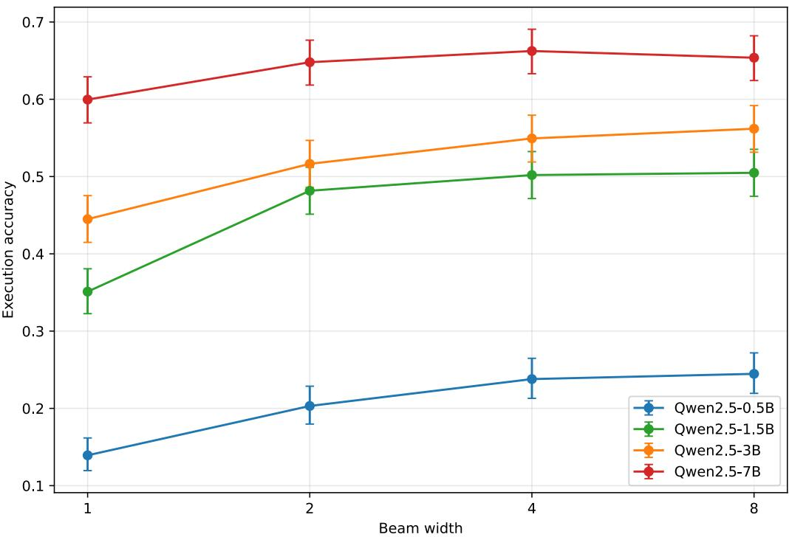
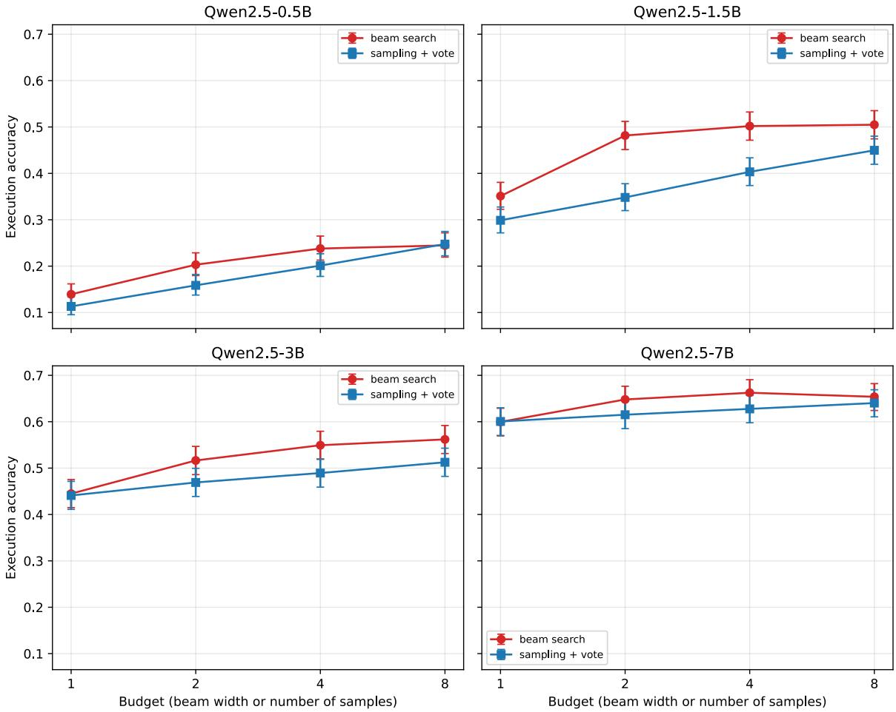

# BEAM SEARCH, SELF-CONSISTENCY, AND THE LIMITS OF INFERENCE-TIME SCALING FOR GRAMMAR-CONSTRAINED TEXT-TO-SQL IN SMALL LANGUAGE MODELS

Ty Chermsirivatana and John MacCormick

Deep Network Understanding Lab Dickinson College chermsit@dickinson.edu

August 27, 2026

## ABSTRACT

One common trade-off in the use of large language models involves reducing the size of the model while increasing the amount of computation at inference time, for example by using a wider beam search. In this paper, we examine the constrained case of this “model size vs. inference compute” trade-off, in which the model outputs are constrained by a strict grammar at inference time. Our results demonstrate that the constrained trade-off behaves differently from the unconstrained trade-off. We investigate the task of converting a prose query into an equivalent SQL query (text-to-SQL). Performance is evaluated on the Spider text-to-SQL benchmark, using the Qwen2.5-Instruct model family ranging in size from 0.5B to 7B parameters, all at 4-bit precision. We experiment with two approaches to varying inference compute: (i) beam search with a variable number of beams; and (ii) sample+vote, i.e., sampling several constrained outputs and then voting on their execution results, where the number of samples is varied. On the 1034-example development set, we find that: (a) both beam search and sample+vote improve accuracy, especially on smaller model sizes; (b) the “model size vs. inference compute” trade-off is not advantageous in this experiment, because moving to a larger model size typically results in higher accuracy than increasing inference compute on the same model size; (c) beam search outperforms sample+vote at a matched inference budget. This latter result is of particular interest since it contrasts with the findings of the unconstrained trade-off.

## 1 Introduction

Many deployed systems require a language model to emit structured output such as SQL, schema-conformant JSON, or function-call arguments, where the output is useful only if it parses and runs. A common safeguard is grammarconstrained decoding. Each time a token is generated, any token that would make the output inconsistent with a formal grammar is masked [Geng et al., 2023, Willard and Louf, 2023]. This guarantees syntactic validity and, with a schema-aware grammar, prevents references to nonexistent tables, columns, or objects.

Separately, inference-time scaling spends more compute at generation time rather than enlarging the model, for example by widening beam search or by sampling many candidate outputs and aggregating them. The most influential aggregation method for reasoning tasks is self-consistency (or sample+vote), which samples several solutions and returns the most frequent final answer. In unconstrained settings, this approach can substantially outperform greedy decoding [Wang et al., 2023].

We investigate the cost-benefit trade-off of combining these two ideas. For example, a developer might use grammar constraints to ensure that a small model produces valid output, then employ additional inference-time computation in an attempt to approach the accuracy of a larger model. This strategy trades the higher memory and per-token computational requirements of a larger model for repeated or more extensive decoding with a smaller one. This strategy may be attractive when the larger model exceeds the memory capacity of the available hardware or requires a more expensive accelerator, particularly for local deployment.

Our experiments show that this strategy has limited utility in the grammar-constrained setting studied here. We evaluate four models from the Qwen2.5 family (0.5B, 1.5B, 3B, and 7B parameters) at fixed 4-bit precision on the full Spider development set of 1,034 examples, using execution accuracy as the evaluation metric and comparing beam width and sampling budget at matched cost. Our findings for this task and model family are as follows: (i) wider beams yield only modest improvements, and the gains shrink with model size, from approximately 0.15 in absolute execution accuracy for the 1.5B model to approximately 0.05 for the 7B model; (ii) sample+vote never outperforms beam search at a matched budget, contrary to prior results on unconstrained reasoning tasks, suggesting that the benefits of self-consistency do not transfer to grammar-constrained decoding in this setting; and (iii) additional inference-time computation does not in general substitute for parameters: at a budget of eight beams,it closes between 50% and 76% of the gap to the next larger model size, and only one of the three steps on the ladder, 1.5B to 3B, is fully bridged.

## 2 Related Work

Grammar-constrained decoding masks disallowed tokens using a context-free grammar and an incremental parser [Geng et al., 2023]. Efficient implementations are built on finite-state or stack-based machines, including regular-expression constraints [Willard and Louf, 2023] and high-throughput grammar engines [Dong et al., 2025]. For text-to-SQL, incremental parsing rejects invalid partial queries during beam search [Scholak et al., 2021]. Park et al. [2024] show that the masking distorts the next-token distribution and propose a correction. Self-consistency samples several outputs and selects the most consistent answer. This approach can substantially improve output quality in unconstrained settings [Wang et al., 2023]. In a constrained setting such as text-to-SQL, the concept of consistency can be generalized by regarding sampled queries as consistent if they produce the same output when executed, even if they are structured very differently [Borchmann and Wydmuch, 2025]. We refer to this as sampling with execution-based vote. Beam search has a known length bias addressed by length normalization and length penalties [Wu et al., 2016], tuned per-token rewards [Murray and Chiang, 2018], and bounded rewards [Yang et al., 2018]. A related line of research studies the end-of-sequence decision and termination [Newman et al., 2020, Welleck et al., 2020, Kasai et al., 2024]. In our setting, the schema-aware grammar never forces a query to end, and the termination decision is thus in the hands of the model and/or the beam search algorithm; we focus on measuring the accuracy rather than controlling the length of the response.

## 3 Problem Formulation

Consider an autoregressive language model over a vocabulary V, which generates a token sequence $y = ( y _ { 1 } , \dots , y _ { t } )$ Let G be a context-free grammar, which defines the set of valid strings $L ( { \bar { G } } )$ . Grammar-constrained decoding restricts a newly generated token $y _ { t }$ to the set $A _ { G } ( y _ { < t } ) \subseteq V$ of tokens that keep the prefix $y { \le } t$ extendable to some string in $L ( G )$ . The model thus decodes from the masked distribution that zeroes every token outside $A _ { G } ( y _ { < t } )$ and renormalizes. The end-of-sequence token is admitted only at an accepting state, that is, when $y _ { < t } \in L ( G )$ . A schema-aware grammar further restricts identifiers to the tables and columns present in the target database D

Two ways of spending a computational budget B on this grammar-constrained model are compared. Beam search maintains B partial hypotheses, expands each at every step, and retains the B highest-scoring continuations. A hypothesis that emits the end-of-sequence token leaves the beam and joins a set of finished candidates scored with a length penalty, and decoding halts once that set holds B candidates, returning the highest-scoring one. This first-come, first-served stopping rule is the one implemented by the library used here and is analyzed by Kasai et al. [2024]. The length penalty makes finished queries preferable to longer continuations [Wu et al., 2016, Murray and Chiang, 2018] This penalty is particularly desirable when $L ( G )$ always permits a query to continue, as in our experiment. Sampling with execution-based vote (abbreviated to sample+vote) draws B independent samples at temperature τ, executes each against $D _ { : }$ , discards those that fail, and returns a query that produced the modal result $\boldsymbol { \hat { r } } = \mathrm { m o d e } \{ r ^ { ( 1 ) } , \dots , r ^ { ( B ) } \}$ . The two are compared at matched budget $B \in \{ 1 , 2 , \bar { 4 } , 8 \}$ , where $B = 1$ is greedy decoding for beam search and a single draw for sampling.

A natural question is whether sample+vote is merely a noisy variant of beam search. In the limit $\tau  0$ , sample+vote collapses to greedy decoding, which is beam search with $\dot { B } = 1$ , so the two methods coincide and the comparison is uninformative. The comparison is therefore meaningful only at temperatures high enough to produce diverse samples. We use $\tau = 0 . 7$ , the standard choice in the self-consistency literature [Wang et al., 2023]. A full temperature sweep, which we expect to interpolate between the two methods, is left to future work.

Table 1: Execution accuracy on the Spider development set $( n = 1 0 3 4 )$ by model size, method, and budget. The no-grammar greedy baseline is shown for reference. Each cell is a single decoding run over the full set.
<table><tr><td>Model</td><td>No-grammar greedy</td><td>Method</td><td>Budget 1</td><td>Budget 2</td><td>Budget 4</td><td>Budget 8</td></tr><tr><td>Qwen2.5-0.5B</td><td>0.135</td><td>Beam Sample+vote</td><td>0.139 0.113</td><td>0.203 0.159</td><td>0.238 0.201</td><td>0.245 0.248</td></tr><tr><td>Qwen2.5-1.5B</td><td>0.326</td><td>Beam Sample+vote</td><td>0.351 0.299</td><td>0.482 0.348</td><td>0.502 0.403</td><td>0.505 0.450</td></tr><tr><td>Qwen2.5-3B</td><td>0.477</td><td>Beam Sample+vote</td><td>0.445 0.441</td><td>0.516 0.469</td><td>0.549 0.489</td><td>0.562 0.513</td></tr><tr><td>Qwen2.5-7B</td><td>0.643</td><td>Beam Sample+vote</td><td>0.600 0.601</td><td>0.648 0.615</td><td>0.662 0.628</td><td>0.654 0.640</td></tr></table>

A prediction $\hat { y }$ is correct when it and the gold query $y ^ { * }$ return the same result set on $D ,$ with order significant only when $y ^ { * }$ contains an ORDER BY clause. Execution accuracy is the fraction of correct predictions. Write $\operatorname { a c c } ( s , B )$ for the execution accuracy of a size-s model at budget $B .$ Then the compute-vs-parameters question asks whether acc $( s , B ) \geq \operatorname { a c c } ( s ^ { \prime } , 1 )$ for some size $s < s ^ { \prime }$ and some feasible B.

## 4 Experimental Setup

Our evaluation employs the Qwen2.5-Instruct family of models [Qwen Team, 2024], with sizes s at 0.5B, 1.5B, 3B, and 7B parameters. All experiments employ 4-bit (NF4) quantization. Every model and method is evaluated on the full development set of 1,034 examples from the Spider benchmark [Yu et al., 2018]. Hence, each execution accuracy measurement is a binomial proportion over a population of the same size (n = 1034), and the associated confidence intervals are directly comparable across configurations. Sample+vote uses temperature $\tau = 0 . 7$ with nucleus sampling at $\mathrm { t o p } { - } p = 0 . 9$ , and beam search uses a length penalty of −2.0, chosen so that finished queries are preferred over longer continuations. Generation is capped at 160 new tokens.

Each configuration is evaluated in a single decoding run over the 1,034 examples. Beam search is deterministic, and thus has no dependence on the random number seed. In contrast, outputs of the sample+vote approach do depend on the random number seed. However, our experiment comprised a single run with a single seed; an analysis of intrinsic variability in sample+vote is left to future work. We do consider another source of uncertainty, which is the selection of a particular population of test examples by the Spider benchmark. The results below show error bars representing 95% Wilson score intervals for a binomial proportion with n = 1034, quantifying the uncertainty over test examples rather than variability across repeated sampling runs.

Two kinds of uncertainty are therefore reported, and they answer different questions. The error bars just described concern how precisely each individual accuracy is estimated. They are not a test of the difference between two accuracies: two intervals can overlap while the underlying difference is significant, so comparisons in the text are not made by inspecting overlap. Because every configuration is evaluated on the same 1,034 examples, any two configurations are paired, and the appropriate test is McNemar’s exact test, which conditions on the examples where the two configurations disagree and ignores the much larger number on which they agree. All statements regarding statistical significance in this paper use that test.

## 5 Results

The grammar constraint itself can cost accuracy. Table 1 shows that at 3B and 7B the unconstrained greedy baseline beats grammar-constrained decoding at budget 1 (0.477 vs. 0.445 and 0.643 vs. 0.600). Since budget-1 beam search is greedy decoding under the mask, the gap is attributable to the constraint rather than to the search. It is not, however, attributable to distributional distortion. Masking followed by renormalization rescales all admitted tokens by a common factor and therefore cannot reorder them, so whenever the unconstrained greedy output already lies in $\bar { L ( G ) }$ , constrained greedy decoding must reproduce it exactly. The data are consistent with this. The two decoders emit identical strings on 60.4% of examples at 3B and 52.5% at 7B, and the deficit is confined entirely to the examples on which they differ: at 3B the constraint corrects 25 predictions and breaks 58, and at 7B it corrects 28 and breaks 73, both significant under an exact McNemar test on the paired predictions $( p = 3 . 8 \times 1 0 ^ { - 4 }$ and $p = 8 . 6 \times 1 0 ^ { - 6 } )$

  
Figure 1: Execution accuracy versus beam width for each model size. The benefit of wider beams decreases with size and saturates by width 4. Error bars are 95% Wilson score intervals over the n = 1034 test examples, and each point is one decoding run (beam search is deterministic).

Re-parsing each differing prediction under the grammar identifies the mechanism as incomplete coverage. At 3B every one of the 400 testable differing predictions is rejected by our grammar, and each rejected prediction that was nonetheless correct parses as valid SQLite under an independent parser. These correct-but-rejected predictions executed successfully against the gold database, so these are constructs the grammar cannot derive, rather than malformed output. In other words, the particular grammar employed for these experiments is incomplete. The recurring cases of incompleteness are: value lists in IN, for which our grammar admits only a subquery and so forces a degenerate repetition; IS NOT NULL, which it cannot express; outer joins; and free-form or abbreviated table aliases. Each rejection deflects generation mid-query, after which the forced continuation can be globally unlikely in the manner analyzed by Park et al. [2024]. This also explains the trend with model size. A stronger model writes idiomatic SQL that is already valid, so the grammar is less likely to help, but the incompleteness of the grammar still imposes a penalty. A smaller model size such as 1.5B needs more help from the grammar. In this case, the grammar produces a statistically significant net gain (0.351 vs. 0.326, p = 0.023).

Inference-time compute significantly improves accuracy, especially for smaller model sizes. The general trend in Figures 1 and 2 and Table 1 is clear: for each fixed model size examined here, increasing the inference-time compute budget B improves execution accuracy. These benefits are concentrated among the smaller model sizes. The 0.5B- and 1.5B-parameter models achieve a 1.2× to 1.4× boost in accuracy when B increases from 1 to 2, rising to a 1.5× to 2.2× boost when B = 8. In contrast, the 3B- and 7B-parameter models receive more modest accuracy boosts, ranging from 1.1× to 1.3× when B = 8. For beam search, the accuracy boost appears to saturate around B = 4 to 8. In contrast, the sample+vote method does not appear to saturate at the maximum value of B = 8 tested here, especially for the two smaller model sizes (see Figure 2).

Sampling with voting never beats beam search at a matched budget. The sixteen McNemar test results in Table 2 show that beam search is significantly more accurate than sample+vote in eleven and significantly less accurate in none. The advantage is largest at 1.5B.

Sample+vote does improve over greedy decoding at every model size here, confirming previous results in the selfconsistency literature, such as Wang et al. (2023). However, our results contrast with Wang et al. when comparing sample+vote against beam search at a matched budget. Wang et al. found that sampling beats beam search on reasoning tasks; they attributed this to the higher diversity of sampled outputs. In contrast, for the task evaluated here, beam search is superior to sample+vote. We cannot generalize confidently from the single text-to-SQL task evaluated here, but one might hypothesize that beam search has a general advantage over sample+vote in constrained settings.

  
Figure 2: Beam search compared with sample+vote at matched budget. Sample+vote is never significantly more accurate than beam search. Beam search is significantly ahead in 11 of the 16 cells by an exact McNemar test on the paired predictions (see Table 2) and significantly behind in none; the remaining five cells are statistical ties. Error bars are 95% Wilson score intervals for the individual accuracies. As discussed in Section 4, each point represents a single decoding run (employing a single random number seed for sample+vote).

In two of the three cases tested, inference compute fails to substitute for parameters. Our main research question asks whether increased inference compute can compensate for smaller model size. Figure 1 shows that the answer is negative for two of the three cases tested: an 8× increase in inference compute does not compensate for a downgrade from 7B to 3B parameters, and similarly for 1.5B to 0.5B. In one case however, we do see an acceptable trade-off: a 2× (i.e., B = 2) inference compute investment does appear to compensate for a downgrade from 3B for 1.5B.

## 6 Discussion

Why does beam search perform better than sample+vote for our text-to-SQL task at matched budgets? One natural hypothesis is the capability for over-generation: the grammar always permits a query to continue, so beam search can extend queries past a valid stopping point. The data do not support this hypothesis. With a length penalty of −2.0, the truncation ratefalls monotonically with beam width, from between 0.8% and 2.4% at width 1 to between 0.0% and 1.1% at width 8. The truncation rate reaches zero at 3B and 7B, because a wider beam has more opportunities to find a completed hypothesis and the penalty rewards finishing. Sample+vote truncates between 1.0% and 2.7% at every size, so beam search over-generates no more than sample+vote does at any width above 1. Over-generation therefore doe not explain the superior performance of beam search. This also indicates that a negative length penalty is sufficient to control non-termination in grammar-constrained beam search, a setting where the grammar itself never forces a query to end [Newman et al., 2020, Welleck et al., 2020, Kasai et al., 2024]. Two other hypotheses seem plausible. First, the grammar removes most of the surface diversity that self-consistency exploits, since every candidate is a valid query over the same schema. Second, a weak constrained model appears to produce samples that agree on a confident but wrong result, so sample+vote concentrates on that result rather than averaging out errors. Self-consistency needs diverse, approximately unbiased samples; under a hard grammar constraint, neither condition seems to hold. Verifying these mechanisms directly, for example by measuring sample diversity and per-example vote entropy, is left to future work.

Table 2: Paired comparison of beam search and sample+vote. The table shows the significance of the difference between each pair of points in Figure 2. Because beam search and sample+vote are both evaluated on the same $n = 1 0 3 4$ examples, the appropriate test is McNemar’s exact test on the discordant pairs rather than an interval for two independent proportions. “Beam only” counts examples beam answered correctly and sampling did not, and conversely for “Sampling only”; “Agree” counts examples on which the two methods gave the same verdict. Asterisks mark $p < 0 . 0 5$
<table><tr><td colspan="2"></td><td colspan="2">Accuracy</td><td colspan="2">Correct examples</td><td colspan="2"></td></tr><tr><td>Model</td><td>B</td><td>Beam</td><td>Sampling</td><td>Beam only</td><td>Sampling only</td><td>Agree</td><td>p</td></tr><tr><td rowspan="4">Qwen2.5-0.5B</td><td>1</td><td>0.139</td><td>0.113</td><td>73</td><td>46</td><td>915</td><td> $0 . 0 1 7 ^ { * }$ </td></tr><tr><td>2</td><td>0.203</td><td>0.159</td><td>103</td><td>57</td><td>874</td><td> $3 . 4 \times 1 0 ^ { - 4 * }$ </td></tr><tr><td>4</td><td>0.238</td><td>0.201</td><td>115</td><td>77</td><td>842</td><td> $0 . 0 0 7 4 ^ { \ast }$ </td></tr><tr><td>8</td><td>0.245</td><td>0.248</td><td>95</td><td>98</td><td>841</td><td>0.89</td></tr><tr><td rowspan="4">Qwen2.5-1.5B</td><td>1</td><td>0.351</td><td>0.299</td><td>116</td><td>62</td><td>856</td><td> $6 . 3 \times 1 0 ^ { - 5 * }$ </td></tr><tr><td>2</td><td>0.482</td><td>0.348</td><td>204</td><td>66</td><td>764</td><td> $1 . 4 \times 1 0 ^ { - 1 7 * }$ </td></tr><tr><td>4</td><td>0.502</td><td>0.403</td><td>183</td><td>81</td><td>770</td><td> $3 . 1 \times 1 0 ^ { - 1 0 * }$ </td></tr><tr><td>8</td><td>0.505</td><td>0.450</td><td>154</td><td>97</td><td>783</td><td> $3 . 9 \times 1 0 ^ { - 4 \ast }$ </td></tr><tr><td rowspan="4">Qwen2.5-3B</td><td>1</td><td>0.445</td><td>0.441</td><td>57</td><td>53</td><td>924</td><td>0.78</td></tr><tr><td>2</td><td>0.516</td><td>0.469</td><td>104</td><td>55</td><td>875</td><td> $1 . 3 \times 1 0 ^ { - 4 * }$ </td></tr><tr><td>4</td><td>0.549</td><td>0.489</td><td>113</td><td>51</td><td>870</td><td> $1 . 5 \times 1 0 ^ { - 6 * }$ </td></tr><tr><td>8</td><td>0.562</td><td>0.513</td><td>122</td><td>71</td><td>841</td><td> $3 . 0 \times 1 0 ^ { - 4 \ast }$ </td></tr><tr><td rowspan="4">Qwen2.5-7B</td><td>1</td><td>0.600</td><td>0.601</td><td>32</td><td>33</td><td>969</td><td>1.00</td></tr><tr><td>2</td><td>0.648</td><td>0.615</td><td>67</td><td>33</td><td>934</td><td> $8 . 7 \times 1 0 ^ { - 4 * }$ </td></tr><tr><td>4</td><td>0.662</td><td>0.628</td><td>73</td><td>37</td><td>924</td><td> $7 . 7 \times 1 0 ^ { - 4 * }$ </td></tr><tr><td>8</td><td>0.654</td><td>0.640</td><td>65</td><td>51</td><td>918</td><td>0.23</td></tr></table>

Future work should also examine the impact of size of the dataset. Our exploratory experiments, not reported here, found that evaluations on subsets of the development set generally favored sample+vote over beam search. This effect vanished only at the full $n = 1 0 3 4$ . Hence, it seems text-to-SQL evaluations on small datasets could produce misleading results.

## 7 Limitations

Our experiments were limited in scope to one model family (Qwen2.5-Instruct), one benchmark (Spider), and a single decoding run per configuration. Therefore, the above results suggest plausible conjectures about more general properties of constrained LLMs, but we cannot form general conclusions without a much more diverse set of experiments.

## 8 Conclusion

We compared beam search to sample+vote in a grammar-constrained text-to-SQL task, in which the LLM was permitted to output only valid SQL. Experiments were conducted using the Qwen2.5-Instruct family of LLMs, from 0.5B to 7B parameters, applied to the Spider development set. Our most striking result was that, in our grammar-constrained setting, beam search was superior to sample+vote. This contrasted with previous work showing that in an unconstrained setting, sample+vote performs better than beam search. We also found that, in the grammar-constrained setting, inference-time compute (whether via beam search or sample+vote) significantly improved accuracy, especially for the smaller model sizes. A third important result was that inference-time compute typically did not compensate for reduced model size. The most direct avenue for future work is to test whether these three results persist across other model families, other constraint types such as JSON schemas and tool-call grammars, other benchmarks, and repeated sampling runs.

## Author Contributions

Chermsirivatana conceived the idea, designed and ran the experiments, and wrote the first draft of the paper. MacCormick advised on interpretation of the results and edited the draft. AI assistants were used for grammar and style checking, and for some content generation at the sentence level.

## References

Łukasz Borchmann and Marek Wydmuch. Query and conquer: Execution-guided SQL generation. arXiv preprint arXiv:2503.24364, 2025.

Yixin Dong, Charlie F. Ruan, Yaxing Cai, Ruihang Lai, Ziyi Xu, Yilong Zhao, and Tianqi Chen. XGrammar: Flexible and efficient structured generation engine for large language models. In Proceedings ofthe 7th Annual Conference on Machine Learning and Systems (MLSys), 2025. Also available as arXiv:2411.15100.

Saibo Geng, Martin Josifoski, Maxime Peyrard, and Robert West. Grammar-constrained decoding for structured NLP tasks without finetuning. In Proceedings of the 2023 Conference on Empirical Methods in Natural Language Processing (EMNLP), pages 674–686, 2023. Also available as arXiv:2305.13971.

Jungo Kasai, Keisuke Sakaguchi, Ronan Le Bras, Dragomir Radev, Yejin Choi, and Noah A. Smith. A call for clarity in beam search: How it works and when it stops. In Proceedings ofthe 2024 Joint International Conference on Computational Linguistics, Language Resources and Evaluation (LREC-COLING), pages 77–90, 2024. Also available as arXiv:2204.05424.

Kenton Murray and David Chiang. Correcting length bias in neural machine translation. In Proceedings of the Third Conference on Machine Translation (WMT), pages 212–223, 2018. Also available as arXiv:1808.10006.

Benjamin Newman, John Hewitt, Percy Liang, and Christopher D. Manning. The EOS decision and length extrapolation. In Proceedings of the Third BlackboxNLP Workshop on Analyzing and Interpreting Neural Networks for NLP (EMNLP), 2020. Also available as arXiv:2010.07174.

Kanghee Park, Jiayu Wang, Taylor Berg-Kirkpatrick, Nadia Polikarpova, and Loris D’Antoni. Grammar-aligned decod ing. In Advances in Neural Information Processing Systems (NeurIPS), 2024. Also available as arXiv:2405.21047.

Qwen Team. Qwen2.5 technical report. arXiv preprint arXiv:2412.15115, 2024.

Torsten Scholak, Nathan Schucher, and Dzmitry Bahdanau. PICARD: Parsing incrementally for constrained autoregressive decoding from language models. In Proceedings of the 2021 Conference on Empirical Methods in Natural Language Processing (EMNLP), pages 9895–9901, 2021. Also available as arXiv:2109.05093.

Xuezhi Wang, Jason Wei, Dale Schuurmans, Quoc V. Le, Ed H. Chi, Sharan Narang, Aakanksha Chowdhery, and Denny Zhou. Self-consistency improves chain of thought reasoning in language models. In Proceedings of the Eleventh International Conference on Learning Representations (ICLR), 2023. Also available as arXiv:2203.11171.

Sean Welleck, Ilia Kulikov, Jaedeok Kim, Richard Yuanzhe Pang, and Kyunghyun Cho. Consistency of a recurrent language model with respect to incomplete decoding. In Proceedings ofthe 2020 Conference on Empirical Methods in Natural Language Processing (EMNLP), pages 1819–1827, 2020. Also available as arXiv:2002.02492.

Brandon T. Willard and Rémi Louf. Efficient guided generation for large language models. arXiv preprint arXiv:2307.09702, 2023.

Yonghui Wu et al. Google’s neural machine translation system: Bridging the gap between human and machine translation. arXiv preprint arXiv:1609.08144, 2016.

Yilin Yang, Liang Huang, and Mingbo Ma. Breaking the beam search curse: A study of (re-)scoring methods and stopping criteria for neural machine translation. In Proceedings ofthe 2018 Conference on Empirical Methods in Natural Language Processing (EMNLP), pages 1832–1843, 2018. Also available as arXiv:1808.09582.

Tao Yu, Rui Zhang, Kai Yang, Michihiro Yasunaga, Dongxu Wang, Zifan Li, James Ma, Irene Li, Qingning Yao, Shanelle Roman, Zilin Zhang, and Dragomir Radev. Spider: A large-scale human-labeled dataset for complex and cross-domain semantic parsing and text-to-SQL task. In Proceedings ofthe 2018 Conference on Empirical Methods in Natural Language Processing (EMNLP), pages 3911–3921, 2018. Also available as arXiv:1809.08887.