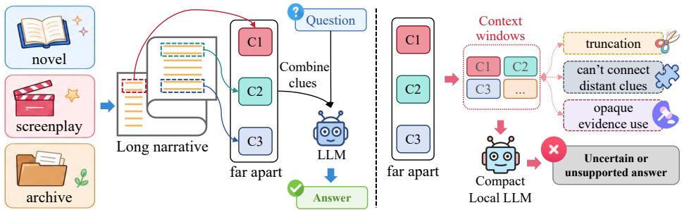
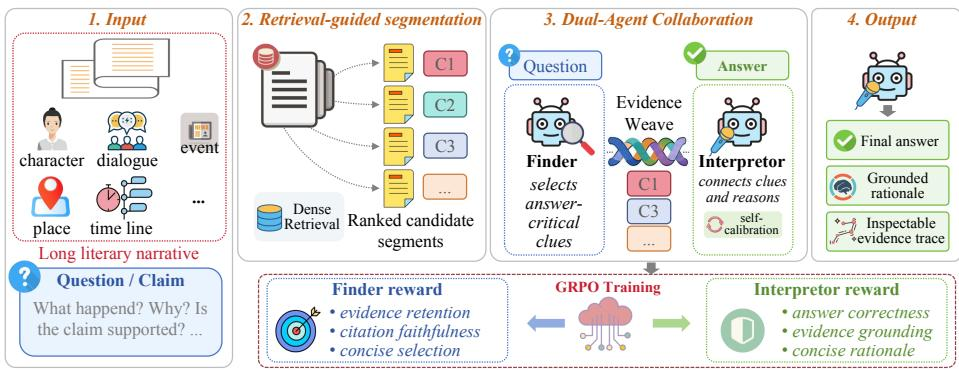
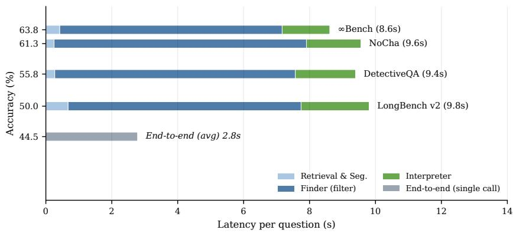
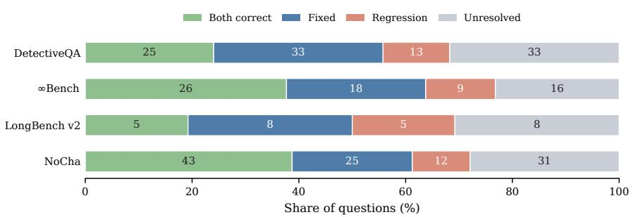
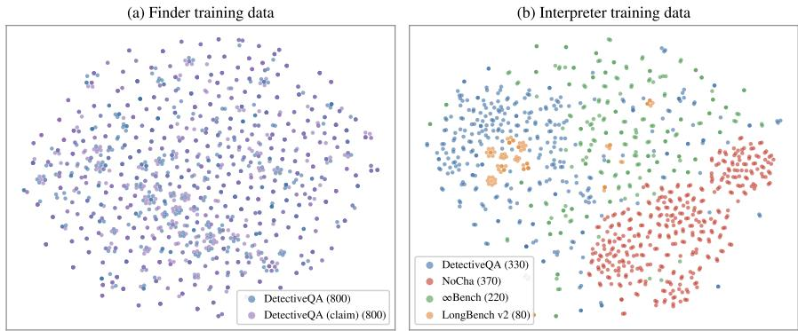

# ClueWeaver: Reward-Guided Dual-Agent Evidence Reasoning for Compact LLMs on Literary Long Narratives

Jihao Zhu2⋆, Zhiwei Yang1\*, Wenxiao Zhang3\*, Junqian Zhao1, Qi You1, Fangqi Wang1, Zheyuan Deng4, Hanzhe Yang3, Yu Liu1(B), Jin B. Hong3(B)

1 Institute of Information Engineering, CAS, Beijing, China liuyu@iie.ac.cn

2 University of Aberdeen, Aberdeen, United Kingdom

3 The University of Western Australia, Perth, Australia

jin.hong@uwa.edu.au

4 Brown University, Providence, Rhode Island, United States

Abstract. Humanities and social science research requires close reading of long narrative materials such as novels, scripts, archives, and case reports, yet many users have limited access to costly proprietary long-context models. Compact, locally deployable language models are a practical alternative, but directly feeding them an entire long context remains costly, hard to inspect, and prone to missing sparse evidence. We present ClueWeaver, an evidence-aware dual-agent framework for longnarrative question answering with compact local models. A Finder identifies passages containing answer-critical clues through retrieval-guided segmentation, while an Interpreter derives the answer from the selected evidence, produces rationales with paragraph-ID citations, and applies an internal self-calibration pass for high-risk questions. Both agents are optimized with reward-guided reinforcement learning: Finder rewards emphasize evidence retention and faithful paragraph-ID references, and Interpreter rewards emphasize correctness, grounding, and concise explanations. This decomposition makes evidence selection and reasoning more inspectable than end-to-end prompting. Experiments across multiple long-context narrative question answering and claim verification settings show that ClueWeaver substantially improves local end-toend language models while providing evidence coverage and paragraphreferenced reasoning traces.

Keywords: Long-context question answering · Long-narrative reasoning · Evidence selection · Multi-agent reasoning

## 1 Introduction

Novels, screenplays, investigation records, and long case reports require coherent reading over extended narratives [10, 23, 27, 9]. Rather than collections of independent facts, their meaning emerges from characters, events, motives, temporal order, and causal links distributed over hundreds of paragraphs. This setting is especially important for resource-constrained literary and humanities research, where scholars may need to analyze novels, scripts, archives, or case materials without costly proprietary long-context models or remote services [1, 26]. Longnarrative question answering therefore ofers a practical testbed for strengthening compact, locally deployable models for long-context reading [?,?,28]. Recent large language models, unlike earlier pretrained models with short context windows, can now accept much longer inputs in a single prompt [4, 30, 5]. Yet window size alone does not ensure reliable narrative understanding [13, ?]: narrative questions often require sparse, indirect clues spread across distant text spans [17, 27]. Models must therefore identify salient story evidence.

  
Fig. 1. Answer-critical clues in long narratives are often sparse and distant. While long-context models may connect them directly, compact local models operating over limited context windows can truncate evidence, separate related clues, and obscure evidence use.

Figure 1 illustrates this dificulty. In long narratives, answer-critical clues are often sparse and far apart, requiring models to connect them in narrative order. Compact local models may instead rely on limited context windows, which can truncate evidence, separate related clues, and obscure evidence use. As a result, failures may arise from missing or misusing key clues, not merely from generation errors.

This setting difers from standard retrieval-augmented generation (RAG) [11]. While typical RAG retrieves external documents from a large corpus, longnarrative question answering assumes that the source text is already given and requires the model to find, preserve, and use sparse evidence within it. Direct full-context prompting is a natural baseline, but it keeps evidence selection implicit [13, 5]: failures may result from missing relevant clues, discarding them among irrelevant details, or failing to reason over available evidence. This raises a central question: how can a compact local model answer long-narrative questions while making its supporting clues explicit?

Existing work has made this challenge visible, but does not fully answer the question above. Long-narrative and long-document benchmarks show that questions over books, scripts, and passages require more than local phrase matching or shallow salience [10, 17]. Broader long-context evaluations further show that simply increasing input length does not ensure robust use of relevant information, especially when evidence is buried inside the context [4, 13]. RAG improves knowledge-intensive generation by retrieving external passages [11]. IRCoT interleaves retrieval with chain-of-thought reasoning [22], Self-Ask decomposes questions into follow-up queries [18], Chain-of-Agents distributes long-context reading across collaborating agents [31], and RAG-DDR optimizes RAG modules with data-driven rewards [12]. However, these methods mainly target opendomain retrieval, general multi-hop question answering, or broad long-context aggregation. They do not directly address the setting where the source narrative is already given, answer-critical clues are sparse and distributed, and evidence selection itself should be explicit and inspectable. Full-context prompting and single-stage readers, meanwhile, leave evidence selection implicit and couple evidence locating with answer generation. As a result, they provide limited control over whether the model is reasoning from the right evidence. A more suitable framework should expose evidence selection and evidence-grounded reasoning as separate, inspectable, and trainable steps.

To this end, we propose ClueWeaver, a dual-agent pipeline for compact local models in literary and humanities-oriented long-narrative reading. Rather than compressing a long document into a single latent state, ClueWeaver builds retrieval-aware narrative segments and uses a Finder to select passages with answer-critical clues. These passages are packed with paragraph IDs and narrative order preserved, giving the Interpreter readable evidence for connecting clues, answering the question, and, when needed, applying Interpreterself-cal as a final consistency check. This separation makes failures easier to localize across candidate construction, clue selection, evidence packing, and final reasoning. We further optimize both agents with reward-guided training: the Finder is rewarded for retaining supporting clues and faithful paragraph references, while the Interpreter is rewarded for correct, grounded, and compact rationales. In this setting, reward-guided reinforcement learning provides a practical way to align intermediate evidence decisions with task-level outcomes, consistent with recent progress in feedback- and reward-based post-training for instruction following and reasoning [21]. Our contributions are three-fold:

1. We propose ClueWeaver, an evidence-aware agentic pipeline that decomposes long-narrative question answering into explicit evidence selection, selfcalibrated interpretation, and evidence-grounded explanation for compact local models.

2. We optimize both the Finder and the Interpreter with reward-guided reinforcement learning, encouraging high-recall evidence retention, faithful paragraph referencing, and reliable answer generation.

3. Experiments across multiple long-context narrative understanding settings show that ClueWeaver substantially improves compact locally deployable language models while providing inspectable evidence traces.

## 2 Related Work

## 2.1 Agentic-Assisted Literary and Long-Context Reading

AI-assisted literary reading targets long narratives whose interpretation depends on plot, characters, temporal order, and implicit causality. NarrativeQA [10] and QuALITY [17] introduced QA over books, scripts, and long contexts; NovelQA [23], DetectiveQA [27], and NoCha [9] move further toward novel-scale QA and claim verification. Broader long-context benchmarks, including Long-Bench [4], ∞Bench [30], LooGLE [?], and LongBench v2 [5], show that larger context windows do not ensure robust long-range understanding, especially when relevant information is buried in the context [13]. However, these studies evaluate final answers and give less attention to clue discovery and evidence preservation.

## 2.2 Agentic RAG and LLM Reasoning Pipelines

Retrieval-Augmented Generation (RAG) [11] grounds generation in retrieved external passages. Agentic variants add adaptive control: ReAct [29] combines reasoning and actions, FLARE [8] retrieves during generation, and Self-RAG [3] adds retrieval and self-critique. Multi-step pipelines such as IRCoT [22], Self-Ask [18], Chain-of-Agents [31], and RAG-DDR [12] further organize retrieval and reasoning into staged procedures. These methods mainly target open-domain retrieval, multi-hop QA, or general long-context aggregation: IRCoT and Self-Ask build query or sub-question chains, Chain-of-Agents compresses chunks through a running communication summary, and Self-RAG/RAG-DDR regulate general RAG behavior. ClueWeaver instead targets closed-document long narratives, where the source text is already given and the central issue is preserving sparse story clues. It trains a Finder for paragraph-level evidence decisions, keeps selected clues in narrative order with citations, and optimizes clue retention, citation fidelity, and grounded final answers rather than introducing a new retrieval primitive.

## 2.3 Reward-Guided Reinforcement Learning for Reasoning

Post-training methods can improve model behavior. SFT [25] adapts models to instruction formats, PPO-based RLHF [20] optimizes preference rewards, and DPO [19] ofers a simpler preference-optimization path. DeepSeekMath [21] shows that GRPO-based RL can strengthen reasoning. Meanwhile, answer attribution analysis [24] suggests that final answers may mix explicit reasoning with retrieval-like memorized knowledge. However, reward-guided training remains less focused on evidence selection, paragraph-level attribution, and grounded explanation in long-narrative reading.

  
Fig. 2. Overview of ClueWeaver: Finder selects evidence-bearing narrative segments, and Interpreter produces a grounded answer with self-calibration.

## 3 Methodology

## 3.1 Problem Definition

We formulate agentic support for long-narrative reading as question answering with compact language models for resource-constrained humanities settings. Let $X = \{ p _ { 1 } , p _ { 2 } , . . . , p _ { m } \}$ be a narrative, where each $p _ { i }$ is an indexed paragraph and m is the number of paragraphs. Given a question or claim $q ,$ the model predicts answer y using only $X ;$ y may be a multiple-choice option or a binary verification label. Since only a small part of X supports $y ,$ the task is to select a compact evidence set $E \subset X$ , preserve its narrative order, and generate both y and an explanation whose claims can be traced to paragraph-referenced evidence in E.

## 3.2 Overview

Figure 2 illustrates the pipeline, and Algorithm 1 gives the inference procedure. ClueWeaver does not ask a compact model to read the whole narrative in one pass. It first builds retrieval-aware segments, uses the Finder to keep cluebearing passages with paragraph IDs, packs the retained evidence in narrative order, and lets the Interpreter produce a paragraph-grounded answer. For binary claims and high-risk question forms, the same Interpreter optionally runs $I _ { \theta _ { i } , \mathrm { s e l f - c a l } ; }$ , a self-calibration mode that re-checks the provisional answer against the identical evidence packet. In Algorithm 1, Y is the answer space, B is the evidence budget, $\theta _ { f }$ and $\theta _ { i }$ are the parameters of the two agents, S is the segment set, E is the final evidence packet, and $\tau ( q )$ triggers self-calibration. In the implementation, both agents use a compact XML interface: <reason> contains the paragraph-referenced explanation and <answer> contains either a YES/NO decision or the final answer. Complete prompts are in Appendix E.

Algorithm 1 ClueWeaver Inference   
Require: Narrative $\overline { { X = \{ p _ { i } \} _ { i = 1 } ^ { m } } }$ , question or claim $q ,$ answer space ${ \mathcal { V } } ,$ evidence budget   
B   
Ensure: XML-style output $\boldsymbol { z } ^ { I } = ( r , y , \mathcal { C } )$ , with paragraph references extracted from r   
1: ${ \cal S } = \{ s _ { j } \} _ { j = 1 } ^ { n } $ Segmen $( X , q )$ ▷ n is the number of retrieval-aware segments   
2: Initialize candidate evidence pool $C \gets \emptyset$   
3: for $j = 1$ to n do   
4: Finder: $z _ { j } ^ { F } \gets F _ { \theta _ { f } } ( s _ { j } , q )$   
$z _ { j } ^ { F } = \langle \mathbf { r }$ eason⟩uj⟨/reason⟩   
⟨answer $\rangle d _ { j }$ ⟨/answer⟩   
5: Parse $z _ { j } ^ { F }$ into $( u _ { j } , d _ { j } )$ and extract referenced paragraph IDs $e _ { j }$   
6: if $d _ { j } = \mathrm { Y E S }$ then   
7: $C \gets C \cup \{ ( s _ { j } , e _ { j } , u _ { j } ) \}$   
8: end if   
9: end for   
10: Order C by the paragraph indices inherited from $X$   
11: Build $E = { \mathrm { P a c k } } ( C , B )$ by keeping ordered clues within budget B   
12: Interpreter: $\hat { z } ^ { I } \gets I _ { \theta _ { i } , \mathrm { a n s } } ( E , q , \mathcal { V } )$   
$\hat { z } ^ { \hat { I } } =$ ⟨reason $r \langle \mu _ { 1 }$ reason⟩   
⟨answer⟩y⟨/answer⟩   
13: if $\tau ( q ) = 1$ then   
14: $\boldsymbol { z } ^ { I }  I _ { \theta _ { i } , \mathrm { s e l f - c a l } } ( E , q , \mathcal { V } , \hat { z } ^ { I } )$   
15: else   
16: $z ^ { I } \gets \hat { z } ^ { I }$   
17: end if   
18: Parse $z ^ { I }$ into $( r , y )$ and extract paragraph references C from r   
19: return $\boldsymbol { z } ^ { I } = ( r , y , \mathcal { C } )$

## 3.3 Training Principle

We train the two agents with Group Relative Policy Optimization (GRPO) [21]. Let $a \in \{ F , I \}$ denote the agent, where F is the Finder and I is the Interpreter. The Finder input is $x ^ { F } = ( s _ { j } , q ) $ with output $o ^ { F } = z _ { j } ^ { F }$ , while the Interpreter input is $\boldsymbol { x } ^ { I } = ( E , q , \mathcal { V } )$ with output $o ^ { I } = z ^ { I }$ . For each input $x ^ { a }$ , the old policy $\pi _ { \mathrm { o l d } } ^ { a }$ samples $K$ candidate outputs $\{ o _ { k } ^ { a } \} _ { k = 1 } ^ { K }$ . Each output is scored by the agentspecific reward $R _ { a } ( o _ { k } ^ { a } ; x ^ { a } )$ , and its group-normalized advantage is

$$
A _ { k } ^ { a } = \frac { R _ { a } ( o _ { k } ^ { a } ; x ^ { a } ) - \mathrm { m e a n } _ { l } R _ { a } ( o _ { l } ^ { a } ; x ^ { a } ) } { \mathrm { s t d } _ { l } R _ { a } ( o _ { l } ^ { a } ; x ^ { a } ) + \epsilon } ,\tag{1}
$$

where ϵ is a small numerical constant. Let $\rho _ { k } ^ { a } = \pi _ { \theta _ { a } } ^ { a } ( o _ { k } ^ { a } | x ^ { a } ) / \pi _ { \mathrm { o l d } } ^ { a } ( o _ { k } ^ { a } | x ^ { a } )$ and $\bar { \rho } _ { k } ^ { a } = \mathrm { c l i p } ( \rho _ { k } ^ { a } , 1 - \delta , 1 + \delta )$ . The clipped objective for agent a is

$$
\mathcal { I } _ { a } ( \theta _ { a } ) = \mathbb { E } _ { x ^ { a } , \mathbf { o } ^ { a } \sim \pi _ { \mathrm { o l d } } ^ { a } } \Bigg [ \frac { 1 } { K } \sum _ { k = 1 } ^ { K } \Big ( \operatorname* { m i n } ( \rho _ { k } ^ { a } A _ { k } ^ { a } , \bar { \rho } _ { k } ^ { a } A _ { k } ^ { a } ) - \beta D _ { k } ^ { a } \Big ) \Bigg ] ,\tag{2}
$$

where $\theta _ { a }$ is the trainable policy parameter, $\delta$ is the clipping range, $\beta$ controls KL regularization, and the sample-level KL estimator is

$$
D _ { k } ^ { a } = \frac { \pi _ { \mathrm { r e f } } ^ { a } \big ( o _ { k } ^ { a } | x ^ { a } \big ) } { \pi _ { \theta _ { a } } ^ { a } \big ( o _ { k } ^ { a } | x ^ { a } \big ) } - \log \frac { \pi _ { \mathrm { r e f } } ^ { a } \big ( o _ { k } ^ { a } | x ^ { a } \big ) } { \pi _ { \theta _ { a } } ^ { a } \big ( o _ { k } ^ { a } | x ^ { a } \big ) } - 1 .\tag{3}
$$

This relative objective is useful for ClueWeaver because many valid rationales can exist for the same narrative question, while their usefulness can still be judged by task-level signals. We therefore use the same optimization form for both agents but instantiate agent-specific rewards. $R _ { F }$ favors high-recall clue retention, faithful paragraph-ID references, and calibrated YES/NO decisions, giving much higher reward to retaining answer-bearing evidence than to rejecting extra candidates. $R _ { I }$ favors answer correctness, paragraph-grounded support, concise explanation, and resistance to unsupported inference. Thus, training directly aligns the pipeline stages: preserving answer-critical evidence before reasoning and converting the retained evidence into a grounded final answer.

## 3.4 Finder: Evidence Selection and Rationale Generation

The Finder is responsible for converting a long narrative into a small set of answer-relevant evidence with short rationales. Given the paragraph sequence X and the question $q ,$ we first build retrieval-aware segments $\pmb { S } = \{ s _ { j } \} _ { j = 1 } ^ { n }$ . Each segment $s _ { j }$ contains a contiguous paragraph span $I _ { j } \subseteq \{ 1 , \dots , m \}$ . The segmentation uses lexical and dense retrieval scores to place short anchor segments around paragraphs that are likely to be relevant to $q ,$ while the remaining text is covered by local windows. Retrieval is therefore used to guide segmentation boundaries, not to replace reading of the given narrative. This keeps the input to the Finder short enough for a compact model, while retaining paragraph indices needed for later evidence tracing. For each segment $s _ { j }$ , the Finder predicts

$$
( d _ { j } , e _ { j } , u _ { j } ) = F _ { \theta _ { f } } ( s _ { j } , q ) ,\tag{4}
$$

where $d _ { j } \in \{ \mathrm { Y E S } , \mathrm { N O } \}$ is the clue decision, $e _ { j } \subseteq I _ { j }$ lists referenced paragraph IDs, and $u _ { j }$ is the rationale. In the XML output, uj is written in <reason>, $d _ { j }$ in <answer>, and $e _ { j }$ is extracted from the paragraph-ID references inside $u _ { j }$ Segments with $d _ { j } = \mathrm { Y E S }$ are added to the candidate clue pool C. Since longnarrative questions often depend on indirect or distributed clues, the Finder is designed as a high-recall selector: it should avoid discarding answer-supporting evidence even when the segment does not directly state the final answer.

RL Training for Finder. We train the Finder with reward-guided reinforcement learning over structured outputs. For a training segment, let $z _ { j } \in \{ 0 , 1 \}$ be the gold evidence label and let $G _ { j } \subseteq I _ { j }$ be the annotated supporting paragraphs within the segment. The Finder reward combines decision and evidence behavior:

$$
R _ { F } = \lambda _ { \mathrm { f m t } } R _ { \mathrm { f m t } } + \lambda _ { \mathrm { d e c } } R _ { \mathrm { d e c } } + \lambda _ { \mathrm { c i t e } } R _ { \mathrm { c i t e } } + \lambda _ { \mathrm { c o m p } } R _ { \mathrm { c o m p } } + \lambda _ { \mathrm { n e g } } R _ { \mathrm { n e g } } .\tag{5}
$$

Here each λ is a non-negative weight controlling the importance of its corresponding reward term. $R _ { \mathrm { f m t } }$ rewards valid structured output, $R _ { \mathrm { d e c } }$ rewards the correct YES/NO decision, and $R _ { \mathrm { c i t e } }$ measures overlap between predicted paragraph IDs $e _ { j }$ and gold paragraphs $G _ { j } . \ R _ { \mathrm { c o m p } }$ rewards compact gold references, and $R _ { \mathrm { n e g } }$ rewards concise NO rationales without unsupported IDs. A missed positive segment receives only the format reward. This weighted reward design reflects the role of the Finder in the pipeline: preserving answer-critical clues is more important than aggressively filtering the narrative, because the Interpreter can only reason from surviving evidence. See Appendix A for reward details.

## 3.5 Interpreter: Evidence-Grounded Interpretation

Evidence-Grounded Interpretation. The Interpreter turns the selected evidence packet into the final answer. Let $E = \{ ( \ell _ { t } , \tilde { p } _ { t } , \tilde { u } _ { t } ) \} _ { t = 1 } ^ { T }$ denote the ordered packet after packing, where $\ell _ { t }$ is the original paragraph index, $\tilde { p } _ { t }$ is the retained evidence text, $\tilde { u } _ { t }$ is the Finder rationale, and T is the number of packed evidence units. The Interpreter first predicts a provisional answer and then, when triggered, self-calibrates it using the same evidence:

$$
\begin{array} { r l } & { \hat { z } ^ { I } = I _ { \theta _ { i } , \mathrm { a n s } } ( E , q , \mathcal { Y } ) , } \\ & { z ^ { I } = \left\{ \begin{array} { l l } { I _ { \theta _ { i } , \mathrm { s e l f - c a l } } ( E , q , \hat { z } ^ { I } ) , } & { \tau ( q ) = 1 , } \\ { \hat { z } ^ { I } , } & { \tau ( q ) = 0 , } \end{array} \right. } \end{array}\tag{6}
$$

where $z ^ { I }$ is parsed into $( r , y )$ and referenced paragraphs C. Here r is a concise evidence-grounded rationale written in <reason>, $y \in \mathcal { V }$ is the final answer written in <answer>, and $\mathcal { C } \subseteq \{ \ell _ { t } \} _ { t = 1 } ^ { T }$ is extracted from paragraph-ID references inside r. The trigger $\tau ( q )$ is active for binary claim verification and for multiplechoice questions whose wording suggests higher risk of polarity or reasoning errors, such as negation, exception, causal, or inferential forms. The self-verifier is internal to the Interpreter; it re-checks the provisional answer against the same evidence packet, uses the same compact model, and does not introduce a third agent. The model is therefore not asked to freely summarize the whole narrative. It must connect the selected clues, choose an answer from the allowed answer space, and make the rationale traceable to paragraph IDs.

RL Training for Interpreter. We train the Interpreter with the same GRPO principle but a diferent target. Given gold answer $y ^ { \star }$ and, when available, the supplied evidence paragraph set H, the Interpreter uses

$$
R _ { I } = \lambda _ { \mathrm { f m t } } R _ { \mathrm { f m t } } + \lambda _ { \mathrm { a n s } } R _ { \mathrm { a n s } } + \lambda _ { \mathrm { c i t e } } R _ { \mathrm { c i t e } } + \lambda _ { \mathrm { g r o u n d } } R _ { \mathrm { g r o u n d } } - \lambda _ { \mathrm { h a l l } } R _ { \mathrm { h a l l } } .\tag{7}
$$

Here $R _ { \mathrm { f m t } }$ rewards valid structured output, $R _ { \mathrm { a n s } }$ rewards matching the gold answer $y ^ { \star } , R _ { \mathrm { c i t e } }$ rewards paragraph IDs that point to H and penalizes invalid IDs, and $R _ { \mathrm { g r o u n d } }$ rewards concise rationales with concrete grounding signals. The hallucination penalty $R _ { \mathrm { h a l l } }$ discourages unsupported uncertainty or invalid paragraph references. This makes the Interpreter conservative with evidence: it is rewarded for correctness and traceability.

## 4 Experiments

## 4.1 Experimental Setup

Datasets. We evaluate on four long-context narrative settings using the same test instances for all methods: DetectiveQA [27] for sparse detective-plot clues, ∞Bench [30] and LongBench v2 [5] for broader long-context reasoning, and NoCha [9] for novel-length claim verification.

Baselines. We compare with two groups. End-to-end readers use the available context directly with naive head truncation, including the 4B backbone and larger local models: Qwen3-8B [28], Ministral-3-14B [14], GPT-OSS-20B [15], Qwen3-30B-A3B [28], and Gemma-4-31B-it [7]. We also report higher-cost API readers, Claude Haiku 4.5 [2] and GPT-5 nano [16], as large-context references. Agentic baselines include ReAct [29], IRCoT [22], Self-Ask [18], Chain-of-Agents [31], and RAG-DDR [12], all using BGE-M3 [6].

Metrics. We report final answer accuracy, normalizing multiple-choice outputs to option labels and verification outputs to binary labels.

Implementation Details. To control local-model comparisons, all local end-toend readers use the same 32K setting: maximum context length 32,768, tokenizerexact input budget 30,592, and 128 output tokens. For higher-cost API LLMs, we report a separate large-context setting with a 128K budget, using 126,976 input tokens and the same 128-token output cap. ClueWeaver, the agentic baselines, and the 4B end-to-end reader use Qwen3-4B-Instruct [28]; larger local end-toend readers use their own weights. Retrieval-based methods share BGE-M3 [6] and the same answer parser; baseline, training, and implementation details are deferred to Appendix C.

## 4.2 Main Results

Table 1 reports final answer accuracy on the four benchmarks. ClueWeaver achieves the best local overall accuracy (59.0%), leads all local methods on every dataset, and improves over the strongest local baseline (IRCoT, 52.6%) by +6.4 points overall. With the same Qwen3-4B backbone, the direct end-toend reader reaches only 44.5% because many narratives still require truncation; ClueWeaver improves it by +14.5 points. The gain is not a scale efect: the best end-to-end reader up to 31B (Qwen3-30B-A3B, 50.3%) remains 8.7 points behind ClueWeaver’s 4B backbone. These results show that retrieval-aware evidence selection, rather than context length or model size alone, is central to compact local long-narrative QA. Higher-cost API LLMs are reported as largecontext references; ClueWeaver trails the best API overall result by 4.9 points and surpasses it on LongBench v2 by 11.5 points.

## 4.3 Ablation Study

We ablate ClueWeaver on DetectiveQA, whose sparse, distributed clues make the contribution of each part most visible.

Table 1. Main results on four long-context narrative benchmarks (final answer accuracy, %). Among local methods, best per column is in bold and second best is underlined; best API result per column is marked with wavy underlines.
<table><tr><td>Method</td><td></td><td></td><td>DetectiveQA ∞Bench LongBench v2</td><td></td><td>NoCha Overall</td></tr><tr><td colspan="6">End-to-end reader (Local)</td></tr><tr><td>Qwen3-4B-Instruct [28]</td><td>36.5</td><td>50.7</td><td>38.5</td><td>49.5</td><td>44.5</td></tr><tr><td>Qwen3-8B [28]</td><td>45.2</td><td>56.5</td><td>26.9</td><td>55.0</td><td>49.7</td></tr><tr><td>Ministral-3-14B [14]</td><td>45.2</td><td>60.9</td><td>26.9</td><td>51.4</td><td>49.4</td></tr><tr><td>GPT-OSS-20B [15]</td><td>30.8</td><td>33.3</td><td>34.6</td><td>50.5</td><td>38.7</td></tr><tr><td>Qwen3-30B-A3B [28]</td><td>44.2</td><td>58.0</td><td>38.5</td><td>54.1</td><td>50.3</td></tr><tr><td>Gemma-4-31B-it [7]</td><td>35.6</td><td>58.0</td><td>46.2</td><td>59.5</td><td>50.0</td></tr><tr><td colspan="6">End-to-end reader (API)</td></tr><tr><td>Claude Haiku 4.5 [2]</td><td>62.5</td><td>73.9</td><td>38.5</td><td>64.9</td><td>63.9</td></tr><tr><td>GPT-5 nano [16]</td><td>62.5</td><td>76.8</td><td>26.9</td><td>60.4</td><td>61.9</td></tr><tr><td colspan="6">Agentic pipelines</td></tr><tr><td>ReAct [29]</td><td>50.0</td><td>50.7</td><td>38.5</td><td>58.6</td><td>52.3</td></tr><tr><td>IRCoT [22]</td><td>53.8</td><td>44.9</td><td>34.6</td><td>60.4</td><td>52.6</td></tr><tr><td>Self-Ask [18]</td><td>36.5</td><td>49.3</td><td>19.2</td><td>59.5</td><td>46.1</td></tr><tr><td>Chain-of-Agents [31]</td><td>27.9</td><td>46.4</td><td>38.5</td><td>55.9</td><td>42.9</td></tr><tr><td>RAG-DDR [12]</td><td>47.1</td><td>53.6</td><td>30.8</td><td>59.5</td><td>51.6</td></tr><tr><td colspan="6">Our method</td></tr><tr><td>ClueWeaver (ours)</td><td>55.8</td><td>63.8</td><td>50.0</td><td>61.3</td><td>59.0</td></tr><tr><td>∆ vs. best local</td><td>+2.0</td><td>+2.9</td><td>+3.8</td><td>+0.9</td><td>+6.4</td></tr><tr><td>∆ vs. best API</td><td>-6.7</td><td>-13.0</td><td>+11.5</td><td>-3.6</td><td>-4.9</td></tr></table>

Component ablation. Table 2(a) removes inference components from the full model. Disabling Interpreterself-cal lowers accuracy by 4.8 to 51.0%, showing that the internal second pass helps correct fragile decisions over the same evidence. Removing the Finder—dumping all retrieved passages to the Interpreter instead of selecting answer-critical evidence—drops accuracy by 5.8 points to 50.0%. Further removing both agents, leaving a bare end-to-end reader that must truncate the narrative to the backbone window, falls to 36.5%. Thus, selected evidence and self-calibration both contribute to reliable long-narrative reading.

Training ablation. Table 2(b) removes reward-guided RL from the full model with the pipeline fixed. Removing Finder RL (untrained Finder, RL Interpreter) is the most damaging, dropping accuracy by 6.8 points to 49.0%—below the 50.0% obtained with no Finder at all (Table 2a): an untrained Finder discards useful evidence, so it is RL training that turns the Finder into a net gain. Removing Interpreter RL costs 1.0, and removing both returns to the untrained pipeline at 50.0%. Finder training contributes the larger share by retaining answer-critical clues, while Interpreter training converts the selected evidence into correct answers.

Table 2. Ablation on DetectiveQA. (a) pipeline components and (b) RL training are removed from the full model (∆: accuracy change vs. the full model).  
(a) Component ablation
<table><tr><td>Configuration</td><td>Acc.</td><td> $\varDelta$ </td></tr><tr><td>ClueWeaver (full)</td><td>55.8</td><td></td></tr><tr><td> $\mathrm { w } / \mathrm { o }$  Interpreterself-cal</td><td>51.0-4.8</td><td></td></tr><tr><td> $\mathrm { w } / \mathrm { o }$  Finder</td><td>50.0-5.8</td><td></td></tr><tr><td> $\mathrm { w } / \mathrm { o }$  Finder &amp; Interpreter 36.5 -19.3</td><td></td><td></td></tr></table>

(b) Training ablation
<table><tr><td>Configuration</td><td>Acc.  $\varDelta$ </td></tr><tr><td>ClueWeaver (full)</td><td>55.8</td></tr><tr><td> $\mathrm { w } / \mathrm { o }$  Finder RL</td><td> $4 9 . 0 \ - 6 . 8 $ </td></tr><tr><td> $\mathrm { w } / \mathrm { o }$  Interpreter RL</td><td> $5 4 . 8 ~ - 1 . 0$ </td></tr><tr><td> $\mathrm { w } / \mathrm { o }$  both RL</td><td> $5 0 . 0 \ - 5 . 8 $ </td></tr></table>

  
Fig. 3. Accuracy–latency trade-of using Table 1 accuracies and serial single-GPU stage timings. Most additional latency comes from the Finder stage.

## 4.4 Analysis

Eficiency. When served on a single GPU with Qwen3-4B, ClueWeaver answers in 8.6–9.8 s per question, compared with 2.8 s for direct reading; most extra latency comes from Finder calls. The ClueWeaver end-to-end latency remains practical for local deployment, while bringing a +14.5-point gain and evidencelevel inspection.

Cost. Table 3 compares local GPU requirements with API token fees. Strong API readers can be competitive, but long-context calls are costly. ClueWeaver reaches API-level accuracy with a compact local model and can be deployed on commercial-grade GPUs, making the cost practical for sustained use. Its deployment footprint is also far below that of 30B-scale local readers.

Error analysis. Figure 4 compares direct-reader and ClueWeaver correctness. ClueWeaver recovers 84 of 172 direct-reader errors, yielding a consistently positive net gain across the benchmarks. Some dificult cases remain, especially when the answer depends on distant multi-hop clues or passages with weak surface overlap, which points to stronger distant-clue retrieval as a future direction.

Table 3. Cost profile for local and API readers.
<table><tr><td>Setting</td><td>Overall Acc. Access</td><td></td><td>Example GPU</td></tr><tr><td colspan="4">End-to-end reader (Local)</td></tr><tr><td>Qwen3-4B [28]</td><td>44.5</td><td>16GB</td><td>RTX 5060 Ti 16GB</td></tr><tr><td>Qwen3-8B [28]</td><td>49.7</td><td>24GB</td><td>RTX 4090  / RTX 5090</td></tr><tr><td>Ministral-3-14B [14]</td><td>49.4</td><td>24GB</td><td>RTX 4090 RTX 5090</td></tr><tr><td>GPT-OSS-20B [15]</td><td>38.7</td><td>24GB</td><td>RTX 4090 RTX 5090</td></tr><tr><td>Qwen3-30B-A3B [28]</td><td>50.3</td><td>80GB</td><td>A100/H100</td></tr><tr><td>Gemma-4-31B-it [7]</td><td>50.0</td><td>80GB</td><td>A100/H100</td></tr><tr><td colspan="4">Our method</td></tr><tr><td>ClueWeaver</td><td>59.0</td><td>24GB</td><td>RTX 4090 / RTX 5090</td></tr><tr><td colspan="4">End-to-end reader (API)</td></tr><tr><td>GPT-5 nano</td><td>61.9</td><td>API</td><td></td></tr><tr><td>Claude Haiku 4.5</td><td>63.9</td><td>API</td><td>≈$2/310 ≈$40/310</td></tr></table>

  
Fig. 4. Error transitions between the direct reader and ClueWeaver across the four benchmarks. ClueWeaver yields a clear net correction gain.

## 4.5 Case Study

Table 4 contrasts direct reading with the full ClueWeaver pipeline. The endto-end reader selects a surface-level distractor, whereas ClueWeaver first finds the relevant paragraph, then grounds the answer in that evidence. The selfcalibration step appears as a final consistency check inside the Interpreter, not as a separate agent. Additional qualitative cases are shown in Appendix D.

## 5 Conclusion

This paper presented ClueWeaver, a reward-guided dual-agent framework for long narrative QA with compact local models. The framework separates evidence selection from interpretation: Finder retains sparse clue passages, while Interpreter connects them into grounded answers and applies self-calibration for high-risk questions. Reward-guided training aligns both stages with the end task, encouraging clue preservation, faithful paragraph references, and concise explanations. Experiments show that ClueWeaver improves local end-to-end readers, outperforms much larger local models, and approaches stronger API readers while remaining deployable on commercial GPUs. These results suggest that compact models can support literary and humanities analysis through explicit evidence paths. Future work will focus on harder distant clues and more robust multi-hop evidence integration.

Table 4. Case study on DetectiveQA. ClueWeaver exposes the evidence-selection and interpretation process, with self-calibration used as a final consistency check.  
Question. The reason why the robot doll was pushed downstairs is:   
(A) Break it for study (B) Eliminate clues (C) Hurt him (D) No particular purpose   
[Gold: B]   
End-to-end reader selects the surface-level distractor: D ×   
ClueWeaver keeps the decisive evidence and then self-calibrates the Interpreter output.   
Finder (retained evidence from the log):   
YES segments include [1203], where the killer is described as wiping physical traces,   
and [1326], where Dr. Phil links this to pushing the robot doll downstairs.   
Interpreter:   
<reason>Option (B) is supported by [1203], where the killer erases footprints,   
fingerprints, and dust traces; [1326] links this reasoning to why the robot doll was   
pushed downstairs.</reason>   
<answer>B</answer>   
Interpreterself-cal:   
<reason>The two cited passages are consistent: [1203] establishes the motive of removing   
physical traces, and [1326] applies that motive to the pushed doll. Thus the answer is   
eliminating clues. </reason>   
<answer>B</answer> ✓

Acknowledgements This research was supported by the National Key R&D Program of China (No. 2023YFC3303800). We also acknowledge WisPaper and QiewenPaper for providing Academic Agent support and GPU computational resources throughout the study; see https://wispaper.ai.

## References

1. Akazawa, M., Gius, E.: Literaturwissenschaftlich arbeiten mit großen sprachmodellen? zwei experimentreihen zur textgenerierung mit künstlicher intelligenz. Zeitschrift für Literaturwissenschaft und Linguistik 55, 449–474 (2025). https://doi.org/10.1007/s41244-025-00383-4

2. Anthropic: Introducing Claude Haiku 4.5. Anthropic announcement (2025)

3. Asai, A., Wu, Z., Wang, Y., Sil, A., Hajishirzi, H.: Self-RAG: Learning to retrieve, generate, and critique through self-reflection. In: Proceedings of the International Conference on Learning Representations (2024)

4. Bai, Y., Lv, X., Zhang, J., Lyu, H., Tang, J., Huang, Z., Du, Z., Liu, X., Zeng, A., Hou, L., Dong, Y., Tang, J., Li, J.: LongBench: A bilingual, multitask benchmark for long context understanding. In: Proceedings of the 62nd Annual Meeting of the Association for Computational Linguistics (Volume 1: Long Papers). pp.

3119–3137. Association for Computational Linguistics, Bangkok, Thailand (2024). https://doi.org/10.18653/v1/2024.acl-long.172

5. Bai, Y., Tu, S., Zhang, J., Peng, H., Wang, X., Lv, X., Cao, S., Xu, J., Hou, L., Dong, Y., Tang, J., Li, J.: LongBench v2: Towards deeper understanding and reasoning on realistic long-context multitasks. In: Proceedings of the 63rd Annual Meeting of the Association for Computational Linguistics (Volume 1: Long Papers). pp. 3639–3664. Association for Computational Linguistics, Vienna, Austria (2025). https://doi.org/10.18653/v1/2025.acl-long.183

6. Chen, J., Xiao, S., Zhang, P., Luo, K., Lian, D., Liu, Z.: M3-embedding: Multilinguality, multi-functionality, multi-granularity text embeddings through selfknowledge distillation. In: Findings of the Association for Computational Linguistics: ACL 2024. pp. 2318–2335. Association for Computational Linguistics, Bangkok, Thailand (2024). https://doi.org/10.18653/v1/2024.findings-acl.137

7. Google DeepMind: Gemma 4 31B IT model card. Hugging Face model card (2026)

8. Jiang, Z., Xu, F., Gao, L., Sun, Z., Liu, Q., Dwivedi-Yu, J., Yang, Y., Callan, J., Neubig, G.: Active retrieval augmented generation. In: Proceedings of the 2023 Conference on Empirical Methods in Natural Language Processing. pp. 7969–7992. Association for Computational Linguistics, Singapore (2023). https://doi.org/10.18653/v1/2023.emnlp-main.495

9. Karpinska, M., Thai, K., Lo, K., Goyal, T., Iyyer, M.: One thousand and one pairs: A “novel” challenge for long-context language models. In: Proceedings of the 2024 Conference on Empirical Methods in Natural Language Processing. pp. 17048– 17085. Association for Computational Linguistics, Miami, Florida, USA (2024). https://doi.org/10.18653/v1/2024.emnlp-main.948

10. Kočiský, T., Schwarz, J., Blunsom, P., Dyer, C., Hermann, K.M., Melis, G., Grefenstette, E.: The NarrativeQA reading comprehension challenge. Transactions of the Association for Computational Linguistics 6, 317–328 (2018). https://doi.org/10.1162/tacl\_a\_00023

11. Lewis, P., Perez, E., Piktus, A., Petroni, F., Karpukhin, V., Goyal, N., Küttler, H., Lewis, M., Yih, W.t., Rocktäschel, T., Riedel, S., Kiela, D.: Retrieval-augmented generation for knowledge-intensive NLP tasks. In: Advances in Neural Information Processing Systems. vol. 33, pp. 9459–9474. Curran Associates, Inc. (2020)

12. Li, X., Mei, S., Liu, Z., Yan, Y., Wang, S., Yu, S., Zeng, Z., Chen, H., Yu, G., Liu, Z., Sun, M., Xiong, C.: RAG-DDR: Optimizing retrieval-augmented generation using diferentiable data rewards. In: Proceedings of the International Conference on Learning Representations (2025)

13. Liu, N.F., Lin, K., Hewitt, J., Paranjape, A., Bevilacqua, M., Petroni, F., Liang, P.: Lost in the middle: How language models use long contexts. Transactions of the Association for Computational Linguistics 12, 157–173 (2024). https://doi.org/10.1162/tacl\_a\_00638

14. Mistral AI: Introducing Mistral 3. Mistral AI announcement and model cards (2025)

15. OpenAI: gpt-oss-120b and gpt-oss-20b model card. arXiv preprint arXiv:2508.10925 (2025)

16. OpenAI: Introducing GPT-5 for developers. OpenAI announcement (2025)

17. Pang, R.Y., Parrish, A., Joshi, N., Nangia, N., Phang, J., Chen, A., Padmakumar, V., Ma, J., Thompson, J., He, H., Bowman, S.R.: QuALITY: Question answering with long input texts, yes! In: Proceedings of the 2022 Conference of the North American Chapter of the Association for Computational Linguistics: Human Language Technologies. pp. 5336–5358. Association for Computational Linguistics, Seattle, United States (2022). https://doi.org/10.18653/v1/2022.naacl-main.391

18. Press, O., Zhang, M., Min, S., Schmidt, L., Smith, N., Lewis, M.: Measuring and narrowing the compositionality gap in language models. In: Findings of the Association for Computational Linguistics: EMNLP 2023 (2023). https://doi.org/10.18653/v1/2023.findings-emnlp.378

19. Rafailov, R., Sharma, A., Mitchell, E., Manning, C.D., Ermon, S., Finn, C.: Direct preference optimization: Your language model is secretly a reward model. In: Advances in Neural Information Processing Systems. vol. 36. Curran Associates, Inc. (2023)

20. Schulman, J., Wolski, F., Dhariwal, P., Radford, A., Klimov, O.: Proximal policy optimization algorithms. arXiv preprint arXiv:1707.06347 (2017)

21. Shao, Z., Wang, P., Zhu, Q., Xu, R., Song, J., Bi, X., Zhang, H., Zhang, M., Li, Y.K., Wu, Y., Guo, D.: DeepSeekMath: Pushing the limits of mathematical reasoning in open language models. arXiv preprint arXiv:2402.03300 (2024)

22. Trivedi, H., Balasubramanian, N., Khot, T., Sabharwal, A.: Interleaving retrieval with chain-of-thought reasoning for knowledge-intensive multi-step questions. In: Proceedings of the 61st Annual Meeting of the Association for Computational Linguistics (Volume 1: Long Papers). pp. 10014–10037. Association for Computational Linguistics, Toronto, Canada (2023). https://doi.org/10.18653/v1/2023.acllong.557

23. Wang, C., Ning, R., Pan, B., Wu, T., Guo, Q., Deng, C., Bao, G., Hu, X., Zhang, Z., Wang, Q., Zhang, Y.: NovelQA: Benchmarking question answering on documents exceeding 200k tokens. In: Proceedings of the International Conference on Learning Representations (2025)

24. Wang, Y., Li, C., Chen, G., Liang, J., Wang, T.: Reasoning or retrieval? a study of answer attribution on large reasoning models. In: Proceedings of the International Conference on Learning Representations (2026)

25. Wei, J., Bosma, M., Zhao, V.Y., Guu, K., Yu, A.W., Lester, B., Du, N., Dai, A.M., Le, Q.V.: Finetuned language models are zero-shot learners. In: Proceedings of the International Conference on Learning Representations (2022)

26. Widder, D.G., Whittaker, M., West, S.M.: Why ‘open’ AI systems are actually closed, and why this matters. Nature 635, 827–833 (2024). https://doi.org/10.1038/s41586-024-08141-1

27. Xu, Z., Ye, J., Liu, X., Liu, X., Sun, T., Liu, Z., Guo, Q., Li, L., Liu, Q., Huang, X., Qiu, X.: DetectiveQA: Evaluating long-context reasoning on detective novels. In: ICLR 2025 Workshop on Reasoning and Planning for Large Language Models (2025)

28. Yang, A., Li, A., Yang, B., Zhang, B., Hui, B., Zheng, B., Yu, B., Gao, C., Huang, C., Lv, C., et al.: Qwen3 technical report. arXiv preprint arXiv:2505.09388 (2025)

29. Yao, S., Zhao, J., Yu, D., Du, N., Shafran, I., Narasimhan, K., Cao, Y.: ReAct: Synergizing reasoning and acting in language models. In: Proceedings of the International Conference on Learning Representations (2023)

30. Zhang, X., Chen, Y., Hu, S., Xu, Z., Chen, J., Hao, M.K., Han, X., Thai, Z.L., Wang, S., Liu, Z., Sun, M.: ∞Bench: Extending long context evaluation beyond 100k tokens. In: Proceedings of the 62nd Annual Meeting of the Association for Computational Linguistics (Volume 1: Long Papers). pp. 15262– 15277. Association for Computational Linguistics, Bangkok, Thailand (2024). https://doi.org/10.18653/v1/2024.acl-long.814

31. Zhang, Y., Sun, R., Chen, Y., Pfister, T., Zhang, R., Arık, S.Ö.: Chain of agents: Large language models collaborating on long-context tasks. In: Advances in Neural Information Processing Systems. vol. 37. Curran Associates, Inc. (2024). https://doi.org/10.52202/079017-4202

## A Reward Design Details

## A.1 Reward Components

We use rule-based rewards rather than a learned reward model, because the two agents have explicit structured roles and the training signals can be defined from labels, paragraph indices, and output format. The final trained agents use the balanced Finder reward and the test-aligned Interpreter reward described below. All rewards are computed after parsing the generated XML-style output. If the output cannot be parsed, the reward is set to zero. Otherwise, format validity provides a small base reward, while task-specific correctness and evidence behavior determine the remaining score. The constants below are the unnormalized rewards used before GRPO advantage normalization.

Finder reward. For a segment $s _ { j } ,$ , let $z _ { j } \in \{ 0 , 1 \}$ indicate whether it contains supporting evidence, let $G _ { j }$ be the annotated gold paragraphs inside the segment, and let $P _ { j }$ be the paragraph IDs referenced in the Finder’s <reason> field. The final Finder reward is balanced: it makes positive evidence retention more valuable than a short negative response, while still giving enough reward to correct NO decisions to prevent an all-YES policy.

Table 5. Finder reward components.
<table><tr><td>Component</td><td>Purpose</td></tr><tr><td>Format validity</td><td>Output must follow the required structured +1.0 format and expose a decision and rationale.</td></tr><tr><td>Positive decision</td><td>A gold-bearing segment should be kept by +1.5 predicting YES.</td></tr><tr><td>Paragraph-ID F1</td><td>Reward overlap between predicted and gold up to +1.5 paragraph IDs, using F1 over  $P _ { j }$  and  $G _ { j }$ </td></tr><tr><td>Compact ID bonus</td><td>Extra credit when the Finder references +0.25 gold paragraphs without adding many ir- relevant paragraph IDs.</td></tr><tr><td>Correct rejection</td><td>A non-evidence segment should be rejected +1.25 by predicting NO.</td></tr><tr><td>quality</td><td>Negative rationale Reward non-trivial NO rationales with no up to +0.75 paragraph ID and explicit irrelevance cues.</td></tr><tr><td></td><td>Length calibration Encourage concise but informative ratio- up to +0.25 nales rather than empty templates or long summaries.</td></tr><tr><td></td><td>Spurious ID control Unsupported paragraph IDs on negative capped segments receive little or no additional credit.</td></tr></table>

Table 6. Interpreter reward components.
<table><tr><td>Component</td><td>Purpose</td></tr><tr><td>Format validity</td><td>Output must contain a parseable rationale +1.0 and normalized answer field.</td></tr><tr><td></td><td>Answer correctness Reward the normalized final answer. +2.5 MCQ; Multiple-choice questions receive a larger +1.5 binary gain than binary verification because their</td></tr><tr><td>Hard-case bonus</td><td>random baseline is lower. Additional reward for correctly solving ex- +0.5 amples marked as hard residual errors dur- ing training.</td></tr><tr><td>Paragraph-ID use</td><td>Reward rationales that reference paragraph +0.3/ – 0.3 IDs from the supplied evidence. Invalid paragraph IDs are penalized when the al-</td></tr><tr><td>Rationale length</td><td>lowed paragraph set is known. Encourage concise but non-trivial ratio- +0.2 nales rather than bare answers or long sum-</td></tr><tr><td>Specificity</td><td>maries. Reward concrete grounding signals such as +0.3 quoted phrases, numbers, or named entities</td></tr><tr><td>Hedging penalty</td><td>from the evidence. Penalize unsupported uncertainty tem- -0.4 plates such as &quot;cannot determine&quot; or “in- sufficient evidence&quot;.</td></tr></table>

This design intentionally favors recall without collapsing into a trivial all-YES policy. Positive segments can receive the highest score only when the decision and paragraph IDs are both correct; negative segments still receive meaningful reward when they are rejected with a concise explanation.

Interpreter reward. The Interpreter receives the packed evidence and predicts the final answer. Its reward is correctness-dominant, with all rationale-quality bonuses gated by a correct answer. This prevents the model from receiving high reward for fluent but wrong explanations.

The two rewards therefore optimize complementary abilities. The Finder is pushed to preserve sparse, answer-relevant clues with faithful paragraph-ID references, whereas the Interpreter is pushed to convert the retained evidence into a correct, grounded, and concise answer.

## A.2 GRPO Objective Details

For each agent $a \in \{ F , I \}$ and training input xa, GRPO samples K complete structured outputs from the previous policy and compares them within the same

group. Let $o _ { k } ^ { a } = ( w _ { k , 1 } , \ldots , w _ { k , T _ { k } } )$ be the k-th sampled token sequence. Its sequence log-probability under a policy π is

$$
\log { \pi ( o _ { k } ^ { a } | x ^ { a } ) } = \sum _ { t = 1 } ^ { T _ { k } } \log { \pi ( w _ { k , t } | x ^ { a } , w _ { k , < t } ) } .\tag{8}
$$

The sequence-level policy ratio used in Eq. 2 is therefore

$$
\rho _ { k } ^ { a } = \exp \bigl ( \log \pi _ { \theta _ { a } } ^ { a } \bigl ( o _ { k } ^ { a } \bigl | x ^ { a } \bigr ) - \log \pi _ { \mathrm { o l d } } ^ { a } \bigl ( o _ { k } ^ { a } \bigl | x ^ { a } \bigr ) \bigr ) .\tag{9}
$$

After parsing the full XML-style response, we compute the agent-specific reward $R _ { a } ( o _ { k } ^ { a } ; x ^ { a } )$ and normalize it within the sampled group:

$$
\mu _ { a } = \frac { 1 } { K } \sum _ { l = 1 } ^ { K } R _ { a } ( o _ { l } ^ { a } ; x ^ { a } ) , \quad \sigma _ { a } = \sqrt { \frac { 1 } { K } \sum _ { l = 1 } ^ { K } ( R _ { a } ( o _ { l } ^ { a } ; x ^ { a } ) - \mu _ { a } ) ^ { 2 } } ,\tag{10}
$$

$$
A _ { k } ^ { a } = \frac { R _ { a } ( o _ { k } ^ { a } ; x ^ { a } ) - \mu _ { a } } { \sigma _ { a } + \epsilon } .\tag{11}
$$

The KL term is evaluated on the same sampled sequence against the reference model. With $r _ { k } ^ { a } = \pi _ { \mathrm { r e f } } ^ { a } \big ( o _ { k } ^ { a } | x ^ { a } \big ) / \pi _ { \theta _ { a } } ^ { a } \big ( o _ { k } ^ { a } | x ^ { a } \big )$ , we use

$$
D _ { k } ^ { a } = r _ { k } ^ { a } - \log r _ { k } ^ { a } - 1 .\tag{12}
$$

This value-free formulation is used for both agents, so no separate critic or value model is trained.

## B Training Details

## B.1 Training Data

All training data are drawn from the benchmarks’ training splits, disjoint from the test set. As the source narratives are long, often exceeding 100K tokens, we segment each document at the paragraph level and supervise both agents on segments rather than whole texts (Fig. 5). The Finder learns per-segment keep-/drop decisions, balanced 50/50 with hard negatives, from a question-answering and a claim-verification split of detective novels. The Interpreter learns from 1,000 examples, each pairing a question with an evidence packet assembled from selected segments; the mixture follows the test distribution, scarce real NoCha cases are augmented with synthetic claim verification, and 27.5% are items the base model fails, concentrating the reward on hard cases. A t-SNE projection of BGE-M3 question embeddings shows both pools are dominated by the detective domain; LongBench v2 is the most under-represented benchmark for the Interpreter, consistent with the smaller end-to-end gains seen there.

  
Fig. 5. t-SNE of BGE-M3 embeddings of the training questions for the two agents, colored by source. Both pools are detective-domain dominated; the NoCha portion is mostly synthetic claim-verification, and LongBench v2 is the sparsest benchmark for the Interpreter.

## B.2 Training Setup

All experiments use Qwen3-4B-Instruct as the base model for both agents. The Finder and Interpreter are trained separately with GRPO, using eight sampled responses per prompt to estimate group-relative advantages. We train full model weights in bfloat16 with cosine learning-rate decay, a warmup ratio of 0.1, temperature 1.0, $\mathrm { t o p } { - p } = 0 . 9 , \mathrm { t o p } { - k } = 2 0$ , and GRPO KL coeficient $\beta = 0 . 0 4$ . We disable model-internal thinking during both training and inference so that the emitted traces follow the required structured format.

Training is performed on a single node with 8 x NVIDIA A100 GPUs. During GRPO, vLLM is colocated with training workers to accelerate rollout generation. At inference time, each active Qwen3-4B model instance uses about 10–12 GB of GPU memory with bfloat16 weights. The Finder and Interpreter can therefore be served sequentially on one GPU or concurrently on separate GPUs. Dense retrieval uses BGE-M3 on GPU, and all methods share the same answer normalization and output parser to avoid evaluation diferences from formatting alone. Local end-to-end readers are evaluated with a 32K context budget (30,592 input tokens plus 128 output tokens), while API end-to-end readers use a 128K context budget (126,976 input tokens plus the same 128-token output cap).

## C Implementation Details

## C.1 Baseline Implementations

All baselines use the same normalized question format and answer parser as ClueWeaver. Local agentic baselines use Qwen3-4B-Instruct as the backbone; larger end-to-end readers use their own model weights. The direct reader receives the narrative under the configured context budget and answers in one call. BM25, dense, and hybrid RAG retrieve top paragraphs and answer from the packed evidence. Our ReAct baseline [29] is a ReAct-style iterative RAG adaptation: in this closed-document setting, the action is retrieval over the given narrative, the observation is the retrieved paragraph evidence, and the model alternates reasoning and retrieval before emitting the final answer. IRCoT [22] interleaves retrieval with one generated reasoning sentence per step. Self-Ask [18] first generates follow-up sub-questions, retrieves evidence for them, and answers from the resulting trace. Chain-of-Agents [31] splits the narrative into chunks, lets worker agents update a communication summary, and uses a manager agent for the final answer. RAG-DDR [12] retrieves candidate passages, applies a prompt-only knowledge-refinement YES/NO filter, and answers from the retained passages without DDR training.

Table 7. GRPO training hyperparameters for each agent.
<table><tr><td>Agent Parameter</td><td>Finder</td><td>Interpreter</td></tr><tr><td>base model</td><td>Qwen3-4B</td><td>Qwen3-4B</td></tr><tr><td>algorithm</td><td>GRPO</td><td>GRPO</td></tr><tr><td>reward</td><td></td><td>evidence selection answer grounding</td></tr><tr><td>lr</td><td> $5 \times 1 0 ^ { - 7 }$ </td><td> $3 \times 1 0 ^ { - 7 }$ </td></tr><tr><td>bs</td><td>8</td><td>8</td></tr><tr><td>grad_accum</td><td>8</td><td>2</td></tr><tr><td>local eff bs</td><td>64</td><td>16</td></tr><tr><td>global eff bs</td><td>512</td><td>128</td></tr><tr><td>train_samples</td><td>12K</td><td>1.0K</td></tr><tr><td>max steps</td><td>150</td><td>100</td></tr><tr><td>group_sz (G)</td><td>8</td><td>8</td></tr><tr><td>max_input_len</td><td>9216</td><td>9216</td></tr><tr><td>max_output_len</td><td>256</td><td>256</td></tr><tr><td>GRPO beta (β)</td><td>0.04</td><td>0.04</td></tr><tr><td>temp / top-p / top-k</td><td>1.0/0.9/20</td><td>1.0/0.9/20</td></tr></table>

## C.2 Retrieval, Segmentation, and Evidence Packing

ClueWeaver uses retrieval as a front-end for candidate construction, not as a replacement for narrative reading. Given a question q and a long narrative D = $\{ p _ { i } \} _ { i = 1 } ^ { m } .$ we first score paragraphs with dense retrieval and lexical matching. Dense retrieval is implemented with BGE-M3, while lexical matching is used only as a complementary signal for robust candidate coverage. The top paragraphs are used as anchors for local windows, producing candidate segments that preserve paragraph IDs and nearby context.

Each candidate segment is then judged by the Finder. Unlike standard RAG, which passes top-ranked chunks directly to the answer model, ClueWeaver asks the Finder to decide whether a segment contains useful clues and to cite the supporting paragraph IDs. This step removes many retrieval-only false positives and keeps evidence traceable at paragraph level.

Table 8. Evidence construction stages in ClueWeaver.
<table><tr><td>Stage</td><td>Operation</td><td>Output</td></tr><tr><td></td><td>Retrieval anchors Score paragraphs using dense re- Candidate anchor para- trieval and lexical matching. Se- graphs lect high-scoring paragraphs as anchors.</td><td></td></tr><tr><td>tion</td><td>Segment construc- Expand each anchor with nearby Ordered candidate seg- paragraphs and keep paragraph ments  $s _ { j }$  IDs. Add local windows to avoid</td><td></td></tr><tr><td>Finder selection</td><td>missing surrounding context. Predict YES/NO, cite paragraph Clue-bearing segments IDs, and emit a brief rationale for and paragraph IDs each segment.</td><td></td></tr><tr><td></td><td>Evidence packing Merge selected evidence, remove Compact duplicates, retain nearby support- packet E ing paragraphs, and sort by origi-</td><td>evidence</td></tr><tr><td></td><td>nal narrative order. Interpreter input Combine q, answer options when Grounded final-answer available, and packed evidence prompt with paragraph IDs.</td><td></td></tr></table>

The evidence packet is controlled by four implementation parameters. $N _ { E }$ is the maximum number of selected evidence segments. $P _ { r }$ and $P _ { w }$ are the paragraph budgets for retrieval-anchored and local-window segments, respectively. $B _ { c }$ is the total character budget for the packed evidence. For example, a focused configuration uses $N _ { E } = 5 , P _ { r } = 2 , P _ { w } = 5$ , and $B _ { c } = 1 3 , 0 0 0$ , whereas a broader configuration uses $N _ { E } = 1 0 , P _ { r } = 4 , P _ { w } = 6$ , and $B _ { c } = 1 5 , 0 0 0$ . The former illustrates noise control, while the latter illustrates recall-oriented packing for sparse and distributed clues. Selected evidence is sorted by its original paragraph index before being passed to the Interpreter, so the final model receives clues in narrative order rather than retrieval-score order. For the main results, the task-level budgets are DetectiveQA (10, 4, 6, 15000), ∞Bench (7, 3, 6, 14000), LongBench v2 (8, 4, 6, 15000), and NoCha (10, 6, 8, 16000).

## C.3 Traceability and Format Audit

We further audit the final ClueWeaver traces used in Table 1. A citation is valid if the paragraph ID cited by the Interpreter appears in the Finder-provided evidence packet. Missing citations are not counted as invalid; the audit measures the faithfulness of explicit paragraph references. Across 310 questions, 275 outputs contain paragraph citations. Among citation-bearing outputs, 685 of 690 rowunique cited paragraph IDs are valid (99.3%), and 270 of 275 outputs contain only valid citations (98.2%). The structured output is also stable: <reason> and <answer> tags are present in 309 of 310 outputs (99.7%), and the final parser extracts a legal answer label in 308 of 310 outputs (99.4%).

Table 9. Citation audit for final ClueWeaver traces. Citation validity is computed only for outputs with explicit paragraph citations.
<table><tr><td>Dataset</td><td>Citation-bearing outputs</td><td>Valid cited IDs</td><td>All citations valid</td></tr><tr><td>DetectiveQA</td><td>98/104</td><td>235/237 (99.2%)</td><td>96/98 (98.0%)</td></tr><tr><td>∞Bench</td><td>65/69</td><td>155/155 (100.0%)</td><td>65/65 (100.0%)</td></tr><tr><td>LongBench v2</td><td>24/26</td><td>76/76 (100.0%)</td><td>24/24 (100.0%)</td></tr><tr><td>NoCha</td><td>88/111</td><td>219/222 (98.6%)</td><td>85/88 (96.6%)</td></tr><tr><td>Overall</td><td>275/310</td><td>685/690 (99.3%)</td><td>270/275 (98.2%)</td></tr></table>

## D Additional Case Studies

Table 10 gives representative qualitative examples from DetectiveQA. We include one fixed case, one regression, and one unresolved case to show where the proposed pipeline helps and where it still fails.

## E Prompt Templates and Structured Outputs

We use three prompt families: Finder, Interpreter, and Interpreterself-cal. In implementation, each family has a multiple-choice instantiation and a binary claim-verification instantiation with TRUE/FALSE answers. Self-calibration is invoked only inside the Interpreter; there is no self-calibration prompt for the Finder.

## E.1 Prompt Templates

Finder Agent Prompt Template   
You are the evidence Finder agent in a long-narrative QA pipeline.   
You read ONE segment from a long story. Paragraphs are numbered like [N].   
Decide whether the segment contains concrete evidence that should be shown to a downstream   
Interpreter.   
Say YES only when the segment contains a concrete fact that helps answer the question,   
choose or rule out one option, or confirm or refute a claim. Strong evidence   
includes a relevant action, dialogue line, motive, relationship, causal explanation,   
time/place clue, object, identity, or explicit contradiction.   
Say NO when:   
- The segment is scene-setting, scenery, weather, or transition narrative.   
- The segment mentions characters but says nothing about what the question is asking.   
- The overlap is only a common word, option word, or passing name with no relevant fact.   
- The segment merely raises suspicion but gives no fact that distinguishes options.   
- You cannot name a concrete clue from the segment.

Table 10. Additional qualitative cases.
<table><tr><td>Type</td><td>Question</td><td>Prediction Observation</td><td></td></tr><tr><td>Fixed error</td><td>Henry&#x27;s wife Sylvia on his drug Direct: use situation.</td><td>C; The Finder retrieves ClueWeaver: distant paragraphs in- A; Gold: A dicating that Sylvia tives.</td><td>did not know about Henry&#x27;s drug use, al- lowing the Interpreter to reject plausible but unsupported alterna-</td></tr><tr><td>Regression</td><td>What was the cause of John Direct: D; The selected evidence Fairley&#x27;s death?</td><td>A; Gold: D suicide</td><td>ClueWeaver: emphasizes a local explana- tion and misses the option-specific detail needed to support</td></tr><tr><td>Unresolved</td><td>Tina says: “The cup is empty.&quot; Direct: C; The literal evidence What does this mean?</td><td></td><td>the gold answer. ClueWeaver: about the empty cup C; Gold: A is found, but both systems fail to map the symbolic state- ment to the intended</td></tr></table>

Bias: preserve answer-critical evidence. Prefer NO for pure background, but choose YES for   
any concrete fact that could help answer, rule out an option, confirm, or refute   
the claim. Judge this segment independently; partial evidence is still evidence.   
Question or claim: {question}   
Answer space:   
(A) {opt\_a}   
(B) {opt\_b}   
(C) {opt\_c}   
(D) {opt\_d}   
or TRUE/FALSE for claim verification   
Segment (paragraphs {start\_para}-{end\_para}):   
{segment\_text}   
OUTPUT FORMAT -- exactly two XML fields and nothing else:   
<reason>one sentence naming the concrete clue, or saying no concrete clue is present; cite   
[N] when applicable</reason>   
<answer>YES</answer> or <answer>NO</answer>

## Interpreter Agent Prompt Template

You are the final Interpreter in a dual-agent long-narrative QA pipeline. Answer the question or verify the claim using ONLY the supplied evidence. Evidence paragraphs are numbered like [N].

## Rules:

\- First identify the exact fact the question asks for; do not drift to a related event.

\- Match by meaning, not wording.

\- Check question polarity, including false, except, or not true.

\- Compare every option against direct evidence.

Missing evidence for an option does not prove it wrong; only explicit contradiction rules it out.

\- Prefer the option with the strongest positive support in the evidence.

\- For claim verification, check each essential element of the claim and answer TRUE or FALSE.

\- Cite paragraph numbers like [478] for every decisive fact.

\- Keep <reason> under 120 words.

## Question or claim: {question}

Answer space:   
(A) {opt\_a}   
(B) {opt\_b}   
(C) {opt\_c}   
(D) {opt\_d}   
or TRUE/FALSE for claim verification

Evidence (kept segments, in order):   
{evidence\_block}

OUTPUT -- only these two XML fields, nothing else:   
<reason>concise evidence-grounded rationale with [N] citations, under 120 words</reason>   
<answer>A</answer> or <answer>TRUE</answer>

## Interpreter Self-Calibration Prompt Template

You are the same Interpreter performing a self-calibration step. The previous answer may be wrong. Re-check the question or claim, answer space, evidence, and previous answer using ONLY the supplied evidence.

## Rules:

\- If the previous rationale supports one option but the answer tag names another, correct the answer.

Match the exact question intent, including why, false, except, not true, deduce, and infer.

\- For claim verification, do not add requirements that are not stated in the claim.

\- Prefer concrete evidence links over broad or isolated word overlap.

\- If another option is better supported by the evidence, change the answer.

\- Keep <reason> under 100 words and cite decisive paragraph numbers.

## Question or claim: {question}

Answer space: (A) {opt\_a} (B) {opt\_b} (C) {opt\_c} (D) {opt\_d} or TRUE/FALSE for claim verification

Evidence:   
{evidence\_block}

Previous answer: {previous\_answer} Previous rationale: {previous\_reason}

OUTPUT -- only these two XML fields, nothing else: <reason>self-calibrated rationale with [N] citations</reason> <answer>A</answer> or <answer>TRUE</answer>