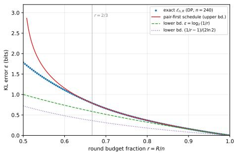
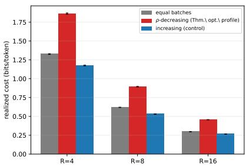
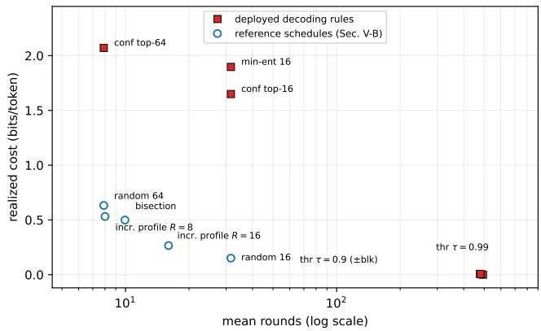

# Conditional Total Correlation and the Serial Depth of Adaptive Parallel Sampling

Chuling Wen, Weijie Liang, and Jian Lu

Abstract—Motivated by parallel decoding in masked diffusion models, we study the adaptive parallel sampling of discrete vectors. In each round, a deterministic policy selects unrevealed coordinates on the basis of the values observed so far, and the selected coordinates are sampled independently from their exact conditional marginals. Approximation error is measured by forward Kullback–Leibler divergence, which represents excess expected logarithmic loss and admits a chain-rule decomposition aligned with the reveal process. We define serial depth as the minimum target-averaged number of rounds required to satisfy a prescribed error budget. Our central result establishes that the divergence of every policy equals the expected conditional total correlation accumulated over its reveal rounds. Conditional total correlation therefore gives the exact information cost of withinround parallelism.

The identity yields zero-error schedules for finite-order Markov chains whose round complexity is proportional to the Markov order and logarithmic in sequence length. It also gives a matching logarithmic characterization of the Bernoulli walk at every fixed error budget and a linear-versus-logarithmic separation between left-to-right and hierarchical reveal orders. Uniform random permutations require a linear number of expected rounds at every fixed error budget. Their hard-cap round– error tradeoff is characterized by an exact integer-composition problem, together with its fixed-round asymptotics and jointscaling frontier. Uniform balanced binary strings have depth proportional to the squared logarithm of sequence length at every fixed positive error budget. Independent binary one-hot blocks have square-root depth at every fixed error budget, and rectangular versions realize every polynomial depth exponent up to one half. These results exhibit logarithmic, polylogarithmic, polynomial, and linear depth regimes, separate serial depth from entropy and negative log-likelihood, and establish conditionaldependence structure as a fundamental determinant of parallelizability. Experiments with a masked diffusion language model show that the resulting pseudo-cost distinguishes deployed decoding rules and that policy-level pseudo-cost rankings agree closely with the quality rankings of self-sampled outputs on the tested prompts.

Index Terms—Adaptive parallel sampling, conditional total correlation, Kullback–Leibler divergence, masked diffusion lan-

guage models, parallel decoding, round complexity, serial depth.

## I. INTRODUCTION

Autoregressive language models generate a sequence according to a fixed left-to-right factorization. Standard ancestral decoding produces each token after its predecessors and therefore samples consistently from the modeled joint distribution, but the generation process is inherently sequential [1], [2]. Conditional masked language models and masked diffusion language models instead predict masked coordinates from bidirectional context and permit tokens to be generated in flexible orders or in parallel batches [3], [4], [5], [19], [6]. This flexibility has motivated practical efforts to reduce the number of serial model calls [23], [24]. Parallel decoding nevertheless introduces a distributional error when the tokens generated in the same round are sampled independently from their conditional marginals while remaining dependent under the target joint distribution.

Recent work has studied this accuracy–parallelism tradeoff for several classes of decoding procedures. Schedule-level analyses characterize or optimize reveal schedules whose positions are fixed, randomized, or selected independently of the values realized during generation [7], [8], [9], [10]. Analyses of specific decoder classes relate their iteration complexity to entropy, negative log-likelihood, or confidence-based information budgets [11], [16]. Other studies examine generation order, parallelization bias, and the loss of token dependence under factorized decoding [12], [13], [31]. Black-box parallelsampling theory provides oracle-complexity bounds for algorithms that are not specialized to a fixed known distribution [14], [15], [32].

These results do not determine the minimum number of rounds required by a fixed target distribution when the reveal positions may depend on the values observed during sampling. Value adaptivity changes both the order of generation and the conditional dependence encountered in later rounds. The resulting reveal sets are random and coupled to the generated sample. A converse must therefore control every branch of the adaptive policy tree. Entropy and negative log-likelihood alone cannot provide such a characterization, since distributions with large entropy may still have independent coordinates and admit exact one-round sampling.

We study this question in an exact conditional-marginal oracle model that isolates the error caused by within-round independent sampling. Serial depth is defined as the minimum target-averaged number of revealing rounds required to achieve a prescribed forward-KL accuracy. The central observation is that conditional total correlation measures the dependence discarded within each round. The KL chain rule shows that the total approximation error equals the expected conditional total correlation accumulated along the adaptive reveal process. This identity transforms adaptive round complexity into an information-accounting problem. Recursive conditionalindependence structure leads to efficient revealing schedules, while persistent conditional dependence yields lower bounds.

The theoretical contributions are summarized below.

1) We establish the exact KL–total-correlation identity for every deterministic value-adaptive reveal policy. The result applies to random and history-dependent reveal sets and provides a common method for analyzing upper and lower bounds on serial depth.

2) We prove logarithmic serial depth for the Bernoulli walk at every fixed error budget. Hierarchical bisection achieves exact sampling in logarithmically many rounds, while contiguous left-to-right schedules require linearly many rounds to maintain fixed accuracy. The adaptive converse applies to every deterministic value-adaptive policy. We also construct zero-error schedules whose round complexity is proportional to the Markov order and logarithmic in sequence length for all finite-order Markov chains.

3) We prove that uniform random permutations require a linear number of expected rounds at every fixed error budget. Under a hard round cap, the optimal approximation error is characterized exactly by an integercomposition problem. This characterization yields fixedround asymptotics, an exact finite-blocklength pairs-first phase, and the complete joint-scaling frontier for the hardcap complexity.

4) We establish polynomial serial depth over a binary alphabet. Uniform balanced binary strings have depth proportional to the squared logarithm of sequence length at every fixed positive error budget, while independent one-hot blocks have matching square-root depth against arbitrary deterministic value-adaptive policies. Rectangular block constructions realize every polynomial exponent up to one half. Together with the Bernoulli walk and random permutations, these examples exhibit logarithmic, polylogarithmic, polynomial, and linear depth regimes. We also show that almost every full-support distribution has maximal zero-error depth and that serial depth is not determined by entropy or negative log-likelihood.

We additionally evaluate generic schedules and deployed decoding rules on 542 text sequences drawn from WikiText and model-generated text in four domains. A paired selfsampling study on 231 held-out prompts connects teacherforced pseudo-costs to output quality under an external autoregressive evaluator. It also evaluates a model-independent spaced-profile schedule obtained by combining increasing batch sizes with spatially dispersed reveals. These experiments are diagnostic rather than a universal benchmark because they use a single 0.5B model and a single sampling temperature.

## II. RELATED WORK

Existing theory on parallel decoding can be organized into analyses of sampling schedules, particular decoder classes, and black-box sampling models. For a broad survey of diffusion language models, see [26].

Analyses of sampling schedules quantify the error of masked diffusion models when reveal positions are fixed or randomized independently of the values generated during sampling. Chen, Cong, and Li [7] characterize schedules with fixed cardinalities through information curves. Lavenant and Zanella [8] derive error bounds and optimal schedules for factorized masked diffusion. Zhao and Cai [9] design randomized schedules that adapt to distributional dependence. Wainwright [10] develops certified schedule design through unmasking growth complexity. These procedures may use prior knowledge or estimated properties of the target. Their reveal positions do not depend on the values realized along the current sampling trajectory. On the continuous side, convergence theory for diffusion sampling has recently entered the journals [33], [34], with information-theoretic treatments developed within the information-theory community as well [35].

Analyses of particular decoder classes study round complexity under prescribed selection rules. Bounds based on negative log-likelihood and information budgets have been established for procedures based on confidence [11]. Related guarantees based on entropy are given in [16]. The tradeoff between quality and parallelism for specific diffusion decoder families is studied in [30]. Bounds based on total correlation for fixed ordered partitions and analyses of generation order appear in [12], [13], [31]. These results constrain the decoder rule or the ordered partition used during sampling.

Parallel sampling has also been studied in black-box oracle models. Counting and conditional marginal oracles yield sublinear upper and lower bounds for algorithms that do not know the target distribution [14], [15]. Diffusion-style procedures are optimal parallel samplers in a related oracle model [32]. These results permit adaptive oracle queries but require an algorithm that operates without prior knowledge of the target. Their lower bounds establish a hard distribution for each algorithm and do not identify a fixed known distribution with large serial depth. Remark 10 explains this distinction for the standard hard instances.

The information cost of synthesizing joint dependence is a classical information-theoretic theme: common information quantifies the shared randomness needed to generate a dependent pair [40], channel resolvability the randomness needed to approximate an output law [41], and distributed channel synthesis the communication needed for approximate simulation of a joint distribution [42]. Serial depth asks the complementary question for the same simulation task: when dependence must be resolved through revealed values rather than shared randomness, how many factorized rounds are unavoidable. Round-limited adaptivity is likewise a classical theme in group testing [43], [44], where a small constant number of adaptive rounds often suffices; our converses show that for sampling, by contrast, the required number of rounds is an unbounded, distribution-intrinsic quantity.

These lines of work leave unresolved the distributionspecific problem addressed in this paper. We fix the target distribution and allow the reveal policy to use both complete knowledge of that distribution and all values observed during sampling. The selected reveal sets are random and coupled to the generated sample, which prevents fixed-schedule bounds from directly yielding converses for adaptive policies. The cost identity provides exact information accounting for every deterministic value-adaptive policy and resolves this coupling at the level of the policy tree. The resulting analysis gives a tight logarithmic characterization for the Bernoulli walk, a linear lower bound and an exact tradeoff under a hard round cap for uniform random permutations, a tight squared logarithmic characterization for balanced binary strings, a tight square-root characterization for binary one-hot blocks, and maximal zero-error depth for generic full-support distributions. It therefore fills the gap between schedule analyses with valueindependent positions and oracle bounds for algorithms that do not know the target. Lower bounds for value-adaptive selection in this sense were identified as an open direction in [16]. The one-hot construction realizes all polynomial depth exponents up to one half over a binary alphabet; whether higher exponents, including linear depth, are possible remains open.

## III. PRELIMINARIES

## A. Notation

For a positive integer $n ,$ write $[ n ] = \{ 1 , \dots , n \}$ . The finite alphabet is denoted by V. Uppercase letters denote random variables and lowercase letters denote their realizations. For $A \subseteq [ n ]$ , the subvectors on A are denoted by $X _ { A }$ and $x _ { A }$ , the cardinality of A by $| A | .$ , and the marginal of a distribution $p$ on $V ^ { n }$ by $p _ { A }$ . The notation $p ( \boldsymbol { x } _ { B } \mid \boldsymbol { x } _ { A } )$ is used only when $A \cap$ $B = \varnothing$ and $p _ { A } ( x _ { A } ) > 0$ . We write $x _ { i : j }$ for $( x _ { i } , \ldots , x _ { j } )$ $X _ { \leq i }$ for $X _ { [ i ] }$ , and $X _ { \geq i }$ for $X _ { \{ i , \ldots , n \} }$ . The support of p is supp(p), and $\mathbf { 1 } _ { E }$ is the indicator of an event E.

Probability and expectation under p are written $\mathrm { P r } _ { p }$ and $\mathbb { E } _ { p } ;$ the subscript is omitted when the law is clear. All logarithms are base two, so entropy, mutual information, KL divergence, and total correlation are measured in bits. The natural logarithm is written ln. We use H for entropy, I for mutual information, $D _ { \mathrm { K L } } ( p \Vert q )$ for forward KL divergence, TC for total correlation, and tc for its realized information density. The binary entropy function is

$$
h _ { 2 } ( u ) : = - u \log _ { 2 } u - ( 1 - u ) \log _ { 2 } ( 1 - u ) , \qquad 0 \leq u \leq 1 ,
$$

with the convention $0 \log _ { 2 } { 0 } = 0$ . Conditional information quantities evaluated at a realized context are written with a vertical bar, as in $H ( X _ { A } \mid x _ { C } )$ and $\mathrm { T C } ( X _ { A } \mid x _ { C } )$ . Conditional independence is denoted by ⊥.

The positive part of a real number is $a _ { + } = \operatorname* { m a x } \{ a , 0 \}$ and $( M ) _ { B } = M ( M - 1 ) \cdots ( M - B + 1 )$ denotes a falling factorial. The notation $\mathrm { B i n } ( j , \theta )$ denotes a binomial random variable. Standard asymptotic notation is used as the sequence length tends to infinity. Constants denoted by $c , C _ { i }$ , or their subscripted variants are positive and independent of the sequence length unless a dependence is stated explicitly.

In the reveal model, π denotes a policy, $C _ { t }$ the coordinates revealed before round $t , \ S _ { t }$ the coordinates selected in that round, R the number of rounds, and $q _ { \pi }$ the output distribution. The symbols $D _ { \varepsilon }$ and $\overline { { D } } _ { \varepsilon }$ denote the target averaged and hard cap versions of serial depth. The distributions $p _ { \mathrm { w a l k } } ,$ $p _ { \mathrm { p e r m } }$ , and $p _ { \mathrm { b a l } }$ denote the Bernoulli walk, uniform random permutations, and uniform balanced binary strings. The symbol maxrun(x) denotes the longest constant run in a walk realization. The distribution $p _ { m } ^ { \mathrm { h o t } }$ is the product of m independent binary one-hot blocks of length $m _ { : }$ , and $p _ { b , L } ^ { \mathrm { h o t } }$ is the rectangular version with b independent blocks of length $L .$

In batch calculations, M denotes the number of unrevealed coordinates and B the batch size. In the permutation section, $g ( M , B )$ is the cost of one batch, $\mathcal { E } _ { n , R }$ is the minimum cost under a hard cap of R rounds, and $\underline { { \mathcal { E } } } _ { n }$ is its lower convex envelope. The symbols $\rho _ { R } , \varepsilon _ { * } ( r )$ , and $r _ { * } ( \varepsilon )$ describe the fixed round recursion and the two directions of the joint scaling frontier. In the balanced string section, k denotes the number of remaining ones and $L _ { n } ( \varepsilon )$ denotes the truncated logarithmic term in the lower bound. Auxiliary quantities used inside a single result or proof are defined at their first occurrence.

## B. Information quantities

Let $X = ( X _ { 1 } , \ldots , X _ { n } )$ take values in $V ^ { n }$ with distribution $p ,$ which need not have full support. For a discrete random variable U with law $p _ { U }$ , its entropy is

$$
H ( U ) = - \sum _ { u } p _ { U } ( u ) \log p _ { U } ( u ) .
$$

For distributions p and q on the same finite space, their forward Kullback–Leibler divergence is

$$
D _ { \mathrm { K L } } ( p \Vert q ) = \sum _ { x : p ( x ) > 0 } p ( x ) \log \frac { p ( x ) } { q ( x ) } ,
$$

with the value $+ \infty$ when $q ( x ) = 0$ for some x with $p ( x ) > 0$ Forward KL divergence equals the excess expected logarithmic loss incurred when predicting sequentially under q in place of $p \ [ 3 9 ]$ . Conditional entropy and mutual information have their standard meanings [45].

For a nonempty $A \subseteq [ n ]$ and a context $x _ { C }$ of positive probability with $A \cap C = \emptyset$ , the conditional total correlation is

$$
\operatorname { T C } ( X _ { A } \mid x _ { C } ) = \sum _ { i \in A } H ( X _ { i } \mid x _ { C } ) - H ( X _ { A } \mid x _ { C } ) .
$$

This quantity is also called multi-information [37]; it belongs to the classical family of multivariate dependence measures [38]. It is governed by the following standard properties.

Lemma 1 (Basic properties of conditional total correlation). For every positive-probability context $x _ { C } ,$ , conditional total correlation is nonnegative and equals zero exactly when the coordinates are mutually independent under the conditional law. $I f A \subseteq S \subseteq [ n ] \backslash C$ , then

$$
\operatorname { T C } ( X _ { S } \mid x _ { C } ) \geq \operatorname { T C } ( X _ { A } \mid x _ { C } ) .
$$

Consequently, for distinct $i , j ~ \in ~ S , ~ \mathrm { T C } ( X _ { S } ~ \mid ~ x _ { C } ) ~ \geq$ $I ( X _ { i } ; X _ { j } \mid x _ { C } )$

Lemma 2 (Product conditioning and additivity). Let $\mathcal { A } _ { 1 } , \ldots , \mathcal { A } _ { r }$ partition $[ n ] ,$ , and suppose

$$
p ( x ) = \prod _ { a = 1 } ^ { r } p ^ { ( a ) } ( x _ { \mathcal { A } _ { a } } ) ,
$$

where $p ^ { ( a ) }$ is a distribution on $V ^ { \mathcal { A } _ { a } }$ . For every positiveprobability context $x _ { C } ,$ , the conditional law of the unrevealed coordinates factorizes across the blocks:

$$
p ( x _ { \lceil n \rceil \backslash C } \mid x _ { C } ) = \prod _ { a = 1 } ^ { r } p ^ { ( a ) } ( x _ { \mathcal { A } _ { a } \backslash C } \mid x _ { \mathcal { A } _ { a } \cap C } ) .
$$

Consequently, for every nonempty $S \subseteq [ n ] \setminus C ,$

$$
\operatorname { T C } ( X _ { S } \mid x _ { C } ) = \sum _ { \underset { S \cap A _ { a } \neq \emptyset } { \sum \sum } } \operatorname { T C } ( X _ { S \cap A _ { a } } \mid x _ { C } ) .
$$

Proof. The product form gives

$$
p _ { C } ( x _ { C } ) = \prod _ { a = 1 } ^ { r } p _ { \mathcal { A } _ { a } \cap C } ^ { ( a ) } ( x _ { \mathcal { A } _ { a } \cap C } ) .
$$

Dividing the joint mass by this marginal proves the conditional factorization. Hence the vectors $X _ { S \cap A _ { a } }$ with nonempty intersections are conditionally independent given $x _ { C }$ . Put $S _ { a } : = S \cap { \mathcal { A } } _ { a }$ and ${ \mathcal { T } } : = \{ a : S _ { a } \neq \emptyset \}$ . Entropy additivity therefore gives

$$
\begin{array} { c } { { \mathrm { T C } ( X _ { S } \mid x _ { C } ) = \displaystyle \sum _ { a \in \mathbb { Z } } \sum _ { i \in S _ { a } } H ( X _ { i } \mid x _ { C } ) } } \\ { { - \displaystyle \sum _ { a \in \mathbb { Z } } H ( X _ { S _ { a } } \mid x _ { C } ) } } \\ { { = \displaystyle \sum _ { a \in \mathbb { Z } } \mathrm { T C } ( X _ { S _ { a } } \mid x _ { C } ) , } } \end{array}
$$

which is the claimed identity.

## C. Adaptive reveal model

Definition 1 (Adaptive reveal policy). A reveal state is a pair $( C , x _ { C } )$ with $C \subseteq [ n ]$ and $x _ { C } \in V ^ { C }$ . A deterministic valueadaptive policy π maps every state with $C \neq [ n ]$ to a nonempty set $S = \pi ( C , x _ { C } ) \subseteq [ n ] \backslash C .$

Given a policy, sampling starts from $C _ { 1 } = \varnothing$ . In round $t ,$ let $S _ { t } = \pi ( C _ { t } , x _ { C _ { t } } ) ;$ ; for each $i \in S _ { t }$ independently, draw $x _ { i } \sim$ $p ( \cdot \mid x _ { C _ { t } } )$ , where $p ( x _ { i } \mid x _ { C _ { t } } )$ denotes the conditional marginal of coordinate i under $p ;$ set $C _ { t + 1 } = C _ { t } \cup S _ { t }$ . The process stops when $C _ { t + 1 } = [ n ] ;$ ; write $R ( x )$ for the number of rounds on realization x and $q _ { \pi }$ for the law of the output. The conditional marginals are supplied by an exact oracle. This idealization isolates the effect of factorized within-round sampling from model-estimation error. Without the factorization constraint, auxiliary randomness can encode arbitrary joint dependence in one call [17], and the round complexity considered here degenerates; modeling within-round dependence beyond the product law is likewise an active empirical direction [28], [29].

When $p$ is not of full support, independent per-coordinate sampling can exit the support: a round may produce values with $p _ { C _ { t + 1 } } ( x _ { C _ { t + 1 } } ) ~ = ~ 0$ (a null history), after which the conditionals $p ( \cdot \ | \ x _ { C _ { t + 1 } } )$ are undefined. We fix once and for all an arbitrary extension — on null histories the oracle returns some fixed conditional law, say uniform on $V - \mathrm { s o }$ that the process is always well defined and $q _ { \pi }$ is a probability measure on $V ^ { n }$ . The results are independent of this choice: if $p ( x ) > 0$ then every prefix marginal $p _ { C _ { t } ( x ) } ( x _ { C _ { t } ( x ) } )$ is positive, so the unique trajectory of x never meets a null history, the factorization (1) for $q _ { \pi } ( x )$ is unaffected by the extension, and $\begin{array} { r } { D _ { \mathrm { K L } } ( p \Vert q _ { \pi } ) = \sum _ { x : p ( x ) > 0 } p ( x ) \log \bigl ( p ( x ) / q _ { \pi } ( x ) \bigr ) } \end{array}$ depends on $q _ { \pi }$ only through such x. (The convention is not a technicality to be assumed away: the copy chain of Example 2, the permutation distribution of Theorem 6 and the affine-subspace distributions of Remark 10 are all natural non-full-support instances.)

Definition 2 (Serial depth). For $\varepsilon \geq 0 ,$ let

Πε(p) := {π : π is deterministic and value-adaptive,

$$
D _ { \mathrm { K L } } ( p \| q _ { \pi } ) \leq \varepsilon \} .
$$

The p-weighted policy-tree depth and its worst-case (operational) variant are, respectively,

$$
D _ { \varepsilon } ( p ) : = \operatorname* { m i n } _ { \pi \in \Pi _ { \varepsilon } ( p ) } \mathbb { E } _ { p } [ R ] , \qquad { \overline { { D } } } _ { \varepsilon } ( p ) : = \operatorname* { m i n } _ { \pi \in \Pi _ { \varepsilon } ( p ) } \operatorname* { m a x } _ { x \in V ^ { n } } R ( x ) .
$$

Both minima are attained: there are finitely many reveal states, hence finitely many deterministic policies, and $\Pi _ { \varepsilon } ( p )$ is nonempty because one-coordinate-per-round revealing samples exactly from $p .$ The inequality $D _ { \varepsilon } ( p ) \leq \overline { { D } } _ { \varepsilon } ( p )$ follows from the definitions. Since $\mathbb { E } _ { q _ { \pi } } [ R ] \le \operatorname* { m a x } _ { x } R ( x )$ , the hard cap also bounds the sampler’s operational mean round count.

Remark 1 (Which round count?). R is a random variable and three counts are natural: $\mathbb { E } _ { p } [ R ]$ (Definition $2 -$ the $p \textmd { - }$ weighted depth of the policy tree), the sampler’s operational mean $\mathbb { E } _ { q _ { \pi } } [ R ]$ (its own history follows $q _ { \pi } ,$ , not p), and the worst case $\operatorname* { m a x } _ { x } R ( x )$ . The first two can differ once $\pi$ is valueadaptive and $q _ { \pi } \neq p ; D _ { \varepsilon }$ itself is a target-weighted policytree depth, not a runtime, and statements about the runtime of adaptive samplers should be phrased via $\overline { { D } } _ { \varepsilon }$ or $\mathbb { E } _ { q _ { \pi } } [ R ]$ For the results of this paper the distinction does not affect the stated upper bounds: every such bound is witnessed by a fixed schedule, whose round count is deterministic, so it bounds $\overline { { D } } _ { \varepsilon }$ and hence all three counts. The lower bound of Theorem 3(ii) is stated for fixed round budgets. Proposition 4 forces $R ( x ) = n$ on every trajectory and thus lower-bounds all three. The bound of Theorem 6 is stated directly for $\mathbb { E } _ { p } [ R ]$ hence for $D _ { \varepsilon }$ and a fortiori for $\overline { { D } } _ { \varepsilon } .$ . The distinction matters when comparing with algorithmic black-box round complexity; see Remark 10.

Sequential revealing samples exactly from $p .$ Consequently, $D _ { \varepsilon } ( p ) \leq \overline { { D } } _ { \varepsilon } ( p ) \leq n$ , and both quantities are nonincreasing in $\varepsilon .$

Definition 3 (Finite order Markov distribution). A distribution $p$ is called order-m Markov if it factorizes as

$$
p ( x ) = \prod _ { i = 1 } ^ { n - m } \phi _ { i } ( x _ { i : i + m } )
$$

for nonnegative potentials $\phi _ { i }$ on windows of m+1 consecutive coordinates.

## IV. MAIN RESULTS

This section states the principal theoretical results and records their consequences. Complete proofs, including all intermediate derivations, are given in Appendices A–H.

## A. Exact information cost

For S disjoint from C, define the realized total-correlation increment

$$
\operatorname { t c } ( x _ { S } \mid x _ { C } ) : = \log { \frac { p ( x _ { S } \mid x _ { C } ) } { \prod _ { i \in S } p ( x _ { i } \mid x _ { C } ) } } .
$$

Its conditional expectation under $p ( \cdot \mid x _ { C } )$ is $\mathrm { T C } ( X _ { S } \mid x _ { C } )$

Theorem 1 (Adaptive chain rule and cost identity). $L e t \ \pi$ be any deterministic value-adaptive policy. For every x with $p ( x ) > 0$ , the trajectory $( C _ { t } ( x ) , S _ { t } ( x ) ) _ { t \leq R ( x ) }$ is well defined, every conditioning event below has positive probability along $i t ,$ and

$$
\begin{array} { l } { { \displaystyle p ( x ) = \prod _ { t = 1 } ^ { R ( x ) } p \big ( x _ { S _ { t } ( x ) } \mid x _ { C _ { t } ( x ) } \big ) } , \ ~ } \\ { { \displaystyle q _ { \pi } ( x ) = \prod _ { t = 1 } ^ { R ( x ) } \prod _ { i \in S _ { t } ( x ) } p \big ( x _ { i } \mid x _ { C _ { t } ( x ) } \big ) } . } \end{array}\tag{1}
$$

Consequently

$$
\begin{array} { r l } {  { D _ { \mathrm { K L } } ( p \| q _ { \pi } ) = \mathbb { E } _ { x \sim p } [ \sum _ { t = 1 } ^ { R ( x ) } \mathrm { t c } \big ( x _ { S _ { t } ( x ) } \mid x _ { C _ { t } ( x ) } \big ) ] } \quad } & { } \\ & { = \mathbb { E } _ { x \sim p } [ \sum _ { t = 1 } ^ { R ( x ) } \mathrm { T C } \big ( X _ { S _ { t } } \mid x _ { C _ { t } } \big ) ] \geq 0 , } \end{array}\tag{2}
$$

with every summand nonnegative in expectation over its round, and equality $D _ { \mathrm { K L } } ( p \parallel q _ { \pi } ) ~ = ~ 0$ iff, p-almost surely, every revealed set is conditionally independent given its realized history.

Remark 2 (Randomized policies). If π uses internal randomness ω independent of x, then $q _ { \pi } ~ = ~ \mathbb { E } _ { \omega } q _ { \pi _ { \omega } }$ and, by convexity of $D _ { \mathrm { K L } } ( p \Vert \cdot ) , D _ { \mathrm { K L } } ( p \Vert q _ { \pi } ) \leq \mathbb { E } _ { \omega } D _ { \mathrm { K L } } \bar { ( } p \Vert q _ { \pi _ { \omega } } ) .$ randomization can only reduce the error below the average trajectory cost. All lower bounds in this paper are stated for deterministic policies; extending dependency-structural lower bounds to arbitrary randomized policies remains open.

Theorem 1 shows that $D _ { \varepsilon }$ is equivalently the minimum expected number of rounds of an adaptive total-correlationbudgeted cover of $[ n ]$ , whose expected accumulated conditional total correlation is at most ε.

## B. Serial depth is not likelihood

Fix $h \in ( 0 , 1 ]$ and let both examples below have per-token entropy h (total nh), so that they have identical likelihood profiles.

Example 1 (Independent coordinates: depth 1). $f p = \otimes _ { i } p _ { i }$ then a single round revealing [n] has $\mathrm { T C } = 0 \colon D _ { 0 } ( p ) = 1$

Example 2 (Copy chain: depth 2). Let $x _ { 1 } \sim \mathrm { U n i f } ( V _ { 0 } )$ with $\log _ { 2 } { \left| V _ { 0 } \right| } = n h$ (encoded in the first coordinate block) and $x _ { i + 1 } = f _ { i } ( x _ { i } )$ for fixed bijections $f _ { i } .$ . Total correlation of any set containing two coordinates is maximal, yet $D _ { 0 } ( p ) = 2 \colon$ reveal $x _ { 1 } ,$ then everything else in one round (all conditionals are point masses, $\mathrm { T C } = 0 )$ . Depth is not total dependence; it is the structure of resolvable dependence.

Example 3 (NLL-insensitivity). Example 1 has $- \log p ( x ) =$ nh and depth 1. Round lower bounds that scale with $- \log p ( x )$ divided by a per-round information budget [11] therefore cannot hold for unconstrained factorized-reveal policies; they are facts about the confidence-thresholded decoder class (which indeed cannot reveal high-entropy independent coordinates in parallel), not about the distribution. Our depth is the complementary, distribution-intrinsic quantity.

The walk of Section IV-D will supply a third data point at the same entropy profile (per-token conditional entropy one bit, the case $h = 1 )$ : an $O ( \log n )$ -round exact schedule — tight against all deterministic value-adaptive policies at every fixed error budget (Theorems 4, 5) — and provably depth Θ(n) for left-to-right schedules.

## C. Bounded-order Markov distributions

Theorem 2 (Hierarchical schedule; no serial Markov chains). Let $1 \leq m < n$ and let p be order-m Markov on $V ^ { n }$ . Then

$$
D _ { 0 } ( p ) \ \leq \ m \big ( \lceil \log _ { 2 } ( n / m ) \rceil + 1 \big ) .
$$

Moreover the witnessing policy is a fixed schedule (no value adaptivity): recursive bisection by m-blocks.

Remark 3. Theorem 2 is the discrete analogue of the Levy´ midpoint-displacement construction of Brownian motion. It rules out super-logarithmic depth for fixed-order chain models; larger depth (at a given error tolerance), if it exists, must come from structures without recursive small separators. More generally the same argument gives $D _ { 0 } ( p ) \ = \ { \cal { O } } ( w$ (recursion depth) whenever the dependency (Markov random field) graph of p admits a recursive family of separators of s $i z e \le w - e . g . \ O ( w \log n )$ for graphs of treewidth w via balanced separator trees. We develop the graph-structural theory, and the matching question of lower bounds via separator-free (expander) structures, in Section IV-H.

## D. Bernoulli walks and reveal-order separation

Let $p _ { \mathrm { w a l k } }$ be the law of the standard Bernoulli walk: $x _ { 0 } : = 0$ (a constant, not counted), increments $z _ { i } : = x _ { i } - x _ { i - 1 } \in \{ 0 , 1 \}$ i.i.d. fair coins, $i = 1 , \ldots , n$ . This is order-1 Markov with per-coordinate conditional entropy 1 bit.

## Theorem 3 (Order gap). On $p _ { \mathrm { w a l k } } .$

(i) (Hierarchical order.) The bisection schedule of Theorem $2 \ ( m { = } 1 )$ attains $D _ { \mathrm { K L } } ( p \Vert q ) = 0 \ i n \ \lceil \log _ { 2 } ( n { + } 1 ) \rceil$ rounds.

(ii) (Left-to-right orders.) Every deterministic schedule whose round-t set is the next $B _ { t }$ unrevealed coordinates

in left-to-right order (“contiguous scan”), with R rounds, satisfies

$$
{ \begin{array} { r l } & { D _ { \mathrm { K L } } ( p _ { \mathrm { w a l k } } \parallel q ) = \displaystyle \sum _ { t = 1 } ^ { R } \sum _ { j = 1 } ^ { B _ { t } } H ( \mathrm { B i n } ( j , { \frac { 1 } { 2 } } ) ) - n } \\ & { ~ \geq { \cfrac { n } { 2 } } \log _ { 2 } { \cfrac { n } { R } } - c _ { 0 } n , } \end{array} }
$$

where $c _ { 0 } : = 1 + { \textstyle \frac { 1 } { 2 } } \log _ { 2 } ( e / \pi ) < 1 . 3 .$ In particular, achieving $D _ { \mathrm { K L } } ( p _ { \mathrm { w a l k } } \parallel q _ { \pi } ) \leq \delta r$ requires $\begin{array} { r l r } {  { \bar { R } \geq n 2 ^ { - 2 ( \delta + c _ { 0 } ) } = } } \end{array}$ $\Omega ( n )$ rounds for constant δ, whereas the hierarchical order achieves $\delta = 0$ with $O ( \log n )$ rounds.

Remark 4 (Practical reading). Semi-autoregressive block decoding — the standard deployment mode of current diffusion language models $I 2 5 J - i s$ a contiguous scan. On chainstructured data it is exponentially suboptimal in the reveal order alone: at equal round budget $R = \lceil \log _ { 2 } ( n { + } 1 ) \rceil$ the scan pays $\begin{array} { r } { \Omega \left( n \log { \frac { n } { \log n } } \right) } \end{array}$ bits while the hierarchical order pays zero. The experiments of Section V-B measure this gap on real text with learned conditionals.

The scan bound of Theorem 3(ii) constrains one schedule class. The following converse shows that on $p _ { \mathrm { w a l k } }$ no deterministic value-adaptive policy beats the hierarchical schedule at zero error, up to an additive $O ( \log \log n ) - \mathfrak { a }$ converse on a distribution where adaptivity genuinely has room to act (histories reveal which conditionals are cheap).

Theorem 4 (Zero-error walk converse). Let maxrun(x) be the length of the longest constant run of increments of x. For every deterministic value-adaptive policy π with $D _ { \mathrm { K L } } ( p _ { \mathrm { w a l k } } \parallel q _ { \pi } ) =$ 0,

$$
\begin{array} { r } { \mathbb { E } _ { p } [ R ] \geq \log _ { 2 } n - \mathbb { E } _ { p } [ \log _ { 2 } ( 1 + \operatorname* { m a x r u n } ( X ) ) ] - 1 } \\ { \geq \log _ { 2 } n - \log _ { 2 } \log _ { 2 } n - O ( 1 ) , \qquad n \geq 2 . } \end{array}
$$

With Theorem 3(i): $D _ { 0 } ( p _ { \mathrm { w a l k } } ) = \Theta ( \log n )$ , and the hierarchical schedule is optimal at zero error up to an additive $O ( \log \log n )$

Remark 5. The proof has to fight adaptivity at exactly one point: a policy can watch for realized histories that make segments degenerate and clear them forfree. The maxrun term is the exact price of that freedom, and it is what separates the walk from the permutation distribution of Section IV-E, where no history is cheaper than any other. The fractional policytree depths induced by trajectory-dependent free clearing are examined numerically in Section V.

At a positive budget the free-clearing accounting no longer suffices: near-degenerate segments are cheap rather than free, and a policy can buy extra splits. Appendix C shows that cheap reveals make little depth progress and derives an amortized cost–progress inequality from a uniform information bound for bulk reveals.

Theorem 5 (Fixed-error walk converse). There are absolute constants $c _ { 2 } , c _ { 3 }$ such that for every $\varepsilon \geq 0$ and every deterministic value-adaptive policy π with $D _ { \mathrm { K L } } ( p _ { \mathrm { w a l k } } \parallel q _ { \pi } ) \leq \varepsilon ,$

$$
\begin{array} { r } { \mathbb { E } _ { p } [ R ] \ \geq \ \frac { 1 } { 3 } \log _ { 2 } n - \frac { 1 } { 3 } \log _ { 2 } \log _ { 2 } n - c _ { 2 } - c _ { 3 } \varepsilon \qquad ( n \geq 2 ) . } \end{array}
$$

In particular $D _ { \varepsilon } ( p _ { \mathrm { w a l k } } ) \ = \ \Theta ( \log n )$ for every fixed ε: the hierarchical schedule is optimal up to constantfactors at every constant error budget.

## E. Uniform random permutations

Let $p _ { \mathrm { p e r m } }$ denote the uniform distribution on the n! permutations of [n]: the sequence $( X _ { 1 } , \ldots , X _ { n } )$ is a uniformly random bijection, i.e. sampling without replacement from the alphabet $V = [ n ]$ . This is a natural, fully exchangeable form of global dependence: every coordinate excludes every other.

If M coordinates remain and a round reveals B of them, define

$$
g ( M , B ) : = \log _ { 2 } \frac { M ^ { B } } { ( M ) _ { B } } .
$$

Exchangeability makes this quantity the realized and conditional expected cost of the round, independently of the selected positions and their observed values.

Theorem 6 (Value-adaptive $\Omega ( n )$ lower bound at every fixed error). For every $\varepsilon \geq 0$ and every deterministic value-adaptive policy π with $D _ { \mathrm { K L } } ( p _ { \mathrm { p e r m } } \parallel q _ { \pi } ) \leq \varepsilon ,$

$$
\mathbb { E } _ { p _ { \mathrm { p e r m } } } [ R ] \ \geq \ \frac { n } { 1 + 2 \varepsilon \ln 2 } .
$$

Consequently $D _ { \varepsilon } ( p _ { \mathrm { p e r m } } ) \geq n / ( 1 + 2 \varepsilon \ln 2 )$ , which is $\Omega ( n )$ for every fixed ε.

Remark 6 (Cost invariance on $p _ { \mathrm { p e r m } } )$ . The realized cost of a trajectory is a function of its batch-size sequence alone. Neither position selection nor value adaptivity changes it. Minimizing KL at a given round budget on $p _ { \mathrm { p e r m } }$ is therefore a one-dimensional problem over integer compositions of n. This invariance both yields a converse for arbitrary deterministic policies and makes the hard-cap tradeoff exactly computable through the characterization below. It also implies that $p _ { \mathrm { p e r m } }$ cannot separate adaptive from non-adaptive strategies; candidates for that separation need history-dependent round costs.

Remark 7 (Alphabet size). The alphabet of $p _ { \mathrm { p e r m } }$ has size n (the value range of the walk of Section IV-D likewise grows with n). Within the model of Section $I I I { - } C - a$ finite alphabet, with no uniformity requirement in $n -$ Theorem 6 establishes the existence of robustly deep distributions; Section IV-F pushes this to a two-letter alphabet at depth $\Theta ( \log ^ { 2 } n )$ , and Section IV-G gives binary depth $\Theta ( { \sqrt { n } } )$ . Whether a binary family can have linear robust depth remains open. Since $\overline { { D } } _ { \varepsilon } \geq D _ { \varepsilon }$ , the bound applies to the operational depth as well.

Because on $p _ { \mathrm { p e r m } }$ the cost of a trajectory is a function of its batch-size composition alone (Remark 6), the hard-cap round–error tradeoff is exactly computable. For a composition $( B _ { 1 } , \ldots , B _ { R } )$ of n into R positive parts, write $\begin{array} { r } { M _ { t } = \sum _ { s \ge t } B _ { s } } \end{array}$ and define

$$
\mathcal { E } _ { n , R } : = \operatorname* { m i n } _ { \substack { B _ { 1 } + \cdots + B _ { R } = n } } \sum _ { t = 1 } ^ { R } g ( M _ { t } , B _ { t } ) , \qquad 1 \leq R \leq n .
$$

Theorem 7 (Exact hard-cap characterization). For every $1 \leq$ $R \leq n ,$

$$
\begin{array} { r l r } & { } & { \operatorname* { i n f } _ { \mathit { \Phi } } D _ { \mathrm { K L } } ( p _ { \mathrm { p e r m } } \parallel q _ { \pi } ) = \mathcal { E } _ { n , R } , } \\ & { } & { \pi \ d e t e r m i n i s t i c \nu a l u e { - a d a p t i \nu e } } \\ & { } & { \operatorname* { m a x } _ { x } { R ( x ) } { \le } R } \end{array}
$$

attained by a fixed (non-adaptive) schedule. Consequently $\overline { { D } } _ { \varepsilon } ( p _ { \mathrm { p e r m } } ) = \operatorname* { m i n } \{ R : \mathcal { E } _ { n , R } \leq \varepsilon \}$ : under a hard round cap, position selection and value adaptivity buy nothing.

Proposition 1 (Structure and computation). (i) For a fixed multiset of batch sizes, arranging them in nonincreasing order minimizes the cost; some optimizer of $\mathcal { E } _ { n , R }$ has $B _ { 1 } \geq \cdots \geq$ $B _ { R } . ~ ( i i )$ With $F _ { n , R } : = \mathcal { E } _ { n , R } + \log _ { 2 } n ! ,$

$$
\begin{array} { l } { { F _ { n , 1 } = n \log _ { 2 } n , \nonumber } } \\ { { F _ { n , R } = \displaystyle \operatorname* { m i n } _ { R - 1 \leq m \leq n - 1 } \mathopen { } \mathclose \bgroup \left\{ ( n - m ) \log _ { 2 } n + F _ { m , R - 1 } \aftergroup \egroup \right\} , } } \end{array}
$$

so the table $\{ { \mathcal E } _ { n , R } \} _ { R \subseteq R _ { 0 } }$ is computable in $O ( R _ { 0 } n ^ { 2 } )$ time.

Theorem 8 (Optimal fixed-round error rate). Define $\rho _ { 1 } = 0$ and $\rho _ { R } = e ^ { \rho _ { R - 1 } - 1 }$ . For every fixed R, as $n  \infty ,$

$$
{ \mathcal E } _ { n , R } ~ = ~ \frac { n ( 1 - \rho _ { R } ) } { \ln 2 } ~ - ~ { \textstyle \frac { 1 } { 2 } } \log _ { 2 } ( 2 \pi n ) + O _ { R } ( 1 ) ,
$$

and the normalized optimal profiles converge to the unique continuous optimizer, whose remaining-mass fractions are $\begin{array} { r } { m _ { t } ^ { * } = \prod _ { j = R - t + 2 } ^ { R } \rho _ { j } } \end{array}$ . Moreover $1 - \rho _ { R } \sim 2 / R$ as $R  \infty ,$ whereas equal batches attain only the rate $\log _ { 2 } e \mathrm { ~ - ~ } \log _ { 2 } R +$ $\textstyle \frac { 1 } { R } \log _ { 2 } ( R ! ) = \frac { \log _ { 2 } ( 2 \pi R ) } { 2 R } + O ( \bar { R ^ { - 2 } } ) -$ asymptotically worse $\ddot { b y } a f a c t o r \sim ( \ln \ddot { R } ) / 4 .$

In the complementary joint regime, where $R = \Theta ( n )$ and the error is $\Theta ( 1 )$ , the tradeoff can be solved exactly in its first phase. Write $s = n - R$ for the number of saved rounds and $\begin{array} { r } { \lambda ( m ) : = \log _ { 2 } \frac { m } { m - 1 } . } \end{array}$

Theorem 9 (Exact first-phase optimality: pairs first). $I f 3 s \leq$ n, then the pair-first composition — s batches of size two followed by $n - 2 s$ singletons — is optimal:

$$
\mathcal { E } _ { n , n - s } \ = \ P ( n , s ) \ : = \ \sum _ { j = 0 } ^ { s - 1 } \lambda ( n - 2 j ) .
$$

Consequently, for every $\begin{array} { r } { 0 \leq \varepsilon < \frac { 1 } { 2 } \log _ { 2 } 3 , } \end{array}$

$$
\operatorname * { l i m } _ { n  \infty } \frac { \overline { { { D } } } _ { \varepsilon } ( p _ { \mathrm { p e r m } } ) } { n } = \frac { 1 + 2 ^ { - 2 \varepsilon } } { 2 } .
$$

For the target-averaged depth $D _ { \varepsilon }$ the composition may depend on observed values (early symbols act as a random seed mixing later profiles). The appropriate lower envelope is therefore convex:

Proposition 2 (Convex-envelope sandwich). Let $\underline { { \mathcal { E } } } _ { n }$ be the greatest convex nonincreasing function on [1, n] lying below the points $( R , { \mathcal { E } } _ { n , R } )$ . Then every deterministic value-adaptive policy satisfies $\begin{array} { r } { D _ { \mathrm { K L } } ( p _ { \mathrm { p e r m } } \parallel q _ { \pi } ) \geq \underline { { \mathcal { E } } } _ { n } ( \mathbb { E } _ { p } [ R ] ) } \end{array}$ , and hence

$$
\begin{array} { r l } & { \operatorname* { i n f } \{ r : \underline { { \mathcal { E } } } _ { n } ( r ) \leq \varepsilon \} \leq D _ { \varepsilon } ( p _ { \mathrm { p e r m } } ) } \\ & { \qquad \leq \overline { { D } } _ { \varepsilon } ( p _ { \mathrm { p e r m } } ) } \\ & { \qquad = \operatorname* { m i n } \{ R : \mathcal { E } _ { n , R } \leq \varepsilon \} . } \end{array}
$$

In the joint regime $\varepsilon = \Theta ( 1 ) , R = \Theta ( n )$ , the linear bound of Theorem 6 can be sharpened:

Proposition 3 (Logarithmic per-trajectory bound). For every deterministic value-adaptive policy on $p _ { \mathrm { p e r m } }$ and every $x \in$ $\operatorname { s u p p } ( p _ { \mathrm { p e r m } } )$ , the realized trajectory cost satisfies

$$
\sum _ { t } g ( M _ { t } , B _ { t } ) \geq \log _ { 2 } { \frac { n } { R ( x ) } } .
$$

Consequently $D _ { \mathrm { K L } } ( p _ { \mathrm { p e r m } } \parallel q _ { \pi } ) \leq \varepsilon$ implies

$$
\mathbb { E } _ { p } [ R ] \ \geq \ n 2 ^ { - \varepsilon } ,
$$

which is sharper than Theorem 6 for all $\varepsilon \lesssim 1 . 8 1$ (precisely: whenever $2 ^ { \varepsilon } \leq 1 + 2 \varepsilon \ln { 2 } )$ ).

A simple schedule complements this from above: s batches of size two followed by singletons has $R = n - s$ rounds and exact error $\begin{array} { r } { \sum _ { j < s } \log _ { 2 } \overbar { \frac { n - 2 j } { n - 2 j - 1 } } \to \frac { 1 } { 2 } \log _ { 2 } \frac { 1 } { 1 - 2 \alpha } } \end{array}$ for $s / n \to \alpha$ Hence

$$
\begin{array} { r l r } {  { 2 ^ { - \varepsilon } \leq \operatorname* { l i m } _ { n } \operatorname* { i n f } \frac { D _ { \varepsilon } ( p _ { \mathrm { p e r m } } ) } { n } } } \\ & { } & { \leq \operatorname* { l i m } _ { n } \operatorname* { s u p } \frac { \overline { { D } } _ { \varepsilon } ( p _ { \mathrm { p e r m } } ) } { n } \leq \frac { 1 + 2 ^ { - 2 \varepsilon } } { 2 } , } \end{array}\tag{3}
$$

and by the AM–GM inequality the two sides agree exactly at $\varepsilon = 0$

The joint-scaling limit admits a variational characterization. For $\Lambda > 0$ , define

$$
\begin{array} { l } { { \displaystyle h _ { \Lambda } ( m ) : = \operatorname* { m i n } _ { B \geq 1 } \Bigl [ \frac { ( B - 1 ) \log _ { 2 } e } { 2 m } + \frac { \Lambda } { B } \Bigr ] , \quad 0 < m \leq 1 , } } \\ { { \displaystyle \varepsilon _ { * } ( r ) : = \operatorname* { s u p } _ { \Lambda > 0 } \Bigl [ \int _ { 0 } ^ { 1 } h _ { \Lambda } ( m ) d m - \Lambda r \Bigr ] . } } \end{array}
$$

The inner minimum is attained at $B ~ = ~ K$ exactly for $a K ( K - 1 ) \le m \le a K ( K + 1 )$ with $\begin{array} { r } { a \ = \ \frac { 1 } { 2 \Lambda \ln { 2 } } } \end{array}$ , which makes ε an explicit piecewise-analytic function with integer phase transitions; on $\begin{array} { r } { r \ge \frac { 2 } { 3 } } \end{array}$ it reduces to $\begin{array} { r } { \varepsilon _ { * } ( r ) = \frac { 1 } { 2 } \log _ { 2 } \frac { \bar { 1 } } { 2 r - 1 } , } \end{array}$ matching Theorem 9.

Theorem 10 (Joint-scaling frontier). For everyfixed $r \in ( 0 , 1 ]$ $\begin{array} { r } { \operatorname* { l i m } _ { n \to \infty } \mathcal { E } _ { n , \lceil r n \rceil } = \varepsilon _ { * } ( r ) } \end{array}$ . Consequently, for every fixed $\varepsilon \geq 0 ,$

$$
\operatorname* { l i m } _ { n \to \infty } \frac { \overline { { D } } _ { \varepsilon } ( p _ { \mathrm { p e r m } } ) } { n } = r _ { * } ( \varepsilon ) : = \operatorname* { i n f } \{ r : \varepsilon _ { * } ( r ) \leq \varepsilon \} .
$$

Theorem 10 characterizes the worst-case joint-scaling frontier. It remains open whether the target-averaged $D _ { \varepsilon }$ meets the same frontier in (3). Such an equality would follow from convexity of $R \mapsto \mathcal { E } _ { n , R }$ . Convexity holds in the first phase because Theorem 9 gives increasing increments $\lambda ( n - 2 s )$ , but a proof over the complete finite-blocklength range is not currently available.

## F. Balanced binary strings

Both deep families so far — the walk and the permutations — have value ranges growing with n. This section gives a natural fixed-alphabet family with an exact polylogarithmic rate: for n even, let $p _ { \mathrm { b a l } }$ be uniform on the balanced binary strings $\{ x \in \{ 0 , 1 \} ^ { n } : \textstyle \sum _ { i } x _ { i } = n / 2 \}$ ; equivalently, the increment sequence of the walk of Section IV-D conditioned to end at $n / 2$

Theorem 11 (Balanced strings are polylogarithmically deep). There are absolute constants $c , C$ such that for every even n and every $0 < \varepsilon \leq \log _ { 2 } n ,$ , define $L _ { n } ( \varepsilon ) : = ( \log _ { 2 } n -$ $C ( \log _ { 2 } \log _ { 2 } n + \varepsilon + 1 ) ) _ { + }$ . Then

$$
\begin{array} { r l } { c \operatorname* { m i n } \Bigl \{ \log _ { 2 } ^ { 3 } n , \frac { L _ { n } ( \varepsilon ) ^ { 2 } } { \varepsilon } \Bigr \} \leq D _ { \varepsilon } ( p _ { \mathrm { b a l } } ) } & { } \\ { \leq \overline { { D } } _ { \varepsilon } ( p _ { \mathrm { b a l } } ) } & { } \\ { \leq C \Bigl ( \frac { \log _ { 2 } ^ { 2 } n } { \varepsilon } + \log _ { 2 } n \Bigr ) . } \end{array}
$$

In particular $D _ { \varepsilon } ( p _ { \mathrm { b a l } } ) = \Theta ( \log ^ { 2 } n )$ for every fixed $\varepsilon > 0$ with constants that may depend on ε. Thus a binary alphabet supports a depth order strictly between that of the walk (Θ(log n)) and the permutations $( \Theta ( n ) )$ .

The truncation in the lower bound is necessary because $D _ { \varepsilon } \leq n$ for all ε; consequently, a lower bound proportional to $( \log n ) ^ { 2 } / \varepsilon$ cannot hold uniformly as $\varepsilon \downarrow 0$

The lower bound uses an exchangeable urn coupling whose complete potential trajectory is independent of the policy. The upper bound is witnessed by a fixed fractional-batch schedule. Appendix E develops the coupling, proves the required oneround cost bounds, and gives the complete lower- and upperbound derivations.

Remark 8. Theorem 11 gives an exact polylogarithmic rate under a single global exchangeable constraint. This role is distinctfrom the product one-hot construction of Section $I V  – G ,$ which gives a larger binary rate by a direct-sum mechanism. As with $p _ { \mathrm { p e r m } }$ , adaptivity does not improve the asymptotic order on $p _ { \mathrm { b a l } } .$ position selection is irrelevant by exchangeability, and a fixed schedule matches the adaptive lower bound up to constants. The cost state $( M _ { t } , k _ { t } )$ is nevertheless random and value-dependent; its complete potential trajectory is policyindependent, so there is nothing for adaptivity to exploit at the level of rates.

## G. Binary one-hot blocks

We next show that a fixed binary alphabet supports polynomial robust depth. For an integer $m \geq 2$ , partition $n = m ^ { 2 }$ coordinates into m blocks of length m. Let $J _ { 1 } , \ldots , J _ { m }$ be independent and uniform on [m], and set

$$
X _ { a , j } : = \mathbf { 1 } \{ J _ { a } = j \} , \qquad a , j \in [ m ] .
$$

Thus every block is uniform on its m one-hot vectors and the blocks are independent. Denote the resulting distribution on $\{ 0 , 1 \} ^ { m ^ { 2 } }$ by $p _ { m } ^ { \mathrm { h o t } }$

Theorem 12 (Binary square-root depth). There is an absolute constant $c > 0$ such that, for every m $\geq 1 6$ and every $\varepsilon \geq 0 ,$

$$
\frac { c m } { 1 + \varepsilon } \leq D _ { \varepsilon } ( p _ { m } ^ { \mathrm { h o t } } ) \leq \overline { { D } } _ { \varepsilon } ( p _ { m } ^ { \mathrm { h o t } } ) \leq m .
$$

Consequently, for every fixed $\varepsilon \ge 0 , D _ { \varepsilon } ( p _ { m } ^ { \mathrm { h o t } } ) = \Theta _ { \varepsilon } ( \sqrt { n } )$ along $n = m ^ { 2 }$ . The lower bound holds for every deterministic value-adaptive policy.

The main difficulty is that a policy may allocate its searches across blocks according to all previously observed values. A deferred-decision lemma shows that, despite this coupling, an unresolved block receives at most one free candidate per global round in expectation. Any further acceleration requires a nontrivial within-block batch, whose quadratic information cost adds across the independent blocks. Appendix F gives the complete argument and the matching zero-error schedule. The block structure is a reveal-only analogue of group testing with a single defective per block [43]; unlike noisy group testing, where a small constant number of adaptive rounds suffices [44], here every policy must pay $\Omega ( { \sqrt { n } } )$ rounds at any fixed budget.

The construction extends to rectangular arrays.

Corollary 1 (Binary polynomial depth spectrum). Let $p _ { b , L } ^ { \mathrm { h o t } }$ be the product of b independent one-hot blocks of length $L ,$ on $n = b L$ binary coordinates. For the same absolute constant $c _ { \mathrm { * } }$ every $L \ge 1 6 , \ b \ge 1$ and $\varepsilon \geq 0$ satisfy

$$
c \operatorname* { m i n } \left\{ L , { \frac { b } { 1 + \varepsilon } } \right\} \leq D _ { \varepsilon } ( p _ { b , L } ^ { \mathrm { h o t } } ) \leq \overline { { D } } _ { \varepsilon } ( p _ { b , L } ^ { \mathrm { h o t } } ) \leq L .
$$

Hence every exponent $\alpha \in ( 0 , \frac { 1 } { 2 } ]$ occurs as $D _ { \varepsilon } = \Theta _ { \varepsilon } { ( n ^ { \alpha } ) }$ along suitable binary families.

Remark 9 (Coordinate representation). The latent locations $J _ { a }$ are not revealed coordinates; every coordinate in the sampling problem has alphabet {0, 1}. The construction is a one-hot representation of independent categorical locations and therefore also shows that serial depth is sensitive to the coordinate representation on which parallel reveals operate. The balancedfamily ofSection IV-F provides a complementary binary example based on one global constraint rather than a product encoding.

## H. Depth spectrum and further directions

Remark 10 (Black-box worst case versus distributional depth). Anari, Gao and Rubinstein [14] prove that any parallel sampler with counting/marginal-oracle access that must work for every target distribution requires $\widetilde \Omega ( n ^ { 1 / 3 } )$ rounds on some instance; their protocol class contains factorized-reveal policies, so the bound applies verbatim to distribution-oblivious samplers in our model. It does not produce a distribution of large serial depth: the quantifier order there is “for every algorithm there exists a hard $p ^ { \prime \prime } ,$ , whereas $D _ { \varepsilon } ( p )$ fixes p first and minimizes over policies that may depend on p arbitrarily. The gap is real, not merely formal. The hard instances of [14] are uniform distributions over affine subspaces $\{ x \in \mathbb { F } _ { 2 } ^ { n } : ~ A x =$ b}, and every such distribution has $D _ { 0 } ( p ) \leq 2 \colon$ after Gaussian elimination, one round reveals all free coordinates (jointly independent uniform bits, so the round’s total correlation is zero), and a second round reveals the pivot coordinates, each a deterministic function of the revealed values (point-mass conditionals, again zero cost). Likewise the $\widetilde { O } ( { \sqrt { n } } )$ upper bound via autospeculation [15] lives in a stronger protocol class (speculative rejection is allowed) and says nothing about $D _ { \varepsilon } ;$ within the commit-only reveal model, no general $o ( n )$ upper bound is possible — at zero error by Proposition 4 below, and at any fixed $\varepsilon > 0$ by Theorem 6.

At zero error, by contrast, maximal depth is not merely possible but generic:

Proposition 4 (Generic distributions are maximally deep at zero error). Let $| V | \geq 2 .$ . For Lebesgue-almost-every $p$ in the interior of the simplex $\Delta ( V ^ { n } )$ (in particular, p of full support), every deterministic value-adaptive policy with $D _ { \mathrm { K L } } ( p \Vert q _ { \pi } ) =$ 0 reveals exactly one coordinate per round on every trajectory. Consequently $D _ { 0 } ( p ) = \overline { { \cal D } } _ { 0 } ( p ) = n .$

Together with Sections IV-B–IV-G, Table I summarizes the proven picture.

Zero-error depth is a fragile quantity: maximal for almost every distribution, yet collapsing whenever the dependence is exactly resolvable (Markov structure, affine constraints), and Proposition 4 exploits conditional total correlations that may be arbitrarily small, so by itself it says nothing about $D _ { \varepsilon }$ at fixed $\varepsilon > 0$ . Theorems 6, 5, 11 and 12 supply the robust counterparts: random permutations stay $\Omega ( n ) { \mathrm { - d e e p } } ,$ the walk is $\Theta ( \log n ) \ – \mathrm { d e e p }$ , balanced binary strings are $\Theta ( \log ^ { 2 } n ) \ – \mathrm { d e e p }$ and binary one-hot blocks are $\Theta ( { \sqrt { n } } ) \cdot \mathrm { d e e p }$ at every fixed KL budget. Corollary 1 fills the binary polynomial spectrum through exponent one half.

The results suggest that robust depth is governed by recursive conditional- independence structure. Graphical models with small recursive separators are natural candidates for shallow depth, whereas persistent long-range dependence may support larger depth. Establishing a precise structural characterization remains an open direction.

Open Problem 1 (Linear depth over a binary alphabet). For a fixed tolerance $\varepsilon > 0 ,$ , does there exist a family of distributions $p _ { n }$ on $\{ 0 , 1 \} ^ { n }$ such that $D _ { \varepsilon } ( p _ { n } ) = \Omega ( n ) !$ More generally, which exponents $\alpha \in \left( { \frac { 1 } { 2 } } , 1 \right]$ can occur as $D _ { \varepsilon } ( p _ { n } ) = \Theta _ { \varepsilon } ( n ^ { \alpha } ) ?$

All distribution-specific lower bounds above apply to deterministic value-adaptive policies, as requested in [16] and beyond the scope of schedule-level analyses [7], [10]. It remains open whether value adaptivity can improve the asymptotic rate over non-adaptive schedules on some family, and whether the deterministic converses extend to randomized policies.

## V. NUMERICAL RESULTS

## A. Finite-blocklength checks of the theoretical results

Exhaustive search over all zero-error deterministic valueadaptive policies for Bernoulli walks with $n \leq 7$ gives $D _ { 0 } =$ $1 , 2 , 2 , 2 . 7 5 , 2 . 8 7 5 , 3 , 3$ . The noninteger values arise because a policy can exploit trajectory-dependent degenerate segments and clear them without additional information cost.

For the permutation problem, the dynamic program in Proposition 1 gives the optimal four-round profiles (3, 2, 2, 1) for $n = 8 , ( 6 , 5 , 3 , 2 )$ for $n = 1 6$ , and (12, 9, 7, 4) for $n = 3 2$ These profiles place larger batches first and approach the limiting proportions in Theorem 8. At $n = 2 4 0$ (Figure 1), the optimal composition uses only batches of sizes one and two throughout the proven region $n \mathrm { ~ - ~ } R \mathrm { ~ \ \leq ~ } n / 3$ . Over $r = R / n \in [ 0 . 5 5 , 0 . 7 5 ]$ , the finite-blocklength hard-cap values differ from the limiting frontier in Theorem 10 by at most 0.6%.

  
Fig. 1. The hard-cap round–error tradeoff for uniform random permutations at $n = 2 4 0$ . The dots are the exact values $\mathcal { E } _ { n , R }$ from the dynamic program in Proposition 1. The solid curve is the pair-first schedule, which equals $\mathcal { E } _ { n , R }$ for $n { \stackrel { - } { - } } R \leq n / 3$ by Theorem 9. The dashed and dotted curves are the two lower bounds for target-averaged depth from Proposition 3 and Theorem 6. The vertical line marks the proven endpoint $R / n = 2 / 3$ of the pair-first phase.

## B. Conditional-total-correlation measurements on natural text

We measure realized reveal costs on natural text using the chain-rule form of Theorem 1. For a round revealing $S ~ = ~ \{ s _ { 1 } , \ldots , s _ { k } \}$ given context $C ,$ the realized increment equals $\begin{array} { r } { \sum _ { j } [ \log \hat { p } ( x _ { s _ { j } } \mid x _ { C \cup \{ s _ { < j } \} } ) - \log \hat { p } ( x _ { s _ { j } } \mid x _ { C } ) ] } \end{array}$ , with conditionals pˆ supplied by a bidirectional masked diffusion model (Qwen2.5-0.5B [21] converted to an MDLM on WikiText-103 [36], following the shift-preserving conversion of Dream [20]; all costs are with respect to the model’s conditionals, see the caveat below). Texts: 512 WikiText articles and 31 model-generated texts in four domains (code, math word problems, prose, structured data), truncated $\mathrm { t o } \le 5 1 2$ tokens; one generated text falls below the 320-token minimum length and is excluded, leaving 542 texts in total. Of the 512 WikiText sequences, 256 are held-out validation examples and 256 come from the training split. A split-half audit gives nearly identical paired gaps and win rates; absolute costs on the training half are about three percent higher. Schedules: left-toright contiguous blocks $( B \in \{ 4 , 1 6 , 6 4 \} )$ , uniformly random position blocks $( B \in \{ 1 6 , 6 4 \}$ , averaged over three seeds), hierarchical bisection, and greedy minimum-entropy adaptive selection $( k \in \{ 1 6 , 6 4 \} )$ ). All measurements are conditioned on a first-token anchor: position 0 is treated as revealed throughout (under the model’s shift convention it has no context to be predicted from), and costs are normalized by the remaining L − 1 tokens. Table II reports per-domain means with standard errors over texts.

Three findings. (i) Left-to-right is the worst order at every budget, by $2 . 7 \mathrm { - 2 9 \times }$ over random order at equal round counts, across all domains — the natural-text counterpart of Theorem 3. (ii) Scattered orders are nearly free: uniformly random sets of 16 positions cost only $\approx 0 . 1 5 \substack { - 0 . 2 0 }$ bits/token; consistent with rapidly decaying conditional dependence at distance, and with the strong guarantees known for randomorder schedules [7], [9]. (iii) Greedy minimum-entropy selection — the confidence-ordering heuristic underlying standard MDLM decoders [6], [27] — costs 1.4–13× more than random order at equal parallelism: coordinates with low conditional entropy cluster next to revealed context, so greedy sets are spatially clumped and pay within-round dependence. Bisection is the best schedule on WikiText among those using at most ten rounds (0.47 bits/token in 9–10 rounds, versus 0.62 for random order at B=64 in 5–8 rounds), but its advantage is not uniform across domains: its final rounds reveal dense alternating sets, which natural (non-Markov) text penalizes.

TABLE I  
DEPTH GUARANTEES ESTABLISHED IN THIS PAPER.
<table><tr><td>distribution</td><td>depth</td><td>source</td></tr><tr><td>independent</td><td> $\overline { { D _ { 0 } = 1 } }$ </td><td>Example 1</td></tr><tr><td>copy chain</td><td> $D _ { 0 } = 2$ </td><td>Example 2</td></tr><tr><td>order-m Markov</td><td> $\bar { D _ { 0 } } \leq m ( \lceil \log _ { 2 } ( n / m ) \rceil + 1 )$ </td><td>Theorem 2</td></tr><tr><td>Bernoulli walk</td><td> $D _ { \varepsilon } = \Theta ( \log n ) { \mathrm { ~ f o r ~ e v e r y ~ f i x e d ~ } } \varepsilon \geq 0$ </td><td>Theorems 3(i), 4, 5</td></tr><tr><td>affine subspaces</td><td> $D _ { 0 } \leq 2$ </td><td>Remark 10</td></tr><tr><td>balanced binary  $\left( \left| V \right| = 2 \right)$ </td><td> $D _ { \varepsilon } = \Theta ( \log ^ { 2 } n )$  for fixed  $\varepsilon > 0$ </td><td>Theorem 11</td></tr><tr><td>one-hot blocks  $\left( \left| V \right| = 2 \right)$ </td><td> $D _ { \varepsilon } = \Theta _ { \varepsilon } ( \sqrt { n } ) \ \mathrm { f o r ~ f i x e d } \ \varepsilon \geq 0$ </td><td>Theorem 12</td></tr><tr><td>uniform permutations</td><td> $\begin{array} { r } { D _ { \varepsilon } \geq n \cdot \operatorname* { m a x } \{ 2 ^ { - \varepsilon } , \frac { 1 } { 1 + 2 \varepsilon \ln 2 } \} ; \overline { { D } } _ { \varepsilon } / n \to r _ { * } ( \varepsilon ) } \end{array}$ </td><td>Theorems 6, 7, 10</td></tr><tr><td>generic full-support</td><td> $D _ { 0 } = n$ </td><td>Proposition 4</td></tr></table>

TABLE II

REALIZED GENERATION COST IN BITS PER TOKEN (MEAN ± STANDARD ERROR OVER TEXTS). IN EACH DOMAIN, BOLDFACE MARKS THE LOWEST COST; THE ADDITIONAL BOLDFACE BISECTION ENTRY ON WIKITEXT IS THE LOWEST COST AMONG SCHEDULES USING AT MOST TEN ROUNDS.
<table><tr><td></td><td colspan="3">left-to-right</td><td colspan="2">random</td><td>bisect</td><td colspan="2">greedy min-ent</td></tr><tr><td>domain</td><td> $B { = } 4$ </td><td> $B { = } 1 6$ </td><td>B=64</td><td>16</td><td>64</td><td></td><td>16</td><td>64</td></tr><tr><td>code</td><td>0.81±0.10</td><td>1.45±0.16</td><td>2.48±0.19</td><td>0.18±0.02</td><td>0.90±0.07</td><td>0.93±0.11</td><td>0.67±0.07</td><td>1.24±0.07</td></tr><tr><td>math</td><td>1.58±0.04</td><td>3.01±0.12</td><td>3.89±0.16</td><td> $\mathbf { 0 . 1 5 { \overset { . } { \bot } } 0 . 0 1 }$ </td><td>0.77±0.05</td><td>1.04±0.04</td><td> $1 . 2 1 { \pm } 0 . 1 2$ </td><td>1.64±0.09</td></tr><tr><td>prose</td><td>2.23±0.08</td><td>3.84±0.17</td><td>4.54±0.18</td><td> $\mathbf { 0 . 2 0 { \overset { . } { \bot } } 0 . 0 2 }$ </td><td>0.94±0.02</td><td>1.12±0.18</td><td>1.63±0.16</td><td>1.91±0.17</td></tr><tr><td>struct</td><td>0.89±0.20</td><td>1.63±0.29</td><td>2.60±0.29</td><td> $\mathbf { 0 . 1 7 { \pm } 0 . 0 2 }$ </td><td>0.76±0.04</td><td> $1 . 1 1 \pm 0 . 2 3$ </td><td>0.66±0.10</td><td>1.23±0.13</td></tr><tr><td>wiki</td><td>2.30±0.01</td><td>4.34±0.01</td><td>5.34±0.02</td><td>0.15±0.00</td><td>0.62±0.00</td><td> $\mathbf { 0 . 4 7 { \scriptstyle \pm 0 . 0 1 } }$ </td><td>1.95±0.02</td><td>2.30±0.03</td></tr></table>

Round counts (text lengths are truncated to multiples of 64 in [320, 512], so counts vary with length): B=4: 80–128; B=16, random-16, greedy-16: 20–32; B=64, random-64, greedy-64: 5–8; bisect: 9–10.

## C. Batch-size profiles: a theory-guided experiment

Theorem 8 shows that at a fixed round budget the batchsize profile matters: on $p _ { \mathrm { p e r m } } ,$ equal batches are suboptimal, and the optimal profile is decreasing (large batches first). Does the profile effect transfer to natural text? We fix the round budget $R \in \{ 4 , 8 , 1 6 \}$ and reveal uniformly random positions, cutting one shared random permutation (per seed) into consecutive batches — so the three profiles are compared pairwise on identical position sequences: equal batches; the $\rho \mathrm { - }$ decreasing profile of Theorem 8; and its reversal (increasing, small batches first).

The decreasing-versus-equal half of the result (Figure 2) is unambiguous — and it is the reverse of the permutation ordering. Pooled over all 542 texts, the per-token costs are $1 . 8 6 / 1 . 3 3 / 1 . 1 7 ( R { = } 4 ) , 0 . 8 9 / 0 . 6 2 / 0 . 5 3 ( R { = } 8 )$ , and 0.46/0.30/0.27 (R=16) bits for decreasing/equal/increasing respectively. In paired per-text comparisons the decreasing profile loses to equal batches on every one of the 542 texts at every R (+0.54, +0.27, +0.16 bits/token on average), and this holds separately for each of the three position seeds. The increasing profile beats equal batches on 77–90% of texts $( - 0 . 1 5 2 { \pm } 0 . 0 0 6$ at $R { = } 4 , \ - 0 . 0 8 9 { \pm } 0 . 0 0 3$ at R=8, $- 0 . 0 3 1 { \pm } 0 . 0 0 2$ at R=16; strongest on code and structured data, neutral on the small prose sample). The increasingversus-equal gap is robust across position seeds at R=4 and R=8 (per-seed win rates 0.71–0.93), but at R=16 it approaches the resolution of the measurement: the per-seed win rates are 0.52/0.76/0.76, and the gap is then comparable to the enumeration-order spread quantified in the qualification below. A consistent explanation is the sign of the cost gradient along the reveal process. On $p _ { \mathrm { p e r m } }$ , later reveals are more correlated — the unused alphabet shrinks, g(M, B) grows as M falls — so large batches belong early, provably. On natural text the data are consistent with the opposite gradient: accumulated context appears to screen off the remaining coordinates (as the nearfree random-16 costs of finding (ii) already indicate), making later reveals cheaper, so large batches belong late. We present this as an empirical regularity of the measured pseudo-costs, not a theorem about natural text. The hierarchical bisection schedule of Theorem 2 is itself an increasing-profile sched ule $( 1 , 2 , 4 , 8 , \dots$ . reveals per round), which this experiment independently motivates for natural data as well.

  
Fig. 2. Batch-size profiles at equal round budget on natural text (542 texts, 3 seeds, paired positions). The cost ordering increasing < equal < decreasing is the reverse of the provably optimal order on random permutations (Theorem 8); its equal-versus-decreasing half holds for every text, seed and R, while increasing < equal holds at $\scriptstyle { \bar { R } = 4 , 8 }$ and weakens to the measurement resolution at R=16 (see text).

TABLE III  
DEPLOYED DECODING RULES VERSUS REFERENCE SCHEDULES (POOLED OVER 542 TEXTS; MEAN ± STANDARD ERROR). REFERENCE ROWS REPEAT SECTION V-B SCHEDULES AT MATCHED ROUND COUNTS.
<table><tr><td>rule</td><td>rounds</td><td>bits/token</td></tr><tr><td>threshold τ=0.99</td><td>493.1</td><td> $\overline { { 0 . 0 0 0 5 { \pm } 0 . 0 0 0 2 } }$ </td></tr><tr><td>block-32 threshold τ=0.99</td><td>493.7</td><td> $0 . 0 0 0 4 { \scriptstyle \pm 0 . 0 0 0 1 }$ </td></tr><tr><td>threshold τ=0.9</td><td>478.2</td><td>0.0070±0.0007</td></tr><tr><td>block-32 threshold τ=0.9</td><td>479.6</td><td>0.0059±0.0006</td></tr><tr><td>confidence top-16</td><td>31.6</td><td>1.650±0.019</td></tr><tr><td>greedy min-entropy 16</td><td>31.6</td><td>1.897±0.023</td></tr><tr><td>random 16</td><td>31.6</td><td>0.151±0.001</td></tr><tr><td>confidence top-64</td><td>7.9</td><td>2.071±0.021</td></tr><tr><td>greedy min-entropy 64</td><td>7.9</td><td>2.256±0.029</td></tr><tr><td>random 64</td><td>7.9</td><td>0.632±0.004</td></tr><tr><td>increasing profile R=16</td><td>16.0</td><td>0.266±0.002</td></tr><tr><td>increasing profile R=8</td><td>8.0</td><td>0.531±0.003</td></tr><tr><td>bisection</td><td>9.9</td><td>0.499±0.008</td></tr></table>

  
Fig. 3. Deployed decoding rules and reference schedules in the round–cost plane (pooled means over 542 texts, logarithmic round axis). The deployed rules occupy two extremes — near-serial threshold rules and expensive confidence rules — while the reference schedules provide measured intermediate tradeoff points.

## D. Deployed decoding rules under the cost identity

The schedules above are generic. We now measure, under the identical protocol (same 542 texts, model, anchor convention, and teacher-forced pseudo-costs), the selection rules actually deployed by masked diffusion decoders: confidence top-k, which reveals the k unrevealed positions of highest model confidence maxv pˆ(v | ·) [3], [6]; global thresholding, which reveals every position with confidence at least τ, falling back to the single most confident position when none passes [24]; and block thresholding, the semi-autoregressive variant that thresholds within left-to-right blocks of 32 [24], [25]. Selection uses only the model’s conditionals given previously revealed values — never the ground truth — so each rule has the deterministic value-adaptive reveal form of Definition 1, although the learned conditionals need not define a coherent joint distribution. We evaluate the trajectorywise chain cost suggested by Theorem 1, settle it on the ground-truth tokens, and enumerate positions within each round in descending confidence order (the rule’s natural commit order).

Table III and Figure 3 report the results. Three observations. (i) Threshold decoding buys its near-zero excess cost with near-total serialization: at $\tau = 0 . 9 $ , on average only ≈ 1.07 positions clear the threshold per round, and at $\tau = 0 . 9 9$ decoding is essentially sequential; the block-constrained variant is indistinguishable (paired difference +0.001 bits/token, win rate 0.44). This is not an artifact of measuring on natural rather than model-generated text: on the model-generated domains the pass rate is 1.00–1.02 per round. The binding mechanism is that few positions are confident under a mostly-masked context, whatever the text source. (Wall-clock speedups reported for threshold decoders [24] rest on caching and on the confidence dynamics of self-generation; the informationside parallelism isolated here is a complementary quantity, and Section V-E measures the self-generation dynamics directly.) (ii) At a fixed round budget, confidence selection is an inverted heuristic: paired with uniformly random selection at equal round counts, confidence top-16 is more expensive on every one of the 542 texts (1.650 versus 0.151 bits/token pooled, a factor of ≈ 11; between 3.8× and 11.3× in every domain), and top-64 likewise $( 5 4 2 / 5 4 2 , \approx 3 . 3 { \times } )$ . The mechanism matches finding (iii) of Section V-B: confident positions cluster next to revealed context, exactly where within-round dependence is strongest — indeed confidence top-k and greedy minimum-entropy selection behave as one family (per-text win rate 0.68 at k=16). (iii) Theory-guided schedules improve on confidence rules at matched round counts: at ≈ 8 rounds the increasing profile costs 0.53 bits/token against 2.07 for confidence top-64 (3.9×), and at ≈ 32 rounds random scatter costs 0.15 against 1.65 for top-16. The resulting chain-cost measurement thus provides a decoder-independent diagnostic: in the measured round–cost plane, the confidence rules lie well above the best reference schedules at comparable round counts, and the gap is concentrated precisely where current heuristics place their reveals.

The reported values require one qualification. They are model-based costs evaluated by teacher forcing: the chainrule increments are computed on the observed WikiText articles (respectively, on previously generated texts for the four synthetic domains), not on samples drawn from the model itself. The identity of Theorem 1 is exact for the distribution defined by coherent conditionals, while a learned MDLM’s conditionals need not be coherent; in that case the realized increments depend on the within-round enumeration order $s _ { 1 } , \ldots , s _ { k } .$ , which we fix as ascending position order for all fixed schedules, ascending-entropy order for greedy selection, and descending confidence for the deployed rules of Section V-D.1 The reported numbers are therefore orderdependent pseudo-costs rather than total correlations of a single joint distribution, and they come from a weak (0.5B) model. Directionally, the domain ordering (code/structured cheapest, prose/encyclopedic dearest) agrees with independent measurements of greedy acceptance lengths in autoregressive continuation.

A second qualification concerns numerical precision. On a 16-text audit, fixed-schedule pseudo-costs are numerically stable: recomputing them in single precision moves them by at most 0.006 bits/token (median ≈ 0.002), an order of magnitude below every effect reported above. The adaptive rules of Section V-D are different in kind: rounding perturbs which positions get selected — under half and single precision the confidence-top-16 reveal trajectories share only 4% of their positions — so their absolute costs vary by ±0.5 bits/token on average across precision and batching configurations. In this audit, the confidence-versus-random gap is +1.5 to +1.6 bits/token under half precision (depending on batching) and +2.04 under full precision. Thus its direction and order of magnitude survive the audit, although the absolute adaptivepolicy pseudo-costs remain implementation-dependent; the conclusions below use only these robust separations.

## E. From pseudo-cost to generation quality: a self-sampling test

The costs above are teacher-forced. To test whether they are informative about deployed behavior, we generated text by self-sampling: from a 64-token prefix the model fills the remaining 448 positions, revealing in each round the set chosen by the policy and sampling those tokens independently from its conditional marginals (temperature 1). Prompts are 200 held-out WikiText prefixes — drawn from the 256 validation sequences excluded from MDLM training — plus 31 prompts from the four synthetic domains; nine policies run on all 231 prompts with three seeds, paired on prompt and seed. Alongside the rules and schedules above we include a spacedprofile schedule assembled from the two principles the cost measurements single out: the increasing batch profile of Section V-C, with each round’s positions drawn at random subject to a minimum distance (decaying $8  1$ over the rounds) from all previously revealed and same-round positions. The schedule is model-independent and can be precomputed; it requires neither confidence-based selection nor total-correlation estimation. Quality is scored by an external autoregressive judge (Qwen3-VL-8B-Instruct [22]) as the perplexity of the generated span only; the judge uses its own tokenizer, so perplexities are comparable only across policies within this protocol.

Table IV reports the results. The teacher-forced cost ranking agrees closely with the judge-perplexity ranking at the policy level, with Spearman correlation +0.88 across the nine policies (dropping the extreme threshold point, +0.83; dropping also bisection, +0.96; both rank reversals are theory-side schedules whose quality rank is better than their cost rank). At a matched budget of 28 rounds, random-16 attains judge perplexity 237 against 1530 for confidence top-16 and wins on 99% of the 693 paired generations; at 7 rounds the same holds (585 against 1893). The spaced-profile schedule attains perplexity 202 in 16 rounds — better than confidence top-16 achieves in 28 rounds (paired win rate 0.99) and better than the increasing profile alone at equal rounds (win 0.75); on the teacher-forced axis it matches random-16 at half the round count (0.153 versus 0.151 bits/token, within the enumerationorder resolution). Its gain over the increasing profile alone concentrates on code, prose and WikiText (win 0.75–0.92) and is absent on the small math and structured-data samples (0.57–0.58). Finally, the threshold rule is even less parallel under self-sampling than under teacher forcing: at $\tau = 0 . 9$ the median number of positions clearing the threshold per round is zero (91.7% of rounds), so the decoder degenerates to one token per round (432 rounds); its best-in-table perplexity (121) is bought at full serialization, comes with the highest 4-gram repetition rate of all nine policies, and an autoregressive judge may itself favor near-sequential generation. These results are one model (0.5B) at one temperature; they close the loop from the identity’s pseudo-costs to deployed sampling quality on this testbed, not more.

TABLE IV  
SELF-SAMPLING GENERATION QUALITY (231 PROMPTS × 3 SEEDS, PAIRED; ARITHMETIC MEAN OF PER-SEQUENCE JUDGE PERPLEXITY ON THE GENERATED SPAN, WITH STANDARD ERRORS CLUSTERED BY PROMPT; REP-4 IS THE 4-GRAM REPETITION RATE).
<table><tr><td>policy</td><td>rounds</td><td>judge PPL</td><td>rep-4</td></tr><tr><td>threshold τ=0.9</td><td>431.9</td><td>120.6±4.9</td><td>0.068</td></tr><tr><td>bisection</td><td>9.0</td><td>192.2±5.9</td><td>0.019</td></tr><tr><td>spaced profile R=16</td><td>16.0</td><td>201.7±6.9</td><td>0.023</td></tr><tr><td>random 16</td><td>28.0</td><td>236.9±7.5</td><td>0.016</td></tr><tr><td>increasing profile R=16</td><td>16.0</td><td>276.2±8.5</td><td>0.018</td></tr><tr><td>increasing profile R=8</td><td>8.0</td><td>391.6±11.3</td><td>0.012</td></tr><tr><td>random 64</td><td>7.0</td><td>585.3±15.2</td><td>0.006</td></tr><tr><td>confidence top-16</td><td>28.0</td><td>1529.6±40.8</td><td>0.003</td></tr><tr><td>confidence top-64</td><td>7.0</td><td>1892.6±47.0</td><td>0.001</td></tr></table>

## APPENDIX A

## PROOF OF THE ADAPTIVE COST IDENTITY

Proof of Lemma 1. For a fixed context $x _ { C } ,$ , total correlation is the divergence between the conditional joint law and the product of its conditional marginals,

$$
\mathrm { T C } ( X _ { \cal A } \mid x _ { \cal C } ) = D _ { \mathrm { K L } } ( p _ { \cal A } ( \cdot \mid x _ { \cal C } ) \| \prod _ { i \in \cal A } p _ { i } ( \cdot \mid x _ { \cal C } ) ) .
$$

Nonnegativity and the equality condition follow from the corresponding properties of KL divergence. For a disjoint partition $S = A \cup B$ , the entropy chain rule gives

$$
\begin{array} { l } { \mathrm { T C } ( X _ { S } \mid x _ { C } ) = \mathrm { T C } ( X _ { A } \mid x _ { C } ) + \mathrm { T C } ( X _ { B } \mid x _ { C } ) } \\ { ~ + I ( X _ { A } ; X _ { B } \mid x _ { C } ) . } \end{array}
$$

All added terms are nonnegative, which proves subset monotonicity. Taking $\begin{array} { r c l } { A } & { = } & { \{ i , j \} } \end{array}$ gives the pairwise mutualinformation bound. □

Proof of Theorem 1. Trajectory. $C _ { 1 } = \varnothing$ is value-free, so $S _ { 1 }$ is well defined; inductively $S _ { t }$ depends only on $x _ { C _ { t } }$ , hence is determined by x, and the $S _ { t }$ partition [n].

Chain rule. Write $p _ { A }$ for the marginal of p on $A \subseteq [ n ]$ . For each t, $p ( x _ { S _ { t } } \mid x _ { C _ { t } } ) = p _ { C _ { t + 1 } } ( x _ { C _ { t + 1 } } ) / p _ { C _ { t } } ( x _ { C _ { t } } )$ (both sides are functions of $x _ { C _ { t + 1 } }$ only, and $C _ { t + 1 }$ is determined by $x _ { C _ { t } } )$ The product over t telescopes from $p _ { \emptyset } \equiv 1$ to $p _ { [ n ] } ( x ) = p ( x )$ giving the first formula in (1).

Output law. By construction of the process, conditionally on reaching state $\left( C _ { t } , x _ { C _ { t } } \right)$ the round-t output has probability $\textstyle \prod _ { i \in S _ { t } } p ( x _ { i } \mid x _ { C _ { t } } ) ;$ ; multiplying along the (unique) trajectory consistent with x yields the second formula in (1). Note $q _ { \pi }$ may charge points outside supp(p); forward KL is still well defined because $q _ { \pi } ( x ) > 0$ whenever $p ( x ) > 0$ (each factor $p ( x _ { i } \mid x _ { C _ { t } } ) \geq p ( x _ { S _ { t } } \mid x _ { C _ { t } } ) > 0 )$ , and by the nullhistory paragraph the value of $q _ { \pi } ( x )$ on $\operatorname { s u p p } ( p ) -$ hence $D _ { \mathrm { K L } } ( p \Vert q _ { \pi } ) -$ is independent of the oracle extension.

Identity. Dividing the two formulas in (1), taking logarithms, and averaging under p gives the first equality in (2). The second equality in (2) is the tower property: conditioned on the realized history $( C _ { t } , x _ { C _ { t } } ) ,$ , the remaining coordinates are distributed as $p ( \cdot \mid x _ { C _ { t } } )$ , so $\mathbb { E } [ \mathrm { t c } ( x _ { S _ { t } } | x _ { C _ { t } } ) \mid X _ { C _ { t } } = x _ { C _ { t } } ] =$ $\mathrm { T C } ( X _ { S _ { t } } \mid x _ { C _ { t } } ) \geq 0$ . Because the summands are nonnegative, equality holds precisely when every visited round has zero conditional total correlation p-almost surely. □

## APPENDIX B

PROOFS FOR BOUNDED-ORDER MARKOV DISTRIBUTIONS

Lemma 3 (Block separation). Let p be order-m Markov and let $B ~ = ~ \{ s + 1 , . . . , s + m \}$ be m consecutive coordinates. Then, for every $x _ { B }$ with $p _ { B } ( x _ { B } ) ~ > ~ 0 ,$ , conditionally on $X _ { B } ~ = ~ x _ { B }$ the coordinate blocks $X _ { \leq s }$ and $X _ { \geq s + m + 1 }$ are independent.

Proof of Lemma 3. A window $\{ i , \ldots , i + m \}$ has $m { + 1 }$ consecutive elements, so it cannot contain both a coordinate $\leq s$ and a coordinate $\geq s + m + 1$ (that would require length $\geq m + 2 )$ . Hence every potential depends only on $( x _ { \leq s } , x _ { B } )$ or only on $\left( x _ { B } , x _ { \ge s + m + 1 } \right)$ , and the conditional distribution given $X _ { B } = x _ { B }$ factorizes accordingly. □

Proof of Theorem 2. Call m consecutive coordinates an mblock. The schedule maintains a collection of disjoint active segments (intervals of not-yet-revealed coordinates), initially {[n]}, with the invariant

(I) any two distinct active segments are separated by an mblock all of whose coordinates are already revealed, or by an end of the sequence.

A stage consists of m rounds. At the start of a stage, assign each active segment a target: its central m-block if its length exceeds m, and the whole segment otherwise. In each round of the stage reveal, in parallel across segments, one stillunrevealed coordinate of every segment’s target (a segment whose target is exhausted skips the round).

Every round has zero cost. Fix a round with reveal set $S ;$ by construction S contains at most one coordinate per active segment. By invariant (I) the context C contains a fully revealed m-block between any two active segments, so by Lemma 3, applied at each separator in turn (induction on the number of segments), the restrictions of X to distinct active segments are mutually independent conditionally on those blocks. The remaining conditioning coordinates of $C$ lie outside all active segments or inside individual segments (coordinates of the current stage’s targets revealed in earlier rounds); conditioning on them refines each factor separately and preserves the product structure. Hence the coordinates of S, lying in distinct segments, are mutually conditionally independent given $x _ { C } ,$ so $\mathrm { T C } ( X _ { S } \mid x _ { C } ) = 0$ for every realized history, and $D _ { \mathrm { K L } } ( p \Vert q ) = 0$ by Theorem 1.

Round count. At the end of a stage every target is fully revealed: a segment of length $\ell \ \leq \ m$ disappears, while a segment of length $\ell > m$ splits into two active segments of length at most $\lceil ( \ell - m ) / 2 \rceil \leq \ell / 2$ , each flanked by the newly revealed central m-block on one side and by its previous boundary on the other — restoring invariant (I). Thus the maximal active-segment length at least halves per stage while it exceeds m; after $\lceil \log _ { 2 } ( n / m ) \rceil$ stages it is at most $m ,$ and one further stage empties every remaining segment. This gives at most $\bar { \lceil \log _ { 2 } ( n / m ) \rceil } + 1$ stages of m rounds each. The schedule depends only on segment lengths, never on values. □

## APPENDIX CPROOFS FOR THE BERNOULLI WALK

Lemma 4 (Binomial entropy). For all $j \geq 1$ , the entropy satisfies $H { \bigl ( } \mathrm { B i n } ( j , { \textstyle { \frac { 1 } { 2 } } } ) { \bigr ) } \geq { \textstyle { \frac { 1 } { 2 } } } \log _ { 2 } ( \pi j )$

Proof of Lemma 4. Shannon entropy dominates collision (Renyi-2) entropy, ´ $\begin{array} { r } { H \ge H _ { 2 } = - \log _ { 2 } \sum _ { k } \operatorname* { P r } [ \mathrm { B i n } ( j ) = k ] ^ { 2 } } \end{array}$ and by Vandermonde’s identity $\begin{array} { r } { \sum _ { k } \left( _ { k } ^ { j } \right) ^ { 2 } = \binom { 2 j } { j } } \end{array}$ the collision probability equals $\binom { 2 j } { j } 4 ^ { - j }$ . It remains to check $\textstyle { \binom { 2 j } { j } } \leq$ $4 ^ { j } / \sqrt { \pi j }$ for all $j \geq 1 \colon$ the ratio $a _ { j } : = { \binom { 2 j } { i } } { \sqrt { \pi j } } 4 ^ { - j }$ satisfies $a _ { 1 } = \sqrt { \pi } / 2 < 1$ and $\begin{array} { r } { ( a _ { j + 1 } / a _ { j } ) ^ { 2 } = \frac { ( 2 j + 1 ) ^ { 2 } } { ( 2 j + 2 ) ^ { 2 } } \cdot \frac { j + 1 } { j } = \frac { ( 2 j + 1 ) ^ { 2 } } { 4 j ( j + 1 ) } = } \end{array}$ $\begin{array} { r } { 1 + \frac { 1 } { 4 j ( j + 1 ) } > 1 } \end{array}$ , so aj increases to its Stirling limit 1; hence $a _ { j } < \mathsf { \bar { 1 } }$ for all j. □

Proof of Theorem 3. (i) Zero cost is Theorem 2 with $m = 1$ For the exact round count: with $m = 1$ each stage is a single round revealing the midpoint of every active segment, so the number of rounds needed for a maximal segment length ℓ obeys $L ( \ell ) = 1 + L ( \lceil ( \ell - 1 ) / 2 \rceil )$ with $L ( 0 ) = 0$ , which solves to $L ( \ell ) = \lceil \log _ { 2 } ( \ell + 1 ) \rceil$ (induction on $\ell ,$ splitting on parity), giving $\lceil \log _ { 2 } ( n + 1 ) \rceil$ rounds. (Check $n = 8 \colon \{ 8 \} $ $\{ 4 \}  \{ 2 , 6 \}  \{ 1 , 3 , 5 , 7 \}$ , four rounds $= \left\lceil \log _ { 2 } 9 \right\rceil . )$

(ii) Under a contiguous scan, at the start of a round the revealed set is a prefix $\{ 1 , \ldots , a \}$ ; the round reveals $S =$ $\{ a + 1 , \ldots , a + B \}$ . Given $x _ { \leq a }$ (Markov: given $x _ { a } ) _ { \cdot }$ : the joint law of $X _ { S }$ is that of B fresh increments, with conditional joint entropy exactly B bits, while the conditional marginal of $X _ { a + j }$ is $x _ { a } + \mathrm { B i n } ( j , { \frac { 1 } { 2 } } )$ ) with entropy $H ( \mathrm { B i n } ( j , \textstyle { \frac { 1 } { 2 } } ) )$ , independent of the realized $x _ { a } .$ . Hence, by Theorem 1, the round cost is the value-free quantity $\begin{array} { r } { \sum _ { j < B } H ( \mathrm { B i n } ( j ) ) - B } \end{array}$ , and the total is as displayed. By Lemma 4 and $\log _ { 2 } B ! \geq B \log _ { 2 } ( B / e )$

$$
\begin{array} { r l r } {  { \sum _ { j = 1 } ^ { B } H ( \mathrm { B i n } ( j ) ) - B \ge \frac { 1 } { 2 } \log _ { 2 } \bigl ( \pi ^ { B } B ! \bigr ) - B } } \\ & { } & { \ge \frac { B } { 2 } \log _ { 2 } B - c _ { 0 } B = : f ( B ) . } \end{array}
$$

$f$ is convex on $[ 1 , \infty )$ , so $\begin{array} { r } { \sum _ { t } f ( B _ { t } ) \ge R f \big ( \frac { n } { R } \big ) = \frac { n } { 2 } \log _ { 2 } \frac { n } { R } - } \end{array}$ c0n by Jensen applied to the equal-size profile. The consequence follows by rearranging $\begin{array} { r } { \frac { n } { 2 } \log _ { 2 } \frac { n } { R } - c _ { 0 } n \leq \delta n } \end{array}$ □

Lemma 5 (Bridge structure). Let $( C , x _ { C } )$ be a context with $p _ { \mathrm { w a l k } , C } ( x _ { C } ) > 0 .$ . Partition $[ n ] \setminus C$ into maximal intervals, called segments. Each segment is flanked by revealed coordinates, with $x _ { 0 } ~ = ~ 0$ a permanent left anchor, except that the rightmost segment may be open. Conditionally on $x _ { C } { _ { ; } }$ , the following properties hold.

(i) Distinct segments are independent. A segment flanked by revealed positions $ { \boldsymbol { a } } \rvert <  { \boldsymbol { b } }$ carries increments $Z _ { a + 1 } , \dots , Z _ { b }$ that are uniform over arrangements with sum $k = x _ { b } - x _ { a }$ . An open segment carries fresh $i . i . d .$ fair increments.

(ii) $H 0 < k < b - a ,$ , then no coordinate of the segment is $d e \mathrm { - }$ termined and any two coordinates are strictly dependent. The same conclusion holds in an open segment.

(iii) $I f k \in \{ 0 , b - a \}$ , then every coordinate of the segment is determined, and the segment is contained in a maximal constant run of increments of every consistent x.

Proof of Lemma 5. (i) is the Markov property plus counting: conditioning the i.i.d. increments on the values at revealed positions makes the increment blocks between consecutive anchors independent, each uniform over arrangements with the prescribed block sum. (ii) Write $m \ = \ b - a , \ \sigma ^ { 2 } \ =$ $\frac { k } { m } \big ( 1 ~ - ~ \frac { k } { m } \big ) ~ > ~ 0$ . Exchangeability gives $\begin{array} { r c l } { \displaystyle \mathrm { V a r } ( Z _ { r } ) } & { = } & { \sigma ^ { 2 } } \end{array}$ and $\mathrm { C o v } \bar { ( } Z _ { r } , Z _ { s } ) ~ = ~ - \sigma ^ { 2 } / ( m - 1 )$ for $r \ \ne \ s ,$ , hence for $a < i \leq j < b ,$

$$
\mathrm { C o v } ( X _ { i } , X _ { j } \mid x _ { C } ) = \sigma ^ { 2 } \frac { ( i - a ) ( b - j ) } { m - 1 } ~ > ~ 0 ,
$$

so $X _ { i } , X _ { j }$ are dependent and their conditional mutual information is strictly positive. The support of $X _ { i } ~ - ~ x _ { a }$ is $\{ \operatorname* { m a x } ( 0 , k - ( b - i ) ) , \ldots , \operatorname* { m i n } ( i - a , k ) \}$ , of size at least 2 in all cases with $0 < k < m ,$ , so no coordinate is determined. In an open segment, $\operatorname { C o v } ( X _ { i } , X _ { j } \mid x _ { C } ) = \operatorname* { m i n } ( i , j ) - a ^ { \prime } > 0$ (times $1 / 4 )$ for the last anchor $a ^ { \prime } { . }$ , and supports are again nonsingletons. (iii) $k = 0 \ { \mathrm { o r } } \ k = m$ forces every increment, hence every coordinate; any consistent x has constant increments on $( a , b ]$ , which therefore lie inside one maximal run of $x . \quad \sqcup$

By total-correlation monotonicity, Lemma 5(ii) implies that a zero-cost reveal set contains at most one coordinate from each nondegenerate segment, including the open segment, together with any number of determined coordinates from degenerate segments.

Lemma 6 (Full-clearing reduction). Let π be a deterministic value-adaptive policy with $D _ { \mathrm { K L } } ( p _ { \mathrm { w a l k } } \parallel q _ { \pi } ) ~ = ~ 0 .$ Then there is a deterministic value-adaptive policy $\pi ^ { \prime }$ with $D _ { \mathrm { K L } } ( p _ { \mathrm { w a l k } } \parallel q _ { \pi ^ { \prime } } ) ~ = ~ 0$ such that $R ^ { \prime } ( x ) ~ \leq ~ R ( x )$ for every x with $p ( x ) \ > \ 0 .$ . Every round of $\pi ^ { \prime }$ reveals at most one coordinate in each nondegenerate segment and all coordinates of every currently degenerate segment.

Proof of Lemma 6. Construction. $\pi ^ { \prime }$ maintains, alongside the real state $( C ^ { \mathrm { r e } } , x _ { C ^ { \mathrm { r e } } } )$ , a virtual context $C ^ { \mathrm { v i } } \subseteq C ^ { \mathrm { r e } }$ recording how far π has been simulated. Repeatedly compute $\begin{array} { r l r } { S _ { \pi } } & { { } = } & { \pi ( { \cal C } ^ { \mathrm { v i } } , x _ { \cal C } \mathrm { v i } ) } \end{array}$ (its values are visible, as $C ^ { \mathrm { v i } } \subseteq C ^ { \mathrm { r e } } ) : \mathrm { w h i l e } S _ { \pi } \subseteq C ^ { \mathrm { r e } }$ , advance the virtual context, $C ^ { \mathrm { v i } }  C ^ { \mathrm { v i } } \cup S _ { \pi }$ , spending no round; otherwise spend one real round revealing $( S _ { \pi } \ ) \ C ^ { \mathrm { r e } } ) \cup$ {all coordinates of all currently degenerate real segments} and then advance the virtual context. Since π terminates, so does the loop, and each real round advances the simulation by at least one π-round, so $R ^ { \prime } { ( x ) } \leq R { ( x ) }$

$\pi ^ { \prime }$ is a legal state policy. The construction uses the auxiliary variable $C ^ { \mathrm { v i } }$ , but this is reconstructible from the real state alone. Given $( C ^ { \mathrm { r e } } , x _ { C ^ { \mathrm { r e } } } )$ , initialize $C ^ { \mathrm { v i } } = \varnothing$ and repeatedly replace

$$
C ^ { \mathrm { v i } }  C ^ { \mathrm { v i } } \cup \pi ( C ^ { \mathrm { v i } } , x _ { C ^ { \mathrm { v i } } } )
$$

as long as the next reveal set $\pi ( C ^ { \mathrm { v i } } , x _ { C ^ { \mathrm { v i } } } )$ is contained in $C ^ { \mathrm { r e . } } ;$ stop at the first reveal set not contained in $C ^ { \mathrm { r e } }$ , or when $C ^ { \mathrm { v i } } = [ n ]$ . Every value consulted lies in $C ^ { \mathrm { r e } }$ , so the iteration is well defined and its result is unique; and it coincides with the virtual context maintained by the construction, which performs exactly these zero-round absorptions between real rounds. Thus $\pi ^ { \prime }$ is a deterministic function of the real reveal state (on unreachable states, extend arbitrarily).

Zero cost. Fix a real round with reveal set $S ^ { \prime }$ at a real state of positive probability. Real segments refine virtual segments (because $C ^ { \mathrm { v i } } \subseteq C ^ { \mathrm { r e } } )$ , and a subsegment of a degenerate virtual segment is degenerate; hence every nondegenerate real segment lies inside a nondegenerate virtual segment. By the zero cost of $\pi$ and the observation preceding this lemma, $S _ { \pi }$ contains at most one coordinate of each nondegenerate virtual segment; a fortiori $S _ { \pi } \backslash C ^ { \mathrm { r e } }$ contains at most one coordinate of each nondegenerate real segment. The added coordinates lie in degenerate real segments and are point masses given $x _ { C ^ { \mathrm { r e } } }$ Distinct real segments are conditionally independent given the real context (Lemma 5(i)), so $S ^ { \prime }$ splits into mutually independent singletons and point masses: $\mathrm { T C } ( X _ { S ^ { \prime } } \mid x _ { C ^ { \mathrm { r e } } } ) = 0$ . By Theorem 1, $D _ { \mathrm { K L } } ( p \Vert q _ { \pi ^ { \prime } } ) = 0$ □

Proof of Theorem 4. By Lemma 6 it suffices to bound $R ^ { \prime }$ for the full-clearing policy $\pi ^ { \prime }$ . Fix x with $p ( x ) > 0$ and let $s _ { t }$ be the number of nondegenerate segments at the start of round $t \colon s _ { 1 } = 1$ , and $s _ { t + 1 } \leq 2 s _ { t }$ , since each nondegenerate segment receives at most one reveal (splitting it into at most two segments) while degenerate segments are cleared and disappear. Hence $s _ { t } \leq 2 ^ { t - 1 }$ , the number of single reveals is at most $\begin{array} { r } { \sum _ { t < R ^ { \prime } } s _ { t } \le 2 ^ { R ^ { \prime } } - 1 } \end{array}$ , and — as each single reveal creates at most two new segments — the total number of segments ever created is at most $1 + 2 ( 2 ^ { R ^ { \prime } } - 1 ) \leq 2 ^ { R ^ { \prime } + 1 }$ Every coordinate is revealed either as a single reveal or in the clearing of a degenerate segment, and by Lemma 5(iii) each degenerate segment has size at most maxrun(x). Therefore

$$
\begin{array} { r l } & { n \leq ( 2 ^ { R ^ { \prime } } - 1 ) + 2 ^ { R ^ { \prime } + 1 } \operatorname* { m a x r u n } ( x ) } \\ & { \leq 2 ^ { R ^ { \prime } + 1 } \big ( 1 + \mathrm { m a x r u n } ( x ) \big ) , } \end{array}
$$

i.e. $R ( x ) \geq R ^ { \prime } ( x ) \geq \log _ { 2 } n - \log _ { 2 } ( 1 + \operatorname * { m a x r u n } ( x ) ) - 1$ Take expectations; finally Pr[maxrun $\geq r ] \leq n 2 ^ { 1 - r }$ yields E[maxrun] $\leq \log _ { 2 } n + O ( 1 )$ and, by Jensen, E $\log _ { 2 } ( 1 \ +$ maxrun) $\leq \log _ { 2 } ( 1 + \mathbb { E } [ \operatorname* { m a x r u n } ] ) = \log _ { 2 } \log _ { 2 } n + O ( 1 )$

Lemma 7 (Uniform bulk-pair information). There are absolute constants $\ell _ { 0 }$ and $c _ { 1 } > 0$ with the following property. Let T be a segment of length $\ell \geq \ell _ { 0 }$ under a realized context $x _ { C } .$ . Suppose that $T$ is a nondegenerate bridge with parameter $0 < k < \ell$ or an open segment. $H u < v$ are coordinates in the middle half of T, then

$$
I ( X _ { u } ; X _ { v } \mid x _ { C } ) \ge c _ { 1 } .
$$

Proof of Lemma 7. Positions are measured inside T. By Lemma 5, conditionally on the full context the pair has the bridge (respectively free-walk) law; by the increment-flip symmetry $k  \ell - k$ assume $k \leq \ell / 2$ . From the covariance formulas in the proof of Lemma $5 ,$

$$
\begin{array} { c c c } { \displaystyle { \rho ^ { 2 } : = \frac { \mathrm { C o v } ( X _ { u } , X _ { v } ) ^ { 2 } } { \mathrm { V a r } ( X _ { u } ) \mathrm { V a r } ( X _ { v } ) } = \frac { u ( \ell - v ) } { v ( \ell - u ) } \geq \frac 1 9 , } }  \\ { \displaystyle { \mathrm { C o v } ( X _ { u } , X _ { v } ) \geq \frac { k } { 3 2 } , } } \\ { \displaystyle { \mathrm { V a r } ( X _ { u } ) \wedge \mathrm { V a r } ( X _ { v } ) \geq \frac { 3 k } { 3 2 } , } } \end{array}
$$

for bulk positions and any separation; for the open segment $\textstyle \rho ^ { 2 } = u / v \geq { \frac { 1 } { 3 } }$ and $\operatorname { V a r } ( X _ { u } ) = u / 4 \geq \ell / 1 6$ . Fix a threshold $K _ { 0 }$ (chosen below).

Small parameter $( k \le K _ { 0 } ;$ bridges only). Given the anchors, $X _ { u }$ and $X _ { v }$ each take at most $k + 1$ values, so at most k thresholds a have $\operatorname* { P r } [ X _ { u } \geq a ] \in ( 0 , 1 )$ . Writing a nonnegative integer variable as $\begin{array} { r } { X = \sum _ { a > 1 } \mathbf { 1 } [ X \geq a ] } \end{array}$ gives the covariance identity $\begin{array} { r } { \operatorname { C o v } ( X _ { u } , X _ { v } ) = \overline { { \sum _ { a , b } ^ { \cdots } } } \overset { \cdot } { \operatorname { C o v } } ( \mathbf { 1 } [ \overset { \cdot } { X _ { u } } \geq a ] , \mathbf { 1 } [ X _ { v } \geq b ] ) } \end{array}$ , a sum of at most $k ^ { 2 }$ terms; some term is at least $\textstyle { \frac { k / 3 2 } { k ^ { 2 } } } = { \frac { 1 } { 3 2 k } }$ . For that pair of binary variables $( U , V )$ , Pinsker’s inequality [45] gives $\begin{array} { r } { I ( U ; V ) \ge \frac { 2 } { \ln 2 } \mathrm { T V } ^ { 2 } = \frac { 8 } { \ln 2 } \mathrm { C o v } ( U , V ) ^ { 2 } \ge \frac { 1 } { 1 2 8 k ^ { 2 } \ln 2 } , } \end{array}$ and $I ( X _ { u } ; X _ { v } ) \ \ge \ \bar { I ( \cal U ; \cal V ) }$ by data processing. Hence the claim holds with constant $\scriptstyle { \frac { 1 } { 1 2 8 K _ { 0 } ^ { 2 } \ln 2 } } .$

Large parameter $( k > K _ { 0 } ,$ and the open segment). The marginal laws of $X _ { u }$ and $X _ { v }$ are hypergeometric (binomial for the open segment). The uniform measure on k-subsets of [ℓ] is strongly Rayleigh [18], i.e. its multivariate generating polynomial is real stable; substituting $z _ { i } = z \mathrm { ~ o n ~ }$ a subset A of the coordinates and $z _ { i } = 1$ elsewhere preserves stability, so the count of selected elements in $A \mathrm { ~ - ~ } \mathrm { w h i c h }$ is exactly $X _ { u } \mathrm { ~ - ~ } \mathrm { h a s ~ a }$ real-rooted univariate generating polynomial and is therefore distributed as a sum of independent Bernoulli variables. Let $U _ { 1 } , U _ { 2 }$ be independent uniform dithers on [0, 1). For integer variables, $H ( X ) = h ( X + U _ { 1 } )$ and $H ( X _ { u } , X _ { v } ) =$ $h ( X _ { u } + U _ { 1 } , X _ { v } + U _ { 2 } )$ exactly, so the Gaussian maximumentropy bound [45] gives

$$
\begin{array} { r } { H ( X _ { u } , X _ { v } ) ~ \le ~ \frac { 1 } { 2 } \log _ { 2 } \bigl ( ( 2 \pi e ) ^ { 2 } \operatorname* { d e t } ( \Sigma + \frac { 1 } { 1 2 } I ) \bigr ) , } \end{array}
$$

with Σ the covariance matrix of $( X _ { u } , X _ { v } )$ , while Lemma 13 in the appendix bounds each marginal from below: $H ( X _ { u } ) \geq$ $\begin{array} { r } { \frac { 1 } { 2 } \log _ { 2 } ( \bar { 2 } \pi e \tilde { \sigma } _ { u } ^ { 2 } ) - \delta ( \sigma _ { u } ) } \end{array}$ with $\tilde { \sigma } ^ { 2 } = \sigma ^ { 2 } + \textstyle \frac { 1 } { 1 2 }$ and $\delta ( \sigma )  0$ as $\sigma \to \infty$ , uniformly over Bernoulli-sum laws. Adding up,

$$
\begin{array} { r l r } {  { I ( X _ { u } ; X _ { v } ) \geq \frac { 1 } { 2 } \log _ { 2 } \frac { 1 } { 1 - \tilde { \rho } ^ { 2 } } - \delta ( \sigma _ { u } ) - \delta ( \sigma _ { v } ) , } } \\ & { } & { \tilde { \rho } ^ { 2 } : = \frac { \mathrm { C o v } ( X _ { u } , X _ { v } ) ^ { 2 } } { \tilde { \sigma } _ { u } ^ { 2 } \tilde { \sigma } _ { v } ^ { 2 } } \geq \rho ^ { 2 } ( 1 - \frac { 1 } { 6 \sigma _ { 0 } ^ { 2 } } ) } \end{array}
$$

whenever $\sigma _ { u } ^ { 2 } \wedge \sigma _ { v } ^ { 2 } \geq \sigma _ { 0 } ^ { 2 }$ . Since $\rho ^ { 2 } \geq { \frac { 1 } { 9 } }$ , choose an absolute $\sigma _ { 0 }$ with $\delta ( \sigma _ { 0 } ) ~ \leq ~ \frac { 1 } { 1 0 0 }$ and $\sigma _ { 0 } ^ { 2 } \geq 2 ;$ then the right side is at least 1 lo $\mathrm { 5 2 ~ \frac { 9 } { 8 } ~ - ~ \frac { 1 } { 4 0 } ^ { 2 } ~ - ~ \frac { 2 } { 1 0 0 } ~ > ~ 0 . 0 3 }$ . The regime applies once $\frac { 3 k } { 3 2 } \geq \bar { \sigma } _ { 0 } ^ { 2 }$ , i.e. for $\begin{array} { r } { \ddot { k } > \dot { K _ { 0 } } : = \lceil \frac { 3 2 } { 3 } \sigma _ { 0 } ^ { 2 } \rceil } \end{array}$ (and always for the open segment when $\ell \geq 1 6 \sigma _ { 0 } ^ { 2 } )$ . Taking $\begin{array} { r } { \dot { c } _ { 1 } = \operatorname* { m i n } \{ \frac { 1 } { 1 2 8 K _ { 0 } ^ { 2 } \ln 2 } , 0 . 0 3 \} } \end{array}$ and $\ell _ { 0 } = 1 6 \sigma _ { 0 } ^ { 2 }$ completes the proof. (Numerically the true constant is much better: exhaustive computation over all bridge parameters gives min $I = 0 . 0 8 5$ , attained at balanced k and quarter positions.) □

Proof of Theorem 5. Chain. Set $T _ { 1 } : = [ 1 , n ]$ (the open segment). Given $T _ { t }$ with $\ell _ { t } : = | T _ { t } | .$ , a round is active if it reveals some coordinate of $T _ { t } ;$ on an active round let $A \subseteq T _ { t }$ be those reveals and let $T _ { t + 1 }$ be the largest maximal unrevealed subinterval of $T _ { t } \ \backslash A .$ . Since every coordinate is eventually revealed, active rounds occur until the chain stops, which we declare as soon as $\begin{array} { r l r } { \ell _ { t } } & { { } < } & { \ell _ { 0 } } \end{array}$ or $T _ { t }$ is degenerate. A segment’s anchors are the revealed coordinates flanking it at its creation (or $x _ { 0 }$ , or the open right end), so by Lemma 5(i) its conditional law given any later context is its own bridge law; in particular a nondegenerate chain segment stays nondegenerate, and if the chain stops at a degenerate segment then $\ell _ { \mathrm { e n d } } \leq$ maxrun(x) by Lemma 5(iii). Hence the terminal length satisfies $\ell _ { \mathrm { e n d } } + 1 \leq L : = \operatorname* { m a x } \{ \ell _ { 0 } ,$ , maxrun $_ { \lfloor } ( x ) + 1 \}$ , and the drops $\begin{array} { r } { \delta _ { t } : = \log _ { 2 } \frac { \ell _ { t } + 1 } { \ell _ { t + 1 } + 1 } } \end{array}$ telescope to $\begin{array} { r } { \sum _ { t } \delta _ { t } \geq \log _ { 2 } \frac { n + 1 } { L } } \end{array}$ over active rounds, whose number is at most $R ( x )$

Progress needs middle cuts. On an active round let m be the number of reveals in the middle half M of $T _ { t }$ (an interval of length at least $\ell / 2 - 2 )$ . If $m \le \ell / 2 - 2$ , some stretch of M of length at least $( \ell / 2 - 2 - m ) / ( m + 1 )$ contains no reveal and lies inside one child, so $\ell _ { t + 1 } + 1 \geq ( \ell / 2 - 1 ) / ( m + 1 )$ and

$$
\delta _ { t } \ \leq \ \log _ { 2 } \frac { ( \ell + 1 ) ( m + 1 ) } { \ell / 2 - 1 } \ \leq \ 2 + \log _ { 2 } ( m + 1 )\tag{ℓ ≥ 5).}
$$

Middle cuts cost. Order the middle reveals $u _ { 1 } < \cdots < u _ { m }$ By subset monotonicity of total correlation and the chain rule $\begin{array} { r } { \mathrm { T C } ( X _ { \{ u _ { 1 } , \ldots , u _ { m } \} } \mid x _ { C } ) = \sum _ { i > 2 } I ( X _ { u _ { i } } ; X _ { u _ { < i } } \mid x _ { C } ) \ge } \end{array}$ $\textstyle \sum _ { i > 2 } I ( X _ { u _ { i } } ; X _ { u _ { i - 1 } } \mid x _ { C } )$ , each summand being a bulk pair of the nondegenerate segment $T _ { t } .$ , Lemma 7 gives

$$
Y _ { t } : = \mathrm { T C } ( X _ { S _ { t } } \mid x _ { C _ { t } } ) \ \geq \ c _ { 1 } ( m - 1 ) _ { + } .
$$

Hence $m + 1 \leq 2 + Y _ { t } / c _ { 1 }$ and $\delta _ { t } \leq 2 + \log _ { 2 } ( 2 + Y _ { t } / c _ { 1 } ) \leq$ $3 + \frac { Y _ { t } } { 2 c _ { 1 } \ln { 2 } }$ , using $\textstyle \log _ { 2 } ( 2 + y ) \leq 1 + { \frac { y } { 2 \ln 2 } }$ . In the remaining case $m > \dot { \ell } / 2 - 2$ we use $\delta _ { t } \leq \log _ { 2 } ( \ell + \bar { 1 } )$ and $Y _ { t } \ge c _ { 1 } ( \ell / 2 - 3 )$ , so $\begin{array} { r } { \delta _ { t } \le \frac { Y _ { t } } { 2 c _ { 1 } \ln 2 } } \end{array}$ once $\ell \geq \ell _ { 0 }$ for $\ell _ { 0 }$ a suitable absolute constant, and the same amortized bound holds.

Assembly. Summing over active rounds and using $\begin{array} { r } { \sum _ { t } Y _ { t } \ \leq \ \sum _ { \mathrm { a l l ~ r o u n d s } } \mathrm { T C } ( X _ { S _ { t } } \ | \ x _ { C _ { t } } ) } \end{array}$ , whose p-expectation is $D _ { \mathrm { K L } } ( p \parallel q _ { \pi } ) \leq \varepsilon \ \mathbf { b } \mathbf { y }$ Theorem 1,

$$
\log _ { 2 } \frac { n + 1 } { L } \ \leq \ 3 R ( x ) + \frac { 1 } { 2 c _ { 1 } \ln 2 } \sum _ { t } Y _ { t } ,
$$

and taking expectations, lo $\begin{array} { r } { \mathrm { g } _ { 2 } ( n + 1 ) - \mathbb { E } [ \log _ { 2 } L ] \leq 3 \mathbb { E } [ R ] + } \end{array}$ $\frac { \varepsilon } { 2 c _ { 1 } \ln 2 }$ . Finally $\begin{array} { r } { \mathbb { E } [ \log _ { 2 } L ] \leq \log _ { 2 } \ell _ { 0 } + \mathbb { E } [ \log _ { 2 } ( \overline { { \mathrm { { m a x r u n } + 1 } } } ) ] \leq } \end{array}$ $\log _ { 2 } \log _ { 2 } n + O ( 1 )$ as in Theorem 4. The upper direction of $\Theta ( \log n )$ is Theorem 3(i). □

## APPENDIX D PROOFS FOR UNIFORM RANDOM PERMUTATIONS

Proof of Theorem 6. Step 1: each round’s cost depends only on its size. Condition on a realized history $( C , x _ { C } )$ with $| C | =$ c and $p _ { C } ( x _ { C } ) > 0$ , and write $M = n - c .$ . The conditional law of the unrevealed coordinates is uniform over the bijections from the remaining positions onto the M unused symbols.

Hence for any reveal set S with $| S | = B$ and any consistent values $x _ { S }$ (injective, unused),

$$
\begin{array} { l } { { \displaystyle p ( x _ { S } \mid x _ { C } ) = \frac { 1 } { ( M ) _ { B } } , } } \\ { { \displaystyle p ( x _ { i } \mid x _ { C } ) = \frac { 1 } { M } , \qquad i \in S , } } \\ { { \displaystyle ( M ) _ { B } : = M ( M - 1 ) \cdot \cdot \cdot ( M - B + 1 ) , } } \end{array}
$$

so the realized increment is the same for every consistent value:

$$
\begin{array} { l } { \displaystyle \mathrm { t c } ( { \boldsymbol x } _ { S } \mid { \boldsymbol x } _ { C } ) = \log _ { 2 } \frac { M ^ { B } } { ( M ) _ { B } } } \\ { = \sum _ { k = 0 } ^ { B - 1 } - \log _ { 2 } \left( 1 - \frac { k } { M } \right) = : g ( M , B ) . } \end{array}
$$

Neither the choice of positions nor the observed values enter $- \operatorname { o n l y } \left( M , B \right)$

Step 2: quadratic growth. From $- \log _ { 2 } ( 1 - u ) \geq u /$ ln 2 on [0, 1) and $M \leq n$

$$
g ( M , B ) \geq \frac { 1 } { \ln 2 } \sum _ { k = 0 } ^ { B - 1 } \frac { k } { M } = \frac { B ( B - 1 ) } { 2 M \ln 2 } \geq \frac { B ( B - 1 ) } { 2 n \ln 2 } .
$$

Step 3: per-trajectory bound. Fix x with batch sizes $\begin{array} { r } { B _ { 1 } , \dotsc , B _ { R ( x ) } , \dotsc , B _ { t } = n } \end{array}$ . By Step 2 and Cauchy–Schwarz $\begin{array} { r } { ( \sum _ { t } B _ { t } ^ { 2 } \geq n ^ { 2 } / R ( x ) ) } \end{array}$

$$
\sum _ { t } \mathrm { t c } \left( x _ { S _ { t } } \mid x _ { C _ { t } } \right) \ge \frac { \sum _ { t } B _ { t } ^ { 2 } - n } { 2 n \ln 2 } \ge \frac { n / R ( x ) - 1 } { 2 \ln 2 } .
$$

Step 4: expectation. By Theorem 1 and Jensen’s inequality for the convex map $r \mapsto 1 / r$

$$
\begin{array} { r l r } {  { D _ { \mathrm { K L } } ( p _ { \mathrm { p e r m } } \parallel q _ { \pi } ) = \mathbb { E } _ { p } [ \sum _ { t } \mathrm { t c } ( x _ { S _ { t } } \mid x _ { C _ { t } } ) ] } } \\ & { } & { \geq \frac { n \mathbb { E } _ { p } [ 1 / R ] - 1 } { 2 \ln 2 } \geq \frac { n / \mathbb { E } _ { p } [ R ] - 1 } { 2 \ln 2 } . } \end{array}
$$

Rearranging $\big ( n / \mathbb { E } _ { p } [ R ] - 1 \big ) / ( 2 \ln 2 ) \leq \varepsilon$ gives the claim. Lemma 8 (Splitting a batch only helps). For $1 \leq A < B \leq$ M,

$$
\begin{array} { c l c r } { { g ( M , B ) - g ( M , A ) - g ( M - A , B - A ) } } \\ { { { } } } \\ { { { } } } & { { { } = ( B - A ) \log _ { 2 } { \cfrac { M } { M - A } } > 0 . } } \end{array}
$$

In particular, $\mathcal { E } _ { n , R }$ is strictly decreasing in R until $\mathcal { E } _ { n , n } = 0 .$ Proof of Lemma 8. $( M ) _ { B } \ = \ ( M ) _ { A } ( M - A ) _ { B - A } ;$ substitute into the definition of g and cancel. □

Proof of Theorem 7. Any trajectory of an admissible policy uses some $r \leq R$ rounds, and its cost is the cost of its composition, which is at least $\mathcal { E } _ { n , r } \geq \mathcal { E } _ { n , R }$ by Lemma 8. Averaging over p gives the lower bound; a minimizing composition, used as a fixed schedule, attains it. □

Proof of Proposition 1. The falling factorials telescope, $\begin{array} { r } { \prod _ { t } ( M _ { t } ) _ { B _ { t } } = n ! , \operatorname { s o } \sum _ { t } g ( M _ { t } , B _ { t } ) = \sum _ { t } B _ { t } \log _ { 2 } M _ { t } - \log _ { 2 } n ! ; } \end{array}$ this identity gives part (ii). For (i), swapping adjacent batches $a , b$ (tail of K coordinates, $\begin{array} { r l r } { { \cal M } } & { { } = } & { a + b + K } \end{array}$ $\begin{array} { r l r l r l } { x } & { { } = } & { a / M , } & { y } & { { } = } & { b / M ) } \end{array}$ changes the cost by

$M [ y \ln ( 1 - x ) - x \ln ( 1 - y ) ] / \ln 2 = M x y [ h ( x ) - h ( y ) ] / \ln 2$ with $h ( u ) = \ln ( 1 - u ) / u$ strictly decreasing; so placing the larger batch first never increases the cost. □

Proof of Theorem 8. By the telescoped form and Stirling, uniformly over compositions, $\begin{array} { r } { \sum _ { t } g = n [ \frac { 1 } { \ln 2 } + \sum _ { t } b _ { t } \log _ { 2 } m _ { t } ] - } \end{array}$ $\textstyle { \frac { 1 } { 2 } } \log _ { 2 } ( 2 \pi n ) + O ( n ^ { - 1 } )$ with $b _ { t } = B _ { t } / n , m _ { t } = M _ { t } / n .$ . The continuous problem $\begin{array} { r } { C _ { R } = \operatorname* { m i n } \{ \sum _ { t } b _ { t } \ln m _ { t } \} } \end{array}$ obeys the recursion $\begin{array} { r } { C _ { 1 } = 0 , C _ { R } = \operatorname* { m i n } _ { 0 < y < 1 } y ( \ln y + C _ { R - 1 } ) } \end{array}$ (condition on the mass y remaining after the first batch and rescale); the inner minimum is attained uniquely at $y = e ^ { - 1 - C _ { R - 1 } }$ with value $- y .$ , giving $C _ { R } = - \rho _ { R }$ and the product profile. Rounding the (strictly positive) continuous optimizer to integers perturbs the bracket by $O _ { R } ( 1 / n )$ . For the tail, $u _ { R } : = 1 - \rho _ { R }$ satisfies $u _ { R } \ = \ 1 - \ e ^ { - u _ { R - 1 } }$ , so $1 / u _ { R } - 1 / u _ { R - 1 } \  \ \frac { 1 } { 2 }$ and Stolz– Cesaro gives\` $u _ { R } \sim 2 / R ;$ the equal-batch rate is Corollary-level algebra from the telescoped form and Stirling on $R ! \_ \bigcirc$

Proof of Theorem 9. Write $E ( n , s ) : = \mathcal { E } _ { n , n - s } ,$ . Since the pairfirst composition is feasible, $E ( n , s ) \ \leq \ P ( n , s )$ ; we prove $E ( n , s ) \geq P ( n , s )$ by induction on n over the region $3 s \leq n$ For $s \ : = \ : 0 .$ , both quantities vanish. Let $s \geq 1$ . By Proposition 1(i) an optimal composition can be taken nonincreasing, so its first batch B satisfies $B \geq 2$ (a nonincreasing composition starting with a singleton is all singletons, i.e. $s = 0 )$ Conditioning on the first batch,

$$
E ( n , s ) \ = \ \operatorname * { m i n } _ { 2 \leq B \leq s + 1 } \ \big [ g ( n , B ) + E ( n - B , s - B + 1 ) \big ] ,
$$

and each subproblem satisfies $3 ( s - B + 1 ) = 3 s - 3 B + 3 \leq$ $n - 3 B + 3 \le ( n - B ) - ( 2 B - 3 ) \le n - B$ for $B \geq 2 ,$ so the induction hypothesis gives $E ( n - B , s - B + 1 ) =$ $P ( n - B , s - B + 1 )$ . Define $\Delta ( B ) : = g ( n , B ) + P ( n -$ $B , s - B + 1 ) - P ( n , s )$ . The pair-first recursion $P ( n , s ) =$ $\lambda ( n ) + P ( n - 2 , s - 1 )$ gives $\Delta ( 2 ) = 0$ , so it suffices to show $\Delta ( B { + } 1 ) \geq \Delta ( B ) \mathrm { f o r } 2 \leq B \leq s . $ direct computation, using $\begin{array} { r } { \lambda ( m - 1 ) - \lambda ( m ) = \log _ { 2 } \left( 1 + \frac { 1 } { m ( m - 2 ) } \right) } \end{array}$ , yields the increment identity

$$
\begin{array} { l } { \Delta ( B { + } 1 ) - \Delta ( B ) = \log _ { 2 } \displaystyle \frac { n } { n - B } - \lambda ( q ) } \\ { \displaystyle ~ + ~ \sum _ { j = 0 } ^ { s - B - 1 } \log _ { 2 } \Bigl ( 1 + \frac { 1 } { m _ { j } ( m _ { j } - 2 ) } \Bigr ) , } \\ { \displaystyle m _ { j } : = n - B - 2 j , ~ q : = n + B - 2 s . } \end{array}
$$

Note $q \ge n / 3 + B$ (from $3 s \ \leq \ n )$ and $q \le n - B$ (from $s \geq B )$

Case $B \geq 3 .$ . Drop the (nonnegative) sum. Then ln $\frac { n } { n - B } \geq$ $\textstyle { \frac { B } { n } }$ and $\begin{array} { r } { \ln ( 1 + { \frac { 1 } { q - 1 } } ) \leq { \frac { 1 } { q - 1 } } . } \end{array}$ , so it suffices that $B ( q - 1 ) \geq n ;$ indeed $\begin{array} { r } { B ( q - 1 ) \overset { \cdot } { \geq } 3 ( \frac { n ^ { 2 } } { 3 } + 2 ) = n + 6 > n . } \end{array}$

Case $B = 2 .$ . Here the sum is essential. Since consecutive $m _ { j }$ differ by 2 and $\begin{array} { r } { \frac { 1 } { m ( m - 2 ) } = \frac { 1 } { 2 } ( \frac { 1 } { m - 2 } - \frac { 1 } { m } ) } \end{array}$ , it telescopes exactly:

$$
\sum _ { j = 0 } ^ { s - 3 } \frac { 1 } { m _ { j } ( m _ { j } - 2 ) } = \frac { 1 } { 2 } \Big ( \frac { 1 } { q } - \frac { 1 } { n - 2 } \Big ) = : T \ \geq \ 0 .
$$

Using $\begin{array} { r } { - \ln ( 1 - x ) \ge x + \frac { x ^ { 2 } } { 2 } , \ln ( 1 + u ) \ge u - \frac { u ^ { 2 } } { 2 } } \end{array}$ (so the sum is at least $T ( 1 - u _ { \mathrm { m a x } } )$ with $\begin{array} { r } { \overline { { u } } _ { \mathrm { m a x } } = \frac { 1 } { q ( q - 2 ) } ) . } \end{array}$ , and $\ln ( 1 + { \frac { 1 } { q - 1 } } ) \leq$ $\frac { 1 } { q - 1 }$ , it suffices that

$$
{ \frac { 2 } { n } } + { \frac { 2 } { n ^ { 2 } } } + { \frac { 1 } { 2 } } \bigg ( { \frac { 1 } { q } } - { \frac { 1 } { n - 2 } } \bigg ) \bigg ( 1 - { \frac { 1 } { q ( q - 2 ) } } \bigg ) \geq { \frac { 1 } { q - 1 } } .
$$

Set $q _ { 0 } : = { \textstyle { \frac { n } { 3 } } } + 2 , \operatorname { s o } q \geq q _ { 0 }$ , and freeze $\begin{array} { r } { u _ { 0 } : = \frac { 1 } { q _ { 0 } ( q _ { 0 } - 2 ) } \geq u _ { \mathrm { m a x } } . } \end{array}$ With $u _ { 0 }$ frozen, the function $\begin{array} { r } { q \mapsto \frac { 1 - u _ { 0 } } { 2 q } - \frac { 1 } { q - 1 } } \end{array}$ is increasing (its derivative is $\begin{array} { r } { \frac { 1 } { ( q - 1 ) ^ { 2 } } - \frac { 1 - u _ { 0 } } { 2 q ^ { 2 } } > \overline { { 0 } } \overline { { ) } } } \end{array}$ , so the worst case is $q = q _ { 0 } . \mathrm { A t } q = q _ { 0 }$ , writing $\begin{array} { r } { \frac { \dot { \textrm { 1 } } } { 2 ( n - 2 ) } = \frac { 1 } { 2 n } + \frac { 1 } { n ( n - 2 ) } } \end{array}$ and using the exact cancellation

$$
\frac { 3 } { 2 n } - \frac { 3 } { n + 3 } + \frac { 3 } { 2 ( n + 6 ) } = \frac { 2 7 } { n ( n + 3 ) ( n + 6 ) } ,
$$

together with $\begin{array} { r } { u _ { 0 } = \frac { 9 } { n ( n + 6 ) } , \frac { 1 } { 2 } \big ( \frac { 1 } { q _ { 0 } } - \frac { 1 } { n - 2 } \big ) \le \frac { 3 } { 2 ( n + 6 ) } } \end{array}$ , and $\textstyle { \frac { 2 } { n ^ { 2 } } } -$ $\begin{array} { r } { \frac { 1 } { n ( n - 2 ) } = \frac { n - 4 } { n ^ { 2 } ( n - 2 ) } } \end{array}$ , the margin is bounded below by

$$
\begin{array} { c } { { \frac { n - 4 } { n ^ { 2 } ( n - 2 ) } + \frac { 2 7 } { n ( n + 3 ) ( n + 6 ) } - \frac { 2 7 } { 2 n ( n + 6 ) ^ { 2 } } } } \\ { { = \displaystyle \frac { n - 4 } { n ^ { 2 } ( n - 2 ) } + \frac { 2 7 ( n + 9 ) } { 2 n ( n + 3 ) ( n + 6 ) ^ { 2 } } , } } \end{array}
$$

which is positive for all $n \geq 6 .$ , since both terms are nonnegative and the second is strictly positive. This proves $\Delta$ is nondecreasing, hence $\Delta ( B ) \geq 0$ for all B, closing the induction.

Limit. For $\varepsilon < { \frac { 1 } { 2 } } \log _ { 2 } 3$ fixed, $P ( n , s )$ with $s \ : = \ : \alpha n$ converges to $\scriptstyle { \frac { 1 } { 2 } } \log _ { 2 } { \frac { 1 } { 1 - 2 \alpha } }$ , which crosses ε at $\begin{array} { r } { \alpha _ { \varepsilon } = \frac { 1 - 2 ^ { - 2 \varepsilon } } { 2 } < \frac { 1 } { 3 } } \end{array}$ monotonicity of $\mathcal { E } _ { n , R }$ in R (Lemma 8) turns this into the stated limit for $\overline { { D } } _ { \varepsilon } = \operatorname* { m i n } \{ R : { \mathscr { E } _ { n , R } \leq \varepsilon } \}$ □

Proof of Proposition 2. Conditioned on $R ( X ) = r$ the path cost is at least $\begin{array} { r } { \mathcal { E } _ { n , r } \ \geq \ \underline { { \mathcal { E } } } _ { n } ( r ) ; } \end{array}$ convexity and Jensen give $D _ { \mathrm { K L } } ( p _ { \mathrm { p e r m } } \parallel q _ { \pi } ) \geq \mathbb { E } _ { p } [ \underline { { \xi } } _ { n } ( \tilde { R } ) ] \geq \underline { { \xi } } _ { n } ( \mathbb { E } _ { p } [ R ] )$ □

Proof of Proposition 3. Keeping only the $k = B - 1$ term in $\begin{array} { r } { \dot { g ( M , B ) } ~ = ~ \sum _ { k = 0 } ^ { B - 1 } - \dot { \log _ { 2 } ( 1 - k / M ) } } \end{array}$ gives $g ( M , B ) \geq$ $\textstyle \log _ { 2 } { \frac { M } { M - B + 1 } }$ , and $M _ { t } - B _ { t } + 1 = M _ { t + 1 } + 1$ , so with $M _ { R + 1 } = 0 .$

$$
\begin{array} { r l } { \displaystyle \sum _ { t } g ( M _ { t } , B _ { t } ) \geq \log _ { 2 } \prod _ { t = 1 } ^ { R } \frac { M _ { t } } { M _ { t + 1 } + 1 } } & { } \\ { \displaystyle } & { = \log _ { 2 } \Big [ n \prod _ { t = 2 } ^ { R } \frac { M _ { t } } { M _ { t } + 1 } \Big ] } \\ { \displaystyle } & { \geq \log _ { 2 } \Big [ n \prod _ { j = 1 } ^ { R - 1 } \frac { j } { j + 1 } \Big ] = \log _ { 2 } \frac { n } { R } , } \end{array}
$$

where the last inequality uses that $M _ { 2 } \ > \ \cdot \cdot \cdot > M _ { R } \ \geq \ 1$ are distinct positive integers, so $M _ { t } ~ \ge ~ R - t + 1$ , and $m \mapsto m / ( m + 1 )$ is increasing. Taking expectations and using convexity of $r \mapsto - \log _ { 2 } r$ (Jensen), $\varepsilon \geq \mathbb { E } _ { p } [ \log _ { 2 } ( n / R ) ] \geq$ $\log _ { 2 } n - \log _ { 2 } \mathbb { E } _ { p } [ R ]$ □

Proof of Theorem 10. Lower bound. Fix $\Lambda > 0$ and set $\lambda =$ $\Lambda / n .$ . For any composition with R parts, using $- \log _ { 2 } ( 1 -$ $\textstyle { \frac { k } { M } } \geq { \frac { k } { M } } \log _ { 2 } e .$

$$
\begin{array} { r l r } {  { \sum _ { t } g ( M _ { t } , B _ { t } ) + \lambda R \ge \sum _ { t } B _ { t } \Big [ \frac { ( B _ { t } - 1 ) \log _ { 2 } e } { 2 M _ { t } } + \frac { \lambda } { B _ { t } } \Big ] } } \\ & { } & { \ge \sum _ { t } B _ { t } H _ { \lambda } ( M _ { t } ) , } \end{array}
$$

where $\begin{array} { r } { H _ { \lambda } ( M ) : = \operatorname* { m i n } _ { B \geq 1 } \left[ \frac { ( B - 1 ) \log _ { 2 } e } { 2 M } + \frac { \lambda } { B } \right] } \end{array}$ is nonincreasing in M with $H _ { \lambda } ~ \leq ~ \lambda$ . It remains to replace each batch evaluation $B _ { t } H _ { \lambda } ( M _ { t } )$ by the slot-wise sum of $H _ { \lambda } ( c )$ over the $B _ { t }$ remaining-counts $c \in ( M _ { t + 1 } , M _ { t } ]$ that the batch covers. Split three ways. Batches with $B _ { t } \ > \ { \sqrt { n } } \colon$ every covered slot already receives $\begin{array} { r } { \frac { \left( B _ { t } - 1 \right) \log _ { 2 } e } { 2 M _ { t } } \ \ge \ \frac { \log _ { 2 } e } { 4 \sqrt { n } } } \end{array}$ , which for large n exceeds sup $H _ { \lambda } ( c ) ~ \leq ~ \Lambda / n$ . Slots with $c \leq n ^ { 3 / 4 }$ : their total target mass is at most $n ^ { 3 / 4 } \cdot \Lambda / n  0 .$ . Remaining batches $( B _ { t } ~ \leq ~ \sqrt { n } .$ , slots above $n ^ { 3 / 4 } ) !$ every covered slot has $c \ge M _ { t } - \dot { B } _ { t } \ge M _ { t } ( 1 - n ^ { - 1 / 4 } )$ , and since $H _ { \lambda } ( c ) \ \leq$ $\begin{array} { r l } {  { \frac { M _ { t } } { c } H _ { \lambda } ( M _ { t } ) } } \end{array}$ , the slot-wise sum exceeds $B _ { t } H _ { \lambda } ( M _ { t } )$ by a factor at most $1 + 2 n ^ { - 1 / 4 }$ . Combining and using the exact scaling $n H _ { \Lambda / n } ( m n ) = h _ { \Lambda } ( m )$ , a Riemann sum gives

$$
\displaystyle \mathcal { E } _ { n , R } + \frac { \Lambda } { n } R \ge ( 1 - o ( 1 ) ) \int _ { 0 } ^ { 1 } { h _ { \Lambda } ( m ) d m } - o ( 1 ) ,
$$

and taking $\begin{array} { r l r } { R } & { { } = } & { \left\lceil r n \right\rceil } \end{array}$ and optimizing over Λ, lim in $: \cdot _ { n } \mathcal { E } _ { n , \lceil r n \rceil } \geq \varepsilon _ { * } ( r )$

Upper bound. Let $B _ { \Lambda } ( m )$ denote the minimizer in $h _ { \Lambda } \ \mathrm { ( a . e . }$ unique: $B _ { \Lambda } = K$ on the open phase intervals, ties only at the finitely many boundaries), and set

$$
\begin{array} { c } { { r ( \Lambda ) : = \displaystyle \int _ { 0 } ^ { 1 } \frac { d m } { B _ { \Lambda } ( m ) } , } } \\ { { e ( \Lambda ) : = \displaystyle \int _ { 0 } ^ { 1 } \frac { ( B _ { \Lambda } ( m ) - 1 ) \log _ { 2 } e } { 2 m } d m , } } \\ { { \displaystyle \int _ { 0 } ^ { 1 } h _ { \Lambda } ( m ) d m = e ( \Lambda ) + \Lambda r ( \Lambda ) . } } \end{array}
$$

The map $\Lambda \mapsto \int h _ { \Lambda }$ is concave (a pointwise infimum of affine functions of Λ) with derivative $r ( \Lambda )$ by the envelope theorem; $r ( \Lambda )$ is continuous — the phase boundaries $a K ( K \pm 1 ) , a =$ $\frac { 1 } { 2 \Lambda \ln 2 }$ , move continuously and the integrand is bounded — nonincreasing, with $r ( \Lambda ) \ \to \ 1$ as $\Lambda \  \ 0$ and $r ( \Lambda ) \ \to \ 0$ as $\Lambda  \infty .$ . Hence for every $r \in \mathsf { \Gamma } ( 0 , 1 )$ there is Λ with $r ( \Lambda _ { r } ) = r ;$ by concavity the supremum defining $\varepsilon _ { * }$ is attained there, and

$$
\varepsilon _ { * } ( r ) \ = \ e ( \Lambda _ { r } ) :
$$

the dual value is the cost integral of the frontier profile.

Now run this profile as an explicit fixed schedule at size n (with $\begin{array} { r } { a \ = \ \frac { 1 } { 2 \Lambda _ { r } \ln 2 } ) \colon } \end{array}$ while the remaining count lies in $( n a K ( K { - } 1 ) , n a \overleftrightarrow { K } ( \overbrace { K } { + } 1 ) ]$ use batches of size $K ,$ , for $K = K _ { \operatorname* { m a x } } , \ldots , 2$ with $K _ { \operatorname* { m a x } } : = B _ { \Lambda _ { r } } ( 1 )$ an r-dependent constant, then singletons. Region $K \ < \ K _ { \operatorname* { m a x } }$ has length $2 a K n + O ( 1 )$ and contributes $2 a n + O ( 1 )$ rounds; summing (and checking the top region) the round count is $\begin{array} { r l } { R _ { n } } & { { } = } \end{array}$ n $\begin{array} { r } { \int _ { 0 } ^ { 1 } d m / B _ { \Lambda _ { r } } ( m ) + \hat { O ( } K _ { \operatorname* { m a x } } ) = r n + O ( 1 ) } \end{array}$ . Each batch’s cost exceeds its linearization $\frac { B ( \dot { B } - 1 ) \log _ { 2 } e } { 2 M } \mathrm { ~ b y }$ at most $C B ^ { 3 } / M ^ { 2 } ;$

summed over the non-singleton region (where $M \geq 2 a n )$ the excess is $O ( K _ { \operatorname* { m a x } } ^ { 2 } / n ) \to 0$ , and the linearized total converges to $e ( \Lambda _ { r } )$ by a Riemann sum. Finally, to respect the exact budget: for $\delta > 0$ run the profile for $r { - } \delta .$ whose round count is at most $( r - \delta ) n + O ( 1 ) \leq \lceil r n \rceil$ for large n; by monotonicity (Lemma 8), lim sup $\rangle _ { n } \mathcal { E } _ { n , \lceil r n \rceil } \ \leq \ \varepsilon _ { * } ( r - \delta )$ , and $\delta \downarrow 0$ using continuity of $\varepsilon _ { * }$ on $( 0 , 1 ) { \mathrm { { } } } $ convexity and monotonicity hold because $\varepsilon _ { * }$ is a supremum of affine nonincreasing functions of $r ,$ and $\varepsilon _ { * }$ is finite because taking $B = \lceil { \sqrt { \Lambda m } } \rceil$ gives $h _ { \Lambda } ( m ) \leq$ min $\{ \Lambda , 2 \sqrt { \Lambda / m } \}$ , whence $\begin{array} { r } { \int _ { 0 } ^ { 1 } h _ { \Lambda } ( m ) d m \leq 4 + 4 \sqrt { \Lambda } } \end{array}$ and the supremum over Λ is finite. At the endpoint $r = 1$ , sequential revealing gives $\varepsilon _ { * } ( 1 ) = 0$ . For $\overline { { D } } _ { \varepsilon }$ , first suppose $\varepsilon > 0$ . For any $\delta \ > \ 0 , \ \mathcal { E } _ { n , \lceil ( r _ { * } ( \varepsilon ) + \delta ) n \rceil } \ \to \ \varepsilon _ { * } ( r _ { * } ( \varepsilon ) + \delta ) \ < \ \varepsilon$ (where $\varepsilon _ { * }$ is strictly decreasing while positive: were it constant on an interval where it is positive, convexity and monotonicity would force it to remain constant up to $r = 1 .$ , contradicting $\varepsilon _ { * } ( 1 ) = 0 )$ , so $\overline { { D } } _ { \varepsilon } \ \leq \ ( r _ { * } ( \varepsilon ) + \delta ) \bar { n }$ eventually; conversely $\mathcal { E } _ { n , \lceil ( r _ { * } ( \varepsilon ) - \delta ) n \rceil } \to \varepsilon _ { * } ( r _ { * } ( \varepsilon ) - \delta ) > \varepsilon _ { * }$ , so $\overline { { D } } _ { \varepsilon } > ( r _ { * } ( \varepsilon ) - \delta ) n$ eventually. When $\varepsilon = 0 , \overline { { D } } _ { 0 } ( p _ { \mathrm { p e r m } } ) = n$ directly, so the same conclusion holds with $r _ { * } ( 0 ) = 1$ □

## APPENDIX E PROOFS FOR BALANCED BINARY STRINGS

Conditioning $p _ { \mathrm { b a l } }$ on any revealed values leaves the unrevealed coordinates uniform over completions with the correct remaining count of ones. If M coordinates remain and $k$ of them are ones, the conditional law therefore depends only on $( M , k )$ , and position selection is irrelevant.

Selection bias can be removed by a coupling. Whichever position a policy selects, the revealed value is one with probability $k / M$ given the history. For every deterministic valueadaptive policy, the sequence of revealed values consequently has the law of a uniform arrangement of an urn with $n / 2$ ones and $n / 2$ zeros. Realize the sampling process on one such urn sequence, and let $k ( M )$ be the number of ones among its final M draws. For every fixed M, the variable $k ( M )$ has the Hypergeometric $( n , n / 2 , M )$ law. The complete trajectory $\{ k ( M ) \} _ { M = 0 } ^ { n }$ is policy-independent, and the states visited by any policy form a subsequence $( M _ { t } , k ( M _ { t } ) )$ . We do not condition $k ( M )$ on the policy-dependent event $\{ M _ { t } = M \}$ All typicality statements below are made for the complete potential trajectory and hence hold simultaneously for the states visited by every policy.

Lemma 9 (Round cost on an exchangeable state). Condition on a history with M unrevealed coordinates, k of them ones, and let a round reveal any B coordinates. With $\begin{array} { r } { \theta \overset { \cdot } { = } \frac { k } { M } ( 1 - \frac { k } { M } ) } \end{array}$ the conditional total correlation satisfies

$$
\begin{array} { r l } { \displaystyle } & { \mathrm { T C } \geq 2 \theta \log _ { 2 } e \sum _ { j = 1 } ^ { B - 1 } \frac { j } { ( M - 1 ) ( M - j ) } , } \\ { \displaystyle } & { \mathrm { T C } \leq C _ { 0 } \frac { B ^ { 2 } } { M ^ { 2 } } \quad i f B \leq \frac { M } { 8 } \ a n d \ \frac { k } { M } \in [ \frac { 3 } { 8 } , \frac { 5 } { 8 } ] . } \end{array}
$$

Proof of Lemma 9. Order the revealed coordinates arbitrarily and let $a _ { j }$ be the number of ones among the first $j .$ By exchangeability the $( j + 1 )$ -st revealed value is Bernoulli with parameter $\begin{array} { r l r } { \stackrel { \cdot } { q } ( a _ { j } ) } & { { } = } & { \frac { k - a _ { j } } { M - j } } \end{array}$ given the first $j ,$ and $a _ { j } \sim$ Hypergeometric $( M , k , j )$ with $\begin{array} { l l l } { { \mathbb { E } q ( a _ { j } ) } } & { { = } } & { { { \frac { k } { M } } } } \end{array}$ and Var $\begin{array} { r } { q ( a _ { j } ) = \frac { j ( M - j ) } { ( M - 1 ) ( M - j ) ^ { 2 } } \theta = \frac { \theta j } { ( M - 1 ) ( M - j ) } } \end{array}$ . The chain rule and data processing give $\begin{array} { r } { \mathrm { T C } = \sum _ { j > 1 } \tilde { I ( X _ { ( j + 1 ) } ; X _ { ( \leq j ) } ) } \ge } \end{array}$ $\begin{array} { r } { \sum _ { i > 1 } I ( X _ { ( j + 1 ) } ; a _ { j } ) } \end{array}$ , and for a Bernoulli mixture, $I ( X ; a ) =$ $\begin{array} { r } { \mathbb { E } \breve { d } \overline { { \left( q ( a ) \parallel \mathbb { E } q ( a ) \right) } } \geq 2 \log _ { 2 } { e } \operatorname { V a r } q ( a ) } \end{array}$ by the scalar Pinsker inequality $d ( p \| q ) \ge 2 ( p - q ) ^ { 2 } \log _ { 2 } e ;$ this is (i). For (ii): deterministically $\begin{array} { r } { | q ( a _ { j } ) - \frac { k } { M } | = \frac { | k j - a _ { j } M | } { M ( M - j ) } \le \frac { j } { M - j } \le \frac { 1 } { 4 } } \end{array}$ for $j < B \le M / 8$ , so $\begin{array} { r } { q ( a _ { j } ) \in [ \frac { 1 } { 8 } , \frac { 7 } { 8 } ] } \end{array}$ , where $\begin{array} { r } { \dot { d } ( q \| \bar { q } ) \leq \dot { C } _ { 1 } ( q - \bar { q } ) ^ { 2 } ; } \end{array}$ summing the variances gives $\begin{array} { r } { \mathrm { T C } \le C _ { 1 } \sum _ { j < B } \frac { \theta j } { ( M - 1 ) ( M - j ) } \le } \end{array}$ $C _ { 0 } B ^ { 2 } / M ^ { 2 }$ □

Proof of Theorem 11. Lower bound. Set $M _ { 0 } = \left\lceil C _ { 2 } \log _ { 2 } n \right\rceil$ and call the level M typical if $\frac { k ( M ) } { M } \in \mathbb { [ \frac { 3 } { 8 } , \frac { 5 } { 8 } ] }$ . By the hypergeometric tail bound [46] and a union over the levels $M \ \geq \ M _ { 0 }$ of the policy-independent potential trajectory, Pr[some level $M \geq M _ { 0 }$ atypical] $\leq n ^ { - 2 }$ for $C _ { 2 }$ absolute; on the complementary good event, every round of every policy with $M _ { t } \ \ge \ M _ { 0 }$ starts at a typical state $( M _ { t } , k ( M _ { t } ) )$ ). On a typical round write $\begin{array} { r } { \phi _ { t } = \frac { ( B _ { t } \wedge ( \mathbf { \bar { M } } _ { t } / 2 ) ) - 1 } { M . } } \end{array}$ and $\begin{array} { r } { \psi _ { t } = \log _ { 2 } \frac { M _ { t } / 2 } { M _ { t } - B _ { t } } } \end{array}$ if $B _ { t } > M _ { t } / 2$ (else 0). By Lemma 9(i), keeping the terms $j < B \land ( M / 2 )$ (where $M - j \leq M )$ and the terms $j \ge M / 2$ (where $\begin{array} { r } { \frac { j } { M - 1 } \geq \frac { 1 } { 2 } ) } \end{array}$ ),

$$
Y _ { t } : = \mathrm { T C } _ { t } \geq c _ { 3 } \phi _ { t } ^ { 2 } + c _ { 3 } \psi _ { t } ,
$$

with $c _ { 3 }$ absolute (using $\textstyle \theta \geq { \frac { 1 5 } { 6 4 } }$ on typical rounds). The count crossing of a round obeys $\begin{array} { r } { \log _ { 2 } \frac { M _ { t } } { M _ { t + 1 } } \leq 2 \phi _ { t } + \frac { 2 } { M _ { t } } + \psi _ { t } + } \end{array}$ $\mathbf { 1 } [ B _ { t } > M _ { t } / 2 ]$ , and $\begin{array} { r } { \mathbf { 1 } [ B _ { t } > M _ { t } / 2 ] \le 2 \phi _ { t } + \frac { 2 } { M _ { t } } } \end{array}$ as well (there $\begin{array} { r } { \phi _ { t } \geq \frac { 1 } { 2 } - \frac { 1 } { M _ { t } } ) } \end{array}$ , so summing over the rounds with $M _ { t } \ge M _ { 0 }$ and telescoping, on the good event,

$$
\begin{array} { r l r } {  { \log _ { 2 } \frac { n } { M _ { 0 } } \le \sum _ { t } \Bigl ( 4 \phi _ { t } + \psi _ { t } + \frac { 4 } { M _ { t } } \Bigr ) } } \\ & { } & { \le 4 \sqrt { R \sum _ { t } \phi _ { t } ^ { 2 } } + \sum _ { t } \psi _ { t } } \\ & { } & { \quad + ~ 4 \ln \Bigl ( 1 + \frac { R } { M _ { 0 } } \Bigr ) + \frac { 4 } { M _ { 0 } } , } \end{array}
$$

by Cauchy–Schwarz and $\begin{array} { r } { \sum _ { t } 1 / M _ { t } \le \frac { 1 } { M _ { 0 } } + \ln ( 1 + R / M _ { 0 } ) } \end{array}$ $( M _ { t }$ distinct, $\geq M _ { 0 } )$ . Now $\textstyle \sum _ { t } ( \phi _ { t } ^ { 2 } + \psi _ { t } ) \leq W / c _ { 3 }$ with $W : = \quad$ $\begin{array} { r } { \sum _ { t } Y _ { t } , \mathbb { E } W \leq \varepsilon . } \end{array}$ , and taking expectations (using $\mathbb { E } \sqrt { R W } \le$ $\overline { { \sqrt { \mathbb { E } R \mathbb { E } W } } }$ and concavity of ln),

$$
\begin{array} { c } { \displaystyle { ( 1 - n ^ { - 2 } ) \log _ { 2 } \frac { n } { M _ { 0 } } \le 4 \sqrt { \frac { \mathbb { E } R \varepsilon } { c _ { 3 } } } + \frac \varepsilon { c _ { 3 } } } } \\ { \displaystyle { + 4 \ln \bigl ( 1 + \mathbb { E } R \bigr ) + \frac 4 { M _ { 0 } } } . } \end{array}
$$

If $\mathbb { E } R \ \geq \ \log _ { 2 } ^ { 3 } n$ , the first branch of the minimum in the statement holds and we are done; otherwise $4 \ln ( 1 + \mathbb { E } R ) \leq$ $C \log _ { 2 } \log _ { 2 } n$ , and solving the resulting quadratic inequality for $\sqrt { \mathbb { E } R \varepsilon }$ gives the second branch.

Upper bound. $\operatorname { I f } \varepsilon \leq 2 / n$ , sequential revealing has zero cost and its n rounds satisfy the claimed bound after increasing the absolute constant. Suppose henceforth that $\varepsilon > 2 / n$ . Use the fixed schedule $B _ { t } ~ = ~ \lceil \gamma M _ { t } \rceil$ , where $\gamma = \varepsilon / ( C _ { 4 } \log _ { 2 } n ) \leq$ $1 / 1 6 .$ , until $M _ { t } \ \leq \ M _ { 0 }$ , and then reveal singletons. The first phase uses at most $C \log _ { 2 } ( n ) / \gamma$ rounds, and the singleton tail uses $M _ { 0 }$ rounds. Thus $R \ \leq \ C ( \log _ { 2 } ^ { 2 } n / \varepsilon + \log _ { 2 } n )$ . If

$B _ { t } = 1$ , the round cost is zero; if $B _ { t } \ \geq \ 2 ,$ , then $\gamma M _ { t } > 1$ and $B _ { t } / M _ { t } \ \leq \ \gamma + 1 / M _ { t } \ \leq \ 2 \gamma \ \leq \ 1 / 8$ . On the good event, Lemma 9(ii) therefore bounds each non-singleton round by $4 C _ { 0 } \gamma ^ { 2 }$ . The accumulated cost on this event is at most $\varepsilon / 2$ when $C _ { 4 }$ is sufficiently large. On the complementary event, which has probability at most $n ^ { - 2 }$ , the total correlation accumulated by any fixed schedule is at most n bits because a batch of size B costs at most B bits. Its expected contribution is therefore at most $n ^ { - 1 } < \varepsilon / 2$ . Hence $D _ { \mathrm { K L } } ( p _ { \mathrm { b a l } } \Vert q _ { \pi } ) \leq \varepsilon .$ and the fixed schedule also witnesses the asserted bound on $\overline { { D } } _ { \varepsilon }$ □

## APPENDIX F

## PROOFS FOR BINARY ONE-HOT BLOCKS

Consider an unresolved one-hot block at a history with $M \geq$ 2 possible locations for its one. If the current round selects $1 \leq k \leq M$ candidate coordinates, the selected vector is zero with probability $1 - k / M$ and equals each of its k unit vectors with probability $1 / M$ . Its conditional total correlation is

$$
G ( M , k ) : = k h _ { 2 } ( 1 / M ) - h _ { 2 } ( k / M ) - \frac { k } { M } \log _ { 2 } k ,
$$

with G(M, 0) := 0.

Lemma 10 (One-round one-hot cost). For every $M \geq 2$ and $0 \leq k \leq M$

$$
G ( M , k ) \geq c _ { 0 } \left( \frac { ( k - 1 ) _ { + } } { M } \right) ^ { 2 } , \qquad c _ { 0 } : = \frac { 1 } { 2 e \ln 2 } .
$$

Proof. The cases $k = 0 , 1$ are immediate, so assume $k \geq 2$ Let $P$ be the true law of the selected coordinates and Q the product of their Bernoulli(1/M) marginals. Under $P ,$ the event A that at least two selected coordinates equal one has probability zero. Under $Q ,$ retaining only outcomes with exactly two ones gives

$$
Q ( A ) \geq { \binom { k } { 2 } } { \frac { 1 } { M ^ { 2 } } } \left( 1 - { \frac { 1 } { M } } \right) ^ { k - 2 } \geq { \frac { k ( k - 1 ) } { 2 e M ^ { 2 } } } ,
$$

where the last step uses $k \leq M$ and $( 1 - 1 / M ) ^ { M - 2 } \geq e ^ { - 1 }$ Data processing under the indicator of A yields

$$
\begin{array} { r l r } & { } & { G ( M , k ) = D _ { \mathrm { K L } } ( P \parallel Q ) \ge - \log _ { 2 } ( 1 - Q ( A ) ) } \\ & { } & { \ge ( \log _ { 2 } e ) Q ( A ) , ~ } \end{array}
$$

which proves the claim because $k ( k - 1 ) \geq ( k - 1 ) _ { + } ^ { 2 }$ □

Fix a block a and a global round t. Let $Z _ { a , t }$ indicate that the block is unresolved immediately before round t. On $Z _ { a , t } = 1$ let $M _ { a , t } \geq 2$ be its number of possible one-locations and let $k _ { a , t }$ be the number selected from them in that round. After termination, pad the trajectory with empty rounds. On $Z _ { a , t } =$ 0, set $M _ { a , t } = 1$ and $k _ { a , t } = 0 .$ , and define

$$
u _ { a , t } : = \frac { ( k _ { a , t } - 1 ) _ { + } } { M _ { a , t } } .
$$

Lemma 11 (One free candidate per round). For every deterministic value-adaptive policy, every block a and every round $t ,$

$$
\mathbb { E } _ { p } \left[ \frac { Z _ { a , t } } { M _ { a , t } } \right] \leq \frac { 1 } { m } .
$$

Proof. Condition only on the latent locations $\qquad J _ { - a } \quad : = { \qquad }$ $\left( J _ { a ^ { \prime } } \right) _ { a ^ { \prime } \neq a } = j _ { - a }$ of the other blocks. Run the deterministic policy up to round t in a zero-answer simulation for block a: answer zero whenever that block is queried, and answer queries to every other block using the fixed value $j _ { - a } .$ Stop if block a has at most one candidate left. If it remains unresolved before round t, let ${ U _ { t } ( j _ { - a } ) }$ be its remaining candidate set; otherwise put ${ U _ { t } ( j _ { - a } ) = \emptyset }$

For every $j \in U _ { t } ( j _ { - a } )$ , the true trajectory with $J _ { a } \ = \ j$ agrees with the simulation through the beginning of round t: none of the previously queried positions in block a equals $j ,$ and the claim follows inductively from determinism of the policy. Hence $Z _ { a , t } = 1$ and $M _ { a , t } = | U _ { t } ( j _ { - a } ) | . \operatorname { I f } j \notin U _ { t } ( j _ { - a } )$ the one has already been queried or the final candidate has been inferred, so $Z _ { a , t } = 0$ . Independence and uniformity of $J _ { a }$ therefore give

$$
{  { \mathbb E } } _ { p } \left[ \frac { Z _ { a , t } } { M _ { a , t } } \bigg | J _ { - a } = j _ { - a } \right] = \sum _ { j \in U _ { t } ( j _ { - a } ) } \frac { 1 } { m } \frac { 1 } { | U _ { t } ( j _ { - a } ) | } \le \frac { 1 } { m } ,
$$

where the sum is zero if ${ U _ { t } ( j _ { - a } ) }$ is empty. Averaging over $J _ { - a }$ completes the proof. □

Proof of Theorem 12. Let $T _ { a }$ be the round in which block a becomes resolved, either because its one is revealed or because only one candidate remains. At an unresolved state with M candidates and a batch of k candidates, the conditional resolution probability is at most

$$
\frac { ( k - 1 ) _ { + } } { M } + \frac { 2 } { M } .\tag{4}
$$

Indeed, for $k \le M - 2$ resolution requires the one to lie in the batch and has probability $k / M ;$ for $k = M - 1$ or $k = M$ resolution is certain, and the displayed expression is at least one.

Set $d : = \mathbb { E } _ { p } [ R ]$ and $H : = \lceil 2 d \rceil$ . Markov’s inequality gives $\operatorname* { P r } \{ R \leq H \} \stackrel { \sim } { \geq } \dot { 1 } / 2$ . Since every block is resolved when the policy terminates, $\operatorname* { P r } \{ T _ { a } \leq H \} \geq 1 / 2$ . Summing the mutually exclusive resolution events and using Lemma 11,

$$
\begin{array} { r l r } {  { \frac { 1 } { 2 } \leq \sum _ { t \leq H } \mathbb { E } _ { p } [ Z _ { a , t } u _ { a , t } ] + 2 \sum _ { t \leq H } \mathbb { E } _ { p } [ \frac { Z _ { a , t } } { M _ { a , t } } ] } } \\ & { } & { \leq \sum _ { t \leq H } \mathbb { E } _ { p } [ Z _ { a , t } u _ { a , t } ] + \frac { 2 H } { m } . \ } \end{array}\tag{5}
$$

Suppose first that $H \leq m / 8$ . Then $\begin{array} { r } { \sum _ { t \leq H } \mathbb { E } _ { p } [ Z _ { a , t } u _ { a , t } ] \geq 1 / 4 } \end{array}$ and Cauchy–Schwarz on the product of trajectory measure and counting measure on rounds gives

$$
\frac { 1 } { 1 6 } \leq H \sum _ { t \leq H } \mathbb { E } _ { p } [ Z _ { a , t } u _ { a , t } ^ { 2 } ] .
$$

Let $B _ { a }$ be the coordinates of block a and define its expected information contribution by

$$
K _ { a } : = \mathbb { E } _ { p } \left[ \sum _ { \boldsymbol { t } \geq 1 } \operatorname { T C } ( X _ { S _ { t } \cap \mathcal { B } _ { a } } \mid \boldsymbol { x } _ { C _ { t } } ) \right] .
$$

In an unresolved block the summand equals $G ( M _ { a , t } , k _ { a , t } )$ in a resolved block all selected coordinates are deterministic. Lemma 10 and $H \leq 3 d$ therefore imply

$$
K _ { a } \ge c _ { 0 } \sum _ { t \le H } \mathbb { E } _ { p } [ Z _ { a , t } u _ { a , t } ^ { 2 } ] \ge \frac { c _ { 0 } } { 1 6 H } \ge \frac { c _ { 0 } } { 4 8 d } .\tag{6}
$$

At every realized positive-probability history, the queried sets may depend on values from several blocks, but their selection history is a deterministic function of revealed values and supplies no additional conditioning information. Lemma 2 therefore gives

$$
\mathrm { T C } ( X _ { S _ { t } } \mid x _ { C _ { t } } ) = \sum _ { a = 1 } ^ { m } \mathrm { T C } ( X _ { S _ { t } \cap \mathcal { B } _ { a } } \mid x _ { C _ { t } } ) .
$$

The adaptive cost identity and (6) yield, when $H \leq m / 8 ,$

$$
D _ { \mathrm { K L } } \bigl ( p _ { m } ^ { \mathrm { h o t } } \bigr | \bigr | q _ { \pi } \bigr ) = \sum _ { a = 1 } ^ { m } K _ { a } \geq \frac { c _ { 0 } m } { 4 8 d } .\tag{7}
$$

If an admissible policy has divergence at most $\varepsilon > 0 .$ , this branch gives $d \ge c _ { 0 } m / ( 4 8 \varepsilon )$ . In the complementary branch $H > m / 8$

$$
d > { \frac { m } { 1 6 } } - { \frac { 1 } { 2 } } \geq { \frac { m } { 3 2 } } , \qquad m \geq 1 6 .
$$

Taking $c = c _ { 0 } / 4 8 < 1 / 3 2$ proves $d \ge c m / ( 1 + \varepsilon )$ in both branches. When $\varepsilon = 0 ,$ , the branch $H \leq m / 8$ is impossible by (7), so the complementary bound applies.

For the upper bound, in every unresolved block reveal one new candidate per round. After finding the one, or after eliminating all but its final possible location, clear the remaining deterministic coordinates in the next round. Each unresolved block contributes at most one nondeterministic coordinate to a round, resolved blocks contribute only deterministic coordinates, and the blocks remain conditionally independent. Every round therefore has zero conditional total correlation, and all blocks finish within m rounds. Thus $\overline { { { D } } } _ { 0 } ( p _ { m } ^ { \mathrm { h o t } } ) \leq m .$ which also bounds $\overline { { D } } _ { \varepsilon }$ □

Proof of Corollary 1. For a block of length L, the zeroanswer argument of Lemma 11 gives $\mathbb { E } _ { p } [ \bar { Z _ { a , t } } / M _ { a , t } ] \leq 1 / L$ With $d = \mathbb { E } _ { p } [ R ]$ and $H = \lceil 2 d \rceil$ , if $H \leq L / 8$ , the proof above gives $K _ { a } \ge c _ { 0 } / ( 4 8 d )$ for every one of the b blocks. Hence

$$
D _ { \mathrm { K L } } \big ( p _ { b , L } ^ { \mathrm { h o t } } \big \| q _ { \pi } \big ) \geq \frac { c _ { 0 } b } { 4 8 d } .
$$

If $H > L / 8 ,$ , then $d > L / 1 6 - 1 / 2 \geq L / 3 2$ . Combining the two branches with $c = c _ { 0 } / 4 8 .$ , including the zero-error case as above, gives $D _ { \varepsilon } \geq c \operatorname* { m i n } \{ L , b / ( 1 + \varepsilon ) \}$ . The same zero-cost search schedule terminates within L rounds. Finally, for fixed $\varepsilon$ choose $L \asymp n ^ { \alpha }$ and $b \asymp n ^ { 1 - \alpha }$ along integer subsequences; when $0 < \alpha \le 1 / 2$ , the lower and upper bounds are both of order $n ^ { \alpha }$ □

## APPENDIX G

PROOF OF GENERIC MAXIMAL ZERO-ERROR DEPTH Proof of Proposition 4. For a triple $( C , x _ { C } , \{ i , j \} )$ with $C \subset$ $[ n ] , \bar { x _ { C } } \in \bar { V ^ { C } }$ and $i \neq j \notin C$ , the conditional-independence

relation $X _ { i } ~ \bot ~ X _ { j } ~ \vert ~ X _ { C } ~ = ~ x _ { C }$ is the finite system of polynomial equations, indexed by $( a , b ) \in V ^ { 2 }$

$$
\begin{array} { r } { p _ { \{ i , j \} \cup C } ( a , b , x _ { C } ) p _ { C } ( x _ { C } ) = p _ { \{ i \} \cup C } ( a , x _ { C } ) \qquad } \\ { \cdot p _ { \{ j \} \cup C } ( b , x _ { C } ) , } \end{array}
$$

in the atoms of p (every marginal is a sum of atoms). Each system fails somewhere in the interior of the simplex: perturbing the uniform distribution by $p _ { \delta } ( x ) \propto 1 + \delta \mathbf { 1 } [ x _ { i } =$ $a _ { 0 } ] { \bf 1 } [ x _ { j } = b _ { 0 } ]$ (any fixed $a _ { 0 } , b _ { 0 } \in V , \delta \in ( 0 , 1 ) )$ leaves $X _ { i }$ and $X _ { j }$ dependent conditionally on every xC: conditioning on $x _ { C }$ and marginalizing the coordinates outside $C \cup \{ i , j \}$ multiplies every atom by the same count, so the conditional pair law is exactly $g ( a , b ) \propto 1 + \delta { \bf 1 } [ a = a _ { 0 } ] { \bf 1 } [ b = b _ { 0 } ] .$ and for any $a \ne a _ { 0 } , b \ne b _ { 0 }$ (here $| V | \geq 2 )$ the cross-ratio $\begin{array} { r } { \frac { g ( a _ { 0 } , b _ { 0 } ) g ( a , b ) } { q ( a _ { 0 } , b ) q ( a , b _ { 0 } ) } = 1 + \delta \neq 1 } \end{array}$ , whereas every product law has cross-ratio 1. A polynomial that does not vanish identically on the affine hull of the simplex vanishes on a subset of the simplex that is null for its $( | V | ^ { n } { - } 1 )$ -dimensional Lebesgue measure; hence each relation cuts out a null set, and there are finitely many triples, so outside a null set N no nontrivial pairwise conditional independence holds at any history.

Fix a full-support $p \notin N$ and a policy π with $D _ { \mathrm { K L } } ( p \Vert q _ { \pi } ) =$ 0. The equality condition of Theorem 1 gives $\mathrm { T C } ( X _ { \cal S _ { t } } ~ |$ $x _ { C _ { t } } ) = 0$ p-almost surely along the trajectory; since every atom of $p$ is positive, this holds at every state visited by the trajectory of any $x \in V ^ { n }$ . If some reveal set had $| S _ { t } | \geq 2 ,$ zero total correlation would make its coordinates mutually — in particular pairwise — conditionally independent given $x _ { C _ { t } }$ contradicting $p \notin N$ . Hence $| S _ { t } | \equiv 1 , \mathrm { s o } R ( x ) = n$ for every $x ,$ and $\mathbb { E } _ { p } [ R ] = \operatorname* { m a x } _ { x } R ( x ) = n$ □

## APPENDIX HENTROPY OF BERNOULLI SUMS

This appendix proves the marginal-entropy estimate used in Lemma 7. Throughout, $\begin{array} { r } { X = \sum _ { i = 1 } ^ { m } \xi _ { j } } \end{array}$ with $\xi _ { j } \sim \mathrm { B e r n } ( p _ { j } )$ independent, $\begin{array} { r } { \mu = \operatorname { \mathbb { E } } X , \sigma ^ { 2 } = \operatorname { V a r } X = \sum _ { j } p _ { j } ( 1 - p _ { j } ) } \end{array}$ , and $\begin{array} { r } { g ( x ) = \frac { 1 } { \sqrt { 2 \pi } \sigma } e ^ { - ( x - \mu ) ^ { 2 } / ( 2 \sigma ^ { 2 } ) } } \end{array}$

Lemma 12 (Local CLT for Bernoulli sums). There is an absolute constant $C _ { L }$ such that for $\sigma ^ { 2 } \geq 2 , \operatorname* { s u p } _ { k \in \mathbb { Z } } | \operatorname* { P r } [ X =$ $k ] - g ( k ) | \leq C _ { L } / \sigma ^ { 2 } .$

Local limit theorems of this type are classical (see, $\mathrm { e . g . }$ $[ 4 7 ] )$ ; we include a short self-contained proof with explicit constants.

Proof. Write $\begin{array} { r } { \varphi ( t ) = \mathbb E e ^ { i t X } = \prod _ { j } ( 1 - p _ { j } + p _ { j } e ^ { i t } ) } \end{array}$ and $\psi ( t ) =$ $ e ^ { i \mu t - \sigma ^ { 2 } t ^ { 2 } / 2 }$ . Two facts about the factors $g _ { j } ( t ) = \log ( 1 - p _ { j } +$ $p _ { j } e ^ { i t } )$ : first, $| 1 - p _ { j } + p _ { j } e ^ { i t } | ^ { 2 } = 1 - 2 p _ { j } \dot { ( 1 - p _ { j } ) } ( 1 - \cos \bar { t } )$ so $| \varphi ( t ) | \leq e ^ { - \sigma ^ { 2 } ( \tilde { 1 } - \cos \tilde { t } ) } \leq e ^ { - 2 \sigma ^ { 2 } t ^ { 2 } / \pi ^ { 2 } }$ on $[ - \pi , \pi ] ;$ second, $g _ { i } ^ { \prime \prime } ( t ) = - p _ { j } ( 1 - p _ { j } ) e ^ { i t } / D ^ { 2 }$ and $g _ { i } ^ { \prime \prime \prime } ( t ) = - i \bar { p _ { j } } ( 1 - \bar { p _ { j } } ) e ^ { i t } ( D -$ ${ \bar { 2 p _ { j } } } e ^ { i t } ) / { D ^ { 3 } } \ \mathrm { w i t h } \ { \bar { D } } = 1 - p _ { j } + { \bar { p _ { j } } } e ^ { i t }$ , and $| D | ^ { 2 } \geq 1 - p _ { j } ( 1 -$ $p _ { j } ) t ^ { 2 } \geq \frac { 3 } { 4 }$ for $| t | \leq 1$ , so $| g _ { i } ^ { \prime \prime \prime } ( t ) | \leq 5 p _ { j } ( 1 - p _ { j } )$ there. Taylor’s theorem then gives | log $\varphi ( t ) - ( i \mu t - \sigma ^ { 2 } t ^ { 2 } { \ddot { / } } 2 ) | \leq \sigma ^ { 2 } | t | ^ { 3 }$ for $| t | \leq 1$ . Now $\begin{array} { r } { \mathrm { P r } [ X = k ] = \frac { 1 } { 2 \pi } \int _ { - \pi } ^ { \pi } \varphi ( t ) e ^ { - i k t } \dot { d t } } \end{array}$ and $g ( k ) =$ 2π 1 $\begin{array} { r } { \int _ { \mathbb { R } } \psi ( t ) e ^ { - i k t } d t . } \end{array}$ , so $\begin{array} { r } { | \operatorname* { P r } [ X = k ] - g ( k ) | \leq \frac { 1 } { 2 \pi } \left[ \int _ { | t | < t _ { 0 } } | \varphi - \quad \right. } \end{array}$ $\begin{array} { r } { \psi | + \int _ { t _ { 0 } < | t | \leq 1 } ( | \varphi | + | \psi | ) + \int _ { 1 < | t | \leq \pi } ( | \varphi | + | \psi | ) + \int _ { | t | > \pi } | \overline { { \psi } } | \overset { . } { \mathrm { ] } } } \end{array}$ with $t _ { 0 } = \sigma ^ { - 2 / 3 }$ . On the first range $\begin{array} { r } { | \varphi - \psi | \leq | \psi | \stackrel { \cdot \cdot } { \sigma ^ { 2 } } | t | ^ { 3 } e ^ { \sigma ^ { 2 } | t | ^ { 3 } } \leq } \end{array}$ $e \sigma ^ { 2 } | t | ^ { 3 } e ^ { - \sigma ^ { 2 } t ^ { 2 } / 2 }$ , whose integral is at most $4 e / \sigma ^ { 2 } ;$ ; the second range is bounded by $\begin{array} { r } { 2 \int _ { t _ { 0 } } ^ { \infty } e ^ { - 1 1 \sigma ^ { 2 } t ^ { 2 } / 2 4 } d t \le C \dot { e } ^ { - \frac { 1 1 } { 2 4 } \sigma ^ { 2 / 3 } } } \end{array}$ (using $\textstyle 1 - \cos t \geq { \frac { 1 1 } { 2 4 } } t ^ { 2 }$ on $| t | \leq 1 )$ ; the third by $2 \pi e ^ { - \sigma ^ { 2 } \left( 1 - \cos 1 \right) }$ ; the last by $C e ^ { - \overline { { \sigma } } ^ { 2 } \pi ^ { 2 } / 2 }$ . All but the first are $O ( \sigma ^ { - 2 } )$ □

Lemma 13 (Near-maximal entropy). There is an absolute nonincreasing function $\delta ( \sigma )  0 ~ ( \sigma  \infty ) _ { }$ , depending on nothing but $\sigma ,$ such that every Bernoulli-sum law with variance $\sigma ^ { 2 } \geq 2$ satisfies

$$
H ( X ) \ \geq \ { \frac { 1 } { 2 } } \log _ { 2 } \bigl ( 2 \pi e ( \sigma ^ { 2 } + { \frac { 1 } { 1 2 } } ) \bigr ) \ - \ \delta ( \sigma ) .
$$

One may take $\delta ( \sigma ) = C ( 1 + \ln \sigma ) \sigma ^ { - 1 / 3 }$

Proof. Let $Z = ( X - \mu ) / \sigma$ and let $B = \{ k : | k - \mu | \leq z _ { 0 } \sigma \}$ with $\begin{array} { r } { z _ { 0 } ^ { 2 } = \frac { 4 } { 3 } } \end{array}$ ln σ $( \mathrm { s o ~ } z _ { 0 } \le \sigma )$ . On $\begin{array} { r } { B , g ( k ) \ge \frac { \sigma ^ { - 2 / 3 } } { \sqrt { 2 \pi } \sigma } } \end{array}$ , so by Lemma 12 the ratio bound $p _ { k } \le g ( k ) ( 1 + \bar { r } )$ holds with $\bar { r } =$ $\sqrt { 2 \pi } C _ { L } \sigma ^ { - 1 / 3 }$ . Since every term $- p _ { k } \log _ { 2 } p _ { k }$ is nonnegative, discarding the complement of B gives

$$
\begin{array} { l } { { \displaystyle H ( X ) \geq \sum _ { k \in B } p _ { k } \big ( - \log _ { 2 } g ( k ) \big ) - \bar { r } \log _ { 2 } e } } \\ { ~ } \\ { { \displaystyle = \operatorname* { P r } [ B ] \log _ { 2 } ( \sqrt { 2 \pi } \sigma ) + \frac { \log _ { 2 } e } { 2 } \mathbb { E } [ Z ^ { 2 } \mathbf { 1 } _ { B } ] } } \\ { ~ } \\ { { \displaystyle ~ - \bar { r } \log _ { 2 } e } . } \end{array}
$$

Bernstein’s inequality for sums of independent centered bounded variables [46] gives $\mathrm { P r } [ | Z | > s ] \ \le \ 2 e ^ { - 3 s ^ { 2 } / 8 }$ for $\ s \ \leq \ \sigma$ and $\mathrm { P r } [ | Z | > s ] \ \le \ \mathrm { 2 } e ^ { - 3 s \sigma / 8 }$ beyond, whence $\operatorname* { P r } [ B ^ { c } ] \leq 2 \sigma ^ { - 1 / 2 }$ and $\mathbb { E } [ Z ^ { 2 } \mathbf { \bar { 1 } } _ { B ^ { c } } ] \leq C ( 1 + \ln \sigma ) \sigma ^ { - 1 / 2 }$ . Using $\mathbb { E } [ Z ^ { 2 } ] = 1$ and collecting the three deficits (each at most $\dot { C ( 1 + \ln \sigma ) } \sigma ^ { - 1 / 3 } )$ yields $\begin{array} { r } { \bar { H ( X ) } \geq \frac { 1 } { 2 } \log _ { 2 } ( 2 \pi \sigma ^ { 2 } ) + \frac { 1 } { 2 } \log _ { 2 } e - \delta ; } \end{array}$ finally $\begin{array} { r } { \frac 1 2 \log _ { 2 } ( 1 + \frac { 1 } { 1 2 \sigma ^ { 2 } } ) \ \leq \ \frac { \log _ { 2 } e } { 2 4 \sigma ^ { 2 } } } \end{array}$ is absorbed into δ. (Numerically the deficit is far smaller: $\delta ~ \approx ~ 0 . 0 6 / \sigma ^ { 2 }$ across hypergeometric marginals.) □

## REFERENCES

[1] Y. Bengio, R. Ducharme, P. Vincent, and C. Jauvin, “A neural probabilistic language model,” J. Mach. Learn. Res., vol. 3, pp. 1137–1155, 2003.

[2] A. Vaswani et al., “Attention is all you need,” in Adv. Neural Inf. Process. Syst., vol. 30, 2017.

[3] M. Ghazvininejad, O. Levy, Y. Liu, and L. Zettlemoyer, “Mask-Predict: Parallel decoding of conditional masked language models,” in Proc. Conf. Empirical Methods Natural Language Process. Int. Joint Conf. Natural Language Process., pp. 6112– 6121, 2019.

[4] J. Austin et al., “Structured denoising diffusion models in discrete state-spaces,” in Adv. Neural Inf. Process. Syst., 2021, arXiv:2107.03006.

[5] A. Lou, C. Meng, and S. Ermon, “Discrete diffusion modeling by estimating the ratios of the data distribution,” in Proc. Int. Conf. Mach. Learn., 2024, arXiv:2310.16834.

[6] S. Nie et al., “Large language diffusion models,” in Adv. Neural Inf. Process. Syst., 2025, arXiv:2502.09992.

[7] S. Chen, K. Cong, and J. Li, “Optimal inference schedules for masked diffusion models,” in Proc. Conf. Learn. Theory, 2026, pp. 1279–1311, arXiv:2511.04647.

[8] H. Lavenant and G. Zanella, “Error bounds and optimal schedules for masked diffusions with factorized approximations,” 2025, arXiv:2510.25544.

[9] Y. Zhao and C. Cai, “Adaptation to intrinsic dependence in diffusion language models,” 2026, arXiv:2602.20126.

[10] M. J. Wainwright, “The data geometry of masking diffusion: Certified-optimal schedules via unmasking growth complexity,” 2026, arXiv:2608.13520.

[11] H. Fu et al., “From bits to rounds: Parallel decoding with exploration for diffusion language models,” 2025, arXiv:2511.21103.

[12] W. Kang et al., “ParallelBench: Understanding the tradeoffs of parallel decoding in diffusion LLMs,” in Proc. Int. Conf. Learn. Represent., 2026, arXiv:2510.04767.

[13] S. Zhang et al., “Generation order and parallel decoding in masked diffusion models: An information-theoretic perspective,” 2026, arXiv:2602.00286.

[14] N. Anari, R. Gao, and A. Rubinstein, “Parallel sampling via counting,” in Proc. ACM Symp. Theory Comput., 2024, arXiv:2408.09442.

[15] N. Anari et al., “Parallel sampling via autospeculation,” in Proc. ACM Symp. Theory Comput., 2026, arXiv:2511.07869.

[16] C. Cai and G. Li, “Confidence-based decoding is provably efficient for diffusion language models,” 2026, arXiv:2603.22248.

[17] F. Draxler et al., “Parallel token prediction for language models,” in Proc. Int. Conf. Learn. Represent., 2026, arXiv:2512.21323.

[18] J. Borcea, P. Brand¨ en, and T. M. Liggett, “Negative dependence´ and the geometry of polynomials,” J. Amer. Math. Soc., vol. 22, pp. 521–567, 2009.

[19] J. Ou, S. Nie, K. Xue, F. Zhu, J. Sun, Z. Li, and C. Li, “Your absorbing discrete diffusion secretly models the conditional distributions of clean data,” in Proc. Int. Conf. Learn. Represent., 2025, arXiv:2406.03736.

[20] J. Ye, Z. Xie, L. Zheng, J. Gao, Z. Wu, X. Jiang, Z. Li, and L. Kong, “Dream 7B: Diffusion large language models,” 2025, arXiv:2508.15487.

[21] Qwen Team, “Qwen2.5 technical report,” 2024, arXiv:2412.15115.

[22] S. Bai et al., “Qwen3-VL technical report,” 2025, arXiv:2511.21631.

[23] Inception Labs, “Mercury: Ultra-fast language models based on diffusion,” 2025, arXiv:2506.17298.

[24] C. Wu et al., “Fast-dLLM: Training-free acceleration of diffusion LLM by enabling KV cache and parallel decoding,” in Proc. Int. Conf. Learn. Represent., 2026, arXiv:2505.22618.

[25] M. Arriola et al., “Block diffusion: Interpolating between autoregressive and diffusion language models,” in Proc. Int. Conf. Learn. Represent., 2025, arXiv:2503.09573.

[26] T. Li, M. Chen, B. Guo, and Z. Shen, “A survey on diffusion language models,” 2025, arXiv:2508.10875.

[27] H. Ben-Hamu, I. Gat, D. Severo, N. Nolte, and B. Karrer, “Accelerated sampling from masked diffusion models via entropy bounded unmasking,” in Adv. Neural Inf. Process. Syst., 2025, arXiv:2505.24857.

[28] A. Liu, O. Broadrick, M. Niepert, and G. Van den Broeck, “Discrete copula diffusion,” in Proc. Int. Conf. Learn. Represent., 2025, arXiv:2410.01949.

[29] I. Li, Z. Shao, B. Wang, R. Yu, G. Van den Broeck, and A. Liu, “Breaking the factorization barrier in diffusion language models,” 2026, arXiv:2603.00045.

[30] G. Feng, Y. Geng, J. Guan et al., “Theoretical benefit and limitation of diffusion language model,” in Adv. Neural Inf. Process. Syst., 2025, arXiv:2502.09622.

[31] Y. Zhong et al., “Parallelism and generation order in masked diffusion language models: Limits today, potential tomorrow,” in Findings Assoc. Comput. Linguistics: ACL, 2026, arXiv:2601.15593.

[32] H. Jiang, N. Haghtalab, and L. Chen, “Diffusion language models are provably optimal parallel samplers,” in Proc. Int. Conf. Learn. Represent., 2026, arXiv:2512.25014.

[33] G. Li and Y. Yan, “O(d/T) convergence theory for diffusion probabilistic models under minimal assumptions,” J. Mach. Learn. Res., vol. 26, no. 292, pp. 1–55, 2025.

[34] D. Z. Huang, J. Huang, and Z. Lin, “Convergence analysis of probability flow ODE for score-based generative models,” IEEE Trans. Inf. Theory, vol. 71, pp. 4581–4601, 2025.

[35] G. Reeves and H. D. Pfister, “Information-theoretic proofs for diffusion sampling,” 2025, arXiv:2502.02305.

[36] S. Merity, C. Xiong, J. Bradbury, and R. Socher, “Pointer sentinel mixture models,” in Proc. Int. Conf. Learn. Represent., 2017, arXiv:1609.07843.

[37] S. Watanabe, “Information theoretical analysis of multivariate correlation,” IBM J. Res. Develop., vol. 4, no. 1, pp. 66–82, 1960.

[38] T. S. Han, “Nonnegative entropy measures of multivariate symmetric correlations,” Inf. Control, vol. 36, pp. 133–156, 1978.

[39] N. Merhav and M. Feder, “Universal prediction,” IEEE Trans. Inf. Theory, vol. 44, pp. 2124–2147, 1998.

[40] A. D. Wyner, “The common information of two dependent random variables,” IEEE Trans. Inf. Theory, vol. 21, pp. 163– 179, 1975.

[41] T. S. Han and S. Verdu, “Approximation theory of output´ statistics,” IEEE Trans. Inf. Theory, vol. 39, pp. 752–772, 1993.

[42] P. Cuff, “Distributed channel synthesis,” IEEE Trans. Inf. Theory, vol. 59, pp. 7071–7096, 2013.

[43] M. Aldridge, O. Johnson, and J. Scarlett, “Group testing: An information-theoretic perspective,” Found. Trends Commun. Inf. Theory, vol. 15, no. 3–4, pp. 196–392, 2019.

[44] J. Scarlett, “Noisy adaptive group testing: Bounds and algorithms,” IEEE Trans. Inf. Theory, vol. 65, pp. 3646–3661, 2019.

[45] T. M. Cover and J. A. Thomas, Elements ofInformation Theory, 2nd ed. Hoboken, NJ: Wiley, 2006.

[46] W. Hoeffding, “Probability inequalities for sums of bounded random variables,” J. Amer. Statist. Assoc., vol. 58, no. 301, pp. 13–30, 1963.

[47] V. V. Petrov, Sums of Independent Random Variables. Berlin, Germany: Springer, 1975.