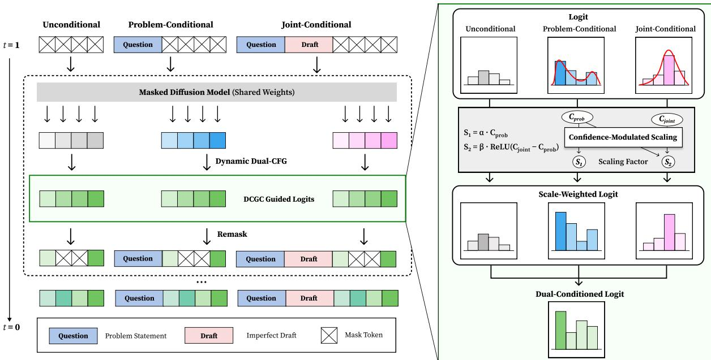
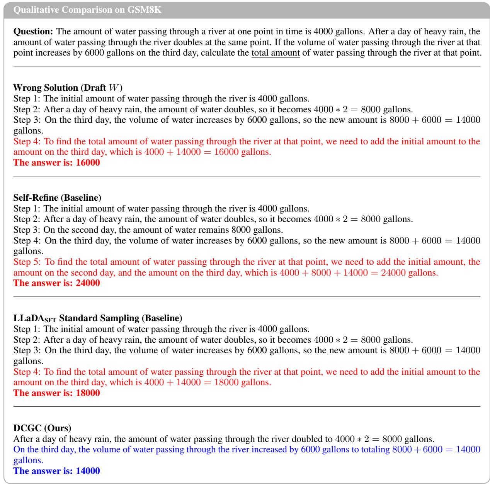

# DCGC: Draft-Conditioned Global Correction for Complex Reasoning with Masked Diffusion Models

Minhae Oh1,\*, Nakyung Lee1,\*, Jungwoo Lee1,†

1Department of Electrical and Computer Engineering, Seoul National University \*Equal contribution. †Corresponding author.

## Abstract

Correcting flawed reasoning traces remains a significant challenge for Large Language Models (LLMs), whose autoregressive generation can propagate early mistakes into subsequent reasoning. We introduce DCGC, a Masked Diffusion Model (MDM) framework for global correction that uses an imperfect solution draft from an upstream solver as auxiliary context. DCGC combines task-specific Supervised Fine-Tuning (SFT) with a novel inference-time mechanism called Dynamic Dual-CFG. This mechanism separates problem-only and joint problem-draft branches and scales the draftconditioned residual using a relative confidence gap. Across math, code, and knowledge reasoning benchmarks, DCGC outperforms standard sampling and simpler CFG variants, with additional results suggesting transfer to different diffusion backbones. In test-time setting where ground-truth failure labels are unavailable, DCGC improves full test set accuracy by correcting low-consensus upstream outputs, highlighting its utility as a verifier-free global correction module for difficult reasoning instances.

## 1 Introduction

While LLMs have recently demonstrated remarkable performance on complex reasoning tasks, they remain prone to logical fallacies and hallucinations, particularly in multi-step reasoning settings (Wei et al., 2023; Ji et al., 2023; Payandeh et al., 2023). As a result, numerous studies have investigated selfrefinement, where models iteratively critique and revise their own generations to improve solution quality (Du et al., 2023). Prominent approaches such as Self-Refine (Madaan et al., 2023), Reflexion (Shinn et al., 2023), and LATS (Zhou et al., 2024) have been proposed to mitigate these issues by incorporating feedback loops or search mechanisms. However, since the predominant architecture of contemporary LLMs is autoregressive, most existing self-refinement approaches are built upon this strictly sequential, left-to-right paradigm. This makes correction difficult, as an early mistaken step in the revised trajectory becomes part of the prefix that conditions subsequent tokens, which may then continue along the same erroneous path (Zhang et al., 2023; Lin et al., 2021). Moreover, recent studies have shown that Autoregressive Models (ARMs) are often poorly calibrated and exhibit overconfidence in their own predictions (Leng et al., 2025; Kadavath et al., 2022; Guo et al., 2017). Such overconfidence can make tool-free self-correction brittle, since the model may over-trust its own reasoning trajectory even when it contains errors (Lee et al., 2025b; Yin et al., 2023).

This motivates considering Diffusion Language Models (DLMs), particularly MDMs, as a structurally distinct substrate for post-hoc reasoning correction (Gong et al., 2023; Li et al., 2022). Unlike ARMs that commit to a single left-to-right prefix, MDMs generate text through iterative denoising over masked positions, allowing the output sequence to be revisited during inference. This property makes MDMs well suited for draft conditioned global correction, where the model uses an imperfect draft as auxiliary context during global denoising while remaining strongly conditioned on the original problem. Despite this potential, prior work has primarily utilized MDMs for generating solutions from scratch, leaving their use for global correction of long reasoning traces underexplored.

In this work, we introduce DCGC (Draft-Conditioned Global Correction with Masked Diffusion Models), a framework that uses MDMs as draft-aware global correction modules for complex reasoning. Given a problem and an imperfect draft generated by an upstream solver, DCGC performs iterative denoising under both problem-only and joint problem-draft contexts. The draft influences generation through the joint context, while its additional residual contribution is controlled relative to the problem-only branch. Unlike methods that rely on external tools, memory buffers, or computationally expensive tree searches (Yao et al., 2023), DCGC operates in a tool-free setting using only internal model signals.

To realize this, DCGC combines dual-capability SFT with Dynamic Dual-CFG. The SFT stage trains the MDM on both problem-only solving and draft-conditioned correction, equipping the model with both conditioning modes used during inference. Dynamic Dual-CFG then separates problemonly and joint problem-draft branches, using their relative confidence gap to modulate draft influence during denoising. This design encourages selective draft reuse without treating internal confidence as a verifier of correctness.

Our contributions are summarized as follows:

• We propose DCGC, a draft-conditioned global correction framework that repurposes MDMs as tool-free correction modules for complex reasoning. DCGC treats an imperfect solution as auxiliary context for global denoising and correction.

• We introduce Dynamic Dual-CFG, an inferencetime guidance mechanism that separates problemonly and draft-conditioned branches. By scaling draft guidance with a relative confidence gap, the method controls how strongly the joint context contributes beyond the problem-only branch.

• We provide controlled empirical evidence across math, code, and knowledge reasoning benchmarks. DCGC improves initially failed solutions on solver-failure hard sets, achieving 24.8% average accuracy over strong autoregressive and diffusion-based baselines.

## 2 Related Works

Non-Autoregressive Generation and Editing. While standard ARMs attempt iterative reasoning refinement via prompting or tool use (Madaan et al., 2023; Shinn et al., 2023; Zhou et al., 2024; Du et al., 2023), they inherently suffer from sequential error propagation and lack global editing flexibility (Lee et al., 2025b; Jiang et al., 2024; Huang et al., 2024). Recently, DLMs have emerged as parallel, non-autoregressive alternatives (Austin et al., 2023; Lou et al., 2024; Sahoo et al., 2024; Nie et al., 2025b; Labs et al., 2025), yet they are predominantly utilized for de novo generation rather than refinement (Li et al., 2025; Ye et al., 2025). Bridging this gap, our framework repurposes DLMs as specialized reasoning refiners. Inspired by visual editing techniques (Brooks et al., 2023), we leverage CFG to steer the global denoising process, enabling non-sequential, fine-grained correction of flawed initial solutions while preserving valid logic.

Adaptive Scaling in CFG. To overcome the limitations of static CFG, recent methods dynamically modulate guidance scales across spatial regions (Shen et al., 2024), temporal denoising steps (Malarz et al., 2025), or internal model confidence (Gu and Hou, 2025). However, these approaches are designed for single-condition trajectories and lack the mechanisms to filter misleading auxiliary signals in multi-context scenarios. In contrast, we propose a differential confidence strategy that modulates guidance based on the relative certainty gain from the secondary context, allowing the refiner to selectively use auxiliary information only when it improves confidence.

## 3 Preliminaries

Masked Diffusion Model. MDMs generate text via an iterative denoising process. Let $\scriptstyle x _ { 0 } \ =$ $( x _ { 0 } ^ { 1 } , \ldots , x _ { 0 } ^ { L } )$ be a sequence of clean tokens, and $x _ { t }$ denote the corrupted sequence at timestep t. The forward process $q ( x _ { t } \mid x _ { 0 } )$ independently corrupts each token with a mask token [M] according to a monotonically decreasing noise schedule $\alpha _ { t } \in [ 0 , 1 ]$

$$
q ( x _ { t } \mid x _ { 0 } ) = \prod _ { i = 1 } ^ { L } \left( \alpha _ { t } \delta ( x _ { t } ^ { i } , x _ { 0 } ^ { i } ) + ( 1 - \alpha _ { t } ) \delta ( x _ { t } ^ { i } , [ \mathbf { M } ] ) \right)\tag{1}
$$

where $\delta ( \cdot , \cdot )$ is the Kronecker delta function.

The reverse process reconstructs $x _ { 0 }$ from the corrupted state $x _ { t }$ using a neural denoiser $\hat { x } _ { \theta } ( x _ { t } , t )$ (Sahoo et al., 2024). For any $0 \leq s < t \leq 1$ , we define the reverse transition by posterior substitution as

$$
p _ { \theta } ( x _ { s } \mid x _ { t } ) \ \triangleq \ q ( x _ { s } \mid x _ { t } , \ x _ { 0 } = { \hat { x } } _ { \theta } ( x _ { t } , t ) { \big ) } .\tag{2}
$$

Training objective. Following LLaDA (Nie et al., 2025b), we train the model to minimize the variational lower bound, which simplifies to the cross-entropy loss on masked positions:

$$
\mathcal { L } ( \boldsymbol { \theta } ) \triangleq - \mathbb { E } _ { t , \boldsymbol { x } _ { 0 } , \boldsymbol { x } _ { t } } \left[ \frac { 1 } { | \mathcal { M } _ { t } | } \sum _ { i \in \mathcal { M } _ { t } } \log p _ { \boldsymbol { \theta } } ( x _ { 0 } ^ { i } \mid \boldsymbol { x } _ { t } ) \right] ,\tag{3}
$$

where $\mathcal { M } _ { t } = \{ i \ \vert \ x _ { t } ^ { i } = M \}$ denotes the set of indices masked at timestep t.

  
Figure 1: Overview of DCGC. DCGC operates as an iterative denoising process (left) using three parallel conditioning streams at each step: unconditional, problem-conditioned (Q), and joint-conditioned (Q, W). The core Dynamic Dual-CFG mechanism (right) dynamically modulates guidance based on token-level confidence. By applying ReLU-based scaling $( S _ { 2 } )$ , DCGC modulates the influence, activating the residual amplification only when the joint context provides a confidence gain $( C _ { j o i n t } > C _ { p r o b } )$ , ensuring robust selective reuse.

Classifier-Free Guidance (CFG). To improve the generation quality and adherence to the instruction c, we employ CFG (Ho and Salimans, 2022). Let $p _ { \theta } ( x _ { 0 } ~ \vert ~ c , x _ { t } )$ denote the categorical distribution over x0 predicted by the neural denoiser ${ \hat { x } } _ { \theta }$ conditioned on c. While originally proposed for continuous diffusion, we adopt the formulation adapted for discrete masked diffusion by (Chang et al., 2023). During training, the condition c is randomly replaced with a learnable null token ∅ or an empty sequence with a fixed probability, enabling a single model to learn both conditional $p _ { \theta } ( x _ { 0 } | c , x _ { t } )$ and unconditional $p _ { \theta } ( x _ { 0 } \mid x _ { t } )$ distributions. During inference, the guided distribution $\tilde { p } _ { \theta }$ is obtained by extrapolating between these two estimates:

$$
\tilde { p } _ { \theta } ( x _ { 0 } \mid c , x _ { t } ) \propto \frac { p _ { \theta } ( x _ { 0 } \mid c , x _ { t } ) ^ { 1 + w } } { p _ { \theta } ( x _ { 0 } \mid x _ { t } ) ^ { w } } ,\tag{4}
$$

where $w \geq 0$ denotes the guidance scale. We apply this guidance in the log-space to adjust the logits before sampling:

## 4 DCGC

$$
\begin{array} { c } { { \log \tilde { p } _ { \theta } ( x _ { 0 } \mid c , x _ { t } ) = ( 1 + w ) \log p _ { \theta } ( x _ { 0 } \mid c , x _ { t } ) } } \\ { { - w \log p _ { \theta } ( x _ { 0 } \mid \emptyset , x _ { t } ) + \mathrm { c o n s t . } } } \end{array}\tag{5}
$$

A higher w emphasizes the condition c, reducing diversity but improving relevance to the prompt.

In this section, we introduce DCGC, a draftconditioned global correction framework based on MDMs. Given a problem and an imperfect draft, DCGC generates a corrected reasoning trace through iterative denoising. The framework consists of two components. First, we use mixedformat supervised fine-tuning to train the model on both problem-only solving and draft-conditioned correction. Second, we introduce Dynamic Dual-CFG, an inference-time guidance mechanism that uses the problem statement and the draft as separate conditioning sources. Dynamic Dual-CFG combines a problem-anchored guidance term with a draft-conditioned guidance term, and modulates their strength using token-level relative confidence.

## 4.1 Task Formulation

Let Q denote a problem statement, such as a math problem, coding prompt, or multiple-choice reasoning question. Let W denote an imperfect draft generated by an upstream solver, and let G denote the target solution. DCGC considers two conditional generation modes. The first is problem-only generation, modeled as $P ( G \mid Q )$ . The second is draftconditioned correction, modeled as $P ( G \mid Q , W )$ where the draft is used as auxiliary context for generating the target solution. Our objective is to learn the draft-conditioned correction distribution $P ( G \mid Q , W )$ , where the model generates the target solution G from the problem $Q$ and draft $W$

## 4.2 Mixed-Format Supervised Fine-Tuning

We formulate the acquisition of dual capabilities as a unified supervised learning problem (Brooks et al., 2023). We first construct a consolidated dataset by interleaving two distinct data formats, and then fine-tune the MDM on this mixture using a standard masked denoising objective. The training data consists of problem-only solving pairs $( Q , G )$ where the model learns to generate the target solution G directly from the problem $Q ,$ and draftconditioned correction triples $( Q , W , G )$ , where the target solution is generated conditioned on both $Q$ and an imperfect draft W. The problem-only pairs strengthen generation from Q, while the draftconditioned triples expose the model to W as auxiliary context.

## 4.3 Dynamic Dual-CFG

Standard classifier-free guidance uses a single conditional source. In draft-conditioned correction, however, the problem and the draft play different roles. The problem statement Q specifies the task and answer constraints. The draft W provides an additional reasoning context that may or may not be useful for the current denoising step. Using a single concatenated condition makes it difficult to control these two sources separately.

Dynamic Dual-CFG separates the two sources into a problem context and a joint problem-draft context. We define the problem context as $c _ { \mathrm { p r o b } } =$ $Q .$ We define the joint context as $c _ { \mathrm { j o i n t } } = \{ Q , W \}$ At each denoising step, the same MDM is evaluated under three conditioning states including the unconditional context, the problem context, and the joint context. The resulting logits are then combined through a dual guidance rule.

Dual-Guide Decomposition. We operate on the predicted clean-token logits $s _ { \theta } ( x _ { 0 } \mid c , x _ { t } )$ . Let $s _ { \varnothing } , \ s _ { \mathrm { p r o b } } ,$ and $s _ { \mathrm { j o i n t } }$ denote the logits under the unconditional context, the problem context, and the joint context, respectively. The final guided logits $\scriptstyle { \tilde { s } } _ { \theta }$ are computed as follows.

$$
\begin{array} { r } { \widetilde { s } _ { \theta } = s _ { \mathrm { p r o b } } + \underbrace { S _ { 1 } \odot ( s _ { \mathrm { p r o b } } - s _ { \emptyset } ) } _ { \mathrm { P r o b l e m - A n c h o r e d G u i d a n c e } } } \\ { + s _ { \mathrm { j o i n t } } + \underbrace { S _ { 2 } \odot ( s _ { \mathrm { j o i n t } } - s _ { \mathrm { p r o b } } ) } _ { \mathrm { R e l a t i v e ~ D r a f t ~ R e s i d u a l } } . } \end{array}\tag{6}
$$

Here, $S _ { 1 }$ and $S _ { 2 }$ are position-wise scaling factors, and ⊙ denotes element-wise scaling over sequence positions with broadcasting over the vocabulary dimension. The first term applies standard CFG around the problem context and anchors the generation to $Q$ . The remaining terms integrate the draft-conditioned information using the joint prediction $s _ { \mathrm { j o i n t } }$ alongside a relative residual $S _ { 2 } \odot ( s _ { \mathrm { j o i n t } } - s _ { \mathrm { p r o b } } )$ . This residual formulation captures how the draft context shifts the model’s prediction trajectory compared to the problem-only branch. Overall, this decomposition allows DCGC to robustly combine problem anchoring with draftguided correction, where $S _ { 2 }$ dictates the amplification of the draft’s influence. The detailed derivation is provided in Appendix A.

Confidence-Modulated Scaling. Fixed guidance scales use the same strength across all positions and examples (Nie et al., 2025b,a). DCGC instead computes token-level guidance scales from the model’s confidence under the problem and joint contexts. We define confidence as the maximum probability in the predicted token distribution. For each token i, we compute the confidence scores as follows.

$$
\begin{array} { r l } & { C _ { \mathrm { p r o b } } ^ { ( i ) } = \underset { v } { \operatorname* { m a x } } ~ \mathrm { S o f t m a x } ( s _ { \mathrm { p r o b } } ^ { ( i ) } ) _ { v } , } \\ & { C _ { \mathrm { j o i n t } } ^ { ( i ) } = \underset { v } { \operatorname* { m a x } } ~ \mathrm { S o f t m a x } ( s _ { \mathrm { j o i n t } } ^ { ( i ) } ) _ { v } . } \end{array}\tag{7}
$$

Based on these scores, we define the positionwise scaling factors.

$$
\begin{array} { r l } & { S _ { 1 } ^ { ( i ) } = \alpha \cdot C _ { \mathrm { p r o b } } ^ { ( i ) } , } \\ & { S _ { 2 } ^ { ( i ) } = \beta \cdot \mathrm { R e L U } \left( C _ { \mathrm { j o i n t } } ^ { ( i ) } - C _ { \mathrm { p r o b } } ^ { ( i ) } \right) , } \end{array}\tag{8}
$$

where α and $\beta$ are scalar hyperparameters. The problem guidance scale $S _ { 1 }$ increases with problemcontext confidence, which strengthens the problemanchored term at positions where the model is confident under $Q .$ . The draft residual scale $S _ { 2 }$ depends on the relative confidence gap between the joint and the problem-only branch. When the joint branch has higher confidence than the problemonly branch at position i, DCGC amplifies the residual direction $s _ { \mathrm { j o i n t } } ^ { ( i ) } - s _ { \mathrm { p r o b } } ^ { ( i ) }$ . When the joint branch does not provide a confidence gain, the additional residual term at that position is set to zero.

This design uses relative confidence as an internal signal for modulating guidance strength. The joint-context prediction remains part of the combined logits through $s _ { \mathrm { j o i n t } }$ , while the residual amplification is activated only when the joint branch provides higher confidence than the problem-only branch. The resulting scaling factors are applied independently across sequence positions in Eq. 6.

## 5 Experimental Setups

We describe the implementation of DCGC and the baselines used for comparison. Dataset details, inference and training hyperparameters, and prompt templates are deferred to Appendix B and Appendix H, respectively.

SFT Dataset Curation. To equip the model with both problem-only and draft-conditioned generation capabilities, we construct a composite SFT dataset across mathematics, coding, and general reasoning domains. The training mixture contains two types of examples. The first type consists of standard solving pairs (Q, G), where the model generates the gold solution from the problem alone. The second type consists of draft-conditioned correction triples (Q, W, G), where the model generates the gold solution using both the problem and an imperfect draft.

Since imperfect drafts W are not readily available for all domains, we use domain-specific curation strategies. For mathematics, we utilize labeled incorrect trajectories derived from the Math-Sheperd dataset (Wang et al., 2024). For coding and general reasoning, we collect model-generated outputs or failure cases from open-source models and use them as imperfect drafts. To improve training stability, we filter examples whose full prompt exceeds 1,028 tokens. The final filtered dataset was split into training and validation sets, with 5% of the filtered examples reserved for validation.

Benchmarks and Evaluation Protocol. We evaluate our method on diverse benchmarks, including GSM8K (Cobbe et al., 2021) and MATH-500 (Hendrycks et al., 2021b) for mathematics, MBPP-test (Austin et al., 2021) and HumanEval (Chen et al., 2021) for code generation, and MMLU-STEM and MMLU-Pro (Hendrycks et al., 2021a) for general reasoning. Our main experiments use solver-failure hard sets. For each benchmark, we run Llama-3.1-8B-Instruct on the test set and retain only the instances where the solver produces an incorrect answer. The generated incorrect answer is used as the draft W. This protocol evaluates conditional correction performance on failed reasoning attempts.

We also evaluate DCGC on full test sets in Section 6.3, where ground-truth labels are not used to determine whether refinement is needed. This full-set evaluation measures the practical effect of applying DCGC under a gold-agnostic selective refinment strategy.

Baselines and variants. Our main comparison evaluates DCGC against controlled MDM variants built on the same LLaDA-8B-Instruct backbone (Nie et al., 2025b). We also include tool-free autoregressive self-refinement baselines as references to prior self-correction methods. For these baselines, we use Llama-3.1-8B-Instruct (Grattafiori et al., 2024), its SFT-adapted variant trained on the same dataset, and Mistral-7B-v1 (Jiang et al., 2023), each evaluated with the Self-Refine pipeline (Madaan et al., 2023).

For MDM variants, we consider the base LLaDA backbone and its SFT-adapted variant, LLaDASFT, trained on our mixed-format SFT dataset. We first include Standard Sampling, which performs masked diffusion decoding without classifier-free guidance. We evaluate this setting for both the base LLaDA backbone and LLaDA to measure the effect of dual-capability SFT. We also apply Dynamic Dual-CFG to the base backbone to examine how much the guidance mechanism contributes before task-specific adaptation.

For the SFT-adapted backbone, we compare DCGC with several guidance variants. Single-CFG (Problem) applies CFG using only the problem statement Q. Single-CFG (Joint) applies CFG using the joint problem-draft context (Q, W). Dual-CFG (Static) separates the problem-only and problem-draft branches but uses constant scaling. Dual-CFG (Independent) uses a linear scaling rule based on the confidence of the joint branch. Finally, DCGC (Relative) uses the proposed relative ReLU scaling based on the confidence gap between the joint branch and the problem-only branch.

Implementation Details. We implement DCGC using the LLaDA-8B-Instruct backbone. To ensure parameter efficiency, we employ low-rank adapation (LoRA) (Hu et al., 2021) for fine-tuning. The model is trained for 3 epochs on 2 NVIDIA A100 GPUs. For inference, we set the generation length to 256 tokens (512 for MMLU). All MDM variants are evaluated under the same hard-set protocol and use the same block diffusion setting with block size

Table 1: Overall Performance. Performance comparison across reasoning benchmarks. DCGC combines mixedformat SFT with Dynamic Dual-CFG and achieves the highest average accuracy, with the best score on five of the six benchmarks. Bold and underlined indicate the best and second-best scores, respectively.
<table><tr><td rowspan="2">Method</td><td rowspan="2">Model</td><td colspan="2">Math</td><td colspan="2">Code</td><td colspan="2">Knowledge &amp; Reasoning</td><td rowspan="2">Avg.</td></tr><tr><td>GSM8K</td><td>MATH</td><td>MBPP</td><td>HumanEval</td><td>MMLU-STEM</td><td>MMLU-Pro</td></tr><tr><td>LLM Baselines</td><td></td><td></td><td></td><td></td><td></td><td></td><td></td><td></td></tr><tr><td>Self-Refine</td><td>LLaMA</td><td>17.1</td><td>0.4</td><td>11.1</td><td>11.6</td><td>11.3</td><td>5.8</td><td>10.1</td></tr><tr><td>Self-Refine</td><td>LLaMASFT</td><td>26.4</td><td>11.0</td><td>8.3</td><td>10.1</td><td>26.3</td><td>15.9</td><td>16.3</td></tr><tr><td>Self-Refine</td><td>Mistral</td><td>5.6</td><td>0.7</td><td>1.4</td><td>8.7</td><td>4.2</td><td>3.0</td><td>3.9</td></tr><tr><td>MDM variants</td><td></td><td></td><td></td><td></td><td></td><td></td><td></td><td></td></tr><tr><td>Standard Sampling</td><td>LLaDA</td><td>7.4</td><td>9.9</td><td>0.0</td><td>0.0</td><td>5.7</td><td>5.1</td><td>4.7</td></tr><tr><td>Dynamic Dual-CFG</td><td>LLaDA</td><td>16.7</td><td>9.9</td><td>3.2</td><td>4.4</td><td>19.7</td><td>13.4</td><td>11.2</td></tr><tr><td>Standard Sampling</td><td> $\mathrm { L L a D A } _ { \mathrm { S F T } }$ </td><td>32.4</td><td>17.4</td><td>5.1</td><td>8.7</td><td>30.9</td><td>19.2</td><td>18.9</td></tr><tr><td>Ours</td><td></td><td></td><td></td><td></td><td></td><td></td><td></td><td></td></tr><tr><td>DCGC</td><td> $\mathbf { L L a D A _ { S F T } }$ </td><td>44.9</td><td>22.3</td><td>10.7</td><td>13.1</td><td>35.7</td><td>22.5</td><td>24.8</td></tr></table>

Table 2: Impact of guidance scaling strategies. DCGC (Relative) utilizes a dynamic ReLU-based scaling to selectively leverage dual conditions, consistently outperforming static and independent variants across all benchmarks. Bold and underlined values indicate the best and second-best scores, respectively.
<table><tr><td rowspan="2">Method</td><td colspan="2">Guidance Branch</td><td rowspan="2">Scaling</td><td colspan="6">Scores</td><td rowspan="2">Avg.</td></tr><tr><td>Q (Q, W)</td><td></td><td>GSM8K</td><td>MATH</td><td>MBPP</td><td>HEval</td><td>STEM</td><td>Pro</td></tr><tr><td>Standard Sampling</td><td></td><td></td><td></td><td>32.4</td><td>17.4</td><td>5.1</td><td>8.7</td><td>30.9</td><td>19.2</td><td>18.9</td></tr><tr><td>Single-Condition</td><td></td><td></td><td></td><td></td><td></td><td></td><td></td><td></td><td></td><td></td></tr><tr><td>Single-CFG (Problem)</td><td> $\qquad { \bf \check { \checkmark } } \qquad - \qquad $ </td><td></td><td>Constant</td><td>43.9</td><td>17.4</td><td>6.9</td><td>10.1</td><td>34.9</td><td>20.8</td><td>22.4</td></tr><tr><td>Single-CFG (Joint)</td><td></td><td>√</td><td>Constant</td><td>36.6</td><td>15.6</td><td>5.6</td><td>8.7</td><td>32.9</td><td>21.4</td><td>20.1</td></tr><tr><td>Dual-Condition</td><td></td><td></td><td></td><td></td><td></td><td></td><td></td><td></td><td></td><td></td></tr><tr><td>Dual-CFG (Static)</td><td> $\checkmark \quad \checkmark$ </td><td></td><td>Constant</td><td>37.9</td><td>15.9</td><td>5.6</td><td>7.3</td><td>33.5</td><td>20.9</td><td>20.2</td></tr><tr><td>Dual-CFG (Independent)</td><td> $\checkmark \quad \checkmark$ </td><td></td><td>Linear</td><td>38.4</td><td>18.4</td><td>9.3</td><td>8.7</td><td>33.7</td><td>20.6</td><td>21.5</td></tr><tr><td>DCGC (Relative)</td><td> $\checkmark \quad \checkmark$ </td><td></td><td>ReLU</td><td>44.9</td><td>22.3</td><td>10.7</td><td>13.1</td><td>35.7</td><td>22.5</td><td>24.8</td></tr></table>

32 (Arriola et al., 2025). Crucially, the guidance hyperparameters for our dynamic dual-CFG mechanism are strictly fixed to $\alpha = 0 . 5$ and $\beta = 1 . 0 $ calibrated solely on the GSM8K validation split and held constant across all benchmarks. In contrast, for the constant-scaling baselines, we sweep the guidance weights from 0.5 to 2.0 with a step size of 0.5 and report the maximum score achieved. This evaluation protocol intentionally frames the baseline performance at its empirical upper limit, ensuring a highly conservative assessment of out proposed method. Additional training and inference details are provided in Appendix B.

## 6 Results

## 6.1 Main Results

Overall performance. Table 1 and Table 2 summarize the overall results, showing that DCGC achieves the strongest overall performance across the evaluated benchmarks. The largest gains appear in mathematical reasoning. On GSM8K, DCGC attains 44.9%, compared to 26.4% from the strongest autoregressive Self-Refine baseline and 43.9% from the strongest non-DCGC LLaDA variant. Similarly on MATH, DCGC reaches 22.3%, surpassing the strongest autoregressive baseline at 11.0% and the best non-DCGC LLaDA variant at 18.4%.

This advantage extends to code and knowledgeheavy tasks, where DCGC obtains 13.1% on HumanEval and achieves top scores of 35.7% on MMLU-STEM and 22.5% on MMLU-Pro. While MBPP performance is comparable to the strongest baseline (10.7% vs. 11.1%), we attribute the larger gains on HumanEval to its richer problem specification. HumanEval includes function signatures and docstring-style instructions that provide more explicit constraints for correction than MBPP’s brief natural-language prompts.

Overall, these results indicate that DCGC is an effective draft-conditioned global correction module when combined with dual-capability SFT and relative dual guidance. We provide a representative step-by-step example in Table 12, and present qualitative comparisons between baselines and DCGC in Appendix I.

Effect of SFT. We first examine the role of SFT by comparing standard sampling using the base LLaDA-8B-Instruct model to the SFT-adapted variant. Without SFT, the pre-trained diffusion model performs poorly, achieving only 4.7 average accuracy and 7.4% on GSM8K. In contrast, SFT substantially improves performance across tasks. With standard sampling, LLaDASFT reaches 18.9 average accuracy, including 32.4% on GSM8K, 30.9% on MMLU-STEM, and 19.2% on MMLU-Pro. These results support the view that dual-capability SFT equips the model with both problem-only solving ability and draft-conditioned generation ability. This training stage is therefore an important foundation for DCGC, since the model must remain grounded in the problem statement while still being able to use draft-derived cues when they are informative.

Limits of Single-Condition Guidance. Beyond training, we examine the role of Dynamic Dual-CFG by comparing standard sampling against single-condition CFG and dual-branch CFG variants. This allows us to separate the effect of inference-time guidance from the effect of conditioning design. Applying Dynamic Dual-CFG to the base LLaDA model improves the average accuracy from 4.7 to 11.2, with GSM8K increasing from 7.4% to 16.7%. This shows that inferencetime guidance can provide a useful correction signal even before task-specific adaptation.

On the SFT-adapted backbone, Single-CFG (Problem) improves over standard sampling from 18.9 to 22.4, showing that strong problem conditioning can recover many failed cases. This problem-only branch provides a useful problemconditioned reference for generation. However, problem-only guidance is not sufficient to obtain the best performance. DCGC improves over Single-CFG (Problem) on all six benchmarks, with especially clear gains on MATH, MBPP, and HumanEval. This shows that draft-conditioned information can complement problem-only guidance when its residual contribution is properly controlled.

This benefit does not come from simply adding the draft. Although the joint condition contains more information, Single-CFG (Joint), which uses the concatenated problem-draft context, drops to

20.1 average accuracy. This indicates that imperfect drafts can introduce distracting context when their contribution is not separated from the problem statement. Therefore, effective use of the draft requires separating the problem-conditioned and draft-conditioned signals, which motivates the dualguide design of DCGC.
<table><tr><td>Task</td><td>Draft Condition</td><td>Acc. ↑</td><td>FRR↓</td></tr><tr><td>GSM8K</td><td>Original</td><td>44.9</td><td>27.3</td></tr><tr><td></td><td>Shuffled</td><td>38.0</td><td>90.3</td></tr><tr><td></td><td>Domain-shifted</td><td>40.7</td><td>98.6</td></tr><tr><td>MATH</td><td>Original</td><td>22.3</td><td>66.0</td></tr><tr><td></td><td>Shuffled</td><td>10.3</td><td>96.8</td></tr><tr><td></td><td>Domain-shifted</td><td>11.0</td><td>96.8</td></tr><tr><td>MBPP</td><td>Original</td><td>10.7</td><td>3.2</td></tr><tr><td></td><td>Shuffled</td><td>10.6</td><td>17.6</td></tr><tr><td></td><td>Domain-shifted</td><td>7.4</td><td>100.0</td></tr><tr><td>MMLU-STEM</td><td>Original</td><td>35.7</td><td>36.5</td></tr><tr><td></td><td>Shuffled</td><td>32.1</td><td>89.0</td></tr><tr><td></td><td>Domain-shifted</td><td>30.0</td><td>88.8</td></tr></table>

Table 3: Draft relevance perturbation. We keep the problem fixed and perturb only the draft condition. Original uses the draft generated for the same problem, Shuffled uses an unrelated draft from the same task, and Domain-shifted uses a draft from a different task. FRR (Full Regeneration Rate) denotes the fraction of samples where the generated output has low token overlap with the draft, retaining fewer original draft tokens.

Effect of relative scaling. As illustrated in Table 2, after separating the problem and joint problem-draft branches, we evaluate how the draftconditioned residual should be scaled. Dual-CFG (Static) uses constant scaling for the separated branches, but reaches only 20.2 average accuracy, remaining below the problem-only baseline at 22.4. This shows that uniformly enforcing the draft’s influence across the entire problem is insufficient.

Dual-CFG (Independent) improves over static dual guidance on nearly all benchmarks, reaching 21.5 average accuracy, but it still underperforms DCGC. This variant scales the draft-conditioned branch based on the confidence of the joint context alone. However, joint confidence is not always a reliable signal for amplifying draft-conditioned information, since an imperfect draft can still make the joint branch confident.

In contrast, DCGC compares the joint problemdraft branch against the problem-only branch and uses a relative ReLU confidence gap to scale the residual direction between them. When the joint branch provides a confidence gain over the problem-only branch, DCGC increases the draftconditioned residual. When it provides little additional support, the extra residual amplification is reduced. As a result, DCGC achieves 24.8 average accuracy and obtains the best scores among LLaDA variants across all benchmarks. These results show that relative scaling is important for balancing problem conditioning with draft-conditioned residual guidance. We report additional results with alternative scaling functions in Appendix D.

## 6.2 Draft Relevance and Selective Reuse

While our main results demonstrate that DCGC effectively improves reasoning accuracy, it is important to verify whether the model genuinely utilizes the provided draft or merely ignores it and re-solves the problem from scratch. To address this, Table 3 evaluates whether DCGC is sensitive to the relevance of the draft condition. To isolate the effect of the draft, we keep the problem fixed and replace only the draft input. The Original setting uses the draft generated for the same problem, while Shuffled and Domain-shifted replace it with irrelevant drafts from the same task or a different task. Across all evaluated tasks, the original draft achieves the highest accuracy and draft reuse ratio (FRR). For example, on MATH, accuracy drops from 22.3 with the original draft to 10.3 and 11.0 under shuffled and domain-shifted drafts, respectively. Similar patterns are observed on other benchmarks, with particularly large changes on the MBPP code generation task.

Overall, these perturbation results show that DCGC does not treat all drafts equally. Instead, it reuses aligned and informative draft content while suppressing reuse when the draft becomes irrelevant or mismatched. Together with Table ??, this supports the role of relative dual guidance in using draft-derived information beyond problem-only guidance.

## 6.3 Evaluation in Gold-Agnostic Settings

We further evaluate DCGC in a gold-agnostic setting where ground-truth answers are unavailable at test time. We use Llama-3.1-8B with selfconsistency (Wang et al., 2023) over five samples as the upstream generator. If no answer receives at least three votes among the five samples, the query is marked as low-consensus and sent to a correction module. Otherwise, the self-consistency answer is accepted. For these correction cases, we use the first generated reasoning path as the draft W.

<table><tr><td>Method</td><td colspan="2">Full Set Acc. ∆</td><td colspan="2">Correction Set Acc. ∆</td></tr><tr><td colspan="5">MATH (Correction Ratio ∼64%, Maj≥3@5 21.00)</td></tr><tr><td>Llama-3-8B (Maj@5) + Self-Refine</td><td>41.19 41.20</td><td>(+0.01)</td><td>20.4 20.4</td><td>(+0.0)</td></tr><tr><td>+ LLaDA (Standard) + LLaDAsFT (Standard)</td><td>40.40 42.60</td><td>(-0.79) (+1.41)</td><td>19.1 22.6</td><td>(-1.3) (+2.2)</td></tr><tr><td>+ LLaDAsFT (Single-CFG Q) + DCGC</td><td>40.80 43.20</td><td>(-0.39) (+2.01)</td><td>19.7 23.5</td><td>(-0.6) (+3.1)</td></tr><tr><td>GSM8K (Correction Ratio ∼9%, Maj≥3@5 78.47)</td><td></td><td></td><td></td><td></td></tr><tr><td>Llama-3-8B (Maj@5)</td><td></td><td></td><td></td><td></td></tr><tr><td>+ Self-Refine</td><td>86.80 85.97</td><td>(-0.83)</td><td>38.1 28.8</td><td></td></tr><tr><td>+ LLaDA (Standard)</td><td>85.37</td><td>(-1.43)</td><td>22.0</td><td>(-9.3)</td></tr><tr><td> $+ \mathrm { L L a D A } _ { \mathrm { S F T } } \ : ( \mathrm { S t a n d a r d } )$ </td><td></td><td></td><td></td><td>(-16.1)</td></tr><tr><td></td><td>85.75</td><td>(-1.05)</td><td>26.3</td><td>(-11.9)</td></tr><tr><td>+ LLaDAsFT (Single-CFG Q)</td><td>86.20</td><td>(-0.60)</td><td>31.4</td><td>(-6.8)</td></tr><tr><td>+ DCGC</td><td>86.96</td><td>(+0.16)</td><td>39.8</td><td>(+1.7)</td></tr><tr><td>MMLU-STEM (Correction Ratio ∼7%, Maj≥3@5 64.13)</td><td></td><td></td><td></td><td></td></tr><tr><td></td><td></td><td></td><td></td><td></td></tr><tr><td>Llama-3-8B (Maj@5)</td><td>68.66</td><td></td><td>26.4</td><td></td></tr><tr><td>+ Self-Refine</td><td>68.79</td><td>(+0.13)</td><td>28.2</td><td>(+1.9)</td></tr><tr><td>+ LLaDA (Standard)</td><td>68.47</td><td>(-0.19)</td><td>23.6</td><td>(-2.8)</td></tr><tr><td>+ LLaDAsFT (Standard)</td><td>68.89</td><td>(+0.23)</td><td>29.6</td><td>(+3.2)</td></tr><tr><td> $+ \mathrm { L L a D A _ { S F T } ( S i n g l e \mathrm { - } C F G Q ) }$ </td><td></td><td></td><td></td><td></td></tr><tr><td></td><td>68.82</td><td>(+0.16)</td><td>28.7</td><td>(+2.3)</td></tr><tr><td>+DCGC</td><td>69.17</td><td>(+0.51)</td><td>33.8</td><td>(+7.4)</td></tr></table>

Table 4: Gold-agnostic selective correction on full test sets. Only low-consensus examples are selected for correction. Headers indicate the correction ratio and high-consensus (Maj≥3@5) accuracy. Parentheses denote ∆ relative to the no-correction Maj@5 baseline.

To rigorously evaluate the benefit of correction, we employ Majority Voting (M aj@5) as a strong baseline that inherently aggregates the model’s best possible predictions. We additionally report M aj≥3@5, which counts a prediction as correct only when the selected answer appears at least three times and matches the gold answer. This diagnostic characterizes the strength of the upstream consensus. Surpassing Maj@5 implies correcting instances where the generator’s internal consensus is either scattered or fundamentally incorrect. This is a task significantly harder than improving upon a single sample (pass@1).

Table 4 reports the full-set accuracy as the primary metric. Overall, DCGC consistently improves the final accuracy across all three benchmarks, GSM8K, MATH, and MMLU-STEM. Notably, the results highlight that correction under low consensus is highly unstable for conventional baselines. For instance, on GSM8K, standard methods like Self-Refine actually degrade the correctionsubset accuracy by 9.3% compared to the M aj@5 baseline. This performance drop underscores the inherent difficulty of reliably revising uncertain drafts without ground-truth feedback. In contrast, DCGC consistently improves correction-subset accuracy over the M aj@5 baseline, even though the corresponding full-set gains are modest on GSM8K and MMLU-STEM due to their small correction ratios.

<table><tr><td>Method</td><td>Easy</td><td>Hard</td></tr><tr><td>GSM8K (Easy: 45, Hard: 73)</td><td></td><td></td></tr><tr><td>DCGC LLaDA Standard LLaDAsFT Standard LLaDASFT cond Q</td><td>53.33 42.22 44.44</td><td>31.51 9.59 15.07</td></tr><tr><td>LLaMA-8B-Instruct</td><td>40.00 46.67</td><td>26.03 17.81</td></tr><tr><td>DCGC</td><td>MATH (Easy: 65, Hard: 254)</td><td></td></tr><tr><td>LLaDA Standard</td><td>44.62 43.08</td><td>18.11 12.99</td></tr><tr><td>LLaDASFT Standard</td><td>47.69</td><td>16.14</td></tr><tr><td> $\mathrm { L L a D A _ { S F T } }$  cond Q</td><td>41.54</td><td>14.17</td></tr><tr><td>LLaMA-8B-Instruct</td><td>50.77</td><td>12.20</td></tr><tr><td></td><td></td><td></td></tr><tr><td>MMLU-STEM (Easy: 57, Hard: 159)</td><td></td><td></td></tr><tr><td></td><td></td><td></td></tr><tr><td>DCGC</td><td>40.35</td><td></td></tr><tr><td>LLaDA Standard</td><td></td><td>31.45</td></tr><tr><td></td><td>49.12</td><td>14.47</td></tr><tr><td> $\mathrm { L L a D A _ { S F T } }$  Standard</td><td>40.35</td><td>25.79</td></tr><tr><td></td><td></td><td></td></tr><tr><td> $\mathrm { L L a D A _ { S F T } }$  cond Q</td><td>31.58</td><td>27.67</td></tr><tr><td>LLaMA-8B-Instruct</td><td>42.11</td><td>23.27</td></tr></table>

Table 5: Post-hoc breakdown of accuracy on the lowconsensus correction subset. Easy and hard denote instances for which the initial upstream solution is correct and incorrect, respectively.

To further characterize performance on the lowconsensus correction subset, we divide it according to whether the initial upstream solution is correct. We refer to instances with a correct initial solution as easy and those with an incorrect initial solution as hard; these labels are used only for posthoc analysis and are not available to the correction methods at test time. Table 5 reports the resulting breakdown.

DCGC achieves the highest accuracy on the hard subset for all three benchmarks, reaching 31.51 on GSM8K, 18.11 on MATH, and 31.45 on MMLU-STEM. These results show that its gains in the goldagnostic setting arise from more reliable correction of initially incorrect, low-consensus outputs. Meanwhile, DCGC remains competitive on the easy subset (53.33, 44.62, and 40.35 on GSM8K, MATH, and MMLU-STEM, respectively), indicating that its hard-case improvements are not explained solely by an indiscriminate trade-off against initially correct cases.

## 7 Conclusion

In this paper, we presented DCGC, a maskeddiffusion framework for draft-conditioned global correction of complex reasoning traces. DCGC leverages the synergy between Supervised Fine-Tuning and Dynamic Dual-CFG, enabling the model to generate under both problem-only and joint problem-draft contexts while adaptively modulating the draft-conditioned residual signal. Extensive experiments across diverse benchmarks demonstrate that DCGC significantly outperforms strong baselines on reasoning tasks, and remains effective in realistic settings without oracle feedback. DCGC’s ability to extract constructive draft information via relative dual guidance highlights the promising paradigm of combining autoregressive models for initial generation with masked diffusion models for global correction to build reliable, self-correcting reasoning systems.

## Limitations

Due to computational resource constraints during supervised fine-tuning, we applied a strict length filter and discarded samples exceeding 1,028 tokens. While this length is sufficient for the reasoning benchmarks evaluated in this work, such as GSM8K, MATH, and standard MMLU tasks, the current instantiation of DCGC may be limited in extremely long-context scenarios. Additionally, our gold-agnostic correction strategy uses self-consistency as a simple uncertainty signal, and more sophisticated triggering criteria may further improve efficiency and reliability.

## References

Marianne Arriola, Aaron Gokaslan, Justin Chiu, Zhihan Yang, Zhixuan Qi, Jiaqi Han, Subham Sahoo, and Volodymyr Kuleshov. 2025. Block diffusion: Interpolating between autoregressive and diffusion language models. In International Conference on Learning Representations, volume 2025, pages 50726–50753.

Jacob Austin, Daniel D. Johnson, Jonathan Ho, Daniel Tarlow, and Rianne van den Berg. 2023. Structured denoising diffusion models in discrete state-spaces. Preprint, arXiv:2107.03006.

Jacob Austin, Augustus Odena, Maxwell Nye, Maarten Bosma, Henryk Michalewski, David Dohan, Ellen Jiang, Carrie Cai, Michael Terry, Quoc Le, and Charles Sutton. 2021. Program synthesis with large language models. Preprint, arXiv:2108.07732.

Tim Brooks, Aleksander Holynski, and Alexei A. Efros. 2023. Instructpix2pix: Learning to follow image editing instructions. Preprint, arXiv:2211.09800.

Huiwen Chang, Han Zhang, Jarred Barber, AJ Maschinot, Jose Lezama, Lu Jiang, Ming-Hsuan Yang, Kevin Murphy, William T. Freeman, Michael Rubinstein, Yuanzhen Li, and Dilip Krishnan. 2023. Muse: Text-to-image generation via masked generative transformers. Preprint, arXiv:2301.00704.

Mark Chen, Jerry Tworek, Heewoo Jun, Qiming Yuan, Henrique Ponde de Oliveira Pinto, Jared Kaplan, and 1 others. 2021. Evaluating large language models trained on code. Preprint, arXiv:2107.03374.

Karl Cobbe, Vineet Kosaraju, Mohammad Bavarian, Mark Chen, Heewoo Jun, Lukasz Kaiser, Matthias Plappert, Jerry Tworek, Jacob Hilton, Reiichiro Nakano, Christopher Hesse, and John Schulman. 2021. Training verifiers to solve math word problems. Preprint, arXiv:2110.14168.

Yilun Du, Shuang Li, Antonio Torralba, Joshua B. Tenenbaum, and Igor Mordatch. 2023. Improving factuality and reasoning in language models through multiagent debate. Preprint, arXiv:2305.14325.

Shansan Gong, Mukai Li, Jiangtao Feng, Zhiyong Wu, and Lingpeng Kong. 2023. Diffuseq: Sequence to sequence text generation with diffusion models. Preprint, arXiv:2210.08933.

Aaron Grattafiori, Abhimanyu Dubey, Abhinav Jauhri, Abhinav Pandey, Abhishek Kadian, and 1 others. 2024. The llama 3 herd of models. Preprint, arXiv:2407.21783.

Enhao Gu and Haolin Hou. 2025. In-situ autoguidance: Eliciting self-correction in diffusion models. Preprint, arXiv:2510.17136.

Chuan Guo, Geoff Pleiss, Yu Sun, and Kilian Q. Weinberger. 2017. On calibration of modern neural networks. Preprint, arXiv:1706.04599.

Dan Hendrycks, Collin Burns, Steven Basart, Andy Zou, Mantas Mazeika, Dawn Song, and Jacob Steinhardt. 2021a. Measuring massive multitask language understanding. Preprint, arXiv:2009.03300.

Dan Hendrycks, Collin Burns, Saurav Kadavath, Akul Arora, Steven Basart, Eric Tang, Dawn Song, and Jacob Steinhardt. 2021b. Measuring mathematical problem solving with the math dataset. Preprint, arXiv:2103.03874.

Jonathan Ho and Tim Salimans. 2022. Classifier-free diffusion guidance. Preprint, arXiv:2207.12598.

Edward J. Hu, Yelong Shen, Phillip Wallis, Zeyuan Allen-Zhu, Yuanzhi Li, Shean Wang, Lu Wang, and Weizhu Chen. 2021. Lora: Low-rank adaptation of large language models. Preprint, arXiv:2106.09685.

Jie Huang, Xinyun Chen, Swaroop Mishra, Huaixiu Steven Zheng, Adams Wei Yu, Xinying Song, and Denny Zhou. 2024. Large language models cannot self-correct reasoning yet. Preprint, arXiv:2310.01798.

Ziwei Ji, Nayeon Lee, Rita Frieske, Tiezheng Yu, Dan Su, Yan Xu, Etsuko Ishii, Ye Jin Bang, Andrea Madotto, and Pascale Fung. 2023. Survey of hallucination in natural language generation. ACM Computing Surveys, 55(12):1–38.

Albert Q. Jiang, Alexandre Sablayrolles, Arthur Mensch, Chris Bamford, Devendra Singh Chaplot, Diego de las Casas, Florian Bressand, Gianna Lengyel, Guillaume Lample, Lucile Saulnier, Lélio Renard Lavaud, Marie-Anne Lachaux, Pierre Stock, Teven Le Scao, Thibaut Lavril, Thomas Wang, Timothée Lacroix, and William El Sayed. 2023. Mistral 7b. Preprint, arXiv:2310.06825.

Dongwei Jiang, Jingyu Zhang, Orion Weller, Nathaniel Weir, Benjamin Van Durme, and Daniel Khashabi. 2024. Self-[in]correct: Llms struggle with discriminating self-generated responses. Preprint, arXiv:2404.04298.

Saurav Kadavath, Tom Conerly, Amanda Askell, Tom Henighan, Dawn Drain, Ethan Perez, Nicholas Schiefer, Zac Hatfield-Dodds, Nova DasSarma, Eli Tran-Johnson, Scott Johnston, Sheer El-Showk, Andy Jones, Nelson Elhage, Tristan Hume, Anna Chen, Yuntao Bai, Sam Bowman, Stanislav Fort, and 17 others. 2022. Language models (mostly) know what they know. Preprint, arXiv:2207.05221.

Geunwoo Kim, Pierre Baldi, and Stephen McAleer. 2023. Language models can solve computer tasks. Preprint, arXiv:2303.17491.

Inception Labs, Samar Khanna, Siddhant Kharbanda, Shufan Li, Harshit Varma, Eric Wang, Sawyer Birnbaum, Ziyang Luo, Yanis Miraoui, Akash Palrecha, Stefano Ermon, Aditya Grover, and Volodymyr Kuleshov. 2025. Mercury: Ultra-fast language models based on diffusion. Preprint, arXiv:2506.17298.

Hyunseok Lee, Seunghyuk Oh, Jaehyung Kim, Jinwoo Shin, and Jihoon Tack. 2025a. Revise: Learning to refine at test-time via intrinsic self-verification. Preprint, arXiv:2502.14565.

Young-Jun Lee, Seungone Kim, Byung-Kwan Lee, Minkyeong Moon, Yechan Hwang, Jong Myoung Kim, Graham Neubig, Sean Welleck, and Ho-Jin Choi. 2025b. Refinebench: Evaluating refinement capability of language models via checklists. Preprint, arXiv:2511.22173.

Jixuan Leng, Chengsong Huang, Banghua Zhu, and Jiaxin Huang. 2025. Taming overconfidence in llms: Reward calibration in rlhf. Preprint, arXiv:2410.09724.

Tianyi Li, Mingda Chen, Bowei Guo, and Zhiqiang Shen. 2025. A survey on diffusion language models. Preprint, arXiv:2508.10875.

Xiang Lisa Li, John Thickstun, Ishaan Gulrajani, Percy Liang, and Tatsunori B. Hashimoto. 2022. Diffusionlm improves controllable text generation. Preprint, arXiv:2205.14217.

Chu-Cheng Lin, Aaron Jaech, Xin Li, Matthew R. Gormley, and Jason Eisner. 2021. Limitations of autoregressive models and their alternatives. Preprint, arXiv:2010.11939.

Aaron Lou, Chenlin Meng, and Stefano Ermon. 2024. Discrete diffusion modeling by estimating the ratios of the data distribution. Preprint, arXiv:2310.16834.

Aman Madaan, Niket Tandon, Prakhar Gupta, Skyler Hallinan, Luyu Gao, Sarah Wiegreffe, Uri Alon, Nouha Dziri, Shrimai Prabhumoye, Yiming Yang, Shashank Gupta, Bodhisattwa Prasad Majumder, Katherine Hermann, Sean Welleck, Amir Yazdanbakhsh, and Peter Clark. 2023. Self-refine: Iterative refinement with self-feedback. Preprint, arXiv:2303.17651.

Dawid Malarz, Artur Kasymov, Maciej Zi˛eba, Jacek Tabor, and Przemysław Spurek. 2025. Classifierfree guidance with adaptive scaling. Preprint, arXiv:2502.10574.

Shen Nie, Fengqi Zhu, Chao Du, Tianyu Pang, Qian Liu, Guangtao Zeng, Min Lin, and Chongxuan Li. 2025a. Scaling up masked diffusion models on text. Preprint, arXiv:2410.18514.

Shen Nie, Fengqi Zhu, Zebin You, Xiaolu Zhang, Jingyang Ou, Jun Hu, Jun Zhou, Yankai Lin, Ji-Rong Wen, and Chongxuan Li. 2025b. Large language diffusion models. Preprint, arXiv:2502.09992.

Amirreza Payandeh, Dan Pluth, Jordan Hosier, Xuesu Xiao, and Vijay K. Gurbani. 2023. How susceptible are llms to logical fallacies? Preprint, arXiv:2308.09853.

Subham Sekhar Sahoo, Marianne Arriola, Yair Schiff, Aaron Gokaslan, Edgar Marroquin, Justin T Chiu, Alexander Rush, and Volodymyr Kuleshov. 2024. Simple and effective masked diffusion language models. Preprint, arXiv:2406.07524.

Dazhong Shen, Guanglu Song, Zeyue Xue, Fu-Yun Wang, and Yu Liu. 2024. Rethinking the spatial inconsistency in classifier-free diffusion guidance. Preprint, arXiv:2404.05384.

Noah Shinn, Federico Cassano, Edward Berman, Ashwin Gopinath, Karthik Narasimhan, and Shunyu Yao. 2023. Reflexion: Language agents with verbal reinforcement learning. Preprint, arXiv:2303.11366.

Peiyi Wang, Lei Li, Zhihong Shao, R. X. Xu, Damai Dai, Yifei Li, Deli Chen, Y. Wu, and Zhifang Sui. 2024. Math-shepherd: Verify and reinforce llms step-by-step without human annotations. Preprint, arXiv:2312.08935.

Xuezhi Wang, Jason Wei, Dale Schuurmans, Quoc V. Le, Ed H. Chi, Sharan Narang, Aakanksha Chowdhery, and Denny Zhou. 2023. Self-consistency improves chain of thought reasoning in language models. Preprint, arXiv:2203.11171.

Jason Wei, Xuezhi Wang, Dale Schuurmans, Maarten Bosma, Brian Ichter, Fei Xia, Ed Chi, Quoc Le, and Denny Zhou. 2023. Chain-of-thought prompting elicits reasoning in large language models. Preprint, arXiv:2201.11903.

Shunyu Yao, Dian Yu, Jeffrey Zhao, Izhak Shafran, Thomas L. Griffiths, Yuan Cao, and Karthik Narasimhan. 2023. Tree of thoughts: Deliberate problem solving with large language models. Preprint, arXiv:2305.10601.

Jiacheng Ye, Jiahui Gao, Shansan Gong, Lin Zheng, Xin Jiang, Zhenguo Li, and Lingpeng Kong. 2025. Beyond autoregression: Discrete diffusion for complex reasoning and planning. Preprint, arXiv:2410.14157.

Zhangyue Yin, Qiushi Sun, Qipeng Guo, Jiawen Wu, Xipeng Qiu, and Xuanjing Huang. 2023. Do large language models know what they don’t know? Preprint, arXiv:2305.18153.

Muru Zhang, Ofir Press, William Merrill, Alisa Liu, and Noah A. Smith. 2023. How language model hallucinations can snowball. Preprint, arXiv:2305.13534.

Andy Zhou, Kai Yan, Michal Shlapentokh-Rothman, Haohan Wang, and Yu-Xiong Wang. 2024. Language agent tree search unifies reasoning acting and planning in language models. Preprint, arXiv:2310.04406.

## A Derivation of Dual-Guide CFG

In this section, we provide the mathematical derivation of the Dual-Guide Decomposition objective presented in Eq. 6. We show how the logit-space manipulation corresponds to composing a target distribution from multiple guidance signals.

Relationship between Logits and Probabilities. In diffusion language models, the network output $s _ { \theta } ( x _ { 0 } \mid c , x _ { t } )$ represents the unnormalized logits. The probability distribution is obtained via the softmax function:

$$
p _ { \theta } ( x _ { 0 } \mid c , x _ { t } ) = \frac { \exp ( s _ { \theta } ( x _ { 0 } \mid c , x _ { t } ) ) } { Z ( c , x _ { t } ) } ,\tag{9}
$$

where $Z ( c , x _ { t } )$ is the normalization constant. In the log-space, this implies:

$$
\log p _ { \theta } ( x _ { 0 } \mid c , x _ { t } ) = s _ { \theta } ( x _ { 0 } \mid c , x _ { t } ) - \log Z ( c , x _ { t } ) .\tag{10}
$$

Since the normalization term is constant with respect to the token vocabulary x0, we can directly manipulate the logits to approximate the operations on log-probabilities: log $p _ { \theta } \propto s _ { \theta } .$

Decomposition as Product of Experts. Our goal is to construct a final guided distribution p˜θ that simultaneously satisfies two objectives: (1) adhering to the problem constraints and (2) incorporating constructive refinements from the draft. We formulate this as the product of two distinct classifier-free guidance distributions:

$$
\begin{array} { r } { \tilde { p } _ { \theta } ( x _ { 0 } ) \propto \underbrace { \tilde { p } _ { \mathrm { p r o b l e m } } ( x _ { 0 } ) } _ { \mathrm { P r o b l e m ~ A d h e r e n c e } } \cdot \underbrace { \tilde { p } _ { \mathrm { r e f i n e } } ( x _ { 0 } ) } _ { \mathrm { R e f i n e m e n t ~ D i r e c t i o n } } } \end{array}\tag{11}
$$

The first component, p˜problem, applies standard CFG (Ho and Salimans, 2022) to ensure the generation anchors to the problem statement $Q \left( s _ { p r o b } \right)$ relative to the unconditional baseline $\varnothing \left( s _ { \varnothing } \right)$

$$
\tilde { p } _ { \mathrm { p r o b l e m } } ( x _ { 0 } ) \propto \frac { p _ { \theta } ( x _ { 0 } \mid Q ) ^ { 1 + S _ { 1 } } } { p _ { \theta } ( x _ { 0 } \mid \emptyset ) ^ { S _ { 1 } } } .\tag{12}
$$

The second component, $\tilde { p } _ { \mathrm { r e f i n e } } .$ , guides the generation toward the corrected logic found in the joint context $\left( Q , W \right) \left( s _ { j o i n t } \right)$ relative to the problemonly context $( s _ { p r o b } )$ . This extracts the marginal improvement provided by the draft:

$$
\tilde { p } _ { \mathrm { r e f i n e } } ( x _ { 0 } ) \propto \frac { p _ { \theta } ( x _ { 0 } \mid Q , W ) ^ { 1 + S _ { 2 } } } { p _ { \theta } ( x _ { 0 } \mid Q ) ^ { S _ { 2 } } } .\tag{13}
$$

Deriving the Logit Arithmetic. By substituting these definitions into the product formulation and taking the logarithm, we derive the additive logit update rule:

$$
\begin{array} { r l } & { \log \tilde { p } _ { \boldsymbol { \theta } } ( x _ { 0 } ) = \log \tilde { p } _ { \mathrm { p r o b } } ( x _ { 0 } ) + \log \tilde { p } _ { \mathrm { r e f } } ( x _ { 0 } ) + C } \\ & { \qquad = \left[ ( 1 + S _ { 1 } ) \log p ( Q ) - S _ { 1 } \log p ( \boldsymbol { \theta } ) \right] } \\ & { \qquad + \left[ ( 1 + S _ { 2 } ) \log p ( Q , W ) - S _ { 2 } \log p ( Q ) \right] . } \end{array}\tag{14}
$$

Rearranging the terms, we finally obtain:

$$
\begin{array} { r l r } { \log \tilde { p } _ { \theta } ( x _ { 0 } ) = \big [ \log p ( Q ) + S _ { 1 } ( \log p ( Q ) - \log p ( \emptyset ) ) \big ] } & { } & \\ { + \big [ \log p ( Q , W ) } & { } & \\ { + S _ { 2 } ( \log p ( Q , W ) - \log p ( Q ) ) \big ] . } & { } & \end{array}\tag{15}
$$

Replacing the log-probabilities with their corresponding logits $( s _ { p r o b } , s _ { \emptyset } , s _ { j o i n t } )$ , we can recover Eq. (6):

$$
\begin{array} { r } { \tilde { s } _ { \theta } = \underbrace { s _ { p r o b } + S _ { 1 } ( s _ { p r o b } - s _ { \emptyset } ) } _ { \mathrm { P r o b l e m ~ G u i d a r e } } } \\ { + \underbrace { s _ { j o i n t } + S _ { 2 } ( s _ { j o i n t } - s _ { p r o b } ) } _ { \mathrm { R e f i n e m e n t ~ G u i d a r e } } . } \end{array}\tag{16}
$$

This derivation confirms that our linear combination of logits is theoretically grounded in the intersection of two guided probability distributions.

## B Experimental Details

In this section, we provide comprehensive details regarding the training configurations, model hyperparameters, and computational infrastructure used in our experiments.

## B.1 SFT Dataset Construction Details

We curated a unified dataset balanced across three domains including Mathematics, Coding, and General Reasoning. To align the dataset size across domains, we targeted approximately 10,000 unique problems per domain which were then expanded into standard pairs (Q, G) and refinement triplets $( Q , W , G )$ . The final dataset contains 55,440 training samples and 2,913 validation samples. The detailed curation process for each domain is described below.

Mathematics (GSM8K, MATH). We utilized the Math-Shepherd dataset (Wang et al., 2024) as it contains explicit labels for incorrect reasoning steps. For each problem, we selected one incorrect solution to form the draft W and paired it with the ground truth G. This process resulted in valid training pairs after length filtering with approximately

5,100 samples for GSM8K and 14,600 samples for MATH.

Coding (MBPP, Magicoder). We sourced problems from the MBPP training set and Magicoder. Since identifying incorrect code solutions requires computationally expensive execution-based testing, we employed a heuristic supervision strategy where we treated Llama-3.1-8B-Instruct generated solutions as potential drafts (W) without explicit execution verification. From the large-scale Magicoder dataset, we sampled 20,000 Python instances to match the volume of the mathematics domain. Combined with 474 MBPP problems, this yielded approximately 21,000 training samples in total.

General Reasoning (MMLU). We used the MMLU-Auxiliary training set which contains 99.8k samples. To obtain hard negatives, we utilized Qwen3-8B to solve the training set and selectively collected failure cases where the model produced incorrect answers. These 12,055 failure instances served as the source for W. We sampled 10,000 unique problems from this subset and expanded them into pairs and triplets to create 20,000 training samples.

Preprocessing. We applied a strict length filter to ensure training stability. Any sample where the combined prompt including the template and inputs exceeded 1,028 tokens was discarded. The final filtered dataset was split into training and validation sets using a stratified 19 to 1 ratio.

## B.2 Hard Set Construction Details

To rigorously evaluate the refinement capability of our model, we constructed a Hard Set consisting exclusively of problems that the initial solver, Llama-3.1-8B-Instruct, failed to solve correctly. Specifically, we performed zero-shot inference on the training set of each benchmark and filtered out instances where the model’s output matched the ground truth. The retained incorrect generations serve as the flawed solutions (W) for our refinement task.

The resulting Hard Set comprises the following number of samples: GSM8K (216), MATH (282), MBPP (216), HumanEval (69), MMLU-STEM (956), and MMLU-Pro (6,675). By focusing on these failure cases, we ensure that the evaluation strictly measures the model’s ability to correct errors rather than its ability to solve easy problems from scratch.

## B.3 Baseline Details

We implement the $S e l f { - } R e f i n e$ baseline following Madaan et al. (2023), using the four prompt templates provided in Appendix H.1. To ensure reproducibility, we detail the configuration for autoregressive baselines. For inference, we use nucleus sampling with $p = 0 . 9 .$ . The temperature is set to 0.6 for standard generation, while for the Self-Refine pipeline, we lower it to 0.3 during the feedback and refinement phases to encourage precise critique. The refinement process is limited to a single iteration to ensure fair comparison with DCGC, which does not rely on iterative refinement. We adjust the maximum token limits for the initial generation, feedback, and refinement stages based on domain complexity: 512, 384, and 512 tokens for mathematics and reasoning tasks (GSM8K, MATH, MMLU), and 800, 512, and 800 tokens for coding benchmarks (MBPP, HumanEval), respectively. For the fine-tuned Llama-3.1 baseline, we employ Low-Rank Adaptation (LoRA) with rank $r = 1 6$ and $\alpha = 3 2$ . The model is trained for 3 epochs with a maximum sequence length of 2,048. We use a learning rate of $2 \times 1 0 ^ { - 5 }$ with a cosine scheduler and a warmup ratio of 0.03.

## B.4 Training Configuration

We fine-tuned the LLaDA-8B-Instruct backbone using Supervised Fine-Tuning (SFT) with Low-Rank Adaptation (LoRA). To ensure parameter efficiency, LoRA was applied to all linear layers with a rank $r = 3 2$ , alpha $\alpha = 6 4$ , and a dropout rate of 0.05. The model was trained using the AdamW optimizer with a learning rate of $2 \times 1 0 ^ { - 5 }$ , employing a cosine learning rate scheduler with a warmup ratio of 0.1. The training process spanned 3 epochs with evaluations performed every 0.25 epochs. We set the maximum sequence length to 1,028 tokens and utilized bfloat16 precision. All experiments were conducted on 2 × NVIDIA A100 (80GB) GPUs, accelerated by DeepSpeed (ZeRO-2 stage) for memory optimization.

## B.5 Inference and Sampling

For inference, we generate solutions using a masked diffusion process with 128 sampling steps $( T = 1 2 8 )$ . We adopted this sufficient number of steps to prioritize the precision of reasoning correction and to ensure robust denoising against the negative signals from wrong solutions. The maximum generation length is set to 256 tokens for

<table><tr><td rowspan="2">Benchmark</td><td colspan="2">LLM</td><td colspan="3">MDM Baselines (8B)</td><td>Ours</td></tr><tr><td>Self-refine Source(7B/32B)</td><td>Self-refine LLaMA-8B</td><td>Standard LLaDA-</td><td>Dual-CFG LLaDA</td><td>Standard SFT LLaDA</td><td>DCGC SFT LLaDA</td></tr><tr><td colspan="7">Source: Mistral-7B-v1</td></tr><tr><td>GSM8K</td><td>2.7</td><td>29.5</td><td>35.3</td><td>30.4</td><td>6.7</td><td>42.0</td></tr><tr><td>MATH</td><td>2.1</td><td>1.7</td><td>11.0</td><td>16.4</td><td>19.5</td><td>20.9</td></tr><tr><td>MBPP</td><td>25.9</td><td>34.8</td><td>0.0</td><td>11.9</td><td>42.2</td><td>43.8</td></tr><tr><td colspan="7">Source: Qwen-2.5-32B</td></tr><tr><td>GSM8K</td><td>12.1</td><td>22.7</td><td>3.0</td><td>16.7</td><td>19.7</td><td>28.8</td></tr><tr><td>MATH</td><td>0.6</td><td>0.0</td><td>12.8</td><td>10.3</td><td>14.1</td><td>18.6</td></tr><tr><td>MBPP</td><td>29.4</td><td>1.8</td><td>0.0</td><td>1.8</td><td>1.8</td><td>8.3</td></tr></table>

Table 6: Generalizability across different source models. Comparison of refinement performance on hard sets constructed by Mistral-7B-v1 and Qwen-2.5-32B. SR denotes Self-Refine.

GSM8K, MATH, and Coding tasks, and extended to 512 tokens for MMLU benchmarks.

Hyperparameter Search and Robustness. To evaluate the robustness of our framework and prevent overfitting to specific datasets, we determined the hyperparameters α (structural scale) and β (refinement scale) using only the GSM8K as a validation proxy. We performed a coarse grid search over {0.5, 1.0, 1.5} and selected the configuration that yielded the best performance. These selected values $( \alpha = 0 . 5 , \beta = 1 . 0 )$ were then kept fixed across all other benchmarks without further tuning. This "train-once, apply-everywhere" strategy for hyperparameters demonstrates the generalization capability of our Dynamic Dual-CFG mechanism.

## C Generalizability to Diverse Initial Solvers

The primary objective of this experiment is to demonstrate that DCGC possesses a modelagnostic refinement capability and is not overfitted to the specific error patterns of the Llama-3 architecture used in training. Since our main evaluation relied exclusively on flawed solutions generated by Llama-3.1-8B-Instruct, there is a valid concern that the refinement performance might be biased toward the linguistic distinctiveness or specific failure modes of that particular generator. To address this and verify robustness, we extended our evaluation by constructing additional hard sets using two distinct LLMs including Mistral-7B-v1 and Qwen2.5-32B.

These models were selected to represent a diverse range of reasoning capabilities and architectures. Mistral-7B serves as a representative of highperformance dense models in the 7B parameter class while Qwen2.5-32B represents a significantly larger and more capable model. We constructed the hard sets by collecting failure cases where these models generated incorrect solutions. The resulting datasets consist of 224 GSM8K, 292 MATH, and 495 MBPP samples for Mistral, and 66 GSM8K, 156 MATH, and 109 MBPP samples for Qwen. Note that the significantly smaller size of the Qwenbased hard set reflects its superior baseline reasoning capability.

Table 6 presents the performance of DCGC and baseline methods on these unseen error distributions. The results provide compelling evidence that the editing capabilities of DCGC are not confined to the specific error patterns of its training source. On the hard set constructed from Mistral-7B-v1, DCGC consistently outperforms all baselines across three benchmarks. Notably on GSM8K, DCGC achieves an accuracy of 42.0% and markedly surpasses both the autoregressive Self-Refine baseline using LLaMA-8B and the standard SFT LLaDA baseline. This trend holds for the MATH and MBPP benchmarks as well where DCGC maintains its superiority and demonstrates its ability to effectively correct reasoning flaws generated by a different dense model architecture.

Furthermore, the results on the Qwen-2.5-32B hard set highlight the robustness of our framework even when applied to a significantly larger and more capable model. Despite the high difficulty of improving upon the 32B-scale drafts using an 8B refiner, DCGC successfully identifies and corrects errors that the original model failed to resolve. Specifically, DCGC achieves 28.8% on GSM8K and 18.6% on MATH. These results are particularly striking as they outperform the self-refinement capability of the much larger Qwen-32B model itself which only attained 12.1% and 0.6% on the respective tasks. These findings confirm that DCGC learns a generalized refinement prior rather than merely overfitting to the linguistic or logical idiosyncrasies of Llama-3 and thereby validates its potential as a universal refiner for diverse opensource LLMs.

<table><tr><td rowspan="2">Function</td><td colspan="2">Math</td><td colspan="2">Code</td><td rowspan="2">Know. STEM</td><td rowspan="2">Avg.</td></tr><tr><td>GSM8K</td><td>MATH</td><td>MBPP</td><td>HEval</td></tr><tr><td>Tanh</td><td>44.9</td><td>19.1</td><td>10.7</td><td>10.1</td><td>35.4</td><td>24.0</td></tr><tr><td>Sigmoid</td><td>38.0</td><td>19.9</td><td>11.6</td><td>8.7</td><td>34.7</td><td>22.6</td></tr><tr><td>Gated Tanh</td><td>42.1</td><td>19.2</td><td>10.7</td><td>13.0</td><td>34.7</td><td>23.9</td></tr><tr><td>Gated Sigmoid</td><td>39.8</td><td>17.7</td><td>11.1</td><td>14.5</td><td>33.3</td><td>23.3</td></tr><tr><td>ReLU (DCGC)</td><td>44.9</td><td>22.3</td><td>10.7</td><td>13.1</td><td>35.7</td><td>25.3</td></tr></table>

Table 7: Ablation on Scaling Functions. Comparison of different activation functions for the refinement scaling factor $( S _ { 2 } )$ . ReLU (Ours) achieves the highest average accuracy, effectively filtering out noise through its hardgating mechanism, whereas Tanh and Sigmoid suffer from noise leakage on complex reasoning tasks.
<table><tr><td>SFT</td><td>Guidance</td><td>Scaling</td><td>GSM8K</td><td>MATH</td><td>MBPP</td><td>MMLU-STEM</td><td>Avg.</td></tr><tr><td></td><td>Standard Sampling</td><td></td><td>3.2</td><td>7.1</td><td>1.9</td><td>6.5</td><td>4.7</td></tr><tr><td></td><td>Dynamic Dual-CFG</td><td>ReLU</td><td>19.4</td><td>13.8</td><td>9.7</td><td>17.2</td><td>15.0</td></tr><tr><td>√</td><td>Standard Sampling</td><td></td><td>27.8</td><td>15.3</td><td>7.4</td><td>19.1</td><td>17.4</td></tr><tr><td>V</td><td>DCGC (Relative)</td><td>ReLU</td><td>42.6</td><td>18.1</td><td>13.4</td><td>31.4</td><td>26.4</td></tr></table>

Table 8: Additional results on the DREAM backbone. We evaluate DCGC on DREAM, another masked diffusion backbone, using the same solver-failure hard-set protocol as in Table ??. The results show that the same trend observed with LLaDA also holds for DREAM: dual-capability SFT improves the base model, and DCGC further improves over the matched SFT backbone with standard sampling. These results are intended as supporting evidence for backbone transfer, while the primary controlled comparison remains Table ??.

## D Impact of Different Scaling Functions

To validate our choice of the scaling function for the refinement term $S _ { 2 }$ , we compare our ReLUbased strategy against standard non-linear functions (Tanh, Sigmoid) and their gated variants designed to enforce non-negativity. Specifically, we define Gated Tanh as ReLU(tanh(x)) and Gated Sigmoid as $2 \cdot \mathrm { R e L U } ( \sigma ( x ) - 0 . 5 )$ , where the shift and scaling ensure the output is exactly zero when the confidence gap is zero. Table 7 shows that while the framework is generally effective across different functions, DCGC (ReLU) yields the most robust performance, particularly on logic-intensive benchmarks like MATH (22.3) and GSM8K (44.9). We observe that standard Sigmoid underperforms on GSM8K (38.0), likely due to its "soft gating" behavior, which may allow minor noise from the flawed solution to affect the generation. Furthermore, Tanh-based variants, despite incorporating hard gating, lag behind ReLU in complex reasoning tasks. This suggests that the saturation property of Tanh may limit the guidance strength when the confidence gap is large, whereas the linear nature of ReLU allows for stronger signal injection proportional to the model’s certainty. Based on these empirical observations, we adopt ReLU for its simplicity and effectiveness in balancing noise filtration and signal amplification.

## E Generalization to the DREAM Backbone

Our main experiments use LLaDA-8B-Instruct as the masked diffusion backbone. To examine whether the observed gains are specific to this backbone, we additionally evaluate DCGC on DREAM, another masked diffusion model, under the same solver-failure hard-set protocol used in Table ??. This experiment is intended as a supporting generalization check rather than the primary evidence for the method; the main controlled comparison remains the matched LLaDA experiment in Table ??.

Table 8 shows that the overall trend transfers to DREAM. Without SFT, standard sampling achieves only 4.7 average accuracy, while applying Dynamic Dual-CFG to the base DREAM backbone improves the average to 15.0. After dualcapability SFT, standard sampling reaches 17.4 average accuracy, indicating that task-specific adaptation is also important for DREAM. Finally, combining SFT with relative dual guidance yields the strongest performance, with DCGC achieving 42.6 on GSM8K, 18.1 on MATH, 13.4 on MBPP, and 31.4 on MMLU-STEM.

These results suggest that the benefit of DCGC is not tied to a single diffusion backbone. In particular, DCGC improves over the matched DREAM-SFT standard sampling baseline by 14.8 points on GSM8K, 2.8 points on MATH, 6.0 points on MBPP, and 12.3 points on MMLU-STEM. The pattern is consistent with the LLaDA results: SFT strengthens the model’s problem-only and draftconditioned generation capabilities, while relative dual guidance further improves performance by modulating the draft-conditioned signal during global denoising.

We emphasize that this experiment does not claim universal transfer across all MDMs. Rather, it provides additional evidence that the proposed draft-conditioned global correction framework can be instantiated on more than one masked diffusion backbone.

## F Additional Baselines

We further compare DCGC against recent tool-free critique-and-revise methods in the same regime: RCI (Kim et al., 2023) and ReVISE (Lee et al., 2025a), both evaluated under our hard-set protocol.

Table 9: Comparison with tool-free, verifier-free revise methods under our hard-set protocol.
<table><tr><td>Method</td><td>Tool-free</td><td>Verifier-free</td><td>GSM8K</td><td>MATH</td><td>MMLU-STEM</td></tr><tr><td>Self-Refine</td><td>√</td><td>√</td><td>26.4</td><td>11.0</td><td>26.3</td></tr><tr><td>RCI (Kim et al., 2023)</td><td>√</td><td>√</td><td>19.4</td><td>0.7</td><td>29.9</td></tr><tr><td>ReVISE (Lee et al., 2025a)</td><td>√</td><td>√</td><td>4.2</td><td>0.0</td><td>4.8</td></tr><tr><td>DCGC</td><td>√</td><td>√</td><td>44.9</td><td>22.3</td><td>35.7</td></tr></table>

As shown in Table 9, consistent with prior findings that unaided self-critique yields limited and inconsistent gains on reasoning tasks, RCI and ReVISE provide only modest improvements on failed instances. In contrast, DCGC’s draftconditioned global correction achieves substantially stronger performance across all three reasoning benchmarks.

<table><tr><td>Branch relation</td><td>Mean gap</td><td>Draft reuse</td></tr><tr><td>Disagreement</td><td>0.214</td><td>0.321</td></tr><tr><td>Agreement</td><td>0.026</td><td>0.192</td></tr></table>

Table 10: Token-level relationship between branch disagreement, confidence gap, and draft reuse on MATH. Disagreement indicates positions at which the problem-only and joint branches predict different argmax tokens. Draft reuse is measured by 8-gram overlap at gate-open positions.

## G Empirical Analysis of Confidence-Guided Draft Reuse

We further analyze whether the relative confidence gap in DCGC serves its intended role of controlling draft reuse. Importantly, DCGC does not treat either absolute confidence or the relative gap as a verifier of logical correctness. At each position i, it computes the relative confidence gap

$$
g ^ { ( i ) } = C _ { \mathrm { j o i n t } } ^ { ( i ) } - C _ { \mathrm { p r o b } } ^ { ( i ) }
$$

and uses it to determine the residual scale

$$
S _ { 2 } ^ { ( i ) } = \beta \cdot \mathrm { R e L U } \left( g ^ { ( i ) } \right) .
$$

Thus, additional draft-conditioned residual amplification is activated only when conditioning jointly on the problem and draft increases confidence relative to conditioning on the problem alone. The joint-conditioned logits remain part of the combined logits regardless of the gate; $S _ { 2 }$ controls only the additional amplification of the residual direction. This differs from relying on absolute joint confidence, as in the independent-scaling variant in Table 2.

We evaluate the relationship between the confidence gap and draft reuse on MATH at both the token and example levels. Draft reuse is measured using 8-gram overlap between the generated solution and the input draft. For token-level reuse statistics, we consider gate-open positions, i.e., positions where $S _ { 2 } > 0$

Token-level analysis. We first divide token positions according to whether the problem-only and joint branches predict the same argmax token. A position is labeled as disagreement when their argmax predictions differ and as agreement otherwise. Table 10 reports the mean confidence gap and draft-reuse rate for the two groups.

The mean confidence gap is approximately eight times larger at disagreement positions than at agreement positions (0.214 vs. 0.026). Draft reuse is also substantially higher at disagreement positions (0.321 vs. 0.192). Moreover, the gate scale $S _ { 2 }$ increases monotonically with branchdisagreement probability, with a Spearman correlation of $\rho = 0 . 1 6 7$ and a 95% confidence interval of [0.150, 0.182]. These results indicate that the relative gap concentrates additional residual amplification at positions where the two conditioning branches provide competing predictions. At agreement positions, the gap and corresponding amplification are considerably smaller, although not necessarily zero.

<table><tr><td>Draft</td><td>ρ</td><td>95% CI</td><td>ρ (length-controlled)</td></tr><tr><td>Original</td><td>+0.195</td><td>[+0.070, +0.314]</td><td>+0.247</td></tr><tr><td>Shuffled</td><td>+0.078</td><td>[−0.051, +0.204]</td><td>+0.077</td></tr></table>

Table 11: Example-level correlation between the mean confidence gap and draft reuse on MATH. The shuffled condition pairs each problem with a draft from an unrelated example. The final column reports the partial Spearman correlation after controlling for generation length.

Example-level analysis. We next test whether confidence-guided reuse reflects the relevance of the draft to the current problem rather than superficial factors such as generation length or the mere presence of draft context. For each example, we compute the mean confidence gap and its draftreuse rate. We then measure their Spearman correlation under two conditions: the original draft paired with its corresponding problem and a shuffled control in which the problem is paired with a draft from an unrelated MATH example. We additionally report partial correlations controlling for generation length.

With the original drafts, the confidence gap is significantly correlated with draft reuse $( \rho = 0 . 1 9 5 )$ and the correlation remains positive after controlling for generation length $( \rho = 0 . 2 4 7 )$ . In contrast, the correlation is substantially weaker under the shuffled control, and its confidence interval includes zero. Shuffling preserves the presence of a draft while removing its semantic correspondence with the problem. The resulting difference therefore suggests that the confidence gap responds to problem–draft alignment rather than merely to draft availability or output length.

Together, the token- and example-level analyses support the intended mechanistic role of the relative confidence gap: it controls where and how strongly draft-derived information is reused. These results do not imply that the gap verifies logical correctness or that a larger gap necessarily guarantees successful correction. Instead, they show that the gap functions as a selective draft-reuse signal rather than an indiscriminate confidence heuristic.

## H Prompts

## H.1 Self-Refine Prompt Format

We provide the four prompt templates used in the Self-Refine pipeline, which respectively guide initial solution generation, self-critique, refinement, and final response selection.

## Generation Prompt

You are a careful math tutor. Solve the problem step by step. Follow below final answer format strictly! Keep each step short and factual. At the very end, output exactly one line: The answer is: <number>

Problem: [Problem here]

Solution:

## Feedback Prompt

You are a strict reviewer. Given the math problem and the current solution, write specific, actionable feedback listing concrete fixes. Point out wrong arithmetic, missing constraints, or invalid reasoning. If the solution is already fully correct and clearly presented, say so.

Problem: [Problem here]

Current solution: [Draft Solution here]

Feedback (bulleted list of fixes and checks): Finally, output exactly one line as ’Stop: yes’ if no further refinement is needed, otherwise ’Stop: no’. Do not output anything after this line. Stop:

## Refinement Prompt

You are an expert math editor. Improve the solution based on the feedback. Fix every pointed issue. Keep the reasoning concise and correct. At the very end, output exactly one line: The answer is: <number>

Problem: [Problem here]

Previous solution: [Draft Solution here]

Feedback: [Feedback here]

Improved solution:

## System Prompt / Instruction Header (Optional)

You are a helpful assistant. Follow the instructions precisely and output only what is requested.

## H.2 DCGC Prompt Template

## Standard Solving prompts for Problem Context

## Mathematics (GSM8K, MATH)

You are an expert mathematician. Solve the problem step-by-step, showing your rigorous reasoning and calculations. End with "The answer is: $\mathbf { X " }$ where X is your final solution.

Question: [Problem here]

## Coding (MBPP, HumanEval)

You are an expert programming assistant. Write a correct and efficient solution to the following coding problem. Provide your reasoning if necessary, and output the code inside a markdown block.

Problem: [Problem here]

## General Knowledge (MMLU)

Solve the following multiple-choice question step-by-step. Think through the problem logically, show your reasoning chain, and justify your choice with specific evidence or calculations. Ensure your reasoning leads directly to the correct option. End your response with: "The answer is: (X)" where X is the correct choice (A, B, C, or D).

Question: [Question here]

## Refinement prompts for Joint Context

You are an expert mathematician. Solve the problem step-by-step, showing your rigorous reasoning and calculations. End with "The answer is: $\mathbf { X " }$ where X is your final solution.

Question: [Problem here]

## [Draft Solution here]

Using the provided solution above as a reference, derive a rigorous, correct step-by-step solution. Verify the logic and calculations within the reference, correcting any inaccuracies only when necessary to ensure the final answer is precise.

## I Qualitative Analysis

## I.1 Step-by-step Refinement

Table 12 provides a step-by-step visualization of the DCGC generation process across diffusion timesteps. Rather than indiscriminately following the flawed initial draft, DCGC dynamically modulates its guidance based on the refinement confidence. For instance, at early stages (e.g., t = 7), the model effectively filters out the draft’s incorrect logic by adhering to the problem-conditioned structure $( C _ { p r o b } )$ Conversely, at $t ~ = ~ 2 0$ and $t \ = \ 3 3$ , when the joint-conditioned confidence is sufficiently high $( C _ { j o i n t } > C _ { p r o b } )$ , DCGC selectively injects constructive math hints to correct the reasoning trajectory. Through this token-level adaptation, the framework successfully rectifies the wrong draft into the correct final answer.

## I.2 Case Studies: Error Correction across Benchmarks

We provide concrete qualitative examples to illustrate how DCGC successfully rectifies flawed initial solutions compared to baseline refinement methods, as shown in Figure 2 (GSM8K) and Figure 3 (MATH). A critical limitation of ARMbased refinement methods is error propagation. In contrast, the parallel decoding mechanism of our MDM-based DCGC framework evaluates and updates the entire sequence simultaneously. This global context awareness enables DCGC to safely filter out logical noise from the draft while injecting necessary corrections at the precise locations required.

Q: Claire makes a 3 egg omelet every morning for breakfast. How many dozens of eggs will she eat in 4 weeks? W: ...4 weeks \* 7 days/week = 28 days...3 omelets/day \* 28 days = 84 ...84 omelets \* 3 eggs/omelet = 252 eggs... The answer is: 21
<table><tr><td rowspan=1 colspan=1>Step</td><td rowspan=1 colspan=1>Unconditional</td><td rowspan=1 colspan=1>Problem-Conditioned</td><td rowspan=1 colspan=1>Joint-Conditioned</td><td rowspan=1 colspan=1>DCGC Action</td></tr><tr><td rowspan=1 colspan=1> $t \_ =$  $7$ </td><td rowspan=1 colspan=1> $\ldots 3 \mathrm { \ e g g s }$ ... for 5 days .. $3 ^ { * } 5$ </td><td rowspan=1 colspan=1> $\cdots 3$ eggs ... for 7 days... $3 ^ { \ast } 7$ </td><td rowspan=1 colspan=1> $\cdots 3$ eggs ... for 7 days .. $_ { 3 ^ { * } 3 }$ </td><td rowspan=1 colspan=1>Follow    Structure $( C _ { p r o b } )$ </td></tr><tr><td rowspan=1 colspan=1> $t \_ =$ </td><td rowspan=2 colspan=1> $\cdots . . 5 0$ she eats $3 ^ { * } 7 ~ = ~ 2 1$  $\mathrm { e g g s . . . }$ </td><td rowspan=2 colspan=1> $\cdots . . 5 0$ she eats $3 ^ { * } 7 ~ = ~ 2 1$  $\mathrm { e g g s . . . }$ </td><td rowspan=2 colspan=1> $\cdots . . 5 0$ she eats $3 ^ { * } 7 ~ = ~ 2 1$  $\mathrm { e g g s . . . }$ </td><td rowspan=2 colspan=1>Consensus</td></tr><tr><td rowspan=1 colspan=1>19</td></tr><tr><td rowspan=1 colspan=1> $t \_ =$  $2 0$ </td><td rowspan=1 colspan=1> $\mathrm { O v e r } 4 \mathrm { w e e k s } \ldots 2 * 4 . . .$ </td><td rowspan=1 colspan=1> $\mathrm { O v e r } 4 \mathrm { w e e k s } \ldots 1 * 4 . . .$ </td><td rowspan=1 colspan=1>Over 4 weeks $\ldots 2 1 ^ { * } 4 =$  $\mathbf { 8 4 . . . }$ </td><td rowspan=1 colspan=1>Inject Hint $( C _ { j o i n t } >$  $C _ { p r o b } )$ </td></tr><tr><td rowspan=1 colspan=1> $t \_ =$  $2 9$ </td><td rowspan=1 colspan=1> $\ldots { \mathrm { w i l l ~ e a t s ~ } } 2 1 ^ { * } 4 = 8 4 \mathrm { e g g s }$ </td><td rowspan=1 colspan=1>...will eat 21 * 4 = 84 eggs</td><td rowspan=1 colspan=1>...will eat $2 1 \div 4 = 8 4 \mathrm { e g g s }$ </td><td rowspan=1 colspan=1>Consensus</td></tr><tr><td rowspan=1 colspan=1> $t \_ =$ 33</td><td rowspan=1 colspan=1>A dozen is 12 eggs so sheneeds 84///8...</td><td rowspan=1 colspan=1>A dozen is 12 eggs so shewill 84//1...</td><td rowspan=1 colspan=1>A dozen is 12 eggs so sheeats 84/12...</td><td rowspan=1 colspan=1>Inject Hint $( C _ { j o i n t } >$  $C _ { p r o b } )$ </td></tr><tr><td rowspan=1 colspan=1> $t \_ =$  $^ { 3 8 }$ </td><td rowspan=1 colspan=1> $\cdots . . 5 0$ she eats $\mathbf { 8 4 } / \mathbf { 1 } 2 = 7$ dozens</td><td rowspan=1 colspan=1>...so she eats $\mathbf { 8 4 } / \mathbf { 1 } 2 = 7$ dozens</td><td rowspan=1 colspan=1> $\cdots . . 5 0$ she eats $\mathbf { 8 4 } / \mathbf { 1 } 2 = 7$ dozens</td><td rowspan=1 colspan=1>Consensus</td></tr><tr><td rowspan=1 colspan=1> $t \_ =$  $4 7$ </td><td rowspan=1 colspan=1>The answer is 7</td><td rowspan=1 colspan=1>The answer is: 7</td><td rowspan=1 colspan=1>The answer is: 7</td><td rowspan=1 colspan=1></td></tr></table>

Table 12: Step-by-step visualization of the DCGC generation process on a GSM8K example. The table illustrates how dynamic dual-CFG adapts at the token level. DCGC effectively filters out incorrect signals from the wrong solution $( \boldsymbol { \mathrm { e } } . \boldsymbol { \mathrm { g } } . , t = 7 )$ while selectively injecting constructive hints (e.g., t = 20, 33) only when the refinement context provides higher confidence $( C _ { 2 } > C _ { 1 } )$ . Red and blue text indicate incorrect and corrected tokens, respectively.

  
Figure 2: Qualitative Example on GSM8K. The phrase "total amount" misleads the Draft into incorrectly summing past states (4000 + 14000). Self-Refine exacerbates this by summing all days. Standard Sampling copies the Draft’s flawed logic verbatim (Step 4) but corrects the arithmetic error (16000 → 18000). In contrast, DCGC correctly interprets the final state volume, filtering out the logical noise.

Qualitative Comparison on MATH   
Question: For how many positive integers $n > 1$ is it true that $2 ^ { 2 4 }$ is a perfect $n ^ { \mathrm { t h } }$ power?   
Wrong Solution (Draft W)   
Step 1: To solve this problem, we need to find the positive integers $n > 1$ for which $2 ^ { 2 4 }$ is a perfect $n ^ { \mathrm { t h } }$ power.   
Step 2: We start by expressing $2 ^ { 2 4 }$ as a product of its prime factors. Since $2 ^ { 2 4 } = ( 2 ^ { 4 } ) ^ { 6 }$ , we can rewrite it as $1 6 ^ { 6 }$   
Step 3: This means that $2 ^ { 2 4 }$ can be expressed as a perfect $6 ^ { \mathrm { t h } }$ power, as $1 6 = 2 ^ { 4 } .$   
Step 4: Now, we need to find other possible values of n for which $2 ^ { 2 4 }$ is a perfect $n ^ { \mathrm { t h } }$ power.   
Step 5: We can express $2 ^ { 2 4 }$ as $\left( 2 ^ { 2 } \right) ^ { \mathrm { f _ { 2 } } } ,$ which equals $4 ^ { 1 2 }$ . This implies that $2 ^ { 2 4 }$ is also a perfect $1 2 ^ { \mathrm { t h } }$ power.   
Step 6: Additionally, we can express $2 ^ { 2 4 }$ as $( 2 ^ { 3 } ) ^ { 8 }$ , which equals ${ \bar { 8 } } ^ { 8 } .$ This shows that $2 ^ { 2 \hat { 4 } }$ is also a perfect $8 ^ { \mathrm { t h } }$ power.   
Step 7: However, we cannot express $2 ^ { 2 4 }$ as a perfect $n ^ { \mathrm { t h } }$ power for any other value of n greater than 8, as the prime   
factorization of $2 ^ { 2 4 }$ is $2 ^ { 2 4 }$ itself, and no other perfect power of n can have a prime factorization with only $2 \mathrm { s } .$   
Step 8: Therefore, the positive integers $n > 1$ for which $2 ^ { 2 4 }$ is a perfect $n ^ { \mathrm { t h } }$ power are 6, 8, and 12.   
The answer is: 3   
Self-Refine (Baseline)   
Step 1: To solve this problem, we need to find the positive integers $n > 1$ for which $2 ^ { 2 4 }$ is a perfect $n ^ { \mathrm { t h } }$ power.   
Step 2: We start by expressing $2 ^ { 2 4 }$ as a product of its prime factors. Since $2 ^ { 2 4 } = ( 2 ^ { 4 } ) ^ { 6 }$ , we can rewrite it as $1 6 ^ { 6 }$ . This is   
because $1 6 = 2 ^ { 4 }$ , and therefore, $1 6 ^ { 6 } = ( 2 ^ { 4 } ) ^ { 6 } = 2 ^ { 2 4 }$   
Step 3: This means that $2 ^ { 2 4 }$ can be expressed as a perfect $6 ^ { \mathrm { t h } }$ power, as $1 6 ^ { 6 } = 2 ^ { 2 4 } .$   
Step 4: Now, we need to find other possible values of n for which $2 ^ { 2 4 }$ is a perfect $n ^ { \mathrm { t h } }$ power.   
Step 5: We can express $2 ^ { 2 4 }$ as $\left( 2 ^ { 2 } \right) ^ { \mathrm { f 2 } } .$ , which equals 4 $\boldsymbol { \downarrow ^ { 1 2 } }$ . This is because $4 \stackrel { \cdot } { = } 2 ^ { 2 }$ , and therefore, $4 ^ { 1 2 } = ( 2 ^ { 2 } ) ^ { 1 2 } = 2 ^ { 2 4 } .$   
Step 6: Additionally, we can express $2 ^ { 2 4 }$ as $( 2 ^ { 3 ^ { \frac { 2 } { } } } ) ^ { 8 }$ , which equals $8 ^ { 8 }$ . This is because $8 = 2 ^ { 3 }$ , and therefore, $8 ^ { 8 } = ( 2 ^ { 3 } ) ^ { 8 } =$   
$2 ^ { 2 4 ^ { \bullet } } .$   
Step 7: However, we cannot express $2 ^ { 2 4 }$ as a perfect $n ^ { \mathrm { t h } }$ power for any other value of n greater than 8, as the prime   
factorization of $2 ^ { 2 4 }  { \mathrm { i s } } 2 ^ { 2 4 }$ itself, and no other perfect power of n can have a prime factorization with only $2 \mathrm { s } .$   
Step 8: Therefore, the positive integers n $> 1$ for which $2 ^ { 2 4 }$ is a perfect $n ^ { \mathrm { t h } }$ power are 6, 8, and 12.   
The answer is: 3   
LLaDA Standard Sampling (Baseline)   
$\mathrm { I f ~ 2 ^ { 2 4 } }$ is a perfect $n ^ { \mathrm { t h } }$ power, then $2 ^ { 2 4 } = a ^ { n }$ for some integer a. Since $2 ^ { 2 4 } = ( 2 ^ { 3 } ) ^ { 8 } , 2 ^ { 2 4 } = ( 2 ^ { 4 } ) ^ { 6 } ,$ and $2 ^ { 2 4 } = ( 2 ^ { 2 } ) ^ { 1 2 }$ , the   
values of n are 6, 8, and 12. Thus are only 3 such integers.   
The answer is: 3   
DCGC (Ours)   
$\mathrm { H 2 ^ { 2 4 } }$ is a perfect $n ^ { \mathrm { t h } }$ power, then $2 ^ { 2 4 } = k ^ { n }$ for some integer k. Since $2 ^ { 2 4 } = ( 2 ^ { 4 } ) ^ { 6 } = ( 2 ^ { 3 } ) ^ { 8 } = ( 2 ^ { 2 } ) ^ { 1 2 }$ , we see that n must   
be a divisor of 24. The divisors of 24 are 1, 2, 3, 4, 6, 8, 12, and 24. However, we are only interested in the divisors greater   
than 1, so we have 2, 3, 4, 6, 8, 12, and 24. Thus, there are 7 such integers.   
The answer is: 7  
Figure 3: Qualitative Example on MATH. The Draft finds specific instances $( n \ : = \ : 6 , 8 , 1 2 )$ but incorrectly concludes these are the only solutions (Step 7). Self-Refine repeats this limited reasoning verbatim. Standard Sampling also exhibits tunnel vision. In contrast, DCGC generalizes from the specific examples to identify the underlying rule (n is a divisor of 24), successfully finding all 7 solutions.