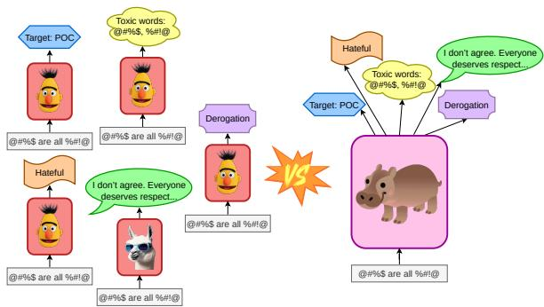
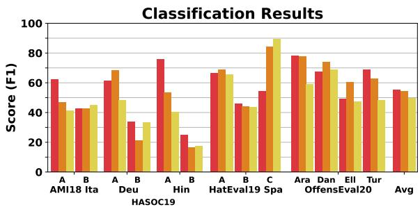
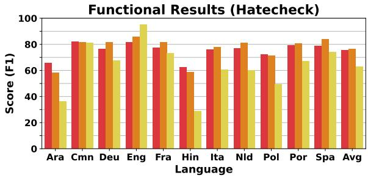
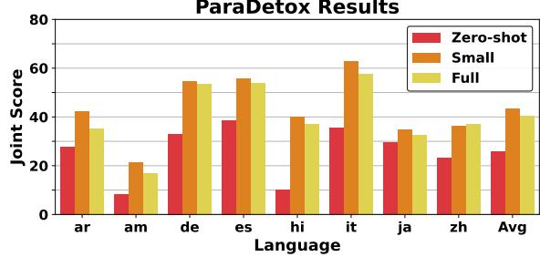
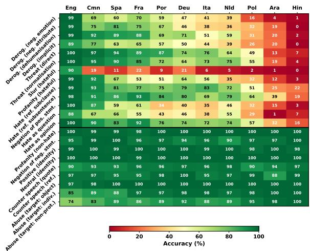
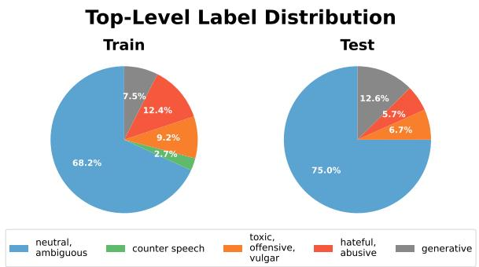
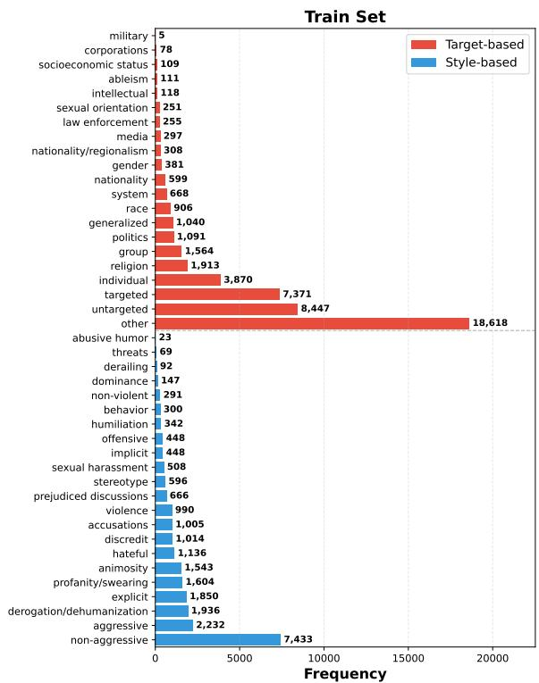
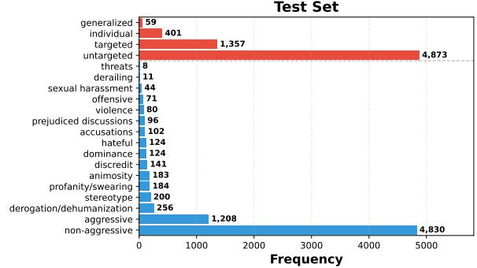
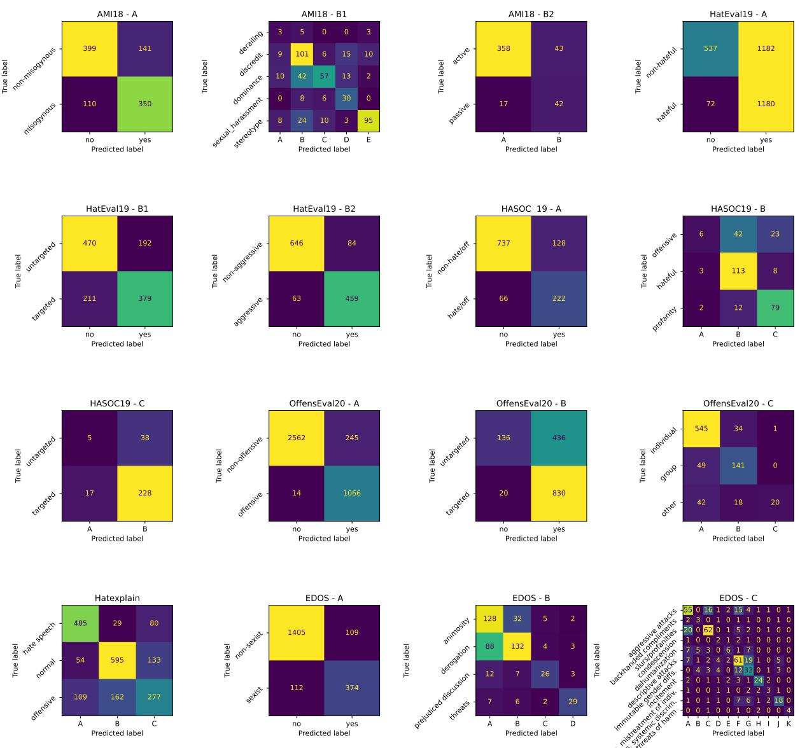
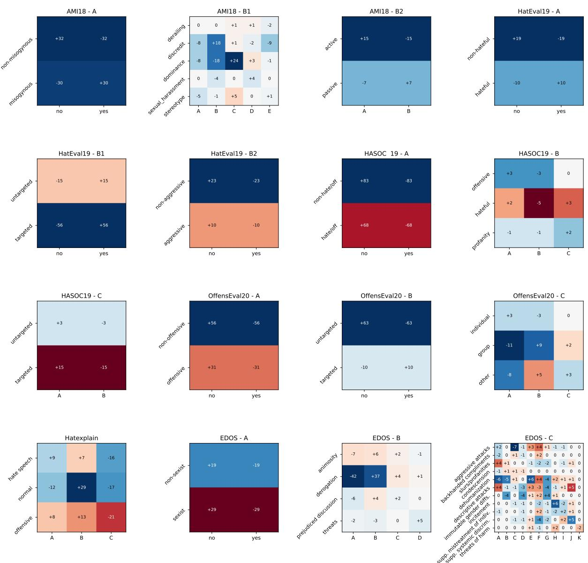

# From Specialization to Generalization: Instruction-tuned LLMs for Robust Harmful Content Mitigation

Lukas Edman1,2 Daryna Dementieva1,2Alexander Fraser1,2,3

1School of Computation, Information and Technology, TU Munich 2Munich Center for Machine Learning 3Munich Data Science Institute lukas.edman@tum.de, daryna.dementieva@tum.de

## Abstract

Large language models (LLMs) demonstrate impressive performance across a wide range of general NLP tasks; however, their effectiveness in sensitive domains, such as hate speech detection, remains less clear. Prior studies comparing prompted LLMs with state-ofthe-art encoder-based models (e.g., BERT variants (Roy et al., 2023; Dönmez et al., 2024)) have shown only marginal gains, suggesting that LLMs may not excel in hate speech detection or mitigation. In this work, we revisit this question through the lens of instruction tuning. By thoroughly unifying 36 English hate speech datasets spanning multiple labeling schemes, we fine-tune a generalist LLM, based on Qwen3 (Qwen Team, 2025), specifically for hate speech mitigation. Our results demonstrate not only state-of-the-art performance on in-domain benchmarks but also substantial improvements in cross-domain and crosslingual generalization—areas where encoderbased specialist classifiers often struggle.

## 1 Introduction

Hate speech detection has been heavily studied, leading to the release of numerous datasets covering a wide spectrum of tasks, domains, languages, and annotation schemes (Mathew et al., 2021; Mandl et al., 2019; Cjadams et al., 2017) (see Table 1). Despite this diversity, progress in building generalizable hate speech models, which can cover a large variety of tasks related to hate speech as well as perform well on unseen domains, has been limited. Existing research largely treats each dataset or subtask in isolation, and little effort has been made to unify many available heterogeneous datasets to develop task-agnostic models with more robust performance across varied hate speech scenarios.

Consequently, task-specific encoder-based models (e.g., BERT variants) remain the dominant approach (Wang et al., 2020; Sai and Sharma, 2020), as prompting large language models (LLMs) has not consistently yielded significantly superior results (Roy et al., 2023; Dönmez et al., 2024). At the same time, instruction tuning, one of the most promising methods for aligning LLMs to specialized domains, has not yet been systematically explored for hate speech mitigation.

  
Figure 1: In this work, we would like to close the gap in understanding if instruction-tuned general-purpose LLMs (i.e., HIPPO, right) are more robust and precise detectors of hate speech than specially-tuned LMs (i.e., BERT and Llama, left).

To close this gap, firstly, we consolidate 36 heterogeneous datasets in English into a single, instruction-formatted corpus spanning over 600k examples and 61 subtasks. Using this unified training dataset, we instruction-tune an LLM and name the resulting model HIPPO (Harmful Input, Positive and Productive Output, see Figure 1). We evaluate HIPPO across in-domain, out-of-domain, and cross-lingual settings. Our study aims to answer the following research questions:

RQ1: How does our instruction-tuned LLM perform compared to strong task-specific baselines for hate speech tasks in English?

RQ2: Does our instruction-tuned LLM outperform zero- or few-shot LLMs prompting for hate speech tasks?

RQ3: Can our instruction-tuned LLM generalize to previously unseen hate speech domains and labels?

RQ4: To what extent can our English-only instruction-tuning dataset support crosslingual generalization in LLMs?

Our results show that the instruction-tuned model achieves competitive, and often better, performance compared to best-performing encoderbased systems, while also exhibiting cross-task generalization. With a smaller version of the dataset to prime the model, we also see potentially higher cross-lingual performance, especially for generative tasks.

We release our code used for fine-tuning and the best-performing models online for public use.¹

## 2 Background

Hate Speech Definitions While a lot of work has been published in the domain of hate speech detection, very few computer science works mention explicitly what definition of hate or abusive speech they adopt in their studies for annotation or automatic processing (Arora et al., 2024; Rizwan et al., 2025). Thus, firstly, we specify which definitions we use in this study.

Hate speech mitigation lies under the term digital violence—an umbrella term that refers to words or actions that cause harm to an individual or a community. Our study focuses on digital violence, more specifically, expressed in a textual form. The study by Lewandowska-Tomaszczyk et al. (2023) categorizes harmful content as offensive speeches, including 17 sub-categories like taboo, insulting, hate speech, harassment, and toxic.

We adopt the definition of hate speech as abusive language targeting specific groups (Röttger et al., 2021), and toxic speech as texts that contain vulgar or profane language (Costa-jussà et al., 2022; Logacheva et al., 2022), but are not necessarily abusive or hateful. For many other labels that were then used in the instruction prompts, we refer to the original definitions of the datasets.

Hate Speech Mitigation Datasets Over the years, dozens of hate speech detection datasets have been introduced, reflecting a wide range of annotation strategies, domains, and languages (Poletto et al., 2021). The substantial efforts of the NLP community in this area are documented in the Hate Speech Data Catalog, which systematically tracks the development of hate speech resources (Vidgen and Derczynski, 2020).2

Significant effort has been devoted to developing diverse hate speech detection and mitigation datasets, particularly for English. Common labeling schemes range from binary classification (e.g., hate vs. non-hate, toxic vs. non-toxic) to multiclass labels (e.g., hate speech vs. offensive language vs. neutral) and even hierarchical frameworks that further specify the subtype of hate once identified. One of the earliest curated resources, AMI18 (Fersini et al., 2018), was derived from Twitter and focused specifically on misogynistic content with a hierarchical labeling strategy. Then, many more datasets were gathered from various social networks like Twitter (Zampieri et al., 2019; Sachdeva et al., 2022), Gab (Mathew et al., 2021; Kirk et al., 2023), or Reddit (Vidgen et al., 2021; Qian et al., 2019). One of the most massive toxic speech classification datasets, Jigsaw (Cjadams et al., 2017), is based on Civil Comments and includes over 150k labeled samples.

Another notable dataset, HateCheck (Röttger et al., 2021), uses functionality tests to isolate specific cases in which hate speech manifests, allowing researchers to diagnose systematic model failures that may be obscured by aggregate benchmark metrics.

Beyond hate content classification datasets, several research directions have emerged that focus on more proactive hate speech mitigation through text generation. In particular, to reduce the publication of toxic or profane language—for example, in efforts to promote safer online environments for children—text detoxification, which aims to transform toxic text into neutral, has been proposed (Atwell et al., 2022; Dementieva et al., 2025a). For more severe cases of hate speech, approaches based on counter-speech, incorporating arguments and proactive dialogue, have also been explored (Yu et al., 2022; Bonaldi et al., 2022).

Together with English, many hate speech detection resources were created for other languages, for example, for Arabic and French (Ousidhoum et al., 2019), Spanish (Basile et al., 2019), Italian (Corazza et al., 2019), Portuguese (Fortuna et al., 2019), German (Jaki and Smedt, 2019), among others.

Hate Speech Supersets With many datasets already created for English and other languages, several works have attempted to unify them into a superset for ease of use. Antypas and Camacho-Collados (2023) made such an attempt with only binary labels 13 English hate speech detection datasets. Then, they performed a cross-dataset performance study utilizing mostly BERT-like or smaller LMs. Finally, MetaHate (Piot et al., 2024) aggregates 36 English datasets into one superset. These datasets either had binarized labels or multiclass labels that were subsequently binarized. This contrasts from our approach, where we do not substantially change the content of any labels, and additionally include generative tasks which are not trivial or possible to binarize.

<table><tr><td>Dataset</td><td>Attribution</td><td>Train</td><td>Test</td><td>Domain</td><td>Label Type</td><td>(Sub)Tasks</td></tr><tr><td>CAD</td><td>Vidgen et al. (2021)</td><td>13423</td><td></td><td>6</td><td>Multilabel</td><td>1</td></tr><tr><td>CAT-LARGE</td><td>Pavlopoulos et al. (2020)</td><td>19870</td><td></td><td>0</td><td>Binary</td><td>1</td></tr><tr><td>CONAN</td><td>Chung et al. (2019)</td><td>408</td><td></td><td>Synthetic</td><td>Generation</td><td>1</td></tr><tr><td>ConvAbuse</td><td>Cercas Curry et al. (2021)</td><td>4013</td><td></td><td>Chatbot</td><td>Hierarchical</td><td>4</td></tr><tr><td>DialoCONAN</td><td>Bonaldi et al. (2022)</td><td>1299</td><td></td><td>Synthetic</td><td>Generation</td><td>1</td></tr><tr><td>EAP</td><td>Vidgen et al. (2020)</td><td>19989</td><td></td><td></td><td>Multiclass</td><td>1</td></tr><tr><td>ETHOS</td><td>Mollas et al. (2022)</td><td>998</td><td></td><td>D</td><td>Hierarchical</td><td>4</td></tr><tr><td>FoxCom</td><td>Gao and Huang (2017)</td><td>1525</td><td></td><td>Fox News</td><td>Binary</td><td>1</td></tr><tr><td>GHC</td><td>Kennedy et al. (2022)</td><td>20610</td><td></td><td>gab</td><td>Hierarchical</td><td>3</td></tr><tr><td>HSOL</td><td>Davidson et al. (2017)</td><td>24771</td><td></td><td></td><td>Multiclass</td><td>1</td></tr><tr><td>ImplicitHate</td><td>ElSherief et al. (2021)</td><td>6358</td><td></td><td></td><td>Multiclass</td><td>1</td></tr><tr><td>Intervene</td><td>Qian et al. (2019)</td><td>16628</td><td></td><td>gab</td><td>Generation</td><td>1</td></tr><tr><td>LargeScaleAbuse</td><td>Founta et al. (2018)</td><td>44768</td><td></td><td></td><td>Multiclass</td><td>1</td></tr><tr><td>LargeScaleXDomain</td><td>Toraman et al. (2022)</td><td>68188</td><td></td><td></td><td>Multiclass</td><td>1</td></tr><tr><td>MeasuringHate</td><td>Sachdeva et al. (2022); Kennedy et al. (2020)</td><td>39511</td><td></td><td></td><td>Multiclass</td><td>1</td></tr><tr><td>Multitarget-CONAN</td><td>Fanton et al. (2021)</td><td>4055</td><td></td><td>Synthetic</td><td>Generation</td><td>2</td></tr><tr><td>NewsHate</td><td>Salminen et al. (2018)</td><td>3215</td><td></td><td>FD</td><td>Hierarchical</td><td>2</td></tr><tr><td>ReligiousHate</td><td>Ramponi et al. (2022)</td><td>5746</td><td></td><td></td><td>Hierarchical</td><td>5</td></tr><tr><td>SlurCorpus</td><td>Kurrek et al. (2020)</td><td>39944</td><td></td><td>G</td><td>Multiclass</td><td>1</td></tr><tr><td>Stormfront</td><td>De Gibert et al. (2018)</td><td>10521</td><td></td><td>Stormfront</td><td>Binary</td><td></td></tr><tr><td>SWAD</td><td>Pamungkas et al. (2020a)</td><td>2567</td><td></td><td></td><td>Binary</td><td></td></tr><tr><td>ToxiCR</td><td>Sarker et al. (2023)</td><td>12767</td><td></td><td>Code review</td><td>Binary</td><td>1</td></tr><tr><td>TwitterCRT</td><td>Waseem and Hovy (2016)</td><td>12727</td><td></td><td></td><td>Binary</td><td></td></tr><tr><td>TwitterExpert</td><td>Waseem (2016)</td><td>6908</td><td></td><td></td><td>Multiclass</td><td></td></tr><tr><td>TwitterSA</td><td>Arkhoshghalb (2019)</td><td>25825</td><td></td><td></td><td>Binary</td><td>1</td></tr><tr><td>USElect</td><td>Grimminger and Klinger (2021)</td><td>2400</td><td></td><td></td><td>Binary</td><td>1</td></tr><tr><td>AMI18</td><td>Fersini et al. (2018)</td><td>3998</td><td>1000</td><td></td><td>Hierarchical</td><td>3</td></tr><tr><td>EDOS</td><td>Kirk et al. (2023)</td><td>13998</td><td>2000</td><td>gab</td><td>Hierarchical</td><td>3</td></tr><tr><td>HASOC19</td><td>Mandl et al. (2019)</td><td>5817</td><td>1153</td><td></td><td>Hierarchical</td><td>3</td></tr><tr><td>HatEval19</td><td>Basile et al. (2019)</td><td>8992</td><td>2971</td><td></td><td>Hierarchical</td><td>3</td></tr><tr><td>HateXplain</td><td>Mathew et al. (2021)</td><td>15348</td><td>1924</td><td>gab</td><td>Hierarchical</td><td>3</td></tr><tr><td>Jigsaw</td><td>Cjadams et al. (2017)</td><td>159529</td><td>63978</td><td>CC</td><td>Multilabel</td><td>1</td></tr><tr><td>OffensEval20</td><td>Zampieri et al. (2019)</td><td>13187</td><td>5309</td><td></td><td>Hierarchical</td><td>3</td></tr><tr><td>ParaDetox</td><td>Logacheva et al. (2022)</td><td>11927</td><td>600</td><td>↓CC</td><td>Generation</td><td>1</td></tr><tr><td>ToxicSpans</td><td>Pavlopoulos et al. (2022, 2021)</td><td>7931</td><td>2000</td><td>CC</td><td>Generation</td><td>1</td></tr><tr><td>Total</td><td></td><td>649761</td><td>80935</td><td></td><td></td><td>61</td></tr></table>

Table 1: List of datasets used and the number of examples, domain, and type of labels. Domains include Twitter (), Reddit (), Gab (gab), Facebook (), Wikipedia (), YouTube (), and Civil Comments (CC), among others.

Hate Speech Detection with Transformer-based Encoders Across numerous hate speech detection benchmarks, both in English and in other languages, state-of-the-art performance is predominantly driven by Transformer-based encoder models such as BERT (Devlin et al., 2019) and RoBERTa (Liu et al., 2019), including their multilingual variants. To further enhance domainspecific performance, HateBERT (Caselli et al., 2021) was introduced, extending BERT through additional Masked Language Modeling on one million posts from banned Reddit communities.

Correspondingly, for datasets such as AMI18 and HASOC19, the strongest results were achieved using BERT and mBERT-based systems (Muti and Barrón-Cedeño, 2022; Mishra and Mishra, 2019). In the OffensEval20 shared task, the winning solution employed a RoBERTa-based architecture (Wiedemann et al., 2020). Likewise, for toxicity detection in the Jigsaw dataset, one of the topperforming and most widely adopted models (Logacheva et al., 2022) is a fine-tuned RoBERTa. Overall, BERT-style encoders continue to dominate performance in the hate speech detection domain.

Hate Speech Detection with LLMs With LLMs' appearance, especially with additional human and safety alignment (Naveed et al., 2025), many experiments have been done to exploit such models for hate speech detection and automatic moderation.

Zhu et al. (2025) reports low agreement between LLM outputs and human labels, while Li et al. (2024) finds that LLMs are more reliable at identifying non-hateful content. Huang et al. (2023) studies LLM-generated explanations for implicit hate, and Roy et al. (2023) shows that adding target-specific context improves prompting performance. Dönmez et al. (2024) evaluate a range of open- and closed-source LLMs prompting for hate speech and microaggression detection, showing that some models perform competitively. More advanced prompting techniques, like prompting with hate speech definitions or chain-of-thought prompting, showed promising results for real-world hate speech moderation (Guo et al., 2023). At the same time, prompting LLMs can lead to various undesirable and unstable outputs like hallucinations or refusal to process an input sample (Huang, 2025).

Several attempts have been made to fine-tune LLMs for hate speech detection tasks. Sen et al. (2024) tuned several 1B models with LoRA on two datasets. A comparison between prompting and fine-tuning of LLMs for sexism detection was performed in (Pan et al., 2024). Finally, Nasir et al. (2025) used LLMs’ hidden states as embeddings to fine-tune a smaller classifier. Nevertheless, none of the work explored massive tuning and generalization of LLMs to several hate speech tasks with different label schemes, hierarchies, and label types.

## 3 Methodology

We first describe our methodology for unifying datasets and converting them into the instructions, followed by our strategy for training on the unified dataset.

## 3.1 Data Collation

We source several English datasets, with the aim of including a diverse set of label types and domains. The resulting compilation is a superset of over 600k examples, shown in Table 1. Additionally, we also report all corresponding licenses of the datasets in Appendix D with several datasets samples examples in Appendix E. We divide the task types into 4 distinct categories:

• Binary classification

• Multiclass classification

• Multilabel classification

• Generation

Datasets labeled as hierarchical’ include multiple tasks, where the main task is typically a binary classification, such as hateful/not', and the subsequent tasks only apply to those labeled as hateful'.

Our test includes 9 of these datasets, which we selected primarily due to the reproducibility of their train/test split, allowing for fair comparison. The resulting test superset includes tasks from each of our 4 categories.

Deduplication As many of the datasets are sourced from the same platforms, we deduplicate our training set to improve the quality. We first deduplicate based on the text/label pair, keeping only 1 copy. For examples with conflicting labels, we distinguish whether the examples are from the same dataset or not. If they are from the same dataset (as was largely the case with ToxiCR), we remove both copies. For cross-dataset duplicates, we temporarily binarize labels, and if they are still different, we keep the example with the hateful or offensive' label. This only affected 75 (0.01%) examples. In total, 3.73% (25147 examples) of the dataset is removed via deduplication. The final size of the dataset after deduplication is 649761, as presented in Table 1. Full statistics of the appeared labels in the final aggregated dataset is presented in Appendix C.

## 3.2 Instruction Construction

Our general approach is to convert every individual dataset into a conversational format, with user prompts and assistant answers. Our user prompt depends on the task, but all start with the generic message, followed by the input text, followed by a task-specific message, as shown below for binary classification.

User: You are an expert on hate speech, and you are tasked with answering questions about the following text. Respond only with the answer, no other text: {text}

Should the text be classified as {category}? Answer with yes' or no'.

Assistant: {yes / no}

The category could be “hateful", for example. For datasets with a hierarchical structure, we pose the questions in a back-and-forth conversational manner. For example, continuing from the previous example (assuming the answer is yes'):

User: Which category does the text be-

long to? Categories: {categories}

Assistant: {category\_choice}

This prompt is used for multiclass tasks. For the multiclass and multilabel tasks, we also prepend each category with letters $( ^ { \cdot } \mathrm { A . \ ^ { , } , ^ { \cdot } B . \ ^ { , } , ^ { \cdot } C . \ ^ { , } , e t c . ) }$ SO that the label for these tasks is simply the letter (or letters for multilabel). We found that this increases performance substantially over generating the exact names of the classes. For the multilabel case, the label is a comma-separated list of the present labels. We also consistently order the labels alphabetically, so that the model does not receive conflicting signals during training.

<table><tr><td>Dataset</td><td>Type</td><td>HIPPO</td><td>Indiv.</td><td>GPT5</td><td>Best</td><td>Best Arch.</td><td>Best Source</td></tr><tr><td>AMI18 - A</td><td>Binary</td><td>81.0</td><td>74.8</td><td>70.9</td><td>71.0</td><td>BERT</td><td>Muti and Barrón-Cedeño (2022)</td></tr><tr><td>AMI18 - B</td><td>Binary x2</td><td>73.4</td><td>64.3</td><td>44.4</td><td>42.9</td><td>BERT</td><td>Pamungkas et al. (2020b)</td></tr><tr><td>EDOS - A</td><td>Binary</td><td>83.7</td><td>85.0</td><td>73.0</td><td>88.4</td><td>PaLM</td><td>Sorensen et al. (2023)</td></tr><tr><td>EDOS - B</td><td>Multiclass</td><td>71.2</td><td>65.5</td><td>41.9</td><td>73.3</td><td>PaLM</td><td>Sorensen et al. (2023)</td></tr><tr><td>EDOS - C</td><td>Multiclass</td><td>51.8</td><td>47.5</td><td>41.0</td><td>56.1</td><td>DeBERTa-v3</td><td>Zhou (2023)</td></tr><tr><td>HASOC19 - A</td><td>Binary</td><td>76.7</td><td>79.0</td><td>72.7</td><td>79.5</td><td>RoBERTa†</td><td>Kovács et al. (2021)</td></tr><tr><td>HASOC19 - B</td><td>Multiclass</td><td>58.5</td><td>56.7</td><td>54.8</td><td>54.5</td><td>BERT</td><td>Mishra and Mishra (2019)</td></tr><tr><td>HASOC19 - C</td><td>Binary</td><td>52.8</td><td>52.3</td><td>58.0</td><td>51.1</td><td>BERT</td><td>Mishra and Mishra (2019)</td></tr><tr><td>HatEval19 - A</td><td>Binary</td><td>56.8</td><td>55.7</td><td>66.8</td><td>70.8</td><td>Flan-UL2</td><td>Zhang et al. (2024)</td></tr><tr><td>HatEval19 - B</td><td>Binary x2</td><td>80.0</td><td>77.8</td><td>35.0</td><td>62.0</td><td>DistilBERT†</td><td>Atapattu et al. (2020)</td></tr><tr><td>HateXplain</td><td>Multiclass</td><td>69.5</td><td>69.1</td><td>40.8</td><td>69.9</td><td>BERT</td><td>Kim et al. (2022)</td></tr><tr><td>Jigsaw</td><td>Multilabel</td><td>80.7</td><td>80.2</td><td>61.5</td><td>62.5</td><td>BERT†</td><td>Mazari et al. (2024)</td></tr><tr><td>OffensEval20 - A</td><td>Binary</td><td>92.8</td><td>90.6</td><td>89.7</td><td>92.0</td><td>RoBERTa†</td><td>Wiedemann et al. (2020)</td></tr><tr><td>OffensEval20 - B</td><td>Binary</td><td>66.2</td><td>62.3</td><td>67.1</td><td>74.6</td><td>ERNIE 2.0†</td><td>Wang et al. (2020)</td></tr><tr><td>OffensEval20 - C</td><td>Multiclass</td><td>70.3</td><td>67.0</td><td>60.7</td><td>71.5</td><td>ERNIE 2.0†</td><td>Wang et al. (2020)</td></tr><tr><td>ParaDetox</td><td>Generation</td><td>64.8</td><td>65.2</td><td>35.3</td><td>74.2</td><td>DeepSeek</td><td>Hosseinbeigi et al. (2025)</td></tr><tr><td>ToxicSpans</td><td>Generation</td><td>64.3</td><td>63.1</td><td>25.9</td><td>70.8</td><td>BERT†</td><td>Zhu et al. (2021)</td></tr><tr><td>Average</td><td></td><td>70.3</td><td>68.0</td><td>55.3</td><td>68.5</td><td></td><td></td></tr></table>

Table 2: Comparison of our unified model (HIPPO, based on Qwen3-4B-Instruct-2507) to individually trained models (Indiv.), GPT5-mini, and to the best performing models in literature. Bold values denote the best results per dataset. † denotes ensembles.

For generative tasks, there is no shared prompt, as every generative dataset's task or tasks are unique. For example, for ToxicSpans, which we treat as a generative task, has the following prompt:

User: Identify the part(s) of the given text that is/are considered toxic. If there are multiple spans, separate them with semicolons. Write N/A if the text is not toxic.

Assistant: {span }

Other datasets, such as DialoCONAN, are even more open-ended, as the goal is to model a hate speech expert having a counter-narrative with someone saying harmful things. The conversational format naturally suits this type of dataset:

User: {narrative\_1}

Have a dialogue with the author of the original text. Provide and maintain a counter-narrative throughout the dialogue.

Assistant: {counter\_narrative\_1}

User: {narrative\_2}

Assistant: {counter\_narrative\_2}

User: {narrative\_n}

Assistant: {counter\_narrative\_n}

We include an exhaustive list of our prompts in Appendix A.

## 3.3 Model Selection

We experiment with various LLMs of 4 billion parameters, including Qwen3 (Qwen Team, 2025), Llama3 (Dubey et al., 2024), and Phi4 (Abdin et al., 2024). We show the best-performing model HIPPO based on Qwen3-4B-Instruct-2507, in Results (§4)—with the rest of LLMs in Appendix F. We use a smaller model with 4 billion parameters for our main experiments to limit ecological impact as well as to demonstrate the utility of instruction tuning for hate speech already from this size of computationally-accessible models. Nevertheless, we also finetune a larger (32B) and even smaller (0.6B) model to gauge the effect of model size.

## 3.4 Training

Training follows a typical instruction tuning setup. We apply QLoRA (Dettmers et al., 2023) to enable efficient fine-tuning, and we train the model only on the outputs of the assistant. Training on an Nvidia H100 GPU, the 0.6B model takes around 10 hours, the 4B models take around 1 day, and the 32B model takes around 4 days. Additional training hyperparameters can be found in Appendix B.

## 4 Results

We go through the results as they relate to the research questions one-by-one. The scores shown in the following tables and figures are macro-F1, with some exceptions:

• AMI18 task B and HatEval19 task B are both composed of 2 subtasks, with their F1 scores averaged.

• ToxicSpans uses a character-based F1 score based on the overlap of the predicted span and label span.

• Jigsaw uses an average F1 score per-label.

• ParaDetox uses the joint scoring method from Dementieva et al. (2025b) that combines styletransfer accuracy, content preservation, and fluency.

More detailed results of HIPPO with confusion matrices for the classification-based test datasets are presented in Appendix G.

## 4.1 Comparison to State-of-the-art

RQ1: How does our instruction-tuned LLM perform compared to strong taskspecific baselines for hate speech tasks in English?

Table 2 shows our main results on our test superset. We compare the performance of our unified training to training on each individual training split of each test set, finding that indeed our unified training brings a benefit in 14 out of 17 cases. Moreover, our unified approach outperforms a strong closedsource model, GPT5-mini.

Compared to the best-known models in the literature, the unified training approach wins on 7 of 17 tasks and achieves higher average performance. Notably, many state-of-the-art systems rely on task-specific ensembling, whereas we use no task-specific methods beyond prompting. In addition, competing non-BERT models often have substantially larger parameter counts (i.e., Flan-UL2 at 20B, PaLM at 62B, and DeepSeek at 671B), while our model is based on Qwen3-4B. As shown in Appendix G, our single model also generalizes across diverse tasks and label granularities, enabling a unified approach to hate speech mitigation.

In Table 3, we show that a 32B parameter model has even better performance overall, winning in

<table><tr><td>Dataset</td><td>0.6B</td><td>4B</td><td>32B</td><td>Best</td></tr><tr><td>AMI18 - A</td><td>28.1</td><td>81.0</td><td>82.9</td><td>71.0</td></tr><tr><td>AMI18 - B</td><td>26.0</td><td>73.4</td><td>75.5</td><td>42.9</td></tr><tr><td>EDOS - A</td><td>23.5</td><td>83.7</td><td>87.0</td><td>88.4</td></tr><tr><td>EDOS - B</td><td>42.0</td><td>71.2</td><td>74.7</td><td>73.3</td></tr><tr><td>EDOS - C</td><td>27.5</td><td>51.8</td><td>57.9</td><td>56.1</td></tr><tr><td>HASOC19 - A</td><td>22.2</td><td>76.7</td><td>76.6</td><td>79.5</td></tr><tr><td>HASOC19 - B</td><td>31.6</td><td>58.5</td><td>58.0</td><td>54.5</td></tr><tr><td>HASOC19 - C</td><td>47.6</td><td>52.8</td><td>52.7</td><td>51.1</td></tr><tr><td>HatEval19 - A</td><td>20.1</td><td>56.8</td><td>59.8</td><td>70.8</td></tr><tr><td>HatEval19 - B</td><td>41.0</td><td>80.0</td><td>79.8</td><td>62.0</td></tr><tr><td>HateXplain</td><td>16.1</td><td>69.5</td><td>70.8</td><td>69.9</td></tr><tr><td>Jigsaw</td><td>53.7</td><td>80.7</td><td>80.7</td><td>62.5</td></tr><tr><td>OffensEval20 - A</td><td>27.8</td><td>92.8</td><td>92.5</td><td>92.0</td></tr><tr><td>OffensEval20 - B</td><td>39.9</td><td>66.2</td><td>65.2</td><td>74.6</td></tr><tr><td>OffensEval20 - C</td><td>21.1</td><td>70.3</td><td>75.4</td><td>71.5</td></tr><tr><td>ParaDetox</td><td>10.3</td><td>64.8</td><td>65.0</td><td>74.2</td></tr><tr><td>ToxicSpans</td><td>21.9</td><td>64.3</td><td>64.2</td><td>70.8</td></tr><tr><td>Average</td><td>29.4</td><td>70.3</td><td>71.7</td><td>68.5</td></tr></table>

Table 3: Effectiveness of instruction tuning on varying model sizes, compared to the SOTA.Blue values indicate scores that outperform the SOTA. Bold values denote the best results per dataset.

11 of 17 cases versus the state-of-the-art. This indicates that the instruction tuning setup is even more effective at larger model sizes. At smaller model sizes, it appears ineffective. The 0.6B model performs particularly poorly, worse than random chance in many circumstances. This is because we do not constrain generation, so the model frequently does not output yes’ or ‘no’ for binary classification tasks, for example.

Overall, the results show that from a unified, single-step training of a modest-sized LLM of at least 4 billion parameters, one can achieve performance competitive with several highly-tuned, task-specific models. We continue the further comparison of our HIPPO based on 4B-sized Qwen3.

## 4.2 Prompting and Cross-task Transfer

RQ2: Does our instruction-tuned LLM outperform zero- or few-shot LLMs prompting for hate speech tasks?

In Table 4, we first compare our fully-trained 4B model (i.e., HIPPO in Table 2) to zero-shot prompting the same base model. Our zero-shot prompts are identical to the instructions used in training. We additionally post-processed the zero-shot outputs to ensure variations of the correct answer (e.g., yes’ versusYes.’) do not negatively affect the results.

We do not include results for few-shot prompting, as we were unable to formulate a few-shot prompt that outperformed, or even matched performance of the zero-shot prompt. This has been previously observed in other works on prompting for hate speech detection, where few-shot prompting performed worse than zero-shot (Guo et al., 2023), or its benefits were inconsistent across languages (Ghorbanpour et al., 2025).

<table><tr><td>Dataset</td><td>Zero-shot</td><td>LOO</td><td>Full</td></tr><tr><td>AMI18 - A</td><td>59.8</td><td>78.4</td><td>81.0</td></tr><tr><td>AMI18 - B†</td><td>41.6</td><td>42.1</td><td>73.4</td></tr><tr><td>EDOS - A</td><td>66.7</td><td>76.0</td><td>83.7</td></tr><tr><td>EDOS - B‡</td><td>37.9</td><td>43.4</td><td>71.2</td></tr><tr><td>EDOS - C‡</td><td>20.2</td><td>27.6</td><td>51.8</td></tr><tr><td>HASOC19 - A</td><td>71.5</td><td>70.3</td><td>76.7</td></tr><tr><td>HASOC19 - B</td><td>31.2</td><td>52.0</td><td>58.5</td></tr><tr><td>HASOC19 - C</td><td>63.4</td><td>44.0</td><td>52.8</td></tr><tr><td>HatEval19 - A</td><td>58.1</td><td>52.5</td><td>56.8</td></tr><tr><td>HatEval19 - B†</td><td>33.3</td><td>29.3</td><td>80.0</td></tr><tr><td>HateXplain</td><td>46.8</td><td>60.1</td><td>69.5</td></tr><tr><td>Jigsaw</td><td>59.2</td><td>70.1</td><td>80.7</td></tr><tr><td>OffensEval20 - A</td><td>80.8</td><td>88.8</td><td>92.8</td></tr><tr><td>OffensEval20 - B</td><td>72.8</td><td>66.2</td><td>66.2</td></tr><tr><td>OffensEval20 - C</td><td>43.0</td><td>69.8</td><td>70.3</td></tr><tr><td>ParaDetox‡</td><td>48.0</td><td>46.4</td><td>64.8</td></tr><tr><td>ToxicSpans</td><td>22.1</td><td>42.3</td><td>64.3</td></tr><tr><td>Average</td><td>50.4</td><td>56.4</td><td>70.3</td></tr></table>

Table 4: Comparison of zero-shot to leave-one-out (LOO) and full HIPPO (i.e., unified) training. ‡ denotes tasks that do not have equivalent tasks in training of Qwen3-4B. † denotes partial equivalence: AMI18- B and HatEval19-B are composed of 2 tasks, both of which include 1 task that has no similar task in training. Bluevalues indicate scores that outperform the zeroshot baseline. Bold values denote the best results per dataset.

Nevertheless, we see that the fine-tuned model clearly outperforms our zero-shot prompt. While the prompts used are likely suboptimal, finding the optimal prompt for each task is time-consuming, likely more so than simply instruction tuning the model.

Concerning the leave-one-out (LOO) column in Table 4, we turn to our third research question:

## RQ3: Can our instruction-tuned LLM generalize to previously unseen hate speech domains and labels?

To answer this, we train 9 additional models for each test dataset, each with the dataset's corresponding training split left out.

As we can see, the results are generally better than the zero-shot performance, showing a clear cross-task learning capability. Of the 17 tasks, only

  
Figure 2: Cross-lingual and functional performance of the zero-shot, minimally-trained, and fully-trained HIPPO. Note: Unlike for English, HASOC19 does not have a Task C for German and Hindi.

6 have a decreased performance: HatEval19-A and B, HASOC19-A and C, OffensEval20-B, and ParaDetox.

Of the 6 tasks, HatEval19-B, HASOC19-C, and OffensEval20-B all have the same goal of determining whether a text is targeted or not. The issue may be due to dissimilar annotation guidelines or collection methods, as HatEval19 has a near-balanced training set (51% targeted, 49% untargeted), while HASOC19 and OffensEval20 have very lopsided distributions (85/15 and 88/12, respectively).

## 4.3 Cross-lingual Transfer

## RQ4: To what extent can our Englishonly instruction-tuning dataset support cross-lingual generalization in LLMs?

While we focus on English for this work, highquality hate speech processing is necessary for most languages. And since our base Qwen model has been pretrained multilingually, we therefore test whether our finetuning has damaged or helped its non-English hate speech processing. We compare our zero-shot model with a fully-finetuned model, as well as an additional model trained on only 1k examples from each dataset. This smaller training set is intended to expose the model to the domain while not overfitting to English. We evaluate along 3 separate axes: classification, generation, and functional performance. For testing, we keep the prompts in English and only swap out the text and additional task information, such as class names. We show results in Figure 2.

HateCheck — Accuracy by Functionality and Language  
  
Figure 3: Performance of the fully-trained HIPPO on all languages (ordered by performance) of HateCheck, per functional task. Above the black line are hateful functionalities, below are non-hateful. Only functionalities shared across all languages are shown.

In general, we observe that the fully trained model's performance drops on both classification and functional tasks compared to zero-shot. As shown in Figure 3, this degradation varies by functionality in HateCheck. Arabic and Hindi perform worst, likely due to their distinct scripts, while Chinese performs better, possibly reflecting stronger representation in pretraining data. Performance on slurs is notably poor, consistent with their languagespecific nature. In contrast, performance on nonhateful content remains nearly perfect across languages, suggesting a greater familiarity with nontoxic text from pretraining.

Returning to Figure 2, ParaDetox performance improves over zero-shot, which is unexpected. However, qualitative analysis shows the zero-shot model often translates inputs into English despite no instruction to do so, lowering its scores.

For the minimally trained model, performance is competitive on classification tasks, generally higher on HateCheck, and substantially better on ParaDetox. This suggests that even limited Englishonly instruction tuning can yield positive crosslingual transfer across diverse tasks.

There are many non-English hate speech training datasets available, so for truly better multilingual performance, we expect it would be highly beneficial to incorporate those into training. We leave this for future work. At the same time, we can see how the model is capable not only of classification, but for generation tasks already for multiple languages, which can serve as a strong out-of-the-box baseline.

## 4.4 Further Discussion

We additionally discuss two topics which may have a considerable impact on our models’ performances, label disagreement and data contamination, in Appendix H.

## 5 Conclusion

As hate speech can rapidly evolve in order to evade content moderation, the ability to perform generalizable hate speech mitigation has become increasingly important for practitioners who wish to curb the use of hate speech. To advance this goal, we introduced a unified instruction-style carefully curated training corpus constructed from 36 heterogeneous datasets, incorporating a wide range of harmful content classification tasks as well as several proactive speech generation tasks. We further evaluated multiple LLM families and sizes, and presented HIPPO, a model based on the Qwen3-4B variant, as an effective generalist solution.

We demonstrated that our generalist model performs at least on par with or significantly outperforms prior task-specific state-of-the-art BERTstyle models, as well as prompt-based LLM approaches. We also saw a distinct increase in performance of our model on held-out sets, indicating an ability to generalize to new tasks which is quite impossible for BERT-based specialists. Finally, we showed that this generalization also extends to some multilingual tasks, although further training on multilingual data would likely benefit non-English languages further. We believe that our findings show the effectiveness of obtaining LLMsbased generalists for more robust harmful speech detection and proactive moderation across various domains.

## Limitations

Our work is limited to training on only English datasets. While we do not expect that the trends would be different in other languages, we cannot know for sure without further experimentation. Training on multiple languages at once is also something we do not test, and could be more promising for better cross-lingual performance. However, it is also possible that cultural differences result in conflicting annotation styles that hurt performance.

We also do not test on a large number of prompting styles. For the finetuned model, the prompting style is likely not very impactful due to the additional training. For the zero-shot model, it is much more impactful. Our zero-shot results should not be seen as optimal zero-shot performance, but rather as performance on a manually crafted yet unoptimized prompt. There is additional information that could improve a prompt, such as definitions or annotation guidelines. Due to the lack of availability of this information for many datasets, we do not include it in our prompt.

We additionally do not incorporate or test model reasoning for hate speech tasks. Our GPT5-mini results used the default reasoning effort, “medium" however we did not test other effort levels. Reasoning has been shown to be beneficial for many tasks, however we are not aware of any hate speech data with annotated reasoning, and the quality of LLMs hate speech detection is not good enough to make use of synthetic reasoning data.

## Ethics Statement

Automatic moderation has become a promising application of modern NLP-based models, including recent LLMs. While such technologies may raise concerns about censorship, our work is strictly positioned as an investigation into the capabilities and limitations of modern language technologies, with the explicit goal of improving user safety in online environments. For this reason, we release our code and models under the OpenRAIL-S license, which restricts AI-based solutions usage to responsible and socially beneficial applications. The licenses of all used (and, later, our published) resources can be found in Appendix D.

Nevertheless, there remains a risk of misuse for dangerous scenarios—aggressive censorship, jail-breaking of models for hate behavior, or even generation of more hateful content. The generation of hateful or toxic language can already be achieved through simpler ways—for example, by injecting profane expressions or by relying on existing text style transfer models. Despite this accessibility, there has been no evidence of a large-scale surge in synthetic hateful content. Companies and researchers instantly continuing to improve safe mechanisms in LLMs making it incredibly difficult to jail-break with simple toxic injections.

In addition, we emphasize that effective content moderation cannot rely solely on automated systems. Responsible deployment requires sustained user-centered research and careful consideration of social context. Decisions about moderation policies should remain with the communities themselves, ensuring that safety mechanisms reflect their values, norms, and expectations.

At the same time, our proposed generalist hate speech mitigation model can now enable platform moderators to define more flexible and fine-grained content moderation guidelines, supporting scalable and consistent hate speech detection across large and diverse online environments. Then, our model outputs should serve as a recommendation for further moderation decisions, not as the ultimate final answer. We truly believe that our findings will serve as a base for future robust harmful humanwritten or AI-generated content detection for a safe online environment.

## References

Marah Abdin, Jyoti Aneja, Harkirat Behl, Sébastien Bubeck, Ronen Eldan, Suriya Gunasekar, Michael Harrison, Russell J Hewett, Mojan Javaheripi, Piero Kauffmann, and 1 others. 2024. Phi-4 technical report. arXiv preprint arXiv:2412.08905.

Dimosthenis Antypas and Jose Camacho-Collados. 2023. Robust hate speech detection in social media: A cross-dataset empirical evaluation. In The 7th Workshop on Online Abuse and Harms (WOAH), pages 231–242, Toronto, Canada. Association for Computational Linguistics.

Armin Arkhoshghalb. 2019. Twitter sentiment analysis: Hatred speech. https: //www.kaggle.com/datasets/arkhoshghalb/ twitter-sentiment-analysis-hatred-speech/ data. Kaggle Dataset.

Arnav Arora, Preslav Nakov, Momchil Hardalov Sheikh Muhammad Sarwar, Vibha Nayak, Yoan Dinkov, Dimitrina Zlatkova, Kyle Dent, Ameya Bhatawdekar, Guillaume Bouchard, and Isabelle Augenstein. 2024. Detecting harmful content on online

platforms: What platforms need vs. where research efforts go. ACM Comput. Surv., 56(3):72:1–72:17.

Thushari Atapattu, Mahen Herath, Georgia Zhang, and Katrina Falkner. 2020. Automated detection of cyberbullying against women and immigrants and cross-domain adaptability. arXiv preprint arXiv:2012.02565.

Katherine Atwell, Sabit Hassan, and Malihe Alikhani. 2022. APPDIA: A discourse-aware transformerbased style transfer model for offensive social media conversations. In Proceedings of the 29th International Conference on Computational Linguistics, pages 6063–6074, Gyeongju, Republic of Korea. International Committee on Computational Linguistics.

Valerio Basile, Cristina Bosco, Elisabetta Fersini, Debora Nozza, Viviana Patti, Francisco Manuel Rangel Pardo, Paolo Rosso, and Manuela Sanguinetti. 2019. Semeval-2019 task 5: Multilingual detection of hate speech against immigrants and women in twitter. In Proceedings of the 13th international workshop on semantic evaluation, pages 54–63.

Helena Bonaldi, Sara Dellantonio, Serra Sinem Tekiroğlu, and Marco Guerini. 2022. Humanmachine collaboration approaches to build a dialogue dataset for hate speech countering. In Proceedings of the 2022 Conference on Empirical Methods in Natural Language Processing, pages 8031–8049, Abu Dhabi, United Arab Emirates. Association for Computational Linguistics.

Tommaso Caselli, Valerio Basile, Jelena Mitrović, and Michael Granitzer. 2021. HateBERT: Retraining BERT for abusive language detection in English. In Proceedings of the 5th Workshop on Online Abuse and Harms (WOAH 2021), pages 17–25, Online. Association for Computational Linguistics.

Amanda Cercas Curry, Gavin Abercrombie, and Verena Rieser. 2021. ConvAbuse: Data, analysis, and benchmarks for nuanced abuse detection in conversational AI. In Proceedings of the 2021 Conference on Empirical Methods in Natural Language Processing, pages 7388–7403, Online and Punta Cana, Dominican Republic. Association for Computational Linguistics.

Yi-Ling Chung, Elizaveta Kuzmenko, Serra Sinem Tekiroglu, and Marco Guerini. 2019. CONAN - COunter NArratives through nichesourcing: a multilingual dataset of responses to fight online hate speech. In Proceedings of the 57th Annual Meeting of the Association for Computational Linguistics, pages 2819–2829, Florence, Italy. Association for Computational Linguistics.

Cjadams, Jeffrey Sorensen, Julia Elliott, Lucas Dixon, Mark McDonald, nithum, and Will Cukierski. 2017. Toxic comment classification challenge. https://kaggle.com/competitions/jigsawtoxic-comment-classification-challenge. Kaggle.

Michele Corazza, Stefano Menini, Elena Cabrio, Sara Tonelli, and Serena Villata. 2019. Cross-platform

evaluation for italian hate speech detection. In Proceedings of the Sixth Italian Conference on Computational Linguistics, Bari, Italy, November 13-15, 2019, volume 2481 of CEUR Workshop Proceedings. CEUR-WS.org.

Marta R. Costa-jussà, James Cross, Onur Çelebi, Maha Elbayad, Kenneth Heafield, Kevin Heffernan, Elahe Kalbassi, Janice Lam, Daniel Licht, Jean Maillard, Anna Y. Sun, Skyler Wang, Guillaume Wenzek, Al Youngblood, Bapi Akula, Loïc Barrault, Gabriel Mejia Gonzalez, Prangthip Hansanti, John Hoffman, and 19 others. 2022. No language left behind: Scaling human-centered machine translation. CoRR, abs/2207.04672.

Thomas Davidson, Dana Warmsley, Michael Macy, and Ingmar Weber. 2017. Automated hate speech detection and the problem of offensive language. In Proceedings of the international AAAI conference on web and social media, volume 11, pages 512–515.

Ona De Gibert, Naiara Perez, Aitor García-Pablos, and Montse Cuadros. 2018. Hate speech dataset from a white supremacy forum. arXiv preprint arXiv:1809.04444.

Daryna Dementieva, Nikolay Babakov, Amit Ronen, Abinew Ali Ayele, Naquee Rizwan, Florian Schneider, Xintong Wang, Seid Muhie Yimam, Daniil Moskovskiy, Elisei Stakovskii, Eran Kaufman, Ashraf Elnagar, Animesh Mukherjee, and Alexander Panchenko. 2025a. Multilingual and explainable text detoxification with parallel corpora. In Proceedings of the 31st International Conference on Computational Linguistics, pages 7998–8025, Abu Dhabi, UAE. Association for Computational Linguistics.

Daryna Dementieva, Vitaly Protasov, Nikolay Babakov, Naquee Rizwan, Ilseyar Alimova, Caroline Brune, Vasily Konovalov, Arianna Muti, Chaya Liebeskind, Marina Litvak, and 1 others. 2025b. Overview of the multilingual text detoxification task at pan 2025. Working Notes of CLEF.

Tim Dettmers, Artidoro Pagnoni, Ari Holtzman, and Luke Zettlemoyer. 2023. Qlora: Efficient finetuning of quantized llms. Advances in neural information processing systems, 36:10088–10115.

Jacob Devlin, Ming-Wei Chang, Kenton Lee, and Kristina Toutanova. 2019. BERT: Pre-training of deep bidirectional transformers for language understanding. In Proceedings of the 2019 Conference of the North American Chapter of the Association for Computational Linguistics: Human Language Technologies, Volume 1 (Long and Short Papers), pages 4171–4186, Minneapolis, Minnesota. Association for Computational Linguistics.

Esra Dönmez, Thang Vu, and Agnieszka Falenska. 2024. Please note that I'm just an AI: Analysis of behavior patterns of LLMs in (non-)offensive speech identification. In Proceedings of the 2024 Conference on Empirical Methods in Natural Language Processing,

pages 18340–18357, Miami, Florida, USA. Association for Computational Linguistics.

Abhimanyu Dubey, Abhinav Jauhri, Abhinav Pandey, Abhishek Kadian, Ahmad Al-Dahle, Aiesha Letman, Akhil Mathur, Alan Schelten, Amy Yang, Angela Fan, and 1 others. 2024. The llama 3 herd of models. arXiv preprint arXiv:2407.21783.

Mai ElSherief, Caleb Ziems, David Muchlinski, Vaishnavi Anupindi, Jordyn Seybolt, Munmun De Choudhury, and Diyi Yang. 2021. Latent hatred: A benchmark for understanding implicit hate speech. In Proceedings of the 2021 Conference on Empirical Methods in Natural Language Processing, pages 345–363, Online and Punta Cana, Dominican Republic. Association for Computational Linguistics.

Margherita Fanton, Helena Bonaldi, Serra Sinem Tekiroğlu, and Marco Guerini. 2021. Human-in-the-Loop for Data Collection: a Multi-Target Counter Narrative Dataset to Fight Online Hate Speech. In Proceedings of the 59th Annual Meeting of the Association for Computational Linguistics. Association for Computational Linguistics.

Elisabetta Fersini, Debora Nozza, Paolo Rosso, and 1 others. 2018. Overview of the evalita 2018 task on automatic misogyny identification (ami). In CEUR workshop proceedings, volume 2263, pages 1–9. CEUR-WS.

Paula Fortuna, João Rocha da Silva, Juan Soler-Company, Leo Wanner, and Sérgio Nunes. 2019. A hierarchically-labeled Portuguese hate speech dataset. In Proceedings of the Third Workshop on Abusive Language Online, pages 94–104, Florence, Italy. Association for Computational Linguistics.

Paula Fortuna, Juan Soler, and Leo Wanner. 2020. Toxic, hateful, offensive or abusive? what are we really classifying? an empirical analysis of hate speech datasets. In Proceedings of the Twelfth Language Resources and Evaluation Conference, pages 6786– 6794.

Antigoni Founta, Constantinos Djouvas, Despoina Chatzakou, Ilias Leontiadis, Jeremy Blackburn, Gianluca Stringhini, Athena Vakali, Michael Sirivianos, and Nicolas Kourtellis. 2018. Large scale crowdsourcing and characterization of twitter abusive behavior. In Proceedings of the international AAAI conference on web and social media, volume 12.

Lei Gao and Ruihong Huang. 2017. Detecting online hate speech using context aware models. arXiv preprint arXiv:1710.07395.

Faeze Ghorbanpour, Daryna Dementieva, and Alexander Fraser. 2025. Can prompting LLMs unlock hate speech detection across languages? a zero-shot and few-shot study. In Proceedings of the The 9th Workshop on Online Abuse and Harms (WOAH), pages 413–425, Vienna, Austria. Association for Computational Linguistics.

Lara Grimminger and Roman Klinger. 2021. Hate towards the political opponent: A Twitter corpus study of the 2020 US elections on the basis of offensive speech and stance detection. In Proceedings of the Eleventh Workshop on Computational Approaches to Subjectivity, Sentiment and Social Media Analysis, pages 171–180, Online. Association for Computational Linguistics.

Keyan Guo, Alexander Hu, Jaden Mu, Ziheng Shi, Ziming Zhao, Nishant Vishwamitra, and Hongxin Hu. 2023. An investigation of large language models for real-world hate speech detection. In 2023 International Conference on Machine Learning and Applications (ICMLA), pages 1568–1573. IEEE.

Sara Bourbour Hosseinbeigi, Amin Saeidi Kelishami, Maryam Gheysari, and Fatemeh Rahimzadeh. 2025. Metadetox at textdetox clef 2025: Detoxification with few-chain prompting.

Fan Huang, Haewoon Kwak, and Jisun An. 2023. Is chatgpt better than human annotators? potential and limitations of chatgpt in explaining implicit hate speech. In Companion proceedings of the ACM web conference 2023, pages 294–297.

Tao Huang. 2025. Content moderation by LLM: from accuracy to legitimacy. Artif. Intell. Rev., 58(10):320.

Sylvia Jaki and Tom De Smedt. 2019. Right-wing german hate speech on twitter: Analysis and automatic detection. CoRR, abs/1910.07518.

Minhao Jiang, Ken Ziyu Liu, Ming Zhong, Rylan Schaeffer, Siru Ouyang, Jiawei Han, and Sanmi Koyejo. 2024. Investigating data contamination for pre-training language models. arXiv preprint arXiv:2401.06059.

Brendan Kennedy, Mohammad Atari, Aida Mostafazadeh Davani, Leigh Yeh, Ali Omrani, Yehsong Kim, Kris Coombs Jr, Shreya Havaldar, Gwenyth Portillo-Wightman, Elaine Gonzalez, and 1 others. 2022. Introducing the gab hate corpus: defining and applying hate-based rhetoric to social media posts at scale. Language Resources and Evaluation, 56(1):79–108.

Chris J Kennedy, Geoff Bacon, Alexander Sahn, and Claudia von Vacano. 2020. Constructing interval variables via faceted rasch measurement and multitask deep learning: a hate speech application. arXiv preprint arXiv:2009.10277.

Jiyun Kim, Byounghan Lee, and Kyung-Ah Sohn. 2022. Why is it hate speech? masked rationale prediction for explainable hate speech detection. In Proceedings of the 29th International Conference on Computational Linguistics, pages 6644–6655, Gyeongju, Republic of Korea. International Committee on Computational Linguistics.

Hannah Rose Kirk, Wenjie Yin, Bertie Vidgen, and Paul Röttger. 2023. SemEval-2023 Task 10: Explainable Detection of Online Sexism. In Proceedings of the

17th International Workshop on Semantic Evaluation (SemEval-2023). Association for Computational Linguistics.

György Kovács, Pedro Alonso, and Rajkumar Saini. 2021. Challenges of hate speech detection in social media: Data scarcity, and leveraging external resources. SN Computer Science, 2(2):95.

Jana Kurrek, Haji Mohammad Saleem, and Derek Ruths. 2020. Towards a comprehensive taxonomy and largescale annotated corpus for online slur usage. In Proceedings of the Fourth Workshop on Online Abuse and Harms, pages 138–149, Online. Association for Computational Linguistics.

Barbara Lewandowska-Tomaszczyk, Slavko Žitnik, Chaya Liebeskind, Giedre Valunaite Oleskevicienė, Anna Bączkowska, Paul A Wilson, Marcin Trojszczak, Ivana Brač, Lobel Filipić, Ana Ostroški Anić, and 1 others. 2023. Annotation scheme and evaluation: The case of offensive language. Rasprave: Časopis Instituta za hrvatski jezik i jezikoslovlje, 49(1).

Lingyao Li, Lizhou Fan, Shubham Atreja, and Libby Hemphill. 2024. "hot" chatgpt: The promise of chatgpt in detecting and discriminating hateful, offensive, and toxic comments on social media. ACM Transactions on the Web, 18(2):1–36.

Yinhan Liu, Myle Ott, Naman Goyal, Jingfei Du, Mandar Joshi, Danqi Chen, Omer Levy, Mike Lewis, Luke Zettlemoyer, and Veselin Stoyanov. 2019. Roberta: A robustly optimized BERT pretraining approach. CoRR, abs/1907.11692.

Varvara Logacheva, Daryna Dementieva, Sergey Ustyantsev, Daniil Moskovskiy, David Dale, Irina Krotova, Nikita Semenov, and Alexander Panchenko. 2022. ParaDetox: Detoxification with parallel data. In Proceedings of the 60th Annual Meeting of the Association for Computational Linguistics (Volume 1: Long Papers), pages 6804–6818, Dublin, Ireland. Association for Computational Linguistics.

Thomas Mandl, Sandip Modha, Prasenjit Majumder, Daksh Patel, Mohana Dave, Chintak Mandlia, and Aditya Patel. 2019. Overview of the hasoc track at fire 2019: Hate speech and offensive content identification in indo-european languages. In Proceedings of the 11th annual meeting of the Forum for Information Retrieval Evaluation, pages 14–17.

Binny Mathew, Punyajoy Saha, Seid Muhie Yimam, Chris Biemann, Pawan Goyal, and Animesh Mukherjee. 2021. Hatexplain: A benchmark dataset for explainable hate speech detection. In Proceedings of the AAAI Conference on Artificial Intelligence, volume 35, pages 14867–14875.

Ahmed Cherif Mazari, Nesrine Boudoukhani, and Abdelhamid Djeffal. 2024. Bert-based ensemble learning for multi-aspect hate speech detection. Cluster Computing, 27(1):325–339.

Shubhanshu Mishra and Sudhanshu Mishra. 2019. 3idiots at hasoc 2019: Fine-tuning transformer neural networks for hate speech identification in indoeuropean languages. In FIRE (working notes), pages 208-213.

Ioannis Mollas, Zoe Chrysopoulou, Stamatis Karlos, and Grigorios Tsoumakas. 2022. Ethos: a multi-label hate speech detection dataset. Complex & Intelligent Systems, 8(6):4663–4678.

Arianna Muti and Alberto Barrón-Cedeño. 2022. A checkpoint on multilingual misogyny identification. In Proceedings of the 60th Annual Meeting of the Association for Computational Linguistics: Student Research Workshop, pages 454–460, Dublin, Ireland. Association for Computational Linguistics.

Ahmad Nasir, Aadish Sharma, Kokil Jaidka, and Saifuddin Ahmed. 2025. Llms and finetuning: Benchmarking cross-domain performance for hate speech detection. In Computational Science and Its Applications - ICCSA 2025 - 25th International Conference, Istanbul, Turkey, June 30 - July 3, 2025, Proceedings, Part III, volume 15650 of Lecture Notes in Computer Science, pages 17–34. Springer.

Humza Naveed, Asad Ullah Khan, Shi Qiu, Muhammad Saqib, Saeed Anwar, Muhammad Usman, Naveed Akhtar, Nick Barnes, and Ajmal Mian. 2025. A comprehensive overview of large language models. ACM Trans. Intell. Syst. Technol., 16(5):106:1–106:72.

Nedjma Ousidhoum, Zizheng Lin, Hongming Zhang, Yangqiu Song, and Dit-Yan Yeung. 2019. Multilingual and multi-aspect hate speech analysis. arXiv preprint arXiv:1908.11049.

Endang Wahyu Pamungkas, Valerio Basile, and Viviana Patti. 2020a. Do you really want to hurt me? predicting abusive swearing in social media. In Proceedings of the Twelfth Language Resources and Evaluation Conference, pages 6237–6246.

Endang Wahyu Pamungkas, Valerio Basile, and Viviana Patti. 2020b. Misogyny detection in twitter: a multilingual and cross-domain study. Information processing & management, 57(6):102360.

Ronghao Pan, José Antonio García-Díaz, and Rafael Valencia-García. 2024. Comparing fine-tuning, zero and few-shot strategies with large language models in hate speech detection in english. CMES-Computer Modeling in Engineering & Sciences, 140(3).

John Pavlopoulos, Léo Laugier, Alexandros Xenos, Jeffrey Sorensen, and Ion Androutsopoulos. 2022. From the detection of toxic spans in online discussions to the analysis of toxic-to-civil transfer. In Proceedings of the 60th Annual Meeting of the Association for Computational Linguistics (ACL 2022)., Dublin, Ireland. Association for Computational Linguistics.

John Pavlopoulos, Jeffrey Sorensen, Lucas Dixon, Nithum Thain, and Ion Androutsopoulos. 2020. Toxicity detection: Does context really matter? arXiv preprint arXiv:2006.00998.

John Pavlopoulos, Jeffrey Sorensen, Léo Laugier, and Ion Androutsopoulos. 2021. SemEval-2021 task 5: Toxic spans detection. In Proceedings of the 15th International Workshop on Semantic Evaluation (SemEval-2021), pages 59–69, Online. Association for Computational Linguistics.

Paloma Piot, Patricia Martín-Rodilla, and Javier Parapar. 2024. Metahate: A dataset for unifying efforts on hate speech detection. In Proceedings of the International AAAI Conference on Web and Social Media, volume 18, pages 2025–2039.

Fabio Poletto, Valerio Basile, Manuela Sanguinetti, Cristina Bosco, and Viviana Patti. 2021. Resources and benchmark corpora for hate speech detection: a systematic review. Lang. Resour. Evaluation, 55(2):477–523.

Jing Qian, Anna Bethke, Yinyin Liu, Elizabeth Belding, and William Yang Wang. 2019. A benchmark dataset for learning to intervene in online hate speech. arXiv preprint arXiv:1909.04251.

Qwen Team. 2025. Qwen3 technical report. Preprint, arXiv:2505.09388.

Alan Ramponi, Benedetta Testa, Sara Tonelli, and Elisabetta Jezek. 2022. Addressing religious hate online: from taxonomy creation to automated detection. PeerJ Computer Science, 8:e1128.

Naquee Rizwan, Seid Muhie Yimam, Daryna Dementieva, Dr. Florian Skupin, Tim Fischer, Daniil Moskovskiy, Aarushi Ajay Borkar, Robert Geislinger, Punyajoy Saha, Sarthak Roy, Martin Semmann, Alexander Panchenko, Chris Biemann, and Animesh Mukherjee. 2025. HatePRISM: Policies, platforms, and research integration. advancing NLP for hate speech proactive mitigation. In Findings of the Association for Computational Linguistics: ACL 2025, pages 16008–16022, Vienna, Austria. Association for Computational Linguistics.

Paul Röttger, Bertie Vidgen, Dong Nguyen, Zeerak Waseem, Helen Margetts, and Janet Pierrehumbert. 2021. HateCheck: Functional tests for hate speech detection models. In Proceedings of the 59th Annual Meeting of the Association for Computational Linguistics and the 11th International Joint Conference on Natural Language Processing (Volume 1: Long Papers), pages 41–58, Online. Association for Computational Linguistics.

Sarthak Roy, Ashish Harshvardhan, Animesh Mukherjee, and Punyajoy Saha. 2023. Probing llms for hate speech detection: strengths and vulnerabilities. In Findings of the association for computational linguistics: EMNLP 2023, pages 6116–6128.

Pratik S. Sachdeva, Renata Barreto, Geoff Bacon, Alexander Sahn, Claudia von Vacano, and Chris Kennedy. 2022. The measuring hate speech corpus: Leveraging rasch measurement theory for data perspectivism. In Proceedings of the 1st Workshop on Perspectivist Approaches to NLP @LREC2022,

pages 83–94, Marseille, France. European Language Resources Association.

Siva Sai and Yashvardhan Sharma. 2020. Siva@hasocdravidian-codemix-fire-2020: Multilingual offensive speech detection in code-mixed and romanized text. In Working Notes of FIRE 2020 - Forum for Information Retrieval Evaluation, Hyderabad, India, December 16-20, 2020, volume 2826 of CEUR Workshop Proceedings, pages 336–343. CEUR-WS.org.

Joni Salminen, Hind Almerekhi, Milica Milenković, Soon-gyo Jung, Jisun An, Haewoon Kwak, and Bernard Jansen. 2018. Anatomy of online hate: developing a taxonomy and machine learning models for identifying and classifying hate in online news media. In Proceedings of the International AAAI Conference on Web and Social Media, volume 12.

Jaydeb Sarker, Asif Kamal Turzo, Ming Dong, and Amiangshu Bosu. 2023. Automated identification of toxic code reviews using toxicr. ACM Transactions on Software Engineering and Methodology, 32(5):1– 32.

Tanmay Sen, Ansuman Das, and Mrinmay Sen. 2024. Hatetinyllm : Hate speech detection using tiny large language models. CoRR, abs/2405.01577.

Jeffrey Sorensen, Katerina Korre, John Pavlopoulos, Katrin Tomanek, Nithum Thain, Lucas Dixon, and Léo Laugier. 2023. JUAGE at SemEval-2023 task 10: Parameter efficient classification. In Proceedings of the 17th International Workshop on Semantic Evaluation (SemEval-2023), pages 1195–1203, Toronto, Canada. Association for Computational Linguistics.

Cagri Toraman, Furkan Şahinuç, and Eyup Yilmaz. 2022. Large-scale hate speech detection with crossdomain transfer. In Proceedings of the Thirteenth Language Resources and Evaluation Conference, pages 2215–2225, Marseille, France. European Language Resources Association.

Bertie Vidgen and Leon Derczynski. 2020. Directions in abusive language training data, a systematic review: Garbage in, garbage out. Plos one, 15(12):e0243300.

Bertie Vidgen, Scott A Hale, Ella Guest, Helen Margetts, David Broniatowski, Zeerak Talat, Austin Botelho, Matthew Hall, and Rebekah Tromble. 2020. Detecting east asian prejudice on social media. In Proceedings of the fourth workshop on online abuse and harms, pages 162–172.

Bertie Vidgen, Dong Nguyen, Helen Margetts, Patricia Rossini, and Rebekah Tromble. 2021. Introducing cad: the contextual abuse dataset.

Shuohuan Wang, Jiaxiang Liu, Xuan Ouyang, and Yu Sun. 2020. Galileo at SemEval-2020 task 12: Multi-lingual learning for offensive language identification using pre-trained language models. In Proceedings of the Fourteenth Workshop on Semantic Evaluation, pages 1448–1455, Barcelona (online).

International Committee for Computational Linguistics.

Zeerak Waseem. 2016. Are you a racist or am i seeing things? annotator influence on hate speech detection on twitter. In Proceedings of the First Workshop on NLP and Computational Social Science, pages 138– 142, Austin, Texas. Association for Computational Linguistics.

Zeerak Waseem and Dirk Hovy. 2016. Hateful symbols or hateful people? predictive features for hate speech detection on twitter. In Proceedings of the NAACL Student Research Workshop, pages 88–93, San Diego, California. Association for Computational Linguistics.

Gregor Wiedemann, Seid Muhie Yimam, and Chris Biemann. 2020. UHH-LT at SemEval-2020 task 12: Fine-tuning of pre-trained transformer networks for offensive language detection. In Proceedings of the Fourteenth Workshop on Semantic Evaluation, pages 1638–1644, Barcelona (online). International Committee for Computational Linguistics.

Xinchen Yu, Eduardo Blanco, and Lingzi Hong. 2022. Hate speech and counter speech detection: Conversational context does matter. In Proceedings of the 2022 Conference of the North American Chapter of the Association for Computational Linguistics: Human Language Technologies, pages 5918–5930, Seattle, United States. Association for Computational Linguistics.

Marcos Zampieri, Shervin Malmasi, Preslav Nakov, Sara Rosenthal, Noura Farra, and Ritesh Kumar. 2019. Predicting the type and target of offensive posts in social media. arXiv preprint arXiv:1902.09666.

Wenxuan Zhang, Yue Deng, Bing Liu, Sinno Pan, and Lidong Bing. 2024. Sentiment analysis in the era of large language models: A reality check. In Findings of the Association for Computational Linguistics: NAACL 2024, pages 3881–3906, Mexico City, Mexico. Association for Computational Linguistics.

Mengyuan Zhou. 2023. PingAnLifeInsurance at SemEval-2023 task 10: Using multi-task learning to better detect online sexism. In Proceedings of the 17th International Workshop on Semantic Evaluation (SemEval-2023), pages 2188–2192, Toronto, Canada. Association for Computational Linguistics.

Qinglin Zhu, Zijie Lin, Yice Zhang, Jingyi Sun, Xiang Li, Qihui Lin, Yixue Dang, and Ruifeng Xu. 2021. HITSZ-HLT at SemEval-2021 task 5: Ensemble sequence labeling and span boundary detection for toxic span detection. In Proceedings of the 15th International Workshop on Semantic Evaluation (SemEval-2021), pages 521–526, Online. Association for Computational Linguistics.

Yiming Zhu, Peixian Zhang, Ehsan-U1 Haq, Pan Hui, and Gareth Tyson. 2025. Exploring the capability of chatgpt to reproduce human labels for social computing tasks. In Social Networks Analysis and Mining, pages 13–22. Springer Nature Switzerland.

## A All Prompts

Here we list all prompts used in training and testing. They are categorized first by task type, followed by specific prompts for individual datasets. We omit the generic message before the input text as well as newlines for brevity. All of the prompts are included in our GitHub repository.

## A.1 Generic Prompts

## Binary Classification

User: Should the text be classified as {category}? Answer with yes' or ‘no'.

## Multiclass Classification

User: Which category does the text belong to? Categories: {categories}

The categories are a newline-separated list, with ‘A. ’, B. ’, ‘C. ', etc. added before each entry. For tasks where the category is a specific target, we use this prompt instead:

User: Which of the following groups does the text target? Groups: {categories}

## Multilabel Classification

User: Which of the following categories does the text belong to? You can choose multiple, but keep the order of the categories. Categories: {categories}

The categories are a newline-separated list, with ‘A. ', 'B. ’, ‘C. ', etc. added before each entry. For tasks where the category is a specific target (and can be multiple targets), we use this prompt instead:

User: Which of the following groups does the text target? You can choose multiple, but keep the order of the groups. Groups: {categories}

## A.2 Specific Prompts

Counter Speech For CONAN and Multitarget-CONAN, we use:

User: Provide a counter-narrative for the text.

For DialoCONAN, we use:

User: Have a dialogue with the author of the original text. Provide and maintain a counter-narrative throughout the dialogue.

Ethos Ethos has two annotations which required prompts that did not fit into our generic prompting strategies.

User: Does the comment incite violence? Answer yes' or ‘no'.

User: Is the text targeting a specific individual (directed) or a group/class of people (generalized)? Answer directed' or ‘generalized'.

Gab Hate Corpus One of the tasks in the GHC is to annotate whether the hateful content is said in an implicit or explicit way.

User: Is the rhetoric in the text explicit or implicit? Answer with explicit’ or ‘implicit'.

HateExplain Although we do not use it for testing, we include the task of identifying parts of the text that are hateful or offensive. This prompt is only given if the text was classified as such.

User: Identify all of the words in the text that could be used to justify the given classification. Write them in a spaceseparated list.

Implicit Hate For implicit hate, we only use one of the tasks, which is to infer the speaker's meaning from their comment.

User: What is the implied statement of this post?

Intervene The intervention dataset includes examples on multiple lines, with each line labeled with an index. The task is to first identify which lines constitute hate speech, then to form an intervention. Each example had 3 possible interventions. The detection prompt is as follows:

User: Which posts or comments in this conversation are hate speech? Refer to their numbers, e.g. 1, 2, 3, or n/a if none of the posts or comments are hate speech.

The intervention prompts are as follows:

<table><tr><td>Parameter</td><td>Value</td></tr><tr><td>Batch size</td><td>64</td></tr><tr><td>Learning rate</td><td>1e-4</td></tr><tr><td>Weight decay</td><td>1e-3</td></tr><tr><td>Warmup ratio</td><td>1e-2</td></tr><tr><td>Epochs</td><td>3</td></tr><tr><td>LoRA rank</td><td>32</td></tr><tr><td>LoRA alpha</td><td>32</td></tr><tr><td>LoRA dropout</td><td>0</td></tr><tr><td>LoRA bias</td><td>None</td></tr><tr><td>Optimizer</td><td>AdamW 8-bit</td></tr><tr><td>Scheduler</td><td>Cosine</td></tr><tr><td>Quantization</td><td>4-bit NF4 double</td></tr></table>

Table 5: Hyperparameters used in training.

User: How would you respond to intervene? Limit your response to 150 characters.

User: Come up with another response to intervene.

User: Come up with a third response to intervene.

## ParaDetox

User: Rephrase the text to make it less toxic and more neutral.

## SWAD

User: Is the word marked in bold (<b></b>) used in an abusive manner?

## ToxicSpans

User: Identify the part(s) of the given text that is/are considered toxic. If there are multiple spans, separate them with semicolons. Write N/A if the text is not toxic.

## B Hyperparameters

In Table 5, we list the hyperparameters specified in training.

## C Datasets Labels Statistics

Here, we give a general overview of the label distribution of the data. Figure 4 shows the top-level labels of all datasets, grouped into 5 categories. The ‘generative' category consists of the datasets with generative tasks: ToxicSpans, ParaDetox, ImplicitHate, Intervene, and the CONAN datasets. If these were discriminative tasks, the examples would largely fall under the toxic or hateful categories, as the tasks presume the text is toxic or hateful.

  
Figure 4: Top-level label distribution of all datasets.

In Figure 5, we break down the datasets with finer-grained labels, not included in Figure 4. We find that the finer-grained labels can be broken into two types: target-based and style-based labels. Target-based labels refer to labeling the target of the hateful or offensive speech. Style-based labels refer to the manner in which it is hateful or offensive. These labels are not mutually exclusive, nor are the labels within each category. We group similar labels (e.g., sexism, misogyny, and gender) for brevity; however, there may be overlap between some label groups. Overall, we see that targetbased labels are more frequent in the training set, but the types are more evenly distributed in the test set. We also see that generic labels, such as whether an example is targeted or not, are more frequent. The large other' group mostly comes from the Gab Hate Corpus, in which examples were annotated for a variety of targets, so other could either refer to untargeted hate or targeted hate that does not fall into the included categories.

## D Licensing of Resources

Below is an overview of the licenses associated with each resource used in this work (Table 6).

The licenses associated with the datasets utilized in this study are consistent with the intended use of conducting academic research on various NLP application for positive impact.

As all the licenses support public access to the data, we will opensource our final combined instruction training dataset with the most strict license that will support only research purposes that serve responsible usage of datasets and the model for social good.

Fine-grained Label Distribution  

  
Figure 5: Fine-grained label distribution of the hierarchical datasets.

<table><tr><td>Resource</td><td>License</td><td>Homepage</td></tr><tr><td>CAD</td><td>CC BY 4.0</td><td>https://github.com/dongpng/cad_naacl2021</td></tr><tr><td>CAT-LARGE</td><td>Apache-2.0</td><td>https://github.com/ipavlopoulos/context_toxicity</td></tr><tr><td>CONAN</td><td>Research Only</td><td>https://github.com/marcoguerini/CONAN</td></tr><tr><td>ConvAbuse</td><td>CC BY 4.0</td><td>https://github.com/amandacurry/convabuse</td></tr><tr><td>DialoCONAN</td><td>Research Only</td><td>https://github.com/marcoguerini/CONAN</td></tr><tr><td>EAP</td><td>CC BY 4.0</td><td>https://zenodo.org/records/3816667</td></tr><tr><td>ETHOS</td><td>GNU GPLv3</td><td>https://github.com/intelligence-csd-auth-gr/Ethos-Hate-Speech-Dataset</td></tr><tr><td>FoxCom</td><td>MIT</td><td>https://github.com/sjtuprog/fox-news-comments</td></tr><tr><td>GHC</td><td>CC BY 4.0</td><td>https://osf.io/edua3/overview</td></tr><tr><td>HSOL</td><td>MIT</td><td>https://huggingface.co/datasets/tdavidson/hate_speech_offensive</td></tr><tr><td>ImplicitHate</td><td>MIT</td><td>https://github.com/SALT-NLP/implicit-hate</td></tr><tr><td>Intervene</td><td>CC BY-NC 4.0</td><td>https://github.com/jing-qian/A-Benchmark-Dataset-for-Learning-to-Intervene-in-Online-Hate-Speech</td></tr><tr><td>LargeScaleAbuse</td><td>CC BY</td><td>https://github.com/ENCASEH2020/crowdflower-platform</td></tr><tr><td>LargeScaleXDomain</td><td>CC BY-NC 4.0</td><td>https://github.com/avaapm/hatespeech</td></tr><tr><td>MeasuringHate</td><td>CC BY 4.0</td><td>https://huggingface.co/datasets/ucberkeley-dlab/measuring-hate-speech</td></tr><tr><td>Multitarget-CONAN</td><td>Research Only</td><td>https://github.com/marcoguerini/CONAN</td></tr><tr><td>NewsHate</td><td>CC BY</td><td>https://ojs.aaai.org/index.php/ICWSM/article/ view/15028/14878</td></tr><tr><td>ReligiousHate</td><td>MIT</td><td>https://github.com/dhfbk/religious-hate-speech</td></tr><tr><td>SlurCorpus</td><td>MIT</td><td>https://github.com/networkdynamics/slur-corpus</td></tr><tr><td>Stormfront</td><td>CC BY-SA 3.0 ES</td><td>https://github.com/Vicomtech/hate-speech-dataset</td></tr><tr><td>SWAD</td><td>CC BY NC</td><td>https://aclanthology.org/2020.lrec-1.765.pdf</td></tr><tr><td>ToxiCR</td><td>GPL-3.0 license</td><td>https://github.com/WSU-SEAL/ToxiCR</td></tr><tr><td>TwitterCRT</td><td>CC BY 4.0</td><td>http://github.com/zeerakw/hatespeech</td></tr><tr><td>TwitterExpert</td><td>CC BY 4.0</td><td>http://github.com/zeerakw/hatespeech</td></tr><tr><td>TwitterSA</td><td>Unknown</td><td>https://www.kaggle.com/datasets/arkhoshghalb/twitter-sentiment-analysis-hatred-speech</td></tr><tr><td>USElect</td><td>CC BY 4.0</td><td>https://www.ims.uni-stuttgart.de/forschung/ressourcen/korpora/stance-hof/</td></tr><tr><td>AMI18</td><td>CC BY-NC 4.0</td><td>https://github.com/MIND-Lab/Automatic-Misogyny-Identification</td></tr><tr><td>EDOS</td><td>CC0-1.0</td><td>https://github.com/rewire-online/EDOS</td></tr><tr><td>HASOC19</td><td>Open Access</td><td>https://hasocfire.github.io/hasoc/2019/call_for_participation.html</td></tr><tr><td>HatEval19</td><td>CC BY 4.0</td><td>https://github.com/msang/hateval/tree/master/ SemEval2019-Task5</td></tr><tr><td>HateXplain</td><td>CC BY 4.0</td><td>https://huggingface.co/datasets/Hate-speech-CNERG/hatexplain</td></tr><tr><td>Jigsaw OffensEval20</td><td>CC0-1.0</td><td>https://www.kaggle.com/competitions/jigsaw-unintended-bias-in-toxicity-classification/data</td></tr><tr><td></td><td>CC BY 4.0</td><td>https://sites.google.com/site/offensevalsharedtask/offenseval-2019</td></tr><tr><td>ParaDetox</td><td>OpenRail++</td><td>https://huggingface.co/datasets/s-nlp/paradetox</td></tr><tr><td>ToxicSpans</td><td>CC0-1.0</td><td>https://huggingface.co/datasets/heegyu/toxic-spans</td></tr></table>

Table 6: Overview of the licenses associated with each resource utilized in this work for experiments

## E Datasets Examples

Here, we provide several examples of the texts and the corresponding labels from the used datasets for the classification task (see Table 7) as well as datasets used for the hate speech mitigation with generation tasks (see Table 8).

Warning: The examples are included solely to illustrate the nature of the dataset and are not intended to offend or target any individual or group.

## F Model Comparison

In this section, we compare varying models to understand their effect. Our main model, based on Qwen3-4B-Instruct-2507, is a newer version of Qwen3, focused only on instruction tuning, rather than a mixture of instruction and reasoning data. We compare to the older Qwen3 model, simply named Qwen3-4B. We disable its reasoning capabilities. To better distinguish between the two, we refer to our main model as HIPPO and the older model version as Qwen3. We also compare to Llama3.2-3B-Instruct, and Phi4-Mini-Instruct in Table 9.

Here, we see that while HIPPO performs best, and both Qwen-based models perform better overall, the other models show similar performance, demonstrating the effectiveness of our training setup on multiple architectures.

## G Extended results

In Figure 6, we show the confusion matrices for every classification-based task tested (for English) for our unified model.

Overall, our unified model demonstrates strong performance across a range of labeling schemes, quite accurately predicting binary categories from diverse domains—such as hate vs./non-hate, misogynous/non-misogynous, and offensive/nonoffensive—with minimal label confusion. It also performs effectively on more fine-grained classification tasks, including AMI18-Task B2 and EDOS-Task C, which distinguish between categories such as slurs, attacks, threats, harassment, and others. At the same time, the model occasionally confuses targeted and untargeted content and, in some tasks, hateful language with just offensive ones. Nevertheless, these detailed per-label results indicate that a single LLM tuned on the heterogeneous harmful content detection tasks can indeed predict beyond binary labels and generalize across multiple domains, task formulations, and categories granularities.

<table><tr><td>Dataset</td><td>Examples</td><td>Label</td></tr><tr><td rowspan="3">AMI18 SUBTASK 1</td><td>There are some wins that will make u go hysterical. Some makes you happy but same time you are sad</td><td>Non-misogyny</td></tr><tr><td>Shut the f*ck up you f*cking monkey jew b*tch c*nt n*gger d*ck l*cking</td><td>Misogyny</td></tr><tr><td>he thing is if a woman speaks out about rape on Nigerian twitter.The backlash would be shocking. It&#x27;s not good for the mind. Hence silence</td><td>Non-misogyny</td></tr><tr><td rowspan="4">EDOS SUBTASK 2</td><td>MRA stuff like men saying they wished they hadn&#x27;t had daughters, calling ALL American women wh*res, etc. Evi- dence if this?</td><td>Threats</td></tr><tr><td>Is this ASD (anti sl*t defence) or what? How do I prevent this? Spend more time with her before and after.</td><td>Derogation</td></tr><tr><td>Not our fault she chose to date an abusive sc*mbag.</td><td>Animosity</td></tr><tr><td>Someone k*ll her, really, I&#x27;m not kidding, someone c*t her throat</td><td>Prejudiced Discussion</td></tr><tr><td rowspan="3">HATEVAL19 SUBTASK 1</td><td>And people still want to let them all in?!? #BuildTheDamn- Wall #NoDACA #ICE #LockThemAllUp #SendThemBack</td><td>Hateful</td></tr><tr><td>It&#x27;s time for Africans to reevaluate their relations with #China.</td><td>Non-hateful</td></tr><tr><td>Bitch shut up u a whore</td><td>Hateful</td></tr></table>

Table 7: Examples from a few classification datasets used in our work for experiments. We included multiple subtasks and domains, covering just high-level classification of hate/non-hate as well as other more fine-grained labels.
<table><tr><td rowspan=1 colspan=2>Dataset                                          Examples</td></tr><tr><td rowspan=2 colspan=1></td><td rowspan=2 colspan=1>Input Text: your an id*ot, this is a tax based on a lieToxic Span: id*ot</td></tr><tr><td rowspan=2 colspan=1>ToXICSPANS Pa</td></tr><tr><td rowspan=1 colspan=1>Input Text: Have you walked around Denver lately , or Civic Centerrk ? These poor homeless people are p*gs !Toxic Span: p*gs</td></tr><tr><td rowspan=1 colspan=1></td><td rowspan=1 colspan=1>Input Text: M*ron. Illegals have no Constitutional rightsToxic Span: M*ron</td></tr><tr><td rowspan=1 colspan=1></td><td rowspan=1 colspan=1>Input Text: the police dont have time for this cr*p.Detoxified: The police have no time for this.</td></tr><tr><td rowspan=1 colspan=1>PARADETOX</td><td rowspan=1 colspan=1>Input Text: its a crock of sh*t , and you know it .Detoxified: It&#x27;s senseless, you know</td></tr><tr><td rowspan=1 colspan=1></td><td rowspan=1 colspan=1>Input Text: i didnt vote for the liarDetoxified: I didn&#x27;t vote for him</td></tr></table>

Table 8: Examples from a few generation datasets used in our work for experiments. We included not only classification, but generation tasks showing that instruction-tuned model can be used for more variety of proactive ways for hate speech mitigation.

<table><tr><td>Dataset</td><td>Llama3.2</td><td>Phi4-mini</td><td>Qwen3</td><td>HIPPO</td></tr><tr><td>AMI18 - A</td><td>78.7</td><td>75.7</td><td>79.2</td><td>81.0</td></tr><tr><td>AMI18 - B</td><td>70.3</td><td>54.8</td><td>72.5</td><td>73.4</td></tr><tr><td>EDOS - A</td><td>83.5</td><td>83.5</td><td>84.6</td><td>83.7</td></tr><tr><td>EDOS - B</td><td>70.0</td><td>61.9</td><td>67.5</td><td>71.2</td></tr><tr><td>EDOS - C</td><td>43.8</td><td>41.4</td><td>47.5</td><td>51.8</td></tr><tr><td>HASOC19 - A</td><td>77.6</td><td>74.5</td><td>78.1</td><td>76.7</td></tr><tr><td>HASOC19 - B</td><td>62.2</td><td>60.4</td><td>56.6</td><td>58.5</td></tr><tr><td>HASOC19 - C</td><td>52.7</td><td>53.1</td><td>50.4</td><td>52.8</td></tr><tr><td>HatEval19 - A</td><td>55.2</td><td>56.9</td><td>57.6</td><td>56.8</td></tr><tr><td>HatEval19 - B</td><td>77.4</td><td>79.8</td><td>79.8</td><td>80.0</td></tr><tr><td>HateXplain</td><td>68.8</td><td>66.2</td><td>70.2</td><td>69.5</td></tr><tr><td>Jigsaw</td><td>80.6</td><td>79.9</td><td>80.1</td><td>80.7</td></tr><tr><td>OffensEval20 - A</td><td>92.6</td><td>93.1</td><td>92.6</td><td>92.8</td></tr><tr><td>OffensEval20 - B</td><td>65.9</td><td>73.0</td><td>69.0</td><td>66.2</td></tr><tr><td>OffensEval20 - C</td><td>70.9</td><td>54.7</td><td>72.0</td><td>70.3</td></tr><tr><td>ParaDetox</td><td>69.4</td><td>68.0</td><td>64.9</td><td>64.8</td></tr><tr><td>ToxicSpans</td><td>62.6</td><td>65.1</td><td>63.3</td><td>64.3</td></tr><tr><td>Average</td><td>69.5</td><td>67.2</td><td>69.8</td><td>70.3</td></tr></table>

Table 9: Comparison of model types. We can observe that Qwen3 family models (Qwen3 and HIPPO) perform better and more stable in comparison to other same-sized models from other families.

We compare the unified model against the individual models in Figure 7. From these, we can see that, the results on AMI18-B and EDOS-B improve with the unified model due to less confusion of the categories discredit and dominance in AMI18, and derogation and animosity in EDOS. There is a high overlap in discredit and derogation in their definition (as defined by the shared tasks), and similarly for animosity and dominance, so the unified model is able to benefit from the similarities of these two tasks, while the individual models are unable to do SO.

## H Further Discussion

Label Disagreement Unifying hate speech datasets has an underlying issue: label disagreement. While we did handle this in our filtering step for exact duplicates, sentences with similar sentiment are more difficult to identify, especially in the context of hate speech, where subtle differences can lead to different classifications. Fortuna et al. (2020) noted that label disagreement is a major inhibitor in unifying datasets. Annotator guidelines are a contributing factor, with different definitions of hate speech and inconsistent categorizations that do not overlap across datasets. Annotators themselves can also have disagreements that lead to inconsistencies within a dataset.

As we noted in our results in Section 4.2, differing distributions among datasets could be a result of different guidelines, and can hurt the cross-task performance if the model has not been trained on that specific dataset. We note that in the HatEval19- C task of determining whether a tweet is targeted, the guidelines specify it should target an individual only, not a group, while other datasets include groups (e.g., HASOC19).

Including definitions and guidelines within a prompt could be a solution to this, however it also makes it difficult to prevent overfitting. If the guidelines and definitions are always the same, it will become a signal for that specific dataset. A future approach may be to paraphrase these guidelines for increased variety. Nevertheless, our joint model outperforms individually trained models, so the benefits of joint training overall outweigh the drawbacks.

Data Contamination Data contamination is a widespread issue for closed-source LLMs, and it is difficult to determine the level of contamination, given that we have no access to the datasets used in training. It is important to distinguish the differences in types of contamination, particularly text contamination versus text-label contamination (Jiang et al., 2024). As the majority of the datasets we use originate from public social media such as Twitter, it is highly likely that there is text contamination. However, this is also the case for a number of the best-reported models, as they are additionally trained on unlabeled data. For example, works on OffensEval20 and EDOS included a large amount of unlabeled data for training, as the data was provided by the shared task organizers.

  
Figure 6: Confusion matrices for all classification-based tasks in the test set. Predicted label categories correspond to the true label categories, abbreviated for brevity.

Concerning text-label contamination, it is more difficult to assess whether models have been contaminated in such a way. We are confident that at least our results on ParaDetox are not contaminated, as the test sets were obtained from the organizers and are not freely available online.

To the extent that contamination affects our results, we can be confident that it does not affect RQs 2, 3, and 4, as these experiments all use the same base model. For RQ1, we can be sure that our unified method outperforms individual training, and our comparison to GPT5-mini should also be fair, as there is no reason to expect GPT5-mini to be less contaminated than Qwen3. Overall, while data contamination may inflate performance on some tasks, instruction tuning on hate speech data still remains a promising method for hate speech processing, clearly outperforming simple prompting, and demonstrating a level of cross-task generalization that is otherwise impossible with BERT-style

  
Figure 7: Difference of confusion matrices between the unified model and individual models. Blue indicates better performance for unified, red vice versa.

models.

## I Usage of AI Assistants

In this paper, an AI assistant was utilized in the writing process. ChatGPT was used only for paraphrasing and checking the grammar in some paragraphs. During the development phase, Cursor was used for code completion and assistance.