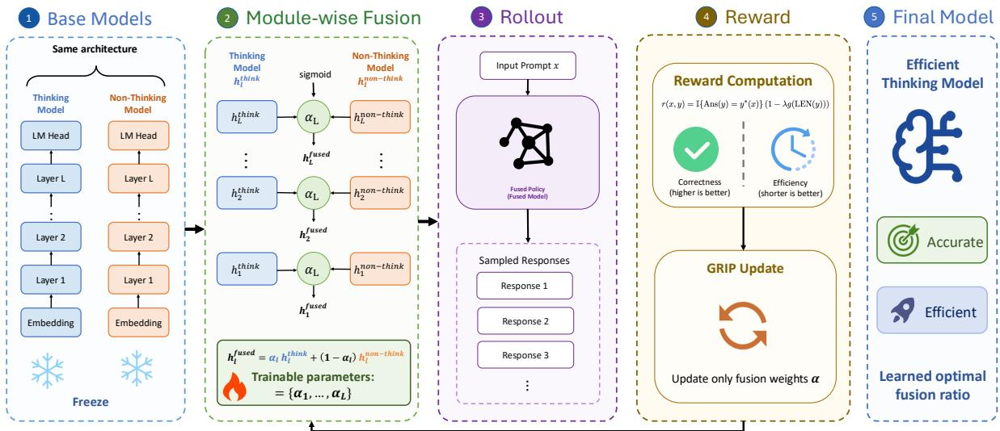
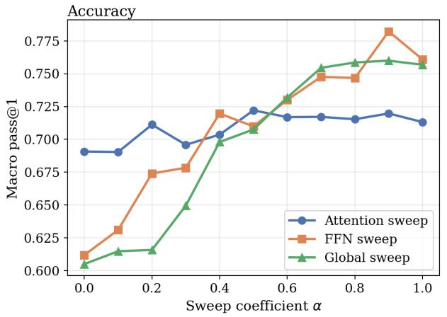
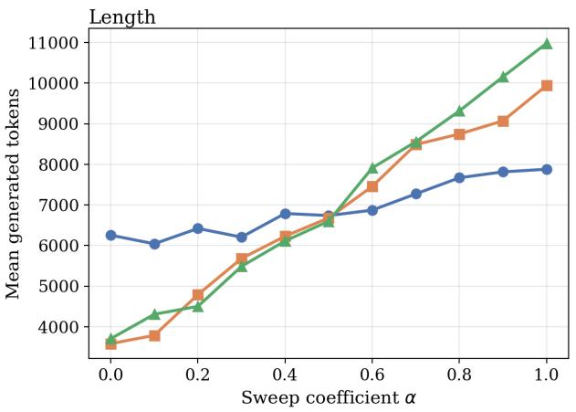
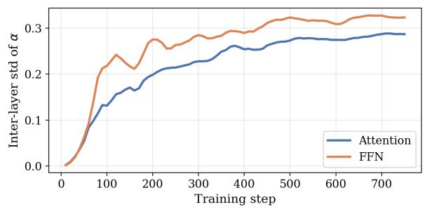
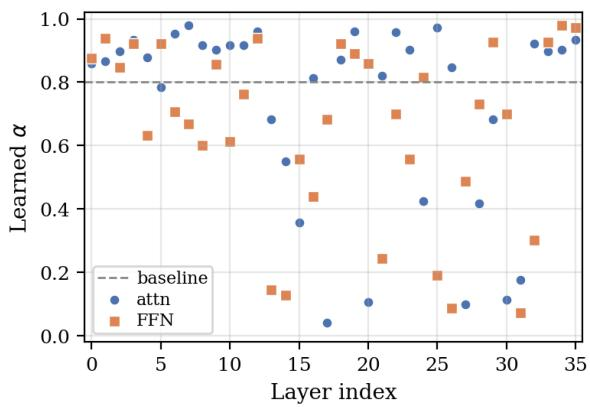
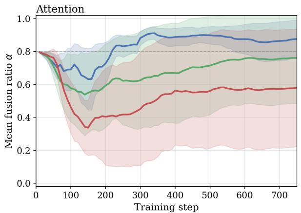
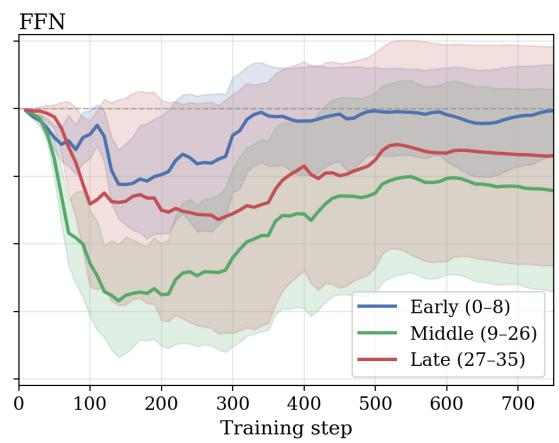
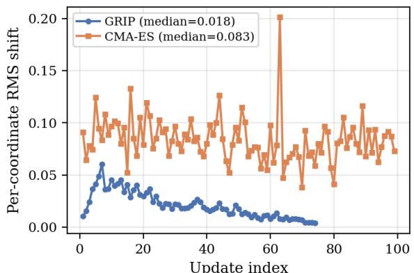
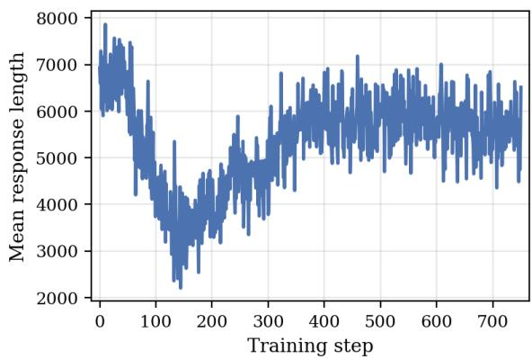
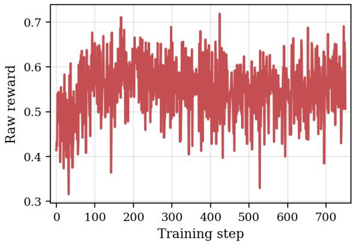

# GRIP: Granular Reward-Guided Parameter Interpolation for Efficient Reasoning

Lam So1\*, Canhui Wu2\*†, Han Lin1

1Peking University, 2Xi’an Jiaotong University wucanhui@stu.xjtu.edu.cn

## Abstract

Reasoning-oriented large language models often achieve strong problem-solving performance by generating long chains of thought, but this behavior substantially increases inference cost and latency. In contrast, instructiontuned models tend to answer more concisely, yet often lack comparable reasoning ability. This accuracy-efficiency mismatch motivates a lightweight approach that combines the strengths of both models without full model retraining. In this paper, we propose GRIP (Granular Reward-guided Interpolation ofParameters), a reward-guided parameter interpolation framework for efficient reasoning. Given a reasoning model and an instruction model with identical architectures, GRIP assigns learnable interpolation ratios to individual modules and optimizes only these ratios while keeping both source models frozen. The interpolation ratios are trained with a reward signal that favors responses that are both correct and concise. Experiments show that GRIP achieves a better accuracy-efficiency trade-off than fixed or search-based merging baselines and further reveals module-wise fusion patterns associated with efficient reasoning.

## 1 Introduction

Large language models (LLMs) have demonstrated remarkable reasoning abilities across arithmetic, commonsense, and symbolic domains. Chain-of-Thought (CoT) prompting (Wei et al., 2022; Kojima et al., 2022) further enhances these abilities by encouraging models to decompose complex problems into intermediate reasoning steps. This explicit reasoning paradigm has become an important mechanism for improving both interpretability and success rates on multi-step reasoning tasks.

However, the same explicit reasoning behavior also exposes a growing efficiency problem.

Reasoning-oriented models frequently produce unnecessarily long explanations, and may even enter cycles of self-reflection when solving relatively simple problems, a phenomenon referred to as overthinking (Sui et al., 2025; Chen et al., 2025). Such verbosity directly increases token consumption and latency (Aytes et al., 2025), and redundant intermediate steps may introduce self-contradictions or compounding reasoning errors (Cuadron et al., 2025; Su et al., 2025). As reasoning models are increasingly deployed in latency- and cost-sensitive scenarios, improving reasoning efficiency without sacrificing accuracy has become a central challenge.

Existing approaches to efficient reasoning typically fall into two categories. Prompt-based methods encourage shorter responses through concise instructions or explicit token budgets (Renze and Guven, 2024; Xu et al., 2025), but their effectiveness depends on prompt design and may not reliably change the model’s underlying reasoning behavior. Training-based methods, including reinforcement learning (RL) with length-aware rewards (Luo et al., 2025a; Yi et al., 2025; Arora and Zanette, 2025; Hou et al., 2025) and supervised fine-tuning (SFT) on concise reasoning traces (Ma et al., 2025; Kang et al., 2025; Xia et al., 2025; Yu et al., 2025a), can more directly shape model outputs, but usually require costly model-level optimization. These limitations motivate a lighter alternative that can adjust the accuracy-efficiency trade-off without updating the full model.

Model merging provides a promising starting point for such an alternative. A reasoning model and a non-thinking instruction model from the same family often share an aligned parameter space: the former offers strong reasoning ability, whereas the latter exhibits concise instruction-following behavior. Interpolating their parameters can therefore produce fused models whose behavior moves between deliberate reasoning and concise answering. However, existing merge-based methods commonly rely on fixed global coefficients or blackbox search (Wu et al., 2025a,b). As a result, they provide limited task-adaptive control over which modules should preserve reasoning-specific parameters and which modules can shift toward concise instruction-following behavior.

In this work, we introduce GRIP (Granular Reward-guided Interpolation of Parameters), a lightweight reward-guided interpolation framework for efficient reasoning. Starting from a reasoning model and a non-thinking instruction model with identical architectures, GRIP assigns a learnable interpolation ratio to each module and optimizes only these ratios while keeping both source models frozen. At each optimization step, the current fused model rolls out responses, and a reward function jointly considers answer correctness and response length, giving higher rewards to outputs that are both correct and concise. This reward signal updates the module-wise interpolation ratios through an RL-based objective, allowing the fused model to discover task-aware fusion strategies with substantially fewer trainable parameters than full model training. Beyond improving the accuracyefficiency trade-off over existing merging schemes, the learned interpolation patterns also provide insight into how reasoning behavior is distributed across modules.

Our contributions are summarized as follows:

• We propose GRIP, a lightweight granular reward-guided parameter interpolation method that combines a reasoning model with a non-thinking instruction model of identical architecture for efficient reasoning.

• We optimize only module-wise interpolation ratios with an RL-based update, using rewards that jointly encourage answer correctness and response conciseness while keeping both source models frozen.

• Experiments demonstrate that GRIP achieves a stronger accuracy-efficiency trade-off than existing merging baselines and reveals module-wise patterns related to reasoning behavior.

## 2 Related Work

## 2.1 Model Merging

Model merging aims to integrate multiple independently trained models into a unified parameter space, enabling the combined model to inherit diverse capabilities. This paradigm has been extensively explored in settings such as continual learning (Marczak et al., 2024), multi-task learning (Yang et al., 2023), and even adversarial analysis of model behaviors (Gangwal and Sharma, 2025). A fundamental requirement for most merging approaches is architectural alignment, which allows parameters from different models to be directly combined. Among existing strategies, a straightforward solution is to perform elementwise weight averaging across models (Utans, 1996). Building upon this intuition, the task arithmetic framework generalizes weight averaging by operating on task-specific parameter offsets, enabling controlled model editing and composition (Ilharco et al., 2022). A comprehensive overview of model merging techniques, along with their theoretical foundations and practical applications, is provided by Yang et al. (2024). More recently, practical deployments have demonstrated the effectiveness of model merging for reasoning efficiency. For instance, Kimi k1.5 combines models specialized in long and short chain-of-thought reasoning by uniformly averaging their parameters (Team et al., 2025).

## 2.2 Efficient Reasoning

As reasoning in LLMs becomes increasingly verbose, recent works have focused on improving conciseness while maintaining reasoning quality and accuracy. Prompt-based methods, such as CCoT (Renze and Guven, 2024), guide models through explicit instructions like “Be concise,” whereas CoD (Xu et al., 2025) and Tokenbudget (Han et al., 2024) impose strict token constraints to prevent excessively long outputs. Supervised fine-tuning (SFT) approaches, including C3oT (Kang et al., 2025), CoT-Valve (Ma et al., 2025), TokenSkip (Xia et al., 2025), and LS-Mixture (Yu et al., 2025a), train models on reasoning traces of varying lengths, with particular emphasis on shorter and more efficient chains. Reinforcement learning (RL)-based methods, such as StepPruner (Wu et al., 2026), O1-pruner (Luo et al., 2025a), ShorterBetter (Yi et al., 2025), and TrainEfficient (Arora and Zanette, 2025), further encourage concise reasoning by incorporating explicit length penalties during optimization. Finally, merge-based approaches (Wu et al., 2025a,b) reduce reasoning length by directly combining the parameters of reasoning-oriented and instructionfollowing models, achieving efficiency gains without additional training.

## 3 Method

## 3.1 Problem Setup

Let $\theta ^ { R }$ denote a reasoning-oriented model and $\theta ^ { I }$ denote an instruction-tuned model. Both models share an identical architecture and come from the same model family, so their parameter tensors are shape-compatible and directly aligned. Our goal is to construct a fused model $\dot { \theta } ^ { F }$ that preserves the reasoning accuracy of $\theta ^ { R }$ while exhibiting the concise response behavior of $\theta ^ { I }$ . GRIP parameterizes $\theta ^ { F }$ with a small set of module-wise interpolation logits and updates them with group-relative reward feedback in the spirit of GRPO (Shao et al., 2024).

Formally, we aim to optimize a set of modulewise fusion ratios such that the resulting model achieves high task accuracy with reduced output length. Figure 1 provides an overview of the proposed interpolation and reward-guided optimization pipeline.

## 3.2 Module-wise Sigmoid-controlled Fusion

We construct the fused model by interpolating the parameters of the reasoning model and the instruction model in a module-wise manner. Let K denote the number of interpolated modules, including attention modules, FFN modules, and optionally separately weighted modules such as the embedding layer and the language modeling head. When the embedding layer and the language modeling head share tied weights, they use the same interpolation coefficient to preserve weight tying. For the k-th module, we introduce an unconstrained trainable parameter $\rho _ { k } \in \mathbb { R }$ and map it to a valid interpolation coefficient through a sigmoid function:

$$
\alpha _ { k } = \sigma ( \rho _ { k } ) = \frac { 1 } { 1 + \exp ( - \rho _ { k } ) } , \quad \alpha _ { k } \in ( 0 , 1 ) .\tag{1}
$$

The fused parameters of the k-th module are then defined as

$$
\begin{array} { r } { \theta _ { k } ^ { F } ( \pmb { \rho } ) = \alpha _ { k } \theta _ { k } ^ { R } + ( 1 - \alpha _ { k } ) \theta _ { k } ^ { I } , } \end{array}\tag{2}
$$

where $\alpha _ { k }$ controls the contribution of the reasoning model and $1 - \alpha _ { k }$ controls the contribution of the instruction model. Equivalently, the overall fused model is

$$
\begin{array} { r } { \theta ^ { F } ( \pmb { \rho } ) = \mathcal { F } ( \theta ^ { R } , \theta ^ { I } , \pmb { \alpha } ) , \quad \pmb { \alpha } = \sigma ( \pmb { \rho } ) . } \end{array}\tag{3}
$$

This sigmoid parameterization allows us to optimize unconstrained variables $\rho$ with gradient-based methods while ensuring that every module-wise fusion ratio remains within the valid interval. During optimization, only $\rho$ is updated, whereas both source models $\theta ^ { R }$ and $\theta ^ { I }$ are frozen.

Because $\theta _ { k } ^ { F }$ is differentiable in $\rho _ { k }$ , the gradient of any per-token RL loss L with respect to a fusion logit follows directly from the chain rule:

$$
\frac { \partial \mathcal { L } } { \partial \rho _ { k } } = \Bigg \langle \frac { \partial \mathcal { L } } { \partial \theta _ { k } ^ { F } } , \ : \theta _ { k } ^ { R } - \theta _ { k } ^ { I } \Bigg \rangle \cdot \sigma ^ { \prime } ( \rho _ { k } ) ,\tag{4}
$$

where $\langle \cdot , \cdot \rangle$ denotes the inner product over the module’s parameter tensor. GRIP therefore receives the same per-token reward signal that full-model RL would deliver to $\theta _ { k } ^ { F }$ , but projected onto the single direction $\theta _ { k } ^ { R } - \theta _ { k } ^ { \tilde { I } }$ . This projection is what makes the optimization lightweight: each module collapses to one trainable scalar without losing the per-token credit that gradient-based RL provides.

## 3.3 Reward-Guided Interpolation Optimization

We optimize the module-wise fusion logits $\rho$ with an RL-based objective. At each optimization step, we set the current fused policy as the old policy $\pi _ { \mathrm { o l d } }$ and sample a group of $G$ responses $\{ y _ { i } \} _ { i = 1 } ^ { G }$ for each prompt x. Each response receives a reward that encourages correctness while penalizing excessive response length.

Reward Function. Let $y ^ { * } ( x )$ denote the groundtruth answer of prompt x, let $\operatorname { A n s } ( y )$ denote the final answer extracted from response $y ,$ and let $\operatorname { L E N } ( y )$ denote the number of generated tokens in response $y .$ . Following the reward design in Figure 1, we define the reward as

$$
r ( x , y ) = \mathbb { I } \{ \mathrm { A n s } ( y ) = y ^ { * } ( x ) \} \left( 1 - \lambda g ( \mathrm { L E N } ( y ) ) \right) ,\tag{5}
$$

where $\lambda \in [ 0 , 1 ]$ controls the strength of length regularization. To compare lengths among responses generated for the same prompt, we normalize response length within the correct responses of the sampled group and apply a sigmoid soft clipping function:

$$
g ( \mathrm { L E N } ( y _ { i } ) ) = \sigma \left( \frac { \mathrm { L E N } ( y _ { i } ) - \mu _ { x } } { s _ { x } + \delta } \right) ,\tag{6}
$$

where $\delta$ is a small constant for numerical stability. Let $\mathcal { C } _ { x } = \{ i : \mathrm { A n s } ( y _ { i } ) = y ^ { * } ( x ) \}$ denote the

  
Figure 1: Overview of GRIP. GRIP learns module-wise sigmoid-controlled fusion ratios between a reasoning model and a non-thinking model, and updates them with an RL-based objective using rewards based on correctness and response length.

indices of correct responses in the group, and let $G _ { c } = | \mathcal { C } _ { x } |$ . Then

$$
\begin{array} { l } { \displaystyle \mu _ { x } = \frac { 1 } { G _ { c } } \sum _ { i \in \mathcal { C } _ { x } } \mathrm { L E N } ( y _ { i } ) } \\ { \displaystyle s _ { x } = \sqrt { \frac { 1 } { G _ { c } } \sum _ { i \in \mathcal { C } _ { x } } \left( \mathrm { L E N } ( y _ { i } ) - \mu _ { x } \right) ^ { 2 } } . } \end{array}\tag{7}
$$

When $G _ { c } = 0$ , the indicator $\mathbb { I } \{ \mathrm { A n s } ( y _ { i } ) = y ^ { * } ( x ) \}$ in the reward is zero for every response in the group, so all responses receive zero reward (and contribute zero advantage). When $G _ { c } ~ = ~ 1 , ~ s _ { x }$ is set to 1 to avoid a degenerate denominator; in this case the single correct response has $z = 0$ and therefore $g ( \mathrm { L E N } ( y _ { i } ) ) = \sigma ( 0 ) = 0 . 5$ . Thus, incorrect responses receive zero reward, while correct responses are further ranked by length, with shorter correct responses receiving larger rewards.

Policy Update. Given rewards $\{ r _ { i } \} _ { i = 1 } ^ { G }$ for responses sampled from the old fused policy πold, we compute group-relative advantages by normalizing rewards within each group:

$$
\hat { A } _ { i } = \frac { r _ { i } - \bar { r } } { \mathrm { s t d } ( \{ r _ { j } \} _ { j = 1 } ^ { G } ) + \delta } , \quad \bar { r } = \frac { 1 } { G } \sum _ { j = 1 } ^ { G } r _ { j } .\tag{8}
$$

For brevity, denote the current fused policy by $\pi _ { \rho }$ $\pi _ { \boldsymbol { \theta } ^ { F } ( \boldsymbol { \rho } ) }$ . Following GRPO (Shao et al., 2024) with the clip-higher and KL-free modifications from DAPO (Yu et al., 2025b), we update the fusion

logits ρ using

$$
\mathcal { I } ( \pmb { \rho } ) = \mathbb { E } \left[ \frac { 1 } { G } \sum _ { i = 1 } ^ { G } \operatorname* { m i n } \left( \omega _ { i } \hat { A } _ { i } , \tilde { \omega } _ { i } \hat { A } _ { i } \right) \right] ,\tag{9}
$$

where the expectation is over prompts and response groups sampled from $\pi _ { \mathrm { o l d } } , \omega _ { i } = \omega _ { i } ( \pmb { \rho } ) =$ $\pi _ { \rho } ( y _ { i } \mid x ) / \pi _ { \mathrm { o l d } } ( y _ { i } \mid x )$ is the policy ratio, and $\tilde { \omega } _ { i } = \mathrm { c l i p } ( \omega _ { i } , 1 - \varepsilon _ { \mathrm { l o } } , 1 + \varepsilon _ { \mathrm { h i } } )$ uses asymmetric clip-higher bounds. Both $\omega _ { i }$ and the loss are estimated at the token level. We omit the KL anchor: since $\rho$ is confined to a low-dimensional sigmoidbounded space and the original model weights are frozen, the fused policy stays close to its initialization without requiring an explicit reference-policy regularizer. The trainable logits are then updated by gradient ascent:

$$
\pmb { \rho } \gets \pmb { \rho } + \eta \nabla _ { \pmb { \rho } } \mathscr { I } ( \pmb { \rho } ) , \quad \pmb { \alpha } = \sigma ( \pmb { \rho } ) .\tag{10}
$$

This update directly changes the module-wise interpolation ratios through gradient ascent while keeping the original model parameters fixed. The overall optimization procedure is summarized in Algorithm 1.

## 4 Experiments

## 4.1 Experimental Setup

Models and Datasets We conduct experiments on the Qwen3-4B-Instruct-2507 and Qwen3-4B-Thinking-2507 (Yang et al., 2025) models, which share the same architecture and therefore allow direct parameter interpolation. We use DeepScaleRpreview (Luo et al., 2025b) as the training dataset for optimizing the module-wise fusion logits. To test both in-domain and out-of-domain generalization, we evaluate GRIP on five reasoning benchmarks: AIME25, MATH500 (Lightman et al., 2024), GSM8K (Cobbe et al., 2021), GPQA-D (Rein et al., 2024), and LiveCodeBench (LCB) (Jain et al., 2024). These datasets cover competition math, grade-school math, scientific question answering, and code generation.

Algorithm 1 RL-based Module-wise Parameter   
Interpolation   
Require: Reasoning model $\theta ^ { R } { } _ { ; }$ , Instruction model   
$\theta ^ { I }$   
Ensure: Optimized fusion ratios $\alpha ^ { * }$   
1: Initialize trainable fusion logits $\begin{array} { r l } { \rho } & { { } = } \end{array}$   
logit(0.8)1   
2: while not converged do   
Compute fusion ratios $\alpha \gets \sigma ( \rho )$   
4: Construct fused model $\theta ^ { F } ( \rho )$ ←   
$\mathcal { F } ( \theta ^ { R } , \theta ^ { I } , \alpha )$   
5: Sample a batch of problems $\boldsymbol { B }$   
6: Set $\pi _ { \mathrm { o l d } } ~  ~ \pi _ { \theta ^ { F } ( \pmb { \rho } ) }$ and roll out response   
groups $\{ y _ { i } \} _ { i = 1 } ^ { G }$   
7: Compute rewards $\{ r _ { i } \}$ using correctness   
and normalized length penalty   
8: Compute group-relative advantages $\{ \hat { A } _ { i } \}$   
9: Update $\rho$ with the RL-based objective   
10: end while   
11: return $\alpha ^ { * } = \sigma ( \rho ^ { * } )$

Implementation Details We train GRIP with the slime framework (Zhu et al., 2025). For Qwen3- 4B, the trainable variables are $K \ = \ 7 4$ fusion logits: 36 for attention, 36 for FFN, one for the final RMSNorm, and one shared by the tied input embedding and LM head. This keeps optimization lightweight because both source models remain frozen and only scalar fusion parameters are updated. We use learning rate 0.1, length penalty $\lambda = 0 . 4$ , rollout group size G = 16, and 32 prompts per rollout, producing 32×16=512 responses per rollout. With a global batch size of 512, each rollout yields one optimizer step. The maximum response length is 10,240 during training, and we train for 750 optimizer steps. The asymmetric clipping bounds are $\varepsilon _ { \mathrm { l o } } = 0 . 2$ and $\varepsilon _ { \mathrm { h i } } = 0 . 2 8 ;$ KL anchoring and entropy bonus are disabled. Evaluation uses LightEval (Habib et al., 2023) with temperature 0.8, top\_p 0.9, and a 32,768 token limit.

Baselines We compare our method against three types of baselines. 1) Qwen3 Modes: We report the original Qwen3-Thinking and Qwen3-Instruct models to show the accuracy-efficiency trade-off before fusion. 2) Model Merging: We compare with representative parameter-space merging methods, including Linear interpolation, SLERP (Shoemake, 1985), TIES (Yadav et al., 2023), DARE-TIES (Yu et al., 2024; Yadav et al., 2023), and DELLA (Pala Tej Deep et al., 2024). Following the setting of Wu et al. (2025b), all interpolation-based baselines use a fixed reasoning-model coefficient of 0.8. 3) Black-box Search: We include CMA-ES (Hansen and Ostermeier, 2001) as a searchbased baseline for optimizing fusion ratios without gradient-based reward feedback. To make the comparison apples-to-apples, CMA-ES uses the same training prompts as GRIP (DeepScaleR-preview), the same module-wise parameterization, and a fitness that jointly rewards accuracy and penalizes generation length on those training prompts, matching GRIP’s reward function. AIME25, MATH500, GSM8K, GPQA-D, and LCB are all held-out for both methods.

## 4.2 Main Results

Table 1 shows that GRIP improves the accuracyefficiency trade-off without simply moving the model toward shorter but weaker responses. Although the instruction model is much more concise, it suffers a large accuracy drop, especially on AIME25, GPQA-D, and LCB. By contrast, GRIP reduces the average generation length by 27.0% relative to Qwen3-Thinking while slightly improving average accuracy from 76.0 to 76.5, suggesting that much of the verbose reasoning can be removed without sacrificing task-critical reasoning behavior.

GRIP also compares favorably with conventional merging baselines. Fixed-ratio methods such as Linear interpolation and SLERP shorten outputs to some extent, but their global fusion strength limits the ability to preserve reasoning-sensitive components. GRIP reaches the same average accuracy as SLERP while using 14.5% fewer tokens, indicating that adaptive module-wise fusion provides a more efficient allocation of inference computation.

The gains vary across benchmarks. On AIME25, GRIP improves accuracy over Qwen3-Thinking by

<table><tr><td rowspan="2">Methods</td><td colspan="2">AIME25</td><td colspan="2">MATH500</td><td colspan="2">GSM8K</td><td colspan="2">GPQA-D†</td><td colspan="2">LCB†</td><td colspan="3">Avg</td></tr><tr><td>Acc.</td><td>Tok.</td><td>Acc.</td><td>Tok.</td><td>Acc.</td><td>Tok.</td><td>Acc.</td><td>Tok.</td><td>Acc.</td><td>Tok.</td><td></td><td>Acc.</td><td>Tok.</td></tr><tr><td colspan="10"></td><td></td><td></td><td></td><td></td></tr><tr><td>Thinking</td><td>73.3</td><td>19630</td><td>89.4</td><td>5802</td><td>94.5</td><td>1350</td><td>66.7</td><td>9057</td><td>56.0</td><td>18439</td><td></td><td> $7 6 . 0 _ { ( + 0 . 0 ) }$ </td><td> $1 0 8 5 6 _ { ( 1 0 0 . 0 \% ) }$ </td></tr><tr><td>Instruct</td><td>36.7</td><td>10555</td><td>85.6</td><td>1623</td><td>92.6</td><td></td><td>304 46.5</td><td></td><td>459 30.3</td><td>2824</td><td></td><td> $5 8 . 3 _ { ( - 1 7 . 7 ) }$ </td><td> $3 1 5 3 _ { ( 2 9 . 0 \% ) }$ </td></tr><tr><td>Linear</td><td>73.3</td><td>15977</td><td>88.0</td><td>4339</td><td>93.6</td><td></td><td>1223</td><td>70.3</td><td>8591</td><td>53.1</td><td>15814</td><td> $7 5 . 7 _ { ( - 0 . 3 ) }$ </td><td> $9 1 8 9 _ { ( 8 4 . 6 \% ) }$ </td></tr><tr><td>SLERP</td><td>76.7</td><td>16467</td><td>89.0</td><td>4442</td><td>94.2</td><td>1231</td><td>69.2</td><td>8449</td><td>53.7</td><td>15770</td><td></td><td> $7 6 . 5 _ { ( + 0 . 5 ) }$ </td><td> $9 2 7 2 _ { ( 8 5 . 4 \% ) }$ </td></tr><tr><td>TIES</td><td>76.7</td><td>16106</td><td>85.8</td><td>4433</td><td>93.6</td><td>1197</td><td>69.2</td><td>8724</td><td>56.0</td><td>16097</td><td></td><td> $7 6 . 3 _ { ( + 0 . 3 ) }$ </td><td> $9 3 1 1 _ { ( 8 5 . 8 \% ) }$ </td></tr><tr><td>DARE-TIES</td><td>70.0</td><td>16455</td><td>88.0</td><td>4640</td><td>93.1</td><td>1223</td><td>68.2</td><td>8735</td><td>54.9</td><td>16658</td><td></td><td> $7 4 . 8 _ { ( - 1 . 2 ) }$ </td><td> $9 5 4 2 _ { ( 8 7 . 9 \% ) }$ </td></tr><tr><td>DELLA</td><td>66.7</td><td>17447</td><td>88.0</td><td>4807</td><td>94.5</td><td>1205</td><td>68.7</td><td></td><td>8026 53.1</td><td>16875</td><td></td><td> $7 4 . 2 _ { ( - 1 . 8 ) }$ </td><td> $9 6 7 2 _ { ( 8 9 . 1 \% ) }$ </td></tr><tr><td>CMA-ES</td><td>60.0</td><td>11990</td><td>85.8</td><td>3632</td><td>94.5</td><td>1202</td><td>67.2</td><td>6839</td><td>42.9</td><td>18675</td><td></td><td> $7 0 . 1 _ { ( - 5 . 9 ) }$ </td><td> $8 4 1 3 _ { ( 7 7 . 5 \% ) }$ </td></tr><tr><td>GRIP</td><td>80.0</td><td>11838</td><td>86.7</td><td>3565</td><td>94.4</td><td>1115</td><td></td><td>70.2</td><td>8236</td><td>51.4 14894</td><td></td><td> $7 6 . 5 _ { ( + 0 . 5 ) }$ </td><td> $7 9 3 0 _ { ( 7 3 . 0 \% ) }$ </td></tr></table>

Table 1: Main comparison of accuracy and inference efficiency on five reasoning benchmarks. Acc. denotes task accuracy, and Tok. denotes the average number of generated tokens per example. The Avg column reports the mean performance across AIME25, MATH500, GSM8K, GPQA-D, and LCB. Best results are highlighted in bold. † marks out-of-domain benchmarks: GRIP and the CMA-ES baseline are both trained on math data only (DeepScaleR-preview).

6.7 points while reducing output length by 39.7%, suggesting that difficult mathematical problems contain substantial redundant exploration. Notably, although GRIP is optimized only on mathematical data, it also transfers well to out-of-domain benchmarks: GPQA-D shows accuracy gains with shorter reasoning, and LCB achieves the lowest token usage among strong reasoning variants. On MATH500 and GSM8K, GRIP mainly converts the strong baseline performance into shorter generations, while LCB remains more sensitive to length reduction, possibly because code generation benefits more from extended deliberation or verification.

## 4.3 Validating Module-wise Interpolation

We first test whether attention and FFN require separate fusion ratios. On the Qwen3-4B Thinking/Instruct pair, we sweep $\alpha \in \ \{ 0 . 0 , 0 . 1 , . . . , 1 . 0 \}$ 2 where $\alpha = 1$ recovers Thinking and $\alpha = 0$ recovers Instruct. We compare three settings: applying α only to attention, only to FFN, or globally to all modules. Non-swept modules are fixed at 0.5, isolating the marginal effect of each module type. Each setting is evaluated on the same five benchmarks (macro pass@1, average generation length).

Attention and FFN play sharply different roles. Figure 2 shows a clear asymmetry. Sweeping attention barely changes macro pass@1, which remains in [0.690, 0.722], and increases length by only 26%. Sweeping FFN instead raises macro pass@1 from 0.612 to 0.782 and increases length by 178%. FFN therefore drives most of both accuracy and length, while attention is largely inert; a single global coefficient conflates the two.

Module-wise tuning beats any global α. The FFN sweep also outperforms the global sweep for every $\alpha \geq 0 . 4 .$ Its best accuracy is 0.782 at $\alpha { = } 0 . 9 $ compared with 0.760 for the best global setting. The global sweep additionally pays an unnecessary length cost because it moves attention together with FFN. Separating the two streams removes this coupling, and motivates the per-layer extension used by GRIP.

## 4.4 Tracking Module-wise Fusion Coefficients

We next track the learned fusion ratios over training. Every ∼ 10 optimization steps, we record $\alpha _ { k } ( t ) =$ σ $\left( \rho _ { k } ( t ) \right)$ for all Qwen3-4B modules: 36 attention coefficients, 36 FFN coefficients, one shared coefficient for the tied input embedding and LM head, and one coefficient for the final RMSNorm. All coefficients start from an 80%/20% Thinking/Instruct blend. This lets us observe whether the optimizer keeps a nearly global interpolation pattern or actively assigns different modules to different source models.

From a uniform initialization to strong per-layer differentiation. Figure 3 reports the inter-layer standard deviation of α for attention and FFN. Both start near 0, rise rapidly in the first ∼ 300 steps, and saturate around 0.30. Since a global coefficient would keep this value at 0, the learned solution separates layers in both module streams rather than merely shifting the whole model toward one endpoint.

  
Figure 2: Module-targeted coefficient sweeps on Qwen3-4B. The attention sweep is nearly flat in both macro pass@1 and length, while the FFN sweep changes both metrics substantially. The global sweep follows the FFN trend but pays a larger length cost because all modules are moved together.

  
Figure 3: Inter-layer standard deviation of attention and FFN fusion ratios during training. Both start near zero, grow rapidly in the first few hundred steps, and stabilize around ≈ 0.30, showing that training breaks the initially uniform blend.

Where in the network does the differentiation happen? Figure 5 groups the 36 layers into early (0–8), middle (9–26), and late (27–35) bands, and reports the mean fusion ratio per band over training. The split is not uniform across depth. For attention, the early band stays Thinking-heavy throughout $( \alpha \approx 0 . 8 5  – 0 . 9 )$ , while the middle and late bands first dip sharply toward Instruct (down to $\alpha { \approx } 0 . 5$ and $\alpha \approx 0 . 3$ respectively in the first ∼ 200 steps) before partially recovering and stabilizing around $\alpha \approx 0 . 7$ and $\alpha \approx 0 . 6$ FFN follows a different shape: the early band drifts only mildly downward to $\alpha \approx 0 . 7 5$ , but both the middle and late bands plunge much deeper (the middle band reaches $\alpha \approx 0 . 3$ , more Instruct-heavy than any attention band) and settle around $\alpha \approx 0 . 5 5$ and $\alpha \approx 0 . 6 5$ Along the time axis the differentiation stabilizes rather than diverging: most movement happens in the first ∼ 300 steps and the trajectories then flatten. Attention and FFN therefore differentiate in different depth regions and along different trajectories, which a single global ratio cannot capture. Figure 4 compares the learned coefficients under the trained GRIP policy against the fixed $\alpha { = } 0 . 8$ baseline used by interpolation methods following Wu et al. (2025b); the broad spread around this dashed line shows that most layers prefer substantially different mixing ratios, rather than the same global coefficient.

  
Figure 4: Learned per-layer fusion ratios after 750 training steps for attention and FFN modules.

## 4.5 Reward-Guided vs. Black-Box Search

We also compare GRIP with CMA-ES (Hansen and Ostermeier, 2001), a black-box search baseline over the same module-wise parameterization $\lambda ~ \in ~ [ 0 , 1 ] ^ { D }$ with D=74 for Qwen3-4B (one mixing weight per attn/FFN block plus embedding and final norm). CMA-ES samples 6 candidates per generation and ranks them by the same accuracy−length fitness used by GRIP’s reward, evaluated on the same DeepScaleR-preview prompts. With training distribution, search space, and objective all matched, the comparison isolates the optimization mechanism itself: reward-guided gradient updates vs. evolutionary search.

  
Figure 5: Mean fusion ratio α over training, with the 36 layers grouped into early (0–8), middle (9–26), and late (27–35) bands; shaded regions show within-band standard deviation. Left: attention. Right: FFN. The early band stays close to the 0.8 initialization, while middle and late bands move substantially toward Instruct, and the FFN middle band moves more aggressively than any attention band.

  
(GRIP: every 10 grad steps; CMA-ES: every gen.)  
Figure 6: RL optimization is smoother than CMA-ES. Per-coordinate RMS shift between adjacent updates, measured every 10 gradient steps for RL and every generation for CMA-ES.

Continuity. The median per-coordinate RMS shift between adjacent updates is 0.018 for GRIP and 0.083 for CMA-ES. The path-to-netdisplacement ratio is 4.9× for GRIP and 21.8× for CMA-ES, after which CMA-ES retraces most of its path while GRIP does not.

Credit assignment. CMA-ES performs $1 0 0 \times$ 6 = 600 fitness evaluations on the training prompts and receives one scalar score per candidate for all 74 coordinates, so it must infer which coordinates matter only through population-level ranking. GRIP operates on the same 74-dim space but receives gradient feedback on every rollout, assigning credit directly to each module-level coefficient. With training data, search space, and objective held fixed, the gap in Table 1 isolates the value of reward-guided updates over evolutionary search.

## 5 Conclusion

We presented GRIP, a reward-guided parameter interpolation framework for efficient reasoning. Given a reasoning model and an instruction model with identical architectures, GRIP freezes source models, assigns learnable fusion coefficients to modules, and updates these coefficients with a reward favoring correct, concise responses. Across five reasoning benchmarks, this module-wise interpolation reduces generation length while preserving or improving average accuracy relative to the original reasoning model, yielding a stronger accuracy-efficiency trade-off than fixed-ratio merging and search-based baselines. Our analyses show that reasoning relies on per-layer, per-module coefficients that cannot be reduced to a single global ratio, and that reward-guided updates yield a smoother trajectory than black-box search over the same interpolation space, with distinct fusion patterns emerging across attention and FFN modules. Together, these results suggest that reward-guided interpolation is a lightweight alternative to fullmodel training for reducing overthinking in large language models.

## 6 Limitations

Our study has several limitations. First, due to compute constraints we evaluate GRIP only at the 4B scale; whether the observed accuracyefficiency trade-off and per-layer differentiation patterns transfer to substantially larger reasoning models (30B+) remains open. Second, all experiments use dense Transformer backbones; we have not validated GRIP on Mixture-of-Experts architectures, where router and expert weights introduce additional structure that the current per-module parameterization does not address. Finally, GRIP assumes the reasoning model and the instruction model share an identical architecture (same depth, width, and head count), which restricts the method to within-family pairs (e.g., Qwen3-Thinking with Qwen3-Instruct); cross-family fusion (e.g., a Llama Thinking variant with a Qwen Instruct variant) is not directly supported and is not evaluated.

## References

Daman Arora and Andrea Zanette. 2025. Training language models to reason efficiently. Preprint, arXiv:2502.04463.

Simon A Aytes, Jinheon Baek, and Sung Ju Hwang. 2025. Sketch-of-thought: Efficient llm reasoning with adaptive cognitive-inspired sketching. arXiv preprint arXiv:2503.05179.

Xingyu Chen, Jiahao Xu, Tian Liang, Zhiwei He, Jianhui Pang, Dian Yu, Linfeng Song, Qiuzhi Liu, Mengfei Zhou, Zhuosheng Zhang, Rui Wang, Zhaopeng Tu, Haitao Mi, and Dong Yu. 2025. Do not think that much for 2+3=? on the overthinking of o1-like llms. Preprint, arXiv:2412.21187.

Karl Cobbe, Vineet Kosaraju, Mohammad Bavarian, Mark Chen, Heewoo Jun, Lukasz Kaiser, Matthias Plappert, Jerry Tworek, Jacob Hilton, Reiichiro Nakano, Christopher Hesse, and John Schulman. 2021. Training verifiers to solve math word problems. arXiv preprint arXiv:2110.14168.

Alejandro Cuadron, Dacheng Li, Wenjie Ma, Xingyao Wang, Yichuan Wang, Siyuan Zhuang, Shu Liu, Luis Gaspar Schroeder, Tian Xia, Huanzhi Mao, Nicholas Thumiger, Aditya Desai, Ion Stoica, Ana Klimovic, Graham Neubig, and Joseph E. Gonzalez. 2025. The danger of overthinking: Examining the reasoning-action dilemma in agentic tasks. Preprint, arXiv:2502.08235.

Ankit Gangwal and Aaryan Ajay Sharma. 2025. Merge now, regret later: The hidden cost of model merging is adversarial transferability. arXiv preprint arXiv:2509.23689.

Nathan Habib, Clémentine Fourrier, Hynek Kydlícek,ˇ Thomas Wolf, and Lewis Tunstall. 2023. Lighteval: A lightweight framework for llm evaluation.

Tingxu Han, Zhenting Wang, Chunrong Fang, Shiyu Zhao, Shiqing Ma, and Zhenyu Chen. 2024. Token-budget-aware llm reasoning. arXiv preprint arXiv:2412.18547.

Nikolaus Hansen and Andreas Ostermeier. 2001. Completely derandomized self-adaptation in evolution strategies. Evolutionary Computation, 9(2):159–195.

Bairu Hou, Yang Zhang, Jiabao Ji, Yujian Liu, Kaizhi Qian, Jacob Andreas, and Shiyu Chang. 2025. Thinkprune: Pruning long chain-of-thought of llms via reinforcement learning. arXiv preprint arXiv:2504.01296.

Gabriel Ilharco, Marco Tulio Ribeiro, Mitchell Wortsman, Suchin Gururangan, Ludwig Schmidt, Hannaneh Hajishirzi, and Ali Farhadi. 2022. Editing models with task arithmetic. arXiv preprint arXiv:2212.04089.

Naman Jain, King Han, Alex Gu, Wen-Ding Li, Fanjia Yan, Tianjun Zhang, Sida Wang, Armando Solar-Lezama, Koushik Sen, and Ion Stoica. 2024. Livecodebench: Holistic and contamination free evaluation of large language models for code. Preprint, arXiv:2403.07974.

Yu Kang, Xianghui Sun, Liangyu Chen, and Wei Zou. 2025. C3ot: Generating shorter chain-of-thought without compromising effectiveness. In Proceedings of the AAAI Conference on Artificial Intelligence, volume 39, pages 24312–24320.

Takeshi Kojima, Shixiang Shane Gu, Machel Reid, Yutaka Matsuo, and Yusuke Iwasawa. 2022. Large language models are zero-shot reasoners. Advances in neural information processing systems, 35:22199– 22213.

Hunter Lightman, Vineet Kosaraju, Yuri Burda, Harrison Edwards, Bowen Baker, Teddy Lee, Jan Leike, John Schulman, Ilya Sutskever, and Karl Cobbe. 2024. Let’s Verify Step by Step. In International Conference on Learning Representations.

Haotian Luo, Li Shen, Haiying He, Yibo Wang, Shiwei Liu, Wei Li, Naiqiang Tan, Xiaochun Cao, and Dacheng Tao. 2025a. O1-pruner: Lengthharmonizing fine-tuning for o1-like reasoning pruning. arXiv preprint arXiv:2501.12570.

Michael Luo, Sijun Tan, Justin Wong, Xiaoxiang Shi, William Y. Tang, Manan Roongta, Colin Cai, Jeffrey Luo, Tianjun Zhang, Li Erran Li, Raluca Ada Popa, and Ion Stoica. 2025b. DeepScaleR: Surpassing O1- Preview with a 1.5B model by scaling RL. Notion Blog.

Xinyin Ma, Guangnian Wan, Runpeng Yu, Gongfan Fang, and Xinchao Wang. 2025. Cot-valve: Lengthcompressible chain-of-thought tuning. arXiv preprint arXiv:2502.09601.

Daniel Marczak, Bartłomiej Twardowski, Tomasz Trzcinski, and Sebastian Cygert. 2024. Magmax: Lever-´ aging model merging for seamless continual learning. In European Conference on Computer Vision, pages 379–395. Springer.

Pala Tej Deep, Rishabh Bhardwaj, and Soujanya Poria. 2024. Della-merging: Reducing interference in model merging through magnitude-based sampling. arXiv preprint arXiv:2406.11617.

David Rein, Betty Li Hou, Asa Cooper Stickland, Jackson Petty, Richard Yuanzhe Pang, Julien Dirani, Julian Michael, and Samuel R Bowman. 2024. Gpqa: A graduate-level google-proof q&a benchmark. In First Conference on Language Modeling.

Matthew Renze and Erhan Guven. 2024. The benefits of a concise chain of thought on problem-solving in large language models. In 2024 2nd International Conference on Foundation and Large Language Models (FLLM), pages 476–483. IEEE.

Zhihong Shao, Peiyi Wang, Qihao Zhu, Runxin Xu, Junxiao Song, Xiao Bi, Haowei Zhang, Mingchuan Zhang, Y. K. Li, Y. Wu, and Daya Guo. 2024. Deepseekmath: Pushing the limits of mathematical reasoning in open language models. Preprint, arXiv:2402.03300.

Ken Shoemake. 1985. Animating rotation with quaternion curves. In Proceedings of the 12th Annual Conference on Computer Graphics and Interactive Techniques, SIGGRAPH ’85, pages 245–254, New York, NY, USA. Association for Computing Machinery.

Jinyan Su, Jennifer Healey, Preslav Nakov, and Claire Cardie. 2025. Between underthinking and overthinking: An empirical study of reasoning length and correctness in llms. arXiv preprint arXiv:2505.00127.

Yang Sui, Yu-Neng Chuang, Guanchu Wang, Jiamu Zhang, Tianyi Zhang, Jiayi Yuan, Hongyi Liu, Andrew Wen, Shaochen Zhong, Na Zou, Hanjie Chen, and Xia Hu. 2025. Stop overthinking: A survey on efficient reasoning for large language models. Preprint, arXiv:2503.16419.

Kimi Team, Angang Du, Bofei Gao, Bowei Xing, Changjiu Jiang, Cheng Chen, Cheng Li, Chenjun Xiao, Chenzhuang Du, Chonghua Liao, Chuning Tang, Congcong Wang, Dehao Zhang, Enming Yuan, Enzhe Lu, Fengxiang Tang, Flood Sung, Guangda Wei, Guokun Lai, and 77 others. 2025. Kimi k1.5: Scaling reinforcement learning with llms. Preprint, arXiv:2501.12599.

Joachim Utans. 1996. Weight averaging for neural networks and local resampling schemes. In Proc. AAAI-96 Workshop on Integrating Multiple Learned Models. AAAI Press, pages 133–138. Citeseer.

Jason Wei, Xuezhi Wang, Dale Schuurmans, Maarten Bosma, brian ichter, Fei Xia, Ed Chi, Quoc V Le, and Denny Zhou. 2022. Chain-of-thought prompting elicits reasoning in large language models. In

Advances in Neural Information Processing Systems, volume 35, pages 24824–24837. Curran Associates, Inc.

Canhui Wu, Qiong Cao, Chang Li, Zhenfang Wang, Chao Xue, Yuwei Fan, Wei Xi, and Xiaodong He. 2026. Beyond token length: Step pruner for efficient and accurate reasoning in large language models. In Findings ofthe Associationfor Computational Linguistics: ACL 2026, pages 1953–1974.

Han Wu, Yuxuan Yao, Shuqi Liu, Zehua Liu, Xiaojin Fu, Xiongwei Han, Xing Li, Hui-Ling Zhen, Tao Zhong, and Mingxuan Yuan. 2025a. Unlocking efficient long-to-short llm reasoning with model merging. arXiv preprint arXiv:2503.20641.

Taiqiang Wu, Runming Yang, Tao Liu, Jiahao Wang, and Ngai Wong. 2025b. Revisiting model interpolation for efficient reasoning. arXiv preprint arXiv:2510.10977.

Heming Xia, Yongqi Li, Chak Tou Leong, Wenjie Wang, and Wenjie Li. 2025. Tokenskip: Controllable chain-of-thought compression in llms. arXiv preprint arXiv:2502.12067.

Silei Xu, Wenhao Xie, Lingxiao Zhao, and Pengcheng He. 2025. Chain of draft: Thinking faster by writing less. arXiv preprint arXiv:2502.18600.

Prateek Yadav, Derek Tam, Leshem Choshen, Colin Raffel, and Mohit Bansal. 2023. Ties-merging: Resolving interference when merging models. In Advances in Neural Information Processing Systems, volume 36, pages 7093–7115. Curran Associates, Inc.

An Yang, Anfeng Li, Baosong Yang, Beichen Zhang, Binyuan Hui, Bo Zheng, Bowen Yu, Chang Gao, Chengen Huang, Chenxu Lv, Chujie Zheng, Dayiheng Liu, Fan Zhou, Fei Huang, Feng Hu, Hao Ge, Haoran Wei, Huan Lin, Jialong Tang, and 41 others. 2025. Qwen3 technical report. Preprint, arXiv:2505.09388.

Enneng Yang, Li Shen, Guibing Guo, Xingwei Wang, Xiaochun Cao, Jie Zhang, and Dacheng Tao. 2024. Model merging in llms, mllms, and beyond: Methods, theories, applications and opportunities. arXiv preprint arXiv:2408.07666.

Enneng Yang, Zhenyi Wang, Li Shen, Shiwei Liu, Guibing Guo, Xingwei Wang, and Dacheng Tao. 2023. Adamerging: Adaptive model merging for multi-task learning. arXiv preprint arXiv:2310.02575.

Jingyang Yi, Jiazheng Wang, and Sida Li. 2025. Shorterbetter: Guiding reasoning models to find optimal inference length for efficient reasoning. arXiv preprint arXiv:2504.21370.

Bin Yu, Hang Yuan, Haotian Li, Xueyin Xu, Yuliang Wei, Bailing Wang, Weizhen Qi, and Kai Chen. 2025a. Long-short chain-of-thought mixture supervised fine-tuning eliciting efficient reasoning in large language models. arXiv preprint arXiv:2505.03469.

Le Yu, Bowen Yu, Haiyang Yu, Fei Huang, and Yongbin Li. 2024. Language models are super mario: Absorbing abilities from homologous models as a free lunch. In Proceedings ofthe 41st International Conference on Machine Learning, volume 235 of Proceedings ofMachine Learning Research, pages 57755–57775. PMLR.

Qiying Yu, Zheng Zhang, Ruofei Zhu, Yufeng Yuan, Xiaochen Zuo, Yu Yue, Weinan Dai, Tiantian Fan, Gaohong Liu, juncai liu, LingJun Liu, Xin Liu, Haibin Lin, Zhiqi Lin, Bole Ma, Guangming Sheng, Yuxuan Tong, Chi Zhang, Mofan Zhang, and 17 others. 2025b. Dapo: An open-source llm reinforcement learning system at scale. In Advances in Neural Information Processing Systems, volume 38, Main Conference, pages 113222–113244. Curran Associates, Inc.

Zilin Zhu, Chengxing Xie, Xin Lv, and slime Contributors. 2025. slime: An llm post-training framework for rl scaling. https://github.com/THUDM/slime. GitHub repository. Corresponding author: Xin Lv.

## A Appendix

## A.1 Experimental environment

We trained on a node with 8×NVIDIA H200 GPUs and Intel Xeon Platinum 8558 CPUs. The total training time was approximately 42 hours.

## A.2 Qwen3-4B training curves

The training dynamics show that GRIP gradually shortens responses while maintaining a stable reward signal, indicating that the learned interpolation can improve efficiency without collapsing task performance.

  
Figure 7: Mean response length during GRIP training on the Qwen3-4B pair through step 750.

  
Figure 8: Raw reward during GRIP training on the Qwen3-4B pair through step 750.

## A.3 Ablation: layer-wise versus module-wise interpolation

We compare the module-wise parameterization used by GRIP with a coarser layer-wise alternative. The layer-wise variant assigns one shared coefficient to each transformer layer, together with two special coefficients: one for the final RMSNorm and one shared by the tied input embedding and

LM head, resulting in 36 + 2 trainable parameters. In contrast, our module-wise design assigns separate coefficients to attention and FFN in every layer, plus the same two special coefficients, resulting in 72 + 2 trainable parameters. This distinction matters because Section 4.3 shows that attention and FFN affect accuracy and response length differently; tying them inside each layer forces a single coefficient to control two modules with different roles.

<table><tr><td>Method</td><td>Avg Acc.</td><td>Avg Tok.</td></tr><tr><td>Layer-wise (36 + 2 params)</td><td>73.5</td><td>7571</td></tr><tr><td>Module-wise (72 + 2 params)</td><td>76.5</td><td>7930</td></tr></table>

Table 2: Ablation comparing layer-wise and modulewise interpolation on the same five evaluation benchmarks. The layer-wise result is evaluated at step 230, while the module-wise result is the GRIP configuration reported in Table 1. Module-wise interpolation improves average accuracy by 3.0 points while using a comparable number of generated tokens.

The result supports using module-wise rather than layer-wise interpolation. Although the layerwise model is slightly shorter on average, it loses substantial accuracy because it cannot independently preserve reasoning-sensitive FFN components while allowing attention modules to move differently. The additional parameters in the modulewise design are therefore not merely extra capacity; they encode the structural asymmetry between attention and FFN observed in Figure 2.

## A.4 Artifact licenses and terms

We use publicly available models, frameworks, and evaluation artifacts in accordance with their released licenses and terms. LightEval, Live-CodeBench, GPQA, GSM8K, and MATH-500 are released under the MIT License. SLIME, Qwen3- 4B, and AIME25 are released under the Apache-2.0 License. Our use of these artifacts is limited to training and evaluation in the experimental setting described in this paper, and we do not redistribute modified versions of the original datasets or model checkpoints.

## A.5 Data statistics and splits

GRIP is trained on the DeepScaleR-preview math prompt set used by SLIME, containing 40,196 training examples in JSONL format. We do not construct additional development or test splits from this training set; all reported generalization results use external benchmarks. Evaluation is conducted through LightEval on the official benchmark splits: AIME25 contains 30 competition problems, MATH500 contains 500 math problems, GSM8K contains 1,319 grade-school math test problems, GPQA-Diamond contains 198 graduate-level science questions, and LiveCodeBench code generation v6 contains 175 programming problems. Table 1 reports results on these five evaluation sets, and Section 4.3 uses the same evaluation protocol for coefficient sweeps.

## A.6 Software package versions

The environment uses Python 3.12.3, CUDA 12.9, SLIME 0.2.4, Megatron-Core 0.16.0rc0, SGLang 0.5.10.post1, Ray 2.55.1, PyTorch 2.9.1+cu129, Transformers 5.3.0, Safetensors 0.7.0, SymPy 1.14.0, NumPy 1.26.4, and Weights & Biases 0.26.1. Evaluation uses the LightEval codebase at commit 33acf35f. We will release the source code for GRIP to support reproducibility.

## A.7 Human subjects and ethics review

This work did not involve human subjects, crowdworkers, or human annotators. We used only publicly available datasets, models, and automated evaluation pipelines. Therefore, no new data collection protocol involving human participants was conducted, and ethics review board approval was not applicable.