# Leveraging Speech Acts for Low-Data and Cross-Domain Conversation Derailment Forecasting

Angela Yifei Yuan The University of Melbourne yuanay@student.unimelb.edu.au

Christine De Kock The University of Melbourne christine.dekock@unimelb.edu.au

Christopher Leckie The University of Melbourne caleckie@unimelb.edu.au

## Abstract

Conversational derailment forecasting aims to predict when online discussions will escalate into hostility, enabling proactive moderation. Existing approaches often struggle in lowdata settings and to generalize across domains. This poses a challenge for new platforms and smaller communities where annotated data is limited. We propose modeling pragmatic representations of conversations to reduce lexical noise and improve generalizability. Specifically, speech act information is used as an auxiliary learning signal alongside textual semantics. Experimental results show improved performance across three datasets, particularly in low-data and cross-domain settings.

## 1 Introduction

Humans can often anticipate when a disagreement is likely to escalate into hostility, allowing them to intervene before conversations deteriorate. Conversational derailment forecasting aims to computationally replicate this ability by predicting hostile breakdowns before they occur, assisting with proactive online platform moderation (Tran et al., 2025).

Due to the subtle and context-dependent nature of conversational derailment across diverse online communities, computational modeling of this process presents a significant challenge. The language used in a political debate on Reddit looks vastly different from a technical GitHub conversation, and the specific vocabulary of a heated dispute can further diverge. Existing forecasting systems (Chang and Danescu-Niculescu-Mizil, 2019; Kementchedjhieva and Søgaard, 2021) primarily rely on semantic features and frequently struggle to adapt to these lexical shifts, or require large volumes of data to learn broadly generalizable features. However, data annotation is expensive, and labelled data is often limited for new platforms and smaller communities. This creates a need for models that perform reliably in low-data settings, including by leveraging transferable signals from data-rich platforms.

To address these challenges, we propose a novel approach to model speech acts (SA) to inform derailment forecasting. Grounded in Speech Act Theory (Austin, 1975), we hypothesize that SAs provide a low-dimensional pragmatic representation that mitigates lexical noise and improves forecasting generalizability. To effectively fuse pragmatic and semantic signals without inference latency, we introduce two architectures that integrate SAs via an auxiliary task. Unlike recent approaches that rely on domain-specific features and inference-time auxiliary information (Altarawneh et al., 2023; Hua et al., 2024; Zhang et al., 2025), we use transferable pragmatic tracking to address the gap in low-data and cross-domain dynamic derailment forecasting.

Our contributions are as follows:

1. We propose a novel approach for incorporating SA information into derailment forecasting. Extensive experiments across three datasets demonstrate improved generalizability over state-of-the-art baselines, particularly in low-data and cross-dataset settings;

2. We investigate the relationship between dataset divergence and the cross-dataset generalizability of models based on textual and pragmatic features, showing that pragmatic features yield greater benefits when transferring to highly divergent datasets; and

3. We introduce an evaluation protocol for dynamic forecasting performance through average temporal aggregation, better reflecting models' per-timestep behavior.

## 2 Related Work

## 2.1 Conversational Derailment Forecasting

Conversational derailment forecasting aims to predict if an initially civil conversation will eventually degrade into hostile behavior (Zhang et al., 2018). Unlike standard toxicity detection, which classifies the abusiveness of utterances after they have occurred (Poletto et al., 2020), derailment forecasting dynamically anticipates them, enabling moderator intervention before discussions get out of control.

Prior works on conversational derailment forecasting have proposed varied approaches, ranging from traditional machine learning models with handcrafted linguistic features (Zhang et al. 2018) to deep learning architectures operating on raw text and conversational metadata (Chang and Danescu-Niculescu-Mizil, 2019; Altarawneh et al., 2023). More recently, pretrained language models (PLMs) have been widely adopted, driven by their pretrained generalizable language representations that transfer well to conversational forecasting tasks (Kementchedjhieva and Søgaard, 2021; Hua et al., 2024; Tran et al., 2025). The in-context learning capabilities of large language models (LLMs) has also been assessed via few-shot prompting (Imran et al., 2025; Zhang et al., 2025). While LLMs introduce high computational costs and inference latency (Zhang et al., 2025), making them unsuitable for real-time moderation on high-traffic platforms, prior work has primarily evaluated them using conversation summaries or full dialogues, rather than dynamic, turn-by-turn forecasting.

Current approaches leverage available datasets to achieve strong supervised performance, and largely ignore the challenges of low-data regimes and cross-domain generalizability. Collecting derailment datasets is resource-intensive, requiring extensive manual annotation (Zhang et al., 2018) in addition to explicit moderator actions (e.g., thread locking, comment removal) for initial filtering (Chang and Danescu-Niculescu-Mizil, 2019; Imran et al., 2025). In practice, new platforms, niche communities, or domain-specific conversational settings often possess limited annotated data. Adapting derailment forecasting models to these resourceconstrained or out-of-domain environments remains heavily underexplored, highlighting a need for models capable of cross-domain transfer without relying on large platform-specific datasets.

## 2.2 Speech Act Modeling

Speech Act Theory posits that language performs actions beyond conveying information (Austin, 1975). SA verbs (e.g., complain) categorize these actions, encapsulating nuanced speaker intents and mental states (Goddard and Wierzbicka, 2013).

In natural language processing, mapping highdimensional text to a low-dimensional action space is often used for two purposes: reducing domainspecific lexical noise and capturing the latent pragmatic functions of utterances. In task-oriented dialogue systems, translating user text into a set of dialogue acts is frequently adopted as the first step for capturing user intent, prior to system response generation (Wu et al., 2020). Explicit SA-based clustering has also been shown to improve crossdomain generalizability in explainable politeness detection by reducing lexical reliance (Aljanaideh, 2025). Process mining of digital corpora further identifies patterns in SA sequences (Compagno et al., 2018), highlighting their potential to serve as sequential signals for conversational forecasting.

Effectively leveraging these pragmatic properties for real-time forecasting presents architectural challenges, which this work seeks to address: balancing SA and textual features, and avoiding the inference latency from real-time SA extraction.

## 3 Proposed Approach

In this section, we describe our proposed approach to (1) extract SA information from raw dialogues, and (2) design derailment forecasting models that utilize the extracted SA information.

## 3.1 Speech Act Extraction

Taxonomy construction We employ a curated SA taxonomy consisting of 50 SA verbs frequently utilized in linguistic and conversational analysis literature (Goddard and Wierzbicka, 2013; Compagno et al., 2018; Isnaeni et al., 2025; Kholid et al., 2024; Searle, 1979) and an additional “other" label. Each SA is accompanied by a brief description of its meaning and, where applicable, the speaker's psychological state, derived from semantic linguistic works and standard lexicons (Vanderveken, 1990; Goddard and Wierzbicka, 2013; Wierzbicka, 1987; Cambridge University Press, 2026). The taxonomy is detailed in Appendix A.

Zero-shot inference Using this taxonomy, we prompt the open-source gpt-oss-120b (OpenAI, 2025) to derive auxiliary SA information. LLMbased auxiliary knowledge, such as forecasted next utterances or emotional trajectories, has shown effectiveness in conversational forecasting tasks (Wang and Feng, 2023a; Zhang et al., 2025). Following existing methodologies, we formulate this as a sentence-level multi-label classification task (Compagno et al., 2018). An utterance is assigned any speech act that appears in at least one of its constituent sentences.

Prompt development Prior work on pragmatic analysis and SA extraction explore discrepancies between literal phrasing and underlying intention (Li et al., 2023; Spinoso-Di Piano et al., 2025; Orsini and Brunato, 2025), while research in derailment forecasting shows that conversational outcomes are further influenced by listener's perception of speakers’ intents (Chang et al., 2020). To address these dimensions, we designed our prompt to target intended SAs as perceived by listeners. Drawing on pragmatic analysis research, the prompt (shown in Table 14) explicitly instructs the model to identify factors that cause literal and intended meanings to diverge, including figurative language (Spinoso-Di Piano et al., 2025; Li et al., 2023), covert aggression (Ollagnier, 2024), indirectness (Orsini and Brunato, 2025) and violation of conversational maxims (Li et al., 2023). For example, the utterance “Yeah, you're right, you should definitely be able to redefine terms like activity and external harms." may be literally interpreted as “agreeing" with the listener. However, within a contentious exchange, listeners would likely perceive the speaker's intent as the extracted SAs of “disagreeing"and “criticizing".

Human validation While the primary objective of our framework is downstream forecasting performance, we evaluated whether LLM-extracted SAs align with human judgments to provide a meaningful pragmatic signal. Specifically, 85 sentences from 30 randomly selected responses were manually labeled. Given the inherent subjectivity of speech act annotation, the LLM demonstrated a moderate Cohen's Kappa agreement $( \kappa = 0 . 5 3 )$ across the 51 granular classes, and almost perfect agreement $( \kappa = 0 . 8 8 )$ when collapsed into 5 fundamental categories (assertive, directive, commissive, expressive, and other' replacing declarative). This is consistent with the human inter-annotator agreement observed for SA annotation by Compagno et al. (2018). Further details on the SA extraction evaluation are available in Appendix A.

## 3.2 Derailment Forecasting Model

The extracted SA information is used via an auxiliary SA detection task during model training to regularize the model's latent space with pragmatic signals. Because this information is strictly a training signal, SA extraction is not required at inference time, eliminating both the cost and latency of running external extraction pipelines.

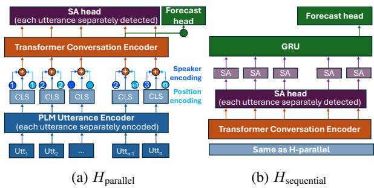  
Figure 1: Architecture of $H _ { \mathrm { p a r a l l e l } }$ and $H _ { \mathrm { s e q u e n t i a l } } .$

We designed two models that incorporate both raw text and SA information, with one specifically configured to prioritize SA signals. As illustrated in Figure 1, both utilize a hierarchical architecture, which has proven effective in modeling dynamics for conversational prediction tasks (Chang and Danescu-Niculescu-Mizil, 2019; Yuan and Singh, 2023), and also naturally facilitates the integration of SA labels at the utterance level. The architecture is composed of two primary components. Firstly, a PLM-based utterance-level encoder (e.g., RoBERTa-Large; Liu et al., 2019) processes the raw text of individual utterances and generates an embedding for each. Secondly, a two-layer Transformer-based conversation-level encoder takes PLM-encoded utterance embeddings, together with speaker and utterance ID embeddings, and outputs contextualized representations for each utterance, capturing its conversational context.

On top of these components, two classification heads are appended for SA detection $( H e a d _ { S A } )$ and derailment forecasting $( H e a d _ { d e r a i l } )$ respectively. $H e a d _ { S A }$ is applied to each contextualized utterance embedding for per-utterance multi-label SA classification. It leverages the hierarchical architecture to prioritize the target utterance while attending to the contextual information.

The two proposed models differ in the design of $H e a d _ { d e r a i l }$ . In $H _ { \mathrm { p a r a l l e l } }$ (Figure 1a), $H e a d _ { d e r a i l }$ is attached on top of the conversation-level encoder in parallel with $H e a d _ { S A }$ . It averages the embeddings from the final turn of conversation to produce the prediction. To avoid the model relying mainly on raw textual features instead of SA information, $H _ { \mathrm { p a r a l l e l } }$ undergoes two-phased training: an initial intermediate phase focused solely on SA detection, followed by multi-task training for derailment forecasting with SA detection as an auxiliary task. The second model, $H _ { \mathrm { s e q u e n t i a l } }$ (Figure 1b), is designed to prioritize SA signal over text. A uni-directional GRU layer (Cho et al., 2014) is built upon the SA probabilities from $H e a d _ { S A }$ $H e a d _ { d e r a i l }$ then predicts based on the final GRU state. By relying primarily on the detected SA probabilities for forecasting, the model directly performs multi-task training without an intermediate SA-only phase.

## 4 Experimental setup

## 4.1 Derailment Datasets

We consider three datasets covering conversational derailment across different platforms, representing a broad spectrum of online conversations: editorial negotiations (Wikipedia); open-domain, inherently argumentative debates (Reddit ChangeMyView); and goal-oriented technical discussions (GitHub). This diversity enables us to evaluate the models’ cross-domain generalizability.

Wikipedia data (WIKI) (Zhang et al., 2018; Chang and Danescu-Niculescu-Mizil, 2019): Conversations were collected from publicly accessible talk pages for Wikipedia editors and labeled by crowdworkers as either containing a personal attack toward another user or remaining civil throughout. Each derailed conversation is paired with a civil conversation from the same talk page to avoid topicspecific trivial correlations. WIKI contains 4,188 conversations, partitioned into a train-validationtest split of 60-20-20. Paired conversations are kept within the same split to preserve topic control.

Reddit CMV data (CMV) (Chang and Danescu-Niculescu-Mizil, 2019; Tran et al., 2025): Dialogues were collected from the subreddit Change-MyView and labeled based on whether a conversation eventually had a comment removed by a moderator for violating Rule 2: “Don't be rude or hostile to other users." Similar to WIKI, each derailed dialogue is paired with a civil dialogue that belongs to the same top-level post. CMV contains 19,578 conversations, split similarly to WIKI.

GitHub data (GITHUB) (Imran et al., 2025): Conversations were collected from GitHub issues and pull requests. Toxic conversations were primarily sourced from threads locked by moderators as “too heated", “spam", or “off-topic", with individual toxic comments identified via a combination of GPT-4o and human verification. Civil conversations were sampled from the same repositories with a ratio of four civil threads per toxic thread, subject to repository availability, to better reflect a realistic data distribution. This yielded 202 derailed and 696 civil dialogues. Following WIKI and CMV, we split the dataset using a 60-20-20 ratio.

All datasets are preprocessed to only contain responses prior to derailment, and civil dialogues in the training sets are truncated accordingly to prevent trivial correlations related to dialogue length. Since the GITHUB dataset captures entire thread discussion and can be exceptionally long (e.g., 120 utterances), we crop all GITHUB dialogues to their 10 most recent utterances. After processing, all training datasets have a median length of 5 utterances, with averages of 6.02 (CMV), 5.28 (WIKI), and 5.24 (GITHUB) utterances, respectively.

SAs of 51 classes were extracted for training sets following Section 3.1. To evaluate robustness of our models to the SAs used, Appendix C.6 details supplementary experiments on a coarser 18-class SA taxonomy, demonstrating similar performance.

## 4.2 Evaluation Task and Metrics

Dynamic Evaluation In alignment with prior work (Chang and Danescu-Niculescu-Mizil, 2019; Tran et al., 2025), models are trained statically on full preprocessed dialogues with derailed utterances removed, and evaluated on their dynamic forecasting performance. Let $\begin{array} { r l } { C } & { { } = } \end{array}$ $( u ^ { 1 } , u ^ { 2 } , \cdots , u ^ { n } )$ be any conversation consisting of n utterances. During training, models receive entire C and their corresponding labels. During evaluation, models make a prediction $p ^ { t }$ given each of $C ^ { t } = ( u ^ { 1 } , u ^ { 2 } , \cdot \cdot \cdot , u ^ { t } )$ , for $t \in [ 1 , n ]$ , generating a sequence of n probabilities $p = ( p ^ { 1 } , p ^ { 2 } , \cdot \cdot \cdot , p ^ { n } )$

Temporal Aggregation To evaluate this dynamic performance using standard classification metrics such as the F1 score, the utterance-level predictions are aggregated into a single conversationlevel forecast and compared against the groundtruth label. Prior work employs max aggregation $( \mathrm { D y n a m i c } _ { \mathrm { m a x } } )$ , converting the highest probability into a binary label via a threshold tuned on the validation set $( \mathrm { i . e . , ~ } \hat { y } = \mathbb { 1 } _ { \{ m a x ( p ) > t _ { m a x } \} } )$ (Chang and Danescu-Niculescu-Mizil, 2019). This implies that a conversation is predicted to derail if any dynamic prediction crosses the threshold, making the evaluation highly sensitive to false positive spikes (e.g., a civil dialogue being flagged as derailed due to a single anomalous prediction at turn two, despite recovering to low probabilities for the remainder of the sequence). To address this, we perform mean aggregation $( \mathrm { D y n a m i c } _ { \mathrm { m e a n } } , \mathrm { i . e . , } \hat { y } = \mathbb { 1 } _ { \{ m e a n ( p ) > t _ { m e a n } \} } )$ which remains high only if the model signals derailment early and consistently in the exchange, rather than spiking solely at specific turns or toward the final utterance. Furthermore, to avoid the loss of temporal granularity caused by aggregation, we explicitly examine model performance at individual timesteps as dialogues approach the target events (derailments or end of civil dialogues). Specifically, we evaluate the models' predictions exactly k steps away from the event, where $k \in [ 1 , 5 ]$

Metrics For evaluation metrics, we report the Area Under the Precision-Recall Curve (AUPRC) and Macro-F1 score, both of which are robust to imbalanced datasets (such as the GITHUB corpus). AUPRC avoids the need for threshold tuning by assessing the model's ability to rank positive cases above negative cases across all thresholds. This metric is effective for evaluating generalizability to OOD settings (where models trained on one dataset are tested on the others), as it isolates the model's capacity to provide derailment signals from its reliance on domain-specific threshold calibration. Conversely, the Macro-F1 score provides a complementary evaluation of the model's practical performance when deployed at a specific threshold.

Training Set Sizes To assess model performance across varying data regimes, we train the models using different amounts of training data and report the Area Under the Learning Curve (AULC; Viering and Loog, 2023). Specifically, we utilize training subset sizes of 300, 500, 1000, 2500, and 11802, capped by the maximum capacity of each respective dataset. These subset sizes allow us to evaluate how model performance scales with increasing data up to approximately the full availability of the training corpora. The full training sets contain 2508 (WIKI), 538 (GITHUB), and 11802 (CMV) dialogues. The AULC is calculated as the integral of the performance metrics (AUPRC and Macro-F1) plotted against the log-scaled training size. To facilitate easier interpretation across datasets, the AULC is normalized to a range of 0 to 1; this linear scaling preserves the relative performance differences and does not affect model comparisons.

## 4.3 Baseline Models

We compare $H _ { \mathrm { p a r a l l e l } }$ and $H _ { \mathrm { s e q u e n t i a l } }$ against SOTA derailment forecasting models. CRAFT (Chang and Danescu-Niculescu-Mizil, 2019) was introduced as the first dynamic derailment forecasting model. It employs a hierarchical recurrent encoder-decoder (HRED) architecture that learns to represent conversational dynamics through unsupervised pretraining on a large corpus via a next-response generation objective, before being fine-tuned for the conversational derailment task. To benefit from larger-scale general pretraining, recent approaches (Kementchedjhieva and Søgaard, 2021; Yuan and Singh, 2023; Tran et al., 2025) directly employ PLMs. Among these, RoBERTa-Large (Liu et al., 2019) and BERT-Base (Devlin et al., 2018) have been widely adopted for conversational forecasting tasks, including predicting derailment (Tran et al., 2025; Kementchedjhieva and Søgaard, 2021) and emotion (Xu et al., 2025; Wang and Feng, 2023b). Given its larger architecture and superior performance, RoBERTa-Large is selected as both a SOTA baseline (denoted as PLM in tables and figures) and the utterance encoder for our proposed models. Additionally, as both a baseline and an ablation study, we evaluate $H _ { \mathrm { a b l a t i o n } }$ , which shares the same hierarchical architecture of $H _ { \mathrm { p a r a l l e l } }$ adapted from (Yuan and Singh, 2023), but is trained without incorporating SA knowledge. To evaluate the robustness of the proposed method to the choice of underlying PLM and model architecture, two supplementary experiments utilizing BERT and a graph-based model GraphNLI (Agarwal et al., 2023) are detailed in Appendix C.4 and C.5 respectively, exhibiting performance trends comparable to those of RoBERTa-Large and hierarchical models.

Baseline models were trained according to their original implementations, with minor adjustments to accommodate different dataset sizes (e.g., increased epochs upon smaller training sets). Performance metrics represent the average across five random seeds, where training subsets are also independently sampled for each seed (for WIKI and CMV, conversation pairs are sampled accordingly). Training details are provided in Appendix B.

Other recent methods have been proposed, including summary-based (Imran et al., 2025; Hua et al., 2024) and generation-based (Zhang et al., 2025) approaches. They operate at conversation level, making a single prediction given the full dialogue or its summary, rather than at utterancelevel for dynamic forecasting. The approach of Altarawneh et al. (2023) relies on community voting scores on utterances, a feature available in CMV but absent in others. Some methods shift to dynamically training the models on incrementally expanding dialogue histories to improve performance or enable earlier detection (Yuan and Singh, 2023; Kementchedjhieva and Søgaard, 2021), which alters the training paradigm and is orthogonal to our modeling approach. Given our focus on applicability to different datasets, cross-dataset generalizability, and dynamic forecasting, we exclude these methods from our baseline comparisons. However, we note that their underlying architectures are primarily PLM-based and hierarchical, which are wellrepresented by our selected baselines.

<table><tr><td rowspan="2">Model</td><td colspan="2">WIKI</td><td colspan="2">CMV</td><td colspan="2">GITHUB</td></tr><tr><td>MacroF1</td><td>AUPRC</td><td>MacroF1</td><td>AUPRC</td><td>MacroF1</td><td>AUPRC</td></tr><tr><td> $\mathrm { C R A F T } ^ { 2 }$ </td><td> $6 0 . 9 7 \pm 0 . 7 4 ^ { \dagger }$ </td><td> $6 3 . 5 9 \pm 0 . 6 9 ^ { \dagger }$ </td><td> $6 1 . 9 7 \pm 0 . 4 7 ^ { \dagger }$ </td><td> $6 2 . 7 6 \pm 0 . 4 1 ^ { \dagger }$ </td><td></td><td></td></tr><tr><td>PLM</td><td> $\underline { { 6 1 . 7 7 \pm 0 . 6 9 } }$ </td><td> $6 4 . 0 9 \pm 0 . 9 6 ^ { \dagger }$ </td><td> $6 5 . 1 1 \pm 0 . 6 1$ </td><td> $6 6 . 7 2 \pm 0 . 4 2 ^ { \dagger }$ </td><td> ${ \underline { { 7 1 . 0 6 \pm 1 . 9 2 } } }$ </td><td> $5 7 . 1 6 \pm 4 . 5 6 ^ { \dagger }$ </td></tr><tr><td> $H _ { \mathrm { a b l a t i o n } }$ </td><td> $6 1 . 0 3 \pm 0 . 6 8 ^ { \dagger }$ </td><td> $6 5 . 3 5 \pm 1 . 1 0$ </td><td> $6 4 . 8 9 \pm 0 . 3 8$ </td><td> $6 6 . 9 0 \pm 0 . 6 1 ^ { \dagger }$ </td><td> $6 6 . 5 0 \pm 1 . 5 9 ^ { \dagger }$ </td><td> $5 8 . 4 9 \pm 4 . 5 2 ^ { \dagger }$ </td></tr><tr><td> $H _ { \mathrm { s e q u e n t i a l } }$ </td><td> $\overline { { 6 1 . 7 7 \pm 0 . 7 5 } }$ </td><td> $\overline { { 6 2 . 8 2 \pm 0 . 8 3 } } ^ { \dagger }$ </td><td> $\overline { { 6 3 . 0 7 \pm 0 . 5 1 } } ^ { \dag }$ </td><td> $\overline { { 6 4 . 9 5 \pm 0 . 5 7 ^ { \dag } } }$ </td><td> $\overline { { 7 0 . 4 6 \pm 1 . 6 0 } }$ </td><td> $\overline { { 5 4 . 7 6 \pm 2 . 8 3 ^ { \dagger } } }$ </td></tr><tr><td> $H _ { \mathrm { p a r a l l e l } }$ </td><td> $\mathbf { 6 2 . 5 0 \pm 0 . 9 8 }$ </td><td> ${ \bf 6 6 . 8 5 \pm 0 . 7 1 }$ </td><td> ${ \bf 6 5 . 2 9 \pm 0 . 4 5 }$ </td><td> ${ \bf 6 7 . 9 4 \pm 0 . 2 6 }$ </td><td> $\mathbf { 7 1 . 5 5 \pm 3 . 4 7 }$ </td><td> ${ \bf 6 6 . 8 4 \pm 1 . 6 5 }$ </td></tr></table>

Table 1: Comparison of models' $\mathrm { D y n a m i c } _ { \mathrm { m e a n } }$ AULC performance. Best results are bolded and second-best are underlined. The † symbol denotes that the model's performance is statistically significantly different to the best model $( p < 0 . 0 5$ , two-tailed paired t-test). $H _ { \mathrm { p a r a l l e l } }$ achieves the strongest performance across the datasets.

## 5 Results and Discussion

## 5.1 In-Domain Performance

Table 1 reports Dynamicmean AULC, enabling comparisons between the models via single metrics. Figure 2 illustrates example learning curves across different training set sizes, while the AULC values reported in Table 1 represent the area under these curves, scaled by the range of the x-axis to fall within [0,1]. From Table 1, $H _ { \mathrm { p a r a l l e l } }$ consistently achieves the best performance across datasets with PLM and $H _ { \mathrm { a b l a t i o n } }$ typically ranking second.

All models except CRAFT are based on the RoBERTa-Large PLM. The latter is pre-trained on a large generic corpus, whereas CRAFT is pretrained on a substantially smaller, domain-specific corpus². Despite this, CRAFT still demonstrates comparable performance as a lightweight model. The architectural shift from a flat PLM to a hierarchical design $( H _ { \mathrm { a b l a t i o n } }$ , which uses the PLM as an utterance encoder) leads to slightly improved AUPRC, though it can underperform on Macro-F1 in some cases. The additional gains observed in $H _ { \mathrm { p a r a l l e l } }$ over $H _ { \mathrm { a b l a t i o n } }$ highlight the benefit of incorporating SA to guide model predictions. In contrast, $H _ { \mathrm { s e q u e n t i a l } }$ performs worse than most PLM-based models and shows similar performance to CRAFT. We hypothesise that this is because $H _ { \mathrm { s e q u e n t i a l } }$ more strongly enforces reliance on SA knowledge compared to $H _ { \mathrm { p a r a l l e l } }$ , which can suppress the availability of generalizable textual features and lead to poorer performance in in-domain settings.

While $H _ { \mathrm { p a r a l l e l } }$ consistently outperforms other models in $\mathrm { { D y n a m i c } _ { \mathrm { { m e a n } } } , }$ it does not in $\mathrm { { D y n a m i c } _ { \mathrm { { m a x } } } }$ (reported in Appendix C.1), instead ranking first or second across datasets. This indicates that the model achieves better performance when predictions are updated at each timestep, rather than fixed upon any derailment alarm. To further examine models' dynamic forecasting capacity, a pertimestep analysis is presented later in this section.

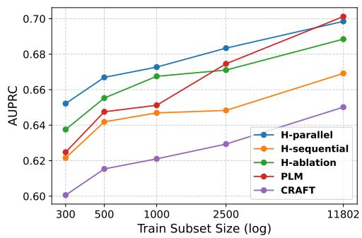  
Figure 2: Models' $\mathrm { D y n a m i c } _ { \mathrm { m e a n } }$ AUPRC learning curves on CMV, plotted against training subset size.

Model Performance Across Data Regimes Figure 2 presents the $\mathrm { D y n a m i c } _ { \mathrm { m e a n } }$ learning curve of the models prior to AULC aggregation. The CMV performance is visualised here; similar trends for other datasets are reported in Appendix C.2. Notably, $H _ { \mathrm { p a r a l l e l } }$ demonstrates strong performance in low-data regimes (300-2500 samples), a critical advantage for real-world scenarios with high annotation costs (e.g., GITHUB and WIKI datasets have approximately 500 and 2500 training samples respectively). As training size increases to 11802, the standard PLM marginally outperforms $H _ { \mathrm { p a r a l l e l } }$ This indicates that pragmatic information provides effective guidance when training resources are limited. However, as the amount of training data increases, text-based model is capable of learning generalizable features from text alone, reducing the benefit of explicit SA knowledge guidance.

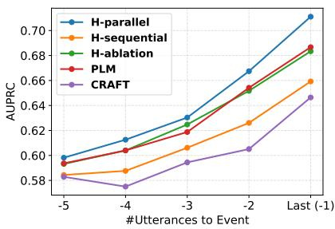  
(a) 300 Train Subset

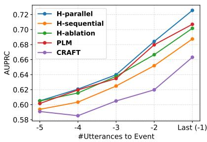  
(b) 500 Train Subset

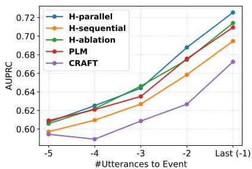  
(c) 1000 Train Subset  
Figure 3: Model AUPRC performance on CMV is plotted as dialogues progress toward derailment or conversation end, across training data sizes. $H _ { \mathrm { p a r a l l e l } }$ achieves the best performance, particularly in the low-data regime.

Per-Timestep Model Performance Figure 3 presents models’ per-timestep performance as dialogues progress toward derailment or conversation end, avoiding temporal aggregation via either $\mathrm { { D y n a m i c } _ { \mathrm { { m a x } } } }$ or $\mathrm { D y n a m i c } _ { \mathrm { m e a n } }$ . We report CMV performance for up to 1000 samples here; results for the full dataset and other datasets show similar trends and are provided in Appendix C.3. All models show improving performance as dialogues approach the target event, as derailment signals in the conversation build up and become more apparent. The relative ranking of the lines is largely consistent with the model rankings observed in Figure 2 for $\mathrm { D y n a m i c } _ { \mathrm { m e a n } }$ performance. $H _ { \mathrm { p a r a l l e l } }$ achieves the highest performance across individual timesteps, particularly in the low-data regime, with the gap between $H _ { \mathrm { p a r a l l e l } }$ and other models closing as training subset size increases. These results align with our previous discussion, demonstrating that $H _ { \mathrm { p a r a l l e l } }$ provides better forecasting throughout conversations, especially under data constraints.

## 5.2 Cross-Dataset Generalization

Table 2 reports cross-dataset Dynamicmean AULC performance, evaluating the models' capacity to generalize to different domains.

Overall, the SA-informed models $( H _ { \mathrm { p a r a l l e l } }$ and $H _ { \mathrm { s e q u e n t i a l } } )$ yield superior performance¹. Experiments integrating SA information into GraphNLI (Agarwal et al., 2023) (Appendix C.5) also demonstrate consistent in-domain and crossdataset performance improvements. This demonstrates that explicit SA modeling provides transferable signals for derailment forecasting upon domain shifts. An exception occurs in the GITHUB → CMV transfer, where $H _ { \mathrm { a b l a t i o n } }$ achieves the highest Macro-F1, while $H _ { \mathrm { p a r a l l e l } }$ achieves the highest AUPRC. Transferring from a small and technical dataset (GITHUB) to an open-domain dataset (CMV) is inherently difficult, as reflected in uniformly low scores across all models (Macro-F1 peaking at only 36.19). Under such domain shift, both the learned signals and the source-tuned thresholds degrade. The discrepancy between the winning models in the two metrics likely stems from their respective evaluation mechanics: Macro-F1 is further penalized by the failure of a sourcetuned threshold, whereas AUPRC is thresholdindependent. While transferability remains limited in this setting, AUPRC offers a lens into the models residual capacity to correctly rank derailment.

Among the baseline models, CRAFT exhibits the lowest transferability due to its smaller architecture and domain-specific pre-training, compared to the other models which rely on large PLMs.

## 5.3 Dataset Deviation and Model Generalization

An analysis of dataset deviations provides further insight into model generalization: while SA information generally improves cross-dataset generalization, prioritizing SA features yields the greatest benefit when transferring to highly divergent datasets. We quantify cross-dataset semantic and lexical deviations using Wasserstein distance on embedding distributions (Kour et al.

<table><tr><td rowspan="2">Model</td><td colspan="2">WIKI→CMV</td><td colspan="2">WIKI→GITHUB</td><td colspan="2">CMV→WIKI</td><td colspan="2">CMV→GITHUB</td><td colspan="2">GITHUB→WIKI</td><td colspan="2">GITHUB→CMV</td></tr><tr><td>F1</td><td>AUPR</td><td>F1</td><td>AUPR</td><td>F1</td><td>AUPR</td><td>F1</td><td>AUPR</td><td>F1</td><td>AUPR</td><td>F1</td><td>AUPR</td></tr><tr><td>Random</td><td>50.00</td><td>50.00</td><td>50.00</td><td>23.33</td><td>50.00</td><td>50.00</td><td>50.00</td><td>23.33</td><td>50.00</td><td>50.00</td><td>50.00</td><td>50.00</td></tr><tr><td>CRAFT{</td><td>44.62†</td><td>57.45†</td><td>61.02†</td><td>44.65†</td><td>53.31†</td><td>62.14†</td><td>51.75†</td><td>40.09†</td><td>一</td><td>一</td><td></td><td></td></tr><tr><td>PLM</td><td>49.10</td><td>61.08†</td><td>59.07†</td><td>41.55†</td><td>60.99</td><td>65.88†</td><td>58.75†</td><td>42.93†</td><td> $4 6 . 0 0 ^ { \dagger }$ </td><td> $5 9 . 1 4 ^ { \dagger }$ </td><td>34.52</td><td>56.28†</td></tr><tr><td> $H _ { \mathrm { a b l a t i o n } }$ </td><td>47.24</td><td>59.70†</td><td>57.52†</td><td>41.22†</td><td>60.00†</td><td>66.36†</td><td>57.73†</td><td>41.93†</td><td>50.25</td><td>61.45†</td><td>36.19</td><td>53.85†</td></tr><tr><td> $H _ { \mathrm { s e q u e n t i a l } }$ </td><td>46.90†</td><td>59.93†</td><td>65.49</td><td>56.63</td><td>59.84†</td><td>65.33†</td><td>64.23</td><td>53.06</td><td>56.66</td><td> $\overline { { 6 0 . 2 0 ^ { \dag } } }$ </td><td>34.92</td><td>56.02†</td></tr><tr><td> $H _ { \mathrm { p a r a l l e l } }$ </td><td>51.19</td><td>62.53</td><td>62.94</td><td>54.15</td><td>61.49</td><td>67.14</td><td>60.38†</td><td>48.42†</td><td>50.67†</td><td>66.46</td><td>34.19</td><td>57.63</td></tr></table>

Table 2: Cross-dataset evaluation of DynamicmeanAULC using Macro-F1 (F1) and AUPRC (AUPR), standard deviations are omitted for brevity. Each configuration $D 1  D 2$ denotes training on D1 and testing on D2. Best results are bolded and second-best are underlined. The † symbol denotes that the model's performance is statistically significantly different to the best model $( p < 0 . 0 5$ , two-tailed paired t-test). SA-informed models $( H _ { \mathrm { s e q u e n t i a l } }$ and $H _ { \mathrm { p a r a l l e l } } )$ achieve strong cross-dataset performance.

2022; Heusel et al., 2017) and CHI distance on token frequencies (Kour et al., 2022; Kilgarriff, 2001), respectively. 3000 randomly sampled responses from each dataset were encoded using a sentence transformer (al1-mpnet-base-v2) for semantic measurement, and tokenized via SpaCy (en\_core\_web\_sm) for the lexical evaluation.

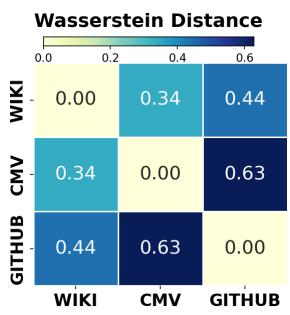  
(a) Semantic Deviation

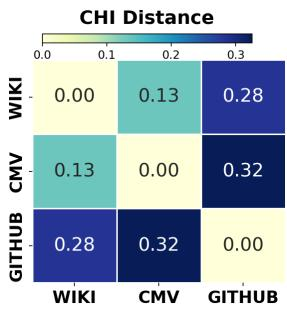  
(b) Lexical Deviation  
Figure 4: Pairwise semantic Wasserstein distance and lexical CHI distance between datasets. Darker shades indicate higher deviation. GITHUB has the highest deviation and is more similar to WIKI than to CMV.

As shown in Figure 4, GITHUB exhibits the greatest overall deviation from the other two corpora, although it remains marginally more similar to WIKI than to CMV. This divergence aligns with the underlying nature of their conversational settings. Specifically, WIKI and CMV represent less specialised environments, encompassing diverse topics across editorial discussions and opinion debates, whereas GITHUB is highly domain-specific, focusing on technical problem-solving with extensive technical jargon and code snippets. The slight similarity between WIKI and GITHUB can be attributed to their shared task-oriented nature, in contrast to the debate-driven interactions of CMV.

When transferring from WIKI and CMV to the divergent GITHUB dataset, $H _ { \mathrm { s e q u e n t i a l } }$ demonstrates the highest performance, followed by $H _ { \mathrm { p a r a l l e l } }$ . We attribute this to the fact that models relying on raw text can struggle with domain-specific overfitting, whereas the pragmatic SA representation prioritized by $H _ { \mathrm { s e q u e n t i a l } }$ remain more robust to these lexical shifts, making them more effective for cross-domain generalization. Conversely, in transfers between the more lexically similar WIKI and CMV datasets, $H _ { \mathrm { p a r a l l e l } }$ excels by combining both text and SA features, with text-based models (PLM and $H _ { \mathrm { a b l a t i o n } } )$ generally ranking second. Finally, training on the smaller, domain-specific GITHUB corpus yields uniformly lower transferability, with GITHUB → WIKI and GITHUB → CMV consistently underperform their CMV- and WIKI-trained counterparts. Yet, the AUPRC AULC achieved by $H _ { \mathrm { p a r a l l e l } }$ when trained on the small GITHUB dataset (capped at 300-500 samples) and tested on WIKI (66.56%) is highly comparable to WIKI's best indomain performance (66.94%, capped to 300-2500 samples). This underscores the strong cross-dataset transferability of our proposed approach.

## 6 Conclusion

In this work, we propose modeling speech acts as a pragmatic signal to improve derailment forecasting performance under low-data and cross-domain settings.3 We present two architectures that integrate SA information as an auxiliary learning signal alongside textual semantics. Extensive experiments demonstrate consistent improvements over strong baselines. This work contributes towards more robust dynamic moderation systems in diverse and data-scarce real-world settings.

## Limitations

We acknowledge certain limitations in our work. First, LLM-based SA extraction may introduce biases related to culture, dialect, and community norms, from their training data. The models are most appropriately used alongside human supervision in making proactive decisions, and not as fully autonomous systems. Second, while our approach seeks to capture the intended meaning rather than literal meaning, LLMs are known to struggle to reliably recognize indirect intents, which is an active area of NLP research (Orsini and Brunato, 2025). This failure to capture true underlying intent can propagate sub-optimal signals downstream. Although our supplementary experiments show our framework is robust to SA granularity, this lack of reliance on highly nuanced intents may be an artifact of the LLM-based extraction. Specifically, the noise in LLM-derived labels may force the downstream model to treat SAs simply as a compact pragmatic representation, rather than learning from them to identify indirect, hidden intents. Future work could examine if introducing manually extracted, ground-truth SAs can provide the clean signal needed for the model to learn from these nuanced intents. Lastly, although our approach eliminates the need for SA extraction during inference, LLM-based or manual SA extraction still incurs time and computational costs during training. Future work could investigate more cost-effective alternatives, such as supervised SA extraction models, while maintaining accuracy.

## References

Vibhor Agarwal, Anthony P. Young, Sagar Joglekar, and Nishanth Sastry. 2023. A graph-based context-aware model to understand online conversations. ACM Trans. Web, 18(1).

Ahmad Aljanaideh. 2025. Speech act patterns for improving generalizability of explainable politeness detection models. In Findings of the Association for Computational Linguistics: ACL 2025, pages 18945– 18954, Vienna, Austria. Association for Computational Linguistics.

Enas Altarawneh, Ameeta Agrawal, Michael Jenkin, and Manos Papagelis. 2023. Conversation derailment forecasting with graph convolutional networks. In The 7th Workshop on Online Abuse and Harms (WOAH), pages 160–169, Toronto, Canada. Association for Computational Linguistics.

John Langshaw Austin. 1975. How To Do Things With Words. Oxford University Press.

Cambridge University Press. 2026. Cambridge dictionary.

Jonathan P. Chang, Justin Cheng, and Cristian Danescu-Niculescu-Mizil. 2020. Don't let me be misunderstood:comparing intentions and perceptions in online discussions. In Proceedings of The Web Conference 2020, WWW '20, page 2066–2077, New York, NY, USA. Association for Computing Machinery.

Jonathan P. Chang and Cristian Danescu-Niculescu-Mizil. 2019. Trouble on the horizon: Forecasting the derailment of online conversations as they develop. In Proceedings of the 2019 Conference on Empirical Methods in Natural Language Processing and the 9th International Joint Conference on Natural Language Processing (EMNLP-IJCNLP), pages 4743–4754, Hong Kong, China. Association for Computational Linguistics.

Kyunghyun Cho, Bart van Merriënboer, Caglar Gulcehre, Dzmitry Bahdanau, Fethi Bougares, Holger Schwenk, and Yoshua Bengio. 2014. Learning phrase representations using RNN encoder-decoder for statistical machine translation. In Proceedings of the 2014 Conference on Empirical Methods in Natural Language Processing (EMNLP), pages 1724– 1734, Doha, Qatar. Association for Computational Linguistics.

Dario Compagno, Elena V. Epure, Rébecca Deneckere-Lebas, and Camille Salinesi. 2018. Exploring digital conversation corpora with process mining. Corpus Pragmatics, 2(2):193–215.

Jacob Devlin, Ming-Wei Chang, Kenton Lee, and Kristina Toutanova. 2018. BERT: pre-training of deep bidirectional transformers for language understanding. CoRR, abs/1810.04805.

Cliff Goddard and Anna Wierzbicka. 2013. Suggesting, apologizing, complimenting: English speech-act verbs. In Words and Meanings: Lexical Semantics Across Domains, Languages, and Cultures. Oxford University Press.

Martin Heusel, Hubert Ramsauer, Thomas Unterthiner, Bernhard Nessler, and Sepp Hochreiter. 2017. Gans trained by a two time-scale update rule converge to a local nash equilibrium. In Proceedings of the 31st International Conference on Neural Information Processing Systems, NIPS’17, page 6629–6640, Red Hook, NY, USA. Curran Associates Inc.

Yilun Hua, Nicholas Chernogor, Yuzhe Gu, Seoyeon Jeong, Miranda Luo, and Cristian Danescu-Niculescu-Mizil. 2024. How did we get here? summarizing conversation dynamics. In Proceedings of the 2024 Conference of the North American Chapter of the Association for Computational Linguistics: Human Language Technologies (Volume 1: Long Papers), pages 7452–7477, Mexico City, Mexico. Association for Computational Linguistics.

Mia Mohammad Imran, Robert Zita, Rebekah Copeland, Preetha Chatterjee, Rahat Rizvi Rahman, and

Kostadin Damevski. 2025. Understanding and predicting derailment in toxic conversations on github. Preprint, arXiv:2503.02191.

Isnaeni Isnaeni, Mantasiah R., and Hasmawati Hasmawati. 2025. The function of assertive speech acts in the novel calabai by pepi al-bayqunie. KLASIKAL : JOURNAL OF EDUCATION, LANGUAGE TEACH-ING AND SCIENCE, 7(1):468–480.

Yova Kementchedjhieva and Anders Søgaard. 2021. Dynamic forecasting of conversation derailment. In Proceedings of the 2021 Conference on Empirical Methods in Natural Language Processing, pages 7915– 7919, Online and Punta Cana, Dominican Republic. Association for Computational Linguistics.

Idham Kholid, Agus Hidayat, Bela Triyani, and Ijlhe Stkip Pgri Bandar Lampung. 2024. An analysis of assertive and commissive speech acts in simon sinek's speeches. IJLHE: International Journal of Language, Humanities, and Education, 7:305–314.

Adam Kilgarriff. 2001. Comparing corpora. International Journal of Corpus Linguistics, 6(1):97–133.

George Kour, Samuel Ackerman, Eitan Daniel Farchi, Orna Raz, Boaz Carmeli, and Ateret Anaby Tavor. 2022. Measuring the measuring tools: An automatic evaluation of semantic metrics for text corpora. In Proceedings of the Second Workshop on Natural Language Generation, Evaluation, and Metrics (GEM), pages 405–416, Abu Dhabi, United Arab Emirates (Hybrid). Association for Computational Linguistics.

Hengli Li, Song-Chun Zhu, and Zilong Zheng. 2023. Diplomat: A dialogue dataset for situated pragmatic reasoning. In Advances in Neural Information Processing Systems, volume 36, pages 46856–46884. Curran Associates, Inc.

Yinhan Liu, Myle Ott, Naman Goyal, Jingfei Du, Mandar Joshi, Danqi Chen, Omer Levy, Mike Lewis, Luke Zettlemoyer, and Veselin Stoyanov. 2019. Roberta: A robustly optimized BERT pretraining approach. CoRR, abs/1907.11692.

Anais Ollagnier. 2024. CyberAgressionAdo-v2: Leveraging pragmatic-level information to decipher online hate in French multiparty chats. In Proceedings of the 2024 Joint International Conference on Computational Linguistics, Language Resources and Evaluation (LREC-COLING 2024), pages 4287–4298, Torino, Italia. ELRA and ICCL.

OpenAI. 2025. gpt-oss-120b & gpt-oss-20b model card. Preprint, arXiv:2508.10925.

Massimiliano Orsini and Dominique Brunato. 2025. Direct and indirect interpretations of speech acts: Evidence from human judgments and large language models. In Proceedings of the Eleventh Italian Conference on Computational Linguistics (CLiC-it 2025), pages 837–848, Cagliari, Italy. CEUR Workshop Proceedings.

Fabio Poletto, Valerio Basile, Manuela Sanguinetti, Cristina Bosco, and Viviana Patti. 2020. Resources and benchmark corpora for hate speech detection: a systematic review. Language Resources and Evaluation, 55(2):477–523.

Ines Reinig, Ines Rehbein, and Simone Paolo Ponzetto. 2024. How to do politics with words: Investigating speech acts in parliamentary debates. In Proceedings of the 2024 Joint International Conference on Computational Linguistics, Language Resources and Evaluation (LREC-COLING 2024), pages 8287– 8300, Torino, Italia. ELRA and ICCL.

Tal Ridnik, Emanuel Ben-Baruch, Nadav Zamir, Asaf Noy, Itamar Friedman, Matan Protter, and Lihi Zelnik-Manor. 2021. Asymmetric Loss For Multi-Label Classification . In 2021 IEEE/CVF International Conference on Computer Vision (ICCV), pages 82–91, Los Alamitos, CA, USA. IEEE Computer Society.

Tulika Saha, Apoorva Upadhyaya, Sriparna Saha, and Pushpak Bhattacharyya. 2021. Towards sentiment and emotion aided multi-modal speech act classification in Twitter. In Proceedings of the 2021 Conference of the North American Chapter of the Association for Computational Linguistics: Human Language Technologies, pages 5727–5737, Online. Association for Computational Linguistics.

Victor Sanh, Lysandre Debut, Julien Chaumond, and Thomas Wolf. 2019. Distilbert, a distilled version of bert: smaller, faster, cheaper and lighter. ArXiv, abs/1910.01108.

John R. Searle. 1979. A Taxonomy of Illocutionary Acts, page 1–29. Cambridge University Press.

Cesare Spinoso-Di Piano, David Eric Austin, Pablo Piantanida, and Jackie CK Cheung. 2025. (RSA)²: A rhetorical-strategy-aware rational speech act framework for figurative language understanding. In Proceedings of the 63rd Annual Meeting of the Association for Computational Linguistics (Volume 1: Long Papers), pages 20898–20938, Vienna, Austria. Association for Computational Linguistics.

Shivashankar Subramanian, Trevor Cohn, and Timothy Baldwin. 2019. Target based speech act classification in political campaign text. In Proceedings of the Eighth Joint Conference on Lexical and Computational Semantics (\*SEM 2019), pages 273–282, Minneapolis, Minnesota. Association for Computational Linguistics.

Son Quoc Tran, Tushaar Gangavarapu, Nicholas Chernogor, Jonathan P. Chang, and Cristian Danescu-Niculescu-Mizil. 2025. Conversations gone awry, but then? evaluating conversational forecasting models. Preprint, arXiv:2507.19470.

Daniel Vanderveken. 1990. Meaning and Speech Acts: Volume 1, Principles of Language Use, volume 1. Cambridge University Press, Cambridge.

Tom Viering and Marco Loog. 2023. The shape of learning curves: A review. IEEE Trans. Pattern Anal. Mach. Intell., 45(6):7799–7819.

Renxi Wang and Shi Feng. 2023a. Global-local modeling with prompt-based knowledge enhancement for emotion inference in conversation. In Findings of the Association for Computational Linguistics: EACL 2023, pages 2120–2127, Dubrovnik, Croatia. Association for Computational Linguistics.

Renxi Wang and Shi Feng. 2023b. Global-local modeling with prompt-based knowledge enhancement for emotion inference in conversation. In Findings of the Association for Computational Linguistics: EACL 2023, pages 2120–2127, Dubrovnik, Croatia. Association for Computational Linguistics.

Anna Wierzbicka. 1987. English speech act verbs: A Semantic Dictionary. Academic Press, Sydney.

Chien-Sheng Wu, Steven C.H. Hoi, Richard Socher, and Caiming Xiong. 2020. TOD-BERT: Pre-trained natural language understanding for task-oriented dialogue. In Proceedings of the 2020 Conference on Empirical Methods in Natural Language Processing (EMNLP), pages 917–929, Online. Association for Computational Linguistics.

Xingle Xu, Shi Feng, Yuan Cui, Yifei Zhang, and Daling Wang. 2025. Ac-eic: addressee-centered emotion inference in conversations. International Journal of Machine Learning and Cybernetics, 16(7-8):5113– 5130.

Jiaqing Yuan and Munindar P. Singh. 2023. Conversation modeling to predict derailment. Proceedings of the International AAAI Conference on Web and Social Media, 17(1):926–935.

Justine Zhang, Jonathan Chang, Cristian Danescu-Niculescu-Mizil, Lucas Dixon, Yiqing Hua, Dario Taraborelli, and Nithum Thain. 2018. Conversations gone awry: Detecting early signs of conversational failure. In Proceedings of the 56th Annual Meeting of the Association for Computational Linguistics (Volume 1: Long Papers), pages 1350–1361, Melbourne, Australia. Association for Computational Linguistics.

Yunfan Zhang, Kathleen McKeown, and Smaranda Muresan. 2025. Forecasting conversation derailments through generation. In Proceedings of the 18th International Natural Language Generation Conference, pages 699–715, Hanoi, Vietnam. Association for Computational Linguistics.

## A Speech Act Extraction

## A.1 Speech Act Taxonomy

Various speech act taxonomies have been developed to model conversational dynamics in specialized domains, such as parliamentary debates (Reinig et al., 2024), political campaign (Subramanian et al., 2019), and Twitter text (Saha et al.,

2021). They typically derive SA labels from frequent communicative intents observed within their specific contexts. However, conversational derailment can occur across diverse argumentative and collaborative settings, necessitating a more opendomain SA taxonomy.

The first effort toward an open-domain taxonomy for digital corpora was conducted by (Compagno et al., 2018). They build on the SA verbs defined in (Vanderveken, 1990), which are structured into five hierarchical trees corresponding to Searle's five fundamental SA categories (Searle, 1979). By selecting the 21 immediate children of the root nodes and introducing organizational layers with oppositional traits (e.g., contextdependency, sentiment and strength), they refined the set into 17 distinct speech acts.

Despite this foundation, restricting the taxonomy to the immediate children of the root nodes introduces semantic gaps and do not meet the granularity commonly observed in pragmatic analysis works. In the hierarchical trees, a successor's illocutionary force is derived by adding components or increasing the strength of its parent's force. Consequently, lower-level verbs often carry important nuances that are not fully captured by higher-level verbs (e.g., “questioning" expressing doubt compared to the neutral information-seeking of “inquiring"). Furthermore, several relevant verbs (e.g., “boasting") were defined but omitted from the trees.

To address these gaps, we adapted and expanded the existing taxonomy to cover commonly analyzed conversational speech acts. The expanded taxonomy preserves the structure of the original, allowing the extracted SAs to be merged and collapsed into the lower-grained taxonomy. Extracting SAs at a high granularity thus provide the flexibility to evaluate downstream performance at different levels of granularity. Given that comprehensive list exceeding 300 verbs are computationally infeasible for use as a label set, we adopted a multi-stage refinement process:

1. Sourcing: Beyond the original taxonomy, we aggregated frequently utilized speech act verbs from linguistic and conversational analysis literature (Goddard and Wierzbicka, 2013; Isnaeni et al., 2025; Kholid et al., 2024; Searle, 1979).

2. Defining: Each speech act is accompanied by a brief description of its meaning and, where applicable, the speaker's psychological state, derived from semantic linguistic works and standard lexicons (Vanderveken, 1990; Goddard and Wierzbicka, 2013; Wierzbicka, 1987; Cambridge University Press, 2026).

3. Filtering: We reduced the set by merging verbs with largely overlapping semantic definitions to eliminate redundancy and labeling ambiguity, and based on empirical observations of SA frequency during the initial extraction phase.

This process yielded 50 speech act verbs and an additional “other"label, detailed in Tables 12 and 13, and structured in Figures 13 to 16 following the organization of prior work (Compagno et al., 2018). The speech act taxonomy is used during speech act extraction, via the prompt structure shown in Table 14. While speech act extraction is performed at sentence level, responses were segmented into sentences via SpaCy (en\_core\_web\_sm).

## A.2 Speech Act Extraction Alignment

We follow prior work (Compagno et al., 2018) to measure SA extraction agreement, replacing Fleiss’ Kappa with Cohen's Kappa, as Fleiss' Kappa is designed for multiple-rater settings where Cohen's Kappa is designed for two-rater settings. For this evaluation, one of the authors manually labeled 85 sentences from 30 randomly selected responses (10 from each dataset), utilizing the established SA taxonomy and the LLM extraction prompt as reference guidelines. Table 3 reports the Cohen's Kappa scores between the manually extracted and LLM extracted SAs, along with the z-scores and p-values rejecting the null hypothesis of no agreement $( p < 0 . 0 1$ across all tests). The LLM demonstrated moderate agreement $( \kappa = 0 . 5 3 )$ across the 51 granular classes, and almost perfect agreement $( \kappa = 0 . 8 8 )$ when collapsed into the 5 fundamental categories (assertive, directive, commissive, expressive, and an other' class replacing declarative). This aligns closely with the human inter-annotator agreement reported in prior literature (Compagno et al., 2018), suggesting that the LLM extractions could provide meaningful and human-interpretable pragmatic signals.

<table><tr><td></td><td>51 classes</td><td>5 categories</td></tr><tr><td>Cohen&#x27;s Kappa</td><td>0.53</td><td>0.88</td></tr><tr><td>z-test</td><td>26.60</td><td>8.79</td></tr><tr><td>p-value</td><td>&lt; 0.01</td><td> $< 0 . 0 1$ </td></tr><tr><td>Interpretation</td><td>Moderate</td><td>Almost Perfect</td></tr></table>

Table 3: Cohen's Kappa agreement results between LLM-extracted and manually labeled SAs. The LLM demonstrates moderate and almost perfect agreement across the 51 fine-grained classes and the 5 fundamental categories, respectively.

## B Experiment Details

## B.1 Hyperparameters and Setup

All settings for the CRAFT baseline follow its original implementation (Chang and Danescu-Niculescu-Mizil, 2019), with the exception of an increased maximum number of epochs to accommodate smaller training datasets. For other architectures, we generally adopt the effective hyperparameters and setup identified in prior work for PLMs (Tran et al., 2025; Kementchedjhieva and Søgaard, 2021). For fair comparison where the hierarchical models have access to anonymized speaker ID (e.g., Speaker 1, Speaker 2), the strings are also prepended to each utterance as input to PLM baselines. The maximum sequence length is capped at 512 tokens per dialogue (representing the maximum capacity for RoBERTa-1arge and BERT) and 128 tokens per utterance for hierarchical models, utilizing left truncation. The training batch size is set to 4 for BERT and 12 for RoBERTa-1arge. The learning rate is $5 e - 6$ for pre-trained parameters and $5 e - 5$ for newly initialized parameters. All models are trained with early stopping on the validation set. Table 4 reports the maximum number of training epochs for each model under different sample sizes, determined by validation convergence.

## B.2 Model Implementation and Information

We use the original implementation of CRAFT, with approximately 61M parameters. Other models were implemented using PyTorch (2.10.0) and the Transformers (4.57.2) library. All models were trained on a single 80GB NVIDIA A100 GPU. The RoBERTa-large baseline contains approximately 355M parameters. When utilizing RoBERTa-large as an utterance-level encoder, $H _ { \mathrm { p a r a l l e l } }$ and $H _ { \mathrm { a b l a t i o n } }$ have approximately 372M parameters, while $H _ { \mathrm { s e q u e n t i a l } }$ has approximately

373M parameters. To provide a reference for computational requirements, a single training run on the complete CMV dataset requires approximately 3 hours for $H _ { \mathrm { p a r a l l e l } }$ , 2 hours for $H _ { \mathrm { s e q u e n t i a l } }$ and $H _ { \mathrm { a b l a t i o n } } ,$ 1 hour for RoBERTa-large, and under 10 minutes for CRAFT. We estimate the total computational budget for our main experimental training and evaluation to be approximately 300 GPU hours.

The SA extraction via gpt-oss-120b, with high reasoning effort and parallelized across 2 80GB NVIDIA A100 GPU, requires in average approximately 7 seconds per response, totaling approximately 180 GPU hours. This underscores the latency bottleneck inherent to LLM generation during real-time inference, motivating the use of LLM auxiliary information only during training to support high-traffic moderation systems.

## B.3 Optimization Objectives

For the primary derailment forecasting task, we use Cross-Entropy loss. For SA detection task, we employ Binary Cross-Entropy (BCE) loss in $H _ { \mathrm { s e q u e n t i a l } } .$ a standard objective for multi-label classification. For $H _ { \mathrm { p a r a l l e l } }$ , we utilize Asymmetric Loss (ASL) (Ridnik et al., 2021). ASL targets the severe positive-negative imbalance inherent to multi-label settings, where negative samples overwhelmingly dominate. It addresses this by downweighting and hard-thresholding easy negatives during training (e.g., if the model predicts a negative probability below 5%, the sample contributes zero loss, and the model stops attempting to push it closer to 0). However, this relaxed optimization can negatively impact $H _ { \mathrm { s e q u e n t i a l } }$ . Because $H _ { \mathrm { s e q u e n t i a l } }$ relies exclusively on the detected SA probabilities to forecast derailment, these small, un-zeroed negative probabilities could introduce noise and create a pathway for the model to leak more raw textual semantics into the final layer.

## B.4 Training Curriculum

$H _ { \mathrm { p a r a l l e l } }$ is trained using a two-phase approach to ensure the model effectively incorporates SA knowledge. During the first intermediate phase, the objective is solely SA detection. To prevent catastrophic forgetting and ensure the model does not overfit before learning the primary task, the bottom half of the PLM layers (12 layers for RoBERTa-1arge, 6 for BERT) are frozen, and the model is trained on a 60%/40% train-validation split of the training data. The second fine-tuning phase unfreezes all layers and employs a multi-task learning objective, weighting derailment forecasting and SA detection at 1.0 and 0.1, respectively, to maintain focus on the primary task. In contrast, because $H _ { \mathrm { s e q u e n t i a l } }$ relies on the detected SA probabilities for forecasting, it structurally forces the model to primarily utilize SA knowledge. Therefore, it does not require an intermediate training phase and instead optimizes both tasks simultaneously with equal weights of 0.5. All models, aside from $H _ { \mathrm { p a r a l l e l } }$ , have all layers fully unfrozen throughout their entire fine-tuning process.

## B.5 Dataset

All datasets utilized in this study (described in Section 4.1) are publicly available and distributed under the MIT License, which permits both academic and commercial use. These predominantly English datasets contain occurrences of offensive language, which were retained as they are essential for the derailment forecasting task. We did not collect any external personal data. While the raw datasets contain usernames, we utilized these solely to establish conversational structure (i.e., speaker turns) and replaced them with anonymous Speaker IDs (e.g. Speaker 1, Speaker 2) during model training to protect user privacy.

## C Additional Experimental Results

## C.1 Dynamicmax Performance

Table 5 reports the models’ $\mathrm { D y n a m i c } _ { \mathrm { m a x } }$ AULC performance. PLM and $H _ { \mathrm { p a r a l l e l } }$ consistently rank first or second, suggesting they perform comparably well when dialogues are flagged as “derailed" upon “derailed" forecast at any timestep.

Table 6 reports the models' cross-dataset $\mathrm { D y n a m i c } _ { \mathrm { m a x } }$ performance. Although the SAinformed models $( H _ { \mathrm { p a r a l l e l } }$ and $H _ { \mathrm { s e q u e n t i a l } } )$ do not consistently achieve the best in-domain $\mathrm { D y n a m i c } _ { \mathrm { m a x } }$ (from Table 5), they demonstrate strong cross-dataset performance, achieving the highest rank in the majority of cases, while the PLM ranks first in two out of twelve instances.

While models are optimized to minimize forecasting error independently given a dialogue history, future work could explore optimizing directly for $\mathrm { D y n a m i c } _ { \mathrm { m a x } }$ , where a single threshold-crossing prediction dictates the classification of the entire sequence. This may better support moderation workflows that prioritize a single warning proactive intervention over continuous state-tracking.

<table><tr><td># Training Samples</td><td>300</td><td>500</td><td>1000</td><td>2500</td><td>11802</td></tr><tr><td>CRAFT</td><td>100</td><td>100</td><td>100</td><td>100</td><td>30</td></tr><tr><td>PLM</td><td>20</td><td>20</td><td>10</td><td>10</td><td>4</td></tr><tr><td> $H _ { \mathrm { a b l a t i o n } }$ </td><td>20</td><td>20</td><td>10</td><td>10</td><td>4</td></tr><tr><td> $H _ { \mathrm { s e q u e n t i a l } }$ </td><td>50</td><td>30</td><td>20</td><td>10</td><td>4</td></tr><tr><td> $H _ { \mathrm { p a r a l l e l } }$  Intermediate</td><td> $1 0 / 1 5 ^ { 4 }$ </td><td>10</td><td>5</td><td>5</td><td>2</td></tr><tr><td> $H _ { \mathrm { p a r a l l e l } }$  Finetune</td><td>10</td><td>10</td><td>5</td><td>5</td><td>4</td></tr></table>

Table 4: Number of training epochs used under different training set sizes.
<table><tr><td></td><td colspan="2">WIKI</td><td colspan="2">CMV</td><td colspan="2">GITHUB</td></tr><tr><td>Model</td><td>MacroF1</td><td>AUPRC</td><td>MacroF1</td><td>AUPRC</td><td>MacroF1</td><td>AUPRC</td></tr><tr><td>Random</td><td>50.00</td><td>50.00</td><td>50.00</td><td>50.00</td><td>50.00</td><td>23.33</td></tr><tr><td> $\overline { { \mathrm { C R A F T } ^ { 2 } } }$ </td><td> $\overline { { 6 1 . 5 6 \pm 0 . 4 0 } }$ </td><td> $\overline { { 6 3 . 2 2 \pm 0 . 6 2 } } ^ { \dag }$ </td><td> $6 2 . 9 3 \pm 0 . 4 2 ^ { \dagger }$ </td><td> $\overline { { 6 4 . 7 7 \pm 0 . 4 1 ^ { \dagger } } }$ </td><td></td><td></td></tr><tr><td>PLM</td><td> ${ \bf 6 2 . 1 1 \pm 1 . 3 4 }$ </td><td> $6 3 . 5 8 \pm 1 . 3 7$ </td><td> ${ \bf 6 6 . 2 2 \pm 0 . 4 5 }$ </td><td> ${ \bf 6 7 . 9 1 \pm 0 . 5 5 }$ </td><td> ${ \bf 7 2 . 3 2 \pm 1 . 6 4 }$ </td><td> ${ \bf 6 2 . 1 0 \pm 3 . 1 7 }$ </td></tr><tr><td> $H _ { \mathrm { a b l a t i o n } }$ </td><td> $5 9 . 8 4 \pm 0 . 5 0 ^ { \dagger }$ </td><td> $6 2 . 5 1 \pm 1 . 6 1$ </td><td> $6 5 . 6 0 \pm 0 . 6 3$ </td><td> $6 7 . 7 2 \pm 0 . 9 5$ </td><td> $6 4 . 2 4 \pm 7 . 0 3$ </td><td> $5 0 . 2 9 \pm 1 0 . 0 0$ </td></tr><tr><td> $H _ { \mathrm { s e q u e n t i a l } }$ </td><td> $6 1 . 4 0 \pm 0 . 5 8$ </td><td> $6 1 . 6 5 \pm 0 . 5 6 ^ { \dagger }$ </td><td> $6 4 . 7 5 \pm 0 . 6 0 ^ { \dagger }$ </td><td> $6 7 . 1 4 \pm 0 . 6 0$ </td><td> $6 4 . 4 4 \pm 2 . 7 2 ^ { \dagger }$ </td><td> $4 4 . 2 3 \pm 1 . 4 8 ^ { \dagger }$ </td></tr><tr><td> $H _ { \mathrm { p a r a l l e l } }$ </td><td> $\underline { { 6 1 . 9 2 \pm 0 . 8 9 } }$ </td><td> ${ \bf 6 4 . 8 7 \pm 0 . 7 0 }$ </td><td> $6 6 . 1 4 \pm 0 . 5 4$ </td><td> $6 7 . 7 2 \pm 0 . 6 4$ </td><td> $\underline { { 6 9 . 0 3 \pm 1 . 9 6 ^ { \dagger } } }$ </td><td> $\underline { { 5 0 . 7 9 \pm 1 . 2 8 ^ { \dagger } } }$ </td></tr></table>

Table 5: Comparison of models $\mathrm { D y n a m i c } _ { \mathrm { m a x } }$ AULC performance. Best results are bolded and second-best are underlined. The † symbol denotes that the model's performance is statistically significantly different to the best model $( p < 0 . 0 5$ , two-tailed paired t-test).

## C.2 Model Performance Across Data Regime

Figures 5 and 6 present the $\mathrm { D y n a m i c } _ { \mathrm { m e a n } }$ AUPRC learning curves on WIKI and GITHUB, respectively. They follow a similar trend to CMV (Figure 2), where $H _ { \mathrm { p a r a l l e l } }$ demonstrates strong performance in low-data regimes, although it can be outperformed by text-based models when larger amounts of data are available. Specifically, $H _ { \mathrm { p a r a l l e l } }$ exhibits a smaller decline in performance as the number of training samples decreases. By leveraging pragmatic signals, it achieves higher performance with just 300 samples than other models do with 500 or 1000, significantly reducing the amount of data required to reach comparable results.

In addition, Figures 7 to 9 present the learning curves in cross-dataset settings for models trained on WIKI, CMV, and GITHUB, respectively. As with the in-domain results, SA signals generally provide greater benefits in low-data regimes. The cross-domain performance of $H _ { \mathrm { p a r a l l e l } }$ on GITHUB tends to fluctuate as the number of training samples increases. In particular, when trained on CMV, its performance eventually degrades to the level of the text-based models (PLM and $H _ { \mathrm { a b l a t i o n } } )$ as the training size reaches 11,802. This suggests that $H _ { \mathrm { p a r a l l e l } }$ may require further tuning with higher regularization to more effectively utilize SA features. In contrast, $H _ { \mathrm { s e q u e n t i a l } }$ , which prioritizes SA features, is less prone to overfitting the source domain and demonstrates robust generalizability to GITHUB.

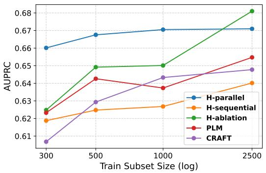  
Figure 5: Comparison of models’ $\mathrm { D y n a m i c } _ { \mathrm { m e a n } }$ AUPRC learning curves on WIKI, plotted against training subset size.

## C.3 Per-Timestep Model Performance

Figures 10 to 12 present the per-timestep performance of models as dialogues progress toward derailment or the end of the conversation, on CMV, WIKI, and GITHUB, respectively. All datasets exhibit similar trends discussed in Section 5.1. Overall, $H _ { \mathrm { p a r a l l e l } }$ shows the best performance across time steps, particularly in low-data regimes, which generally aligns with the $\mathrm { D y n a m i c } _ { \mathrm { m e a n } }$ rankings.

<table><tr><td rowspan="2">Model</td><td colspan="2">WIKI→CMV</td><td colspan="2">WIKI→GITHUB</td><td colspan="2">CMV→WIKI</td><td colspan="2">CMV→GITHUB</td><td colspan="2">GITHUB→WIKI</td><td colspan="2">GITHUB→CMV</td></tr><tr><td>F1</td><td>AUPR</td><td>F1</td><td>AUPR</td><td>F1</td><td>AUPR</td><td>F1</td><td>AUPR</td><td>F1</td><td>AUPR</td><td>F1</td><td>AUPR</td></tr><tr><td>Random</td><td>50.00</td><td>50.00</td><td>50.00</td><td>23.33</td><td>50.00</td><td>50.00</td><td>50.00</td><td>23.33</td><td>50.00</td><td>50.00</td><td>50.00</td><td>50.00</td></tr><tr><td>CRAFT2</td><td>49.33†</td><td>60.33†</td><td>61.03</td><td>41.24†</td><td>52.90†</td><td>58.80†</td><td>50.93†</td><td>32.75†</td><td></td><td></td><td>一</td><td></td></tr><tr><td>PLM</td><td>54.12</td><td>64.13</td><td>59.40†</td><td>43.42</td><td>60.34</td><td>64.27</td><td>57.10†</td><td>43.61</td><td>50.22</td><td>59.64</td><td> $ { 3 6 . 7 0 ^ { \dag } }$ </td><td>58.57</td></tr><tr><td> $H _ { \mathrm { a b l a t i o n } }$ </td><td>51.94†</td><td>62.97</td><td>61.27</td><td>42.15†</td><td>59.69</td><td>63.54†</td><td>56.55†</td><td>40.86</td><td>47.13</td><td>57.91</td><td>36.37†</td><td>57.23</td></tr><tr><td> $H _ { \mathrm { s e q u e n t i a l } }$ </td><td>52.31†</td><td>62.11</td><td>63.27</td><td>48.53</td><td>59.32†</td><td>63.43†</td><td>61.02</td><td>44.35</td><td>57.05</td><td>57.14</td><td>42.60</td><td>57.65</td></tr><tr><td> $H _ { \mathrm { p a r a l l e l } }$ </td><td>56.16</td><td>63.83</td><td>62.42</td><td>49.45</td><td>61.39</td><td>64.53</td><td>57.33†</td><td>43.85</td><td>51.37</td><td>63.50</td><td>35.18†</td><td>57.53†</td></tr></table>

Table 6: Cross-dataset evaluation of DynamicmaxAULC using Macro-F1 (F1) and AUPRC (AUPR), standard deviations are omitted for brevity. Each configuration $D 1  D 2$ denotes training on D1 and testing on D2. Best results are bolded and second-best are underlined. The † symbol denotes that the model's performance is statistically significantly different to the best model $( p < 0 . 0 5$ , two-tailed paired t-test).

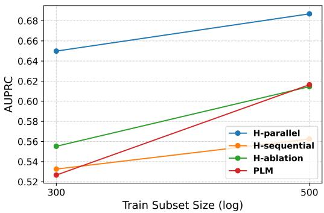  
Figure 6: Comparison of models' Dynamicmean AUPRC learning curves on GITHUB, plotted against training subset size.

## C.4 Robustness to PLM

To assess the robustness of our proposed approach across different underlying PLMs, we perform a supplementary experiment using bert-base-uncased (Devlin et al., 2018) instead of RoBERTa-large, as BERT is also a widely adopted baseline in prior derailment forecasting work (Kementchedjhieva and Søgaard, 2021). Specifically, the PLM components in all relevant models (PLM, $H _ { \mathrm { a b l a t i o n } } , \ H _ { \mathrm { s e q u e n t i a l } }$ , and $H _ { \mathrm { p a r a l l e l } } )$ are replaced with bert-base-uncased. All hyperparameters remain consistent with prior experiments. This evaluation is conducted using the CMV dataset for training, with the resulting models tested across all datasets. Table 7 reports the $\mathrm { D y n a m i c } _ { \mathrm { m e a n } }$ AULC performance. Because it uses a smaller architecture, BERT generally performs worse than RoBERTa. Regardless, the SA-based models achieve the strongest in-domain and crossdomain performance, showing a consistent trend to the results obtained with RoBERTa-large. This illustrates the robustness of our approach and its ability to improve generalizability upon different

underlying PLM.

## C.5 Robustness to Model Architecture: GraphNLI

To assess the robustness of the proposed approach to the model architecture, we conduct a supplementary experiment running a graph-based contextaware model GraphNLI (Agarwal et al., 2023). We follow its original implementation and the hyperparameters for the hate speech detection task. Minor adjustments to the hyperparameters are made to adapt the model to the derailment forecasting task: increasing the number of training epochs for smaller training sets (same as PLM/H-ablation training epochs as reported in Table 4), and performing a root-seeking graph walk (setting $p = 1$ and $\gamma = 0 . 2 )$ as our task focuses on a single conversation rather than a branching conversation.

To focus on the effect of SA integration, we trained a variant GraphNLI-SA, which includes a SA classification head on top of its PLM encoder, using the same auxiliary SA classification objective and two-phased training procedure as H-parallel. While GraphNLI uses a weaker PLM (distilroberta-base (Sanh et al., 2019)), the full PLM is trained during the intermediate training phase in order to effectively learn the complex SA classification task. The number of finetune epochs is consistent with $H _ { p a r a l l e l }$ reported in Table 4, where the intermediate phase used an increased number of epochs to accomodate the weaker PLM (25/15/10/5/2 epochs for 300/500/1000/2500/11802 training samples respectively). Other hyperparameters remain consistent with GraphNLI.

Table 8 reports the resulting model performance. Despite the architectural differences between GraphNLI and our hierarchical models, the results are consistent with previous findings: incorporating SA supervision consistently improves in-domain and cross-domain performance.

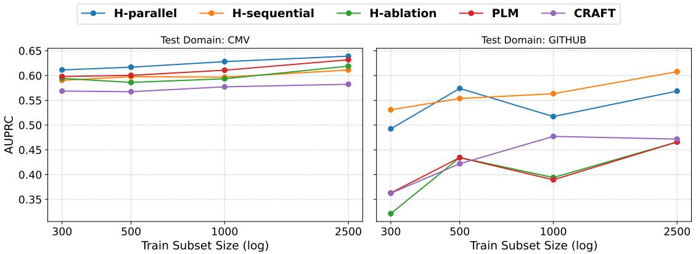  
Figure 7: Comparison of models' cross-dataset $\mathrm { D y n a m i c } _ { \mathrm { m e a n } }$ AUPRC learning curves when trained on WIKI, plotted against training subset size.

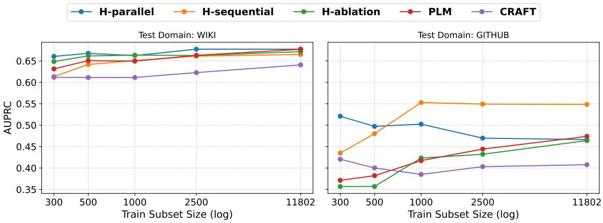  
Figure 8: Comparison of models' cross-dataset Dy $\mathrm { { \cdot n a m i c } } _ { \mathrm { m e a n } }$ AUPRC learning curves when trained on CMV, plotted against training subset size.

While different model architectures are possible, they largely build on top of PLMs as utterance encoders, with their primary differences lying in how conversational context is modeled and integrated. The consistent gains observed across both GraphNLI and our hierarchical framework suggest the performance gains arise from the additional SA supervision rather than the specific hierarchical architecture, demonstrating that the proposed approach is compatible with alternative backbone models.

## C.6 Robustness to SA Extraction

To assess the robustness of the proposed approach to the underlying SA extraction process, we conduct a supplementary experiment using a more coarse-grained speech act (SA) taxonomy. While the main experiments employ a fine-grained set of 51 speech acts (including “other"), these acts are organized according to the prior taxonomy proposed by Compagno et al. (2018), enabling hierarchical merging where necessary. Specifically, from Figures 13 to 16, speech acts belonging to the same node in the taxonomy are collapsed into a single class, resulting in 17 speech act classes and an additional “other"label.

As the proposed approach is primarily intended to improve performance in low-data regimes, and because speech act distributions and interaction patterns may vary across datasets, we conduct this supplementary experiment across the 300-trainingsample setting, as oppose to across a dataset. All hyperparameters remain consistent with prior experiments. We compare the performance of our main model, $H _ { \mathrm { p a r a l l e l } }$ , using the merged SA taxonomy, against the baselines, and against the original fine-grained SA taxonomy setting.

Table 9 reports the resulting model performance. We observe that $H _ { \mathrm { p a r a l l e l } }$ is robust to the specific SA extraction used. Their in-domain performance (dialogonals in the table) remains highly comparable, with the largest absolute discrepancy being a minor 0.56% AUPRC and 1.59% Macro-F1 on GITHUB. Cross-dataset performance displays similar consistency, particularly in terms of AUPRC, where the maximum deviation is 2.83% (CMV → GITHUB), with the lower outperforming best baseline by 7.2%. Conversely, MacroF1 exhibits higher instability and greater divergence, peaking at a 6.91% difference for GITHUB → CMV. This variance could be driven by a reliance on source-tuned classification thresholds, as their underlying AUPRC scores differ by only 0.32%.

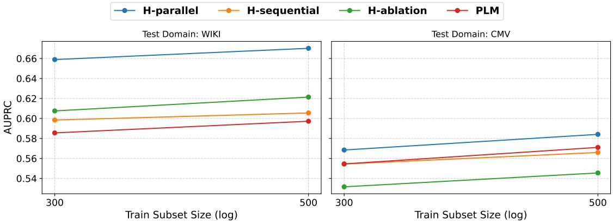

Figure 9: Comparison of models' cross-dataset Dy $/ \mathrm { n a m i c } _ { \mathrm { m e a n } }$ AUPRC learning curves when trained on GITHUB, plotted against training subset size.
<table><tr><td rowspan="2">Model</td><td colspan="2">CMV → WIKI</td><td colspan="2">CMV</td><td colspan="2">CMV → GITHUB</td></tr><tr><td>MacroF1</td><td>AUPRC</td><td>MacroF1</td><td>AUPRC</td><td>MacroF1</td><td>AUPRC</td></tr><tr><td>Random</td><td>50.00</td><td>50.00</td><td>50.00</td><td>50.00</td><td>50.00</td><td>23.33</td></tr><tr><td>CRAFT</td><td> $\overline { { 5 3 . 3 1 \pm 3 . 2 3 ^ { \dagger } } }$ </td><td> $\overline { { 6 2 . 1 4 \pm 1 . 4 6 ^ { \dagger } } }$ </td><td> $\overline { { { 6 1 . 9 7 \pm 0 . 4 7 ^ { \dag } } } }$ </td><td> $\overline { { 6 2 . 7 6 \pm 0 . 4 1 ^ { \dagger } } }$ </td><td> $\overline { { { 5 1 . 7 5 \pm 1 . 4 7 ^ { \dagger } } } }$ </td><td> $\overline { { 4 0 . 0 9 \pm 2 . 8 0 } }$ </td></tr><tr><td>PLM (BERT)</td><td> $5 6 . 9 0 \pm 0 . 8 7 ^ { \dagger }$ </td><td> $6 0 . 8 9 \pm 0 . 7 6 ^ { \dagger }$ </td><td> $6 2 . 6 1 \pm 0 . 4 6 ^ { \dagger }$ </td><td> $6 4 . 9 0 \pm 0 . 6 3 ^ { \dagger }$ </td><td> $4 5 . 6 0 \pm 5 . 1 2 ^ { \dagger }$ </td><td> $3 7 . 6 0 \pm 2 . 0 9 ^ { \dagger }$ </td></tr><tr><td> $H _ { \mathrm { a b l a t i o n } }$ </td><td> $5 5 . 0 6 \pm 2 . 3 9 ^ { \dagger }$ </td><td> $6 0 . 3 9 \pm 0 . 6 0 ^ { \dagger }$ </td><td> $6 2 . 1 8 \pm 0 . 7 3 ^ { \dagger }$ </td><td> $\overline { { 6 3 . 5 0 \pm 0 . 6 2 ^ { \dagger } } }$ </td><td> $5 0 . 5 1 \pm 4 . 2 2 ^ { \dagger }$ </td><td> $3 7 . 5 9 \pm 2 . 4 6 ^ { \dagger }$ </td></tr><tr><td> $H _ { \mathrm { s e q u e n t i a l } }$ </td><td> $5 8 . 1 7 \pm 0 . 8 3$ </td><td> ${ \bf 6 4 . 2 0 \pm 0 . 5 3 }$ </td><td> $6 2 . 5 8 \pm 0 . 4 6 ^ { \dagger }$ </td><td> $6 4 . 5 7 \pm 0 . 3 0 ^ { \dagger }$ </td><td> ${ \bf 5 9 . 9 3 \pm 2 . 2 1 }$ </td><td> $4 1 . 6 2 \pm 2 . 6 9$ </td></tr><tr><td> $H _ { \mathrm { p a r a l l e l } }$ </td><td> ${ \bf 5 8 . 5 3 \pm 0 . 5 7 }$ </td><td> $6 3 . 9 2 \pm 0 . 2 5$ </td><td> ${ \bf 6 3 . 4 8 \pm 0 . 6 8 }$ </td><td> ${ \bf 6 5 . 6 1 \pm 0 . 4 8 }$ </td><td> $5 4 . 0 0 \pm 4 . 6 7 ^ { \dagger }$ </td><td> ${ \bf 4 5 . 1 2 \pm 3 . 9 5 }$ </td></tr></table>

Table 7: Robustness to PLM: Comparison of models' DynamicmeanAULC performance when bert-base-uncased is used as the base model. Models are trained on CMV and tested on all datasets. Best results are bolded and second-best are underlined. The † symbol denotes that the model's performance is statistically significantly different to the best model $( p < 0 . 0 5 .$ , two-tailed paired t-test). $H _ { \mathrm { p a r a l l e l } }$ achieves strongest in-domain performance (on CMV), while SA-based models $( H _ { \mathrm { p a r a l l e l } }$ and $H _ { \mathrm { s e q u e n t i a l } } )$ achieve strongest cross-dataset performance (CMV → WIKI and $\mathrm { C M V } \to \mathrm { G I T H U B } )$ 1

## C.7 Validation Set Result

For reproducibility purpose, Tables 10 and 11 report the validation set AULC performance of the models.

<table><tr><td></td><td></td><td colspan="2">Test: WIKI</td><td colspan="2">Test: CMV</td><td colspan="2">Test: GITHUB</td></tr><tr><td>Train</td><td>Model</td><td>MacroF1</td><td>AUPRC</td><td>MacroF1</td><td>AUPRC</td><td>MacroF1</td><td>AUPRC</td></tr><tr><td rowspan="2">WIKI</td><td>GraphNLI</td><td>61.40</td><td>65.86</td><td>41.24†</td><td>58.43†</td><td>63.53</td><td>52.22</td></tr><tr><td>GraphNLI-SA</td><td>63.03</td><td>67.45</td><td>46.86</td><td>62.14</td><td>66.00</td><td>54.87</td></tr><tr><td rowspan="2">CMV</td><td>GraphNLI</td><td>56.31†</td><td>63.77</td><td>63.28†</td><td> $6 5 . 4 7 ^ { \dagger }$ </td><td>57.06</td><td>44.94</td></tr><tr><td>GraphNLI-SA</td><td>58.97</td><td>64.64</td><td>64.05</td><td>66.50</td><td>58.55</td><td>46.79</td></tr><tr><td rowspan="2">GITHUB</td><td>GraphNLI</td><td>45.55</td><td>59.16†</td><td>33.68</td><td>54.52</td><td>70.30</td><td>60.54</td></tr><tr><td>GraphNLI-SA</td><td>48.95</td><td>62.40</td><td>34.01</td><td>55.95</td><td>73.52</td><td>65.12</td></tr></table>

Table 8: Ablation study on $\mathrm { D y n a m i c } _ { \mathrm { m e a n } }$ performance of GraphNLI. The † symbol denotes that the model's performance is statistically significantly different to the best model $( p < 0 . 0 5$ , two-tailed paired t-test). Standard deviations are omitted for brevity. The best performance is bolded. SA integration consistently improves both in-domain and cross-domain performance.

<table><tr><td rowspan="2">Train</td><td rowspan="2"></td><td colspan="2">Test: WIKI</td><td colspan="2">Test: CMV</td><td colspan="2">Test: GITHUB</td></tr><tr><td>MacroF1</td><td>AUPRC</td><td>MacroF1</td><td>AUPRC</td><td>MacroF1</td><td>AUPRC</td></tr><tr><td></td><td>Random</td><td>50.00</td><td>50.00</td><td>50.00</td><td>50.00</td><td>50.00</td><td>23.33</td></tr><tr><td rowspan="5">WIKI</td><td>CRAFT</td><td>58.57†</td><td>60.68†</td><td>50.61</td><td>56.87†</td><td>58.93</td><td>36.23†</td></tr><tr><td>PLM</td><td>61.64</td><td> $6 2 . 3 3 ^ { \dagger }$ </td><td>51.85</td><td> $5 9 . 8 1 ^ { \dagger }$ </td><td>55.06</td><td>36.29†</td></tr><tr><td> $H _ { \mathrm { a b l a t i o n } }$ </td><td> $5 8 . 5 9 ^ { \dagger }$ </td><td> $6 2 . 4 8 ^ { \dagger }$ </td><td>49.95</td><td> $5 9 . 4 3 ^ { \dagger }$ </td><td> $5 4 . 2 1 ^ { \dagger }$ </td><td> $3 2 . 1 2 ^ { \dagger }$ </td></tr><tr><td> $H _ { p a r a l l e l , 1 8 }$ </td><td>62.39</td><td>65.85</td><td>49.48</td><td>61.58</td><td>64.18</td><td>50.74</td></tr><tr><td> $H _ { p a r a l l e l , 5 1 }$ </td><td>62.51</td><td>66.01</td><td>50.89</td><td>61.13</td><td>62.14</td><td>49.24</td></tr><tr><td rowspan="5">CMV</td><td> $| \dot { \Delta _ { | } } |$ </td><td>0.12</td><td>0.16</td><td>1.41</td><td>0.45</td><td>2.04</td><td>1.50</td></tr><tr><td>CRAFT</td><td>50.42</td><td>61.18†</td><td> $5 9 . 4 7 ^ { \dagger }$ </td><td>60.06†</td><td>47.60†</td><td>42.06</td></tr><tr><td>PLM</td><td>58.50</td><td>63.14</td><td>62.15</td><td> $6 2 . 4 8 ^ { \dagger }$ </td><td>53.97</td><td>37.12†</td></tr><tr><td> $H _ { \mathrm { a b l a t i o n } }$ </td><td>56.86</td><td> $6 4 . 8 7 ^ { \dagger }$ </td><td>62.51</td><td>63.76</td><td>53.23</td><td>35.67</td></tr><tr><td> $H _ { p a r a l l e l , 1 8 }$   $H _ { p a r a l l e l , 5 1 }$ </td><td>59.28</td><td>64.94</td><td>63.00 63.03</td><td>64.95</td><td>54.99</td><td>49.26</td></tr><tr><td rowspan="5"></td><td> $| \Delta |$ </td><td>59.22 0.06</td><td>66.06 1.12</td><td>0.03</td><td>65.22 0.27</td><td>60.36 5.40</td><td>52.09 2.83</td></tr><tr><td></td><td></td><td></td><td></td><td></td><td></td><td></td></tr><tr><td>PLM  $H _ { \mathrm { a b l a t i o n } }$ </td><td> $4 4 . 6 2 ^ { \dagger }$  53.27</td><td> $5 8 . 5 6 ^ { \dagger }$   $6 0 . 7 5 ^ { \dagger }$ </td><td>34.70 38.23</td><td>55.45  $5 3 . 1 6 ^ { \dagger }$ </td><td>69.24 63.92</td><td>52.67†</td></tr><tr><td></td><td></td><td></td><td></td><td></td><td></td><td>55.52</td></tr><tr><td> $H _ { p a r a l l e l , 1 8 }$ </td><td>55.35</td><td>66.21</td><td>34.87</td><td>56.09</td><td>70.87</td><td>64.43</td></tr><tr><td></td><td> $H _ { p a r a l l e l , 5 1 }$   $| \Delta |$ </td><td>48.44† 6.91</td><td>65.89 0.32</td><td>33.92 0.95</td><td>56.84 0.75</td><td>69.28 1.59</td><td>64.99 0.56</td></tr></table>

Table 9: Robustness to SA Extraction: Comparison of $\mathrm { D y n a m i c } _ { \mathrm { m e a n } }$ performance between different models under 300 training samples, where $H _ { \mathrm { p a r a l l e l } }$ uses a fine-grained $( H _ { p a r a l l e l , 5 1 } )$ and a coarse-grained $( H _ { p a r a l l e l , 1 8 } )$ taxonomy. $| \Delta |$ denotes the absolute difference between their performance. The † symbol denotes that the model's performance is statistically significantly different to the best model $( p < 0 . 0 5$ , two-tailed paired t-test). Standard deviations are omitted for brevity. The best performance is bolded, and second-best underlined. Model performance is relatively robust to SA extraction used, with the two taxonomies achieving comparable performance to each other.

<table><tr><td rowspan="2">Model</td><td colspan="2">WIKI</td><td colspan="2">CMV</td><td colspan="2">GITHUB</td></tr><tr><td>MacroF1</td><td>AUPRC</td><td>MacroF1</td><td>AUPRC</td><td>MacroF1</td><td>AUPRC</td></tr><tr><td>CRAFT</td><td> $6 0 . 5 5 \pm 0 . 7 0$ </td><td> $5 8 . 4 2 \pm 0 . 4 9$ </td><td> $6 1 . 8 7 \pm 0 . 3 0$ </td><td> $6 3 . 5 7 \pm 0 . 0 9$ </td><td></td><td></td></tr><tr><td>PLM</td><td> $6 2 . 4 1 \pm 0 . 7 5$ </td><td> $6 1 . 9 7 \pm 0 . 8 4$ </td><td> $6 5 . 4 0 \pm 0 . 2 1$ </td><td> $6 6 . 0 1 \pm 0 . 2 6$ </td><td>-  $7 0 . 4 3 \pm 2 . 8 3$ </td><td>-  $4 3 . 7 9 \pm 3 . 1 7$ </td></tr><tr><td> $H _ { \mathrm { a b l a t i o n } }$ </td><td> $6 0 . 8 3 \pm 1 . 1 9$ </td><td> $6 1 . 0 3 \pm 1 . 3 7$ </td><td> $6 4 . 7 2 \pm 0 . 4 2$ </td><td> $6 6 . 1 7 \pm 0 . 3 0$ </td><td> $6 9 . 5 1 \pm 2 . 2 9$ </td><td> $5 0 . 7 5 \pm 4 . 8 7$ </td></tr><tr><td> $H _ { \mathrm { s e q u e n t i a l } }$ </td><td> $6 0 . 8 4 \pm 0 . 8 6$ </td><td> $6 0 . 6 5 \pm 0 . 9 7$ </td><td> $6 2 . 8 8 \pm 0 . 3 4$ </td><td> $6 5 . 8 7 \pm 0 . 4 4$ </td><td> $7 7 . 2 5 \pm 2 . 0 9$ </td><td> $5 8 . 6 5 \pm 1 . 8 8 $ </td></tr><tr><td> $H _ { \mathrm { p a r a l l e l } }$ </td><td> $6 1 . 8 7 \pm 0 . 3 7$ </td><td> $6 2 . 1 6 \pm 0 . 5 8$ </td><td> $6 5 . 4 4 \pm 0 . 2 2$ </td><td> $6 7 . 2 4 \pm 0 . 2 8$ </td><td> $7 1 . 7 8 \pm 1 . 7 5$ </td><td> $5 5 . 4 7 \pm 1 . 4 5$ </td></tr></table>

Table 10: Models' validation set $\mathrm { D y n a m i c } _ { \mathrm { m e a n } }$ AULC performance for reproducibility purpose. Macro-F1 uses threshold tuned on the validation-set

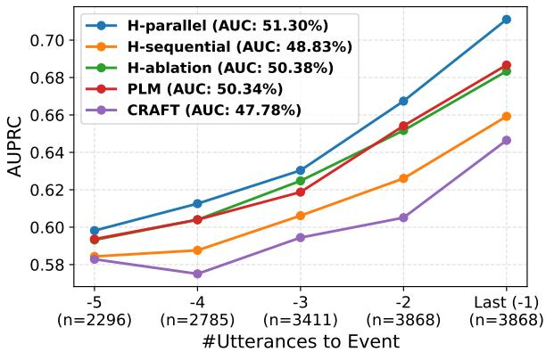

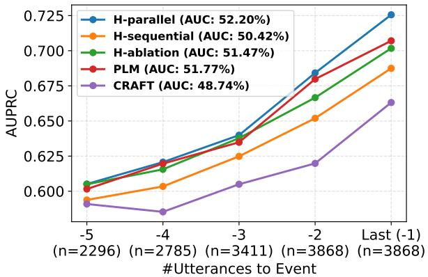  
(b) 500 Train Subset

(a) 300 Train Subset  
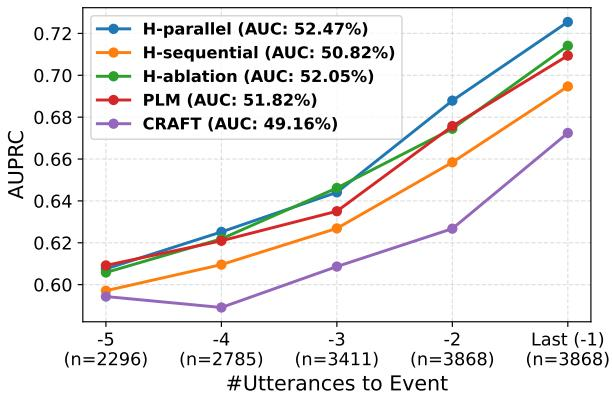  
(c) 1000 Train Subset

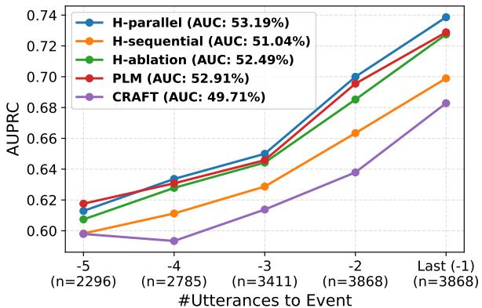

(d) 2500 Train Subset  
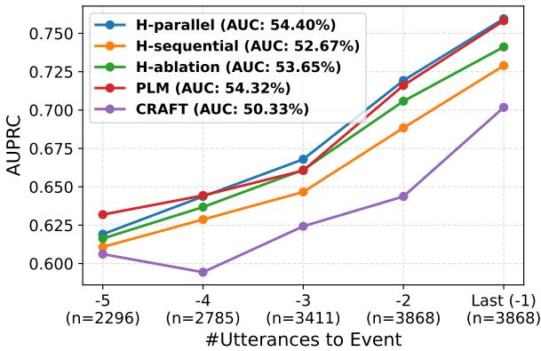  
(e) 11802 Train Subset

Figure 10: Model AUPRC performance on CMV is plotted as dialogues progress toward derailment or conversation end, under varying training data sizes and averaged across five random seeds. The number of test-set dialogues contributing to each time step (n) is shown on the x-axis ticks, as some dialogues contain fewer than five utterances. Areas under the curves are reported in the legend. $H _ { \mathrm { p a r a l l e l } }$ achieves the best performance across time steps, particularly in the low-data regime.
<table><tr><td rowspan="2">Model</td><td colspan="2">WIKI</td><td colspan="2">CMV</td><td colspan="2">GITHUB</td></tr><tr><td>MacroF1</td><td>AUPRC</td><td>MacroF1</td><td>AUPRC</td><td>MacroF1</td><td>AUPRC</td></tr><tr><td>CRAFT</td><td> $6 0 . 7 1 \pm 0 . 5 8$ </td><td> $5 8 . 8 1 \pm 0 . 5 6$ </td><td> $6 2 . 4 6 \pm 0 . 6 6$ </td><td> $6 5 . 1 4 \pm 0 . 6 1$ </td><td></td><td></td></tr><tr><td>PLM</td><td> $6 2 . 7 9 \pm 1 . 3 9$ </td><td> $6 2 . 1 0 \pm 1 . 1 3$ </td><td> $6 6 . 0 3 \pm 0 . 2 4$ </td><td> $6 8 . 2 7 \pm 0 . 6 5$ </td><td>1  $6 9 . 3 8 \pm 2 . 6 2$ </td><td>1  $4 6 . 4 6 \pm 5 . 0 2$ </td></tr><tr><td> $H _ { \mathrm { a b l a t i o n } }$ </td><td> $6 0 . 1 4 \pm 1 . 0 1$ </td><td>60.84 ± 1.75</td><td> $6 4 . 8 0 \pm 0 . 4 6$ </td><td> $6 6 . 9 6 \pm 0 . 7 3$ </td><td> $6 1 . 7 4 \pm 3 . 7 8$ </td><td> $3 9 . 8 8 \pm 7 . 8 0$ </td></tr><tr><td> $H _ { \mathrm { s e q u e n t i a l } }$ </td><td> $6 0 . 2 3 \pm 0 . 6 6$ </td><td> $6 0 . 1 3 \pm 1 . 0 5$ </td><td> $6 3 . 8 4 \pm 0 . 4 3$ </td><td> $6 7 . 9 0 \pm 0 . 4 2$ </td><td> $6 7 . 7 3 \pm 3 . 5 9$ </td><td> $4 2 . 2 9 \pm 5 . 6 6$ </td></tr><tr><td> $H _ { \mathrm { p a r a l l e l } }$ </td><td> $6 1 . 7 2 \pm 0 . 8 3$ </td><td> $6 2 . 0 2 \pm 0 . 7 5$ </td><td> $6 5 . 6 0 \pm 0 . 2 9$ </td><td> $6 6 . 1 9 \pm 0 . 5 4$ </td><td> $6 5 . 4 4 \pm 1 . 4 8$ </td><td> $4 0 . 9 3 \pm 1 . 4 9$ </td></tr></table>

Table 11: Models' validation set $\mathrm { D y n a m i c } _ { \mathrm { m a x } }$ AULC performance. Macro-F1 uses threshold tuned on the validationset.

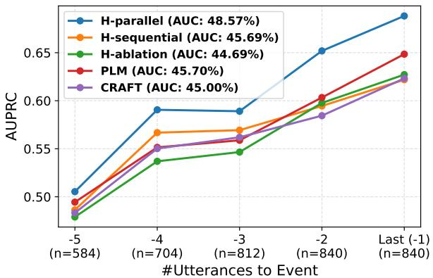  
(a) 300 Train Subset

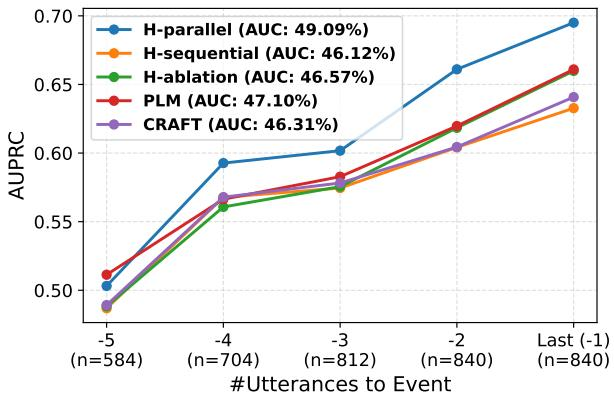  
(b) 500 Train Subset

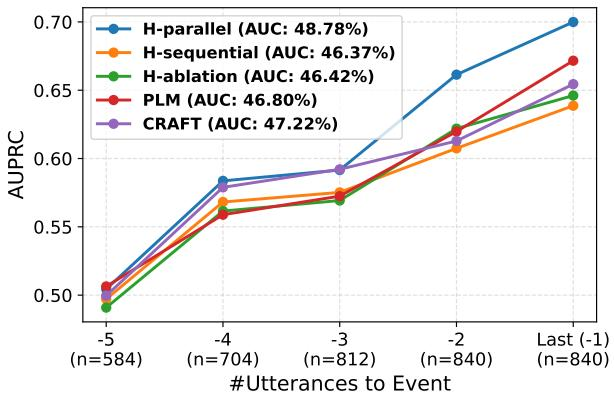  
(c) 1000 Train Subset

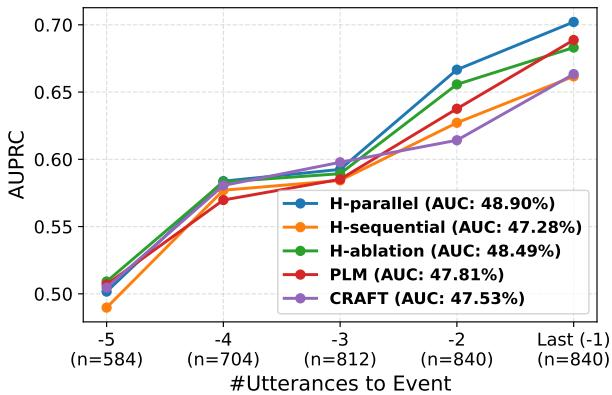  
(d) 2500 Train Subset  
Figure 11: Model AUPRC performance on WIKI is plotted as dialogues progress toward derailment or conversation end, under varying training data sizes and averaged across five random seeds. The number of test-set dialogues contributing to each time step (n) is shown on the x-axis ticks, as some dialogues contain fewer than five utterances. Areas under the curves are reported in the legend. $H _ { \mathrm { p a r a l l e l } }$ achieves the best performance across time steps, particularly in the low-data regime.

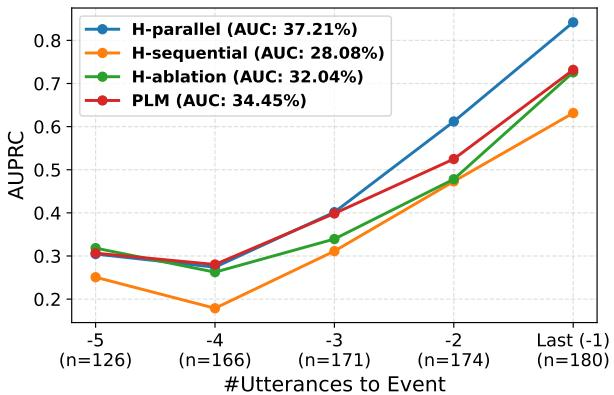  
(a) 300 Train Subset

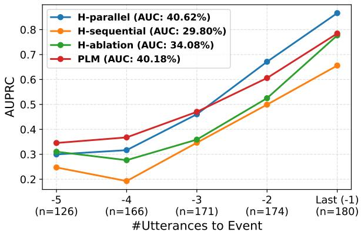  
(b) 500 Train Subset  
Figure 12: Model AUPRC performance on GITHUB is plotted as dialogues progress toward derailment or conversation end, under varying training data sizes and averaged across five random seeds. The number of test-set dialogues contributing to each time step (n) is shown on the x-axis ticks, as some dialogues contain fewer than five utterances. Areas under the curves are reported in the legend. $H _ { \mathrm { p a r a l l e l } }$ achieves the best performance across time steps, particularly in the low-data regime.

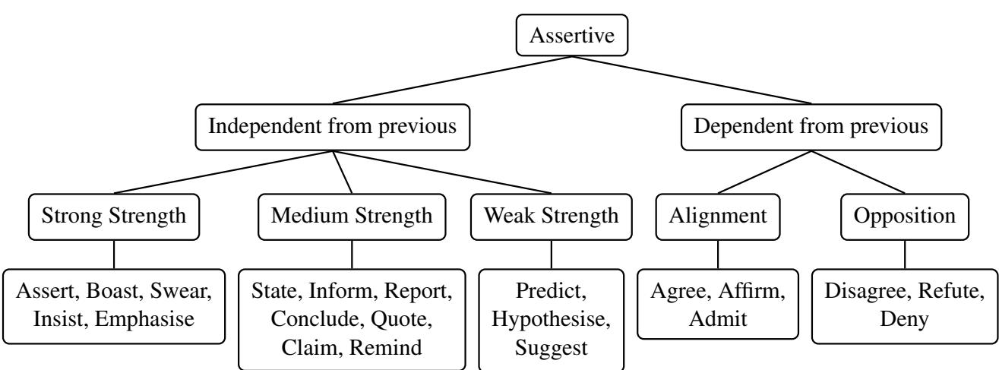  
Figure 13: Assertive Speech Act Taxonomy.

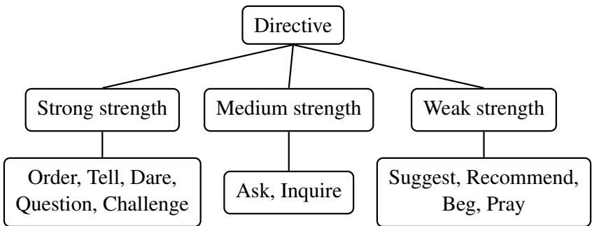  
Figure 14: Directive Speech Act Taxonomy

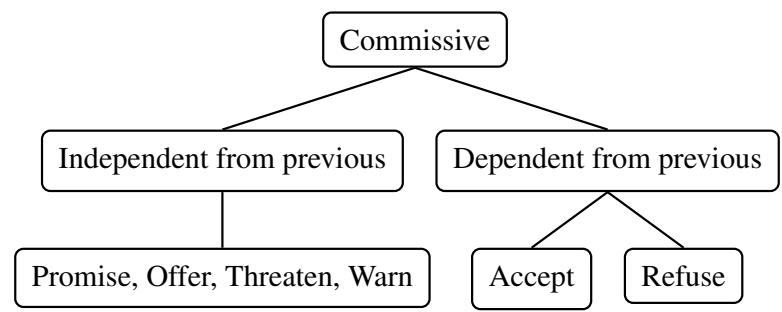  
Figure 15: Commissive Speech Act Taxonomy

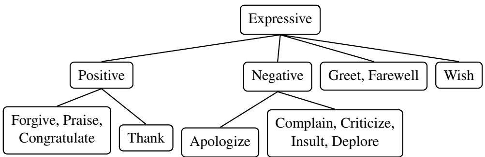  
Figure 16: Expressive Speech Act Taxonomy

<table><tr><td>Speech Act</td><td>Description</td></tr><tr><td>Assertive</td><td>commit the speaker in varying degrees to the truth of the expressed proposition</td></tr><tr><td>State</td><td>to say something clearly and carefully</td></tr><tr><td>Claim</td><td>to say that something is true or is a fact, although they cannot prove it and other people might not believe it</td></tr><tr><td>Report</td><td>to give a description of something or information about it</td></tr><tr><td>Inform</td><td>to say something they know and which they think the addressee should know and want to know</td></tr><tr><td>Suggest</td><td>to communicate or show an idea or feeling without stating it directly or giving proof</td></tr><tr><td>Hypothesise</td><td>to give a possible but not yet proved explanation for something</td></tr><tr><td>Predict</td><td>to say that an event or action will happen in the future, especially as a result of knowledge or experience</td></tr><tr><td>Insist</td><td>to say firmly, especially when others disagree with or oppose what they say</td></tr><tr><td>Swear</td><td>to promise or say firmly that they are telling the truth</td></tr><tr><td>Conclude</td><td>to judge or decide something after thinking carefully about it</td></tr><tr><td>Assert</td><td>to state an opinion forcefully</td></tr><tr><td>Affirm</td><td>to confirm something is true</td></tr><tr><td>Remind</td><td>to make someone aware of something forgotten or possibly forgotten, or to bring back a memory to someone</td></tr><tr><td>Admit</td><td>to agree that something is true, especially unwillingly</td></tr><tr><td>Agree</td><td>to say that they have the same opinion</td></tr><tr><td>Disagree</td><td>to say that they do not have the same opinion, idea, etc.</td></tr><tr><td>Refute</td><td>to say or prove that a person, statement, opinion, etc. is wrong or false</td></tr><tr><td>Emphasise</td><td>to state or show that something is especially important or deserves special attention; to make something more obvious</td></tr><tr><td>Deny</td><td>to say that something is not true, presents themselves as an authority on the subject or a person with special access to the relevant information</td></tr><tr><td>Boast</td><td>to speak too proudly or happily about what they have done or what they own</td></tr><tr><td>Quote</td><td>to repeat the words that someone else has said or written</td></tr><tr><td>Directive</td><td>attempts of varying degrees by the speaker to get the hearer to do something</td></tr><tr><td>Order Tell</td><td>express the assumption that the addressee has no choice but to do as they are told</td></tr><tr><td>Suggest</td><td>express the assumption that the addressee will do as the speaker says express the message that it can be good if the addressee does something and thinks about doing it. There is no</td></tr><tr><td></td><td>assumption that the addressee will necessarily do it. There is no component of 'I want you to do this'.</td></tr><tr><td>Recommend</td><td>speaker recognizing that the addressee wants to do something, informing the addressee of their appraisal of what it would be best to do, assuming the position of someone who is knowledgeable about the topic</td></tr><tr><td>Ask</td><td>speaker asking the addressee to do something, with uncertainty and a wish to know about whether addressee will do it</td></tr><tr><td>Beg</td><td>to ask someone to do something in an urgent way</td></tr><tr><td>Pray</td><td>to speak to a god either privately or in a religious ceremony in order to ask for something</td></tr><tr><td>Dare</td><td>to ask someone to do something that involves risk</td></tr><tr><td>Question</td><td>to express doubts about the value or truth of something, and wants people to think about it to know if it is right</td></tr><tr><td>Inquire</td><td>to ask for information to cause the addressee to do something or say that they are not able to do it. Speaker assumes that the</td></tr><tr><td>Challenge</td><td>addressee would say that they can do it, and assumes that it is difficult for the addressee to do</td></tr><tr><td>Commissive</td><td>commit the speaker in varying degrees to some future course of action</td></tr><tr><td>Promise Offer</td><td>to say that they will certainly do something to declare themselves able to do something that can be good for the addressee and as being willing to do it.</td></tr><tr><td></td><td>Speaker appears to be conscious of the possibilities that the addressee either may or may not want the speaker to do it (i.e. to either accept or decline the offer)</td></tr><tr><td>Threaten</td><td>to declare themselves able to do something that will be very bad for the addressee, to get the addressee to do something that the addressee doesn't want to do</td></tr><tr><td>Warn</td><td>speaker believes and expresses that if addressee do (or not do) something, something bad might befall the addressee. Want addressee to think about what they are going to do, to keep something in mind.</td></tr><tr><td>Refuse</td><td>to say that you will not do or accept something</td></tr><tr><td>Accept</td><td></td></tr><tr><td></td><td>to say yes to an offer or invitation</td></tr><tr><td>Expressive</td><td>express the psychological state specified in the sincerity condition about a state of affairs specified in the propositional content</td></tr><tr><td>Apologize</td><td>to tell addressee that they are sorry for having done something that has caused problems or unhappiness for the addressee</td></tr><tr><td>Forgive</td><td>to express their wish to not think of addressee as of someone who did something bad to them, nor to feel something bad towards the addressee because of that</td></tr><tr><td>Thank Complain</td><td>to express to addressee that they are pleased about or are grateful for something that the addressee have done to say that something is wrong or not satisfactory. Speaker is focused on some bad effect they experienced as</td></tr><tr><td>Greet</td><td>a result of someone else's actions, and they want someone to do something because of this.</td></tr><tr><td>Farewell</td><td>to welcome someone with particular words or a particular action to say goodbye</td></tr><tr><td>Praise</td><td>to say something very good about someone else and to bring credit to the praised person</td></tr><tr><td>Criticize</td><td>to say something (merely) bad about someone else, to cause others to think something bad about the criticized</td></tr><tr><td>Insult</td><td>person to say or do something to someone that is rude or offensive</td></tr><tr><td>Congratulate Deplore</td><td>to praise someone and express that speaker approves of or is pleased about a special or unusual achievement to say or think that something is very bad</td></tr><tr><td>Wish</td><td>to express hope for another person's success or happiness or pleasure on a particular occasion; to express hope that speaker will get something or that something will happen; to express desire for some situation to be</td></tr><tr><td></td><td>different from the one that exists</td></tr><tr><td>Other Other</td><td>a generic class for speech acts not fitting into the classification a generic class for speech acts not fitting into the classification</td></tr><tr><td>Section</td><td>Text</td></tr><tr><td>Role</td><td>You are an expert linguist and pragmatics specialist specializing in Speech Act Theory. You will be provided with a conversation context and a segmented target response. Your task is to classify each segment of the target response into specific illocutionary speech acts based on the provided taxonomy.</td></tr><tr><td>Speech Act Taxonomy &amp; Definitions</td><td>Illocutionary speech acts are the intended meaning of the utterance. The categories and speech acts within each category are defined below. ${SPEECH_ACTS}</td></tr><tr><td>Instructions</td><td>1. Analyze: For each segment, analyze the conversation context, response context, and speech act definitions, to determine the illocutionary speech act that would be likely perceived by differ- ent types of listeners. Identify any signs of covert aggression, figurative language, indirectness, and violation of conversational maxims, that can make the literal and intended meaning of the text diverge. 2. Identify the Potential Intended Acts: For each segment, based on the analysis and potential factors diverging literal and intended meaning, assign the likely perceived intended speech acts and their corresponding categories using only the provided taxonomy.</td></tr><tr><td>Expected Output For- mat </td><td>Return your analysis in the following JSON structure: { "segment index": 1, "text segmen  ${ \sf t ^ { \prime \prime } } : \mathrm { ~  ~ \Omega ~ } ^ { \prime \prime } \mathrm { ~  ~ \cdot ~ } \cdot \mathrm { ~  ~ \Omega ~ } ^ { \prime \prime } ,$   $" ` \mathrm { a n a l y s i s " : } \quad " \mathrm { \dots } \mathrm { ~ , ~ } \mathrm { \dots ~ } ^ { \prime \prime } ,$ </td></tr><tr><td>Conversation Context</td><td>] The following is the history leading up to the target response. Use this to understand the intent, tone, and pragmatics.</td></tr><tr><td>Target Response to Ana- lyze</td><td>${CONVERSATION_HISTORY} The target response is divided into segments, with each segment indexed and wrapped in &lt;segment n&gt; ... &lt;/segment n&gt;. Speaker: ${SPEAKER_NAME}</td></tr></table>

Table 12: Speech act taxonomy (part 1), including the speech act categories (Assertive, Directive, and Commissive) and classes, along with their brief description provided to LLM during extraction.

Table 13: Speech act taxonomy part 2, including the speech act categories (Expressive and Other) and classes, along with their brief description provided to LLM during extraction.

Table 14: LLM prompt structure for speech act extraction. The previous response to the target response, if available, is used as conversation history. Speaker names are anonymized into numerical identifiers (e.g., Speaker 1, Speaker 2).