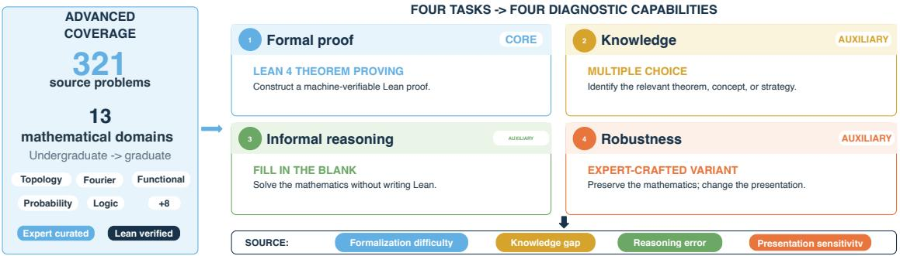
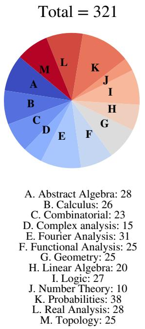
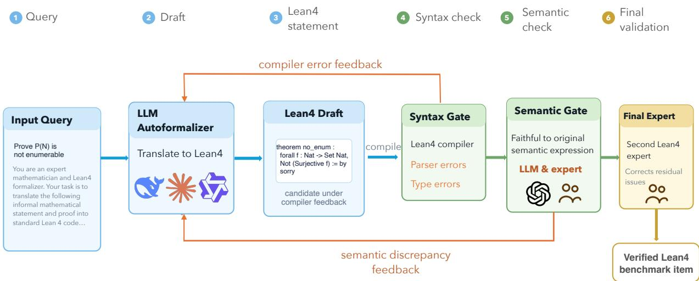
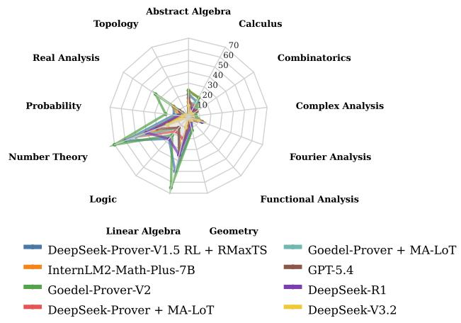
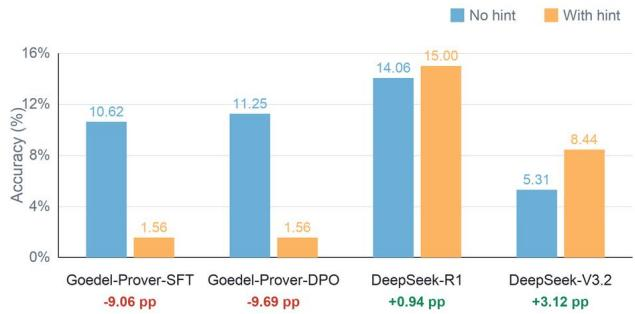
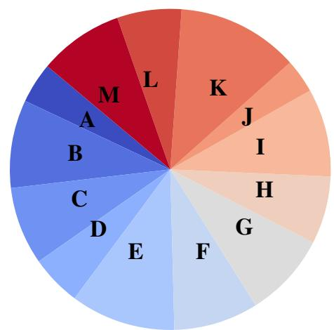
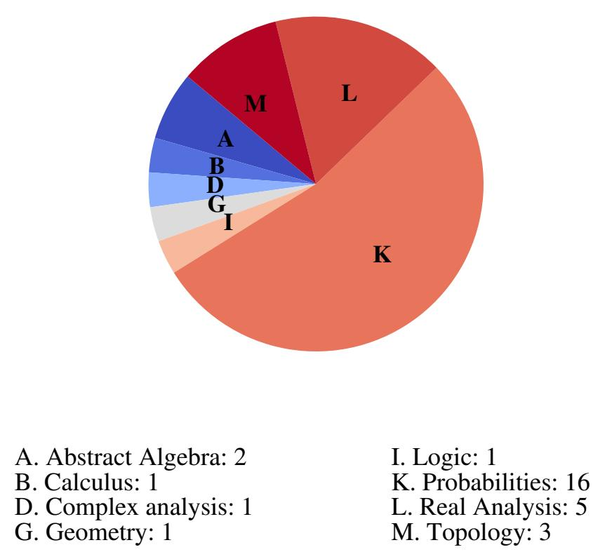
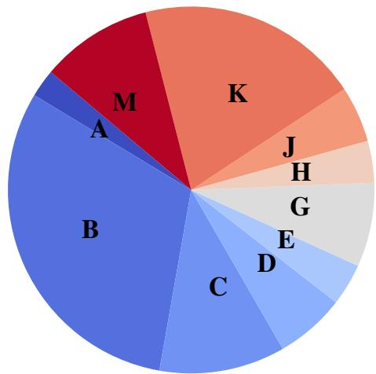

# MathAdv: What Theorem Provers Know, Reason, Formalize, and Generalize

Jiaxin Yuan<sup>1</sup>   
jyuan98@umd.edu   
Jiaqi Wang<sup>3</sup>   
jwang3737@gatech.edu   
Vlasios Mastrantonis<sup>4</sup>   
vm429@cornell.edu   
Abdirisak Abdullahi Mohamed<sup>1</sup>   
amoham70@umd.edu   
Zezheng Song<sup>1</sup>   
zsong2019@gmail.com   
Connor Martinez Lockhart<sup>1</sup>   
connorl@umd.edu   
Chenghao Deng<sup>1</sup>   
dengch16@umd.edu   
Dmitrii Gudin<sup>1</sup>   
dgudin@umd.edu   
Bilal Hamdi Aytekin<sup>1</sup>   
baytekin@umd.edu   
Furong Huang<sup>1,5</sup>   
furongh@umd.edu   
Xiaoyu Liu<sup>1</sup>   
xiaoyu.liu1231@gmail.com   
Xiayimei Han<sup>1</sup>   
xhan1115@umd.edu   
Shaopeng Zhu<sup>2</sup>   
szhu@terpmail.umd.edu   
Jiewen Lang<sup>2</sup>   
jiewenlang@gmail.com

<sup>1</sup>University of Maryland, College Park <sup>2</sup>Independent Researcher <sup>3</sup>Georgia Institute of Technology <sup>4</sup>Cornell University <sup>5</sup>All Purpose AI

## Abstract

Formal theorem proving enables machine-verifiable evaluation of mathematical reasoning, yet existing benchmarks often emphasize aggregate proof accuracy, concentrate on a narrow range of mathematics, and provide limited evidence of robustness to equivalent reformulations. We introduce MathAdv, a diagnostic benchmark spanning 13 domains across undergraduate- and graduate-level mathematics. Alongside Lean 4 theorem proving, MathAdv provides up to three auxiliary tasks: multiple-choice questions that probe mathematical knowledge, fill-in-the-blank problems that isolate informal reasoning, and expert-crafted transformations that test robustness to problem presentation. Our evaluation of contemporary theorem provers yields four findings: formalization remains a major bottleneck; performance varies substantially across mathematical domains; natural-language guidance helps general-purpose LLMs but can hinder proof-specialized models; and mathematically equivalent reformulations expose substantial robustness limitations. Together, these results show how component-wise evaluation can reveal model capabilities and failure modes that aggregate theorem-proving accuracy obscures. The dataset and evaluation scripts are available at https://github.com/margotyjx/MathAdv.git.

  
Figure 1: MathAdv at a glance.

## 1 Introduction

Mathematical reasoning is a fundamental benchmark for assessing artificial intelligence because it requires abstract understanding, logical deduction, and multi-step reasoning beyond memorization and surface-level pattern matching Hendrycks et al. (2021); Mirzadeh et al. (2025). It is also central to scientific discovery and other domains requiring reliable, verifiable conclusions, making its rigorous evaluation increasingly important Lewkowycz et al. (2022); R´ıos-Garc´ıa et al. (2026). Early benchmarks primarily assessed informal natural-language solutions by their final answers, providing limited guarantees about the validity of interme diate reasoning Lewkowycz et al. (2022); Luo et al. (2025). Formal theorem proving offers a more rigorous alternative: models construct machine-verifiable proofs in assistants such as Lean Moura and Ullrich (2021), Coq Bertot and Casteran (2004), and Isabelle Nipkow et al. (2002), enabling automatic verification and pre-´ cise feedback on invalid proof attempts Li et al. (2024); Hubert et al. (2026). Recent advances in language models have further strengthened proof-generation systems and intensified interest in formal reasoning Lin et al. (2025b); Ren et al. (2025).

Despite recent progress, existing formal mathematics benchmarks provide only a partial account of mod ern models’ capabilities. Three limitations are particularly important. First, existing benchmarks offer limited diagnostic resolution. Successful theorem proving requires mathematical background knowledge, logical deduction, and formal proof construction, yet benchmarks typically report only aggregate proof ac curacy. It is therefore difficult to determine whether a failure stems from a knowledge gap, an error in reasoning, or difficulty translating a valid argument into a formal proof. Second, existing benchmarks cover a narrow range of mathematical domains. They have largely focused on competition-level prob lems drawn from high-school and undergraduate mathematics, with an emphasis on algebra and number theory Liu et al. (2023); Tsoukalas et al. (2024). Consequently, model capabilities across a broader range of advanced mathematical domains remain poorly understood. Third, existing evaluations provide limited evidence of robustness and generalization. They generally assess models on a single, fixed formulation of each problem, even though language-model reasoning can be sensitive to minor changes in problem for mulation Mirzadeh et al. (2025). Meanwhile, increasing model scale has intensified concerns about data contamination and memorization Gardner et al. (2020); Kaushik et al. (2020); Sakaguchi et al. (2021). To gether, these issues make it increasingly important to determine whether successful proofs reflect robust mathematical reasoning or reliance on familiar formulations and superficial cues.

In response, we introduce MathAdv, a diagnostic benchmark for formal mathematics designed to address these three limitations directly. First, MathAdv provides greater diagnostic resolution. The original theorem-proving task evaluates formal proof construction, multiple-choice questions probe mathematical background knowledge, and fill-in-the-blank questions evaluate informal reasoning. This component-wise evaluation helps distinguish among knowledge gaps, reasoning errors, and formalization difficulties. Second, MathAdv broadens the range of mathematics being evaluated. It contains 321 problems span ning 13 undergraduate- and graduate-level domains, including areas rarely represented in existing theoremproving benchmarks, such as topology, Fourier analysis, and functional analysis. Of these problems, 298 have formalized Lean 4 statements Moura and Ullrich (2021); the remaining 23 are retained for auxiliary evaluations and deferred for future formalization because the required Mathlib support is not yet available. Third, MathAdv explicitly evaluates robustness to problem reformulation. Expert-crafted transformed variants preserve the underlying mathematical content while substantially altering how each problem is presented, revealing whether model success transfers beyond the original formulation. Overall, each problem is accompanied by up to three auxiliary evaluations, enabling MathAdv to assess mathematical knowledge, informal reasoning, formal proof construction, and robustness within a unified framework.

Constructing MathAdv poses two main technical challenges: designing diagnostic tasks that isolate distinct capabilities while preserving the underlying mathematics, and producing Lean statements that are both type-correct and semantically faithful despite uneven Mathlib coverage. We address the first through domain-expert curation and independent review: experts select nonredundant problems, construct the auxiliary tasks, and verify that transformed variants retain the reasoning required by the originals. We address the second with an LLM-assisted, verifier-in-the-loop formalization pipeline. An LLM drafts each Lean statement, compiler feedback guides iterative correction, an independent LLM and a domain expert check semantic fidelity, and a second expert performs final review. For concepts lacking adequate Mathlib support, experts assess viable encodings and defer formalization when a faithful translation would require prohibitive library development.

Using this diagnostic framework, we systematically evaluate contemporary theorem provers and obtain four key findings. First, formalization remains a major bottleneck. Models often identify a promis ing proof direction but fail to translate it into a valid Lean proof. Second, mathematical reasoning does not transfer uniformly across domains. Performance varies substantially by subject, revealing uneven competence across advanced mathematics. Third, natural-language guidance is not universally beneficial. Reasoning hints improve general-purpose LLMs but can degrade proof-specialized theorem provers, indicating that model families use informal guidance differently. Finally, current theorem provers are brittle to equivalent reformulations. Most models solve original problems substantially more often than their expert-crafted transformations, suggesting reliance on presentation-specific patterns rather than robust mathematical understanding.

Our contributions are as follows:

1. A broad, expert-reviewed benchmark for advanced formal mathematics. We introduce MathAdv, comprising 321 problems across 13 undergraduate- and graduate-level domains, including underrepresented areas such as topology, Fourier analysis, and functional analysis. Among them, 298 have Lean 4 statements constructed through an LLM-assisted, verifier-in-the-loop pipeline with independent expert review to ensure compilability and semantic fidelity.

2. A component-wise diagnostic framework for theorem proving. Beyond aggregate proof accuracy, MathAdv evaluates four capabilities: mathematical knowledge, informal reasoning, formal proof construction, and robustness to reformulation. The original Lean tasks are paired with up to three auxiliary evaluations—multiple-choice questions, fill-in-the-blank problems, and expert-crafted transformed variants—to help identify the source of model successes and failures.

3. A systematic characterization of contemporary theorem provers. Our evaluation shows that formal ization remains a major bottleneck, performance varies substantially across mathematical domains, the effectiveness of natural-language guidance depends on model specialization, and robustness to mathe matically equivalent reformulations remains limited.

## 2 Related work

Formal mathematics reasoning. Formal mathematics encodes statements and proofs within a logical system implemented by a proof assistant such as Lean Moura and Ullrich (2021). Mathematical objects and definitions must be built from concepts recognized by the system, and every derivation must follow its logical rules. The proof assistant can therefore verify each step and certify that the conclusion follows from the stated assumptions. For models, this requires translating mathematical ideas into precise definitions, statements, and logically valid proof steps.

Existing Benchmark Datasets. Recent benchmarks evaluate formal mathematical reasoning in large language models across competition mathematics, informal-to-formal translation, large formal theorem collections, symbolic reasoning, and diagram-based geometry Zheng et al. (2021); Azerbayev et al. (2023a); Liu et al. (2023); Tsoukalas et al. (2024); Yu et al. (2025); Liu et al. (2026); Biyani et al. (2025). However, each primarily focuses on a particular problem source, domain, or capability; Appendix A.1 provides a de tailed review. In contrast, MathAdv spans 13 domains in undergraduate- and graduate-level mathematics and includes fill-in-the-blank, multiple-choice, and transformed questions, enabling deeper analysis beyond theorem-proving accuracy alone.

Models for Formal Mathematics. Recent work has developed a wide range of large language model approaches for both informal mathematical reasoning and formal theorem proving. Formal theorem provers range from direct proof generators to systems that use search, verifier feedback, large formal training corpora, or multiple reasoning agents Polu and Sutskever (2020); Azerbayev et al. (2023b); Ying et al. (2024); Lin et al. (2024); Shen et al. (2025); Lin et al. (2025a); Xin et al. (2024); Wang et al. (2024); Gao et al. (2024); Wang et al. (2025). These approaches differ primarily in how they generate candidate proofs and recover from errors; Appendix A.2 provides a detailed review.

## 3 MathAdv: Advanced benchmarking of formal mathematical reasoning

Section 3.1 introduces MathAdv and describes three complementary diagnostic question types that test natural-language problem solving, knowledge of relevant theorems and proof strategies, and robustness to equivalent reformulations. These diagnostic tasks allow us to disentangle these component abilities from formal proof construction, which requires combining them to produce a precise, verifiable proof in Lean. In Section 3.2, we present the human-in-the-loop pipeline used to translate problems into Lean 4.

## 3.1 MathAdv

MathAdv contains 321 problems drawn from undergraduate- and graduate-level mathematics textbooks or contributed by domain experts. The problems span 13 domains—number theory, linear algebra, abstract algebra, calculus, real analysis, complex analysis, Fourier analysis, functional analysis, probability, topology, geometry, combinatorics, and logic—and are selected to maximize coverage while minimizing redundancy. We formalize 298 problems in Lean 4; the remaining 23 are retained for auxiliary evaluations and deferred for future formalization because of current gaps in Mathlib. For each suitable problem, we construct up to three auxiliary tasks: a fill-in-the-blank problem, a multiple-choice reasoning question, and an expert-crafted transformed problem. Figure 2 shows the domain distribution alongside an example of the diagnostic tasks.

Direct-answer problems. We recast suitable proof problems as direct-answer questions that ask the model to compute a target quantity or expression without writing a Lean proof. These questions test whether the model can solve the underlying mathematics in natural language, thereby helping separate informal problem solving from formal proof construction. Their domain distribution is shown in Figure 8.

Multiple-choice problems. We ask models to identify the theorem, concept, or reasoning strategy most relevant to the original problem from several plausible options. These questions probe whether a model has the background knowledge needed to approach the proof in natural language. We construct MC questions for 293 problems, excluding those whose solutions rely primarily on direct computation or basic facts rather than a central theorem or proof strategy. Their domain distribution is shown in Figure 6. An example of direct-answer and multiple-choice questions is shown in Example 1.

Transformed problems. Domain experts manually reformulate selected problems so that they appear substantially different while preserving the same underlying mathematical reasoning. Comparing performance across the original and transformed versions tests whether models reason consistently rather than relying on familiar wording or memorized patterns Mirzadeh et al. (2025).

Example 2 illustrates such a transformation. Although the two formulations appear distinct, they rely on the same mathematical ideas, and recognizing this connection requires a deep understanding of the underlying concepts. In total, we construct transformed versions of 30 problems, with their distribution across domains shown in Figure 7.



Example 1: Diagnostic tasks for a probability problem.   
Original problem. Let $S _ { n } = X _ { 1 } + \cdot \cdot \cdot + X _ { n }$ be a random walk, where the X are independent   
and identically distributed with $\mathbb { P } ( X _ { i } = 1 ) = p , \mathbb { P } ( X _ { i } = - 1 ) = 1 - p ,$ and $p \neq { \frac { 1 } { 2 } }$ . For integers   
$\iota \leq - 1$ and $\dot { b } \geq 1 ,$ , let   
$\tau = \operatorname* { m i n } \{ n \geq 1 : S _ { n } = a \mathrm { ~ o r ~ } S _ { n } = b \} .$   
Show that   
$\mathbb { E } \tau = \frac { a ( 1 - r ^ { b } ) + b ( r ^ { a } - 1 ) } { ( r ^ { a } - r ^ { b } ) ( 2 p - 1 ) } , \qquad r = \frac { 1 - p } { p } .$   
Direct-answer problem. Let $S _ { n } = X _ { 1 } + \cdot \cdot \cdot + X _ { n }$ be a random walk, where the $X _ { i }$ are inde  
pendent and identically distributed with $\begin{array} { r } { \mathbb { P } ( X _ { i } = 1 ) = p , \mathbb { P } ( X _ { i } = - 1 ) = 1 - p , \mathrm { a n d } p \neq \frac { 1 } { 2 } . } \end{array}$ . For   
integers a ≤ −1 and $\dot { b } \geq 1 .$ , let   
$\tau = \operatorname* { m i n } \{ n \geq 1 : S _ { n } = a \mathrm { o r } S _ { n } = b \} .$   
Compute Eτ.   
Multiple-choice reasoning question. Which result or concept is most useful for solving this prob  
lem?   
(a) Doob decomposition   
(b) Doob’s martingale convergence theorems   
(c) Optional stopping theorem   
(d) Limiting distribution of a Markov chain   
(e) Distribution of arrival times for Poisson processes

Figure 2: Left: Distribution of the 321 problems across mathematical domains. Right: An original probability problem with its direct-answer and multiple-choice diagnostic tasks.

Example 2: Transformed questions in real analysis.   
Natural language problem. Let $S = \{ ( 0 , 0 ) , ( 2 , 0 ) , ( 0 , 1 ) \}$ . Prove that   
$\lbrace \lambda _ { 1 } ( 0 , 0 ) + \lambda _ { 2 } ( 2 , 0 ) + \lambda _ { 3 } ( 0 , 1 ) : \lambda _ { 1 } , \lambda _ { 2 } , \lambda _ { 3 } \geq 0 , \lambda _ { 1 } + \lambda _ { 2 } + \lambda _ { 3 } = 1 \rbrace = \lbrace ( x , y ) \in \mathbb { R } ^ { 2 } : x \geq 0 , y \geq 0 , \frac { x } { 2 } + y \leq 1 \rbrace$   
Transformed problem. Let $S = \{ ( 0 , 0 ) , ( 2 , 0 ) , ( 0 , 1 ) \}$ . Prove that the smallest convex set containing S is   
$\{ ( x , y ) \in \mathbb { R } ^ { 2 } : x \ge 0 , y \ge 0 , x / 2 + y \le 1 \} .$

Data collection. To provide broad coverage while minimizing redundancy and exposing meaning ful model failure modes, we prioritize problems that emphasize distinct aspects of the underlying theory when several candidates involve similar concepts. Contributors also interact with models such as ChatGPT, Gemini, and DeepSeek to assess each problem’s diagnostic value. All contributors are PhD students who have completed graduate coursework or conduct research in the relevant domain, and a second expert independently reviews every problem statement and its auxiliary questions. Because the distinction between undergraduate- and graduate-level problems is subjective and varies across institutions and curricula, we do not assign these labels. A complete list of sources is provided in Appendix C.

## 3.2 Human-in-the-loop autoformalization and challenges

To formalize the natural-language problems in MathAdv, we use the LLM-assisted, human-in-the-loop pipeline illustrated in Figure 3. This design compensates for the inability of current LLMs to independently ensure both valid Lean 4 code and semantic fidelity to the original problems.

Following an interactive, feedback-intensive workflow guided by human experts, the process comprises four stages: Initial Autoformalization, Syntax Correction, Dual Semantic Verification, and Final Expert Review. An LLM first generates a Lean 4 statement, and compiler errors are returned to the model for iterative correction until the statement type-checks. The resulting formalization is then checked for semantic fidelity by an independent LLM and a human expert, followed by a final review by a second expert. Further details are provided in Appendix D. This design choice is motivated by two main considerations: the current strengths and limitations of LLMs in mathematical formalization and the distinctive complexity of MathAdv.

  
Figure 3: Human-in-the-loop autoformalization process for MathAdv.

First, we observe that general-purpose LLMs can often explain the mathematical meaning of the code and identify semantic issues, but still incorrectly predict that the code does not compile. However, without actually running the Lean compiler, they are much less reliable at judging whether the code will be accepted by the Lean type checker. Using James Hanson’s Lean 4 “junk theorems”, semantically misleading snippets that nevertheless compile, we test whether models can predict compilation and explain the code’s meaning Hanson. The results show that LLMs often misjudge what Lean accepts; full details are provided in Appendix D.1.

This observation motivates the design of our formalization pipeline. We use LLMs for the tasks where they are relatively strong, such as checking whether a formal statement matches the intended mathematical meaning. At the same time, we do not rely on them as syntax or type-checking judges. Instead, we place the Lean verifier in the loop: Lean provides direct compiler feedback on whether the code type-checks, while the LLMs help interpret and revise the formalization at the semantic level.

A second major obstacle to fully automated translation of MathAdv is the limited availability of prerequisite definitions and lemmas in Mathlib at the time of writing. Because MathAdv includes problems from advanced and specialized areas of mathematics, some of the basic objects needed to state these problems have not yet been formalized in Lean by the open-source community. For example, some candidate problems in Riemannian geometry cannot yet be stated or proved in Lean because Mathlib lacks the required specialized definitions and supporting results, such as the Bishop–Gromov inequality. This illustrates how gaps in the current formal library constrain immediate formalization; Appendix D.3 provides a detailed example.

To assess whether problems were immediately formalizable, we systematically surveyed Mathlib using its official documentation and LeanSearch, supplemented by Loggle when the required types were known. Expert judgment remains necessary to identify structural gaps and determine whether a translation is vi able. Problems requiring prohibitive upstream library development are retained for auxiliary evaluations and deferred to future iterations of MathAdv as the Lean 4 ecosystem matures.

## 4 Diagnostic evaluation of theorem provers

We evaluate a diverse set of theorem-proving and general-purpose LLMs on MathAdv. Evaluated models and protocols are described in Section 4.1. Section 4.2 measures end-to-end Lean 4 proof construction. Section 4.3 assesses natural-language problem solving and knowledge of relevant theorems and proof strategies. Section 4.4 evaluates whether models remain robust under mathematically equivalent reformulations. Together, these evaluations provide a fine-grained view of model capabilities, revealing whether failures arise from mathematical reasoning, background knowledge, formal proof construction, or sensitivity to problem formulation.

## 4.1 Settings

We evaluate two types of proof-generation approaches on MathAdv: proof-step generation models and whole-proof generation models. Proof-step generation based models usually utilize verifier to obtain information on the current tactic state and often times construct valid proofs with tree-searching schemes. For this category, we evaluate MathAdv on InternLM2-Math-Plus-7B Ying et al. (2024), InternLM2-Step-ProverWu et al. (2024), DeepSeek-Prover-V1.5-RL + RMaxTS Xin et al. (2024), DeepSeek-Prover + MA-LoT, Goedel-Prover + MA-LoT Wang et al. (2025), Goedel-Prover-V2-32B Lin et al. (2025b).

Whole-proof generation models in contrast produce an entire proof code given the prompts, without involving communication between prover model and the verifier. The evaluation metrics used for wholeproof generation models are usually pass@K by measuring the number of problems for which at least one valid proof is found among the top K generated attempts. From this category, we evaluated on Goedel-Prover-SFT, Goedel-Prover-DPO Lin et al. (2025a), DeepSeek-Prover-V1.5, DeepSeek-Prover-V1.5-SFT and DeepSeek-Prover-V1.5-RLXin et al. (2024).

In addition to the open-sourced models, we also evaluate MathAdv on GPT5.4 Singh et al. (2025), DeepSeek-V3.2DeepSeek-AI et al. (2025), DeepSeek-R1 Guo et al. (2025). For details on the computational budget used for evaluation of each model, see Appendix E.

## 4.2 Formal theorem-proving performance

Table 1 presents the performance of theorem-proving LLMs on MathAdv in Lean 4. Overall, theoremproving-specific training and search improve Lean 4 proving performance, but the overall success rate remains limited on MathAdv.

<table><tr><td>Model</td><td>Accuracy (%)</td></tr><tr><td>DeepSeek-Prover-V1.5 Base</td><td>1.25</td></tr><tr><td>DeepSeek-Prover-V1.5 SFT</td><td>9.06</td></tr><tr><td>DeepSeek-Prover-V1.5 RL</td><td>11.25</td></tr><tr><td>DeepSeek-Prover-V1.5 RL + RMaxTS</td><td>16.56</td></tr><tr><td>InternLM2-Math-Plus-7B</td><td>13.12</td></tr><tr><td>InternLM2.5-StepProver</td><td>10.31</td></tr><tr><td>Goedel-Prover-SFT</td><td>10.62</td></tr><tr><td>Goedel-Prover-DPO</td><td>11.25</td></tr><tr><td>Goedel-Prover-V2</td><td>21.88</td></tr><tr><td>DeepSeek-Prover + MA-LoT</td><td>10.00</td></tr><tr><td>Goedel-Prover + MA-LoT</td><td>11.88</td></tr><tr><td>GPT-5.4</td><td>10.62</td></tr><tr><td>DeepSeek-R1</td><td>10.94</td></tr><tr><td>DeepSeek-V3.2</td><td>5.31</td></tr></table>

Table 1: Performance comparison of theorem prover LLMs on MathAdv in Lean 4.

  
Figure 4: Accuracy by domain in MathAdv for selected models.

Among DeepSeek-Prover-V1.5 variants, accuracy increases from 1.25% for the base model to 11.25% with reinforcement learning, and further to 16.56% with RMaxTS, suggesting the benefit of search-based inference in the sparse-reward setting of formal theorem proving. We also observe smaller gains from the MA-LoT framework across both DeepSeek-Prover and Goedel-Prover. In contrast, general-purpose LLMs such as GPT-5.4 and DeepSeek-R1 achieve only modest accuracy despite their larger scale and broad mathematical knowledge, highlighting the gap between mathematical reasoning and producing successful proofs in Lean 4.

Goedel-Prover-V2 achieves the best performance at 21.88%, followed by DeepSeek-Prover-V1.5 RL + RMaxTS. Notably, both systems employ verifier-guided search, treating theorem proving as an interactive process with Lean rather than a one-shot generation task. Their strong performance highlights the importance of effective interaction with the proof assistant for end-to-end theorem proving.

Unbalanced performance across different domains.

We also observe substantial variation across mathematical domains, as shown in Figure 4. Goedel Prover-V2 performs best in number theory and linear algebra, while all models score 0% on topology. This disparity likely reflects two distinct sources of imbalance. First, the training corpora of Goedel-Prover Lin et al. (2025a) and DeepSeek-Prover Xin et al. (2024) are concentrated in areas such as number theory and linear algebra, partly because they are strongly influenced by competition mathematics, leaving other domains with less training coverage. Second, advanced areas such as topology and functional analysis remain underrepresented in Lean because their concepts and supporting infrastructure are more difficult to formalize. Models therefore have fewer formal examples and library resources in these areas, further limiting domain generalization. Similar domain-level disparities have also been reported in FormalMath Yu et al. (2025). The performance of each model across all domains can be found in Tables 7-20 in Appendix G.

## 4.3 Direct-answer and Multiple-choice Mathematical Reasoning Performance

We evaluate models on direct-answer (DA) and multiple-choice (MC) problems to isolate natural-language mathematical reasoning and background knowledge in our assessment. Table 2 reports the results. We exclude systems such as MA-LoT that do not support DA or MC answer generation. Details of DA and MC answer generation and evaluation are provided in Appendices F.1 and F.2.

Direct-answer problems. We observe that most models achieve higher accuracy on DA problems than on the corresponding Lean 4 theorem-proving tasks. This gap indicates that models can often solve the underlying mathematical problem, but still struggle to express the solution as a formal proof accepted by Lean. Goedel-Prover is a notable exception: despite its strong theorem-proving performance, it performs comparatively worse on DA tasks, suggesting that its strengths are more closely tied to Lean proof search and theorem application than to general mathematical answer generation in natural language.

Multiple-choice problems. On MC problems, we also see that most models achieve substantially higher accuracy than Lean 4 theorem-proving accuracy. Goedel-Prover remains an exception, consistent with its stronger specialization toward Lean proof search than general answer selection. Together with the DA results, these findings reinforce that formal proof construction involves challenges beyond mathematical background knowledge, natural-language reasoning, and answer generation.

## 4.4 Robustness to Mathematically Equivalent Transformations

A distinctive feature of MathAdv is its transformed theorem-proving problems in both natural language and Lean, which domain experts manually construct to preserve the underlying mathematical reasoning while changing the problem formulation. Table 3 compares model performance on the original and transformed versions. We use $0 \sqrt { } / \mathrm { T } \times$ to denote cases where the original version is solved but the transformed version is not, and $\mathrm { O } { \times } / \mathrm { T } { \times }$ to denote the reverse.

The results reveal a consistent robustness gap. For most models, $0 \sqrt { \pi } \times$ is larger than $\mathrm { O } { \times } / \mathrm { T } { \times }$ , meaning that models more often solve the original problem but fail on an equivalent transformed version than vice versa. This effect is especially pronounced for Goedel-Prover-V2 and DeepSeek-R1, which show multiple O✓/T× cases but no O×/T✓ cases. Because the transformations preserve the underlying mathematics, failures on reformulated versions show that current theorem provers depend on how a problem is presented. Changes in wording or structure can disrupt learned proof patterns, theorem retrieval, or proof-search strategies. Although the absolute counts are small, the same asymmetry appears across model families, motivating training that rewards consistency across equivalent formulations rather than reliance on surface cues.

<table><tr><td>Model</td><td>DA (%)</td><td>MC (%)</td></tr><tr><td>DeepSeek-Prover-V1.5 Base</td><td>25.9</td><td>53.08</td></tr><tr><td>DeepSeek-Prover-V1.5 SFT</td><td>32.1</td><td>32.53</td></tr><tr><td>DeepSeek-Prover-V1.5 RL</td><td>37.0</td><td>33.90</td></tr><tr><td>DeepSeek-Prover-V1.5 RL + RMaxTS</td><td>42.0</td><td>38.70</td></tr><tr><td>InternLM2-Math-Plus-7B</td><td>39.5</td><td>64.04</td></tr><tr><td>Goedel-Prover-SFT</td><td>4.9</td><td>21.23</td></tr><tr><td>Goedel-Prover-DPO</td><td>4.9</td><td>19.52</td></tr><tr><td>DeepSeek-R1</td><td>58.0</td><td>51.71</td></tr><tr><td>DeepSeek-V3.2</td><td>66.7</td><td>75.00</td></tr><tr><td>GPT-5.4</td><td>64.2</td><td>82.88</td></tr></table>

Table 2: Overall accuracy on direct-answer and multiple-choice reasoning questions.

<table><tr><td>Model</td><td>0√/T×</td><td>O×/T√</td></tr><tr><td>DeepSeek-Prover-V1.5 Base</td><td>0</td><td>0</td></tr><tr><td>DeepSeek-Prover-V1.5 SFT</td><td>2</td><td>2</td></tr><tr><td>DeepSeek-Prover-V1.5 RL</td><td>4</td><td>2</td></tr><tr><td>DeepSeek-Prover-V1.5 RL + RMaxTS</td><td>4</td><td>2</td></tr><tr><td>InternLM2-Math-Plus-7B</td><td>2</td><td>2</td></tr><tr><td>InternLM2.5-StepProver</td><td>3</td><td>2</td></tr><tr><td>DeepSeek-Prover + MA-LoT</td><td>4</td><td>2</td></tr><tr><td>Goedel-Prover + MA-LoT</td><td>4</td><td>2</td></tr><tr><td>Goedel-Prover-SFT</td><td>4</td><td>2</td></tr><tr><td>Goedel-Prover-DPO</td><td>4</td><td>2</td></tr><tr><td>Goedel-Prover-V2</td><td>6</td><td>0</td></tr><tr><td>GPT-5.4</td><td>2</td><td>1</td></tr><tr><td>DeepSeek-R1</td><td>4</td><td>0</td></tr><tr><td>DeepSeek-V3.2</td><td>3</td><td>1</td></tr></table>

Table 3: Original vs. transformed comparison on theorem proving questions in Lean across models. Entries are counts only.

Overall, these evaluations show that current models are limited not only by mathematical knowledge, but also by formal proof construction, uneven domain coverage, and sensitivity to equivalent problem formula tions. To identify actionable ways to address these limitations, the following section qualitatively examines failure modes, successful proof patterns, and the effects of verifier feedback and natural language hints.

## 5 Failure Analysis and Improvement Strategies

In this section, we compare failed and successful proofs to identify what separates plausible attempts from valid Lean proofs in Section 5.1. Section 5.2 evaluates how interactive feedback affects the error patterns of general-purpose LLMs. Finally, Section 5.3 examines how natural-language reasoning hints affect formal proof construction across model types.

## 5.1 Success Requires Precise Lean Execution

Comparing failed and successful attempts reveals a clear divide. Many failed proofs begin with a reasonable mathematical idea and even resemble valid Lean code, but break because a necessary step is missing, an unsuitable tactic or nonexistent lemma is used, or the proof repeats without progress. Successful proofs avoid these failures by either retrieving the correct Mathlib result or building the argument explicitly, step by step, while tracking the remaining goals. This suggests that improving formal theorem provers requires not only strong mathematical reasoning, but also better control of the proof state, more reliable library retrieval, and the ability to recognize whether each step makes progress. We describe these patterns in more detail below.

Error pattern analysis. We identify four recurring ways in which proofs fail. First, an incomplete proof may follow a reasonable approach but prove only a weaker statement, skip a required case, or treat a difficult step as already finished; Lean therefore still has an unresolved claim at the end (see Appendix H.1). Second, a model may choose a proof command that is valid Lean code but cannot establish the current claim. For example, it may use a command intended for linear arithmetic when the proof actually requires reasoning about divisibility (Appendix H.2). Third, models sometimes invent names for results that sound as though they belong to Lean’s mathematical library but do not actually exist, preventing the proof from being checked. Finally, some proofs repeat the same rewriting or command many times without changing what remains to be proved (Appendix H.3). These failures show that a plausible overall idea is insufficient unless the model also checks what each step proves and whether it moves the proof forward.

Successful proof patterns. We observe three common ways in which proofs succeed. First, some successful proofs are short because they find an existing result in Lean’s mathematical library that closely matches the statement and already captures most of the required argument (Appendix I.1). Second, some proofs translate a step-by-step mathematical argument into Lean by introducing intermediate claims, separating cases, and providing the required objects. Examples Q4 and Q5 illustrate this pattern in Appendix I.2. Third, some problems that appear difficult in ordinary mathematical language become simple after their formal definitions are unfolded; the proof then needs only a suitable example and a few basic checks (Appendix I.3). In contrast to failed attempts, successful proofs either find a result that completes the argument or ensure that each explicit step brings the proof closer to completion.

## 5.2 Interactive Lean Feedback Improves Theorem Proving

We further evaluate verifier-guided interaction using DeepSeek-V3.2 and GPT-5.4. This experiment builds on our error analysis and the benefits of interaction observed in Section 4.2. At each turn, we append Lean error messages to the prompt for up to T turns, using a total budget of $K = N { \times } T$ , where N is the number of independent attempts. Table 4 compares interactive and non-interactive performance under the same budget, $K = 1 6 \times 3$

<table><tr><td></td><td>DeepSeek-V3.2</td><td>GPT-5.4</td></tr><tr><td>Non-Interactive</td><td>5.00%</td><td>9.06%</td></tr><tr><td>Interactive</td><td>7.50%</td><td>13.75%</td></tr><tr><td>∆</td><td>+2.50 pp</td><td>+4.69 pp</td></tr></table>

Table 4: Overall Lean 4 accuracy with and without interaction.

  
Figure 5: Performance on Lean 4 formal proving with and without hints from MC questions.

Table 4 shows that interactive feedback improves both models, confirming the value of direct feedback from Lean. A closer analysis reveals that interaction changes rather than eliminates failures: models correct many surface-level syntax errors, so the remaining errors more often involve constructing and applying the formal argument. GPT-5.4’s interactive transcripts reveal two recurring behaviors: the model introduces unnecessary intermediate claims and often replaces a rejected short proof with a much longer attempt. Thus, feedback moves models beyond simple errors but does not consistently produce efficient or reliable proofs. Representative examples are provided in Appendices J.1 and J.2.

## 5.3 Model-Dependent Effects of Natural-Language Hints

We conduct an ablation in which models receive natural-language reasoning hints during Lean 4 proof construction. This experiment is motivated by the results in Section 4.3: most models can identify relevant mathematical knowledge and proof strategies in multiple-choice questions, yet still struggle with end-to end theorem proving. We therefore test whether providing this knowledge as a hint can help bridge the gap. We evaluate DeepSeek-V3.2, DeepSeek-R1, Goedel-Prover-SFT, and Goedel-Prover-DPO with hints derived from the corresponding multiple-choice questions. We use the same theorem-proving setup, adding a standardized hint based on each question and its correct answer to the prompt.

Figure 5 reveals a clear split between general-purpose and proof-specialized models. Hints improve the two DeepSeek models while substantially reducing the performance of Goedel-Prover-SFT and Goedel-Prover-DPO. This divergence suggests that natural-language reasoning guidance is useful for general-purpose models, but can interfere with proof-specialized models whose strengths are more closely tied to learned formal proof patterns and Lean-specific theorem application. Therefore, prompting and training strategies should be model-dependent: informal reasoning hints may be useful for general-purpose models, while proof-specialized systems may benefit more from formal, Lean-aligned guidance.

## 6 Conclusion and Limitations

In this work, we introduced MathAdv, a comprehensive diagnostic benchmark for formal mathematical reasoning in Lean 4 that spans 13 mathematical domains. By moving beyond aggregate theorem-proving accuracy, it provides a fine-grained view of why models succeed or fail. In addition to formal theoremproving tasks, MathAdvincludes three auxiliary tasks that allow us to distinguish models’ abilities in mathematical problem solving, background knowledge, formal proof construction, and robustness to equivalent reformulations.

MathAdv has two main limitations. First, it remains modest in size because creating and validating high-quality problems across many mathematical domains requires substantial expert effort. Second, the benchmark is constrained by the current coverage of Mathlib, so some advanced problems cannot yet be formalized in Lean 4. We plan to formalize these deferred problems as Mathlib expands.

## References

Zhangir Azerbayev, Bartosz Piotrowski, Hailey Schoelkopf, Edward W Ayers, Dragomir Radev, and Jeremy Avigad. Proofnet: Autoformalizing and formally proving undergraduate-level mathematics. arXiv preprint arXiv:2302.12433, 2023a.

Zhangir Azerbayev, Hailey Schoelkopf, Keiran Paster, Marco Dos Santos, Stephen McAleer, Albert Q Jiang, Jia Deng, Stella Biderman, and Sean Welleck. Llemma: An open language model for mathematics. arXiv preprint arXiv:2310.10631, 2023b.

Yves Bertot and Pierre Casteran. ´ Interactive Theorem Proving and Program Development: Coq’Art. Springer, 2004.

Param Biyani, Shashank Kirtania, Yasharth Bajpai, Sumit Gulwani, and Ashish Tiwari. Indimathbench: Autoformalizing mathematical reasoning problems with a human touch. arXiv preprint arXiv:2512.00997, 2025.

Miklos B´ ona.´ Introduction to Enumerative and Analytic Combinatorics. CRC Press, 2015.

James Ward Brown and Ruel V. Churchill. Fourier Series and Boundary Value Problems. 2011.

James Ward Brown and Ruel V. Churchill. Complex Variables and Applications. McGraw-Hill, 9 edition, 2013.

Theo Buhler and Dietmar A. Salamon. ¨ Functional Analysis. American Mathematical Society, 2018.

George Cain. Complex Variables. 2007.

Brandon Coya. Brandon’s math blog, 2014. URL https://brandoncoya.wordpress.com/.

Paul Dawkins. Calculus i, 2022. URL https://tutorial.math.lamar.edu/Classes/CalcI/ CalcI.aspx.

DeepSeek-AI, Aixin Liu, Aoxue Mei, Bangcai Lin, Bing Xue, Bingxuan Wang, Bingzheng Xu, Bochao Wu, Bowei Zhang, Chaofan Lin, Chen Dong, Chengda Lu, Chenggang Zhao, Chengqi Deng, Chenhao Xu, Chong Ruan, Damai Dai, Daya Guo, Dejian Yang, Deli Chen, Erhang Li, Fangqi Zhou, Fangyun Lin, Fucong Dai, Guangbo Hao, Guanting Chen, Guowei Li, H. Zhang, Hanwei Xu, Hao Li, Haofen Liang, Haoran Wei, Haowei Zhang, Haowen Luo, Haozhe Ji, Honghui Ding, Hongxuan Tang, Huanqi Cao, Huazuo Gao, Hui Qu, Hui Zeng, Jialiang Huang, Jiashi Li, Jiaxin Xu, Jiewen Hu, Jingchang Chen, Jingting Xiang, Jingyang Yuan, Jingyuan Cheng, Jinhua Zhu, Jun Ran, Junguang Jiang, Junjie Qiu, Junlong Li, Junxiao Song, Kai Dong, Kaige Gao, Kang Guan, Kexin Huang, Kexing Zhou, Kezhao Huang, Kuai Yu, Lean Wang, Lecong Zhang, Lei Wang, Liang Zhao, Liangsheng Yin, Lihua Guo, Lingxiao Luo, Linwang Ma, Litong Wang, Liyue Zhang, M. S. Di, M. Y Xu, Mingchuan Zhang, Minghua Zhang, Minghui Tang, Mingxu Zhou, Panpan Huang, Peixin Cong, Peiyi Wang, Qiancheng Wang, Qihao Zhu, Qingyang Li, Qinyu Chen, Qiushi Du, Ruiling Xu, Ruiqi Ge, Ruisong Zhang, Ruizhe Pan, Runji Wang, Runqiu Yin, Runxin Xu, Ruomeng Shen, Ruoyu Zhang, S. H. Liu, Shanghao Lu, Shangyan Zhou, Shanhuang Chen, Shaofei Cai, Shaoyuan Chen, Shengding Hu, Shengyu Liu, Shiqiang Hu, Shirong Ma, Shiyu Wang, Shuiping Yu, Shunfeng Zhou, Shuting Pan, Songyang Zhou, Tao Ni, Tao Yun, Tian Pei, Tian Ye, Tianyuan Yue, Wangding Zeng, Wen Liu, Wenfeng Liang, Wenjie Pang, Wenjing Luo, Wenjun Gao, Wentao Zhang, Xi Gao, Xiangwen Wang, Xiao Bi, Xiaodong Liu, Xiaohan Wang, Xiaokang Chen, Xiaokang Zhang, Xiaotao Nie, Xin Cheng, Xin Liu, Xin Xie, Xingchao Liu, Xingkai Yu, Xingyou Li, Xinyu Yang, Xinyuan Li, Xu Chen, Xuecheng Su, Xuehai Pan, Xuheng Lin, Xuwei Fu, Y. Q. Wang, Yang Zhang, Yanhong Xu, Yanru Ma, Yao Li, Yao Li, Yao Zhao, Yaofeng Sun, Yaohui Wang, Yi Qian, Yi Yu, Yichao Zhang, Yifan Ding, Yifan Shi, Yiliang Xiong, Ying He, Ying Zhou, Yinmin Zhong, Yishi Piao, Yisong Wang, Yixiao Chen, Yixuan Tan, Yixuan Wei, Yiyang Ma, Yiyuan Liu, Yonglun Yang, Yongqiang Guo, Yongtong Wu, Yu Wu, Yuan Cheng, Yuan Ou, Yuanfan Xu, Yuduan Wang, Yue Gong, Yuhan Wu, Yuheng Zou, Yukun Li, Yunfan Xiong, Yuxiang Luo, Yuxiang You, Yuxuan Liu, Yuyang Zhou, Z. F. Wu, Z. Z. Ren, Zehua Zhao, Zehui Ren, Zhangli Sha, Zhe Fu, Zhean Xu, Zhenda Xie, Zhengyan Zhang, Zhewen Hao, Zhibin Gou, Zhicheng Ma, Zhigang Yan, Zhihong Shao, Zhixian Huang, Zhiyu Wu, Zhuoshu Li, Zhuping Zhang, Zian Xu, Zihao Wang, Zihui Gu, Zijia Zhu, Zilin Li, Zipeng Zhang, Ziwei Xie, Ziyi Gao, Zizheng Pan, Zongqing Yao, Bei Feng, Hui Li, J. L. Cai, Jiaqi Ni, Lei Xu, Meng Li, Ning Tian, R. J. Chen, R. L. Jin, S. S. Li, Shuang Zhou, Tianyu Sun, X. Q. Li, Xiangyue Jin, Xiaojin Shen, Xiaosha Chen, Xinnan Song, Xinyi Zhou, Y. X. Zhu, Yanping Huang, Yaohui Li, Yi Zheng, Yuchen Zhu, Yunxian Ma, Zhen Huang, Zhipeng Xu, Zhongyu Zhang, Dongjie Ji, Jian Liang, Jianzhong Guo, Jin Chen, Leyi Xia, Miaojun Wang, Mingming Li, Peng Zhang, Ruyi Chen, Shangmian Sun, Shaoqing Wu, Shengfeng Ye, T. Wang, W. L. Xiao, Wei An, Xianzu Wang, Xiaowen Sun, Xiaoxiang Wang, Ying Tang, Yukun Zha, Zekai Zhang, Zhe Ju, Zhen Zhang, and Zihua Qu. Deepseek-v3.2: Pushing the frontier of open large language models, 2025. URL https://arxiv.org/abs/2512.02556.

Herbert B. Enderton. A Mathematical Introduction to Logic. Elsevier, 2001.

Joseph A. Gallian. Contemporary Abstract Algebra. Cengage Learning, 10 edition, 2021.

David Gamarnik. Advanced stochastic processes, 2013. Course notes.

Guoxiong Gao, Yutong Wang, Jiedong Jiang, Qi Gao, Zihan Qin, Tianyi Xu, and Bin Dong. Herald: A natural language annotated lean 4 dataset. arXiv preprint arXiv:2410.10878, 2024.

Matt Gardner, Yoav Artzi, Victoria Basmov, Jonathan Berant, Ben Bogin, Sihao Chen, Pradeep Dasigi, Dheeru Dua, Yanai Elazar, Ananth Gottumukkala, Nitish Gupta, Hannaneh Hajishirzi, Gabriel Ilharco, Daniel Khashabi, Kevin Lin, Jiangming Liu, Nelson F. Liu, Phoebe Mulcaire, Qiang Ning, Sameer Singh, Noah A. Smith, Sanjay Subramanian, Reut Tsarfaty, Eric Wallace, Ally Zhang, and Ben Zhou. Evaluating models’ local decision boundaries via contrast sets. In Trevor Cohn, Yulan He, and Yang Liu, editors, Findings of the Association for Computational Linguistics: EMNLP 2020, pages 1307–1323, Online, November 2020. Association for Computational Linguistics. doi: 10.18653/v1/2020.findings-emnlp.117. URL https://aclanthology.org/2020.findings-emnlp.117/.

Charles Miller Grinstead and J. Laurie Snell. Introduction to Probability. American Mathematical Society, 2006.

Daya Guo, Dejian Yang, Haowei Zhang, Junxiao Song, Peiyi Wang, Qihao Zhu, Runxin Xu, Ruoyu Zhang, Shirong Ma, Xiao Bi, Xiaokang Zhang, Xingkai Yu, Yu Wu, Z. F. Wu, Zhibin Gou, Zhihong Shao, Zhuoshu Li, Ziyi Gao, Aixin Liu, Bing Xue, Bingxuan Wang, Bochao Wu, Bei Feng, Chengda Lu, Chenggang Zhao, Chengqi Deng, Chong Ruan, Damai Dai, Deli Chen, Dongjie Ji, Erhang Li, Fangyun Lin, Fucong Dai, Fuli Luo, Guangbo Hao, Guanting Chen, Guowei Li, H. Zhang, Hanwei Xu, Honghui Ding, Huazuo Gao, Hui Qu, Hui Li, Jianzhong Guo, Jiashi Li, Jingchang Chen, Jingyang Yuan, Jinhao Tu, Junjie Qiu, Junlong Li, J. L. Cai, Jiaqi Ni, Jian Liang, Jin Chen, Kai Dong, Kai Hu, Kaichao You, Kaige Gao, Kang Guan, Kexin Huang, Kuai Yu, Lean Wang, Lecong Zhang, Liang Zhao, Litong Wang, Liyue Zhang, Lei Xu, Leyi Xia, Mingchuan Zhang, Minghua Zhang, Minghui Tang, Mingxu Zhou, Meng Li, Miaojun Wang, Mingming Li, Ning Tian, Panpan Huang, Peng Zhang, Qiancheng Wang, Qinyu Chen, Qiushi Du, Ruiqi Ge, Ruisong Zhang, Ruizhe Pan, Runji Wang, R. J. Chen, R. L. Jin, Ruyi Chen, Shanghao Lu, Shangyan Zhou, Shanhuang Chen, Shengfeng Ye, Shiyu Wang, Shuiping Yu, Shunfeng Zhou, Shuting Pan, S. S. Li, Shuang Zhou, Shaoqing Wu, Tao Yun, Tian Pei, Tianyu Sun, T. Wang, Wangding Zeng, Wen Liu, Wenfeng Liang, Wenjun Gao, Wenqin Yu, Wentao Zhang, W. L. Xiao, Wei An, Xiaodong Liu, Xiaohan Wang, Xiaokang Chen, Xiaotao Nie, Xin Cheng, Xin Liu, Xin Xie, Xingchao Liu, Xinyu Yang, Xinyuan Li, Xuecheng Su, Xuheng Lin, X. Q. Li, Xiangyue Jin, Xiaojin Shen, Xiaosha Chen, Xiaowen Sun, Xiaoxiang Wang, Xinnan Song, Xinyi Zhou, Xianzu Wang, Xinxia Shan, Y. K. Li, Y. Q. Wang, Y. X. Wei, Yang Zhang, Yanhong Xu, Yao Li, Yao Zhao, Yaofeng Sun, Yaohui Wang, Yi Yu, Yichao Zhang, Yifan Shi, Yiliang Xiong, Ying He, Yishi Piao, Yisong Wang, Yixuan Tan, Yiyang Ma, Yiyuan Liu, Yongqiang Guo, Yuan Ou, Yuduan Wang, Yue Gong, Yuheng Zou, Yujia He, Yunfan Xiong, Yuxiang Luo, Yuxiang You, Yuxuan Liu, Yuyang Zhou, Y. X. Zhu, Yanping Huang, Yaohui Li, Yi Zheng, Yuchen Zhu, Yunxian Ma, Ying Tang, Yukun Zha, Yuting Yan, Z. Z. Ren, Zehui Ren, Zhangli Sha, Zhe Fu, Zhean Xu, Zhenda Xie, Zhengyan Zhang, Zhewen Hao, Zhicheng Ma, Zhigang Yan, Zhiyu Wu, Zihui Gu, Zijia Zhu, Zijun Liu, Zilin Li, Ziwei Xie, Ziyang Song, Zizheng Pan, Zhen Huang, Zhipeng Xu, Zhongyu Zhang, and Zhen Zhang. Deepseek-r1 incentivizes reasoning in llms through reinforcement learning. Nature, 645(8081):633–638, September 2025. ISSN 1476-4687. doi: 10.1038/s41586-025-09422-z. URL http://dx.doi.org/10.1038/s41586-025-09422-z.

James Hanson. Junk theorems in lean. https://github.com/James-Hanson/ junk-theorems-in-lean. GitHub repository, accessed 2026-06-14.

Allen Hatcher. Algebraic Topology. Cambridge University Press, 2002.

Dan Hendrycks, Collin Burns, Saurav Kadavath, Akul Arora, Steven Basart, Eric Tang, Dawn Song, and Jacob Steinhardt. Measuring mathematical problem solving with the math dataset. In NeurIPS 2021 Datasets and Benchmarks Track, 2021. URL https://openreview.net/forum?id= 7Bywt2mQsCe.

Nathan Hoell. Foundations of linear algebra.

Thomas Hubert, Rishi Mehta, Laurent Sartran, et al. Olympiad-level formal mathematical reasoning with reinforcement learning. Nature, 651:607–613, 2026. doi: 10.1038/s41586-025-09833-y. URL https: //doi.org/10.1038/s41586-025-09833-y.

David Kammler. A First Course in Fourier Analysis. Cambridge University Press, 2 edition, 2007.

Divyansh Kaushik, Eduard Hovy, and Zachary Lipton. Learning the difference that makes a difference with counterfactually-augmented data. In International Conference on Learning Representations, 2020. URL https://openreview.net/forum?id=Sklgs0NFvr.

Christopher C. Leary and Lars Kristiansen. A Friendly Introduction to Mathematical Logic. Milne Open Textbooks, 2 edition, 2015.

Jiˇr´ı Lebl. Basic Analysis I & II: Introduction to Real Analysis. 2024a. URL https://www.jirka. org/ra/.

Jiˇr´ı Lebl. Guide to Cultivating Complex Analysis. 2024b. URL https://www.jirka.org/ca/.

John M. Lee. Introduction to Smooth Manifolds. Springer, 2 edition, 2013.

Eric Lehman, F. Thomson Leighton, and Albert R. Meyer. Mathematics for Computer Science. Samurai Media Limited, 2017.

Aitor Lewkowycz, Anders Andreassen, David Dohan, Ethan Dyer, Henryk Michalewski, Vinay Ramasesh, Ambrose Slone, Cem Anil, Imanol Schlag, Theo Gutman-Solo, Yuhuai Wu, Behnam Neyshabur, Guy Gur-Ari, and Vedant Misra. Solving quantitative reasoning problems with language models, 2022. URL https://arxiv.org/abs/2206.14858.

Zhaoyu Li, Jialiang Sun, Logan Murphy, Qidong Su, Zenan Li, Xian Zhang, Kaiyu Yang, and Xujie Si. A survey on deep learning for theorem proving, 2024. URL https://arxiv.org/abs/2404. 09939.

Haohan Lin, Zhiqing Sun, Sean Welleck, and Yiming Yang. Lean-star: Learning to interleave thinking and proving. arXiv preprint arXiv:2407.10040, 2024.

Yong Lin, Shange Tang, Bohan Lyu, Jiayun Wu, Hongzhou Lin, Kaiyu Yang, Jia Li, Mengzhou Xia, Danqi Chen, Sanjeev Arora, and Chi Jin. Goedel-prover: A frontier model for open-source automated theorem proving, 2025a. URL https://arxiv.org/abs/2502.07640.

Yong Lin, Shange Tang, Bohan Lyu, Ziran Yang, Jui-Hui Chung, Haoyu Zhao, Lai Jiang, Yihan Geng, Jiawei Ge, Jingruo Sun, Jiayun Wu, Jiri Gesi, Ximing Lu, David Acuna, Kaiyu Yang, Hongzhou Lin, Yejin Choi, Danqi Chen, Sanjeev Arora, and Chi Jin. Goedel-prover-v2: Scaling formal theorem proving with scaffolded data synthesis and self-correction, 2025b. URL https://arxiv.org/abs/2508. 03613.

Chengwu Liu, Jianhao Shen, Huajian Xin, Zhengying Liu, Ye Yuan, Haiming Wang, Wei Ju, Chuanyang Zheng, Yichun Yin, Lin Li, Ming Zhang, and Qun Liu. Fimo: A challenge formal dataset for automated theorem proving. arXiv preprint arXiv:2309.04295, 2023. doi: 10.48550/arXiv.2309.04295. URL https://arxiv.org/abs/2309.04295.

Junqi Liu, Zihao Zhou, Zekai Zhu, Marco Dos Santos, Weikun He, Jiawei Liu, Ran Wang, Yunzhou Xie, Junqiao Zhao, Qiufeng Wang, et al. Numina-lean-agent: An open and general agentic reasoning system for formal mathematics. arXiv preprint arXiv:2601.14027, 2026.

Laszl´ o Lov´ asz.´ Combinatorial Problems and Exercises. North-Holland, 1979.

Haipeng Luo, Qingfeng Sun, Can Xu, Pu Zhao, Jianguang Lou, Chongyang Tao, Xiubo Geng, Qingwei Lin, Shifeng Chen, Yansong Tang, and Dongmei Zhang. Wizardmath: Empowering mathematical reasoning for large language models via reinforced evol-instruct, 2025. URL https://arxiv.org/abs/ 2308.09583.

David Marker. Model Theory: An Introduction. Springer, 2006.

J. S. Milne. Algebraic number theory, 2020. URL https://www.jmilne.org/math/ CourseNotes/ANT.pdf.

Seyed Iman Mirzadeh, Keivan Alizadeh, Hooman Shahrokhi, Oncel Tuzel, Samy Bengio, and Mehrdad Farajtabar. GSM-symbolic: Understanding the limitations of mathematical reasoning in large language models. In The Thirteenth International Conference on Learning Representations, 2025. URL https: //openreview.net/forum?id=AjXkRZIvjB.

MIT OpenCourseWare. 18.06 linear algebra: Assignments, 2010.

Leonardo de Moura and Sebastian Ullrich. The lean 4 theorem prover and programming language. In Automated Deduction – CADE 28: 28th International Conference on Automated Deduction, Virtual Event, July 12–15, 2021, Proceedings, page 625–635, Berlin, Heidelberg, 2021. Springer-Verlag. ISBN 978-3-030-79875-8. doi: 10.1007/978-3-030-79876-5 37. URL https://doi.org/10.1007/ 978-3-030-79876-5\_37.

Tobias Nipkow, Lawrence C. Paulson, and Markus Wenzel. Isabelle/HOL: A Proof Assistant for Higher-Order Logic. Springer, 2002.

Peter Petersen. Riemannian Geometry. Springer, 2 edition, 2006.

Stanislas Polu and Ilya Sutskever. Generative language modeling for automated theorem proving. arXiv preprint arXiv:2009.03393, 2020.

Bjorn Poonen. Mit 18.785: Number theory, 2015. URL https://math.mit.edu/<sub>˜</sub>poonen/785. html.

Michael Reed and Barry Simon. Methods of Modern Mathematical Physics I: Functional Analysis. Academic Press, 1980.

Z. Z. Ren, Zhihong Shao, Junxiao Song, Huajian Xin, Haocheng Wang, Wanjia Zhao, Liyue Zhang, Zhe Fu, Qihao Zhu, Dejian Yang, Z. F. Wu, Zhibin Gou, Shirong Ma, Hongxuan Tang, Yuxuan Liu, Wenjun Gao, Daya Guo, and Chong Ruan. Deepseek-prover-v2: Advancing formal mathematical reasoning via reinforcement learning for subgoal decomposition, 2025. URL https://arxiv.org/abs/2504. 21801.

Martino R ˜ ´ıos-Garc´ıa, Nawaf Alampara, Chandan Gupta, Indrajeet Mandal, Sajid Mannan, Ali Asghar Aghajani, N. M. Anoop Krishnan, and Kevin Maik Jablonka. Ai scientists produce results without reasoning scientifically. arXiv preprint arXiv:2604.18805, 2026.

Halsey L. Royden and Patrick Fitzpatrick. Real Analysis. Pearson, 4 edition, 2010.

Walter Rudin. Functional Analysis. McGraw-Hill, 2 edition, 1991.

Keisuke Sakaguchi, Ronan Le Bras, Chandra Bhagavatula, and Yejin Choi. Winogrande: an adversarial winograd schema challenge at scale. Commun. ACM, 64(9):99–106, August 2021. ISSN 0001-0782. doi: 10.1145/3474381. URL https://doi.org/10.1145/3474381.

Ziju Shen, Naohao Huang, Fanyi Yang, Yutong Wang, Guoxiong Gao, Tianyi Xu, Jiedong Jiang, Wanyi He, Pu Yang, Mengzhou Sun, et al. Real-prover: Retrieval augmented lean prover for mathematical reasoning. arXiv preprint arXiv:2505.20613, 2025.

Aaditya Singh, Adam Fry, Adam Perelman, Adam Tart, Adi Ganesh, Ahmed El-Kishky, Aidan McLaugh lin, Aiden Low, AJ Ostrow, Akhila Ananthram, Akshay Nathan, Alan Luo, Alec Helyar, Aleksander Madry, Aleksandr Efremov, Aleksandra Spyra, Alex Baker-Whitcomb, Alex Beutel, Alex Karpenko, Alex Makelov, Alex Neitz, Alex Wei, Alexandra Barr, Alexandre Kirchmeyer, Alexey Ivanov, Alexi Christakis, Alistair Gillespie, Allison Tam, Ally Bennett, Alvin Wan, Alyssa Huang, Amy McDonald Sandjideh, Amy Yang, Ananya Kumar, Andre Saraiva, Andrea Vallone, Andrei Gheorghe, Andres Garcia Garcia, Andrew Braunstein, Andrew Liu, Andrew Schmidt, Andrey Mereskin, Andrey Mishchenko, Andy Applebaum, Andy Rogerson, Ann Rajan, Annie Wei, Anoop Kotha, Anubha Srivastava, Anushree Agrawal, Arun Vijayvergiya, Ashley Tyra, Ashvin Nair, Avi Nayak, Ben Eggers, Bessie Ji, Beth Hoover, Bill Chen, Blair Chen, Boaz Barak, Borys Minaiev, Botao Hao, Bowen Baker, Brad Lightcap, Brandon McKinzie, Brandon Wang, Brendan Quinn, Brian Fioca, Brian Hsu, Brian Yang, Brian Yu, Brian Zhang, Brittany Brenner, Callie Riggins Zetino, Cameron Raymond, Camillo Lugaresi, Carolina Paz, Cary Hudson, Cedric Whitney, Chak Li, Charles Chen, Charlotte Cole, Chelsea Voss, Chen Ding, Chen Shen, Chengdu Huang, Chris Colby, Chris Hallacy, Chris Koch, Chris Lu, Christina Kaplan, Christina Kim, CJ Minott-Henriques, Cliff Frey, Cody Yu, Coley Czarnecki, Colin Reid, Colin Wei, Cory Decareaux, Cristina Scheau, Cyril Zhang, Cyrus Forbes, Da Tang, Dakota Goldberg, Dan Roberts, Dana Palmie, Daniel Kappler, Daniel Levine, Daniel Wright, Dave Leo, David Lin, David Robinson, Declan Grabb, Derek Chen, Derek Lim, Derek Salama, Dibya Bhattacharjee, Dimitris Tsipras, Dinghua Li, Dingli Yu, DJ Strouse, Drew Williams, Dylan Hunn, Ed Bayes, Edwin Arbus, Ekin Akyurek, Elaine Ya Le, Elana Widmann, Eli Yani, Elizabeth Proehl, Enis Sert, Enoch Cheung, Eri Schwartz, Eric Han, Eric Jiang, Eric Mitchell, Eric Sigler, Eric Wallace, Erik Ritter, Erin Kavanaugh, Evan Mays, Evgenii Nikishin, Fangyuan Li, Felipe Petroski Such, Filipe de Avila Belbute Peres, Filippo Raso, Florent Bekerman, Foivos Tsimpourlas, Fotis Chantzis, Francis Song, Francis Zhang, Gaby Raila, Garrett McGrath, Gary Briggs, Gary Yang, Giambattista Parascandolo, Gildas Chabot, Grace Kim, Grace Zhao, Gregory Valiant, Guillaume Leclerc, Hadi Salman, Hanson Wang, Hao Sheng, Haoming Jiang, Haoyu Wang, Haozhun Jin, Harshit Sikchi, Heather Schmidt, Henry Aspegren, Honglin Chen, Huida Qiu, Hunter Lightman, Ian Covert, Ian Kivlichan, Ian Silber, Ian Sohl, Ibrahim Hammoud, Ignasi Clavera, Ikai Lan, Ilge Akkaya, Ilya Kostrikov, Irina Kofman, Isak Etinger, Ishaan Singal, Jackie Hehir, Jacob Huh, Jacqueline Pan, Jake Wilczynski, Jakub Pachocki, James Lee, James Quinn, Jamie Kiros, Janvi Kalra, Jasmyn Samaroo, Jason Wang, Ja son Wolfe, Jay Chen, Jay Wang, Jean Harb, Jeffrey Han, Jeffrey Wang, Jennifer Zhao, Jeremy Chen, Jerene Yang, Jerry Tworek, Jesse Chand, Jessica Landon, Jessica Liang, Ji Lin, Jiancheng Liu, Jianfeng Wang, Jie Tang, Jihan Yin, Joanne Jang, Joel Morris, Joey Flynn, Johannes Ferstad, Johannes Heidecke, John Fishbein, John Hallman, Jonah Grant, Jonathan Chien, Jonathan Gordon, Jongsoo Park, Jordan Liss, Jos Kraaijeveld, Joseph Guay, Joseph Mo, Josh Lawson, Josh McGrath, Joshua Vendrow, Joy Jiao, Julian Lee, Julie Steele, Julie Wang, Junhua Mao, Kai Chen, Kai Hayashi, Kai Xiao, Kamyar Salahi, Kan Wu, Karan Sekhri, Karan Sharma, Karan Singhal, Karen Li, Kenny Nguyen, Keren Gu-Lemberg, Kevin King, Kevin Liu, Kevin Stone, Kevin Yu, Kristen Ying, Kristian Georgiev, Kristie Lim, Kushal

Tirumala, Kyle Miller, Lama Ahmad, Larry Lv, Laura Clare, Laurance Fauconnet, Lauren Itow, Lauren Yang, Laurentia Romaniuk, Leah Anise, Lee Byron, Leher Pathak, Leon Maksin, Leyan Lo, Leyton Ho, Li Jing, Liang Wu, Liang Xiong, Lien Mamitsuka, Lin Yang, Lindsay McCallum, Lindsey Held, Liz Bourgeois, Logan Engstrom, Lorenz Kuhn, Louis Feuvrier, Lu Zhang, Lucas Switzer, Lukas Kondraciuk, Lukasz Kaiser, Manas Joglekar, Mandeep Singh, Mandip Shah, Manuka Stratta, Marcus Williams, Mark Chen, Mark Sun, Marselus Cayton, Martin Li, Marvin Zhang, Marwan Aljubeh, Matt Nichols, Matthew Haines, Max Schwarzer, Mayank Gupta, Meghan Shah, Melody Huang, Meng Dong, Mengqing Wang, Mia Glaese, Micah Carroll, Michael Lampe, Michael Malek, Michael Sharman, Michael Zhang, Michele Wang, Michelle Pokrass, Mihai Florian, Mikhail Pavlov, Miles Wang, Ming Chen, Mingxuan Wang, Minnia Feng, Mo Bavarian, Molly Lin, Moose Abdool, Mostafa Rohaninejad, Nacho Soto, Natalie Staudacher, Natan LaFontaine, Nathan Marwell, Nelson Liu, Nick Preston, Nick Turley, Nicklas Ansman, Nicole Blades, Nikil Pancha, Nikita Mikhaylin, Niko Felix, Nikunj Handa, Nishant Rai, Nitish Keskar, Noam Brown, Ofir Nachum, Oleg Boiko, Oleg Murk, Olivia Watkins, Oona Gleeson, Pamela Mishkin, Patryk Lesiewicz, Paul Baltescu, Pavel Belov, Peter Zhokhov, Philip Pronin, Phillip Guo, Phoebe Thacker, Qi Liu, Qiming Yuan, Qinghua Liu, Rachel Dias, Rachel Puckett, Rahul Arora, Ravi Teja Mullapudi, Raz Gaon, Reah Miyara, Rennie Song, Rishabh Aggarwal, RJ Marsan, Robel Yemiru, Robert Xiong, Rohan Kshirsagar, Rohan Nuttall, Roman Tsiupa, Ronen Eldan, Rose Wang, Roshan James, Roy Ziv, Rui Shu, Ruslan Nigmatullin, Saachi Jain, Saam Talaie, Sam Altman, Sam Arnesen, Sam Toizer, Sam Toyer, Samuel Miserendino, Sandhini Agarwal, Sarah Yoo, Savannah Heon, Scott Ethersmith, Sean Grove, Sean Taylor, Sebastien Bubeck, Sever Banesiu, Shaokyi Amdo, Shengjia Zhao, Sherwin Wu, Shibani Santurkar, Shiyu Zhao, Shraman Ray Chaudhuri, Shreyas Krishnaswamy, Shuaiqi, Xia, Shuyang Cheng, Shyamal Anadkat, Simon Posada Fishman, Simon Tobin, Siyuan Fu, Somay Jain, Song Mei, Sonya´ Egoian, Spencer Kim, Spug Golden, SQ Mah, Steph Lin, Stephen Imm, Steve Sharpe, Steve Yadlowsky, Sulman Choudhry, Sungwon Eum, Suvansh Sanjeev, Tabarak Khan, Tal Stramer, Tao Wang, Tao Xin, Tarun Gogineni, Taya Christianson, Ted Sanders, Tejal Patwardhan, Thomas Degry, Thomas Shadwell, Tianfu Fu, Tianshi Gao, Timur Garipov, Tina Sriskandarajah, Toki Sherbakov, Tomer Kaftan, Tomo Hiratsuka, Tongzhou Wang, Tony Song, Tony Zhao, Troy Peterson, Val Kharitonov, Victoria Chernova, Vineet Kosaraju, Vishal Kuo, Vitchyr Pong, Vivek Verma, Vlad Petrov, Wanning Jiang, Weixing Zhang, Wenda Zhou, Wenlei Xie, Wenting Zhan, Wes McCabe, Will DePue, Will Ellsworth, Wulfie Bain, Wyatt Thompson, Xiangning Chen, Xiangyu Qi, Xin Xiang, Xinwei Shi, Yann Dubois, Yaodong Yu, Yara Khakbaz, Yifan Wu, Yilei Qian, Yin Tat Lee, Yinbo Chen, Yizhen Zhang, Yizhong Xiong, Yonglong Tian, Young Cha, Yu Bai, Yu Yang, Yuan Yuan, Yuanzhi Li, Yufeng Zhang, Yuguang Yang, Yujia Jin, Yun Jiang, Yunyun Wang, Yushi Wang, Yutian Liu, Zach Stubenvoll, Zehao Dou, Zheng Wu, and Zhigang Wang. Openai gpt-5 system card, 2025. URL https://arxiv.org/abs/2601.03267.

Elias M. Stein and Rami Shakarchi. Fourier Analysis: An Introduction. Princeton University Press, 2003.

William Stein. Elementary Number Theory: Primes, Congruences, and Secrets. Springer, 2009.

Gilbert Strang. Calculus online textbook. MIT OpenCourseWare, 2023. URL https://ocw.mit.edu/ courses/res-18-001-calculus-fall-2023/pages/about/.

George Tsoukalas, Jasper Lee, John Jennings, Jimmy Xin, Michelle Ding, Michael Jennings, Amitayush Thakur, and Swarat Chaudhuri. Putnambench: Evaluating neural theorem-provers on the putnam mathematical competition, 2024. URL https://arxiv.org/abs/2407.11214.

University of California, Berkeley. Eecs16b note 14, 2024.

Ruida Wang, Jipeng Zhang, Yizhen Jia, Rui Pan, Shizhe Diao, Renjie Pi, and Tong Zhang. Theoreml-

lama: Transforming general-purpose llms into lean4 experts. In Proceedings of the 2024 Conference on Empirical Methods in Natural Language Processing, pages 11953–11974, 2024.

Ruida Wang, Rui Pan, Yuxin Li, Jipeng Zhang, Yizhen Jia, Shizhe Diao, Renjie Pi, Junjie Hu, and Tong Zhang. Ma-lot: Model-collaboration lean-based long chain-of-thought reasoning enhances formal theorem proving, 2025. URL https://arxiv.org/abs/2503.03205.

Zijian Wu, Suozhi Huang, Zhejian Zhou, Huaiyuan Ying, Jiayu Wang, Dahua Lin, and Kai Chen. Internlm2.5-stepprover: Advancing automated theorem proving via expert iteration on large-scale lean problems, 2024. URL https://arxiv.org/abs/2410.15700.

Huajian Xin, Z. Z. Ren, Junxiao Song, Zhihong Shao, Wanjia Zhao, Haocheng Wang, Bo Liu, Liyue Zhang, Xuan Lu, Qiushi Du, Wenjun Gao, Qihao Zhu, Dejian Yang, Zhibin Gou, Z. F. Wu, Fuli Luo, and Chong Ruan. Deepseek-prover-v1.5: Harnessing proof assistant feedback for reinforcement learning and montecarlo tree search, 2024. URL https://arxiv.org/abs/2408.08152.

Huaiyuan Ying, Shuo Zhang, Linyang Li, Zhejian Zhou, Yunfan Shao, Zhaoye Fei, Yichuan Ma, Jiawei Hong, Kuikun Liu, Ziyi Wang, Yudong Wang, Zijian Wu, Shuaibin Li, Fengzhe Zhou, Hongwei Liu, Songyang Zhang, Wenwei Zhang, Hang Yan, Xipeng Qiu, Jiayu Wang, Kai Chen, and Dahua Lin. Internlm-math: Open math large language models toward verifiable reasoning, 2024.

Zhouliang Yu, Ruotian Peng, Keyi Ding, Yizhe Li, Zhongyuan Peng, Minghao Liu, Yifan Zhang, Zheng Yuan, Huajian Xin, Wenhao Huang, et al. Formalmath: Benchmarking formal mathematical reasoning of large language models. arXiv preprint arXiv:2505.02735, 2025.

Kunhao Zheng, Jesse Michael Han, and Stanislas Polu. Minif2f: a cross-system benchmark for formal olympiad-level mathematics. arXiv preprint arXiv:2109.00110, 2021.

## A Related Work

## A.1 Existing Formal Mathematics Benchmarks

miniF2F Zheng et al. (2021) evaluates formal proof generation on competition-level mathematics problems, while ProofNet Azerbayev et al. (2023a) provides paired informal and formal statements to study translation from natural language into a proof assistant. FIMO Liu et al. (2023) and PutnamBench Tsoukalas et al. (2024) are also derived from mathematical competitions and concentrate largely on algebra, number theory, and analysis. FIMO uses IMO Shortlisted Problems from 2006–2021, whereas PutnamBench draws from the William Lowell Putnam Mathematical Competition.

FormalMath Yu et al. (2025) expands the scale and domain coverage of formally verified theorems. FormalNumina Liu et al. (2026) instead emphasizes structured symbolic and numerical reasoning, focusing on precise formal manipulation. IndiMathBench Biyani et al. (2025) extends evaluation to geometry problems involving diagrams and therefore requires both spatial and logical reasoning. Together, these benchmarks provide valuable tests of individual aspects of formal mathematics, but do not jointly diagnose mathematical knowledge, natural-language reasoning, formal proof construction, and robustness to equivalent reformulations.

## A.2 Models for Formal Mathematics

One class of methods generates a complete solution or proof in a single pass. GPT-f Polu and Sutskever (2020) was an early application of language models to formal proof generation, while Llemma Azerbayev et al. (2023b) and InternLM Ying et al. (2024) build on stronger pretrained models and mathematical training data. These methods are simple and scalable, but cannot easily recover when an intermediate proof step is incorrect.

Search-based systems instead explore multiple proof paths and use intermediate feedback to revise their choices. Lean-STAR Lin et al. (2024), Real-Prover Shen et al. (2025), and Goedel-Prover Lin et al. (2025a) employ tree search, best-first search, or structured sampling to find valid proofs. This improves their ability to recover from errors, although it requires greater computation.

Other systems combine large formal training corpora, proof-assistant feedback, or collaborative reasoning. DeepSeek-Prover Xin et al. (2024) and TheoremLlama Wang et al. (2024) train on extensive formal data; Herald Gao et al. (2024) treats proof construction as a sequence of decisions over changing proof states; and MA-LoT Wang et al. (2025) uses multiple agents or iterative decomposition to address complex problems.

## B Data statistics

Additional data statsitics are shown in Figures 6, 7 and 8

## C Data sources

The following is a complete list of sources MathAdvdraws from:

• Probability: Gamarnik (2013); Grinstead and Snell (2006); Lehman et al. (2017)

• Geometry / Topology: Hatcher (2002); Lee (2013); Petersen (2006)

• Abstract Algebra: Gallian (2021); Coya (2014)



A. Abstract Algebra: 12   
B. Calculus: 26   
C. Combinatorial: 23   
D. Complex analysis: 15   
E. Fourier Analysis: 31   
F. Functional Analysis: 25   
G. Geometry: 25   
H. Linear Algebra: 20   
I. Logic: 26   
J. Number Theory: 10   
K. Probabilities: 36   
L. Real Analysis: 19   
M. Topology: 25   
A. Abstract Algebra: 2 G. Geometry: 6   
B. Calculus: 25 H. Linear Algebra: 3   
C. Combinatorial: 9 J. Number Theory: 4   
D. Complex analysis: 5 K. Probabilities: 16   
E. Fourier Analysis: 3 M. Topology: 8

Figure 6: Multiple-choice Reasoning Problems by Category (Total = 293).  
  
Figure 7: Transformed Problems by Category (Total = 30).



Figure 8: Fill-in-the-blank Problems by Category (Total = 81).

• Logic: Enderton (2001); Marker (2006); Leary and Kristiansen (2015)

• Real Analysis: Lebl (2024a); Royden and Fitzpatrick (2010)

• Number Theory: Stein (2009); Milne (2020); Poonen (2015)

• Complex Analysis: Cain (2007); Lebl (2024b); Brown and Churchill (2013)

• Linear Algebra: MIT OpenCourseWare (2010); University of California, Berkeley (2024); Hoell

• Fourier Analysis: Brown and Churchill (2011); Stein and Shakarchi (2003); Kammler (2007)

• Functional Analysis: Rudin (1991); Reed and Simon (1980); Buhler and Salamon (2018)¨

• Combinatorics: Bona (2015); Lov´ asz (1979)´

• Calculus: Dawkins (2022); Strang (2023)

## D Autoformalization

Initial Autoformalization: For each problem, we employ an LLM-based autoformalizer to translate the natural language problem statement into Lean 4. The prompt configuration utilized for this step is the following: You are an expert mathematician and Lean 4 formalizer. Your task is to translate the following informal mathematical statement and proof into standard Lean 4 code. 1. Ensure all syntax, imports, and tactics are strictly Lean 4. Do not output any Lean3 syntax. 2. Prioritize existing definitions, classes, and theorems from Mathlib. Do not define new terms or structures unless it is strictly necessary because the concept genuinely does not exist in the current

library. 3. Before writing the code, explicitly state which specific Mathlib namespaces   
or files you are drawing from (e.g., Mathlib.ModelTheory.Basic, Mathlib.Combinatorics.SimpleGraph.Ba   
or Mathlib.CategoryTheory.Logic). 4. Do not formalize the proof. Leave the proof blank   
except for a ‘‘sorry’’ statement. 5. Format your answer as a valid Lean 4 file ready to   
be compiled. The Problem: [INSERT THEOREM OR DEFINITION HERE]

Syntax Correction: Standalone LLM formalizations remain highly unreliable for generating compilable Lean 4 theorems. To resolve initial syntax errors, the draft code is parsed by the Lean 4 compiler. If compilation fails, the resulting error messages are fed back into the autoformalizer in an iterative loop until the code compiles without syntax errors. The process is monitored by a human expert.

Dual Semantic Verification: To ensure the Lean 4 theorem statement accurately reflects the mathematical intent of the original natural language problem, we conduct semantic checking via a dual mechanism: an independent, secondary LLM evaluator and a human expert. Any semantic discrepancies feedback is routed back to the autoformalizer for correction.

Final Expert Review: Once a statement passes both syntactic and initial semantic filters, an exhaustive final check will be conducted by another human expert before approving the formalization.

## D.1 Evaluating LLMs on Lean 4 Junk Theorems

In independent zero-shot conversations, models from multiple providers were presented with these snippets and asked two distinct questions:

1. Compilation: Does this self-contained Lean 4 code compile?

2. Semantics: What does this code mean, and what theorem is it proving?

A total of 360 calls (180 for compilation, 180 for semantics) were executed across four models: gpt-5.5, gpt-4o, deepseek-v4-pro, and deepseek-chat.

## D.2 Results and Analysis

Table 5 summarizes the performance of the models across both tasks.

Table 5: Model performance on the Lean 4 Junk Theorems testbed.
<table><tr><td>Model</td><td>Compilation Accuracy (%) Semantic Understanding (0–2)</td><td></td></tr><tr><td>gpt-5.5</td><td>58%</td><td>2.00</td></tr><tr><td>deepseek-v4-pro</td><td>4%</td><td>1.91</td></tr><tr><td>deepseek-chat</td><td>4%</td><td>1.51</td></tr><tr><td>gpt-4o</td><td>18%</td><td>0.89</td></tr></table>

Compilation Prediction: By construction, every snippet in the test corpus successfully compiles in Lean 4. However, the models heavily tended to predict the opposite. The misleading, “nonsense” mathematical reading of the junk theorems consistently overrode the models’ ability to trace the actual type-checking logic. Accuracy ranged from a high of 58% for gpt-5.5 down to just 4% for the DeepSeek models.

Semantic Meaning: The models’ explanations of the theorems were hand-graded on a 0–2 scale based on whether the model could effectively “see through” the junk and explain the underlying formal trick (e.g., successfully recognizing the exploitation of junk values like [].head! = 0 in empty lists).

Here, the model rankings differed drastically from the compilation task. Most notably, deepseek-v4-pro demonstrated exceptional semantic understanding (scoring 1.91/2.00) while predicting compilation failures 96% of the time.

The experimental results highlight that understanding the trick of a junk theorem and trusting that it type-checks are fundamentally separate skills for current LLMs. Even when models accurately deduce the formal trick behind a statement, they frequently misjudge the boundary between plausible-looking Lean code and code that actually compiles. This finding motivates our design choice to use a verifier-in-theloop framework, relying on both LLMs and human experts for semantic alignment while strictly delegating type-checking judgments to the Lean 4 compiler.

## D.3 Limitations of Current Mathlib Coverage

Consider the following candidate problem from our dataset, taken from Petersen (2006):

Let $( M , g )$ be a complete Riemannian manifold of dimension $n \geq 2 .$ . Let vol denote the canonical Riemannian volume measure, and let $B ( p , R )$ denote the open geodesic ball of radius R centered at $p \in M$ . Let $v ( n , k , R )$ denote the volume of a geodesic ball of radius R in the n-dimensional simply connected space form of constant sectional curvature k. Assume the Ricci curvature of M satisfies the uniform lower bound Ric $\ge ( n - 1 ) k$ . If there exists a point $p \in M$ and a radius $R > 0$ (with $R \leq \pi / \sqrt { k } \mathrm { i f } k > 0 )$ such that vol $( B ( p , R ) ) = v ( n , k , R )$ , then the metric g has constant sectional curvature k restricted to the ball $B ( p , R )$

Even stating this theorem in Lean would require formal definitions of sectional curvature, Ricci curvature, geodesic balls, Riemannian volume, and model space forms. While Mathlib contains some foundations for smooth manifolds and Riemannian manifolds, many of the more specialized components of Riemannian geometry needed here are not yet available. Moreover, a standard proof of this result relies on the Bishop– Gromov inequality, a central theorem in comparison geometry that is also not formalized in Mathlib at the time of writing.

## E Computational budgets

The computational budget for proof-step generation based models is usually computed with $K = N \times S \times T$ where N is the number of independent attempts; S is the number of tactics generated each time a node is expanded; and $T$ is the number of the expansion rounds (iterations) per run. InternLM2-Math-Plus and InternLM2.5-Step-Prover both use the same search-style cap $( K = 1 \times 3 2 \times 1 0 0 )$ —one run per problem, 32 sampled continuations per expansion step, 100 expansion iterations, with early stop on first success. Godel-¨ Prover SFT and Godel-Prover DPO each use pass@32. DeepSeek-Prover-V1.5 Base, SFT, and RL each use¨ pass@128 parallel whole-proof sampling; DeepSeek-Prover-V1.5-RL with RMaxTS uses tree search with a default 128 LLM rollouts per problem plus upstream data repeat=16 for scheduling.

The computational budget for whole-proof generation models is represented as pass@K by measuring the number of problems for which at least one valid proof is found among the top K generated attempts. DeepSeek-R1-Distill each use pass@32 on Lean 4. MA-LoT’s two backbones share the same paper preset: 16 root proofs, 8 correction samples per proof, search depth 2 (documented as $1 6 + 8 \times 2 )$ . Godel-Prover-V2-¨ 32B uses pass@32 on the initial round plus self-correction: 2 correction rounds with 2 samples each after the initial 32 whole-proof draws. DeepSeek-V3.2 uses pass@32 by default, DeepSeek-R1 uses pass@16. GPT-5.4 uses pass@32. If applicable, the maximum token allowed per attempt is set to be 8192.

Table 6: Lean 4 accuracy by domain with and without interaction.
<table><tr><td>Domain</td><td>N</td><td>DS Non-Int.</td><td>DS Int.</td><td>DS∆</td><td>GPT Non-Int.</td><td>GPT Int.</td><td>GPT∆</td></tr><tr><td>Abstract Algebra</td><td>30</td><td>10.0%</td><td>10.0%</td><td>+0.0%</td><td>16.7%</td><td>23.3%</td><td>+6.7%</td></tr><tr><td>Calculus</td><td>26</td><td>3.9%</td><td>3.9%</td><td>+0.0%</td><td>7.7%</td><td>7.7%</td><td>+0.0%</td></tr><tr><td>Combinatorial</td><td>23</td><td>4.3%</td><td>4.3%</td><td>+0.0%</td><td>8.7%</td><td>8.7%</td><td>+0.0%</td></tr><tr><td>Complex Analysis</td><td>15</td><td>0.0%</td><td>0.0%</td><td>+0.0%</td><td>0.0%</td><td>0.0%</td><td>+0.0%</td></tr><tr><td>Fourier Analysis</td><td>31</td><td>9.7%</td><td>9.7%</td><td>+0.0%</td><td>9.7%</td><td>12.9%</td><td>+3.2%</td></tr><tr><td>Functional Analysis</td><td>25</td><td>4.0%</td><td>4.0%</td><td>+0.0%</td><td>4.0%</td><td>4.0%</td><td>+0.0%</td></tr><tr><td>Geometry</td><td>24</td><td>0.0%</td><td>8.3%</td><td>+8.3%</td><td>0.0%</td><td>8.3%</td><td>+8.3%</td></tr><tr><td>Linear Algebra</td><td>20</td><td>10.0%</td><td>20.0%</td><td>+10.0%</td><td>35.0%</td><td>35.0%</td><td>+0.0%</td></tr><tr><td>Logic</td><td>23</td><td>0.0%</td><td>8.7%</td><td>+8.7%</td><td>4.3%</td><td>17.4%</td><td>+13.0%</td></tr><tr><td>Number Theory</td><td>10</td><td>20.0%</td><td>30.0%</td><td>+10.0%</td><td>30.0%</td><td>40.0%</td><td>+10.0%</td></tr><tr><td>Probabilities</td><td>54</td><td>3.7%</td><td>3.7%</td><td>+0.0%</td><td>3.7%</td><td>9.3%</td><td>+5.6%</td></tr><tr><td>Real Analysis</td><td>31</td><td>3.2%</td><td>6.5%</td><td>+3.2%</td><td>9.7%</td><td>19.4%</td><td>+9.7%</td></tr><tr><td>Topology</td><td>8</td><td>0.0%</td><td>0.0%</td><td>+0.0%</td><td>0.0%</td><td>0.0%</td><td>+0.0%</td></tr></table>

## F Evaluation process

## F.1 Fill-in-the-blank questions

For answer generation, all models receive the same prompt, which instructs them to solve the problem and provide exactly one final answer enclosed in boxed.... Each problem is attempted up to five times using stochastic decoding with $T = 0 . 7$ and $p = 0 . 9 5$ , with a maximum of 4096 generated tokens per attempt. Answer extraction and grading follow a two-stage procedure. We first extract the expression enclosed in boxed... and check its equivalence to the reference answer using a procedure similar to that of Hendrycks et al. Hendrycks et al. (2021). If this stage fails but a boxed answer is successfully extracted, an LLM judge is used to determine whether the predicted answer is mathematically equivalent to the reference answer.

## F.2 Multiple-choice reasoning questions

For answer generation, the system prompt instructs the model to answer only the multiple-choice question, using the theorem-proving problem as context, and to return a single option letter enclosed in parentheses (e.g., (a)). The theorem-proving problem and the corresponding MC question are concatenated into a single prompt. Each attempt is limited to 2048 generated tokens. Predictions are compared against the reference answers and evaluated using exact-match accuracy.

## G Additional results

In this section, we present additional results on model performance on MathAdv.

## H Representative Error Examples

This appendix provides representative examples of the most common error categories observed during theorem proving. For each category, we include the original problem, a snippet of the generated Lean proof, the verifier feedback, and a brief analysis of the failure.

Table 7: Accuracy by domain for DeepSeek V1.5 Base.
<table><tr><td>Domain</td><td>Lean 4 Acc. (%)</td><td>MC Acc. (%)</td></tr><tr><td>Abstract Algebra</td><td>0.0</td><td>58.3</td></tr><tr><td>Calculus</td><td>0.0</td><td>48.1</td></tr><tr><td>Combinatorial</td><td>0.0</td><td>65.2</td></tr><tr><td>Complex Analysis</td><td>0.0</td><td>43.8</td></tr><tr><td>Fourier Analysis</td><td>3.2</td><td>54.8</td></tr><tr><td>Functional Analysis</td><td>0.0</td><td>48.0</td></tr><tr><td>Geometry</td><td>0.0</td><td>69.2</td></tr><tr><td>Linear Algebra</td><td>10.0</td><td>45.0</td></tr><tr><td>Logic</td><td>0.0</td><td>44.4</td></tr><tr><td>Number Theory</td><td>0.0</td><td>50.0</td></tr><tr><td>Probabilities</td><td>0.0</td><td>51.9</td></tr><tr><td>Real Analysis</td><td>3.2</td><td>70.0</td></tr><tr><td>Topology</td><td>0.0</td><td>57.1</td></tr><tr><td>Overall</td><td>1.2</td><td>54.3</td></tr></table>

Table 8: Accuracy by domain for DeepSeek V1.5 SFT.
<table><tr><td>Domain</td><td>Lean 4 Acc. (%)</td><td>MC Acc. (%)</td></tr><tr><td>Abstract Algebra</td><td>16.7</td><td>16.7</td></tr><tr><td>Calculus</td><td>0.0</td><td>37.0</td></tr><tr><td>Combinatorial</td><td>4.3</td><td>43.5</td></tr><tr><td>Complex Analysis</td><td>0.0</td><td>37.5</td></tr><tr><td>Fourier Analysis</td><td>9.7</td><td>29.0</td></tr><tr><td>Functional Analysis</td><td>4.0</td><td>32.0</td></tr><tr><td>Geometry</td><td>8.3</td><td>38.5</td></tr><tr><td>Linear Algebra</td><td>20.0</td><td>30.0</td></tr><tr><td>Logic</td><td>13.0</td><td>29.6</td></tr><tr><td>Number Theory</td><td>30.0</td><td>50.0</td></tr><tr><td>Probabilities</td><td>9.3</td><td>32.7</td></tr><tr><td>Real Analysis</td><td>6.5</td><td>35.0</td></tr><tr><td>Topology</td><td>0.0</td><td>21.4</td></tr><tr><td>Overall</td><td>9.1</td><td>32.8</td></tr></table>

Table 9: Accuracy by domain for DeepSeek V1.5 RL.
<table><tr><td>Domain</td><td>Lean 4 Acc. (%)</td><td>MC Acc. (%)</td></tr><tr><td>Abstract Algebra</td><td>16.7</td><td>41.7</td></tr><tr><td>Calculus</td><td>7.7</td><td>18.5</td></tr><tr><td>Combinatorial</td><td>4.3</td><td>52.2</td></tr><tr><td>Complex Analysis</td><td>0.0</td><td>25.0</td></tr><tr><td>Fourier Analysis</td><td>9.7</td><td>22.6</td></tr><tr><td>Functional Analysis</td><td>4.0</td><td>44.0</td></tr><tr><td>Geometry</td><td>8.3</td><td>50.0</td></tr><tr><td>Linear Algebra</td><td>30.0</td><td>50.0</td></tr><tr><td>Logic</td><td>17.4</td><td>33.3</td></tr><tr><td>Number Theory</td><td>50.0</td><td>30.0</td></tr><tr><td>Probabilities</td><td>11.1</td><td>23.1</td></tr><tr><td>Real Analysis</td><td>3.2</td><td>35.0</td></tr><tr><td>Topology</td><td>0.0</td><td>35.7</td></tr><tr><td>Overall</td><td>11.2</td><td>34.1</td></tr></table>

Table 10: Accuracy by domain for RMaxTS.
<table><tr><td>Domain</td><td>Lean 4 Acc. (%)</td><td>MC Acc. (%)</td></tr><tr><td>Abstract Algebra</td><td>20.0</td><td>41.7</td></tr><tr><td>Calculus</td><td>15.4</td><td>29.6</td></tr><tr><td>Combinatorial</td><td>4.3</td><td>30.4</td></tr><tr><td>Complex Analysis</td><td>0.0</td><td>37.5</td></tr><tr><td>Fourier Analysis</td><td>12.9</td><td>48.4</td></tr><tr><td>Functional Analysis</td><td>4.0</td><td>44.0</td></tr><tr><td>Geometry</td><td>12.5</td><td>30.8</td></tr><tr><td>Linear Algebra</td><td>50.0</td><td>40.0</td></tr><tr><td>Logic</td><td>26.1</td><td>33.3</td></tr><tr><td>Number Theory</td><td>60.0</td><td>80.0</td></tr><tr><td>Probabilities</td><td>13.0</td><td>34.6</td></tr><tr><td>Real Analysis</td><td>16.1</td><td>40.0</td></tr><tr><td>Topology</td><td>0.0</td><td>39.3</td></tr><tr><td>Overall</td><td>16.6</td><td>38.5</td></tr></table>

Table 11: Accuracy by domain for InternLM2-Math.
<table><tr><td>Domain</td><td>Lean 4 Acc. (%)</td><td>MC Acc. (%)</td></tr><tr><td>Abstract Algebra</td><td>23.3</td><td>75.0</td></tr><tr><td>Calculus</td><td>19.2</td><td>70.4</td></tr><tr><td>Combinatorial</td><td>4.3</td><td>73.9</td></tr><tr><td>Complex Analysis</td><td>0.0</td><td>68.8</td></tr><tr><td>Fourier Analysis</td><td>9.7</td><td>54.8</td></tr><tr><td>Functional Analysis</td><td>4.0</td><td>60.0</td></tr><tr><td>Geometry</td><td>8.3</td><td>88.5</td></tr><tr><td>Linear Algebra</td><td>30.0</td><td>60.0</td></tr><tr><td>Logic</td><td>13.0</td><td>55.6</td></tr><tr><td>Number Theory</td><td>40.0</td><td>40.0</td></tr><tr><td>Probabilities</td><td>9.3</td><td>42.3</td></tr><tr><td>Real Analysis</td><td>16.1</td><td>90.0</td></tr><tr><td>Topology</td><td>0.0</td><td>64.3</td></tr><tr><td>Overall</td><td>13.1</td><td>63.1</td></tr></table>

Table 12: Accuracy by domain for InternLM2.5 Step Prover.
<table><tr><td>Domain</td><td>Solved</td><td>Total</td><td>Lean 4 Acc. (%)</td></tr><tr><td>Abstract Algebra</td><td>5</td><td>30</td><td>16.7</td></tr><tr><td>Calculus</td><td>4</td><td>26</td><td>15.4</td></tr><tr><td>Combinatorial</td><td>0</td><td>23</td><td>0.0</td></tr><tr><td>Complex Analysis</td><td>0</td><td>15</td><td>0.0</td></tr><tr><td>Fourier Analysis</td><td>3</td><td>31</td><td>9.7</td></tr><tr><td>Functional Analysis</td><td>1</td><td>25</td><td>4.0</td></tr><tr><td>Geometry</td><td>2</td><td>24</td><td>8.3</td></tr><tr><td>Linear Algebra</td><td>4</td><td>20</td><td>20.0</td></tr><tr><td>Logic</td><td>2</td><td>23</td><td>8.7</td></tr><tr><td>Number Theory</td><td>3</td><td>10</td><td>30.0</td></tr><tr><td>Probabilities</td><td>6</td><td>54</td><td>11.1</td></tr><tr><td>Real Analysis</td><td>3</td><td>31</td><td>9.7</td></tr><tr><td>Topology</td><td>0</td><td>28</td><td>0.0</td></tr><tr><td>Overall</td><td>33</td><td>320</td><td>10.3</td></tr></table>

Table 13: Accuracy by domain for Goedel SFT.
<table><tr><td>Domain</td><td>Lean 4 Acc. (%)</td><td>MC Acc. (%)</td></tr><tr><td>Abstract Algebra</td><td>16.7</td><td>16.7</td></tr><tr><td>Calculus</td><td>11.5</td><td>22.2</td></tr><tr><td>Combinatorial</td><td>4.3</td><td>26.1</td></tr><tr><td>Complex Analysis</td><td>0.0</td><td>18.8</td></tr><tr><td>Fourier Analysis</td><td>9.7</td><td>12.9</td></tr><tr><td>Functional Analysis</td><td>4.0</td><td>28.0</td></tr><tr><td>Geometry</td><td>4.2</td><td>26.9</td></tr><tr><td>Linear Algebra</td><td>30.0</td><td>5.0</td></tr><tr><td>Logic</td><td>13.0</td><td>18.5</td></tr><tr><td>Number Theory</td><td>40.0</td><td>10.0</td></tr><tr><td>Probabilities</td><td>11.1</td><td>25.0</td></tr><tr><td>Real Analysis</td><td>3.2</td><td>15.0</td></tr><tr><td>Topology</td><td>0.0</td><td>39.3</td></tr><tr><td>Overall</td><td>10.6</td><td>21.8</td></tr></table>

Table 14: Accuracy by domain for Goedel DPO.
<table><tr><td>Domain</td><td>Lean 4 Acc. (%)</td><td>MC Acc. (%) 16.7</td></tr><tr><td>Abstract Algebra</td><td>10.0 15.4</td><td>22.2</td></tr><tr><td>Calculus</td><td></td><td></td></tr><tr><td>Combinatorial</td><td>4.3</td><td>26.1</td></tr><tr><td>Complex Analysis</td><td>0.0</td><td>12.5</td></tr><tr><td>Fourier Analysis</td><td>9.7</td><td>16.1</td></tr><tr><td>Functional Analysis</td><td>8.0</td><td>28.0</td></tr><tr><td>Geometry</td><td>8.3</td><td>30.8</td></tr><tr><td>Linear Algebra</td><td>30.0</td><td>15.0</td></tr><tr><td>Logic</td><td>13.0</td><td>14.8</td></tr><tr><td>Number Theory</td><td>40.0</td><td>30.0</td></tr><tr><td>Probabilities</td><td>11.1</td><td>11.5</td></tr><tr><td>Real Analysis</td><td>6.5</td><td>15.0</td></tr><tr><td>Topology</td><td>0.0</td><td>17.9</td></tr><tr><td>Overall</td><td>11.2</td><td>18.9</td></tr></table>

Table 15: Goedel v2 union outcomes aggregated by domain.
<table><tr><td>Domain</td><td>Solved</td><td>Total</td><td>Lean 4 Acc. (%)</td></tr><tr><td>Abstract Algebra</td><td>7</td><td>30</td><td>23.3</td></tr><tr><td>Calculus</td><td>5</td><td>26</td><td>19.2</td></tr><tr><td>Combinatorial</td><td>2</td><td>23</td><td>8.7</td></tr><tr><td>Complex Analysis</td><td>1</td><td>15</td><td>6.7</td></tr><tr><td>Fourier Analysis</td><td>4</td><td>31</td><td>12.9</td></tr><tr><td>Functional Analysis</td><td>1</td><td>25</td><td>4.0</td></tr><tr><td>Geometry</td><td>3</td><td>24</td><td>12.5</td></tr><tr><td>Linear Algebra</td><td>13</td><td>20</td><td>65.0</td></tr><tr><td>Logic</td><td>5</td><td>23</td><td>21.7</td></tr><tr><td>Number Theory</td><td>7</td><td>10</td><td>70.0</td></tr><tr><td>Probabilities</td><td>11</td><td>54</td><td>20.4</td></tr><tr><td>Real Analysis</td><td>11</td><td>31</td><td>35.5</td></tr><tr><td>Topology</td><td>0</td><td>8</td><td>0.0</td></tr><tr><td>Overall</td><td>70</td><td>320</td><td>21.9</td></tr></table>

Table 16: Accuracy by domain for MA-LoT + DeepSeek V1.5.
<table><tr><td>Domain</td><td>Solved</td><td>Total</td><td>Lean 4 Acc. (%)</td></tr><tr><td>Abstract Algebra</td><td>4</td><td>30</td><td>13.3</td></tr><tr><td>Calculus</td><td>3</td><td>26</td><td>11.5</td></tr><tr><td>Combinatorial</td><td>1</td><td>23</td><td>4.3</td></tr><tr><td>Complex Analysis</td><td>3</td><td>15</td><td>20.0</td></tr><tr><td>Fourier Analysis</td><td>3</td><td>31</td><td>9.7</td></tr><tr><td>Functional Analysis</td><td>1</td><td>25</td><td>4.0</td></tr><tr><td>Geometry</td><td>8</td><td>24</td><td>33.3</td></tr><tr><td>Linear Algebra</td><td>4</td><td>20</td><td>20.0</td></tr><tr><td>Logic</td><td>4</td><td>23</td><td>17.4</td></tr><tr><td>Number Theory</td><td>5</td><td>10</td><td>50.0</td></tr><tr><td>Probabilities</td><td>5</td><td>54</td><td>9.3</td></tr><tr><td>Real Analysis</td><td>2</td><td>31</td><td>6.5</td></tr><tr><td>Topology</td><td>0</td><td>28</td><td>0.0</td></tr><tr><td>Overall</td><td>43</td><td>320</td><td>13.4</td></tr></table>

Table 17: Accuracy by domain for MA-LoT + Goedel.
<table><tr><td>Domain</td><td>Solved</td><td>Total</td><td>Lean 4 Acc. (%)</td></tr><tr><td>Abstract Algebra</td><td>3</td><td>30</td><td>10.0</td></tr><tr><td>Calculus</td><td>4</td><td>26</td><td>15.4</td></tr><tr><td>Combinatorial</td><td>1</td><td>23</td><td>4.3</td></tr><tr><td>Complex Analysis</td><td>2</td><td>15</td><td>13.3</td></tr><tr><td>Fourier Analysis</td><td>4</td><td>31</td><td>12.9</td></tr><tr><td>Functional Analysis</td><td>1</td><td>25</td><td>4.0</td></tr><tr><td>Geometry</td><td>8</td><td>24</td><td>33.3</td></tr><tr><td>Linear Algebra</td><td>7</td><td>20</td><td>35.0</td></tr><tr><td>Logic</td><td>3</td><td>23</td><td>13.0</td></tr><tr><td>Number Theory</td><td>5</td><td>10</td><td>50.0</td></tr><tr><td>Probabilities</td><td>6</td><td>54</td><td>11.1</td></tr><tr><td>Real Analysis</td><td>2</td><td>31</td><td>6.5</td></tr><tr><td>Topology</td><td>0</td><td>28</td><td>0.0</td></tr><tr><td>Overall</td><td>46</td><td>320</td><td>14.4</td></tr></table>

Table 18: Accuracy by domain for GPT-5.4.
<table><tr><td>Domain</td><td>Pass@16 (%)</td><td>Pass@32 (%)</td><td>MC Acc. (%)</td></tr><tr><td>Abstract Algebra</td><td>16.7</td><td>16.7</td><td>83.3</td></tr><tr><td>Calculus</td><td>7.7</td><td>7.7</td><td>77.8</td></tr><tr><td>Combinatorial</td><td>8.7</td><td>8.7</td><td>87.0</td></tr><tr><td>Complex Analysis</td><td>0.0</td><td>0.0</td><td>87.5</td></tr><tr><td>Fourier Analysis</td><td>9.7</td><td>9.7</td><td>71.0</td></tr><tr><td>Functional Analysis</td><td>4.0</td><td>4.0</td><td>84.0</td></tr><tr><td>Geometry</td><td>0.0</td><td>4.2</td><td>100.0</td></tr><tr><td>Linear Algebra</td><td>35.0</td><td>35.0</td><td>70.0</td></tr><tr><td>Logic</td><td>4.3</td><td>13.0</td><td>92.6</td></tr><tr><td>Number Theory</td><td>30.0</td><td>30.0</td><td>70.0</td></tr><tr><td>Probabilities</td><td>3.7</td><td>7.4</td><td>73.1</td></tr><tr><td>Real Analysis</td><td>9.7</td><td>9.7</td><td>90.0</td></tr><tr><td>Topology</td><td>0.0</td><td>0.0</td><td>85.7</td></tr><tr><td>Overall</td><td>9.1</td><td>10.6</td><td>82.0</td></tr></table>

Table 19: Accuracy by domain for DeepSeek-R1. Domain Lean 4 Pass@16 (%) MC Acc. (%)
<table><tr><td>Abstract Algebra</td><td>10.0</td><td>75.0</td></tr><tr><td>Calculus</td><td>7.7</td><td>55.6</td></tr><tr><td>Combinatorial</td><td>4.3</td><td>65.2</td></tr><tr><td>Complex Analysis</td><td>26.7</td><td>62.5</td></tr><tr><td>Fourier Analysis</td><td>12.9</td><td>45.2</td></tr><tr><td>Functional Analysis</td><td>4.0</td><td>64.0</td></tr><tr><td>Geometry</td><td>33.3</td><td>73.1</td></tr><tr><td>Linear Algebra</td><td>35.0</td><td>20.0</td></tr><tr><td>Logic</td><td>26.1</td><td>55.6</td></tr><tr><td>Number Theory</td><td>40.0</td><td>50.0</td></tr><tr><td>Probabilities</td><td>11.1</td><td>40.4</td></tr><tr><td>Real Analysis</td><td>0.0</td><td>75.0</td></tr><tr><td>Topology</td><td>0.0</td><td>21.4</td></tr><tr><td>Overall</td><td>14.4</td><td>51.7</td></tr></table>

Table 20: Accuracy by domain for DeepSeek-V3.2.
<table><tr><td>Domain</td><td>Pass@16 (%)</td><td>Pass@32 (%)</td><td>MC Acc. (%)</td></tr><tr><td>Abstract Algebra</td><td>10.0</td><td>10.0</td><td>66.7</td></tr><tr><td>Calculus</td><td>3.9</td><td>3.9</td><td>66.7</td></tr><tr><td>Combinatorial</td><td>4.3</td><td>4.3</td><td>87.0</td></tr><tr><td>Complex Analysis</td><td>0.0</td><td>0.0</td><td>75.0</td></tr><tr><td>Fourier Analysis</td><td>9.7</td><td>9.7</td><td>58.1</td></tr><tr><td>Functional Analysis</td><td>4.0</td><td>4.0</td><td>80.0</td></tr><tr><td>Geometry</td><td>0.0</td><td>0.0</td><td>88.5</td></tr><tr><td>Linear Algebra</td><td>10.0</td><td>10.0</td><td>80.0</td></tr><tr><td>Logic</td><td>0.0</td><td>0.0</td><td>70.4</td></tr><tr><td>Number Theory</td><td>20.0</td><td>20.0</td><td>70.0</td></tr><tr><td>Probabilities</td><td>3.7</td><td>5.6</td><td>59.6</td></tr><tr><td>Real Analysis</td><td>3.2</td><td>3.2</td><td>95.0</td></tr><tr><td>Topology</td><td>0.0</td><td>0.0</td><td>85.7</td></tr><tr><td>Overall</td><td>5.0</td><td>5.3</td><td>74.1</td></tr></table>

Table 21: Representative error categories.
<table><tr><td>Category</td><td>Typical Cause</td></tr><tr><td>Incorrect theorem application</td><td>Goal state mismatch</td></tr><tr><td>Incorrect tactic selection</td><td>Appropriate strategy, wrong tactic</td></tr><tr><td>Hallucinated Mathlib declarations</td><td>Non-existent theorem/library names</td></tr><tr><td>Parser and syntax errors</td><td>Invalid Lean syntax or proof context</td></tr><tr><td>Repeated-tactic loops</td><td>No progress despite continued generation</td></tr></table>

## H.1 Incorrect Theorem Application

Problem. Q1: Let x be an element ofa cyclic group oforder 15. Ifexactly two of $\cdot _ { x ^ { 3 } , x ^ { 5 } , }$ and $x ^ { 9 }$ are equal,   
prove that order of $x ^ { 1 3 } = 3 .$   
Model: GPT-5.4   
Generated proof snippet:   
have h15 : x ˆ 15 = 1 := by   
rw [← hG]   
exact pow\_card\_eq\_one x   
have hx3 : x ˆ 3 = 1 := by   
rcases h with h | h | h   
·rcases h with ⟨h35, \_⟩   
have := congrArg (fun y => y <sub>\*</sub> (x ˆ (-3 : Z))) h35   
simp [zpow\_natCast, mul\_assoc] at this   
exact this   
have horder\_dvd : orderOf x |3 := by   
exact orderOf\_dvd\_of\_pow\_eq\_one hx3   
have horder\_ne\_one : orderOf x ̸=1 := by   
intro ho   
apply hx\_ne\_one   
exact orderOf\_eq\_one\_iff.mp ho   
have horder\_eq : orderOf x = 3 := by   
omega   
simpa [horder\_eq]   
Verifier feedback:   
line 18, column 12-29:   
function expected at   
pow\_card\_eq\_one   
term has type   
?m.10070 ˆ Fintype.card ?m.10067 = 1   
line 15, column 28 to line 18, column 29:   
unsolved goals   
h15 : x ˆ 15 = 1   
|- orderOf (x ˆ 13) = 3   
line 19, column 4-8:   
unexpected token ’have’; expected command

Analysis. The model correctly identifies the high-level strategy of proving $x ^ { 3 } = 1$ and rewriting $x ^ { 1 3 } =$ x. However, in the branch $x ^ { 3 } = x ^ { 5 }$ , it incorrectly derives $x ^ { 2 } = 1$ rather than the required $x ^ { 3 } = 1$ . The resulting proof state no longer matches the intended argument, leaving the final goal unsolved.

## H.2 Incorrect Tactic Selection

Problem. Q1: Let x be an element of a cyclic group of order 15. If exactly two $o f x ^ { 3 } , x ^ { 5 } .$ , and $x ^ { 9 }$ are equal, prove that order of $: x ^ { 1 3 } = 3$

Model. GPT-5.4

have horder\_dvd : orderOf x |3 := by   
exact orderOf\_dvd\_of\_pow\_eq\_one hx3   
have horder\_ne\_one : orderOf x ̸=1 := by   
intro ho   
apply hx\_ne\_one   
exact orderOf\_eq\_one\_iff.mp ho   
have horder\_eq : orderOf x = 3 := by   
omega

Analysis. The model selects a tactic that is inappropriate for the current goal: the tactic omega in the final step. The remaining goal involves divisibility rather than linear arithmetic. Although the overall proof direction is reasonable, the chosen tactic cannot establish the required divisibility property.

## H.3 Repeated-Tactic Loops

Problem. Q1: Let x be an element of a cyclic group of order 15. If exactly two of $x ^ { 3 } , x ^ { 5 } ,$ , and $x ^ { 9 }$ are equal, prove that order of $x ^ { 1 3 } = 3$

Model. DeepSeek-Prover-V1.5-RL Generated proof snippet.

have h<sub>3</sub> : x ˆ 5 = x ˆ 9 := by   
apply Eq.symm   
apply Eq.symm   
apply Eq.symm   
apply h<sub>2</sub>   
have h<sub>4</sub> : orderOf (x ˆ 13) = 3 := by   
apply Eq.symm   
apply Eq.symm   
apply Eq.symm   
apply h<sub>3</sub>

Analysis. The model repeatedly applies the same tactic without making progress toward the goal. Such loops often consume the token budget while leaving the proof state essentially unchanged.

## I Representative Success Pattern

## I.1 Exact-lemma proofs

Problem. Q2: A Dedekind algebra is a triple $( N , s : N \to N , o \in N )$ s.t. o $\notin$ range(s), s is injective, and $N = c l o _ { s } ( o ) : = \cap \{ X : o \in X$ and $( \forall x \in X ) s ( x ) \in X \}$ (i.e. closure of all sets that are closed under s). Prove thatfor any Dedekind algebra $( N , s , o )$ and any formula $\phi ( x )$ (possibly with parameters in N), one has that $i f \varphi ( o )$ and $( \forall n \in N ) ( \varphi ( n ) \to \varphi ( s ( n ) ) )$ , then $( \forall n \in N ) \varphi ( n )$

Model. DeepSeek-R1

Generated proof snippet.

intro n   
have hclosure\_set : sClosed A.s A.o {x | phi x} := by   
exact ⟨h0, λx hx => hstep x hx⟩   
exact (Set.mem\_sInter.mp (A.carrier\_is\_closure n)) {x | phi x} hclosure\_set

Analysis. The model discharges its goal with Set.mem sInter.mp applied to the closure axiom. Problem. Q3: Prove that for any Von Neumann ordinals α, β, it holds that $\alpha \in \beta \lor \beta \in \alpha \lor \alpha = \beta$ Model. DeepSeek-R1

Generated proof snippet.

intro h   
rcases h with ⟨f, hsurj⟩   
let D : Set N:= {n | n ∈/f n}   
have hD : ∃m, f m = D := hsurj D   
rcases hD with ⟨m, hm⟩   
have hmem : m ∈D ↔m ∈/f m := by   
simp [D]   
have hmem’ : m ∈D ↔m ∈/D := by   
rw [hm] at hmem   
exact hmem   
by\_cases h : m ∈D   
·exact (hmem’.mp h) h   
·exact h (hmem’.mpr h)

Analysis. The model reduces ordinal trichotomy to a single call of lt trichotomy followed by a case split.

## I.2 have-heavy proofs

Problem. Q4: Prove that P(N), the power set of N, is not enumerable Model. DeepSeek-R1 Generated proof snippet.

```ocaml
intro h
rcases h with ⟨U, hUcomp, hU⟩
have hNone : Nat.Partrec (fun x : N=> Part.none) := Nat.Partrec.none
rcases hEnum.2 (fun x : N=> Part.none) hNone with ⟨i, hi⟩
have htot : ∀x, phi i x = Part.some (U i x) := by
intro x; exact hU i x
have hnone : ∀x, phi i x = Part.none := by
intro x; simpa [hi]
have hcontra : Part.some (U i 0) = Part.none := by
calc
Part.some (U i 0) = phi i 0 := by symm; exact htot 0
_ = Part.none := hnone 0
exact (Part.some_ne_none (U i 0)) hcontra
```

Problem. Q5: Assume the set ofpartial recursive unary functions is enumerable; that is, there is an   
enumeration {φ<sub>i</sub>(x)}<sub>i∈ω</sub> of partial recursive unary functions. Prove that there is no universal computable   
function; that is, the universalfunction U $\colon \mathbb { N } \times \mathbb { N } \to \mathbb { N } , U ( k , x ) : = \phi _ { k } ( x )$ is not both total and computable Model. DeepSeek-R1 Generated proof snippet.

intro n   
have hclosure\_set : sClosed A.s A.o {x | phi x} := by   
exact ⟨h0, λx hx => hstep x hx⟩   
exact (Set.mem\_sInter.mp (A.carrier\_is\_closure n)) {x | phi x} hclosure\_set

∀yA(y, x) ∨ A(f(y), x)   
Model. DeepSeek-R1   
Generated proof snippet.

## I.3 have-heavy proofs

Problem. Q6: Let $\mathcal { L } = \{ c , f , A \}$ be a first order language with constant symbol c, a one-place (i.e. unary) function symbol f, and a two-place predicate (i.e. binary relation) symbol A. Let the structure M be defined by:

• |M| = {1, 2, 3}   
• c<sup>M</sup> = 3   
• f<sup>M</sup>(1) = 2, f<sup>M</sup>(2) = 3, f<sup>M</sup>(3) = 3   
• A<sup>M</sup> = {(1, 2), (2, 3), (3, 3)}

Let s(v) = 1 for all variables v. For arbitrary variable v, a v-variant of s is an assignment $s [ m / v ]$ that disagrees with s at most by assigning a different value m to v. Show that ${ \mathfrak { M } } , s \ \models \exists x { \Big ( } A ( f ( z ) , c ) \ \to$

refine ⟨M.three, λh => ?\_⟩   
intro y   
cases y   
·right; exact True.intro   
·left; exact True.intro   
·left; exact True.intro

## J Multi-turn prompt results example

## J.1 More have proofs

Problem. Q7: Suppose 120 students take afinal exam and the mean oftheir scores is 90. You have no other information about the students and the exam, that is, you should not assume that the highest possible score is 100. You may, however, assume that exam scores are nonnegative. Show that the best possible upper bound on the number ofstudents who scored at least 180 is 60.

Model. GPT-5.4

Successful proof snippet under interaction.

theorem problem\_16   
(scores : Fin 120 →R)   
(h\_nonneg : ∀i, 0 ≤scores i)   
(h\_mean : (P i, scores i) / 120 = 90) :   
(Finset.univ.filter (fun i => 180 ≤scores i)).card ≤60 := by   
let S : Finset (Fin 120) := Finset.univ.filter (fun i => 180 ≤scores i)   
have hsum : Pi, scores i = 10800 := by   
have h := h\_mean   
norm\_num at h   
linarith   
have hS\_le\_sum : (S.card : R) <sub>\*</sub> 180 ≤Pi in S, scores i := by   
calc   
(S.card : R) <sub>\*</sub> 180 = Pi in S, 180 := by rw [Finset.sum\_const, nsmul\_eq\_mul]   
\_ ≤Pi in S, scores i := by   
refine Finset.sum\_le\_sum ?\_   
intro i hi

exact Finset.mem\_filter.mp hi |>.2   
have hsub\_le\_total : Pi in S, scores i ≤Pi, scores i := by   
exact Finset.sum\_le\_univ\_sum\_of\_nonneg (s := S) (f := scores) (by intro i; exact   
h\_nonneg i)   
have hcard\_le : (S.card : R) <sub>\*</sub> 180 ≤10800 := by   
linarith   
have hcard\_real : (S.card : R) ≤60 := by   
linarith   
exact\_mod\_cast hcard\_real

Failed proof snippet without interaction.

```verilog
theorem problem_16
(scores : Fin 120 →R)
(h_nonneg : ∀i, 0 ≤scores i)
(h_mean : (P i, scores i) / 120 = 90) :
(Finset.univ.filter (fun i => 180 ≤scores i)).card ≤60 := by
let S : Finset (Fin 120) := Finset.univ.filter (fun i => 180 ≤scores i)
have hsum : Pi, scores i = 10800 := by
have h := h_mean
norm_num at h ⊢
linarith
have h_le_sumS : 180 <sub>*</sub> S.card ≤Pi in S, scores i := by
calc
180 <sub>*</sub> S.card = Pi in S, 180 := by rw [Finset.sum_const, nsmul_eq_mul]
_ ≤Pi in S, scores i := by
refine Finset.sum_le_sum ?_
intro i hi
exact le_of_lt?
```

Analysis. The model introduces intermediate have statements that are never used in the final proof, a pattern observed less frequently in the non-interactive setting.

## J.2 Manual longer proofs

Problem. Q8: Let $\{ X _ { i } \} _ { i \ge 1 }$ be i.i.d. and $\mathbb { E } X _ { 1 } > 0 .$ . Given $a > 0 ,$ , show that $\mathbb { E } \tau < \infty f o r \tau = \operatorname* { i n f } \{ k \geq$ $1 : S _ { k } > a \}$ , where $\begin{array} { r } { S _ { k } = \sum _ { i = 1 } ^ { k } X _ { i } . } \end{array}$

Successful proof snippet under interaction.

theorem bona\_1(n : N) :   
Fintype.card { f : Fin n →Fin n // Function.Bijective f } = Nat.factorial n := by   
classical   
let e :   
{ f : Fin n →Fin n // Function.Bijective f } ≃Equiv.Perm (Fin n) :=   
{ toFun := fun f =>   
Equiv.ofBijective f.1 f.2   
invFun := fun σ=>   
⟨σ, σ.bijective⟩   
left\_inv := by   
intro f   
apply Subtype.ext   
funext x   
rfl   
right\_inv := by   
intro σ   
ext x   
rfl }   
calc

Fintype.card { f : Fin n →Fin n // Function.Bijective f }   
= Fintype.card (Equiv.Perm (Fin n)) := Fintype.card\_congr e   
= Nat.factorial (Fintype.card (Fin n)) := Fintype.card\_perm   
= Nat.factorial n := by simp

## Failed proof snippet without interaction.

theorem bona\_1(n : N) :   
Fintype.card { f : Fin n →Fin n // Function.Bijective f } = Nat.factorial n := by   
simpa using Fintype.card\_perm n

Analysis. The proof under interactive mode transitions from simpa using Fintype.card perm n to an explicit Equiv.Perm construction through a calc chain.

Problem. Q9: Prove thatfor any Von Neumann ordinals α, β, it holds that $\alpha \in \beta \lor$

Model. GPT-5.4

Successful proof snippet under interaction.

theorem open\_logic\_9 (α β: Ordinal) :   
α< β∨β< α∨α= β:= by   
by\_cases h : α= β   
·exact Or.inr <| Or.inr h   
·have hne : α̸=β:= h   
rcases lt\_or\_gt\_of\_ne hne with hlt | hgt   
·exact Or.inl hlt   
·exact Or.inr <| Or.inl hgt

Failed proof snippet without interaction.

theorem open\_logic\_9 (α β: Ordinal) :   
α< β∨β< α∨α= β:= by   
simpa [lt\_or\_gt\_of\_ne, eq\_comm] using lt\_trichotomy αβ

Analysis. Under the interactive mode, the model replaces a simpa-with-lt trichotomy strategy with an explicit by cases argument using lt or gt of ne.