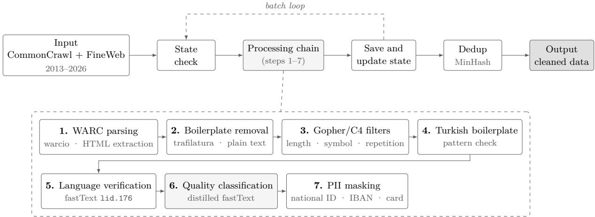
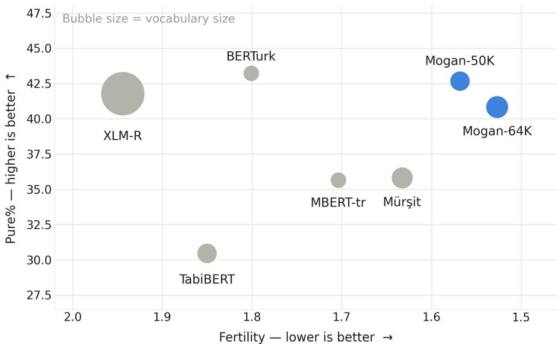
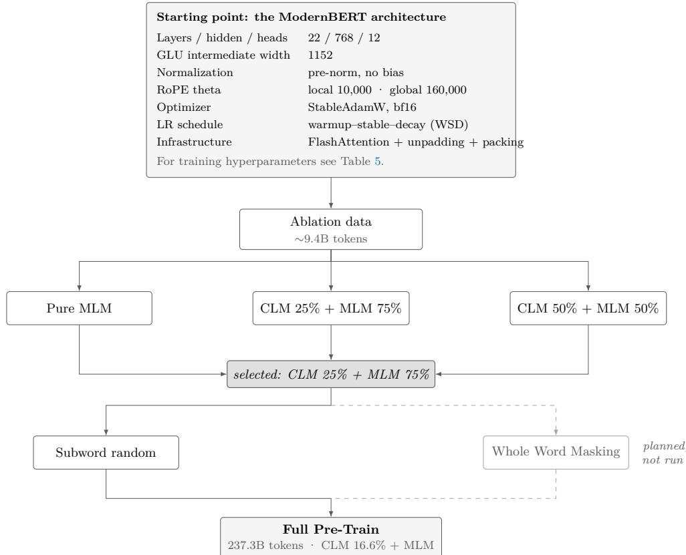
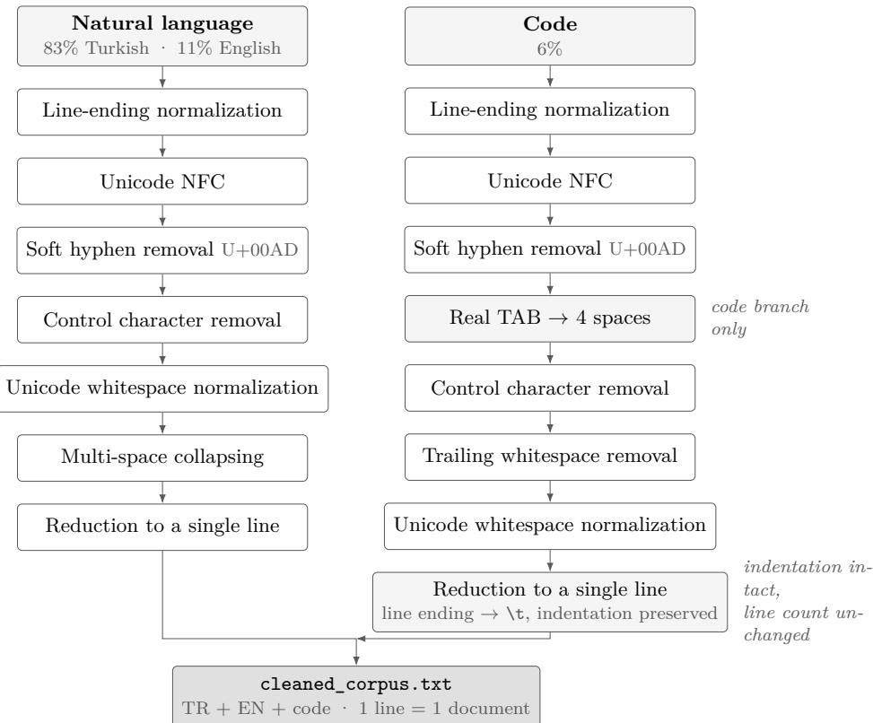

# MoganBert-TR: A Turkish Encoder Foundation Model Trained from Scratch with a CLM→MLM Curriculum

Furkan Yılmaz furkanyl509@gmail.com

Habibe Aleyna Taşdemir aleynattasdemir@gmail.com

Muhammed Faruk Gözay gozayfaruk@gmail.com

## Abstract

Publicly available large-scale pretraining data for Turkish exists largely as a subset of multilingual dumps and involves no language-specific quality filtering; existing Turkish encoders, meanwhile, have adopted modern architectures while leaving the pretraining objective fixed. This paper introduces an encoder foundation model trained from scratch on a language-specifically filtered corpus (MoganBert-TR, 149M parameters), together with an embedding model derived from it (MoganBert-Embed).

(1) Training objective. MoganBert-TR is trained over 237.3 billion tokens with a twostage CLM→MLM curriculum: the first portion of the run uses causal language modelling and the remainder masked language modelling, with the transition made inside the stable phase of a WSD schedule and without touching the learning rate. In a controlled ablation on the same architecture and the same corpus under an equal step budget, this design outperforms pure MLM by 2.7–3.7× on Turkish MS MARCO retrieval; the measured mechanism is embedding geometry a single direction absorbs 28.1% of the variance in the pure-MLM model, against 11.9% under the curriculum. (2) Branched annealing. Long-context extension and learning-rate decay are split into two branches after a shared prefix; running the final portion of decay at 1024 context improves the TrGLUE average by +0.49 ± 0.26 points across five paired seeds (p ≈ 0.013) and beats a model-soup alternative by 0.75 points at ∼4.3% additional cost. (3) Results. MoganBert-TR attains 78.41 on TrGLUE, the best among the Turkish ModernBERT models compared here, and 77.73 on TabiBench, second among monolingual Turkish encoders and 0.19 points behind the leader; it leads two of the eight TabiBench categories, with the largest margin on code retrieval (+3.62 points over TabiBERT). (4) Embedding model. MoganBert-Embed, produced through teacher distillation and multi-signal contrastive fine-tuning, ranks first among student models on the MTEB(Turkish) overall average with 68.30 and reaches 99.5% of its 7.57-billion-parameter teacher’s score with a 51× smaller backbone. (5) Data and tokenizer. The Turkish portion of FineWeb2, recent months pulled from raw Common Crawl, and domain-dense text extracted from printed and institutional sources with a vision-language model were combined into a single pipeline; since no of-the-shelf Turkish quality classifier exists, the decisions of a fine-tuned Turkish BERT were distilled into fastText (94.4% agreement, ∼90× speed-up). The accompanying 50,048-token tokenizer outperforms all compared Turkish tokenizers on both compression and fertility across two independent test sets.

Model weights, tokenizer, embedding model and evaluation code will be released openly at https://huggingface.co/moganai.

Keywords: Turkish natural language processing, encoder language models, pretraining objectives, tokenization, knowledge distillation, embedding models

## 1 Introduction

Despite the visibility of generative models, encoder-only models remain the de facto backbone of classification, sequence labelling and retrieval pipelines: their inference cost is low, they see bidirectional context in a single pass, and they are natural candidates for producing embeddings. ModernBERT [28] updated the architectural side of this family with RoPE [24], alternating local/global attention and GLU; the language-specific adaptations that followed demonstrated that the architecture transfers beyond English.

On the Turkish side this transfer has been carried out only partially. BERTurk [21] long served as the de facto standard, and models such as TabiBERT [26] and ModernBERT-TR [1] have brought the ModernBERT architecture to Turkish. What these works share, however, is the assumption that the pretraining objective is fixed: pure MLM. While the architecture was being modernised, the training objective itself was never systematically tested for Turkish.

This gap is not trivial. Controlled comparisons of encoder pretraining objectives [7] report that, under a fixed compute budget, a two-stage CLM→MLM design outperforms pure MLM; yet that finding was produced at English scale, and whether it holds for a morphologically rich, agglutinative language with its own tokenizer and its own corpus remains an open question. Likewise, how long-context extension should be carried out during the annealing phase has no established recipe: mmBERT [13] shows that altering the data mixture of the decay phase is decisive, but the role of context length within that same phase has not been measured.

This paper addresses both questions through MoganBert-TR, an encoder foundation model trained from scratch for Turkish (149M parameters). The model is trained over 237.3 billion tokens with a two-stage CLM→MLM curriculum; the contribution of that design is measured through a controlled ablation on the same architecture and the same corpus; and the annealing phase is branched in order to test the interaction between long-context extension and learning-rate decay across paired seeds. Training uses a language-specifically filtered corpus; the data pipeline and the tokenizer were produced for this purpose and are transferable contributions in their own right.

## Contributions.

• A training-objective ablation for Turkish. Under an equal step budget, CLM→MLM is tested against pure MLM. While the two designs are practically tied on linear probing tasks, the curriculum leads by 2.7–3.7× on Turkish MS MARCO retrieval. The mechanism is attributed to embedding geometry: a single direction absorbs 28.1% of the variance in the pure-MLM model, against 11.9% under the curriculum (Section 5.3).

• Branched annealing. Long-context extension and learning-rate decay are split into two branches after a shared prefix. Running the final portion of decay at 1024 context improves the TrGLUE average by +0.49 ± 0.26 points across five paired seeds $( p \approx 0 . 0 1 3 ;$ all five seeds positive) and beats a model-soup alternative by 0.75 points at ∼4.3% additional cost (Section 6.2).

• MoganBert-TR. With 78.41 on TrGLUE it is the best of the Turkish ModernBERT models compared here; on TabiBench it scores 77.73, second among monolingual Turkish encoders behind ModernBERT-TR (77.92) and ahead of TabiBERT (77.58), and leads two of the eight categories (Section 6.4). The 1.46-point margin by which BERTurk leads is concentrated almost entirely in the known weak spots of an NSP-free architecture (CoLA, STS-B), analysed separately (Section 6.5).

• MoganBert-Embed. The embedding model produced through teacher distillation and multi-signal contrastive fine-tuning ranks first among student models on the MTEB(Turkish)

overall average with 68.30 and reaches 99.5% of its 7.57-billion-parameter teacher’s score with a 51× smaller backbone (Section 7).

• Data pipeline and tokenizer. A distillation chain that, in a language without an of the-shelf quality classifier, uses a slow but accurate teacher as a label generator (94.4% agreement, ∼90× speed-up), and a 50,048-token tokenizer that outperforms all compared Turkish tokenizers across two independent test sets (Sections 3 and 4).

• Open release. Model weights, tokenizer, embedding model and evaluation code will be released at https://huggingface.co/moganai.

The remainder of the paper is organised as follows: Section 2 reviews prior work; Section 3 introduces the pretraining data and Section 4 the tokenizer; Section 5 presents the model architecture, the training-objective ablation and the full pretraining run; Section 6 reports evaluation results and Section 7 the embedding model; Section 8 discusses the findings, Section 9 lists limitations, and Section 10 concludes. Implementation details are given in the appendices.

## 2 Related Work

## 2.1 The evolution of encoder architectures

The encoder-only paradigm established by BERT [6] has been updated over subsequent years by a series of eficiency- and stability-oriented improvements. ModernBERT [28] consolidates this accumulation into a single recipe: long-context support via RoPE [24], alternating local/global attention, GLU activations, unpadding and FlashAttention-based kernels. The result is an 8192-token context and a marked inference speed-up. This architecture has also become the de facto basis for language-specific adaptations.

## 2.2 Turkish encoder models

BERTurk [21], the first monolingual BERT trained from scratch for Turkish, long served as the de facto standard; because it is not the product of an academic publication, its corpus composition and preprocessing decisions remain partly unspecified. TabiBERT [26] is the first work to bring the ModernBERT architecture to Turkish and to release it together with a standardised evaluation framework. ModernBERT-TR [1] uses the same architecture. On the multilingual side, mBERT [6] and XLM-R [5] include Turkish as one language among many, while mmBERT [13] scales the ModernBERT architecture to more than 1800 languages.

All of these models monolingual and multilingual alike use pure MLM as their pretraining objective. This is the point at which MoganBert-TR departs from them.

## 2.3 Pretraining objective and training schedule

That pure MLM is not the only option for encoder pretraining has recently been demonstrated under controlled conditions: Gisserot-Boukhlef et al. [7], using 38 models (210M–1B) and more than 15,000 fine-tuning runs, report that under a fixed compute budget a two-stage CLM→MLM design consistently outperforms pure MLM. For the 610M model, the sequence classification average is 87.00 for 100% MLM, 87.85 for 25% CLM + 75% MLM, 87.58 for 50%/50%, and 83.58 for 100% CLM. The proposed mechanism is that CLM is more data-eficient in early steps and produces representations less sensitive to the learning rate during fine-tuning, whereas MLM eventually pulls ahead on representation quality. The critical implementation detail is that the MLM phase resumes from a CLM checkpoint that has not yet entered learning-rate decay; in a WSD schedule [8] the transition is made inside the stable phase.

The final phase of the schedule (annealing/decay) is an independent design space. mm-

BERT [13] shows that data shown in the low-learning-rate region is disproportionately influential, and that adding low-resource languages only during this phase can yield large gains. The role of context length within that same phase, however, has not been measured; Section 6.2 fills this gap.

## 2.4 Data pipelines and quality filtering

The methodological choices behind the pipeline described below follow the patterns established by CCNet [29] and FineWeb/FineWeb2 [18, 19]: direct text extraction from WARC, fastText-based language identification, and the application of quality and repetition filters as a sequential chain. FineWeb-Edu [12] demonstrated that a quality classifier learned from LLM labels can be used at scale. The essential diference in adapting this to Turkish is the absence of an of-the-shelf Turkish quality classifier and the resulting need to build one from scratch (Section 3.2).

## 2.5 Embedding models

The raw representations of MLM-pretrained encoders are anisotropic: all vectors collect within a narrow cone, and cosine similarity buries the discriminative signal in noise. This pattern has been characterised in the literature as a “rogue dimension” [25]. Contrastive fine-tuning and teacher distillation [9] are the established ways of correcting this geometry; MTEB [15] is used as the evaluation ground.

## 3 Pretraining Data

## 3.1 Sources and processing pipeline

The corpus was compiled from three sources. The first is the Turkish portion of FineWeb2 [19]; rather than being used as-is, it was passed again through the Turkish quality filter described below. The second consists of the recent months that collection does not cover: Turkish records are first indexed via each monthly crawl’s columnar index, after which only the relevant byte ranges are fetched with HTTP Range GET the WARC files are not downloaded in full. Main text is extracted from raw WARC records with trafilatura; the ready-made WET text was deliberately not used because it carries boilerplate and menu residue (CCNet [29] and FineWeb [18] follow the same route).

After extraction, language verification (fastText lid.176.ftz), Gopher/C4-style heuristic quality filters, a Turkish boilerplate check, PII masking and learned quality classification are applied in a single pass; the output is written directly as clean JSONL. The final step is MinHashbased fuzzy deduplication [4] (n-gram 5, 14 buckets, 8 hashes per bucket), which operates incrementally across months: each month is first deduplicated within itself and then against the accumulated corpus. The processing rate measured in production is ∼430–590 records/second, and the acceptance rate falls in the 29%–55% band depending on the month.

  
Figure 1: The data pipeline: from FineWeb2 and Common Crawl input through a single-pass processing chain to the deduplicated output. Quality classification (step 6) is not a separate pass but part of the same process.

## 3.2 The quality classifier: from teacher to label generator

The only Turkish-specific gap in the pipeline was the quality classifier: heuristic filters do not remove text that is grammatically valid but worthless (gambling, SEO, advertising), and no of-the-shelf Turkish quality classifier exists.

A three-stage chain was built. A fastText classifier trained with of-the-shelf word vectors failed by discarding legitimate short text as well; retrained on ∼6,000 documents scored by an LLM against a 0–5 rubric (following the FineWeb-Edu [12] pattern), fastText remained at ∼54% validation accuracy. A Turkish BERT fine-tuned on the same labels reached 70.7% exact and 93.9% ±1 accuracy, but at ∼96.5 documents/second it was unsuitable for production.

The solution was to use BERT not as the production classifier but as a label generator: a binary fastText model was trained from scratch on the ∼480,000 keep/discard decisions accumulated across the processed chunks. On a chunk the teacher had never seen, the distilled model gave 94.4% agreement and ∼8,880 documents/second a ∼90× speed-up with no loss of accuracy [9]. This pattern transfers directly to any language lacking an of-the-shelf quality classifier.

## 3.3 Printed and institutional sources

Alongside the web branch, a second track was added for domain-dense, editorially reviewed content: text extraction from books, theses and academic/legal publications. The decisive constraint here is not transcription accuracy but structural classification the cover page, copyright notice, preface and table of contents are not the content of a book and must not enter the corpus. Classical OCR tools cannot make this distinction because they decide on headings from font size and position; a vision-language model that solves both layers in a single request was therefore used instead. As the output format, line-tagged plain text was preferred over JSON; JSON produced 91 parse errors over 448 pages because of quotation marks and special characters in Turkish text. In post-processing, front-matter blocks are discarded, identical section headings reopened at page boundaries are merged, and text is chunked with a target of ∼6,000 characters. Details are given in Appendix A.

## 4 Tokenizer

The tokenizer is a 50,048-token SentencePiece Unigram model [11]. This section presents three design decisions and the measured eficiency; implementation details such as the normalization

pipeline and code sensitivity are given in Appendix B.

## 4.1 Vocabulary size

Three vocabulary sizes were trained and measured on TR-MMLU (6,200 questions, 1,743,375 characters). The linguistic metrics (TR% = the proportion of valid Turkish unique tokens, Pure% = the proportion of atomic tokens) follow the definitions of Bayram et al. [3], which reports a correlation of $r = 0 . 9 0$ between TR% and MMLU score. Dilbaz (60,000+ roots, FST + rule engine) was used for morphological analysis.

Table 1: Tokenizer eficiency on TR-MMLU.
<table><tr><td>Tokenizer</td><td>Vocab</td><td>Fertility ↓</td><td>Chars/Token ↑</td><td>TR% ↑</td><td>Pure%↑</td></tr><tr><td>Mogan-64K</td><td>64,000</td><td>1.5268</td><td>5.0245</td><td>84.71</td><td>40.83</td></tr><tr><td>Mogan-50K</td><td>50,000</td><td>1.5682</td><td>4.8918</td><td>84.42</td><td>42.67</td></tr><tr><td>Mürşit</td><td>59,008</td><td>1.6326</td><td>4.6989</td><td>77.00</td><td>35.81</td></tr><tr><td>MBERT-tr</td><td>32,000</td><td>1.7037</td><td>4.5029</td><td>78.73</td><td>35.65</td></tr><tr><td>BERTurk</td><td>32,000</td><td>1.8008</td><td>4.2600</td><td>81.06</td><td>43.22</td></tr><tr><td>TabiBERT</td><td>50,176</td><td>1.8501</td><td>4.1464</td><td>59.84</td><td>30.46</td></tr><tr><td>XLM-R</td><td>250,002</td><td>1.9440</td><td>3.9462</td><td>56.09</td><td>41.78</td></tr></table>

The 64K vocabulary beats 50K on every eficiency metric (fertility 1.527 vs 1.568), but this gain comes at the cost of embedding parameters: in a model with hidden size 768, 14,000 additional tokens amount to ≈ 10.7M additional parameters roughly 7% of the parameter budget of a 150M foundation model. Since a 2.7% fertility diference does not justify that cost, the 50K base was chosen. The final size is 50,048: the multiple of 64 closest to 50,000; GPU tensor cores operate more eficiently at sizes that are multiples of 64.

  
Figure 2: Fertility (x, lower is better) vs Pure% (y, higher is better); bubble size indicates vocabulary size.

## 4.2 Validation on independent test sets

In addition to TR-MMLU, the tokenizer was tested on two further sources entirely independent of the data collected for this project: Turkish Wikipedia (20231101.tr, 30,000 documents) and FLORES-200 [17] (tur\_Latn, dev+devtest, 2,009 sentences), the academic standard for

multilingual evaluation. In both tests the same document set was applied to all tokenizers under the same seed (42).

Table 2: Tokenizer eficiency on independent test sets.
<table><tr><td>Test set</td><td>Tokenizer</td><td>Vocab</td><td>Chars/Token ↑</td><td>Fertility ↓</td><td>UNK</td></tr><tr><td>Wikipedia</td><td>Mogan-64K</td><td>64,000</td><td>4.705</td><td>1.640</td><td>0.00%</td></tr><tr><td>Wikipedia</td><td>BERTurk</td><td>32,000</td><td>4.391</td><td>1.757</td><td>0.04%</td></tr><tr><td>Wikipedia</td><td>Kumru-2B</td><td>50,176</td><td>4.010</td><td>1.924</td><td>0.00%</td></tr><tr><td>Wikipedia</td><td>TabiBERT</td><td>50,176</td><td>4.010</td><td>1.924</td><td>0.00%</td></tr><tr><td>FLORES-200</td><td>Mogan-64K</td><td>64,000</td><td>5.277</td><td>1.460</td><td>0.00%</td></tr><tr><td>FLORES-200</td><td>BERTurk</td><td>32,000</td><td>4.932</td><td>1.563</td><td>0.002%</td></tr><tr><td>FLORES-200</td><td>TabiBERT</td><td>50,176</td><td>4.900</td><td>1.573</td><td>0.00%</td></tr><tr><td>FLORES-200</td><td>Kumru-2B</td><td>50,176</td><td>4.899</td><td>1.573</td><td>0.00%</td></tr></table>

On both independent test sets the Mogan tokenizer outperforms all compared tokenizers on compression as well as on fertility.

## 4.3 Code sensitivity and special tokens

In code data, indentation is part of the syntax; because standard normalization removes it, diferent programs can collapse onto the same token sequence. With an indentation-preserving pipeline and the allow\_whitespace\_only\_pieces setting, the model learned 11 multi-space tokens ranging from 3 to 16 spaces.

Table 3: Tokenizer comparison on a code corpus (18 languages, 540 files). Lossless roundtrip is the rate at which a model can reproduce its own output.
<table><tr><td>Tokenizer</td><td>Code compression</td><td>Lossless roundtrip</td></tr><tr><td>Mogan (final)</td><td>2.790</td><td>100%</td></tr><tr><td>Mürşit</td><td>2.454</td><td>96%</td></tr><tr><td>TabiBERT</td><td>2.196</td><td>49%</td></tr><tr><td>BERTurk</td><td>2.184</td><td>0%</td></tr></table>

In the placement of special tokens the single critical decision is keeping [MASK] in the control\_symbols list: web data contains documents that write [MASK] literally, and if the other list is used that text is converted into the actual mask identifier, injecting spurious masks into the training data. The final layout and the rejected alternatives are given in Appendix B.

## 5 Model and Pretraining

## 5.1 Architecture

The model follows the ModernBERT-base configuration: 22 layers, hidden size 768, alternating local/global attention (local window 128), RoPE and GLU; 149.4M parameters in total. Since HuggingFace’s ModernBERT implementation is bidirectional only, the attention path was rewritten to support the CLM phase. This rewrite involves four pitfalls capable of silently producing an incorrect model (causal local window, boundary-aware packing, position-id resetting, document-boundary masking in the loss); these are documented together with the memory and numerical decisions in Appendix C.

## 5.2 Training objective: the CLM→MLM curriculum

The first portion of the run is trained with the causal language modelling (CLM) objective and the remainder with masked language modelling (MLM). The transition is made inside the stable phase of a WSD schedule [8] and without touching the learning rate; decay comes only at the very end. At the same step, the attention window is switched from causal to bidirectional mode.

  
Figure 3: Decision flow for the CLM→MLM curriculum. The first ablation (§5.3) selects the training objective; the masking ablation was designed but not run on the basis of corpus statistics (dashed branch, §5.4). Training hyperparameters are given in Table 5.

## 5.3 Ablation: CLM→MLM vs. pure MLM

The claim reported at English scale by Gisserot-Boukhlef et al. [7] was tested on the MoganBert architecture, the MoganBert tokenizer and the Turkish corpus described above.

Setup. Both runs were trained with the same data pipeline, the same architecture and the same total number of steps (10,000): mlm\_only runs 10,000 steps of pure MLM; clm25\_mlm75 uses CLM for the first 25% (∼2,500 steps) and MLM for the remaining 75%. The ablations were run on a ∼9.4-billion-token subset of the full corpus. The evaluation protocol is identical for both checkpoints (seed 1234, mask rate 0.30, max\_len 512).

An important asymmetry. At equal total steps, mlm\_only has seen 33% more MLM steps than clm25\_mlm75 (10,000 vs 7,500). The diferences below are obtained in favour of the curriculum despite this handicap.

Table 4: Ablation results. The probes are linear classifiers trained on frozen representations; MS MARCO was run without contrastive training, on the raw pretraining representations. In the embedding geometry block, lower is better on the first two rows.
<table><tr><td>Metric</td><td>MLM-only</td><td>CLM25+MLM75</td><td>∆</td></tr><tr><td colspan="3">Linear probe (accuracy %)</td></tr><tr><td>POS (BOUN), 15 classes</td><td>87.62</td><td>87.42</td></tr><tr><td>News category, 5 classes</td><td>97.39</td><td>97.39</td></tr><tr><td>NLI, 3 classes</td><td>48.53</td><td>50.22 +1.69</td></tr><tr><td>Product review, 2 classes</td><td>80.75</td><td>81.80 +1.05</td></tr><tr><td>Average</td><td>78.57</td><td>79.21 +0.64</td></tr><tr><td colspan="3">Turkish MS MARCO (%), mean pooling</td></tr><tr><td>R@1</td><td>2.96</td><td>10.86 +7.90 (×3.67)</td></tr><tr><td>R@10</td><td>9.92</td><td>26.34 +16.42 (×2.66)</td></tr><tr><td>MRR</td><td>5.59</td><td>16.23 +10.64 (×2.90)</td></tr><tr><td colspan="3">Embedding geometry</td></tr><tr><td>Variance share of 1st component</td><td>0.2810</td><td>0.1187 -0.1623</td></tr><tr><td>cos_raw</td><td>0.9731</td><td>0.9595 -0.0136</td></tr><tr><td>STS Spearman</td><td>0.4833 0.5026</td><td>+0.0193</td></tr></table>

Finding. On the probe side the two models are practically tied; the +0.64-point diference in the average was measured with a single seed and cannot be separated from within-run noise. On POS the diference is 0.20 points, and on news category the two models give identical accuracy over 230 examples that task is saturated. Meaningful signal appears only on NLI and product review, both of which require sentence-level semantic representation. On the MS MARCO side, by contrast, the separation is qualitatively diferent: the curriculum model leads by 2.7–3.7× on every metric, which cannot be explained by single-seed noise.

Mechanism: embedding geometry. That the probes are tied while retrieval difers threefold is no contradiction; the two metrics are sensitive to diferent things. A probe is a learned linear transformation and can rescale or ignore dominant directions that carry no information; cosine retrieval cannot, as it depends directly on the raw geometry. The critical row is the variance share of the first component: in the pure-MLM model a single direction absorbs 28.1% of the variance, against 11.9% in the curriculum model. Known in the literature as a “rogue dimension”, this pattern [25] compresses all vectors towards a common direction, and because cosine similarity cannot remove that common component, the discriminative signal is buried in noise. The consistent diference on STS which is likewise cosine-based is an independent confirmation of the same mechanism.

Decision. Full pretraining was carried out with the CLM→MLM curriculum: parity at worst on the probe metrics, against a clear and unidirectional advantage on all cosine-based tasks and with 33% fewer MLM steps at that.

## 5.4 Masking strategy

Which masking strategy to use in the MLM phase (subword random, whole word masking, or morphology-aware) was evaluated from corpus statistics without spending a training run. Three thousand documents per domain were sampled from five domains (∼15.9M words, 698,865 unique types). The token-weighted rate of words split into $\geq 2$ pieces is 41.1% and the type-weighted rate is 95.0%; the token shares of root and sufix candidates are 76.6% / 23.4%.

This gap is methodologically decisive: 95% of word types are multi-piece, but these are rare words; only 41% of the actual training token stream comes from multi-piece words. That number is directly the upper bound on WWM on 59% of the token stream, WWM and token-level random masking are already identical. The share that sufix-targeted masking could touch is 23.4%. Decision: token-level random masking was used in pretraining; a ceiling of 41% did not justify a separate ablation.

## 5.5 Full pretraining configuration

Table 5: Training configuration.
<table><tr><td>Item</td><td>Value</td></tr><tr><td>Parameter count</td><td>149.4M (22 layers, hidden 768, 1ocal_attention=128)</td></tr><tr><td>Vocabulary</td><td>50,048</td></tr><tr><td>Hardware</td><td>4× H100 (DDP)</td></tr><tr><td>Attention</td><td>FlashAttention-3 [22], varlen (cu_seqlens)</td></tr><tr><td>Precision</td><td>bf16</td></tr><tr><td>Optimizer</td><td>StableAdamW, betas (0.90, 0.98), eps 1e-6, weight decay 1e-5</td></tr><tr><td>Peak LR</td><td>8e-4 (WSD; warmup 1,431 steps, inside the CLM phase)</td></tr><tr><td>Global batch</td><td>2048 blocks × 1024 tokens = 2,097,152 tokens/step</td></tr><tr><td>Gradient accumulation</td><td>16</td></tr><tr><td>Gradient clipping</td><td>1.0</td></tr><tr><td>MFU</td><td>0.248</td></tr><tr><td>Throughput</td><td>836K tokens/second (4 GPUs in total)</td></tr></table>

## 5.6 Phase plan and branched annealing

The main run is a single stretch; the annealing phase is split into two branches after a shared prefix.

Table 6: Phase plan. 237.3B tokens in total for each branch.
<table><tr><td>Phase</td><td>Tokens</td><td>Steps</td><td>Ctx</td><td>Mask</td><td>LR</td></tr><tr><td>CLM</td><td>36.0B</td><td>1 -17,167</td><td>1024</td><td></td><td>warmup + stable</td></tr><tr><td>MLM</td><td>180.7B</td><td>17,168 - 103,342</td><td>1024</td><td>30%</td><td>8e-4 stable</td></tr><tr><td>Annealing — shared prefix</td><td></td><td></td><td></td><td></td><td></td></tr><tr><td>Anneal (shared)</td><td>10.5B</td><td>1-5,000</td><td>8192</td><td>10%</td><td>decay, upper half</td></tr><tr><td>Annealing — two branches</td><td></td><td></td><td></td><td></td><td></td></tr><tr><td>Branch A: anneal</td><td>10.1B</td><td>5,001 - 9,810</td><td>8192</td><td>10%</td><td>decay, lower half</td></tr><tr><td>Branch B: anneal1k</td><td>10.1B</td><td>5,001-9,810</td><td>1024</td><td>10%</td><td>decay, lower half</td></tr></table>

Three things change simultaneously in the annealing phase. (i) Context is extended from 1024 to 8192; the global RoPE theta is scaled from 10,000 to 160,000, while the local window theta is left at 10,000 there is nothing to extend within a 129-token window. (ii) The mask rate is lowered from 30% to 10%; a lower mask rate produces a cleaner language modelling signal in this phase. (iii) The data mixture is shifted in favour of high-quality Turkish, because data shown in the low-LR region leaves a more lasting imprint on the model [13].

Rationale for branching. The alternative was to merge two diferent regimes with a model soup [30]. Branching is cheaper: the shared prefix is run once and only the final 4,810 steps are computed twice a total additional cost of ∼4.3%. A soup, by contrast, requires a separate full decay run for each regime. Both were produced and compared (Section 6.2); before the soup, the relative distance in weight space was measured $( | \mathrm { m a i n - a n n e a l } | / | \mathrm { m a i n } | = 0 . 1 0 1 1$ the same basin, so averaging is meaningful).

The LR decay curve (1-sqrt, 8e-4 → 8.36e-6) is computed over the entire annealing run (9,810 steps) in both branches; branching changes only the context length of the final 4,810 steps. That is the only variable between the two branches.

## 5.7 Data mixture and held-out set

The mixture was applied not through probabilistic sampling during training but through a precomputed recipe file; this makes the ratios exact rather than statistical and makes resuming fully deterministic. The unique corpus comprises 107.96 billion tokens; the main run is two epochs over it.

Table 7: Realised group ratios in the main run. Within-step deviation is 0.055 points.
<table><tr><td>Group</td><td>Target</td><td>Realised</td><td> $\Delta$ </td></tr><tr><td>CommonCrawl</td><td>52.6%</td><td>52.60%</td><td>0.00</td></tr><tr><td>High-quality Turkish</td><td>20.7%</td><td>20.83%</td><td>+0.13</td></tr><tr><td>fineweb_edu_eng</td><td>13.9%</td><td>13.84%</td><td>-0.06</td></tr><tr><td>coding_gold</td><td>10.0%</td><td>9.97%</td><td>-0.03</td></tr><tr><td>eng_math_gold</td><td>2.8%</td><td>2.77%</td><td>-0.03</td></tr></table>

The language distribution is ∼73% Turkish, ∼17% English and ∼10% code. The code share was deliberately kept high so that the tokenizer’s lossless-roundtrip advantage on code (Section 4.3) would be reflected in the model. For the two sources whose pool exceeds the amount to be used, a diferent slice was sampled in each epoch, so that twice as much unique data was seen at the same cost.

The evaluation set was separated from the training corpus before packing through a MinHashbased split: 6,202 documents, 136–200 per source. Candidates with a match in the training data were discarded.

The CLM ratio. The CLM share is 16.6% of the main run (36.0B / 216.7B), whereas the ratio validated in Section 5.3 was 25%. The reason for the deviation is a variable the ablation does not cover: the ablation runs were measured in a regime in which not even a single epoch was completed, whereas full pretraining was designed over two epochs. In a two-epoch design, the set seen during the CLM phase receives one MLM pass while the remainder receives two; the magnitude of this asymmetry has not been measured, and the ratio was deliberately kept low under that uncertainty. This value has not been validated by ablation.

## 6 Evaluation

## 6.1 Protocol

Evaluation uses two independent Turkish benchmarks. TrGLUE [2] is the primary benchmark: it is sentence-level, has a fixed five-seed protocol, and therefore supports the paired-seed comparisons on which the annealing analysis of Section 6.2 rests. TabiBench [26] is the secondary benchmark:

it is broader (28 datasets, eight categories, including retrieval and code) but single-seed, so it measures coverage rather than statistical separation.

TrGLUE. The TrGLUE evaluation was carried out entirely with the oficial run\_trglue.py script; no metric was reimplemented. Hyperparameters were taken from the repository README: lr 3e-5 and batch 16 for rte/stsb/mrpc, lr 2e-5 and batch 128 for the remaining tasks; max\_seq\_length 128, 5 epochs, full fine-tuning. The seeds are the five oficial values given in the README (1, 4, 21, 40, 124), and every reported number is the average over those five. Since the repository provides no aggregation code reducing the eight tasks to a single score, the distinction is stated explicitly: for mrpc, stsb and qqp the script’s own eval\_combined\_score is used; cola, sst2, qnli and rte are reported with a single metric; for mnli the matched/mismatched average is taken. For all models, classifier\_pooling was set to mean.

TabiBench. The evaluation follows the reference procedure of Türker et al. [26] without modification. Each of the 28 tasks is run in two stages. Stage 1 — hyperparameter search: 16 combinations over learning rate (5e-6, 1e-5, 2e-5, 3e-5), weight decay (1e-5, 1e-6) and batch size (16, 32) are tried on the validation split only, each for at most 10 epochs with early stopping; the winning configuration is selected on validation performance. Stage 2 — test measurement: a single run with the winning configuration is performed and only its test score is reported. The test split is not used at any point during hyperparameter selection. All 28 tasks go through this same procedure with identical early-stopping rules; there is no methodological diference between tasks. The learning-rate schedule is 6% warmup followed by linear decay to 0.02× the peak value, with mixed precision and seed 25.

Scores are aggregated as in the reference work: within a category, a weighted average proportional to test-set size; from categories to the overall score, a macro average with all eight categories weighted equally. The aggregation was verified against the reference paper’s own numbers: recomputing the weighted averages from the per-task scores and test sizes in its appendix reproduces the published Weighted Avg column on 40 of 40 rows to within 0.007 points, and the macro average of the categories reproduces the published Total Avg exactly (TabiBERT: 620.65/8 = 77.58). Test set sizes were taken from the same appendix and agree with the Hugging Face dataset cards on 28 of 28 tasks.

Calibration check. The correctness of the protocol was tested on two independent models with published numbers: BERTurk 79.87 (published 80.07, −0.20) and ModernBERT-TR 77.64 (published 78.23, −0.59). That BERTurk holds within ±0.2 indicates the protocol is sound; the deviation on ModernBERT-TR is most likely due to the published number having been obtained under that work’s own settings rather than the TrGLUE protocol.

## 6.2 Branched annealing: two branches and a model soup

The three candidates produced in Section 5.6 decay at 8192 (anneal), decay at 1024 (anneal1k), and the weight average of the main run and anneal (soup) were compared under the same protocol.

The efect of annealing itself. Held-out MLM loss (block 8192, 31 blocks, 254K tokens; mask rate fixed at 30% for measurement) falls monotonically throughout annealing: starting from the anchor (the final checkpoint of the main run) at 1.8026, it descends to 1.7072, 1.6801, 1.6607, 1.6474 and 1.6379 (−0.165). There is no plateau. The critical finding is that even though training was carried out with a 10% mask rate, improvement is continuous on the harder 30% task as well lowering the mask rate did not damage performance on the harder task.

Fill-mask probe. Over 50 sentences and 39 single-token gold labels, the soup beats both of its parents (top1 71.8% vs 69.2% / 64.1%; MRR 0.787; mean log $P - 1 . 2 7 )$ the classic soup result. This gain, however, did not carry over downstream.

Table 8: TrGLUE average of the three candidates (five oficial seeds).
<table><tr><td>Candidate</td><td>TrGLUE AVG</td><td>Rank (6 models)</td></tr><tr><td>anneal1k (decay at 1024)</td><td> ${ \bf 7 8 . 4 1 \pm 0 . 3 2 }$ </td><td>2</td></tr><tr><td>anneal (decay at 8192)</td><td> $7 7 . 9 2 \pm 0 . 4 8$ </td><td>3</td></tr><tr><td>soup</td><td> $7 7 . 6 6 \pm 0 . 3 7$ </td><td>5</td></tr></table>

Paired comparison. When the two branches are compared on the same seeds, seed-induced noise drops: the diferences are $+ 0 . 7 9 , + 0 . 3 6 , + 0 . 6 5 , + 0 . 1 3$ and +0.52 respectively, averaging $+ 0 . 4 9 \pm 0 . 2 6$ . Here t = 4.28 (df= 4), $p \approx 0 . 0 1 3$ , and all five of the five seeds are positive. Running the final portion of decay at 1024 context yielded a statistically significant improvement.

Conclusion: anneal1k was selected as the final model. The branching approach is both cheaper (∼4.3% additional cost) and more successful (+0.75 TrGLUE points) than the soup. The soup case also concretely demonstrates the risk of selecting a model on the basis of a small-sample internal metric.

## 6.3 TrGLUE

Table 9: TrGLUE eight tasks, average ± standard deviation over the five oficial seeds. Bold: best in row.
<table><tr><td></td><td></td><td></td><td></td><td>Task BERTurk MBERT-TR TabiBERT Mogan-anneal Mogan-anneal1k</td><td></td></tr><tr><td>cola</td><td> ${ \bf 4 1 . 7 1 } { \scriptstyle \pm 1 . 8 7 }$ </td><td> $2 6 . 6 2 { \scriptstyle \pm 2 . 3 6 }$ </td><td> $3 1 . 8 9 { \scriptstyle \pm 1 . 7 6 }$ </td><td> $3 5 . 9 2 { \scriptstyle \pm 2 . 2 9 }$ </td><td> $3 7 . 6 3 { \scriptstyle \pm 1 . 9 7 }$ </td></tr><tr><td>sst2</td><td> $\mathbf { 8 7 . 6 2 } { \scriptstyle \pm 0 . 1 9 }$ </td><td> $8 6 . 4 7 { \scriptstyle \pm 0 . 4 4 }$ </td><td> $8 5 . 7 2 { \scriptstyle \pm 0 . 2 7 }$ </td><td> $8 5 . 6 0 { \scriptstyle \pm 0 . 1 3 }$ </td><td> $8 5 . 8 3 { \scriptstyle \pm 0 . 1 1 }$ </td></tr><tr><td>mrpc</td><td> $\mathbf { 7 1 . 0 0 } { \scriptstyle \pm 0 . 9 4 }$ </td><td> $7 0 . 4 5 { \scriptstyle \pm 0 . 6 3 }$ </td><td> $6 8 . 9 1 { \scriptstyle \pm 0 . 7 7 }$ </td><td> $6 8 . 3 9 { \scriptstyle \pm 1 . 5 5 }$ </td><td> $6 9 . 1 8 { \scriptstyle \pm 0 . 5 6 }$ </td></tr><tr><td>stsb</td><td> $\mathbf { 7 2 . 0 8 } { \scriptstyle \pm 0 . 6 0 }$ </td><td> $7 0 . 5 1 { \scriptstyle \pm 0 . 9 8 }$ </td><td> $6 9 . 1 8 { \scriptstyle \pm 5 . 3 8 }$ </td><td> $6 8 . 9 6 { \scriptstyle \pm 1 . 2 8 } $ </td><td> $6 9 . 5 9 { \scriptstyle \pm 1 . 4 2 }$ </td></tr><tr><td>qqp</td><td> $9 5 . 0 4 { \scriptstyle \pm 0 . 0 7 }$ </td><td> $\mathbf { 9 5 . 1 7 { \pm } 0 . 0 3 }$ </td><td> $9 5 . 0 8 { \scriptstyle \pm 0 . 0 8 }$ </td><td> $9 4 . 4 6 { \scriptstyle \pm 0 . 0 6 }$ </td><td> $9 4 . 5 4 { \pm } 0 . 0 8 $ </td></tr><tr><td>mnli</td><td> $\mathbf { 8 9 . 1 1 \pm 0 . 1 1 }$ </td><td> $8 8 . 1 3 { \scriptstyle \pm 0 . 3 0 }$ </td><td> $8 8 . 0 0 { \scriptstyle \pm 0 . 2 1 }$ </td><td> $8 8 . 1 0 { \scriptstyle \pm 0 . 1 4 }$ </td><td> $8 8 . 2 4 { \scriptstyle \pm 0 . 1 9 }$ </td></tr><tr><td>qnli</td><td> $\mathbf { 9 0 . 4 8 } { \scriptstyle \pm 0 . 1 7 }$ </td><td> $8 9 . 9 4 { \scriptstyle \pm 0 . 1 8 }$ </td><td> $8 9 . 8 9 { \scriptstyle \pm 0 . 1 3 }$ </td><td> $8 9 . 6 4 { \scriptstyle \pm 0 . 1 7 }$ </td><td> $8 9 . 8 7 { \scriptstyle \pm 0 . 1 6 }$ </td></tr><tr><td>rte</td><td> $9 1 . 9 4 { \scriptstyle \pm 0 . 5 0 } $ </td><td> $9 3 . 8 4 { \scriptstyle \pm 0 . 5 7 }$ </td><td> $\mathbf { 9 3 . 9 4 } { \scriptstyle \pm 0 . 3 4 }$ </td><td> $9 2 . 3 0 { \scriptstyle \pm 0 . 7 5 }$ </td><td> $9 2 . 4 2 { \scriptstyle \pm 0 . 4 0 }$ </td></tr><tr><td>AVG</td><td> $\mathbf { 7 9 . 8 7 { \scriptstyle \pm 0 . 2 3 } }$ </td><td> $7 7 . 6 4 { \scriptstyle \pm 0 . 3 7 }$ </td><td> $7 7 . 8 3 { \scriptstyle \pm 0 . 5 7 }$ </td><td> $7 7 . 9 2 { \scriptstyle \pm 0 . 4 8 }$ </td><td> ${ \bf 7 8 . 4 1 { \scriptstyle \pm 0 . 3 2 } }$ </td></tr></table>

MoganBert-TR (anneal1k) is the best of the Turkish ModernBERT models compared (78.41 vs TabiBERT 77.83, ModernBERT-TR 77.64). BERTurk leads by 1.46 points, and the source of that diference is concentrated in two tasks: CoLA (41.71 vs 37.63) and STS-B (72.08 vs 69.59) both known weak spots of an NSP-free architecture (Section 6.5).

Notes on variance. The reliable tasks are qqp (±0.07), mnli (±0.19), qnli (±0.17) and sst2 (±0.19); there, even 0.1-point diferences are meaningful. $\mathrm { T a b i B E R T ^ { 3 } s \pm 5 . 3 8 }$ on STS-B is a genuine instability persisting across all five seeds almost the entirety of that model’s total deviation originates here.

## 6.4 TabiBench

TabiBench [26] spans 28 datasets in eight categories and reaches beyond sentence-level understanding into retrieval, code and academic text. It is therefore complementary to TrGLUE rather than a substitute: it covers more capabilities, but reports single-seed scores.

Table 10: TabiBench category scores. Metrics by category: macro-F1 (text classification, NLI, academic), micro-F1 at word level (token classification), Pearson (STS), F1 (QA), NDCG@10 (both retrieval categories). Bold: best in column among monolingual Turkish models. Reference scores for the four models below the rule are taken from Türker et al. [26], Table 4; the ModernBERT-TR row is read from the figures of its release article [1], which does not publish a numeric table. mmBERT is a 307M-parameter multilingual model trained on 3T tokens and is listed as a reference point, not as a comparable system.
<table><tr><td>Model</td><td>Text</td><td>Token</td><td>STS</td><td>NLI</td><td>QA</td><td>Acad.</td><td>IR</td><td>Code</td><td>Total</td></tr><tr><td>MoganBert-TR</td><td>83.71</td><td>91.20</td><td>85.43</td><td>84.14</td><td>68.37</td><td>72.62</td><td>75.78</td><td>60.57</td><td>77.73</td></tr><tr><td>ModernBERT-TR</td><td>85.21</td><td>90.78</td><td>86.08</td><td>84.74</td><td>67.03</td><td>71.83</td><td>77.51</td><td>60.16</td><td>77.92</td></tr><tr><td>TabiBERT</td><td>83.44</td><td>93.42</td><td>84.74</td><td>84.51</td><td>69.71</td><td>72.44</td><td>75.44</td><td>56.95</td><td>77.58</td></tr><tr><td>BERTurk</td><td>83.42</td><td>93.67</td><td>85.33</td><td>84.33</td><td>60.16</td><td>71.40</td><td>74.84</td><td>54.54</td><td>75.96</td></tr><tr><td>YTU-Cosmos-BERT [10]</td><td>84.25</td><td>93.60</td><td>84.68</td><td>84.16</td><td>31.50</td><td>71.78</td><td>74.29</td><td>53.80</td><td>72.26</td></tr><tr><td>TurkishBERTweet [16]</td><td>79.71</td><td>92.02</td><td>75.86</td><td>79.10</td><td>38.13</td><td>63.12</td><td>68.40</td><td>43.49</td><td>67.48</td></tr><tr><td>Multilingual reference (not ranked)</td><td></td><td></td><td></td><td></td><td></td><td></td><td></td><td></td><td></td></tr><tr><td>mmBERT (307M)</td><td>82.54</td><td>93.81</td><td>87.05</td><td>84.38</td><td>71.47</td><td>72.65</td><td>76.20</td><td>66.02</td><td>79.26</td></tr></table>

With 77.73, MoganBert-TR places second among monolingual Turkish encoders, 0.19 points behind ModernBERT-TR (77.92) and 0.15 points ahead of TabiBERT (77.58). None of these three gaps should be read as an ordering. The benchmark’s authors state the constraint themselves: their scores come from single runs without significance testing, margins below one point “may or may not reach statistical significance”, and they present the results as indicative rather than as confirmed superiority [26]. The MoganBert-TR scores are likewise single-run, so the same caveat applies to them. The three models are best described as tied at the top of the benchmark; what is informative is the category structure underneath, where some diferences are large enough to survive that caveat.

Where MoganBert-TR leads. The model ranks first among Turkish models in two categories. The one that matters is code retrieval (60.57). Against TabiBERT the margin is +3.62 and against BERTurk +6.03 far outside any plausible single-run noise and it is the downstream counterpart of two upstream decisions: the indentation-preserving tokenizer (Section 4.3) and the deliberately high 10% code share of the pretraining mixture. The per-task pattern is consistent with this: the gain over TabiBERT concentrates on Apps-TR (+4.90), StackoverflowQA-TR (+4.05) and CodeSearchNet-21K-TR (+2.26), all of which require matching Turkish natural language against literal source code. Against ModernBERT-TR, however, the margin is only 0.41, and that model also allocates roughly a tenth of its mixture to code; this suggests that the mixture share, rather than anything specific to MoganBert-TR, is what separates both models from TabiBERT (Section 8). The second lead, academic understanding (72.62), is narrow (+0.18 over TabiBERT, +0.79 over ModernBERT-TR) and driven by ThesisAbstract (+2.67), a 187-class problem over thesis abstracts.

Where MoganBert-TR trails. Token classification is the clearest weakness: 91.20 against 93.42 for TabiBERT and 93.67 for BERTurk, a deficit of 2.2–2.5 points that is consistent across all four datasets (WikiANN-TR −2.63, WikiNER −1.34, PosUD-IMST −1.10, PosUD-BOUN −0.07). The uniformity of the sign across four datasets makes a measurement artefact unlikely, but the deficit cannot be attributed: ModernBERT-TR scores 90.78 in the same category with a diferent tokenizer, so a tokenizer-based explanation does not follow from the available evidence, and the cause is left open. Question answering (68.37) trails TabiBERT by 1.34 points, entirely on TQuAD (−2.35); on XQuAD MoganBert-TR leads by 12.99 points, but with 179 test examples that figure should not be over-read. In STS, NLI and information retrieval ModernBERT-TR is ahead by 0.65, 0.60 and 1.73 points respectively.

Scope of the comparison. The full 28-task protocol was run for MoganBert-TR only. All reference scores are taken from the publications of the models concerned rather than re-measured, because the hyperparameter search alone 16 configurations per task across 28 tasks was beyond the compute budget available to this project for six models. Consequently the MoganBert-TR numbers and the reference numbers were produced in diferent environments, and although the protocol is identical, environment-dependent variation cannot be excluded. This is a further reason to read the small margins at the top of the table as a tie.

Per-task scores are given in Appendix D.

## 6.5 CoLA: an architectural limit

CoLA is the single largest item in the gap between MoganBert-TR and BERTurk. All three ModernBERT models fall 4–15 points below BERTurk (BERTurk 41.71; MoganBert-TR 37.63; TabiBERT 31.89; ModernBERT-TR 26.62), and MoganBert-TR is the best among them.

The mechanism is architectural: in MLM, [CLS] is never masked and therefore receives no direct gradient. In BERT the NSP loss is computed over [CLS], so that [CLS] is genuinely pretrained; ModernBERT removed NSP which is why all three Turkish ModernBERT models declare classifier\_pooling: mean.

Seven configurations were tried (lr 2e-5/3e-5/5e-5/1e-4/1e-3, batch 32/128, cls/mean pooling), and the same pattern emerged along three independent axes: the more intensive the training, the worse the result. The lowest LR and the shortest training give the best result; at lr 1e-3 the model collapses entirely (−0.25). Opening up 149M parameters to 7,916 examples means overfitting, and CoLA is the task most sensitive to it. The cause of the collapse is a scale mismatch: pretraining used 8e-4 but with a global batch of 2,097,152 tokens, whereas CoLA fine-tuning uses a batch of 16,384 tokens (128× smaller) with no warmup.

## 6.6 Raw embedding geometry

The raw representations of the pretrained model are not suitable for direct use with cosine similarity. Anisotropy measured with mean pooling over the same 400 sentences:

Table 11: Anisotropy comparison. cos\_raw is the mean cosine similarity of random sentence pairs; proximity to 1 means all vectors are collected within a narrow cone.
<table><tr><td>Model</td><td>cos_raw</td><td>eff_rank</td><td>top1_var</td></tr><tr><td>MoganBert-TR</td><td>0.9841</td><td>117.9</td><td>0.0824</td></tr><tr><td>TabiBERT</td><td>0.9405</td><td>125.1</td><td>0.0682</td></tr><tr><td>ModernBERT-TR</td><td>0.9234</td><td>125.5</td><td>0.0924</td></tr><tr><td>BERTurk</td><td>0.7848</td><td>126.8</td><td>0.0632</td></tr></table>

Anisotropy is present in all MLM encoders (0.92–0.98), but the highest value is MoganBert-TR’s; BERTurk is markedly better, and this is plausibly a side efect of NSP (an unverified hypothesis). The direct consequence is that zero-shot retrieval performance remains low: on a

ten-set IR evaluation the raw model scores NDCG@10 = 0.2361. This measurement is the point of departure for the embedding model work in Section 7.

## 6.7 RoPE theta ablation

Annealing raises the global theta to 160,000. Since TrGLUE uses max\_seq\_len=128, whether this harms short sequences was tested directly; the weights are identical and the only variable is theta in the configuration.

Table 12: Efect of changing RoPE theta at inference time.
<table><tr><td>Task</td><td>Metric</td><td>theta 160k</td><td>theta 10k</td><td>Difference</td></tr><tr><td>stsb</td><td>pearson</td><td>0.6933</td><td>0.6893</td><td>-0.0040</td></tr><tr><td>stsb</td><td>spearman</td><td>0.6710</td><td>0.6698</td><td>-0.0012</td></tr><tr><td>mrpc</td><td>accuracy</td><td>0.7150</td><td>0.7060</td><td>-0.0090</td></tr><tr><td>mrpc</td><td>f1</td><td>0.6570</td><td>0.6397</td><td>-0.0173</td></tr></table>

All four measurements are unfavourable to theta 10k. Since the model was trained with 160k, pulling it back to 10k at inference creates a frequency-base mismatch; the theoretical disadvantage of a large theta on short sequences remains small next to that mismatch. Decision: global\_rope\_theta=160000; the 8192-context capability is retained at no cost.

## 7 Embedding Model

The anisotropy measured in Section 6.6 (cos\_raw = 0.9841) showed that the pretrained model cannot be used for retrieval in its raw form. This section presents the two-phase route followed in order to produce MoganBert-Embed, an embedding model separate from the encoder. MTEB(Turkish) [15] was used as the measurement ground throughout (26 tasks, max\_len 2048, fp16).

## 7.1 Phase 1 — Teacher distillation

Qwen3-Embedding-8B [20] was used as the teacher (output dimension 3072). The corpus was given to the teacher without a task instruction. The loss has two terms:

$$
L = 1 . 0 \cdot L _ { \mathrm { d i s t i l l } } ~ + ~ 0 . 0 5 \cdot L _ { \mathrm { G O R } }
$$

The distillation is cosine-based and the student is projected up from 768 to 3072 the teacher is not truncated; the student rises into its space. GOR (global orthogonal regularization [31]), meanwhile, is computed at the 768-dimensional backbone output where the anisotropy was measured. In feature distillation it is critical that the student sees the same input format as the teacher; if the formats diverge, the learned mapping shifts.

Table 13: Efect of Phase 1 on geometry.
<table><tr><td>Metric</td><td>Start (MLM)</td><td>After Phase 1</td></tr><tr><td>cos_raw (anisotropy)</td><td>0.9841</td><td>0.0851</td></tr><tr><td>eff_rank</td><td>117.9</td><td>157.2</td></tr><tr><td>top1_var</td><td>0.0824</td><td>0.0355</td></tr><tr><td>Zero-shot IR (10 sets, NDCG@10)</td><td>0.2361</td><td>0.5927</td></tr></table>

The fall of cos\_raw from 0.98 to 0.085 means the representations have left the narrow cone

and spread out into the space; retrieval rose from 0.2361 to 0.5927 at the same step.

## 7.2 Phase 2 — Contrastive fine-tuning

What difers between the versions of Phase 2 is not the model architecture but which signal types enter the mixture and how each type is processed.

v1 — a single signal type. Retrieval pairs only:

$$
{ \cal L } = 1 . 0 \cdot { \cal L } _ { \mathrm { N C E } } \ + \ 2 . 0 \cdot { \cal L } _ { \mathrm { d i s t i l l } } \ + \ 0 . 1 \cdot { \cal L } _ { \mathrm { G O R } }
$$

The batch is split: the task half produces $L _ { \mathrm { { N C E } } }$ (with hard negatives, $\tau { = } 0 . 0 2 )$ and the corpus half produces $L _ { \mathrm { d i s t i l l } }$ (the Phase 1 anchor). LGOR is computed separately over the query and document sets had it been computed jointly, it would push a query away from its own positive document and work directly against $L _ { \mathrm { { N C E } } }$ . Result: $\mathrm { I R ~ 0 . 5 9 2 7 }  0 . 6 7 8 6$

v2 — negative design and two structural fixes. v2 takes the mixture beyond retrieval pairs. The decisive criterion is not the source itself but whether an explicit negative can be defined from that source. A mined negative is selected from the pool by similarity: it is topically close, and therefore hard, but carries no label guarantee. An explicit negative comes from the structure of the data itself and its opposition is guaranteed: the contradiction hypothesis of a premise, a low-scoring sentence pair, or a sentiment sentence expressing the same topic with the opposite polarity. When an explicit negative is available it is placed in slot zero in place of the mined one.

Two structural fixes were added. False-negative masking: since a query can have dozens of relevant documents, the other positives of that query within a batch were marked as negatives, and InfoNCE [27] was teaching the model that “this relevant document is irrelevant”; all positives of the same query were grouped and masked in the logits. Anchor decay: a fixed distillation weight of 2.0 tied the model to the Phase 1 geometry (the validation cosine fell from 0.8896 to only 0.883 over 8,000 steps); the weight was decayed to 0.25 but not reduced to zero the anchor is the only signal holding up quality on general Turkish text not represented in the training mixture.

v3 each signal type received its own loss. In v2 all types were fed into the same InfoNCE. In v3 three types are processed in accordance with their own nature. (i) CoSENT [23] for STS: by thresholding, v2 discarded the middle band (∼40% of the data) and ignored the ranking information, whereas the STS metric is Spearman.

$$
L = \log \left( 1 + \sum _ { s _ { i } > s _ { j } } e ^ { ( \cos _ { j } - \cos _ { i } ) / \tau } \right)
$$

(ii) In NLI, contradiction was positioned as a hard negative and neutral as a soft negative, and (hypothesis, premise) was added alongside (premise, hypothesis) pair classification is a symmetric task. (iii) A same-class mask was added for the label data: because the batch is task-homogeneous, one third of the in-batch negatives in a three-class set come from the same class, and at every step the model was being taught that “these two positive reviews are not similar to each other”.

In addition, a set of scientific abstracts whose labels carry rhetorical roles was removed from the mixture: two sentences with the same role are not semantically similar, and counting them as positives pushes the space towards clustering by discourse function. The tendency of temperature-based sampling to repeat small sources 30–38 times was also capped (at most 12 times the number of pairs per source).

v4 and v5. Two further runs were produced from the same recipe family; they propose no new method, and their role is to serve as soup components. v4 is almost equal to v3 in overall score (66.88 vs 66.97) but has a diferent profile: it leads on retrieval and trails on pair classification, STS and classification. Because components that remain close in weight space while their error patterns diverge correct one another in the average, both were taken into the soup. v5 was not evaluated individually and was not used, as it lowered the result in the soup (67.85 vs 68.30).

Table 14: Phase 2 version results, MTEB(Turkish). v5 was not evaluated individually.
<table><tr><td>Version</td><td>OVERALL</td><td>Retr.</td><td>Pair</td><td>STS</td><td>Class.</td><td>Clust.</td><td>Bitext</td></tr><tr><td>phase1</td><td>63.53</td><td>56.13</td><td>56.76</td><td>73.95</td><td>70.61</td><td>64.35</td><td>96.55</td></tr><tr><td>phase2_v2</td><td>64.56</td><td>57.95</td><td>57.56</td><td>70.59</td><td>71.34</td><td>64.18</td><td>98.72</td></tr><tr><td>phase2_v4</td><td>66.88</td><td>58.22</td><td>70.89</td><td>80.02</td><td>73.17</td><td>62.42</td><td>95.68</td></tr><tr><td>phase2_v3</td><td>66.97</td><td>57.77</td><td>71.39</td><td>80.94</td><td>73.78</td><td>62.32</td><td>95.66</td></tr></table>

Two of v3’s three targeted changes clearly worked: pair classification 57.56 → 71.39 (+13.83) and STS $7 0 . 5 9  8 0 . 9 4 \ ( + 1 0 . 3 5 )$ . Classification, at 71.34 → 73.78 (+2.44), fell short of the target. Two areas regressed: clustering 64.18 → 62.32 and bitext 98.72 → 95.66. The soup phase exists precisely to close these two gaps.

## 7.3 Sentiment-contrast data

The most targeted signal of Phase 2 is a set of sentiment-contrast triples produced from scratch (40,737 triples). In each record the positive field expresses the same sentiment class in diferent words; in the negative field the sentiment class has been changed while topic, subject, context and length are held constant and as few words as possible are altered not an unrelated sentence but a hard counterexample. Neutral was defined as a genuine class: an opinion is present but measured, mixed or undecided. If there is no opinion at all the record is discarded entirely; texts such as news reports, definitions, recipes, announcements, legislation and technical descriptions are dropped. The data is LLM-generated and has not been human-validated (Section 9).

## 7.4 Model soup

A weighted average of the components was taken [30]. Because checkpoints descending from the same starting point (Phase 1) remain close to one another in weight space, averaging is meaningful.

Table 15: Selected soups. “Phase 1 share” = the ratio of the Phase 1 weight to the total weight.
<table><tr><td>Soup</td><td>Components</td><td>Weights</td><td>Phase 1 share</td><td>OVERALL</td></tr><tr><td>f34-heavy</td><td>phase1+v3+v4</td><td>0.4 / 1 / 1</td><td>0.167</td><td>68.30</td></tr><tr><td>f34-06</td><td>phase1+v3+v4</td><td>0.6 / 1 / 1</td><td>0.231</td><td>68.22</td></tr><tr><td>f-v3</td><td>phase1+v3</td><td>0.5 / 1</td><td>0.333</td><td>68.22</td></tr><tr><td>f34-05</td><td>phase1+v3+v4</td><td>0.5 / 1 / 1</td><td>0.200</td><td>68.19</td></tr><tr><td>345 (no Phase 1)</td><td>v3+v4+v5</td><td>equal</td><td>0.000</td><td>67.08</td></tr><tr><td>fisher-f34</td><td>phase1+v3+v4</td><td>0.4 / 1 / 1</td><td></td><td>67.19</td></tr></table>

Three findings stand out. (1) Phase 1 must be in the mixture. The soup consisting only of Phase 2 versions gives the weakest result at 67.08; adding Phase 1 raises it to 68.30. Phase 1 was individually the lowest-scoring model (63.53), yet it brings clustering and bitext to the mixture (clustering 62.19 → 66.46, bitext 96.48 → 97.24) a direct compensation for the two regressions of Phase 2. (2) The sweet spot is ∼0.17 and the curve is flat between 0.10 and 0.25 (67.08 / 68.07 / 68.30 / 68.19 / 68.22 / 68.22); what matters is that Phase 1 is present, not its exact ratio. (3) Not every component that adds diversity helps: adding v2 drops the result to 68.10 and adding v5 to 67.85. Fisher-weighted merging [14] also fell behind the plain average in every pairing (67.19 vs 68.30); since the Fisher information matrix is estimated from a sample of 1,500 sentences, it is plausible that estimation noise at that size undermines the regularization the plain average provides.

## 7.5 MTEB(Turkish) results

The final soup was measured on the 26 tasks of MTEB(Turkish) under the same conditions as five external references and the teacher model: fp16, cosine similarity, at most 2048 tokens. The pooling and prompt convention of each model was read from its own configuration. Qwen3- Embedding-8B is not a competitor in this work but the teacher of the Phase 1 distillation; its score should be read as a reference ceiling.

Table 16: MTEB(Turkish) category averages. “Ctx” = the model’s position limit. Bold: best in column among student models. The last row is the teacher model and is not included in the ranking.
<table><tr><td>Model</td><td>Param</td><td>Ctx</td><td>OVERALL</td><td>Retr.</td><td>Pair</td><td>STS</td><td>Class.</td><td>Clust. Bitext</td><td></td></tr><tr><td>MoganBert-Embed*</td><td>149M</td><td>8192</td><td>68.30</td><td>59.58</td><td>69.32</td><td>79.49</td><td>75.36</td><td>66.46</td><td>97.24</td></tr><tr><td>ModernBERT-TR</td><td>149M</td><td>8192</td><td>68.13</td><td>59.41</td><td>69.21</td><td>77.61</td><td>76.51</td><td>63.20</td><td>94.04</td></tr><tr><td>mE5-large-instruct</td><td>560M</td><td>512†</td><td>67.47</td><td>61.05</td><td>63.03</td><td>81.23</td><td>73.70</td><td>61.87</td><td>98.99</td></tr><tr><td>BGE-M3</td><td>568M</td><td>8192</td><td>67.36</td><td>60.26</td><td>68.72</td><td>79.60</td><td>72.79</td><td>60.80</td><td>98.99</td></tr><tr><td>Mursit-Large-TR</td><td>404M</td><td>2048</td><td>62.00</td><td>55.70</td><td>55.19</td><td>74.60</td><td>68.66</td><td>61.53</td><td>86.72</td></tr><tr><td>trmteb-tr-embed</td><td>111M</td><td>512†</td><td>59.71</td><td>52.54</td><td>56.81</td><td>74.96</td><td>70.62</td><td>63.17</td><td>37.75‡</td></tr><tr><td>Teacher model (reference ceiling, not included in the ranking)</td><td></td><td></td><td></td><td></td><td></td><td></td><td></td><td></td><td></td></tr><tr><td>Qwen3-Embedding-8B</td><td>7.57B</td><td>40960</td><td>68.66</td><td>64.46</td><td>62.76</td><td>80.04</td><td>72.95</td><td>63.01</td><td>98.18</td></tr></table>

∗ Weighted soup: Phase 1 + v3 + v4, ratio 0.4/1/1. † The position table of these two models is limited to 512; since they could not be measured at 2048, they were evaluated at 512. ‡ trmteb-tr-embed is monolingual; because WMT16 requires cross-lingual matching, this task falls outside its scope.

Four observations stand out.

1. The student reaches 99.5% of its teacher. The 149M-parameter model trails its 7.57-billion-parameter teacher by 0.36 points with a 51× smaller backbone. The teacher’s advantage is concentrated in retrieval (64.46 vs 59.58); in return, the student surpasses its teacher on pair classification (69.32 vs 62.76), classification (75.36 vs 72.95) and clustering (66.46 vs 63.01). Distillation evidently does not transfer all capabilities in equal measure and leaves a gap on capacity-sensitive tasks such as retrieval.

2. MoganBert-Embed ranks first on the overall average among student models (68.30 vs ModernBERT-TR 68.13). The wins are scattered: across 26 tasks the soup ranks first on 9, mE5 on 8, ModernBERT-TR on 4, BGE-M3 on 3 and Mursit on 2.

3. The diference is clearest on clustering. MoganBert-Embed ranks first on both clustering tasks and leads the runner-up by 3.26 points on the category average; this is a direct consequence of the Phase 1 contribution discussed in Section 7.4.

4. Retrieval is the relative weak spot. The model ranks first on only three of the 11 retrieval tasks and trails mE5 and BGE-M3 on the category average. The share of the retrieval signal in the Phase 2 mixture had been reduced in favour of other signal types with v3; this result is the price of that choice.

The full task-level table is given in Appendix E.

## 8 Discussion

The training objective is a lever independent of the architecture. The Turkish encoder literature has so far focused on updating the architecture; the measurements reported here show that, under the same architecture and the same compute budget, the objective alone can produce a qualitative diference. That diference, moreover, is not uniform: it is invisible on classification probes and grows threefold on cosine-based tasks. This is a concrete warning about what is missed when encoder comparisons rest on GLUE-style benchmarks alone.

The annealing phase is a cheap design space. Branching produces two diferent regimes for only ∼4.3% of the total cost and, in these measurements, gives a better result than a model soup. The role of context length during decay turned out to be as decisive as that of the data mixture; this extends mmBERT’s [13] decay-phase finding along a complementary axis.

The code-retrieval gap tracks the mixture, not the objective. Code retrieval is the category in which MoganBert-TR separates most clearly from TabiBERT (+3.62) and BERTurk (+6.03), and the natural question is which design decision produced it. Two candidates are the indentation-preserving tokenizer, which reaches full lossless roundtrip on the code corpus against 49% for TabiBERT (Section 4.3), and the code share of the pretraining mixture, 10% against TabiBERT’s 6%. A third possibility that initially seems plausible is the CLM phase: source code is more strictly sequential than natural language, so a left-to-right objective might capture its structure better than masked prediction over a 30%-corrupted sequence.

The comparison with ModernBERT-TR argues against that third explanation. That model is trained with masked language modelling only, has no CLM phase, uses a diferent tokenizer, and allocates roughly a tenth of its mixture to code [1] and it scores 60.16, within half a point of MoganBert-TR’s 60.57, while TabiBERT with a 6% code share sits nearly four points below both. The variable that co-varies with the outcome is the mixture share, not the objective and not the tokenizer family. No code-specific benefit is therefore claimed for the curriculum; the retrieval gain measured for it (Section 5.3) was observed on natural-language retrieval, and nothing in these experiments extends it to code. Two models are a small sample and they difer in many other respects, so this is an observation rather than a controlled result; isolating the factors would require training the same mixture under two tokenizers and the same tokenizer under two objectives.

Small-sample internal metrics are misleading. Although the model soup beat both of its parents on the fill-mask probe, it ranked fifth of six models on TrGLUE. Basing checkpoint selection on small probes is common practice; this case demonstrates its cost.

There is an architectural ceiling. That BERTurk leads on CoLA and STS-B is no accident: removing the NSP loss leaves the [CLS] representation unpretrained. That all three Turkish ModernBERT models fall behind in the same direction supports this reading. A lightweight auxiliary objective providing a direct gradient to [CLS] during pretraining is an unmeasured but promising direction.

## 9 Limitations

• The objective ablation is single-seeded and rests on short runs of 10,000 steps; whether the advantage is preserved at full-pretraining scale must be verified separately. The retrieval leg rests on a single dataset, and two of the probe tasks are saturated.

• The 16.6% CLM ratio used in full pretraining has not been validated by ablation; the ablation result holds for 25%. The “pure 1024 annealing” branch has likewise not been measured.

• The soup components are single-seeded, and because the soup weights were swept on MTEB they carry some degree of overfitting; the flatness of the curve between 0.10 and 0.25 limits this risk but does not remove it.

• TabiBench is single-seed, and only MoganBert-TR was run in this work. Both the MoganBert-TR scores and the reference scores come from one run per task, and the reference scores were produced in a diferent environment; the benchmark’s authors already caution that margins below one point may not be significant [26]. The 0.19-point gap to ModernBERT-TR and the 0.15-point gap to TabiBERT are therefore not an ordering. Re-measuring all six models in one environment would settle this, but the hyperparameter search it requires was outside the available compute budget.

• Two reference models were measured at 512 tokens and the others at 2048; on retrieval tasks involving long documents this works against those two models, and their scores should be read as lower bounds.

• A single teacher was used, and the sentiment data is LLM-generated and has not been human-validated.

• Because of licensing restrictions the corpus cannot be released in full; the filtering decisions and the pipeline code are, however, shared for reproducibility.

## 10 Conclusion

This work shows that an encoder foundation model trained from scratch for Turkish from data collection through to an embedding model can be produced by a small team without institutional infrastructure. The main finding is that the choice of objective in encoder pretraining is decisive for Turkish as well: under an equal step budget, the CLM→MLM curriculum outperformed pure MLM by 2.7–3.7× on cosine-based tasks, and its mechanism was measured in embedding geometry. The second finding is that the annealing phase is a cheap but efective design space: branching the decay after a shared prefix gave a result 0.75 TrGLUE points better than a model soup at ∼4.3% additional cost.

MoganBert-TR is the best of the Turkish ModernBERT models compared, with 78.41 on TrGLUE, and reaches 77.73 on TabiBench, statistically indistinguishable from ModernBERT-TR (77.92) and TabiBERT (77.58) at the top of that benchmark; its clearest category-level advantage is code retrieval, where the mixture and tokenizer decisions of Sections 4.3 and 5.6 translate into a 3.62-point margin over TabiBERT. MoganBert-Embed, the embedding model derived from it, ranks first among student models on MTEB(Turkish) with 68.30.

Future work. There are three priority directions. The retrieval gap can be closed by increasing the share of the retrieval signal in the Phase 2 mixture or by producing a separate retrieval-focused soup component. Along the scale axis, a large variant (∼400M) and a decoder built on the same data pipeline and tokenizer would complete the family. As for ablation gaps, the CLM ratio used in full pretraining and the pure 1024 annealing branch should be tested in a controlled manner, and the code-retrieval advantage should be decomposed into its tokenizer, mixture and objective components (Section 8).

## Availability

Model weights, the tokenizer, the embedding model and the evaluation code will be released openly at https://huggingface.co/moganai upon publication of this preprint. The data pipeline code will be shared together with the filtering decisions so that the corpus can be reproduced; because of licensing restrictions on part of the corpus, the corpus itself cannot be released in full (Section 9).

## References

[1] Besher Alkurdi, Himmet Toprak Kesgin, Muzafer Kaan Yuce, and Mehmet Fatih Amasyali. ModernBERT-TR: A modern encoder foundation model for Turkish. Research Square preprint, 2026. doi: 10.21203/rs.3.rs-9500377/v1.

[2] Duygu Altinok. Introducing TrGLUE and SentiTurca: A comprehensive benchmark for Turkish general language understanding and sentiment analysis. arXiv preprint arXiv:2512.22100, 2025. doi: 10.48550/arXiv.2512.22100.

[3] M. Ali Bayram, Ali Arda Fincan, Ahmet Semih Gümüş, Sercan Karakaş, Banu Diri, and Savaş Yıldırım. Tokenization standards for linguistic integrity: Turkish as a benchmark. arXiv preprint arXiv:2502.07057, 2025. doi: 10.48550/arXiv.2502.07057.

[4] Andrei Z. Broder. On the resemblance and containment of documents. In Proceedings of the Compression and Complexity of Sequences, 1997.

[5] Alexis Conneau, Kartikay Khandelwal, Naman Goyal, Vishrav Chaudhary, Guillaume Wenzek, Francisco Guzmán, Edouard Grave, Myle Ott, Luke Zettlemoyer, and Veselin Stoyanov. Unsupervised cross-lingual representation learning at scale. In Proceedings of ACL, 2020.

[6] Jacob Devlin, Ming-Wei Chang, Kenton Lee, and Kristina Toutanova. BERT: Pre-training of deep bidirectional transformers for language understanding. In Proceedings of NAACL-HLT, 2019.

[7] Hippolyte Gisserot-Boukhlef, Nicolas Boizard, Manuel Faysse, Duarte M. Alves, Emmanuel Malherbe, André F. T. Martins, Céline Hudelot, and Pierre Colombo. Should we still pretrain encoders with masked language modeling? arXiv preprint arXiv:2507.00994, 2025. doi: 10.48550/arXiv.2507.00994.

[8] Alexander Hägele, Elie Bakouch, Atli Kosson, Loubna Ben Allal, Leandro Von Werra, and Martin Jaggi. Scaling laws and compute-optimal training beyond fixed training durations. In Advances in Neural Information Processing Systems, 2024.

[9] Geofrey Hinton, Oriol Vinyals, and Jef Dean. Distilling the knowledge in a neural network. arXiv preprint arXiv:1503.02531, 2015.

[10] Himmet Toprak Kesgin, Muzafer Kaan Yuce, and Mehmet Fatih Amasyali. Developing and evaluating tiny to medium-sized Turkish BERT models. arXiv preprint arXiv:2307.14134, 2023. doi: 10.48550/arXiv.2307.14134.

[11] Taku Kudo and John Richardson. SentencePiece: A simple and language independent subword tokenizer and detokenizer for neural text processing. In Proceedings of EMNLP: System Demonstrations, 2018.

[12] Anton Lozhkov, Loubna Ben Allal, Leandro von Werra, and Thomas Wolf. FineWeb-Edu: The finest collection of educational content. Hugging Face, 2024.

[13] Marc Marone, Orion Weller, William Fleshman, Eugene Yang, Dawn Lawrie, and Benjamin Van Durme. mmBERT: A modern multilingual encoder with annealed language learning. arXiv preprint arXiv:2509.06888, 2025.

[14] Michael Matena and Colin Rafel. Merging models with fisher-weighted averaging. In Advances in Neural Information Processing Systems, 2022.

[15] Niklas Muennighof, Nouamane Tazi, Loïc Magne, and Nils Reimers. MTEB: Massive text embedding benchmark. In Proceedings of EACL, 2023.

[16] Ali Najafi and Onur Varol. TurkishBERTweet: Fast and reliable large language model for social media analysis. arXiv preprint arXiv:2311.18063, 2023. doi: 10.48550/arXiv.2311. 18063.

[17] NLLB Team. No language left behind: Scaling human-centered machine translation. arXiv preprint arXiv:2207.04672, 2022.

[18] Guilherme Penedo, Hynek Kydlíček, Loubna Ben Allal, Anton Lozhkov, Margaret Mitchell, Colin Rafel, Leandro Von Werra, and Thomas Wolf. The FineWeb datasets: Decanting the web for the finest text data at scale. In Advances in Neural Information Processing Systems (Datasets and Benchmarks Track), 2024.

[19] Guilherme Penedo, Hynek Kydlíček, Vinko Šabolcec, Bettina Messmer, Negar Foroutan, Amir Hossein Kargaran, Colin Rafel, Martin Jaggi, Leandro Von Werra, and Thomas Wolf. FineWeb2: One pipeline to scale them all adapting pre-training data processing to every language. arXiv preprint arXiv:2506.20920, 2025.

[20] Qwen Team. Qwen3 Embedding: Advancing text embedding and reranking through foundation models. arXiv preprint arXiv:2506.05176, 2025.

[21] Stefan Schweter. BERTurk BERT models for Turkish. Zenodo, doi:10.5281/zenodo.3770924, 2020.

[22] Jay Shah, Ganesh Bikshandi, Ying Zhang, Vijay Thakkar, Pradeep Ramani, and Tri Dao. FlashAttention-3: Fast and accurate attention with asynchrony and low-precision. In Advances in Neural Information Processing Systems, 2024.

[23] Jianlin Su. CoSENT (i): A more efective sentence embedding scheme than Sentence-BERT. Scientific Spaces (blog), https://kexue.fm/archives/8847, 2022.

[24] Jianlin Su, Murtadha Ahmed, Yu Lu, Shengfeng Pan, Wen Bo, and Yunfeng Liu. RoFormer: Enhanced transformer with rotary position embedding. Neurocomputing, 568:127063, 2024.

[25] William Timkey and Marten van Schijndel. All bark and no bite: Rogue dimensions in transformer language models obscure representational quality. In Proceedings of EMNLP, 2021.

[26] Melikşah Türker, Asude Ebrar Kızıloğlu, Onur Güngör, and Susan Üsküdarlı. TabiBERT: A large-scale ModernBERT foundation model and a unified benchmark for Turkish. arXiv preprint arXiv:2512.23065, 2025.

[27] Aaron van den Oord, Yazhe Li, and Oriol Vinyals. Representation learning with contrastive predictive coding. arXiv preprint arXiv:1807.03748, 2018.

[28] Benjamin Warner, Antoine Chafin, Benoît Clavié, Orion Weller, Oskar Hallström, Said Taghadouini, Alexis Gallagher, Raja Biswas, Faisal Ladhak, Tom Aarsen, Nathan Cooper, Grifin Adams, Jeremy Howard, and Iacopo Poli. Smarter, better, faster, longer: A modern bidirectional encoder for fast, memory eficient, and long context finetuning and inference. arXiv preprint arXiv:2412.13663, 2024.

[29] Guillaume Wenzek, Marie-Anne Lachaux, Alexis Conneau, Vishrav Chaudhary, Francisco Guzmán, Armand Joulin, and Edouard Grave. CCNet: Extracting high quality monolingual datasets from web crawl data. In Proceedings of the Twelfth Language Resources and Evaluation Conference (LREC), 2020.

[30] Mitchell Wortsman, Gabriel Ilharco, Samir Ya Gadre, Rebecca Roelofs, Raphael Gontijo-Lopes, Ari S. Morcos, Hongseok Namkoong, Ali Farhadi, Yair Carmon, Simon Kornblith, and Ludwig Schmidt. Model soups: Averaging weights of multiple fine-tuned models improves accuracy without increasing inference time. In Proceedings of ICML, 2022.

[31] Xu Zhang, Felix X. Yu, Sanjiv Kumar, and Shih-Fu Chang. Learning spread-out local feature descriptors. In Proceedings of ICCV, 2017.

## A Data Pipeline Details

Access and indexing. Unauthenticated access to Turkish content in Common Crawl is restricted at the index level; in practice the data can only be downloaded via AWS S3 (s3://commoncrawl, us-east-1). For each monthly crawl, Turkish content is first indexed from that month’s columnar index (Parquet) according to the content\_languages field; this step extracts the triple warc\_filename, warc\_record\_offset and warc\_record\_length. The download rate at production scale is ∼450–480 records/second (64 concurrent workers, c7i.8xlarge).

Filter chain. WARC parsing, boilerplate removal, Gopher/C4 quality filters, Turkish boilerplate check, language verification, fastText quality classification and PII masking (Turkish national ID checksum verification, telephone, e-mail, IBAN, and the Luhn algorithm for credit cards).

Quality classifier details. The LLM rubric was calibrated so that gambling/casino/adult content would receive a fixed 0 and advertising/real-estate-listing/SEO content would stay below 3. The threshold choice was corrected empirically: when tested with keep\_labels={3,4,5}, the discarded label=2 documents turned out in large majority to be genuine news, stockmarket, recipe and article content (words such as “bet” or “fiyat” were mostly false positives: “İstanbulspor”, “Betondan”), and label=2 was therefore added to the accepted set. The distilled fastText was trained with lr=1.0, epoch=25, wordNgrams=2, dim=100, loss=softmax.

Resource and worker optimization. The fastText quality model (∼2.29 GB) is loaded separately in each parallel worker. On c7i.8xlarge (32 vCPU, 61 GB RAM), OOM was observed at 30 and 24 workers; at 16 workers memory use remained stable (∼23–30 GB).

Ablation subset. CommonCrawl 3.63B, Code 1.70B, FineWeb-edu-eng 1.25B, Legal 780M, Articles 627M, FinePdfs 588M, Books 316M, FineMath-4Plus 303M, turkce-matematik 221M ∼9.4B tokens in total.

  
Figure 4: The pre-tokenizer stage: separate but parallel normalization chains for natural language and code data. Shaded boxes occur in the code branch only.

The shared normalization pipeline. In order: line-ending normalization (\r\n, \r → \n), Unicode NFC, soft hyphen (U+00AD) removal, control character removal (Cc/Cf; excluding \n and \t), Unicode whitespace normalization and multi-space collapsing. The ordering is not arbitrary: line-ending normalization must come before everything else. The rationale for Unicode whitespace normalization rests on measurement in text scraped from HTML sources, &nbsp; (U+00A0) was very common (26 consecutive occurrences in one legislative example; present in 99% of records in the Court of Cassation corpus). These characters are caught neither by the [ \t]+ regex nor by Cc/Cf cleaning (they belong to the Zs category), and if left uncleaned the tokenizer learns two versions of the same word. Whitespace and punctuation splitting is not applied manually; it is left to SentencePiece’s own pre-tokenization.

The code branch. There are two constraints: indentation must be preserved and the line count must stay fixed. If indentation is removed, two diferent Python programs collapse onto the same token sequence. If the line endings of code are left as they are, the corpus balance also collapses: 521,000 code files amount to ∼15–52M lines, whereas all other sources together amount to ∼900K lines, and SentencePiece samples on a per-line basis. The solution is to escape the line ending to \t; the obligatory accompanying setting is remove\_extra\_whitespaces=False. This escape is a technique for tokenizer training only in the pretraining data, code is stored with real line endings.

Three silent problems encountered during training. (i) The default of max\_sentence\_length is 4192 bytes and every longer line is silently discarded; since documents had been chunked with a target of ∼6 KB, ∼75% of them were being lost (solution: 100000). (ii) Because the internal

node index is a 32-bit signed int by default, training crashed once the corpus reached 3.63 billion characters (solution: train\_extremely\_large\_corpus=True). (iii) The normalizer removes consecutive spaces, and normalization\_rule\_name="identity" does not disable this (it is a separate field).

Indentation tokens. allow\_whitespace\_only\_pieces is False by default and forbids learning pieces consisting of whitespace only. When enabled, the token count for a five-line Python function drops from 46 to 30 (the lossy setting that removes indentation gives 26); in a real file, 5,612 characters of code fell from 2,535 to 2,290 tokens.

Special token layout. [UNK] = 0, [PAD] = 1, [CLS] = 2, [SEP] = 3, [MASK] = 4, [EOS] = 5, [unused0..15]=6–21, byte tokens (byte\_fallback=True) 22–277, learned pieces 278+. The built-in BOS/EOS mechanism was disabled (bos\_id=−1, eos\_id=−1); otherwise the vocabulary would contain two sets of tokens for the same job.

Two rejected proposals. Adding Turkish sufixes as user\_defined\_symbols: this list does not respect word boundaries and, if lar were added, would forcibly cut through the middle of roots such as “Dilara”; it is moreover unnecessary, as unigram learns frequent sufixes on its own. The second is normalization\_rule\_name="nmt\_nfkc": NFC is already applied ofline, and NFKC is more aggressive (2 →2, fi→fi), corrupting characters that carry meaning in a code/mathematics corpus. split\_digits was likewise not used; its main benefit appears in generative tasks.

HuggingFace conversion. There is deliberately no pre-tokenizer had a Metaspace or Whites pace pre-tokenizer been used, consecutive spaces would be split one by one and the learned indentation tokens could never be selected during encoding. Control pieces were given a score of −1000: since tokenizers.Unigram does not recognize type information, the lattice can produce identifier 4 from a literal [MASK] string in the text; a negative score prevents this, while atomic matching at inference is unafected because it comes from the AddedToken mechanism.

## C Implementation: Four Silent-Failure Pitfalls and Memory

Since HuggingFace’s ModernBERT implementation is bidirectional only, the attention path was rewritten. Four pitfalls, each capable of silently producing an incorrect model:

1. Causal local window. ModernBERT’s local window is symmetric (w/2 left + w/2 right). In the CLM phase a symmetric window leaks the future, and this is not visible in the loss the model silently copies. The window must be (w − 1, 0) in causal mode and revert to $( w / 2 , w / 2 )$ in bidirectional mode.

2. Boundary-aware packing. Documents are packed into fixed blocks, but attention must not cross the document boundary (cu\_seqlens).

3. Position-id resetting. In a packed sequence, RoPE positions must start from zero for each document; otherwise a short document at the end of the pack receives the positional encoding of a long history it has never seen. In this project positions come from a single source (the collator’s explicit position\_ids); FlashAttention’s own internal rotary is deliberately disabled.

4. Document-boundary masking in the loss. cu\_seqlens cuts attention but does not cut the loss: in the shifted-label CLM loss, the last token of the i-th document in the pack tries to predict the first token of the (i+1)-th document. The label of each document’s final position must be −100.

Memory. In the CLM phase, ∼99% of positions are labelled. In a batch of ∼98,000 tokens the logits tensor alone amounts to $9 8 \mathrm { K } \times 5 0 , 0 4 8$ in bf16 ≈ 9.8 GB, plus 19.5 GB with .float() and a further 19.5 GB with log\_softmax it does not fit even on a 96 GB card. Plain chunking is not enough, because autograd stores the logits of every chunk for backpropagation. With torch.utils.checkpoint the logits are recomputed during backpropagation and peak memory falls to that of a single chunk (∼1.6 GB); equivalence was verified by test (diference 0.00e+00).

Table 17: TabiBench, all 28 tasks and the eight category averages. Scores for TabiBERT, BERTurk, YTU-Cosmos-BERT, TurkishBERTweet and mmBERT are taken from Türker et al. [26], Tables 6–13. Bold: best in row among monolingual Turkish models; mmBERT is excluded from the ranking, following the source work. MB-TR denotes ModernBERT-TR, which publishes TabiBench results only at category level [1]; its per-task scores are marked “?”. Category averages are weighted by test-set size; the overall score is the unweighted macro average of the eight categories. Metrics are as listed in Table 10.
<table><tr><td>Task</td><td>Test size</td><td>Mogan</td><td>Tabi</td><td>BERTurk</td><td>YTU</td><td>TRBw</td><td>mmBERT MB-TR</td><td></td></tr><tr><td>Text classification</td><td></td><td></td><td></td><td></td><td></td><td></td><td></td><td></td></tr><tr><td>NewsCat</td><td>250</td><td>97.22</td><td>95.20</td><td>95.60</td><td>97.21</td><td>91.98</td><td>94.80</td><td>?</td></tr><tr><td>BilTweetNews</td><td>150</td><td>53.32</td><td>50.11</td><td>57.87</td><td>53.39</td><td>53.16</td><td>49.06</td><td>?</td></tr><tr><td>GenderHateSpeech</td><td>2,000</td><td>66.57</td><td>69.01</td><td>68.25</td><td>71.02</td><td>68.58</td><td>66.45</td><td>?</td></tr><tr><td>ProductReviews</td><td>35,275</td><td>84.72</td><td>84.32</td><td>84.30</td><td>85.04</td><td>80.37</td><td>83.51</td><td>?</td></tr><tr><td>Weighted avg</td><td></td><td>83.71</td><td>83.44</td><td>83.42</td><td>84.25</td><td>79.71</td><td>82.54</td><td>85.21</td></tr><tr><td>Token classification</td><td></td><td></td><td></td><td></td><td></td><td></td><td></td><td></td></tr><tr><td>WikiNER</td><td>1,000</td><td>75.07</td><td>76.41</td><td>79.44</td><td>78.96</td><td>72.60</td><td>75.97</td><td></td></tr><tr><td>WikiANN-TR</td><td>10,000</td><td>92.71</td><td>95.34</td><td>95.37</td><td>95.41</td><td>94.05</td><td>95.85</td><td></td></tr><tr><td>PosUD-BOUN</td><td>979</td><td>90.33</td><td>90.40</td><td>89.82</td><td>89.19</td><td>89.74</td><td>90.72</td><td>?</td></tr><tr><td>PosUD-IMST</td><td>1,100</td><td>92.97</td><td>94.07</td><td>94.60</td><td>94.30</td><td>93.21</td><td>94.26</td><td>?</td></tr><tr><td>Weighted avg</td><td></td><td>91.20</td><td>93.42</td><td>93.67</td><td>93.60</td><td>92.02</td><td>93.81</td><td>90.78</td></tr><tr><td>STS</td><td></td><td></td><td></td><td></td><td></td><td></td><td></td><td></td></tr><tr><td>SICK-TR</td><td>4,927</td><td>85.97</td><td>85.00</td><td>85.95</td><td>85.27</td><td>78.35</td><td>87.81</td><td></td></tr><tr><td>STSb-TR</td><td>1,379</td><td>83.49</td><td>83.84</td><td>83.12</td><td>82.55</td><td>66.96</td><td>84.31</td><td></td></tr><tr><td>Weighted avg</td><td></td><td>85.43</td><td>84.74</td><td>85.33</td><td>84.68</td><td>75.86</td><td>87.05</td><td>86.08</td></tr><tr><td>NLI</td><td></td><td></td><td></td><td></td><td></td><td></td><td></td><td></td></tr><tr><td>SNLI-TR</td><td>9,824</td><td>86.18</td><td>86.47</td><td>87.21</td><td>87.18</td><td>83.05</td><td>86.44</td><td>?</td></tr><tr><td>MultiNLI-TR</td><td>4,923</td><td>80.06</td><td>80.60</td><td>78.57</td><td>78.15</td><td>71.21</td><td>80.28</td><td>?</td></tr><tr><td>Weighted avg</td><td></td><td>84.14 84.51</td><td></td><td>84.33</td><td>84.16</td><td>79.10</td><td>84.38</td><td>84.74</td></tr><tr><td>Question answering</td><td></td><td></td><td></td><td></td><td></td><td></td><td></td><td></td></tr><tr><td>TQuAD</td><td>2,520</td><td>69.99</td><td>72.34</td><td>63.30</td><td>32.01</td><td>38.04</td><td>71.55</td><td></td></tr><tr><td>XQuAD</td><td>179</td><td>45.60</td><td>32.61</td><td>15.96</td><td>24.25</td><td>39.40</td><td>70.40</td><td></td></tr><tr><td>Weighted avg</td><td></td><td>68.37</td><td>69.71</td><td>60.16</td><td>31.50</td><td>38.13</td><td>71.47</td><td>67.03</td></tr><tr><td>Academic</td><td></td><td></td><td></td><td></td><td></td><td></td><td></td><td></td></tr><tr><td>PubmedRCT-20K-TR</td><td>1,500</td><td>74.03</td><td>75.32</td><td>75.61</td><td>75.32</td><td>70.07</td><td>74.37</td><td></td></tr><tr><td>SciCite-TR</td><td>1,859</td><td>82.63</td><td>83.29</td><td>81.60</td><td>84.09</td><td>79.59</td><td>83.27</td><td></td></tr><tr><td>ThesisAbstract-11K</td><td>1,683</td><td>53.44</td><td>50.77</td><td>49.20</td><td>47.56</td><td>31.18</td><td>52.47</td><td></td></tr><tr><td>MedNLI-TR</td><td>1,422</td><td>80.76</td><td>80.85</td><td>79.90</td><td>80.62</td><td>72.05</td><td>80.83</td><td>?</td></tr><tr><td>Weighted avg</td><td></td><td>72.62</td><td>72.44</td><td>71.40</td><td>71.78</td><td>63.12</td><td>72.65</td><td>71.83</td></tr><tr><td>Information retrieval</td><td></td><td></td><td></td><td></td><td></td><td></td><td></td><td></td></tr><tr><td>BiText</td><td>3,000</td><td>99.51</td><td>99.42</td><td>96.77</td><td>97.25</td><td>95.98</td><td>99.49</td><td></td></tr><tr><td>MsMarco-TR</td><td>31,692</td><td>83.29</td><td>83.31</td><td>81.73</td><td>81.99</td><td>74.20</td><td>83.68</td><td></td></tr><tr><td>Scifact-TR</td><td>339</td><td>79.37</td><td>74.22</td><td>78.47</td><td>79.88</td><td>68.25</td><td>80.00</td><td></td></tr><tr><td>Fiqa-TR</td><td>1,706</td><td>48.65</td><td>50.67</td><td>49.46</td><td>51.10</td><td>36.23</td><td>52.29</td><td></td></tr><tr><td>NFCorpus-TR</td><td>12,334</td><td>35.07</td><td>31.19</td><td>32.47</td><td>28.36</td><td>27.79</td><td>33.44</td><td></td></tr><tr><td>Quora-TR</td><td>15,675</td><td>90.95</td><td>92.47</td><td>92.72</td><td>92.87</td><td>86.84</td><td>92.78</td><td></td></tr><tr><td>Weighted avg</td><td></td><td>75.78</td><td>75.44</td><td>74.84</td><td>74.29</td><td>68.40</td><td>76.20</td><td>77.51</td></tr><tr><td>Code retrieval</td><td></td><td></td><td></td><td></td><td></td><td></td><td></td><td></td></tr><tr><td>Apps-TR</td><td>3,770</td><td>22.39</td><td>17.49</td><td>18.18</td><td>14.47</td><td>4.48</td><td>32.24</td><td></td></tr><tr><td>CosQA-TR</td><td>500</td><td>88.54</td><td>88.11</td><td>85.72</td><td>82.04</td><td>82.32</td><td>89.31</td><td>?</td></tr><tr><td>StackoverflowQA-TR</td><td>1,994</td><td>86.90</td><td>82.85</td><td>79.93</td><td>82.65</td><td>67.01</td><td>90.43</td><td>? ?</td></tr><tr><td>CodeSearchNet-21K-TR</td><td>3,000</td><td>86.38</td><td>84.12</td><td>78.15</td><td>79.35</td><td>70.41</td><td>88.36</td><td></td></tr><tr><td>Weighted avg</td><td></td><td>60.57</td><td>56.95</td><td>54.54</td><td>53.80</td><td>43.49</td><td>66.02</td><td>60.16</td></tr><tr><td>OVERALL (macro)</td><td></td></table>

Data-loading corrections. Three defects in the reference loaders were found and fixed before measurement; all three distort scores silently rather than raising errors, and are documented here for reproducibility. (i) WikiNER label mapping. The loader derives label identifiers from the split being loaded. When labels arrive as ClassLabel integers and a split does not contain every label, the mapping shifts and O tokens are decoded as entities. The label set was made independent of the split. (ii) MultiNLI test split. The loader expects an unsplit validation\_matched (9,815 rows) and divides it itself; since the source dataset already ships it divided, the test set was halved. The two parts were merged. (iii) Code retrieval splits. The loader looks for a split named dev; the source datasets have since been re-uploaded under the name validation, which silently triggered a fallback branch that discarded three quarters of the training set (apps\_tr: 308 rows instead of 1,235). The split name was corrected.

All 28 runs completed with a zero exit status, category membership matches the reference work exactly with no task counted twice, and score scales are consistent (QA reported on 0–100, all others on 0–1 and multiplied by 100 in the tables).

## E MTEB(Turkish) Task-Level Results

Table 18: MTEB(Turkish), all 26 tasks. Bold: best in row among student models. The rightmost column is the teacher model.
<table><tr><td>Task</td><td>Mogan</td><td>MBERT-TR</td><td>mE5</td><td>BGE-M3</td><td>Mursit</td><td>Qwen3 (teach.)</td></tr><tr><td>Retrieval</td><td></td><td></td><td></td><td></td><td></td><td></td></tr><tr><td>ArguAnaTR</td><td>51.99</td><td>49.93</td><td>49.07</td><td>50.43</td><td>45.70</td><td>61.84</td></tr><tr><td>CQADupstackGamingTR</td><td>54.96</td><td>56.36</td><td>61.29</td><td>58.41</td><td>53.60</td><td>67.08</td></tr><tr><td>FiQA2018TR</td><td>47.85</td><td>46.20</td><td>47.82</td><td>45.00</td><td>40.65</td><td>53.35</td></tr><tr><td>MSMarcoTRRetrieval</td><td>58.09</td><td>57.87</td><td>58.35</td><td>57.93</td><td>58.95</td><td>58.34</td></tr><tr><td>NFCorpusTR</td><td>9.96</td><td>9.45</td><td>9.62</td><td>9.41</td><td>9.50</td><td>12.00</td></tr><tr><td>QuoraRetrievalTR</td><td>95.80</td><td>95.18</td><td>95.91</td><td>95.82</td><td>95.05</td><td>95.75</td></tr><tr><td>SCIDOCSTR</td><td>3.30</td><td>3.37</td><td>4.18</td><td>3.69</td><td>2.70</td><td>5.78</td></tr><tr><td>SciFactTR</td><td>81.23</td><td>77.06</td><td>83.99</td><td>78.81</td><td>72.79</td><td>90.29</td></tr><tr><td>SquadTRRetrieval</td><td>71.70</td><td>75.92</td><td>77.88</td><td>76.69</td><td>62.10</td><td>79.10</td></tr><tr><td>TQuadRetrieval</td><td>86.43</td><td>87.13</td><td>87.25</td><td>90.52</td><td>81.56</td><td>89.30</td></tr><tr><td>XQuADRetrieval</td><td>94.03</td><td>95.04</td><td>96.22</td><td>96.11</td><td>90.11</td><td>96.20</td></tr><tr><td>Pair classification</td><td></td><td></td><td></td><td></td><td></td><td></td></tr><tr><td>MnliTr</td><td>67.33</td><td>65.92</td><td>63.88</td><td>66.82</td><td>54.09</td><td>61.31</td></tr><tr><td>SnliTr</td><td>64.37</td><td>67.29</td><td>52.47</td><td>60.56</td><td>51.51</td><td>57.43</td></tr><tr><td>XNLI</td><td>76.26</td><td>74.43</td><td>72.75</td><td>78.78</td><td>59.98</td><td>69.52</td></tr><tr><td>STS</td><td></td><td></td><td></td><td></td><td></td><td></td></tr><tr><td>STSbTR</td><td>79.49</td><td></td><td>77.61 81.23</td><td>79.60</td><td>74.60 |</td><td>80.04</td></tr><tr><td>Classification</td><td></td><td></td><td></td><td></td><td></td><td></td></tr><tr><td>THYSentiment</td><td>69.05</td><td>68.15</td><td>66.13</td><td>67.36</td><td>57.68</td><td>66.15</td></tr><tr><td>TSTimelineNewsCat</td><td>64.39</td><td>67.91</td><td>65.02</td><td>64.60</td><td>63.08</td><td>63.48</td></tr><tr><td>Turkish75News</td><td>93.33</td><td>93.33</td><td>92.67</td><td>88.00</td><td>96.67</td><td>94.67</td></tr><tr><td>TurkishIrony</td><td>56.25</td><td>57.75</td><td>58.83</td><td>53.25</td><td>50.92</td><td>55.75</td></tr><tr><td>TurkishMovieSentiment</td><td>86.08</td><td>89.34</td><td>85.25</td><td>86.64</td><td>72.63</td><td>83.38</td></tr><tr><td>TurkishNewsCategory</td><td>89.36</td><td>93.64</td><td>93.80</td><td>90.00</td><td>90.00</td><td>92.60</td></tr><tr><td>TurkishOffensiveLang</td><td>71.72</td><td>71.51</td><td>60.68</td><td>61.97</td><td>62.06</td><td>63.36</td></tr><tr><td>TurkishProductSentiment</td><td>72.70</td><td>70.46</td><td>67.22</td><td>70.46</td><td>56.23</td><td>64.21</td></tr><tr><td>Clustering</td><td></td><td></td><td></td><td></td><td></td><td></td></tr><tr><td>TurkishAbstractCorpus</td><td>67.93</td><td>62.02</td><td>61.94</td><td>59.39</td><td>60.20</td><td>63.73</td></tr><tr><td>TurkishColumnWriting</td><td>64.99</td><td>64.38</td><td>61.80</td><td>62.21</td><td>62.86</td><td>62.29</td></tr><tr><td>Bitext</td><td></td><td></td><td></td><td></td><td></td><td></td></tr><tr><td>WMT16BitextMining</td><td>97.24</td><td></td><td>94.04 98.99</td><td>98.99</td><td>86.72 |</td><td>98.18</td></tr><tr><td>OVERALL (26 tasks)</td><td>68.30</td><td>68.13</td><td>67.47</td><td>67.36</td><td>62.00</td><td>68.66</td></tr></table>