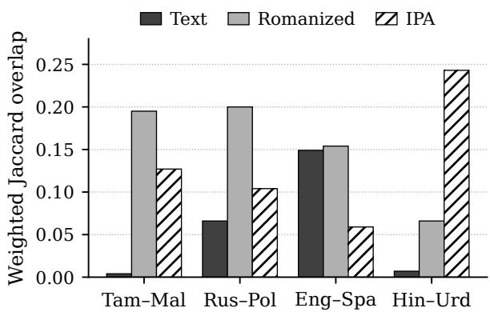
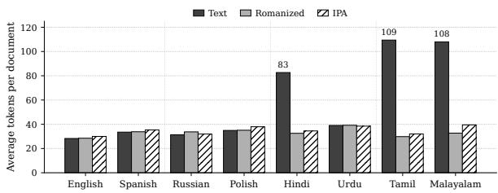
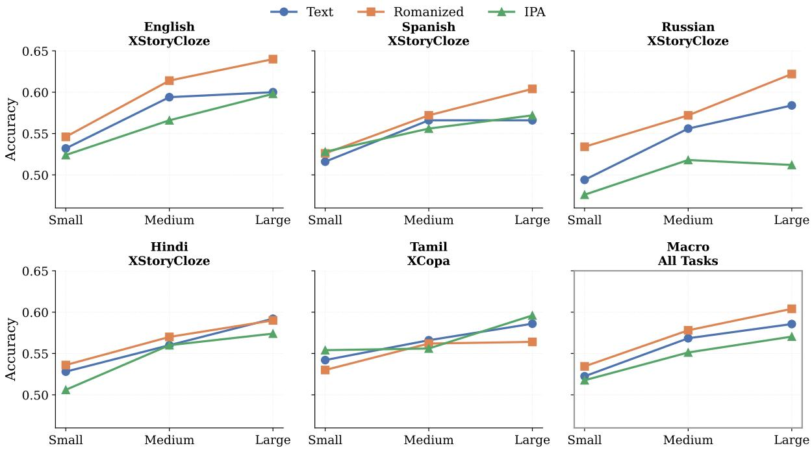
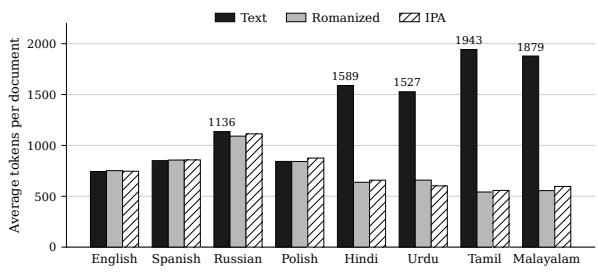
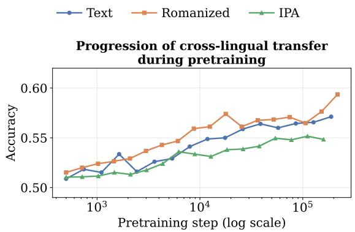

# One Form to Transfer Them All: Pretraining Multilingual Language Models Beyond Native Orthography

Muge Zhang1 Aaron Jencks1 Krishna Badikela1

Yulia Tsvetkov2 Sachin Kumar1

1Department of Computer Science and Engineering, Ohio State University 2Paul G. Allen School of Computer Science & Engineering, University of Washington contact: {zhang.16414,kumar.1145}@osu.edu

## Abstract

Multilingual language models transfer knowledge across languages through shared subword vocabulary, a mechanism that breaks down when related languages use different writing systems. Prior work addresses this via script equalization (romanization or IPA transcrip tion), but direct comparisons are rare; the focus has been on encoder-only models, with most work adapting existing pretrained models. We systematically compare different input representations in autoregressive multilingual pretraining, comparing orthographic text, IPA, and romanization in a controlled setup across three scales (467M, 709M, and 1.03B) on eight languages in four typologically motivated pairs. Across a wide range of downstream tasks on seen and unseen languages, romanized pretraining yields the strongest cross-lingual transfer, and the advantage over text widens with scale. IPA improves over text in most settings but trails romanization. Surprisingly, finetuning a text-pretrained model on romanized data hurts performance on languages already covered by the base model, only marginally helping when the model lacks script coverage. Our results indicate that for multilingual models spanning typologically diverse scripts, to obtain maximum benefits, romanization should be treated as a core design choice applied at pretraining rather than a post hoc fix. Code and datasets will be released upon acceptance.

## 1 Introduction

In multilingual language models (LMs), vocabulary overlap is the primary source of cross-lingual transfer among languages (Conneau et al., 2020; BigScience Workshop et al., 2022; Üstün et al., 2024). When two languages do not share writing systems, this overlap is largely impossible, even for linguistically close languages as the surface form of the text obscures the similarities (Wu and Dredze, 2020; Muller et al., 2021; Stap et al., 2023).

To increase cross-lingual overlap, prior work has explored different methods of script equalization— converting all languages to a shared form (see Figure 1). This is done primarily through two mechanisms. First is romanization (Hermjakob et al., 2018), where non-Latin scripts are mapped to Latin characters using transliteration tools (Purkayastha et al., 2023; Husain et al., 2024; Ebing et al., 2026). Second is phonemization, where text is mapped to phonemic representations such as IPA (International Phonetic Association, 1999), where words that sound alike across different languages would share forms (Nguyen et al., 2023a; Goriely et al., 2024; Jung et al., 2024; Goriely and Buttery, 2025). However, these works have largely focused on improving transfer duringfinetuning with off-theshelf encoder-only models pretrained with orthographic text, almost exclusively on English. Furthermore, both mechanisms have been explored separately but not compared in modern language models, which are dominantly autoregressive.

In this work, we focus on pretraining autoregressive multilingual LMs, comparing both script equalization mechanisms in a controlled setting with orthographic text. We pretrain models from scratch on an eight-language corpus organized into four typologically motivated pairs—English– Spanish, Russian–Polish, Hindi–Urdu, and Tamil– Malayalam—chosen to vary the relationship between orthography and phonology. We train at three scales (467M, 709M, and 1.03B parameters) with each representation, holding architecture, data, vocabulary size, and training procedure constant. We evaluate the trained models under prompting on pretraining-seen languages and under fine-tuning on both seen and unseen languages, covering classification and generative tasks.

We find that romanized pretraining is the strongest configuration in every evaluation regime and at every model size, with the gap from text widening as parameters scale. IPA improves over orthographic text in most settings and matches romanization in the narrow case of Hindi and Urdu, the pair in our corpus that is most phonologically aligned and most orthographically disjoint, but lags romanization on transfer to unseen languages. Surprisingly, the recipe of romanized finetuning applied to a text-pretrained model, reported as beneficial in prior work, instead regresses performance on the languages a multilingual model already covers; we reproduce the prior gains on a controlled English-only setup and show that the recipe helps only when the base model lacks script coverage in the first place. Together, these results indicate that romanization helps by aligning input with the lexical structure the model has internalized during pretraining; the gains it delivers are therefore most effectively captured by adapting romanization at pretraining rather than downstream. Our findings suggest that future work on multilingual modeling should treat the input representation as a deliberate design choice, with romanization as a strong default when transfer to unseen scripts is a priority.

<table><tr><td>Pair</td><td>Original Text</td><td></td><td>IPA</td><td></td><td></td><td>Romanized</td><td></td></tr><tr><td colspan="7">EN Theuniversity is very big. ðə junıV3:sıti ız vεJi bı ES Launiversidad es muy grande. launibersidad es mui yrande Launiversidad es muy grande.</td><td colspan="3">Theuniversi ty is very big.</td></tr><tr><td></td><td>  . PL Nasza kasza jest smaczna.</td><td>naşa kaşa naa kaça</td><td colspan="3">fkusnaja jest smatçna</td><td colspan="4">Nas ha kas ha vkusnaya. Naszakasza jest smaczna.</td></tr><tr><td>TA Q.</td><td colspan="3"></td><td colspan="2">palkalajkkaļakam perijatu</td><td colspan="4">1 palkalaikkazhakam periyathu.</td></tr><tr><td></td><td colspan="3">ML  e.</td><td colspan="2">sarvva kala :fa:la valua:n</td><td colspan="4">sarvvakalaashaala valuthaan.</td></tr><tr><td>HI faT3E言</td><td></td><td>kita:b</td><td>bəhut</td><td>atftfhi:</td><td>hε:</td><td>kitaab</td><td>bahut</td><td>achchhii</td><td>hai</td></tr><tr><td>UR</td><td> $- \infty . \infty . 1 \cup \limits _ { i = 1 } ^ { n } t = 1 5$ </td><td>kita:b</td><td>bəhut</td><td>at∫tħhi:</td><td>hε:</td><td>kitaab</td><td>bahut</td><td>achchhii</td><td>hai</td></tr></table>

Figure 1: Example sentences across four language pairs in original script, IPA, and romanized form. Shared subword tokens are highlighted: blue for original text, gold for IPA, and green for romanized.

## 2 Related Work

Script barrier in multilingual LMs. Multilingual pretrained models (Devlin et al., 2019; Conneau et al., 2020; BigScience Workshop et al., 2022; Aryabumi et al., 2024; Xue et al., 2021; Lin et al., 2022; Grattafiori et al., 2024; Qwen et al., 2024; Yang et al., 2025) transfer well across languages that share scripts but show little improvement or even degrade if not (Wu and Dredze, 2020;

Lauscher et al., 2020). Prior studies identify script mismatch, and hence lack of vocabulary overlap, as the dominant failure mode of transfer to unseen languages (Pires et al., 2019; Muller et al., 2021; Stap et al., 2023). Our work targets this barrier by changing the input representations. Prior work has also shown that amount of vocabulary overlap is not correlated with better performance (Meyer and Buys, 2024; Limisiewicz et al., 2023; K et al., 2020). Our results echo these findings: improvements do not track overlap, and, as an example, English–Spanish transfer holds up under IPA even as their shared vocabulary becomes smaller.

Romanization for cross-lingual transfer. A growing body of work has used romanization to expose lexical overlap that the original orthography hides. Prior work on encoder-only models has shown that transliteration, or romanization, can substantially benefit multilingual learning, particularly for low-resource languages, both in Indic settings and across broader multilingual corpora (Purkayastha et al., 2023; Moosa et al., 2023; Ebing et al., 2026; Jung et al., 2026). More recent work has extended these ideas to decoderonly LMs through continued pretraining and instruction tuning on romanized text (Husain et al., 2024), contrastive alignment (Liu et al., 2024), and tokenizer adaptation for transliterated input (Liu et al., 2025a). We instead pretrain decoder-only autoregressive LMs from scratch on romanized text, performing controlled comparisons with orthographic text to isolate when romanization helps and when it hurts across both finetuning and prompting regimes.

Phonemic representations. A parallel line of work has explored phonemic input as another way to bridge scripts. Nguyen et al. (2023b) introduced XPhoneBERT, a multilingual phoneme-level encoder trained on phoneme sequences from nearly 100 languages for speech-related applications; Jung et al. (2024) showed that phoneme-based models reduce the cross-lingual performance gap; Goriely et al. (2024) pretrained a GPT-2-scale model on phonemized English and found minimal cost on meaning-level tasks. Concurrent work (Miletic´ et al., 2026) compares Text vs. IPA subword tokenizers across 24 languages and pretrains a 240M model, finding IPA improves text compression without changing task performance. Our work extends this study to include romanization, echoing their findings on compression but also find improved downstream performance with both IPA and romanization over text, contrary to their findings.

## 3 Experimental Setup

## 3.1 Language Pairs

We study eight languages organized into four typologically motivated pairs that span a range of orthographic and phonological relationships (see examples in Figure 1).

1. English–Spanish: Both are Latin-scripted with shared cognates and borrowed words.

2. Russian–Polish: Different scripts (Cyrillic vs. Latin), but related Slavic languages with higher phonological overlap.

3. Hindi–Urdu: Different scripts (Devanagari vs. Arabic), but are mutually intelligible in their spoken form (often considered variants of a single language).

4. Tamil–Malayalam: Different scripts but from the same language family (Dravidian), with high phonological similarity.

We choose the last three pairs because they provide varying degrees of phonological and phonetic overlap, and stand to benefit via cross-lingual transfer from shared representations. Pairs such as Hindi– Urdu have minimal orthographic overlap but extensive phonemic overlap, so any benefit from a phonemic representation should be especially visible in such cases. English–Spanish serves as a control where text representation already provides shared subword tokens, where phonemic representations might reduce overlap. We train a single multilingual model jointly on all eight languages; the four pairs serve to organize our analysis and to anchor finer-grained comparisons in subsection C.2.

## 3.2 Pretraining Dataset Construction

For each language pair, we subsample monolingual documents from FineWeb-2 (Penedo et al., 2025), maintaining the word count ratio.1 Each pair-level corpus is sized to match OpenWebText (Gokaslan and Cohen, 2019). This procedure preserves natural within-pair resource imbalance while equalizing budget across pairs. Within each pair, we randomly sample a subset for validation (∼3.2M words per pair with the same ratio). The four bilingual corpora together form our 8-language corpus with ∼21.7B words in total. After tokenization, the word-matched corpus yields 50B Text tokens versus 33B IPA/Romanized tokens, putting IPA/Romanized models at a compute disadvantage and making their gains potentially conservative under FLOP-matched training.

## 3.3 Text Representations

We compare the following setups. In the first three, we pretrain/finetune with the same representation.

Orthographic text. The original text in each language’s native script. For language pairs that share a script (English–Spanish, both Latin), there will be natural token overlap. On the other hand, for language pairs with different scripts (e.g., Russian–Polish, Cyrillic vs. Latin), we expect little overlap, limiting transfer.

IPA transcription. We convert the corpus into IPA using the Phonemizer library (Bernard and Titeux, 2021).2 To further improve cross-lingual overlap, we remove certain diacritics from the transcriptions, including stress marks (", ­) and length marks (:), tone accents, and nasalization such that only phonemic segments remain. This logic makes the representation more coarse-grained, increasing overlap.3 We additionally modify the Phonemizer library to preserve words containing digits or characters outside the source language’s script, which the default pipeline transcribes ambiguously.

Romanization. We romanize all texts using the Uroman library (Hermjakob et al., 2018).4 For languages already in Latin (e.g., English, Spanish, Polish), the romanized form is close to the original but not always identical.5

Text-to-romanized (Text→Rom). In this setup, we finetune our text-pretrained checkpoints on romanized downstream task data, mirroring the standard recipe in prior work (Husain et al., 2024; Purkayastha et al., 2023). This tests whether romanization’s benefits can be recovered downstream, without the cost of romanized pretraining.6

## 3.4 Tokenization

For each representation, we train a single Byte-Level BPE tokenizer (Sennrich et al., 2016; Radford et al., 2019) jointly on the eight-language corpus using the HuggingFace tokenizers library (Hugging Face, 2019).7 We use a vocabulary size of 100K to accommodate the combined character inventory across the eight languages. Keeping vocabulary size constant across representations ensures a controlled comparison in which the only variable is the surface form of the text.

Tokenizer overlap analysis. Before pretraining, we quantify the potential for cross-lingual transfer at the lexical level by measuring how much of each tokenizer’s vocabulary is shared between languages. Two languages tokenized into largely disjoint token sets cannot easily share embeddinglevel representations with limited transfer. Therefore, we expect orthographic tokenizers to show high overlap only for script-sharing pairs (English– Spanish), while IPA and romanization are expected to produce higher overlap across similar languages by collapsing scripts into a common symbol set. We report a corpus-size-normalized, frequencyweighted Jaccard overlap between the unique tokens observed in each language’s monolingual corpus; full details, including the corrections we apply for rare tokens, punctuation artifacts, codeswitching, and corpus-size imbalance, are in Appendix A.

Sequence length analysis. Another consequence of representation choice is how compactly each language’s text is encoded. Sequence-length differences across languages are a source of unfairness in multilingual models. Languages that tokenize into more tokens per document require higher training compute, inference latency, per-token API cost, and consume more of the model’s effective context window (Petrov et al., 2023; Ahia et al., 2023). We therefore measure token sequence length for the three tokenizers as the average number of tokenizer output tokens per document on the FLORES parallel corpus (NLLB Team et al., 2022), which expresses the same content across all eight languages and therefore makes per-document token counts directly comparable across languages.

## 3.5 Pre-training

For each representation, we pretrain a causal language model from scratch. We use a modified version of NanoGPT, modded-nanogpt (Jordan et al., 2024), which incorporates a number of training efficiency improvements over the original (Karpathy, 2022), obtaining better performance.

Architecture. We train models at three scales to study the interaction between model size and representation, summarized in Table 1. Following modded-nanogpt, each model uses value embeddings, which are three additional vocabulary-sized tables whose outputs are mixed into the value projection of the first and last three attention blocks via learned scalars, inspired by the value-residual connections of Zhou et al. (2025). These contribute negligible FLOPs but a large share of parameters; we treat non-embedding parameters as the basis for cross-scale comparison.

Training procedure. All models were trained under a fixed compute budget using a shared optimization setup and checkpoint selection procedure to ensure controlled comparisons across representations.8 We use a dual-optimizer setup: AdamW $( \beta _ { 1 } { = } 0 . 8 , ~ \beta _ { 2 } { = } 0 . 9 5 )$ for embedding, head, and scalar parameters, and Muon (momentum=0.95) for hidden-layer matrix parameters, with a linear cooldown learning-rate schedule (peak Muon learning rate as 0.025). Each training step processes 524,288 tokens across 8 NVIDIA H100 GPUs. Full training details are provided in Appendix B.

<table><tr><td>Size</td><td> $\mathbf { L } / \mathbf { H } / d _ { \mathrm { m o d e l } }$ </td><td>Params</td><td>Non-emb.</td></tr><tr><td>Small</td><td>12 /6 / 768</td><td>467M</td><td>83M</td></tr><tr><td>Medium</td><td>16 / 8 / 1024</td><td>709M</td><td>197M</td></tr><tr><td>Large</td><td>20 / 10 / 1280</td><td>1.03B</td><td>387M</td></tr></table>

Table 1: Model configurations. Each is trained for all three representations.

Bilingual reference models. As controlled references that isolate representation effects on individual language pairs, we additionally train bilingual models on each of the four pairs. These models and their analyses are not part of the main results; we describe them and report their behavior in subsection C.2, where they primarily serve as motivation for the multilingual setting that is our main focus.

## 3.6 Evaluation

We evaluate the models under two regimes: directly prompting the pretrained checkpoints, and supervised fine-tuning on classification and generation tasks. In both settings, we evaluate on languages that were seen during pretraining. To test whether representation effects generalize beyond the training distributions, we finetune on select unseen languages, which include Arabic and French (which share scripts with the pretraining languages) as well as Bengali and Greek (which do not).

Prompting. We score each pretrained model under zero-shot and few-shot setups on two benchmarks: XStoryCloze (Lin et al., 2022) and XCOPA (Ponti et al., 2020). Each benchmark covers a subset of our pretraining languages along with a set of unseen languages, which lets us probe for transfer. Within each ⟨task, language, representation⟩ cell, we score every candidate label by likelihood and predict by argmax: per-token-average loglikelihood for label-word tasks (normalized by the number of candidate tokens) (Zhao et al., 2021) and sum log-likelihood for completion-style multiple choice (Brown et al., 2020; Lin et al., 2022). Label words and structural scaffolding are localized to each cell so that all three representations evaluate identical underlying inputs, and the model never sees out-of-representation tokens mid-prompt.

Fine-tuning. We finetune the pretrained checkpoints on three downstream tasks: natural language inference (XNLI; IndicNLI, Conneau et al., 2018; Aggarwal et al., 2022), multilingual intent classification (MASSIVE, FitzGerald et al., 2023), and multilingual abstractive summarization (XL-Sum, Hasan et al., 2021). The classification tasks jointly cover all eight pretraining and the unseen languages; For XL-Sum, we finetune on English, Spanish, Russian, Hindi, Urdu, and Tamil (other languages were not available). For each ⟨task, representation, scale⟩ cell, both inputs and references (including target summaries) are converted into the corresponding representation using the same Phonemizer and Uroman pipelines as in pretraining. We report macro-F1 for classification tasks and ROUGE-L on XL-Sum. Hyperparameter search and other training details are in Appendix C.

## 4 Results and Discussion

We organize our results into two parts. We first report cross-lingual subword overlap and sequence length results, which provide context for the downstream results (§4.1). We then report downstream performance across pretraining and fine-tuning regimes, on both seen and unseen languages (§4.2). In all result tables, boldface indicates a statistically significant improvement over the baseline under an approximate randomization test $( p < 0 . 0 5 )$ .

## 4.1 Properties of the Three Representations

Subword overlap between languages. Figure 2 reports frequency-weighted subword overlap between the two languages in each typological pair under the shared tokenizer. Under orthographic text, meaningful overlap appears only for the Latinscript English–Spanish pair; the three differentscript pairs sit at or near zero. Romanization lifts two of those three pairs (Russian–Polish and Tamil– Malayalam) into a range comparable to English– Spanish, but does not close the gap for Hindi–Urdu. IPA inverts this pattern: it produces its highest overlap on Hindi–Urdu, where phonology is nearly identical despite disjoint orthographies, but lags romanization on every other pair. Romanization and IPA are therefore not interchangeable. Prior work has reached mixed conclusions on the role of overlap in cross-lingual transfer (K et al., 2020; Limisiewicz et al., 2023; Meyer and Buys, 2024). We also treat overlap as one channel among several.

<table><tr><td></td><td></td><td colspan="8">XNLI</td><td colspan="10"></td></tr><tr><td>Size</td><td>Rep.</td><td>EN</td><td>ES</td><td>HI</td><td>UR</td><td>RU</td><td>PL</td><td>TA</td><td>ML</td><td>Macro</td><td>EN</td><td>ES</td><td>HI</td><td>UR</td><td>RU</td><td>PL</td><td>TA</td><td>ML</td><td>Macro</td></tr><tr><td rowspan="4">Small</td><td>Text</td><td>75.88</td><td>73.78</td><td>64.48</td><td>60.78</td><td>70.89</td><td>79.12</td><td>69.85</td><td>69.84</td><td>69.36</td><td>75.56</td><td>72.62</td><td>71.13</td><td>63.32</td><td>73.10</td><td>71.02</td><td>65.58</td><td>66.16</td><td>69.81</td></tr><tr><td>IPA</td><td>76.22</td><td>73.58</td><td>68.07</td><td>63.73</td><td>69.58</td><td>78.40</td><td>71.11</td><td>70.84</td><td>70.45</td><td>76.87</td><td>74.72</td><td>74.08</td><td>71.63</td><td>71.75</td><td>72.68</td><td>70.17</td><td>69.21</td><td>72.64</td></tr><tr><td>Romanized</td><td>78.99</td><td>76.25</td><td>69.65</td><td>64.98</td><td>73.86</td><td>81.81</td><td>71.80</td><td>72.71</td><td>72.61</td><td>79.90</td><td>77.80</td><td>75.70</td><td>73.70</td><td>77.80</td><td>77.40</td><td>69.80</td><td>71.90</td><td>75.50</td></tr><tr><td>Text→Rom.</td><td>74.67</td><td>71.72</td><td>56.47</td><td>59.11</td><td>62.77</td><td>56.71</td><td>62.23</td><td>64.07</td><td>63.47</td><td>66.17</td><td>62.00</td><td>33.46</td><td>29.32</td><td>41.19</td><td>60.29</td><td>32.15</td><td>37.42</td><td>45.25</td></tr><tr><td rowspan="4">Medium</td><td>Text</td><td>81.98</td><td>79.08</td><td>70.97</td><td>68.75</td><td>70.99</td><td>79.18</td><td>76.87</td><td>75.76</td><td>74.91</td><td>81.98</td><td>80.31</td><td>80.60</td><td>75.31</td><td>80.95</td><td>78.49</td><td>77.64</td><td>80.05</td><td>79.42</td></tr><tr><td>IPA</td><td>81.09</td><td>78.96</td><td>73.08</td><td>68.55</td><td>76.38</td><td>84.30</td><td>75.95</td><td>76.28</td><td>75.76</td><td>82.77</td><td>79.19</td><td>80.97</td><td>78.68</td><td>80.10</td><td>80.65</td><td>76.57</td><td>79.15</td><td>79.76</td></tr><tr><td>Romanized</td><td>83.18</td><td>80.49</td><td>74.20</td><td>70.37</td><td>77.82</td><td>84.20</td><td>76.86</td><td>77.55</td><td>77.21</td><td>83.04</td><td>81.40</td><td>80.06</td><td>77.36</td><td>82.54</td><td>81.45</td><td>76.84</td><td>78.21</td><td>80.11</td></tr><tr><td>Text→Rom.</td><td>82.63</td><td>80.06</td><td>62.95</td><td>58.76</td><td>67.15</td><td>59.10</td><td>65.09</td><td>65.15</td><td>67.61</td><td>74.51</td><td>71.18</td><td>51.48</td><td>47.34</td><td>56.99</td><td>71.12</td><td>44.86</td><td>50.61</td><td>58.51</td></tr><tr><td rowspan="4">Large</td><td>Text</td><td>84.05</td><td>81.40</td><td>76.55</td><td>71.44</td><td>79.88</td><td>88.30</td><td>78.40</td><td>77.37</td><td>79.67</td><td>83.99</td><td>82.21</td><td>84.67</td><td>79.89</td><td>83.59</td><td>82.95</td><td>82.28</td><td>83.96</td><td>82.94</td></tr><tr><td>IPA</td><td>86.61</td><td>83.65</td><td>78.84</td><td>72.08</td><td>80.26</td><td>89.10</td><td>79.72</td><td>78.98</td><td>81.16</td><td>86.75</td><td>83.96</td><td>85.81</td><td>82.48</td><td>84.80</td><td>84.57</td><td>82.55</td><td>84.67</td><td>84.45</td></tr><tr><td>Romanized</td><td>86.69</td><td>84.13</td><td>79.00</td><td>73.23</td><td>81.68</td><td>88.70</td><td>79.80</td><td>79.56</td><td>81.60</td><td>86.42</td><td>85.88</td><td>86.28</td><td>82.72</td><td>86.28</td><td>85.27</td><td>82.28</td><td>84.30</td><td>84.93</td></tr><tr><td>Text→Rom.</td><td>84.33</td><td>81.36</td><td>65.58</td><td>62.75</td><td>70.13</td><td>62.48</td><td>70.88</td><td>65.50</td><td>70.38</td><td>79.05</td><td>75.35</td><td>57.13</td><td>53.19</td><td>61.63</td><td>76.09</td><td>52.49</td><td>57.16</td><td>64.01</td></tr></table>

Table 2: Fine-tuning F1 (%) on the eight pretraining languages. Bold marks the best representation and statistical ties per benchmark, scale, and language. Text→Rom. denotes text-pretrained models fine-tuned on romanized data.

Figure 2: Frequency-weighted subword overlap between languages within each pair under a shared 100K multilingual tokenizer, normalized for corpus size.  
  
Figure 3: Average sequence length (tokens per docu ment) by language and representation on the FLORES parallel corpus.

Sequence length. Figure 3 reports average tokens per document on the FLORES parallel corpus, where the same content is expressed across all eight languages (NLLB Team et al., 2022). Compared to the other five, Hindi, Tamil, and Malayalam tokens inflate under text by factors of roughly three times their romanized counterparts. IPA and romanization compress them back into the same range as the others, consistent with Miletic et al.´ (2026) who report similar compression gains under IPA tokenization. With text, the inflated languages require roughly three times the inference latency and API costs compared with Latin- and Cyrillic-script peers, and romanization and IPA close this gap.

<table><tr><td>Setting</td><td>Size</td><td>Rep.</td><td>AR</td><td>BN</td><td>EL</td><td>FR</td><td>Macro</td></tr><tr><td rowspan="8">ZS</td><td rowspan="4">Small</td><td>Text</td><td>6.84</td><td>0.94</td><td>6.03</td><td>21.97</td><td>8.95</td></tr><tr><td>IPA</td><td>5.66</td><td>10.25</td><td>10.74</td><td>6.96</td><td>8.40</td></tr><tr><td>Romanized</td><td>8.57</td><td>12.87</td><td>10.43</td><td>27.68</td><td>14.89</td></tr><tr><td>Text</td><td>11.06</td><td>2.38</td><td>7.10</td><td>31.22</td><td>12.94</td></tr><tr><td rowspan="3">Medium</td><td>IPA</td><td>7.87</td><td>19.82</td><td>13.50</td><td>13.98</td><td>13.79</td></tr><tr><td>Romanized</td><td>9.34</td><td>22.47</td><td>13.37</td><td>39.29</td><td>21.12</td></tr><tr><td>Text</td><td>15.67</td><td>3.56</td><td>11.60</td><td>36.11</td><td>16.73</td></tr><tr><td rowspan="3">Large</td><td>IPA</td><td>13.01</td><td>25.66</td><td>19.20</td><td>21.49</td><td>19.84</td></tr><tr><td>Romanized</td><td>13.27</td><td>31.24</td><td>19.33</td><td>44.35</td><td>27.05</td></tr><tr><td>Text</td><td>34.63</td><td>30.66</td><td>26.59</td><td>47.35</td><td>34.81</td></tr><tr><td rowspan="6">FT Medium</td><td rowspan="5">Small</td><td>IPA</td><td>35.93</td><td>48.72</td><td>49.15</td><td>45.73</td><td>44.88</td></tr><tr><td>Romanized</td><td>41.14</td><td>48.84</td><td>52.24</td><td>54.41</td><td>49.16</td></tr><tr><td>Text→Rom.</td><td>31.78</td><td>36.63</td><td>40.10</td><td>39.17</td><td>36.92</td></tr><tr><td>Text</td><td>51.87</td><td>51.77</td><td>54.05</td><td>62.15</td><td>54.96</td></tr><tr><td>IPA</td><td>53.68</td><td>59.76</td><td>64.94</td><td>61.21</td><td>59.90</td></tr><tr><td>Romanized</td><td>55.28</td><td>61.13</td><td>65.78</td><td>65.87</td><td>62.02</td></tr><tr><td rowspan="5">Large</td><td>Text→Rom.</td><td>45.24</td><td>49.68</td><td>53.44</td><td>53.76</td><td>50.53</td></tr><tr><td>Text</td><td>57.53</td><td>59.15</td><td>61.47</td><td>67.52</td><td>61.42</td></tr><tr><td>IPA</td><td>61.87</td><td>68.36</td><td>70.98</td><td>68.93</td><td>67.53</td></tr><tr><td>Romanized</td><td>64.69</td><td>70.11</td><td>71.25</td><td>75.62</td><td>70.42</td></tr><tr><td>Text→Rom.</td><td>49.58</td><td>58.58</td><td>61.39</td><td>60.30</td><td>57.46</td></tr></table>

Table 3: Cross-lingual transfer to unseen languages on MASSIVE, F1 (%). Zero-Shot evaluates pretrained models directly; Unseen FT fine-tunes on the unseen language. Bold marks the best representation and its statistical ties per setting, scale, and language.

  
Figure 4: Zero-shot accuracy on XStoryCloze and XCOPA across scales for the three representations. Each panel reports one evaluation language.

<table><tr><td>Size</td><td>Rep.</td><td>EN</td><td>ES</td><td>HI</td><td>RU</td><td>TA</td><td>UR</td><td>Macro</td></tr><tr><td></td><td>Text</td><td>17.47</td><td>15.70</td><td>12.85</td><td>10.91</td><td>3.48</td><td>21.47</td><td>13.65</td></tr><tr><td>Small</td><td>IPA</td><td>11.33</td><td>13.41</td><td>16.66</td><td>9.15</td><td>14.22</td><td>18.76</td><td>12.26</td></tr><tr><td></td><td>Romanized</td><td>20.49</td><td>17.71</td><td>23.97</td><td>15.93</td><td>15.89</td><td>23.23</td><td>19.54</td></tr><tr><td></td><td>Text→Rom.</td><td>20.12</td><td>17.13</td><td>12.31</td><td>8.91</td><td>9.09</td><td>20.09</td><td>14.63</td></tr><tr><td></td><td>Text</td><td>22.10</td><td>20.49</td><td>22.15</td><td>16.54</td><td>12.23</td><td>26.82</td><td>20.06</td></tr><tr><td>Medium</td><td>IPA</td><td>21.00</td><td>18.63</td><td>29.95</td><td>19.74</td><td>20.99</td><td>29.75</td><td>23.34</td></tr><tr><td></td><td>Romanized</td><td>24.04</td><td>20.79</td><td>28.17</td><td>19.75</td><td>20.91</td><td>30.83</td><td>24.08</td></tr><tr><td></td><td>Text→Rom.</td><td>26.51</td><td>22.21</td><td>21.91</td><td>13.02</td><td>10.02</td><td>18.55</td><td>18.73</td></tr><tr><td></td><td>Text</td><td>23.51</td><td>20.79</td><td>22.55</td><td>18.17</td><td>17.36</td><td>29.36</td><td>21.96</td></tr><tr><td>Large</td><td>IPA</td><td>23.96</td><td>21.15</td><td>29.30</td><td>20.31</td><td>22.32</td><td>32.69</td><td>24.95</td></tr><tr><td></td><td>Romanized</td><td>25.52</td><td>21.23</td><td>28.45</td><td>22.17</td><td>22.68</td><td>31.95</td><td>25.33</td></tr><tr><td></td><td>Text→Rom.</td><td>27.18</td><td>22.83</td><td>20.45</td><td>15.56</td><td>13.38</td><td>22.42</td><td>20.30</td></tr></table>

Table 4: XL-Sum summarization, ROUGE-L F1 (%). Bold marks the best representation per scale and language.

## 4.2 Downstream Performance

Multilingual romanized pretraining is the strongest. Pretraining on romanized text produces the strongest cross-lingual transfer across every regime we evaluate: zero- and few-shot in-context learning on XStoryCloze and XCOPA (Figure 4; full k-shot results in Appendix D, Table 12; the same ordering holds at intermediate pretraining checkpoints, ), supervised fine-tuning on NLI and MASSIVE (Table 2) and XL-Sum summarization (Table 4), and transfer to unseen languages on MASSIVE (Table 3) and XNLI (Table 5). The effect holds at all three model scales. Under prompted setups, the gap to text is smaller than under fine-tuning, but the ranking is preserved.

<table><tr><td>Size</td><td>Rep.</td><td>AR</td><td>BN</td><td>EL</td><td>FR</td><td>Macro</td></tr><tr><td rowspan="4">Small</td><td>Text</td><td>61.88</td><td>65.37</td><td>66.02</td><td>66.01</td><td>64.82</td></tr><tr><td>IPA</td><td>61.70</td><td>65.31</td><td>65.74</td><td>64.64</td><td>64.35</td></tr><tr><td>Romanized</td><td>63.61</td><td>67.32</td><td>66.66</td><td>68.25</td><td>66.46</td></tr><tr><td>Text→Rom.</td><td>62.86</td><td>65.25</td><td>65.92</td><td>66.98</td><td>65.25</td></tr><tr><td rowspan="4">Medium</td><td>Text</td><td>63.31</td><td>64.16</td><td>66.38</td><td>69.20</td><td>65.76</td></tr><tr><td>IPA</td><td>63.85</td><td>68.33</td><td>68.24</td><td>67.00</td><td>66.86</td></tr><tr><td>Romanized</td><td>68.89</td><td>72.56</td><td>71.23</td><td>75.07</td><td>71.94</td></tr><tr><td>Text→Rom.</td><td>64.72</td><td>68.11</td><td>68.47</td><td>70.61</td><td>67.98</td></tr><tr><td rowspan="4">Large</td><td>Text</td><td>65.64</td><td>66.16</td><td>68.43</td><td>72.33</td><td>68.14</td></tr><tr><td>IPA</td><td>65.63</td><td>71.54</td><td>70.52</td><td>69.14</td><td>69.21</td></tr><tr><td>Romanized</td><td>71.27</td><td>75.63</td><td>72.74</td><td>78.27</td><td>74.48</td></tr><tr><td>Text→Rom.</td><td>66.59</td><td>69.06</td><td>69.68</td><td>71.78</td><td>69.28</td></tr></table>

Table 5: Cross-lingual transfer to unseen languages on XNLI, F1 (%). Models are fine-tuned on the unseen language’s training set. Bold marks the best representation and its statistical ties per scale and language.

IPA improves over text in most settings we evaluate. This is consistent with Jung et al. (2026), who find that IPA improves over orthographic text in encoder-only models, especially in unseen languages, and contrasts with prior works (Goriely et al., 2024; Bunzeck et al., 2024), who report phoneme-trained language models slightly underperform their text-trained counterparts. Outside Hindi and Urdu, which share little orthography but are nearly identical phonologically, IPA lags romanization, especially on unseen languages.

To our knowledge, no prior work has directly compared phonemic and romanized pretraining for autoregressive LMs; our results provide the first such evidence and show that the two are not interchangeable. We attribute this to two factors: First, Phonemizer’s quality varies across different languages. The phonemization is noisier, especially for low-resource languages (Bernard and Titeux, 2021; Goriely et al., 2024). Second, the phonemized output of an unseen language may also include symbols not produced by the eight pretraining languages, which would compound the problem.

<table><tr><td>Size</td><td>Rep.</td><td>AR</td><td>BN</td><td>FR</td><td>Macro</td></tr><tr><td rowspan="4">Small</td><td>Text</td><td>7.21</td><td>2.64</td><td>16.40</td><td>8.75</td></tr><tr><td>IPA</td><td>4.39</td><td>6.64</td><td>13.29</td><td>8.11</td></tr><tr><td>Romanized</td><td>10.72</td><td>9.08</td><td>17.79</td><td>12.53</td></tr><tr><td>Text→Rom.</td><td>10.06</td><td>6.48</td><td>15.83</td><td>10.79</td></tr><tr><td rowspan="4">Medium</td><td>Text</td><td>10.72</td><td>5.32</td><td>18.37</td><td>11.14</td></tr><tr><td>IPA</td><td>9.25</td><td>9.58</td><td>16.90</td><td>11.91</td></tr><tr><td>Romanized</td><td>12.45</td><td>11.80</td><td>19.57</td><td>14.61</td></tr><tr><td>Text→Rom.</td><td>11.84</td><td>9.54</td><td>17.62</td><td>13.00</td></tr><tr><td rowspan="4">Large</td><td>Text</td><td>12.58</td><td>7.31</td><td>17.38</td><td>12.42</td></tr><tr><td>IPA</td><td>11.29</td><td>11.76</td><td>20.03</td><td>14.36</td></tr><tr><td>Romanized</td><td>15.36</td><td>12.43</td><td>21.43</td><td>16.41</td></tr><tr><td>Text→Rom.</td><td>12.76</td><td>8.99</td><td>18.20</td><td>13.25</td></tr></table>

Table 6: XL-Sum cross-lingual transfer to unseen languages, ROUGE-L F1 (%). Bold marks the best representation per scale and language.

Romanized finetuning a text-pretrained model degrades performance on seen languages. Given the strong results of romanization, a natural intervention is to finetune a text-pretrained model on romanized data, hoping to recover cross-lingual transfer benefits of romanization without paying the cost of romanized pretraining. Husain et al. (2024) report that such an intervention helps when adapting Llama 2 to non-Latin-script languages, and it is the standard recipe in prior romanizationfor-transfer work. We apply this intervention to our multilingual text-pretrained checkpoint. Reported as Text→Rom in Tables 2 and 4, we find that, contrary to expectation, it produces large regressions on all pretraining languages across all benchmarks. On unseen languages where the pretrained model lacks script coverage (Greek and Bengali) in the same sense as an English-only model would, the intervention does help, though by much smaller margins than romanized pretraining. Unseen MAS-SIVE (Table 3) is a partial exception: the benefit holds at the smallest scale but disappears at Medium and Large. We attribute this to MASSIVE being more sensitive to surface-form noise, since intent classification depends on recognizing short trigger phrases that romanization can distort.

Romanized finetuning of a monolingual textpretrained model improves transfer The previous result contradicts prior reports that Text→Rom fine-tuning helps cross-lingual transfer. To further understand the cause of these regressions, we mirror the prior work setup: fine-tuning an Englishonly pretrained model (Radford et al., 2019) on romanized multilingual downstream data. As shown in Table 7, we do recover the improvements reported by prior work, but improvements achieved through this fine-tuning-time intervention fall well short of what pretraining-time romanization delivers, as reported in previous sections. The gains concentrate in languages with absent or rare scripts. Hindi, Urdu, Tamil, and Malayalam gain 20–30 F1 on MASSIVE at larger scales and move from near-zero to 10–15 on XL-Sum. Latin-scripted languages show small, sometimes negative changes.

These findings qualify Husain et al. (2024)’s results: finetuning helps when the base model lacks coverage of the target script, and degrades performance when such coverage already exists. As most modern open-source and open-weight models are multilingual, covering a wide array of scripts, romanized finetuning will likely lead to uneven results. This asymmetry motivates future work on romanized multilingual pretraining at scale.

Taken together, these results produce a consistent ranking: romanizing at pretraining is best, while romanizing at fine-tuning helps when pretraining lacked script coverage and hurts when it established it. This echoes Xhelili et al. (2024) and Liu et al. (2025b), who find that transliteration’s benefits depend on exposing lexical overlap rather than on the operation itself: the same operation supplies overlap when the model lacks script-specific representations and disrupts it when those representations already exist. Characterizing how this plays out in the model’s internal representations is a natural next step that we leave to future work.

## 5 Conclusion

We study input representation as a controlled variable in autoregressive multilingual pretraining, comparing orthographic text, IPA, and Uroman romanization under matched conditions across three scales and eight languages. Romanized pretraining yields the strongest cross-lingual transfer on both seen and unseen languages. IPA improves over text in most settings but only matches romanization on

<table><tr><td></td><td></td><td colspan="8">MASSIVE</td><td colspan="8">XL-Sum</td></tr><tr><td>Backbone</td><td>Rep.</td><td>EN</td><td>ES</td><td>PL</td><td>RU</td><td>HI</td><td>UR</td><td>ML</td><td>TA</td><td>Macro</td><td>EN</td><td>ES</td><td>RU</td><td>HI</td><td>UR</td><td>TA</td><td>Macro</td></tr><tr><td rowspan="2">GPT-2</td><td>Text</td><td>54.0</td><td>30.1</td><td>28.4</td><td>16.6</td><td>9.0</td><td>9.3</td><td>8.7</td><td>5.2</td><td>20.2</td><td>21.67</td><td>14.18</td><td>3.35</td><td>0.47</td><td>0.53</td><td>0.00</td><td>6.66</td></tr><tr><td>Romanized</td><td>44.0</td><td>25.1</td><td>26.9</td><td>20.2</td><td>20.5</td><td>17.1</td><td>23.5</td><td>20.3</td><td>24.7</td><td>21.94</td><td>14.57</td><td>8.46</td><td>10.52</td><td>13.84</td><td>4.53</td><td>12.31</td></tr><tr><td>GPT-2 Medium</td><td>Text Romanized</td><td>69.6 66.1</td><td>47.3 43.3</td><td>43.9 45.3</td><td>22.9 39.0</td><td>14.6 42.7</td><td>12.8 34.0</td><td>10.0</td><td>11.0 35.5</td><td>29.0 43.3</td><td>24.83 24.85</td><td>14.25 14.36</td><td>3.24 9.12</td><td>0.43 10.64</td><td>0.52 14.27</td><td>0.00 4.88</td><td>7.18 13.03</td></tr><tr><td rowspan="2">GPT-2 Large</td><td></td><td></td><td></td><td></td><td></td><td></td><td></td><td>40.2</td><td></td><td></td><td></td><td></td><td></td><td></td><td></td><td></td><td></td></tr><tr><td>Text Romanized</td><td>80.0 77.9</td><td>64.9 61.6</td><td>61.5 62.2</td><td>40.0 59.1</td><td>32.7 56.3</td><td>33.1 53.7</td><td>26.0 60.3</td><td>21.6 56.0</td><td>45.0 60.9</td><td>26.24 26.37</td><td>14.46 15.92</td><td>3.38 8.79</td><td>0.45 10.87</td><td>0.39 14.26</td><td>0.00 4.24</td><td>7.49 13.42</td></tr></table>

Table 7: Fine-tuning English-pretrained GPT-2 checkpoints on MASSIVE (F1, %) and XL-Sum (ROUGE-L, %) under the Text and Romanized conditions. Bold marks the better representation per backbone, benchmark, and language. XL-Sum does not include ML.

Hindi–Urdu, where phonology is shared, and orthography is disjoint. The widely used recipe of fine-tuning a text-pretrained model on romanized data regresses performance on languages the model already covers, and helps only when the base model lacks script coverage. We recommend that future multilingual pretraining treat input representation as a deliberate design decision alongside data mixture and tokenizer, and adopt romanization when transfer to unseen scripts is a priority.

## 6 Limitations

Scale. Due to our limited compute budget, we pretrained models up to approximately 1B parameters (387M non-embedding), substantially smaller than contemporary multilingual language models, which typically range from 7B to over 100B parameters (Aryabumi et al., 2024; Grattafiori et al., 2024; Qwen et al., 2024; Yang et al., 2025). Future work may extend this work to larger scale settings.

Language coverage. We selected language pairs intended to highlight differences in orthography alongside varying degrees of phonetic overlap: English and Spanish, Russian and Polish, Hindi and Urdu, and Tamil and Malayalam. These languages primarily represent alphabetic or abugida-based writing systems. Many other classes of writing systems were not represented in this work, including logographic systems such as Chinese. Expanding this analysis to additional languages and orthographic systems remains an important direction for future work. Future work should also investigate how varying degrees of linguistic relatedness and shared inheritance, such as language family distance, phonological similarity, and the presence or absence of shared loanwords, affect the extent to which different representations improve transfer.

Transcription Quality. Phonemization is an active area of research. We elected to use the Phonemizer library because it provided a practical balance between transcription quality and throughput at the scale required for our corpus. Although we performed small-scale comparisons of different G2P tools, a more comprehensive evaluation of the computational cost introduced by transcription during both training and inference is needed. Improving phonemization could change our reported trends as it pertains to IPA.

Additionally, the authors of eSpeak, the backend framework powering Phonemizer, note that support for several languages remains incomplete or insufficient, which may affect transcription consistency and overall model quality for low-resource or under-supported languages. During preprocessing, we also observed limitations in using standard Unicode representations for IPA tokenization, particularly with regard to handling compound symbols and diacritic composition, which led to stripping of diacritics and stress markers (§3.3). During our analysis, we found evidence that Unicode may not be the best representation for phonemes for this kind of work; however, exploring alternative tokenization or encoding strategies for IPA representations is, therefore, left to future work.

Finally, our approach for IPA stripping and preserving numerical information during transcription (§3.3) relied on a relatively simple heuristic-based system. More sophisticated approaches may improve robustness.

Converting IPA and romanized representations back to text. To be useful in generative settings, a language modeling-based system must operate in orthographic text, as a typical user might not be able to read romanized text or IPA. There has been prior research exploring phoneme-to-grapheme (P2G) conversion (Lauc, 2024; Ma et al., 2025; Masumura et al., 2020). However, we did not evaluate the performance or practicality of these approaches

within our pipeline.

Existing work on P2G also presents several limitations. Both romanization and phonemization are lossy operations. For example, Hermjakob et al. (2018) note that the transformation process is not fully reversible, potentially resulting in information loss during reconstruction. Many of these approaches are language-specific (Shibli et al., 2023; Baruah et al., 2024), though some more generalized approaches have been proposed, such as Sequiera et al. (2014). Evaluating the effectiveness, reversibility, and computational overhead of these systems remains an important direction for future work.

## References

Divyanshu Aggarwal, Vivek Gupta, and Anoop Kunchukuttan. 2022. IndicXNLI: Evaluating multilingual inference for Indian languages. In Proceedings ofthe 2022 Conference on Empirical Methods in Natural Language Processing, pages 10994–11006, Abu Dhabi, United Arab Emirates. Association for Computational Linguistics.

Orevaoghene Ahia, Sachin Kumar, Hila Gonen, Jungo Kasai, David Mortensen, Noah Smith, and Yulia Tsvetkov. 2023. Do all languages cost the same? Tokenization in the era of commercial language models. In Proceedings of the 2023 Conference on Empirical Methods in Natural Language Processing, pages 9904–9923.

Viraat Aryabumi, John Dang, Dwarak Talupuru, Saurabh Dash, David Cairuz, Hangyu Lin, Bharat Venkitesh, Madeline Smith, Jon Ander Campos, Yi Chern Tan, Kelly Marchisio, Max Bartolo, Sebastian Ruder, Acyr Locatelli, Julia Kreutzer, Nick Frosst, Aidan Gomez, Phil Blunsom, Marzieh Fadaee, and 2 others. 2024. Aya 23: Open weight releases to further multilingual progress. Preprint, arXiv:2405.15032.

Hemanta Baruah, Sanasam Ranbir Singh, and Priyankoo Sarmah. 2024. AssameseBackTranslit: Back Transliteration of Romanized Assamese Social Media Text. In Proceedings ofthe 2024 Joint International Conference on Computational Linguistics, Language Resources and Evaluation (LREC-COLING 2024), pages 1627–1637, Torino, Italia. ELRA and ICCL.

Mathieu Bernard and Hadrien Titeux. 2021. Phonemizer: Text to phones transcription for multiple languages in python. Journal of Open Source Software, 6(68):3958.

BigScience Workshop, Teven Le Scao, Angela Fan, Christopher Akiki, Ellie Pavlick, Suzana Ilic, Daniel´ Hesslow, Roman Castagné, Alexandra Sasha Luccioni, François Yvon, and 1 others. 2022. BLOOM:

A 176B-parameter open-access multilingual language model. arXiv preprint arXiv:2211.05100.

Tom B. Brown, Benjamin Mann, Nick Ryder, Melanie Subbiah, Jared Kaplan, Prafulla Dhariwal, Arvind Neelakantan, Pranav Shyam, Girish Sastry, Amanda Askell, Sandhini Agarwal, Ariel Herbert-Voss, Gretchen Krueger, Tom Henighan, Rewon Child, Aditya Ramesh, Daniel M. Ziegler, Jeffrey Wu, Clemens Winter, and 12 others. 2020. Language models are few-shot learners. In Advances in Neural Information Processing Systems 33 (NeurIPS 2020).

Bastian Bunzeck, Daniel Duran, Leonie Schade, and Sina Zarrieß. 2024. Graphemes vs. phonemes: Battling it out in character-based language models. In The 2nd BabyLM Challenge at the 28th Conference on Computational Natural Language Learning, pages 54–64.

Alexis Conneau, Kartikay Khandelwal, Naman Goyal, Vishrav Chaudhary, Guillaume Wenzek, Francisco Guzmán, Edouard Grave, Myle Ott, Luke Zettlemoyer, and Veselin Stoyanov. 2020. Unsupervised cross-lingual representation learning at scale. In Proceedings of the 58th Annual Meeting of the Associationfor Computational Linguistics, pages 8440– 8451, Online. Association for Computational Linguistics.

Alexis Conneau, Ruty Rinott, Guillaume Lample, Adina Williams, Samuel Bowman, Holger Schwenk, and Veselin Stoyanov. 2018. XNLI: Evaluating crosslingual sentence representations. In Proceedings of the 2018 Conference on Empirical Methods in Natural Language Processing, pages 2475–2485, Brussels, Belgium. Association for Computational Linguistics.

Jacob Devlin, Ming-Wei Chang, Kenton Lee, and Kristina Toutanova. 2019. BERT: Pre-training of deep bidirectional transformers for language understanding. In Proceedings ofthe 2019 Conference of the North American Chapter ofthe Associationfor Computational Linguistics (NAACL-HLT).

Benedikt Ebing, Lennart Keller, and Goran Glavaš. 2026. One script instead of hundreds? on pretraining romanized encoder language models. In Findings of the Association for Computational Linguistics: ACL 2026, pages 38291–38307.

eSpeak. espeak languages. https://espeak. sourceforge.net/languages.html. Accessed: 2026-05-24.

Jack FitzGerald, Christopher Hench, Charith Peris, Scott Mackie, Kay Rottmann, Ana Sanchez, Aaron Nash, Liam Urbach, Vishesh Kakarala, Richa Singh, Swetha Ranganath, Laurie Crist, Misha Britan, Wouter Leeuwis, Gokhan Tur, and Prem Natarajan. 2023. MASSIVE: A 1M-example multilingual natural language understanding dataset with 51 typologically-diverse languages. In Proceedings of the 61st Annual Meeting of the Association for

Computational Linguistics (Volume 1: Long Papers), pages 4277–4302, Toronto, Canada. Association for Computational Linguistics.

Aaron Gokaslan and Vanya Cohen. 2019. Openwebtext corpus. http://Skylion007.github.io/ OpenWebTextCorpus.

Zébulon Goriely and Paula Buttery. 2025. Ipa childes & g2p+: Feature-rich resources for cross-lingual phonology and phonemic language modeling. In Proceedings ofthe 29th Conference on Computational Natural Language Learning, pages 502–521.

Zébulon Goriely, Richard Diehl Martinez, Andrew Caines, Paula Buttery, and Lisa Beinborn. 2024. From babble to words: Pre-training language models on continuous streams of phonemes. In Proceedings of the BabyLM Challenge at the 28th Conference on Computational Natural Language Learning (CoNLL).

Aaron Grattafiori, Abhimanyu Dubey, Abhinav Jauhri, Abhinav Pandey, Abhishek Kadian, Ahmad Al-Dahle, Aiesha Letman, Akhil Mathur, Alan Schelten, Alex Vaughan, and 1 others. 2024. The llama 3 herd of models. Preprint, arXiv:2407.21783.

Tahmid Hasan, Abhik Bhattacharjee, Md. Saiful Islam, Kazi Mubasshir, Yuan-Fang Li, Yong-Bin Kang, M. Sohel Rahman, and Rifat Shahriyar. 2021. XLsum: Large-scale multilingual abstractive summarization for 44 languages. In Findings of the Association for Computational Linguistics: ACL-IJCNLP 2021, pages 4693–4703, Online. Association for Computational Linguistics.

Ulf Hermjakob, Jonathan May, and Kevin Knight. 2018. Out-of-the-box universal Romanization tool uroman. In Proceedings ofACL 2018, System Demonstrations, pages 13–18, Melbourne, Australia. Association for Computational Linguistics.

Jordan Hoffmann, Sebastian Borgeaud, Arthur Mensch, Elena Buchatskaya, Trevor Cai, Eliza Rutherford, Diego de Las Casas, Lisa Anne Hendricks, Johannes Welbl, Aidan Clark, Tom Hennigan, Eric Noland, Katie Millican, George van den Driessche, Bogdan Damoc, Aurelia Guy, Simon Osindero, Karen Simonyan, Erich Elsen, and 3 others. 2022. Training compute-optimal large language models. In Advances in Neural Information Processing Systems, volume 35, pages 30016–30030.

Hugging Face. 2019. Tokenizers: Fast state-of-the-art tokenizers. Accessed 2026-02-15.

Jaavid Aktar Husain, Raj Dabre, Aswanth Kumar, Jay Gala, Thanmay Jayakumar, Ratish Puduppully, and Anoop Kunchukuttan. 2024. RomanSetu: Efficiently unlocking multilingual capabilities of large language models via romanization. In Proceedings of the 62nd Annual Meeting of the Association for Computational Linguistics (ACL).

International Phonetic Association. 1999. Handbook of the International Phonetic Association: A guide to the use of the International Phonetic Alphabet. Cambridge University Press.

Keller Jordan, Jeremy Bernstein, Brendan Rappazzo, @fernbear.bsky.social, Boza Vlado, You Jiacheng, Franz Cesista, Braden Koszarsky, and @Grad62304977. 2024. modded-nanogpt: Speedrunning the nanogpt baseline.

Haeji Jung, Jinju Kim, Kyungjin Kim, Youjeong Roh, and David R Mortensen. 2026. Happiness is sharing a vocabulary: A study of transliteration methods. In Proceedings ofthe 19th Conference ofthe European Chapter of the Association for Computational Linguistics (Volume 1: Long Papers), pages 7797–7816.

Haeji Jung, Changdae Oh, Jooeon Kang, Jimin Sohn, Kyungwoo Song, Jinkyu Kim, and David R. Mortensen. 2024. Mitigating the linguistic gap with phonemic representations for robust cross-lingual transfer. In Proceedings of the 4th Workshop on Multi-lingual Representation Learning (MRL) at EMNLP.

Karthikeyan K, Zihan Wang, Stephen Mayhew, and Dan Roth. 2020. Cross-lingual ability of multilingual bert: An empirical study. Preprint, arXiv:1912.07840.

Andrej Karpathy. 2022. NanoGPT. https://github. com/karpathy/nanoGPT.

Davor Lauc. 2024. Polyipa – multilingual phonemeto-grapheme conversion model. Preprint, arXiv:2412.09102.

Anne Lauscher, Vinit Ravishankar, Ivan Vulic, and´ Goran Glavaš. 2020. From zero to hero: On the limitations of zero-shot language transfer with multilingual transformers. In Proceedings of the 2020 Conference on Empirical Methods in Natural Language Processing (EMNLP).

Tomasz Limisiewicz, Jiˇrí Balhar, and David Marecek.ˇ 2023. Tokenization impacts multilingual language modeling: Assessing vocabulary allocation and overlap across languages. In Findings ofthe Association for Computational Linguistics: ACL 2023, pages 5661–5681, Toronto, Canada. Association for Computational Linguistics.

Xi Victoria Lin, Todor Mihaylov, Mikel Artetxe, Tianlu Wang, Shuohui Chen, Daniel Simig, Myle Ott, Naman Goyal, Shruti Bhosale, Jingfei Du, Ramakanth Pasunuru, Sam Shleifer, Punit Singh Koura, Vishrav Chaudhary, Brian O’Horo, Jeff Wang, Luke Zettlemoyer, Zornitsa Kozareva, Mona Diab, and 2 others. 2022. Few-shot learning with multilingual generative language models. In Proceedings ofthe 2022 Conference on Empirical Methods in Natural Language Processing, pages 9019–9052, Abu Dhabi, United Arab Emirates. Association for Computational Linguistics.

Yihong Liu, Chunlan Ma, Haotian Ye, and Hinrich Schuetze. 2024. Translico: A contrastive learning framework to address the script barrier in multilingual pretrained language models. In Proceedings of the 62nd Annual Meeting of the Association for Computational Linguistics (Volume 1: Long Papers), pages 2476–2499.

Yihong Liu, Chunlan Ma, Haotian Ye, and Hinrich Schütze. 2025a. Transmi: A framework to create strong baselines from multilingual pretrained language models for transliterated data. In Proceedings of the 31st International Conference on Computational Linguistics, pages 469–495.

Yihong Liu, Mingyang Wang, Amir Hossein Kargaran, Ayyoob ImaniGooghari, Orgest Xhelili, Haotian Ye, Chunlan Ma, François Yvon, and Hinrich Schütze. 2025b. How transliterations improve crosslingual alignment. In Proceedings ofthe 31st International Conference on Computational Linguistics, pages 2417–2433.

Te Ma, Min Bi, Saierdaer Yusuyin, Hao Huang, and Zhijian Ou. 2025. Llm-based phoneme-to-grapheme for phoneme-based speech recognition. Preprint, arXiv:2506.04711.

Ryo Masumura, Naoki Makishima, Mana Ihori, Akihiko Takashima, Tomohiro Tanaka, and Shota Orihashi. 2020. Phoneme-to-Grapheme Conversion Based Large-Scale Pre-Training for End-to-End Automatic Speech Recognition. In Interspeech 2020, pages 2822–2826. ISCA.

Francois Meyer and Jan Buys. 2024. A systematic analysis of subwords and cross-lingual transfer in multilingual translation. In Findings ofthe Association for Computational Linguistics: NAACL 2024, pages 2194–2200, Mexico City, Mexico. Association for Computational Linguistics.

Milan Miletic, Julie Kallini, and Ekaterina Shutova.´ 2026. Phonemes to the rescue: Multilingual tokenization based on international phonetic alphabet. In Proceedings of the 64th Annual Meeting of the Associationfor Computational Linguistics (Volume 1: Long Papers), pages 40323–40349.

Ibraheem Muhammad Moosa, Mahmud Elahi Akhter, and Ashfia Binte Habib. 2023. Does transliteration help multilingual language modeling? In Findings of the Association for Computational Linguistics: EACL 2023, pages 670–685, Dubrovnik, Croatia. Association for Computational Linguistics.

David R. Mortensen, Siddharth Dalmia, and Patrick Littell. 2018. Epitran: Precision G2P for many languages. In Proceedings ofthe Eleventh International Conference on Language Resources and Evaluation (LREC 2018), Miyazaki, Japan. European Language Resources Association (ELRA).

Benjamin Muller, Antonios Anastasopoulos, Benoît Sagot, and Djamé Seddah. 2021. When being unseen from mBERT is just the beginning: Handling

new languages with multilingual language models. In Proceedings ofthe 2021 Conference ofthe North American Chapter of the Association for Computational Linguistics (NAACL-HLT).

Hoang H. Nguyen, Chenwei Zhang, Tao Zhang, Eugene Rohrbaugh, and Philip S. Yu. 2023a. Enhancing cross-lingual transfer via phonemic transcription integration. In Findings ofthe Associationfor Computational Linguistics: ACL 2023.

Linh The Nguyen, Thinh Pham, and Dat Quoc Nguyen. 2023b. Xphonebert: A pre-trained multilingual model for phoneme representations for text-tospeech. arXiv preprint arXiv:2305.19709.

NLLB Team, Marta R. Costa-jussà, James Cross, Onur Çelebi, Maha Elbayad, Kenneth Heafield, Kevin Heffernan, Elahe Kalbassi, Janice Lam, Daniel Licht, Jean Maillard, Anna Sun, Skyler Wang, Guillaume Wenzek, Al Youngblood, Bapi Akula, Loic Barrault, Gabriel Mejia Gonzalez, Prangthip Hansanti, and 20 others. 2022. No language left behind: Scaling human-centered machine translation. Preprint, arXiv:2207.04672.

Guilherme Penedo, Hynek Kydlícek, Vinko Sabolˇ cec,ˇ Bettina Messmer, Negar Foroutan, Amir Hossein Kargaran, Colin Raffel, Martin Jaggi, Leandro Von Werra, and Thomas Wolf. 2025. Fineweb2: One pipeline to scale them all–adapting pre-training data processing to every language. arXiv preprint arXiv:2506.20920.

Ben Peters, Jon Dehdari, and Josef van Genabith. 2017. Massively multilingual neural grapheme-to-phoneme conversion. In Proceedings ofthe First Workshop on Building Linguistically Generalizable NLP Systems, pages 19–26.

Aleksandar Petrov, Emanuele La Malfa, Philip Torr, and Adel Bibi. 2023. Language model tokenizers introduce unfairness between languages. Advances in neural information processing systems, 36:36963– 36990.

Telmo Pires, Eva Schlinger, and Dan Garrette. 2019. How multilingual is multilingual BERT? In Proceedings of the 57th Annual Meeting of the Association for Computational Linguistics, pages 4996–5001, Florence, Italy. Association for Computational Linguistics.

Edoardo Maria Ponti, Goran Glavaš, Olga Majewska, Qianchu Liu, Ivan Vulic, and Anna Korhonen. 2020.´ XCOPA: A multilingual dataset for causal commonsense reasoning. In Proceedings of the 2020 Conference on Empirical Methods in Natural Language Processing (EMNLP), pages 2362–2376, Online. Association for Computational Linguistics.

Sukannya Purkayastha, Sebastian Ruder, Jonas Pfeiffer, Iryna Gurevych, and Ivan Vulic. 2023.´ Romanization-based large-scale adaptation of multilingual language models. In Findings of the Association for Computational Linguistics: EMNLP 2023.

Qwen, An Yang, Baosong Yang, Beichen Zhang, Binyuan Hui, Bo Zheng, Bowen Yu, Chengyuan Li, Dayiheng Liu, Fei Huang, Haoran Wei, Huan Lin, Jian Yang, Jianhong Tu, Jianwei Zhang, Jianxin Yang, Jiaxi Yang, Jingren Zhou, Junyang Lin, and 24 others. 2024. Qwen2.5 technical report. Preprint, arXiv:2412.15115.

Alec Radford, Jeffrey Wu, Rewon Child, David Luan, Dario Amodei, and Ilya Sutskever. 2019. Language models are unsupervised multitask learners. OpenAI. Accessed: 2024-11-15.

Rico Sennrich, Barry Haddow, and Alexandra Birch. 2016. Neural machine translation of rare words with subword units. In Proceedings of the 54th Annual Meeting of the Association for Computational Linguistics (Volume 1: Long Papers), pages 1715–1725.

Royal Denzil Sequiera, Shashank S Rao, and B. R. Shambavi. 2014. Word-Level Language Identification and Back Transliteration of Romanized Text. In Proceedings of the 6th Annual Meeting of the Forumfor Information Retrieval Evaluation, FIRE ’14, pages 70–73, New York, NY, USA. Association for Computing Machinery.

G. M. Shahariar Shibli, Md. Tanvir Rouf Shawon, Anik Hassan Nibir, Md. Zabed Miandad, and Nibir Chandra Mandal. 2023. Automatic back transliteration of Romanized Bengali (Banglish) to Bengali. Iran Journal ofComputer Science, 6(1):69– 80.

David Stap, Vlad Niculae, and Christof Monz. 2023. Viewing knowledge transfer in multilingual machine translation through a representational lens. In Findings of the Association for Computational Linguistics: EMNLP 2023, pages 14973–14987, Singapore. Association for Computational Linguistics.

Ahmet Üstün, Viraat Aryabumi, Zheng Xin Yong, Wei-Yin Ko, Daniel D’souza, Gbemileke Onilude, Neel Bhandari, Shivalika Singh, Hui-Lee Ooi, Amr Kayid, and 1 others. 2024. Aya model: An instruction finetuned open-access multilingual language model. In Proceedings ofthe 62nd Annual Meeting ofthe Association for Computational Linguistics (Volume 1: Long Papers), pages 15894–15939.

Shijie Wu and Mark Dredze. 2020. Are all languages created equal in multilingual BERT? In Proceedings ofthe 5th Workshop on Representation Learningfor NLP (RepL4NLP) at ACL.

Orgest Xhelili, Yihong Liu, and Hinrich Schuetze. 2024. Breaking the script barrier in multilingual pretrained language models with transliteration-based post-training alignment. In Findings of the Associationfor Computational Linguistics: EMNLP 2024, pages 11283–11296, Miami, Florida, USA. Association for Computational Linguistics.

Linting Xue, Noah Constant, Adam Roberts, Mihir Kale, Rami Al-Rfou, Aditya Siddhant, Aditya Barua, and Colin Raffel. 2021. mT5: A massively multilingual

pre-trained text-to-text transformer. In Proceedings of the 2021 Conference of the North American Chapter ofthe Associationfor Computational Linguistics: Human Language Technologies, pages 483–498, Online. Association for Computational Linguistics.

An Yang, Anfeng Li, Baosong Yang, Beichen Zhang, Binyuan Hui, Bo Zheng, Bowen Yu, Chang Gao, Chengen Huang, Chenxu Lv, Chujie Zheng, Dayiheng Liu, Fan Zhou, Fei Huang, Feng Hu, Hao Ge, Haoran Wei, Huan Lin, Jialong Tang, and 41 others. 2025. Qwen3 technical report. Preprint, arXiv:2505.09388.

Zihao Zhao, Eric Wallace, Shi Feng, Dan Klein, and Sameer Singh. 2021. Calibrate before use: Improving few-shot performance of language models. In International conference on machine learning, pages 12697–12706. Pmlr.

Zhanchao Zhou, Tianyi Wu, Zhiyun Jiang, Fares Obeid, and Zhenzhong Lan. 2025. Value residual learning. In Proceedings of the 63rd Annual Meeting of the Association for Computational Linguistics (Volume 1: Long Papers), pages 28341–28356, Vienna, Austria. Association for Computational Linguistics.

## A Tokenizer Overlap Computation Details

We compute cross-lingual subword overlap as follows. Given the multilingual tokenizer and two languages $L _ { 1 }$ and $L _ { 2 }$ , we tokenize each language’s monolingual corpus separately and let $T _ { L _ { i } }$ denote the set of unique tokens observed in $L _ { i }$ . The simplest measure of shared vocabulary is the Jaccard index over these token sets:

$$
J ( L _ { 1 } , L _ { 2 } ) = { \frac { | T _ { L _ { 1 } } \cap T _ { L _ { 2 } } | } { | T _ { L _ { 1 } } \cup T _ { L _ { 2 } } | } } .\tag{1}
$$

Higher values indicate greater shared vocabulary and, by the argument in section 3.4, greater potential for transfer through shared embeddings (Conneau et al., 2020).

Raw Jaccard, however, is sensitive to several confounds: rare tokens contribute equally to common ones, punctuation and whitespace artifacts inflate apparent overlap, code-switched lines leak tokens across languages, and unequal corpus sizes bias the unique-token counts. We therefore complement raw Jaccard with an adjusted variant that applies four corrections. First, we filter for contamination by retaining only documents whose language tag matches the target language and removing code-switched or noisy lines (motivated by language-switch warnings observed during preprocessing). Second, we exclude punctuation- and whitespace-only tokens, which would otherwise dominate the intersection. Third, we replace setbased Jaccard with a frequency-aware weighted variant that weights each token by its actual usage in the two corpora:

<table><tr><td>Representation</td><td>Small</td><td>Medium</td><td>Large</td></tr><tr><td>Text</td><td>1.365</td><td>1.043</td><td>0.868</td></tr><tr><td>IPA</td><td>1.143</td><td>0.899</td><td>0.818</td></tr><tr><td>Romanized</td><td>1.087</td><td>0.862</td><td>0.775</td></tr></table>

Table 8: Multilingual pretraining bits per character by representation across scales. Values are not directly comparable across representations.
<table><tr><td>Rep.</td><td>ENG-SPA</td><td>HIN-URD</td><td>RUS-POL</td><td>TAM-MAL</td></tr><tr><td>IPA (stripped)</td><td>0.989</td><td>0.897</td><td>0.893</td><td>0.872</td></tr><tr><td>Text (orig.)</td><td>0.994</td><td>0.703</td><td>0.997</td><td>1.044</td></tr><tr><td>Phonemes</td><td>0.992</td><td>0.650</td><td>0.786</td><td>0.712</td></tr><tr><td>Romanized</td><td>0.945</td><td>0.735</td><td>0.937</td><td>0.808</td></tr></table>

Table 9: Pretraining bits-per-character (BPC) across input representations and language pairs at the Small scale. Bold indicates the best representation per language pair. Lower is better.

$$
J _ { w } ( L _ { 1 } , L _ { 2 } ) = \frac { \sum _ { t } \operatorname* { m i n } ( c _ { L _ { 1 } } ( t ) , c _ { L _ { 2 } } ( t ) ) } { \sum _ { t } \operatorname* { m a x } ( c _ { L _ { 1 } } ( t ) , c _ { L _ { 2 } } ( t ) ) } ,\tag{2}
$$

where $c _ { L _ { i } } ( t )$ is the count of token t in the corpus of $L _ { i }$ . This downweights tokens that are technically shared but rare in one language. Fourth, we control for corpus-size imbalance by sampling matched token budgets per language and averaging the resulting overlap over multiple random samples.

## B Pretraining details

Training procedure. We use a dual-optimizer setup: AdamW $( \beta _ { 1 } { = } 0 . 8 , ~ \beta _ { 2 } { = } 0 . 9 5 )$ for embedding, head, and scalar parameters, and Muon (momentum=0.95) for hidden-layer matrix parameters, with a linear cooldown learning-rate schedule (peak Muon learning rate as 0.025). Each training step processes 524,288 tokens across 8 NVIDIA H100 GPUs. We train each model for 3 epochs over the training split of the pretraining corpus, and select the checkpoint with the lowest validation loss on the held-out split for downstream evaluation.

Bits per character. We report multilingual pretraining bits per character (BPC) by representation across model scales in Table 8, and bilingual pretraining BPC at the per-pair level in Table 9 and Table 10 for small and medium models, respectively. We caution that BPC values normalized by representation-specific characters are not directly comparable across representations with different vocabularies and surface forms, since the denominator differs across configurations. We report these numbers for completeness and as evidence that all configurations trained successfully; we do not draw cross-representation conclusions from them, and rely instead on downstream task performance (§4.2) as the operational measure of pretraining quality.

<table><tr><td>Rep.</td><td>ENG-SPA</td><td>HIN-URD</td><td>RUS-POL</td><td>TAM-MAL</td></tr><tr><td>IPA (stripped)</td><td>0.838</td><td>0.765</td><td>0.723</td><td>0.759</td></tr><tr><td>Text (orig.)</td><td>0.857</td><td>0.509</td><td>0.823</td><td>0.784</td></tr><tr><td>Phonemes</td><td>0.828</td><td>0.556</td><td>0.650</td><td>0.618</td></tr><tr><td>Romanized</td><td>0.812</td><td>0.649</td><td>0.783</td><td>0.704</td></tr></table>

Table 10: Pretraining bits-per-character (BPC) across input representations and language pairs at the Medium scale. Bold indicates the best representation per language pair. Lower is better.

  
Figure 5: Average sequence length (tokens per document) by language and representation on the pretraining corpus.

Pretraining-corpus sequence lengths. Figure 5 reports average tokens per document on our pretraining corpus, FineWeb-2.

Compared to the four Latin- and Cyrillic-script languages, Hindi, Urdu, Tamil, and Malayalam tokens inflate under text by factors of roughly 2.5–3.5 times their romanized counterparts, with the largest gaps for Tamil and Malayalam. IPA and romanization compress them back into the same range as the others. Under a fixed per-step token budget, text models therefore cover 2.5–3.5 times fewer documents per step in these four languages than IPA or romanized models do, and romanization and IPA close this gap during training.

## C Fine-tuning Details

## C.1 Training Procedure

For each (task, representation, scale) cell, we perform a grid search over learning rate ∈ $\{ 5 \times 1 0 ^ { - 5 } , 1 { \times } 1 0 ^ { - 4 } , 2 { \times } 1 0 ^ { - 4 } , 3 { \times } 1 0 ^ { - 4 } \}$ and batch size ∈ {128, 256}, training for three epochs with linear warmup and decay. We select hyperparameters based on the lowest validation loss. For seen languages, we fine-tune jointly across all languages in a single multilingual run; for unseen languages, we fine-tune a separate model per language.

## C.2 Bilingual Downstream Results

Table 11: Bilingual cross-lingual transfer F1 at the small model scale. Each cell reports the best F1 across transfer directions and hyperparameters. Bold marks the best representation per language pair.
<table><tr><td>Dataset</td><td>Pair</td><td>Text</td><td>IPA</td><td>Rom.</td></tr><tr><td rowspan="3">XNLI</td><td>Eng-Spa</td><td>0.85</td><td>0.81</td><td>0.86</td></tr><tr><td>Hin-Urd</td><td>0.34</td><td>0.64</td><td>0.51</td></tr><tr><td>Rus-Pol</td><td>0.35</td><td>0.40</td><td>0.43</td></tr><tr><td>IndicXNLI</td><td>Tam-Mal</td><td>0.68</td><td>0.68</td><td>0.71</td></tr><tr><td rowspan="3">MASSIVE</td><td>Eng-Spa Hin-Urd</td><td>0.588 0.030</td><td>0.332 0.400</td><td>0.578</td></tr><tr><td>Tam-Mal</td><td>0.213</td><td>0.500</td><td>0.040 0.573</td></tr><tr><td>Rus-Pol</td><td>0.490</td><td>0.480</td><td>0.610</td></tr></table>

Table 11 reports cross-lingual transfer performance for bilingual models at a small scale. These results informed the design of our multilingual experiments presented in the main body.

Romanization or IPA outperforms text on seven of eight (dataset, pair) settings; text wins only on MASSIVE Eng–Spa, the one pair that already shares Latin script. The gaps are largest for relatedlanguage pairs with disjoint scripts, where text often collapses to near-zero F1 while IPA and romanization recover substantial transfer. Romanization is the most consistent winner across settings, while IPA’s largest gains concentrate on Hin–Urd, the pair with the closest phonological overlap and the most disjoint scripts.

## D In-Context Learning

## D.1 Full k-shot results

Table 12 reports the same evaluations as the maintext figure across three scales (Small, Medium, Large) and four shot counts (k=0, 1, 2, 4). Three patterns hold across the full table. First, few-shot demonstrations provide little reliable improvement over zero-shot: within-scale variation across k is small and often non-monotonic, while increasing model scale yields consistent gains for representations trained from scratch in the target surface form. Second, IPA’s gap relative to text and romanization persists across k values, indicating that its ICL deficit is a property of the representation rather than an artifact of the zero-shot setting. Third, the text→rom rows—text-pretrained models evaluated on romanized inputs at inference time—generally underperform the same models evaluated on text, and gain less from added demonstrations or scale than the matched-representation configurations do; an inference-time surface-form mismatch is not rescued by in-context examples.

  
Figure 6: Zero-shot cross-lingual transfer accuracy on XStoryCloze and XCOPA at intermediate pretraining checkpoints (medium models, log-scale x-axis).

## D.2 Progression of cross-lingual transfer during pretraining

To test whether a shared surface form speeds convergence rather than only raising final accuracy, we evaluate cross-lingual transfer at intermediate pretraining checkpoints (Figure 6). The ordering is stable almost from the outset: romanized > text > IPA at nearly every checkpoint. The gaps do not close as training proceeds. Romanization’s advantage is persistent.

## E Impact of the Tokenizer Integer-Overflow Bug

All results in the main paper are reported with tokenizers trained using the tokenizers library. The tokenizers library (Hugging Face, 2019) accumulates byte-pair frequencies in a signed 32-bit integer during BPE training, so pairs occurring more than $2 ^ { 3 1 }$ times overflow and are dropped or mis-ranked.9 We patched the accumulator to 64-bit, verified byteidentical output below the threshold, and retrained the tokenizers and affected models. Then we reevaluated on MASSIVE fine-tuning and zero-shot prompting. Re-running the remaining evaluations (XNLI, XL-Sum) was beyond our compute budget.

<table><tr><td></td><td></td><td></td><td colspan="4">Small</td><td colspan="4">Medium</td><td colspan="4">Large-std</td></tr><tr><td>Task</td><td>Lang</td><td>Repr.</td><td>k=0</td><td>k=1</td><td>k=2</td><td>k=4</td><td>k=0</td><td>k=1</td><td>k=2</td><td>k=4</td><td>k=0</td><td>k=1</td><td>k=2</td><td>k=4</td></tr><tr><td rowspan="3">XStoryCloze en</td><td rowspan="3"></td><td>text</td><td>.532</td><td>.540</td><td>.552</td><td>.524</td><td>.594</td><td>.596</td><td>.600</td><td>.594</td><td>.600</td><td>.606</td><td>.610</td><td>.612</td></tr><tr><td>romanized</td><td>.546</td><td>.550</td><td>.552</td><td>.522</td><td>.614</td><td>.602</td><td>.618</td><td>.604</td><td>.640</td><td>.612</td><td>.622</td><td>.622</td></tr><tr><td>ipa</td><td>.524</td><td>.520</td><td>.524</td><td>.514</td><td>.566</td><td>.564</td><td>.570</td><td>.572</td><td>.598</td><td>.604</td><td>.590</td><td>.612</td></tr><tr><td rowspan="4">XStoryCloze es</td><td rowspan="4"></td><td>text</td><td>.516</td><td>.508</td><td>.514</td><td>.502</td><td>.566</td><td>.552</td><td>.556</td><td>.538</td><td>.566</td><td>.568</td><td>.568</td><td>.570</td></tr><tr><td>romanized</td><td>.526</td><td>.520</td><td>.520</td><td>.486</td><td>.572</td><td>.576</td><td>.568</td><td>.590</td><td>.604</td><td>.592</td><td>.604</td><td>.592</td></tr><tr><td>ipa</td><td>.528</td><td>.520</td><td>.526</td><td>.520</td><td>.556</td><td>.572</td><td>.562</td><td>.566</td><td>.572</td><td>.590</td><td>.590</td><td>.584</td></tr><tr><td>text→rom</td><td>.514</td><td>.506</td><td>.516</td><td>.492</td><td>.550</td><td>.540</td><td>.542</td><td>.542</td><td>.576</td><td>.558</td><td>.566</td><td>.580</td></tr><tr><td rowspan="4">XStoryCloze ru</td><td rowspan="4"></td><td>text</td><td>.494</td><td>.498</td><td>.488</td><td>.496</td><td>.556</td><td>.560</td><td>.560</td><td>.554</td><td>.584</td><td>.580</td><td>.582</td><td>.588</td></tr><tr><td>romanized</td><td>.534</td><td>.520</td><td>.520</td><td>.494</td><td>.572</td><td>.568</td><td>.574</td><td>.562</td><td>.622</td><td>.618</td><td>.622</td><td>.624</td></tr><tr><td>ipa</td><td>.476</td><td>.472</td><td>.478</td><td>.460</td><td>.518</td><td>.510</td><td>.508</td><td>.514</td><td>.512</td><td>.514</td><td>.520</td><td>.516</td></tr><tr><td>text→rom</td><td>.456</td><td>.456</td><td>.456</td><td>.454</td><td>.458</td><td>.464</td><td>.456</td><td>.472</td><td>.448</td><td>.464</td><td>.462</td><td>.478</td></tr><tr><td rowspan="4">XStoryCloze hi</td><td rowspan="4"></td><td>text</td><td>.528</td><td>.502</td><td>.504</td><td>.470</td><td>.560</td><td>.570</td><td>.570</td><td>.584</td><td>.592</td><td>.568</td><td>.568</td><td>.566</td></tr><tr><td>romanized</td><td>.536</td><td>.540</td><td>.536</td><td>.526</td><td>.570</td><td>.572</td><td>.566</td><td>.558</td><td>.590</td><td>.568</td><td>.576</td><td>.580</td></tr><tr><td>ipa</td><td>.506</td><td>.504</td><td>.486</td><td>.476</td><td>.560</td><td>.568</td><td>.556</td><td>.564</td><td>.574</td><td>.584</td><td>.566</td><td>.576</td></tr><tr><td>text→rom</td><td>.476</td><td>.476</td><td>.464</td><td>.462</td><td>.476</td><td>.464</td><td>.482</td><td>.456</td><td>.478</td><td>.480</td><td>.472</td><td>.470</td></tr><tr><td rowspan="4">XCopa</td><td rowspan="4">ta</td><td>text</td><td>.542</td><td>.540</td><td>.536</td><td>.532</td><td>.566</td><td>.572</td><td>.580</td><td>.574</td><td>.586</td><td>.582</td><td>.592</td><td>.578</td></tr><tr><td>romanized</td><td>.530</td><td>.524</td><td>.534</td><td>.530</td><td>.562</td><td>.562</td><td>.564</td><td>.574</td><td>.564</td><td>.582</td><td>.580</td><td>.576</td></tr><tr><td>ipa</td><td>.554</td><td>.556</td><td>.554</td><td>.558</td><td>.556</td><td>.580</td><td>.576</td><td>.570</td><td>.596</td><td>.606</td><td>.580</td><td>.590</td></tr><tr><td>text→rom</td><td>.564</td><td>.570</td><td>.570</td><td>.564</td><td>.558</td><td>.554</td><td>.566</td><td>.572</td><td>.564</td><td>.550</td><td>.566</td><td>.550</td></tr></table>

Table 12: Accuracy on XStoryCloze and XCOPA across scales and k-shot settings. Bold marks the best score per row within each scale block.

Tables 13 and 14 compare the two settings. MASSIVE macro-F1 changes by at most 0.46 points and zero-shot average accuracy by at most 0.007. In both cases, the changes are significantly smaller than the gaps between the representations. Every pairwise ordering of the three representations is preserved at every scale.

Cross-lingual transfer is stable as well. Frequency-weighted subword overlap within each language pair, computed as described in Appendix A, changes at most 0.012 (Table 15).

Therefore, our conclusions are unchanged under either setting.

## F AI Disclosure

We used generative AI tools for limited writing and coding assistance, including grammar, clarity, organization suggestions, and debugging support. All research ideas, experimental design decisions, code, results, analysis, and final text were reviewed and verified by the authors.

<table><tr><td>Size</td><td>Rep.</td><td>Tok.</td><td>EN</td><td>ES</td><td>HI</td><td>UR</td><td>RU</td><td>PL</td><td>TA</td><td>ML</td><td>Macro</td></tr><tr><td rowspan="5">Small</td><td>Text</td><td>orig</td><td>75.56</td><td>72.62</td><td>71.13</td><td>63.32</td><td>73.10</td><td>71.02</td><td>65.58</td><td>66.16</td><td>69.81</td></tr><tr><td></td><td>i64</td><td>74.38</td><td>72.41</td><td>71.04</td><td>63.17</td><td>72.36</td><td>71.63</td><td>66.31</td><td>65.92</td><td>69.65</td></tr><tr><td rowspan="2">IPA</td><td>orig</td><td>76.87</td><td>74.72</td><td>74.08</td><td>71.63</td><td>71.75</td><td>72.68</td><td>70.17</td><td>69.21</td><td>72.64</td></tr><tr><td>i64</td><td>76.69</td><td>75.38</td><td>73.27</td><td>72.51</td><td>71.84</td><td>72.42</td><td>70.91</td><td>68.57</td><td>72.70</td></tr><tr><td rowspan="2">Romanized</td><td>orig</td><td>79.90</td><td>77.80</td><td>75.70 75.91</td><td>73.70</td><td>77.80</td><td>77.40</td><td>69.80</td><td>71.90</td><td>75.50</td></tr><tr><td>i64</td><td>80.73</td><td>77.62</td><td></td><td>73.48</td><td>78.46</td><td>76.35</td><td>69.92</td><td>72.71</td><td></td><td>75.65</td></tr><tr><td rowspan="5">Medium</td><td>Text</td><td>orig</td><td>81.98</td><td>80.31</td><td>80.60</td><td>75.31</td><td>80.95</td><td>78.49</td><td>77.64</td><td>80.05</td><td>79.42</td></tr><tr><td rowspan="2">IPA</td><td>i64</td><td>82.33</td><td>79.14</td><td>80.71</td><td>75.38</td><td>80.21</td><td>79.26</td><td>78.17</td><td>80.84</td><td>79.51</td></tr><tr><td>orig</td><td>82.77</td><td>79.19</td><td>80.97</td><td>78.68</td><td>80.10</td><td>80.65</td><td>76.57</td><td>79.15</td><td>79.76</td></tr><tr><td rowspan="2">Romanized</td><td>i64</td><td>83.61</td><td>79.04</td><td>81.02</td><td>77.91</td><td>81.03</td><td>79.84</td><td>77.26</td><td>79.68</td><td>79.92</td></tr><tr><td>orig</td><td>83.04</td><td>81.40</td><td>80.06</td><td>77.36</td><td>82.54</td><td>81.45</td><td>76.84</td><td>78.21</td><td>80.11</td></tr><tr><td rowspan="5">Large</td><td></td><td>i64</td><td>83.17</td><td>81.56</td><td>80.14</td><td>76.47</td><td>82.38</td><td>82.13</td><td>77.51</td><td>77.83</td><td>80.15</td></tr><tr><td rowspan="2">Text</td><td>orig</td><td>83.99</td><td>82.21</td><td>84.67</td><td>79.89</td><td>83.59</td><td>82.95</td><td>82.28</td><td>83.96</td><td>82.94</td></tr><tr><td>i64</td><td>85.06</td><td>81.48</td><td>85.22</td><td>80.94</td><td>84.17</td><td>82.26</td><td>83.61</td><td>84.44</td><td>83.40</td></tr><tr><td rowspan="2">IPA</td><td>orig</td><td>86.75</td><td>83.96</td><td>85.81</td><td>82.48</td><td>84.80</td><td>84.57</td><td>82.55</td><td>84.67</td><td>84.45</td></tr><tr><td>i64</td><td>86.21</td><td>83.76</td><td>85.31</td><td>83.15</td><td>84.80</td><td>84.06</td><td>82.55</td><td>84.40</td><td>84.28</td></tr><tr><td rowspan="2"></td><td>Romanized</td><td>orig</td><td>86.42</td><td>85.88</td><td>86.28</td><td>82.72</td><td>86.28</td><td>85.27</td><td>82.28</td><td>84.30</td><td>84.93</td></tr><tr><td></td><td>i64</td><td>86.45</td><td>84.77</td><td>85.51</td><td>82.35</td><td>85.78</td><td>84.87</td><td>82.41</td><td>85.24</td><td>84.67</td></tr></table>

Table 13: Fine-tuning F1 (%) on MASSIVE with the original (orig) and i64-fixed (i64) tokenizers. Bold marks the better setting per language and scale; Macro averages the eight languages.

<table><tr><td colspan="3"></td><td colspan="2">Small</td><td colspan="2">Medium</td><td colspan="2">Large</td></tr><tr><td>Task</td><td>Lang Repr. orig</td><td></td><td></td><td>i64</td><td>orig i64</td><td></td><td>orig i64</td><td></td></tr><tr><td rowspan="2">XSC</td><td rowspan="2">en</td><td>text</td><td></td><td></td><td>.532 .528.594.588.600.584</td><td></td><td></td><td></td></tr><tr><td>rom. ipa</td><td></td><td></td><td></td><td>.546.542.614.614.640.634</td><td></td><td></td></tr><tr><td rowspan="2">XSC</td><td rowspan="2"></td><td></td><td></td><td></td><td></td><td>.524 .528.566.562 .598.588</td><td></td><td></td></tr><tr><td>text rom.</td><td>.526.522 .572.568.604.600</td><td></td><td></td><td>.516.508.566.572.566.560</td><td></td><td></td></tr><tr><td rowspan="2">XSC</td><td rowspan="2"></td><td>ipa</td><td></td><td></td><td></td><td>.528.518.556.546.572.572</td><td></td><td></td></tr><tr><td>text rom.</td><td>.534.536.572.578.622 .622</td><td></td><td>.494 .506.556.562 .584.586</td><td></td><td></td><td></td></tr><tr><td rowspan="2">XSC</td><td rowspan="2"></td><td>ipa</td><td></td><td></td><td>.476.470.518.516.512.522</td><td></td><td></td><td></td></tr><tr><td>text rom.</td><td></td><td></td><td>.528.526 .560.570.592 .584</td><td></td><td></td><td></td></tr><tr><td rowspan="2"></td><td rowspan="2"></td><td>ipa</td><td></td><td>.506.516.560.554.574.582</td><td></td><td>.536.542 .570.562 .590.586</td><td></td><td></td></tr><tr><td>text</td><td>.542 .530.566.558.586.582</td><td></td><td></td><td></td><td></td><td></td></tr><tr><td rowspan="2"></td><td rowspan="2">XCOPA ta</td><td>rom.</td><td></td><td></td><td>.530.552.562 .562.564 .564</td><td></td><td></td><td></td></tr><tr><td>ipa</td><td></td><td></td><td>.554.564.556.564.596.592</td><td></td><td></td><td></td></tr><tr><td rowspan="2">Avg</td><td rowspan="2"></td><td>text</td><td></td><td></td><td></td><td>.522 .520.568.570.586.579</td><td></td><td></td></tr><tr><td>rom.</td><td></td><td></td><td></td><td>.534.539.578.577.604.601</td><td></td><td></td></tr></table>

Table 14: Zero-shot accuracy on XStoryCloze (XSC) and XCOPA (ta) with the original (orig) and i64-fixed (i64) tokenizers. Bold marks the better setting per scale; Avg averages the five task–language cells.

<table><tr><td rowspan="2">Pair</td><td colspan="2">Text</td><td colspan="2">IPA</td><td colspan="2">Romanized</td></tr><tr><td>orig</td><td>i64</td><td>orig</td><td>i64</td><td>orig</td><td>i64</td></tr><tr><td>Tam-Mal</td><td>0.004</td><td>0.004</td><td>0.127</td><td>0.125</td><td>0.195</td><td>0.191</td></tr><tr><td>Rus-Pol</td><td>0.066</td><td>0.067</td><td>0.104</td><td>0.103</td><td>0.200</td><td>0.199</td></tr><tr><td>Eng-Spa</td><td>0.149</td><td>0.149</td><td>0.059</td><td>0.064</td><td>0.154</td><td>0.153</td></tr><tr><td>Hin-Urd</td><td>0.007</td><td>0.007</td><td>0.243</td><td>0.231</td><td>0.066</td><td>0.065</td></tr></table>

Table 15: Frequency-weighted subword overlap within each language pair under the original (orig) and i64- fixed (i64) tokenizers.