# Overview of SHROOM-Visions 2026: A Shared Task on Hallucination Detection in Large Vision-Language Models

Raúl Vázquez Aman Sinha⋆ Chuyuan Li⋆ Claudio Savelli 1 Eduardo Calò Emilio Raimond Stella Frank Hengyu Luo Flavio Giobergia Vincent Segonne Lorenzo Vaiani Jörg Tiedemann Timothee Mickus

⋆These authors have equal contributions

University of Helsinki Politecnico di Torino Universiteit Utretch Université Bretagne Sud University Grenoble Alpes University of Lorraine

## Abstract

In 2026, we held the fourth iteration of the SHROOM Shared Task series: SHROOM-Visions (Shared-task on Hallucinations and Related Observable Overgeneration Mistakes in Vision language models), which is hosted at the UncertaiNLP Workshop co-located with EMNLP 2026. Following the success of the 2024 and 2025 tasks, this time we aim to tackle hallucinations through a model-agnostic detection task focused on large vision-language models. Building on the recently introduced SHEEP dataset, designed for long-term evaluation across model generations, the task invites participants to detect and classify fine-grained hallucination spans in image-conditioned text generation (VQA, image captioning, etc.). The evaluation uses a five-class taxonomy of hallucinations spanning four languages: Chinese, English, French, and Italian. The shared task generated strong interest in the NLP community worldwide, with 27 teams contributing 600+ system submissions. The best systems achieve average scores of 0.58 in characterlevel correlation, 0.46 in label-conditioned correlation, and 0.51 in intersection-over-union (IoU) across four languages, outperforming the baselines by 30–40 points.

## 1 “Begin at the beginning”: Introduction

Hallucinations—outputs that are fluent and plausible but factually incorrect or ungrounded in the input—in Large Vision-and-Language Models (LVLMs) pose distinct reliability challenges beyond those observed in text-only generation (Huang et al., 2025). The critical difference lies in an additional grounding requirement: LVLM outputs must remain faithful not only to world knowledge and linguistic coherence, but to the specific visual content of an accompanying image. This gives rise to failure modes unique to the multimodal setting, including object fabrication, entity misdescription, misreading of on-image text, and miscounting of visible items (Liu et al., 2024).

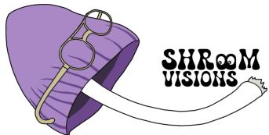  
Figure 1: Shroom-Visions 2026 Shared Task logo.

Complicating matters further, existing benchmarks on hallucination detection depend on outputs from a small, fixed set of models. Whether these models are used as the source of faulty generations to annotate (Ravichander et al., 2025) or as generators of synthetic hallucinated data (Muhlgay et al., 2024), such reliance makes it difficult to disentangle progress in hallucination understanding from overfitting to the idiosyncrasies of specific systems. Given the rapid replacement cycle of language models, benchmarks built this way risk losing their diagnostic value shortly after release (Laskar et al., 2023; Liu et al., 2025). A further practical obstacle is coverage. Naively sampling model outputs yields a sparse and skewed representation of rarer hallucination types, whereas more targeted sampling strategies (e.g., LLM-judge to preselect candidates) shift the problem to the judge’s reliability.

The SHROOM-Visions shared task is organized around the recently released SHEEP (a Set for Human-written and Electronic Erroneous Productions) dataset (Mickus et al., 2026), a multilingual, large-scale benchmark that addresses these structural limitations using human-written hallucinations with deliberately inserted, labeled errors, providing a model-independent alternative to LVLMgenerated data. The dataset spans 20,000 samples across four languages (Chinese, English, French, and Italian), combining outputs from five LVLMs (sampled randomly and via LLM-judge-assisted preselection) with 1,600 human-written items. Instances are annotated at the span level using a fiveway hallucination taxonomy (invention, mischaracterization, misreading, miscounting, and other). Crucially, the authors show that human-written samples achieve higher inter-annotator agreement, allow precise control over the distribution of hallucination types, and produce detector rankings that correlate more strongly with LVLM output rankings than cross-model comparisons do. Hence positioning human-authored hallucinations as viable, durable substitutes for constantly refreshed, model-derived benchmarks.

Building on this resource, SHROOM-Visions delves into the multimodal domain by evaluating detection systems on both LVLM-generated and human-written data. This setup introduces modelindependence as a key metric, testing whether performance on model-derived benchmarks generalizes to hallucinations untied to specific generators.

## 2 Down the rabbit hole: Related works

Hallucination in vision-and-language models is generally understood as generated content that is unsupported by, or contradicts, the visual input (Liu et al., 2024; Bai et al., 2025). Early taxonomies organized LVLM hallucinations along a coarse object–attribute–relation triad (Liu et al., 2024), later refined by work introducing event-level fabrications (Jiang et al., 2024) and finer-grained distinctions such as miscounting, text misreading, and identity incongruity (Rani et al., 2024). Existing benchmarks for LVLM hallucination detection broadly fall into three paradigms: caption-centric approaches that assess the factual accuracy of the descriptions (Rohrbach et al., 2018; Petryk et al., 2024); discriminative approaches that reframe evaluation as classification (Shekhar et al., 2017; Li et al., 2023; Lovenia et al., 2024); and hybrid approaches combining generative and verification tasks, including work targeting entangled visual illusions (Guan et al., 2024), input perturbation (Ding et al., 2024; Saito et al., 2026), automated benchmark construction (Wu et al., 2024), and finegrained failure classification (Ye-Bin et al., 2024; Wang et al., 2024a). Closest to the present setting are M-HalDetect (Gunjal et al., 2024) and HalLoc (Park et al., 2025), which provide fine-grained and token-level hallucination localization, respectively.

A recurring limitation is that resources are built around English outputs from a single or a small handful of LVLMs. This creates two compounding problems: benchmarks inherit the idiosyncrasies of their source models and lose diagnostic value as those models are superseded (Laskar et al., 2023; Liu et al., 2025), a concern also raised in LLM-centric factuality work (Ravichander et al., 2025; Vázquez et al., 2025); and even synthetic-generation approaches intended to sidestep this issue (Muhlgay et al., 2024) still depend on an LLM as the underlying generator, reintroducing model-specific bias. Mickus et al. (2026) introduce SHEEP, a multilingual, span-level dataset pairing human-written text with LVLM outputs. They demonstrate that human-authored data yields higher annotation agreement and correlates strongly with model performance, validating it as a robust, model-independent benchmark.

SHROOM-Visions adopts the SHEEP dataset of Mickus et al. (2026), extending the SHROOM hallucination detection shared tasks to the multimodal domain. Prior iterations addressed monolingual English NLG (SHROOM; Mickus et al., 2024), multilingual Q&A (Mu-SHROOM; Vázquez et al., 2025), and scientific text (SHROOM-CAP; Sinha et al., 2025); SHROOM-Visions extends this by bridging prior challenges whose interests were solely in multilingual (Li et al., 2025; Mubarak et al., 2025; Nguyen et al., 2026; Karlgren et al., 2024) or multimodal settings (Han et al., 2025; a.o.). A key focus of this edition is to develop benchmarking practices that are robust to generative model obsolescence. By treating humanwritten hallucinations as a first-class evaluation source, SHROOM-Visions distinguishes its design from prior resources tied to specific model generations.

## 3 “Oh dear! Oh dear! I shall be late!”: Task timeline and organization

## 3.1 Task definition

Given an image, a prompt and a response, participants must identify the specific character spans that correspond to hallucinations and assign each span to a category (example datapoint in Figure 2).

The taxonomy of hallucinations consists of (1) Invention, where entities, objects, properties, or events are mentioned despite not being present in the image; (2) Mischaracterization, where visible content is described incorrectly; (3) OCR Problem, for errors caused by misreading text; (4) Miscounting, where item quantities are reported inaccurately; and (5) Other, hallucinations that do not fit the preceding categories. For every character in the response, participants have to estimate the probability that it belongs to a hallucinated span and determine the corresponding hallucination class for each detected span. We encouraged flexible and innovative submissions, allowing participants to use any approach, including LLM-based methods and external resources, and to submit systems for any subset of the four supported languages: Chinese, English, French, and Italian.

  
(a) Associated image from HaloQuest (Wang et al., 2024b).

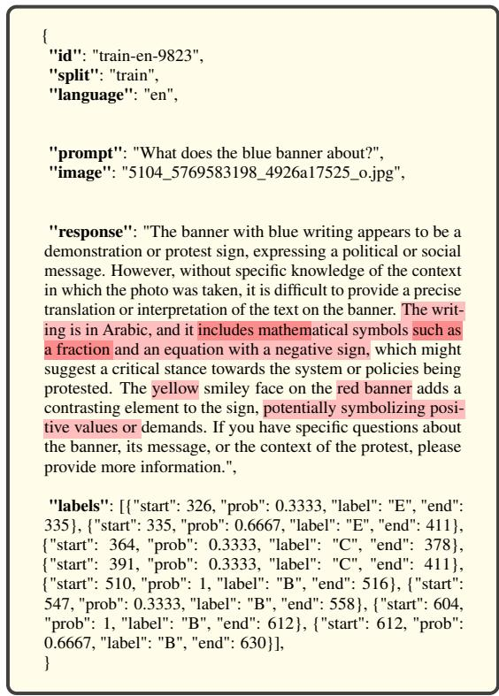  
(b) Annotated datapoint.  
Figure 2: Sample data point. The original data contain additional meta data including raw annotation and sampling strategy. Red highlight in the “response” corresponds to the marked hallucination span, darker shade denotes overlapped spans.

## 3.2 Data

We use the SHEEP dataset (Mickus et al., 2026),1 which was constructed specifically to support model-independent benchmarking of hallucination detection in LVLMs. It contains 20,000 samples evenly distributed across four languages: Chinese, English, French, and Italian.

<table><tr><td></td><td>EN</td><td>FR</td><td>IT</td><td>ZH</td></tr><tr><td>Train – Random</td><td>1,918</td><td>1,925</td><td>1,936</td><td>1,948</td></tr><tr><td>Train – Silver (MAP)</td><td>1,881</td><td>1,842</td><td>1,810</td><td>1,842</td></tr><tr><td>Test – Random</td><td>382</td><td>375</td><td>364</td><td>352</td></tr><tr><td>Test – Silver (MAP)</td><td>419</td><td>458</td><td>490</td><td>458</td></tr><tr><td>Test – Human</td><td>400</td><td>400</td><td>400</td><td>400</td></tr></table>

Table 1: Statistics per language, split, and sampling strategy from SHEEP dataset (Mickus et al., 2026).

Source material. In the SHEEP dataset, images and questions originate from two existing Englishlanguage resources: HALOQUEST (Wang et al., 2024b), a visual question answering dataset designed to elicit hallucinations through visually ambiguous images and false-premise questions, and VISAGE (Frank and Allaway, 2025), which pairs images of objects with atypical properties (e.g., a three-legged cat) with questions targeting those properties. Only non-synthetic images from both sources were retained. Prompts were machinetranslated into French and Italian using NLLB-200 (3.3B parameters; NLLB Team et al., 2022), and into Chinese using Qwen3-8B (Qwen Team, 2025).

Response generation. LVLMs responses were sampled from four 8B-scale open models: InternVL3, MiniCPM-V 4.5, Llava-NeXT, Qwen3- VL, and one larger model Gemma3-27B, all using τ = 0.7, a 512-token generation cap, and five random seeds per input.

Sampling strategies. The annotation set combines three complementary sampling strategies: random sampling of LVLM outputs, model-assisted pre-selection (MAP) using an LLM-judge to obtain a label-balanced subset, and human-authored examples that were translated and post-edited to ensure multilingual coverage.

Data splits. We partition the dataset into training and test splits. The MAP and Random strategies contribute to both splits, while human-written items appear exclusively in the test set. Table 1 summarizes the composition of each split by language and sampling strategy.

## 3.3 Timeline

The shared task began with a Training Phase (from May 10, 2026) providing a multilingual training set of ∼15.2K annotated samples; a participant kit with a scoring program, format checker, and two baseline systems2 and a submission platform (See Appendix, fig. 14). The Evaluation Phase (ending July 31, 2026) involved predictions on a hidden test set of 4.8K samples (1.2K per language). Test labels were withheld to preserve integrity, although diagnostic analyses were available upon request. Finally, the Post-Evaluation Phase concluded with system description papers submissions by August 10, 2026.

## 4 “What is the largest number that you know?”: Evaluation metrics

Following the evaluation methodology established in prior editions of the SHROOM series (Mickus et al., 2024; Vázquez et al., 2025), participant systems are evaluated at the character level against the multi-annotator gold labels. For each item d of character length $L _ { d } .$ , systems are expected to output, for every character $c \in \{ 1 , \ldots , L _ { d } \}$ , a probability $P r ( c )$ that the character belongs to a hallucinated span; we denote the resulting system vector $\hat { r } ~ \in \mathbb { R } ^ { L _ { d } }$ , with $\hat { r } _ { c } = P r ( c )$ The corresponding gold vector $\boldsymbol { r } \in \mathbb { R } ^ { L _ { d } }$ is derived from the multi-annotator span labels, with $r _ { c }$ aggregating annotator probabilities at each character. Participants are ranked according to three primary metrics computed from r and rˆ, computed separately for each of the four target languages.

Unlabeled Correlation (Corr). We compute the Spearman correlation between the gold vector r and the system vector rˆ:

$$
\mathrm { C o r r } ( d ) = \rho ( r , \hat { r } )\tag{1}
$$

When either vector is constant (i.e., no gold or no predicted hallucination), $\rho$ is undefined and we instead score exact match on the presence versus absence of hallucination. Item scores are averaged over the test set.

Labeled Correlation (Corr ). To capture whether systems correctly categorize hallucination labels, we compute the character-level correlation separately for each hallucination label present in either the gold or predicted annotations $\mathcal { L } ( d )$ . We restrict the gold and predicted spans to those annotated with ℓ, compute their character-level correlation $\rho ( r _ { \ell } , \hat { r } _ { \ell } )$

$$
\operatorname { C o r r } _ { \mathrm { l b l } } ( d ) = { \frac { 1 } { | { \mathcal { L } } ( d ) | } } \sum _ { \ell \in { \mathcal { L } } ( d ) } \rho ( r _ { \ell } , { \hat { r } } _ { \ell } )\tag{2}
$$

Items with empty predictions or references get 1.0.

Intersection-over-Union (IoU). To assess span localization independently of confidence and category, we binarize r and $\hat { r }$ into the character index sets they cover, $R ( d ) = \{ c : r _ { c } > 0 \}$ and $\hat { R } ( d ) = \{ c : \hat { r } _ { c } > 0 \}$ , and compute:

$$
\mathrm { I o U } ( d ) = { \frac { | R ( d ) \cap { \hat { R } } ( d ) | } { | R ( d ) \cup { \hat { R } } ( d ) | } }\tag{3}
$$

Items with empty predictions or references get 1.0.

The three metrics are complementary: IoU rewards precise localization of hallucinated spans regardless of confidence or category; Corr rewards well-calibrated confidence profiles that mirror annotator agreement across the full response; and Corrlbl requires systems to correctly categorize the type of hallucination they detect.

Ranking. Systems are ranked independently per language and metric. Participants could submit systems on a subset of the four languages, and rankings only include the corresponding language. We report performance separately on the three test subsets described in Section 3 (Random, MAP, and Human-written), enabling analysis of whether performance obtained on LVLM-generated data generalizes to the model-independent, human-written subset – the central empirical question motivating this shared task’s design (Section 1).

## 5 The caucus race: Participating systems

Overall statistics. Our shared task received participation from 27 teams with 623 submissions across the four target languages. On average, each language received 155.75 submissions, with English (EN) attracting the most (208), followed by Italian (IT) (141). French (FR) and Chinese (ZH) received 137 submissions each.

## 5.1 Recurrent participants

It is encouraging to see several teams participate consistently across the SHROOM shared task series, reflecting sustained interest in hallucination detection research.

<table><tr><td>Team</td><td>Lang</td><td>Description</td></tr><tr><td>Bit-by-bit (Branescu and Dascalu, 2026)</td><td>All</td><td>QLoRA-finetuned Qwen2.5-VL-7B with teacher-forced token scoring and hallucination probability heads.</td></tr><tr><td>Bubus (Bubus, 2026)</td><td>EN</td><td>Fusion of teacher-forced Qwen3-VL-32B and InternVL3-38B with hidden-state logistic regression and claim verification.</td></tr><tr><td>CPS Lab (Srivastava et al., 2026)</td><td>All</td><td>Linear probe on frozen Qwen3-VL-8B-Instruct with soft-label multi-class hallucination span detection.</td></tr><tr><td>DSR</td><td>All</td><td>Character-level XLM-RoBERTa-SigLIP ensemble for hallucination span and category prediction.</td></tr><tr><td>HalluVision (Sohail Pasha Qureshi et al., 2026)</td><td>All</td><td>LoRA-finetuned Qwen2-VL-2B trained on 15K image-text samples for hallucination prediction.</td></tr><tr><td>HalluciNauts (Vo, 2026)</td><td>EN</td><td>Output-only soft token tagger trained on English annotations for hallucination span detection.</td></tr><tr><td>IrumS (Shehryar, 2026)</td><td>EN</td><td>Claude Haiku 4.5 vision verifier with structured hallucination span extraction and rule-based character alignment.</td></tr><tr><td>L1cache (Behara, 2026)</td><td>All</td><td>Text-only multilingual XLM-RoBERTa span detector with clean gating and ensembling.</td></tr><tr><td>NSU TEAM</td><td>EN</td><td>VLM-based hallucination span extraction with self-consistency calibration and optional claim verification.</td></tr><tr><td>Risotto_AI_Funghi</td><td>All</td><td>Committee of VLM judges and activation probes with character-level confidence aggregation.</td></tr><tr><td>SKstars (Athar et al., 2026)</td><td>EN</td><td>Ensemble of zero-shot Qwen2.5-VL-72B and LoRA-finetuned Qwen2.5-VL-7B.</td></tr><tr><td>SIT (Abebe and Moslem, 2026)</td><td>All</td><td>Ensemble of LoRA-finetuned Qwen3.5-4B and XLM-RoBERTa-SigLIP multimodal token tagger.</td></tr><tr><td>Scalar_Nitk</td><td>All</td><td>Multimodal mDeBERTa-SigLIP span classifier with language-specific LoRA adaptation and gated cross-</td></tr><tr><td>Sckwoky (Mikhail et al., 2026)</td><td>All</td><td>attention. Language-specific character-level BIO taggers with probability scoring, clean gating, and span post-processing.</td></tr><tr><td>SmurfCat (Rattanajaratkul et al., 2026)</td><td>All</td><td>LoRA-fine-tuned Qwen3-VL-8B-Instruct model trained with varying combinations of real data, class-aware upsampling, heuristic injection, and LLM-assisted synthetic augmentation.</td></tr><tr><td>TÜRKSAT (Karamanlioglu et al., 2026)</td><td>All</td><td>Family of multimodal hallucination detection systems based on LLM-judge ensembles and LoRA-fine-tuned Qwen VL token classifiers, leveraging character-level distillation, ensemble prediction, and language-specific</td></tr><tr><td>USP (Fernandes, 2026)</td><td>All</td><td>thresholding. Multilingual XLM-RoBERTa token-level span tagger with joint training, language-specific thresholds, and text-only inference.</td></tr><tr><td>WINNAR749 (Raut, 2026)</td><td>All</td><td>QLoRA-finetuned Qwen2.5-VL-3B-Instruct for per-character hallucination tagging.</td></tr><tr><td>caml (Jeong et al., 2026)</td><td>All</td><td>Frozen Qwen3.5-4B layer-19 features with five-fold classifiers and language-specific span thresholds.</td></tr><tr><td>champ (Jara-Mikolajczak et al., 2026)</td><td>All</td><td>Gemma 4 31B VLM MLP probe with MuSHROOM transfer learning and LoRA.</td></tr><tr><td>dynamos (Yamin et al., 2026)</td><td>All</td><td>Fine-tuned XLM-RoBERTa token classifier with graded character-level span reconstruction.</td></tr><tr><td>eye-be-am (Schwartz, 2026)</td><td>All</td><td>Zero-shot prompting.</td></tr><tr><td>falcons</td><td>ZH</td><td>Qwen3-VL-8B token features with a frozen BiLSTM ensemble for hallucination span detection.</td></tr><tr><td>hccl-jy (Jeon and Suh, 2026) medusa</td><td>EN</td><td>Constant baseline.</td></tr><tr><td></td><td>EN</td><td>Fine-tuned Qwen3-VL-8B-Instruct via LoRA to infer multiple samples to obtain per-character soft probability for hallucination.</td></tr><tr><td>vroom-vroom (Ehsan et al., 2026)</td><td>All</td><td>LoRA-finetuned VLMs with inline hallucination tagging and confidence-based span extraction.</td></tr><tr><td>Harish (2026)</td><td>All</td><td>Non-system paper, discusses the effect of abstention rates on metrics.</td></tr></table>

Table 2: Participating teams and the language tracks in which they submitted systems in alphabetical order.

In particular, SmurfCat has participated in all four editions of the shared task. MEDUSA, NSU-AI, and Scalar\_Nitk have each participated in three editions, while AILS-NTUA, DeepPavlov, MALTO, and UMUTeam have returned for two editions. In total, 105 unique teams have participated across the four editions of the SHROOM shared task. Such continued engagement demonstrates the growing interest in hallucination detection and contributes to the development of a strong and active SHROOM community.

## 5.2 Selected system descriptions

27 teams submitted their systems during the evaluation phase, 20 teams wrote a system description paper; we also received 1 ‘shared non-task’ paper discussing our choice of metrics. Overall, we remark a wide variety of approaches, ranging from LoRA fine-tuning of LVLMs (e.g., Bit-by-bit, Branescu and Dascalu, 2026; HalluVision Sohail Pasha Qureshi et al., 2026; WINNAR749, Raut, 2026), to token- and span-level classifiers built on pretrained multimodal or text-only encoders (e.g., CPS Lab, Srivastava et al., 2026; L1cache, Behara, 2026; USP, Fernandes, 2026), and ensemble or reasoning-based methods leveraging selfconsistency, claim verification, and VLM judges (e.g., Bubus, Bubus, 2026). An overview of all participating teams is provided in Table 2. We also spotlight a few teams below, noteworthy for their performance and innovativeness.

vroom-vroom (Ehsan et al., 2026) fine-tunes vision-language models with LoRA for hallucination span detection. Given an image, question, and response, the models generate inline annotations marking hallucinated spans with category and confidence labels, which are then converted into character-level spans with associated probabilities.

TÜRKSAT (Karamanlioglu et al., 2026) explores both inference-only and supervised approaches for character-level hallucination detection. Early systems use ensembles of multimodal LLM judges to assign soft character-level hallucination probabilities. Later variants distill these signals into LoRA-fine-tuned Qwen vision-language token classifiers. The submissions study different student backbones, curriculum learning with silver and teacher-generated labels, and ensemble strategies combining multiple distilled models with language-specific decision thresholds.

Dynamos (Yamin et al., 2026) uses token-level and character-level hallucination detection models based on pretrained language and vision-language encoders. The systems evolve from fine-tuned XLM-RoBERTa token classifiers to multimodal Qwen2.5-VL models with LoRA/QLoRA adaptation, ensemble prediction, multi-class span classification heads, and Bayesian-tuned thresholds for graded span reconstruction.

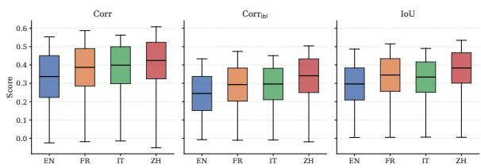  
Figure 3: Overall Performance of all participating teams across 4 languages.

Champ (Jara-Mikolajczak et al., 2026) explores probe-based hallucination detection using VLM representations. The systems range from official HalluShift++ baselines and MLP probes with transfer learning from Mu-SHROOM to Qwen-based detectors with LoRA adaptation, multitask span classification, and language-specific confidence calibration. Later variants incorporate deeper probes, vision fine-tuning, threshold tuning, abstention strategies, and span boundary refinement.

Smurfcat (Rattanajaratkul et al., 2026) uses a LoRA-fine-tuned Qwen3-VL-8B-Instruct model to identify hallucinated spans from image-questionresponse inputs and output structured predictions with span text, category, and confidence scores. The team explored multiple training variants using real data alone and with additional augmentation strategies, including class-aware upsampling, heuristic injection, and LLM-assisted synthetic generation for rare categories.

## 6 Through the looking glass: Results and analysis

Figure 3 summarizes performance distributions, reporting the min, max, mean, and st. dev. per language. The full leaderboard is provided in Section B. All systems outperformed the baseline but absolute performance remains modest. Most mean scores fall below 0.4, with no system exceeding 0.6 in any language or metric. Chinese (ZH) is a partial exception, achieving the highest average performance slightly above 0.4 in Corr scores, whereas English (EN) proves most challenging. Despite these differences, the narrow score range and comparable variability across languages suggests a performance bottleneck that is largely independent of language.

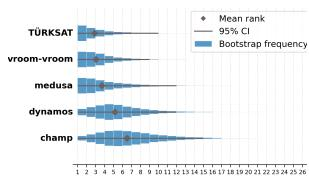  
(a) EN

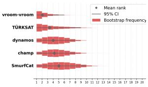  
(b) ZH

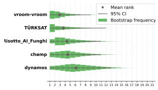  
(c) IT

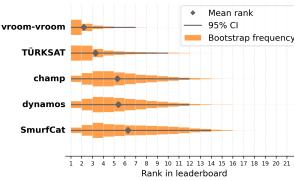  
(d) FR  
Figure 4: Bootstrap rank distributions (25,000 samples) with means and confidence intervals at 95% for the top-5 ranking submissions per language under $\mathrm { C o r r _ { l b l } }$ metric.

## 6.1 Leaderboard stability & Ranking uncertainty

Contrasting with aggregate performance shown in Figure 3, the bootstrap rank distributions in Figures 4 and 13 show substantial ordering uncertainty. Although the point estimates suggest a clear leaderboard, resampling the test set frequently changes the relative positions of the leading systems. For instance, the top-team in EN (TÜRKSAT) has a mean rank of 2.9 but its 95% rank interval spans positions 1 to 10. This instability is present in all systems, languages and metrics, with the top-five systems exhibiting rank intervals of up to 10 positions in ZH, 14 in IT and FR, and 15 in EN.

In Tables 4-7 we show the full set of results and the rank distributions plots for all systems in Figure 13. Notably, ranking stability varies by language. Chinese present the narrowest rank distributions among top teams (CIs spanning ∼5–6 positions), with vroom-vroom’s mean rank being 2.0 and a CI interval of [1, 7], and increasing uncertainty for systems down the leaderboard. In contrast, EN shows the widest spreads (with leading systems showing CIs up to 10+ positions) alongside the lowest scores. This inverse relationship suggests that when systems operate near a performance floor, stochastic effects dominate, rendering fine-grained rankings unreliable. Consequently, small leaderboard differences should not be interpreted as definitive evidence of system superiority when performance differences are small.

## 6.2 Strategy-level analysis

We investigate whether systems trained on modelderived outputs generalize to generator-agnostic hallucinations by evaluating performance across the three SHEEP dataset partitions: random, human-written, and silver-label examples (see Section 3). We assess whether system performance and, in particular, system rankings depend on how hallucinations are constructed and annotated.

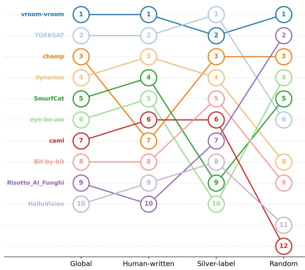  
Figure 5: Rank flows across data partitions for the top-10 French systems on Corrlbl. Each node represents a system’s rank within a partition (General vs. Human/Silver/Random subsets). The variation in ranks illustrate that individual system positions can vary substantially with data sampling strategy.

The broad ordering of systems is relatively robust across strategies, but this robustness masks substantial variation of the positions of individual systems. In Figure 9, shows top-performing systems on EN Corr that exhibit pronounced rank changes between the general leaderboard and individual strategy-specific subsets. Thus, agreement in the overall ordering does not imply ranking position stability across evaluation conditions. Table 3 quantifies this consistency via Spearman correlations (ρ ). In particular, human-written and silverlabel examples produce highly similar rankings, with $\rho _ { S }$ between .861 and .973. Correlations involving the random strategy are generally lower, indicating that randomly selected examples induce greater changes in system ordering. This effect is most pronounced for $\mathrm { C o r r } _ { \mathrm { l b l } }$ in Chinese, where the correlation is lowest. The full set of results are in Section C (Tables 8–19), including all Corrlbl rank flow charts. Friedman tests computed on the raw scores provide a complementary view by testing for systematic differences across data selection strategies. They provide strong evidence of strategy-dependent absolute scores for all metrics in EN and ZH, as well as for Corrlbl in IT and FR. In contrast, IT and FR show no evidence of a systematic score difference for Corr and IoU. Hence, the effect of evaluation strategy can change the overall performance level depending on metric and language. Importantly, changes in absolute scores and changes in system ordering need not coincide. E.g., EN Corr exhibits a high $\rho _ { S } ( R - H ) = . 8 0 2 $ despite strong evidence of a difference in score distributions (Fried. $p \ = \ . 0 0 1 5 )$ . Conversely, ZH Corrlbl is sensitive to strategy at both levels $( \rho _ { S } ( R - H ) = . 5 7 5 , p < . 0 0 0 1 )$

<table><tr><td>Lang.</td><td>Metric</td><td>R-H</td><td>R-S</td><td>H-S</td><td>Fried. p</td></tr><tr><td rowspan="3">EN</td><td>Corr</td><td>0.802</td><td>0.933</td><td>0.905</td><td>0.0015</td></tr><tr><td>Corrıbl</td><td>0.684</td><td>0.864</td><td>0.861</td><td>&lt;.0001</td></tr><tr><td>IoU</td><td>0.828</td><td>0.941</td><td>0.920</td><td>0.0344</td></tr><tr><td rowspan="3">ZH</td><td>Corr</td><td>0.805</td><td>0.784</td><td>0.951</td><td>&lt;.0001</td></tr><tr><td>Corrbl</td><td>0.575</td><td>0.667</td><td>0.893</td><td>&lt;.0001</td></tr><tr><td>IoU</td><td>0.734</td><td>0.746</td><td>0.970</td><td>&lt;.0001</td></tr><tr><td rowspan="3">IT</td><td>Corr</td><td>0.869</td><td>0.893</td><td>0.967</td><td>0.5220</td></tr><tr><td>Corrbl</td><td>0.847</td><td>0.798</td><td>0.955</td><td>0.0037</td></tr><tr><td>IoU</td><td>0.910</td><td>0.911</td><td>0.973</td><td>0.5488</td></tr><tr><td rowspan="3">FR</td><td>Corr</td><td>0.840</td><td>0.831</td><td>0.908</td><td>0.8187</td></tr><tr><td>Corrbl</td><td>0.801</td><td>0.770</td><td>0.928</td><td>0.0006</td></tr><tr><td>IoU</td><td>0.840</td><td>0.860</td><td>0.895</td><td>0.5220</td></tr></table>

Table 3: Rank correlation (Spearman ρ) between team rankings computed on Random (R), Human-written (H), and Silver-label (S) data partitions, per language and metric. Friedman p-values test for systematic raw scores differences across the three strategies computed via bootstrapping. Lower R–H and R–S values indicate that randomly sampling outputs without any prior signal can induce greater reordering of systems.

Ultimately, the data selection strategy influences absolute performance estimates more consistently than the coarse ordering of systems. Nevertheless, the ranking robustness is not uniform: randomly sampling substantially alters relative positions (especially for ZH Corrlbl). These findings suggest that conclusions about the relative performance of hallucination detectors can depend on how evaluation examples are constructed, even when the broad ordering of systems remains similar.

## 6.3 Cross-lingual performance

Figures 6 and 7 show the relation between IoU and the two correlation metrics (Corr and $\mathrm { C o r r } _ { \mathrm { l b l } } )$ for all submitted systems. The top-3 systems in each language (with red circles) form a dense cluster in the upper-right corner and lower-performing systems are concentrated toward the lower-left. Hence, strong systems achieve accurate hallucination localization and reliable character-level ranking. The strong linear trends indicate a high degree of consistency between IoU and the two Corr metrics, while their systematic differences reflect the complementary aspects of system performance captured by each measure. Specifically, character-level correlation scores are generally higher than IoU. because Corr evaluates the full character-level probability profile, allowing a system to receive credit when its confidence broadly follows the annotated hallucination spans even if the predicted span boundaries are imperfect. IoU, is more sensitive to boundary errors since it binarizes the predictions. $\mathrm { C o r r _ { l b l } }$ is generally lower than Corr because it imposes the additional requirement that hallucinated spans are assigned to the correct category.

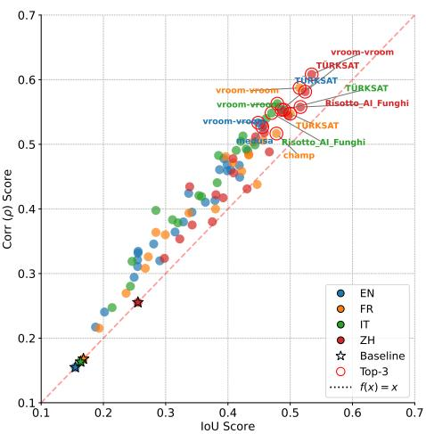  
Figure 6: Scatter plot of IoU versus Corr scores for all participating teams, ranked by average IoU scores.

More precisely, we demonstrate the best systems from each team in language-split vision (Figure 8). Across four languages, TÜRKSAT achieves the strongest performance in English $\scriptstyle ( \rho = 0 . 5 5$ IoU=0.48). On the other hand, vroom-vroom leads the remaining three languages (FR: ρ=0.58, IoU=0.52, IT: $\scriptstyle \rho = 0 . 5 6$ , IoU=0.48, and ZH: $\rho { = } 0 . 6 1$ IoU=0.53) with particularly strong and wellbalanced results on both metrics, while TÜRKSAT and Risotto\_AI\_Funghi remain close competitors in IT and ZH.

## 7 Out of the rabbit hole: Conclusion

SHROOM-Visions extends the ∗SHROOM shared task series to span-level multilingual multi-class hallucination detection in LVLMs. With 27 teams contributing more than 620 submissions across four languages (EN, ZH, IT, FR), the task attracted diverse approaches, including multimodal prompting, probing, fine-tuning, synthetic data generation, and ensemble-based methods. The strongest systems substantially outperformed the baselines, reaching average scores of 0.58 in character-level correlation, 0.46 in label-conditioned correlation, and 0.51 in span-level IoU. Reliable fine-grained hallucination detection and classification remain difficult.

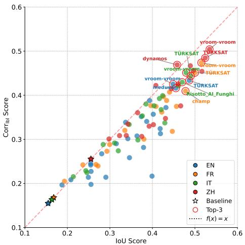  
Figure 7: Scatter plot of IoU versus $\mathrm { C o r r } _ { \mathrm { l b l } }$ scores for all participating teams, ranked by average IoU scores.

Beyond the absolute performance, our results highlight two important evaluation challenges. First, leaderboard positions are far less certain than their point estimates suggest. We show that leading systems can occupy a wide range of ranks across resampled test sets. Therefore, reporting ranking uncertainty should be considered an essential complement to point-based rankings. Second, performance depends on how the benchmark is constructed. Although the broad system ranking is generally preserved across the three SHEEP dataset partitions, absolute scores can differ systematically, and individual systems can change substantially in relative position. Human-written and silver examples produce highly consistent rankings but random sampling induces larger volatility.

Ultimately, progress in multimodal hallucination detection should be assessed along two dimensions: detection accuracy and how reliably the evaluation distinguishes between systems. SHROOM-Visions reveals considerable headroom in absolute performance and underscores the need for robust benchmarks that combine model-independent test data, fine-grained multilingual annotations, and explicit uncertainty reporting.

## Building a house of cards: Limitations

SHROOM-Visions shared task inherits limitations from the underlying dataset, including its restricted coverage of languages, domains, and LVLM outputs, which may not fully represent hallucination phenomena in broader real-world settings. The static benchmark also introduces potential risks of leakage and overfitting, although test annotations were kept private.

A further limitation concerns datapoints without marked hallucinations, shown in Table 20. Empty annotations account for 15.5–25.5% of test instances across languages, whereas systems produce empty predictions for 30.7–46.0%. This gap highlights substantial variation in systems’ abstention behavior, which is not explicitly captured by the span-overlap and probability-correlation metrics. For instances without annotated hallucinations, the evaluation defaults to an exact-match outcome when no span is available for comparison, which does not explicitly assess whether the system’s abstention decision is appropriate. Future evaluations could therefore incorporate an explicit empty-instance or abstention metric.

## References

Amanuel Gizachew Abebe and Yasmin Moslem. 2026. SpanCalib-VLM: Calibrated hallucination span detection in vision-language models.

Ali Athar, Imran Ahsan, and Joon-Yong Jung. 2026. SKstars at SHROOM-Visions 2026: Agreementguided ensembling of zero-shot and LoRA-adapted vision–language models.

Zechen Bai, Pichao Wang, Tianjun Xiao, Tong He, Zongbo Han, Zheng Zhang, and Mike Zheng Shou. 2025. Hallucination of multimodal large language models: A survey. Preprint, arXiv:2404.18930.

Aman Behara. 2026. L1cache at SHROOM-Visions: MycoGate-VL for scorer-aware multilingual hallucination detection.

Ioana Branescu and Mihai Dascalu. 2026. Bit-by-bit at SHROOM-Visions 2026: Adapt, calibrate, and average for character-level hallucination span detection.

Berk Bubus. 2026. Team Bubus at SHROOM-Vision.

Peng Ding, Jingyu Wu, Jun Kuang, Dan Ma, Xuezhi Cao, Xunliang Cai, Shi Chen, Jiajun Chen, and Shujian Huang. 2024. Hallu-pi: Evaluating hallucination in multi-modal large language models within perturbed inputs. In Proceedings ofthe 32nd ACM International Conference on Multimedia, MM ’24, page 10707–10715, New York, NY, USA. Association for Computing Machinery.

Nico Ehsan, Toqeer amd Penttilä, Richard Schmidt, Arash Hajikhani, and Victoria Palacin. 2026. Team Vroom-Vroom at SHROOM-Visions: A multi-judge committee for detecting hallucinated spans in visionlanguage outputs.

Rafael M. Fernandes. 2026. Informative but misaligned: Proxy visual signals on SHROOM-Visions 2026.

Stella Frank and Emily Allaway. 2025. VISaGE: Understanding visual generics and exceptions. In Proceedings of the 2025 Conference on Empirical Methods in Natural Language Processing, pages 32549–32558, Suzhou, China. Association for Computational Linguistics.

Tianrui Guan, Fuxiao Liu, Xiyang Wu, Ruiqi Xian, Zongxia Li, Xiaoyu Liu, Xijun Wang, Lichang Chen, Furong Huang, Yaser Yacoob, Dinesh Manocha, and Tianyi Zhou. 2024. Hallusionbench: An advanced diagnostic suite for entangled language hallucination and visual illusion in large vision-language models. In Proceedings ofthe IEEE/CVF Conference on Computer Vision and Pattern Recognition (CVPR), pages 14375–14385.

Anisha Gunjal, Jihan Yin, and Erhan Bas. 2024. Detecting and preventing hallucinations in large vision language models. In Proceedings of the Thirty-Eighth AAAI Conference on Artificial Intelligence and Thirty-Sixth Conference on Innovative Applications ofArtificial Intelligence and Fourteenth Symposium on Educational Advances in Artificial Intelligence, AAAI’24/IAAI’24/EAAI’24. AAAI Press.

Xudong Han, Kai Liu, Yanlin Li, Hao Li, and Zheng Wang. 2025. The ACM multimedia 2025 grand challenge of truthful and responsible multimodal learning. In Proceedings ofthe 33rd ACM International Conference on Multimedia, MM ’25, page 13872–13873, New York, NY, USA. Association for Computing Machinery.

Srinivas Harish. 2026. Half of a span-level hallucination score is credit for predicting nothing.

Lei Huang, Weijiang Yu, Weitao Ma, Weihong Zhong, Zhangyin Feng, Haotian Wang, Qianglong Chen, Weihua Peng, Xiaocheng Feng, Bing Qin, and Ting Liu. 2025. A Survey on Hallucination in Large Language Models: Principles, Taxonomy, Challenges, and Open Questions. ACM Trans. Inf. Syst., 43(2):42:1–42:55.

Aygalic Jara-Mikolajczak, Thomas Lavergne, and Sophie Rosset. 2026. Team champ at SHROOM-Visions: Transferring fine-grained hallucination detection with hidden-state probes and backbone adaptation.

Junyoung Jeon and Bongwon Suh. 2026. Team hccl-jy at SHROOM-Visions: Confidence signals from an unmodified VLM verifier.

Jiwon Jeong, Kimin Yun, and Yuseok Bae. 2026. CAML at SHROOM-Visions: Competency-aware

intermediate-layer readouts for multilingual hallucination localization.

Chaoya Jiang, Hongrui Jia, Mengfan Dong, Wei Ye, Haiyang Xu, Ming Yan, Ji Zhang, and Shikun Zhang. 2024. Hal-eval: A universal and fine-grained hallucination evaluation framework for large vision language models. In Proceedings of the 32nd ACM International Conference on Multimedia, MM ’24, page 525–534, New York, NY, USA. Association for Computing Machinery.

Alper Karamanlioglu, Gökhan Yurtalan, and Berkan Demirel. 2026. TÜRKSAT at SHROOM-Vision: Crowd-emulating judge ensembles for multilingual hallucination span detection in vision-language models.

Jussi Karlgren, Luise Dürlich, Evangelia Gogoulou, Liane Guillou, Joakim Nivre, Magnus Sahlgren, Aarne Talman, and Shorouq Zahra. 2024. Overview of eloquent 2024—shared tasks for evaluating generative language model quality. In Experimental IR Meets Multilinguality, Multimodality, and Interaction, pages 53–72, Cham. Springer Nature Switzerland.

Md Tahmid Rahman Laskar, M Saiful Bari, Mizanur Rahman, Md Amran Hossen Bhuiyan, Shafiq Joty, and Jimmy Xiangji Huang. 2023. A systematic study and comprehensive evaluation of ChatGPT on benchmark datasets. In Findings of the Association for Computational Linguistics: ACL 2023, pages 431– 469, Toronto, Canada. Association for Computational Linguistics.

Dan Li, Bogdan Palfi, Colin Zhang, Jaiganesh Subramanian, Adrian Raudaschl, Yoshiko Kakita, Anita De Waard, Zubair Afzal, and Georgios Tsatsaronis. 2025. Overview of the SciHal25 shared task on hallucination detection for scientific content. In Proceedings of the Fifth Workshop on Scholarly Document Processing (SDP 2025), pages 307–315, Vienna, Austria. Association for Computational Linguistics.

Yifan Li, Yifan Du, Kun Zhou, Jinpeng Wang, Xin Zhao, and Ji-Rong Wen. 2023. Evaluating object hallucination in large vision-language models. In Proceedings of the 2023 Conference on Empirical Methods in Natural Language Processing, pages 292–305, Singapore. Association for Computational Linguistics.

Hanchao Liu, Wenyuan Xue, Yifei Chen, Dapeng Chen, Xiutian Zhao, Ke Wang, Liping Hou, Rongjun Li, and Wei Peng. 2024. A survey on hallucination in large vision-language models. Preprint, arXiv:2402.00253.

Yang Liu, Jiahuan Cao, Chongyu Liu, Kai Ding, and Lianwen Jin. 2025. Datasets for large language models: a comprehensive survey. Artif. Intell. Rev., 58(12).

Holy Lovenia, Wenliang Dai, Samuel Cahyawijaya, Ziwei Ji, and Pascale Fung. 2024. Negative object

presence evaluation (NOPE) to measure object hallucination in vision-language models. In Proceedings of the 3rd Workshop on Advances in Language and Vision Research (ALVR), pages 37–58, Bangkok, Thailand. Association for Computational Linguistics.

Timothee Mickus, Claudio Savelli, Eduardo Calò, Emilio Raimond, Stella Frank, Hengyu Luo, Flavio Giobergia, Vincent Segonne, Chuyuan Li, Aman Sinha, Lorenzo Vaiani, Jörg Tiedemann, and Raúl Vázquez. 2026. Can humans dream of electric sheep? human-written samples for fine-grained vision-andlanguage hallucination benchmarking. Preprint, arXiv:2608.01021.

Timothee Mickus, Elaine Zosa, Raúl Vázquez, Teemu Vahtola, Jörg Tiedemann, Vincent Segonne, Alessandro Raganato, and Marianna Apidianaki. 2024. SemEval-2024 task 6: SHROOM, a shared-task on hallucinations and related observable overgeneration mistakes. In Proceedings of the 18th International Workshop on Semantic Evaluation (SemEval-2024), pages 1979–1993, Mexico City, Mexico. Association for Computational Linguistics.

Kulakov Mikhail, Ruslan Solikhov, and Ivan Bondarenko. 2026. Character-level hallucination-span detection in image-conditioned VLMs via dualprompted LoRA decoders.

Hamdy Mubarak, Rana Malhas, Watheq Mansour, Abubakr Mohamed, Mahmoud Fawzi, Majd Hawasly, Tamer Elsayed, Kareem Mohamed Darwish, and Walid Magdy. 2025. IslamicEval 2025: The first shared task of capturing LLMs hallucination in islamic content. In Proceedings of The Third Arabic Natural Language Processing Conference: Shared Tasks, pages 480–493, Suzhou, China. Association for Computational Linguistics.

Dor Muhlgay, Ori Ram, Inbal Magar, Yoav Levine, Nir Ratner, Yonatan Belinkov, Omri Abend, Kevin Leyton-Brown, Amnon Shashua, and Yoav Shoham. 2024. Generating benchmarks for factuality evaluation of language models. In Proceedings ofthe 18th Conference ofthe European Chapter ofthe Associationfor Computational Linguistics (Volume 1: Long Papers), pages 49–66, St. Julian’s, Malta. Association for Computational Linguistics.

Sujoy Nath, Arkaprabha Basu, Sharanya Dasgupta, and Swagatam Das. 2025. Hallushift++: Bridging language and vision through internal representation shifts for hierarchical hallucinations in mllms. arXiv preprint arXiv:2512.07687.

Anh Thi-Hoang Nguyen, Khanh Quoc Tran, Tin Van Huynh, Phuoc Tan-Hoang Nguyen, Cam Tan Nguyen, and Kiet Van Nguyen. 2026. Dsc2025 – vihallu challenge: Detecting hallucination in vietnamese llms. Preprint, arXiv:2601.04711.

NLLB Team, Marta R. Costa-jussà, James Cross, Onur Çelebi, Maha Elbayad, Kenneth Heafield, Kevin Heffernan, Elahe Kalbassi, Janice Lam, Daniel Licht,

Jean Maillard, Anna Sun, Skyler Wang, Guillaume Wenzek, Al Youngblood, Bapi Akula, Loic Barrault, Gabriel Mejia Gonzalez, Prangthip Hansanti, and 20 others. 2022. No language left behind: Scaling human-centered machine translation. Preprint, arXiv:2207.04672.

Eunkyu Park, Minyeong Kim, and Gunhee Kim. 2025. HalLoc: Token-level localization of hallucinations for vision language models. In Proceedings of the IEEE/CVF Conference on Computer Vision and Pattern Recognition (CVPR), pages 29893–29903.

Suzanne Petryk, David M. Chan, Anish Kachinthaya, Haodi Zou, John Canny, Joseph E. Gonzalez, and Trevor Darrell. 2024. ALOHa: A new measure for hallucination in captioning models. In Proceedings ofthe 2024 Conference ofthe North American Chapter ofthe Associationfor Computational Linguistics: Human Language Technologies (Volume 2: Short Papers), pages 342–357, Mexico City, Mexico. Association for Computational Linguistics.

Qwen Team. 2025. Qwen3 technical report. Preprint, arXiv:2505.09388.

Anku Rani, Vipula Rawte, Harshad Sharma, Neeraj Anand, Krishnav Rajbangshi, Amit Sheth, and Amitava Das. 2024. Visual hallucination: Definition, quantification, and prescriptive remediations. Preprint, arXiv:2403.17306.

Weerathep Rattanajaratkul, Alexander Panchenko, and Elisei Rykov. 2026. SmurfCat at SHROOM-Visions: Synthetic augmentation for multilingual span-level hallucination detection.

Ranjit Raut. 2026. WINNAR749 at SHROOM-Visions: Model-agnostic fine-grained hallucination detection in vlms via qlora approach with soft, calibrated targets.

Abhilasha Ravichander, Shrusti Ghela, David Wadden, and Yejin Choi. 2025. HALoGEN: Fantastic LLM hallucinations and where to find them. In Proceedings ofthe 63rd Annual Meeting ofthe Association for Computational Linguistics (Volume 1: Long Papers), pages 1402–1425, Vienna, Austria. Association for Computational Linguistics.

Anna Rohrbach, Lisa Anne Hendricks, Kaylee Burns, Trevor Darrell, and Kate Saenko. 2018. Object hallucination in image captioning. In Proceedings ofthe 2018 Conference on Empirical Methods in Natural Language Processing, pages 4035–4045.

Kuniaki Saito, Risa Shinoda, Shohei Tanaka, Tosho Hirasawa, Fumio Okura, and Yoshitaka Ushiku. 2026. Haldec-bench: Benchmarking hallucination detector in image captioning. Preprint, arXiv:2511.20515.

Eli Schwartz. 2026. Team Eye-Be-Am at SHROOM-Visions.

Irum Shehryar. 2026. Shroom-visions 2026: When one fix doesn’t fit all — category-aware hallucination span detection.

Ravi Shekhar, Sandro Pezzelle, Yauhen Klimovich, Aurélie Herbelot, Moin Nabi, Enver Sangineto, and Raffaella Bernardi. 2017. FOIL it! find one mismatch between image and language caption. In Proceedings ofthe 55th Annual Meeting ofthe Associationfor Computational Linguistics (Volume 1: Long Papers), pages 255–265, Vancouver, Canada. Association for Computational Linguistics.

Aman Sinha, Federica Gamba, Raúl Vázquez, Timothee Mickus, Ahana Chattopadhyay, Laura Zanella, Binesh Arakkal Remesh, Yash Kankanampati, Aryan Chandramania, and Rohit Agarwal. 2025. SHROOM-CAP: Shared task on hallucinations and related observable overgeneration mistakes in crosslingual analyses of publications. In Proceedings of the 1st Workshop on Confabulation, Hallucinations and Overgeneration in Multilingual and Practical Settings (CHOMPS 2025), pages 70–80, Mumbai, India. Association for Computational Linguistics.

Mohammed Sohail Pasha Qureshi, Surya Charan, and Alapan Kuila. 2026. HalluVision at SHROOM-Vision: Hallucination span detection with a classifier over a vision-language backbone.

Anika Srivastava, Vishal Kumar, HARSHITA SHARMA, Nitisha Aggarwal, Geetika Jain Saxena, Amit Pundir, and Sanjeev Singh. 2026. Team CPS Lab at SHROOM-Vision.

Khang Nhat Hoang Vo. 2026. Team HalluciNauts at SHROOM-Visions: Anchor-preserving dualresolution grounding for fine-grained vision hallucination detection.

Raúl Vázquez, Timothee Mickus, Elaine Zosa, Teemu Vahtola, Jörg Tiedemann, Aman Sinha, Vincent Segonne, Fernando Sanchez Vega, Alessandro Raganato, Jindˇrich Libovický, Jussi Karlgren, Shaoxiong Ji, Jindˇrich Helcl, Liane Guillou, Ona De Gibert, Jaione Bengoetxea, Joseph Attieh, and Marianna Apidianaki. 2025. SemEval-2025 task 3: Mu-SHROOM, the multilingual shared-task on hallucinations and related observable overgeneration mistakes. In Proceedings ofthe 19th International Workshop on Semantic Evaluation (SemEval-2025), pages 2472–2497, Vienna, Austria. Association for Computational Linguistics.

Junyang Wang, Yuhang Wang, Guohai Xu, Jing Zhang, Yukai Gu, Haitao Jia, Jiaqi Wang, Haiyang Xu, Ming Yan, Ji Zhang, and Jitao Sang. 2024a. Amber: An llm-free multi-dimensional benchmark for mllms hallucination evaluation. Preprint, arXiv:2311.07397.

Zhecan Wang, Garrett Bingham, Adams Wei Yu, Quoc V. Le, Thang Luong, and Golnaz Ghiasi. 2024b. Haloquest: A visual hallucination dataset for advancing multimodal reasoning. In Computer Vision – ECCV 2024, pages 288–304, Cham. Springer Nature Switzerland.

Xiyang Wu, Tianrui Guan, Dianqi Li, Shuaiyi Huang, Xiaoyu Liu, Xijun Wang, Ruiqi Xian, Abhinav Shrivastava, Furong Huang, Jordan Lee Boyd-Graber, and 1 others. 2024. Autohallusion: Automatic generation of hallucination benchmarks for visionlanguage models. In Findings of the Association for Computational Linguistics: EMNLP 2024, pages 8395–8419.

Muhammad Yamin, Sheikh Abdul Wahid, and Ali Arshad. 2026. Dynamos at SHROOM-Vision: Metricaligned token tagging and ensembles for multilingual vision-language hallucination-span detection.

Moon Ye-Bin, Nam Hyeon-Woo, Wonseok Choi, and Tae-Hyun Oh. 2024. Beaf: Observing before-after changes to evaluate hallucination in vision-language models. In European Conference on Computer Vision, pages 232–248. Springer.

## A The Mad hatter’s tea party: Organizers’ role

The team of SHROOM-Visions contributors behind this edition of the ∗SHROOM series of shared tasks is as follows:

Raul Vazquez: Shared Task Ideation/Creation: writing + analysis for the overview paper.

Aman Sinha: Writing and analysis for the overview paper; task advertisement; post-eval participant communication.

Chuyuan Li: Advertisement campaign lead; writing for the overview paper; post-eval participant communication.

Artem Shelmanov: Openreview website.

Artem Vazhentsev: Format checker

Claudio Savelli: Hallushift++ baseline implementation. Data creation (Italian).

Eduardo Calò: Data creation (Italian).

Emilio Raimond: Data creation (French).

Flavio Giobergia: Inter-annotator agreement, data quality checking.

Hengyu Luo: Data creation (Chinese).

Jörg Tiedemann: Organization support.

Lorenzo Vaiani: Code development.

Stella Frank: Data creation (English).

Vincent Segonne: Data creation (French).

Timothee Mickus: Data creation, submission interface, scoring program, in-loop-with participants; overall organization.

## B Off with their heads! Test phase leaderboard

In Table 4-5 we present the final test phase leaderboard. It is ranked based on the Corrlbl metric performance. We show the results obtained by each team’s best-performing system after bootstrapping with 25,000 samples on each metric, accompanied by 95% confidence intervals for each score, the mean rank and a rank interval (also at 95%). The baseline row is marked by light orange color.

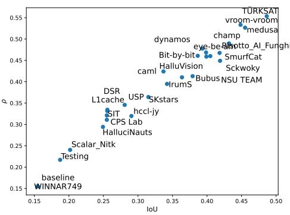

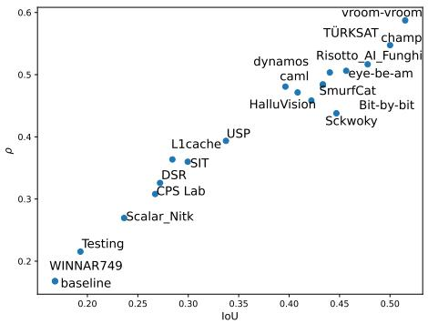

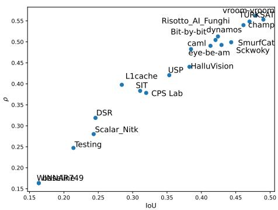

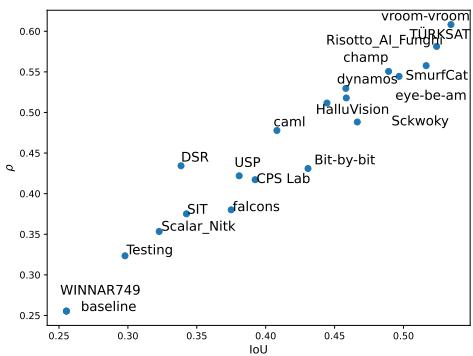  
Figure 8: Overview of the performance by the best systems from each team in each language. From top to bottom: EN, FR, IT, ZH.

We also include the probability P(> next) of any given submission outranking the submission one rank below, which we compute as part of the bootstrapping. The column quantifies instability in the ranking: values near 0.35–0.47 for adjacent top teams imply only a modest probability of consistently outperforming the next-ranked system. The bootstrap probabilities of pairwise inversion further indicate that the observed ordering of adjacent systems is often not robust. While some pairwise comparisons approach significance (e.g., vroom-vroom vs. TÜRKSAT in ZH at $P = 0 . 3 5 )$ , most fall well below conventional thresholds, suggesting that small mean rank differences should not be interpreted as definitive superiority. For the top systems in English, for example, the probability associated with the observed ordering of adjacent pairs ranges from 0.32 to 0.45, rather than approaching the high probabilities expected for a stable separation. Similar values are observed across the other languages. Thus, we would like to highlight that even is point estimates provide a useful summary of system performance, the leaderboard alone can give a misleading impression of fine-grained distinctions between systems.

## C Painting the white roses red: Strategy-specific performance scores

To complement the ranking-based analysis in Section 6.2, we report the underlying system scores for each annotation strategy in Tables 8–19. These tables provide the complete results for all teams across the global ranking and for each of the strategy-level partitions of the SHEEP dataset (human-written, randomly sampled, and silverlabel or model assisted selection), for each language and evaluation metric. Teams are ordered by their score on the global ranking dataset to facilitate comparison with the main leaderboard. Unlike the official leaderboard, where the score is computed as the mean of a bootstrap strategy, the global score shown here is computed with the best submission of each team without resampling.

These results make explicit how the choice of annotation strategy affects absolute performance estimates. In particular, they allow the reader to distinguish changes in overall score from changes in relative system ordering: a strategy may shift scores for most systems without substantially altering the leaderboard, while selective changes in individual systems can produce the rank inversions discussed in the main text. Together with the rank correlations and rank-flow plots in Section 6.2, these tables provide the underlying evidence for our analysis of strategy-dependent evaluation effects.

## D Curiouser and curiouser! Additional metrics

To further characterize the span extraction performance, we report additional span-level metrics in Table 21. Precision measures the reliability of extracted spans by quantifying the proportion of predicted spans that correspond to valid reference annotations, while recall captures the extent to which annotated spans are recovered by the model. We combine these two aspects through the F1 score, which provides a balanced measure of extraction quality under the trade-off between false positive and false negative predictions. In addition, we report span accuracy, computed as $\frac { T P } { T P + F P + F N }$ , to quantify the agreement between predicted and reference span sets while accounting for both spurious detections and missed annotations. This formulation is preferred over conventional accuracy because the space of possible non-annotated spans is not explicitly defined in span extraction tasks, making true negatives unsuitable as an evaluation signal. All metrics are calculated at the class level to provide a detailed view of performance across different error categories.

<table><tr><td rowspan=1 colspan=19> $\mathrm { C o r r } _ { \mathrm { l b l } }$                        Corr                         IoU# Team              $\mathbf { S c o r e } _ { [ 9 5 \% C I ] }$  MR     RI $\mathbf { S c o r e } _ { [ 9 5 \% C I ] }$  MR     RI $\mathbf { S c o r e } _ { [ 9 5 \% C I ] }$  MR     RI $P ( > \mathrm { n e x t } )$ </td></tr><tr><td rowspan=1 colspan=3>1 TÜRKSAT         $0 . 4 3 3 _ { [</td><td rowspan=1 colspan=5>. 2 9 , . 5 7 ] }$   2.9  [1, 10]0.554[.</td><td rowspan=1 colspan=6>41,.69]  2.8 [1, 10]  $0 . 4 8 6 _ { [</td><td rowspan=1 colspan=5>. 3 9 , . 5 8 ] }$   2.0  [1, 7]   0.45</td></tr><tr><td rowspan=1 colspan=3>2 vroom-vroom      $0 . 4 2 5 _ { [ . 2</td><td rowspan=1 colspan=4>9 , . 5 6 ] } ^ { - }$   3.1  [1, 9]</td><td rowspan=1 colspan=1>0.533</td><td rowspan=1 colspan=5>3.5 [1, 10]</td><td rowspan=1 colspan=1> $0 . 4 4 8 _ { [ . 3 5</td><td rowspan=1 colspan=5>, . 5 5 ] } ^ { ^ { - } }$   4.1  [1, 11]   0.45</td></tr><tr><td rowspan=1 colspan=3>3 medusa            $0 . 4 1 7 _ { [</td><td rowspan=1 colspan=4>. 2 9 , . 5 5 ] }$   3.7 [1, 12]</td><td rowspan=1 colspan=1>0.526</td><td rowspan=1 colspan=5>4.1 [1, 13]</td><td rowspan=1 colspan=1> $0 . 4 5 5 _ { [</td><td rowspan=1 colspan=5>. 3 6 , . 5 5 ] }$   3.7 [1, 10]   0.32</td></tr><tr><td rowspan=1 colspan=3>4 dynamos           $0 . 3 8 8 _ { [</td><td rowspan=1 colspan=4>. 2 6 , . 5 2 ] }$   5.2 [1, 12]</td><td rowspan=1 colspan=1>0.478</td><td rowspan=1 colspan=5>7.3 [2, 15]</td><td rowspan=1 colspan=1> $0 . 3 9 3 _ { [</td><td rowspan=1 colspan=5>. 3 0 , . 4 8 ] }$   9.4 [3, 15]   0.38</td></tr><tr><td rowspan=1 colspan=2>5 champ</td><td rowspan=1 colspan=1> $0 . 3 7 2 _ { [ . 2</td><td rowspan=1 colspan=4>4 , . 5 1 ] } ^ { }$   6.5 [1, 15]</td><td rowspan=1 colspan=1>0.490</td><td rowspan=1 colspan=5>6.4 [1, 15]</td><td rowspan=1 colspan=1> $0 . 4 3 2 _ { [</td><td rowspan=1 colspan=5>. 3 4 , . 5 3 ] }$   5.5 [1, 12]   0.40</td></tr><tr><td rowspan=1 colspan=2>6 eye-be-am</td><td rowspan=1 colspan=1> $0 . 3 5 7 _ { [</td><td rowspan=1 colspan=4>. 2 3 , . 4 9 ] }$   7.8 [2, 17]</td><td rowspan=1 colspan=1>0.469</td><td rowspan=1 colspan=5>8.2 [2, 17]</td><td rowspan=1 colspan=1>0.410</td><td rowspan=1 colspan=5>7.8 [2, 15]   0.46</td></tr><tr><td rowspan=1 colspan=2>7 SmurfCat</td><td rowspan=1 colspan=1> $0 . 3 5 1 \dot { }</td><td rowspan=1 colspan=4>_ { [ . 2 1 , . 5 0 ] }$   8.4 [2, 18]</td><td rowspan=1 colspan=1>0.460</td><td rowspan=1 colspan=1></td><td rowspan=1 colspan=4>9.0 [2, 19]</td><td rowspan=1 colspan=1> $0 . 4 0 5 _ { [</td><td rowspan=1 colspan=4>. 3 1 , . 5 1 ] }$   8.3 [2, 15]</td><td rowspan=1 colspan=1>0.44</td></tr><tr><td rowspan=1 colspan=1>8 B</td><td rowspan=1 colspan=1>it-by-bit</td><td rowspan=1 colspan=1> $0 . 3 4 0 _ { [ . 2 1 ,</td><td rowspan=1 colspan=4>. 4 8 ] } ^ { \cdot }$   9.2 [2, 19]</td><td rowspan=1 colspan=1>0.461</td><td rowspan=1 colspan=1>.32..60]</td><td rowspan=1 colspan=4>8.8 [2, 17]</td><td rowspan=1 colspan=1>0.393</td><td rowspan=1 colspan=5>9.5 [3, 16]   0.48</td></tr><tr><td rowspan=1 colspan=1>9</td><td rowspan=1 colspan=1>caml</td><td rowspan=1 colspan=1> $0 . 3 3 8 _ { [</td><td rowspan=1 colspan=4>. 2 1 , . 4 7 ] }$   9.4 [3, 17]</td><td rowspan=1 colspan=1>0.425</td><td rowspan=1 colspan=1></td><td rowspan=1 colspan=4>12.1 [4, 20]</td><td rowspan=1 colspan=1> $0 . 3 3 7 _ { [</td><td rowspan=1 colspan=4>. 2 4 , . 4 3 ] }$  14.9 [8, 20]</td><td rowspan=1 colspan=1>0.41</td></tr><tr><td rowspan=1 colspan=1>10 R</td><td rowspan=1 colspan=1>isotto AI Funghi</td><td rowspan=1 colspan=1> $0 . 3 2 4 _ { [ . 2</td><td rowspan=1 colspan=1>0 , . 4 6 ] } ^ { - }$ </td><td rowspan=1 colspan=3>10.8 [3, 20]</td><td rowspan=1 colspan=1>0.468</td><td rowspan=1 colspan=1></td><td rowspan=1 colspan=4>8.2 [2, 17]</td><td rowspan=1 colspan=1> $0 . 4 1 8 _ { [</td><td rowspan=1 colspan=1>. 3 3 , . 5 1 ] }$ </td><td rowspan=1 colspan=3>6.8 [2, 13]</td><td rowspan=1 colspan=1>0.42</td></tr><tr><td rowspan=1 colspan=1>11</td><td rowspan=1 colspan=1>Sckwoky</td><td rowspan=1 colspan=1> $0 . 3 1 2 _ { [</td><td rowspan=1 colspan=1>. 1 9 , . 4 5 ] }$ </td><td rowspan=1 colspan=3>11.9 [4, 22]</td><td rowspan=1 colspan=1>0.449</td><td rowspan=1 colspan=5>10.0 [2, 20]</td><td rowspan=1 colspan=1> $0 . 4 1 9 _ { [</td><td rowspan=1 colspan=1>. 3 3 , . 5 2 ] }$ </td><td rowspan=1 colspan=3>6.7 [1, 14]</td><td rowspan=1 colspan=1>0.47</td></tr><tr><td rowspan=1 colspan=1>12</td><td rowspan=1 colspan=1>HalluVision</td><td rowspan=1 colspan=1> $0 . 3 0 7 _ { [ . 1 9 ,</td><td rowspan=1 colspan=1>. 4 4 ] } ^ { \cdot }$ </td><td rowspan=1 colspan=3>12.4 [5, 22]</td><td rowspan=1 colspan=1>0.411[.</td><td rowspan=1 colspan=5>28,55]13.3 [5,21]</td><td rowspan=1 colspan=1> $0 . 3 6 7 _ { [ . 2</td><td rowspan=1 colspan=4>8 , . 4 6 ] } ^ { - }$  12.1 [5, 17]</td><td rowspan=1 colspan=1>0.47</td></tr><tr><td rowspan=1 colspan=1>13</td><td rowspan=1 colspan=1>IrumS</td><td rowspan=1 colspan=1> $0 . 3 0 1 _ { [</td><td rowspan=1 colspan=4>. 1 7 , . 4 4 ] }$  13.2 [4, 25]</td><td rowspan=1 colspan=1>0.395</td><td rowspan=1 colspan=1></td><td rowspan=1 colspan=4>14.7  [4,24]</td><td rowspan=1 colspan=1> $0 . 3 4 2 _ { [ . 2 5 ,</td><td rowspan=1 colspan=4>. 4 4 ] } ^ { \cdot }$  14.5 [7, 21]</td><td rowspan=1 colspan=1>0.44</td></tr><tr><td rowspan=1 colspan=1>14</td><td rowspan=1 colspan=1>SKstars</td><td rowspan=1 colspan=1> $0 . 2 9 0 _ { [ . 1 7 ,</td><td rowspan=1 colspan=4>. 4 3 ] } ^ { \cdot }$  14.2 [4, 25]</td><td rowspan=1 colspan=1>0.364</td><td rowspan=1 colspan=1></td><td rowspan=1 colspan=4>17.1  [7,25]</td><td rowspan=1 colspan=1>0.315</td><td rowspan=1 colspan=4>16.8[10, 23]</td><td rowspan=1 colspan=1>0.45</td></tr><tr><td rowspan=1 colspan=1>15</td><td rowspan=1 colspan=1>Bubus</td><td rowspan=1 colspan=1> $0 . 2 8 2 _ { [</td><td rowspan=1 colspan=1>. 1 7 , . 4 1 ] }$ </td><td rowspan=1 colspan=3>15.0 [6,24]</td><td rowspan=1 colspan=1>0.414[.</td><td rowspan=1 colspan=1>29,.54]</td><td rowspan=1 colspan=4>13.1 [4, 22]</td><td rowspan=1 colspan=1>0.379</td><td rowspan=1 colspan=4>10.9 [4, 17]</td><td rowspan=1 colspan=1>0.42</td></tr><tr><td rowspan=1 colspan=1>16</td><td rowspan=1 colspan=2>USP               $0 . 2 6 7 _ { [</td><td rowspan=1 colspan=1>. 1 4 , . 4 1 ] }$ </td><td rowspan=1 colspan=2>16.4 [7, 2</td><td rowspan=1 colspan=1>6]</td><td rowspan=1 colspan=1> $0 . 3 4 6 _ { [ .</td><td rowspan=1 colspan=1>2 1 , . 4 9 ] }$ </td><td rowspan=1 colspan=4>18.4 [9,25]</td><td rowspan=1 colspan=1> $0 . 2 8 0 _ { [</td><td rowspan=1 colspan=1>. 1 9 , . 3 8 ] }$ </td><td rowspan=1 colspan=3>19.4[14, 24]</td><td rowspan=1 colspan=1>0.50</td></tr><tr><td rowspan=1 colspan=1>17 L</td><td rowspan=1 colspan=2>1cache           $0 . 2 6 7 _ { [ . 1 8 ,</td><td rowspan=1 colspan=1>. 3 6 ] } ^ { \cdot }$ </td><td rowspan=1 colspan=3>16.4 [6, 26]</td><td rowspan=1 colspan=1> $0 . 3 7 4 _ { [ . 2 8 , .</td><td rowspan=1 colspan=1>4 7 ] } ^ { \cdot }$ </td><td rowspan=1 colspan=4>16.2 [6, 24]</td><td rowspan=1 colspan=1> $0 . 2 6 2 _ { [</td><td rowspan=1 colspan=1>. 1 8 , . 3 5 ] }$ </td><td rowspan=1 colspan=3>20.9[15,26]</td><td rowspan=1 colspan=1>0.45</td></tr><tr><td rowspan=1 colspan=1>18</td><td rowspan=1 colspan=2>smurfcat           $0 . 2 5 9 _ { [</td><td rowspan=1 colspan=1>. 1 6 , . 3 7 ] }$ </td><td rowspan=1 colspan=3>17.4 [7, 28]</td><td rowspan=1 colspan=1> $0 . 3 8 0 _ { [ .</td><td rowspan=1 colspan=1>2 5 , . 5 1 ] }$ </td><td rowspan=1 colspan=4>16.0 [7,24]</td><td rowspan=1 colspan=1>0.346[.</td><td rowspan=1 colspan=1>27,.43]</td><td rowspan=1 colspan=3>14.2 [7, 21]</td><td rowspan=1 colspan=1>0.41</td></tr><tr><td rowspan=1 colspan=1>19</td><td rowspan=1 colspan=2>CPS Lab           $0 . 2 4 5 _ { [</td><td rowspan=1 colspan=1>. 1 2 , . 3 8 ] }$ </td><td rowspan=1 colspan=3>18.7 [9, 26]</td><td rowspan=1 colspan=1> $0 . 3 1 1 _ { [ .</td><td rowspan=1 colspan=1>1 7 , . 4 5 ] }$ </td><td rowspan=1 colspan=4>21.0[13,26]</td><td rowspan=1 colspan=1> $0 . 2 5 5 _ { [ . 1</td><td rowspan=1 colspan=1>7 , . 3 5 ] } ^ { }$ </td><td rowspan=1 colspan=3>21.5[16,25]</td><td rowspan=1 colspan=1>0.48</td></tr><tr><td rowspan=1 colspan=1>20</td><td rowspan=1 colspan=1>SIT</td><td rowspan=1 colspan=1> $0 . 2 4 1 _ { [</td><td rowspan=1 colspan=1>. 1 1 , . 3 8 ] }$ </td><td rowspan=1 colspan=2>19.1 [9,2</td><td rowspan=1 colspan=1>7]</td><td rowspan=1 colspan=1> $0 . 3 2 2 _ { [ .</td><td rowspan=1 colspan=1>1 8 , . 4 7 ] }$ </td><td rowspan=1 colspan=4>20.2[12, 25]</td><td rowspan=1 colspan=1> $0 . 2 5 5 _ { [</td><td rowspan=1 colspan=1>. 1 6 , . 3 5 ] }$ </td><td></td><td rowspan=1 colspan=2>21.5[16,26]</td><td rowspan=1 colspan=1>0.37</td></tr><tr><td rowspan=1 colspan=1>21</td><td rowspan=1 colspan=1>NSU TEAM</td><td rowspan=1 colspan=1> $0 . 2 1 7 _ { [</td><td rowspan=1 colspan=1>. 1 0 , . 3 5 ] }$ </td><td rowspan=1 colspan=2>21.1[10,2</td><td rowspan=1 colspan=1>8]</td><td rowspan=1 colspan=1> $0 . 4 6 0 _ { [ .</td><td rowspan=1 colspan=1>3 1 , . 6 1 ] }$ </td><td rowspan=1 colspan=4>9.1 [2, 19]</td><td rowspan=1 colspan=1> $0 . 3 9 9 _ { [</td><td rowspan=1 colspan=1>. 3 0 , . 5 0 ] }$ </td><td></td><td rowspan=1 colspan=2>9.0 [2, 16]</td><td rowspan=1 colspan=1>0.48</td></tr><tr><td rowspan=1 colspan=1>22</td><td rowspan=1 colspan=1>hccl-jy</td><td rowspan=1 colspan=1> $0 . 2 1 4 _ { [</td><td rowspan=1 colspan=1>. 1 0 , . 3 4 ] }$ </td><td rowspan=1 colspan=2>21.4[12, 2</td><td rowspan=1 colspan=1>8]</td><td rowspan=1 colspan=1> $0 . 3 2 0 _ { [ .</td><td rowspan=1 colspan=1>1 9 , . 4 6 ] }$ </td><td rowspan=1 colspan=1>20.4</td><td rowspan=1 colspan=1>12</td><td rowspan=1 colspan=2>26]</td><td rowspan=1 colspan=1> $0 . 2 9 0 _ { [</td><td rowspan=1 colspan=1>. 2 1 , . 3 8 ] }$ </td><td></td><td rowspan=1 colspan=2>18.7[13,24]</td><td rowspan=1 colspan=1>0.51</td></tr><tr><td rowspan=1 colspan=1>23</td><td rowspan=1 colspan=1>HalluciNauts</td><td rowspan=1 colspan=1> $0 . 2 1 4 _ { [</td><td rowspan=1 colspan=1>. 1 0 , . 3 4 ] }$ </td><td rowspan=1 colspan=1>21.8</td><td rowspan=1 colspan=1>13.</td><td rowspan=1 colspan=1>28</td><td rowspan=1 colspan=1> $0 . 2 9 4 _ { [ .</td><td rowspan=1 colspan=1>1 7 , . 4 3 ] }$ </td><td rowspan=1 colspan=1>22.1</td><td rowspan=1 colspan=1>15</td><td rowspan=1 colspan=2>271</td><td rowspan=1 colspan=1> $0 . 2 4 9 _ { [</td><td rowspan=1 colspan=1>. 1 7 , . 3 4 ] }$ </td><td rowspan=1 colspan=3>22.0[17,26]</td><td rowspan=1 colspan=1>0.45</td></tr><tr><td rowspan=1 colspan=1>24 S</td><td rowspan=1 colspan=1>calar Nitk</td><td rowspan=1 colspan=1> $0 . 2 0 8 _ { [</td><td rowspan=1 colspan=1>. 0 8 , . 3 5 ] }$ </td><td rowspan=1 colspan=1>22.0[1</td><td rowspan=1 colspan=1>2, 2</td><td rowspan=1 colspan=1>8]</td><td rowspan=1 colspan=1> $0 . 2 4 0 _ { [ . 1 1 , .</td><td rowspan=1 colspan=1>3 8 ] } ^ { \cdot }$ </td><td rowspan=1 colspan=1>24.6</td><td rowspan=1 colspan=1>19</td><td rowspan=1 colspan=1>28</td><td></td><td rowspan=1 colspan=1> $0 . 2 0 8 _ { [</td><td rowspan=1 colspan=1>. 1 2 , . 3 0 ] }$ </td><td rowspan=1 colspan=3>24.5[20, 28]</td><td rowspan=1 colspan=1>0.45</td></tr><tr><td rowspan=1 colspan=1>25</td><td rowspan=1 colspan=1>DSR</td><td rowspan=1 colspan=1> $0 . 1 9 7 _ { [</td><td rowspan=1 colspan=1>. 1 0 , . 3 1 ] }$ </td><td rowspan=1 colspan=1>23.2[1</td><td rowspan=1 colspan=1>6, 2</td><td rowspan=1 colspan=1>8]</td><td rowspan=1 colspan=1> $0 . 3 3 2 _ { [ .</td><td rowspan=1 colspan=1>2 3 , . 4 5 ] }$ </td><td rowspan=1 colspan=1>19.8</td><td rowspan=1 colspan=2>[12, 25]</td><td></td><td rowspan=1 colspan=1> $\underline { { 0 . 2 5 5</td><td rowspan=1 colspan=1>} } _ { [ \cdot 1 8 , . 3 4 ] }$ </td><td rowspan=1 colspan=2>21.5</td><td rowspan=1 colspan=1>[16, 26]</td><td rowspan=1 colspan=1>0.48</td></tr><tr><td rowspan=1 colspan=1>26</td><td rowspan=1 colspan=1>Testing</td><td rowspan=1 colspan=1> $0 . 1 9 6 _ { [</td><td rowspan=1 colspan=1>. 0 7 , . 3 4 ] }$ </td><td rowspan=1 colspan=1>23.1</td><td rowspan=1 colspan=1>14,</td><td rowspan=1 colspan=1>28</td><td rowspan=1 colspan=1> $0 . 2 1 8 _ { [ .</td><td rowspan=1 colspan=1>0 9 , . 3 6 ] }$ </td><td rowspan=1 colspan=1>25.3[</td><td rowspan=1 colspan=2>21,28]</td><td></td><td rowspan=1 colspan=1> $0 . 1 8 7 _ { [ . 1 0 ,</td><td rowspan=1 colspan=1>. 2 8 ] } ^ { \cdot }$ </td><td rowspan=1 colspan=2>25.7[</td><td rowspan=1 colspan=1>22, 28]</td><td rowspan=1 colspan=1>0.20</td></tr><tr><td rowspan=1 colspan=1>27</td><td rowspan=1 colspan=1>baseline</td><td rowspan=1 colspan=1> $0 . 1 5 5 _ { [</td><td rowspan=1 colspan=1>. 0 3 , . 3 0 ] }$ </td><td rowspan=1 colspan=1>25.4 [1</td><td rowspan=1 colspan=1>8, 2</td><td rowspan=1 colspan=1>7]</td><td rowspan=1 colspan=1> $0 . 1 5 5 _ { [ .</td><td rowspan=1 colspan=1>0 3 , . 3 0 ] }$ </td><td rowspan=1 colspan=1>26.6</td><td rowspan=1 colspan=2>[24, 27]</td><td></td><td rowspan=1 colspan=1> $0 . 1 5 5 _ { [</td><td rowspan=1 colspan=1>. 0 7 , . 2 5 ] }$ </td><td rowspan=1 colspan=2>26.6</td><td rowspan=1 colspan=1>[24, 27]</td><td rowspan=1 colspan=1>0.00</td></tr><tr><td rowspan=1 colspan=1>28 W</td><td rowspan=1 colspan=2>INNAR749      $0 . 1 5 5 _ { [</td><td rowspan=1 colspan=1>. 0 3 , . 3 0 ] }$ </td><td rowspan=1 colspan=2>25.4 [18, 2</td><td rowspan=1 colspan=1>7]</td><td rowspan=1 colspan=1> $0 . 1 5 5 _ { [ .</td><td rowspan=1 colspan=1>0 3 , . 3 0 ] }$ </td><td rowspan=1 colspan=1>26.6</td><td rowspan=1 colspan=2>[24, 27]</td><td></td><td rowspan=1 colspan=1> $0 . 1 5 5 _ { [</td><td rowspan=1 colspan=1>. 0 7 , . 2 5 ] }$ </td><td rowspan=1 colspan=3>26.6[24, 27]</td><td rowspan=1 colspan=1></td></tr></table>

Table 4: Leaderboard for English sorted by $\mathrm { C o r r } _ { \mathrm { l b l } }$ score. MR = mean rank, $\mathrm { R I } = 9 5 \%$ rank interval. $P ( > \mathrm { n e x t } ) ;$ bootstrap probability that the next-lower-ranked team outperforms this team on $\mathrm { C o r r } _ { \mathrm { l b l } } ;$ bold $\ge \ 0 . 9 5 = \mathrm { r o b u s t }$ separation, italic ≤ 0.20 = possible inversion.

<table><tr><td></td><td></td><td colspan="3">Corrıbl</td><td colspan="3">Corr</td><td colspan="3">IoU</td><td></td></tr><tr><td></td><td># Team</td><td> $\mathbf { S c o r e } _ { [ 9 5 \% C I ] }$ </td><td>MR</td><td>RI</td><td> $\mathbf { S c o r e } _ { [ 9 5 \% C I ] }$ </td><td>MR</td><td>RI</td><td> $\mathbf { S c o r e } _ { [ 9 5 \% C I ] }$ </td><td>MR</td><td>RI</td><td> $P ( > \mathrm { n e x t } )$ </td></tr><tr><td></td><td>1 vroom-vroom</td><td> $0 . 5 0 4 _ { [ . 4 0 , . 6 1 ] }$ </td><td>2.1</td><td>[1, 6]</td><td> $0 . 6 0 8 _ { [ . 5 1 , . 7 1 ] }$ </td><td>1.7</td><td>[1,5]</td><td> $0 . 5 3 4 _ { [ . 4 3 , . 6 4 ] }$ </td><td>2.4</td><td>[1,7]</td><td>0.35</td></tr><tr><td></td><td>2 TÜRKSAT</td><td> $0 . 4 8 5 _ { [ . 3 9 , . 5 9 ] }$ </td><td>3.4</td><td>[1,9]</td><td> $0 . 5 8 1 _ { [ . 4 8 , . 6 8 ] }$ </td><td>3.2</td><td>[1, 9]</td><td> $0 . 5 2 4 _ { [ . 4 2 , . 6 2 ] }$ </td><td>3.2</td><td>[1, 10]</td><td>0.38</td></tr><tr><td></td><td>3 dynamos</td><td> $0 . 4 6 9 _ { [ . 3 6 , . 5 7 ] }$ </td><td>4.0</td><td>[1, 8]</td><td>0.530[.42,.64]</td><td>6.0</td><td>[2, 10]</td><td> $0 . 4 5 8 _ { [ . 3 5 , . 5 6 ] } ^ { ^ { - } }$ </td><td>7.5</td><td>[2, 12]</td><td>0.48</td></tr><tr><td></td><td>4 champ</td><td> $0 . 4 6 7 _ { [ . 3 6 , . 5 7 ] }$ </td><td>4.2</td><td>[1,8]</td><td> $0 . 5 5 0 _ { [ . 4 5 , . 6 5 ] } ^ { \cdot }$ </td><td>4.5</td><td>[1,9]</td><td> $0 . 4 8 9 _ { [ . 3 9 , . 5 9 ] } ^ { \cdot }$ </td><td>5.0</td><td>[1,9]</td><td>0.41</td></tr><tr><td></td><td>5 SmurfCat</td><td> $0 . 4 5 7 _ { [ . 3 5 , . 5 6 ] }$ </td><td>5.0</td><td>[1, 10]</td><td>0.544[.44,.65]</td><td>5.1</td><td>[1, 10]</td><td> $0 . 5 0 1 \dot { } _ { [ . 4 0 , . 6 1 ] }$ </td><td>4.4</td><td>[1, 10]</td><td>0.48</td></tr><tr><td></td><td>6 Risotto AI Funghi</td><td> $0 . 4 5 4 _ { [ . 3 5 , . 5 6 ] }$ </td><td>5.4</td><td>[2, 11]</td><td>0.557[.46,.66]</td><td>4.4</td><td>[1, 10]</td><td> $0 . 5 1 6 _ { [ . 4 1 , . 6 2 ] } ^ { \cdot }$ </td><td>3.5</td><td>[1,9]</td><td>0.27</td></tr><tr><td></td><td>7 eye-be-am</td><td> $0 . 4 2 6 _ { [ . 3 2 , . 5 3 ] }$ </td><td>7.3</td><td>[3, 12]</td><td> $0 . 5 1 8 _ { [ . 4 1 , . 6 2 ] }$ </td><td>6.9</td><td>[2, 12]</td><td> $0 . 4 6 0 _ { [ . 3 6 , . 5 6 ] }$ </td><td>7.4</td><td>[2, 13]</td><td>0.46</td></tr><tr><td></td><td>8 caml</td><td> $0 . 4 2 2 _ { [ . 3 2 , . 5 3 ] }$ </td><td>7.5</td><td>[3, 12]</td><td>0.478[.37, .58]</td><td>9.9</td><td>[5, 15]</td><td>0.408[.30,.52]</td><td>11.6</td><td>[6, 16]</td><td>0.44</td></tr><tr><td></td><td>9 HalluVision</td><td> $0 . 4 1 5 _ { [ . 3 1 , . 5 2 ] }$ </td><td>8.1</td><td>[3, 13]</td><td> $0 . 5 1 2 _ { [ . 4 1 , . 6 1 ] }$ </td><td>7.3</td><td>[2, 12]</td><td> $0 . 4 4 4 _ { [ . 3 4 , . 5 5 ] }$ </td><td>8.6</td><td>[3, 14]</td><td>0.22</td></tr><tr><td></td><td>10 Sckwoky</td><td> $0 . 3 7 6 _ { [ . 2 7 , . 4 8 ] }$ </td><td>10.8</td><td>[6, 17]</td><td>0.488[.38,.59]</td><td>9.1</td><td>[3, 15]</td><td> $0 . 4 6 7 _ { [ . 3 6 , . 5 7 ] }$ </td><td>6.8</td><td>[1, 13]</td><td>0.37</td></tr><tr><td>11 USP</td><td></td><td> $0 . 3 6 0 _ { [ . 2 5 , . 4 7 ] }$ </td><td>12.0</td><td>[7, 18]</td><td> $0 . 4 2 2 _ { [ . 3 2 , . 5 3 ] }$ </td><td>13.9</td><td>[9, 19]</td><td> $0 . 3 8 1 _ { [ . 2 8 , . 4 9 ] }$ </td><td>13.6</td><td>[8, 18]</td><td>0.40</td></tr><tr><td></td><td>12 Bit-by-bit</td><td> $0 . 3 4 8 _ { [ . 2 4 , . 4 5 ] }$ </td><td>13.3</td><td>[8, 20]</td><td> $0 . 4 3 1 _ { [ . 3 2 , . 5 4 ] }$ </td><td>13.3</td><td>[8, 19]</td><td> $0 . 4 3 1 _ { [ . 3 3 , . 5 4 ] }$ </td><td>9.8</td><td>[4, 15]</td><td>0.39</td></tr><tr><td>13 SIT</td><td></td><td> $0 . 3 3 4 _ { [ . 2 2 , . 4 5 ] }$ </td><td>14.3</td><td>[9, 20]</td><td> $0 . 3 7 5 _ { [ . 2 6 , . 4 9 ] }$ </td><td>17.0</td><td>[12, 20]</td><td> $0 . 3 4 3 _ { [ . 2 3 , . 4 6 ] }$ </td><td>16.1</td><td>[11, 19]</td><td>0.50</td></tr><tr><td></td><td>14 smurfcat</td><td> $0 . 3 3 4 _ { [ . 2 4 , . 4 3 ] }$ </td><td>14.7</td><td>[8, 22]</td><td> $0 . 4 5 5 _ { [ . 3 5 , . 5 6 ] }$ </td><td>11.6</td><td>[6, 18]</td><td> $0 . 4 0 9 _ { [ . 3 1 , . 5 1 ] } ^ { \cdot }$ </td><td>11.6</td><td>[6, 17]</td><td>0.47</td></tr><tr><td></td><td>15 CPS Lab</td><td> $0 . 3 3 0 _ { [ . 2 3 , . 4 4 ] }$ </td><td>14.9</td><td>[10, 22]</td><td> $0 . 4 1 7 _ { [ . 3 1 , . 5 3 ] }$ </td><td>14.3</td><td>[9, 19]</td><td> $0 . 3 9 2 _ { [ . 2 9 , . 5 0 ] }$ </td><td>12.9</td><td>[7, 18]</td><td>0.32</td></tr><tr><td>16 DSR</td><td></td><td> $0 . 3 0 9 _ { [ . 2 1 , . 4 1 ] }$ </td><td>16.7</td><td>[11, 22]</td><td>0.434[.33,.54]</td><td>13.0</td><td>[8, 18]</td><td> $0 . 3 3 9 _ { [ . 2 4 , . 4 4 ] }$ </td><td>16.4</td><td>[12, 21]</td><td>0.49</td></tr><tr><td></td><td>17 Scalar Nitk</td><td> $0 . 3 0 8 _ { [ . 2 0 , . 4 2 ] } ^ { - }$ </td><td>16.7</td><td>[10, 22]</td><td> $0 . 3 5 3 _ { [ . 2 4 , . 4 7 ] }$ </td><td>18.0</td><td>[13,21]</td><td> $0 . 3 2 3 _ { [ . 2 2 , . 4 4 ] }$ </td><td>17.2</td><td>[13, 21]</td><td>0.49</td></tr><tr><td></td><td>18 L1cache</td><td> $0 . 3 0 7 _ { [ . 2 1 , . 4 1 ] } ^ { - }$ </td><td>16.9</td><td>[11, 22]</td><td> $0 . 4 1 1 _ { [ . 3 0 , . 5 2 ] }$ </td><td>14.7</td><td>[9, 19]</td><td></td><td></td><td></td><td>0.49</td></tr><tr><td></td><td>19 falcons</td><td> $0 . 3 0 6 _ { [ . 2 0 , . 4 2 ] } ^ { \cdot }$ </td><td>16.9</td><td>[11, 21]</td><td> $0 . 3 8 0 _ { [ . 2 7 , . 4 9 ] } ^ { \cdot }$ </td><td>16.7</td><td>[12, 20]</td><td> $0 . 3 7 5 _ { [ . 2 7 , . 4 8 ] }$ </td><td>13.9</td><td>[8,18]</td><td>0.44</td></tr><tr><td>20</td><td>) Testing</td><td> $0 . 3 0 0 _ { [ . 1 9 , . 4 1 ] }$ </td><td>17.4</td><td>[12, 22]</td><td>0.323[.21,.44]</td><td>19.4</td><td>[16, 21]</td><td> $0 . 2 9 8 _ { [ . 1 9 , . 4 1 ] }$ </td><td>18.5</td><td>[15, 21]</td><td>0.09</td></tr><tr><td></td><td>21 WINNAR749</td><td> $0 . 2 5 5 _ { [ . 1 5 , . 3 7 ] }$ </td><td>20.3</td><td>[16, 21]</td><td>0.255[.15,.37]</td><td>20.9</td><td>[20, 21]</td><td> $0 . 2 5 6 _ { [ . 1 5 , . 3 7 ] }$ </td><td>19.7</td><td>[18,20]</td><td>0.00</td></tr><tr><td></td><td>22 baseline</td><td> $0 . 2 5 5 _ { [ . 1 5 , . 3 7 ] }$ </td><td></td><td>20.3 [16, 21]</td><td> $0 . 2 5 5 _ { [ . 1 5 , . 3 7 ] }$ </td><td>20.9</td><td>[20,21]</td><td> $0 . 2 5 6 _ { [ . 1 5 , . 3 7 ] }$ </td><td>19.7</td><td>[18, 20]</td><td></td></tr><tr><td></td><td></td><td colspan="3"> $\mathrm { C o r r } _ { \mathrm { l b l } }$ </td><td colspan="3">Corr</td><td colspan="3">IoU</td><td></td></tr><tr><td></td><td># Team</td><td>Score[95%CI]</td><td>MR</td><td>RI</td><td>Score[95%C1]</td><td>MR</td><td>RI</td><td>Score[95%C1]</td><td>MR</td><td>RI</td><td> $P ( > \mathrm { n e x t } )$ </td></tr><tr><td></td><td>1 vroom-vroom</td><td> $0 . 4 7 7 _ { [ . 3 4 , . 6 1 ] }$ </td><td>2.0</td><td>[1,7]</td><td> $0 . 5 8 6 _ { [ . 4 5 , . 7 2 ] }$ </td><td>1.9</td><td>[1,7]</td><td> $0 . 5 1 4 _ { [ . 4 2 , . 6 2 ] }$ </td><td>2.0</td><td>[1, 6]</td><td>0.35</td></tr><tr><td></td><td>2 TÜRKSAT</td><td> $0 . 4 5 2 _ { [ . 3 1 , . 6 0 ] }$ </td><td>3.3</td><td>[1, 11]</td><td>0.545[.40,.68]</td><td>3.7</td><td>[1, 11]</td><td> $0 . 4 9 9 _ { [ . 4 0 , . 6 0 ] }$ </td><td>2.8</td><td>[1,9]</td><td>0.27</td></tr><tr><td></td><td>3 champ</td><td> $0 . 4 0 8 _ { [ . 2 8 , . 5 4 ] }$ </td><td>5.3</td><td>[1, 12]</td><td> $0 . 5 1 6 _ { [ . 3 9 , . 6 5 ] }$ </td><td>4.9</td><td>[1, 11]</td><td> $0 . 4 7 7 _ { [ . 3 9 , . 5 7 ] }$ </td><td>3.7</td><td>[1, 8]</td><td>0.47</td></tr><tr><td></td><td>4 dynamos</td><td> $0 . 4 0 4 _ { [ . 2 8 , . 5 3 ] }$ </td><td>5.5</td><td>[1, 13]</td><td> $0 . 5 0 2 _ { [ . 3 7 , . 6 3 ] }$ </td><td>5.8</td><td>[1, 12]</td><td>0.440[.35,.53]</td><td>6.6</td><td>[2, 11]</td><td>0.45</td></tr><tr><td></td><td>5 SmurfCat</td><td> $0 . 3 9 7 _ { [ . 2 5 , . 5 5 ] }$ </td><td>6.2</td><td>[1, 14]</td><td> $0 . 4 8 3 _ { [ . 3 4 , . 6 3 ] }$ </td><td>7.2</td><td>[1, 14]</td><td> $0 . 4 3 6 _ { [ . 3 4 , . 5 4 ] } ^ { ^ { \scriptstyle ^ { \cdot } } }$ </td><td>7.1</td><td>[2, 12]</td><td>0.44</td></tr><tr><td></td><td>6 eye-be-am</td><td> $0 . 3 8 8 _ { [ . 2 6 , . 5 3 ] } ^ { ^ { - } }$ </td><td>6.6</td><td>[2, 13]</td><td>0.482[.34,.62]</td><td>7.2</td><td>[2, 14]</td><td> $0 . 4 3 4 _ { [ . 3 4 , . 5 3 ] } ^ { ^ { \cdot } }$ </td><td>7.1</td><td>[2, 12]</td><td>0.40</td></tr><tr><td></td><td>7 Risotto AI Funghi</td><td> $0 . 3 7 7 _ { [ . 2 5 , . 5 1 ] }$ </td><td>7.4</td><td>[2, 14]</td><td>0.505[.37,.63]</td><td>5.7</td><td>[2, 12]</td><td>0.457[.36,.55]</td><td>5.3</td><td>[2, 11]</td><td>0.50</td></tr><tr><td></td><td>8 caml</td><td> $0 . 3 7 5 _ { [ . 2 6 , . 5 1 ] }$ </td><td>7.5</td><td>[2, 14]</td><td> $0 . 4 8 2 _ { [ . 3 5 , . 6 1 ] }$ </td><td>7.1</td><td>[2, 13]</td><td> $0 . 3 9 9 _ { [ . 3 2 , . 4 8 ] }$ </td><td>9.9</td><td>[5, 13]</td><td>0.46</td></tr><tr><td></td><td>9 Bit-by-bit</td><td> $0 . 3 7 1 \dot { [ . 2 4 , . 5 1 ] }$ </td><td>7.9</td><td>[2, 15]</td><td>0.471[.33,.62]</td><td>8.0</td><td>[2, 14]</td><td> $0 . 4 1 4 _ { [ . 3 3 , . 5 1 ] }$ </td><td>8.7</td><td>[3, 12]</td><td>0.43</td></tr><tr><td></td><td>10 HalluVision</td><td> $0 . 3 5 8 _ { [ . 2 3 , . 4 9 ] } ^ { ^ { - } }$ </td><td>8.8</td><td>[2, 16]</td><td> $0 . 4 5 6 _ { [ . 3 2 , . 5 8 ] } ^ { * }$ </td><td>8.9</td><td>[3, 15]</td><td> $0 . 4 2 2 _ { [ . 3 3 , . 5 1 ] }$ </td><td>8.1</td><td>[3, 12]</td><td>0.24</td></tr><tr><td>11 USP</td><td></td><td> $0 . 3 1 9 _ { [ . 1 9 , . 4 6 ] }$ </td><td>11.5</td><td>[4, 18]</td><td>0.391[.25,.53]</td><td>12.6</td><td>[6, 17]</td><td> $0 . 3 3 6 _ { [ . 2 4 , . 4 3 ] }$ </td><td>13.1</td><td>[9, 16]</td><td>0.49</td></tr><tr><td></td><td>12 Sckwoky</td><td> $0 . 3 1 6 _ { [ . 1 8 , . 4 5 ] }$ </td><td>11.7</td><td>[5, 18]</td><td> $0 . 4 3 6 _ { [ . 3 0 , . 5 7 ] }$ </td><td>10.0</td><td>[2, 16]</td><td>0.446[.35,.54]</td><td>6.3</td><td>[1, 12]</td><td>0.41</td></tr><tr><td></td><td>13 smurfcat</td><td> $0 . 2 9 9 _ { [ . 1 9 , . 4 2 ] }$ </td><td>13.2</td><td>[6, 21]</td><td> $0 . 3 9 7 _ { [ . 2 8 , . 5 2 ] }$ </td><td>12.6</td><td>[6, 18]</td><td> $0 . 3 7 9 _ { [ . 3 0 , . 4 6 ] }$ </td><td>11.2</td><td>[6, 15]</td><td>0.43</td></tr><tr><td></td><td>14 L1cache</td><td> $0 . 2 9 0 _ { [ . 2 0 , . 3 9 ] }$ </td><td>13.4</td><td>[5, 19]</td><td> $0 . 3 8 8 _ { [ . 2 9 , . 4 9 ] }$ </td><td>12.7</td><td>[5, 17]</td><td> $0 . 2 9 1 _ { [ . 2 0 , . 3 9 ] }$ </td><td>15.0</td><td>[12, 18]</td><td>0.46</td></tr><tr><td>15 SIT</td><td></td><td> $0 . 2 8 5 _ { [ . 1 5 , . 4 3 ] }$ </td><td>13.7</td><td>[6,19]</td><td> $0 . 3 5 8 \dot { [ } . 2 2 , . 5 2 \dot { ] }$ </td><td>14.2</td><td>[8, 18]</td><td> $0 . 2 9 8 _ { [ . 2 0 , . 4 1 ] } ^ { - }$ </td><td>14.7</td><td>[11, 18]</td><td>0.22</td></tr><tr><td></td><td>16 Scalar Nitk</td><td> $0 . 2 4 1 _ { [ . 1 1 , . 3 8 ] }$ </td><td>16.2</td><td>[10, 21]</td><td> $0 . 2 6 9 _ { [ . 1 3 , . 4 3 ] }$ </td><td>17.3</td><td>[13, 21]</td><td> $0 . 2 3 6 _ { [ . 1 4 , . 3 5 ] }$ </td><td>17.5</td><td>[15, 20]</td><td>0.51</td></tr><tr><td></td><td>17 CPS Lab</td><td> $0 . 2 4 0 _ { [ . 1 2 , . 3 8 ] }$ </td><td>16.3</td><td>[11, 21]</td><td> $0 . 3 1 0 _ { [ . 1 8 , . 4 6 ] }$ </td><td>16.1</td><td>[11, 19]</td><td> $0 . 2 6 8 _ { [ . 1 8 , . 3 7 ] }$ </td><td>16.1</td><td>[13, 19]</td><td>0.49</td></tr><tr><td>18 DSR</td><td></td><td> $0 . 2 4 0 _ { [ . 1 2 , . 3 7 ] }$ </td><td>16.4</td><td>[10, 21]</td><td> $0 . 3 2 4 _ { [ . 2 0 , . 4 7 ] }$ </td><td>15.7</td><td>[10, 19]</td><td> $0 . 2 7 1 \dot { \mathrm { [ . 1 9 , . 3 6 ] } }$ </td><td>16.1</td><td>[13, 19]</td><td>0.28</td></tr><tr><td></td><td>19 Testing</td><td> $0 . 2 0 4 _ { [ . 0 7 , . 3 5 ] }$ </td><td>18.2</td><td>[13, 21]</td><td> $0 . 2 1 6 _ { [ . 0 8 , . 3 8 ] }$ </td><td>18.9</td><td>[16, 21]</td><td> $0 . 1 9 3 _ { [ . 1 0 , . 2 9 ] }$ </td><td>19.2</td><td>[17, 21]</td><td>0.20</td></tr><tr><td></td><td>20 WINNAR749</td><td> $0 . 1 6 7 _ { [ . 0 4 , . 3 1 ] } ^ { \cdot }$ </td><td></td><td>19.3 [15, 20]</td><td> $0 . 1 6 8 _ { [ . 0 4 , . 3 2 ] }$ </td><td>19.7</td><td>[18,20]</td><td> $0 . 1 6 8 _ { [ . 0 9 , . 2 7 ] }$ </td><td>19.7</td><td>[18, 20]</td><td>0.00</td></tr><tr><td></td><td>21 baseline</td><td> $0 . 1 6 7 _ { [ . 0 4 , . 3 1 ] }$ </td><td>19.3</td><td>[15,20]</td><td> $0 . 1 6 8 _ { [ . 0 4 , . 3 2 ] }$ </td><td>19.7</td><td>[18, 20]</td><td> $0 . 1 6 8 \dot { } _ { [ . 0 9 , . 2 7 ] }$ </td><td>19.7</td><td>[18,20]</td><td></td></tr></table>

Table 5: Leaderboard for Chinese sorted by $\mathrm { C o r r } _ { \mathrm { l b l } }$ score. $\mathbf { M R } = \mathbf { m e a n }$ rank, $\mathrm { R I } = 9 5 \%$ rank interval. $P ( > \mathrm { n e x t } ) ;$ bootstrap probability that the next-lower-ranked team outperforms this team on $\mathrm { C o r r _ { l b l } ; \mathbf { b o l d } \ge 0 . 9 5 = r o b u s t }$ separation, italic $\leq 0 . 2 0 =$ possible inversion.

Table 6: Leaderboard for French sorted by $\mathrm { C o r r } _ { \mathrm { l b l } }$ score. $\mathbf { M R } = \mathbf { m e a n }$ rank, $\mathrm { R I } = 9 5 \%$ rank interval. $P ( > \mathrm { n e x t } ) ;$ bootstrap probability that the next-lower-ranked team outperforms this team on $\mathrm { C o r r } _ { \mathrm { l b l } } ;$ bold $\ge \ 0 . 9 5 = \mathrm { r o b u s t }$ separation, italic ≤ 0.20 = possible inversion.

<table><tr><td></td><td></td><td colspan="3"> $\mathrm { C o r r } _ { \mathrm { l b l } }$ </td><td colspan="3">Corr</td><td colspan="3"> $\mathrm { I o U }$ </td><td></td></tr><tr><td></td><td># Team</td><td> $\mathbf { S c o r e } _ { [ 9 5 \% C I ] }$ </td><td>MR</td><td>RI</td><td> $\mathbf { S c o r e } _ { [ 9 5 \% C I ] }$ </td><td>MR</td><td>RI</td><td> $\mathbf { S c o r e } _ { [ 9 5 \% C I ] }$ </td><td>MR</td><td>RI</td><td> $P ( > \mathrm { n e x t } )$ </td></tr><tr><td></td><td>1 vroom-vroom</td><td> $0 . 4 5 0 _ { [ . 3 2 , . 5 8 ] }$ </td><td>2.9</td><td>[1,9]</td><td> $0 . 5 6 3 _ { [ . 4 2 , . 7 0 ] }$ </td><td>3.2</td><td>[1,9]</td><td> $0 . 4 8 0 _ { [ . 3 8 , . 5 7 ] }$ </td><td>3.0</td><td>[1,8]</td><td>0.47</td></tr><tr><td></td><td>2 TÜRKSAT</td><td> $0 . 4 4 5 _ { [ . 3 1 , . 5 8 ] }$ </td><td>3.5</td><td>[1, 11]</td><td> $0 . 5 5 2 _ { [ . 4 1 , . 6 9 ] }$ </td><td>4.1</td><td>[1, 12]</td><td> $0 . 4 9 0 _ { [ . 3 9 , . 5 9 ] }$ </td><td>2.7</td><td>[1,8]</td><td>0.41</td></tr><tr><td></td><td>3 Risotto AI Funghi</td><td> $0 . 4 2 9 _ { [ . 3 0 , . 5 6 ] } ^ { - }$ </td><td>4.3</td><td>[1, 11]</td><td> $0 . 5 4 8 _ { [ . 4 1 , . 6 9 ] }$ </td><td>4.2</td><td>[1, 11]</td><td> $0 . 4 7 1 _ { [ . 3 7 , . 5 6 ] }$ </td><td>3.7</td><td>[1,9]</td><td>0.43</td></tr><tr><td>4</td><td>champ</td><td> $0 . 4 2 1 _ { [ . 2 9 , . 5 5 ] }$ </td><td>4.6</td><td>[1, 11]</td><td> $0 . 5 4 0 _ { [ . 4 1 , . 6 7 ] }$ </td><td>4.4</td><td>[1, 10]</td><td> $0 . 4 6 2 _ { [ . 3 7 , . 5 5 ] }$ </td><td>4.0</td><td>[1, 9]</td><td>0.34</td></tr><tr><td></td><td>5 dynamos</td><td> $0 . 4 0 0 _ { [ . 2 8 , . 5 3 ] }$ </td><td>6.0</td><td>[1, 14]</td><td> $0 . 5 1 3 \dot { } _ { [ . 3 8 , . 6 4 ] }$ </td><td>6.2</td><td>[1, 13]</td><td> $0 . 4 2 5 _ { [ . 3 4 , . 5 1 ] }$ </td><td>7.0</td><td>[2, 12]</td><td>0.45</td></tr><tr><td></td><td>6 SmurfCat</td><td> $0 . 3 9 2 _ { [ . 2 6 , . 5 4 ] }$ </td><td>6.7</td><td>[1, 14]</td><td> $0 . 4 9 9 _ { [ . 3 5 , . 6 5 ] }$ </td><td>7.3</td><td>[1, 15]</td><td> $0 . 4 4 \dot { 4 } _ { [ . 3 5 , . 5 4 ] }$ </td><td>5.7</td><td>[1, 11]</td><td>0.42</td></tr><tr><td></td><td>7 caml</td><td> $0 . 3 7 9 _ { [ . 2 5 , . 5 1 ] }$ </td><td>7.6</td><td>[2, 14]</td><td> $0 . 4 8 3 _ { [ . 3 5 , . 6 2 ] }$ </td><td>8.4</td><td>[3, 14]</td><td> $0 . 3 8 6 _ { [ . 2 9 , . 4 8 ] }$ </td><td>10.4</td><td>[6, 14]</td><td>0.47</td></tr><tr><td></td><td>8 eye-be-am</td><td> $0 . 3 7 4 _ { [ . 2 5 , . 5 1 ] }$ </td><td>7.9</td><td>[2, 14]</td><td> $0 . 4 9 0 _ { [ . 3 6 , . 6 2 ] }$ </td><td>7.9</td><td>[2, 14]</td><td> $0 . 4 1 2 _ { [ . 3 3 , . 5 0 ] }$ </td><td>8.2</td><td>[3, 12]</td><td>0.43</td></tr><tr><td></td><td>9 Bit-by-bit</td><td> $0 . 3 6 6 _ { [ . 2 4 , . 5 0 ] }$ </td><td>8.6</td><td>[2, 15]</td><td>0.504[.36,.64]</td><td>6.8</td><td>[1, 13]</td><td> $0 . 4 2 1 _ { [ . 3 2 , . 5 2 ] }$ </td><td>7.4</td><td>[2, 12]</td><td>0.42</td></tr><tr><td></td><td>10 HalluVision</td><td> $0 . 3 5 2 _ { [ . 2 2 , . 4 9 ] }$ </td><td>9.6</td><td>[3, 16]</td><td> $0 . 4 4 \dot { 1 } _ { [ . 3 0 , . 5 8 ] }$ </td><td>11.1</td><td>[4, 16]</td><td> $0 . 3 8 9 _ { [ . 2 9 , . 4 9 ] } ^ { \cdot }$ </td><td>9.9</td><td>[4, 14]</td><td>0.41</td></tr><tr><td></td><td>11 Sckwoky</td><td> $0 . 3 3 8 _ { [ . 2 0 , . 4 8 ] }$ </td><td>10.6</td><td>[3, 16]</td><td> $0 . 4 9 3 _ { [ . 3 5 , . 6 3 ] }$ </td><td>7.6</td><td>[1, 14]</td><td> $0 . 4 3 0 _ { [ . 3 4 , . 5 3 ] }$ </td><td>6.6</td><td>[1, 12]</td><td>0.47</td></tr><tr><td>12 USP</td><td></td><td> $0 . 3 3 2 _ { [ . 2 0 , . 4 8 ] }$ </td><td>10.9</td><td>[3, 17]</td><td> $0 . 4 2 1 _ { [ . 2 8 , . 5 7 ] }$ </td><td>12.1</td><td>[5, 17]</td><td> $0 . 3 5 5 _ { [ . 2 6 , . 4 6 ] }$ </td><td>12.3</td><td>[7, 16]</td><td>0.30</td></tr><tr><td></td><td>13 L1cache</td><td> $0 . 3 0 0 _ { [ . 2 1 , . 4 0 ] }$ </td><td>13.2</td><td>[6, 19]</td><td> $0 . 4 0 4 _ { [ . 3 1 , . 5 0 ] }$ </td><td>13.1</td><td>[6, 18]</td><td> $0 . 2 8 2 _ { [ . 2 0 , . 3 7 ] }$ </td><td>15.7</td><td>[12, 19]</td><td>0.52</td></tr><tr><td></td><td>14 smurfcat</td><td> $0 . 2 9 8 _ { [ . 1 9 , . 4 1 ] }$ </td><td>13.5</td><td>[6, 21]</td><td> $0 . 4 1 9 _ { [ . 2 8 , . 5 6 ] } ^ { - }$ </td><td>12.2</td><td>[5, 17]</td><td>0.365[.29,.44]</td><td>11.6</td><td>[6, 16]</td><td>0.45</td></tr><tr><td>15 SIT</td><td></td><td> $0 . 2 9 0 _ { [ . 1 6 , . 4 3 ] }$ </td><td>13.9</td><td>[7, 19]</td><td> $0 . 3 8 3 _ { [ . 2 4 , . 5 3 ] }$ </td><td>14.1</td><td>[8, 17]</td><td> $0 . 3 1 2 _ { [ . 2 2 , . 4 2 ] } ^ { }$ </td><td>14.5</td><td>[11, 17]</td><td>0.40</td></tr><tr><td></td><td>16 CPS Lab</td><td> $0 . 2 7 1 _ { [ . 1 4 , . 4 0 ] }$ </td><td>14.9</td><td>[8, 19]</td><td> $0 . 3 7 9 _ { [ . 2 4 , . 5 2 ] }$ </td><td>14.4</td><td>[8, 18]</td><td> $0 . 3 2 0 _ { [ . 2 3 , . 4 2 ] }$ </td><td>14.2</td><td>[10, 17]</td><td>0.26</td></tr><tr><td></td><td>17 Scalar Nitk</td><td> $0 . 2 2 9 _ { [ . 1 0 , . 3 7 ] }$ </td><td>17.1</td><td>[12, 21]</td><td> $0 . 2 8 1 _ { [ . 1 4 , . 4 3 ] }$ </td><td>17.7</td><td>[14,21]</td><td> $0 . 2 4 2 _ { [ . 1 5 , . 3 4 ] }$ </td><td>17.4</td><td>[15,20]</td><td>0.47</td></tr><tr><td>18 DSR</td><td></td><td> $0 . 2 2 5 _ { [ . 1 2 , . 3 5 ] }$ </td><td>17.5</td><td>[13,21]</td><td> $0 . 3 2 0 _ { [ . 2 0 , . 4 5 ] }$ </td><td>16.8</td><td>[13, 19]</td><td> $0 . 2 4 5 _ { [ . 1 6 , . 3 4 ] }$ </td><td>17.5</td><td>[14, 19]</td><td>0.44</td></tr><tr><td></td><td>19 Testing</td><td> $0 . 2 1 6 _ { [ . 0 9 , . 3 5 ] }$ </td><td>17.7</td><td>[13, 21]</td><td> $0 . 2 4 8 _ { [ . 1 2 , . 3 9 ] }$ </td><td>18.6</td><td>[16, 21]</td><td> $0 . 2 1 4 _ { [ . 1 3 , . 3 2 ] }$ </td><td>18.6</td><td>[16, 21]</td><td>0.13</td></tr><tr><td></td><td>20 WINNAR749</td><td> $0 . 1 6 3 \dot { } _ { [ . 0 4 , . 3 0 ] }$ </td><td></td><td>19.4[16, 20]</td><td> $0 . 1 6 5 _ { [ . 0 4 , . 3 1 ] }$ </td><td>19.9</td><td>[18, 20]</td><td> $0 . 1 6 3 \dot { } _ { [ . 0 9 , . 2 5 ] }$ </td><td>19.8</td><td>[18,20]</td><td>0.00</td></tr><tr><td></td><td>21 baseline</td><td> $0 . 1 6 3 _ { [ . 0 4 , . 3 0 ] }$ </td><td></td><td>19.4 [16, 20]</td><td> $0 . 1 6 5 _ { [ . 0 4 , . 3 1 ] }$ </td><td>19.9</td><td>[18,20]</td><td> $0 . 1 6 3 _ { [ . 0 9 , . 2 5 ] }$ </td><td>19.8</td><td>[18, 20]</td><td></td></tr></table>

Table 7: Leaderboard for Italian sorted by $\mathrm { C o r r } _ { \mathrm { l b l } }$ score. MR = mean rank, $\mathrm { R I } = 9 5 \%$ rank interval. $P ( > \mathrm { n e x t } ) ;$ bootstrap probability that the next-lower-ranked team outperforms this team on $\mathrm { C o r r } _ { \mathrm { l b l } } ;$ bold $\ge \ 0 . 9 5 = \mathrm { r o b u s t }$ separation, italic ≤ 0.20 = possible inversion.

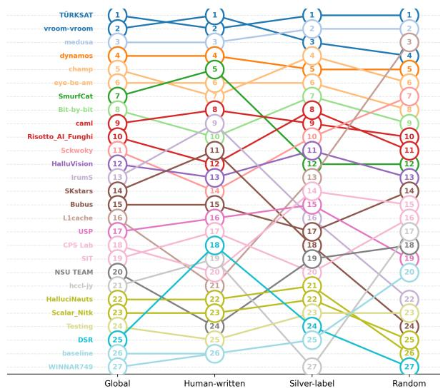  
Figure 9: Rank flows across data partitions for the English systems on Corr . Each node represents a system’s rank within a partition (General vs. Human/Silver/Random subsets).

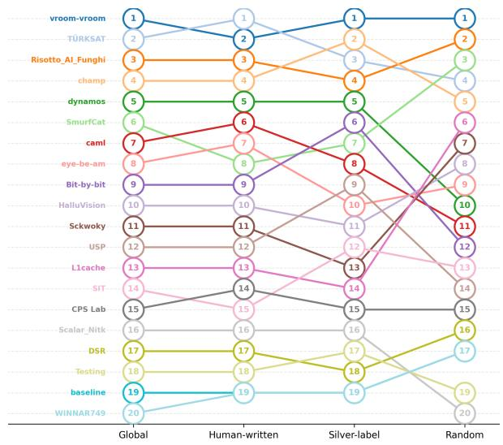  
Figure 11: Rank flows across data partitions for the Italian systems on $\mathrm { C o r r } _ { \mathrm { l b l } }$ . Each node represents a system’s rank within a partition (General vs. Human/Silver/Random subsets).

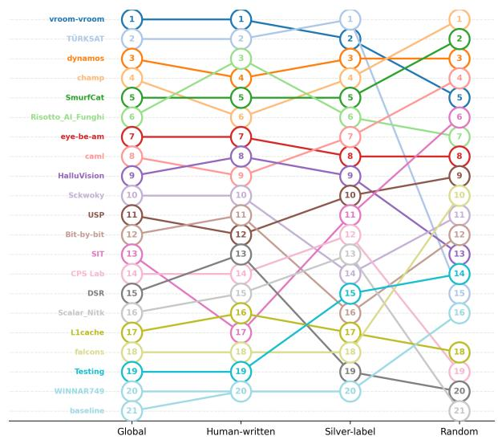  
Figure 10: Rank flows across data partitions for the Chinese systems on Corr . Each node represents a system’s rank within a partition (General vs. Human/Silver/Random subsets).

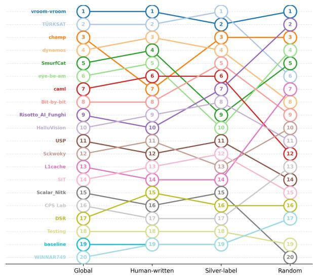  
Figure 12: Rank flows across data partitions for the French systems on $\mathrm { C o r r } _ { \mathrm { l b l } } .$ . Each node represents a system’s rank within a partition (General vs. Human/Silver/Random subsets).

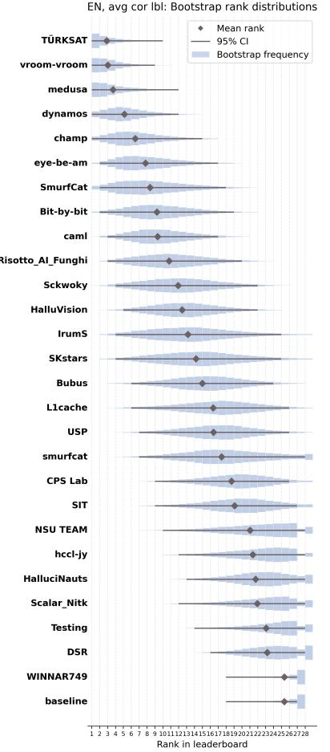

ZH, avg cor Ibl: Bootstrap rank distributions  
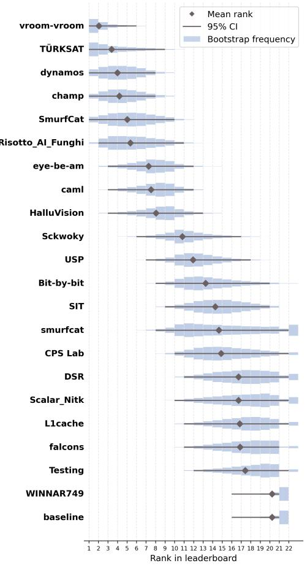

IT, avg cor Ibl: Bootstrap rank distributions  
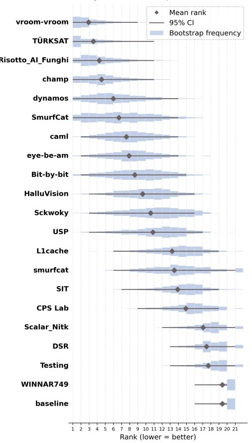

FR, avg cor Ibl: Bootstrap rank distributions  
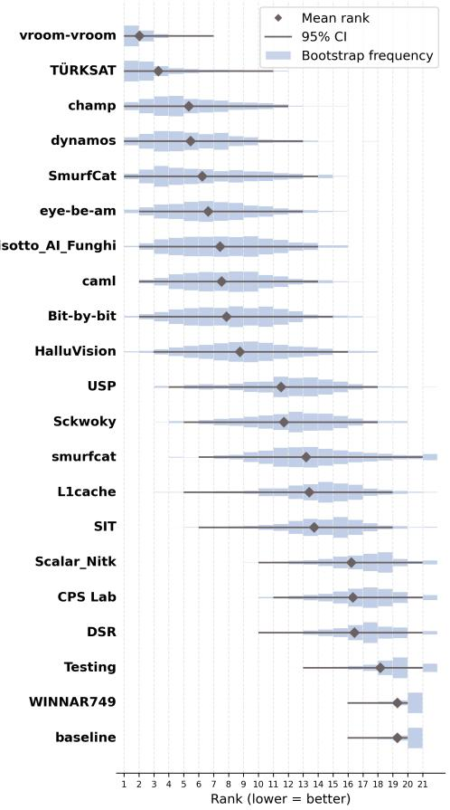  
Figure 13: Bootstrap rank distributions with means and confidence intervals at 95% for ZH, IT, FR submissions under Corr metric. Distributions show rank frequencies across 25,000 bootstrap samples.

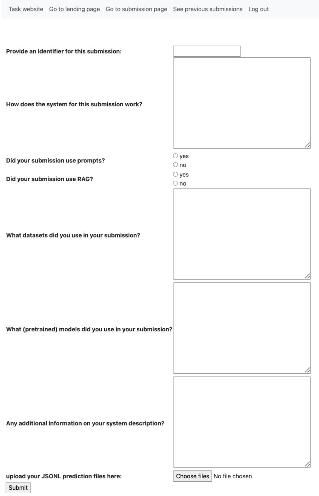  
Figure 14: SHROOM-Visions platform participant submission interface.

<table><tr><td>#</td><td>Team</td><td>Global</td><td>Human</td><td>Rndm</td><td>Silver</td></tr><tr><td>1</td><td>TÜRKSAT</td><td>0.553</td><td>0.646</td><td>0.492</td><td>0.522</td></tr><tr><td>2</td><td>vroom-vroom</td><td>0.533</td><td>0.684</td><td>0.440</td><td>0.474</td></tr><tr><td>3</td><td>medusa</td><td>0.527</td><td>0.626</td><td>0.462</td><td>0.491</td></tr><tr><td>4</td><td>champ</td><td>0.490</td><td>0.562</td><td>0.428</td><td>0.478</td></tr><tr><td>5</td><td>dynamos</td><td>0.478</td><td>0.583</td><td>0.420</td><td>0.429</td></tr><tr><td>6</td><td>eye-be-am</td><td>0.469</td><td>0.562</td><td>0.419</td><td>0.424</td></tr><tr><td>7</td><td>Risotto_AI_F.</td><td>0.468</td><td>0.554</td><td>0.414</td><td>0.434</td></tr><tr><td>8</td><td>Bit-by-bit</td><td>0.461</td><td>0.553</td><td>0.406</td><td>0.422</td></tr><tr><td>9</td><td>SmurfCat</td><td>0.460</td><td>0.571</td><td>0.396</td><td>0.413</td></tr><tr><td>10</td><td>NSU TEAM</td><td>0.459</td><td>0.528</td><td>0.413</td><td>0.435</td></tr><tr><td>11</td><td>Sckwoky</td><td>0.449</td><td>0.484</td><td>0.440</td><td>0.423</td></tr><tr><td>12</td><td>caml</td><td>0.424</td><td>0.512</td><td>0.393</td><td>0.369</td></tr><tr><td>13</td><td>Bubus</td><td>0.413</td><td>0.458</td><td>0.408</td><td>0.375</td></tr><tr><td>14</td><td>HalluVision</td><td>0.410</td><td>0.459</td><td>0.389</td><td>0.384</td></tr><tr><td>15</td><td>IrumS</td><td>0.395</td><td>0.506</td><td>0.340</td><td>0.339</td></tr><tr><td>16</td><td>L1cache</td><td>0.373</td><td>0.297</td><td>0.436</td><td>0.389</td></tr><tr><td>17</td><td>SKstars</td><td>0.364</td><td>0.472</td><td>0.323</td><td>0.299</td></tr><tr><td>18</td><td>USP</td><td>0.346</td><td>0.373</td><td>0.338</td><td>0.327</td></tr><tr><td>19</td><td>DSR</td><td>0.332</td><td>0.372</td><td>0.302</td><td>0.320</td></tr><tr><td>20</td><td>SIT</td><td>0.321</td><td>0.325</td><td>0.344</td><td>0.297</td></tr><tr><td>21</td><td>hccl-jy</td><td>0.320</td><td>0.352</td><td>0.336</td><td>0.274</td></tr><tr><td>22</td><td>CPS Lab</td><td>0.311</td><td>0.271</td><td>0.345</td><td>0.317</td></tr><tr><td>23</td><td>HalluciNauts</td><td>0.294</td><td>0.285</td><td>0.318</td><td>0.281</td></tr><tr><td>24</td><td>Scalar_Nitk</td><td>0.240</td><td>0.252</td><td>0.227</td><td>0.242</td></tr><tr><td>25</td><td>Testing</td><td>0.217</td><td>0.140</td><td>0.299</td><td>0.216</td></tr><tr><td>26</td><td>WINNAR749</td><td>0.155</td><td>0.013</td><td>0.296</td><td>0.162</td></tr><tr><td>27</td><td>baseline</td><td>0.155</td><td>0.013</td><td>0.296</td><td>0.162</td></tr></table>

Table 8: Strategy-specific Corr scores for the English leaderboard. Teams are ordered by their score on the full dataset (Global). Human-written, Random, and Silverlabel report scores computed on the corresponding data partitions. Boldface indicates the highest score within each column.

<table><tr><td>#</td><td>Team</td><td>Global</td><td>Human</td><td>Random</td><td>Silver</td></tr><tr><td>1</td><td>TÜRKSAT</td><td>0.434</td><td>0.488</td><td>0.407</td><td>0.406</td></tr><tr><td>2</td><td>vroom-vroom</td><td>0.425</td><td>0.536</td><td>0.374</td><td>0.366</td></tr><tr><td>3</td><td>medusa</td><td>0.416</td><td>0.477</td><td>0.388</td><td>0.383</td></tr><tr><td>4</td><td>dynamos</td><td>0.388</td><td>0.453</td><td>0.368</td><td>0.344</td></tr><tr><td>5</td><td>champ</td><td>0.372</td><td>0.398</td><td>0.361</td><td>0.358</td></tr><tr><td>6</td><td>eye-be-am</td><td>0.357</td><td>0.409</td><td>0.353</td><td>0.311</td></tr><tr><td>7</td><td>SmurfCat</td><td>0.352</td><td>0.435</td><td>0.343</td><td>0.280</td></tr><tr><td>8</td><td>Bit-by-bit</td><td>0.341</td><td>0.371</td><td>0.348</td><td>0.304</td></tr><tr><td>9</td><td>caml</td><td>0.339</td><td>0.379</td><td>0.346</td><td>0.294</td></tr><tr><td>10</td><td>Risotto_AI_Funghi</td><td>0.324</td><td>0.331</td><td>0.344</td><td>0.300</td></tr><tr><td>11</td><td>Sckwoky</td><td>0.313</td><td>0.297</td><td>0.353</td><td>0.292</td></tr><tr><td>12</td><td>HalluVision</td><td>0.308</td><td>0.301</td><td>0.337</td><td>0.287</td></tr><tr><td>13</td><td>IrumS</td><td>0.302</td><td>0.373</td><td>0.292</td><td>0.242</td></tr><tr><td>14</td><td>SKstars</td><td>0.290</td><td>0.350</td><td>0.288</td><td>0.236</td></tr><tr><td>15</td><td>Bubus</td><td>0.282</td><td>0.287</td><td>0.320</td><td>0.242</td></tr><tr><td>16</td><td>USP</td><td>0.267</td><td>0.260</td><td>0.300</td><td>0.245</td></tr><tr><td>17</td><td>L1cache</td><td>0.267</td><td>0.169</td><td>0.377</td><td>0.265</td></tr><tr><td>18</td><td>CPS Lab</td><td>0.245</td><td>0.176</td><td>0.310</td><td>0.252</td></tr><tr><td>19</td><td>SIT</td><td>0.242</td><td>0.217</td><td>0.307</td><td>0.207</td></tr><tr><td>20</td><td>NSU TEAM</td><td>0.217</td><td>0.145</td><td>0.302</td><td>0.207</td></tr><tr><td>21</td><td>hccl-jy</td><td>0.214</td><td>0.184</td><td>0.303</td><td>0.162</td></tr><tr><td>22</td><td>HalluciNauts</td><td>0.214</td><td>0.165</td><td>0.278</td><td>0.202</td></tr><tr><td>23</td><td>Scalar_Nitk</td><td>0.208</td><td>0.147</td><td>0.286</td><td>0.196</td></tr><tr><td>24</td><td>DSR</td><td>0.198</td><td>0.190</td><td>0.228</td><td>0.177</td></tr><tr><td>25</td><td>Testing</td><td>0.197</td><td>0.108</td><td>0.291</td><td>0.196</td></tr><tr><td>26</td><td>WINNAR749</td><td>0.155</td><td>0.013</td><td>0.296</td><td>0.162</td></tr><tr><td>27</td><td>baseline</td><td>0.155</td><td>0.013</td><td>0.296</td><td>0.162</td></tr><tr><td>#</td><td>Team</td><td>Global</td><td>Human</td><td>Rndm</td><td>Silver</td></tr><tr><td>1</td><td>TÜRKSAT</td><td>0.487</td><td>0.551</td><td>0.444</td><td>0.464</td></tr><tr><td>2</td><td>medusa</td><td>0.455</td><td>0.516</td><td>0.424</td><td>0.425</td></tr><tr><td>3</td><td>vroom-vroom</td><td>0.449</td><td>0.565</td><td>0.388</td><td>0.393</td></tr><tr><td>4</td><td>champ</td><td>0.432</td><td>0.482</td><td>0.390</td><td>0.422</td></tr><tr><td>5</td><td>Sckwoky</td><td>0.419</td><td>0.453</td><td>0.408</td><td>0.396</td></tr><tr><td>6</td><td>Risotto_AI_F.</td><td>0.418</td><td>0.483</td><td>0.383</td><td>0.389</td></tr><tr><td>7</td><td>eye-be-am</td><td>0.410</td><td>0.458</td><td>0.400</td><td>0.373</td></tr><tr><td>8</td><td>SmurfCat</td><td>0.405</td><td>0.479</td><td>0.375</td><td>0.361</td></tr><tr><td>9</td><td>NSU TEAM</td><td>0.399</td><td>0.436</td><td>0.377</td><td>0.384</td></tr><tr><td>10</td><td>dynamos</td><td>0.393</td><td>0.458</td><td>0.370</td><td>0.354</td></tr><tr><td>11</td><td>Bit-by-bit</td><td>0.393</td><td>0.467</td><td>0.340</td><td>0.371</td></tr><tr><td>12</td><td>Bubus</td><td>0.379</td><td>0.394</td><td>0.384</td><td>0.361</td></tr><tr><td>13</td><td>HalluVision</td><td>0.368</td><td>0.373</td><td>0.381</td><td>0.350</td></tr><tr><td>14</td><td>IrumS</td><td>0.342</td><td>0.416</td><td>0.322</td><td>0.290</td></tr><tr><td>15</td><td>caml</td><td>0.337</td><td>0.384</td><td>0.346</td><td>0.284</td></tr><tr><td>16</td><td>SKstars</td><td>0.315</td><td>0.394</td><td>0.302</td><td>0.252</td></tr><tr><td>17</td><td>hccl-jy</td><td>0.291</td><td>0.270</td><td>0.340</td><td>0.265</td></tr><tr><td>18</td><td>USP</td><td>0.281</td><td>0.277</td><td>0.306</td><td>0.261</td></tr><tr><td>19</td><td>L1cache</td><td>0.262</td><td>0.200</td><td>0.314</td><td>0.274</td></tr><tr><td>20</td><td>DSR</td><td>0.256</td><td>0.246</td><td>0.273</td><td>0.248</td></tr><tr><td>21</td><td>CPS Lab</td><td>0.255</td><td>0.198</td><td>0.316</td><td>0.254</td></tr><tr><td>22</td><td>SIT</td><td>0.255</td><td>0.227</td><td>0.311</td><td>0.230</td></tr><tr><td>23</td><td>HalluciNauts</td><td>0.249</td><td>0.228</td><td>0.295</td><td>0.229</td></tr><tr><td>24</td><td>Scalar_Nitk</td><td>0.208</td><td>0.150</td><td>0.289</td><td>0.190</td></tr><tr><td>25</td><td>Testing</td><td>0.187</td><td>0.094</td><td>0.289</td><td>0.183</td></tr><tr><td>26</td><td>WINNAR749</td><td>0.155</td><td>0.013</td><td>0.296</td><td>0.162</td></tr><tr><td>27</td><td>baseline</td><td>0.155</td><td>0.013</td><td>0.296</td><td>0.162</td></tr></table>

Table 9: Strategy-specific Corrlbl scores for the English leaderboard. Teams are ordered by their score on the full dataset (Global). Human-written, Random, and Silverlabel report scores computed on the corresponding data partitions. Boldface indicates the highest score within each column.

Table 10: Strategy-specific IoU scores for the English leaderboard. Teams are ordered by their score on the full dataset (Global). Human-written, Random, and Silverlabel report scores computed on the corresponding data partitions. Boldface indicates the highest score within each column.
<table><tr><td>#</td><td>Team</td><td>Global</td><td>Human</td><td>Rndm</td><td>Silver</td></tr><tr><td>1</td><td>vroom-vroom</td><td>0.608</td><td>0.691</td><td>0.599</td><td>0.543</td></tr><tr><td>2</td><td>TÜRKSAT</td><td>0.581</td><td>0.667</td><td>0.540</td><td>0.539</td></tr><tr><td>3</td><td>Risotto_AI_F.</td><td>0.558</td><td>0.623</td><td>0.573</td><td>0.489</td></tr><tr><td>4</td><td>champ</td><td>0.551</td><td>0.563</td><td>0.610</td><td>0.495</td></tr><tr><td>5</td><td>SmurfCat</td><td>0.544</td><td>0.589</td><td>0.588</td><td>0.472</td></tr><tr><td>6</td><td>dynamos</td><td>0.530</td><td>0.551</td><td>0.581</td><td>0.472</td></tr><tr><td>7</td><td>eye-be-am</td><td>0.518</td><td>0.548</td><td>0.572</td><td>0.450</td></tr><tr><td>8</td><td>HalluVision</td><td>0.512</td><td>0.535</td><td>0.545</td><td>0.465</td></tr><tr><td>9</td><td>Sckwoky</td><td>0.488</td><td>0.508</td><td>0.568</td><td>0.410</td></tr><tr><td>10</td><td>caml</td><td>0.478</td><td>0.460</td><td>0.566</td><td>0.426</td></tr><tr><td>11</td><td>DSR</td><td>0.434</td><td>0.406</td><td>0.512</td><td>0.399</td></tr><tr><td>12</td><td>Bit-by-bit</td><td>0.431</td><td>0.375</td><td>0.548</td><td>0.390</td></tr><tr><td>13</td><td>USP</td><td>0.422</td><td>0.338</td><td>0.519</td><td>0.421</td></tr><tr><td>14</td><td>CPS Lab</td><td>0.417</td><td>0.357</td><td>0.505</td><td>0.402</td></tr><tr><td>15</td><td>L1cache</td><td>0.411</td><td>0.302</td><td>0.530</td><td>0.416</td></tr><tr><td>16</td><td>falcons</td><td>0.380</td><td>0.265</td><td>0.537</td><td>0.360</td></tr><tr><td>17</td><td>SIT</td><td>0.375</td><td>0.204</td><td>0.558</td><td>0.384</td></tr><tr><td>18</td><td>Scalar_Nitk</td><td>0.353</td><td>0.238</td><td>0.470</td><td>0.365</td></tr><tr><td>19</td><td>Testing</td><td>0.323</td><td>0.149</td><td>0.501</td><td>0.339</td></tr><tr><td>20</td><td>WINNAR749</td><td>0.255</td><td>0.048</td><td>0.480</td><td>0.264</td></tr><tr><td>21</td><td>baseline</td><td>0.255</td><td>0.048</td><td>0.480</td><td>0.264</td></tr></table>

Table 11: Strategy-specific Corr scores for the Chinese leaderboard. Teams are ordered by their score on the full dataset (Global). Human-written, Random, and Silverlabel report scores computed on the corresponding data partitions. Boldface indicates the highest score within each column.

<table><tr><td>#</td><td>Team</td><td>Global</td><td>Human</td><td>Random</td><td>Silver</td></tr><tr><td>1</td><td>vroom-vroom</td><td>0.504</td><td>0.555</td><td>0.528</td><td>0.441</td></tr><tr><td>2</td><td>TÜRKSAT</td><td>0.484</td><td>0.531</td><td>0.487</td><td>0.442</td></tr><tr><td>3</td><td>dynamos</td><td>0.469</td><td>0.462</td><td>0.538</td><td>0.422</td></tr><tr><td>4</td><td>champ</td><td>0.467</td><td>0.442</td><td>0.560</td><td>0.417</td></tr><tr><td>5</td><td>SmurfCat</td><td>0.456</td><td>0.445</td><td>0.544</td><td>0.399</td></tr><tr><td>6</td><td>Risotto_AI_Funghi</td><td>0.454</td><td>0.487</td><td>0.511</td><td>0.381</td></tr><tr><td>7</td><td>eye-be-am</td><td>0.426</td><td>0.418</td><td>0.507</td><td>0.370</td></tr><tr><td>8</td><td>caml</td><td>0.422</td><td>0.376</td><td>0.532</td><td>0.378</td></tr><tr><td>9</td><td>HalluVision</td><td>0.415</td><td>0.403</td><td>0.490</td><td>0.367</td></tr><tr><td>10</td><td>Sckwoky</td><td>0.376</td><td>0.332</td><td>0.497</td><td>0.321</td></tr><tr><td>11</td><td>USP</td><td>0.360</td><td>0.228</td><td>0.503</td><td>0.366</td></tr><tr><td>12</td><td>Bit-by-bit</td><td>0.347</td><td>0.259</td><td>0.495</td><td>0.311</td></tr><tr><td>13</td><td>SIT</td><td>0.335</td><td>0.154</td><td>0.522</td><td>0.349</td></tr><tr><td>14</td><td>CPS Lab</td><td>0.330</td><td>0.206</td><td>0.471</td><td>0.330</td></tr><tr><td>15</td><td>DSR</td><td>0.309</td><td>0.210</td><td>0.454</td><td>0.283</td></tr><tr><td>16</td><td>Scalar_Nitk</td><td>0.308</td><td>0.173</td><td>0.442</td><td>0.324</td></tr><tr><td>17</td><td>L1cache</td><td>0.307</td><td>0.162</td><td>0.472</td><td>0.306</td></tr><tr><td>18</td><td>falcons</td><td>0.307</td><td>0.153</td><td>0.499</td><td>0.293</td></tr><tr><td>19</td><td>Testing</td><td>0.301</td><td>0.121</td><td>0.487</td><td>0.315</td></tr><tr><td>20</td><td>WINNAR749</td><td>0.255</td><td>0.048</td><td>0.480</td><td>0.264</td></tr><tr><td>21</td><td>baseline</td><td>0.255</td><td>0.048</td><td>0.480</td><td>0.264</td></tr></table>

Table 12: Strategy-specific Corr scores for the Chinese leaderboard. Teams are ordered by their score on the full dataset (Global). Human-written, Random, and Silver-label report scores computed on the corresponding data partitions. Boldface indicates the highest score within each column.

<table><tr><td>#</td><td>Team</td><td>Global</td><td>Human</td><td>Rndm</td><td>Silver</td></tr><tr><td>1</td><td>vroom-vroom</td><td>0.534</td><td>0.574</td><td>0.566</td><td>0.476</td></tr><tr><td>2</td><td>TÜRKSAT</td><td>0.524</td><td>0.575</td><td>0.515</td><td>0.487</td></tr><tr><td>3</td><td>Risotto_AI_F.</td><td>0.516</td><td>0.557</td><td>0.553</td><td>0.452</td></tr><tr><td>4</td><td>SmurfCat</td><td>0.501</td><td>0.507</td><td>0.570</td><td>0.442</td></tr><tr><td>5</td><td>champ</td><td>0.489</td><td>0.458</td><td>0.579</td><td>0.448</td></tr><tr><td>6</td><td>Sckwoky</td><td>0.466</td><td>0.468</td><td>0.551</td><td>0.401</td></tr><tr><td>7</td><td>eye-be-am</td><td>0.460</td><td>0.449</td><td>0.532</td><td>0.416</td></tr><tr><td>8</td><td>dynamos</td><td>0.458</td><td>0.426</td><td>0.546</td><td>0.419</td></tr><tr><td>9</td><td>HalluVision</td><td>0.444</td><td>0.422</td><td>0.512</td><td>0.412</td></tr><tr><td>10</td><td>Bit-by-bit</td><td>0.431</td><td>0.380</td><td>0.536</td><td>0.394</td></tr><tr><td>11</td><td>caml</td><td>0.408</td><td>0.342</td><td>0.537</td><td>0.367</td></tr><tr><td>12</td><td>CPS Lab</td><td>0.392</td><td>0.324</td><td>0.492</td><td>0.375</td></tr><tr><td>13</td><td>USP</td><td>0.381</td><td>0.269</td><td>0.496</td><td>0.389</td></tr><tr><td>14</td><td>falcons</td><td>0.375</td><td>0.253</td><td>0.530</td><td>0.362</td></tr><tr><td>15</td><td>SIT</td><td>0.343</td><td>0.156</td><td>0.540</td><td>0.353</td></tr><tr><td>16</td><td>DSR</td><td>0.339</td><td>0.237</td><td>0.460</td><td>0.334</td></tr><tr><td>17</td><td>Scalar_Nitk</td><td>0.323</td><td>0.194</td><td>0.458</td><td>0.331</td></tr><tr><td>18</td><td>Testing</td><td>0.298</td><td>0.111</td><td>0.489</td><td>0.315</td></tr><tr><td>19</td><td>WINNAR749</td><td>0.255</td><td>0.048</td><td>0.480</td><td>0.264</td></tr><tr><td>20</td><td>baseline</td><td>0.255</td><td>0.048</td><td>0.480</td><td>0.264</td></tr><tr><td>1</td><td>vroom-vroom</td><td>0.563</td><td>0.624</td><td>0.535</td><td>0.534</td></tr><tr><td>2</td><td>TÜRKSAT</td><td>0.553</td><td>0.665</td><td>0.483</td><td>0.514</td></tr><tr><td>3</td><td>Risotto_AI_F.</td><td>0.548</td><td>0.610</td><td>0.520</td><td>0.519</td></tr><tr><td>4</td><td>champ</td><td>0.540</td><td>0.600</td><td>0.497</td><td>0.523</td></tr><tr><td>5</td><td>dynamos</td><td>0.513</td><td>0.572</td><td>0.463</td><td>0.501</td></tr><tr><td>6</td><td>Bit-by-bit</td><td>0.505</td><td>0.538</td><td>0.464</td><td>0.507</td></tr><tr><td>7</td><td>SmurfCat</td><td>0.499</td><td>0.553</td><td>0.464</td><td>0.481</td></tr><tr><td>8</td><td>Sckwoky</td><td>0.493</td><td>0.520</td><td>0.495</td><td>0.468</td></tr><tr><td>9</td><td>eye-be-am</td><td>0.491</td><td>0.551</td><td>0.467</td><td>0.459</td></tr><tr><td>10</td><td>caml</td><td>0.483</td><td>0.537</td><td>0.442</td><td>0.469</td></tr><tr><td>11</td><td>HalluVision</td><td>0.441</td><td>0.447</td><td>0.462</td><td>0.419</td></tr><tr><td>12</td><td>USP</td><td>0.421</td><td>0.408</td><td>0.412</td><td>0.437</td></tr><tr><td>13</td><td>L1cache</td><td>0.404</td><td>0.329</td><td>0.472</td><td>0.417</td></tr><tr><td>14</td><td>SIT</td><td>0.383</td><td>0.318</td><td>0.418</td><td>0.411</td></tr><tr><td>15</td><td>CPS Lab</td><td>0.378</td><td>0.344</td><td>0.407</td><td>0.386</td></tr><tr><td>16</td><td>DSR</td><td>0.319</td><td>0.246</td><td>0.393</td><td>0.323</td></tr><tr><td>17</td><td>Scalar_Nitk</td><td>0.280</td><td>0.204</td><td>0.330</td><td>0.306</td></tr><tr><td>18</td><td>Testing</td><td>0.247</td><td>0.144</td><td>0.320</td><td>0.278</td></tr><tr><td>19</td><td>baseline</td><td>0.163</td><td>0.025</td><td>0.313</td><td>0.165</td></tr><tr><td>20</td><td>WINNAR749</td><td>0.163</td><td>0.025</td><td>0.313</td><td>0.165</td></tr></table>

Table 13: Strategy-specific IoU scores for the Chinese leaderboard. Teams are ordered by their score on the full dataset (Global). Human-written, Random, and Silverlabel report scores computed on the corresponding data partitions. Boldface indicates the highest score within each column.

Table 14: Strategy-specific Corr scores for the Italian leaderboard. Teams are ordered by their score on the full dataset (Global). Human-written, Random, and Silverlabel report scores computed on the corresponding data partitions. Boldface indicates the highest score within each column.

<table><tr><td>#</td><td>Team</td><td>Global</td><td>Human</td><td>Rndm</td><td>Silver</td></tr><tr><td>1</td><td>vroom-vroom</td><td>0.451</td><td>0.508</td><td>0.456</td><td>0.401</td></tr><tr><td>2</td><td>TÜRKSAT</td><td>0.444</td><td>0.530</td><td>0.419</td><td>0.391</td></tr><tr><td>3</td><td>Risotto_AI_F.</td><td>0.430</td><td>0.482</td><td>0.428</td><td>0.388</td></tr><tr><td>4</td><td>champ</td><td>0.421</td><td>0.460</td><td>0.418</td><td>0.393</td></tr><tr><td>5</td><td>dynamos</td><td>0.399</td><td>0.437</td><td>0.382</td><td>0.382</td></tr><tr><td>6</td><td>SmurfCat</td><td>0.393</td><td>0.404</td><td>0.421</td><td>0.362</td></tr><tr><td>7</td><td>caml</td><td>0.380</td><td>0.414</td><td>0.376</td><td>0.355</td></tr><tr><td>8</td><td>eye-be-am</td><td>0.376</td><td>0.410</td><td>0.386</td><td>0.341</td></tr><tr><td>9</td><td>Bit-by-bit</td><td>0.367</td><td>0.361</td><td>0.372</td><td>0.369</td></tr><tr><td>10</td><td>HalluVision</td><td>0.353</td><td>0.330</td><td>0.396</td><td>0.340</td></tr><tr><td>11</td><td>Sckwoky</td><td>0.337</td><td>0.327</td><td>0.404</td><td>0.297</td></tr><tr><td>12</td><td>USP</td><td>0.334</td><td>0.298</td><td>0.361</td><td>0.343</td></tr><tr><td>13</td><td>L1cache</td><td>0.297</td><td>0.210</td><td>0.405</td><td>0.290</td></tr><tr><td>14</td><td>SIT</td><td>0.292</td><td>0.202</td><td>0.371</td><td>0.306</td></tr><tr><td>15</td><td>CPS Lab</td><td>0.274</td><td>0.203</td><td>0.335</td><td>0.286</td></tr><tr><td>16</td><td>Scalar_Nitk</td><td>0.229</td><td>0.161</td><td>0.289</td><td>0.240</td></tr><tr><td>17</td><td>DSR</td><td>0.225</td><td>0.136</td><td>0.330</td><td>0.219</td></tr><tr><td>18</td><td>Testing</td><td>0.215</td><td>0.112</td><td>0.302</td><td>0.236</td></tr><tr><td>19</td><td>baseline</td><td>0.163</td><td>0.025</td><td>0.313</td><td>0.165</td></tr><tr><td>20</td><td>WINNAR749</td><td>0.163</td><td>0.025</td><td>0.313</td><td>0.165</td></tr></table>

Table 15: Strategy-specific Corr scores for the Italian leaderboard. Teams are ordered by their score on the full dataset (Global). Human-written, Random, and Silverlabel report scores computed on the corresponding data partitions. Boldface indicates the highest score within each column.

<table><tr><td>#</td><td>Team</td><td>Global</td><td>Human</td><td>Rndm</td><td>Silver</td></tr><tr><td>1</td><td>TÜRKSAT</td><td>0.490</td><td>0.571</td><td>0.445</td><td>0.458</td></tr><tr><td>2</td><td>vroom-vroom</td><td>0.479</td><td>0.508</td><td>0.476</td><td>0.458</td></tr><tr><td>3</td><td>Risotto_AI_F.</td><td>0.470</td><td>0.501</td><td>0.463</td><td>0.450</td></tr><tr><td>4</td><td>champ</td><td>0.461</td><td>0.476</td><td>0.445</td><td>0.461</td></tr><tr><td>5</td><td>SmurfCat</td><td>0.443</td><td>0.464</td><td>0.428</td><td>0.438</td></tr><tr><td>6</td><td>Sckwoky</td><td>0.430</td><td>0.424</td><td>0.457</td><td>0.415</td></tr><tr><td>7</td><td>dynamos</td><td>0.424</td><td>0.450</td><td>0.399</td><td>0.421</td></tr><tr><td>8</td><td>Bit-by-bit</td><td>0.421</td><td>0.424</td><td>0.407</td><td>0.428</td></tr><tr><td>9</td><td>eye-be-am</td><td>0.413</td><td>0.441</td><td>0.412</td><td>0.392</td></tr><tr><td>10</td><td>HalluVision</td><td>0.391</td><td>0.355</td><td>0.440</td><td>0.383</td></tr><tr><td>11</td><td>caml</td><td>0.385</td><td>0.399</td><td>0.373</td><td>0.382</td></tr><tr><td>12</td><td>USP</td><td>0.353</td><td>0.315</td><td>0.362</td><td>0.378</td></tr><tr><td>13</td><td>CPS Lab</td><td>0.320</td><td>0.266</td><td>0.364</td><td>0.331</td></tr><tr><td>14</td><td>SIT</td><td>0.311</td><td>0.223</td><td>0.373</td><td>0.336</td></tr><tr><td>15</td><td>L1cache</td><td>0.284</td><td>0.226</td><td>0.338</td><td>0.292</td></tr><tr><td>16</td><td>DSR</td><td>0.246</td><td>0.164</td><td>0.335</td><td>0.246</td></tr><tr><td>17</td><td>Scalar_Nitk</td><td>0.243</td><td>0.159</td><td>0.310</td><td>0.263</td></tr><tr><td>18</td><td>Testing</td><td>0.214</td><td>0.105</td><td>0.303</td><td>0.236</td></tr><tr><td>19</td><td>baseline</td><td>0.163</td><td>0.025</td><td>0.313</td><td>0.165</td></tr><tr><td>20</td><td>WINNAR749</td><td>0.163</td><td>0.025</td><td>0.313</td><td>0.165</td></tr></table>

Table 16: Strategy-specific IoU scores for the Italian leaderboard. Teams are ordered by their score on the full dataset (Global). Human-written, Random, and Silverlabel report scores computed on the corresponding data partitions. Boldface indicates the highest score within each column.

<table><tr><td>#</td><td>Team</td><td>Global</td><td>Human</td><td>Rndm</td><td>Silver</td></tr><tr><td>1</td><td>vroom-vroom</td><td>0.587</td><td>0.678</td><td>0.537</td><td>0.550</td></tr><tr><td>2</td><td>TÜRKSAT</td><td>0.547</td><td>0.621</td><td>0.484</td><td>0.536</td></tr><tr><td>3</td><td>champ</td><td>0.517</td><td>0.554</td><td>0.496</td><td>0.501</td></tr><tr><td>4</td><td>Risotto_AI_F.</td><td>0.506</td><td>0.548</td><td>0.504</td><td>0.472</td></tr><tr><td>5</td><td>dynamos</td><td>0.504</td><td>0.583</td><td>0.462</td><td>0.468</td></tr><tr><td>6</td><td>eye-be-am</td><td>0.484</td><td>0.560</td><td>0.487</td><td>0.416</td></tr><tr><td>7</td><td>SmurfCat</td><td>0.484</td><td>0.569</td><td>0.463</td><td>0.426</td></tr><tr><td>8</td><td>caml</td><td>0.481</td><td>0.552</td><td>0.441</td><td>0.451</td></tr><tr><td>9</td><td>Bit-by-bit</td><td>0.471</td><td>0.517</td><td>0.439</td><td>0.458</td></tr><tr><td>10</td><td>HalluVision</td><td>0.458</td><td>0.514</td><td>0.428</td><td>0.434</td></tr><tr><td>11</td><td>Sckwoky</td><td>0.438</td><td>0.428</td><td>0.455</td><td>0.433</td></tr><tr><td>12</td><td>USP</td><td>0.394</td><td>0.376</td><td>0.394</td><td>0.408</td></tr><tr><td>13</td><td>L1cache</td><td>0.387</td><td>0.297</td><td>0.475</td><td>0.396</td></tr><tr><td>14</td><td>SIT</td><td>0.360</td><td>0.302</td><td>0.395</td><td>0.382</td></tr><tr><td>15</td><td>DSR</td><td>0.326</td><td>0.269</td><td>0.398</td><td>0.317</td></tr><tr><td>16</td><td>CPS Lab</td><td>0.308</td><td>0.267</td><td>0.395</td><td>0.273</td></tr><tr><td>17</td><td>Scalar_Nitk</td><td>0.269</td><td>0.206</td><td>0.328</td><td>0.277</td></tr><tr><td>18</td><td>Testing</td><td>0.215</td><td>0.107</td><td>0.323</td><td>0.222</td></tr><tr><td>19</td><td>baseline</td><td>0.168</td><td>0.030</td><td>0.328</td><td>0.157</td></tr><tr><td>20</td><td>WINNAR749</td><td>0.168</td><td>0.030</td><td>0.328</td><td>0.157</td></tr><tr><td>1</td><td>vroom-vroom</td><td>0.474</td><td>0.540</td><td>0.451</td><td>0.435</td></tr><tr><td>2</td><td>TÜRKSAT</td><td>0.451</td><td>0.493</td><td>0.421</td><td>0.440</td></tr><tr><td>3</td><td>champ</td><td>0.410</td><td>0.403</td><td>0.426</td><td>0.402</td></tr><tr><td>4</td><td>dynamos</td><td>0.407</td><td>0.442</td><td>0.391</td><td>0.389</td></tr><tr><td>5</td><td>SmurfCat</td><td>0.397</td><td>0.437</td><td>0.421</td><td>0.342</td></tr><tr><td>6</td><td>eye-be-am</td><td>0.388</td><td>0.407</td><td>0.426</td><td>0.341</td></tr><tr><td>7</td><td>caml</td><td>0.376</td><td>0.403</td><td>0.373</td><td>0.356</td></tr><tr><td>8</td><td>Risotto_AI_F.</td><td>0.375</td><td>0.345</td><td>0.431</td><td>0.355</td></tr><tr><td>9</td><td>Bit-by-bit</td><td>0.375</td><td>0.374</td><td>0.389</td><td>0.363</td></tr><tr><td>10</td><td>HalluVision</td><td>0.362</td><td>0.364</td><td>0.375</td><td>0.349</td></tr><tr><td>11</td><td>USP</td><td>0.320</td><td>0.272</td><td>0.359</td><td>0.331</td></tr><tr><td>12</td><td>Sckwoky</td><td>0.318</td><td>0.275</td><td>0.379</td><td>0.307</td></tr><tr><td>13</td><td>L1cache</td><td>0.290</td><td>0.178</td><td>0.417</td><td>0.287</td></tr><tr><td>14</td><td>SIT</td><td>0.288</td><td>0.202</td><td>0.357</td><td>0.308</td></tr><tr><td>15</td><td>CPS Lab</td><td>0.243</td><td>0.153</td><td>0.369</td><td>0.218</td></tr><tr><td>16</td><td>Scalar_Nitk</td><td>0.242</td><td>0.159</td><td>0.304</td><td>0.264</td></tr><tr><td>17</td><td>DSR</td><td>0.240</td><td>0.161</td><td>0.340</td><td>0.226</td></tr><tr><td>18</td><td>Testing</td><td>0.205</td><td>0.091</td><td>0.320</td><td>0.210</td></tr><tr><td>19</td><td>baseline</td><td>0.168</td><td>0.030</td><td>0.328</td><td>0.157</td></tr><tr><td>20</td><td>WINNAR749</td><td>0.168</td><td>0.030</td><td>0.328</td><td>0.157</td></tr></table>

Table 17: Strategy-specific Corr scores for the French leaderboard. Teams are ordered by their score on the full dataset (Global). Human-written, Random, and Silverlabel report scores computed on the corresponding data partitions. Boldface indicates the highest score within each column.

Table 18: Strategy-specific Corrlbl scores for the French leaderboard. Teams are ordered by their score on the full dataset (Global). Human-written, Random, and Silverlabel report scores computed on the corresponding data partitions. Boldface indicates the highest score within each column.

<table><tr><td>Lang.</td><td>Annot. abs. %</td><td>Total</td><td>System abs.%</td></tr><tr><td>EN</td><td>15.48</td><td>1201</td><td>31.78</td></tr><tr><td>FR</td><td>16.78</td><td>1233</td><td>30.65</td></tr><tr><td>IT</td><td>16.34</td><td>1254</td><td>32.91</td></tr><tr><td>ZH</td><td>25.53</td><td>1210</td><td>45.98</td></tr><tr><td>Total</td><td>18.51</td><td>4898</td><td>34.87</td></tr></table>

<table><tr><td>#</td><td>Team</td><td>Global</td><td>Human</td><td>Rndm</td><td>Silver</td></tr><tr><td>1</td><td>vroom-vroom</td><td>0.515</td><td>0.572</td><td>0.487</td><td>0.488</td></tr><tr><td>2</td><td>TÜRKSAT</td><td>0.500</td><td>0.541</td><td>0.460</td><td>0.497</td></tr><tr><td>3</td><td>champ</td><td>0.478</td><td>0.485</td><td>0.466</td><td>0.481</td></tr><tr><td>4</td><td>Risotto_AI_F.</td><td>0.457</td><td>0.463</td><td>0.477</td><td>0.434</td></tr><tr><td>5</td><td>Sckwoky</td><td>0.447</td><td>0.417</td><td>0.474</td><td>0.451</td></tr><tr><td>6</td><td>dynamos</td><td>0.440</td><td>0.466</td><td>0.414</td><td>0.439</td></tr><tr><td>7</td><td>SmurfCat</td><td>0.436</td><td>0.476</td><td>0.447</td><td>0.392</td></tr><tr><td>8</td><td>eye-be-am</td><td>0.433</td><td>0.473</td><td>0.446</td><td>0.388</td></tr><tr><td>9</td><td>HalluVision</td><td>0.423</td><td>0.403</td><td>0.429</td><td>0.434</td></tr><tr><td>10</td><td>Bit-by-bit</td><td>0.414</td><td>0.436</td><td>0.377</td><td>0.425</td></tr><tr><td>11</td><td>caml</td><td>0.399</td><td>0.435</td><td>0.368</td><td>0.394</td></tr><tr><td>12</td><td>USP</td><td>0.337</td><td>0.293</td><td>0.357</td><td>0.360</td></tr><tr><td>13</td><td>SIT</td><td>0.299</td><td>0.223</td><td>0.357</td><td>0.319</td></tr><tr><td>14</td><td>L1cache</td><td>0.293</td><td>0.185</td><td>0.394</td><td>0.305</td></tr><tr><td>15</td><td>DSR</td><td>0.272</td><td>0.181</td><td>0.369</td><td>0.272</td></tr><tr><td>16</td><td>CPS Lab</td><td>0.267</td><td>0.206</td><td>0.367</td><td>0.239</td></tr><tr><td>17</td><td>Scalar_Nitk</td><td>0.236</td><td>0.162</td><td>0.310</td><td>0.241</td></tr><tr><td>18</td><td>Testing</td><td>0.193</td><td>0.078</td><td>0.313</td><td>0.196</td></tr><tr><td>19</td><td>baseline</td><td>0.168</td><td>0.030</td><td>0.328</td><td>0.157</td></tr><tr><td>20</td><td>WINNAR749</td><td>0.168</td><td>0.030</td><td>0.328</td><td>0.157</td></tr></table>

Table 20: Comparison of empty (abstinence) annotation versus participation system submissions on test set.  
Table 19: Strategy-specific IoU scores for the French leaderboard. Teams are ordered by their score on the full dataset (Global). Human-written, Random, and Silverlabel report scores computed on the corresponding data partitions. Boldface indicates the highest score within each column.

<table><tr><td>Class</td><td>Lang</td><td>Precision</td><td>Recall</td><td>F1-Score</td><td>Span-Acc</td></tr><tr><td rowspan="4">OCR</td><td>EN</td><td> $0 . 2 7 4 _ { \pm 0 . 1 9 7 } / 0 . 6 7 2$ </td><td> $0 . 2 3 3 { \scriptstyle \pm 0 . 1 5 1 } / 0 . 5 3 3$ </td><td> $0 . 2 0 9 _ { \pm 0 . 1 3 6 } / 0 . 5 1 6$ </td><td> $0 . 1 2 3 _ { \pm 0 . 0 8 7 } / 0 . 3 4 7$ </td></tr><tr><td>FR</td><td> $0 . 2 2 5 { _ { \pm 0 . 1 7 7 } } / 0 . 5 8 3$ </td><td> $0 . 2 6 0 { \scriptstyle \pm 0 . 1 7 2 } / 0 . 6 0 1$ </td><td> $0 . 1 9 5 _ { \pm 0 . 1 3 0 } / 0 . 5 1 2$ </td><td> $0 . 1 1 4 _ { \pm 0 . 0 8 3 } / 0 . 3 4 4$ </td></tr><tr><td>IT</td><td> $0 . 2 4 1 { \scriptstyle \pm 0 . 1 9 3 } / 0 . 6 8 5$ </td><td> $0 . 2 7 4 _ { \pm 0 . 1 7 5 } / 0 . 6 1 1$ </td><td> $0 . 1 9 5 _ { \pm 0 . 1 3 8 } / 0 . 5 3 6$ </td><td> $0 . 1 1 5 { _ { \pm 0 . 0 8 9 } } / 0 . 3 6 6$ </td></tr><tr><td>ZH</td><td> $0 . 2 5 1 { _ { \pm 0 . 1 8 1 } } / 0 . 6 5 2$ </td><td> $0 . 2 4 0 { \scriptstyle \pm 0 . 1 6 4 } / 0 . 6 6 3$ </td><td> $0 . 1 8 8 { \scriptstyle \pm 0 . 1 1 5 } / 0 . 5 1 0$ </td><td> $0 . 1 0 8 { \scriptstyle \pm 0 . 0 7 2 } / 0 . 3 4 2$ </td></tr><tr><td rowspan="4">invention</td><td>EN</td><td> $0 . 1 3 6 { \scriptstyle \pm 0 . 1 0 4 } / 0 . 4 5 3$ </td><td> $0 . 1 4 8 { \scriptstyle \pm 0 . 1 0 3 } / 0 . 4 6 6$ </td><td> $0 . 1 1 0 { _ { \pm 0 . 0 7 7 } } / 0 . 3 1 9$ </td><td> $0 . 0 6 0 { \scriptstyle \pm 0 . 0 4 4 } / 0 . 1 9 0$ </td></tr><tr><td>FR</td><td> $0 . 1 1 3 { \scriptstyle \pm 0 . 1 0 3 } / 0 . 4 4 8$ </td><td> $0 . 1 7 2 { \scriptstyle \pm 0 . 0 9 4 } / 0 . 4 3 1$ </td><td> $0 . 1 1 1 { _ { \pm 0 . 0 8 3 } } / 0 . 2 8 8$ </td><td> $0 . 0 6 1 _ { \pm 0 . 0 4 7 } / 0 . 1 6 8$ </td></tr><tr><td>IT</td><td> $0 . 1 5 9 _ { \pm 0 . 1 2 2 } / 0 . 4 9 4$ </td><td> $0 . 1 8 9 _ { \pm 0 . 1 1 1 } / 0 . 4 8 0$ </td><td> $0 . 1 4 2 _ { \pm 0 . 0 9 4 } / 0 . 3 3 0$ </td><td> $0 . 0 7 9 { \scriptstyle \pm 0 . 0 5 5 } / 0 . 1 9 8$ </td></tr><tr><td>ZH</td><td> $0 . 1 5 0 { \scriptstyle \pm 0 . 1 0 9 } / 0 . 5 0 6$ </td><td> $0 . 1 6 7 _ { \pm 0 . 0 8 9 } / 0 . 3 5 7$ </td><td> $0 . 1 3 9 _ { \pm 0 . 0 8 8 } / 0 . 3 4 4$ </td><td> $0 . 0 7 7 { \scriptstyle \pm 0 . 0 5 2 } / 0 . 2 0 8$ </td></tr><tr><td rowspan="4">mischar.</td><td>EN</td><td> $0 . 1 8 9 _ { \pm 0 . 1 4 3 } / 0 . 6 0 8$ </td><td> $0 . 1 4 3 _ { \pm 0 . 1 1 3 } / 0 . 4 7 1$ </td><td> $0 . 1 2 2 _ { \pm 0 . 0 8 3 } / 0 . 3 3 8$ </td><td> $0 . 0 6 7 _ { \pm 0 . 0 4 8 } / 0 . 2 0 3$ </td></tr><tr><td>FR</td><td> $0 . 1 5 8 _ { \pm 0 . 1 3 2 } / 0 . 5 0 0$ </td><td> $0 . 1 6 0 _ { \pm 0 . 1 0 6 } / 0 . 4 5 6$ </td><td> $0 . 1 2 3 _ { \pm 0 . 0 8 8 } / 0 . 3 2 2$ </td><td> $0 . 0 6 8 _ { \pm 0 . 0 5 0 } / 0 . 1 9 2$ </td></tr><tr><td>IT</td><td> $0 . 2 0 1 _ { \pm 0 . 1 5 5 } / 0 . 5 2 6$ </td><td> $0 . 1 7 6 _ { \pm 0 . 1 1 4 } / 0 . 4 7 8$ </td><td> $0 . 1 4 1 _ { \pm 0 . 0 9 8 } / 0 . 3 3 5$ </td><td> $0 . 0 7 9 _ { \pm 0 . 0 5 7 } / 0 . 2 0 1$ </td></tr><tr><td>ZH</td><td> $0 . 2 2 2 _ { \pm 0 . 1 8 1 } / 0 . 5 4 2$ </td><td> $0 . 1 4 1 _ { \pm 0 . 1 2 1 } / 0 . 6 7 4$ </td><td> $0 . 1 1 2 _ { \pm 0 . 0 9 0 } / 0 . 3 4 5$ </td><td> $0 . 0 6 2 _ { \pm 0 . 0 5 2 } / 0 . 2 0 8$ </td></tr><tr><td rowspan="4">miscoun.</td><td>EN</td><td> $0 . 3 1 6 { \scriptstyle \pm 0 . 2 1 0 } / 0 . 7 2 6$ </td><td> $0 . 3 3 5 _ { \pm 0 . 1 9 9 } / 0 . 6 7 2$ </td><td> $0 . 2 8 8 _ { \pm 0 . 1 8 2 } / 0 . 6 0 1$ </td><td> $0 . 1 8 1 _ { \pm 0 . 1 2 2 } / 0 . 4 3 0$ </td></tr><tr><td>FR</td><td> $0 . 3 6 9 _ { \pm 0 . 2 5 6 } / 0 . 8 2 4$ </td><td> $0 . 4 3 9 _ { \pm 0 . 2 5 2 } / 0 . 7 7 4$ </td><td> $0 . 3 4 9 _ { \pm 0 . 2 3 3 } / 0 . 6 4 7$ </td><td> $0 . 2 3 4 _ { \pm 0 . 1 6 8 } / 0 . 4 7 9$ </td></tr><tr><td>IT</td><td> $0 . 3 6 3 _ { \pm 0 . 2 4 1 } / 0 . 7 6 0$ </td><td> $0 . 3 7 6 { \scriptstyle \pm 0 . 1 9 9 } / 0 . 6 2 1$ </td><td> $0 . 3 1 9 _ { \pm 0 . 1 9 9 } / 0 . 6 2 1$ </td><td> $0 . 2 0 6 _ { \pm 0 . 1 4 0 } / 0 . 4 5 1$ </td></tr><tr><td>ZH</td><td> $0 . 3 4 8 _ { \pm 0 . 2 4 6 } / 0 . 7 8 0$ </td><td> $0 . 3 2 1 { _ { \pm 0 . 2 0 6 } } / 0 . 8 4 5$ </td><td> $0 . 2 7 2 { _ { \pm 0 . 1 7 6 } } / 0 . 5 8 8$ </td><td> $0 . 1 6 9 _ { \pm 0 . 1 1 8 } / 0 . 4 1 6$ </td></tr><tr><td rowspan="4">Other</td><td>EN</td><td> $0 . 0 6 9 _ { \pm 0 . 1 0 5 } / 0 . 6 6 7$ </td><td> $0 . 0 7 5 { \scriptstyle \pm 0 . 0 6 8 } / 0 . 3 8 6$ </td><td> $0 . 0 4 9 _ { \pm 0 . 0 5 7 } / 0 . 2 3 9$ </td><td> $0 . 0 2 6 _ { \pm 0 . 0 3 1 } / 0 . 1 3 6$ </td></tr><tr><td>FR</td><td> $0 . 0 2 3 _ { \pm 0 . 0 4 7 } / 0 . 3 3 3$ </td><td> $0 . 0 3 8 { \scriptstyle \pm 0 . 0 5 5 } / 0 . 3 7 8$ </td><td> $0 . 0 2 0 { \scriptstyle \pm 0 . 0 3 1 } / 0 . 1 6 3$ </td><td> $0 . 0 1 0 { \scriptstyle \pm 0 . 0 1 7 } / 0 . 0 8 9$ </td></tr><tr><td>IT</td><td> $0 . 0 4 1 { \scriptstyle \pm 0 . 0 6 8 } / 0 . 4 0 0$ </td><td> $0 . 0 4 5 _ { \pm 0 . 0 7 1 } / 0 . 5 2 6$ </td><td> $0 . 0 2 8 _ { \pm 0 . 0 3 6 } / 0 . 2 1 3$ </td><td> $0 . 0 1 5 _ { \pm 0 . 0 1 9 } / 0 . 1 1 9$ </td></tr><tr><td>ZH</td><td> $0 . 0 1 7 _ { \pm 0 . 0 3 8 } / 0 . 2 5 0$ </td><td> $0 . 0 2 5 _ { \pm 0 . 0 4 6 } / 0 . 3 5 3$ </td><td> $0 . 0 1 3 _ { \pm 0 . 0 2 2 } / 0 . 1 1 8$ </td><td> $0 . 0 0 7 _ { \pm 0 . 0 1 2 } / 0 . 0 6 3$ </td></tr></table>

Table 21: Hallucination class-level summary of the participants system across all the languages. Each entry denotes $\mathrm { m e a n } _ { \pm \mathrm { s t d } } / \mathrm { m a x }$ score format (min $\mathrm { s c o r e } = 0 . 0$ for all, so redacted for better reability).