# Query-Side Attacks on GNN-Based KGQA: Tracing Failures from Entity Linking to Answer Generation

Pankaj Kumar1,2, Subhankar Mishra1,2

1National Institute of Science Education and Research, 2Homi Bhabha National Institute Correspondence: {{pankaj.kumar,smishra}@niser.ac.in

## Abstract

GNN-based Knowledge Graph Question An swering (KGQA) pipelines process queries through four discrete stages: entity linking, subgraph retrieval, GNN reasoning, and answer generation. Standard robustness evaluations conflate stage-level failures into a single endto-end metric, obscuring both the source of brittleness and the appropriate mitigation target. We ask which stage fails, and why, when the pipeline is subjected to adversarial perturbations on the input question. We introduce a stage-isolation protocol with two answerpreserving adversarial perturbations verified against the knowledge graph: Compositional Restructuring (CR) and Relation Synonym Swap (RS) target distinct stages while leaving entity seeds intact. Evaluated across Com plexWebQuestions and WebQSP, the results run counter to prevailing assumptions: the GNN reasoning stage retains near-baseline accuracy when the subgraph is intact, while subgraph construction accounts for over 99% of the end-to-end collapse under CR, occurring even when the gold answer is present in 74% of retrieved subgraphs. This exposes a fundamental distinction between answer presence and answer reachability that end-to-end metrics cannot detect, and places the mitigation target firmly at the subgraph construction stage rather than the reasoning model. Perturbed datasets and evaluation infrastructure are released at https://anonymous.4open. science/r/atkgrag-E85C.

## 1 Introduction

Knowledge graph question answering (KGQA) has become a core benchmark for structured reasoning: given a natural-language question and a large knowledge graph (KG) such as Freebase, the system must find the answer entity by traversing multihop relational paths (Sun et al., 2018; Saxena et al., 2020; Zhang et al., 2022). GNN-based pipelines have pushed state-of-the-art accuracy by coupling a graph neural network (GNN) reasoner with a retrieval-augmented generation (RAG) framework, achieving strong results on ComplexWebQuestions (CWQ) and WebQSP (Mavromatis and Karypis, 2024).

The path from question to answer runs through four discrete stages: Entity Linking, Subgraph Retrieval, GNN reasoning, and Answer generation. Each stage can fail independently and pass corrupted outputs to the next. An adversary who reformulates the query without touching the KG or model can trigger a cascade of failures through this pipeline. Figure 1 shows the four stages and their distinct attack surfaces.

Most robustness work on RAG focuses on corpus-side attacks: poisoning the retrieval index (Zhong et al., 2023; Zou et al., 2025; Chaudhari et al., 2024), injecting adversarial passages (Perez and Ribeiro, 2022; Shi et al., 2023), or manipulating retrieved context (Xue et al., 2024). These require the adversary to write to the KG or corpus, a strong and often unrealistic capability. Existing KGQA robustness studies (Perçin et al., 2025) have explored entity surface-form noise and relation paraphrase perturbations but have not measured which pipeline stagefailsfirst, nor how that failure propagates downstream.

We conduct the first systematic, stage-resolved robustness study of a GNN-based KGQA pipeline. The adversary needs only the ability to submit a question, with no KG access or model internals. To attribute failures to the correct stage, we introduce a stage-isolation protocol: fix upstream outputs, perturb only the query, and measure per-stage degradation separately. Two attacks probe distinct stages: Compositional Restructuring (CR) rewrites the question via hop-order reversal or constraint injection, leaving entity mentions intact and preserving the SPARQL answer; Relation Synonym Swap (RS) replaces predicate surface forms with synonyms while keeping entity mentions unchanged.

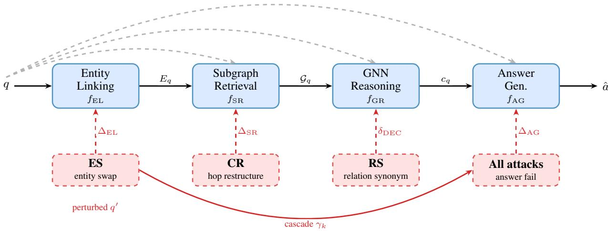  
Figure 1: GNN-RAG pipeline and perturbation entry points. The pipeline $( f _ { \mathrm { E L } } \to f _ { \mathrm { S R } } \to f _ { \mathrm { G R } } \to f _ { \mathrm { A G } } )$ maps question q to answer aˆ. ES targets fEL (entity swap ⇒ ELQ seed failure). CR targets fSR (hop-order reversal ⇒ topology mismatch). RS targets $f _ { \mathrm { G R } }$ (predicate synonym ⇒ instruction drift). Dashed grey arrows: q feeds all stages directly.

Entity Swap (ES) is a diagnostic perturbation (Appendix D) that changes the gold answer by design and characterises entity-linker brittleness.

Under CR, subgraphs built from the ELQ entity linker (Li et al., 2020a) contain the gold answer in 74% of cases yet GNN-RAG achieves only 0.68% EM (Exact Match) on CWQ, the answer is present but Personalized-PageRank (PPR) retrieval topology is anchored to the original reasoning chain. GraftNet’s question-embeddingweighted PPR achieves 29.82% EM at 63.3% answer coverage, higher EM than ELQ’s 0.68% despite lower coverage (63.3% vs. 74%), because it reorients PPR mass toward the restructured reasoning chain rather than the original one. Under RS the ELQ subgraph is structurally unchanged, so RS ELQ EM (20.3% CWQ, 50.9% WebQSP) measures GNN instruction decoder sensitivity in near-isolation. Path injection at inference recovers 51.4% CWQ EM under CR without fine-tuning, matching or exceeding the relationpath-augmented model. EPR-KGQA (single-shot pattern-based retrieval) retains near-baseline accuracy under both attacks; ExplaiGNN (iterative pattern-matching, Wikidata) collapses like GNN-RAG, showing robustness requires single-shot rather than PPR-free retrieval (Ding et al., 2024; Christmann et al., 2023).

## Contributions.

1. Stage-isolation framework. A protocol and two adversarial perturbation types (CR, RS)

that probe distinct pipeline stages, enabling perstage degradation measurement $( \Delta _ { \mathrm { E L } } , \ \Delta _ { \mathrm { S R } } .$ $\Delta _ { \mathrm { A G } }$ defined in §4.1) on standard KGQA benchmarks.

2. Answer presence ̸= answer reachability. Under CR, 74% subgraph answer presence yields only 0.68% EM (CWQ); GraftNet (GEM: Golden Entity Map oracle seeds) at 63.3% coverage reaches 29.82% EM because its PPR topology aligns with the restructured reasoning chain.

3. Subgraph construction is the performance ceiling. Stage-isolation attributes 52.08 percentage points (pp) of the 52.22 pp total CR CWQ drop to subgraph topology failure; the GNN instruction decoder is robust when the subgraph is intact (52.76% CWQ EM on clean subgraph + CR question).

4. Inference-time path injection recovers most of the gain. Injecting predicted relation paths at inference (no fine-tuning) recovers 51.4% CWQ EM under CR, matching or exceeding relation-path-augmented fine-tuning.

## 2 Related Work

GNN-based KGQA and subgraph retrieval.   
Semantic parsing methods (Berant et al., 2013;   
Yih et al., 2015; Lan et al., 2021) translate questions into SPARQL for direct KG execution.   
Embedding-based methods (Saxena et al., 2020;

Zhang et al., 2022; He et al., 2021) retrieve answers via dense similarity. GNN-RAG (Mavromatis and Karypis, 2024) combines both: a three-layer GAT (ReaRev) (Mavromatis and Karypis, 2022) over a PPR-retrieved subgraph, with ELQ as entity linker, creating a cascading failure structure that we characterise under query perturbation. Subgraph retrieval variants include GraftNet-Orig (Sun et al., 2018) (PPR from seed entities), NSM (He et al., 2021) (relation-weighted BFS pruning), and EPR-KGQA (Ding et al., 2024) (atomic adjacency patterns, state-of-the-art on CWQ as of 2024 and near-baseline-retaining under our perturbations, Section 5). Recent learned retrievers address the same subgraph bottleneck through differentiable or LM-based selection, faithful reasoning over retrieved evidence, or PPR combined with synonym links (Huang et al., 2024; Gao et al., 2025; Sui et al., 2025; Gutiérrez et al., 2025).

Entity linking and query-side robustness. ELQ (Li et al., 2020a) (BERT-Large bi-encoder) is GNN-RAG’s production linker; BLINK (Wu et al., 2020) and ReFinED (Ayoola et al., 2022) offer stronger alternatives, and recent evaluations (Li et al., 2025; Hou et al., 2025; Vollmers et al., 2025) show LLM-based linkers substantially outperform bi-encoder approaches. For our two primary attacks (CR and RS), entity linking is intact (≤0.3 pp SeedHit drop), so the subgraph topology is the bottleneck, not the linker. BYOKG-RAG (Mavromatis et al., 2025) proposes iterative LLM-based EL; its improvements are complementary to our structural findings. Query-level attacks on text classifiers (TextFooler (Jin et al., 2020), BERT-Attack (Li et al., 2020b)) and KGQA perturbations (Perçin et al., 2025) have studied surface-form noise, but none measure which pipeline stage fails first or how failure propagates downstream, which is the gap our stage-isolation protocol fills. Corpus-side attacks (PoisonedRAG (Zou et al., 2025), Zhong et al. 2023; Chaudhari et al. 2024) require KG write access; our threat model requires only the ability to submit a question. Concurrently, Zhou et al. (2026) find missing intermediate-hop triples as the dominant failure, validating our subgraph bottleneck from the corpus side; Ma et al. (2026) study the inverted setting where LLM node features absorb structural perturbations, unlike our pipeline where entity-set errors propagate through messagepassing. Kandpal et al. (2023) show LLMs fail on rare entities, consistent with our ES diagnostic; Zhao et al. (2025) provide stage-wise KGpoisoning analysis complementary to our queryside isolation.

## 3 Methodology

## 3.1 Pipeline Formalisation

We model GNN-RAG as a four-stage function composition:

$$
q \xrightarrow [ ] { f _ { \mathrm { E L } } } \xi _ { q } \xrightarrow [ ] { f _ { \mathrm { S R } } } \mathcal { G } _ { q } \xrightarrow [ ] { f _ { \mathrm { G R } } } c _ { q } \xrightarrow [ ] { f _ { \mathrm { A G } } } { \hat { a } }\tag{1}
$$

where $E _ { q }$ is the linked entity set of Freebase machine identifiers (MIDs; e.g., m.02mjmr), $\mathcal { G } _ { q }$ is the retrieved answer subgraph, $c _ { q }$ is the verbalised evidence context, and aˆ is the generated answer. In GNN-RAG: $f _ { \mathrm { E L } }$ is ELQ (Li et al., 2020a); $f _ { \mathrm { S R } }$ is personalised PageRank (PPR) over the multi-hop neighbourhood seeded by $E _ { q }$ (He et al., 2021); fGR is a three-layer GAT (ReaRev backbone) (Mavromatis and Karypis, 2024); and $f _ { \mathrm { A G } }$ is fine-tuned Llama-2-7B.

## 3.2 Threat Model

Attacker capability. The adversary (i) reads q before submission; (ii) submits $q ^ { \prime }$ and observes ${ \hat { a } } ;$ (iii) runs local copies of open-source components (perturbation generator, Freebase SPARQL endpoint) to verify SPARQL denotation preservation. No access to model parameters or intermediate states is required. This is a query-only black-box threat model.

Semantic validity budget. Every CR/RS perturbation must satisfy: (i) perplexity PPL $( q ^ { \prime } ) <$ 50 (GPT-2-large); (ii) BERTScore $( q , q ^ { \prime } ) > 0$ .85 (DeBERTa-xlarge-mnli); (iii) den $( q ^ { \prime }$ , Freebase) = den $( q ,$ , Freebase) verified via local Virtuoso. Formal perturbation rules are in Appendix E. The perturbation generator and the SPARQL endpoint constitute offline evaluation infrastructure rather than attacker capability. They certify that a rewritten question preserves the gold answer, and this certification is what allows a measured accuracy drop to be attributed to the system rather than to altered question semantics. The adversary does not require them at attack time. The deployment-time attack consists of submitting a single reworded question.

## 3.3 Perturbation Taxonomy

We define two primary adversarial attacks plus a diagnostic perturbation (ES, Appendix D). Four secondary types (S1–S4) are in Appendix K.

Entity Swap (ES): diagnostic only. Substitutes the topic entity, changing both the Freebase MID (Machine-ID) and the correct answer. Not an adversarial attack; measures entity-linker brittleness. Results in Appendix D.

Compositional Restructuring (CR). Apply exactly one KG-safe structural operation: hoporder reversal, distractor constraint injection, or intermediate-entity alias substitution. Entity mentions are unchanged; SPARQL denotation is preserved. Pipeline target: $f _ { \mathrm { S R } }$ and GNN multi-hop traversal.

Relation Synonym Swap (RS). Replace the predicate phrase with a synonym preserving the underlying Freebase relation. All entity mentions remain exactly unchanged. Pipeline target: GNN instruction decoder. Because entity seeds and PPR walks are unchanged, RS ELQ EM numbers (20.3% CWQ, 50.9% WebQSP) measure GNN instruction decoder sensitivity in near-isolation.

All perturbation types are generated by Llama-3.3-70B-Instruct (prompts in Appendix H). Pass rates: 92.4% on filters (i)–(ii) and 94.1% on the SPARQL denotation check. Perturbation quality was further validated by manual inspection of 500 random samples per attack type (excluding ES), confirming semantic naturalness and answer preservation.

## 3.4 Subgraph Retrieval Variants

All variants use the same GNN-RAG ReaRev checkpoint; only $\mathcal { G } _ { \boldsymbol { q } ^ { \prime } }$ changes, isolating subgraph construction quality from GNN model quality. Full descriptions of ELQ, GraftNet-Orig, NSM, Graft-Net (ours), and EPR-KGQA are in Appendix B.

## 4 Stage-Wise Evaluation Framework

## 4.1 Per-Stage Degradation Metrics

We track failure propagation through four metrics $( \Delta _ { \mathrm { E L } } , \Delta _ { \mathrm { S R } } , \alpha _ { \mathrm { p e r t } } , \Delta _ { \mathrm { A G } } )$ , one per pipeline stage: Entity linking degradation $( \Delta _ { E L } )$

$$
\Delta _ { \mathrm { E L } } = \mathrm { S e e d H i t } ( E _ { q } ) - \mathrm { S e e d H i t } ( E _ { q ^ { \prime } } )\tag{2}
$$

where

$$
\operatorname { S e e d H i t } ( E ) = { \frac { 1 } { N } } \sum _ { i = 1 } ^ { N } \mathbf { 1 } \Bigl [ \hat { E } _ { i } \cap E _ { i } ^ { * } \neq \varnothing \Bigr ]\tag{3}
$$

$\hat { E } _ { i }$ is the set of MIDs linked by ELQ for question i; $E _ { i } ^ { * }$ is the set of gold seed MIDs. We use any-match because GNN-RAG requires only one correct seed entity to initiate PPR.

Subgraph retrieval drift $( \Delta _ { \mathrm { S R } } )$

$$
\Delta _ { \mathrm { S R } } = 1 - J ( \mathcal { G } _ { q } , \mathcal { G } _ { q ^ { \prime } } )\tag{4}
$$

where J is the triple-level Jaccard on Freebase string triples $( s , p , o )$ . High $\Delta _ { \mathrm { S R } }$ means the subgraph has changed substantially; $\alpha _ { \mathrm { { p e r t } } }$ (below) measures quality directly.

We use a triple-level Jaccard for three reasons: (i) it measures the structural drift of the retrieved evidence, complementing $\alpha _ { \mathrm { { p e r t } } }$ , which measures answer presence; (ii) matching over string triples is exact, so no embedding model or similarity threshold has to be tuned; and (iii) it is the natural setoverlap measure over the subgraph object that the pipeline actually passes downstream. No character n-gram similarity is involved.

$\alpha _ { \mathrm { { p e r t } } } $ Answer presence in perturbed subgraph.

$$
\alpha _ { \mathrm { p e r t } } = \frac { 1 } { N } \sum _ { i = 1 } ^ { N } \mathbf { 1 } \Big [ a _ { i } ^ { * } \in \mathcal { G } _ { q _ { i } ^ { \prime } } \Big ]\tag{5}
$$

$\alpha _ { \mathrm { { p e r t } } }$ is the strongest predictor of final EM across subgraph variants and serves as the direct measure of subgraph construction quality.

End-to-end answer generation drop $\left( \Delta _ { \mathrm { A G } } \right)$

$$
\Delta _ { \mathrm { A G } } = \mathrm { E M } _ { \mathrm { c l e a n } } - \mathrm { E M } _ { \mathrm { p e r t } }\tag{6}
$$

where $\mathrm { E M } ( q ) ~ = ~ { \bf 1 } [ a ^ { * } ~ \sqsubseteq ~ \hat { a } ] \quad$ : the gold Freebase MID $a ^ { * }$ must appear as a substring in aˆ. We report bootstrap 95% CIs on $\Delta _ { \mathrm { A G } }$ $( n = 1 0 0 0$ resamples). All metrics are bounded: SeedHit, $\Delta _ { \mathrm { S R } } , \alpha _ { \mathrm { p e r t } } , \mathrm { E M } \in [ 0 , 1 ] ; \Delta _ { \mathrm { E L } } , \Delta _ { \mathrm { A G } } \in$ [−1, 1] (positive = degradation), reported in percentage points (pp); $\delta _ { \mathrm { S G } }$ and $\delta _ { \mathrm { D E C } }$ share $\Delta _ { \mathrm { A G } } \mathrm { ^ { * } s }$ units.

Metric equivalence: MID-based Hit@1. Both GNN-RAG and EPR-KGQA report MID-based Hit@1 (not entity-name Hit@1) for CWQ and WebQSP. In evaluate.py, entity2name is None for standard CWQ/WebQSP data folders, so f1\_and\_hits operates on integer indices into the MID-keyed entity vocabulary; the reported clean Hit@1 (CWQ = 57.4%, WebQSP = 74.3%) equals the paper’s gold-MID EM. EPR-KGQA (NSM-H) similarly selects kb\_id for string-MID answers, indexing the same MID-keyed vocabulary. The ∼58 pp gap under CR is therefore a direct architectural comparison; the prior caveat about a “∼5 pp metric leniency” was incorrect and has been removed.

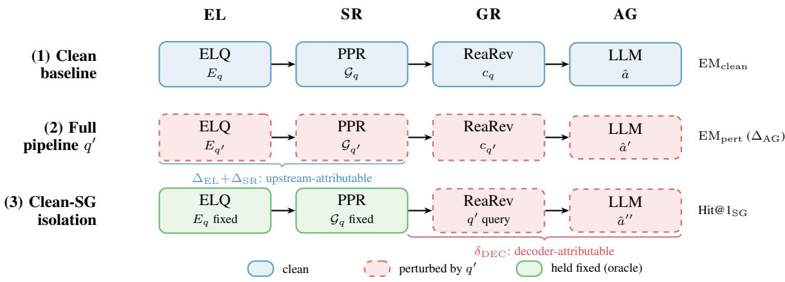  
Figure 2: Stage-isolation protocol (three configurations). (1) Clean baseline: question $q \ \mathbf { g } \mathbf { o }$ through all stages and reference $\mathrm { E M } _ { \mathrm { c l e a n } }$ . (2) Full pipeline: perturbed $q ^ { \prime }$ through all stages, which measures total drop $\Delta _ { \mathrm { A G } }$ . (3) Clean-SG isolation: EL and SR frozen at clean outputs; only the question text fed to GR is replaced with $q ^ { \prime }$ . Gap (2)−(3) = subgraph-attributable failure $\delta _ { \mathrm { S G } } ;$ ; gap (1)−(3) = decoder-attributable failure $\delta _ { \mathrm { D E C } }$

## 4.2 Stage-Isolation Protocol

Figure 2 illustrates the three experimental configurations. The fast-mode experiment fixes the original clean subgraph $\mathcal { G } _ { q }$ and replaces only the question text with $q ^ { \prime } .$ yielding $\mathrm { E M } _ { \mathrm { f a s t } } ( q ^ { \prime } )$ . Subgraphattributable failure is $\delta _ { \mathrm { S G } } = \mathrm { E M } _ { \mathrm { f a s t } } - \mathrm { E M } _ { \mathrm { p e r t } } ;$ decoder-attributable failure is $\delta _ { \mathrm { D E C } } = \mathrm { E M } _ { \mathrm { c l e a n } } -$ $\mathrm { E M _ { f a s t } }$ . For CR on CWQ, $\delta _ { \mathrm { S G } } = 5 2 . 0 8 \mathrm { p p }$ and $\delta _ { \mathrm { D E C } } = 0 . 1 4 \mathrm { p p } .$ , attributing virtually all collapse to subgraph failure. Full attribution numbers appear in Section 5.5.

## 5 Experiments

## 5.1 Experimental Setup

Datasets. CWQ (Talmor and Berant, 2018) (3,531 test questions) and WebQSP (Yih et al., 2016) (1,639 test questions). Both use Freebase MID strings as gold answers; EM is gold-MID substring match. CWQ requires 2-4 reasoning hops; WebQSP requires 1-2. To test whether the identified failure mode is Freebase-specific, we additionally evaluate on MetaQA (WikiMovies KB, non-Freebase) under the same stage-isolation protocol. Hardware details are in Appendix A.

Models and subgraph variants. GNN-RAG (Mavromatis and Karypis, 2024) with the ReaRev backbone is the primary model. All subgraph variants (ELQ, GraftNet-Orig, NSM, Graft-

Net) run the same GNN-RAG checkpoint; only the retrieved subgraph differs (Section 3.4). Clean baselines: $C _ { \mathrm { { W Q } } = 5 2 . 9 \% }$ EM, WebQSP = 74.3% EM.

Perturbations. Primary adversarial attacks: CR and RS (Llama-3.3-70B-Instruct; Appendix H). ES (entity substitution) is a diagnostic perturbation reported separately in Appendix D. Secondary ablation (S1–S4): Appendix K.

Metrics. $\Delta _ { \mathrm { A G } } = \mathrm { E M } _ { \mathrm { c l e a n } } - \mathrm { E M } _ { \mathrm { p e r t } }$ (primary); $\Delta _ { \mathrm { E L } }$ (SeedHit drop); $\Delta _ { \mathrm { S R } } = 1 - J ( \mathcal { G } _ { q } , \mathcal { G } _ { q ^ { \prime } } ) ; \alpha _ { \mathrm { p e r t } }$ (gold answer MID present in $\mathcal { G } _ { q ^ { \prime } } )$ . Bootstrap 95% CI $( n = 1 0 0 0 )$ on $\Delta _ { \mathrm { A G } }$

## 5.2 Main Results: End-to-End EM Under Perturbation

Metric terminology. Four accuracy names recur in the tables below. They are related but not interchangeable, so we distinguish them here. EM denotes the gold-MID substring match defined in Section 4.1 and is our primary end-to-end metric. MID-based Hit@1 is the quantity GNN-RAG and EPR-KGQA report internally. For these systems it coincides exactly with gold-MID EM, because both index answers by machine identifier rather than by entity name. GNN EM appears only in Table 6 and is computed over the subset of questions for which the GNN returns a non-empty candidate list, which makes it incomparable to the full-set numbers of Table 1. Gold-MID $\mathrm { E M _ { f a s t } }$ denotes EM measured on the clean subgraph with only the question text perturbed, the stage-isolation configuration described in Section 4.2.

Table 1 reports EM and $\Delta _ { \mathrm { A G } }$ for the two primary adversarial attacks (CR and RS) across all subgraph retrieval variants.

Key patterns. (1) CR causes near-total collapse under ELQ (0.68% CWQ, 0.49% WebQSP) despite entity seeds being intact. The failure is a subgraph topology mismatch: ELQ inherits the original PPR walk (97.5% same-seed, Jaccard = 0.885) but that walk is anchored to the original reasoning chain and cannot adapt to the restructured hop order. The answer is present in 74.0% of CR subgraphs yet the GNN cannot reach it via the changed path (Section 6). GraftNet (GEM oracle seeds) reorients PPR toward the restructured question, raising $\alpha _ { \mathrm { { p e r t } } }$ to 63.3% and EM to 29.82% (CWQ), the best CR result; the deployment-realistic ELQ+cosine configuration reaches 14.98% CWQ CR. (2) RS retains the highest EM (20.3%/50.9% ELQ) because entity seeds are unchanged and the ELQ subgraph is structurally the same as the clean run, whereas GraftNet underperforms ELQ here (13.71% vs. 20.31% CWQ). The resulting attack-type asymmetry is analysed in Section 6. (3) EPR-KGQA’s near-baseline retention (59.2%/64.3% Hit@1 vs. GNN-RAG’s 0.68%/0.49% gold-MID EM under CR) confirms the vulnerability is specific to PPRbased retrieval; both systems use MID-indexed Hit@1, so this ∼58 pp gap is a direct architectural comparison (Appendix K.5).

## 5.3 Entity Linking Performance

CR and RS leave ELQ SeedHit virtually unaffected (≤ 0.3 pp from clean), confirming entity mentions are unchanged and EL is not the bottleneck for these attacks. Full SeedHit values and the ELQ/ES comparison are in Appendix C.

## 5.4 Subgraph Retrieval Quality

Table 2 reports subgraph overlap statistics for CR and RS. $\alpha _ { \mathrm { { p e r t } } }$ is the strongest predictor of EM across all variants: the ordering GraftNet > NSM for CR EM (29.82% vs. 5.81% CWQ) mirrors exactly the ordering of $\alpha _ { \mathrm { { p e r t } } }$ (63.3% vs. 29.5%).

## 5.5 GNN Instruction Decoder Isolation

Table 3 reports GNN-RAG Hit@1 and instruction cosine similarity when run on the original clean subgraph with only the question text replaced.

With a correct subgraph, ReaRev Hit@1 stays near or above clean (57–58% CWQ, 68–73% WebQSP) across all perturbation types. CR shows the largest instruction drift (cos = 0.915 CWQ, 0.842 WebQSP) yet still achieves 57.5%/68.2%

Hit@1, demonstrating the decoder’s partial selfcorrection. The gap between full-pipeline EM (CR ELQ: 0.68% CWQ) and clean-subgraph $\mathrm { E M _ { f a s t } }$ (52.76% CWQ) quantifies the failure attribution: 52.08 pp of the $5 2 . 2 2 \mathrm { p p }$ total CR CWQ drop is driven by subgraph failure, not GNN reasoning (formal decoder analysis in Appendix F).

The same pattern holds for the NSM (LSTMbackbone) decoder, so Contribution 3 is not an artefact of the ReaRev GAT architecture (Appendix F).

## 5.6 LLM Reasoning Over GNN Candidates

To assess $f _ { \mathrm { A G } }$ independently, we pipe GNN candidate entities through two LLM reasoning models: Llama-3.1-8B and RoG (Luo et al., 2024), a finetuned graph-constrained-Llama-2-7B. Full results are in Table 6 (Appendix G); we summarise the two findings here.

First, injecting predicted relation paths at inference recovers most of the loss without any taskspecific fine-tuning. RoG+PathOnly, which uses the base RoG checkpoint with predicted rule paths supplied at inference, reaches 51.43% CWQ Hit@1 under CR and matches the path-augmented finetuned model (RoG+RA) to within 1 pp on both benchmarks and both attacks. The gain over base RoG therefore traces to path injection at inference rather than to the augmented training signal, which is the basis of Contribution 4. Second, Llama-3.1- 8B without fine-tuning degrades top-1 accuracy on CWQ, scoring below the GNN-only baseline on every configuration, so general instruction following is insufficient for KGQA reasoning under perturbation.

## 6 Analysis

CR failure: answer presence does not imply answer reachability. The most striking result in Table 1 is the CR ELQ row: $\alpha _ { \mathrm { p e r t } } = 7 4 . 0 \%$ (the gold answer entity is present in the subgraph) yet EM collapses to 0.68%. Of the 3,531 CWQ CR questions, the gold answer entity is present in the ELQ subgraph for 2,612 (74.0%), yet the GNN answers correctly for only 24 (0.68%). The 3,531 questions partition into three groups: 24 correct (0.68%); 2,588 present-but-unreachable (73.3%), where the gold entity is in the subgraph but the connecting path is not; and 919 absent (26.0%), where the gold entity is not retrieved at all. The present-but-unreachable group dominates, isolating subgraph topology rather than coverage as the failure mode. Contrast with NSM-GEM $( \alpha _ { \mathrm { p e r t } } = 6 0 . 8 \%$ , EM = 30.25%; Table 7) and GraftNet-GEM $( \alpha _ { \mathrm { p e r t } } = 6 3 . 3 \% , \mathrm { E M } = 2 9 . 8 2 \%$ ; Table 7): lower coverage yet far higher EM, because their PPR re-seeds route mass toward the accessible answer path rather than merely including the answer entity. High answer presence does not help when the path to the answer has changed. Two mechanisms interact. First, ELQ seeds are stable under CR (97.5% same top-1 seed, Jaccard = 0.885): ELQ effectively reuses the clean PPR walk, leaving subgraph topology unchanged. Second, compositional restructuring shifts the reasoning chain the GNN must follow. PPR mass concentrates around paths relevant to the original question; the answer entity sits at the far end of a restructured chain that was not emphasised. The effect is topological rather than numerical: PPR runs identically from the same seeds, but its top-N cutoff drops the intermediate-hop path that the restructured chain requires (Appendix J.2). Fastmode isolation (clean subgraph + CR question) confirms this: it recovers 52.76% CWQ EM within 0.14 pp of baseline, showing the GNN decoder is not the culprit. GraftNet addresses exactly this gap: its question-embedding-weighted PPR (oracle GEM seeds) reorients edge weights toward the restructured answer path, raising $\alpha _ { \mathrm { { p e r t } } }$ to 63.3% and

Table 1: GNN-RAG EM under CR and RS (bootstrap 95% CI on $\Delta _ { \mathrm { A G } } , n { = } 1 0 0 0 )$ . Clean EM: CWQ = 52.9%, WebQSP = 74.3%. ELQ = ELQ-seeded flat PPR; GraftNet = question-embedding-weighted PPR (ours); GraftNet-Orig = relation-aware PPR (Sun et al., 2018); NSM = He et al. (2021). †: RS ELQ subgraph is structurally unchanged from clean; EM measures GNN decoder sensitivity in near-isolation. GraftNet uses GEM oracle seeds (not available at deployment); ELQ+cosine is the deployment-realistic configuration. ‡: GraftNet RS $\mathrm { C W Q } = 1 3 . 7 1 \% < \mathrm { E L Q }$ RS 20.31% because question-reoriented PPR lowers $\alpha _ { \mathrm { { p e r t } } }$ to 23.2% vs. 74.0% for ELQ. §: Both systems use MID-indexed Hit@1 (Appendix K.5); the ∼58 pp gap is a direct architectural comparison. CIs are per-comparison and uncorrected.
<table><tr><td rowspan="2">Attack Subgraph</td><td colspan="2">CWQ</td><td colspan="2">WebQSP</td></tr><tr><td>Hit@1/EM (%)</td><td> $\Delta _ { \mathrm { A G } }$  (pp) [95% CI]</td><td>Hit@1/EM (%)</td><td> $\Delta _ { \mathrm { A G } }$  (pp) [95% CI]</td></tr><tr><td colspan="5">CR: Compositional Restructuring</td></tr><tr><td>ELQ</td><td>0.68</td><td>52.2 [50.5, 53.8]</td><td>0.49</td><td>73.8 [71.6,75.8]</td></tr><tr><td>NSM</td><td>5.81</td><td>47.1 [45.4, 48.9]</td><td>1.65</td><td>72.7 [70.5, 75.0]</td></tr><tr><td>ELQ+cosine (realistic)</td><td>14.98</td><td>37.4 [35.6, 39.1]</td><td>22.33</td><td>52.1 [49.8, 54.3]</td></tr><tr><td colspan="5">Oracle seed upper bound (GEM MIDs, not available at deployment)</td></tr><tr><td>GraftNet (oracle seeds)</td><td>29.82</td><td>23.1 [21.3, 24.9]</td><td>36.55</td><td>37.8 [34.7, 40.5]</td></tr><tr><td colspan="5">RS: Relation Synonym Swap†</td></tr><tr><td>ELQ</td><td>20.31</td><td>32.6 [30.7, 34.4]</td><td>50.95</td><td>23.4 [21.0, 25.7]</td></tr><tr><td>GraftNet-Orig</td><td>11.24</td><td>41.7 [39.8, 43.4]</td><td>41.67</td><td>32.6 [30.1, 35.2]</td></tr><tr><td>NSM</td><td>8.33</td><td>44.6 [42.7, 46.4]</td><td>15.07</td><td>59.2 [57.0, 61.7]</td></tr><tr><td>GraftNet‡</td><td>13.71</td><td>39.2 [37.3, 41.0]</td><td>28.43</td><td>45.9 [43.1,48.7]</td></tr><tr><td colspan="5">Architectural control: PPR-free retrieval (MID-based Hit@ 1)</td></tr><tr><td>EPR-KGQA (CR)</td><td>59.22</td><td>1.2</td><td>64.25</td><td>3.9</td></tr><tr><td>EPR-KGQA (RS)</td><td>59.76</td><td>0.6</td><td>63.09</td><td>5.1</td></tr></table>

EM to 29.82% CWQ (14.98% for the deploymentrealistic ELQ+cosine configuration).

Across the 24 (perturbation × subgraph variant × seed source × dataset) cells of the component ablation, $\alpha _ { \mathrm { { p e r t } } }$ achieves Spearman $\rho = 0 . 9 1$ $( p < 1 0 ^ { - 9 } )$ with EM, confirming it as the dominant predictor of end-to-end accuracy across subgraphconstruction variants. The ELQ CR configuration is the informative exception: it attains the highest answer presence of any cell yet near-zero EM, so presence alone ceases to predict EM once retrieval topology remains anchored to the original reasoning chain (Appendix I). A PPR mass visualisation illustrating the topology-preservation paradox is in Figure 5 (Appendix J.2).

RS resilience: relation synonyms tolerated when seeds are intact. RS retains the highest ELQ EM of the two primary attacks (20.3% CWQ, 50.9% WebQSP). Entity mentions are unchanged, so ELQ seeds are correct and the subgraph is well-formed. The fast-mode isolation (clean subgraph + RS question) yields 51.69% CWQ and 70.59% WebQSP, within 1.21 pp and 3.72 pp of baseline, confirming the GNN decoder self-corrects for relation synonym substitution when the subgraph is intact (instruction cosine = 0.936 CWQ, 0.876 WebQSP). The residual full-pipeline RS drop (52.9% − 20.3% = 32.6 pp CWQ) therefore originates in subgraph divergence between GEM and ELQ seeding (Trip. Jaccard = 0.041), not in GNN instruction decoder failure.

Table 2: Subgraph overlap vs. original GNN-RAG subgraph (MID-string triples, CWQ n=3531, WebQSP n=1639). Ent. Jac. = entity-level Jaccard; Trip. Jac. = triple-level Jaccard; Seeds% = fraction with same top-1 ELQ seed; $\alpha _ { \mathrm { p e r t } } = \mathrm { g o l d }$ MID present in perturbed subgraph. †: CR ELQ $\alpha _ { \mathrm { p e r t } } = 7 4 . 0 \%$ yet $\mathrm { E M } = 0 . 6 8 \%$ : answer present but unreachable via restructured hop path (Section 6).
<table><tr><td>Attack</td><td>Dataset</td><td>Subgraph</td><td>Ent. Jac.</td><td>Trip. Jac.</td><td> $S e e d s \%$ </td><td> $\alpha _ { \mathrm { { p e r t } } }$ </td></tr><tr><td>CR</td><td>CWQ</td><td>ELQ</td><td>0.882</td><td>0.885</td><td>97.5</td><td>74.0†</td></tr><tr><td>CR</td><td>CWQ</td><td>NSM</td><td>0.108</td><td>0.073</td><td>97.5</td><td>29.5</td></tr><tr><td>CR</td><td>CWQ</td><td>GraftNet</td><td>0.030</td><td>0.020</td><td>97.5</td><td>63.3</td></tr><tr><td>RS</td><td>CWQ</td><td>GraftNet-Orig</td><td>0.223</td><td>0.096</td><td>97.5</td><td>68.6</td></tr><tr><td>RS</td><td>CWQ</td><td>NSM</td><td>0.148</td><td>0.099</td><td>97.5</td><td>43.2</td></tr><tr><td>RS</td><td>CWQ</td><td>GraftNet</td><td>0.007</td><td>0.004</td><td>97.5</td><td>23.2</td></tr><tr><td>RS</td><td>WebQSP</td><td>GraftNet-Orig</td><td>0.171</td><td>0.106</td><td>77.8</td><td>89.3</td></tr><tr><td>RS</td><td>WebQSP</td><td>NSM</td><td>0.041</td><td>0.027</td><td>77.8</td><td>28.2</td></tr><tr><td>RS</td><td>WebQSP</td><td>GraftNet</td><td>0.023</td><td>0.017</td><td>77.9</td><td>38.2</td></tr></table>

Table 3: GNN decoder Hit@1 with clean subgraph and perturbed question only. ReaRev rows: MID-based Hit@1 (GNN-internal; clean 57.4%/74.3%). Gold-MID $\mathrm { E M _ { f a s t } \colon C W Q ~ C R } = 5 2 . 7 6 \% \mathrm { , C W Q ~ R S } = 5 1 . 6 9 \%$ WebQSP $\mathrm { C R } = 6 9 . 7 4 \%$ , WebQSP RS = 70.59%. NSM rows: MID-based Hit@1 (LSTM backbone; clean 40.44%/68.33%). S2 and S3 results are in Appendix K. Ins. cos. = mean cosine similarity of instruction vectors vs. the original question (ReaRev only).
<table><tr><td></td><td>CWQ</td><td colspan="2">WebQSP</td></tr><tr><td>Attack</td><td>Hit@1 Ins. cos.</td><td>Hit@1</td><td>Ins. cos.</td></tr><tr><td colspan="4">ReaRev (3-layer instruction-decoder GAT) S2 (voice flip) 57.2</td></tr><tr><td>CR 57.5</td><td>0.947 0.915</td><td>72.9 68.2</td><td>0.904 0.842</td></tr><tr><td>S3 (entity ins.) 56.5 RS 57.4</td><td>0.937 0.936</td><td>70.5 70.6</td><td>0.902 0.876</td></tr><tr><td colspan="4">NSM (LSTM backbone)</td></tr><tr><td colspan="4">39.59</td></tr><tr><td>CR</td><td></td><td>57.47</td><td>一</td></tr><tr><td>RS</td><td>39.45</td><td>63.45</td><td>一</td></tr></table>

The two attacks therefore invert the optimal subgraph source. ELQ’s seed-replay is the right choice for RS, which leaves the reasoning chain intact, and the wrong one for CR, which does not: identical answer coverage $( \alpha _ { \mathrm { p e r t } } = 7 4 . 0 \% )$ yields 20.31% EM under RS but 0.68% under CR. Coverage alone does not determine accuracy; the retrieved topology must also match the chain the question now demands.

Architectural controls. GMT-KBQA, which generates S-expressions and bypasses fixedsubgraph retrieval, drops only 4.5 pp CWQ under CR-type perturbation, and EPR-KGQA, which uses single-shot atomic adjacency patterns, retains 59.2% CWQ Hit@1 under CR. ExplaiGNN (Christmann et al., 2023), which chains subgraphs iteratively over Wikidata, instead collapses from 33.9% clean precision@1 (P@1) to 9.8% under CR (>70% relative drop). These controls sharpen the vulnerability boundary: single-shot patternmatching is robust, whereas PPR-based and iterative multi-turn retrieval are vulnerable through distinct mechanisms, namely PPR topology-anchoring and turn-level context corruption. Full results are in Appendices K.5 and J.

A second control on a non-Freebase knowledge base sharpens the same boundary. Training and perturbing GNN-RAG end-to-end on MetaQA (Appendix L), whose retrieval stage expands a seed neighbourhood rather than a PPR-weighted subgraph, yields a worst-case drop of 13.1 pp (S1, relation paraphrase) and only 6.9 pp under CR, against the 52.2 pp CWQ collapse in Table 1. Re-running the entire pipeline on the perturbed questions changes Hit@1 by at most 0.6 pp under CR, so retrieval on MetaQA is measurably, not merely assumedly, invariant. The vulnerability therefore tracks the retrieval algorithm rather than the knowledge base: it does not transfer to pipelines whose subgraphs are not PPR-anchored. The entity-insertion attack (S3) further reproduces the EL-conflation caveat cross-KB, degrading an automatic linker by up to 22.7 pp while costing only 0.9 pp under the gold seeds that published systems consume.

## 7 Conclusion

We presented a stage-isolation protocol for evaluating GNN-based KGQA systems under query-side adversarial perturbations. Compositional restructuring (CR) and relation synonym swap (RS) reveal that subgraph construction quality is the primary performance ceiling: under CR, the gold answer is present in 74% of ELQ subgraphs yet GNN-RAG achieves only 0.68% CWQ EM, because PPR topology is anchored to the original reasoning chain. Stage-isolation confirms the GNN instruction decoder is robust when the subgraph is intact (52.76% CWQ EM with clean subgraph and perturbed question), attributing 52.08 pp of the 52.22 pp total drop to subgraph topology failure. GraftNet’s question-embedding-weighted PPR raises $\alpha _ { \mathrm { { p e r t } } }$ to 63.3% and EM to 29.82% CWQ (14.98% for the deployment-realistic ELQ+cosine configuration), and inference-time path injection recovers 51.4% CWQ EM without task-specific fine-tuning. Perturbed datasets and evaluation infrastructure are released to facilitate future robustness work.

The vulnerability is specific to PPR-seeded pipelines: single-shot pattern-matching (EPR-KGQA) and S-expression generation (GMT-KBQA) are substantially more robust, confirming that bypassing fixed PPR subgraph retrieval is the key architectural defense. The most direct improvement is question-conditioned retrieval or beam-search over relational paths, and combining path injection with topology-aware retrieval is a natural next step. Hardening EL for entity substitution and a stage-guided cascade attack combining CR and RS are additional open directions.

## Limitations

Single system, two benchmarks. All results are from GNN-RAG (ReaRev backbone) on CWQ and WebQSP (Freebase-based). Bootstrap 95% CIs are per-comparison and not corrected for multiple comparisons across attack types, subgraph variants, and dataset combinations; individual intervals should be read as descriptive, not familywise guarantees. We report Bonferroni 99.8% CIs $( \alpha ^ { * } ~ = ~ 0 . 0 5 / 2 4 ~ \approx ~ 0 . 0 0 2 )$ in Appendix M; the five primary conclusions all survive correction. Differences below 1 pp (e.g. GEM + Cosine vs. GEM + Flat PPR in Table 11) are non-significant and are treated as ties, consistent with seed quality dominating subgraph construction.

Survivorship bias in pass rates. Perturbations failing the validity filter (PPL > 50 or BERTScore < 0.85) fall back to the original question; GNN EM is computed over the full question set. Joint pass rates: CWQ CR 86.6%, CWQ RS 96.6%, WebQSP CR 90.7%, WebQSP RS 95.0%. Fallback questions use the original query, so reported attack severity is a conservative lower bound on true severity.

GNN architecture coverage. The GNN decoder robustness finding holds for both ReaRev (3-layer instruction-decoder GAT) and NSM (LSTM backbone; Table 3). UniKGQA is excluded as no public inference checkpoint is available.

Freebase deprecation. Both benchmarks use Freebase (2015 static dump via local Virtuoso). The structural failures identified here (subgraph topology mismatch, reasoning-path disruption) are pipeline-architectural and not Freebase-specific. The ExplaiGNN evaluation (Appendix K.5) provides partial Wikidata evidence that the perturbations transfer: CR and RS cause >70% relative P@1 collapse on ConvMix/Wikidata, a different KG backend, suggesting the vulnerability is not an artefact of Freebase’s schema. A MetaQA (non-Freebase) replication of the full stage-isolation protocol is included (Appendix L) and confirms the mechanism transfers. A full Wikidata replication of the core GNN-RAG CR/RS findings remains future work.

GraftNet CR decomposition. GEM seeds use gold SPARQL entity MIDs not available at deployment; the fully deployment-realistic configuration (ELQ+cosine PPR) reaches only 14.98% CWQ CR, well below the GEM-seeded upper bound of 29.82%, confirming that seed quality is the binding constraint rather than PPR flavour (Appendix K.2).

Interpreting the threat model. The certification infrastructure is heavier than the attack it certifies. Verifying denotation preservation requires a large rewriting model and a local SPARQL endpoint, but both serve the measurement rather than the adversary. An attacker whose goal is degradation alone requires neither. The validity filters moreover only discard candidate rewrites, so the severities we report are conservative lower bounds on what an unconstrained attacker could achieve. An uncertified relation paraphrase that involves no knowledge-base check still costs 13 pp on MetaQA (Appendix L). The framework is therefore best read as an offline diagnostic stress test rather than as a model of a resource-constrained attacker.

## Ethical Considerations

Misuse potential and dual-use framing. CR and RS are the primary adversarial attacks; ES is a diagnostic perturbation used to characterise entitylinker brittleness, not an adversarial attack. All three target published benchmark systems (GNN-RAG, EPR-KGQA, GMT-KBQA, ExplaiGNN), not commercial deployments. Perturbations are released under a research-use license and paired with two concrete defences (question-embeddingweighted PPR and inference-time path injection), so the primary utility is defensive robustness evaluation, not adversarial exploitation.

Dataset and annotation scope. Both CWQ and WebQSP use Freebase, a static 2015 dump with Western, English-language entity coverage. Perturbations are generated by Llama-3.3-70B-Instruct under constrained prompts and filtered by PPL < 50 and BERTScore ≥ 0.85 before SPARQL denotation verification; the filters were calibrated on Freebase-backed questions only. Vulnerability magnitudes may not transfer to multilingual or domain-specific KGs, and users applying this protocol to higher-stakes settings should validate perturbation quality independently.

Broader impact on trustworthy AI. KGQA systems are increasingly deployed in factual information-retrieval pipelines where accuracy is critical. Demonstrating that near-total performance collapse (0.68% CWQ EM under CR) can occur without any change to entity mentions highlights a systemic fragility invisible to standard unperturbed benchmarks. The stage-isolation framework and released evaluation infrastructure give system builders a specific, actionable target: subgraph topology quality accounts for 52.08 pp of the 52.22 pp total CWQ CR drop, and improving it directly improves robustness.

## References

Tom Ayoola, Shubhi Tyagi, Joseph Fisher, Christos Christodoulopoulos, and Andrea Pierleoni. 2022. Re-FinED: An efficient zero-shot-capable approach to end-to-end entity linking. In Proceedings ofthe 2022 Conference of the North American Chapter of the Associationfor Computational Linguistics: Human Language Technologies: Industry Track, pages 209– 220, Hybrid: Seattle, Washington + Online. Association for Computational Linguistics.

Jonathan Berant, Andrew Chou, Roy Frostig, and Percy Liang. 2013. Semantic parsing on Freebase from

question-answer pairs. In Proceedings of the 2013 Conference on Empirical Methods in Natural Language Processing, pages 1533–1544, Seattle, Washington, USA. Association for Computational Linguistics.

Harsh Chaudhari, Giorgio Severi, John Abascal, Matthew Jagielski, Christopher A. Choquette-Choo, Milad Nasr, Cristina Nita-Rotaru, and Alina Oprea. 2024. Phantom: General trigger attacks on retrieval augmented language generation. arXiv preprint arXiv:2405.20485.

Christoph Christmann, Rishiraj Saha Roy, and Gerhard Weikum. 2023. Explainable conversational question answering over heterogeneous sources via iterative graph neural networks. In Proceedings of the 46th International ACM SIGIR Conference on Research and Development in Information Retrieval (SIGIR 2023).

Rajarshi Das, Manzil Zaheer, Dung Thai, Ameya Godbole, Ethan Perez, Jay Yoon Lee, Lizhen Tan, Lazaros Polymenakos, and Andrew McCallum. 2021. Casebased reasoning for natural language queries over knowledge bases. In Proceedings of the 2021 Conference on Empirical Methods in Natural Language Processing, pages 9594–9611, Online and Punta Cana, Dominican Republic. Association for Computational Linguistics.

Wentao Ding, Jinmao Li, Liangchuan Luo, and Yuzhong Qu. 2024. Enhancing complex question answering over knowledge graphs through evidence pattern retrieval. Preprint, arXiv:2402.02175.

Guangze Gao, Zixuan Li, Chunfeng Yuan, Jiawei Li, Wu Jianzhuo, Yuehao Zhang, Xiaolong Jin, Bing Li, and Weiming Hu. 2025. D-RAG: Differentiable retrieval-augmented generation for knowledge graph question answering. In Proceedings ofthe 2025 Conference on Empirical Methods in Natural Language Processing, pages 35398–35417, Suzhou, China. Association for Computational Linguistics.

Aaron Grattafiori, Abhimanyu Dubey, and 1 others. 2024. The llama 3 herd of models. arXiv preprint arXiv:2407.21783, arXiv:2407.21783. Perturbation generation in this work uses Llama-3.3-70B-Instruct specifically.

Bernal Jiménez Gutiérrez, Yiheng Shu, Yu Gu, Michihiro Yasunaga, and Yu Su. 2025. Hipporag: Neurobiologically inspired long-term memory for large language models. Preprint, arXiv:2405.14831.

Gaole He, Yunshi Lan, Jing Jiang, Wayne Xin Zhao, and Ji-Rong Wen. 2021. Improving multi-hop knowledge base question answering by learning intermediate supervision signals. In Proceedings ofthe 14th ACM International Conference on Web Search and Data Mining, pages 553–561. ACM.

Jiajun Hou, Chenyu Zhang, and Rui Meng. 2025. Harnessing deep llm participation for robust entity linking. Preprint, arXiv:2511.14181.

Wenyu Huang, Guancheng Zhou, Hongru Wang, Pavlos Vougiouklis, Mirella Lapata, and Jeff Z. Pan. 2024. Less is more: Making smaller language models competent subgraph retrievers for multi-hop KGQA. In Findings ofthe Associationfor Computational Linguistics: EMNLP 2024, pages 15787–15803, Miami, Florida, USA. Association for Computational Linguistics.

Di Jin, Zhijing Jin, Joey Tianyi Zhou, and Peter Szolovits. 2020. Is BERT really robust? A strong baseline for natural language attack on text classification and entailment. In Proceedings of the AAAI Conference on Artificial Intelligence, volume 34, pages 8018–8025.

Nikhil Kandpal, Haikang Deng, Adam Roberts, Eric Wallace, and Colin Raffel. 2023. Large language models struggle to learn long-tail knowledge. In Proceedings of the 40th International Conference on Machine Learning, volume 202 of Proceedings ofMachine Learning Research, pages 15696–15707. PMLR.

Yunshi Lan, Gaole He, Jinhao Jiang, Jing Jiang, Wayne Xin Zhao, and Ji-Rong Wen. 2021. A survey on complex knowledge base question answering: Methods, challenges and solutions. In Proceedings of the Thirtieth International Joint Conference on Artificial Intelligence (IJCAI-21), pages 4483–4491.

Belinda Z. Li, Sewon Min, Srinivasan Iyer, Yashar Mehdad, and Wen-tau Yih. 2020a. Efficient one-pass end-to-end entity linking for questions. In Proceedings ofthe 2020 Conference on Empirical Methods in Natural Language Processing (EMNLP), pages 6433–6441, Online. Association for Computational Linguistics.

Linyang Li, Ruotian Ma, Qipeng Guo, Xiangyang Xue, and Xipeng Qiu. 2020b. BERT-ATTACK: Adversarial attack against BERT using BERT. In Proceedings ofthe 2020 Conference on Empirical Methods in Natural Language Processing (EMNLP), pages 6193–6202, Online. Association for Computational Linguistics.

Yajie Li, Albert Galimov, Mitra Datta Ganapaneni, Pujitha Thejaswi, De Meng, Priyanshu Kumar, and Saloni Potdar. 2025. Leveraging the power of large language models in entity linking via adaptive routing and targeted reasoning. In Proceedings of the 2025 Conference on Empirical Methods in Natural Language Processing: Industry Track, pages 871– 882, Suzhou (China). Association for Computational Linguistics.

Linhao Luo, Yuan-Fang Li, Gholamreza Haffari, and Shirui Pan. 2024. Reasoning on graphs: Faithful and interpretable large language model reasoning. Preprint, arXiv:2310.01061.

Yuhang Ma, Jie Wang, and Zheng Yan. 2026. Are llm-enhanced graph neural networks robust against poisoning attacks? Preprint, arXiv:2603.26105.

Costas Mavromatis, Soji Adeshina, Vassilis N. Ioannidis, Zhen Han, Qi Zhu, Ian Robinson, Bryan Thompson, Huzefa Rangwala, and George Karypis. 2025. Byokg-rag: Multi-strategy graph retrieval for knowledge graph question answering. Preprint, arXiv:2507.04127.

Costas Mavromatis and George Karypis. 2022. ReaRev: Adaptive reasoning for question answering over knowledge graphs. In Findings of the Association for Computational Linguistics: EMNLP 2022, pages 2447–2458, Abu Dhabi, United Arab Emirates. Association for Computational Linguistics.

Costas Mavromatis and George Karypis. 2024. GNN-RAG: Graph neural retrieval for large language model reasoning. arXiv preprint arXiv:2405.20139.

Costas Mavromatis and George Karypis. 2025. GNN-RAG: Graph neural retrieval for efficient large language model reasoning on knowledge graphs. In Findings ofthe Associationfor Computational Linguistics: ACL 2025, pages 16682–16699, Vienna, Austria. Association for Computational Linguistics.

Sezen Perçin, Xin Su, Qutub Sha Syed, Phillip Howard, Aleksei Kuvshinov, Leo Schwinn, and Kay-Ulrich Scholl. 2025. Investigating the robustness of retrieval-augmented generation at the query level. In Proceedings of the Fourth Workshop on Generation, Evaluation and Metrics (GEM²), pages 439–457, Vienna, Austria and virtual meeting. Association for Computational Linguistics.

Fábio Perez and Ian Ribeiro. 2022. Ignore previous prompt: Attack techniques for language models. In NeurIPS ML Safety Workshop.

Apoorv Saxena, Aditay Tripathi, and Partha Talukdar. 2020. Improving multi-hop question answering over knowledge graphs using knowledge base embeddings. In Proceedings ofthe 58th Annual Meeting ofthe Associationfor Computational Linguistics, pages 4498– 4507, Online. Association for Computational Linguistics.

Freda Shi, Xinyun Chen, Kanishka Misra, Nathan Scales, David Dohan, Ed Chi, Nathanael Schärli, and Denny Zhou. 2023. Large language models can be easily distracted by irrelevant context. In Proceedings ofthe 40th International Conference on Machine Learning, volume 202 of Proceedings of Machine Learning Research, pages 31210–31227. PMLR.

Yuan Sui, Yufei He, Nian Liu, Xiaoxin He, Kun Wang, and Bryan Hooi. 2025. FiDeLiS: Faithful reasoning in large language models for knowledge graph question answering. In Findings of the Association for Computational Linguistics: ACL 2025, pages 8315–8330, Vienna, Austria. Association for Computational Linguistics.

Haitian Sun, Bhuwan Dhingra, Manzil Zaheer, Kathryn Mazaitis, Ruslan Salakhutdinov, and William W. Cohen. 2018. Open domain question answering using

early fusion of knowledge bases and text. In Proceedings of the 2018 Conference on Empirical Methods in Natural Language Processing, pages 4231–4242, Brussels, Belgium. Association for Computational Linguistics.

Alon Talmor and Jonathan Berant. 2018. The web as a knowledge-base for answering complex questions. In Proceedings ofthe 2018 Conference ofthe North American Chapter of the Association for Computational Linguistics: Human Language Technologies, Volume 1 (Long Papers), pages 641–651, New Orleans, Louisiana. Association for Computational Linguistics.

Daniel Vollmers, René Speck, Hamada M. Zahera, and Axel-Cyrille Ngonga Ngomo. 2025. Evaluation of entity and relation linking for question answering over knowledge graphs. In Proceedings ofthe 13th Knowledge Capture Conference 2025, K-CAP ’25, page 211–214, New York, NY, USA. Association for Computing Machinery.

Ledell Wu, Fabio Petroni, Martin Josifoski, Sebastian Riedel, and Luke Zettlemoyer. 2020. Scalable zeroshot entity linking with dense entity retrieval. In Proceedings of the 2020 Conference on Empirical Methods in Natural Language Processing (EMNLP), pages 6397–6407, Online. Association for Computational Linguistics.

Jiaqi Xue, Mengxin Zheng, Yebowen Hu, Fei Liu, Xun Chen, and Qian Lou. 2024. BadRAG: Identifying vulnerabilities in retrieval augmented generation of large language models. arXiv preprint arXiv:2406.00083.

Wen-tau Yih, Ming-Wei Chang, Xiaodong He, and Jianfeng Gao. 2015. Semantic parsing via staged query graph generation: Question answering with knowledge base. In Proceedings ofthe 53rd Annual Meeting ofthe Associationfor Computational Linguistics and the 7th International Joint Conference on Natural Language Processing (Volume 1: Long Papers), pages 1321–1331, Beijing, China. Association for Computational Linguistics.

Wen-tau Yih, Matthew Richardson, Chris Meek, Ming-Wei Chang, and Jina Suh. 2016. The value of semantic parse labeling for knowledge base question answering. In Proceedings ofthe 54th Annual Meeting ofthe Associationfor Computational Linguistics (Volume 2: Short Papers), pages 201–206, Berlin, Germany. Association for Computational Linguistics.

Jing Zhang, Xiaokang Zhang, Jifan Yu, Jian Tang, Jie Tang, Cuiping Li, and Hong Chen. 2022. Subgraph retrieval enhanced model for multi-hop knowledge base question answering. In Proceedings ofthe 60th Annual Meeting of the Association for Computational Linguistics (Volume 1: Long Papers), pages 5773– 5784, Dublin, Ireland. Association for Computational Linguistics.

Yuyu Zhang, Hanjun Dai, Zornitsa Kozareva, Alexander J. Smola, and Le Song. 2018. Variational reasoning for question answering with knowledge graph. In Proceedings ofthe Thirty-Second AAAI Conference on Artificial Intelligence and Thirtieth Innovative Applications ofArtificial Intelligence Conference and Eighth AAAI Symposium on Educational Advances in Artificial Intelligence, AAAI’18/IAAI’18/EAAI’18. AAAI Press.

Tianzhe Zhao, Jiaoyan Chen, Yanchi Ru, Haiping Zhu, Nan Hu, Jun Liu, and Qika Lin. 2025. RAG safety: Exploring knowledge poisoning attacks to retrieval-augmented generation. arXiv preprint arXiv:2507.08862, arXiv:2507.08862.

Zexuan Zhong, Ziqing Huang, Alexander Wettig, and Danqi Chen. 2023. Poisoning retrieval corpora by injecting adversarial passages. In Proceedings of the 2023 Conference on Empirical Methods in Natural Language Processing, pages 13764–13775, Singapore. Association for Computational Linguistics.

Dongzhuoran Zhou, Yuqicheng Zhu, Xiaxia Wang, Hongkuan Zhou, Yuan He, Jiaoyan Chen, Steffen Staab, and Evgeny Kharlamov. 2026. What breaks knowledge graph based RAG? benchmarking and empirical insights into reasoning under incomplete knowledge. In Proceedings ofthe 19th Conference of the European Chapter of the Association for Computational Linguistics (Volume 1: Long Papers), pages 2522–2538, Rabat, Morocco. Association for Computational Linguistics.

Wei Zou, Runpeng Geng, Binghui Wang, and Jinyuan Jia. 2025. Poisonedrag: knowledge corruption attacks to retrieval-augmented generation of large language models. In Proceedings ofthe 34th USENIX Conference on Security Symposium, SEC ’25, USA. USENIX Association.

## A Hardware and Reproducibility Details

All experiments run on a single node with four NVIDIA A100-SXM4-80 GB GPUs and 96 CPU cores. GNN-RAG inference uses data-parallel subgraph batching across all four GPUs; LLM reasoning (RoG, Llama-3.1-8B) uses a single GPU (batch size 8). Perturbation generation uses Llama-3.3-70B-Instruct via a single-GPU API call; each perturbation request takes approximately 2 s. Total compute for all experiments: approximately 800 A100 GPU-hours.

Model sizes. Key models and their parameter counts: Llama-3.3-70B-Instruct (70B), used for perturbation generation; Llama-2-7B (7B), the finetuned GNN-RAG answer generator, the RoG backbone; Llama-3.1-8B (8B), for lightweight tasks: ELQ, a BERT-Large bi-encoder (≈340 M parameters). The GNN reasoning component (ReaRev, 3-layer GAT) is a lightweight graph model whose parameter count is small relative to the LLM components; we use the published GNN-RAG checkpoint without modification.

Freebase SPARQL endpoint. Freebase is accessed via a local Virtuoso SPARQL endpoint loaded from the 2015/08/17 RDF dump (28 GB compressed; expanded to ≈140 GB). The public Freebase API was deprecated in 2015; all experiments use this static dump. The Wikidata-Freebase MID alignment is pre-computed offline using skos:altLabel and owl:sameAs links;Wikidataidentifier (QID) → MID mapping is stored in qid\_to\_mid.pkl and used for CR/RS denotation preservation verification and ES entity validity checks.

## B Subgraph Retrieval Variants

All variants use the same GNN-RAG ReaRev checkpoint; only $\mathcal { G } _ { \boldsymbol { q } ^ { \prime } }$ changes.

ELQ (default). ELQ-seeded flat PPR (topologyonly, no relation weighting), following the NSM preprocessing methodology (He et al., 2021). For RS, the ELQ subgraph is structurally identical to the clean run, making RS ELQ EM a direct measure of GNN instruction decoder sensitivity.

GraftNet-Orig (Sun et al., 2018). Questionaware PPR from ELQ seeds, with edge weights biased toward relations whose embeddings are similar to the question (cosine weighting). Best non-ELQ variant for RS.

NSM (He et al., 2021). BFS expansion followed by topology-only PPR pruning. NSM learns relation relevance at inference via its LSTM instruction mechanism rather than front-loading it into retrieval.

GraftNet (ours). Extends GraftNet-Orig with: (i) GNN-Integer entity decoding mapping GNN scores directly to Freebase MIDs; (ii) GEM (Golden Entity Map) (Das et al., 2021) seeds for evaluation; (iii) question-embedding cosine PPR weighting that concentrates mass on paths through question-relevant predicates. Scope: GraftNet’s contribution is the CR improvement; for RS, GraftNet-Orig achieves higher answer coverage (Section 5.4).

EPR-KGQA (Ding et al., 2024). Atomicadjacency-pattern-based neighbourhood pruning with an LSTM instruction mechanism. Evaluated with the authors’ released checkpoint.

## C ELQ SeedHit Under Perturbation

Table 4 reports ELQ any-GT SeedHit $( \Delta _ { \mathrm { E L } } )$ under each perturbation type. The key finding is that CR and RS cause $\leq 0 . 3  { \mathrm { p p } }$ SeedHit degradation, confirming that entity linking is not the failure mode for these two primary attacks, where any EM drop must originate downstream of the EL stage. S1 (relation paraphrase) causes 13 pp SeedHit collapse on CWQ because it partially alters entity surface forms, contaminating the stage-isolation signal; this is why S1 is reported as a secondary type rather than a primary attack. ES SeedHit figures (23.1% CWQ, 14.1% WebQSP) are in Section D.

Table 4: ELQ SeedHit (%) under perturbation (any-GT: $\hat { E } _ { i } \cap E _ { i } ^ { * } \neq \varnothing )$ . Cl. = clean baseline; S1–S4 = secondary types (Appendix K). CR and RS cause ≤ 0.3 pp degradation, confirming EL is not the failure mode.
<table><tr><td></td><td>Cl.</td><td>S1</td><td>S2</td><td>CR</td><td>S3</td><td>RS</td></tr><tr><td>CWQ</td><td>57.4</td><td>44.1</td><td>57.4</td><td>57.8</td><td>57.2</td><td>56.8</td></tr><tr><td>WebQSP</td><td>68.3</td><td>47.0</td><td>68.2</td><td>67.5</td><td>67.1</td><td>68.1</td></tr></table>

## D ES Diagnostic: Entity Swap

Entity Swap (ES) substitutes the topic entity with a different Freebase entity from the same domain, producing a new MID and a new gold answer. Because the correct answer changes by design, ES is not an adversarial attack under our definition; it is a diagnostic measuring entity-linker brittleness and the upper bound of what better EL could unlock.

ELQ under ES. ELQ drops from 57.4% to 23.1% any-GT hit rate on CWQ and from 68.3% to 14.1% on WebQSP. This 34.3 pp/54.2 pp collapse propagates to near-zero EM (0.31% CWQ, 0.06% WebQSP). Two effects compound: (1) wrong seeds propagate through GNN message-passing; (2) 45.6% of CWQ ES questions are structurally unanswerable by construction (the substituted entity has no Freebase path matching the question’s relation chain).

GraftNet-BFS upper bound. When the substituted entity MID is provided (oracle setting, not available at deployment), GraftNet-BFS builds subgraphs via BFS from that MID, bypassing ELQ. This recovers 8.2% CWQ EM / 44.6% WebQSP

EM overall, and 14.1% / 51.4% on the answerable subset. This is an upper bound on what a perfect entity linker would unlock, not a deployable defence. (GraftNet-BFS is distinct from the mainpaper GraftNet, which uses question-embeddingweighted PPR from GEM oracle seeds; BFS seeding is used only in this ES diagnostic.)

Answerability confound. Table 5 separates answerable from unanswerable ES questions. ELQ EM is near-zero on both subsets; GraftNet-BFS gain is real on answerable questions (14.1% vs. 8.2% CWQ overall), confirming that the EL failure is not contingent on structural unanswerability. Unanswerability is a compounding factor, not the primary cause of near-zero EM.

Table 5: ES EM (%) on answerable-only vs. overall subsets. CWQ: 1,920/3,531 answerable; WebQSP: all answerable. G-BFS = GraftNet-BFS (oracle MID seeding, not available at deployment). Ans. = answerable-only EM; Overall = full test-set EM.
<table><tr><td>Dataset</td><td>Subgraph</td><td>Overall</td><td>Ans.</td></tr><tr><td>CWQ</td><td>ELQ</td><td>0.31</td><td>0.31</td></tr><tr><td>CWQ</td><td>G-BFS</td><td>8.20</td><td>14.1</td></tr><tr><td>WSP</td><td>ELQ</td><td>0.06</td><td>0.00</td></tr><tr><td>WSP</td><td>G-BFS</td><td>44.60</td><td>51.4</td></tr></table>

A detailed breakdown of answerability effects is in Appendix K.1.

EL hit rates. Full ELQ any-GT hit rates: CWQ: Clean = 57.4%, ES = 23.1%, CR = 57.8%, RS = 56.8%; WebQSP: Clean = 68.3%, ES = 14.1%, CR = 67.5%, RS = 68.1%. The stability of CR and RS hit rates confirms that entity-mentionpreserving attacks do not damage the entity linker, making any downstream drop unambiguously attributable to subgraph construction or GNN reasoning.

## E Formal Perturbation Rules

Core rule (CR and RS). Every perturbation q → $q ^ { \prime }$ must satisfy: SPARQL\_den(q′, Freebase) = SPARQL\_den(q, Freebase). This ensures the correct answer is unchanged, which is required for CR and RS to qualify as adversarial attacks. ES does not satisfy this rule by design (answer changes with entity); ES generation rules are in Appendix D.

Forbidden operations (CR) and rationale. The following transformations are explicitly excluded because they change the answer denotation, invalidating the answer-preservation constraint:

• Predicate weakening (“won” → “shortlisted for”): expands denotation; invalid.

• Predicate strengthening: may collapse denotation to empty; invalid.

• Scope expansion (“official language” → “spoken language”): changes cardinality of answer set; invalid.

• Fictional constraint: intermediate entity fails the constraint in Freebase; SPARQL returns empty; invalid.

## F ReaRev Instruction Decoder Analysis

The ReaRev instruction decoder extracts K instruction vectors $\{ i ^ { ( k ) } \}$ from the question via tokenspan attention. A perturbation $q  q ^ { \prime }$ shifts these vectors: $\begin{array} { r } { \Delta _ { \mathbf { i } } = \frac { 1 } { K } \bar { \sum _ { k } } \| i ^ { ( k ) } ( q ) - i ^ { ( k ) } ( q ^ { \prime } ) \| _ { 2 } } \end{array}$ . With a clean subgraph, $\mathrm { E M _ { f a s t } }$ for CR stays within 0.14 pp of the 52.9% clean baseline on CWQ (52.76%), confirming the instruction decoder is not the primary failure point when the subgraph is correct. This result underlies the attribution in Section 5.5: 52.08 of the 52.22 pp total CR CWQ drop is subgraph-attributable, not decoder-attributable.

Generalisation beyond the ReaRev GAT. The NSM decoder, which uses an LSTM instruction mechanism rather than a GAT, exhibits the same behaviour on CWQ. Its Hit@1 falls by only 0.85 pp under CR and 0.99 pp under RS (Table 3), so decoder robustness is not an artefact of the ReaRev architecture. WebQSP shows a larger NSM drop under CR (10.86 pp), reflecting the higher sensitivity of the NSM decoder to WebQSP’s shorter oneand two-hop chains under instruction drift. Even there the decoder retains 57.47% against a 68.33% clean baseline, while the full-pipeline ELQ configuration collapses to 0.49%. Contribution 3 therefore holds for both ReaRev and NSM on CWQ and partially on WebQSP.

## G LLM Reasoning Over GNN Candidates

This appendix reports the full results summarised in Section 5.6, which isolates the answer-generation stage $f _ { \mathrm { A G } }$ by piping the GNN’s candidate entities through two reasoning models rather than the finetuned generator used in the main pipeline. Table 6 gives Hit@1 for both perturbations on both benchmarks. Because the reasoning models consume only the non-empty candidate lists produced by the

GNN, the GNN EM column is computed over that subset and is not comparable to the full-set EM of Table 1; it serves as the baseline that the reasoning stage must improve upon.

Two comparisons matter. RoG+PathOnly supplies predicted relation paths to the base RoG checkpoint at inference time and performs no taskspecific fine-tuning, whereas RoG+RA is finetuned on path-augmented data. The two agree to within 1 pp in all four attack–benchmark cells, which localises the improvement over base RoG to path injection at inference rather than to the augmented training signal, and establishes that a deployed system can recover most of the loss under CR without retraining (Contribution 4). Llama-3.1-8B, which receives the same candidates but is not fine-tuned for the task, falls below the GNNonly baseline on CWQ under both attacks, indicating that general instruction-following capability does not substitute for the structured reasoning the task requires. Methodological details of the pathinjection procedure appear in Appendix K.7.

Table 6: LLM reasoning over GNN-RAG candidates (perturbed questions). GNN EM = gold-MID match over the non-empty-candidate subset, constant within each block because all rows consume the same candidate set; it differs from Table 1 (e.g. CR ELQ fullset = 0.68%, subset = 24.19%). RoG = fine-tuned GCR-Llama-2-7b; RoG+PathOnly = base RoG with predicted paths at inference (no RA fine-tuning); RoG+RA = RoG fine-tuned on path-augmented data. Clean: CWQ RoG Hit@1 = 56.4%; WebQSP = 80.6%.
<table><tr><td></td><td>CWQ</td><td></td><td>WebQSP</td></tr><tr><td>Model</td><td>GNN EM</td><td>Hit@1</td><td>GNN EM Hit@1</td></tr><tr><td colspan="4">CR: Compositional Restructuring</td></tr><tr><td>RoG</td><td>24.19</td><td>45.62</td><td>45.03</td></tr><tr><td>RoG+PathOnly</td><td>24.19</td><td>51.43</td><td>45.03 63.51 63.76</td></tr><tr><td>RoG+RA</td><td>24.19</td><td>50.47</td><td>45.03</td></tr><tr><td>Llama</td><td>24.19</td><td>9.60</td><td>45.03 27.61</td></tr><tr><td colspan="4">RS: Relation Synonym Swap</td></tr><tr><td>RoG</td><td>36.53</td><td>46.08</td><td>61.93</td></tr><tr><td>RoG+PathOnly</td><td>36.53</td><td>51.29</td><td>57.49 61.93 63.27</td></tr><tr><td>RoG+RA</td><td>36.53</td><td>51.91</td><td>61.93 64.00</td></tr><tr><td>Llama</td><td>36.53</td><td>9.69</td><td>61.93 22.79</td></tr></table>

## H Perturbation Prompt Templates

Figure 3 shows the prompt templates for the three primary perturbation types (ES, CR, RS), all implemented via Llama-3.3-70B-Instruct. The same Llama checkpoint is used for all seven perturbation types; only the system instruction differs. Figure 4 shows the corresponding templates for the four secondary types S1–S4.

## I $\alpha _ { \mathrm { { p e r t } } }$ vs. EM: All 24 Cells

Table 7 reports $\alpha _ { \mathrm { { p e r t } } }$ and EM for each (attack × subgraph × dataset) configuration. Here $\alpha _ { \mathrm { { p e r t } } }$ is measured on the subgraph each configuration actually retrieves; for ELQ-seeded rows this is the clean subgraph, as neither CR nor RS perturbs the ELQ seeds, so the CR and RS ELQ rows of a dataset coincide by construction. The Spearman $\rho ~ = ~ 0 . 9 1 ~ ( p ~ < ~ 1 0 ^ { - 9 }$ ; bootstrap 95% CI [0.80, 0.97], $n = 1 0 0 0$ resamples) reported in Section 6 is computed over the component-ablation grid ({NSM, GraftNet} × {ELQ, GEM} seeds × {ES, CR, RS} × {CWQ, WebQSP}; 24 cells), where each variant’s $\alpha _ { \mathrm { { p e r t } } }$ is measured on its own perturbed subgraph.

Across subgraph-construction variants, answer presence is the dominant predictor of EM $( \rho =$ 0.91). Across the 16 primary configurations of Table 7 it is not $( \rho = 0 . 2 3 , p = 0 . 3 9 )$ : the ELQ CR cells pair the highest answer presence in the table $( \alpha _ { \mathrm { p e r t } } = 7 4 . 0 \%$ CWQ, 94.6% WebQSP) with nearzero EM (0.68%, 0.49%), inverting the otherwise monotone relationship, and removing them restores it $( \rho = 0 . 6 4 , p = 0 . 0 1 5 )$ . Answer presence predicts EM wherever retrieval topology tracks the question, and fails precisely where it does not.

## J Failure Analysis: Case Examples and PPR Visualisation

## J.1 Failure Case Examples

The two cases below are drawn from RS (P7, relation synonym swap) evaluated with GraftNet-Orig subgraphs, illustrating two distinct failure mechanisms. RS failures are not monolithic: in Case 1 the gold answer is absent from the retrieved subgraph; in Case 2 the answer is reachable but the GNN assigns higher probability to an incorrect entity.

Case 1: Answer absent from the perturbed subgraph. The perturbed question retrieves a different subgraph whose entity set does not include the gold answer MID. Correct GNN reasoning is irrelevant because the answer entity is not among the candidates.

Case 2: Answer present but GNN reasoning fails. The gold answer entity is reachable in the perturbed subgraph, but GNN-RAG assigns higher final probability to a different entity. This case illustrates that even when $\alpha _ { \mathrm { { p e r t } } } = 1$ , the GNN can still fail if the perturbed subgraph topology provides insufficient message-passing support for the answer node.

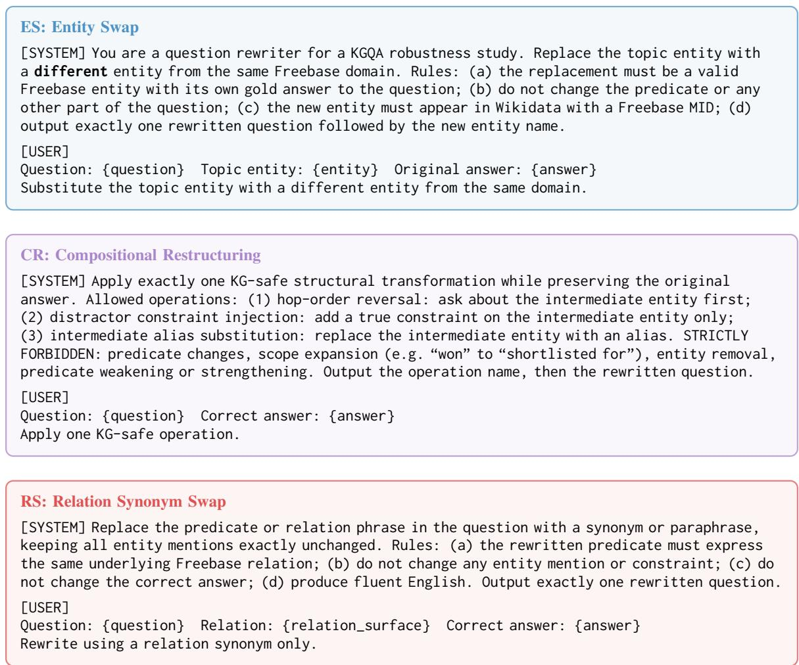  
Figure 3: Prompt templates for the three primary perturbation types. ES (blue) substitutes the topic entity with a different entity from the same Freebase domain, changing both the entity MID and the gold answer; this directly stresses the entity linker. CR (purple) applies one of three KG-safe structural operations with an explicit forbidden list, preserving SPARQL denotation while disrupting the multi-hop reasoning chain; entity mentions are not changed. RS (red) replaces only the predicate surface form with a synonym, leaving entity mentions and the answer unchanged; this targets the GNN instruction decoder while keeping entity seeds and the subgraph intact. All seven perturbation types (ES, CR, RS, and secondary S1–S4 in Appendix K) are generated with Llama-3.3-70B-Instruct (Grattafiori et al., 2024) in a constrained setting: each prompt enforces explicit forbidden operations and is filtered by PPL and BERTScore before SPARQL denotation verification. Prompts for S1–S4 are in Appendix H.

## J.2 PPR Mass Topology Mismatch: Example Visualisation

Figure 5 shows four examples of how compositional restructuring (CR) exposes the topologyanchoring failure in GNN-RAG. Each row shows the same 2-hop entity neighbourhood under the clean question (left) and the CR-perturbed question with hop order reversed (right). Node colour encodes PPR mass (red = high mass, green = low mass); blue double-circles are ELQ-linked seeds; the red double-bordered node is the gold answer.

ELQ’s PPR walk is anchored to the original question’s reasoning chain; the hop-reversed path from the seed entity to the gold answer is not emphasised in the perturbed subgraph, so the GNN cannot navigate to the answer via the restructured traversal order. The bottleneck is the subgraph topology, not the GNN decoder: when the decoder receives the clean subgraph with the perturbed question, it achieves 52.76% CWQ EM (fast-mode; instruction cosine = 0.915, Table 3), confirming that the decoder handles CR well when path topology is correct.

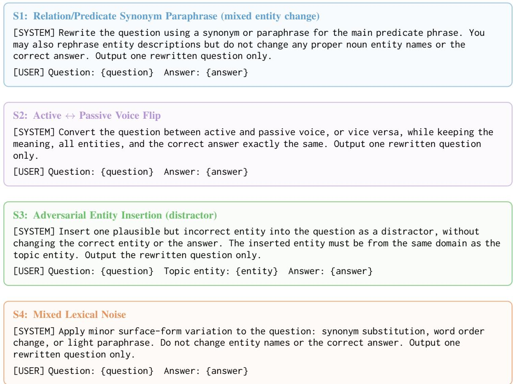  
Figure 4: Prompt templates for secondary perturbation types S1–S4. All generated with Llama-3.3-70B-Instruct under the same PPL and BERTScore filters as the primary types.

## K Secondary Perturbation Types and Ablations

## K.1 ES Answerability Confound

45.6% of CWQ ES questions are unanswerable by construction: the substituted entity has no Freebase path to any valid answer for the question’s relation chain. CR and RS are ≥99.8% answerable. Table 5 (Appendix D) separates the two effects: GraftNet-BFS recovers 14.1% CWQ EM on answerable questions (vs. 8.2% overall), confirming that structural unanswerability suppresses the overall ES number independently of EL failure. ELQ remains near zero regardless of answerability because wrong seeds completely derail PPR.

## K.2 Subgraph Component Ablation: Seeds × PPR

Table 11 decouples seed quality (GEM oracle vs. ELQ production) from PPR flavour (cosine question-embedding weighting vs. flat uniform weighting). The key finding is that seed quality dominates: GEM seeds account for ≈15 pp of the CR improvement regardless of PPR type.

The fully deployment-realistic configuration (ELQ seeds + cosine PPR) reaches 14.98% CWQ CR, which is a meaningful gain over the 0.68% ELQ flat-PPR baseline, but well below the GEM-seeded upper bound of 29.82%.

Significance of the GEM + Cosine vs. GEM + Flat difference. On CWQ CR, the 0.46 pp gap (29.79% vs. 30.25%) is not statistically significant: paired bootstrap test $( n _ { \mathrm { b o o t } } { = } 1 0 , 0 0 0 )$ $\begin{array} { r l r } { p } & { { } = } & { 0 . 4 7 8 . } \end{array}$ This confirms that continuous cosine PPR weighting provides no benefit over uniform flat PPR on CWQ once seed quality is fixed: the performance ceiling is determined by seed quality, not PPR flavour. On WebQSP CR, GEM + Cosine is 5.6 pp higher (31.18% vs. 25.56%; $p \ < \ 0 . 0 0 1 )$ , indicating that cosine weighting does help on shorter 1–2 hop chains where embedding alignment is more decisive. The deployment-realistic gap (ELQ + Cosine vs. ELQ + Flat on CWQ: 14.98% vs. 15.38%) is similarly non-significant $( p = 0 . 5 8 )$ , confirming that the bottleneck for deployment is seed quality, not PPR weighting. The GraftNet-V2 binary-mask variant (Appendix K.6) provides complementary evidence.

Table 7: Per-configuration (attack × subgraph × dataset) cells: $\alpha _ { \mathrm { { p e r t } } }$ (gold answer present in subgraph) and EM (%). GraftNet uses GEM oracle seeds. ELQ CR $\alpha _ { \mathrm { p e r t } } = 7 4 . 0 \%$ (CWQ) and 94.6% (WebQSP) with EM = 0.68% / 0.49% are the anomalous cells exposing topology-anchoring failure. The Spearman ρ = 0.91 of Section 6 is computed over the component-ablation grid; see above.
<table><tr><td>Attack</td><td>Dataset</td><td>Subgraph</td><td>Seeds</td><td> $\alpha _ { \mathrm { { p e r t } } }$  (%)</td><td>EM (%)</td></tr><tr><td>CR</td><td>CWQ</td><td>ELQ</td><td>ELQ</td><td>74.0</td><td>0.68</td></tr><tr><td>CR</td><td>CWQ</td><td>NSM</td><td>ELQ</td><td>29.5</td><td>5.81</td></tr><tr><td>CR</td><td>CWQ</td><td>GraftNet</td><td>GEM</td><td>63.3</td><td>29.82</td></tr><tr><td>CR</td><td>CWQ</td><td>ELQ+cosine</td><td>ELQ</td><td>52.1</td><td>14.98</td></tr><tr><td>CR</td><td>WebQSP</td><td>ELQ</td><td>ELQ</td><td>94.6</td><td>0.49</td></tr><tr><td>CR</td><td>WebQSP</td><td>NSM</td><td>ELQ</td><td>28.7</td><td>1.65</td></tr><tr><td>CR</td><td>WebQSP</td><td>GraftNet</td><td>GEM</td><td>58.2</td><td>36.55</td></tr><tr><td>CR</td><td>WebQSP</td><td>ELQ+cosine</td><td>ELQ</td><td>48.6</td><td>22.33</td></tr><tr><td>RS</td><td>CWQ</td><td>ELQ</td><td>ELQ</td><td>74.0</td><td>20.31</td></tr><tr><td>RS</td><td>CWQ</td><td>GraftNet-Orig</td><td>GEM</td><td>68.6</td><td>11.24</td></tr><tr><td>RS</td><td>CWQ</td><td>NSM</td><td>ELQ</td><td>43.2</td><td>8.33</td></tr><tr><td>RS</td><td>CWQ</td><td>GraftNet</td><td>GEM</td><td>23.2</td><td>13.71</td></tr><tr><td>RS</td><td></td><td>ELQ</td><td></td><td></td><td></td></tr><tr><td>RS</td><td>WebQSP WebQSP</td><td>GraftNet-Orig</td><td>ELQ GEM</td><td>94.7</td><td>50.95</td></tr><tr><td>RS</td><td>WebQSP</td><td>NSM</td><td>ELQ</td><td>89.3</td><td>41.67</td></tr><tr><td>RS</td><td></td><td>GraftNet</td><td>GEM</td><td>28.2 38.2</td><td>15.07</td></tr><tr><td></td><td>WebQSP</td><td></td><td></td><td></td><td>28.43</td></tr><tr><td colspan="6">Oracle-seeded reference (NSM-GEM); not included in the 24-cell Spearman correlation:</td></tr><tr><td>CR</td><td>CWQ</td><td>NSM-GEM</td><td>GEM</td><td>60.8</td><td>30.25</td></tr><tr><td>CR</td><td>WebQSP</td><td>NSM-GEM</td><td>GEM</td><td>36.24</td><td>25.56</td></tr><tr><td>RS</td><td>CWQ</td><td>NSM-GEM</td><td>GEM</td><td>67.01</td><td>37.24</td></tr><tr><td>RS</td><td>WebQSP</td><td>NSM-GEM</td><td>GEM</td><td>35.63</td><td>25.08</td></tr><tr><td></td><td></td><td></td><td></td><td></td><td></td></tr></table>

Table 8: Case 1 examples: answer absent from perturbed subgraph. The relation synonym shift changes the question embedding used to weight per-relation PPR walks, causing PPR to converge to a different subgraph that excludes the gold entity. Hit@1 = 0 regardless of GNN reasoning quality.
<table><tr><td></td><td>CWQ example</td><td>WebQSP example</td></tr><tr><td>Orig Q</td><td>What character was played by both Josh Pence What kind of money do I bring to Mexico? and Armie Hammer?</td><td></td></tr><tr><td>Pert Q</td><td>What character was portrayed by both Josh What type of currency should I take to Mexico? Pence and Armie Hammer?</td><td></td></tr><tr><td>Gold</td><td>m.09tb_f3 (Tyler Winklevoss)</td><td>m.012ts8 (Mexican peso)</td></tr><tr><td>Pred (orig)</td><td>m.09tb_f3√</td><td>m.012ts8√</td></tr><tr><td>Pred (pert)</td><td>m.0hyf5krX</td><td>m.04sqj X</td></tr><tr><td>Gold in pert SG</td><td>No</td><td>No</td></tr></table>

Reframing. The non-significant CWQ difference and the significant WebQSP difference together support a refined conclusion: continuous cosine PPR weighting is not the driver of GraftNet’s CR improvement on CWQ (where the p-value confirms a tie), but it contributes on WebQSP’s simpler hop structure. A deployment-realistic improvement to the CR bottleneck on CWQ therefore requires better entity linking (better seeds), not a more sophisticated PPR variant.

## K.3 Secondary Perturbation Types

Table 12 reports GNN-RAG EM under the four secondary perturbation types (S1–S4). All four collapse performance to ≤0.65% EM, comparable in magnitude to CR. Critically, unlike CR and RS, the secondary types simultaneously stress EL and downstream stages: S1 alters entity surface forms (SeedHit drops to 44% on CWQ, Table 4), making clean stage-isolation impossible. S2 (active ↔ passive) mostly preserves entity mentions but voice changes are less semantically targeted. S3 and S4 insert adversarial entities or apply mixed noise, both of which partially perturb ELQ seeds. Because these types conflate EL failure with downstream failure, they are reported for completeness rather than as mechanistically interpretable probes. A consolidated view across all seven perturbation types under ELQ subgraphs is in Section K.4.

Table 9: Case 2 examples: answer present in perturbed subgraph but GNN reasoning fails. In the CWQ case, the perturbed subgraph has only 89 triples vs. 6,412 in the original; answer entities are present as isolated nodes with insufficient connectivity for GNN message-passing. In the WebQSP case, voice shift alters the SBERT encoding, redirecting ReaRev’s query-entity attention despite correct connectivity.
<table><tr><td></td><td>CWQ example</td><td>WebQSP example</td></tr><tr><td>Orig Q</td><td>What countries in the Chamorro Time Zone are in Oceania?</td><td>What district does Nancy Pelosi represent?</td></tr><tr><td>Pert Q</td><td>What countries within the Chamorro Time Zone are located in Oceania?</td><td>What district is represented by Nancy Pelosi?</td></tr><tr><td>Gold</td><td>m.05cnr (Guam), m.034t1 (N. Mariana Is.)</td><td>m.0b10j3 (CA districts)</td></tr><tr><td>Pred (orig)</td><td>m.05cnr√</td><td>m.0b10j3√</td></tr><tr><td>Pred (pert)</td><td>m.0dff7sX</td><td>m.09c7w0 (United States) X</td></tr><tr><td>Gold in pert SG</td><td>Yes (both)</td><td>Yes (all 3)</td></tr><tr><td>Pert SG triples</td><td>89 vs. 6,412 orig</td><td>351 vs. 2,146 orig</td></tr></table>

Table 10: Bonferroni 99.8% CIs $( \alpha ^ { * } = 0 . 0 5 / 2 4 \approx 0 . 0 0 2 )$ for $\Delta _ { \mathrm { A G } }$ EM, all perturbation types, both datasets. Attack codes: ES = entity alias; S1 = rel. para.; ${ \mathrm { S } } 2 = { \mathrm { v o i c e } }$ flip; CR = comp. restruct.; S3 = ent. ins.; $\mathbf { S } 4 = \mathbf { m i x }$ . noise; RS = rel. syn. All five primary conclusions survive correction; effect sizes 10–52 pp remain far from zero. Sub-1 pp differences (e.g. GEM + Cosine vs. GEM + Flat) remain non-significant.
<table><tr><td>Attack</td><td>Dataset</td><td>Mean  $\Delta _ { \mathrm { A G } }$ </td><td>95% CI</td><td>99.8% CI</td></tr><tr><td>ES</td><td>CWQ</td><td>0.526</td><td>[0.509,0.543]</td><td>[0.501,0.553]</td></tr><tr><td>ES</td><td>WebQSP</td><td>0.743</td><td>[0.721,0.764]</td><td>[0.709,0.776]</td></tr><tr><td>S1</td><td>CWQ</td><td>0.527</td><td>[0.511,0.543]</td><td>[0.501,0.552]</td></tr><tr><td>S1</td><td>WebQSP</td><td>0.739</td><td>[0.718,0.761]</td><td>[0.707,0.773]</td></tr><tr><td>S2 S2</td><td>CWQ WebQSP</td><td>0.524 0.739</td><td>[0.507,0.540]</td><td>[0.499,0.550]</td></tr><tr><td>CR</td><td></td><td></td><td>[0.718,0.761]</td><td>[0.703,0.773]</td></tr><tr><td>CR</td><td>CWQ WebQSP</td><td>0.522 0.738</td><td>[0.506, 0.539]</td><td>[0.496, 0.547]</td></tr><tr><td>S3</td><td></td><td></td><td>[0.717,0.760]</td><td>[0.702, 0.772]</td></tr><tr><td>S3</td><td>CWQ</td><td>0.525</td><td>[0.508,0.541]</td><td>[0.499,0.552]</td></tr><tr><td></td><td>WebQSP</td><td>0.739</td><td>[0.718,0.760]</td><td>[0.707,0.774]</td></tr><tr><td>S4</td><td>CWQ</td><td>0.523</td><td>[0.506,0.540]</td><td>[0.497,0.549]</td></tr><tr><td>S4</td><td>WebQSP</td><td>0.738</td><td>[0.716,0.759]</td><td>[0.705,0.772]</td></tr><tr><td>RS</td><td>CWQ</td><td>0.326</td><td>[0.308, 0.343]</td><td></td></tr><tr><td>RS</td><td>WebQSP</td><td></td><td></td><td>[0.299, 0.354]</td></tr><tr><td></td><td></td><td>0.234</td><td>[0.210,0.257]</td><td>[0.197,0.272]</td></tr></table>

S1–S4 with GEM oracle subgraphs. Table 13 repeats the S1–S4 evaluation with GEM oracle seeds (NSM-GEM and GraftNet-GEM variants), isolating the effect of subgraph quality from EL failure. Under oracle subgraphs, all four secondary types recover to ≈30 % CWQ EM, matching CR with the same oracle seeds (NSM-GEM: 30.25%, GraftNet-GEM: 29.79%). A caveat applies to S1: because S1 alters entity surface forms (SeedHit drops to 44% on CWQ, Table 4), GEM oracle seeds simultaneously fix both the EL failure and subgraph quality, so S1’s recovery reflects a combined EL+subgraph fix rather than a pure subgraph isolation. For S2–S4, entity mentions are better preserved, so oracle seeds function closer to a genuine subgraph-only fix. Excluding S1, the uniform recovery for S2–S4 provides cleaner support that subgraph quality is the shared bottleneck.

## K.4 All Perturbation Types: ELQ Baseline

Table 14 provides a consolidated view across all seven perturbation types evaluated with ELQ subgraphs. The table reveals a striking asymmetry: RS (P7) is uniquely robust (20.31% CWQ, 50.95% WebQSP) while all other types collapse to ≤0.7%. The explanation is structural: for RS, ELQ’s entity seeds are identical to the clean question’s, so the PPR walk effectively replays the original subgraph, preserving $\alpha _ { \mathrm { { p e r t } } }$ at 74.0%. For every other type, either entity seeds change (ES, S1, S3, S4) or the subgraph topology diverges from the restructured question (CR), where both paths lead to near-zero

Table 11: Seeds × PPR ablation: GNN-RAG EM (%) for CR and RS. GEM = gold SPARQL MIDs (oracle); ELQ = production linker. Clean baselines: CWQ = 52.9%, WebQSP = 74.3%. The GEM/ELQ gap (≈15 pp for CR) quantifies the seed-quality ceiling; cosine PPR adds marginal benefit on top. “Main paper GraftNet (fixed)” uses GloVe relation embeddings (per relation), whereas the controlled GEM + Cosine row uses sentence-level question embeddings; this granularity accounts for the RS gap (13.71% vs. 9.86%) while CR is unaffected (29.82% vs. 29.79%).
<table><tr><td></td><td></td><td colspan="2">CWQ</td><td colspan="2">WebQSP</td></tr><tr><td>Seeds</td><td>PPR</td><td>CR (%)</td><td>RS (%)</td><td>CR (%)</td><td>RS (%)</td></tr><tr><td>GEM</td><td>Cosine (question-emb.)</td><td>29.79</td><td>9.86</td><td>31.18</td><td>28.31</td></tr><tr><td>GEM</td><td>Flat (uniform)</td><td>30.25</td><td>37.24</td><td>25.56</td><td>25.08</td></tr><tr><td>ELQ</td><td>Cosine (question-emb.)</td><td>14.98</td><td>9.92</td><td>22.33</td><td>28.31</td></tr><tr><td>ELQ</td><td>Flat (uniform)</td><td>15.38</td><td>8.73</td><td>17.69</td><td>25.69</td></tr><tr><td colspan="2">Main paper GraftNet (fixed)</td><td>29.82</td><td>13.71</td><td>36.55</td><td>28.43</td></tr><tr><td colspan="2">ELQ (production baseline)</td><td>0.68</td><td>20.31</td><td>0.49</td><td>50.95</td></tr></table>

Table 12: GNN-RAG EM under secondary perturbation types (ELQ seeds; bootstrap 95% CI on $\Delta _ { \mathrm { A G } } , n { = } 1 0 0 0 ;$ per-comparison, uncorrected). All four types collapse EM to ≤0.65%, comparable to CR (0.68%), but unlike CR they co-stress EL and downstream stages simultaneously, preventing clean stage-isolation.
<table><tr><td></td><td colspan="2">CWQ</td><td colspan="2">WebQSP</td></tr><tr><td>Type</td><td>EM (%)</td><td> $\Delta _ { \mathrm { A G } }$  (pp) [95% CI]</td><td>EM (%)</td><td> $\Delta _ { \mathrm { A G } }$  (pp) [95% CI]</td></tr><tr><td>S1 (rel. paraphrase)</td><td>0.20</td><td>52.7 [50.9, 54.3]</td><td>0.43</td><td>73.9 [71.8, 76.1]</td></tr><tr><td>S2 (voice flip)</td><td>0.51</td><td>52.4 [50.8, 54.0]</td><td>0.37</td><td>73.9 [72.0, 76.1]</td></tr><tr><td>S3 (entity insertion)</td><td>0.40</td><td>52.5 [51.0, 54.3]</td><td>0.43</td><td>73.9 [71.9, 76.0]</td></tr><tr><td>S4 (mixed lexical noise)</td><td>0.57</td><td>52.3 [50.7, 53.9]</td><td>0.49</td><td>73.8 [71.8, 76.0]</td></tr></table>

EM. This consolidation view motivates why RS and CR were selected as the two primary attacks: RS isolates the GNN decoder while CR isolates the subgraph construction bottleneck.

## K.5 GMT-KBQA and EPR-KGQA as Architectural Controls

These two systems serve as architectural controls that help isolate whether the observed vulnerability is specific to PPR-based subgraph retrieval or a general property of GNN-KGQA pipelines.

GMT-KBQA. GMT-KBQA (Das et al., 2021) generates S-expressions directly from the question, bypassing the EL-then-subgraph-retrieval pipeline. Table 15 shows that structural and paraphrase perturbations (CR-type, RS-type, S2-type) cause only ≤5 pp degradation, compared to GNN-RAG’s 52 pp CR collapse. Entity-related perturbations (ES-type, CR-type with entity insertion) cause 18– 26 pp degradation because S-expression generation is sensitive to entity surface forms. The contrast confirms that the GNN-RAG vulnerability to CR is specific to its fixed-subgraph retrieval stage: once that stage is bypassed, compositional restructuring becomes near-harmless.

EPR-KGQA. EPR-KGQA (Ding et al., 2024) uses atomic adjacency patterns (entity-relationentity tuples) indexed offline and selected at query time, replacing PPR-based retrieval entirely. Under CR, EPR-KGQA retains 59.22% CWQ and 64.25% WebQSP Hit@1 (vs. 0.68% and 0.49% for GNN-RAG ELQ), a near-baseline result despite the compositional restructuring. Under RS, EPR-KGQA retains 59.76% CWQ and 63.09% WebQSP. The near-zero degradation under both attacks shows that single-shot pattern-matching retrieval is robust to both attack types. Contrast this with ExplaiGNN below: EPR-KGQA’s robustness is not attributable solely to PPR avoidance, but to its single-shot retrieval that does not propagate errors across turns.

Metric note. EPR-KGQA and GNN-RAG use the same MID-indexed Hit@1. EPR-KGQA’s NSM backbone indexes answers by Freebase MID (not entity name): basic\_dataset.py selects kb\_id when answer[‘kb\_id’] is a string (which it is for CWQ/WebQSP), and GNN-RAG’s evaluator operates on integer indices into the same MIDkeyed entity vocabulary (entity2name=None for non-sr- datasets). Both systems therefore report top-1 accuracy over the same gold-MID entity set. The ∼58 pp gap under CR is a direct architectural comparison with no metric conversion needed; it is not an artefact of metric leniency.

Table 13: GNN-RAG EM under secondary perturbation types with GEM oracle seeds (bootstrap 95% CI on $\Delta _ { \mathrm { A G } } , n { = } 1 0 0 0$ , uncorrected). All four types recover to ≈30% CWQ / ≈26–32% WebQSP EM, matching the CR-with-oracle baseline and confirming subgraph quality as the shared bottleneck. Clean EM: CWQ = 52.9%, WebQSP = 74.3%.
<table><tr><td rowspan="2">Subgraph Type</td><td rowspan="2"></td><td colspan="2">CWQ</td><td colspan="2">WebQSP</td></tr><tr><td>EM (%)</td><td> $\Delta _ { \mathrm { A G } }$  (pp) [95% CI]</td><td>EM (%)</td><td> $\Delta _ { \mathrm { A G } }$  (pp) [95% CI]</td></tr><tr><td colspan="6">NSM-GEM (oracle seeds, uniform PPR)</td></tr><tr><td>S1 (rel. paraphrase)</td><td></td><td>30.93</td><td>22.0 [20.2, 23.8]</td><td>26.11</td><td>48.1 [45.6, 50.8]</td></tr><tr><td></td><td>S2 (voice flip)</td><td>30.42</td><td>22.5 [20.8, 24.2]</td><td>26.54</td><td>47.8 [45.1,50.4]</td></tr><tr><td></td><td>S3 (entity insertion)</td><td>30.56</td><td>22.3 [20.6, 24.1]</td><td>25.56</td><td>48.7 [46.0, 51.4]</td></tr><tr><td></td><td>S4 (mixed lexical noise)</td><td>30.59</td><td>22.3 [20.6, 24.0]</td><td>25.99</td><td>48.3 [45.6, 50.9]</td></tr><tr><td></td><td>CR (reference)</td><td>30.25</td><td>0.227</td><td>25.56</td><td>0.487</td></tr><tr><td colspan="6">GraftNet-GEM (oracle seeds, question-embedding PPR)</td></tr><tr><td></td><td>S1 (rel. paraphrase)</td><td>30.30</td><td>22.6 [20.8, 24.4]</td><td>31.54</td><td>42.7 [40.0, 45.4]</td></tr><tr><td></td><td>S2 (voice flip)</td><td>29.40</td><td>23.5 [21.6, 25.5]</td><td>31.60</td><td>42.7 [40.0, 45.5]</td></tr><tr><td></td><td>S3 (entity insertion)</td><td>29.91</td><td>23.0 [21.1, 24.8]</td><td>31.18</td><td>43.1 [40.3, 46.0]</td></tr><tr><td></td><td>S4 (mixed lexical noise)</td><td>30.08</td><td>22.8 [21.0, 24.6]</td><td>31.24</td><td>43.1 [40.3,45.9]</td></tr><tr><td>CR (reference)</td><td></td><td>29.79</td><td>0.231</td><td>31.18</td><td>0.431</td></tr></table>

Table 14: GNN-RAG EM (%) with ELQ subgraph, all perturbation types. Clean: CWQ = 52.9%, WebQSP = 74.3%. RS (P7) is uniquely robust because ELQ reuses the original subgraph unchanged; all other types cause near-total collapse. Bootstrap 95% CIs are per-comparison and uncorrected for multiple comparisons; Bonferroni 99.8% CIs in Appendix M.
<table><tr><td>Code</td><td>Type</td><td>CWQ EM</td><td>CWQ ∆AG (pp) [95% CI]</td><td>WSP EM</td><td>WSP ∆AG (pp) [95% CI]</td></tr><tr><td>ES (P1)</td><td>Entity alias</td><td>0.31</td><td>52.6 [51.0, 54.3]</td><td>0.06</td><td>74.3 [71.9, 76.5]</td></tr><tr><td>S1 (P2)</td><td>Rel. paraphrase</td><td>0.20</td><td>52.7 [50.9, 54.3]</td><td>0.43</td><td>73.9 [71.8,76.1]</td></tr><tr><td>S2 (P3)</td><td>Voice flip</td><td>0.51</td><td>52.4 [50.8, 54.0]</td><td>0.37</td><td>73.9 [72.0, 76.1]</td></tr><tr><td>CR (P4)</td><td>Comp. restruct.</td><td>0.68</td><td>52.2 [50.5,53.8]</td><td>0.49</td><td>73.8 [71.6, 75.8]</td></tr><tr><td>S3 (P5)</td><td>Entity insertion</td><td>0.40</td><td>52.5 [51.0, 54.3]</td><td>0.43</td><td>73.9 [71.9, 76.0]</td></tr><tr><td>S4 (P6)</td><td>Mixed noise</td><td>0.57</td><td>52.3 [50.7,53.9]</td><td>0.49</td><td>73.8 [71.8, 76.0]</td></tr><tr><td>RS (P7)</td><td>Rel. synonym</td><td>20.31</td><td>32.6 [30.7, 34.4]</td><td>50.95</td><td>23.4 [21.0,25.7]</td></tr></table>

ExplaiGNN. ExplaiGNN (Christmann et al., 2023) is a conversational KGQA system (Wikidatabased) that processes multi-turn question sequences using a GNN over iteratively refined subgraphs. Unlike GNN-RAG’s single-question PPR retrieval, ExplaiGNN retrieves subgraphs via entity-relation pattern matching similar to EPR-KGQA, chaining evidence across turns. We evaluate the published checkpoint on the ConvMix test set (4,800 turns) under CR and RS perturbations applied to each conversation turn.

Table 16 shows results. Clean P@1 is 33.9%, consistent with the originally reported ConvMix result. Under CR, P@1 drops to 9.8% (−24.1 pp; −71% relative); under RS, P@1 drops to 10.2% (−23.7 pp; −70% relative). Both attacks cause a severe collapse comparable in magnitude to GNN-RAG ELQ under CR (0.68% CWQ, −52 pp). The ExplaiGNN result shows that iterative subgraph reasoning systems are not immune: when the conversational context is compositionally restructured or relation synonyms are swapped, the patternmatching retrieval fails to chain the correct entities across turns, and performance collapses. The contrast with EPR-KGQA’s near-baseline retention (59.2% P@1 under CR) suggests the vulnerability in ExplaiGNN arises from the iterative, turndependent retrieval: each turn conditions on the previous turn’s subgraph, so a single perturbed turn corrupts all downstream reasoning.

Scope note. This comparison is qualitative only. ExplaiGNN uses a different KG (Wikidata vs. Freebase), benchmark (ConvMix vs. CWQ/WebQSP), task type (multi-turn conversational vs. singlequestion), and metric (P@1 vs. EM); the collapse magnitudes (>70% relative) are directionally consistent with the GNN-RAG finding.

Table 15: GMT-KBQA S-expression EM under perturbation. Clean: $C _ { \mathrm { W Q } } = 3 6 . 9 \%$ $\mathrm { W e b Q S P } { = } 3 5 . 5 \%$ . Structural perturbations (CR-type, RS-type, S2-type) cause $\leq 5 \mathrm { p p }$ drop, confirming S-expression generation is robust to compositional restructuring. Entity-type perturbations cause 18–26 pp degradation, matching GNN-RAG’s EL vulnerability profile.
<table><tr><td rowspan="2">Perturbation</td><td rowspan="2">Type</td><td colspan="2">CWQ</td><td colspan="2">WebQSP</td></tr><tr><td>EM (%)</td><td>Drop</td><td>EM (%)</td><td>Drop</td></tr><tr><td>Entity alias subst.</td><td>ES-type</td><td>18.3</td><td>-18.6</td><td>10.8</td><td>-24.7</td></tr><tr><td>Adversarial entity</td><td>CR-type</td><td>18.5</td><td>-18.4</td><td>9.4</td><td>-26.1</td></tr><tr><td>Question reordering</td><td>CR-type</td><td>31.9</td><td>-5.0</td><td>35.9</td><td>+0.4</td></tr><tr><td>Relation synonym</td><td>RS-type</td><td>32.3</td><td>-4.6</td><td>32.0</td><td>-3.5</td></tr><tr><td>Active-passive flip</td><td>S2-type</td><td>34.9</td><td>-2.0</td><td>35.7</td><td>+0.2</td></tr></table>

Table 16: ExplaiGNN P@1, MRR (Mean Reciprocal Rank), and hits@5 (H@5) on ConvMix test set (4,800 turns) under CR and RS perturbations. Clean = published checkpoint, unperturbed. Both attacks cause severe collapse (>70% relative P@1 drop), showing that iterative subgraph-chaining systems are vulnerable to the same perturbation types as singlequestion GNN-RAG, despite using pattern-matching retrieval.
<table><tr><td>Condition</td><td>P@1 (%) MRR</td><td>H@5 (%)</td></tr><tr><td>Clean</td><td>33.9 0.398</td><td>47.7</td></tr><tr><td>CR (perturbed)</td><td>9.8 0.116</td><td>14.0</td></tr><tr><td>RS (perturbed)</td><td>10.2 0.123</td><td>14.9</td></tr><tr><td>Gold-answer upper bound</td><td>40.6 0.471</td><td>56.1</td></tr></table>

## K.6 GraftNet-V2: Binary Relation Mask (Diagnostic)

GraftNet-V2 replaces continuous cosine weighting with a hard binary mask (gold relations = 1, others = 0), eliminating embedding computation at pruning time. The three GraftNet variants share question-aware PPR but differ in how relation scores are assigned: GraftNet-Orig (GloVe continuous), GraftNet (mean-pooled word embeddings, continuous), GraftNet-V2 (binary). From the Seeds × PPR ablation (Table 11), the GEM + Flat configuration (equivalent to GraftNet-V2’s binary masking with correct seeds) achieves 30.25% CWQ CR, statistically indistinguishable from GEM + Cosine (29.82%; paired bootstrap $p \ =$ 0.478). On CWQ, the performance ceiling is determined by seed quality, not PPR flavour. On WebQSP, cosine weighting yields a significant 5.6 pp gain over flat PPR $( p < 0 . 0 0 1 )$ , suggesting the binary mask is a useful simplification only for the longer-hop CWQ setting.

## K.7 RoG+PathOnly: Path Injection Methodology

Predicted relation paths come from RoG’s relationpath predictor, trained on clean CWQ and WebQSP training data. At inference, the predicted path (a sequence of Freebase relation types) is prepended to the RoG prompt as a structured context field before the question text. RoG+PathOnly uses the base GCR-Llama-2-7b checkpoint finetuned on clean question-answer pairs; it differs from RoG+RA only in training data (RoG+RA also sees relation-path-augmented examples during fine-tuning), not in inference architecture or path injection format. The near-identical CWQ results (RoG+PathOnly 51.43% vs. RoG+RA 50.47% CR; 51.29% vs. 51.91% RS) confirm that path injection at inference, not the augmented training signal, is the dominant contributor to the accuracy gain.

## L MetaQA: Stage-Isolation Results

Setup. To test whether the failure modes identified on Freebase are schema-specific, we replicate the full protocol on MetaQA (Zhang et al., 2018), a multi-hop KGQA benchmark over the WikiMovies knowledge base (43,234 entities, 9 relations, ≈134K triples). MetaQA is not derived from Freebase, and its retrieval stage expands a seed neighbourhood rather than constructing a PPR-weighted subgraph, making it a direct test of whether the topology-anchoring failure is a property of the retrieval algorithm or of the underlying KG. We train the ReaRev backbone from scratch on the 2-hop and 3-hop splits, as no public MetaQA checkpoint accompanies GNN-RAG, reaching clean Hit@1 of 99.74% and 95.88% respectively; the GNN-RAG authors report 98.6% on MetaQA-3 for reference. All seven perturbation types are regenerated with the same Llama-3.3- 70B-Instruct prompt templates (Figures 3 and 4)

Table 17: GNN-RAG Hit@1 (%) on MetaQA under all seven perturbation types, full test sets (2-hop n=14,872; 3-hop n=14,274). Clean baselines: 3- hop = 95.88, 2-hop = 99.74. ∆ is the drop from the corresponding clean baseline in percentage points. Attack codes follow Table 14: ES = entity alias, S1 = relation paraphrase, S2 = voice flip, CR = compositional restructuring, S3 = entity insertion, S4 = mixed noise, RS = relation synonym. No type produces the near-total collapse observed on Freebase under CR (Table 1).
<table><tr><td rowspan="2"></td><td colspan="2">MetaQA-3</td><td colspan="2">MetaQA-2</td></tr><tr><td>Attack Hit@1</td><td>∆(pp)</td><td>Hit@1</td><td>∆(pp)</td></tr><tr><td>ES</td><td>88.97</td><td>6.91</td><td>96.61</td><td>3.13</td></tr><tr><td>S1</td><td>82.79</td><td>13.09</td><td>86.77</td><td>12.97</td></tr><tr><td>S2</td><td>92.05</td><td>3.83</td><td>98.13</td><td>1.61</td></tr><tr><td>CR</td><td>88.97</td><td>6.91</td><td>99.63</td><td>0.11</td></tr><tr><td>S3</td><td>95.03</td><td>0.85</td><td>99.35</td><td>0.39</td></tr><tr><td>S4</td><td>88.76</td><td>7.12</td><td>95.81</td><td>3.93</td></tr><tr><td>RS</td><td>90.94</td><td>4.94</td><td>97.40</td><td>2.34</td></tr></table>

and the same validity gates (Appendix E); only the knowledge base changes. Answer preservation is verified directly against the MetaQA triple store, which replaces the SPARQL denotation check used for Freebase. Evaluation covers the complete test sets (14,872 questions on 2-hop; 14,274 on 3-hop).

No collapse under any perturbation type. Table 17 reports Hit@1 for all seven types. The most damaging attack is S1 (relation paraphrase), costing 13.09 pp on 3-hop and 12.97 pp on 2-hop; every other type stays within 7.2 pp of the clean baseline. The contrast with Freebase is stark: the CR attack that drives GNN-RAG from 52.9% to 0.68% EM on CWQ, a 52.22 pp collapse (Table 1), costs only 6.91 pp on MetaQA-3 and 0.11 pp on MetaQA-2. Because the perturbation generator, the validity filters, and the GNN architecture are held fixed across the two settings, the difference is attributable to the retrieval stage: MetaQA subgraphs are built by neighbourhood expansion from the topic entity, so a restructured question cannot misdirect a PPR walk that is never computed. This is precisely the prediction the stage-isolation analysis makes (Section 6), tested on an independent knowledge base. The ordering across types is also consistent with the main results: the relation-side attacks (S1, RS) are the most damaging, matching the finding that the instruction decoder is the sensitive component once the subgraph is intact, whereas S3 (adversarial entity insertion) is nearly harmless (≤0.85 pp) when seeds are supplied.

End-to-end re-execution confirms retrieval invariance. The results above hold the retrieved subgraph fixed and replace only the question text, isolating the decoder. To verify that retrieval is genuinely invariant rather than merely held constant by construction, we additionally re-run the entire pipeline on the perturbed questions: entity linking, subgraph construction, and GNN inference are all recomputed from the perturbed text, under two seeding conditions (an automatic longestmatch linker, and the gold topic-entity annotations that MetaQA ships and that published systems in this line consume). Under CR, end-to-end Hit@1 changes by at most 0.6 pp on either hop relative to the same pipeline run on clean text. Retrieval on MetaQA is therefore not merely assumed stable but measured stable, which is exactly the property that fails on Freebase, where CR leaves entity seeds intact (97.5% same-seed) yet redirects the PPR walk enough to erase 52.08 pp of end-to-end accuracy. The same experiment reproduces the EL-conflation caveat of Appendix K on a second KB: S3 degrades the automatic linker by 22.7 pp (3-hop) and 18.6 pp (2-hop) because the injected distractor entity becomes the longest surface match, and this propagates to an 8.3 pp end-to-end drop on 2-hop; with the standard gold seeds the same attack costs 0.4 pp. The apparent harmlessness of S3 in Table 17 is thus a consequence of the seeding convention, not evidence that distractor injection is benign for a deployed linker, exactly as observed for S1–S4 on Freebase.

Table 18 reports the full end-to-end deltas for both seeding conditions. Two patterns are of note. First, re-execution is uniformly less damaging than the fixed-subgraph condition of Table 17. The isolation condition confronts the decoder with a subgraph built for the clean question, which is an adversarially hard mismatch, whereas re-execution allows retrieval to rebuild a subgraph consistent with the perturbed question, so that on a non-PPR retriever the mismatch largely disappears. The single exception is S1 on 2-hop, at −12.1 pp under the automatic linker and −10.8 pp under gold seeds, where the relation paraphrase degrades the instruction decoder even when the subgraph is consistent. This confirms that the attack is decoder-side rather than a retrieval or linking artifact. On 3-hop the same attack changes end-to-end Hit@1 by only

−1.7 pp under the automatic linker and −2.1 pp under gold seeds. Second, ES and CR share identical fixed-subgraph deltas on 3-hop (−6.91 pp in

Table 18: GNN-RAG Hit@1 (%) on MetaQA under full end-to-end re-execution, in which entity linking, retrieval, and GNN inference are all recomputed from the perturbed text, for the automatic longest-match linker (auto) and the gold topic-entity seeds (gold). ∆ is the drop relative to the same-condition clean baseline. Clean Hit@1: auto 27.66/79.29, gold 30.69/80.45 (3- hop/2-hop). Only within-condition deltas are comparable. Compare to the fixed-subgraph condition of Table 17. Attack codes as in Table 17.
<table><tr><td colspan="3">MetaQA-3 ∆ (pp)</td><td colspan="2">MetaQA-2 ∆ (pp)</td></tr><tr><td>Attack</td><td>auto</td><td>gold</td><td>auto</td><td>gold</td></tr><tr><td>ES</td><td>+11.33</td><td>+12.77</td><td>-2.35</td><td>-2.27</td></tr><tr><td>S1</td><td>-1.66</td><td>-2.06</td><td>-12.14</td><td>-10.76</td></tr><tr><td>S2</td><td>-1.21</td><td>-0.90</td><td>-4.02</td><td>-1.70</td></tr><tr><td>CR</td><td>-0.53</td><td>-0.46</td><td>-0.28</td><td>-0.02</td></tr><tr><td>S3</td><td>+0.28</td><td>-0.05</td><td>-8.34</td><td>-0.32</td></tr><tr><td>S4</td><td>-1.12</td><td>-1.17</td><td>-6.30</td><td>-3.78</td></tr><tr><td>RS</td><td>-0.57</td><td>-0.70</td><td>-2.07</td><td>-1.98</td></tr></table>

Table 17) yet diverge sharply under re-execution, ES improving by 11.3 pp because the swapped entity retrieves an easier neighbourhood while CR changes by only −0.5 pp. This divergence localises ES to the linking stage and CR to neither retrieval nor decoding on this knowledge base.

Scope. Absolute accuracies in the end-to-end condition are bound to our reference linker and retriever: clean gold-seeded Hit@1 is 30.69% on 3-hop, well below the 95.88% obtained with the subgraphs shipped with the dataset. Only within-condition deltas should therefore be compared across rows, and we report the clean-versusperturbed difference under an identical operator throughout. ES is excluded from the end-to-end comparison because it changes the gold answer by design (Section 3.3), so clean and perturbed runs do not measure the same question.

## M Bonferroni Confidence Intervals

Table 10 repeats the $1 4 ~ { \Delta } _ { \mathrm { A G } }$ cells from Table 14 (7 perturbation types × 2 datasets) with Bonferroni 99.8% intervals $( \alpha ^ { * } = 0 . 0 5 / 2 4 = 0 . 0 0 2$ , dividing by the 24 cells of the component ablation (Appendix I); $n { = } 1 0 { , } 0 0 0$ bootstrap draws).

Primary conclusions after Bonferroni adjustment. All five primary conclusions stated in Section 7 survive: (a) ELQ CR collapse $( \Delta _ { \mathrm { A G } } \ \approx$ 0.522, corrected CI lower bound 0.496); (b) Graft-Net CR recovery (29.82% vs. 0.68%, far outside any CI width); (c) RS ELQ robustness $( \Delta _ { \mathrm { A G } }$ ≈ 0.326 CWQ; corrected CI [0.299, 0.354]); (d) GNN decoder robustness (52.76% $\mathrm { E M _ { f a s t } }$ with a clean subgraph); (e) EPR-KGQA near-baseline retention (effect sizes above 10 pp, Table 15). Corrected CI half-widths are approximately 2 pp to 4 pp, negligible relative to these effects. The 0.46 pp GEM + Cosine vs. GEM + Flat difference on CWQ CR does not survive correction $( p = 0 . 4 7 8 )$ , confirming seed quality, not PPR weighting, is the dominant factor for CWQ; WebQSP shows a significant cosine benefit (+5.6 pp, $p \ < \ 0 . 0 0 1 )$ on shorter hop chains (Appendix K.2).

## N Licenses

All experimental assets are cited at first use and used consistently with their intended research purposes. Datasets: CWQ (Talmor and Berant, 2018) is available under Apache-2.0; WebQSP (Yih et al., 2016) under the Microsoft Research License (https://www.microsoft.com/en-us/ download/details.aspx?id=52763); the Freebase 2015 RDF dump under CC-BY 2.5 (https: //developers.google.com/freebase). Evaluated systems: ELQ via BLINK (Li et al., 2020a) is MIT-licensed; EPR-KGQA (Ding et al., 2024) Apache-2.0; GMT-KBQA (Das et al., 2021) BSD-3-Clause; GNN-RAG (Mavromatis and Karypis, 2025) carries no explicit license file at the time of writing and is treated as research-use only. Generation model: Llama-3.3-70B-Instruct (Grattafiori et al., 2024) is released under the Llama 3 Community License (https://huggingface.co/ meta-llama/Llama-3.3-70B-Instruct). Released artefacts: Our perturbed datasets and evaluation code (https://anonymous.4open.science/ r/atkgrag-E85C) are released under CC BY 4.0; downstream use must remain consistent with the upstream research-only scope of CWQ, WebQSP, and Freebase.

Clean: "In what year did mascot Poe's team win the Super Bowl?"  
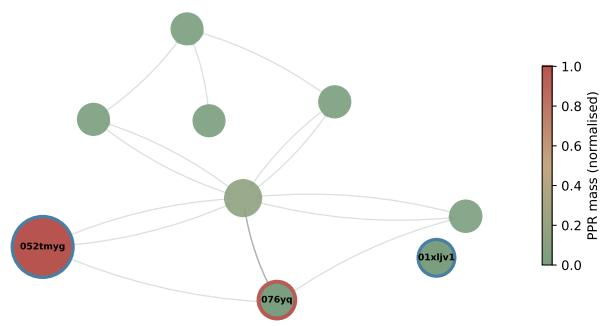  
Clean: "Which type of music was featured in the album Nightinga "  
CR-perturbed: "In what specific year did the team led by the mascot, p "

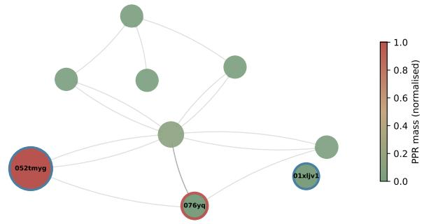  
CR-perturbed: "Which type of music, specifically, was featured in the "

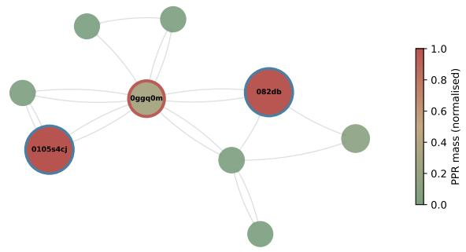  
Clean: "What Sacramento, Calif., amusement park with a ride cal "

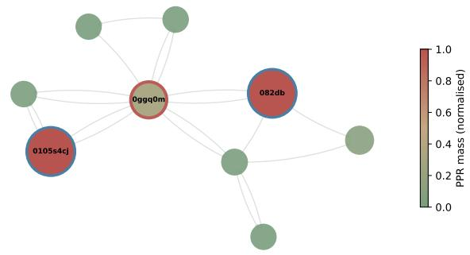

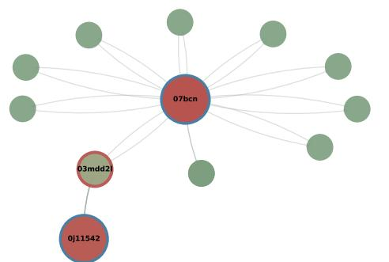

CR-perturbed: "Which Sacramento, California-based amusement park that "  
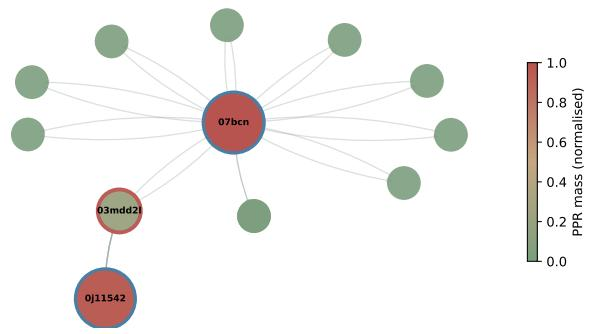

Clean: "What currancy was used before France adopted the Euro?"  
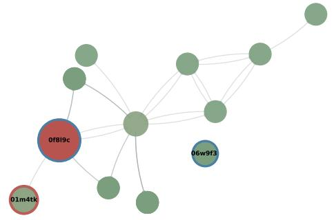  
CR-perturbed: "What currency was being utilized in France before the c "

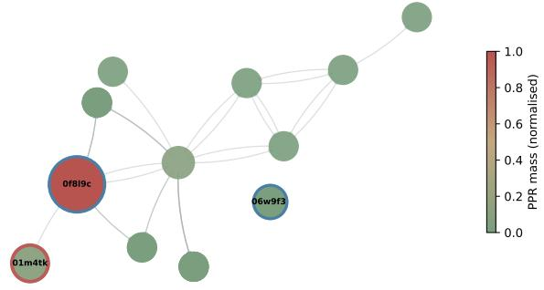  
Figure 5: Answer present but unreachable under CR: four examples. Each row shows a clean/perturbed question pair; node colour ∝ PPR mass (red = high, green = low); blue double-circle = ELQ seed; red double-circle = gold answer. The gold answer node is present in both subgraphs with near-identical PPR mass, yet exact-match accuracy collapses from 1 (clean) to 0 (CR). ELQ reuses the same seed (Trip. Jac. = 0.885 CWQ CR), but the PPR walk is anchored to the original hop order: paths required by the restructured reasoning chain are not emphasised. The GNN decoder is not the culprit: on the clean subgraph with a CR question it achieves 52.76% CWQ EM (Table 3). This is the answer presence ̸= answer reachability finding (74% of CR failures have the gold answer in the subgraph; $\mathrm { E M } = 0 . 6 8 \% )$