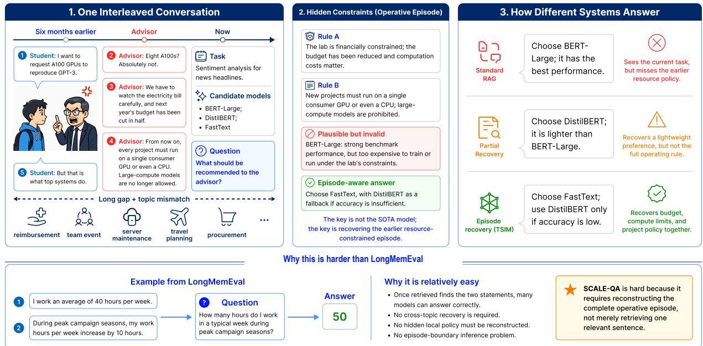
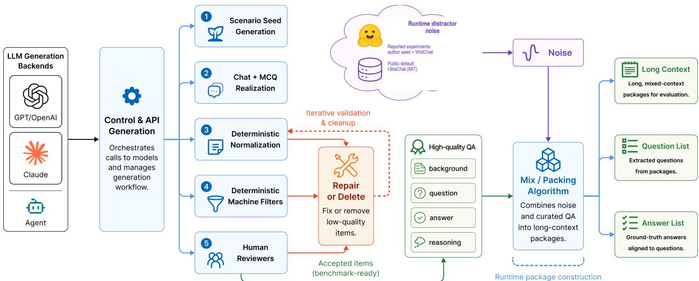
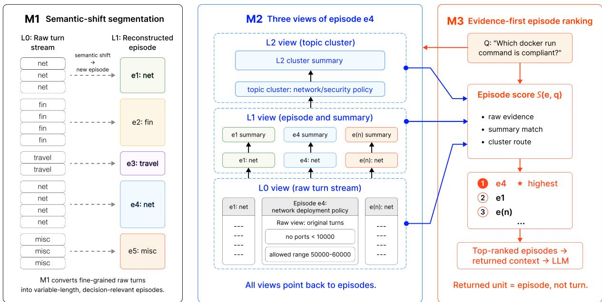
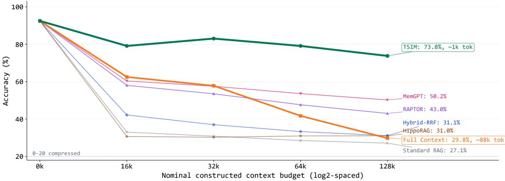
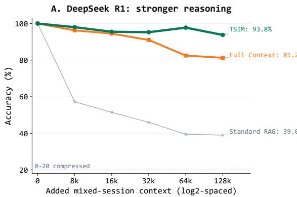
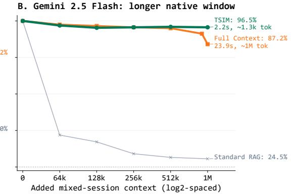
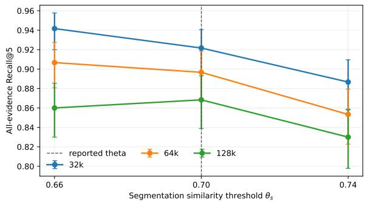

# Reconstructing the Right Episode: Evaluating Interleaved Conversational Memory Beyond Long Context

Zhexi Feng Ruiyi Zhang Yongbo Yang Pengtao Xie\*

Department of Electrical and Computer Engineering University of California San Diego {zhf023,ruz048,yongboyang,p1xie}@ucsd.edu

## Abstract

Conversations with chat assistants increasingly span many topics in a single long-running thread, challenging memory systems. Existing long-context and memory benchmarks often expose session or topic boundaries, or probe direct personal-memory questions. These settings understate a harder assistant-memory regime: a flat mixed-topic thread where the system must infer which earlier episode makes a later task decision valid. We introduce SCALE-QA, a constraint-grounded task QA benchmark for flat unsegmented threads targeting episode integrity failure. The dataset contains 3,000 audited questions across 10 domains, uses deterministic four-way multiple-choice grading, and includes a deterministic runtime builder; experiments use all 3,000 questions through 128k and a stratified 400-question diagnostic at 1M. SCALE-QA questions are ordinary task-oriented requests whose correct answer depends on causally related evidence introduced earlier in the conversation. We also propose Temporal-Semantic Interleaved Memory Reconstruction (TSIM), which segments the turn stream into coherent episodes and indexes them through a hierarchical multi-view memory stack with deterministic episode-level sum mary and cluster-routing views. Experiments show that SCALE-QA challenges strong RAG baselines and long-context LLMs alike; across three open-source and proprietary LLM backends, TSIM achieves the highest accuracy in every backend setting, gaining 5.6–17.6 accuracy points over the strongest corresponding baseline.

## 1 Introduction

Real assistants are not used as clean, task-isolated documents. A user may discuss compute budgets, reimbursement rules, medication constraints, travel, and model-selection advice in the same thread. A small constraint introduced early—for example, “new projects must run on a single consumer GPU or CPU, and large-compute models are prohibited”—can stay dormant for thousands of turns before it suddenly decides the only correct answer. Recent work shows that state-of-the-art LLMs can suffer reliability collapse even at modest context lengths (Laban et al., 2026). We study the same reliability problem at desktop scale, where a single assistant thread can stretch to hundreds of thousands of tokens and interleave many unrelated tasks.

This regime is not simply a longer-context version of document QA. We identify the underlying failure as episode integrity failure: the decisive evidence may be present somewhere in the conversation, but the system retrieves a plausible snippet, a stale default, or an over-compressed summary instead of the operative episode that makes a local constraint binding. Intuitively, an episode is the contiguous set of turns that jointly makes a local constraint or state operative for a later decision; a locally relevant fragment may still be episode-incomplete (Tulving, 1972; Park et al., 2023; Packer et al., 2023; Shinn et al., 2023; Sumers et al., 2024; Kim et al., 2025).

Table 1 contrasts episode integrity failure with related long-context and memory failures. The key distinction is the recovery unit: visible, locally relevant evidence is not enough—the system fails unless it recovers the complete operative episode.

Measuring this failure mode remains difficult in current evaluations: existing long-context and assistant-memory benchmarks stress longer inputs, positional robustness, noisy contexts, and persistent memory, but usually relax at least one property central here: a flat mixed-topic thread, counterfactual construction designed to reduce pretrained leakage, exact evidence auditability, or controlled context-length construction. The result is a measurement gap rather than merely a missing dataset: the failure mode can occur inside existing evaluations, but cannot be cleanly isolated, attributed, or compared across memory systems.

<table><tr><td>Failure mode</td><td>Failure pattern</td><td>Bottleneck</td><td>Recovery unit</td></tr><tr><td>Retrieval miss</td><td>evidence not retrieved</td><td>visibility</td><td>passage</td></tr><tr><td>Lost-in-the-middle</td><td>evidence underused in prompt</td><td>position</td><td>token span</td></tr><tr><td>State tracking failure</td><td>updates not maintained</td><td>update order</td><td>state value</td></tr><tr><td></td><td>Episode integrity failure evidence visible but fragmented episode integrity operative episode</td><td></td><td></td></tr></table>

Table 1: Episode integrity failure compared with related long-context and memory failures. The categories are non-exclusive, but each foregrounds a different bottleneck and recovery unit. Representative prior anchors include dense retrieval for retrieval miss (Karpukhin et al., 2020), lost-in-the-middle behavior (Liu et al., 2024), and state tracking in long conversations (Laban et al., 2026).

To close this gap, we introduce SCALE-QA, a benchmark for long-term conversational memory under realistic assistant use. SCALE-QA asks whether a system can recover dormant, private, cross-domain constraints from a flat unsegmented thread, not whether it can answer from public knowledge or a topic-clean document. The dataset contains 3,000 audited questions across 10 taskoriented domains, with exact evidence traces and a deterministic length-controlled runtime builder for user-specified context budgets. Its construction combines deterministic filters with human review to enforce answerability and evidence grounding; Section 3.6 reports acceptance rates and audit details.

As a first reference method for this regime, we propose Temporal-Semantic Interleaved Memory Reconstruction (TSIM). Rather than index a long conversation as fixed token chunks, TSIM reconstructs semantic episodes from the turn stream and indexes them through raw, episode-summary, and cluster-routing views. It tests the episodereconstruction hypothesis: long assistant memory should first recover the right episode, then present compact evidence to the answer model.

Figure 1 illustrates the pattern: chunk-level systems retrieve plausible but incomplete fragments, while TSIM reconstructs the operative episode. Together, SCALE-QA and TSIM test two claims: (i) flat mixed-topic episode reconstruction is a distinct regime that current evaluations do not isolate, and (ii) in this regime, recovering episodes is a better memory unit than retrieving chunks. The empirical results make the challenge concrete: in the 128k setting, GPT-4o-mini Full Context reaches only 29.8% Accuracy while TSIM reaches 73.8%, and across the three answer backends TSIM improves over the strongest corresponding baseline by 5.6–17.6 accuracy points.

## 2 Related Work

Long-context benchmarks. LongBench (Bai et al., 2024), ∞Bench (Zhang et al., 2024), RULER (Hsieh et al., 2024), LOFT (Lee et al., 2025), and Haystack Engineering (Li et al., 2025) evaluate long-context understanding, positional robustness, and noisy/agentic contexts; Lost in the Middle (Liu et al., 2024) and Lost in Conversation (Laban et al., 2026) show that evidence can remain unused even when it fits in context. SCALE-QA instead tests recovery of dormant local constraints from one flat mixed-topic thread.

Episodic memory in language agents. Episodic memory originates in cognitive psychology and now informs language-agent memory streams, recall buffers, episodic buffers, cognitive architectures, and pre-storage reasoning (Tulving, 1972; Park et al., 2023; Packer et al., 2023; Shinn et al., 2023; Sumers et al., 2024; Kim et al., 2025). SCALE-QA evaluates whether a system reconstructs the complete operative episode behind a later task decision, not merely retrieves or stores isolated memories.

Closest predecessor: LongMemEval. Long-MemEval (Wu et al., 2025) evaluates long-term assistant memory over length-configurable timestamped chat histories, covering information extraction, multi-session, temporal, and update reasoning, and abstention. SCALE-QA builds on its scalablehistory and chat-distractor design but targets a complementary regime, summarized axis-by-axis in Appendix Table 4: flat unsegmented task-oriented decision QA with no boundary metadata, crossdomain operational evidence, episode integrity failure, and deterministic MCQ grading. Memory-Bench (Ai et al., 2025), MemTrack (Deshpande et al., 2025), TopiOCQA (Adlakha et al., 2022), and CORAL (Cheng et al., 2025) likewise motivate persistent or topic-shifting memory, but do not isolate this boundary-free episode-reconstruction setting.

  
Figure 1: Representative SCALE-QA example. A later advisor question is answerable only by reconstructing an earlier resource-policy episode. Standard RAG and partial-recovery systems retrieve incomplete fragments and select invalid models (BERT-Large, DistilBERT), whereas TSIM reconstructs the operative episode and selects the constraint-consistent answer (FastText). The lower panel quotes LongMemEval question/evidence text (Wu et al., 2025, Figure 1) as a direct-evidence contrast.

Retrieval and memory systems. Externalmemory baselines include RAG, dense retrieval, incontext RALM, and hierarchical or graph memory systems such as RAPTOR, MemGPT, HippoRAG, and GraphRAG (Lewis et al., 2020; Karpukhin et al., 2020; Ram et al., 2023; Sarthi et al., 2024; Packer et al., 2023; Gutiérrez et al., 2024; Edge et al., 2024). TSIM tests whether the retrieval unit should be an inferred episode rather than a fixed chunk, graph neighborhood, or memory item.

## 3 SCALE-QA: A Benchmark for Interleaved Long-Context Conversational QA

## 3.1 Problem Formulation

Each SCALE-QA instance is a tuple $( H , q , O , y , E )$ , where $\begin{array} { r c l } { H } & { = } & { \left( r _ { 1 } , \ldots , r _ { T } \right) } \end{array}$ is a flat, unsegmented mixed-topic turn stream without exposed session, topic, or evidence-span boundary metadata. q is a task-oriented user request, $O = \{ o _ { A } , o _ { B } , o _ { C } , o _ { D } \}$ is a four-way answer set, $y ~ \in ~ \{ A , B , C , D \}$ denotes the gold-option index, and E ⊂ H is the exact evidence turns that jointly determine y. Crucially, E is not provided as input; the system must recover the relevant span from H to answer correctly.

Following the broad episodic-memory tradition and recent language-agent memory work (Tulving, 1972; Park et al., 2023; Packer et al., 2023;

Shinn et al., 2023; Sumers et al., 2024; Kim et al., 2025), we call the latent decision-relevant span an operative episode. Unlike chunks, which are mechanically defined retrieval units, or sessions, which are explicit temporal interaction units, operative episodes are latent semantic-decision units whose boundaries must be inferred. Following Wu et al. (2025), we reserve session for explicit timestamped interaction units; in SCALE-QA, episodes are inferred output units, not input boundaries. We call this setting constraint-grounded task QA: the request is ordinary and task-oriented, but its correct answer is determined by dormant local constraints introduced earlier in the conversation.

We use deterministic four-way MCQ for evidence-auditable grading, with distractors plausible under generic priors but invalidated by local evidence; Appendix A explains the rationale and why rationale similarity is only an auxiliary diagnostic.

## 3.2 Realistic Task-Oriented Question Construction

Question construction begins from 5–10 humanwritten seed examples per domain (roughly 50–100 overall), specifying the target decision pattern, evidence relation, and distractor structure. Few-shot LLM generation expands these seeds into counterfactual scenarios realized as multi-turn assistant dialogues plus four-option questions. Unlike direct memory probes, SCALE-QA questions are ordinary task requests whose correct option depends on dormant earlier constraints. Audit gates require each question to remain uniquely answerable from exact turns, as summarized by the pipeline in Figure 2.

  
Figure 2: Overview of the SCALE-QA construction and runtime-packaging pipeline. LLM-generated scenarios are realized as chat-plus-MCQ records, then normalized, machine-filtered, human-reviewed, and stored in a validated QA pool. The runtime builder mixes accepted records with reproducible chat-history noise and packs them into length-controlled packages with aligned question and answer lists.

## 3.3 Cross-Domain Coverage

SCALE-QA spans 10 task-oriented domains: software, network/hardware, finance, legal, biomedicine, engineering, business operations, social/personal, game/novel, and daily life, each contributing 300 examples with globally balanced correct options. Evidence forms include operational notes, rules, code-like fragments, report excerpts, policy clauses, and local exceptions, rather than only personal facts; systems must recover local operational constraints, with omissions causing concrete downstream failures such as incompatible deployments or local compliance violations.

Examples instantiate three diagnostic stress-cue sub-patterns: state overwrite (later turn supersedes default), long-range bridge (distant clues combined), and constraint trap (attractive answer invalidated by buried rule). These are analysis views rather than separate failure modes. Appendix A reports full evidence forms, stress cues, split-level calibration, and dataset-audit counts.

## 3.4 Boundary-Free History Compilation

We use a length-configurable history compilation protocol with one critical constraint: session boundary metadata is removed from system input. Accepted records are embedded into mixed-session runtime packages at user-specified target lengths, with 16k–128k full-dataset settings and diagnostics through 1M reported here. Evidence-bearing spans are serialized with heterogeneous public-chat distractor dialogue, stale constraints, and unrelated material into a single flat turn stream, changing distraction level but never the gold answer or evidence trace. All systems receive identical packages, seeds, noise, and batch mappings; only the memory or retrieval strategy differs. Evaluation is stateful within each package and resets between packages. Appendix B reports packing, token accounting, truth-cap ratios, and runtime outputs.

## 3.5 Contamination-Free Design

Because realistic task requests could otherwise be answered from public priors, SCALE-QA uses counterfactual local constraints—fictional organizations, nonstandard identifiers, locally defined policies, and unintuitive exceptions—as a contamination-control device, preserving realistic decision structure while making pretrained shortcuts less useful.

## 3.6 Quality Control and Audit

SCALE-QA is built through a multi-stage acceptance funnel rather than a one-shot synthetic dump. Deterministic normalization, adversarial distractor refinement, machine filtering, and human review enforce answerability, evidence grounding, label consistency, and distractor quality. Across construction logs, machine filters accept 28.8% of generated candidates, and 3 human reviewers accept 84.3% of reviewed candidates. The dataset passes 3,000/3,000 full-turn exact evidence matches across 4,346 audited evidence snippets, with balanced answer labels and zero critical validation issues. Appendix A reports the full filter criteria, review dimensions, per-stage counts, and validation outputs.

Blind human realism audit. To check that counterfactual construction does not reduce SCALE-QA to artificial logic puzzles, we conduct a blind realism audit on 300 stratified examples with three anonymous annotators, yielding 900 valid annotations. On a 1–5 scale, the subset is rated natural (3.80), answerable (4.91), and plausibly constrained (3.99), with low ambiguity risk (1.45; lower is better). Majority answers agree with gold on 296/299 majority-valid examples (99.0%), with high answer-choice agreement (mean pairwise Cohen’s $\kappa = 0 . 8 9 5 )$ . Appendix A reports the full annotation protocol, κ range, the single no-majority case, and the three wrong-majority cases.

## 4 TSIM: Temporal-Semantic Interleaved Memory Reconstruction

## 4.1 Why Episodes, Not Chunks

Standard chunk retrieval often returns incomplete units on SCALE-QA: a matching chunk may omit the neighboring turn that makes a local constraint operative. Summary and memory-management systems can likewise surface related fragments without preserving the operative episode. Standard RAG reaches only 7.7% CL Hit with Gemma2:9b at 128k versus 70.7% for TSIM, showing that the dominant failure is surfacing the decisive episode, not answer selection.

TSIM therefore preserves fine-grained evidence and episode-level coherence without externally supplied gold blocks. Its three modules—M1 semanticshift episode segmentation, M2 multi-view episode indexing, and M3 evidence-first episode ranking— reconstruct episodes before assembling compact evidence for the answer model. Figure 3 summarizes this episode-centered memory interface.

## 4.2 M1: Semantic-Shift Episode Segmentation

Rather than trusting existing block boundaries, TSIM converts the mixed conversation into a turn stream and infers episode boundaries online before retrieval. The goal is not general discourse parsing, but lightweight streaming segmentation that preserves operational units: contiguous spans that jointly establish, update, or invalidate a constraint.

Let $x _ { i } \in \mathbb { R } ^ { d }$ be the normalized embedding of turn i. While scanning the stream, TSIM maintains a semantic center over recent turns inside the current episode, scores the incoming turn against that center, and applies minimum/maximum length guards:

$$
c _ { i } = \operatorname { n o r m } \left( | R _ { i } | ^ { - 1 } \sum _ { j \in R _ { i } } x _ { j } \right) ,\tag{1}
$$

$$
\begin{array} { r l } & { s _ { i } = \cos ( x _ { i } , c _ { i } ) } \\ & { \phantom { s p a c e } + b \mathbb { I } [ z _ { i - 1 } = \mathrm { m o d e l } , z _ { i } = \mathrm { u s e r } ] , } \end{array}\tag{2}
$$

$$
\begin{array} { r l } & { \mathrm { c u t } ( i ) = \mathbb { I } [ s _ { i } < \theta _ { s } \wedge L _ { i } \geq L _ { \mathrm { m i n } } ] } \\ & { ~ \vee ~ \mathbb { I } [ L _ { i } \geq L _ { \mathrm { m a x } } ] . } \end{array}\tag{3}
$$

Here $R _ { i }$ denotes the recent turns still inside the current episode, $L _ { i }$ is the current episode length, and $z _ { i }$ is the speaker of turn i. We use similarity threshold $\theta _ { s } ~ = ~ 0 . 7 0$ and a small model-to-user transition bonus $b ~ = ~ 0 . 0 3$ . A cut starts a new episode before turn i. The rule is streaming: it uses no future turns, no dataset-provided gold blocks, and no offline clustering. Appendix C gives the local-window update and pseudocode.

We use this streaming segmenter as a lightweight proxy for operative episodes, not as a claim about gold discourse boundaries.

## 4.3 M2: Multi-View Episode Indexing

The key design choice is that raw hits, summary hits, and cluster hits are all converted into evidence for an episode, so the final prompt is assembled from top-ranked episodes rather than isolated turns or unrelated chunk neighbors.

Let E be the set of reconstructed episodes produced by M1, where each episode $e = [ s _ { e } , t _ { e } ]$ is a contiguous turn span. For each episode, TSIM builds three retrievable views with different granularity but the same episode anchor: a raw view over its original turns; a summary view embedding a deterministic text representation formed by prefixing a relative episode-recency tag and episode id to episode text truncated to 1,200 characters; and a cluster view embedding a deterministic cluster summary over recent member-episode summaries. No LLM calls construct these views. Centroid vectors are used only for episode-to-cluster assignment and merging, while the retrievable L2 index stores cluster-summary text embeddings. At query time, raw and summary hits contribute to episode scores, while cluster hits route and boost attached episodes rather than replacing evidence in the answer prompt.

  
Figure 3: Episode-centered multi-view memory in TSIM. M1 segments the turn stream into reconstructed episodes. M2 indexes each episode through raw, summary, and cluster views. M3 converts hits from all views into episodelevel scores and returns top-ranked episodes, not isolated turns, to the answer model.

## 4.4 M3: Evidence-First Episode Ranking

At query time, TSIM embeds the query once and retrieves against the three episode views. For each candidate episode e, retrieval evidence is aggregated into an episode-level score:

$$
\begin{array} { r } { \mathrm { S c o r e } ( e , q ) = w _ { r } R _ { r } ( e , q ) + w _ { s } R _ { s } ( e , q ) } \\ { + w _ { l } R _ { l } ( e , q ) + R _ { \mathrm { s e m } } ( e , q ) . } \end{array}\tag{4}
$$

The four terms aggregate raw-turn, episodesummary, cluster-routing, and semantic-expansion evidence; Appendix C gives their implementation definitions. The ranking policy is evidence-first: raw and summary evidence receive the largest mass, clusters route candidate episodes rather than becoming prompt content, and the final prompt contains top-ranked episodes rather than all retrieved neighbors. Scoring weights are frozen on development packages and reported in Appendix D.

## 5 Experimental Setup

All headline experiments use the 3,000-question SCALE-QA dataset with its deterministic lengthconfigurable runtime builder, evaluating 16k–128k constructed contexts on the full dataset and extending to a 1M diagnostic subset. The main 128k comparison uses three answer backends: Gemma2:9b (local), Gemini 2.5 Flash (long-context commercial), and GPT-4o-mini (high-throughput ablation).

DeepSeek R1 and Gemini 2.5 Flash additionally serve as strong-reasoning and long-window probes for the context-scaling diagnostic.

We compare TSIM with Standard RAG, Hybrid-RRF Chunk RAG, RAPTOR strict no-block (Sarthi et al., 2024), MEMGPT (Packer et al., 2023), and HIPPORAG (Gutiérrez et al., 2024); Full Context is reported only as a native-context diagnostic. The GPT-4o-mini 128k block also includes Tuned Hybrid-Rerank Chunk RAG, whose full retrieval stack is described in Appendix C. All systems receive identical length-batched runtime packages, noise seeds, and writeback regimes; only the memory or retrieval strategy differs. The evaluation is stateful, so CL Hit denotes evidence hit along the backend-conditioned closed-loop trajectory. TSIM uses one frozen configuration across all backends.

We report Accuracy, CL Hit, context tokens, and latency. Accuracy is forced-choice four-way MCQ accuracy; CL Hit is expected-evidence presence in retrieved context along the closed-loop trajectory. Frozen TSIM configuration, token accounting, variance audits, latency caveats, and runtime details appear in Appendices B–F.

## 6 Results

## 6.1 Context Scaling: Native Context vs. Reconstructed Memory

Figure 4 evaluates context scaling under GPT-4omini. Full Context drops from 62.5% at 16k to 29.8% at 128k, despite receiving the constructed context directly, while TSIM remains at 73.8% using about 1k retrieved tokens. Evidence inclusion alone is insufficient; the system must recover the operative episode that makes the evidence binding.

<table><tr><td>Backend</td><td>Retriever</td><td>Acc</td><td>CL Hit</td><td>Rat. Sim.</td><td>CtxTok</td><td>Lat.</td></tr><tr><td>Gemma2:9b</td><td>TSIM</td><td>69.6</td><td>70.7</td><td>0.472</td><td>1060.8</td><td>4.20</td></tr><tr><td></td><td>Standard RAG</td><td>24.4</td><td>7.7</td><td>0.296</td><td>929.5</td><td>3.35</td></tr><tr><td></td><td>Hybrid-RRF Chunk RAG</td><td>31.1</td><td>11.2</td><td>0.254</td><td>1193.6</td><td>4.00</td></tr><tr><td></td><td>RAPTOR</td><td>40.6</td><td>35.3</td><td>0.403</td><td>790.5</td><td>20.67</td></tr><tr><td></td><td>MEMGPT</td><td>60.1</td><td>62.6</td><td>0.413</td><td>2301.9</td><td>3.88</td></tr><tr><td></td><td>HIPPORAG</td><td>25.2</td><td>12.5</td><td>0.380</td><td>748.9</td><td>6.51</td></tr><tr><td>Gemini 2.5 Flash</td><td>TSIM</td><td>80.2</td><td>67.9</td><td>0.445</td><td>1275.3</td><td>1.46</td></tr><tr><td></td><td>Standard RAG</td><td>29.8</td><td>7.6</td><td>0.166</td><td>912.6</td><td>0.98</td></tr><tr><td></td><td>Hybrid-RRF Chunk RAG</td><td>32.8</td><td>11.2</td><td>0.183</td><td>1193.3</td><td>1.20</td></tr><tr><td></td><td>RAPTOR</td><td>52.6</td><td>34.8</td><td>0.305</td><td>790.0</td><td>9.85</td></tr><tr><td></td><td>MEMGPT</td><td>74.6</td><td>62.3</td><td>0.398</td><td>2349.6</td><td>1.19</td></tr><tr><td></td><td>HIPPORAG</td><td>34.4</td><td>12.1</td><td>0.245</td><td>752.7</td><td>3.10</td></tr><tr><td>GPT-4o-mini</td><td>TSIM</td><td>73.8</td><td>74.2</td><td>0.485</td><td>1043.6</td><td>2.66</td></tr><tr><td></td><td>Standard RAG</td><td>27.1</td><td>7.6</td><td>0.238</td><td>910.1</td><td>1.72</td></tr><tr><td></td><td>Hybrid-RRF Chunk RAG</td><td>31.1</td><td>11.3</td><td>0.203</td><td>1193.5</td><td>1.59</td></tr><tr><td></td><td>RAPTOR</td><td>43.0</td><td>35.1</td><td>0.419</td><td>789.2</td><td>11.59</td></tr><tr><td></td><td>MEMGPT</td><td>50.2</td><td>58.6</td><td>0.298</td><td>2238.4</td><td>1.77</td></tr><tr><td></td><td>HIPPORAG</td><td>31.0</td><td>11.9</td><td>0.202</td><td>753.7</td><td>2.85</td></tr><tr><td></td><td>Tuned Hybrid-Rerank Chunk RAG †</td><td>56.2</td><td>63.5</td><td>0.487</td><td>3004.2</td><td>11.91</td></tr></table>

Table 2: Cross-backend main comparison on the 3,000-question SCALE-QA dataset at 128k. Accuracy is the primary metric; CL Hit, rationale similarity, context tokens, and latency are supporting diagnostics. CL Hit is backend-conditioned closed-loop evidence hit and should be compared within backend blocks. Accuracy, CL Hit, rationale similarity, and context size use full-dataset runs; API latency uses serial Quick100 controls rather than the parallel scheduler. The daggered GPT-4o-mini row is a tuned non-episodic retrieval control (BM25 + BGE dense/rerank + HyDE + RRF + parent-window + MMR; Appendix C) without TSIM episode segmentation or multi-granularity memory; its GPU-assisted latency is a cost diagnostic, not a hardware-normalized leaderboard value. Appendix Table 19 breaks out Accuracy by domain.

## 6.2 Main Architectural Comparison

In the 128k setting, Table 2 shows that TSIM obtains the highest accuracy in all three backend blocks: 69.6% with Gemma2:9b, 80.2% with Gemini 2.5 Flash, and 73.8% with GPT-4o-mini. Strengthening chunk retrieval helps but does not close the gap: the tuned non-episodic GPT-4o-mini control reaches 56.2% accuracy and 63.5% CL Hit with 3.0K context tokens, still 17.6 points below TSIM despite using nearly three times the prompt context. The decisive factor is therefore episode organization, not first-stage retrieval strength.

The closest API-backed comparison is TSIM versus MEMGPT under Gemini 2.5 Flash: TSIM improves accuracy by 5.58 points, with a paired bootstrap 95% confidence interval of [4.15, 6.97]; Appendix F reports the full significance, perdomain, variance, and token audits. TSIM also uses approximately half the prompt context of MEMGPT under the same backend (1.3K vs. 2.3K tokens), showing that episode-anchored retrieval is more token-efficient.

## 6.3 Progressive Ablation

Table 3 isolates which TSIM components contribute the gain. Accuracy rises monotonically: 26.2% with Standard RAG, 43.4% with fixedtoken no-block retrieval, 55.5% with semanticdrift episodes, and 74.2% with the full multi-view episode memory stack. Semantic-drift segmentation improves over fixed-token chunks, and the multi-view stack makes reconstructed episodes substantially more useful.

<table><tr><td>Stage</td><td>Variant</td><td>Acc</td><td>CL</td><td>Rat.</td><td>Lat.</td><td>Tok.</td></tr><tr><td>L0</td><td>Std. RAG top-5</td><td>26.2</td><td>5.6</td><td>0.246</td><td>1.61</td><td>968.4</td></tr><tr><td>L1</td><td>Fixed-token direct</td><td>43.4</td><td>35.0</td><td>0.416</td><td>3.52</td><td>1269.2</td></tr><tr><td>L2</td><td>Semantic-drift direct</td><td>55.5</td><td>52.2</td><td>0.430</td><td>3.62</td><td>1179.8</td></tr><tr><td>L3</td><td>Full TSIM stack</td><td>74.2</td><td>74.3</td><td>0.485</td><td>3.56</td><td>1044.4</td></tr></table>

Table 3: Main-module ablation under GPT-4o-mini. Accuracy is the primary metric; CL/Rat./Tok. denote supporting CL Hit, rationale similarity, and context-token diagnostics; latency is within-table only.

## 6.4 Strong-Backend Diagnostic: Reasoning and Long-Window Scaling

Figure 5 extends context scaling to stronger reasoning and longer-window backends on a stratified subset. Stronger native-context models reduce but do not remove the need for episode reconstruction. At 128k, DeepSeek R1 Full Context reaches 81.2% while TSIM reaches 93.8%. At the Gemini 2.5 Flash 1M diagnostic budget, Full Context reaches 87.2% with 1.05M prompt tokens and 23.87s latency, whereas TSIM reaches 96.5% with about 1.3k retrieved tokens and 2.16s latency. Wilson 95% confidence intervals over these 400 questions are [94.2, 97.9] for TSIM and [83.6, 90.2] for Full Context. Episode reconstruction is therefore more accurate and compact than scaling the native context window alone.

  
TSIM Full Context Hybrid-RRF RAPTOR MemGPT Standard RAG HippoRAG

Figure 4: Context scaling on all 3,000 SCALE-QA questions under GPT-4o-mini. The shared 0k point is an evidence-only prompt; 16k–128k points use length-controlled mixed-session packages, with Full Context receiving the constructed context directly. The x-axis is log2-spaced; 128k callouts report measured packed prompt/context estimates from Appendix F.  


  
TSIM Full Context Standard RAG  
Figure 5: Context-scaling stress test on a stratified 400-question SCALE-QA subset. The log2-spaced x-axis shows added mixed-session context; 0k is evidence-only. Plot A uses DeepSeek R1; Plot B uses Gemini 2.5 Flash at 1M. Standard RAG is a lower-anchor control; latency uses serial averages.

## 6.5 Missing vs. Misusing Evidence

On Gemma2:9b, Standard RAG retrieves expected evidence on only 7.7% of examples and reaches 24.4% accuracy, while TSIM reaches 70.7% CL Hit and 69.6% accuracy. Baseline failure is therefore dominated by missing the decisive episode, whereas residual TSIM errors reflect a different bottleneck: verbose or conflicting memory can still lead the answer model to misuse local constraints, especially in Social and Biz-Ops examples where local overrides contradict plausible public defaults. Appendix Table 20 confirms this pattern across all three stress views.

## 6.6 Additional Mechanism, Cost, and Transfer Diagnostics

Exact-evidence diagnostics directly test the reconstruction mechanism (Appendix E). With all other settings fixed, the reported $\theta _ { s } \quad = \quad . 7 0$ remains within 2.0 recall points of .66 across 32k–128k contexts (Appendix Figure 6). TSIM reaches 0.810 all-evidence recall@5, compared with 0.719/0.647/0.577 for fixed 128/256/320- token windows and 0.456 for Standard RAG. With the lighter all-MiniLM-L6-v2 embedder, TSIM still reaches 0.649, above Standard RAG with BGElarge at 0.456. System accounting makes the tradeoff explicit: relative to Standard RAG, TSIM maintains 6,281 rather than 5,554 vectors and has higher ingestion and retrieval cost, while retaining the compact answer context reported in Table 2; Appendix F reports the full accounting.

A targeted transductive diagnostic on all 500 LongMemEval-S cleaned V1 questions (Wu et al., 2025) uses one LongMemEval-specific adaptation and the official judged-response protocol. Without supplied session boundaries, TSIM reaches 71.0% judged accuracy, compared with 61.2% for a context-matched fixed-chunk control and 56.6% for turn-level BGE retrieval. These results show that episode reconstruction remains effective under a distinct benchmark and evaluation protocol; Appendix Table 23 gives the protocol, retrieval results, and boundary-assisted reference.

## 7 Conclusion

We introduced SCALE-QA and TSIM to study episode integrity failure, a regime topic-isolated benchmarks largely miss: recovering dormant local constraints from long mixed-topic conversations. The bottleneck is not whether evidence fits inside the context window, but whether the memory system reconstructs the episode that makes it operative.

On the 3,000-question SCALE-QA dataset, TSIM outperforms Standard RAG, Hybrid-RRF Chunk RAG, RAPTOR, MEMGPT, and HIP-PORAG, while SCALE-QA remains oracleanswerable and zero-shot hard. The ablation shows why: semantic-drift episodes outperform fixedtoken chunks, and the multi-granularity memory stack makes those episodes more usable without simply inflating the prompt. The 1M-token diagnostic makes the implication concrete: a longwindow model can see the evidence and still pay 1.05M tokens and 23.87s for 87.2% accuracy, while TSIM answers from about 1.3k retrieved tokens at 96.5%. Future long-context agent evaluation should therefore move beyond needles in static haystacks toward dynamic conversational reconstruction: deciding which episode is still operative and which local exception overrides the generic rule. The SCALE-QA dataset and TSIM reference implementation are available at https:// github.com/LordTARN1SHED/SCALE-QA.

## 8 Limitations

Two limitations are important to keep in view. First, SCALE-QA is counterfactually constructed rather than sampled from naturally occurring assistant logs, so it cannot fully capture the distributional, stylistic, or privacy constraints of deployed systems. To support reliability, we include exact evidence audits, oracle/zero-shot calibration, and a 300-example blind human audit with three anonymous annotators, but real-log validation remains important future work.

Second, SCALE-QA uses four-way multiplechoice questions to make episode integrity failure reproducible and evidence-auditable. This improves auditability but does not cover partial answers, hedged responses, tool-use follow-up, or long-form explanation quality. We therefore view SCALE-QA as a targeted diagnostic for constraint-grounded task QA, with open-ended assistant-memory evaluation left as complementary future work.

## 9 Ethics Statement

The benchmark includes scenarios inspired by medicine, law, finance, and operations. These are used to evaluate context-grounded memory and evidence use rather than to provide professional advice. The use of counterfactually privatized synthetic scenarios is deliberate: it reduces privacy risks and benchmark leakage while still allowing realistic decision structures to be modeled.

The distractor/noise material used in the reported runtime packages combines an author-curated synthetic seed with WildChat under its ODC-BY terms (Zhao et al., 2024). Three human reviewers performed construction-stage quality control, and three separate anonymous human auditors conducted the realism audit; all six were unpaid research-group members familiar with the task.

Because scenario seeds and counterfactual constraints are LLM-assisted, they may inherit biases from generation models or selected domains; deterministic gates and human audit reduce but do not eliminate this risk. SCALE-QA evaluates memory and evidence-use capability and is not intended for deployed decision systems in clinical, legal, or financial settings. We therefore recommend that deployment-oriented follow-up treat this benchmark as an evaluation resource, not as a substitute for domain-qualified human expertise.

## References

Vaibhav Adlakha, Shehzaad Dhuliawala, Kaheer Suleman, Harm de Vries, and Siva Reddy. 2022. TopiOCQA: Open-domain conversational question answering with topic switching. Transactions of the Associationfor Computational Linguistics, 10:468– 483.

Qingyao Ai, Yichen Tang, Changyue Wang, Jianming Long, Weihang Su, and Yiqun Liu. 2025. MemoryBench: A benchmark for memory and continual learning in LLM systems. arXiv preprint arXiv:2510.17281.

Yushi Bai, Xin Lv, Jiajie Zhang, Hongchang Lyu, Jiankai Tang, Zhidian Huang, Zhengxiao Du, Xiao

Liu, Aohan Zeng, Lei Hou, Yuxiao Dong, Jie Tang, and Juanzi Li. 2024. LongBench: A bilingual, multitask benchmark for long context understanding. In Proceedings ofthe 62nd Annual Meeting ofthe Associationfor Computational Linguistics (Volume 1: Long Papers), pages 3119–3137, Bangkok, Thailand. Association for Computational Linguistics.

Jaime Carbonell and Jade Goldstein. 1998. The use of MMR, diversity-based reranking for reordering documents and producing summaries. In Proceedings ofthe 21st Annual International ACM SIGIR Conference on Research and Development in Information Retrieval, pages 335–336.

Yiruo Cheng, Kelong Mao, Ziliang Zhao, Guanting Dong, Hongjin Qian, Yongkang Wu, Tetsuya Sakai, Ji-Rong Wen, and Zhicheng Dou. 2025. CORAL: Benchmarking multi-turn conversational retrievalaugmented generation. In Findings ofthe Association for Computational Linguistics: NAACL 2025, pages 1308–1330, Albuquerque, New Mexico. Association for Computational Linguistics.

Gordon V. Cormack, Charles L. A. Clarke, and Stefan Buettcher. 2009. Reciprocal Rank Fusion outperforms Condorcet and individual rank learning methods. In Proceedings ofthe 32nd International ACM SIGIR Conference on Research and Development in Information Retrieval, pages 758–759.

Darshan Deshpande, Varun Gangal, Hersh Mehta, Anand Kannappan, Rebecca Qian, and Peng Wang. 2025. MemTrack: Evaluating long-term memory and state tracking in multi-platform dynamic agent environments. arXiv preprint arXiv:2510.01353.

Ning Ding, Yulin Chen, Bokai Xu, Yujia Qin, Zhi Zheng, Shengding Hu, Zhiyuan Liu, Maosong Sun, and Bowen Zhou. 2023. Enhancing chat language models by scaling high-quality instructional conversations. arXiv preprint arXiv:2305.14233.

Darren Edge, Ha Trinh, Newman Cheng, Joshua Bradley, Alex Chao, Apurva Mody, Steven Truitt, Dasha Metropolitansky, Robert Osazuwa Ness, and Jonathan Larson. 2024. From local to global: A graph RAG approach to query-focused summarization. arXiv preprint arXiv:2404.16130.

Luyu Gao, Xueguang Ma, Jimmy Lin, and Jamie Callan. 2023. Precise zero-shot dense retrieval without relevance labels. In Proceedings of the 61st Annual Meeting of the Association for Computational Linguistics (Volume 1: Long Papers), pages 1762–1777, Toronto, Canada. Association for Computational Linguistics.

Bernal Jiménez Gutiérrez, Yiheng Shu, Yu Gu, Michihiro Yasunaga, and Yu Su. 2024. HippoRAG: Neurobiologically inspired long-term memory for large language models. In Advances in Neural Information Processing Systems, volume 37.

Cheng-Ping Hsieh, Simeng Sun, Samuel Kriman, Shantanu Acharya, Dima Rekesh, Fei Jia, Yang Zhang,

and Boris Ginsburg. 2024. RULER: What’s the real context size of your long-context language models? In First Conference on Language Modeling.

Vladimir Karpukhin, Barlas Oguz, Sewon Min, Patrick Lewis, Ledell Wu, Sergey Edunov, Danqi Chen, and Wen-tau Yih. 2020. Dense passage retrieval for opendomain question answering. In Proceedings of the 2020 Conference on Empirical Methods in Natural Language Processing (EMNLP), pages 6769–6781, Online. Association for Computational Linguistics.

Sangyeop Kim, Yohan Lee, Sanghwa Kim, Hyunjong Kim, and Sungzoon Cho. 2025. Pre-storage reasoning for episodic memory: Shifting inference burden to memory for personalized dialogue. In Findings of the Association for Computational Linguistics: EMNLP 2025, pages 22096–22113, Suzhou, China. Association for Computational Linguistics.

Philippe Laban, Hiroaki Hayashi, Yingbo Zhou, and Jennifer Neville. 2026. LLMs get lost in multi-turn conversation. In International Conference on Learning Representations.

Jinhyuk Lee, Anthony Chen, Zhuyun Dai, Dheeru Dua, Devendra Singh Sachan, Michael Boratko, Yi Luan, Sébastien M. R. Arnold, Vincent Perot, Siddharth Dalmia, Hexiang Hu, Xudong Lin, Panupong Pasupat, Aida Amini, Jeremy R. Cole, Sebastian Riedel, Iftekhar Naim, Ming-Wei Chang, and Kelvin Guu. 2025. Loft: Scalable and more realistic long-context evaluation. In Findings ofthe Associationfor Computational Linguistics: NAACL 2025, pages 6713–6738, Albuquerque, New Mexico. Association for Computational Linguistics.

Patrick Lewis, Ethan Perez, Aleksandra Piktus, Fabio Petroni, Vladimir Karpukhin, Naman Goyal, Heinrich Küttler, Mike Lewis, Wen-tau Yih, Tim Rocktäschel, Sebastian Riedel, and Douwe Kiela. 2020. Retrieval-augmented generation for knowledgeintensive NLP tasks. In Advances in Neural Information Processing Systems, volume 33, pages 9459– 9474.

Mufei Li, Dongqi Fu, Limei Wang, Si Zhang, Hanqing Zeng, Kaan Sancak, Ruizhong Qiu, Haoyu Wang, Xiaoxin He, Xavier Bresson, Yinglong Xia, Chonglin Sun, and Pan Li. 2025. Haystack engineering: Context engineering for heterogeneous and agentic long-context evaluation. arXiv preprint arXiv:2510.07414.

Nelson F. Liu, Kevin Lin, John Hewitt, Ashwin Paranjape, Michele Bevilacqua, Fabio Petroni, and Percy Liang. 2024. Lost in the middle: How language models use long contexts. Transactions ofthe Association for Computational Linguistics, 12:157–173.

Charles Packer, Sarah Wooders, Kevin Lin, Vivian Fang, Shishir G. Patil, Ion Stoica, and Joseph E. Gonzalez. 2023. MemGPT: Towards LLMs as operating systems. arXiv preprint arXiv:2310.08560.

Joon Sung Park, Joseph C. O’Brien, Carrie J. Cai, Meredith Ringel Morris, Percy Liang, and Michael S. Bernstein. 2023. Generative agents: Interactive simulacra of human behavior. In Proceedings ofthe 36th Annual ACM Symposium on User Interface Software and Technology, pages 1–22.

Ori Ram, Yoav Levine, Itay Dalmedigos, Dor Muhlgay, Amnon Shashua, Kevin Leyton-Brown, and Yoav Shoham. 2023. In-context retrieval-augmented language models. Transactions of the Association for Computational Linguistics, 11:1316–1331.

Nils Reimers and Iryna Gurevych. 2019. Sentence-BERT: Sentence embeddings using Siamese BERTnetworks. In Proceedings of the 2019 Conference on Empirical Methods in Natural Language Processing and the 9th International Joint Conference on Natural Language Processing (EMNLP-IJCNLP), pages 3982–3992. Association for Computational Linguistics.

Stephen Robertson and Hugo Zaragoza. 2009. The probabilistic relevance framework: BM25 and beyond. Foundations and Trends in Information Retrieval, 3(4):333–389.

Parth Sarthi, Salman Abdullah, Aditi Tuli, Shubh Khanna, Anna Goldie, and Christopher D. Manning. 2024. RAPTOR: Recursive abstractive processing for tree-organized retrieval. In The Twelfth International Conference on Learning Representations.

Noah Shinn, Federico Cassano, Ashwin Gopinath, Karthik Narasimhan, and Shunyu Yao. 2023. Reflexion: Language agents with verbal reinforcement learning. In Advances in Neural Information Processing Systems, volume 36.

Theodore R. Sumers, Shunyu Yao, Karthik Narasimhan, and Thomas L. Griffiths. 2024. Cognitive architectures for language agents. Transactions on Machine Learning Research.

Endel Tulving. 1972. Episodic and semantic memory. In Endel Tulving and Wayne Donaldson, editors, Organization of Memory, pages 381–403. Academic Press, New York.

Di Wu, Hongwei Wang, Wenhao Yu, Yuwei Zhang, Kai-Wei Chang, and Dong Yu. 2025. LongMemEval: Benchmarking chat assistants on long-term interactive memory. In International Conference on Learning Representations.

Shitao Xiao, Zheng Liu, Peitian Zhang, Niklas Muennighoff, Defu Lian, and Jian-Yun Nie. 2024. C-Pack: Packed Resources for General Chinese Embeddings. In Proceedings of the 47th International ACM SI-GIR Conference on Research and Development in Information Retrieval, pages 641–649.

Xinrong Zhang, Yingfa Chen, Shengding Hu, Zihang Xu, Junhao Chen, Moo Hao, Xu Han, Zhen Thai, Shuo Wang, Zhiyuan Liu, and Maosong Sun. 2024. ∞Bench: Extending long context evaluation beyond

100K tokens. In Proceedings of the 62nd Annual Meeting of the Association for Computational Linguistics (Volume 1: Long Papers), pages 15262– 15277, Bangkok, Thailand. Association for Computational Linguistics.

Wenting Zhao, Xiang Ren, Jack Hessel, Claire Cardie, Yejin Choi, and Yuntian Deng. 2024. WildChat: 1M ChatGPT interaction logs in the wild. In The Twelfth International Conference on Learning Representations.

## A SCALE-QA Dataset Construction and Audits

The SCALE-QA dataset includes the strict-valid records, machine-readable validation reports, a dataset card, and the deterministic runtime builder. The split labels, codex and claude-code, are balanced dataset partitions rather than method baselines. Tables 5, 6, and 7 summarize the domain composition, dataset validation, and source-level calibration.

Each accepted record passes the same construction and filtering loop used in the main paper: scenario seed generation, chat and multiple-choice realization, deterministic normalization, adversarial refinement, exact evidence alignment, oracle answerability, and zero-shot hardness checks. The construction-log aggregates report 28.8% acceptance after deterministic machine filtering and 84.3% acceptance after review by 3 human reviewers. The validation report confirms the final dataset properties rather than these intermediate construction-log rates: answer labels are globally balanced and nearly balanced within each topic, with each domain containing 300 examples and each split contributing 150 examples per domain.

Construction and validation details. Machine filters check schema validity, option parseability, answer-label consistency, exact evidence alignment, oracle answerability, and zero-shot hardness. Three human reviewers then assess answerability, uniqueness, evidence grounding, and distractor ambiguity. Per-stage acceptance rates and final dataset counts are reported in the tables above.

Multiple-choice evaluation protocol. SCALE-QA uses deterministic four-way MCQ to make evidence-grounded grading auditable. This design isolates memory recovery from generation-style variation, which otherwise conflates surface style, answer length, and evaluator behavior with memory ability. In each item, distractors are plausible under generic priors but invalidated by local evidence, so a fluent answer that misses the operative constraint should fall into the plausible-distractor trap. Conversely, a system that retrieves the correct evidence span but produces awkward prose should still receive credit for selecting the correct option. Open-ended assistant-memory evaluation remains complementary; SCALE-QA focuses on reproducible episode-integrity diagnosis rather than long-form explanation quality.

<table><tr><td>Axis</td><td>LongMemEval</td><td>SCALE-QA</td></tr><tr><td>History format</td><td>Timestamped chat histories with session structure</td><td>Flat mixed-topic threads with no boundary meta- data</td></tr><tr><td>Question type</td><td>Flexible personal-memory QA</td><td>Constraint-grounded task QA</td></tr><tr><td>Domain ontology</td><td>Personal-life ontology (health, hobbies, work- life, etc.)</td><td>Ten task-oriented operational domains</td></tr><tr><td>Target failure mode</td><td>Long-term memory over sessions and updates</td><td>Episode integrity failure in unsegmented threads Deterministic four-way MCQ with exact evi-</td></tr><tr><td>Evaluation protocol</td><td>Judged open-ended responses</td><td>dence traces</td></tr></table>

Table 4: Axis-by-axis distinction between LongMemEval and SCALE-QA. SCALE-QA builds on scalable long-memory evaluation but isolates boundary-free episode reconstruction in flat task-oriented threads.
<table><tr><td>Domain</td><td>QA</td><td>Typical evidence forms</td><td>Common retrieval stress cues</td></tr><tr><td>CS-Software</td><td>300</td><td>code/version/deployment rules</td><td>stale defaults; tool exceptions</td></tr><tr><td>Network/Hardware</td><td>300</td><td>port, routing, hardware policies</td><td>constraint traps; local compliance</td></tr><tr><td>Finance</td><td>300</td><td>credit, reimbursement, risk rules</td><td>overwritten eligibility; denials</td></tr><tr><td>Legal</td><td>300</td><td>contracts, filings, exceptions</td><td>exception resolution; operative clauses</td></tr><tr><td>Biomed</td><td>300</td><td>protocols, safety notes, exclusions</td><td>dormant safety constraints</td></tr><tr><td>Engineering</td><td>300</td><td>materials, tests, device specs</td><td>incompatibilities; hidden failures</td></tr><tr><td>Biz-Ops</td><td>300</td><td>HR, procurement, process memos</td><td>state overwrite; approval chains</td></tr><tr><td>Social/Personal</td><td>300</td><td>preferences and personal context</td><td>pragmatic overrides; false defaults</td></tr><tr><td>Game/Novel</td><td>300</td><td>world rules and quest states</td><td>long-range bridges; state validity</td></tr><tr><td>Daily Life</td><td>300</td><td>household, travel, schedule rules</td><td>local exceptions; stale plans</td></tr></table>

Table 5: Supplementary SCALE-QA domain overview. Every domain contributes exactly 300 questions; correct labels are globally balanced A/B/C/D = 750/750/750/750. Stress cues are representative rather than mutually exclusive, since many examples combine stale state, long-range bridges, and local exception traps.
<table><tr><td>Release property</td><td>Value</td></tr><tr><td>Total QA records</td><td>3,000</td></tr><tr><td>Public split labels</td><td>2 × 1,500</td></tr><tr><td>Topics</td><td>10 × 300</td></tr><tr><td>Split-topic cells</td><td>20 × 150</td></tr><tr><td>Correct labels</td><td>A/B/C/D = 750/750/750/750</td></tr><tr><td>Audited evidence snippets</td><td>4,346</td></tr><tr><td>Full-turn exact records</td><td>3,000/3,000</td></tr><tr><td>Critical validation issues</td><td>0</td></tr></table>

Table 6: SCALE-QA dataset audit. Counts are taken from the validation report and expected-document audit.

<table><tr><td>Split</td><td>QA</td><td>Dom.</td><td>Evid.</td><td>Zero</td><td>Oracle</td></tr><tr><td>Full dataset</td><td>3,000</td><td>10×300</td><td>3,000/3,000</td><td>7.63/18.10</td><td>100.00/100.00</td></tr><tr><td>Codex</td><td>1,500</td><td> $1 0 \times 1 5 0$ </td><td>1,500/1,500</td><td>7.40/19.27</td><td>100.00/100.00</td></tr><tr><td>Claude</td><td>1,500</td><td> $1 0 \times 1 5 0$ </td><td>1,500/1,500</td><td>7.87/16.93</td><td>100.00/100.00</td></tr></table>

Table 7: Supplementary source-level calibration. Zero columns report gemma2:9b/Gemini 2.5 Flash zero-shot solvability without supporting chat evidence; oracle columns give the model the relevant context.

## A.1 Blind Human Realism Audit

The final human audit uses 300 stratified examples and three anonymous annotators. All three annotators completed all examples, producing 900 valid annotation rows. Each auditor saw the question, four answer options, and the complete item-level source dialogue, but not the 128k noise-packed runtime context; gold answers, expected evidence, reasoning, and system outputs were hidden. The displayed dialogues had a median of 7 turns and approximately 136 estimated tokens. The audit therefore assesses item-level realism, answerability, ambiguity risk, constraint plausibility, and human recoverability from the source dialogue, rather than human retrieval difficulty over noisy long contexts. Table 8 reports item-level means on a 1–5 Likert scale; lower is better for ambiguity risk. The majority answer agrees with gold in 296 of 299 majority-valid examples (99.0%); the remaining audit set contains one no-majority case and three wrong-majority cases. Annotator-level response balance, pairwise agreement, stress-label distribution, and per-topic realism are reported in Tables 9, 10, 11, and 12.

The single no-majority case is a Game-Novel item (S300-204) where annotators split across three options under overlapping long-range-bridge and constraint-trap cues. The three wrongmajority cases are Network-Hardware (S300-084),

<table><tr><td>Metric</td><td>Mean</td><td>Median</td><td>Std.</td><td>Direction</td></tr><tr><td>Naturalness</td><td>3.80</td><td>3.67</td><td>0.25</td><td>higher better</td></tr><tr><td>Answerability</td><td>4.91</td><td>5.00</td><td>0.17</td><td>higher better</td></tr><tr><td>Ambiguity risk</td><td>1.45</td><td>1.33</td><td>0.32</td><td>lower better</td></tr><tr><td>Constraint plausibility</td><td>3.99</td><td>4.00</td><td>0.29</td><td>higher better</td></tr></table>

Table 8: Overall blind human realism audit on 300 stratified examples with three anonymous annotators.
<table><tr><td>Ann.</td><td>Gold Acc.</td><td>Max ans.</td><td>Natural</td><td>Answerable</td><td>Ambig.</td><td>Plausible</td></tr><tr><td>Ann. 1</td><td>99.0</td><td>25.7</td><td>4.17</td><td>4.90</td><td>1.19</td><td>3.98</td></tr><tr><td>Ann. 2</td><td>91.0</td><td>30.3</td><td>4.04</td><td>4.87</td><td>1.92</td><td>4.08</td></tr><tr><td>Ann. 3</td><td>96.3</td><td>25.3</td><td>3.20</td><td>4.95</td><td>1.25</td><td>3.90</td></tr></table>

Table 9: Annotator-level descriptive checks for the threeannotator human audit. Gold Acc. is agreement with the benchmark answer; Max ans. is the largest selectedanswer share, used as a response-balance check.
<table><tr><td>Pair</td><td>Ans. agr.</td><td>Ans. κ</td><td>Primary agr.</td><td>State</td><td>Long</td><td>Trap</td><td>Cons. gold</td></tr><tr><td>Ann. 1–2</td><td>91.3</td><td>0.884</td><td>56.7</td><td>43.3</td><td>83.0</td><td>84.7</td><td>272/274</td></tr><tr><td>Ann. 1–3</td><td>96.0</td><td>0.947</td><td>16.3</td><td>45.3</td><td>83.0</td><td>100.0</td><td>287/288</td></tr><tr><td>Ann. 2–3</td><td>89.0</td><td>0.853</td><td>32.7</td><td>57.3</td><td>72.0</td><td>84.7</td><td>265/267</td></tr></table>

Table 10: Pairwise agreement in the final human audit. Answer-choice agreement is high, including chancecorrected pairwise Cohen’s κ; primary-stress agreement is lower because many examples contain overlapping stress cues. Cons. gold reports gold agreement among pairwise majority-resolved cases.
<table><tr><td>View</td><td>Label</td><td>Count</td><td>Rate</td></tr><tr><td>Multi-label cue</td><td>State overwrite</td><td>196</td><td>65.3</td></tr><tr><td>Multi-label cue</td><td>Long-range bridge</td><td>291</td><td>97.0</td></tr><tr><td>Multi-label cue</td><td>Constraint trap</td><td>300</td><td>100.0</td></tr><tr><td>Multi-label cue</td><td>Any multi-label</td><td>298</td><td>99.3</td></tr><tr><td>Multi-label cue</td><td>All three cues</td><td>189</td><td>63.0</td></tr><tr><td>Primary cue</td><td>Constraint trap</td><td>158</td><td>52.7</td></tr><tr><td>Primary cue</td><td>State overwrite</td><td>80</td><td>26.7</td></tr><tr><td>Primary cue</td><td>Long-range bridge</td><td>9</td><td>3.0</td></tr><tr><td>Primary cue</td><td>Needs adjudication</td><td>53</td><td>17.7</td></tr></table>

Table 11: Human stress-label distribution on the same 300 examples. Stress cues are intentionally multi-label; primary labels summarize the dominant cue only. Needs adjudication indicates cases where annotators did not form a stable dominant-stress label, not invalid examples.

Engineering (S300-213), and Social-Personal (S300-247) items; all involve overlapping stress cues, and two have all three cue labels active. These cases are retained in the audit accounting rather than removed.

## B Length-Controlled Runtime Evaluation Protocol

SCALE-QA evaluates systems under a userspecified target constructed context length. This value is a benchmark-side packing target, not a model-window budget, a benchmark-internal upper bound, or a claim that every provider tokenizer assigns exactly the same number of native tokens. For each experiment, the builder creates a runtime package with the same selected records, noise, seeds, batch mapping, and executable files for every compared method. We therefore use the benchmarkside estimate for deterministic packing and use stored prompt/context text for any backend-specific tokenizer audit. The public repository provides an MIT-licensed UltraChat-derived default pool for direct use (Ding et al., 2023); exact reproduction of the reported packages uses the pinned WildChat rebuild path and verifies the original noise hashes. Table 13 summarizes the length-controlled packing protocol.

<table><tr><td>Topic</td><td>Natural</td><td>Answerable</td><td>Ambig.</td><td>Plausible</td></tr><tr><td>Biomed</td><td>3.66</td><td>4.86</td><td>1.49</td><td>4.00</td></tr><tr><td>Biz-Ops</td><td>3.79</td><td>4.92</td><td>1.31</td><td>4.13</td></tr><tr><td>CS-Software</td><td>3.74</td><td>4.94</td><td>1.34</td><td>4.09</td></tr><tr><td>Daily-Life</td><td>4.09</td><td>4.91</td><td>1.38</td><td>4.04</td></tr><tr><td>Engineering</td><td>3.72</td><td>4.90</td><td>1.42</td><td>4.13</td></tr><tr><td>Finance</td><td>3.79</td><td>4.88</td><td>1.41</td><td>4.06</td></tr><tr><td>Game-Novel</td><td>3.71</td><td>4.93</td><td>1.61</td><td>3.63</td></tr><tr><td>Legal</td><td>3.67</td><td>4.92</td><td>1.38</td><td>3.94</td></tr><tr><td>Network</td><td>3.72</td><td>4.90</td><td>1.33</td><td>3.94</td></tr><tr><td>Social</td><td>4.13</td><td>4.90</td><td>1.86</td><td>3.88</td></tr></table>

Table 12: Per-topic realism means in the 300-example human audit. Ambig. denotes ambiguity risk, where lower is better.
<table><tr><td>Protocol item</td><td>Definition</td></tr><tr><td>Token accounting</td><td>Benchmark-side estimate tokens ≈ 1.3× whitespace word count, used for deterministic pack- ing and constructed-length reporting, not for assert-</td></tr><tr><td>Length scaling</td><td>ing exact provider-native token parity. No built-in length cap; practical limits are distractor-pool size and computational budget. This paper reports settings through 1M to match evalu-</td></tr><tr><td>Full-corpus regime</td><td>ated native-context backends. Used when selected truth tokens fit inside the target context length; the full selected truth background</td></tr><tr><td>Length-batched regime</td><td>is retained and noise fills remaining space. Used when selected truth tokens exceed the target length; records are deterministically partitioned</td></tr><tr><td>Packing rule</td><td>into budget-controlled batches. Deterministic capacity-constrained best fit: records are ordered by descending truth-token count and</td></tr><tr><td>Truth cap</td><td>then by question name. In length-batched mode, the default truth-cap ratio is 0.82, leaving room for noise and</td></tr><tr><td>Noise fill</td><td>prompt/interface overhead. Noise blocks are deterministically shuffled with the noise seed and inserted identically for all methods evaluated on the package.</td></tr><tr><td>Runtime outputs</td><td>Each package contains a manifest, stats, selected IDs, GROUND_TRUTH_HISTORY, EVALUATION_QUERIES, and NOISE.</td></tr></table>

Table 13: Length-controlled evaluation protocol used by the deterministic runtime-package builder.

For the full 3,000-question dataset, the truth corpus is approximately 393,245 benchmark-side tokens. Thus 128k and 256k experiments naturally instantiate length-batched evaluation, whereas 512k and larger targets can enter the full-corpus regime. The main 128k comparison uses four deterministic batches with the same mix seed and truthcap policy for every retrieval system. Beyond the reported settings, longer packages can be generated by drawing additional distractor turns; future longer-window models can be evaluated without changing the benchmark logic.

## C Method and Baseline Implementation Details

All methods are evaluated under the same persistent writeback setting. None of the retrieval baselines receives dataset-provided gold blocks, future turns, or method-specific noise. The key implementation differences are summarized in Table 14.

Tuned Hybrid-Rerank control. The Tuned Hybrid-Rerank Chunk RAG control combines BM25 sparse retrieval (Robertson and Zaragoza, 2009), BGE dense retrieval and reranking (Xiao et al., 2024), HyDE query rewriting (Gao et al., 2023), reciprocal-rank fusion (Cormack et al., 2009), parent-window expansion, and MMR packing (Carbonell and Goldstein, 1998). It is nonepisodic: it does not use semantic episode segmentation or multi-granularity TSIM memory.

All dense TSIM memory levels use BAAI/bge-large-en-v1.5 through Sentence-Transformers. Each reconstructed episode $e = [ s _ { e } , t _ { e } ]$ is represented by its original per-turn embeddings and a deterministic summary text that prefixes a relative episode-recency tag and episode id to episode text truncated to 1,200 characters. Cluster summaries deterministically combine recent member-episode summary texts. Raw turns, episode summaries, and cluster-summary text embeddings are stored in separate Chroma HNSW indices with cosine distance; centroid vectors remain in memory only for episode-to-cluster assignment and merging. No LLM calls are used to construct the summary or cluster views. The implementation keeps all-MiniLM-L6-v2 only for the retrieval sensitivity diagnostic reported in Appendix E, not for the main answer-model runs. Table 15 gives compact pseudocode for the streaming semantic-drift segmenter.

M1 formal definitions. Let $x _ { i } \in \mathbb { R } ^ { d }$ be the normalized embedding of turn $i , R _ { i }$ the recent turns still inside the current episode, and $L _ { i }$ the current episode length. The segmenter uses:

$$
\begin{array} { c } { \displaystyle c _ { i } = \mathrm { n o r m } \left( \frac { 1 } { \left| R _ { i } \right| } \sum _ { j \in R _ { i } } x _ { j } \right) , } \\ { \displaystyle s _ { i } = \cos ( x _ { i } , c _ { i } ) } \\ { \displaystyle \phantom { \sum _ { i } } + b \mathbb { I } [ z _ { i - 1 } = \mathrm { m o d e l } , z _ { i } = \mathrm { u s e r } ] , } \\ { \displaystyle \mathrm { c u t } ( i ) = \mathbb { I } [ s _ { i } < \theta _ { s } \wedge L _ { i } \geq L _ { \mathrm { m i n } } ] } \\ { \displaystyle \phantom { \sum _ { i } } \forall \mathbb { I } [ L _ { i } \geq L _ { \mathrm { m a x } } ] . } \end{array}
$$

Here $z _ { i }$ denotes the speaker, $\theta _ { s } = 0 . 7 0$ , and $b =$ 0.03. The first guard opens a boundary only after the current episode reaches the minimum length, while the second prevents oversized episodes.

The four terms in the main-text scoring equation are:

$$
R _ { r } ( e , q ) = \sum _ { r \in H _ { r } ( e , q ) } \sin ( q , r ) ,\tag{5}
$$

$$
R _ { s } ( e , q ) = \sum _ { s \in H _ { s } ( e , q ) } \sin ( q , s ) ,\tag{6}
$$

$$
R _ { l } ( e , q ) = \sum _ { c \in H _ { l } ( q ) } \mathbb { I } [ e \in \mathrm { E x p a n d } ( c ) ]\tag{7}
$$

$$
\begin{array} { l } { { \displaystyle R _ { \mathrm { s e m } } ( e , q ) = \sum _ { e ^ { \prime } \in \mathrm { S e e d s } ( q ) } \lambda _ { \mathrm { s e m } } \sin ( q , e ^ { \prime } ) } } \\ { { \displaystyle \cdot \ s i m ( e ^ { \prime } , e ) } . } \end{array}\tag{8}
$$

Here $H _ { r } ( e , q )$ and $H _ { s } ( e , q )$ are raw-turn and summary hits attached to episode e, while $H _ { l } ( q )$ is the set of retrieved L2 clusters. Expand(c) returns the small set of episodes attached to cluster c, and Seeds(q) are the top local episode candidates used for semantic expansion.

## D TSIM Configuration Selection and Ablation

All reported SCALE-QA TSIM results use one frozen configuration across answer backends rather than backend-specific retuning. Because TSIM is an architecture rather than an end-to-end trained model, its scalar coefficients are calibrated constants rather than learned parameters. The selection protocol emphasizes evidence-reconstruction stability over small-sample answer accuracy alone. Table 16 summarizes the frozen-configuration selection stages, and Table 18 lists the exact constants used in the reported SCALE-QA runs.

Table 17 summarizes representative neighborhood stability from the bounded development sweep. The table is not meant to present every tried configuration or to claim that the reported constants are uniquely optimal. Instead, it shows that several nearby settings around the same semantic-drift threshold, retrieval breadth, and L2 routing weight remain strong on disjoint search, confirmation, and answer-validation splits. The reported setting is frozen because it gives the best balance of evidence coverage, answer transfer, and compact context; search-only peaks are not selected unless they also confirm under the longer-context stability check.

<table><tr><td>System</td><td>Retrieval unit</td><td>Context assembly</td><td>Purpose in comparison</td></tr><tr><td>Standard RAG top-5</td><td>Individual retrieved chunks/turns</td><td>Top five retrieved units are passed to the an- swer backend.</td><td>Tests whether short semantic retrieval alone can recover the decisive evidence.</td></tr><tr><td>Hybrid-RRF Chunk RAG</td><td>Dense chunks + BM25 sparse hits + neighboring turns</td><td>Dense and sparse hits are fused with reciprocal-rank fusion, expanded with local neighbors, and packed under a matched con- text cap.</td><td>Tests whether lightweight hybrid chunk retrieval closes the episode- reconstruction gap.</td></tr><tr><td>Tuned Hybrid-Rerank Chunk RAG</td><td>Dense/sparse candidates + HyDE + cross-encoder reranking</td><td>Adds query expansion, RRF fusion, BGE reranking, parent-window expansion, and MMR packing under the same GPT-4o-mini 128k task.</td><td>Tests whether a strongly tuned but non- episodic chunk pipeline can close the gap, and exposes its reranking cost.</td></tr><tr><td>RAPTOR strict no-block</td><td>Hierarchical summaries built with- out gold blocks</td><td>Retrieved hierarchy outputs are mapped into the same no-block evaluation regime.</td><td>Tests whether hierarchical abstraction alone solves interleaved conversational memory.</td></tr><tr><td>MEMGPT paper-default</td><td>Explicit memory-management sub- strate</td><td>Retrieved memory material is inserted under the same answer and writeback protocol.</td><td>Tests whether higher recall from a memory-style substrate converts into fi- nal accuracy.</td></tr><tr><td>HIPPORAG paper-default</td><td>Graph-style retrieval substrate</td><td>Retrieved graph/memory evidence is evalu- ated with the same question set and scoring protocol.</td><td>Tests transfer of graph-centric memory re- trieval to flat-thread writeback evaluation.</td></tr><tr><td>Official TSIM</td><td>Raw turns, reconstructed episodes, and L2 semantic clusters</td><td>Raw and summary hits contribute to episode scores; L2 routes to related episodes; final top episodes form the prompt.</td><td>Tests block-free episode reconstruction and multi-granularity memory organiza- tion.</td></tr></table>

Table 14: High-level implementation distinctions for the main retrieval and memory systems.

```latex
Streaming semantic-drift segmentation in Official TSIM
1. Flatten the mixed conversation into a turn stream and encode each turn as a
normalized dense vector.
2. Maintain the current segment start s and token count L,
3. For incoming turn i, average only the recent turns still inside the current
segment to form local center c<sub>i</sub>.
4. Score the newest turn by cosine similarity to c<sub>i</sub>, plus a small bonus for a
model → user transition.
$5 . \mathrm { ~ I f ~ } L \ge \tau _ { \mathrm { m i n } }$ and the score falls below similarity threshold $\theta _ { s } ,$ close the
segment before turn i.
6. If $L \geq \tau _ { \operatorname* { m a x } } ,$ force a boundary even if semantic drift is weak.
7. Continue streaming without revisiting earlier boundaries.
```  
Table 15: Compact pseudocode view of the semanticdrift segmenter used by Official TSIM. The final system uses a simple local-window cosine rule rather than a heavier offline clustering procedure for boundary decisions.

<table><tr><td>Stage</td><td>Data</td><td>Purpose</td></tr><tr><td>Search</td><td>300 QA</td><td>Fast screening of candidate retrieval configurations.</td></tr><tr><td>Confirm</td><td>600 QA</td><td>Check stability across 64k, 128k, 256k, and 512k targets.</td></tr><tr><td>Answer validation</td><td>200 QA</td><td>Confirm that retrieval gains transfer to answer accuracy.</td></tr><tr><td>Full retrieval check</td><td>3,000 QA</td><td>Verify evidence coverage and context stability at 128k.</td></tr></table>

Table 16: Frozen-configuration selection protocol for the SCALE-QA experiments.

  
Figure 6: Single-variable M1 threshold sensitivity on the frozen confirmation split. Points report all-evidence Recall@5 and bars show Wilson 95% confidence intervals; the question IDs, runtime construction, and all non-threshold settings are fixed.

M1 threshold sensitivity. Figure 6 isolates the segmentation threshold on the same 600 confirmation questions at 32k, 64k, and 128k, with all other reported settings fixed. The paired-bootstrap 95% intervals for the Recall@5 difference between $\theta _ { s } = . 6 6$ and the reported .70 are [−0.002, 0.042], [−0.013, 0.035], and [−0.038, 0.023], respectively. All include zero, showing stable retrieval near the reported threshold across context lengths.

## E Additional Experimental Results

Table 19 expands the aggregate cross-backend comparison from Table 2 into all ten domains. It is an audit table rather than an additional leaderboard.

## E.1 Episode Reconstruction Diagnostics

We evaluate episode reconstruction through exact evidence traces rather than subjective discourseboundary labels. All-evidence recall@5 asks whether the union of the top five retrieved units covers all gold evidence and is computed over all 3,000 questions. Co-containment asks, for questions whose gold evidence spans multiple snippets, whether any one returned unit contains all decisive evidence. The columns therefore have different denominators. For TSIM, a unit is a reconstructed episode; for the controls, it is a retrieved chunk or fixed window.

<table><tr><td>Candidate</td><td>Representative variation</td><td>Search Hit</td><td>Confirm Hit</td><td>Answer Hit</td><td>Answer Acc</td><td>Answer Ctx</td></tr><tr><td>Official calibrated</td><td> $\theta { \mathrm { ~ \scriptsize ~ = ~ \ . 7 0 , } } k _ { f } = 5 , k _ { r } / k _ { s } =$  28/20, wl = .75</td><td>86.33</td><td>79.33</td><td>87.50</td><td>78.50</td><td>1011.6</td></tr><tr><td>High-threshold compact</td><td> $\theta \stackrel { \cdot } { = } . 7 4 , k _ { r } = 4 4 , k _ { s } = 1 6 , w _ { l } =$  .85</td><td>85.67</td><td>77.62</td><td>86.00</td><td>79.00</td><td>757.7</td></tr><tr><td>Lean memory stack</td><td> $k _ { f } = 4 , k _ { r } / k _ { s } = 3 6 / 1 2 , w _ { l } = . 6 5$ </td><td>84.00</td><td>76.58</td><td>87.50</td><td>77.50</td><td>818.2</td></tr><tr><td>Lean L2-exp = 1</td><td> ${ \mathrm { S a m e ~ a s ~ l e a n , o n e ~ L 2 \mathrm { - t o - e p i s o d e ~ e x p a n - } } }$  sion</td><td>83.67</td><td>76.85</td><td>87.50</td><td>77.50</td><td>818.1</td></tr></table>

Table 17: Representative neighborhood stability from the development sweep. Search300 and confirm600 report CL Hit; answer200 reports CL Hit, Accuracy, and average retrieved context tokens. The answer-validation prompt constrains outputs to valid answer choices, so the reported answer accuracy follows the paper’s main Accuracy convention.
<table><tr><td>Component</td><td colspan="2">Frozen reported constants</td></tr><tr><td>Segmenter</td><td>min_tokens=120, recent_window=4, bonus  $b = 0 . 0 3 ,$ </td><td>max_tokens=320,  $\begin{array} { r l r } { \theta _ { s } } & { { } = } & { 0 . 7 0 , } \end{array}$  speaker</td></tr><tr><td>Retrieval breadth</td><td> $k _ { r } = 2 8 , k _ { s } = 2 0 , k _ { l } = 2 , k _ { \mathrm { f i n a l } } = 5 .$  wr = 1.15, ws = 1.20, w</td><td rowspan="3">minimum two-message buffer.  $\prime _ { l } = 0 . 7 5 , \lambda _ { \mathrm { s e m } } =$ </td></tr><tr><td>Ranking weights</td><td> $0 . 5 5 , \lambda _ { l } = 0 . 7 0 .$ </td></tr><tr><td>Expansion</td><td>Cluster expansion  $k = 2 ,$  L2-to-episode expansion  $k = 2 ,$  cluster threshold  $_ { 0 . 4 2 , }$  soft margin 0.08,</td></tr><tr><td>Prompt assembly</td><td>temporal expansion hops 0. Reconstructed episodes capped at eight messages</td><td rowspan="2"></td></tr><tr><td></td><td>with two-message overlap; L2 cluster summaries route and boost candidates but are not inserted di- rectly into the prompt.</td></tr></table>

Table 18: Exact TSIM constants used in the reported SCALE-QA runs. These values are moved out of the main text to avoid visually overloading the method narrative with implementation constants.

For each of the 3,000 questions, a raw- or summary-view hit is counted when at least one item returned by that view maps to a reconstructed episode containing a matched gold-evidence snippet; an L2 hit is counted when a retrieved cluster contains such an episode. Using the frozen SCALE-QA retrieval depths (28 raw, 20 summary, and 2 L2), the corresponding evidence-episode hit rates are 0.638, 0.861, and 0.708, respectively. The episode-level view most often recovers evidence missed at raw-turn granularity, while cluster retrieval supplies complementary routing evidence.

## E.2 LongMemEval-S Transfer Diagnostic

We evaluate one LongMemEval-specific adaptation uniformly across all 500 LongMemEval-S cleaned V1 questions, without per-question or questiontype routing. The configuration was selected using full-set retrieval criteria, so we report this as a transductive transfer diagnostic rather than a held-out generalization estimate. All methods use the same question IDs, Gemini 2.5 Flash at temperature zero, and the official GPT-4o judged-response protocol. At inference time, gold answers, evidence annotations, and question types are hidden from retrieval and answering. TSIM and the two no-boundary controls receive the same chronologically ordered flat turn stream; only the session-level diagnostic uses official session boundaries. The fixed-chunk control partitions this stream into non-overlapping chunks of consecutive complete turns with a 1,100- token target, then retrieves the top five with BM25.

<table><tr><td>Gemma2:9b</td><td></td><td>Std. RAG</td><td>Hybrid</td><td></td><td>MemGPT</td><td>HippoRAG</td></tr><tr><td>Domain</td><td>TSIM</td><td></td><td></td><td>RAPTOR</td><td></td><td></td></tr><tr><td>CS</td><td>79.0</td><td>29.3</td><td>33.7</td><td>48.0</td><td>66.7</td><td>25.3</td></tr><tr><td>Net</td><td>77.3</td><td>26.7</td><td>33.7</td><td>49.3</td><td>67.0</td><td>27.0</td></tr><tr><td>Fin</td><td>54.3</td><td>22.7</td><td>29.3</td><td>32.7</td><td>46.7</td><td>23.3 26.7</td></tr><tr><td>Legal Bio</td><td>60.0 74.7</td><td>22.3 25.3</td><td>28.0 36.7</td><td>36.3</td><td>56.3</td><td>21.3</td></tr><tr><td></td><td>69.7</td><td>23.0</td><td>30.3</td><td>39.7 35.3</td><td>66.7 55.0</td><td>22.0</td></tr><tr><td>Eng Biz</td><td>64.3</td><td>25.3</td><td></td><td>36.3</td><td></td><td>29.7</td></tr><tr><td>Social</td><td>68.0</td><td>20.7</td><td>32.3</td><td></td><td>54.0</td><td>18.7</td></tr><tr><td>Game</td><td>68.3</td><td>18.0</td><td>25.3 26.3</td><td>36.0 36.0</td><td>56.3</td><td>33.0</td></tr><tr><td></td><td>80.7</td><td>31.0</td><td></td><td></td><td>58.3</td><td>25.7</td></tr><tr><td>Daily All</td><td>69.6</td><td>24.4</td><td>35.3 31.1</td><td>57.3 40.6</td><td>73.7 60.1</td><td>25.2</td></tr><tr><td></td><td></td><td></td><td></td><td></td><td></td><td></td></tr><tr><td colspan="7">Gemini 2.5 Flash</td></tr><tr><td>CS</td><td>85.3</td><td>37.7</td><td>35.7</td><td>66.0</td><td>91.7</td><td>34.7</td></tr><tr><td>Net</td><td>93.0</td><td>30.7</td><td>33.3</td><td>61.3</td><td>87.0</td><td>34.3</td></tr><tr><td>Fin</td><td>67.0</td><td>26.3</td><td>28.0</td><td>37.7</td><td>58.3</td><td>31.3</td></tr><tr><td>Legal</td><td>79.0</td><td>27.7</td><td>30.3</td><td>45.7</td><td>67.3</td><td>38.0</td></tr><tr><td>Bio</td><td>86.3</td><td>34.3</td><td>43.7</td><td>62.3</td><td>84.0</td><td>35.0</td></tr><tr><td>Eng</td><td>79.3</td><td>28.0</td><td>32.0</td><td>50.3</td><td>73.3</td><td>28.0</td></tr><tr><td>Biz</td><td>72.0</td><td>28.0</td><td>30.7</td><td>45.7</td><td>67.0</td><td>39.0</td></tr><tr><td>Social</td><td>75.0</td><td>25.7</td><td>28.7</td><td>43.3</td><td>64.0</td><td>29.0</td></tr><tr><td>Game</td><td>83.3</td><td>29.0</td><td>34.7</td><td>50.3</td><td>69.7</td><td>47.0</td></tr><tr><td>Daily</td><td>81.3</td><td>31.3</td><td>31.3</td><td>63.0</td><td>83.7</td><td>28.7</td></tr><tr><td>All</td><td>80.2</td><td>29.8</td><td>32.8</td><td>52.6</td><td>74.6</td><td>34.4</td></tr><tr><td colspan="7">GPT-40-mini</td></tr><tr><td>CS</td><td>85.0</td><td>37.3</td><td>34.7</td><td>56.0</td><td>60.3</td><td>33.7</td></tr><tr><td>Net</td><td>80.3</td><td>27.7</td><td>31.7</td><td>50.3</td><td>59.7</td><td>29.3</td></tr><tr><td>Fin</td><td>66.3</td><td>25.0</td><td>27.7</td><td>35.3</td><td>39.7</td><td>31.3</td></tr><tr><td>Legal</td><td>72.3</td><td>22.3</td><td>29.3</td><td>39.0</td><td>45.7</td><td>35.7</td></tr><tr><td>Bio</td><td>77.0</td><td>29.0</td><td>37.7</td><td>43.3</td><td>54.7</td><td>31.0</td></tr><tr><td>Eng</td><td>72.3</td><td>26.7</td><td>30.7</td><td>41.3</td><td>46.3</td><td>26.0</td></tr><tr><td>Biz</td><td>70.3</td><td>23.7</td><td>29.7</td><td>38.0</td><td>46.0</td><td>36.0</td></tr><tr><td>Social</td><td>66.3</td><td>22.0</td><td>25.0</td><td>33.3</td><td>46.0</td><td>25.7</td></tr><tr><td>Game</td><td>64.0</td><td>25.3</td><td>34.0</td><td>37.0</td><td>40.3</td><td>34.0</td></tr><tr><td>Daily</td><td>83.7</td><td>32.3</td><td>30.7</td><td>56.7</td><td>63.7</td><td>28.3</td></tr><tr><td>All</td><td>73.8</td><td>27.1</td><td>31.1</td><td>43.0</td><td>50.2</td><td>31.0</td></tr></table>

Table 19: Supplementary per-domain Accuracy for the 128k cross-backend comparison. Hybrid denotes Hybrid-RRF Chunk RAG. Domain abbreviations: CS = software, Net = network/hardware, Fin = finance, Bio = biomedicine, Eng = engineering, Biz = business operations.

<table><tr><td>Stress view</td><td>N</td><td>Std. RAG</td><td>Hybrid-RRF</td><td>RAPTOR</td><td>MemGPT</td><td>HippoRAG</td><td>TSIM</td></tr><tr><td>All audited</td><td>300</td><td>26.7/5.7</td><td>29.0/9.3</td><td>41.7/29.7</td><td>52.7/58.3</td><td>29.3/8.7</td><td>73.7/78.7</td></tr><tr><td>State overwrite</td><td>196</td><td>24.0/3.6</td><td>27.0/8.2</td><td>38.3/26.5</td><td>49.5/56.6</td><td>28.6/7.1</td><td>70.9/76.0</td></tr><tr><td>Long-range bridge</td><td>291</td><td>26.8/5.8</td><td>28.9/8.9</td><td>42.3/29.9</td><td>52.9/58.1</td><td>29.6/8.6</td><td>73.9/78.4</td></tr><tr><td>Constraint trap</td><td>300</td><td>26.7/5.7</td><td>29.0/9.3</td><td>41.7/29.7</td><td>52.7/58.3</td><td>29.3/8.7</td><td>73.7/78.7</td></tr></table>

Table 20: Full stress-type method audit on the 300-example three-annotator human-audited subset under GPT-4omini at 128k. Cells report Accuracy / CL Hit. Stress views are multi-label, so counts are not expected to sum to 300. Full Context is omitted because only 11 audited items have matched rows in this diagnostic slice.
<table><tr><td>Retrieved unit</td><td>All recall@5</td><td>Co-contain</td></tr><tr><td>TSIM episode</td><td>0.810</td><td>0.890</td></tr><tr><td>Fixed 128-token window</td><td>0.719</td><td>0.675</td></tr><tr><td>Fixed 256-token window</td><td>0.647</td><td>0.826</td></tr><tr><td>Fixed 320-token window</td><td>0.577</td><td>0.831</td></tr><tr><td>Standard RAG chunk</td><td>0.456</td><td>0.004</td></tr></table>

Table 21: Exact-evidence reconstruction diagnostics on the full 3,000-question runtime. All recall@5 uses all questions; co-containment uses the multi-snippet subset. Larger fixed windows improve co-containment but reduce recall, whereas TSIM improves both.
<table><tr><td>Method</td><td>Embedder</td><td>All recall@5</td></tr><tr><td>Standard RAG</td><td>BGE-large</td><td>0.456</td></tr><tr><td>Standard RAG</td><td>MiniLM</td><td>0.408</td></tr><tr><td>TSIM</td><td>BGE-large</td><td>0.810</td></tr><tr><td>TSIM</td><td>MiniLM</td><td>0.649</td></tr></table>

Table 22: Retrieval-only embedding sensitivity on the same 3,000 questions. MiniLM denotes all-MiniLM-L6-v2; BGE-large denotes BAAI/bge-large-en-v1.5.

Adaptation configuration. Relative to Table 18, the segmenter uses $\begin{array} { r l r } { \theta } & { { } = } & { . 7 4 } \end{array}$ 160–480-token episodes, a two-episode recent window, and speaker bonus 0.06; retrieval uses $\begin{array} { c c c } { { k _ { r } / k _ { s } / k _ { l } / k _ { \mathrm { f i n a l } } } } & { { = } } & { { 1 6 / 2 4 / 1 / 8 . } } \end{array}$ , weights $w _ { r } / w _ { s } / w _ { l } \ = \ 1 . 5 / 1 . 5 / . 3 5$ , and temporal decay 0.5. Other active settings follow Table 18; each question starts with fresh memory, QA writeback is disabled, and L2 context is not inserted into the

answer prompt.

Against the context-matched fixed-chunk control, TSIM improves accuracy by 9.8 points (paired-bootstrap 95% CI: [+5.2, +14.4]) and allevidence recall by 18.30 points. Against BGE turn retrieval, the accuracy gain is 14.4 points (95% CI: $[ + 1 0 . 2 , + 1 8 . 6 ] \rangle$ . The boundary-assisted session diagnostic uses 2.77× more answer context; its 3.4-point accuracy advantage over TSIM is not significant in this evaluation (95% CI for TSIM minus session: $[ - 7 . 2 , + 0 . 6 ]$ , McNemar $p = 0 . 1 1 0 9 )$ Together, the boundary-free comparisons isolate transfer of episode reconstruction, while the session row remains a boundary-assisted diagnostic.

## F Statistical and Token Accounting Audit

## F.1 System Cost and Qualitative Diagnostics

Table 24 reports retrieval-side accounting on the full 3,000-question 128k runtime. The storage values are lower bounds for 32-bit vectors and exclude HNSW metadata and document-store overhead. The deterministic summary and cluster views require no LLM calls. Answer-context usage is reported under the main experimental protocol in Table 2; we keep it separate because the cost replay uses a different token-accounting path.

Under the evaluated protocol, TSIM pays the higher embedding, indexing, and retrieval cost shown above while reducing answer-time context to about 1k tokens in the GPT-4o-mini main comparison, versus 3.0k for the tuned non-episodic control (Table 2). Provider-side KV-cache reuse could change Full Context economics in deployment, so this is protocol accounting rather than a universal crossover claim.

The main text reports compact aggregate scores, but the raw result files are example-aligned. We therefore audit the final main-table comparisons with paired bootstrap tests over the same 3,000 questions. The Hybrid-RRF Chunk RAG runs passed validation with 3,000 rows, zero run errors, and no duplicate IDs; the separate Tuned Hybrid-Rerank Chunk RAG control also passed validation with 3,000 rows and zero duplicate IDs. The backend-output split, paired bootstrap comparisons, and variance/token audit are reported in Tables 28, 29, and 30. Tables 26 and 27 provide Full Context evidence-containment and prompt-template diagnostics.

<table><tr><td>Method</td><td>Boundary information</td><td>Judged Acc. (%)</td><td>All-evidence recall (%)</td><td>Avg. answer- context tokens</td></tr><tr><td>TSIM</td><td>None; episodes reconstructed</td><td>71.0</td><td>84.04</td><td>4,723.5</td></tr><tr><td>BM25 fixed-chunk top-5</td><td>None</td><td>61.2</td><td>65.74</td><td>4,616.3</td></tr><tr><td>BGE turn top-5</td><td>None</td><td>56.6</td><td>70.64</td><td>340.8</td></tr><tr><td>BM25 session top-5</td><td>Official session boundaries</td><td>74.4</td><td>76.60</td><td>13,086.5</td></tr></table>

Table 23: Targeted transductive diagnostic on LongMemEval-S cleaned V1 (500 questions). Judged accuracy follows the official free-form response protocol; all-evidence recall is computed on the 470 non-abstention questions with annotated evidence, and average context denotes answer-context tokens. The session row is boundary-assisted and not information-condition matched.
<table><tr><td>System</td><td>Views</td><td>Vectors</td><td>Vector MB</td><td>Text amp.</td><td>Ingest ms/turn</td><td>Ret. p50 ms</td><td>Ret. p95 ms</td><td>Summary API</td></tr><tr><td>Standard RAG</td><td>1</td><td>5,554</td><td>21.7</td><td>1.056×</td><td>4.178</td><td>21.478</td><td>36.791</td><td>0</td></tr><tr><td>TSIM</td><td>3</td><td>6,281</td><td>24.5</td><td>2.087×</td><td>24.986</td><td>141.093</td><td>159.978</td><td>0</td></tr></table>

Table 24: Measured retrieval-side system accounting. Vector MB is a lower-bound dense-vector estimate; text amplification counts indexed textual views relative to the source history. Latencies characterize this implementation and hardware, not a hardware-normalized leaderboard.
<table><tr><td>Failure type</td><td>Example</td><td>Diagnostic observation</td></tr><tr><td>Episode-incomplete retrieval</td><td>codex:Network-Hardware-075</td><td>Standard RAG retrieves related text but omits the neighboring license clause that makes the local decision operative.</td></tr><tr><td>Fixed-window low SNR</td><td>claude-code:</td><td>A fixed window contains the evidence within 1,755 tokens but at lower evidence</td></tr><tr><td>Answer-side override misuse</td><td>Network-Hardware-032 claude-code:Biomed-003</td><td>density than the 1,127-token reconstructed episode. TSIM retrieves the decisive episode, yet the answer model follows a plausible</td></tr><tr><td></td><td></td><td>public default instead of the local override.</td></tr><tr><td>Routing/packing miss</td><td>codex:Biomed-124</td><td>Two gold units are required; final selected context covers only one, exposing a residual routing and packing failure.</td></tr></table>

Table 25: Compact qualitative cases illustrating retrieval fragmentation, low signal-to-noise windows, answer-side evidence misuse, and residual TSIM routing errors.

Metric and backend notes. Accuracy is the fraction of examples for which the selected option matches the gold label under forced-choice fourway MCQ grading. The three main answer backends provide complementary checks: Gemma2:9b for local reproducibility, Gemini 2.5 Flash for longcontext commercial evaluation, and GPT-4o-mini for high-throughput closed-loop comparison and ablation.

Prompt-robust Full Context diagnostic. Because Full Context can depend on prompt structure, we ran an independent no-writeback GPT-4o-mini diagnostic on a stratified subset. A 20-example development split selected an evidence-first prompt from vanilla, evidence-first, and question-first variants using a fixed accuracy-maximization rule; the selected prompt was then applied unchanged to a disjoint 100-example evaluation split, with all three systems evaluated on the same 100 examples. All Full Context variants use the same visiblehistory window for each example, so differences reflect prompt structure rather than context selection. We focus on three structurally distinct prompt templates—vanilla baseline, evidence-first instruction, and question-first instruction—rather than exhaustively varying decoding strategies, because the diagnostic targets whether prompt structure alone can recover Full Context performance.

<table><tr><td>Budget</td><td>Hit Acc</td><td>HitRank</td><td>Lat.</td><td>CtxTok</td></tr><tr><td>16k</td><td>100.00 62.5</td><td>335.4</td><td>4.32</td><td>29,938</td></tr><tr><td>32k</td><td>100.00 57.8</td><td>669.2</td><td>4.57</td><td>60,145</td></tr><tr><td>64k</td><td>100.00 41.7</td><td>836.3</td><td>10.03</td><td>86,315</td></tr><tr><td>128k</td><td>100.00 29.8</td><td>711.7</td><td>14.61</td><td>88,425</td></tr></table>

Table 26: Full Context sanity audit for Figure 4. Hit is evidence containment in the constructed prompt. The collapse is therefore not explained by missing gold evidence alone.

Token accounting separates constructed context length, a benchmark-side packing target es-

<table><tr><td>System</td><td>Prompt</td><td>Rows</td><td>Acc.</td><td>Prompt tok.</td><td>Lat.</td></tr><tr><td>Full Context</td><td>Vanilla</td><td>100</td><td>49.0</td><td>98,339</td><td>5.52</td></tr><tr><td>Full Context</td><td>Dev-selected</td><td>100</td><td>49.0</td><td>98,298</td><td>2.80</td></tr><tr><td>TSIM</td><td>一</td><td>100</td><td>77.0</td><td>1,389</td><td>2.40</td></tr></table>

Table 27: Prompt-robust Full Context diagnostic under GPT-4o-mini in an independent no-writeback setting. The dev-selected prompt is evidence-first, chosen on a disjoint 20-example development split and frozen before evaluation. Rows are the same stratified 100-example evaluation subset with balanced domains, answer labels, and logical-context quartiles. Prompt tokens and latency are provider-reported averages; TSIM uses its standard memory pipeline rather than a Full Context prompt template. Numbers are not directly comparable to the main stateful results in Table 2 because this diagnostic uses a 100-example subset under a no-writeback evaluation regime; it isolates prompt-template effects on Full Context rather than re-evaluating system rankings.

<table><tr><td>Backend</td><td>Method</td><td></td><td>Acc Hit-C Hit-W Miss-C Miss-W</td><td></td><td></td><td></td></tr><tr><td>Gemma2:9b</td><td>Standard RAG</td><td>24.4</td><td>5.2</td><td>2.1</td><td>10.6</td><td>47.7</td></tr><tr><td></td><td>Hybrid-RRF Chunk RAG</td><td>31.1</td><td>8.4</td><td>2.1</td><td>9.5</td><td>27.2</td></tr><tr><td></td><td>RAPTOR</td><td>40.6</td><td>25.2</td><td>10.0</td><td>14.6</td><td>47.0</td></tr><tr><td></td><td>MEMGPT</td><td>60.1</td><td>48.6</td><td>14.0</td><td>11.4</td><td>25.9</td></tr><tr><td></td><td>HIPPORAG</td><td>25.2</td><td>8.7</td><td>3.7</td><td>15.6</td><td>68.4</td></tr><tr><td></td><td>TSIM</td><td>69.6</td><td>58.2</td><td>12.4</td><td>11.3</td><td>17.7</td></tr><tr><td>Gemini 2.5 Flash Standard RAG</td><td></td><td>29.8</td><td>6.1</td><td>0.2</td><td>0.5</td><td>0.3</td></tr><tr><td></td><td>Hybrid-RRF Chunk RAG 32.8</td><td></td><td>10.0</td><td>0.2</td><td>0.7</td><td>0.6</td></tr><tr><td></td><td>RAPTOR</td><td>52.6</td><td>32.1</td><td>1.5</td><td>6.2</td><td>3.2</td></tr><tr><td></td><td>MEMGPT</td><td>74.6</td><td>61.5</td><td>0.5</td><td>5.2</td><td>1.0</td></tr><tr><td></td><td>HIPPORAG</td><td>34.4</td><td>11.4</td><td>0.3</td><td>1.8</td><td>1.5</td></tr><tr><td></td><td>TSIM</td><td>80.2</td><td>66.5</td><td>1.2</td><td>8.4</td><td>2.8</td></tr><tr><td>GPT-4o-mini</td><td>Standard RAG</td><td>27.1</td><td>5.0</td><td>1.4</td><td>5.3</td><td>21.0</td></tr><tr><td></td><td>Hybrid-RRF Chunk RAG 31.1</td><td></td><td>8.7</td><td>1.7</td><td>1.8</td><td>5.5</td></tr><tr><td></td><td>RAPTOR</td><td>43.0</td><td>26.0</td><td>8.9</td><td>14.6</td><td>40.7</td></tr><tr><td></td><td>MEMGPT</td><td>50.2</td><td>36.4</td><td>9.4</td><td>1.5</td><td>3.3</td></tr><tr><td></td><td>HIPPORAG</td><td>31.0</td><td>7.7</td><td>2.5</td><td>3.6</td><td>7.3</td></tr><tr><td></td><td>TSIM</td><td>73.8</td><td>63.5</td><td>10.4</td><td>8.4</td><td>10.2</td></tr></table>

Table 28: Backend-output audit for the 128k main comparison. Hit-C/W and Miss-C/W split closed-loop evidence hit by correct and wrong answers, all in percentages.

<table><tr><td>Backend</td><td>Baseline</td><td></td><td>Base TSIM</td><td>∆</td><td>95% CI</td></tr><tr><td>Gemma2:9b</td><td>Standard RAG</td><td>24.4</td><td>69.6</td><td>+45.21</td><td>[43.48, 47.03]</td></tr><tr><td></td><td>Hybrid-RRF Chunk RAG</td><td>31.1</td><td>69.6</td><td>+38.52</td><td>[36.72, 40.24]</td></tr><tr><td></td><td>RAPTOR</td><td>40.6</td><td>69.6</td><td>+28.98</td><td>[27.13, 30.76]</td></tr><tr><td></td><td>MEMGPT</td><td>60.1</td><td>69.6</td><td>+9.53</td><td>[7.90, 11.22]</td></tr><tr><td></td><td>HIPPORAG</td><td>25.2</td><td>69.6</td><td>+44.42</td><td>[42.41, 46.36]</td></tr><tr><td>Gemini 2.5 Flash</td><td>Standard RAG</td><td>29.8</td><td>80.2</td><td>+50.33</td><td>[48.98, 51.63]</td></tr><tr><td></td><td>Hybrid-RRF Chunk RAG</td><td>32.8</td><td>80.2</td><td>+47.34</td><td>[45.88, 48.73]</td></tr><tr><td></td><td>RAPTOR</td><td>52.6</td><td>80.2</td><td>+27.59</td><td>[26.02, 29.19]</td></tr><tr><td></td><td>MEMGPT</td><td>74.6</td><td>80.2</td><td>+5.58</td><td>[4.15, 6.97]</td></tr><tr><td></td><td>HIPPORAG</td><td>34.4</td><td>80.2</td><td>+45.72</td><td>[44.24, 47.23]</td></tr><tr><td>GPT-4o-mini</td><td>Standard RAG</td><td>27.1</td><td>73.8</td><td>+46.67</td><td>[45.04, 48.32]</td></tr><tr><td></td><td>Hybrid-RRF Chunk RAG</td><td>31.1</td><td>73.8</td><td>+42.67</td><td>[41.03, 44.23]</td></tr><tr><td></td><td>RAPTOR</td><td>43.0</td><td>73.8</td><td>+30.77</td><td>[29.04, 32.53]</td></tr><tr><td></td><td>MEMGPT</td><td>50.2</td><td>73.8</td><td>+23.57</td><td>[22.00, 25.12]</td></tr><tr><td></td><td>HIPPORAG</td><td>31.0</td><td>73.8</td><td>+42.73</td><td>[41.16, 44.34]</td></tr></table>

Table 29: Paired bootstrap audit for the final 3,000- question main-table runs. The closest final API-backed comparison is Gemini 2.5 Flash with MEMGPT; the improvement remains significant under paired resampling.

<table><tr><td>Method</td><td></td><td>Domain Acc Std. Batch Acc Range</td><td>Ctx Mean</td><td>Ctx Median</td><td>Ctx P95</td><td>Ctx Max</td></tr><tr><td>Standard RAG</td><td>3.73</td><td>20.4-30.0</td><td>929.5</td><td>937</td><td>1076</td><td>1259</td></tr><tr><td>Hybrid-RRF Chunk RAG</td><td>3.65</td><td>25.0–43.2</td><td>1193.6</td><td>1194</td><td>1200</td><td>1200</td></tr><tr><td>RAPTOR</td><td>7.62</td><td>37.4–45.5</td><td>790.5</td><td>780</td><td>996</td><td>1219</td></tr><tr><td>MEMGPT</td><td>7.70</td><td>52.6–72.7</td><td>2301.9</td><td>2317</td><td>2608</td><td>3359</td></tr><tr><td>HIPPORAG</td><td>3.97</td><td>20.8-29.7</td><td>748.9</td><td>757</td><td>891</td><td>1043</td></tr><tr><td>TSIM</td><td>8.08</td><td>64.5-76.9</td><td>1060.8</td><td>1037</td><td>1408</td><td>1950</td></tr></table>

Table 30: Variance and retrieved-context token audit for the final Gemma2:9b main-table run. Contexttoken columns summarize selected answer context, not benchmark-side constructed length.

timated as tokens ≈ 1.3× whitespace words, from retrieved-context tokens, the compact prompt fragments passed after memory selection. We use constructed tokens only to build identical text packages, not to claim provider-native tokenizer parity across Gemma, OpenAI, Gemini, and DeepSeek.

Rationale similarity diagnostic. While Accuracy and CL Hit are primary, Table 2 also reports rationale similarity as a secondary diagnostic. The evaluator parses each output into an answer choice and rationale, embeds the predicted rationale and gold q[reasoning] with Sentence-Transformers (Reimers and Gurevych, 2019), and computes cosine similarity. Reported runs use BAAI/bge-large-en-v1.5; all-MiniLM-L6-v2 is retained only as a portability fallback. Missing rationales or evaluator failures receive 0, and table values average per-example scores over the completed full-dataset run. Rationale similarity is therefore a directional semantic-overlap diagnostic, not a cross-method ranking metric: a rationale can mention the same objects or policies without applying the binding local constraint, as illustrated by Tuned Hybrid-Rerank Chunk RAG’s 0.487 versus TSIM’s 0.485 despite 56.2% versus 73.8% accuracy. This column is not used for ranking or calibration.

Reproducibility artifacts. The public repository provides the dataset card, protocol, validation report, exact-evidence audit, deterministic runtime builder, and TSIM reference implementation at https://github.com/LordTARN1SHED/ SCALE-QA. Reproduction manifests document the local Gemma2:9b 128k configuration and the openai/gpt-4o-mini full-dataset ablation settings.