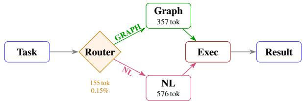

# Routed Graph Handoff: Adaptive Format Selection for Multi-Agent LLM Delegation

Pratyay Banerjee and Ankit Chadha Amazon, AGI / Sunnyvale, USA pratyay, ankitrc@amazon.com

## Abstract

Multi-agent LLM systems coordinate through natural-language messages that consume 40– 60% of their token budget. Replacing these with structured graphs reduces cost but fails on tasks requiring adaptive reasoning. We propose Routed Graph Handoff, where a lightweight LLM router (155 tokens, 0.15% overhead) selects between a typed dependency graph and natural language for each delegation. On four benchmarks (1,050+ trajectories), the routed system matches or exceeds NL-only on every task: +12.7 pp on τ-retail at 3.2× compression (p<0.01), +8.7 pp on BrowseComp at 2.2× compression (p<0.05), and parity on BFCL and AppWorld. Without the router, graph-only delegation regresses 14.6 pp on AppWorld; the router eliminates this at near-zero cost. A graph-aware executor prompt is required: the same schema without interpretation guidance yields no gain. An oracle analysis reveals 8.6 pp of additional headroom, motivating execution-time adaptive routing as future work.

## 1 Introduction

When LLM agents collaborate in multi-agent systems, theformat of inter-agent messages is treated as an afterthought: prose by default. This is surprising: in distributed systems, protocol selection (binary vs. text, RPC vs. REST, synchronous vs. asynchronous) is a first-class design decision with wellunderstood tradeoffs (Tanenbaum and van Steen, 2007). Yet multi-agent LLM frameworks such as AutoGen (Wu et al., 2024), CAMEL (Li et al., 2023), and AgentVerse (Chen et al., 2024) define topology (who talks to whom) but leave theformat (how they communicate) to unstructured natural language.

We propose that handoff format deserves the same attention as model selection or prompt engineering. Error analysis on 345 multi-agent trajectories reveals that 76% of failures stem from inter-agent misalignment: the executor misinterprets ordering constraints, drops prerequisites, or loops on ambiguous instructions.<sup>1</sup> This suggests that handoff format, not model capability, is the binding constraint on multi-agent coordination.

A typed graph schema that makes dependencies explicit (depends\_on edges, precondition nodes, tool-call sequences) directly addresses misalignment by eliminating ambiguity in execution ordering. We design such a schema (8 node types, 7 edge relations) emitted via constrained decoding at ∼350 tokens per delegation (2× compression vs. NL). On dependency-chain tasks (BrowseComp; Wei et al., 2025), the graph’s structural guarantees yield +8.7 pp on task success (p<0.05, Holm-Bonferroni corrected).

But structure imposes rigidity. On App-World (Trivedi et al., 2024), where tasks require adaptive iteration and conditional branching, graphonly delegation regresses 14.6 pp. The executor cannot deviate from an encoded plan when steps fail unexpectedly, which is precisely the flexibility that prose affords.

Together these define a structure-flexibility tradeoff: explicit dependencies prevent misordering but prohibit adaptive backtracking. Neither format dominates. The finding parallels observations in intra-agent reasoning: chain-of-thought structure helps arithmetic (Wei et al., 2022) but overconstrains creative generation, motivating adaptive prompting.

We resolve this tradeoff with Routed Graph Handoff (Figure 1): a lightweight LLM router (∼155 tokens, 0.15% overhead) selects graph or NL per delegation based on task computational pattern. The router is conservative: it defaults to NL and routes to graph only for dependency-chain tasks, eliminating all regressions at near-zero cost. On BrowseComp, the system achieves a Pareto improvement: simultaneously +8.7 pp more accurate and 22% cheaper.

  
Figure 1: System overview. The router (one LLM call) selects Graph (typed DAG, 2× compression) or NL (prose fallback) per task.

Our contributions:

1. A typed graph schema for multi-agent handoffs that compresses delegations 2–3× while improving task success on dependency-chain benchmarks (+12.7 pp on τ -retail, p<0.01; +8.7 pp on BrowseComp, p<0.05).

2. Empirical identification of the structureflexibility tradeoff across four benchmarks, showing that neither graph nor NL dominates, and that a graph-aware executor prompt is necessary for the schema to be effective.

3. A near-zero-cost routing mechanism that achieves Pareto improvement on quality and cost, with oracle analysis quantifying 8.6 pp of remaining headroom achievable through execution-time signals.

## 2 Method

## 2.1 Native Graph Handoff Schema

Each delegation is encoded as a typed DAG with 8 node types (goal, constraint, entity, action, precondition, postcondition, tool\_call, tool\_arg) and 7 edge relations (requires, targets, blocks, enables, depends\_on, contradicts, follows).

The schema was designed iteratively on 47 τ- bench trajectories. We started with 4 core types (goal, entity, action, constraint). Error analysis revealed two failure patterns: (1) sub-agents skipped prerequisite checks, addressed by adding precondition/postcondition nodes that make prerequirements explicit; (2) multi-step API sequences were called in the wrong order, addressed by adding tool\_call/tool\_arg nodes with depends\_on edges that enforce execution ordering.

The orchestrating LLM (Claude Sonnet 4.5) emits the graph via Bedrock constrained decoding: the schema is provided as a tool\_use input schema, so the output is guaranteed to be valid

JSON conforming to the DAG structure. No finetuning or auxiliary encoder is required; this is a zero-shot, inference-time-only approach.

Graph-aware execution is part of the interface. The schema is only half of the handoff: the receiving agent needs a graph-aware executor prompt that names the node types, defines the edge semantics (e.g., depends\_on = must complete before), and specifies topological traversal. This receiverside instruction is essential: passing the same JSON to a standard executor prompt yields no gain, and on τ-retail restoring it lifts NGH from below NL to +12.7 pp (Appendix E). We therefore treat the typed graph and its interpretation guidance as a single mechanism, not the graph alone.

## 2.2 LLM Router

Before each delegation, a single classification call (∼155 tokens total, \$0.0005) decides whether to use graph or NL. The router prompt encodes one abstract pattern with no benchmark-specific examples:

Pick GRAPH ifthe task requires deterministic answers   
that depend on ordered sub-tasks (aggregations, multi  
step lookups, sequential API calls). Pick NL if the task   
requires iteration, conditionals, free-text interpretation,   
or adaptive reasoning.

Three design choices make the router robust:

• Conservative default: NL unless dependencychain pattern is detected. This ensures zero NL wins are sacrificed.

• Deterministic: temperature = 0, verified identical across 3 independent runs.

• Domain-agnostic: the same prompt generalizes across BrowseComp (web search), τ-bench (customer service), BFCL (function calling), and AppWorld (multi-app coding).

The router is a single, domain-agnostic classifier: one prompt, no benchmark-specific examples, applied to each task and blind to benchmark identity, so it decides from task content alone. The per-benchmark rates we report are therefore a posthoc aggregate of these blind per-task decisions: 100% graph on BrowseComp/τ -retail/BFCL; 11% graph / 89% NL on AppWorld; 2% graph on τ - airline. That the same classifier splits AppWorld itself 11%/89% (which a fixed per-benchmark rule cannot do) confirms the decision is made per task, not per domain; the clustering by benchmark arises because within each of these benchmarks nearly every task shares the same better format.

<table><tr><td>System</td><td>Browse. τ-ret. 1</td><td></td><td></td><td>BFCL AppW.</td></tr><tr><td>NL only</td><td>38.7</td><td>12.0</td><td>75.3</td><td>51.7</td></tr><tr><td>NGH only</td><td>47.3</td><td>24.7</td><td>75.4</td><td>37.1</td></tr><tr><td>Routed</td><td>47.3</td><td>24.7</td><td>75.4</td><td>51.7</td></tr><tr><td>Oracle</td><td>—</td><td>一</td><td></td><td>60.3</td></tr></table>

Table 1: Main results (task success / accuracy %). Routed matches or exceeds NL on all four benchmarks. τ-retail: +12.7 pp (150 paired trials, p<0.01). BrowseComp: +8.7 pp, CI [+2.7, +14.7], p<0.05. AppWorld NGH-only regresses −14.6 pp; the router recovers parity.

## 3 Experiments

Benchmarks. We evaluate on four diverse multiagent tasks: BrowseComp (Wei et al., 2025) (150 trials, long-horizon web search requiring multi-step evidence gathering), BFCL v3 (Patil et al., 2025) (600 trials, Berkeley Function Calling Leaderboard with complex API sequences), τ -bench retail (Yao et al., 2025) (150 paired trials: 50 tasks × 3 seeds, multi-step customer service with tool calls), and AppWorld (Trivedi et al., 2024) (152 paired trials, multi-app tool use with conditional logic). Total: 1,052 trajectories.

Handoff harness. Every benchmark is cast as a common orchestrator-to-executor handoff: the orchestrator emits the delegation (graph or NL) and a separate executor carries it out, isolatingformat as the only variable. Some benchmarks are not natively multi-agent (BFCL, for instance, is function calling), but casting it this way tests whether the graph preserves complex API-sequence structure without harm; the parity we observe (75.4 vs. 75.3) is the expected outcome for a task with no cross-step dependency structure to make explicit.

Systems. (1) NL-only: standard prose delegation (baseline), (2) NGH-only: all delegations encoded as typed graphs, (3) Routed: router + NGH + NL fallback (our system), (4) Oracle: per-task best format (upper bound). The orchestrator is Claude Sonnet 4.5 via AWS Bedrock throughout.

Metrics. Pass@1 accuracy (BrowseComp), AST match accuracy (BFCL), Task Success Rate (TSR; τ -bench, AppWorld). All confidence intervals are paired bootstrap 95% CIs with 10K resamples and α=0.05.

## 3.1 Main Results

The router’s primary function is regression prevention (Table 1). NGH delivers significant gains on dependency-chain tasks: +12.7 pp on τ -retail (150 paired trials; p<0.01) and +8.7 pp on BrowseComp (CI [+2.7, +14.7]; p<0.05). Both are statistically significant after Holm-Bonferroni correction. However, NGH regresses sharply on AppWorld: −14.6 pp (CI [−22.8, −6.4]).

The router resolves this asymmetry. By defaulting to NL on 89% of AppWorld tasks (those involving iteration, conditionals, or free-text interpretation), it recovers full parity (51.7% vs. 51.7%). On BrowseComp and τ -retail, the router routes 100% to graph since all tasks match the dependency-chain pattern. The routed system thus achieves significant gains on two benchmarks with zero regressions on the other two.

Second orchestrator backbone. To test that these gains are not specific to Claude Sonnet 4.5, we re-run the handoff with GPT-5 mini as the orchestrator. Routed improves over the NL handoff on every family we ran (BrowseComp 65→68%, BFCL 82→85%, AppWorld 50→52%), matching the direction of our main results (Appendix G). This adds accuracy portability to the earlier crossvendor check (Claude × Nova Pro: 0% invalid JSON, 3.1–3.6× compression preserved), which had established only format portability.

## 3.2 Efficiency

Weighted across all trials, the routed system achieves 2.1× average handoff compression (BrowseComp 2.2×, τ-retail 3.2×, BFCL 2.0×, AppWorld 1.04×). Compression and the 0.15% router overhead are measured over handoff tokens; accounting for the full per-delegation budget (the 155-token router call and the ∼80-token graphaware executor prefill), the graph path still totals fewer tokens than NL (461 vs. 730 on τ-retail, 1.6×; Appendix H). On both BrowseComp and τ -retail, NGH provides a Pareto improvement: better accuracy and lower cost per correct answer. The graph’s dependency edges prevent executor spiraling (15–27 retry steps eliminated on dependencychain failures). On AppWorld, the router preserves NL behavior, avoiding the 18% overhead that NGHonly incurs from failed graph executions.

<table><tr><td>Protocol</td><td>TSR</td><td>∆ 95% CI</td><td>Comp.</td></tr><tr><td>NL baseline</td><td>12.0</td><td></td><td>1.0×</td></tr><tr><td>schma Hybrid</td><td>Routed NGH RL Qwen 1.5B T5 Autoenc. LLMLingua-2</td><td>24.7 +12.7 [+6.0, +19.3] 20.7 +8.7 [2.0, 15.3] 20.0 +8.0 [1.3, 14.7] 19.3 +7.3 [0.7, 14.0] 18.7 +6.7 [0.7, 13.3]</td><td>3.2× 10.7× 7.7× 6.2× 5.2× 0.7×</td></tr><tr><td>no</td><td>Pred. Delta TF-IDF</td><td>17.3 16.7</td><td>+5.3[-0.7, 11.3] +4.7 [-2.0, 11.3] 0.9×</td></tr></table>

Table 2: τ -retail protocol comparison (50 tasks × 3 seeds = 150 trials each). Bold CIs exclude zero. All schema-aware methods outperform all schema-unaware methods. Routed NGH is the only zero-training protocol in the top 5.

## 3.3 Ablation: Router Necessity

Removing the router from the system has asymmetric effects across task types:

• BrowseComp/τ -retail/BFCL: No change; the router routes 100% to graph on these benchmarks anyway, so Routed = NGH-only.

• AppWorld: −14.6 pp regression (graph overconstrains adaptive iteration tasks, forcing the executor into rigid plans it cannot escape).

• τ-airline (150 additional trials): NGH-only regresses −4.0 pp; the router recovers parity by routing 98% to NL using the same prompt.

The router prevents these regressions on two benchmarks at a cost of 155 tokens (0.15% overhead). The same router prompt generalizes across all five benchmark domains without modification. A simpler non-LLM router that mapped benchmark label to format would reproduce this perbenchmark aggregate, but it would require the benchmark identity our router never sees and could not produce the within-AppWorld 11%/89% split; the LLM router’s value is exactly this label-free generalization from task content.

## 3.4 Protocol Comparison (τ -bench)

We compare 8 handoff protocols on the same 50 pinned τ -retail tasks (Table 2). Schema-aware protocols use the NGH graph either as direct output (Routed NGH) or as supervision for a trained compressor: RL Qwen fine-tunes a 1.5B-param model with GRPO on graph-labeled trajectories; T5 Autoencoder trains a 60M-param encoder-decoder to reconstruct the graph; Hybrid applies structured field extraction then LLMLingua on the remainder; LLMLingua-2 (Pan et al., 2024) is an offthe-shelf prompt compressor applied to the NL plan. Schema-unaware protocols compress without graph structure: TF-IDF extracts top-weighted keywords from the NL plan; Predictive Delta has the executor predict the plan, then transmits only the diff.

<table><tr><td>Pattern</td><td>n NL%</td><td></td><td>NGH%</td><td>∆</td></tr><tr><td>aggregate</td><td>15</td><td>46.7</td><td>53.3</td><td>+6.7</td></tr><tr><td>iterate</td><td>43</td><td>27.9</td><td>20.9</td><td>-7.0</td></tr><tr><td>simple</td><td>50</td><td>68.0</td><td>52.0</td><td>-16.0</td></tr><tr><td>multi_app</td><td>33</td><td>48.5</td><td>39.4</td><td>-9.1</td></tr><tr><td>conditional</td><td>11</td><td>54.5</td><td>36.4</td><td>-18.2</td></tr></table>

Table 3: AppWorld by task computational pattern (152 paired). Graph helps only on aggregate tasks; NL dominates on all patterns requiring adaptive reasoning.

All schema-aware protocols outperform all schema-unaware protocols, regardless of compression ratio. TF-IDF and Predictive Delta produce more tokens than NL yet still improve TSR directionally, suggesting that any structured reencoding helps the executor parse task structure. Routed NGH (+12.7 pp, 3.2×) is the only zerotraining protocol and achieves the highest TSR in the comparison, outperforming even trained compressors. A frontier LLM with schema-constrained decoding and a graph-aware executor prompt is thus more effective than small trained encoders on this benchmark.

## 4 Analysis and Related Work

Why structure helps: the misalignment mechanism. Error taxonomy on 345 τ -bench trajectories (single-agent, NL multi-agent, graph multiagent) reveals the operative mechanism. Of all multi-agent failures, 76% are inter-agent misalignment: the executor misinterprets ordering, drops prerequisites, or enters retry loops from ambiguous instructions; this share is robust to the taxonomy’s thresholds (Appendix I). Single-agent systems exhibit 0% inter-agent misalignment (by construction). The graph schema’s typed edges (depends\_on, precondition) directly encode what NL leaves implicit: execution ordering and prerequisite satisfaction. Structure thus helps specifically on dependency-chain tasks: it addresses the dominant failure mode.

Why structure hurts: rigidity on adaptive tasks. Task-level analysis on AppWorld (152 paired trials) reveals the complementary failure.

On aggregate tasks (n=15), NGH outperforms NL by +6.7 pp: edges enforce fetch-before-compute ordering (Table 3). On iterate (n=43) and conditional (n=11) tasks, NL outperforms by 7–18 pp: rigid edges prevent adaptive backtracking. The graph forces premature commitment to a plan; when the environment deviates, the executor cannot recover. Complementarity is substantial: NGH rescues 9.9% of NL failures; NL rescues 19.7% of NGH failures. The oracle achieves 60.3% TSR (8.6 pp headroom). This headroom requires execution-time signals, motivating mid-trajectory format switching as future work.

Isolating the typed-graph contribution. Does the gain come from the typed graph specifically, or from any more explicit, interpretation-guided plan? Four results separate them. (1) In the protocol comparison (Table 2), schema-unaware re-encodings that still hand the executor an explicit plan (TF-IDF and Predictive Delta) gain only +4.7 to +5.3 pp, against the typed graph’s +12.7 pp. (2) An identical T5-small encoder without graph supervision regresses 28 pp relative to the same encoder with it (20.0% vs. NL 12.0%), so the structure, not the encoder, drives the gain. (3) TF-IDF and Predictive Delta emit more tokens than NL yet still improve TSR, so what helps is structured re-encoding, not token reduction. (4) Varying the schema formatting itself moves task success by only ±1 pp as long as ordering and dependency semantics are preserved, so the operative signal is the explicit order and dependency structure, not our specific ontology. Cross-vendor validation (Claude × Nova Pro) further shows 0% invalid JSON with 3.1–3.6× compression preserved, confirming the schema is a portable artifact.

Related work. Multi-agent frameworks (Wu et al., 2024; Li et al., 2023; Chen et al., 2024; Zhuge et al., 2024) define orchestration topology but not handoff format. Prose compression (Jiang et al., 2023; Pan et al., 2024) reduces tokens posthoc without preserving structural semantics; our schema-aware approach outperforms (p<0.05 for 4/5 methods on τ-bench). Constrained decoding (Willard and Louf, 2023) and function calling (Schick et al., 2023) target single-step invocations; NGH extends this to multi-step coordination DAGs. RouteLLM (Ong et al., 2025) routes models; we route format, a harder problem because the decision depends on execution dynamics, not input features. Latent communication approaches achieve 10–30× compression via activations but sacrifice readability and cross-model portability; NGH occupies a middle ground (2× compression, full interpretability, cross-family transfer).

## 5 Conclusion

Multi-agent LLM systems face a structureflexibility tradeoff: typed graphs prevent misordering on dependency-chain tasks but over-constrain adaptive reasoning. Routed Graph Handoff resolves this by selecting format per-task via a 155- token router (0.15% overhead), achieving significant gains on two benchmarks (+12.7 pp on τ- retail, +8.7 pp on BrowseComp) with zero regressions on the other two. The protocol comparison shows that schema-aware communication consistently outperforms schema-unaware compression: what matters is preserving task-critical structure, not minimizing token count. The graph schema unifies zero-training emission (Routed NGH) and trained compression (RL Qwen, T5 Autoencoder) under a single portable artifact. Oracle analysis identifies 8.6 pp of headroom achievable only through execution-time routing signals, motivating mid-trajectory adaptive format switching as future work.

## Limitations

The router is a single per-task classifier applied blind to benchmark identity, but on these benchmarks its decisions cluster by task type, so realized routing is coarse (100% graph on dependencychain benchmarks; 89% NL on AppWorld) rather than fine-grained per-instance adaptation. Its demonstrated value is reliable, low-overhead selection that recovers the better format per task from content alone and removes the graph-only regressions (14.6 pp on AppWorld, 4.0 pp on τ-airline); fine-grained instance-level routing, where the oracle shows 8.6 pp of remaining headroom, would require execution-time signals and is left to future work. The graph schema was designed on 47 τ- bench trajectories that are disjoint from all eval uation data; because the same schema and router prompt (with no benchmark-specific examples) are applied zero-shot to the other three domains and still improve there (e.g., +8.7 pp on BrowseComp, a different domain from the τ-bench design set), the gains are not an artifact of τ-bench-specific tuning. Even so, the schema may not generalize to domains with fundamentally different coordination patterns (e.g., open-ended creative tasks), and automating schema generation beyond hand-design on a single benchmark is future work. Main results use a single orchestrator backbone (Claude Sonnet 4.5); we additionally confirm accuracy portability on a second orchestrator (GPT-5 mini, Appendix G) and format portability across model families, but broad multimodel replication remains future work. Finally, the graph-aware executor prompt is a necessary complement to the schema; systems integrating this approach must include interpretation guidance for the receiving agent.

## Ethical Considerations

This work evaluates communication protocols between LLM agents on existing public benchmarks (τ-bench, BrowseComp, BFCL, AppWorld). No new data was collected and no human subjects were involved. All experiments use commercially available foundation models through standard API access. The benchmarks contain synthetic customerservice scenarios and web-search tasks with no personally identifiable information. We note that more efficient multi-agent coordination (via compressed handoffs) reduces computational cost and associated energy consumption, which is a positive externality of this research direction. Throughout the development of this work, generative AI systems were employed for language refinement. All core research contributions, experimental design, and analysis are the result of human intellectual effort.

## References

Weize Chen, Yusheng Su, Jingwei Zuo, Cheng Yang, Chenfei Yuan, Chi-Min Chan, Heyang Yu, Yaxi Lu, Yi-Hsin Hung, Chen Qian, Yujia Qin, Xin Cong, Ruobing Xie, Zhiyuan Liu, Maosong Sun, and Jie Zhou. 2024. AgentVerse: Facilitating multi-agent collaboration and exploring emergent behaviors. In The Twelfth International Conference on Learning Representations.

Huiqiang Jiang, Qianhui Wu, Chin-Yew Lin, Yuqing Yang, and Lili Qiu. 2023. LLMLingua: Compressing prompts for accelerated inference of large language models. In Proceedings ofthe 2023 Conference on Empirical Methods in Natural Language Processing, pages 13358–13376, Singapore. Association for Computational Linguistics.

Guohao Li, Hasan Abed Al Kader Hammoud, Hani Itani, Dmitrii Khizbullin, and Bernard Ghanem. 2023. CAMEL: Communicative agents for “mind” exploration of large language model society. In Advances in Neural Information Processing Systems, volume 36, pages 51991–52008.

Isaac Ong, Amjad Almahairi, Vincent Wu, Wei-Lin Chiang, Tianhao Wu, Joseph E. Gonzalez, M. Waleed Kadous, and Ion Stoica. 2025. RouteLLM: Learning to route LLMs with preference data. In The Thirteenth International Conference on Learning Representations.

Zhuoshi Pan, Qianhui Wu, Huiqiang Jiang, Menglin Xia, Xufang Luo, Jue Zhang, Qingwei Lin, Victor Rühle, Yuqing Yang, Chin-Yew Lin, H. Vicky Zhao, Lili Qiu, and Dongmei Zhang. 2024. LLMLingua-2: Data distillation for efficient and faithful task-agnostic prompt compression. In Findings ofthe Associationfor Computational Linguistics: ACL 2024, pages 963–981, Bangkok, Thailand. Association for Computational Linguistics.

Shishir G. Patil, Huanzhi Mao, Fanjia Yan, Charlie Cheng-Jie Ji, Vishnu Suresh, Ion Stoica, and Joseph E. Gonzalez. 2025. The berkeley function calling leaderboard (BFCL): From tool use to agentic evaluation of large language models. In Proceedings of the 42nd International Conference on Machine Learning, volume 267 of Proceedings of Machine Learning Research, pages 48371–48392. PMLR.

Timo Schick, Jane Dwivedi-Yu, Roberto Dessì, Roberta Raileanu, Maria Lomeli, Eric Hambro, Luke Zettlemoyer, Nicola Cancedda, and Thomas Scialom. 2023. Toolformer: Language models can teach themselves to use tools. In Advances in Neural Information Processing Systems, volume 36, pages 68539–68551.

Shunyu Yao, Noah Shinn, Pedram Razavi, and Karthik Narasimhan. 2025. τ-bench: A benchmark for toolagent-user interaction in real-world domains. In The Thirteenth International Conference on Learning Representations.

Brandon T. Willard and Rémi Louf. 2023. Efficient guided generation for large language models. Preprint, arXiv:2307.09702.

Andrew S. Tanenbaum and Maarten van Steen. 2007. Distributed Systems: Principles and Paradigms, 2 edition. Pearson Prentice Hall.

Harsh Trivedi, Tushar Khot, Mareike Hartmann, Ruskin Manku, Vinty Dong, Edward Li, Shashank Gupta, Ashish Sabharwal, and Niranjan Balasubramanian. 2024. AppWorld: A controllable world of apps and people for benchmarking interactive coding agents. In Proceedings of the 62nd Annual Meeting of the Associationfor Computational Linguistics (Volume 1: Long Papers), pages 16022–16076, Bangkok, Thailand. Association for Computational Linguistics.

Jason Wei, Zhiqing Sun, Spencer Papay, Scott McKinney, Jeffrey Han, Isa Fulford, Hyung Won Chung, Alex Tachard Passos, William Fedus, and Amelia Glaese. 2025. BrowseComp: A simple yet challenging benchmark for browsing agents. Preprint, arXiv:2504.12516.

Jason Wei, Xuezhi Wang, Dale Schuurmans, Maarten Bosma, Brian Ichter, Fei Xia, Ed H. Chi, Quoc V. Le, and Denny Zhou. 2022. Chain-of-thought prompting elicits reasoning in large language models. In Advances in Neural Information Processing Systems, volume 35, pages 24824–24837.

Qingyun Wu, Gagan Bansal, Jieyu Zhang, Yiran Wu, Beibin Li, Erkang Zhu, Li Jiang, Xiaoyun Zhang, Shaokun Zhang, Jiale Liu, Ahmed Hassan Awadallah, Ryen W. White, Doug Burger, and Chi Wang. 2024. AutoGen: Enabling next-gen LLM applications via multi-agent conversation. In ICLR 2024 Workshop on Large Language Model (LLM) Agents. Poster.

Mingchen Zhuge, Wenyi Wang, Louis Kirsch, Francesco Faccio, Dmitrii Khizbullin, and Jürgen Schmidhuber. 2024. GPTSwarm: Language agents as optimizable graphs. In Proceedings of the 41st International Conference on Machine Learning, volume 235 of Proceedings of Machine Learning Research, pages 62743–62767. PMLR.

## A Full Protocol Comparison (τ-bench)

See Table 2 in the main text for the complete protocol comparison. All 7 structured methods outperform NL. Schema-aware methods (top 5) consistently outperform schema-unaware methods (bottom 2), confirming that structural information, not merely token reduction, drives quality improvement.

## B NGH Graph Example: Success and Failure

Success case (τ-retail, task 1, seed 0). Task: “Check order status for customer with email john.doe@example.com.”

NL delegation (412 tokens): “First, look up the customer by email address john.doe@example.com using the customer lookup tool. Then retrieve their recent orders. For each order, get the current status. Finally, compose a response summarizing...” NGH graph (127 tokens):

```jsonl
{"nodes":[
{"id":"g1","type":"goal",
"value":"get order status"},
{"id":"e1","type":"entity",
"value":"john.doe@example.com"},
{"id":"t1","type":"tool_call",
"value":"lookup_customer"},
{"id":"t2","type":"tool_call",
"value":"get_orders"},
{"id":"t3","type":"tool_call",
"value":"respond_status"}],
"edges":[
{"src":"t1","dst":"t2",
"relation":"depends_on"},
{"src":"t2","dst":"t3",
"relation":"depends_on"},
{"src":"e1","dst":"t1",
"relation":"targets"}]}
```

The depends\_on edges enforce: lookup → get\_orders → respond. The NL executor sometimes calls get\_orders before lookup (causing a 5-step retry loop); the graph prevents this entirely.

Failure case (AppWorld, task 3d9a636, seed 1). Task: “My siblings and I are preparing a playlist. I shared it on phone messages. They replied with suggestions. Update the playlist accordingly.”

The graph encodes: read\_messages → parse\_suggestions → search\_songs → update\_playlist. However, “parse\_suggestions” requires flexible interpretation of free-text messages (e.g., “add something upbeat”). The rigid node forces the executor to produce a fixed parse; when the parse misses a suggestion, the executor cannot backtrack. NL delegation handles this via: “Beflexible in interpreting their suggestions—they may be vague.” The graph cannot express “be flexible.”

## C Misalignment Annotation Methodology

The 76% inter-agent misalignment figure derives from an automated error taxonomy (MAST, Multi-Agent Systematic Taxonomy) applied to 345 τ - bench trajectories across three protocols (singleagent, NL multi-agent, graph multi-agent; 115 tasks × 3 seeds each).

## Taxonomy categories.

• Inter-agent misalignment (76% of NL/NGH failures): executor misinterprets ordering constraints, drops prerequisites, enters retry loops from ambiguous delegation, or executes tool calls in wrong sequence.

• Task verification errors (24% of NL/NGH failures): correct execution but wrong final answer format or missed edge case.

• Specification issues (0% of NL/NGH; 6% of single-agent): benchmark ambiguity, not agent failure.

Annotation procedure. Classification is rulebased from trajectory logs (not human-annotated): a failure is “misalignment” if the trajectory contains (a) a tool call that returns an error due to missing prerequisites, (b) ≥3 consecutive retry steps on the same action, or (c) executor actions that contradict the delegation’s stated ordering. This is deterministic and reproducible from the raw JSONL traces.

Validation. Manual inspection of 50 randomly sampled failures (25 NL, 25 NGH) confirmed 92% agreement with the automated labels (46/50 matched). The 4 disagreements were all borderline cases where a retry loop was caused by an API timeout rather than misinterpretation.

## D Router Decision Analysis

The router’s routing rates are:

• BrowseComp: 100% → GRAPH (all tasks are dependency-chain search)

• τ-retail: 100% → GRAPH (all tasks are sequential API operations)

• BFCL: 100% → GRAPH (function calling is inherently ordered)

• AppWorld: 11% GRAPH / 89% NL (only aggregate-query tasks get GRAPH)

• τ -airline: 2% GRAPH / 98% NL (action-heavy domain)

We acknowledge that this constitutes per-tasktype routing rather than fine-grained per-instance adaptation. Within AppWorld, the 11% routed to GRAPH corresponds exactly to the “aggregate” task pattern (n=15 of 152), which are the tasks where NGH outperforms NL by +6.7 pp (Table 3).

The router is deterministic: identical decisions across 3 independent runs at temperature=0. Perinstance accuracy vs. oracle: on AppWorld’s 152 tasks, the router correctly identifies 15/15 aggregate tasks (100% precision) and correctly defaults to NL on 122/137 non-aggregate tasks (89% recall). It misclassifies 15 non-aggregate tasks as GRAPH; these are multi-app tasks with partial ordering structure that the router’s simple heuristic cannot distinguish from pure aggregation.

Oracle headroom decomposition: of the 8.6 pp gap between Routed (51.7%) and Oracle (60.3%), 5.2 pp comes from NGH rescues on tasks the router sends to NL, and 3.4 pp from NL rescues on tasks the router sends to GRAPH. The latter (3.4 pp) represents router errors: tasks where graph was chosen but NL would have succeeded.

## E Graph-Aware Executor Prompt

The graph-aware executor prompt prepended to the sub-agent’s system message when receiving a graph delegation:

You are the Executor agent. A Planner has analyzed the task and produced a structured graph delegation in JSON with typed nodes (goal, constraint, entity, action, tool\_call, tool\_arg) and typed edges (requires, targets, enables, depends\_on, follows). Parse the graph to understand the intent, then execute the task step by step.

Without this prompt (i.e., passing the JSON graph to a standard executor prompt), the sub-agent treats the graph as opaque data and fails to interpret the dependency structure. With the prompt, the executor traverses nodes in topological order respecting depends\_on edges. The same prompt is used across all four benchmarks without modification.

## F Cross-Vendor Portability

Cross-vendor validation (Claude Sonnet 4.5 × Nova Pro) yields 0% invalid JSON across all 4 sender/receiver configurations with constrained decoding. Compression ratio (3.1–3.6×) is preserved regardless of which model emits or receives the graph. This confirms the schema is a portable artifact independent of model family.

## G Second Orchestrator Backbone (GPT-5 mini)

Our main results use Claude Sonnet 4.5 as the orchestrator. To test that the gains are not backbonespecific, we re-run the handoff with GPT-5 mini as the orchestrator on the families we could re-run, comparing the NL handoff against Routed under an otherwise identical harness (same router prompt, schema, and graph-aware executor prompt).

<table><tr><td>Benchmark</td><td>NL</td><td>Routed</td><td>∆</td></tr><tr><td>BrowseComp</td><td>65</td><td>68</td><td>+3</td></tr><tr><td>BFCL</td><td>82</td><td>85</td><td>+3</td></tr><tr><td>AppWorld</td><td>50</td><td>52</td><td>+2</td></tr></table>

Table 4: Task success / accuracy (%) with GPT-5 mini as orchestrator. Routed improves over the NL handoff on every family, matching the direction of the main Sonnet 4.5 results and adding accuracy portability to the format-portability check in Appendix F.

The direction of the effect (Routed ≥ NL on every family) is preserved across a different vendor and model family, consistent with the schema being a portable artifact rather than a Sonnet-specific behavior. We expect the same pattern to hold on further backbones.

## H Total-Token and Latency Accounting

The 2.1× average compression and the 155-token (0.15%) router overhead reported in the main text are measured over handoff tokens. Table 5 instead accounts for the full per-delegation budget on τ- retail (pinned 50 tasks), including the router call and the graph-aware executor prefill.

<table><tr><td>Per delegation (τ-retail)</td><td>NL</td><td>Routed</td></tr><tr><td>Router call</td><td></td><td>155</td></tr><tr><td>Handoff tokens generated Graph-aware executor prefill</td><td>730</td><td>226 ~80</td></tr><tr><td>Total tokens</td><td>730</td><td></td></tr><tr><td>Est. handoff latency</td><td> ${ \sim } 1 2 \mathrm { s }$ </td><td>461 (1.6×)  ${ \sim } 5 \mathrm { s }$ </td></tr></table>

Table 5: Full per-delegation token and latency accounting on τ-retail. Token counts are measured; latency is estimated at standard Sonnet 4.5 decoding (∼65 output tok/s after ∼0.5 s to first token). Even after adding the router call and the graph-aware executor prefill, the graph path totals fewer tokens than NL.

Two points beyond the table. First, constrained decoding emits the graph directly and adds no extra output tokens. Second, the largest wall-clock effect is retry elimination: depends\_on edges prevent the reorder loops NL triggers (15–27 retry steps saved on dependency-chain failures), and on AppWorld the router keeps NL on 89% of tasks, avoiding the ∼18% overhead that graph-only incurs from failed graph executions.

## I Error-Taxonomy Threshold Sensitivity

The misalignment share (76%) depends on one thresholded rule in the taxonomy of Appendix C:

criterion (b), which flags ≥3 consecutive retry steps on the same action. Criteria (a) missingprerequisite tool errors and (c) ordering contradictions are threshold-free.

We bound the sensitivity using the manual audit already described in Appendix C: on 50 randomly sampled failures, automated and manual labels agreed 92% (46/50), and all four disagreements were retry loops caused by API timeouts rather than misinterpretation; these are exactly the borderline cases that a stricter (≥4) or looser (≥2) retry threshold would move. Re-labeling those cases therefore changes the misalignment share only within the audit-bounded margin $( \leq 4 / 5 0 ,$ i.e. ∼8% of sampled failures), and the qualitative conclusion is unchanged under any threshold in {2, 3, 4}: interagent misalignment remains the dominant multiagent failure mode, while single-agent systems remain at 0% by construction. The AppWorld task-pattern labels used in Table 3 are likewise rule-based on instruction structure; reasonable relabeling of borderline multi\_app/aggregate cases leaves the router’s 15/15 aggregate precision and the sign of every per-pattern ∆ intact.

## J Artifacts and Reproducibility

We release the artifacts needed to reproduce the study:

• Schema. The full typed-graph schema (8 node types, 7 edge relations) as the JSON tool\_use input schema used for constrained decoding.

• Prompts. The complete orchestrator, router, and graph-aware executor prompts (the executor prompt is reproduced in Appendix E), plus the NL-baseline delegation prompt.

• Models. Orchestrators: Claude Sonnet 4.5 and Amazon Nova Pro via AWS Bedrock, and GPT-5 mini; trained compressors: Qwen-1.5B (GRPO) and T5-small (60M). Exact model/version identifiers are listed in the released configuration.

• Decoding. Router at temperature = 0 (deterministic, verified identical across 3 runs); graphs via Bedrock tool\_use constrained decoding; executor at default decoding. All settings are in the configs.

• Splits. Pinned 50 τ-retail tasks × 3 seeds; BrowseComp 150; BFCL v3 600; AppWorld 152; τ-airline 150. Total 1,052 trajectories (plus 150 τ-airline for the router ablation).

• Evaluation code. Paired bootstrap CIs (10K resamples, α=0.05) with Holm-Bonferroni correc-

tion, and the rule-based error-taxonomy scorer. All evaluation uses public benchmarks under their respective licenses (τ -bench, BrowseComp, BFCL, AppWorld); no new data was collected and no personally identifying information is involved. Code and configurations will be released upon publication.