# TOPAS: Workflow-Aware Prefix-State Scheduling for Multi-Agent LLM Serving

Hongqiu Ni∗, Han Tian∗, Chi Zhang†, Guopeng Li∗ and Haisheng Tan∗ ∗University of Science and Technology of China, China †Hefei University of Technology, China

Abstract—Prefix caching introduces a fundamental tradeoff in multi-agent large language model (LLM) serving: retaining a long system-prompt key–value (KV) cache for an agent accelerates future calls, yet it reduces the GPU memory available for batching concurrent requests. In multi-stage workflows, existing schedulers tend to prioritize either immediate prefix locality or overall workflow progress. However, under a shared KV cache budget, optimizing either objective in isolation can prolong tasklevel job completion time (JCT) through downstream delays or frequent prefix replacement. To strike a balance, we here propose TOPAS, a Task-Oriented Prefix-Aware Scheduler that jointly decides which agent prefixes to keep in the cache and which requests to schedule for execution. TOPAS scores candidate post-decision states by trading off the expected reduction in each task’s longest remaining service path against the near-term benefit of downstream prefix reuse, accounting for the costs of prefix movement and preemption. A task-level aging mechanism is also incorporated to prevent starvation. We implement TOPAS within the SGLang framework and assess its performance on three synthetic DAGs and two MetaGPT software-development workflows. Compared with the best-performing baseline for each workload and metric, TOPAS reduces the mean/p99 JCT by up to 39.8%/49.4% on the synthetic workloads, while lowering mean JCT by 9.8% on MetaGPT-SOP and mean/p99 JCT by 22.0%/26.6% on MetaGPT-TL.

## I. INTRODUCTION

Multi-agent LLM applications tackle complex tasks via interdependent requests generated by role-specialized agents [20], [32]. Each request contains an agent-specific static prefix whose KV cache is reusable across requests from the same agent in different tasks. Serving systems such as SGLang maintain cached KV pairs in a radix tree, where requests sharing the same agent prefix traverse the static path and each appends its own request-specific dynamic content. Retaining this cache in GPU memory—referred to as prefix residency—eliminates redundant prefill computations, yet it contends with concurrently executing requests for the limited KV budget. Long system prompts further amplify both the reuse benefit and the residency cost. Consequently, request scheduling influences not only task progress but also the overall serving capacity of the GPU.

Mainstream inference frameworks such as SGLang focus on optimizing batching, prefix caching, and KV cache management [11], [37]. Their schedulers primarily operate at the request level, ranking ready requests using engine-local information. Although well suited for per-request execution optimization, this request-level view offers only an indirect reflection of the inter-request dependencies and program-level progress that the orchestration layer monitors.

Recent efforts aim to bridge this abstraction gap through distinct strategies. Parrot and Autellix incorporate application dataflow or program-level progress into request scheduling [13], [16], whereas KVFlow leverages workflow context for prefix-cache placement [18]. These systems primarily optimize application progress, cache availability, or resource placement, while prefix residency remains largely separate from request admission. This decoupling can leave heterogeneous prefixes co-residing in the cache—reducing the feasible concurrent batch size—or provoke repeated prefix evictions and reloads as execution shifts across agents.

An inherent conflict exists between end-to-end progress against prefix reuse. Consolidating requests from the same agent allows fewer resident prefixes to support a larger batch, yet it can stall upstream execution while downstream tasks remain pending. Conversely, prioritizing workflow progress tends to trigger frequent agent switching, sacrificing reuse and incurring significant prefix-movement overhead. Consequently, a scheduler must reconcile prefix locality with holistic progress, rather than optimizing either objective in isolation.

We therefore pose the following question: How can a serving system coordinate prefix residency and request admission throughout workflow execution to minimize task-level job completion time (JCT) under a constrained GPU-memory budget? We formalize this problem as online prefix-state scheduling. At each scheduling point, the scheduler jointly decides which agent prefixes to retain and which ready requests to admit, subject to a shared KV cache budget. This joint decision determines the current batch capacity, immediate task progress, and the set of prefixes most likely to be reused by subsequent workflow steps.

To solve this problem, we propose TOPAS, a Task-Oriented Prefix-Aware Scheduler whose key novelty lies in treating prefix residency as an explicit workflow-level scheduling decision, jointly optimized with request admission, rather than as an indirect byproduct of request ordering and cache eviction. To our knowledge, TOPAS is the first multi-agent LLM scheduler to jointly optimize prefix residency and request admission for task-level JCT under a shared KV budget. TOPAS conducts a hierarchical search to construct post-decision GPU states, each specifying a resident-prefix set and a compatible allocation of admitted requests. It selects the optimal state via a JCToriented utility that trades off anticipated reduction in each task’s longest remaining service path and near-term prefix reuse, accounting for the costs of prefix movement and preemption. Our contributions are summarized as:

• We formalize the online prefix-state scheduling problem, which jointly selects resident agent prefixes and admitted requests under a shared KV cache budget. Our diagnostic analysis reveals that heterogeneous prefix co-residency reduces dynamic batch capacity, while locality-first and progress-first policies fail in complementary leading to bad performance.

• We introduce TOPAS, an online scheduler that jointly determines prefix residency and request admission via a JCT-oriented utility function. This utility balances expected reductions in tasks’ longest remaining service paths and near-term prefix reuse. A task-level aging mechanism is also incorporated to prevent starvation.

• We implement TOPAS atop SGLang and evaluate it on three synthetic DAG workloads and two MetaGPT workloads. Compared with the best-performing baseline per workload and metric, TOPAS reduces mean/p99 JCT by up to 39.8%/49.4% on the synthetic workloads; lowers mean JCT by 9.8% on MetaGPT-SOP; and achieves mean and p99 JCT reductions by 22.0% and 26.6%, respectively, on MetaGPT-TL.

## II. MOTIVATION: A PROGRESS–REUSE CONFLICT

Task-level policies can use workflow dependencies to decide which tasks or stages should advance, but their decisions are ultimately executed by a request-level serving engine. The engine repeatedly admits ready requests into a continuous batch under a finite KV budget. Same-agent requests reuse a resident static-prefix cache, while each request consumes additional KV capacity for its dynamic suffix and decode tokens. Admission order and cache eviction therefore determine both which prefixes remain resident and how many requests can run together. Task-level priority alone does not control this prefix–batch interaction; the following diagnostics isolate its two consequences.

To examine how request order affects batching, we use a two-agent microbenchmark on the native LLM serving runtime. The workload contains n independent requests for each of agents A and B. The agents have distinct long prefixes, while all requests use the same dynamic suffix and decode length. ALTERNATING orders them as $A , B , A , B , . . . ,$ keeping both prefixes resident for most of the run, whereas GROUPED serves each agent’s requests together. Both orders contain the same requests and use the same KV budget; only their order differs.

Table I shows that GROUPED doubles the average running batch size; ALTERNATING takes 1.8–1.9× as long to finish the workload. Serving same-agent requests together lets one resident prefix support a larger batch. Alternating between agents instead divides KV capacity across both long prefixes, leaving less space for dynamic suffixes and decode tokens.

<table><tr><td>Load</td><td>Makespan (s) (G/A)</td><td>Mean batch (G/A)</td><td>Peak batch (G/A)</td></tr><tr><td> $n = 1 0 0$ </td><td>1145.5/2086.0</td><td>9.3/4.7</td><td>15/8</td></tr><tr><td> $n = 1 5 0$ </td><td>1639.3/3104.4</td><td>10.0/4.8</td><td>16/8</td></tr><tr><td> $n = 2 0 0$ </td><td>2143.5/4079.1</td><td>11.5/5.0</td><td>16/7</td></tr></table>

TABLE I  
UNDER FCFS, HETEROGENEOUS PREFIX CO-RESIDENCY SHRINKS THE RUNNING BATCH, THEREBY INCREASING MAKESPAN. SLASH-SEPARATED VALUES ARE GROUPED/ALTERNATING.

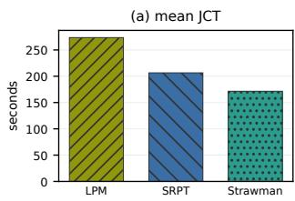

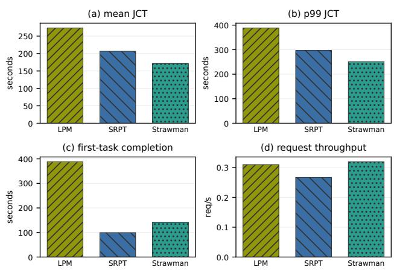

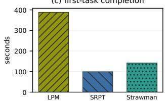  
Fig. 1. Chain-3 at 0.15 task/s under locality-first LPM, progress-first SRPT, and downstream gating.

The batching benefit in Diagnostic 1 suggests a natural response: favor requests that can reuse a resident prefix. Longest Prefix Match (LPM) is a representative locality-first policy: it prioritizes ready requests with the longest immediately reusable prefix. Yet it does not actively choose a target prefix state. It operates in a reactive, arrival-driven manner: request order and cache eviction determine prefix residency, which then becomes the locality signal for the next decision. In an $A \to B \to C$ workflow with continuous arrivals at A, this feedback keeps service near the workflow entrance and delays stages B and C. To test whether active control can break this behavior, we augment LPM with a simple downstream gate that prioritizes $C$ once its backlog accumulates. Figure 1 shows that this coarse intervention achieves lower mean JCT than LPM.

Progress-first scheduling lies at the other extreme. Shortest Remaining Processing Time (SRPT) prioritizes tasks with shorter remaining processing time and can move them toward the workflow exit. Yet it has no explicit notion of prefix residency: repeatedly following the shortest remaining work switches between agents, causing prefix transfers or recomputation and reducing effective service capacity. At the same operating point, the downstream-gated policy also achieves lower mean JCT than SRPT. Thus, neither immediate prefix locality nor task progress alone is sufficient to minimize tasklevel JCT.

Figure 2 exposes the mechanism behind this conflict. SRPT pushes one task through the chain, but each transition to the next stage changes the resident prefix and pays another setup cost. LPM instead batches same-prefix requests to amortize setup, but this locality-first order holds service at upstream stages and starves downstream progress. The Gantt chart therefore shows how prioritizing task progress can sacrifice prefix locality, while preserving locality can delay workflow completion.

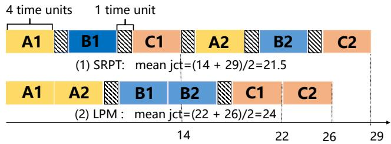  
Fig. 2. A Gantt chart comparing LPM and SRPT on an $A  B  C$ workflow. GPU memory can hold the KV cache for only one Agent prefix at a time; each request takes four time units, and each prefix setup takes one time unit.

An effective scheduler should treat prefix residency as an explicit decision. It should group requests that share a prefix to preserve batching efficiency, but move service to another prefix when continued reuse delays task completion. The goal is to coordinate prefix reuse and task progress within each scheduling decision.

## III. PROBLEM FORMULATION

All tasks follow the same known DAG $G = ( V , E )$ . Task $J _ { i }$ arrives at time $\tau _ { i } .$ . Each node $v \in V$ is a stage executed by an agent and becomes ready after all of its predecessors complete. A stage may issue one or more LLM requests before producing its output. ReAct iterations and tool delays are not known in advance; they are runtime events that determine when subsequent requests and stages become ready. Requests produced by agent a share a static prefix of length $\ell _ { a } .$ Let $C _ { i , v }$ be the completion time of stage v in task $J _ { i } .$ . The task completion time and task-level JCT are

$$
C ( J _ { i } ) = \operatorname* { m a x } _ { v \in V } C _ { i , v } , \qquad \mathrm { J C T } ( J _ { i } ) = C ( J _ { i } ) - \tau _ { i } .\tag{1}
$$

The serving objective is to minimize average task-level JCT under online arrivals.

At a scheduling point t, let $S _ { t } = ( R _ { t } , Q _ { t } )$ denote the current GPU state, where $R _ { t }$ is the set of resident agent prefixes and $Q _ { t }$ is the set of running requests. A scheduling action selects a post-decision state $S ^ { \prime } = ( R ^ { \prime } , Q ^ { \prime } )$ . Requests in $Q ^ { \prime } \setminus Q _ { t }$ are newly admitted, while requests in $Q _ { t } \setminus Q ^ { \prime }$ are preempted. A request can belong to $Q ^ { \prime }$ only when its agent prefix belongs to $R ^ { \prime }$ . We exclude idle resident prefixes, so $R ^ { \prime } = \{ a ( r ) : r \in$ $Q ^ { \prime } \}$ . The selected joint state must satisfy

$$
\sum _ { a \in R ^ { \prime } } \ell _ { a } + \sum _ { r \in Q ^ { \prime } } d _ { r } ( t ) \leq B _ { t } ,\tag{2}
$$

where $d _ { r } ( t )$ accounts for the request’s dynamic-suffix KV, retained output tokens, and decode reservation, and $B _ { t }$ is the available token-equivalent KV capacity. Multiple requests for the same agent pay the static prefix cost once.

The scheduler observes ready requests, the current GPU state, task arrival times, stage progress, and the workflow topology and agent mapping. Future task arrivals, future ready times, ReAct iterations, and unexpanded tool outputs are unknown.

## IV. TOPAS: WORKFLOW-AWARE PREFIX-STATE SCHEDULING

## A. Design Overview

The two diagnostics in Section II point to a limitation of request-level scheduling. When requests are chosen one at a time, prefix residency is determined indirectly by request order and the serving runtime’s cache-eviction policy. Different agent prefixes may therefore remain resident together and leave too little KV capacity for dynamic suffixes and decoding. At the same time, service may stay on a reusable prefix even when another workflow stage matters more to task completion. TOPAS instead schedules a post-decision prefix–request state, directly choosing both the resident prefixes and the requests served under them.

For each candidate prefix set, TOPAS constructs a compatible request allocation under the joint KV budget. Its base utility (Section IV-B) uses the workflow DAG to estimate the reduction in tasks’ remaining LLM-service paths, balancing this progress against prefix movement and preemption. A one-hop lookahead values prefixes likely to serve newly released downstream work (Section IV-C), while task aging prevents new arrivals from repeatedly overtaking older tasks (Section IV-D). Section IV-E searches these joint states by enumerating small agent pools and using bounded greedy search for larger ones. The resulting event-level score uses expected remaining-path reduction as a heuristic estimate of progress toward task completion. TOPAS greedily commits the highest-scoring generated next state at each scheduling event and reevaluates the decision as the system state changes.

## B. Base Transition Utility

For a candidate state $S ^ { \prime }$ , let $A = Q ^ { \prime } \setminus Q _ { t }$ and $P = Q _ { t } \backslash Q ^ { \prime }$ denote its newly admitted and preempted requests. Candidate feasibility follows the joint prefix–request capacity constraint in Section III. TOPAS first evaluates

$$
U _ { \mathrm { b a s e } } ( S ^ { \prime } \mid S _ { t } ) = J _ { \mathrm { a d m i t } } - J _ { \mathrm { m o v e } } - J _ { \mathrm { r e d o } } - J _ { \mathrm { r e v o k e } } .\tag{3}
$$

All terms are measured in seconds. $J _ { \mathrm { a d m i t } }$ estimates the reduction in the selected requests’ task-level remaining paths; the other terms charge transition delay and work invalidated by preemption.

A request’s service time is not itself task progress. In a DAG, advancing a non-bottleneck branch may leave task completion unchanged. TOPAS therefore values an admitted request by the expected reduction in the task’s longest remaining LLM-service path after that request completes. For a chain, the path is fixed and this value reduces to the expected reduction of the current stage’s residual service. In a fork/join or a general DAG, the bottleneck branch can change as stages advance, so the value must account for the distributions of their remaining service.

Under ReAct, let $X _ { i , v } \sim F _ { a ( v ) , \ast }$ be the total LLM service of stage v in task $J _ { i } .$ . Each agent–stage pair has a stage-specific profile of total LLM service. Once completed executions are available, $F _ { a ( v ) , v }$ is their empirical distribution, including all ReAct rounds but excluding tool waits; before then, it is a point mass at the profiled total stage-service value. Let $e _ { i , v } ( t )$ be the cumulative service recorded in the stage history. A started but unfinished stage has residual distribution

$$
\begin{array} { r } { Z _ { i , v } ( t ) \stackrel { d } { = } X _ { i , v } - e _ { i , v } ( t ) ~ \mid ~ X _ { i , v } > e _ { i , v } ( t ) . } \end{array}\tag{4}
$$

Unstarted and completed stages have residuals $X _ { i , v }$ and zero, respectively. Equation (4) conditions repeated ReAct rounds on service already observed without assuming a fixed number of rounds; tool waits affect readiness, not this controllableservice estimate.

For request r, let $\widehat { D } _ { r } ( t )$ be its expected LLM-service contribution under the historical service observations for its agent–stage pair. Its hypothetical completion updates the corresponding residual to $\bar { [ Z _ { i , v } ( t ) - \widehat { D } _ { r } ( \bar { t } ) ] } _ { + }$ +. For an agent–stage pair without completed observations, $\widehat { D } _ { r } ( t )$ falls back to the profiled estimate $T _ { \mathrm { p r e f l l } } ( \mathrm { | i n p u t } _ { r } | ) + T _ { \mathrm { d e c o d e } } \mathrm { m a x } _ { - } \mathrm { n e w } _ { \tau }$ until empirical observations become available. After completion, the realized service is recorded, and $F _ { a ( v ) , v }$ is updated when the stage finishes.

Let $\mathbf { Z } _ { i } ( \mathcal { H } , t )$ be the joint residual vector after hypothetical request completions H. Conditioned on the observed history, TOPAS models unfinished-stage residuals independently and computes

$$
\begin{array} { r } { \widehat { L } _ { i } ( \mathcal { H } , t ) = \mathbb { E } _ { \mathbf { Z } _ { i } ( \mathcal { H } , t ) } [ \mathrm { L P } ( G , \mathbf { Z } _ { i } ( \mathcal { H } , t ) ) ] , } \end{array}\tag{5}
$$

where LP is the longest remaining path for a residual realization, evaluated in reverse topological order. Request r from task $J _ { i }$ then has conditional progress

$$
\Delta _ { \mathrm { t a s k } } ( r \mid \mathcal { H } , t ) = \widehat { L } _ { i } ( \mathcal { H } , t ) - \widehat { L } _ { i } ( \mathcal { H } \cup \{ r \} , t ) .\tag{6}
$$

The expectation is taken over the empirical conditional residual distributions of unfinished stages. Placing it outside LP allows the critical path to change across residual realizations and stage updates instead of fixing a path from mean durations.

Within a candidate, requests follow the greedy order constructed in Section IV-E. Let $A _ { i } ^ { < r }$ contain the earlier hypothetical request completions from the same task. The base admission term is

$$
J _ { \mathrm { a d m i t } } = \sum _ { r \in A } \Delta _ { \mathrm { t a s k } } ( r \mid A _ { i } ^ { < r } , t ) .\tag{7}
$$

Sequential residual updates make these terms sum to each task’s joint expected remaining-path reduction.

TOPAS moves prefix KV caches between GPU and CPU memory as agents enter and leave the resident set. Let $R _ { \mathrm { i n } } =$ $R ^ { \prime } \setminus R _ { t }$ and $R _ { \mathrm { o u t } } = R _ { t } \backslash R ^ { \prime }$ . Let $\mu$ be the KV bytes per

prefix token and $B _ { \mathrm { s w a p } }$ the swap bandwidth. Transfers within a transition are serialized, yielding

$$
\begin{array} { c } { \displaystyle { T _ { \mathrm { m o v e } } ( S ^ { \prime } \mid S _ { t } ) = \frac { \mu } { B _ { \mathrm { s w a p } } } \left( \sum _ { a \in R _ { \mathrm { o u t } } } \ell _ { a } + \sum _ { a \in R _ { \mathrm { i n } } } \ell _ { a } \right) , } } \\ { \displaystyle { J _ { \mathrm { m o v e } } = T _ { \mathrm { m o v e } } ( S ^ { \prime } \mid S _ { t } ) \vert T _ { \mathrm { i n } } \vert . } } \end{array}\tag{8}
$$

Here $\begin{array} { r c l } { \mathcal { T } _ { \mathrm { i n } } } & { = } & { \big \{ \mathrm { t a s k } ( r ) \ : \ r \ \in \ A , a ( r ) \ \ \in \ R _ { \mathrm { i n } } \big \} } \end{array}$ contains the distinct admitted tasks that wait for an incoming prefix. Resident-prefix admissions overlap with movement, and each affected task is charged once.

SGLang reconstructs the generated-token KV of a preempted request through autoregressive decoding. Let $y _ { r } ( t )$ be the number of tokens to reconstruct and $T _ { \mathrm { d e c o d e } }$ the profiled decode time per token. The discarded work is

$$
J _ { \mathrm { r e d o } } = \sum _ { r \in P } T _ { \mathrm { d e c o d e } } y _ { r } ( t ) .\tag{9}
$$

$J _ { \mathrm { { r e d o } } }$ charges repeated computation; $J _ { \mathrm { r e v o k e } }$ prevents an unfinished attempt from repeatedly collecting admission value. At admission time $t _ { a } ,$ TOPAS stores the selected candidate’s conditional credit $\lambda _ { r } ~ = ~ \Delta _ { \mathrm { t a s k } } ( r ~ | { \cal ~ A } _ { i } ^ { < r } , t _ { a } )$ . Preemption revokes it:

$$
J _ { \mathrm { r e v o k e } } = \sum _ { r \in P } \lambda _ { r } .\tag{10}
$$

The credit remains fixed as sibling branches progress, is cleared on completion, and is recreated on re-admission. Section IV-D adds aging.

## C. Short-Horizon Prefix Reuse

Current reuse is already reflected by the capacity constraint: same-agent requests share one static-prefix cost. To value near-future reuse, TOPAS counts downstream stages about to become ready. Let $n _ { a } ( t )$ be the number of such stages assigned to agent a whose only unfinished predecessor is running; thus each fork child contributes separately, while a join contributes only when all other predecessors have finished. A candidate receives

$$
V _ { \mathrm { r e u s e } } = \beta \sum _ { a \in R ^ { \prime } } n _ { a } ( t ) \frac { \mu \ell _ { a } } { B _ { \mathrm { s w a p } } } .\tag{11}
$$

where the reload time $\mu \ell _ { a } / B _ { \mathrm { s w a p } }$ values retaining an expensive prefix and β sets the pressure strength. Lookahead stops after one workflow transition because farther demand depends on unresolved branches, ReAct rounds, and tool outcomes. Idle prefixes remain infeasible, so this term ranks active states rather than prefetching inactive agents.

## D. Task-Level Aging

To keep new arrivals from repeatedly overtaking older tasks with similar progress, TOPAS scales only admission progress by task age:

$$
g _ { i } ( t ) = 1 + \rho \log \left( 1 + \frac { t - \tau _ { i } } { H _ { \mathrm { a g e } } } \right) ,\tag{12}
$$

where $\tau _ { i }$ is the arrival time of task $J _ { i } , H _ { \mathrm { a g e } }$ is the observed service-time scale used to normalize age, and $\rho$ controls its strength; the supplementary material gives the update rule. The admission term is $\begin{array} { r } { J _ { \mathrm { a d m i t } } ^ { \mathrm { a g e } } ~ { = } ~ \sum _ { r \in A } g _ { \mathrm { t a s k } ( r ) } ( t ) { \Delta } _ { \mathrm { t a s k } } ( r } \end{array}$ $A _ { i } ^ { < r } , t )$ . The stored credit uses the same admission-time weight, so preemption revokes the value originally granted. The full transition score is

$$
\operatorname { S c o r e } ( S ^ { \prime } \mid S _ { t } ) = J _ { \mathrm { a d m i t } } ^ { \mathrm { a g e } } - J _ { \mathrm { m o v e } } - J _ { \mathrm { r e d o } } - J _ { \mathrm { r e v o k e } } + V _ { \mathrm { r e u s e } } .\tag{13}
$$

## E. Hierarchical State Search

Direct joint-state search is combinatorial, and task-level utility is not separable across requests. TOPAS therefore separates prefix-set generation from request allocation. For each set R, GREEDYPACK retains running requests covered by R, derives preemptions, and repeatedly admits the fitting request with the largest age-weighted conditional progress per additional request-specific KV reservation. Same-task marginals are updated after each choice. It reserves an admission slot and capacity for every otherwise uncovered prefix in $R ,$ rejects sets that cannot be covered, and emits every feasible intermediate allocation. Packing continues through zero-gain choices to expose complementary fork branches, preferring a represented task. Let $\Phi ( R )$ be the best full score emitted for R, or −∞ if none is feasible.

For the active-agent pool $\mathcal { A } _ { t } = \{ a ( r ) : r \in W _ { t } \cup Q _ { t } \}$ TOPAS enumerates $\mathcal { P } ( A _ { t } )$ when $| { \mathcal { A } } _ { t } | \ \leq \ M$ . Otherwise it starts at $R _ { g } = R _ { t }$ and repeatedly takes the best Φ-improving single-agent addition. At the first stall, it tests all remainingagent pairs once and, if one improves $\Phi ,$ , adds the pair and resumes single additions. It also tests single-agent drop and swap repairs, denoted $\mathrm { R E P A I R } ( R )$ , from $R _ { t }$ and the final $R _ { g } .$ , and retains the incumbent. This preserves full prefix-set enumeration for small pools and limits large-pool search to $O ( | A _ { t } | ^ { 2 } )$ prefix-set evaluations.

The cap K applies separately to admissions and preemptions: $| A _ { R } | \le K$ and $| P _ { R } | \le K ; K = 0$ removes both caps. Natural completions are committed before search and do not enter $P _ { R }$ . From the generated feasible states $\widehat { \mathcal { C } } _ { t } ,$ TOPAS selects

$$
S _ { t } ^ { \mathrm { s e l } } = \arg \operatorname* { m a x } _ { S ^ { \prime } \in \widehat { \mathcal { C } } _ { t } } \mathrm { S c o r e } ( S ^ { \prime } \mid S _ { t } ) .\tag{14}
$$

The selection in Eq. (14) defines an event-level greedy policy: TOPAS executes the highest-scoring feasible candidate and re-optimizes at the next scheduling event. The score uses expected remaining-path reduction under the empirical conditional residual distributions as a heuristic estimate of progress toward task completion, together with the modeled transition costs and reuse value. GREEDYPACK enforces feasibility by construction, and candidate generation bounds the search at every event. With an explicit event-level score, TOPAS evaluates and selects the generated feasible states directly. An empty incumbent is removed once a nonempty state is available.

## V. EXPERIMENTS

## A. Experimental Setup

We implement TOPAS as a scheduling module in SGLang v0.5.3 [37] and evaluate it on a single NVIDIA A100 80GB

Algorithm 1 Hierarchical state search   
Input: ready requests $W _ { t } ,$ incumbent state $( R _ { t } , Q _ { t } )$ , budget   
$B _ { t } ,$ and bounds M, K   
Output: selected state $S _ { t } ^ { \mathrm { s e l } }$   
1: $\mathcal { A } _ { t }  \{ a ( r ) : r \in W _ { t } \cup Q _ { t } \}$ and $\widehat { \mathcal { C } } _ { t } \gets \varnothing .$   
2: if $| { \mathcal { A } } _ { t } | \leq M$ then   
3: Add all states from GREEDYPACK $( \mathcal { P } ( \mathcal { A } _ { t } ) )$ to $\widehat { \mathcal { C } } _ { t } .$   
4: else   
5: $R _ { g } \mathrm { ~  ~ { ~  ~ } ~ } R _ { t }$ and $p _ { \mathrm { p a i r } } $ false; add states from   
GREEDYPACK $( \{ R _ { t } \}$ ∪ REPAIR $\left( R _ { t } \right) )$   
6: repeat   
7: Form $\mathscr { R } _ { 1 }  \{ R _ { g } \cup \{ a \} : a \in \mathscr { A } _ { t } \setminus R _ { g } \}$ and add   
GREEDYPACK $\left( \mathcal { R } _ { 1 } \right)$ states.   
8: if the best addition improves $\Phi ( R _ { g } )$ then   
9: Update $R _ { g }$ with the best addition.   
10: else if $p _ { \mathrm { p a i r } } = \mathrm { f a l s e }$ then   
11: Set $p _ { \mathrm { p a i r } } $ true; form all $R _ { g } \cup \{ a , b \}$ once and   
add their GREEDYPACK states.   
12: if the best pair improves $\Phi ( R _ { g } )$ then   
13: Update $R _ { g }$ with the best pair.   
14: else   
15: break.   
16: end if   
17: else   
18: break.   
19: end if   
20: until the search terminates   
21: Add states from GREEDYPACK(REPAIR $\left( R _ { g } \right) )$ and add   
incumbent $S _ { t } .$   
22: end if   
23: Remove the empty incumbent if a nonempty candidate   
exists.   
24: return $\operatorname { a r g m a x } _ { S ^ { \prime } \in { \widehat { \mathcal { C } } } _ { t } } { \operatorname { S c o r e } ( S ^ { \prime } } \mid S _ { t } )$ with deterministic   
ties.

GPU. The server allocates the A100 memory remaining after loading the model weights to the KV cache; we impose no workload-specific KV limit. In a separate MetaGPT-SOP overhead run at 0.15 task/s, TOPAS averages 1.9 ms per scheduling decision, and its cumulative scheduler time accounts for 0.31% of experiment wall time.

All workloads use Qwen2.5-32B-Instruct. At each operating point, tasks arrive according to a Poisson process whose rate is the arrival rate shown in the figures; the sampled arrival trace is fixed and shared across all policies. We evaluate three synthetic DAG workloads: Chain-3, DAG-4, and DAG-10-Wide. They cover linear, fork/join, and wide execution structures with increasing numbers of prefix namespaces and concurrently ready agents. They use fixed-length user queries constructed for the evaluation and fixed per-stage generations, isolating topology and prefix-state pressure from variations in user content.

The two MetaGPT workloads use real prompts sampled from the MetaGPT SoftwareDev dataset [8]. The MetaGPT-

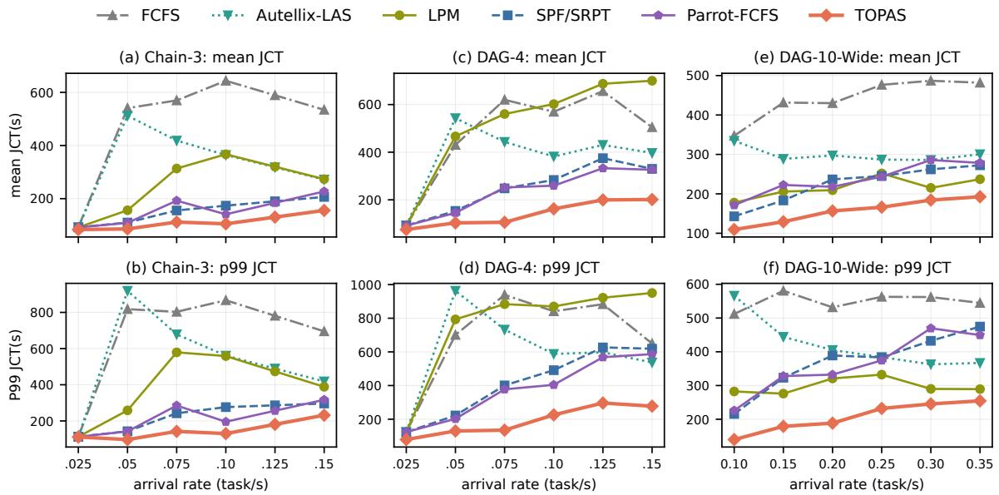  
Fig. 3. End-to-end task completion on the synthetic DAG workloads.

SOP workload follows the static five-role pipeline of earlier MetaGPT versions, whereas MetaGPT-TL unrolls a ninestage path through the newer star-shaped organization, alternating a TeamLeader with four specialists to preserve recurrent reuse of the central prefix.

All policies run on the same SGLang backend. We compare five baselines: (1) FCFS orders requests by arrival time; (2) Longest Prefix Match (LPM) prioritizes requests with the longest reusable prefix; (3) Parrot-FCFS [13] orders ready requests by task arrival time, using request arrival time as the tie-breaker; (4) Autellix Least-Attained Service (LAS) [16] prioritizes the task with the least accumulated LLM service; and (5) Shortest-Path-First (SPF) prioritizes deeper workflow stages, using FCFS within a depth. On the equal-cost Chain-3 workload, this ordering is equivalent to Shortest Remaining Processing Time (SRPT).

We use mean and p99 task JCT as primary metrics. Firsttask completion time and request throughput characterize initial progress and serving capacity; complete results are in the supplementary material. Workload-level comparisons average each metric over the reported operating points; for each JCT metric, the comparator is the baseline with the lowest average.

## B. End-to-End Task Completion

Figure 3 shows that, relative to the best-performing baseline for each workload and metric, TOPAS reduces mean JCT by 27.5% on Chain-3, 39.8% on DAG-4, and 27.7% on DAG-10- Wide. The corresponding p99 reductions are 31.7%, 49.4%, and 30.8%.

Figure 4 extends the evaluation to multi-turn traces with variable call lengths. On MetaGPT-SOP, LPM and Autellix-LAS attain the lowest p99 JCT and highest request throughput, respectively. Against SPF, the strongest mean-JCT baseline,

TOPAS improves all three metrics: it lowers mean/p99 JCT by 9.8%/4.5% and raises request throughput by 6.7%.

In the TeamLeader trace, a recurrent central prefix competes with heterogeneous specialist prefixes. At light load, the policies remain close; as contention grows, TOPAS pulls ahead of both locality- and progress-first baselines. Relative to SPF and Parrot-FCFS, the best-performing baselines for the two metrics, TOPAS lowers mean and p99 JCT by 22.0% and 26.6%, respectively. The difference between SOP and TL follows their prefix dynamics: SOP advances through five roles in a largely one-pass pipeline, whereas TL repeatedly returns to a central agent, creating more opportunities for explicit residency control.

## C. Ablations

Figure 5 compares the full policy with TOPAS-base and the two single-component ablations on MetaGPT-TL. TOPASbase retains the base transition utility and joint-state search but omits future reuse and aging. Relative to TOPAS-base, the full policy lowers mean and p99 JCT by 60.5% and 53.6%, respectively. Both components contribute: compared with the two single-component variants, the full policy further lowers mean JCT by 44.9–51.0% and p99 JCT by 44.2–48.5%.

## VI. RELATED WORK

LLM servers improve GPU efficiency with efficient attention kernels, continuous batching, paged KV-cache allocation, preemption, and chunked prefill [2], [5], [11], [31], [36]; disaggregated systems separate prefill and decode [19], [38]. Prefix-aware systems reuse shared computation [7], [35], [37], route requests toward cached prefixes [21], [27], or manage caches across memory tiers [6], [9], [26]. These mechanisms optimize request execution, locality, or data movement without considering how prefix residency advances a workflow under limited GPU memory.

(a) MetaGPT-SOP: mean JCT  
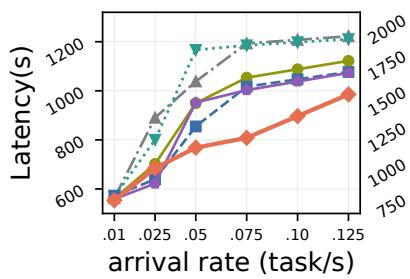

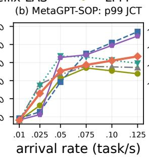

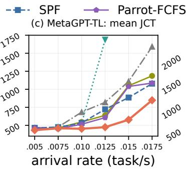

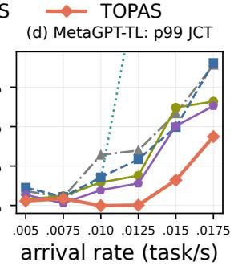  
Fig. 4. Task completion on the MetaGPT workloads; high-load Autellix-LAS values exceed the displayed MetaGPT-TL range.

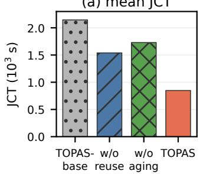

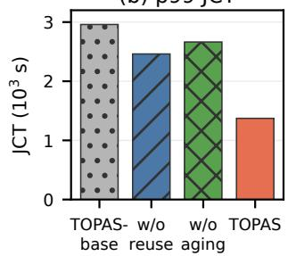  
Fig. 5. MetaGPT-TL component ablation at 0.0175 task/s.

Agentic applications interleave model calls with tools and coordinate model or agent modules [10], [15], [22], [25], [33]. At the serving layer, Parrot exposes application dataflow; InferCept and Continuum preserve KV caches across external waits; and Autellix and Astraea schedule calls by program progress or lifecycle state [1], [12], [13], [16], [17]. AugServe and Teola optimize augmented applications [28], [30]; KV-COMM and DroidSpeak transfer KV caches across contexts or models [14], [34]; and multi-agent systems optimize routing, data access, allocation, batching, and runtime execution [3], [4], [23], [24], [29]. KVFlow is a workflow-aware KV-cache management system that uses an Agent Step Graph to guide KV-node eviction and prefetching, temporarily skipping requests whose caches are still loading [18]. TOPAS instead makes the memory contention between resident agent-prefix caches and running requests part of workflow scheduling, using DAG progress and reuse to reduce task-level JCT.

## VII. CONCLUSION

Multi-agent LLM workflows couple prefix residency with ready-request admission under a shared GPU-memory budget. TOPAS jointly schedules these decisions, balancing expected remaining-path reduction and near-term reuse against prefix movement and preemption. Relative to the best-performing baseline for each workload and metric, it reduces mean and p99 task JCT on synthetic DAG workloads by up to 39.8% and 49.4%, respectively. It lowers mean JCT on both MetaGPT workloads, with reductions reaching 22.0%; on MetaGPT-TL, it also lowers p99 JCT by 26.6%.

## REFERENCES

[1] Reyna Abhyankar, Zijian He, Vikranth Srivatsa, Hao Zhang, and Yiying Zhang. Infercept: Efficient intercept support for augmented large language model inference. In Proceedings of the 41st International Conference on Machine Learning (ICML), 2024.

[2] Amey Agrawal, Nitin Kedia, Ashish Panwar, Jayashree Mohan, Nipun Kwatra, Bhargav S. Gulavani, Alexey Tumanov, and Ramachandran Ramjee. Taming throughput-latency tradeoff in LLM inference with sarathi-serve. In 18th USENIX Symposium on Operating Systems Design and Implementation (OSDI), 2024.

[3] Alfonso Amayuelas, Jingbo Yang, Saaket Agashe, Ashwin Nagarajan, Antonis Antoniades, Xin Eric Wang, and William Wang. Self-resource allocation in multi-agent llm systems. arXiv preprint arXiv:2504.02051, 2025.

[4] Jinyuan Chen, Jiuchen Shi, Quan Chen, and Minyi Guo. Kairos: Lowlatency multi-agent serving with shared llms and excessive loads in the public cloud. arXiv preprint arXiv:2508.06948, 2025.

[5] Tri Dao, Daniel Y. Fu, Stefano Ermon, Atri Rudra, and Christopher Re. Flashattention: Fast and memory-efficient exact attention with IO-´ awareness. In Advances in Neural Information Processing Systems (NeurIPS), 2022.

[6] Bin Gao, Zhuomin He, Puru Sharma, Qingxuan Kang, Djordje Jevdjic, Junbo Deng, Xingkun Yang, Zhou Yu, and Pengfei Zuo. Cost-efficient large language model serving for multi-turn conversations with cachedattention. In USENIX Annual Technical Conference (USENIX ATC), 2024.

[7] In Gim, Guojun Chen, Seung-seob Lee, Nikhil Sarda, Anurag Khandelwal, and Lin Zhong. Prompt cache: Modular attention reuse for lowlatency inference. In Proceedings of Machine Learning and Systems (MLSys), 2024.

[8] Sirui Hong, Mingchen Zhuge, Jonathan Chen, Xiawu Zheng, Yuheng Cheng, Ceyao Zhang, Jinlin Wang, Zili Wang, Steven Ka Shing Yau, Zijuan Lin, Liyang Zhou, Chenyu Ran, Lingfeng Xiao, Chenglin Wu, and Jurgen Schmidhuber. Metagpt: Meta programming for a multi-¨ agent collaborative framework. In International Conference on Learning Representations (ICLR), 2024.

[9] Cunchen Hu, HeYang Huang, Junhao Hu, Jiang Xu, Xusheng Chen, Tao Xie, Chenxi Wang, Sa Wang, Yungang Bao, Ninghui Sun, and Yizhou Shan. Memserve: Context caching for disaggregated LLM serving with elastic memory pool. arXiv preprint arXiv:2406.17565, 2024.

[10] Omar Khattab, Arnav Singhvi, Paridhi Maheshwari, Zhiyuan Zhang, Keshav Santhanam, Sri Vardhamanan, Saiful Haq, Ashutosh Sharma, Thomas T. Joshi, Hanna Moazam, Heather Miller, Matei Zaharia, and Christopher Potts. DSPy: Compiling declarative language model calls into self-improving pipelines. In International Conference on Learning Representations (ICLR), 2024.

[11] Woosuk Kwon, Zhuohan Li, Siyuan Zhuang, Ying Sheng, Lianmin Zheng, Cody Hao Yu, Joseph E. Gonzalez, Hao Zhang, and Ion Stoica. Efficient memory management for large language model serving with pagedattention. In Proceedings of the 29th ACM Symposium on Operating Systems Principles (SOSP), 2023.

[12] Hanchen Li, Qiuyang Mang, Runyuan He, Qizheng Zhang, Huanzhi Mao, Xiaokun Chen, Hangrui Zhou, Alvin Cheung, Joseph E. Gonzalez, and Ion Stoica. Continuum: Efficient and robust multi-turn llm agent scheduling with kv cache time-to-live. arXiv preprint arXiv:2511.02230, 2025.

[13] Chaofan Lin, Zhenhua Han, Chengruidong Zhang, Yuqing Yang, Fan Yang, Chen Chen, and Lili Qiu. Parrot: Efficient serving of llm-based applications with semantic variable. In 18th USENIX Symposium on Operating Systems Design and Implementation (OSDI), pages 929–945. USENIX Association, 2024.

[14] Yuhan Liu, Yuyang Huang, Jiayi Yao, Shaoting Feng, Zhuohan Gu, Kuntai Du, Hanchen Li, Yihua Cheng, Junchen Jiang, Shan Lu, Madan Musuvathi, and Esha Choukse. Droidspeak: Kv cache sharing for cross-llm communication and multi-llm serving. arXiv preprint arXiv:2411.02820, 2024.

[15] Pan Lu, Baolin Peng, Hao Cheng, Michel Galley, Kai-Wei Chang, Ying Nian Wu, Song-Chun Zhu, and Jianfeng Gao. Chameleon: Plugand-play compositional reasoning with large language models. In Advances in Neural Information Processing Systems (NeurIPS), 2023.

[16] Michael Luo, Xiaoxiang Shi, Colin Cai, Tianjun Zhang, Justin Wong, Yichuan Wang, Chi Wang, Yanping Huang, Zhifeng Chen, Joseph E. Gonzalez, and Ion Stoica. Autellix: An efficient serving engine for llm agents as general programs. arXiv preprint arXiv:2502.13965, 2025.

[17] Hongqiu Ni, Jiabao Zhang, Guopeng Li, Zilong Wang, Ruiqi Wu, Chi Zhang, and Haisheng Tan. Astraea: A state-aware scheduling engine for llm-powered agents. arXiv preprint arXiv:2512.14142, 2025.

[18] Zaifeng Pan, Ajjkumar Patel, Zhengding Hu, Yipeng Shen, Yue Guan, Wan-Lu Li, Lianhui Qin, Yida Wang, and Yufei Ding. Kvflow: Efficient prefix caching for accelerating llm-based multi-agent workflows. In Advances in Neural Information Processing Systems (NeurIPS), 2025.

[19] Pratyush Patel, Esha Choukse, Chaojie Zhang, Aashaka Shah, ´Inigo˜ Goiri, Saeed Maleki, and Ricardo Bianchini. Splitwise: Efficient generative LLM inference using phase splitting. In ACM/IEEE Annual International Symposium on Computer Architecture (ISCA), 2024.

[20] Chen Qian, Wei Liu, Hongzhang Liu, Nuo Chen, Yufan Dang, Jiahao Li, Cheng Yang, Weize Chen, Yusheng Su, Xin Cong, et al. Chatdev: Communicative agents for software development. In Proceedings of the 62nd annual meeting of the association for computational linguistics (volume 1: Long papers), pages 15174–15186, 2024.

[21] Ruoyu Qin, Zheming Li, Weiran He, Mingxing Zhang, Yongwei Wu, Weimin Zheng, and Xinran Xu. Mooncake: A KVCachecentric disaggregated architecture for LLM serving. arXiv preprint arXiv:2407.00079, 2024.

[22] Timo Schick, Jane Dwivedi-Yu, Roberto Dess\`ı, Roberta Raileanu, Maria Lomeli, Eric Hambro, Luke Zettlemoyer, Nicola Cancedda, and Thomas Scialom. Toolformer: Language models can teach themselves to use tools. In Advances in Neural Information Processing Systems (NeurIPS), 2023.

[23] Junyi Shen, Noppanat Wadlom, and Yao Lu. Batch query processing and optimization for agentic workflows. arXiv preprint arXiv:2509.02121, 2025.

[24] Junyi Shen, Noppanat Wadlom, Lingfeng Zhou, Dequan Wang, Xu Miao, Lei Fang, and Yao Lu. Flowmesh: A service fabric for composable llm workflows. arXiv preprint arXiv:2510.26913, 2025.

[25] Yongliang Shen, Kaitao Song, Xu Tan, Dongsheng Li, Weiming Lu, and Yueting Zhuang. Hugginggpt: Solving AI tasks with ChatGPT and its friends in hugging face. In Advances in Neural Information Processing Systems (NeurIPS), 2023.

[26] Ying Sheng, Lianmin Zheng, Binhang Yuan, Zhuohan Li, Max Ryabinin, Beidi Chen, Percy Liang, Christopher Re, Ion Stoica, and Ce Zhang.´ Flexgen: High-throughput generative inference of large language models with a single GPU. In International Conference on Machine Learning (ICML), 2023.

[27] Vikranth Srivatsa, Zijian He, Reyna Abhyankar, Dongming Li, and Yiying Zhang. Preble: Efficient distributed prompt scheduling for llm serving. arXiv preprint arXiv:2407.00023, 2024.

[28] Xin Tan, Yimin Jiang, Yitao Yang, and Hong Xu. Teola: Towards end-to-end optimization of llm-based applications. arXiv preprint arXiv:2407.00326, 2024.

[29] Noppanat Wadlom, Junyi Shen, and Yao Lu. Efficient llm serving for agentic workflows: A data systems perspective. arXiv preprint arXiv:2603.16104, 2026.

[30] Ying Wang, Zhen Jin, Jiexiong Xu, Wenhai Lin, Yiquan Chen, and Wenzhi Chen. Augserve: Adaptive request scheduling for augmented large

language model inference serving. arXiv preprint arXiv:2512.04013, 2025.

[31] Bingyang Wu, Yinmin Zhong, Zili Zhang, Shengyu Liu, Fangyue Liu, Yuanhang Sun, Gang Huang, Xuanzhe Liu, and Xin Jin. Fast distributed inference serving for large language models. In Advances in Neural Information Processing Systems (NeurIPS), 2023.

[32] Qingyun Wu, Gagan Bansal, Jieyu Zhang, Yiran Wu, Beibin Li, Erkang Zhu, Li Jiang, Xiaoyun Zhang, Shaokun Zhang, Jiale Liu, et al. Autogen: Enabling next-gen llm applications via multi-agent conversation. arXiv preprint arXiv:2308.08155, 2023.

[33] Shunyu Yao, Jeffrey Zhao, Dian Yu, Nan Du, Izhak Shafran, Karthik Narasimhan, and Yuan Cao. React: Synergizing reasoning and acting in language models. In International Conference on Learning Representations (ICLR), 2023.

[34] Hancheng Ye, Zhengqi Gao, Mingyuan Ma, Qinsi Wang, Yuzhe Fu, Ming-Yu Chung, Yueqian Lin, Zhijian Liu, Jianyi Zhang, Danyang Zhuo, and Yiran Chen. Kvcomm: Online cross-context kv-cache communication for efficient llm-based multi-agent systems. In Advances in Neural Information Processing Systems (NeurIPS), 2025.

[35] Lu Ye, Ze Tao, Yong Huang, and Yang Li. Chunkattention: Efficient self-attention with prefix-aware KV cache and two-phase partition. In Annual Meeting of the Association for Computational Linguistics (ACL), 2024.

[36] Gyeong-In Yu, Joo Seong Jeong, Geon-Woo Kim, Soojeong Kim, and Byung-Gon Chun. Orca: A distributed serving system for transformerbased generative models. In 16th USENIX Symposium on Operating Systems Design and Implementation (OSDI), 2022.

[37] Lianmin Zheng, Liangsheng Yin, Zhiqiang Xie, Chuyue Sun, Jeff Huang, Cody Hao Yu, Shiyi Cao, Christos Kozyrakis, Ion Stoica, Joseph E. Gonzalez, Clark Barrett, and Ying Sheng. Sglang: Efficient execution of structured language model programs. In Advances in Neural Information Processing Systems (NeurIPS), 2024.

[38] Yinmin Zhong, Shengyu Liu, Junda Chen, Jianbo Hu, Yibo Zhu, Xuanzhe Liu, Xin Jin, and Hao Zhang. Distserve: Disaggregating prefill and decoding for goodput-optimized large language model serving. In 18th USENIX Symposium on Operating Systems Design and Implementation (OSDI), 2024.