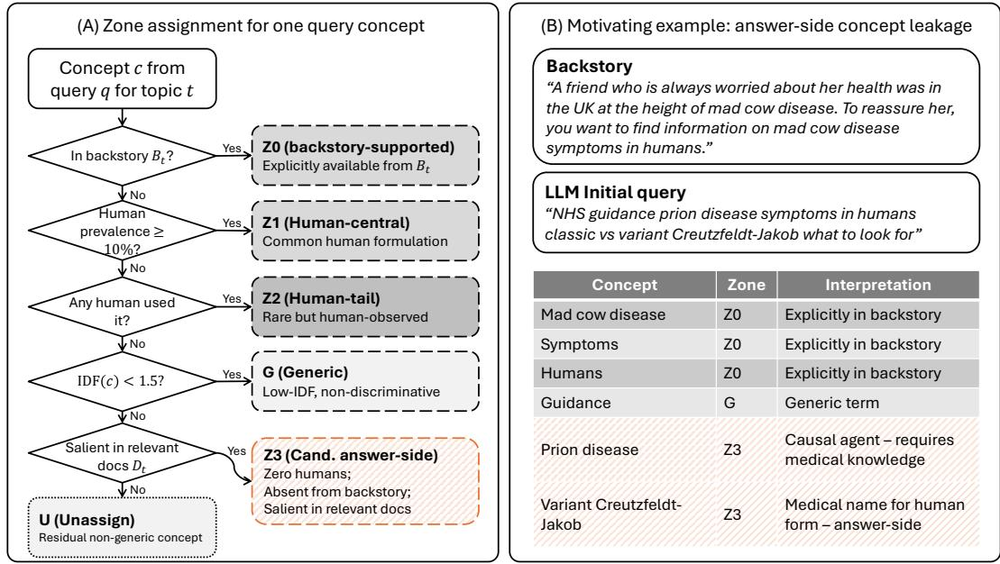
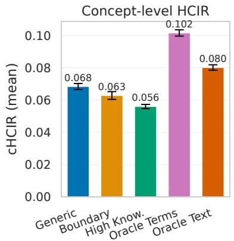
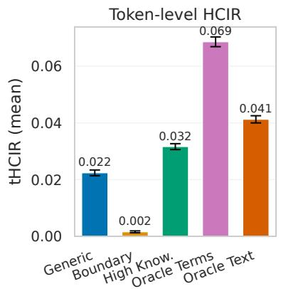
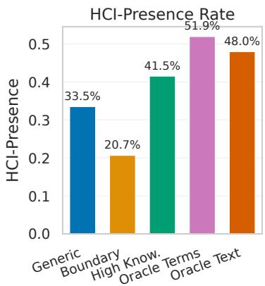
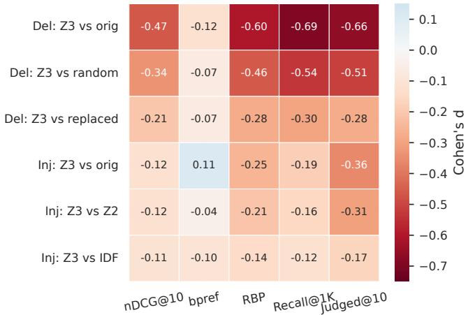
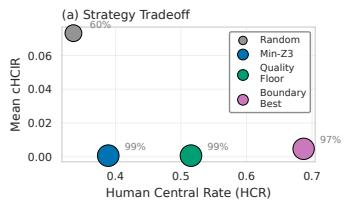
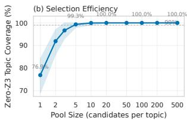

# The “Curse of Knowledge” in LLM Query Simulation: Concept Provenance for Tracing Answer-Side Intrusion

Chenglong Ma   
chenglong.ma@rmit.edu.au RMIT University   
Melbourne, Victoria, Australia

Xinye Wanyan xinye.wanyan@student.rmit.edu.au RMIT University Melbourne, VIC, Australia

Ziqi Xu   
ziqi.xu@rmit.edu.au   
RMIT University   
Melbourne, VIC, Australia

Danula Hettiachchi danula.hettiachchi@rmit.edu.au RMIT University Melbourne, VIC, Australia

Jefrey Chan   
jefrey.chan@rmit.edu.au   
RMIT University   
Melbourne, VIC, Australia

## Abstract

LLM-generated search queries are widely used to augment IR evaluation, yet they may contain concepts that presuppose answer-side document knowledge, violating the information-access boundary of pre-search users. Existing validation metrics—overlap, diversity, efectiveness—cannot distinguish rare human-tail variation from candidate answer-side intrusion. We introduce concept provenance, a framework that assigns query concepts to backstory-supported, human-central, human-tail, and candidate answer-side zones, operationalizing a boundary that retrieval metrics alone cannot detect. Applying concept provenance to 77,004 queries across 100 UQV100 topics, 8 LLMs, and 5 prompt conditions with two extraction pipelines (cross-pipeline token-HCIR Spearman � = 1.0 over five condition means), we find candidate answer-side concepts constitute 7.40% of non-generic concepts, appearing in 97 of 100 topics with topic explaining ≈67% of variance. Human validation yields 68.2% relaxed precision, revealing a dual mechanism: knowledge in trusion (45.5%) and deployment intrusion (45.0%). Diagnostic probes show these concepts carry disproportionate localized retrieval effects (deletion $d = - 0 . 4 7$ , exceeding random deletion � = −0.34) but explain less than 2% of aggregate evaluation variance, positioning concept provenance as a boundary-compliance diagnostic rather than an evaluation-shift predictor. Under the tested conditions, no prompt condition eliminates intrusion; post-generation concept-provenance selection achieves 99% elimination. 1

## CCS Concepts

• Information systems → Information retrieval; Data management systems; • Computing methodologies → Artificial intelligence.

## Keywords

concept provenance, IR evaluation, diagnostic intervention, boundary compliance, information and knowledge management

ACM Reference Format: Chenglong Ma, Xinye Wanyan, Danula Hettiachchi, Ziqi Xu, and Jefrey Chan. 2026. The “Curse of Knowledge” in LLM Query Simulation: Concept Provenance for Tracing Answer-Side Intrusion. In Proceedings ofthe 35th ACM International Conference on Information and Knowledge Management (CIKM ’26), November 07–11, 2026, Rome, Italy. ACM, New York, NY, USA, 12 pages. https://doi.org/10.1145/3799682.3840922

## 1 Introduction

Information retrieval evaluation increasingly relies on query variation to assess system robustness and estimate real-world performance [5, 25, 27]. Large language models ofer a scalable approach to generating diverse query variants [3, 40], with applications ranging from test collection building to user simulation [7]. However, initial query formulation operates within a strict information-access boundary: a user possesses only the task backstory and prior knowledge, not the search results. If an LLM-generated query contains concepts that presuppose knowledge of candidate answers, the query violates this boundary. A boundary-violating query may retrieve highly relevant documents, yet it fails as a simulation: it does not reflect the information state of the user it purports to model.

Consider UQV100 [5] topic 036 (mad cow disease symptoms in humans). The backstory describes a friend worried about health after a UK trip during the outbreak. A human with this context might query “mad cow disease symptoms in humans”—all concepts trace to the backstory. An LLM instead produces “NHS guidance prion disease symptoms classic vs variant Creutzfeldt-Jakob”—deploying biomedical terms absent from all observed human queries and the backstory. These are candidate answer-side concepts (Z3 ): information the user is trying to find, not information available before searching. Meanwhile, human queries occasionally include rare terms like “afect” (prevalence < 2%)—natural vocabulary variation.

Existing query validation approaches based on lexical overlap, diversity metrics, or retrieval efectiveness [3, 10, 22, 33, 40] cannot distinguish human-tail variation from answer-side intrusion. Both produce unusual, high-IDF terms; both diverge from typical human queries; both may improve or degrade retrieval depending on the system. Yet one reflects plausible user behavior, while the other reflects a boundary violation. Without this distinction, synthetic IR evaluation [6, 31, 32] cannot diagnose whether LLM queries that shift retrieval pools, alter judged coverage, and produce divergent evaluation outcomes do so because of answer-side intrusion or 1Code is available at https://github.com/ChenglongMa/kcqs because of legitimate vocabulary variation—even when aggregate retrieval metrics appear reasonable.

We introduce concept provenance, a framework that assigns query concepts to provenance zones—backstory-supported (Z0), humancentral (Z1), human-tail (Z2), and candidate answer-side $( Z 3 _ { \mathrm { a u t o } } )$ through a priority-ordered protocol with two-stage validation $( Z 3 _ { \mathrm { a u t o } }$ automatic, $Z 3 _ { \mathrm { v a l } }$ manual). We operationalize the framework on UQV100 with 77,004 queries from 8 LLMs under 5 prompt conditions, assessing construct validity through dual pipelines, threshold sensitivity, and human annotation.

This paper contributes: (1) a concept-provenance framework decomposing query concepts into backstory-supported, humancentral, human-tail, and candidate answer-side zones under an explicit information-access boundary; (2) an empirical $Z 2 / Z 3 _ { \mathrm { a u t o } }$ distinction validated through dual pipelines, manual annotation, and sensitivity analysis; (3) diagnostic probes showing $Z 3 _ { \mathrm { a u t o } }$ concepts carry disproportionate localized retrieval signal $( R ^ { 2 } < 2 \%$ at aggregate level)—establishing concept provenance as a boundaryviolation diagnostic; and (4) a boundary compliance analysis showing prompt-based mitigation reduces but does not eliminate intrusion, while post-generation selection can nearly eliminate detected intrusions under the tested candidate pool.

Three research questions organize the investigation:

RQ1: How are concepts in LLM-generated initial queries distributed across provenance zones, and how reliably can the zones be operationalized?

RQ2: Does candidate answer-side intrusion predict shifts in retrieval pools, judged coverage, and system rankings relative to the observed human-query distribution?

RQ3: Does prompt-based mitigation sufice to keep LLM queries within human-range boundary compliance, or is post-generation validation required?

## 2 Related Work

## 2.1 Human and LLM-Generated Query Variants

Human query variability directly shapes IR evaluation outcomes. Work on UQV100 and pooled evaluation [5, 27] demonstrates that query variation among human searchers afects system rankings as strongly as system variation, with diferent workers formulating queries that retrieve substantially diferent document sets for the same information need. The observed human-query distribution therefore serves as a reference against which synthetic query generators must be validated.

LLMs now serve as a practical source of query variants for evaluation. Alaofi et al. [3] show that generative LLMs can produce di verse query variants from information need descriptions, reporting substantial pool overlap with human queries alongside systematic diferences in linguistic features and retrieval behavior. Zendel et al. [40] extend this analysis to a comparative study of linguistic and retrieval diversity, finding that LLM-generated queries exhibit higher syntactic variability than human queries but produce dif ferent evaluation outcomes, and concluding that LLMs are not yet a suitable replacement for human searchers in IR evaluation research. Further work on data fusion of LLM variants with human queries [10, 33] confirms that LLM queries difer from human queries in ways that afect evaluation.

These studies validate LLM query variants along dimensions of diversity, pool overlap, and retrieval efectiveness—but treat all concept-level diferences between LLM and human queries uniformly. A concept that is rare among humans but attested (Z2, human-tail) and a concept entirely absent from observed human variants yet salient in relevant documents $( Z 3 _ { \mathrm { a u t o } }$ , candidate answerside) are indistinguishable under existing overlap and diversity metrics. This paper asks a diferent question: not whether LLM queries are diverse or efective, but where their concepts originate relative to the backstory and the observed human initial-query distribution.

## 2.2 Synthetic Evaluation Bias and LLM Evaluation Artifacts

Several studies document systematic biases that LLM-generated artifacts introduce into IR evaluation [6, 15, 24, 31, 32]. Rahmani et al. [31, 32] demonstrate that synthetic queries, documents, and relevance labels can produce evaluation outcomes that diverge from human-based benchmarks, with system ranking correlation as a primary concern; the bias spans multiple evaluation components. Balog et al. [6], Dai et al. [15], and Li et al. [24] confirm at the ecosystem level that biases propagate across evaluation components—rankers, retrievers, judges, and labels—making it urgent to understand where and how LLM-generated content distorts evaluation.

These results connect to a broader distributional-alignment problem: synthetic artifacts may be useful or fluent while still occupying a diferent behavioral distribution from the human artifacts they replace. For initial-query simulation, alignment is not only lexical or metric-based; the generated query must also respect the simulated user’s information state. Leakage and contamination work in LLM evaluation similarly warns that downstream components can inherit information unavailable in the intended evaluation setting [6, 24]. We study the query-side version of that problem: answer-side concepts entering the query before any retrieval interaction has occurred.

These results show that synthetic evaluation artifacts can shift system rankings and efectiveness estimates, but they do not decompose the query-side mechanisms responsible. This paper isolates one specific mechanism: candidate answer-side concept intrusion, where LLM-generated initial queries contain document-salient concepts absent from observed human initial-query variants and unsupported by the backstory. Diagnostic deletion and injection probes with matched controls provide evidence for this mechanism beyond query length and specificity confounds.

## 2.3 Query Simulation Validation and Knowledge-Conditioned Generation

Balog and Zhai [7] survey user simulation validation along axes of behavioral realism, statistical plausibility, and evaluation utility. Kruf et al. [22] propose a taxonomy of validation measures for query simulation. Alaofi et al. [2] discuss query formulation sources conceptually but do not operationalize provenance-based validation. Knowledge-conditioned generation [1]—generating variants conditioned on demographic and knowledge-level attributes—motivates knowledge-level prompts as experimental conditions but does not validate whether generated concepts respect the information-access boundary.

Concept provenance provides a complementary axis: existing validation measures assess whether generated queries resemble human queries but do not ask whether each concept could plausibly have been formulated given only the backstory. The distinction between human-tail variation (Z2) and candidate answer-side intrusion $( Z 3 _ { \mathrm { a u t o } } )$ is invisible to similarity, diversity, and efectiveness metrics.

## 3 Concept-Provenance Framework

Initial query formulation in information retrieval operates within a strict information-access boundary [4, 7]: the searcher possesses only the backstory $B _ { t }$ describing their information need, with no ex posure to search results or documents. This boundary defines what concepts a pre-search user could plausibly formulate. For query simulation to support valid IR evaluation, generated queries must respect this boundary. When a query contains concepts that require document-side knowledge—concepts absent from the backstory and from the observed human-query distribution, yet salient in relevant documents—the simulated searcher has accessed information outside the boundary. Concept provenance operationalizes this distinction, providing a validation axis for LLM-generated initial search queries.

## 3.1 Concepts and Provenance Zones

A concept is a normalized semantic unit extracted from queries, backstories, or documents. Candidate units include named entities, noun phrases, domain-specific terms, lemmatized content words, and informative n-grams, following prior IR work that models and weights query concepts as retrieval units [9, 26]. For a topic �, we define $B _ { t }$ as the backstory (information need description), $H _ { t }$ as the set of observed human initial-query variants [5], �� as the set of judged relevant documents, and $Q _ { t } ^ { \mathrm { L L M } }$ as the set of LLM-generated initial queries under various conditions. The extraction pipeline and normalization protocol are detailed in §4; the framework specifies only that concepts are comparable units across all sources.

Concepts are assigned to provenance zones based on their relationship to the information-access boundary. Table 1 defines the zones with operational criteria. Zone assignment follows a strict priority order: $\mathrm { Z 0 > Z 1 > Z 2 > G > Z 3 _ { a u t o } } .$ A concept satisfying multiple criteria receives the highest-priority label. Evidence-based labels (backstory support, human attestation) take precedence over the generic heuristic—observed evidence is authoritative over statistical frequency. The generic filter (G) guards only the $Z 3 _ { \mathrm { a u t o } }$ path, using corpus IDF and general-language frequency (§4) to prevent non-discriminative terms from reaching $Z 3 _ { \mathrm { a u t o } } .$ The residual category U captures non-generic concepts matching no zone; these are included in the HCIR denominator to avoid inflating intrusion.

The $Z 3 _ { \mathrm { a u t o } }$ label is assigned by automatic rules and carries a known false-positive risk: extraction errors, paraphrases missed by matching, or backstory-supported concepts not recognized as such may be mislabeled. We therefore employ a two-stage protocol. All primary analyses use $Z 3 _ { \mathrm { a u t o } }$ for scalable detection. A subset of ${ Z 3 } _ { \mathrm { a u t o } }$ concepts is then subjected to manual validation, producing $Z 3 _ { \mathrm { v a l } } .$ , the manually confirmed candidate answer-side subset. Key analyses are replicated on $Z 3 _ { \mathrm { v a l } }$ to assess conclusion stability under precision-corrected conditions. The $Z 3 _ { \mathrm { a u t o } }$ precision, inter-annotator agreement, and error taxonomy are reported as construct-validity evidence (§5).

Table 1: Concept-provenance zone definitions. All labels are topic-specific and assigned with priority $\mathrm { Z 0 > Z 1 > Z 2 > G > }$ $Z 3 _ { \mathrm { a u t o } }$ . Worker-level prevalence is the proportion of workers who used the concept for topic �. Central threshold default: 10%. Strict absence default: worker count = 0.
<table><tr><td>Zone</td><td>Label</td><td>Operational Definition</td></tr><tr><td>G</td><td>Generic</td><td>Matches a stopword or curated task-generic term, has corpus IDF below 1.5, or is a non-entity unigram with wordfreq Zipf frequency at least 4.5. Applied only to concepts with no backstory or human evidence; guards the  $Z 3 _ { \mathrm { a u t o } }$  path.</td></tr><tr><td> $Z 0$ </td><td>Backstory- supported</td><td>Explicitly appears in or is a close paraphrase of  $B _ { t } .$  Conservative: explicit lexical presence only, not in- ferred entailment.</td></tr><tr><td> $Z 1$ </td><td>Human-central</td><td>Worker-level prevalence in  $H _ { t }$  ≥ central threshold (default 10%).</td></tr><tr><td> $Z 2$ </td><td>Human-tail</td><td>Non-zero worker-level prevalence in  $H _ { t } ,$  below cen- tral threshold. Within the observed range of human initial-query formulation.</td></tr><tr><td> $Z 3 _ { \mathrm { a u t o } }$ </td><td>Candidate answer- side</td><td>Must satisfy all five conditions: (a) absent in  $H _ { t }$  (worker count = 0), (b) not backstory-supported, (c) salient in relevant documents (top-200 TF-IDF, ≥ 2 docs), (d) not in the stopword or curated task-generic lists and IDF ≥ 1.5, (e) not contextually generic by</td></tr><tr><td>U</td><td>Unassigned</td><td>Non-generic, non-backstory, non-human-attested, non-document-salient. Residual category; included in HCIR denominator.</td></tr><tr><td> $Z 3 _ { \mathrm { v a l } }$ </td><td>Validated</td><td>Manually confirmed subset of  $Z 3 _ { \mathrm { a u t o } }$  via human an- notation.</td></tr></table>

## 3.2 Intrusion Measurement

We define the Hidden Concept Intrusion Rate (HCIR) as the proportion of a query’s non-generic concepts that fall in the candidate answer-side zone:

$$
\mathrm { H C I R } ( q , t ) = \frac { \left| \mathrm { C o n c e p t s } ( q ) \cap \mathrm { Z 3 } _ { \mathrm { a u t o } } ( t ) \right| } { \left| \left\{ c \in \mathrm { C o n c e p t s } ( q ) : c \notin \mathrm { G } ( t ) \right\} \right| } .\tag{1}
$$

The denominator counts all non-generic concepts in query $q ,$ including unassigned (U) concepts, to prevent denominator manipulation. We also define HCI-Presence(�, �) as a binary indicator of any $Z 3 _ { \mathrm { a u t o } }$ concept being present, the Human-Tail Rate (HTR) with Z2 in the numerator, and the Human-Central Rate (HCR) as the proportion of non-generic concepts in Z1. A token-level variant decomposes concepts into tokens, neutralizing granularity diferences across pipelines; within-pipeline analyses use concept-level HCIR as the pre-registered primary metric, cross-pipeline comparisons use token-level. Concept-level HCIR is sensitive to denominator dilution from query length; HCI-Presence and token-level HCIR serve as length-robust complements.

Prevalence and thresholds. Worker-level prevalence—the proportion of workers who used a concept for topic �—is the primary measure of human concept usage, robust to within-worker repetition. The central threshold is 10% prevalence, separating humancentral (Z1) from human-tail (Z2). The strict $Z 3 _ { \mathrm { a u t o } }$ absence criterion requires worker count = 0; a sensitivity variant relaxes this to nearabsent (≤ 1). Defaults are pre-registered; sensitivity analysis (§5) varies them systematically.

  
Figure 1: Concept-Provenance Framework for assigning each concept in an LLM-generated initial query to a topic-specific provenance zone. Panel (A) shows the priority-ordered assignment procedure: backstory-supported concepts are assigned first, followed by human-central concepts, human-tail concepts, generic concepts, candidate answer-side concepts, and residual unassigned concepts. The diagram abbreviates the multi-signal generic decision as an IDF test; Table 1 and §4.3 specify the complete filter used to assign G, including the “guidance” example in Panel (B). Panel (B) illustrates the framework with a mad cow disease-search scenario, where the user initially knows only the cow disease and symptoms. The example highlights the distinction between human-attested rare Z2 concepts and $Z 3 _ { \mathrm { a u t o } }$ concepts that are absent from the backstory and human initial queries but salient in relevant documents, resembling terms a user might acquire only after inspecting search results and reformulating.

Document salience. Candidate answer-side concepts must be salient in relevant documents; operational criteria and sensitivity analysis are detailed in §4.5.

Cross-source matching. Concepts extracted from queries, backstories, and documents are matched via lemmatized exact matching, which minimizes false matches at the cost of recall. Sensitivity checks include fuzzy string matching and embedding-based similarity; full matching rules are specified in §4.

Because human absence is part of the $Z 3 _ { \mathrm { a u t o } }$ definition, this paper’s empirical claims focus on non-circular axes: absolute rates, condition and topic variation, and retrieval efects of $Z 3 _ { \mathrm { a u t o } }$ in LLM queries—not human-versus-LLM superiority. Circularity implica tions are discussed in §9.

## 4 Methodology

We operationalize the concept-provenance framework (§3) for reproducible analysis on a multi-variant query test collection. All thresholds were pre-registered before full-scale experiments; sensitivity analysis (§5) varies each parameter systematically.

## 4.1 Data and Search Tasks

We used UQV100 [5], a test collection of 100 topics drawn from the TREC Web Track 2009–2014. Each topic includes a backstory describing the information need and approximately 50 crowd-sourced initial search queries. Workers saw only the backstory before formulating queries, with no exposure to search results or relevant documents—an elicitation protocol that operationalizes the information access boundary (§3). In total, 263 crowd workers contributed 10,835 query variants (5,744 unique after normalization), averaging 108 per topic. The document collection is ClueWeb12-B13, with 55,587 graded relevance judgments (scale 0–4) across 54,880 unique documents (median 98.5 relevant documents per topic, mean 114.8).

## 4.2 Query Generation

LLM queries were generated under five prompt conditions. Three used only the backstory: generic (no knowledge instruction), highknowledge (domain-expert framing), and boundary-constrained (explicit instruction and few-shot example to avoid unsupported concepts). Two oracle controls intentionally exposed document-side evidence: oracle-text added TF-IDF-selected [36] relevant-document excerpts, and oracle-terms added the top-10 TF-IDF terms from relevant documents. These oracle conditions are positive controls for document-aware language, not simulations of pre-search users.

The generation set covers eight LLMs from OpenAI, Anthropic, and DeepSeek, spanning GPT-4.1/GPT-5.4 families, Claude Sonnet, and DeepSeek-V3.1. All models used temperature �=1.0, top\_p=1.0, and maximum 500 tokens; 20 candidate queries were generated for each topic–condition–model cell with up to three deduplication retries, yielding 77,004 analyzed LLM queries. Exact model identifiers, prompt templates, generation dates, and retry logs are provided in the shared codebase.

## 4.3 Concept Extraction

Concepts were extracted through two complementary pipelines to support cross-pipeline robustness analysis (§5). Both pipelines processed queries, backstories, and relevant documents under a shared normalization protocol (lowercase, lemmatization, punctuation removal).

Pipeline A (lexical/statistical). Content words were lemmatized using spaCy [19] (en\_core\_web\_sm). Informative bigrams were identified via pointwise mutual information (PMI) filtering [12]. TF-IDF terms from queries and documents supplemented the unigram inventory.

Pipeline B (entity/phrase-based). Named entities and noun phrases were extracted via spaCy’s NER and dependency parser [19]. Domain specific multi-word terms were retained with a minimum twocharacter filter.

Genericfiltering. Both pipelines share a multi-signal generic filter. A concept is classified as generic and excluded from the $Z 3 _ { \mathrm { a u t o } }$ path if it meets any of: (1) membership in a standard stopword or curated task-generic term list (∼170 terms); (2) corpus IDF < 1.5; or (3) high general-language frequency (wordfreq Zipf frequency ≥ 4.5; [38]) for single-token concepts that are not named entities—multi-token phrases are exempt from criterion (3). Evidence-based labels (Z0, Z1, Z2) override the generic heuristic: backstory-confirmed or humanattested concepts retain their provenance label regardless of corpus frequency (§3.1).

Cross-pipeline comparisons use token-level HCIR to neutralize the granularity diference (∼1.3 vs. ∼2.1 tokens per concept); withinpipeline analyses use concept-level HCIR (§5).

## 4.4 Zone Assignment

Labels follow the priority order in §3.1. Pre-registered defaults: central threshold 10% worker prevalence, strict $Z 3 _ { \mathrm { a u t o } }$ absence (count = 0), document salience top-200 TF-IDF (≥ 2 documents), generic IDF < 1.5, lemmatized exact matching. Sensitivity variants: central ∈ {5, 15, 20}%, near-absent (≤ 1), $k \in \{ 1 0 , 2 0 , 5 0 , 1 0 0 \}$ , IDF ∈ {1.0, 2.0}, fuzzy matching.

## 4.5 Document Salience

A concept was classified as document-salient if it ranked within the top-� TF-IDF terms [36] over $D _ { t }$ and appeared in ≥ 2 relevant documents. The primary threshold was � = 200; sensitivity analysis varied � across {10, 20, 50, 100} (§5). Document-salient concepts were classified into IDF quality tiers: specific $( \mathrm { I D F } \geq 3 . 0 )$ , moderate $( 1 . 5 \leq \mathrm { I D F } < 3 . 0 ) ,$ and generic $( \mathrm { I D F } < 1 . 5 ,$ , excluded before reaching $Z 3 _ { \mathrm { a u t o } } )$ . Because $D _ { t }$ comprises only judged relevant documents, this operationalization is conservative—biasing toward under-detection.

A retrieved-document salience variant is specified in the shared codebase.

## 4.6 Human Validation Protocol

A stratified sample of400 query–concept pairs (220 $Z 3 _ { \mathrm { a u t o } } ,$ 180 other zones) from 92 topics was annotated by three human annotators. Each annotator classified concept origin as backstory, common\_know ledge, personal\_experience, or requires\_research, seeing only backstory, query, and concept, calibrated against a general pre-search user. Majority vote with adjudication produced consolidated labels. We report strict precision (requires\_research) and relaxed precision (personal\_experience+requires\_research). Annotation guidelines and calibration examples are in the shared codebase.

## 4.7 Retrieval and Evaluation Setup

Core retrieval runs use three systems: BM25 [35] $( k _ { 1 } { = } 0 . 9 , b { = } 0 . 4 )$ as primary, BM25+RM3 [23], and QL [30] (�=2500). As a neural scoring robustness check, we additionally report a cross-encoder reranker [29] (ms-marco-MiniLM-L-12-v2) re-scoring BM25 top-100 candidates. Metrics include nDCG@10 [20], Recall@1K, bpref [11], and RBP [28]. Given incomplete UQV100 qrels [5], primary outcomes emphasize pool overlap, judged ratio, and system ranking correlation (Kendall’s � [21]).

## 4.8 Statistical Analysis

Topic-level averages are the primary unit of analysis. Pairwise condition comparisons use paired bootstrap tests [16]; multi-factor analyses use mixed-efects regressions [8] controlling for condition and query length with topic/model efects where applicable. Holm correction [18] is used for multiple comparisons, and key condition comparisons report Cohen’s � efect sizes [14] with 95% bootstrap confidence intervals where available. Full statistical specifications and scripts are in the shared codebase.

## 5 Experiment 1: Concept Provenance

This experiment addresses RQ1 by characterizing concept-provenance zone distributions across prompt conditions, models, and topics on the full UQV100 collection [5]. Results are from Pipeline A (100 topics, five conditions, eight models) unless otherwise noted; cross-pipeline comparisons use token-level HCIR (§4.3).

## 5.1 Findings

Across all conditions and models, candidate answer-side concepts $( Z 3 _ { \mathrm { a u t o } } )$ constitute 7.40% of non-generic query concepts (HCIR) and occur in 97 of 100 topics (51,363 query–concept pairs). The multi-signal filter (§4.4) excludes non-discriminative terms from the candidate answer-side path, so all reported $Z 3 _ { \mathrm { a u t o } }$ concepts are at least moderate by the IDF tiering used for human validation.

The condition gradient is consistent across metrics (Figure 2): high-knowledge (5.60%) < boundary (6.28%) < generic $( 6 . 8 4 \% ) <$ oracle-text (8.02%) < oracle-terms (10.16%). Relative to the generic baseline, high-knowledge prompts yield a moderate concept-HCIR reduction (Cohen’s $d = - 0 . 1 2 )$ and boundary a smaller one $( d =$ $- 0 . 0 4 )$ , while oracle-terms produces the highest $Z 3 _ { \mathrm { a u t o } }$ density, consistent with explicit document-term exposure providing more answer-specific vocabulary. A mixed-efects model with random topic intercepts (ICC = 0.41) confirms that topic explains approxi mately 41% of concept-HCIR variance at the query level; adding model as a fixed efect contributes $\Delta R ^ { 2 } < 0 . 0 0 1$

  
Figure 2: Condition-level intrusion profile across concept-HCIR, token-HCIR, and HCI-Presence. High-knowledge prompts lower concept-HCIR but increase token-HCIR and presence; boundary prompts reduce token-level intrusion, while oracle controls remain highest under presence-oriented views.

The generic–high-knowledge comparison reveals a metric divergence: concept-HCIR is lower under high-knowledge (5.60% vs. $6 . 8 4 \% , d = - 0 . 1 2 , p < 1 0 ^ { - 5 } )$ , while HCI-Presence diverges in the opposite direction (41.5% vs. 33.5%, $p < 0 . 0 0 1 )$ . High-knowledge prompts produce more queries containing $Z 3 _ { \mathrm { a u t o } }$ concepts but at lower per-query density, a denominator-dilution efect driven by longer queries (17.9 vs. 12.2 tokens).

A pre-registered confounder regression (HCIR ∼ condition + length + (1 | topic)) confirms that length is not a positive confounder $( \beta = - 0 . 0 0 0 5$ , reflecting dilution). Condition efects survive all controls: boundary vs. generic $\beta = - 0 . 0 0 6 ( p < 1 0 ^ { - 7 } ) ,$ , high-knowledge vs. generic $\beta ~ = ~ - 0 . 0 1 0 ~ ( p ~ < ~ 1 0 ^ { - 1 6 } )$ ; adding model contributes $\Delta R ^ { 2 } < 0 . 0 0 1$

Model and topic variation. Across eight models, the fraction of queries containing zero $Z 3 _ { \mathrm { a u t o } }$ concepts ranges from 61.6% (GPT-5.4-nano) to 73.6% (DeepSeek-V3.1), with a pattern suggestive of a non-monotonic relationship with model capability under the tested conditions: GPT-5.4 produces $Z 3 _ { \mathrm { a u t o } }$ concepts more frequently than $\mathrm { G P T } { - } 4 . 1 \left( \mathrm { Z } 3 _ { \mathrm { a u t o } } \right.$ -free rates of 62.6% vs. 71.9%), consistent with more capable models drawing more heavily on parametric knowledge during query formulation. Despite this per-query variation, a threefactor variance decomposition (topic×condition×model cell means) confirms that topic accounts for approximately 67% of concept-HCIR variance, while both condition (< 1%) and model (< 1%) con tribute negligibly—candidate answer-side intrusion is primarily a property of the information need, with prompt design providing statistically significant but small reductions (Figure 2). Topic-level variation is wider (0.0%–17.2%; median 5.78%, IQR [3.9%, 7.2%]), reflecting genuine diferences in how much document-specific vocabulary each information need elicits from LLMs.

## 5.2 Robustness

Cross-pipeline validation. Token-level HCIR should be interpreted separately from HCI-Presence: the former is a token fraction, while the latter is the percentage of queries containing at least one $Z 3 _ { \mathrm { a u t o } }$ concept. It resolves the granularity diference between pipelines (Pipeline $\mathrm { A } = 0 . 0 3 4 , \mathrm { B } = 0 . 0 4 3 )$ , with perfect condition-ranking agreement (Spearman $\rho = 1$ .0 over five means [37]) and both preserving the boundary ≪ generic-range ≪ oracle pattern.

Human validation. A stratified annotation study (§4.6) assessed $Z 3 _ { \mathrm { a u t o } }$ construct validity on 220 query–concept pairs from 92 topics. Three annotators independently classified each pair’s concept origin—seeing only the backstory, query, and concept—calibrated against a general pre-search user with no prior exposure to relevant documents or search results; labels were consolidated by majority vote with discussion-based adjudication. Strict precision (requires\_research only) is 45.5%, below the pre-registered 50% threshold (weakened tier, 30–50%); relaxed precision (personal\_experience + quires\_research) reaches 68.2% (moderate tier). Among the highspecificity subset $( \mathrm { Z 3 _ { a u t o - s p e c i f i c } } , \mathrm { I D F } \geq 3 . 0 )$ , relaxed precision rises to 78.2%, approaching the strong tier. We therefore treat $Z 3 _ { \mathrm { a u t o } }$ as a high-recall diagnostic signal rather than a validated ground-truth label; key analyses are replicated on $Z 3 _ { \mathrm { v a l } }$ and $Z 3 _ { \mathrm { a u t o - } S \mathrm { p e c i f i c } }$ to assess conclusion stability. The gap between strict and relaxed precision reflects two complementary intrusion mechanisms: knowledge intrusion (45.5%—concepts genuinely unfamiliar to a general user) and deployment intrusion (45.0%—concepts accessible but not naturally query-formulated); the remaining 9.5% are backstory false negatives reclassifiable via BCC (§5.2). Per-condition validation preserves the boundary ≪ generic-range ≪ oracle structure under restriction to validated items. The dual-mechanism decomposition is interpreted in §9.

Annotation bias. LLM annotators are not reliable substitutes for human judgment: human–LLM agreement is only fair $( \kappa = 0 . 2 1 -$ 0.37), whereas LLM–LLM agreement reaches $\kappa = 0 . 7 9 1$ , indicating a shared knowledge-projection bias (§9).

Threshold sensitivity. Document salience stringency is the primary sensitivity axis: tightening the TF-IDF cutof from $k = 2 0 0$ to $k = 1 0$ reduces HCIR from 6.2% to 1.9%, while relaxing absence to near-absent (≤ 1 worker) adds ∼13% more $Z 3 _ { \mathrm { a u t o } }$ concepts. The boundary ≪ generic-range ≪ oracle structure is preserved across all ten tested parameter combinations; cross-pipeline agreement holds under all settings $( \rho = 1 . 0$ token-level over five condition means). The defaults are operating points rather than fitted optima: 10% worker prevalence separates central from tail human usage; strict absence protects the $Z 2 / Z 3 _ { \mathrm { a u t o } }$ boundary; and top-200 salience balances the top-50 false-negative behavior observed in pilots against the generic-IDF filter. Because incomplete qrels bias toward under-detection, the � sweep tests salience stringency within judged relevant documents, while a retrieved- or contrastivedocument salience variant remains the appropriate future check for source sensitivity. The stability of the condition gradient across � values provides indirect evidence that qrel incompleteness does not drive the observed condition-level patterns.

Table 2: Evaluation shift across prompt conditions (BM25, 100 topics, 77K LLM + 11K human queries). Patterns replicate across BM25+RM3, QL, and a cross-encoder reranker (see text). Judged ratio measures pool coverage; nDCG@10 and Bpref provide complementary views of efectiveness under incomplete judgments. Efect sizes (Cohen’s �) are relative to human queries. All pairwise diferences are significant $(  { p } < 1 0 ^ { - 1 0 }$ , Holm-corrected).
<table><tr><td>Condition</td><td>N</td><td>nDCG@10</td><td>Bpref</td><td>Judged@10</td><td>d (judged)</td></tr><tr><td>human</td><td>10,835</td><td>0.203</td><td>0.169</td><td>0.914</td><td>一</td></tr><tr><td>boundary</td><td>13,819</td><td>0.180</td><td>0.192</td><td>0.738</td><td>-1.08</td></tr><tr><td>generic</td><td>15,713</td><td>0.161</td><td>0.213</td><td>0.585</td><td>-1.74</td></tr><tr><td>high_knowledge</td><td>15,990</td><td>0.140</td><td>0.214</td><td>0.473</td><td>-2.14</td></tr><tr><td>oracle_text</td><td>15,697</td><td>0.178</td><td>0.238</td><td>0.574</td><td>-1.82</td></tr><tr><td>oracle_terms</td><td>15,785</td><td>0.182</td><td>0.244</td><td>0.589</td><td>-1.76</td></tr></table>

Backstory compositional coverage (BCC). A BCC-aware matching mode that credits concepts whose constituent tokens all appear individually in the backstory reduces the $Z 3 _ { \mathrm { a u t o } }$ pool by 10.7% and mean HCIR by 15% $( 0 . 0 7 4 0  0 . 0 6 3 0 )$ , with the largest reduction for boundary-prompt queries. We retain strict matching as the primary operationalization for Z0 precision; BCC confirms that compositional backstory coverage is a tractable refinement.

Having established that candidate answer-side concepts appear at non-trivial, condition-dependent rates and that the $Z 2 / Z 3 _ { \mathrm { a u t o } }$ distinction is robust across pipelines and thresholds, we next examine whether this intrusion is associated with measurable shifts in retrieval-based evaluation behavior (§6).

## 6 Experiment 2: Evaluation Shift

This experiment addresses RQ2 by testing whether candidate answerside intrusion predicts retrieval-based evaluation shift relative to the observed human-query distribution. We measure pool coverage, judged ratio, system ranking correlation, and metric gap behavior across prompt conditions and retrieval systems, then assess the incremental contribution of concept-level HCIR after controlling for query length and condition.

Evaluation shift is real and large. Table 2 reports retrieval behavior on BM25 for the observed human-query distribution and five LLM prompt conditions. The judged ratio—the fraction of retrieved documents covered by existing relevance judgments—drops from 0.91 for human queries to 0.47 for high-knowledge and 0.59 for generic conditions (Cohen’s � [14] ranging from −1.08 to −2.14, $p < 1 0 ^ { - 1 0 }$ for all pairwise comparisons). Boundary-constrained prompts reduce the shift moderately $( d = - 1 . 0 8 )$ , maintaining a judged ratio of 0.74, but do not restore human-range behavior. The ranking shift is equally pronounced: mean rank-biased overlap [39] $( \mathrm { R B O } _ { \operatorname* { m i n } } , p { = } 0 . 9 )$ between human-query rankings and LLM-query rankings ranges from 0.23 (boundary) to 0.10 (high-knowledge), well below the conservative threshold of 0.5. LLM queries thus retrieve from substantially diferent corpus regions, with incomplete judgment coverage amplifying the divergence.

$Z 3 _ { \mathrm { a u t o } }$ intrusion explains negligible variance. A mixed-efects regression (metric ∼ HCIR + condition + length + (1 | topic)) tested the incremental contribution of concept-level HCIR after controlling for prompt condition and query length. For nDCG@10, condition alone explains 0.9% of variance; adding HCIR increases $R ^ { 2 }$ to 2.1%, yielding an incremental $R ^ { 2 }$ of 1.2%. HCIR’s coeficient is statistically significant (nDCG: $\beta = + 0 . 0 6 4 , p < 1 0 ^ { - 1 0 }$ ; judged ratio: $\beta = + 0 . 1 1 2$ $p < 1 0 ^ { - 1 0 } )$ , but the efect size is practically negligible. Condition gradient and query length together account for the bulk of evaluation shift; candidate answer-side intrusion, operationalized at the concept level, does not meaningfully predict retrieval metric diferences. Under the tested conditions, $Z 3 _ { \mathrm { a u t o } }$ density is not a primary driver of aggregate evaluation distortion.

Bprefnarrows the gap, confirming conservative bias. Bpref, designed to tolerate incomplete judgments [11], consistently narrows the human–LLM gap relative to nDCG@10. Where nDCG@10 drops by 0.063 points from human to high-knowledge queries, bpref rises by 0.046 points, producing a 173% gap reversal. For boundary queries, the pattern replicates: nDCG@10 declines by 0.022, while bpref increases by 0.024 (206% reversal). Oracle conditions show even stronger reversals (380–461%). This directional shift is consistent with the pool coverage mechanism: LLM queries retrieve relevant-but-unjudged documents excluded from the original pooling process. The nDCG@10 decline reflects underestimation, not over-retrieval of irrelevant material.

Length does not confound shift. The mixed-efects model includes query length as a covariate; the condition gradient survives this control. Length-stratified analysis—comparing human and LLM queries matched on token count—preserves the judged-ratio deficit, confirming that evaluation shift reflects vocabulary divergence rather than a specificity artifact.

Robustness across systems. Core patterns replicate across BM25, BM25+RM3, query likelihood, and a cross-encoder reranker rescoring BM25 top-100 candidates: condition gradients in judged ratio and nDCG@10 maintain identical rank order across all four systems, boundary prompts consistently outperform other LLM conditions, and HCIR incremental $R ^ { 2 }$ remains below 2% regardless of scoring function. Topic-level system-ranking correlation (Kendall’s � [21] over three lexical systems per topic) declines from boundary $( \bar { \tau } = 0 . 4 9 ,$ , 81% positive) to high-knowledge $( \bar { \tau } = 0 . 3 1$ 70% positive), tracking the evaluation-shift gradient. Under lexical systems, bpref narrows the human–LLM gap as reported above; the cross-encoder reverses this pattern (human bpref 0.209 vs. LLM conditions 0.140–0.187), because neural re-scoring promotes unjudged documents from BM25’s candidate pool for LLM queries, amplifying rather than smoothing the pool coverage mismatch.

Having established that evaluation shift is driven by vocabulary divergence and pool coverage mismatch rather than candidate answer-side intrusion specifically, we turn to localized diagnostic interventions to test whether $Z 3 _ { \mathrm { a u t o } }$ concepts have detectable retrieval efects at the individual query level (§7).

## 7 Experiment 3: Diagnostic Intervention

Experiment 2 established that evaluation shift between human and LLM queries is real and large but driven by vocabulary divergence and pool coverage mismatch, with $Z 3 _ { \mathrm { a u t o } }$ intrusion explaining negligible aggregate variance $( R ^ { 2 } < 2 \% )$ . However, negligible aggregate variance does not preclude localized retrieval efects at the individual query level. Here we employ two diagnostic probes—deletion and injection—to test whether $Z 3 _ { \mathrm { a u t o } }$ concepts carry retrieval signal that distinguishes them from human-tail concepts or random query components. These are controlled interventions on synthetic queries, not naturalistic distribution shifts, designed to isolate $Z 3 _ { \mathrm { a u t o } }$ contributions beyond length, IDF, and rarity.

Deletion: $Z 3 _ { \mathrm { a u t o } }$ concepts carry disproportionate retrieval signal. We deleted all $Z 3 _ { \mathrm { a u t o } }$ surface forms from 14,755 queries containing at least one $Z 3 _ { \mathrm { a u t o } }$ concept, producing three paired conditions: (i) $Z 3 _ { \mathrm { a u t o } }$ -deleted, the modified query; (ii) random-deleted, with the same number of $\mathrm { n o n } { - } Z 3 _ { \mathrm { a u t o } }$ content words removed; and (iii) $Z 3 _ { \mathrm { a u t o } } .$ replaced, with $Z 3 _ { \mathrm { a u t o } }$ surface forms replaced by IDF-matched $Z 1 / Z 2$ concepts from the same topic. Paired retrieval on BM25, BM25+RM3, and query likelihood across ClueWeb12-B13 yields 44,262 query– system pairs (14,755 queries × 3 systems). Deleting $Z 3 _ { \mathrm { a u t o } }$ concepts reduces nDCG@10 by 0.066 points relative to the original queries (Cohen’s $d = - 0 . 4 7 \ [ 1 4 ] , p < 1 0 ^ { - 1 0 } )$ , with efects of comparable magnitude for Recall@1K $( d = - 0 . 6 9 )$ and Judged@10 $( d = - 0 . 6 6 )$ The efect hierarchy is strictly ordered: $Z 3 _ { \mathrm { a u t o } } .$ -deleted underperforms random-deleted by $d = - 0 . 3 4 \left( p < 1 0 ^ { - 1 0 } \right)$ , indicating that $Z 3 _ { \mathrm { a u t o } }$ words carry more retrieval signal than arbitrary query terms. $Z 3 _ { \mathrm { a u t o } }$ -replaced partially recovers performance $( d = - 0 . 2 1$ relative to $Z 3 _ { \mathrm { a u t o } }$ -deleted, $p < 1 0 ^ { - 1 0 } )$ , confirming that IDF-matched human-range substitutes restore some but not all retrieval utility. All six pairwise comparisons remain significant under Holm correction [18].

Injection confirms answer-side specificity. We appended the highest-IDF $Z 3 _ { \mathrm { a u t o } }$ concept for each topic into 289 queries initially containing zero $Z 3 _ { \mathrm { a u t o } }$ concepts (� = 867 query–system pairs across three systems). Injection produces a small nDCG@10 decline $( d = - 0 . 1 2 ,$ $p \ = \ 0 . 0 0 5 )$ , with a sharper drop in Judged@10 (0.664 to 0.576, $d = - 0 . 3 6 , p < 1 0 ^ { - 8 } )$ ). Injecting Z2 concepts or IDF-matched Z1/Z2 produces near-zero nDCG@10 efects $( d \approx 0 )$ , confirming that the injection penalty is Z3auto-specific. In contrast, bpref increases under $Z 3 _ { \mathrm { a u t o } }$ injection $( d = + 0 . 1 1 , p < 0 . 0 0 1 )$ while other metrics decline—consistent with the pool coverage mechanism from Experiment $2 \colon { \mathrm { Z } } 3 _ { \mathrm { a u t o } }$ concepts steer retrieval toward relevant documents outside the original pooling boundary.

Dose-response and HCIR correlation. The deletion efect exhibits dose-response structure. Queries with one $Z 3 _ { \mathrm { a u t o } }$ concept drop from nDCG@10 of 0.165 to 0.117 $( \Delta = - 0 . 0 4 8 )$ ; those with $\geq 2$ drop from 0.208 to 0.116 $( \Delta = - 0 . 0 9 2 )$ —nearly double the magnitude. Both converge to ∼0.116 after deletion, suggesting $Z 3 _ { \mathrm { a u t o } }$ removal eliminates a document-specific retrieval advantage. Query-level HCIR correlates negatively with degradation magnitude (Spearman $\rho = - 0 . 3 4 \ : [ 3 7 ] , \rho < 0 . 0 0 1 , N = 1 4 , 7 5 4 )$

  
Figure 3: Efect sizes (Cohen’s �) for deletion and injection probes across retrieval andjudgment-coverage metrics. Deleting $Z 3 _ { \mathrm { a u t o } }$ concepts produces consistently larger losses than random deletion or IDF-matched replacement, especially for Recall@1K and Judged@10. Injection efects are smaller but remain $Z 3 _ { \mathrm { a u t o } } .$ -specific; the positive bpref cell under injection reflects the pool-coverage mechanism discussed in Experiment 2.

Reconciliation with aggregate evaluation shift. Three mechanisms explain why localized efects $( d = - 0 . 4 7 )$ wash out to negligible aggregate variance $( R ^ { 2 } < 2 \% ) \colon ( 1 )$ minority prevalence (∼32% of non-oracle queries contain $Z 3 _ { \mathrm { a u t o } } ) , ( 2 )$ bidirectional efects (deletion and injection hurt diferent query subsets), and (3) pool coverage confounds (the bpref anomaly confirms retrieval of relevant-butunjudged documents). The construct value is diagnostic, not predictive of system-level evaluation distortion.

$Z 3 _ { \mathrm { v a l } }$ directional stability. All $Z 3 _ { \mathrm { a u t o } }$ items share the documentsalience criterion and 0% human usage, so deletion and injection efects operate through salience rather than epistemic judgment. The $Z 3 _ { \mathrm { a u t o - s p e c i f i c } }$ tier $( \mathrm { I D F } \ge 3 . 0 $ , relaxed precision 78.2%) provides a high-precision proxy; the deletion hierarchy $( Z 3 _ { \mathrm { a u t o } } >$ > random > replacement) is consistent across all three lexical retrieval systems; cross-encoder reranking was not applied to diagnostic probes.

Having established that $Z 3 _ { \mathrm { a u t o } }$ concepts have medium-to-large localized retrieval efects that are separable from human-tail concepts and random query components, we next examine whether these boundary violations can be mitigated through prompt-based constraints (§8).

## 8 Experiment 4: Boundary Compliance

The preceding experiments established that $Z 3 _ { \mathrm { a u t o } }$ concepts appear at non-trivial rates, resist aggregate-level detection, and carry localized retrieval signal. We now address RQ3: does prompt-based mitigation sufice, or is a post-generation validation step required?

## 8.1 Prompt-Based Mitigation

The condition gradient reported in Experiment 1 (Figure 2) provides a direct test. Among non-oracle conditions, boundary-constrained prompts yield the lowest HCI-Presence (20.7% vs. 33.5% generic)

  
Figure 4: Concept-provenance-constrained selection. (a) Strategy comparison by mean concept-HCIR and HCR; labels show zero- ${ \cdot } Z 3 _ { \mathrm { a u t o } }$ topic coverage. (b) Coverage rises rapidly with modest over-generation.

and a modest concept-HCIR reduction $( d = - 0 . 0 4 ) _ { ; }$ , confirming that explicit instructions to avoid unsupported terms have a measurable efect. High-knowledge prompts achieve a larger HCIR reduction $( d = - 0 . 1 2 )$ but increase HCI-Presence to 41.5%—a denominatordilution artifact driven by longer queries (§5.1), which lower the per-query $Z 3 _ { \mathrm { a u t o } }$ ratio even as more queries contain at least one candidate answer-side concept. Neither strategy eliminates intrusion: even under the best-performing boundary condition, one in five queries contains a $Z 3 _ { \mathrm { a u t o } }$ concept.

Cross-model variation reinforces this conclusion: topic accounts for ∼67% of concept-HCIR variance, with condition and model each below 1% (§5.1). Under the tested conditions, prompt engineering reduces but does not eliminate intrusion.

## 8.2 Concept-Provenance-Constrained Selection

Rather than constraining generation, we apply the concept-provenance framework as a post-generation filter. For each of 100 topics, we select from $4 5 5 – 7 7 0$ existing candidates (eight models × three nonoracle conditions × 20 candidates per setting) using a greedy min-$Z 3 _ { \mathrm { a u t o } }$ strategy that minimizes $Z 3 _ { \mathrm { a u t o } }$ count, breaking ties by HCIR.

This strategy achieves $Z 3 _ { \mathrm { a u t o } } = 0$ in 99 of 100 topics under Pipeline A, reducing mean HCIR from 6.23% (random selection) to 0.06%. Adding a human-central-rate quality floor (≥ median HCR) preserves the same 99% zero-intrusion coverage while improving HCR from 0.468 to 0.612—selecting queries that are boundary-compliant and better aligned with human-central vocabulary. Pipeline B independently achieves 100% zero-intrusion across all topics; cross-pipeline agreement holds for 99 of 100 topics. However, unconstrained min- ${ \cdot } Z 3 _ { \mathrm { a u t o } }$ selection entails a utility trade-of: relative to random selection, human utility percentile drops from 0.438 to 0.382 and nDCG@10 from 0.176 to 0.157 under BM25. The quality floor recovers most of this loss—utility percentile reaches 0.417, nDCG@10 reaches 0.174, and judged@10 improves from 0.577 to 0.627—an improved trade-of between boundary compliance and query utility under the tested candidate pool. Selection eficiency diminishes rapidly with pool size: five candidates per topic already sufice for 95% zero-intrusion coverage, and expanding to 20 candidates improves this to only 97%.

Only one topic (UQV100.052) resists elimination across all 457 Pipeline A candidates (minimum $Z 3 _ { \mathrm { a u t o } } = 1 )$

To close this gap, we re-generated queries for all 40 topics with $Z 3 _ { \mathrm { a u t o } } > 0$ in the original pool, adding explicit negative constraints (per-topic concept avoidance lists) to the generation prompt. Across eight models × three candidates × 40 topics (930 evaluated generations), 94.9% achieve $Z 3 _ { \mathrm { a u t o } } = 0 ;$ every topic yields at least one zero-intrusion candidate, and UQV100.052 is now fully ${ Z 3 } _ { \mathrm { a u t o } } { - } \mathrm { f r e e }$ Combined with selection, coverage reaches 100% (40/40 topics). Constraint compliance varies with model capacity: gpt-4.1 and gpt-5.4 reach 98.3% $\mathrm { z e r o - } Z 3 _ { \mathrm { a u t o } }$ rates, whereas gpt-5.4-nano achieves only 86.7% (mean $Z 3 _ { \mathrm { a u t o } } = 0 . 5 8 3 )$ . The most resistant topics (UQV100.074, UQV100.016) both arise under high-knowledge conditions, suggesting that complex information needs are harder to constrain through negative prompting.

Over-generation followed by concept-provenance-constrained selection—augmented by targeted re-generation for resistant topics— nearly eliminates candidate answer-side intrusion. Combined with a human-central-rate quality floor, this strategy recovers most utility losses, a trade-of that prompt engineering alone does not achieve under the tested conditions.

Having shown that concept-provenance analysis both diagnoses boundary violations and enables their near-elimination through constrained selection, we discuss the broader implications for synthetic query validation (§9).

## 9 Discussion

Concept provenance reveals a mismatch between local and aggregate efects. Deleting $Z 3 _ { \mathrm { a u t o } }$ concepts produces a medium localized retrieval efect (nDCG@10 $d = - 0 . 4 7 \left[ 1 4 \right] )$ ), exceeding random-word deletion $( d = - 0 . 3 4 )$ and IDF-matched replacement $( d = - 0 . 2 1 )$ . Yet their density explains less than 2% of incremental aggregate metric variance after controlling for condition and query length. Its value is therefore diagnostic: it identifies which queries violate the information-access boundary rather than predicting aggregate evaluation shift. Constrained selection (§8.2) makes this diagnosis actionable, achieving 99% elimination across 100 topics, but does not by itself solve query simulation.

Dual intrusion mechanism. Human validation decomposes $Z 3 _ { \mathrm { a u t o } }$ into two distinct mechanisms. Of 220 validated items, 45.5% were classified as requires\_research—concepts genuinely unknown to a general pre-search user. This knowledge intrusion predominantly involves answer-side entity types: named entities, technical vocabulary, and mechanism terms constitute 73.7% of confirmed cases, consistent with LLMs drawing on parametric knowledge of document content. A further 45.0% were common\_knowledge or personal\_experience: concepts a user could know, but would more plausibly discover through browsing than deploy in an initial query. This deployment intrusion is behavioral rather than epistemic, but can likewise steer retrieval toward answer-relevant documents. The remaining 9.5% are backstory false negatives, predominantly compositional cases such as “fistula treatment” when “fistula” and “treatment” occur separately; BCC reclassifies these cases (§5.2). The near-equal split between knowledge and deployment intrusion shows that $Z 3 _ { \mathrm { a u t o } }$ captures boundary violations more broadly than unfamiliar vocabulary alone. Strict precision (45.5%) measures knowledge intrusion, whereas relaxed precision (68.2%) captures both mechanisms. Both can distort evaluation; the positive bpref response to injection $( d = + 0 . 1 1 )$ is consistent with retrieving relevant but unjudged documents.

LLM knowledge projection bias. Human validation also reveals that LLMs systematically conflate “I know this concept” with “most people know this concept.” When classifying the same concept– query pairs annotated by humans, six LLM annotators downgraded 16–32% of human-confirmed requires-research items to common knowledge. LLM–LLM agreement was high (Cohen’s � [13] up to 0.791), but LLM–human agreement was only fair $( \kappa \approx 0 . 3 6 ) _ { ; }$ , indicating systematic calibration error rather than random noise. This knowledge projection bias means that LLM annotation cannot substitute for human judgment in concept-origin classification.

Operational implications. Concept provenance complements diversity, efectiveness, and utility metrics [3, 10, 22, 33, 40] by adding alignment with the simulated searcher’s information-access bound ary. Constrained selection (§8.2) demonstrates a practical deployment pathway: over-generate, filter by provenance, and select boundary-compliant variants. A human-central-rate quality floor recovers most utility losses from bare minimization (§8.2), but the threshold was fixed at pool median and not sensitivity-tested; whether alternative floors or retrieval configurations shift the trade of frontier remains open. Selection also changes the ecological query distribution by privileging candidates that pass a provenance filter; we therefore view it as a compliance mechanism for evaluation construction, not as evidence that the selected queries fully reproduce the natural human query distribution.

## 10 Limitations and Conclusion

Several methodological boundaries and scope constraints qualify the findings.

Construct validity. Provenance zones are relative to the observed UQV100 human-query distribution (49–250 variants per topic, median 77), not to population-complete ground truth. Additional human sampling could move some $Z 3 _ { \mathrm { a u t o } }$ concepts into Z2, so our claims concern LLM $Z 3 _ { \mathrm { a u t o } }$ rates, their variation, and their retrieval efects under the tested conditions, not human-versus-LLM superiority. Backstory matching requires explicit textual presence; human validation identified 9.5% of $Z 3 _ { \mathrm { a u t o } }$ items as backstory false negatives, most matching the BCC pattern. BCC-aware matching reduces $Z 3 _ { \mathrm { a u t o } }$ by 10.7% and mean HCIR by 15% (§5.2), confirming compositional coverage as a tractable refinement; the primary operationalization retains strict matching for Z0 precision. $Z 3 _ { \mathrm { a u t o } }$ strict precision (45.5%) falls below the pre-registered 50% threshold, placing the automatic label in the weakened tier. We therefore treat it as a high-recall diagnostic, with relaxed precision (68.2%) capturing both intrusion mechanisms; the high-specificity subset reaches 78.2%. Condition gradients and intervention directions remain stable on validated items because all $Z 3 _ { \mathrm { a u t o } }$ concepts share the document-salience property through which the interventions operate. Concept-level HCIR is a conservative lower bound because it misses compositional violations. General-population calibration also ignores implied searcher expertise and may over-count intrusions for expert personas.

Data and generalizability. The evaluation relies on a single collection (UQV100 [5]: 100 topics, crowdworker queries, ClueWeb12- B13). Operationalizing the $Z 1 / Z 2 / Z 3 _ { \mathrm { a u t o } }$ distinction requires suficient independent human query variants per topic. UQV100 provides ∼57 unique variants per topic across 263 workers—to our knowledge, the only publicly available IR test collection at this per-topic density. Generalizability is addressed through internal robustness: 8 models across 4 families, 5 conditions including oracle controls, three lexical retrieval systems plus a cross-encoder reranker for ranker-type robustness, dual extraction pipelines, and threshold sensitivity across five pre-registered parameters. Incomplete relevance judgments [11] bias $Z 3 _ { \mathrm { a u t o } }$ toward under-detection; TF-IDF cutof sensitivity (� ∈ {10–200}) confirms stable condition gradients and a median of 98.5 relevant documents per topic mitigates sparsity. The reranker checks ranker-type robustness for evaluation shift and selection (Experiments 2 and 4), but oracle conditions and diagnostic probes (Experiment 3) were not evaluated under neural re-scoring; it is not a standalone dense retrieval experiment. Constructing a second collection at this per-topic density is itself a substantial efort and a priority for future work.

Method. Both pipelines share TF-IDF-based salience and may agree on false positives; token-level HCIR convergence $( \rho = 1 . 0 )$ and manual annotation mitigate but cannot rule out shared errors. The observed knowledge-projection bias (LLM–LLM � up to 0.791 vs. approximately 0.36 LLM–human) also precludes substituting LLM annotators for human judgment.

Scope. Eight models across four LLM families were tested, but findings may not generalize to all current or future architectures. The framework addresses initial query formulation only $( B _ { t } \to q ) ;$ it does not extend to query reformulation or session-level behavior [17, 34, 41]. Training contamination cannot be ruled out, but our framing treats this as operationally irrelevant: the evaluationvalidity consequence is the same whether intrusion arises from memorization or instruction-following. Deletion and injection probes are artificial interventions rather than naturalistic queries; we use hedged language throughout to avoid causal overclaims. The injection probe uses the highest-IDF $Z 3 _ { \mathrm { a u t o } }$ concept per topic as a stress test; sampling multiple or median-salience concepts would better characterize the intervention distribution.

Conclusion. This paper establishes that LLM-generated initial search queries can violate the simulated searcher’s informationaccess boundary through candidate answer-side concept intrusion— a phenomenon that existing query-generation metrics [3, 22, 40] cannot detect. Concept provenance separates human-tail variation from knowledge and deployment intrusion. The experiments show that such concepts have localized retrieval efects but little aggregate predictive power, making provenance a boundary-compliance diagnostic rather than an evaluation-shift predictor. Prompting reduces but does not eliminate the problem; under the tested candidate pool, constrained selection nearly eliminates detected intrusion while a quality floor recovers most lost utility. Extending this validation to additional collections with suficient per-topic humanvariant density and to session-level simulation remains important future work.

## Acknowledgments

This work was conducted at the ARC Centre of Excellence for Automated Decision-Making and Society (ADM+S) and funded by the Australian Research Council (CE200100005). It was supported by computing resources from RACE (RMIT Advanced Computing Ecosystem).

## GenAI Usage Disclosure

This research complies with the CIKM 2026 GenAI usage policy. The authors disclose the following use of Generative AI (GenAI) tools during the research process:

• Writing: ChatGPT (OpenAI) was used to assist in proofreading, rephrasing technical sentences, and improving the clarity of the manuscript. All substantive content, includ ing ideas, methods, results, and analysis, was written and verified by the authors.

• Code: No GenAI tools were used to generate any code in this research. All code was developed by the authors.

• Data: No GenAI tools were used to generate or augment the data used in this research. All datasets were obtained from publicly available sources as described in the paper.

• Experiments and Analysis: No GenAI tools were used to generate experimental results or statistical analyses.

The authors confirm that all intellectual contributions are original and that the use ofGenAI tools did not compromise the scientific integrity or originality of the work.

## References

[1] Marwah Alaofi, Nicola Ferro, Paul Thomas, Falk Scholer, and Mark Sanderson. 2025. Demographically-Inspired Query Variants Using an LLM. In Proceedings of the 2025 International ACM SIGIR Conference on Innovative Concepts and Theories in Information Retrieval. ACM, 390–400. doi:10.1145/3731120.3744608

[2] Marwah Alaofi, Luke Gallagher, Dana McKay, Lauren L. Saling, Mark Sanderson, Falk Scholer, Damiano Spina, and Ryen W. White. 2022. Where Do Queries Come From?. In Proceedings ofthe 45th International ACM SIGIR Conference on Research and Development in Information Retrieval. ACM, 2850–2862. doi:10.1145/3477495. 3531711

[3] Marwah Alaofi, Luke Gallagher, Mark Sanderson, Falk Scholer, and Paul Thomas. 2023. Can Generative LLMs Create Query Variants for Test Collections? An Exploratory Study. In Proceedings ofthe 46th International ACM SIGIR Conference on Research and Development in Information Retrieval. ACM, 1869–1873. doi:10. 1145/3539618.3591960

[4] Leif Azzopardi, Maarten de Rijke, and Krisztian Balog. 2007. Building Simulated Queries for Known-Item Topics. In Proceedings ofthe 30th Annual International ACM SIGIR Conference on Research and Development in Information Retrieval. ACM, 455–462. doi:10.1145/1277741.1277820

[5] Peter Bailey, Alistair Mofat, Falk Scholer, and Paul Thomas. 2016. UQV100: A Test Collection with Query Variability. In Proceedings ofthe 39th International ACM SIGIR Conference on Research and Development in Information Retrieval. ACM, 725–728. doi:10.1145/2911451.2914671

[6] Krisztian Balog, Don Metzler, and Zhen Qin. 2025. Rankers, Judges, and Assistants: Towards Understanding the Interplay of LLMs in Information Retrieval Evaluation. In Proceedings ofthe 48th International ACM SIGIR Conference on Research and Development in Information Retrieval. ACM, 3865–3875. doi:10.1145/3726302.3730348

[7] Krisztian Balog and ChengXiang Zhai. 2024. User Simulation for Evaluating Information Access Systems. Foundations and Trends® in Information Retrieval 18, 1-2 (2024), 1–261. doi:10.1561/1500000098

[8] Douglas Bates, Martin Mächler, Ben Bolker, and Steve Walker. 2015. Fitting Linear Mixed-Efects Models Using lme4. Journal ofStatistical Software 67, 1 (2015), 1–48. doi:10.18637/jss.v067.i01

[9] Michael Bendersky and W. Bruce Croft. 2008. Discovering Key Concepts in Verbose Queries. In Proceedings of the 31st Annual International ACM SIGIR Conference on Research and Development in Information Retrieval. ACM, 491–498. doi:10.1145/1390334.1390419

[10] Timo Breuer. 2024. Data Fusion of Synthetic Query Variants With Generative Large Language Models. In Proceedings ofthe 2024 Annual International ACM SIGIR Conference on Research and Development in Information Retrieval in the Asia Pacific Region. ACM, 274–279. doi:10.1145/3673791.3698423

[11] Chris Buckley and Ellen M. Voorhees. 2004. Retrieval Evaluation with Incomplete Information. In Proceedings ofthe 27th Annual International ACM SIGIR Conference on Research and Development in Information Retrieval. ACM, 25–32. doi:10.1145/ 1008992.1009000

[12] Kenneth Ward Church and Patrick Hanks. 1990. Word Association Norms, Mutual Information, and Lexicography. Computational Linguistics 16, 1 (1990), 22–29. https://aclanthology.org/J90-1003/

[13] Jacob Cohen. 1960. A Coeficient of Agreement for Nominal Scales. Educational and Psychological Measurement 20, 1 (1960), 37–46. doi:10.1177/ 001316446002000104

[14] Jacob Cohen. 1992. A Power Primer. Psychological Bulletin 112, 1 (1992), 155–159. doi:10.1037/0033-2909.112.1.155

[15] Sunhao Dai, Yuqi Zhou, Liang Pang, Weihao Liu, Xiaolin Hu, Yong Liu, Xiao Zhang, Gang Wang, and Jun Xu. 2024. Neural Retrievers are Biased Towards LLM-Generated Content. In Proceedings of the 30th ACM SIGKDD Conference on Knowledge Discovery and Data Mining. ACM, 526–537. doi:10.1145/3637528. 3671882

[16] Bradley Efron. 1979. Bootstrap Methods: Another Look at the Jackknife. The Annals ofStatistics 7, 1 (1979), 1–26. doi:10.1214/aos/1176344552

[17] Björn Engelmann, Timo Breuer, Jana Isabelle Friese, Philipp Schaer, and Norbert Fuhr. 2024. Context-Driven Interactive Query Simulations Based on Generative Large Language Models. In Advances in Information Retrieval: 46th European Conference on Information Retrieval (Lecture Notes in Computer Science, Vol. 14609). Springer, 173–188. doi:10.1007/978-3-031-56060-6\_12

[18] Sture Holm. 1979. A Simple Sequentially Rejective Multiple Test Procedure. Scandinavian Journal of Statistics 6, 2 (1979), 65–70. https://www.jstor.org/stable/ 4615733

[19] Matthew Honnibal, Ines Montani, Sofie Van Landeghem, and Adriane Boyd. 2020. spaCy: Industrial-Strength Natural Language Processing in Python. doi:10.5281/ zenodo.1212303

[20] Kalervo Järvelin and Jaana Kekäläinen. 2002. Cumulated Gain-Based Evaluation of IR Techniques. ACM Transactions on Information Systems 20, 4 (2002), 422–446. doi:10.1145/582415.582418

[21] M. G. Kendall. 1938. A New Measure of Rank Correlation. Biometrika 30, 1–2 (1938), 81–93. doi:10.1093/biomet/30.1-2.81

[22] Andreas Konstantin Kruf, Nolwenn Bernard, and Philipp Schaer. 2026. Validating Search Query Simulations: A Taxonomy of Measures. In Advances in Information Retrieval: 48th European Conference on Information Retrieval, ECIR 2026 (Lecture Notes in Computer Science, Vol. 16483). Springer, 243–256. doi:10.1007/978-3-032- 21289-4\_16

[23] Victor Lavrenko and W. Bruce Croft. 2001. Relevance-Based Language Models. In Proceedings ofthe 24th Annual International ACMSIGIR Conference on Research and Development in Information Retrieval. ACM, 120–127. doi:10.1145/383952.383972

[24] Dawei Li, Renliang Sun, Yue Huang, Ming Zhong, Bohan Jiang, Jiawei Han, Xiangliang Zhang, Wei Wang, and Huan Liu. 2025. Preference Leakage: A Contamination Problem in LLM-as-a-judge. arXiv preprint arXiv:2502.01534. doi:10.48550/arXiv.2502.01534

[25] Xiaoxi Li, Jiajie Jin, Yujia Zhou, Yuyao Zhang, Peitian Zhang, Yutao Zhu, and Zhicheng Dou. 2025. From matching to generation: A survey on generative information retrieval. ACM Transactions on Information Systems 43, 3 (2025), 1–62.

[26] Donald Metzler and W. Bruce Croft. 2007. Latent Concept Expansion Using Markov Random Fields. In Proceedings ofthe 30th Annual International ACM SIGIR Conference on Research and Development in Information Retrieval. ACM, 311–318. doi:10.1145/1277741.1277796

[27] Alistair Mofat, Falk Scholer, Paul Thomas, and Peter Bailey. 2015. Pooled Evaluation Over Query Variations: Users Are as Diverse as Systems. In Proceedings of the 24th ACM International Conference on Information and Knowledge Management. ACM, 1759–1762. doi:10.1145/2806416.2806606

[28] Alistair Mofat and Justin Zobel. 2008. Rank-Biased Precision for Measurement of Retrieval Efectiveness. ACM Transactions on Information Systems 27, 1 (2008), 1–27. doi:10.1145/1416950.1416952

[29] Rodrigo Nogueira and Kyunghyun Cho. 2019. Passage Re-ranking with BERT. arXiv preprint arXiv:1901.04085. doi:10.48550/arXiv.1901.04085

[30] Jay M. Ponte and W. Bruce Croft. 1998. A Language Modeling Approach to Information Retrieval. In Proceedings ofthe 21st Annual International ACM SIGIR Conference on Research and Development in Information Retrieval. ACM, 275–281. doi:10.1145/290941.291008

[31] Hossein A. Rahmani, Nick Craswell, Emine Yilmaz, Bhaskar Mitra, and Daniel Campos. 2024. Synthetic Test Collections for Retrieval Evaluation. In Proceedings ofthe 47th International ACM SIGIR Conference on Research and Development in Information Retrieval. ACM, 2647–2651. doi:10.1145/3626772.3657942

[32] Hossein A. Rahmani, Varsha Ramineni, Emine Yilmaz, Nick Craswell, and Bhaskar Mitra. 2025. Towards Understanding Bias in Synthetic Data for Evaluation. In Proceedings of the 34th ACM International Conference on Information and Knowledge Management. ACM, 5166–5170. doi:10.1145/3746252.3760908

[33] Kun Ran, Marwah Alaofi, Mark Sanderson, and Damiano Spina. 2025. Two Heads Are Better Than One: Improving Search Efectiveness Through LLM-Generated Query Variants. In Proceedings ofthe 2025 ACM SIGIR Conference on Human Information Interaction and Retrieval. ACM, 333–341. doi:10.1145/3698204.3716468

[34] Ruiyang Ren, Peng Qiu, Yingqi Qu, Jing Liu, Wayne Xin Zhao, Hua Wu, Ji-Rong Wen, and Haifeng Wang. 2024. BASES: Large-Scale Web Search User Simulation with Large Language Model Based Agents. In Findings of the Association for Computational Linguistics: EMNLP 2024. Association for Computational Linguistics, 902–917. doi:10.18653/v1/2024.findings-emnlp.50

[35] Stephen E. Robertson and Hugo Zaragoza. 2009. The Probabilistic Relevance Framework: BM25 and Beyond. Foundations and Trends in Information Retrieval 3, 4 (2009), 333–389. doi:10.1561/1500000019

[36] Gerard Salton and Christopher Buckley. 1988. Term-Weighting Approaches in Automatic Text Retrieval. Information Processing & Management 24, 5 (1988), 513–523. doi:10.1016/0306-4573(88)90021-0

[37] C. Spearman. 1904. The Proof and Measurement of Association Between Two Things. The American Journal of Psychology 15, 1 (1904), 72–101. doi:10.2307/ 1412159

[39] William Webber, Alistair Mofat, and Justin Zobel. 2010. A Similarity Measure for Indefinite Rankings. ACM Transactions on Information Systems 28, 4 (2010), 1–38. doi:10.1145/1852102.1852106

[38] Robyn Speer. 2022. rspeer/wordfreq: v3.0. doi:10.5281/zenodo.7199437

[40] Oleg Zendel, Sara Fahad Dawood Al Lawati, Lida Rashidi, Falk Scholer, and Mark Sanderson. 2025. A Comparative Analysis of Linguistic and Retrieval Diversity in LLM-Generated Search Queries. In Proceedings of the 34th ACM International Conference on Information and Knowledge Management. ACM, 4014– 4023. doi:10.1145/3746252.3761382

[41] Erhan Zhang, Xingzhu Wang, Peiyuan Gong, Yankai Lin, and Jiaxin Mao. 2024. USimAgent: Large Language Models for Simulating Search Users. In Proceedings ofthe 47th International ACM SIGIR Conference on Research and Development in Information Retrieval. ACM, 2687–2692. doi:10.1145/3626772.3657963