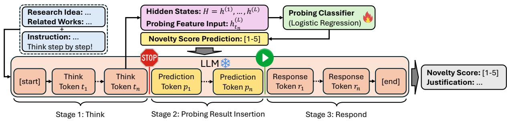
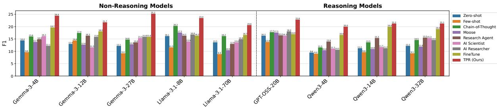

# Think-Probe-Respond: Improving Large Language Models as Judges of Research Idea Novelty

Tim Schopf1 and Tobias Schreieder2 and Akiko Aizawa1

1National Institute of Informatics, Tokyo, Japan

2TU Dresden & ScaDS.AI Dresden/Leipzig, Germany

tim.schopf@t-online.de, tobias.schreieder@tu-dresden.de, aizawa@nii.ac.jp

## Abstract

Automated novelty judgment can accelerate scientific discovery by enabling efficient evaluation, refinement, and comparison of research ideas. While large language models are increasingly adopted for this task, we investigate a previously overlooked limitation in their judgment capabilities: despite generating reasoning rationales that closely mirror those of human experts, their final novelty judgments often diverge substantially. We demonstrate that this miscalibration stems from a systematic bias towards judging ideas as “medium novel”. To mitigate this, we propose Think-Probe-Respond (TPR), a lightweight approach that probes latent novelty judgments from hidden states during the reasoning phase and uses the probed judgments to condition the final response. Across strong baselines, TPR improves novelty judgment performance by 22.30% and successfully mitigates the prevalent “medium novelty” bias.

## 1 Introduction

Judging the novelty of research ideas is crucial to scientific progress, enabling original contributions and shaping future scientific directions. However, manual novelty judgment requires substantial expertise and a broad understanding of the relevant literature, making it time-consuming, subjective, and difficult to scale (Picard et al., 2025). As scientific output continues to grow rapidly (Fortunato et al., 2018), automated support for novelty judgment becomes important for helping researchers assess, refine, and compare research ideas.

Recent work increasingly relies on large language models (LLMs) to judge research idea novelty (Lu et al., 2024; Li et al., 2024a; Si et al., 2025; Su et al., 2025; Lu et al., 2026; Gottweis et al., 2026; Mostafa et al., 2026; Wu et al., 2026, inter alia). However, a critical discrepancy persists: while these models produce plausible, human-like novelty arguments (Afzal et al., 2026), their final novelty judgments remain fundamentally disconnected from their own reasoning rationales and fail to align with human judgments (Si et al., 2025; Schopf and Färber, 2026).

In this work, we investigate the underlying causes of this miscalibration and demonstrate that LLMs exhibit a systematic bias toward conservative “medium novelty” judgments, even when their internal reasoning supports substantially different judgments. Motivated by this finding, we propose Think-Probe-Respond (TPR), a lightweight method for mitigating novelty miscalibration. TPR probes latent novelty beliefs from hidden states during reasoning and conditions the final response on these extracted beliefs. Experimental results show that TPR improves novelty judgment performance by 22.30% on average over strong baselines while producing less biased novelty judgments.

## 2 Related Work

Early efforts for automated research idea novelty judgment have evolved from citation- and lexicalbased methods (Uzzi et al., 2013; Wang et al., 2017; Amplayo et al., 2019; Wang et al., 2019; Sarica et al., 2020) to semantic embedding approaches (Gómez-Pérez et al., 2022). While these methods improve semantic matching, they largely remain limited to surface-level similarity estimation (Mysore et al., 2022). More recent work adopt LLMs for automated novelty judgments (Wu et al., 2025; Si et al., 2025; Liu et al., 2025; Wang et al., 2025; Baek et al., 2025; Lin et al., 2025; Zhang et al., 2025; Tang et al., 2025; Li et al., 2025; Feng et al., 2025; Hou et al., 2026, inter alia). In contrast to prior work, we investigate a previously overlooked failure mode of LLMs: the systematic miscalibration between their generated novelty rationales and final novelty judgments.

  
Figure 1: Overview of our Think-Probe-Respond approach. The snowflake ( ) indicates frozen parameters, while the flame ( ) indicates trainable parameters.

## 3 Benchmark

We conduct all experiments on RINoBench (Schopf and Färber, 2026), the only publicly available benchmark for research idea novelty judgment with human-annotated novelty scores. It comprises 1,381 expert-authored ideas, each paired with related works, a human-annotated novelty score on a five-point Likert scale (rubric in Table 5), and an expert-written justification supporting the assigned novelty score. Given a research idea and its related work, models must predict the novelty score ranging from 1 (not novel) to 5 (highly novel) and generate a textual justification grounded in comparisons with prior work.

## 4 Miscalibration in LLM Novelty Judgments

Although LLM novelty rationales align closely with human reasoning (Afzal et al., 2026), their final novelty judgments often diverge significantly from human consensus (Si et al., 2025; Schopf and Färber, 2026). To investigate this miscalibration and examine why LLMs struggle to produce accurate novelty judgments, we prompt six state-of-theart (SOTA) LLMs (Gemini 2.5 Pro (Comanici et al., 2025), Gemini 3 Pro (Google, 2025), Claude Sonnet 4.5 (Anthropic, 2025b), Claude Opus 4.5 (Anthropic, 2025a), GPT-5 mini (Singh et al., 2026), GPT-5.4 (OpenAI, 2026)) to judge research idea novelty (prompt in Figure 3). As Table 1 shows, all models perform poorly on the novelty judgment task, yielding MAE values around one and consistently low macro-F1 scores, with the bestperforming model achieving just 17.1.

LLMs Avoid Extreme Novelty Judgments The dominant failure pattern is a strong middle-ground bias. Across models, predictions concentrate on novelty classes 3 and 4, while the lowest and highest categories are rarely predicted correctly. With the exception of Gemini 3 Pro, which occasionally assigns classes 1 and 5, models fail almost entirely on these extreme cases. Table 8 shows examples of this LLM behavior.

Latent Belief vs. Expressed Novelty Judgment This middle-ground bias contrasts with the quality of the generated justifications. Models achieve high recall with respect to human-annotated justification arguments, indicating that they often identify the same overlaps, differences, and novelty aspects as human experts. Overall, these results suggest that LLMs often “know” substantially more about the true novelty level than their generated numerical novelty scores reveal.

Takeaway The miscalibration of LLMs as novelty judges is therefore best understood as a mismatch between latent belief and expressed judgment. The models’ reasoning often contains evidence for accurate novelty judgment, but theirfinal outputs are biased towards safe middle categories.

## 5 Probing Latent LLM Judgments

Building on the finding that LLMs internalize beliefs about research idea novelty that closely mirror those of human experts—and therefore generate comparable novelty rationales—yet are biased towards predicting medium novelty categories, we propose the TPR approach for research idea novelty judgment. TPR explicitly exploits the model’s internal beliefs during reasoning about novelty to yield less biased and more accurate quantitative judgments. These judgments are then reused as conditioning signals to generate textual justifications that are coherent and well-aligned with the predicted numerical scores. As illustrated in Figure 1, TPR consists of three stages. (1) Think: We instruct an LLM to judge the novelty of a research idea and to think step by step before producing a final response. For reasoning models that generate think tokens by default, we omit any explicit “think step by step” instruction. Importantly, we provide only textual descriptions of the novelty categories—without numerical scores—and instruct the model to evaluate novelty solely based on these descriptions without generating numerical judgments. This design encourages the model to think about the novelty of research ideas qualitatively, avoiding anchoring its internal representations to explicit numeric outcomes that could bias the reasoning process. Figure 4 shows the prompt used in this approach. (2) Probe: Given an LLM with $L$ hidden layers, let $H = h ^ { ( 1 ) } , \dots , h ^ { ( L ) }$ represent the stack of hidden states. For a generated sequence of reasoning (“think”) tokens $T = t _ { 1 } , \ldots , t _ { n }$ , we terminate generation upon the production of the final think token $t _ { n }$ and extract the hidden state $h _ { t _ { n } } ^ { ( L ) }$ (Section 6 motivates the choice of $t _ { n } )$ . This representation $h _ { t _ { n } } ^ { ( L ) }$ is then used as the input feature vector for a logistic regression probing classifier.1 (3) Respond: We append the textual description of the predicted novelty class to the LLM-generated output and resume generation. Conditioned on both its prior reasoning and the predicted novelty judgment, the LLM generates the final response, which is used as the justification of the novelty judgment.

<table><tr><td></td><td colspan="6"> $F _ { 1 }$ </td><td>MAE</td><td>ALI</td><td colspan="2">Recall</td><td colspan="2">Add. Ratio</td><td colspan="2">Hall. Rate</td></tr><tr><td>Model</td><td>Macro</td><td>1</td><td>2</td><td>3</td><td>4</td><td>5</td><td></td><td>1</td><td>KA</td><td>NA</td><td>KA</td><td>NA</td><td>KA</td><td>NA</td></tr><tr><td>Gemini 2.5 Pro</td><td>15.6</td><td>0.0</td><td>6.3</td><td>28.8</td><td>42.9</td><td>0.0</td><td>1.0</td><td>0.41</td><td>64.7</td><td>60.6</td><td>104.6</td><td>96.5</td><td>8.2</td><td>1.2</td></tr><tr><td>Gemini 3 Pro</td><td>15.3</td><td>9.8</td><td>30.9</td><td>35.8</td><td>0.0</td><td>9.8</td><td>1.0</td><td>0.46</td><td>64.9</td><td>67.0</td><td>101.9</td><td>81.2</td><td>13.8</td><td>3.2</td></tr><tr><td>Claude Sonnet 4.5</td><td>15.5</td><td>0.0</td><td>14.6</td><td>43.2</td><td>19.5</td><td>0.0</td><td>0.9</td><td>0.59</td><td>80.0</td><td>70.3</td><td>150.1</td><td>14.8</td><td>8.7</td><td>1.2</td></tr><tr><td>Claude Opus 4.5</td><td>17.1</td><td>0.0</td><td>12.1</td><td>41.6</td><td>31.9</td><td>0.0</td><td>0.8</td><td>0.61</td><td>80.4</td><td>68.8</td><td>143.4</td><td>106.0</td><td>8.0</td><td>1.2</td></tr><tr><td>GPT-5 mini</td><td>16.2</td><td>0.0</td><td>5.1</td><td>40.8</td><td>34.9</td><td>0.0</td><td>0.9</td><td>0.62</td><td>77.3</td><td>67.8</td><td>144.8</td><td>104.8</td><td>7.8</td><td>1.0</td></tr><tr><td>GPT-5.4</td><td>15.1</td><td>0.0</td><td>3.0</td><td>48.3</td><td>24.3</td><td>0.0</td><td>0.8</td><td>0.62</td><td>75.8</td><td>67.8</td><td>117.2</td><td>77.3</td><td>4.8</td><td>0.6</td></tr></table>

Table 1: Evaluation results of novelty judgments on the RINoBench test set. The reported metrics include F macro averaged and for each rubric category (1-5), Mean Absolute Error (MAE), Alignment (ALI), Recall, Additional Ratio (in %), and Hallucination Rate (in %) for Known Aspects (KA) and Novelty Aspects (NA) respectively (for more details on the metrics, see Appendix B).

TPR is computationally efficient and lightweight. All LLM parameters remain frozen and are used only at inference. Training is limited to a simple logistic regression classifier, which can be learned efficiently on CPU.

## 5.1 Experimental Setup

We evaluate TPR against a diverse set of approaches. These include Zero-shot prompting, as used in Section 4; Few-shot prompting adapted from (Shahid et al., 2025), which provides one example per novelty class; Chain-of-Thought (CoT) prompting, where the model is instructed to reason step by step before producing a novelty judgment; several prompt-based methods derived from Moose (Yang et al., 2024), ResearchAgent (Baek et al., 2025), AI Scientist (Lu et al., 2024), and AI Researcher (Si et al., 2025); as well as a Fine-Tune approach that uses LoRA (Hu et al., 2022) for LLM fine-tuning (training details are provided in Appendix C).

Since we require access to model parameters, we conduct experiments exclusively with open-source LLMs spanning multiple model families. We evaluate reasoning models that generate explicit think tokens by default, namely Qwen3 (4B, 14B, 32B) (Yang et al., 2025) and GPT-OSS-20B (OpenAI et al., 2025), as well as non-reasoning models for which we explicitly instruct step-by-step reasoning to elicit think tokens under TPR, including Gemma 3 (4B, 12B, 27B) (Google et al., 2025) and Llama 3.1 (8B, 70B) (Grattafiori et al., 2024).

## 5.2 Evaluation Results

Figure 2 presents macro-F1 scores for different LLMs and approaches (see Appendix E for metric selection details). Across all evaluated models, TPR achieves the highest performance, surpassing the best competing approach by an average of 22.30%. Remarkably, this performance is achieved using only a lightweight logistic regression probing classifier, significantly surpassing the computationally expensive FineTune approach. While Fine-Tune often outperforms prompt-based approaches, it cannot match the performance of TPR.

Consistency Across Prompt-Based Approaches The effectiveness of prompt-based methods varies substantially across models, with no single prompting strategy consistently outperforming others. In contrast, TPR demonstrates robust, model-agnostic performance, delivering strong results across all LLMs investigated

  
Figure 2: Macro-F scores for different approaches and LLMs on the RINoBench test set.

Model Size Is Not Determinative Probing LLM beliefs during reasoning yields strong novelty judgments regardless of model size. Larger models do not necessarily perform better: for instance, the biggest Llama-3.1-70B ranks second-worst, whereas the smallest Gemma3-4B ranks secondbest. Moreover, all open-source models using TPR surpass the novelty judgment macro- $F _ { 1 }$ scores of proprietary models in Table 1. This indicates that even smaller models using TPR can outperform prompting substantially larger LLMs.

Reasoning vs. Non-Reasoning Models TPR is effective for both reasoning and non-reasoning models, showing that think tokens encode useful information about novelty judgments, whether generated automatically or via explicit instruction. Interestingly, reasoning models exhibit slightly lower TPR performance on average than non-reasoning models. Fine-tuning reasoning models such as Qwen3 provides modest gains, yet TPR still outperforms FineTune, albeit with a smaller margin than for non-reasoning models. Overall, the largest gains appear when TPR is applied to non-reasoning models with explicit "think step-by-step" instructions.

TPR vs. CoT Across all LLMs, TPR substantially outperforms the CoT approach. While CoT marginally benefits non-reasoning models, its effect on reasoning models is inconsistent, and its overall performance lags behind both FineTune and TPR. These results suggest that merely instructing LLMs to reason is insufficient; explicitly probing the hidden representations formed during the reasoning process is crucial for achieving high-quality novelty judgments.

TPR Enables Balanced Predictions Across Novelty Classes Table 2 reports class-wise $F _ { 1 }$ scores for different LLMs using our TPR approach, while Table 1 shows the corresponding scores for proprietary LLMs under zero-shot prompting. Compared to the prompting approach, TPR produces substantially more balanced predictions across all novelty classes. In particular, prompted proprietary LLMs often avoid extreme novelty judgments (classes 1 and 5), whereas TPR enables models to recognize both very low and very high research idea novelties. The exception is the Qwen3 model family, which rarely assigns class 1 even under TPR, indicating a persistent tendency to avoid “no novelty” judgments. Overall, these results show that TPR not only improves macro-level $F _ { 1 }$ performance but also encourages more uniform coverage of the full novelty spectrum, mitigating the middle-class novelty judgment bias observed in Section 4.

<table><tr><td></td><td></td><td colspan="6"> $F _ { 1 }$ </td></tr><tr><td></td><td>Model</td><td>Macro</td><td>1</td><td>2</td><td>3</td><td>4</td><td>5</td></tr><tr><td>No-Reas.</td><td>Gemma-3-4B</td><td>24.4</td><td>27.3</td><td>21.5</td><td>35.11</td><td>29.71</td><td>8.3</td></tr><tr><td></td><td>Gemma-3-12B</td><td>21.8</td><td>7.7</td><td>16.3</td><td>34.1</td><td>35.0</td><td>15.7</td></tr><tr><td></td><td>Gemma-3-27B</td><td>25.2</td><td>18.2</td><td>19.8</td><td>28.9</td><td>33.5</td><td>25.4</td></tr><tr><td></td><td>Llama-3.1-8B</td><td>23.4</td><td>14.3</td><td>26.0</td><td>36.0</td><td>31.2</td><td>9.5</td></tr><tr><td></td><td>Llama-3.1-70B</td><td>20.6</td><td>7.7</td><td>27.9</td><td>33.9</td><td>24.1</td><td>9.5</td></tr><tr><td>Reas.</td><td>Qwen3-4B</td><td>20.0</td><td>0.0</td><td>24.4</td><td>31.2</td><td>28.2</td><td>16.1</td></tr><tr><td></td><td>Qwen3-14B</td><td>21.2</td><td>0.0</td><td>27.1</td><td>33.5</td><td>37.4</td><td>7.8</td></tr><tr><td></td><td>Qwen3-32B</td><td>21.1</td><td>0.0</td><td>23.5</td><td>36.5</td><td>35.8</td><td>9.8</td></tr><tr><td></td><td>GPT-OSS-20B</td><td>22.8</td><td>10.0</td><td>24.1</td><td>35.7</td><td>34.1</td><td>10.0</td></tr></table>

Table 2: $F _ { 1 }$ scores per novelty class using TPR with different LLMs.

An additional evaluation of the textual justifications is provided in Appendix F.

## 6 Probing over Time

We investigate at which generation stages LLMs encode the most salient information for research idea novelty judgments when applying TPR. For this analysis, we allow the models to generate their full reasoning and response exactly as instructed by the prompt in Figure 4, without inserting the probing classifier’s prediction as an intermediate control signal. This setup enables a clean examination of when novelty-related information naturally emerges in the model’s representations. We probe last-layer hidden states at multiple time steps during both the thinking and response generation phases and report the results in Table 3.

<table><tr><td rowspan="2">Model</td><td rowspan="2"></td><td colspan="6">Thinking Phase</td><td colspan="6">Response Generation Phase</td></tr><tr><td> $t _ { 1 }$ </td><td> $t _ { 2 5 \% }$ </td><td> $t _ { 5 0 \% }$ </td><td> $t _ { 7 5 \% }$ </td><td> $t _ { n }$ </td><td>Avg.</td><td> $r _ { 1 }$ </td><td>r25%</td><td>r50%</td><td> $r _ { 7 5 \% }$ </td><td> $r _ { n }$ </td><td>Avg.</td></tr><tr><td rowspan="4">Nona-son.</td><td>Gemma-3-4B</td><td>22.74</td><td>16.26</td><td>15.47</td><td>16.86</td><td>24.38</td><td>19.14</td><td>20.84</td><td>18.09</td><td>19.86</td><td>17.94</td><td>19.81</td><td>19.31</td></tr><tr><td>Gemma-3-12B</td><td>22.34</td><td>22.12</td><td>17.60</td><td>21.12</td><td>21.74</td><td>20.98</td><td>17.87</td><td>16.23</td><td>23.73</td><td>20.53</td><td>17.20</td><td>19.11</td></tr><tr><td>Gemma-3-27B</td><td>18.88</td><td>21.36</td><td>18.42</td><td>21.51</td><td>25.17</td><td>21.07</td><td>21.90</td><td>16.98</td><td>15.48</td><td>19.83</td><td>14.96</td><td>17.83</td></tr><tr><td>Llama-3.1-8B</td><td>17.01</td><td>19.90</td><td>19.77</td><td>19.94</td><td>23.38</td><td>20.00</td><td>17.92</td><td>19.47</td><td>17.40</td><td>17.37</td><td>19.51</td><td>18.33</td></tr><tr><td rowspan="5">Reason&#x27;.</td><td>Llama-3.1-70B</td><td>21.11</td><td>19.12</td><td>20.16</td><td>15.42</td><td>20.61</td><td>19.28</td><td>15.82</td><td>21.56</td><td>18.49</td><td>20.78</td><td>16.50</td><td>18.63</td></tr><tr><td>Qwen3-4B</td><td>19.06</td><td>19.23</td><td>20.51</td><td>21.37</td><td>19.98</td><td>20.03</td><td>16.89</td><td>19.25</td><td>17.84</td><td>18.89</td><td>17.78</td><td>18.13</td></tr><tr><td>Qwen3-14B</td><td>19.05</td><td>16.76</td><td>19.65</td><td>16.76</td><td>21.17</td><td>18.68</td><td>20.47</td><td>18.56</td><td>19.77</td><td>19.81</td><td>19.49</td><td>19.62</td></tr><tr><td>Qwen3-32B</td><td>17.51</td><td>17.77</td><td>19.76</td><td>22.26</td><td>21.13</td><td>19.69</td><td>19.32</td><td>19.30</td><td>20.20</td><td>22.01</td><td>20.07</td><td>20.18</td></tr><tr><td>GPT-OSS-20B</td><td>22.65</td><td>17.02</td><td>19.00</td><td>15.85</td><td>22.78</td><td>19.46</td><td>19.68</td><td>20.00</td><td>22.24</td><td>19.21</td><td>18.43</td><td>19.91</td></tr></table>

Table 3: Macro $F _ { 1 }$ scores for research idea novelty judgments on the RINoBench test set obtained by probing last-layer hidden states of various LLMs at different generation steps: when generating the first and last think tokens $( t _ { 1 } , t _ { n } )$ , the first and last response tokens $( r _ { 1 } , r _ { n } ) .$ , and intermediate steps during both the thinking and response generation phases (reported as percentages of token generation within each phase; e.g., t50% denotes probing halfway through the thinking phase, after 50% of think tokens have been generated).

Novelty Signals Peak at the End of the Thinking Phase Across nearly all models, probing at the end of the thinking phase $( t _ { n } )$ yields the strongest or near-strongest novelty judgment performance. This pattern holds consistently for both reasoning and non-reasoning models, indicating that noveltyrelated beliefs are most fully consolidated once the model has completed its internal reasoning process. In contrast, probing earlier thinking tokens (e.g., $t _ { 2 5 \% } \ 0 \Gamma \ t _ { 5 0 \% } )$ generally results in substantially lower performance, suggesting that novelty representations emerge progressively rather than being present at the onset of reasoning.

Probing Is Robust Across Reasoning Lengths As shown in Table 4, models vary widely in the number of tokens generated during the thinking phase, from short sequences to long reasoning chains. Despite these differences, probing at $t _ { n }$ provides consistently strong novelty signals. Importantly, there is no clear correlation between the absolute length of reasoning chains and probing performance: models with shorter or longer chains achieve comparable $F _ { 1 }$ scores at the final thinking token. This indicates that the position within the reasoning sequence (final token) matters more than absolute length for capturing novelty-related beliefs.

Response Generation Dilutes Novelty Representations While some models achieve local maxima at intermediate response steps (e.g., r50% or r75%), probing during the response generation phase produces competitive but generally weaker results than probing at $t _ { n }$ . This suggests that once the model transitions to response generation, the representations become increasingly influenced by surface realization and linguistic planning, diluting the underlying novelty signal. This trend holds for both reasoning and non-reasoning models. While some models exhibit local peaks at intermediate response steps, the final thinking token remains the most reliable and stable probing point overall.

<table><tr><td rowspan="2" colspan="2">Model</td><td colspan="3"># Think Tokens</td><td colspan="3"># Response Tokens</td></tr><tr><td>Min</td><td>Max</td><td>Avg.</td><td>Min</td><td>Max</td><td>Avg.</td></tr><tr><td>Nonaaa-Rson.</td><td>Gemma-3-4B</td><td>380</td><td>1572</td><td>741.98</td><td>21</td><td>128</td><td>80.69</td></tr><tr><td></td><td>Gemma-3-12B</td><td>233</td><td>1672</td><td>631.21</td><td>44</td><td>105</td><td>69.25</td></tr><tr><td></td><td>Gemma-3-27B</td><td>206</td><td>804</td><td>431.64</td><td>48</td><td>107</td><td>71.81</td></tr><tr><td></td><td>Llama-3.1-8B</td><td>17</td><td>4358</td><td>435.33</td><td>21</td><td>152</td><td>67.79</td></tr><tr><td></td><td>Llama-3.1-70B</td><td>18</td><td>1034</td><td>313.76</td><td>23</td><td>120</td><td>57.23</td></tr><tr><td></td><td>Qwen3-4B</td><td>312</td><td>2525</td><td>1055.51</td><td>45</td><td>193</td><td>125.74</td></tr><tr><td></td><td>Qwen3-14B</td><td>256</td><td>3076</td><td>674.28</td><td>53</td><td>142</td><td>92.48</td></tr><tr><td>Reason.</td><td>Qwen3-32B</td><td>275</td><td>2127</td><td>633.75</td><td>65</td><td>155</td><td>106.49</td></tr><tr><td></td><td>GPT-OSS-20B</td><td>7</td><td>265</td><td>57.66</td><td>21</td><td>231</td><td>126.13</td></tr></table>

Table 4: Number of tokens generated by different LLMs during research idea novelty prediction using our TPR approach. Note, we use GPT-OSS-20B with reasoning level “low”, resulting in a small number of think tokens.

Takeaway Noveltyjudgments are primarilyformed during the reasoning phase and are most reliably captured toward their later stages.

## 7 Conclusion

We showed that LLMs are miscalibrated judges of research idea novelty. Although their rationales often align with human reasoning, their final judgments are biased towards medium novelty. To mitigate this, we proposed TPR, a lightweight approach that probes latent novelty judgments from hidden states during reasoning and conditions the final response on the probed judgment. Experiments demonstrate that TPR improves novelty judgment performance over strong baselines by 22.30% and reduces the prevalent medium-novelty bias.

## 8 Limitations

Our experiments are conducted on RINoBench, which focuses on machine learning research ideas and may not fully reflect novelty judgments in other scientific domains. In addition, TPR requires access to model hidden states, limiting its direct applicability to closed-source LLMs. Finally, novelty judgments are inherently subjective, and even expert annotations may reflect individual preferences or incomplete knowledge of the literature.

## 9 Ethical Considerations

We emphasize that this work is intended for research and educational purposes only. Users should not use our models or approaches to make formal or high-stakes judgments of research ideas, as novelty judgments are inherently subjective and contextdependent.

Our work is intended to advance AI-assisted scientific discovery by enabling models to reason about and explain novel contributions in research. However, automated predictions of research idea novelty should not replace human expert judgment. Our approaches are intended as tools to support, rather than replace human judgments of research ideas.

## Acknowledgments

This work is supported by a scholarship of the German Academic Exchange Service (DAAD) - 57557629 and by the BMFTR through a Software Campus project with identification number 16|S23070.

The authors acknowledge the financial support by the Federal Ministry of Research, Technology and Space of Germany (BMFTR) and by Sächsische Staatsministerium für Wissenschaft, Kultur und Tourismus in the programme Center of Excellence for AI-research „Center for Scalable Data Analytics and Artificial Intelligence Dresden/Leipzig“, project identification number: ScaDS.AI.

We used AI-based assistance tools to support language editing, minor formatting, and coding tasks. These tools did not contribute to the intellectual content or scientific conclusions. All content was reviewed by the authors, who assume full responsibility for the publication.

## References

Anum Afzal, Florian Matthes, Gal Chechik, and Yftah Ziser. 2025. Knowing before saying: LLM representations encode information about chain-of-thought success before completion. In Findings of the Associationfor Computational Linguistics: ACL 2025, pages 12791–12806, Vienna, Austria. Association for Computational Linguistics.

Osama Mohammed Afzal, Preslav Nakov, Tom Hope, and Iryna Gurevych. 2026. Beyond “not novel enough”: Enriching scholarly critique with LLMassisted feedback. In Proceedings ofthe 19th Conference ofthe European Chapter ofthe Associationfor Computational Linguistics (Volume 1: Long Papers), pages 2648–2671, Rabat, Morocco. Association for Computational Linguistics.

Reinald Kim Amplayo, Seung-won Hwang, and Min Song. 2019. Evaluating research novelty detection: Counterfactual approaches. In Proceedings of the Thirteenth Workshop on Graph-Based Methods for Natural Language Processing (TextGraphs-13), pages 124–133, Hong Kong. Association for Computational Linguistics.

Anthropic. 2025a. Introducing Claude Opus 4.5 — anthropic.com. https://www.anthropic.com/ news/claude-opus-4-5. [Accessed 05-01-2026].

Anthropic. 2025b. Introducing Claude Sonnet 4.5 — anthropic.com. https://www.anthropic.com/ news/claude-sonnet-4-5. [Accessed 05-01- 2026].

Jinheon Baek, Sujay Kumar Jauhar, Silviu Cucerzan, and Sung Ju Hwang. 2025. ResearchAgent: Iterative research idea generation over scientific literature with large language models. In Proceedings ofthe 2025 Conference of the Nations of the Americas Chapter of the Association for Computational Linguistics: Human Language Technologies (Volume 1: Long Papers), pages 6709–6738, Albuquerque, New Mexico. Association for Computational Linguistics.

Gheorghe Comanici, Eric Bieber, Mike Schaekermann, Ice Pasupat, Noveen Sachdeva, Inderjit Dhillon, Marcel Blistein, Ori Ram, Dan Zhang, Evan Rosen, Luke Marris, Sam Petulla, Colin Gaffney, Asaf Aharoni, Nathan Lintz, Tiago Cardal Pais, Henrik Jacobsson, Idan Szpektor, Nan-Jiang Jiang, and 3416 others. 2025. Gemini 2.5: Pushing the frontier with advanced reasoning, multimodality, long context, and next generation agentic capabilities. Preprint, arXiv:2507.06261.

Tao Feng, Yihang Sun, and Jiaxuan You. 2025. Grapheval: A lightweight graph-based LLM framework for idea evaluation. In The Thirteenth International Conference on Learning Representations.

Santo Fortunato, Carl T. Bergstrom, Katy Börner, James A. Evans, Dirk Helbing, Staša Milojevic, Alexander M. Petersen, Filippo Radicchi,´

Roberta Sinatra, Brian Uzzi, Alessandro Vespignani, Ludo Waltman, Dashun Wang, and Albert-László Barabási. 2018. Science of science. Science, 359(6379):eaao0185.

Google. 2025. A new era of intelligence with Gemini 3 — blog.google. https://blog.google/products/ gemini/gemini-3/#note-from-ceo. [Accessed 05-01-2026].

Google, Aishwarya Kamath, Johan Ferret, Shreya Pathak, Nino Vieillard, Ramona Merhej, Sarah Perrin, Tatiana Matejovicova, Alexandre Ramé, Morgane Rivière, Louis Rouillard, Thomas Mesnard, Geoffrey Cideron, Jean bastien Grill, Sabela Ramos, Edouard Yvinec, Michelle Casbon, Etienne Pot, Ivo Penchev, and 197 others. 2025. Gemma 3 technical report. Preprint, arXiv:2503.19786.

Daniela Gottesman and Mor Geva. 2024. Estimating knowledge in large language models without generating a single token. In Proceedings of the 2024 Conference on Empirical Methods in Natural Language Processing, pages 3994–4019, Miami, Florida, USA. Association for Computational Linguistics.

Juraj Gottweis, Wei-Hung Weng, Alexander Daryin, Tao Tu, Petar Sirkovic, Artiom Myaskovsky, Grzegorz Glowaty, Felix Weissenberger, Alessio Orlandi, Dan Popovici, Anil Palepu, Keran Rong, Ryutaro Tanno, Khaled Saab, Fan Zhang, Jacob Blum, Andrew Carroll, Kavita Kulkarni, Nenad Tomašev, and 32 others. 2026. Accelerating scientific discovery with co-scientist. Nature.

Aaron Grattafiori, Abhimanyu Dubey, Abhinav Jauhri, Abhinav Pandey, Abhishek Kadian, Ahmad Al-Dahle, Aiesha Letman, Akhil Mathur, Alan Schelten, Alex Vaughan, Amy Yang, Angela Fan, Anirudh Goyal, Anthony Hartshorn, Aobo Yang, Archi Mitra, Archie Sravankumar, Artem Korenev, Arthur Hinsvark, and 542 others. 2024. The llama 3 herd of models. Preprint, arXiv:2407.21783.

Wes Gurnee and Max Tegmark. 2024. Language models represent space and time. In The Twelfth International Conference on Learning Representations.

José Manuel Gómez-Pérez, Andrés García-Silva, Rosemarie Leone, Mirko Albani, Moritz Fontaine, Charles Poncet, Leopold Summerer, Alessandro Donati, Ilaria Roma, and Stefano Scaglioni. 2022. Artificial intelligence and natural language processing and understanding in space: A methodological framework and four esa case studies. Preprint, arXiv:2210.03640.

Linyang He, Peili Chen, Ercong Nie, Yuanning Li, and Jonathan R. Brennan. 2024. Decoding probing: Revealing internal linguistic structures in neural language models using minimal pairs. In Proceedings of the 2024 Joint International Conference on Computational Linguistics, Language Resources and Evaluation (LREC-COLING 2024), pages 4488–4497, Torino, Italia. ELRA and ICCL.

Jiajun Hou, Hexuan Deng, Wenxiang Jiao, Xuebo Liu, Xiaopeng Ke, and Min Zhang. 2026. Noveltyagent: Autonomous novelty reporting agent with pointwise novelty analysis and self-validation. Preprint, arXiv:2603.20884.

Edward J Hu, yelong shen, Phillip Wallis, Zeyuan Allen-Zhu, Yuanzhi Li, Shean Wang, Lu Wang, and Weizhu Chen. 2022. LoRA: Low-rank adaptation of large language models. In International Conference on Learning Representations.

Mingyu Jin, Qinkai Yu, Jingyuan Huang, Qingcheng Zeng, Zhenting Wang, Wenyue Hua, Haiyan Zhao, Kai Mei, Yanda Meng, Kaize Ding, Fan Yang, Mengnan Du, and Yongfeng Zhang. 2025. Exploring concept depth: How large language models acquire knowledge and concept at different layers? In Proceedings of the 31st International Conference on Computational Linguistics, pages 558–573, Abu Dhabi, UAE. Association for Computational Linguistics.

Tianjie Ju, Weiwei Sun, Wei Du, Xinwei Yuan, Zhaochun Ren, and Gongshen Liu. 2024. How large language models encode context knowledge? a layerwise probing study. In Proceedings of the 2024 Joint International Conference on Computational Linguistics, Language Resources and Evaluation (LREC-COLING 2024), pages 8235–8246, Torino, Italia. ELRA and ICCL.

Alina Klerings, Jannik Brinkmann, Daniel Ruffinelli, and Simone Paolo Ponzetto. 2025. Steering language models in multi-token generation: A case study on tense and aspect. In Proceedings of the 2025 Conference on Empirical Methods in Natural Language Processing, pages 8621–8639, Suzhou, China. Association for Computational Linguistics.

Kenneth Li, Aspen K Hopkins, David Bau, Fernanda Viégas, Hanspeter Pfister, and Martin Wattenberg. 2023. Emergent world representations: Exploring a sequence model trained on a synthetic task. In The Eleventh International Conference on Learning Representations.

Long Li, Weiwen Xu, Jiayan Guo, Ruochen Zhao, Xingxuan Li, Yuqian Yuan, Boqiang Zhang, Yuming Jiang, Yifei Xin, Ronghao Dang, Yu Rong, Deli Zhao, Tian Feng, and Lidong Bing. 2025. Chain of ideas: Revolutionizing research via novel idea development with LLM agents. In Findings of the Associationfor Computational Linguistics: EMNLP 2025, pages 8971–9004, Suzhou, China. Association for Computational Linguistics.

Long Li, Weiwen Xu, Jiayan Guo, Ruochen Zhao, Xingxuan Li, Yuqian Yuan, Boqiang Zhang, Yuming Jiang, Yifei Xin, Ronghao Dang, Deli Zhao, Yu Rong, Tian Feng, and Lidong Bing. 2024a. Chain of ideas: Revolutionizing research via novel idea development with llm agents. Preprint, arXiv:2410.13185.

Zichao Li, Yanshuai Cao, and Jackie C.K. Cheung. 2024b. Do llms build world representations? probing

through the lens of state abstraction. In Advances in Neural Information Processing Systems, volume 37, pages 98009–98032. Curran Associates, Inc.

Ethan Lin, Zhiyuan Peng, and Yi Fang. 2025. Evaluating and enhancing large language models for novelty assessment in scholarly publications. In Proceedings of the 1st Workshop on AI and Scientific Discovery: Directions and Opportunities, pages 46–57, Albuquerque, New Mexico, USA. Association for Computational Linguistics.

Yan Liu, Zonglin Yang, Soujanya Poria, Thanh-Son Nguyen, and Erik Cambria. 2025. Harnessing large language models for scientific novelty detection. Preprint, arXiv:2505.24615.

Chris Lu, Cong Lu, Robert Tjarko Lange, Jakob Foerster, Jeff Clune, and David Ha. 2024. The ai scientist: Towards fully automated open-ended scientific discovery. Preprint, arXiv:2408.06292.

Chris Lu, Cong Lu, Robert Tjarko Lange, Yutaro Yamada, Shengran Hu, Jakob Foerster, David Ha, and Jeff Clune. 2026. Towards end-to-end automation of ai research. Nature, 651(8107):914–919.

Andrew L. Maas, Raymond E. Daly, Peter T. Pham, Dan Huang, Andrew Y. Ng, and Christopher Potts. 2011. Learning word vectors for sentiment analysis. In Proceedings of the 49th Annual Meeting of the Association for Computational Linguistics: Human Language Technologies, pages 142–150, Portland, Oregon, USA. Association for Computational Linguistics.

Sharan Maiya, Yinhong Liu, Ramit Debnath, and Anna Korhonen. 2025. Improving preference extraction in LLMs by identifying latent knowledge through classifying probes. In Proceedings of the 63rd Annual Meeting of the Association for Computational Linguistics (Volume 1: Long Papers), pages 9061–9081, Vienna, Austria. Association for Computational Linguistics.

Samuel Marks and Max Tegmark. 2024. The geometry of truth: Emergent linear structure in large language model representations of true/false datasets. In First Conference on Language Modeling.

Abeer Mostafa, Thi Huyen Nguyen, and Zahra Ahmadi. 2026. What is novel? a knowledge-driven framework for bias-aware literature originality evaluation. Preprint, arXiv:2602.06054.

Sheshera Mysore, Arman Cohan, and Tom Hope. 2022. Multi-vector models with textual guidance for finegrained scientific document similarity. In Proceedings of the 2022 Conference of the North American Chapter of the Association for Computational Linguistics: Human Language Technologies, pages 4453–4470, Seattle, United States. Association for Computational Linguistics.

OpenAI, :, Sandhini Agarwal, Lama Ahmad, Jason Ai, Sam Altman, Andy Applebaum, Edwin Arbus,

Rahul K. Arora, Yu Bai, Bowen Baker, Haiming Bao, Boaz Barak, Ally Bennett, Tyler Bertao, Nivedita Brett, Eugene Brevdo, Greg Brockman, Sebastien Bubeck, and 108 others. 2025. gpt-oss-120b & gptoss-20b model card. Preprint, arXiv:2508.10925.

OpenAI. 2026. Gpt-5.4 thinking system card. Accessed: 2026-05-20.

F. Pedregosa, G. Varoquaux, A. Gramfort, V. Michel, B. Thirion, O. Grisel, M. Blondel, P. Prettenhofer, R. Weiss, V. Dubourg, J. Vanderplas, A. Passos, D. Cournapeau, M. Brucher, M. Perrot, and E. Duchesnay. 2011. Scikit-learn: Machine learning in Python. Journal of Machine Learning Research, 12:2825–2830.

Cyril Picard, Kristen M. Edwards, Anna C. Doris, Brandon Man, Giorgio Giannone, Md Ferdous Alam, and Faez Ahmed. 2025. From concept to manufacturing: evaluating vision-language models for engineering design. Artificial Intelligence Review, 58(9):288.

Serhad Sarica, Jianxi Luo, and Kristin L. Wood. 2020. Technet: Technology semantic network based on patent data. Expert Systems with Applications, 142:112995.

Tim Schopf and Michael Färber. 2026. Is this idea novel? an automated benchmark for judgment of research ideas. In Proceedings of the Fifteenth Language Resources and Evaluation Conference (LREC 2026), pages 4716–4727, Palma, Mallorca, Spain. European Language Resources Association (ELRA).

Simra Shahid, Marissa Radensky, Raymond Fok, Pao Siangliulue, Daniel S Weld, and Tom Hope. 2025. Literature-grounded novelty assessment of scientific ideas. In Proceedings of the Fifth Workshop on Scholarly Document Processing (SDP 2025), pages 96– 113, Vienna, Austria. Association for Computational Linguistics.

Chenglei Si, Diyi Yang, and Tatsunori Hashimoto. 2025. Can llms generate novel research ideas? a large-scale human study with 100+ nlp researchers. In International Conference on Learning Representations, volume 2025, pages 94003–94092.

Aaditya Singh, Adam Fry, Adam Perelman, Adam Tart, Adi Ganesh, Ahmed El-Kishky, Aidan McLaughlin, Aiden Low, AJ Ostrow, Akhila Ananthram, Akshay Nathan, Alan Luo, Alec Helyar, Aleksander Madry, Aleksandr Efremov, Aleksandra Spyra, Alex Baker-Whitcomb, Alex Beutel, Alex Karpenko, and 467 others. 2026. Openai gpt-5 system card. Preprint, arXiv:2601.03267.

Haoyang Su, Renqi Chen, Shixiang Tang, Zhenfei Yin, Xinzhe Zheng, Jinzhe Li, Biqing Qi, Qi Wu, Hui Li, Wanli Ouyang, Philip Torr, Bowen Zhou, and Nanqing Dong. 2025. Many heads are better than one: Improved scientific idea generation by a LLMbased multi-agent system. In Proceedings of the 63rd Annual Meeting of the Association for Computational Linguistics (Volume 1: Long Papers), pages

28201–28240, Vienna, Austria. Association for Computational Linguistics.

Jiabin Tang, Lianghao Xia, Zhonghang Li, and Chao Huang. 2025. AI-researcher: Autonomous scientific innovation. In The Thirty-ninth Annual Conference on Neural Information Processing Systems.

Brian Uzzi, Satyam Mukherjee, Michael Stringer, and Ben Jones. 2013. Atypical combinations and scientific impact. Science, 342(6157):468–472.

Pedro H. V. Valois, Lincon S. Souza, Erica K. Shimomoto, and Kazuhiro Fukui. 2025. Frame representation hypothesis: Multi-token llm interpretability and concept-guided text generation. Transactions ofthe Associationfor Computational Linguistics, 13:1436– 1458.

Jian Wang, Reinhilde Veugelers, and Paula Stephan. 2017. Bias against novelty in science: A cautionary tale for users of bibliometric indicators. Research Policy, 46(8):1416–1436.

Kai Wang, Boxiang Dong, and Junjie Ma. 2019. Towards computational assessment of idea novelty. In Proceedings ofthe 52nd Hawaii International Conference on System Sciences.

Wenxiao Wang, Lihui Gu, Liye Zhang, Yunxiang Luo, Yi Dai, Chen Shen, Liang Xie, Binbin Lin, Xiaofei He, and Jieping Ye. 2025. Scipip: An llm-based scientific paper idea proposer. Preprint, arXiv:2410.23166.

Thomas Wolf, Lysandre Debut, Victor Sanh, Julien Chaumond, Clement Delangue, Anthony Moi, Pierric Cistac, Tim Rault, Remi Louf, Morgan Funtowicz, Joe Davison, Sam Shleifer, Patrick von Platen, Clara Ma, Yacine Jernite, Julien Plu, Canwen Xu, Teven Le Scao, Sylvain Gugger, and 3 others. 2020. Transformers: State-of-the-art natural language processing. In Proceedings ofthe 2020 Conference on Empirical Methods in Natural Language Processing: System Demonstrations, pages 38–45, Online. Association for Computational Linguistics.

Wenqing Wu, Chengzhi Zhang, and Yi Zhao. 2025. Automated novelty evaluation of academic paper: A collaborative approach integrating human and large language model knowledge. Journal of the Association for Information Science and Technology, 76(11):1452–1469.

Wenqing Wu, Yi Zhao, Yuzhuo Wang, Siyou Li, Juexi Shao, Yunfei Long, and Chengzhi Zhang. 2026. Novbench: Evaluating large language models on academic paper novelty assessment. Preprint, arXiv:2604.11543.

An Yang, Anfeng Li, Baosong Yang, Beichen Zhang, Binyuan Hui, Bo Zheng, Bowen Yu, Chang Gao, Chengen Huang, Chenxu Lv, Chujie Zheng, Dayiheng Liu, Fan Zhou, Fei Huang, Feng Hu, Hao Ge, Haoran Wei, Huan Lin, Jialong Tang, and 41 others. 2025. Qwen3 technical report. Preprint, arXiv:2505.09388.

Zonglin Yang, Xinya Du, Junxian Li, Jie Zheng, Soujanya Poria, and Erik Cambria. 2024. Large language models for automated open-domain scientific hypotheses discovery. In Findings of the Associationfor Computational Linguistics: ACL 2024, pages 13545–13565, Bangkok, Thailand. Association for Computational Linguistics.

Yiming Zhang, Harshita Diddee, Susan Holm, Hanchen Liu, Xinyue Liu, Vinay Samuel, Barry Wang, and Daphne Ippolito. 2025. Noveltybench: Evaluating creativity and diversity in language models. In Second Conference on Language Modeling.

Amir Zur, Atticus Geiger, Ekdeep Singh Lubana, and Eric Bigelow. 2025. Are language models aware of the road not taken? token-level uncertainty and hidden state dynamics. Preprint, arXiv:2511.04527.

## A About Probing LLMs During Generation

Probing approaches quantify the extent to which LLM representations encode specific knowledge. While extensive research investigates internal knowledge across diverse domains such as sentiment (Maas et al., 2011) and factual knowledge (Marks and Tegmark, 2024), spatial and temporal understanding (Gurnee and Tegmark, 2024), and world models (Li et al., 2023), such existing studies predominantly focus on layer-wise localization of internal knowledge (He et al., 2024; Li et al., 2024b; Ju et al., 2024; Jin et al., 2025, inter alia). Work on probing LLMs during different generation steps is scarce and primarily addresses steering text generation (Valois et al., 2025; Zur et al., 2025; Klerings et al., 2025, inter alia). Although some works investigate the encoded information in LLMs before generating the first token (Gottesman and Geva, 2024; Afzal et al., 2025), they do not distinguish between functional phases during generation. We address this gap by providing the first comparison of LLM representations during the reasoning (“thinking”) phase versus the response generation phase via probing, demonstrating that LLMs encode more information about research idea novelty judgments while thinking than when producing the actual response.

## B Evaluation Metrics

We briefly summarize the RINoBench evaluation metrics, which we adopt in this work. For full details, see Schopf and Färber (2026). The metrics evaluate both numerical novelty scores and textual justifications.

<table><tr><td rowspan=1 colspan=1>Score</td><td rowspan=1 colspan=1>Degree of Novelty</td></tr><tr><td rowspan=1 colspan=1>1</td><td rowspan=1 colspan=1>The idea is not novel. All aspects already existin prior work.</td></tr><tr><td rowspan=1 colspan=1>2</td><td rowspan=1 colspan=1>The idea is marginally novel. It represents only aminor variation of existing work.</td></tr><tr><td rowspan=1 colspan=1>3</td><td rowspan=1 colspan=1>The idea is somewhat novel. Aspects alreadyexist in prior work. However, it might combineknown approaches in new ways, apply them tonew contexts, or propose incremental updates.</td></tr><tr><td rowspan=1 colspan=1>4</td><td rowspan=1 colspan=1>The idea is novel. It introduces new aspects notpresent in existing work.</td></tr><tr><td rowspan=1 colspan=1>5</td><td rowspan=1 colspan=1>The idea is highly innovative and novel. It isnot present in existing work and potentially en-courages new thinking or opens up new researchdirections.</td></tr></table>

Table 5: Novelty Judgment Rubric

## B.1 Novelty Score Metrics

We evaluate predicted novelty scores using macro-$F _ { 1 }$ , class-wise $F _ { 1 }$ , and MAE. Macro- ${ \bf \nabla } \cdot { \cal F } _ { 1 }$ measures overall classification performance across the five novelty categories, class-wise $F _ { 1 }$ shows performance for each individual score, and MAE measures the average distance between predicted and human gold scores on the ordinal 1–5 scale.

## B.2 Justification Metrics

For textual justifications, RINoBench distinguishes between known aspects, which describe overlaps with prior work, and novelty aspects, which describe new contributions of the research idea. Following RINoBench, these metrics are computed using an LLM-as-a-judge approach that compares model-generated justifications against human goldstandard justifications. In this work, we use the GPT-OSS-120B (OpenAI et al., 2025) model for evaluation.

Alignment Alignment measures whether the model-generated justification follows reasoning consistent with the human gold justification and supports a similar novelty judgment. Scores range from 0 to 1, where higher is better: 1 indicates strong agreement with the human rationale, while 0 indicates no alignment.

Recall Recall measures how many known-aspect and novelty-aspect arguments from the human gold justification are captured by the model-generated justification. Scores range from 0 to 100, where higher is better: 100 means all relevant gold arguments are covered, while 0 means none are covered. Additional Ratio Additional ratio measures how many extra known-aspect and novelty-aspect arguments the model adds beyond the gold justification, while still being grounded in the related works or research idea. Scores are non-negative percentages, where 0% means no additional grounded arguments are added and higher values indicate more extra grounded content. This metric is not inherently good or bad: moderate or high values can indicate useful additional evidence, but very high values may also reflect overly verbose justifications.

Hallucination Rate Hallucination rate measures the proportion of generated known-aspect and novelty-aspect arguments that are not supported by the related works or research idea. Scores range from 0% to 100%, where lower is better: 0% indicates justifications that are fully grounded in the research idea and related works, while higher values indicate more unsupported or hallucinated content.

## C LoRA Fine-tuning Details

For the FineTune approach in Section 5, we finetune the base LLM using Low-Rank Adaptation (LoRA; Hu et al., 2022). We apply LoRA to all major projection layers in the transformer, including the query, key, value, and output projections of the attention mechanism, as well as the gate, up, and down projections in the feed-forward network. We use a rank of $r = 1 6$ , a scaling factor $\alpha = 3 2$ , and a LoRA dropout of 0.1. Training is performed for two epochs using a per-device batch size of 1 and gradient accumulation over 8 steps, resulting in an effective batch size of 8. We employ a learning rate of $2 \times 1 0 ^ { - 4 }$ with a short warmup of 20 steps. To reduce memory consumption, gradient checkpointing is enabled, and training is conducted in bfloat16 precision.

## D Experimental Details

All experiments were conducted on two NVIDIA A100 (80GB) GPUs. The probing classifier was implemented using scikit-learn (Pedregosa et al., 2011). Hidden states were extracted using the Hugging Face Transformers library (Wolf et al., 2020).

## E On the Choice of Novelty Score Metrics

We use macro- $F _ { 1 }$ as the primary metric for evaluating novelty score predictions, rather than MAE. Although MAE is useful for measuring the average ordinal distance between predicted and gold scores, it is less informative in our setting because the novelty scale is small (1–5) and model predictions are strongly concentrated around the middle categories. As shown in Table 6, different models and approaches obtain very similar MAE values,

typically around one. This makes MAE unsuitable for evaluation in our setting.
<table><tr><td></td><td>Model</td><td>Zero-shot</td><td>Few-shot</td><td>CoT</td><td>Moose</td><td>Research Agent</td><td>AI Scientist</td><td>AI Researcher</td><td>FineTune</td><td>TPR</td></tr><tr><td rowspan="4">Nonn-as&#x27;.</td><td>Gemma-3-4B</td><td>1.0</td><td>0.9</td><td>1.0</td><td>0.9</td><td>0.9</td><td>0.9</td><td>0.9</td><td>1.1</td><td>1.0</td></tr><tr><td>Gemma-3-12B</td><td>1.0</td><td>0.9</td><td>0.9</td><td>1.0</td><td>0.9</td><td>0.9</td><td>0.9</td><td>1.1</td><td>1.1</td></tr><tr><td>Gemma-3-27B</td><td>1.0</td><td>1.0</td><td>0.9</td><td>1.0</td><td>0.9</td><td>1.0</td><td>0.9</td><td>1.1</td><td>1.1</td></tr><tr><td>Llama-3.1-8B</td><td>1.0</td><td>1.0</td><td>1.0</td><td>0.9</td><td>0.9</td><td>0.9</td><td>0.9</td><td>1.1</td><td>1.1</td></tr><tr><td rowspan="4">Reas.</td><td>Llama-3.1-70B</td><td>1.0</td><td>1.0</td><td>1.1</td><td>1.0</td><td>1.0</td><td>1.0</td><td>0.9</td><td>1.1</td><td>1.1</td></tr><tr><td>Qwen3-4B</td><td>1.0</td><td>1.0</td><td>1.0</td><td>1.0</td><td>0.9</td><td>1.0</td><td>1.0</td><td>1.0</td><td>1.1</td></tr><tr><td>Qwen3-14B</td><td>1.0</td><td>1.0</td><td>1.1</td><td>1.0</td><td>1.0</td><td>1.0</td><td>1.0</td><td>1.1</td><td>1.0</td></tr><tr><td>Qwen3-32B</td><td>1.0</td><td>1.0</td><td>1.0</td><td>1.0</td><td>0.9</td><td>1.0</td><td>1.0</td><td>1.0</td><td>1.1</td></tr><tr><td></td><td>GPT-OSS-20B</td><td>0.9</td><td>0.9</td><td>1.0</td><td>0.9</td><td>0.9</td><td>1.0</td><td>0.9</td><td>1.2</td><td>1.1</td></tr></table>

Table 6: MAE scores for different approaches and LLMs on the RINoBench test set.

The limitation arises because a model that repeatedly predicts a middle score, such as 3, can achieve a deceptively low MAE: many gold labels are only one or two points away on a five-point Likert scale. Conversely, a less biased model that also predicts more extreme novelty categories may occasionally incur larger absolute errors, even if it produces more accurate novelty judgments overall. Optimizing for MAE can therefore favor conservative middle-ground predictions, precisely the behavior we aim to mitigate.

Macro- $F _ { 1 }$ better reflects our evaluation objective. It treats all novelty classes equally, regardless of their frequency, and explicitly rewards models for correctly predicting low, medium, and high novelty judgments. This is crucial for evaluating whether a model can correctly judge extreme novelty categories, such as “not novel” and “highly novel”, rather than merely staying close to the center of the scale. We therefore report MAE for completeness in Table $^ { 6 , }$ but use macro- ${ \bf \nabla } \cdot { \cal F } _ { 1 }$ and class-wise $F _ { 1 }$ as the main indicators of novelty judgment performance.

## F Justification Evaluation

Beyond novelty judgment performance, we also evaluate the quality of textual justifications generated by open-source LLMs using TPR, with the results shown in Table 7.

<table><tr><td rowspan="2">Model</td><td rowspan="2"></td><td rowspan="2">ALI</td><td colspan="2">Recall</td><td colspan="2">Add. Ratio</td><td colspan="2">Hall. Rate</td></tr><tr><td>KA</td><td>NA</td><td>KA</td><td>NA</td><td>KA</td><td>NA</td></tr><tr><td>No-Reas.</td><td>Gemma-3-4B</td><td>0.25</td><td>39.4</td><td>35.7</td><td>40.8</td><td>51.9</td><td>38.8</td><td>44.2</td></tr><tr><td></td><td>Gemma-3-12B</td><td>0.39</td><td>58.2</td><td>50.4</td><td>56.7</td><td>72.4</td><td>8.6</td><td>6.8</td></tr><tr><td></td><td>Gemma-3-27B</td><td>0.42</td><td>62.4</td><td>57.2</td><td>60.9</td><td>80.5</td><td>6.5</td><td>2.0</td></tr><tr><td></td><td>Llama-3.1-8B</td><td>0.36</td><td>52.0</td><td>45.3</td><td>40.0</td><td>74.1</td><td>12.6</td><td>10.5</td></tr><tr><td></td><td>Llama-3.1-70B</td><td>0.30</td><td>51.0</td><td>50.0</td><td>35.1</td><td>55.6</td><td>12.0</td><td>11.1</td></tr><tr><td>Reas.</td><td>Qwen3-4B</td><td>0.43</td><td>61.9</td><td>61.5</td><td>78.9</td><td>108.3</td><td>7.8</td><td>2.6</td></tr><tr><td></td><td>Qwen3-14B</td><td>0.43</td><td>63.6</td><td>68.8</td><td>105.4</td><td>137.2</td><td>9.2</td><td>5.4</td></tr><tr><td></td><td>Qwen3-32B</td><td>0.54</td><td>67.9</td><td>59.0</td><td>94.5</td><td>98.7</td><td>8.0</td><td>1.1</td></tr><tr><td></td><td>GPT-OSS-20B</td><td>0.52</td><td>66.6</td><td>63.6</td><td>88.4</td><td>94.8</td><td>10.6</td><td>2.8</td></tr></table>

Table 7: Evaluation of textual justifications generated by different LLMs using TPR.

Alignment The alignment scores of open-source models using TPR are comparable to those of substantially larger proprietary LLMs in Table 1. In particular, the strongest reasoning-capable models achieve ALI values around 0.5, close to the range observed for Claude and GPT models under zeroshot prompting. This indicates that TPR does not merely improve numerical novelty prediction, but also enables open-source models to generate justifications whose reasoning remains broadly aligned with human gold-standard rationales.

Recall Similarly to propriety LLMs, smaller open-source models exhibit relatively high recall, indicating substantial overlap between modelgenerated and human-annotated justification arguments. Comparing the results to the ones in Table 1, recall in open-source models is slightly lower than in the top-performing OpenAI models but remains competitive with Gemini Pro models.

Additional Ratio The Additional Ratio is generally higher for reasoning-capable models than for nonreasoning models, indicating that reasoning models produce more elaborate justifications. While proprietary OpenAI LLMs exhibit even higher additional ratios, the best-performing Qwen3 models remain competitive with Gemini Pro models, highlighting that TPR enables smaller open-source models to generate rich novelty judgment justifications.

Hallucination Rate Reasoning models show low hallucination rates similar to proprietary models, whereas non-reasoning models, particularly Gemma-3-4B, display higher hallucination rates when attempting to justify novelty judgments. This suggests that TPR is most effective in producing grounded justifications when paired with reasoning LLMs.

Takeaway Overall, TPR allows open-source LLMs to generate high-quality, human-aligned novelty justifications, similar to what is achievable with large proprietary models. However, performance depends strongly on the model: reasoning-capable LLMs consistently produce more accurate, elaborate, and reliable justifications, whereas smaller non-reasoning LLMs may struggle to generate appropriate novelty judgment justifications.

<table><tr><td>Gold Novelty</td><td>Predicted Novelty</td><td>Gold Justification</td><td>LLM-generated Justification</td></tr><tr><td>1</td><td>3↑</td><td>The idea of using neural networks to learn Green&#x27;s functions is already known and the proposed contribution is incremental, offering no new aspects beyond existing approaches.</td><td>The proposed idea combines fundamental solutions [...] represents a somewhat novel synthesis, but the core components [...] are well-established in the literature.</td></tr><tr><td>2</td><td>4↑</td><td>The approach adds [...] extensions of existing communication mechanisms rather than fundamentally new concepts, resulting in only marginal novelty.</td><td>The research idea proposes [...] meaningful novelty [...], though it builds on existing concepts in communication [...]</td></tr><tr><td>3</td><td>3√</td><td>The approach primarily assembles existing components [...], resulting in a somewhat novel contribution.</td><td>The research idea combines several existing concepts [...] adds incremental novelty, [...]</td></tr><tr><td>4</td><td>4√</td><td>The approach is novel [...] extending diffusion models beyond the usual focus on learning only the reverse process. [...] has not been presented in prior work [...]</td><td>[...] introduces a novel approach by jointly parameterizing both forward and reverse diffusion processes [...] related works [...] primarily focus on the reverse process [...]</td></tr><tr><td>5</td><td>4↓</td><td>The idea is highly novel because it uncovers a previously unreported generalization phenomenon and establishes a new theoretical link [...]</td><td>[...] calibration literature doesn&#x27;t explicitly connect ensemble disagreement to generalization [...] builds incrementally on existing calibration and ensemble concepts.</td></tr></table>

Table 8: Selected comparison of gold novelty judgments and LLM(Claude Opus 4.5)-generated novelty judgments. Green denotes alignment of model and gold justifications. Red highlights miscalibration, where the model’s novelty judgment diverges from the gold judgment despite exhibiting a rationale aligned with the gold justification. Symbols indicate novelty overestimation (↑), correct prediction (✓), and underestimation (↓).

Zero-shot Research Idea Novelty Judgment Prompts   
system prompt = " You are an expert researcher experienced in judging the   
novelty of a research idea ."   
user prompt = f """   
You are an expert in machine learning research evaluation . You will be   
given two inputs :   
1. A research idea with objective , problem statement , and solution   
approach .   
2. A list of related works , each with a title and abstract .   
Your task is to \*\* assess the novelty of the research idea \*\* compared to   
the related works .   
### Instructions :   
- Analyze the research idea and summarize its key contributions .   
- Compare it with the related works to identify overlaps and differences .   
- Specifically , assess whether the idea introduces \*\* significant new   
aspects \*\* not present in existing work , or if it is largely a variation on   
known approaches .   
- Provide your output as a \*\* JSON object only \*\* , with :   
- " reasoning ": a short paragraph (2 -4 sentences ) explaining the   
reasoning behind the novelty score .   
- " novelty\_score ": an integer between 1-5 where : { novelty\_rubric }   
### Inputs :   
\*\* Research Idea :\*\*   
{ research\_idea }   
\*\* Related Works :\*\*   
{ related\_works }   
### Output Format :   
\`\`\`json   
{{   
" reasoning ": < short explanation > ,   
" novelty\_score ": <1|2|3|4|5 >   
}}   
" n "  
Figure 3: Prompts for the zero-shot approach to judging the novelty of research ideas. Here, an LLM receives a research idea, its related works, and the RINoBench novelty rubric, and is asked to generate both a numerical novelty score and a textual justification.

TPR Instruction   
system prompt = " You are ReviewerGPT , an intelligent assistant that helps   
researchers evaluate the novelty of their ideas ."   
user prompt = f """   
You are given some papers similar to the proposed idea (<IDEA > and </IDEA   
>) . Your task is to evaluate the idea 's novelty using the related papers   
(<PAPER > and </PAPER >) only .   
### Novelty types :   
{ novelty\_class\_descriptions }   
### Instructions :   
- Use the example review below to write a review for the provided idea by   
comparing it to the related papers .   
- Don 't assume any prior knowledge about the idea .   
- Make sure the generated review follows the format in example review   
provided below .   
- The review should be concise - around 60 to 100 words .   
### Research Idea :   
{ research\_idea }   
### Related Papers :   
{ related\_papers }   
### Example Review :   
{ example\_review }   
### Output Format :   
<REVIEW > concise review </ REVIEW >   
Think step by step before generating the review !   
11 11 11  
Figure 4: Instruction used for our TPR approach as introduced in Section 5. The instruction to reason step by step is included only for models that do not generate think tokens by default and is omitted otherwise.