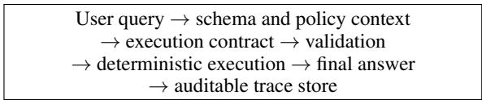
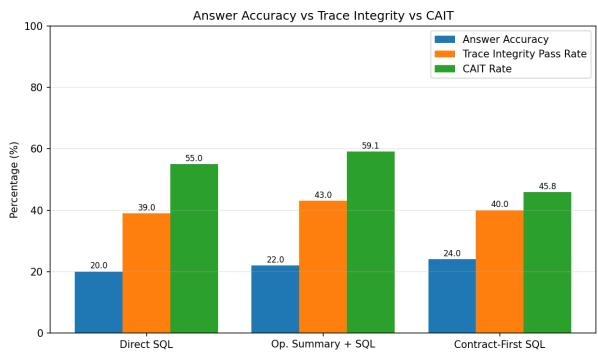
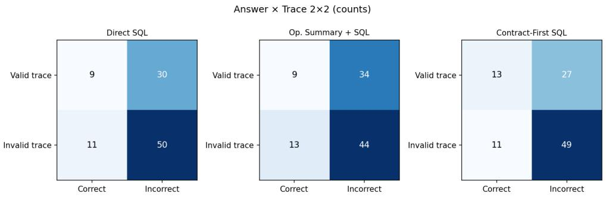

# Trace Integrity for LLM Data Agents: A Vision for Auditable Structured Reasoning in Real-World Systems

Srimonti Dutta WAI USA Research Labs srimonti@womeninai.co

Akshata Kishore Moharir WAI USA Research Labs akshata@womeninai.co

## Abstract

Answer accuracy is an insufficient reliability signal for LLM data agents. In structured-data tasks, a benchmark-correct answer can be produced by an invalid trace. This paper introduces Trace Integrity, a deployment reliability criterion for evaluating whether the computation recorded behind an answer is explicit, executable, schema-valid, operator-faithful, replayable, answer-consistent, and auditable. We identify the Structure Gap as the deployment failure mode that makes Trace Integrity necessary: natural-language reasoning and free-form rationales do not reliably specify the operatorlevel programs required by real-world systems. We operationalize Trace Integrity with execution contracts, structured artifacts that bind user intent to schema elements, operator plans, assumptions, executable queries, verification status, and final-answer linkage. We also introduce CAIT (Correct Answer / Invalid Trace) Rate, which measures how often answer-only evaluation counts computationally unsupported outputs as successes. In an empirical demonstration on BIRD Mini-Dev, Direct SQL, Operation Summary + SQL, and Contract-First SQL achieve answer accuracies of 20%, 22%, and 24%, while their Trace Integrity Pass Rates are 39%, 43%, and 40% and their CAIT Rates remain high at 55%, 59.1%, and 45.8%, showing that answer accuracy, trace validity, and silent-failure risk are distinct evaluation signals. Real-world LLM data agents should, therefore, be evaluated not only by whether their outputs match a reference answer, but by whether those outputs are backed by auditable computation.

## 1 Introduction

LLM data agents are becoming interfaces to operational data. They inspect schemas, generate SQL, call tools, execute queries, summarize results, and present conclusions to analysts, operators, clinicians, auditors, and customers. This makes databases, spreadsheets, logs, records, and enterprise analytics systems easier to query, but it also changes the reliability problem. The question is no longer only whether the system returns the expected value. A data agent may return a plausible or benchmark-correct answer while the computation behind that answer applies the wrong filter, join, aggregation, time window, grouping key, or schema binding.

Consider a business analyst asking, Which region had the highest average revenue per active customer last quarter, excluding trial accounts? A system can return a confident region name while silently computing total revenue instead of average revenue, including trial accounts, grouping by sales office rather than customer region, using a calendar quarter instead of the fiscal quarter, or joining customer and revenue records on a brittle name field rather than a stable identifier. Answer-only evaluation cannot distinguish a faithful computation from an accidental success. A deployment team needs to know not only what answer was produced, but what computation was actually performed.

This is a deployment problem, not only a benchmark problem. In operational workflows, the answer is often consumed by someone who cannot reconstruct the query: a BI user, compliance reviewer, data engineer, or domain expert. These users do not need only a fluent explanation, but need an inspectable artifact showing which schema elements, filters, joins, aggregations, assumptions, and execution results support the answer.

This paper argues that real-world LLM data agents need a reliability criterion that treats the computation trace as a first-class object. We call this criterion Trace Integrity. A trace has integrity when the recorded computation behind an answer is explicit, executable, schema-valid, operatorfaithful, replayable, answer-consistent, and auditable. The claim is deliberately narrower than general trustworthiness. Trace Integrity does not certify that the underlying data are complete, fair, or appropriate for a downstream decision. It addresses a specific deployment risk: answer correctness is not sufficient evidence that the system performed the computation requested by the user.

The need for trace-level evaluation follows from a broader Structure Gap. Language models express reasoning as token sequences, while structureddata tasks require operator-level programs with well-defined semantics. A valid answer may depend on projection, filtering, joining, grouping, aggregation, sorting, ranking, temporal constraints, and schema binding. Text-to-SQL and tablereasoning benchmarks expose this pressure because success depends on mapping a natural-language request to an executable computation, not merely producing a plausible explanation (Zhong et al., 2017; Yu et al., 2018; Pasupat and Liang, 2015; Chen et al., 2019, 2020). Recent LLM-driven Textto-SQL systems further show this problem matters in business intelligence and inventory-management settings, where natural-language access to operational databases is important as non-specialists need to query structured data (Zhu et al., 2023).

Existing methods address adjacent parts of the problem but do not make Trace Integrity a first-class evaluation target. Chain-of-thought prompting can elicit intermediate text, but naturallanguage rationales are not executable and may not faithfully describe the computation that produced the answer (Wei et al., 2022; Kojima et al., 2022; Lanham et al., 2023). Program-aided and tool-using methods improve task performance by delegating computation to external systems (Gao et al., 2023; Chen et al., 2023; Yao et al., 2023; Schick et al., 2023), yet execution alone does not show if the generated program matches the user’s intended computation. An SQL query can run successfully and still answer the wrong question.

The central hidden-failure case is a correct answer with an invalid trace. Such an output receives credit under answer-only evaluation, yet it is not a reliable data-agent response because the recorded computation does not support the answer. We call this case Correct Answer / Invalid Trace and measure it with CAIT Rate. CAIT asks: among the answers a system gets right, what fraction are backed by invalid computations? A high CAIT Rate means that answer-only evaluation is counting computationally unsupported outputs as successes.

This work develops the vocabulary, artifact, and measurement protocol for that hidden quadrant. The Structure Gap names the deployment failure mode in which natural-language reasoning fails to specify operator-level computation, Trace Integrity gives the reliability criterion, execution contracts make the criterion operational, the Isolation Principle provides a default planning discipline, and CAIT Rate turns correct-answer/invalid-trace failures into a metric that can be reported across systems and datasets.

We include a proof-of-concept to show that this deployment risk appears in measurable system behavior. On 100 BIRD Mini-Dev examples, we compare Direct SQL, Operation Summary + SQL, and Contract-First SQL. The three methods achieve answer accuracies of 20.0%, 22.0%, and 24.0%, while their Trace Integrity Pass Rates are 39.0%, 43.0%, and 40.0%. Their CAIT Rates remain high at 55.0%, 59.1%, and 45.8%. These results show that answer accuracy, trace validity, and silentfailure risk are distinct signals that deployment teams should monitor together. The intended contribution is a practical evaluation frame for LLM data agents: if LLM data agents are to serve as reliable interfaces to operational data, they should be evaluated not only by what answer they return, but by whether the computation behind that answer can be inspected, replayed, and trusted.

## 2 The Trace Integrity Problem

## 2.1 Operator Commitments and the Structure Gap

Structured-data questions require operational commitments: which records are included, which entities are aligned, which measure is computed, which grouping defines the comparison, which temporal window is used, and which ordering determines a superlative. If a user asks for average revenue per active customer, the computation must define both numerator and denominator. If the user asks for last quarter, the computation must resolve a time interval. If the user asks for a region-level result, the computation must bind the intended region field rather than a superficially similar location attribute.

We define the Structure Gap as the mismatch between natural-language reasoning and operatorlevel computation. Natural language expresses intent, but it does not enforce the discrete operations that structured-data answers require: filtering, joining, grouping, aggregation, ranking, temporal restriction, and schema binding. A model can state the intended operation plausibly while omitting a join, changing an average into a sum, applying a filter to the wrong table, or grouping by a field with similar surface form but different semantics. In a deployed data agent, such an error is a reliability failure because the answer is no longer supported by the computation.

This framing is representational rather than a claim that language models lack general reasoning ability. A valid structured-data answer must bind a user request to an executable computation. Textto-SQL tasks make this visible because the target output is an operator-level representation (Zhong et al., 2017; Yu et al., 2018). Table reasoning and fact verification tasks show the same pressure in less strictly relational settings (Pasupat and Liang, 2015; Chen et al., 2019, 2020).

## 2.2 Silent Failures in Operational Data Workflows

Silent structured-data failures are dangerous because they look like normal completions. A SQLgenerating agent may produce a query that executes cleanly but groups by the wrong key. A tool-using agent may call the correct database but omit a required exclusion filter. A rationale may say that trial accounts were excluded while the executed query includes them. In each case, the interface returns an answer and gives the user little reason to suspect that the computation has drifted from the request. These failures appear in ordinary data-agent workflows. In business intelligence, a model may report total revenue when the decision depends on revenue per customer. In compliance reporting, it may count all transactions rather than transactions in the regulated jurisdiction. In clinical analytics, it may define a cohort using visit dates rather than diagnosis dates. The deployment consequence is that a final answer is not enough of a reliability artifact: the computation must be available for inspection.

## 2.3 The CAIT Failure Mode

Answer accuracy collapses several reliability states into one outcome. A correct answer with a valid trace is a faithful success. An incorrect answer with an invalid trace is a visible structural failure. An incorrect answer with a valid trace may reflect a data issue, an execution issue, an ambiguity in the user request, or a mismatch between the benchmark reference and another defensible interpretation. The most deployment-relevant hidden case is a correct answer with an invalid trace. This output receives credit under answer-only evaluation even though the recorded computation does not support the answer. We call this hidden-success case Correct Answer / Invalid Trace and measure it with CAIT Rate. CAIT asks: among the answers a system gets right, what fraction are backed by invalid computations? A high CAIT Rate means that answer-only evaluation is overstating reliability by counting computationally unsupported outputs as successes. Execution success is also insufficient because a query can run and still answer the wrong question. Trace Integrity addresses the narrower operational question: whether the recorded computation is explicit, executable, schema-valid, operator-faithful, replayable, answer-consistent, and auditable.

## 3 Trace Integrity as an Audit Contract

## 3.1 Definition of Trace Integrity

Trace Integrity is the property that the recorded trace behind a structured-data answer specifies the computation in a form that can be checked, replayed, and audited. The relevant trace is not private model reasoning and it is not a long naturallanguage explanation. It is the system record that determines whether the answer is computationally supported: schema elements, filters, joins, grouping, aggregation, ordering, assumptions, executed query or program, and final-answer linkage. A trace passes integrity when it satisfies the dimensions in Table 1. These dimensions are narrower than full semantic correctness, as they define the minimum conditions under which a data-agent answer can be treated as supported by its recorded computation. This separation is what makes CAIT Rate necessary: an answer can match the reference while the trace remains invalid.

## 3.2 Execution Contracts

An execution contract is a compact artifact that records the intended computation before or alongside execution. It binds user intent to schema elements, operator plans, assumptions, execution queries, verification status, and final answers. The contract is not a verbose explanation and it is not a substitute for deterministic execution. Its role is to make the agent’s computational commitments available to validators, auditors, and downstream answer generators.

Listing 1 shows the intended level of detail. The contract does not expose hidden reasoning. It exposes the commitments that matter for computation: the tables, join key, filters, grouping field, metric, operator sequence, and verification status.

<table><tr><td>Dimension</td><td>Check</td><td>Deployment failure exposed</td></tr><tr><td>Explicit</td><td>The trace records the computational commitments needed to answer the request.</td><td>The answer gives a number but does not record the measure, grouping key, filter set, time window, or join path.</td></tr><tr><td>Executable</td><td>The trace contains a query, program, or structured plan that can be run or deterministically checked.</td><td>The system stores only a free-text rationale, leaving no executable artifact to validate or replay.</td></tr><tr><td>Schema-valid</td><td>exist in the available schema.</td><td>Referenced tables, columns, join keys, and fields The trace binds the request to customer.region when only office_region exists.</td></tr><tr><td>Operator-faithful</td><td>putation.</td><td>The operations preserve the user&#x27;s intended com- The trace uses SUM where the request requires a per- customer average, or groups by office rather than cus- tomer region.</td></tr><tr><td>Replayable</td><td>execution environment yields the same result.</td><td>Re-execution under the same data snapshot and The answer depends on hidden state, unlogged tool output, or an unspecified data snapshot.</td></tr><tr><td>Answer- consistent</td><td>The final response follows from the executed trace.</td><td>The query returns region A, but the natural-language response reports region B.</td></tr><tr><td>Auditable</td><td>A reviewer or validation system can inspect the computation, assumptions, and failure mode.</td><td>The system stores only the final answer and no struc- tured record of how it was produced.</td></tr></table>

Table 1: Trace Integrity dimensions for LLM data agents.

Listing 1: A compact execution contract. The contract records computation commitments that can be validated before execution and audited after the answer is produced.

{   
"intent": "highest average revenue per active   
customer last quarter, excluding trial   
accounts",   
"schema": {   
"tables": ["customers", "revenue"],   
"join": "customers.customer\_id = revenue.   
customer\_id",   
"filters": [   
"customers.status = ’active’",   
"customers.account\_type != ’trial’",   
"revenue.date in last\_quarter"   
],   
"group\_by": "customers.region",   
"metric": "SUM(revenue.amount) / COUNT(   
DISTINCT customers.customer\_id)"   
},   
"plan": [   
"filter",   
"join",   
"group\_by",   
"compute\_metric",   
"sort\_desc",   
"top\_1"   
],   
"verification": {"trace\_integrity": "pending"}   
}

A validator can check whether the referenced schema elements exist, whether the generated query contains the exclusion filter for trial accounts, whether the join uses customer\_id, whether the metric uses a per-customer denominator, and whether the final answer follows from the executed result.

Figure 1 shows the deployment boundary created by the contract. The important point is not a particular agent framework, but the preserved artifact: validation can fail on schema bindings, operators, assumptions, permissions, contract-query consistency, or answer-trace consistency before the system presents a fluent answer. For an industry deployment, that distinction matters because specific failures can be reviewed by humans and used to decide whether an answer should be shown, blocked, or escalated.

  
Figure 1: Contract-based LLM data-agent lifecycle.

## 3.3 The Isolation Principle

The Isolation Principle states that, by default, an LLM data agent should specify its intended computation before value-level data access. The motivation is that value access can let a model complete an underspecified plan retrospectively and produce a plausible account of a computation it never committed to. Planning from the user request, schema, metadata, and policy context forces the agent to state the required operations before it sees result values that may make an invalid computation appear successful. The principle should not be applied as a rigid no-access rule. Exploratory summarization, outlier detection, profiling, deduplication, and value-dependent thresholding may require value inspection. In those cases, the contract should record why value access was necessary, what access was granted, and how it changed the plan. The deployment value of isolation is therefore that it separates specification from execution by default and makes deviations from that separa-

  
Figure 2: Answer Accuracy, Trace Integrity Pass Rate, and CAIT Rate on BIRD Mini-Dev. The metrics do not move together.

tion auditable.

## 4 Empirical Demonstration: Measuring Hidden Trace Failures

We use BIRD Mini-Dev to test whether answer correctness and trace validity diverge in a realistic database-grounded setting. BIRD is useful as it stresses larger and more heterogeneous databases than small synthetic table tasks (Li et al., 2023). This proof of concept uses BIRD Mini-Dev because the present study is concerned with data-agent behavior closer to operational analytics.

## 4.1 Study Design

The proof-of-concept uses 100 BIRD Mini-Dev examples. For each example, we execute the gold SQL to obtain the reference result, execute the generated SQL against the same database, and compare the generated trace with a normalized gold trace. The primary model is claude-haiku-4-5 with temperature 0.0. We compare three prompting conditions. Direct SQL generates a query from the question and schema. Operation Summary + SQL writes a concise natural-language summary of the intended operations before generating SQL. Contract-First SQL emits a structured execution contract before generating SQL. All three conditions receive the same question and schema context and are evaluated with the same executor and trace validator.

## 4.2 Metrics and Validation

The evaluation reports five metrics- Answer Accuracy measures whether the generated SQL result equals the gold SQL result under row-set comparison. Execution Success measures whether the generated SQL runs. Trace Integrity Pass Rate measures whether the trace is executable, schema-valid, and free of critical operator mismatches. Answer-Trace Consistency measures whether the final answer follows from the executed trace and, when present, from the declared operation summary or execution contract. CAIT Rate measures the fraction of correct answers supported by invalid traces:

$$
\mathrm { C A I T } = \frac { N _ { \mathrm { c o r r e c t / i n v a l i d } } } { N _ { \mathrm { c o r r e c t } } } .
$$

Here, Ncorrect∩invalid is the number of examples whose final answer matches the reference result but whose trace fails integrity, and $N _ { \mathrm { c o r r e c t } }$ is the number of examples with correct final answers. A high CAIT Rate means that answer-only evaluation is counting computationally unsupported outputs as successes.

The validator favors inspectable failure rules over full semantic equivalence. A trace fails integrity when it contains a critical mismatch relative to the normalized gold trace or, for Contract-First SQL, a mismatch between the contract and the generated SQL. Critical failures include wrong or missing aggregation, missing filters, missing joins, wrong join paths, wrong grouping keys, wrong sort or limit, invalid schema references, non-executable SQL, answer–trace mismatch, and contract–SQL mismatch. The checker can over-flag semantically valid rewrites when it cannot prove equivalence. However, that limitation is acceptable for the diagnostic question in this study: whether final-answer correctness and trace validity separate in practice.

## 4.3 Results

Answer accuracy ranges from 20.0% to 24.0% across the three conditions, but many correct answers are not supported by valid traces. Direct SQL obtains 20.0% answer accuracy, 39.0% Trace Integrity Pass Rate, and 55.0% CAIT Rate. Operation Summary + SQL obtains 22.0% answer accuracy, the highest Trace Integrity Pass Rate at 43.0%, and the highest CAIT Rate at 59.1%. Contract-First SQL obtains the highest answer accuracy at 24.0% and the lowest CAIT Rate at 45.8%, but its Trace Integrity Pass Rate is 40.0%, below Operation Summary + SQL. The result thus serves as evidence that answer accuracy, trace validity, and silent-failure risk are distinct deployment signals. Table 2 shows the main result.

Figure 2 visualizes the same separation. Operation Summary + SQL has the highest Trace Integrity Pass Rate, while Contract-First SQL has the lowest CAIT Rate. This matters for deployment because a system can look better under one reliability signal and worse under another. Production evaluation should therefore report answer accuracy and trace-level metrics together rather than treating execution accuracy as the only success criterion.

<table><tr><td>Method</td><td>Answer Accuracy</td><td>Execution Success</td><td>Trace Integrity Pass</td><td>Answer-Trace Consistency</td><td>CAIT Rate</td></tr><tr><td>Direct SQL</td><td>20.0%</td><td>84.0%</td><td>39.0%</td><td>84.0%</td><td>55.0%</td></tr><tr><td>Operation Summary + SQL</td><td>22.0%</td><td>83.0%</td><td>43.0%</td><td>67.0%</td><td>59.1%</td></tr><tr><td>Contract-First SQL</td><td>24.0%</td><td>82.0%</td><td>40.0%</td><td>82.0%</td><td>45.8%</td></tr></table>

Table 2: Results on BIRD Mini-Dev examples. Higher is better for Answer Accuracy, Execution Success, Trace Integrity Pass Rate, and Answer-Trace Consistency. Lower is better for CAIT Rate.

  
Figure 3: Answer-trace quadrants by prompting condition. The lower-left cell is the CAIT case: a correct answer with an invalid trace. These cases receive credit under answer-only evaluation but are not computationally supported.

Figure 3 shows the result as answer-trace quadrants. The lower-left cell is the CAIT cell: correct answer, invalid trace. Direct SQL has 11, Operation Summary + SQL has 13, and Contract-First SQL has 11 such cases. Here, answer-only evaluation counts as successes even though the recorded computation is not valid. The matrices make the central empirical point of the paper visible: apparently successful outputs are not homogeneous.

Across 300 method-example predictions, 51 queries do not execute, or 17.0% of all predictions. These visible failures explain part of the traceintegrity failure mass. The more important deployment lesson is that the validator also localizes failures that answer-only evaluation hides: wrong joins or aggregations, operation summaries that diverge from generated SQL, and contract-first outputs with missing filters or contract-query mismatches. This is the practical value of Trace Integrity: a failure can be diagnosed as a schema-validity problem, operator mismatch, contract-query inconsistency, or answer-trace inconsistency rather than disappearing behind a fluent answer.

## 5 Deployment Implications and Conclusion

Trace Integrity is a deployment criterion, not only an evaluation metric. A production data agent can store execution contracts with answers, validate contracts before execution, alert when answers and traces disagree, and reuse failed traces as regression tests. The same artifact can support analyst review, compliance review, debugging, incident response, and schema-drift monitoring.

The proof-of-concept shows that answer accuracy, Trace Integrity Pass Rate, and CAIT Rate do not measure the same property. The important result is not that contract-first prompting solves textto-SQL, but that apparently correct answers can be supported by invalid computations, and answeronly evaluation does not expose that risk.

LLM data agents should therefore not merely answer structured-data questions. They should leave behind computations that can be inspected, replayed, challenged, and turned into regression objects when they fail. For enterprise analytics, compliance reporting, financial analysis, healthcare analytics, and other settings where structured-data answers influence decisions, this distinction is the difference between a system that sometimes gets the right answer and a system that can show why its answer should be trusted.

## 6 Limitations

This study is a vision with a scoped proof-ofconcept for measuring answer-trace divergence in LLM data agents, rather than a comprehensive benchmark of model families or prompting strategies. The experiment uses 100 stratified BIRD Mini-Dev examples and one model, Claude Haiku 4.5, under a fixed prompting and execution setup. The absolute rates should therefore be interpreted as evidence that answer correctness, trace validity, and silent-failure risk can separate in practice, not as stable rankings of particular models or prompt formats.

The trace validator uses deterministic operatorlevel checks. This design makes the evaluation reproducible and inspectable: trace failures can be attributed to concrete issues such as missing joins, wrong aggregations, missing filters, invalid schema references, wrong grouping keys, wrong sort or limit operations, answer-trace mismatches, and contract-SQL mismatches. At the same time, structural validation is not full semantic-equivalence checking. Some SQL rewrites that are semantically valid may be penalized when the checker cannot prove equivalence to the normalized gold trace, and BIRD Mini-Dev can admit multiple valid SQL programs for the same question. For this reason, CAIT Rate should be read as a diagnostic signal of computational support rather than as a final semantic judgment on every individual query.

Execution failures also account for a meaningful share of the trace-integrity failure mass. These failures are part of deployed text-to-SQL reliability, but they are distinct from the silent-failure case targeted by CAIT. The strongest evidence for the paper’s central claim comes from cases where execution succeeds and answer-only evaluation still fails to reveal that the recorded computation is invalid.

## 7 Ethical Considerations

This study uses BIRD Mini-Dev, an existing text-to-SQL benchmark, and does not collect new humansubjects data. The evaluation is conducted only over benchmark questions, benchmark database schemas, generated SQL outputs, execution results, and derived trace artifacts. No private user data, interactive user logs, or newly collected personally identifying information are used in the study.

The motivation for Trace Integrity is ethical as well as technical. In structured-data settings, a fluent or benchmark-correct answer can conceal an invalid computation. If such outputs are used in realworld decision-support settings, users may place trust in answers that are not actually supported by the underlying query or data transformation. Tracelevel evaluation can reduce this risk by making joins, filters, aggregations, assumptions, execution results, and answer-trace consistency available for inspection. At the same time, trace artifacts create their own governance responsibilities. In deployed systems, execution contracts and trace logs may reveal sensitive details. They should therefore be protected with the same care as other operational data artifacts. Systems that store traces should apply appropriate access controls, retention limits, redaction policies, and audit logging. Trace Integrity should not be interpreted as a reason to expose hidden model reasoning or unnecessary sensitive values; the proposed contract is intended to record computational commitments, not private chain-ofthought or unrestricted data snapshots.

Trace Integrity should also be understood as a support mechanism for responsible review rather than as a replacement for domain judgment. A valid trace can make a system’s computation easier to inspect, replay, and challenge, but it does not by itself determine whether the underlying data is sufficient for a downstream decision. In high-stakes settings, trace artifacts should therefore be used alongside existing data-governance procedures, human review, and institutional oversight.

## References

Wenhu Chen, Xueguang Ma, Xinyi Wang, and William W. Cohen. 2023. Program of thoughts prompting: Disentangling computation from reasoning for numerical reasoning tasks. Transactions on Machine Learning Research.

Wenhu Chen, Hongmin Wang, Jianshu Chen, Yunkai Zhang, Hong Wang, Shiyang Li, Xiyou Zhou, and William Yang Wang. 2019. Tabfact: A largescale dataset for table-based fact verification. arXiv preprint arXiv:1909.02164.

Wenhu Chen, Hanwen Zha, Zhiyu Chen, Wenhan Xiong, Hong Wang, and William Yang Wang. 2020. Hybridqa: A dataset of multi-hop question answering over tabular and textual data. In Findings ofthe Association for Computational Linguistics: EMNLP 2020, pages 1026–1036.

Luyu Gao, Aman Madaan, Shuyan Zhou, Uri Alon, Pengfei Liu, Yiming Yang, Jamie Callan, and Graham Neubig. 2023. Pal: Program-aided language

models. In International conference on machine learning, pages 10764–10799. PMLR.

Takeshi Kojima, Shixiang Shane Gu, Machel Reid, Yutaka Matsuo, and Yusuke Iwasawa. 2022. Large language models are zero-shot reasoners. Advances in neural information processing systems, 35:22199– 22213.

Tamera Lanham, Anna Chen, Ansh Radhakrishnan, Benoit Steiner, Carson Denison, Danny Hernandez, Dustin Li, Esin Durmus, Evan Hubinger, Jackson Kernion, and 1 others. 2023. Measuring faithfulness in chain-of-thought reasoning. arXiv preprint arXiv:2307.13702.

Jinyang Li, Binyuan Hui, Ge Qu, Jiaxi Yang, Binhua Li, Bowen Li, Bailin Wang, Bowen Qin, Ruiying Geng, Nan Huo, and 1 others. 2023. Can llm already serve as a database interface? a big bench for large-scale database grounded text-to-sqls. Advances in Neural Information Processing Systems, 36:42330–42357.

Panupong Pasupat and Percy Liang. 2015. Compositional semantic parsing on semi-structured tables. In Proceedings of the 53rd Annual Meeting of the Association for Computational Linguistics and the 7th International Joint Conference on Natural Language Processing (Volume 1: Long Papers), pages 1470– 1480.

Timo Schick, Jane Dwivedi-Yu, Roberto Dessì, Roberta Raileanu, Maria Lomeli, Eric Hambro, Luke Zettlemoyer, Nicola Cancedda, and Thomas Scialom. 2023. Toolformer: Language models can teach themselves to use tools. Advances in neural information processing systems, 36:68539–68551.

Jason Wei, Xuezhi Wang, Dale Schuurmans, Maarten Bosma, Fei Xia, Ed Chi, Quoc V Le, Denny Zhou, and 1 others. 2022. Chain-of-thought prompting elicits reasoning in large language models. Advances in neural information processing systems, 35:24824– 24837.

Shunyu Yao, Jeffrey Zhao, Dian Yu, Nan Du, Izhak Shafran, Karthik R Narasimhan, and Yuan Cao. 2023. React: Synergizing reasoning and acting in language models. In The Eleventh International Conference on Learning Representations.

Tao Yu, Rui Zhang, Kai Yang, Michihiro Yasunaga, Dongxu Wang, Zifan Li, James Ma, Irene Li, Qingning Yao, Shanelle Roman, and 1 others. 2018. Spider: A large-scale human-labeled dataset for complex and cross-domain semantic parsing and text-to-sql task. In Proceedings of the 2018 conference on empirical methods in natural language processing, pages 3911–3921.

Victor Zhong, Caiming Xiong, and Richard Socher. 2017. Seq2sql: Generating structured queries from natural language using reinforcement learning. arXiv preprint arXiv:1709.00103.

Jerry Zhu, Saad Ahmed Bazaz, Srimonti Dutta, Bhavaraju Anuraag, Imran Haider, and Srijita Bandopadhyay. 2023. Talk to your data: Enhancing business intelligence and inventory management with llmdriven semantic parsing and text-to-sql for database querying. In 2023 4th international conference on data analytics for business and industry (ICDABI), pages 321–325. IEEE.