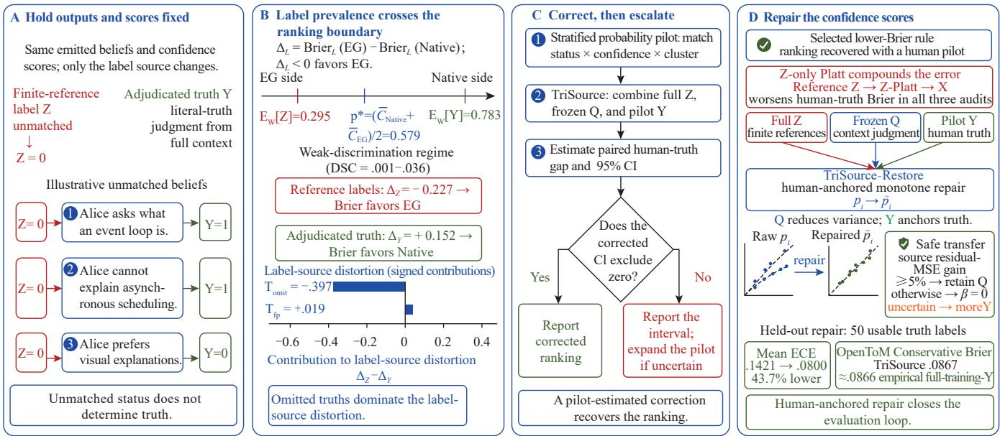

# Unmatched Does Not Mean False: Incomplete Reference Sets Can Reverse Calibration Rankings in Open-Ended Theory-of-Mind Tracking

Zhexi Feng, Wuxi Chen, Bingrui Zhang

Department of Electrical and Computer Engineering University of California San Diego, La Jolla, CA, USA {zhf023, wuchen, biz005}@ucsd.edu

## Abstract

Open-ended Theory-of-Mind (ToM) trackers emit valid beliefs absent from finite references. A finite-reference-plusmatcher pipeline marks unmatched outputs false, creating proxy labels that can reverse proper-score model selection on fixed outputs. Holding 259 beliefs and paired scores fixed, reference recoding lowers weighted prevalence from .783 to .295 and reverses strictly proper Brier risk: a frozen source-prior rule leads native confidence by .227 under reference labels and trails by .152 under blinded adjudication, in all six authored scenarios. A reference-only Platt recalibrator reverses further. An ICE-specific reversal appears in a released 301-question NQ-open DPR–BERT pipeline: its average-confidence baseline improves instance-level calibration error by .045 under exact match but worsens it by .074 under human correctness, with both intervals excluding zero. On independently authored OpenToM narratives, 90–96% of audited unmatched beliefs are literally true and the paired direction again reverses. An exact decomposition attributes the distortion to omitted truths, and a closed-form criterion correctly classifies comparisons from twelve released systems. Frozen-audit retrospective replay shows 50 attempted annotations recover ranking direction with probability at least .996. TriSource-Restore anchors fullframe reference labels and frozen automatic judgments to a probability-sampled human pilot, maintains at least nominal coverage, narrows intervals, and repairs confidence subject to a base-rate deployment gate.

## 1 Introduction

Open-ended ToM trackers maintain fine-grained propositions as evidence arrives, so their output space is not fixed in advance. A developer who claims a decade of asynchronousprogramming experience yet cannot explain an event loop leaves an agent two observations to hold at once, neither reducible to the other. This is ToM (Premack and Woodruf 1978; Baron-Cohen, Leslie, and Frith 1985) under incremental and potentially strategic evidence, rather than a completed-narrative test (Le, Boureau, and Nickel 2019; Kim et al. 2023; Sap et al. 2022; Ullman 2023).

Evaluation inherits that open output space. A finite task reference can omit valid micro-beliefs, so unmatched does not mean false. Recoding unmatched output as false penalizes justified confidence. Scoring only matched propositions instead conditions on a selected set that is mostly correct by construction. The two protocols can therefore rank the same confidence rules oppositely, and they do so in the field: we find the reversal in a released NQ-open calibration pipeline, and published CuratedTREC judgments show the same finite-reference failure at the system-ranking level (Si et al. 2022; Kamalloo et al. 2023).

We identify the label-source efect by holding emitted contents, revision histories, and confidence rules fixed. DoubtfulToM-EG (EG) replaces native elicited confidence with a frozen source prior. On the same 259 adjudicated beliefs, the probe lowers Brier risk relative to native confidence by .227 under finite-reference labels but raises it by .152 under adjudicated literal-truth labels, reversing in every scenario. A reference-only Platt recalibrator reproduces the reversal, which rules out the frozen probe as the explanation.

Omission acts primarily through prevalence collapse: the weighted positive-label rate falls from .783 to .295, changing proper-score risk and calibration-in-the-large. An exact paired decomposition attributes most of the distortion to omitted true beliefs. Because Brier risk is strictly proper and unbinned, none of this depends on expected calibration error (ECE) binning.

Figure 1 summarizes the fixed-content mechanism and its audit-to-repair loop.

Our primary contributions are:

1. A content-fixed identification ofthe label-source efect. Adjudication replaces the label source rather than substituting another semantic matcher: blinded volunteersjudge each emitted proposition against the complete scenario. We demonstrate a strictly proper Brier reversal on 259 adjudicated beliefs in all six scenarios, and a frozen Open-ToM audit of 240 attempted items (209 usable) finds 90– 96% of reference-unmatched beliefs literally true with the paired direction again opposed. On an expanded released cross-system population the reversal persists both at an order more discrimination and across rules that difer in shape rather than only in location, and a closed-form criterion calls where the ordering moves—including where it will not—over a range we measure.

2. A diagnosed real-pipeline calibration reversal. On 301 frozen NQ-open predictions from a released DPR–BERT calibration pipeline, exact-match and human correctness labels significantly reverse two rankings by instance-level calibration error (ICE).

  
Figure 1: Mechanism, audit, and repair. (A) Fixed outputs receive finite-reference labels Z or blinded full-context truth labels Y. (B) In the observed weak-discrimination regime—DSC is the CORP discrimination component (Dimitriadis, Gneiting, and Jordan 2021)—prevalence crosses the ranking boundary at $p ^ { * }$ , with omitted truths dominating distortion. (C) A stratified pilot estimates the paired gap and escalates if its interval remains open. (D) Human-anchored full-frame Z and frozen Q repair confidence without reference-only recalibration’s compounding error. Algorithm 1 adds a deployment gate; values are population-weighted and belief strings illustrative.

3. A pilot-validated closed-loop restoration method. TriSource-Restore uses full-frame reference labels and frozen automatic judgments as auxiliaries while anchoring the target to a probability-sampled human pilot. Fifty attempted annotations safely recover the direction in all three audited units. At 50 usable truth labels the method reduces interval width by up to 37%, selects the heldout-better rule, recalibrates its confidence, and escalates when the interval remains open.

DoubtfulToM supplies the controlled paired case study that makes this evaluation failure and its mechanism measurable.

## 2 Related Work

ToM benchmarks typically assume a closed question set. ToM evaluation scores false beliefs in completed narratives or fixed question sets (Le, Boureau, and Nickel 2019; Kim et al. 2023; Wu et al. 2023; Xu et al. 2024; Shinoda et al. 2025; Li, Shi, and Deng 2026; Wei et al. 2026). Adaptive-ToM coordination, agent memory, and belief-revision work instead supply coordination, storage, and provenance machinery (Mu et al. 2026; Park et al. 2023; Shinn et al. 2023; Lewis et al. 2020; Packer et al. 2023; Alchourrón, Gärdenfors, and Makinson 1985; Doyle 1979). We instead study how a reference-derived label pipeline scores tracker-generated beliefs about unreliable agents.

Open-ended outputs and incomplete judgments. Claimdecomposition and long-form calibration verify generated content against purpose-built evidence (Min et al. 2023; Wei et al. 2024; Huang et al. 2024), and IR test collections have long studied pooling bias, with bpref and condensed lists refusing to call unjudged items nonrelevant (Zobel 1998; Buckley and Voorhees 2004; Carterette et al. 2009; Sakai and Kando 2008). Recent GEC work likewise expands finite references automatically (Zhan et al. 2026). These lines either fix task items or construct evidence after claims are emitted. None studies persistent tracker propositions scored false solely because they are absent from a finite reference (Supplement B.2). A tracker expands the proposition universe as it reads, so absence from the reference is at once a coverage observation, a missing-judgment event, and an invalid truth label if recoded as false.

Open-domain QA supplies the same combination on released systems. Si et al. calibrate free-text NQ-open predictions from the DPR retriever–reader with finite-gold exactmatch labels (Kwiatkowski et al. 2019; Karpukhin et al. 2020; Si et al. 2022), and Kamalloo et al. independently show human judgments restoring plausible answers missed by lexical matching (Kamalloo et al. 2023). Our joined audit keeps their predictions and confidences fixed and replaces only the correctness source. We take the IR warning as a protocol to be measured rather than only cited: setting unmatched output aside, an IR-style condensed-list treatment, is one of the four protocols in Table 3, and it selects the same rule adjudication does. Our increment is where the noise bites and what to do about it—that it is severe enough to invert a calibration ranking on open-ended output, that a content-fixed design identifies the efect rather than confounding it with coverage, that the inversion is predictable in closed form within a stated range, and that a budget-bounded pilot repairs it.

Calibration, missing labels, and LLM judges. Calibration, noisy-label, positive–unlabeled, class-prior/label-shift, elicited-confidence, LLM-judge, and selective/conformal methods presuppose a defined example set and observed target (Naeini, Cooper, and Hauskrecht 2015; Guo et al. 2017; Vaicenavicius et al. 2019; Kumar, Liang, and Ma 2019; Natarajan et al. 2013; Elkan and Noto 2008; Saerens, Latinne, and Decaestecker 2002; Lipton, Wang, and Smola 2018; Xiong et al. 2024; Tian et al. 2023; Zheng et al. 2023; Wang et al. 2023; Liu et al. 2023; Saito et al. 2023; Murugadoss et al. 2025; Geifman and El-Yaniv 2017; Vovk, Gammerman, and Shafer 2005). Unlike distributional label shift and recent accuracy-controlled comparisons across changing LLM outputs (Yang et al. 2026), we relabel fixed items from proxy $\bar { Z }$ to human truth Y , linking prevalence change to paired proper-score reversal and escalation.

Prediction-powered inference combines abundant model predictions with a smaller human-labeled sample while preserving a human-defined estimand (Angelopoulos et al. 2023; Fisch et al. 2024; Chatzi et al. 2024). Eq. 3 sits squarely in that tradition. Our contribution is the operating procedure built around $\mathbf { i t } ,$ whose constraints Section 3 states in full: a paired proper-score gap as the target, transfer-safe auxiliary weights, a residual gate, and a pilot that drives both a monotone repair and an explicit escalation rule.

## 3 Problem and Method

Streaming belief store. An observer O watches events $x _ { 1 } , \ldots , x _ { T }$ involving target agents and maintains

$$
B _ { t } = \{ ( b _ { i } , c _ { i } , z _ { i } , e _ { i } ) \} ,
$$

where $b _ { i }$ is a proposition, $c _ { i } \in [ 0 , 1 ]$ its confidence, $z _ { i }$ its type, and $e _ { i }$ its provenance and revision history. The tracker never receives the scenario proposition set.

The mechanism in one sentence. A proper score splits into how far a rule’s mean sits from the positive-label rate and how sharply the rule discriminates. Changing the label source moves that rate, and once it moves far enough the first term decides which rule wins. Every result below quantifies one instance: how far apart the two rates are, what moves them, and when the resulting ranking should not be trusted.

What is the confidence about? For a fixed emitted proposition b, we operationalize c as a score for the event $Y _ { b } = \mathrm { \ i } \colon b$ is literally true in the scenario. Reference overlap $Z ,$ , task relevance, and downstream usefulness are diferent estimands. Brier is strictly proper for this named binary event. The extraction prompt elicited a “0–1 confidence” without formal Bayesian event language, so we interpret it as an elicited probabilistic score for this operational event and test explicit probability wording in Supplement A.8. Literal truth is the right target for asking whether a label source tracks truth, which is the question here. Because it is deliberately silent about whether a belief is useful, we pair it with coverage and false-commitment measures rather than reporting it alone.

Label-source decomposition. Let $Y \in \{ 0 , 1 \}$ denote the adjudicated literal-truth label and $Z \in \{ 0 , \dot { 1 } \}$ the referencederived evaluation label. $Z$ is a composite: it is produced by the finite reference and the automatic semantic matcher, so a $( Y { = } 1 , Z { = } 0 )$ cell can arise from a genuinely absent reference proposition, from a matcher false negative on a present one, or from a granularity mismatch. The identity below attributes distortion to this reference-derived label pipeline as a whole—the sense in which the title uses “incomplete reference sets”—not to reference absence alone. Let $\dot { C } _ { A } , C _ { B } \in [ 0 , 1 ]$ be two confidence rules applied to identical beliefs. For Brier risk $R _ { L } ( C ) = \mathbb { E } [ ( C - \dot { L } ) ^ { 2 } ]$

$$
\begin{array} { r l } & { [ R _ { Z } ( C _ { A } ) - R _ { Z } ( C _ { B } ) ] - [ R _ { Y } ( C _ { A } ) - R _ { Y } ( C _ { B } ) ] } \\ & { \qquad = 2 \mathbb { E } [ ( C _ { A } - C _ { B } ) ( Y - Z ) ] . } \end{array}\tag{1}
$$

Because $Y - Z = \mathbf { 1 } \{ Y = 1 , Z = 0 \} - \mathbf { 1 } \{ Y = 0 , Z = 1 \}$ , the distortion is

$$
\begin{array} { r l } & { T _ { \mathrm { o m i t } } = 2 \mathbb { E } [ ( C _ { A } - C _ { B } ) \mathbf { 1 } \{ Y = 1 , Z = 0 \} ] , } \\ & { \quad T _ { \mathrm { f p } } = - 2 \mathbb { E } [ ( C _ { A } - C _ { B } ) \mathbf { 1 } \{ Y = 0 , Z = 1 \} ] . } \end{array}\tag{2}
$$

Writing $M \in \{ 0 , 1 \}$ for the matcher’s verdict on a belief, $Z = Y M$ and $T _ { \mathrm { f p } } = 0$ hold only when positive matches carry no false positives. A ranking reverses when $T _ { \mathrm { o m i t } } + T _ { \mathrm { f p } }$ has the opposite sign and larger magnitude than the truth-risk gap. This is a structural statement for Brier risk. ECE is nondecomposable, so its reversal is empirical.

Identification by paired contents. For each audited belief, the proposition, target, source label, provenance, revision history, and sampling weight are held fixed. The native and EG rules change only $C .$ . Replacing reference-derived Z with adjudicated literal-truth label Y changes only the label source. Thus a ranking change cannot be attributed to retrieving diferent facts, emitting more beliefs, or sampling diferent model runs. The local estimand is deliberately finite—the beliefs emitted by thirty frozen stores—while the equalscenario summary asks whether the sign is shared across six authored conditions. Blind adjudication, agreement, exclusion imputations, and cluster resampling characterize the remaining uncertainty.

Panel $\mathbf { A }$ of Figure 1 makes this content-fixed comparison explicit. Panel B visualizes the resulting ranking boundary and label-source decomposition.

From diagnosis to three-source restoration. For a proper score S, let $d _ { i } ( L ) = S ( C _ { B , i } , L ) - S ( C _ { A , i } , L )$ be the paired loss diference on item i under label source $\dot { L } ,$ so negative values favor rule B. With sampling weights w and total weight $W = \textstyle \sum _ { i } w _ { i }$ , write $\begin{array} { r } { \Delta _ { L } \stackrel { * } { = } W ^ { - 1 } \sum _ { i } w _ { i } d _ { i } ( L ) } \end{array}$ for the weighted mean gap. In addition to full-frame reference labels $Z _ { i }$ , let $Q _ { i } \ : = \ : ( Q _ { i 1 } , \ldots , Q _ { i K } )$ be frozen, confidence-blind automatic truth probabilities, and let human literal truth $Y _ { i }$ be observed only for a probability sample S with first-order inclusion probability $\rho _ { i }$ . Define $X _ { i k } \ \stackrel { . } { = } \ d _ { i } ( Q _ { i k } ) - \ d _ { i } ( Z _ { i } )$ and $\begin{array} { r } { \bar { X } = \dot { bar { W } } ^ { - 1 } \sum _ { i } \dot { w _ { i } } \bar { X } _ { i } } \end{array}$ . TriSource-Restore estimates the human-truth gap by

$$
\widehat { \Delta } _ { \beta } = \Delta _ { Z } + \bar { X } ^ { \top } \beta + \frac { 1 } { W } \sum _ { i \in \cal { S } } \frac { w _ { i } } { \rho _ { i } } \left[ d _ { i } ( Y _ { i } ) - d _ { i } ( Z _ { i } ) - X _ { i } ^ { \top } \beta \right] .\tag{3}
$$

For any $\beta$ frozen independently of the target pilot, $\operatorname { \mathbb { E } } _ { S } [ \widehat { \Delta } _ { \beta } ] =$ $\Delta _ { Y }$ exactly: automatic judgments change eficiency, not the target. We constrain $\beta _ { k } \geq 0$ and $\textstyle \sum _ { k } \bar { \beta } _ { k } \leq 1$ , learn it on the other audited dataset, and revert to $\lvert \beta = 0$ unless sourcedomain residual MSE improves by at least 5%.

After the interval for $\operatorname { E q }$ . 3 selects a rule, a monotone map $p _ { \theta } ( c ) = \sigma ( \alpha + \gamma \log \mathrm { i t } ( c ) ) , \gamma \geq 0 ,$ , minimizes full-frame auxiliary log loss plus the inverse-probability-weighted pilot correction from auxiliary labels to $Y$ . The correction is linear in the Platt logit, so the objective remains convex and emits a repaired probability for every item. Supplement A.11 gives the proof, objective, sampling algorithm, fallback, and implementation.

Controlled case study. The tracker emits propositions with native confidence, provenance, and revision history, all predating the adjudicated labels. The architecture and the prompts that produce them are in Supplement A.2.

Content-fixed intervention. EG replaces native confidence by a frozen source prior before applying the same revision multipliers:

$$
c _ { i } = r _ { e _ { i } } , \qquad ( r _ { \mathrm { c l a i m } } , r _ { \mathrm { i n f e r e n c e } } , r _ { \mathrm { d i r e c t } } ) = ( . 2 0 , . 3 5 , . 5 5 ) ,\tag{4}
$$

These constants were hand-specified and frozen before adjudication. EG shares belief strings, merges, graph edges, and revision factors with the native rule, so only confidence changes. Supplement A.5 dates the constants, records the adjudicated source rates they undershoot, and reports a frozen Hybrid sweep.

## 4 Benchmark and Evaluation

Case-study population. DoubtfulToM-Bench comprises six hand-authored interactions—software, emergency response, venture pitching, medicine, negotiation, academia— whose 10–30 events arrive sequentially against exactly 371 task-defined true and false propositions. Gold is task-relative: it encodes every scenario fact but cannot enumerate every reasonable micro-inference or attributed observation, which is the condition under study. Project-authored scripts and gold make these stress conditions, not a random sample. OpenToM is the independently authored of-benchmark test. Conservative denotes the DoubtfulToM output distribution. The controlled case study uses a Qwen2.5-7B tracker and a confidence-blind GPT-4o-mini semantic matcher, and EG is an ofline paired transform that leaves coverage invariant. Judge diagnostics appear in Supplement B.1. Scenario specifications and metric definitions are in Supplement A.1, prompts in A.2, estimator ablations in A.11, and hardware and costs in D.2.

Scoring protocol. Evaluation keeps coverage, truth calibration, discrimination, and commitment as separate metrics, uses confidence-blind matching, and pairs at the intervention’s unit. Reference-relative ECE diagnoses protocols, not truth calibration.

For weighted ten-bin $\mathrm { E C E } _ { w }$ (defined in Supplement A.1), the triangle inequality gives

$$
\begin{array} { r } { \mathrm { E C E } _ { w } \geq | \mathbb { E } _ { w } [ C ] - \mathbb { E } _ { w } [ Y ] | , } \end{array}\tag{5}
$$

the calibration-in-the-large (CIL) lower bound. A finite reference that omits true beliefs lowers $\mathbb { E } _ { w } [ Y ]$ and can therefore change ECE through its first moment. This prevalence shift is the direct transmission path of reference omission. Brier is our primary paired statistic because it is strictly proper and unbinned. ECE and the area under the receiver operating characteristic curve (AUROC) describe aggregate calibration and discrimination.

Coverage and commitment. Recall counts a matched final belief of the same polarity and has no confidence gate, so the EG transform leaves it invariant. False commitment is scored separately, because remembering a false claim is not endorsing it. Both thresholds are in Supplement A.1.

Human audits. For the local and OpenToM audit waves, three external volunteers worked independently, blind to method, confidence, source, matching, and hypotheses where applicable. Mechanical majority voting used no author adjudication. Crucially, adjudication is not another semantic matcher: annotators receive the complete context, a target, and one literal belief, then choose true, false, or insuficient, and are never asked whether the belief resembles a task reference. Volunteers gave informed consent for this uncompensated task on fictional or model-generated material, could decline or withdraw at any time, and held no advisor–advisee or reporting relationship with the authors. We collected no identifying or demographic data and did not study the participants themselves. Based on these characteristics, we assessed the activity as not constituting human-subjects research. We did not seek formal institutional review or an exemption or nonhuman-subjects-research determination. This classification reflects the authors’ assessment rather than an institutional determination.

Local literal-truth calibration samples beliefs from thirty frozen DoubtfulToM stores; 259 of 280 annotated items yield canonical usable labels. The external test froze a disjoint 240- item OpenToM sample, together with the paired half-scale intervention $c ^ { \prime } = 0 . 5 c$ , before annotation; 209 are usable. Every frame, its usable n, its agreement, the instructions, inclusion probabilities, and exclusion handling are in Supplement A.3 and A.5.

Statistical analysis. Intervals cluster by scenario, store, or narrative according to the estimand. The audit estimand supports every label-source claim. A separate complete-store summary describes the reference-relative protocol, and we report both without pooling. Analyses frozen before adjudicated labels were seen carry the confirmatory weight, and the remainder are reported as post-hoc. Supplement A.5 specifies the two estimands and cluster resampling. A.7 maps each claim to its evidence and scope boundary.

Pilot validation and closed-loop evaluation. We keep two budgets distinct. An operational replay draws 50 attempted annotations, with insuficient judgments consuming budget. The TriSource-Restore comparison instead fixes $\bar { 5 0 }$ usable truth labels and evaluates RMSE, interval width, coverage, and stopping. Its downstream repair holds out test clusters from selection, fitting, and transfer weights. Full designs and pre-specified gates are in Supplement A.11.

<table><tr><td>Rule minus native</td><td>Exact-match ∆ICE</td><td colspan="2">Human ∆ICE</td></tr><tr><td>Temperature</td><td></td><td>-.090 [−.121, −.058] +.005</td><td> $[ - . 0 2 8 , + . 0 3 7 ]$ </td></tr><tr><td>Scale</td><td>-.063 [−.100, −.026] +.047</td><td></td><td> $\left\lceil + . 0 0 9 , + . 0 8 3 \right\rceil$ </td></tr><tr><td>Average</td><td></td><td>−.045 [−.087, −.004] +.074</td><td> $\bar { [ + . 0 3 4 , + . 1 1 4 ] }$ </td></tr></table>

Table 1: A real NQ-open calibration pipeline changes conclusion with the label source (n = 301; 95% paired bootstrap intervals).

## 5 Results

## 5.1 A Released NQ-open Pipeline Reverses Its Ranking

Si et al. release exact-match-scored top-100 spans and logits from an NQ-open DPR–BERT retriever–reader (Si et al. 2022). Kamalloo et al. release human correctness for a random 301-question subset (Kamalloo et al. 2023). Their labels cover 178 frozen predictions. We blind-annotated the remaining 123: 108 were labelled by two annotators (106 agreements), and a third resolved 17 unresolved items. We hid gold answers, passages, exact-match labels, confidence, and method identity. Each prediction therefore has an exactmatch label Z and human-correctness label Y.

From the released logits we cross-fit temperature scaling, a multiplicative scale, and Si et al.’s average-confidence baseline using Z only; Y never enters fitting or selection. Table 1 reports their rule-minus-native ICE gaps, $n ^ { - 1 } \textstyle \sum _ { i } | L _ { i } - c _ { i } |$ with paired question-bootstrap intervals. Folds and reconstruction are in Supplement A.10.

Exact match marks 115/301 predictions correct versus 160/301 under human judgment: 51/186 exact negatives (27.4%) are human-correct and 6/115 positives (5.2%) human-incorrect. Scale and average rankings reverse with both intervals excluding zero—average moves from −.045 to +.074—and Brier moves likewise (−.109 → +.0004 and −.116 → +.003). Our 123 labels are stricter, marking 15.0% of exact negatives correct versus 50.0% in the published subset, with 98.1% pre-adjudication agreement (κ = .933). Thus published rather than permissive new judgments carry the released-pipeline reversal. The pre-specified estimand is the pooled 301-question population; we claim an ICE, not Brier, reversal, and provenance strata are diagnostic only (Supplement A.10).

Independent second benchmark. The failure recurs at the system level on a diferent corpus, era, and reference format: in Kamalloo et al.’s published CuratedTREC audit (444 questions, finite regex patterns) human judgments raise accuracy by 9.9 pp on average and reverse the LCCmain2002-versus-InstructGPT ordering.

The efect scales past this pipeline, and the criterion calls it. The release covers eleven more systems and 1,490 human-labelled answers. Holding their outputs and scores fixed, cross-system agreement has AUROC .663 and CORP discrimination component (DSC) .0302 (Dimitriadis, Gneiting, and Jordan 2021), about 3.2× the local value. The crossover criterion correctly classifies all 13 reversals and 8 non-reversals among 21 pairs. Twelve reversals have both question-cluster intervals excluding zero. A reference-only cross-fitted, hence deployable, probe reaches DSC .107 against adjudicated labels (43% of available uncertainty). Of 21 pairs, 12 still reverse with both rules above DSC .10, 11 with both intervals excluding zero. An eight-rule shape-fixed construction from disjoint features, with crossing reliability curves and DSC(Y) .004–.107, yields 10/18 shape-diferent reversals, nine doubly significant. The strongest moves +.193 to −.096. Supplement A.12–A.14 report per-pair intervals, the attainable frontier, and the closed-form criterion’s measured range.

<table><tr><td>Rule  $E _ { w } [ Y ] / E _ { w } [ C ]$  Brier↓ ECE CIL/rem.</td></tr><tr><td>Finite reference: ∆EG−N = −.227 [−.264, −.188]</td></tr><tr><td>Native .295/.767 .446.493 .472/.021</td></tr><tr><td>EG .295/.392 .220.127 .097/.030</td></tr><tr><td>Adjudicated truth:  $\Delta _ { \mathrm { E G - N } } = + . 1 5 2$  [+.115, +.193]</td></tr><tr><td>Native .783/.767 .178.058 .017/.041</td></tr><tr><td>EG .783/.392 .330.392 .392/.000</td></tr></table>

Table 2: Finite references reverse proper-score risk on the same 259 beliefs. $E _ { w } [ Y ] / E _ { w } [ C ]$ gives prevalence/mean confidence; CIL/rem. splits ECE into $| E _ { w } [ C ] - E _ { w } [ Y ]$ |/withinbin residual, and $\Delta _ { \mathrm { E G - N } }$ is the paired Brier gap with a 30-store interval.

## 5.2 Adjudicated Literal Truth Reverses Proper-Score Risk

On the same 259 audited beliefs, the frozen source-prior probe lowers Brier risk relative to native elicited confidence by .227 under finite-reference labels but raises it by .152 under adjudicated literal-truth labels (Table 2). The reversal therefore survives a strictly proper score and is not caused by ECE binning. Reference construction lowers the positivelabel rate from .783 to .295. The probe’s adjudicated-label ECE .392 is entirely its CIL gap, whereas native confidence has a .041 within-bin remainder within ECE .058. Native AUROC is .596 (probe: .538), and label-fitted constants sit at Brier .170 with AUROC .500 under adjudicated labels and .208 under reference labels. Both rules thus operate in a low-discrimination regime—the regime the crossover criterion below describes. Together these controls identify label-source shift and prevalence collapse, rather than strong discrimination, as the operative regime.

Every authored condition reverses: reference ∆Brier is negative and adjudicated ∆Brier positive in 6/6, with equal-scenario means $- . 2 2 0 / \mathrm { ~ + ~ } . 1 5 4$ and ranges $[ - . 2 6 4 , \bar { - } . 1 3 3 ] / [ + . 0 9 2 , + . 2 1 4 ]$ . Because the mechanism predicts uniformity, this is a consistency record rather than an inferential test across the six stress scenarios, which vary in contradiction density, length, and deception pressure but are not a random deployment sample. The adjudicated-label ECE gap is [.230, .328] by scenario bootstrap and +.267– +.304 leave-one-scenario-out (Supplement A.5).

Do not post-hoc calibrate on unmatched-as-false labels. A reference-only leave-one-scenario-out Platt recalibrator pulls mean confidence from .767 to .294, near reference prevalence .295. Brier improves .446 → .205 under reference labels but worsens .178 → .408 under adjudication, reversing all six scenarios by a larger margin than the frozen probe (+.230 versus +.152). Thus a standard rule that never sees adjudicated labels reproduces the efect and transfers the reference’s prevalence collapse into deployed scores.

<table><tr><td rowspan="2">Protocol</td><td rowspan="2">n</td><td colspan="2">Brier↓</td><td colspan="2">ECE↓</td><td rowspan="2"></td></tr><tr><td>Nat.</td><td>EG</td><td>Nat.</td><td>EG Selects</td></tr><tr><td>Unmatched-as-false</td><td>259 bel.</td><td></td><td></td><td>.446.220.493 .127 EG</td><td></td><td></td></tr><tr><td>Matched-only</td><td>1,017 bel.</td><td></td><td></td><td></td><td></td><td>.080.354.203.572 native</td></tr><tr><td>Closed-world</td><td>1,855 prop. .427.546.477.650 native</td><td></td><td></td><td></td><td></td><td></td></tr><tr><td>Adjudicated truth</td><td>259 bel. .178 .330 .058 .392 native</td><td></td><td></td><td></td><td></td><td></td></tr></table>

Table 3: Fixed rules, diferent protocols. Rows one and four share the 259-belief frame; middle rows use distinct scoring frames as protocol controls. Matched-only is IR-style condensed-list scoring (Sakai and Kando 2008).

<table><tr><td>Unit</td><td> $T _ { \mathrm { o m i t } }$   $T _ { \mathrm { f p } }$ </td><td>Total  $q ^ { * } \left[ \mathrm { C I } \right]$ </td></tr><tr><td rowspan="5">Local OpenToM Vanilla OpenToM</td><td></td><td>-.397[−.439, -.355] -.379 [−.427, -.330]</td></tr><tr><td>+.019 [+.004, +.034]</td><td>.570 [.494, .652]</td></tr><tr><td></td><td>-.652[−.686, −.612] −.652[−.686, -.612]</td></tr><tr><td>+.000 [+.000, +.000]</td><td>.585[.551, .629]</td></tr><tr><td>Conservative +.000 [+.000, +.000]</td><td>-.657[-.736, -.575] -.657[-.736, -.575] .654 [.605, .723]</td></tr></table>

Table 4: Omitted truths dominate label-source distortion. Pairs give $T _ { \mathrm { o m i t } } / T _ { \mathrm { f p } }$ and Total/q∗ [CI]; $q ^ { * }$ is the auditconditioned restoration fraction at a tie. Intervals resample stores or narratives.

Which protocol you adopt decides the answer. Table 3 holds the rules fixed: three protocols select native confidence, while only unmatched-as-false selects the probe under both Brier and ECE. Closed-world scoring, which never imputes falsehood from non-matching, agrees with adjudication on 1,855 propositions despite a diferent unit and population. Matched-only also selects native but conditions on a mostlycorrect selected set and cannot estimate absolute calibration. Treating unmatched output as wrong is therefore the isolating operation.

The reversal is predictable in closed form. Supplement A.9 gives the exact paired identity. When its prevalence term dominates—a condition computable from the rules before adjudication—means a and b exchange rank at (a + b)/2. Supplement A.14 measures the shortcut’s valid range. CORP places the audited rules at DSC .001–.036. Here $a = . 7 6 7$ $b = . 3 9 2$ , and the crossover is .579, while prevalence moves from .295 to .783. Thus π determines whether the boundary is crossed, not whether either rule is trustworthy: if a tracker’s mean were .30, the probe would instead win under adjudication by .070. Once a pilot pins down π, the ranking follows.

## 5.3 Omitted Truths Drive the Distortion

Table 4 isolates both label errors: omitted truths dominate all three audited units. False-positive matches oppose them weakly locally and are zero on OpenToM. The $q ^ { * }$ range .570– .654 makes the restoration threshold audit-conditioned, and fixed-seed Bernoulli restoration matches the analytic curves (Supplement A.6).

Reference-unmatched local beliefs are 73% true. Of unmatched-true weight, 70% has native confidence ≥ .8 and contributes 75% of the omission term. Among sixty blindly classified deduplicated unmatched beliefs, 60% were plausible out-of-reference micro-propositions, 10% second-order, 10% correctly attributed planted claims, and 20% wrong or vague (Supplement A.4). This sample does not decompose the full weighted $( Y { = } 1 , Z { = } 0 )$ cell, and matcher false negatives are not separately estimated. We therefore attribute the headline to the reference-derived label pipeline, not reference absence alone. Strata and reliability diagrams are in Supplement A.5–A.6.

A scalar correction reveals the repair target. The distortion is one-sided—unmatched output is recorded false whether or not it is true—so it is correctable without adjudicating every belief. Let $\pi \ = \ P ( Y { = } 1 \ | \ Z { = } 0 )$ be the truth rate among unmatched output, estimable from a small stratified pilot. Replacing each $\bar { Z } { = } 0$ label by its expectation π gives the de-biased risk

$$
\begin{array} { r l } & { R _ { \pi } ( C ) = \mathbb { E } \big [ ( C - 1 ) ^ { 2 } \mathbf { 1 } \{ Z = 1 \} \big ] } \\ & { \qquad + \ : \mathbb { E } \big [ \big ( \pi ( C - 1 ) ^ { 2 } + ( 1 - \pi ) C ^ { 2 } \big ) \mathbf { 1 } \{ Z = 0 \} \big ] . } \end{array}\tag{6}
$$

With the audited $\pi \ = \ . 7 3 2 ,$ , the paired gap moves from −.227 under raw reference labels to +.161 [+.125, +.198], recovering both the sign and approximately the magnitude of the adjudicated +.152. This one-dimensional calculation identifies the repair target. The design-robust version, which TriSource-Restore anchors, is a direct probability-sampled human-truth estimator.

## 5.4 OpenToM Omission Audit and Paired Direction Check

With roughly two references per independently authored narrative, OpenToM’s high unmatched rate is expected by construction. We froze 209 usable beliefs from two distributions produced by the same Gemini 2.5 Flash extractor. 90–96% of unmatched output was literally true, and both Brier gaps reversed under adjudication $( - . 3 8 1 / - . 4 3 0 $ +.271/+.227), with all narrative-bootstrap intervals excluding zero (Supplement A.5).

A reference-only OOF test fits scales .171/.131 without adjudicated labels, showing the reversal is not tied to the hand-chosen .5 scale: reference Brier improves while adjudicated Brier worsens. A separate dose–response stays directionally stable to about s = .85 locally and .95 on OpenToM (Supplement A.6).

## 5.5 Pilot Validation and Closed-Loop Restoration

Fifty attempted annotations in frozen-audit retrospective replay yield 46.1/44.0/43.6 usable labels across the local,

A. Ranking inference (50 usable truth labels; 5,000 repetitions)
<table><tr><td>Unit</td><td>RMSE H/T</td><td> $9 5 \% \mathrm { w i d t h }$  H/T</td><td></td><td>Width Cov. reduction</td></tr><tr><td>Local</td><td></td><td>.0483/.0309.2146/.1356</td><td>.959</td><td>36.8%</td></tr><tr><td></td><td></td><td>OpenToM-V .0134/.0113.0888/.0833.996</td><td></td><td>6.1%</td></tr><tr><td></td><td>OpenToM-C .0212/.0188 .1510/.1009.961</td><td></td><td></td><td>33.2%</td></tr></table>

B. Population-weighted held-out Brier risk (lower is better)
<table><tr><td>Unit</td><td>Ref. raw/ Ref. Z-Platt</td><td>Restored raw/ Pilot-only</td><td>TriSource/ Full-training-Y</td></tr><tr><td>Local</td><td></td><td>.3300/.4105.1778/.1776</td><td>.1722/.1700</td></tr><tr><td></td><td>OpenToM-V.3549/.7014 .0840/.0344</td><td></td><td>.0347/.0343</td></tr><tr><td></td><td>OpenToM-C .3321/.7151 .1047/.0902</td><td></td><td>.0867/.0866</td></tr></table>

Table 5: TriSource-Restore restores rankings and confidence. Panel A reports human-only/TriSource (H/T) RMSE and 95% CI width, TriSource coverage, and width reduction at 50 usable truth labels. Panel B reports held-out Brier risk. V/C denote OpenToM Vanilla/Conservative; full-training-Y is an empirical comparator, not an optimization bound.

OpenToM Vanilla, and Conservative units and recover the correct direction with probability .996/1.000/1.000, and produce no false terminations (Supplement A.11).

At the separate budget of 50 usable truth labels, TriSource-Restore lowers human-only RMSE in all three units, shortens intervals by up to 37%, and attains coverage .959/.996/.961 (Table 5). Reference-label Platt scaling worsens human-truth Brier in every unit. Held-out repair beats pilot-only locally and conservatively and meets the pre-specified vanilla noninferiority tolerance. Conservative nearly matches the empirical full-training-Y oracle, and mean ECE falls 43.7%. Adaptive target-side transfer undercovers, motivating fixed transfer. Full curves, ablations, fold coeficients, and gates are in Supplement A.11.

## 5.6 Why Label-Source Auditing Is Necessary

Reference-relative checks across bins, scores, models, revision strata, and judges all condition on the same finite reference; they test estimator or judge sensitivity, not whether its labels track truth. On identical stores the four-judge comparison moves by +13.3, +6.7, +2.5, and −6.7 points without auditing those labels (Supplement B.1). Calibration and coverage therefore remain separate, and we make no system-coverage claim. The reversal survives annotatorpanel, exclusion-imputation, and explicit-probability sensitivities; frozen model judges preserve its aggregate direction but fail pre-specified substitution gates, so manual adjudication remains the escalation step (Supplement A.8).

## 6 Discussion and Audit Implications

Together, these results identify a label-source-dependent ranking failure and turn its mechanism into an auditconditioned restoration. Across NQ-open, the authored stress scenarios, and OpenToM, the scored objects remain fixed while only the source of correctness labels changes. Agreement across these settings supports a protocol-level failure, not universal coverage by any one tracker or matcher.

What the claim is about. The object is the reliability of a ranking under a label source, and the estimand is literal correctness of emitted beliefs. Identification runs over paired confidence rules on fixed contents, which is what lets the comparison attribute a ranking change to the label source alone. Supplement A.7 maps every claim to its evidence and boundary.

A select–repair–escalate protocol. The protocol uses inexpensive automatic signals for eficiency but anchors every decision to a probability-sampled human pilot.

Algorithm 1: TriSource-Restore audit of a scored open-ended population.

Input: fixed items and confidence rules, reference labels Z, frozen automatic judgments Q, clusters, a pilot budget. 0. Freeze. Name the predicted event; freeze contents, scores, Z, Q, clusters, folds, and sampling design before viewing pilot Y. 1. Pilot. Probabilitysample human truth labels, prioritizing unmatched high-confidence items; record inclusion probabilities $\rho _ { i } .$ 2. Estimate. Compute Eq. 3 with fixed transfer-safe $\beta ;$ on failure of the source-domain residual gate, use $\beta = 0 .$ 3. Select. If the design-based pairedgap interval excludes zero, select the favored rule. 4. Repair. Fit the monotone prediction-powered calibration map from full-frame auxiliary labels and the sampled human residual correction. 5. Escalate. If the interval crosses zero or fewer than eight clusters are sampled, collect more human labels; do not terminate. 6. Gate deployment. Compare the selected rule against a label-consistent base-rate constant; if it does not beat that constant, report the ordering as identified but the rules as below deployment threshold. Note. Coverage claims need a separate precision and false-negative audit; truth labels do not estimate recall.

Our completed audits validate the protocol retrospectively, at the budgets reported in Section 5.5. Reference-only recalibration compounds the label-source error, whereas a humananchored three-source correction recovers the ranking. This is an ofline evaluation-time repair: Q is a control variate, not a human substitute. Supplement D.1 records the conclusions this protocol overturned during replication, and Supplement D.2 the compute and cost.

## 7 Conclusion

Unmatched beliefs need not be false. On identical emitted contents, labels derived from a finite reference and a semantic matcher reverse the strictly proper Brier ranking, and a released NQ-open pipeline shows the same failure. Because the mechanism—prevalence collapse under unmatched-asfalse recoding—is identified rather than merely observed, it is correctable: a 50-attempt human pilot recovers the ordering on all three audited units, and TriSource-Restore uses that anchor to repair confidence while approaching empirical full-training-Y performance. Finite references can therefore be audited and escalated rather than silently treated as truth.

AI assistance. Generative AI aided editing and code drafting, and authors verified all analyses, results, and citations.

## References

Alchourrón, C. E.; Gärdenfors, P.; and Makinson, D. 1985. On the Logic of Theory Change: Partial Meet Contraction and Revision Functions. Journal of Symbolic Logic, 50(2): 510–530.

Angelopoulos, A. N.; Bates, S.; Fannjiang, C.; Jordan, M. I.; and Zrnic, T. 2023. Prediction-Powered Inference. Science, 382(6671): 669–674.

Baron-Cohen, S.; Leslie, A. M.; and Frith, U. 1985. Does the autistic child have a “theory of mind”? Cognition, 21(1): 37–46.

Buckley, C.; and Voorhees, E. M. 2004. Retrieval Evaluation with Incomplete Information. In Proceedings of the 27th Annual International ACM SIGIR Conference on Research and Development in Information Retrieval, 25–32.

Carterette, B.; Pavlu, V.; Fang, H.; and Kanoulas, E. 2009. Million Query Track 2009 Overview. In Proceedings ofthe Eighteenth Text REtrieval Conference, volume 500-278 of NIST Special Publication. National Institute of Standards and Technology.

Chatzi, I.; Straitouri, E.; Thejaswi, S.; and Gomez Rodriguez, M. 2024. Prediction-Powered Ranking of Large Language Models. In Advances in Neural Information Processing Systems, volume 37.

Dimitriadis, T.; Gneiting, T.; and Jordan, A. I. 2021. Evaluating probabilistic classifiers: Reliability diagrams and score decompositions revisited. Proceedings of the National Academy ofSciences, 118(8): e2016191118.

Doyle, J. 1979. A Truth Maintenance System. Artificial Intelligence, 12(3): 231–272.

Elkan, C.; and Noto, K. 2008. Learning Classifiers from Only Positive and Unlabeled Data. In Proceedings of the 14th ACM SIGKDD International Conference on Knowledge Discovery and Data Mining, 213–220.

Fisch, A.; Maynez, J.; Hofer, R. A.; Dhingra, B.; Globerson, A.; and Cohen, W. W. 2024. Stratified Prediction-Powered Inference for Efective Hybrid Evaluation of Language Models. In Advances in Neural Information Processing Systems, volume 37.

Geifman, Y.; and El-Yaniv, R. 2017. Selective Classification for Deep Neural Networks. In Advances in Neural Information Processing Systems, volume 30.

Guo, C.; Pleiss, G.; Sun, Y.; and Weinberger, K. Q. 2017. On Calibration of Modern Neural Networks. In Proceedings of ICML.

Huang, Y.; Liu, Y.; Thirukovalluru, R.; Cohan, A.; and Dhingra, B. 2024. Calibrating Long-form Generations From Large Language Models. In Findings of the Association for Computational Linguistics: EMNLP 2024, 13441–13460.

Kamalloo, E.; Dziri, N.; Clarke, C.; and Rafiei, D. 2023. Evaluating Open-Domain Question Answering in the Era of Large Language Models. In Proceedings ofthe 61st Annual Meeting of the Association for Computational Linguistics (Volume 1: Long Papers), 5591–5606.

Karpukhin, V.; Oguz, B.; Min, S.; Lewis, P.; Wu, L.; Edunov, S.; Chen, D.; and Yih, W.-t. 2020. Dense Passage Retrieval for Open-Domain Question Answering. In Proceedings of the 2020 Conference on Empirical Methods in Natural Language Processing, 6769–6781.

Kim, H.; Sclar, M.; Zhou, X.; Le Bras, R.; Kim, G.; Choi, Y.; and Sap, M. 2023. FANToM: A Benchmark for Stress-testing Machine Theory of Mind in Interactions. In Proceedings of EMNLP.

Kumar, A.; Liang, P. S.; and Ma, T. 2019. Verified Uncertainty Calibration. In Advances in Neural Information Processing Systems, volume 32.

Kwiatkowski, T.; Palomaki, J.; Redfield, O.; Collins, M.; Parikh, A.; Alberti, C.; Epstein, D.; Polosukhin, I.; Devlin, J.; Lee, K.; Toutanova, K.; Jones, L.; Kelcey, M.; Chang, M.-W.; Dai, A. M.; Uszkoreit, J.; Le, Q.; and Petrov, S. 2019. Natural Questions: A Benchmark for Question Answering Research. Transactions ofthe Associationfor Computational Linguistics, 7: 452–466.

Le, M.; Boureau, Y.-L.; and Nickel, M. 2019. Revisiting the Evaluation of Theory of Mind through Question Answering. In Proceedings ofEMNLP-IJCNLP.

Lewis, P.; Perez, E.; Piktus, A.; Petroni, F.; Karpukhin, V.; Goyal, N.; Küttler, H.; Lewis, M.; Yih, W.-t.; Rocktäschel, T.; Riedel, S.; and Kiela, D. 2020. Retrieval-Augmented Generation for Knowledge-Intensive NLP Tasks. In Advances in Neural Information Processing Systems.

Li, M.; Shi, X.; and Deng, Y. 2026. RecToM: A Benchmark for Evaluating Machine Theory of Mind in LLM-based Conversational Recommender Systems. Proceedings ofthe AAAI Conference on Artificial Intelligence, 40(37): 31636–31644.

Lipton, Z.; Wang, Y.-X.; and Smola, A. 2018. Detecting and Correcting for Label Shift with Black Box Predictors. In Proceedings ofICML, 3122–3130.

Liu, Y.; Iter, D.; Xu, Y.; Wang, S.; Xu, R.; and Zhu, C. 2023. G-Eval: NLG Evaluation using GPT-4 with Better Human Alignment. In Proceedings of EMNLP.

Min, S.; Krishna, K.; Lyu, X.; Lewis, M.; Yih, W.-t.; Koh, P.; Iyyer, M.; Zettlemoyer, L.; and Hajishirzi, H. 2023. FActScore: Fine-grained Atomic Evaluation of Factual Precision in Long Form Text Generation. In Proceedings of EMNLP, 12076–12100.

Mu, C.; Zeng, Y.; Zhang, Q.; Shao, K.; Chu, C.; Guo, H.; Jia, D.; Wang, Z.; and Hu, S. 2026. Adaptive Theory of Mind for LLM-based Multi-Agent Coordination. Proceedings of the AAAI Conference on Artificial Intelligence, 40(35): 29608– 29616.

Murugadoss, B.; Poelitz, C.; Drosos, I.; Le, V.; McKenna, N.; Negreanu, C. S.; Parnin, C.; and Sarkar, A. 2025. Evaluating the Evaluator: Measuring LLMs’ Adherence to Task Evaluation Instructions. In Proceedings ofAAAI, volume 39, 19589–19597.

Naeini, M. P.; Cooper, G. F.; and Hauskrecht, M. 2015. Obtaining Well Calibrated Probabilities Using Bayesian Binning. In Proceedings ofAAAI.

Natarajan, N.; Dhillon, I. S.; Ravikumar, P. K.; and Tewari, A. 2013. Learning with Noisy Labels. In Advances in Neural Information Processing Systems, volume 26, 1196–1204.

Packer, C.; Wooders, S.; Lin, K.; Fang, V.; Patil, S. G.; Stoica, I.; and Gonzalez, J. E. 2023. MemGPT: Towards LLMs as Operating Systems. arXiv:2310.08560.

Park, J. S.; O’Brien, J. C.; Cai, C. J.; Morris, M. R.; Liang, P.; and Bernstein, M. S. 2023. Generative Agents: Interactive Simulacra of Human Behavior. In Proceedings ofUIST.

Premack, D.; and Woodruf, G. 1978. Does the chimpanzee have a theory of mind? Behavioral and Brain Sciences, 1(4): 515–526.

Saerens, M.; Latinne, P.; and Decaestecker, C. 2002. Adjusting the Outputs of a Classifier to New a Priori Probabilities: A Simple Procedure. Neural Computation, 14(1): 21–41.

Saito, K.; Wachi, A.; Wataoka, K.; and Akimoto, Y. 2023. Verbosity Bias in Preference Labeling by Large Language Models. arXiv:2310.10076.

Sakai, T.; and Kando, N. 2008. On Information Retrieval Metrics Designed for Evaluation with Incomplete Relevance Assessments. Information Retrieval, 11(5): 447–470.

Sap, M.; Le Bras, R.; Fried, D.; and Choi, Y. 2022. Neural Theory-of-Mind? On the Limits of Social Intelligence in Large LMs. In Proceedings ofEMNLP.

Shinn, N.; Cassano, F.; Gopinath, A.; Narasimhan, K.; and Yao, S. 2023. Reflexion: Language Agents with Verbal Reinforcement Learning. In Advances in Neural Information Processing Systems.

Shinoda, K.; Hojo, N.; Nishida, K.; Mizuno, S.; Suzuki, K.; Masumura, R.; Sugiyama, H.; and Saito, K. 2025. ToMATO: Verbalizing the Mental States of Role-Playing LLMs for Benchmarking Theory of Mind. In Proceedings of AAAI, volume 39, 1520–1528.

Si, C.; Zhao, C.; Min, S.; and Boyd-Graber, J. 2022. Re-Examining Calibration: The Case of Question Answering. In Findings of the Association for Computational Linguistics: EMNLP 2022, 2814–2829.

Tian, K.; Mitchell, E.; Zhou, A.; Sharma, A.; Rafailov, R.; Yao, H.; Finn, C.; and Manning, C. D. 2023. Just Ask for Calibration: Strategies for Eliciting Calibrated Confidence Scores from Language Models Fine-Tuned with Human Feedback. Proceedings of EMNLP.

Ullman, T. 2023. Large Language Models Fail on Trivial Alterations to Theory-of-Mind Tasks. arXiv:2302.08399.

Vaicenavicius, J.; Widmann, D.; Andersson, C.; Lindsten, F.; Roll, J.; and Schön, T. B. 2019. Evaluating Model Calibration in Classification. In Proceedings of the 22nd International Conference on Artificial Intelligence and Statistics, volume 89 of Proceedings of Machine Learning Research, 3459–3467.

Vovk, V.; Gammerman, A.; and Shafer, G. 2005. Algorithmic Learning in a Random World. Springer.

Wang, P.; Li, L.; Chen, L.; Cai, Z.; Zhu, D.; Lin, B.; Cao, Y.; Liu, Q.; Liu, T.; and Sui, Z. 2023. Large Language Models are not Fair Evaluators. arXiv:2305.17926.

Wei, J.; Yang, C.; Song, X.; Lu, Y.; Hu, N.; Huang, J.; Tran, D.; Peng, D.; Liu, R.; Huang, D.; Du, C.; and Le, Q. V. 2024. Long-form Factuality in Large Language Models. In Advances in Neural Information Processing Systems, volume 37.

Wei, T.; Ni, Q.; Gao, R.; Wang, Y.; and He, L. 2026. MovieGraph-ToM: Evaluating Long-Range Theory of Mind in Large Language Models via Implicit Social-Causal Graphs. Proceedings of the AAAI Conference on Artificial Intelligence, 40(40): 33827–33835.

Wu, Y.; He, Y.; Jia, Y.; Mihalcea, R.; Chen, Y.; and Deng, N. 2023. Hi-ToM: A Benchmark for Evaluating Higher-Order Theory of Mind Reasoning in Large Language Models. In Findings of the Association for Computational Linguistics: EMNLP 2023, 10691–10706. Association for Computational Linguistics.

Xiong, M.; Hu, Z.; Lu, X.; Li, Y.; Fu, J.; He, J.; and Hooi, B. 2024. Can LLMs Express Their Uncertainty? An Empirical Evaluation of Confidence Elicitation in LLMs. Proceedings of ICLR.

Xu, H.; Zhao, R.; Zhu, L.; Du, J.; and He, Y. 2024. Open-ToM: A Comprehensive Benchmark for Evaluating Theoryof-Mind Reasoning Capabilities of Large Language Models. Proceedings ofACL.

Yang, Z.; Zhang, C.; Yang, R.; Li, C.; Collier, N.; and Yang, D. 2026. When Calibration Rankings Reverse: Accuracy-Controlled Evaluation for Fair Comparison of LLMs. arXiv:2606.30814.

Zhan, Y.; Zhang, Y.; Yuan, J.; Ma, Q.; Yang, Z.; Gu, Y.; Liu, Z.; and Wu, F. 2026. JELV: A Judge of Edit-Level Validity for Evaluation and Automated Reference Expansion in Grammatical Error Correction. Proceedings of the AAAI Conference on Artificial Intelligence, 40(41): 34611–34619.

Zheng, L.; Chiang, W.-L.; Sheng, Y.; Zhuang, S.; Wu, Z.; Zhuang, Y.; Lin, Z.; Li, Z.; Li, D.; Xing, E. P.; Zhang, H.; Gonzalez, J. E.; and Stoica, I. 2023. Judging LLM-as-a-Judge with MT-Bench and Chatbot Arena. Advances in Neural Information Processing Systems.

Zobel, J. 1998. How Reliable Are the Results of Large-Scale Information Retrieval Experiments? In Proceedings ofthe 21st Annual International ACM SIGIR Conference on Research and Development in Information Retrieval, 307– 314.