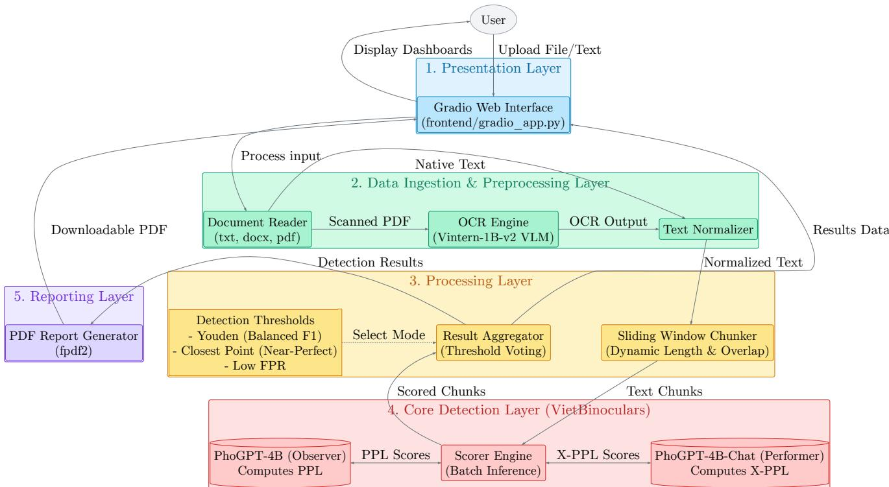
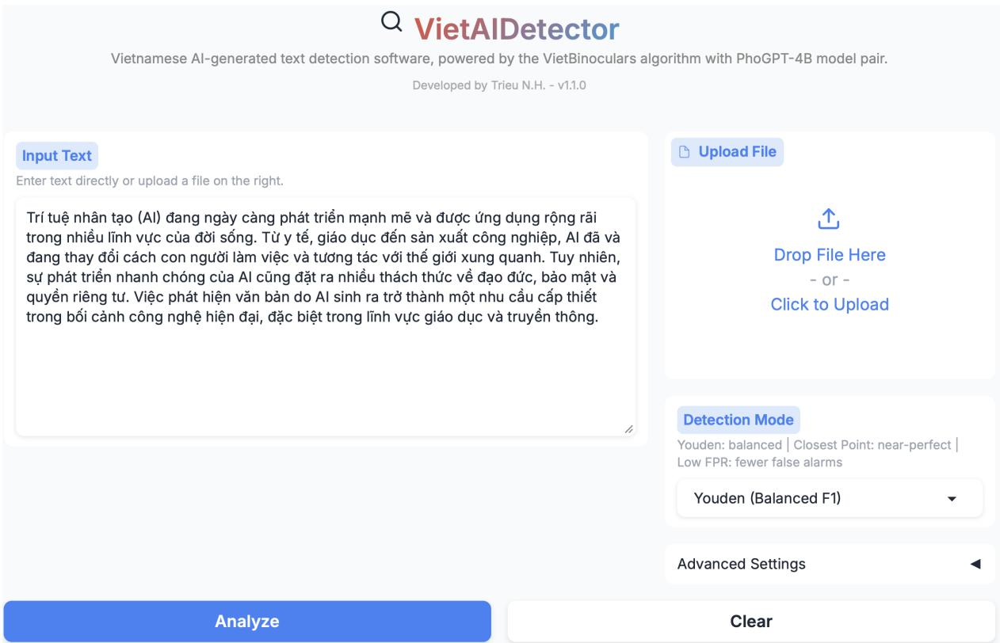
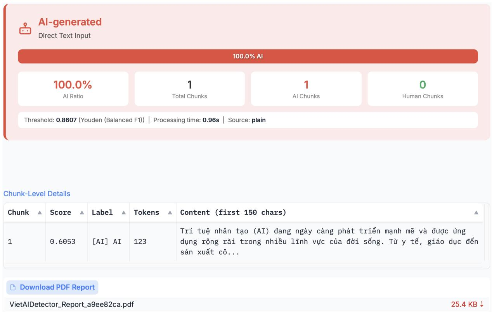
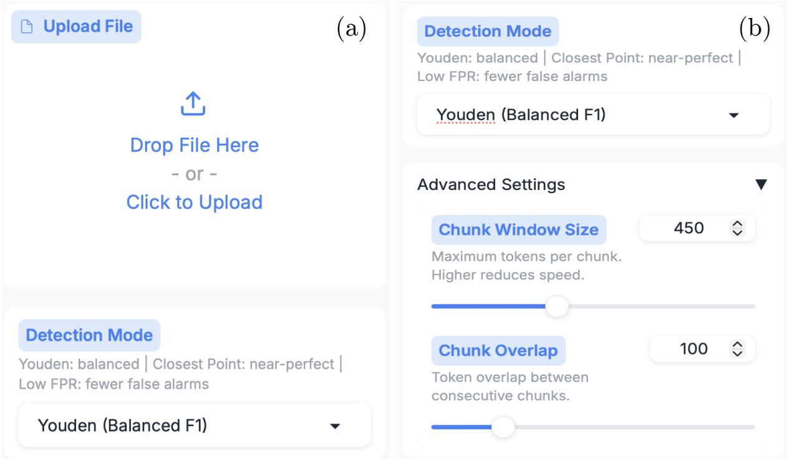
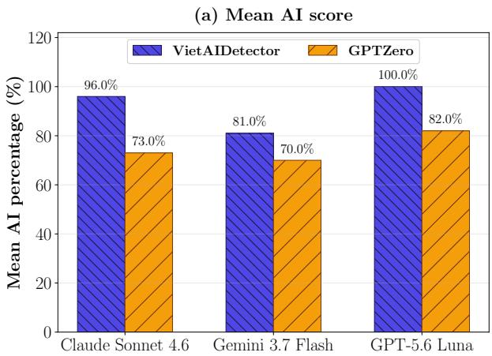
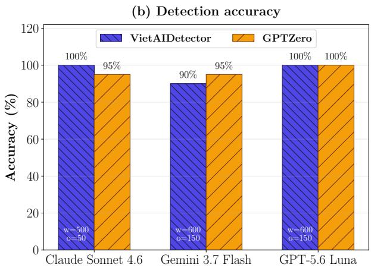
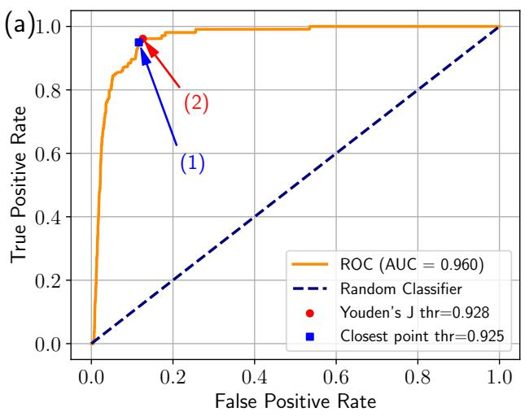
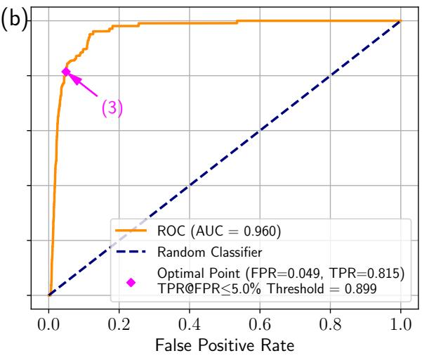

# VietAIDetector: An Open-Source Zero-Shot Detector for Vietnamese AI-Generated Text

Trieu Hai Nguyena,†, Van-Dung Hoangb,∗

a Nha Trang University, 02 Nguyen Dinh Chieu Street, North Nha Trang 57134, Vietnam

b Ho Chi Minh City University of Technology and Engineering, 01 Vo Van Ngan Street, Thu Duc, Ho Chi Minh City, Vietnam

e-mails: †trieunh@ntu.edu.vn; ∗dunghv@hcmute.edu.vn

## Abstract

In recent years, distinguishing between AI-generated text and human-written text has remained a challenge. In this paper, we introduce VietAIDetector, an open-source tool designed specifically for detecting Vietnamese AI-generated text. It allows users to interact through a Gradio web interface with inputs ranging from raw Vietnamese text to common text file formats, including scanned documents and exceptionally long texts that exceed the context size of the employed Large Language Models (LLMs). The core component of the tool employs a Zero-Shot approach to detect AI-generated text without requiring domain-specific training data, building upon the previous VietBinoculars [1] and Binoculars [2] research. The tool is built upon a Vietnamese-specific language model and has been evaluated on out-of-domain datasets, demonstrating superior performance compared to existing methods primarily developed for English. Additionally, users can select optimal detection thresholds based on F1 score, accuracy, or TPR@0.05FPR requirements. The results are presented through the web interface, allowing users to easily review and verify suspicious texts or download them as a PDF report. The tool is publicly available at https://github.com/trieuntu/VietAIDetector.

Keywords: Vietnamese AI-generated text detection, VietBinoculars, Zero-shot detection, Long-document analysis, Open-source software.

## 1 Motivation and significance

The use of LLMs has become increasingly prevalent in various aspects of modern life. However, this widespread adoption also presents challenges in distinguishing between AIgenerated and human-written text. This challenge is particularly important today, as verifying information and ensuring content authenticity have become increasingly urgent. For instance, in higher education, students may misuse AI tools to complete assignments and essays, potentially undermining their motivation to learn and their critical thinking skills. More concerningly, malicious actors may exploit AI tools on social media platforms to generate fake news or harmful content, thereby influencing public perception and behavior [3]. Therefore, developing a tool for detecting AI-generated text is essential to help ensure information authenticity and prevent the spread of unreliable content.

Considerable eforts have been devoted to detecting AI-generated text, leading to the development of numerous studies, methods, and both open-source and commercial tools, such as Binoculars [2], RadarTester [4], DetectGPT [5], Ghostbuster [6], GPTZero1, Turnitin2, and CNKI-AIGC3. However, most of these eforts have focused on widely spoken languages such as English, Spanish, Chinese, and Japanese. In contrast, research on detecting AI-generated text in other languages, particularly Vietnamese, remains limited [1]. This highlights the need to develop dedicated tools for detecting Vietnamese AI-generated text to address the growing demand from Vietnamese users and help ensure content authenticity.

Motivated by these challenges, we developed VietAIDetector, a tool specifically designed for detecting Vietnamese AI-generated text. The tool features a user-friendly interface and scientific reporting capabilities to assist users in distinguishing between AIgenerated and human-written text, thereby helping ensure information authenticity. The primary goal of the tool is to support higher education by ofering educators an easily deployable system to detect student AI misuse, thereby enhancing educational quality and promoting academic integrity.

Unlike traditional methods, VietAIDetector employs a Zero-Shot approach based on the Binoculars and VietBinoculars research, eliminating the need for fine-tuning or retraining language models. This approach enables VietAIDetector to detect AI-generated text without requiring domain-specific training data, thereby reducing development time and cost. This advantage is particularly important given the rapid development of new LLMs and the frequent updates to existing ones, which make fine-tuning or retraining increasingly impractical. Furthermore, VietAIDetector is built upon a pair of Vietnamesespecific language models, PhoGPT-4B and PhoGPT-4B-Chat [7], improving its performance in detecting Vietnamese AI-generated text compared to existing methods primarily designed for English [1]. Table 1 summarizes the feature comparison between VietAIDetector and existing tools and methods, showing that VietAIDetector provides the most comprehensive set of features.

The main contributions of this work are summarized as follows:

• Introduction of VietAIDetector, an open-source tool for detecting Vietnamese AIgenerated text.

• Adoption of a Zero-Shot approach based on the VietBinoculars algorithm, enabling efective detection without requiring domain-specific training data, thereby reducing development time and cost.

• Development of a user-friendly Gradio web interface that supports multiple input formats, including raw text, common text files, and scanned documents, while handling long texts that exceed the context size of the employed LLMs.

• Flexible threshold selection based on F1 score, accuracy, or TPR at 0.05 FPR, enabling users to optimize detection performance according to their specific require-

Table 1: Feature comparison between VietAIDetector and existing tools and methods.
<table><tr><td>Method/ Tool</td><td>Open Source</td><td>Zero- Shot</td><td>GUI</td><td>Optimized for Vietnamese</td><td>Handles Long Texts</td><td>Adversarial Robustness</td><td>Input Formats</td></tr><tr><td>VietAIDetector</td><td>√</td><td>√</td><td>√</td><td>√</td><td>√</td><td>√</td><td>√</td></tr><tr><td>Binoculars [2]</td><td>√</td><td>√</td><td>√</td><td>X</td><td>x</td><td>√</td><td>x</td></tr><tr><td>GLTR [3]</td><td>√</td><td>√</td><td>√</td><td>X</td><td>x</td><td>x</td><td>x</td></tr><tr><td>Rank/LogRank [3, 8]</td><td>√</td><td>√</td><td>x</td><td>X</td><td>X</td><td>x</td><td>X</td></tr><tr><td>RADAR [4]</td><td>√</td><td>x</td><td>√</td><td>X</td><td>X</td><td>x</td><td>x</td></tr><tr><td>DetectGPT [5]</td><td>√</td><td>√</td><td>x</td><td>X</td><td>x</td><td>X</td><td>X</td></tr><tr><td>Ghostbuster [6]</td><td>√</td><td>x</td><td>√</td><td>X</td><td>X</td><td>X</td><td>X</td></tr><tr><td>Likelihood [8]</td><td>√</td><td>√</td><td>x</td><td>X</td><td>x</td><td>X</td><td>X</td></tr><tr><td>OpenAI-RoBERTa [8]</td><td>√</td><td>X</td><td>x</td><td>X</td><td>X</td><td>X</td><td>X</td></tr><tr><td>GPTZero¹ [9]</td><td>x</td><td>X</td><td>√</td><td>√</td><td>√</td><td>√</td><td>√</td></tr><tr><td>Turnitin²</td><td>x</td><td>X</td><td>√</td><td>X</td><td>√</td><td>√</td><td>√</td></tr><tr><td>CNKI-AIGC³</td><td>x</td><td>x</td><td>√</td><td>X</td><td>√</td><td>√</td><td>√</td></tr></table>

ments. The thresholds can be easily updated and maintained in the config.py file as new LLM models are released or existing models are updated.

## 2 Software description

## 2.1 VietAIDetector method

The detection technique employed in VietAIDetector uses PhoGPT-4B as the observer model and PhoGPT-4B-Chat as the performer model. It first computes log(perplexity), which measures the surprise of the input text relative to the performer model. Next, it calculates cross-perplexity to measure the divergence between the observer’s expectations and the performer’s predictions. Finally, a detection score is computed as the ratio of log(perplexity) to cross-perplexity, and the input text is classified as AIgenerated or human-written using thresholds derived from Youden’s J statistic [10], the Closest Point [11], or TPR at 0.05 FPR on Vietnamese datasets. The updated thresholds are provided in Appendix A. The algorithm is presented in algorithm 1.

Using the aforementioned approach, VietAIDetector achieves state-of-the-art performance on out-of-domain Vietnamese datasets, as demonstrated in previous research [1]. The option to use a threshold based on TPR at 0.05 FPR minimizes false alarms. This is crucial in higher education, where misclassifying AI-generated text may have serious ethical and legal consequences. Furthermore, VietAIDetector is designed to handle long input texts and various prompting strategies that may attempt to bypass detection systems.

## 2.2 Software architecture

The overall architecture of VietAIDetector is illustrated in Figure 1. It consists of five main layers. The Presentation Layer provides a Gradio-based web interface that accepts raw text or file uploads and allows users to configure detection parameters such as the threshold mode and chunk size. The Data Ingestion and Preprocessing Layer parses input documents (.txt, .docx, or native PDF), routes scanned PDFs to an OCR engine based on the Vintern-1B-v2 vision-language model [14], and normalizes the extracted text for compatibility with the downstream language models. The Processing Layer uses a sliding-window chunker to divide long documents into overlapping chunks while an aggregator combines the chunk-level outputs into document-level statistics. The Core Detection Layer implements the VietBinoculars algorithm by using PhoGPT-4B as the observer model and PhoGPT-4B-Chat as the performer model to compute the detection score for each chunk and classify it as AI-generated or human-written according to the selected threshold. Finally, the Reporting Layer aggregates the chunk-level classification results into an overall decision and generates a detailed, downloadable PDF report with color-coded highlights for each chunk. The five main layers correspond to the frontend, preprocessing, processing, core, and reporting modules in the VietAIDetector source code. In addition, the config module centralizes shared configuration parameters, including model names, detection thresholds, chunking settings, and device allocation. The schemas module defines the structured data containers for exchanging preprocessing outputs, chunk-level scores, and document-level detection results across the processing pipeline. Together, these modules form a modular architecture that facilitates maintenance, future upgrades, and system extensibility.

Algorithm 1: VietBinoculars score computation and AI/Human decision rule   
1 Part 1: Compute the VietBinoculars score   
2 Function ComputeVietBinocularsScore $( s , M _ { 1 } , M _ { 2 } )$ :   
Input : Raw string s; observer model M1 (PhoGPT-4B); performer model $M _ { 2 }$   
$( \mathrm { P h o G P T \mathrm { - } 4 B \mathrm { - } C h a t } ) ;$ ; shared BPE tokenizer[12, 13]   
Output: VietBinoculars score $B _ { M _ { 1 } , M _ { 2 } } ( s )$   
3 ${ \vec { x } } \gets \operatorname { B P E } ( s )$   
4 $L \gets$ number of tokens in $\vec { x }$   
5 $Y \gets M _ { 1 } ( \vec { x } )$ // next-token prediction distributions of the observer model   
6 $Z \gets M _ { 2 } ( \vec { x } )$ // next-token prediction distributions of the performer   
model   
7 log $\mathrm { P P L } _ { M _ { 2 } } ( s ) \gets - \frac { 1 } { L } \sum _ { i = 1 } ^ { L } \log \left( Z _ { i , x _ { i } } \right)$   
8 log $\mathrm { X \mathrm { - } P P L } _ { M _ { 1 } , M _ { 2 } } ( s ) \gets s \frac { 1 } { L } \sum _ { i = 1 } ^ { L } Y _ { i } \cdot \log \left( Z _ { i } \right)$   
9 $B _ { M _ { 1 } , M _ { 2 } } ( s )  \frac { \log \mathrm { P P L } _ { M _ { 2 } } ( \bar { s ) } } { \log \mathrm { X } \ – \mathrm { P P L } _ { M _ { 1 } , M _ { 2 } } ( s ) }$   
10 return $B _ { M _ { 1 } , M _ { 2 } } ( s )$   
11 Part 2: Classify the text as Human-written or AI-generated   
12 Function ClassifyText $( B _ { M _ { 1 } , M _ { 2 } } ( s ) , t ^ { \ast } )$ :   
Input : VietBinoculars score $B _ { M _ { 1 } , M _ { 2 } } ( s )$ ; threshold $t ^ { * }$ , chosen from Youden’s J   
statistic, the Closest Point approach, or TPR@0.05FPR, and derived from   
the Vietnamese training datasets [1] and updated in Appendix A   
Output: Predicted label Human, AI   
13 if $B _ { M _ { 1 } , M _ { 2 } } ( s ) \geq t ^ { * }$ then   
14 label Human // human-written text tends to yield a higher score   
15 else   
16 label AI // AI-generated text tends to yield a lower score   
17 return label

  
Figure 1: The overall architecture of the VietAIDetector tool.

## 2.3 Software functionalities

## 2.3.1 Multi-format input and text preprocessing

In the preprocessing and frontend modules, VietAIDetector supports both direct text input and file upload workflows. The document reader accepts .txt, .docx, and .pdf files and routes each format to the appropriate extraction pipeline. Plain text and word documents are parsed using built-in text readers and the python-docx library, respectively, while PDF files are first checked for a native text layer. If no text layer is detected, an OCR engine based on the Vintern-1B-v2 vision-language model is used to extract text from the scanned document. Otherwise, text is extracted directly from native PDF files using the PyMuPDF4 library.

Vietnamese scanned documents often present challenges for OCR because of linguistic characteristics such as diacritics and ligatures. Therefore, a multimodal large language model, Vintern-1B-v2, is employed to improve recognition accuracy. However, OCR outputs may still contain hallucinated or misrecognized text, which can significantly afect the detection score. To reduce hallucinated text extraction from scanned documents, the OCR stage uses deterministic decoding settings together with a hard-coded extraction prompt (see OCR\_PROMPT in settings.py). To reduce startup time and improve VRAM eficiency, the OCR engine is loaded on demand only when a scanned PDF is detected and is executed on a single GPU.

Moreover, the extracted text is normalized through de-hyphenation, line-break restoration, and whitespace normalization. The preprocessing stage also removes noisy and excessively short paragraphs before the detection process.

## 2.3.2 Sliding-window chunking for long documents

LLMs have a limited context size, and exceeding this limit may degrade detection performance because of statistical feature dilution or attention degradation in excessively long sequences. Rather than truncating the input, long documents are divided into overlapping token chunks using configurable window and overlap sizes. This design preserves contextual continuity while ensuring that every chunk remains within the token limit of the employed LLMs.

The input text sequence ${ \cal S } = ( x _ { 1 } , x _ { 2 } , \dots , x _ { N } )$ with N tokens (encoded using a BPE tokenizer) is divided into K overlapping chunks using a sliding window of size W (where $W \leq L _ { m a x } )$ and stride D. Here, $L _ { m a x }$ denotes the maximum efective context length supported by the employed LLMs, and it is assumed that $N \gg L _ { m a x }$ . The k-th chunk, denoted by $C _ { k } ,$ is given by

$$
\begin{array} { r } { C _ { k } = ( x _ { 1 + ( k - 1 ) D } , \dotsc , x _ { W + ( k - 1 ) D } ) . } \end{array}
$$

The total number of chunks K is calculated as

$$
K = \left\lfloor { \frac { N - W } { D } } \right\rfloor + 1 .
$$

To handle short trailing segments, let m denote the minimum admissible chunk length and let $\ell _ { K } = | C _ { K } |$ . The following post-processing rule is then applied:

$$
\begin{array} { r } { ( \widetilde { C } , \widetilde { K } ) = \left\{ \begin{array} { l l } { \big ( \{ C _ { 1 } , \dotsc , C _ { K - 2 } , C _ { K - 1 } ^ { \prime } \} , K - 1 \big ) , } & { K > 1 , \ell _ { K } < m , } \\ { \big ( \{ C _ { 1 } , \dotsc , C _ { K } \} , K \big ) , } & { \mathrm { o t h e r w i s e } . } \end{array} \right. } \\ { C _ { K - 1 } ^ { \prime } = \big ( x _ { 1 + ( K - 2 ) D } , \dotsc , x _ { N } \big ) . } \end{array}
$$

Consequently, all downstream computations are performed on the $\widetilde { K }$ resulting chunks, reducing high-variance estimates caused by very short trailing segments while preserving complete document coverage. For each retained chunk in ${ \widetilde { C } } _ { ; }$ the local VietBinoculars score is obtained using

$$
B _ { M _ { 1 } , M _ { 2 } } ( C _ { k } ) = \frac { \mathrm { l o g } \mathrm { P P L } _ { M _ { 2 } } ( C _ { k } ) } { \mathrm { l o g } \mathrm { X } \mathrm { - P P L } _ { M _ { 1 } , M _ { 2 } } ( C _ { k } ) } .
$$

The chunk-level decision then follows algorithm 1: AI if $B _ { M _ { 1 } , M _ { 2 } } ( C _ { k } ) \ < \ t ^ { * }$ ; otherwise, Human. The complete implementation of the chunking process is provided in chunker.py within the processing module.

## 2.3.3 Detection score and configurable decision thresholds

For each chunk, the core module computes the VietBinoculars score from the ratio of perplexity to cross-perplexity using PhoGPT-4B and PhoGPT-4B-Chat. In scorer.py, both models are loaded in evaluation mode and distributed across two GPUs, when available, to balance VRAM usage and improve throughput. A shared tokenizer generates a single batched encoding, which is then forwarded through both models to obtain the observer and performer logits.

To ensure memory-safe inference, gradient-free execution, bfloat16 precision, capped input length, and fixed-size chunk batching are employed. CUDA streams are also synchronized before cross-device score composition. Together, these implementation choices provide stable dual-GPU scoring for long documents without causing out-of-memory errors.

Moreover, the software provides multiple operating thresholds, including Youden’s J statistic, the Closest point approach, and a Low-FPR criterion. Users can select the option that best matches their preferred trade-of between sensitivity and false alarms. These options are configured in settings.py and can be selected through the Gradio interface. The final chunk-level decision is obtained by comparing the detection score with the selected threshold.

## 2.3.4 Chunk-level labeling and document-level aggregation

Each retained chunk is classified as AI or Human, and the document-level decision is obtained through majority voting [15]. This strategy assumes that individual chunks can provide complementary evidence about the origin of the document and is expressed as

$$
\mathrm { V o t e } ( S ) = \sum _ { k = 1 } ^ { \tilde { K } } \mathbb { I } ( B _ { M _ { 1 } , M _ { 2 } } ( C _ { k } ) < t ^ { * } ) ,
$$

where $\mathbb { I } \{ \cdot \}$ is the indicator function. The percentage of chunks classified as AI-generated is then computed as

$$
P _ { \mathrm { A I } } = \frac { \mathrm { V o t e } ( S ) } { \widetilde { K } } \times 1 0 0 \%
$$

Finally, the document is assigned one of the following labels based on $P _ { \mathrm { A I } }$

$$
\mathrm { D e c i s i o n } ( S ) = \left\{ \begin{array} { l l } { A I - g e n e r a t e d } & { \mathrm { i f ~ } P _ { \mathrm { A I } } > 5 0 \% } \\ { H u m a n - w r i t t e n ~ b u t ~ c o n t a i n s ~ A I ~ p a r t s } & { \mathrm { i f ~ } 0 \% < P _ { \mathrm { A I } } \leq 5 0 \% } \\ { H u m a n - w r i t t e n } & { \mathrm { i f ~ } P _ { \mathrm { A I } } = 0 \% } \end{array} \right.
$$

Document-level aggregation based on the majority voting strategy is implemented in aggregator.py within the processing module.

## 2.3.5 User interface, reporting and system integration

VietAIDetector integrates user interaction, result reporting, and reliability control into a unified workflow. Through the Gradio-based frontend module, users can upload documents, select decision thresholds, and configure chunking parameters (window size and overlap) without modifying the source code. Progress bars and status messages provide real-time feedback throughout the detection process.

After inference, the system automatically generates a downloadable PDF report containing summary statistics and color-coded chunk-level outcomes, supporting transparent inspection, record keeping, and post hoc analysis. The report is generated using the fpdf25 library. The implementation is provided in pdf\_report.py within the reporting module.

To improve decision reliability during practical use, the pipeline also incorporates minimum-token constraints, extraction-status verification, and user-facing warning messages. These safeguards reduce the risk of producing predictions from unsuitable or malformed inputs.

The software also provides JSON output for integration with external systems and automated workflows. Implemented through the schemas module, it serializes the DetectionResult and ChunkDetail data models into a hierarchical JSON structure containing documentlevel metadata and chunk-level detection results.

Table 2: Field names used to extract Human-written and AI-generated text from the evaluation datasets.
<table><tr><td rowspan="2">Domain</td><td rowspan="2">Dataset file</td><td colspan="2">Field names</td></tr><tr><td>Human</td><td>AI</td></tr><tr><td>News articles</td><td>test</td><td>text</td><td>google-gemma-3-12b-it-generated_text</td></tr><tr><td rowspan="2">Literary works</td><td>Gemma-3-12B-VuTrongPhung</td><td>text</td><td>google-gemma-3-12b-it-hf_generated_text_wo_prompt</td></tr><tr><td>Sailor2-8B-VuTrongPhung</td><td>text</td><td>sail-Sailor2-8B-Chat-hf_generated_text_wo_prompt</td></tr></table>

## 3 Illustrative examples

## 3.1 Examples using text input

This section demonstrates the AI-generated text detection functionality of VietAIDetector using raw text input. Users can enter text into the Input Text field and click Analyze to start the detection process, as illustrated in Figure 2. Example inputs can also be obtained from out-of-domain datasets, including News articles6 and Literary works7. Table 2 summarizes the corresponding fields for Human-written and AI-generated text.

Figure 3 shows the interface after the detection process is completed. In addition to the document-level prediction, the interface presents chunk-level details, including the chunk index, detection score, predicted label, token count, and chunk content. The Download button ( ) allows users to export the complete detection report as a PDF.

  
Figure 2: The VietAIDetector interface for AI-generated text detection using raw text input.

## 3.2 Examples using file upload and parameter configuration

The file upload and parameter configuration process is illustrated in this section. Example files, including text documents, native PDFs, and scanned PDFs, are provided in the examples folder of the source code. Files can be uploaded either by drag-and-drop or by clicking the upload area. Figure 4(a) shows the file upload interface, while Figure 4(b) presents the parameter configuration interface, including the detection threshold and chunking parameters used during the detection process. Note that these configuration parameters are also included in the downloaded PDF report, enabling other users to reproduce and verify the detection results.

## 3.3 Short benchmark for long new LLM-generated documents using programmatic API

We conducted a short benchmark using the VietAIDetector programmatic API on three out-of-domain news datasets containing documents that exceed the context window of the detection models, generated by GPT-5.6 Luna, Gemini 3.6 Flash, and Claude Sonnet

Figure 3: The VietAIDetector interface showing the detection results for the input text.  
  
Figure 4: The VietAIDetector interface for file upload and detection parameter configuration.

4.6. The datasets cover economics, politics, culture, society, and sports. GPTZero was used as a baseline for comparison due to its functional similarity to VietAIDetector 1. The benchmark can be reproduced using benchmark/run\_eval.py in the source code.

The comparison results are presented in Figure 5(b), showing that VietAIDetector achieves performance comparable to GPTZero on the newly generated datasets. Figure 5(a) shows that VietAIDetector generally achieves a higher average AI score than GPTZero. Notably, on the Gemini 3.6 Flash dataset, VietAIDetector achieved an average AI score of 0.81, compared with 0.7 for GPTZero, while GPTZero achieved higher accuracy. This discrepancy arises because GPTZero considers additional conditions beyond whether the AI probability is greater than the 50% threshold, whereas VietAIDetector bases its decisions solely on the AI score threshold. Moreover, the detection results of

  
Figure 5: The benchmark results comparing VietAIDetector and GPTZero on three outof-domain news datasets generated by GPT-5.6 Luna, Gemini 3.6 Flash, and Claude Sonnet 4.6. (a) Average AI score for each dataset; (b) Accuracy comparison between VietAIDetector and GPTZero.

VietAIDetector were obtained using chunking parameters optimized through grid search on the out-of-domain datasets. Specifically, we evaluated window sizes from 200 to 650 and overlap sizes from 50 to 150, both with a step size of 50. The complete grid search results are presented in Table 3, with further details provided in Appendix B.

## 4 Impact

VietAIDetector addresses the need for an open-source, zero-shot tool for detecting Vietnamese AI-generated text in practical settings. To the best of our knowledge, it is the first open-source application specifically designed for Vietnamese that integrates a zero-shot detection approach with practical features for real-world use. Unlike existing open-source methods such as Binoculars [2], DetectGPT [5], and GLTR [3], VietAIDetector provides multi-format file processing, an interactive user interface, and downloadable PDF reports. Compared with commercial tools, it is fully open source and freely available. At the time of writing, Turnitin does not provide support for Vietnamese AI-generated text detection. By integrating the VietBinoculars algorithm [1] into a complete software package, VietAIDetector lowers the barrier to deploying AI-generated text detection for Vietnamese in research and educational settings.

VietAIDetector also enables several new research directions. Its support for configurable detection thresholds facilitates comparative studies on threshold calibration across diferent deployment scenarios. The integration of an OCR pipeline based on Vintern-1Bv2 [14] enables investigation of AI-generated text detection in OCR-degraded Vietnamese documents, a setting that has received little attention. In addition, configurable slidingwindow chunking provides a platform for studying the impact of chunking strategies on detection performance. Finally, the modular, language-agnostic architecture facilitates adaptation of the zero-shot framework to other low-resource languages.

The sliding-window chunking mechanism enables AI-generated text detection for documents that exceed the context window of the employed language models, a limitation that existing zero-shot methods for Vietnamese do not address. Reproducibility is further enhanced by embedding the configuration parameters in every downloaded PDF report, enabling researchers to reproduce and verify detection results. In addition, JSON output facilitates the integration of VietAIDetector into downstream NLP pipelines. Together, these features extend existing zero-shot AI-generated text detection research [1, 2] to practical Vietnamese document analysis.

VietAIDetector simplifies AI-generated text detection for two primary user groups. In higher education, educators can screen student assignments, essays, and theses for potential AI misuse through a web interface and generate structured PDF reports for documentation and review. This is particularly relevant in Vietnam, where AI-assisted academic dishonesty has become an increasing concern. In social media content verification, factcheckers, content reviewers, and the general public can analyze suspected articles or posts by pasting raw text or uploading documents, while chunk-level results help identify sections that are likely AI-generated. In addition, the provided Kaggle deployment script (run\_kaggle.sh) enables deployment on free-tier dual NVIDIA T4 GPUs, making the software readily accessible to individual users and small organizations without requiring dedicated computing infrastructure.

VietAIDetector is released under the MIT License and is freely available on GitHub. Unlike commercial tools such as GPTZero [9] and Turnitin, it is fully open source, transparent, and readily extensible for community contributions and institutional customization. The software is planned for pilot deployment at Nha Trang University to support academic integrity assessment. Its zero-shot design also enables adaptation to newly emerging Vietnamese large language models without retraining.

## 5 Limitations and future work

Despite its advantages, VietAIDetector has several limitations. Detection performance depends on the quality of the underlying language models and may vary across domains.

Although the sliding-window chunking mechanism enables long-document processing, selecting optimal chunking parameters remains an open research problem. Detection in OCR-degraded documents and documents containing complex structures, such as tables, images, or multimedia content, also remains challenging. In addition, improving detection accuracy often requires larger language models, resulting in higher computational costs. As LLMs continue to evolve, detection methods will require continuous adaptation to maintain their efectiveness [16]. Furthermore, the tool has not yet been extensively evaluated in diverse real-world deployment scenarios. VietAIDetector is designed to assist in assessing the likelihood of AI-generated content and should not be regarded as a legally authoritative decision-making tool. Final decisions regarding document authen ticity should be made by human evaluators.

Future work will focus on supporting more complex document structures and extending VietAIDetector into a unified platform for detecting multiple forms of AI-generated content, including text, images, videos, and source code. The planned pilot deployment at Nha Trang University will also provide real-world data for evaluating the tool across diverse scenarios and guiding further improvements in accuracy and adaptability.

## 6 Conclusions

This paper presents VietAIDetector, an open-source tool for detecting Vietnamese AIgenerated text based on the VietBinoculars and Binoculars frameworks [1, 2]. By adopting a zero-shot approach, the tool detects AI-generated content without model retraining. VietAIDetector supports multiple input formats, including scanned PDFs and long documents exceeding the context limits of the employed language models, and provides chunk-level detection results together with configurable thresholds and downloadable PDF reports.

The software is built on a modular architecture with a configurable processing pipeline, facilitating maintenance, future extensions, and integration into downstream NLP appli cations through JSON output. Released under the MIT License and publicly available on GitHub, VietAIDetector provides an open, transparent, and practical platform for Vietnamese AI-generated text detection in both research and real-world applications.

## Acknowledgment

The authors thank Nha Trang University, Vietnam, for providing the resources and research environment necessary to conduct this work. We also thank the open-source community for developing the tools, libraries, and LLMs that made this software possible.

## References

[1] T. H. Nguyen and S. Akilesh, “Vietbinoculars: A zero-shot approach for detecting vietnamese llm-generated text,” 2025. [Online]. Available: https: //arxiv.org/abs/2509.26189

[2] A. Hans, A. Schwarzschild, V. Cherepanova, H. Kazemi, A. Saha, M. Goldblum, J. Geiping, and T. Goldstein, “Spotting LLMs with binoculars: Zero-shot detection of machine-generated text,” in Proceedings of the 41st International Conference on Machine Learning, ser. Proceedings of Machine Learning Research, R. Salakhutdinov, Z. Kolter, K. Heller, A. Weller, N. Oliver, J. Scarlett, and F. Berkenkamp, Eds., vol. 235. PMLR, 21–27 Jul 2024, pp. 17 519–17 537. [Online]. Available: https://proceedings.mlr.press/v235/hans24a.html

[3] S. Gehrmann, H. Strobelt, and A. Rush, “GLTR: Statistical detection and visualization of generated text,” in Proceedings of the 57th Annual Meeting of the Association for Computational Linguistics: System Demonstrations, M. R. Costa-jussà and E. Alfonseca, Eds. Florence, Italy: Association for Computational Linguistics, Jul. 2019, pp. 111–116. [Online]. Available: https://aclanthology.org/P19-3019/

[4] X. Hu, P.-Y. Chen, and T.-Y. Ho, “Radar: robust ai-text detection via adversarial learning,” in Proceedings of the 37th International Conference on Neural Information Processing Systems, ser. NIPS ’23. Red Hook, NY, USA: Curran Associates Inc., 2023.

[5] E. Mitchell, Y. Lee, A. Khazatsky, C. D. Manning, and C. Finn, “DetectGPT: Zeroshot machine-generated text detection using probability curvature,” in Proceedings of the 40th International Conference on Machine Learning, ser. Proceedings of Machine Learning Research, A. Krause, E. Brunskill, K. Cho, B. Engelhardt, S. Sabato, and J. Scarlett, Eds., vol. 202. PMLR, 23–29 Jul 2023, pp. 24 950–24 962. [Online]. Available: https://proceedings.mlr.press/v202/mitchell23a.html

[6] V. Verma, E. Fleisig, N. Tomlin, and D. Klein, “Ghostbuster: Detecting text ghostwritten by large language models,” in Proceedings of the 2024 Conference of the North American Chapter of the Association for Computational Linguistics: Human Language Technologies (Volume 1: Long Papers), K. Duh, H. Gomez, and S. Bethard, Eds. Mexico City, Mexico: Association for Computational Linguistics, Jun. 2024, pp. 1702–1717. [Online]. Available: https://aclanthology.org/2024.naacl-long.95/

[7] D. Q. Nguyen, L. T. Nguyen, C. Tran, D. N. Nguyen, D. Phung, and H. Bui, “PhoGPT: Generative Pre-training for Vietnamese,” arXiv e-prints, p. arXiv:2311.02945, Nov. 2023.

[8] I. Solaiman, M. Brundage, J. Clark, A. Askell, A. Herbert-Voss, J. Wu, A. Radford, G. Krueger, J. W. Kim, S. Kreps, M. McCain, A. Newhouse, J. Blazakis, K. McGufie, and J. Wang, “Release Strategies and the Social Impacts of Language Models,” arXiv e-prints, p. arXiv:1908.09203, Aug. 2019.

[9] G. A. Adam, A. Cui, E. Thomas, E. Napier, N. Shmatko, J. Schnell, J. J. Tian, A. Dronavalli, E. Tian, and D. Lee, “Gptzero: Robust detection of llm-generated texts,” 2026. [Online]. Available: https://arxiv.org/abs/2602.13042

[10] W. J. Youden, “Index for rating diagnostic tests,” Cancer, vol. 3, no. 1, pp. 32–35, 1950.

[11] N. J. Perkins and E. F. Schisterman, “The inconsistency of "optimal" cutpoints obtained using two criteria based on the receiver operating characteristic curve,” American Journal of Epidemiology, vol. 163, no. 7, pp. 670–675, 04 2006. [Online]. Available: https://doi.org/10.1093/aje/kwj063

[12] D. Q. Nguyen and A. T. Nguyen, “Phobert: Pre-trained language models for vietnamese,” 2020. [Online]. Available: https://arxiv.org/abs/2003.00744

[13] T. H. Nguyen, T. K. N. Pham, T. H. M. Bui, and T. Q. C. Nguyen, “Clustering vietnamese conversations from facebook page to build training dataset for chatbot,” Jordanian Journal of Computers and Information Technology (JJCIT), vol. 08, no. 01, pp. 1 – 17, 2022.

[14] K. T. Doan, B. G. Huynh, D. T. Hoang, T. D. Pham, N. H. Pham, Q. T. M. Nguyen, B. Q. Vo, and S. N. Hoang, “Vintern-1b: An eficient multimodal large language model for vietnamese,” 2024. [Online]. Available: https://arxiv.org/abs/2408.12480

[15] L. I. Kuncheva, Fusion of Label Outputs. John Wiley & Sons, Ltd, 2004, ch. 4, pp. 111–149. [Online]. Available: https://onlinelibrary.wiley.com/doi/abs/10.1002/ 0471660264.ch4

[16] L. R. Varshney, N. Shirish Keskar, and R. Socher, “Limits of Detecting Text Generated by Large-Scale Language Models,” in 2020 Information Theory and Applications Workshop (ITA), 2020, pp. 1–5.

## Appendix A Updating Optimal thresholds for VietAIDetector

As discussed above, keeping pace with increasingly sophisticated LLMs that generate human-like text requires periodically updating the decision thresholds of VietAIDetector. In this study, we used detection thresholds updated as of July 2026, derived from new AI-generated training datasets produced by OpenAI and Google LLMs, together with human-written datasets from [1]. The AI-generated training datasets should have content and token distributions comparable to those of the previously used human-written training datasets. The resulting thresholds are shown in Figure 6. These thresholds can be integrated into VietAIDetector by updating the corresponding values in the settings.py file.

  
Figure 6: Updated detection thresholds for VietAIDetector as of July 2026, derived from new AI-generated training datasets produced by OpenAI and Google LLMs, together with human-written datasets from [1]. (a) Youden and closest thresholds; (b) TPR@5%FPR threshold.

# Appendix B Comprehensive benchmark results for gridsearch-optimized VietAIDetector

Table 3: Detailed grid search results across chunking parameters $( W \in [ 2 0 0 , 6 5 0 ] , O \in$ [50, 150]) on Vietnamese AI-Generated datasets under Youden threshold $( t ^ { * } = 0 . 9 2 7 9 6 6 .$ N = 20 per dataset).
<table><tr><td rowspan="2">Window W</td><td rowspan="2">Overlap 0</td><td colspan="3">Claude Sonnet 4.6</td><td colspan="3">Gemini 3.7 Flash</td><td colspan="3">GPT-5.6 Luna</td><td rowspan="2">Avg.</td></tr><tr><td>AI%</td><td>Chunks</td><td>Acc%</td><td>AI%</td><td>Chunks</td><td>Acc%</td><td>AI%</td><td>Chunks</td><td>Acc%</td></tr><tr><td>200</td><td>50</td><td>81.98</td><td>14.95</td><td>90.0</td><td>59.44</td><td>15.10</td><td>65.0</td><td>67.81</td><td>16.00</td><td>90.0</td><td>Time (s) 0.41</td></tr><tr><td>200</td><td>100</td><td>82.24</td><td>21.60</td><td>95.0</td><td>55.62</td><td>22.05</td><td>55.0</td><td>69.13</td><td>23.00</td><td>95.0</td><td>0.54</td></tr><tr><td>200</td><td>150</td><td>82.73</td><td>41.80</td><td>100.0</td><td>57.11</td><td>42.60</td><td>65.0</td><td>69.34</td><td>44.40</td><td>95.0</td><td>1.05</td></tr><tr><td>250</td><td>50</td><td>80.99</td><td>11.25</td><td>90.0</td><td>63.37</td><td>11.55</td><td>75.0</td><td>73.33</td><td>12.00</td><td>90.0</td><td>0.36</td></tr><tr><td>250</td><td>100</td><td>86.38</td><td>14.60</td><td>100.0</td><td>59.10</td><td>14.95</td><td>65.0</td><td>70.52</td><td>15.40</td><td>95.0</td><td>0.45</td></tr><tr><td>250</td><td>150</td><td>84.51</td><td>21.20</td><td>95.0</td><td>60.41</td><td>21.55</td><td>70.0</td><td>74.27</td><td>22.40</td><td>100.0</td><td>0.66</td></tr><tr><td>300</td><td>50</td><td>90.00</td><td>9.00</td><td>100.0</td><td>66.89</td><td>9.10</td><td>75.0</td><td>78.00</td><td>10.00</td><td>100.0</td><td>0.38</td></tr><tr><td>300</td><td>100</td><td>87.73</td><td>11.00</td><td>95.0</td><td>66.59</td><td>11.10</td><td>85.0</td><td>77.50</td><td>12.00</td><td>100.0</td><td>0.45</td></tr><tr><td>300</td><td>150</td><td>90.31</td><td>14.25</td><td>100.0</td><td>65.52</td><td>14.55</td><td>75.0</td><td>80.33</td><td>15.00</td><td>95.0</td><td>0.55</td></tr><tr><td>350</td><td>50</td><td>88.12</td><td>7.95</td><td>95.0</td><td>66.88</td><td>8.00</td><td>70.0</td><td>76.25</td><td>8.00</td><td>80.0</td><td>0.34</td></tr><tr><td>350</td><td>100</td><td>87.22</td><td>9.00</td><td>95.0</td><td>66.67</td><td>9.00</td><td>80.0</td><td>74.56</td><td>9.40</td><td>85.0</td><td>0.41</td></tr><tr><td>350</td><td>150</td><td>87.73</td><td>10.95</td><td>95.0</td><td>65.91</td><td>11.00</td><td>80.0</td><td>79.47</td><td>11.40</td><td>95.0</td><td>0.50</td></tr><tr><td>400</td><td>50</td><td>87.14</td><td>6.95</td><td>100.0</td><td>70.71</td><td>7.00</td><td>75.0</td><td>88.57</td><td>7.00</td><td>100.0</td><td>0.35</td></tr><tr><td>400</td><td>100</td><td>92.95</td><td>7.60</td><td>95.0</td><td>69.82</td><td>7.95</td><td>75.0</td><td>90.00</td><td>8.00</td><td>100.0</td><td>0.38</td></tr><tr><td>400</td><td>150</td><td>90.56</td><td>8.95</td><td>100.0</td><td>65.56</td><td>9.00</td><td>75.0</td><td>92.22</td><td>9.00</td><td>100.0</td><td>0.45</td></tr><tr><td>450</td><td>50</td><td>88.33</td><td>6.00</td><td>95.0</td><td>69.17</td><td>6.00</td><td>80.0</td><td>92.50</td><td>6.00</td><td>100.0</td><td>0.36</td></tr><tr><td>450</td><td>100</td><td>89.64</td><td>6.60</td><td>95.0</td><td>67.74</td><td>6.95</td><td>70.0</td><td>92.86</td><td>7.00</td><td>100.0</td><td>0.39</td></tr><tr><td>450</td><td>150</td><td>94.11</td><td>7.25</td><td>95.0</td><td>68.21</td><td>7.55</td><td>80.0</td><td>92.50</td><td>8.00</td><td>100.0</td><td>0.43</td></tr><tr><td>500</td><td>50</td><td>96.00</td><td>5.00</td><td>100.0</td><td>78.17</td><td>5.10</td><td>85.0</td><td>90.00</td><td>6.00</td><td>100.0</td><td>0.36</td></tr><tr><td>500</td><td>100</td><td>91.67</td><td>6.00</td><td>95.0</td><td>76.67</td><td>6.00</td><td>80.0</td><td>95.00</td><td>6.00</td><td>100.0</td><td>0.39</td></tr><tr><td>500</td><td>150</td><td>94.52</td><td>6.25</td><td>100.0</td><td>74.64</td><td>6.55</td><td>80.0</td><td>95.71</td><td>7.00</td><td>100.0</td><td>0.43</td></tr><tr><td>550</td><td>50</td><td>88.00</td><td>5.00</td><td>100.0</td><td>74.00</td><td>5.00</td><td>85.0</td><td>97.00</td><td>5.00</td><td>100.0</td><td>0.38</td></tr><tr><td>550</td><td>100</td><td>94.00</td><td>5.00</td><td>95.0</td><td>70.00</td><td>5.00</td><td>85.0</td><td>94.83</td><td>5.40</td><td>100.0</td><td>0.39</td></tr><tr><td>550</td><td>150</td><td>90.00</td><td>5.95</td><td>95.0</td><td>71.67</td><td>6.00</td><td>80.0</td><td>96.67</td><td>6.00</td><td>100.0</td><td>0.44</td></tr><tr><td>600</td><td>50</td><td>91.75</td><td>4.25</td><td>95.0</td><td>75.50</td><td>4.55</td><td>80.0</td><td>92.00</td><td>5.00</td><td>100.0</td><td>0.39</td></tr><tr><td>600</td><td>100</td><td>90.00</td><td>5.00</td><td>95.0</td><td>69.00</td><td>5.00</td><td>75.0</td><td>96.00</td><td>5.00</td><td>100.0</td><td>0.41</td></tr><tr><td>600</td><td>150</td><td>96.00</td><td>5.00</td><td>100.0</td><td>81.00</td><td>5.00</td><td>90.0</td><td>100.00</td><td>5.00</td><td>100.0</td><td>0.41</td></tr><tr><td>650</td><td>50</td><td>95.00</td><td>4.00</td><td>95.0</td><td>78.75</td><td>4.00</td><td>80.0</td><td>97.50</td><td>4.00</td><td>100.0</td><td>0.39</td></tr><tr><td>650</td><td>100</td><td>95.00</td><td>4.00</td><td>100.0</td><td>79.25</td><td>4.10</td><td>85.0</td><td>92.00</td><td>5.00</td><td>100.0</td><td>0.41</td></tr><tr><td>650</td><td>150</td><td>90.00</td><td>4.95</td><td>100.0</td><td>74.00</td><td>5.00</td><td>85.0</td><td>95.00</td><td>5.00</td><td>100.0</td><td>0.46</td></tr><tr><td></td><td></td><td></td><td></td><td></td><td></td><td></td><td></td><td></td><td></td><td></td><td></td></tr></table>