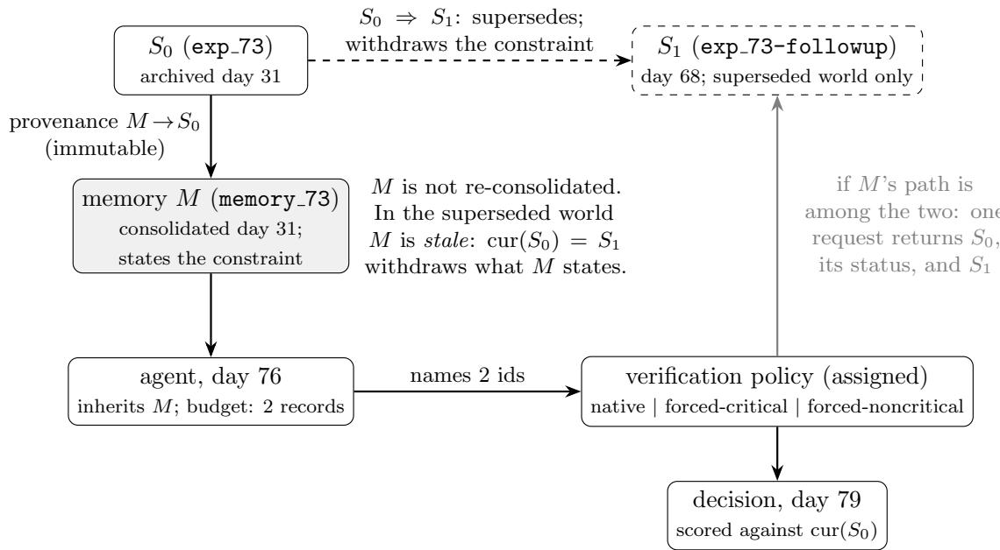
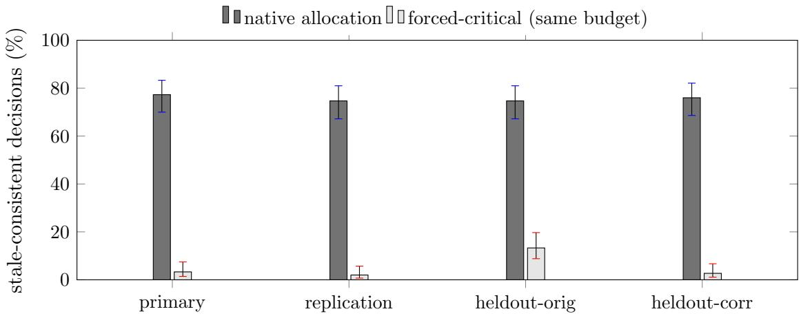
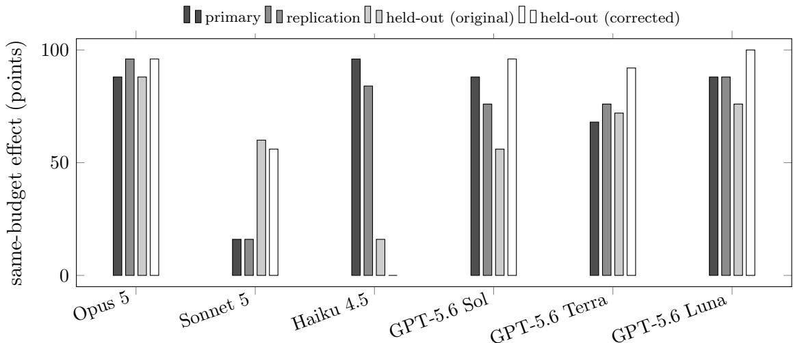

# When Stale Constraints Go Unchecked: Budgeted Verification Failures in Inherited Agent Memory

Kazuki Nakayashiki Glasp

## Abstract

An agent that inherits a consolidated memory may inherit a constraint that was true when written and has since been withdrawn by a newer authoritative record. Under a scarce verification budget, does the agent recover the withdrawal, and if not, is the error avoidable without spending more? We model supersession explicitly — historical provenance is immutable; what changes is which record is current — and assign by design the memory’s form, the world’s state (source current or superseded), and the verification policy at a fixed budget of two records: the agent’s own allocation, or the same budget with one slot re-assigned to the critical provenance path or to a random record. With a constraint stated, agents inspected its provenance path in about one episode in five; when that constraint had been superseded, native allocation produced stale-consistent decisions in 77.3%, 74.7% and 74.7% of episodes across a primary run, a freshwording replication and a held-out domain. Re-assigning one slot to the critical path raised current-record-consistent decisions by +74.0, +72.7 and +61.3 points, positive in six of six models in each of those runs, and changed nothing when the record agreed with the memory. The held-out scenario was later found to contain a temporal inconsistency; a robustness replication with one sentence corrected, deposited externally before execution, gave +73.3 points and is reported alongside the original. The intervention uses knowledge of the critical path and is not a scheduler; it identifies that the share of stale-memory error attributable to verification allocation is close to its structural ceiling. Memory systems may need freshness or supersession signals separate from relevance.

## 1 Introduction

Persistent-memory agents increasingly retain provenance: a consolidated belief carries a link to the record it was derived from, so that if the belief is wrong the evidence that would show it is still reachable. That link is a promise of auditability, not an audit. An agent that inherits more beliefs than it can re-derive follows a few links before it acts, and which few it follows is a scarce-resource allocation made at inference time.

In earlier work we measured that allocation directly [Nakayashiki, 2026]: under a verification budget, agents concentrate their checks on the memories that back the plan they already hold, and a memory that states a decision-relevant constraint is checked far less often than the same memory with the constraint removed. That work left one question deliberately open, because every constraint in every arm was true: declining to re-derive a true, already-stated constraint may be sensible triage. Whether the same allocation becomes harmful when the stated constraint is stale when the record it came from has since been superseded by a record that withdraws it — was named as the case the safety motivation turns on, and not tested.

This paper tests exactly that case, with the same instrument and a diferent question: not where verification goes, but whether where it goes creates an avoidable failure once the world has moved.

We give the archive a temporal structure: a memory is consolidated at $t _ { 0 }$ from a source record $S _ { 0 } ;$ at $t _ { 1 }$ a newer authoritative record $S _ { 1 }$ supersedes $S _ { 0 }$ and withdraws the constraint; the memory is not re-consolidated. Historical provenance is unchanged and correct. A single verification request on the memory’s provenance path returns $S _ { 0 }$ verbatim, its status, and $S _ { 1 }$ beneath it. Nothing visible at allocation time distinguishes this world from one in which $S _ { 0 }$ is still current. We then assign, by design, the world’s state, the memory’s form, and — the variable this paper is about — the verification policy at a fixed budget of two records: the agent’s own allocation, or the same two records with one slot re-assigned to the critical provenance path, or the same with one slot re-assigned to a random non-critical record.

Findings. With the constraint stated, agents chose to inspect its provenance path in 20.1% and 23.1% of episodes (growth world, primary and replication), against 66.9% and 72.9% for the identical memory without its constraint. When the constraint had been superseded, native allocation produced decisions consistent with the stale memory rather than the current record in 77.3%, 74.7%, and 74.7% of episodes (primary, replication, held-out procurement domain). Re-assigning one of the two verification slots to the critical path — the budget unchanged — raised current-record-consistent decisions by $+ 7 4 . 0 ~ [ + 6 8 . 0 , + 8 0 . 0 ] , + 7 2 . 7 ~ [ + 6 6 . 7 , + 7 8 . 7 ]$ , and +61.3 [+54.0, +68.0] points, positive in six of six models in each run, and left decisions unchanged (+0.7 to +2.0 points) when the inspected record confirmed the memory. The held-out scenario was found, after the run, to contain a temporal inconsistency that could depress the intervention arm; a robustness replication with that one sentence changed, whose full specification was deposited externally before execution, gave +73.3 $[ + 6 8 . 7 , + 7 7 . 3 ]$ and is reported beside, not instead $\operatorname { o f } ,$ the original. One model in the procurement world verified the critical record natively at ceiling and therefore showed no room for the intervention; we report it as the boundary it is.

What is and is not shown. The intervention arm uses experimenter knowledge of which path is critical. It is an instrument for identifying the share of stale-memory error that is attributable to allocation rather than to reasoning, not a deployable scheduler. What it identifies is a causal efect of the verification policy on downstream error at fixed budget. It does not identify why native allocation selects what it selects, it does not establish mediation, and it does not measure how often stale stated constraints arise in deployed memory stores. The size of the efect is bounded by a single measured quantity — how often native allocation left the stated constraint’s path uninspected — and sits close to that bound in every run except the one with the inconsistency.

Related work. Agent-memory safety work has concentrated on keeping the store correct poisoning and defenses [Dash et al., 2026, Louck, 2026], memory mis-evolution [Xie et al., 2026], authority collapse at consolidation [Zhan et al., 2026], reliability-conditional belief updating [Singh, 2026] — and on recording where content came from [Wang et al., 2026] and whether actions respond to provenance cues [Liao, 2026]. Fei et al. [2026] argue that per-record provenance is insuficient when the selection layer is compromised; our selection layer is the agent’s own budgeted choice among records already in front of it. That a stored memory can be invalidated by later evidence, and that agents keep acting on it, is measured directly by a recent line of work: knowledge-update, conflict-resolution and forgetting tasks in long-term-memory benchmarks [Wu et al., 2025, Hu et al., 2025, Uddin et al., 2026], invalidation without explicit negation [Chao et al., 2026], the memoryupdate gap under bounded memory [Patel, 2026], and temporal validity or revocation of superseded records at the store [Yadav, 2026, Zhou et al., 2026]. In each of these the invalidating evidence is either already in context or handled by the store; none varies which record a budget-limited agent chooses to inspect, which is the variable studied here. Budget-aware agent work asks whether tool calls are spent well [Lin et al., 2026, Fang et al., 2026, Wang and Xu, 2026], and Yang [2026] report that heterogeneity limits what budgeted verification can gain, consistent with the per-model bounds we find. Self-auditing before commitment [Yuan et al., 2026b,a] proposes acting on such checks; we measure what an unaided agent checks when the check would matter. The behaviour we measure is consistent with the classical positive-test strategy [Wason, 1960, Klayman and Ha, 1987], and language models show the same confirmation-seeking tendency in rule discovery [Jhaveri et al., 2026] and in weighing conflicting evidence [Xie et al., 2024]; the new object is stale inherited provenance under a fixed verification budget, and the new quantity is the avoidable share of the resulting error.

## 2 Provenance, supersession, and stale memory

Five objects, kept distinct throughout (Figure 1).

Source record S. An archived record with an identifier, a date, results and a conclusion. Immutable once written.

Memory M. A consolidated one-line belief in the inherited store, with an id and a consolidation day.

Provenance link $M  S _ { 0 }$ . The historical fact that M was derived from $S _ { 0 }$ on day $t _ { 0 }$ . Immutable: provenance is history.

Supersession $S _ { 0 } \Rightarrow S _ { 1 }$ . The fact that on day $t _ { 1 } > t _ { 0 }$ a newer record $S _ { 1 }$ became authoritative on the same question and $S _ { 0 }$ is no longer current. Append-only.

Current record cur $( S _ { 0 } ) . ~ S _ { 1 }$ if a supersession exists, else $S _ { 0 }$ .

A memory is stale when the current record for its provenance target withdraws the content the memory states. Staleness is a property of the pair (memory content, current record); it is never a property of the provenance link, which stays correct. Nothing in the implementation rewrites a provenance record.

Verification. A verification request names a memory id. The archive returns the historical record $S _ { 0 }$ verbatim, an archive status line, and $- \operatorname { i f } S _ { 0 }$ has been superseded $- \ S _ { 1 }$ beneath it. Every record in every world carries a status line (“current — no superseding record on $\mathrm { f l e } ^ { \prime \prime }$ or “superseded on day $t _ { 1 } \ \mathrm { b y } \ S _ { 1 } ^ { \mathrm { \Delta } } { } ^ { \mathrm { \Omega } } )$ , so the presence of the line is not itself a cue. Discovery therefore costs exactly one request: the only way to miss the correction is not to spend a credit on that path. This idealises the archive in the agent’s favour; a system requiring multi-hop discovery would make native recovery harder, not easier.

Timeline used. $t _ { 0 } = \mathrm { d a y } 3 1 \colon S _ { 0 }$ (exp 73) is written and memory 73 is consolidated from it. $t _ { 1 } = \mathrm { d a y } 6 8$ (superseded world only): S1 (exp 73-followup) is written and marked as superseding exp 73; the memory is not re-consolidated. Day 76: the agent inherits the store and allocates its budget. Day 79: the decision. In the valid world there is no $t _ { 1 }$ event and the memory’s constraint is true. The store line the agent sees at allocation time is identical in both worlds.

  
Figure 1: Supersession pipeline. Historical provenance never changes; what changes at t1 is which record is current. Whether the agent learns this depends only on whether one of its two verification slots reaches the memory’s provenance path — which is what the verification policy manipulates.

## 3 Experimental design

World and instrument. We reuse, unchanged, the six-memory growth scenario of Nakayashiki [2026]: an agent inherits six one-line memories with ids and consolidation days, faces a situation with declining metrics, five candidate actions, and a verification budget of k = 2 source records. The target memory (memory 73) concerns a targeted discount whose source record reports a retention loss and a prohibition on reuse. The memory’s body is generated from that work’s frozen slot grammar (fluent register, six wording families), so numeric content and clause structure are constant across forms. The decision situation on day 79 is a competitor’s second price cut, in which the constrained action is the tempting one. The system prompt, the response schema (verification ids, intended action, scale, rationale) and the six models are those of the prior work: Claude Opus 5 (claude-opus-5), Claude Sonnet 5 (claude-sonnet-5), Claude Haiku 4.5 (claude-haiku-4-5), GPT-5.6 Sol (gpt-5.6-sol), GPT-5.6 Terra (gpt-5.6-terra) and GPT-5.6 Luna (gpt-5.6-luna).

Factors. Three factors are assigned by design in complete blocks. Memory form F: stated (positive evidence + quantified negative outcome + prohibition) or removed (the same positive evidence + a neutral quantified fact + a neutral clause). World W: valid (S current) or superseded $( S _ { 1 }$ withdraws the constraint on day 68); invisible at allocation time. Verification policy P, acting at the archive after the agent has named its ids: native returns the agent’s own two records; forced-critical returns the target’s path plus the agent’s first-named other id; forced-noncritical returns a seeded random non-target record plus the agent’s first-named other id. Two records are returned in every arm; the agent’s turn-1 allocation is observed identically in all three. The forced-critical arm uses our knowledge of which path is critical (§1).

Episode. Turn 1 (day 76): the agent names up to two memory ids and a provisional action. The archive resolves the ids and applies the policy. Turn 2 (day 79): the agent receives the returned records with their status lines, the escalated situation, and decides. Both turns use one strict JSON schema; every prompt, raw response and score is stored.

Outcomes, all deterministic. V: the target’s path was named at turn 1. R: the target’s record was returned. Y: the turn-2 action is consistent with the record the archive marks current — in the superseded world, choosing the constrained action; in the valid world, not choosing it. No model judges anything.

Estimand. The headline quantity is the risk diference in Y between forced-critical and native, within stated × superseded, pooled with equal model weights, with a model-stratified bootstrap 95% interval $( B = 4 , 0 0 0 )$ . Because Y is 1 whenever the correction is in context and 0 otherwise under native allocation (§4), this diference is bounded above by 1 − Pr(V | native), the native under-verification rate; we report the bound beside every estimate.

Grid and runs. $2 \times 2 \times 3 = 1 2$ cells × 6 models $\times \ 2 5 = 1 . 8 0 0$ episodes in the primary run. Blocks (form, model, run) share family and presentation order, so the six world × policy cells of a block have byte-identical turn-1 prompts (asserted before any call). A replication run (1,800) uses fresh seeds and six new wording families. A held-out run (900) uses a second world — the procurement scenario of the prior work’s cross-domain grid, target memory c2 (a low-cost vendor with a delivery-reliability prohibition), with a superseding record of a diferent type: two later quarters of delivery data rather than a corrected measurement — with the stated form only. A corrected held-out robustness replication (900) is described in §4.6. In total 5,400 confirmatory episodes, 10,800 kept model calls, 5 retries, 0 errors. The 48-episode mechanics pilot is excluded. The sample size was set by simulation on the prior work’s stored data for 0.89 power at a 15-point efect; the grid is the whole run, with no extension and no interim analysis.

Prospective evidence. For the primary, replication and original held-out runs, the prompts, records, thresholds, exclusion rules, scoring and analysis script were frozen, hashed (SHA256 manifest), committed, and the manifest was timestamped with OpenTimestamps 96 seconds before the first confirmatory episode (later anchored in Bitcoin blocks 964062 and 964064). The runner refused to start without the registration record. The complete package was deposited to OSF after the runs and verified against the pre-run manifest hash-for-hash; we do not call that deposit a preregistration. For the corrected held-out run, the complete specification was deposited to OSF before execution and verified byte-for-byte against the frozen local package (Appendix B). Zero amendments were made to any package.

## 4 Results

Table 1 gives the headline contrast across the four runs; full cell tables are in Appendix A.

## 4.1 Native allocation rarely selects the stated constraint’s path

With the constraint stated, agents named the target’s provenance path in 181/900 (20.1%) turn-1 responses in the primary run and 208/900 (23.1%) in the replication — pooled over the six world × policy cells, whose turn-1 prompts are identical. With the constraint removed from the same memory, the rate was 66.9% and 72.9%: a randomised diference of +46.8 [+43.7, +50.0] and +49.8 $[ + 4 6 . 6 , + 5 3 . 1 ]$ points, reproducing the prior work’s constraint efect in-study. Every agent spent both credits in every episode; the credits went elsewhere. Allocation did not difer by world or by policy (largest of six blinding checks 4.2 points in the primary run, all intervals including zero), as it cannot: the world state is invisible at turn 1.

Table 1: The same-budget contrast across the four runs (stated form, superseded world). Y = decision consistent with the record the archive marks current. Intervals: model-stratified bootstrap 95%. Budget is two records in every arm.
<table><tr><td>run</td><td></td><td></td><td>episodes native Y forced-critical Y</td><td></td><td>RD [95%] positive models</td></tr><tr><td>primary</td><td>1,800</td><td>34/150</td><td></td><td> $1 4 5 / 1 5 0 + 7 4 . 0 [ + 6 8 . 0 , + 8 0 . 0 ]$ </td><td>6/6</td></tr><tr><td>fresh-wording replication</td><td>1,800</td><td>38/150</td><td></td><td> $1 4 7 / 1 5 0 + 7 2 . 7 [ + 6 6 . 7 , + 7 8 . 7 ]$ </td><td>6/6</td></tr><tr><td>original held-out†</td><td>900</td><td>38/150</td><td></td><td> $1 3 0 / 1 5 0 + 6 1 . 3 [ + 5 4 . 0 , + 6 8 . 0 ]$ </td><td>6/6</td></tr><tr><td>corrected held-out robustness</td><td>900</td><td>36/150</td><td></td><td>146/150 +73.3 [+68.7, +77.3]</td><td>5/6</td></tr></table>

†reported exactly as run, with the context inconsistency of §4.6; the corrected run supplements it.

## 4.2 When the constraint is stale, native allocation fails

In the superseded world under native allocation, the decision followed the stale memory rather than the current record in 116/150 (77.3%) primary episodes, 112/150 (74.7%) in the replication, and 112/150 (74.7%) in the procurement world. The two halves of the mechanism are visible in the same cell: among native episodes in which the agent’s own allocation happened to return the target’s record, Y was 32/32 and 37/37; among those in which it did not, 2/118 and 1/113. (These are conditional on a post-treatment choice and are descriptive.) The same agents, in the same world, with the constraint deleted from the memory — the prior work’s corruption, whose source record still holds the constraint — erred in 32/150 (21.3%) and 35/150 (23.3%) episodes. The memory that states its own limit is the one allocation misses; the failure that looks safest on the page is the one it catches least. This is a comparison of two cells with diferent ground truths and we report it as such.

## 4.3 Re-allocating the same budget removes most of the error

Assigning the forced-critical policy rather than native — two records in both arms, the agent’s own allocation observed identically in both — raised current-record-consistent decisions from 34/150 to 145/150 in the primary run: +74.0 points [+68.0, +80.0] (Figure 2). This is a randomised contrast and identifies the causal efect of the verification policy on downstream error at fixed budget. Its structural ceiling, $1 0 0 \times \left( 1 - \mathrm { P r } ( V \mid \mathrm { N A T I V E } ) \right)$ , was 78.7 points; the estimate sits within five points of it. The share of stale-memory error that allocation could have prevented is therefore nearly all of it. Across the six wording families the contrast ranged from +60.9 to +89.3 (Table 7).

The trivial half and the non-trivial half. Once the superseding record is in context, the decision follows it: 145/150 under the intervention, 32/32 when native allocation reached it. That half is expected, and the prior work already showed the installing direction. The result of this paper is the other half: the agent held the budget that would have bought the correction in every episode, and with the constraint stated it spent that budget elsewhere in 150−32 of 150 superseded-world episodes, in a world it could not tell apart from the one in which the same allocation is harmless. The intervention does not add information to the system; it moves one of two existing slots.

  
Figure 2: The headline result. Share of decisions consistent with the stale memory rather than the current record, stated form, superseded world, in each run (n = 150 per bar, 25 per model; Wilson 95% intervals). The verification budget is two records in both arms; the intervention changes only which provenance path one of the two slots inspects. The original held-out run is shown as run; the corrected held-out robustness replication (one sentence of the situation text changed, §4.6) supplements and does not replace it.

## 4.4 Fresh wording families

The replication run — fresh seeds, six new wording families — gave 147/150 against $3 8 / 1 5 0 \colon + 7 2 . 7 $ points [+66.7, +78.7], within 1.3 points of the primary, positive in 6 of six models, and in every new family (+56.5 to +86.2).

## 4.5 Original held-out domain

In the procurement world, with its diferent supersession type, the prospectively specified held-out run gave 130/150 against 38/150: +61.3 points [+54.0, +68.0], positive in 6 of six models. Native stale error was 74.7%. This is the registered held-out result and it stands as run.

## 4.6 A context inconsistency in the held-out scenario

After the held-out analysis was committed, an audit of the forced-critical episodes that did not switch vendor found that the frozen day-74 situation text stated that the supply contract “now expires in 3 days”, while the target’s source record — returned verbatim in that arm — records “onboarding 6 weeks”, and the day-71 turn-1 text says the contract “expires in 14 days” (which leaves eleven, not three). The record-consistent action was therefore partly infeasible on the record’s own numbers, independently of the withdrawn constraint. Ten of the twenty non-switching forced-critical rationales cite that ground. Because the defect acts on the intervention arm and can only shrink the contrast, its direction is adverse to the result above; the size of its contribution is a post hoc reading. We retain the original result unchanged and, rather than correct it in place, specified a robustness replication changing only the conflicting sentence (“expires in 11 days; the incumbent’s standard month-to-month bridge is available during any transition” — both facts already present in the frozen world), with fresh seeds, a pre-specified success criterion, and its full specification deposited to OSF before execution (Appendix C).

  
Figure 3: Per-model same-budget efect (forced-critical minus native on Y, stated form, superseded world; n = 25 per arm per model) in each run. The efect’s ceiling for a model is its native under-verification rate; per-model bounds are in Table 6. Haiku 4.5 in the corrected procurement run verified the critical record natively in 25/25 episodes and therefore had no room for the intervention.

## 4.7 Corrected held-out robustness replication

The corrected run gave 146/150 against 36/150: +73.3 points [+68.7, +77.3], meeting its prespecified criterion, with native stale error 76.0%. Its pre-specified secondary comparison — the intervention arm’s consistent-decision rate against the original run’s 86.7% — was +10.7 points [+8.0, +12.7], consistent with the reading that the inconsistency had depressed that arm. The held-out efect survives removal of the known inconsistency; the corrected value matches the growth-world runs. It is reported beside the original, never averaged with it.

## 4.8 When the record agrees with the memory, forcing changes nothing

In the valid world, where the fetched record confirms the stated constraint, assigning forcedcritical rather than native changed Y by $+ 0 . 7 \ [ + 0 . 0 , + 2 . 0 ] , + 2 . 0 \ [ + 0 . 0 , + 4 . 7 ] , + 0 . 7 \ [ + 0 . 0 , + 2 . 0 ]$ and +0.0 [+0.0, +0.0] points (150/150 vs 149/150 in the primary run). The intervention’s efect depends on what the inspected record says, not on the act of inspecting; we do not read this as evidence about any particular internal process. A second control, forcing a random non-critical record, is reported in Appendix D with a design limitation that keeps it out of the main results.

## 4.9 Model heterogeneity and a ceiling case

The direction generalises more strongly than the magnitude (Figure 3, Table 6). Per-model efects range from +16.0 to +96.0 in the primary run, and in every case the magnitude tracks the model’s bound: Sonnet 5 verifies the stated constraint natively in most growth-world episodes and has a bound of 24, of which it shows +16; Haiku 4.5 verified memory c2 natively in 25/25 corrected-run episodes, was consistent with the current record in 25/25 of them under native allocation, and shows an efect of exactly zero at a bound of zero. That is a boundary case in which native allocation already selects the critical record, not a failure of the intervention, and it is why the per-model criterion counts direction rather than size. Native allocation is model × world dependent: the same model that verified the growth-world constraint in 0–12% of episodes verified the procurement-world constraint in 80–100%. No single model carries the pooled result: leaving any one model out leaves the primary estimate at or above +69.6 points (Appendix A).

## 5 Discussion

The results separate two questions. A retriever answers what is relevant now? and decides what is in front of the agent; where a store carries recency or validity metadata [Park et al., 2023, Rasmussen et al., 2025], that metadata acts there, on what is retrieved. Under a verification budget the agent must also answer which inherited belief is most costly to leave unchecked? — and this paper shows that the second question can decide whether stale inherited state is corrected at all. In every run the memory most relevant to the decision, the one stating a constraint on the tempting action, was the one whose provenance the agent chose not to inspect, and when that constraint had been superseded the decision followed the memory rather than the record in roughly three episodes of four. Moving one of two verification slots onto that path, with nothing else changed, removed most of that error; moving it onto a random record did not; moving it onto the path when the record agreed with the memory changed nothing.

We do not identify why native allocation selects what it selects. Possible readings — a low perceived value in re-checking a constraint that reads as settled, the pull of the current plan, semantic suppression by the constraint itself — are interpretations, and the prior work already showed that the allocation is exogenously manipulable by plan assignment and by memory content. What this paper adds is that the allocation has a consequence when the world moves, that the consequence is large, that it is confined to the world in which the memory and the record disagree, and that it is bounded by a quantity a system can in principle measure: how often the path is left uninspected. In every run except the original held-out — whose gap to its bound is the inconsistency of §4.6 — the estimate sat within five points of that bound. The asymmetry between the stated and the deleted constraint (§4.2) is distinct from constraint loss under context compaction [Chen, 2026] and from the decay of prohibitions over long contexts [Gamage, 2026]: here the constraint is present, reads as settled, and is wrong.

The architectural implication is narrow and, we think, sound: a production memory system may need freshness, supersession, or expected-loss signals that are separate from semantic relevance, because relevance is exactly what led the agent to the stale memory and away from its source. Such signals already exist at the store and retrieval layers — bi-temporal invalidation, deterministic supersession rules, revocation of superseded records [Rasmussen et al., 2025, Yadav, 2026, Zhou et al., 2026, Reddy and Challaram, 2026]; what this paper measures is the cost of that signal not reaching the agent’s choice of what to verify. We have not built or evaluated such a scheduler. Existing escalation policies key on the insuficiency of retrieved evidence [Zhu et al., 2026], and active retrieval on the model’s own uncertainty [Jiang et al., 2023]; a stale constraint that reads as settled produces neither signal. The forced-critical arm used our knowledge of which path mattered; a deployable policy would have to predict, from observable metadata, where native allocation under-verifies — and the per-model, per-world variation we observe (the same model at 0–12% native verification in one world and 80–100% in another) says that prediction is an open problem. This paper supplies the target and its size, not the predictor.

Relative to the prior work, which measured where verification goes and showed separately that recovered provenance changes decisions, this paper randomises the policy and measures the error in the case where the constraint is wrong. The two are one instrument and two questions; the answer to the second is that the allocation the first one measured is, when the world has moved, an avoidable failure.

## 6 Limitations

We state what is and is not identified.

1. Synthetic, controlled environment. Six-memory stores, two scripted worlds, one archive semantics in which one request returns the superseding record. Real stores are larger and discovery may be multi-hop.

2. Installed staleness. The superseded state is written by us; “current truth” is definitional (the record the archive marks current), and the superseding record’s content is a fixed feature of each world.

3. Prevalence not measured. Nothing here shows how often stated constraints become stale in deployed pipelines, nor that natural consolidation produces the stale state; that is a separate ecological study.

4. The intervention is an oracle. Forced-critical uses experimenter knowledge of the critical path. It identifies the avoidable share of the error; it is not a deployable verification policy and we evaluate none.

5. Six models from two providers. Direction is 6/6 in three runs and 5/6 with one model at a bound of zero in the fourth; magnitudes range from +0.0 to +100.0 points and are governed by each model’s native verification rate. We claim the direction, and the magnitude only as a function of that rate.

6. Task and schema specificity. One system prompt, one JSON schema, one archive message format; twelve wording families and two domains for the memory text. Two residual asymmetries between the forced and native arms are not removable by design: the forced record is listed first in the archive message, and the forced arms return a record the agent did not request; the source-agreement control shares both and shows no efect.

7. No mediation. The agent’s turn-1 selection is post-treatment; the design identifies the efect of the policy, not the path through selection.

8. Mechanism of native under-verification not isolated. This paper does not manipulate confidence, plan, or salience.

9. The non-critical control is design-limited. It discards the agent’s own target pick in a subset of episodes (Appendix D); it is excluded from every headline statement.

10. The original held-out scenario contained a temporal inconsistency (§4.6); the result is reported as run.

11. The corrected run was motivated by that discovery. Its correction was specified, difaudited and deposited before execution, and its criterion could have failed; but its existence is post hoc with respect to the original run.

12. A ceiling case. One model in the procurement world verified the critical record natively at ceiling; the intervention has nothing to add for such a model in such a world.

13. No scheduler evaluated. The Discussion’s implication is an implication.

14. No natural consolidation chain. This paper installs the memory forms; it does not study how stale memories arise.

15. Replications are same-team. Fresh seeds, fresh wording and a second domain, but the same authors, code and models.

Data and code availability. Every episode file of the four runs (5,400 episodes), the frozen specification packages with their SHA256 manifests and OpenTimestamps proofs, the frozen analysis scripts, the independent recomputation scripts, and the generator that emits every number in this paper are released with it. No number is typed by hand.

AI assistance. The author used language-model assistants for parts of this work: Anthropic’s Claude, principally through Claude Code, for research-design critique, experiment planning, implementation and execution of the runners, analysis and audit tooling, manuscript drafting and editing, simulated adversarial review, and release engineering; and OpenAI’s ChatGPT for research-design critique, interpretation discussion, manuscript critique, simulated adversarial review, and publication and release planning. The author chose the research question, approved every experimental package and decided whether each run took place, interpreted the results, selected the claims, made the publication decisions, and is responsible for the correctness of the manuscript. No language model is an author. The six models studied are experimental subjects, not tools of the analysis: their responses are the data, every outcome is scored deterministically, and no model output is used to judge another.

## References

Hanxiang Chao, Yihan Bai, Rui Sheng, Tianle Li, and Yushi Sun. STALE: Can LLM agents know when their memories are no longer valid? arXiv preprint arXiv:2605.06527, 2026.

Shiyang Chen. Governance decay: How context compaction silently erases safety constraints in long-horizon LLM agents. arXiv preprint arXiv:2606.22528, 2026.

Pritam Dash, Tongyu Ge, Aditi Jain, et al. From untrusted input to trusted memory: A systematic study of memory poisoning attacks in LLM agents. arXiv preprint arXiv:2606.04329, 2026.

Zhengru Fang, Senkang Forest Hu, Zhonghao Chang, et al. Inference-time budget control for LLM search agents. arXiv preprint arXiv:2605.05701, 2026.

Zeming Fei, Hongming Fei, Xiaoyang Wang, Yang Yang, Prosanta Gope, Biplab Sikdar, and Ying Zhang. Selection integrity for LLM graph memory: An accumulability criterion for informationflow-blind retrieval. arXiv preprint arXiv:2606.12290, 2026.

Yeran Gamage. Omission constraints decay while commission constraints persist in long-context LLM agents. arXiv preprint arXiv:2604.20911, 2026.

Yuanzhe Hu, Yu Wang, and Julian McAuley. Evaluating memory in LLM agents via incremental multi-turn interactions. arXiv preprint arXiv:2507.05257, 2025.

Ayush Rajesh Jhaveri, Anthony GX-Chen, Ilia Sucholutsky, and Eunsol Choi. Failing to falsify: Evaluating and mitigating confirmation bias in language models. arXiv preprint arXiv:2604.02485, 2026.

Zhengbao Jiang, Frank F. Xu, Luyu Gao, Zhiqing Sun, Qian Liu, Jane Dwivedi-Yu, Yiming Yang, Jamie Callan, and Graham Neubig. Active retrieval augmented generation. In Proceedings of the 2023 Conference on Empirical Methods in Natural Language Processing (EMNLP), 2023.

Joshua Klayman and Young-Won Ha. Confirmation, disconfirmation, and information in hypothesis testing. Psychological Review, 94(2):211–228, 1987.

Junchi Liao. Auditing provenance sensitivity in LLM agent action selection. arXiv preprint arXiv:2607.20827, 2026.

Yuxiang Lin, Zihan Wang, Mengyang Liu, et al. BAGEN: Are LLM agents budget-aware? arXiv preprint arXiv:2606.00198, 2026.

Yedidel Louck. Securing LLM-agent long-term memory against poisoning: Non-malleable, originbound authority with machine-checked guarantees. arXiv preprint arXiv:2606.24322, 2026.

Kazuki Nakayashiki. Verification allocation in inherited agent memory: Provenance availability is not provenance use, 2026. URL https://doi.org/10.5281/zenodo.22084498. Zenodo; concept DOI, resolves to the latest version (v2: 10.5281/zenodo.22102676).

Joon Sung Park, Joseph C. O’Brien, Carrie J. Cai, Meredith Ringel Morris, Percy Liang, and Michael S. Bernstein. Generative agents: Interactive simulacra of human behavior. In Proceedings of the 36th Annual ACM Symposium on User Interface Software and Technology (UIST), 2023. doi: 10.1145/3586183.3606763.

Vedant Patel. Supersede: Diagnosing and training the memory-update gap in LLM agents. arXiv preprint arXiv:2606.27472, 2026.

Preston Rasmussen, Pavlo Paliychuk, Travis Beauvais, Jack Ryan, and Daniel Chalef. Zep: A temporal knowledge graph architecture for agent memory. arXiv preprint arXiv:2501.13956, 2025.

Vikas Reddy and Sumanth Reddy Challaram. Reliable post-retrieval assembly for agent memory: Separating evidence extraction from policy execution. arXiv preprint arXiv:2606.01435, 2026. Poster, Lifelong Agent Workshop at COLM 2026.

Pranav Singh. When does belief-based agent memory help? reliability-conditional updating and provenance-capped poisoning defense. arXiv preprint arXiv:2606.22030, 2026.

Md Nayem Uddin, Kumar Shubham, Eduardo Blanco, Chitta Baral, and Gengyu Wang. From recall to forgetting: Benchmarking long-term memory for personalized agents. In Findings of the Association for Computational Linguistics: ACL 2026, 2026. arXiv:2604.20006.

Daniel Wang and Andrew Xu. AllocBench: Measuring online tool allocation capability in LLM agents. arXiv preprint arXiv:2607.23332, 2026.

Yiqi Wang, Jiaqi Zhang, Taotao Cai, et al. From agent traces to trust: A survey of evidence tracing and execution provenance in LLM agents. arXiv preprint arXiv:2606.04990, 2026.

Peter C. Wason. On the failure to eliminate hypotheses in a conceptual task. Quarterly Journal of Experimental Psychology, 12(3):129–140, 1960.

Di Wu, Hongwei Wang, Wenhao Yu, Yuwei Zhang, Kai-Wei Chang, and Dong Yu. LongMemEval: Benchmarking chat assistants on long-term interactive memory. In International Conference on Learning Representations (ICLR), 2025.

Jian Xie, Kai Zhang, Jiangjie Chen, Renze Lou, and Yu Su. Adaptive chameleon or stubborn sloth: Revealing the behavior of large language models in knowledge conflicts. In International Conference on Learning Representations (ICLR), 2024.

Weiwei Xie, Shaoxiong Guo, Fan Zhang, et al. MemEvoBench: Benchmarking safety risks from memory misevolution in LLM agents. arXiv preprint arXiv:2604.15774, 2026.

Neeraj Yadav. Temporal validity in retrieval memory: Eliminating stale-fact errors for AI agents over evolving knowledge. arXiv preprint arXiv:2606.26511, 2026.

Jinlong Yang. Heteroskedastic signals in budgeted LLM verification: Structural heterogeneity limits optimization gains. arXiv preprint arXiv:2606.15841, 2026.

Wenhao Yuan, Chenchen Lin, Jian Chen, et al. Belief-guided inference control for large language model services via verifiable observations. arXiv preprint arXiv:2604.27536, 2026a.

Wenhao Yuan, Chenchen Lin, Jian Chen, et al. Verify before you commit: Towards faithful reasoning in LLM agents via self-auditing. arXiv preprint arXiv:2604.08401, 2026b.

Qiuyang Zhan, Rui Zhang, Sheng Guo, Lepeng Zhao, and Zhuotao Liu. When memory becomes authority: Benchmarking authority collapse at the memory consolidation boundary. arXiv preprint arXiv:2608.01679, 2026.

Yan Zhou, Yue Ouyang, Kaiyang Zheng, and Suncheng Xiang. TEPA: Revoking stale memories for conflict-robust language agents. arXiv preprint arXiv:2608.07429, 2026.

Qiming Zhu, Shunian Chen, Rui Yu, Zhehao Wu, and Benyou Wang. From lossy to verified: A provenance-aware tiered memory for agents. arXiv preprint arXiv:2602.17913, 2026.

Table 2: Primary run (1,800 episodes): authoritative-consistent decisions Y, target provenance path named at turn 1, and target record returned, by cell (n = 150 per cell, 25 per model).
<table><tr><td>form</td><td>world</td><td>policy</td><td>Y</td><td>%</td><td>path named</td><td>record returned</td></tr><tr><td>stated</td><td>valid</td><td>native</td><td>149/150</td><td>99.3</td><td>27/150</td><td>27/150</td></tr><tr><td>stated</td><td>valid</td><td>forced-critical</td><td>150/150</td><td>100.0</td><td>22/150</td><td>150/150</td></tr><tr><td>stated</td><td>valid</td><td>forced-noncritical</td><td>146/150</td><td>97.3</td><td>32/150</td><td>13/150</td></tr><tr><td>stated</td><td>superseded</td><td>native</td><td>34/150</td><td>22.7</td><td>32/150</td><td>32/150</td></tr><tr><td>stated</td><td>superseded</td><td>forced-critical</td><td>145/150</td><td>96.7</td><td>36/150</td><td>150/150</td></tr><tr><td>stated</td><td>superseded</td><td>forced-noncritical</td><td>17/150</td><td>11.3</td><td>32/150</td><td>13/150</td></tr><tr><td>removed</td><td>valid</td><td>native</td><td>118/150</td><td>78.7</td><td>98/150</td><td>98/150</td></tr><tr><td>removed</td><td>valid</td><td>forced-critical</td><td>150/150</td><td>100.0</td><td>96/150</td><td>150/150</td></tr><tr><td>removed</td><td>valid</td><td>forced-noncritical</td><td>92/150</td><td>61.3</td><td>107/150</td><td>72/150</td></tr><tr><td>removed</td><td>superseded</td><td>native</td><td>129/150</td><td>86.0</td><td>102/150</td><td>102/150</td></tr><tr><td>removed</td><td>superseded</td><td>forced-critical</td><td>139/150</td><td>92.7</td><td>102/150</td><td>150/150</td></tr><tr><td>removed</td><td>superseded</td><td>forced-noncritical</td><td>123/150</td><td>82.0</td><td>97/150</td><td>61/150</td></tr></table>

Table 3: Fresh-wording replication (1,800 episodes, families r1–r6, fresh seeds), same layout.
<table><tr><td>form</td><td>world</td><td>policy</td><td>Y</td><td>%</td><td>path named</td><td>record returned</td></tr><tr><td>stated</td><td>valid</td><td>native</td><td>147/150</td><td>98.0</td><td>43/150</td><td>43/150</td></tr><tr><td>stated</td><td>valid</td><td>forced-critical</td><td>150/150</td><td>100.0</td><td>33/150</td><td>150/150</td></tr><tr><td>stated</td><td>valid</td><td>forced-noncritical</td><td>148/150</td><td>98.7</td><td>32/150</td><td>21/150</td></tr><tr><td>stated</td><td>superseded</td><td>native</td><td>38/150</td><td>25.3</td><td>37/150</td><td>37/150</td></tr><tr><td>stated</td><td>superseded</td><td>forced-critical</td><td>147/150</td><td>98.0</td><td>32/150</td><td>150/150</td></tr><tr><td>stated</td><td>superseded</td><td>forced-noncritical</td><td>16/150</td><td>10.7</td><td>31/150</td><td>13/150</td></tr><tr><td>removed</td><td>valid</td><td>native</td><td>115/150</td><td>76.7</td><td>109/150</td><td>109/150</td></tr><tr><td>removed</td><td>valid</td><td>forced-critical</td><td>150/150</td><td>100.0</td><td>109/150</td><td>150/150</td></tr><tr><td>removed</td><td>valid</td><td>forced-noncritical</td><td>98/150</td><td>65.3</td><td>116/150</td><td>82/150</td></tr><tr><td>removed</td><td>superseded</td><td>native</td><td>135/150</td><td>90.0</td><td>109/150</td><td>109/150</td></tr><tr><td>removed</td><td>superseded</td><td>forced-critical</td><td>141/150</td><td>94.0</td><td>110/150</td><td>150/150</td></tr><tr><td>removed</td><td>superseded</td><td>forced-noncritical</td><td>136/150</td><td>90.7</td><td>103/150</td><td>70/150</td></tr></table>

## A Full arm tables, per-model and per-family results

Leave-one-model-out. Pooling the same-budget contrast over any five of the six models leaves the primary estimate at or above +69.6 points, the replication at or above +68.0, the original held-out at or above +56.0, and the corrected held-out at or above +68.0. No single model carries the result.

The fourth cell. With the constraint removed and the world superseded, the memory is accidentally consistent with the current record; native Y was 129/150 and forced-critical 139/150 in the primary run (135/150 and 141/150 in the replication). Fetching changed little, as expected; we do not interpret this cell further.

Recovery in both directions. With the corrective record in context, decisions followed a record that withdraws a constraint in 145/150 (primary) and 147/150 (replication) episodes, and a record that installs a missing constraint in 150/150 and 150/150. The withdrawing direction, measured here for the first time, is followed about as readily as the installing direction; this is a comparison across cells with diferent ground truths and is descriptive.

Table 4: Original held-out run, procurement world (900 episodes; stated form only). Reported exactly as run; see §4.6.
<table><tr><td>form</td><td>world</td><td>policy</td><td>Y</td><td>%</td><td>path named</td><td>record returned</td></tr><tr><td>stated</td><td>valid</td><td>native</td><td>149/150</td><td>99.3</td><td>32/150</td><td>32/150</td></tr><tr><td>stated</td><td>valid</td><td>forced-critical</td><td>150/150</td><td>100.0</td><td>35/150</td><td>150/150</td></tr><tr><td>stated</td><td>valid</td><td>forced-noncritical</td><td>150/150</td><td>100.0</td><td>33/150</td><td>22/150</td></tr><tr><td>stated</td><td>superseded</td><td>native</td><td>38/150</td><td>25.3</td><td>40/150</td><td>40/150</td></tr><tr><td>stated</td><td>superseded</td><td>forced-critical</td><td>130/150</td><td>86.7</td><td>40/150</td><td>150/150</td></tr><tr><td>stated</td><td>superseded</td><td>forced-noncritical</td><td>18/150</td><td>12.0</td><td>37/150</td><td>18/150</td></tr></table>

Table 5: Corrected held-out robustness replication (900 episodes; one sentence changed, fresh seeds, externally deposited before execution). Supplements, and does not replace, the original run.
<table><tr><td>form</td><td>world</td><td>policy</td><td>Y</td><td>%</td><td>path named</td><td>record returned</td></tr><tr><td>stated</td><td>valid</td><td>native</td><td>150/150</td><td>100.0</td><td>43/150</td><td>43/150</td></tr><tr><td>stated</td><td>valid</td><td>forced-critical</td><td>150/150</td><td>100.0</td><td>41/150</td><td>150/150</td></tr><tr><td>stated</td><td>valid</td><td>forced-noncritical</td><td>150/150</td><td>100.0</td><td>48/150</td><td>24/150</td></tr><tr><td>stated</td><td>superseded</td><td>native</td><td>36/150</td><td>24.0</td><td>36/150</td><td>36/150</td></tr><tr><td>stated</td><td>superseded</td><td>forced-critical</td><td>146/150</td><td>97.3</td><td>46/150</td><td>150/150</td></tr><tr><td>stated</td><td>superseded</td><td>forced-noncritical</td><td>21/150</td><td>14.0</td><td>42/150</td><td>21/150</td></tr></table>

## B Prospective specification and external registration record

Two evidence histories, stated separately.

Primary, replication and original held-out runs. The design documents, prompts, records, hypotheses with thresholds, exclusion and retry rules, scoring specification, model list and analysis script were frozen and hashed into a SHA256 manifest (23 entries), committed to version control, and the manifest was submitted to OpenTimestamps calendars at 2026-08-25 23:05:06 UTC; the proof was later anchored in Bitcoin blocks 964062 and 964064. A registration record naming the manifest hash was committed at 23:06:19 UTC; the runner refused to start without it. The first confirmatory episode was written at 23:06:42 UTC. Each later run was unlocked only by the committed analysis output of the previous one (primary analysis committed 00:22:35 UTC, replication started 00:23:15; replication analysis committed 02:07:37, held-out started 02:08:35). A 48-episode mechanics pilot preceded the manifest by 58 seconds; the only change between pilot and manifest was one sentence of documentation naming two stored fields. Zero amendments were made. The complete package was deposited to OSF after the runs (project axsnm, files 75kaw and 8wes5) and verified against the pre-run manifest: 23 of 23 manifest-bound files match hash-for-hash. This deposit is an archival record checkable against the pre-run commitment; it is not a preregistration, and we do not describe it as one.

Corrected held-out robustness replication. A separate package (specification, hypotheses, estimands, analysis plan, exclusion rules, model list, scoring, seed policy, success criteria, frozen prompts, the 900 frozen seeds, the analysis script and the runner) was frozen, hashed (25 entries), committed, timestamped with OpenTimestamps, and deposited in full to OSF (file hdm75) before execution; the deposited archive was downloaded back and verified byte-for-byte against the frozen local package before the runner’s gate opened. The first episode was written at 2026-08-26 05:11:09 UTC. Its success criteria were: C1, the same-budget contrast ≥ 15 points with a bootstrap lower bound above zero; C2, the intervention arm’s consistent-decision rate above the original run’s 86.7% with a bootstrap lower bound above zero; C3, blinding and source-agreement checks. All three were met. The seeds share no value with any of the 4,548 prior episodes.

Table 6: Per-model same-budget efect (forced-critical minus native on ${ \mathit { Y } } ,$ stated form, superseded world; n = 25 per arm per model) with each model’s structural bound 100×(1−native target verification). Direction generalises; magnitude tracks the bound.
<table><tr><td></td><td colspan="2">primary</td><td colspan="2">replication</td><td colspan="2">original held-out</td><td colspan="2">corrected held-out</td></tr><tr><td>model</td><td>RD</td><td>bound</td><td>RD</td><td>bound</td><td>RD</td><td>bound</td><td>RD</td><td>bound</td></tr><tr><td>Opus 5</td><td>+88.0</td><td>100</td><td>+96.0</td><td>100</td><td>+88.0</td><td>96</td><td>+96.0</td><td>100</td></tr><tr><td>Sonnet 5</td><td>+16.0</td><td>24</td><td>+16.0</td><td>24</td><td>+60.0</td><td>60</td><td>+56.0</td><td>68</td></tr><tr><td>Haiku 4.5</td><td>+96.0</td><td>100</td><td>+84.0</td><td>88</td><td>+16.0</td><td>20</td><td>+0.0</td><td>0</td></tr><tr><td>GPT-5.6 Sol</td><td>+88.0</td><td>88</td><td>+76.0</td><td>76</td><td>+56.0</td><td>88</td><td>+96.0</td><td>96</td></tr><tr><td>GPT-5.6 Terra</td><td>+68.0</td><td>68</td><td>+76.0</td><td>76</td><td>+72.0</td><td>88</td><td>+92.0</td><td>92</td></tr><tr><td>GPT-5.6 Luna</td><td>+88.0</td><td></td><td> $9 2 + 8 8 . 0$ </td><td>88</td><td>+76.0</td><td>88</td><td>+100.0</td><td>100</td></tr><tr><td>pooled</td><td>+74.0</td><td></td><td> $7 8 . 7 + 7 2 . 7$ </td><td>75.3</td><td>+61.3</td><td>73.3</td><td>+73.3</td><td>76.0</td></tr><tr><td>positive</td><td>6/6</td><td></td><td>6/6</td><td></td><td>6/6</td><td></td><td>5/6</td><td></td></tr></table>

Table 7: Per-wording-family same-budget efect (stated form, superseded world): forced-critical vs native Y. Families f1–f6 (primary) are Paper 1’s slot-grammar families; r1–r6 (replication) are new.
<table><tr><td>family</td><td>forced-critical</td><td>native</td><td>RD</td></tr><tr><td>f1</td><td>22/22</td><td>6/22</td><td rowspan="4">+72.7 +60.9 +68.2</td></tr><tr><td>f2</td><td>21/23</td><td>7/23</td></tr><tr><td>f3</td><td>20/22</td><td>5/22</td></tr><tr><td>f4</td><td>26/27</td><td>9/27 +63.0</td></tr><tr><td>f5</td><td>28/28</td><td>3/28</td><td rowspan="2">+89.3 +85.7</td></tr><tr><td>f6</td><td>28/28</td><td>4/28</td></tr><tr><td>r1</td><td>27/27</td><td>7/27</td><td>+74.1</td></tr><tr><td>r2</td><td>26/26</td><td>5/26</td><td>+80.8</td></tr><tr><td>r3</td><td>26/27</td><td>10/27</td><td>+59.3</td></tr><tr><td>r4</td><td>23/23</td><td>10/23</td><td>+56.5</td></tr><tr><td>r5</td><td>16/18</td><td>2/18</td><td>+77.8</td></tr><tr><td>r6</td><td>29/29</td><td>4/29</td><td>+86.2</td></tr></table>

Reproducibility. Every number in this paper is emitted by one script from the raw episode files; an independent implementation, which does not read the stored scores, reproduces every count and interval for all four runs. Both are released with the episode files, the manifests, the timestamp proofs and the registration records.

## C The held-out inconsistency and the corrected robustness protocol

The conflicting text, verbatim. Turn-2 situation (procurement world, frozen):

The primary supply contract now expires in 3 days. The low-cost vendor has returned a firm quote that meets the finance mandate on its own; the incumbent has declined to move on price this cycle. The assembly line is still at 94% of committed volume with no buffer. Leadership wants a sourcing decision today.

Source record $S _ { 0 }$ for the target, returned verbatim in every arm that fetches it: “unit cost −23%, onboarding 6 weeks, invoice accuracy 99.4%, on-time delivery 61%, SLA missed in 3 of 4 quarters”. Turn-1 situation (day 71): “the primary supply contract expires in 14 days and does not auto-renew”.

Discovery. 2026-08-26, minutes after the held-out analysis was committed, while reading the rationales of the twenty forced-critical episodes in the superseded world that did not switch vendor; ten of them (mostly one model) accept the superseding record and decline on the onboarding/deadline ground, e.g. “Renew the incumbent because the three-day deadline, six-week historical onboarding period, and zero production bufer make an immediate primary-vendor transition likely to increase delivery risk. The updated low-cost vendor record. . . ”.

Which arm it afects. Every forced-critical episode sees $S _ { 0 }$ and the deadline; native episodes see $S _ { 0 }$ only when the agent fetched it (40/150); the valid world is unafected because switching is inconsistent there by definition. The defect can only lower Y in the intervention arm of the superseded world, i.e. it biases against the reported efect. The attribution of 10–13 points to it is a reading of rationales after the result was known and is labelled post hoc.

The corrected sentence.

The primary supply contract expires in 11 days; the incumbent’s standard month-to-month bridge is available during any transition. The low-cost vendor has [...unchanged].

Eleven days is what the frozen turn-1 text implies at day 74; the month-to-month arrangement is a fact of the frozen world (memory c5). An automated dif audit over the exported prompts, records, schema and runner sources confirmed that nothing else changed; turn-1 prompts are byte-identica to the original template for the same memory order.

Results side by side. Original: 130/150 vs 38/150, +61.3 [+54.0, +68.0], 6/6 models positive. Corrected: 146/150 vs 36/150, +73.3 [+68.7, +77.3], 5/6 positive with one model at a bound of zero; $\mathrm { C 2 } = + 1 0 . 7 \ [ + 8 . 0 , + 1 2 . 7 ]$ . The interpretation row fixed before execution for this outcome reads: the held-out efect survives removal of the known contextual inconsistency. The original remains the registered held-out result.

## D The forced-noncritical control and its design limitation

The forced-noncritical arm returns a seeded random non-target record plus the agent’s firstnamed id. When the agent named the target second, that arm discards it. In the stated × superseded stratum this happened in 19 (primary), 18 (replication), 19 (original held-out) and 21 (corrected held-out) episodes, every one of which was stale-consistent. The arm’s recovery of the target is therefore below native’s, and the contrast forced-critical minus forced-noncritical — +85.3 [+80.0, +90.0], +87.3 [+82.0, +92.0], +74.7 [+68.0, +80.7], +83.3 [+77.3, +88.7] — includes roughly 11–14 points that measure the cost of overriding a native choice, not the value of the critical record. The pre-specified rule for this contrast was met, but we withdraw its narrative weight: it appears nowhere in the abstract, the headline figure or the conclusions, and the claim that the intervention’s efect depends on record content rests on the source-agreement control (§4.8) together with the headline contrast. A repaired comparator that replaces exactly one slot while preserving the agent’s own target pick is specified and was not run; the headline contrast does not need it.

## E Reproducibility and audit details

Units. The unit of analysis is the episode (one turn-1 allocation and one turn-2 decision for one model). 5,400 confirmatory episodes: 1,800 primary, 1,800 replication, 900 original held-out, 900 corrected held-out; 10,800 kept model calls; 5 retries (each turn retried independently, at most twice; a turn-2 retry never re-samples turn 1); 0 error files; no episode or model excluded. A 48-episode pilot is excluded by version string.

Integrity checks passed on every run. Cell counts exactly 25 per model per cell; no duplicate cell keys, seeds or raw response pairs; stored turn-1 prompts byte-identical within every block; no superseding record or status line in any turn-1 prompt; no superseding record in a turn-2 message whose returned set lacked the target; no malformed or out-of-enum response.

Analysis. Risk diferences are equal-weight means of per-model arm diferences (the grid is balanced). Intervals are percentile bootstraps over episodes within model × arm (B = 4,000; seeds 20260825 for the Study A runs and 20260826 for the corrected run, as in the frozen scripts). Cochran– Mantel–Haenszel tests stratified by model are reported in the frozen outputs as corroboration; no p-value is a headline. Each frozen analysis script was executed once on its completed run and its output committed; an independent recomputation from raw answers reproduces every value.

Models. Claude Opus 5 (claude-opus-5), Claude Sonnet 5 (claude-sonnet-5), Claude Haiku 4.5 (claude-haiku-4-5) (Anthropic Messages API, structured output); GPT-5.6 Sol (gpt-5.6-sol), GPT-5.6 Terra (gpt-5.6-terra), GPT-5.6 Luna (gpt-5.6-luna) (OpenAI Responses API, reasoning efort medium, strict JSON schema); client timeout 120 s, no client-side retries, concurrency 8.