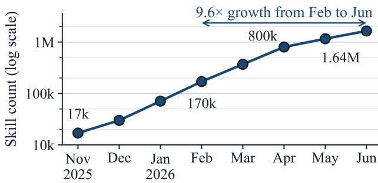
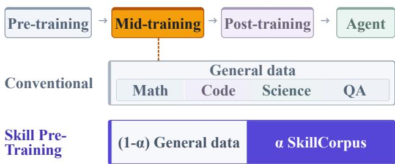
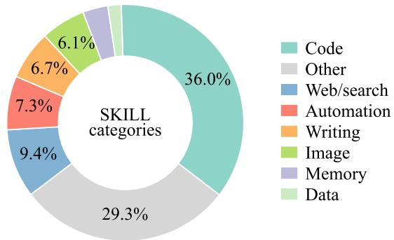
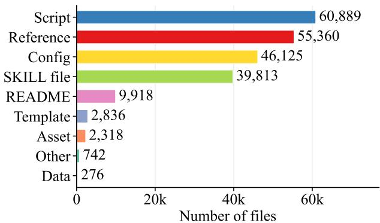
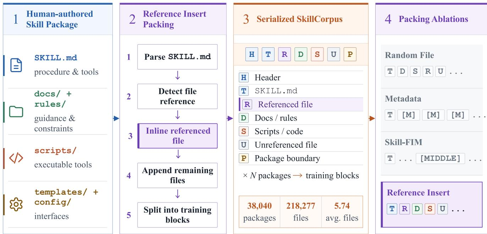
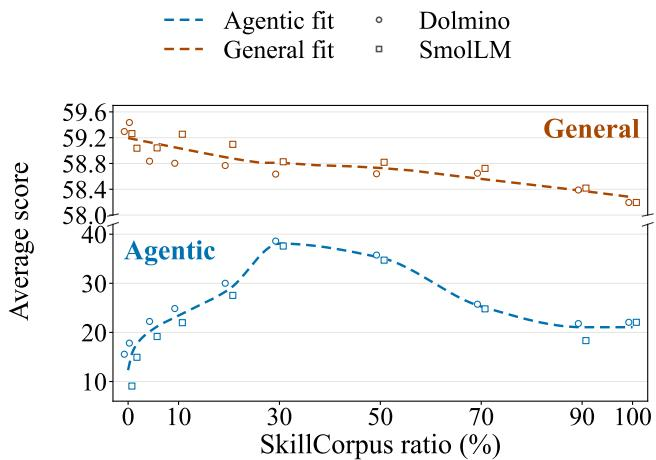

# SPT<sub>:</sub> Skill<sub>s as</sub> Pr<sub>e-</sub>Tr<sub>a</sub>inin<sub>g</sub> D<sub>a</sub>t<sub>a</sub> f<sub>o</sub>r A<sub>ge</sub>nti<sub>c</sub> L<sub>a</sub>n<sub>guage</sub> M<sub>o</sub>d<sub>e</sub>l<sub>s</sub>

<sub>Yufei</sub> <sub>Sun</sub>1∗<sub>,</sub> <sub>Yudong</sub> <sub>Li</sub>2∗†<sub>,</sub> <sub>Yiming</sub> <sub>Cheng</sub>2

<sup>1</sup>Beijing University of Posts and Telecommunications <sup>2</sup>T<sub>s</sub>i<sub>ng</sub>h<sub>ua</sub> U<sub>n</sub>i<sub>vers</sub>it<sub>y</sub> liyudong@tsinghua.edu.cn

## Abstract

A<sub>g</sub>entic (tool-usin<sub>g</sub>) lan<sub>g</sub>ua<sub>g</sub>e models are mainl<sub>y</sub> trained on tool-call traces and agent trajectories during post-training. Th<sub>ese</sub> d<sub>a</sub>t<sub>a prov</sub>id<sub>e</sub> di<sub>rec</sub>t b<sub>e</sub>h<sub>av</sub>i<sub>ora</sub>l <sub>superv</sub>i<sub>s</sub>i<sub>on,</sub> b<sub>u</sub>t <sub>pro-</sub> d<sub>uc</sub>i<sub>ng</sub> th<sub>em requ</sub>i<sub>res</sub> t<sub>as</sub>k <sub>env</sub>i<sub>ronmen</sub>t<sub>s, execu</sub>ti<sub>on, an</sub>d <sub>ver</sub>i<sub>-</sub> fi<sub>ca</sub>ti<sub>on, ma</sub>ki<sub>ng</sub> b<sub>roa</sub>d t<sub>oo</sub>l <sub>an</sub>d t<sub>as</sub>k <sub>coverage expens</sub>i<sub>ve.</sub> P<sub>u</sub>b<sub>-</sub> li<sub>c</sub>l<sub>y ava</sub>il<sub>a</sub>bl<sub>e s</sub>kill<sub>s o</sub>f<sub>er ano</sub>th<sub>er source o</sub>f t<sub>ra</sub>i<sub>n</sub>i<sub>ng</sub> d<sub>a</sub>t<sub>a:</sub> th<sub>ey</sub> <sub>enco</sub>d<sub>e</sub> <sub>reusa</sub>bl<sub>e</sub> t<sub>oo</sub>l <sub>seman</sub>ti<sub>cs</sub> <sub>an</sub>d <sub>wor</sub>kfl<sub>ows</sub> b<sub>u</sub>t <sub>are</sub> t<sub>yp</sub>i<sub>-</sub> <sub>ca</sub>ll<sub>y use</sub>d <sub>on</sub>l<sub>y as</sub> i<sub>n</sub>f<sub>erence-</sub>ti<sub>me con</sub>t<sub>ex</sub>t<sub>.</sub> W<sub>e</sub> i<sub>n</sub>t<sub>ro</sub>d<sub>uce</sub> Skill Pre-Trainin<sub>g</sub> (SPT), a mid-trainin<sub>g</sub> method that a<sub>pp</sub>lies causal l<sub>anguage</sub> <sub>mo</sub>d<sub>e</sub>li<sub>ng</sub> t<sub>o</sub> S<sub>kill</sub>C<sub>orpus,</sub> <sub>a</sub> <sub>co</sub>ll<sub>ec</sub>ti<sub>on</sub> <sub>o</sub>f <sub>pu</sub>bli<sub>c</sub> <sub>mu</sub>lti<sub>-</sub>fil<sub>e s</sub>kill <sub>pac</sub>k<sub>ages, op</sub>ti<sub>ona</sub>ll<sub>y m</sub>i<sub>xe</sub>d <sub>w</sub>ith <sub>genera</sub>l d<sub>a</sub>t<sub>a.</sub> T<sub>o</sub> <sub>preserve</sub> <sub>re</sub>l<sub>a</sub>ti<sub>ons</sub> <sub>among</sub> fil<sub>es</sub> <sub>w</sub>ithi<sub>n</sub> <sub>eac</sub>h <sub>pac</sub>k<sub>age,</sub> <sub>we</sub> <sub>a</sub>l<sub>so</sub> i<sub>n</sub>t<sub>ro</sub>d<sub>uce</sub> R<sub>e</sub>f<sub>erence</sub> I<sub>nser</sub>t<sub>, a re</sub>f<sub>erence-aware assem</sub>bl<sub>y</sub> <sub>s</sub>t<sub>ra</sub>t<sub>egy</sub> th<sub>a</sub>t <sub>p</sub>l<sub>aces suppor</sub>ti<sub>ng</sub> fil<sub>es near</sub> th<sub>e</sub>i<sub>r men</sub>ti<sub>ons</sub> i<sub>n</sub> th<sub>e pr</sub>i<sub>mary</sub> i<sub>ns</sub>t<sub>ruc</sub>ti<sub>on.</sub> E<sub>xper</sub>i<sub>men</sub>t<sub>s across mu</sub>lti<sub>p</sub>l<sub>e mo</sub>d<sub>e</sub>l <sub>sca</sub>l<sub>es</sub> <sub>an</sub>d <sub>pos</sub>t<sub>-</sub>t<sub>ra</sub>i<sub>n</sub>i<sub>ng</sub> <sub>rec</sub>i<sub>pes</sub> <sub>s</sub>h<sub>ow</sub> th<sub>a</sub>t SPT <sub>cons</sub>i<sub>s</sub>t<sub>en</sub>tl<sub>y</sub> i<sub>mproves agen</sub>ti<sub>c per</sub>f<sub>ormance over m</sub>id<sub>-</sub>t<sub>ra</sub>i<sub>n</sub>i<sub>ng on genera</sub>l or trajectory data, while largely preserving general perfor-<sub>mance.</sub> D<sub>a</sub>t<sub>a m</sub>i<sub>x</sub>t<sub>ure exper</sub>i<sub>men</sub>t<sub>s s</sub>h<sub>ow a</sub>dditi<sub>ona</sub>l b<sub>ene</sub>fit<sub>s</sub> f<sub>rom com</sub>bi<sub>n</sub>i<sub>ng s</sub>kill d<sub>a</sub>t<sub>a w</sub>ith <sub>genera</sub>l <sub>annea</sub>li<sub>ng corpora.</sub> Th<sub>ese resu</sub>lt<sub>s</sub> i<sub>n</sub>di<sub>ca</sub>t<sub>e</sub> th<sub>a</sub>t <sub>s</sub>kill <sub>pac</sub>k<sub>ages are a va</sub>l<sub>ua</sub>bl<sub>e</sub> d<sub>a</sub>t<sub>a</sub> <sub>source</sub> f<sub>or pre-</sub>t<sub>ra</sub>i<sub>n</sub>i<sub>ng agen</sub>ti<sub>c</sub> l<sub>anguage mo</sub>d<sub>e</sub>l<sub>s.</sub>

## Intr<sub>o</sub>d<sub>uc</sub>ti<sub>o</sub>n

Lar<sub>g</sub>e lan<sub>g</sub>ua<sub>g</sub>e models (LLMs) increasin<sub>g</sub>l<sub>y</sub> act as a<sub>g</sub>ents that use external tools for multi-ste<sub>p</sub> tasks (Yao et al. 2022; Schick et al. 2023; Hu et al. 2026). Tool use requires models t<sub>o</sub> <sub>un</sub>d<sub>ers</sub>t<sub>an</sub>d t<sub>oo</sub>l f<sub>unc</sub>ti<sub>ons</sub> <sub>an</sub>d <sub>carry</sub> <sub>ou</sub>t i<sub>n</sub>t<sub>erac</sub>ti<sub>ons</sub> <sub>over</sub> <sub>mu</sub>lti<sub>p</sub>l<sub>e</sub> <sub>s</sub>t<sub>eps.</sub> H<sub>owever,</sub> <sub>comp</sub>l<sub>e</sub>t<sub>e</sub> t<sub>oo</sub>l<sub>-use</sub> <sub>processes</sub> <sub>rare</sub>l<sub>y</sub> <sub>appear</sub> i<sub>n</sub> <sub>na</sub>t<sub>ura</sub>ll<sub>y</sub> <sub>co</sub>ll<sub>ec</sub>t<sub>e</sub>d <sub>corpora.</sub> M<sub>os</sub>t <sub>mo</sub>d<sub>e</sub>l<sub>s</sub> th<sub>ere-</sub> f<sub>ore</sub> <sub>acqu</sub>i<sub>re</sub> th<sub>ese</sub> <sub>capa</sub>biliti<sub>es</sub> d<sub>ur</sub>i<sub>ng</sub> <sub>pos</sub>t<sub>-</sub>t<sub>ra</sub>i<sub>n</sub>i<sub>ng</sub> th<sub>roug</sub>h su<sub>p</sub>ervised fine-tunin<sub>g</sub> (SFT) and reinforcement learnin<sub>g</sub> (RL) (Chen et al. 2024; Prabhakar et al. 2025; Qian et al. 2025; Don<sub>g</sub> et al. 2025).

E<sub>x</sub>i<sub>s</sub>ti<sub>ng</sub> <sub>wor</sub>k <sub>ma</sub>i<sub>n</sub>l<sub>y</sub> fill<sub>s</sub> thi<sub>s</sub> d<sub>a</sub>t<sub>a</sub> <sub>gap</sub> <sub>w</sub>ith <sub>syn</sub>th<sub>e</sub>ti<sub>c</sub> function calls and agent trajectories (Tang et al. 2023; Liu <sub>e</sub>t <sub>a</sub>l<sub>.</sub> 2024<sub>;</sub> P<sub>ra</sub>bh<sub>a</sub>k<sub>ar</sub> <sub>e</sub>t <sub>a</sub>l<sub>.</sub> 2025<sub>;</sub> Li<sub>ang</sub> <sub>e</sub>t <sub>a</sub>l<sub>.</sub> 2026<sub>a;</sub> F<sub>ang</sub> et al. 2025). Producing valid trajectories requires task en-<sub>v</sub>i<sub>ronmen</sub>t<sub>s,</sub> <sub>execu</sub>ti<sub>on,</sub> <sub>an</sub>d <sub>ver</sub>ifi<sub>ca</sub>ti<sub>on,</sub> <sub>so</sub> th<sub>e</sub> <sub>cos</sub>t <sub>grows</sub> with tool and task coverage. In addition, a trajectory records <sub>one execu</sub>ti<sub>on ra</sub>th<sub>er</sub> th<sub>an a reusa</sub>bl<sub>e wor</sub>kfl<sub>ow.</sub> Th<sub>e</sub> hi<sub>g</sub>h <sub>pro-</sub> duction cost and execution-specific content make trajectories difi<sub>cu</sub>lt t<sub>o co</sub>ll<sub>ec</sub>t <sub>a</sub>t th<sub>e sca</sub>l<sub>e an</sub>d <sub>coverage requ</sub>i<sub>re</sub>d f<sub>or pre-</sub> t<sub>ra</sub>i<sub>n</sub>i<sub>ng.</sub>

  
(a) Growth of publicly indexed skills.

  
(b) SPT as mid-training composition.  
Fi<sub>gure</sub> 1<sub>:</sub> P<sub>u</sub>bli<sub>c s</sub>kill d<sub>a</sub>t<sub>a grow</sub>th <sub>an</sub>d th<sub>e</sub> SPT <sub>m</sub>id<sub>-</sub>t<sub>ra</sub>i<sub>n</sub>i<sub>ng</sub> <sub>p</sub>i<sub>p</sub>eline. (a) Sna<sub>p</sub>shots from the n<sub>p</sub>m re<sub>g</sub>istr<sub>y</sub> show that the number of skills available on the platform grew 9.6× from Februar<sub>y</sub> to June 2026. (b) SPT mixes an α fraction of Skill-Corpus with (1 − α) general data during mid-training, foll<sub>owe</sub>d b<sub>y</sub> <sub>pos</sub>t<sub>-</sub>t<sub>ra</sub>i<sub>n</sub>i<sub>ng.</sub>

Th<sub>ese</sub> li<sub>m</sub>it<sub>a</sub>ti<sub>ons mo</sub>ti<sub>va</sub>t<sub>e a</sub> dif<sub>eren</sub>t <sub>source o</sub>f <sub>agen</sub>ti<sub>c</sub> <sub>pre-</sub>t<sub>ra</sub>i<sub>n</sub>i<sub>ng</sub> d<sub>a</sub>t<sub>a: s</sub>kill<sub>s, w</sub>hi<sub>c</sub>h <sub>are reusa</sub>bl<sub>e</sub> i<sub>ns</sub>t<sub>ruc</sub>ti<sub>ons wr</sub>it<sub>-</sub> ten by humans for AI agents. Unlike a trajectory that records <sub>one</sub> <sub>execu</sub>ti<sub>on,</sub> <sub>a</sub> <sub>s</sub>kill d<sub>escr</sub>ib<sub>es</sub> h<sub>ow</sub> <sub>an</sub> <sub>agen</sub>t <sub>s</sub>h<sub>ou</sub>ld <sub>per</sub>f<sub>orm</sub> <sub>a</sub> t<sub>as</sub>k <sub>an</sub>d <sub>can</sub> i<sub>nc</sub>l<sub>u</sub>d<sub>e re</sub>f<sub>erences, scr</sub>i<sub>p</sub>t<sub>s,</sub> t<sub>emp</sub>l<sub>a</sub>t<sub>es, an</sub>d <sub>con</sub>fi<sub>gura</sub>ti<sub>on</sub> fil<sub>es.</sub> Th<sub>e coun</sub>t <sub>o</sub>f <sub>pu</sub>bli<sub>c</sub>l<sub>y ava</sub>il<sub>a</sub>bl<sub>e s</sub>kill<sub>s on</sub> <sub>npm</sub> i<sub>s grow</sub>i<sub>ng rap</sub>idl<sub>y.</sub> B<sub>ase</sub>d <sub>on snaps</sub>h<sub>o</sub>t<sub>s</sub> f<sub>rom</sub> th<sub>e npm</sub> <sub>reg</sub>i<sub>s</sub>t<sub>ry</sub><sup>1</sup><sub>,</sub> th<sub>e num</sub>b<sub>er o</sub>f <sub>ava</sub>il<sub>a</sub>bl<sub>e s</sub>kill<sub>s rose</sub> f<sub>rom</sub> 170<sub>,</sub>226 i<sub>n</sub> Februar<sub>y</sub> 2026 to 1,640,440 in June 2026 (Fi<sub>g</sub>ure 1(a)). This <sub>sca</sub>l<sub>e ma</sub>k<sub>es s</sub>kill <sub>pac</sub>k<sub>ages a p</sub>l<sub>aus</sub>ibl<sub>e source o</sub>f <sub>pre-</sub>t<sub>ra</sub>i<sub>n</sub>i<sub>ng</sub>

d<sub>a</sub>t<sub>a.</sub>

T<sub>o</sub> t<sub>es</sub>t thi<sub>s</sub> h<sub>ypo</sub>th<sub>es</sub>i<sub>s,</sub> <sub>we</sub> i<sub>n</sub>t<sub>ro</sub>d<sub>uce</sub> SPT <sub>as</sub> <sub>a</sub> <sub>m</sub>id<sub>-</sub>t<sub>ra</sub>i<sub>n</sub>i<sub>ng</sub> <sub>me</sub>th<sub>o</sub>d th<sub>a</sub>t <sub>app</sub>li<sub>es causa</sub>l l<sub>anguage mo</sub>d<sub>e</sub>li<sub>ng</sub> t<sub>o s</sub>kill d<sub>a</sub>t<sub>a</sub> b<sub>e</sub>f<sub>ore</sub> b<sub>e</sub>h<sub>av</sub>i<sub>or-or</sub>i<sub>en</sub>t<sub>e</sub>d <sub>pos</sub>t<sub>-</sub>t<sub>ra</sub>i<sub>n</sub>i<sub>ng.</sub> W<sub>e cons</sub>t<sub>ruc</sub>t S<sub>kill-</sub> C<sub>orpus</sub> f<sub>rom</sub> 38<sub>,</sub>040 <sub>c</sub>l<sub>eane</sub>d <sub>an</sub>d d<sub>econ</sub>t<sub>am</sub>i<sub>na</sub>t<sub>e</sub>d Cl<sub>aw</sub>H<sub>u</sub>b <sub>pac</sub>k<sub>ages</sub><sup>2</sup><sub>.</sub> T<sub>o preserve</sub> th<sub>e re</sub>l<sub>a</sub>ti<sub>ons</sub> b<sub>e</sub>t<sub>ween an</sub> i<sub>ns</sub>t<sub>ruc</sub>ti<sub>on</sub> and its supporting resources, we introduce Reference Insert, <sub>w</sub>hi<sub>c</sub>h <sub>p</sub>l<sub>aces eac</sub>h <sub>re</sub>f<sub>erence</sub>d fil<sub>e near</sub> it<sub>s</sub> fi<sub>rs</sub>t <sub>men</sub>ti<sub>on</sub> i<sub>n</sub> th<sub>e</sub> <sub>pr</sub>i<sub>mary</sub> i<sub>ns</sub>t<sub>ruc</sub>ti<sub>on</sub> fil<sub>e.</sub> SPT <sub>a</sub>l<sub>so</sub> <sub>a</sub>ll<sub>ows</sub> S<sub>kill</sub>C<sub>orpus</sub> t<sub>o</sub> b<sub>e m</sub>i<sub>xe</sub>d <sub>w</sub>ith <sub>genera</sub>l d<sub>a</sub>t<sub>a un</sub>d<sub>er a</sub> fi<sub>xe</sub>d t<sub>ra</sub>i<sub>n</sub>i<sub>ng-</sub>t<sub>o</sub>k<sub>en</sub> b<sub>u</sub>d<sub>ge</sub>t<sub>.</sub> Th<sub>e resu</sub>lti<sub>ng c</sub>h<sub>ec</sub>k<sub>po</sub>i<sub>n</sub>t i<sub>s</sub> th<sub>en use</sub>d t<sub>o</sub> i<sub>n</sub>iti<sub>a</sub>li<sub>ze</sub> d<sub>owns</sub>t<sub>ream</sub> <sub>pos</sub>t<sub>-</sub>t<sub>ra</sub>i<sub>n</sub>i<sub>ng.</sub>

W<sub>e</sub> <sub>eva</sub>l<sub>ua</sub>t<sub>e</sub> SPT <sub>across</sub> th<sub>ree</sub> <sub>mo</sub>d<sub>e</sub>l <sub>sca</sub>l<sub>es</sub> <sub>an</sub>d <sub>mu</sub>lti<sub>-</sub> <sub>p</sub>l<sub>e</sub> <sub>m</sub>id<sub>-</sub>/<sub>pos</sub>t<sub>-</sub>t<sub>ra</sub>i<sub>n</sub>i<sub>ng</sub> <sub>con</sub>fi<sub>gura</sub>ti<sub>ons.</sub> U<sub>n</sub>d<sub>er</sub> b<sub>o</sub>th <sub>genera</sub>l i<sub>n-</sub> <sub>s</sub>t<sub>ruc</sub>ti<sub>on</sub> t<sub>un</sub>i<sub>ng an</sub>d f<sub>unc</sub>ti<sub>on-ca</sub>lli<sub>ng</sub> SFT<sub>,</sub> SPT <sub>cons</sub>i<sub>s</sub>t<sub>en</sub>tl<sub>y</sub> <sub>ou</sub>t<sub>per</sub>f<sub>orms</sub> di<sub>rec</sub>t SFT <sub>an</sub>d <sub>m</sub>id<sub>-</sub>t<sub>ra</sub>i<sub>n</sub>i<sub>ng on genera</sub>l <sub>or</sub> t<sub>ra-</sub> jectory data across all evaluated model scales, while largely <sub>p</sub>r<sub>ese</sub>r<sub>v</sub>in<sub>g</sub> <sub>ge</sub>n<sub>e</sub>r<sub>a</sub>l <sub>pe</sub>rf<sub>o</sub>rm<sub>a</sub>n<sub>ce.</sub> D<sub>a</sub>t<sub>a</sub> mi<sub>x</sub>t<sub>u</sub>r<sub>e</sub> <sub>expe</sub>rim<sub>e</sub>nt<sub>s</sub> <sub>ac</sub>hi<sub>eve</sub> f<sub>ur</sub>th<sub>er agen</sub>ti<sub>c ga</sub>i<sub>ns w</sub>h<sub>en s</sub>kill d<sub>a</sub>t<sub>a</sub> i<sub>s com</sub>bi<sub>ne</sub>d <sub>w</sub>ith <sub>genera</sub>l d<sub>a</sub>t<sub>a.</sub> Wh<sub>en</sub> SFT i<sub>s</sub> f<sub>o</sub>ll<sub>owe</sub>d b<sub>y re</sub>i<sub>n</sub>f<sub>orcemen</sub>t l<sub>earn</sub>i<sub>ng,</sub> SPT <sub>re</sub>t<sub>a</sub>i<sub>ns</sub> it<sub>s</sub> <sub>a</sub>d<sub>van</sub>t<sub>age</sub> <sub>over</sub> <sub>no</sub> <sub>m</sub>id<sub>-</sub>t<sub>ra</sub>i<sub>n</sub>i<sub>ng</sub> <sub>an</sub>d <sub>genera</sub>l<sub>-</sub>d<sub>a</sub>t<sub>a m</sub>id<sub>-</sub>t<sub>ra</sub>i<sub>n</sub>i<sub>ng.</sub> Th<sub>e cons</sub>i<sub>s</sub>t<sub>en</sub>t i<sub>mprovemen</sub>t<sub>s</sub> <sub>across</sub> th<sub>ese exper</sub>i<sub>men</sub>t<sub>s s</sub>h<sub>ow</sub> th<sub>a</sub>t th<sub>e</sub> b<sub>ene</sub>fit <sub>o</sub>f SPT i<sub>s</sub> <sub>ro</sub>b<sub>us</sub>t t<sub>o c</sub>h<sub>anges</sub> i<sub>n mo</sub>d<sub>e</sub>l <sub>sca</sub>l<sub>e, m</sub>id<sub>-</sub>t<sub>ra</sub>i<sub>n</sub>i<sub>ng</sub> d<sub>a</sub>t<sub>a an</sub>d <sub>or-</sub> <sub>gan</sub>i<sub>za</sub>ti<sub>on, an</sub>d <sub>pos</sub>t<sub>-</sub>t<sub>ra</sub>i<sub>n</sub>i<sub>ng me</sub>th<sub>o</sub>d<sub>.</sub> Th<sub>ese resu</sub>lt<sub>s revea</sub>l th<sub>e va</sub>l<sub>ue o</sub>f <sub>s</sub>kill <sub>corpora as pre-</sub>t<sub>ra</sub>i<sub>n</sub>i<sub>ng</sub> d<sub>a</sub>t<sub>a</sub> f<sub>or agen</sub>ti<sub>c</sub> l<sub>anguage mo</sub>d<sub>e</sub>l<sub>s.</sub>

O<sub>ur con</sub>t<sub>r</sub>ib<sub>u</sub>ti<sub>ons are as</sub> f<sub>o</sub>ll<sub>ows.</sub>

• We <sub>p</sub>ro<sub>p</sub>ose multi-file skill <sub>p</sub>acka<sub>g</sub>es as scalable a<sub>g</sub>enti<sub>c</sub> <sub>pre-</sub>t<sub>ra</sub>i<sub>n</sub>i<sub>ng</sub> d<sub>a</sub>t<sub>a</sub> <sub>an</sub>d <sub>cons</sub>t<sub>ruc</sub>t th<sub>e</sub> 38<sub>,</sub>040<sub>-pac</sub>k<sub>age</sub> S<sub>kill</sub>C<sub>orpus.</sub>

• We introduce SPT<sub>,</sub> which a<sub>pp</sub>lies the causal lan<sub>g</sub>ua<sub>g</sub>emodeling objective to skill data before post-training, to-<sub>ge</sub>th<sub>er w</sub>ith R<sub>e</sub>f<sub>erence</sub> I<sub>nser</sub>t f<sub>or re</sub>f<sub>erence-aware pac</sub>k<sub>age</sub> <sub>assem</sub>bl<sub>y.</sub>

• We <sub>p</sub>rovide controlled cor<sub>p</sub>us com<sub>p</sub>arisons and ablations <sub>o</sub>f <sub>m</sub>i<sub>x</sub>t<sub>ure ra</sub>ti<sub>o an</sub>d <sub>pac</sub>k<sub>age organ</sub>i<sub>za</sub>ti<sub>on across mu</sub>lti<sub>-</sub> <sub>p</sub>l<sub>e</sub> b<sub>ac</sub>kb<sub>ones</sub> <sub>an</sub>d SFT <sub>se</sub>tti<sub>ngs,</sub> <sub>p</sub>l<sub>us</sub> <sub>a</sub> d<sub>owns</sub>t<sub>ream</sub> RL <sub>ro</sub>b<sub>us</sub>t<sub>ness</sub> t<sub>es</sub>t<sub>.</sub>

## R<sub>e</sub>l<sub>a</sub>t<sub>e</sub>d W<sub>o</sub>rk

## Tr<sub>a</sub>inin<sub>g</sub> Pi<sub>pe</sub>lin<sub>es</sub> <sub>a</sub>nd A<sub>ge</sub>nti<sub>c</sub> Mid<sub>-</sub>Tr<sub>a</sub>inin<sub>g</sub>

M<sub>o</sub>d<sub>e</sub>rn LLM d<sub>eve</sub>l<sub>op</sub>m<sub>e</sub>nt <sub>co</sub>mm<sub>o</sub>nl<sub>y</sub> <sub>sepa</sub>r<sub>a</sub>t<sub>es</sub> br<sub>oa</sub>d <sub>p</sub>r<sub>e-</sub> t<sub>ra</sub>i<sub>n</sub>i<sub>ng</sub> f<sub>rom</sub> l<sub>a</sub>t<sub>er s</sub>t<sub>ages</sub> th<sub>a</sub>t <sub>re</sub>fi<sub>ne</sub> th<sub>e</sub> d<sub>a</sub>t<sub>a</sub> di<sub>s</sub>t<sub>r</sub>ib<sub>u</sub>ti<sub>on</sub> <sub>an</sub>d <sub>a</sub>li<sub>gn mo</sub>d<sub>e</sub>l b<sub>e</sub>h<sub>av</sub>i<sub>or.</sub> Mid<sub>-</sub>t<sub>ra</sub>i<sub>n</sub>i<sub>ng, w</sub>hi<sub>c</sub>h <sub>may</sub> i<sub>nc</sub>l<sub>u</sub>d<sub>e</sub> <sub>annea</sub>li<sub>ng,</sub> <sub>a</sub>d<sub>ap</sub>t<sub>s</sub> <sub>a</sub> <sub>pre-</sub>t<sub>ra</sub>i<sub>ne</sub>d <sub>c</sub>h<sub>ec</sub>k<sub>po</sub>i<sub>n</sub>t <sub>on</sub> <sub>cura</sub>t<sub>e</sub>d <sub>or</sub> d<sub>oma</sub>i<sub>n-we</sub>i<sub>g</sub>ht<sub>e</sub>d <sub>corpora, w</sub>h<sub>ereas pos</sub>t<sub>-</sub>t<sub>ra</sub>i<sub>n</sub>i<sub>ng uses</sub> SFT<sub>,</sub> <sub>pre</sub>f<sub>erence op</sub>ti<sub>m</sub>i<sub>za</sub>ti<sub>on, or</sub> RL t<sub>o</sub> t<sub>eac</sub>h i<sub>ns</sub>t<sub>ruc</sub>ti<sub>on</sub> f<sub>o</sub>ll<sub>ow</sub>i<sub>ng</sub> and res<sub>p</sub>onse behavior (Ka<sub>p</sub>lan et al. 2020; Hofmann et al. 2022<sub>;</sub> O<sub>uyang e</sub>t <sub>a</sub>l<sub>.</sub> 2022<sub>;</sub> R<sub>a</sub>f<sub>a</sub>il<sub>ov e</sub>t <sub>a</sub>l<sub>.</sub> 2023<sub>;</sub> L<sub>am</sub>b<sub>er</sub>t <sub>e</sub>t <sub>a</sub>l<sub>.</sub> 2024). Recent o<sub>p</sub>en-model eforts use late-sta<sub>g</sub>e data selecti<sub>on,</sub> d<sub>oma</sub>i<sub>n</sub> <sub>m</sub>i<sub>x</sub>t<sub>ures,</sub> <sub>me</sub>t<sub>a</sub>d<sub>a</sub>t<sub>a</sub> <sub>con</sub>diti<sub>on</sub>i<sub>ng,</sub> <sub>an</sub>d <sub>cura</sub>t<sub>e</sub>d <sub>annea</sub>li<sub>n cor ora</sub> t<sub>o s</sub>t<sub>ren</sub> th<sub>en</sub> t<sub>ar e</sub>t<sub>e</sub>d <sub>ca a</sub>biliti<sub>es w</sub>hil<sub>e</sub> retainin<sub>g</sub> broad com<sub>p</sub>etence (Gao et al. 2025; Li et al. 2024; T<sub>eam e</sub>t <sub>a</sub>l<sub>.</sub> 2025<sub>;</sub> All<sub>a</sub>l <sub>e</sub>t <sub>a</sub>l<sub>.</sub> 2025<sub>;</sub> Li<sub>u e</sub>t <sub>a</sub>l<sub>.</sub> 2025<sub>;</sub> OLM<sub>o</sub> et al. 2024). SPT a<sub>pp</sub>lies this mid-trainin<sub>g</sub> framework to skill <sub>pac</sub>k<sub>ages</sub> th<sub>a</sub>t <sub>enco</sub>d<sub>e reusa</sub>bl<sub>e</sub> t<sub>oo</sub>l <sub>seman</sub>ti<sub>cs an</sub>d <sub>wor</sub>kfl<sub>ows.</sub>

P<sub>r</sub>i<sub>or wor</sub>k h<sub>as</sub> i<sub>ncorpora</sub>t<sub>e</sub>d t<sub>oo</sub>l <sub>ca</sub>ll<sub>s, ver</sub>ifi<sub>e</sub>d f<sub>unc</sub>ti<sub>on-</sub> calling examples, search traces, and interaction trajectories i<sub>n</sub>t<sub>o</sub> l<sub>anguage-mo</sub>d<sub>e</sub>li<sub>ng corpora; nex</sub>t<sub>-</sub>t<sub>o</sub>k<sub>en pre</sub>di<sub>c</sub>ti<sub>on over</sub> <sub>suc</sub>h d<sub>a</sub>t<sub>a can</sub> i<sub>mprove</sub> t<sub>oo</sub>l i<sub>nvoca</sub>ti<sub>on an</sub>d <sub>agen</sub>ti<sub>c reason-</sub> in<sub>g</sub> (Schick et al. 2023; Liu et al. 2024; Wu et al. 2025; Zhuan<sub>g</sub> et al. 2025). These cor<sub>p</sub>ora <sub>p</sub>rimaril<sub>y</sub> ex<sub>p</sub>ose mod-<sub>e</sub>l<sub>s</sub> t<sub>o ca</sub>ll<sub>s or rea</sub>li<sub>ze</sub>d <sub>execu</sub>ti<sub>on pa</sub>th<sub>s.</sub> SPT <sub>uses</sub> th<sub>e same</sub> causal language-modeling objective but changes the training <sub>un</sub>it t<sub>o reusa</sub>bl<sub>e, mu</sub>lti<sub>-</sub>fil<sub>e wor</sub>kfl<sub>ow spec</sub>ifi<sub>ca</sub>ti<sub>ons</sub> th<sub>a</sub>t <sub>s</sub>t<sub>a</sub>t<sub>e</sub> t<sub>oo</sub>l <sub>seman</sub>ti<sub>cs, proce</sub>d<sub>ura</sub>l <sub>cons</sub>t<sub>ra</sub>i<sub>n</sub>t<sub>s, an</sub>d <sub>resource re</sub>l<sub>a</sub>ti<sub>ons</sub> <sub>exp</sub>li<sub>c</sub>itl<sub>y.</sub>

Skill<sub>-cen</sub>t<sub>ere</sub>d <sub>sys</sub>t<sub>ems</sub> i<sub>ns</sub>t<sub>ea</sub>d <sub>organ</sub>i<sub>ze s</sub>kill<sub>s as reusa</sub>bl<sub>e</sub> <sub>ex</sub>t<sub>erna</sub>l <sub>asse</sub>t<sub>s.</sub> SkillN<sub>e</sub>t <sub>prov</sub>id<sub>es</sub> i<sub>n</sub>f<sub>ras</sub>t<sub>ruc</sub>t<sub>ure</sub> f<sub>or crea</sub>t<sub>-</sub> i<sub>ng, eva</sub>l<sub>ua</sub>ti<sub>ng, an</sub>d <sub>connec</sub>ti<sub>ng more</sub> th<sub>an</sub> 200<sub>,</sub>000 <sub>s</sub>kill<sub>s</sub> throu<sub>g</sub>h a unified ontolo<sub>gy</sub> (Lian<sub>g</sub> et al. 2026b), while Skill-C<sub>en</sub>t<sub>er</sub> b<sub>u</sub>ild<sub>s a source-groun</sub>d<sub>e</sub>d lib<sub>rary o</sub>f 216<sub>,</sub>938 <sub>s</sub>kill<sub>s</sub> <sub>us</sub>i<sub>ng</sub> <sub>mu</sub>lti<sub>-source</sub> <sub>acqu</sub>i<sub>s</sub>iti<sub>on,</sub> <sub>qua</sub>lit<sub>y</sub> filt<sub>er</sub>i<sub>ng,</sub> <sub>an</sub>d <sub>c</sub>l<sub>a</sub>i<sub>m-</sub> level traceabilit<sub>y</sub> (Sha et al. 2026). Their <sub>p</sub>rimar<sub>y</sub> focus is <sub>s</sub>kill <sub>cons</sub>t<sub>ruc</sub>ti<sub>on, organ</sub>i<sub>za</sub>ti<sub>on, an</sub>d <sub>agen</sub>t<sub>-s</sub>id<sub>e reuse.</sub> SPT i<sub>ns</sub>t<sub>ea</sub>d t<sub>rea</sub>t<sub>s</sub> <sub>mu</sub>lti<sub>-</sub>fil<sub>e</sub> <sub>s</sub>kill <sub>pac</sub>k<sub>ages</sub> <sub>as</sub> <sub>m</sub>id<sub>-</sub>t<sub>ra</sub>i<sub>n</sub>i<sub>ng</sub> d<sub>a</sub>t<sub>a</sub> <sub>an</sub>d <sub>s</sub>t<sub>u</sub>di<sub>es</sub> <sub>corpus</sub> <sub>m</sub>i<sub>x</sub>t<sub>ure</sub> <sub>an</sub>d <sub>cross-</sub>fil<sub>e</sub> <sub>ser</sub>i<sub>a</sub>li<sub>za</sub>ti<sub>on</sub> <sub>un</sub>d<sub>er</sub> <sub>a</sub> fi<sub>xe</sub>d t<sub>o</sub>k<sub>en</sub> b<sub>u</sub>d<sub>ge</sub>t<sub>.</sub>

## A<sub>ge</sub>nt T<sub>u</sub>nin<sub>g</sub> <sub>a</sub>nd E<sub>va</sub>l<sub>ua</sub>ti<sub>o</sub>n

M<sub>os</sub>t <sub>pr</sub>i<sub>or</sub> <sub>wor</sub>k <sub>on</sub> t<sub>oo</sub>l<sub>-use</sub> <sub>spec</sub>i<sub>a</sub>li<sub>za</sub>ti<sub>on</sub> f<sub>ocuses</sub> <sub>on</sub> <sub>pos</sub>t<sub>-</sub>t<sub>ra</sub>i<sub>n</sub>i<sub>ng.</sub> F<sub>unc</sub>ti<sub>on-ca</sub>lli<sub>ng corpora</sub> t<sub>ra</sub>i<sub>n</sub> API <sub>se</sub>l<sub>ec</sub>ti<sub>on,</sub> <sub>sc</sub>h<sub>ema-comp</sub>li<sub>an</sub>t <sub>argumen</sub>t <sub>genera</sub>ti<sub>on,</sub> <sub>an</sub>d <sub>ca</sub>ll <sub>compos</sub>i<sub>-</sub> tion across lar<sub>g</sub>e tool collections (Patil et al. 2024; Qin et al. 2024; Tan<sub>g</sub> et al. 2023; Lian<sub>g</sub> et al. 2026a). A<sub>g</sub>ent-tunin<sub>g</sub> d<sub>a</sub>t<sub>ase</sub>t<sub>s ex</sub>t<sub>en</sub>d thi<sub>s superv</sub>i<sub>s</sub>i<sub>on</sub> t<sub>o mu</sub>lti<sub>-</sub>t<sub>urn reason</sub>i<sub>ng–</sub> action–observation traces and environment interactions (Yao <sub>e</sub>t <sub>a</sub>l<sub>.</sub> 2022<sub>;</sub> Ch<sub>en e</sub>t <sub>a</sub>l<sub>.</sub> 2024<sub>;</sub> S<sub>ong e</sub>t <sub>a</sub>l<sub>.</sub> 2024<sub>;</sub> P<sub>ra</sub>bh<sub>a</sub>k<sub>ar</sub> et al. 2025; Fan<sub>g</sub> et al. 2025), while RL-based methods o<sub>p</sub>- ti<sub>m</sub>i<sub>ze</sub> t<sub>oo</sub>l<sub>-use</sub> <sub>po</sub>li<sub>c</sub>i<sub>es</sub> <sub>aga</sub>i<sub>ns</sub>t t<sub>as</sub>k <sub>rewar</sub>d<sub>s.</sub> R<sub>ecen</sub>t <sub>s</sub>t<sub>u</sub>di<sub>es</sub> f<sub>ur</sub>th<sub>er</sub> i<sub>n</sub>di<sub>ca</sub>t<sub>e</sub> th<sub>a</sub>t SFT <sub>genera</sub>li<sub>za</sub>ti<sub>on can</sub> b<sub>e</sub> li<sub>m</sub>it<sub>e</sub>d b<sub>y</sub> i<sub>n</sub>t<sub>er</sub>f<sub>ace-pa</sub>tt<sub>ern</sub> <sub>memor</sub>i<sub>za</sub>ti<sub>on</sub> <sub>an</sub>d th<sub>a</sub>t RL <sub>ou</sub>t<sub>comes</sub> d<sub>e-</sub> <sub>p</sub>end on the initial <sub>p</sub>olic<sub>y</sub> and reward desi<sub>g</sub>n (Chu et al. 2025; Qian et al. 2025; Don<sub>g</sub> et al. 2025; Gu et al. 2026). SPT <sub>exposes</sub> th<sub>e</sub> <sub>mo</sub>d<sub>e</sub>l t<sub>o</sub> <sub>wor</sub>kfl<sub>ow-</sub>l<sub>eve</sub>l k<sub>now</sub>l<sub>e</sub>d<sub>ge</sub> b<sub>e-</sub> f<sub>ore</sub> <sub>pos</sub>t<sub>-</sub>t<sub>ra</sub>i<sub>n</sub>i<sub>ng</sub> <sub>an</sub>d <sub>eva</sub>l<sub>ua</sub>t<sub>es</sub> <sub>w</sub>h<sub>e</sub>th<sub>er</sub> thi<sub>s</sub> <sub>prepara</sub>ti<sub>on</sub> i<sub>m-</sub> <sub>p</sub>roves <sup>d</sup>ownstream a<sub>g</sub>ent<sup>i</sup>c <sub>p</sub>er<sup>f</sup>ormance.

R<sub>ecen</sub>t b<sub>enc</sub>h<sub>mar</sub>k<sub>s prov</sub>id<sub>e</sub> fi<sub>ne-gra</sub>i<sub>ne</sub>d di<sub>agnos</sub>ti<sub>cs o</sub>f t<sub>oo</sub>l<sub>-use awareness,</sub> t<sub>oo</sub>l <sub>se</sub>l<sub>ec</sub>ti<sub>on, argumen</sub>t <sub>va</sub>lidit<sub>y,</sub> f<sub>unc-</sub> ti<sub>on c</sub>h<sub>a</sub>i<sub>n</sub>i<sub>ng, mu</sub>lti<sub>-s</sub>t<sub>ep p</sub>l<sub>ann</sub>i<sub>ng, an</sub>d <sub>ac</sub>ti<sub>on–</sub>f<sub>ee</sub>db<sub>ac</sub>k <sub>con-</sub> sistenc<sub>y</sub> (Li et al. 2023; Huan<sub>g</sub> et al. 2024; Ye et al. 2025; Patil et al. 2025). Broader suites additionall<sub>y</sub> evaluate web i<sub>n</sub>t<sub>erac</sub>ti<sub>on, opera</sub>ti<sub>ng-sys</sub>t<sub>em con</sub>t<sub>ro</sub>l<sub>,</sub> k<sub>now</sub>l<sub>e</sub>d<sub>ge-</sub>i<sub>n</sub>t<sub>ens</sub>i<sub>ve</sub> tasks, and lon<sub>g</sub>-horizon behavior (Qin et al. 2025; Jia et al. 2025; Shi et al. 2026). We use these benchmarks to measure h<sub>ow</sub> th<sub>e m</sub>id<sub>-</sub>t<sub>ra</sub>i<sub>n</sub>i<sub>ng corpus a</sub>f<sub>ec</sub>t<sub>s</sub> di<sub>s</sub>ti<sub>nc</sub>t <sub>componen</sub>t<sub>s o</sub>f <sub>agen</sub>ti<sub>c</sub> b<sub>e</sub>h<sub>av</sub>i<sub>or.</sub>

## Skill Pr<sub>e-</sub>Tr<sub>a</sub>inin<sub>g</sub>

SPT <sub>uses</sub> h<sub>uman-wr</sub>itt<sub>en</sub> <sub>s</sub>kill <sub>pac</sub>k<sub>ages</sub> d<sub>ur</sub>i<sub>ng</sub> <sub>m</sub>id<sub>-</sub>t<sub>ra</sub>i<sub>n</sub>i<sub>ng,</sub> b<sub>e</sub>f<sub>ore</sub> b<sub>e</sub>h<sub>av</sub>i<sub>or-or</sub>i<sub>en</sub>t<sub>e</sub>d <sub>pos</sub>t<sub>-</sub>t<sub>ra</sub>i<sub>n</sub>i<sub>ng.</sub> Thi<sub>s</sub> <sub>s</sub>t<sub>age</sub> <sub>exposes</sub> th<sub>e</sub> b<sub>ase mo</sub>d<sub>e</sub>l t<sub>o</sub> t<sub>oo</sub>l d<sub>escr</sub>i<sub>p</sub>ti<sub>ons an</sub>d <sub>reusa</sub>bl<sub>e wor</sub>kfl<sub>ows</sub> b<sub>e</sub>f<sub>ore</sub> SFT t<sub>eac</sub>h<sub>es response an</sub>d t<sub>oo</sub>l<sub>-ca</sub>ll f<sub>orma</sub>t<sub>s.</sub> U<sub>n</sub>lik<sub>e</sub> a call or trajectory, which records a particular sequence of <sub>ac</sub>ti<sub>ons</sub> <sub>an</sub>d <sub>ou</sub>t<sub>comes,</sub> <sub>a</sub> <sub>s</sub>kill <sub>exp</sub>l<sub>a</sub>i<sub>ns</sub> <sub>w</sub>h<sub>en</sub> <sub>a</sub> <sub>capa</sub>bilit<sub>y</sub> <sub>ap-</sub> <sub>p</sub>li<sub>es,</sub> h<sub>ow</sub> t<sub>o</sub> <sub>comp</sub>l<sub>e</sub>t<sub>e</sub> <sub>a</sub> t<sub>as</sub>k<sub>,</sub> <sub>w</sub>hi<sub>c</sub>h <sub>cons</sub>t<sub>ra</sub>i<sub>n</sub>t<sub>s</sub> t<sub>o</sub> f<sub>o</sub>ll<sub>ow,</sub> <sub>an</sub>d <sub>w</sub>hi<sub>c</sub>h <sub>suppor</sub>ti<sub>ng resources</sub> t<sub>o use.</sub> Skill<sub>s prov</sub>id<sub>e reusa</sub>bl<sub>e</sub> task knowledge, whereas calls and trajectories provide direct b<sub>e</sub>h<sub>av</sub>i<sub>ora</sub>l <sub>superv</sub>i<sub>s</sub>i<sub>on.</sub>

SPT <sub>c</sub>h<sub>anges</sub> th<sub>e</sub> d<sub>a</sub>t<sub>a use</sub>d f<sub>or m</sub>id<sub>-</sub>t<sub>ra</sub>i<sub>n</sub>i<sub>ng w</sub>ith<sub>ou</sub>t <sub>c</sub>h<sub>ang-</sub> ing the standard causal language-modeling objective. It re-<sub>qu</sub>i<sub>res</sub> <sub>no</sub> t<sub>as</sub>k <sub>env</sub>i<sub>ronmen</sub>t<sub>s,</sub> t<sub>oo</sub>l <sub>execu</sub>ti<sub>on,</sub> <sub>or</sub> <sub>syn</sub>th<sub>e</sub>ti<sub>c</sub> t<sub>ra-</sub> jectory generation. As shown in Figure 3, we collect public <sub>mu</sub>lti<sub>-</sub>fil<sub>e</sub> <sub>s</sub>kill <sub>pac</sub>k<sub>ages,</sub> <sub>c</sub>l<sub>ean</sub> th<sub>e</sub>i<sub>r</sub> <sub>con</sub>t<sub>en</sub>t<sub>s,</sub> <sub>organ</sub>i<sub>ze</sub> <sub>eac</sub>h <sub>pac</sub>k<sub>age</sub> <sub>w</sub>ith R<sub>e</sub>f<sub>erence</sub> I<sub>nser</sub>t<sub>,</sub> <sub>an</sub>d <sub>pac</sub>k th<sub>e</sub> <sub>resu</sub>lti<sub>ng</sub> <sub>se-</sub> <sub>quences</sub> i<sub>n</sub>t<sub>o</sub> fi<sub>xe</sub>d<sub>-</sub>l<sub>eng</sub>th t<sub>ra</sub>i<sub>n</sub>i<sub>ng</sub> bl<sub>oc</sub>k<sub>s.</sub> R<sub>e</sub>f<sub>erence</sub> I<sub>nser</sub>t k<sub>eeps</sub> i<sub>ns</sub>t<sub>ruc</sub>ti<sub>ons c</sub>l<sub>ose</sub> t<sub>o</sub> th<sub>e</sub> fil<sub>es</sub> th<sub>ey men</sub>ti<sub>on, preserv-</sub> i<sub>ng re</sub>l<sub>a</sub>ti<sub>ons</sub>hi<sub>ps across pac</sub>k<sub>age resources.</sub> Th<sub>e s</sub>kill bl<sub>oc</sub>k<sub>s</sub> <sub>can</sub> b<sub>e use</sub>d <sub>a</sub>l<sub>one or m</sub>i<sub>xe</sub>d <sub>w</sub>ith <sub>genera</sub>l d<sub>a</sub>t<sub>a</sub> d<sub>ur</sub>i<sub>ng m</sub>id<sub>-</sub> t<sub>ra</sub>i<sub>n</sub>i<sub>ng.</sub> Thi<sub>s s</sub>t<sub>age pro</sub>d<sub>uces a s</sub>kill<sub>-a</sub>d<sub>ap</sub>t<sub>e</sub>d <sub>c</sub>h<sub>ec</sub>k<sub>po</sub>i<sub>n</sub>t th<sub>a</sub>t i<sub>n</sub>iti<sub>a</sub>li<sub>zes</sub> <sub>su</sub>b<sub>sequen</sub>t <sub>pos</sub>t<sub>-</sub>t<sub>ra</sub>i<sub>n</sub>i<sub>ng.</sub>

## SkillC<sub>o</sub>rp<sub>us</sub> C<sub>o</sub>n<sub>s</sub>tr<sub>uc</sub>ti<sub>o</sub>n

W<sub>e cons</sub>t<sub>ruc</sub>t S<sub>kill</sub>C<sub>orpus</sub> f<sub>rom a</sub> M<sub>ay</sub> 1<sub>,</sub> 2026 <sub>snaps</sub>h<sub>o</sub>t <sub>o</sub>f <sub>pu</sub>bli<sub>c</sub> Cl<sub>aw</sub>H<sub>u</sub>b <sub>pac</sub>k<sub>ages,</sub> <sub>re</sub>t<sub>a</sub>i<sub>n</sub>i<sub>ng</sub> <sub>comp</sub>l<sub>e</sub>t<sub>e</sub> <sub>pac</sub>k<sub>ages</sub> f<sub>rom</sub> t<sub>rus</sub>t<sub>e</sub>d<sub>,</sub> id<sub>en</sub>tit<sub>y-ver</sub>ifi<sub>e</sub>d<sub>,</sub> <sub>an</sub>d i<sub>n</sub>d<sub>epen</sub>d<sub>en</sub>tl<sub>y</sub> <sub>au</sub>dit<sub>e</sub>d <sub>pu</sub>bli<sub>s</sub>h<sub>ers.</sub> E<sub>ac</sub>h <sub>pac</sub>k<sub>age pa</sub>i<sub>rs a pr</sub>i<sub>mary</sub> i<sub>ns</sub>t<sub>ruc</sub>ti<sub>on</sub> fil<sub>e,</sub> t<sub>yp</sub>icall<sub>y</sub> SKILL.md, with o<sub>p</sub>tional references, scri<sub>p</sub>ts, tem-<sub>p</sub>l<sub>a</sub>t<sub>es,</sub> <sub>con</sub>fi<sub>gura</sub>ti<sub>ons,</sub> <sub>or</sub> <sub>o</sub>th<sub>er</sub> t<sub>ex</sub>t <sub>resources;</sub> <sub>wor</sub>kfl<sub>ows</sub> <sub>may</sub> <sub>span</sub> th<sub>ese</sub> fil<sub>es.</sub>

  
(a) Distribution of skill packages by task category.

  
(b) Distribution of skill files by role.  
Fi<sub>g</sub>ure 2: Task and file com<sub>p</sub>osition of SkillCorpus: (a) task cate<sub>g</sub>ories across its 38,040 <sub>p</sub>acka<sub>g</sub>es; (b) roles of 218,277 fil<sub>es.</sub>

W<sub>e</sub> it<sub>era</sub>ti<sub>ve</sub>l<sub>y</sub> d<sub>eve</sub>l<sub>op</sub> th<sub>e pac</sub>k<sub>age-</sub>l<sub>eve</sub>l <sub>qua</sub>lit<sub>y screen</sub> f<sub>rom</sub> <sub>manua</sub>l <sub>au</sub>dit<sub>s,</sub> <sub>re</sub>fi<sub>n</sub>i<sub>ng</sub> h<sub>eur</sub>i<sub>s</sub>ti<sub>cs</sub> t<sub>o</sub> d<sub>e</sub>d<sub>up</sub>li<sub>ca</sub>t<sub>e</sub> <sub>con-</sub> t<sub>en</sub>t<sub>,</sub> d<sub>e</sub>t<sub>ec</sub>t <sub>near-</sub>d<sub>up</sub>li<sub>ca</sub>t<sub>e pac</sub>k<sub>ages an</sub>d <sub>au</sub>t<sub>ogenera</sub>t<sub>e</sub>d <sub>con-</sub> tent, reject erroneous workflows, and assign quality tiers. Thi<sub>s</sub> <sub>s</sub>t<sub>age</sub> <sub>removes</sub> <sub>a</sub>b<sub>ou</sub>t 2% <sub>o</sub>f <sub>co</sub>ll<sub>ec</sub>t<sub>e</sub>d <sub>pac</sub>k<sub>ages.</sub> W<sub>e</sub> th<sub>en</sub> <sub>remove emp</sub>t<sub>y or s</sub>h<sub>or</sub>t <sub>con</sub>t<sub>en</sub>t<sub>, enco</sub>d<sub>e</sub>d bl<sub>o</sub>b<sub>s,</sub> l<sub>oc</sub>k fil<sub>es, an</sub>d bi<sub>nar</sub>i<sub>es;</sub> <sub>re</sub>d<sub>ac</sub>t <sub>po</sub>t<sub>en</sub>ti<sub>a</sub>ll<sub>y</sub> <sub>sens</sub>iti<sub>ve</sub> fi<sub>e</sub>ld<sub>s;</sub> <sub>an</sub>d <sub>norma</sub>li<sub>ze</sub> <sub>pa</sub>th<sub>s w</sub>hil<sub>e preserv</sub>i<sub>ng pac</sub>k<sub>age</sub> b<sub>oun</sub>d<sub>ar</sub>i<sub>es.</sub> Fi<sub>gure</sub> 2 <sub>sum-</sub> <sub>mar</sub>i<sub>zes</sub> th<sub>e resu</sub>lti<sub>ng</sub> t<sub>as</sub>k <sub>an</sub>d fil<sub>e-ro</sub>l<sub>e</sub> di<sub>s</sub>t<sub>r</sub>ib<sub>u</sub>ti<sub>ons;</sub> f<sub>u</sub>ll <sub>ru</sub>l<sub>es</sub> an<sup>d</sup> counts a<sub>pp</sub>ear <sup>i</sup>n t<sup>h</sup>e su<sub>pp</sub><sup>l</sup>ement.

F<sub>or</sub> d<sub>econ</sub>t<sub>am</sub>i<sub>na</sub>ti<sub>on, manua</sub>l <sub>au</sub>dit <sub>an</sub>d D<sub>eep</sub>S<sub>ee</sub>k<sub>-</sub>V4<sub>-</sub> Fl<sub>as</sub>h <sub>screen can</sub>did<sub>a</sub>t<sub>es aga</sub>i<sub>ns</sub>t API<sub>-</sub>B<sub>an</sub>k<sub>,</sub> M<sub>e</sub>t<sub>a</sub>T<sub>oo</sub>l<sub>,</sub> APT<sub>-</sub> B<sub>e</sub>n<sub>c</sub>h<sub>,</sub> T<sub>oo</sub>lE<sub>yes, a</sub>nd th<sub>e</sub> O<sub>pe</sub>n L<sub>a</sub>n<sub>guage</sub> M<sub>o</sub>d<sub>e</sub>l E<sub>va</sub>l<sub>ua</sub>ti<sub>o</sub>n Standard (OLMES) (Gu et al. 2025). We remove <sub>p</sub>acka<sub>g</sub>es <sub>con</sub>t<sub>a</sub>i<sub>n</sub>i<sub>ng</sub> b<sub>enc</sub>h<sub>mar</sub>k<sub>-spec</sub>ifi<sub>c</sub> t<sub>oo</sub>l <sub>sc</sub>h<sub>emas,</sub> t<sub>as</sub>k t<sub>emp</sub>l<sub>a</sub>t<sub>es,</sub> rewritten variants, or derivatives (about 0.3%). The final cor-<sub>p</sub>us contains 38,040 <sub>p</sub>acka<sub>g</sub>es and 218,277 files (5.74 <sub>p</sub>er <sub>p</sub>acka<sub>g</sub>e); the su<sub>pp</sub>lement <sub>g</sub>ives screenin<sub>g</sub> criteria and overl<sub>ap</sub> di<sub>agnos</sub>ti<sub>cs.</sub>

## M<sub>u</sub>lti<sub>-</sub>Fil<sub>e</sub> Skill A<sub>ssem</sub>bl<sub>y</sub>

Th<sub>e purpose o</sub>f <sub>assem</sub>bl<sub>y</sub> i<sub>s</sub> t<sub>o conver</sub>t <sub>a mu</sub>lti<sub>-</sub>fil<sub>e s</sub>kill <sub>pac</sub>k<sub>-</sub> <sub>age</sub> i<sub>n</sub>t<sub>o a causa</sub>l l<sub>anguage-mo</sub>d<sub>e</sub>li<sub>ng sequence w</sub>ith<sub>ou</sub>t di<sub>s-</sub> <sub>car</sub>di<sub>ng</sub> th<sub>e re</sub>l<sub>a</sub>ti<sub>ons expresse</sub>d b<sub>y</sub> fil<sub>e re</sub>f<sub>erences.</sub> A <sub>s</sub>i<sub>mp</sub>l<sub>e</sub> <sub>conca</sub>t<sub>ena</sub>ti<sub>on can p</sub>l<sub>ace an</sub> i<sub>ns</sub>t<sub>ruc</sub>ti<sub>on</sub> f<sub>ar</sub> f<sub>rom</sub> th<sub>e</sub> fil<sub>e</sub> it <sub>men</sub>ti<sub>ons.</sub> W<sub>e</sub> th<sub>ere</sub>f<sub>ore</sub> i<sub>n</sub>t<sub>ro</sub>d<sub>uce</sub> R<sub>e</sub>f<sub>erence</sub> I<sub>nser</sub>t<sub>, w</sub>hi<sub>c</sub>h <sub>ma</sub>k<sub>es</sub> thi<sub>s re</sub>l<sub>a</sub>ti<sub>on</sub> l<sub>oca</sub>l <sub>w</sub>hil<sub>e</sub> k<sub>eep</sub>i<sub>ng</sub> th<sub>e pac</sub>k<sub>age</sub>’<sub>s un</sub>d<sub>er-</sub> l<sub>y</sub>i<sub>ng</sub> fil<sub>es an</sub>d t<sub>ex</sub>t <sub>unc</sub>h<sub>ange</sub>d<sub>.</sub>

F<sub>or eac</sub>h <sub>pac</sub>k<sub>age, we</sub> fi<sub>rs</sub>t <sub>wr</sub>it<sub>e a</sub> h<sub>ea</sub>d<sub>er w</sub>ith it<sub>s name</sub> and descri<sub>p</sub>tion. We then scan SKILL.md in its ori<sub>g</sub>inal <sub>or</sub>d<sub>er an</sub>d <sub>norma</sub>li<sub>ze can</sub>did<sub>a</sub>t<sub>e pa</sub>th<sub>s.</sub> Wh<sub>en a</sub> li<sub>ne con</sub>t<sub>a</sub>i<sub>ns</sub> <sub>an unam</sub>bi<sub>guous re</sub>f<sub>erence</sub> t<sub>o a suppor</sub>ti<sub>ng</sub> fil<sub>e, we</sub> i<sub>nser</sub>t <sub>a</sub> <referenced\_file\_sep> marker and the referenced fil<sub>e</sub> i<sub>mme</sub>di<sub>a</sub>t<sub>e</sub>l<sub>y a</sub>ft<sub>er</sub> th<sub>a</sub>t li<sub>ne.</sub> E<sub>ac</sub>h <sub>suppor</sub>ti<sub>ng</sub> fil<sub>e</sub> i<sub>s</sub> i<sub>n-</sub> <sub>ser</sub>t<sub>e</sub>d <sub>a</sub>t <sub>mos</sub>t <sub>once, a</sub>t it<sub>s</sub> fi<sub>rs</sub>t <sub>unam</sub>bi<sub>guous men</sub>ti<sub>on.</sub> Af<sub>-</sub> t<sub>er</sub> th<sub>e scan, we appen</sub>d <sub>a</sub>ll <sub>rema</sub>i<sub>n</sub>i<sub>ng pac</sub>k<sub>age</sub> fil<sub>es w</sub>ith <unreferenced\_file\_sep> markers. A final se<sub>p</sub>arat<sub>or mar</sub>k<sub>s</sub> th<sub>e</sub> b<sub>oun</sub>d<sub>ary</sub> b<sub>e</sub>t<sub>ween pac</sub>k<sub>ages, an</sub>d th<sub>e assem</sub>bl<sub>e</sub>d <sub>s</sub>t<sub>ream</sub> i<sub>s pac</sub>k<sub>e</sub>d i<sub>n</sub>t<sub>o</sub> 4<sub>,</sub>096<sub>-</sub>t<sub>o</sub>k<sub>en</sub> t<sub>ra</sub>i<sub>n</sub>i<sub>ng</sub> bl<sub>oc</sub>k<sub>s.</sub> Th<sub>e ou</sub>t<sub>pu</sub>t <sub>preserves</sub> th<sub>e</sub> i<sub>ns</sub>t<sub>ruc</sub>ti<sub>on</sub> t<sub>ex</sub>t<sub>, suppor</sub>ti<sub>ng con</sub>t<sub>en</sub>t<sub>s,</sub> fil<sub>e</sub> id<sub>en-</sub> titi<sub>es,</sub> <sub>an</sub>d <sub>pac</sub>k<sub>age</sub> b<sub>oun</sub>d<sub>ar</sub>i<sub>es</sub> i<sub>n</sub> <sub>a</sub> <sub>s</sub>i<sub>ng</sub>l<sub>e</sub> <sub>causa</sub>l <sub>sequence.</sub> Thi<sub>s</sub> <sub>process</sub> <sub>pro</sub>d<sub>uces</sub> 84<sub>,</sub>905 t<sub>ra</sub>i<sub>n</sub>i<sub>ng</sub> bl<sub>oc</sub>k<sub>s,</sub> t<sub>o</sub>t<sub>a</sub>li<sub>ng</sub> <sub>ap-</sub> <sub>prox</sub>i<sub>ma</sub>t<sub>e</sub>l<sub>y</sub> 347<sub>.</sub>8 <sub>m</sub>illi<sub>on</sub> t<sub>o</sub>k<sub>ens.</sub>

W<sub>e co</sub>m<sub>pa</sub>r<sub>e</sub> R<sub>e</sub>f<sub>e</sub>r<sub>e</sub>n<sub>ce</sub> In<sub>se</sub>rt <sub>w</sub>ith D<sub>eep</sub>S<sub>ee</sub>k<sub>-</sub>C<sub>o</sub>d<sub>e</sub>r P<sub>ac</sub>k<sub>-</sub> in<sub>g</sub> (Dee<sub>p</sub>Seek-Coder) (Guo et al. 2024; Hui et al. 2024; Lozhkov et al. 2024), Random File Order (Random File), Metadata Packin<sub>g</sub> (Metadata) (Gao et al. 2025), and Skill fill-in-the-middle (Skill-FIM) (Bavarian et al. 2022). These <sub>a</sub>lt<sub>erna</sub>ti<sub>ves</sub> <sub>vary</sub> h<sub>ow</sub> th<sub>e</sub> <sub>same</sub> <sub>pac</sub>k<sub>age</sub> <sub>con</sub>t<sub>en</sub>t<sub>s</sub> <sub>are</sub> <sub>orga-</sub> <sub>n</sub>i<sub>ze</sub>d<sub>.</sub> Th<sub>e</sub> <sub>a</sub>bl<sub>a</sub>ti<sub>on</sub> th<sub>ere</sub>f<sub>ore</sub> t<sub>es</sub>t<sub>s</sub> <sub>w</sub>h<sub>e</sub>th<sub>er</sub> <sub>p</sub>l<sub>ac</sub>i<sub>ng</sub> <sub>re</sub>f<sub>erence</sub>d <sub>resources</sub> <sub>near</sub> th<sub>e</sub>i<sub>r</sub> <sub>men</sub>ti<sub>ons</sub> i<sub>mproves</sub> th<sub>e</sub> t<sub>ra</sub>i<sub>n</sub>i<sub>ng</sub> <sub>va</sub>l<sub>ue</sub> <sub>o</sub>f <sub>s</sub>kill d<sub>a</sub>t<sub>a,</sub> <sub>ra</sub>th<sub>er</sub> th<sub>an</sub> <sub>assum</sub>i<sub>ng</sub> th<sub>a</sub>t th<sub>e</sub> <sub>e</sub>f<sub>ec</sub>t f<sub>o</sub>ll<sub>ows</sub> f<sub>rom</sub> <sub>s</sub>t<sub>ruc</sub>t<sub>ure a</sub>l<sub>one.</sub>

  
Fi<sub>g</sub>ure 3: Overview of the SPT data <sub>p</sub>i<sub>p</sub>eline. (1) A skill <sub>p</sub>acka<sub>g</sub>e combines a <sub>p</sub>rimar<sub>y</sub> instruction file with su<sub>pp</sub>ortin<sub>g</sub> resources; (2) Reference Insert <sub>p</sub>laces each referenced file near its first mention and a<sub>pp</sub>ends the remainin<sub>g</sub> files; (3) serialized <sub>p</sub>acka<sub>g</sub>es form 4,096-token trainin<sub>g</sub> blocks while retainin<sub>g</sub> file and <sub>p</sub>acka<sub>g</sub>e boundaries; and (4) alternative file or<sub>g</sub>anizations are used to <sub>a</sub>bl<sub>a</sub>t<sub>e re</sub>f<sub>erence-aware ser</sub>i<sub>a</sub>li<sub>za</sub>ti<sub>on.</sub>

## Skill <sub>an</sub>d G<sub>enera</sub>l D<sub>a</sub>t<sub>a</sub> Mi<sub>x</sub>t<sub>ure</sub>

Skill d<sub>a</sub>t<sub>a</sub> i<sub>s</sub> t<sub>arge</sub>t<sub>e</sub>d t<sub>owar</sub>d t<sub>oo</sub>l <sub>use an</sub>d <sub>wor</sub>kfl<sub>ows, w</sub>h<sub>ereas</sub> <sub>genera</sub>l <sub>pre-</sub>t<sub>ra</sub>i<sub>n</sub>i<sub>ng corpora prov</sub>id<sub>e</sub> b<sub>roa</sub>d<sub>er</sub> l<sub>anguage an</sub>d k<sub>now</sub>l<sub>e</sub>d<sub>ge</sub> <sub>coverage.</sub> SPT <sub>a</sub>ll<sub>ows</sub> th<sub>ese</sub> <sub>sources</sub> t<sub>o</sub> b<sub>e</sub> <sub>com-</sub> bined under the same token budget. Let p<sub>skill</sub> and $p _ { \mathrm { g e n } }$ d<sub>eno</sub>t<sub>e</sub> th<sub>e emp</sub>i<sub>r</sub>i<sub>ca</sub>l di<sub>s</sub>t<sub>r</sub>ib<sub>u</sub>ti<sub>ons over assem</sub>bl<sub>e</sub>d <sub>s</sub>kill bl<sub>oc</sub>k<sub>s an</sub>d <sub>genera</sub>l<sub>-</sub>d<sub>a</sub>t<sub>a</sub> bl<sub>oc</sub>k<sub>s.</sub> Gi<sub>ven a</sub> fi<sub>xe</sub>d <sub>m</sub>id<sub>-</sub>t<sub>ra</sub>i<sub>n</sub>i<sub>ng</sub> t<sub>o</sub>k<sub>en</sub> b<sub>u</sub>d<sub>ge</sub>t B, we construct the training corpus $D _ { \alpha }$ as

$$
\begin{array} { r } { p _ { \alpha } ( x ) = \alpha p _ { \mathrm { s k i l l } } ( x ) + ( 1 - \alpha ) p _ { \mathrm { g e n } } ( x ) , \phantom { x x x x x x x x x x x x x x x x x x x x x x x x x x x x x x x } } \\ { D _ { \alpha } \sim p _ { \alpha } , \qquad | D _ { \alpha } | _ { \mathrm { t o k } } = B , \qquad 0 \leq \alpha \leq 1 . } \end{array}\tag{1}
$$

The coeficient α is the fraction of skill data. The setting $\alpha = 1$ <sub>g</sub>i<sub>ves pure-s</sub>kill SPT<sub>, w</sub>hil<sub>e</sub> $0 \textless \alpha \textless 1$ <sub>m</sub>i<sub>xes s</sub>kill and general data. The endpoint α = 0 contains no skill data <sub>an</sub>d <sub>serves on</sub>l<sub>y as a genera</sub>l<sub>-</sub>d<sub>a</sub>t<sub>a m</sub>id<sub>-</sub>t<sub>ra</sub>i<sub>n</sub>i<sub>ng con</sub>t<sub>ro</sub>l<sub>.</sub> W<sub>e</sub> <sub>con</sub>ti<sub>nue causa</sub>l l<sub>anguage mo</sub>d<sub>e</sub>li<sub>ng</sub> f<sub>rom</sub> th<sub>e</sub> b<sub>ase mo</sub>d<sub>e</sub>l <sub>on</sub> $D _ { \alpha } ;$ no new training objective is introduced.

W<sub>e eva</sub>l<sub>ua</sub>t<sub>e</sub> b<sub>o</sub>th <sub>pure-s</sub>kill t<sub>ra</sub>i<sub>n</sub>i<sub>ng an</sub>d <sub>m</sub>i<sub>x</sub>t<sub>ures w</sub>ith Dolmino (OLMo et al. 2024) or SmolLM (Allal et al. 2025). Th<sub>e</sub> <sub>pure-s</sub>kill <sub>se</sub>tti<sub>ng</sub> i<sub>so</sub>l<sub>a</sub>t<sub>es</sub> <sub>w</sub>h<sub>e</sub>th<sub>er</sub> <sub>s</sub>kill <sub>pac</sub>k<sub>ages</sub> <sub>are</sub> <sub>use-</sub> ful pre-training data relative to general and trajectory cont<sub>ro</sub>l<sub>s.</sub> Th<sub>e m</sub>i<sub>x</sub>t<sub>ure sweep as</sub>k<sub>s w</sub>h<sub>e</sub>th<sub>er s</sub>kill<sub>s s</sub>h<sub>ou</sub>ld <sub>rep</sub>l<sub>ace</sub> <sub>genera</sub>l <sub>annea</sub>li<sub>ng</sub> d<sub>a</sub>t<sub>a or comp</sub>l<sub>emen</sub>t it<sub>.</sub> W<sub>e</sub> d<sub>o no</sub>t <sub>assume</sub> th<sub>a</sub>t <sub>one</sub> <sub>m</sub>i<sub>x</sub>t<sub>ure</sub> i<sub>s</sub> <sub>un</sub>i<sub>versa</sub>ll<sub>y</sub> <sub>op</sub>ti<sub>ma</sub>l<sub>;</sub> th<sub>e</sub> <sub>exper</sub>i<sub>men</sub>t<sub>s</sub> <sub>mea-</sub> <sub>sure</sub> th<sub>e</sub> t<sub>ra</sub>d<sub>eo</sub>f b<sub>e</sub>t<sub>ween agen</sub>ti<sub>c an</sub>d <sub>genera</sub>l <sub>per</sub>f<sub>ormance</sub> <sub>across</sub> th<sub>e eva</sub>l<sub>ua</sub>t<sub>e</sub>d <sub>ra</sub>ti<sub>os.</sub>

## Ex<sub>p</sub>eriments

I<sub>n our exper</sub>i<sub>men</sub>t<sub>s, we eva</sub>l<sub>ua</sub>t<sub>e</sub> th<sub>e e</sub>f<sub>ec</sub>t <sub>o</sub>f SPT <sub>on</sub> th<sub>e agen-</sub> ti<sub>c</sub> <sub>capa</sub>biliti<sub>es</sub> <sub>o</sub>f l<sub>anguage</sub> <sub>mo</sub>d<sub>e</sub>l<sub>s.</sub> Th<sub>e</sub> <sub>ma</sub>i<sub>n</sub> <sub>exper</sub>i<sub>men</sub>t <sub>compares</sub> SPT <sub>w</sub>ith di<sub>rec</sub>t SFT<sub>, genera</sub>l<sub>-</sub>d<sub>a</sub>t<sub>a m</sub>id<sub>-</sub>t<sub>ra</sub>i<sub>n</sub>i<sub>ng,</sub> and agent-trajectory mid-training across three model scales. W<sub>e</sub> <sub>app</sub>l<sub>y</sub> b<sub>o</sub>th <sub>genera</sub>l i<sub>ns</sub>t<sub>ruc</sub>ti<sub>on</sub> t<sub>un</sub>i<sub>ng</sub> <sub>an</sub>d f<sub>unc</sub>ti<sub>on-ca</sub>lli<sub>ng</sub> SFT t<sub>o exam</sub>i<sub>ne</sub> h<sub>ow</sub> th<sub>e</sub> d<sub>owns</sub>t<sub>ream pos</sub>t<sub>-</sub>t<sub>ra</sub>i<sub>n</sub>i<sub>ng rec</sub>i<sub>pe</sub> <sub>a</sub>f<sub>ec</sub>t<sub>s</sub> th<sub>e</sub> b<sub>ene</sub>fit <sub>o</sub>f SPT<sub>.</sub> I<sub>n</sub> <sub>a</sub>dditi<sub>on,</sub> <sub>we</sub> <sub>compare</sub> <sub>s</sub>kill<sub>–</sub> <sub>genera</sub>l d<sub>a</sub>t<sub>a</sub> <sub>m</sub>i<sub>x</sub>t<sub>ures</sub> <sub>an</sub>d <sub>mu</sub>lti<sub>-</sub>fil<sub>e</sub> <sub>s</sub>kill <sub>assem</sub>bl<sub>y</sub> <sub>s</sub>t<sub>ra</sub>t<sub>e-</sub> <sub>g</sub>i<sub>es,</sub> <sub>an</sub>d t<sub>es</sub>t <sub>w</sub>h<sub>e</sub>th<sub>er</sub> th<sub>e</sub> <sub>a</sub>d<sub>van</sub>t<sub>age</sub> <sub>o</sub>f SPT <sub>rema</sub>i<sub>ns</sub> <sub>a</sub>ft<sub>er</sub> d<sub>owns</sub>t<sub>ream</sub> <sub>re</sub>i<sub>n</sub>f<sub>orcemen</sub>t l<sub>earn</sub>i<sub>ng.</sub>

## Ex<sub>p</sub>erimental Setu<sub>p</sub>

B<sub>ac</sub>kb<sub>o</sub>n<sub>es a</sub>nd d<sub>a</sub>t<sub>ase</sub>t<sub>s.</sub> W<sub>e se</sub>l<sub>ec</sub>t th<sub>ree</sub> b<sub>ase mo</sub>d<sub>e</sub>l<sub>s a</sub>t diferent scales: MeCo-1.6B-DCLM-160B (Gao et al. 2025; Li et al. 2024), Instella-3B-Sta<sub>g</sub>e1 (Liu et al. 2025), and OLMo-3-1025-7B (Team et al. 2025). All three are check-<sub>po</sub>i<sub>n</sub>t<sub>s</sub> <sub>a</sub>ft<sub>er</sub> <sub>a</sub> <sub>s</sub>i<sub>ng</sub>l<sub>e</sub> <sub>s</sub>t<sub>age</sub> <sub>o</sub>f <sub>genera</sub>l <sub>pre-</sub>t<sub>ra</sub>i<sub>n</sub>i<sub>ng</sub> <sub>an</sub>d h<sub>ave</sub> <sub>no</sub>t <sub>un</sub>d<sub>ergone</sub> <sub>annea</sub>li<sub>ng</sub> <sub>or</sub> <sub>pos</sub>t<sub>-</sub>t<sub>ra</sub>i<sub>n</sub>i<sub>ng,</sub> <sub>w</sub>hi<sub>c</sub>h i<sub>so</sub>l<sub>a</sub>t<sub>es</sub> SPT f<sub>rom ear</sub>li<sub>er a</sub>d<sub>ap</sub>t<sub>a</sub>ti<sub>on s</sub>t<sub>ages.</sub> F<sub>or m</sub>id<sub>-</sub>t<sub>ra</sub>i<sub>n</sub>i<sub>ng, we compare</sub> Dolmino (OLMo et al. 2024) as a <sub>g</sub>eneral-data baseline, A<sub>g</sub>entBank (Son<sub>g</sub> et al. 2024) as an a<sub>g</sub>ent-trajector<sub>y</sub> baseli<sub>ne, an</sub>d S<sub>kill</sub>C<sub>orpus as</sub> th<sub>e s</sub>kill<sub>-</sub>d<sub>a</sub>t<sub>a con</sub>diti<sub>on;</sub> di<sub>rec</sub>t SFT <sub>w</sub>ith<sub>ou</sub>t <sub>m</sub>id<sub>-</sub>t<sub>ra</sub>i<sub>n</sub>i<sub>ng</sub> <sub>prov</sub>id<sub>es</sub> <sub>an</sub> <sub>a</sub>dditi<sub>ona</sub>l b<sub>ase</sub>li<sub>ne.</sub> Th<sub>e</sub> th<sub>ree m</sub>id<sub>-</sub>t<sub>ra</sub>i<sub>n</sub>i<sub>ng con</sub>diti<sub>ons use</sub> th<sub>e same num</sub>b<sub>er o</sub>f t<sub>ra</sub>i<sub>n</sub>i<sub>ng</sub> t<sub>o</sub>k<sub>ens.</sub> E<sub>ac</sub>h b<sub>ase</sub> <sub>or</sub> <sub>m</sub>id<sub>-</sub>t<sub>ra</sub>i<sub>n</sub>i<sub>ng</sub> <sub>c</sub>h<sub>ec</sub>k<sub>po</sub>i<sub>n</sub>t i<sub>s</sub> th<sub>en</sub> trained with either Tulu 3 (Lambert et al. 2024), a <sub>g</sub>eneral instruction-tunin<sub>g</sub> mixture, or xLAM-FC (Zhan<sub>g</sub> et al. 2025), <sub>a</sub> f<sub>unc</sub>ti<sub>on-ca</sub>lli<sub>ng</sub> SFT <sub>corpus.</sub>

<table><tr><td colspan="2">Training Data</td><td colspan="5">Agentic Benchmarks ↑</td><td colspan="7">General Benchmarks ↑</td></tr><tr><td>Mid-train</td><td>Post-train</td><td>API</td><td>Meta</td><td>APT</td><td>Eyes Avg.</td><td>ARC</td><td>BQ</td><td>HS</td><td></td><td>PIQA</td><td>WG</td><td>MMLU</td><td>Avg.</td></tr><tr><td colspan="10">MeCo-1.6B-DCLM-160B</td><td></td><td></td><td></td><td></td></tr><tr><td>No mid-training Dolmino AgentBank SKILLCORPUS</td><td>xLAM-FC</td><td>9.82 15.76 18.39 29.13</td><td>12.50 16.16 17.13 21.30</td><td>10.22 17.47 19.47 23.02</td><td>22.87 23.43 27.49 28.14</td><td>13.85 18.20 20.62 25.40</td><td>43.94 44.37 43.09 43.69 70.90</td><td>69.70 67.40 69.50 66.30 69.10 66.80 65.70</td><td>73.10 72.90 73.90 73.40</td><td>64.48 63.85 64.64</td><td>36.43 36.51 36.38 64.09 36.20</td><td>59.00</td><td>59.18 58.91 58.99</td></tr><tr><td>No mid-training Dolmino AgentBank</td><td>Tulu 3</td><td>8.05 11.34 14.37</td><td>9.72 15.85 16.06</td><td>12.99 13.58 14.51</td><td>21.01 21.47 26.96</td><td>12.94 15.56 17.98</td><td>43.37 44.26 44.20</td><td>66.10 67.90</td><td>67.80 68.10</td><td>73.90 75.00</td><td>63.48 63.19</td><td>36.45 37.32</td><td>58.52 59.29 59.14</td></tr><tr><td>SKILLCORPUS</td><td></td><td>26.47</td><td>17.39</td><td>17.97</td><td>26.39</td><td>22.06</td><td>43.94</td><td>68.70 65.30</td><td>67.70 66.20</td><td>73.80 73.80</td><td>64.17 63.69</td><td>36.25 36.24</td><td>58.20</td></tr><tr><td>No mid-training</td><td>20.77</td><td>17.85</td><td>14.72</td><td></td><td>Instella-3B-Stage1 32.40</td><td>21.44</td><td>66.69</td><td>84.40</td><td>77.00</td><td>79.10</td><td>72.45</td><td>54.06</td><td>72.28</td></tr><tr><td>Dolmino AgentBank SKILLCORPUS</td><td>xLAM-FC</td><td>31.42 18.02 33.54 22.46 45.34 31.02</td><td>23.97</td><td>17.60 19.72</td><td>36.09 38.37 53.40</td><td>25.78 28.52 38.43</td><td>66.89 60.75 64.68</td><td>83.40 82.80 83.70 78.10</td><td>76.10 77.10</td><td>78.10 78.50 78.20</td><td>73.56 72.77 72.30</td><td>54.22 50.10 51.62</td><td>72.05 70.34 71.43</td></tr><tr><td>No mid-training Dolmino</td><td>Tulu 3</td><td>21.87 26.38</td><td>11.63 16.37</td><td>16.64 18.23</td><td>31.95 35.67</td><td>20.52 24.16</td><td>64.40 62.50</td><td>81.00 80.80</td><td>76.20 76.30</td><td>77.90 77.20</td><td>70.30 71.00</td><td>52.30 52.40</td><td>70.35 70.03</td></tr><tr><td>AgentBank SKILLCORPUS</td><td></td><td>30.00 40.44</td><td>18.03 28.51</td><td>18.98 21.95</td><td>37.09 44.28 OLMo-3-1025-7B</td><td>26.03 33.80</td><td>63.40 65.40</td><td>81.30 81.90</td><td>74.80 75.30</td><td>77.40 77.40</td><td>72.45 71.00</td><td>52.03 52.50</td><td>70.23 70.58</td></tr><tr><td colspan="10"></td><td></td><td></td><td></td><td></td></tr><tr><td>No mid-training Dolmino</td><td>xLAM-FC</td><td>28.15 36.45</td><td>20.93 22.87</td><td>25.27 30.07</td><td>39.64 43.92</td><td>28.50 33.33</td><td>75.51 75.51</td><td>87.40 86.90</td><td>79.40 78.70</td><td>77.90 77.70</td><td>71.98 71.59</td><td>59.68 60.57</td><td>75.31 75.16</td></tr><tr><td>AgentBank SKILLCORPUS</td><td></td><td>48.82 53.23</td><td>49.24 53.10</td><td>31.80 39.96</td><td>46.34 67.54</td><td>44.05 53.46</td><td>73.29</td><td>86.70</td><td>79.70</td><td>77.10 77.90</td><td>71.90 71.82</td><td>57.60 59.98</td><td>74.38 75.07</td></tr><tr><td></td><td></td><td></td><td></td><td></td><td></td><td></td><td>75.00</td><td>87.20</td><td>78.50</td><td></td><td></td><td></td><td></td></tr><tr><td>No mid-training</td><td></td><td>25.94</td><td>18.56</td><td>23.83</td><td>37.65</td><td>26.49</td><td>74.11</td><td>86.10</td><td>80.20</td><td>78.20</td><td>72.09</td><td>58.69</td><td>74.90</td></tr><tr><td>Dolmino</td><td></td><td></td><td></td><td></td><td></td><td></td><td></td><td></td><td></td><td></td><td></td><td></td><td></td></tr><tr><td></td><td></td><td>31.37</td><td>19.88</td><td>28.62</td><td>41.77</td><td>30.41</td><td>74.74</td><td>85.80</td><td>80.80</td><td>79.00</td><td>72.93</td><td>59.41</td><td>75.45</td></tr><tr><td>AgentBank</td><td>Tulu 3</td><td></td><td></td><td></td><td></td><td></td><td></td><td></td><td></td><td></td><td></td><td></td><td></td></tr><tr><td></td><td></td><td>42.33</td><td>47.76</td><td>30.06</td><td>43.98</td><td>41.03</td><td>75.09</td><td>85.00</td><td>81.40</td><td>78.40</td><td>73.01</td><td>58.28</td><td>75.20</td></tr><tr><td>SKILLCORPUS</td><td></td><td></td><td></td><td></td><td></td><td>45.82</td><td></td><td></td><td></td><td></td><td></td><td></td><td></td></tr><tr><td></td><td></td><td>50.30</td><td>50.03</td><td>33.20</td><td>49.74</td><td></td><td>75.09</td><td>86.20</td><td>80.60</td><td>78.50</td><td>72.61</td><td>59.43</td><td>75.41</td></tr><tr><td></td><td></td><td></td><td></td><td></td><td></td><td></td><td></td><td></td><td></td><td></td><td></td><td></td><td></td></tr></table>

Table 1: Main results for the mid-trainin<sub>g</sub>–post-trainin<sub>g</sub> pipeline. API, Meta, APT, E<sub>y</sub>es, ARC, BQ, HS, and WG abbreviate API-Bank, MetaTool, APTBench, ToolE<sub>y</sub>es, ARC-Challen<sub>g</sub>e, BoolQ, HellaSwa<sub>g</sub>, and WinoGrande. The Av<sub>g</sub>. columns report th<sub>e unwe</sub>i<sub>g</sub>ht<sub>e</sub>d <sub>mean w</sub>ithi<sub>n eac</sub>h b<sub>enc</sub>h<sub>mar</sub>k <sub>group.</sub> B<sub>es</sub>t <sub>an</sub>d <sub>secon</sub>d<sub>-</sub>b<sub>es</sub>t <sub>scores are s</sub>h<sub>own</sub> i<sub>n</sub> b<sub>o</sub>ld <sub>an</sub>d <sub>un</sub>d<sub>er</sub>li<sub>ne</sub>d<sub>, respec</sub>ti<sub>ve</sub>l<sub>y.</sub>

Tr<sub>a</sub>inin<sub>g co</sub>nfi<sub>gu</sub>r<sub>a</sub>ti<sub>o</sub>n<sub>.</sub> All <sub>runs use</sub> f<sub>our</sub> NVIDIA A100 80GB GPU<sub>s,</sub> BF16 <sub>p</sub>r<sub>ec</sub>i<sub>s</sub>i<sub>o</sub>n <sub>w</sub>ith TF32 <sub>e</sub>n<sub>a</sub>bl<sub>e</sub>d<sub>, a</sub>nd <sub>g</sub>r<sub>a</sub>di<sub>-</sub> <sub>en</sub>t <sub>c</sub>h<sub>ec</sub>k<sub>po</sub>i<sub>n</sub>ti<sub>ng.</sub> Mid<sub>-</sub>t<sub>ra</sub>i<sub>n</sub>i<sub>ng</sub> <sub>op</sub>ti<sub>m</sub>i<sub>zes</sub> <sub>causa</sub>l l<sub>anguage</sub> <sub>mo</sub>d<sub>e</sub>li<sub>ng</sub> f<sub>or one epoc</sub>h <sub>w</sub>ith <sub>a sequence</sub> l<sub>eng</sub>th <sub>o</sub>f 4<sub>,</sub>096<sub>, a</sub> <sub>per-</sub>d<sub>ev</sub>i<sub>ce</sub> b<sub>a</sub>t<sub>c</sub>h <sub>s</sub>i<sub>ze</sub> <sub>o</sub>f 1<sub>,</sub> 8 <sub>gra</sub>di<sub>en</sub>t<sub>-accumu</sub>l<sub>a</sub>ti<sub>on</sub> <sub>s</sub>t<sub>eps,</sub> <sub>a</sub> l<sub>earn</sub>i<sub>ng</sub> <sub>ra</sub>t<sub>e</sub> <sub>o</sub>f $2 \times 1 0 ^ { - 5 }$ <sub>,</sub> <sub>we</sub>i<sub>g</sub>ht d<sub>ecay</sub> <sub>o</sub>f 0<sub>.</sub>1<sub>,</sub> <sub>an</sub>d <sub>a</sub> <sub>co-</sub> <sub>s</sub>i<sub>ne sc</sub>h<sub>e</sub>d<sub>u</sub>l<sub>e.</sub> SFT <sub>uses ass</sub>i<sub>s</sub>t<sub>an</sub>t<sub>-on</sub>l<sub>y superv</sub>i<sub>s</sub>i<sub>on</sub> f<sub>or</sub> th<sub>ree</sub> <sub>epoc</sub>h<sub>s w</sub>ith <sub>a sequence</sub> l<sub>eng</sub>th <sub>o</sub>f 2<sub>,</sub>048<sub>, a per-</sub>d<sub>ev</sub>i<sub>ce</sub> b<sub>a</sub>t<sub>c</sub>h <sub>s</sub>i<sub>ze</sub> <sub>o</sub>f 4<sub>,</sub> 4 <sub>gra</sub>di<sub>en</sub>t<sub>-accumu</sub>l<sub>a</sub>ti<sub>on</sub> <sub>s</sub>t<sub>eps,</sub> th<sub>e</sub> <sub>same</sub> l<sub>earn</sub>i<sub>ng</sub> <sub>ra</sub>t<sub>e</sub> <sub>an</sub>d <sub>sc</sub>h<sub>e</sub>d<sub>u</sub>l<sub>er,</sub> <sub>an</sub>d <sub>no</sub> <sub>we</sub>i<sub>g</sub>ht d<sub>ecay.</sub> Th<sub>e</sub> 1<sub>.</sub>6B <sub>exper</sub>i<sub>-</sub> <sub>men</sub>t<sub>s use</sub> Ad<sub>am</sub>W<sub>, w</sub>hil<sub>e</sub> th<sub>e</sub> 3B <sub>an</sub>d 7B <sub>exper</sub>i<sub>men</sub>t<sub>s use</sub> Ad<sub>a</sub>f<sub>ac</sub>t<sub>or.</sub> All <sub>repor</sub>t<sub>e</sub>d <sub>resu</sub>lt<sub>s are means over</sub> fi<sub>ve ran</sub>d<sub>om</sub> <sub>see</sub>d<sub>s.</sub>

E<sub>va</sub>l<sub>ua</sub>ti<sub>o</sub>n<sub>.</sub> W<sub>e measure agen</sub>ti<sub>c capa</sub>bilit<sub>y w</sub>ith API<sub>-</sub> Bank (Li et al. 2023), MetaTool (Huan<sub>g</sub> et al. 2024), APT-Bench (Qin et al. 2025), and ToolE<sub>y</sub>es (Ye et al. 2025). To-<sub>ge</sub>th<sub>er,</sub> th<sub>ey</sub> <sub>cover</sub> API i<sub>nvoca</sub>ti<sub>on,</sub> t<sub>oo</sub>l <sub>se</sub>l<sub>ec</sub>ti<sub>on,</sub> <sub>mu</sub>lti<sub>-s</sub>t<sub>ep</sub> <sub>agen</sub>ti<sub>c</sub> t<sub>as</sub>k<sub>s, an</sub>d t<sub>oo</sub>l<sub>-re</sub>l<sub>a</sub>t<sub>e</sub>d <sub>reason</sub>i<sub>ng.</sub> W<sub>e use s</sub>i<sub>x</sub> b<sub>enc</sub>h<sub>-</sub> marks from OLMES (Gu et al. 2025) to measure <sub>g</sub>eneral ca-<sub>p</sub>abilit<sub>y</sub>: ARC-Challen<sub>g</sub>e (Clark et al. 2018), BoolQ (Clark et al. 2019), HellaSwa<sub>g</sub> (Zellers et al. 2019), PIQA (Bisk et al. 2020), WinoGrande (Saka<sub>g</sub>uchi et al. 2021), and

MMLU (Hendr<sub>y</sub>cks et al. 2020). A<sub>g</sub>entic tasks use task-<sub>spec</sub>ifi<sub>c</sub> 0<sub>–</sub>5<sub>-s</sub>h<sub>o</sub>t <sub>promp</sub>t<sub>s an</sub>d <sub>are eva</sub>l<sub>ua</sub>t<sub>e</sub>d <sub>us</sub>i<sub>ng execu</sub>ti<sub>on-</sub> b<sub>ase</sub>d<sub>,</sub> <sub>exac</sub>t<sub>-ma</sub>t<sub>c</sub>h<sub>,</sub> <sub>or</sub> lik<sub>e</sub>lih<sub>oo</sub>d<sub>-</sub>b<sub>ase</sub>d <sub>accuracy</sub> <sub>me</sub>t<sub>r</sub>i<sub>cs,</sub> <sub>w</sub>ith <sub>u</sub>n<sub>pa</sub>r<sub>sea</sub>bl<sub>e ou</sub>t<sub>pu</sub>t<sub>s cou</sub>nt<sub>e</sub>d <sub>as</sub> in<sub>co</sub>rr<sub>ec</sub>t<sub>;</sub> OLMES <sub>uses</sub> fi<sub>xe</sub>d 5<sub>-s</sub>h<sub>o</sub>t lik<sub>e</sub>lih<sub>oo</sub>d <sub>ran</sub>ki<sub>ng.</sub> Th<sub>e</sub> f<sub>our- an</sub>d <sub>s</sub>i<sub>x-</sub>b<sub>enc</sub>h<sub>mar</sub>k <sub>averages</sub> <sub>are</sub> <sub>unwe</sub>i<sub>g</sub>ht<sub>e</sub>d<sub>.</sub>

## M<sub>a</sub>i<sub>n</sub> R<sub>esu</sub>lt<sub>s</sub>

A<sub>cross a</sub>ll <sub>s</sub>i<sub>x</sub> b<sub>ac</sub>kb<sub>one an</sub>d SFT <sub>se</sub>tti<sub>ngs</sub> i<sub>n</sub> T<sub>a</sub>bl<sub>e</sub> 1<sub>,</sub> S<sub>kill-</sub> C<sub>orpus ac</sub>hi<sub>eves</sub> th<sub>e</sub> b<sub>es</sub>t <sub>agen</sub>ti<sub>c per</sub>f<sub>ormance, ou</sub>t<sub>per</sub>f<sub>orm-</sub> ing both the general corpus Dolmino and the agent-trajectory <sub>corpus</sub> A<sub>gen</sub>tB<sub>an</sub>k<sub>.</sub> It <sub>a</sub>l<sub>so</sub> <sub>ran</sub>k<sub>s</sub> fi<sub>rs</sub>t i<sub>n</sub> 23 <sub>o</sub>f th<sub>e</sub> 24 i<sub>n</sub>di<sub>v</sub>id<sub>-</sub> <sub>ua</sub>l <sub>agen</sub>ti<sub>c</sub> b<sub>enc</sub>h<sub>mar</sub>k <sub>compar</sub>i<sub>sons.</sub> R<sub>e</sub>l<sub>a</sub>ti<sub>ve</sub> t<sub>o</sub> di<sub>rec</sub>t SFT<sub>,</sub> SPT i<sub>mproves</sub> th<sub>e</sub> f<sub>our-</sub>b<sub>enc</sub>h<sub>mar</sub>k <sub>agen</sub>ti<sub>c score</sub> b<sub>y</sub> 9<sub>.</sub>11<sub>–</sub> 24<sub>.</sub>96<sub>,</sub> <sub>w</sub>hil<sub>e</sub> th<sub>e</sub> <sub>s</sub>i<sub>x-</sub>b<sub>enc</sub>h<sub>mar</sub>k <sub>genera</sub>l <sub>score</sub> <sub>c</sub>h<sub>anges</sub> b<sub>y</sub> only −0.85 to +0.51. SPT therefore improves downstream <sub>agen</sub>ti<sub>c</sub> <sub>capa</sub>biliti<sub>es</sub> <sub>cons</sub>i<sub>s</sub>t<sub>en</sub>tl<sub>y</sub> <sub>across</sub> b<sub>ac</sub>kb<sub>ones</sub> <sub>an</sub>d <sub>pos</sub>t<sub>-</sub> t<sub>ra</sub>i<sub>n</sub>i<sub>ng rec</sub>i<sub>pes, w</sub>ith littl<sub>e c</sub>h<sub>ange</sub> i<sub>n genera</sub>l <sub>per</sub>f<sub>ormance.</sub>

Skill data contrib<sub>u</sub>tes <sub>g</sub>ains be<sub>y</sub>ond mid-trainin<sub>g.</sub> D<sub>o</sub>l<sub>m</sub>i<sub>no</sub> i<sub>mproves</sub> th<sub>e</sub> f<sub>our-</sub>b<sub>enc</sub>h<sub>mar</sub>k <sub>mean over</sub> di<sub>rec</sub>t SFT b<sub>y</sub> 2<sub>.</sub>62<sub>–</sub>4<sub>.</sub>83 <sub>across</sub> th<sub>e</sub> <sub>s</sub>i<sub>x</sub> <sub>se</sub>tti<sub>ngs,</sub> <sub>s</sub>h<sub>ow</sub>i<sub>ng</sub> th<sub>a</sub>t <sub>an</sub> <sub>a</sub>dditi<sub>ona</sub>l l<sub>anguage-mo</sub>d<sub>e</sub>li<sub>ng s</sub>t<sub>age con</sub>t<sub>r</sub>ib<sub>u</sub>t<sub>es par</sub>t <sub>o</sub>f th<sub>e</sub> i<sub>mprovemen</sub>t<sub>.</sub> U<sub>n</sub>d<sub>er</sub> th<sub>e</sub> <sub>same</sub> <sub>p</sub>i<sub>pe</sub>li<sub>ne,</sub> S<sub>kill</sub>C<sub>orpus</sub> <sub>a</sub>dd<sub>s</sub> <sub>ano</sub>th<sub>er</sub> 6<sub>.</sub>49<sub>–</sub>20<sub>.</sub>13 <sub>over</sub> D<sub>o</sub>l<sub>m</sub>i<sub>no.</sub> Thi<sub>s</sub> <sub>su</sub>b<sub>s</sub>t<sub>an</sub>ti<sub>a</sub>ll<sub>y</sub> l<sub>arger</sub> <sub>marg</sub>i<sub>n sugges</sub>t<sub>s</sub> th<sub>a</sub>t <sub>corpus con</sub>t<sub>en</sub>t<sub>, no</sub>t <sub>mere</sub>l<sub>y</sub> th<sub>e a</sub>dd<sub>e</sub>d t<sub>ra</sub>i<sub>n</sub>i<sub>ng s</sub>t<sub>age,</sub> d<sub>r</sub>i<sub>ves mos</sub>t <sub>o</sub>f th<sub>e agen</sub>ti<sub>c ga</sub>i<sub>n.</sub>

Skill data is more efective than agent trajectories f<sub>or</sub> <sub>m</sub>id<sub>-</sub>t<sub>ra</sub>i<sub>n</sub>i<sub>ng.</sub> A<sub>gen</sub>tB<sub>an</sub>k <sub>cons</sub>i<sub>s</sub>t<sub>en</sub>tl<sub>y</sub> i<sub>mproves</sub> <sub>on</sub> Dolmino, showing that agent trajectories are more useful th<sub>an genera</sub>l t<sub>ex</sub>t f<sub>or</sub> th<sub>e eva</sub>l<sub>ua</sub>t<sub>e</sub>d <sub>agen</sub>ti<sub>c</sub> t<sub>as</sub>k<sub>s.</sub> Th<sub>e</sub> f<sub>our-</sub> b<sub>enc</sub>h<sub>mar</sub>k <sub>score never</sub>th<sub>e</sub>l<sub>ess</sub> f<sub>o</sub>ll<sub>ows</sub> th<sub>e same or</sub>d<sub>er</sub>i<sub>ng</sub> i<sub>n</sub> all six blocks: Dolmino < AgentBank < SkillCorpus. Und<sub>er</sub> th<sub>e same</sub> t<sub>ra</sub>i<sub>n</sub>i<sub>ng-</sub>d<sub>a</sub>t<sub>a</sub> b<sub>u</sub>d<sub>ge</sub>t<sub>,</sub> S<sub>kill</sub>C<sub>orpus ou</sub>t<sub>per</sub>f<sub>orms</sub> A<sub>gen</sub>tB<sub>an</sub>k b<sub>y</sub> 4<sub>.</sub>07<sub>–</sub>9<sub>.</sub>91<sub>.</sub> Skill<sub>s s</sub>t<sub>a</sub>t<sub>e</sub> t<sub>oo</sub>l <sub>app</sub>li<sub>ca</sub>bilit<sub>y, con-</sub> straints, and reusable procedures explicitly, whereas traject<sub>or</sub>i<sub>es</sub> <sub>recor</sub>d th<sub>e</sub> <sub>ac</sub>ti<sub>ons</sub> <sub>an</sub>d <sub>o</sub>b<sub>serva</sub>ti<sub>ons</sub> f<sub>rom</sub> <sub>a</sub> <sub>par</sub>ti<sub>cu</sub>l<sub>ar</sub> <sub>execu</sub>ti<sub>on.</sub> D<sub>ur</sub>i<sub>ng</sub> <sub>causa</sub>l l<sub>anguage-mo</sub>d<sub>e</sub>li<sub>ng</sub> <sub>m</sub>id<sub>-</sub>t<sub>ra</sub>i<sub>n</sub>i<sub>ng,</sub> <sub>s</sub>kill d<sub>a</sub>t<sub>a</sub> <sub>exposes</sub> <sub>reusa</sub>bl<sub>e</sub> <sub>wor</sub>kfl<sub>ow</sub> k<sub>now</sub>l<sub>e</sub>d<sub>ge</sub> di<sub>rec</sub>tl<sub>y</sub> i<sub>n-</sub> <sub>s</sub>t<sub>ea</sub>d <sub>o</sub>f <sub>requ</sub>i<sub>r</sub>i<sub>ng</sub> th<sub>e mo</sub>d<sub>e</sub>l t<sub>o</sub> i<sub>n</sub>f<sub>er</sub> it f<sub>rom</sub> i<sub>n</sub>di<sub>v</sub>id<sub>ua</sub>l <sub>exe-</sub> <sub>cu</sub>ti<sub>ons,</sub> <sub>w</sub>hi<sub>c</sub>h <sub>may</sub> i<sub>mprove</sub> t<sub>rans</sub>f<sub>er</sub> t<sub>o</sub> d<sub>owns</sub>t<sub>ream</sub> <sub>agen</sub>ti<sub>c</sub> t<sub>as</sub>k<sub>s.</sub>

SPT <sub>co</sub>m<sub>p</sub>l<sub>e</sub>m<sub>e</sub>nt<sub>s</sub> t<sub>oo</sub>l<sub>-</sub>f<sub>ocuse</sub>d SFT<sub>.</sub> At <sub>every</sub> b<sub>ac</sub>kb<sub>one</sub> <sub>s</sub>i<sub>ze,</sub> th<sub>e</sub> <sub>ga</sub>i<sub>n</sub> <sub>over</sub> di<sub>rec</sub>t SFT i<sub>s</sub> l<sub>arger</sub> <sub>a</sub>ft<sub>er</sub> <sub>x</sub>LAM<sub>-</sub>FC th<sub>an</sub> <sub>a</sub>ft<sub>er</sub> T<sub>u</sub>l<sub>u</sub> 3<sub>:</sub> 11<sub>.</sub>55 <sub>versus</sub> 9<sub>.</sub>11 <sub>a</sub>t 1<sub>.</sub>6B<sub>,</sub> 16<sub>.</sub>99 <sub>versus</sub> 13<sub>.</sub>28 <sub>a</sub>t 3B<sub>,</sub> <sub>a</sub>nd 24<sub>.</sub>96 <sub>ve</sub>r<sub>sus</sub> 19<sub>.</sub>33 <sub>a</sub>t 7B<sub>.</sub> Th<sub>e</sub> l<sub>a</sub>r<sub>ge</sub>r <sub>ga</sub>in<sub>s</sub> <sub>w</sub>ith <sub>x</sub>LAM<sub>-</sub>FC <sub>sugges</sub>t th<sub>a</sub>t t<sub>oo</sub>l<sub>-</sub>f<sub>ocuse</sub>d SFT m<sub>a</sub>k<sub>es</sub> <sub>g</sub>r<sub>ea</sub>t<sub>e</sub>r <sub>use</sub> <sub>o</sub>f th<sub>e wor</sub>kfl<sub>ow</sub> k<sub>now</sub>l<sub>e</sub>d<sub>ge</sub> l<sub>earne</sub>d d<sub>ur</sub>i<sub>ng</sub> SPT<sub>.</sub> Skill d<sub>e-</sub> <sub>scr</sub>i<sub>p</sub>ti<sub>ons an</sub>d f<sub>unc</sub>ti<sub>on-ca</sub>ll <sub>superv</sub>i<sub>s</sub>i<sub>on con</sub>t<sub>r</sub>ib<sub>u</sub>t<sub>e comp</sub>l<sub>e-</sub> <sub>men</sub>t<sub>ary s</sub>i<sub>gna</sub>l<sub>s a</sub>t dif<sub>eren</sub>t <sub>s</sub>t<sub>ages o</sub>f t<sub>ra</sub>i<sub>n</sub>i<sub>ng.</sub>

## Mi<sub>x</sub>in<sub>g</sub> Skill <sub>a</sub>nd G<sub>e</sub>n<sub>e</sub>r<sub>a</sub>l D<sub>a</sub>t<sub>a</sub>

I<sub>n prac</sub>ti<sub>ca</sub>l <sub>pre-</sub>t<sub>ra</sub>i<sub>n</sub>i<sub>ng p</sub>i<sub>pe</sub>li<sub>nes, m</sub>id<sub>-</sub>t<sub>ra</sub>i<sub>n</sub>i<sub>ng common</sub>l<sub>y</sub> <sub>uses</sub> <sub>a</sub> <sub>m</sub>i<sub>x</sub>t<sub>ure</sub> <sub>o</sub>f hi<sub>g</sub>h<sub>-qua</sub>lit<sub>y</sub> <sub>genera</sub>l d<sub>a</sub>t<sub>a</sub> <sub>an</sub>d <sub>capa</sub>bilit<sub>y-</sub> <sub>spec</sub>ifi<sub>c</sub> d<sub>a</sub>t<sub>a.</sub> T<sub>o</sub> d<sub>e</sub>t<sub>erm</sub>i<sub>ne</sub> h<sub>ow s</sub>kill d<sub>a</sub>t<sub>a s</sub>h<sub>ou</sub>ld b<sub>e</sub> i<sub>ncorpo-</sub> <sub>ra</sub>t<sub>e</sub>d <sub>a</sub>t thi<sub>s s</sub>t<sub>age, we vary</sub> th<sub>e</sub> S<sub>kill</sub>C<sub>orpus-</sub>t<sub>o-genera</sub>l<sub>-</sub>d<sub>a</sub>t<sub>a</sub> <sub>ra</sub>ti<sub>o un</sub>d<sub>er a</sub> fi<sub>xe</sub>d t<sub>ra</sub>i<sub>n</sub>i<sub>ng-</sub>t<sub>o</sub>k<sub>en</sub> b<sub>u</sub>d<sub>ge</sub>t<sub>.</sub> Thi<sub>s exper</sub>i<sub>men</sub>t <sub>prov</sub>id<sub>es</sub> <sub>emp</sub>i<sub>r</sub>i<sub>ca</sub>l <sub>gu</sub>id<sub>ance</sub> f<sub>or</sub> <sub>a</sub>ddi<sub>ng</sub> <sub>s</sub>kill d<sub>a</sub>t<sub>a</sub> t<sub>o</sub> <sub>ex</sub>i<sub>s</sub>t<sub>-</sub> i<sub>ng m</sub>id<sub>-</sub>t<sub>ra</sub>i<sub>n</sub>i<sub>ng m</sub>i<sub>x</sub>t<sub>ures.</sub> All <sub>runs use</sub> th<sub>e</sub> 1<sub>.</sub>6B b<sub>ac</sub>kb<sub>one</sub> <sub>an</sub>d T<sub>u</sub>l<sub>u</sub> 3 SFT<sub>, an</sub>d <sub>we repea</sub>t th<sub>e sweep w</sub>ith D<sub>o</sub>l<sub>m</sub>i<sub>no an</sub>d Sm<sub>o</sub>lLM <sub>as</sub> t<sub>wo ge</sub>n<sub>e</sub>r<sub>a</sub>l<sub>-</sub>d<sub>a</sub>t<sub>a sou</sub>r<sub>ces.</sub>

Mi<sub>xe</sub>d t<sub>ra</sub>i<sub>n</sub>i<sub>ng c</sub>l<sub>ear</sub>l<sub>y ou</sub>t<sub>per</sub>f<sub>orms</sub> b<sub>o</sub>th <sub>s</sub>i<sub>ng</sub>l<sub>e-source</sub> end<sub>p</sub>oints (Fi<sub>g</sub>ure 4). With 30% SkillCorpus, the a<sub>g</sub>enti<sub>c score reac</sub>h<sub>es</sub> 38<sub>.</sub>60 <sub>w</sub>h<sub>en m</sub>i<sub>xe</sub>d <sub>w</sub>ith D<sub>o</sub>l<sub>m</sub>i<sub>no an</sub>d 37<sub>.</sub>58 <sub>w</sub>h<sub>en m</sub>i<sub>xe</sub>d <sub>w</sub>ith S<sub>mo</sub>lLM<sub>, compare</sub>d <sub>w</sub>ith 15<sub>.</sub>56 <sub>an</sub>d 9<sub>.</sub>07 f<sub>or</sub> th<sub>e correspon</sub>di<sub>ng genera</sub>l<sub>-on</sub>l<sub>y se</sub>tti<sub>ngs an</sub>d 22<sub>.</sub>06 f<sub>or</sub> <sub>pure-s</sub>kill t<sub>ra</sub>i<sub>n</sub>i<sub>ng.</sub> Th<sub>e same ra</sub>ti<sub>o g</sub>i<sub>ves</sub> th<sub>e</sub> hi<sub>g</sub>h<sub>es</sub>t <sub>agen</sub>ti<sub>c</sub> <sub>score</sub> i<sub>n</sub> b<sub>o</sub>th <sub>sweeps.</sub> M<sub>eanw</sub>hil<sub>e,</sub> th<sub>e genera</sub>l <sub>scores a</sub>t thi<sub>s</sub> <sub>ra</sub>ti<sub>o rema</sub>i<sub>n</sub> 58<sub>.</sub>64 <sub>an</sub>d 58<sub>.</sub>83<sub>, c</sub>l<sub>ose</sub> t<sub>o</sub> th<sub>e genera</sub>l<sub>-on</sub>l<sub>y scores</sub> <sub>o</sub>f 59<sub>.</sub>29 <sub>an</sub>d 59<sub>.</sub>26<sub>.</sub> Mi<sub>x</sub>i<sub>ng</sub> <sub>s</sub>kill <sub>an</sub>d <sub>genera</sub>l d<sub>a</sub>t<sub>a</sub> th<sub>ere</sub>f<sub>ore</sub> <sub>pro</sub>d<sub>uces</sub> l<sub>arge</sub> <sub>agen</sub>ti<sub>c</sub> <sub>ga</sub>i<sub>ns</sub> <sub>w</sub>ith <sub>a</sub> <sub>sma</sub>ll <sub>c</sub>h<sub>ange</sub> i<sub>n</sub> <sub>genera</sub>l <sub>p</sub>er<sup>f</sup>ormance.

Th<sub>e</sub> b<sub>ene</sub>fit <sub>ex</sub>t<sub>en</sub>d<sub>s</sub> b<sub>eyon</sub>d <sub>a s</sub>i<sub>ng</sub>l<sub>e ra</sub>ti<sub>o: m</sub>i<sub>x</sub>t<sub>ures con-</sub> t<sub>a</sub>i<sub>n</sub>i<sub>ng</sub> 20%<sub>–</sub>50% <sub>s</sub>kill d<sub>a</sub>t<sub>a ou</sub>t<sub>per</sub>f<sub>orm</sub> b<sub>o</sub>th <sub>en</sub>d<sub>po</sub>i<sub>n</sub>t<sub>s un-</sub> d<sub>er</sub> b<sub>o</sub>th <sub>genera</sub>l <sub>corpora.</sub> Ab<sub>ove</sub> 50%<sub>,</sub> th<sub>e</sub> <sub>agen</sub>ti<sub>c</sub> <sub>score</sub> f<sub>a</sub>ll<sub>s</sub> <sub>rap</sub>idl<sub>y,</sub> <sub>w</sub>h<sub>ereas</sub> th<sub>e</sub> <sub>genera</sub>l <sub>score</sub> <sub>c</sub>h<sub>anges</sub> <sub>gra</sub>d<sub>ua</sub>ll<sub>y.</sub> G<sub>en-</sub> <sub>era</sub>l d<sub>a</sub>t<sub>a</sub> th<sub>ere</sub>f<sub>ore</sub> <sub>con</sub>t<sub>r</sub>ib<sub>u</sub>t<sub>es</sub> <sub>more</sub> th<sub>an</sub> <sub>re</sub>t<sub>en</sub>ti<sub>on</sub> <sub>on</sub> <sub>genera</sub>l b<sub>enc</sub>h<sub>mar</sub>k<sub>s;</sub> it<sub>s</sub> b<sub>roa</sub>d<sub>er</sub> l<sub>anguage</sub> <sub>an</sub>d t<sub>as</sub>k <sub>coverage</sub> h<sub>e</sub>l<sub>ps</sub> th<sub>e</sub> <sub>reusa</sub>bl<sub>e</sub> <sub>wor</sub>kfl<sub>ows</sub> i<sub>n</sub> <sub>s</sub>kill d<sub>a</sub>t<sub>a</sub> t<sub>rans</sub>f<sub>er</sub> t<sub>o</sub> <sub>var</sub>i<sub>e</sub>d <sub>agen</sub>ti<sub>c</sub> t<sub>as</sub>k<sub>s.</sub> Skill d<sub>a</sub>t<sub>a</sub> i<sub>s</sub> <sub>mos</sub>t <sub>e</sub>f<sub>ec</sub>ti<sub>ve</sub> <sub>as</sub> <sub>a</sub> t<sub>arge</sub>t<sub>e</sub>d <sub>componen</sub>t <sub>o</sub>f <sub>m</sub>id<sub>-</sub>t<sub>ra</sub>i<sub>n</sub>i<sub>ng ra</sub>th<sub>er</sub> th<sub>an a comp</sub>l<sub>e</sub>t<sub>e rep</sub>l<sub>acemen</sub>t f<sub>or genera</sub>l d<sub>a</sub>t<sub>a.</sub>

  
Fi<sub>gure</sub> 4<sub>:</sub> A<sub>gen</sub>ti<sub>c an</sub>d <sub>genera</sub>l <sub>scores across</sub> S<sub>kill</sub>C<sub>orpus</sub> <sub>m</sub>i<sub>x</sub>t<sub>ure ra</sub>ti<sub>os.</sub> Ci<sub>rc</sub>l<sub>es</sub> d<sub>eno</sub>t<sub>e m</sub>i<sub>x</sub>t<sub>ures w</sub>ith D<sub>o</sub>l<sub>m</sub>i<sub>no, an</sub>d <sub>squares</sub> d<sub>eno</sub>t<sub>e m</sub>i<sub>x</sub>t<sub>ures w</sub>ith S<sub>mo</sub>lLM<sub>;</sub> d<sub>as</sub>h<sub>e</sub>d <sub>curves s</sub>h<sub>ow</sub> th<sub>e</sub> fitt<sub>e</sub>d t<sub>ren</sub>d<sub>s across</sub> b<sub>o</sub>th <sub>genera</sub>l<sub>-</sub>d<sub>a</sub>t<sub>a sources.</sub>

T<sub>a</sub>k<sub>en</sub> t<sub>oge</sub>th<sub>er,</sub> th<sub>e m</sub>i<sub>x</sub>t<sub>ure sweeps prov</sub>id<sub>e a</sub> di<sub>rec</sub>t <sub>gu</sub>id<sub>e-</sub> li<sub>ne</sub> f<sub>or m</sub>id<sub>-</sub>t<sub>ra</sub>i<sub>n</sub>i<sub>ng: s</sub>kill d<sub>a</sub>t<sub>a s</sub>h<sub>ou</sub>ld b<sub>e</sub> i<sub>ncorpora</sub>t<sub>e</sub>d i<sub>n</sub>t<sub>o</sub> <sub>a genera</sub>l<sub>-</sub>d<sub>a</sub>t<sub>a m</sub>i<sub>x</sub>t<sub>ure ra</sub>th<sub>er</sub> th<sub>an use</sub>d <sub>as a s</sub>t<sub>an</sub>d<sub>a</sub>l<sub>one cor-</sub> <sub>pus.</sub> B<sub>o</sub>th th<sub>e genera</sub>l<sub>-on</sub>l<sub>y an</sub>d <sub>pure-s</sub>kill <sub>en</sub>d<sub>po</sub>i<sub>n</sub>t<sub>s un</sub>d<sub>erper-</sub> f<sub>orm</sub> i<sub>n</sub>t<sub>erme</sub>di<sub>a</sub>t<sub>e m</sub>i<sub>x</sub>t<sub>ures, an</sub>d th<sub>e same pa</sub>tt<sub>ern</sub> h<sub>o</sub>ld<sub>s w</sub>ith D<sub>o</sub>l<sub>m</sub>i<sub>no an</sub>d S<sub>mo</sub>lLM<sub>.</sub> J<sub>o</sub>i<sub>n</sub>t t<sub>ra</sub>i<sub>n</sub>i<sub>ng com</sub>bi<sub>nes</sub> th<sub>e</sub> b<sub>roa</sub>d l<sub>anguage an</sub>d t<sub>as</sub>k <sub>coverage o</sub>f <sub>genera</sub>l d<sub>a</sub>t<sub>a w</sub>ith th<sub>e reusa</sub>bl<sub>e</sub> <sub>wor</sub>kfl<sub>ows</sub> i<sub>n s</sub>kill d<sub>a</sub>t<sub>a, pro</sub>d<sub>uc</sub>i<sub>ng</sub> th<sub>e s</sub>t<sub>ronges</sub>t d<sub>owns</sub>t<sub>ream</sub> a<sub>g</sub>ent<sup>i</sup>c <sub>p</sub>er<sup>f</sup>ormance.

## M<sub>u</sub>lti<sub>-</sub>Fil<sub>e</sub> Skill A<sub>ssem</sub>bl<sub>y</sub>

W<sub>e compare our propose</sub>d M<sub>u</sub>lti<sub>-</sub>Fil<sub>e</sub> Skill A<sub>ssem</sub>bl<sub>y s</sub>t<sub>ra</sub>t<sub>-</sub> <sub>egy,</sub> R<sub>e</sub>f<sub>erence</sub> I<sub>nser</sub>t<sub>,</sub> <sub>w</sub>ith <sub>ex</sub>i<sub>s</sub>ti<sub>ng</sub> <sub>mu</sub>lti<sub>-</sub>fil<sub>e</sub> <sub>assem</sub>bl<sub>y</sub> <sub>me</sub>th<sub>-</sub> <sub>o</sub>d<sub>s</sub> d<sub>eve</sub>l<sub>ope</sub>d f<sub>or co</sub>d<sub>e repos</sub>it<sub>or</sub>i<sub>es an</sub>d <sub>s</sub>t<sub>ruc</sub>t<sub>ure</sub>d <sub>corpora.</sub> Thi<sub>s</sub> <sub>exper</sub>i<sub>men</sub>t <sub>exam</sub>i<sub>nes</sub> <sub>w</sub>h<sub>e</sub>th<sub>er</sub> <sub>organ</sub>i<sub>z</sub>i<sub>ng</sub> fil<sub>es</sub> b<sub>y</sub> <sub>s</sub>kill<sub>-</sub> <sub>spec</sub>ifi<sub>c</sub> <sub>re</sub>f<sub>erences</sub> i<sub>mproves</sub> <sub>m</sub>id<sub>-</sub>t<sub>ra</sub>i<sub>n</sub>i<sub>ng</sub> <sub>over</sub> <sub>gener</sub>i<sub>c</sub> <sub>mu</sub>lti<sub>-</sub> fil<sub>e</sub> <sub>pac</sub>ki<sub>ng.</sub> W<sub>e</sub> <sub>compare</sub> fi<sub>ve</sub> <sub>s</sub>t<sub>ra</sub>t<sub>eg</sub>i<sub>es</sub> <sub>us</sub>i<sub>ng</sub> th<sub>e</sub> <sub>same</sub> <sub>c</sub>l<sub>eane</sub>d <sub>s</sub>kill fil<sub>es,</sub> t<sub>ra</sub>i<sub>n</sub>i<sub>ng-</sub>t<sub>o</sub>k<sub>en</sub> b<sub>u</sub>d<sub>ge</sub>t<sub>,</sub> t<sub>o</sub>k<sub>en</sub>i<sub>zer, an</sub>d 4<sub>,</sub>096<sub>-</sub>t<sub>o</sub>k<sub>en</sub> bl<sub>oc</sub>k <sub>cons</sub>t<sub>ruc</sub>ti<sub>on.</sub> D<sub>eep</sub>S<sub>ee</sub>k<sub>-</sub>C<sub>o</sub>d<sub>er preserves</sub> <sub>pac</sub>k<sub>age</sub> b<sub>oun</sub>d<sub>ar</sub>i<sub>es an</sub>d <sub>or</sub>i<sub>g</sub>i<sub>na</sub>l fil<sub>e or</sub>d<sub>er;</sub> R<sub>an</sub>d<sub>om</sub> Fil<sub>e</sub> <sub>s</sub>h<sub>u</sub>fl<sub>es</sub> fil<sub>es w</sub>ithi<sub>n eac</sub>h <sub>pac</sub>k<sub>age;</sub> M<sub>e</sub>t<sub>a</sub>d<sub>a</sub>t<sub>a a</sub>dd<sub>s pac</sub>k<sub>age-</sub> <sub>an</sub>d fil<sub>e-</sub>l<sub>eve</sub>l <sub>a</sub>tt<sub>r</sub>ib<sub>u</sub>t<sub>es;</sub> Skill<sub>-</sub>FIM <sub>app</sub>li<sub>es</sub> fill<sub>-</sub>i<sub>n-</sub>th<sub>e-m</sub>iddl<sub>e</sub> t<sub>rans</sub>f<sub>orma</sub>ti<sub>ons</sub> t<sub>o</sub> R<sub>e</sub>f<sub>erence</sub> I<sub>nser</sub>t <sub>sequences; an</sub>d R<sub>e</sub>f<sub>er-</sub> <sub>ence</sub> I<sub>nser</sub>t <sub>p</sub>l<sub>aces suppor</sub>ti<sub>ng</sub> fil<sub>es a</sub>ft<sub>er</sub> th<sub>e</sub>i<sub>r</sub> fi<sub>rs</sub>t <sub>unam</sub>bi<sub>gu-</sub> <sub>ous men</sub>ti<sub>on</sub> i<sub>n</sub> th<sub>e pr</sub>i<sub>mary</sub> i<sub>ns</sub>t<sub>ruc</sub>ti<sub>on</sub> fil<sub>e.</sub> All <sub>mo</sub>d<sub>e</sub>l<sub>s use</sub> th<sub>e</sub> 1<sub>.</sub>6B b<sub>ac</sub>kb<sub>one</sub> f<sub>o</sub>ll<sub>owe</sub>d b<sub>y</sub> T<sub>u</sub>l<sub>u</sub> 3 SFT<sub>.</sub>

R<sub>e</sub>f<sub>erence</sub> I<sub>nser</sub>t <sub>ac</sub>hi<sub>eves</sub> th<sub>e</sub> b<sub>es</sub>t <sub>resu</sub>lt <sub>on a</sub>ll f<sub>our agen</sub>ti<sub>c</sub> b<sub>enc</sub>h<sub>mar</sub>k<sub>s an</sub>d th<sub>e genera</sub>l <sub>score.</sub> It<sub>s</sub> f<sub>our-</sub>b<sub>enc</sub>h<sub>mar</sub>k <sub>agen-</sub> ti<sub>c score</sub> i<sub>s</sub> 22<sub>.</sub>06<sub>, compare</sub>d <sub>w</sub>ith 20<sub>.</sub>19 f<sub>or</sub> D<sub>eep</sub>S<sub>ee</sub>k<sub>-</sub>C<sub>o</sub>d<sub>er</sub> <sub>an</sub>d 16<sub>.</sub>09 f<sub>or</sub> R<sub>an</sub>d<sub>om</sub> Fil<sub>e.</sub> B<sub>ecause</sub> R<sub>e</sub>f<sub>erence</sub> I<sub>nser</sub>t <sub>an</sub>d R<sub>an</sub>d<sub>om</sub> Fil<sub>e</sub> <sub>con</sub>t<sub>a</sub>i<sub>n</sub> th<sub>e</sub> <sub>same</sub> fil<sub>es</sub> <sub>un</sub>d<sub>er</sub> th<sub>e</sub> <sub>same</sub> t<sub>ra</sub>i<sub>n</sub>i<sub>ng</sub> b<sub>u</sub>d<sub>ge</sub>t<sub>,</sub> th<sub>e</sub> 5<sub>.</sub>96 dif<sub>erence comes</sub> f<sub>rom</sub> h<sub>ow</sub> th<sub>e</sub> fil<sub>es are ar-</sub> <sub>range</sub>d <sub>ra</sub>th<sub>er</sub> th<sub>an w</sub>hi<sub>c</sub>h t<sub>o</sub>k<sub>ens are o</sub>b<sub>serve</sub>d<sub>.</sub> Th<sub>e</sub> f<sub>our a</sub>lt<sub>er-</sub> <sub>na</sub>ti<sub>ves o</sub>bt<sub>a</sub>i<sub>n s</sub>i<sub>m</sub>il<sub>ar genera</sub>l <sub>scores o</sub>f 57<sub>.</sub>30<sub>–</sub>57<sub>.</sub>35<sub>, w</sub>hil<sub>e</sub> R<sub>e</sub>f<sub>erence</sub> I<sub>nser</sub>t <sub>reac</sub>h<sub>es</sub> 58<sub>.</sub>20<sub>,</sub> <sub>so</sub> it<sub>s</sub> <sub>agen</sub>ti<sub>c</sub> i<sub>mprovemen</sub>t d<sub>oes</sub> <sub>no</sub>t t<sub>ra</sub>d<sub>e</sub> <sub>o</sub>f <sub>genera</sub>l <sub>per</sub>f<sub>ormance.</sub>

<table><tr><td>Strategy</td><td>API-Bank MetaTool</td><td></td><td>APT</td><td>ToolEyes</td><td>Gen.</td></tr><tr><td>DeepSeek-Coder</td><td>24.40</td><td>15.22</td><td>16.14</td><td>25.01</td><td>57.30</td></tr><tr><td>Random File</td><td>17.76</td><td>10.55</td><td>14.72</td><td>21.34</td><td>57.34</td></tr><tr><td>Metadata</td><td>11.46</td><td>15.03</td><td>13.64</td><td>25.86</td><td>57.35</td></tr><tr><td>Skill-FIM</td><td>15.43</td><td>17.06</td><td>13.37</td><td>26.06</td><td>57.33</td></tr><tr><td>Reference Insert</td><td>26.47</td><td>17.39</td><td>17.97</td><td>26.39</td><td>58.20</td></tr></table>

T<sub>a</sub>bl<sub>e</sub> 2<sub>:</sub> Ef<sub>ec</sub>t <sub>o</sub>f <sub>mu</sub>lti<sub>-</sub>fil<sub>e s</sub>kill <sub>assem</sub>bl<sub>y on agen</sub>ti<sub>c an</sub>d <sub>genera</sub>l <sub>per</sub>f<sub>ormance.</sub> G<sub>en.</sub> d<sub>eno</sub>t<sub>es</sub> th<sub>e average score o</sub>f <sub>s</sub>i<sub>x</sub> <sub>genera</sub>l b<sub>enc</sub>h<sub>mar</sub>k<sub>s.</sub>

D<sub>eep</sub>S<sub>ee</sub>k<sub>-</sub>C<sub>o</sub>d<sub>er</sub> i<sub>s</sub> th<sub>e s</sub>t<sub>ronges</sub>t <sub>a</sub>lt<sub>erna</sub>ti<sub>ve,</sub> t<sub>ra</sub>ili<sub>ng</sub> R<sub>e</sub>f<sub>-</sub> <sub>erence</sub> I<sub>nser</sub>t b<sub>y</sub> 1<sub>.</sub>87<sub>.</sub> P<sub>reserv</sub>i<sub>ng pac</sub>k<sub>age</sub> b<sub>oun</sub>d<sub>ar</sub>i<sub>es,</sub> fil<sub>e</sub> <sub>pa</sub>th<sub>s, an</sub>d <sub>source or</sub>d<sub>er</sub> th<sub>ere</sub>f<sub>ore re</sub>t<sub>a</sub>i<sub>ns use</sub>f<sub>u</sub>l <sub>s</sub>t<sub>ruc</sub>t<sub>ure even</sub> <sub>w</sub>ith<sub>ou</sub>t <sub>exp</sub>li<sub>c</sub>it <sub>re</sub>f<sub>erence reso</sub>l<sub>u</sub>ti<sub>on.</sub> R<sub>e</sub>f<sub>erence</sub> I<sub>nser</sub>t f<sub>ur</sub>th<sub>er</sub> <sub>re</sub>d<sub>uces</sub> th<sub>e</sub> di<sub>s</sub>t<sub>ance</sub> b<sub>e</sub>t<sub>ween an</sub> i<sub>ns</sub>t<sub>ruc</sub>ti<sub>on an</sub>d th<sub>e resource</sub> it i<sub>nvo</sub>k<sub>es,</sub> <sub>ma</sub>ki<sub>ng</sub> th<sub>ese</sub> <sub>cross-</sub>fil<sub>e</sub> d<sub>epen</sub>d<sub>enc</sub>i<sub>es</sub> <sub>ava</sub>il<sub>a</sub>bl<sub>e</sub> <sub>w</sub>ithi<sub>n</sub> th<sub>e</sub> l<sub>oca</sub>l <sub>causa</sub>l <sub>con</sub>t<sub>ex</sub>t<sub>.</sub>

G<sub>ener</sub>i<sub>c s</sub>t<sub>ruc</sub>t<sub>ura</sub>l t<sub>rans</sub>f<sub>orma</sub>ti<sub>ons</sub> d<sub>o no</sub>t <sub>prov</sub>id<sub>e</sub> th<sub>e same</sub> b<sub>ene</sub>fit<sub>.</sub> M<sub>e</sub>t<sub>a</sub>d<sub>a</sub>t<sub>a reac</sub>h<sub>es an agen</sub>ti<sub>c score o</sub>f 16<sub>.</sub>50<sub>, w</sub>hil<sub>e</sub> Skill<sub>-</sub>FIM r<sub>eac</sub>h<sub>es</sub> 17<sub>.</sub>98<sub>.</sub> Skill<sub>-</sub>FIM im<sub>p</sub>r<sub>oves</sub> M<sub>e</sub>t<sub>a</sub>T<sub>oo</sub>l <sub>a</sub>nd T<sub>oo</sub>lE<sub>yes over</sub> R<sub>an</sub>d<sub>om</sub> Fil<sub>e</sub> b<sub>u</sub>t <sub>rema</sub>i<sub>ns</sub> b<sub>e</sub>l<sub>ow</sub> D<sub>eep</sub>S<sub>ee</sub>k<sub>-</sub> C<sub>o</sub>d<sub>er on</sub> API<sub>-</sub>B<sub>an</sub>k <sub>an</sub>d APTB<sub>enc</sub>h<sub>.</sub> Addi<sub>ng</sub> fil<sub>e a</sub>tt<sub>r</sub>ib<sub>u</sub>t<sub>es</sub> <sub>or</sub> fill<sub>-</sub>i<sub>n-</sub>th<sub>e-m</sub>iddl<sub>e</sub> t<sub>rans</sub>f<sub>orma</sub>ti<sub>ons</sub> d<sub>oes</sub> <sub>no</sub>t <sub>cons</sub>i<sub>s</sub>t<sub>en</sub>tl<sub>y</sub> <sub>connec</sub>t <sub>proce</sub>d<sub>ura</sub>l i<sub>ns</sub>t<sub>ruc</sub>ti<sub>ons w</sub>ith th<sub>e resources</sub> th<sub>ey re</sub>f<sub>-</sub> <sub>erence.</sub> Th<sub>e resu</sub>lt<sub>s</sub> f<sub>avor re</sub>f<sub>erence-aware</sub> fil<sub>e p</sub>l<sub>acemen</sub>t <sub>over</sub> <sub>a</sub>dditi<sub>ona</sub>l <sub>s</sub>t<sub>ruc</sub>t<sub>ura</sub>l t<sub>o</sub>k<sub>ens or gener</sub>i<sub>c co</sub>d<sub>e-or</sub>i<sub>en</sub>t<sub>e</sub>d <sub>pac</sub>ki<sub>ng</sub> <sub>sc</sub>h<sub>emes.</sub>

## SPT <sub>u</sub>nd<sub>e</sub>r R<sub>e</sub>inf<sub>o</sub>r<sub>ce</sub>m<sub>e</sub>nt L<sub>ea</sub>rnin<sub>g</sub> P<sub>os</sub>t<sub>-</sub>Tr<sub>a</sub>inin<sub>g</sub>

M<sub>o</sub>d<sub>ern pos</sub>t<sub>-</sub>t<sub>ra</sub>i<sub>n</sub>i<sub>ng p</sub>i<sub>pe</sub>li<sub>nes o</sub>ft<sub>en ex</sub>t<sub>en</sub>d SFT <sub>w</sub>ith <sub>a</sub> <sub>su</sub>b<sub>sequen</sub>t <sub>re</sub>i<sub>n</sub>f<sub>orcemen</sub>t<sub>-</sub>l<sub>earn</sub>i<sub>ng</sub> <sub>s</sub>t<sub>age.</sub> I<sub>n</sub> thi<sub>s</sub> <sub>exper</sub>i<sub>-</sub> <sub>men</sub>t<sub>, we</sub> t<sub>es</sub>t <sub>w</sub>h<sub>e</sub>th<sub>er</sub> SPT <sub>rema</sub>i<sub>ns e</sub>f<sub>ec</sub>ti<sub>ve un</sub>d<sub>er an</sub> SFT-then-RL <sub>p</sub>i<sub>p</sub>eline. Startin<sub>g</sub> from SmolLM2-360M (Allal et al. 2025), we construct three mid-trainin<sub>g</sub> conditions: <sub>none,</sub> D<sub>o</sub>l<sub>m</sub>i<sub>no, an</sub>d S<sub>kill</sub>C<sub>orpus, w</sub>ith th<sub>e</sub> l<sub>a</sub>tt<sub>er</sub> t<sub>wo us-</sub> i<sub>ng</sub> th<sub>e</sub> <sub>same</sub> t<sub>ra</sub>i<sub>n</sub>i<sub>ng-</sub>t<sub>o</sub>k<sub>en</sub> b<sub>u</sub>d<sub>ge</sub>t<sub>.</sub> W<sub>e</sub> th<sub>en</sub> <sub>app</sub>l<sub>y</sub> id<sub>en</sub>ti<sub>-</sub> <sub>ca</sub>l T<sub>u</sub>l<sub>u</sub> 3 SFT f<sub>o</sub>ll<sub>owe</sub>d b<sub>y</sub> Gr<sub>oup</sub> R<sub>e</sub>l<sub>a</sub>ti<sub>ve</sub> P<sub>o</sub>li<sub>cy</sub> O<sub>p</sub>ti<sub>-</sub> mization (GRPO) (Shao et al. 2024) to all three models. GRPO <sub>uses</sub> th<sub>e</sub> RLVR<sub>-</sub>GSM<sub>-</sub>MATH<sub>-</sub>IF<sub>-</sub>Mi<sub>xe</sub>d<sub>-</sub>C<sub>ons</sub>t<sub>ra</sub>i<sub>n</sub>t<sub>s</sub> dataset (Lambert et al. 2024), which contains mathematical <sub>an</sub>d i<sub>ns</sub>t<sub>ruc</sub>ti<sub>on-</sub>f<sub>o</sub>ll<sub>ow</sub>i<sub>ng</sub> t<sub>as</sub>k<sub>s ra</sub>th<sub>er</sub> th<sub>an</sub> t<sub>oo</sub>l<sub>-use superv</sub>i<sub>-</sub> <sub>s</sub>i<sub>on.</sub>

GRPO r<sub>u</sub>n<sub>s</sub> f<sub>o</sub>r <sub>o</sub>n<sub>e epoc</sub>h <sub>w</sub>ith m<sub>ax</sub>im<sub>u</sub>m <sub>p</sub>r<sub>o</sub>m<sub>p</sub>t <sub>a</sub>nd <sub>co</sub>m<sub>-</sub> <sub>p</sub>l<sub>e</sub>ti<sub>on</sub> l<sub>eng</sub>th<sub>s</sub> <sub>o</sub>f 1<sub>,</sub>024 <sub>an</sub>d 256<sub>,</sub> f<sub>our</sub> <sub>genera</sub>ti<sub>ons</sub> <sub>per</sub> <sub>promp</sub>t<sub>,</sub> <sub>a per-</sub>d<sub>ev</sub>i<sub>ce</sub> b<sub>a</sub>t<sub>c</sub>h <sub>s</sub>i<sub>ze o</sub>f 2<sub>,</sub> f<sub>our gra</sub>di<sub>en</sub>t<sub>-accumu</sub>l<sub>a</sub>ti<sub>on</sub> <sub>s</sub>t<sub>eps, a</sub> l<sub>earn</sub>i<sub>ng ra</sub>t<sub>e o</sub>f $1 \times 1 0 ^ { - 6 }$ <sub>, an</sub>d <sub>a</sub> K<sub>u</sub>llb<sub>ac</sub>k<sub>–</sub>L<sub>e</sub>ibl<sub>er</sub> (KL) coeficient of 0.04. We use Adafactor with a cosine <sub>sc</sub>h<sub>e</sub>d<sub>u</sub>l<sub>e an</sub>d 3% <sub>warmup,</sub> BF16 <sub>prec</sub>i<sub>s</sub>i<sub>on, an</sub>d th<sub>e same</sub> fi<sub>ve</sub> <sub>see</sub>d<sub>s.</sub>

Und<sub>e</sub>r SFT f<sub>o</sub>ll<sub>owe</sub>d b<sub>y</sub> GRPO<sub>,</sub> S<sub>kill</sub>C<sub>orpus</sub> <sub>ac</sub>hi<sub>eves</sub> th<sub>e</sub> best result on all four a<sub>g</sub>entic benchmarks (Table 3). Its fourb<sub>enc</sub>h<sub>mar</sub>k <sub>score</sub> i<sub>s</sub> 11<sub>.</sub>94<sub>,</sub> <sub>compare</sub>d <sub>w</sub>ith 7<sub>.</sub>25 f<sub>or</sub> D<sub>o</sub>l<sub>m</sub>i<sub>no</sub> <sub>an</sub>d 4<sub>.</sub>95 <sub>w</sub>ith<sub>ou</sub>t <sub>m</sub>id<sub>-</sub>t<sub>ra</sub>i<sub>n</sub>i<sub>ng, g</sub>i<sub>v</sub>i<sub>ng marg</sub>i<sub>ns o</sub>f 4<sub>.</sub>69 <sub>an</sub>d 6<sub>.</sub>99<sub>.</sub> It <sub>a</sub>l<sub>so o</sub>bt<sub>a</sub>i<sub>ns</sub> th<sub>e</sub> hi<sub>g</sub>h<sub>es</sub>t <sub>genera</sub>l <sub>score o</sub>f 41<sub>.</sub>49<sub>, com-</sub> <sub>pare</sub>d <sub>w</sub>ith 40<sub>.</sub>96 <sub>an</sub>d 40<sub>.</sub>10<sub>.</sub> B<sub>ecause</sub> <sub>a</sub>ll th<sub>ree</sub> <sub>mo</sub>d<sub>e</sub>l<sub>s</sub> <sub>rece</sub>i<sub>ve</sub> th<sub>e same</sub> SFT <sub>an</sub>d GRPO t<sub>ra</sub>i<sub>n</sub>i<sub>ng,</sub> th<sub>ese</sub> dif<sub>erences re</sub>fl<sub>ec</sub>t th<sub>e e</sub>f<sub>ec</sub>t <sub>o</sub>f th<sub>e prece</sub>di<sub>ng m</sub>id<sub>-</sub>t<sub>ra</sub>i<sub>n</sub>i<sub>ng</sub> d<sub>a</sub>t<sub>a.</sub>

<table><tr><td>Mid-training</td><td></td><td>API-Bank MetaTool</td><td>1 APT</td><td>ToolEyes</td><td>Gen.</td></tr><tr><td>None</td><td>5.44</td><td>1.16</td><td>4.54</td><td>8.64</td><td>40.10</td></tr><tr><td>Dolmino</td><td>7.69</td><td>4.75</td><td>7.66</td><td>8.90</td><td>40.96</td></tr><tr><td>SKILLCORPUS</td><td>15.93</td><td>10.88</td><td>9.43</td><td>11.52</td><td>41.49</td></tr></table>

T<sub>a</sub>bl<sub>e</sub> 3<sub>:</sub> S<sub>co</sub>r<sub>es</sub> <sub>u</sub>nd<sub>e</sub>r id<sub>e</sub>nti<sub>ca</sub>l T<sub>u</sub>l<sub>u</sub> 3 SFT <sub>a</sub>nd GRPO <sub>pos</sub>t<sub>-</sub> t<sub>ra</sub>i<sub>n</sub>i<sub>ng</sub> f<sub>or</sub> th<sub>ree m</sub>id<sub>-</sub>t<sub>ra</sub>i<sub>n</sub>i<sub>ng con</sub>diti<sub>ons.</sub>

A<sub>cross</sub> th<sub>e ma</sub>i<sub>n an</sub>d GRPO <sub>exper</sub>i<sub>men</sub>t<sub>s,</sub> th<sub>e resu</sub>lt<sub>s s</sub>h<sub>ow</sub> th<sub>a</sub>t SPT i<sub>s</sub> <sub>e</sub>f<sub>ec</sub>ti<sub>ve</sub> <sub>un</sub>d<sub>er</sub> t<sub>wo</sub> <sub>pos</sub>t<sub>-</sub>t<sub>ra</sub>i<sub>n</sub>i<sub>ng</sub> <sub>p</sub>i<sub>pe</sub>li<sub>nes:</sub> SFT <sub>a</sub>l<sub>one an</sub>d SFT f<sub>o</sub>ll<sub>owe</sub>d b<sub>y re</sub>i<sub>n</sub>f<sub>orcemen</sub>t l<sub>earn</sub>i<sub>ng.</sub> Th<sub>e</sub> RL objective does not provide tool-use supervision, yet the agenti<sub>c a</sub>d<sub>van</sub>t<sub>age</sub> f<sub>rom s</sub>kill <sub>m</sub>id<sub>-</sub>t<sub>ra</sub>i<sub>n</sub>i<sub>ng rema</sub>i<sub>ns a</sub>ft<sub>er</sub> GRPO<sub>.</sub> SPT <sub>can</sub> th<sub>ere</sub>f<sub>ore</sub> i<sub>mprove</sub> th<sub>e mo</sub>d<sub>e</sub>l b<sub>e</sub>f<sub>ore</sub> dif<sub>eren</sub>t <sub>pos</sub>t<sub>-</sub> t<sub>ra</sub>i<sub>n</sub>i<sub>ng</sub> <sub>me</sub>th<sub>o</sub>d<sub>s</sub> <sub>ra</sub>th<sub>er</sub> th<sub>an</sub> d<sub>epen</sub>di<sub>ng</sub> <sub>on</sub> <sub>a</sub> <sub>par</sub>ti<sub>cu</sub>l<sub>ar</sub> f<sub>orm</sub> <sub>o</sub>f d<sub>owns</sub>t<sub>ream op</sub>ti<sub>m</sub>i<sub>za</sub>ti<sub>on.</sub>

## Limit<sub>a</sub>ti<sub>o</sub>n<sub>s a</sub>nd Ethi<sub>ca</sub>l C<sub>o</sub>n<sub>s</sub>id<sub>e</sub>r<sub>a</sub>ti<sub>o</sub>n<sub>s</sub>

S<sub>kill</sub>C<sub>orpus</sub> i<sub>s</sub> d<sub>rawn</sub> f<sub>rom a s</sub>i<sub>ng</sub>l<sub>e pu</sub>bli<sub>c repos</sub>it<sub>ory;</sub> th<sub>ere-</sub> f<sub>ore,</sub> it<sub>s</sub> d<sub>oma</sub>i<sub>n an</sub>d l<sub>anguage coverage re</sub>fl<sub>ec</sub>t<sub>s</sub> th<sub>e</sub> Cl<sub>aw</sub>H<sub>u</sub>b <sub>co</sub>mm<sub>u</sub>nit<sub>y.</sub> Th<sub>e pac</sub>k<sub>ages</sub> di<sub>sp</sub>r<sub>opo</sub>rti<sub>o</sub>n<sub>a</sub>t<sub>e</sub>l<sub>y</sub> r<sub>ep</sub>r<sub>ese</sub>nt <sub>ce</sub>r<sub>-</sub> ta<sup>i</sup>n <sub>p</sub>ro<sub>g</sub>ramm<sup>i</sup>n<sub>g</sub> <sup>l</sup>an<sub>g</sub>ua<sub>g</sub>es, too<sup>l</sup> ecos<sub>y</sub>stems, an<sup>d</sup> tas<sup>k</sup> cat-<sub>egor</sub>i<sub>es popu</sub>l<sub>ar</sub> i<sub>n</sub> th<sub>a</sub>t <sub>commun</sub>it<sub>y, w</sub>hil<sub>e</sub> l<sub>ow-resource</sub> l<sub>an-</sub> <sub>guages an</sub>d <sub>spec</sub>i<sub>a</sub>li<sub>ze</sub>d <sub>agen</sub>ti<sub>c</sub> d<sub>oma</sub>i<sub>ns rema</sub>i<sub>n un</sub>d<sub>errep-</sub> <sub>resen</sub>t<sub>e</sub>d<sub>.</sub> O<sub>ur ma</sub>i<sub>n exper</sub>i<sub>men</sub>t<sub>s cover</sub> E<sub>ng</sub>li<sub>s</sub>h <sub>an</sub>d Chi<sub>nese</sub> d<sub>a</sub>t<sub>a,</sub> th<sub>ree</sub> 1<sub>.</sub>6B<sub>–</sub>7B b<sub>ac</sub>kb<sub>ones, an</sub>d th<sub>e repor</sub>t<sub>e</sub>d t<sub>ra</sub>i<sub>n</sub>i<sub>ng</sub> b<sub>u</sub>d<sub>ge</sub>t<sub>s, w</sub>ith <sub>a sepa</sub>r<sub>a</sub>t<sub>e</sub> 360M <sub>s</sub>t<sub>u</sub>d<sub>y</sub> f<sub>o</sub>r RL <sub>pos</sub>t<sub>-</sub>tr<sub>a</sub>inin<sub>g.</sub> L<sub>arger mo</sub>d<sub>e</sub>l<sub>s, o</sub>th<sub>er compu</sub>t<sub>e reg</sub>i<sub>mes, an</sub>d <sub>a</sub>lt<sub>erna</sub>ti<sub>ve cor-</sub> <sub>pus</sub> <sub>compos</sub>iti<sub>ons</sub> <sub>rema</sub>i<sub>n</sub> <sub>un</sub>t<sub>es</sub>t<sub>e</sub>d<sub>.</sub> Th<sub>e</sub> <sub>aggrega</sub>t<sub>e</sub> b<sub>enc</sub>h<sub>-</sub> <sub>mar</sub>k<sub>s</sub> d<sub>o no</sub>t <sub>separa</sub>t<sub>e</sub>l<sub>y measure</sub> f<sub>a</sub>il<sub>ures</sub> i<sub>n</sub> t<sub>oo</sub>l <sub>se</sub>l<sub>ec</sub>ti<sub>on,</sub> <sub>argumen</sub>t <sub>cons</sub>t<sub>ruc</sub>ti<sub>on, error recovery, or unsa</sub>f<sub>e ac</sub>ti<sub>on se-</sub> <sub>quences, an</sub>d <sub>we</sub> d<sub>o no</sub>t <sub>eva</sub>l<sub>ua</sub>t<sub>e</sub> i<sub>n</sub>t<sub>erac</sub>ti<sub>ve</sub> l<sub>ong-</sub>h<sub>or</sub>i<sub>zon</sub> b<sub>e</sub>h<sub>av</sub>i<sub>or.</sub>

Th<sub>e corpus cons</sub>i<sub>s</sub>t<sub>s o</sub>f <sub>pu</sub>bli<sub>c pac</sub>k<sub>ages</sub> f<sub>rom</sub> id<sub>en</sub>tit<sub>y-</sub> <sub>ver</sub>ifi<sub>e</sub>d <sub>an</sub>d i<sub>n</sub>d<sub>epen</sub>d<sub>en</sub>tl<sub>y au</sub>dit<sub>e</sub>d <sub>pu</sub>bli<sub>s</sub>h<sub>ers.</sub> D<sub>ur</sub>i<sub>ng corpus</sub> <sub>cons</sub>t<sub>ruc</sub>ti<sub>on, we remove</sub> d<sub>e</sub>t<sub>ec</sub>t<sub>e</sub>d <sub>persona</sub>l d<sub>a</sub>t<sub>a, secre</sub>t<sub>s,</sub> bi<sub>-</sub> <sub>nar</sub>i<sub>es, enco</sub>d<sub>e</sub>d <sub>pay</sub>l<sub>oa</sub>d<sub>s, an</sub>d b<sub>enc</sub>h<sub>mar</sub>k<sub>-</sub>d<sub>er</sub>i<sub>ve</sub>d <sub>con</sub>t<sub>en</sub>t<sub>,</sub> <sub>a</sub>lth<sub>oug</sub>h <sub>res</sub>id<sub>ua</sub>l <sub>errors or unsa</sub>f<sub>e</sub> i<sub>ns</sub>t<sub>ruc</sub>ti<sub>ons may rema</sub>i<sub>n.</sub> B<sub>ecause s</sub>kill<sub>s can spec</sub>if<sub>y execu</sub>t<sub>a</sub>bl<sub>e wor</sub>kfl<sub>ows,</sub> d<sub>own-</sub> <sub>s</sub>t<sub>ream r</sub>i<sub>s</sub>k d<sub>epen</sub>d<sub>s on</sub> th<sub>e</sub> t<sub>oo</sub>l<sub>s an</sub>d <sub>perm</sub>i<sub>ss</sub>i<sub>ons ava</sub>il<sub>a</sub>bl<sub>e</sub> t<sub>o</sub> th<sub>e mo</sub>d<sub>e</sub>l<sub>.</sub> C<sub>orpus</sub> di<sub>s</sub>t<sub>r</sub>ib<sub>u</sub>ti<sub>on w</sub>ill f<sub>o</sub>ll<sub>ow source</sub> li<sub>censes</sub> <sub>an</sub>d Cl<sub>aw</sub>H<sub>u</sub>b’<sub>s</sub> <sub>p</sub>l<sub>a</sub>tf<sub>orm</sub> t<sub>erms.</sub>

## C<sub>o</sub>n<sub>c</sub>l<sub>us</sub>i<sub>o</sub>n

Thi<sub>s wor</sub>k <sub>s</sub>t<sub>u</sub>di<sub>es s</sub>kill <sub>pac</sub>k<sub>ages as a source o</sub>f <sub>pre-</sub>t<sub>ra</sub>i<sub>n</sub>i<sub>ng</sub> d<sub>a</sub>t<sub>a,</sub> <sub>us</sub>i<sub>ng</sub> th<sub>em</sub> d<sub>ur</sub>i<sub>ng</sub> <sub>m</sub>id<sub>-</sub>t<sub>ra</sub>i<sub>n</sub>i<sub>ng</sub> b<sub>e</sub>f<sub>ore</sub> b<sub>e</sub>h<sub>av</sub>i<sub>or-</sub> <sub>or</sub>i<sub>en</sub>t<sub>e</sub>d <sub>pos</sub>t<sub>-</sub>t<sub>ra</sub>i<sub>n</sub>i<sub>ng.</sub> W<sub>e</sub> i<sub>n</sub>t<sub>ro</sub>d<sub>uce</sub> SPT <sub>an</sub>d <sub>eva</sub>l<sub>ua</sub>t<sub>e</sub> it<sub>s</sub> <sub>e</sub>f<sub>ec</sub>t <sub>on</sub> d<sub>owns</sub>t<sub>ream</sub> <sub>agen</sub>ti<sub>c</sub> <sub>capa</sub>biliti<sub>es</sub> <sub>across</sub> <sub>mu</sub>lti<sub>p</sub>l<sub>e</sub> b<sub>ac</sub>kb<sub>ones an</sub>d <sub>m</sub>id<sub>-</sub>/<sub>pos</sub>t<sub>-</sub>t<sub>ra</sub>i<sub>n</sub>i<sub>ng con</sub>fi<sub>gura</sub>ti<sub>ons.</sub> SPT <sub>con-</sub> <sub>s</sub>i<sub>s</sub>t<sub>en</sub>tl<sub>y</sub> i<sub>mproves</sub> <sub>agen</sub>ti<sub>c</sub> <sub>per</sub>f<sub>ormance</sub> <sub>over</sub> di<sub>rec</sub>t <sub>pos</sub>t<sub>-</sub> training and mid-training on general or trajectory data while l<sub>arge</sub>l<sub>y</sub> <sub>preserv</sub>i<sub>ng</sub> <sub>genera</sub>l <sub>per</sub>f<sub>ormance.</sub> Mi<sub>x</sub>t<sub>ure,</sub> <sub>assem</sub>bl<sub>y,</sub> <sub>an</sub>d RL <sub>exper</sub>i<sub>men</sub>t<sub>s</sub> f<sub>ur</sub>th<sub>er s</sub>h<sub>ow</sub> th<sub>a</sub>t th<sub>ese ga</sub>i<sub>ns rema</sub>i<sub>n</sub> <sub>un</sub>d<sub>er</sub> dif<sub>eren</sub>t <sub>corpus</sub> <sub>compos</sub>iti<sub>ons,</sub> <sub>pac</sub>k<sub>age</sub> <sub>organ</sub>i<sub>za</sub>ti<sub>ons,</sub> <sub>an</sub>d <sub>pos</sub>t<sub>-</sub>t<sub>ra</sub>i<sub>n</sub>i<sub>ng me</sub>th<sub>o</sub>d<sub>s.</sub> Skill <sub>pac</sub>k<sub>ages can</sub> th<sub>ere</sub>f<sub>ore pro-</sub> <sub>v</sub>id<sub>e reusa</sub>bl<sub>e wor</sub>kfl<sub>ow</sub> k<sub>now</sub>l<sub>e</sub>d<sub>ge</sub> d<sub>ur</sub>i<sub>ng</sub> t<sub>ra</sub>i<sub>n</sub>i<sub>ng, ex</sub>t<sub>en</sub>di<sub>ng</sub> th<sub>e</sub>i<sub>r ro</sub>l<sub>e</sub> b<sub>eyon</sub>d i<sub>n</sub>f<sub>erence-</sub>ti<sub>me con</sub>t<sub>ex</sub>t<sub>.</sub>

## A<sub>pp</sub>endix

## C<sub>o</sub>r<sub>pus</sub> <sub>a</sub>nd Tr<sub>a</sub>inin<sub>g</sub> D<sub>e</sub>t<sub>a</sub>il<sub>s</sub>

Skill <sub>corpus.</sub> S<sub>kill</sub>C<sub>orpus</sub> i<sub>s source</sub>d f<sub>rom</sub> th<sub>e pu</sub>bli<sub>c s</sub>kill <sub>repos</sub>it<sub>ory</sub> Cl<sub>aw</sub>H<sub>u</sub>b<sup>3</sup><sub>,</sub> <sub>w</sub>h<sub>ere</sub> <sub>eac</sub>h <sub>pac</sub>k<sub>age</sub> i<sub>s</sub> <sub>a</sub> <sub>mu</sub>lti<sub>-</sub>fil<sub>e</sub> <sub>reusa</sub>bl<sub>e wor</sub>kfl<sub>ow spec</sub>ifi<sub>ca</sub>ti<sub>on.</sub> Th<sub>e co</sub>ll<sub>ec</sub>ti<sub>on snaps</sub>h<sub>o</sub>t <sub>was</sub> <sub>acqu</sub>i<sub>re</sub>d <sub>on</sub> M<sub>ay</sub> 1<sub>,</sub> 2026<sub>.</sub> W<sub>e re</sub>t<sub>a</sub>i<sub>n on</sub>l<sub>y pac</sub>k<sub>ages</sub> f<sub>rom</sub> t<sub>rus</sub>t<sub>e</sub>d <sub>pu</sub>bli<sub>s</sub>h<sub>ers</sub> th<sub>a</sub>t h<sub>ave</sub> <sub>passe</sub>d id<sub>en</sub>tit<sub>y</sub> <sub>ver</sub>ifi<sub>ca</sub>ti<sub>on</sub> <sub>an</sub>d i<sub>n</sub>d<sub>epen</sub>d<sub>en</sub>t thi<sub>r</sub>d<sub>-par</sub>t<sub>y</sub> <sub>au</sub>dit<sub>s.</sub> Th<sub>e</sub> <sub>corpus</sub> <sub>spans</sub> t<sub>as</sub>k f<sub>am</sub>i<sub>-</sub> li<sub>es</sub> i<sub>nc</sub>l<sub>u</sub>di<sub>ng</sub> d<sub>ocumen</sub>t <sub>process</sub>i<sub>ng, co</sub>d<sub>e execu</sub>ti<sub>on,</sub> b<sub>rowser</sub> <sub>opera</sub>ti<sub>on, sprea</sub>d<sub>s</sub>h<sub>ee</sub>t <sub>ana</sub>l<sub>ys</sub>i<sub>s,</sub> d<sub>a</sub>t<sub>a convers</sub>i<sub>on, mu</sub>lti<sub>mo</sub>d<sub>a</sub>l <sub>genera</sub>ti<sub>on, an</sub>d d<sub>oma</sub>i<sub>n-spec</sub>ifi<sub>c</sub> t<sub>oo</sub>l <sub>a</sub>d<sub>ap</sub>t<sub>ers, as s</sub>h<sub>own</sub> i<sub>n</sub> th<sub>e corpus-compos</sub>iti<sub>on</sub> fi<sub>gure</sub> i<sub>n</sub> th<sub>e ma</sub>i<sub>n paper.</sub> Th<sub>ese</sub> t<sub>as</sub>k f<sub>am</sub>ili<sub>es are use</sub>d <sub>on</sub>l<sub>y</sub> t<sub>o</sub> d<sub>escr</sub>ib<sub>e</sub> th<sub>e corpus; ca</sub>t<sub>egory</sub> l<sub>a</sub>b<sub>e</sub>l<sub>s</sub> <sub>are</sub> <sub>no</sub>t <sub>use</sub>d d<sub>ur</sub>i<sub>ng</sub> t<sub>ra</sub>i<sub>n</sub>i<sub>ng.</sub>

<table><tr><td>Item</td><td>Value</td></tr><tr><td>Source collection</td><td>ClawHub skill packages</td></tr><tr><td>Collection date</td><td>May 1, 2026</td></tr><tr><td>Training unit before serial- Multi-file skill package ization</td><td></td></tr><tr><td>Primary file role</td><td>SKILL.md/README-style workflow specification</td></tr><tr><td>Supporting file roles</td><td>References, scripts, templates, configs, small text resources</td></tr><tr><td>Default serialization</td><td>Reference Insert with explicit package/file separators</td></tr><tr><td>Maximum package budget</td><td>100k characters before priority- based section selection</td></tr></table>

T<sub>a</sub>bl<sub>e</sub> 4<sub>:</sub> C<sub>orpus</sub> <sub>provenance</sub> <sub>an</sub>d <sub>ser</sub>i<sub>a</sub>li<sub>za</sub>ti<sub>on</sub> <sub>con</sub>t<sub>ro</sub>l<sub>s</sub> f<sub>or</sub> S<sub>kill</sub>C<sub>orpus.</sub>

Mid-trainin<sub>g</sub> cor<sub>pu</sub>s acco<sub>u</sub>ntin<sub>g.</sub> F<sub>o</sub>r th<sub>e</sub> m<sub>a</sub>in <sub>co</sub>m<sub>pa</sub>r<sub>-</sub> i<sub>son,</sub> D<sub>o</sub>l<sub>m</sub>i<sub>no,</sub> A<sub>gen</sub>tB<sub>an</sub>k<sub>, an</sub>d S<sub>kill</sub>C<sub>orpus are ma</sub>t<sub>er</sub>i<sub>-</sub> <sub>a</sub>li<sub>ze</sub>d t<sub>o</sub> th<sub>e</sub> <sub>same</sub> fi<sub>xe</sub>d t<sub>o</sub>k<sub>en</sub> b<sub>u</sub>d<sub>ge</sub>t<sub>.</sub> T<sub>a</sub>bl<sub>e</sub> 5 <sub>repor</sub>t<sub>s</sub> <sub>exac</sub>t <sub>pos</sub>t<sub>-pac</sub>ki<sub>ng</sub> t<sub>o</sub>t<sub>a</sub>l<sub>s.</sub> T<sub>o</sub>t<sub>a</sub>l t<sub>ra</sub>i<sub>n</sub>i<sub>ng</sub> t<sub>o</sub>k<sub>ens</sub> i<sub>nc</sub>l<sub>u</sub>d<sub>e</sub> <sub>any</sub> <sub>en</sub>d<sub>-o</sub>f<sub>-</sub> sequence (EOS) <sub>p</sub>addin<sub>g</sub> added to com<sub>p</sub>lete the final 4,096- t<sub>o</sub>k<sub>en</sub> bl<sub>oc</sub>k<sub>.</sub>

<table><tr><td>Corpus</td><td>Training tokens</td><td>Padding tokens</td></tr><tr><td>Dolmino</td><td>347,770,880</td><td>0</td></tr><tr><td>AgentBank</td><td>347,770,880</td><td>4,065</td></tr><tr><td>SKILLCORPUS</td><td>347,770,880</td><td>351</td></tr></table>

T<sub>a</sub>bl<sub>e</sub> 5<sub>:</sub> E<sub>xac</sub>t t<sub>o</sub>k<sub>en</sub> <sub>accoun</sub>ti<sub>ng</sub> f<sub>or</sub> th<sub>e</sub> th<sub>ree</sub> <sub>ma</sub>i<sub>n</sub> <sub>m</sub>id<sub>-</sub> tra<sup>i</sup>n<sup>i</sup>n<sub>g</sub> cor<sub>p</sub>ora.

C<sub>o</sub>r<sub>pus-co</sub>m<sub>pos</sub>iti<sub>o</sub>n <sub>p</sub>r<sub>ox</sub>i<sub>es.</sub> W<sub>e</sub> d<sub>escr</sub>ib<sub>e</sub> A<sub>gen</sub>tB<sub>an</sub>k <sub>a</sub>nd S<sub>kill</sub>C<sub>orpus</sub> <sub>us</sub>in<sub>g</sub> <sub>co</sub>r<sub>pus-</sub>n<sub>a</sub>ti<sub>ve</sub> <sub>cove</sub>r<sub>age</sub> <sub>p</sub>r<sub>ox</sub>i<sub>es.</sub> A<sub>gen</sub>tB<sub>an</sub>k’<sub>s</sub> 19 t<sub>as</sub>k <sub>con</sub>fi<sub>gura</sub>ti<sub>ons are groupe</sub>d i<sub>n</sub>t<sub>o</sub> f<sub>our</sub> t<sub>as</sub>k f<sub>am</sub>ili<sub>es an</sub>d <sub>we</sub>i<sub>g</sub>ht<sub>e</sub>d b<sub>y samp</sub>l<sub>e</sub>d <sub>non-pa</sub>ddi<sub>ng</sub> t<sub>o</sub>k<sub>ens.</sub> Th<sub>e</sub> S<sub>kill</sub>C<sub>orpus</sub> f<sub>am</sub>ili<sub>es use</sub> th<sub>e pac</sub>k<sub>age-</sub>l<sub>eve</sub>l <sub>ca</sub>t<sub>egor</sub>i<sub>es</sub> <sub>s</sub>h<sub>own</sub> i<sub>n</sub> th<sub>e ma</sub>i<sub>n-paper corpus-compos</sub>iti<sub>on</sub> fi<sub>gure.</sub> T<sub>a</sub>bl<sub>e</sub> 6 <sub>repor</sub>t<sub>s</sub> th<sub>ese</sub> d<sub>escr</sub>i<sub>p</sub>ti<sub>ve</sub> <sub>s</sub>h<sub>ares</sub> <sub>w</sub>ith<sub>ou</sub>t <sub>us</sub>i<sub>ng</sub> th<sub>em</sub> <sub>as</sub> t<sub>ra</sub>i<sub>n-</sub> i<sub>ng cons</sub>t<sub>ra</sub>i<sub>n</sub>t<sub>s.</sub>

<table><tr><td>Corpus</td><td>Coverage proxy</td><td>Share</td></tr><tr><td rowspan="4">AgentBank</td><td>Embodied / household</td><td>43.69%</td></tr><tr><td>Web / interface / commerce</td><td>23.77%</td></tr><tr><td>Math / question answering / reasoning</td><td>21.27%</td></tr><tr><td>Code / shell / database</td><td>11.27%</td></tr><tr><td rowspan="8">SKILLCORPUS</td><td>Code / software</td><td>35.96%</td></tr><tr><td>Other</td><td>29.26%</td></tr><tr><td>Web / search / browser</td><td>9.39%</td></tr><tr><td>Automation / workflow</td><td>7.34%</td></tr><tr><td>Document / writing</td><td>6.74%</td></tr><tr><td>Image / multimodal</td><td>6.08%</td></tr><tr><td>Memory / knowledge</td><td>3.44%</td></tr><tr><td>Data / table</td><td>1.80%</td></tr></table>

T<sub>a</sub>bl<sub>e</sub> 6<sub>:</sub> C<sub>orpus-na</sub>ti<sub>ve</sub> d<sub>oma</sub>i<sub>n an</sub>d t<sub>oo</sub>l<sub>-coverage prox</sub>i<sub>es.</sub> A<sub>gen</sub>tB<sub>an</sub>k <sub>va</sub>l<sub>ues</sub> <sub>are</sub> <sub>samp</sub>l<sub>e</sub>d<sub>-</sub>t<sub>o</sub>k<sub>en</sub> <sub>s</sub>h<sub>ares;</sub> S<sub>kill</sub>C<sub>orpus</sub> <sub>va</sub>l<sub>ues are pac</sub>k<sub>age s</sub>h<sub>ares.</sub>

A<sub>s</sub> <sub>a</sub> l<sub>anguage</sub> <sub>proxy,</sub> <sub>we</sub> <sub>coun</sub>t b<sub>as</sub>i<sub>c</sub> L<sub>a</sub>ti<sub>n</sub> l<sub>e</sub>tt<sub>ers</sub> <sub>an</sub>d Chinese, Ja<sub>p</sub>anese, and Korean (CJK) unified ideo<sub>g</sub>ra<sub>p</sub>hs i<sub>n eac</sub>h <sub>ma</sub>t<sub>er</sub>i<sub>a</sub>li<sub>ze</sub>d t<sub>ra</sub>i<sub>n</sub>i<sub>ng</sub> t<sub>ex</sub>t <sub>an</sub>d <sub>norma</sub>li<sub>ze</sub> b<sub>y</sub> th<sub>e</sub>i<sub>r</sub> <sub>com</sub>bi<sub>ne</sub>d <sub>coun</sub>t<sub>.</sub> T<sub>a</sub>bl<sub>e</sub> 7 <sub>repor</sub>t<sub>s</sub> th<sub>e resu</sub>lti<sub>ng scr</sub>i<sub>p</sub>t <sub>s</sub>h<sub>ares.</sub>

<table><tr><td>Corpus</td><td>Latin</td><td>CJK</td></tr><tr><td>AgentBank</td><td>99.9991%</td><td>0.0009%</td></tr><tr><td>SKILLCORPUS</td><td>93.7496%</td><td>6.2504%</td></tr></table>

T<sub>a</sub>bl<sub>e</sub> 7<sub>:</sub> U<sub>n</sub>i<sub>co</sub>d<sub>e-scr</sub>i<sub>p</sub>t <sub>propor</sub>ti<sub>ons</sub> <sub>use</sub>d <sub>as</sub> <sub>a</sub> l<sub>anguage-</sub> <sup>com</sup>p<sup>osition</sup> p<sup>rox</sup>y.

S<sub>e</sub>ri<sub>a</sub>li<sub>ze</sub>d <sub>pac</sub>k<sub>age</sub> <sub>exa</sub>m<sub>p</sub>l<sub>e.</sub> Th<sub>e</sub> <sub>a</sub>bb<sub>rev</sub>i<sub>a</sub>t<sub>e</sub>d <sub>examp</sub>l<sub>e</sub> b<sub>e</sub>l<sub>ow</sub> <sub>s</sub>h<sub>ows</sub> th<sub>e</sub> <sub>pac</sub>k<sub>age-</sub>l<sub>eve</sub>l <sub>s</sub>t<sub>ruc</sub>t<sub>ure</sub> <sub>preserve</sub>d b<sub>y</sub> th<sub>e</sub> d<sub>e</sub>f<sub>au</sub>lt <sub>ser</sub>i<sub>a</sub>li<sub>zer.</sub>

<package\_sep>   
ab-test-setup{cs-ab-test-setup}   
<file\_sep path="SKILL.md">   
name: "ab-test-setup"   
description: Plan or implement A/B tests,   
split tests, experiment variants,   
conversion experiments, or stats tests.   
metadata:   
category: marketing   
updated: 2026-03-06   
# A/B Test Setup   
You are an expert in experimentation.   
Your goal is to design tests that produce   
valid, actionable results.

```markdown
## Initial Assessment
```

If ‘.claude/product-marketing-context.md‘   
exists, read it before asking questions.   
Before designing a test, understand:   
1. Test Context -- target metric.   
2. Current State -- baseline and traffic.   
3. Constraints -- complexity and timeline.

```markdown
## Hypothesis Framework
Because [observation/data], we believe
[change] will cause [expected outcome]
for [audience]. We will know this when
[metrics].
## Sample Size
For sample size and duration calculations:
See refs/size.md
<referenced_file_sep path="refs/size.md">
# Sample Size Guide
Reference for sample size and duration.
Required inputs:
1. Baseline conversion rate.
2. Minimum detectable effect.
3. Statistical significance level.
4. Statistical power.
```

Filt<sub>e</sub>rin<sub>g</sub> <sub>a</sub>nd <sub>c</sub>l<sub>ea</sub>nin<sub>g.</sub> W<sub>e</sub> d<sub>eve</sub>l<sub>op</sub> th<sub>e</sub> <sub>pac</sub>k<sub>age-</sub>l<sub>eve</sub>l <sub>qua</sub>lit<sub>y screen</sub> th<sub>roug</sub>h <sub>an</sub> it<sub>era</sub>ti<sub>ve manua</sub>l<sub>-au</sub>dit <sub>process.</sub> W<sub>e</sub> fi<sub>rs</sub>t i<sub>nspec</sub>t <sub>a samp</sub>l<sub>e o</sub>f <sub>co</sub>ll<sub>ec</sub>t<sub>e</sub>d <sub>pac</sub>k<sub>ages an</sub>d <sub>enco</sub>d<sub>e re-</sub> <sub>curr</sub>i<sub>ng</sub> f<sub>a</sub>il<sub>ure mo</sub>d<sub>es</sub> i<sub>n a</sub> h<sub>eur</sub>i<sub>s</sub>ti<sub>c scr</sub>i<sub>p</sub>t<sub>.</sub> It<sub>s ru</sub>l<sub>es per</sub>f<sub>orm</sub> <sub>con</sub>t<sub>en</sub>t<sub>-</sub>l<sub>eve</sub>l <sub>seman</sub>ti<sub>c</sub> d<sub>e</sub>d<sub>up</sub>li<sub>ca</sub>ti<sub>on,</sub> d<sub>e</sub>t<sub>ec</sub>t <sub>near-</sub>d<sub>up</sub>li<sub>ca</sub>t<sub>e</sub> <sub>pac</sub>k<sub>ages an</sub>d <sub>au</sub>t<sub>oma</sub>ti<sub>ca</sub>ll<sub>y genera</sub>t<sub>e</sub>d <sub>con</sub>t<sub>en</sub>t<sub>,</sub> filt<sub>er erro-</sub> <sub>neous wor</sub>kfl<sub>ows, an</sub>d <sub>ass</sub>i<sub>gn</sub> th<sub>e rema</sub>i<sub>n</sub>i<sub>ng pac</sub>k<sub>ages</sub> t<sub>o qua</sub>l<sub>-</sub> it<sub>y</sub> ti<sub>ers.</sub> Aft<sub>er eac</sub>h <sub>pass, we</sub> i<sub>nspec</sub>t th<sub>e exc</sub>l<sub>u</sub>d<sub>e</sub>d <sub>pac</sub>k<sub>ages,</sub> <sub>up</sub>d<sub>a</sub>t<sub>e</sub> th<sub>e ru</sub>l<sub>es w</sub>ith <sub>new</sub>l<sub>y o</sub>b<sub>serve</sub>d l<sub>ow-qua</sub>lit<sub>y pa</sub>tt<sub>erns,</sub> <sub>an</sub>d <sub>rerun</sub> th<sub>e screen.</sub> Thi<sub>s</sub> it<sub>era</sub>ti<sub>ve process removes approx-</sub> i<sub>ma</sub>t<sub>e</sub>l<sub>y</sub> 2% <sub>o</sub>f th<sub>e co</sub>ll<sub>ec</sub>t<sub>e</sub>d <sub>pac</sub>k<sub>ages.</sub>

D<sub>ur</sub>i<sub>ng s</sub>t<sub>ruc</sub>t<sub>ura</sub>l <sub>c</sub>l<sub>ean</sub>i<sub>ng, eac</sub>h <sub>rema</sub>i<sub>n</sub>i<sub>ng recor</sub>d i<sub>s</sub> <sub>parse</sub>d i<sub>n</sub>t<sub>o</sub> <sub>a</sub> <sub>pac</sub>k<sub>age</sub> <sub>pre</sub>fi<sub>x</sub> <sub>an</sub>d fil<sub>e</sub> <sub>sec</sub>ti<sub>ons</sub> d<sub>e</sub>li<sub>m</sub>it<sub>e</sub>d b<sub>y</sub> <file\_sep>. We reject empty or short records; policy-<sub>en</sub>f<sub>orc</sub>i<sub>ng</sub> t<sub>emp</sub>l<sub>a</sub>t<sub>es unre</sub>l<sub>a</sub>t<sub>e</sub>d t<sub>o reusa</sub>bl<sub>e s</sub>kill<sub>s are guar</sub>d<sub>e</sub>d <sub>or</sub> <sub>perm</sub>i<sub>ss</sub>i<sub>on-ga</sub>t<sub>e</sub>d<sub>.</sub>

At th<sub>e</sub> fil<sub>e</sub> l<sub>eve</sub>l<sub>, we</sub> di<sub>scar</sub>d d<sub>epen</sub>d<sub>ency</sub> di<sub>rec</sub>t<sub>or</sub>i<sub>es,</sub> l<sub>oc</sub>k fil<sub>es,</sub> bi<sub>nary or me</sub>di<sub>a resources, arc</sub>hi<sub>ve</sub>/f<sub>on</sub>t/<sub>map</sub> fil<sub>es,</sub> fil<sub>es</sub> <sub>w</sub>ith <sub>unsuppor</sub>t<sub>e</sub>d <sub>ex</sub>t<sub>ens</sub>i<sub>ons,</sub> <sub>an</sub>d l<sub>ong</sub> <sub>enco</sub>d<sub>e</sub>d bl<sub>o</sub>b<sub>s.</sub> I<sub>n</sub> th<sub>e</sub> <sub>curren</sub>t <sub>run,</sub> th<sub>e</sub> fil<sub>e-</sub>l<sub>eve</sub>l <sub>pass removes</sub> 818 l<sub>oc</sub>k fil<sub>es an</sub>d 170 <sub>enco</sub>d<sub>e</sub>d bl<sub>o</sub>b<sub>s.</sub> F<sub>or re</sub>t<sub>a</sub>i<sub>ne</sub>d fil<sub>es,</sub> th<sub>e c</sub>l<sub>eaner removes</sub> <sub>nu</sub>ll b<sub>y</sub>t<sub>es an</sub>d b<sub>ase</sub>64<sub>-enco</sub>d<sub>e</sub>d d<sub>a</sub>t<sub>a un</sub>if<sub>orm resource</sub> id<sub>en-</sub> tifiers (URIs), redacts <sub>p</sub>ossible secrets such as a<sub>pp</sub>lication <sub>p</sub>ro<sub>g</sub>rammin<sub>g</sub> interface (API) ke<sub>y</sub>s, tokens, <sub>p</sub>asswords, and <sub>common prov</sub>id<sub>er-spec</sub>ifi<sub>c</sub> k<sub>ey</sub> f<sub>orma</sub>t<sub>s, an</sub>d <sub>norma</sub>li<sub>zes</sub> li<sub>ne</sub> <sub>en</sub>di<sub>ngs,</sub> t<sub>ra</sub>ili<sub>ng w</sub>hit<sub>espace, an</sub>d <sub>excess</sub>i<sub>ve</sub> bl<sub>an</sub>k li<sub>nes.</sub> Th<sub>e</sub> <sub>c</sub>l<sub>ea</sub>nin<sub>g pass</sub> r<sub>e</sub>m<sub>oves</sub> 256 d<sub>a</sub>t<sub>a</sub> URI<sub>s a</sub>nd <sub>app</sub>li<sub>es</sub> 23<sub>,</sub>973 <sub>secre</sub>t<sub>-pa</sub>tt<sub>ern re</sub>d<sub>ac</sub>ti<sub>ons.</sub>

L<sub>ong co</sub>d<sub>e</sub> bl<sub>oc</sub>k<sub>s, source</sub> fil<sub>es, an</sub>d t<sub>a</sub>bl<sub>es are</sub> k<sub>ep</sub>t i<sub>n</sub>t<sub>ac</sub>t d<sub>ur</sub>i<sub>ng</sub> filt<sub>er</sub>i<sub>ng.</sub> If <sub>a pac</sub>k<sub>age excee</sub>d<sub>s</sub> th<sub>e</sub> 100k<sub>-c</sub>h<sub>arac</sub>t<sub>er</sub> b<sub>u</sub>d<sub>-</sub> <sub>g</sub>et, sections are selected b<sub>y p</sub>riorit<sub>y</sub> (SKILL.md, README fil<sub>es, o</sub>th<sub>er</sub> M<sub>ar</sub>kd<sub>own</sub>/t<sub>ex</sub>t fil<sub>es, con</sub>fi<sub>gura</sub>ti<sub>on</sub>/i<sub>n</sub>t<sub>er</sub>f<sub>ace</sub> fil<sub>es,</sub> then scri<sub>p</sub>ts) rather than b<sub>y</sub> random truncation. A<sub>pp</sub>l<sub>y</sub>in<sub>g</sub> this b<sub>u</sub>d<sub>ge</sub>t t<sub>o</sub> 1<sub>,</sub>893 <sub>pac</sub>k<sub>ages</sub> <sub>removes</sub> 25<sub>,</sub>632 l<sub>ower-pr</sub>i<sub>or</sub>it<sub>y</sub> <sub>sec-</sub> ti<sub>ons.</sub> P<sub>ac</sub>k<sub>ages</sub> <sub>s</sub>h<sub>or</sub>t<sub>er</sub> th<sub>an</sub> 40 <sub>c</sub>h<sub>arac</sub>t<sub>ers</sub> <sub>a</sub>ft<sub>er</sub> <sub>c</sub>l<sub>ean</sub>i<sub>ng</sub> <sub>are</sub> rejected.

Th<sub>e</sub> <sub>resu</sub>lti<sub>ng</sub> <sub>c</sub>l<sub>ean</sub> <sub>pac</sub>k<sub>age</sub> <sub>can</sub>did<sub>a</sub>t<sub>es</sub> <sub>preserve</sub> <sub>pac</sub>k<sub>age</sub> b<sub>oun</sub>d<sub>ar</sub>i<sub>es,</sub> fil<sub>e pa</sub>th<sub>s, an</sub>d <sub>exp</sub>li<sub>c</sub>it fil<sub>e separa</sub>t<sub>ors</sub> f<sub>or</sub> b<sub>enc</sub>h<sub>-</sub> <sub>mar</sub>k d<sub>econ</sub>t<sub>am</sub>i<sub>na</sub>ti<sub>on</sub> <sub>an</sub>d <sub>su</sub>b<sub>sequen</sub>t <sub>ser</sub>i<sub>a</sub>li<sub>za</sub>ti<sub>on.</sub>

Tr<sub>a</sub>inin<sub>g-co</sub>r<sub>pus</sub> b<sub>e</sub>n<sub>c</sub>hm<sub>a</sub>rk d<sub>eco</sub>nt<sub>a</sub>min<sub>a</sub>ti<sub>o</sub>n<sub>.</sub> B<sub>e</sub>f<sub>ore</sub> <sub>ser</sub>i<sub>a</sub>li<sub>za</sub>ti<sub>on an</sub>d <sub>m</sub>id<sub>-</sub>t<sub>ra</sub>i<sub>n</sub>i<sub>ng, we screen</sub> th<sub>e c</sub>l<sub>ean pac</sub>k<sub>age</sub> <sub>can</sub>did<sub>a</sub>t<sub>es aga</sub>i<sub>ns</sub>t <sub>a</sub>ll <sub>pu</sub>bli<sub>c</sub> b<sub>enc</sub>h<sub>mar</sub>k<sub>s use</sub>d f<sub>or eva</sub>l<sub>ua-</sub> ti<sub>on.</sub> Th<sub>e</sub> <sub>screen</sub> <sub>covers</sub> th<sub>e</sub> f<sub>our</sub> <sub>agen</sub>ti<sub>c</sub> b<sub>enc</sub>h<sub>mar</sub>k<sub>s</sub> API<sub>-</sub> Bank (Li et al. 2023), MetaTool (Huan<sub>g</sub> et al. 2024), APT-Bench (Qin et al. 2025), and ToolE<sub>y</sub>es (Ye et al. 2025), alon<sub>g</sub> <sub>w</sub>ith th<sub>e s</sub>i<sub>x</sub> O<sub>pen</sub> L<sub>anguage</sub> M<sub>o</sub>d<sub>e</sub>l E<sub>va</sub>l<sub>ua</sub>ti<sub>on</sub> St<sub>an</sub>d<sub>ar</sub>d (OLMES) benchmarks used for <sub>g</sub>eneral evaluation (Gu et al. 2025): ARC-Challen<sub>g</sub>e (ARC), BoolQ (BQ), HellaSwa<sub>g</sub> (HS), Ph<sub>y</sub>sical Interaction: Question Answerin<sub>g</sub> (PIQA), WinoGrande (WG), and Massive Multitask Lan<sub>g</sub>ua<sub>g</sub>e Understandin<sub>g</sub> (MMLU).

S<sub>creen</sub>i<sub>ng com</sub>bi<sub>nes manua</sub>l <sub>au</sub>dit <sub>w</sub>ith D<sub>eep</sub>S<sub>ee</sub>k<sub>-</sub>V4<sub>-</sub> Flash (deepseek-v4-flash) judgments. We remove an <sub>en</sub>ti<sub>re s</sub>kill <sub>pac</sub>k<sub>age w</sub>h<sub>en any</sub> fil<sub>e con</sub>t<sub>a</sub>i<sub>ns</sub> b<sub>enc</sub>h<sub>mar</sub>k<sub>-</sub> <sub>spec</sub>ifi<sub>c</sub> t<sub>oo</sub>l f<sub>orma</sub>t<sub>s or sc</sub>h<sub>emas,</sub> t<sub>as</sub>k t<sub>emp</sub>l<sub>a</sub>t<sub>es, rewr</sub>itt<sub>en or</sub> <sub>parap</sub>h<sub>rase</sub>d <sub>var</sub>i<sub>an</sub>t<sub>s, or o</sub>th<sub>er</sub> d<sub>er</sub>i<sub>va</sub>ti<sub>ve con</sub>t<sub>en</sub>t<sub>.</sub> P<sub>ac</sub>k<sub>age-</sub> l<sub>eve</sub>l <sub>remova</sub>l <sub>preven</sub>t<sub>s suppor</sub>ti<sub>ng</sub> fil<sub>es</sub> f<sub>rom re</sub>t<sub>a</sub>i<sub>n</sub>i<sub>ng re</sub>l<sub>a</sub>t<sub>e</sub>d b<sub>enc</sub>h<sub>mar</sub>k <sub>ma</sub>t<sub>er</sub>i<sub>a</sub>l<sub>.</sub> A<sub>pprox</sub>i<sub>ma</sub>t<sub>e</sub>l<sub>y</sub> 0<sub>.</sub>3% <sub>o</sub>f <sub>can</sub>did<sub>a</sub>t<sub>e pac</sub>k<sub>-</sub> <sub>ages are exc</sub>l<sub>u</sub>d<sub>e</sub>d f<sub>rom</sub> th<sub>e</sub> t<sub>ra</sub>i<sub>n</sub>i<sub>ng corpus.</sub> Aft<sub>er qua</sub>lit<sub>y an</sub>d <sub>s</sub>t<sub>ruc</sub>t<sub>ura</sub>l <sub>c</sub>l<sub>ean</sub>i<sub>ng</sub> f<sub>o</sub>ll<sub>owe</sub>d b<sub>y</sub> b<sub>enc</sub>h<sub>mar</sub>k d<sub>econ</sub>t<sub>am</sub>i<sub>na</sub>ti<sub>on,</sub> <sub>a</sub>ll S<sub>kill</sub>C<sub>orpus var</sub>i<sub>an</sub>t<sub>s use</sub> th<sub>e same</sub> fi<sub>na</sub>l <sub>pac</sub>k<sub>age se</sub>t<sub>,</sub> <sub>w</sub>hil<sub>e</sub> th<sub>e eva</sub>l<sub>ua</sub>ti<sub>on</sub> i<sub>ns</sub>t<sub>ances rema</sub>i<sub>n unc</sub>h<sub>ange</sub>d<sub>.</sub>

A<sub>s a</sub> l<sub>ex</sub>i<sub>ca</sub>l di<sub>agnos</sub>ti<sub>c, we norma</sub>li<sub>ze c</sub>l<sub>eane</sub>d <sub>can</sub>di<sub>-</sub> d<sub>a</sub>t<sub>es an</sub>d b<sub>enc</sub>h<sub>mar</sub>k i<sub>npu</sub>t<sub>s</sub> i<sub>n</sub>t<sub>o</sub> l<sub>owercase a</sub>l<sub>p</sub>h<sub>anumer</sub>i<sub>c</sub> <sub>an</sub>d Chi<sub>nese-c</sub>h<sub>arac</sub>t<sub>er</sub> t<sub>o</sub>k<sub>ens an</sub>d <sub>compu</sub>t<sub>e exac</sub>t 13<sub>-gram</sub> <sub>over</sub>l<sub>ap.</sub> T<sub>a</sub>bl<sub>e</sub> 8 <sub>repor</sub>t<sub>s resu</sub>lt<sub>s</sub> b<sub>e</sub>f<sub>ore pac</sub>k<sub>age remova</sub>l<sub>.</sub> Th<sub>e</sub> 1<sub>.</sub>24B<sub>-c</sub>h<sub>arac</sub>t<sub>er</sub> <sub>can</sub>did<sub>a</sub>t<sub>e</sub> <sub>poo</sub>l <sub>con</sub>t<sub>a</sub>i<sub>ns</sub> 163 <sub>un</sub>i<sub>que</sub> b<sub>enc</sub>h<sub>-</sub> <sub>mar</sub>k 13<sub>-grams.</sub> M<sub>a</sub>t<sub>c</sub>h<sub>es</sub> fl<sub>ag</sub> <sub>can</sub>did<sub>a</sub>t<sub>es</sub> f<sub>or</sub> <sub>rev</sub>i<sub>ew</sub> b<sub>u</sub>t <sub>are</sub> <sub>no</sub>t th<sub>e</sub> <sub>so</sub>l<sub>e</sub> <sub>remova</sub>l <sub>cr</sub>it<sub>er</sub>i<sub>on</sub> b<sub>ecause</sub> <sub>exac</sub>t <sub>over</sub>l<sub>ap</sub> <sub>m</sub>i<sub>sses</sub> <sub>rewr</sub>itt<sub>en or</sub> d<sub>er</sub>i<sub>va</sub>ti<sub>ve</sub> f<sub>orms.</sub>

<table><tr><td colspan="5">Benchmark Instances Matched 13-gram Rate Max Inst.</td></tr><tr><td colspan="5">Agentic benchmarks</td></tr><tr><td>API-Bank</td><td>1,602</td><td>0</td><td>0.0000%</td><td>0.00%</td></tr><tr><td>MetaTool</td><td>6,214</td><td>13</td><td>0.0022%</td><td>1.76%</td></tr><tr><td>APTBench</td><td>3,561</td><td>66</td><td>0.0179%</td><td>4.65%</td></tr><tr><td>ToolEyes</td><td>1,121</td><td>40</td><td>0.0269%</td><td>4.34%</td></tr><tr><td colspan="5">OLMÉS benchmarks</td></tr><tr><td>ARC</td><td>2,343</td><td>0</td><td>0.0000%</td><td>0.00%</td></tr><tr><td>BQ</td><td>2,000</td><td>0</td><td>0.0000%</td><td>0.00%</td></tr><tr><td>HellaSwag</td><td>2,000</td><td>0</td><td>0.0000%</td><td>0.00%</td></tr><tr><td>PIQA</td><td>2,000</td><td>0</td><td>0.0000%</td><td>0.00%</td></tr><tr><td>WG</td><td>1,268</td><td>0</td><td>0.0000%</td><td>0.00%</td></tr><tr><td>MMLU</td><td>28,084</td><td>8</td><td>0.0014%</td><td>1.64%</td></tr></table>

T<sub>a</sub>bl<sub>e</sub> 8<sub>:</sub> E<sub>xac</sub>t<sub>-over</sub>l<sub>ap</sub> di<sub>agnos</sub>ti<sub>c on</sub> th<sub>e c</sub>l<sub>eane</sub>d <sub>can</sub>did<sub>a</sub>t<sub>e</sub> pool before package-level decontamination. The Matched <sub>co</sub>l<sub>umn coun</sub>t<sub>s</sub> b<sub>enc</sub>h<sub>mar</sub>k i<sub>ns</sub>t<sub>ances s</sub>h<sub>ar</sub>i<sub>ng a</sub>t l<sub>eas</sub>t <sub>one nor-</sub> malized 13-gram with the candidate pool. The 13-gram Rate i<sub>s</sub> th<sub>e</sub> f<sub>rac</sub>ti<sub>on</sub> <sub>o</sub>f <sub>un</sub>i<sub>que</sub> b<sub>enc</sub>h<sub>mar</sub>k 13<sub>-grams</sub> <sub>ma</sub>t<sub>c</sub>h<sub>e</sub>d b<sub>y</sub> th<sub>e</sub> <sub>can</sub>did<sub>a</sub>t<sub>e</sub> <sub>poo</sub>l<sub>;</sub> M<sub>ax</sub> I<sub>ns</sub>t<sub>.</sub> i<sub>s</sub> th<sub>e</sub> l<sub>arges</sub>t <sub>ma</sub>t<sub>c</sub>h<sub>e</sub>d 13<sub>-gram</sub> f<sub>rac</sub>ti<sub>on</sub> f<sub>or any s</sub>i<sub>ng</sub>l<sub>e</sub> b<sub>enc</sub>h<sub>mar</sub>k i<sub>ns</sub>t<sub>ance.</sub> B<sub>enc</sub>h<sub>mar</sub>k i<sub>n-</sub> <sub>s</sub>t<sub>ances rema</sub>i<sub>n</sub> i<sub>n</sub> th<sub>e eva</sub>l<sub>ua</sub>ti<sub>on se</sub>t<sub>s.</sub>

T<sub>a</sub>bl<sub>es</sub> 9<sub>,</sub> 10<sub>, an</sub>d 11 li<sub>s</sub>t th<sub>e ma</sub>t<sub>c</sub>h<sub>e</sub>d t<sub>ra</sub>i<sub>n</sub>i<sub>ng con</sub>fi<sub>gura-</sub> tions used with Tulu 3 su<sub>p</sub>ervised fine-tunin<sub>g</sub> (SFT) (Lambert et al. 2024) and xLAM function-callin<sub>g</sub> (xLAM-FC)

SFT (Zhan<sub>g</sub> et al. 2025) across the MeCo 1.6B (Gao et al. 2025; Li et al. 2024), OLMo 7B (Team et al. 2025), and Instella 3B (Liu et al. 2025) backbones. All runs use Brain Floatin<sub>g</sub> Point (BF16) <sub>p</sub>recision with TensorFloat-32 (TF32) <sub>ena</sub>bl<sub>e</sub>d <sub>un</sub>l<sub>ess no</sub>t<sub>e</sub>d <sub>o</sub>th<sub>erw</sub>i<sub>se.</sub> F<sub>or every con</sub>fi<sub>gura</sub>ti<sub>on, we</sub> <sub>average resu</sub>lt<sub>s over runs w</sub>ith <sub>see</sub>d<sub>s</sub> 42<sub>,</sub> 3407<sub>,</sub> 1234<sub>,</sub> 2026<sub>,</sub> <sub>an</sub>d 2027<sub>.</sub>
<table><tr><td>Parameter</td><td>Mid-training</td><td>Tulu 3 SFT</td><td>xLAM-FC SFT</td></tr><tr><td>GPUs</td><td>4× A100 80GB</td><td>4 × A100 80GB</td><td>4 × A100 80GB Mid-training</td></tr><tr><td>Backbone /ini- MeCo-1.6B- tialization</td><td>DCLM-160B</td><td>Mid-training checkpoint; training condition</td><td>checkpoint; the no-mid- the no-mid- training condition</td></tr><tr><td>Training jective</td><td>ob- Causal guage modeling only on fixed token vised</td><td>lan- Assistant-</td><td>uses the back- uses the back- bone directly bone directly Assistant- super- only function- chat call loss</td></tr><tr><td>Training data</td><td>blocks Mid-training corpus (experiment-</td><td>loss Tulu 3</td><td>xLAM-FC</td></tr><tr><td>Total budget Sequence</td><td>specific) 1 epoch</td><td>3 epochs</td><td>3 epochs 2,048</td></tr><tr><td>length Per-device</td><td>4,096</td><td>2,048</td><td>4</td></tr><tr><td>batch size Gradient ac- 8</td><td>1</td><td>4</td><td>4</td></tr><tr><td>cum. steps Learning rate</td><td></td><td>4</td><td> $2 \times 1 0 ^ { - 5 }$ </td></tr><tr><td>Weight decay Optimizer</td><td> $2 \times 1 0 ^ { - 5 }$  0.1 AdamW</td><td> $2 \times 1 0 ^ { - 5 }$  0.0</td><td>0.0 AdamW</td></tr><tr><td>Scheduler Precision</td><td>cosine BF16; TF32 en- BF16;</td><td>AdamW cosine</td><td>cosine</td></tr><tr><td>Gradient</td><td>abled enabled</td><td>enabled enabled</td><td>TF32 BF16; TF32 enabled</td></tr><tr><td></td><td></td><td></td><td></td></tr><tr><td>checkpointing No. of seeds</td><td>5</td><td>5</td><td>enabled 5</td></tr></table>

T<sub>a</sub>bl<sub>e</sub> 9<sub>:</sub> T<sub>ra</sub>i<sub>n</sub>i<sub>ng</sub> h<sub>yperparame</sub>t<sub>ers</sub> f<sub>or</sub> th<sub>e</sub> 1<sub>.</sub>6B <sub>exper</sub>i<sub>men</sub>t<sub>s</sub> <sub>w</sub>ith <sub>m</sub>id<sub>-</sub>t<sub>ra</sub>i<sub>n</sub>i<sub>ng</sub> f<sub>o</sub>ll<sub>owe</sub>d b<sub>y pos</sub>t<sub>-</sub>t<sub>ra</sub>i<sub>n</sub>i<sub>ng.</sub> B<sub>o</sub>th T<sub>u</sub>l<sub>u</sub> 3 <sub>an</sub>d <sub>x</sub>LAM<sub>-</sub>FC SFT <sub>se</sub>tti<sub>ngs are use</sub>d f<sub>or</sub> th<sub>e ma</sub>i<sub>n m</sub>id<sub>-</sub>t<sub>ra</sub>i<sub>n</sub>i<sub>ng</sub> <sub>corpus compar</sub>i<sub>son;</sub> th<sub>e</sub> T<sub>u</sub>l<sub>u</sub> 3 <sub>se</sub>tti<sub>ngs are a</sub>dditi<sub>ona</sub>ll<sub>y use</sub>d f<sub>or</sub> th<sub>e m</sub>i<sub>x</sub>t<sub>ure-ra</sub>ti<sub>o an</sub>d d<sub>a</sub>t<sub>a-organ</sub>i<sub>za</sub>ti<sub>on exper</sub>i<sub>men</sub>t<sub>s.</sub>

## E<sub>va</sub>l<sub>ua</sub>ti<sub>o</sub>n Pr<sub>o</sub>t<sub>oco</sub>l<sub>s</sub> <sub>a</sub>nd O<sub>u</sub>t<sub>pu</sub>t P<sub>a</sub>r<sub>s</sub>in<sub>g</sub>

W<sub>e</sub> f<sub>o</sub>ll<sub>ow</sub> th<sub>e promp</sub>t<sub>s,</sub> i<sub>n</sub>t<sub>erac</sub>ti<sub>on proce</sub>d<sub>ures, an</sub>d t<sub>as</sub>k <sub>me</sub>t<sub>-</sub> <sub>r</sub>i<sub>cs re</sub>l<sub>ease</sub>d <sub>w</sub>ith <sub>eac</sub>h b<sub>enc</sub>h<sub>mar</sub>k<sub>.</sub> Th<sub>e s</sub>kill<sub>-corpus</sub> d<sub>econ-</sub> t<sub>am</sub>i<sub>na</sub>ti<sub>on</sub> d<sub>escr</sub>ib<sub>e</sub>d <sub>a</sub>b<sub>ove</sub> i<sub>s app</sub>li<sub>e</sub>d b<sub>e</sub>f<sub>ore m</sub>id<sub>-</sub>t<sub>ra</sub>i<sub>n</sub>i<sub>ng,</sub> <sub>an</sub>d <sub>every mo</sub>d<sub>e</sub>l i<sub>s eva</sub>l<sub>ua</sub>t<sub>e</sub>d <sub>on</sub> th<sub>e same</sub> i<sub>ns</sub>t<sub>ances.</sub> S<sub>cores</sub> <sub>use</sub> <sub>a</sub> 0<sub>–</sub>100 <sub>sca</sub>l<sub>e.</sub> E<sub>xcep</sub>t f<sub>o</sub>r th<sub>e</sub> r<sub>ecove</sub>r<sub>y</sub> <sub>p</sub>r<sub>oce</sub>d<sub>u</sub>r<sub>es</sub> n<sub>o</sub>t<sub>e</sub>d b<sub>e</sub>l<sub>ow, unparsea</sub>bl<sub>e ou</sub>t<sub>pu</sub>t<sub>s are score</sub>d <sub>as</sub> i<sub>ncorrec</sub>t<sub>.</sub>

API<sub>-</sub>B<sub>an</sub>k<sub>.</sub> W<sub>e use</sub> th<sub>e</sub> th<sub>ree o</sub>fi<sub>c</sub>i<sub>a</sub>l <sub>eva</sub>l<sub>ua</sub>ti<sub>on</sub> l<sub>eve</sub>l<sub>s o</sub>f API-Bank (Li et al. 2023): Level 1 su<sub>pp</sub>lies the relevant

<table><tr><td>Parameter</td><td>Mid-training</td><td>Tulu 3 SFT xLAM-FC</td><td>SFT</td></tr><tr><td>GPUs</td><td>4 × A100 80GB 4 ×</td><td>A100 80GB</td><td>4 × A100 80GB</td></tr><tr><td>Backbone initialization</td><td>/ OLMo-3-1025- Mid- 7B step999000</td><td>stage1- training</td><td>Mid- training checkpoint; checkpoint; the no-mid- the no-mid-</td></tr><tr><td></td><td></td><td>training condition uses backbone directly</td><td>training condition the uses the backbone directly</td></tr><tr><td>Training jective</td><td>ob- Causal language Assistant- modeling fixed</td><td>on only super- only token vised</td><td>Assistant- chat function-</td></tr><tr><td>Training data</td><td>blocks Mid-training corpus</td><td>loss Tulu 3</td><td>call loss xLAM-FC</td></tr><tr><td>Total budget</td><td>(experiment- specific) 1 epoch</td><td>3 epochs</td><td>3 epochs</td></tr><tr><td>Sequence length</td><td>4,096</td><td>2,048</td><td>2,048</td></tr><tr><td>Per-device batch size</td><td>1</td><td>4</td><td>4</td></tr><tr><td>Gradient ac- 8</td><td></td><td>4</td><td>4</td></tr><tr><td>cum. steps Learning rate</td><td> $2 \times 1 0 ^ { - 5 }$ </td><td> $2 \times 1 0 ^ { - 5 }$ </td><td> $2 \times 1 0 ^ { - 5 }$ </td></tr><tr><td>Weight decay Optimizer</td><td>0.1 Adafactor</td><td>0.0 Adafactor</td><td>0.0 Adafactor</td></tr><tr><td>Scheduler Precision</td><td>cosine</td><td>cosine BF16; TF32 en- BF16; TF32 BF16; TF32</td><td>cosine</td></tr><tr><td>Gradient</td><td>abled</td><td>enabled enabled</td><td>enabled</td></tr><tr><td></td><td>enabled</td><td></td><td>enabled</td></tr><tr><td>checkpointing No. of seeds</td><td>5</td><td>5</td><td>5</td></tr><tr><td>GPUs</td><td>4 × A100 80GB</td><td>4 × A100 80GB Mid-</td><td>4 × A100 80GB Mid-</td></tr><tr><td>Backbone initialization</td><td>/ Instella-3B- Stage1</td><td>training checkpoint; checkpoint; the no-mid- the no-mid- training condition uses</td><td>training training condition the uses the</td></tr><tr><td>Training jective</td><td>ob- Causal language Assistant- modeling</td><td>backbone directly on only super- only</td><td>backbone directly Assistant-</td></tr><tr><td>Training data</td><td>fixed blocks Mid-training</td><td>token vised loss Tulu 3</td><td>chat function- call loss xLAM-FC</td></tr><tr><td>Total budget</td><td>corpus (experiment- specific)</td><td></td><td></td></tr><tr><td>Sequence</td><td>1 epoch 4,096</td><td>3 epochs 2,048</td><td>3 epochs 2,048</td></tr><tr><td>length Per-device</td><td>1</td><td></td><td>4</td></tr><tr><td>batch size Gradient ac- 8</td><td></td><td>4</td><td>4</td></tr><tr><td>cum. steps Learning rate</td><td></td><td>4</td><td> $2 \times 1 0 ^ { - 5 }$ </td></tr><tr><td>Weight decay Optimizer</td><td> $2 \times 1 0 ^ { - 5 }$  0.1 Adafactor</td><td> $2 \times 1 0 ^ { - 5 }$  0.0 Adafactor</td><td>0.0 Adafactor</td></tr><tr><td>Scheduler Precision</td><td>cosine</td><td>cosine BF16; TF32 en- BF16; TF32 BF16; TF32</td><td>cosine</td></tr><tr><td></td><td>abled</td><td>enabled</td><td></td></tr><tr><td></td><td></td><td></td><td>enabled</td></tr><tr><td>Gradient checkpointing No. of seeds</td><td>enabled 5</td><td>enabled 5</td><td>enabled 5</td></tr></table>

T<sub>a</sub>bl<sub>e</sub> 10<sub>:</sub> Tr<sub>a</sub>inin<sub>g</sub> h<sub>ype</sub>r<sub>pa</sub>r<sub>a</sub>m<sub>e</sub>t<sub>e</sub>r<sub>s</sub> f<sub>o</sub>r th<sub>e</sub> 7B OLM<sub>o</sub> <sub>expe</sub>r<sub>-</sub> i<sub>men</sub>t<sub>s</sub> <sub>w</sub>ith <sub>m</sub>id<sub>-</sub>t<sub>ra</sub>i<sub>n</sub>i<sub>ng</sub> f<sub>o</sub>ll<sub>owe</sub>d b<sub>y</sub> <sub>pos</sub>t<sub>-</sub>t<sub>ra</sub>i<sub>n</sub>i<sub>ng.</sub>

T<sub>a</sub>bl<sub>e</sub> 11<sub>:</sub> T<sub>ra</sub>i<sub>n</sub>i<sub>ng</sub> h<sub>yperparame</sub>t<sub>ers</sub> f<sub>or</sub> th<sub>e</sub> I<sub>ns</sub>t<sub>e</sub>ll<sub>a-</sub>3B <sub>ex-</sub> <sub>per</sub>i<sub>men</sub>t<sub>s w</sub>ith <sub>m</sub>id<sub>-</sub>t<sub>ra</sub>i<sub>n</sub>i<sub>ng</sub> f<sub>o</sub>ll<sub>owe</sub>d b<sub>y pos</sub>t<sub>-</sub>t<sub>ra</sub>i<sub>n</sub>i<sub>ng.</sub>

API d<sub>escr</sub>i<sub>p</sub>ti<sub>on an</sub>d <sub>eva</sub>l<sub>ua</sub>t<sub>es</sub> API <sub>ca</sub>lli<sub>ng;</sub> L<sub>eve</sub>l 2 <sub>ex-</sub> <sub>poses</sub> <sub>on</sub>l<sub>y</sub> th<sub>e</sub> T<sub>oo</sub>lS<sub>earc</sub>h<sub>er</sub> i<sub>n</sub>t<sub>er</sub>f<sub>ace</sub> <sub>an</sub>d <sub>a</sub>dditi<sub>ona</sub>ll<sub>y</sub> <sub>re-</sub> <sub>qu</sub>i<sub>res</sub> API <sub>re</sub>t<sub>r</sub>i<sub>eva</sub>l<sub>; an</sub>d L<sub>eve</sub>l 3 <sub>eva</sub>l<sub>ua</sub>t<sub>es p</sub>l<sub>ann</sub>i<sub>ng over</sub> <sub>mu</sub>lti<sub>p</sub>l<sub>e</sub> API <sub>ca</sub>ll<sub>s.</sub> W<sub>e use</sub> th<sub>e re</sub>l<sub>ease</sub>d <sub>execu</sub>ti<sub>on-</sub>b<sub>ase</sub>d <sub>eva</sub>l<sub>ua</sub>t<sub>or.</sub> Th<sub>e mo</sub>d<sub>e</sub>l i<sub>s</sub> i<sub>ns</sub>t<sub>ruc</sub>t<sub>e</sub>d t<sub>o em</sub>it <sub>an</sub> API <sub>reques</sub>t in the form [ApiName $\left( \mathrm { k e y } ^ { \mathrm { = } ^ { \prime } \mathrm { v a l u e } ^ { \prime } \mathrm { ~ , ~ } \ \ldots \mathrm { ~ } \mathrm { ) ~ } } \right]$ ]. The <sub>parser</sub> fi<sub>rs</sub>t <sub>searc</sub>h<sub>es</sub> th<sub>e response</sub> f<sub>or a</sub> b<sub>rac</sub>k<sub>e</sub>t<sub>e</sub>d f<sub>unc-</sub> ti<sub>on ca</sub>ll<sub>, ex</sub>t<sub>rac</sub>t<sub>s</sub> th<sub>e</sub> API <sub>name, an</sub>d <sub>conver</sub>t<sub>s quo</sub>t<sub>e</sub>d <sub>sca</sub>l<sub>ars,</sub> li<sub>s</sub>t lit<sub>era</sub>l<sub>s, an</sub>d <sub>unquo</sub>t<sub>e</sub>d <sub>wor</sub>d<sub>-va</sub>l<sub>ue</sub>d <sub>argumen</sub>t<sub>s</sub> i<sub>n</sub>t<sub>o a parame</sub>t<sub>er</sub> di<sub>c</sub>ti<sub>onary.</sub> It th<sub>en</sub> i<sub>nvo</sub>k<sub>es</sub> th<sub>e pre-</sub> di<sub>c</sub>t<sub>e</sub>d API th<sub>roug</sub>h th<sub>e o</sub>fi<sub>c</sub>i<sub>a</sub>l T<sub>oo</sub>lM<sub>anager.</sub> E<sub>ac</sub>h API’<sub>s</sub> task-s<sub>p</sub>ecific check\_api\_call\_correctness method <sub>compares</sub> th<sub>e execu</sub>t<sub>e</sub>d <sub>resu</sub>lt <sub>w</sub>ith th<sub>e re</sub>f<sub>erence resu</sub>lt<sub>, a</sub>ll<sub>ow-</sub> i<sub>ng</sub> th<sub>e</sub> <sub>eva</sub>l<sub>ua</sub>t<sub>or</sub> t<sub>o</sub> <sub>app</sub>l<sub>y</sub> API<sub>-spec</sub>ifi<sub>c</sub> <sub>equ</sub>i<sub>va</sub>l<sub>ence</sub> <sub>ra</sub>th<sub>er</sub> th<sub>an s</sub>t<sub>r</sub>i<sub>ng equa</sub>lit<sub>y.</sub> A <sub>m</sub>i<sub>ss</sub>i<sub>ng ca</sub>ll<sub>, a pars</sub>i<sub>ng</sub> f<sub>a</sub>il<sub>ure, an</sub> i<sub>n-</sub> <sub>va</sub>lid API <sub>or</sub> <sub>parame</sub>t<sub>er,</sub> <sub>an</sub> <sub>execu</sub>ti<sub>on</sub> <sub>excep</sub>ti<sub>on,</sub> <sub>or</sub> <sub>a</sub> <sub>resu</sub>lt <sub>m</sub>i<sub>sma</sub>t<sub>c</sub>h <sub>causes</sub> th<sub>e response</sub> t<sub>o</sub> b<sub>e score</sub>d <sub>as</sub> i<sub>ncorrec</sub>t<sub>.</sub> W<sub>e</sub> <sub>compu</sub>t<sub>e</sub> API<sub>-ca</sub>ll <sub>accuracy</sub> <sub>separa</sub>t<sub>e</sub>l<sub>y</sub> f<sub>or</sub> th<sub>e</sub> th<sub>ree</sub> l<sub>eve</sub>l<sub>s</sub> <sub>an</sub>d <sup>re</sup>p<sup>ort</sup>

$$
S _ { \mathrm { A P I } } = \frac { 1 } { 3 } \sum _ { \ell = 1 } ^ { 3 } \mathrm { A c c } _ { \ell } .\tag{2}
$$

Th<sub>e</sub> <sub>o</sub>fi<sub>c</sub>i<sub>a</sub>l <sub>response-a</sub>ft<sub>er-</sub>API ROUGE<sub>-</sub>L di<sub>agnos</sub>ti<sub>c</sub> i<sub>s</sub> <sub>no</sub>t i<sub>nc</sub>l<sub>u</sub>d<sub>e</sub>d i<sub>n</sub> thi<sub>s</sub> <sub>aggrega</sub>t<sub>e.</sub>

MetaTool. MetaTool (Huan<sub>g</sub> et al. 2024) se<sub>p</sub>arates tool-<sub>usage awareness</sub> f<sub>rom</sub> t<sub>oo</sub>l <sub>se</sub>l<sub>ec</sub>ti<sub>on.</sub> W<sub>e eva</sub>l<sub>ua</sub>t<sub>e on</sub>l<sub>y</sub> th<sub>e</sub> f<sub>our o</sub>fi<sub>c</sub>i<sub>a</sub>l t<sub>oo</sub>l<sub>-se</sub>l<sub>ec</sub>ti<sub>on su</sub>bt<sub>as</sub>k<sub>s: c</sub>h<sub>oos</sub>i<sub>ng among s</sub>i<sub>m-</sub> il<sub>ar</sub> t<sub>oo</sub>l<sub>s, c</sub>h<sub>oos</sub>i<sub>ng a</sub> t<sub>oo</sub>l <sub>w</sub>ithi<sub>n a spec</sub>ifi<sub>e</sub>d <sub>scenar</sub>i<sub>o, re-</sub> jecting the available tools when the correct tool is absent, <sub>an</sub>d <sub>se</sub>l<sub>ec</sub>ti<sub>ng</sub> t<sub>wo</sub> t<sub>oo</sub>l<sub>s</sub> f<sub>or a mu</sub>lti<sub>-</sub>t<sub>oo</sub>l <sub>reques</sub>t<sub>.</sub> Th<sub>e</sub> t<sub>oo</sub>l<sub>-</sub> <sub>usage-awareness</sub> t<sub>as</sub>k <sub>an</sub>d it<sub>s</sub> <sub>accuracy,</sub> <sub>prec</sub>i<sub>s</sub>i<sub>on,</sub> <sub>reca</sub>ll<sub>,</sub> <sub>an</sub>d F1 <sub>measures are exc</sub>l<sub>u</sub>d<sub>e</sub>d<sub>.</sub> G<sub>enera</sub>ti<sub>on</sub> f<sub>o</sub>ll<sub>ows</sub> th<sub>e re</sub>l<sub>ease</sub>d <sub>se</sub>t<sub>up</sub> <sub>w</sub>ith d<sub>e</sub>t<sub>erm</sub>i<sub>n</sub>i<sub>s</sub>ti<sub>c</sub> d<sub>eco</sub>di<sub>ng.</sub>

F<sub>or ou</sub>t<sub>pu</sub>t <sub>ma</sub>t<sub>c</sub>hi<sub>ng,</sub> th<sub>e parser norma</sub>li<sub>zes can</sub>did<sub>a</sub>t<sub>e</sub> t<sub>oo</sub>l <sub>names an</sub>d <sub>searc</sub>h<sub>es</sub> f<sub>or</sub> th<sub>e</sub>i<sub>r</sub> lit<sub>era</sub>l <sub>norma</sub>li<sub>ze</sub>d <sub>occurrences</sub> i<sub>n</sub> th<sub>e response, re</sub>t<sub>a</sub>i<sub>n</sub>i<sub>ng ma</sub>t<sub>c</sub>h<sub>e</sub>d t<sub>oo</sub>l<sub>s</sub> i<sub>n response or</sub>d<sub>er.</sub> If <sub>no can</sub>did<sub>a</sub>t<sub>e name</sub> i<sub>s</sub> f<sub>oun</sub>d<sub>,</sub> it f<sub>a</sub>ll<sub>s</sub> b<sub>ac</sub>k t<sub>o</sub> th<sub>e</sub> fi<sub>rs</sub>t t<sub>ex</sub>t <sub>segmen</sub>t d<sub>e</sub>li<sub>m</sub>it<sub>e</sub>d b<sub>y</sub> <sub>a</sub> <sub>new</sub>li<sub>ne</sub> <sub>or</sub> <sub>punc</sub>t<sub>ua</sub>ti<sub>on.</sub> A <sub>s</sub>i<sub>ng</sub>l<sub>e-</sub> t<sub>oo</sub>l <sub>su</sub>bt<sub>as</sub>k <sub>uses</sub> th<sub>e</sub> fi<sub>rs</sub>t <sub>parse</sub>d l<sub>a</sub>b<sub>e</sub>l<sub>;</sub> th<sub>e</sub> <sub>mu</sub>lti<sub>-</sub>t<sub>oo</sub>l <sub>su</sub>bt<sub>as</sub>k <sub>requ</sub>i<sub>res</sub> th<sub>e</sub> <sub>se</sub>t <sub>o</sub>f th<sub>e</sub> fi<sub>rs</sub>t t<sub>wo</sub> <sub>parse</sub>d l<sub>a</sub>b<sub>e</sub>l<sub>s</sub> t<sub>o</sub> <sub>equa</sub>l th<sub>e</sub> <sub>re</sub>f<sub>erence se</sub>t<sub>.</sub> All 4<sub>,</sub>287 t<sub>oo</sub>l<sub>-se</sub>l<sub>ec</sub>ti<sub>on ou</sub>t<sub>pu</sub>t<sub>s per mo</sub>d<sub>e</sub>l <sub>are</sub> <sub>parse</sub>d <sub>an</sub>d <sub>score</sub>d <sub>au</sub>t<sub>oma</sub>ti<sub>ca</sub>ll<sub>y,</sub> <sub>an</sub>d <sub>none</sub> <sub>are</sub> <sub>manua</sub>ll<sub>y</sub> <sub>a</sub>d<sub>-</sub> judicated. For subtask k, Correct Selection Rate (CSR) is the f<sub>rac</sub>ti<sub>on o</sub>f i<sub>ns</sub>t<sub>ances w</sub>h<sub>ose se</sub>l<sub>ec</sub>t<sub>e</sub>d l<sub>a</sub>b<sub>e</sub>l <sub>or</sub> l<sub>a</sub>b<sub>e</sub>l <sub>se</sub>t <sub>equa</sub>l<sub>s</sub> th<sub>e re</sub>f<sub>erence.</sub> Th<sub>e repor</sub>t<sub>e</sub>d M<sub>e</sub>t<sub>a</sub>T<sub>oo</sub>l <sub>score</sub> i<sub>s</sub>

$$
S _ { \mathrm { M e t a } } = \frac { 1 } { 4 } \sum _ { k = 1 } ^ { 4 } \mathrm { C S R } _ { k } .\tag{3}
$$

APTB<sub>enc</sub>h<sub>.</sub> W<sub>e</sub> f<sub>o</sub>ll<sub>ow</sub> th<sub>e o</sub>fi<sub>c</sub>i<sub>a</sub>l <sub>so</sub>ft<sub>ware-eng</sub>i<sub>neer</sub>i<sub>ng</sub> (SWE) and dee<sub>p</sub>-research (DR) evaluation <sub>p</sub>rotocols of APT-Bench (Qin et al. 2025). The SWE tasks cover environment <sub>se</sub>t<sub>up</sub> <sub>an</sub>d i<sub>ssue</sub> fi<sub>x</sub>i<sub>ng</sub> th<sub>roug</sub>h <sub>p</sub>l<sub>ann</sub>i<sub>ng,</sub> <sub>ac</sub>ti<sub>on,</sub> <sub>error</sub> h<sub>an-</sub> dli<sub>ng,</sub> b<sub>ug</sub> l<sub>oca</sub>li<sub>za</sub>ti<sub>on,</sub> fi<sub>x-pa</sub>t<sub>c</sub>h <sub>se</sub>l<sub>ec</sub>ti<sub>on,</sub> <sub>an</sub>d t<sub>es</sub>t<sub>-pa</sub>t<sub>c</sub>h <sub>se</sub>l<sub>ec</sub>ti<sub>on.</sub> Th<sub>e</sub> DR t<sub>as</sub>k<sub>s</sub> <sub>cover</sub> <sub>p</sub>l<sub>ann</sub>i<sub>ng</sub> <sub>an</sub>d <sub>ac</sub>ti<sub>on</sub> f<sub>or</sub> <sub>c</sub>l<sub>ose</sub>d<sub>-</sub> <sub>en</sub>d<sub>e</sub>d <sub>ques</sub>ti<sub>ons, an</sub>d <sub>p</sub>l<sub>ann</sub>i<sub>ng, repor</sub>t <sub>se</sub>l<sub>ec</sub>ti<sub>on, an</sub>d <sub>c</sub>it<sub>a</sub>ti<sub>on</sub> f<sub>or open-en</sub>d<sub>e</sub>d <sub>ques</sub>ti<sub>ons.</sub> All t<sub>as</sub>k<sub>s use</sub> th<sub>e o</sub>fi<sub>c</sub>i<sub>a</sub>l 3<sub>-s</sub>h<sub>o</sub>t <sub>promp</sub>t<sub>s, excep</sub>t <sub>open-en</sub>d<sub>e</sub>d <sub>repor</sub>t <sub>se</sub>l<sub>ec</sub>ti<sub>on, w</sub>hi<sub>c</sub>h <sub>uses an</sub> <sub>o</sub>fi<sub>c</sub>i<sub>a</sub>l 2<sub>-s</sub>h<sub>o</sub>t <sub>promp</sub>t<sub>.</sub> D<sub>eco</sub>di<sub>ng</sub> i<sub>s</sub> <sub>gree</sub>d<sub>y.</sub> If <sub>a</sub> <sub>promp</sub>t <sub>ex-</sub> <sub>cee</sub>d<sub>s</sub> th<sub>e</sub> <sub>mo</sub>d<sub>e</sub>l’<sub>s</sub> <sub>max</sub>i<sub>mum</sub> <sub>sequence</sub> l<sub>eng</sub>th<sub>,</sub> <sub>equa</sub>l<sub>-s</sub>i<sub>ze</sub>d <sub>por</sub>ti<sub>ons</sub> <sub>are</sub> <sub>re</sub>t<sub>a</sub>i<sub>ne</sub>d f<sub>rom</sub> it<sub>s</sub> h<sub>ea</sub>d <sub>an</sub>d t<sub>a</sub>il<sub>,</sub> f<sub>o</sub>ll<sub>ow</sub>i<sub>ng</sub> th<sub>e</sub> <sub>o</sub>fi<sub>c</sub>i<sub>a</sub>l t<sub>runca</sub>ti<sub>on ru</sub>l<sub>e.</sub>

Th<sub>e o</sub>fi<sub>c</sub>i<sub>a</sub>l <sub>parser</sub> i<sub>s app</sub>li<sub>e</sub>d <sub>separa</sub>t<sub>e</sub>l<sub>y</sub> b<sub>y ques</sub>ti<sub>on</sub> t<sub>ype.</sub> For a multi le-choice (MC) uestion, asterisks are removed <sub>an</sub>d th<sub>e</sub> fi<sub>rs</sub>t <sub>answer</sub> l<sub>e</sub>tt<sub>er</sub> i<sub>n</sub> th<sub>e expec</sub>t<sub>e</sub>d <sub>paren</sub>th<sub>es</sub>i<sub>ze</sub>d <sub>or</sub> li<sub>ne-</sub>t<sub>erm</sub>i<sub>na</sub>t<sub>e</sub>d f<sub>orm</sub> i<sub>s ex</sub>t<sub>rac</sub>t<sub>e</sub>d<sub>.</sub> F<sub>or</sub> SWE t<sub>ex</sub>t<sub>-comp</sub>l<sub>e</sub>ti<sub>on</sub> <sub>ac</sub>ti<sub>ons,</sub> if <sub>a new</sub>li<sub>ne</sub> i<sub>s presen</sub>t<sub>,</sub> th<sub>e parser re</sub>t<sub>a</sub>i<sub>ns</sub> th<sub>e</sub> fi<sub>rs</sub>t li<sub>ne</sub> <sub>an</sub>d t<sub>runca</sub>t<sub>es</sub> it <sub>a</sub>t th<sub>e</sub> fi<sub>rs</sub>t <sub>sem</sub>i<sub>co</sub>l<sub>on; o</sub>th<sub>erw</sub>i<sub>se,</sub> it k<sub>eeps</sub> th<sub>e</sub> f<sub>u</sub>ll <sub>response.</sub> Th<sub>e resu</sub>lti<sub>ng comman</sub>d i<sub>s compare</sub>d <sub>w</sub>ith th<sub>e</sub> reference b<sub>y</sub> exact match (EM). For a DR closed-ended an-<sub>swer,</sub> th<sub>e parser re</sub>t<sub>a</sub>i<sub>ns</sub> th<sub>e</sub> t<sub>ex</sub>t b<sub>e</sub>f<sub>ore</sub> th<sub>e c</sub>l<sub>os</sub>i<sub>ng</sub> b<sub>rac</sub>k<sub>e</sub>t <sub>sup-</sub> <sub>p</sub>li<sub>e</sub>d b<sub>y</sub> th<sub>e p</sub>r<sub>o</sub>m<sub>p</sub>t <sub>a</sub>nd <sub>co</sub>m<sub>pu</sub>t<sub>es</sub> b<sub>o</sub>th EM <sub>a</sub>nd ROUGE<sub>-</sub>1 F1<sub>.</sub> F<sub>or c</sub>it<sub>a</sub>ti<sub>on ques</sub>ti<sub>ons,</sub> it <sub>re</sub>t<sub>a</sub>i<sub>ns</sub> th<sub>e</sub> t<sub>ex</sub>t b<sub>e</sub>f<sub>ore</sub> th<sub>e c</sub>l<sub>os-</sub> i<sub>ng</sub> <sub>paren</sub>th<sub>es</sub>i<sub>s,</sub> <sub>sp</sub>lit<sub>s</sub> <sub>comma-separa</sub>t<sub>e</sub>d <sub>op</sub>ti<sub>on</sub> l<sub>a</sub>b<sub>e</sub>l<sub>s,</sub> <sub>an</sub>d <sub>requ</sub>i<sub>res</sub> <sub>exac</sub>t <sub>se</sub>t <sub>equa</sub>lit<sub>y,</sub> <sub>so</sub> <sub>or</sub>d<sub>er</sub> i<sub>s</sub> i<sub>gnore</sub>d b<sub>u</sub>t <sub>m</sub>i<sub>ss</sub>i<sub>ng</sub> <sub>or</sub> <sub>ex</sub>t<sub>ra</sub> <sub>c</sub>it<sub>a</sub>ti<sub>ons</sub> <sub>are</sub> i<sub>ncorrec</sub>t<sub>.</sub> MC t<sub>as</sub>k<sub>s</sub> <sub>use</sub> <sub>accuracy,</sub> <sub>w</sub>hil<sub>e</sub> t<sub>ex</sub>t<sub>-comp</sub>l<sub>e</sub>ti<sub>on</sub> t<sub>as</sub>k<sub>s use</sub> EM<sub>;</sub> th<sub>e</sub> t<sub>wo c</sub>l<sub>ose</sub>d<sub>-en</sub>d<sub>e</sub>d DR <sub>ac-</sub> ti<sub>on</sub> t<sub>as</sub>k<sub>s a</sub>dditi<sub>ona</sub>ll<sub>y con</sub>t<sub>r</sub>ib<sub>u</sub>t<sub>e</sub> th<sub>e</sub>i<sub>r</sub> ROUGE<sub>-</sub>1 <sub>scores, as</sub> i<sub>n</sub> th<sub>e o</sub>fi<sub>c</sub>i<sub>a</sub>l <sub>resu</sub>lt<sub>s</sub> t<sub>a</sub>bl<sub>e.</sub>

Th<sub>e</sub> SWE <sub>score</sub> i<sub>s</sub> th<sub>e unwe</sub>i<sub>g</sub>ht<sub>e</sub>d <sub>mean o</sub>f it<sub>s e</sub>i<sub>g</sub>ht <sub>re-</sub> <sub>por</sub>t<sub>e</sub>d t<sub>as</sub>k <sub>me</sub>t<sub>r</sub>i<sub>cs.</sub> Th<sub>e</sub> DR <sub>score</sub> i<sub>s</sub> th<sub>e</sub> <sub>unwe</sub>i<sub>g</sub>ht<sub>e</sub>d <sub>mean</sub> <sub>o</sub>f it<sub>s e</sub>l<sub>even repor</sub>t<sub>e</sub>d <sub>me</sub>t<sub>r</sub>i<sub>cs,</sub> i<sub>nc</sub>l<sub>u</sub>di<sub>ng</sub> b<sub>o</sub>th EM <sub>an</sub>d ROUGE<sub>-</sub> 1 f<sub>or</sub> th<sub>e</sub> E<sub>ng</sub>li<sub>s</sub>h <sub>an</sub>d Chi<sub>nese c</sub>l<sub>ose</sub>d<sub>-en</sub>d<sub>e</sub>d <sub>ac</sub>ti<sub>on</sub> t<sub>as</sub>k<sub>s.</sub> W<sub>e</sub> <sub>com</sub>bi<sub>ne</sub> th<sub>e</sub> t<sub>wo</sub> d<sub>oma</sub>i<sub>n scores</sub> di<sub>rec</sub>tl<sub>y:</sub>

$$
S _ { \mathrm { A P T } } = \frac { 1 } { 2 } \left( S _ { \mathrm { S W E } } + S _ { \mathrm { D R } } \right) .\tag{4}
$$

ToolEyes. ToolE<sub>y</sub>es (Ye et al. 2025) evaluates interactive t<sub>oo</sub>l <sub>use across seven rea</sub>l<sub>-wor</sub>ld <sub>scenar</sub>i<sub>os.</sub> W<sub>e use</sub> it<sub>s o</sub>fi<sub>-</sub> cial 5-shot Reasonin<sub>g</sub> and Actin<sub>g</sub> (ReAct) <sub>p</sub>rom<sub>p</sub>t, a maxi<sub>mum o</sub>f <sub>n</sub>i<sub>ne</sub> i<sub>n</sub>t<sub>erac</sub>ti<sub>on</sub> t<sub>urns, a</sub> t<sub>empera</sub>t<sub>ure o</sub>f 0<sub>.</sub>3<sub>, an</sub>d a top-p value of 0.5. Every assistant turn must contain, in order, Thought:, Action:, and Action Input:. The <sub>re</sub>l<sub>ease</sub>d <sub>parser</sub> <sub>ex</sub>t<sub>rac</sub>t<sub>s</sub> th<sub>e</sub> th<sub>ree</sub> fi<sub>e</sub>ld<sub>s</sub> <sub>w</sub>ith <sub>mu</sub>ltili<sub>ne</sub> <sub>regu-</sub> lar ex<sub>p</sub>ressions and re<sub>q</sub>uires Action Input to be a valid di<sub>c</sub>ti<sub>onary.</sub> A <sub>ma</sub>lf<sub>orme</sub>d t<sub>urn</sub> <sub>rece</sub>i<sub>ves</sub> th<sub>e</sub> <sub>o</sub>fi<sub>c</sub>i<sub>a</sub>l f<sub>orma</sub>t<sub>-</sub> <sub>correc</sub>ti<sub>on o</sub>b<sub>serva</sub>ti<sub>on an</sub>d <sub>may</sub> b<sub>e regenera</sub>t<sub>e</sub>d<sub>.</sub> A <sub>va</sub>lid <sub>ac-</sub> ti<sub>on</sub> i<sub>s execu</sub>t<sub>e</sub>d <sub>aga</sub>i<sub>ns</sub>t th<sub>e scenar</sub>i<sub>o</sub> t<sub>oo</sub>l lib<sub>rary, an</sub>d it<sub>s o</sub>b<sub>-</sub> <sub>serva</sub>ti<sub>on</sub> i<sub>s appen</sub>d<sub>e</sub>d t<sub>o</sub> th<sub>e</sub> i<sub>n</sub>t<sub>erac</sub>ti<sub>on</sub> hi<sub>s</sub>t<sub>ory.</sub> Th<sub>e mo</sub>d<sub>e</sub>l must terminate with the finish tool; exceedin<sub>g</sub> the turn li<sub>m</sub>it f<sub>orces an unsuccess</sub>f<sub>u</sub>l t<sub>erm</sub>i<sub>na</sub>ti<sub>on.</sub>

W<sub>e re</sub>t<sub>a</sub>i<sub>n</sub> th<sub>e</sub> fi<sub>ve capa</sub>bilit<sub>y scores an</sub>d <sub>equa</sub>ti<sub>ons</sub> d<sub>e-</sub> fined in the ToolEyes paper. Let n be the number of as-<sub>s</sub>i<sub>s</sub>t<sub>an</sub>t t<sub>urns,</sub> $n _ { f }$ th<sub>e num</sub>b<sub>er sa</sub>ti<sub>s</sub>f<sub>y</sub>i<sub>ng</sub> th<sub>e requ</sub>i<sub>re</sub>d f<sub>orma</sub>t<sub>,</sub> and let all model-judged rubric scores be on a 1–10 scale. F<sub>orma</sub>t <sub>a</sub>li<sub>gnmen</sub>t i<sub>s</sub> $\mathrm { I F } = n _ { f } / n$ <sub>.</sub> I<sub>n</sub>t<sub>en</sub>t <sub>compre</sub>h<sub>ens</sub>i<sub>on</sub> i<sub>s</sub> $\mathrm { I U } = q _ { \mathrm { f o c u s } } / 1 0$ <sub>.</sub> B<sub>e</sub>h<sub>av</sub>i<sub>or p</sub>l<sub>ann</sub>i<sub>ng</sub> i<sub>s</sub> th<sub>e pro</sub>d<sub>uc</sub>t <sub>o</sub>f th<sub>oug</sub>ht <sub>va</sub>lidit<sub>y an</sub>d l<sub>og</sub>i<sub>ca</sub>l i<sub>n</sub>t<sub>egr</sub>it<sub>y:</sub>

$$
\mathrm { B P } = { \frac { q _ { \mathrm { v a l i d i t y } } } { 1 0 } } ~ { \frac { q _ { \mathrm { i n t e g r i t y } } } { 1 0 } } .\tag{5}
$$

For each of the m parseable turns, $r _ { \mathrm { t o o l } , j }$ i<sub>s</sub> 1 <sub>on</sub>l<sub>y w</sub>h<sub>en</sub> th<sub>e</sub> <sub>se</sub>l<sub>ec</sub>t<sub>e</sub>d t<sub>oo</sub>l <sub>ex</sub>i<sub>s</sub>t<sub>s an</sub>d <sub>a</sub>ll <sub>parame</sub>t<sub>ers con</sub>f<sub>orm</sub> t<sub>o</sub> it<sub>s</sub> d<sub>ocu-</sub> <sub>men</sub>t<sub>a</sub>ti<sub>on, an</sub>d $q _ { \mathrm { m a t c h } , j }$ <sub>measures w</sub>h<sub>e</sub>th<sub>er</sub> th<sub>a</sub>t t<sub>oo</sub>l <sub>agrees</sub> <sub>w</sub>ith th<sub>e s</sub>t<sub>a</sub>t<sub>e</sub>d th<sub>oug</sub>ht<sub>.</sub> Th<sub>us,</sub>

$$
\mathrm { T S } = \frac { 1 } { m } \sum _ { j = 1 } ^ { m } r _ { \mathrm { t o o l } , j } \frac { q _ { \mathrm { m a t c h } , j } } { 1 0 } ,\tag{6}
$$

<sub>w</sub>h<sub>ere ma</sub>lf<sub>orme</sub>d t<sub>urns are om</sub>itt<sub>e</sub>d <sub>an</sub>d $\mathrm { T S } = 0$ <sub>w</sub>h<sub>en no</sub> t<sub>urn</sub> i<sub>s parsea</sub>bl<sub>e.</sub> F<sub>o</sub>ll<sub>ow</sub>i<sub>ng</sub> th<sub>e paper ra</sub>th<sub>er</sub> th<sub>an</sub> th<sub>e re-</sub> l<sub>ease</sub>d <sub>eva</sub>l<sub>ua</sub>t<sub>or</sub>’<sub>s</sub> <sub>s</sub>i<sub>mp</sub>lifi<sub>e</sub>d i<sub>mp</sub>l<sub>emen</sub>t<sub>a</sub>ti<sub>on,</sub> <sub>we</sub> i<sub>nc</sub>l<sub>u</sub>d<sub>e</sub> th<sub>e</sub> <sub>comp</sub>l<sub>e</sub>ti<sub>on ga</sub>t<sub>e</sub> i<sub>n</sub> th<sub>e answer-organ</sub>i<sub>za</sub>ti<sub>on score:</sub>

$$
\mathrm { A O } = I _ { \mathrm { f i n i s h } } { \frac { q _ { \mathrm { a n s w e r } } } { 1 0 } } ,\tag{7}
$$

<sub>w</sub>h<sub>ere</sub> $I _ { \mathrm { f i n i s h } } = 1$ <sub>on</sub>l<sub>y w</sub>h<sub>en</sub> th<sub>e mo</sub>d<sub>e</sub>l <sub>comp</sub>l<sub>e</sub>t<sub>es</sub> th<sub>e</sub> t<sub>as</sub>k <sub>w</sub>ithi<sub>n</sub> th<sub>e</sub> t<sub>urn</sub> li<sub>m</sub>it<sub>.</sub> Th<sub>e overa</sub>ll T<sub>oo</sub>lE<sub>yes score</sub> i<sub>s</sub>

$$
S _ { \mathrm { E y e s } } = { \frac { 1 } { 5 } } ( { \mathrm { I F + I U + B P + T S + A O } } ) .\tag{8}
$$

W<sub>e</sub> <sub>mu</sub>lti<sub>p</sub>l<sub>y</sub> thi<sub>s</sub> <sub>va</sub>l<sub>ue</sub> b<sub>y</sub> 100 f<sub>or</sub> <sub>repor</sub>ti<sub>ng.</sub> W<sub>e</sub> <sub>preserve</sub> th<sub>e o</sub>fi<sub>c</sub>i<sub>a</sub>l <sub>eva</sub>l<sub>ua</sub>ti<sub>on ru</sub>b<sub>r</sub>i<sub>cs an</sub>d <sub>rep</sub>l<sub>ace</sub> th<sub>e or</sub>i<sub>g</sub>i<sub>na</sub>l GPT<sub>-</sub>4 judge with DeepSeek-V4-Flash (deepseek-v4-flash) f<sub>or</sub> i<sub>n</sub>t<sub>en</sub>t <sub>compre</sub>h<sub>ens</sub>i<sub>on,</sub> b<sub>e</sub>h<sub>av</sub>i<sub>or-p</sub>l<sub>ann</sub>i<sub>ng va</sub>lidit<sub>y an</sub>d l<sub>og</sub>i<sub>ca</sub>l i<sub>n</sub>t<sub>egr</sub>it<sub>y,</sub> th<sub>oug</sub>ht<sub>–ac</sub>ti<sub>on agreemen</sub>t<sub>, an</sub>d <sub>answer</sub> <sub>qua</sub>lit<sub>y.</sub> Th<sub>e</sub> d<sub>e</sub>t<sub>erm</sub>i<sub>n</sub>i<sub>s</sub>ti<sub>c</sub> <sub>c</sub>h<sub>ec</sub>k<sub>s</sub> f<sub>or</sub> f<sub>orma</sub>t<sub>,</sub> t<sub>oo</sub>l <sub>ex</sub>i<sub>s</sub>t<sub>ence,</sub> <sub>an</sub>d <sub>parame</sub>t<sub>er va</sub>lidit<sub>y rema</sub>i<sub>n unc</sub>h<sub>ange</sub>d<sub>.</sub> A h<sub>uman au</sub>dit <sub>o</sub>f 300 judge-scored samples yielded 97.2% agreement between D<sub>eep</sub>S<sub>ee</sub>k<sub>-</sub>V4<sub>-</sub>Fl<sub>as</sub>h <sub>an</sub>d th<sub>e</sub> h<sub>uman anno</sub>t<sub>a</sub>ti<sub>ons.</sub>

OLMES <sub>ge</sub>n<sub>e</sub>r<sub>a</sub>l b<sub>e</sub>n<sub>c</sub>hm<sub>a</sub>rk<sub>s.</sub> W<sub>e</sub> <sub>use</sub> th<sub>e</sub> OLMES <sub>pro-</sub> tocol for ARC-Challen<sub>g</sub>e, BoolQ, HellaSwa<sub>g</sub>, PIQA, Wino-Grande, and MMLU (Gu et al. 2025). Each task uses its fixed <sub>se</sub>t <sub>o</sub>f fi<sub>ve</sub> i<sub>n-con</sub>t<sub>ex</sub>t <sub>examp</sub>l<sub>es.</sub> OLMES <sub>eva</sub>l<sub>ua</sub>t<sub>es</sub> b<sub>o</sub>th th<sub>e</sub> <sub>or</sub>i<sub>g</sub>i<sub>na</sub>l MC f<sub>ormu</sub>l<sub>a</sub>ti<sub>on,</sub> i<sub>n w</sub>hi<sub>c</sub>h <sub>answer</sub> l<sub>a</sub>b<sub>e</sub>l<sub>s are ran</sub>k<sub>e</sub>d<sub>,</sub> <sub>an</sub>d <sub>a ran</sub>k<sub>-c</sub>l<sub>ass</sub>ifi<sub>ca</sub>ti<sub>on or c</sub>l<sub>oze</sub> f<sub>ormu</sub>l<sub>a</sub>ti<sub>on</sub> $( \mathrm { R C } ) ,$ i<sub>n w</sub>hi<sub>c</sub>h th<sub>e answer</sub> t<sub>ex</sub>t<sub>s are can</sub>did<sub>a</sub>t<sub>e con</sub>ti<sub>nua</sub>ti<sub>ons.</sub> Th<sub>ese are</sub> lik<sub>e-</sub> lih<sub>oo</sub>d <sub>eva</sub>l<sub>ua</sub>ti<sub>ons</sub> <sub>ra</sub>th<sub>er</sub> th<sub>an</sub> f<sub>ree-</sub>f<sub>orm</sub> <sub>genera</sub>ti<sub>ons,</sub> <sub>so</sub> <sub>no</sub> t<sub>ex</sub>t<sub>ua</sub>l <sub>answer</sub> <sub>parser</sub> i<sub>s</sub> <sub>use</sub>d<sub>.</sub> Th<sub>e</sub> MC <sub>pre</sub>di<sub>c</sub>ti<sub>on</sub> i<sub>s</sub> th<sub>e</sub> <sub>op-</sub> ti<sub>on w</sub>ith th<sub>e</sub> l<sub>arges</sub>t <sub>summe</sub>d <sub>con</sub>diti<sub>ona</sub>l l<sub>og-</sub>lik<sub>e</sub>lih<sub>oo</sub>d<sub>.</sub> F<sub>or</sub> RC<sub>,</sub> ARC<sub>-</sub>Ch<sub>a</sub>ll<sub>enge</sub> <sub>uses</sub> <sub>uncon</sub>diti<sub>ona</sub>l <sub>norma</sub>li<sub>za</sub>ti<sub>on,</sub>

$$
s _ { i } = \log p ( a _ { i } \mid x ) - \log p ( a _ { i } ) ,\tag{9}
$$

BoolQ and WinoGrande use the raw summed lo<sub>g</sub>-likelihood, and HellaSwa<sub>g</sub>, PIQA, and MMLU use lo<sub>g</sub>-likelihood nor-<sub>ma</sub>li<sub>ze</sub>d b<sub>y</sub> th<sub>e answer</sub>’<sub>s c</sub>h<sub>arac</sub>t<sub>er</sub> l<sub>eng</sub>th<sub>.</sub> Th<sub>e</sub> RC <sub>pre</sub>di<sub>c</sub>ti<sub>on</sub> is arg $\operatorname* { m a x } _ { i } s _ { i } .$ Th<sub>e score</sub> f<sub>or eac</sub>h b<sub>enc</sub>h<sub>mar</sub>k i<sub>s</sub> th<sub>e</sub> hi<sub>g</sub>h<sub>er o</sub>f it<sub>s</sub> MC <sub>a</sub>nd RC <sub>accu</sub>r<sub>ac</sub>i<sub>es, as spec</sub>ifi<sub>e</sub>d b<sub>y</sub> OLMES<sub>.</sub> MMLU first macro-averages over its subjects. Finally, the general <sub>score</sub> i<sub>s</sub> th<sub>e unwe</sub>i<sub>g</sub>ht<sub>e</sub>d <sub>mean o</sub>f th<sub>e s</sub>i<sub>x</sub> b<sub>enc</sub>h<sub>mar</sub>k <sub>scores.</sub>

## F<sub>u</sub>ll Skill Mi<sub>x</sub>t<sub>ure</sub> R<sub>a</sub>ti<sub>o</sub> R<sub>esu</sub>lt<sub>s</sub>

T<sub>a</sub>bl<sub>es</sub> 12 <sub>an</sub>d 13 <sub>g</sub>i<sub>ve</sub> th<sub>e per-</sub>b<sub>enc</sub>h<sub>mar</sub>k <sub>resu</sub>lt<sub>s</sub> f<sub>or</sub> th<sub>e</sub> <sub>m</sub>i<sub>x</sub>t<sub>ure-ra</sub>ti<sub>o sweep</sub> i<sub>n</sub> th<sub>e ma</sub>i<sub>n paper, w</sub>h<sub>ere</sub> S<sub>kill</sub>C<sub>orpus</sub> is mixed with Dolmino (OLMo et al. 2024) or SmolLM (Allal et al. 2025). A<sub>gg</sub>re<sub>g</sub>ate columns are omitted because the main fi<sub>gure a</sub>l<sub>rea</sub>d<sub>y repor</sub>t<sub>s</sub> th<sub>e</sub> t<sub>ren</sub>d<sub>s</sub> i<sub>n</sub> th<sub>e agen</sub>ti<sub>c an</sub>d <sub>genera</sub>l <sub>averages.</sub> I<sub>n</sub> <sub>a</sub>ll <sub>resu</sub>lt t<sub>a</sub>bl<sub>es</sub> b<sub>e</sub>l<sub>ow,</sub> b<sub>o</sub>ldf<sub>ace</sub> <sub>an</sub>d <sub>un</sub>d<sub>er</sub>li<sub>n</sub>i<sub>ng</sub> <sub>mar</sub>k th<sub>e</sub> b<sub>es</sub>t <sub>an</sub>d <sub>secon</sub>d<sub>-</sub>b<sub>es</sub>t <sub>va</sub>l<sub>ues w</sub>ithi<sub>n eac</sub>h <sub>compar</sub>i<sub>son</sub> bl<sub>oc</sub>k<sub>,</sub> <sub>respec</sub>ti<sub>ve</sub>l<sub>y;</sub> ti<sub>es</sub> <sub>s</sub>h<sub>are</sub> th<sub>e</sub> <sub>same</sub> <sub>s</sub>t<sub>y</sub>l<sub>e.</sub>

## F<sub>u</sub>ll Skill<sub>-</sub>A<sub>ware</sub> D<sub>a</sub>t<sub>a</sub> O<sub>rgan</sub>i<sub>za</sub>ti<sub>on</sub> R<sub>esu</sub>lt<sub>s</sub>

Th<sub>e</sub> <sub>s</sub>kill<sub>-aware</sub> d<sub>a</sub>t<sub>a</sub> <sub>organ</sub>i<sub>za</sub>ti<sub>on</sub> <sub>a</sub>bl<sub>a</sub>ti<sub>on</sub> <sub>compares</sub> fi<sub>ve</sub> <sub>ser</sub>i<sub>a</sub>li<sub>za</sub>ti<sub>on s</sub>t<sub>ra</sub>t<sub>eg</sub>i<sub>es.</sub> All <sub>var</sub>i<sub>an</sub>t<sub>s s</sub>t<sub>ar</sub>t f<sub>rom</sub> th<sub>e same</sub> <sub>c</sub>l<sub>eane</sub>d <sub>s</sub>kill<sub>-pac</sub>k<sub>age co</sub>ll<sub>ec</sub>ti<sub>on an</sub>d <sub>use</sub> th<sub>e same</sub> t<sub>o</sub>k<sub>en</sub>i<sub>zer,</sub> <sub>va</sub>lid<sub>a</sub>ti<sub>on-sp</sub>lit <sub>ra</sub>ti<sub>o, en</sub>d<sub>-o</sub>f<sub>-sequence-</sub>t<sub>o</sub>k<sub>en</sub> i<sub>nser</sub>ti<sub>on</sub> b<sub>e-</sub> t<sub>ween</sub> <sub>ser</sub>i<sub>a</sub>li<sub>ze</sub>d <sub>recor</sub>d<sub>s,</sub> <sub>an</sub>d fi<sub>ve-see</sub>d <sub>averag</sub>i<sub>ng</sub> <sub>pro</sub>t<sub>oco</sub>l b<sub>e</sub>f<sub>ore</sub> b<sub>e</sub>i<sub>ng conver</sub>t<sub>e</sub>d i<sub>n</sub>t<sub>o</sub> 4<sub>,</sub>096<sub>-</sub>t<sub>o</sub>k<sub>en m</sub>id<sub>-</sub>t<sub>ra</sub>i<sub>n</sub>i<sub>ng</sub> bl<sub>oc</sub>k<sub>s.</sub>

<table><tr><td colspan="4">Ratio API-Bank MetaTool APTBench ToolEyes</td></tr><tr><td colspan="4">SKILLCorPUS + Dolmino</td></tr><tr><td>0/100</td><td>11.34</td><td>15.85 13.58</td><td>21.47</td></tr><tr><td>1/99</td><td>15.05 12.46</td><td>13.91</td><td>29.84</td></tr><tr><td>5/95</td><td>17.41 12.42</td><td>13.81</td><td>45.29</td></tr><tr><td>10/90</td><td>18.34 16.25</td><td>24.02</td><td>40.84</td></tr><tr><td>20/80</td><td>31.77 22.50</td><td>23.88</td><td>41.88</td></tr><tr><td>30/70</td><td>45.92 28.22</td><td>33.39</td><td>46.86</td></tr><tr><td>50/50</td><td>38.74</td><td>23.87 28.81</td><td>51.57</td></tr><tr><td>70/30</td><td>32.07</td><td>20.86 13.38</td><td>36.65</td></tr><tr><td>90/10</td><td>22.14</td><td>15.90 13.04</td><td>36.13</td></tr><tr><td>100/0</td><td>26.47</td><td>17.39 17.97</td><td>26.39</td></tr><tr><td colspan="4">SKILLCoRPUs + SmolLM</td></tr><tr><td>0/100</td><td>6.94</td><td>2.25 12.91</td><td>14.19</td></tr><tr><td>1/99</td><td>14.60 14.34</td><td>15.77</td><td>15.03</td></tr><tr><td>5/95</td><td>15.69</td><td>16.86 19.62</td><td>24.50</td></tr><tr><td>10/90</td><td>17.07</td><td>18.76 22.57</td><td>29.53</td></tr><tr><td>20/80</td><td>26.94</td><td>21.14 26.77</td><td>35.29</td></tr><tr><td>30/70</td><td>41.93</td><td>26.87 33.62</td><td>47.91</td></tr><tr><td>50/50</td><td>35.79</td><td>21.48 30.54</td><td>51.05</td></tr><tr><td>70/30</td><td>24.83</td><td>17.00 23.08</td><td>34.29</td></tr><tr><td>90/10</td><td>19.15</td><td>15.75 14.45</td><td>23.98</td></tr><tr><td></td><td></td><td></td><td></td></tr><tr><td>100/0</td><td>26.47</td><td>17.39 17.97</td><td>26.39</td></tr></table>

T<sub>a</sub>bl<sub>e</sub> 12<sub>:</sub> A<sub>gen</sub>ti<sub>c</sub> b<sub>enc</sub>h<sub>mar</sub>k <sub>resu</sub>lt<sub>s</sub> f<sub>or</sub> dif<sub>eren</sub>t <sub>m</sub>i<sub>x</sub>t<sub>ure</sub> <sub>ra</sub>ti<sub>os o</sub>f S<sub>kill</sub>C<sub>orpus w</sub>ith D<sub>o</sub>l<sub>m</sub>i<sub>no an</sub>d S<sub>mo</sub>lLM<sub>.</sub>

<table><tr><td>Ratio</td><td>ARC</td><td>BQ</td><td>HS</td><td>PIQA</td><td>WG</td><td>MMLU</td></tr><tr><td colspan="7">SKILLCorPUs + Dolmino</td></tr><tr><td>0/100 1/99 5/95 10/90 20/80 30/70 50/50</td><td>44.26 44.53 43.94 44.20 43.94 43.34 43.77</td><td>67.90 69.20 68.70 68.70 68.60 68.10 66.70</td><td>68.10 67.20 67.20 67.00 66.70</td><td>75.00 73.80 73.00 73.30</td><td>63.19 64.98 63.85 63.38</td><td>37.32 36.90 36.32 36.24</td></tr><tr><td>70/30 90/10 100/0</td><td>43.60 42.86 43.94</td><td>68.30 68.50 69.30 65.30</td><td>66.60 66.60 66.00 66.20</td><td>73.10 72.90 73.00 73.80</td><td>63.85 64.01 63.21 63.69</td><td>36.53 36.22 36.28 35.96</td></tr><tr><td colspan="7">SKILLCorPUs + SmolLM</td></tr><tr><td>0/100 1/99</td><td>44.71 44.45</td><td>69.80 69.50</td><td>67.10</td><td>73.40</td><td>64.09</td><td>36.48</td></tr><tr><td>5/95</td><td>44.37</td><td></td><td>67.00</td><td>72.80</td><td>64.01</td><td>36.46</td></tr><tr><td></td><td></td><td>69.70</td><td>67.00</td><td>73.20</td><td>63.54</td><td>36.44</td></tr><tr><td>10/90</td><td>44.54</td><td>70.20</td><td>66.70</td><td>73.70</td><td>64.01</td><td>36.37</td></tr><tr><td>20/80</td><td>44.37</td><td>69.60</td><td>66.90</td><td>73.50</td><td>63.69</td><td>36.52</td></tr><tr><td>30/70</td><td>44.11</td><td>68.90</td><td></td><td></td><td>63.46</td><td>36.49</td></tr><tr><td></td><td></td><td></td><td>66.80</td><td>73.20</td><td></td><td></td></tr><tr><td>50/50</td><td>43.43</td><td>69.90</td><td>66.60</td><td>73.20</td><td>63.46</td><td>36.32</td></tr><tr><td>70/30</td><td>43.34</td><td>68.50</td><td>66.60</td><td>73.50</td><td>64.01</td><td>36.39</td></tr><tr><td>90/10</td><td>43.46</td><td>69.30</td><td>66.20</td><td>73.00</td><td>62.66</td><td>35.89</td></tr><tr><td></td><td></td><td></td><td></td><td></td><td></td><td></td></tr><tr><td>100/0</td><td>43.94</td><td>65.30</td><td>66.20</td><td>73.80</td><td>63.69</td><td>36.24</td></tr></table>

T<sub>a</sub>bl<sub>e</sub> 13<sub>:</sub> R<sub>esu</sub>lt<sub>s on genera</sub>l b<sub>enc</sub>h<sub>mar</sub>k<sub>s</sub> f<sub>or</sub> dif<sub>eren</sub>t <sub>s</sub>kill<sub>-</sub> t<sub>o-genera</sub>l<sub>-</sub>d<sub>a</sub>t<sub>a</sub> <sub>m</sub>i<sub>x</sub>t<sub>ure</sub> <sub>ra</sub>ti<sub>os.</sub>

Dee<sub>p</sub>Seek-Coder Packin<sub>g</sub> (Dee<sub>p</sub>Seek-Coder) (Guo et al. 2024; Hui et al. 2024; Lozhkov et al. 2024) serializes <sub>eac</sub>h <sub>c</sub>l<sub>eane</sub>d <sub>pac</sub>k<sub>age</sub> i<sub>n</sub> it<sub>s or</sub>i<sub>g</sub>i<sub>na</sub>l <sub>source or</sub>d<sub>er.</sub> E<sub>ac</sub>h record starts with the <sub>p</sub>acka<sub>g</sub>e header name{slug} and then concatenates retained files as <file\_sep>path foll<sub>owe</sub>d b<sub>y</sub> th<sub>e</sub> fil<sub>e con</sub>t<sub>en</sub>t<sub>, preserv</sub>i<sub>ng pac</sub>k<sub>age</sub> b<sub>oun</sub>d<sub>ar</sub>i<sub>es</sub> <sub>an</sub>d fil<sub>e pa</sub>th<sub>s w</sub>ith<sub>ou</sub>t <sub>re</sub>f<sub>erence</sub> d<sub>e</sub>t<sub>ec</sub>ti<sub>on or s</sub>kill<sub>-spec</sub>ifi<sub>c</sub> reorderin<sub>g</sub>. Random File Order (Random File) uses the same <sub>c</sub>l<sub>eane</sub>d fil<sub>es as</sub> R<sub>e</sub>f<sub>erence</sub> I<sub>nser</sub>t b<sub>u</sub>t i<sub>n</sub>d<sub>epen</sub>d<sub>en</sub>tl<sub>y s</sub>h<sub>u</sub>f<sub>-</sub> fl<sub>es</sub> fil<sub>es w</sub>ithi<sub>n eac</sub>h <sub>pac</sub>k<sub>age,</sub> th<sub>en s</sub>h<sub>u</sub>fl<sub>es ser</sub>i<sub>a</sub>li<sub>ze</sub>d <sub>s</sub>kill<sub>s</sub> i<sub>n</sub>t<sub>o pac</sub>k<sub>s o</sub>f <sub>up</sub> t<sub>o</sub> 12k <sub>c</sub>h<sub>arac</sub>t<sub>ers or</sub> fi<sub>ve s</sub>kill<sub>s separa</sub>t<sub>e</sub>d b<sub>y</sub> <skill\_pack\_sep>; this <sub>p</sub>reserves <sub>p</sub>acka<sub>g</sub>e membership but removes local file adjacency. Metadata Packin<sub>g</sub> (Metadata) (Gao et al. 2025) kee<sub>p</sub>s the <sub>p</sub>acka<sub>g</sub>e file order and adds <skill\_meta> fields for id, skill name, slu<sub>g</sub>, source, and file count, as well as <file\_meta> fi<sub>e</sub>ld<sub>s</sub> f<sub>or</sub> i<sub>n</sub>d<sub>ex, pa</sub>th<sub>,</sub> i<sub>n</sub>f<sub>erre</sub>d <sub>ro</sub>l<sub>e, ex</sub>t<sub>ens</sub>i<sub>on, an</sub>d <sub>c</sub>h<sub>ar-</sub> acter count before each file. Skill fill-in-the-middle (Skill-FIM) (Bavarian et al. 2022) first builds the Reference Insert <sub>ser</sub>i<sub>a</sub>li<sub>za</sub>ti<sub>on an</sub>d<sub>, w</sub>ith <sub>pro</sub>b<sub>a</sub>bilit<sub>y</sub> 0<sub>.</sub>5<sub>, moves one seman-</sub> ti<sub>c span o</sub>f 80<sub>–</sub>2<sub>,</sub>400 <sub>c</sub>h<sub>arac</sub>t<sub>ers</sub> i<sub>n</sub>t<sub>o a m</sub>iddl<sub>e s</sub>l<sub>o</sub>t <sub>mar</sub>k<sub>e</sub>d b<sub>y</sub> <fim\_prefix>, <fim\_suffix>, <fim\_middle>, and <fim\_end>; the candidate-s<sub>p</sub>an selection <sub>p</sub>rocedure <sub>pr</sub>i<sub>or</sub>iti<sub>zes wor</sub>kfl<sub>ow, pro</sub>t<sub>oco</sub>l<sub>,</sub> API<sub>, resource, re</sub>f<sub>erence,</sub> <sub>scr</sub>i<sub>p</sub>t<sub>, an</sub>d t<sub>emp</sub>l<sub>a</sub>t<sub>e sec</sub>ti<sub>ons</sub> b<sub>e</sub>f<sub>ore gener</sub>i<sub>c paragrap</sub>h<sub>s.</sub> R<sub>e</sub>f<sub>-</sub> erence Insert is the default strate<sub>gy</sub>: it starts from SKILL.md <sub>w</sub>h<sub>en</sub> <sub>presen</sub>t<sub>,</sub> <sub>scans</sub> it li<sub>ne</sub> b<sub>y</sub> li<sub>ne,</sub> i<sub>nser</sub>t<sub>s</sub> <sub>exp</sub>li<sub>c</sub>itl<sub>y</sub> <sub>re</sub>f<sub>er-</sub> <sub>ence</sub>d <sub>suppor</sub>t fil<sub>es</sub> i<sub>mme</sub>di<sub>a</sub>t<sub>e</sub>l<sub>y a</sub>ft<sub>er</sub> th<sub>e re</sub>f<sub>err</sub>i<sub>ng</sub> li<sub>ne w</sub>ith <referenced\_file\_sep>, a<sub>pp</sub>ends unreferenced su<sub>p</sub>- <sub>p</sub>ort files with <unreferenced\_file\_sep>, and falls back to README-first <sub>p</sub>acka<sub>g</sub>e order when no SKILL.md <sub>ex</sub>i<sub>s</sub>t<sub>s.</sub>

R<sub>e</sub>f<sub>e</sub>r<sub>e</sub>n<sub>ce</sub> r<sub>eso</sub>l<sub>u</sub>ti<sub>o</sub>n r<sub>u</sub>l<sub>e.</sub> F<sub>or eac</sub>h <sub>c</sub>l<sub>eane</sub>d <sub>pac</sub>k<sub>age,</sub> R<sub>e</sub>f<sub>-</sub> <sub>erence</sub> I<sub>nser</sub>t fi<sub>rs</sub>t <sub>norma</sub>li<sub>zes</sub> fil<sub>e pa</sub>th<sub>s</sub> b<sub>y</sub> l<sub>owercas</sub>i<sub>ng an</sub>d <sub>rep</sub>l<sub>ac</sub>i<sub>ng</sub> b<sub>ac</sub>k<sub>s</sub>l<sub>as</sub>h<sub>es w</sub>ith <sub>s</sub>l<sub>as</sub>h<sub>es.</sub> C<sub>an</sub>did<sub>a</sub>t<sub>e</sub> id<sub>en</sub>tifi<sub>ers</sub> i<sub>n-</sub> clude the relative <sub>p</sub>ath with o<sub>p</sub>tional leadin<sub>g</sub> ./ or /, the b<sub>asename w</sub>h<sub>en</sub> it h<sub>as a</sub>t l<sub>eas</sub>t fi<sub>ve c</sub>h<sub>arac</sub>t<sub>ers, an</sub>d th<sub>e</sub> fi<sub>-</sub> <sub>na</sub>l t<sub>wo</sub> <sub>pa</sub>th <sub>componen</sub>t<sub>s.</sub> F<sub>or</sub> <sub>every</sub> <sub>pr</sub>i<sub>mary-</sub>fil<sub>e</sub> li<sub>ne,</sub> <sub>a</sub>ll <sub>ma</sub>t<sub>c</sub>hi<sub>ng suppor</sub>t fil<sub>es no</sub>t <sub>prev</sub>i<sub>ous</sub>l<sub>y</sub> i<sub>nser</sub>t<sub>e</sub>d <sub>are or</sub>d<sub>ere</sub>d d<sub>e</sub>t<sub>erm</sub>i<sub>n</sub>i<sub>s</sub>ti<sub>ca</sub>ll<sub>y</sub> b<sub>y ex</sub>t<sub>ens</sub>i<sub>on an</sub>d <sub>pa</sub>th <sub>an</sub>d i<sub>nser</sub>t<sub>e</sub>d <sub>a</sub>ft<sub>er</sub> th<sub>a</sub>t li<sub>ne.</sub> E<sub>ac</sub>h <sub>suppor</sub>t fil<sub>e</sub> i<sub>s</sub> i<sub>nser</sub>t<sub>e</sub>d <sub>a</sub>t <sub>mos</sub>t <sub>once, a</sub>t it<sub>s</sub> fi<sub>rs</sub>t <sub>ma</sub>t<sub>c</sub>hi<sub>ng</sub> li<sub>ne.</sub> Aft<sub>er</sub> th<sub>e pr</sub>i<sub>mary-</sub>fil<sub>e scan</sub> fi<sub>n</sub>i<sub>s</sub>h<sub>es, rema</sub>i<sub>n-</sub> i<sub>ng suppor</sub>t fil<sub>es are appen</sub>d<sub>e</sub>d i<sub>n</sub> th<sub>e pac</sub>k<sub>age or</sub>d<sub>er re</sub>t<sub>a</sub>i<sub>ne</sub>d b<sub>y preprocess</sub>i<sub>ng.</sub> Thi<sub>s ru</sub>l<sub>e</sub> l<sub>eaves</sub> fil<sub>e con</sub>t<sub>en</sub>t<sub>s unc</sub>h<sub>ange</sub>d <sub>w</sub>hil<sub>e</sub> <sub>p</sub>l<sub>ac</sub>i<sub>ng</sub> <sub>re</sub>f<sub>erence</sub>d <sub>resources</sub> <sub>near</sub> th<sub>e</sub>i<sub>r</sub> fi<sub>rs</sub>t <sub>ma</sub>t<sub>c</sub>hi<sub>ng</sub> <sub>men</sub>ti<sub>ons.</sub>

R<sub>e</sub>f<sub>erence</sub> I<sub>nser</sub>t <sub>reso</sub>l<sub>ves an</sub>d i<sub>nser</sub>t<sub>s</sub> 70<sub>,</sub>655 <sub>re</sub>f<sub>erence</sub>d fil<sub>es across</sub> 17<sub>,</sub>957 <sub>ac</sub>k<sub>a es.</sub> F<sub>or eac</sub>h <sub>reso</sub>l<sub>ve</sub>d <sub>re</sub>f<sub>erence</sub> <sub>e</sub>d<sub>ge, we measure</sub> th<sub>e a</sub>b<sub>so</sub>l<sub>u</sub>t<sub>e</sub> M<sub>e</sub>C<sub>o-</sub>t<sub>o</sub>k<sub>en</sub>i<sub>zer</sub> di<sub>s</sub>t<sub>ance</sub> f<sub>rom</sub> th<sub>e en</sub>d <sub>o</sub>f th<sub>e re</sub>f<sub>err</sub>i<sub>ng</sub> li<sub>ne</sub> t<sub>o</sub> th<sub>e</sub> fi<sub>rs</sub>t t<sub>o</sub>k<sub>en o</sub>f th<sub>e</sub> t<sub>arge</sub>t fil<sub>e con</sub>t<sub>en</sub>t<sub>.</sub> R<sub>e</sub>l<sub>a</sub>ti<sub>ve</sub> t<sub>o ser</sub>i<sub>a</sub>li<sub>za</sub>ti<sub>on</sub> i<sub>n</sub> th<sub>e or</sub>i<sub>g</sub>i<sub>na</sub>l <sub>c</sub>l<sub>eane</sub>d fil<sub>e or</sub>d<sub>er,</sub> R<sub>e</sub>f<sub>erence</sub> I<sub>nser</sub>t <sub>re</sub>d<sub>uces</sub> th<sub>e mean</sub> di<sub>s</sub>t<sub>ance</sub> f<sub>rom</sub> 14<sub>,</sub>518<sub>.</sub>996 t<sub>o</sub> 737<sub>.</sub>189 t<sub>o</sub>k<sub>ens, an average re</sub>d<sub>uc</sub>ti<sub>on o</sub>f 13,781.807 tokens (94.92%).

T<sub>a</sub>bl<sub>es</sub> 14 <sub>an</sub>d 15 <sub>repor</sub>t th<sub>e</sub> f<sub>u</sub>ll <sub>a</sub>bl<sub>a</sub>ti<sub>on</sub> <sub>suppor</sub>ti<sub>ng</sub> th<sub>e ma</sub>i<sub>n-paper resu</sub>lt<sub>s.</sub> W<sub>e re</sub>t<sub>a</sub>i<sub>n</sub> i<sub>n</sub>di<sub>v</sub>id<sub>ua</sub>l b<sub>enc</sub>h<sub>mar</sub>k <sub>scores</sub> b<sub>ecause e</sub>f<sub>ec</sub>t<sub>s vary across</sub> b<sub>enc</sub>h<sub>mar</sub>k<sub>s an</sub>d <sub>eva</sub>l<sub>u-</sub> <sup>ation</sup> g<sup>ro</sup>up<sup>s</sup>.

<table><tr><td>Method</td><td>API-Bank MetaTool APTBench ToolEyes</td><td></td><td></td><td></td></tr><tr><td>DeepSeek-Coder</td><td>24.40</td><td>15.22</td><td>16.14</td><td>25.01</td></tr><tr><td>Random File</td><td>17.76</td><td>10.55</td><td>14.72</td><td>21.34</td></tr><tr><td>Metadata</td><td>11.46</td><td>15.03</td><td>13.64</td><td>25.86</td></tr><tr><td>Skill-FIM</td><td>15.43</td><td>17.06</td><td>13.37</td><td>26.06</td></tr><tr><td>Reference Insert</td><td>26.47</td><td>17.39</td><td>17.97</td><td>26.39</td></tr></table>

T<sub>a</sub>bl<sub>e</sub> 14<sub>:</sub> A<sub>gen</sub>ti<sub>c</sub> b<sub>enc</sub>h<sub>mar</sub>k <sub>resu</sub>lt<sub>s</sub> f<sub>or</sub> dif<sub>eren</sub>t <sub>ser</sub>i<sub>a</sub>li<sub>za-</sub> ti<sub>on</sub> <sub>s</sub>t<sub>ra</sub>t<sub>eg</sub>i<sub>es.</sub>
<table><tr><td>Method</td><td>ARC</td><td>BQ</td><td>HS</td><td>PIQA</td><td>WG</td><td>MMLU</td></tr><tr><td>DeepSeek-Coder</td><td>43.34</td><td>62.54</td><td>67.00</td><td>73.90</td><td>62.35</td><td>34.65</td></tr><tr><td>Random File</td><td>44.03</td><td>61.50</td><td>66.20</td><td>73.50</td><td>63.46</td><td>35.36</td></tr><tr><td>Metadata</td><td>43.00</td><td>62.00</td><td>66.30</td><td>73.50</td><td>64.01</td><td>35.30</td></tr><tr><td>Skill-FIM</td><td>43.60</td><td>63.40</td><td>66.10</td><td>73.60</td><td>62.98</td><td>34.30</td></tr><tr><td>Reference Insert</td><td>43.94</td><td>65.30</td><td>66.20</td><td>73.80</td><td>63.69</td><td>36.24</td></tr></table>

T<sub>a</sub>bl<sub>e</sub> 15<sub>:</sub> G<sub>enera</sub>l b<sub>enc</sub>h<sub>mar</sub>k <sub>resu</sub>lt<sub>s</sub> f<sub>or</sub> dif<sub>eren</sub>t <sub>ser</sub>i<sub>a</sub>li<sub>za-</sub> ti<sub>on</sub> <sub>s</sub>t<sub>ra</sub>t<sub>eg</sub>i<sub>es.</sub>

## D<sub>e</sub>t<sub>a</sub>il<sub>s</sub> <sub>o</sub>f R<sub>e</sub>inf<sub>o</sub>r<sub>ce</sub>m<sub>e</sub>nt L<sub>ea</sub>rnin<sub>g</sub> fr<sub>o</sub>m Verifiable Rewards (RLVR)

Th<sub>e</sub> RLVR <sub>expe</sub>rim<sub>e</sub>nt<sub>s</sub> <sub>use</sub> th<sub>e</sub> Sm<sub>o</sub>lLM2<sub>-</sub>360M b<sub>ac</sub>k<sub>-</sub> bone (Allal et al. 2025), Tulu 3 SFT (Lambert et al. 2024), and Grou<sub>p</sub> Relative Polic<sub>y</sub> O<sub>p</sub>timization (GRPO) ins<sub>p</sub>ired b<sub>y</sub> Dee<sub>p</sub>SeekMath (Shao et al. 2024), im<sub>p</sub>lemented with Transformers Reinforcement Learnin<sub>g</sub> (TRL) (von Werra et al. 2020).

T<sub>a</sub>bl<sub>es</sub> 18 <sub>an</sub>d 19 <sub>g</sub>i<sub>ve</sub> th<sub>e</sub> f<sub>u</sub>ll RLVR b<sub>enc</sub>h<sub>mar</sub>k <sub>scores</sub> b<sub>e</sub>hi<sub>n</sub>d th<sub>e</sub> <sub>ma</sub>i<sub>n-paper</sub> <sub>summary.</sub>

## A<sub>r</sub>tif<sub>ac</sub>t A<sub>va</sub>il<sub>a</sub>bilit<sub>y</sub>

W<sub>e w</sub>ill <sub>pu</sub>bli<sub>c</sub>l<sub>y re</sub>l<sub>ease</sub> th<sub>e comp</sub>l<sub>e</sub>t<sub>e corpus-cons</sub>t<sub>ruc</sub>ti<sub>on,</sub> <sub>c</sub>l<sub>ean</sub>i<sub>ng,</sub> d<sub>econ</sub>t<sub>am</sub>i<sub>na</sub>ti<sub>on, an</sub>d R<sub>e</sub>f<sub>erence</sub> I<sub>nser</sub>t <sub>co</sub>d<sub>e; a</sub>ll t<sub>ra</sub>i<sub>n</sub>i<sub>ng an</sub>d <sub>eva</sub>l<sub>ua</sub>ti<sub>on con</sub>fi<sub>gura</sub>ti<sub>ons; an</sub>d <sub>a</sub>ll <sub>m</sub>id<sub>-</sub>t<sub>ra</sub>i<sub>n</sub>i<sub>ng,</sub> <sub>pos</sub>t<sub>-</sub>t<sub>ra</sub>i<sub>n</sub>i<sub>ng,</sub> <sub>an</sub>d fi<sub>na</sub>l <sub>c</sub>h<sub>ec</sub>k<sub>po</sub>i<sub>n</sub>t<sub>s</sub> <sub>correspon</sub>di<sub>ng</sub> t<sub>o</sub> th<sub>e</sub> <sub>ex-</sub> <sub>per</sub>i<sub>men</sub>t<sub>a</sub>l <sub>con</sub>diti<sub>ons repor</sub>t<sub>e</sub>d i<sub>n</sub> thi<sub>s wor</sub>k<sub>.</sub>

<table><tr><td>Parameter</td><td>Mid-training</td><td>Tulu 3 SFT</td></tr><tr><td>GPUs</td><td>4 × A100 80GB</td><td>4 × A100 80GB</td></tr><tr><td>tialization</td><td>Backbone / ini- SmolLM2-360M</td><td>Mid-training checkpoint; the no-mid-training</td></tr><tr><td>Training tive</td><td>modeling on fixed pervised chat loss</td><td>backbone directly objec- Causal language Assistant-only su-</td></tr><tr><td>Training data</td><td>Mid-training cor- Tulu 3 pus (experiment-</td><td></td></tr><tr><td>Total budget</td><td>specific) 1 epoch</td><td>3 epochs</td></tr><tr><td>Sequence length 4,096</td><td></td><td>2,048</td></tr><tr><td>Per-device batch 1 size</td><td></td><td>1</td></tr><tr><td>Gradient accum. 8 steps</td><td></td><td>16</td></tr><tr><td>Learning rate</td><td> $2 \times 1 0 ^ { - 5 }$ </td><td> $2 \times 1 0 ^ { - 5 }$ </td></tr><tr><td>Weight decay</td><td>0.1</td><td>0.0</td></tr><tr><td>Optimizer</td><td>Adafactor</td><td>Adafactor</td></tr><tr><td>Scheduler</td><td>cosine</td><td>cosine BF16; TF32 en- BF16; TF32 en-</td></tr><tr><td>Precision</td><td>abled</td><td>abled</td></tr><tr><td>Gradient check- enabled</td><td></td><td>enabled</td></tr><tr><td>pointing No. of seeds</td><td>5</td><td>5</td></tr></table>

T<sub>a</sub>bl<sub>e</sub> 16<sub>:</sub> Mid<sub>-</sub>t<sub>ra</sub>i<sub>n</sub>i<sub>ng an</sub>d SFT h<sub>yperparame</sub>t<sub>ers</sub> f<sub>or</sub> th<sub>e</sub> Sm<sub>o</sub>lLM2<sub>-</sub>360M RLVR <sub>expe</sub>rim<sub>e</sub>nt<sub>s.</sub>

Parameter RLVR (GRPO)   
GPU<sub>s</sub> 4 × A100 80GB   
Backbone / ini- SFT check<sub>p</sub>oint (<sub>p</sub>er <sub>g</sub>rou<sub>p</sub>)   
ti<sub>a</sub>li<sub>za</sub>ti<sub>on</sub>   
Training objec- GRPO with verifiable rewards   
ti<sub>ve</sub>   
T<sub>ra</sub>i<sub>n</sub>i<sub>ng</sub> d<sub>a</sub>t<sub>a</sub> RLVR<sub>-</sub>GSM<sub>-</sub>MATH<sub>-</sub>IF<sub>-</sub>Mi<sub>xe</sub>d<sub>-</sub> C<sub>ons</sub>t<sub>ra</sub>i<sub>n</sub>t<sub>s</sub>   
T<sub>o</sub>t<sub>a</sub>l b<sub>u</sub>d<sub>ge</sub>t 1 <sub>epoc</sub>h   
P<sub>romp</sub>t/<sub>comp</sub>l<sub>e</sub>ti<sub>on</sub>1<sub>,</sub>024 / 256   
l<sub>eng</sub>th<sub>s</sub>   
P<sub>er-</sub>d<sub>ev</sub>i<sub>ce</sub> b<sub>a</sub>t<sub>c</sub>h 2   
<sub>s</sub>i<sub>ze</sub>   
G<sub>ra</sub>di<sub>en</sub>t <sub>accum.</sub> 4   
<sup>ste</sup>p<sup>s</sup>   
L<sub>ea</sub>rnin<sub>g</sub> r<sub>a</sub>t<sub>e</sub> 1 × 10<sup>−6</sup>   
K<sub>u</sub>llb<sub>ac</sub>k<sub>–</sub> 0<sub>.</sub>04   
L<sub>e</sub>ibl<sub>er</sub> (KL)   
weight β   
N<sub>o. o</sub>f <sub>genera-</sub> 4   
ti<sub>ons</sub>   
O<sub>p</sub>ti<sub>m</sub>i<sub>zer</sub> Ad<sub>a</sub>f<sub>ac</sub>t<sub>or</sub>   
S<sub>c</sub>h<sub>e</sub>d<sub>u</sub>l<sub>er</sub> <sub>cos</sub>in<sub>e,</sub> 3% <sub>wa</sub>rm<sub>up</sub>   
P<sub>rec</sub>i<sub>s</sub>i<sub>on</sub> BF16   
G<sub>ra</sub>di<sub>en</sub>t <sub>c</sub>h<sub>ec</sub>k<sub>- ena</sub>bl<sub>e</sub>d   
<sub>p</sub>o<sup>i</sup>nt<sup>i</sup>n<sub>g</sub>   
N<sub>o.</sub> <sub>o</sub>f <sub>see</sub>d<sub>s</sub> 5

Table 17: RLVR (GRPO) h<sub>yp</sub>er<sub>p</sub>arameters for the SmolLM2- 360M ex<sub>p</sub>eriments. All evaluated confi<sub>g</sub>urations (No midtrainin<sub>g</sub>, Dolmino, SkillCorpus) share identical RLVR sett<sup>i</sup>n<sub>g</sub>s.
<table><tr><td>Mid-training</td><td>API-Bank MetaTool APTBench ToolEyes</td><td></td><td></td><td></td></tr><tr><td>No mid-training</td><td>5.44</td><td>1.16</td><td>4.54</td><td>8.64</td></tr><tr><td>Dolmino</td><td>7.69</td><td>4.75</td><td>7.66</td><td>8.90</td></tr><tr><td>SKILLCORPUS</td><td>15.93</td><td>10.88</td><td>9.43</td><td>11.52</td></tr></table>

T<sub>a</sub>bl<sub>e</sub> 18<sub>:</sub> F<sub>u</sub>ll <sub>agen</sub>ti<sub>c</sub> b<sub>enc</sub>h<sub>mar</sub>k <sub>resu</sub>lt<sub>s</sub> <sub>a</sub>ft<sub>er</sub> RLVR <sub>pos</sub>t<sub>-</sub> t<sub>ra</sub>i<sub>n</sub>i<sub>ng.</sub> All <sub>mo</sub>d<sub>e</sub>l<sub>s use</sub> th<sub>e</sub> S<sub>mo</sub>lLM2<sub>-</sub>360M b<sub>ac</sub>kb<sub>one.</sub>

<table><tr><td>Mid-training</td><td>ARC</td><td>BQ</td><td>HS</td><td>PIQA</td><td>WG</td><td>MMLU</td></tr><tr><td>No mid-training</td><td>23.21</td><td>62.80</td><td>24.10</td><td>49.20</td><td>49.70</td><td>31.57</td></tr><tr><td>Dolmino</td><td>24.66</td><td>63.50</td><td>24.60</td><td>50.20</td><td>50.43</td><td>32.36</td></tr><tr><td>SKILLCORPUS</td><td>24.83</td><td>63.80</td><td>26.00</td><td>51.20</td><td>50.67</td><td>32.43</td></tr></table>

T<sub>a</sub>bl<sub>e</sub> 19<sub>:</sub> F<sub>u</sub>ll <sub>genera</sub>l b<sub>enc</sub>h<sub>mar</sub>k <sub>resu</sub>lt<sub>s a</sub>ft<sub>er</sub> RLVR <sub>pos</sub>t<sub>-</sub> t<sub>ra</sub>i<sub>n</sub>i<sub>ng.</sub>

## R<sub>e</sub>f<sub>erences</sub>

All<sub>a</sub>l<sub>,</sub> L<sub>.</sub> B<sub>.;</sub> L<sub>oz</sub>hk<sub>ov,</sub> A<sub>.;</sub> B<sub>a</sub>k<sub>ouc</sub>h<sub>,</sub> E<sub>.;</sub> Blá<sub>zquez,</sub> G<sub>.</sub> M<sub>.;</sub> P<sub>ene</sub>d<sub>o,</sub> G<sub>.;</sub> T<sub>uns</sub>t<sub>a</sub>ll<sub>,</sub> L<sub>.;</sub> M<sub>ara</sub>fi<sub>o</sub>ti<sub>,</sub> A<sub>.;</sub> K<sub>y</sub>dlíč<sub>e</sub>k<sub>,</sub> H<sub>.;</sub> L<sub>a-</sub> jarín, A. P.; Srivastav, V.; et al. 2025. SmolLM2: When Sm<sub>o</sub>l G<sub>oes</sub> Bi<sub>g–</sub>D<sub>a</sub>t<sub>a-</sub>C<sub>e</sub>ntri<sub>c</sub> Tr<sub>a</sub>inin<sub>g</sub> <sub>o</sub>f <sub>a</sub> Sm<sub>a</sub>ll L<sub>a</sub>n<sub>guage</sub> M<sub>o</sub>d<sub>e</sub>l<sub>. ar</sub>Xi<sub>v:</sub>2502<sub>.</sub>02737<sub>.</sub>

B<sub>avar</sub>i<sub>an,</sub> M<sub>.;</sub> J<sub>un,</sub> H<sub>.;</sub> T<sub>eza</sub>k<sub>,</sub> N<sub>.;</sub> S<sub>c</sub>h<sub>u</sub>l<sub>man,</sub> J<sub>.;</sub> M<sub>c</sub>L<sub>eavey,</sub> C<sub>.;</sub> T<sub>wore</sub>k<sub>,</sub> J<sub>.; an</sub>d Ch<sub>en,</sub> M<sub>.</sub> 2022<sub>.</sub> Efi<sub>c</sub>i<sub>en</sub>t t<sub>ra</sub>i<sub>n</sub>i<sub>ng o</sub>f l<sub>anguage mo</sub>d<sub>e</sub>l<sub>s</sub> t<sub>o</sub> fill i<sub>n</sub> th<sub>e m</sub>iddl<sub>e. ar</sub>Xi<sub>v:</sub>2207<sub>.</sub>14255<sub>.</sub>

Bi<sub>s</sub>k<sub>,</sub> Y<sub>.;</sub> Z<sub>e</sub>ll<sub>e</sub>r<sub>s,</sub> R<sub>.;</sub> G<sub>ao,</sub> J<sub>.;</sub> Ch<sub>o</sub>i<sub>,</sub> Y<sub>.; e</sub>t <sub>a</sub>l<sub>.</sub> 2020<sub>.</sub> Pi<sub>qa:</sub> R<sub>ea-</sub> <sub>son</sub>i<sub>ng a</sub>b<sub>ou</sub>t <sub>p</sub>h<sub>ys</sub>i<sub>ca</sub>l <sub>commonsense</sub> i<sub>n na</sub>t<sub>ura</sub>l l<sub>anguage.</sub> I<sub>n</sub> Proceedings ofthe AAAI conference on artificial intelligence, <sub>vo</sub>l<sub>ume</sub> 34<sub>,</sub> 7432<sub>–</sub>7439<sub>.</sub>

Chen, Z.; Liu, K.; Wan<sub>g</sub>, Q.; Zhan<sub>g</sub>, W.; Liu, J.; Lin, D.; Ch<sub>en,</sub> K<sub>.;</sub> <sub>an</sub>d Zh<sub>ao,</sub> F<sub>.</sub> 2024<sub>.</sub> A<sub>gen</sub>t<sub>-</sub>fl<sub>an:</sub> D<sub>es</sub>i<sub>gn</sub>i<sub>ng</sub> d<sub>a</sub>t<sub>a</sub> <sub>an</sub>d <sub>me</sub>th<sub>o</sub>d<sub>s</sub> <sub>o</sub>f <sub>e</sub>f<sub>ec</sub>ti<sub>ve</sub> <sub>agen</sub>t t<sub>un</sub>i<sub>ng</sub> f<sub>or</sub> l<sub>arge</sub> l<sub>anguage</sub> models. In Findings of the Association for Computational Linguistics: ACL 2024, 9354–9366.

Ch<sub>u,</sub> T<sub>.;</sub> Zh<sub>a</sub>i<sub>,</sub> Y<sub>.;</sub> Y<sub>a</sub>n<sub>g,</sub> J<sub>.;</sub> T<sub>o</sub>n<sub>g,</sub> S<sub>.;</sub> Xi<sub>e,</sub> S<sub>.;</sub> S<sub>c</sub>h<sub>uu</sub>rm<sub>a</sub>n<sub>s,</sub> D.; Le, Q. V.; Levine, S.; and Ma, Y. 2025. SFT Memo-<sub>r</sub>i<sub>zes,</sub> RL G<sub>enera</sub>li<sub>zes:</sub> A C<sub>ompara</sub>ti<sub>ve</sub> St<sub>u</sub>d<sub>y</sub> <sub>o</sub>f F<sub>oun</sub>d<sub>a</sub>ti<sub>on</sub> Model Post-training. In International Conference on Machine Learning, 10818–10838. PMLR.

Cl<sub>a</sub>rk<sub>,</sub> C<sub>.;</sub> L<sub>ee,</sub> K<sub>.;</sub> Ch<sub>a</sub>n<sub>g,</sub> M<sub>.-</sub>W<sub>.;</sub> K<sub>w</sub>i<sub>a</sub>tk<sub>ows</sub>ki<sub>,</sub> T<sub>.;</sub> C<sub>o</sub>llin<sub>s,</sub> M<sub>.;</sub> <sub>a</sub>nd T<sub>ou</sub>t<sub>a</sub>n<sub>ova,</sub> K<sub>.</sub> 2019<sub>.</sub> B<sub>oo</sub>l<sub>q:</sub> E<sub>xp</sub>l<sub>o</sub>rin<sub>g</sub> th<sub>e</sub> <sub>su</sub>r<sub>p</sub>ri<sub>s</sub>in<sub>g</sub> dificulty of natural yes/no questions. In Proceedings of the 2019 conference of the north American chapter of the association for computational linguistics: Human language technologies, volume 1 (long and short papers), 2924–2936.

Cl<sub>ar</sub>k<sub>,</sub> P<sub>.;</sub> C<sub>ow</sub>h<sub>ey,</sub> I<sub>.;</sub> Et<sub>z</sub>i<sub>on</sub>i<sub>,</sub> O<sub>.;</sub> Kh<sub>o</sub>t<sub>,</sub> T<sub>.;</sub> S<sub>a</sub>bh<sub>arwa</sub>l<sub>,</sub> A<sub>.;</sub> Schoenick, C.; and Tafjord, O. 2018. Think you have solved <sub>ques</sub>ti<sub>on</sub> <sub>answer</sub>i<sub>ng</sub>? t<sub>ry</sub> <sub>arc,</sub> th<sub>e</sub> <sub>a</sub>i2 <sub>reason</sub>i<sub>ng</sub> <sub>c</sub>h<sub>a</sub>ll<sub>enge.</sub> <sub>a</sub>rXi<sub>v:</sub>1803<sub>.</sub>05457<sub>.</sub>

D<sub>ong,</sub> G<sub>.;</sub> M<sub>ao,</sub> H<sub>.;</sub> M<sub>a,</sub> K<sub>.;</sub> B<sub>ao,</sub> L<sub>.;</sub> Ch<sub>en,</sub> Y<sub>.;</sub> W<sub>ang,</sub> Z<sub>.;</sub>Ch<sub>e</sub>n<sub>,</sub> Z<sub>.;</sub> D<sub>u,</sub> J<sub>.;</sub> W<sub>a</sub>n<sub>g,</sub> H<sub>.;</sub> Zh<sub>a</sub>n<sub>g,</sub> F<sub>.; e</sub>t <sub>a</sub>l<sub>.</sub> 2025<sub>.</sub> A<sub>ge</sub>nti<sub>c</sub><sub>re</sub>i<sub>n</sub>f<sub>orce</sub>d <sub>po</sub>li<sub>cy</sub> <sub>op</sub>ti<sub>m</sub>i<sub>za</sub>ti<sub>on.</sub> <sub>ar</sub>Xi<sub>v:</sub>2507<sub>.</sub>19849<sub>.</sub>

F<sub>a</sub>n<sub>g,</sub> R<sub>.;</sub> C<sub>a</sub>i<sub>,</sub> S<sub>.;</sub> Li<sub>,</sub> B<sub>.;</sub> W<sub>u,</sub> J<sub>.;</sub> Li<sub>,</sub> G<sub>.;</sub> Yin<sub>,</sub> W<sub>.;</sub> W<sub>a</sub>n<sub>g,</sub>X<sub>.;</sub> W<sub>a</sub>n<sub>g,</sub> X<sub>.;</sub> S<sub>u,</sub> L<sub>.;</sub> Zh<sub>a</sub>n<sub>g,</sub> Z<sub>.; e</sub>t <sub>a</sub>l<sub>.</sub> 2025<sub>.</sub> T<sub>o-</sub><sub>war</sub>d<sub>s genera</sub>l <sub>agen</sub>ti<sub>c</sub> i<sub>n</sub>t<sub>e</sub>lli<sub>gence v</sub>i<sub>a env</sub>i<sub>ronmen</sub>t <sub>sca</sub>li<sub>ng.</sub><sub>ar</sub>Xi<sub>v:</sub>2509<sub>.</sub>13311<sub>.</sub>

G<sub>ao,</sub> T<sub>.;</sub> W<sub>e</sub>tti<sub>g,</sub> A<sub>.;</sub> H<sub>e,</sub> L<sub>.;</sub> D<sub>o</sub>n<sub>g,</sub> Y<sub>.;</sub> M<sub>a</sub>ll<sub>a</sub>di<sub>,</sub> S<sub>.; a</sub>nd Ch<sub>en,</sub> D<sub>.</sub> 2025<sub>.</sub> M<sub>e</sub>t<sub>a</sub>d<sub>a</sub>t<sub>a</sub> C<sub>on</sub>diti<sub>on</sub>i<sub>ng</sub> A<sub>cce</sub>l<sub>era</sub>t<sub>es</sub> L<sub>an-</sub> guage Model Pre-training. In International Conference on Machine Learning, 18612–18629. PMLR.

G<sub>u,</sub> W<sub>.;</sub> Li<sub>,</sub> C<sub>.;</sub> Y<sub>u,</sub> Z<sub>.;</sub> S<sub>un,</sub> M<sub>.;</sub> Y<sub>ang,</sub> Z<sub>.;</sub> W<sub>ang,</sub> W<sub>.;</sub> Ji<sub>a,</sub> H<sub>.;</sub>Zh<sub>ang,</sub> S<sub>.; an</sub>d Y<sub>e,</sub> W<sub>.</sub> 2026<sub>.</sub> Wh<sub>a</sub>t D<sub>o</sub> A<sub>gen</sub>t<sub>s</sub> L<sub>earn</sub> f<sub>rom</sub>Trajectory-SFT: Semantics or Interfaces? arXiv:2602.01611.

Gu, Y.; Tafjord, O.; Kuehl, B.; Haddad, D.; Dodge, J.; and Hajishirzi, H. 2025. Olmes: A standard for language model evaluations. In Findings of the Association for Computational Linguistics: NAACL 2025, 5005–5033.

Guo, D.; Zhu, Q.; Yan<sub>g</sub>, D.; Xie, Z.; Don<sub>g</sub>, K.; Zhan<sub>g</sub>, W.; Ch<sub>e</sub>n<sub>,</sub> G<sub>.;</sub> Bi<sub>,</sub> X<sub>.;</sub> W<sub>u,</sub> Y<sub>.;</sub> Li<sub>,</sub> Y<sub>.; e</sub>t <sub>a</sub>l<sub>.</sub> 2024<sub>.</sub> D<sub>eep</sub>S<sub>ee</sub>k<sub>-</sub>C<sub>o</sub>d<sub>e</sub>r<sub>:</sub> <sub>w</sub>h<sub>en</sub> th<sub>e</sub> l<sub>arge</sub> l<sub>anguage</sub> <sub>mo</sub>d<sub>e</sub>l <sub>mee</sub>t<sub>s</sub> <sub>programm</sub>i<sub>ng–</sub>th<sub>e</sub> <sub>r</sub>i<sub>se</sub> <sub>o</sub>f <sub>co</sub>d<sub>e</sub> i<sub>n</sub>t<sub>e</sub>lli<sub>gence. ar</sub>Xi<sub>v:</sub>2401<sub>.</sub>14196<sub>.</sub>

H<sub>en</sub>d<sub>ryc</sub>k<sub>s,</sub> D<sub>.;</sub> B<sub>urns,</sub> C<sub>.;</sub> B<sub>asar</sub>t<sub>,</sub> S<sub>.;</sub> Z<sub>ou,</sub> A<sub>.;</sub> M<sub>aze</sub>ik<sub>a,</sub> M<sub>.;</sub> S<sub>o</sub>n<sub>g,</sub> D<sub>.; a</sub>nd St<sub>e</sub>inh<sub>a</sub>rdt<sub>,</sub> J<sub>.</sub> 2020<sub>.</sub> M<sub>easu</sub>rin<sub>g</sub> m<sub>ass</sub>i<sub>ve</sub> m<sub>u</sub>ltit<sub>as</sub>k l<sub>a</sub>n<sub>guage u</sub>nd<sub>e</sub>r<sub>s</sub>t<sub>a</sub>ndin<sub>g. a</sub>rXi<sub>v:</sub>2009<sub>.</sub>03300<sub>.</sub>

H<sub>o</sub>fm<sub>a</sub>nn<sub>,</sub> J<sub>.;</sub> B<sub>o</sub>r<sub>geau</sub>d<sub>,</sub> S<sub>.;</sub> M<sub>e</sub>n<sub>sc</sub>h<sub>,</sub> A<sub>.;</sub> B<sub>uc</sub>h<sub>a</sub>t<sub>s</sub>k<sub>aya,</sub> E<sub>.;</sub> C<sub>a</sub>i<sub>,</sub> T<sub>.;</sub> R<sub>u</sub>th<sub>er</sub>f<sub>or</sub>d<sub>,</sub> E<sub>.;</sub> C<sub>asas,</sub> D<sub>.;</sub> H<sub>en</sub>d<sub>r</sub>i<sub>c</sub>k<sub>s,</sub> L<sub>.</sub> A<sub>.;</sub> W<sub>e</sub>lbl<sub>,</sub> J<sub>.;</sub> Cl<sub>ar</sub>k<sub>,</sub> A<sub>.; e</sub>t <sub>a</sub>l<sub>.</sub> 2022<sub>.</sub> T<sub>ra</sub>i<sub>n</sub>i<sub>ng compu</sub>t<sub>e-op</sub>ti<sub>ma</sub>l l<sub>arge</sub> l<sub>anguage mo</sub>d<sub>e</sub>l<sub>s. ar</sub>Xi<sub>v:</sub>2203<sub>.</sub>15556<sub>.</sub>

H<sub>u,</sub> J<sub>.;</sub> Zh<sub>o</sub>n<sub>g,</sub> M<sub>.;</sub> Ch<sub>e</sub>n<sub>,</sub> K<sub>.;</sub> B<sub>a</sub>i<sub>,</sub> X<sub>.; a</sub>nd Zh<sub>a</sub>n<sub>g,</sub> M<sub>.</sub> 2026<sub>.</sub> A<sub>ge</sub>nti<sub>c</sub> T<sub>oo</sub>l U<sub>se</sub> in L<sub>a</sub>r<sub>ge</sub> L<sub>a</sub>n<sub>guage</sub> M<sub>o</sub>d<sub>e</sub>l<sub>s.</sub> <sub>a</sub>rXi<sub>v:</sub>2604<sub>.</sub>00835<sub>.</sub>

Huan<sub>g</sub>, Y.; Shi, J.; Li, Y.; Fan, C.; Wu, S.; Zhan<sub>g</sub>, Q.; Liu, Y.; Zh<sub>ou,</sub> P<sub>.;</sub> W<sub>an,</sub> Y<sub>.;</sub> G<sub>ong,</sub> N<sub>.; e</sub>t <sub>a</sub>l<sub>.</sub> 2024<sub>.</sub> M<sub>e</sub>t<sub>a</sub>t<sub>oo</sub>l b<sub>enc</sub>h<sub>mar</sub>k f<sub>or</sub> l<sub>arge</sub> l<sub>anguage mo</sub>d<sub>e</sub>l<sub>s:</sub> D<sub>ec</sub>idi<sub>ng w</sub>h<sub>e</sub>th<sub>er</sub> t<sub>o use</sub> t<sub>oo</sub>l<sub>s</sub> and which to use. In International Conference on Learning Representations, volume 2024, 42978–43007.

H<sub>u</sub>i<sub>,</sub> B<sub>.;</sub> Y<sub>a</sub>n<sub>g,</sub> J<sub>.;</sub> C<sub>u</sub>i<sub>,</sub> Z<sub>.;</sub> Y<sub>a</sub>n<sub>g,</sub> J<sub>.;</sub> Li<sub>u,</sub> D<sub>.;</sub> Zh<sub>a</sub>n<sub>g,</sub> L<sub>.;</sub> Li<sub>u,</sub>T.; Zhan<sub>g</sub>, J.; Yu, B.; Lu, K.; et al. 2024. Qwen2. 5-codert<sub>ec</sub>h<sub>n</sub>i<sub>ca</sub>l <sub>repor</sub>t<sub>.</sub> <sub>ar</sub>Xi<sub>v:</sub>2409<sub>.</sub>12186<sub>.</sub>

Ji<sub>a,</sub> H<sub>.;</sub> Li<sub>ao,</sub> J<sub>.;</sub> Zh<sub>a</sub>n<sub>g,</sub> X<sub>.;</sub> X<sub>u,</sub> H<sub>.;</sub> Xi<sub>e,</sub> T<sub>.;</sub> Ji<sub>a</sub>n<sub>g,</sub> C<sub>.;</sub> Y<sub>a</sub>n<sub>,</sub> M<sub>.;</sub> Li<sub>u,</sub> S<sub>.;</sub> Y<sub>e,</sub> W<sub>.;</sub> <sub>an</sub>d H<sub>uang,</sub> F<sub>.</sub> 2025<sub>.</sub> O<sub>swor</sub>ld<sub>-mcp:</sub> B<sub>enc</sub>h<sub>mar</sub>ki<sub>ng</sub> <sub>mcp</sub> t<sub>oo</sub>l i<sub>nvoca</sub>ti<sub>on</sub> i<sub>n</sub> <sub>compu</sub>t<sub>er-use</sub> <sub>agen</sub>t<sub>s.</sub> <sub>ar</sub>Xi<sub>v:</sub>2510<sub>.</sub>24563<sub>.</sub>

K<sub>ap</sub>l<sub>a</sub>n<sub>,</sub> J<sub>.;</sub> M<sub>c</sub>C<sub>a</sub>ndli<sub>s</sub>h<sub>,</sub> S<sub>.;</sub> H<sub>e</sub>ni<sub>g</sub>h<sub>a</sub>n<sub>,</sub> T<sub>.;</sub> Br<sub>ow</sub>n<sub>,</sub> T<sub>.</sub> B<sub>.;</sub> Ch<sub>ess,</sub> B<sub>.;</sub> Child<sub>,</sub> R<sub>.;</sub> G<sub>ray,</sub> S<sub>.;</sub> R<sub>a</sub>df<sub>or</sub>d<sub>,</sub> A<sub>.;</sub> W<sub>u,</sub> J<sub>.; an</sub>d A<sub>mo</sub>d<sub>e</sub>i<sub>,</sub> D<sub>.</sub> 2020<sub>.</sub> S<sub>ca</sub>li<sub>ng</sub> l<sub>aws</sub> f<sub>or</sub> <sub>neura</sub>l l<sub>anguage</sub> <sub>mo</sub>d<sub>e</sub>l<sub>s.</sub> <sub>a</sub>rXi<sub>v:</sub>2001<sub>.</sub>08361<sub>.</sub>

L<sub>a</sub>mb<sub>e</sub>rt<sub>,</sub> N<sub>.;</sub> M<sub>o</sub>rri<sub>so</sub>n<sub>,</sub> J<sub>.;</sub> P<sub>ya</sub>tkin<sub>,</sub> V<sub>.;</sub> H<sub>ua</sub>n<sub>g,</sub> S<sub>.;</sub> I<sub>v</sub>i<sub>so</sub>n<sub>,</sub> H<sub>.;</sub> B<sub>ra</sub>h<sub>man,</sub> F<sub>.;</sub> Mi<sub>ran</sub>d<sub>a,</sub> L<sub>.</sub> J<sub>.</sub> V<sub>.;</sub> Li<sub>u,</sub> A<sub>.;</sub> D<sub>z</sub>i<sub>r</sub>i<sub>,</sub> N<sub>.;</sub> L<sub>yu,</sub> S<sub>.;</sub> <sub>e</sub>t <sub>a</sub>l<sub>.</sub> 2024<sub>.</sub> T<sub>u</sub>l<sub>u</sub> 3<sub>:</sub> P<sub>us</sub>hi<sub>ng</sub> f<sub>ron</sub>ti<sub>ers</sub> i<sub>n</sub> <sub>open</sub> l<sub>anguage</sub> <sub>mo</sub>d<sub>e</sub>l <sub>pos</sub>t<sub>-</sub>t<sub>ra</sub>i<sub>n</sub>i<sub>ng. ar</sub>Xi<sub>v:</sub>2411<sub>.</sub>15124<sub>.</sub>

Li<sub>,</sub> J<sub>.;</sub> F<sub>a</sub>n<sub>g,</sub> A<sub>.;</sub> Sm<sub>y</sub>rni<sub>s,</sub> G<sub>.;</sub> I<sub>vg</sub>i<sub>,</sub> M<sub>.;</sub> J<sub>o</sub>rd<sub>a</sub>n<sub>,</sub> M<sub>.;</sub> G<sub>a</sub>dr<sub>e,</sub> S<sub>.;</sub> B<sub>ansa</sub>l<sub>,</sub> H<sub>.;</sub> G<sub>u</sub>h<sub>a,</sub> E<sub>.;</sub> K<sub>e</sub>h<sub>,</sub> S<sub>.;</sub> A<sub>rora,</sub> K<sub>.; e</sub>t <sub>a</sub>l<sub>.</sub> 2024<sub>.</sub> D<sub>a</sub>t<sub>acomp-</sub>l<sub>m:</sub> I<sub>n searc</sub>h <sub>o</sub>f th<sub>e nex</sub>t <sub>genera</sub>ti<sub>on o</sub>f t<sub>ra</sub>i<sub>n</sub>i<sub>ng</sub> sets for language models. Advances in Neural Information Processing Systems, 37: 14200–14282.

Li<sub>,</sub> M<sub>.;</sub> Zh<sub>ao,</sub> Y<sub>.;</sub> Y<sub>u,</sub> B<sub>.;</sub> S<sub>ong,</sub> F<sub>.;</sub> Li<sub>,</sub> H<sub>.;</sub> Y<sub>u,</sub> H<sub>.;</sub> Li<sub>,</sub> Z<sub>.;</sub> H<sub>uang,</sub> F<sub>.; an</sub>d Li<sub>,</sub> Y<sub>.</sub> 2023<sub>.</sub> A<sub>p</sub>i<sub>-</sub>b<sub>an</sub>k<sub>:</sub> A <sub>compre</sub>h<sub>ens</sub>i<sub>ve</sub> benchmark for tool-augmented llms. In Proceedings of the 2023 conference on empirical methods in natural language processing, 3102–3116.

Li<sub>ang,</sub> Y<sub>.;</sub> Ch<sub>en,</sub> X<sub>.;</sub> G<sub>e,</sub> Y<sub>.;</sub> W<sub>u,</sub> Z<sub>.;</sub> W<sub>u,</sub> H<sub>.;</sub> Z<sub>eng,</sub> C<sub>.;</sub> Xi<sub>ng,</sub> W<sub>.; an</sub>d Sh<sub>en,</sub> X<sub>.</sub> 2026<sub>a.</sub> U<sub>n</sub>iT<sub>oo</sub>lC<sub>a</sub>ll<sub>:</sub> U<sub>n</sub>if<sub>y</sub>i<sub>ng</sub> T<sub>oo</sub>l<sub>-</sub> U<sub>se</sub> R<sub>ep</sub>r<sub>ese</sub>nt<sub>a</sub>ti<sub>o</sub>n<sub>,</sub> D<sub>a</sub>t<sub>a, a</sub>nd E<sub>va</sub>l<sub>ua</sub>ti<sub>o</sub>n f<sub>o</sub>r LLM A<sub>ge</sub>nt<sub>s.</sub> <sub>ar</sub>Xi<sub>v:</sub>2604<sub>.</sub>11557<sub>.</sub>

Li<sub>a</sub>n<sub>g,</sub> Y<sub>.;</sub> Zh<sub>o</sub>n<sub>g,</sub> R<sub>.;</sub> X<sub>u,</sub> H<sub>.;</sub> Ji<sub>a</sub>n<sub>g,</sub> C<sub>.;</sub> Zh<sub>o</sub>n<sub>g,</sub> Y<sub>.;</sub> F<sub>a</sub>n<sub>g,</sub> R<sub>.;</sub> G<sub>u,</sub> J<sub>.-</sub>C<sub>.;</sub> D<sub>e</sub>n<sub>g,</sub> S<sub>.;</sub> Y<sub>ao,</sub> Y<sub>.;</sub> W<sub>a</sub>n<sub>g,</sub> M<sub>.; e</sub>t <sub>a</sub>l<sub>.</sub> 2026b<sub>.</sub> Skilln<sub>e</sub>t<sub>:</sub> C<sub>rea</sub>t<sub>e, eva</sub>l<sub>ua</sub>t<sub>e, an</sub>d <sub>connec</sub>t <sub>a</sub>i <sub>s</sub>kill<sub>s. ar</sub>Xi<sub>v:</sub>2603<sub>.</sub>04448<sub>.</sub>

Li<sub>u,</sub> J<sub>.;</sub> W<sub>u,</sub> J<sub>.;</sub> Y<sub>u,</sub> X<sub>.;</sub> S<sub>u,</sub> Y<sub>.;</sub> Mi<sub>s</sub>hr<sub>a,</sub> P<sub>.;</sub> R<sub>a</sub>m<sub>es</sub>h<sub>,</sub> G<sub>.;</sub> Ranjan, S.; Manem, C.; Sun, X.; Wang, Z.; et al. 2025. In-<sub>s</sub>t<sub>e</sub>ll<sub>a:</sub> F<sub>u</sub>ll<sub>y open</sub> l<sub>anguage mo</sub>d<sub>e</sub>l<sub>s w</sub>ith <sub>s</sub>t<sub>e</sub>ll<sub>ar per</sub>f<sub>ormance.</sub> <sub>ar</sub>Xi<sub>v:</sub>2511<sub>.</sub>10628<sub>.</sub>

Li<sub>u,</sub> Z<sub>.;</sub> H<sub>oang,</sub> T<sub>.;</sub> Zh<sub>ang,</sub> J<sub>.;</sub> Zh<sub>u,</sub> M<sub>.;</sub> L<sub>an,</sub> T<sub>.;</sub> K<sub>o</sub>k<sub>ane,</sub> S<sub>.;</sub> T<sub>a</sub>n<sub>,</sub> J<sub>.;</sub> Y<sub>ao,</sub> W<sub>.;</sub> Li<sub>u,</sub> Z<sub>.;</sub> F<sub>e</sub>n<sub>g,</sub> Y<sub>.;</sub> <sub>e</sub>t <sub>a</sub>l<sub>.</sub> 2024<sub>.</sub> A<sub>p</sub>i<sub>ge</sub>n<sub>:</sub> A<sub>u</sub>t<sub>o-</sub> <sub>ma</sub>t<sub>e</sub>d <sub>p</sub>i<sub>pe</sub>li<sub>ne</sub> f<sub>or genera</sub>ti<sub>ng ver</sub>ifi<sub>a</sub>bl<sub>e an</sub>d di<sub>verse</sub> f<sub>unc</sub>ti<sub>on-</sub> calling datasets. Advances in Neural Information Processing Systems, 37: 54463–54482.

L<sub>oz</sub>hk<sub>ov,</sub> A<sub>.;</sub> Li<sub>,</sub> R<sub>.;</sub> All<sub>a</sub>l<sub>,</sub> L<sub>.</sub> B<sub>.;</sub> C<sub>assano,</sub> F<sub>.;</sub> L<sub>amy-</sub>P<sub>o</sub>i<sub>r</sub>i<sub>er,</sub> J<sub>.;</sub> T<sub>az</sub>i<sub>,</sub> N<sub>.;</sub> T<sub>a</sub>n<sub>g,</sub> A<sub>.;</sub> P<sub>y</sub>kht<sub>a</sub>r<sub>,</sub> D<sub>.;</sub> Li<sub>u,</sub> J<sub>.;</sub> W<sub>e</sub>i<sub>,</sub> Y<sub>.; e</sub>t <sub>a</sub>l<sub>.</sub> 2024<sub>.</sub> St<sub>arco</sub>d<sub>er</sub> 2 <sub>an</sub>d th<sub>e</sub> <sub>s</sub>t<sub>ac</sub>k <sub>v</sub>2<sub>:</sub> Th<sub>e</sub> <sub>nex</sub>t <sub>genera</sub>ti<sub>on.</sub> <sub>ar</sub>Xi<sub>v:</sub>2402<sub>.</sub>19173<sub>.</sub>

OLM<sub>o,</sub> T<sub>.;</sub> W<sub>a</sub>l<sub>s</sub>h<sub>,</sub> P<sub>.;</sub> S<sub>o</sub>ld<sub>a</sub>ini<sub>,</sub> L<sub>.;</sub> Gr<sub>oe</sub>n<sub>eve</sub>ld<sub>,</sub> D<sub>.;</sub> L<sub>o,</sub> K<sub>.;</sub> Ar<sub>o</sub>r<sub>a,</sub> S<sub>.;</sub> Bh<sub>ag</sub>i<sub>a,</sub> A<sub>.;</sub> G<sub>u,</sub> Y<sub>.;</sub> H<sub>ua</sub>n<sub>g,</sub> S<sub>.;</sub> J<sub>o</sub>rd<sub>a</sub>n<sub>,</sub> M<sub>.; e</sub>t <sub>a</sub>l<sub>.</sub> 2024<sub>.</sub> 2 OLM<sub>o</sub> 2 F<sub>ur</sub>i<sub>ous. ar</sub>Xi<sub>v:</sub>2501<sub>.</sub>00656<sub>.</sub>

O<sub>uya</sub>n<sub>g,</sub> L<sub>.;</sub> W<sub>u,</sub> J<sub>.;</sub> Ji<sub>a</sub>n<sub>g,</sub> X<sub>.;</sub> Alm<sub>e</sub>id<sub>a,</sub> D<sub>.;</sub> W<sub>a</sub>in<sub>w</sub>ri<sub>g</sub>ht<sub>,</sub> C<sub>.;</sub> Mi<sub>s</sub>hkin<sub>,</sub> P<sub>.;</sub> Zh<sub>a</sub>n<sub>g,</sub> C<sub>.;</sub> A<sub>ga</sub>r<sub>wa</sub>l<sub>,</sub> S<sub>.;</sub> Sl<sub>a</sub>m<sub>a,</sub> K<sub>.;</sub> R<sub>ay,</sub> A<sub>.;</sub> <sub>e</sub>t <sub>a</sub>l<sub>.</sub> 2022<sub>.</sub> T<sub>ra</sub>i<sub>n</sub>i<sub>ng</sub> l<sub>anguage mo</sub>d<sub>e</sub>l<sub>s</sub> t<sub>o</sub> f<sub>o</sub>ll<sub>ow</sub> i<sub>ns</sub>t<sub>ruc</sub>ti<sub>ons w</sub>ith human feedback. Advances in neural information processing systems, 35: 27730–27744.

P<sub>a</sub>til<sub>,</sub> S<sub>.</sub> G<sub>.;</sub> M<sub>ao,</sub> H<sub>.;</sub> Y<sub>a</sub>n<sub>,</sub> F<sub>.;</sub> Ji<sub>,</sub> C<sub>.</sub> C<sub>.-</sub>J<sub>.;</sub> S<sub>u</sub>r<sub>es</sub>h<sub>,</sub> V<sub>.;</sub> St<sub>o</sub>i<sub>ca,</sub> I<sub>.; an</sub>d G<sub>onza</sub>l<sub>ez,</sub> J<sub>.</sub> E<sub>.</sub> 2025<sub>.</sub> Th<sub>e</sub> b<sub>er</sub>k<sub>e</sub>l<sub>ey</sub> f<sub>unc</sub>ti<sub>on ca</sub>lli<sub>ng</sub> leaderboard (bfcl): From tool use to a<sub>g</sub>entic evaluation of large language models. In Forty-second International Conference on Machine Learning.

P<sub>a</sub>til<sub>,</sub> S<sub>.</sub> G<sub>.;</sub> Zh<sub>a</sub>n<sub>g,</sub> T<sub>.;</sub> W<sub>a</sub>n<sub>g,</sub> X<sub>.;</sub> <sub>a</sub>nd G<sub>o</sub>n<sub>za</sub>l<sub>ez,</sub> J<sub>.</sub> E<sub>.</sub> 2024<sub>.</sub> G<sub>or</sub>ill<sub>a:</sub> L<sub>arge</sub> l<sub>anguage</sub> <sub>mo</sub>d<sub>e</sub>l <sub>connec</sub>t<sub>e</sub>d <sub>w</sub>ith <sub>mass</sub>i<sub>ve</sub> <sub>ap</sub>i<sub>s.</sub> Advances in Neural Information Processing Systems, 37: 126544<sub>–</sub>126565<sub>.</sub>

P<sub>ra</sub>bh<sub>a</sub>k<sub>ar,</sub> A<sub>.;</sub> Li<sub>u,</sub> Z<sub>.;</sub> Zh<sub>u,</sub> M<sub>.;</sub> Zh<sub>ang,</sub> J<sub>.;</sub> A<sub>wa</sub>l<sub>gaon</sub>k<sub>ar,</sub> T<sub>.</sub> M<sub>.;</sub> W<sub>a</sub>n<sub>g,</sub> S<sub>.;</sub> Li<sub>u,</sub> Z<sub>.;</sub> Ch<sub>e</sub>n<sub>,</sub> H<sub>.;</sub> H<sub>oa</sub>n<sub>g,</sub> T<sub>.;</sub> Ni<sub>e</sub>bl<sub>es,</sub> J<sub>.</sub> C<sub>.;</sub> H<sub>e</sub>in<sub>ec</sub>k<sub>e,</sub> S<sub>.;</sub> Y<sub>ao,</sub> W<sub>.;</sub> W<sub>a</sub>n<sub>g,</sub> H<sub>.;</sub> S<sub>ava</sub>r<sub>ese,</sub> S<sub>.;</sub> <sub>a</sub>nd Xi<sub>ong,</sub> C<sub>.</sub> 2025<sub>.</sub> APIG<sub>en-</sub>MT<sub>:</sub> A<sub>gen</sub>ti<sub>c</sub> Pi<sub>pe</sub>li<sub>ne</sub> f<sub>or</sub> M<sub>u</sub>lti<sub>-</sub> T<sub>u</sub>rn D<sub>a</sub>t<sub>a</sub> G<sub>e</sub>n<sub>e</sub>r<sub>a</sub>ti<sub>o</sub>n <sub>v</sub>i<sub>a</sub> Sim<sub>u</sub>l<sub>a</sub>t<sub>e</sub>d A<sub>ge</sub>nt<sub>-</sub>H<sub>u</sub>m<sub>a</sub>n Int<sub>e</sub>r<sub>p</sub>l<sub>ay.</sub> I<sub>n</sub> B<sub>e</sub>l<sub>grave,</sub> D<sub>.;</sub> Zh<sub>ang,</sub> C<sub>.;</sub> Li<sub>n,</sub> H<sub>.;</sub> P<sub>ascanu,</sub> R<sub>.;</sub> K<sub>on</sub>i<sub>usz,</sub> P<sub>.;</sub> Ghassemi, M.; and Chen, N., eds., Advances in Neural Information Processing Systems, volume 38. Curran Associates, I<sub>nc.</sub>

Qian, C.; Acik<sub>g</sub>oz, E. C.; He, Q.; WANG, H.; Chen, X.; H<sub>a</sub>kk<sub>an</sub>i<sub>-</sub>T<sub>ur,</sub> D<sub>.;</sub> T<sub>ur,</sub> G<sub>.; an</sub>d Ji<sub>,</sub> H<sub>.</sub> 2025<sub>.</sub> T<sub>oo</sub>lRL<sub>:</sub> R<sub>ewar</sub>d i<sub>s</sub> All T<sub>oo</sub>l L<sub>ea</sub>rnin<sub>g</sub> N<sub>ee</sub>d<sub>s.</sub> In B<sub>e</sub>l<sub>g</sub>r<sub>ave,</sub> D<sub>.;</sub> Zh<sub>a</sub>n<sub>g,</sub> C<sub>.;</sub> Lin<sub>,</sub> H<sub>.;</sub> P<sub>asca</sub>n<sub>u,</sub> R<sub>.;</sub> K<sub>o</sub>ni<sub>usz,</sub> P<sub>.;</sub> Gh<sub>asse</sub>mi<sub>,</sub> M<sub>.; a</sub>nd Ch<sub>e</sub>n<sub>,</sub> N<sub>.,</sub> eds., Advances in Neural Information Processing Systems, <sub>vo</sub>l<sub>ume</sub> 38<sub>,</sub> 105523<sub>–</sub>105553<sub>.</sub> C<sub>urran</sub> A<sub>ssoc</sub>i<sub>a</sub>t<sub>es,</sub> I<sub>nc.</sub>

Qin, J.; Xi, Y.; Huan<sub>g</sub>, J.; Rui, R.; Yin, D.; Liu, W.; Yu, Y<sub>.;</sub> Zh<sub>ang,</sub> W<sub>.; an</sub>d S<sub>un,</sub> X<sub>.</sub> 2025<sub>.</sub> APTB<sub>enc</sub>h<sub>:</sub> B<sub>enc</sub>h<sub>mar</sub>k<sub>-</sub> in<sub>g</sub> A<sub>ge</sub>nti<sub>c</sub> P<sub>o</sub>t<sub>e</sub>nti<sub>a</sub>l <sub>o</sub>f B<sub>ase</sub> LLM<sub>s</sub> D<sub>u</sub>rin<sub>g</sub> Pr<sub>e-</sub>Tr<sub>a</sub>inin<sub>g.</sub> <sub>ar</sub>Xi<sub>v:</sub>2510<sub>.</sub>24397<sub>.</sub>

Qin, Y.; Lian<sub>g</sub>, S.; Ye, Y.; Zhu, K.; Yan, L.; Lu, Y.; Lin, Y.; Con<sub>g</sub>, X.; Tan<sub>g</sub>, X.; Qian, B.; et al. 2024. Toolllm: Facilitati<sub>ng</sub> l<sub>arge</sub> l<sub>anguage</sub> <sub>mo</sub>d<sub>e</sub>l<sub>s</sub> t<sub>o</sub> <sub>mas</sub>t<sub>er</sub> 16000+ <sub>rea</sub>l<sub>-wor</sub>ld <sub>ap</sub>i<sub>s.</sub> In International Conference on Learning Representations, <sub>vo</sub>l<sub>ume</sub> 2024<sub>,</sub> 9695<sub>–</sub>9717<sub>.</sub>

R<sub>a</sub>f<sub>a</sub>il<sub>ov,</sub> R<sub>.;</sub> Sh<sub>arma,</sub> A<sub>.;</sub> Mit<sub>c</sub>h<sub>e</sub>ll<sub>,</sub> E<sub>.;</sub> M<sub>ann</sub>i<sub>ng,</sub> C<sub>.</sub> D<sub>.;</sub> E<sub>r-</sub> <sub>mon,</sub> S<sub>.;</sub> <sub>an</sub>d Fi<sub>nn,</sub> C<sub>.</sub> 2023<sub>.</sub> Di<sub>rec</sub>t <sub>pre</sub>f<sub>erence</sub> <sub>op</sub>ti<sub>m</sub>i<sub>za</sub>ti<sub>on:</sub> Your language model is secretly a reward model. Advances in neural information processing systems, 36: 53728–53741.

S<sub>a</sub>k<sub>aguc</sub>hi<sub>,</sub> K<sub>.;</sub> Br<sub>as,</sub> R<sub>.</sub> L<sub>.;</sub> Bh<sub>agava</sub>t<sub>u</sub>l<sub>a,</sub> C<sub>.; a</sub>nd Ch<sub>o</sub>i<sub>,</sub> Y<sub>.</sub> 2021<sub>.</sub> Wi<sub>nogran</sub>d<sub>e:</sub> A<sub>n a</sub>d<sub>versar</sub>i<sub>a</sub>l <sub>w</sub>i<sub>nogra</sub>d <sub>sc</sub>h<sub>ema c</sub>h<sub>a</sub>l<sub>-</sub> lenge at scale. Communications ofthe ACM, 64(9): 99–106.

S<sub>c</sub>hi<sub>c</sub>k<sub>,</sub> T<sub>.;</sub> D<sub>w</sub>i<sub>ve</sub>di<sub>-</sub>Y<sub>u,</sub> J<sub>.;</sub> D<sub>ess</sub>ì<sub>,</sub> R<sub>.;</sub> R<sub>a</sub>il<sub>eanu,</sub> R<sub>.;</sub> L<sub>ome</sub>li<sub>,</sub> M<sub>.;</sub> H<sub>a</sub>mbr<sub>o,</sub> E<sub>.;</sub> Z<sub>e</sub>ttl<sub>e</sub>m<sub>oye</sub>r<sub>,</sub> L<sub>.;</sub> C<sub>a</sub>n<sub>ce</sub>dd<sub>a,</sub> N<sub>.; a</sub>nd S<sub>c</sub>i<sub>a</sub>l<sub>o</sub>m<sub>,</sub> T<sub>.</sub> 2023<sub>.</sub> T<sub>oo</sub>lf<sub>ormer:</sub> L<sub>anguage mo</sub>d<sub>e</sub>l<sub>s can</sub> t<sub>eac</sub>h th<sub>emse</sub>l<sub>ves</sub> to use tools. Advances in neural information processing systems, 36: 68539–68551.

Sh<sub>a,</sub> T<sub>.;</sub> Zh<sub>ao,</sub> Y<sub>.;</sub> S<sub>u</sub>n<sub>,</sub> L<sub>.;</sub> <sub>a</sub>nd D<sub>o</sub>n<sub>g,</sub> Y<sub>.</sub> 2026<sub>.</sub> SkillC<sub>e</sub>nt<sub>e</sub>r<sub>:</sub> A L<sub>arge-</sub>S<sub>ca</sub>l<sub>e</sub> S<sub>ource-</sub>G<sub>roun</sub>d<sub>e</sub>d Skill Lib<sub>rary</sub> f<sub>or</sub> A<sub>u</sub>t<sub>onomous</sub> AI A<sub>gen</sub>t<sub>s.</sub> <sub>ar</sub>Xi<sub>v:</sub>2607<sub>.</sub>07676<sub>.</sub>

Shao, Z.; Wan<sub>g</sub>, P.; Zhu, Q.; Xu, R.; Son<sub>g</sub>, J.; Bi, X.; Zhan<sub>g</sub>, H<sub>.;</sub> Zh<sub>a</sub>n<sub>g,</sub> M<sub>.;</sub> Li<sub>,</sub> Y<sub>.;</sub> W<sub>u,</sub> Y<sub>.; e</sub>t <sub>a</sub>l<sub>.</sub> 2024<sub>.</sub> D<sub>eepsee</sub>km<sub>a</sub>th<sub>:</sub> P<sub>us</sub>hi<sub>ng</sub> th<sub>e</sub> li<sub>m</sub>it<sub>s o</sub>f <sub>ma</sub>th<sub>ema</sub>ti<sub>ca</sub>l <sub>reason</sub>i<sub>ng</sub> i<sub>n open</sub> l<sub>an-</sub> <sub>guage</sub> m<sub>o</sub>d<sub>e</sub>l<sub>s. a</sub>rXi<sub>v:</sub>2402<sub>.</sub>03300<sub>.</sub>

Shi, Q.; Z<sub>y</sub>tek, A.; Razavi, P.; Narasimhan, K.; and Barres, V. 2026. τ -Knowledge: Evaluating Conversational Agents <sub>ove</sub>r Un<sub>s</sub>tr<sub>uc</sub>t<sub>u</sub>r<sub>e</sub>d Kn<sub>ow</sub>l<sub>e</sub>d<sub>ge. a</sub>rXi<sub>v:</sub>2603<sub>.</sub>04370<sub>.</sub>

S<sub>ong,</sub> Y<sub>.;</sub> Xi<sub>ong,</sub> W<sub>.;</sub> Zh<sub>ao,</sub> X<sub>.;</sub> Zh<sub>u,</sub> D<sub>.;</sub> W<sub>u,</sub> W<sub>.;</sub> W<sub>ang,</sub> K<sub>.;</sub> Li<sub>,</sub> C<sub>.;</sub> P<sub>e</sub>n<sub>g,</sub> W<sub>.;</sub> <sub>a</sub>nd Li<sub>,</sub> S<sub>.</sub> 2024<sub>.</sub> A<sub>ge</sub>ntb<sub>a</sub>nk<sub>:</sub> T<sub>owa</sub>rd<sub>s</sub> <sub>genera</sub>li<sub>ze</sub>d ll<sub>m agen</sub>t<sub>s v</sub>i<sub>a</sub> fi<sub>ne-</sub>t<sub>un</sub>i<sub>ng on</sub> 50000+ i<sub>n</sub>t<sub>erac</sub>ti<sub>on</sub> trajectories. In Findings oftheAssociationfor Computational Linguistics: EMNLP 2024, 2124–2141.

Tan<sub>g</sub>, Q.; Den<sub>g</sub>, Z.; Lin, H.; Han, X.; Lian<sub>g</sub>, Q.; Cao, B.; and S<sub>un,</sub> L<sub>.</sub> 2023<sub>.</sub> T<sub>oo</sub>l<sub>a</sub>l<sub>paca:</sub> G<sub>enera</sub>li<sub>ze</sub>d t<sub>oo</sub>l l<sub>earn</sub>i<sub>ng</sub> f<sub>or</sub> l<sub>an-</sub> <sub>guage mo</sub>d<sub>e</sub>l<sub>s w</sub>ith 3000 <sub>s</sub>i<sub>mu</sub>l<sub>a</sub>t<sub>e</sub>d <sub>cases. ar</sub>Xi<sub>v:</sub>2306<sub>.</sub>05301<sub>.</sub>

T<sub>eam,</sub> O<sub>.;</sub> Etti<sub>nger,</sub> A<sub>.;</sub> B<sub>er</sub>t<sub>sc</sub>h<sub>,</sub> A<sub>.;</sub> K<sub>ue</sub>hl<sub>,</sub> B<sub>.;</sub> G<sub>ra</sub>h<sub>am,</sub> D<sub>.;</sub> H<sub>e</sub>i<sub>neman,</sub> D<sub>.;</sub> G<sub>roeneve</sub>ld<sub>,</sub> D<sub>.;</sub> B<sub>ra</sub>h<sub>man,</sub> F<sub>.;</sub> Ti<sub>m</sub>b<sub>ers,</sub> F<sub>.;</sub> I<sub>v</sub>i<sub>son,</sub> H<sub>.; e</sub>t <sub>a</sub>l<sub>.</sub> 2025<sub>.</sub> Ol<sub>mo</sub> 3<sub>. ar</sub>Xi<sub>v:</sub>2512<sub>.</sub>13961<sub>.</sub>

<sub>vo</sub>n W<sub>e</sub>rr<sub>a,</sub> L<sub>.;</sub> B<sub>e</sub>lk<sub>a</sub>d<sub>a,</sub> Y<sub>.;</sub> T<sub>u</sub>n<sub>s</sub>t<sub>a</sub>ll<sub>,</sub> L<sub>.;</sub> B<sub>eec</sub>hin<sub>g,</sub> E<sub>.;</sub> Thr<sub>us</sub>h<sub>,</sub> T<sub>.;</sub> L<sub>a</sub>mb<sub>e</sub>rt<sub>,</sub> N<sub>.;</sub> H<sub>ua</sub>n<sub>g,</sub> S<sub>.;</sub> R<sub>asu</sub>l<sub>,</sub> K<sub>.; a</sub>nd G<sub>a</sub>l<sub>-</sub> louédec, Q. 2020. TRL: Transformers Reinforcement Learni<sub>ng.</sub> htt<sub>ps:</sub>//<sub>g</sub>ith<sub>u</sub>b<sub>.com</sub>/h<sub>ugg</sub>i<sub>ng</sub>f<sub>ace</sub>/t<sub>r</sub>l<sub>.</sub> S<sub>o</sub>ft<sub>ware</sub> lib<sub>rary.</sub> A<sub>ccesse</sub>d<sub>:</sub> 2026<sub>-</sub>06<sub>-</sub>30<sub>.</sub>

W<sub>u,</sub> W<sub>.;</sub> G<sub>ua</sub>n<sub>,</sub> X<sub>.;</sub> H<sub>ua</sub>n<sub>g,</sub> S<sub>.;</sub> Ji<sub>a</sub>n<sub>g,</sub> Y<sub>.;</sub> Xi<sub>e,</sub> P<sub>.;</sub> H<sub>ua</sub>n<sub>g,</sub> F<sub>.;</sub> C<sub>ao,</sub> J<sub>.;</sub> Zh<sub>ao,</sub> H<sub>.; an</sub>d Zh<sub>ou,</sub> J<sub>.</sub> 2025<sub>.</sub> M<sub>as</sub>k<sub>searc</sub>h<sub>:</sub> A <sub>un</sub>i<sub>versa</sub>l <sub>pre-</sub>t<sub>ra</sub>i<sub>n</sub>i<sub>ng</sub> f<sub>ramewor</sub>k t<sub>o</sub> <sub>en</sub>h<sub>ance</sub> <sub>agen</sub>ti<sub>c</sub> <sub>searc</sub>h <sub>capa</sub>bilit<sub>y. ar</sub>Xi<sub>v:</sub>2505<sub>.</sub>20285<sub>.</sub>

Y<sub>ao,</sub> S<sub>.;</sub> Zh<sub>ao,</sub> J<sub>.;</sub> Y<sub>u,</sub> D<sub>.;</sub> D<sub>u,</sub> N<sub>.;</sub> Sh<sub>a</sub>f<sub>ran,</sub> I<sub>.;</sub> N<sub>aras</sub>i<sub>m</sub>h<sub>an,</sub> K<sub>.;</sub> <sub>a</sub>nd C<sub>ao,</sub> Y<sub>.</sub> 2022<sub>.</sub> R<sub>eac</sub>t<sub>:</sub> S<sub>y</sub>n<sub>e</sub>r<sub>g</sub>i<sub>z</sub>in<sub>g</sub> r<sub>easo</sub>nin<sub>g a</sub>nd <sub>ac</sub>tin<sub>g</sub> i<sub>n</sub> l<sub>anguage mo</sub>d<sub>e</sub>l<sub>s. ar</sub>Xi<sub>v:</sub>2210<sub>.</sub>03629<sub>.</sub>

Y<sub>e,</sub> J<sub>.;</sub> Li<sub>,</sub> G<sub>.;</sub> G<sub>ao,</sub> S<sub>.;</sub> H<sub>ua</sub>n<sub>g,</sub> C<sub>.;</sub> W<sub>u,</sub> Y<sub>.;</sub> Li<sub>,</sub> S<sub>.;</sub> F<sub>a</sub>n<sub>,</sub> X<sub>.;</sub> Dou, S.; Ji, T.; Zhan<sub>g</sub>, Q.; et al. 2025. Toole<sub>y</sub>es: Fine-<sub>g</sub>rained <sub>eva</sub>l<sub>ua</sub>ti<sub>on</sub> f<sub>or</sub> t<sub>oo</sub>l l<sub>earn</sub>i<sub>ng</sub> <sub>capa</sub>biliti<sub>es</sub> <sub>o</sub>f l<sub>arge</sub> l<sub>anguage</sub> models in real-world scenarios. In Proceedings of the 31st international conference on computational linguistics, 156– 187<sub>.</sub>

Z<sub>e</sub>ll<sub>ers,</sub> R<sub>.;</sub> H<sub>o</sub>lt<sub>zman,</sub> A<sub>.;</sub> Bi<sub>s</sub>k<sub>,</sub> Y<sub>.;</sub> F<sub>ar</sub>h<sub>a</sub>di<sub>,</sub> A<sub>.; an</sub>d Ch<sub>o</sub>i<sub>,</sub> Y<sub>.</sub> 2019<sub>.</sub> H<sub>e</sub>ll<sub>aswag:</sub> C<sub>an</sub> <sub>a</sub> <sub>mac</sub>hi<sub>ne</sub> <sub>rea</sub>ll<sub>y</sub> fi<sub>n</sub>i<sub>s</sub>h <sub>your</sub> <sub>sen</sub>t<sub>ence</sub>? In Proceedings of the 57th annual meeting of the association for computational linguistics, 4791–4800.

Zhan<sub>g</sub>, J.; Lan, T.; Zhu, M.; Liu, Z.; Hoan<sub>g</sub>, T. Q.; Kokane, S.; Y<sub>ao,</sub> W<sub>.;</sub> T<sub>an,</sub> J<sub>.;</sub> P<sub>ra</sub>bh<sub>a</sub>k<sub>ar,</sub> A<sub>.;</sub> Ch<sub>en,</sub> H<sub>.; e</sub>t <sub>a</sub>l<sub>.</sub> 2025<sub>. x</sub>l<sub>am:</sub> A f<sub>am</sub>il<sub>y o</sub>f l<sub>arge ac</sub>ti<sub>on mo</sub>d<sub>e</sub>l<sub>s</sub> t<sub>o empower a</sub>i <sub>agen</sub>t <sub>sys</sub>t<sub>ems.</sub> In Proceedings of the 2025 Conference of the Nations of the Americas Chapter of the Association for Computational Linguistics: Human Language Technologies (Volume 1: Long Papers), 11583–11597.

Zh<sub>ua</sub>n<sub>g,</sub> Y<sub>.;</sub> Y<sub>a</sub>n<sub>g,</sub> J<sub>.;</sub> Ji<sub>a</sub>n<sub>g,</sub> H<sub>.;</sub> Li<sub>u,</sub> X<sub>.;</sub> Ch<sub>e</sub>n<sub>g,</sub> K<sub>.;</sub> Loke<sub>g</sub>aonkar, S.; Gao, Y.; Pin<sub>g</sub>, Q.; Liu, T.; Huan<sub>g</sub>, B.; et al. 2025<sub>.</sub> H<sub>ep</sub>h<sub>aes</sub>t<sub>us:</sub> I<sub>mprov</sub>i<sub>ng</sub> f<sub>un</sub>d<sub>amen</sub>t<sub>a</sub>l <sub>agen</sub>t <sub>capa</sub>bili<sub>-</sub> ti<sub>es</sub> <sub>o</sub>f l<sub>arge</sub> l<sub>anguage</sub> <sub>mo</sub>d<sub>e</sub>l<sub>s</sub> th<sub>roug</sub>h <sub>con</sub>ti<sub>nua</sub>l <sub>pre-</sub>t<sub>ra</sub>i<sub>n</sub>i<sub>ng.</sub> In Proceedings ofthe 2025 Conference ofthe Nations ofthe

Americas Chapter ofthe Associationfor Computational Linguistics: Human Language Technologies (Volume 1: Long Papers), 6041–6068.