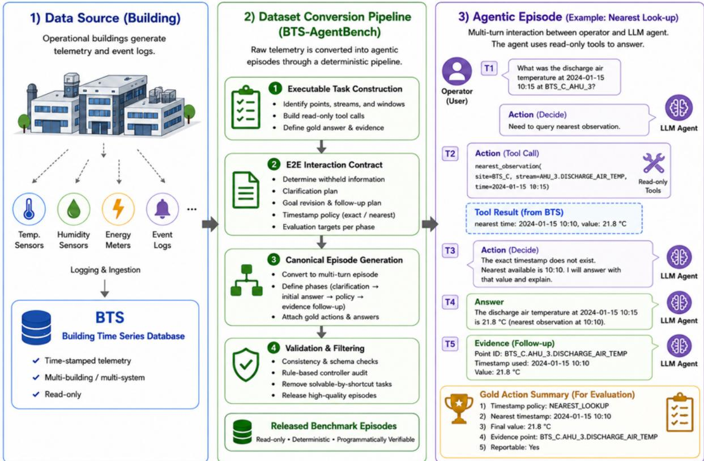

# BTS-AgentBench: A Deterministic, Replayable Pipeline from Read-Only Telemetry Logs to Agent Benchmarks

Jeong-Yoon Kim

## Abstract

Industrial sites contain large volumes of readonly telemetry, but few benchmarks specify how to compile these records into executable multi-turn agent tasks. We present a telemetryto-episode construction method instantiated as BTS-AgentBench. The pipeline normalizes BTS metadata and raw histories into a readonly tool store, compiles static tasks with toolderived gold answers and evidence, and lifts retained tasks into typed, bounded operatorfacing episodes. The 532-row release adds clarification, goal revision, timestamp policy, quality-gated reporting, and evidence attribution while preserving the source computation and split. Coded contract preflight reports zero findings, and the construction-exclusion controller completes 0/532 rows. Two independent raw-to-episode builds match all 11 logical tool-store exports and reproduce the released 356/87/89 train/dev/test artifact exactly. Applying the shared construction path to XAI4HEAT produces 204 episodes; on its 41- row held-out test split, the controller completes 0 rows and the retained GPT-5.5 execution completes all 41. Code, artifacts, and replay reports are available at https://github. com/kjy7567/BTS-AgentBench.

## 1 Introduction

Modern buildings and industrial facilities retain years of measurements from site-specific sensors and equipment. BTS covers three buildings over three years, while XAI4HEAT covers five districtheating substations over as many as five years (Prabowo et al., 2024; Cvetkovic et al. ´ , 2025). These records encode the local vocabulary that operators use—sites, equipment, zones, point classes, and stream identifiers. An AI assistant for a facility therefore needs data grounded in that facility’s names, relationships, and observations. Generic agent data does not provide this grounding, while constructing it manually does not scale: BTS alone induces about 2.19 million day-window candidates and 5.99 million pairwise candidates before retention (Table 1).

Task-specific model adaptation is one use for this site-grounded data: prior work on small functioncalling agents relies on curated examples and finetuning (Erdogan et al., 2024). Converting telemetry into grounded train/dev/test episodes therefore creates a common substrate for subsequent model adaptation and for the controlled evaluation studied here.

We therefore ask how to convert an already collected, site-specific telemetry corpus into agentready data at scale. Our goal is a programmatic and replayable construction method: starting from fixed telemetry and metadata, it builds read-only tools, executable tasks, operator-facing multi-turn interactions, source-derived gold calls and evidence, and deterministic scoring targets. The same inputs and construction contracts must regenerate the same benchmark artifact. This makes existing telemetry usable for developing and evaluating agents that resolve local equipment and streams, request missing context, carry state across revised goals, apply timestamp and data-quality policies, and cite the observations supporting their answers.

Our primary source is BTS, a public multi-year building time-series dataset with standardized metadata (Prabowo et al., 2024). We match metadata streams to raw histories, normalize point/equipment/location fields, materialize aggregate and quality tables, and instantiate nine families spanning point resolution, temporal aggregation, comparison, ranking, timestamp lookup, and quality-aware reporting. These tasks are constructed in this work. Their episodes add clarification, revision, policy, commitment, and evidence turns while preserving telemetry computation, split, and programmatic scoring; controller-completable rows are repaired or removed. We additionally apply the method to XAI4HEAT in a small-scale portability study, testing whether the downstream construction and evaluation path can be reused on a related telemetry corpus after corpus-specific schema mapping.

The telemetry-to-episode construction method is the primary contribution; BTS-AgentBench is its released benchmark instance. Our contributions are:

• A deterministic construction pipeline from normalized raw telemetry to static executable tasks, phase-structured interaction contracts, operatorfacing episodes, and evidence-grounded verifiers.

• BTS-AgentBench, a 532-row artifact covering nine task families and bounded clarification, revision, timestamp-policy, quality, commitment, and evidence obligations.

• A validation and audit framework with exact construction replay, deterministic component scoring of retained model traces, and a rulebased construction-exclusion controller.

• An executed second-corpus study yielding 204 XAI4HEAT episodes through the same downstream construction and scoring path after corpus-specific mapping.

## 2 Related Work

Interactive tool-use benchmarks. BTS-AgentBench is closest to benchmarks separating an agent, user surface, tools, and programmatic evaluation. API-Bank provides runnable tool-use dialogues (Li et al., 2023); ToolSandbox adds state and implicit dependencies (Lu et al., 2025); τ-bench combines simulated users, APIs, policies, and goal scoring (Yao et al., 2025); and ACEBench adds granular multi-turn error dimensions (Chen et al., 2025). We instead start from an existing telemetry corpus and compile both executable tasks and episodes.

Operational and industrial agent benchmarks. ITBench (Jha et al., 2025) and AssetOpsBench (Patel et al., 2026) evaluate structured operational workflows; ReAct Meets Industrial IoT (Rayfield et al., 2025) studies language-agent access to industrial telemetry. BTS-AgentBench complements them by focusing on compilation of read-only telemetry into bounded, deterministically evaluated episodes.

Building telemetry data and metadata. BTS provides real building time series with standardized metadata (Prabowo et al., 2024), while Brick represents building sensors, equipment, and relationships portably (Balaji et al., 2018). We use this substrate to derive executable telemetry-analysis tasks and agent episodes.

Benchmark construction from executable artifacts. SUPER evaluates executable completion over research repositories rather than static text (Bogin et al., 2024). Our setting begins with telemetry and metadata, compiles a static task with split, evidence, and answer contract, and then changes its agent-facing interface. Deterministic controllers serve as construction audits that identify vulnerable rows for repair or rejection.

## 3 Benchmark Formulation

Figure 1 gives an overview of BTS-AgentBench, from building telemetry to released multi-turn agent episodes. The figure also illustrates the evaluation interface used throughout the paper: an operator-facing request, read-only tool use, a policy decision for nearest observation, and an evidencebacked answer.

## 3.1 Benchmark Unit

BTS-AgentBench first compiles telemetry and metadata into executable read-only tasks, then converts each retained task into a bounded episode. A source task r records its family, split, tools, evidence, and gold contract; r<sup>⋆</sup> preserves its computation and target while changing the agent-facing interface.

Each episode combines a deterministic user simulator, read-only tools, an agent trace, and a programmatic evaluator. Success requires both the telemetry target and the interaction obligations; no mutable final database state is involved.

## 3.2 Static Executable Task Layer

BTS itself is a building time-series dataset rather than a pre-existing suite of the telemetry-analysis tasks evaluated here. We therefore construct a static task layer over BTS. A preprocessing pass combines processed BTS metadata with the raw BTS stream archives. It normalizes site, point, equipment, and location text, builds a point inventory, records candidate ambiguity, and scans each raw stream to materialize timestamp coverage summaries. Only metadata points that can be matched to raw history are promoted to tool-ready points. From these matched points we materialize a DuckDB-backed tool store containing a raw stream index, per-stream quality statistics, daily/weekly/- monthly aggregates, calendar profiles, and stream previews. These materialized tables are the backend for the fixed read-only tool registry used later by both the static tasks and the converted agent episodes.

  
Figure 1: BTS-AgentBench converts building time-series data into multi-turn LLM-agent benchmark episodes. The pipeline constructs executable read-only telemetry tasks, converts them into interaction contracts and canonical episodes, and filters them with validation and rule-based hardening. The right panel shows a nearest-look-up episode in which the agent uses read-only tools to return the nearest available timestamped value and supporting evidence.

Family builders apply fixed eligibility predicates before natural-language rendering. Pointdisambiguation cases require at least two samesite streams of one point class while the target metadata tuple resolves uniquely. Aggregate candidates below the corpus 10th-percentile coverage floor or above the site/class 99.5th-percentile absolute-mean cap are removed. Pairwise candidates compare distinct equipment in one site/- class/window and require a positive difference at or above the corresponding median; rank candidates require at least three streams and a positive topto-runner-up margin at or above the group median. Exact-timestamp tasks select an interior observation, nearest-timestamp tasks place the request inside a typical adjacent-observation interval, and quality tasks execute fixed weekly coverage and gap rules derived from corpus quantiles.

<table><tr><td>Source category</td><td>Candidate space</td><td>Retained tasks</td></tr><tr><td>BTS metadata streams</td><td>19,665</td><td></td></tr><tr><td>Tool-ready points</td><td>14,422</td><td>一</td></tr><tr><td>Point lookup/disambiguation</td><td>4,263</td><td>60</td></tr><tr><td>Day mean lookup</td><td>2,193,431</td><td>60</td></tr><tr><td>Relative 24h mean lookup</td><td>2,193,431</td><td>60</td></tr><tr><td>Window mean lookup</td><td>315,929</td><td>53</td></tr><tr><td>Window pairwise compare</td><td>5,989,083</td><td>60</td></tr><tr><td>Window rank</td><td>1,084</td><td>60</td></tr><tr><td>Timestamp value lookup</td><td>2,123</td><td>60</td></tr><tr><td>Timestamp nearest lookup</td><td>2,123</td><td>60</td></tr><tr><td>Quality-aware reporting</td><td>315</td><td>59</td></tr><tr><td>Total retained rows</td><td></td><td>532</td></tr></table>

Table 1: Source pool and retained static task set derived from BTS data before episode lifting. Candidate counts describe the telemetry search space induced by our toolstore construction and task generator, not task counts from the original BTS release. The retained tasks use a 356/87/89 train/dev/test split.

Candidate counts in Table 1 are combinatorial and often share streams, equipment groups, or nearby correlated windows. We therefore reserve BTS\_C for testing and retain a diversitycapped panel across point class and calendar quarter, adding location type for ranking and decision label for quality-gate tasks. Per-family targets are 40/10/10 train/dev/test, except quality gate (40/10/9) and window mean (36/7/10), where eligible balanced candidates are exhausted. Every fifth deterministically ordered non-held-out candidate is assigned to development and the remainder to training. These rules were fixed before model evaluation; model output and the descriptive difficulty proxy play no role in retention or split assignment.

Each retained row records its query, canonical calls, acceptable alternatives, structured gold, stream evidence, verifier, and source metadata. Alternatives are generated by builder rules, including location omission only when uniqueness is preserved, equivalent period encodings, consistently reversed pairwise arguments, and exact-to-nearest fallback where allowed. Pairwise and rank ties are excluded by positive margins; stream ID is used only as a final deterministic ordering key, and nearest lookup selects the earlier observation when absolute offsets are equal. Gold fields are obtained from the same read-only store or referenced raw history and are independently checked before and after episode construction. A frozen 532-identity selection contract links regenerated candidates to the evaluated release without copying any conversation or model response.

## 4 From Static Tasks to Agent Episodes

## 4.1 Deterministic Episode Compilation

The compiler separates source computation, interaction contract, and surface realization. A static task fixes the source operation, arguments, toolderived result, and contributing streams. A finite interaction grammar then composes typed obligations—clarification, state carryover, revision, timestamp policy, quality, commitment, and evidence—without changing that source computation or split. Finally, deterministic renderers lexicalize the typed fields as bounded operator turns. Family-level rules and renderers are authored once and instantiated over eligible site-specific tasks, rather than writing each conversation row by row. Every added telemetry operation is executed against the same read-only runtime to populate its phase gold, final target, evidence, and verifier; agent tool calls and answers are produced only during evaluation.

<table><tr><td>Compilation stage</td><td>Deterministic rule and emitted artifact</td></tr><tr><td>Typed static input</td><td>timestamp_value_lookup; BTS_C Zone 005 air-differential-pressure stream; exact time 2022-02-03 07:03:23.640Z;value12.9457; canonical exact lookup and stream</td></tr><tr><td>Mode and visibility</td><td>evidence. A temporal task whose visible request omits time selects clarify_time. The initial operator request excludes the timestamp; the simulator fills the typed slot with &quot;I mean 07:03:23.64 UTC on February 3, 2022.&quot;</td></tr><tr><td>Added operator turns</td><td>The timestamp rule emits a nearest-reading revision at 07:03; the containing-week rule requests a quality decision; terminal templates request a report/abstain commitment and the</td></tr><tr><td>Re-executed targets</td><td>supporting stream. Exact lookup yields 12.9457; nearest lookup yields the same observation at a 23.64-second offset; weekly quality yields answer with coverage 1.0 and gap ratio 1.0563; policy yields</td></tr><tr><td>Evaluation boundary</td><td>nearest_but_acceptable. Compilation emits simulator-controlled user turns and the executable contract. The evaluated agent independently produces tool calls and natural-language answers, which are checked against the phase, final, evidence, task, and protocol targets.</td></tr></table>

test\_timestamp\_value\_lookup\_00051 from typed telemetry fields to operator-facing turns and executable targets.

Table 2 traces this process for one released row. Here, the public minute in the revision is derived from the exact source timestamp, the quality window is the containing calendar week, and the evidence request retains the stream bound by the static task. Appendix A.3 gives the complete generated conversation, gold trace, retained model execution, and replay equality.

Surface realization. Mode assignment is a typed branch over the task family and its primary telemetry call. Point-disambiguation and quality rows expose site as the missing slot; exact-timestamp and aggregate rows expose time; nearest-fallback rows retain a public timestamp but require nearestobservation handling; the remaining rows use a direct request. The compiler removes only the designated site or temporal span from the static query, selects a deterministic family-aware operator wrapper, and fills clarification responses from typed fields. Dates, trailing-24-hour anchors, week or month starts, and fractional-second timestamps each have explicit renderers. References such as “the same signal,” “the next day,” or “the second month’s winner” are emitted from stored stream and phase bindings, so their antecedents and revised operations remain explicit in the contract. No language model selects the mode, paraphrases the request, or supplies a missing value during construction.

Obligation composition. Added turns are constructed from tool-valid structured state rather than appended independently as text. For the row in Table 2, the timestamp rule floors the exact source time to a minute and probes candidate minutes in the fixed order $0 , - 1 , + 1 , - 2 , + 2 , - 3 , + 3 .$ It selects the first candidate with no exact observation and a defined nearest observation, then stores the requested and observed timestamps, value, fallback reason, and offset while attaching the exact and nearest calls. The quality rule executes inspect\_quality\_window over the declared calendar window and stores its decision, coverage, and gap statistics. A fixed reporting rule then derives answer, abstain, or re\_clarify from the latest timestamp and quality phases. Each obligation-bearing transform updates the user turn, milestone, canonical calls, phase gold, final target, evidence, and verifier together.

Simulator execution. At evaluation time, the user simulator is a finite-state process with pending clarification slots, an initial-answer flag, a revision index, and a post-answer index. Tool-call messages do not advance user state. A site or time value is released only after the agent asks a matching clarification question; otherwise the simulator requests the still-missing detail. After the first substantive answer, it emits the stored goal revisions in order, followed by any rationale and evidence requests, and then terminates. If the agent asks another question during a revision or evidence phase, the simulator restates the fixed context instead of inventing new information. Consequently, the observed conversation depends on the agent’s behavior, while the user information state and executable targets remain identical across systems.

<table><tr><td>Phase type</td><td>Evaluated role</td></tr><tr><td>Clarification</td><td>Recover missing site or time context before querying.</td></tr><tr><td>Initial answer</td><td>Execute the source telemetry task with read-only tools.</td></tr><tr><td>Goal revision</td><td>Reuse resolved state under a revised request.</td></tr><tr><td>Timestamp policy</td><td>Decide exact, nearest, or insufficient-time reporting.</td></tr><tr><td>Quality commitment</td><td>Answer or abstain under quality</td></tr><tr><td>Rationale follow-up</td><td>evidence. Explain a quality or reportability</td></tr><tr><td>Evidence follow-up</td><td>decision. Return the stream, point, timestamp, or aggregate evidence</td></tr></table>

Table 3: Canonical phase vocabulary used to evaluate converted agent episodes.

## 4.2 Canonical Episode Schema

Each canonical phase contains a user turn, required state update, allowed tool-grounded behavior, and evaluator-visible target. Families instantiate only the phases required by their telemetry operation, so every turn has a checkable obligation.

Point and timestamp families combine clarification, timestamp-policy, and evidence phases; aggregate, comparison, and ranking families add revisedwindow computation; and quality-gate rows add commitment and rationale phases. Each released row records the applicable ordered subset rather than forcing every family through an identical dialogue.

## 4.3 Typed Contract Composition and Repair

Contract representation. Each operator turn is paired with an executable obligation. The compiler represents an episode as

$$
C = ( Q , \Phi , A , E , V ) , \qquad \phi _ { i } = ( f _ { i } , g _ { i } , R _ { i } ) ,\tag{1}
$$

where $Q$ stores the interaction mode, missing slots, and ordered operator turns; $\Phi = \left( \phi _ { 1 } , \ldots , \phi _ { n } \right)$ is the phase sequence; $f _ { i }$ is a phase type from Table $3 ; g _ { i }$ is its structured gold map; and $R _ { i }$ lists the fields required for scoring. A contains canonical and acceptable read-only tool calls, E identifies the contributing streams, and $V$ contains milestones, tolerances, and protocol conditions. For example, a timestamp phase requires an observed timestamp and value, whereas a quality phase requires a decision, coverage, and gap statistic. The static task supplies the first executable phase. Authored templates render $Q$ and Φ into operator-facing turns, while Φ, A, E, and V retain the machine-checkable contract behind those turns. This separation permits programmatic generation at telemetry scale: natural-language fields are instantiated from a finite typed contract, while values, times, streams, and decisions remain executable data.

Deterministic contract transformation. Typed contract composition and repair denotes an ordered family of contract transformations: some compose a new interaction obligation, while others restore alignment among a turn, its tool call, gold fields, evidence, and verifier. For a normalized read-only store D, stage k is

$$
\begin{array} { r l } { z _ { k } = \operatorname { E x e c } _ { D } ( a _ { k } ( C ) ) , } & { } \\ { T _ { k } ( C ; D ) = \left\{ \begin{array} { l l } { U _ { k } ( C , z _ { k } ) , } & { P _ { k } ( C ) = 1 , } \\ { C , } & { P _ { k } ( C ) = 0 . } \end{array} \right. } \end{array}\tag{2}
$$

where $P _ { k }$ is a typed eligibility predicate, $a _ { k }$ constructs tool arguments from existing contract fields, and $U _ { k }$ performs the coupled update. Predicates inspect fields such as task family, phase types, available stream IDs, and exact-match status; they do not classify free-form text. If a predicate holds, the stage executes the declared read-only operation and atomically updates the affected operator turn, phase sequence, canonical calls, gold fields, evidence, milestones, and verifier. A surface-only stage may normalize wording but cannot change telemetry fields. The stages run in a fixed order, and a false predicate records a no-op. Static ID, split, source family, and source backlink remain fixed throughout.

Each applied stage must satisfy three coupled conditions. First, source preservation keeps all unaffected static phases, stream bindings, and split fields unchanged. Second, execution grounding requires every newly introduced value, timestamp, aggregate, or quality statistic to equal $z _ { k }$ or a declared deterministic policy function over prior phase state. Third, discourse alignment requires the rendered turn, its referenced prior state, required tool path, gold fields, evidence, and verifier to describe the same operation. The coupled update $U _ { k }$ writes these fields together, and contract preflight independently re-executes and checks them before retention.

Executable example. For the timestamp row in Table 2, the seed contract contains one exacttimestamp phase grounded in value 12.9457 at 2022-02-03T07:03:23.640Z. Clarification composition marks time as a missing slot and renders a request for it. The timestamp-revision stage constructs the public-time request at 07:03, executes an exact probe followed by the permitted nearest fallback, and appends the returned timestamp, value, fallback status, and 23.64-second offset as a second phase. Multi-axis composition executes the quality tool for the containing week and appends coverage 1.0, gap ratio 1.0563, and decision answer. Finally, the reporting rule combines the typed nearest-reading and quality states to derive action answer with reason nearest\_but\_acceptable. At each step, telemetry facts come from tool execution and policy labels come from finite declared rules; no model generates or repairs the annotation. Appendix A.3 gives the complete raw-to-score trace.

Audit trail and replay. Every stage appends its name, status, and before/after contract summaries to an ordered history. Before episode lifting, the static audit recomputes point resolution and family outputs against the tool store and referenced raw history. After lifting, a separate contract audit checks phase/turn cardinality and required fields; renders each stored gold as an answer and sends it through the same scorer; re-executes timestamp and quality operations; recomputes derived preference and commitment fields; and checks evidence and prompt–phase alignment. A row is retained only if these checks accept the coupled contract. With the store, selected static identity, stage order, predicates, and templates fixed, reconstruction yields the same turns, calls, phase golds, evidence, verifier, and history; Section 6.1 reports exact equality across independent builds.

The retained histories expose how often each typed stage changes a contract: timestamp policy 120 rows, nearest wording 60, timestamp-value revision 60, clarification alignment 60, goal revision 293, alternate-point revision 60, multi-axis composition 472, and terminal reporting commitment 532. Counts overlap because one episode may receive several construction stages; Table 9 in the appendix reports the complete profile.

## 5 Controller-Aware Acceptance

## 5.1 Controller Audit Suite

The controller suite audits hand-written shortcuts for state carryover, timestamp policy, aggregation/- comparison, quality decisions, and final fields. Table 4 lists its branches. The executable controller uses bounded parsers and explicit site/stream state, invokes the model-facing read-only tools, and is scored by the same evaluator; it contains no learned parser or LLM.

<table><tr><td>Audit component</td><td>Shortcut tested</td></tr><tr><td>State carryover audit</td><td>Reuses resolved site, stream, and point state across turns.</td></tr><tr><td>Timestamp-policy audit</td><td>Applies exact/nearest observation and reportability rules.</td></tr><tr><td>Aggregation audit</td><td>Executes mean lookup and fixed-window aggregation</td></tr><tr><td>Pairwise/ranking audit</td><td>patterns. Applies fixed comparison or ranking procedures.</td></tr><tr><td>Quality audit</td><td>Maps coverage and gap statistics to answer-or-abstain decisions.</td></tr><tr><td></td><td>Phase-complete audit Attempts the full clarification- revision-commitment-evidence protocol.</td></tr></table>

Table 4: Controller audit suite used as a constructiontime hardening signal.

## 5.2 Acceptance Rule

Controller-aware acceptance is applied after executable consistency checks. A row is eligible for release only if it preserves the source telemetry task and split assignment, passes automatic checks over the interaction structure and verifier fields, and is not completed by the phase-complete deterministic controller audit. Rows that remain controllervulnerable are repaired or removed before release.

Controller non-completion is an acceptance condition, so 0/532 documents that the declared construction exclusion was applied; it is not an independent estimate of task difficulty. The first blocking layer is parse/binding failure for 353 rows, phase-completion failure for 127, and required-tool process failure for 52. The controller nevertheless produces nonempty, protocol-complete traces on 179 rows, which then fail an executable phase or task contract.

## 6 Evaluation Setup

## 6.1 Artifact Validation

Before evaluating models, we validate the released artifact. Contract preflight checks phase/turn cardinality, final-phase linkage, required verifier fields, acceptance of rendered gold answers, runtime timestamp and quality-window agreement, derived preference and commitment targets, evidence identifiers, and prompt–phase alignment. All 532 rows pass these coded checks. This result concerns the declared executable contract; it is not used as evidence of operator realism, corpus representativeness, or task difficulty. Appendix 8 lists each check and its boundary.

Exact replay starts from the three checksummed BTS raw archives, the retained normalized streamto-point/equipment mapping, and a 532-entry selection contract. Two independent preprocessing executions match all 11 sorted logical tool-store exports. Two complete episode builds from one fresh store, plus a third build from the independently reconstructed store, each reproduce all 356/87/89 released rows as exact JSON-object and file matches. Equality covers turns, calls, phase and final golds, evidence, verifiers, construction history, provenance, row order, and serialization. The public single-command wrapper only binds and verifies the released construction stages; it adds no taskgeneration or scoring logic.

## 6.2 Agent Environment

All systems receive the same 89 rows, deterministic user turns, tool descriptions, and read-only lookup, aggregation, timestamp, ranking, and quality tools. The evaluator checks clarification, state carryover, temporal alignment, reportability, answer fields, and evidence/rationale follow-up in each tool-grounded trace; success requires the complete row contract.

## 6.3 Frontier Model Runs

We evaluate three contemporary frontier LLM agents: GPT-5.5 (OpenAI, 2026), Gemini 3.1 Pro (Google, 2026), and Claude Opus 4.7 (Anthropic, 2026). All runs use the same released rows, deterministic user simulator, read-only tools, onetool-per-turn loop, stopping protocol, and scorer. Provider-compatible configurations differ in route, output cap, seed support, and family guidance; Appendix 11 reports these settings. Model outputs are used only for post-release evaluation and never for row repair, filtering, or retention.

We report exact row-level success rates by task family and overall. Each model is invoked once per test row; repeated-call variation is not measured. The retained 267 traces preserve the complete system, user, assistant, and tool exchange and can be rescored deterministically.

<table><tr><td>Family</td><td>Rows</td><td>GPT-5.5</td><td>Gemini 3.1 Pro</td><td>Claude Opus 4.7</td><td>Controller solved</td></tr><tr><td>Point disambiguation</td><td>10</td><td>8/10 (80.0%)</td><td>5/10 (50.0%)</td><td>6/10 (60.0%)</td><td>0/10 (0.0%)</td></tr><tr><td>Day mean lookup</td><td>10</td><td>10/10 (100.0%)</td><td>8/10 (80.0%)</td><td>7/10 (70.0%)</td><td>0/10 (0.0%)</td></tr><tr><td>Relative 24h mean lookup</td><td>10</td><td>10/10 (100.0%)</td><td>9/10 (90.0%)</td><td>9/10 (90.0%)</td><td>0/10 (0.0%)</td></tr><tr><td>Window mean lookup</td><td>10</td><td>9/10 (90.0%)</td><td>10/10 (100.0%)</td><td>7/10 (70.0%)</td><td>0/10 (0.0%)</td></tr><tr><td>Window pairwise compare</td><td>10</td><td>6/10 (60.0%)</td><td>5/10 (50.0%)</td><td>5/10 (50.0%)</td><td>0/10 (0.0%)</td></tr><tr><td>Window rank</td><td>10</td><td>8/10 (80.0%)</td><td>5/10 (50.0%)</td><td>4/10 (40.0%)</td><td>0/10 (0.0%)</td></tr><tr><td>Timestamp value lookup</td><td>10</td><td>9/10 (90.0%)</td><td>10/10 (100.0%)</td><td>5/10 (50.0%)</td><td>0/10 (0.0%)</td></tr><tr><td>Timestamp nearest lookup</td><td>10</td><td>10/10 (100.0%)</td><td>10/10 (100.0%)</td><td>7/10 (70.0%)</td><td>0/10 (0.0%)</td></tr><tr><td>Quality gate</td><td>9</td><td>9/9 (100.0%)</td><td>9/9 (100.0%)</td><td>8/9 (88.9%)</td><td>0/9 (0.0%)</td></tr><tr><td>Overall</td><td>89</td><td>79/89 (88.8%)</td><td>71/89 (79.8%)</td><td>58/89 (65.2%)</td><td>0/89 (0.0%)</td></tr></table>

Table 5: Family-wise test results on the released benchmark. The final column reports rows solved by the shipped deterministic controller after construction-time hardening.

## 7 Results

## 7.1 Release and Test Results

The released benchmark contains 532 rows over nine families and preserves the fixed 356/87/89 split. All rows pass the scoped executable-contract checks described above, and the constructionexclusion controller completes 0/532 rows (0/89 test). Table 5 reports one retained execution per model and test row: GPT-5.5 accomplishes 79/89, Gemini 3.1 Pro 71/89, and Claude Opus 4.7 58/89.

The 90–100% cells are concentrated in direct lookup and aggregation families rather than across the benchmark. Interaction-sensitive families remain lower: pairwise comparison is 6/10, 5/10, and 5/10; ranking is 8/10, 5/10, and 4/10; and point disambiguation is 8/10, 5/10, and 6/10. An accomplished row must satisfy all applicable clarification, carried-state, revised-goal, timestamp or quality policy, final commitment, evidence, and protocol obligations; an initially correct telemetry value alone is insufficient. Family values are descriptive error localization on this fixed release, while the overall numerators and denominators summarize the retained executions.

## 7.2 Deterministic Diagnostic Analysis

The accomplished counts in Table 5 do not show where a trace loses credit. We therefore rescore the saved traces with the fixed evaluator. Final is the macro-average of row-level final-phase scores; Evidence is required-stream coverage averaged across all 89 evidence-bearing rows; Phase is each row’s fraction of passed ordered phases, macro-averaged over rows; Task is the row-level composite of core answer, grounding, temporal, and phase checks; and Protocol counts traces that finish without a missing required exchange or interaction issue. Accomplished requires both the complete task contract and protocol completion.

<table><tr><td>Model</td><td>Final</td><td>Evidence</td><td>Phase</td><td>Task</td><td>Protocol</td></tr><tr><td>GPT-5.5</td><td>0.978</td><td>0.955</td><td>0.949</td><td>0.965</td><td>86/89</td></tr><tr><td>Gemini 3.1 Pro</td><td>0.921</td><td>0.955</td><td>0.939</td><td>0.957</td><td>81/89</td></tr><tr><td>Claude Opus 4.7</td><td>0.903</td><td>0.933</td><td>0.875</td><td>0.927</td><td>81/89</td></tr></table>

Table 6: Deterministic diagnostic scores on the released test split. Final, Evidence, Phase, and Task are rowaveraged component scores from the fixed evaluator; Protocol counts rows with no interaction-level issue. These component scores complement the stricter accomplished counts in Table 5.

Table 6 is a descriptive decomposition of the retained single executions, not an estimate of repeated-call variance. It answers two tracelevel questions: whether complete contract scoring exposes failures hidden by the final action, and which obligation fails when that action is correct. On test\_window\_pairwise\_ compare\_00044, all three models produce the gold abstention but omit different comparison fields or cues. On test\_window\_rank\_00009, GPT-5.5 and Gemini produce the gold abstention but fail evidence closure, while Opus also makes the wrong quality commitment. Appendix B.4 and Appendix B.3 reproduce these retained outputs and gold contracts.

## 7.3 Portability to XAI4HEAT

XAI4HEAT provides row-oriented SCADA tables and substation metadata rather than BTS’s perstream archives and graph-derived metadata. Its corpus adapter maps seven channels to the shared site, stream, point, equipment, timestamp, and value fields. After this mapping, the implementation reuses the same static-task builder, episode lifting, operator-facing surface construction, canonical phase generation, contract preflight, constructionexclusion controller, runner protocol, and deterministic scorer. The corpus-specific work is confined to source parsing, channel-to-point mapping, metadata construction, held-out-substation selection, domain wording, and the supported family subset.

This path produces 204 episodes over five applicable temporal families, split 132/31/41. On the held-out 41 rows, the controller accomplishes 0 and the retained GPT-5.5 execution accomplishes 41. These results provide executed portability evidence across the two evaluated telemetry corpora; Appendix D gives the source-code map, construction command, converted row, gold contract, and retained trace.

## 8 Discussion

The main methodological result is that real telemetry can be compiled into agent evaluation without replacing source facts with free-form annotation. Static tasks define the computation and evidence; interaction contracts define the information state and obligations; typed phases define deterministic scoring. Exact replay and row-level provenance make these boundaries inspectable, while the retained traces show failures in state carryover, policy, phase completion, and evidence attribution that a final-action score alone would hide.

The XAI4HEAT study further separates reusable downstream construction from corpus-specific adaptation. It supports portability across the two evaluated telemetry corpora; structurally different event or state-transition logs would require additional tools, task families, and evaluators.

## 9 Conclusion

We presented BTS-AgentBench, a benchmark construction method that starts from read-only building telemetry logs, compiles a static executable task layer, and lifts that layer into multi-turn agent episodes. The released benchmark contains 532 rows and preserves source-task computations and targets, read-only backend behavior, and programmatic evaluation while adding typed operatorfacing interactions and controller-aware release hardening. More broadly, the paper treats industrial log corpora as reusable substrates for deterministic raw-to-static task compilation and multi-turn agent benchmark construction.

## Limitations

BTS-AgentBench is intentionally narrow. It evaluates read-only building-telemetry search, aggregation, comparison, ranking, timestamp reportability, and quality-aware reporting. It does not evaluate write-side control, safety-critical actuation, maintenance planning, or long-horizon troubleshooting. The user turns are deterministic and bounded, which supports automatic evaluation and controlled trace analysis but necessarily reduces conversational diversity and linguistic messiness. The interaction surface is a controlled benchmark contract rather than a complete simulation of human operators. The final 532-row release was not subjected to a systematic domain-expert audit; its reported validation concerns telemetry grounding and executable contracts.

The controller-aware acceptance rule hardens the release against the shipped deterministic audit suite. The current paper studies two read-only industrial telemetry corpora, BTS and XAI4HEAT. Extending the same recipe to broader tool-using domains would require additional task families, corpus-specific interaction contracts, and new controller audits.

## Ethical Considerations

BTS-AgentBench is a read-only offline benchmark over telemetry-derived tasks. It is not intended to authorize, recommend, or evaluate physical control actions in operational buildings or industrial plants. Model traces should therefore be interpreted only as benchmark behavior under a fixed evaluation protocol, not as evidence of deployment safety. Any release or reuse of data should follow the licensing, anonymization, and operational-security requirements of the source dataset.

## Use of Generative AI

We evaluated multiple frontier LLMs on BTS-AgentBench. For writing and research assistance, the author used Codex CLI with OpenAI GPT-5.5 at extra-high reasoning effort, mainly for manuscript drafting, language revision, and experimental code improvement.

## Acknowledgments

TBA.

## References

Anthropic. 2026. Introducing claude opus 4.7. Anthropic product announcement.

Bharathan Balaji, Arka Bhattacharya, Gabriel Fierro, Jingkun Gao, Joshua Gluck, Dezhi Hong, Aslak Johansen, Jason Koh, Joern Ploennigs, Yuvraj Agarwal, Mario Bergés, David Culler, Rajesh K. Gupta, Mikkel Baun Kjærgaard, Mani Srivastava, and Kamin Whitehouse. 2018. Brick: Metadata schema for portable smart building applications. Applied Energy, 226:1273–1292.

Ben Bogin, Kejuan Yang, Shashank Gupta, Kyle Richardson, Erin Bransom, Peter Clark, Ashish Sabharwal, and Tushar Khot. 2024. SUPER: Evaluating agents on setting up and executing tasks from research repositories. In Proceedings ofthe 2024 Conference on Empirical Methods in Natural Language Processing, pages 12622–12645, Miami, Florida, USA. Association for Computational Linguistics.

Chen Chen, Xinlong Hao, Weiwen Liu, Xu Huang, Xingshan Zeng, Shuai Yu, Dexun Li, Yuefeng Huang, Xiangcheng Liu, Wang Xinzhi, and Wu Liu. 2025. ACEBench: A comprehensive evaluation of LLM tool usage. In Findings ofthe Associationfor Computational Linguistics: EMNLP 2025, pages 12970– 12998, Suzhou, China. Association for Computational Linguistics.

Stevica Cvetkovic, Milan Zdravkovi´ c, and Marko Ign-´ jatovic. 2025.´ Exploring district heating systems: A SCADA dataset for enhanced explainability. Data in Brief, 59:111320.

Lutfi Eren Erdogan, Nicholas Lee, Siddharth Jha, Sehoon Kim, Ryan Tabrizi, Suhong Moon, Coleman Richard Charles Hooper, Gopala Anumanchipalli, Kurt Keutzer, and Amir Gholami. 2024. TinyAgent: Function calling at the edge. In Proceedings of the 2024 Conference on Empirical Methods in Natural Language Processing: System Demonstrations, pages 80–88. Association for Computational Linguistics.

Google. 2026. Gemini 3.1 pro: Announcing our latest gemini AI model. Google AI blog.

Saurabh Jha, Rohan R. Arora, Yuji Watanabe, Takumi Yanagawa, Yinfang Chen, Jackson Clark, Bhavya Bhavya, Mudit Verma, Harshit Kumar, Hirokuni Kitahara, Noah Zheutlin, Saki Takano, Divya Pathak, Felix George, Xinbo Wu, Bekir O. Turkkan, Gerard Vanloo, Michael Nidd, Ting Dai, and 21 others. 2025. Itbench: Evaluating ai agents across diverse real-world it automation tasks. In Proceedings of the 42nd International Conference on Machine Learning, volume 267 of Proceedings of Machine Learning Research, pages 27134–27197. PMLR.

Minghao Li, Yingxiu Zhao, Bowen Yu, Feifan Song, Hangyu Li, Haiyang Yu, Zhoujun Li, Fei Huang, and Yongbin Li. 2023. API-bank: A comprehensive

benchmark for tool-augmented LLMs. In Proceedings of the 2023 Conference on Empirical Methods in Natural Language Processing, pages 3102–3116, Singapore. Association for Computational Linguistics.

Jiarui Lu, Thomas Holleis, Yizhe Zhang, Bernhard Aumayer, Feng Nan, Haoping Bai, Shuang Ma, Shen Ma, Mengyu Li, Guoli Yin, Zirui Wang, and Ruoming Pang. 2025. Toolsandbox: A stateful, conversational, interactive evaluation benchmark for LLM tool use capabilities. In Findings ofthe Association for Computational Linguistics: NAACL 2025, pages 1160–1183, Albuquerque, New Mexico. Association for Computational Linguistics.

OpenAI. 2026. Introducing GPT-5.5. OpenAI product announcement.

Dhaval Patel, Shuxin Lin, James Rayfield, Nianjun Zhou, Chathurangi Shyalika, Suryanarayana R. Yarrabothula, Roman Vaculin, Natalia Martinez, Fearghal O’Donncha, and Jayant Kalagnanam. 2026. Assetopsbench: A real-world evaluation benchmark for ai-driven task automation in industrial asset management. arXiv preprint arXiv:2506.03828.

Arian Prabowo, Xiachong Lin, Imran Razzak, Hao Xue, Emily W. Yap, Matthew Amos, and Flora D. Salim. 2024. BTS: Building timeseries dataset: Empowering large-scale building analytics. In Advances in Neural Information Processing Systems, Datasets and Benchmarks Track.

James T. Rayfield, Shuxin Lin, Nianjun Zhou, and Dhaval Patel. 2025. React meets industrial IoT: Language agents for data access. In Proceedings ofthe 2025 Conference on Empirical Methods in Natural Language Processing: Industry Track, pages 364– 382. Association for Computational Linguistics.

Shunyu Yao, Noah Shinn, Pedram Razavi, and Karthik Narasimhan. 2025. τ-bench: A benchmark for toolagent-user interaction in real-world domains. In The Thirteenth International Conference on Learning Representations.

<table><tr><td>Field</td><td>Value</td></tr><tr><td>Released BTS benchmark rows</td><td>532 total rows</td></tr><tr><td>Released BTS split train 356 / dev 87 / test 89 sizes</td><td></td></tr><tr><td>BTS release</td><td>Families in the final point disambiguation, day mean, rel- ative 24h mean, window mean, win- dow pairwise compare, window rank,</td></tr><tr><td></td><td>timestamp value, timestamp nearest, quality gate</td></tr><tr><td>Contract preflight Construction-</td><td>0 findings under the coded executable- contract checks</td></tr><tr><td>exclusion controller</td><td>0/532 accomplished overall; 0/89 test</td></tr><tr><td>Exact replay</td><td>2 independent raw-to-episode builds with exact logical and release matches raw telemetry/metadata → tool store</td></tr><tr><td>Replay boundary</td><td>→ static tasks → typed contracts → operator-facing episodes → scored re- lease</td></tr></table>

Table 7: Released BTS artifact snapshot used by the paper.

## A Release and Rebuild Artifacts

This appendix records the complete release boundary using the same sequence as the main text: raw telemetry and metadata, read-only tool store, static executable tasks, typed interaction contracts, operator-facing episodes, and deterministic scoring targets. The released stage implementations produce the benchmark artifact. A single-command wrapper binds their inputs, invokes them in order, and verifies output equality; it contains no construction or scoring logic. Exact replay starts from checksummed raw archives, the retained normalized metadata contract, and the fixed 532-row selection identities, then rebuilds the tool store, static tasks, interaction contracts, phase golds, evidence, verifiers, and released train/dev/test JSONL.

## A.1 Raw-to-Static Compilation Details

The raw-to-static compiler starts from processed BTS metadata and the raw stream archives. It normalizes site, point, equipment, and location text; builds a point inventory; records ambiguity candidates; and scans each matched raw stream to materialize timestamp coverage summaries. Only metadata points that can be matched to raw histories are promoted to tool-ready points. From those matched points, the compiler materializes the DuckDB-backed tool store used by the benchmark runtime: a raw stream index, per-stream quality statistics, daily/weekly/monthly aggregates, calendar profiles, and previews.

Family builders enumerate static executable tasks over this store using the eligibility rules in Section 3.2. BTS\_C is held out for test; non-heldout candidates are deterministically assigned to train and development under point-class and temporal diversity caps. The retained identity contract fixes the evaluated 532 candidates after recomputation and fails if an identity is missing or duplicated. It stores no generated conversation or model output.

## A.2 Static-to-Episode Contract Derivation

The episode builder does not invent free-form conversations. It derives a bounded typed interaction contract from the retained static task. The builder first selects an interaction mode from the task family and the static-task surface, including direct-answer, clarify-time, implicit-nearest, and quality-rationale modes, plus optional site clarification. That mode determines which information is withheld initially, which clarification slots must be filled, and which post-answer turns are required later in the exchange.

Each converted row therefore adds deterministic fields such as an initial user message, hidden user instruction, required clarification slots, clarification questions, clarification answers, post-answer user turns, termination reply, interaction verifier, and interaction milestones. At the same time, it carries forward the static row’s telemetry computation, acceptable tool-call sets, gold final answer, evidence bundle, verifier, difficulty proxy, and metadata. Later typed contract composition and familyspecific repair may add more explicit phase structure, but every operator-facing episode continues to point back to the same static executable task.

Listing 1: Public replay with the raw archive directory as the only user-selected data path.  
```shell
make replay RAW_DIR=/absolute/path/to/
BTS_RAW_ARCHIVES
# Equivalent expanded command:
python scripts/replay_release.py \
--raw-dir /absolute/path/to/
BTS_RAW_ARCHIVES \
--work-dir ./data/local-build/release
replay \
--raw-runs 2 \
--controller-audit
```

The raw directory must contain Site\_Aaa. zip, Site\_Baa.zip, and Site\_Caa.zip. It is the only input path supplied by the caller. The repository contains the checksummed normalized catalog, source metadata, fixed 532-row selection contract, and expected release manifest. The replay creates the DuckDB tool stores and every intermediate under the work directory; it does not consume a pre-existing local database.

<table><tr><td>Check</td><td>Verifies</td><td>Boundary</td></tr><tr><td>Input checksum</td><td>Exact raw and retained files Not upstream collection</td><td>validity</td></tr><tr><td>Selection identity</td><td>Unique regenerated retained candidates</td><td>Not random representa- tiveness</td></tr><tr><td>Static/final equality</td><td>Every released object and byte</td><td>Not provider repeatabil- ity</td></tr><tr><td>Contract preflight</td><td>Schema, gold, evidence, verifier, runtime alignment</td><td>Not every possible anno- tation error</td></tr><tr><td>Controller audit</td><td>Declared exclusion is satisfied</td><td>Not independent task hardness</td></tr></table>

Table 8: Scope of the deterministic validation checks.
<table><tr><td>Typed construction stage</td><td>Rows modified</td></tr><tr><td>Timestamp policy / nearest wording</td><td>120 / 60</td></tr><tr><td>Timestamp-value / alternate-point revision</td><td>60 / 60</td></tr><tr><td>Clarification / goal revision</td><td>60 / 293</td></tr><tr><td>Multi-axis composition</td><td>472</td></tr><tr><td>Terminal reporting commitment</td><td>532</td></tr><tr><td>Controller-proxy repair</td><td>0</td></tr></table>

Table 9: Overlapping typed-stage applications. Counts describe contract construction, not detected errors.

The recorded environment is Python 3.11.11, DuckDB 1.5.0, NumPy 1.26.4, pandas 3.0.1, PyArrow 23.0.1, and RDFLib 7.6.0. Two independently rebuilt stores match all 11 sorted logical exports, and both complete builds reproduce all 356/87/89 rows as exact JSON-object and file matches.

## A.3 Exact Row-Level Replay

For test\_timestamp\_value\_lookup\_ 00051, raw member Site\_Caa/2254. pickle contains 194,563 observations for stream c24589e8\_a1f3\_4529\_b409\_ 5a56761c9d20; the selected record is 2022-02-03T07:03:23.640Z = 12.9457. Fresh preprocessing reconstructs the point and observation tables. The static builder emits resolve\_point followed by exact lookup\_observation, with that value and stream as gold and evidence.

Episode construction withholds the timestamp, supplies it through deterministic clarification, revises the request to nearest lookup at 07:03, checks the week beginning January 31, and requests a reporting commitment and evidence. The recomputed phase targets are: exact value 12.9457; nearest offset 23.64 seconds; quality action answer with coverage 1.0 and gap ratio 1.0563; and final reason nearest\_but\_acceptable. The retained GPT-5.5 response reports the nearestreading qualification and cites the same source stream, receiving Final, Evidence, Phase, and Task scores of 1.0 with a complete protocol. The released row and both replay rows share the same object digest, and both reconstructed test files match the released 89-row file exactly.

<table><tr><td>Case type</td><td>ID</td><td>Outcome</td><td>Purpose</td></tr><tr><td>Consensus success</td><td>QG-00051</td><td>all three accomplished</td><td>executable contract clo- sure</td></tr><tr><td>Cross-model disagreement</td><td>PD-00003</td><td>GPT accomplished; others partial</td><td>distinct trajectory gaps</td></tr><tr><td>Shared hard failure</td><td>WR-00009</td><td>all three partial</td><td>evidence linkage failure</td></tr><tr><td>Near-success failure</td><td>WP-00044</td><td>all partial; action correct</td><td>phase scoring beyond fi- nal action</td></tr></table>

Table 10: Contrastive appendix cases selected from retained model traces.

## B Contrastive Frontier-Agent Cases

We show four retained cases that expose different contract outcomes: one consensus success, one cross-model disagreement, one shared hard failure, and one near-success failure. Every output below is copied from the recorded model trace rather than reconstructed for presentation.

## B.1 Case A: Consensus Success

<table><tr><td>Field</td><td>Value</td></tr><tr><td>Scenario ID Family</td><td>test_quality_gate_00051 quality_gate</td></tr><tr><td>Outcome</td><td>GPT-5.5: accomplished; Gemini 3.1 Pro:</td></tr><tr><td>pattern Gold final</td><td>accomplished; Opus 4.7: accomplished abstain</td></tr><tr><td>action Gold final</td><td>marginal_quality</td></tr><tr><td>reason Why this case matters</td><td>All three models close the full interac- tion on a family where the construction-</td></tr></table>

Listing 2: Retained outputs: QG-00051.  
GPT-5.5 (accomplished)   
"Abstain. The May 12, 2020 week had   
null/unavailable quality metrics, so   
it   
should not be reported as-is."   
Gemini 3.1 Pro (accomplished)   
"I would abstain. The observed   
fraction and gap ratio were both   
null because   
there was no data recorded for that   
week."

Opus 4.7 (accomplished)   
"Abstain. The week of May 12, 2020   
returned null quality metrics -- no   
observed data, no gap ratio -- so   
there is no basis to trust or report   
the   
signal for that week."

## Listing 3: Gold contract: QG-00051.

Gold contract   
1. clarify site   
2. inspect one weekly quality window   
3. revise to the previous week   
4. assess whether quality improved,   
worsened, or stayed similar   
5. commit to answer or abstain   
Gold final answer   
{"commitment\_action": "abstain",   
reason": "marginal\_quality"}

## B.2 Case B: Cross-Model Disagreement

<table><tr><td>Field</td><td>Value</td></tr><tr><td>Scenario ID</td><td>test_point_disambiguation_ 00003</td></tr><tr><td>Family</td><td>point_disambiguation</td></tr><tr><td>Outcome pattern</td><td>GPT-5.5: accomplished; Gemini 3.1 Pro: partial; Opus 4.7: partial</td></tr><tr><td>Gold final action</td><td>abstain</td></tr><tr><td>Gold final reason</td><td>long_gap</td></tr><tr><td>Why this case matters</td><td>The same gold contract yields different trajectory failures: GPT closes the row, Gemini misses early stream grounding, and Opus under-specifies a later phase-level de-</td></tr></table>

## Listing 4: Retained outputs: PD-00003.

GPT-5.5 (accomplished)   
"Abstain. The nearest reading exists,   
but the week’s data quality failed   
the   
gate due to an extremely high gap   
ratio (‘1269.5947‘ > ‘17.0006‘)."   
Gemini 3.1 Pro (partially\_accomplished)   
"You should abstain from reporting it.   
The data quality for that week is   
too   
poor, with a gap ratio of 1269.5947,   
making the reading unreliable."   
Main verifier issue:   
phase\_1: missing stream\_id grounding   
Opus 4.7 (partially\_accomplished)   
"Abstain. The week-of-2020-11-16   
quality check fails the gate (   
gap\_ratio   
1269.59 >> 17.0006 abstain threshold;   
observed\_fraction 0.6396 below 1.0   
answer threshold), so don’t report the   
311311.6563 reading as-is. More   
time

detail won’t help -- the underlying   
coverage in that window is too   
sparse."   
Main verifier issue:   
phase\_4: decision field under  
specified

## Listing 5: Gold contract: PD-00003.

Gold contract   
1. resolve the original point   
2. revise to the alternate point   
3. retrieve the nearest timestamped   
reading   
4. inspect the revised week’s quality   
5. commit to answer, abstain, or re  
clarify   
Gold final answer   
{"commitment\_action": "abstain", "   
reason": "long\_gap"}

## B.3 Case C: Shared Hard Failure

Field Value   
Scenario ID test\_window\_rank\_00009   
Family window\_rank   
Outcome GPT-5.5: partial; Gemini 3.1 Pro: partial;   
pattern Opus 4.7: partial   
Gold final abstain   
action   
Why this All three models solve most of the inter  
case matters action but fail at the final evidence-linking   
stage or the final commitment surface, mak  
ing this a clean hard case rather than a lexi  
cal artifact.

## Listing 6: Retained outputs: WR-00009.

GPT-5.5 (partially\_accomplished)   
"Abstain. For ‘2   
abce5c3\_3329\_423f\_be9e\_46eaaa99ea18‘,   
September 2022 coverage   
was ‘0.9958‘, below the answer   
threshold ‘0.9993‘."   
Main interaction issue:   
invalid\_evidence\_followup\_answer   
Gemini 3.1 Pro (partially\_accomplished)   
"I would abstain from reporting it as  
is. The observed fraction was 0.9958   
and the gap ratio was 4.0119, which   
means the data coverage does not   
meet   
the strict threshold required to   
answer."   
Main interaction issue:   
invalid\_evidence\_followup\_answer   
Opus 4.7 (partially\_accomplished)   
"Report it as-is. The September 2022   
quality for stream   
‘2abce5c3\_3329\_423f\_be9e\_46eaaa99ea18‘   
(observed fraction 0.9958, gap   
ratio   
4.0119) clears the answer thresholds,   
so no abstain is warranted."   
Main interaction issue:

invalid\_evidence\_followup\_answer   
Main static issue:   
phase\_4 decision mismatch

## Listing 7: Gold contract: WR-00009.

Gold contract   
1. rank one month   
2. rank the revised month   
3. compare whether the winner stayed   
the same   
4. quality-gate the revised-month   
winner   
5. provide evidence for the exact   
winner stream used in the final   
decision   
Gold final answer   
{"commitment\_action": "abstain", "   
reason": "marginal\_quality"}

## B.4 Case D: Near-Success Failure

Field Value   
Scenario ID test\_window\_pairwise\_   
compare\_00044   
Family window\_pairwise\_compare   
Outcome GPT-5.5: partial; Gemini 3.1 Pro: partial;   
pattern Opus 4.7: partial   
Gold final abstain   
action   
Why this All three models reach the correct high  
case matters level abstention decision, but each leaves a   
different phase-level gap. This shows why   
the benchmark scores more than just the   
last answer string.

## Listing 8: Retained outputs: WP-00044.

GPT-5.5 (partially\_accomplished)   
"I would abstain rather than report it   
as-is. The last quality result had   
observed coverage 0.997 and gap ratio   
4.0117, which misses the answer   
thresholds of coverage >= 1.0 and gap   
ratio <= 2.0178."   
Main static issue:   
missing left\_mean\_value / revised   
value fields   
Gemini 3.1 Pro (partially\_accomplished)   
"I would abstain from reporting this   
result. The observed fraction was   
0.997   
and the gap ratio was 4.0117, which do   
not meet the strict thresholds   
required to answer."   
Main static issue:   
missing left/right mean-value   
grounding   
Opus 4.7 (partially\_accomplished)   
"Abstain as-is. For the week of Dec 20,   
2022, the gap ratio is 4.01, which   
exceeds the answer threshold of 2.02 (   
though it’s below the abstain   
threshold of 17.0). Observed fraction   
is 0.997, just under the 1.0 answer

threshold. Since it doesn’t meet the   
strict answer criteria, I would   
abstain   
from reporting it as a clean basis."   
Main static issue:   
phase\_2 comparative cue not fully   
grounded

## Listing 9: Gold contract: WP-00044.

Gold contract   
1. compare the original window   
2. compare the revised window   
3. retrieve the nearest timestamped   
reading for the revised winner   
4. decide which quality result is the   
better reporting basis   
5. commit to answer or abstain   
Gold final answer   
{"commitment\_action": "abstain", "   
reason": "marginal\_quality"}

## C Evaluation Harness and Runner Configuration

The paper uses a single Python evaluation harness and varies only the model route, API endpoint, and a small set of corpus- or family-specific execution rules. The harness loads a released canonical benchmark, runs one bounded tool-using trajectory per row, records the full message trace, and then scores the recorded trace with the deterministic verifier shipped in the artifact.

## Listing 10: Abridged evaluation harness.

```python
rows = load_jsonl(benchmark_dir / f"{
split}.jsonl")
runtime = ToolStoreRuntime(tool_store_db
)
model = OpenAIChatToolModel(
model_id=model_name,
api_key_env=api_key_env,
base_url=base_url,
provider=provider,
max_completion_tokens=
max_completion_tokens,
)
predictions = []
for row in rows:
prediction = run_e2e_example(model,
runtime, row, max_turns=max_turns)
predictions.append(prediction)
summary = {
"counts": Counter(p["label"] for p
in predictions),
"mean_final_score": mean(p["
static_verification"]["final_score"]
for p in predictions),
"mean_phase_score": mean(p["
static_verification"]["phase_score"]
for p in predictions),
```

"protocol\_success\_count": sum(1 for   
p in predictions if p["protocol\_ok"])   
}

The three BTS configurations share its 89 test rows; the XAI4HEAT configuration uses its 41- row test split. All use the deterministic simulator, read-only tools, one-tool-per-turn loop, rowdependent minimum turn budget, stopping protocol, and scorer. Provider-compatible prompts preserve the same interaction obligations but are not byte-identical. Table 11 records the differences that affect execution.

Listing 11: Public runner entry points.  
```shell
bash runners/gpt55_bts.sh
bash runners/gemini31pro_bts_openrouter.
sh
bash runners/opus47_bts_openrouter.sh
bash runners/gpt55_xai4heat.sh
```

The scorer uses no LLM judge. Naturallanguage answers are normalized against declared action expressions; numeric fields use explicit tolerances; timestamps are compared in UTC; and tool arguments and evidence streams are checked separately. Final, Evidence, Phase, and Task are rowlevel deterministic scores, while Protocol records whether every required exchange completed without an interaction issue. The full message trace and run configuration are retained for every reported row.

## D Portability to XAI4HEAT

XAI4HEAT differs from BTS at the source boundary. BTS combines per-stream ZIP histories with graph-derived point, equipment, and location metadata. XAI4HEAT provides row-oriented SCADA tables keyed by districtheating substation, a separate heating-area table, and seven channel columns. The adapter in src/bts\_agentbench/xai4heat.py maps each substation–channel pair to common site, stream, point, equipment, timestamp, and value fields; tabular\_corpus.py materializes the tool store.

Downstream reuse is literal at source level. build\_xai4heat\_final\_canonical.py calls the same static builder, build\_bts\_e2e, build\_agentic\_bts\_e2e, and build\_canonical\_agentic\_final used for BTS. Both paths also use the same ToolStoreRuntime, contract audit, construction-exclusion controller, runner protocol, and scorer. Corpus-specific decisions are source parsing, channel-to-point mapping, metadata construction, held-out substation, domain wording, and the five families supported by the XAI4HEAT stream inventory.

Listing 12: Abridged XAI4HEAT construction with the same recipe.

```shell
# Reuse the same recipe on a second
telemetry corpus
python scripts/
build_xai4heat_final_canonical.py \
--raw-dir XAI4HEAT_RAW_DIR \
--tool-store-dir XAI4HEAT_LOCAL_BUILD/
tool_store \
--static-dir XAI4HEAT_STATIC_SEED \
--e2e-out-dir XAI4HEAT_E2E \
--agentic-out-dir XAI4HEAT_AGENTIC \
--canonical-seed-out-dir
XAI4HEAT_CANONICAL_SEED \
--canonical-seed-core-out-dir
XAI4HEAT_CANONICAL_SEED_CORE \
--final-out-dir XAI4HEAT_FINAL \
--heldout-site-id XAI4HEAT_L17 \
--rebuild-static
```

## D.1 Representative Converted XAI4HEAT Row

<table><tr><td>Field</td><td>Value</td></tr><tr><td>Scenario ID Family Initial user message</td><td>test_day_mean_lookup_00002 day_mean_lookup Operator handoff: &quot;In XAI4HEAT_L17, what was the average energy transfer mea- surement on XAI4HEAT substation L17?&quot; Use the building tools and ask me for any missing site or time detail before query- ing.</td></tr><tr><td>Clarification answer Goal revisions</td><td>time_reference: I mean November 2, 2019. 1) Give the previous day. 2) If I only know it was around 00:04 UTC on November 1,</td></tr><tr><td>Evidence follow-up</td><td>2019, give me the nearest available read- ing. 3) For November 1, 2019, would you answer or abstain based on data qual- ity? 4) Considering both the timestamped reading and the data-quality check we just discussed, should I report it, abstain, or ask you for a more precise timestamp be- fore reporting it? Which stream or point did you base that on?</td></tr><tr><td>Gold final answer</td><td>{&quot;commitment_action&quot;: &quot;re_clarify&quot;, &quot;reason&quot;: &quot;timestamp_too_imprecise&quot;, &quot;clarification_request&quot;: &quot;more_precise_timestamp&quot;}</td></tr><tr><td>Why this row matters</td><td>The shared topology retains clarification, revision, timestamp policy, quality gating, and evidence follow-up; adapter-provided identifiers, values, and domain wording change.</td></tr></table>

Listing 13: Actual GPT-5.5 output on the representative XAI4HEAT row.

<table><tr><td>System</td><td>Route</td><td>Prompt configuration</td><td>Output cap</td><td>Seed</td><td>Shared controls</td></tr><tr><td>GPT-5.5 (BTS)</td><td>OpenAI direct</td><td>Base agent prompt</td><td>512</td><td>0 where accepted</td><td>Temperature 0, medium reasoning, one tool per turn, 12 base turns, 180 s timeout</td></tr><tr><td>Gemini 3.1 Pro</td><td>OpenRouter</td><td>Provider guidance plus four interaction-family blocks</td><td>1536</td><td>unsupported</td><td>Same simulator, tools, stopping protocol, and scorer</td></tr><tr><td>Claude Opus 4.7</td><td>OpenRouter</td><td>Four interaction-family guidance blocks</td><td>512</td><td>0</td><td>Same simulator, tools, stopping protocol, and scorer</td></tr><tr><td></td><td></td><td>GPT-5.5 (XAI4HEAT) OpenAI direct Corpus guidance plus timestamp-family policy</td><td>512</td><td>0 where accepted</td><td>Same harness and scorer on the 41-row XAI4HEAT test split</td></tr></table>

Table 11: Provider-compatible configurations for the retained single executions.

<table><tr><td>Field</td><td>Value</td></tr><tr><td>Converted XAI4HEAT rows</td><td>204 total rows</td></tr><tr><td>Split counts</td><td>train 132 / dev 31 / test 41</td></tr><tr><td>Families retained from the shared</td><td>day mean 60; relative 24h mean 60; timestamp value 35; timestamp near-</td></tr><tr><td>recipe Contract preflight</td><td>est 35; window mean 14 0 findings under the same coded</td></tr><tr><td>Construction-</td><td>checks 0/41 accomplished</td></tr><tr><td>exclusion controller on test</td><td></td></tr><tr><td>GPT-5.5 on the XAI4HEAT test split 41/41 protocol-complete</td><td>41/41 accomplished; 41/41 strict;</td></tr><tr><td>Interpretation</td><td>Executed reuse of the downstream construction and evaluation path on</td></tr></table>

Table 12: Observed portability results for the XAI4HEAT conversion.

Phase answers   
P1. The average energy transfer   
measurement on XAI4HEAT Substation   
L17 for   
November 2, 2019 was 96.125.   
P2. For the previous day, November 1,   
2019, the average energy transfer   
measurement was 235.7647.   
P3. There was no exact logged reading   
at 2019-11-01T00:04:00Z. The nearest   
available reading was at   
2019-11-01T07:00:00+00:00, with   
value 496.0.   
P4. I would answer for November 1,   
2019: observed coverage was 1.0 and   
gap   
ratio was 1.0, both within the   
quality thresholds.   
P5. Ask for a more precise timestamp   
before reporting it. The nearest   
logged   
reading was at 07:00 UTC, almost 7   
hours after the requested \~00:04   
UTC,   
so it is too far from the   
requested time despite the day-level   
quality   
being acceptable.

Final answer   
"Ask for a more precise timestamp   
before reporting it. The nearest   
logged   
reading was at 07:00 UTC, almost 7   
hours after the requested \~00:04 UTC,   
so   
it is too far from the requested time   
despite the day-level quality being   
acceptable."   
Evidence follow-up   
"I based it on stream ‘   
XAI4HEAT\_L17\_\_delta\_e‘, the   
Energy\_Transfer\_Sensor   
for XAI4HEAT Substation L17."

The XAI4HEAT conversion executes the shared contract on a second telemetry schema. Its 204 rows pass the same coded preflight, its held-out test rows are not completed by the constructionexclusion controller, and its retained GPT-5.5 traces complete all 41 test contracts.