# Behavior2Trip: Towards Personalized Travel Planning via User Behavior Trajectory

Zihao Cheng1\*, Yingyu Shan2\*, Hongru Wang³\*, Zeming Liu¹†, Xinyi Wang4, Xiangrong Zhu⁴‡, Yuhang Guo2, Wei Lin4, Yunhong Wang1 1School of Computer Science and Engineering, Beihang University, Beijing 2Beijing Institute of Technology3University of Edinburgh4Meituan Inc. Equal Contribution †Corresponding Author Project Leader Email:zihaocheng@buaa.edu.cn,zmliu@buaa.edu.cn

## Abstract

Travel planning agents assist users in generating personalized travel plans by modeling their individual preferences. Existing agents either rely on explicit user instructions or engage in multi-turn clarification to elicit user preferences. However, both approaches overlook the rich behavioral signals latent in users' past behaviors, which implicitly encode their preferences. This over-reliance on active user input increases interaction burden and limits plan personalization. To bridge this gap, we introduce a new task, Behavior-Aware Travel Planning, which infers user preferences directly from past behaviors and generates personalized travel plans. To facilitate research on this task, we introduce Behavior2Trip, a benchmark constructed from one of the largest Chinese online travel platforms, comprising 11,400 instances. Each instance represents an average of 39.8 past user behaviors spanning 14 attributes across 5 preference dimensions. We further propose B2T-Agent, a reinforcement learning-based agent that leverages user behavior trajectories, interacts with external tools for preference-aligned retrieval, and maintains an internal memory module. Experiments on Behavior2Trip show that GPT-4.1 achieves a fullconstraint pass rate of only 0.5% on the hardest tasks, while B2T-Agent built upon Qwen3- 8B outperforms all baselines, highlighting the substantial challenge of this task. Moreover, Qwen3-8B trained with B2T-Agent also outperforms GPT-4.1 on the TravelPlanner benchmark, demonstrating strong generalization.

## 1 Introduction

Travel planning agents have become an essential role for assisting users in complex travel decisionmaking (Xie et al., 2024; Shao et al., 2025; Zhang et al., 2024; Ni et al., 2025; Deng et al., 2025). With the advancement of Large Language Models (LLMs) (Ma et al., 2025; He et al., 2025; Cheng et al., 2025a, 2026a; Gao et al., 2025), these agents are gaining the ability to interact with external environments to generate comprehensive travel plans (Jiang et al., 2024; JU et al., 2024; Luo et al., 2025; Zhang et al., 2025b; Singh et al., 2025; Zhang et al., 2025a), paving the way for more practical and intelligent travel solutions.

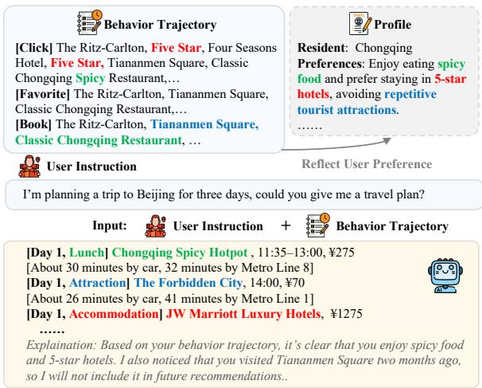  
Figure 1: An example of Behavior2Trip, where the agent analyzes a user's behavioral trajectory to implicitly infer preferences, enabling the direct generation of personalized travel plans from implicit instructions.

Existing travel planning agents follow two main paradigms: (1) Single-turn Explicit Instruction (Xie et al., 2024; Shao et al., 2025; Ni et al., 2025; de la Rosa et al., 2024a), which requires users to provide all preferences upfront in a single turn; and (2) Multi-turn Clarification (Zhang et al., 2024; Chen et al., 2024), which interactively elicits preferences through dialogue. However, both paradigms heavily rely on users’ active input, overlooking behavioral signals from users' past interactions (e.g., clicks, favorites, and bookings) that naturally encode their preferences (Ye et al., 2011; Chen et al., 2023). This over-reliance on active input increases interaction burden and limits plan personalization.

<table><tr><td>Dataset</td><td>UBT</td><td>SII</td><td>OP</td><td>UPF</td><td>LIB</td><td>UP</td><td>#POIs</td><td># POI Attr.</td><td># Constraints</td><td>Instances</td></tr><tr><td>TravelPlanner (Xie et al., 2024)</td><td>x</td><td>X</td><td>√</td><td>X</td><td>x</td><td>exp.</td><td>19.9k</td><td>6.6</td><td>15</td><td>20</td></tr><tr><td>ChinaTravel (Shao et al., 2025)</td><td>x</td><td>x</td><td>V</td><td>x</td><td>x</td><td>exp.</td><td>12.2k</td><td>6.8</td><td>23</td><td>154</td></tr><tr><td>Ask-before-plan (Zhang et al., 2024)</td><td>x</td><td>√</td><td>x</td><td>x</td><td>X</td><td>exp.</td><td>19.9k</td><td>6.6</td><td>12</td><td>2,000</td></tr><tr><td>ITINERA (Tang et al., 2024)</td><td>x</td><td>x</td><td>√</td><td>x</td><td>x</td><td>exp.</td><td>7.6k</td><td>9.0</td><td>一</td><td></td></tr><tr><td>TRIP–PAL (de la Rosa et al., 2024a)</td><td>x</td><td>x</td><td></td><td>x</td><td>x</td><td>exp.</td><td>1.8k</td><td>一</td><td>2</td><td>100</td></tr><tr><td>Travel–Agent (Chen et al., 2024)</td><td>X</td><td>X</td><td>x</td><td>X</td><td>x</td><td>exp.</td><td></td><td>一</td><td>20</td><td>20</td></tr><tr><td>TP–RAG (Ni et al., 2025)</td><td>X</td><td>X</td><td>√</td><td>X</td><td>x</td><td>exp.</td><td>85.6k</td><td>一</td><td>一</td><td>2,348</td></tr><tr><td>Behavior2Trip (ours)</td><td>J</td><td>√</td><td>√</td><td>√</td><td>J</td><td>imp.</td><td>80.9k</td><td>17.7</td><td>32</td><td>11,400</td></tr></table>

Table 1: Comparison between the Behavior2Trip and other benchmarks. UBT: User Behavior Trajectory, SII: Support Implicit Instruction, OP: One-shot Planning, UPF: User Profile, LIB: Low Interaction Burden, UP: User Preference. The √ indicates full support, the X indicates no support, “" denotes not mentioned in paper.

To bridge this gap, we introduce a new task, Behavior-Aware Travel Planning, which infers user preferences directly from past behaviors and generates personalized travel plans without requiring active user input. To support this task, we construct Behavior2Trip, a benchmark grounded in real user data from one of the largest Chinese online travel platforms, comprising 11,400 instances, each with an average of 39.8 past user behaviors spanning 14 attributes across 5 preference dimensions. The dataset is built upon a sandbox environment with 80.6k real-world POIs, where behavior trajectories are generated from diverse preference profiles and validated through a rigorous two-stage quality control process.

To address the challenge of implicitly inferring user preferences from behavior trajectories while satisfying long-horizon planning constraints, we propose B2T-Agent, a reinforcement learningbased agent that generates personalized travel plans from user behavior trajectories. Unlike promptdriven methods (Yuan et al., 2025; Xie et al., 2024), B2T-Agent features a structured action space supporting both external tool invocation and internal memory management, optimized by a composite reward function that rewards plan quality and penalizes invalid actions.

We conduct comprehensive experiments on Behavior2Trip to evaluate both open-sourced and closed-sourced models. Results highlight the substantial challenge of this task: even GPT-4.1 achieves a full-constraint pass rate of only 0.5% on the hardest tasks, while B2T-Agent built upon Qwen3-8B significantly outperforms all baselines. Moreover, Qwen3-8B trained with B2T-Agent also outperforms GPT-4.1 on the TravelPlanner (Xie et al., 2024), demonstrating strong generalization. Overall, the contributions of this paper are as follows:

• We identify a novel task, Behavior-Aware Travel Planning, which generates personalized travel plans by inferring user preferences directly from past behaviors, without requiring explicit or iterative user input.

• To support this task, we introduce Behavior2Trip, a large-scale benchmark grounded in real user data, comprising 11,400 instances with rich behavioral signals spanning 14 attributes across 5 preference dimensions.

• To tackle the challenges of this task, we propose B2T-Agent, a reinforcement learning-based agent with structured external tool invocation and internal memory management. Experiments show that B2T-Agent built upon Qwen3-8B significantly outperforms GPT-4.1 and generalizes well to the TravelPlanner benchmark.

## 2 Related Work

## 2.1 Travel Planning Benchmarks

Travel planning is a representative task for evaluating agents' long-horizon planning capabilities, as it requires understanding user instructions, performing multi-turn tool use to gather information, and generating constraint-satisfying travel plans. Existing benchmarks fall into two paradigms: (1) Single-turn Explicit Instruction (Xie et al., 2024; Shao et al., 2024a; de la Rosa et al., 2024b; Singh et al., 2024), where the agent generates a complete travel plan from a single, explicit user request; and (2) Multi-turn Clarification (Zhang et al., 2024; Chen et al., 2024), where the agent interactively elicits user preferences through dialogue to refine the plan. However, as shown in Table 1, both paradigms require users to actively express their preferences and cannot address scenarios where users express their preferences implicitly. In contrast, Behavior2Trip evaluates agents’ ability to infer user preferences from behavior trajectories and generate preference-aligned travel plans, enabling more realistic evaluation of personalized planning in real-world scenarios.

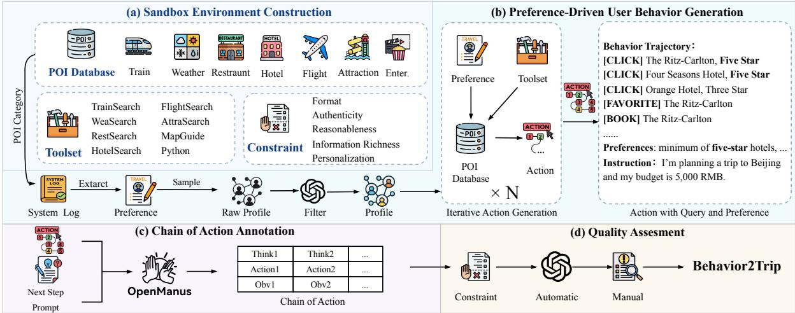  
Figure 2: The overall construction pipeline of Behavior2Trip, comprising four phases: (a) Sandbox Environment Construction builds a realistic platform with real-world POIs, tools, and constraints; (b) User Behavior Generation produces user trajectories across three difficulty levels; (c) Chain of Action Annotation collects agent trajectories with chain-of-action reasoning paths; and (d) Quality Assessment ensures data quality through two-stage automated and human verification.

## 2.2 Travel Planning Agents

To build travel planning agents, existing methods generally fall into two paradigms. (1) End-to-End LLM Agent (Xie et al., 2024; Chen et al., 2024; Zhang et al., 2024; Tang et al., 2024; Liu et al., 2026b; Lan et al., 2026), which relies on manually designed prompts to guide information retrieval and plan generation. However, such handcrafted workflows lack flexibility and struggle to generalize across diverse user inputs. (2) Hybrid LLM-Symbolic Solver (Hao et al., 2024; Ju et al., 2024; de la Rosa et al., 2024b; Shao et al., 2024a), which improves logical consistency by incorporating symbolic solvers, but typically applies them only at the final planning stage, leaving the step-by-step information gathering process unguided. To address these limitations, we propose B2T-Agent, a reinforcement learning-based agent that eliminates handcrafted components and learns to interact with external tools and manage internal memory throughout the entire planning process.

## 3 Behavior2Trip

## 3.1 Problem Definition

We define the user's action trajectory as A = $[ a _ { 1 } , a _ { 2 } , \ldots , a _ { t } ]$ , where each $a _ { i }$ denotes an action (e.g., click, favorite, book) at time step i, implicitly encoding the user's travel preferences P. Given a natural-language travel request I, the model queries the POI database D via toolset T to generate a personalized travel plan $\mathcal { R } =$ Model(A, I, T, D), subject to two constraints: ① Commonsense Constraint (CC) $\begin{array} { r } { ( { \mathcal { R } } \in \mathcal { C } _ { C C } ) \colon } \end{array}$ the plan must be logically feasible and factually grounded; ② User Preference Constraint (UPC) $( \mathcal { R } \in { \mathcal { C } } _ { U P C } )$ : the plan must align with the user's inferred preferences.

## 3.2 Data Collection

As shown in Figure 2, this section describes the step-by-step process of constructing a diverse and realistic dataset, which includes four key stages: (a) Sandbox Environment Construction, (b) Preference-Driven User Behavior Generation, (c) Chain of Action Annotation, and (d) Quality Assessment.

## 3.2.1 Sandbox Environment Construction

To create a realistic and fully functional sandbox environment, we establish a POI Database, a Toolset, and Constraints sourced from one of the largest Chinese online travel platforms. All data is fully anonymized with no user privacy information involved.

POI Database We collect 80.6k real POIs from 24 popular Chinese travel cities, including Attraction, Hotel, Restaurant, and Entertainment. Each POI has an average of 17.7 fields, including: ① basic info (e.g., name, category), ② spatiotemporal data (e.g., location, hours, pricing), ③ user feedback (e.g., reviews, ratings). We also include 728.4k records on Flight, Train, and Weather, forming a comprehensive POI database D. See Appendix A.1 for details.

<table><tr><td rowspan="2">Statistic</td><td colspan="3">Train</td><td colspan="3">Test</td></tr><tr><td>E</td><td>M</td><td>H</td><td>E</td><td>M</td><td>H</td></tr><tr><td>Samples</td><td>3000</td><td>Dataset 3000</td><td>3000 </td><td>800</td><td>800</td><td>800</td></tr><tr><td>Actions</td><td>14.5</td><td>Trajectory</td><td>66.7</td><td>14.2</td><td>37.6</td><td>67.2</td></tr><tr><td>Preferences POIs</td><td>1.0 10.3</td><td>38.2 2.4 27.2</td><td>4.0 47.8</td><td>1.0 10.1</td><td>2.3 26.9</td><td>4.0 48.0</td></tr><tr><td colspan="7">Instruction</td></tr><tr><td>Trip Duration Companions</td><td>4.9 2.2</td><td>4.9 2.1</td><td>5.0 2.3</td><td>4.9 2.2</td><td>4.9 2.2</td><td>5.0 2.2</td></tr></table>

Table 2: Statistics of Behavior2Trip. E, M, and H represent Easy, Medium, and Hard levels, respectively.

Toolset We design a fine-grained toolset where each POI category has a dedicated search tool supporting optional filtering fields such as location, price range, rating, and opening hours. We also implement MapGuide, which helps interpret spatial data, and Python for general-purpose computing. In total, we develop 9 tools; details are in Appendix A.2.

Constraints To enable fine-grained evaluation of travel plans while preserving real-world fidelity we design a constraint set grounded in authentic online travel service scenarios. For CC, we define four dimensions: Format ensures structural consistency, Authenticity verifies POI-related correctness, Reasonableness checks logical feasibility, and Information Richness reflects plan completeness. For UPC, we introduce the Personalization dimension to capture alignment with user preferences. Altogether, we define 32 constraints; details are in Appendix A.3.

## 3.2.2 User Behavior Generation

To construct user trajectories that are both preference-grounded and behaviorally coherent, we first derive a structured preference schema from real logs, instantiate user profiles with controlled difficulty, and then use LLM role-playing to generate long-term click-favorite-book sequences.

Preference Schema We derive a structured preference schema from anonymized user logs by extracting 14 high-frequency attributes across 5 dimensions. For each attribute, we calibrate its value range and POI-category mapping against real-log distributions, with details in Appendix A.4.

User Profile We instantiate user profiles P at three difficulty levels to control preference complexity and behavioral noise. Easy includes one preference category without noise; Medium combines multiple categories with one noise behavior; and Hard covers all categories with a higher noise ratio. For each level, we sample attribute combinations from the schema and use GPT-4.1 to remove inconsistent profiles, with the prompt shown in Figure 8.

Behavior Trajectory Motivated by prior studies showing that user check-in trajectories are shaped by sequential, spatio-temporal, and semantic/category patterns (Cheng et al., 2013; Tian et al., 2023; Wang et al., 2022), we model real user sessions as coherent travel-intent trajectories. To capture this structure, for each profile P, we construct a candidate pool containing preference-matched POIs and a difficulty-controlled set of noise POIs. Gemini-3-Flash is then prompted to role-play the user and generate coherent click → add\_to\_favorites → book sequences (prompt shown in Figure 9). Noise POIs are restricted to click actions to simulate exploratory browsing, while favorite and book actions remain preference-aligned. Repeating this process across sessions yields long-term trajectories A, which are paired with real travel instructions I from system logs to form (A, P, T) triplets.

## 3.2.3 Chain of Action Annotation

After obtaining the (A, P, T) triplets, we annotate each instance with a Chain of Action (CoA) label that records the full reasoning trajectory including tool calls and intermediate decisions— to provide step-level supervision for model training. To generate these trajectories, we use Open-Manus (Liang et al., 2025) as the rollout harness, feeding A and T as inputs. Since unconstrained rollouts tend to drift from the correct planning direction, after each (think, action, observation) cycle we manually inject a tailored Next Step Prompt (Figure 7) to steer the agent toward the next correct step, ensuring the resulting trajectory remains coherent and usable as a supervision signal.

## 3.2.4 Quality Assessment

To ensure dataset quality, we use a two-stage filtering process (Liu et al., 2020, 2021; Cheng et al.

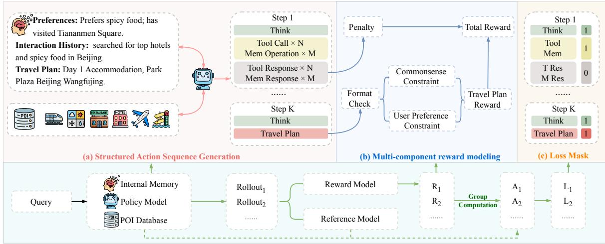  
Figure 3: Overview of the proposed B2T-Agent framework. B2T-Agent incorporates external tool invocation and internal memory management, optimized via Group Relative Policy Optimization with a multi-component reward function that rewards plan quality and penalizes invalid actions.

2026b). In the first stage, we utilized Deepseek-R1 to automatically score each instance on a 0-3 scale with respect to three aspects: trajectory completeness, reflection of user preferences, and constraint satisfaction (Figure 10). Only instances that received a score of 3 were retained. Subsequently, three independent annotators reviewed a random sample of 1000 instances, reporting no observable errors and achieving 94.6% agreement.

## 3.3 Data Statistics

Table 2 summarizes dataset statistics across three difficulty levels. The full dataset comprises 11,400 instances (9,000 train / 2,400 test). With increasing difficulty, the number of actions, preference categories, and involved POIs all grow, making it progressively harder for models to infer user preferences from behavioral trajectories and generate constraint-satisfying plans. At each difficulty level, instructions span varied trip durations and group sizes, ensuring the benchmark captures a broad distribution of real-world travel planning scenarios.

## 4 B2T-Agent

In this section, we present B2T-Agent, an RL-based agent that supports external tool invocation and internal memory management for personalized travel planning. As shown in Figure 3, B2T-Agent comprises three key components: (a) Structured Action Sequence Generation (§4.1), (b) Multi-Component Reward Modeling (§4.2), and (c) Training with Loss Mask (§4.4).

## 4.1 Structured Action Sequence Generation

To support iterative POI retrieval from the database and coherent context management across longhorizon planning, we define the agent's rollout as a structured action sequence y:

$$
y : = ( a _ { 1 } , a _ { 2 } , \dotsc , a _ { k } , R )
$$

where each action $a _ { i }$ is one of the following types: External Tool Use $\tau { _ { \mathrm { ~ \scriptsize ~ { ~ \tau ~ } ~ } } }$ Internal Memory Management $\mathcal { M } ,$ or Chain-of-Thought Reasoning C. The sequence concludes with a final Result R.

External Tool Use The agent wraps each tool invocation in <tool\_cal1> and receives the result in <tool\_response>. Built on Qwen-Agent and following the Model Context Protocol², it can access any tool in our sandbox. To improve efficiency, multiple tools can be called within a single reasoning step.

Internal Memory Management To mitigate context window saturation from accumulating trajectories and tool responses, the agent maintains an internal memory module organized as key-value pairs, accessible via <memory>. The model can read entries by key and write new entries to store user preferences, tool outputs, and interaction history across planning steps.

Reasoning and Result To infer user preferences from behavior trajectories and guide subsequent tool invocations, the model performs explicit reasoning within <think> to analyze retrieved information and intermediate results. Once all necessary interactions are complete, it generates the final travel plan within <answer>.

## 4.2 Multi-Component Reward Modeling

Given the structured action sequence defined above, we design a multi-component reward function to supervise both the process of tool invocation and the quality of the final travel plan, comprising an Incorrect Action Penalty and a Travel Plan Reward.

Incorrect Action Penalty To improve the reliability and robustness of the execution process, we introduce a penalty for invalid tool or memory invocations. An error is identified when <tool\_response> or <memory\_response> contains an explicit error message, upon which a penalty of $P _ { \bf a c t i o n } = - 1$ is applied to the entire sequence, and $P _ { \mathbf { a c t i o n } } = 0$ otherwise.

Travel Plan Reward To evaluate the quality of generated travel plans against both commonsense and user preference constraints, we design a twostage gating reward. A format score $R _ { \mathrm { f o r m a t } } \ \in$ $\{ 0 , 1 \}$ first verifies structural correctness; only if passed, the Commonsense Constraint score $R _ { \mathbf { C C } }$ and User Preference Constraint score RuPC are assessed, ensuring the model learns to produce wellformed outputs before optimizing for content quality:

$$
R _ { \mathbf { p l a n } } = R _ { \mathbf { f o r m a t } } \cdot ( R _ { \mathbf { C C } } + R _ { \mathbf { U P C } } )
$$

The total reward combines both components:

$$
R _ { \mathbf { t o t a l } } = P _ { \mathbf { a c t i o n } } + R _ { \mathbf { p l a n } }
$$

This design penalizes any action-level failure while rewarding high-quality, preference-aligned plans, jointly encouraging reliable execution and personalized planning.

## 4.3 Policy Optimization via GRPO

Inspired by recent advances in RL-based LLM training (Pan et al., 2025; Team, 2025; Wang et al., 2025a,b; Liu et al., 2026a), we adopt GRPO (Shao et al., 2024b) to optimize the policy model by maximizing the following objective:

$$
\begin{array} { l } { \displaystyle \mathcal { I } _ { \mathrm { G R P O } } ( \theta ) = \mathbb { E } _ { [ \{ g _ { i } \} _ { i = 1 } ^ { G } \sim \pi _ { \theta } ( Y | q ) ] } \frac { 1 } { G } \sum _ { i = 1 } ^ { G } \frac { 1 } { | y _ { i } | } \sum _ { t = 1 } ^ { | y _ { i } | } \Big \{ \Big \} } \\ { \displaystyle \operatorname* { m i n } \Big [ r _ { i , t } ( \theta ) \hat { A } _ { i , t } , \mathrm { c l i p } \big ( r _ { i , t } ( \theta ) , 1 - \epsilon , 1 + \epsilon \big ) \hat { A } _ { i , t } \Big ] } \\ { \displaystyle - \beta \mathbb { D } _ { K L } \big [ \pi _ { \theta } \big | | \pi _ { r e f } \big ] \Big \} } \\ { \mathrm { w i t h } \quad r _ { i , t } ( \theta ) = \frac { \pi _ { \theta } \big ( y _ { i , t } | q , y _ { i , < t } \big ) } { \pi _ { \theta , l e } \big ( y _ { i , t } | q , y _ { i , < t } \big ) } , } \end{array}
$$

where $\pi _ { \theta }$ and $\pi _ { r e f }$ stand for the policy model and reference model respectively. $\mathbb { D } _ { K L }$ is the KLdivergence, scaled by a coefficient $\beta . \ q$ denotes a query, and y represents a sequence of structured actions.

## 4.4 Training with Loss Mask

During training, the rollout contains externally sourced tokens within <tool\_response> and <memory\_response> that are not generated by the model. Including them in the loss computation introduces noise, so we follow Jin et al. (2025) and apply a loss mask to exclude these segments from gradient updates, ensuring the model is optimized only on its own generated tokens.

## 5 Experiments

## 5.1 Experimental Setup

Baselines and Models Following prior works (Xie et al., 2024; Cheng et al., 2025b), we adopt two baselines: ReAct (Yao et al., 2023) and SFT, alongside our proposed B2T-Agent, all with interactive reasoning where the model interacts with the environment to gather information. To ensure fair comparison, all methods are given the full user behavior trajectory. We evaluate open-source models including Qwen3-8/14/32B (Yang et al., 2025) and Deepseek-V3 (Liu et al., 2024), as well as frontier proprietary models including GPT-4o and GPT-4.1.

Metrics Following Xie et al. (2024), we report the Delivery Rate (DR), which measures the proportion of plans that successfully produce a structurally valid travel itinerary. For constraint adherence, we compute the Micro Pass Rate (Micro PR) and Macro Pass Rate (Macro PR) separately for Commonsense Constraints (CC) and User Preference Constraints (UPC), defined as:

$$
\mathrm { M i c r o } \mathrm { P R } = \frac { \sum _ { p \in P } \sum _ { c \in C _ { p } } \mathbb { 1 } _ { \mathrm { p a s s e d } ( c , p ) } } { \sum _ { p \in P } \vert C _ { p } \vert }
$$

<table><tr><td rowspan="2">Model</td><td rowspan="2">Method</td><td colspan="5">Easy</td><td colspan="5">Medium</td><td colspan="5">Hard</td><td rowspan="2">Avg.</td></tr><tr><td>DR</td><td>CC</td><td>UPC</td><td>Final</td><td>LLM</td><td>DR</td><td>CC</td><td>UPC</td><td>Final</td><td>LLM</td><td>DR</td><td>CC</td><td>UPC</td><td>Final</td><td>LLM</td></tr><tr><td>Qwen3-8B</td><td rowspan="5"></td><td>40.2</td><td>34.2/0.0</td><td>10.1/10.1</td><td>0.0</td><td>27.5</td><td>34.1</td><td>31.8/0.0</td><td>12.3/0.0</td><td>0.0</td><td>23.5</td><td>11.2</td><td>24.1/0.0</td><td>15.9/0.0</td><td>0.0</td><td>12.8</td><td>0.0</td></tr><tr><td>Qwen3-14B</td><td>44.3</td><td>32.9/0.3</td><td>14.2/14.2</td><td>0.3</td><td>32.6</td><td>32.8</td><td>32.9/0.4</td><td>19.7/1.8</td><td>1.8</td><td>28.7</td><td>21.5</td><td>31.9/1.2</td><td>21.1/0.0</td><td>0.0</td><td>23.2</td><td>0.7</td></tr><tr><td>Qwen3-32B</td><td>53.1</td><td>32.4/0.3</td><td>14.3/14.3</td><td>0.3</td><td>34.3</td><td>41.5</td><td>32.5/0.8</td><td>19.8/0.8</td><td>0.8</td><td>29.9</td><td>31.4</td><td>32.4/1.3</td><td>22.7/0.0</td><td>0.0</td><td>33.3</td><td>0.4</td></tr><tr><td>GPT-40</td><td>90.4</td><td>36.5/1.3</td><td>16.8/16.8</td><td>1.3</td><td>36.6</td><td>97.7</td><td>36.4/4.2</td><td>19.4/3.1</td><td>3.1</td><td>31.9</td><td>96.2</td><td>33.1/3.4</td><td>22.2/0.3</td><td>0.3</td><td>26.9</td><td>1.5</td></tr><tr><td>GPT-4.1</td><td>95.8</td><td>33.6/2.2</td><td>17.7/17.7</td><td>2.2</td><td>36.4</td><td>95.0</td><td>33.4/3.0</td><td>28.4/7.0</td><td>7.0</td><td>31.2</td><td>97.8</td><td>33.5/3.1</td><td>22.2/0.5</td><td>0.5</td><td>28.2</td><td>3.2</td></tr><tr><td>DeepSeek-V3</td><td></td><td>94.3</td><td>34.7/3.3</td><td>20.1/20.1</td><td>3.1</td><td>41.6</td><td>94.9</td><td>33.9/3.7</td><td>28.4/4.4</td><td>4.4</td><td>38.8</td><td>97.0</td><td>34.1/4.1</td><td>31.8/0.8</td><td>0.5</td><td>34.1</td><td>2.7</td></tr><tr><td>Qwen3-8B Qwen3-14B</td><td>SFT</td><td>77.2</td><td>54.0/5.0</td><td>17.7/17.7</td><td>5.0</td><td>73.7</td><td>76.5</td><td>54.4/4.6</td><td>26.5/3.7</td><td>3.7</td><td>62.3</td><td>57.4</td><td>54.5/4.1</td><td>32.9/0.3</td><td>0.3</td><td>35.8</td><td>3.0</td></tr><tr><td rowspan="2">Qwen3-8B</td><td rowspan="2"></td><td>87.3</td><td>58.7/5.2</td><td>17.8/17.8</td><td>5.2</td><td>73.1</td><td>88.6</td><td>59.0/5.5</td><td>29.0/4.1</td><td>4.1</td><td>66.9</td><td>61.5</td><td>55.2/5.0</td><td>33.2/0.3</td><td>0.3</td><td>36.1</td><td>3.2</td></tr><tr><td>100.0</td><td>56.815.2</td><td>25.0/25.0</td><td>4.7</td><td>77.2</td><td>96.3</td><td>57.3/5.2</td><td>37.2/10.3</td><td>5.2</td><td>70.2</td><td>93.3</td><td>53.3/5.1</td><td>36.9/4.3</td><td>4.3</td><td>68.5</td><td>4.7</td></tr><tr><td>Qwen3-14B</td><td>B2T-Agent</td><td>98.9</td><td>59.8/7.3</td><td>27.9/27.9</td><td>7.3</td><td>81.1</td><td>99.0</td><td>59.3/6.2</td><td>40.3/13.5</td><td>6.2</td><td>75.2</td><td>97.4</td><td>59.4/6.1</td><td>41.2/5.0</td><td>5.0</td><td>74.3</td><td>6.2</td></tr></table>

Table 3: Performance on Different Methods and Difficulties. CC and UPC show Micro/Macro Pass Rate. Results are reported in percentage (%). The best and second-best results are marked in bold and underlined.

$$
\operatorname { M a c r o } \operatorname { P R } = { \frac { \sum _ { p \in P } \mathbb { 1 } _ { \operatorname { p a s s e d } ( C _ { p } , p ) } } { | P | } }
$$

For overall performance, we report the Final Pass Rate (Final), the percentage of plans satisfying all constraints, and the LLM Pass Rate (LLM) for flexible LLM-based evaluation.

Implementation Details We adapt the ReAct baseline from TravelPlanner (Xie et al., 2024) to our expanded toolset and sandbox constraints, and conduct SFT using LLaMAFactory (Zheng et al., 2024). B2T-Agent is built on RLFactory (Simple-Efficient, 2025) with the prompt template shown in Figure 11.

## 5.2 Main Results

Table 3 reports the main results and we highlight three key findings.

Existing models struggle with Action-Aware Travel Planning. Even the strongest proprietary model, GPT-4.1, achieves only 0.5 Final PR on Hard tasks, underscoring the severity of the challenge. This stems from a fundamental shift in what drives success: while Easy tasks can largely be solved by satisfying CC, Medium and Hard tasks increasingly require alignment with UPC, a more personalized and dynamic requirement that current models consistently fail to capture. While LLMbased evaluation assigns relatively higher scores than rule-based Final due to its tolerance for output variations, both metrics confirm the same trend: UPC satisfaction remains the key bottleneck as task difficulty scales up.

B2T-Agent achieves the best performance on Action-Aware Travel Planning. B2T-Agent consistently achieves the best performance across all difficulty levels, with B2T-Agent-14B leading all baselines on both Final PR and LLM PR across Easy, Medium, and Hard splits. Furthermore, this advantage becomes especially pronounced on harder tasks: on the Hard split, B2T-Agent-14B achieves 5.0 Final PR compared to 0.5 for the best ReAct baseline (GPT-4.1), and 74.3 LLM PR compared to 28.2. Notably, even B2T-Agent with Qwen3-8B surpasses GPT-4.1 in average Final PR (4.7 vs. 3.2), highlighting the efficiency of our approach.

B2T-Agent Achieves Superior Performance on User Preference Constraints. Since CC constraints are shared across all queries, SFT can learn fixed patterns to improve CC satisfaction; however, UPC constraints vary per user and require dynamic adaptation, which SFT fails to provide. In contrast, B2T-Agent leverages reward signals to drive the model toward personalized planning through interaction, rather than relying on memorized response patterns. This translates to substantial UPC gains: on the Hard split, B2T-Agent-14B achieves 5.0 UPC Macro PR, compared to 0.3 for SFT-14B and 0.8 for the best ReAct baseline (DeepSeek-V3).

## 6 Analysis

In this section, we present a comprehensive analysis aimed at addressing the following research questions. RQ1: Does incorporating behavior trajectory really help with personalized travel planning? (§6.1) RQ2: How does increasing trajectory complexity affect method performance? (§6.2) RQ3: How does each component affect the performance of B2T-Agent? (§6.3) RQ4: Can B2T-Agent generalize to other travel planning benchmarks? (§6.4)

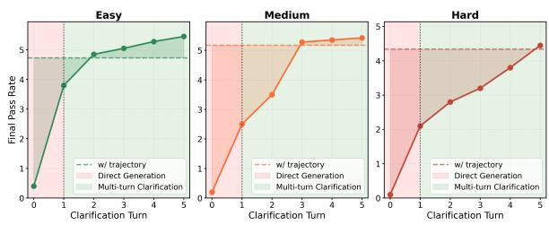  
Figure 4: Impact of Trajectory and Clarification Turns on Final PR. Incorporating user trajectory significantly improves initial plan quality and reduces the need for clarification turns.

## 6.1 RQ1: Impact of Behavior Trajectory

To investigate whether user behavior trajectory benefits personalized travel planning, we evaluate Qwen3-8B-B2T-Agent using only implicit user instructions, without trajectory. Instead, GPT-4.1 is used to simulate user feedback, allowing the model to iteratively refine plans through clarification turns. As shown in Figure 4, with zero clarification turns, Final PR is nearly zero, indicating failure to align plans with user preferences. To match the performance of trajectory-augmented planning, Easy, Medium, and Hard tasks require approximately 2, 3, and 5 clarification turns, respectively. These results confirm that user trajectory substantially improves initial plan quality and reduces reliance on multi-turn clarification.

## 6.2 RQ2: Impact of Trajectory Complexity

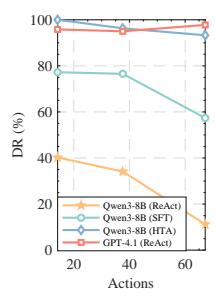

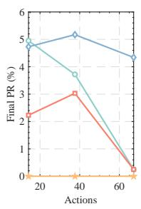

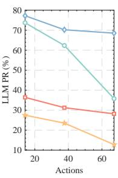  
Figure 5: Relationship between the number of actions in trajectories and the performance of DR, Final PR, and LLM PR.

We compare Qwen3-8B and GPT-4.1 across DR, Final PR, and LLM PR as trajectory complexity increases (measured by the number of actions). As shown in Figure 5, Qwen3-8B under SFT and ReAct shows sharp drops across all metrics, as longer trajectories introduce more user preferences and edge cases beyond their capacity. In contrast, GPT-4.1 maintains strong DR but suffers notable declines in Final PR and LLM PR. Qwen3-8B-

B2T-Agent performs best overall, sustaining high DR and stable PR scores; reward-driven interactive training enables it to handle edge cases and capture user preference-POI relationships that SFT and prompting cannot cover.

## 6.3 RQ3: Ablation Study

<table><tr><td>Method</td><td>DR</td><td>Final PR</td><td>LLM PR</td></tr><tr><td>B2T-Agent</td><td>96.52</td><td>4.75</td><td>71.98</td></tr><tr><td>- w/o. M</td><td>97.46 (↑0.97%)</td><td>4.21 (↓11.37%)</td><td>64.24 (↓10.76%)</td></tr><tr><td>- w/o. P</td><td>86.70 (↓10.17%)</td><td>4.32 (↓9.05%)</td><td>65.22 (↓9.39%)</td></tr><tr><td>- w/o. L</td><td>78.18 (↓18.99%)</td><td>3.79 (↓20.21%)</td><td>57.97 (↓19.47%)</td></tr></table>

Table 4: Ablation study on Qwen3-8B.

We ablate each key component of B2T-Agent on Qwen3-8B to assess their individual contributions. As shown in Table 4, removing the memory module (w/o. Memory) slightly improves DR (+0.97%), as the model skips memory operations and favors faster responses. However, without memory, the model loses access to user preferences, causing Final PR and LLM PR to drop by 11.4% and 10.8%, respectively. Without the penalty term (w/o. Penalty), the model fails to correct inappropriate tool or memory actions, leading to repetitive loops and a 10.2% drop in DR. Finally, removing loss masking (w/o. Loss Mask) introduces noisy gradients from non-answer tokens, causing the largest overall decline, with DR, Final PR, and LLM PR dropping by 19.0%, 20.2%, and 19.5%, respectively.

## 6.4 RQ4: Cross-Benchmark Evaluation

<table><tr><td>Method</td><td>DR</td><td>CMi</td><td>CMa</td><td>HMi</td><td>HMa</td><td>FPR</td></tr><tr><td>Mistral-7B†</td><td>7.0</td><td>4.8</td><td>0.0</td><td>0.0</td><td>0.0</td><td>0.0</td></tr><tr><td>GPT-4-Turbo†</td><td>93.1</td><td>63.3</td><td>2.9</td><td>10.5</td><td>5.5</td><td>0.6</td></tr><tr><td>GPT-4.1</td><td>99.4</td><td>75.1</td><td>5.7</td><td>10.7</td><td>7.8</td><td>1.5</td></tr><tr><td>Qwen3-8B-B2T-Agent</td><td>100</td><td>76.8</td><td>25.0</td><td>26.5</td><td>10.2</td><td>9.0</td></tr></table>

Table 5: Performance on the TravelPlanner (†results from the original paper).

To validate the generality of B2T-Agent for travel planning, we further conduct a cross-benchmark evaluation on TravelPlanner (Xie et al., 2024). As shown in Table 5, Qwen3-8B-B2T-Agent consistently outperforms all baselines, with especially large gains on constraint satisfaction (CMa: 25.0 vs. 5.7) and overall plan quality (FPR: 9.0 vs. 1.5). These results confirm that B2T-Agent generalizes effectively beyond our benchmark to standard travel planning settings.

## 7 Conclusion

In this paper, we identify a new task, Behavior-Aware Travel Planning, which infers user preferences from behavioral trajectories to generate personalized travel plans without requiring explicit input. To support this task, we present Behavior2Trip, a benchmark combining user behavior data, and B2T-Agent, a reinforcement learning framework that enables models to interact autonomously using external tools and internal memory. Extensive experiments demonstrate that B2T-Agent effectively captures user intent, significantly reducing the need for explicit user interaction and enabling more seamless travel planning experiences.

## Limitations

While B2T-Agent achieves high-quality personalized planning by combining reward-driven multiturn tool interaction with reinforcement learning, it incurs notable computational overhead from two main sources. First, during training, GRPO requires sampling multiple rollouts per query, which substantially increases computational cost. Second, at inference time, the multi-turn tool invocations lead to high first-token latency. Reducing this overhead without compromising planning quality remains an important direction for future work.

## Ethics Statement

POI and user-preference data can contain substantial sensitive information (e.g., consumers’ personally identifiable information), making it essential to protect user privacy from both the data and model perspectives. Specifically, as described in Section 3.2.1, we first remove all explicit personally identifiable information from the POI database by using a locally deployed GPT-oss-120B (Agarwal et al., 2025) to redact user reviews, business phone numbers, and POI descriptions. We then conduct random manual audits to verify that no privacy-sensitive content remains. In addition, during preference extraction, we model only high-level attributes rather than individual users, thereby further reducing privacy risk and mitigating potential bias when learning the mapping between preferences and POI categories.

## Acknowledgments

Thanks for the insightful comments and feedback from the reviewers. This work was supported by

the National Natural Science Foundation of China (No. 62406015).

## References

Sandhini Agarwal, Lama Ahmad, Jason Ai, Sam Altman, Andy Applebaum, Edwin Arbus, Rahul K Arora, Yu Bai, Bowen Baker, Haiming Bao, and 1 others. 2025. gpt-oss-120b & gpt-oss-20b model card. arXiv preprint arXiv:2508.10925.

Aili Chen, Xuyang Ge, Ziquan Fu, Yanghua Xiao, and Jiangjie Chen. 2024. Travelagent: An ai assistant for personalized travel planning. arXiv preprint arXiv:2409.08069.

Xiaoqing Chen, Zhitao Li, Weike Pan, and Zhong Ming. 2023. A survey on multi-behavior sequential recommendation. arXiv preprint arXiv:2308.15701.

Chen Cheng, Haiqin Yang, Michael R Lyu, and Irwin King. 2013. Where you like to go next: Successive point-of-interest recommendation. In IJCAI, volume 13, pages 2605–2611.

Zhangtao Cheng, Yuhao Ma, Jian Lang, Kunpeng Zhang, Ting Zhong, Yong Wang, and Fan Zhou. 2025a. Generative thinking, corrective action: Userfriendly composed image retrieval via automatic multi-agent collaboration. In Proceedings of the 31st ACM SIGKDD Conference on Knowledge Discovery and Data Mining V. 2, pages 334–344.

Zihao Cheng, Zeming Liu, Yingyu Shan, Xinyi Wang, Xiangrong Zhu, Yunpu Ma, Hongru Wang, Yuhang Guo, Wei Lin, and Yunhong Wang. 2026a. Mem2evolve: Towards self-evolving agents via coevolutionary capability expansion and experience distillation. In Proceedings of the 64th Annual Meeting of the Association for Computational Linguistics (Volume 1: Long Papers), pages 20784–20831.

Zihao Cheng, Hongru Wang, Zeming Liu, Yuhang Guo, Yuanfang Guo, Yunhong Wang, and Haifeng Wang. 2025b. Toolspectrum: Towards personalized tool utilization for large language models. In Findings of the Association for Computational Linguistics: ACL 2025, pages 20679–20699.

Zihao Cheng, Hongru Wang, Zeming Liu, Xinyi Wang, Xiangrong Zhu, Yuhang Guo, Wei Lin, Jeff Z. Pan, and Yunhong Wang. 2026b. Terminal-world: Scaling terminal-agent environments via agent skills. Preprint, arXiv:2605.20876.

Tomas de la Rosa, Sriram Gopalakrishnan, Alberto Pozanco, Zhen Zeng, and Daniel Borrajo. 2024a. Trip-pal: Travel planning with guarantees by combining large language models and automated planners. Preprint, arXiv:2406.10196.

Tomas de la Rosa, Sriram Gopalakrishnan, Alberto Pozanco, Zhen Zeng, and Daniel Borrajo. 2024b. Trip-pal: Travel planning with guarantees by combining large language models and automated planners. arXiv preprint arXiv:2406.10196.

Bin Deng, Yizhe Feng, Zeming Liu, Qing Wei, Xiangrong Zhu, Shuai Chen, Yuanfang Guo, and Yunhong Wang. 2025. Retail: Towards real-world travel planning for large language models. In Proceedings of the 2025 Conference on Empirical Methods in Natural Language Processing, pages 14881–14913.

Fan Gao, Hongqiang Li, Zhilong Chen, Yunai Yi, Shihao Nie, Zihao Cheng, Zeming Liu, Yuanfang Guo, Shumin Liu, Qizhen Qin, and 1 others. 2025. A chemical autonomous robotic platform for end-toend synthesis of nanoparticles. Nature Communications, 16(1):7558.

Yilun Hao, Yongchao Chen, Yang Zhang, and Chuchu Fan. 2024. Large language models can solve realworld planning rigorously with formal verification tools. arXiv preprint arXiv:2404.11891.

Yingzhi He, Xiaohao Liu, An Zhang, Yunshan Ma, and Tat-Seng Chua. 2025. Llm2rec: Large language models are powerful embedding models for sequential recommendation. In Proceedings of the 31st ACM SIGKDD Conference on Knowledge Discovery and Data Mining V. 2, pages 896–907.

Song Jiang, Da JU, Andrew Cohen, Sasha Mitts, Aaron Foss, Justine T Kao, Xian Li, and Yuandong Tian. 2024. Towards full delegation: Designing ideal agentic behaviors for travel planning. Preprint, arXiv:2411.13904.

Bowen Jin, Hansi Zeng, Zhenrui Yue, Jinsung Yoon, Sercan Arik, Dong Wang, Hamed Zamani, and Jiawei Han. 2025. Search-r1: Training llms to reason and leverage search engines with reinforcement learning. Preprint, arXiv:2503.09516.

Da Ju, Song Jiang, Andrew Cohen, Aaron Foss, Sasha Mitts, Arman Zharmagambetov, Brandon Amos, Xian Li, Justine Kao, Maryam Fazel-Zarandi, and 1 others. 2024. To the globe (ttg): Towards languagedriven guaranteed travel planning. In Proceedings of the 2024 Conference on Empirical Methods in Natural Language Processing: System Demonstrations, pages 240–249.

Da JU, Song Jiang, Andrew Cohen, Aaron Foss, Sasha Mitts, Arman Zharmagambetov, Brandon Amos, Xian Li, Justine T Kao, Maryam Fazel-Zarandi, and Yuandong Tian. 2024. To the globe (ttg): Towards language-driven guaranteed travel planning. Preprint, arXiv:2410.16456.

Tianwei Lan, Jiaqi Wu, Zeming Liu, Zhaoxin Fan, Haifeng Wang, and Yuhang Guo. 2026. Peap: Proactive embodied action sequence planning with joint understanding of vision and audio perception. In Proceedings of the 64th Annual Meeting of the Association for Computational Linguistics (Volume 1: Long Papers), pages 23118–23138.

Xinbin Liang, Jinyu Xiang, Zhaoyang Yu, Jiayi Zhang, Sirui Hong, Sheng Fan, and Xiao Tang. 2025. Openmanus: An open-source framework for building general ai agents.

Aixin Liu, Bei Feng, Bing Xue, Bingxuan Wang, Bochao Wu, Chengda Lu, Chenggang Zhao, Chengqi Deng, Chenyu Zhang, Chong Ruan, and 1 others. 2024. Deepseek-v3 technical report. arXiv preprint arXiv:2412.19437.

Jingjing Liu, Ziye Huang, Zihao Cheng, Zeming Liu, Jiahong Wu, Yuhang Guo, Kehai Chen, Yunhong Wang, and Haifeng Wang. 2026a. Docos: Towards proactive document-guided actions in gui agents. Preprint, arXiv:2605.18048.

Jingjing Liu, Silin Li, Zeming Liu, Zihao Cheng, Yuhang Guo, Yuanfang Guo, Yunhong Wang, and Haifeng Wang. 2026b. Towards multi-language repository-level code generation: From-scratch to guided tasks. Neurocomputing, page 133204.

Zeming Liu, Haifeng Wang, Zheng-Yu Niu, Hua Wu, and Wanxiang Che. 2021. Durecdial 2.0: A bilingual parallel corpus for conversational recommendation. In Proceedings of the 2021 Conference on Empirical Methods in Natural Language Processing, pages 4335-4347.

Zeming Liu, Haifeng Wang, Zheng-Yu Niu, Hua Wu, Wanxiang Che, and Ting Liu. 2020. Towards conversational recommendation over multi-type dialogs. In Proceedings of the 58th annual meeting of the association for computational linguistics, pages 1036– 1049.

Junyu Luo, Weizhi Zhang, Ye Yuan, Yusheng Zhao, Junwei Yang, Yiyang Gu, Bohan Wu, Binqi Chen, Ziyue Qiao, Qingqing Long, Rongcheng Tu, Xiao Luo, Wei Ju, Zhiping Xiao, Yifan Wang, Meng Xiao, Chenwu Liu, Jingyang Yuan, Shichang Zhang, and 7 others. 2025. Large language model agent: A survey on methodology, applications and challenges. Preprint, arXiv:2503.21460.

Zhiyuan Ma, Jiayu Liu, Xianzhen Luo, Zhenya Huang, Qingfu Zhu, and Wanxiang Che. 2025. Advancing tool-augmented large language models via metaverification and reflection learning. In Proceedings of the 31st ACM SIGKDD Conference on Knowledge Discovery and Data Mining V. 2, pages 2078–2089.

Hang Ni, Fan Liu, Xinyu Ma, Lixin Su, Shuaiqiang Wang, Dawei Yin, Hui Xiong, and Hao Liu. 2025. Tp-rag: Benchmarking retrieval-augmented large language model agents for spatiotemporal-aware travel planning. Preprint, arXiv:2504.08694.

Jiayi Pan, Junjie Zhang, Xingyao Wang, Lifan Yuan, Hao Peng, and Alane Suhr. 2025. Tinyzero. https://github.com/Jiayi-Pan/TinyZero. Accessed: 2025-01-24.

Jie-Jing Shao, Xiao-Wen Yang, Bo-Wen Zhang, Baizhi Chen, Wen-Da Wei, Lan-Zhe Guo, and Yu-feng Li. 2024a. Chinatravel: A real-world benchmark for language agents in chinese travel planning. arXiv preprint arXiv:2412.13682.

Jie-Jing Shao, Bo-Wen Zhang, Xiao-Wen Yang, Baizhi Chen, Si-Yu Han, Wen-Da Wei, Guohao Cai, Zhenhua Dong, Lan-Zhe Guo, and Yu feng Li. 2025. Chinatravel: An open-ended benchmark for language agents in chinese travel planning. Preprint, arXiv:2412.13682.

Zhihong Shao, Peiyi Wang, Qihao Zhu, Runxin Xu, Junxiao Song, Xiao Bi, Haowei Zhang, Mingchuan Zhang, YK Li, Yang Wu, and 1 others. 2024b. Deepseekmath: Pushing the limits of mathematical reasoning in open language models. arXiv preprint arXiv:2402.03300.

Simple-Efficient. 2025. RL-Factory: Train your Agent model via our easy and efficient framework. https://github.com/Simple-Efficient/ RL-Factory. Commit 216e841.

Harmanpreet Singh, Nikhil Verma, Yixiao Wang, Manasa Bharadwaj, Homa Fashandi, Kevin Ferreira, and Chul Lee. 2024. Personal large language model agents: A case study on tailored travel planning. In Proceedings of the 2024 Conference on Empirical Methods in Natural Language Processing: Industry Track, pages 486–514.

Joykirat Singh, Raghav Magazine, Yash Pandya, and Akshay Nambi. 2025. Agentic reasoning and tool integration for llms via reinforcement learning. Preprint, arXiv:2505.01441.

Yihong Tang, Zhaokai Wang, Ao Qu, Yihao Yan, Zhaofeng Wu, Dingyi Zhuang, Jushi Kai, Kebing Hou, Xiaotong Guo, Jinhua Zhao, and 1 others. 2024. Itinera: Integrating spatial optimization with large language models for open-domain urban itinerary planning. In Proceedings of the 2024 Conference on Empirical Methods in Natural Language Processing: Industry Track, pages 1413–1432.

Kimi Team. 2025. Kimi k1.5: Scaling reinforcement learning with 1lms. Preprint, arXiv:2501.12599.

Jing Tian, Zilin Zhao, and Zhiming Ding. 2023. Next point-of-interest recommendation based on joint mining of spatial-temporal and semantic sequential patterns. ISPRS International Journal of Geo-Information, 12(7):297.

Hongru Wang, Cheng Qian, Wanjun Zhong, Xiusi Chen, Jiahao Qiu, Shijue Huang, Bowen Jin, Mengdi Wang, Kam-Fai Wong, and Heng Ji. 2025a. Acting less is reasoning more! teaching model to act efficiently. Preprint, arXiv:2504.14870.

Xican Wang, Yanheng Liu, Xu Zhou, Xueying Wang, and Zhaoqi Leng. 2022. A point-of-interest recommendation method exploiting sequential, category and geographical influence. ISPRS International Journal of Geo-Information, 11(2):80.

Zhenhailong Wang, Xuehang Guo, Sofia Stoica, Haiyang Xu, Hongru Wang, Hyeonjeong Ha, Xiusi Chen, Yangyi Chen, Ming Yan, Fei Huang, and Heng Ji. 2025b. Perception-aware policy optimization for multimodal reasoning. Preprint, arXiv:2507.06448.

Jian Xie, Kai Zhang, Jiangjie Chen, Tinghui Zhu, Renze Lou, Yuandong Tian, Yanghua Xiao, and Yu Su. 2024. Travelplanner: A benchmark for realworld planning with language agents. arXiv preprint arXiv:2402.01622.

An Yang, Anfeng Li, Baosong Yang, Beichen Zhang, Binyuan Hui, Bo Zheng, Bowen Yu, Chang Gao, Chengen Huang, Chenxu Lv, and 1 others. 2025. Qwen3 technical report. arXiv preprint arXiv:2505.09388.

Shunyu Yao, Jeffrey Zhao, Dian Yu, Nan Du, Izhak Shafran, Karthik Narasimhan, and Yuan Cao. 2023. React: Synergizing reasoning and acting in language models. In 11th International Conference on Learning Representations, ICLR 2023.

Mao Ye, Peifeng Yin, Wang-Chien Lee, and Dik-Lun Lee. 2011. Exploiting geographical influence for collaborative point-of-interest recommendation. In Proceedings of the 34th international ACM SIGIR conference on Research and development in Information Retrieval, pages 325–334.

Siyu Yuan, Kaitao Song, Jiangjie Chen, Xu Tan, Dongsheng Li, and Deqing Yang. 2025. EvoAgent: Towards automatic multi-agent generation via evolutionary algorithms. In Proceedings of the 2025 Conference of the Nations of the Americas Chapter of the Association for Computational Linguistics: Human Language Technologies (Volume 1: Long Papers), pages 6192–6217, Albuquerque, New Mexico. Association for Computational Linguistics.

Shaokun Zhang, Yi Dong, Jieyu Zhang, Jan Kautz, Bryan Catanzaro, Andrew Tao, Qingyun Wu, Zhiding Yu, and Guilin Liu. 2025a. Nemotron-researchtool-n1: Exploring tool-using language models with reinforced reasoning. Preprint, arXiv:2505.00024.

Xuan Zhang, Yang Deng, Zifeng Ren, See Kiong Ng, and Tat-Seng Chua. 2024. Ask-before-plan: Proactive language agents for real-world planning. In Findings of the Association for Computational Linguistics: EMNLP 2024, pages 10836–10863.

Yuxiang Zhang, Yuqi Yang, Jiangming Shu, Xinyan Wen, and Jitao Sang. 2025b. Agent models: Internalizing chain-of-action generation into reasoning models. Preprint, arXiv:2503.06580.

Yaowei Zheng, Richong Zhang, Junhao Zhang, Yanhan Ye, Zheyan Luo, Zhangchi Feng, and Yongqiang Ma. 2024. Llamafactory: Unified efficient fine-tuning of 100+ language models. In Proceedings of the 62nd Annual Meeting of the Association for Computational Linguistics (Volume 3: System Demonstrations), Bangkok, Thailand. Association for Computational Linguistics.

## A Behavior2Trip

## A.1 POI Database Details

Table 6 presents all the real Points of Interest (POIs) information used in this paper. It includes the POI types, the number of POIs of each kind, and the names of fields associated with each type. This comprehensive dataset provides a realistic and diverse sandbox environment for our research.

## A.2 Toolset Details

Table 7 presents all the tools, including the tool names, descriptions, and their respective parameters. A total of nine tools are provided, each supporting fine-grained combinations based on user preference information, enabling precise retrieval of the most relevant data from the large POI database.

## A.3 Constraint Details

Table 8 lists the constraints used to evaluate the quality of travel plans. A total of 32 constraints are categorized into five groups: Format (1), Authenticity (4), Reasonableness (15), Personalization (10), and Information Richness (2). Each constraint is derived from real-world business scenarios, providing a realistic and effective basis for assessing the quality of a travel plan.

## A.4 Preference Details

Table 9 presents the fields and value ranges related to travel preferences defined in user profiles, including Historical Travel Experiences, Hotel Preferences, Attraction Preferences, Dining Requirements, and Transportation Preferences. Each field is closely aligned with POIs in the database, ensuring that user instructions with diverse preferences can be effectively addressed.

## B Additional Experimentss

## B.1 RQ5: Case Study

As illustrated in Figure 6, we compare the performance of B2T-Agent and TravelPlanner ReAct when processing the same input. The ReAct model performs tool invocation in a strictly sequential manner, relying entirely on prompts to execute actions step by step. As the number of turns increases, the dialogue context grows rapidly, making it difficult for the model to retain previous interaction history and user preferences. This often leads to repeated tool usage and a lack of filtering based on user preferences. Such inefficiency not only increases the number of interaction turns but may also prevent the generation of a final travel plan due to the maximum turn limit.

In contrast, B2T-Agent supports parallel tool invocation and incorporates a memory module to read and write critical user information. During the planning process, the model proactively accesses stored user preferences and interaction history, thereby improving tool invocation efficiency and generating travel plans that better align with user needs.

## B.2 RQ6: Error Analysis

We perform a detailed error analysis on the two best-performing models from our main experiment and our proposed B2T-Agent. From each model's output, we randomly sampled 30 generated trajectories and manually examined them (total of 180 samples), identifying and categorizing five classes of recurring errors.

## B.2.1 Constraint Violations

Agents often generate travel plans that ignore realworld constraints, such as geographic feasibility, time budgets, and user preferences. While the outputs usually satisfy format and completeness requirements, they fail to consider whether the recommended POIs are realistically visitable or aligned with user needs. As a result, most plans are not directly usable.

## B.2.2 Erroneous Tool or Memory Loops

When interacting step-by-step with external tools or internal memory, the models sometimes generate invalid tool call formats or incorrect parameters. Once an error occurs, the model does not revise its behavior based on feedback, leading to repeated failures and ultimately crashing the generation process.

## B.2.3 Hallucinated POIs

Agents occasionally include POIs that do not exist in the database. This type of hallucination indicates a poor understanding of the model's knowledge boundaries. Instead of retrieving POIs from verified data, the model relies on memorized or incorrect internal representations.

## B.2.4 Contextual Reasoning Limits

Each generation involves extensive interaction with memory and environment, leading to long contextual sequences, often exceeding 20k tokens. The

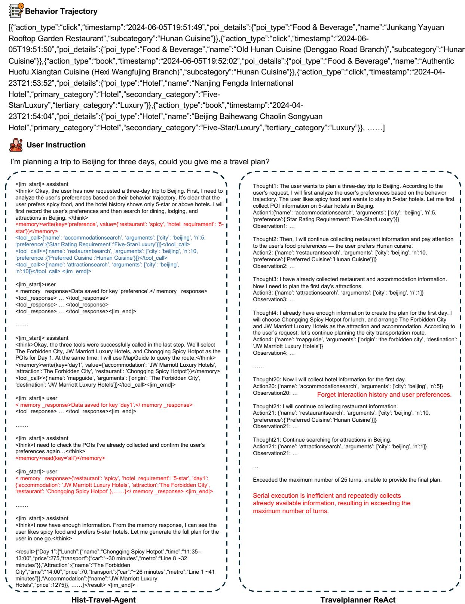  
Figure 6: Case study comparing the reasoning trajectories of TravelPlanner ReAct and B2T-Agent. While the ReAct baseline suffers from context loss and redundant tool usage due to strictly sequential execution, B2T-Agent utilizes parallel tool invocation and a memory module to retrieve user preferences, ensuring efficient and accurate plan generation.

<table><tr><td>POI Type</td><td>Count</td><td>Features</td></tr><tr><td>Restaurant</td><td>29,604</td><td>Name, Details, Address, Phone, Province, City, Location, Longitude, Lati- tude, Tertiary Category, Secondary Category, Primary Category, Business Hours, Rating Rank, Parking Information, Average Price, Average Rating, User Reviews</td></tr><tr><td>Flights</td><td>710,633</td><td>Flight Number, Airline, Airline Code, Departure City, Arrival City, De- parture City Code, Arrival City Code, Departure Airport, Arrival Airport, Departure Airport Code, Arrival Airport Code, Departure Date, Arrival Date, Departure Time, Arrival Time, Flight Duration, Departure Terminal, Arrival Terminal, Aircraft Model, Cabin Type, Cabin Code, Adult Fare, Child Fare, Adult Total Price, Child Total Price, Adult Fuel Surcharge, Adult Airport Construction Fee, Discount, On-time Rate, Meal Availability, Codeshare Flight</td></tr><tr><td>Hotels</td><td>22,473</td><td>Name, Details, Cover Image, Address, Phone, Province, City, District, Lon- gitude, Latitude, Tertiary Category, Secondary Category, Primary Category, Business Hours, Rating Rank, Parking Information, WiFi Availability, Av- erage Price, Average Rating, User Reviews, Room Information</td></tr><tr><td>Entertainment</td><td>20,250</td><td>Name, Details, Cover Image, Address, Phone, Province, City, District, Longitude, Latitude, Tertiary Category, Secondary Category, Primary Category, Business Hours, Rating Rank, Average Price, Average Rating</td></tr><tr><td>Trains</td><td>10,371</td><td>Departure City, Arrival City, Departure Station, Arrival Station, Train Number, Train Type, Travel Time, Travel Minutes, Departure Time, Arrival Time, Fare</td></tr><tr><td>Attractions</td><td>8,229</td><td>Name, Details, Cover Image, Address, Phone, Province, City, Location Longitude, Latitude, Category Name, Attraction Type, Custom Type, Open- ing Hours, Best Visiting Season, Recommended Visiting Duration, Average Price, User Reviews, Ticket Information</td></tr><tr><td>Weather</td><td>7,440</td><td>City, Date, Max Temperature, Min Temperature, Weather, Wind Direction, Air Quality</td></tr></table>

Table 6: Statistics of the collected real-world POI database. The dataset comprises 7 distinct categories totaling 809k records, with an average of 17.7 attribute features per category.

models struggle to extract relevant signals from such complex contexts, which negatively impacts their ability to generate coherent and relevant plans.

## B.2.5 Formatting Errors

Despite clear instruction prompts, the models sometimes fail to follow the required format for travel plans. These formatting issues hinder both automatic evaluation and real-world usability, revealing limitations in instruction following and output consistency.

## C Prompt Template

In this section, we present the prompts used in this study. Figures 7, 8, 9, 10, and 11 illustrate the Next Step Prompt, Profile Filtering, Behavior Trajectory Generation, Quality Control, and B2T-Agent, respectively.

<table><tr><td>Tool</td><td>Description</td><td>Parameter</td></tr><tr><td>AccommodationSearch</td><td>Accommodation options in a speci- fied city are found, with support for preference-based filtering.</td><td>Main Parameters: • city: str • n: int (optional) • preferences: dict (optional) Preference Keys:</td></tr><tr><td></td><td>Attractions in a specified city are found. with support for preference-based filter- ing.</td><td>• star_rating: list of str • amenities: list of str Main Parameters: • city: str • n: int (optional) • preferences: dict (optional) Preference Keys:</td></tr><tr><td>EntertainmentSearch</td><td>Entertainment options in a specified city are found, with support for preference- based filtering.</td><td>• walk_tolerance: list of str Main Parameters: • city: str • n: int (optional) • preferences: dict (optional) Preference Keys: • type: list of str Main Parameters:</td></tr><tr><td></td><td>port for preference-based filtering.</td><td>• origin: str • destination: str • departure_date: str • n: int (optional) • preferences: dict (optional) Preference Keys: • cabin_class: list of str</td></tr><tr><td></td><td>Navigation routes from a departure loca- tion to a destination are searched, includ- ing walking, driving, and public transit options, either within the same city or</td><td>• origin_cityName: str • origin: str • destination_cityName: str • destination: str Main Parameters:</td></tr><tr><td></td><td>explored, with support for preference- based filtering.</td><td>• city: str • n: int (optional) • preferences: dict (optional) Preference Keys: • cuisine: list of str • price_level: list of str</td></tr><tr><td>TrainSearch</td><td>Train information is retrieved.</td><td>• environment: list of str • origin: str • destination: str</td></tr><tr><td>WeatherSearch</td><td>Weather information for a specified city and date is retrieved.</td><td>• n: int (optional) • city: str</td></tr><tr><td>Python</td><td>Python code is executed, with the ability to display outputs and handle errors.</td><td>• date: str (optional) • n: int (optional) • code: str</td></tr><tr><td>Category</td><td>Constraint</td><td>Description</td></tr><tr><td>Format (1)</td><td>JSON Format Validation</td><td>Validates overall JSON structure and required fields</td></tr><tr><td rowspan="3">Authenticity (4)</td><td>POI Authenticity</td><td>Verifies that Points of Interest exist in real city databases</td></tr><tr><td>Major Transport Authenticity</td><td>Confirms availability of intercity transport like flights/trains</td></tr><tr><td>Local Transport Authenticity Business Hours Authenticity</td><td>Ensures local transport durations are reasonable Checks that POI visits occur within operating hours</td></tr><tr><td rowspan="10">Reasonableness (15)</td><td>Complete Meal Arrangement</td><td>Ensures three meals are arranged each day</td></tr><tr><td>Non-duplicate Restaurants</td><td>No repeated restaurant recommendations across</td></tr><tr><td>Reasonable Meal Times</td><td>the plan Meâls occur at appropriate times of day</td></tr><tr><td>Daily Accommodation Arrangement</td><td>A hotel must be arranged for each night</td></tr><tr><td>Reasonable Accommodation Time</td><td>Hotel check-in should be scheduled after 18:00</td></tr><tr><td>Avoid Midnight Travel</td><td>No transport activities between 23:00 and 06:00</td></tr><tr><td>No Attractions After Late Major Transport</td><td>No sightseeing after arriving at a city after 18:00</td></tr><tr><td>Local Transport Time Limit</td><td>Total daily local transport should not exceed 2</td></tr><tr><td></td><td>hours Weather and city background must be included</td></tr><tr><td>Weather and City Info Included</td><td>for each destination</td></tr><tr><td></td><td>At Least One Attraction</td><td>Each day must feature at least one valid attraction</td></tr><tr><td>No Time Conflicts</td><td>Attraction Quantity Limit</td><td>No more than 4 attractions per day Activities should not overlap, with at least 30-</td></tr><tr><td></td><td></td><td>minute gaps</td></tr><tr><td></td><td>Reasonable Time Range</td><td>Activities must occur between 09:00 and 21:00</td></tr><tr><td></td><td>Inter-attraction Transport Time</td><td>Transport between attractions should not exceed 1 hour</td></tr><tr><td></td><td>No Long Continuous Gaps</td><td>No idle gaps longer than 2 hours during</td></tr><tr><td></td><td></td><td>09:00-21:00</td></tr><tr><td rowspan="9">Personalization (10)</td><td>Hotel Star Level Matching</td><td>Hotel meets user's minimum star rating</td></tr><tr><td>Hotel Amenities Matching</td><td>Hotel has required facilities (e.g. WiFi, parking)</td></tr><tr><td>Attraction Type Matching</td><td>Attractions align with user's preferences</td></tr><tr><td>Walking Tolerance Matching</td><td>Plan respects walking endurance limitations</td></tr><tr><td>Cuisine Type Matching</td><td>Meals reflect preferred cuisine types</td></tr><tr><td>Price Level Matching Dining Environment Matching</td><td>All items stay within specified price levels Dining settings match user preferences (e.g. quiet,</td></tr><tr><td></td><td>lively)</td></tr><tr><td>Transport Mode Matching Seat Class Matching</td><td>Intercity transport matches preferred modes Matches user's preferred flight/train seat class</td></tr><tr><td>Budget Constraint</td><td>Total cost stays within user-defined budget</td></tr><tr><td>Information Richness (2)</td><td>Information Sufficiency Information Richness</td><td>Each activity includes all required fields Extra details (e.g. descriptions, tips) are included</td></tr><tr><td>Field</td><td>Data Type</td><td>Value</td></tr><tr><td colspan="3">Historical Travel Experiences</td></tr><tr><td>accommodations</td><td>array (of object)</td><td></td></tr><tr><td>restaurants</td><td>array (of object)</td><td></td></tr><tr><td>attractions</td><td>array (of object)</td><td></td></tr><tr><td>transportation</td><td>array (of object)</td><td></td></tr><tr><td>Hotel Preferences</td><td></td><td></td></tr><tr><td>star_requirement</td><td>array (of string)</td><td>2-Star &amp; Below/Economy, 4-Star/Upscale, 3-Star/Comfort, 5-Star/Luxury, City Homestay</td></tr><tr><td>essential facilities</td><td>array (of string)</td><td>Free WiFi, Private Bathroom, Parking, Gym, Swimming Pool, Restaurant</td></tr><tr><td>Attraction Preferences preferred_attraction_types array (of string)</td><td></td><td>Park/Square, Museum/Exhibition, Cultural/Historic</td></tr><tr><td></td><td></td><td>Site, Cityscape, Natural Landscape, Comprehensive Scenic Area, Religious Site, Theme Park, Outdoor Adventure, Water Activities, Hot Spring/Wellness, Rural/Folk Village, Animal Watching, Ice/Snow Sports,</td></tr><tr><td>walking_tolerance</td><td>string</td><td>Water Conservancy Facility Low (1-3km), Medium (3-5km), High (5km+)</td></tr><tr><td>Dining Requirements</td><td></td><td></td></tr><tr><td>cuisine_preferences</td><td>array (of string)</td><td>Beverages, Snacks/Fast Food, Other Cuisines, Hot Pot, Western Food, Cantonese, Other Chinese Food, Shanghai/Zhejiang Cuisine, Sichuan Cuisine, Bakery/Desserts, Barbecue, Buffet, Northern Chinese</td></tr><tr><td>price_level</td><td>string</td><td>Food, Hunan Cuisine, Seafood, Japanese/Korean Cuisine, Southeast Asian Cuisine Budget (30-80 CNY/person), Moderate (80-150</td></tr><tr><td>dining_environment</td><td></td><td>CNY/person), Generous (150-300 CNY/person), Luxury (300-500 CNY/person) Quiet, Scenic View, Family-friendly, Lively, Unique</td></tr><tr><td></td><td>string Decor</td><td></td></tr><tr><td>Transportation Preferences</td><td></td><td>High-speed Rail, Regular Train, Airplane,</td></tr><tr><td>intercity_transport</td><td>string</td><td>Long-distance Bus</td></tr><tr><td>intracity_transport</td><td>string</td><td>Subway, Bus, Taxi, Ride-sharing, Walking</td></tr><tr><td>seat_class</td><td>string</td><td>Economy Class, Business Class, First Class Seat, Second Class Seat</td></tr></table>

Table 7: The toolset definition comprising 9 specialized APIs. Each retrieval tool is equipped with fine-grained parameters and preference keys (e.g., cuisine, star\_rating) to support precise, multi-criteria filtering of the POI database.  
Table 9: The schema of the user preference profile derived from real-world travel data. It consists of 14 fine-grained attributes across 5 dimensions (e.g., Dining, Transportation), defining both historical records and specific constraints to enable personalized planning.

Table 8: Taxonomy of constraints derived from real-world business scenarios. The system enforces a total of 32 distinct constraints spanning 5 categories (e.g., Authenticity, Reasonableness) to ensure the feasibility and quality of travel plans.

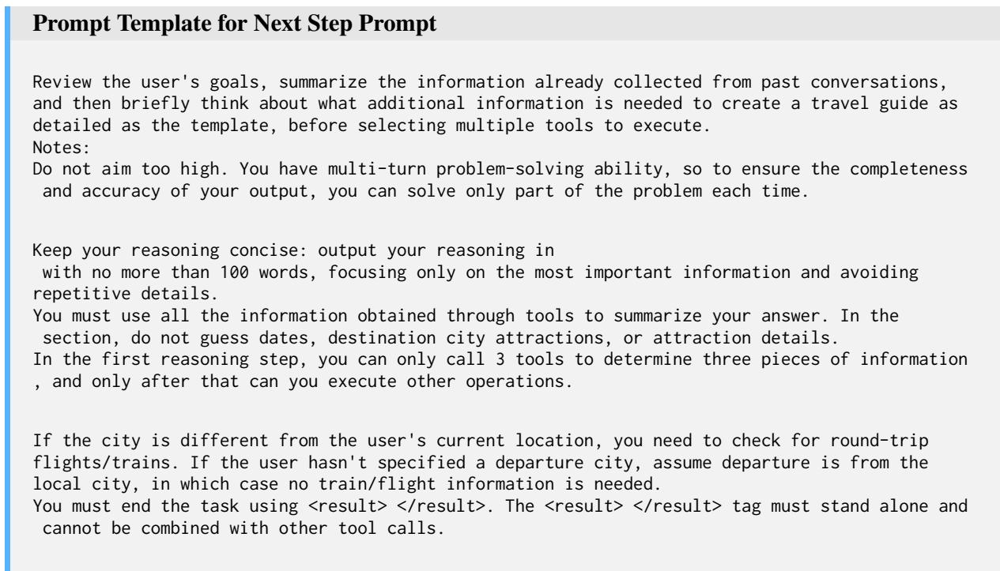  
Figure 7: Prompt Template for Next Step Prompt.

  
Figure 8: Prompt Template for Filtering Profile.

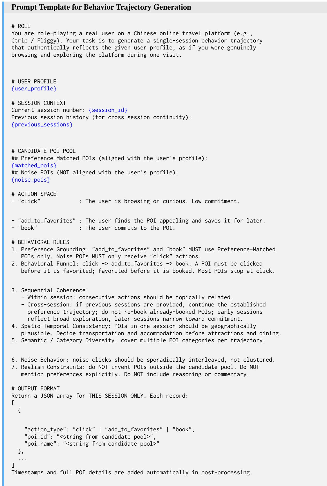  
Figure 9: Prompt Template for Behavior Trajectory Generation,

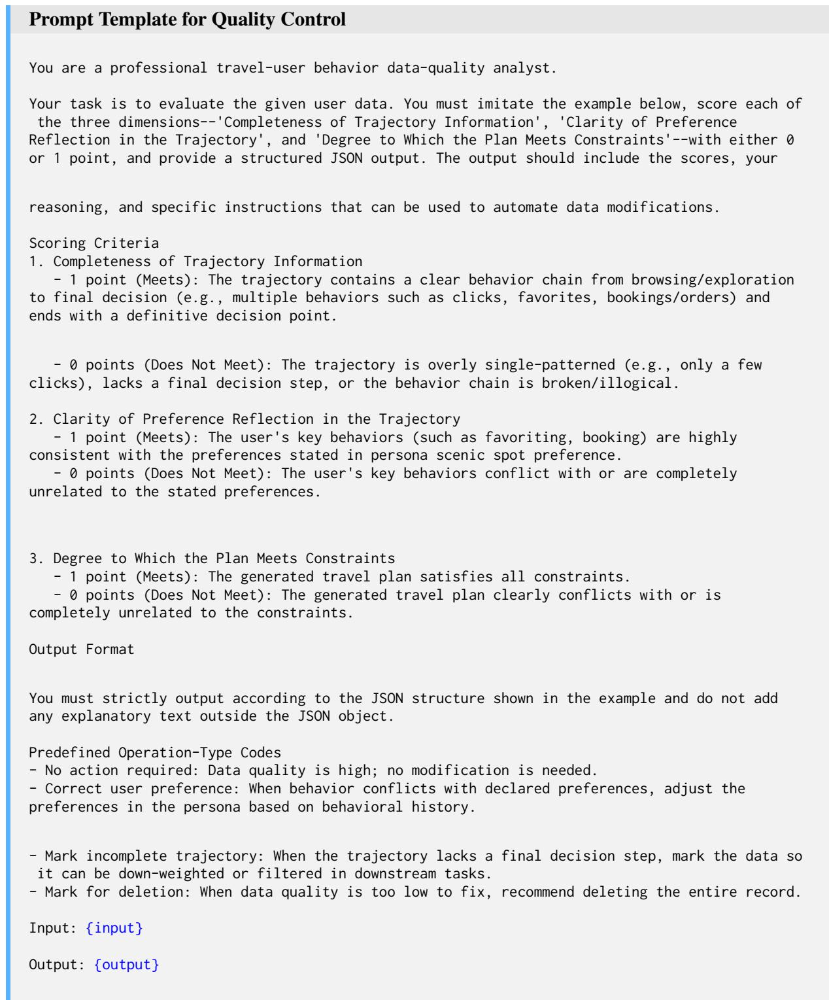  
Figure 10: Prompt Template for Quality Control.

Prompt Template for B2T-Agent   
You are a seasoned travel planner with extensive experience in generating personalized plans.   
Your core task is to deeply understand the user's requirements, gather information by calling   
tools, and ultimately design a thorough and meticulous travel plan.   
You possess an internal dictionary-structured memory module for storing and retrieving key   
information. Use <memory></memory> to wrap any operation that reads or writes session memory   
using "action": "read" or "write" with a "key" (and optional "value" for write). After   
gathering all necessary information and crafting the complete plan, please wrap the final   
itinerary in JSON format between the "<answer>" and "</answer>" tags.   
Note: The delivered travel plan must be complete, covering every day of the trip.   
Please note that the final output should be a JSON list (array) that includes all travel days.   
Each day is an independent JSON object that follows the same internal structure.   
# Tools   
{"name": "AccommodationSearch", "parameters": {"type": "object", "properties": {"city": {"title   
": "City", "type": "string"}, "n": {"default": 5, "title": "N", "type": "integer"}, "   
preferences": {"additionalProperties": true, "default": null, "title": "Preferences", "type": "   
object"}}, "required": ["city"]}}   
{"name": "RestaurantSearch", "parameters": {"type": "object", "properties": {"city": {"title":   
"City", "type": "string"}, "n": {"default": 5, "title": "N", "type": "integer"}, "preferences":   
{"additionalProperties": true, "default": null, "title": "Preferences", "type": "object"}},"   
required": ["city"]}}   
{"name": "FlightSearch", "parameters": {"type": "object", "properties": {"origin": {"title": "   
Origin", "type": "string"}, "destination": {"title": "Destination", "type": "string"}, "   
departure\_date": {"title": "Departure Date", "type": "string"}, "n": {"default": 5, "title": "N   
", "type": "integer"}, "preferences": {"additionalProperties": true, "default": null, "title":   
"Preferences", "type": "object"}}, "required": ["origin", "destination", "departure\_date"]}}   
{"name": "TrainSearch", "parameters": {"type": "object", "properties": {"origin": {"title":"   
Origin", "type": "string"}, "destination": {"title": "Destination", "type": "string"}, "n": {"   
default": 5, "title": "N", "type": "integer"}}, "required": ["origin", "destination"]}}   
{"name": "WeatherSearch", "parameters": {"type": "object", "properties": {"city": {"title": "   
City", "type": "string"}, "date": {"default": null, "title": "Date", "type": "string"}, "n": {"   
default": 5, "title": "N", "type": ""integer"}}, "required": ["city"]}}   
{"name": "EntertainmentSearch", "parameters": {"type": "object", "properties": {"city": {"title   
": "City", "type": "string"}, "n": {"default": 5, "title": "N", "type": "integer"}, "   
preferences": {"additionaiProperties": true, "default": null, "title": "Preferences", "type": "   
object"}}, "required": ["city"]}}   
{"name": "AttractionSearch", "parameters": {"type": "object", "properties": {"city": {"title":   
"City", "type": "string"}, "n": {"default": 5, "title": "N", "type": "integer"}, "preferences":   
{"additionalProperties": true, "default": null, "title": "Preferences", "type": "object"}}, "   
required": ["city"]}}   
{"name": "MapGuide", "parameters": {"type": "object", "properties": {"origin\_cityName": {"title   
": "Origin Cityname", "type": "string"}, "origin": {"title": "Origin", "type": "string"}, "   
destination\_cityName": {"title": "destination\_cityname", "type": "string"}, "destination": {"   
title": "Destination", "type": "string"}}, "required": ["origin\_cityName", "origin", "   
destination\_cityName", "destination"]}}   
Behavior trajectory: {behavior trajectory}   
Instruction: {instruction}  
Figure 11: Prompt Template for B2T-Agent.