# CONSOLIDATING RLVR CAPABILITIES ACROSS DOMAINS: A DEEP DIVE INTO FUSION PARADIGMS

Siye Wu♠♣†, Kai Yang♣, Yuchen Cai♣†, Xin Xu♣, Peng-Yuan Wang♣†, Jiaxuan Wang♣†, Jiashun Liu♣†, Jiafei Lyu♣, Yangkun Chen♣, Saiyong Yang♣, Yanghua Xiao♠∗

♠Fudan University ♣LLM Department, Tencent

GitHub Hugging Face

## ABSTRACT

Reinforcement learning with verifiable rewards (RLVR) improves specific capabilities of large language models, but covering multiple capabilities often involves training separate domain experts and subsequently consolidating them. We organize three fusion paradigms by the artefacts they reuse: Merge combines expert task vectors, Mix RL pools their datasets, and multi-teacher on-policy distillation (MOPD) uses both. Because they have largely been studied in isolation, how they compare and how to choose among them remain unclear. We compare all three using shared experts and data across model scales and a multi-domain benchmark suite. Although their average performance differs by at most 1.4 points, the gap reaches 8.6 points on a single benchmark, with domain-level variation tracking cross-domain relations visible in task-vector geometry. Training dynamics expose distinct constraints: Mix RL depends on domain mixture proportions, MOPD remains bounded by its teachers, and Merge compresses all expert updates into one. All three improve single-sample accuracy without measurable gains in solution coverage or losses in held-out capabilities. These results yield a practical guideline: use Merge when experts already exist and cheap fusion is paramount; Mix RL when training a unified model without experts, with domain proportions adjusted for cross-domain transfer; and MOPD when preserving domain-specific gains matters more than surpassing teachers or minimizing end-to-end cost.

## 1 INTRODUCTION

Reinforcement learning with verifiable rewards (RLVR) has become a standard approach to posttraining large language models (LLMs) (Jaech et al., 2024; Guo et al., 2025). In RLVR, a verifier scores responses sampled from the model, and an RL algorithm—often a group-based method such as Group Relative Policy Optimization (GRPO) (Shao et al., 2024)—turns those scores into policy updates (Guo et al., 2025). In practice, RLVR is typically applied to a specific capability, such as math (Hu et al., 2025) or code (Feng et al., 2026a), with rewards tailored to that task. Extending such gains across several capabilities therefore often requires one run per domain and a corresponding set of domain experts (Blakeman et al., 2025), which must then be served in parallel or routed between.

Consolidating these domain experts into one model depends on what each training run leaves behind. Training expert i produces two artefacts, its task vector $\tau _ { i } = \theta _ { i } - \theta _ { 0 }$ , which is the displacement applied to the base weights, and the dataset $\mathcal { D } _ { i }$ that produced it. This distinction yields three fusion paradigms. Merge keeps the $\tau _ { i }$ and folds them back into the base weights, with no training of its own (Ilharco et al., 2023). Mix RL sets the experts aside and keeps the $\mathcal { D } _ { i }$ , drawing all of them in one RLVR run (Huang et al., 2026). Multi-teacher on-policy distillation (MOPD) keeps both, supervising a student on its own rollouts with logits from the expert corresponding to each prompt’s domain (Lu & Lab, 2025; Xiao et al., 2026). Reusing different artifacts, the three paradigms come with distinct prerequisites, costs, and supervision before accuracy is even considered.

How the three paradigms compare remains unclear. Each has largely been developed and evaluated in isolation, often on different backbones and benchmark suites, making reported results difficult to compare directly and leaving the source of domain-level gains and losses unresolved. Recent studies have compared mixed RLVR with post-hoc fusion in focused settings (Wang et al., 2026; Gu et al., 2026), but none has evaluated all three under a common framework. We therefore organize the paradigms by what they reuse and ask what each achieves and why their outcomes differ. To this end, we train five domain experts on each of the 4B and 8B Qwen3 backbones (Yang et al., 2025) and compare the three paradigms using shared experts and data across diverse benchmarks.

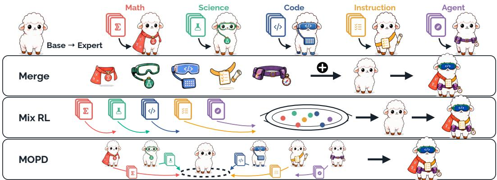  
Figure 1: Three paradigms for consolidating domain-specific capabilities acquired through RLVR into one model. Merge combines expert task vectors, Mix RL trains jointly on mixed-domain data, and MOPD draws on both through multi-teacher on-policy distillation.

The paradigms are not interchangeable. Although their average performance differs by at most 1.4 points on either backbone, the gap reaches 8.6 points on a single benchmark. These differences are systematic, reflecting relations among fused domains. We characterize these relations in behaviour by evaluating each expert across all benchmarks and in weight space through the geometry of the task vectors τ . Both reveal the same structure: math, science and code reinforce one another, whereas instruction following and agentic tool use are nearly orthogonal to the other domains. The resulting domain-level outcomes reflect how each paradigm allocates or preserves domain-specific learning signals. Where cross-domain transfer is absent, Mix RL progresses on a domain in proportion to the prompts sampled from it. MOPD preserves each domain through token-level teacher supervision but remains bounded by its teachers. Merge compresses five task vectors into a single update, so the fraction of each expert’s gain that survives varies widely across domains.

Two further measurements bound what fusion ultimately delivers. All three paradigms improve over the base model at pass@1, but their advantage shrinks with additional samples; by pass@32, none remains distinguishable from the base model on AIME. Fusion therefore improves singlesample accuracy without expanding the set of solvable problems, while preserving the base model’s existing capabilities. Consistent with this preservation, no paradigm underperforms the base model on either factual recall or long-context reasoning, both of which are held out from training. The paradigms also differ markedly in their prerequisites, and their compute costs span more than an order of magnitude. Once the experts exist, Merge requires only minutes of arithmetic. Mix RL needs no experts and costs about 0.6× the per-domain RL reference, but depends on careful data mixing. MOPD has the cheapest trained fusion stage, below 0.2× the reference, yet the highest end-to-end cost because it presupposes the experts it distils.

## Our contributions are as follows.

1. A controlled comparison of Merge, Mix RL and MOPD under a unified experimental framework, organized by the artefacts they reuse and evaluated across model scales using shared experts, training data and a diverse multi-domain benchmark suite.

2. An explanation of their domain-level outcomes across all five target domains through crossdomain relations in behaviour and task-vector geometry, together with analyses of training steps, sampled prompts and supervision throughout the training process.

3. A characterisation of fusion’s benefits and limits, showing no broader solution coverage or measurable held-out capability loss, and providing guidance for choosing among paradigms based on domain relations, costs and prerequisites.

## 2 RELATED WORK

Multi-domain RLVR. Recently, reinforcement learning with verifiable rewards (RLVR) has attracted substantial attention for its effectiveness in enhancing LLM capabilities (Lambert et al., 2025; Guo et al., 2025). Using simple rule-based rewards, group-based RLVR algorithms such as Group Relative Policy Optimization (GRPO) (Shao et al., 2024) enable models to achieve expertlevel performance in specific domains (Hu et al., 2025; Feng et al., 2026a). However, such gains are typically domain-specific, and extending expert-level performance across multiple domains remains non-trivial because domains may reinforce or interfere with one another (Li et al., 2025). Related phenomena have been investigated in multi-task learning, where cross-domain interactions are commonly characterized through task relatedness, representation sharing, and optimization-level interference (Yu et al., 2020; Wu et al., 2026). Prior studies have primarily focused on specific reasoning domains and final performance metrics. In contrast, we consider a broader set of domains and examine how cross-domain interactions evolve throughout training.

Fusion paradigms. Existing approaches to serving all domains with one model broadly fall into three paradigms. Merge requires no further training and instead combines the experts’ task vectors—their weight differences from the base model—into a single update to the base weights (Ilharco et al., 2023). Methods differ in how they weight, sparsify, and resolve conflicts among the expert updates (Wortsman et al., 2022; Yadav et al., 2023). For LoRA experts (Hu et al., 2022), integration can be performed at the adapter level through either composition (Zhang et al., 2023) or routing over multiple adapters (Mind Lab, 2026). Mix RL instead pools data from all domains into a single training run, allowing different domains to interact throughout optimization and requiring careful data mixing (Huang et al., 2026). On-policy distillation (OPD) trains a student on its own rollouts under teacher supervision (Lu & Lab, 2025; Li et al., 2026). In a multi-teacher setting (MOPD), domain-specific teachers provide a natural way to consolidate specialised models (Xiao et al., 2026; Xu et al., 2026). Prior work has largely studied these approaches in isolation on different backbones and benchmarks, making direct comparison difficult. A closely related study by Wang et al. (2026) compares mixed multi-domain RLVR with post-hoc fusion across multiple domains in a focused setting. In contrast, we provide a systematic comparison of Merge, Mix RL and MOPD as three distinct paradigms, analysing their effectiveness and underlying parameter-space behaviour.

## 3 PRELIMINARY

Problem setup. Let $\theta _ { 0 }$ denote the base model parameters, and write $\pi _ { \theta }$ for the policy induced by parameters θ. We are given N domains, each with a dataset $\mathcal { D } _ { i }$ of prompts and a verifier $v _ { i }$ that maps a prompt and a response to a score. We study the transition from $N$ separately trained single-domain models to a single model that serves all N domains.

Per-domain RLVR. Starting from $\theta _ { 0 } .$ , each expert is trained with RLVR on a single domain. In group-based RLVR methods such as GRPO (Shao et al., 2024), the policy samples a group of G responses $O = \{ o _ { 1 } , \ldots , o _ { G } \}$ for each prompt $q \in { \mathcal { D } } _ { i }$ , and each response receives a reward $r _ { j } = { }$ $v _ { i } ( q , o _ { j } )$ . Each response is then scored relative to its group (Liu et al., 2025),

$$
\hat { A } _ { j } = r _ { j } - \frac { 1 } { G } \sum _ { k = 1 } ^ { G } r _ { k } ,\tag{1}
$$

and this advantage is applied to each token in $o _ { j }$ through a policy gradient update. We write $\theta _ { i }$ for the parameters of the resulting expert for domain $i ,$ and $\tau _ { i } = \theta _ { i } - \theta _ { 0 }$ for its task vector (Ilharco et al., 2023), the displacement that training applied to the base weights. Training either updates all parameters or uses Low-Rank Adaptation (LoRA) (Hu et al., 2022), which freezes $\theta _ { 0 }$ and parameterizes each update as $\begin{array} { r } { \tau _ { i } = \frac { \alpha } { r } B _ { i } A _ { i } } \end{array}$ . LoRA matches full-parameter RL tuning while using less memory and requiring fewer trainable parameters and optimizer states (Schulman & Lab, 2025), making both viable for expert training. The three paradigms differ in what they reuse: Merge operates on the $\tau _ { i }$ Mix RL trains on the $\mathcal { D } _ { i }$ , and MOPD draws on both.

Merge. Merge combines the N experts into a single model without further training by folding their task vectors back into the base weights (Ilharco et al., 2023):

$$
\theta _ { \mathrm { m e r g e } } = \theta _ { 0 } + \mathcal { F } ( \tau _ { 1 } , \ldots , \tau _ { N } ) ,\tag{2}
$$

where $\mathcal { F }$ is a combination rule over the task vectors that weights and reconciles the expert updates, and Appendix E describes the choices we compare. For LoRA experts, $\mathcal { F }$ can act on the reconstructed $\tau _ { i }$ (Mangrulkar et al., 2022) or directly on $A _ { i }$ and $B _ { i }$ (Zhang et al., 2023); the latter keeps the merged update at rank r. Regardless of its form, $\mathcal { F }$ produces a single update that must represent all N experts, each of which influences the result only through its task vector $\tau _ { i }$

Mix RL. Mix RL does not train separate experts. It performs a single RLVR training run from $\theta _ { 0 }$ on the union $\textstyle \bigcup _ { i } { \mathcal { D } } _ { i }$ , drawing prompts from domain i with probability $p _ { i }$ . Each prompt is scored by its domain verifier $v _ { i } ,$ , so the shared policy receives domain-specific reward signals within one optimization trajectory. The proportions $p _ { i }$ therefore specify the domain composition of the shared training stream (Li et al., 2025). Because all domains share the same weights and gradient steps, cross-domain interactions occur during training rather than after it.

MOPD. On-policy distillation trains a student under teacher supervision on states visited by its own policy. Multi-teacher OPD (MOPD) (Xiao et al., 2026) assigns the $N$ experts as domain teachers, with $\pi _ { \theta _ { i } }$ supervising the student on each prompt q drawn from domain i. For a student rollout $o \sim \pi _ { \theta } ( { \cdot \mid \dot { q } } )$ , let $s _ { t } = ( q , o _ { < t } )$ denote the state at token t. MOPD minimises the reverse KL from the student to its domain teacher at every visited state (Lu & Lab, 2025):

$$
\mathcal { L } ( \theta ) = \mathbb { E } _ { q , o \sim \pi _ { \theta } } \left[ \sum _ { t = 1 } ^ { | o | } D _ { \mathrm { K L } } \left( \pi _ { \theta } ( \cdot  { | } s _ { t } )  { | | } \pi _ { \theta _ { i } } ( \cdot  { | } s _ { t } ) \right) \right] .\tag{3}
$$

MOPD therefore consolidates the N specialised policies into one student while keeping supervision on-policy. No verifier reward enters this objective, so the student learns to reproduce teacher behaviour rather than directly optimise task success.

## 4 EXPERIMENT

## 4.1 EXPERIMENTAL SETUP

Models and training datasets. To study multi-domain RLVR fusion across different model sizes, we use Qwen3-4B-Instruct-2507 and Qwen3-8B (non-thinking mode) (Yang et al., 2025) as backbones1. To cover a broad set of capabilities, following Blakeman et al. (2025), we construct training data spanning five domains: 1) Math, where we filter Polaris (An et al., 2025) by difficulty, retaining 38,131 hard examples; 2) Science, where we similarly retain 50,000 hard examples from OpenScienceReasoning-2 (NVIDIA Corporation, 2025); 3) Coding, using 19,169 examples from CodeContests (Li et al., 2022) and Open-R1 (Penedo et al., 2025); 4) Instruction Following (IF), using 16,575 examples from WildChat-1M (Zhao et al., 2024) paired with instructions from Open-Instruct (Lambert et al., 2025); and 5) Agent, using 10,229 examples from WorkplaceAssistant (Blakeman et al., 2025). For Mix RL and MOPD, we follow Wang et al. (2026) and construct a mixed corpus of 87,699 examples with domain proportions of 25% math, 22% science, 22% code, 19% instruction following, and 12% agent. Appendix A provides further details on data processing.

Fusion setups. All three paradigms start from a common base model and cover the same five domains, differing only in how those domains are brought together. For each domain, we train both a full-parameter expert and a LoRA expert with RLVR, yielding two sets of five experts. For Merge, we follow Ilharco et al. (2023) and apply Task Arithmetic separately to each set, with $\begin{array} { r } { \mathcal { F } = \lambda \sum _ { i } \tau _ { i } } \end{array}$ and $\lambda = 0 . 6$ . Appendix E sweeps λ and compares a broader set of merging methods. Mix RL performs a single GRPO run on the mixed corpus described above. MOPD distils the five fullparameter experts into one student. For each student-sampled token $o _ { t } .$ , the log-probability ratio log $\pi _ { \theta } { \big ( } o _ { t } \mid s _ { t } { \big ) } - \log \pi _ { \theta _ { i } } { \big ( } o _ { t } \mid s _ { t } { \big ) }$ estimates its reverse-KL contribution and provides a dense training signal (Li et al., 2026). Appendix B provides further implementation details and hyperparameters.

Evaluation. To evaluate model performance across the five target domains, we consider a diverse suite of benchmarks: 1) Math: AIME 2025 and 2026 (Google, 2026); 2) Science: GPQA-Diamond (Rein et al., 2024); 3) Coding: LiveCodeBench v5 and v6 (Jain et al., 2025); 4) Instruction Following: IFEval (Zhou et al., 2023) and IFBench (Pyatkin et al., 2026); and 5) Agent: BFCL v3 (Patil et al., 2024). To reduce decoding variance, we sample 16 outputs per prompt and report mean@16. At inference, we use a temperature of 0.6 and top-p of 0.95.

Table 1: Main results for the three multi-domain RLVR fusion paradigms across five target domains. The base model and per-domain RL serve as baselines, and all scores are reported as mean@16. Column shading groups the eight benchmarks by domain, and Avg. reports their mean. Boldface marks the best fusion result in each column. Each Per-domain RL row aggregates five models rather than reporting a single model: each entry gives the performance of the expert trained for the corresponding benchmark domain. Appendix C reports complete cross-domain results for all experts. Tuning distinguishes full-parameter from LoRA experts and, for Merge, identifies the expert set being merged; Mix RL and MOPD are full-parameter throughout.
<table><tr><td></td><td>Tuning</td><td>AIME25</td><td>AIME26</td><td>GPQA</td><td>LCBv5</td><td>LCBv6</td><td>IFEval</td><td>IFBench</td><td>BFCLv3</td><td>Avg.</td></tr><tr><td colspan="12">Qwen3-4B-Instruct-2507</td></tr><tr><td>Base</td><td>一</td><td>49.1</td><td>53.1</td><td>57.2</td><td>58.9 63.4</td><td>59.6 63.7</td><td>83.8</td><td>30.3</td><td>63.9</td><td></td><td>57.0</td></tr><tr><td>+ Per-domain RL</td><td>Full LoRA</td><td>52.3 51.5</td><td>58.4 57.1</td><td>62.2 61.4</td><td>63.2</td><td></td><td>63.2</td><td>89.8 90.8</td><td>49.0 50.2</td><td>72.2 72.3</td><td>63.9 63.7</td></tr><tr><td>Fusion paradigms</td><td>Full</td><td>54.9</td><td>61.6</td><td>63.4</td><td>64.7</td><td>63.9</td><td></td><td></td><td>41.0</td><td>71.8</td><td>63.7</td></tr><tr><td>Merge</td><td>LoRA</td><td>54.3</td><td>59.6</td><td>61.9</td><td>63.4</td><td></td><td>63.2</td><td>88.3 89.0</td><td>41.9</td><td>68.6</td><td>62.7</td></tr><tr><td>Mix RL</td><td>Full</td><td>53.0</td><td>59.0</td><td>61.1</td><td></td><td>63.9</td><td>64.1</td><td>85.9</td><td>39.8</td><td>71.3</td><td>62.3</td></tr><tr><td>MOPD</td><td>Full</td><td>51.2</td><td>57.5</td><td>62.3</td><td></td><td>63.5</td><td>63.1</td><td>89.2</td><td>47.3</td><td>72.4</td><td>63.3</td></tr><tr><td colspan="10">Qwen3-8B (non-thinking)</td></tr><tr><td>Base</td><td>1</td><td>19.0</td><td>14.6</td><td>46.0</td><td>43.0</td><td>45.9</td><td>83.3</td><td></td><td>25.9</td><td>58.6</td><td>42.0</td></tr><tr><td>+ Per-domain RL</td><td>Full LoRA</td><td>39.2 38.1</td><td>39.9 39.6</td><td>52.5 52.4</td><td>50.9 50.9</td><td></td><td>50.9</td><td>88.9</td><td>42.8</td><td>64.9</td><td>53.8</td></tr><tr><td>Fusion paradigms</td><td></td><td></td><td></td><td></td><td></td><td></td><td>52.3</td><td>89.0</td><td>42.0</td><td>63.5</td><td>53.5</td></tr><tr><td>Merge</td><td>Full LoRA</td><td>41.4 37.1</td><td>43.3 40.4</td><td>54.4 54.0</td><td>50.9 50.0</td><td></td><td>51.4</td><td>87.6</td><td>37.0</td><td>63.5</td><td>53.7</td></tr><tr><td>Mix RL</td><td>Full</td><td>45.7</td><td>47.2</td><td>54.5</td><td>50.7</td><td></td><td>51.0 51.1</td><td>88.2 83.9</td><td>37.5 37.9</td><td>63.8 65.6</td><td>52.8 54.6</td></tr><tr><td>MOPD</td><td>Full</td><td>37.1</td><td>41.0</td><td>52.2</td><td>50.4</td><td></td><td>51.1</td><td>88.7</td><td>42.8</td><td>62.2</td><td>53.2</td></tr></table>

## 4.2 MAIN RESULTS

We report the main results in Table 1 and summarize our findings below: 1) Every trained setting improves on the base model. The Per-domain RL row reports each expert on its own domain only, where every entry gains 3.2 to 18.7 points over the base model on 4B and 5.0 to 25.3 points on 8B (Appendix C reports each expert on all benchmarks). LoRA tracks full-parameter tuning within 1.4 points on every benchmark, so both provide comparable experts for fusion. The fusion rows below, which fold these experts or their data into one model, likewise outperform the base model, on average by 5.3 to 6.7 points on 4B and 10.8 to 12.6 on 8B. What separates the paradigms is how closely they match the experts, so we compare them against the Per-domain RL row. 2) Merge and Mix RL redistribute the experts’ gains rather than inherit them intact. One fuses task vectors and the other fuses datasets, yet the two produce similar domain profiles. On reasoning domains such as math and code, both paradigms either outperform the per-domain experts or stay within 1.5 points of them on both backbones, while their overall averages remain within 1.6 points of the expert average. By contrast, they fall short on instruction following, trailing the experts by 4.9 to 9.2 points on IFBench. The two differ in transfer strength rather than direction: Mix RL clears the math expert by 6.5 and 7.3 points on the two AIME sets at 8B, the largest margin over an expert in the table, while Merge’s reasoning gains are more moderate but hold on both backbones. Section 5 shows that a domain’s retained gain depends on its relatedness to the others, which is why the two largely agree despite operating on task vectors and datasets respectively. 3) MOPD matches its teachers but does not surpass them. MOPD consistently remains close to its teachers across all domains, avoiding the domain-level losses observed with the other two paradigms. However, it does not outperform its teachers on average for either backbone. This limitation follows from the standard OPD objective, as the student is optimised to match teacher behaviour on its own samples rather than to surpass its teachers. The teachers therefore provide a natural performance boundary, with no explicit learning signal that encourages the student to surpass them (Yang et al., 2026).

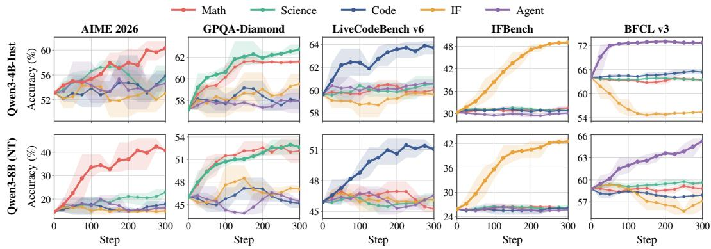  
Figure 2: Cross-domain effects of per-domain RLVR. Each panel tracks all five experts on one benchmark throughout their respective training runs. The curve for the expert trained on the corresponding domain is bolded. Curves report mean@4 performance.

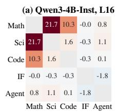

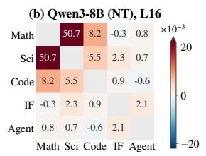

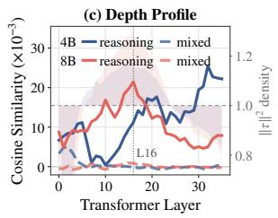

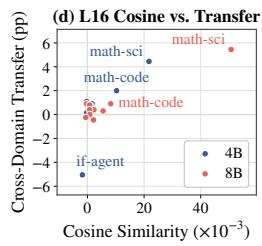  
Figure 3: Geometry of the five task vectors $\tau _ { i } .$ (a,b) Pairwise cosine similarity at layer 16; the unit diagonal is left blank. (c) The same quantity across all layers, averaged over three reasoning pairs (solid) and seven pairs involving instruction following or agent (dashed). The shaded band (right axis) gives each layer’s squared displacement relative to its parameter share, exceeding 1 where RL moves a layer more than its size predicts. (d) Layer-16 cosine similarity versus cross-domain transfer measured in behaviour, symmetrised across directions to give one point per pair and backbone.

## 5 ANALYSIS

## 5.1 HOW THE FIVE DOMAINS INTERACT

To further investigate the per-domain outcomes of the three fusion paradigms, we examine how the five domains relate, first in behaviour and then in weight space.

Domain relations in behaviour. We track each expert’s cross-domain performance throughout training in Figure 2, and find interactions that are neither uniform nor symmetric. As shown, math and science help each other on both backbones: training on math raises GPQA by about 5 points, close to the gain achieved by training on science itself, and training on science also raises AIME 2026 performance. The clearest negative transfer is from instruction following to agent use. On the 4B backbone, the IF expert lowers BFCL v3 performance by 9.8 points, and this loss deepens as training proceeds. These effects divide the five domains according to what they require of the model. Math, science and code are reasoning-intensive, and transfer among them is largely positive. Instruction following and agent use depend more on task-specific demands than on intensive reasoning. The former requires the model to parse and honour constraints, whereas the latter requires it to model an environment and plan interactions (Wang et al., 2026). Their effects on the other three stay within 2.0 points on both backbones, and neither helps the other.

Domain relations in weight space. The behavioural view shows which domains help one another, but not whether that structure is already present in the parameters that fusion combines. Since merging operates on the task vectors $\tau _ { i }$ directly, we measure their geometry. Let $\tau _ { i } ^ { S }$ denote the restriction of $\tau _ { i }$ to a parameter set S. We compute cos $\begin{array} { r } { { \bf \Phi } _ { N } ( i , j ) = \frac { \langle \tau _ { i } ^ { S } , \tau _ { j } ^ { S } \rangle } { \| \tau _ { i } ^ { S } \| \| \tau _ { j } ^ { S } \| } } \end{array}$ over its coordinates, taking

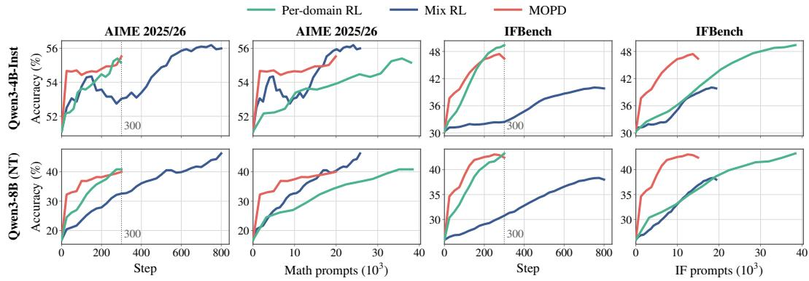  
Figure 4: Training performance of per-domain RL, Mix RL and MOPD. Merge is omitted because it has no training trajectory. Within each row, the first pair of panels reports AIME 2025/26 and the second reports IFBench. The two panels in each pair plot the same curves against optimization steps and the number of prompts sampled from the corresponding domain.

S to be a single transformer layer. To select the layer, we compare relative RLVR displacement across layers. For each layer ℓ, we divide its share of $\| \tau _ { i } \| ^ { 2 }$ by its share of model parameters and average the ratio across the five experts. Values above 1 indicate greater displacement than expected from layer size. This quantity peaks in the middle of both networks (Figure 3(c), shaded), so we report layer 16, which Zhang et al. (2026) identify as one of the highest-contribution layers.

The same grouping appears in weight space. In units of $1 0 ^ { - 3 }$ , the layer-16 cosine similarity reaches 21.7 on 4B and 50.7 on 8B for math–science, and 10.3 and 8.2 for math–code, while every pair involving instruction following or agent has magnitude at most 2.3 (Figure 3(a,b)). Figure 3(c) repeats the measurement for every layer, averaging the three reasoning-only pairs against the seven involving instruction following or agent (mixed), and the two groups stay apart across the whole network, so the separation is not an artefact of a specific layer. Figure 3(d) plots each pair’s layer-16 cosine similarity against its cross-domain transfer, symmetrised over the two directions: math-science sits at the top right on both backbones and IF-agent at the bottom left on 4B, so pairs that move together in weight space also help each other in behaviour. Instruction following therefore has the update direction least aligned with those of other domains, and this structure is visible in the weights before fusion. The same geometry also determines what Merge retains. Summing the five task vectors preserves only part of each expert’s displacement, with near-orthogonality keeping the retained share similar across domains and backbones. How much of an expert’s gain survives therefore varies by domain. Merge matches or exceeds reasoning-domain experts on both backbones because each reasoning domain benefits from the other two updates. By contrast, instruction following shares little with those updates and retains roughly 60% of its IFBench gain.

## Finding 1

Cross-domain transfer is structured: reasoning-intensive domains tend to reinforce one another, while IF and Agent remain orthogonal in both behaviour and task-vector geometry.

## 5.2 HOW THE THREE PARADIGMS COMPARE

The previous subsection focused on relations among the five domains; we now ask how the three paradigms convert training resources into per-domain performance and what each requires. We focus on math and IF, which our analysis finds representative of contrasting interaction patterns.

Convergence follows the domain relations. Figure 4 tracks per-domain RL, Mix RL and MOPD throughout training against both optimization steps and the number of domain-specific prompts. We include the second axis because one optimization step processes different amounts of domainspecific data across methods: an expert devotes its entire batch to its domain, whereas a mixed run allocates only part of each batch to any one domain. Against steps, Mix RL converges most slowly in every panel. At step 300, when the other two methods end their runs, it trails both but closes the gap with further training. Against prompts, the curves reflect the domain relations identified in Section 5.1. The update direction for instruction following is weakly aligned with those of the other four domains, so progress depends primarily on the number of instruction-following prompts seen. Mix RL therefore closely tracks the expert on both backbones. The IFBench shortfall, 9.2 points at 4B and 4.9 at 8B, reflects both instruction following’s 19% share of the mixed corpus and the absence of positive transfer from the other domains. Math differs because the other domains contribute positively. At 8B, Mix RL outperforms the expert on the AIME benchmarks while drawing only 25.8k math prompts, compared with the expert’s 38.4k. Mix RL therefore requires careful data mixing, as domain proportions directly shape per-domain outcomes under a fixed training budget.

Table 2: Requirements and costs of the three paradigms. Experts indicates whether the paradigm requires the five per-domain models; Supervision denotes the learning signal; and Deploy indicates the number of models served at inference. Fusion reports the cost of the fusion stage alone, while Total additionally includes the cost of training the five experts when required. The final two columns report Total relative to per-domain RL. Appendix B reports individual expert costs in detail.
<table><tr><td rowspan="2"></td><td colspan="3">Requirements</td><td colspan="2">Fusion GPU-h</td><td colspan="2">Total GPU-h</td><td colspan="2">Total (×)</td></tr><tr><td>Experts</td><td>Supervision</td><td>Deploy</td><td>4B</td><td>8B</td><td>4B</td><td>8B</td><td>4B</td><td>8B</td></tr><tr><td>Per-domain RL</td><td>一</td><td>Verifiable reward</td><td>5</td><td>1</td><td>一</td><td>5,220</td><td>4,670</td><td>1.00</td><td>1.00</td></tr><tr><td>Fusion paradigms Merge</td><td>Required</td><td>None</td><td>1</td><td>≈0</td><td>≈0</td><td>5,220</td><td>4,670</td><td>1.00</td><td>1.00</td></tr><tr><td>Mix RL</td><td>Not required</td><td>Verifiable reward</td><td>1</td><td>3,042</td><td>3,138</td><td>3,042</td><td>3,138</td><td>0.58</td><td>0.67</td></tr><tr><td>MOPD</td><td>Required</td><td>Teacher logprobs</td><td>1</td><td>741</td><td>899</td><td>5,960</td><td>5,569</td><td>1.14</td><td>1.19</td></tr></table>

MOPD converges fastest but remains bounded by its teachers. MOPD stays above per-domain RL at matched data exposure in every panel and converges early on both axes: at least 70% of its total gain has already been achieved at step 100, one third of the way through training. Its gains then flatten while per-domain RL continues to improve, reflecting the boundary in Section 4.2— matching teacher behaviour on student-generated samples lets MOPD reach teacher performance with less data but not surpass it. MOPD splits its batch across the five domains as Mix RL does, but each prompt carries dense teacher supervision. With a target provided at every visited state, the student follows a known direction rather than discovering one through exploration, allowing it to make more progress per step with fewer domain-specific prompts than the expert. The same experts can also be reused without further training by merging their task vectors in parameter space rather than distilling their behaviour on student-generated samples.

What the three paradigms ask for. Table 2 summarizes the requirements and costs of the three paradigms. As a reference, per-domain RL costs 5,220 and 4,670 GPU-hours for 4B and 8B, respectively, while leaving five models to serve. Once these experts exist, Merge returns a single model with only minutes of additional arithmetic, without further optimization or access to original training data. By contrast, Mix RL is the only paradigm that efficiently produces a single model without first training experts, costing 0.58× and 0.67× the reference on 4B and 8B. Although MOPD’s fusion stage costs under 0.2× the reference on both backbones, training its five teachers raises end-to-end costs to 1.14× and 1.19×, the highest of the three paradigms. We report costs for full-parameter runs, as LoRA primarily changes memory use rather than training time because rollout generation dominates each step. The paradigms also differ in supervision required at fusion and its source. Mix RL uses the same domain-specific verifiers as per-domain RL throughout joint training, whereas neither expert-based paradigm uses verifier rewards during fusion. Merge operates on weights alone, while MOPD matches teacher behaviour on student-generated samples.

## Finding 2

Convergence reflects domain relations, while the paradigms differ in how they trade resources for performance: Mix RL avoids experts but requires more steps and careful data mixing, MOPD converges fastest but is teacher-bounded, and Merge is nearly free once experts exist.

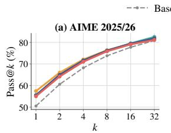

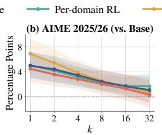

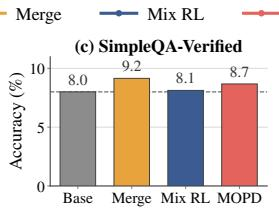

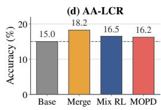  
Figure 5: Solution coverage in math and capability retention on the 4B backbone. (a,b) pass@k on AIME 2025/26, shown as absolute performance and paired differences from the base model. (c,d) Held-out SimpleQA-Verified and AA-LCR performance, with dashed lines marking the base model.

## 5.3 WHAT FUSION CHANGES AND LEAVES ALONE

The analysis so far has focused on the five target domains, leaving two questions: whether fusion expands the set of solvable problems or only increases the probability of finding existing solutions, and whether it degrades capabilities outside these domains. To answer both questions, we use the 4B backbone to measure pass@k on math and accuracy on two capabilities held out from training.

Fusion reweights solutions within the target domains. For the first question, we track pass@k, which counts a problem as solved when any of k samples is correct (Chen et al., 2021), to distinguish reweighting from expanded solution coverage. Figure 5(a,b) reports this metric on AIME 2025/26, using outputs sampled at temperature 1.0 to better expose solution coverage. At k = 1, all four trained settings improve on the base model by 4.5 to 6.9 points, while the three fusion paradigms differ by 2.4 points with overlapping intervals. The fusion paradigms’ advantage then decays monotonically with k, and by k = 32 none of the three remains distinguishable from the base model. Sampling the base model a few more times therefore recovers what fusion delivers with one sample. MOPD is especially informative given recent evidence that distillation can expand the boundary by importing patterns a teacher has and a student lacks (Yue et al., 2025). Such expansion does not occur here because MOPD’s teachers are RLVR experts derived from the same base model and provide no new solution support to import. Taken together, these results show that fusion primarily reweights solutions already accessible to the base model rather than adding new ones.

Fusion preserves capabilities outside the target domains. To test whether the gains come at a cost outside the five target domains, we evaluate two capabilities excluded from all training runs. Specifically, SimpleQA-Verified (Haas et al., 2025) measures parametric factual recall using factseeking questions, while AA-LCR (Team, 2025) evaluates long-context reasoning over document sets of roughly 100k tokens. We use Qwen3-32B (Yang et al., 2025) as the LLM judge for both benchmarks and report mean@4 in Figure 5(c,d). Appendix D details the evaluation protocol and judge prompts. The results show that no paradigm scores below the base model on either benchmark. This suggests that gains on the five target domains sacrifice neither the backbone’s factual knowledge nor its long-context reasoning. This aligns with prior evidence that RLVR can improve target performance without noticeable degradation on non-target tasks (Chen et al., 2026).

## Finding 3

Fusion improves single-sample accuracy by reweighting solutions already accessible to the base model, without measurable expansion in coverage or degradation of held-out capabilities.

## 6 CONCLUSION

We systematically compare Merge, Mix RL and MOPD for consolidating domain-specific RLVR gains into one model. Their relative performance reflects cross-domain relations visible in both behaviour and task-vector geometry. Merge is nearly free once experts exist; Mix RL avoids training experts but depends on data allocation; and MOPD converges fastest but remains teacher-bounded and incurs the highest end-to-end cost. Across all three, fusion reweights existing solutions without measurable coverage gains or held-out capability losses. These results suggest choosing a fusion paradigm according to domain structure, expert availability and training cost.

## REFERENCES

Chenxin An, Zhihui Xie, Xiaonan Li, Lei Li, Jun Zhang, Shansan Gong, Ming Zhong, Jingjing Xu, Xipeng Qiu, Mingxuan Wang, and Lingpeng Kong. Polaris: A post-training recipe for scaling reinforcement learning on advanced reasoning models, 2025. URL https://hkunlp. github.io/blog/2025/Polaris.

Aaron Blakeman, Aaron Grattafiori, Aarti Basant, Abhibha Gupta, Abhinav Khattar, Adi Renduch intala, Aditya Vavre, Akanksha Shukla, Akhiad Bercovich, Aleksander Ficek, et al. Nemotron 3 nano: Open, efficient mixture-of-experts hybrid mamba-transformer model for agentic reasoning. arXiv preprint arXiv:2512.20848, 2025.

Howard Chen, Noam Razin, Karthik R Narasimhan, and Danqi Chen. Retaining by doing: The role of on-policy data in mitigating forgetting. In Forty-third International Conference on Machine Learning, 2026. URL https://openreview.net/forum?id=ODTM64azGa.

Mark Chen, Jerry Tworek, Heewoo Jun, Qiming Yuan, Henrique Ponde De Oliveira Pinto, Jared Kaplan, Harri Edwards, Yuri Burda, Nicholas Joseph, Greg Brockman, et al. Evaluating large language models trained on code. arXiv preprint arXiv:2107.03374, 2021.

Jiazhan Feng, Shijue Huang, Xingwei Qu, Ge Zhang, Yujia Qin, Baoquan Zhong, Chengquan Jiang, Jinxin Chi, and Wanjun Zhong. Retool: Reinforcement learning for strategic tool use in LLMs. In The Fourteenth International Conference on Learning Representations, 2026a. URL https: //openreview.net/forum?id=tRk1nofSmz.

Shiyuan Feng, Huan-ang Gao, Haohan Chi, Hanlin Wu, Zhilong Zhang, Zheng Jiang, Bingxiang He, Wei-Ying Ma, Ya-Qin Zhang, and Hao Zhou. Weak-to-strong generalization via direct on-policy distillation. arXiv preprint arXiv:2607.05394, 2026b.

Google. Aime problems and solutions, 2026. URL https://artofproblemsolving.com/ wiki/index.php/AIME\_Problems\_and\_Solutions.

Naibin Gu, Chenxu Yang, Qingyi Si, Chuanyu Qin, Dingyu Yao, Peng Fu, Zheng Lin, Weiping Wang, Nan Duan, and Jiaqi Wang. Co-evolving policy distillation. arXiv preprint arXiv:2604.27083, 2026.

Daya Guo, Dejian Yang, Haowei Zhang, Junxiao Song, Peiyi Wang, Qihao Zhu, Runxin Xu, Ruoyu Zhang, Shirong Ma, Xiao Bi, et al. Deepseek-r1: Incentivizing reasoning capability in llms via reinforcement learning. arXiv preprint arXiv:2501.12948, 2025.

Lukas Haas, Gal Yona, Giovanni D’Antonio, Sasha Goldshtein, and Dipanjan Das. Simpleqa verified: A reliable factuality benchmark to measure parametric knowledge. arXiv preprint arXiv:2509.07968, 2025.

Edward J Hu, Yelong Shen, Phillip Wallis, Zeyuan Allen-Zhu, Yuanzhi Li, Shean Wang, Lu Wang, and Weizhu Chen. LoRA: Low-rank adaptation of large language models. In International Conference on Learning Representations, 2022. URL https://openreview.net/forum? id=nZeVKeeFYf9.

Jingcheng Hu, Yinmin Zhang, Qi Han, Daxin Jiang, Xiangyu Zhang, and Heung-Yeung Shum. Open-reasoner-zero: An open source approach to scaling up reinforcement learning on the base model. In The Thirty-ninth Annual Conference on Neural Information Processing Systems, 2025. URL https://openreview.net/forum?id=NFM8F5cV0V.

Ailin Huang, Ang Li, Aobo Kong, Bin Wang, Binxing Jiao, Bo Dong, Bojun Wang, Boyu Chen, Brian Li, Buyun Ma, et al. Step 3.5 flash: Open frontier-level intelligence with 11b active parameters. arXiv preprint arXiv:2602.10604, 2026.

Gabriel Ilharco, Marco Tulio Ribeiro, Mitchell Wortsman, Ludwig Schmidt, Hannaneh Hajishirzi, and Ali Farhadi. Editing models with task arithmetic. In The Eleventh International Conference on Learning Representations, 2023. URL https://openreview.net/forum?id= 6t0Kwf8-jrj.

Aaron Jaech, Adam Kalai, Adam Lerer, Adam Richardson, Ahmed El-Kishky, Aiden Low, Alec Helyar, Aleksander Madry, Alex Beutel, Alex Carney, et al. Openai o1 system card. arXiv preprint arXiv:2412.16720, 2024.

Naman Jain, King Han, Alex Gu, Wen-Ding Li, Fanjia Yan, Tianjun Zhang, Sida Wang, Armando Solar-Lezama, Koushik Sen, and Ion Stoica. Livecodebench: Holistic and contamination free evaluation of large language models for code. In The Thirteenth International Conference on Learning Representations, 2025.

Nathan Lambert, Jacob Morrison, Valentina Pyatkin, Shengyi Huang, Hamish Ivison, Faeze Brahman, Lester James Validad Miranda, Alisa Liu, Nouha Dziri, Xinxi Lyu, et al. Tulu 3: Pushing frontiers in open language model post-training. In Second Conference on Language Modeling, 2025.

Yaxuan Li, Yuxin Zuo, Bingxiang He, Jinqian Zhang, Chaojun Xiao, Cheng Qian, Tianyu Yu, Huanang Gao, Wenkai Yang, Zhiyuan Liu, et al. Rethinking on-policy distillation of large language models: Phenomenology, mechanism, and recipe. arXiv preprint arXiv:2604.13016, 2026.

Yu Li, Zhuoshi Pan, Honglin Lin, Mengyuan Sun, Conghui He, and Lijun Wu. Can one domain help others? a data-centric study on multi-domain reasoning via reinforcement learning. arXiv preprint arXiv:2507.17512, 2025.

Yujia Li, David Choi, Junyoung Chung, Nate Kushman, Julian Schrittwieser, Remi Leblond, Tom´ Eccles, James Keeling, Felix Gimeno, Agustin Dal Lago, et al. Competition-level code generation with alphacode. Science, 378(6624):1092–1097, 2022.

Zichen Liu, Changyu Chen, Wenjun Li, Penghui Qi, Tianyu Pang, Chao Du, Wee Sun Lee, and Min Lin. Understanding r1-zero-like training: A critical perspective. In Second Conference on Language Modeling, 2025. URL https://openreview.net/forum?id=5PAF7PAY2Y.

Kevin Lu and Thinking Machines Lab. On-policy distillation. Thinking Machines Lab: Connectionism, 2025. doi: 10.64434/tml.20251026. https://thinkingmachines.ai/blog/on-policy-distillation.

Sourab Mangrulkar, Sylvain Gugger, Lysandre Debut, Younes Belkada, Sayak Paul, Benjamin Bossan, and Marian Tietz. PEFT: State-of-the-art parameter-efficient fine-tuning methods. https://github.com/huggingface/peft, 2022.

Mind Lab. Macaron-v1-preview: 749b mol agent model post-trained from glm5.1. Mind Lab: A Lab for Experiential Intelligence, 2026. https://macaron.im/mindlab/research/macaron-v1-preview.

NVIDIA Corporation. Opensciencereasoning-2 dataset. Hugging Face Dataset, 2025. Available at: https://huggingface.co/datasets/nvidia/OpenScienceReasoning-2.

Shishir G. Patil, Huanzhi Mao, Charlie Cheng-Jie Ji, Fanjia Yan, Vishnu Suresh, Ion Stoica, and Joseph E. Gonzalez. The berkeley function calling leaderboard (bfcl): From tool use to agentic evaluation of large language models. In Advances in Neural Information Processing Systems, 2024.

Guilherme Penedo, Anton Lozhkov, Hynek Kydl´ıcek, Loubna Ben Allal, Edward Beeching,ˇ Agust´ın Piqueres Lajar´ın, Quentin Gallouedec, Nathan Habib, Lewis Tunstall, and Leandro von´ Werra. Codeforces. https://huggingface.co/datasets/open-r1/codeforces, 2025.

Valentina Pyatkin, Saumya Malik, Victoria Graf, Hamish Ivison, Shengyi Huang, Pradeep Dasigi, Nathan Lambert, and Hannaneh Hajishirzi. Generalizing verifiable instruction following. In The Thirty-ninth Annual Conference on Neural Information Processing Systems Datasets and Benchmarks Track, 2026. URL https://openreview.net/forum?id=yfYgwjj5F8.

David Rein, Betty Li Hou, Asa Cooper Stickland, Jackson Petty, Richard Yuanzhe Pang, Julien Dirani, Julian Michael, and Samuel R. Bowman. GPQA: A graduate-level google-proof q&a benchmark. In First Conference on Language Modeling, 2024. URL https://openreview. net/forum?id=Ti67584b98.

John Schulman and Thinking Machines Lab. Lora without regret. Thinking Machines Lab: Connectionism, 2025. doi: 10.64434/tml.20250929. https://thinkingmachines.ai/blog/lora/.

Zhihong Shao, Peiyi Wang, Qihao Zhu, Runxin Xu, Junxiao Song, Xiao Bi, Haowei Zhang, Mingchuan Zhang, YK Li, Yang Wu, et al. Deepseekmath: Pushing the limits of mathematical reasoning in open language models. arXiv preprint arXiv:2402.03300, 2024.

Guangming Sheng, Chi Zhang, Zilingfeng Ye, Xibin Wu, Wang Zhang, Ru Zhang, Yanghua Peng, Haibin Lin, and Chuan Wu. Hybridflow: A flexible and efficient rlhf framework. In Proceedings ofthe Twentieth European Conference on Computer Systems, pp. 1279–1297, 2025.

Artificial Analysis Team. Artificial analysis long context reasoning benchmark(lcr), 2025.

Fanqi Wan, Longguang Zhong, Ziyi Yang, Ruijun Chen, and Xiaojun Quan. Fusechat: Knowledge fusion of chat models. In Proceedings ofthe 2025 Conference on Empirical Methods in Natural Language Processing, pp. 21629–21653, 2025.

Haoqing Wang, Xiang Long, Ziheng Li, Yilong Xu, Tingguang Li, and Yehui Tang. To mix or to merge: Toward multi-domain reinforcement learning for large language models. arXiv preprint arXiv:2602.12566, 2026.

Mitchell Wortsman, Gabriel Ilharco, Samir Ya Gadre, Rebecca Roelofs, Raphael Gontijo-Lopes, Ari S Morcos, Hongseok Namkoong, Ali Farhadi, Yair Carmon, Simon Kornblith, et al. Model soups: averaging weights of multiple fine-tuned models improves accuracy without increasing inference time. In International conference on machine learning, pp. 23965–23998. Pmlr, 2022.

Runzhe Wu, Ankur Samanta, Ayush Jain, Scott Fujimoto, Jeongyeol Kwon, Ben Kretzu, Youliang Yu, Kaveh Hassani, Boris Vidolov, and Yonathan Efroni. Imbalanced gradients in rl post-training of multi-task llms. In Findings of the Association for Computational Linguistics: EACL 2026, pp. 3137–3150, 2026.

Feifan Xia, Mingyang Liao, Yuyang Fang, Defang Li, Yantong Xie, Weikang Li, Yang Li, Deguo Xia, and Jizhou Huang. Cross-lora: A data-free lora transfer framework across heterogeneous llms. arXiv preprint arXiv:2508.05232, 2025.

Bangjun Xiao, Bingquan Xia, Bo Yang, Bofei Gao, Bowen Shen, Chen Zhang, Chenhong He, Chiheng Lou, Fuli Luo, Gang Wang, et al. Mimo-v2-flash technical report. arXiv preprint arXiv:2601.02780, 2026.

Anyi Xu, Bangcai Lin, Bing Xue, Bingxuan Wang, Bingzheng Xu, Bochao Wu, Bowei Zhang, Chaofan Lin, Chen Dong, Chenchen Ling, et al. Deepseek-v4: Towards highly efficient milliontoken context intelligence. arXiv preprint arXiv:2606.19348, 2026.

Prateek Yadav, Derek Tam, Leshem Choshen, Colin A Raffel, and Mohit Bansal. Ties-merging: Resolving interference when merging models. Advances in neural information processing systems, 36:7093–7115, 2023.

An Yang, Anfeng Li, Baosong Yang, Beichen Zhang, Binyuan Hui, Bo Zheng, Bowen Yu, Chang Gao, Chengen Huang, Chenxu Lv, et al. Qwen3 technical report. arXiv preprint arXiv:2505.09388, 2025.

Wenkai Yang, Weijie Liu, Ruobing Xie, Kai Yang, Saiyong Yang, and Yankai Lin. Learning beyond teacher: Generalized on-policy distillation with reward extrapolation. arXiv preprint arXiv:2602.12125, 2026.

Le Yu, Bowen Yu, Haiyang Yu, Fei Huang, and Yongbin Li. Language models are super mario: Absorbing abilities from homologous models as a free lunch. In Forty-first International Conference on Machine Learning, 2024. URL https://openreview.net/forum?id= fq0NaiU8Ex.

Tianhe Yu, Saurabh Kumar, Abhishek Gupta, Sergey Levine, Karol Hausman, and Chelsea Finn. Gradient surgery for multi-task learning. Advances in neural information processing systems, 33: 5824–5836, 2020.

Yang Yue, Zhiqi Chen, Rui Lu, Andrew Zhao, Zhaokai Wang, Yang Yue, Shiji Song, and Gao Huang. Does reinforcement learning really incentivize reasoning capacity in LLMs beyond the base model? In The Thirty-ninth Annual Conference on Neural Information Processing Systems, 2025. URL https://openreview.net/forum?id=4OsgYD7em5.

Jinghan Zhang, Junteng Liu, Junxian He, et al. Composing parameter-efficient modules with arithmetic operation. Advances in Neural Information Processing Systems, 36:12589–12610, 2023.

Zijian Zhang, Rizhen Hu, Athanasios Glentis, Dawei Li, Chung-Yiu Yau, Hongzhou Lin, and Mingyi Hong. Is one layer enough? training a single transformer layer can match full-parameter rl training. arXiv preprint arXiv:2607.01232, 2026.

Wenting Zhao, Xiang Ren, Jack Hessel, Claire Cardie, Yejin Choi, and Yuntian Deng. Wildchat: 1m chatGPT interaction logs in the wild. In The Twelfth International Conference on Learning Representations, 2024. URL https://openreview.net/forum?id=Bl8u7ZRlbM.

Jeffrey Zhou, Tianjian Lu, Swaroop Mishra, Siddhartha Brahma, Sujoy Basu, Yi Luan, Denny Zhou, and Le Hou. Instruction-following evaluation for large language models. arXiv preprint arXiv:2311.07911, 2023.

## A DETAILS OF DATA PROCESSING

Per-domain expert training data. In our prior experiments, we observed that models learn little from overly easy problems, since such problems provide limited learning signals (An et al., 2025). For the math training set, we start from Polaris (An et al., 2025), in which each problem carries a difficulty label $k / 8 \ddagger$ the pass rate estimated by sampling 8 solutions from Deepseek-R1-Distill-Qwen-7B (Guo et al., 2025), where k is the number of correct solutions. Because hard problems provide stronger learning signals for RL, we remove those with a pass rate $> 4 / 8 ,$ retaining 38,131 training examples. For the science domain, we start from OpenScienceReasoning2 (NVIDIA Corporation, 2025) and obtain difficulty labels analogously by sampling 8 solutions per problem from Qwen3-4B-Instruct-2507 (Yang et al., 2025). We then discard the easiest problems with a pass rate $> 6 / 8$ , and randomly subsample 50,000 examples for training. For the code, instruction following and agent domains, we directly use the datasets provided by their original authors, comprising 19,169, 16,575, and 10,229 training examples, respectively.

Mix RL and MOPD training data. To build the mixed-training baseline, we blend the five perdomain training sets, which are identical to those used to train the single-domain experts, into a single corpus for one joint RL run. Following the mixing ratio of Wang et al. (2026), we target the proportions of 25% math, 22% science, 22% code, 19% instruction following, and 12% agent, yielding 87,699 examples in total.

## B IMPLEMENTATION DETAILS

We implement all methods on top of the open-source framework verl (Sheng et al., 2025) and summarize the detailed hyperparameters in Table 3. For LoRA-based RL, every expert adapter has rank $r = 3 2$ and $\alpha = 6 4$ and is applied to all linear layers of the backbone. We further adopt a larger learning rate of $2 \times 1 0 ^ { - 5 }$ (Schulman & Lab, 2025), except for the math domain, where we lower it to $1 \times \mathrm { 1 0 ^ { - 5 } }$ to preserve training stability. All experiments are conducted on 32 NVIDIA H20 GPUs.

Training cost. Table 4 reports the cost of every run underlying Table 2.

Table 3: Implementation details and training hyperparameters for per-domain RL, Mix RL and MOPD. Merge is omitted because it requires no training.
<table><tr><td>Hyperparameter</td><td>Per-domain RL</td><td>Mix RL</td><td>MOPD</td></tr><tr><td>Algorithm</td><td>GRPO</td><td>GRPO</td><td>Sampled-Token OPD</td></tr><tr><td>Rollout batch size</td><td>128</td><td>128</td><td>264</td></tr><tr><td>Mini batch size</td><td>128</td><td>128</td><td>264</td></tr><tr><td>Rollout n</td><td>16</td><td>16</td><td>4</td></tr><tr><td>Maximum prompt length</td><td>5,120</td><td>5,120</td><td>5,120</td></tr><tr><td>Maximum response length</td><td>16,384</td><td>16,384</td><td>16,384</td></tr><tr><td>Temperature</td><td>1.0</td><td>1.0</td><td>1.0</td></tr><tr><td>Learning rate</td><td> $1 \times 1 0 ^ { - 6 }$ </td><td> $1 \times 1 0 ^ { - 6 }$ </td><td>1 × 10−⁶</td></tr><tr><td>Training steps</td><td>300</td><td>800</td><td>300</td></tr></table>

## C PER-DOMAIN EXPERTS ACROSS ALL DOMAINS

Table 5 reports each expert across the full benchmark suite, extending the Per-domain RL row of Table 1, which reports each expert only on its own domain. Figure 6 shows the training score of each run, confirming that every expert improves on the domain it was trained on.

Table 4: Per-run training costs underlying the aggregate costs in Table 2. Costs are measured through step 300 for the five experts and MOPD, and through step 800 for Mix RL.
<table><tr><td></td><td>4B GPU-h</td><td>8B GPU-h</td></tr><tr><td>Per-domain RL</td><td></td><td></td></tr><tr><td>Math</td><td>1,824</td><td>1,847</td></tr><tr><td>Science</td><td>849</td><td>523</td></tr><tr><td>Code</td><td>1,435</td><td>670</td></tr><tr><td>Instruction following</td><td>412</td><td>633</td></tr><tr><td>Agent</td><td>700</td><td>997</td></tr><tr><td>All five</td><td>5,220</td><td>4,670</td></tr><tr><td>Mix RL</td><td>3,042</td><td>3,138</td></tr><tr><td>MOPD</td><td>741</td><td>899</td></tr></table>

Table 5: Performance of each per-domain expert across all evaluation benchmarks.
<table><tr><td>Expert</td><td>Tuning</td><td>AIME25</td><td>AIME26</td><td>GPQA</td><td>LCBv5</td><td>LCBv6</td><td>IFEval</td><td>IFBench</td><td>BFCLv3</td><td>Avg.</td></tr><tr><td colspan="10">Qwen3-4B-Instruct-2507</td></tr><tr><td>Base</td><td>一</td><td>49.1</td><td>53.1</td><td>57.2</td><td>58.9</td><td>59.6</td><td>83.8</td><td>30.3</td><td>63.9</td><td>57.0</td></tr><tr><td>Math</td><td>Full LoRA</td><td>52.3 51.5</td><td>58.4 57.1</td><td>61.8 59.9</td><td>59.6 59.6</td><td>60.6 60.0</td><td>84.1 83.9</td><td>30.8 30.9</td><td>63.1 62.6</td><td>58.8 58.2</td></tr><tr><td>Science</td><td>Full LoRA</td><td>50.4 47.0</td><td>57.4 54.7</td><td>62.2 61.4</td><td>59.6 59.4</td><td>60.9 59.7</td><td>83.9 83.7</td><td>30.8 30.5</td><td>64.2 63.4</td><td>58.7 57.5</td></tr><tr><td>Code</td><td>Full LoRA</td><td>47.2 50.7</td><td>56.1 54.6</td><td>57.7 57.6</td><td>63.4 63.2</td><td>63.7 63.2</td><td>83.9 83.8</td><td>30.7 31.0</td><td>64.9 65.4</td><td>58.5 58.7</td></tr><tr><td>IF</td><td>Full LoRA</td><td>48.9 45.6</td><td>52.5 51.5</td><td>58.9 59.1</td><td>58.6 58.2</td><td>59.5 59.7</td><td>89.8 90.8</td><td>49.0 50.2</td><td>54.1 52.5</td><td>58.9 58.5</td></tr><tr><td>Agent</td><td>Full LoRA</td><td>47.4 50.9</td><td>54.5 56.5</td><td>58.4 58.3</td><td>59.5 61.1</td><td>60.2 61.3</td><td>84.0 83.6</td><td>30.0 29.5</td><td>72.2 72.3</td><td>58.3 59.2</td></tr><tr><td colspan="10">Qwen3-8B (non-thinking)</td></tr><tr><td>Base</td><td>一</td><td>19.0</td><td>14.6</td><td>46.0</td><td>43.0</td><td>45.9</td><td>83.3</td><td>25.9</td><td>58.6</td><td>42.0</td></tr><tr><td>Math</td><td>Full LoRA</td><td>39.2 38.1</td><td>39.9 39.6</td><td>52.4 52.6</td><td>43.0 43.8</td><td>46.1 45.9</td><td>83.0 83.1</td><td>26.5 26.2</td><td>58.2 58.3</td><td>48.5 48.5</td></tr><tr><td>Science</td><td>Full LoRA</td><td>21.2 23.9</td><td>19.1 22.7</td><td>52.5 52.4</td><td>44.2 44.1</td><td>46.2 46.6</td><td>83.3 83.4</td><td>26.5 26.4</td><td>58.8</td><td>44.0 44.8</td></tr><tr><td>Code</td><td>Full LoRA</td><td>18.8 19.6</td><td>16.2 16.6</td><td>46.3 45.8</td><td>50.9</td><td>50.9 52.3</td><td>83.1 83.0</td><td>25.7 25.7</td><td>58.7 57.8</td><td>43.7 43.8</td></tr><tr><td>IF</td><td>Full LoRA</td><td>18.5 17.2</td><td>15.8 13.5</td><td>46.2 45.4</td><td>50.9 42.7 43.0</td><td>46.1 45.4</td><td>88.9 89.0</td><td>42.8 42.0</td><td>56.8 57.7 56.9</td><td>44.8 44.1</td></tr><tr><td>Agent</td><td>Full LoRA</td><td>19.9 20.3</td><td>16.6 15.8</td><td>46.6 46.0</td><td>43.2 42.9</td><td>46.2 45.8</td><td>83.4 82.9</td><td>25.9 25.8</td><td>64.9 63.5</td><td>43.3 42.9</td></tr></table>

## D HELD-OUT EVALUATION PROTOCOL

The two held-out benchmarks in Section 5.3, SimpleQA-Verified and AA-LCR, are graded by a model rather than by a rule. We sample 4 responses per question and grade each with Qwen3- 32B (Yang et al., 2025) in non-thinking mode at temperature 0, using grader prompts based on those published with each benchmark (Haas et al., 2025; Team, 2025). We verify these verdicts by hand on random samples and observe no systematic grading errors. Prompts 1 and 2 provide the full grader prompts used for the two benchmarks.

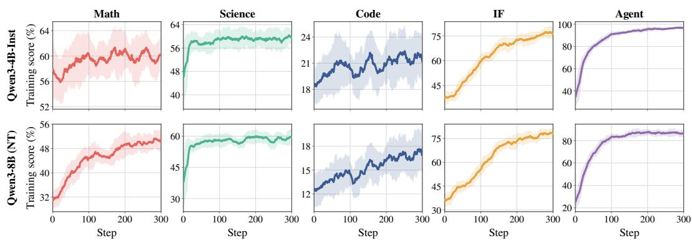  
Figure 6: Training score of each per-domain expert on its own domain. Curves are smoothed by a moving average, with the band indicating standard deviation over the same window.

Prompt 1: SimpleQA-Verified   
Your job is to look at a question, a gold target, and a predicted   
answer, and then assign a grade of either ["CORRECT", "INCORRECT",   
"NOT ATTEMPTED"]. First, I will give examples of each grade, and   
then you will grade a new example.   
[Worked examples of CORRECT, INCORRECT and NOT ATTEMPTED predicted   
answers, followed by the notes on numeric ranges, on gold targets   
carrying more information than the question, and on typos in names,   
reproduced verbatim from Appendix A of Haas et al., 2025.]   
Here is a new example. Simply reply with either CORRECT, INCORRECT,   
NOT ATTEMPTED. Don’t apologize or correct yourself if there was a   
mistake; we are just trying to grade the answer.   
Question: {question}   
Gold target: {target}   
Predicted answer: {predicted answer}   
Two of the rules above matter most for a predicted answer as long as   
this one may be, so note them again now that it has been read. Grade   
only the single candidate the answer finally commits to: it may   
reason at length, revise itself, and discard candidates on the way,   
and neither the discarded candidates nor the reasoning around them is   
what is being graded. And an answer denying the question’s premise   
-- that no such person, thing or event exists, or that the question   
rests on a mistake -- while the gold target names one is a factual   
statement contradicting the gold target, so it is INCORRECT rather   
than NOT ATTEMPTED.   
Grade the predicted answer of this new question as one of:   
A: CORRECT   
B: INCORRECT   
C: NOT ATTEMPTED   
Just return the letters "A", "B", or "C", with no text around it.

## Prompt 2: AA-LCR

Assess whether the following CANDIDATE ANSWER is CORRECT or   
INCORRECT.   
For the CANDIDATE ANSWER to be correct, it must be consistent with   
the OFFICIAL ANSWER.   
A CANDIDATE ANSWER that declines to answer, or that concludes the   
answer cannot be determined from the documents, is INCORRECT   
regardless of how well it argues the point.

The question, for reference only: {question}   
The OFFICIAL ANSWER: {official answer}   
CANDIDATE ANSWER TO ASSESS: {candidate answer}   
Reply only with CORRECT or INCORRECT.

## E COMPARISON OF MERGING METHODS

Table 6 reports every method described below on both backbones, extending the Task-Arithmetic Merge rows in Table 1.

Full-parameter merging. We merge the full-parameter experts with the MergeLM implementation (Yu et al., 2024). Average (Wortsman et al., 2022) takes the mean of the task vectors, $\begin{array} { r } { \mathcal { F } = \frac { 1 } { N } \sum _ { i } \tau _ { i } } \end{array}$ . Task Arithmetic (TA) (Ilharco et al., 2023) takes their sum under a shared scaling coefficient, $\begin{array} { r } { \mathcal { F } = \lambda \sum _ { i } \tau _ { i } } \end{array}$ . TIES (Yadav et al., 2023) trims each $\tau _ { i }$ to the 20% of entries with the largest magnitude, computed over all parameters jointly, elects one sign per parameter from the trimmed values summed across experts, and averages only the entries agreeing with it. DARE-TA (Yu et al., 2024) drops each entry of $\tau _ { i }$ independently with probability $p = 0 . 2$ and rescales the survivors by $1 / ( 1 - p )$ , leaving the update unchanged in expectation, before merging with TA. SCE (Wan et al., 2025) weights each $\tau _ { i }$ per parameter matrix by its mean squared magnitude, erases the entries whose sign disagrees with the majority sign, and normalizes by the surviving weights, keeping all positions rather than only the highest-variance ones.

LoRA merging. For LoRA experts, each task vector factorizes as $\tau _ { i } = B _ { i } A _ { i }$ with rank $r = 3 2 ^ { }$ so the adapters themselves can be merged. We do so with the adapter combination utilities of PEFT (Mangrulkar et al., 2022). Concat stacks $\left\{ A _ { i } \right\}$ and $\{ B _ { i } \}$ along the rank dimension into a single adapter of rank $N r ~ = ~ 1 6 0$ , reproducing the weighted sum of the updates exactly. SVD instead forms $\textstyle \sum _ { i } w _ { i } B _ { i } A _ { i }$ explicitly and truncates it back to rank r. The remaining methods apply the weighting and sparsification rules of their full-parameter counterparts to $A _ { i }$ and $B _ { i }$ directly.

Scaling coefficient λ. Figure 7 sweeps λ for TA on Qwen3-8B. Accuracy improves with $\lambda ,$ but response length grows faster, from 2,042 tokens at $\lambda ~ = ~ 0 . 3$ to 7,334 at $\lambda = 1 . 0$ , passing the per-domain experts (hollow markers) already at $\lambda \approx 0 . 5 .$ . As Qwen3-8B is a hybridthinking model (Yang et al., 2025), we assume that the extra tokens partly reflect leakage into thinking mode, as a large λ scales up the merge update until it washes out the pattern that holds the model in non-thinking mode. To verify this, we count responses that emit their own reasoning trace despite the non-thinking template. Their frequency is negligible for small λ but rises markedly as λ grows (from ∼0% to ∼66%). To prevent thinkingmode leakage from confounding the comparison, we report $\lambda = 0 . 6$ in our main experiments.

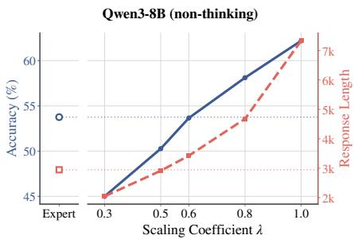  
Figure 7: Accuracy and response length of the Qwen3-8B TA merge versus the scaling coefficient λ, averaged over the evaluation sets across domains.

## F DISCUSSION AND LIMITATIONS

LoRA as a source of experts. LoRA provides a second, cheaper way to obtain the same five experts in this study. Every adapter uses rank $r = 3 2$ on all linear layers, and the resulting experts remain within 1.4 points of their full-parameter counterparts, close enough that both sets can be fused under identical conditions. This lets us repeat the merge comparison in the low-rank regime, and the LoRA merges reproduce the domain profile of their full-parameter counterparts, with performance about one point lower on average. The design answers one question cleanly—whether the parameterization of the experts changes what a merge retains—but leaves aside a second advantage of LoRA that fusion never calls on. Because adapters are small and can be attached at serving time, a deployment can hold all N of them at once and route each query to the expert required by its domain (Mind Lab, 2026), and an adapter can in principle transfer a domain’s update to another backbone rather than only to the one it was trained on (Xia et al., 2025). Both routes sidestep the interference that Section 5.1 traces to shared update directions, at the price of keeping N sets of parameters and committing to expert selection for every query. They are therefore complements to the paradigms compared here rather than substitutes for them, and the domain relations we measure indicate which domains are worth keeping apart in the first place.

Table 6: Comparison of merging methods. Within each group, methods combine the same five expert task vectors. Concat and SVD apply only to LoRA experts. TA and DARE-TA use λ = 0.6. For each backbone, the two + Per-domain RL rows report scores for the full-parameter and LoRA experts on their respective domains. Methods marked with † are reported as Merge in Table 1.
<table><tr><td>Method</td><td>AIME25</td><td>AIME26</td><td>GPQA</td><td>LCBv5</td><td>LCBv6</td><td>IFEval</td><td>IFBench</td><td>BFCLv3</td><td>Avg.</td></tr><tr><td colspan="10">Qwen3-4B-Instruct-2507</td></tr><tr><td>Base</td><td>49.1</td><td>53.1</td><td>57.2</td><td>58.9</td><td>59.6</td><td>83.8</td><td>30.3</td><td>63.9</td><td>57.0</td></tr><tr><td>+ Per-domain RL (Full)</td><td>52.3</td><td>58.4</td><td>62.2</td><td>63.4</td><td>63.7</td><td>89.8</td><td>49.0</td><td>72.2</td><td>63.9</td></tr><tr><td>+ Per-domain RL (LoRA)</td><td>51.5</td><td>57.1</td><td>61.4</td><td>63.2</td><td>63.2</td><td>90.8</td><td>50.2</td><td>72.3</td><td>63.7</td></tr><tr><td>Full-parameter merge</td><td></td><td></td><td></td><td></td><td></td><td></td><td></td><td></td><td></td></tr><tr><td>Average</td><td>50.4</td><td>55.7</td><td>60.7</td><td>59.7</td><td>60.2</td><td>84.6</td><td>32.4</td><td>65.9</td><td>58.7</td></tr><tr><td>Task Arithmetic (TA)†</td><td>54.9</td><td>61.6</td><td>63.4</td><td>64.7</td><td>63.9</td><td>88.3</td><td>41.0</td><td>71.8</td><td>63.7</td></tr><tr><td>TIES</td><td>53.2</td><td>58.5</td><td>61.9</td><td>61.2</td><td>62.2</td><td>88.7</td><td>42.3</td><td>65.9</td><td>61.7</td></tr><tr><td>DARE-TA</td><td>54.4</td><td>61.9</td><td>63.1</td><td>64.6</td><td>64.2</td><td>88.6</td><td>41.7</td><td>72.1</td><td>63.8</td></tr><tr><td>SCE</td><td>50.1</td><td>55.1</td><td>61.5</td><td>60.3</td><td>61.1</td><td>87.5</td><td>37.1</td><td>66.3</td><td>59.9</td></tr><tr><td>LoRA merge</td><td></td><td></td><td></td><td></td><td></td><td></td><td></td><td></td><td></td></tr><tr><td>Average</td><td>50.5</td><td>54.8</td><td>61.3</td><td>60.6</td><td>61.1</td><td>85.8</td><td>32.7</td><td>65.8</td><td>59.1</td></tr><tr><td>Task Arithmetic (TA)†</td><td>54.3</td><td>59.6</td><td>61.9</td><td>63.4</td><td>63.2</td><td>89.0</td><td>41.9</td><td>68.6</td><td>62.7</td></tr><tr><td>TIES</td><td>49.1</td><td>56.0</td><td>61.0</td><td>60.6</td><td>61.0</td><td>85.8</td><td>32.6</td><td>65.6</td><td>59.0</td></tr><tr><td>DARE-TA</td><td>51.1</td><td>58.4</td><td>61.6</td><td>62.6</td><td>62.2</td><td>87.7</td><td>36.2</td><td>67.5</td><td>60.9</td></tr><tr><td>Concat</td><td>53.2</td><td>58.1</td><td>61.9</td><td>63.6</td><td>63.2</td><td>88.9</td><td>41.0</td><td>68.6</td><td>62.3</td></tr><tr><td>SVD</td><td>53.4</td><td>58.2</td><td>61.9</td><td>63.2</td><td>63.0</td><td>88.7</td><td>41.2</td><td>67.5</td><td>62.1</td></tr><tr><td colspan="10">Qwen3-8B (non-thinking)</td></tr><tr><td>Base</td><td>19.0</td><td>14.6</td><td>46.0</td><td>43.0</td><td>45.9</td><td>83.3</td><td>25.9</td><td>58.6</td><td>42.0</td></tr><tr><td>+ Per-domain RL (Full)</td><td>39.2</td><td>39.9</td><td>52.5</td><td>50.9</td><td>50.9</td><td>88.9</td><td>42.8</td><td>64.9</td><td>53.8</td></tr><tr><td>+ Per-domain RL (LoRA)</td><td>38.1</td><td>39.6</td><td>52.4</td><td>50.9</td><td>52.3</td><td>89.0</td><td>42.0</td><td>63.5</td><td>53.5</td></tr><tr><td>Full-parameter merge</td><td></td><td></td><td></td><td></td><td></td><td></td><td></td><td></td><td></td></tr><tr><td>Average</td><td>21.6</td><td>17.5</td><td>49.7</td><td>45.0</td><td>46.1</td><td>84.0</td><td>26.5</td><td>60.5</td><td>43.9</td></tr><tr><td>Task Arithmetic (TA)†</td><td>41.4</td><td>43.3</td><td>54.4</td><td>50.9</td><td>51.4</td><td>87.6</td><td>37.0</td><td>63.5</td><td>53.7</td></tr><tr><td>TIES</td><td>27.1</td><td>26.4</td><td>52.4</td><td>47.8</td><td>48.7</td><td>88.1</td><td>37.8</td><td>63.7</td><td>49.0</td></tr><tr><td>DARE-TA</td><td>41.9</td><td>43.1</td><td>55.5</td><td>52.4</td><td>51.0</td><td>88.0</td><td>37.8</td><td>63.5</td><td>54.2</td></tr><tr><td>SCE</td><td>22.6</td><td>19.3</td><td>50.1</td><td>46.3</td><td>47.6</td><td>86.4</td><td>33.8</td><td>62.3</td><td>46.1</td></tr><tr><td>LoRA merge</td><td></td><td></td><td></td><td></td><td></td><td></td><td></td><td></td><td></td></tr><tr><td>Average</td><td>22.4</td><td>19.3</td><td>49.6</td><td>45.5</td><td>47.2</td><td>85.0</td><td>28.7</td><td>60.7</td><td>44.8</td></tr><tr><td>Task Arithmetic (TA)†</td><td>37.1</td><td>40.4</td><td>54.0</td><td>50.0</td><td>51.0</td><td>88.2</td><td>37.5</td><td>63.8</td><td>52.8</td></tr><tr><td>TIES</td><td>22.6</td><td>19.3</td><td>50.1</td><td>44.9</td><td>47.6</td><td>84.7</td><td>28.9</td><td>61.7</td><td>45.0</td></tr><tr><td>DARE-TA</td><td>27.9</td><td>23.8</td><td>52.5</td><td>48.1</td><td>49.7</td><td>86.9</td><td>34.6</td><td>63.1</td><td>48.3</td></tr><tr><td>Concat</td><td>34.4</td><td>36.2</td><td>54.5</td><td>50.5</td><td>51.1</td><td>88.1</td><td>37.3</td><td>63.7</td><td>52.0</td></tr><tr><td>SVD</td><td>34.0</td><td>34.6</td><td>54.3</td><td>49.5</td><td>51.1</td><td>88.1</td><td>36.9</td><td>63.7</td><td>51.5</td></tr><tr><td></td><td></td><td></td><td></td><td></td><td></td><td></td><td></td><td></td><td></td></tr></table>

MOPD beyond its standard form. Of the three paradigms, MOPD is the most recent, and we study its standard form, the reverse KL to a domain-specific teacher computed over the states visited by the student’s own rollouts (Lu & Lab, 2025). This form is sufficiently well characterized for comparison with Merge and Mix RL, and it also explains the ceiling reported in Section 4.2: the objective asks the student to match teacher behaviour on its own samples, so it provides no signal for surpassing its teachers. Recent work targets this limitation by extrapolating past the teacher with a reward signal (Yang et al., 2026), generalizing beyond a weaker teacher through policy shift (Feng et al., 2026b), or revising the recipe from an analysis of what on-policy distillation transfers (Li et al., 2026). Whether such variants lift the ceiling under multi-domain fusion remains unclear: the student must reconcile multiple teachers rather than follow a single one, and the domains themselves interact as Section 5 shows. The setup assembled here provides a direct testbed for studying such multi-domain extensions under controlled conditions, an avenue we leave to future work.