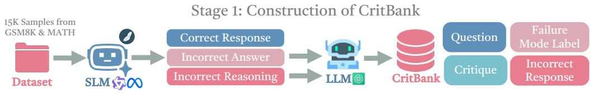
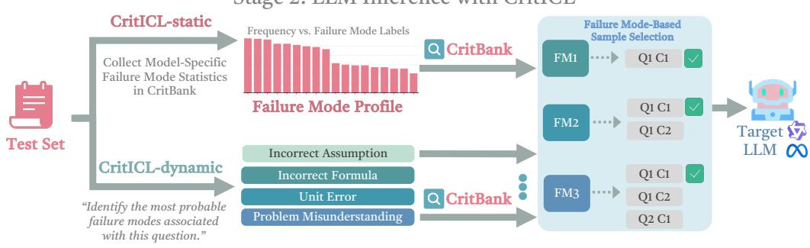
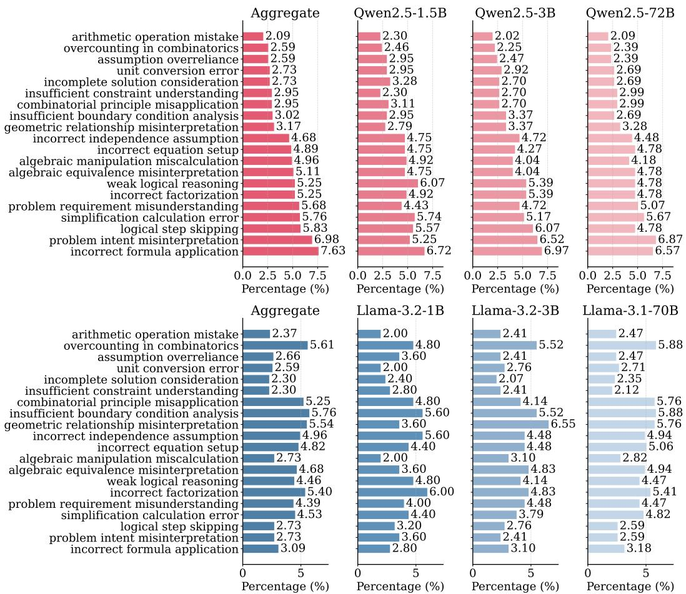

# CRITICL: Inference-Time Weak-to-Strong Generalization from Small Language Model Failure Modes

Yufan Wu1, Yinghui He2, Zhengyi Hu1, Lang Wei1, Ruichen Li1, Qifan Yang1, Ting Zhu1   
1The Ohio State University 2Princeton University   
{wu.6545, zhu.3445}@osu.edu

## Abstract

Recent advances in inference-time scaling have significantly improved the reasoning performance of large language models (LLMs). However, these methods typically rely on repeated generation or external verification. To address this limitation, we introduce CritICL, a novel inference-time framework that improves reasoning while maintaining high efficiency.

Our key insight is that LLM failure modes exhibit structured patterns across model scales within the same family. Instead of treating failures as undesirable outputs, CritICL leverages them as a source of guidance. Specifically, we utilize failure modes derived from weaker models and incorporate them into inference through critique-based in-context examples. We propose two variants: CritICL-dynamic, which adaptively predicts input-specific failure modes and retrieves critiques, and CritICL-static, which uses a global failure mode profile to provide stable guidance.

Experimental results show that CritICL consistently outperforms standard in-context learning and achieves performance competitive with or superior to test-time scaling methods, while requiring significantly fewer generations and lower token cost.

https://github.com/umwyf/CRITICL

## 1 Introduction

Inference-time scaling has emerged as a promising way to improve the reasoning performance of large language models (LLMs), with prior work showing gains through repeated sampling (Wang et al., 2022), iterative self-refinement (Madaan et al., 2023; Shinn et al., 2023), and external verification (Zheng et al., 2023b; Huang et al., 2024). However, these improvements often come at a substantial inference cost, often requiring multiple generations either from the model itself or from a stronger model.

A more recent line of work explores whether weaker models can provide useful inferencetime guidance to stronger ones (Ding et al., 2026). Such approaches typically rely on weak models to produce online supervision or intermediate guidance for each new input, which still introduces additional inference overhead and may depend on the quality of the weaker model's direct outputs. More importantly, they do not fully exploit a potentially richer source of transferable signal: the systematic ways in which models fail.

In our work, we draw inspiration from a fundamental property of LLM reasoning: model errors are often not arbitrary, but structured and predictable (Didolkar et al., 2024). Instead of viewing weaker model failures as merely undesirable outputs, we treat them as a source of structured failure modes. In particular, our experiments in Section 4.1 show that the relative distribution of stronger models' (Qwen, 72B) failure modes remains highly consistent with that of much weaker models (Qwen, 1.5B) from the same family. This suggests that weak and strong models share a common failure structure, even when their capabilities differ substantially.

This observation motivates a key question:



Stage 2: LLM Inference with CritICL  
  
Figure 1: CritICL is a two-stage, inference-time W2SG method. Stage 1: Construct CritBank. We use SLMs to generate responses and reasoning on a dataset. Then we leverage a frontier LLM to produce critiques and assigns failure mode labels. Stage 2: Perform LLM inference with CritICL. For a given query, CritICL-static constructs model-specific failure mode profiles from CritBank, while CritICL-dynamic identifies failure modes relevant to the query. We then performs failure mode-based in-context sample selection from CritBank to provide in-context examples for target LLMs.

Can we leverage the structured failure modes of weaker models to improve stronger models at inference time, with minimal additional inference cost?

We introduce CritICL, a framework that improves LLM reasoning by transferring structured failure modes from weaker models to stronger ones at inference time. Our method is based on the intuition that mistakes made by weaker models encode useful information about recurring reasoning pitfalls, and that this information can be reused as actionable guidance for stronger models.

We first construct CritBank, a structured dataset of failure-aware critiques derived from weaker models, where each entry contains a question, an incorrect response, failure mode labels, and a natural language critique. Aggregated across multiple small models and tasks, CritBank captures failure modes shared across model scales. We then introduce two inference-time variants: CritICL-dynamic, which adaptively predicts likely failure modes for each model input and retrieves relevant critiques; and CritICL-static, which uses a model-family-specific failure mode profile to retrieve critiques associated with dominant failure modes. Both variants leverage failure-aware guidance collected offline from weaker models.

We evaluate CritICL on a range of mathematical reasoning benchmarks, including GSM8K (Cobbe et al., 2021), MATH (Hendrycks et al., 2021), AMC (Mathematical Association of America, 2023) and AIME (Zhang & Math-AI, 2024; 2025). Experimental results show that CritICL consistently outperforms standard in-context learning and matches or exceeds test-time scaling methods, while requiring significantly fewer generations and lower token cost.

Further analysis demonstrates that CritICL generalizes beyond mathematical reasoning and can be effectively extended to other domains. These results establish CritICL as an efficient method for improving reasoning at inference time by leveraging failure mode information from weaker models.

## 2 Design of CritBank and CritICL

Our method builds on the observation that models within the same family exhibit similar distributions of failure modes. This shared structure enables a form of weak-to-strong generalization: failure modes identified from weaker models can effectively transfer to guide stronger models. Our empirical analysis in Section 4.1 supports this observation and demonstrates that failure modes learned from weaker models remain highly informative for improving the reasoning of more capable models.

## 2.1 Construction of CritBank

We now describe the construction of CritBank, a structured dataset of questions, incorrect responses, failure mode labels, and critiques (see Figure 1).

Response Generation. Let Q denote the set of input questions, and let M be a set of small language models from the same model family. For each $( q , m ) \in \mathcal { Q } \times M ,$ we prompt model m with question q using chain-of-thought (CoT) prompting to generate five responses:

$$
R ( q , m ) = \{ r _ { q , m } ^ { ( i ) } \} _ { i = 1 } ^ { 5 } ,
$$

where each $r _ { q , m } ^ { ( i ) }$ contains both intermediate reasoning steps and a final answer. The full collection of responses is

$$
R ( \mathcal { Q } , M ) = \bigcup _ { q \in \mathcal { Q } , m \in M } R ( q , m ) .
$$

We define a correctness function $\phi ( q , r ) \in \{ 0 , 1 \}$ that indicates whether r correctly solves q. Our focus is on incorrect responses, $\mathrm { i . e . } ,$ those with $\phi ( q , r ) = 0 \quad$ , as they expose the underlying reasoning failures of the model.

For each $( q , m )$ , we partition the response set $R ( q , m )$ into correct and incorrect subsets:

$$
R ( q , m ) = R _ { \mathrm { c o r r e c t } } ( q , m ) \cup R _ { \mathrm { i n c o r r e c t } } ( q , m ) , \quad R _ { \mathrm { c o r r e c t } } ( q , m ) \cap R _ { \mathrm { i n c o r r e c t } } ( q , m ) = \emptyset ,
$$

$$
\begin{array} { r l } & { \mathrm { w h e r e ~ } R _ { \mathrm { c o r r e c t } } ( q , m ) = \{ r \in R ( q , m ) ~ | ~ \phi ( q , r ) = 1 \} \mathrm { ~ a n d ~ } R _ { \mathrm { i n c o r r e c t } } ( q , m ) = \{ r \in R ( q , m ) ~ | ~ \phi ( q , m ) = 1 \} } \\ & { \phi ( q , r ) = 0 \} . } \end{array}
$$

Failure Mode and Critique Generation For each incorrect response $r \in R _ { \mathrm { i n c o r r e c t } } ( q , m )$ , we leverage a frontier LLM to generate up to five candidate failure mode labels, each capturing a potential failure mode. As these labels may be noisy or semantically redundant, we apply a clustering procedure to group similar labels and extract a set of representative failure modes. Specifically, we adopt the clustering approach proposed by Didolkar et al. (2024). In addition, we generate a natural language critique for each $\left( q , r \right)$ pair to provide fine-grained feedback on the reasoning process. Unless otherwise specified, all failure mode labels and critiques are generated using gpt-4o-mini (Achiam et al., 2023). Prompt templates used in this process are provided in Appendix G.1.

Final Dataset. After collecting all samples in CritBank, we define two mapping functions over $\left( q , r \right)$ pairs. The critique function $\mathcal { C }$ maps each $\left( q , r \right)$ pair to a structured critique, while the labeling function L is a set-valued function that assigns each $\left( q , r \right)$ pair a subset of failure modes.

The final dataset is defined as

$$
C r i t B a n k ( \mathcal { Q } , M ) = \{ ( q , r , l , \mathcal { C } ( q , r ) ) \mid q \in \mathcal { Q } , m \in M , r \in R _ { \mathrm { i n c o r r e c t } } ( q , m ) , l \in \mathcal { L } ( q , r ) \} .
$$

Based on these mappings, we further define the inverse mapping of $\mathcal { L }$ to retrieve all associated tuples for a given failure mode label l:

$$
\mathcal { L } ^ { - 1 } ( l ) = \{ ( q , r ) \ | \ l \in \mathcal { L } ( q , r ) \} ,
$$

and the corresponding set of tuples with critiques:

$$
\left\{ \left( q , r , \mathcal { C } ( q , r ) \right) \ : \middle | \ : ( q , r ) \in \mathcal { L } ^ { - 1 } ( l ) \right\} .
$$

This mapping is leveraged in CritICL to identify and select the most informative in-context samples.

## 2.2 CritICL-dynamic and CritICL-static

Given a new question $q ^ { \prime } \notin Q$ , our goal is to retrieve and utilize informative examples from CritBank to construct effective prompts for the target large language model at inference time. We propose two strategies that differ in how they select and incorporate critiques.

CritICL-dynamic Our first approach performs input-dependent critique selection. Given a query $q ^ { \prime } ,$ we prompt the target model to predict a small set of likely failure mode labels (up to five). Conditioned on these predictions, we retrieve relevant examples from CritBank via a Failure Mode-Based Sample Selection procedure. Unless otherwise specified, we retrieve at most five examples in our experiments. The retrieved examples are then incorporated into the prompt and provide targeted critiques that steer the model away from likely mistakes.

CritICL-static Our second approach is model-family-aware and input-agnostic. We construct a global failure mode proile by aggregating the failure mode distributions of weaker models within the same family, which are also used to build CritBank. This profile identifies dominant and persistent failure modes shared across the family. We then retrieve corresponding critiques from CritBank using the same Failure Mode-Based Sample Selection procedure and incorporate them into the prompt.

Further details of both methods and the Failure Mode-Based Sample Selection procedure are provided in Appendix G.

## 3 Experiment

## 3.1 Experimental Settings

Dataset. We evaluate our method on two widely used mathematical reasoning benchmarks: GSM8K (7.4k training samples and 1.3k test samples) (Cobbe et al., 2021) and MATH (7.5k training samples and 5k test samples) (Hendrycks et al., 2021). To construct CritBank, we sample all the instances from the training split of each dataset, resulting in a combined set of 15k questions. These samples are used to elicit responses from small-scale language models, which serve as the basis for generating failure mode labels and critiques. For evaluation, we report results on the full test sets of GSM8K and MATH. In addition, to assess out-of-distribution generalization, we further evaluate on three competition-level benchmarks: AMC23 (Mathematical Association of America, 2023), AIMÉ24 (Zhang & Math-AI, 2024), and AIME25 (Zhang & Math-AI, 2025).

Model Settings. We evaluate our method on two model families: Qwen and Llama. For the Qwen family, we construct CritBank using responses generated by weaker instruction-tuned models, including Qwen2.5-1.5B-Instruct, Qwen2.5-3B-Instruct, and Qwen2.5-7B-Instruct (Yang et al., 2024). We then evaluate performance on larger models within the same family, namely Qwen2.5-32B-Instruct and Qwen2.5-72B-Instruct. For the Llama family, we build CritBank using responses from Llama-3.2-1B-Instruct, Llama-3.2-3B-Instruct, and Llama-3.1-8B. We evaluate on Llama-3.1-70B-Instruct (Grattafiori et al., 2024). For all experiments, we adopt greedy decoding with a generation temperature of 0.0 to ensure deterministic outputs.

Baselines. We compare CritICL against a diverse set of baselines, including standard in-context learning methods and test-time scaling approaches.

• Zero-shot: We evaluate the base model without any in-context examples.

• Few-shot (random exemplars), 1/3/5-shot: We randomly select 1, 3, or 5 correct examples (question-answer pairs) from the training sets of GSM8K and MATH.

• Few-shot (fixed exemplars), 1/3/5-shot: We use a fixed set of 1, 3, or 5 selected correct examples.

• Self-consistency (consistency@3/5/7) (Wang et al., 2022): We sample multiple reasoning paths (3, 5, or 7 generations at temperature 1.0) and select the final answer via majority voting. Unless otherwise specified, all experiments on test-time scaling method are conducted under the 5-shot setting.

• Self-reflection (Madaan et al., 2023; Shinn et al., 2023): We prompt the model to iteratively critique and refine its own outputs using self-generated feedback.

• LLM-as-a-judge (Zheng et al., 2023b; Huang et al., 2024): We use a strong language model to evaluate five candidate responses and select the final prediction based on its judgments. In our experiments, we use GPT-4o-mini to judge candidate responses.

## 3.2 Performance of CritICL-dynamic and CritICL-static

Table 1 presents the performance of CritICL-dynamic and CritICL-static on Qwen family models. Overall, both methods consistently outperform standard in-context learning baselines and achieve competitive performance compared to test-time scaling approaches. Due to space constraints, we present additional results on the Llama family in Appendix E.1.

On Qwen2.5-32B-Instruct, CritICL-static achieves the best overall performance with 49.8% Pass@1 accuracy, surpassing the strongest test-time scaling baseline (Consistency@7) by 0.3 points while avoiding repeated inference. CritICL-dynamic also performs competitively, matching or exceeding most baselines across both in-distribution (ID) and out-ofdistribution (OOD) benchmarks.

On Qwen2.5-72B-Instruct, similar trends are observed. CritICL-static achieves the highest overall accuracy of 59.2%, outperforming all baselines, including test-time scaling methods such as Consistency@5 (59.0%). CritICL-dynamic again remains competitive, demonstrating stable improvements across tasks. These results suggest that our method scales effectively with model size and continues to provide benefits even for strong base models.

## 3.3 Inference Cost of CritICL-dynamic and CritICL-static

We compare the inference cost of CritICL with standard ICL and test-time scaling methods. Table 2 reports the average token cost per question on the MATH dataset using Qwen models. Overall, CritICL significantly reduces the total token usage. Due to the space limit, we provide additional results in Appendix E.2.

CritICL increases input length but reduces overall token usage. Compared to standard ICL, CritICL incurs a modest increase in input length due to the inclusion of critiques. However, this additional input does not lead to longer outputs. Instead, CritICL produces comparable or even fewer output tokens (296 vs. 308), suggesting that critique guidance enables the model to arrive at correct solutions more directly

CritICL reduces generations and improves inference efficiency. More importantly, Crit-ICL is significantly more efficient than test-time scaling methods. Methods such as Ċonsistency@k and LLM-as-Judge require multiple generations (up to 7), leading to substantially higher total token consumption. In contrast, CritICL-static requires only a single generation, and CritICL-dynamic requires two generations due to the additional failure-mode prediction step. Despite this, both variants achieve lower total token usage (3768–3897) compared to all test-time scaling baselines (4192–7533).

(a) Target Model: Qwen2.5-32B-Instruct
<table><tr><td rowspan="2">Method</td><td colspan="3">In-distribution (ID)</td><td colspan="4">Out-of-distribution (OOD)</td><td rowspan="2">Overall Avg.</td></tr><tr><td>GSM8K</td><td>MATH</td><td> $\operatorname { A v g } .$ </td><td>AMC23</td><td>AIME24</td><td>AIME25</td><td> $\operatorname { A v g } .$ </td></tr><tr><td colspan="10">Standard ICL</td></tr><tr><td>Zero-shot</td><td>82.4</td><td>42.1</td><td>62.3</td><td>14.8</td><td>9.6</td><td>8.7</td><td>11.0</td><td>36.6</td></tr><tr><td>1-shot (Rand.)</td><td>85.6</td><td>46.3</td><td>66.0</td><td>16.5</td><td>11.2</td><td>10.1</td><td>12.6</td><td>39.3</td></tr><tr><td>3-shot (Rand.)</td><td>88.2</td><td>50.8</td><td>69.5</td><td>18.9</td><td>13.5</td><td>12.3</td><td>14.9</td><td>42.2</td></tr><tr><td>5-shot (Rand.)</td><td>90.3</td><td>54.6</td><td>72.5</td><td>22.5</td><td>15.8</td><td>14.2</td><td>17.5</td><td>45.0</td></tr><tr><td>1-shot (Fixed)</td><td>86.8</td><td>47.5</td><td>67.2</td><td>17.2</td><td>11.9</td><td>10.7</td><td>13.3</td><td>40.3</td></tr><tr><td>3-shot (Fixed)</td><td>89.4</td><td>52.1</td><td>70.8</td><td>20.1</td><td>14.3</td><td>13.0</td><td>15.8</td><td>43.3</td></tr><tr><td>5-shot (Fixed)</td><td>91.2</td><td>55.3</td><td>73.3</td><td>23.8</td><td>16.9</td><td>15.3</td><td>18.7</td><td>46.0</td></tr><tr><td colspan="9">Test-Time Scaling</td></tr><tr><td>Consistency@3</td><td>92.1</td><td>56.9</td><td>74.5</td><td>25.2</td><td>17.9</td><td>16.3</td><td>19.8</td><td>47.9</td></tr><tr><td>Consistency@5</td><td>93.0</td><td>58.2</td><td>75.6</td><td>26.1</td><td>19.0</td><td>17.3</td><td>20.8</td><td>48.9</td></tr><tr><td>Consistency@7</td><td>93.3</td><td>58.6</td><td>76.0</td><td>26.9</td><td>19.4</td><td>17.8</td><td>21.4</td><td>49.5</td></tr><tr><td>Self-Reflection</td><td>92.5</td><td>57.8</td><td>75.2</td><td>25.8</td><td>18.5</td><td>16.9</td><td>20.4</td><td>48.4</td></tr><tr><td>LLM-as-Judge</td><td>92.9</td><td>58.8</td><td>75.9</td><td>26.4</td><td>19.3</td><td>17.7</td><td>21.1</td><td>49.0</td></tr><tr><td colspan="9">CritICL(ours)</td></tr><tr><td>CritICL-dynamic</td><td>93.0</td><td>58.6</td><td>75.8</td><td>26.7</td><td>19.2</td><td>17.5</td><td>21.1</td><td>49.1</td></tr><tr><td>CritICL-static</td><td>93.6</td><td>59.2</td><td>76.4</td><td>26.6</td><td>19.5</td><td>17.9</td><td>21.3</td><td>49.8</td></tr></table>

(b) Target Model: Qwen2.5-72B-Instruct
<table><tr><td rowspan="2">Method</td><td colspan="3">In-distribution (ID)</td><td colspan="4">Out-of-distribution (OOD)</td><td rowspan="2">Overall Avg.</td></tr><tr><td>GSM8K</td><td>MATH</td><td>Avg.</td><td>AMC23</td><td>AIME24</td><td>AIME25</td><td>Avg.</td></tr><tr><td colspan="10">Standard ICL</td></tr><tr><td>Zero-shot</td><td>88.5</td><td>63.2</td><td>75.9</td><td>20.5</td><td>14.2</td><td>12.8</td><td>15.8</td><td>45.8</td></tr><tr><td>1-shot (Rand.)</td><td>90.4</td><td>68.1</td><td>79.3</td><td>22.3</td><td>15.9</td><td>14.4</td><td>17.5</td><td>48.4</td></tr><tr><td>3-shot (Rand.)</td><td>92.1</td><td>73.5</td><td>82.8</td><td>25.6</td><td>18.6</td><td>16.9</td><td>20.4</td><td>51.6</td></tr><tr><td>5-shot (Rand.)</td><td>93.2</td><td>79.2</td><td>86.2</td><td>30.5</td><td>21.7</td><td>19.8</td><td>24.0</td><td>55.1</td></tr><tr><td>1-shot (Fixed)</td><td>91.2</td><td>70.0</td><td>80.6</td><td>23.1</td><td>16.5</td><td>15.0</td><td>18.2</td><td>49.4</td></tr><tr><td>3-shot (Fixed)</td><td>92.9</td><td>75.4</td><td>84.2</td><td>27.2</td><td>19.8</td><td>18.0</td><td>21.7</td><td>52.9</td></tr><tr><td>5-shot (Fixed)</td><td>93.8</td><td>80.5</td><td>87.2</td><td>32.0</td><td>23.0</td><td>21.0</td><td>25.3</td><td>56.3</td></tr><tr><td colspan="9">Test-Time Scaling</td></tr><tr><td>Consistency@3</td><td>94.1</td><td>81.6</td><td>87.9</td><td>33.5</td><td>24.6</td><td>22.5</td><td>26.9</td><td>57.4</td></tr><tr><td>Consistency@5</td><td>95.0</td><td>83.2</td><td>89.1</td><td>35.8</td><td>26.3</td><td>24.5</td><td>28.9</td><td>59.0</td></tr><tr><td>Consistency@7</td><td>94.0</td><td>81.0</td><td>87.5</td><td>33.1</td><td>24.3</td><td>22.2</td><td>26.5</td><td>57.0</td></tr><tr><td>Self-Reflection</td><td>94.6</td><td>82.5</td><td>88.6</td><td>34.4</td><td>25.4</td><td>23.3</td><td>27.7</td><td>58.2</td></tr><tr><td>LLM-as-Judge</td><td>94.8</td><td>82.9</td><td>88.9</td><td>34.8</td><td>25.7</td><td>23.6</td><td>28.0</td><td>58.5</td></tr><tr><td colspan="9">CritICL(ours)</td></tr><tr><td>CritICL-dynamic</td><td>95.1</td><td>83.3</td><td>89.2</td><td>35.6</td><td>26.2</td><td>24.2</td><td>28.7</td><td>58.7</td></tr><tr><td>CritICL-static</td><td>95.4</td><td>84.0</td><td>89.7</td><td>35.4</td><td>26.5</td><td>24.6</td><td>28.8</td><td>59.2</td></tr></table>

Table 1: Performance comparison on Qwen family models. CritICL-dynamic and CritICLstatic consistently outperform baselines, achieving improvements of up to 12.9% and 13.4%, respectively. Compared to test-time scaling methods, both approaches achieve competitive accuracy without requiring extensive repeated LLM inference. The evaluated models are Qwen2.5-32B-Instruct and Qwen2.5-72B-Instruct, while CritBank is constructed using Qwen2.5-1.5B-Instruct, Qwen2.5-3B-Instruct, and Qwen2.5-7B-Instruct. All results are reported as Pass@1 accuracy unless otherwise specified.

## 4 Why CritICL Work

## 4.1 CritICL Leverages Shared Failure Mode Distributions Across Model Scales

To better understand why CritICL is effective, we analyze the distribution of failure modes across models of different scales. During the construction of CritBank, we already collect failure mode statistics from weaker models on GSM8K and MATH. Building on this, we further prompt the target large models on the same datasets and extract their corresponding failure mode distributions.

<table><tr><td>Method</td><td>Generations</td><td>Input Tokens</td><td>Output Tokens</td><td>Total Tokens</td></tr><tr><td colspan="5">Standard ICL</td></tr><tr><td>Zero-shot</td><td>1</td><td>312</td><td>287</td><td>599</td></tr><tr><td>1-shot (Rand.)</td><td>1</td><td>918</td><td>294</td><td>1212</td></tr><tr><td>3-shot (Rand.)</td><td>1</td><td>2087</td><td>306</td><td>2393</td></tr><tr><td>5-shot (Rand.)</td><td>1</td><td>3346</td><td>289</td><td>3635</td></tr><tr><td>1-shot (Fixed)</td><td>1</td><td>905</td><td>301</td><td>1206</td></tr><tr><td>3-shot (Fixed)</td><td>1</td><td>2138</td><td>297</td><td>2435</td></tr><tr><td>5-shot (Fixed)</td><td>1</td><td>3312</td><td>308</td><td>3620</td></tr><tr><td colspan="5">Test-Time Scaling</td></tr><tr><td>Consistency@3</td><td>3</td><td>3278</td><td>914</td><td>4192</td></tr><tr><td>Consistency@5</td><td>5</td><td>3321</td><td>1493</td><td>4814</td></tr><tr><td>Consistency@7</td><td>7</td><td>3364</td><td>2076</td><td>5440</td></tr><tr><td>Self-Reflection</td><td>3.7</td><td>3315</td><td>4218</td><td>7533</td></tr><tr><td>LLM-as-Judge</td><td>6</td><td>4794</td><td>1671</td><td>6465</td></tr><tr><td colspan="5">CritICL (ours)</td></tr><tr><td>CritICL-dynamic</td><td>2</td><td>3586</td><td>311</td><td>3897</td></tr><tr><td>CritICL-static</td><td>1</td><td>3472</td><td>296</td><td>3768</td></tr></table>

Table 2: Inference cost comparison across methods. We report the average inference tokens per question on the MATH dataset when conducting experiments on Qwen2.5-32B-Instruct. Genêrations count all model invocations required to produce the final answer, including auxiliary steps such as failure-mode prediction or judge evaluation. CritICL slightly increases input tokens due to critique-based exemplars, but significantly reduces output tokens and avoids repeated generation.

We then compare these distributions across model scales within each family. In particular, we construct an aggregate distribution by combining the statistics from three weaker models, and contrast it with the distributions observed from individual models as well as the target large model. Figure 2 shows the normalized frequencies of the top 20 most frequent failure modes for both Qwen (top) and Llama (bottom) families.

Models within the same family exhibit consistent failure distributions. We observe that models within the same family share highly similar failure mode distributions, despite significant differences in scale. Åcross both Qwen and LLaMA families, the relative ordering and magnitude of the most frequent failure modes remain largely stable as model size increases. This suggests that many reasoning failures are not random, but instead reflect persistent inductive biases or systematic weaknesses inherited within a model family. As a result, failure modes identified from smaller models can serve as reliable signals for understanding and guiding the behavior of larger models. This observation provides the foundation for both CritICL-dynamic and CritICL-static.

Aggregated failure statistics better approximate large-model behavior. Furthermore, the aggregate distribution obtained by combining multiple smaller models aligns more closely with the failure distribution of the target large model than any single small model alone. This effect is consistent across both model families. Intuitively, different smaller models capture complementary subsets of failure modes, and aggregating them provides a more comprehensive estimate of the overall error landscape. This observation directly motivates the design of CritICL-static: by leveraging aggregated failure mode statistics, we can construct a more accurate and robust profile of likely reasoning failures, which in turn enables more effective retrieval of critique examples.

## 4.2 CritICL Selects Samples that Precisely Address Model Failure Modes

Beyond the transferability of failure information, a key reason why CritICL is effective lies in its example selection mechanism. Unlike standard ICL methods that rely on random, fixed, or surface-level similarity-based retrieval, CritICL explicitly selects examples that target the underlying failure modes of the model.

  
Figure 2: Failure mode distributions across model scales remains highly consistent across scales within Qwen family (top) and Llama family (bottom). Each panel shows the normalized frequency of failure mode categories for models of different sizes. We report aggregate distribution by combining the failure statistics of the three weaker models described in Section 3.1.

In particular, CritICL-static constructs a global failure mode profile by aggregating error statistics from weaker models within the same family. It allows CritICL-static to retrieve examples that systematically cover the most frequent and persistent failure modes of the target model, rather than relying on incidental similarity.

As a result, the selected in-context examples provide targeted corrective signals that directly address likely reasoning errors. We provide a concrete case study using real model failures from CritBank in Appendix G.5.

## 5 Further Analysis

## 5.1 Ablation Study: Effect of Failure Mode-Based Example Selection

To better understand how CritICL-dynamic and CritICL-static select informative in-context examples from CritBank, we compare our selection strategies against several alternative retrieval methods. Specifically, we replace our failure mode-based example selection with: (1) random selection, (2) fixed selection (a static set of examples shared across all inputs), and (3) semantic similarity-based retrieval, where examples are retrieved based on embedding similarity to the input question. We evaluate all methods on four mathematical reasoning benchmarks: GSM8K, MATH, AMC23, and AIME25. Performance is measured using accuracy, precision, and recall.

<table><tr><td rowspan="2">Method</td><td colspan="3">GSM8K</td><td colspan="3">MATH</td><td colspan="3">AMC23</td><td colspan="3">AIME25</td></tr><tr><td>Acc</td><td>Prec</td><td>Rec</td><td>Acc</td><td>Prec</td><td>Rec</td><td>Acc</td><td>Prec</td><td>Rec</td><td>Acc</td><td>Prec</td><td>Rec</td></tr><tr><td colspan="10">w/o Failure Mode-Based Example Selection</td><td></td><td></td><td></td><td></td></tr><tr><td>Random</td><td>87.4</td><td>88.1</td><td>85.9</td><td>53.1</td><td>52.2</td><td>54.0</td><td>22.2</td><td>21.4</td><td>23.0</td><td>13.2</td><td>12.5</td><td>14.0</td></tr><tr><td>Fixed</td><td>88.3</td><td>87.5</td><td>89.1</td><td>52.4</td><td>53.3</td><td>51.2</td><td>21.1</td><td>20.3</td><td>22.0</td><td>13.6</td><td>14.3</td><td>12.8</td></tr><tr><td>Semantic</td><td>87.9</td><td>88.6</td><td>86.7</td><td>53.8</td><td>54.4</td><td>52.9</td><td>21.9</td><td>22.5</td><td>20.8</td><td>13.0</td><td>13.7</td><td>12.2</td></tr><tr><td colspan="9">w/ Failure Mode-Based Example Selection</td><td></td><td></td><td></td><td></td></tr><tr><td>CritICL-dynamic</td><td>93.0</td><td>93.8</td><td>92.1</td><td>58.6</td><td>59.3</td><td>57.4</td><td>26.7</td><td>27.5</td><td>25.8</td><td>17.5</td><td>18.2</td><td>16.4</td></tr><tr><td>CritICL-static</td><td>93.6</td><td>92.9</td><td>94.4</td><td>59.2</td><td>60.1</td><td>58.0</td><td>26.6</td><td>25.8</td><td>27.4</td><td>17.9</td><td>17.1</td><td>18.8</td></tr></table>

Table 3: Effect of different in-context example selection strategies under a 5-shot setting. We construct the example pool using CritBank generated by smaller Qwen2.5 models (1.5B, 3B, and 7B) and evaluate on Qwen2.5-72B-Instruct.

Table 3 presents the results. We observe that both CritICL-dynamic and CritICL-static consistently outperform all baseline selection strategies across all datasets and metrics. The improvements are substantial, especially on more challenging benchmarks such as AMC23 and AIME, where gains of 4–6 points in accuracy are observed. This indicates that selecting examples based on failure modes is particularly beneficial for tasks requiring precise multi-step reasoning.

In contrast, methods without failure mode awareness perform significantly worse. Random and fixed selection yield the weakest performance. Semantic similarity-based retrieval performs better than these naive baselines, but still lags behind our approach. This highlights a key limitation of similarity-based methods: they rely on surface-level alignment between questions, which does not necessarily reflect the underlying failure modes.

## 5.2 Extend to Other Domains

To evaluate the generality of CritICL, we further conduct experiments beyond mathematical reasoning tasks. As shown in Appendix E.3, CritICL continues to perform effectively on benchmarks from other domains, including chemistry and biology. These results demonstrate that the benefits of failure mode-based guidance extend beyond mathematics and generalize to diverse reasoning settings.

## 6 Conclusion

In this paper, we introduce CritICL, an efficient inference-time framework that improves LLM reasoning by leveraging structured failure modes from weaker models. We show that LLM failure modes exhibit consistent and transferable patterns across model scales, and that these patterns can be transformed into critique-based guidance. By incorporating failure-aware examples through both dynamic and static retrieval strategies, CritICL enables stronger models to avoid common reasoning pitfalls without relying on costly test-time scaling. Extensive experiments across mathematical and scientific benchmarks demonstrate that CritICL consistently outperforms standard in-context learning and achieves competitive or superior performance compared to multi-pass methods, while significantly reducing computational overhead. These results highlight a new and efficient paradigm for inferencetime improvement, where structured failure knowledge serves as a reusable and scalable resource for enhancing reasoning across domains.

## Acknowledgements

We thank the three anonymous OpenReview reviewers for their thoughtful and constructive feedback, which significantly improved the clarity and empirical evaluation of this work. Their suggestions motivated several additional analyses and experiments, including studies of failure-mode consistency, annotation reliability, transferability, taxonomy granularity, statistical uncertainty, and additional baselines. We also thank the area chairs and program committee for their careful consideration and helpful comments. This work is partially supported by NSF CAIG-2531030 and CNS-2305246.

## References

Josh Achiam, Steven Adler, Sandhini Agarwal, Lama Ahmad, Ilge Akkaya, Florencia Leoni Aleman, Diogo Almeida, Janko Altenschmidt, Sam Altman, Shyamal Anadkat, et al. Gpt-4 technical report. arXiv preprint arXiv:2303.08774, 2023.

Collin Burns, Pavel Izmailov, Jan Hendrik Kirchner, Bowen Baker, Leo Gao, Leopold Aschenbrenner, Yining Chen, Adrien Ecoffet, Manas Joglekar, Jan Leike, Ilya Sutskever, and Jeffrey Wu. Weak-to-strong generalization: Eliciting strong capabilities with weak supervision. In Proceedings of the 41st International Conference on Machine Learning, volume 235 of Proceedings of Machine Learning Research, pp. 4971–5012. PMLR, 2024. URL https://proceedings.mlr.press/v235/burns24b.html.

Moses Charikar, Chirag Pabbaraju, and Kirankumar Shiragur. Quantifying the gain in weak-to-strong generalization. In Advances in Neural Information Processing Systems, 2024. doi: 10.52202/079017-4017. URL https://proceedings.neurips.cc/paper\_files/paper/ 2024/hash/e4a0d8aef3567f742b0794844d9b5847-Abstract-Conference.html.

Karl Cobbe, Vineet Kosaraju, Mohammad Bavarian, Jacob Hilton, Reiichiro Nakano, Christopher Hesse, and John Schulman. Training verifiers to solve math word problems, 2021.

Aniket Didolkar, Anirudh Goyal, Nan R Ke, Siyuan Guo, Michal Valko, Timothy Lillicrap, Danilo Rezende, Yoshua Bengio, Michael Mozer, and Sanjeev Arora. Metacognitive capabilities of llms: An exploration in mathematical problem solving. Advances in Neural Information Processing Systems, 37:19783–19812, 2024.

Zhenyu Ding, Yuhao Wang, Tengyue Xiao, Haoying Wang, Caigui Jiang, and Ning Ding W2s-aligntree: Weak-to-strong inference-time alignment for large language models via monte carlo tree search, 2026. URL https://arxiv.org/abs/2511.11518.

Zhibin Gou, Zhihong Shao, Yeyun Gong, Yelong Shen, Yujiu Yang, Nan Duan, and Weizhu Chen. Critic: Large language models can self-correct with tool-interactive critiquing. In The Twelfth International Conference on Learning Representations, 2024. URL https:// openreview.net/forum?id=Sx038qxjek.

Aaron Grattafiori, Abhimanyu Dubey, Abhinav Jauhri, Abhinav Pandey, Abhishek Kadian, Ahmad Al-Dahle, Aiesha Letman, Akhil Mathur, Alan Schelten, Alex Vaughan, et al. The llama 3 herd of models. arXiv preprint arXiv:2407.21783, 2024.

Yinghui He, Abhishek Panigrahi, Yong Lin, and Sanjeev Arora. Adaptmi: Adaptive skill-based in-context math instruction for small language models." arXiv prêprint arXiv:2505.00147,2025a.

Yinghui He, Abhishek Panigrahi, Yong Lin, and Sanjeev Arora. Skill-targeted adaptive training. arXiv preprint arXiv:2510.10023, 2025b.

Dan Hendrycks, Collin Burns, Steven Basart, Andrew Critch, Jerry Li, Dawn Song, and Jacob Steinhardt. Measuring mathematical problem solving with the math dataset. NeurIPS, 2021.

Huihui Huang et al. An empirical study of llm-as-a-judge for llm evaluation. arXiv preprint arXiv:2402.04752, 2024.

Hunter Lang, David Sontag, and Aravindan Vijayaraghavan. Theoretical analysis of weak-tostrong generalization. In Advances in Neural Information Processing Systems, 2024. doi: 10. 52202/079017-1486. URL https://proceedings.neurips.cc/paper\_files/paper/2024/ hash/5358d1e6138dff5718c5e9790f5fa593-Abstract-Conference.html.

Aman Madaan, Niket Tandon, Prakhar Gupta, et al. Self-refine: Iterative refinement with self-feedback. In NeurIPS, 2023.

Mathematical Association of America. American mathematics competitions (amc) 2023, 2023. Competition problems.

David Rein, Betty Li Hou, Asa Cooper Stickland, Jackson Petty, Richard Yuanzhe Pang, Julien Dirani, Julian Michael, and Samuel R Bowman. Gpqa: A graduate-level googleproof q&a benchmark. In First conference on language modeling, 2024.

Rulin Shao, Rui Qiao, Varsha Kishore, Niklas Muennighoff, Xi Victoria Lin, Daniela Rus, Bryan Kian Hsiang Low, Sewon Min, Wen-tau Yih, Pang Wei Koh, and Luke Zettlemoyer. Reasonir: Training retrievers for reasoning tasks. In Conference on Language Modeling, 2025. URL https://openreview.net/forum?id=kkBCNLMbGj.

Noah Shinn, Federico Cassano, Ashwin Gopinath, et al. Reflexion: Language agents with verbal reinforcement learning. In NeurIPS, 2023.

Zhengyang Tang, Ziniu Li, Zhenyang Xiao, Tian Ding, Ruoyu Sun, Benyou Wang, Dayiheng Liu, Fei Huang, Tianyu Liu, Bowen Yu, and Junyang Lin. Self-evolving critique abilities in large language models. In Conference on Language Modeling, 2025. URL https:// openreview.net/forum?id=TA6azZKWJq.

Gladys Tyen, Hassan Mansoor, Victor Carbune, Peter Chen, and Tony Mak. LLMs cannot find reasoning errors, but can correct them given the error location. In Findings of the Association for Computational Linguistics: ACL 2024, Bangkok, Thailand, 2024. Association for Computational Linguistics. URL https://aclanthology.org/2024.findings-acl.826/.

Liang Wang, Nan Yang, and Furu Wei. Learning to retrieve in-context examples for large language models. In Proceedings of the 18th Conference of the European Čhapter of the Association for Computational Linguistics (Volume 1: Long Papers), pp. 1752–1767, St. Julian's, Malta, 2024. Association for Computational Linguistics. doi: 10.18653/v1/2024.eacl-long. 105. URL https://aclanthology.org/2024.eacl-long.105/.

Xuezhi Wang, Jason Wei, Dale Schuurmans, Quoc Le, Ed Chi, Sharan Narang, Aakanksha Chowdhery, and Denny Zhou. Self-consistency improves chain of thought reasoning in language models. arXiv preprint arXiv:2203.11171, 2022.

Xuezhi Wang, Jason Wei, Dale Schuurmans, Quoc V. Le, Ed H. Chi, Sharan Narang, Aakanksha Chowdhery, and Denny Zhou. Self-consistency improves chain of thought reasoning in language models. In The Eleventh International Conference on Learning Representations,2023. URL https://openreview.net/forum?id=1PL1NIMMrw.

Jason Wei, Xuezhi Wang, Dale Schuurmans, Maarten Bosma, Brian Ichter, Fei Xia, Ed H. Chi, Quoc V. Le, and Denny Zhou. Chain-of-thought prompting elicits reasoning in large language models. In Advances in Neural Information Processing Systems, 2022. URL https://openreview.net/forum?id=\_VjQ1MeSB\_J.

An Yang, Baosong Yang, Beichen Zhang, Binyuan Hui, Bo Zheng, Bowen Yu, Chengyuan Li, Dayiheng Liu, Fei Huang, Haoran Wei, Huan Lin, Jian Yang, Jianhong Tu, Jianwei Zhang, Jianxin Yang, Jiaxi Yang, Jingren Zhou, Junyang Lin, Kai Dang, Keming Lu, Keqin Bao, Kexin Yang, Le Yu, Mei Li, Mingfeng Xue, Pei Zhang, Qin Zhu, Rui Men, Runji Lin, Tianhao Li, Tingyu Xia, Xingzhang Ren, Xuancheng Ren, Yang Fan, Yang Su, Yichang Zhang, Yu Wan, Yuqiong Liu, Zeyu Cui, Zhenru Zhang, and Zihan Qiu. Qwen2.5 technical report. arXiv preprint arXiv:2412.15115, 2024.

Yifan Zhang and Team Math-AI. American invitational mathematics examination (aime) 2024, 2024.

Yifan Zhang and Team Math-AI. American invitational mathematics examination (aime) 2025, 2025.

Yunxiang Zhang, Muhammad Khalifa, Lajanugen Logeswaran, Jaekyeom Kim, Moontae Lee, Honglak Lee, and Lu Wang. Small language models need strong verifiers to selfcorrect reasoning. In Findings of the Association for Computational Linguistics: ACL 2024, Bangkok, Thailand, 2024. Association for Computational Linguistics. URL https: // aclanthology.org/2024.findings-acl.924/.

Lianmin Zheng, Wei-Lin Chiang, Ying Sheng, Siyuan Zhuang, Zhanghao Wu, Yonghao Zhuang, Zi Lin, Zhuohan Li, Dacheng Li, Eric P. Xing, Hao Zhang, Joseph E. Gonzalez, and Ion Stoica. Judging LLM-as-a-judge with MT-bench and chatbot arena. In Advances in Neural Information Processing Systems, 2023a. URL https://openreview.net/forum?id= uccHPGDlao.

Lianmin Zheng, Wei-Lin Chiang, Ying Sheng, et al. Judging llm-as-a-judge with mt-bench and chatbot arena. In NeurIPŠ, 2023b.

## Table of Contents

A Related Works 15   
B Additional Analysis of Failure Modes 15   
B.1 Quantitative Analysis of Failure-Mode Consistency .15   
B.2 Why Can Failure Modes Transfer Across Model Scales? .16   
B.3 Validation of Failure-Mode Annotations ...16   
B.4 Effect of Failure-Mode Taxonomy Granularity .17   
C Additional Baselines and Ablations .17   
C.1 Source-of-Gain Ablation .17   
C.2 Comparison with Inference-Time Weak-to-Strong Baselines . ..18   
C.3 Statistical Uncertainty and Significance Tests . .18   
D Transferability Analysis 18   
D.1 Cross-Family Transfer . ..18   
D.2 Cross-Domain Transfer 19   
E Additional Experiment Results .20   
E.1 Performance on LLaMA Family .20   
E.2 Inference Cost Analysis 21   
E.3 Performance in Other Domains .22   
F Additional Discussion 23   
F.1 Offline Construction Cost and Reusability of CritBank 23   
G Experiment Details 24   
G.1 Prompt Templates 24   
G.2 Failure Mode-Based Sample Selection .26   
G.3 Workflow of CritICL-dynamic 27   
G.4 Workflow of CritICL-static ... . . ..27   
G.5 Case Study: Failure Mode-Aligned Retrieval ... . .. . ....28   
H Failure Mode Taxonomy ... .. ...29

## A Related Works

Inference-time reasoning and test-time scaling. Recent work has improved LLM reasoning by allocating more computation at inference time. Wei et al. (2022) introduce Chain-of-Thought (CoT) prompting to elicit intermediate reasoning steps, while Wang et al. (2023) propose self-consistency to aggregate multiple sampled solutions. Subsequent approaches further enhance reasoning through iterative refinement, critique, or verification. For example, Madaan et al. (2023) and Shinn et al. (2023) explore self-improvement via iterative feeback, while Gou et al. (2024) and Zheng et al. (2023a) leverage external critics or judge models for reranking and validation. However, these methods typically rely on repeated generation or auxiliary evaluation, leading to increased inference cost. In contrast, Crit-ICL leverages precomputed failure knowledge from weaker models and injects it through retrieved critiques, enabling improved reasoning with substantially fewer generations.

Weak-to-strong generalization. Weak-to-strong generalization studies whether stronger models can benefit from weak supervision. Burns et al. (2024) demonstrate that weak supervision can improve strong models under certain conditions, while subsequent work analyzes when such gains arise and how they depend on the gap between weak and strong models (Lang et al., 2024; Charikar et al., 2024). În contrast to this line of work, our setting focuses on inference-time improvement rather than training-time adaptation. CritICL does not fine-tune the target model using weak labels or preferences. Instead, it converts failure patterns observed in weaker models into reusable critiques, which are then used to guide stronger models during inference.

Mistake-aware critique and self-correction. A growing body of work investigates whether model errors are structured enough to support critique and correction. Didolkar et al. (2024) show that reasoning errors can be grouped into recurring categories and that mistake-aware feedback improves mathematical reasoning. Tyen et al. (2024) demonstrate that models are significantly better at correcting errors when their locations are identified, compared to discovering errors independently. Similarly, Zhang et al. (2024) improve self-correction by pairing weaker generators with stronger verification signals. More recent work, such as Tang et al. (2025), focuses on improving the quality of critique itself. Our method is complementary to these approaches: rather than training a stronger critic for online revision, CritICL constructs an offline repository of failure labels and critiques, and retrieves them as targeted guidance at inference time.

Retrieval for reasoning and in-context learning. The effectiveness of in-context learning heavily depends on demonstration selection (He et al., 2025a;b). Wang et al. (2024) show that learned retrievers can outperform random or fixed example selection, while Shao et al. (2025) demonstrate that retrieval tailored to reasoning tasks yields further gains. Our method extends this line of work by shifting the retrieval objective from semantic relevance to failure relevance. Instead of retrieving examples that are merely similar to the input, CritICL retrieves critiques associated with likely or persistent failure modes, thereby providing context that directly targets the model's most probable reasoning errors.

## B Additional Analysis of Failure Modes

## B.1 Quantitative Analysis of Failure-Mode Consistency

Our main experiments suggest that failure modes exhibit consistent patterns across model scales within the same model family. To quantify this observation, we compare the failuremode distributions of weak and strong models using four complementary metrics: Spearman rank correlation, Kendall's τ, Top-10 overlap, and Jensen-Shannon (JS) distance. The rank-based metrics measure whether dominant failure modes preserve their relative ordering across model scales, while JS distance measures the similarity between the complete failure-mode distributions.

As shown in Table 4, failure-mode profiles exhibit strong within-family consistency. In particular, the aggregate weak-model profiles achieve Spearman correlations of 0.91 and 0.88 for Qwen and Llama, respectively, while also yielding the lowest JS distances. Moreover, the aggregate weak-model profiles consistently match the strong models better than any individual weak model.

Table 4: Quantitative similarity between weak- and strong-model failure-mode distributions. Higher Spearman correlation, Kendall's τ, and Top-10 overlap indicate stronger agreement, while lower Jensen-Shannon distance indicates greater distributional similarity.
<table><tr><td>Family / Transfer</td><td>Weak Profile</td><td>Spearman ↑</td><td>Kendall τ ↑</td><td>Top-10 ↑</td><td>JS Dist. ↓</td></tr><tr><td>Qwen → Qwen2.5-72B</td><td>Qwen2.5-1.5B</td><td>0.79</td><td>0.61</td><td>7/10</td><td>0.083</td></tr><tr><td>Qwen → Qwen2.5-72B</td><td>Qwen2.5-3B</td><td>0.82</td><td>0.65</td><td>8/10</td><td>0.071</td></tr><tr><td>Qwen → Qwen2.5-72B</td><td>Qwen2.5-7B</td><td>0.84</td><td>0.67</td><td>8/10</td><td>0.068</td></tr><tr><td>Qwen → Qwen2.5-72B</td><td>Qwen Aggregate</td><td>0.91</td><td>0.76</td><td>9/10</td><td>0.041</td></tr><tr><td>Llama → Llama-3.1-70B</td><td>Llama-3.2-1B</td><td>0.74</td><td>0.56</td><td>7/10</td><td>0.091</td></tr><tr><td>Llama → Llama-3.1-70B</td><td>Llama-3.2-3B</td><td>0.78</td><td>0.60</td><td>7/10</td><td>0.079</td></tr><tr><td>Llama → Llama-3.1-70B</td><td>Llama-3.1-8B</td><td>0.81</td><td>0.63</td><td>8/10</td><td>0.073</td></tr><tr><td>Llama → Llama-3.1-70B</td><td>Llama Aggregate</td><td>0.88</td><td>0.72</td><td>9/10</td><td>0.047</td></tr><tr><td>Llama → Qwen2.5-72B</td><td>Llama Aggregate</td><td>0.46</td><td>0.32</td><td>4/10</td><td>0.132</td></tr><tr><td>Qwen → Llama-3.1-70B</td><td>Qwen Aggregate</td><td>0.43</td><td>0.29</td><td>4/10</td><td>0.146</td></tr></table>

Cross-family correlations are substantially weaker than within-family correlations, suggesting that failure-mode distributions contain both general reasoning tendencies and family-specific structure. Overall, these results support our central observation that, although exact failure frequencies vary with model scale, the dominant failure modes and their relative ordering remain sufficiently stable within a model family to support weak-to-strong retrieval.

## B.2 Why Can Failure Modes Transfer Across Model Scales?

We hypothesize that the observed consistency of failure modes across model scales is partly attributable to shared inductive biases among models from the same family. Models at different scales typically share many design and training choices, including architectural components, tokenizers, pretraining pipelines, and instruction-tuning procedures. Increasing model scale can therefore improve overall capability without necessarily eliminating systematic reasoning tendencies induced by these shared components.

This interpretation is consistent with prior evidence that model behavior can change predictably with scale and that functional mechanisms can remain similar across training stages and model sizes. Related reliability studies also suggest that increasing model capability does not necessarily eliminate systematic error patterns.

We emphasize that this discussion provides a plausible explanation for our empirical observations rather than a complete mechanistic account. Establishing a causal connection between shared internal mechanisms and the observed failure-mode consistency remains an interesting direction for future work.

## B.3 Validation of Failure-Mode Annotations

CritBank relies on automatically generated failure-mode annotations. To evaluate whether these annotations are robust to the choice of annotator, we conduct an annotation validation study on a randomly sampled subset of CritBank. Specifically, 300 examples are independently re-annotated using GPT-4.1 and Claude-3.5-Sonnet, and a subset of 100 examples is additionally annotated by human annotators.

Table 5 shows substantial agreement between GPT-4o-mini and both independent LLM and human annotations. The agreement between GPT-4o-mini and human annotators is also reasonably close to the observed human-human agreement. These results suggest that the failure-mode taxonomy captures relatively stable reasoning-error categories rather than artifacts specific to a single annotation model.

Table 5: Agreement between GPT-4o-mini annotations used to construct CritBank and independent LLM or human annotations.
<table><tr><td>Comparison</td><td>Samples</td><td>F1↑</td><td>Cohen&#x27;s κ ↑</td></tr><tr><td>GPT-4o-mini vs. GPT-4.1</td><td>300</td><td>0.84</td><td>0.77</td></tr><tr><td>GPT-4o-mini vs. Claude-3.5-Sonnet</td><td>300</td><td>0.81</td><td>0.73</td></tr><tr><td>GPT-4o-mini vs. Human</td><td>100</td><td>0.82</td><td>0.74</td></tr><tr><td>Human vs. Human</td><td>100</td><td>0.86</td><td>0.80</td></tr></table>

Table 6: Effect of failure-mode taxonomy granularity on CritICL performance.
<table><tr><td>Taxonomy</td><td># Groups</td><td>GSM8K</td><td>MATH</td><td>AMC23</td><td>AIME25</td><td>Avg.</td></tr><tr><td>Coarse-grained</td><td>8</td><td>94.8</td><td>82.7</td><td>34.1</td><td>23.2</td><td>58.7</td></tr><tr><td>Fine-grained</td><td>20</td><td>95.4</td><td>84.0</td><td>35.4</td><td>24.6</td><td>59.9</td></tr><tr><td>Very fine-grained</td><td>45</td><td>95.0</td><td>83.3</td><td>34.8</td><td>23.9</td><td>59.3</td></tr></table>

## B.4 Effect of Failure-Mode Taxonomy Granularity

The granularity of the failure-mode taxonomy determines the trade-off between the specificity of retrieved critiques and the number of available examples associated with each failure category. We therefore evaluate three taxonomy granularities: a coarse-grained taxonomy that merges related error types, the default fine-grained taxonomy used by CritICL, and a very fine-grained taxonomy that further subdivides failure categories.

As shown in Table 6, the fine-grained taxonomy achieves the strongest overall performance. Coarser categories provide larger retrieval pools but lose failure-specific information, whereas overly fine-grained categories fragment the retrieval pool, making matching sparser and potentially noisier. These results suggest that CritICL benefits from an intermediate level of abstraction that preserves failure-specific information while maintaining sufficient retrieval coverage.

## C Additional Baselines and Ablations

## C.1 Source-of-Gain Ablation

An important question is whether CritICL improves reasoning because of failure-modealigned retrieval, or simply because it introduces additional retrieved context or knowledge from the model used to generate critiques. We therefore construct several controlled variants to isolate the source of the improvement.

Dense correct-exemplar retrieval uses the same number of demonstrations and the same retrieval mechanism as CritICL, but retrieves correct training examples rather than failuremode-aligned critiques. Generic GPT critique provides critique information without failuremode-specific alignment. Weak incorrect response only uses the weak model's incorrect response without the associated critique. Finally, shuffled failure labels break the correspondence between failure modes and retrieved critiques.

As shown in Table 7, dense retrieval of correct examples improves over standard ICL, indicating that retrieval itself is beneficial. However, it remains substantially below full CritICL. Generic critiques, weak incorrect responses, and shuffled-label retrieval also underperform CritICL-static.

These results indicate that the improvement cannot be explained solely by adding more retrieved context or injecting critique-model knowledge offline. Instead, an important component of CritICL is the aignment between weak-model failure modes and the critiques retrieved for the target query.

Table 7: Source-of-gain ablation. Full CritICL consistently outperforms variants that remove or disrupt failure-mode alignment.
<table><tr><td>Method</td><td>GSM8K</td><td>MATH</td><td>AMC23</td><td>AIME25</td><td>Avg.</td></tr><tr><td>5-shot ICL</td><td>93.8</td><td>80.5</td><td>32.0</td><td>21.0</td><td>56.8</td></tr><tr><td>Dense correct-exemplar retrieval</td><td>94.2</td><td>81.1</td><td>32.7</td><td>21.6</td><td>57.4</td></tr><tr><td>Generic GPT critique</td><td>94.4</td><td>81.4</td><td>33.1</td><td>22.0</td><td>57.7</td></tr><tr><td>Weak incorrect response only</td><td>94.3</td><td>81.0</td><td>32.5</td><td>21.4</td><td>57.3</td></tr><tr><td>Shuffled failure labels</td><td>94.5</td><td>81.6</td><td>33.0</td><td>22.1</td><td>57.8</td></tr><tr><td>CritICL-static</td><td>95.4</td><td>84.0</td><td>35.4</td><td>24.6</td><td>59.9</td></tr></table>

Table 8: Comparison with inference-time weak-to-strong and test-time scaling baselines. CritICL requires only one target-model generation.
<table><tr><td>Method</td><td>Generations</td><td>MATH</td><td>AMC23</td><td>Avg.</td></tr><tr><td>5-shot ICL</td><td>1</td><td>80.5</td><td>32.0</td><td>56.3</td></tr><tr><td>Consistency@5</td><td>5</td><td>83.2</td><td>35.8</td><td>59.5</td></tr><tr><td>W2S-AlignTree</td><td>5</td><td>83.5</td><td>35.6</td><td>59.6</td></tr><tr><td>AdaptM-style retrieval</td><td>1</td><td>82.1</td><td>33.4</td><td>57.8</td></tr><tr><td>CritICL-static</td><td>1</td><td>84.0</td><td>35.4</td><td>59.7</td></tr></table>

## C.2 Comparison with Inference-Time Weak-to-Strong Baselines

CritICL differs from conventional post-training weak-to-strong generalization methods because it does not update the parameters of the target model. We therefore focus on comparison with inference-time weak-to-strong and test-time scaling methods under matched inference settings.

Table 8 shows that CritICL-static achieves the highest average accuracy among the evaluated methods while requiring only one target-model generation. In comparison, Consistency@5 and W2S-AlignTree require' five generations. These results highlight that the primary advantage of CritICL is not parameter-level post-training, but rather an efficient plug-in mechanism for weak-to-strong guidance at inference time.

## C.3 Statistical Uncertainty and Significance Tests

All main experiments use greedy decoding with temperature 0. Consequently, repeated decoding with the same input and model does not provide a meaningful estimate of runto-run stochastic variation. Instead, we estimate statistical uncertainty over evaluation examples using bootstrap resampling. We report 95% bootstrap confidence intervals and paired significance tests against the strongest baseline for each benchmark.

As shown in Table 9, the improvement on MATH is statistically significant at the conventional p < 0.05 threshold, as is the improvement in the macro-average evaluation. The improvement on GSM8K is positive but does not reach this threshold. Differences on AMC23 and the substantially smaller AIME benchmarks are also not statistically significant.

The relatively wide confidence intervals on AIME24 and AIME25 reflect their small evaluation sets. We therefore interpret differences of only a few tenths of a percentage point on these benchmarks cautiously.

## D Transferability Analysis

## D.1 Cross-Family Transfer

Our primary setting considers weak-to-strong transfer within the same model family. To investigate whether CritBank also captures reasoning patterns that generalize across model families, we conduct preliminary cross-family experiments between Qwen and Llama. Specifically, we use a CritBank constructed from weak Llama models to guide Qwen2.5-72B and a CritBank constructed from weak Qwen models to guide Llama-3.1-70B.

Table 9: Bootstrap confidence intervals and paired significance tests against the strongest baseline. Values after ± denote 95% bootstrâp confidence intervals over evaluation examples.
<table><tr><td>Dataset</td><td>Best Baseline</td><td>CritICL-static</td><td>∆</td><td>p-value</td></tr><tr><td>GSM8K</td><td> $9 5 . 0 \pm 1 . 1$ </td><td> $9 5 . 4 \pm 1 . 0$ </td><td>+0.4</td><td>0.083</td></tr><tr><td>MATH</td><td> $8 3 . 2 \pm 1 . 0$ </td><td> $8 4 . 0 \pm 0 . 9$ </td><td>+0.8</td><td>0.018</td></tr><tr><td>AMC23</td><td> $3 5 . 8 \pm 4 . 7$ </td><td> $3 5 . 4 \pm 4 . 6$ </td><td>-0.4</td><td>0.641</td></tr><tr><td>AIME24</td><td> $2 6 . 3 \pm 7 . 8$ </td><td> $2 6 . 5 \pm 7 . 9$ </td><td>+0.2</td><td>0.812</td></tr><tr><td>AIME25</td><td> $2 4 . 5 \pm 7 . 5$ </td><td> $2 4 . 6 \pm 7 . 6$ </td><td>+0.1</td><td>0.871</td></tr><tr><td>Macro Avg.</td><td> $5 2 . 9 \pm 1 . 6$ </td><td> $5 3 . 2 \pm 1 . 5$ </td><td>+0.3</td><td>0.041</td></tr></table>

Table 10: Cross-family transfer between Qwen and Llama. Cross-family CritBank transfer improves over standard ICL and dense correct-exemplar retrieval, while same-family transfer remains stronger.
<table><tr><td>Target Model</td><td>CritBank Source</td><td>GSM8K</td><td>MATH</td><td>AMC23</td><td>Avg.</td></tr><tr><td>Qwen2.5-72B</td><td>5-shot ICL</td><td>93.8</td><td>80.5</td><td>32.0</td><td>68.8</td></tr><tr><td>Qwen2.5-72B</td><td>Dense correct-exemplar retrieval</td><td>94.2</td><td>81.1</td><td>32.7</td><td>69.3</td></tr><tr><td>Qwen2.5-72B</td><td>Llama CritBank, cross-family</td><td>94.7</td><td>82.3</td><td>33.8</td><td>70.3</td></tr><tr><td>Qwen2.5-72B</td><td>Qwen CritBank, same-family</td><td>95.4</td><td>84.0</td><td>35.4</td><td>71.6</td></tr><tr><td>Llama-3.1-70B</td><td>5-shot ICL</td><td>89.6</td><td>72.8</td><td>27.5</td><td>63.3</td></tr><tr><td>Llama-3.1-70B</td><td>Dense correct-exemplar retrieval</td><td>90.1</td><td>73.5</td><td>28.2</td><td>63.9</td></tr><tr><td>Llama-3.1-70B</td><td>Qwen CritBank, cross-family</td><td>90.8</td><td>74.6</td><td>29.3</td><td>64.9</td></tr><tr><td>Llama-3.1-70B</td><td>Llama CritBank, same-family</td><td>91.7</td><td>76.1</td><td>30.8</td><td>66.2</td></tr></table>

As shown in Table 10, cross-family CritBank transfer consistently improves over both standard ICL and dense correct-exemplar retrieval. However, same-family CritBanks provide substantially larger improvements. This pattern is also consistent with the distributional analysis in Table 4, where failure-mode profiles exhibit considerably stronger agreement within a model family than across families.

These results suggest that CritICL captures a mixture of general reasoning pitfalls shared across model families and family-specific failure tendencies. We therefore consider samefamily weak-to-strong generalization the primary setting of CritICL, while cross-family transfer represents a promising direction for extending the framework.

## D.2 Cross-Domain Transfer

We further investigate whether failure-mode critiques transfer across reasoning domains. In addition to mathematical reasoning benchmarks, we construct a CritBank from GPQA examples and evaluate cross-domain transfer between mathematical reasoning and GPQA. We compare domain-specific CritBanks with cross-domain and mixed-domain CritBanks.

Table 11 shows that domain-specific CritBanks achieve the strongest performance in both directions. Mixed-domain CritBanks, however, remain close to the corresponding in-domain variants. Cross-domain CritBanks also retain useful transfer, although they are weaker than their in-domain counterparts.

This pattern suggests that some failure modes—such as incorrect assumptions, missing constraints, or skipped logical steps—can be shared across reasoning domains. In contrast, more domain-specific failures, such as incorrect formula application or confusion between scientific concepts, benefit more from in-domain failure information.

Table 11: Cross-domain transfer between mathematical reasoning benchmarks and GPQA. Domain-specific CritBanks perform best, while mixed-domain CritBanks remain competitive.
<table><tr><td>Target Domain</td><td>CritBank Source</td><td>Target Benchmarks</td><td>Avg.</td></tr><tr><td>Math</td><td>Math CritBank</td><td>MATH + AMC23</td><td>59.7</td></tr><tr><td>Math</td><td>GPQA CritBank</td><td>MATH + AMC23</td><td>58.4</td></tr><tr><td>Math</td><td>Mixed CritBank</td><td>MATH + AMC23</td><td>59.5</td></tr><tr><td>GPQA</td><td>Math CritBank</td><td>Chem. + Bio. + Phys. + Quantum</td><td>72.6</td></tr><tr><td>GPQA</td><td>GPQA CritBank</td><td>Chem. + Bio. + Phys. + Quantum</td><td>74.4</td></tr><tr><td>GPQA</td><td>Mixed CritBank</td><td>Chem. + Bio. + Phys. + Quantum</td><td>74.1</td></tr></table>

## E Additional Experiment Results

## E.1 Performance on LLaMA Family

We further evaluate CritICL on the Llama family to examine whether the observed gains generalize beyond the Qwen series. Specifically, we use Llama-3.1-70B-Instruct as the target model, while constructing CritBank using weaker models from the same family (Llama-3.2-1B, 3B, and Llama-3.1-8B). This setting allows us to directly test whether error signals derived from smaller Llama models can efectively transfer to a stronger counterpart.

As shown in Table 12, CritICL consistently outperforms all baselines across both indistribution (ID) and out-of-distribution (OOD) benchmarks. Compared to standard ICL, increasing the number of demonstrations improves performance, but the gains quickly saturate, especially on OOD datasets. Test-time scaling methods such as Consistency decoding, Self-Reflection, and LLM-as-Judge provide additional improvements, yet they require multiple generations and still struggle to significantly boost OOD generalization.

In contrast, CritICL achieves the best overall performance while using a single generation. Notably, CritICL-static improves the overall accuracy to 53.1, outperforming the strongest baseline (Consistency@5 at 51.3) by a clear margin. The improvements are particularly pronounced on OOD benchmarks (e.g., AIME24 and AIME25), suggesting that critiquebased exemplars help the model better capture transferable reasoning patterns rather than overfitting to in-distribution examples.

These results demonstrate that the effectiveness of CritICL is not tied to a specific model family. Instead, the ability to extract and transfer structured error information from weaker models generalizes well across architectures, further supporting our hypothesis that failure signals provide valuable guidance for improving reasoning at inference time.

<table><tr><td rowspan="2">Method</td><td colspan="3">In-distribution (ID))</td><td colspan="4">Out-of-distribution (OOD))</td><td rowspan="2">Overall Avg.</td></tr><tr><td>GSM8K</td><td>MATH</td><td>Avg.</td><td>AMC23</td><td>AIME24</td><td>AIME25</td><td>Avg.</td></tr><tr><td colspan="10">Standard ICL</td></tr><tr><td>Zero-shot</td><td>78.5</td><td>45.2</td><td>61.9</td><td>18.4</td><td>12.5</td><td>11.2</td><td>14.0</td><td>38.0</td></tr><tr><td>1-shot (Rand.)</td><td>82.1</td><td>48.0</td><td>65.1</td><td>19.6</td><td>13.4</td><td>12.1</td><td>15.0</td><td>40.1</td></tr><tr><td>3-shot (Rand.)</td><td>86.3</td><td>52.5</td><td>69.4</td><td>21.5</td><td>14.9</td><td>13.5</td><td>16.6</td><td>43.0</td></tr><tr><td>5-shot (Rand.)</td><td>90.8</td><td>58.7</td><td>74.8</td><td>24.3</td><td>16.8</td><td>15.2</td><td>18.8</td><td>46.8</td></tr><tr><td>1-shot (Fixed)</td><td>83.5</td><td>49.6</td><td>66.6</td><td>20.1</td><td>13.8</td><td>12.5</td><td>15.5</td><td>41.0</td></tr><tr><td>3-shot (Fixed)</td><td>88.9</td><td>55.4</td><td>72.2</td><td>22.8</td><td>15.9</td><td>14.4</td><td>17.7</td><td>44.9</td></tr><tr><td>5-shot (Fixed)</td><td>92.4</td><td>60.8</td><td>76.6</td><td>25.7</td><td>17.9</td><td>16.2</td><td>19.9</td><td>48.3</td></tr><tr><td colspan="9">Test-Time Scaling</td></tr><tr><td>Consistency@3</td><td>93.2</td><td>62.1</td><td>77.7</td><td>27.0</td><td>18.8</td><td>17.2</td><td>21.0</td><td>49.3</td></tr><tr><td>Consistency@5</td><td>95.0</td><td>64.8</td><td>79.9</td><td>28.8</td><td>20.5</td><td>18.7</td><td>22.7</td><td>51.3</td></tr><tr><td>Consistency@7</td><td>93.5</td><td>62.5</td><td>78.0</td><td>27.6</td><td>19.4</td><td>17.8</td><td>21.6</td><td>50.0</td></tr><tr><td>Self-Reflection</td><td>94.2</td><td>63.7</td><td>79.0</td><td>28.1</td><td>20.0</td><td>18.3</td><td>22.1</td><td>50.6</td></tr><tr><td>LLM-as-Judge</td><td>94.6</td><td>64.2</td><td>79.4</td><td>28.5</td><td>20.2</td><td>18.5</td><td>22.4</td><td>50.9</td></tr><tr><td colspan="9">CritICL(ours)</td></tr><tr><td>CritICL-dynamic</td><td>95.3</td><td>65.6</td><td>80.5</td><td>29.6</td><td>21.3</td><td>19.6</td><td>23.5</td><td>52.0</td></tr><tr><td>CritICL-static</td><td>95.9</td><td>67.2</td><td>81.6</td><td>30.8</td><td>22.4</td><td>20.7</td><td>24.6</td><td>53.1</td></tr></table>

Table 12: Performance comparison of Llama family models. The evaluated model is Llama-3.1-70B-Instruct, while the models used to contribute to CritBank include Llama-3.2-1B-Instruct and Llama-3.2-3B-Instruct and Llama-3.1-8B.

## E.2 Inference Cost Analysis

We further report inference cost comparisons across additional model scales and datasets, including Qwen2.5-72B-Instruct and LLaMA-3.1-70B-Instruct on both MATH and GSM8K. The results consistently demonstrate that CritICL achieves substantially lower total token consumption compared to test-time scaling methods, while maintaining competitive or superior performance. These findings highlight that the efficiency advantage of CritICL is robust across different model families and task domains.

<table><tr><td>Method</td><td>Generations</td><td>Input Tokens</td><td>Output Tokens</td><td>Total Tokens</td></tr><tr><td colspan="5">Standard ICL</td></tr><tr><td>Zero-shot</td><td>1</td><td>331</td><td>292</td><td>623</td></tr><tr><td>1-shot (Rand.)</td><td>1</td><td>947</td><td>307</td><td>1254</td></tr><tr><td>3-shot (Rand.)</td><td>1</td><td>2176</td><td>319</td><td>2495</td></tr><tr><td>5-shot (Rand.)</td><td>1</td><td>3518</td><td>304</td><td>3822</td></tr><tr><td>1-shot (Fixed)</td><td>1</td><td>934</td><td>312</td><td>1246</td></tr><tr><td>3-shot (Fixed)</td><td>1</td><td>2231</td><td>308</td><td>2539</td></tr><tr><td>5-shot (Fixed)</td><td>1</td><td>3472</td><td>316</td><td>3788</td></tr><tr><td colspan="5">Test-Time Scaling</td></tr><tr><td>Consistency@3</td><td>3</td><td>3436</td><td>973</td><td>4409</td></tr><tr><td>Consistency@5</td><td>5</td><td>3492</td><td>1567</td><td>5059</td></tr><tr><td>Consistency@7</td><td>7</td><td>3551</td><td>2138</td><td>5689</td></tr><tr><td>Self-Reflection</td><td>3.8</td><td>3479</td><td>4412</td><td>7891</td></tr><tr><td>LLM-as-Judge</td><td>6</td><td>5036</td><td>1784</td><td>6820</td></tr><tr><td colspan="5">CritICL (ours)</td></tr><tr><td>CritICL-dynamic</td><td>2</td><td>3742</td><td>323</td><td>4065</td></tr><tr><td>CritICL-static</td><td>1</td><td>3621</td><td>307</td><td>3928</td></tr><tr><td>Zero-shot</td><td>1</td><td>298</td><td>274</td><td>572</td></tr><tr><td>1-shot (Rand.)</td><td>1</td><td>882</td><td>281</td><td>1163</td></tr><tr><td>3-shot (Rand.)</td><td>1</td><td>1997</td><td>294</td><td>2291</td></tr><tr><td>5-shot (Rand.)</td><td>1</td><td>3226</td><td>279</td><td>3505</td></tr><tr><td>1-shot (Fixed)</td><td>1</td><td>867</td><td>288</td><td>1155</td></tr><tr><td>3-shot (Fixed)</td><td>1</td><td>2042</td><td>283</td><td>2325</td></tr><tr><td>5-shot (Fixed)</td><td>1</td><td>3194</td><td>296</td><td>3490</td></tr><tr><td colspan="5">Test-Time Scaling</td></tr><tr><td>Consistency@3</td><td>3</td><td>3145</td><td>864</td><td>4009</td></tr><tr><td>Consistency@5</td><td>5</td><td>3212</td><td>1438</td><td>4650</td></tr><tr><td>Consistency@7</td><td>7</td><td>3278</td><td>1996</td><td>5274</td></tr><tr><td>Self-Reflection</td><td>3.6</td><td>3198</td><td>4026</td><td>7224</td></tr><tr><td>LLM-as-Judge</td><td>6</td><td>4725</td><td>1543</td><td>6268</td></tr><tr><td colspan="5">CritICL (ours)</td></tr><tr><td>CritICL-dynamic</td><td>2</td><td>3386</td><td>301</td><td>3687</td></tr><tr><td>CritICL-static</td><td>1</td><td>3264</td><td>287</td><td>3551</td></tr></table>

Table 13: Inference cost comparison on MATH using Qwen2.5-72B-Instruct.

Table 14: Inference cost comparison on MATH using LLaMA-3.1-70B-Instruct.

<table><tr><td>Method</td><td>Generations</td><td>Input Tokens</td><td>Output Tokens</td><td>Total Tokens</td></tr><tr><td colspan="5">Standard ICL</td></tr><tr><td>Zero-shot</td><td>1</td><td>276</td><td>214</td><td>490</td></tr><tr><td>1-shot (Rand.)</td><td>1</td><td>731</td><td>228</td><td>959</td></tr><tr><td>3-shot (Rand.)</td><td>1</td><td>1604</td><td>241</td><td>1845</td></tr><tr><td>5-shot (Rand.)</td><td>1</td><td>2612</td><td>223</td><td>2835</td></tr><tr><td>1-shot (Fixed)</td><td>1</td><td>718</td><td>235</td><td>953</td></tr><tr><td>3-shot (Fixed)</td><td>1</td><td>1651</td><td>231</td><td>1882</td></tr><tr><td>5-shot (Fixed)</td><td>1</td><td>2578</td><td>238</td><td>2816</td></tr><tr><td colspan="5">Test-Time Scaling</td></tr><tr><td>Consistency@3</td><td>3</td><td>2527</td><td>633</td><td>3160</td></tr><tr><td>Consistency@5</td><td>5</td><td>2584</td><td>1062</td><td>3646</td></tr><tr><td>Consistency@7</td><td>7</td><td>2639</td><td>1496</td><td>4135</td></tr><tr><td>Self-Reflection</td><td>3.5</td><td>2556</td><td>2893</td><td>5449</td></tr><tr><td>LLM-as-Judge</td><td>6</td><td>3854</td><td>1007</td><td>4861</td></tr><tr><td colspan="5">CritICL (ours)</td></tr><tr><td>CritICL-dynamic</td><td>2</td><td>2789</td><td>247</td><td>3036</td></tr><tr><td>CritICL-static</td><td>1</td><td>2657</td><td>231</td><td>2888</td></tr></table>

Table 15: Inference cost comparison on GSM8K using LLaMA-3.1-70B-Instruct.

## E.3 Performance in Other Domains

We further evaluate CritICL beyond mathematical reasoning by conducting experiments on the GPQA benchmark (Rein et al., 2024). GPQA consists of graduate-level questions across multiple scientific domains, including Chemistry, Biology, Physics, and Quantum Mechanics. Compared to MATH-style problems, GPQA emphasizes domain knowledge and conceptual reasoning, making it a strong testbed for cross-domain generalization.

We use the LLaMA family for this study, with Llama-3.1-70B-Instruct as the target model. Following the same protocol as in our main experiments, critique-based exemplars are constructed using weaker models from the same family. This setup allows us to directly examine whether error signals derived from weaker models can transfer effectively to a stronger model across different scientific domains.

As shown in Table 16, CritICL consistently outperforms standard in-context learning (ICL) baselines across all domains. While increasing the number of demonstrations improves performance, the gains gradually saturate. Test-time scaling methods such as consistency decoding and self-reflection provide additional improvements but require multiple generations.

In contrast, CritICL achieves the best overall performance with a single generation. Notably, CritICL-static shows consistent gains across all domains, indicating that critique-based exemplars provide a robust and transferable signal beyond domain-specific patterns. These results further support our hypothesis that structured error information can guide reasoning improvement even in knowledge-intensive and non-mathematical settings.

Overall, this experiment demonstrates that the effectiveness of CritICL generalizes across diverse domains, reinforcing its applicability beyond mathematical reasoning tasks.

<table><tr><td>Method</td><td>Chemistry</td><td>Biology</td><td>Physics</td><td>Quantum</td><td>Avg.</td></tr><tr><td colspan="6">Standard ICL</td></tr><tr><td>Zero-shot</td><td>60.8</td><td>62.5</td><td>58.9</td><td>55.2</td><td>59.4</td></tr><tr><td>1-shot (Rand.)</td><td>63.4</td><td>65.1</td><td>61.2</td><td>57.6</td><td>61.8</td></tr><tr><td>3-shot (Rand.)</td><td>66.9</td><td>68.7</td><td>64.5</td><td>60.8</td><td>65.2</td></tr><tr><td>5-shot (Rand.)</td><td>69.5</td><td>71.0</td><td>67.1</td><td>63.2</td><td>67.7</td></tr><tr><td>1-shot (Fixed)</td><td>64.1</td><td>65.9</td><td>61.8</td><td>58.3</td><td>62.5</td></tr><tr><td>3-shot (Fixed)</td><td>67.8</td><td>69.9</td><td>65.3</td><td>61.5</td><td>66.1</td></tr><tr><td>5-shot (Fixed)</td><td>70.4</td><td>72.3</td><td>67.9</td><td>63.9</td><td>68.6</td></tr><tr><td colspan="6">Test-Time Scaling</td></tr><tr><td>Consistency@3</td><td>71.8</td><td>73.5</td><td>69.2</td><td>65.8</td><td>70.1</td></tr><tr><td>Consistency@5</td><td>73.6</td><td>75.1</td><td>71.0</td><td>67.4</td><td>71.8</td></tr><tr><td>Consistency@7</td><td>72.5</td><td>74.2</td><td>70.1</td><td>66.5</td><td>70.8</td></tr><tr><td>Self-Reflection</td><td>73.0</td><td>74.6</td><td>70.5</td><td>66.9</td><td>71.3</td></tr><tr><td>LLM-as-Judge</td><td>73.3</td><td>74.9</td><td>70.8</td><td>67.1</td><td>71.5</td></tr><tr><td colspan="6">CritICL (ours)</td></tr><tr><td>CritICL-dynamic</td><td>74.5</td><td>76.2</td><td>72.0</td><td>68.5</td><td>72.8</td></tr><tr><td>CritICL-static</td><td>76.0</td><td>77.8</td><td>73.6</td><td>70.2</td><td>74.4</td></tr></table>

Table 16: Performance comparison on the GPQA benchmark across different scientific domains, including Chemistry, Biology, Physics, and Quantum Mechanics. The target model is Llama-3.1-70B-Instruct, and CritBank is constructed using weaker LLaMA models. Results show that CritICL consistently improves performance across all domains.

## F Additional Discussion

## F.1 Offline Construction Cost and Reusability of CritBank

CritBank introduces an offline construction cost because weak-model errors must first be collected and subsequently annotated with failure modes and critiques. Importantly, however, this cost is incurred during preprocessing rather than repeatedly at inference time. Once constructed, the resulting CritBank can be reused across test queries and target models in the corresponding model-family setting

CritICL therefore shifts part of the repeated inference-time computation required by testtime scaling methods into a reusable offline resource. This distinction becomes increasingly important when a target model is queried repeatedly: the one-time construction cost of Crit-Bank can be amortized over a large number of downstream queries, while each individual query still requires only a single target-model generation.

This efficiency-accuracy trade-off is complementary to approaches that allocate additional computation to repeated generation or verification at test time. Rather than maximizing inference-time compute for each individual query, CritICL exploits recurring failure structure learned from inexpensive weak models and reuses this information to guide stronger models.

## G Experiment Details

## G.1 Prompt Templates

We provide the exact prompt templates used in our framework for reproducibility. All prompts follow a structured instruction format to ensure consistent behavior across different models. In particular, we explicitly specify the task, input fields, and output format, which helps reduce ambiguity and improves the reliability of model responses.

Our design focuses on two key aspects. First, for CritBank construction, we use prompts that explicitly guide the model to identify failure modes and generate concise critiques for incorrect solutions. Second, for inference-time methods, we design prompts that incorporate retrieved critique examples as guidance, encouraging the model to āvoid common reasoning errors.

For CritICL-dynamic, the prompt is input-adaptive: it first predicts likely failure modes for each query and retrieves corresponding critique examples. For CritICL-static, the prompt is based on a global failure mode profile and emphasizes recurring mistake patterns shared within a model family. Despite this difference, both methods share a unified prompting structure that augments standard in-context learning with failure-aware guidance.

We present the full prompt templates below.

Failure Mode Annotation Prompt   
Instruction: You are an expert at analyzing errors in mathematical reasoning. Given a   
math question and an incorrect solution, identify the main failure modes that explain   
why the solution is incorrect. Select up to five failure modes from the predefined list, and   
briefly explain your reasoning. If the solution is correct, output "None".   
The failure modes must be chosen only from the following list:   
incorrect\_formula\_application   
problem\_misinterpretation   
logical\_step\_skipping   
arithmetic\_sign\_error   
insufficient constraint understanding   
overcounting\_in\_combinatorics   
geometric\_relationship\_misinterpretation   
algebraic manipulation miscalculation   
Output Format:   
Failure Modes:   
label\_1   
label\_2   
Reason:   
<brief explanation>   
Question: {question}   
Incorrect Solution: {incorrect\_response}

## Critique Generation Prompt

Instruction: You are an expert at reviewing mathematical solutions. Given a math   
question and an incorrect solution, write a concise critique that identifies the key mistake,   
explains why it is incorrect, and describes how to fix it. Do not directly provide the full   
correct solution.   
Output Format:   
Critique:   
<concise critique>   
Question: {question}   
Incorrect Solution: {incorrect\_response}

## Failure Mode Prediction Prompt for CritICL-dynamic

Instruction: You are an expert at anticipating reasoning failures in mathematical problem   
solving. Given a math question, predict up to five likely failure modes and briefly explain   
why.   
The failure modes must be chosen only from the following list:   
incorrect\_formula\_application   
problem\_misinterpretation   
logical\_step\_skipping   
arithmetic\_sign\_error   
insufficient constraint understanding   
overcounting\_in\_combinatorics   
geometric\_relationship\_misinterpretation   
algebraic manipulation miscalculation   
Output Format:   
Failure Modes:   
label\_1   
label\_2   
Reason:   
<brief explanation>   
Question: {question}

Final Answer Prompt for CritICL-dynamic   
Instruction: You are solving a math problem. Below are examples of incorrect solutions   
and critiques describing common mistakes. Use these critiques to avoid similar errors.   
Example 1   
Question: {q1}   
Incorrect Solution: {r1}   
Critique: {c1}   
Example 2   
Question: {q2}   
Incorrect Solution: {r2}   
Critique: {c2}

```latex
Question: {question}
Provide the final answer in the form:
\boxed{answer}
```

```latex
Final Answer Prompt for CritICL-static
Instruction: You are solving a math problem. Below are examples of common mistakes
frequently observed. Use these critiques as general guidance to avoid recurring errors.
Example 1
Question: {q1}
Incorrect Solution: $\{ \mathbf { r } 1 \}$
Critique: {c1}
Question: {question}
Provide the final answer in the form:
\boxed{answer}
```

## G.2 Failure Mode-Based Sample Selection

Given a target set of failure modes $S \subseteq { \mathcal { F } } ,$ , our goal is to retrieve a small set of informative critique examples from CritBank for in-context prompting. Using the labeling function L and its inverse ${ \mathcal { L } } ^ { - 1 }$ , we first construct the candidate set of all incorrect responses whose assigned failure modes overlap with S:

$$
{ \mathcal { D } } ( S ) = \{ ( q , r , \mathcal { C } ( q , r ) ) \mid q \in \mathcal { Q } , r \in R _ { \mathrm { i n c o r r e c t } } ( q , m ) \mathrm { f o r ~ s o m e ~ } m \in M , \ \mathcal { L } ( q , r ) \cap S \neq \emptyset \}
$$

Equivalently, this set can be written as

$$
\mathcal { D } ( S ) = \bigcup _ { l \in S } \left\{ \left( q , r , \mathcal { C } ( q , r ) \right) \Big | \left( q , r \right) \in \mathcal { L } ^ { - 1 } ( l ) \right\} .
$$

For each candidate pair $\left( q , r \right)$ , we compute a matching score based on the overlap between its assigned failure modes and the target set:

$$
\mathrm { s c o r e } ( q , r ; S ) = \sum _ { l \in \mathcal { L } ( q , r ) \cap S } w ( l ) ,
$$

where $w ( l )$ is an optional weight for failure mode l. In the unweighted case, we set $w ( l ) = 1$ so the score reduces to

$$
\operatorname { s c o r e } ( q , r ; S ) = | { \mathcal { L } } ( q , r ) \cap S | .
$$

We then sort candidates by this score and greedily select the top-K examples. To reduce redundancy, we prioritize examples that introduce previously uncovered target failure modes. The selected examples are finally formatted as critique-aware demonstrations for prompting.

Algorithm 1: Failure Mode-Based Sample Selection   
Input: Dataset Crit Bank(Q, M), target failure mode set $S \subseteq { \mathcal { F } } ,$ budget K, optional weights $w ( l )$   
Output: Selected critique examples $\mathit { \Pi } _ { \overline { { \mathcal { E } } } }$   
Construct candidate set   
$\mathcal { D } ( S )  \{ ( q , r , \mathcal { C } ( q , r ) ) \mid \mathcal { L } ( q , r ) \cap S \neq \emptyset \}$   
foreach $( q , r , \mathcal { C } ( q , r ) ) \in \mathcal { D } ( S )$ do   
compute matching score   
$s ( q , r ) \gets \sum _ { l \in \mathcal { L } ( q , r ) \cap S } w ( l )$   
Sort ${ \mathcal { D } } ( S )$ by $s ( q , r )$ in descending order;   
Initialize ${ \dot { \varepsilon } } \gets { \dot { \emptyset } } ;$   
Initialize covered failure modes $u  \emptyset ;$   
foreach $\left( q , r , \mathcal { C } ( q , r ) \right)$ in sorted ${ \mathcal { D } } ( S )$ do   
let   
$S ^ { \star } ( q , r ) \gets { \mathcal { L } } ( q , r ) \cap S$   
$\mathbf { i f } \left| { \mathcal { E } } \right| < K$ and $S ^ { \star } ( q , r ) \not \subseteq \mathcal { U }$ then   
add $\left( q , r , \mathcal { C } ( q , r ) \right)$ to $\operatorname { \dot { \varepsilon } } ;$   
update   
$\mathcal { U }  \mathcal { U } \cup S ^ { \star } ( q , r )$   
if $| \mathcal { E } | < K$ then   
fill remaining slots using highest-scoring unused candidates;   
return E

## G.3 Workflow of CritICL-dynamic

CritICL-dynamic performs input-adaptive critique retrieval. Given a test question $q ^ { \prime } ,$ we first prompt the target model to predict a small set of likely failure modes for this input:

$$
S _ { \mathrm { i n s t } } ( q ^ { \prime } ) = \{ l _ { 1 } , l _ { 2 } , \ldots , l _ { m } \} , \qquad m \le 5 .
$$

We then invoke Algorithm 1 with $S _ { \mathrm { i n s t } } ( q ^ { \prime } )$ to retrieve the top-K critique examples from CritBank. Finally, we concatenate the retrieved examples with the test question and prompt the target model to produce the final answer.

This design makes retrieval adaptive to the likely reasoning risks of each individual test question, enabling targeted guidance against query-specific mistakes.

Algorithm 2: CritICL-dynamic Inference Workflow   
Input: Test question $q ^ { \prime } ,$ target model $M _ { \mathrm { t a r } } ,$ dataset CritBank(Q, M), retrieval budget K   
Output: Fināl answer 9   
Prompt $M _ { \mathrm { t a r } }$ to predict likely failure modes for $q ^ { \prime } ;$   
Obtain   
$S _ { \mathrm { i n s t } } ( q ^ { \prime } ) = \{ l _ { 1 } , \ldots , l _ { m } \} , \quad m \le 5$   
Retrieve critique examples   
ε ← FAILUREMODESAMPLESELECTION(CritBank(Q, M), Sinst(q′), K)   
Construct the final prompt by concatenating E with $q ^ { \prime } { \vdots }$   
Prompt $M _ { \mathrm { t a r } }$ with the final prompt to generate answer ${ \hat { y } } ;$   
return $\hat { y }$

## G.4 Workflow of CritICL-static

CritICL-static performs model-family-aware critique retrieval using a precomputed global failure mode profile. Suppose the target model belongs to family M. Using the incorrect responses produced by weaker models in the same family, we estimate a family-level failure mode distribution

$$
P _ { \mathcal { M } } ( l ) , \qquad l \in \mathcal { F } ,
$$

where $P _ { \mathcal { M } } ( l )$ reflects the frequency of failure mode l among examples in CritBank associated with family $\mathcal { M }$

We then select the top-T most frequent failure modes:

$$
S _ { \mathrm { p r o f } } ( { \mathcal { M } } ) = \mathrm { T o p T } \{ P _ { \mathcal { M } } ( l ) \mid l \in { \mathcal { F } } \} .
$$

This set is used as the retrieval target in Algorithm 1. The retrieved critique examples are concatenated with the test question and passed to the target model to generate the final answer.

Unlike CritICL-dynamic, this variant does not require an additional query-specific prediction step. Instead, it provides stable guidance using persistent failure patterns shared by weaker models in the same family.

Algorithm 3: CritICL-static Inference Workflow   
Input: Test question $q ^ { \prime } ,$ target model family $\mathcal { M } ,$ target model $M _ { \mathrm { t a r } } ,$ dataset CritBank(Q, M),   
retrieval budget $K ,$ profile size $T$   
Output: Final answer $\hat { y }$   
Compute or load family-level failure mode profile   
$P _ { \mathcal { M } } ( l ) , \quad l \in \mathcal { F }$   
Select the top-T failure modes   
$S _ { \mathrm { p r o f } } ( { \mathcal { M } } ) \gets \mathrm { T o p T } \{ P _ { \mathcal { M } } ( l ) \ | \ l \in \mathcal { F } \}$   
Retrieve critique examples   
ε ← FAILUREMODESAMPLESELECTION(CritBank(Q, M), Sprof(M), K)   
Construct the final prompt by concatenating $\mathcal { E }$ with $q ^ { \prime } ;$   
Prompt $M _ { \mathrm { t a r } }$ with the final prompt to generate answer ${ \hat { y } } ;$   
return $\hat { y }$

## G.5 Case Study: Failure Mode-Aligned Retrieval

We present a concrete case study from CritBank to illustrate how failure mode-based example selection improves reasoning.

Target Problem. Consider the following problem:

```latex
What is the positive difference between the greatest and the least member
of the set $\left\{ \begin{array} { l } { { \bar { 3 } } , { \frac { 4 } { 3 } } , { \frac { 1 1 } { 8 } } , { \frac { 6 } { 1 6 } } } \end{array} \right\} \overset { } { : }$
```

Observed Failure. A model incorrectly identifies the largest element and produces the answer $\frac { 2 3 } { 2 4 }$ instead of the correct answer 1. The error arises from an incorrect comparison between $\frac { 4 } { 3 }$ and $\frac { 1 1 } { 8 }$ , which reflects a typical fraction comparison error (failure label: wrong-comparison). :contentReference[oaicite:0]index=0

Semantic Retrieval. Using semantic similarity-based retrieval, the selected examples are typically other fraction or set-based problems. However, these examples often do not involve incorrect comparisons between close-valued fractions. As a result, they fail to expose the specific reasoning mistake made by the model, and the model may repeat the same comparison error.

Failure Mode-Based Retrieval. In contrast, CritICL retrieves examples that exhibit similar failure patterns, such as incorrect identification of extrema due to lawed comparisons or arithmetic reasoning. For example, in another instance, a model incorrectly identifies the largest region in a geometric area problem due to misinterpreting area differences (failure label: misidentification\_of\_regions). :contentReference[oaicite:1]index=1

These examples are accompanied by critiques explicitly explaining the source of the error (e.g., incorrect comparison strategy or misinterpretation of relative magnitudes). By observing such critiques, the model is encouraged to verify comparisons more carefully (e.g., by converting to common denominators), which directly addresses the failure mode.

Effect. With failure mode-aligned examples, the model correctly identifies that

$$
\frac { 1 1 } { 8 } > \frac { 4 } { 3 } , \frac { 6 } { 1 6 } < \frac { 3 } { 7 } ,
$$

and computes the correct difference:

$$
{ \frac { 1 1 } { 8 } } - { \frac { 6 } { 1 6 } } = 1 .
$$

Discussion. This case highlights a key distinction between semantic similarity and failure mode alignment. While semantic retrieval focuses on surface-level similarity between problems, CritICL prioritizes alignment in the type of reasoning error. This allows the model to transfer corrective strategies across different problem contexts that share similar failure patterns, leading to more robust improvements in reasoning accuracy.

## H Failure Mode Taxonomy

We provide the complete list of failure modes that frequently arise in our experiments. Each label captures a distinct type of mistake, ranging from low-level arithmetic errors to highlevel reasoning and problem understanding failures. Our labels are designed to be both expressive and practical: expressive enough to distinguish fine-grained error patterns, while remaining structured to support systematic analysis and comparison across models. By categorizing errors into these labels, we enable more interpretable evaluation and provide insights into where and why models fail.

<table><tr><td>Failure Modes</td><td>Explanation</td></tr><tr><td>algebraic_equivalence_misinterpretation</td><td>Misunderstanding two algebraic expressions that are mathematically equivalent.</td></tr><tr><td>algebraic_manipulation_miscalculation</td><td>Making computational errors during algebraic transformations.</td></tr><tr><td>algebraic_sign_error</td><td>Incorrect handling of positive or negative signs in expressions.</td></tr><tr><td>arithmetic_operation_mistake</td><td>Performing basic arithmetic operations incor- rectly.</td></tr><tr><td>equation_solving-miscalculation</td><td>Making errors while solving equations.</td></tr><tr><td>incorrect_factorization</td><td>Factoring expressions incorrectly.</td></tr><tr><td>incorrect_multiplication_relationships</td><td>Misapplying multiplicative relationships between quantities.</td></tr><tr><td>least_common_multiple_miscalculation</td><td>Incorrectly computing the least common multiple.</td></tr><tr><td>simplification_calculation_error lack_of_expression_simplification</td><td>Making mistakes while simplifying expressions.</td></tr><tr><td>improper_fraction_handling</td><td>Leaving expressions unnecessarily complex. Mishandling improper fractions during calcula-</td></tr><tr><td></td><td>tions.</td></tr><tr><td>unit_conversion_error</td><td>Converting units incorrectly.</td></tr><tr><td>rounding-rule_misinterpretation</td><td>Applying rounding rules incorrectly.</td></tr><tr><td>incorrect_formula_application</td><td>Using an inappropriate or incorrect formula.</td></tr><tr><td>inconsistent_formula_usage</td><td>Using formulas inconsistently within the same solution.</td></tr><tr><td>function_definition_misinterpretation</td><td>Misunderstanding how a function is defined or behaves.</td></tr><tr><td></td><td>geometric_relationship misinterpretation Misinterpreting spatial or geometric relation- ships.</td></tr><tr><td>graph_interpretation_error</td><td>Drawing incorrect conclusions from a graph or visual representation.</td></tr><tr><td></td><td>combinatorial_principle_misapplicationApplying incorrect counting principles or combi- natorial rules.</td></tr><tr><td>overcounting in_combinatorics probability_formula_misapplication</td><td>Counting the same cases multiple times.</td></tr><tr><td>incorrect_independence_assumption</td><td>Applying incorrect probability formulas or rules. Assuming independence where variables or</td></tr><tr><td>modular_arithmetic_misapplication</td><td>events are dependent. Applying modular arithmetic rules incorrectly.</td></tr><tr><td>trigonometric_function_misapplication</td><td>Incorrectly applying trigonometric identities or</td></tr><tr><td>perimeter_area_formula_misuse</td><td>functions.</td></tr><tr><td></td><td>Confusing or misapplying perimeter and area for- mulas.</td></tr><tr><td>speed_formula_application_error dimension_mismatch_error</td><td>Misusing speed, distance, or time relationships.</td></tr><tr><td></td><td>Combining quantities with incompatible dimen- sions or units.</td></tr><tr><td>price_relationship_confusion</td><td>Misinterpreting relationships between prices or rates.</td></tr><tr><td>problem_intent_misinterpretation problem_requirement_misunderstanding</td><td>Misunderstanding what the problem is asking. Failing to follow specific problem requirements.</td></tr><tr><td>ambiguous-problem_parameters</td><td>Misinterpreting unclear or implicitly defined problem parameters.</td></tr><tr><td>insufficient_constraint_understanding</td><td>Misunderstanding or ignoring problem con-</td></tr><tr><td>underestimation_of_constraints</td><td>straints. Overlooking constraints that affect the solution</td></tr><tr><td>boundary_value_misinterpretation</td><td>space. Misunderstanding or incorrectly applying bound-</td></tr><tr><td></td><td>ary conditions. insufficient_boundary_condition_analysis Failing to fully analyze given boundary condi-</td></tr><tr><td>incorrect_equation_setup</td><td>tions. Formulating the wrong equations from the prob-</td></tr><tr><td>inconsistent_variable_substitution</td><td>lem description. Substituting variables inconsistently or incor-</td></tr><tr><td>notation_confusion_in_equations</td><td>rectly. Misunderstanding or misusing mathematical no-</td></tr><tr><td>case_analysis_omission</td><td>tation. Failing to consider all necessary cases in a prob-</td></tr><tr><td>multi_step_dependency_error</td><td>lem. Errors arising from incorrect dependencies across</td></tr><tr><td>logical_step_skipping</td><td>steps. Omitting key reasoning steps needed for correct-</td></tr><tr><td>weak_logical_reasoning</td><td>ness. Drawing conclusions with insufficient or flawed</td></tr><tr><td></td><td>reasoning.</td></tr><tr><td>assumption_overreliance incomplete_solution_consideration</td><td>Relying on unstated or unjustified assumptions. Providing a partial solution without addressing</td></tr><tr><td>lack_of_final_answer_verification</td><td>all requirements Failing to check whether the final answer is cor-</td></tr><tr><td></td><td>rect.</td></tr><tr><td colspan="2">expected_answer_format_misunderstanding Providing an answer in the wrong format.</td></tr><tr><td>scaling_language_misinterpretation</td><td>Misinterpreting scaling terms such as “twice" or "half."</td></tr><tr><td>irrelevant_content_inclusion</td><td>Including unnecessary or unrelated reasoning steps.</td></tr><tr><td>irrelevant_element_overcomplication</td><td>Introducing unnecessary elements that compli- cate the solution.</td></tr><tr><td>unnecessary_variable_focus</td><td>Focusing on irrelevant variables instead of key quantities.</td></tr></table>

Table 17: Algebraic and arithmetic failure modes.

Table 18: Conceptual and domain-specific failure modes.

Table 19: Reasoning and problem-understanding failure modes.