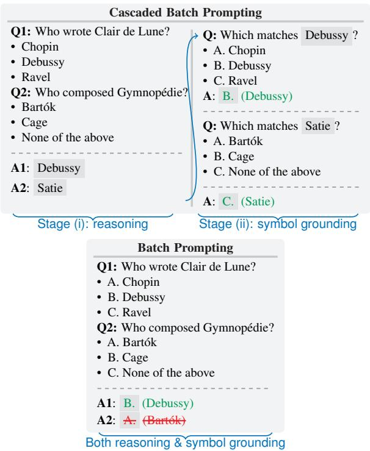
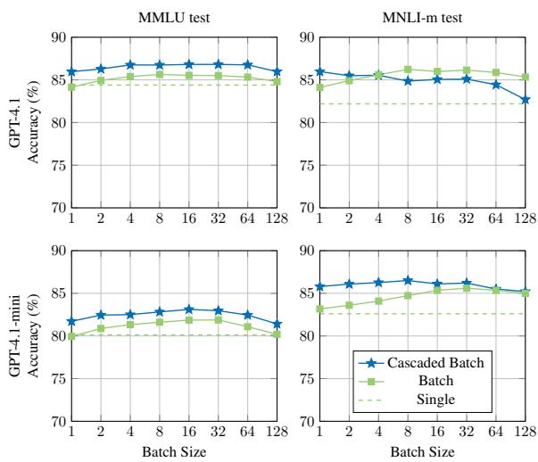
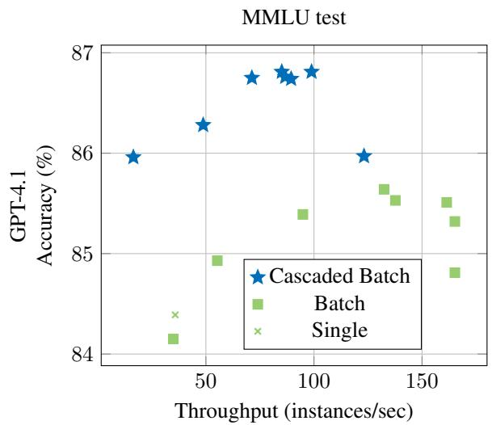
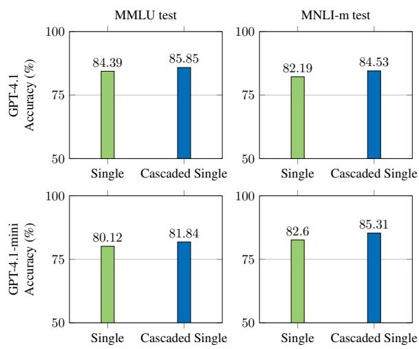
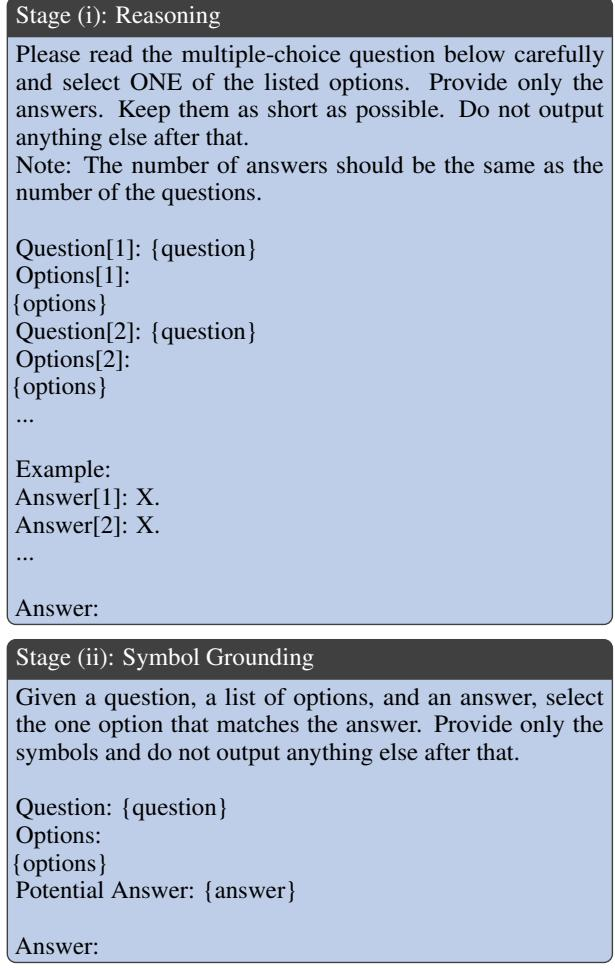
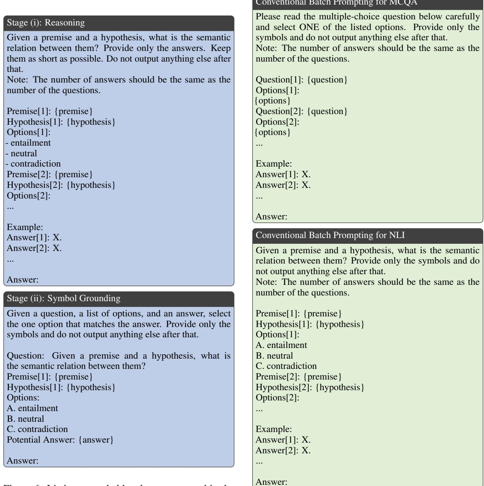

# Cascaded Batch Prompting

Sho Hoshino and Peinan Zhang

CyberAgent

{hoshino\_sho,zhang\_peinan}@cyberagent.co.jp

## Abstract

Although batch prompting makes large language model inference more efficient by pro cessing multiple instances simultaneously, it suffers from unpredictable downstream task performance. We propose cascaded batch prompting, a two-stage approach designed to resolve the unpredictability of conventional batch prompting by disentangling complex reasoning from symbol grounding. Experiments on multiple-choice question answering and natural language inference demonstrate that the proposed method outperforms the standard single prompting baseline while achieving a speedup proportional to batch size, establishing a new state of the art on the Pareto frontier.

## 1 Introduction

Batch prompting is a prominent technique for making large language model (LLM) inference efficient by processing multiple instances simultaneously within a single context (Cheng et al., 2023; Lin et al., 2024). However, accommodating multiple instances requires formatting modifications that can alter generated outputs. Consequently, prior studies observe that batching can unexpectedly improve or even degrade downstream task performance, introducing a critical bottleneck of unpredictability. This unpredictability often limits the real-world application of batch prompting at scale by forcing an undesirable choice between inference speedup and the risk of degraded performance.

We hypothesize this unpredictability of conventional batch prompting is not inherent to batching itself, but it results from conflating distinct cognitive tasks into a single step. Specifically, classification tasks impose strict output constraints that force the model to simultaneously perform: (i) the complex reasoning required to arrive at a solution, and (ii) the procedural task of symbol grounding that solution in a constrained output format. While the benefit of disentangling these tasks has been demonstrated for single prompting (Wang et al., 2024a,b), we argue that under the pressure of batch processing, the cognitive load of this conflation becomes particularly problematic.

  
Figure 1: Cascaded batch prompting (top) disentangles reasoning from symbol grounding into a two-stage process, while conventional batch prompting (bottom) handles both in one step.

To test this hypothesis, we propose cascaded batch prompting, a novel two-stage approach that disentangles reasoning from symbol grounding in the batching context (Figure 1). Instead of forcing the LLM to generate the final constrained output directly, our method proceeds as follows: (i) a reasoning stage that prompts the LLM to answer the question in a free-form manner, and (ii) a symbol grounding stage that provides the LLM with its own generated answer and asks it to map that answer to the corresponding constrained output. This task decomposition allows the LLM to handle each sub-task more effectively.

We evaluate our method on the diverse and challenging classification tasks of multiple-choice question answering (MCQA; Balepur et al., 2025) and natural language inference (NLI; Bowman et al., 2015). Experiments demonstrate that cascaded batch prompting outperforms the single prompting baseline while maintaining speed proportional to batch size. These results indicate that the proposed method successfully resolves the cognitive bottleneck driving the unpredictability, establishing a new state of the art on the Pareto frontier.

## 2 Prompting Methodology

We formally define the prompting strategies for classification tasks, including MCQA and NLI.

## 2.1 Problem Definition

A classification task instance consists of an input x and a set of class labels. The desired output is the answer a, which indicates the correct class label. This answer can be represented by a symbol s (e.g., “A.”) or its corresponding class label name n (e.g., “entailment”). For any given task, there exists a deterministic function $g : s \mapsto n$ that maps a symbol to its name. Since this mapping is one-to-one, generating either s or n is sufficient to determine the final answer. We use a to denote a comprehensive answer format that may include both the symbol and its name (e.g., “A. entailment”).

We denote a call to an LLM as a function ${ \mathcal { G } } _ { X  Y }$ which maps an input from space X to an output in space Y . To handle multiple instances efficiently, this function can operate on a batch of inputs, denoted by bold letters (e.g., x).

## 2.2 Single Prompting

The standard approach is single prompting, where the LLM is prompted to predict the answer for a single instance x. Depending on the desired output format, this leads to three variants (Robinson and Wingate, 2023):

$$
\mathrm { E n d - t o - E n d : } \quad \hat { a } = { \mathcal G } _ { x \to a } ( x ) ,\tag{1a}
$$

$$
\mathrm { M u l t i p l e ~ C h o i c e } { : } \quad \hat { s } = \mathcal { G } _ { x \to s } ( x ) ,\tag{1b}
$$

$$
{ \mathrm { C l o z e } } { \mathrm { : } } \quad { \hat { n } } = { \mathcal { G } } _ { x  n } ( x ) .\tag{1c}
$$

In the Multiple Choice variant, the class label name can be recovered deterministically (i.e., $\hat { n } = g ( \hat { s } ) )$ . In the Cloze variant, however, mapping the freeform output back to a symbol is a non-trivial step (Wang et al., 2024a,b). While single prompting can be accurate, processing instances one by one is slow.

## 2.3 Conventional Batch Prompting

To improve throughput, conventional batch prompting processes a batch of inputs x simultaneously. Consequently, the three variants are extended accordingly:

$$
\mathrm { E n d - t o - E n d : } \quad \hat { \mathbf { a } } = \mathcal { G } _ { x \to a } ( \mathbf { x } ) ,\tag{2a}
$$

$$
\mathrm { M u l t i p l e ~ C h o i c e : } \quad \hat { \mathbf { s } } = \mathcal { G } _ { x \to s } ( \mathbf { x } ) ,\tag{2b}
$$

$$
\mathrm { C l o z e } \colon \ \hat { \mathbf { n } } = { \mathcal G } _ { x  n } ( \mathbf { x } ) .\tag{2c}
$$

However, prior studies observe that its performance can be unpredictable and may suffer from degradation when batched (Cheng et al., 2023; Lin et al., 2024).

## 2.4 Cascaded Batch Prompting

We propose cascaded batch prompting, a two-stage approach that disentangles the complex reasoning from the simple symbol grounding as follows.

Reasoning. First, the LLM is prompted to generate the class label name nˆ for a batch of inputs x. This stage allows the model to focus entirely on reasoning:

$$
\hat { \mathbf { n } } = { \mathcal G } _ { x  n } ( \mathbf { x } ) .\tag{3}
$$

Symbol Grounding. Second, the batch of generated class label names nˆ is provided as input to another LLM prompt, which maps each class label name to its corresponding symbol ˆs:

$$
\hat { \mathbf { s } } = \mathcal { G } _ { n  s } ( \hat { \mathbf { n } } ) . ^ { 1 }\tag{4}
$$

The complete cascaded process is a composition of these two steps, expressed as:

$$
\hat { \mathbf { s } } = { \mathcal G } _ { n  s } ( { \mathcal G } _ { x  n } ( \mathbf { x } ) ) .\tag{5}
$$

By separating the generation process, we hypothesize that the LLM can handle each sub-task more effectively, thereby overcoming the limitations of conventional batch prompting.

<table><tr><td rowspan="2"></td><td colspan="3">Accuracy (%) ↑</td></tr><tr><td>Batch Size</td><td>MMLU</td><td>MNLI-m</td></tr><tr><td colspan="4">GPT-4.1</td></tr><tr><td>Single</td><td>一</td><td>84.39</td><td>82.19</td></tr><tr><td>Batch</td><td>32</td><td>85.51</td><td>86.14*</td></tr><tr><td>Cascaded Batch</td><td>32</td><td>86.81</td><td>85.09</td></tr><tr><td colspan="4">GPT-4.1-MINI</td></tr><tr><td>Single</td><td>一</td><td>80.12</td><td>82.60</td></tr><tr><td>Batch</td><td>32</td><td>81.88</td><td>85.60</td></tr><tr><td>Cascaded Batch</td><td>32</td><td>82.96*</td><td>86.20*</td></tr><tr><td colspan="4">PHI-4</td></tr><tr><td>Single</td><td>一</td><td>74.34</td><td>82.15</td></tr><tr><td>Batch</td><td>32</td><td>58.35</td><td>83.19</td></tr><tr><td>Cascaded Batch</td><td>32</td><td>77.18*</td><td>83.57</td></tr></table>

Table 1: Comparison of various prompting strategies. For a fair comparison, we chose the batch size of 32 that performed best for the conventional batch prompting baseline. Bold text highlights the highest scores. The asterisk (∗) denotes statistical significance (p < 0.05, detailed in Appendix A).

## 3 Experiments

We evaluate various prompting strategies using the challenging tasks of MCQA and NLI, configured as follows.2

## 3.1 Setup

Data. We use the Massive Multitask Language Understanding (MMLU; Hendrycks et al., 2021) dataset for MCQA and the Multi-Genre Natural Language Inference (MNLI; Williams et al., 2018) dataset for NLI. We selected these benchmarks because they are commonly used in popular LLM benchmarks, including BIG-bench (Srivastava et al., 2023) and HELM (Liang et al., 2023).

Metrics. We report classification accuracy, the standard metric used for MCQA and NLI.

LLMs. We primarily use GPT-4.1 and its smaller variant GPT-4.1-mini (OpenAI et al., 2024) with batch sizes varying from 1 to 128 to assess performance robustness across model and batch scales. We additionally use open-weight Phi-4 (Abdin et al., 2024). We employ nucleus sampling (Holtzman et al., 2020) with top-p=0.9, without changing other hyperparameters unless explicitly mentioned.

## 3.2 Main Results

Table 1 presents our main results. Across all three models, our cascaded batch prompting achieves the highest accuracy on both MMLU (86.81%) and MNLI (86.20%). With GPT-4.1, cascaded batch prompting obtains the top score on MMLU. On MNLI, however, conventional batch prompting performs slightly better. We attribute this to the fact that the NLI task inherently lacks a free-form output space (i.e., it only requires a predefined symbolic word such as “entailment”), making the additional symbol grounding step less critical for a more powerful model. Nevertheless, the advantage of our approach is underscored with GPT-4.1-mini and Phi-4, where cascaded batch prompting is the best performer on both tasks, which suggests our method is most beneficial when models face higher cognitive loads. These results support our core claim that disentangling reasoning from symbol grounding is a robust strategy that consistently improves upon single prompting.

  
Figure 2: Accuracy scaling with batch size. Cascaded batch prompting demonstrates robust performance across tasks and models. Its advantage is most pronounced with GPT-4.1-mini (bottom row), where it consistently outperforms the baselines.

## 3.3 Scalability Analysis

Figure 2 shows that cascaded batch prompting’s accuracy remains robust as batch size increases. In contrast, conventional batch prompting’s performance is less consistent, and can underperform the single prompting baseline (e.g., with Phi-4 on MMLU). This result confirms that our method effectively leverages batching’s efficiency without sacrificing accuracy.

A closer inspection of Figure 2 reveals a slight degradation in performance for both batch methods at the largest batch size of 128. We attribute this not to a decline in reasoning capability but rather to a mechanical artifact of processing batches, where the model may occasionally fail to produce a corresponding output for every input instance. This can result in a mismatch between the number of input and output lines. A simple sanity check can identify and rerun the affected instances to rectify these issues (detailed in Section 3.6). For the clarity of our analysis, however, we did not include these post hoc corrections in our main results.

  
Figure 3: Compared with single prompting, cascaded batch prompting achieves higher accuracy and throughput at the same time, establishing a new Pareto frontier. Meanwhile, conventional batch prompting underperforms, demonstrating its unpredictability.

## 3.4 Runtime Analysis

Figure 3 visualizes the trade-off between accuracy and instance-level throughput (instances/sec). While single prompting offers high accuracy at low speed, conventional batch prompting excels at speed while suffering from unpredictable performance, even underperforming the single prompting baseline. Our cascaded approach resolves this unpredictability, establishing a new Pareto frontier by achieving higher accuracy and throughput at the same time.

## 3.5 Ablation Study

To isolate the effect of our two-stage design from the effects of batching, we conducted an ablation study comparing standard single prompting with cascaded single prompting (Wang et al., 2024a,b). As shown in Figure 4, cascaded single prompting consistently outperforms its standard counterpart across both MMLU and MNLI. This result suggests that the performance benefit is not solely due to batching but is fundamentally rooted in the task decomposition itself.

  
Figure 4: Cascaded single prompting outperforms the conventional baseline, demonstrating the effectiveness of the two-stage design even without batching.

## 3.6 Sanity Check

As discussed in Section 3.3, we can also add a simple sanity check during batch prompting inference to verify if the number of outputs matches the number of inputs. Implementing this sanity check prevents a single missing generation from misaligning all subsequent answers in the batch. This sanity check can be applied to both conventional and cascaded batch prompting and is therefore orthogonal.

Table 2 reports preliminary results using GPT-4.1-mini and the MMLU test set. While this optional and simple step cannot fully resolve the performance decline as batch size increases, it successfully mitigates input and output misalignment. However, the resulting performance improvement is slight and not statistically significant.

## 3.7 Cost Analysis

Table 3 reports the inference cost in terms of tokenlevel throughput (tokens/sec) on the MMLU test set using GPT-4.1, distinct from the instance-level throughput discussed in Section 3.4. Since cascaded batch prompting requires an additional inference stage, it processes more tokens overall, resulting in a higher token-level throughput and a cost approximately 1.2 times higher than that of conventional batch prompting. We emphasize that this modest overhead is a necessary trade-off to resolve the unpredictability of conventional batch prompting.

<table><tr><td colspan="3">Accuracy (%) ↑</td></tr><tr><td>Prompt</td><td>Batch Size</td><td>MMLU</td></tr><tr><td rowspan="4">Cascaded Batch w/o Sanity Check</td><td>GPT-4.1-MINI</td><td></td></tr><tr><td></td><td></td></tr><tr><td>32 128</td><td>82.96 81.41</td></tr><tr><td></td><td></td></tr><tr><td>w/ Sanity Check</td><td>128</td><td>81.61</td></tr></table>

Table 2: Impact of the sanity check on cascaded batch prompting. The sanity check partially recovers performance lost to input and output misalignment, although it cannot fully resolve the performance decline at larger batch sizes.
<table><tr><td rowspan="2"></td><td rowspan="2"></td><td colspan="2">Throughput (tokens/sec) ↓</td></tr><tr><td colspan="2">MMLU</td></tr><tr><td>Prompt</td><td>Batch Size</td><td>Input</td><td>Output</td></tr><tr><td></td><td colspan="3">GPT-4.1</td></tr><tr><td>Single</td><td></td><td>4,910</td><td>47</td></tr><tr><td>Batch</td><td>32</td><td>18,990</td><td>965</td></tr><tr><td>Cascaded Batch</td><td>32</td><td>23,341</td><td>1,220</td></tr></table>

Table 3: Cascaded batch prompting introduces a modest cost overhead due to the additional symbol grounding stage.

## 4 Discussion

Our experiments have demonstrated the empirical advantages of cascaded batch prompting. We now turn to a discussion of the underlying mechanisms that drive its effectiveness and the broader implications of task decomposition.

Cognitive Division of Labor. We attribute the effectiveness of our method to a cognitive division of labor, analogous to Adam Smith’s “pin factory” (Smith, 1776). Our cascaded approach separates the process into a reasoning stage for problem-solving and a symbol grounding stage for procedural formatting.

Pragmatic Value of Task Decomposition. While developing end-to-end LLMs is a prominent research goal, our results show the pragmatic value of task decomposition. Since current models can struggle with the combined cognitive load of reasoning and symbol grounding under batch pressure, principled decomposition remains a critical and effective strategy.

## 5 Conclusion

In this study, we identified that the unpredictability of conventional batch prompting results from conflating distinct cognitive tasks into a single step. To address this, we proposed cascaded batch prompting, a two-stage approach that disentangles complex reasoning from simple symbol grounding, thereby resolving this unpredictability. Experiments demonstrate that the proposed method outperforms the single prompting baseline while achieving a speedup proportional to batch size. While our experiments focused on multiple-choice question answering and natural language inference, the core principle extends to a wide range of classification tasks where a model’s free-form reasoning must be mapped to a constrained output format.

## Limitations

Task Applicability. Our evaluation intentionally focuses on classification tasks to provide a controlled setting for validating the disentanglement of reasoning from symbol grounding. To extend this two-stage approach to the challenges of openended generation, future work can investigate integrating methods like universal self-consistency (Chen et al., 2024).

Inference Overhead. The proposed cascaded batch prompting uses a two-stage inference process that adds overhead compared to conventional single-stage prompting (detailed in Section 3.7). For a dataset of size N and a batch size of b, conventional batch prompting requires N/b inference calls. In contrast, our implementation requires N/b calls for the batched reasoning stage plus an additional N individual calls for the unbatched symbol grounding stage. We consider this overhead a necessary trade-off to resolve the unpredictability of conventional batch prompting and therefore worthwhile.

## References

Marah Abdin, Jyoti Aneja, Harkirat Behl, Sébastien Bubeck, Ronen Eldan, Suriya Gunasekar, Michael Harrison, Russell J. Hewett, Mojan Javaheripi, Piero Kauffmann, James R. Lee, Yin Tat Lee, Yuanzhi Li, Weishung Liu, Caio C. T. Mendes, Anh Nguyen, Eric Price, Gustavo de Rosa, Olli Saarikivi, and 8 others. 2024. Phi-4 technical report. Preprint, arXiv:2412.08905.

Nishant Balepur, Rachel Rudinger, and Jordan Lee Boyd-Graber. 2025. Which of these best describes multiple choice evaluation with LLMs? A) forced B) flawed C) fixable D) all of the above. In Proceedings of the 63rd Annual Meeting of the Association for Computational Linguistics, pages 3394–3418.

Samuel R. Bowman, Gabor Angeli, Christopher Potts, and Christopher D. Manning. 2015. A large annotated corpus for learning natural language inference. In Proceedings of the 2015 Conference on Empirical Methods in Natural Language Processing, pages 632–642.

Xinyun Chen, Renat Aksitov, Uri Alon, Jie Ren, Kefan Xiao, Pengcheng Yin, Sushant Prakash, Charles Sutton, Xuezhi Wang, and Denny Zhou. 2024. Universal self-consistency for large language models. In ICML 2024 Workshop on In-Context Learning.

Zhoujun Cheng, Jungo Kasai, and Tao Yu. 2023. Batch prompting: Efficient inference with large language model APIs. In Proceedings ofthe 2023 Conference on Empirical Methods in Natural Language Processing: Industry Track, pages 792–810.

Dan Hendrycks, Collin Burns, Steven Basart, Andy Zou, Mantas Mazeika, Dawn Song, and Jacob Steinhardt. 2021. Measuring massive multitask language understanding. In Proceedings ofthe Ninth International Conference on Learning Representations.

Ari Holtzman, Jan Buys, Li Du, Maxwell Forbes, and Yejin Choi. 2020. The curious case of neural text degeneration. In Proceedings of the Eighth International Conference on Learning Representations.

Philipp Koehn. 2004. Statistical significance tests for machine translation evaluation. In Proceedings ofthe 2004 Conference on Empirical Methods in Natural Language Processing, pages 388–395.

Percy Liang, Rishi Bommasani, Tony Lee, Dimitris Tsipras, Dilara Soylu, Michihiro Yasunaga, Yian Zhang, Deepak Narayanan, Yuhuai Wu, Ananya Kumar, Benjamin Newman, Binhang Yuan, Bobby Yan, Ce Zhang, Christian Cosgrove, Christopher D Manning, Christopher Re, Diana Acosta-Navas, Drew A. Hudson, and 31 others. 2023. Holistic evaluation of language models. Transactions on Machine Learning Research.

Jianzhe Lin, Maurice Diesendruck, Liang Du, and Robin Abraham. 2024. BatchPrompt: Accomplish more with less. In Proceedings of the Twelveth International Conference on Learning Representations, pages 21590–21612.

OpenAI, :, Aaron Hurst, Adam Lerer, Adam P. Goucher, Adam Perelman, Aditya Ramesh, Aidan Clark, AJ Ostrow, Akila Welihinda, Alan Hayes, Alec Radford, Aleksander M ˛adry, Alex Baker-Whitcomb, Alex Beutel, Alex Borzunov, Alex Carney, Alex Chow, Alex Kirillov, and 401 others. 2024. GPT-4o system card. Preprint, arXiv:2410.21276.

Joshua Robinson and David Wingate. 2023. Leveraging large language models for multiple choice question answering. In Proceedings ofthe Eleventh International Conference on Learning Representations.

Adam Smith. 1776. An Inquiry into the Nature and Causes of the Wealth of Nations, Project Gutenberg ebook edition. W. Strahan and T. Cadell, London.

Aarohi Srivastava, Abhinav Rastogi, Abhishek Rao, Abu Awal Md Shoeb, Abubakar Abid, Adam Fisch, Adam R. Brown, Adam Santoro, Aditya Gupta, Adrià Garriga-Alonso, Agnieszka Kluska, Aitor Lewkowycz, Akshat Agarwal, Alethea Power, Alex Ray, Alex Warstadt, Alexander W. Kocurek, Ali Safaya, Ali Tazarv, and 431 others. 2023. Beyond the imitation game: Quantifying and extrapolating the capabilities of language models. Transactions on Machine Learning Research.

Xinpeng Wang, Chengzhi Hu, Bolei Ma, Paul Rottger, and Barbara Plank. 2024a. Look at the text: Instruction-tuned language models are more robust multiple choice selectors than you think. In Proceedings ofthe First Conference on Language Modeling.

Xinpeng Wang, Bolei Ma, Chengzhi Hu, Leon Weber-Genzel, Paul Röttger, Frauke Kreuter, Dirk Hovy, and Barbara Plank. 2024b. “My Answer is C”: Firsttoken probabilities do not match text answers in instruction-tuned language models. In Findings of the Associationfor Computational Linguistics: ACL 2024, pages 7407–7416.

Adina Williams, Nikita Nangia, and Samuel Bowman. 2018. A broad-coverage challenge corpus for sentence understanding through inference. In Proceedings of the 2018 Conference of the North American Chapter of the Association for Computational Linguistics: Human Language Technologies, pages 1112–1122.

## A Setup Details

Data Splitting. For the MMLU dataset, we use the validation split for development and the test split for testing. For the MNLI dataset, similarly, we use the matched validation split for development and the matched test split for testing.

Hyperparameters. We set max tokens to 20 for single prompting and 1,000 for other prompting strategies.

Model Versions. We use GPT-4.1 version 2025- 04-14 and GPT-4.1-mini version 2025-04-14 (OpenAI et al., 2024) with Phi-4 version 7 (Abdin et al., 2024). To maximize throughput, all calls to the LLM API were made asynchronously.

Prompts. Figures 5, 6, and 7 list our prompts used for the tasks of MCQA and NLI.

Statistical Testing. We assessed statistical significance using paired bootstrap resampling (Koehn, 2004). The performance gains from cascaded batch prompting are statistically significant (p < 0.05) on the MMLU benchmark across the evaluated models. The performance gains on MNLI were mostly consistent in direction, but did not reach statistical significance with Phi-4 and underperformed the conventional batch prompting baseline with GPT-4.1. This suggests limited gains on the NLI task as discussed in Section 3.2.

Licenses. We performed experiments using the MMLU dataset (Hendrycks et al., 2021) released under the MIT license3, the MNLI dataset (Williams et al., 2018) available under a collection of licenses4 5, GPT-4.1 API (OpenAI et al., 2024) released under a proprietary license via Azure OpenAI Service6, and Phi-4 (Abdin et al., 2024) released under the MIT license7.

  
Figure 5: Listing cascaded batch prompts used in the MCQA task. The placeholders “{question}”, “{options}”, and “{answer}” are replaced with the actual question, its options, and LLM answer.

  
Figure 6: Listing cascaded batch prompts used in the NLI task. The placeholders “{premise}”, “{hypothesis}”, and “{answer}” are replaced with the actual premise, hypothesis, and LLM answer.  
Figure 7: Listing conventional batch prompts used in the MCQA and NLI tasks, respectively. Unlike cascaded batch, these prompts are tailored with symbol grounding in mind.