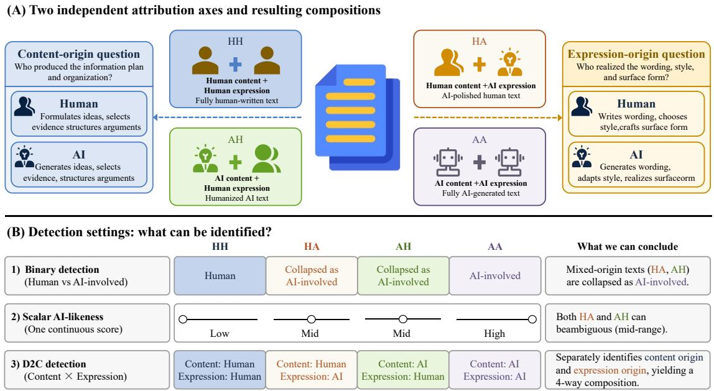
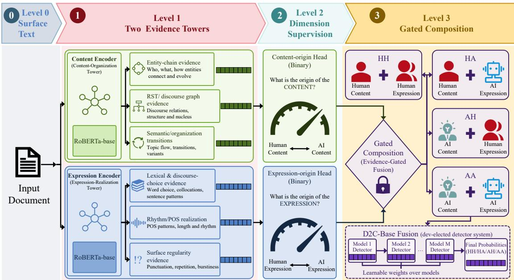
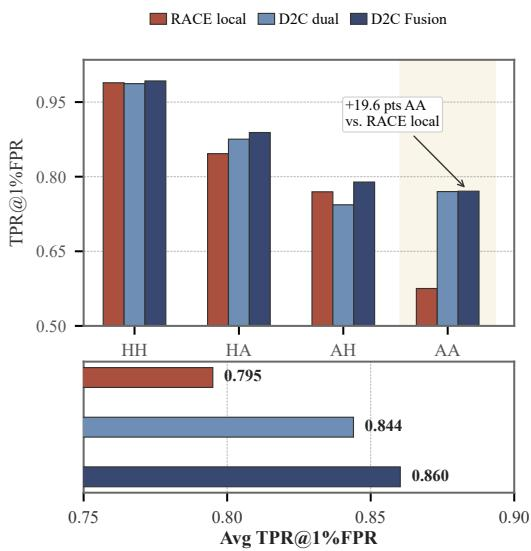
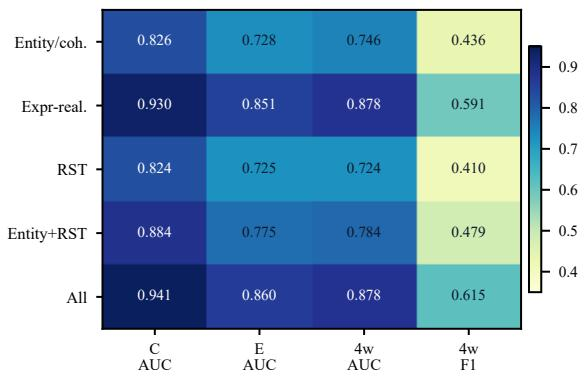

# D2C-Routing: Dimension-to-Composition Evidence Routing for Mixed-Origin AI-Generated Text Detection

Xin Chen Fuwei Zhang Yiqi Tong

Wei Guo Yutian Xiao Fuzhen Zhuang \*

Institute of Artificial Intelligence, Beihang University, Beijing, China

{yqtong,zhuangfuzhen}@buaa.edu.cn

Corresponding authors

## Abstract

AI-generated text detection is commonly framed as a binary document-level judgment about whether a text is human-written or machine-generated. This framing breaks down for mixed-origin writing, where content origin and expression origin may differ. We cast mixed-origin detection as dimension-to-composition source attribution, inferring content origin and expression origin before composing them into four collaboration types. We propose Dimension-to-Composition Routing (D2C-Routing), which routes content-side and expression-side evidence to supervised dimension heads before a learned gated composition layer predicts the final label. On MixD2C, a reconstructed split derived from the HART mixed-origin benchmark, our disclosed D2C-Routing-based detector system reaches 0.8603 four-way Avg TPR@1%FPR, 6.5 points above the samesplit RACE-local rerun. Core ablations support the routing design, while error analysis shows that distinguishing AI-content/humanexpression from fully AI-generated text remains the hardest boundary. Code is available at https://github.com/bystander563/d2crouting-artifact.

## 1 Introduction

AI-generated text detection commonly asks whether a document is human-written or machinegenerated (Wang et al., 2024a; Dugan et al., 2024; Tufts et al., 2025). This binary framing is increasingly incomplete for collaborative writing workflows, where authorship can be distributed across layers of a document (Saha and Feizi, 2025; Zhang et al., 2024; Cheng et al., 2025). For example, one document may preserve human-originated content while using AI-polished wording, whereas another may contain AI-originated content rewritten by a human. A single scalar AI-likeness score cannot distinguish which source dimension changed.

We adopt the content-expression label space introduced by HART (Bao et al., 2025), which defines four mixed-origin collaboration types as the Cartesian product of content origin and expression origin. We use transparent two-letter labels where the first letter denotes content origin and the second denotes expression origin, yielding human-content/human-expression (HH), humancontent/AI-expression (HA), AI-content/humanexpression (AH), and AI-content/AI-expression (AA). Figure 1 summarizes the resulting two-axis attribution problem. A binary human-versus-AI detector collapses mixed cases, and a scalar AIlikeness score does not specify which source dimension drives the judgment. We therefore model mixed-origin detection as two source-attribution questions followed by a composed four-way decision. Related representation-learning work has likewise separated semantic and temporal factors before modeling their interaction (Zhang et al., 2022b), while multi-aspect alignment provides a way to combine complementary signals before generative prediction (Zhang et al., 2026).

To address this challenge, we introduce Dimension-to-Composition Routing (D2C-Routing), where D2C denotes the path from supervised source dimensions to their composed collaboration label. D2C-Routing organizes document-internal evidence as a dimensionaligned tree. Hierarchical knowledge fusion can preserve evidence at different semantic levels (Zhang et al., 2022a), while multi-level relevance learning can distinguish coarse from fine relationships (Zhang et al., 2025). Content-side cues such as entity continuity and discourse motifs support the content side, while expression-side cues such as lexical choice, rhythm/POS patterns, and surface regularity support the expression side. The routed evidence then feeds supervised content-origin and expression-origin heads before a learned gate composes HH/HA/AH/AA.

  
Figure 1: Mixed-origin text requires dimension-to-composition detection. We represent attribution through two source dimensions: content origin and expression origin. Their composition yields four labels: HH, HA, AH, and AA. Binary detection collapses mixed-origin cases, while D2C-Routing predicts the two source dimensions before composing the final collaboration type.

We evaluate on MixD2C, a four-way split reconstructed from the released HART benchmark files. The experiments separate single-model method evidence from detector-system performance and test dimension supervision and learned composition against feature, capacity, ranking, and fusion controls.

This design yields a direct empirical test: the intermediate source dimensions should be learnable, and their composition should improve low-FPR four-way detection.

Our contributions are:

1. We organize document-internal evidence into linguistically motivated content and expression branches for mixed-origin AI-text detection.

2. We introduce D2C-Routing, which combines dimension-specific pathways, supervised content-origin and expression-origin heads, and learned gated composition into HH/HA/AH/AA collaboration labels.

3. Under the MixD2C split, D2C-Routing improves average and AA low-FPR ranking over same-split single-model controls. A D2C-Routing-based detector system reaches 0.8603 four-way Avg TPR@1%FPR, 6.5 points above the same-split RACE-local rerun.

## 2 Related Work

AI-generated text detection usually evaluates documents with binary human/AI labels or scalar AIlikeness scores. Recent work broadens this setting to AI-polished, collaborative, or fine-grained writing (Saha and Feizi, 2025; Zhang et al., 2024; Ta et al., 2026), multi-generator and manipulated-text benchmarks (Guo et al., 2023; Wang et al., 2024b,a; Dugan et al., 2024; Wang et al., 2025; Bevendorff et al., 2025), and finer-grained role, involvement, boundary, or process predictions (Cheng et al., 2025; Kushnareva et al., 2024; He et al., 2025). These studies motivate the same broad concern that a document may not have a single source. They provide important context, but they are not all direct numerical baselines for our main four-way MixD2C table because they differ in label space, prediction granularity, reconstruction protocol, or primary metric.

For the content-expression taxonomy, we use HART’s HH/HA/AH/AA label space and official Level-1/2/3 risk tasks (Bao et al., 2025). We do not claim to introduce this taxonomy. A closely related HART-family study, RACE, reports a broad baseline set under a 70/10/20 reconstruction (Li et al., 2026). We keep its published table as external context and rerun the released RACE implementation on the identical MixD2C files used by our models. Because the release does not package frozen published sample IDs or checkpoints, the local run is a same-split RACE rerun, not a reproduction of the published RACE numbers.

Training-free scalar detectors include Fast-DetectGPT, which uses conditional probability curvature for efficient zero-shot detection; Binoculars, which contrasts two language models; and SpecDetect, which analyzes token log-likelihood sequences in the frequency domain (Bao et al., 2024; Hans et al., 2024; Luo et al., 2026b). Recent analysis connects spectral energy to variance in proxy log-probability trajectories and finds that spectral cues weaken for short, fragmented, mixed, and edited text (Luo et al., 2026a). Related scalardetection work includes GLTR’s token-rank visualization, DetectGPT’s perturbation-based curvature test, and Ghostbuster’s trained feature classifier (Gehrmann et al., 2019; Mitchell et al., 2023; Verma et al., 2024). Because the three evaluated training-free methods return scalar scores rather than native HH/HA/AH/AA predictions, we evaluate them directly on official binary collapses and report four-way results only as calibrated diagnostics.

Our method differs in its inductive bias. RACE emphasizes creator/editor traces through rhetoricguided graph learning, while D2C-Routing asks how document-internal evidence should be assigned to supervised source dimensions before the final four-way decision. Entity coherence and discourse organization are motivated by coherence modeling and document-level discourse analysis (Barzilay and Lapata, 2008; Li and Hovy, 2014; Liu et al., 2023; Mann and Thompson, 1988; Prasad et al., 2008; Liu et al., 2021; Kim et al., 2024); lexical choice, function-word patterns, rhythm, and surface regularity are motivated by stylometry and AI-generated text style analysis (Stamatatos, 2009; Uchendu et al., 2020; Soto et al., 2024; Reinhart et al., 2025). D2C-Routing assigns these evidence families dimension-specific roles and tests them against flat-concatenation and feature-removal controls.

The next section makes this source-dimension view explicit before describing the detector architecture.

Table 1: Label space. HH/HA/AH/AA compose content origin and expression origin. The two derived binary targets, content origin and expression origin, supervise D2C-Routing; Level-1/2/3 are official HART evaluation collapses, not additional training labels.
<table><tr><td colspan="5">Panel A: Labels and targets</td></tr><tr><td>Label</td><td>Content</td><td>Expression</td><td>C tgt.</td><td>E tgt.</td></tr><tr><td>HH</td><td>human</td><td>human</td><td>0</td><td>0</td></tr><tr><td>HA</td><td>human</td><td>AI</td><td>0</td><td>1</td></tr><tr><td>AH</td><td>AI</td><td>human</td><td>1</td><td>0</td></tr><tr><td>AA</td><td>AI</td><td>AI</td><td>1</td><td>1</td></tr><tr><td colspan="5">Panel B: Official task collapses</td></tr><tr><td>Task</td><td>Positive</td><td>Negative</td><td>Question</td><td></td></tr><tr><td>Level-1</td><td> $\mathrm { H A } + \mathrm { A H } + \mathrm { A A }$ </td><td>HH</td><td>Any AI?</td><td></td></tr><tr><td>Level-2</td><td> $\mathrm { A H + A A }$ </td><td> $\mathrm { H H + H A }$ </td><td>AI content?</td><td></td></tr><tr><td>Level-3</td><td> $\mathbf { A A }$ </td><td> $\mathrm { H H } + \mathrm { H A } + \mathrm { A H }$ </td><td>Fully AI?</td><td></td></tr></table>

## 3 Problem Setup

## 3.1 Task Definition

We formalize mixed-origin detection as sourcedimension prediction followed by composition. Let

$$
\begin{array} { c l c r } { { } } & { { } } & { { \mathcal { V } = \{ H H , H A , A H , A A \} , } } \\ { { } } & { { } } & { { \mathcal { Y } = ( y _ { c } , y _ { e } ) , \quad y _ { c } , y _ { e } \in \{ 0 , 1 \} , } } \end{array}
$$

where $y _ { c }$ denotes content origin, $y _ { e }$ denotes expression origin, 0 denotes human-originated, and 1 denotes AI-originated. A detector maps an observed document x to $( \hat { y } _ { c } , \hat { y } _ { e } , \hat { y } )$ , separating the two source questions from the final collaboration label.

## 3.2 Label Space

The HART taxonomy assigns each document a four-way type based on content origin and expression origin (Bao et al., 2025). We use human and AI as the two source values for each dimension, with two-letter labels defined by content origin followed by expression origin.

This factorization provides explicit supervision for the two source decisions underlying the fourway label.

The two source targets are derived as

$$
\begin{array} { r } { y _ { c } = \mathbb { I } \{ y \in \{ A H , A A \} \} , } \\ { y _ { e } = \mathbb { I } \{ y \in \{ H A , A A \} \} . } \end{array}
$$

A flat classifier can learn four-way label correlations without identifying which source dimension supports a decision. Dimension supervision instead makes content and expression attribution explicit training targets.

  
Figure 2: D2C-Routing architecture. The figure shows the single-model architecture: the observed document feeds content and expression evidence pathways, supervised source heads estimate the two dimensions, and a learned gate composes them into HH/HA/AH/AA predictions. The separate D2C-base Fusion detector system combines multiple D2C-Routing outputs and is reported only in result tables.

## 3.3 Evidence Organization

The content-expression decomposition organizes evidence into two linguistically motivated pathways. The content pathway uses entity-chain coherence and RST discourse motifs, while the expression pathway uses lexical-connective choices, rhythm/POS patterns, and surface regularity. The final layer composes the two source dimensions into HH/HA/AH/AA. Syntax-specific routing remains exploratory.

The content and expression predictions are supervised directly, and the four-way prediction is also supervised directly. This dimension-tocomposition structure is different from the official Level-1/2/3 tasks, which are evaluation collapses of the same four labels.

The distinction is most important for HA and AH. Under a scalar AI-likeness view, both can appear intermediate between HH and AA. Under a dimension-to-composition view, they are structurally different because HA has human content but AI expression, whereas AH has AI content but human expression.

## 4 Method

## 4.1 Architecture Overview

D2C-Routing instantiates the dimension-aligned evidence tree in Figure 2. The key design choice is not simply to add more features to a text encoder, but to route document-internal evidence through supervised source-dimension pathways before the final four-way composition. A RoBERTa encoder first produces the observed-document representation (Liu et al., 2019); content components extract entity-chain and discourse-motif evidence; expression components extract lexical-connective realization, rhythm/POS, and surface-regularity evidence; and side-specific fusion modules form contentorigin and expression-origin pathway states before gated composition.

This routing is an inductive bias over documentinternal evidence, not a claim that evidence families are causally isolated. Each pathway therefore keeps a linguistic rationale for its inputs while allowing the learned composition module to use entangled evidence when it helps prediction.

The same design can be instantiated with a shared encoder or with separate encoders for the content and expression pathways. Dual-encoder variants use the same encoder family but a larger parameter budget, so they are treated as supportive system variants rather than capacity-matched proof of architecture superiority.

## 4.2 Document Encoder

The raw document is the only directly observed object, so both source dimensions must remain grounded in the same text. Given an input document x, the observed-document layer encodes the original text and produces a contextual representation. Shared-encoder models use the same representation for both sides,

$$
h _ { c } = h _ { e } = h .
$$

Dual-encoder models instead use separate encoders to produce $h _ { c }$ and $h _ { e } ;$ their larger parameter budget is evaluated separately in the matched system controls.

## 4.3 Content Pathway

The content pathway models document-internal evidence about how information is maintained and organized. Rather than verifying factual correctness, it captures proxies for information planning. We use entity-chain evidence for referent recurrence, sentence overlap, chain length, and local entity transitions, following coherence modeling and coherence-based machine-text detection (Barzilay and Lapata, 2008; Liu et al., 2023). We also use RST discourse evidence for relation and motif features, motivated by Rhetorical Structure Theory and discourse-motif detection (Mann and Thompson, 1988; Liu et al., 2021; Kim et al., 2024). Learned projectors map the entity vector $a _ { \mathrm { { e n t } } } ( x )$ and discourse vector $a _ { \mathrm { r s t } } ( x )$ into the content pathway; the entity-as-text variant adds an encoded entity-text vector as a third content component. The final content-origin state concatenates the observeddocument anchor $h _ { c }$ with routed content evidence and predicts whether the document’s content is AIoriginated.

## 4.4 Expression Pathway

The expression pathway models how information is linguistically realized. This branch is needed because polishing or humanization can preserve organization while changing vocabulary, connectives, rhythm, grammatical realization, punctuation, repetition, and burstiness. We group these signals into lexical-connective realization $a _ { \mathrm { l e x } } ( x )$ , rhythm/POS realization $a _ { \mathrm { r h y } } ( x )$ , and surface regularity $a _ { \mathrm { r e g } } ( x )$ drawing on stylometry and AI-generated text style analysis (Stamatatos, 2009; Soto et al., 2024; Reinhart et al., 2025). Learned projectors map each component into the expression pathway, and the final expression-origin state concatenates $h _ { e }$ with routed expression evidence. This pathway is supervised to predict whether wording and surface realization are AI-originated.

## 4.5 Dimension Heads

Because the four-way label factorizes into contentorigin and expression-origin dimensions, we derive two supervision targets from the same label space and implement binary heads over the routed pathway states. The content head $s _ { c } = W _ { c } z _ { c } + b _ { c }$ predicts AI-originated content, with AH/AA as positive labels and HH/HA as negative labels. The expression head $s _ { e } ~ = ~ W _ { e } z _ { e } + b _ { e }$ predicts AIoriginated expression, with HA/AA as positive labels and HH/AH as negative labels. Both heads receive direct cross-entropy supervision.

## 4.6 Gated Composition

The final collaboration type is the composition of the two source dimensions, but the learned dimension representations are uncertain and partly entangled. A hard mapping from two binary decisions to four labels would discard this uncertainty, while a flat classifier need not expose or preserve these source dimensions. D2C-Routing therefore projects the pathway representations into a shared composition space,

$$
u _ { c } = f _ { c } ( z _ { c } ) , ~ u _ { e } = f _ { e } ( z _ { e } ) .
$$

Let $h _ { g }$ denote the text anchor used by the composition gate: in shared-encoder models, $h _ { g } = h $ in dual-encoder models, $h _ { g }$ is a projected combination of $h _ { c }$ and $h _ { e }$ . The learned vector gate, fused representation, and four-way classifier are

$$
\begin{array} { r } { g = \sigma ( W _ { g } [ h _ { g } ; s _ { c } ; s _ { e } ] + b _ { g } ) , \qquad } \\ { u = g \odot u _ { c } + ( 1 - g ) \odot u _ { e } , \qquad } \\ { p ( y \mid x ) = \mathrm { s o f t m a x } ( W _ { y } [ h _ { g } ; u ; s _ { c } ; s _ { e } ] + b _ { y } ) . } \end{array}
$$

This design differs from a hard factorized classifier that maps two binary predictions directly to four labels. The gate allows the model to learn how content-origin and expression-origin evidence interact across HH, HA, AH, and AA.

## 4.7 Training Objective

The training objective mirrors the hierarchy: dimension losses teach the two source questions, the composition loss teaches HH/HA/AH/AA, and low-FPR ranking terms adapt the detector to strict falsepositive operating points,

$$
\begin{array} { r } { \mathcal { L } = \lambda _ { c } \mathrm { C E } ( s _ { c } , y _ { c } ) + \lambda _ { e } \mathrm { C E } ( s _ { e } , y _ { e } ) + \lambda _ { m } \mathcal { L } _ { A H / A A } } \\ { + \lambda _ { y } \mathrm { C E } ( p ( y \mid x ) , y ) + \lambda _ { r } \mathcal { L } _ { A A } . \qquad } \end{array}
$$

The first two terms supervise the content and expression dimensions. The third separates AI-content/human-expression from fully AIgenerated text, the fourth supervises the composed HH/HA/AH/AA label, and the final AA one-vs-rest ranking term supports low-FPR AA retrieval. The ranking terms are evaluation-aligned optimization choices motivated by low-FPR detector evaluation (Tufts et al., 2025).

## 4.8 Detector-System Fusion

D2C-base Fusion is the final detector-system variant for low-FPR evaluation. It combines member models that each produce a four-way probability vector $p _ { m } ( y \mid x )$ . The candidate pool and development metric are fixed before test evaluation; interpolation weights are selected on development and evaluated once on test, with no test-set interpolation tuning.

$$
p _ { \mathrm { f u s i o n } } ( y \mid x ) = \sum _ { m } \alpha _ { m } p _ { m } ( y \mid x ) , \sum _ { m } \alpha _ { m } = 1 .
$$

Official Level-1/2/3 scores are computed by collapsing the fused four-way probabilities into the corresponding positive sets. Single-model architecture evidence is evaluated separately through dimension-head, feature, and composition controls.

## 5 Experimental Setup

## 5.1 Dataset Split

Because the released benchmark files do not provide frozen RACE sample identifiers, we construct MixD2C as a transparent four-way evaluation split, not a new dataset or taxonomy. MixD2C merges the released development and test JSON files, then stratifies by domain and class into a 70/10/20 train/dev/test split. The split follows the counts reported in the RACE appendix table rather than the 70/20/10 ratio stated in the RACE prose. MixD2C contains 11,200/1,600/3,200 train/dev/test examples, with AH as the minority class; full class counts are reported in Appendix A.1.

The four-way comparison has two RACE-related sources. Published RACE Table 2 values are external references kept for audit context in Appendix A.1. The main same-split comparison uses our run of the released RACE implementation on the identical MixD2C train/dev/test files, with the strict rstdt RST parser setting. This local rerun is same-split with our models, but it is not a reproduction of the published RACE numbers because the release does not include frozen published sample IDs or checkpoints.

## 5.2 Metrics

For official Level-1/2/3 task collapses, we report AUROC, F1-score, and TPR@5%FPR. For finegrained HH/HA/AH/AA diagnostics, AUROC and F1-score are macro-averaged unless stated otherwise; we also report class-wise TPR@1%FPR and their average. These low-FPR metrics reflect detector evaluation under strict false-positive constraints (Tufts et al., 2025).

## 5.3 Baselines

We compare against four protocol-separated baseline groups. First, RACE-local is our rerun of the released RACE implementation on the identical MixD2C split. Second, the main four-way table restores representative published RACE Table 2 references—RoBERTa, RoBERTa-DANN, CoCo, LF-Motifs, and RACE—as related-reconstruction context rather than local reruns (Li et al., 2026); the complete 13-row reference set remains in Appendix A.1. Third, same-split internal controls compare text-only RoBERTa, flat feature concatenation, D2C-Routing, and closely cost-matched ensembles. Fourth, training-free scalar detectors, including SpecDetect, Fast-DetectGPT, and Binoculars, are evaluated on official Level-1/2/3 collapses because their scalar outputs are not native HH/HA/AH/AA predictions. All same-split rows use the same MixD2C files and evaluator; original HART-protocol references remain separate in Appendix A.2.

Table names follow a fixed convention. RACElocal denotes the same-split RACE rerun. D2C-Routing denotes independently evaluated single models; parenthetical tags such as shared or dual identify the encoder instantiation. D2C-base Fusion is the development-selected primary detector system, a probability fusion over RoBERTa-basefamily member models. Supplementary fusion variants appear only in robustness and appendix analyses. The strongest single-model row is a dualencoder RoBERTa-base variant without the entityas-text input, so it is not a strict parameter-matched comparison against shared-encoder controls.

## 5.4 Implementation

All variants use RoBERTa-base or RoBERTa-large encoders (Liu et al., 2019). The primary D2C-base Fusion system uses RoBERTa-base-family members; RoBERTa-large variants are analysis controls. Continuous evidence groups are projected through small MLPs before entering their pathways. Fusion weights are selected on development, the candidate pool is fixed before test evaluation, and no testset interpolation tuning is used. The final fusion has three nonzero-weight members. Optimizer settings, fusion weights, scalar-detector proxy models, RACE rerun settings, and cost disclosures are provided in Appendix A.9.

## 6 Main Results

The main fine-grained analysis is four-way HH/HA/AH/AA low-FPR detection, because it tests whether a detector can distinguish offdiagonal mixed-origin cases rather than only detect any AI involvement. We first report the main fourway comparison, then use a compact control table to separate single-model method evidence from the development-selected detector system. Official Level-1/2/3 task collapses and scalar baseline details are reported in Appendix A.2.

## 6.1 Four-Way Low-FPR Results

Among the published references, RACE has the strongest Avg TPR@1%FPR at 0.8306, but these values are contextual because exact published sample IDs are unavailable. On the exact MixD2C split, RACE-local is strong on ordinary metrics (0.9849 AUROC and 0.9030 F1-score), while its AA TPR@1%FPR is 0.5752. D2C-Routing reaches 0.8440 Avg TPR@1%FPR and 0.7701 on AA, but remains below RACE-local on AH (0.7435 versus 0.7696). The disclosed D2C-base Fusion system reaches 0.8603 Avg TPR@1%FPR, with 0.7892 AH and 0.7708 AA. Thus the supported result is improved average and AA low-FPR ranking under the exact-split comparison, not uniform class-wise superiority or an exact reproduction of the published table.

## 6.2 Ablations and Controls

The controls separate architecture evidence from detector-system engineering. Shared D2C improves low-FPR ranking over same-family textonly and flat controls, while the dual encoder is the strongest single model. At closely matched total scale, the D2C cost-audit system improves Macro-F1 and AUROC over both five-member controls and Avg TPR@1 over text-only. Its Avg TPR advantage over flat 5× is positive but not significant at 95%, and flat 5× has higher AA TPR. Removing dimension supervision or learned composition weakens four-way low-FPR performance. Full feature removals, paired intervals, routing controls, and composition alternatives are provided in Appendix A.4 and Appendix A.7.

  
Figure 3: Same-split low-FPR behavior on MixD2C. We compare RACE-local, D2C-Routing dual encoder, and D2C-base Fusion on the same MixD2C test split. Our rows mainly improve low-FPR ranking on AA, while RACE-local remains competitive on AH.

## 6.3 Diagnostics

Table 4 summarizes mechanism, grouped-split, transfer, and error diagnostics. Group-aware HART evaluates a stricter in-benchmark split; APT-Eval and PAN evaluate zero-shot expression- or contentorigin scores; FAIDSet and the HART-style MixSet reconstruction evaluate supervised external adaptation. Expression-origin transfer is the clearest external result, whereas PAN content transfer is small relative to a matched text-only score and direct four-way transfer to MixSet is negative. The AH branch diagnosis further localizes the single-model weakness to expression-origin recognition. Full protocols and negative results are in Appendix A.5– A.8.

Table 2: Four-way low-FPR comparison. “Published” rows are representative RACE Table 2 values from a related HART reconstruction rather than exact-split reruns; “MixD2C” rows use the identical local split and evaluator. The dagger denotes our rerun of released RACE code. RACE reports Humanized before LLM-Generated; we remap these to AH and AA. The full published reference set and scalar official-task diagnostics are in Appendix A.1–A.2.
<table><tr><td>Model</td><td>Source</td><td>AUROC</td><td colspan="4">TPR@1</td><td>Avg TPR@1</td><td>F1-score</td></tr><tr><td></td><td></td><td></td><td>HH</td><td>HA</td><td>AH</td><td>AA</td><td></td><td></td></tr><tr><td>RoBERTa</td><td>Published</td><td>0.9222</td><td>0.9936</td><td>0.6806</td><td>0.7092</td><td>0.6314</td><td>0.7537</td><td></td></tr><tr><td>RoBERTa-DANN</td><td>Published</td><td>0.9617</td><td>0.9688</td><td>0.7503</td><td>0.7178</td><td>0.4889</td><td>0.7314</td><td></td></tr><tr><td>CoCo</td><td>Published</td><td>0.9767</td><td>0.9968</td><td>0.7577</td><td>0.7943</td><td>0.6393</td><td>0.7970</td><td></td></tr><tr><td>LF-Motifs</td><td>Published</td><td>0.9820</td><td>0.9668</td><td>0.6961</td><td>0.7562</td><td>0.6701</td><td>0.7723</td><td></td></tr><tr><td>RACE</td><td>Published</td><td>0.9799</td><td>0.9904</td><td>0.8360</td><td>0.7541</td><td>0.7418</td><td>0.8306</td><td></td></tr><tr><td>RACE-localt</td><td>MixD2C</td><td>0.9849</td><td>0.9888</td><td>0.8463</td><td>0.7696</td><td>0.5752</td><td>0.7950</td><td>0.9030</td></tr><tr><td>D2C-Routing (3-seed)</td><td>MixD2C</td><td>0.9858</td><td>0.9871</td><td>0.8754</td><td>0.7435</td><td>0.7701</td><td>0.8440</td><td>0.9054</td></tr><tr><td>D2C-base Fusion</td><td>MixD2C</td><td>0.9889</td><td>0.9925</td><td>0.8888</td><td>0.7892</td><td>0.7708</td><td>0.8603</td><td>0.9195</td></tr></table>

Table 3: Matched controls and core ablations. Single-model rows use the same encoder family; cost rows match total parameter scale and disclose online forward calls. The D2C cost row reports a separately evaluated AH/AAcalibrated audit system; Table 2 reports the final detector system.
<table><tr><td>Group</td><td>Model</td><td>Setting</td><td>AUROC</td><td>Avg TPR@1</td><td>AA TPR@1</td><td>F1-score</td><td>Role</td></tr><tr><td rowspan="4">Single</td><td>RoBERTa-base</td><td>3 seeds</td><td>0.9832</td><td>0.7666</td><td>0.5447</td><td>0.8940</td><td>Text-only</td></tr><tr><td>Flat concat</td><td>3 seeds</td><td>0.9851</td><td>0.7923</td><td>0.6113</td><td>0.8987</td><td>Flat features</td></tr><tr><td>D2C-Routing</td><td>shared, 3 seeds</td><td>0.9846</td><td>0.8110</td><td>0.6841</td><td>0.8995</td><td>Shared encoder</td></tr><tr><td>D2C-Routing</td><td>dual, 3 seeds</td><td>0.9858</td><td>0.8440</td><td>0.7701</td><td>0.9054</td><td>Best single model</td></tr><tr><td rowspan="3">Cost</td><td>Text-only 5× uniform</td><td>623.24M / 5 calls</td><td>0.9859</td><td>0.8241</td><td>0.7385</td><td>0.8932</td><td>Cost control</td></tr><tr><td>Flat features 5× uniform</td><td>623.87M / 5 calls</td><td>0.9880</td><td>0.8443</td><td>0.7772</td><td>0.9093</td><td>Cost control</td></tr><tr><td>D2C cost-audit system</td><td>625.34M / 3 calls</td><td>0.9894</td><td>0.8601</td><td>0.7686</td><td>0.9185</td><td>Calibrated system</td></tr><tr><td rowspan="2">Ablation</td><td>No dimension loss</td><td>3 seeds</td><td>0.9834</td><td>0.7801</td><td>0.6662</td><td>0.8994</td><td>No dimension supervision</td></tr><tr><td>No gate</td><td>3 seeds</td><td>0.9818</td><td>0.7838</td><td>0.6870</td><td>0.8795</td><td>No learned composition</td></tr></table>

Table 4: Supporting diagnostics for transfer, mechanism, and error structure. Main four-way results are reported in Table 2.
<table><tr><td>Diagnostic</td><td>Mode</td><td>Result</td><td>Interpretation</td></tr><tr><td>Dimension heads</td><td>Source heads</td><td>C 0.9937; E 0.9871 AUROC</td><td>Targets learnable</td></tr><tr><td>Composition controls</td><td>Learned vs fixed/concat/hard</td><td>Avg 0.8110 vs 0.7754/0.7942/0.7868</td><td>Learned composition helps</td></tr><tr><td>Grouped robustness</td><td>Matched systems</td><td>F1 0.9100; Avg 0.8507</td><td>Competitive, not uniformly significant</td></tr><tr><td>External expression</td><td>APT / PAN zero-shot</td><td>AUROC 0.8993 / 0.9392</td><td>Dimension-targeted transfer</td></tr><tr><td>External content</td><td>PAN zero-shot</td><td>AUROC 0.8012 vs text 0.7961</td><td>Small controlled gain</td></tr><tr><td>AH diagnosis</td><td>Branch accuracy</td><td>Content 0.9477; expression 0.6438</td><td>Expression bottleneck</td></tr></table>

## 7 Conclusion

We presented D2C-Routing for mixed-origin AItext detection, with supervised content-origin and expression-origin prediction followed by learned composition. On MixD2C, D2C-Routing improves average and AA low-FPR ranking over same-split single-model controls and RACE-local, while AH remains the hardest boundary. D2C-base Fusion provides the strongest disclosed detector-system result, and cost-matched controls show that its ordinary-metric gains are not explained by ensemble scale alone. Across targeted transfer evaluations, expression-origin signals transfer more reliably than full four-way predictions. Together, the results support supervised source dimensions and learned composition while identifying AH expression recognition as the main remaining challenge.

## Limitations

The main positive result is in-domain on MixD2C. Direct HART-to-MixSet transfer reaches 0.2262 Macro-F1 and 0.4372 Macro AUROC, so the external experiments support dimension-specific transfer and supervised adaptation rather than broad out-of-domain four-way generalization.

We run released RACE code on the same MixD2C split, but published RACE values remain related-reconstruction references because frozen sample IDs and checkpoints are unavailable. D2Cbase Fusion is a development-selected detector system, whereas the single-model D2C-Routing results provide the architecture-level evidence. AH remains the main single-model weakness: contentorigin accuracy is 0.9477 but expression-origin accuracy is 0.6438 on AH.

ModernBERT does not yield a reliable D2Cover-text advantage, and correct, swapped, and fixed-random routing are statistically similar on the principal low-FPR metric. The current evidence therefore supports dimension supervision and learned composition, but it does not establish a uniquely optimal or causally interpretable handcrafted feature assignment.

## Ethical Considerations

This work studies detection of AI-generated and mixed-origin writing. Such detectors should not be used as sole evidence for punitive decisions about authorship, academic integrity, employment, or access to services. The labels in MixD2C describe controlled construction protocols rather than a person’s intent or honesty, and low-FPR evaluation does not remove the risk of false accusations. The intended use is therefore decision support, auditing, and research on mixed-origin text, with human review and context-specific policy safeguards. The data are derived from public research benchmarks, but benchmark distributions may underrepresent writers, domains, languages, and editing practices outside the evaluated setting.

## Acknowledgments

This work was supported by the National Key Research and Development Program of China (Grant No. 2024YFF0729003), the National Natural Science Foundation of China (Grant No. 62176014), and the Fundamental Research Funds for the Central Universities.

## References

Guangsheng Bao, Lihua Rong, Yanbin Zhao, Qiji Zhou, and Yue Zhang. 2025. Decoupling content and expression: Two-dimensional detection of ai-generated text. Preprint, arXiv:2503.00258.

Guangsheng Bao, Yanbin Zhao, Zhiyang Teng, Linyi Yang, and Yue Zhang. 2024. Fast-detectgpt: Efficient zero-shot detection of machine-generated text via conditional probability curvature. In International Conference on Learning Representations.

Regina Barzilay and Mirella Lapata. 2008. Modeling local coherence: An entity-based approach. Computational Linguistics, 34(1):1–34.

Janek Bevendorff, Yuxia Wang, Jussi Karlgren, Matti Wiegmann, Maik Fröbe, Akim Tsivgun, Jinyan Su, Zhuohan Xie, Mervat Abassy, Jonibek Mansurov, Rui Xing, Minh Ngoc Ta, Kareem Ashraf Elozeiri, Tianle Gu, Raj Vardhan Tomar, Jiahui Geng, Ekaterina Artemova, Artem Shelmanov, Nizar Habash,

and 5 others. 2025. Overview of the “Voight-Kampff” generative AI authorship verification task at PAN and ELOQUENT 2025. In Working Notes ofCLEF 2025 – Conference and Labs ofthe Evaluation Forum, volume 4038 of CEUR Workshop Proceedings, pages 3504–3534. CEUR-WS.org.

Zihao Cheng, Li Zhou, Feng Jiang, Benyou Wang, and Haizhou Li. 2025. Beyond binary: Towards finegrained LLM-generated text detection via role recognition and involvement measurement. In Proceedings of the ACM Web Conference 2025, pages 2677–2688. Association for Computing Machinery.

Liam Dugan, Alyssa Hwang, Filip Trhlík, Andrew Zhu, Josh Magnus Ludan, Hainiu Xu, Daphne Ippolito, and Chris Callison-Burch. 2024. RAID: A shared benchmark for robust evaluation of machinegenerated text detectors. In Proceedings ofthe 62nd Annual Meeting ofthe Associationfor Computational Linguistics (Volume 1: Long Papers), pages 12463– 12492. Association for Computational Linguistics.

Sebastian Gehrmann, Hendrik Strobelt, and Alexander Rush. 2019. GLTR: Statistical detection and visualization of generated text. In Proceedings of the 57th Annual Meeting ofthe Associationfor Computational Linguistics: System Demonstrations, pages 111–116. Association for Computational Linguistics.

Biyang Guo, Xin Zhang, Ziyuan Wang, Minqi Jiang, Jinran Nie, Yuxuan Ding, Jianwei Yue, and Yupeng Wu. 2023. How close is ChatGPT to human experts? comparison corpus, evaluation, and detection. Preprint, arXiv:2301.07597.

Abhimanyu Hans, Avi Schwarzschild, Valeriia Cherepanova, Hamid Kazemi, Aniruddha Saha, Micah Goldblum, Jonas Geiping, and Tom Goldstein. 2024. Spotting llms with binoculars: Zero-shot detection of machine-generated text. In Proceedings of the 41st International Conference on Machine Learning, volume 235 of Proceedings of Machine Learning Research, pages 17519–17537. PMLR.

Yongxin He, Shan Zhang, Yixuan Cao, Lei Ma, and Ping Luo. 2025. DETree: DEtecting human-AI collaborative texts via tree-structured hierarchical representation learning. In Advances in Neural Information Processing Systems, volume 38.

Zae Myung Kim, Kwang Lee, Preston Zhu, Vipul Raheja, and Dongyeop Kang. 2024. Threads of subtlety: Detecting machine-generated texts through discourse motifs. In Proceedings ofthe 62nd Annual Meeting ofthe Associationfor Computational Linguistics (Volume 1: Long Papers), pages 5449–5474. Association for Computational Linguistics.

Laida Kushnareva, Tatiana Gaintseva, German Magai, Serguei Barannikov, Dmitry Abulkhanov, Kristian Kuznetsov, Eduard Tulchinskii, Irina Piontkovskaya, and Sergey Nikolenko. 2024. AI-generated text boundary detection with RoFT. In First Conference on Language Modeling. Outstanding Paper.

Jiwei Li and Eduard Hovy. 2014. A model of coherence based on distributed sentence representation. In Proceedings of the 2014 Conference on Empirical Methods in Natural Language Processing, pages 2039–2048. Association for Computational Linguistics.

Yang Li, Qiang Sheng, Zhengjia Wang, Yehan Yang, Danding Wang, and Juan Cao. 2026. Beyond the final actor: Modeling the dual roles of creator and editor for fine-grained LLM-generated text detection. In Proceedings of the 64th Annual Meeting of the Association for Computational Linguistics (Volume 1: Long Papers), pages 5188–5203, San Diego, California, United States. Association for Computational Linguistics.

Xiaoming Liu, Zhaohan Zhang, Yichen Wang, Hang Pu, Yu Lan, and Chao Shen. 2023. CoCo: Coherenceenhanced machine-generated text detection under low resource with contrastive learning. In Proceedings of the 2023 Conference on Empirical Methods in Natural Language Processing, pages 16167–16188. Association for Computational Linguistics.

Yinhan Liu, Myle Ott, Naman Goyal, Jingfei Du, Mandar Joshi, Danqi Chen, Omer Levy, Mike Lewis, Luke Zettlemoyer, and Veselin Stoyanov. 2019. Roberta: A robustly optimized bert pretraining approach. Preprint, arXiv:1907.11692.

Zhengyuan Liu, Ke Shi, and Nancy Chen. 2021. DMRST: A joint framework for document-level multilingual RST discourse segmentation and parsing. In Proceedings of the 2nd Workshop on Computational Approaches to Discourse, pages 154–164. Association for Computational Linguistics.

Haitong Luo, Xuying Meng, Weiyao Zhang, Wenji Zou, Shengfeng Lou, Xuefeng Jiang, Chungang Lin, and Yujun Zhang. 2026a. Unveiling spectral mechanisms in training-free LLM text detection. Preprint, arXiv:2608.25944.

Haitong Luo, Weiyao Zhang, Suhang Wang, Wenji Zou, Chungang Lin, Xuying Meng, and Yujun Zhang. 2026b. SpecDetect: Simple, fast, and training-free detection of LLM-generated text via spectral analysis. In Proceedings ofthe AAAI Conference on Artificial Intelligence, volume 40, pages 32356–32364.

William C. Mann and Sandra A. Thompson. 1988. Rhetorical structure theory: Toward a functional theory of text organization. Text - Interdisciplinary Journalfor the Study ofDiscourse, 8(3):243–281.

Eric Mitchell, Yoonho Lee, Alexander Khazatsky, Christopher D. Manning, and Chelsea Finn. 2023. Detectgpt: Zero-shot machine-generated text detection using probability curvature. In Proceedings of the 40th International Conference on Machine Learning, volume 202 of Proceedings of Machine Learning Research, pages 24950–24962. PMLR.

Rashmi Prasad, Nikhil Dinesh, Alan Lee, Eleni Miltsakaki, Livio Robaldo, Aravind Joshi, and Bonnie

Webber. 2008. The Penn Discourse TreeBank 2.0. In Proceedings ofthe Sixth International Conference on Language Resources and Evaluation (LREC’08). European Language Resources Association.

Alex Reinhart, Ben Markey, Michael Laudenbach, Kachatad Pantusen, Ronald Yurko, Gordon Weinberg, and David West Brown. 2025. Do llms write like humans? variation in grammatical and rhetorical styles. Proceedings ofthe National Academy of Sciences, 122(8):e2422455122.

Shoumik Saha and Soheil Feizi. 2025. Almost AI, almost human: The challenge of detecting AI-polished writing. In Findings of the Association for Computational Linguistics: ACL 2025, pages 25414–25431. Association for Computational Linguistics.

Rafael Alberto Rivera Soto, Kailin Koch, Aleem Khan, Barry Y. Chen, Marcus Bishop, and Nicholas Andrews. 2024. Few-shot detection of machinegenerated text using style representations. In The Twelfth International Conference on Learning Representations.

Efstathios Stamatatos. 2009. A survey of modern authorship attribution methods. Journal ofthe American Society for Information Science and Technology, 60(3):538–556.

Minh Ngoc Ta, Dong Cao Van, Duc-Anh Hoang, Minh Le-Anh, Truong Nguyen, My Anh Tran Nguyen, Yuxia Wang, Preslav Nakov, and Dinh Viet Sang. 2026. FAID: Fine-grained AI-generated text detection using multi-task auxiliary and multi-level contrastive learning. In Proceedings ofthe 19th Conference ofthe European Chapter ofthe Associationfor Computational Linguistics (Volume 1: Long Papers), pages 3275–3296, Rabat, Morocco. Association for Computational Linguistics.

Brian Tufts, Xuandong Zhao, and Lei Li. 2025. A practical examination of AI-generated text detectors for large language models. In Findings of the Associationfor Computational Linguistics: NAACL 2025, pages 4824–4841. Association for Computational Linguistics.

Adaku Uchendu, Thai Le, Kai Shu, and Dongwon Lee. 2020. Authorship attribution for neural text generation. In Proceedings of the 2020 Conference on Empirical Methods in Natural Language Processing, pages 8384–8395. Association for Computational Linguistics.

Vivek Verma, Eve Fleisig, Nicholas Tomlin, and Dan Klein. 2024. Ghostbuster: Detecting text ghostwritten by large language models. In Proceedings of the 2024 Conference of the North American Chapter of the Association for Computational Linguistics: Human Language Technologies (Volume 1: Long Papers), pages 1702–1717. Association for Computational Linguistics.

Yitong Wang, Zhongping Zhang, Margherita Piana, Zheng Zhou, Peter Gerstoft, and Bryan A. Plummer. 2025. Real, fake, or manipulated? detecting machine-influenced text. In Findings of the Associationfor Computational Linguistics: EMNLP 2025, pages 15022–15037. Association for Computational Linguistics.

Yuxia Wang, Jonibek Mansurov, Petar Ivanov, Jinyan Su, Artem Shelmanov, Akim Tsvigun, Osama Mohammed Afzal, Tarek Mahmoud, Giovanni Puccetti, Thomas Arnold, Alham Fikri Aji, Nizar Habash, Iryna Gurevych, and Preslav Nakov. 2024a. M4GT-Bench: Evaluation benchmark for black-box machine-generated text detection. In Proceedings of the 62nd Annual Meeting of the Association for Computational Linguistics (Volume 1: Long Papers), pages 3964–3992. Association for Computational Linguistics.

Yuxia Wang, Jonibek Mansurov, Petar Ivanov, Jinyan Su, Artem Shelmanov, Akim Tsvigun, Chenxi Whitehouse, Osama Mohammed Afzal, Tarek Mahmoud, Toru Sasaki, Thomas Arnold, Alham Fikri Aji, Nizar Habash, Iryna Gurevych, and Preslav Nakov. 2024b. M4: Multi-generator, multi-domain, and multi-lingual black-box machine-generated text detection. In Proceedings ofthe 18th Conference ofthe European Chapter ofthe Associationfor Computational Linguistics (Volume 1: Long Papers), pages 1369–1407. Association for Computational Linguistics.

Fuwei Zhang, Xiaoyu Liu, Xinyu Jia, Yingfei Zhang, Shuai Zhang, Xiang Li, Fuzhen Zhuang, Wei Lin, and Zhao Zhang. 2025. Multi-level relevance document identifier learning for generative retrieval. In Proceedings of the 63rd Annual Meeting of the Associationfor Computational Linguistics (Volume 1: Long Papers), pages 10066–10080. Association for Computational Linguistics.

Fuwei Zhang, Xiaoyu Liu, Dongbo Xi, Jishen Yin, Huan Chen, Peng Yan, Fuzhen Zhuang, and Zhao Zhang. 2026. Multi-aspect cross-modal quantization for generative recommendation. In Proceedings of the AAAI Conference on Artificial Intelligence, volume 40, pages 16271–16279.

Fuwei Zhang, Zhao Zhang, Xiang Ao, Dehong Gao, Fuzhen Zhuang, Yi Wei, and Qing He. 2022a. Mind the gap: Cross-lingual information retrieval with hierarchical knowledge enhancement. In Proceedings of the AAAI Conference on Artificial Intelligence, volume 36, pages 4345–4353.

Fuwei Zhang, Zhao Zhang, Xiang Ao, Fuzhen Zhuang, Yongjun Xu, and Qing He. 2022b. Along the time: Timeline-traced embedding for temporal knowledge graph completion. In Proceedings of the 31st ACM International Conference on Information & Knowledge Management, pages 2529–2538. Association for Computing Machinery.

Qihui Zhang, Chujie Gao, Dongping Chen, Yue Huang, Yixin Huang, Zhenyang Sun, Shilin Zhang, Weiye

Li, Zhengyan Fu, Yao Wan, and Lichao Sun. 2024. LLM-as-a-coauthor: Can mixed human-written and machine-generated text be detected? In Findings of the Association for Computational Linguistics: NAACL 2024, pages 409–436. Association for Computational Linguistics.

## A Additional Results and Baselines

## A.1 MixD2C Split

MixD2C merges the released HART development and test files, then stratifies by domain and RACEstyle class into the following train/dev/test split. AH is the minority class in this reconstruction.

RACE Table 2 is the closest published four-way reference for HH/HA/AH/AA comparison. The rows below are external references under the same RACE-style HART construction, not local reruns from frozen sample IDs in this repository. RACE reports class columns in the order Human-Written, LLM-Polished, LLM-Generated, Humanized. We map them to HH, HA, AA, AH, then present them in HH, HA, AH, AA order; therefore the Humanized and LLM-Generated columns are swapped in our display.

The local rerun below uses the identical MixD2C split used by our models. It is not a reproduction of the published RACE table because frozen published sample IDs and checkpoints are not packaged with the released repository.

## A.2 Original HART Protocol References

HART’s original detector tables are not directly comparable to MixD2C. They use the original HART protocol and mostly report official binary risk tasks rather than four-way low-FPR diagnostics. We therefore use them as benchmark context, not as same-split baselines. The full English table from HART is reproduced below to keep the source of the original-protocol references auditable.

In the English ALL setting, HART reports C2-T Fast-Detect as the strongest Level-1 and Level-2 reference among its listed original-protocol detectors, with AUROC 0.843 and 0.855 and TPR@5%FPR 59% for both tasks; for Level-3, C2-T Binoculars reaches AUROC 0.883 and TPR@5%FPR 61%. These numbers support the need to report Level-1/2/3, but they remain originalprotocol context rather than same-split MixD2C baselines.

The table below reports the local MixD2C scalardetector reruns used to contextualize the official Level-1/2/3 task collapses. Binoculars is included as a proxy implementation because the official Falcon-7B/Falcon-7B-Instruct pair was not used on the 12GB local GPU.

The next table reports same-split official collapses for RACE-local and D2C-base Fusion. Each cell reports AUROC / F1 / TPR@5%FPR. These

MixD2C values should not be compared as exact head-to-head results against HART’s originalprotocol detector table above.

## A.3 Adjacent Mixed-Origin Work

Several recent datasets and benchmarks study mixed or collaborative authorship but are not numeric baselines for Table 2. APT-Eval focuses on AI-polished writing and detector reliability (Saha and Feizi, 2025); M4, M4GT-Bench, HC3, and RAID provide broader generated-text detection benchmarks (Guo et al., 2023; Wang et al., 2024b,a; Dugan et al., 2024); RoFT evaluates localized human-machine boundary detection (Kushnareva et al., 2024); RealBench/DETree studies manipulated or hierarchical collaborative processes (Wang et al., 2025; He et al., 2025). These lines of work motivate the problem and should be discussed as related settings, while HART and RACE remain the directly comparable HART-family sources for the present four-way evaluation.

Truth Mirror and RAID-style files expose binary, content, or task labels rather than the full HH/HA/AH/AA content-expression composition used here. We therefore use them for transfer or robustness evaluation rather than as main four-way baselines.

## A.4 Additional Architecture Controls

The following controls use MixD2C and the unified evaluator. The first table contains seed-42 architecture checks; the subsequent three-seed tables test modern backbones and routing alignment. Together, they evaluate architecture sensitivity independently of final detector-system selection.

The frozen-last1 control shows that D2C-Routing is not merely a frozen encoder probe: Avg TPR@1%FPR drops from 0.8206 to 0.5444, and AA TPR@1%FPR drops from 0.6777 to 0.3854. The flat all-features control is competitive on ordinary Macro AUROC and Macro-F1, but lower on low-FPR ranking, especially AA. DistilRoBERTa and Longformer-base at 512 tokens both underperform the routed RoBERTa-base control. DeBERTabase improves the single-backbone low-FPR result over the RoBERTa-base seed42 routed baseline, especially for AA, but still remains below the final D2C-base Fusion system.

These controls do not prove that the handcrafted feature-to-dimension assignment is uniquely optimal. The supported mechanism is the use of supervised source dimensions with learned composition;

Table A1: MixD2C split. Released HART development and test files are merged and split by domain and RACEstyle class.
<table><tr><td>Split</td><td>HH</td><td>HA</td><td>AH</td><td>AA</td><td>Total</td></tr><tr><td>Train</td><td>2,800</td><td>2,800</td><td>710</td><td>4,890</td><td>11,200</td></tr><tr><td>Dev</td><td>400</td><td>400</td><td>101</td><td>699</td><td>1,600</td></tr><tr><td>Test</td><td>800</td><td>800</td><td>204</td><td>1,396</td><td>3,200</td></tr></table>

Table A2: Full RACE Table 2 reference set, displayed in HH/HA/AH/AA order.
<table><tr><td>Method</td><td>Macro AUROC</td><td>HH TPR@1</td><td>HA TPR@1</td><td>AH TPR@1</td><td>AA TPR@1</td><td>Avg TPR@1</td></tr><tr><td>RoBERTa</td><td>0.9222</td><td>0.9936</td><td>0.6806</td><td>0.7092</td><td>0.6314</td><td>0.7537</td></tr><tr><td>RoBERTa-DANN</td><td>0.9617</td><td>0.9688</td><td>0.7503</td><td>0.7178</td><td>0.4889</td><td>0.7314</td></tr><tr><td>CoCo</td><td>0.9767</td><td>0.9968</td><td>0.7577</td><td>0.7943</td><td>0.6393</td><td>0.7970</td></tr><tr><td>SeqXGPT</td><td>0.8987</td><td>0.9838</td><td>0.1523</td><td>0.3168</td><td>0.1432</td><td>0.3990</td></tr><tr><td>DeTeCtive</td><td>0.9574</td><td>0.9862</td><td>0.0000</td><td>0.7723</td><td>0.0000</td><td>0.4396</td></tr><tr><td>LF-Motifs</td><td>0.9820</td><td>0.9668</td><td>0.6961</td><td>0.7562</td><td>0.6701</td><td>0.7723</td></tr><tr><td>Binoculars-MLP</td><td>0.7915</td><td>0.2949</td><td>0.0734</td><td>0.0550</td><td>0.0437</td><td>0.1170</td></tr><tr><td>Binoculars-C-T</td><td>0.5003</td><td>0.0000</td><td>0.0000</td><td>0.0000</td><td>0.0000</td><td>0.0000</td></tr><tr><td>Fast-DetectGPT</td><td>0.6170</td><td>0.0000</td><td>0.0337</td><td>0.0009</td><td>0.2627</td><td>0.0770</td></tr><tr><td>Fast-DetectGPT-MLP</td><td>0.7369</td><td>0.0312</td><td>0.0387</td><td>0.0396</td><td>0.2935</td><td>0.1080</td></tr><tr><td>Fast-DetectGPT-C-T</td><td>0.4993</td><td>0.0000</td><td>0.0000</td><td>0.0000</td><td>0.0000</td><td>0.0000</td></tr><tr><td>TDT-SVC</td><td>0.5716</td><td>0.0288</td><td>0.0237</td><td>0.0050</td><td>0.0358</td><td>0.0233</td></tr><tr><td>RACE</td><td>0.9799 ± 0.0013</td><td>0.9904 ± 0.0040</td><td>0.8360 ± 0.0161</td><td>0.7541 ± 0.0103</td><td>0.7418 ± 0.0095</td><td>0.8306 ± 0.0057</td></tr></table>

Table A3: Local public-code RACE rerun on the exact MixD2C split.
<table><tr><td>Local run</td><td>Macro AUROC</td><td>Macro-F1</td><td>HH TPR@1</td><td>HA TPR@1</td><td>AH TPR@1</td><td>AA TPR@1</td><td>Avg TPR@1</td></tr><tr><td>RACE-local, 20ep strict rstdt</td><td>0.9849</td><td>0.9030</td><td>0.9888</td><td>0.8463</td><td>0.7696</td><td>0.5752</td><td>0.7950</td></tr></table>

Table A4: Original HART English detector references under the original HART protocol.
<table><tr><td>Detector</td><td>L3 Essay</td><td>L3 ArXiv</td><td>L3 Writing</td><td>L3 ALL</td><td>L2 Essay</td><td>L2 ArXiv</td><td>L2 Writing</td><td>L2 ALL</td><td>L1 Essay</td><td>L1 ArXiv</td><td>L1 Writing</td><td>L1 ALL</td></tr><tr><td>RoBERTa(ChatGPT)</td><td>0.636</td><td>0.796</td><td>0.653</td><td>0.662 (16%)</td><td>0.435</td><td>0.687</td><td>0.498</td><td>0.502 (8%)</td><td>0.471</td><td>0.955</td><td>0.606</td><td>0.566 (9%)</td></tr><tr><td>RADAR</td><td>0.692</td><td>0.849</td><td>0.647</td><td>0.728 (14%)</td><td>0.566</td><td>0.814</td><td>0.630</td><td>0.687 (10%)</td><td>0.705</td><td>0.857</td><td>0.700</td><td>0.758 (20%)</td></tr><tr><td>Log-Perplexity</td><td>0.868</td><td>0.850</td><td>0.811</td><td>0.799 (33%)</td><td>0.364</td><td>0.485</td><td>0.438</td><td>0.473 (11%)</td><td>0.769</td><td>0.530</td><td>0.625</td><td>0.576 (6%)</td></tr><tr><td>Log-Rank</td><td>0.867</td><td>0.874</td><td>0.813</td><td>0.814 (39%)</td><td>0.380</td><td>0.460</td><td>0.441</td><td>0.465 (11%)</td><td>0.739</td><td>0.542</td><td>0.611</td><td>0.573 (8%)</td></tr><tr><td>LRR</td><td>0.835</td><td>0.909</td><td>0.797</td><td>0.840 (50%)</td><td>0.560</td><td>0.616</td><td>0.551</td><td>0.573 (25%)</td><td>0.616</td><td>0.576</td><td>0.558</td><td>0.568 (19%)</td></tr><tr><td>Glimpse</td><td>0.929</td><td>0.869</td><td>0.819</td><td>0.849 (58%)</td><td>0.754</td><td>0.737</td><td>0.625</td><td>0.676 (30%)</td><td>0.878</td><td>0.719</td><td>0.618</td><td>0.688 (22%)</td></tr><tr><td>Fast-Detect</td><td>0.883</td><td>0.877</td><td>0.840</td><td>0.862 (60%)</td><td>0.734</td><td>0.718</td><td>0.692</td><td>0.711 (47%)</td><td>0.877</td><td>0.769</td><td>0.740</td><td>0.778 (55%)</td></tr><tr><td>C2 (Fast-Detect)</td><td>0.734</td><td>0.787</td><td>0.765</td><td>0.738 (18%)</td><td>0.778</td><td>0.862</td><td>0.819</td><td>0.798 (42%)</td><td>0.712</td><td>0.779</td><td>0.742</td><td>0.730 (33%)</td></tr><tr><td>C2-T (Fast-Detect)</td><td>0.864</td><td>0.896</td><td>0.890</td><td>0.876 (61%)</td><td>0.785</td><td>0.915</td><td>0.890</td><td>0.855 (59%)</td><td>0.907</td><td>0.849</td><td>0.836</td><td>0.843 (59%)</td></tr><tr><td>Binoculars</td><td>0.897</td><td>0.882</td><td>0.847</td><td>0.870 (62%)</td><td>0.735</td><td>0.715</td><td>0.693</td><td>0.711 (44%)</td><td>0.879</td><td>0.769</td><td>0.740</td><td>0.780 (55%)</td></tr><tr><td>C2 (Binoculars)</td><td>0.736</td><td>0.789</td><td>0.770</td><td>0.737 (17%)</td><td>0.781 0.746</td><td>0.856</td><td>0.822</td><td>0.791 (35%)</td><td>0.701</td><td>0.761</td><td>0.743</td><td>0.716 (25%)</td></tr><tr><td>C2-T (Binoculars)</td><td>0.854</td><td>0.904</td><td>0.905</td><td>0.883 (61%)</td><td></td><td>0.913</td><td>0.895</td><td>0.848 (32%)</td><td>0.900</td><td>0.840</td><td>0.828</td><td>0.838 (58%)</td></tr></table>

Table A5: Local MixD2C scalar-detector reruns for official Level-1/2/3 collapses.
<table><tr><td>Detector</td><td>Proxy LM / model</td><td>L1 AUROC / F1 / TPR@5</td><td>L2 AUROC / F1 / TPR@5</td><td>L3 AUROC / F1 / TPR@5</td></tr><tr><td>SpecDetect</td><td>gpt2</td><td>0.6859 / 0.8808 / 0.2137</td><td>0.5877 / 0.6862 / 0.1744</td><td>0.6098 / 0.6259 / 0.2013</td></tr><tr><td>SpecDetect</td><td>gpt2-xl</td><td>0.7129 / 0.8864 / 0.2892</td><td>0.6415 / 0.6937 / 0.2694</td><td>0.6693 / 0.6333 / 0.2958</td></tr><tr><td>Fast-DetectGPT analytic</td><td>gpt2-xl scoring/reference</td><td>0.7205 / 0.8582 / 0.3688</td><td>0.6581 / 0.6676 / 0.3419</td><td>0.6883 / 0.6179 / 0.3725</td></tr><tr><td>Binoculars proxy</td><td>observer=gpt2-xl, performer=gpt2</td><td>0.6314 / 0.8571 / 0.2687</td><td>0.5588 / 0.6667 / 0.2256</td><td>0.5845 / 0.6075 / 0.2357</td></tr></table>

Table A6: Same-split official-task collapses on MixD2C. Each cell reports AUROC / F1 / TPR@5%FPR.
<table><tr><td>Model</td><td>Source</td><td>Level-1</td><td>Level-2</td><td>Level-3</td></tr><tr><td>SpecDetect-gpt2-xl</td><td>local scalar rerun</td><td>0.7129 / 0.8864 / 0.2892</td><td>0.6415 / 0.6937 / 0.2694</td><td>0.6693 / 0.6333 / 0.2958</td></tr><tr><td>Fast-DetectGPT analytic</td><td>local scalar rerun</td><td>0.7205 / 0.8582 / 0.3688</td><td>0.6581 / 0.6676 / 0.3419</td><td>0.6883 / 0.6179 / 0.3725</td></tr><tr><td>RACE-local</td><td>same-split local rerun</td><td>0.9985 / 0.9925 / 0.9967</td><td>0.9943 / 0.9641 / 0.9731</td><td>0.9841 / 0.9365 / 0.9398</td></tr><tr><td>D2C-base Fusion</td><td>ours, probability collapse</td><td>0.9988 / 0.9925 / 0.9962</td><td>0.9959 / 0.9702 / 0.9850</td><td>0.9906 / 0.9498 / 0.9685</td></tr></table>

Table A7: Supplemental architecture controls on MixD2C.
<table><tr><td>Model</td><td>Macro AUROC</td><td>Avg TPR@1</td><td>Macro-F1</td><td>HH TPR@1</td><td>HA TPR@1</td><td>AH TPR@1</td><td>AA TPR@1</td><td>Use in paper</td></tr><tr><td>D2C-Routing (base no-syntax + AA rank)</td><td>0.9845</td><td>0.8206</td><td>0.9051</td><td>0.9888</td><td>0.8613</td><td>0.7549</td><td>0.6777</td><td>Routed baseline</td></tr><tr><td>Frozen D2C-Routing (last layer)</td><td>0.9581</td><td>0.5444</td><td>0.8165</td><td>0.9363</td><td>0.2825</td><td>0.5735</td><td>0.3854</td><td>Frozen-probe control</td></tr><tr><td>Flat all-features RoBERTa-base</td><td>0.9873</td><td>0.7982</td><td>0.9071</td><td>0.9875</td><td>0.8138</td><td>0.7549</td><td>0.6368</td><td>Feature-stacking control</td></tr><tr><td>D2C-Routing (DistilRoBERTa)</td><td>0.9776</td><td>0.7414</td><td>0.8691</td><td>0.9788</td><td>0.7425</td><td>0.6912</td><td>0.5530</td><td>Small-backbone control</td></tr><tr><td>D2C-Routing (Longformer-base, 512 tokens)</td><td>0.9802</td><td>0.7639</td><td>0.8815</td><td>0.9825</td><td>0.7413</td><td>0.7059</td><td>0.6261</td><td>Backbone/length control</td></tr><tr><td>D2C-Routing (DeBERTa-base no-syntax)</td><td>0.9867</td><td>0.8158</td><td>0.9005</td><td>0.9875</td><td>0.8338</td><td>0.7451</td><td>0.6970</td><td>Alternative backbone control</td></tr></table>

Table A8: Three-seed modern-backbone comparisons on MixD2C. Values are mean ± standard deviation.
<table><tr><td>Model</td><td>Params</td><td> $\mathbf { M a c r o \ A U R O C }$ </td><td>Macro-F1</td><td> $\operatorname { A v g } \operatorname { T P R } @ 1$ </td><td>AH TPR@1</td><td>AA TPR@1</td></tr><tr><td>ModernBERT text-only</td><td>149.02M</td><td> $0 . 9 8 5 0 \pm 0 . 0 0 2 2$ </td><td> $0 . 9 0 8 9 \pm 0 . 0 0 7 6$ </td><td> $0 . 8 0 3 2 \pm 0 . 0 1 3 6$ </td><td> $0 . 7 4 8 4 \pm 0 . 0 1 7 2$ </td><td> $0 . 6 5 6 2 \pm 0 . 0 3 8 9$ </td></tr><tr><td>ModernBERT D2C</td><td>149.73M</td><td> $0 . 9 8 5 1 \pm 0 . 0 0 1 1$ </td><td> $0 . 9 0 2 6 \pm 0 . 0 0 2 5$ </td><td> $0 . 8 0 7 3 \pm 0 . 0 1 3 8$ </td><td> $0 . 7 4 3 5 \pm 0 . 0 1 1 3$ </td><td> $0 . 6 7 9 6 \pm 0 . 0 3 6 6$ </td></tr><tr><td>DeBERTa-base D2C</td><td></td><td> $0 . 9 8 7 7 \pm 0 . 0 0 0 9$ </td><td> $0 . 9 0 9 4 \pm 0 . 0 0 7 6$ </td><td> $0 . 8 3 2 0 \pm 0 . 0 1 5 7$ </td><td> $0 . 7 6 1 4 \pm 0 . 0 1 4 2$ </td><td> $0 . 7 0 5 1 \pm 0 . 0 3 7 2$ </td></tr></table>

Table A9: Three-seed comparison of correct, swapped, fixed-random, and flat evidence routing on MixD2C.

<table><tr><td>Routing</td><td>Macro AUROC</td><td>Macro-F1</td><td>Avg TPR@1</td><td>AH TPR@1</td><td>AA TPR@1</td></tr><tr><td>Correct role-aligned</td><td> $0 . 9 8 4 6 \pm 0 . 0 0 1 0$ </td><td> $0 . 8 9 9 5 \pm 0 . 0 1 0 0$ </td><td> $0 . 8 1 1 0 \pm 0 . 0 1 6 5$ </td><td> $0 . 7 4 3 5 \pm 0 . 0 2 4 2$ </td><td> $0 . 6 8 4 1 \pm 0 . 0 3 1 0$ </td></tr><tr><td>Swapped</td><td> $0 . 9 8 4 5 \pm 0 . 0 0 3 3$ </td><td> $0 . 8 9 5 0 \pm 0 . 0 1 5 7$ </td><td> $0 . 8 0 7 6 \pm 0 . 0 2 5 4$ </td><td> $0 . 7 2 2 2 \pm 0 . 0 3 9 6$ </td><td> $0 . 6 9 9 1 \pm 0 . 0 3 2 6$ </td></tr><tr><td>Fixed random</td><td> $0 . 9 8 4 9 \pm 0 . 0 0 0 5$ </td><td> $0 . 9 0 5 8 \pm 0 . 0 0 5 7$ </td><td> $0 . 8 0 3 4 \pm 0 . 0 1 0 9$ </td><td> $0 . 7 4 5 1 \pm 0 . 0 1 4 7$ </td><td> $0 . 6 4 7 6 \pm 0 . 0 5 9 1$ </td></tr><tr><td>Flat concat</td><td> $0 . 9 8 5 1 \pm 0 . 0 0 1 9$ </td><td> $0 . 8 9 8 7 \pm 0 . 0 0 7 9$ </td><td> $0 . 7 9 2 3 \pm 0 . 0 0 7 2$ </td><td> $0 . 7 5 1 6 \pm 0 . 0 0 5 7$ </td><td> $0 . 6 1 1 3 \pm 0 . 0 4 9 9$ </td></tr></table>

the exact routing partition remains an inductive bias.

rect MixSet transfer remains weak, leaving broad four-way zero-shot generalization unresolved.

## A.5 Transfer Checks

The following analyses evaluate transfer when the domain or dataset changes.

Group-aware HART split. To test whether the model relies heavily on variant or topic overlap, we evaluate a stricter split in which all variants of the same base text stay in the same partition. The split contains 4000 groups with zero cross-split leaks.

Performance drops under grouped splitting, so this is a robustness sanity check rather than evidence of domain-invariant detection. The calibrated D2C system remains competitive with matched text-only and flat ensembles; its accuracy advantage over text-only is significant, whereas Macro-F1 and Avg TPR@1 intervals cross zero.

Leave-one-domain-out HART. Each row trains on the other three HART domains and tests on the held-out domain.

RAID binary transfer. RAID provides binary content or task labels rather than HH/HA/AH/AA labels, so we use it to evaluate content-origin transfer.

Zero-shot polished-writing transfer. We also evaluate a 3-seed equal-weight D2C-Routing (noexternal) ensemble on APT-Eval without retraining and without external-target development tuning. This setting removes HART-side pre-extracted RST, entity, and style features because APT-Eval does not provide the same feature cache.

Because the protocols differ, we interpret these results separately. APT/PAN evaluate targeted dimension transfer, while FAIDSet and MixSet measure supervised adaptation under different label spaces and construction protocols. On the controlled PAN content contrast, the D2C content score has only a small AUROC advantage over matched text-only and no consistent low-FPR advantage. Di-

## A.6 Direct Evidence Probes

Before testing full neural systems, we ask whether the routed evidence groups contain source-origin signal on their own. We train simple logistic probes using pre-extracted evidence features. These probes measure association between evidence groups and source dimensions.

  
Figure 4: Heatmap summary of source-dimension and four-way evidence probes.

Entity/coherence and RST features carry substantial content-origin signal, and their combination reaches 0.8842 content-origin AUROC. The expression feature block reaches 0.8515 expressionorigin AUROC, but it is also strongly predictive of content origin. This cross-dimension signal motivates explicit dimension supervision and learned composition while cautioning against rigid featurerole interpretations.

## A.7 Composition Controls

These tables provide the full feature, expressionsubgroup, and composition controls summarized in the main text. All rows are 3-seed means under the RoBERTa-base no-syntax + AA-ranking setup unless stated otherwise.

Table A10: Group-aware MixD2C results with matched detector systems. Paired intervals for D2C versus text-only cross zero for Macro-F1 and Avg TPR@1; only the accuracy difference is significant.
<table><tr><td>Model/system</td><td>Macro-F1</td><td>Macro AUROC</td><td>Avg TPR@1</td><td>Interpretation</td></tr><tr><td>Text-only dev-selected ensemble</td><td>0.9047</td><td>0.9883</td><td>0.8289</td><td>Matched ensemble</td></tr><tr><td>Flat-concat dev-selected ensemble</td><td>0.8903</td><td>0.9863</td><td>0.8191</td><td>Matched ensemble</td></tr><tr><td>Calibrated D2C system</td><td>0.9100</td><td>0.9877</td><td>0.8507</td><td>Competitive grouped robustness</td></tr></table>

Table A11: Leave-one-domain-out HART transfer checks.
<table><tr><td>Held-out domain</td><td>Model</td><td>Macro AUROC</td><td>Avg TPR@1</td><td>Macro-F1</td><td>AA TPR@1</td></tr><tr><td>Essay</td><td>D2C-Routing</td><td>0.9000</td><td>0.3663</td><td>0.6414</td><td>0.1834</td></tr><tr><td>Essay</td><td>Text-only</td><td>0.8894</td><td>0.3094</td><td>0.6198</td><td>0.0000</td></tr><tr><td>ArXiv</td><td>D2C-Routing</td><td>0.9495</td><td>0.6760</td><td>0.6935</td><td>0.8006</td></tr><tr><td>ArXiv</td><td>Text-only</td><td>0.9641</td><td>0.7464</td><td>0.8051</td><td>0.7721</td></tr><tr><td>News</td><td>D2C-Routing</td><td>0.9096</td><td>0.3847</td><td>0.5555</td><td>0.3305</td></tr><tr><td>News</td><td>Text-only</td><td>0.9124</td><td>0.4363</td><td>0.5827</td><td>0.3675</td></tr><tr><td>Writing</td><td>D2C-Routing</td><td>0.8884</td><td>0.3062</td><td>0.4622</td><td>0.4087</td></tr><tr><td>Writing</td><td>Text-only</td><td>0.8834</td><td>0.3088</td><td>0.5315</td><td>0.4696</td></tr></table>

Table A12: RAID binary transfer checks.
<table><tr><td>Dataset</td><td>Model</td><td>AUROC</td><td>F1</td><td>Accuracy</td><td>TPR@1</td><td>TPR@5</td></tr><tr><td>RAID test</td><td>Text-only</td><td>0.7312</td><td>0.5464</td><td>0.6493</td><td>0.2650</td><td>0.3435</td></tr><tr><td>RAID test</td><td>D2C-Routing (no-external)</td><td>0.7210</td><td>0.5713</td><td>0.6270</td><td>0.2010</td><td>0.2550</td></tr><tr><td>RAID nonnative</td><td>Text-only</td><td>0.9349</td><td>0.8639</td><td>0.8736</td><td>0.5495</td><td>0.7363</td></tr><tr><td>RAID nonnative</td><td>D2C-Routing (no-external)</td><td>0.9144</td><td>0.8095</td><td>0.8242</td><td>0.2198</td><td>0.6374</td></tr></table>

Table A13: Zero-shot APT-Eval expression-origin transfer.
<table><tr><td>Dataset / setting</td><td>Score or mode</td><td>N</td><td></td><td>AUROC F1 / Macro-F1 TPR@1 TPR@5 Note</td><td></td><td></td><td></td></tr><tr><td>APT-Eval paired original vs polished expression-head AI-expression prob</td><td></td><td>300 pairs</td><td></td><td></td><td></td><td></td><td>Polished version ranked higher in 97.7% of pairs</td></tr><tr><td>APT-Eval HH vs HA</td><td>expression-head AI-expression prob</td><td>14,950</td><td>0.8993</td><td>0.7907</td><td>0.3658</td><td>0.6428</td><td>Human original vs AI-polished human text</td></tr><tr><td>APT-Eval HH vs HA</td><td>content-head AI-content prob</td><td>14,950</td><td>0.5596</td><td>0.3011</td><td>0.0831</td><td>0.1843</td><td>Dimension-control score</td></tr></table>

Table A14: Protocol-separated robustness evidence. FAIDSet and the HART-style MixSet reconstruction use target supervision; APT/PAN use HART-trained scores without target tuning. MixSet four-way labels are reconstructed from released transformation provenance, not native benchmark labels.
<table><tr><td>Setting</td><td>Supervision</td><td>Result</td><td>Claim role</td></tr><tr><td>2026)</td><td></td><td>FAIDSet clean test (Ta et al., Target-supervised adaptation Accuracy 0.9618; Macro-F1 0.9599</td><td>External adaptation, current public split</td></tr><tr><td>APT-Eval HH/HA (Saha and Zero-shot expression score Feizi, 2025)</td><td></td><td>AUROC 0.8993; 293/300 paired ranking</td><td>Expression-origin transfer</td></tr><tr><td>PAN LLM-DetectAIve HH/HA Zero-shot expression score (Bevendorff et al., 2025)</td><td></td><td>AUROC 0.9392; TPR@1 0.6491 (N = Expression-origin transfer 18,480)</td><td></td></tr><tr><td>PAN machine-mediated content Zero-shot content score contrast</td><td></td><td>AUROC 0.8012 vs matched text 0.7961 (N = Small content-origin transfer 20,703)</td><td></td></tr><tr><td>MixSet HART-style reconstruc- Target-supervised adaptation tion (Zhang et al., 2024)</td><td></td><td>Accuracy 0.8504; Macro-F1 0.7811</td><td>External reconstructed four-process task</td></tr><tr><td>MixSet direct four-way transfer Zero-shot, no adaptation</td><td></td><td>Macro-F1 0.2262; AUROC 0.4372</td><td>Negative broad-OOD result</td></tr></table>

Table A15: Direct evidence probe results. The table reports dimension-level and four-way probe performance from pre-extracted evidence features.
<table><tr><td>Feature group</td><td>Content-origin AUROC</td><td>Expression-origin AUROC</td><td>Four-way Macro AUROC</td><td>Four-way Macro-F1</td></tr><tr><td>Entity/coherence</td><td>0.8261</td><td>0.7277</td><td>0.7460</td><td>0.4363</td></tr><tr><td>Expression features</td><td>0.9300</td><td>0.8515</td><td>0.8777</td><td>0.5907</td></tr><tr><td>RST discourse</td><td>0.8240</td><td>0.7250</td><td>0.7242</td><td>0.4100</td></tr><tr><td>Entity + RST</td><td>0.8842</td><td>0.7747</td><td>0.7843</td><td>0.4794</td></tr><tr><td>All evidence</td><td>0.9408</td><td>0.8595</td><td>0.8781</td><td>0.6150</td></tr></table>

Table A16: Feature-removal ablations.
<table><tr><td>Model</td><td></td><td></td><td></td><td>AUROC Avg TPR@1 Macro-F1 AA TPR@1</td></tr><tr><td>D2C-Routing (full)</td><td>0.9846</td><td>0.8110</td><td>0.8995</td><td>0.6841</td></tr><tr><td>No RST</td><td>0.9814</td><td>0.7639</td><td>0.8869</td><td>0.5447</td></tr><tr><td>No entity/coherence</td><td>0.9833</td><td>0.7868</td><td>0.8969</td><td>0.6098</td></tr><tr><td>No expression features</td><td>0.9802</td><td>0.7541</td><td>0.8831</td><td>0.5805</td></tr><tr><td>No routed external features</td><td>0.9843</td><td>0.7988</td><td>0.8948</td><td>0.6655</td></tr></table>

Table A17: Expression-side subgroup ablations.

<table><tr><td>Setting</td><td>AUROC</td><td>Avg TPR@1 Macro-F1 AA TPR@1</td><td></td><td></td></tr><tr><td>D2C-Routing (full)</td><td>0.9846</td><td>0.8110</td><td>0.8995</td><td>0.6841</td></tr><tr><td>Remove lexical-connective realization</td><td>0.9773</td><td>0.7444</td><td>0.8860</td><td>0.5989</td></tr><tr><td>Remove rhythm/POS</td><td>0.9835</td><td>0.7922</td><td>0.8943</td><td>0.6287</td></tr><tr><td>Remove surface-regularity</td><td>0.9828</td><td>0.7878</td><td>0.8911</td><td>0.6177</td></tr><tr><td>Lexical-connective realization only</td><td>0.9808</td><td>0.7534</td><td>0.8809</td><td>0.5578</td></tr><tr><td>Rhythm/POS only</td><td>0.9825</td><td>0.7567</td><td>0.8830</td><td>0.5638</td></tr><tr><td>Surface-regularity only</td><td>0.9829</td><td>0.7854</td><td>0.8942</td><td>0.6125</td></tr></table>

Table A18: Composition alternatives.

<table><tr><td>Composition</td><td></td><td></td><td></td><td>AUROC Avg TPR@1 Macro-F1 AH TPR@1 AA TPR@1</td><td></td></tr><tr><td>Learned vector gate</td><td>0.9846</td><td>0.8110</td><td>0.8995</td><td>0.7435</td><td>0.6841</td></tr><tr><td>Fixed average of member models</td><td>0.9805</td><td>0.7754</td><td>0.8880</td><td>0.7010</td><td>0.6072</td></tr><tr><td>Concat without gate</td><td>0.9814</td><td>0.7942</td><td>0.8959</td><td>0.7141</td><td>0.6846</td></tr><tr><td>Hard factorized composition</td><td>0.9810</td><td>0.7868</td><td>0.8971</td><td>0.7092</td><td>0.6213</td></tr></table>

Removing both margin and ranking losses remains close to the full objective, with 0.8146 Avg TPR@1%FPR versus 0.8206 in the corresponding seed-42 setting; class-wise hard-negative OVR also does not improve AA TPR@1%FPR. We therefore use ranking losses as evaluation-aligned optimization.

## A.8 Mechanism Diagnostics

The supervised dimension heads are strong on their intended binary targets. On the MixD2C test split, the content head reaches AUROC 0.9937, accuracy 0.9653, and F1 0.9655 for AH/AA versus HH/HA. The expression head reaches AUROC 0.9871, accuracy 0.9606, and F1 0.9720 for HA/AA versus HH/AH. These results confirm that the intermediate source judgments are learnable under direct supervision.

Gate values themselves provide little explanatory signal. Their means are close to 0.5 across labels, ranging from 0.4975 for AA to 0.5067 for HH, and differ only slightly between correct and incorrect predictions. The supervised dimension heads and class-specific error patterns provide the more direct diagnostic evidence.

Scalar and vector learned gates are statistically indistinguishable at the ensemble level: vector/scalar Macro-F1 is 0.9077/0.9154 and Avg TPR@1 is 0.8235/0.8290, with paired intervals crossing zero. Together with the fixed-average, ungated-concat, and hard-factorized rows in Table A18, this result indicates that learned composition is stable across gate parameterizations; individual gate values should not be interpreted causally.

Table A19: Three-seed branch diagnosis for the two AI-content classes.
<table><tr><td>Class</td><td>Content acc.</td><td>Expression acc.</td><td>Correct expr. prob.</td><td>Four-way acc.</td></tr><tr><td>AH</td><td>0.9477</td><td>0.6438</td><td>0.6374</td><td>0.6634</td></tr><tr><td>AA</td><td>0.9721</td><td>0.9988</td><td>0.9958</td><td>0.9723</td></tr></table>

The AH gap is concentrated in expression-origin recognition: the model usually recognizes AIoriginated content but often misses humanized expression. Two targeted expression-head remedies failed the predeclared development criterion and were not test-evaluated, leaving AH as the main single-model limitation; the 0.7892 system-level AH result is reported separately.

Length-bucket analysis shows a practical failure mode. Short texts are substantially harder, with Macro-F1 0.8633 and Avg TPR@1%FPR 0.6930 in the shortest quartile, compared with Macro-F1 0.9303 and Avg TPR@1%FPR 0.8927 in the longest quartile. This suggests that mixed-origin detection benefits from enough discourse and entity evidence to support the content-expression decomposition.

## A.9 Implementation

Training uses AdamW, learning rate $1 \times 1 0 ^ { - 5 } \ :$ weight decay 0.01, 6% linear warmup, five epochs, dropout 0.1, maximum sequence length 512, mixed precision, max gradient norm 1.0, and class weights for AH imbalance. Base dual-encoder runs use batch size 4 with gradient accumulation 8; sharedbase and entity-as-text runs use batch size 8 with gradient accumulation 4, giving effective batch size 32.

D2C-base Fusion selects interpolation weights on the development split using an AH/AA/F1- weighted low-FPR objective, then evaluates once on test. The selected weights are 0.3733 for dual encoder seed44 with AH-over-AA margin, 0.4391 for dual encoder seed42 with strengthened expression supervision, and 0.1875 for entity-as-text seed42, so online inference uses three nonzeroweight member forward passes. For the groupaware robustness check only, the calibrated fusion system redistributes probability mass within the AH/AA pair without directly moving HH or HA probabilities.

SpecDetect uses GPT-2 and GPT-2 XL proxy language models; Fast-DetectGPT analytic uses GPT-2 XL as both scoring and reference model; the Binoculars proxy uses GPT-2 XL as observer and GPT-2 as performer, rather than the official Falcon-7B/Falcon-7B-Instruct pair. RACE-local uses the released RACE GNN with isanlp\_rst\_v3 rstdt parsing, 20 epochs, batch size 16, and dev F1-score checkpoint selection. Experiments run with PyTorch 2.5.1 and Transformers 4.44.2 on an NVIDIA RTX 4070 SUPER.

D2C-base Fusion runs three nonzero-weight members online: entity-as-text seed42 and two dual-encoder D2C-Routing variants. Their summed nonzero-member parameter count is 625.34M, with approximate summed latency of 43.52 ms/sample on RTX 4070 SUPER using dummy 512-token inputs. These values are relative cost disclosures, not hardware-independent speed claims.

## B AI Assistance Disclosure

We used AI assistance for grammar-level polishing and readability edits of the manuscript text. The research idea, experimental design, implementation, analysis, and final claims were reviewed and controlled by the authors.