# Dependency-Aware Revocable Decoding for Efficient Diffusion Large Language Model Inference

Wooje Park1\*, Insu Lee1\*, Minyoung Noh1, Jaeyun Jang1,

Sungmin Lee1, Kyuhong Shim2, Byonghyo Shim1

1Seoul National University, 2Sungkyunkwan University

{wjpark, islee, mynoh, jyjang, sungminlee, bshim}@islab.snu.ac.kr, khshim@skku.edu

## Abstract

Diffusion large language models (dLLMs) offer a promising alternative to autoregressive generation by decoding multiple tokens in parallel through iterative denoising. However, increasing decoding parallelism often degrades generation quality, as early errors can contaminate later contexts. Revocable decoding mitigates this issue by re-evaluating decoded tokens and remasking unreliable ones, but existing methods overlook that unreliable tokens may also corrupt the verification context itself. We identify this failure mode and propose Dependency-Aware Revocable Decoding (DARD), a training-free framework that separates tokens into masked, candidate, and unmasked states. DARD verifies candidate tokens using a selective context that excludes less reliable tokens and adaptively regulates their influence on subsequent decoding. Experiments across 12 textual and multimodal benchmarks on 3 open-source dLLMs show that DARD consistently improves the speedquality Pareto frontier over recent revocable decoding methods, achieving a 2.71× speedup and a 4.35-point CIDEr score gain over Saber on Flickr30K.

## 1 Introduction

In recent years, diffusion large language models (dLLMs) have gained attention as a compelling alternative to autoregressive large language models (AR-LLMs), which have long served as the de facto standard for natural language generation (Achiam et al., 2023; Yang et al., 2025; Liu et al., 2024; Olmo et al., 2025; Team et al., 2024). In contrast to AR-LLMs generating text tokens one at a time from left to right, dLLMs generate text by iteratively denoising masked sequences (Sahoo et al., 2024; Lou et al., 2023; Ou et al., 2025; Ye et al., 2025b; Zhu et al., 2025a). At each denoising step, dLLMs predict token distributions for all masked positions and then selectively unmask a subset of promising positions exhibiting high confidence scores (i.e., the top-1 probabilities) (Nie et al., 2026). In doing so, multiple token positions can be decoded in parallel, speeding up the inference process.

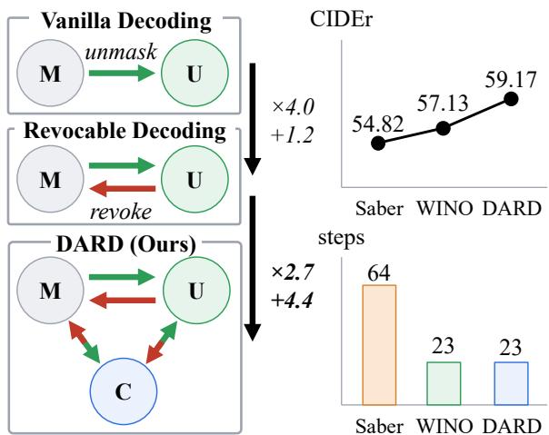  
Figure 1: Left: Comparison of decoding schemes. Vanilla dLLM decoding fixes tokens once unmasked, while revocable decoding allows them to be remasked. DARD introduces an intermediate C state to place unstable decoded tokens and regulate their contextual influence during verification. Right: By selectively using context, DARD mitigates verification errors arising from context instability, thereby reducing decoding steps while improving performance.

A well-known drawback of this approach is that the quality of generated text degrades sharply when the number of tokens decoded at each step increases (Kang et al., 2025). A key reason is that each masked position is predicted using only the context available at that step, without referencing the tokens predicted for other positions in the same step. As a result, tokens predicted from such limited context may turn out to be inconsistent with the context revealed in later steps. Once committed, these erroneous tokens keep providing misleading context for future predictions, propagating errors

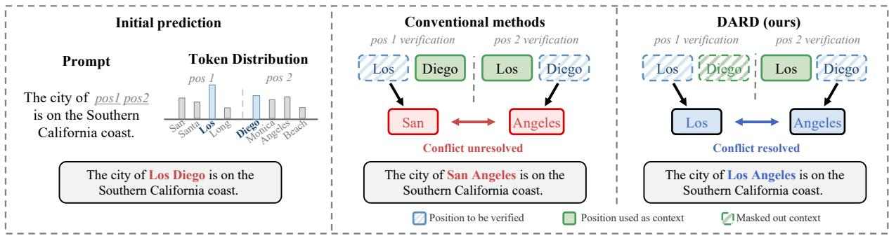  
Figure 2: Left: Parallel decoding predicts multiple token positions simultaneously, making it difficult to account for dependencies among tokens and potentially producing inconsistent predictions. Center: Conventional revocable methods verify tokens based on all decoded tokens, so inconsistent tokens may mislead verification. Right: DARD performs dependency-aware verification, where each token attends only to more reliable context tokens.

## throughout the generation process.

To address the problem, recent studies have explored revocable decoding strategies for dLLMs. Instead of treating decoded tokens as fixed ones after unmasking, these methods re-evaluate them using the updated context and then remask unreliable ones among them. For example, Saber (Dong et al., 2025) identifies suspicious tokens by tracking confidence drops across decoding steps, while WINO (Hong et al., 2025) uses an auxiliary verification path to re-evaluate decoded tokens and remask those with low confidence. These methods demonstrate improvements in the speed-quality trade-off in dLLMs to some extent.

Notwithstanding these benefits, existing revocable methods leave an important issue unresolved: erroneous tokens may also be used as context when verifying other tokens, which can undermine the reliability of the verification process. To illustrate the problem, we consider a scenario in which two masked positions are decoded in parallel (see Figure 2) (Song and Zhou, 2025). For the prompt “The city of \_ \_ is on the Southern California coast”, valid completions include “Los Angeles” and “San Diego”. Since the two positions are predicted within the same decoding step, the model may incorrectly generate “Los Diego”, where each token is locally plausible but the pair is invalid. Existing methods may fail to correct such errors because each token is verified independently while the other decoded token remains visible as context. For example, the model may re-evaluate “Los” as “San” with “Diego” as context, and “Diego” as “Angeles” with “Los” as context. These conflicting verification signals may lead the model to regard both positions as unreliable and remask them unnecessarily.

An aim of this paper is to propose a revocable decoding framework that mitigates verification errors caused by unreliable tokens. The core idea of the proposed method, dubbed Dependency-Aware Revocable Decoding (DARD), is to verify each token under a selective context that excludes unreliable tokens. To realize this idea, we introduce three token states: masked (M) for undecoded tokens, candidate (C) for decoded but uncertain tokens, and unmasked (U) for decoded tokens with high confidence (see Figure 1). By further distinguishing decoded tokens according to their reliability, DARD avoids treating uncertain tokens as fully reliable context during verification. Specifically, each C token attends only to more reliable tokens, i.e., all U tokens and higher-confidence C tokens. This design mimics confidence-ordered multi-step decoding, where higher-confidence candidates are treated as if they were decoded earlier and used as context for verification. Additionally, we leverage the verification results to estimate the reliability of the C set and adaptively control how strongly M tokens rely on C tokens during decoding.

Extensive experiments across 12 textual and multimodal benchmarks on 3 open-source dLLMs show that DARD consistently improves the speedquality Pareto frontier over recent revocable decoding methods. In particular, on Flickr30K (Young et al., 2014), DARD achieves a 2.71× speedup while improving CIDEr score by 4.35-points over Saber (Dong et al., 2025). These results demonstrate that a reliable verification context is a key ingredient for effective revocable decoding in dLLMs.

In summary, our contributions are as follows:

• In this work, we identify a previously overlooked failure mode in revocable decoding frameworks: unreliable tokens can contaminate the verification context, leading to persistent errors or unnecessary remasking.

• To mitigate verification errors, we propose DARD, a training-free revocable decoding framework that uses three token states to selectively control contextual dependencies among decoded tokens during verification.

• We show that DARD improves the speedquality Pareto frontier across 12 benchmarks and 3 representative open-source dLLMs, with additional ablations and case studies further validating its effectiveness and efficiency.

## 2 Related Work

## 2.1 Diffusion Large Language Models

Diffusion large language models (dLLMs) generate text by iteratively denoising masked sequences, which allows tokens to be generated in a flexible order and decoded in parallel. These capabilities have attracted growing interest and have been explored in commercial systems including Mercury, Gemini Diffusion, and Seed Diffusion (Khanna et al., 2025; Google DeepMind, 2025; Song et al., 2025). This interest has also extended to the opensource community. The LLaDA series has demonstrated the viability of large-scale native diffusion architectures trained from scratch, with later variants improving alignment and architectural efficiency (Nie et al., 2026; Zhu et al., 2025a,b). In parallel, autoregressive-to-diffusion approaches, such as DiffuLLaMA and Dream, adapt pretrained AR-LLMs into dLLMs to reduce training cost while preserving the parallel decoding capability of diffusion models (Gong et al., 2025; Ye et al., 2025b; Fu et al., 2025; Bie et al., 2025). Recent work has also extended dLLMs beyond language-only modeling to multimodal generation and understanding (Yang et al., 2026; Li et al., 2026; You et al., 2025). Despite these advances, dLLMs still suffer from a speed-quality trade-off during inference, motivating more effective decoding strategies.

## 2.2 dLLM Acceleration Techniques

A growing body of work has sought to accelerate dLLM inference without sacrificing generation quality. One line of work reduces per-step computation by adapting attention Key-Value (KV) caching to dLLMs. This adaptation is nontrivial because, in dLLMs, bidirectional attention causes KV states to change across denoising steps. Prior works address this issue through block-wise generation, approximate KV reuse, delayed caching, or pruning-based strategies (Arriola et al., 2025; Wu et al., 2025; Liu et al., 2025; Hu et al., 2025; Ma et al., 2026; Song et al., 2026). Another line of work reducing the number of denoising steps is to decode more tokens at each step. Some methods exploit modelinternal signals, such as confidence, entropy, or probability margins, to determine which tokens can be safely committed (Wu et al., 2025; Ben-Hamu et al., 2026; Li et al., 2025). Others learn decoding policies or improve token certainty through additional training (Bao et al., 2025; Chen et al., 2025). More recently, revocable decoding methods make decoding decisions revisable, aggressively decoding multiple tokens in parallel and remasking suspicious tokens after verification (Hong et al., 2025; Dong et al., 2025). Further discussion of concurrent work is provided in Appendix D.

## 3 Dependency-Aware Revocable Decoding

## 3.1 Preliminaries

Inference process in dLLMs. We consider absorbing dLLMs (Nie et al., 2026) parameterized by θ, which generate the target sequence $\mathbf { x } _ { T }$ by progressively denoising partially masked sequences $\mathbf { \bar { x } } _ { t } = ( x _ { t } ^ { 0 } , \dots , x _ { t } ^ { L - 1 } )$ over discrete timesteps $t \in$ $\{ 0 , \ldots , T - 1 \}$ . The decoding process starts from $\mathbf { x } _ { \mathrm { 0 } }$ , where $x _ { 0 } ^ { i } = [ \mathsf { M a s k } ]$ for all $i \in \{ 0 , \ldots , L - 1 \}$ At step t, the model estimates a categorical distribution $p _ { \theta }$ over the vocabulary V for each masked position $i \in \mathcal { M } _ { t }$ , where $\mathcal { M } _ { t } : = \{ i \ | \ x _ { t } ^ { i } = [ \mathsf { M a s k } ] \}$ We denote the resulting prediction and confidence by

$$
\begin{array} { r } { \hat { x } _ { t } ^ { i } = \arg \underset { v \in \mathcal { V } } { \operatorname* { m a x } } p _ { \theta } ( x _ { t + 1 } ^ { i } = v \mid \mathbf { x } _ { t } ) , } \\ { c _ { t } ^ { i } = p _ { \theta } ( x _ { t + 1 } ^ { i } = \hat { x } _ { t } ^ { i } \mid \mathbf { x } _ { t } ) . \quad } \end{array}\tag{1}
$$

Based on $c _ { t } ^ { i } .$ , we select a subset of masked positions and replace the token at each position i with $\hat { x } _ { t } ^ { i }$ to obtain $\mathbf { x } _ { t + 1 }$

Parallelized inference over distinct decoding contexts. In this work, we introduce a length-$L$ shadow sequence $\mathbf { s } _ { t } = ( s _ { t } ^ { 0 } , \ldots , s _ { t } ^ { L - 1 } )$ , which is fully masked throughout the decoding process (Hong et al., 2025). To parallelize token prediction and verification, we concatenate x with $\mathbf { s } _ { t }$ to form the augmented input $\tilde { \mathbf { x } } _ { t } = \left( \mathbf { x } _ { t } ; \mathbf { s } _ { t } \right)$ . For each position $i , x _ { t } ^ { i }$ and $s _ { t } ^ { i }$ share the same positional embedding, and the model produces two predictions, $p _ { \theta } ( x _ { t + 1 } ^ { i } \mid \tilde { \mathbf { x } } _ { t } )$ and $p _ { \theta } ( s _ { t + 1 } ^ { i } \mid \tilde { \mathbf { x } } _ { t } )$ , respectively.

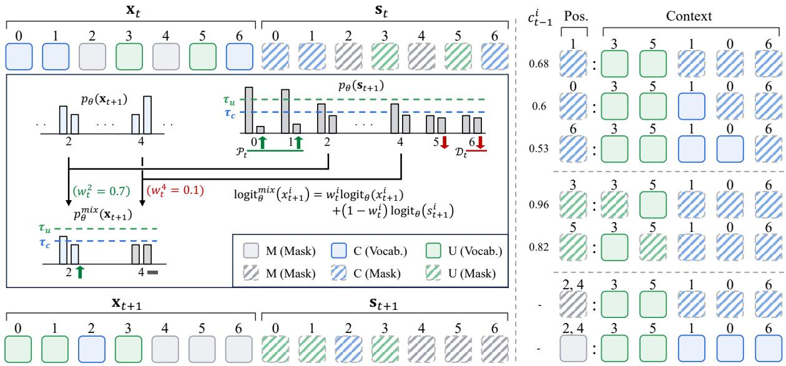  
Figure 3: Overview of DARD. DARD verifies tokens using state-specific contexts defined according to token reliability and updates their states at the next decoding step. Based on the verification outcomes, DARD estimates the reliability of C tokens and adaptively controls their contribution to M token prediction.

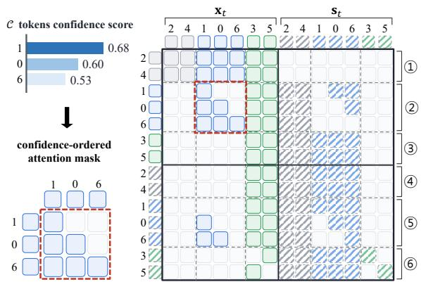  
Figure 4: Attention mask design of DARD. Rows correspond to queries, and columns correspond to keys. DARD uses state-specific attention masks to construct different verification contexts for different token states.

To condition these predictions on distinct contexts, we apply a binary attention mask $M \in$ $\{ 0 , 1 \} ^ { 2 L \times 2 L }$ over $\tilde { \mathbf { x } } _ { t } ,$ where $M _ { i j } ~ = ~ 0$ indicates that attention from query position i to key position j is blocked. Let ${ \bar { j } } : = L + j$ denote the shadow position in $\tilde { \mathbf { x } } _ { t }$ corresponding to original position $j .$ For each query position i, the mask satisfies

$$
M _ { i j } + M _ { i { \bar { j } } } = 1 .\tag{2}
$$

This constraint ensures that queries in both the original and shadow sequences attend to exactly one of $\boldsymbol { x } _ { t } ^ { j }$ and $s _ { t } ^ { j }$ at every position j. The original and

shadow queries can therefore be conditioned on different contexts and computed in parallel within a single forward pass.

## 3.2 State-Specific Prediction and Verification

Overall decoding procedure. Our decoding procedure is designed to fully leverage information from all decoded tokens while reducing the risk of using incorrectly decoded tokens as conditioning context. Accordingly, we introduce a candidate (C) state between the conventional masked (M) and unmasked (U) states so that the model can verify uncertain tokens separately and selectively use them as conditioning context. The decoding process starts with all tokens assigned to the M state. At each step t, the model determines each token’s state by comparing its confidence $c _ { t } ^ { i }$ with the thresholds $\tau _ { c }$ and $\tau _ { u }$ , as specified in Equation 8. Based on these states, the model verifies C and U tokens using predictions from the shadow sequence. For M tokens, the model combines predictions from the original and shadow sequences. The overall decoding procedure of our method is illustrated in Figure 3.

Verification of U tokens with reliable context. In our framework, the U state represents decoded token positions that are currently considered reliable, where $\mathcal { U } _ { t } : = \{ i \mid x _ { t } ^ { i } \neq$ [Mask], $\tau _ { \mathrm { u } } < c _ { t - 1 } ^ { i } \}$ During the verification of $\mathcal { U } _ { t }$ tokens, we restrict their conditioning context to tokens currently considered reliable. Specifically, U -token queries attend to the keys of $\mathcal { U } _ { t }$ tokens in the original sequence $\mathbf { x } _ { t }$ . These queries attend to the keys of $\mathcal { M } _ { t }$ and $\mathcal { C } _ { t }$ tokens in the shadow sequence $\mathbf { s } _ { t }$ (query blocks 3 and $\textcircled{6}$ in Figure 4). For each query of $s _ { t } ^ { i } .$ we block attention to the corresponding key of $\ v { x } _ { t } ^ { i }$ to prevent information leakage from the decoded token at the same position. Although verification relies only on $p _ { \theta } ( s _ { t + 1 } ^ { i } \mid \tilde { \mathbf { x } } _ { t } )$ , we apply the same attention pattern to the original sequence queries because their intermediate representations serve as keys in subsequent layers. This design excludes relatively uncertain $\mathcal { C } _ { t }$ tokens from the conditioning context, thereby preventing them from contaminating the verification results.

Verification of C tokens with confidence-ordered context. We define $\mathcal { C } _ { t } : = \{ i \vert x _ { t } ^ { i } \neq$ [Mask], $\tau _ { \mathrm { c } } <$ $c _ { t - 1 } ^ { i } \leq \tau _ { \mathrm { u } } \}$ as the set of decoded positions that require further verification before serving as reliable context. Our use of confidence to order tokens in $\mathcal { C } _ { t }$ is motivated by prior work that treats confidence as a proxy for token reliability during decoding (Kim et al., 2025; Wu et al., 2025). Since tokens in $\mathcal { C } _ { t }$ have relatively low model confidence, using them indiscriminately as context for other tokens may compromise verification reliability. To avoid this contamination, we apply a confidence-ordered attention mask that blocks information flow from lower-confidence tokens to higher-confidence tokens:

$$
M _ { i j } = \left\{ { \begin{array} { l l } { 1 , } & { { \mathrm { i f } } \ : c _ { t - 1 } ^ { i } \leq c _ { t - 1 } ^ { j } , } \\ { 0 , } & { { \mathrm { i f } } \ : c _ { t - 1 } ^ { i } > c _ { t - 1 } ^ { j } , } \end{array} } \right. \quad i , j \in { \mathcal { C } } _ { t } .\tag{3}
$$

In addition to attending to the keys of $\mathcal { U } _ { t }$ tokens in $\mathbf { x } _ { t } , \mathcal { C } _ { t ^ { - } } \mathrm { t o k e n }$ queries in both $\mathbf { x } _ { t }$ and $\mathbf { s } _ { t }$ attend only to the keys of higher-confidence $\mathcal { C } _ { t }$ tokens in $\mathbf { x } _ { t }$ (query blocks $\textcircled{2}$ and 5 in Figure 4).

This masking rule can also be interpreted in an autoregressive-like manner, where inter-token dependencies are ordered by confidence rather than by left-to-right position (see Appendix E for details):

$$
p _ { \theta } \big ( s _ { t + 1 } ^ { \pi _ { t } ( k ) } \vert \tilde { \mathbf { x } } _ { t } ; M \big ) \approx p _ { \theta } \big ( s _ { t + 1 } ^ { \pi _ { t } ( k ) } \vert \hat { x } _ { t } ^ { \pi _ { t } ( 1 : k - 1 ) } , \hat { x } _ { t } ^ { \mathcal { U } _ { t } } \big ) ,\tag{4}
$$

for $k = 1 , \dots , | \mathcal { C } _ { t } |$ , where $\pi _ { t } ( k )$ denotes the $k \mathrm { - }$ th position in $\mathcal { C } _ { t }$ under descending confidence order. The underlying motivation is to approximate confidence-ordered multi-step decoding, in which higher-confidence $\mathcal { C } _ { t }$ tokens are decoded earlier and subsequently provide context for lower-confidence tokens. Appendix C.2 shows that this ordering closely aligns with the confidence-based decoding trajectory.

Adaptive prediction of M tokens based on verification results. For each masked position $i \in \mathcal { M } _ { t }$ $( \mathrm { i . e . , } c _ { t - 1 } ^ { i } \leq \tau _ { \mathrm { c } } )$ , the model uses predictions from both $\mathbf { x } _ { t }$ and $\mathbf { s } _ { t }$ . We apply different attention masks for the two predictions so that they complement each other in both cases: when $\mathcal { C } _ { t }$ tokens serve as reliable context and when they serve as misleading context. Specifically, $\mathcal { M } _ { t }$ -token queries in $\mathbf { x } _ { t }$ attend to the keys of $\mathcal { C } _ { t }$ and $\mathcal { U } _ { t }$ tokens in $\mathbf { x } _ { t }$ . The corresponding queries in $\mathbf { s } _ { t }$ attend to the keys of $\mathcal { U } _ { t }$ tokens in $\mathbf { x } _ { t }$ and of $\mathcal { C } _ { t }$ tokens in $\mathbf { s } _ { t }$ , regarding $\mathcal { C } _ { t }$ as masked tokens (query blocks $\textcircled{1}$ and 4 in Figure 4).

We adaptively combine the two predictions based on the verification results of tokens in $\mathcal { C } _ { t }$ Let $\mathcal { P } _ { t }$ denote the positions in $\mathcal { C } _ { t }$ that are promoted to $\mathcal { U } _ { t + 1 }$ , and let $\mathcal { D } _ { t }$ denote those that are demoted to $\mathcal { M } _ { t + 1 }$ . For each position $i \in \mathcal { M } _ { t } .$ , we compute two distance-weighted scores:

$$
P _ { t } ^ { i } = \sum _ { j \in \mathcal { P } _ { t } } K ( i , j ) , \quad D _ { t } ^ { i } = \sum _ { j \in \mathcal { D } _ { t } } K ( i , j ) ,\tag{5}
$$

where $K ( i , j ) = \lambda ^ { | i - j | }$ is a geometric kernel function with $0 < \lambda < 1$ , so that the influence of each verification outcome decreases with its distance from position i (Ye et al., 2025b). The guidance weight $w _ { t } ^ { i }$ for each position i is then defined as

$$
w _ { t } ^ { i } = \frac { P _ { t } ^ { i } + p _ { 0 } } { P _ { t } ^ { i } + D _ { t } ^ { i } + p _ { 0 } } ,\tag{6}
$$

where $p _ { 0 }$ is the prior constant stabilizing the weight when only a few state changes occur (Manning et al., 2008). Thus, $w _ { t } ^ { i }$ increases when nearby $\mathcal { C } _ { t }$ tokens are predominantly promoted rather than demoted, thereby assigning greater weight to the prediction conditioned on $\mathcal { C } _ { t }$ . Using this weight, we combine the two predictions for each $i \in \mathcal { M } _ { t }$ as follows:

$$
\begin{array} { r l } & { \log \mathrm { i } \mathrm { t } _ { \boldsymbol { \theta } } ^ { m i x } ( x _ { t + 1 } ^ { i } \mid \tilde { \mathbf { x } } _ { t } ; M ) } \\ & { \qquad = w _ { t } ^ { i } \log \mathrm { i } \mathrm { t } _ { \boldsymbol { \theta } } ( x _ { t + 1 } ^ { i } \mid \tilde { \mathbf { x } } _ { t } ; M ) } \\ & { \qquad + \left( 1 - w _ { t } ^ { i } \right) \log \mathrm { i } \mathrm { t } _ { \boldsymbol { \theta } } ( s _ { t + 1 } ^ { i } \mid \tilde { \mathbf { x } } _ { t } ; M ) , } \end{array}\tag{7}
$$

where $\log \mathrm { i t } _ { \theta } ( \cdot )$ denotes the scores before normalization into $p _ { \theta } ( \cdot )$

State transition. We formulate decoding as a three-state transition system over token positions. Given the confidence score $c _ { t } ^ { i } ,$ the state of each

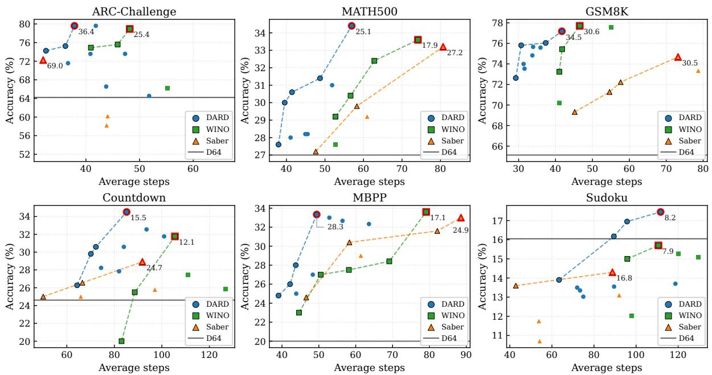  
Figure 5: LLaDA-8B-Instruct results on six language benchmarks. Each plot compares task performance against the average number of decoding steps for each method. Dashed curves indicate the Pareto frontier for each method. For each method, the best-performing configuration is highlighted with a red outline, and its TPS is annotated next to the point. Horizontal lines show the performance of standard LLaDA decoding with 64 steps.

position i is updated according to the following rule:

$$
\begin{array} { r l r } { i } & { { }  } & { \{ \begin{array} { l l } { { \mathcal N } _ { t + 1 } , } & { c _ { t } ^ { i } \leq \tau _ { \mathrm { c } } , } \\ { c _ { t + 1 } , } & { \tau _ { \mathrm { c } } < c _ { t } ^ { i } \leq \tau _ { \mathrm { u } } , } \\ { { \mathcal U } _ { t + 1 } , } & { \tau _ { \mathrm { u } } < c _ { t } ^ { i } , } \end{array}  } \end{array}\tag{8}
$$

where $\tau _ { \mathrm { c } } ~ \leq ~ \tau _ { \mathrm { u } }$ . Based on this assignment, positions in $\mathcal { M } _ { t + 1 }$ are set to [Mask], while positions in $\mathcal { C } _ { t + 1 } \cup \mathcal { U } _ { t + 1 }$ are replaced with their corresponding predictions $\hat { x } _ { t } ^ { i } .$ . The overall procedure is summarized in Algorithm 1.

## 4 Experiments

## 4.1 Experiment Setup

Evaluation Details. We evaluate the language benchmarks following the protocol of WINO (Hong et al., 2025), while all visionlanguage benchmarks are evaluated using the lmms-eval package (Zhang et al., 2025). All benchmarks are evaluated in a zero-shot setting, except for Sudoku (Ye et al., 2025a), where we use a 4-shot setting. For task performance, we report accuracy for all benchmarks except Flickr30K (Young et al., 2014), for which we report CIDEr. For MBPP (Austin et al., 2021), we measure accuracy by pass@1 functional correctness, while for Sudoku, we use cell-level partial-credit accuracy. We evaluate MathVista (Lu et al., 2024) and MathVision (Wang et al., 2024) using rule-based answer matching. To evaluate inference efficiency, we report the average number of decoding steps per sample and the throughput measured in tokens per second (TPS). Additional details on datasets, baselines, and implementation are provided in Appendix A.

## 4.2 Main Results

We report Pareto curves of task performance versus the average number of decoding steps. Each point represents a decoding configuration, and points closer to the upper-left indicate better speed-quality trade-offs; dashed lines indicate the Pareto frontier of each method.

Language Benchmarks. Figure 5 shows the speed-quality trade-off on six language benchmarks using LLaDA-8B-Instruct (Nie et al., 2026). Across the benchmarks, DARD generally achieves a more favorable Pareto frontier than WINO (Hong et al., 2025) and Saber (Dong et al., 2025), attaining comparable or higher performance with fewer decoding steps. Notably, DARD also performs well on task-specific benchmarks such as Countdown (Gandhi et al., 2024) and Sudoku (Ye et al., 2025a), suggesting that dependency-aware verification remains effective even under structured reasoning and strict-format requirements. On MBPP (Austin et al., 2021) and GSM8K (Cobbe et al., 2021), although DARD shows a slight performance drop, it achieves similar performance with substantially fewer decoding steps. Overall, these results demonstrate that DARD improves the speedquality trade-off across diverse language tasks. Additional results on LLaDA-1.5 (Zhu et al., 2025a) are provided in Appendix B.1.

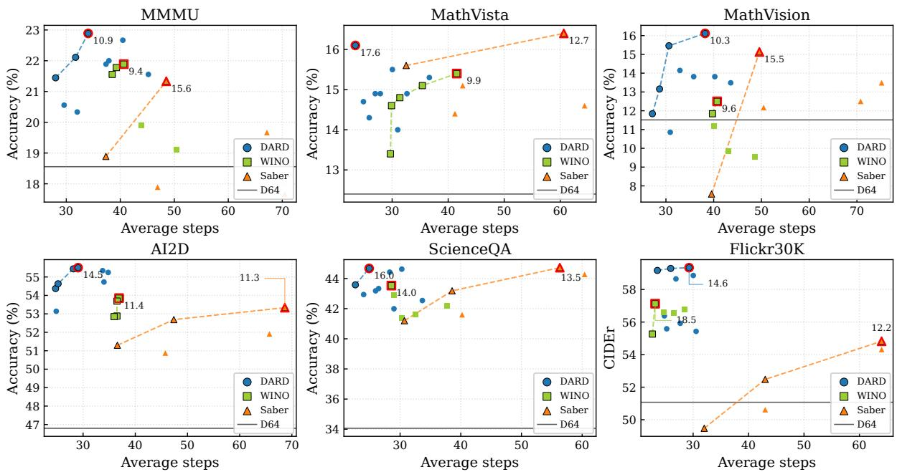  
Figure 6: MMaDA-8B-MixCoT results on six vision-language benchmarks. Each plot compares task performance against the average number of decoding steps for each method. Dashed curves indicate the Pareto frontier for each method. For each method, the best-performing configuration is highlighted with a red outline, and its TPS is annotated next to the point. Horizontal lines show the performance of standard MMaDA decoding with 64 steps.

Vision-Language Benchmarks. Figure 6 shows the speed-quality trade-off on six vision-language benchmarks using MMaDA-8B-MixCoT (Yang et al., 2026). DARD achieves a better Pareto frontier than recent revocable decoding methods across most benchmarks, showing higher performance with fewer decoding steps. Notably, compared with Saber, DARD reduces the step count by more than 2× while improving Flickr30K (Young et al., 2014) by over 4 CIDEr points and AI2D (Kembhavi et al., 2016) by over 2 accuracy points.

## 5 Analysis

Unless otherwise specified, all analyses are conducted on the MATH500 benchmark using the LLaDA-Instruct 8B model. We use the decoding configuration that achieves the highest accuracy in our main experiments as the default setting.

## 5.1 Analysis of DARD Design Choice

Attention mask design. We analyze how the attention mask design affects the verification of tokens in C within DARD. We first report the evaluation results using a bidirectional mask, where candidate tokens can attend to each other without any directional constraint. In addition, we evaluate three alternative ordering strategies: two commonly used criteria in dLLMs decoding, namely entropy and margin (Sahoo et al., 2024), and the left-toright (l2r) order used in AR-LLMs.

As shown in Table 1, applying a bidirectional mask reduces decoding steps by only 0.8, while causing a substantial accuracy drop of 3.2 percentage points. This result suggests that allowing uncertain candidate tokens to freely interact with one another can make verification unstable, despite slightly improving decoding efficiency. In contrast, the ordering-based variants achieve comparable decoding efficiency, while our confidence-based ordering maintains substantially higher accuracy. This demonstrates the effectiveness of our proposed confidence-based ordering strategy.

Adaptive logit mixing. We analyze the effect of adaptive logit mixing in DARD. The logits from st are computed from positions that do not attend to the context of the C tokens, whereas those from $\mathbf { x } _ { t }$ fully leverage this context. To examine how this contextual difference affects maskedtoken prediction, we evaluate three fixed weights, $w \in \{ 0 . 0 , 0 . 5 , 1 . 0 \}$ , where $w = 0 . 0$ completely excludes the C token context, while w = 1.0 fully incorporates it.

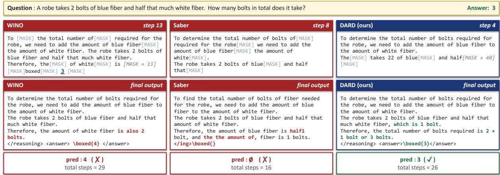  
Figure 7: Qualitative comparison of DARD with conventional revocable decoding methods on GSM8K.

<table><tr><td>Method</td><td>Acc. (%) ∆ Acc. (%)</td><td></td><td>Steps ∆ Steps</td></tr><tr><td>Saber</td><td>33.2</td><td>81.0</td><td></td></tr><tr><td>DARDbidir</td><td>31.4</td><td>-1.8 58.5</td><td>-22.5</td></tr><tr><td>DARD12r</td><td>32.0</td><td>-1.2</td><td>59.3 -21.7</td></tr><tr><td>DARDentropy</td><td>33.2</td><td>+0.0</td><td>59.1 -21.9</td></tr><tr><td>DARDmargin</td><td>34.2</td><td>+1.0</td><td>59.3 -21.7</td></tr><tr><td>DARD (ours)</td><td>34.6</td><td>+1.4</td><td>59.3 -21.7</td></tr></table>

Table 1: Analysis of attention mask design on DARD. ∆ Acc. and $\Delta$ Steps are computed relative to Saber.

<table><tr><td>Method</td><td>Acc. (%) ∆ Acc. (%) Steps ∆ Steps</td><td></td><td></td></tr><tr><td>Saber</td><td>33.2</td><td>81.0</td><td></td></tr><tr><td>DARD (w = 0.0)</td><td>29.2</td><td>-4.0</td><td>82.0 +1.0</td></tr><tr><td>DARD (w = 0.5)</td><td>31.1</td><td>-2.1</td><td>63.6 -17.4</td></tr><tr><td>DARD (w = 1.0)</td><td>33.4</td><td>+0.2 57.1</td><td>-23.9</td></tr><tr><td>DARD (ours)</td><td>34.6</td><td>+1.4</td><td>59.3 -21.7</td></tr></table>

Table 2: Analysis of logit mixing strategy in DARD. ∆ Acc. and $\Delta$ Steps are computed relative to Saber.

As shown in Table 2, fully leveraging the C token context $( w = 1 . 0 )$ achieves the fewest decoding steps, indicating that such contextual information helps accelerate subsequent decoding. However, our logit mixing achieves higher accuracy with only a slight increase in decoding steps. This demonstrates the benefit of adaptively controlling the contribution of the $\mathcal { C }$ token context during mask prediction.

<table><tr><td>Gen. Len.</td><td>Block Len.</td><td>Acc. (%)</td><td>Steps</td></tr><tr><td>128</td><td>128</td><td>22.0</td><td>38.9</td></tr><tr><td>128</td><td>64</td><td>27.0</td><td>37.1</td></tr><tr><td>256</td><td>256</td><td>22.4</td><td>62.2</td></tr><tr><td>256</td><td>128 (ours)</td><td>34.6</td><td>59.3</td></tr><tr><td>256</td><td>64</td><td>32.6</td><td>61.4</td></tr></table>

Table 3: Ablation of generation length and block length in DARD.

## 5.2 Ablation of Generation Configuration

We further analyze DARD with varying generation lengths and block lengths. The results in Table 3 show that DARD remains stable across different configurations, indicating that the method is robust to these generation configurations.

## 5.3 Qualitative Examples

We provide qualitative examples comparing DARD with other methods. As shown in Figure 7, WINO, which allows bidirectional attention among all tokens during verification, revises an initially correct answer into an incorrect one by following an erroneous reasoning path in later steps. In the case of Saber, early incorrect tokens are not properly corrected, and the accumulated errors lead to unreliable subsequent token generation. In contrast, DARD performs verification in confidence order, leading to a more reliable refinement of the reasoning path toward the correct answer.

## 6 Conclusion

In this paper, we examine a failure mode in revocable decoding for dLLMs. We observe that incorrectly decoded tokens can distort the context used for verification, leading to incorrect remasking decisions. To overcome this limitation, we introduce DARD, a training-free three-state revocable decoding framework that separates decoded tokens according to their confidence. By decoupling the decoding and verification processes for different states, DARD enables more robust verification without additional training. Experiments on 6 textual and 6 multimodal benchmarks across three open-source dLLMs show that DARD consistently improves the Pareto frontier of the speed– quality trade-off over recent revocable decoding baselines. These results highlight the importance of controlling the verification context for reliable and efficient parallel decoding in dLLMs.

## Limitations

Our results show that DARD consistently improves the speed–quality trade-off over recent revocable decoding baselines across diverse benchmarks. At the same time, the absolute performance gain remains moderate. This is partly because our goal is not to alter the model distribution, but to improve sequence-level consistency by reusing the original dLLM prediction behavior. In this sense, DARD is designed to enhance decoding reliability while preserving the base model’s generation quality. In addition, DARD introduces additional per-step computation through the augmented shadow sequence and state-specific attention masks. This overhead is small in practice, especially with block decoding, but more optimized implementations could further reduce the runtime cost.

## References

Josh Achiam, Steven Adler, Sandhini Agarwal, Lama Ahmad, Ilge Akkaya, Florencia Leoni Aleman, Diogo Almeida, Janko Altenschmidt, Sam Altman, Shyamal Anadkat, and 1 others. 2023. Gpt-4 technical report. arXiv preprint arXiv:2303.08774.

Marianne Arriola, Aaron Gokaslan, Justin Chiu, Zhihan Yang, Zhixuan Qi, Jiaqi Han, Subham Sahoo, and Volodymyr Kuleshov. 2025. Block diffusion: Interpolating between autoregressive and diffusion language models. In International Conference on Learning Representations, volume 2025, pages 50726–50753.

Jacob Austin, Augustus Odena, Maxwell Nye, Maarten Bosma, Henryk Michalewski, David Dohan, Ellen Jiang, Carrie Cai, Michael Terry, Quoc Le, and 1 others. 2021. Program synthesis with large language models. arXiv preprint arXiv:2108.07732.

Wenrui Bao, Zhiben Chen, Dan Xu, and Yuzhang Shang. 2025. Learning to parallel: Accelerating diffusion

large language models via learnable parallel decoding. arXiv preprint arXiv:2509.25188.

Heli Ben-Hamu, Itai Gat, Daniel Severo, Niklas S Nolte, and Brian Karrer. 2026. Accelerated sampling from masked diffusion models via entropy bounded unmasking. Advances in Neural Information Processing Systems, 38:55981–56007.

Tiwei Bie, Maosong Cao, Kun Chen, Lun Du, Mingliang Gong, Zhuochen Gong, Yanmei Gu, Jiaqi Hu, Zenan Huang, Zhenzhong Lan, and 1 others. 2025. Llada2. 0: Scaling up diffusion language models to 100b. arXiv preprint arXiv:2512.15745.

Zigeng Chen, Gongfan Fang, Xinyin Ma, Ruonan Yu, and Xinchao Wang. 2025. dparallel: Learnable parallel decoding for dllms. arXiv preprint arXiv:2509.26488.

Peter Clark, Isaac Cowhey, Oren Etzioni, Tushar Khot, Ashish Sabharwal, Carissa Schoenick, and Oyvind Tafjord. 2018. Think you have solved question answering? try arc, the ai2 reasoning challenge. arXiv preprint arXiv:1803.05457.

Karl Cobbe, Vineet Kosaraju, Mohammad Bavarian, Mark Chen, Heewoo Jun, Lukasz Kaiser, Matthias Plappert, Jerry Tworek, Jacob Hilton, Reiichiro Nakano, and 1 others. 2021. Training verifiers to solve math word problems. arXiv preprint arXiv:2110.14168.

Yihong Dong, Zhaoyu Ma, Xue Jiang, Zhiyuan Fan, Jiaru Qian, Yongmin Li, Jianha Xiao, Zhi Jin, Rongyu Cao, Binhua Li, and 1 others. 2025. Saber: An efficient sampling with adaptive acceleration and backtracking enhanced remasking for diffusion language model. arXiv preprint arXiv:2510.18165.

Xingyu Fu, Yushi Hu, Bangzheng Li, Yu Feng, Haoyu Wang, Xudong Lin, Dan Roth, Noah A Smith, Wei-Chiu Ma, and Ranjay Krishna. 2024. Blink: Multimodal large language models can see but not perceive. In European Conference on Computer Vision, pages 148–166. Springer.

Yonggan Fu, Lexington Whalen, Zhifan Ye, Xin Dong, Shizhe Diao, Jingyu Liu, Chengyue Wu, Hao Zhang, Enze Xie, Song Han, and 1 others. 2025. Efficientdlm: From autoregressive to diffusion language models, and beyond in speed. arXiv preprint arXiv:2512.14067.

Kanishk Gandhi, Denise Lee, Gabriel Grand, Muxin Liu, Winson Cheng, Archit Sharma, and Noah D Goodman. 2024. Stream of search (sos): Learning to search in language. arXiv preprint arXiv:2404.03683.

Shansan Gong, Shivam Agarwal, Yizhe Zhang, Jiacheng Ye, Lin Zheng, Mukai Li, Chenxin An, Peilin Zhao, Wei Bi, Jiawei Han, and 1 others. 2025. Scaling diffusion language models via adaptation from autoregressive models. In International Conference on Learning Representations, volume 2025, pages 5046–5073.

Google DeepMind. 2025. Gemini diffusion. https:// deepmind.google/models/gemini-diffusion/.

Dan Hendrycks, Collin Burns, Saurav Kadavath, Akul Arora, Steven Basart, Eric Tang, Dawn Song, and Jacob Steinhardt. 2021. Measuring mathematical problem solving with the math dataset. arXiv preprint arXiv:2103.03874.

Feng Hong, Geng Yu, Yushi Ye, Haicheng Huang, Huangjie Zheng, Ya Zhang, Yanfeng Wang, and Jiangchao Yao. 2025. Wide-in, narrow-out: Revokable decoding for efficient and effective dllms. arXiv preprint arXiv:2507.18578.

Zhanqiu Hu, Jian Meng, Yash Akhauri, Mohamed S Abdelfattah, Jae-sun Seo, Zhiru Zhang, and Udit Gupta. 2025. Flashdlm: Accelerating diffusion language model inference via efficient kv caching and guided diffusion. arXiv preprint arXiv:2505.21467.

Jie Huang, Xinyun Chen, Swaroop Mishra, Huaixiu Steven Zheng, Adams Yu, Xinying Song, and Denny Zhou. 2024. Large language models cannot self-correct reasoning yet. In International conference on learning representations, volume 2024, pages 32808–32824.

Wonjun Kang, Kevin Galim, Seunghyuk Oh, Minjae Lee, Yuchen Zeng, Shuibai Zhang, Coleman Hooper, Yuezhou Hu, Hyung Il Koo, Nam Ik Cho, and 1 others. 2025. Parallelbench: Understanding the tradeoffs of parallel decoding in diffusion llms. arXiv preprint arXiv:2510.04767.

Aniruddha Kembhavi, Mike Salvato, Eric Kolve, Minjoon Seo, Hannaneh Hajishirzi, and Ali Farhadi. 2016. A diagram is worth a dozen images. In European conference on computer vision, pages 235–251. Springer.

Samar Khanna, Siddhant Kharbanda, Shufan Li, Harshit Varma, Eric Wang, Sawyer Birnbaum, Ziyang Luo, Yanis Miraoui, Akash Palrecha, Stefano Ermon, and 1 others. 2025. Mercury: Ultra-fast language models based on diffusion. arXiv e-prints, pages arXiv– 2506.

Bumjun Kim, Dongjae Jeon, Moongyu Jeon, and Albert No. 2026. Dapd: Dependency-aware parallel decoding via attention for diffusion llms. arXiv preprint arXiv:2603.12996.

Jaeyeon Kim, Kulin Shah, Vasilis Kontonis, Sham Kakade, and Sitan Chen. 2025. Train for the worst, plan for the best: Understanding token ordering in masked diffusions. arXiv preprint arXiv:2502.06768.

Pengxiang Li, Yefan Zhou, Dilxat Muhtar, Lu Yin, Shilin Yan, Li Shen, Soroush Vosoughi, and Shiwei Liu. 2025. Diffusion language models know the answer before decoding. arXiv preprint arXiv:2508.19982.

Shufan Li, Konstantinos Kallidromitis, Hritik Bansal, Akash Gokul, Yusuke Kato, Kazuki Kozuka, Jason Kuen, Zhe Lin, Kai-Wei Chang, and Aditya Grover. 2026. Lavida: A large diffusion language model for multimodal understanding. Advances in Neural Information Processing Systems, 38:105101–105134.

Hunter Lightman, Vineet Kosaraju, Yura Burda, Harri Edwards, Bowen Baker, Teddy Lee, Jan Leike, John Schulman, Ilya Sutskever, and Karl Cobbe. 2023. Let’s verify step by step, 2023. URL https://arxiv.org/abs/2305.20050, 17.

Aixin Liu, Bei Feng, Bing Xue, Bingxuan Wang, Bochao Wu, Chengda Lu, Chenggang Zhao, Chengqi Deng, Chenyu Zhang, Chong Ruan, and 1 others. 2024. Deepseek-v3 technical report. arXiv preprint arXiv:2412.19437.

Zhiyuan Liu, Yicun Yang, Yaojie Zhang, Junjie Chen, Chang Zou, Qingyuan Wei, Shaobo Wang, and Linfeng Zhang. 2025. dllm-cache: Accelerating diffusion large language models with adaptive caching. arXiv preprint arXiv:2506.06295.

Aaron Lou, Chenlin Meng, and Stefano Ermon. 2023. Discrete diffusion modeling by estimating the ratios of the data distribution. arXiv preprint arXiv:2310.16834.

Pan Lu, Hritik Bansal, Tony Xia, Jiacheng Liu, Chunyuan Li, Hannaneh Hajishirzi, Hao Cheng, Kai-Wei Chang, Michel Galley, and Jianfeng Gao. 2024. Mathvista: Evaluating mathematical reasoning of foundation models in visual contexts. In International Conference on Learning Representations, volume 2024, pages 23439–23554.

Pan Lu, Swaroop Mishra, Tanglin Xia, Liang Qiu, Kai-Wei Chang, Song-Chun Zhu, Oyvind Tafjord, Peter Clark, and Ashwin Kalyan. 2022. Learn to explain: Multimodal reasoning via thought chains for science question answering. Advances in neural information processing systems, 35:2507–2521.

Xinyin Ma, Runpeng Yu, Gongfan Fang, and Xinchao Wang. 2026. dkv-cache: The cache for diffusion language models. Advances in Neural Information Processing Systems, 38:149009–149033.

Aman Madaan, Niket Tandon, Prakhar Gupta, Skyler Hallinan, Luyu Gao, Sarah Wiegreffe, Uri Alon, Nouha Dziri, Shrimai Prabhumoye, Yiming Yang, and 1 others. 2023. Self-refine: Iterative refinement with self-feedback. Advances in neural information processing systems, 36:46534–46594.

Christopher D. Manning, Prabhakar Raghavan, and Hinrich Schütze. 2008. Introduction to Information Retrieval. Cambridge University Press.

Shen Nie, Fengqi Zhu, Zebin You, Xiaolu Zhang, Jingyang Ou, Jun Hu, Jun Zhou, Yankai Lin, Ji-Rong Wen, and Chongxuan Li. 2026. Large language diffusion models. Advances in Neural Information Processing Systems, 38:50608–50646.

Team Olmo, Allyson Ettinger, Amanda Bertsch, Bailey Kuehl, David Graham, David Heineman, Dirk Groeneveld, Faeze Brahman, Finbarr Timbers, Hamish Ivison, and 1 others. 2025. Olmo 3. arXiv preprint arXiv:2512.13961.

Jingyang Ou, Shen Nie, Kaiwen Xue, Fengqi Zhu, Jiacheng Sun, Zhenguo Li, and Chongxuan Li. 2025. Your absorbing discrete diffusion secretly models the conditional distributions of clean data. In International Conference on Learning Representations, volume 2025, pages 64972–65009.

Subham S Sahoo, Marianne Arriola, Yair Schiff, Aaron Gokaslan, Edgar Marroquin, Justin T Chiu, Alexander Rush, and Volodymyr Kuleshov. 2024. Simple and effective masked diffusion language models. Advances in Neural Information Processing Systems, 37:130136–130184.

Jiaming Song and Linqi Zhou. 2025. Ideas in inferencetime scaling can benefit generative pre-training algorithms. arXiv preprint arXiv:2503.07154.

Yuerong Song, Xiaoran Liu, Ruixiao Li, Zhigeng Liu, Zengfeng Huang, Qipeng Guo, Ziwei He, and Xipeng Qiu. 2026. Sparse-dllm: Accelerating diffusion llms with dynamic cache eviction. In Proceedings of the AAAI Conference on Artificial Intelligence, volume 40, pages 33038–33046.

Yuxuan Song, Zheng Zhang, Cheng Luo, Pengyang Gao, Fan Xia, Hao Luo, Zheng Li, Yuehang Yang, Hongli Yu, Xingwei Qu, and 1 others. 2025. Seed diffusion: A large-scale diffusion language model with highspeed inference. arXiv preprint arXiv:2508.02193.

Gemma Team, Morgane Riviere, Shreya Pathak, Pier Giuseppe Sessa, Cassidy Hardin, Surya Bhupatiraju, Léonard Hussenot, Thomas Mesnard, Bobak Shahriari, Alexandre Ramé, and 1 others. 2024. Gemma 2: Improving open language models at a practical size. arXiv preprint arXiv:2408.00118.

Shengbang Tong, Zhuang Liu, Yuexiang Zhai, Yi Ma, Yann LeCun, and Saining Xie. 2024. Eyes wide shut? exploring the visual shortcomings of multimodal llms. In 2024 IEEE/CVF Conference on Computer Vision and Pattern Recognition (CVPR), pages 9568–9578. IEEE.

Ke Wang, Junting Pan, Weikang Shi, Zimu Lu, Houxing Ren, Aojun Zhou, Mingjie Zhan, and Hongsheng Li. 2024. Measuring multimodal mathematical reasoning with math-vision dataset. Advances in Neural Information Processing Systems, 37:95095–95169.

Wenbin Wang, Liang Ding, Minyan Zeng, Xiabin Zhou, Li Shen, Yong Luo, Wei Yu, and Dacheng Tao. 2025. Divide, conquer and combine: A training-free framework for high-resolution image perception in multimodal large language models. In Proceedings of the AAAI Conference on Artificial Intelligence, volume 39, pages 7907–7915.

Chengyue Wu, Hao Zhang, Shuchen Xue, Zhijian Liu, Shizhe Diao, Ligeng Zhu, Ping Luo, Song Han, and Enze Xie. 2025. Fast-dllm: Training-free acceleration of diffusion llm by enabling kv cache and parallel decoding. arXiv preprint arXiv:2505.22618.

An Yang, Anfeng Li, Baosong Yang, Beichen Zhang, Binyuan Hui, Bo Zheng, Bowen Yu, Chang Gao, Chengen Huang, Chenxu Lv, and 1 others. 2025. Qwen3 technical report. arXiv preprint arXiv:2505.09388.

Ling Yang, Ye Tian, Bowen Li, Xinchen Zhang, Ke Shen, Yunhai Tong, and Mengdi Wang. 2026. Mmada: Multimodal large diffusion language models. Advances in Neural Information Processing Systems, 38:138867–138907.

Jiacheng Ye, Jiahui Gao, Shansan Gong, Lin Zheng, Xin Jiang, Zhenguo Li, and Lingpeng Kong. 2025a. Beyond autoregression: Discrete diffusion for complex reasoning and planning. In International Conference on Learning Representations, volume 2025, pages 77875–77898.

Jiacheng Ye, Zhihui Xie, Lin Zheng, Jiahui Gao, Zirui Wu, Xin Jiang, Zhenguo Li, and Lingpeng Kong. 2025b. Dream 7b: Diffusion large language models. arXiv preprint arXiv:2508.15487.

Yushi Ye, Feng Hong, Huangjie Zheng, Xu Chen, Zhiyong Chen, Yanfeng Wang, and Jiangchao Yao. 2026. Rejection mixing: Fast semantic propagation of mask tokens for efficient dllm inference. arXiv preprint arXiv:2602.22868.

Zebin You, Shen Nie, Xiaolu Zhang, Jun Hu, Jun Zhou, Zhiwu Lu, Ji-Rong Wen, and Chongxuan Li. 2025. Llada-v: Large language diffusion models with visual instruction tuning. arXiv preprint arXiv:2505.16933.

Peter Young, Alice Lai, Micah Hodosh, and Julia Hockenmaier. 2014. From image descriptions to visual denotations: New similarity metrics for semantic inference over event descriptions. Transactions of the Associationfor Computational Linguistics, 2:67–78.

Xiang Yue, Yuansheng Ni, Kai Zhang, Tianyu Zheng, Ruoqi Liu, Ge Zhang, Samuel Stevens, Dongfu Jiang, Weiming Ren, Yuxuan Sun, and 1 others. 2024. Mmmu: A massive multi-discipline multimodal understanding and reasoning benchmark for expert agi. In Proceedings ofthe IEEE/CVF conference on computer vision and pattern recognition, pages 9556– 9567.

Kaichen Zhang, Bo Li, Peiyuan Zhang, Fanyi Pu, Joshua Adrian Cahyono, Kairui Hu, Shuai Liu, Yuanhan Zhang, Jingkang Yang, Chunyuan Li, and 1 others. 2025. Lmms-eval: Reality check on the evaluation of large multimodal models. In Findings of the Associationfor Computational Linguistics: NAACL 2025, pages 881–916.

Fengqi Zhu, Rongzhen Wang, Shen Nie, Xiaolu Zhang, Chunwei Wu, Jun Hu, Jun Zhou, Jianfei Chen, Yankai

Lin, Ji-Rong Wen, and 1 others. 2025a. Llada 1.5: Variance-reduced preference optimization for large language diffusion models. arXiv preprint arXiv:2505.19223.

Fengqi Zhu, Zebin You, Yipeng Xing, Zenan Huang, Lin Liu, Yihong Zhuang, Guoshan Lu, Kangyu Wang, Xudong Wang, Lanning Wei, and 1 others. 2025b. Llada-moe: A sparse moe diffusion language model. arXiv preprint arXiv:2509.24389.

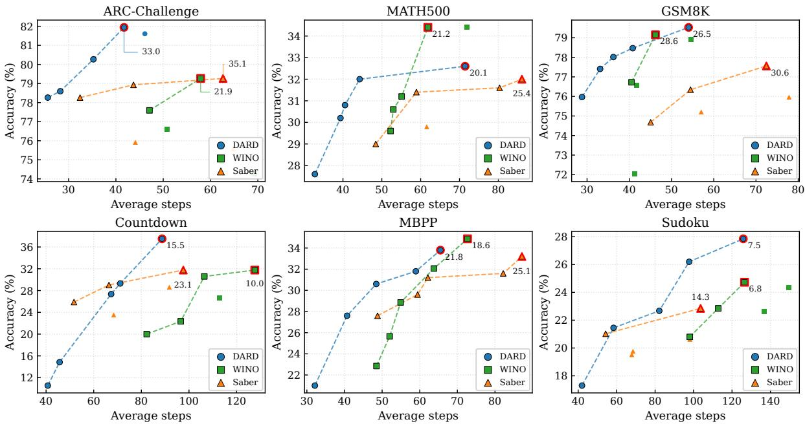  
Figure 8: LLaDA-1.5 results on six language benchmarks. Each plot compares task performance against the average number of decoding steps for each method. For DARD, we show the five configurations closest to each benchmark’s accuracy-step Pareto frontier. Dashed curves denote the Pareto frontier of each method. For each method, the highest-accuracy configuration is highlighted with a red outline, with its TPS annotated alongside the point.

## A Experimental Details

## A.1 Datasets and Baselines

We evaluate DARD across a diverse suite of language and vision-language benchmarks. We evaluate DARD on six language benchmarks– GSM8K (Cobbe et al., 2021), MATH500 (Lightman et al., 2023; Hendrycks et al., 2021), MBPP (Austin et al., 2021), Countdown (Gandhi et al., 2024), Sudoku (Ye et al., 2025a), and ARC-Challenge (ARC-C) (Clark et al., 2018)– covering mathematical, code, arithmetic, logical, and commonsense/science reasoning. We further evaluate on six vision-language benchmarks– Flickr30K (Young et al., 2014), AI2D (Kembhavi et al., 2016), MATH-Vision (Wang et al., 2024), MathVista (Lu et al., 2024), MMMU (Yue et al., 2024), and ScienceQA (Lu et al., 2022)–covering image captioning, diagram understanding, visual mathematical reasoning, multi-discipline reasoning, and science question answering. We compare DARD against standard dLLM decoding, WINO (Hong et al., 2025), and Saber (Dong et al., 2025), and evaluate them using the validation split of MMMU, the official testmini splits of MathVista and MATH-Vision, the IMG split of ScienceQA, and the 500-sample lite test split of Flickr30K.

## A.2 Implementation Details

We adopt block decoding (Nie et al., 2026) for all experiments. For language benchmarks, we use two open-source dLLMs, LLaDA-8B-Instruct (Nie et al., 2026) and LLaDA-1.5 (Zhu et al., 2025a); for vision-language benchmarks, we use MMaDA-8B-MixCoT (Yang et al., 2026). Unless otherwise specified, we use a generation length of 256 and a block length of 128 across all methods and benchmarks. To analyze the speed-quality trade-off, we vary the hyperparameters that control the number of decoding steps. For DARD, we evaluate all valid pairs of $\left( \tau _ { \mathrm { c } } , \tau _ { \mathrm { u } } \right)$ satisfying $\tau _ { \mathrm { c } } ~ \leq ~ \tau _ { \mathrm { u } }$ , using $\tau _ { \mathrm { c } } \in \{ 0 . 4 , 0 . 5 , 0 . 6 \}$ and $\tau _ { \mathrm { u } } \in \{ 0 . 6 , 0 . 7 , 0 . 8 \}$ for language tasks, and $\tau _ { \mathrm { c } } \in \{ 0 . 3 , 0 . 4 , 0 . 5 \}$ and $\tau _ { \mathrm { u } } \in \{ 0 . 7 , 0 . 8 , 0 . 9 \}$ for vision-language tasks. We fix the decay factor $\lambda = 0 . 9 1 7 ( \mathrm { i . e . , 0 . 5 ^ { 1 / 8 } }$ , halving the weight every 8 positions) and $p _ { 0 } = 0 . 1$ For WINO, we fix $\tau _ { 2 } = 0 . 9$ and evaluate $\tau _ { 1 } ~ \in$ $\{ 0 . 3 , 0 . 4 , 0 . 5 , 0 . 6 , 0 . 7 \}$ . For Saber, we fix $\mu = 2$ and vary the minimum number of tokens committed per step as $n \in \{ 4 , 5 , 6 , 7 , 8 \}$ . All experiments are conducted on NVIDIA RTX A6000 GPUs. For consistency, we set the sampling temperature to zero and report single-run results.

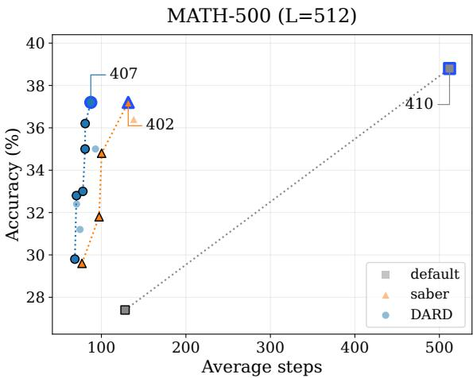

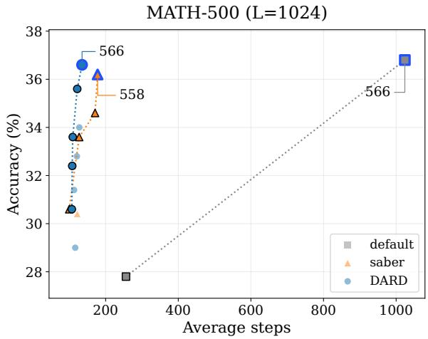  
Figure 9: Evaluation with different generation budgets on MATH-500.

## B Additional Experimental Results of DARD

## B.1 Evaluation on LLaDA 1.5

To evaluate the generalizability of DARD across models, we further conduct experiments on LLaDA 1.5 (Zhu et al., 2025a). As shown in Figure 8, DARD consistently improves the speed-quality trade-off, demonstrating that its effectiveness is not limited to the model used in the main experiments.

## B.2 Generalization to longer generations and complex reasoning

To examine whether DARD remains effective for longer and more complex reasoning trajectories, we evaluate it on MATH-500 with generation budgets of 512 and 1024 tokens (see Figure 9). The numbers next to the blue-outlined markers indicate the number of meaningful generated tokens after excluding trailing EOT tokens. DARD consistently achieves a better speed-quality trade-off than competing methods across both generation budgets, demonstrating its effectiveness in mitigating decoding errors caused by long-range dependency failures.

## B.3 Evaluation on fine-grained multimodal benchmarks

We further evaluate DARD on the fine-grained multimodal benchmarks MMVP (Tong et al., 2024), BLINK (Fu et al., 2024), and HRBench (Wang et al., 2025), using the same experimental configuration as in the main experiments (see Figure 10). Across a range of confidence thresholds $\tau _ { c }$ and $\tau _ { u } .$ DARD consistently achieves a better speed–quality Pareto frontier than the baseline methods. These results demonstrate that DARD generalizes across diverse multimodal benchmarks and remains robust to threshold selection.

## C Additional Analysis of DARD

## C.1 Analysis of Adaptive Logit Mixing

Qualitative illustration of adaptive logit mixing. To illustrate the effect of the adaptive mixing weight on the decoding outcome, Table 4 shows an intermediate decoding stage for the caption “A man in a black shirt is reading a book”. At step 13, position 7 is decoded as $" o n '$ and assigned to the $\mathcal { C }$ state. In the following step, conditioning on this candidate token leads the original path to predict $" s i t s "$ at position $^ { 6 , }$ yielding the plausible phrase “sits on”. By contrast, the shadow path excludes this candidate token from its context and predicts $\ " _ { i s } \prime \prime$ at position 6. After “on” at position 7 is demoted to the masked state, the mixing weight for position 6 is set to a low value of $w = 0 . 2 4$ . Consequently, assigning greater weight to the shadow path leads the mixed prediction to select “is”, thereby avoiding the erroneous prediction “sits” induced by the incorrect candidate context.

Statistics of mixing weights $w _ { t } ^ { i }$ during decoding. We additionally report the proportion of observed weights $w _ { t } ^ { i }$ during decoding: GSM8K with LLaDA and ScienceQA with MMaDA. As shown in Table 5, wi exceeds 0.9 in most decoding steps, indicating that the model generally leverages C tokens as context during token prediction. For a small fraction of tokens, $w _ { t } ^ { i }$ is assigned much lower values $( < 0 . 5 )$ , reducing the influence of C token context when it is not reliable. These results illustrate why using a single fixed weight is not optimal. Although $\mathcal { C }$ tokens are valid and useful as context in most cases, assigning them a uniformly high weight can cause the model to continue relying on C token context even when some C tokens are demoted, which can lead to incorrect decoding decisions.

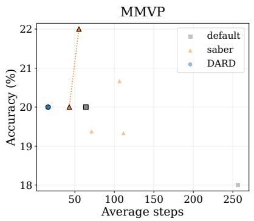

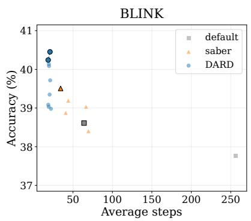

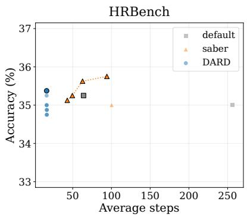

Figure 10: Fine-grained multimodal benchmark results.
<table><tr><td>Position</td><td>0</td><td>1</td><td>2</td><td>3</td><td>4</td><td>5</td><td>6</td><td>7</td><td>8</td><td>9</td><td>10</td></tr><tr><td>Step 13</td><td>A</td><td>man</td><td>(wearing〉</td><td>a</td><td>(black〉</td><td>shirt</td><td>[M]</td><td>(on〉</td><td>(a)</td><td>book</td><td></td></tr><tr><td>Step 14</td><td>A</td><td>man</td><td>[M]↓</td><td>a</td><td>(black〉</td><td>shirt</td><td>is</td><td>[M]↓</td><td>(a)</td><td>book</td><td></td></tr><tr><td>Final</td><td>A</td><td>man</td><td>in</td><td>a</td><td>black</td><td>shirt</td><td>is</td><td>reading</td><td>a</td><td>book</td><td></td></tr></table>

Table 4: Illustration of how the adaptive mixing weight operates during MMaDA generation on Flickr30K. ⟨·⟩ denotes a token in the candidate state, and ↓ indicates demotion to the masked state.

## C.2 Comparing Confidence-Based Ordering with Subsequent Decoding Trajectories

To empirically examine the intuition that confidence-based ordering reflects the subsequent decoding trajectory, we conduct an analysis using LLaDA on GSM8K and MMaDA on Flickr30K. At each decoding step, we compare two candidate orderings of the remaining masked positions against a reference ordering. We define the confidence-based ordering $\pi ^ { \mathrm { c o n f } }$ by ranking the remaining masked positions in descending order of their confidence scores, and the left-to-right ordering $\pi ^ { \mathrm { l 2 r } }$ by ranking them from left to right. We obtain the reference ordering $\pi ^ { \mathrm { r e f } }$ by decoding one token per step until all remaining masked positions are decoded and recording the resulting order.

We compare each candidate ordering with the reference ordering using two metrics, Overlap@K and RankDif@K. For $\pi \in \{ \pi ^ { \mathrm { c o n f } } , \pi ^ { \mathrm { l 2 r } } \}$ , the metrics are defined as follows:

$$
\operatorname { O v e r l a p @ K } = \frac { \left| \operatorname { T o p K } ( \pi ) \cap \operatorname { T o p K } ( \pi ^ { \mathrm { r e f } } ) \right| } { K } ,
$$

$$
\mathrm { R a n k D i f @ } K = \frac { 1 } { K } \sum _ { i \in \mathrm { T o p K } ( \pi ) } \left| \pi ( i ) - \pi ^ { \mathrm { r e f } } ( i ) \right| .
$$

Here, TopK(π) denotes the set of the first K positions under ordering π, and π(i) denotes the rank of position i in that ordering. Overlap@K measures the fraction of positions shared by the top-K sets of π and $\pi ^ { \mathrm { r e f } }$ . RankDif@K measures the average absolute difference between the ranks of these positions in π and $\pi ^ { \mathrm { r e f } }$

As shown in Table $6 , \pi ^ { \mathrm { c o n f } }$ aligns substantially better with the reference ordering $\pi ^ { \mathrm { r e f } }$ than $\pi ^ { \mathrm { l 2 r } }$ does across both models. Since DARD decodes an average of 6.0 and 8.8 tokens per step with LLaDA and MMaDA, respectively, the high Overlap@8 values further indicate that our confidence-based ordering closely reflects the subsequent decoding order.

## C.3 Accuracy Gains Beyond Efficiency

The primary goal of DARD is to improve the speed–quality Pareto frontier of dLLM decoding. At the same time, DARD can also improve peak accuracy by iteratively verifying and refining generated tokens using richer context formed by the model’s own predictions, instead of permanently fixing tokens predicted under limited context. This resembles self-reflection (Madaan et al., 2023) in AR-LLMs, where the model iteratively revisits and refines its own generated output before finalizing the answer. To make verification more robust, DARD selectively uses only reliable decoded tokens as context, which is consistent with prior work (Huang et al., 2024) showing that selfreflection with unreliable context can even degrade performance.

<table><tr><td>Model / Dataset</td><td> $w _ { t } ^ { i } < 0 . 5$ </td><td> $0 . 5 \le w _ { t } ^ { i } < 0 . 7$ </td><td> $0 . 7 \leq w _ { t } ^ { i } < 0 . 9$ </td><td> $w _ { t } ^ { i } \geq 0 . 9$ </td></tr><tr><td>LLaDA / GSM8K</td><td>4.7%</td><td>5.1%</td><td>6.8%</td><td>83.3%</td></tr><tr><td>MMaDA / ScienceQA</td><td>10.7%</td><td>5.1%</td><td>4.9%</td><td>79.2%</td></tr></table>

Table 5: Empirical distribution of adaptive mixing weights $w _ { t } ^ { i }$ observed during decoding. Each entry reports the percentage of all observed $w _ { t } ^ { i }$ values that fall within the corresponding range.
<table><tr><td>Model / Dataset</td><td>Metric</td><td>Ordering</td><td> $K { = } 1$ </td><td>K=2</td><td> $K { = } 4$ </td><td> $K { = } 8$ </td><td>K=16</td></tr><tr><td rowspan="2">LLaDA / GSM8K</td><td>Overlap@K (↑)</td><td> $\begin{array} { l } { { \pi ^ { c o n f } } } \\ { { \pi ^ { l 2 r } } } \end{array}$ </td><td>1.00 0.24</td><td>0.86 0.36</td><td>0.82 0.49</td><td>0.81 0.60</td><td>0.81 0.67</td></tr><tr><td></td><td>πconf</td><td>0.00</td><td>0.74</td><td>1.74</td><td>3.27</td><td>5.62</td></tr><tr><td rowspan="2">MMaDA / Flickr30K</td><td>RankDiff@K (↓)</td><td>πl2r</td><td>15.38</td><td>13.57</td><td>12.52</td><td>12.40</td><td>13.03</td></tr><tr><td>Overlap@K (↑)</td><td> $\begin{array} { l } { { \pi ^ { c o n f } } } \\ { { \pi ^ { l 2 r } } } \end{array}$ </td><td>1.00 0.04</td><td>0.73 0.05</td><td>0.64 0.08</td><td>0.64 0.11</td><td>0.69 0.18</td></tr><tr><td></td><td>RankDiff@K (↓)</td><td>πconf  $\pi ^ { l 2 r }$ </td><td>0.00 46.15</td><td>3.08 47.20</td><td>5.68 46.83</td><td>8.06 46.83</td><td>10.06 43.84</td></tr></table>

Table 6: Comparison of confidence-based and left-to-right orderings with the one-token-per-step decoding trajectory. Higher Overlap@K and lower RankDif@K indicate better alignment. All metrics are averaged over samples and decoding steps.

<table><tr><td colspan="2">Benchmark Method</td><td rowspan="2"> $\begin{array} { c } { \operatorname { A c c . } } \\ { ( \% ) } \end{array}$ </td><td rowspan="2"> $\mathtt { S t e p s }$ </td><td rowspan="2">Acc.</td><td rowspan="2">Step gain (%) reduction</td></tr><tr><td></td><td></td></tr><tr><td rowspan="2">ARC-C</td><td>Default</td><td>52.17</td><td>256</td><td></td><td rowspan="2"> $7 . 2 \times$ </td></tr><tr><td>DARD</td><td>81.61</td><td>35</td><td> $+ 5 6 . 4$ </td></tr><tr><td rowspan="2">Countdown</td><td>Default</td><td>29.00</td><td>256</td><td></td><td></td></tr><tr><td>DARD</td><td>34.51</td><td>85</td><td> $+ l 9 . 0$ </td><td> $3 . 0 \times$ </td></tr><tr><td>GSM8K</td><td>Default DARD</td><td>73.77 77.86</td><td>256 48</td><td>+5.5</td><td>5.3×</td></tr></table>

Table 7: Comparison of peak-accuracy configurations for the default setting and DARD using LLaDA.

To empirically demonstrate that DARD improves absolute task performance, we additionally compare it with the best-performing configuration of the default decoding setting (i.e., one-token-perstep decoding) on six datasets. As shown in Tables 7 and 8, DARD achieves higher peak accuracy than this configuration across all six datasets.

## C.4 Effects of Thresholds on the Speed–Quality Trade-off

Robustness across models and datasets. The thresholds $\tau _ { c }$ and $\tau _ { u }$ adjust the speed–quality trade-off in DARD by controlling how conservatively tokens are selected and verified. As shown in Figures 5, 6, and 8, varying these thresholds produces different speed–quality operating points, with most DARD configurations outperforming the Pareto frontier established by prior baselines. Specifically, the fixed threshold settings $( \tau _ { c } , \tau _ { u } ) \ \in \ ( 0 . 5 , 0 . 8 ) , ( 0 . 6 , 0 . 7 )$ for LLaDA and $( \tau _ { c } , \tau _ { u } ) \ \in \ ( 0 . 3 , 0 . 9 ) , ( 0 . 4 , 0 . 9 )$ for MMaDA remain above the Pareto frontier of prior methods across all five datasets evaluated for each architecture. These results suggest that DARD is robust to threshold choices and does not require task-specific tuning.

<table><tr><td>Benchmark</td><td>Method</td><td>Acc. (%)</td><td> ${ \tt S t e p s }$ </td><td>Acc.</td><td>Step gain (%) reduction</td></tr><tr><td>MMMU-val</td><td>Default DARD</td><td>20.56 22.89</td><td>256 34</td><td> $+ l . 3$ </td><td> $7 . 5 \times$ </td></tr><tr><td>AI2D</td><td>Default DARD</td><td>55.25 56.15</td><td>256 37</td><td> $+ l . 6$ </td><td> $7 . 0 \times$ </td></tr><tr><td>ScienceQA</td><td>Default DARD</td><td>41.89 44.67</td><td>256 25</td><td> $+ 6 . 6$ </td><td>10.3×</td></tr></table>

Table 8: Comparison of peak-accuracy configurations for the default setting and DARD using MMaDA.

Roles of $\tau _ { c }$ and $\tau _ { u }$ in decoding. To further analyze how $\tau _ { c }$ and $\tau _ { u }$ affect the decoding process, we report results for different threshold settings on MATH-500 using LLaDA in Table 9. The results show that increasing $\tau _ { u }$ generally increases the number of decoding steps while improving task performance. This is because a larger $\tau _ { u }$ requires higher confidence before a token can be used as a reliable context, making the decoding process more conservative and reducing error propagation.

<table><tr><td rowspan="2"> $\tau _ { c }$ </td><td colspan="5"> $\tau _ { u }$ </td></tr><tr><td> $0 . 5$ </td><td>0.6</td><td>0.7</td><td>0.8</td><td>0.9</td></tr><tr><td>0.2</td><td>25.2 (32.81)</td><td>26.0 (36.76)</td><td>24.2 (39.84)</td><td>23.8 (43.76)</td><td>29.0 (50.11)</td></tr><tr><td>0.3</td><td>25.8 (32.37)</td><td>25.4 (34.54)</td><td>27.2 (37.61)</td><td>26.2 (40.90)</td><td>28.6 (44.82)</td></tr><tr><td>0.4</td><td>30.0 (34.45)</td><td>27.6 (37.93)</td><td>28.0 (41.07)</td><td>28.2 (44.91)</td><td>30.8 (51.75)</td></tr><tr><td>0.5</td><td></td><td>30.0 (39.54)</td><td>28.2 (45.50)</td><td>31.0 (51.85)</td><td>32.0 (59.46)</td></tr><tr><td>0.6</td><td>一</td><td></td><td>31.4 (48.72)</td><td>34.4 (56.94)</td><td>34.0 (66.76)</td></tr><tr><td>0.7</td><td></td><td></td><td></td><td>32.8 (61.42)</td><td>32.2 (74.32)</td></tr></table>

Table 9: Effects of the threshold hyperparameters $\tau _ { c }$ and $\tau _ { u }$ on the speed–quality trade-off of LLaDA on MATH-500. Each cell reports accuracy (%), with the average number of decoding steps shown in gray parentheses.

In addition, decreasing $\tau _ { c }$ reduces the number of decoding steps but often leads to lower accuracy. This is because a smaller $\tau _ { c }$ relaxes the criterion for assigning tokens to the candidate state, allowing more low-confidence tokens to be used during verification. These noisy candidate tokens can provide unreliable context and hurt performance.

Practical guidance for threshold selection. Consistent with our design intent, the above observations provide practical guidance for selecting the thresholds. For accuracy-oriented settings, both thresholds should be moderately high so that only sufficiently confident tokens are used in the verification process, such as $( \tau _ { c } , \tau _ { u } ) = ( 0 . 6 , 0 . 8 )$ or (0.6, 0.9). For speed-oriented settings, setting $\tau _ { u }$ to a lower value and choosing $\tau _ { c }$ close to it, such as $( \tau _ { c } , \tau _ { u } ) = ( 0 . 4 , 0 . 5 )$ or (0.5, 0.6), can reduce the number of decoding steps while maintaining competitive performance.

## C.5 Analysis of Computational Efficiency and Overhead

End-to-end TPS and task performance. In Figures 5, 6, and 8, we report the tokens-per-second (TPS) values next to the red outlines. TPS is defined as the number of generated output tokens divided by the total wall-clock decoding time. Since the generated output tokens are fixed in our comparison, a higher TPS directly corresponds to shorter end-to-end wall-clock time.

To make the comparison more explicit, we summarize representative results in Tables 10 and 11, reporting both TPS and the corresponding task performance. In most cases, DARD achieves higher TPS and better task performance simultaneously. For benchmarks where DARD does not achieve the highest TPS, it provides a clear gain in task performance; for example, Saber is faster on ARC-C and Countdown, but underperforms DARD by 7.4 and

<table><tr><td rowspan="2">Method</td><td>ARC-C</td><td colspan="2">GSM8K</td><td colspan="2">Countdown</td></tr><tr><td>TPS</td><td>Acc. TPS</td><td>Acc.</td><td>TPS</td><td>Acc.</td></tr><tr><td>Saber</td><td>69.0 72.2</td><td>30.5</td><td>74.7</td><td>24.7</td><td>28.9</td></tr><tr><td>WINO</td><td>25.4 78.9</td><td>30.6</td><td>77.8</td><td>12.1</td><td>31.8</td></tr><tr><td>DARD</td><td>36.4 79.6</td><td>34.5</td><td>77.2</td><td>15.5</td><td>34.5</td></tr></table>

Table 10: Comparison of inference throughput and task performance for LLaDA. Higher values are better for all metrics.

<table><tr><td rowspan="2">Method</td><td colspan="2">AI2D</td><td colspan="2">ScienceQA</td><td colspan="2">Flickr30K</td></tr><tr><td>TPS</td><td>Acc.</td><td>TPS</td><td>Acc.</td><td>TPS</td><td>CIDEr</td></tr><tr><td>Saber</td><td>11.3</td><td>53.3</td><td>13.5</td><td>44.7</td><td>12.2</td><td>54.8</td></tr><tr><td>WINO</td><td>11.4</td><td>53.9</td><td>14.0</td><td>43.5</td><td>18.5</td><td>57.1</td></tr><tr><td>DARD</td><td>14.5</td><td>55.5</td><td>16.0</td><td>44.7</td><td>18.2</td><td>59.2</td></tr></table>

Table 11: Comparison of inference throughput and task performance for MMaDA. Higher values are better for all metrics.

## 5.6 percentage points, respectively.

Single-step inference latency. To better quantify the computational overhead, we further report the wall-clock time of a single forward inference pass. As shown in Table 12, DARD introduces negligible overhead compared with WINO for a single forward inference pass. Although this overhead is slightly larger than Saber’s, DARD requires substantially fewer decoding steps, which results in shorter total wall-clock decoding time.

Peak GPU memory overhead. We also report the peak GPU memory overhead of DARD. The additional memory cost mainly comes from the shadow block sequence, whose size depends on the block length. Therefore, we report results under two settings with the same generation length of 256: the default setting used in the manuscript with block length 128, and the most memory-intensive setting with block length 256. The results show that the increase in peak GPU memory is less than 6.3% in the worst case, indicating that DARD incurs only negligible peak memory overhead. This is because the added shadow block accounts for only a small fraction of the total sequence, which includes image tokens, system/text prompt tokens, and generated tokens. In addition, peak GPU memory is largely dominated by the model parameters, making the extra memory from the shadow block relatively small.

<table><tr><td>Method</td><td>Block length</td><td>1-step latency (ms)</td><td>GPU memory (GB)</td></tr><tr><td>Default</td><td>256</td><td>137.7</td><td>17.21</td></tr><tr><td>Saber</td><td>256</td><td>141.1</td><td>17.62</td></tr><tr><td>WINO</td><td>128</td><td>183.9</td><td>17.45</td></tr><tr><td>WINO</td><td>256</td><td>229.6</td><td>17.96</td></tr><tr><td>DARD</td><td>128</td><td>186.8</td><td>17.65</td></tr><tr><td>DARD</td><td>256</td><td>232.0</td><td>18.29</td></tr></table>

Table 12: Single-step inference latency and peak GPU memory usage of LLaDA on MATH-500. All methods use a generation length of 256.

In summary, these results show that DARD improves the speed–quality trade-off by achieving strong task performance with competitive or shorter end-to-end wall-clock time, while incurring negligible peak GPU memory overhead.

Attention overhead of the shadow sequence. We additionally analyze the theoretical attention overhead introduced by the shadow sequence. DARD duplicates only the block currently being decoded instead of duplicating the full input sequence. The full sequence consists of $S$ system prompt tokens, V visual tokens, P text prompt tokens, and L generation tokens, with a total length of $N = S + V + P + L$ . Under the block decoding framework, the generation tokens are further divided into K decoding blocks of length B (i.e., $L = B K )$ . Therefore, the attention cost with the additional shadow sequence increases from $O ( N ^ { 2 } )$ to $O ( ( N + B ) ^ { 2 } )$ , where $B \ll N$ . Moreover, dLLM decoding can use prefix caching for the system prompt tokens, visual tokens, and text prompt tokens. With prefix caching, the attention cost during generation is better characterized as increasing from $O ( L N )$ to $O ( ( L + B ) ( N + B ) )$ ). In our main setting, the block length is 128, whereas a single image already contains around 1024 visual tokens. Therefore, the shadow sequence introduces only a small relative overhead, which further decreases in high-resolution image or video settings as $B / N$ becomes smaller.

## D Comparison with Concurrent Work on Parallel Decoding

Combination errors and joint inconsistencies, such as “Los Diego”, are commonly observed in parallel decoding for diffusion language models. Rejection Mixing (Ye et al., 2026), DAPD (Kim et al., 2026), and EB-Sampler (Ben-Hamu et al., 2026) also aim to mitigate this problem, but differ from DARD in their treatment of dependencies among simultaneously predicted tokens. Rejection Mixing addresses this problem by using soft embeddings that encode information from multiple vocabulary tokens predicted at intermediate steps. DAPD constructs a dependency graph based on attention maps and selects tokens that are weakly dependent on each other. EB-Sampler controls the error upper bound of the joint probability that arises when multiple tokens are selected simultaneously. Compared with these methods, DARD explicitly controls the conditioning context of each token prediction so that the probability of multiple tokens can be represented through an ordered conditional factorization.

## E Modeling Token Dependencies during Verification

The mask design of DARD ensures that, when verifying a C token, the model can attend only to higherconfidence vocabulary tokens and U tokens. Thus, for the k-th C token under the ordering $\pi _ { t } ,$ we have

$$
p _ { \theta } \left( s _ { t + 1 } ^ { \pi _ { t } ( k ) } \mid \tilde { \mathbf { x } _ { t } } ; M \right) \approx p _ { \theta } \left( s _ { t + 1 } ^ { \pi _ { t } ( k ) } \mid \hat { x } _ { t } ^ { \pi _ { t } ( 1 : k - 1 ) } , \hat { x } _ { t } ^ { \mathcal { U } _ { t } } \right)\tag{9}
$$

where $\pi _ { t } ( k )$ denotes the k-th token in the C state ordering, $k = 1 , \ldots , | \mathcal { C } _ { t } |$

When a token is accepted through verification, its verification outcome matches the previously predicted token, i.e., $s _ { t + 1 } ^ { \pi _ { t } ( i ) } = \hat { x } _ { t } ^ { \pi _ { t } ( i ) }$ . Under this condition, the joint probability over the first $k \mathcal { C }$ tokens can be expressed by the chain rule as

$$
\begin{array} { r l } & { p _ { \theta } \left( s _ { t + 1 } ^ { \pi _ { t } ( 1 : k ) } \Bigm | \hat { x } _ { t } ^ { \mathcal { U } _ { t } } \right) = p _ { \theta } \left( s _ { t + 1 } ^ { \pi _ { t } ( 1 ) } \Bigm | \hat { x } _ { t } ^ { \mathcal { U } _ { t } } \right) } \\ & { \qquad \quad \displaystyle \prod _ { i = 2 } ^ { k } p _ { \theta } \left( s _ { t + 1 } ^ { \pi _ { t } ( i ) } \Bigm | s _ { t + 1 } ^ { \pi _ { t } ( 1 : i - 1 ) } , \hat { x } _ { t } ^ { \mathcal { U } _ { t } } \right) . } \end{array}\tag{10}
$$

By incorporating token dependencies directly into the verification process, DARD allows the verification outcome to reflect the joint distribution over committed tokens.

## F Handling Contamination Propagated to Low-Confidence Tokens

In revocable decoding frameworks, erroneous tokens cannot be completely excluded from the conditioning context because their correctness cannot be determined before verification. Nevertheless, DARD effectively reduces the propagation of erroneous context by enforcing information flow along the confidence order, i.e., from high-confidence tokens to low-confidence tokens. As a result, even if an erroneous token contaminates lower-confidence tokens, higher-confidence tokens remain unaffected and can provide reliable context in subsequent decoding steps.

Although a high-confidence token may still be erroneous and affect lower-confidence tokens, DARD mitigates the resulting error propagation through its iterative verification process. Once an erroneous token is identified and demoted, it is excluded from the conditioning context in subsequent verification steps. As a result, the confidence of tokens affected by the demoted token decreases, making them more likely to be demoted as well.

This behavior is illustrated in Figure 11. At step 7, the incorrect tokens “football” and “field” both enter the C state, with a higher confidence score for “field”. At step 8, “football” uses “field” as conditioning context and promotes to U. In contrast, “field” cannot use “football” as context because “football” has lower confidence. Instead, it relies on context from other tokens, such as “talking on”, and thereby demotes to M. Once “field” is removed from the conditioning context, “football” can no longer rely on it. Its confidence consequently decreases, causing it to demote at step 9. Thus, even when an error has propagated to lowerconfidence tokens, DARD can progressively correct the resulting errors through subsequent verification steps.

## G Additional Qualitative Examples

We provide two types of qualitative comparisons. Figures 12 and 13 compare DARD with other methods at intermediate decoding steps and in the final outputs. Figures 14 and 15 illustrate the differences between DARD and conventional revocable decoding in the correction of erroneous tokens. These comparisons demonstrate that DARD effectively resolves decoding errors and reduces their propagation during verification.

## H Pseudocode for DARD

We present the full DARD procedure, detailing its dependency-aware token verification and revocation process (see Algorithm 1).

## I Ethics Statement

All open-source datasets and publicly available model weights used in this work are used in accordance with their respective licenses, and intended research or evaluation purposes. The proposed DARD implementation is intended to support reproducible research on efficient dLLM decoding.

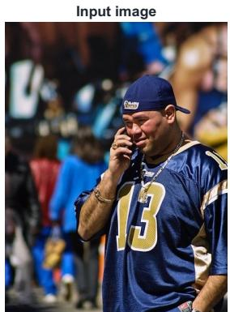

<table><tr><td colspan="10">DARD 3-state (masked / candidate / unmasked) CIDEr 1.774  23 steps</td></tr><tr><td></td><td></td><td></td><td></td><td></td><td></td><td></td><td>…</td><td></td><td></td><td></td><td></td></tr><tr><td>Step 5</td><td>A</td><td>MASK</td><td>MASK</td><td>talking</td><td>talking</td><td>MASK</td><td>talking</td><td>talking</td><td>talking talking</td><td>MASK</td><td>MASK</td></tr><tr><td>Step 6</td><td>A</td><td>man</td><td>MASK</td><td>a</td><td>on</td><td>MASK</td><td>while talking</td><td>on</td><td>on</td><td>MASK</td><td>MASK</td></tr><tr><td>Step 7</td><td>A</td><td>football</td><td>in</td><td>MASK</td><td>MASK</td><td>football</td><td>field</td><td>talking on</td><td>his</td><td>cell</td><td></td></tr><tr><td>Step 8</td><td>A</td><td>man</td><td>MASK</td><td>on</td><td>on</td><td>football</td><td>field</td><td>talking on</td><td>his</td><td>phone</td><td></td></tr><tr><td>Step 9</td><td>A</td><td>MASK</td><td>is</td><td>MASK</td><td>a</td><td>football</td><td>MASK</td><td>talking</td><td>on his</td><td>cell</td><td>MASK</td></tr><tr><td>Step 10</td><td>A</td><td>man</td><td>in</td><td>wearing</td><td>a</td><td>MASK</td><td>uniform</td><td>talking on</td><td>his</td><td>cellphone</td><td></td></tr><tr><td>Step 11</td><td>A</td><td>man</td><td>in</td><td>a</td><td>a</td><td>MASK</td><td>is</td><td>talking</td><td>on his</td><td>(cellphone)</td><td></td></tr><tr><td></td><td colspan="3"></td><td></td><td></td><td>…</td><td></td><td></td><td></td><td></td><td></td></tr><tr><td>Final</td><td>A</td><td>man</td><td>in</td><td>a</td><td>thirteen</td><td>jersey</td><td>is</td><td>talking</td><td>on</td><td>his (cellphone)</td><td></td></tr></table>

Figure 11: Qualitative example illustrating how DARD effectively mitigates error propagation through iterative verification by demoting erroneous tokens, removing them from subsequent conditioning contexts, and progressively identifying tokens whose confidence depends on those errors.

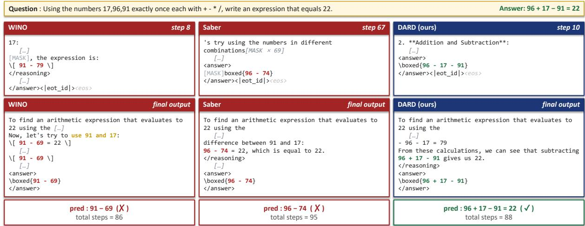  
Figure 12: Qualitative comparison of DARD with conventional revocable decoding methods.

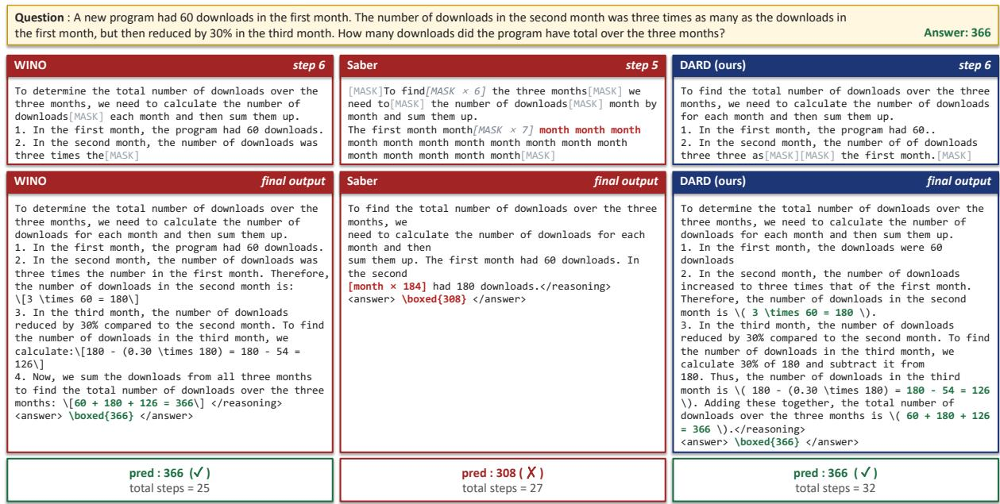  
Figure 13: Qualitative comparison of DARD with conventional revocable decoding methods.

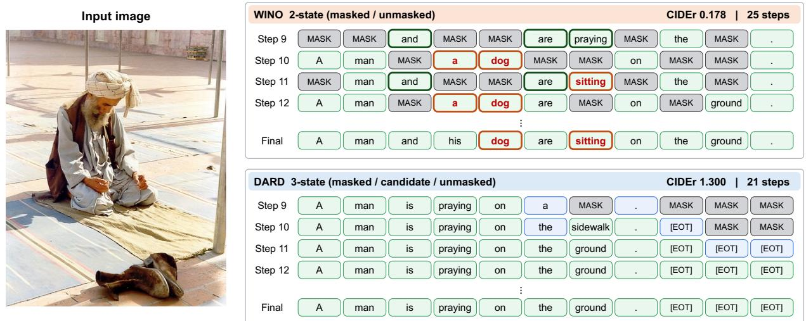  
Figure 14: Qualitative comparison between the decoding processes of conventional revocable decoding and DARD.

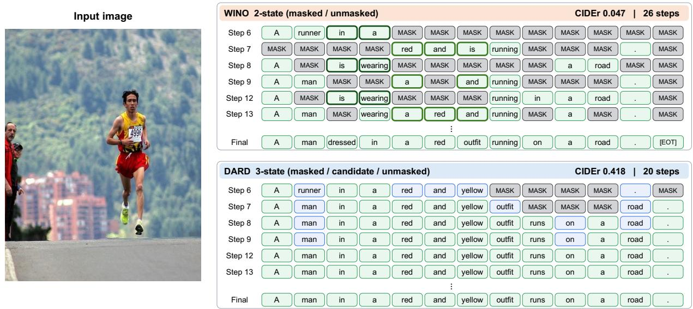  
Figure 15: Qualitative comparison between the decoding processes of conventional revocable decoding and DARD.

Algorithm 1 Dependency-Aware Revocable Decoding   
Require: Sequence $\mathbf { x } _ { 0 } .$ , dLLM $p _ { \theta } .$ , confidence thresholds $\tau _ { \mathrm { c } } , \tau _ { \mathrm { u } } .$ , decay parameter λ, and prior constant $p _ { 0 }$   
Ensure: Decoded sequence xT   
1: Initialize $\mathcal { M } _ { 0 } \gets \{ 0 , \dots , L - 1 \} , \mathcal { C } _ { 0 } \gets \emptyset , \mathcal { U } _ { 0 } \gets \emptyset$   
2: for $t = 0 , \ldots , T - 1$ do   
3: Initialize $\mathcal { M } _ { t + 1 } , \mathcal { C } _ { t + 1 } , \mathcal { U } _ { t + 1 } \gets \emptyset$   
4: Construct $\tilde { \mathbf { x } } _ { t } = ( \mathbf { x } _ { t } ; \mathbf { s } _ { t } )$   
5: Build the attention mask $M$ for $\tilde { \mathbf { x } } _ { t }$   
6: Obtain $\mathrm { l o g i t } _ { \theta } ( x _ { t + 1 } ^ { i } )$ and $\mathrm { l o g i t } _ { \theta } ( s _ { t + 1 } ^ { i } )$ for $i \in \mathcal { M } _ { t }$ using $p _ { \theta } ( \mathbf { x } _ { t + 1 } \mid \tilde { \mathbf { x } } _ { t } ; M )$ and $p _ { \theta } ( \mathbf { s } _ { t + 1 } \mid \tilde { \mathbf { x } } _ { t } ; M )$   
respectively.   
7: Obtain $c _ { t } ^ { i }$ for $i \in \mathcal { C } _ { t } \cup \mathcal { U } _ { t }$ using $p _ { \theta } ( \mathbf { s } _ { t + 1 } \mid \tilde { \mathbf { x } } _ { t } ; M )$   
8: Initialize $\mathcal { P } _ { t }  \emptyset$ and $\mathcal { D } _ { t }  \emptyset$   
9: for $i \in \mathcal { C } _ { t }$ do ▷ Update $\mathcal { C } _ { t }$ states   
10: if $\tau _ { \mathrm { u } } < c _ { t } ^ { i }$ then   
11: Add i to $\mathcal { U } _ { t + 1 }$ and $\mathcal { P } _ { t }$   
12: else if $\tau _ { \mathrm { c } } < c _ { t } ^ { i } \le \tau _ { \mathrm { u } }$ then   
13: Add i to $\mathcal { C } _ { t + 1 }$   
14: else   
15: Add i to $\mathcal { M } _ { t + 1 }$ and $\mathcal { D } _ { t }$   
16: end if   
17: end for   
18: for $i \in \mathcal { M } _ { t }$ do ▷ Decode $\mathcal { M } _ { t }$ with logit mixing   
19: Compute $w _ { t } ^ { i } , P _ { t } ^ { i }$ and $D _ { t } ^ { i }$ using λ, and $p _ { 0 }$   
20: Compute logi $\mathfrak { t } _ { \theta } ^ { \operatorname* { m i x } }$ using $w _ { t } ^ { i }$   
21: Obtain confidence $c _ { t } ^ { i }$ from logitmix   
22: end for   
23: for $i \in \mathcal { M } _ { t } \cup \mathcal { U } _ { t }$ do ▷ Update $\mathcal { M } _ { t }$ and $\mathcal { U } _ { t }$ states   
24: if $\tau _ { \mathrm { u } } < c _ { t } ^ { i }$ then   
25: Add i to $\mathcal { U } _ { t + 1 }$   
26: else if $\tau _ { \mathrm { c } } < c _ { t } ^ { i } \le \tau _ { \mathrm { u } }$ then   
27: Add i to $\mathcal { C } _ { t + 1 }$   
28: else   
29: Add i to $\mathcal { M } _ { t + 1 }$   
30: end if   
31: end for   
32: Fill positions in $\mathcal { C } _ { t + 1 } \cup \mathcal { U } _ { t + 1 }$ with decoded tokens, and keep positions in $\mathcal { M } _ { t + 1 }$ as [Mask]   
33: end for   
34: return $\mathbf { x } _ { T }$