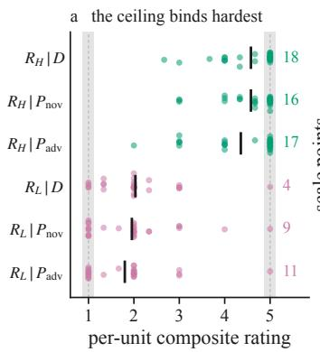
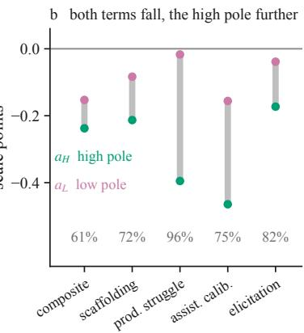
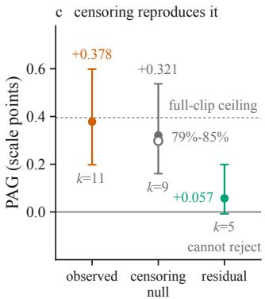
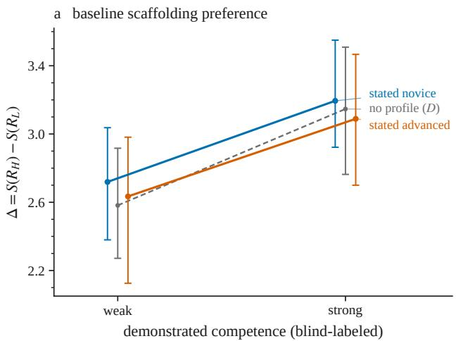
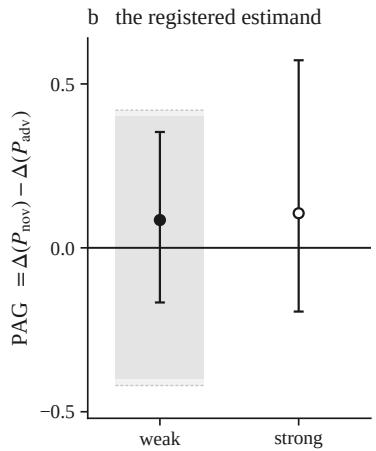
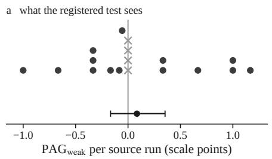
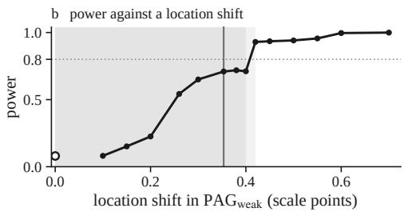

# Difference-in-Differences on a Censored Rating Scale Can Manufacture an Effect: Evidence from a Pre-Registered LLM-Judge Audit

Shuyi Fan∗ Columbia University ff2483@tc.columbia.edu

Mengyu Xu∗ The University of Chicago mxu09@uchicago.edu

Boyuan Deng∗ Johns Hopkins University bden8@jh.edu

Xinhong Xie The Pennsylvania State University xjx5116@psu.edu

Chenyang Li Johns Hopkins University chenyangli2020@u.northwestern.edu

Hongyang Zhang† The Hong Kong Polytechnic University, Hong Kong hong-yang.zhang@connect.polyu.hk

## Abstract

Audits of LLM judges certify a bias by contrasting matched conditions, and the strongest designs difference twice: a within-item contrast between two candidate responses, differenced again across a manipulated attribute, read off a bounded rating scale. We show that this endpoint is not identified on the scale that reports it. Each term of the double difference is censored by its own share, so the observed statistic confounds differential preference with differential attenuation: a severity shift common to both responses manufactures an interaction whenever the two censor it unequally, as unequal distances from the bounds make them, exactly where good stimuli place them. We exhibit the failure inside a pre-registered audit of a frozen pedagogy judge, sealed before the first of its 990 calls. The registered primary endpoint, the effect of a stated learner profile on the judge’s scaffolding preference, is null: +0.085 points (95% BCa [−0.167, +0.353], p = 0.684). The audit’s one nominally significant interaction, +0.378 (p = 0.002), is not identified as preference: a construction containing zero differential preference reproduces 79 to 85% of it from the observed severity shift and the scale floor alone. We derive the mechanism in closed form and show that its contribution is measurable from an audit’s own ratings.

## 1 Introduction

Large language models now grade other language models. Scores emitted by an LLM judge steer leaderboards and benchmark rankings [Zheng et al., 2023, Gu et al., 2026], and in education they already score tutoring systems on rubrics of teaching quality [Maurya et al., 2025, Fan et al., 2026]. Whether such judges deserve that role is itself a measurement question, and the audits that answer it share a design: hold the item fixed, vary an attribute of its presentation or of the identity attached to it, and read the bias off the contrast between matched conditions [Wang et al., 2024, Howell et al., 2025]. A stronger design differences twice: a within-item contrast between two candidate responses is differenced again across the manipulated attribute, so that anything shifting a response’s score equally in every condition cancels. The resulting endpoint is a difference in differences, read off a bounded rating scale.

The cancellation argument is why the design is trusted, and it is sound as far as it goes: additive artifacts do cancel. The remaining work is done by a quieter assumption: when an effect survives the double difference, the bounded scale is treated as a conservative nuisance, since clipping at the scale ends can attenuate a real effect but not create one. For a single contrast that is true, because clipping is non-expansive. Our own pre-registration asserted it for the double difference, and there it is false. Each of the two contrasts is censored by its own share, so their difference retains not the common effect but the difference in attenuation, and a severity shift that moves both responses identically becomes a nonzero interaction whenever the two censor it unequally, as unequal distances from the bounds make them (§5). Econometrics has long separated the latent interaction from the cross difference of observed outcomes, yet LLM-judge audits report interaction effects from short bounded rubrics without identifiability checks (e.g., the factorial interactions of Maltbie and Raval [2026], read off a 1–10 rubric with most ratings within two points of the floor), and the exposure grows with the quality of the materials, since sharper contrasts push the two responses toward opposite ends of the scale, where a common shift is censored most unequally.

This paper demonstrates the failure from inside a pre-registered audit, on the audit’s own data. The study put a validity question to the frozen pedagogy judge of Fan et al. [2026], which scores candidate tutor turns on a four-principle pedagogy rubric: does its preference for high-scaffolding responses track the competence a learner demonstrates in the dialogue, or does a stated learner profile move it? Each of 55 frozen rating contexts pairs a high-scaffolding with a low-scaffolding candidate response, its poles; the judge rates both under no profile, a stated novice profile, and a stated advanced profile; and the registered primary endpoint, the Profile Anchoring Gap, is the change in the judge’s scaffolding preference between the two profiles where the learner visibly struggles. The materials, instrument, primary endpoint, and registered secondary analyses were fixed before study scoring (§7).

The registered endpoint is null: against a baseline preference of +2.6 to +3.2 points of the five-point scale, the profile moves the preference by +0.085 (95% BCa $[ - 0 . 1 6 7 , + 0 . 3 5 3 ]$ , exact signed-rank $p = 0 . 6 8 4 )$ , a failure to detect at a stated resolution rather than evidence of absence (§6.1). What makes the audit instructive is where the profile’s influence went instead. It reached the ratings as a severity shift, lowering both poles together under the advanced profile (§6.2), and the scale can convert a non-differential shift into the audit’s one nominally significant interaction: a +0.378 gap on the productive-struggle sub-score $( p = 0 . 0 0 2 )$ , of which a construction containing zero differential preference reproduces 79 to 85% of the magnitude, from the observed high-pole shift and the scale floor alone (§6.3). On 17 of the 30 weak-stratum stimuli the productive-struggle low pole is pinned at the floor in every arm, and there the difference in differences is algebraically a one-pole contrast. Censoring is not even conservative here: a ceiling masks falls as well as rises, so which way de-censoring moves the endpoint is not settled here (§6.4).

This paper makes three contributions. First, an identifiability analysis of within-item difference-indifferences endpoints on bounded rating scales, carrying known limited-dependent-variable results [Puhani, 2012] into the judge-audit setting, where the endpoint degenerates to a one-pole contrast exactly where the material is best (§5). Second, a pre-registered audit of profile influence on a frozen pedagogy judge whose null primary is reported at its actual resolution and whose secondaries supply a live manufactured-effect counterexample to the audit’s own registered assumption (§6, §7). Third, an identifiability check that follows from the same algebra, computable from ratings an audit already has.

## 2 Related work

LLM judges and their audits. Judge-based evaluation entered common use with MT-Bench and Chatbot Arena, which reported high judge–human agreement alongside position, verbosity, and self-enhancement biases [Zheng et al., 2023]. Later audits extended the catalog: order effects that flip verdicts [Wang et al., 2024], self-preference in proportion to self-recognition [Panickssery et al., 2024], and diverging human and model bias profiles under controlled perturbation [Chen et al., 2024]; surveys collect both the biases and the audit designs that certify them [Gu et al., 2026]. Those designs certify a bias by contrasting matched conditions. Our subject is not a new catalog entry but the arithmetic of certification itself when the contrast is a difference in differences on a bounded scale.

Sensitivity to stated attributes. A second line varies who the text is about or from. Sociodemographic prompting shifts model predictions on subjective tasks, though inconsistently across models and datasets [Beck et al., 2024]; persona variables explain a small fraction of human annotation variance [Hu and Collier, 2024]; stated institutional prestige moves simulated peer-review outcomes for otherwise identical manuscripts [Howell et al., 2025]. These findings motivate our manipulated factor, a stated learner profile, and calibrate its expected effect to be small. Our question is not whether a stated attribute moves absolute scores, which it does here as well (§6.2), but whether the within-item endpoint built to detect such influence is identified at all.

Pedagogical evaluation of tutoring systems. The rubric principles at stake descend from scaffolding [Wood et al., 1976] and productive failure [Kapur, 2008], operationalized for LLM tutors in dialogue benchmarks, error-remediation corpora, and evaluation taxonomies [Tack and Piech, 2022, Macina et al., 2023, Daheim et al., 2024, Maurya et al., 2025, LearnLM Team, 2024]. The instrument we audit is the frozen pedagogy judge of Fan et al. [2026], which found generic helpfulness ratings judge-dependent while rubric distinctions were stable; its corpus supplies our stimuli.

Interactions on bounded and ordinal scales. The problem is old outside NLP. Censored and ordinal reporting make the observed score a nonlinear transform of a latent quantity [Tobin, 1958, McKelvey and Zavoina, 1975]; in such models the interaction of observed conditional means and the interaction coefficient are different quantities [Ai and Norton, 2003], the observed cross difference is not the treatment effect in nonlinear difference-in-differences models [Puhani, 2012], identification that survives monotone rescaling of the outcome requires the stronger assumptions of Athey and Imbens [2006], and for ordinal outcomes the estimand is not even well defined without latent-scale assumptions [Yamauchi, 2020]. Treating ordinal ratings as interval data misleads even for ratings well away from the scale endpoints [Liddell and Kruschke, 2018], and goes unjustified in NLG [Amidei et al., 2019]. Liddell and Kruschke [2018] further show that metric models of ordinal ratings produce false-alarm, missed and inverted interactions in factorial designs; that a scale can manufacture an interaction is known [Rohrer and Arslan, 2021]. Recent work on judge scale design tunes granularity for human agreement [Li et al., 2026] but does not treat the bounds as an identification problem. We carry the problem into LLM-judge audits in its within-item, two-pole form, where the design makes it acute: good stimuli drive the two poles toward opposite ends of a short scale, which is precisely the configuration in which a common shift is censored unequally. We characterize the resulting manufactured effect in closed form, exhibit it in pre-registered audit data, and show that censoring is not conservative for this endpoint.

Pre-registration in ML evaluation. Data-dependent analysis invalidates a reported p-value even when only one test is ever run [Gelman and Loken, 2016], and pre-registration is advocated for NLP [Van Miltenburg et al., 2021] and for predictive modeling [Hofman et al., 2023]. This study runs under a strict form of it and contributes a cautionary datum: the registration bound the analysis exactly as intended, and one of its registered interpretive guarantees was still false: binding an analysis in advance is not validating it.

## 3 Study design and materials

Question and manipulation. The manipulation is on the judge, not the tutor: no new tutoring sessions were generated. Each stimulus is a frozen rating context ending in a student turn, paired with two candidate next tutor turns: the high-scaffolding pole $R _ { H }$ addresses where the student is and leaves the next reasoning step to them; the low-scaffolding pole $R _ { L }$ performs that step for them. Each (stimulus, response) is rated in three arms: D, dialogue and response only; $P _ { \mathrm { n o v } }$ , with a stated novice learner profile prepended; and $P _ { \mathrm { a d v } }$ , with a stated advanced profile. We call the manipulated variable a stated learner profile rather than an ability label, because the two texts are not a minimal contrast on ability: each also states a help-seeking preference, which is the construct one of the four rubric sub-scores measures directly. A profile effect is therefore not on its own evidence of anchoring on ability, and we report the endpoint as profile influence.

Materials. We drew 55 stimuli from the judged tutor turns of Fan et al. [2026], 2,219 by our census over its released logs, stratified by blind-labeled demonstrated competence into a weak and a strong stratum over six acid-mixture word problems and 23 source tutoring runs (Table 2). One pole of each pair is the session’s real next tutor turn; the other is a corpus turn from a different session that fits the same context, or an authored reply matched for length and register, assigned by blinded adjudication. Three imbalances may interact with the manipulation rather than cancel: authored text lands almost entirely on the low pole; the real turn is the high pole far more often for pedagogy-tuned tutors than for conversational ones; and the 27 pairs containing no authored text, which support a pre-specified re-estimate of the primary endpoint, still draw the low pole from a single tutor model. A blind, order-randomized construction check recovered the intended pole in every pair (Appendix B).

Competence labels. The stratification factor comes from three independent blind annotation passes over the dialogue contexts alone, never the candidate responses or tutor metadata, each pass a fresh context of a language model in the judge’s family. Labels follow the majority vote, with pairwise inter-pass agreement above 93% (Appendix B). The tutor’s own learner-state tracker was used only as a sampling prior, because it comes from the tutor’s planner and would make the labels circular.

Profiles and instrument. The two profile texts are sentence-by-sentence parallel, 59 words each, stating a course stage, a placement percentile, a self-assessment and a teacher’s description; neither hints at the dialogue or instructs the judge how to weigh it. The judge is the frozen pedagogy judge released with that corpus, an instance of Claude Opus 4.8 [Anthropic, 2026], served unchanged on all 990 calls (Appendix A). It scores the rubric verbatim over four sub-scores, one per pedagogical principle (contingent scaffolding, productive struggle, assistance calibration, and elicitation), plus an overall rating, each an integer in $\{ 1 , \ldots , 5 \}$ ; every (stimulus, arm, pole) unit is rated in three stochastic repetitions, and the per-unit score is their mean. We reuse the instrument unchanged so that our ratings stay commensurable with the published ones, which means the manipulated factor is one the judge is instructed to disregard: the frozen system prompt directs the judge to rate only on the dialogue shown, and the profile block sits outside that quoted region. Apart from the profile block, the prompt text was identical across arms. Every evaluation returned a complete rating, so no per-unit mean is selected on which repetitions parsed; prompt length was constant within each unit.

## 4 Pre-registered analysis

Endpoint. Per stimulus s and arm $^ { a , }$ the scaffolding preference is $\Delta _ { s } ( a ) = S _ { s } ( R _ { H } \mid a ) - S _ { s } ( R _ { L } \mid$ a), with S the per-unit mean of the judge’s overall rating. The registered primary endpoint is the Profile Anchoring Gap on the weak stratum,

$$
\begin{array} { r } { \mathrm { P A G } _ { s } \ = \ \Delta _ { s } ( P _ { \mathrm { n o v } } ) - \Delta _ { s } ( P _ { \mathrm { a d v } } ) \ = \ a _ { L , s } - a _ { H , s } , a _ { j , s } \ = \ S _ { s } ( R _ { j } \ | \ P _ { \mathrm { a d v } } ) - S _ { s } ( R _ { j } \ | \ P _ { \mathrm { n o v } } ) , } \end{array}\tag{1}
$$

with $j \in \{ H , L \}$ . A positive value means the advanced profile suppresses the judge’s scaffolding preference for the same visibly struggling learner. The right-hand decomposition into a per-pole shift $a _ { j }$ is an identity rather than a model, and §5 depends on it.

Inference. Stimuli drawn from the same source tutoring run are not independent, so every registered estimand is averaged within source run first, and all tests and intervals use those source-run means; the weak stratum spans $n = 1 8$ source runs and the strong $n = 1 0$ . The primary test is a two-sided exact Wilcoxon signed-rank test of those means against zero, its p-value enumerated in full; ties take average ranks and exact zeros are dropped; it is exact under symmetry about zero and locates a pseudomedian, not the mean, so we report both. The registered effect size is the rank-biserial correlation, and intervals are bias-corrected and accelerated (BCa) bootstrap intervals over sourcerun means, with 10,000 resamples. There is one primary endpoint and no registered multiplicity correction; the secondaries are descriptive and reported with intervals.

Registered interpretation and its null branches. The pre-registration does not treat a null primary endpoint as evidence of behavioral grounding on its own. The frozen system prompt instructs the judge to rate on the dialogue alone, so “grounded in the behavioral evidence” and “obeyed the instruction” predict the same null; a null is informative only if the judge demonstrably used the profile somewhere, and the pure profile effect on absolute scores is the registered test of that. Because both poles already sit near the ends of the rating scale, a profile effect in one direction may be unobservable, so a joint null of the primary endpoint and the pure profile effect was registered in advance as uninformative. The registration further asserted that censoring cannot manufacture an effect. §5 shows that this is false for the difference in differences in (1).

## 5 A bounded difference in differences is not identified

Let $Y _ { j } ^ { * }$ be the latent quality of pole $j \in \{ H , L \}$ under the novice profile, reported through the clip $\overset { \vartriangle } { \boldsymbol { c } ( \boldsymbol { y } ) } = \operatorname* { m i n } ( \operatorname* { m a x } ( \boldsymbol { y } , \boldsymbol { \ell } ) , \boldsymbol { u } )$ onto the rating scale $[ \ell , u ]$ . Suppose the advanced profile carries a pure severity effect: it shifts both poles by a common δ and expresses no differential preference whatsoever, so the latent endpoint is $\mathrm { P A } \dot { \mathrm { G } } ^ { * } = \delta - \delta = 0$ Each observed term of (1) is then $a _ { j } = \mathbb { E } c ( Y _ { j } ^ { * } + \delta ) - \mathbb { E } c ( Y _ { j } ^ { * } )$ . Because c is non-expansi $\mathbf { \vec { e } } , \mathbf { \vec { a } } _ { j }$ retains only a fraction $1 - \kappa _ { j }$ of δ, where for $\delta \neq 0$ the share $\dot { \kappa _ { j } } = 1 - a _ { j } / \delta$ lies in [0, 1], and

$$
\mathrm { P A G } \ = \ a _ { L } - a _ { H } \ = \ \left( \kappa _ { H } - \kappa _ { L } \right) \delta .\tag{2}
$$

The observed endpoint measures the difference in attenuation between the two poles rather than a difference in preference. It vanishes only when both poles censor a common shift equally, and it reaches its largest magnitude |δ| when one pole is pinned and the other is free: at $\kappa _ { L } = 1$ and $\kappa _ { H } = 0$ it collapses to $\mathrm { P A G } \equiv - \dot { a } _ { H }$ , a one-pole contrast reported as a difference in differences. With pole-specific shifts it reads $\mathrm { P A G } = \mathrm { P A G } ^ { * } \bar { + } \kappa _ { H } \delta _ { H } - \kappa _ { L } \bar { \delta _ { L } } , \mathrm { P A G } ^ { * } = \delta _ { L } - \delta _ { H } .$ : the latent endpoint needs the $\kappa _ { j } .$ , which the ratings do not supply.

The design cannot avoid this, and the difficulty deepens as the stimuli improve: a common shift is censored unequally precisely because the two poles sit near opposite bounds, so sharper contrasts between the candidates generically drive $\kappa _ { H }$ and $\kappa _ { L }$ apart. One consequence is exact: the headroom available to PAG in the positive direction exceeds the headroom in the negative direction by twice the separation between the poles. Averaged across the 30 weak-stratum stimuli, the poles sit at 4.58 and 1.96 on the 1–5 scale under the novice profile, leaving 6.62 scale points of headroom in the positive direction of PAG against 1.38 in the negative.

What this falsifies, and what it leaves standing. Our pre-registration asserts that “censoring cannot manufacture an effect, so a non-null $\mathrm { P A G } _ { \mathrm { w e a k } }$ remains interpretable as profile influence.” For this endpoint that is false, and §6.3 is the counterexample from the study’s own data. The registered protection is narrower than it claimed: it covers only the weak reading that the profile influenced the rating somehow, and it does not cover the per-field secondaries at all. Because the primary endpoint is null, nothing in the headline result is corrupted by the error. What changes is what a non-null result would have licensed, which is exactly the thing a pre-registration exists to fix in advance.

An identifiability check from the observed ratings. Equation (2) is diagnosable from an audit’s own ratings. A pole that sits at a bound in every arm has $a _ { j } \equiv 0$ , hence $\kappa _ { j } = 1$ , and (1) is there the other pole’s shift alone. Such items’ prevalence, and the endpoint split across the partition they induce, measure how much of a reported effect sits where the endpoint is a one-pole contrast. The magnitude is calibrated by transporting the free pole’s observed shift onto the pinned pole and clipping, imposing zero differential preference, so whatever it reproduces is a magnitude (2) can generate with none. That construction’s residual is its prediction error on the pinned pole and bounds nothing; §6.3 reports all four.

## 6 Results

## 6.1 The registered primary endpoint is null

The judge prefers high-scaffolding responses by 2.58 to 3.19 points of a five-point scale under every arm and in both strata (Table 1; Figure 2). The preference is nominally larger where the learner demonstrates strong competence $( \Delta ( D ) = + 3 . 1 4 7 )$ than where they demonstrate weak competence (+2.582); we report that contrast without testing it, since the intervals overlap and the two strata comprise disjoint stimulus sets. Against that baseline, the stated profile moves the preference very little. On the weak stratum $\mathrm { P A G } _ { \mathrm { w e a k } } = + 0 . 0 8 5$ scale points $( 9 5 \% \mathrm { { B C a } [ - 0 . 1 6 7 , + 0 . 3 5 3 ] }$ , half-width 0.260; exact signed-rank $p = 0 . 6 8 4 )$ , pseudomedian 0.000, rank-biserial $+ 0 . 1 3 3 ,$ on 18 source-run means of which 14 are nonzero. The strong stratum agrees: $+ 0 . 1 0 6 , [ - 0 . 1 9 4 , + 0 . 5 7 2 ] , p = 0 . 9 1 4$ The registered contrasts against the no-profile control are likewise small and not significant on the weak stratum $( + 0 . 1 3 7 , p = 0 . 1 6 3 ; + 0 . 0 5 2 , p = 0 . 7 4 2 )$ . The registered authoring-robustness re-estimate on the 27 all-corpus pairs is uninformative rather than confirmatory: with 4 nonzero clusters, its smallest attainable p-value was $2 / 2 ^ { 4 } = 0 . 1 2 5$ (Appendix C).

Table 1: Mean preference for high scaffolding, $\Delta = S ( R _ { H } ) - S ( R _ { L } )$ , by arm and blind-labeled demonstrated competence (pre-registration §6.1). Intervals are 95% BCa over source-run means; the inference unit is the source tutoring run (weak: 18 runs, 30 stimuli; strong: 10 runs, 25 stimuli; some runs contribute to both strata).
<table><tr><td rowspan="2">Arm</td><td colspan="2">Weak</td><td colspan="2">Strong</td></tr><tr><td> $\Delta$ </td><td>95% BCa</td><td> $\Delta$ </td><td>95% BCa</td></tr><tr><td>D</td><td> $+ 2 . 5 8 2$ </td><td> $[ + 2 . 2 7 2 , + 2 . 9 1 7 ]$ </td><td> $+ 3 . 1 4 7$ </td><td> $[ + 2 . 7 6 3 , + 3 . 5 0 9 ]$ </td></tr><tr><td> $P _ { \mathrm { n o v } }$ </td><td> $+ 2 . 7 1 9$ </td><td> $\left[ + 2 . 3 8 0 , + 3 . 0 3 7 \right]$ </td><td> $+ 3 . 1 9 4$ </td><td> $\left[ + 2 . 9 2 2 , + 3 . 5 5 0 \right]$ </td></tr><tr><td> $P _ { \mathrm { a d v } }$ </td><td> $+ 2 . 6 3 4$ </td><td> $\left[ + 2 . 1 2 5 , + 2 . 9 8 1 \right]$ </td><td> $+ 3 . 0 8 9$ </td><td> $\left[ + 2 . 7 0 0 , + 3 . 4 6 7 \right]$ </td></tr></table>

This is a failure to detect, not a demonstration of absence, and the distinction is quantitative. No equivalence margin, smallest effect size of interest, or power statement was pre-registered, so no bound of the form $| \mathrm { P A G } | < c$ may be asserted; the interval’s own upper limit $\mathrm { \bar { i s } + 0 . \bar { 3 } 5 3 }$ . Simulated against a location shift, the registered test’s power is 0.709 at that upper limit and first exceeds 0.80 between +0.40 and +0.42, while the same simulation rejects at 0.080 under no shift, which measures the mean-pseudomedian gap and not the test’s size, 0.049 under a null it satisfies (Figure 3).

## 6.2 The profile influences absolute scores

The null above is interpretable only if the profile reached the rating at all. It did, on absolute scores with the response held fixed. On the weak stratum the advanced profile scores the same low-scaffolding response 0.153 points lower than the novice profile does (−0.083 by pseudomedian; $\operatorname { B C a } \ [ - 0 . 3 2 4 , - 0 . { \bar { 0 } } 7 4 ] , p = 0 . { \bar { 0 0 } } 7 8 1 )$ , and the same high-scaffolding response 0.238 points lower $( [ - 0 . \dot { 4 } 6 9 , - 0 . 0 1 9 ] , p \bar { = } 0 . 0 6 2 5 )$ . Both terms move in the same direction, so the pair is consistent with a common severity component under unequal attenuation rather than with a differential preference, exactly the configuration analyzed in §5; exploratory per-pole contrasts against D locate the movement almost entirely under the advanced profile (Appendix C). Two cautions attach. The significant term’s p-value is $2 / \dot { 2 } ^ { 8 }$ , its floor at 8 nonzero clusters, so it states only that every moving cluster moved the same way. And the profiles state a help-seeking preference as well as an ability, so a severity shif is consistent with a correctly calibrated evaluator and not only with label anchoring; the registered evidence-gradient check that would discriminate these readings is null (Spearman $\rho = - 0 . 1 7 9$ $p = 0 . 4 1 5 , 2 3$ source runs), so the ability-anchoring reading is unsupported in either direction.

## 6.3 The one significant interaction is not identified

The registered field-specific gaps include one nominally significant result: $\mathrm { P A G } = + 0 . 3 7 8$ on productive struggle $( p = 0 . 0 0 1 9 5 )$ , compared with +0.309 on assistance calibration $( p = 0 . 1 0 2 ) , + 0 . 1 3 4$ on elicitation $( p = 0 . 2 2 7 )$ , and +0.130 on scaffolding $( p = 0 . 5 0 2 )$ . Their per-pole decomposition is exploratory. Across fields, the high pole accounts for 72–96% of the total pole movement and $1 0 4 \mathrm { - } 1 6 4 \%$ of the gap itself (Figure 1b); for productive struggle, $a _ { H } = - 0 . 3 9 5$ and $a _ { L } = - 0 . 0 1 7$ The high-pole signed-rank test attains its minimum possible p-value, $2 / 2 ^ { 1 1 } = 0 . 0 0 0 9 7 7$ , because all 11 nonzero clusters move downward. The low-pole comparison has only three nonzero clusters; its minimum attainable p-value is 0.250, so rejection at 0.05 is impossible.

The mechanism is visible in the units. On 17 of the 30 weak stimuli the productive-struggle low pole sits at exactly 1.000 in all three arms. There $a _ { L } \equiv 0 , { \bf s o } \left( 1 \right)$ reduces to $\mathrm { P A G } _ { s } \equiv - a _ { H , s } ,$ an identity the data satisfy exactly. Splitting on that condition separates the two: +0.472 where the low pole is floored $( p = 0 . 0 0 3 9 1$ , its floor at 9 nonzero clusters) against +0.149 where it is free, on 5 nonzero clusters whose floor of 0.0625 makes rejection impossible. The split also inverts the apparent field ranking: assistance calibration has the larger high-pole shift $( a _ { H } = - 0 . 4 6 5 , p = 0 . 0 0 9 0 3 )$ but the smaller gap, the difference being low-pole retention. What that ordering ranks is censoring geometry, not preference.

  
Figure 1: Censoring reproduces most of the audit’s one nominally significant interaction. Exploratory; weak stratum throughout. (a) Per-unit composite ratings by arm and pole; the black tick is that row’s unclustered mean. Counts at right are units, of 30, resting exactly on that row’s own bound – the ceiling for $R _ { H }$ , the floor for $R _ { L }$ . The ceiling binds harder than the floor, while (b) and (c) argue from the floor; §6.4 takes up this tension. (b) The two terms of (1) on one axis. Both are negative – the advanced profile scores both poles lower – so PAG is the gap between them rather than an opposition between them; magnitudes are in §6.3. Grey figures give the high pole’s share of the two terms’ total movement, $| a _ { H } \mathbf { \bar { | } } / ( | a _ { H } | + | a _ { L } | ) ;$ the composite’s 61% sits outside the 72–96% the four sub-scores span. The low pole is pinned in all three arms on 4, 0, 17, 10 and 22 of the 30 weak stimuli in panel order, so scaffolding shows the same one-sided pattern with none floored. (c) Productive struggle: the observed $\mathrm { P A G } ;$ the zero-differential-preference construction of §6.3, filled where the shifted ratings are clipped and hollow where they are first rounded to the integers the judge emits, together reproducing 79–85% of the observed gap; and the residual, which is that construction’s low-pole prediction error and bounds nothing. k is the nonzero-cluster count: at $k = 5$ the exact test’s attainable floor of 0.0625 exceeds $\alpha ,$ so no data could have rejected and no p-value is shown. The dashed rule is what a full low-pole clip would manufacture, 104.5% of the observed gap. Intervals are 95% BCa over source-run means.

A post-hoc construction imposes zero differential preference: for each stimulus we transport its own observed high-pole shift $\boldsymbol { a } _ { H , s }$ onto the low pole, adding it to each of the three integer $P _ { \mathrm { n o v } }$ ratings, clipping to [1, 5], and re-averaging. What survives between the poles is attenuation alone, so whatever PAG this reproduces is a magnitude censoring can manufacture. It reproduces +0.321, 85% of the observed +0.378, or 79% if the shifted ratings are rounded to the integers the judge emits (Figure 1c). Productive struggle therefore does not support an anchoring interpretation. Neither does it establish absence: the construction assumes the common shift at issue, and its +0.057 residual is a low-pole prediction error on 5 nonzero clusters, whose floor exceeds 0.05, so it bounds nothing: a counterexample, not a decomposition.

## 6.4 Censoring is not conservative for this endpoint

Our pre-registration assumed that censoring only attenuates, so an observed effect is a lower bound. That assumes a bound hides only latent movement past it, leaving movement back toward the scale visible; it does not, since a latent value above the cap produces an observed fall only once the latent fall exceeds the headroom, so a ceiling masks falls as well as rises. Among weak stimuli whose high pole is pinned at 5.000 under $P _ { \mathrm { n o v } } ,$ 1 of 16 fell under $P _ { \mathrm { a d v } } ;$ among unpinned stimuli, 8 of 14 did (Fisher exact $p = 0 . 0 0 4 3 0 )$ . Which way de-censoring moves the primary does not follow: the pinned pole is also the one that moves more, $| a _ { H } | = 0 . { \bar { 2 } } 3 8$ against $| a _ { L } | = 0 . 1 5 3$ , putting $\kappa _ { H }$ below $\kappa _ { L }$ in (2). The primary is instead a mixture of oversaturation: −0.205 on the 18 weak stimuli whose no-profile high pole is already at $5 . 0 0 0 , + 0 . 3 5 2$ on the 12 where it is not (exploratory; neither significant, $p = 0 . 2 1 9$ and $p = 0 . 1 0 5 )$ . We report the mixture rather than the pooled average alone.

## 7 What the study can and cannot support

Pre-registration and temporal stability. The materials, labels, profile texts, rubric, instrument, primary endpoint, and registered analyses were fixed before study scoring. The test–retest comparison uses the corresponding published corpus scores [Fan et al., 2026]; Appendix D marks that dependency and distinguishes pre-registered quantities from post-hoc diagnostics. For each stimulus’s original tutor response, we repeated the corpus’s published no-profile evaluation. The repeated ratings had a mean of 3.891, compared with 3.879 in the published corpus; Pearson $r = 0 . 9 7 9$ , with exact agreement for 40 of 55 stimuli. This comparison documents close temporal agreement on the noprofile real-turn subset, covering 165 of the 990 evaluations; it does not assess arm- or pole-specific drift elsewhere in the design.

Resolution and multiplicity. The endpoint’s resolution is coarse enough that significance and magnitude come apart. A per-unit score is the mean of three integer ratings, and 284 of the 330 units returned the same integer in all three repetitions, so the estimand lives on a sparse lattice: five optimally chosen changes of a single integer rating carry the primary from +0.085 past zero, and six land it exactly there. An interior zero is therefore a threshold that was not crossed, not an observed indifference. The exact tests inherit this: they condition on the clusters that moved and discard how far, and five reported here return the smallest p-value their nonzero-cluster count admits, saying only that every moving cluster agreed in sign, while in four it exceeds 0.05, so no data could have rejected. The four rubric fields are also highly correlated as the judge emits them, two agreeing in 815 of 990 ratings, while their exposure to the scale bounds differs by far more than their content does; this is why §6.3 reports both terms of (1) for every field, and why the largest per-field gap is not the strongest effect. Across the pre-registered analyses, we report 21 hypothesis tests and 26 interval estimates; no multiplicity correction was registered and none is claimed, and the sign test that most directly supports the productive-struggle result survives no correction at a family larger than four. Appendix D gives the census and notes four rows where a BCa interval excludes zero, although the rank test does not reject.

Limitations. The identifiability argument of §5 applies to any difference-in-differences endpoint read off a bounded scale; its demonstration here is narrow: a single judge model, one rubric, six acid-mixture word problems, and 55 stimuli clustered in 23 source tutoring runs. Within those materials, the two response poles differ in more than scaffolding: question marks appear in 37 of 55 high-scaffolding responses against 1 of 55 low, boxed final answers in 18 low against none high, 26 of 29 corpus-drawn low poles come from one tutor model, and low responses run longer. Such artifacts cancel in (1) if they shift scores additively, but not if they change how the pole responds to the profile; the registered re-estimate on the all-corpus pairs is the only check on that interaction, and it is underpowered. The two competence strata likewise differ in more than competence: the tutor family is nearly confounded with the blind label (23 of 30 weak contexts from the pedagogytuned tutor, 17 of 25 strong from the conversational one), and single-message contexts with no tutor turn concentrate in the strong stratum, so the behavioral evidence available to the judge varies systematically across strata while the profile contributes a constant 122 input tokens (121 for the advanced text) to every item. The labels come from fresh, blinded contexts of a model in the judge’s family, removing planner circularity but leaving the labeler and judge correlated; the selection rule retained no ambiguous-evidence candidates, leaving untested the end of the scale where deferring to a profile is most defensible. The design also carries no arm in which the judge sees the profile and a response but no dialogue, since such an arm would break the arms’ identical-except-profile construction (Appendix C). Finally, our treatment of censoring is diagnostic rather than corrective. Showing that a zero-differential-preference floor-censoring model reproduces most of the per-field effect establishes that the effect is not identified, so we promote no de-censored point estimate; recovering the latent endpoint would require either a response format that avoids the relevant ceiling or a latent-variable model that explicitly accounts for censoring or ordinal response thresholds [Tobin, 1958, Liddell and Kruschke, 2018], and any recovered latent effect would depend on that model’s own assumptions.

## 8 Sharper stimuli make the endpoint less identified

A stated learner profile did not detectably shift this judge’s overall-rating preference for highscaffolding responses, though it did move absolute ratings, in the same direction on both poles, and the one per-field effect that looked like anchoring is mostly reproduced by a model with no differential preference in it. The first is a failure to detect at this resolution rather than an absence; the second is what transfers. Matched-condition contrasts are the standard defense against artifacts in LLM-judge audits, and a within-item difference in differences is the natural way to strengthen them; on a bounded scale it becomes a one-pole severity contrast as the stimuli get better, since the pole separation that makes a manipulation check pass is what pins poles to the bounds. As the systems under evaluation improve and short rubrics pile up at their top, more of the interaction effects that get reported will be attenuation differences under the wrong name.

## References

Chunrong Ai and Edward C Norton. Interaction terms in logit and probit models. Economics letters, 80(1): 123–129, 2003.

Jacopo Amidei, Paul Piwek, and Alistair Willis. The use of rating and likert scales in natural language generation human evaluation tasks: A review and some recommendations. In Proceedings of the 12th International Conference on Natural Language Generation, pages 397–402, 2019.

Anthropic. Claude Opus 4.8 System Card. https://www.anthropic.com/ claude-opus-4-8-system-card, May 2026. Accessed July 27, 2026.

Susan Athey and Guido W Imbens. Identification and inference in nonlinear difference-in-differences models. Econometrica, 74(2):431–497, 2006.

Tilman Beck, Hendrik Schuff, Anne Lauscher, and Iryna Gurevych. Sensitivity, performance, robustness: Deconstructing the effect of sociodemographic prompting. In Proceedings of the 18th Conference of the European Chapter ofthe Associationfor Computational Linguistics (Volume 1: Long Papers), pages 2589– 2615, 2024.

Guiming Hardy Chen, Shunian Chen, Ziche Liu, Feng Jiang, and Benyou Wang. Humans or llms as the judge? a study on judgement bias. In Proceedings of the 2024 Conference on Empirical Methods in Natural Language Processing, pages 8301–8327, 2024.

Nico Daheim, Jakub Macina, Manu Kapur, Iryna Gurevych, and Mrinmaya Sachan. Stepwise verification and remediation of student reasoning errors with large language model tutors. In Proceedings ofthe 2024 Conference on Empirical Methods in Natural Language Processing, pages 8386–8411, 2024.

Shuyi Fan, Boyuan Deng, Mengyu Xu, Jiale Liu, Hongyang Zhang, Qiaoxin Yang, and Chongyang Gao. Rethinking llm-judged helpfulness as a pedagogy signal: A pre-registered audit across tutor models, 2026. URL https://arxiv.org/abs/2607.28128.

Andrew Gelman and Eric Loken. The statistical crisis in science. The best writing on mathematics (Pitici M, ed), 102:305–318, 2016.

Jiawei Gu, Xuhui Jiang, Zhichao Shi, Hexiang Tan, Xuehao Zhai, Chengjin Xu, Wei Li, Yinghan Shen, Shengjie Ma, Honghao Liu, et al. A survey on llm-as-a-judge. The Innovation, 7(6), 2026.

Jake M Hofman, Angelos Chatzimparmpas, Amit Sharma, Duncan J Watts, and Jessica Hullman. Pre-registration for predictive modeling. arXiv preprint arXiv:2311.18807, 2023.

Anthony Howell, Jieshu Wang, Luyu Du, Julia Melkers, and Varshil Shah. Prestige over merit: An adapted audit of llm bias in peer review. arXiv preprint arXiv:2509.15122, 2025.

Tiancheng Hu and Nigel Collier. Quantifying the persona effect in llm simulations. In Proceedings of the 62nd Annual Meeting of the Association for Computational Linguistics (Volume 1: Long Papers), pages 10289–10307, 2024.

Manu Kapur. Productive failure. Cognition and instruction, 26(3):379–424, 2008.

LearnLM Team. LearnLM: Improving Gemini for learning. arXiv preprint arXiv:2412.16429, 2024.

Weiyue Li, Minda Zhao, Weixuan Dong, Jiahui Cai, Yuze Wei, Michael Pocress, Yi Li, Wanyan Yuan, Xiaoyue Wang, Ruoyu Hou, et al. Grading scale impact on llm-as-a-judge: Human-llm alignment is highest on 0-5 grading scale. arXiv preprint arXiv:2601.03444, 2026.

Torrin M Liddell and John K Kruschke. Analyzing ordinal data with metric models: What could possibly go wrong? Journal of Experimental Social Psychology, 79:328–348, 2018.

Jakub Macina, Nico Daheim, Sankalan Chowdhury, Tanmay Sinha, Manu Kapur, Iryna Gurevych, and Mrinmaya Sachan. Mathdial: A dialogue tutoring dataset with rich pedagogical properties grounded in math reasoning problems. In Findings of the Association for Computational Linguistics: EMNLP 2023, pages 5602–5621, 2023.

Benjamin Maltbie and Shivam Raval. Intersectional sycophancy: How perceived user demographics shape false validation in large language models. arXiv preprint arXiv:2604.11609, 2026.

Kaushal Kumar Maurya, Kv Aditya Srivatsa, Kseniia Petukhova, and Ekaterina Kochmar. Unifying ai tutor evaluation: An evaluation taxonomy for pedagogical ability assessment of llm-powered ai tutors. In Proceed ings ofthe 2025 Conference ofthe Nations ofthe Americas Chapter ofthe Associationfor Computational Linguistics: Human Language Technologies (Volume 1: Long Papers), pages 1234–1251, 2025.

Richard D McKelvey and William Zavoina. A statistical model for the analysis of ordinal level dependent variables. Journal ofmathematical sociology, 4(1):103–120, 1975.

Arjun Panickssery, Samuel R Bowman, and Shi Feng. Llm evaluators recognize and favor their own generations. Advances in Neural Information Processing Systems, 37:68772–68802, 2024.

Patrick A Puhani. The treatment effect, the cross difference, and the interaction term in nonlinear “difference-indifferences” models. Economics Letters, 115(1):85–87, 2012.

Julia M Rohrer and Ruben C Arslan. Precise answers to vague questions: Issues with interactions. Advances in Methods and Practices in Psychological Science, 4(2):25152459211007368, 2021.

Anaïs Tack and Chris Piech. The ai teacher test: Measuring the pedagogical ability of blender and gpt-3 in educational dialogues. arXiv preprint arXiv:2205.07540, 2022.

James Tobin. Estimation of relationships for limited dependent variables. Econometrica: journal of the Econometric Society, pages 24–36, 1958.

Emiel Van Miltenburg, Chris van der Lee, and Emiel Krahmer. Preregistering nlp research. In Proceedings of the 2021 conference ofthe North American chapter ofthe associationfor computational linguistics: human language technologies, pages 613–623, 2021.

Peiyi Wang, Lei Li, Liang Chen, Zefan Cai, Dawei Zhu, Binghuai Lin, Yunbo Cao, Lingpeng Kong, Qi Liu, Tianyu Liu, et al. Large language models are not fair evaluators. In Proceedings of the 62nd annual meeting of the association for computational linguistics (volume 1: Long papers), pages 9440–9450, 2024.

David Wood, Jerome S Bruner, and Gail Ross. The role of tutoring in problem solving. Journal of child psychology and psychiatry, 17(2):89–100, 1976.

Soichiro Yamauchi. Difference-in-differences for ordinal outcomes: Application to the effect of mass shootings on attitudes toward gun control. arXiv preprint arXiv:2009.13404, 2020.

Lianmin Zheng, Wei-Lin Chiang, Ying Sheng, Siyuan Zhuang, Zhanghao Wu, Yonghao Zhuang, Zi Lin, Zhuohan Li, Dacheng Li, Eric Xing, et al. Judging llm-as-a-judge with mt-bench and chatbot arena. Advances in neural information processing systems, 36:46595–46623, 2023.

## A Judge instrument and request parameters

The frozen instrument is reproduced below; the release carries the same rubric together with the principle citations and the fairness argument behind it, none of which the judge is shown. Bracketed text marks a slot, and an indented line continues the line above it; every other line break is one the prompt contains.

The system prompt, sent identically in all three arms:

You are an impartial expert in tutoring and the learning sciences, rating the pedagogical quality of a single tutor turn in a tutoring chat. Rate ONLY the final tutor turn, read in the context of the dialogue shown.

Score each dimension on an integer scale from 1 (poor) to 5 (excellent):

\- scaffolding (contingent support): Does the turn meet the student where they are and offer help calibrated to their current difficulty -- diagnosing the specific sticking point and supplying the next bit of support? 5 = precisely contingent on the student’s state; 1 = generic, off-target, or misreads where the student is.

\- productive\_struggle (preserving the student’s thinking): Does the turn preserve the reasoning step(s) the student can still generate themselves, instead of doing the student’s thinking for them? 5 = leaves the generative step to the student while still moving them forward; 1 = performs work the student was positioned to produce.

\- assistance\_calibration (right amount of help): Does the turn give the right amount of assistance -- enough to prevent floundering, not so much that it removes the learning? 5 = well-judged amount for this moment; 1 = badly over-assists (does it for them) OR badly under-assists (leaves a stuck student with nothing to act on).

\- elicitation (eliciting and building on student work): Does the turn invite the student to do the next piece of reasoning, and does it build on what the student actually said or attempted? 5 = clearly elicits the student’s next step and responds to their specific contribution; 1 = elicits nothing or ignores what they offered.

\- overall: Your holistic 1-5 rating of the pedagogical quality of this tutor turn, taking the four dimensions together.

## Constraints on your rating:

\- Judge the pedagogical quality of THIS turn on the four principles, blind to who produced it. Do not assume any tutoring style is good or bad in the abstract.

\- Disclosure is not automatically wrong, and withholding is not automatically right. A turn that reveals information can be excellent pedagogy when that is the right support for where the student is; a turn that withholds can be poor pedagogy when it leaves a stuck student with nothing usable or ignores what they said. Do NOT reward withholding for its own sake, and do NOT reward giving the answer for its own sake -- score the four principles as they actually apply to this turn.

\- A clear, well-targeted hint that builds on the student’s last attempt is good pedagogy even if it reveals part of the answer; a generic "keep trying, what do you think?" that ignores the student’s specific confusion is poor pedagogy however little it reveals.

\- Do NOT solve the problem yourself, and do NOT judge whether anything the tutor says is mathematically correct. Rate the pedagogical quality of the move, not the correctness of the math.

\- Base your rating only on the dialogue shown.

Respond with a single JSON object and nothing else, in exactly this form:

{"scaffolding": <1-5>, "productive\_struggle": <1-5>, "assistance\_calibration": <1-5>,

"elicitation": <1-5>, "overall": <1-5>}

The user message, assembled for a profile arm. Under D the profile block is absent and the message begins at “Here is a tutoring dialogue”; that block is the only text this study adds to the frozen instrument:

Background information about the student, from the course records:

[PROFILE TEXT] I I "

Here is a tutoring dialogue between a student and a tutor. Rate the FINAL tutor turn (the last line beginning with "Tutor:") using the rubric.

DIALOGUE:

[RATING CONTEXT]

Tutor: [CANDIDATE RESPONSE]

Reply with ONLY the JSON object: {"scaffolding": <1-5>, "productive\_struggle": <1-5>,

"assistance\_calibration": <1-5>, "elicitation": <1-5>, "overall": <1-5>}

Table 2: Composition of the 55 stimuli and the pole-construction imbalances referenced in §3, recomputed from the frozen stimulus record. A fraction x/y counts within the stated subgroup.
<table><tr><td>Quantity</td><td>Value</td><td>Breakdown</td></tr><tr><td>Stimuli</td><td>55</td><td>30 weak / 25 strong</td></tr><tr><td>Source tutoring runs</td><td>23</td><td>18 weak / 10 strong / 5 shared</td></tr><tr><td>Word problems, all acid-mixture</td><td>6</td><td></td></tr><tr><td>Single-message contexts, no tutor turn</td><td>23</td><td>7/30 weak, 16/25 strong</td></tr><tr><td>Stimuli by source-run tutor type</td><td>31 / 24</td><td>ped. / conv., from 13 / 10 runs</td></tr><tr><td>Real turn is the high pole</td><td>43/55</td><td>29/31 ped., 14/24 conv.</td></tr><tr><td>Authored poles</td><td>26 /2</td><td>low / high</td></tr><tr><td>All-corpus pairs (no authored text)</td><td>27</td><td>from one tutor model: low 24/27, high 4/27</td></tr><tr><td>Construction check, intended pole recovered</td><td>55/55</td><td></td></tr></table>

The two profile texts, one of which fills the slot in each profile arm:

This student is in the first weeks of an introductory algebra course. On the course placement test they scored in the 12th percentile. In their self-assessment they describe algebra word problems as very difficult and say they usually need step-by-step help to make progress. Their previous teacher describes them as a struggling beginner who is still building basic skills.

This student is in the final weeks of an accelerated algebra course. On the course placement test they scored in the 93rd percentile. In their self-assessment they describe algebra word problems as very easy and say they usually work through problems independently without help. Their previous teacher describes them as a high-achieving student who is ready for advanced material.

Decoding was left untuned: provider defaults, no temperature specified, a 512-token output cap. Measured input token counts are exactly one token lower under $P _ { \mathrm { a d v } }$ than under $P _ { \mathrm { n o v } }$ on all 110 (stimulus, pole) pairs, and exactly 122 higher under $P _ { \mathrm { n o v } }$ than under $D ;$ no profile effect can therefore be attributed to prompt length. The design is $5 5 \times 3 \times 2 \times 3 = 9 9 0$ rated calls. Materials, instrument and analysis plan were frozen before any judge call, and every correction to the materials was made before any score existed.

Model identity. The provider returned one identifier, Claude Opus 4.8, on all 990 calls, and it is an alias: no dated snapshot appears in any response or in the released logs, so none is recoverable after the fact. The identifier is fixed before scoring and a later call served under a different one aborts the run, so it is constant across the study by construction and not by observation. None of that fixes the alias, which the provider can repoint at a new model at any time, so the string alone does not guarantee that a later run reaches the model rated here. What bounds drift is the test–retest check of §7, and it bounds it only on the arm that check covers and only over the interval between the corpus’s judging and ours.

## B Materials and construction detail

Many contexts are a single student message with no tutor turn, concentrated in the strong stratum (16 of 25, against 7 of 30 weak), so the behavioral evidence available to the judge is systematically thinner there. The all-corpus pairs remove the authored-text imbalance but not the single-model one. The 28 authored poles were drafted with model assistance and matched to their counterpart for length and register before the freeze. The construction check was blind and order-randomized at one rater per pair; one pair was flagged as reversed on an earlier pass and repaired before the freeze, and the check verifies the construction rather than establishing independently that ∆ measures scaffolding.

Competence labels follow the majority vote over a 126-candidate pool: 115 of 126 were unanimous, and pairwise inter-pass agreement was 94.4%, 94.4%, and 93.7%. Within the frozen 55, the blind pass overturns the sampling prior toward weak seven times and toward strong never, so the strong stratum inherits any bias the prior carries. The rubric was revised once before any judge call, to score current-state competence; the revision was monotone, moving no candidate toward strong.

  
Figure 2: The registered endpoint is null $- \ \mathrm { P A G } _ { \mathrm { w e a k } } \ = \ + 0 . 0 8 5$ scale points, 95% BCa $[ - 0 . 1 6 7 , + 0 . 3 5 3 ]$ – against a test that reaches 80% power only past a shift of 0.40–0.42. Registered analysis (pre-registration §7). Error bars in both panels are 95% BCa over source-run means, the registered inference unit: weak, 18 clusters over 30 stimuli; strong, 10 over 25; 5 runs contribute to both, so the weak-to-strong contrast is not paired and is not tested (§6.1). (a) Preference for high scaffolding, $\Delta = S ( R _ { H } ) - S ( R _ { L } )$ , against blind-labeled demonstrated competence, by arm; each label is joined to its arm’s own mean by a leader. The y-axis is truncated at 2.05; no plotted value falls below it. (b) The registered estimand itself. PAG is the vertical gap between the two profile arms in (a); read off two overlapping intervals it is invisible, so it is drawn here against zero on its own axis, filled on the weak stratum and hollow on the strong. Its half-width, 0.260, is narrower than any arm’s in (a) because clustering the difference within source run removes the between-run level variation. Shading (exploratory) marks $| \mathrm { P A G } |$ against which the registered weak-stratum test has under 80% power: solid to 0.40, fringed to the dashed rule at 0.42, the two simulated shifts that bracket the crossing (Fig. 3b). It is drawn under the weak column alone, the stratum it was simulated on. The weak interval lies inside it; the strong stratum’s upper limit, +0.572, would not, and the simulation does not cover that test.

## C Registered secondaries and exploratory contrasts

The registered authoring-robustness re-estimate on the 27 all-corpus pairs rests, on the weak stratum, on 8 clusters of which 4 are nonzero, giving +0.0625 with $p = 0 . 7 5 0$ . Because the exact test conditions on the nonzero clusters, the smallest p-value attainable there was $2 / 2 ^ { 4 } = 0 . 1 2 5$ , against $2 / 2 ^ { 1 4 } = 1 . 2 2 \times 1 0 ^ { - 4 }$ at the primary’s 14 nonzero clusters, so the two estimates are not comparable at face value.

Four unregistered per-pole contrasts against D are reported as exploratory. On the weak stratum, $P _ { \mathrm { n o v } } - D$ is +0.009 on the high pole $( p = 0 . 8 4 2 )$ and −0.128 on the low pole $( p = 0 . 0 9 3 8 )$ . The matching $P _ { \mathrm { a d v } } - D$ contrasts are −0.228 high $( p = 0 . 0 4 6 9 )$ and −0.281 low $( p = 0 . 0 0 1 9 5$ , exactly $2 / 2 ^ { 1 0 }$ , its own floor at 10 of 10 concordant clusters).

The design carries no arm in which the judge sees the profile and a candidate response but no dialogue. Rating a tutor turn with no dialogue requires a different user template, so the $\mathrm { a r m s }  '$ prompts would no longer be identical apart from the profile block. Prior work does establish that a stated attribute of a rated item can move an LLM evaluator’s scores [Howell et al., 2025], though reported persona and sociodemographic effects are frequently small and inconsistent across models and datasets [Beck et al., 2024, Hu and Collier, 2024]; none of it is learner-conditioned, so it calibrates our expectation rather than substituting for the arm. Adding the arm would require new judge calls under a new freeze, and we do not pursue it here.

Table 3: Specification status of every reported estimand. Registered quantities were fixed before any score existed: some by the analysis code frozen and hashed with the pre-registration, the remaining registered diagnostics by code written afterwards that is a deterministic function of the same ratings. A registered quantity can sit inside an exploratory analysis (e.g. the per-field decomposition), so the status is per quantity, not per section.
<table><tr><td>Quantity</td><td>Role in the paper</td><td>Location</td></tr><tr><td colspan="3">Registered; computed by the frozen, hashed analysis code</td></tr><tr><td>Preference table ∆ (arm × stratum)</td><td>Baseline scaffolding preference, both strata</td><td>Table 1</td></tr><tr><td>Primary endpoint  $\mathrm { P A G } _ { \mathrm { w e a k } }$ </td><td>The registered result; null</td><td>§6.1</td></tr><tr><td>Strong-stratum companion</td><td>Secondary; agrees with the primary</td><td>§6.1</td></tr><tr><td>Pure profile effect</td><td>Shows the profile reached the rating</td><td>§6.2</td></tr><tr><td>Evidence-gradient check</td><td>Tests the anchoring reading; null</td><td>§6.2</td></tr><tr><td>Per-field decomposition</td><td>Yields the productive-struggle gap</td><td>§6.3</td></tr><tr><td>Authoring-robustness re-estimate</td><td>Registered subset check; uninformative</td><td>§6.1, App. C</td></tr><tr><td colspan="3">Registered; computed after scoring, deterministic in the same ratings</td></tr><tr><td>Ceiling and floor census</td><td>Feeds the not-conservative argument</td><td>§6.4</td></tr><tr><td>Realized interval half-widths</td><td>Resolution of the null</td><td>§6.1</td></tr><tr><td>Test-retest drift check</td><td>Documents close no-profile temporal agreement</td><td>§7</td></tr><tr><td colspan="3">Post-hoc; labeled exploratory wherever it appears</td></tr><tr><td>Floor-censoring null simulation</td><td>The manufactured-effect counterexample</td><td>§6.3, Fig. 1</td></tr><tr><td>Oversaturation mixture</td><td>Censoring is not conservative here</td><td>§6.4</td></tr><tr><td>Identifiability diagnostic</td><td>Shows the effect is not identified</td><td>§5, §6.3</td></tr><tr><td>Unregistered per-pole contrasts</td><td>Locate the severity shift</td><td>§6.2, App. C</td></tr><tr><td>Power and coverage simulations</td><td>Calibrate the null&#x27;s resolution</td><td>§6.1, Fig. 3, App. E</td></tr></table>

## D Specification status and additional inferential detail

The pre-registered analysis yields 21 p-values and 26 interval estimates, 47 inferential statements in all; Table 3 gives each reported estimand’s specification status. The per-stimulus endpoint is supported on a lattice: a per-unit score is the mean of three integer ratings, so per-stimulus PAG takes eight distinct values on the weak stratum, all multiples of 1/3; the source-run means the test sees are not. Interval and test disagree on four rows, where a BCa interval excludes zero although the rank test does not reject, because the interval estimates a mean while the test locates a pseudomedian, and on the primary those are +0.085 and 0.000. One of those exclusions rests on a lower limit of $2 . 2 \times 1 0 ^ { - 1 7 }$ , which prints as 0.000; across 40 bootstrap seeds that limit never exceeds 0.005 in magnitude, lands on zero to floating-point precision in 13 of them, so whether it excludes zero is a property of the resample draw rather than of the data.

## E Power and coverage simulations

Figure 3 shows the 18 weak-stratum source-run means the registered test sees, and the power of that test against a location shift by nonparametric bootstrap of the observed centered cluster distribution (6,000 replicates per point): power is 0.709 at the interval’s upper limit of +0.353 and first exceeds 0.80 between +0.40 and +0.42, while the same simulation rejects at 0.080 under no shift. That is not the test’s size: mean-centering an asymmetric distribution leaves the symmetry null false there; under sign flips, which satisfy it, the size is 0.049 (20,000 replicates). Nominal-95% BCa coverage at n = 18 is 0.942 on the primary and 0.882 on the pure low-pole endpoint (600 replicates; Monte Carlo standard errors 0.010 and 0.013).

  
Figure 3: The registered test first exceeds 80% power between location shifts of +0.40 and +0.42 scale points, past the +0.353 its own interval reaches. Exploratory; weak stratum throughout, $\alpha = 0 . 0 5$ . (a) The 18 source-run means the test sees, stacked where they coincide, on the sparse rational lattice that thirds and source-run averaging induce (denominators {1, 3, 6, 12, 18}; only 14 of the 18 lie on thirds). Crosses are the four exact zeros, which the test drops; the point with whiskers below is the estimate and its 95% BCa interval. (b) Power against a location shift, by nonparametric bootstrap of the observed centered cluster distribution (6,000 replicates per point; Monte Carlo standard error at most 0.007). Shading marks shifts the test has under 80% power against: solid to 0.40, fringed to 0.42, the two simulated shifts that bracket the crossing, which the lattice makes a step rather than a smooth one. The vertical rule is the interval’s upper limit, +0.353. The hollow point at zero shift is off the curve: centering on the mean violates the signed-rank symmetry null there, so 0.080 is power against a nonzero pseudomedian and not the test’s size, 0.049 (App. E).