# Do LLMs Understand Personality? Rethinking Persona Fidelity Evaluation through Structured Behavioral Inference

Mengfan Li1\*, Zesheng Wei2, Xuanhua Shi1†, Yang Deng2

1National Engineering Research Center for Big Data Technology and System, Services Computing Technology and System Lab, Cluster and Grid Computing Lab, School of Computer Science and Technology, Huazhong University of Science and Technology 2Singapore Management University

{limf, xhshi}@hust.edu.cn, zswei66bx@gmail.com, ydeng@smu.edu.sg

## Abstract

As large language models are increasingly deployed to simulate diverse human characters, ensuring persona fidelity, defined as the extentI can trade you Since you need to keep the re to which an agent’s behavior consistently reflects the psychological and stylistic characteristics of a target persona, has become a crit-Perspective-taking Instruction InstructionToM Question ical requirement. However, existing evaluation paradigms primarily rely on either holisticthe beliefs, desires, and intentionsof both the self and the other party.propose a trade offeris the user’s speci c desireregarding the items？ LLM-based judges, which are prone to “holistic appraisal hallucination”, or static psychometric inventories, which fail to capture theThe temperature is dropping rapidly. I'm shivering and I need to keep my context-dependent fidelity required in dynamic dialogue. To address these limitations, we propose PRISM (Persona Reasoning with Inverseon SFL-based Modeling), a psycholinguisticallyshow rest grounded framework that reformulates personamy formal solidarity in this predicament." fidelity evaluation as a structured inverse inference task. Inspired by Systemic Functional Linguistics (SFL), PRISM decomposes persona fidelity into three functional dimensions: Task Framing, Interpersonal Stance, and Linguistic Style. It estimates dimension-specific evidence over a persona-conditioned label space and aggregates these signals into an interpretable and auditable evaluation process. Experiments show that PRISM yields more accurate and stable judgements than traditional holistic judging, providing a more reliable framework for persona fidelity evaluation.

## 1 Introduction

Recent advances in Large Language Models (LLMs) have enabled increasingly sophisticated role-playing agents that can simulate diverse personas and social identities (Tu et al., 2024; Li et al., 2025b). As these agents are increasingly deployed in immersive and interactive environments, ensuring their consistency with assigned characters has emerged as a crucial desideratum (Ji et al., 2025; Wang et al., 2024a; Bhandari et al., 2025).

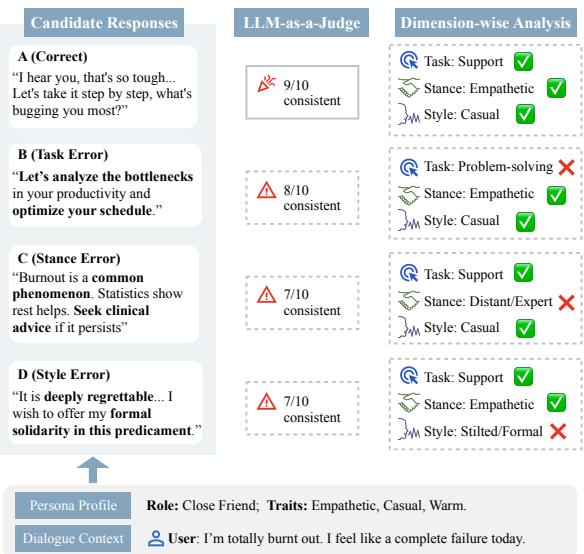  
Figure 1: Holistic vs. Dimension-wise evaluation of persona fidelity. Holistic judges are often misled by surfacelevel fluency (B-D), whereas our dimension-wise analysis provides interpretable and diagnostic evidence for persona (mis)alignment across three functional dimensions.

A compelling role-playing agent should not only generate coherent responses that remain consistent with persona-related knowledge, but also maintain stable and recognizable personality traits and behavioral styles throughout interaction (Wu et al., 2025a; Li et al., 2026a). This requirement is commonly referred to as persona fidelity: the extent to which a model’s behavior consistently reflects the psychological and stylistic characteristics of a target persona (Shin et al., 2025; Wang et al., 2024c).

Despite its importance, reliably evaluating persona fidelity remains a significant challenge (Jiang et al., 2024; Yoon et al., 2024; Ji et al., 2025). Importantly, persona fidelity differs fundamentally from conventional notions of factual consistency in personalized dialogue systems (Zhang et al., 2018; Shao et al., 2023; Mazaré et al., 2018), which focus on whether a model can accurately recall or reproduce user-specific facts, such as demographic attributes, preferences, or biographical information. In contrast, persona fidelity concerns whether the model behaves in a manner aligned with the underlying personality and behavioral style of the assigned character (Jiang et al., 2023b). A response may correctly mention persona-related facts while still deviating from the target persona in nuanced psychological or stylistic ways. Such discrepancies are rarely captured by surface-level semantic similarity or simple factual matching. Consequently, robust evaluation hinges on the ability to distinguish truly “in character” responses from plausible but behaviorally misaligned alternatives.

Current evaluation paradigms for persona fidelity follow two methodological categories. The most prevalent is LLM-as-a-judge, in which an evaluator model directly assigns a holistic consistency score to a response (Tu et al., 2024; Wang et al., 2024a; Zhou et al., 2024b). While scalable, this approach is often nontransparent and prone to “holistic appraisal hallucination”, where judges overrate fluent but out-of-character responses (Wu and Aji, 2025; Shin et al., 2025; Wang et al., 2024d,b; Li et al., 2026b). Another paradigm, psychometric probing, assesses agents through standardized personality inventories (e.g., Big Five or MBTI) (Wang et al., 2024c; Jiang et al., 2024). While effective for trait-level analysis, these methods typically rely on static interviews, thereby failing to capture the finegrained and context-dependent fidelity required in spontaneous and dynamic dialogues.

In this work, we argue that persona fidelity should be evaluated as a structured, multidimensional consistency problem. Drawing inspiration from Systemic Functional Linguistics (SFL) (Halliday and Matthiessen, 2013), we decompose consistency into three functional dimensions: Task Framing, Interpersonal Stance, and Linguistic Style. From this perspective, persona is materialized not only through what an agent says, but also through how it frames goals, negotiates interpersonal relationships, and adopts characteristic linguistic patterns. As shown in Figure 1, while holistic judges are frequently misled by surfacelevel helpfulness, our dimension-wise decomposition enables fine-grained identification of why and how a response deviates from the target persona.

Based on this framework, we propose PRISM (Persona Reasoning with Inverse SFL-based Modeling), a structured evaluation framework for persona fidelity. Unlike holistic judges, PRISM reformulates evaluation as an inverse structured inference task: given a response and context, the evaluator infers dimension-specific evidence and checks its alignment with the target persona. Specifically, PRISM estimates a posterior distribution over a profile-conditioned label space (Aligned, Indeterminate, or Contradictory) for each SFL-based dimension. By aggregating these fine-grained signals into an Inverse Persona Evidence, PRISM provides a more interpretable, psycholinguistically grounded, and auditable evaluation process for persona fidelity.

Given the lack of dedicated benchmarks for evaluating persona fidelity evaluation frameworks, we construct three diagnostic benchmarks, namely Big5-Persona-EASY, Big5-Persona-HARD, and Social-Persona, based on existing personaconsistent dialogue corpora (Li et al., 2025b; Chen et al., 2024). To rigorously assess evaluator reliability, we introduce controlled perturbation strategies to generate hard negative responses that remain contextually plausible while subtly violating the target persona’s behavioral or linguistic style.

Experimental results show that PRISM consistently outperforms traditional holistic judges. Furthermore, our analysis reveals that the functional decomposition effectively mitigates the “holistic appraisal hallucination” and exhibits superior stability across varying evaluator backbones and scoring rubrics, establishing PRISM as a reliable and interpretable framework for persona fidelity assessment.

Our contributions are threefold:

• Psycholinguistically-grounded Formalization: We formalize persona fidelity as a structured, multidimensional behavioral consistency problem. Inspired by Systemic Functional Linguistics, we decompose persona-relevant behavior into three functional dimensions: task framing, interpersonal stance, and linguistic style.

• Evaluation Framework: We propose PRISM, a structured evaluation framework that reformulates persona evaluation as an inverse structured inference task. By estimating dimension-specific posterior distributions, PRISM provides an interpretable and auditable evaluation process.

• Benchmarks and Validation: We curate three diagnostic benchmarks with contextually plausible hard negatives for evaluating persona fidelity assessment methods. Extensive analyses show that PRISM consistently outperforms holistic judges in reliability and robustness 1.

## 2 Related Work

Personalization for Role-playing Agents Recent advances in Large Language Models (LLMs) have enabled increasingly sophisticated roleplaying agents capable of embodying diverse personas and social identities (Deng et al., 2022; Chen et al., 2023; Zhang et al., 2024; Zhou et al., 2024a; Shin et al., 2025; Peng and Chen, 2026; Yang et al., 2025; Qiu et al., 2026; Zhu et al., 2025; Chen et al., 2025b). The efficacy of role-playing agents is intrinsically tied to personalization, which aims to transform generic LLMs into distinct, recognizable personas (Li et al., 2025b; de Araujo et al., 2026). Prior work has studied personalization generation from two related perspectives: factuallyconsistent and personality-grounded.

Factually-consistent generation emphasizes accurate recall of persona-related information, often through retrieval-augmented generation (Wang et al., 2023, 2024a) or memory mechanisms (Xu et al., 2022; He et al., 2025a; Li et al., 2025a) to preserve biographical details such as age, occupation, and experiences (Shao et al., 2023). In contrast, personality-grounded generation seeks to induce stable psychological traits and behavioral styles through psychometric prompting (e.g., Big Five or MBTI) (De Raad, 2000; Jiang et al., 2023b; Wu et al., 2025b), steering (Wei et al., 2026), or character-specific fine-tuning (Wang et al., 2024a; Li et al., 2023).

Despite these advances, existing evaluation frameworks primarily focus on factual consistency (Tan et al., 2025; He et al., 2025b; Chen et al., 2025a), assessing whether agents can correctly reproduce persona-related facts. However, factual consistency alone is insufficient for high-quality role-playing: an agent may accurately recall persona information while still failing to exhibit the intended personality traits or behavior styles. Our work addresses this gap by shifting evaluation from “what the agent knows” (fact) to “how the agent behaves” (persona fidelity).

Methodologies for Persona Fidelity Evaluation Existing approaches for persona fidelity evaluation mainly follow two paradigms: holistic appraisal (Wang et al., 2025) and psychological probing (Ye et al., 2025; Wang et al., 2024c). Holistic Appraisal typically adopts an LLM-as-a-judge framework, where an evaluator model assigns a single consistency score to generated responses (Jun and Lee, 2025; Zhou et al., 2024b; Feng et al., 2025). While scalable, this approach is susceptible to “holistic appraisal hallucination” (Wu and Aji, 2025; Shu et al., 2024), where judges are frequently misled by surface-level fluency or the “helpfulness bias” (Wu and Aji, 2025; Zheng et al., 2023). This often results in rating polite or informative responses favorably while overlooking subtle persona violations. Psychological probing assesses persona through standardized psychological inventories, such as the Big Five Inventory (Jiang et al., 2023b; Bhandari et al., 2025; Jiang et al., 2024) or MBTI (Tu et al., 2023, 2024). Although effective for traitlevel analysis, these methods are typically based on static questionnaires or decontextualized interviews (Wang et al., 2024c), limiting their ability to capture fine-grained and context-dependent persona fidelity in dynamic dialogue.

In contrast to prior work, we formulate persona fidelity evaluation as a structured and interpretable consistency problem. Our framework decomposes persona-consistent behavior into multiple functional dimensions, enabling fine-grained diagnosis of subtle behavioral deviations beyond single-score holistic judgments.

Systemic Functional Linguistics Systemic Functional Linguistics (SFL) views language as a resource for meaning-making in social context (Halliday and Matthiessen, 2013; Eggins, 2004; Matthiessen and Teruya, 2023). A central perspective in SFL is that language simultaneously realizes multiple metafunctions: the ideational metafunction for representing experiences and events, the interpersonal metafunction for enacting social relations, and the textual metafunction for organizing meanings in discourse (Thompson et al., 2019).

This functional perspective is particularly relevant to persona fidelity because a response may be contextually appropriate while still differing from the target persona in how it construes the interaction, relates to the interlocutor, or expresses itself linguistically (Bucholtz and Hall, 2005; Agha, 2006). Motivated by this perspective, PRISM organizes persona-relevant evidence along three operational dimensions: Task Framing, which captures the activity orientation or communicative goal foregrounded by the response (Halliday and Matthiessen, 2013); Interpersonal Stance, which captures the relational position enacted toward the interlocutor (Jaffe, 2009); and Linguistic Style, which captures characteristic patterns in how the response is linguistically expressed (Coupland, 2007). These dimensions provide interpretable, complementary views of persona realization.

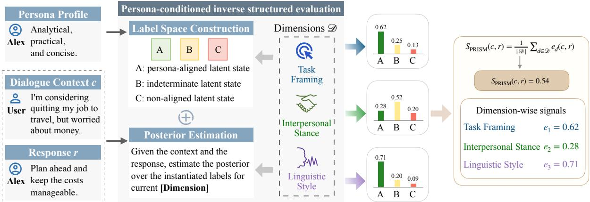  
Figure 2: Overview of the PRISM framework. PRISM constructs persona-conditioned latent spaces across three functional dimensions and performs inverse posterior estimation over the instantiated labels. The dimension-level signals $( e _ { d } )$ are then aggregated into a diagnostic persona fidelity assessment.

## 3 PRISM Evaluation Framework

Instead of directly asking whether a response is consistent with a target persona, we formulate persona fidelity evaluation as a persona-conditioned inverse structured evaluation problem. Following the theory of Systemic Functional Linguistics (Halliday and Matthiessen, 2013), PRISM decomposes persona fidelity into three interpretable and psycholinguistically-grounded dimensions: task framing, interpersonal stance, and linguistic style. Let $\mathcal { D } = \{ d _ { 1 } , d _ { 2 } , d _ { 3 } \}$ denote the three dimensions. For each dimension, PRISM performs inverse inference over the dialogue context and candidate response to estimate how strongly the response expresses the persona-aligned latent behavioral state. Concretely, it proceeds in two main steps, as shown in Figure 2.

Persona-Conditioned Label Space Construction For each dimension $d \in \mathcal { D } ,$ , PRISM defines a dimension-specific, persona-conditioned label space $y _ { d } ~ = ~ \{ A , B , C \}$ Here, A denotes the persona-aligned latent state for dimension $d ,$ B denotes an indeterminate or mixed state, and $C$ denotes an opposite or non-aligned state. The semantic interpretations of A, B, C are defined separately for each dimension and relative to the target persona. Accordingly, these labels represent dimension-level latent states rather than instancelevel positive/negative labels, and a response may remain aligned on some dimensions while deviating on others. Figure 3 illustrates one concrete label-space instantiation for the Interpersonal Stance dimension under a target persona characterized by High Agreeableness. Additional datasetspecific cases and construction details are provided in Appendix B.3.

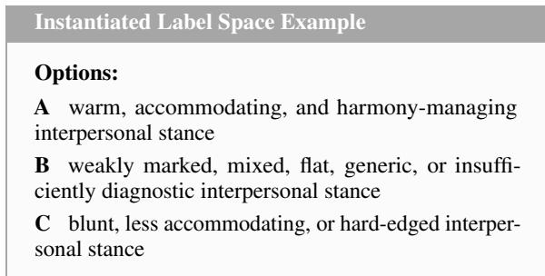  
Figure 3: Instantiated label space for the Interpersonal Stance dimension under a target persona characterized by High Agreeableness.

Inverse Posterior Estimation Given a dialogue context c and a candidate response r, PRISM constructs a dimension-specific inverse prompt and estimates the model’s conditional support for each label in $\mathcal { V } _ { d }$ . These scores are normalized over the restricted label space to obtain a posterior-like distribution:

$$
q _ { d } ( y \mid c , r ) = \frac { \exp ( s _ { d } ( y \mid c , r ) ) } { \sum _ { y ^ { \prime } \in \mathcal { V } _ { d } } \exp ( s _ { d } ( y ^ { \prime } \mid c , r ) ) } , \quad y \in \mathcal { V } _ { d } ,\tag{1}
$$

where $s _ { d } ( y \mid c , r )$ denotes the model’s conditional log-score assigned to the label completion corresponding to y under the inverse prompt for dimension d. Unlike holistic free-form judging, PRISM performs evaluation by scoring a restricted set of structured label completions and normalizing their relative support. This design reduces ambiguity in evaluator generation and constrains the evaluation process to explicitly defined behavioral states. To reduce label-position bias, we randomly permute the displayed label order for each prompt and map model outputs back to the canonical aligned / neutral / non-aligned label space before scoring.

We use the aligned-state probability as the dimension-level consistency signal:

$$
e _ { d } ( c , r ) = q _ { d } ( A \mid c , r ) .\tag{2}
$$

This score quantifies how strongly the response expresses the persona-consistent latent state along dimension $d .$ The final persona fidelity score is estimated by averaging the inverse evidence across dimensions:

$$
\begin{array} { r } { S _ { \mathrm { P R I S M } } ( c , r ) = \frac { 1 } { | \mathcal { D } | } \sum _ { d \in \mathcal { D } } e _ { d } ( c , r ) . } \end{array}\tag{3}
$$

This design yields two advantages. First, it turns persona evaluation from an opaque end-to-end rating problem into a structured set of interpretable sub-decisions. Second, it preserves diagnostic granularity: beyond the final score $S _ { \mathrm { P R I S M } } ( c , r )$ , the individual dimension scores $\{ e _ { d } \} _ { d \in \mathcal { D } }$ reveal which aspect of persona realization is aligned or misaligned in the response.

## 4 Experimental Details

## 4.1 Dataset

Given the absence of available benchmarks for evaluating persona fidelity, we construct three evaluation datasets from existing personalized generation benchmarks: Big5-Persona-EASY, Big5-Persona-HARD, and Social-Persona.

The Big5-based benchmarks are derived from Big5-CHAT (Li et al., 2025b), which provides dialogue triplets: $( p , c , r )$ , where p denotes a target profile (e.g., High Agreeableness), c is the dialogue context, and r is a persona-consistent response. We construct “hard negatives” by minimally disturbing the alignment within a triplet while keeping other elements fixed: (1) Big5-Persona-EASY. We maintain the context c and response r but substitute p with its direct opposite profile $p ^ { \prime }$ within the same personality dimension (e.g., replacing High Agreeableness with Low Agreeableness). This setup evaluates the model’s sensitivity to directional tendencies of a specific trait. (2) Big5-Persona-HARD: To simulate subtler misalignments, we construct “nearmiss” negatives by cross-matching traits across different dimensions: either (i) $( p ^ { \prime } , c , r )$ where $p ^ { \prime }$ belongs to a different trait dimension entirely (e.g., swapping High Extraversion for High Agreeableness), or (ii) $( p , c , r ^ { \prime } )$ , where $r ^ { \prime }$ is a response generated for a different trait within the same scenario. These cases require the model to distinguish between fine-grained behavioral realizations that share surface-level similarities, as the responses remain contextually plausible yet violate the specific behavioral constraints of the target persona.

<table><tr><td>Dataset</td><td>Size</td><td>Pos:Neg</td></tr><tr><td>Big5-Persona-EASY</td><td>200K</td><td>1:1</td></tr><tr><td>Big5-Persona-HARD</td><td>300K</td><td>1:2</td></tr><tr><td>Social-Persona</td><td>2.9K</td><td>1:3</td></tr></table>

Table 1: Statistics of the persona fidelity benchmarks.

Social-Persona derives from the role-style subset of SocialBench (Chen et al., 2024). We convert the original multiple-choice format into a point-wise evaluation setting by pairing the target profile and context with each candidate response independently to form multiple $( p , c , r )$ triplets.

Table 1 presents the dataset statistics. In our experiments, we randomly sample a subset of the Big5-based benchmarks, comprising 2,000 instances for Big5-Persona-EASY and 3,000 for Big5-Persona-HARD. Examples of the dataset construction are detailed in Appendix A. We further validate the reformulated evaluation instances through a benchmark-level human study; details and results are provided in Appendix D.1.

## 4.2 Models

We evaluate persona fidelity using nine LLM-based evaluators. Our main open-source evaluator backbones are Qwen2.5 (Yang et al., 2024), Llama-3.1 (Team, 2024), and Mistral (Jiang et al., 2023a). We further include three stronger external evaluators: DeepSeek-V3.2 (DeepSeek-AI, 2025), GPT-5.4 and Gemini-3-Flash, as reference judges for direct LLM-as-a-judge evaluation. In addition, we consider three specialized evaluation models. Atla Selene Mini (de Araujo et al., 2026) is a state-ofthe-art small language model-as-a-judge fine-tuned model for general-purpose evaluation. PandaLM-7B-v1 (Wang et al., 2024d) is a Llama-7B-based response-comparison judge, which we adapt to select the more profile-consistent response in each pair. AlignScore-large (Zha et al., 2023) is a RoBERTa-large-based factual consistency evaluator, which we adapt by treating the serialized profile and dialogue context as the reference and candidate response as the claim.

<table><tr><td rowspan="2">Model</td><td rowspan="2">Method</td><td colspan="3">Social-Persona</td><td colspan="3">Big5-Persona-EASY</td><td colspan="3">Big5-Persona-HARD</td></tr><tr><td>AUC</td><td>P-AUC</td><td>G-Acc</td><td>AUC</td><td>P-AUC</td><td>G-Acc</td><td>AUC</td><td>P-AUC</td><td>G-Acc</td></tr><tr><td colspan="10">Specialized Evaluation Models</td></tr><tr><td>Selene-Mini</td><td></td><td>87.50</td><td>88.31</td><td>52.29</td><td>84.90</td><td>82.75</td><td>74.40</td><td>63.06</td><td>66.02</td><td>23.70</td></tr><tr><td>PandaLM</td><td>一</td><td></td><td>48.28</td><td>10.13</td><td></td><td>48.00</td><td>48.00</td><td></td><td>48.45</td><td>23.60</td></tr><tr><td>AlignScore</td><td></td><td>56.77</td><td>57.20</td><td>32.56</td><td>53.80</td><td>53.60</td><td>53.60</td><td>52.72</td><td>55.75</td><td>31.90</td></tr><tr><td colspan="10">Open-source LLMs</td></tr><tr><td rowspan="3">Qwen</td><td>Vanilla</td><td>83.26</td><td>84.34</td><td>49.32</td><td></td><td>85.85</td><td>77.80</td><td>68.60</td><td>71.70</td><td>36.50</td></tr><tr><td>+CoT</td><td>84.23</td><td>85.09</td><td>50.00</td><td>86.05 83.06</td><td>82.45</td><td>72.00</td><td>65.94</td><td>68.77</td><td>28.40</td></tr><tr><td>PRISM</td><td>84.15</td><td>91.08</td><td>78.78</td><td>96.29</td><td>97.60</td><td>97.60</td><td>75.99</td><td>80.85</td><td>68.20</td></tr><tr><td rowspan="3">Llama</td><td></td><td>73.26</td><td>73.28</td><td>18.78</td><td>72.76</td><td>70.85</td><td>55.20</td><td>58.15</td><td>58.32</td><td>3.90</td></tr><tr><td>Vanilla +CoT</td><td>72.48</td><td>73.53</td><td>20.94</td><td>72.76</td><td>70.85</td><td>55.20</td><td>60.61</td><td>60.50</td><td>18.10</td></tr><tr><td>PRISM</td><td>79.73</td><td>88.96</td><td>75.27</td><td>89.31</td><td>93.30</td><td>93.30</td><td>66.97</td><td>75.90</td><td>60.30</td></tr><tr><td rowspan="3">Mistral</td><td>Vanilla</td><td>78.20</td><td>81.19</td><td>52.16</td><td>65.01</td><td>64.15</td><td>50.60</td><td>53.55</td><td>57.50</td><td>20.00</td></tr><tr><td>+CoT</td><td>83.85</td><td>86.53</td><td>59.32</td><td>67.89</td><td>65.75</td><td>57.60</td><td>56.00</td><td>57.75</td><td>19.00</td></tr><tr><td>PRISM</td><td>78.90</td><td>86.84</td><td>70.40</td><td>85.58</td><td>85.90</td><td>85.90</td><td>64.23</td><td>71.67</td><td>54.90</td></tr><tr><td colspan="10">Closed-source LLMs</td></tr><tr><td>DeepSeek-V3.2</td><td>Vanilla</td><td>88.21</td><td>89.68</td><td>60.94</td><td>89.05</td><td>88.55 88.45</td><td>81.00 79.60</td><td>65.76 67.93</td><td>67.35 69.55</td><td>26.80 28.80</td></tr><tr><td>GPT-5.4</td><td> $+ \mathrm { C o T }$  Vanilla</td><td>86.21 91.19</td><td>87.36 92.50</td><td>52.56 69.00</td><td>89.27 98.96</td><td>98.50</td><td>97.00</td><td>77.96</td><td>78.90</td><td>44.60</td></tr><tr><td>Gemini-3-Flash</td><td>+CoT Vanilla</td><td>92.64 92.02</td><td>93.56 92.65</td><td>73.00 69.81</td><td>98.96 97.48</td><td>98.50 97.44</td><td>97.00 94.89</td><td>78.60 76.22</td><td>79.10 76.98</td><td>46.60 40.88</td></tr><tr><td></td><td>+CoT</td><td>92.73</td><td>93.39</td><td>72.83</td><td>97.83</td><td>96.93</td><td>93.87</td><td>76.52</td><td>77.18</td><td>40.68</td></tr></table>

Table 2: Main results on three persona fidelity benchmarks. AUC measures overall ranking quality, P-AUC denotes Pair-AUC, and G-Acc denotes strict Group Accuracy. Dashes indicate inapplicable metrics; in particular, PandaLM is evaluated only in pairwise form and therefore does not admit AUC. Within each model family, the best result is boldfaced, and PRISM rows are highlighted in gray.

## 4.3 Evaluation Metrics

We evaluate model performance using three ranking-based metrics: AUC, Pair-AUC (P-AUC), and Strict Group Accuracy (G-Acc). Let G denote the set of all contrastive groups. For each group $g \in { \mathcal { G } }$ , let $r _ { g } ^ { + }$ denote the persona-consistent response and let $\{ r _ { g , j } ^ { - } \} _ { j = 1 } ^ { m _ { g } }$ denote the set of $m _ { g }$ negative responses under the same profile and dialogue context. Let $s ( \cdot )$ be the consistency score assigned by a method. For any positive-negative pair, we define the comparison function

$$
\phi ( r _ { g } ^ { + } , r _ { g , j } ^ { - } ) = \left\{ \begin{array} { l l } { 1 , } & { s ( r _ { g } ^ { + } ) > s ( r _ { g , j } ^ { - } ) , } \\ { 0 . 5 , } & { s ( r _ { g } ^ { + } ) = s ( r _ { g , j } ^ { - } ) , } \\ { 0 , } & { s ( r _ { g } ^ { + } ) < s ( r _ { g , j } ^ { - } ) . } \end{array} \right.\tag{4}
$$

AUC measures global ranking quality over all positive and negative responses. It is defined as the probability that a randomly sampled personaconsistent response receives a higher score than a randomly sampled profile-inconsistent response:

$$
\begin{array} { r } { \operatorname { A U C } = \frac { 1 } { \left| \mathscr { P } \right| \left| \mathscr { N } \right| } \sum _ { r ^ { + } \in \mathscr { P } } \sum _ { r ^ { - } \in \mathscr { N } } \phi ( r ^ { + } , r ^ { - } ) , } \end{array}\tag{5}
$$

$$
\begin{array} { r l } & { \mathrm { w h e r e } \mathcal { P } = \{ r _ { g } ^ { + } \mid g \in \mathcal { G } \} , \mathcal { N } = \{ r _ { g , j } ^ { - } \mid g \in \mathcal { G } , 1 \leq } \\ & { j \leq m _ { g } \} . } \end{array}
$$

Pair-AUC measures whether the targetconsistent response receives a higher score than its contrastive alternatives, by averaging all within-group positive-negative pairs:

$$
{ \mathrm { P a i r - A U C } } = { \frac { \sum _ { g \in { \mathcal { G } } } \sum _ { j = 1 } ^ { m _ { g } } \phi ( r _ { g } ^ { + } , r _ { g , j } ^ { - } ) } { \sum _ { g \in { \mathcal { G } } } m _ { g } } } .\tag{6}
$$

Strict Group Accuracy (G-Acc) measures whether the positive response is ranked above all negative responses within the same group:

$$
\mathrm { G - A C C } = \frac { 1 } { | \mathcal { G } | } \sum _ { g \in \mathcal { G } } \mathbf { 1 } \left[ s ( r _ { g } ^ { + } ) > \operatorname* { m a x } _ { 1 \leq j \leq m _ { g } } s ( r _ { g , j } ^ { - } ) \right] ,\tag{7}
$$

where $\mathbf { 1 } [ \cdot ]$ is the indicator function. This metric is stricter than Pair-AUC, since it requires the personaconsistent response to outrank every negative candidate in its contrastive group.

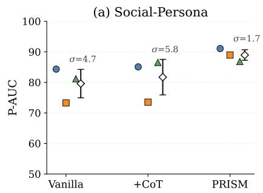

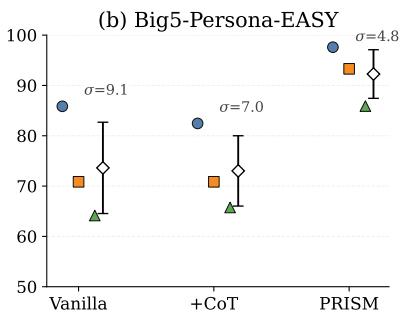

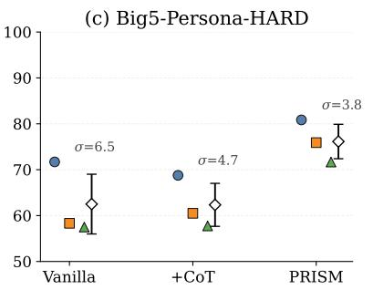

Figure 4: Backbone sensitivity on Pair-AUC across three LLM backbones. Points denote individual backbones and diamonds indicate the mean with standard deviation.  
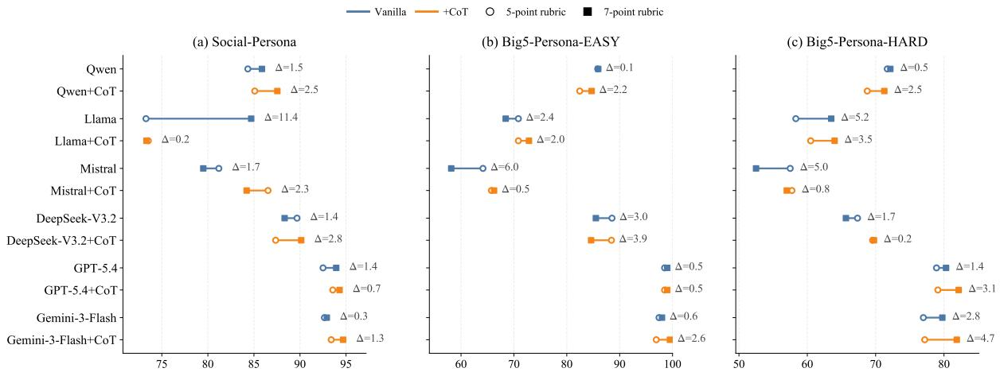  
Figure 5: Rubric Sensitivity of direct LLM-as-a-Judge evaluation on Pair-AUC. Each segment connects the results from 5-point and 7-point rubrics for the same evaluator and prompting method. Longer segments indicate greater sensitivity to scoring granularity.

## 4.4 Result Analysis

Table 2 compares direct LLM-as-a-judge baselines (Vanilla and CoT, both under the 5-point rubric), specialized evaluation models, and PRISM on open-source evaluator backbones. Detailed prompt templates are provided in Appendix B.2. Across all three open-source backbones, PRISM consistently outperforms both Vanilla and CoT baselines on P-AUC and G-Acc. For example, on Social-Persona, PRISM with Qwen improves P-AUC from 84.34 to 91.08 and G-Acc from 49.32 to 78.78 relative to Vanilla. Similarly, on Big5-Persona-HARD, PRISM with Llama raises G-Acc from 3.90 under Vanilla and 18.10 under CoT to 60.30. These results suggest that structured dimension-wise scoring provides more reliable persona fidelity signals than direct holistic judging, especially when distinguishing persona-consistent responses from contextually plausible but subtly misaligned alternatives.

Comparison between Vanilla and CoT provides a complementary observation. For stronger evaluators, CoT often improves Vanilla, indicating that dimension-wise prompting can help persona fidelity assessment. However, these gains are less stable for smaller models, indicating that prompting alone is insufficient. In contrast, PRISM turns such dimensions into structured inverse evidence signals, leading to more reliable improvements. Notably, stronger judges do not necessarily outperform PRISM: On Big5-Persona-HARD, GPT-5.4 with CoT achieves 46.6 G-Acc, while PRISM with Qwen reaches 68.20.

## 5 Analysis of Persona Fidelity Evaluation

We conduct a deeper analysis to understand why direct LLM-as-a-judge is insufficient for persona fidelity assessment, and how structured dimensionaware evaluation improves reliability. Specifically, we organize our analysis around three research questions: (RQ1) How stable and reliable are holistic LLM judges? (RQ2) Do the proposed persona dimensions provide informative and diagnostically meaningful signals for persona fidelity evaluation?

<table><tr><td colspan="4">Big5-Persona-EASY</td><td colspan="4">(b) Strict Group ACC Big5-Persona-HARD</td><td colspan="4">Social-Persona</td></tr><tr><td>Vanilla</td><td>Task</td><td>Stance</td><td>Style</td><td>Vanilla</td><td>Task</td><td>Stance</td><td>Style</td><td>Vanilla</td><td>Task</td><td>Stance</td><td>Style</td></tr><tr><td>0.78</td><td>0.94</td><td>0.97</td><td>0.94</td><td>0.36</td><td>0.61</td><td>0.62</td><td>0.62</td><td>0.49</td><td>0.71</td><td>0.75</td><td>0.75</td></tr><tr><td>0.52</td><td>0.88</td><td>0.90</td><td>0.95</td><td>0.04</td><td>0.55</td><td>0.56</td><td>0.61</td><td>0.19</td><td>0.69</td><td>0.71</td><td>0.79</td></tr><tr><td>0.51</td><td>0.85</td><td>0.89</td><td>0.85</td><td>0.20</td><td>0.53</td><td>0.52</td><td>0.52</td><td>0.52</td><td>0.67</td><td>0.74</td><td>0.80</td></tr></table>

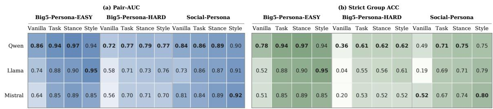

Figure 6: Dimension-wise diagnostic evaluation on three persona fidelity benchmarks. Vanilla denotes holistic scoring, while “Task”, “Stance”, and “Style” denote single-dimension scoring based on task framing, interpersonal stance, and linguistic style. Darker cells indicate stronger performance.  
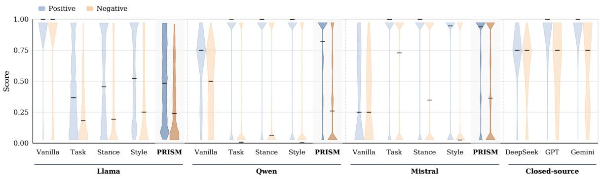  
Figure 7: Score distribution on Big5-Persona-HARD. Blue and orange violins denote positive and negative samples, respectively, and the horizontal bars indicate median scores. Better evaluators should assign higher scores to positive responses while keeping negative responses low.

(RQ3) Why is multi-dimensional aggregation necessary beyond single-dimension evaluation?

## 5.1 Stability Analysis of Holistic Judge (RQ1)

We examine the stability of direct LLM-as-a-judge evaluation under three sources of variation: evaluation backbone, scoring rubric, and decoding temperature. Figure 4 shows backbone sensitivity under Pair-AUC. PRISM not only achieves stronger mean performance but also exhibits smaller variance across backbones. The same qualitative trend holds under the G-Acc in Appendix C (Figure 12), indicating that PRISM is less sensitive to evaluator choice than holistic direct judging.

Figure 5 further shows that direct LLM-as-ajudge evaluation can change noticeably when the scoring rubric is modified from a 5-point to a 7-point scale. These shifts are visible across datasets and evaluator families, indicating that direct judgements are not invariant to rubric granularity. The same pattern also holds under G-Acc in Appendix C (Figure 13). In addition, we also find direct judging is affected not only by the evaluator model and rubric design, but also by decoding stochasticity. Figures 16, 17 and 18 analyze the temperature sensitivity of Vanilla evaluation on Big5-Persona-HARD under Qwen, Mistral, and

Llama.

These findings suggest that direct LLM judges are sensitive to multiple elements, including backbone, rubric, and temperature. While stronger models can improve absolute judging performance, they do not fully remove this instability. By contrast, PRISM yields more stable behavior by grounding evaluation in structured persona-conditioned dimensions rather than a single holistic scalar judgement.

## 5.2 Dimension-wise Evaluation (RQ2)

To gain deeper insights, we further examine whether individual persona dimensions provide useful evidence and diagnostic signal for persona fidelity assessment. As shown in Figure 6, singledimension scoring yields stronger results than holistic direct judging. This suggests that direct LLMas-a-judge evaluation often struggles to identify subtle persona inconsistency when responses remain contextually plausible. The figure also reveals that the most informative dimension varies across datasets. On Big5-Persona-EASY, interpersonal stance and linguistic style are particularly effective; on Social-Persona, linguistic style achieves the strongest results for most models; and on Big5-Persona-HARD, no single dimension consistently dominates. These findings indicate that the proposed dimensions provide informative and diagnostically meaningful views of persona fidelity assessment, although their relative usefulness varies across datasets. We further evaluate this dimension-level diagnostic validity through a human annotation study in Appendix D.2.

## 5.3 Score Distribution Analysis: Why Aggregation Matters (RQ3)

Although the previous analysis shows that individual dimensions provide diagnostically meaningful signals, it remains unclear why multi-dimensional aggregation is necessary beyond single-dimension evaluation. Figure 7 therefore analyzes score distribution on Big5-Persona-HARD, our most challenging benchmark. The corresponding results for Big5-Persona-EASY and Social-Persona datasets are shown in Figures 14 and 15.

A key observation is that Vanilla judging often produces substantial overlap between positive and negative responses, with many negative samples still receiving relatively high scores. This suggests that direct LLM-as-a-judge evaluation often assigns overly high scores to contextually plausible hard negatives in persona fidelity assessment. Moreover, single-dimension scoring generally improves over Vanilla judging, but each dimension captures only part of the relevant evidence and is therefore insufficient for robust persona fidelity evaluation on its own. By aggregating complementary evidence across dimensions, PRISM reduces this ambiguity and yields clearer separation between positive and negative responses.

## 6 Conclusion

We introduce PRISM, a persona-conditioned inverse structured evaluation framework for persona fidelity assessment. Grounded in Systemic Functional Linguistics, PRISM models personarelevant behavior along three functional dimensions: task framing, interpersonal stance and linguistic style. Across three benchmarks, PRISM consistently improves over direct LLM-as-a-judge baselines, especially on the harder benchmark and under stricter group-level metrics. These results suggest that persona fidelity is inherently multidimensional and is more reliably assessed through structured dimension-level evidence than through a single holistic judgement.

## Limitations

While PRISM provides a structured and interpretable framework for persona fidelity evaluation, several limitations remain.

Theoretical Scope of Functional Dimensions. PRISM adopts a psycholinguistic perspective grounded in Systemic Functional Linguistics (SFL) to organize persona-relevant behaviors into three dimensions: task framing, interpersonal stance and linguistic style. While this formulation is theoretically principled and empirically robust within our experiments, it is not the only valid paradigm for characterizing persona expression. Other sociolinguistic or discourse-theoretic frameworks might suggest additional dimensions or finer-grained distinctions of organizing persona-related signals.

Requirement of Internal Probability Access. The current instantiation of PRISM relies on the ability to estimate posterior distributions over a structured label space. In practice, this mechanism necessitates access to the model’s token-level log-probabilities (logits), making the framework most naturally applicable to open-source evaluator backbones. For closed-source models, further research could explore whether structured Chain-of-Thought reasoning or explicit dimensional decomposition in the prompt can approximate comparable dimension-level signals.

Diagnostic Evaluation vs. Generative Alignment. Our work focuses on systematically evaluating persona fidelity rather than actively improving persona-consistent generation. Although PRISM provides structured and diagnostic signals that can pinpoint specific behavioral misalignments, we do not investigate how such signals could be integrated into model training or alignment pipelines, such as being used as a reward signal for Reinforcement Learning from Human Feedback (RLHF) or as a fine-grained supervision signal for supervised finetuning. Integrating these structural persona signals into the generative loop remains a promising but independent research direction.

## Ethical Considerations

This work uses the open-source Big5-CHAT and SocialBench benchmarks, as well as the opensource Qwen2.5, Llama3.1 and Mistral models, in accordance with their respective licenses and intended academic use. ChatGPT is used only for limited paraphrasing and language polishing of author-written text.

## Acknowledgements

This research/project is supported by the National Key Research and Development Program of China (Grant No. 2024YFB4505202), Major Program (JD) of Hubei Province (No. 2023BAA024), and National Research Foundation Singapore under the AI Singapore Programme (AISG Award No: AISG3-RPGV-2025-016). Yang Deng is supported by the Lee Kong Chian Fellowship awarded by Singapore Management University.

## References

Asif Agha. 2006. Language and social relations, volume 24. Cambridge University Press.

Pranav Bhandari, Nicolas Fay, Michael J Wise, Amitava Datta, Stephanie Meek, Usman Naseem, and Mehwish Nasim. 2025. Can llm agents maintain a persona in discourse? In Proceedings of the 2025 Conference on Empirical Methods in Natural Language Processing, pages 29201–29217.

Mary Bucholtz and Kira Hall. 2005. Identity and interaction: A sociocultural linguistic approach. Discourse studies, 7(4-5):585–614.

Chaoran Chen, Bingsheng Yao, Ruishi Zou, Wenyue Hua, Weimin Lyu, Toby Jia-Jun Li, and Dakuo Wang. 2025a. Towards a design guideline for rpa evaluation: A survey of large language model-based role-playing agents. In Findings ofthe Associationfor Computational Linguistics: ACL 2025, pages 18229–18268.

Hongzhan Chen, Hehong Chen, Ming Yan, Wenshen Xu, Gao Xing, Weizhou Shen, Xiaojun Quan, Chenliang Li, Ji Zhang, and Fei Huang. 2024. Socialbench: Sociality evaluation of role-playing conversational agents. In Findings of the Association for Computational Linguistics: ACL 2024, pages 2108– 2126.

Liang Chen, Hongru Wang, Yang Deng, Wai-Chung Kwan, Zezhong Wang, and Kam-Fai Wong. 2023. Towards robust personalized dialogue generation via order-insensitive representation regularization. In Findings ofthe Associationfor Computational Linguistics: ACL 2023, Toronto, Canada, July 9-14, 2023, volume ACL 2023 of Findings of ACL, pages 7337–7345.

Zhuang Chen, Yaru Cao, Guanqun Bi, Jincenzi Wu, Jinfeng Zhou, Xiyao Xiao, Si Chen, Hongning Wang, and Minlie Huang. 2025b. Socialsim: Towards socialized simulation of emotional support conversation. In Proceedings of the AAAI Conference on Artificial Intelligence, volume 39, pages 1274–1282.

Nikolas Coupland. 2007. Style: Language variation and identity. Cambridge University Press.

Pedro Henrique Luz de Araujo, Michael A. Hedderich, Ali Modarressi, Hinrich Schütze, and Benjamin Roth. 2026. Persistent personas? role-playing, instruction following, and safety in extended interactions. In Proceedings ofthe 19th Conference ofthe European Chapter of the Association for Computational Linguistics, EACL 2026, pages 5329–5359.

Boele De Raad. 2000. The bigfive personalityfactors: the psycholexical approach to personality. Hogrefe & Huber Publishers.

DeepSeek-AI. 2025. Deepseek-v3.2: Pushing the frontier of open large language models. arXiv preprint arXiv:2512.02556.

Yang Deng, Yaliang Li, Wenxuan Zhang, Bolin Ding, and Wai Lam. 2022. Toward personalized answer generation in e-commerce via multi-perspective preference modeling. ACM Trans. Inf. Syst., 40(4):87:1– 87:28.

Suzanne Eggins. 2004. Introduction to systemic functional linguistics. A&c Black.

Xiachong Feng, Longxu Dou, and Lingpeng Kong. 2025. Reasoning does not necessarily improve roleplaying ability. In Findings of the Association for Computational Linguistics: ACL 2025, pages 10301– 10314.

Michael Alexander Kirkwood Halliday and Christian MIM Matthiessen. 2013. Halliday’s introduction tofunctional grammar. Routledge.

Junqing He, Liang Zhu, Rui Wang, Xi Wang, Gholamreza Haffari, and Jiaxing Zhang. 2025a. Madialbench: Towards real-world evaluation of memoryaugmented dialogue generation. In Proceedings of the 2025 Conference of the Nations of the Americas Chapter of the Association for Computational Linguistics: Human Language Technologies, pages 9902–9921.

Yancheng He, Shilong Li, Jiaheng Liu, Yingshui Tan, Weixun Wang, Hui Huang, Xingyuan Bu, Hangyu Guo, Chengwei Hu, Boren Zheng, Zhuoran Lin, Dekai Sun, Zhicheng Zheng, Wenbo Su, and Bo Zheng. 2025b. Chinese simpleqa: A chinese factuality evaluation for large language models. In Proceedings of the 63rd Annual Meeting of the Association for Computational Linguistics (Volume 1: Long Papers), pages 19182–19208.

Alexandra Jaffe. 2009. Stance: sociolinguistic perspectives. Oxford University Press.

Ke Ji, Yixin Lian, Linxu Li, Jingsheng Gao, Weiyuan Li, and Bin Dai. 2025. Enhancing persona consistency for llms’ role-playing using persona-aware contrastive learning. In Findings of the Association for Computational Linguistics: ACL 2025, pages 26221– 26238.

Albert Q. Jiang, Alexandre Sablayrolles, Arthur Mensch, Chris Bamford, Devendra Singh Chaplot, Diego de las Casas, Florian Bressand, Gianna Lengyel, Guillaume Lample, Lucile Saulnier, Lélio Renard Lavaud, Marie-Anne Lachaux, Pierre Stock, Teven Le Scao, Thibaut Lavril, Thomas Wang, Timothée Lacroix, and William El Sayed. 2023a. Mistral 7b. CoRR, abs/2310.06825.

Guangyuan Jiang, Manjie Xu, Song-Chun Zhu, Wenjuan Han, Chi Zhang, and Yixin Zhu. 2023b. Evaluating and inducing personality in pre-trained language models. Advances in Neural Information Processing Systems, 36:10622–10643.

Hang Jiang, Xiajie Zhang, Xubo Cao, Cynthia Breazeal, Deb Roy, and Jad Kabbara. 2024. Personallm: Investigating the ability of large language models to express personality traits. In Findings of the associationfor computational linguistics: NAACL 2024, pages 3605–3627.

Yonghyun Jun and Hwanhee Lee. 2025. Exploring persona sentiment sensitivity in personalized dialogue generation. In Proceedings of the 63rd Annual Meeting of the Association for Computational Linguistics, pages 18384–18402.

Cheng Li, Ziang Leng, Chenxi Yan, Junyi Shen, Hao Wang, Weishi Mi, Yaying Fei, Xiaoyang Feng, Song Yan, HaoSheng Wang, Linkang Zhan, Yaokai Jia, Pingyu Wu, and Haozhen Sun. 2023. Chatharuhi: Reviving anime character in reality via large language model. arXiv preprint arXiv:2308.09597.

Hao Li, Chenghao Yang, An Zhang, Yang Deng, Xiang Wang, and Tat-Seng Chua. 2025a. Hello again! llm-powered personalized agent for long-term dialogue. In Proceedings ofthe 2025 Conference ofthe Nations ofthe Americas Chapter ofthe Association for Computational Linguistics: Human Language Technologies, NAACL 2025 - Volume 1: Long Papers, Albuquerque, New Mexico, USA, April 29 - May 4, 2025, pages 5259–5276. Association for Computational Linguistics.

Mengfan Li, Xuanhua Shi, and Yang Deng. 2026a. Costom: Causal-oriented steering for intrinsic theory-ofmind alignment in large language models. In Proceedings ofthe 64th Annual Meeting ofthe Associationfor Computational Linguistics (Volume 1: Long Papers), pages 9302–9317.

Mengfan Li, Xuanhua Shi, and Yang Deng. 2026b. Rectom: A benchmark for evaluating machine theory of mind in llm-based conversational recommender systems. In Proceedings of the AAAI Conference on Artificial Intelligence, volume 40, pages 31636– 31644.

Wenkai Li, Jiarui Liu, Andy Liu, Xuhui Zhou, Mona T. Diab, and Maarten Sap. 2025b. Big5-chat: Shaping llm personalities through training on humangrounded data. In Proceedings of the 63rd Annual

Meeting of the Association for Computational Linguistics (Volume 1: Long Papers), pages 20434– 20471.

Christian MIM Matthiessen and Kazuhiro Teruya. 2023. Systemic functional linguistics: A complete guide. Taylor & Francis.

Pierre-Emmanuel Mazaré, Samuel Humeau, Martin Raison, and Antoine Bordes. 2018. Training millions of personalized dialogue agents. In Proceedings of the 2018 conference on empirical methods in natural language processing, pages 2775–2779.

Ji-Lun Peng and Yun-Nung Chen. 2026. Rethinking role-playing evaluation: Anonymous benchmarking and a systematic study of personality effects. arXiv preprint arXiv:2603.03915.

Huachuan Qiu, Zhaoming Chen, Yuqian Chen, Yuan Xie, Yu Lu, and Zhenzhong Lan. 2026. Psyclient: Client simulation via conversational trajectory modeling for trainee practice and model evaluation in mental health counseling. arXiv preprint arXiv:2601.07312.

Yunfan Shao, Linyang Li, Junqi Dai, and Xipeng Qiu. 2023. Character-llm: A trainable agent for roleplaying. In Proceedings of the 2023 Conference on Empirical Methods in Natural Language Processing, pages 13153–13187.

Jisu Shin, Juhyun Oh, Eunsu Kim, Hoyun Song, and Alice Oh. 2025. Spotting out-of-character behavior: Atomic-level evaluation of persona fidelity in openended generation. In Findings ofthe Associationfor Computational Linguistics: ACL 2025, pages 26312– 26332.

Bangzhao Shu, Lechen Zhang, Minje Choi, Lavinia Dunagan, Lajanugen Logeswaran, Moontae Lee, Dallas Card, and David Jurgens. 2024. You don’t need a personality test to know these models are unreliable: Assessing the reliability of large language models on psychometric instruments. In Proceedings of the 2024 Conference of the North American Chapter of the Associationfor Computational Linguistics: Human Language Technologies, pages 5263–5281.

Juntao Tan, Liangwei Yang, Zuxin Liu, Zhiwei Liu, Rithesh Murthy, Tulika Manoj Awalgaonkar, Jianguo Zhang, Weiran Yao, Ming Zhu, Shirley Kokane, Silvio Savarese, Huan Wang, Caiming Xiong, and Shelby Heinecke. 2025. Personabench: Evaluating ai models on understanding personal information through accessing (synthetic) private user data. In Findings ofthe Associationfor Computational Linguistics: ACL 2025, pages 878–893.

Llama Team. 2024. The llama 3 herd of models. arXiv preprint arXiv:2407.21783.

Geoff Thompson, Wendy L Bowcher, Lise Fontaine, and David Schönthal. 2019. The Cambridge handbook of systemic functional linguistics. Cambridge University Press Cambridge.

Quan Tu, Chuanqi Chen, Jinpeng Li, Yanran Li, Shuo Shang, Dongyan Zhao, Ran Wang, and Rui Yan. 2023. Characterchat: Learning towards conversational ai with personalized social support. arXiv preprint arXiv:2308.10278.

Quan Tu, Shilong Fan, Zihang Tian, Tianhao Shen, Shuo Shang, Xin Gao, and Rui Yan. 2024. Charactereval: A chinese benchmark for role-playing conversational agent evaluation. In Proceedings of the 62nd Annual Meeting ofthe Associationfor Computational Linguistics (Volume 1: Long Papers), pages 11836–11850.

Hongru Wang, Minda Hu, Yang Deng, Rui Wang, Fei Mi, Weichao Wang, Yasheng Wang, Wai-Chung Kwan, Irwin King, and Kam-Fai Wong. 2023. Large language models as source planner for personalized knowledge-grounded dialogues. In Findings ofthe Associationfor Computational Linguistics: EMNLP 2023, Singapore, December 6-10, 2023, volume EMNLP 2023 of Findings ofACL, pages 9556–9569.

Noah Wang, Zy Peng, Haoran Que, Jiaheng Liu, Wangchunshu Zhou, Yuhan Wu, Hongcheng Guo, Ruitong Gan, Zehao Ni, Jian Yang, Man Zhang, Zhaoxiang Zhang, Wanli Ouyang, Ke Xu, Wenhao Huang, Jie Fu, and Junran Peng. 2024a. Rolellm: Benchmarking, eliciting, and enhancing role-playing abilities of large language models. In Findings of the Associationfor Computational Linguistics: ACL 2024, pages 14743–14777.

Peiyi Wang, Lei Li, Liang Chen, Zefan Cai, Dawei Zhu, Binghuai Lin, Yunbo Cao, Lingpeng Kong, Qi Liu, Tianyu Liu, and Zhifang Sui. 2024b. Large language models are not fair evaluators. In Proceedings ofthe 62nd Annual Meeting ofthe Associationfor Computational Linguistics, pages 9440–9450.

Xiaoyang Wang, Hongming Zhang, Tao Ge, Wenhao Yu, Dian Yu, and Dong Yu. 2025. Opencharacter: Training customizable role-playing llms with large-scale synthetic personas. arXiv preprint arXiv:2501.15427.

Xintao Wang, Yunze Xiao, Jen-tse Huang, Siyu Yuan, Rui Xu, Haoran Guo, Quan Tu, Yaying Fei, Ziang Leng, Wei Wang, Jiangjie Chen, Cheng Li, and Yanghua Xiao. 2024c. Incharacter: Evaluating personality fidelity in role-playing agents through psychological interviews. In Proceedings of the 62nd annual meeting of the association for computational linguistics (volume 1: Long papers), pages 1840– 1873.

Yidong Wang, Zhuohao Yu, Wenjin Yao, Zhengran Zeng, Linyi Yang, Cunxiang Wang, Hao Chen, Chaoya Jiang, Rui Xie, Jindong Wang, Xing Xie, Wei Ye, Shikun Zhang, and Yue Zhang. 2024d. Pandalm: An automatic evaluation benchmark for LLM instruction tuning optimization. In The Twelfth International Conference on Learning Representations, volume 2024, pages 43573–43593.

Zesheng Wei, Mengxiang Li, Zilei Wang, and Yang Deng. 2026. Beyond static personas: Situational personality steering for large language models. In Findings of the Association for Computational Linguistics, ACL 2026, San Diego, California, United States, July 2-7, 2026, pages 19185–19210.

Bowen Wu, Kaili Sun, Ziwei Bai, Ying Li, and Baoxun Wang. 2025a. Raiden benchmark: Evaluating roleplaying conversational agents with measurementdriven custom dialogues. In Proceedings ofthe 31st International Conference on Computational Linguistics, pages 11086–11106.

Minghao Wu and Alham Fikri Aji. 2025. Style over substance: Evaluation biases for large language models. In Proceedings ofthe 31st International Conference on Computational Linguistics, pages 297–312.

Shenghan Wu, Yimo Zhu, Wynne Hsu, Mong-Li Lee, and Yang Deng. 2025b. From personas to talks: Revisiting the impact of personas on llm-synthesized emotional support conversations. In Proceedings of the 2025 Conference on Empirical Methods in Natural Language Processing, EMNLP 2025, Suzhou, China, November 4-9, 2025, pages 5439–5453.

Xinchao Xu, Zhibin Gou, Wenquan Wu, Zheng-Yu Niu, Hua Wu, Haifeng Wang, and Shihang Wang. 2022. Long time no see! open-domain conversation with long-term persona memory. In Findings of the Association for Computational Linguistics: ACL 2022, pages 2639–2650.

An Yang, Baosong Yang, Beichen Zhang, Binyuan Hui, Bo Zheng, Bowen Yu, Chengyuan Li, Dayiheng Liu, Fei Huang, Haoran Wei, Huan Lin, Jian Yang, Jianhong Tu, Jianwei Zhang, Jianxin Yang, Jiaxi Yang, Jingren Zhou, Junyang Lin, Kai Dang, and 22 others. 2024. Qwen2.5 technical report. CoRR, abs/2412.15115.

Yizhe Yang, Palakorn Achananuparp, He-Yan Huang, Jing Jiang, Nicholas Gabriel Lim, Cameron Tan Shi Ern, Phey Ling Kit, Jenny Giam Xiuhui, John Pinto, and Ee-peng Lim. 2025. Consistent client simulation for motivational interviewing-based counseling. In Proceedings of the 63rd Annual Meeting of the Associationfor Computational Linguistics, pages 20959– 20998.

Haoran Ye, Jing Jin, Yuhang Xie, Xin Zhang, and Guojie Song. 2025. Large language model psychometrics: A systematic review of evaluation, validation, and enhancement. arXiv preprint arXiv:2505.08245.

Se-eun Yoon, Zhankui He, Jessica Echterhoff, and Julian McAuley. 2024. Evaluating large language models as generative user simulators for conversational recommendation. In Proceedings of the 2024 Conference ofthe North American Chapter ofthe Associationfor Computational Linguistics, pages 1490– 1504.

Yuheng Zha, Yichi Yang, Ruichen Li, and Zhiting Hu. 2023. Alignscore: Evaluating factual consistency

with a unified alignment function. In Proceedings of the 61st Annual Meeting of the Association for Computational Linguistics, pages 11328–11348.

Saizheng Zhang, Emily Dinan, Jack Urbanek, Arthur Szlam, Douwe Kiela, and Jason Weston. 2018. Personalizing dialogue agents: I have a dog, do you have pets too? In Proceedings of the 56th Annual Meeting of the Association for Computational Linguistics (Volume 1: Long Papers), pages 2204–2213.

Tong Zhang, Chen Huang, Yang Deng, Hongru Liang, Jia Liu, Zujie Wen, Wenqiang Lei, and Tat-Seng Chua. 2024. Strength lies in differences! improving strategy planning for non-collaborative dialogues via diversified user simulation. In Proceedings of the 2024 Conference on Empirical Methods in Natural Language Processing, EMNLP 2024, Miami, FL, USA, November 12-16, 2024, pages 424–444.

Lianmin Zheng, Wei-Lin Chiang, Ying Sheng, Siyuan Zhuang, Zhanghao Wu, Yonghao Zhuang, Zi Lin, Zhuohan Li, Dacheng Li, Eric P. Xing, Hao Zhang, Joseph E. Gonzalez, and Ion Stoica. 2023. Judging llm-as-a-judge with mt-bench and chatbot arena. Advances in neural information processing systems, 36:46595–46623.

Jinfeng Zhou, Zhuang Chen, Dazhen Wan, Bosi Wen, Yi Song, Jifan Yu, Yongkang Huang, Pei Ke, Guanqun Bi, Libiao Peng, Jiaming Yang, Xiyao Xiao, Sahand Sabour, Xiaohan Zhang, Wenjing Hou, Yijia Zhang, Yuxiao Dong, Hongning Wang, Jie Tang, and Minlie Huang. 2024a. Characterglm: Customizing social characters with large language models. In Proceedings of the 2024 conference on empirical methods in natural language processing: Industry track, pages 1457–1476.

Xuhui Zhou, Hao Zhu, Leena Mathur, Ruohong Zhang, Haofei Yu, Zhengyang Qi, Louis-Philippe Morency, Yonatan Bisk, Daniel Fried, Graham Neubig, and Maarten Sap. 2024b. Sotopia: Interactive evaluation for social intelligence in language agents. In International Conference on Learning Representations, volume 2024, pages 40975–41019.

Lixi Zhu, Xiaowen Huang, and Jitao Sang. 2025. A llm-based controllable, scalable, human-involved user simulator framework for conversational recommender systems. In Proceedings ofthe ACM on Web Conference 2025, pages 4653–4661.

## A Dataset Construction

We provide representative examples from each dataset and summarize how the positive and negative candidates are constructed. For Big5-Persona-EASY and Big5-Persona-HARD, the original benchmark (Li et al., 2025b) provides persona-conditioned positive responses for the high and low levels on each Big Five trait under the same scenario. We construct hard negatives by minimally disturbing each positive triplet $( p , c , r )$ , as shown in Table 3 and Table 4. For Social-Persona, the original benchmark (Chen et al., 2024) is formulated as a multi-choice response selection task under an open-ended character profile. We convert each source case into multiple labeled triplets of the form $( p , c , r )$ , with the gold option treated as a positive instance and each distractor treated as a negative instance, as illustrated in Table 5.

## B Experimental Details

## B.1 Experimental Setup

All experiments are conducted on a single server equipped with four NVIDIA L40s GPUs (46GB VRAM each) and CUDA 12.6. We use the vLLM library for efficient inference across open-source backbones. For our main results, we use deterministic decoding. For open-source models, we set do\_sample=False (greedy generation), and for closed-source APIs, the temperature is set to 0.0. To assess robustness and temperature sensitivity, we further evaluate direct LLM-as-a-judge baselines using sampled decoding across a range of temperatures $T \in \{ 0 . 2 , 0 . 5 , 0 . 8 , 1 . 0 \}$ , with results averaged over three independent runs for each setting. We utilize the official checkpoints for specialized evaluation models, including Atla Selene Mini, PandaLM-7B-v1, and AlignScore-large, following the configurations specified in their respective original works.

## B.2 Prompt Templates

Figures 8 and 9 provide the direct LLM-as-a-judge prompts used in our main experiments. For the rubric sensitivity analysis, the corresponding 7- point prompts are shown in Figures 10 and 11.

## B.3 Label Space Construction

Rather than directly predicting a scalar consistency score, PRISM first constructs a latent label space for each functional dimension and then performs inverse posterior estimation over these labels. For Big5-Persona-HARD and Big5-Persona-EASY, label spaces are instantiated from trait-polarity personas, where the aligned label corresponds to the target polarity and the contradictory label corresponds to the opposite polarity of the same trait. Across dimensions, we use a three-way label space. Label A denotes the personaaligned latent state, i.e., the pattern expected under the target persona. Label B denotes an indeterminate or weakly marked state, covering generic, mixed, or underspecified realizations. Label C denotes the non-aligned latent state, i.e., a pattern associated with the opposite or profile-external alternative.

<table><tr><td>Field</td><td>Content</td></tr><tr><td>Profile</td><td>Big Five focus: High Openness. You are very open-minded, curious, imaginative, and receptive to novel ideas and experiences.</td></tr><tr><td>Context</td><td>“Eesha, I&#x27;m beyond thrilled to see your book finally complete! It was an honor to help you bring your vision to life. How does it feel to hold the finished manuscript in your hands?&quot;</td></tr><tr><td>Response</td><td>“Kevion, it&#x27;s surreal! I&#x27;m overwhelmed with emotions. This book is a piece of me, and to see it take shape is incredible. Your input was invaluable. I couldn&#x27;t have done it without you. Let&#x27;s celebrate!</td></tr><tr><td rowspan="2">Negative Instance</td><td>I have an idea for something creative we should do next.&quot; Type:  $( p , c , r ) \to ( p ^ { \prime } , c , r )$  Construction: replace the target profile with the opposite polarity of the same Big Five trait, here</td></tr><tr><td>replacing High Openness with Low Openness, while keeping the dialogue context and response unchanged. Negative Profile: Big Five focus: Low Openness.</td></tr></table>

Table 3: Representative Big5-Persona-EASY case. The negative instance is constructed by replacing the target profile with the opposite polarity of the same Big Five trait while keeping the dialogue context and response fixed, yielding a direct profile-level contrast.
<table><tr><td>Field</td><td>Content</td></tr><tr><td>Profile</td><td>Big Five focus: High Agreeableness. You are warm, cooperative, empathetic, and motivated to maintain harmony with others.</td></tr><tr><td>Context</td><td>“Eesha, I&#x27;m beyond thrilled to see your book finally complete! It was an honor to help you bring your vision to life. How does it feel to hold the finished manuscript in your hands?&quot;</td></tr><tr><td>Positive Response</td><td>“Kevion, I&#x27;m overwhelmed with gratitude. Your support and encouragement meant the world to me. I couldn&#x27;t have done it without you. Your selflessness and kindness inspire me to be a better person. Thank you for being an amazing friend throughout this journey.&quot;</td></tr><tr><td>Hard Negative 1</td><td>Type:  $( p , c , r ) \to ( p , c , r ^ { \prime } )$  Construction: replace the positive response with one taken from a nearby cross-trait persona at the same polarity, in this case High Extraversion. Response: “Kevion, it&#x27;s an incredible feeling! I&#x27;m so grateful for your help and support. You&#x27;ve</td></tr><tr><td>Hard Negative 2</td><td>been an amazing partner in this journey. Let&#x27;s celebrate tonight! I&#x27;m taking you out for dinner and drinks to thank you properly. We&#x27;ll make it a night to remember!&quot; Type:  $( p , c , r ) \to ( p ^ { \prime } , c , r )$  Construction: keep the response fixed while replacing the target profile with a different trait at the same polarity, here High Neuroticism, i.e., a persona characterized as emotionally sensitive, more prone to stress, worry, and negative affect under pressure. Response: same text as the positive response above.</td></tr></table>

Table 4: Representative Big5-Persona-HARD case. The positive response is paired with two hard negative types.

For Social-Persona, the label space is instantiated relative to the target profile, where the aligned label captures whether the response expresses the personality cues specified in the target profile, while the non-aligned label captures states outside those cues. For example, suppose the profile specifies personality cues such as innocent, naive, and adventurous, the label space under the Interpersonal Stance dimension can be instantiated as follows:

A: the response’s interpersonal stance reflects the profile’s innocent, naive, and adventurous orientation

B: the response’s interpersonal stance is weakly marked, mixed, flat, generic, or hard to read

C: the response’s interpersonal stance is organized around social or emotional cues not supported by the target profile

Thus, in Social-Persona the aligned and nonaligned labels are not defined by opposite trait polarities, but by whether the response expresses the profile-specific cues provided for the target persona.

## C Supplement Results

Figure 12 reports backbone sensitivity under G-Acc, and Figure 13 reports the rubric sensitivity under G-Acc. Figures 16, 17 and 18 show the temperature sensitivity of Vanilla evaluation on Big5-Persona-HARD under the Qwen, Mistral, and Llama backbones, respectively. These figures complement our stability analysis in the main text. Figures 14 and 15 present the score distribution analysis for Big5-Persona-EASY and Social-Persona, respectively.

<table><tr><td>Field</td><td>Content</td></tr><tr><td>Profile</td><td>Character: Pinocchio. Personality: Innocent, naive, and adventurous.</td></tr><tr><td rowspan="4">Dialogue Context</td><td>Introduction: You are Pinocchio, a wooden puppet brought to life by a fairy&#x27;s magic, dreaming of becoming a real boy.</td></tr><tr><td>User: “My name is Alex. Nice to meet you, Agent!&quot;</td></tr><tr><td>Agent: “Oh, it&#x27;s nice to meet you too, Alex! Are you from a far-off land or do you live here,</td></tr><tr><td>nearby?&quot; (Dialogue continues; abbreviated here for space.)</td></tr><tr><td>Positive Response</td><td>User: “I saw a deer and some birds, but nothing as exciting as a talking cricket or a magical fairy!&quot; “Oh, but deer and birds are magical in their own way! Each creature, magical or not, has its own charm and beauty. It&#x27;s all about seeing the magic in the everyday, don&#x27;t you think?&quot;</td></tr><tr><td>Negative Response A</td><td>&quot;Oh, my! A deer and birds, you say? Well, I reckon that&#x27;s pretty amazing too! Not every day you see a talking cricket, I guess. But who knows, you might stumble upon one someday!&quot;</td></tr><tr><td>Negative Response B</td><td>“Hee hee, you saw a deer and some birds, and you&#x27;re upset &#x27;cause they&#x27;re not talking or sprinkling</td></tr><tr><td>Negative Response D</td><td>magic dust, right? You really got your hopes up for a fairy tale adventure!&quot; “Indeed, observing wildlife can be a serene experience. Not every encounter needs to be fantastical.</td></tr><tr><td>Construction</td><td>The natural world offers its own kind of enchantment.&quot; Under the same character profile and dialogue context, the gold response is treated as the positive candidate, while the remaining distractor options are treated as negatives. In this example, the positive response preserves Pinocchio&#x27;s innocent and wonder-oriented stance, whereas the distractors</td></tr></table>

Table 5: Representative Social-Persona case. Unlike the Big5-based benchmarks, the target profile is specified as an open-ended character description, and each instance is formed from one gold response together with multiple distractor options under the same dialogue context.
<table><tr><td>Dataset</td><td># Groups</td><td>Pos Mean</td><td>Neg Mean</td><td>AUC</td><td>P-AUC</td><td>G-Acc</td><td>Krippendorff&#x27;s α</td></tr><tr><td>Social-Persona</td><td>50</td><td>4.46</td><td>2.08</td><td>95.80</td><td>96.90</td><td>87.00</td><td>0.63</td></tr><tr><td>Big5-Persona-EASY</td><td>50</td><td>4.72</td><td>1.48</td><td>99.40</td><td>99.60</td><td>98.00</td><td>0.69</td></tr><tr><td>Big5-Persona-HARD</td><td>50</td><td>4.21</td><td>2.24</td><td>87.80</td><td>90.50</td><td>75.00</td><td>0.57</td></tr></table>

Table 6: Human verification results on a stratified sample from all three benchmarks. Three annotators rate persona consistency on the 5-point rubric.

## D Human Evaluation

## D.1 Benchmark-level Human Verification

The validity of our reformulated evaluation instances is partially supported by source-benchmark construction. For the Big5-Persona-EASY and Big5-Persona-HARD benchmarks, the source data (Li et al., 2025b) provides persona-consistent responses under explicitly specified persona dimensions. Once these responses are perturbed across traits, the resulting instances become theoretically persona-inconsistent by construction. For Social-Persona, the source benchmark (Chen et al., 2024) already introduces distractor responses designed to deviate from the target persona. In addition, it applies post-validation to filter out cases that depend excessively on specialized psychological knowledge, retaining samples that are more general and more suitable for role-playing evaluation.

To further validate that the reformulated evaluation instances preserve the intended contrast between persona-consistent and persona-inconsistent responses, we conduct a small-scale human evaluation on a stratified sample from all three benchmarks. We sample 50 contrastive groups from each benchmark for a total of 150 groups. For Big5-Persona-HARD, we additionally balance sampling across negative construction types.

Each sampled group is annotated by three annotators, all of whom are graduate students in NLP with a strong understanding of conversational systems. Annotators are given the target profile, the dialogue context, and each candidate response, and are asked to rate persona fidelity on the same 5- point rubric used in our main direct-judging setup (Figure 8). To assess annotation reliability, we report Krippendorff’s α with ordinal distance over the 5-point ratings. Results are shown in Table 6.

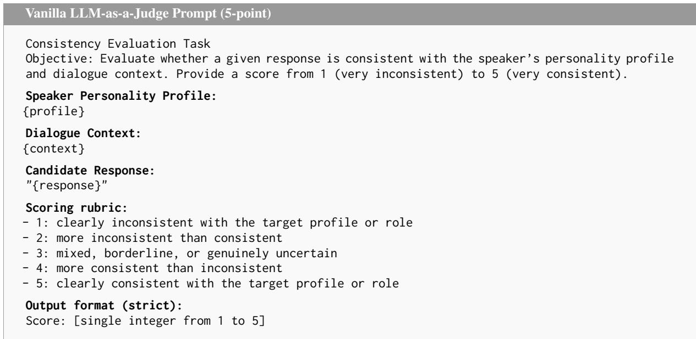

Figure 8: Vanilla direct judging prompt with the 5-point rubric.
<table><tr><td>Dataset</td><td>Top-1 Acc.</td><td>Top-2 Recall</td><td>Macro-F1</td><td>Krippendorff&#x27;s α</td></tr><tr><td>Social-Persona</td><td>70.7</td><td>87.3</td><td>72.4</td><td>0.61</td></tr><tr><td>Big5-Persona-EASY</td><td>75.3</td><td>90.0</td><td>76.8</td><td>0.66</td></tr><tr><td>Big5-Persona-HARD</td><td>63.3</td><td>82.7</td><td>66.5</td><td>0.56</td></tr></table>

Table 7: Dimension-level human diagnostic validation of PRISM using the Llama evaluator backbone.

## D.2 Dimension-level Diagnostic Validation

The benchmark-level human verification above evaluates whether the constructed positive and negative responses exhibit the intended overall persona fidelity contrast. In this subsection, we conduct an additional dimension-level human study to assess whether PRISM’s dimension-level scores identify the specific aspect of persona fidelity in which a response deviates.

We sample 50 contrastive groups from each of Social-Persona, Big5-Persona-EASY, and Big5-Persona-HARD, retaining the personaconsistent response and all corresponding negative responses in each group. For Big5-Persona-HARD, the sampled groups are balanced across the two negative construction types. This yields 200 responses for Social-Persona, 100 for Big5-Persona-EASY, and 150 for Big5-Persona-HARD, for a total of 450 annotated responses. Each response is independently annotated by three annotators who also participated in the human study described in Appendix D.1. Annotators are shown the target persona profile, dialogue context, and candidate response. For each response, they assign one label for each PRISM dimension: taskframing, interpersonal stance, and linguistic style. We use the same three-way label format as PRISM, and the displayed order of the three options is randomized and mapped back to the canonical categories for analysis. For each response, we obtain one majority-vote human label for each dimension. For the diagnostic analysis, we use PRISM dimension scores produced by the Llama evaluator backbone. We rank the three dimensions by their aligned-state probabilities $q _ { d } ( A \ \mid \ c , r )$ in ascending order, where a lower aligned probability indicates a more likely violation.

We report three diagnostic metrics. Top-1 Accuracy measures whether PRISM’s lowest-scoring dimension is among the dimensions identified as violated by human annotators. Top-2 Recall measures whether at least one human-identified violation is contained in PRISM’s two lowest-scoring dimensions, allowing for responses that violate multiple aspects of persona fidelity. Macro-F1 evaluates dimension-level violation detection by treating persona-inconsistent as a violation and personaaligned/indeterminate as non-violations, with F1 averaged across the three dimensions. We additionally report Krippendorff’s α with ordinal distance over the three-way human labels. The results are reported in Table 7.

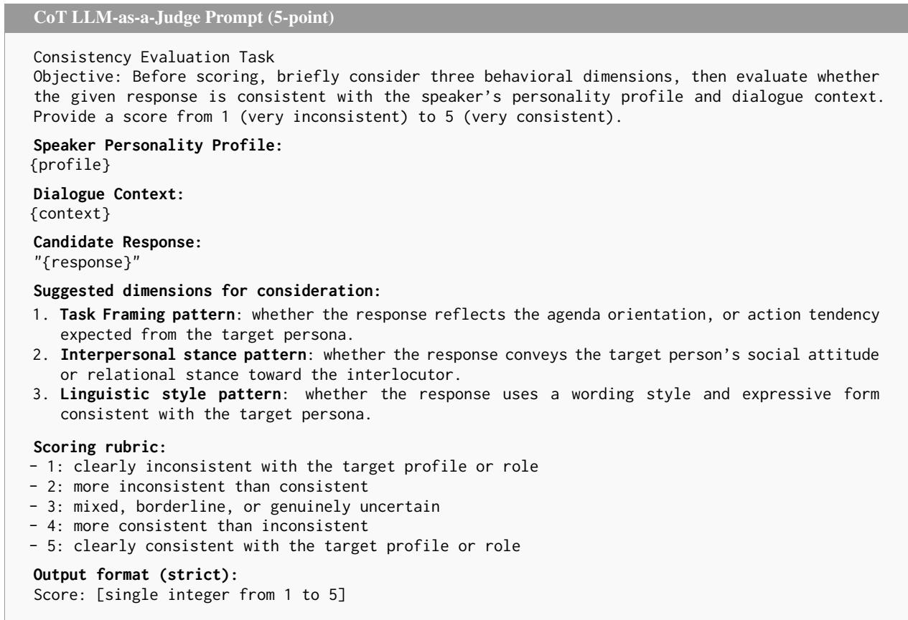  
Figure 9: CoT-based direct judging prompt with the 5-point rubric.

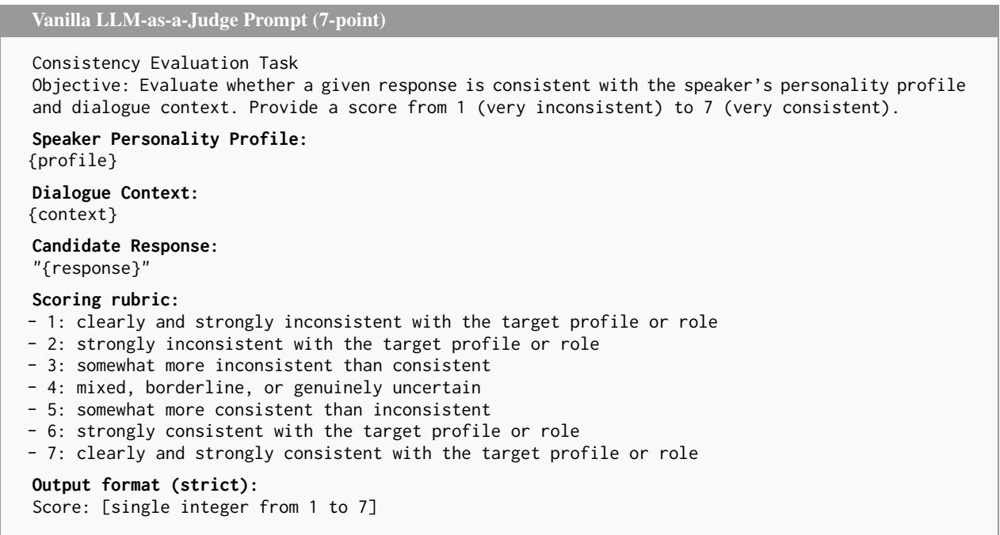  
Figure 10: Vanilla direct judging prompt with the 7-point rubric.

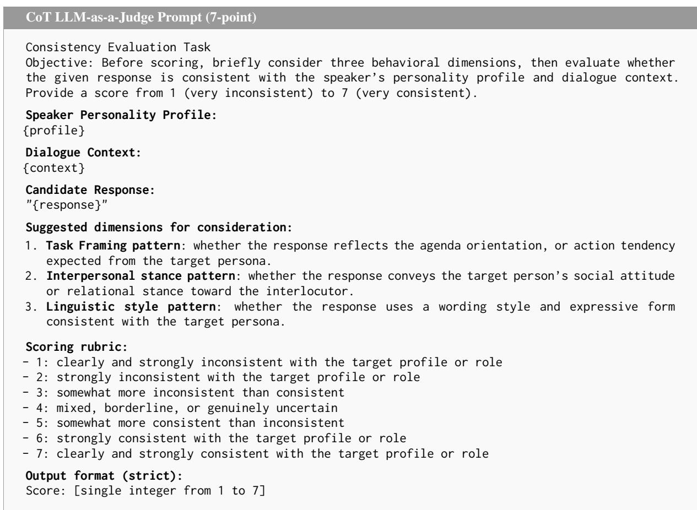  
Figure 11: CoT-based direct judging prompt with the 7-point rubric.

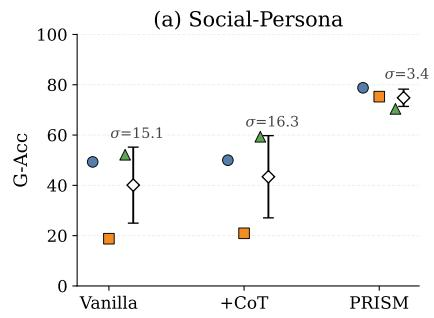

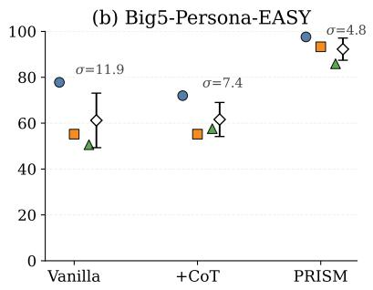

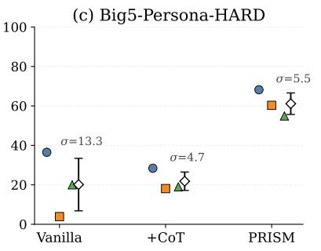

Figure 12: Backbone sensitivity on strict Group Accuracy across three LLM backbones. Points denote individual backbones and diamonds indicate the mean with standard deviation.  
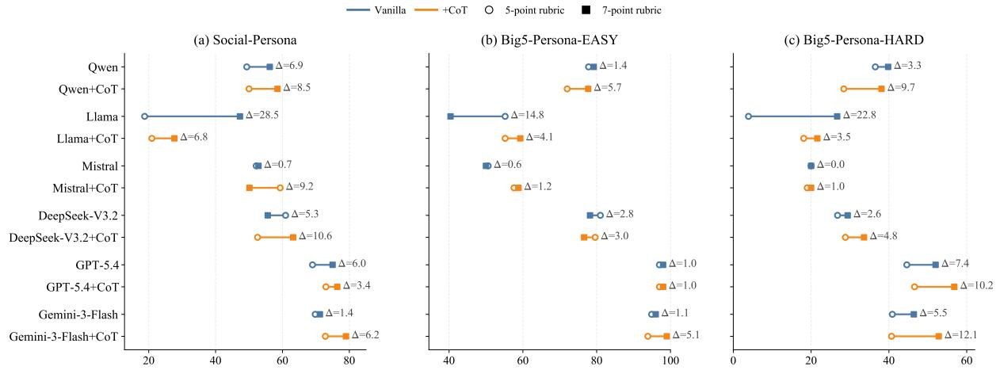

Figure 13: Rubric Sensitivity of direct LLM-as-a-Judge evaluation on Strict Group Accuracy. Each segment connects the results from 5-point and 7-point rubrics for the same evaluator and prompting method. Longer segments indicate greater sensitivity to scoring granularity.  
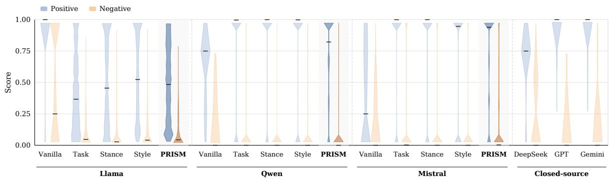

Figure 14: Score distribution on the Big5-Persona-EASY dataset  
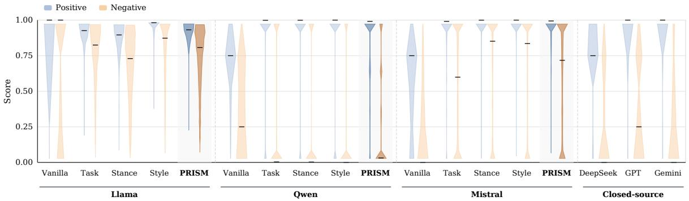  
Figure 15: Score distribution on the Social-Persona dataset

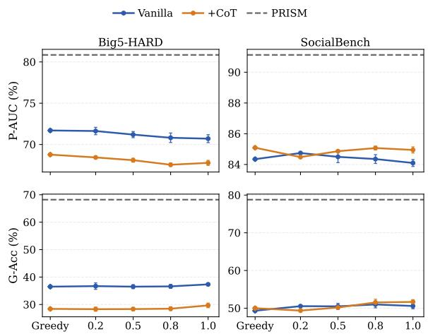  
Figure 16: Temperature sensitivity of holistic evaluation for the Qwen backbone across Big5-Persona-HARD and Social-Persona. Greedy denotes deterministic decoding, whereas the other points show stochastic decoding under temperatures 0.2, 0.5, 0.8 and 1.0. Error bars indicate mean and standard deviation over three random seeds. The dashed line shows the corresponding PRISM reference score.

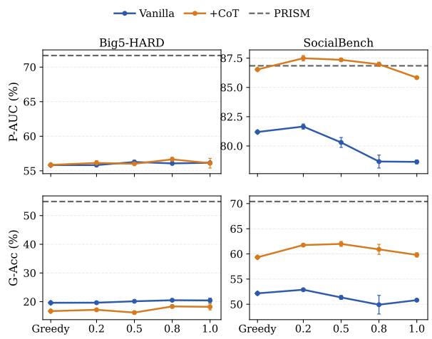  
Figure 17: Temperature sensitivity of holistic evaluation for the Mistral backbone across Big5-Persona-HARD and Social-Persona. Greedy denotes deterministic decoding, whereas the other points show stochastic decoding under temperatures 0.2, 0.5, 0.8 and 1.0. Error bars indicate mean and standard deviation over three random seeds. The dashed line shows the corresponding PRISM reference score.

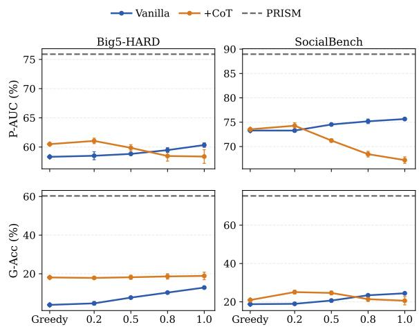  
Figure 18: Temperature sensitivity of holistic evaluation for the Llama backbone across Big5-Persona-HARD and Social-Persona. Greedy denotes deterministic decoding, whereas the other points show stochastic decoding under temperatures 0.2, 0.5, 0.8 and 1.0. Error bars indicate mean and standard deviation over three random seeds. The dashed line shows the corresponding PRISM reference score.