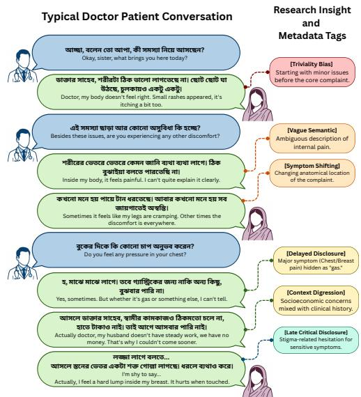
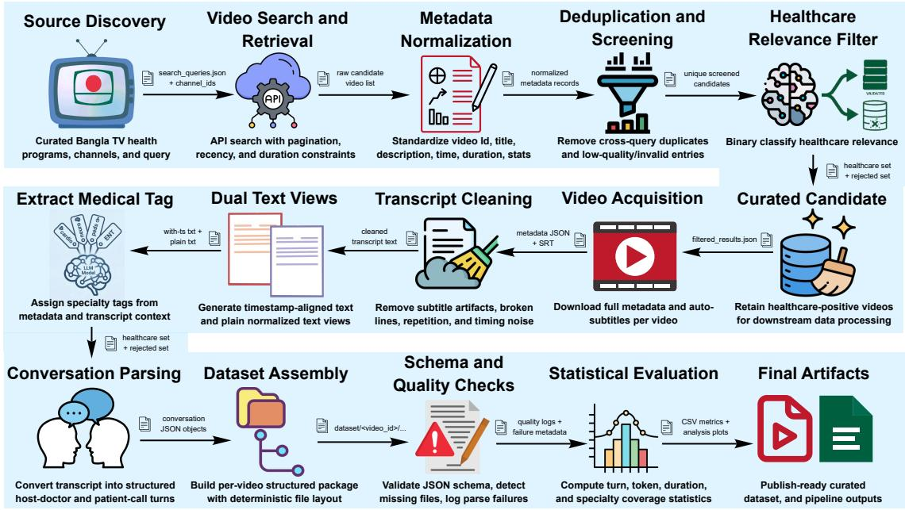

# DocTalkBN: A Novel Dataset of Expert Telemedicine Conversations in Bengali

Anik Saha<sup>1,\*</sup>, Fahmida Sultana Naznin<sup>1,\*</sup>, Sadatul Islam Sadi<sup>1</sup>, Ananya Shahrin Promi<sup>1</sup>, Wahid Al Azad Navid<sup>1</sup>, Rifat Shahriyar<sup>1</sup>

<sup>1</sup>Bangladesh University of Engineering and Technology (BUET) These authors contributed equally and are listed alphabetically. Correspondence: rifat@cse.buet.ac.bd

## Abstract

Reliable medical conversational AI requires authentic expert–patient interaction data, yet such datasets remain scarce, especially for low-resource languages such as Bengali. We present DocTalkBN, a large-scale multimodal dataset of real-world expert telemedicine conversations in Bengali, collected from nationally broadcast telemedicine programs featuring board-certified physicians. DocTalkBN contains 557.63 hours of paired audio and text, 1,515 multi-turn patient calls, 10,274 host– doctor question–answer exchanges, totaling 1.7M tokens, spanning 26 medical specialties. Unlike prior resources derived from medical forums, written health content, or synthetic data, our dataset preserves the spontaneity, contextual richness, and spoken characteristics of authentic medical interactions in a low-resource setting. To support benchmark-driven research, we further construct three downstream tasks from the corpus, medical triage classification, advice safety evaluation, and medical named entity recognition, and benchmark a diverse set of large language models and encoder-based baselines. Our results show that DocTalkBN is a practically useful resource, particularly for clinically grounded reasoning tasks. We release this resource to facilitate future research on reliable medical NLP and safer, more culturally grounded healthcare systems for low-resource languages. Our source codes and dataset are publicly available at https: //anonymous.4open.science/r/doctalk.

## 1 Introduction

Conversational AI in healthcare has the potential to transform access and equity, providing expert guidance to millions with limited access to medical services (Uddin, 2025). Large language models (LLMs) along with rule-based and task-oriented agents, are rapidly reshaping healthcare communication across clinical and nonclinical settings (Jang et al., 2025). Automated systems often pro-চ্ছাduce inaccurate, generalized, or biased responses due to reliance on user-generated prompts and limited publicly available training data, particularly in low-resource settings, which can reinforce existing health disparities and pose risks in safety-critical medical contexts (Maslenkova et al., 2025). Building reliable healthcare AI depends on high-quality, authentic doctor–patient dialogue datasets; while resources like MedDialog provide large-scale conversations, they fail to capture the full complexity of real clinical interactions between doctor and patients (Zeng et al., 2020). This gap is critical in low-resource linguistic contexts, where cultural nuances, and spontaneous speech patterns complicate the training of culturally attuned, voice-enabled clinical agents for diverse populations (Figure 1). Authentic doctor-patient conversations are inherently messy, contextually rich, and diagnostically informative precisely because they deviate from fixed structure. Patients rarely present complaints in chronological order; instead, they interleave major symptoms with trivial concerns, omit critical temporal anchors, under-report negatives, repeat details, digress into family finances or emotional burdens, hesitate on sensitive topics, and deploy opaque regional expressions (Ben Abacha et al., 2023b). Although these features pose challenges for automated analysis, they capture the very cues expert clinicians rely on to infer latent states and make safe, informed recommendations. Thus, conversational datasets that faithfully preserve both acoustic nuances and linguistic authenticity are not just valuable-they are essential for developing models capable of true clinical reasoning and empathetic understanding under uncertainty.

  
Figure 1: Dialogue between doctor and patient annotated with metadata tags.

A rapidly growing body of work in medical NLP has yielded valuable resources, yet most remain confined to structured clinical articles/notes, curated forums, or de-identified EHR narrativesformats that inherently remove the spontaneity, prosodic cues, and expert grounding crucial for real-world clinical applications (Gao et al., 2022; Sazzed, 2022; Ben Abacha et al., 2023c; Khan et al., 2023b). While recent collections of doctor–patient dialogues have begun to address this gap (Xu et al., 2022; Saley et al., 2024), they are generally limited in scale, restricted to text-only data, focused on single medical field, and mostly available in high-resource languages. To the best of our knowledge, there is no publicly available large-scale multimodal dataset of authentic medical conversations for low-resource settings. A highquality dataset capturing real-world conversations, reflecting regional nuances, dialect variations, and typical communication challenges, would be extremely valuable. By incorporating multimodal data from interactions between experts and patients across different healthcare functions, this dataset can support applications such as medical response generation, clinical decision support, personalized patient care, and enhanced doctor–patient communication systems.

To address this gap, we introduce DocTalkBN, the first large-scale multimodal dataset of expertgrounded doctor–patient interactions in Bangla. Sourced from 1,934 videos of widely viewed, nationally broadcast telemedicine programs featuring board-certified specialists, DocTalkBN comprises 1, 515 multi-turn doctor–patient conversations and 10, 274 single-turn host–doctor question–answer exchanges, accompanied by 557.63 hours of time-aligned audio. These programs are not only popular-regularly attracting millions of viewers seeking trusted medical experts-but are institutionally reliable, as participating physicians are pre-vetted experts delivering unscripted, realtime advice. From this foundation we derive three clinically actionable downstream datasets-medical triage classification, advice safety evaluation, and medical named entity recognition-each constructed with rigorous LLM-assisted curation followed by multi-annotator human validation. The key contributions are summarized as follows:

• We introduce DocTalkBN, the first largescale multimodal dataset of expert-grounded Bangla doctor–patient conversations collected from nationally broadcast telemedicine programs, capturing authentic, unscripted clinical interactions with rich linguistic and acoustic characteristics.

• We develop a structured annotation and curation pipeline combining LLM-assisted processing with multi-annotator human validation to construct clinically meaningful benchmarks, enabling reliable evaluation of medical dialogue understanding in low-resource settings.

• We release three downstream benchmark tasks—medical triage classification, advice safety evaluation, and medical named entity recognition—demonstrating the potential of DocTalkBN for applications such as medical response generation, clinical decision support, and improved doctor–patient communication systems.

## 2 Related Work

Recent work in clinical natural language processing increasingly focuses on modeling patient–provider conversations, supported by datasets and downstreaming tasks for dialogues into structured medical documentation, such as MTS-Dialog (Ben Abacha et al., 2023c) and MEDIQA-Chat (Ben Abacha et al., 2023a). Large-scale medical dialogue datasets include MedDialog (Zeng et al., 2020), RealMedDial (Xu et al., 2022), and HealthCareMagic (Pal et al., 2020), while task-oriented systems leverage PriMock57 (Liu et al., 2022a), ChiCCo (Min et al., 2020), CLINIC150 (Larson et al., 2019), and MedDG (Liu et al., 2022b). Large language models generate or augment dialogues (e.g., NoteChat (Wang et al., 2023)) or expand limited summarization training data (Schlegel et al., 2023). Recent work explores discourse and reasoning, physician intent aligned with SOAP frameworks (Röhr et al., 2025), LLMbased clinical note generation (Sharma et al., 2023; Giorgi et al., 2023), and robustness on out-ofdomain SOAP notes (Chen and Hirschberg, 2024).

  
Figure 2: Overview for dataset curation and processing workflow.

For low-resource languages like Bangla, biomedical NER datasets such as BanglaBioMed (Sazzed, 2022) and Bangla-HealthNER (Khan et al., 2023b) exist, alongside conversational datasets like BanglaCHQ-Summ for abstractive summarization of patient–doctor interactions (Khan et al., 2023a). Additional Bangla resources include healthcare chat corpora, domain-specific health paraphrases (Aziz and Islam, 2025), entity recognition datasets like Bangla-MedER (ban, 2025), clinical symptom reports, and multimodal resources such as MedBanglaTrust3 (med, 2025). However, these are mostly text-based or scripted and lack authentic, spontaneous patient–doctor dialogues, highlighting the need for natural Bangla medical conversation datasets.

## 3 Dataset Statistics

Table 1 compares existing medical dialogue datasets with DocTalkBN. Most prior datasets are derived from online text sources. Only RealMed-Dial contains real doctor–patient consultations, but it is limited to Chinese. For Bangla, datasets such as BanglaBioMed and Bangla-HealthNER (Sazzed, 2022) focus on named entity recognition, while BanglaCHQ-Summ (Khan et al., 2023a) targets medical query summarization. These datasets are collected from medical forums and are purely textual. In contrast, DocTalkBN contains both audio and textual data from live Bangla doctor–patient consultations, capturing the natural complexity of real clinical interactions in a low-resource setting.

Table 2 summarizes further key statistics including dataset characteristics, patient-doctor calls, and host-doctor conversations.

Table 3 presents statistics regarding the downstream evaluation datasets.

Table 4 provides a detailed breakdown of the dataset statistics. The dataset contains a total of 1,934 videos with a cumulative duration of 557.63 hours. It includes 10,274 host doctor questionanswer exchanges and 1,515 patient calls. Each dialogue spans 2 to 14 turns, covering interactions from 26 distinct medical departments.

## 4 Methodology

## 4.1 Data Collection and Preprocessing

We construct DocTalkBN from publicly available telemedicine programs broadcast on national television channels in Bangladesh and later uploaded to YouTube. These programs provide a valuable source of expert-grounded medical interactions, including both doctor–patient consultations and host–doctor question–answer exchanges. To build the corpus, we first search the relevant YouTube channels over a five-year period and retrieve candidate videos. We then use Qwen3-30B-Instruct (L<sub>1</sub>) (Yang et al., 2025) to filter videos based on their titles and descriptions, retaining only those that are relevant to the medical domain. The same model is further used to assign medical specialty tags, such as cardiology, dermatology, and gastroenterology, which helps organize the collection across a diverse set of clinical topics.

Table 1: Comparison between our dataset and existing medical dialogue datasets.
<table><tr><td>Dataset Name</td><td>Source Type</td><td>Language</td><td>#Dialogues</td><td>#Utterances</td><td>#Diseases</td><td>Department</td></tr><tr><td>MZ (Wei et al., 2018)</td><td>Online Text</td><td>Chinese</td><td>710</td><td></td><td>4</td><td>Pediatrics</td></tr><tr><td>DX (Xu et al., 2019)</td><td>Online Text</td><td>Chinese</td><td>527</td><td>2,186</td><td>5</td><td>Pediatrics</td></tr><tr><td>CMDD (Lin et al., 2019)</td><td>Medical Forum</td><td>Chinese</td><td>2,067</td><td>87,005</td><td>4</td><td>Pediatrics</td></tr><tr><td>MedDG (Liu et al., 2022b)</td><td>Online Text</td><td>Chinese</td><td>17,864</td><td>385,951</td><td>12</td><td>Gastroenterology</td></tr><tr><td>MedDialog-CN (Pal et al., 2020)</td><td>Online Text</td><td>Chinese</td><td>3,407,494</td><td>11,260,564</td><td>172</td><td>51 Departments</td></tr><tr><td>RealMedDial (Xu et al., 2022)</td><td>Video Clips</td><td>Chinese</td><td>2,637</td><td>24,255</td><td>55</td><td>17 Departments</td></tr><tr><td>BanglaBioMed (Sazzed, 2022)</td><td>Health Article</td><td>Bangla</td><td></td><td>818</td><td></td><td></td></tr><tr><td>Bangla-HealthNER (Sazzed, 2022)</td><td>Medical Forum</td><td>Bangla</td><td></td><td>144,136</td><td></td><td></td></tr><tr><td>BanglaCHQ-Summ (Khan et al., 2023a)</td><td>Medical Forum</td><td>Bangla</td><td>2,350</td><td></td><td>32</td><td></td></tr><tr><td>DocTalkBN (Ours)</td><td>Live Consultation</td><td>Bangla</td><td>11,789</td><td></td><td></td><td>26 Departments</td></tr></table>

Table 2: Detailed Dataset Statistics
<table><tr><td rowspan=1 colspan=2>Overall Dataset Statistics</td></tr><tr><td rowspan=1 colspan=1>Dataset Duration (Hours)Unique Medical SpecialtiesPatient Calls Proportion (%)Host-Doctor QA Proportion (%)</td><td rowspan=1 colspan=1>557.632612.987.1</td></tr><tr><td rowspan=1 colspan=1>Patient-Doctor Cal</td><td rowspan=1 colspan=1>ls</td></tr><tr><td rowspan=1 colspan=1>Total Patient-Doctor CallsTotal TokensTotal TurnsAvg Turns per CallMax Turns in a CallAvg Tokens per TurnTotal Doctor TokensTotal Patient TokensAvg Doctor Tokens / CallAvg Patient Tokens / Call</td><td rowspan=1 colspan=1>1,515244,0274,8573.21450.2156,573 (64.2%)87,454 (35.8%)103.357.7</td></tr><tr><td rowspan=1 colspan=1>Host-Doctor Q</td><td rowspan=1 colspan=1>A</td></tr><tr><td rowspan=1 colspan=1>Total Host-Doctor QA SessionsTotal TokensTotal TurnsAvg Turns per QA SessionMax Turns in a QA SessionAvg Tokens per QA SessionAvg Tokens per Turn</td><td rowspan=1 colspan=1>10,2741,427,18320,5532.04138.969.4</td></tr></table>

For each selected video, we obtain the automatically generated Bangla subtitles provided by YouTube. While these transcripts are noisy and reflect spontaneous spoken language, they preserve the essential medical content and conversational flow. We next apply a sequence of preprocessing steps, including segmenting long transcripts, removing non-conversational content such as introductions and advertisements, and normalizing transcription artifacts. Five independent human annotators reviewed the audio and subtitles to validate the transcriptions. Annotators were instructed to verify conversational fidelity, medical content preservation, speaker continuity, and major transcription errors. If at least two annotators rated a transcription as poor in quality, it was revised by a separate independent annotator. A total of 36 total transcriptions required such human revision. Next, we remove personally identifiable information (e.g., names and locations) using the BNLP Toolkit <sup>1</sup>. Finally, we use Gemini-3-Flash (L<sub>2</sub>) to reconstruct structured conversations by identifying speakers with timestamps, separating turns, and classifying interactions as either doctor–patient dialogues or host–doctor question–answer exchanges. This process yields DocTalkBN, a dataset of paired audio clips and expert-grounded medical conversations for downstream research.

Table 3: Downstream Benchmark Datasets & Class Distributions
<table><tr><td>Downstream Task</td><td>#Videos</td><td>Samples</td><td>Total Labels</td><td>Class</td><td>Count</td></tr><tr><td>Advice Safety</td><td>1,744</td><td>8,689</td><td>29,957</td><td>SAFE HARM</td><td>22,513 7,444</td></tr><tr><td>Medical NER</td><td>1,842</td><td>11,239</td><td>105,697</td><td>DIS SYM ANA TRT DRG TST MED</td><td>31,680 23,385 21,624 13,802 7,608 6,647 951</td></tr><tr><td>Triage</td><td>490</td><td>1,515</td><td>1,515</td><td>REF SELF ROUT URG</td><td>1,028 258 185 44</td></tr></table>

Table 4: Statistics of the Bangla DocTalkBN dataset
<table><tr><td rowspan=1 colspan=1># Dialogues# Utterances# Tokens</td><td rowspan=1 colspan=1>11,78925,4101,671,210</td></tr><tr><td rowspan=1 colspan=1>Avg. # Utterances in a DialogueMax # Utterances in a DialogueMin # Utterances in a Dialogue</td><td rowspan=1 colspan=1>2.16141</td></tr><tr><td rowspan=1 colspan=1>Avg. # Tokens in an UtteranceMax # Tokens in an UtteranceMin # Tokens in an Utterance</td><td rowspan=1 colspan=1>65.84182</td></tr></table>

## 4.2 Data Curation for Downstream Tasks

We next derive three downstream task datasets from DocTalkBN using Gemini-2.5-Flash $( L _ { 3 } )$ , followed by human validation. We first iteratively refine the prompt over five rounds, with three independent human annotators reviewing the outputs of $L _ { 3 }$ at each stage. After finalizing the prompt, we generate the downstream datasets using this updated version. The finalized dataset generation prompts are provided in Appendix. Each resulting sample is then reviewed by three independent annotators. Samples rated as poor quality by at least two of the three annotators are subsequently revised by a separate annotator. In total, 17 samples required human corrections ranging from NER span edits to classification corrections. For the discussion below, let $C _ { p } = ( P _ { 1 } , D _ { 1 } , P _ { 2 } , \ldots , P _ { n } , D _ { n } )$ denote a multi-turn doctor–patient conversation, and let $C _ { h } = ( H , D )$ denote a host–doctor exchange. We define Patient ${ P r o f i l e } ( C _ { p } )$ as the patient state inferred from all turns preceding the final doctor response $D _ { n }$ . Thus, the patient profile is constructed from the patient’s initial complaint and subsequent replies to the doctor’s follow-up questions, while excluding the final recommendation itself. This formulation allows us to build evaluation settings that focus on what can be inferred from the presented symptoms and history, rather than from the doctor’s concluding advice.

Medical Triage. Medical triage aims to determine the appropriate level of care for a patient based on the severity and urgency of the condition. For each doctor–patient conversation $C _ { p } .$ , we prompt $L _ { 3 }$ to map the doctor’s final recommendation $D _ { n }$ into one of four triage categories: REASSURANCE\_SELF\_CARE (SELF), ROUTINE\_OUTPATIENT\_VISIT (ROUT), INVESTIGATION\_OR\_SPECIALIST\_REFERRAL (REF), and URGENT\_EMERGENCY\_CARE (URG). This categorization is inspired by (Gatto et al., 2026). This process yields an annotated dataset of the form $\{ ( P , T ) \}$ where $P = P a t i e n t P r o f i l e ( C _ { p } )$ and T is the corresponding triage label. Notably, although the full conversation $C _ { p }$ is used during dataset construction to recover the doctor’s intended recommendation, inference-time evaluation uses only the patient profile $P$ as input. This setup makes the task clinically meaningful, as the model must infer the appropriate treatment pathway from the patient’s history alone.

Advice Safety Evaluation. This task focuses on distinguishing safe from harmful courses of action for a given medical condition. As in the triage setting, we first derive a patient profile P from each doctor–patient conversation $C _ { p } .$ . We then prompt $L _ { 3 }$ to decompose the doctor’s final recommendation $D _ { n }$ into a set of modular advice units, which are grouped into $A _ { p }$ and $A _ { n }$ , denoting safe and harmful actions, respectively. For example, for a patient with fever and dehydration, “drink adequate fluids” would be labeled as a safe action, whereas “ignore persistent breathing difficulty and remain at home” would be labeled as harmful. Where applicable, we also extract such condition–advice pairs from host–doctor exchanges $C _ { h }$ . Based on this annotation scheme, we formulate the task as follows: given a patient profile P and an action $a \in A _ { p } \cup A _ { n } .$ , the model must determine whether the action is safe or harmful. This setup enables a fine-grained evaluation of medical advice safety at the level of individual recommendations rather than entire responses.

Medical Entity Recognition. We further formulate a medical named entity recognition task in the context of Bangla conversational healthcare data. Inspired by (Khan et al., 2023b; Sazzed, 2022), we define seven entity categories: SYMPTOM\_SIGN (SYM), DISEASE\_CONDITION (DIS), DRUG\_MEDICATION (DRG), TEST\_INVESTIGATION (TST), TREATMENT\_PROCEDURE (TRT), ANATOMY\_BODY\_PART (ANA), and MEDICAL\_SPECIALTY (MED). We then use $L _ { 3 }$ to identify and extract mentions of these entity types from the curated conversations, followed by human validation. This task supports structured understanding of naturally occurring Bangla medical dialogue and provides a useful benchmark for information extraction in low-resource clinical language settings. Figure 2 presents an illustration of the data curation workflow.

## 5 Experiments on Downstream Tasks

In this section, we report the experimental setup and results on the downstream tasks.

## 5.1 Experimental Setup

All experiments are conducted on a machine equipped with a single NVIDIA RTX 4090 GPU (24GB VRAM). When feasible, we run open LLMs locally using Ollama.<sup>2</sup> In other cases, for both open and closed models, we use the OpenRouter $\mathbf { A P I } ^ { 3 }$ for inference. We use an 80:10:10 split for training, validation, and test, respectively. During LLM inference, we use a consistent decoding setup with temperature = 0.7, top\_p = 0.9, top\_k = 35, and repeat\_penalty = 1.1 whenever supported. For few-shot prompting, we typically use 3 to 5 examples, depending on the task. For BERT-based experiments, we fine-tune the models for 100 epochs with a batch size = 16, warm-up steps = 200, and early stopping (patience = 10).

## 5.2 Baselines

We benchmark a diverse set of LLMs, including GPT-4o, GPT-5 mini, Llama-3.3-70B-Instruct (AI@Meta, 2024), Qwen3.5-Flash (Qwen Team, 2026), DeepSeek-V3.2 (DeepSeek-AI, 2025), and Gemma-3-27B-IT (Team, 2025). These baselines span both proprietary and open-weight models, and cover general-purpose as well as reasoningoriented model families. For the medical named entity recognition task, we additionally fine-tune two encoder-based baselines, namely BanglaBERT (Bhattacharjee et al., 2022) and mmBERT (Marone et al., 2025).

## 5.3 Evaluation Metrics

We now present our evaluation metrics for each downstream task.

Medical Triage. We formulate triage as a fourway single-label classification problem and report the macro-F1 score. Let $T P _ { c } , F P _ { c }$ , and $F N _ { c }$ denote the true positives, false positives, and false negatives for class c. Then

$$
{ \mathrm { P r e c i s i o n } } _ { c } = { \frac { T P _ { c } } { T P _ { c } + F P _ { c } } }
$$

$$
\mathrm { R e c a l l } _ { c } = \frac { T P _ { c } } { T P _ { c } + F N _ { c } } ,
$$

$$
F 1 _ { c } = \frac { 2 \cdot \mathrm { P r e c i s i o n } _ { c } \cdot \mathrm { R e c a l l } _ { c } } { \mathrm { P r e c i s i o n } _ { c } + \mathrm { R e c a l l } _ { c } } .
$$

Macro-F1 is computed as the unweighted mean of class-wise F1 values. Since the triage dataset is imbalanced, we use macro-F1 as the primary metric.

Advice Safety Evaluation. Advice safety is formulated as a binary classification task over individual recommendation units, with labels SAFE and HARMFUL. Since it is also a classification problem, we use the same metric Macro F1 as above.

Medical Named Entity Recognition. For medical NER, we evaluate entity extraction using the strict matching scheme over the seven entity categories in our benchmark. Under strict evaluation, a predicted entity is counted as correct only if both its span boundary and entity label exactly match the gold annotation. Let COR, ACT, and POS denote the numbers of correctly predicted entities, predicted entities, and gold entities, respectively. Precision and recall are computed as

$$
\mathrm { P r e c i s i o n } = { \frac { C O R } { A C T } } , \qquad \mathrm { R e c a l l } = { \frac { C O R } { P O S } } ,
$$

and strict F1 is defined as the harmonic mean of precision and recall. We report the macro-F1 under this criterion.

## 5.4 Results

We now present the results on the downstream tasks across different models and evaluation settings. The prompts used for LLM inference on each task are provided in Appendix.

## 5.4.1 Results on Medical Triage

We report macro F1 scores for triage classification under zero-shot and few-shot prompting in Table 5. Despite involving only four target categories, the task remains challenging for all models, with the best performance reaching an F1 score of 0.463, achieved by Llama 3 70B Instruct in the zero-shot setting. GPT-4o delivers the second-best result, obtaining an F1 score of 0.448 in the few-shot setting. In contrast, DeepSeek V3.2 and Qwen 3.5 Flash perform less competitively overall, with their best few-shot scores reaching 0.383 and 0.416, respectively. We also observe that adding in-context examples generally improves performance across models, with Llama 3 70B Instruct being the only exception, where the few-shot setting leads to a slight decline relative to zero-shot prompting.

Table 5: Triage classification performance across models and settings. Best values are shown in bold and second best values are underlined.
<table><tr><td>Model</td><td>Setting</td><td>Macro F1</td></tr><tr><td>DeepSeek V3.2</td><td>Zero-shot</td><td>0.320</td></tr><tr><td>DeepSeek V3.2</td><td>Few-shot</td><td>0.383</td></tr><tr><td>Gemma 3 27B Instruct</td><td>Zero-shot</td><td>0.412</td></tr><tr><td>Gemma 3 27B Instruct</td><td>Few-shot</td><td>0.422</td></tr><tr><td>GPT-40</td><td>Zero-shot</td><td>0.425</td></tr><tr><td>GPT-40</td><td>Few-shot</td><td>0.448</td></tr><tr><td>GPT-5 Mini</td><td>Zero-shot</td><td>0.414</td></tr><tr><td>GPT-5 Mini</td><td>Few-shot</td><td>0.427</td></tr><tr><td>Llama 3 70B Instruct</td><td>Zero-shot</td><td>0.463</td></tr><tr><td>Llama 3 70B Instruct</td><td>Few-shot</td><td></td></tr><tr><td></td><td></td><td>0.443</td></tr><tr><td>Qwen 3.5 Flash</td><td>Zero-shot</td><td>0.363</td></tr><tr><td>Qwen 3.5 Flash</td><td>Few-shot</td><td>0.416</td></tr></table>

Table 6: Advice safety classification performance across models and settings. Best values are shown in bold and second best values are underlined.
<table><tr><td>Model</td><td>Setting</td><td>Macro F1</td></tr><tr><td>DeepSeek V3.2</td><td>Zero-shot</td><td>0.937</td></tr><tr><td>DeepSeek V3.2</td><td>Few-shot</td><td>0.949</td></tr><tr><td>Gemma 3 27B Instruct</td><td>Zero-shot</td><td>0.951</td></tr><tr><td>Gemma 3 27B Instruct</td><td>Few-shot</td><td>0.955</td></tr><tr><td>GPT-40</td><td>Zero-shot</td><td>0.969</td></tr><tr><td>GPT-40</td><td>Few-shot</td><td>0.976</td></tr><tr><td>GPT-5 Mini</td><td>Zero-shot</td><td>0.929</td></tr><tr><td>GPT-5 Mini</td><td>Few-shot</td><td>0.931</td></tr><tr><td>Llama 3 70B Instruct</td><td>Zero-shot</td><td>0.930</td></tr><tr><td>Llama 3 70B Instruct</td><td>Few-shot</td><td>0.924</td></tr><tr><td>Qwen 3.5 Flash</td><td>Zero-shot</td><td>0.948</td></tr><tr><td>Qwen 3.5 Flash</td><td>Few-shot</td><td>0.951</td></tr></table>

## 5.4.2 Results on Advice Safety Evaluation

Table 6 presents the macro F1 scores for advice safety classification under zero-shot and few-shot prompting. In contrast to the medical triage task, all models achieve consistently strong performance on this benchmark, with macro F1 values exceeding 0.92 across all settings. GPT-4o performs best overall, reaching 0.976 in the few-shot setting and 0.969 in the zero-shot setting, indicating both strong baseline capability and a clear benefit from in-context examples. Gemma 3 27B Instruct and Qwen 3.5 Flash also deliver highly competitive results, each attaining 0.955 and 0.951, respectively, under few-shot prompting. DeepSeek V3.2 likewise benefits from few-shot examples, improving from 0.937 to 0.949. More broadly, few-shot prompting yields modest but consistent gains for most models, suggesting that the advice safety task is comparatively well aligned with current LLM capabilities and can be further strengthened through limited task-specific exemplars. A notable exception is Llama 3 70B Instruct, whose performance decreases slightly from 0.930 in the zero-shot setting to 0.924 in the few-shot setting as was the case with medical triage as well. Overall, these results indicate that advice safety evaluation is substantially easier for current models than medical triage classification, while still revealing meaningful differences in robustness across model families.

Table 7: Performance on Medical NER across models and prompting/training settings. Best values are shown in bold and second best values are underlined.
<table><tr><td>Model</td><td>Setting</td><td>Strict F1 (Macro Avg.)</td></tr><tr><td>BanglaBERT</td><td>Fine-tuned</td><td>0.742</td></tr><tr><td>mmBERT</td><td>Fine-tuned</td><td>0.707</td></tr><tr><td>DeepSeek V3.2</td><td>Zero-shot</td><td>0.694</td></tr><tr><td>Gemma 3 27B Instruct</td><td>Zero-shot</td><td>0.585</td></tr><tr><td>GPT-40</td><td>Zero-shot</td><td>0.581</td></tr><tr><td>GPT-40</td><td>Few-shot</td><td>0.575</td></tr><tr><td>GPT-5 Mini</td><td>Zero-shot</td><td>0.704</td></tr><tr><td>GPT-5 Mini</td><td>Few-shot</td><td>0.703</td></tr><tr><td>Llama 3 70B Instruct</td><td>Zero-shot</td><td>0.489</td></tr><tr><td>Llama 3 70B Instruct</td><td>Few-shot</td><td>0.477</td></tr><tr><td>Qwen 3.5 Flash</td><td>Zero-shot</td><td>0.743</td></tr><tr><td>Qwen 3.5 Flash</td><td>Few-shot</td><td>0.741</td></tr></table>

## 5.4.3 Results on Medical Entity Recognition

Table 7 reports aggregate strict macro F1 scores for medical NER across both fine-tuned encoder models and prompted LLMs. Overall, the results show that the task remains challenging, but several models achieve competitive performance. Qwen 3.5 Flash attains the best overall score with a strict F1 of 0.743 in the zero-shot setting, narrowly outperforming the fine-tuned BanglaBERT baseline, which achieves 0.742. Among the supervised encoder-based models, BanglaBERT substantially surpasses mmBERT, whose fine-tuned performance reaches 0.707, highlighting the advantage of stronger Bengali-specific representations for this task. Among the LLMs, DeepSeek V3.2 and GPT-5 Mini perform comparatively well, obtaining 0.694 and 0.704 in the zero-shot setting, respectively, whereas Gemma 3 27B Instruct, GPT-4o, and Llama 3 70B Instruct trail behind by a wider margin. Notably, few-shot prompting does not improve performance for the models evaluated in both settings; instead, it yields either marginal decreases or near-identical results. This pattern suggests that, for medical NER, careful span extraction remains difficult to improve through a small number of in-context examples, while strong finetuned encoders and some zero-shot LLMs already provide a more effective inference.

## 6 Findings and Error Analysis

Medical triage remains the most challenging task. Medical triage proves to be the hardest of the three tasks, with only moderate performance even from the strongest models. This likely reflects the need for broader clinical reasoning over incomplete and conversational patient histories.

Frequent confusion between routine visit and referral decisions. Models often confuse ROUTINE\_OUTPATIENT\_VISIT with INVESTIGATION\_OR\_SPECIALIST\_REFERRAL. The distinction is subtle and usually depends on the implied level of escalation in the doctor’s recommendation.

Advice safety is comparatively easier for current models. Advice safety is much easier for current models than triage. This task often depends on direct local cues, making the decision more straightforward.

NER errors often involve over-predicting generic medical words. In NER, models often label broad medical words such as disease, treatment, or medicine as entities. This suggests a reliance on surface-level medical association rather than the annotation rules.

Boundary errors remain a major challenge in NER. Models also frequently miss the full span of an entity and extract only part of it.

## 7 Conclusion

We introduced DocTalkBN, a large-scale multimodal dataset of real-world expert telemedicine conversations in Bengali, designed to support research on medical dialogue understanding in a lowresource language setting. Collected from nationally broadcast telemedicine programs, the dataset captures authentic doctor–patient interactions and host–doctor question–answer exchanges, preserving the linguistic variability, conversational structure, and spoken characteristics of naturally occurring clinical communication. We further derived three benchmark tasks from the corpus, medical triage classification, advice safety evaluation, and medical named entity recognition, and evaluated a diverse set of large language models and encoderbased baselines on these tasks. Our results show that while current models perform strongly on some aspects of medical dialogue understanding, clinically grounded reasoning tasks such as triage remain challenging. We hope DocTalkBN will serve as a valuable resource for advancing reliable medical NLP, conversational AI, and safer healthcare technologies for Bengali and other low-resource languages.

## 8 Limitations and Future Work

While our current study focuses on text-based benchmarking under zero-shot prompting, few-shot prompting and encoder fine-tuning, DocTalkBN also enables several broader research directions. In particular, the dataset includes paired audio along with text, which can support future work on medically grounded Bangla ASR in low-resource settings. Beyond advice safety classification, it can also facilitate evaluation of advice generation, such as producing safe and appropriate recommendation units directly from a patient profile. Moreover, the benchmark can be extended to study broader medical reasoning abilities of models in low-resource settings, including retrieval-augmented generation, web-assisted reasoning, tool use, and more general agentic capabilities.

## 9 Ethical Considerations

This study was conducted in accordance with institutional ethical guidelines. The collection of data from publicly accessible Youtube videos was approved by the Institutional Ethics Review Board. All identifying information of the patients and doctors was anonymized.

## Acknowledgments

We used large language models only for text formatting and presentation-related assistance. All data collection, annotation design, verification, analysis, and scientific conclusions were carried out by the authors.

## References

2025. Bangla-meder: Bangla medical entity recognition dataset. Online dataset.

2025. Medbanglatrust3: A bengali dataset for explainable and trustworthy ai health suggestions. Online dataset.

AI@Meta. 2024. Llama 3 model card.

Faisal Ibn Aziz and Muhammad Nazrul Islam. 2025. Banglahealth: A bengali paraphrase dataset on health domain. Data in Brief.

Asma Ben Abacha, Dina Demner-Fushman, and Pierre Zweigenbaum. 2023a. Overview of the mediqa-chat 2023 shared tasks on the summarization and generation of doctor–patient conversations. In Proceedings ofthe Clinical Natural Language Processing Workshop.

Asma Ben Abacha, Wen-wai Yim, Griffin Adams, Neal Snider, and Meliha Yetisgen. 2023b. Overview of the MEDIQA-chat 2023 shared tasks on the summarization & generation of doctor-patient conversations. In Proceedings of the 5th Clinical Natural Language Processing Workshop, pages 503–513, Toronto, Canada. Association for Computational Linguistics.

Asma Ben Abacha, Wen-wai Yim, Yadan Fan, and Thomas Lin. 2023c. An empirical study of clinical note generation from doctor-patient encounters. In Proceedings ofthe 17th Conference ofthe European Chapter ofthe Associationfor Computational Linguistics, pages 2291–2302, Dubrovnik, Croatia. Association for Computational Linguistics.

Abhik Bhattacharjee, Tahmid Hasan, Wasi Ahmad, Kazi Samin Mubasshir, Md Saiful Islam, Anindya Iqbal, M. Sohel Rahman, and Rifat Shahriyar. 2022. BanglaBERT: Language model pretraining and benchmarks for low-resource language understanding evaluation in Bangla. In Findings of the Association for Computational Linguistics: NAACL 2022, pages 1318–1327, Seattle, United States. Association for Computational Linguistics.

Yu-Wen Chen and Julia Hirschberg. 2024. Exploring robustness in doctor-patient conversation summarization: An analysis of out-of-domain soap notes. pages 1–9, Mexico City, Mexico. Association for Computational Linguistics.

DeepSeek-AI. 2025. Deepseek-v3.2: Pushing the frontier of open large language models.

Yanjun Gao, Dmitriy Dligach, Leslie Christensen, Samuel Tesch, Ryan Laffin, Dongfang Xu, Timothy Miller, Ozlem Uzuner, Matthew M Churpek, and Majid Afshar. 2022. A scoping review of publicly available language tasks in clinical natural language processing. Journal ofthe American Medical Informatics Association, 29(10):1797–1806.

Joseph Gatto, Parker Seegmiller, Timothy Burdick, Philip Resnik, Roshnik Rahat, Sarah DeLozier, and Sarah M. Preum. 2026. Medical triage as pairwise ranking: A benchmark for urgency in patient portal messages. arXiv preprint.

John Giorgi, Augustin Toma, Ronald Xie, Sondra Chen, Kevin An, Grace Zheng, and Bo Wang. 2023.

Wanglab at mediqa-chat 2023: Clinical note generation from doctor-patient conversations using large language models. pages 323–334, Toronto, Canada. Association for Computational Linguistics.

Won Seok Jang, Hieu Tran, Manav Shaileshkumar Mistry, Sai Kiran Gandluri, Yifan Zhang, Sharmin Sultana, Sunjae Kwon, Yuan Zhang, Zonghai Yao, and Hong Yu. 2025. Chatbot to help patients understand their health. In Findings ofthe Associationfor Computational Linguistics: EMNLP 2025, pages 6598– 6627, Suzhou, China. Association for Computational Linguistics.

Alvi Khan, Fida Kamal, Mohammad Abrar Chowdhury, Sabbir Ahmed, and 1 others. 2023a. Banglachqsumm: An abstractive summarization dataset for medical queries in bangla conversational speech. In Proceedings of the First Workshop on Bangla Language Processing (BLP-2023), pages 85–93. ACL.

Alvi Khan, Fida Kamal, Nuzhat Nower, Tasnim Ahmed, Sabbir Ahmed, and Tareque Chowdhury. 2023b. NERvous about my health: Constructing a Bengali medical named entity recognition dataset. In Findings of the Association for Computational Linguistics: EMNLP 2023, pages 5768–5774, Singapore. Association for Computational Linguistics.

Stefan Larson, Anish Mahendran, Joseph Peper, and 1 others. 2019. An evaluation dataset for intent classification and out-of-scope prediction. In Proceedings of EMNLP-IJCNLP, pages 1311–1316.

Xinzhu Lin, Xiahui He, Qin Chen, Huaixiao Tou, Zhongyu Wei, and Ting Chen. 2019. Enhancing dialogue symptom diagnosis with global attention and symptom graph. In Proceedings ofthe 2019 Conference on Empirical Methods in Natural Language Processing and the 9th International Joint Conference on Natural Language Processing (EMNLP-IJCNLP), pages 5033–5042.

Qian Liu and 1 others. 2022a. Primock57: A dataset of primary care mock consultations for medical dialogue systems. In Proceedings ofthe 60th Annual Meeting of the Association for Computational Linguistics (ACL).

Wenge Liu, Jianheng Tang, Yi Cheng, Wenjie Li, Yefeng Zheng, and Xiaodan Liang. 2022b. Meddg: an entity-centric medical consultation dataset for entity-aware medical dialogue generation. In CCF International Conference on Natural Language Processing and Chinese Computing, pages 447–459. Springer.

Marc Marone, Orion Weller, William Fleshman, Eugene Yang, Dawn Lawrie, and Benjamin Van Durme. 2025. mmbert: A modern multilingual encoder with annealed language learning. Preprint, arXiv:2509.06888.

Svetlana Maslenkova, Clement Christophe, Marco AF Pimentel, Tathagata Raha, Muhammad Umar Salman, Ahmed Al Mahrooqi, Avani Gupta, Shadab Khan,

Ronnie Rajan, and Praveenkumar Kanithi. 2025. Building trust in clinical LLMs: Bias analysis and dataset transparency. In Proceedings of the 2025 Conference on Empirical Methods in Natural Language Processing, pages 23021–23044, Suzhou, China. Association for Computational Linguistics.

Sewon Min and 1 others. 2020. Summarizing medical conversations via identifying important utterances. In Proceedings ofCOLING 2020.

Ankit Pal and 1 others. 2020. Meddialogue: Large-scale medical dialogue datasets. In Proceedings ofLREC.

Qwen Team. 2026. Qwen3.5: Towards native multimodal agents.

Tom Röhr, Soumyadeep Roy, Fares Al Mohamad, Jens-Michalis Papaioannou, Wolfgang Nejdl, Felix Gers, and Alexander Löser. 2025. Where does it hurt? modeling physician intent trajectories in doctor-patient dialogues. arXiv preprint arXiv:2508.19077.

Vishal Vivek Saley, Goonjan Saha, Rocktim Jyoti Das, Dinesh Raghu, and Mausam . 2024. MediTOD: An English dialogue dataset for medical history taking with comprehensive annotations. In Proceedings of the 2024 Conference on Empirical Methods in Natural Language Processing, pages 16843–16877, Miami, Florida, USA. Association for Computational Linguistics.

Salim Sazzed. 2022. BanglaBioMed: A biomedical named-entity annotated corpus for Bangla (Bengali). In Proceedings of the 21st Workshop on Biomedical Language Processing, pages 323–329, Dublin, Ireland. Association for Computational Linguistics.

Viktor Schlegel, Hao Li, Yuping Wu, Anand Subramanian, Thanh-Tung Nguyen, Abhinav Kashyap, Daniel Beck, Xiaojun Zeng, Riza Theresa Batista-Navarro, Stefan Winkler, and Goran Nenadic. 2023. Pulsar at mediqa-sum 2023: Large language models augmented by synthetic dialogue convert patient dialogues to medical records. In Proceedings of the MEDIQA-Sum Shared Task.

Ashwyn Sharma, David Feldman, and Aneesh Jain. 2023. Team cadence at mediqa-chat 2023: Generating, augmenting and summarizing clinical dialogue with large language models. pages 228–235, Toronto, Canada. Association for Computational Linguistics.

Gemma Team. 2025. Gemma 3.

Jamal Uddin. 2025. Conversational ai in healthcare communication: opportunities, risks, and implications for health equity. Journal of Communication in Healthcare, pages 1–4.

Junda Wang, Zonghai Yao, Zhichao Yang, Huixue Zhou, Rumeng Li, Xun Wang, Yucheng Xu, and Hong Yu. 2023. Notechat: A dataset of synthetic doctor-patient conversations conditioned on clinical notes. In Proceedings of EMNLP.

<table><tr><td>Hyperparameter</td><td>BanglaBERT</td><td>mMBERT</td></tr><tr><td>Learning rate</td><td> $3 \times 1 0 ^ { - 5 }$ </td><td> $2 \times 1 0 ^ { - 5 }$ </td></tr><tr><td>Epochs</td><td>100</td><td>100</td></tr><tr><td>Train batch size</td><td>8</td><td>4</td></tr><tr><td>Evaluation batch size</td><td>16</td><td>8</td></tr><tr><td>Gradient accumulation</td><td>2</td><td>4</td></tr><tr><td>Warmup steps</td><td>200</td><td>200</td></tr><tr><td>Early stopping</td><td>10</td><td>2</td></tr><tr><td>Weight decay</td><td>0.01</td><td>0.01</td></tr><tr><td>FP16</td><td>No</td><td>Yes</td></tr><tr><td>Logging steps</td><td>50</td><td>50</td></tr></table>

Table 8: Hyperparameter settings used for fine-tuning the BanglaBERT and mMBERT models.

Zhongyu Wei, Qianlong Liu, Baolin Peng, Huaixiao Tou, Ting Chen, Xuanjing Huang, Kam-fai Wong, and Xiangying Dai. 2018. Task-oriented dialogue system for automatic diagnosis. In Proceedings of the 56th Annual Meeting of the Association for Computational Linguistics (Volume 2: Short Papers), pages 201–207, Melbourne, Australia. Association for Computational Linguistics.

Bo Xu, Hongtong Zhang, Jian Wang, Xiaokun Zhang, Dezhi Hao, Linlin Zong, Hongfei Lin, and Fenglong Ma. 2022. RealMedDial: A real telemedical dialogue dataset collected from online Chinese short-video clips. In Proceedings ofthe 29th International Conference on Computational Linguistics, pages 3342– 3352, Gyeongju, Republic of Korea. International Committee on Computational Linguistics.

Lin Xu, Qixian Zhou, Ke Gong, Xiaodan Liang, Jianheng Tang, and Liang Lin. 2019. End-to-end knowledge-routed relational dialogue system for automatic diagnosis. In Proceedings ofthe AAAI conference on artificial intelligence, volume 33, pages 7346–7353.

An Yang, Anfeng Li, Baosong Yang, Beichen Zhang, Binyuan Hui, Bo Zheng, Bowen Yu, Chang Gao, Chengen Huang, Chenxu Lv, Chujie Zheng, Dayiheng Liu, Fan Zhou, Fei Huang, Feng Hu, Hao Ge, Haoran Wei, Huan Lin, Jialong Tang, and 41 others. 2025. Qwen3 technical report. arXiv preprint.

Guangtao Zeng, Wenmian Yang, Zeqian Ju, Yue Yang, Sicheng Wang, Ruisi Zhang, Meng Zhou, Jiaqi Zeng, Xiangyu Dong, Ruoyu Zhang, Hongchao Fang, Penghui Zhu, Shu Chen, and Pengtao Xie. 2020. MedDialog: Large-scale medical dialogue datasets. In Proceedings ofthe 2020 Conference on Empirical Methods in Natural Language Processing (EMNLP), pages 9241–9250, Online. Association for Computational Linguistics.

## A Appendix

A.1 Hyperparameter details for finetuning Table 8 presents the hyperparameter details of finetuning.

## A.2 Prompts

In this section, we present the prompts used in different stages of data curation and evaluation. Where appropriate, we abridge the prompts and replace examples with placeholders. The full versions are available in our public code repository.

## Healthcare Content Classification Prompt

<table><tr><td>[SYSTEM] You are a reliable and deterministic classification system. Follow the instructions exactly as provided. Do not add explanations, reasoning, or extra text. Return only a valid JSON object in the specified format.</td><td></td><td></td><td></td></tr><tr><td>[ROLE] You are a strict healthcare content classifier.</td><td></td><td></td><td></td></tr><tr><td>content. Healthcare-related content includes medicine or medical advice, physical or mental health topics,</td><td>[TASK] Determine whether a YouTube video&#x27;s title and description indicate healthcare-related</td><td></td><td></td></tr><tr><td>Non-healthcare content includes entertainment, gaming, vlogs, lifestyle, political news, technol- ogy, travel, and general news unrelated to health. A useful prior is that some targeted television program and channel names are strongly associated</td><td></td><td></td><td></td></tr><tr><td></td><td></td><td></td><td></td></tr><tr><td></td><td></td><td></td><td></td></tr><tr><td></td><td></td><td></td><td></td></tr><tr><td>&lt;healthcare-oriented program/channel names&gt;.</td><td></td><td></td><td></td></tr><tr><td>with healthcare content:</td><td></td><td></td><td></td></tr><tr><td></td><td></td><td></td><td></td></tr><tr><td>However, these same channels may also publish non-healthcare videos.</td><td></td><td></td><td></td></tr><tr><td>If the title and description conflict, prefer the description when it clearly indicates a healthcare</td><td></td><td></td><td></td></tr><tr><td>program. For example:</td><td></td><td></td><td></td></tr><tr><td></td><td></td><td></td><td></td></tr><tr><td>&lt;1 example where a news-like title appears with a healthcare-program description and should</td><td></td><td></td><td></td></tr><tr><td></td><td></td><td></td><td></td></tr><tr><td></td><td></td><td></td><td></td></tr><tr><td></td><td></td><td></td><td></td></tr><tr><td>be labeled healthcare&gt;.</td><td></td><td></td><td></td></tr><tr><td></td><td></td><td></td><td></td></tr><tr><td></td><td></td><td></td><td></td></tr><tr><td>[OUTPUT FORMAT]Return only: {&quot;healthcare&quot;: true | false}</td><td></td><td></td><td></td></tr><tr><td></td><td></td><td></td><td></td></tr><tr><td></td><td></td><td></td><td></td></tr><tr><td></td><td></td><td></td><td></td></tr><tr><td>[EXAMPLES] &lt;6 title/description classification examples, including 3 positive and 3 negative</td><td></td><td></td><td></td></tr><tr><td></td><td></td><td></td><td></td></tr><tr><td></td><td></td><td></td><td></td></tr><tr><td></td><td></td><td></td><td></td></tr><tr><td>cases&gt;.</td><td></td><td></td><td></td></tr><tr><td></td><td></td><td></td><td></td></tr><tr><td></td><td></td><td></td><td></td></tr><tr><td></td><td></td><td></td><td></td></tr><tr><td></td><td></td><td></td><td></td></tr><tr><td></td><td></td><td></td><td></td></tr><tr><td></td><td></td><td></td><td></td></tr><tr><td></td><td></td><td></td><td></td></tr><tr><td></td><td></td><td></td><td></td></tr><tr><td></td><td></td><td></td><td></td></tr><tr><td></td><td></td><td></td><td></td></tr><tr><td></td><td></td><td></td><td></td></tr><tr><td></td><td></td><td></td><td></td></tr></table>

## Medical Tag Extraction Prompt

[SYSTEM] You are a reliable and deterministic healthcare video metadata extraction system. Your current task is medical tag extraction. Follow the instructions exactly. Do not add explanations, reasoning, or extra text. Return only a valid JSON object in the specified format. [ROLE] You are a healthcare video metadata extractor.

[TASK] Analyze the title and description of a healthcare video and assign the most relevant medical specialty tags.

[ALLOWED TAGS] Choose only from a fixed tag set covering major medical specialties and health domains: <Allowed tags with English/Bangla descriptions, including cardiology, neurology, gastroenterology, pulmonology, endocrinology, nephrology, hepatology, dermatology, gynecology, obstetrics, pediatrics, psychiatry, orthopedics, rheumatology, ophthalmology, ENT, urology, infectious-disease, nutrition, oncology, general-medicine, preventive-care, sexualhealth, emergency-care, alternative-medicine, and dentistry>.

[RULES] Assign 1–2 tags describing the primary medical topics (maximum 3 if multiple specialties are clearly involved). Use only tags from the allowed list. Prefer more specific specialties over generic ones. Use general-medicine only when no specific specialty fits, and use preventive-care only when no more specific specialty is suitable.

[OUTPUT FORMAT] Return only: {"tags": ["tag1", "tag2"]} [EXAMPLES] <5 title/description tagging examples covering single-specialty, multi-specialty, and preventive-care/emergency-care cases>.

## Medical Conversation Parsing Prompt

<table><tr><td>[SYSTEM] You are a data annotation assistant specialized in medical dialogue datasets. Follow the instructions exactly. Return only valid JSON in the specified format. Do not add explanations, comments, or extra text. If the transcript is ambiguous, make the safest reasonable interpretation without inventing medical information. [TASK] Given a raw Bangla transcript from Bangladeshi public TV health programs, parse it into a clean structured medical conversation dataset suitable for dialogue analysis. [INPUT CHARACTERISTICS] The transcript may contain host-doctor discussions, real patient call-ins, doctor follow-up questions, subtitle timestamps, repetitions, broken lines, and transcription artifacts. Preserve medical meaning only; do not preserve TV-show framing, greetings, or introductions.</td></tr><tr><td>[CONTEXT] In these programs, a host asks general health questions to a doctor, patients may call in with symptoms, doctors may ask supplementary clarification questions, and the host may paraphrase patient statements. The symbol » often indicates a speaker shift, but is not fully reliable; infer structure using linguistic and medical context. [OUTPUT FORMAT] Return only a valid JSON array of conversation objects with fields: type,</td></tr><tr><td>timestamp, and turns, where each turn has speaker and text. Conversation types include host_doctor_qa and patient_call. JSON keys and speaker labels must remain in English, while utterance text remains UTF-8 Bangla. [GENERAL RULES] Remove timestamps, subtitle markers, music tags, and transcription artifacts; merge broken subtitle lines into complete Bangla sentences; conservatively correct</td></tr><tr><td>obvious transcription errors; do not invent symptoms, diagnoses, or advice; preserve the natural tone of host, patient, and doctor speech. [HOST-DOCTOR QA RULES] Prefer single-turn conversations with one coherent host question and one complete doctor answer. Merge closely related sub-questions when appropriate; allow multi-turn structure only if strictly necessary. [PATIENT CALL RULES] Patient calls must be multi-turn and use only patient and doctor as speakers. Host paraphrases may be merged into the patient turn to avoid repetition, but genuine</td></tr><tr><td>doctor clarification questions must remain as separate turns. &lt;Representative clarification questions about age, duration, medication, symptoms, history, lifestyle, and comorbidities&gt;. Patient calls should preserve symptom descriptions, clarification questions, patient responses, and medical advice. [SEGMENTATION RULES] Start a new conversation object when the host introduces a new question, when a patient call begins or ends, or when a new patient starts speaking. Infer each</td></tr><tr><td>conversation&#x27;s starting timestamp from the subtitle stream. [FINAL CONSTRAINTS] Stay faithful to the transcript, avoid adding new medical information, exclude TV-show framing, and preserve the natural multi-turn conversational depth where present.</td></tr></table>

## Medical Triage Dataset Generation Prompt

[SYSTEM] You are an expert clinical annotation assistant for Bangla telemedicine conversations. Use the full multi-turn conversation to assign exactly one patient-profile classification label per item for ground-truth dataset construction. Be careful, conservative, and consistent. Return valid JSON only, preserving each input id and returning only id and the final classification label.

[TASK] Given a JSON array of patient-call conversations, classify each conversation into exactly one overall medical advice/disposition category, based on the patient’s presentation and the doctor’s full recommendation, especially the final disposition implied by the doctor.

[INPUT] Each input item contains an id and a conversation object with fields such as type, timestamp, and ordered dialogue turns between patient and doctor.

[CORE OBJECTIVE] For each conversation: (1) read the full multi-turn dialogue, (2) infer symptoms, duration, severity, and risk signals, (3) read the doctor’s interpretation and final advice, and (4) assign exactly one label representing the most appropriate overall disposition level.

## [ALLOWED LABELS]

• REASSURANCE\_SELF\_CARE: mild, non-urgent cases suitable for reassurance, observation, rest, hydration, sleep, and home care.

• ROUTINE\_OUTPATIENT\_VISIT: non-emergency cases where the main recommendation is to consult a physician in a routine outpatient setting.

INVESTIGATION\_OR\_SPECIALIST\_REFERRAL: cases where the main next step is diagnostic workup, imaging, or specialist review.

• URGENT\_EMERGENCY\_CARE: cases suggesting urgent same-day, hospital-based, or emergency evaluation.

[KEY PRINCIPLE] The task is to predict the overall advice/disposition level, not the exact diagnosis, medicine, or treatment plan.

[DECISION RULES] Use both patient and doctor turns, but when uncertain, prioritize the doctor’s final practical recommendation. Prefer: routine outpatient care when a physician visit is advised without stronger escalation; specialist/investigation when tests or specialist referral are explicitly recommended; emergency care when urgent escalation is clearly implied; and self-care when the doctor mainly reassures and no formal evaluation is required.

[EXCLUSIONS] Do not classify based only on outside medical assumptions, speculative diagnoses, isolated severity words, or patient distress alone. Classify based on the full patient profile, the doctor’s interpretation, and the intended disposition.

[MULTI-SAMPLE RULES] Treat each input independently, preserve input order, preserve each id, output exactly one label per item, and do not include explanations.

[OUTPUT FORMAT] Return a JSON array of objects with only: {"id": ..., "type": "..."}.

[EXAMPLES] <4 single-sample examples covering self-care, routine outpatient, specialist/investigation, and urgent/emergency cases, plus 1 multi-sample example>.

[INPUT] Now perform the same task on the following input JSON array.

<table><tr><td>Inference Prompt for Triage Classification</td></tr><tr><td>[SYSTEM] You are a telemedicine triage classifier for Bangla patient conversations. Given a JSON array of patient profiles, classify each into the most appropriate medical disposition category. Return valid JSON only. [TASK] Each input item contains a patient_profile, representing the patient&#x27;s symptoms, complaints, history, and relevant dialogue context up to the point of triage decision. Classify</td></tr><tr><td>each profile into exactly one triage disposition category. [INPUT FORMAT] The input is a JSON array of objects of the form {&quot;patient_profile&quot; : &quot;...&quot;}. [OUTPUT FORMAT] Return a JSON array of the same length and in the same order,</td></tr><tr><td>where each item has the form {&quot;patient_profile&quot;: &quot;&lt;copied from input&gt;&quot;, &quot;type&quot;: &quot;LABEL&quot;}. [ALLOWED LABELS]</td></tr><tr><td>• REASSURANCE_SELF_CARE: mild, non-urgent cases suitable for home management or obser- vation.</td></tr><tr><td>• ROUTINE_OUTPATIENT_VISIT: routine physician evaluation is appropriate; no urgent esca- lation is indicated.</td></tr><tr><td>• INVESTIGATION_OR_SPECIALIST_REFERRAL: directed diagnostic workup or specialist con- sultation is needed, but not immediate emergency care. • URGENT_EMERGENCY_CARE: prompt acute, same-day, or hospital-based evaluation is needed.</td></tr></table>

## Medical NER Annotation Prompt

[SYSTEM] You are an expert annotator for Bengali medical named entity recognition over telemedicine conversations. Given a JSON array of Bengali or code-mixed Bengali–English medical text samples, extract all medically meaningful entity mentions as exact substrings from each sample and assign each extracted span exactly one valid entity label. Do not hallucinate, paraphrase, normalize, translate, or rewrite text. Return valid JSON only.

[TASK] Each input item contains a single field, "text". Perform Medical NER for each sample independently: read only that sample, extract all medically relevant entity mentions that literally appear in the text, assign one label to each mention, and return one output object per input object.

[MULTI-SAMPLE RULES] Treat all array elements independently. Do not mix entities across samples or use context from other samples. Preserve the same input order. Each output object must contain the original text of the corresponding sample. If a sample contains no valid medical entities, return "entities": [] for that sample.

[ALLOWED LABELS] Use only the following seven labels: SYMPTOM\_SIGN, DISEASE\_CONDITION, DRUG\_MEDICATION, TEST\_INVESTIGATION, TREATMENT\_PROCEDURE, ANATOMY\_BODY\_PART, and MEDICAL\_SPECIALTY.

[LABEL SEMANTICS] SYMPTOM\_SIGN: symptoms, complaints, observable signs, or patientreported problems; DISEASE\_CONDITION: named diseases, disorders, or medical conditions; DRUG\_MEDICATION: medicine names or medication expressions; TEST\_INVESTIGATION: tests, scans, or investigations; TREATMENT\_PROCEDURE: non-drug treatments, procedures, referral, follow-up, or therapeutic management actions; ANATOMY\_BODY\_PART: concrete body parts or anatomical structures; and MEDICAL\_SPECIALTY: specialty or clinical domain names.

[ANNOTATION RULES] Extract all medically relevant mentions that belong to the allowed label set. Each entity must be an exact substring of the same sample and must be returned in the same order as it appears in the text. Do not translate, normalize, infer unstated information, or output entities that do not literally occur in the sample.

[BOUNDARY RULES] Extract the smallest complete medically meaningful span. Include the full multi-word expression when it functions as one entity; do not merge distinct entities or split one coherent entity unnecessarily. If the same entity text appears multiple times in a sample, annotate each occurrence separately in order.

[CODE-MIXED TEXT] The input may contain Bengali terms, English terms, Bengali transliterations of English terms, or mixed forms. Annotate such expressions exactly as written (e.g., MRI, CT scan, Paracetamol).

[EXCLUSION RULES] Do not annotate non-medical words, generic age or duration expressions, ordinary verbs, negation words, severity words in isolation, provider words such as doctor or hospital, or broad generic medical words unless they occur as part of a specific valid entity span. <Representative excluded generic terms such as disease, symptoms, medicine, test, treatment, screening, and disease/medication/symptom>.

[OUTPUT FORMAT] Return a JSON array where each item has the original text and an entities array; each entity object contains text and label. If no valid entity is present, return that sample with entities: [].

[EXAMPLES] <3 multi-sample examples covering symptoms, diseases, drugs, tests, treatments, anatomy, specialties, code-mixed mentions, and empty-entity cases>.

[INPUT] Now perform the same task on the following input JSON array.

[INPUT FORMAT] The input is a JSON array of objects of the form {"text": "..."}.

## Inference Prompt for Medical NER

[SYSTEM] You are a medical named entity recognition system for Bengali and code-mixed Bengali–English telemedicine text. Given a JSON array of text samples, extract all medically relevant entities from each sample as exact substrings and assign each entity exactly one label from the allowed label set. Return valid JSON only.

[TASK] Each input item contains a single field, "text". For each sample, identify all medically   
relevant entity mentions as exact substrings of the input text and assign each one exactly one   
label from the allowed set.

[OUTPUT FORMAT] Return a JSON array of the same length and in the same order, where   
each item has the form {"text": "<original text>", "entities": [{"text": "<exact   
substring>", "label": "<LABEL>"}, ...]}. If a sample has no valid entities, return   
"entities": [].

[ALLOWED LABELS] Use only: SYMPTOM\_SIGN, DISEASE\_CONDITION,   
DRUG\_MEDICATION, TEST\_INVESTIGATION, TREATMENT\_PROCEDURE, ANATOMY\_BODY\_PART, and   
MEDICAL\_SPECIALTY.

[KEY CONSTRAINTS] Each entity must be an exact substring of that sample’s text; do not paraphrase, translate, or normalize. Assign exactly one label per entity. Return entities in textual order, and if the same entity occurs multiple times, annotate each occurrence separately. Extract the smallest complete medically meaningful span. Do not annotate generic words such as disease, medicine, test, treatment, body, health, or symptom unless they occur as part of a specific valid entity. Treat each array element independently and do not mix entities across samples.

[EXAMPLES] <Representative examples covering symptoms, diseases, medications, tests,   
procedures, anatomy, specialties, code-mixed mentions, repeated entities, and empty-entity   
cases>.

## [INPUT DATA]

[SYSTEM] You are an expert clinical annotation assistant for Bangla telemedicine conversations. Read each conversation, construct the relevant patient/scenario profile, extract one or more doctor-grounded recommendations, and label each recommendation as SAFE or HARMFUL. Stay faithful to the conversation, avoid hallucination, keep wording close to the source where possible, and return valid JSON only.

[TASK] Given a JSON array of medical conversations, output for each item: (1) the original id, (2) a patient\_profile, and (3) a recommendations array of recommendation objects with content and label.

[CORE OBJECTIVE] For each conversation: read the full dialogue, construct the smallest sufficient patient/scenario profile that makes the doctor’s guidance interpretable, then extract one or more actionable recommendations supported or discouraged by the doctor.

[PATIENT PROFILE] The patient\_profile should represent the relevant condition/scenario under discussion, not a tiny diagnosis label and not the doctor’s recommendation. For patient\_call, build it mainly from patient turns, including relevant follow-up answers. For host\_doctor\_qa, build it from the host’s scenario plus only the doctor’s descriptive clauses when they define symptom pattern, severity, progression, risk group, or comparable scenario details.

[PROFILE VS. RECOMMENDATION] Use the separation strictly: patient\_profile = what the patient/scenario is like; recommendations = what to do or avoid for that profile. Do not place tests, referrals, treatments, counselling steps, or rejected behaviors inside the patient profile unless they are themselves the scenario being discussed.

[WHAT COUNTS AS A RECOMMENDATION] Extract actionable items such as doing or avoiding medicines, self-medication, investigations, referral, self-care, diagnostic behavior, lifestyle behavior, or other management actions grounded in the doctor’s stance. If the doctor rejects action Y but recommends Z, extract both: Y as HARMFUL and Z as SAFE.

[LABELS] Use only: SAFE for actions clearly supported, recommended, appropriate, or preferred by the doctor; and HARMFUL for actions clearly discouraged, unsafe, inappropriate, or wrong in context.

[SOURCE PRIORITY] Prioritize: (1) explicit doctor recommendations, (2) explicit doctor discouragements, (3) clear host scenario + doctor answer, and (4) strong, locally grounded implications from the doctor’s wording. Be conservative and avoid over-extraction.

[EXTRACTION RULES] (1) Stay faithful to the conversation. (2) Do not invent patient conditions or advice. (3) Keep wording close to the source where possible. (4) Prefer fewer, highconfidence recommendations over many noisy ones. (5) If no high-confidence recommendationsafety instance exists, return an empty recommendations array.

[HOST–DOCTOR QA CAUTION] Explanatory or educational content is not automatically a recommendation. Do not convert general causes, mechanisms, prognosis, provider workflow, or treatment rationale into recommendations unless the doctor clearly frames them as patient- or risk-group-specific actions. However, actionable lifestyle contributors may be extracted when the doctor’s wording clearly presents them as avoidable or desirable behaviors.

[OUTPUT FORMAT] Return a JSON array where each item has: id, patient\_profile, and recommendations; each recommendation has content and label. If no clear instance exists, keep recommendations empty.

[EXAMPLES] <Representative patient-call and host-doctor examples showing SAFE/HARM-FUL extraction, contrastive pairs, empty-recommendation cases, and lifestyle-behavior cases>. [INPUT] Now perform the same task on the following input JSON array.

```ini
[SYSTEM] You are a medical recommendation safety classifier for Bangla telemedicine conver
sations. Given a JSON array of patient profiles with associated recommendations, classify each
recommendation as SAFE or HARMFUL based on clinical appropriateness for the given patient
profile. Return valid JSON only.
[TASK] Each input item contains a patient_profile describing the patient’s condition, symp
toms, or clinical scenario, and a recommendations array whose elements contain a content
field describing an action, behavior, or medical decision. For each recommendation, assign a
label indicating whether it is clinically appropriate for that profile.
[INPUT FORMAT] The input is a JSON array of objects of the form {"patient_profile":
...", "recommendations": [ {"content": "..." }, ... ]}.
[OUTPUT FORMAT] Return a JSON array of the same length and in the same or
der, where each item has the form {"patient_profile": "<copied from input>",
"recommendations": [{"content": "<copied>", "label": "SAFE/HARMFUL"}, ...]}.
[ALLOWED LABELS]
• SAFE: the recommendation is appropriate, advisable, or consistent with sound medical
guidance for the given patient profile.
• HARMFUL: the recommendation is inappropriate, discouraged, unsafe, or medically inadvis
able for the given profile, including behaviors such as self-medication, ignoring symptoms,
or delaying necessary care.
[KEY CONSTRAINTS] Classify each recommendation based on its clinical appropriateness for
the specific patient_profile. Copy patient_profile and each recommendation content
exactly from the input without modification. Add exactly one label to each recommendation
object. Treat each item independently, preserve item order and recommendation order, and do
not omit any item or recommendation.
[EXAMPLES] <Representative examples covering clearly harmful self-medication, safe urgent
referral/investigation, safe preventive guidance, empty recommendation arrays, and profile
specific harmful behaviors>.
[INPUT DATA]
```