# Double Trouble: Bilingual Pretraining Leaves Language-Conditioned Effects in Shared-Language Representations

Anjishnu Mukherjee Ziwei Zhu Antonios Anastasopoulos George Mason University {amukher6,zzhu20,antonis}@gmu.edu

## Abstract

When researchers compare multilingual models for probing, interpretability, or cross-lingual transfer, they often align embedding spaces and assume that shared-language representations are comparable. We show that this assumption can be premature for decoder-only models. We pretrain paired 310M-parameter models (one English-only, one bilingual) across eight typologically diverse languages, separately controlling for English exposure, total compute, and document overlap. After aligning on shared English vocabulary, we test held-out words and find that token embeddings look similar after alignment, but the deeper hidden states that the model uses for prediction do not. This gap holds for all eight languages and survives controls for document overlap and alternative alignment methods. This hidden-state mismatch grows through middle transformer layers, suggesting that it arises from contextual processing rather than the input representations where alignment is performed. Embedding alignment can mask real differences in how models internally represent a shared language, which matters for any downstream study that treats aligned models as interchangeable.1

## 1 Introduction

A researcher aligns a bilingual English+Chinese model to an English-only baseline, sees nearperfect embedding overlap, and concludes the two models treat English identically. But is that really true? Linear alignment is a well-established tool for lexical embeddings (Mikolov et al., 2013; Smith et al., 2017; Artetxe et al., 2018), but a map fitted at the input layer does not itself test the contextual hidden states built before next-token prediction (Chi et al., 2020; Libovický et al., 2020). If bilingual training changes later states while leaving the input layer intact, embedding alignment can give a false sense of contextual agreement. We call this the alignment fallacy.

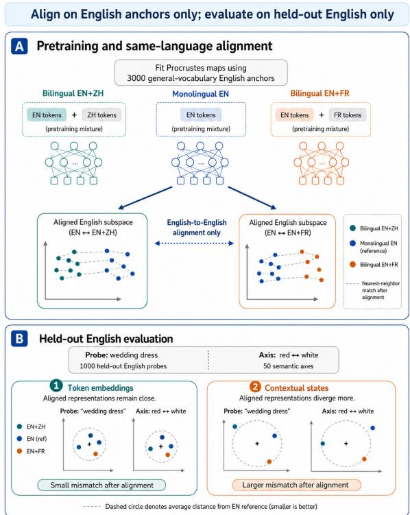  
Figure 1: After aligning English-only and bilingual models on shared vocabulary, token embeddings look similar, but the hidden states used for prediction diverge. Embedding alignment alone does not establish that two models represent English the same way.

When an English-only model and a bilingual model share the same tokenizer, their common English vocabulary lets us align representations and then probe held-out English words along semantic directions where the two languages may disagree (Figure 1). For instance, wedding may sit closer to white in an English-only model but shift toward red after English+Chinese training, because the second language has reshaped how the model positions English words along that semantic direction. If the two models agree on where those words fall, bilingual exposure left the English geometry intact. If they disagree, then adding a second language is associated with different shared-language representations beyond the input layer. In our experiments across eight language pairs, they consistently disagree, and the disagreement is found in the contextual hidden states rather than the token embeddings. We write EN for an English-only model and EN+L2 for a bilingual model (e.g., EN+●zH for English and Chinese, EN+●FRfor English and French).

Prior work has studied whether multilingual models develop shared structure (Pires et al., 2019; Artetxe et al., 2020) or show that different languages occupy distinct subspaces even within a single model (Libovický et al., 2020; Wendler et al. 2024), but these analyses examine models that were multilingual from the start. None of them isolates the effect of adding a second language to an otherwise identical setup. If adding a second language does not change how the model represents English internally, then after alignment the bilingual model should look no different from what we would get by retraining the English-only model with a different random seed. This seed-variation baseline is our null hypothesis.

A bilingual model that differs from an Englishonly model might do so for reasons unrelated to the second language. In our setup, the confounds that remain after fixing architecture, tokenizer, hyperparameters, and data domain are different amounts of English exposure, different total optimizer steps, and shared English documents between the two models. We pretrain matched 310M-parameter model pairs across eight languages (●ZH●FR● FAS ●NLD● UKR●BUL● IND● DEU), separately Controlling for each of the three remaining confounds.

Across all eight languages and all control settings, adding a second language changes how the model represents English internally, by more than random seed variation would explain. The effect appears early in training, peaks in middle transformer layers, and persists under alternative alignment methods and non-overlapping English data. Standard embedding-level diagnostics of the kind used in bilingual lexicon induction (Hartmann and Søgaard, 2018; Vulić et al., 2020) miss this because they operate only at the input layer, where the two models still look aligned. We make four contributions:

• A controlled test for shared-language effects. We align each model pair on 3000 shared English words, then test 1000 held-out words against a seed-variation baseline computed from six English-only model pairs that differ only in random initialization.

• Matched pretraining across eight languages. We pretrain paired English-only and bilingual models that separately match English exposure, total compute, and training documents, so as to isolate the effect of the second language.

• Embeddings vs. hidden states. Token embeddings return to seed-level similarity after alignment, but the deeper hidden states where predictions are made diverge far beyond what different random seeds would produce.

• Robustness. The hidden-state mismatch survives when the two models train on entirely different English documents, when we switch from orthogonal to affine alignment, and when we evaluate at intermediate checkpoints throughout training.

## 2 Related Work

Prior work has studied whether multilingual models share structure, how to align them, and how to probe what they encode, but none isolates the effect of adding a second language to an otherwise identical training run.

Alignment as a control. Classic bilingual lexicon induction (BLI) aligns monolingual spaces with orthogonal maps and evaluates translation or neighbor agreement (Schönemann, 1966; Smith et al., 2017; Lample et al., 2018; Artetxe et al., 2018); Mikolov et al. (2013) is historical background for this lexical setting, not evidence about decoder hidden states. Later work shows that this geometry can fail under non-isometry, domain shift, and frequency mismatch (Hartmann and Søgaard, 2018; Vulić et al., 2020; Patra et al., 2019). Alignment interventions can also enable zero-shot translation (Mullov et al., 2024) or improve multilingual in-context learning (Li et al., 2024); such functional transfer is compatible with residual geometric mismatch and does not require contextual states to be indistinguishable. Our setting instead uses alignment as a diagnostic calibration step between matched EN and EN+L2 models. The contribution is not a new alignment algorithm, but a controlled test of whether lexical alignment establishes contextual-state agreement.

Multilingual structure and overlap. Multilingual pretraining yields both shared transfer and persistent language-specific organization across layers (Pires et al., 2019; Conneau et al., 2020; Libovický et al., 2020; Chi et al., 2020). Complementary analyses compare multilingual and monolingual states by joint matrix factorization (Zhao et al., 2023), identify coexisting languagesensitive and language-neutral subspaces (Chang et al., 2022), recover typological structure across encoder layers (Choenni and Shutova, 2022), and trace shared features and late language-specific decoding with cross-layer transcoders (Harrasse et al., 2025). Shared vocabulary and shared documents can also inflate apparent cross-model agreement (Dufter and Schütze, 2020; Dodge et al., 2021; Lee et al., 2022; Muller et al., 2021). We therefore treat overlap as an explicit confound rather than a nuisance after the fact.

Directional probing. Semantic-axis methods measure where representations lie along interpretable directions and have been used to study bias, temporal semantic drift, and cross-cultural value differences (Bolukbasi et al., 2016; Caliskan et al., 2017; Garg et al., 2018; Arora et al., 2023). Their main advantage here is sensitivity to directional reversals that aggregate similarity metrics can miss. We adapt axis probing from single-model analysis to pairwise cross-run comparison, grounding the axes in cross-cultural survey frameworks from Hofstede (2001), Schwartz (2006), Inglehart and Welzel (2005), and the GLOBE study (House et al., 2004). This paper is therefore not about whether two languages can be aligned for translation; it asks whether bilingual exposure leaves detectable structure in the aligned shared-language space itself (here, the English space).

## 3 Experimental Design

Isolating the effect of a second language requires holding everything else fixed so that the language mixture is the most plausible remaining explanation for any residual difference. Our experiments compare matched model pairs under a single alignment protocol and a single held-out evaluation protocol.

## 3.1 What We Measure

For each English-only model $M _ { \mathrm { E N } }$ and matched bilingual model $M _ { \mathrm { E N + L } 2 }$ , we align their English representations using common vocabulary, then test held-out words. The question is whether the bilingual model differs from the English-only model more than two English-only models trained with different random seeds differ from each other. Formally, for any mismatch metric m, we report

$$
\Delta m = m ( M _ { \mathrm { E N } } , M _ { \mathrm { E N + L 2 } } ) - \bar { m } _ { \mathrm { s e e d - v a r } } ,
$$

where $\bar { m } _ { \mathrm { s e e d - v a r } }$ is the average mismatch between pairs of English-only models that differ only in random seed. If $\Delta m \approx 0$ , the bilingual model looks no different from another English-only model trained with a different random seed. Positive values mean bilingual exposure has changed the shared-language representation beyond what random variation alone would produce.

## 3.2 Training and Controls

Data and languages. We use BabyBabelLM (Jumelet et al., 2026) and study all eight Tier-1 non-English languages with comparable 100Mtoken budgets: Chinese, French, Persian, Dutch, Ukrainian, Bulgarian, Indonesian, and German (OZH●FR●FAS●NLDOUKR●BUL ● IND●DEU). All runs use the same 310M-parameter decoder-only architecture and training recipe. Exact layer counts, batching details, and tokenizer checks are in the appendix. Under this recipe, 1500 steps correspond to about 50M tokens and 3000 steps to about 100M tokens.

Controlling for confounds. A bilingual model can differ from an English-only model for three reasons unrelated to language mixing. It may have seen less English, it may have trained for more total steps, or the two models may share English documents. We control for each. Let nEN be the number of English steps, u the total optimizer updates, and $D _ { \mathrm { E N } }$ the English document set.

• Equal exposure (same English exposure). The English-only model trains for 1500 steps. The bilingual model trains for 3000 steps, alternating English and L2 in equal blocks, so both see exactly 1500 English steps.

• Equal updates (same total compute). The English-only model trains for 3000 steps. The bilingual model also trains for 3000 steps (1500 English + 1500 L2), matching total optimizer updates.

For document overlap, we run each comparison twice:

• shared data. Both models train on the same English documents.

• separate data. The English-only and bilingual models use non-overlapping English documents.

Table 1 summarizes the four resulting control settings. Each setting holds a different subset of confounds fixed, so rows should not be compared against each other as treatment effects.

For example, under the C2 regime (Equal exposure + separate data, see Table 1), both models see 1500 English steps and use nonoverlapping English documents, but the bilingual model has run for more total steps. Any mismatch in this setting cannot be attributed to different English exposure or shared documents, but could reflect the extra optimizer updates.

## 3.3 Probes and Semantic Axes

To compare the English of two models, we need to align their independently learned representations. Note that the words used for alignment are separate from the words used for evaluation, so the alignment objective never directly fits the vocabulary being tested.

Alignment uses 3000 English anchors drawn from high-frequency vocabulary with stop-word, ASCII, and overlap filtering. Evaluation uses a different set of 1000 held-out probes balanced across ten semantic domains: ◆ Values/Norms◆Family/Kinship◆Religion/RitualFood/Cuisine ◆Festivals/Holidays Clothing/Appearance ◆Symbols/Colors Governance/Law◆ Social Identity◆ Daily Customs

The 50 semantic axes (pairs of opposing endpoint words that define a direction, such as individual vs. collective) are adapted from cross-cultural survey frameworks (Hofstede, 2001; Schwartz, 2006; Inglehart and Welzel, 2005; House et al., 2004). These frameworks motivate our axis endpoints. However, note that all reported claims are pairwise model-comparison claims, not claims about languages, cultures, or speakers.

We also include 100 negative-control terms from domains expected to be stable across languages, such as body parts and basic physical vocabulary (Swadesh, 1955). Negative controls bound how much mismatch to expect even on words that should not differ culturally. For non-English evaluation, words are translated with NLLB (NLLB Team et al., 2022), quality-scored with COMETKiwi (Rei et al., 2022), back-translated, and manually reviewed. The primary English-centered result uses English probes and therefore does not depend on this translation pipeline, avoiding any impacts of translation accuracy on the findings. Full word lists, translation settings, and quality-control details are in Appendix A.2.

## 3.4 Alignment and Metrics

For each model pair $( A , B )$ , we extract either token embeddings or the final hidden states before the output projection as matrices $X ^ { a } , X ^ { b } \in \mathbb { R } ^ { V \times d } .$ Using the English anchor set ${ \mathcal { N } } .$ we fit orthogonal Procrustes:

$$
W ^ { \star } = \arg \operatorname* { m i n } _ { W ^ { \top } W = I } \| X _ { \mathcal { N } } ^ { a } W - X _ { \mathcal { N } } ^ { b } \| _ { F } .
$$

We then measure mismatch on held-out probes C. The primary metric is axis projection disagreement. Intuitively, $D _ { A x i s }$ asks whether the same held-out word occupies the same relative position along the same semantic direction after the two model spaces have been aligned.

$$
D _ { A x i s , i } = \frac { 1 } { \vert \mathcal { C } \vert } \sum _ { w \in \mathcal { C } } \left. \langle x _ { w } ^ { a } , \hat { u } _ { i } ^ { a } \rangle - \left. x _ { w } ^ { b } , \hat { u } _ { i } ^ { b } \right. \right. ,
$$

for axis i, where $x _ { w } ^ { a }$ and $x _ { w } ^ { b }$ are the vectors of probe word w in models A and B. Axis directions $( \hat { u } _ { i } ^ { a } , \hat { u } _ { i } ^ { b } )$ are unit vectors from axis endpoint words in each model. The notation ·, ·〉 denotes the Euclidean inner product.

We use $D _ { A x i s }$ as the primary metric because it measures movement along semantically interpretable directions and can detect cases where the two models place a word on opposite sides of an axis. We also report nearest-neighbor disagreement $( D _ { N N }$ , measuring whether the same words remain neighbors after alignment, with $k = 2 5 \mathrm { o n } \mathrm { L } 2 \mathrm { - }$ normalized vectors) and pairwise cosine-similarity disagreement $( D _ { S t r u c t } )$ as complementary checks on local and global geometry. Experiment 4 repeats the analysis with an affine map instead of an orthogonal map to test sensitivity to the alignment method.

To determine whether a mismatch is meaningful we subtract the seed-variation baseline (the average mismatch between English-only models that differ only in random seed). After this subtraction, positive values mean the bilingual model differs from the English-only model more than random initialization alone would explain. We compute this baseline from six matched English-only seed pairings per checkpoint.

## 4 Results

Four questions structure the results. Does the mismatch persist when we control for English exposure and total compute? Does it disappear when the two models train on non-overlapping English data? Is it limited to the input layer or does it extend to the hidden states used for prediction? Does it depend on the training checkpoint or the alignment method?

<table><tr><td rowspan="2">ID Control setting</td><td rowspan="2"></td><td rowspan="2">Confound tested</td><td colspan="3">Pretraining variables</td><td rowspan="2">Result Med. ctx.</td></tr><tr><td>nEN English steps ordered as (mono, bi) ordered as (mono, bi)</td><td>u total updates</td><td>DEN (English documents)</td></tr><tr><td></td><td>C1 Equal-English, shared docs</td><td>Baseline with same exposure and shared documents</td><td>(1500,1500) baseline</td><td>(1500,3000) baseline</td><td> $D ^ { \mathrm { [ s h a r e d ~ d o c s ] } } { } _ { \mathrm { = } }$ </td><td>0.16</td></tr><tr><td></td><td>C2 Equal-English, disjoint docs</td><td>Effect of removing English-document overlap</td><td> $\boxed { ( 1 5 0 0 , 1 5 0 0 ) }$ </td><td> $\boxed { ( 1 5 0 0 , 3 0 0 0 ) }$ </td><td>C1 shared this row disjoint</td><td>0.18</td></tr><tr><td>C3 Equal-compute,</td><td>shared docs</td><td>Effect of unequal compute between mono/bi</td><td> $\frac { \left[ \mathrm { C 1 ~ ( 1 5 0 0 , 1 5 0 0 ) } \right] } { \left[ \mathrm { t h i s ~ r o w ~ ( 3 0 0 0 , 1 5 0 0 ) } \right] } \frac { \left[ \mathrm { C 1 ~ ( 1 5 0 0 , 3 0 0 0 ) } \right] } { \left[ \mathrm { t h i s ~ r o w ~ ( 3 0 0 0 , 3 0 0 0 ) } \right] }$ </td><td></td><td> $D ^ { \mathrm { { \stackrel { L } { m o n o } } } } \cap D ^ { \mathrm { { b i } } } = \emptyset$   $D ^ { \mathrm { { \overline { { { s a m e } } } \ a s { C l } } } }  _ { = D ^ { \mathrm { { b i } } } }$ </td><td>0.53</td></tr><tr><td>C4 Equal-compute, disjoint docs</td><td></td><td>Combined unequal compute and no overlap</td><td>C1 (1500, 1500) this row (3000, 1500) ∆ = (+1500,0)</td><td>C1 (1500, 3000) this row (3000, 3000) ∆ = (+1500,0)</td><td> $\scriptstyle \frac { \mathrm { [ C 1 ~ s h a r e d ] } } { \mathrm { [ t h i s ~ r o w ~ d i s j o i n t ] } }$   ${ \cal D } ^ { \mathrm { \scriptsize { m o n o } } } \cap { \cal D } ^ { \mathrm { \scriptsize { b i } } } = \emptyset$ </td><td>0.32</td></tr></table>

Table 1: Four control settings, each ruling out a different confound. C1 fixes English exposure with shared documents. C2 additionally removes document overlap. C3 fixes total compute. C4 combines compute and overlap controls. Each ordered pair is $( M _ { \mathrm { E N } } , M _ { \mathrm { E N + L 2 } } )$ . Rows should not be compared against each other; each answers a different question. The last column is a within-setting median hidden-state mismatch over target languages.

## 4.1 Experiment 1: Does the mismatch survive exposure and compute controls?

If the mismatch between an English-only and a bilingual model is simply an artifact of different English exposure or different total training steps, then controlling for these should eliminate it. Equal exposure gives both models the same number of English steps and Equal updates gives both models the same total optimizer updates.

We evaluate sixteen model pairs (two Englishonly baselines paired with each of the eight bilingual models) under both budget settings with shared English documents. For each pair, we align on 3000 English anchors and evaluate 1000 heldout probes in both token embeddings and hidden states.

Results. Figure 2 shows that controlling for English exposure or total compute does not eliminate the mismatch. Hidden-state differences remain above the seed-variation baseline across all settings, while embedding differences stay near the level expected from different random seeds. In practical terms, a researcher comparing these models using standard embedding alignment would conclude they represent English the same way, while the layers used for prediction tell a different story. The pattern holds across all eight languages, though some individual language intervals are wide. The mismatch is present even in C1, where English exposure and English documents are matched, so less English training or different English data do not appear to account for the effect.

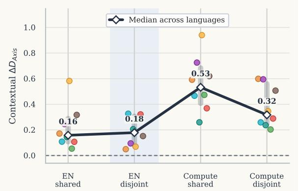  
Figure 2: Hidden-state mismatch exceeds the difference expected between two English-only runs under all control settings. Points show languages and the dark line shows the within-setting median. Even when English exposure is fixed and the source data does not overlap, hidden states remain measurably different from what different random seeds alone would produce.

Takeaway 1. Bilingual training alters hidden-state representations beyond seedvariation levels of monolingual models, but not input embeddings.

## 4.2 Experiment 2: Is the effect driven by shared English documents?

Another explanation for the mismatch is that the English-only and bilingual models simply trained on the same English text. If both models memorized the same documents, their representations could be artificially similar or different in ways that have nothing to do with the second language. We test this by running the same comparisons with completely non-overlapping English documents.

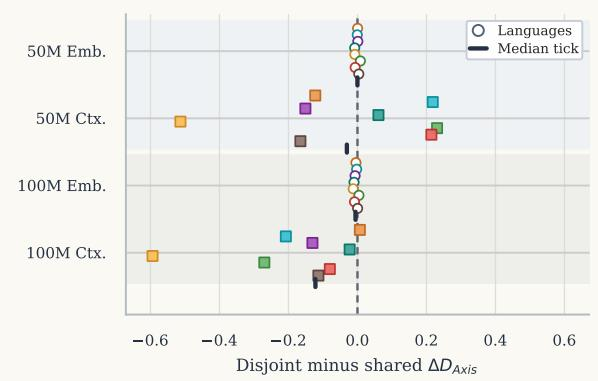  
Figure 3: Removing document overlap does not eliminate the mismatch. Points are languages; each value is the change after switching to non-overlapping English data. Embedding changes cluster near zero and hiddenstate changes vary in sign, so overlap modulates values but is not the source of the effect.

If document overlap is the main driver, removing it should either eliminate the hidden-state mismatch or shift it systematically in one direction. We compare shared data (same English documents) against separate data (disjoint English documents) for each bilingual family across all eight languages.

Results. Figure 3 shows that removing document overlap does not eliminate the mismatch. If shared documents were the explanation, the changes should move consistently in one direction when overlap is removed. Instead, embedding changes cluster near zero and hidden-state changes vary in sign across languages. Overlap can perturb individual probe measurements, but the hiddenstate mismatch persists when the two models train on entirely separate English text. This suggests that shared documents are not the primary driver, which is consistent with the language mixture being the source of the mismatch.

Takeaway 2. Shared English documents do not appear to drive the effect. The hidden-state mismatch persists with nonoverlapping data.

## 4.3 Experiment 3: Input layer or hidden states?

If the mismatch lives only in embeddings, alignment already handles it. The question is whether it extends to the hidden states where predictions are actually made. A good alignment on embeddings does not guarantee agreement in hidden states, because the transformer's layer-by-layer processing can reshape representations beyond what the inputlayer fit constrains. This experiment measures where the mismatch lives across layers and whether it could be explained by differences in vector magnitude rather than direction.

We compare embedding-level and hidden-state mismatch for all model pairs from Experiments 1 and 2, extracting both static token embeddings and final-layer hidden states under the same alignment protocol. To localize the effect across depth, we extract states from all 12 transformer layers and re-estimate the post-hoc alignment at each layer; we do not propagate one rotation through the network or assume residual-stream rotational invariance. Two additional controls address the possibility that the effect is driven by vector magnitude rather than direction. Row-L2 normalization removes per-vector magnitude before computing axis projections, and neutral-anchor z-scoring calibrates each axis using projections from semantically neutral words.

Results. Figure 4a shows the central finding. For every language, hidden states diverge far more than token embeddings after the same alignment. The models look aligned at the input layer but disagree at the layers where predictions are made. Embedding mismatch stays near the level expected from different random seeds, while hidden-state mismatch is substantially larger. Figure 4b confirms the same pattern when evaluated in the target language rather than English, ruling out an Englishspecific artifact.

The layer-by-layer view (Figure 5a) shows exactly where the divergence appears. Mismatch is small at the input layer (where alignment is performed), rises steadily through middle transformer layers, and partially decreases in the final layers while remaining well above the embedding baseline. This profile is consistent with the divergence arising from contextual processing, though it may also partly reflect that alignment is fit only at the input layer and does not constrain deeper representations. Normalizing vector lengths or z-scoring against neutral anchors (Figure 5b) does not eliminate the middle-layer peak, confirming that this is a directional effect rather than a consequence of different vector magnitudes.

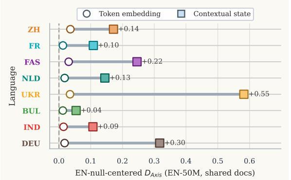  
(a) EN-centered: hidden-state mismatch exceeds embedding mismatch for every language.

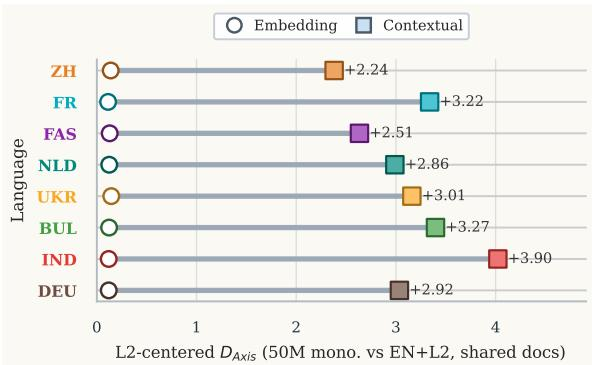  
(b) L2-centered: the same gap persists outside English.

Figure 4: Hidden states diverge far more than token embeddings, whether measured in English or the target language. (a) English-centered comparison: for every language, hidden-state mismatch (squares) exceeds embedding mismatch (circles). (b) Target-language-centered comparison: the same ordering holds outside English, ruling out an English-specific artifact.

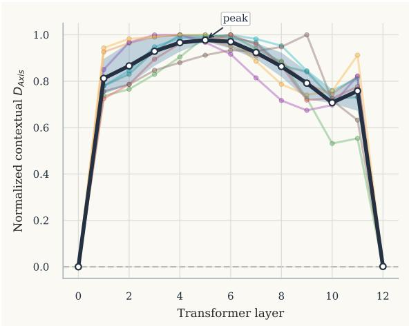  
(a) Layer trajectory

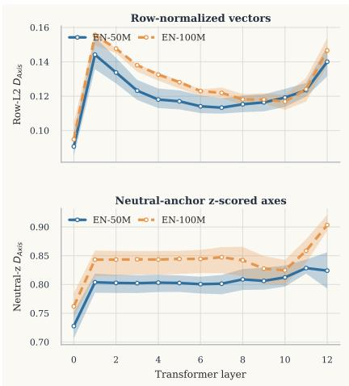  
(b) Norm controls  
Figure 5: The hidden-state mismatch grows through middle layers and is not explained by vector magnitude. (a) Thin lines show individual language pairs, with the dark line as their mean and the band as the 20 to 80% range. (b) Row-L2 normalization and neutral-anchor z-scoring both preserve the middle-layer peak.

Takeaway 3. The mismatch is predominantly in the hidden states rather than the embeddings. It peaks in middle layers and is not explained by vector magnitude.

## 4.4 Experiment 4: Is this a late-training or alignment-method artifact?

The results so far use final checkpoints and one specific alignment method (orthogonal Procrustes). Two concerns remain: the mismatch might only appear at the end of training, or it might depend on the particular alignment method. We test both.

We evaluate dense checkpoints every 500 steps for all eight bilingual families, and repeat the main comparison under affine alignment (which relaxes the orthogonality constraint). We also fit orthogonal Procrustes directly on contextual anchor states and evaluate only on disjoint, held-out contextual

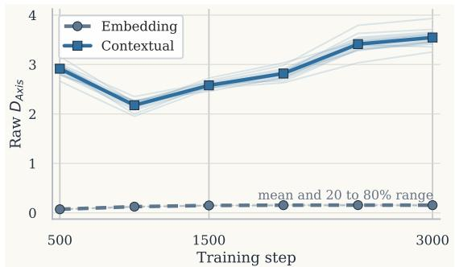  
Figure 6: Dense checkpoints show an early, persistent hidden-state gap. Lines average all eight Equal exposure + shared data families at 500-step intervals; shaded bands show the 20 to 80% language range.

probes (Table 2).

Results. Figure 6 shows that hidden-state mismatch is already far above embedding mismatch at 500 steps and remains separated through 3000 steps. The gap is already present at the earliest checkpoint we evaluate, so the effect is not a late-training phenomenon. On held-out contextual probes, mean raw $D _ { A x i s }$ is 0.386 whether the orthogonal map is fitted on embedding or contextual anchors, and is 0.580 under an affine map fitted on embedding anchors (Table 2). Thus, directly aligning contextual states does not eliminate the observed mismatch. Rerunning alignment with different anchor subsets gives the same answer (Appendix Table 23), so the result is not tied to one anchor vocabulary.

<table><tr><td></td><td></td><td></td><td colspan="3">Held-out mismatch (mean ± SD)</td><td>Alignment fit</td></tr><tr><td>Probe repr.</td><td>Map</td><td>Fit anchors</td><td> $\scriptstyle D _ { N N }$ </td><td> $D _ { S t r u c t }$ </td><td> $D _ { A x i s }$ </td><td>Residual / anchor</td></tr><tr><td>Embedding</td><td>Orthogonal</td><td>Embedding</td><td> $0 . 0 2 9 \pm 0 . 0 1 9$ </td><td> $0 . 0 1 4 \pm 0 . 0 1 5$ </td><td> $\mathbf { 0 . 0 1 4 \pm 0 . 0 1 2 }$ </td><td>0.041</td></tr><tr><td></td><td>Orthogonal</td><td>Contextual</td><td> $0 . 0 2 9 \pm 0 . 0 1 9$ </td><td> $0 . 0 1 4 \pm 0 . 0 1 5$ </td><td> $\mathbf { 0 . 0 1 4 \pm 0 . 0 1 2 }$ </td><td>0.194</td></tr><tr><td></td><td>Affine</td><td>Embedding</td><td> $0 . 0 9 7 \pm 0 . 0 2 6$ </td><td> $0 . 0 5 5 \pm 0 . 0 2 4$ </td><td> $\mathbf { 0 . 0 2 1 \pm 0 . 0 2 3 }$ </td><td>0.030</td></tr><tr><td>Contextual</td><td>Orthogonal</td><td>Embedding</td><td> $0 . 0 1 5 \pm 0 . 0 1 6$ </td><td> $0 . 0 4 2 \pm 0 . 0 3 8$ </td><td> $\mathbf { 0 . 3 8 6 \pm 0 . 2 4 8 }$ </td><td>0.041</td></tr><tr><td></td><td>Orthogonal</td><td>Contextual</td><td> $0 . 0 1 5 \pm 0 . 0 1 6$ </td><td> $0 . 0 4 2 \pm 0 . 0 3 8$ </td><td> $\mathbf { 0 . 3 8 6 \pm 0 . 2 4 8 }$ </td><td>0.194</td></tr><tr><td></td><td>Affine</td><td>Embedding</td><td> $0 . 0 2 7 \pm 0 . 0 1 6$ </td><td> $0 . 0 5 2 \pm 0 . 0 4 3$ </td><td> $\mathbf { 0 . 5 8 0 \pm 0 . 2 6 0 }$ </td><td>0.030</td></tr></table>

Table 2: Held-out evaluation after direct contextual-state alignment. Cells report mean ± standard deviation over the sixteen EN-centered C3 pairs. Alignment maps are fitted only on the indicated anchors and evaluated on disjoint held-out probes. Contextual $D _ { A x i s }$ remains 0.386 when orthogonal Procrustes is fitted directly on contextual rather than embedding anchors; affine alignment also leaves substantial mismatch.

Takeaway 4. The hidden-state mismatch is already present at the first evaluated checkpoint (500 steps) and is not eliminated by switching alignment methods.

## 5 Discussion

What this means. Embedding alignment removes arbitrary rotation between two models' input-layer vocabularies, which is useful for making lexical spaces comparable. Our results establish a narrower point: in these controlled 310M decoder-only models, lexical agreement does not imply contextual-state equivalence. Substantial held-out contextual geometric mismatch remains under the orthogonal and affine maps we test, including when the orthogonal map is fitted directly on contextual anchors. Probing (Chi et al., 2020), representation-similarity analysis, and cross-model interpretability (Wendler et al., 2024) should therefore validate the representation family analyzed.

Connection to prior work. Wendler et al. (2024) showed that multilingual decoders keep different languages in separate internal subspaces even when generating in a shared language. Our finding is complementary but distinct. They study a single pretrained multilingual model and show internal language separation. We compare matched monolingual and bilingual models under controlled conditions and find that bilingual exposure is associated with measurable changes to the shared-language representation itself, beyond what alignment on the input layer can detect. Together, these results are consistent with the view that multilingual training does not simply add capacity for new languages while leaving existing representations intact.

Thus, adding another language can alter deeper representation geometry beyond seed variation after the controls we test. Shared-vocabulary superposition or bilingual polysemy may contribute to this gap, but our experiments do not isolate a unique mechanism.

Scope and what remains open. The experiments establish contextual geometric mismatch under the tested alignment families, not failure of every possible contextual alignment and not downstream behavioral differences (e.g., different answer distributions on the same prompt). The current study covers one 310M decoder-only architecture across eight languages; we do not claim the effect holds at all scales or for all architectures. Negative controls also show that mismatch is not exclusive to culturally loaded words. Larger models, broader contextual alignment families, causal mechanisms, and output-level evaluation remain future work.

Why this matters for practitioners. When comparing multilingual models using embedding alignment, practitioners should include a check on hidden states alongside the input-layer alignment and compare against how much two identically configured models differ just from random initialization. This is a low-cost addition that separates meaningful differences from ordinary run-to-run variation, without requiring a downstream task for every comparison. The protocol we define here (align on common vocabulary, evaluate held-out words in both embeddings and hidden states, compare against seed variation) can be applied to any pair of models that share a vocabulary subset, making it useful beyond the bilingual setting studied here.

## 6 Conclusion

In our controlled 310M-parameter experiments, adding a second language to pretraining is associated with measurable differences in sharedlanguage representation geometry. Token embeddings align to the level expected from different random seeds, but contextual states remain mismatched under the alignment families tested, including direct contextual-anchor alignment. The mismatch is already present at 500 training steps, peaks in middle transformer layers, and survives all three confound controls we test (equal English exposure, equal total compute, and non-overlapping English documents). Lexical alignment should therefore not be treated as evidence of contextualstate equivalence. Multilingual comparison studies should check hidden states alongside embeddings and compare against seed variation before interpreting mismatch. Whether this geometry produces downstream behavioral differences remains open.

## Limitations

We intentionally restrict the study to one 310M decoder-only architecture so that English exposure, total compute, document overlap, alignment method, and representation layer can each be controlled independently. We view the fixed scale as a control choice rather than a claim about scale invariance. Scaling this design to larger models would be valuable, but doing so without matched controls would make any mismatch harder to interpret. The results also depend on the specific set of 50 semantic axes and the translation pipeline used to extend them to non-English languages, so they should be read as descriptive of this evaluation setup rather than as exhaustive measurements of cross-linguistic difference. Extending to broader architectures, training recipes, and downstream behavioral evaluations is the natural next step.

## Ethical Considerations

This work studies structural properties of bilingual language model representations and has no direct application to individual users or downstream production systems. Its primary broader impact is methodological, highlighting that embeddingspace alignment can underestimate how much models differ at the layers they use for prediction. No personally identifiable or sensitive individual data were used. All word translations were performed with automatic quality control and manual review at an aggregate vocabulary level, with the supporting material documenting the quality-control process.

## Acknowledgments

We are thankful to the reviewers who provided feedback in earlier versions of this work. This work was generously supported by the US National Science Foundation CAREER award 2439202. This work is also in part supported by NSF grant IIS-2452129. We acknowledge the support by resources provided by the Office of Research Computing at George Mason University (https://orc.gmu.edu) and funded in part by grants from the NSF (Award Number 2018631). Any opinions, findings, and conclusions or recommendations expressed in this material are solely those of the authors.

## References

Arnav Arora, Lucie-aimée Kaffee, and Isabelle Augenstein. 2023. Probing pre-trained language models for cross-cultural differences in values. In Proceedings of the First Workshop on Cross-Cultural Considerations in NLP (C3NLP), pages 114–130, Dubrovnik, Croatia. Association for Computational Linguistics.

Mikel Artetxe, Gorka Labaka, and Eneko Agirre. 2018. A robust self-learning method for fully unsupervised cross-lingual mappings of word embeddings. In Proceedings of the 56th Annual Meeting of the Association for Computational Linguistics (Volume 1: Long Papers), pages 789–798, Melbourne, Australia. Association for Computational Linguistics.

Mikel Artetxe, Sebastian Ruder, and Dani Yogatama. 2020. On the cross-lingual transferability of monolingual representations. In Proceedings of the 58th Annual Meeting of the Association for Computational Linguistics, pages 4623–4637, Online. Association for Computational Linguistics.

Brent Berlin and Paul Kay. 1969. Basic Color Terms: Their Universality and Evolution. University of California Press.

Tolga Bolukbasi, Kai-Wei Chang, James Y. Zou, Venkatesh Saligrama, and Adam Tauman Kalai. 2016. Man is to computer programmer as woman is to homemaker? debiasing word embeddings. In Advances in Neural Information Processing Systems 29:

Annual Conference on Neural Information Processing Systems 2016, December 5-10, 2016, Barcelona, Spain, pages 4349–4357.

Aylin Caliskan, Joanna J. Bryson, and Arvind Narayanan. 2017. Semantics derived automatically from language corpora contain human-like biases. Science, 356(6334):183–186.

Tyler A. Chang, Zhuowen Tu, and Benjamin K. Bergen. 2022. The geometry of multilingual language model representations. In Proceedings of the 2022 Conference on Empirical Methods in Natural Language Processing, pages 119–136, Abu Dhabi, United Arab Emirates. Association for Computational Linguistics.

Ethan A. Chi, John Hewitt, and Christopher D. Manning. 2020. Finding universal grammatical relations in multilingual BERT. In Proceedings of the 58th Annual Meeting of the Association for Computational Linguistics, pages 5564–5577, Online. Association for Computational Linguistics.

Rochelle Choenni and Ekaterina Shutova. 2022. Investigating language relationships in multilingual sentence encoders through the lens of linguistic typology. Computational Linguistics, 48(3):635–672.

Alexis Conneau, Kartikay Khandelwal, Naman Goyal, Vishrav Chaudhary, Guillaume Wenzek, Francisco Guzmán, Edouard Grave, Myle Ott, Luke Zettlemoyer, and Veselin Stoyanov. 2020. Unsupervised cross-lingual representation learning at scale. In Proceedings of the 58th Annual Meeting of the Association for Computational Linguistics, pages 8440– 8451, Online. Association for Computational Linguistics.

Jesse Dodge, Maarten Sap, Ana Marasović, William Agnew, Gabriel Ilharco, Dirk Groeneveld, Margaret Mitchell, and Matt Gardner. 2021. Documenting large webtext corpora: A case study on the colossal clean crawled corpus. In Proceedings of the 2021 Conference on Empirical Methods in Natural Language Processing, pages 1286–1305, Online and Punta Cana, Dominican Republic. Association for Computational Linguistics.

Philipp Dufter and Hinrich Schütze. 2020. Identifying elements essential for BERT's multilinguality. In Proceedings of the 2020 Conference on Empirical Methods in Natural Language Processing (EMNLP), pages 4423–4437, Online. Association for Computational Linguistics.

Nikhil Garg, Londa Schiebinger, Dan Jurafsky, and James Zou. 2018. Word embeddings quantify 100 years of gender and ethnic stereotypes. Proceedings of the National Academy of Sciences, 115(16):E3635– E3644.

Abir Harrasse, Florent Draye, Punya Syon Pandey, Zhijing Jin, and Bernhard Schölkopf. 2025. Tracing multilingual representations in LLMs with cross-layer transcoders. Preprint, arXiv:2511.10840.

Mareike Hartmann and Anders Søgaard. 2018. Limitations of cross-lingual learning from image search. In Proceedings of the Third Workshop on Representation Learning for NLP, pages 159–163, Melbourne, Australia. Association for Computational Linguistics.

Daniel Hershcovich, Stella Frank, Heather Lent, Miryam de Lhoneux, Mostafa Abdou, Stephanie Brandl, Emanuele Bugliarello, Laura Cabello Piqueras, Ilias Chalkidis, Ruixiang Cui, Constanza Fierro, Katerina Margatina, Phillip Rust, and Anders Søgaard. 2022. Challenges and strategies in crosscultural NLP. In Proceedings of the 60th Annual Meeting of the Association for Computational Linguistics (Volume 1: Long Papers), pages 6997–7013, Dublin, Ireland. Association for Computational Linguistics.

Geert Hofstede. 2001. Culture's Consequences: Comparing Values, Behaviors, Institutions and Organizations Across Nations, 2nd edition. Sage Publications.

Robert J. House, Paul J. Hanges, Mansour Javidan, Peter W. Dorfman, and Vipin Gupta, editors. 2004. Culture, Leadership, and Organizations: The GLOBE Study of 62 Societies. SAGE Publications, Thousand Oaks, California.

Ronald Inglehart and Christian Welzel. 2005. Modernization, Cultural Change, and Democracy: The Human Development Sequence. Cambridge University Press.

Jaap Jumelet, Abdellah Fourtassi, Akari Haga, Bastian Bunzeck, Bhargav Shandilya, Diana Galvan-Sosa, Faiz Ghifari Haznitrama, Francesca Padovani, Francois Meyer, Hai Hu, Julen Etxaniz, Laurent Prévot, Linyang He, María Grandury, Mila Marcheva, Negar Foroutan, Nikitas Theodoropoulos, Pouya Sadeghi, Siyuan Song, and 7 others. 2026. BabyBabelLM: A multilingual benchmark of developmentally plausible training data. In Proceedings of the 19th Conference of the European Chapter of the Association for Computational Linguistics (Volume 1: Long Papers), pages 3297–3329, Rabat, Morocco. Association for Computational Linguistics.

Guillaume Lample, Alexis Conneau, Marc'Aurelio Ranzato, Ludovic Denoyer, and Hervé Jégou. 2018. Word translation without parallel data. In 6th International Conference on Learning Representations, ICLR 2018, Vancouver, BC, Canada, April 30 - May 3, 2018, Conference Track Proceedings. OpenReview.net.

Katherine Lee, Daphne Ippolito, Andrew Nystrom, Chiyuan Zhang, Douglas Eck, Chris Callison-Burch, and Nicholas Carlini. 2022. Deduplicating training data makes language models better. In Proceedings of the 60th Annual Meeting of the Association for Computational Linguistics (Volume 1: Long Papers), pages 8424–8445, Dublin, Ireland. Association for Computational Linguistics.

Chong Li, Shaonan Wang, Jiajun Zhang, and Chengqing Zong. 2024. Improving in-context learning of multilingual generative language models with crosslingual alignment. In Proceedings of the 2024 Conference of the North American Chapter of the Association for Computational Linguistics: Human Language Technologies (Volume 1: Long Papers), pages 8058–8076, Mexico City, Mexico. Association for Computational Linguistics.

Jindřich Libovický, Rudolf Rosa, and Alexander Fraser. 2020. On the language neutrality of pre-trained multilingual representations. In Findings of the Association for Computational Linguistics: EMNLP 2020, pages 1663–1674, Online. Association for Computational Linguistics.

Tomas Mikolov, Quoc V. Le, and Ilya Sutskever. 2013. Exploiting similarities among languages for machine translation. Preprint, arXiv:1309.4168.

Benjamin Muller, Antonios Anastasopoulos, Benoît Sagot, and Djamé Seddah. 2021. When being unseen from mBERT is just the beginning: Handling new languages with multilingual language models. In Proceedings of the 2021 Conference of the North American Chapter of the Association for Computational Linguistics: Human Language Technologies, pages 448–462, Online. Association for Computational Linguistics.

Carlos Mullov, Quan Pham, and Alexander Waibel. 2024. Decoupled vocabulary learning enables zeroshot translation from unseen languages. In Proceedings of the 62nd Annual Meeting of the Association for Computational Linguistics (Volume 1: Long Papers), pages 6693–6709, Bangkok, Thailand. Association for Computational Linguistics.

NLLB Team, Marta R. Costa-jussà, James Cross, Onur Çelebi, Maha Elbayad, Kenneth Heafield, Kevin Heffernan, Elahe Kalbassi, Janice Lam, Daniel Licht, Jean Maillard, Anna Sun, Skyler Wang, Guillaume Wenzek, Al Youngblood, Bapi Akula, Loic Barrault, Gabriel Mejia Gonzalez, Prangthip Hansanti, and 20 others. 2022. No Language Left Behind: Scaling human-centered machine translation. Preprint, arXiv:2207.04672.

Barun Patra, Joel Ruben Antony Moniz, Sarthak Garg, Matthew R. Gormley, and Graham Neubig. 2019. Bilingual lexicon induction with semi-supervision in non-isometric embedding spaces. In Proceedings of the 57th Annual Meeting of the Association for Computational Linguistics, pages 184–193, Florence, Italy. Association for Computational Linguistics.

Telmo Pires, Eva Schlinger, and Dan Garrette. 2019. How multilingual is multilingual BERT? In Proceedings of the 57th Annual Meeting of the Association for Computational Linguistics, pages 4996–5001, Florence, Italy. Association for Computational Linguistics.

Ricardo Rei, Marcos Treviso, Nuno M. Guerreiro, Chrysoula Zerva, Ana C Farinha, Christine Maroti,

José G. C. de Souza, Taisiya Glushkova, Duarte Alves, Luisa Coheur, Alon Lavie, and André F. T. Martins. 2022. CometKiwi: IST-Unbabel 2022 submission for the quality estimation shared task. In Proceedings of the Seventh Conference on Machine Translation (WMT), pages 634–645, Abu Dhabi, United Arab Emirates (Hybrid). Association for Computational Linguistics.

Peter H. Schönemann. 1966. A generalized solution of the orthogonal procrustes problem. Psychometrika, 31(1):1–10.

Shalom H. Schwartz. 2006. A theory of cultural value orientations: Explication and applications. Comparative Sociology, 5(2-3):137–182.

Jiandong Shao, Raphael Tang, Crystina Zhang, Karin Sevegnani, Pontus Stenetorp, Jianfei Yang, and Yao Lu. 2026. The role of mixed-language documents for multilingual large language model pretraining. In Proceedings of the 64th Annual Meeting of the Association for Computational Linguistics (Volume 1: Long Papers), pages 36807–36818, San Diego, California, United States. Association for Computational Linguistics.

Samuel L. Smith, David H. P. Turban, Steven Hamblin, and Nils Y. Hammerla. 2017. Offline bilingual word vectors, orthogonal transformations and the inverted softmax. In 5th International Conference on Learning Representations, ICLR 2017, Toulon, France, April 24-26, 2017, Conference Track Proceedings. OpenReview.net.

Morris Swadesh. 1955. Towards greater accuracy in lexicostatistic dating. International Journal of American Linguistics, 21(2):121–137.

Ivan Vulić, Sebastian Ruder, and Anders Søgaard. 2020. Are all good word vector spaces isomorphic? In Proceedings of the 2020 Conference on Empirical Methods in Natural Language Processing (EMNLP), pages 3178–3192, Online. Association for Computational Linguistics.

Chris Wendler, Veniamin Veselovsky, Giovanni Monea, and Robert West. 2024. Do llamas work in English? on the latent language of multilingual transformers. In Proceedings of the 62nd Annual Meeting of the Association for Computational Linguistics (Volume 1: Long Papers), pages 15366–15394, Bangkok, Thailand. Association for Computational Linguistics.

Zheng Zhao, Yftah Ziser, Bonnie Webber, and Shay B. Cohen. 2023. A joint matrix factorization analysis of multilingual representations. In Findings of the Association for Computational Linguistics: EMNLP 2023, pages 12764–12783, Singapore. Association for Computational Linguistics.

## Appendix

Appendix A.1 records implementation details. Appendix A.2 fixes the evaluation setup (probe inventories, axis grounding, translation QC, split protocol). Appendix A.3 gives detailed values behind main-text claims. Appendix A.4 tests robustness (denser checkpoints, larger EN-only null baselines, alternative anchors). Appendix A.5 breaks down where the signal concentrates across categories and languages.

## A.1 Complete Implementation Details

All runs share one 12-layer Llama-style prenorm decoder with RMSNorm, hidden size 768, FFN size 3072, 12 attention heads, untied token/output matrices, and approximately 310M parameters. Every checkpoint uses the unchanged meta-1lama/Llama-3.2-1B BPE tokenizer and its complete 128,256-token multilingual vocabulary; we train no condition-specific tokenizer and take no vocabulary intersection (Appendix Table 25). Throughput is fixed at 32,768 tokens per step, using batch size 8, gradient accumulation 8, and sequence length 512. For non-English probe construction, we use NLLB for translation, COMETKiwi for quality scoring, back-translation, and manual review of low-confidence cases.

## A.2 Probe Details

Semantic Axes These tables enumerate the full axis inventory and the theoretical grounding attached to each axis. They make clear that the directional diagnostics are fixed before analysis rather than tuned post hoc to the reported results.

Probe Translation and QC Summary These artifacts document the translation filters applied before any probe enters an evaluation table or figure. Table 6 reports quality scores per language; Table 7 stratifies by quality tier for the overlap ablation. Table 7 further breaks down quality by tier for the overlap ablation in Experiment 2.

Axis Magnitude Interpretation This compact table fixes the scale of the main directional metric before later sections introduce more conditions.

## A.3 Data Statistics and Split Protocol

This section records the core bookkeeping facts that reviewers usually need to interpret the design quickly.

Corpus domain and mixed-language audit. BabyBabelLM provides language-specific mixtures of transcribed child–caregiver and adult conversations, educational material, children's books, child-oriented Wikipedia and news, and childsuitable film/television subtitles; where needed, it pads Tier-1 budgets with filtered OpenSubtitles and, for some languages, FineWeb-C or Wikipedia. We add no external training corpus. Category proportions vary with language-specific source availability, so we do not interpret cross-language magnitude differences causally. Within each targetlanguage experiment, however, all conditions draw from the same BabyBabelLM source pools and use the same preparation pipeline; shared/disjoint conditions partition the same English pool.

Following Shao et al. (2026), we also ran a heuristic chunk-level fastText audit over all 3,213,686 documents used here. We flag a mixedlanguage candidate only when the target and another language each cover at least 20% of highconfidence sampled segments, with at least three auditable segments. This identifies 12,382 candidates (0.385%), including 2,721 target-plus-English candidates (0.088%); per-language targetplus-English rates range from 0.001% to 1.217%. These rates are below the roughly 2% found by Shao et al. (2026) in generic web data. Sparse mixed-language exposure may still contribute to the effect, but the present study does not claim a unique causal mechanism.

Hyperparameter search policy and reported values This study does not use hyperparameter search. We pre-specified one training recipe and reused it for all runs so that differences are attributable to the intended control variables rather than to tuning variance. Concretely, all runs use the same model family and training geometry reported in Section 3.2 (310M parameters), batch size 8, gradient accumulation 8, sequence length 512, and throughput 32,768 tokens/step, with checkpoints at 1500 and 3000 steps. Since no sweep was performed, “best-found" values are not applicable here.

## A.4 Detailed Tables for Main-Text Results

This section anchors the main-paper figures with exact values. The intent is not to introduce new claims, but to make the quantitative basis of the main narrative explicit.

<table><tr><td colspan="3">Axis set A</td><td colspan="3">Axis set B</td></tr><tr><td>#</td><td>Endpoint 1</td><td>Endpoint 2</td><td>#</td><td>Endpoint 1</td><td>Endpoint 2</td></tr><tr><td>1</td><td>individualism</td><td>collectivism</td><td>26</td><td>rice</td><td>bread</td></tr><tr><td>2</td><td>hierarchy</td><td>equality</td><td>27</td><td>tea</td><td>coffee</td></tr><tr><td>3</td><td>duty</td><td>freedom</td><td>28</td><td>spicy</td><td>mild</td></tr><tr><td>4</td><td>honor</td><td>shame</td><td>29</td><td>vegetarian</td><td>meat</td></tr><tr><td>5</td><td>obedience</td><td>autonomy</td><td>30</td><td>fermented</td><td>fresh</td></tr><tr><td>6</td><td>tradition</td><td>modernity</td><td>31</td><td>fasting</td><td>feasting</td></tr><tr><td>7</td><td>restraint</td><td>indulgence</td><td>32</td><td>lunar</td><td>solar</td></tr><tr><td>8</td><td>conformity</td><td>dissent</td><td>33</td><td>mourning</td><td>celebration</td></tr><tr><td>9</td><td>solidarity</td><td>competition</td><td>34</td><td>ancestor</td><td>novelty</td></tr><tr><td>10</td><td>certainty</td><td>ambiguity</td><td>35</td><td>pilgrim</td><td>spectator</td></tr><tr><td>11</td><td>mother</td><td>father</td><td>36</td><td>veiled</td><td>unveiled</td></tr><tr><td>12</td><td>elder</td><td>youth</td><td>37</td><td>formal</td><td>casual</td></tr><tr><td>13</td><td>kin</td><td>stranger</td><td>38</td><td>ornate</td><td>plain</td></tr><tr><td>14</td><td>lineage</td><td>mobility</td><td>39</td><td>modest</td><td>revealing</td></tr><tr><td>15</td><td>clan</td><td>individual</td><td>40</td><td>uniform</td><td>personalized</td></tr><tr><td>16</td><td>sacred</td><td>secular</td><td>41</td><td>white</td><td>red</td></tr><tr><td>17</td><td>ritual</td><td>routine</td><td>42</td><td>black</td><td>gold</td></tr><tr><td>18</td><td>prayer</td><td>reason</td><td>43</td><td>dragon</td><td>eagle</td></tr><tr><td>19</td><td>pilgrimage</td><td>tourism</td><td>44</td><td>lotus</td><td>rose</td></tr><tr><td>20</td><td>taboo</td><td>permissive</td><td>45</td><td>script</td><td>image</td></tr><tr><td>21</td><td>democracy</td><td>monarchy</td><td>46</td><td>local</td><td>global</td></tr><tr><td>22</td><td>federal</td><td>centralized</td><td>47</td><td>indigenous</td><td>diaspora</td></tr><tr><td>23</td><td>customary</td><td>codified</td><td>48</td><td>assimilation</td><td>pluralism</td></tr><tr><td>24</td><td>authority</td><td>deliberation</td><td>49</td><td>majority</td><td>minority</td></tr><tr><td>25</td><td>patronage</td><td>meritocracy</td><td>50</td><td>homeland</td><td>migration</td></tr></table>

Table 3: Complete list of 50 semantic axes used in all experiments. The same axis inventory is fixed before analysis and reused across all language settings. This rules out post hoc axis selection as an explanation for the main residual.  
matched seed pairings per checkpoint so that the null is not tied to one arbitrary comparison.

Main-Text Detailed Tables These tables provide the exact values behind the main-text summaries for Experiments 1 to 4.

## A.5 100M Mirrors and Same-Language Controls

This section mirrors the main-paper controls in more detail. The first block reruns the main ENcentered views at the longer monolingual baseline. The later blocks make the null reference and axisinventory dependence more explicit.

Same-Language Controls This block defines the EN-only seed-variation distribution used to center the main EN analyses. We estimate it from six

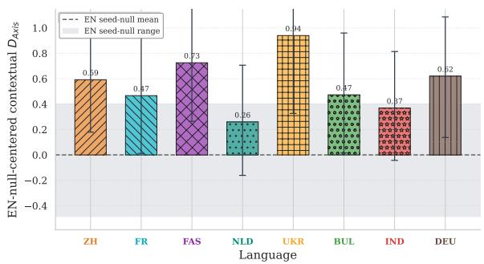  
Figure 7: 100M mirror of Figure 2. The same above-null contextual signal remains visible when the monolingual baseline is trained to 100M tokens.

<table><tr><td>#</td><td>Endpoint 1</td><td>Endpoint 2</td><td>Category</td><td>Framework basis</td><td>Citation(s)</td></tr><tr><td>1</td><td>individualism</td><td>collectivism</td><td>Values and social norms</td><td>Hofstede; Schwartz; Inglehart-Welzel; GLOBE</td><td>(Hofstede, 2001; Schwartz, 2006)</td></tr><tr><td>2</td><td>hierarchy</td><td>equality</td><td>Values and social norms</td><td>Hofstede; Schwartz; Inglehart-Welzel; GLOBE</td><td>(Hofstede, 2001; Schwartz, 2006)</td></tr><tr><td>3</td><td>duty</td><td>freedom</td><td>Values and social norms</td><td>Hofstede; Schwartz; Inglehart-Welzel; GLOBE</td><td>(Inglehart and Welzel, 2005)</td></tr><tr><td>4</td><td>honor</td><td>shame</td><td>Values and social norms</td><td>Hofstede; Schwartz; Inglehart-Welzel; GLOBE</td><td>(House et al., 2004)</td></tr><tr><td>5</td><td>obedience</td><td>autonomy</td><td>Values and social norms</td><td>Hofstede; Schwartz; Inglehart-Welzel; GLOBE</td><td>(Schwartz, 2006)</td></tr><tr><td>6</td><td>tradition</td><td>modernity</td><td>Values and social norms</td><td>Hofstede; Schwartz; Inglehart-Welzel; GLOBE</td><td>(Inglehart and Welzel, 2005)</td></tr><tr><td>7 8</td><td>restraint conformity</td><td>indulgence</td><td>Values and social norms</td><td>Hofstede; Schwartz; Inglehart-Welzel; GLOBE</td><td>(Hofstede, 2001)</td></tr><tr><td>9</td><td>solidarity</td><td>dissent</td><td>Values and social norms</td><td>Hofstede; Schwartz; Inglehart-Welzel; GLOBE</td><td>(Schwartz, 2006)</td></tr><tr><td>10</td><td></td><td>competition</td><td>Values and social norms</td><td>Hofstede; Schwartz; Inglehart-Welzel; GLOBE Hofstede; Schwartz; Inglehart-Welzel; GLOBE</td><td>(House et al., 2004)</td></tr><tr><td>11</td><td>certainty mother</td><td>ambiguity father</td><td>Values and social norms Family and kinship</td><td>HRAF kinship domains; Schwartz Embeddedness; WVS family values</td><td>(Hofstede, 2001)</td></tr><tr><td>12</td><td>elder</td><td>youth</td><td>Family and kinship</td><td>HRAF kinship domains; Schwartz Embeddedness; WVS family values</td><td>(House et al., 2004)</td></tr><tr><td>13</td><td>kin</td><td>stranger</td><td>Family and kinship</td><td>HRAF kinship domains; Schwartz Embeddedness; WVS family values</td><td>(Hofstede, 2001)</td></tr><tr><td>14</td><td>lineage</td><td>mobility</td><td>Family and kinship</td><td>HRAF kinship domains; Schwartz Embeddedness; WVS family values</td><td>(Schwartz, 2006)</td></tr><tr><td>15</td><td>clan</td><td>individual</td><td>Family and kinship</td><td>HRAF kinship domains; Schwartz Embeddedness; WVS family values</td><td>(Inglehart and Welzel, 2005)</td></tr><tr><td>16</td><td>sacred</td><td>secular</td><td>Religion and ritual life</td><td></td><td>(Schwartz, 2006)</td></tr><tr><td>17</td><td>ritual</td><td>routine</td><td>Religion and ritual life</td><td>Inglehart Traditional-Secular; WVS religiosity domains</td><td>(Inglehart and Welzel, 2005)</td></tr><tr><td>18</td><td>prayer</td><td>reason</td><td>Religion and ritual life</td><td>Inglehart Traditional-Secular; WVS religiosity domains Inglehart Traditional-Secular; WVS religiosity domains</td><td>(House et al., 2004)</td></tr><tr><td>19</td><td>pilgrimage</td><td>tourism</td><td>Religion and ritual life</td><td></td><td>(Inglehart and Welzel, 2005)</td></tr><tr><td>20</td><td>taboo</td><td>permissive</td><td>Religion and ritual life</td><td>Inglehart Traditional-Secular; WVS religiosity domains</td><td>(Hershcovich et al., 2022)</td></tr><tr><td>21</td><td>democracy</td><td>monarchy</td><td>Governance, institutions, and law</td><td>Inglehart Traditional-Secular; WVS religiosity domains</td><td>(Hofstede, 2001)</td></tr><tr><td>22</td><td>federal</td><td>centralized</td><td>Governance, institutions, and law</td><td>Hofstede PDI/UAI and comparative political-institutional domains</td><td>(Hofstede, 2001)</td></tr><tr><td>23</td><td>customary</td><td>codified</td><td>Governance, institutions, and law</td><td>Hofstede PDI/UAI and comparative political-institutional domains Hofstede PDI/UAI and comparative political-institutional domains</td><td>(House et al., 2004)</td></tr><tr><td>24</td><td>authority</td><td>deliberation</td><td>Governance, institutions, and law</td><td>Hofstede PDI/UAI and comparative political-institutional domains</td><td>(Hofstede, 2001)</td></tr><tr><td></td><td></td><td></td><td></td><td></td><td>(House et al., 2004)</td></tr><tr><td>25</td><td>patronage</td><td>meritocracy</td><td>Governance, institutions, and law</td><td>Hofstede PDI/UAI and comparative political-institutional domains</td><td>(Hofstede, 2001)</td></tr></table>

Table 4: Mapping of 50 semantic axes to literature-grounded categories and framework dimensions (Part I, axes 1 to 25). The table makes the source of each directional probe auditable.

<table><tr><td>#</td><td>Endpoint 1</td><td>Endpoint 2</td><td>Category</td><td>Framework basis</td><td>Citation(s)</td></tr><tr><td>26</td><td>rice</td><td>bread</td><td>Food and cuisine</td><td>Food anthropology; cultural-value probing in NLP</td><td>(Hershcovich et al., 2022)</td></tr><tr><td>27</td><td>tea</td><td>coffee</td><td>Food and cuisine</td><td>Food anthropology; cultural-value probing in NLP</td><td>(Hershcovich et al., 2022)</td></tr><tr><td>28</td><td>spicy</td><td>mild</td><td>Food and cuisine</td><td>Food anthropology; cultural-value probing in NLP</td><td>(Hershcovich et al., 2022)</td></tr><tr><td>29</td><td>vegetarian</td><td>meat</td><td>Food and cuisine</td><td>Food anthropology; cultural-value probing in NLP</td><td>(Arora et al., 2023)</td></tr><tr><td>30</td><td>fermented</td><td>fresh</td><td>Food and cuisine</td><td>Food anthropology; cultural-value probing in NLP</td><td>(Hershcovich et al., 2022)</td></tr><tr><td>31</td><td>fasting</td><td>feasting</td><td>Festivals and holidays</td><td>Ritual calendar domains in cross-cultural surveys and ethnography</td><td>(Inglehart and Welzel, 2005)</td></tr><tr><td>32</td><td>lunar</td><td>solar</td><td>Festivals and holidays</td><td>Ritual calendar domains in cross-cultural surveys and ethnography</td><td>(Hershcovich et al., 2022)</td></tr><tr><td>33</td><td>mourning</td><td>celebration</td><td>Festivals and holidays</td><td>Ritual calendar domains in cross-cultural surveys and ethnography</td><td>(Inglehart and Welzel, 2005)</td></tr><tr><td>34</td><td>ancestor</td><td>novelty</td><td>Festivals and holidays</td><td>Ritual calendar domains in cross-cultural surveys and ethnography</td><td>(Schwartz, 2006)</td></tr><tr><td>35 36</td><td>pilgrim</td><td>spectator</td><td>Festivals and holidays</td><td>Ritual calendar domains in cross-cultural surveys and ethnography</td><td>(Arora et al., 2023)</td></tr><tr><td>37</td><td>veiled</td><td>unveiled</td><td>Clothing and appearance codes</td><td>Gender-role and modesty norms in GLOBE/Hofstede-aligned studies</td><td>(House et al., 2004)</td></tr><tr><td>38</td><td>formal</td><td>casual</td><td>Clothing and appearance codes</td><td>Gender-role and modesty norms in GLOBE/Hofstede-aligned studies</td><td>(Hofstede, 2001)</td></tr><tr><td>39</td><td>ornate</td><td>plain</td><td>Clothing and appearance codes</td><td>Gender-role and modesty norms in GLOBE/Hofstede-aligned studies</td><td>(Hershcovich et al., 2022)</td></tr><tr><td>40</td><td>modest</td><td>revealing</td><td>Clothing and appearance codes</td><td>Gender-role and modesty norms in GLOBE/Hofstede-aligned studies</td><td>(House et al., 2004)</td></tr><tr><td>41</td><td>uniform</td><td>personalized</td><td>Clothing and appearance codes</td><td>Gender-role and modesty norms in GLOBE/Hofstede-aligned studies</td><td>(Hofstede, 2001)</td></tr><tr><td>42</td><td>white</td><td>red</td><td>Symbols, colors, and cultural objects</td><td>Color-term universals and symbol systems in cultural anthropology</td><td>(Berlin and Kay, 1969)</td></tr><tr><td>43</td><td>black</td><td>gold</td><td>Symbols, colors, and cultural objects</td><td>Color-term universals and symbol systems in cultural anthropology</td><td>(Berlin and Kay, 1969)</td></tr><tr><td></td><td>dragon</td><td>eagle</td><td>Symbols, colors, and cultural objects</td><td>Color-term universals and symbol systems in cultural anthropology</td><td>(Hershcovich et al., 2022)</td></tr><tr><td>44 45</td><td>lotus</td><td>rose</td><td>Symbols, colors, and cultural objects</td><td>Color-term universals and symbol systems in cultural anthropology</td><td>(Hershcovich et al., 2022)</td></tr><tr><td></td><td>script</td><td>image</td><td>Symbols, colors, and cultural objects</td><td>Color-term universals and symbol systems in cultural anthropology</td><td>(Arora et al., 2023)</td></tr><tr><td>46 47</td><td>local</td><td>global</td><td>Social identity, migration, and belonging</td><td>WVS social trust and identity blocks; cross-cultural NLP identity dimensions</td><td>(Inglehart and Welzel, 2005)</td></tr><tr><td>48</td><td>indigenous assimilation</td><td>diaspora pluralism</td><td>Social identity, migration, and belonging</td><td>WVS social trust and identity blocks; cross-cultural NLP identity dimensions</td><td>(Hershcovich et al., 2022)</td></tr><tr><td>49</td><td>majority</td><td>minority</td><td>Social identity, migration, and belonging</td><td>WVS social trust and identity blocks; cross-cultural NLP identity dimensions</td><td>(Hershcovich et al., 2022)</td></tr><tr><td></td><td></td><td></td><td>Social identity, migration, and belonging</td><td>WVS social trust and identity blocks; cross-cultural NLP identity dimensions</td><td>(Arora et al., 2023)</td></tr><tr><td>50</td><td>homeland</td><td>migration</td><td>Social identity, migration, and belonging</td><td>WVS social trust and identity blocks; cross-cultural NLP identity dimensions</td><td>(Inglehart and Welzel, 2005)</td></tr></table>

Table 5: Mapping of 50 semantic axes to literature-grounded categories and framework dimensions (Part II, axes 26 to 50). The table completes the audit trail for the fixed axis inventory.

<table><tr><td>Lang</td><td>n</td><td>Mean QE</td><td>Median QE</td><td>High</td><td>Medium</td><td>Low</td><td>Manual-review</td><td>Duplicate-target</td></tr><tr><td>BUL</td><td>1000</td><td>0.796</td><td>0.847</td><td>717</td><td>192</td><td>91</td><td>371</td><td>47</td></tr><tr><td>DEU</td><td>1000</td><td>0.779</td><td>0.824</td><td>666</td><td>242</td><td>92</td><td>351</td><td>47</td></tr><tr><td>FAS</td><td>1000</td><td>0.797</td><td>0.833</td><td>696</td><td>249</td><td>55</td><td>510</td><td>118</td></tr><tr><td>FR</td><td>1000</td><td>0.777</td><td>0.832</td><td>658</td><td>227</td><td>115</td><td>288</td><td>32</td></tr><tr><td>IND</td><td>1000</td><td>0.763</td><td>0.820</td><td>599</td><td>262</td><td>139</td><td>389</td><td>90</td></tr><tr><td>NLD</td><td>1000</td><td>0.758</td><td>0.820</td><td>583</td><td>270</td><td>147</td><td>351</td><td>55</td></tr><tr><td>UKR</td><td>1000</td><td>0.791</td><td>0.841</td><td>695</td><td>210</td><td>95</td><td>328</td><td>60</td></tr><tr><td>ZH</td><td>1000</td><td>0.745</td><td>0.806</td><td>529</td><td>312</td><td>159</td><td>491</td><td>131</td></tr></table>

Table 6: Probe translation QC summary for all non-English languages. QE uses COMETKiwi when available $( \mathrm { h i g h } \ge 0 . 8 0$ , medium [0.60, 0.80), 1ow < 0.60); the table also reports manual-review flags and duplicatetarget checks. Target-language comparisons are only interpretable if probe translation quality is visible.

Axis-Grounding Holdout Robustness This table asks whether the contextual result is being carried by one narrow handcrafted axis subset. The held-out grouping check stays elevated, which argues against that explanation.

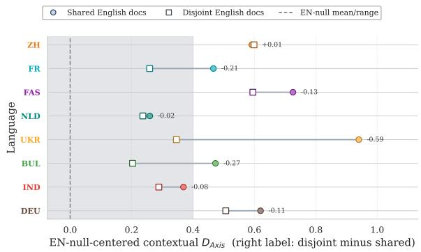  
Figure 8: 100M mirror of Figure 3. The overlap effect stays modest when the monolingual baseline is trained to 100M tokens.

## A.6 Robustness Beyond the Main Controls

Training-Progress Sensitivity These artifacts ask whether the hidden-state-over-embedding gap is a late-training fluke. The dense trajectories show the opposite. Across all eight bilingual families, the hidden-state-versus-embedding gap appears early and persists throughout training.

<table><tr><td>Baseline</td><td>Family</td><td>Quality tier</td><td>n</td><td>Wilcoxon p</td></tr><tr><td>EN-100M</td><td>EN+BUL</td><td>High QE</td><td>717</td><td>1.12e-02</td></tr><tr><td>EN-100M</td><td>EN+BUL</td><td>Low QE</td><td>91</td><td>3.35e-01</td></tr><tr><td>EN-100M</td><td>EN+BUL</td><td>Medium QE</td><td>192</td><td>3.27e-01</td></tr><tr><td>EN-100M</td><td>EN+DEU</td><td>High QE</td><td>666</td><td>2.58e-02</td></tr><tr><td>EN-100M</td><td>EN+DEU</td><td>Low QE</td><td>92</td><td>4.56e-02</td></tr><tr><td>EN-100M</td><td>EN+DEU</td><td>Medium QE</td><td>242</td><td>9.09e-01</td></tr><tr><td>EN-100M</td><td>EN+FAS</td><td>High QE</td><td>696</td><td>4.63e-01</td></tr><tr><td>EN-100M</td><td>EN+FAS</td><td>Low QE</td><td>55</td><td>4.69e-01</td></tr><tr><td>EN-100M</td><td>EN+FAS</td><td>Medium QE</td><td>249</td><td>2.10e-01</td></tr><tr><td>EN-100M</td><td>EN+FR</td><td>High QE</td><td>658</td><td>4.01e-05</td></tr><tr><td>EN-100M</td><td>EN+FR</td><td>Low QE</td><td>115</td><td>9.70e-01</td></tr><tr><td>EN-100M</td><td>EN+FR</td><td>Medium QE</td><td>227</td><td>1.71e-02</td></tr><tr><td>EN-100M</td><td>EN+IND</td><td>High QE</td><td>599</td><td>6.57e-01</td></tr><tr><td>EN-100M</td><td>EN+IND</td><td>Low QE</td><td>139</td><td>6.90e-01</td></tr><tr><td>EN-100M</td><td>EN+IND</td><td>Medium QE</td><td>262</td><td>7.94e-01</td></tr><tr><td>EN-100M</td><td>EN+NLD</td><td>High QE</td><td>583</td><td>5.33e-03</td></tr><tr><td>EN-100M</td><td>EN+NLD</td><td>Low QE</td><td>147</td><td>2.03e-04</td></tr><tr><td>EN-100M</td><td>EN+NLD</td><td>Medium QE</td><td>270</td><td>3.51e-04</td></tr><tr><td>EN-100M</td><td>EN+UKR</td><td>High QE</td><td>695</td><td>3.87e-06</td></tr><tr><td>EN-100M</td><td>EN+UKR</td><td>Low QE</td><td>95</td><td>5.83e-04</td></tr><tr><td>EN-100M</td><td>EN+UKR</td><td>Medium QE</td><td>210</td><td>3.48e-07</td></tr><tr><td>EN-100M</td><td>EN+ZH</td><td>High QE</td><td>529</td><td>1.87e-03</td></tr><tr><td>EN-100M</td><td>EN+ZH</td><td>Low QE</td><td>159</td><td>7.87e-01</td></tr><tr><td>EN-100M</td><td>EN+ZH</td><td>Medium QE</td><td>312</td><td>9.68e-01</td></tr><tr><td>EN-50M</td><td>EN+BUL</td><td>High QE</td><td>717</td><td>4.08e-07</td></tr><tr><td>EN-50M</td><td>EN+BUL</td><td>Low QE</td><td>91</td><td>3.99e-01</td></tr><tr><td>EN-50M</td><td>EN+BUL</td><td>Medium QE</td><td>192</td><td>6.18e-01</td></tr><tr><td>EN-50M</td><td>EN+DEU</td><td>High QE</td><td>666</td><td>8.18e-08</td></tr><tr><td>EN-50M</td><td>EN+DEU</td><td>Low QE</td><td>92</td><td>6.87e-02</td></tr><tr><td>EN-50M</td><td>EN+DEU</td><td>Medium QE</td><td>242</td><td>1.87e-02</td></tr><tr><td>EN-50M</td><td>EN+FAS</td><td>High QE</td><td>696</td><td>6.80e-02</td></tr><tr><td>EN-50M</td><td>EN+FAS</td><td>Low QE</td><td>55</td><td>4.40e-01</td></tr><tr><td>EN-50M</td><td>EN+FAS</td><td>Medium QE</td><td>249</td><td>1.95e-01</td></tr><tr><td>EN-50M</td><td>EN+FR</td><td>High QE</td><td>658</td><td>7.64e-02</td></tr><tr><td>EN-50M</td><td>EN+FR</td><td>Low QE</td><td>115</td><td>4.50e-03</td></tr><tr><td>EN-50M</td><td>EN+FR</td><td>Medium QE</td><td>227</td><td>6.70e-01</td></tr><tr><td>EN-50M</td><td>EN+IND</td><td>High QE</td><td>599</td><td>4.31e-02</td></tr><tr><td>EN-50M</td><td>EN+IND</td><td>Low QE</td><td>139</td><td>1.53e-01</td></tr><tr><td>EN-50M</td><td>EN+IND</td><td>Medium QE</td><td>262</td><td>1.50e-01</td></tr><tr><td>EN-50M</td><td>EN+NLD</td><td>High QE</td><td>583</td><td>1.39e-01</td></tr><tr><td>EN-50M</td><td>EN+NLD</td><td>Low QE</td><td>147</td><td>4.18e-01</td></tr><tr><td>EN-50M</td><td>EN+NLD</td><td>Medium QE</td><td>270</td><td>4.86e-01</td></tr><tr><td>EN-50M</td><td>EN+UKR</td><td>High QE</td><td>695</td><td>8.42e-03</td></tr><tr><td>EN-50M</td><td>EN+UKR</td><td>Low QE</td><td>95</td><td>6.99e-02</td></tr><tr><td>EN-50M</td><td>EN+UKR</td><td>Medium QE</td><td>210</td><td>1.32e-05</td></tr><tr><td>EN-50M</td><td>EN+ZH</td><td>High QE</td><td>529</td><td>2.46e-01</td></tr><tr><td>EN-50M</td><td>EN+ZH</td><td>Low QE</td><td>159</td><td>5.18e-01</td></tr><tr><td>EN-50M</td><td>EN+ZH</td><td>Medium QE</td><td>312</td><td>8.23e-03</td></tr></table>

Table 7: Quality-tier stratification for Experiment 2 overlap tests (COMETKiwi tiers when available; backtranslation tiers otherwise). The overlap conclusion should not depend on low-quality translated probes.

Alignment-Family Sensitivity This check asks whether the orthogonal map itself creates the residual. Switching to an affine map changes magnitudes but does not collapse contextual $D _ { A x i s }$ toward the seed-variation reference.

Anchor-Subset Sensitivity This artifact asks whether the main contextual gap depends on one particular English-anchor list. It does not. Rerunning the alignment with random anchor subsets containing 500 to 3000 words leaves the contextual $D _ { A x i s }$ advantage essentially unchanged.

<table><tr><td>Pair</td><td>Embedding  $D _ { A x i s }$ </td><td>Contextual  $D _ { A x i s }$ </td><td>Ctx.-Emb.</td></tr><tr><td>EN-100M vs EN+BUL</td><td>-0.002</td><td>0.473</td><td>0.475</td></tr><tr><td>EN-100M vs EN+DEU</td><td>0.001</td><td>0.620</td><td>0.619</td></tr><tr><td>EN-100M vs EN+FAS</td><td>0.019</td><td>0.726</td><td>0.707</td></tr><tr><td>EN-100M vs EN+FR</td><td>-0.005</td><td>0.467</td><td>0.472</td></tr><tr><td>EN-100M vs EN+IND</td><td>-0.001</td><td>0.369</td><td>0.369</td></tr><tr><td>EN-100M vs EN+NLD</td><td>0.002</td><td>0.260</td><td>0.257</td></tr><tr><td>EN-100M vs EN+UKR</td><td>0.018</td><td>0.940</td><td>0.922</td></tr><tr><td>EN-100M vs EN+ZH</td><td>0.018</td><td>0.592</td><td>0.574</td></tr><tr><td>EN-50M vs EN+BUL</td><td>0.012</td><td>0.054</td><td>0.042</td></tr><tr><td>EN-50M vs EN+DEU</td><td>0.018</td><td>0.317</td><td>0.299</td></tr><tr><td>EN-50M vs EN+FAS</td><td>0.031</td><td>0.246</td><td>0.215</td></tr><tr><td>EN-50M vs EN+FR</td><td>0.013</td><td>0.108</td><td>0.096</td></tr><tr><td>EN-50M vs EN+IND</td><td>0.014</td><td>0.107</td><td>0.093</td></tr><tr><td>EN-50M vs EN+NLD</td><td>0.018</td><td>0.145</td><td>0.127</td></tr><tr><td>EN-50M vs EN+UKR</td><td>0.035</td><td>0.582</td><td>0.547</td></tr><tr><td>EN-50M vs EN+ZH</td><td>0.036</td><td>0.172</td><td>0.136</td></tr></table>

Table 8: Compact interpretation table for axis magnitudes by pair, covering embedding and contextual $D _ { A x i s }$ with their contextual-minus-embedding gap. Gives a scale reference for reading later $D _ { A x i s }$ tables.

<table><tr><td>Item</td><td>Statistics / split detail</td></tr><tr><td>Pretraining data source</td><td>BabyBabelLM English and 8 Tier-1 non-English languages used in this study.</td></tr><tr><td>Target-language inventory</td><td>8 languages spanning●ZH ●FR ● FAS●NLD ● UKR●BUL ● IND ●DEU.</td></tr><tr><td>Model configuration</td><td>Llama-style pre-norm decoder with RMSNorm, 12 layers, hidden size 768, FFN size 3072, 12 attention heads, vocabulary size 128,256, and untied</td></tr><tr><td>Token budget checkpoints</td><td>parameters). 1500 steps (≈49.15M tokens) and 3000 steps (≈98.30M tokens), at 32,768</td></tr><tr><td>EN-centered comparison grid</td><td>tokens/step. 16 primary pairs (2 EN baselines × 8 EN+L2 families); shared/disjoint conditions give 32 model-pair observations. Embedding/contextual results are two views</td></tr><tr><td>General-vocabulary anchors (alignment set)</td><td>separate. 3000 English words; used only to estimate alignment maps.</td></tr><tr><td>Semantic probes (evaluation set)</td><td>1000 terms; held out from alignment and used only for mismatch evaluation. 50 axis pairs; fixed before</td></tr><tr><td>Semantic axes</td><td>training/evaluation and used only in evaluation metrics.</td></tr><tr><td>Negative-control set</td><td>100 words from high-stability lexical domains; evaluation-only stress test. No supervised train/dev/test split is used in</td></tr><tr><td>Train/dev/test protocol note</td><td>this unsupervised pretraining study. The key protocol split is alignment set (general-vocabulary anchors) versus</td></tr></table>

Table 9: Data statistics and split protocol summary for reproducibility and submission checklist reporting. Separates the alignment anchors from the held-out evaluation probes.

Pair-Level Contextual-Anchor Results Table 24 gives the pair-level values behind the heldout contextual-alignment summary in main-text Table 2.

Tokenizer Check and Aggregate Tests These tables make two support claims explicit. First, all evaluated checkpoints use the same tokenizer artifacts, so the reported differences are not explained by tokenization drift. Second, the main hiddenstate-over-embedding contrast remains positive in aggregate both in the original EN-centered comparisons and in the anchor-subset reruns.

<table><tr><td>Pair</td><td>Metric</td><td>Mean [95% CI]</td></tr><tr><td>EN-50M vs EN+BUL</td><td> $D _ { N N }$ </td><td>0.003 [-0.015, 0.021]</td></tr><tr><td></td><td> $D _ { A x i s }$ </td><td>0.012 [0.008, 0.017]</td></tr><tr><td></td><td> $D _ { S t r u c t }$ </td><td>0.005 [0.003, 0.006]</td></tr><tr><td>EN-50M vs EN+DEU</td><td> $D _ { N N }$ </td><td>0.018 [0.001, 0.036]</td></tr><tr><td></td><td> $D _ { A x i s }$ </td><td>0.018 [0.014, 0.023]</td></tr><tr><td></td><td> $D _ { S t r u c t }$ </td><td>0.003 [0.002, 0.005]</td></tr><tr><td>EN-50M vs EN+FAS</td><td> $D _ { N N }$ </td><td>0.047 [0.030, 0.064]</td></tr><tr><td></td><td> $D _ { A x i s }$ </td><td>0.031 [0.025, 0.037]</td></tr><tr><td></td><td> $D _ { S t r u c t }$ </td><td>0.030 [0.028, 0.032]</td></tr><tr><td>EN-50M vs EN+FR</td><td>DNN</td><td>0.005 [-0.013, 0.023]</td></tr><tr><td></td><td> $D _ { A x i s }$ </td><td>0.013 [0.009, 0.016]</td></tr><tr><td></td><td> $D _ { S t r u c t }$ </td><td>-0.004 [-0.005, -0.002]</td></tr><tr><td>EN-50M vs EN+IND</td><td> $D _ { N N }$ </td><td>0.018 [0.000, 0.035]</td></tr><tr><td></td><td> $D _ { A x i s }$ </td><td>0.014 [0.010, 0.019]</td></tr><tr><td></td><td> $D _ { S t r u c t }$ </td><td>0.003 [0.002, 0.005]</td></tr><tr><td>EN-50M vs EN+NLD</td><td> $D _ { N N }$ </td><td>0.008 [-0.010, 0.026]</td></tr><tr><td></td><td>DAxis</td><td>0.018 [0.014, 0.022]</td></tr><tr><td></td><td> $D _ { S t r u c t }$ </td><td>0.004 [0.002, 0.005]</td></tr><tr><td>EN-50M vs EN+UKR</td><td> $D _ { N N }$ </td><td>0.042 [0.024, 0.059]</td></tr><tr><td></td><td> $D _ { A x i s }$ </td><td>0.035 [0.027, 0.043]</td></tr><tr><td></td><td> $D _ { S t r u c t }$ </td><td>0.031 [0.029, 0.034]</td></tr><tr><td>EN-50M vs EN+ZH</td><td> $D _ { N N }$ </td><td>0.053 [0.036, 0.069]</td></tr><tr><td></td><td> $D _ { A x i s }$ </td><td>0.036 [0.029, 0.043]</td></tr><tr><td></td><td> $D _ { S t r u c t }$ </td><td>0.038 [0.035, 0.041]</td></tr><tr><td>EN-100M vs EN+BUL</td><td> $D _ { N N }$ </td><td>0.013 [-0.004, 0.030]</td></tr><tr><td></td><td> $D _ { A x i s }$ </td><td>-0.002 [-0.008, 0.004]</td></tr><tr><td></td><td> $D _ { S t r u c t }$ </td><td>0.006 [0.004, 0.008]</td></tr><tr><td>EN-100M vs EN+DEU</td><td> $D _ { N N }$ </td><td>0.029 [0.011, 0.046]</td></tr><tr><td></td><td> $D _ { A x i s }$ </td><td>0.000 [-0.004, 0.005]</td></tr><tr><td></td><td>DStruct</td><td>0.007 [0.005, 0.008]</td></tr><tr><td>EN-100M vs EN+FAS</td><td> $D _ { N N }$ </td><td>0.057 [0.041, 0.074]</td></tr><tr><td></td><td>DAxis</td><td>0.019 [0.011, 0.026]</td></tr><tr><td></td><td> $D _ { S t r u c t }$ </td><td>0.031 [0.029, 0.034]</td></tr><tr><td>EN-100M vs EN+FR</td><td></td><td>0.010 [-0.008, 0.029]</td></tr><tr><td></td><td> $D _ { N N }$   $D _ { A x i s }$ </td><td>-0.005 [-0.009, -0.001]</td></tr><tr><td></td><td> $D _ { S t r u c t }$ </td><td>-0.003 [-0.004, -0.001]</td></tr><tr><td>EN-100M vs EN+IND</td><td></td><td>0.021 [0.004, 0.040]</td></tr><tr><td></td><td> $D _ { N N }$   $D _ { A x i s }$ </td><td>-0.001 [-0.004, 0.004]</td></tr><tr><td></td><td> $D _ { S t r u c t }$ </td><td>0.004 [0.002, 0.005]</td></tr><tr><td>EN-100M vs EN+NLD</td><td></td><td></td></tr><tr><td></td><td> $D _ { N N }$ </td><td>0.022 [0.005, 0.041] 0.002 [-0.002, 0.007]</td></tr><tr><td></td><td> $D _ { A x i s }$   $D _ { S t r u c t }$ </td><td>0.006 [0.005, 0.008]</td></tr><tr><td></td><td></td><td></td></tr><tr><td>EN-100M vs EN+UKR</td><td> $D _ { N N }$ </td><td>0.053 [0.036, 0.069]</td></tr><tr><td></td><td> $D _ { A x i s }$ </td><td>0.018 [0.010, 0.026] 0.034 [0.031, 0.036]</td></tr><tr><td></td><td> $D _ { S t r u c t }$ </td><td></td></tr><tr><td>EN-100M vs EN+ZH</td><td> $D _ { N N }$ </td><td>0.058 [0.042, 0.075]</td></tr><tr><td></td><td>DAxis</td><td>0.018 [0.012, 0.025]</td></tr><tr><td></td><td> $D _ { S t r u c t }$ </td><td>0.036 [0.033, 0.038]</td></tr></table>

Table 10: Detailed Experiment 1 table in embedding space. Several centered intervals include zero, but the aggregate mismatch pattern remains visible. Shows that the embedding side is close to the seed-variation baseline.

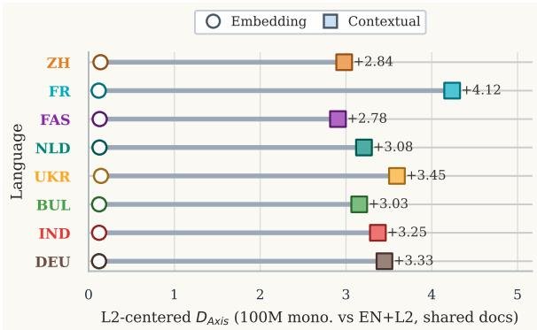  
Figure 9: 100M mirror of Figure 4b. The targetlanguage-centered contextual signal remains visible at the longer monolingual baseline.

<table><tr><td>Pair</td><td>Metric</td><td>Mean [95% CI]</td></tr><tr><td>EN-50M vs EN+BUL</td><td> $D _ { N N }$ </td><td>-0.009 [-0.021, 0.002]</td></tr><tr><td></td><td> $D _ { A x i s }$ </td><td>0.053 [-0.171, 0.308]</td></tr><tr><td></td><td> $D _ { S t r u c t }$ </td><td>0.051 [0.045, 0.058]</td></tr><tr><td>EN-50M vs EN+DEU</td><td> $D _ { N N }$ </td><td>0.008 [-0.004, 0.020]</td></tr><tr><td></td><td> $D _ { A x i s }$ </td><td>0.321 [0.058, 0.599]</td></tr><tr><td></td><td> $D _ { S t r u c t }$ </td><td>0.007 [0.001, 0.013]</td></tr><tr><td>EN-50M vs EN+FAS</td><td> $D _ { N N }$ </td><td>0.025 [0.014, 0.036]</td></tr><tr><td></td><td> $D _ { A x i s }$ </td><td>0.245 [-0.051, 0.570]</td></tr><tr><td></td><td> $D _ { S t r u c t }$ </td><td>0.046 [0.039, 0.055]</td></tr><tr><td>EN-50M vs EN+FR</td><td> $D _ { N N }$ </td><td>-0.004 [-0.016, 0.008]</td></tr><tr><td></td><td> $D _ { A x i s }$ </td><td>0.105 [-0.124, 0.346]</td></tr><tr><td></td><td> $D _ { S t r u c t }$ </td><td>-0.018 [-0.022, -0.013]</td></tr><tr><td>EN-50M vs EN+IND</td><td> $D _ { N N }$ </td><td>0.017 [0.006, 0.029]</td></tr><tr><td></td><td> $D _ { A x i s }$ </td><td>0.103 [-0.139, 0.351]</td></tr><tr><td></td><td> $D _ { S t r u c t }$ </td><td>0.027 [0.020, 0.034]</td></tr><tr><td>EN-50M vs EN+NLD</td><td> $D _ { N N }$ </td><td>-0.001 [-0.013, 0.012]</td></tr><tr><td></td><td> $D _ { A x i s }$ </td><td>0.145 [-0.134, 0.451]</td></tr><tr><td></td><td> $D _ { S t r u c t }$ </td><td>0.009 [0.003, 0.016]</td></tr><tr><td>EN-50M vs EN+UKR</td><td> $D _ { N N }$ </td><td>0.024 [0.014, 0.035]</td></tr><tr><td></td><td> $D _ { A x i s }$ </td><td>0.586 [0.130, 1.072]</td></tr><tr><td></td><td> $D _ { S t r u c t }$ </td><td>0.011 [0.004, 0.017]</td></tr><tr><td>EN-50M vs EN+ZH</td><td> $D _ { N N }$ </td><td>0.038 [0.028, 0.048]</td></tr><tr><td></td><td> $D _ { A x i s }$ </td><td>0.175 [-0.050, 0.428]</td></tr><tr><td></td><td> $D _ { S t r u c t }$ </td><td>0.095 [0.086, 0.103]</td></tr><tr><td>EN-100M vs EN+BUL</td><td> $D _ { N N }$ </td><td>0.000 [-0.012, 0.012]</td></tr><tr><td></td><td> $D _ { A x i s }$ </td><td>0.475 [0.016, 0.960]</td></tr><tr><td></td><td> $D _ { S t r u c t }$ </td><td>0.087 [0.079, 0.094]</td></tr><tr><td>EN-100M vs EN+DEU</td><td></td><td>0.015 [0.003, 0.026]</td></tr><tr><td></td><td> $D _ { N N }$   $D _ { A x i s }$ </td><td>0.607 [0.137, 1.087]</td></tr><tr><td></td><td> $D _ { S t r u c t }$ </td><td>0.031 [0.024, 0.037]</td></tr><tr><td>EN-100M vs EN+FAS</td><td></td><td>0.029 [0.018, 0.040]</td></tr><tr><td></td><td> $D _ { N N }$   $D _ { A x i s }$ </td><td>0.723 [0.264, 1.217]</td></tr><tr><td></td><td>DStruct</td><td>0.076 [0.067, 0.085]</td></tr><tr><td>EN-100M vs EN+FR</td><td></td><td>0.005 [-0.006, 0.017]</td></tr><tr><td></td><td> $D _ { N N }$   $D _ { A x i s }$ </td><td>0.467 [0.012, 0.957]</td></tr><tr><td></td><td> $D _ { S t r u c t }$ </td><td>0.000 [-0.005, 0.006]</td></tr><tr><td>EN-100M vs EN+IND</td><td></td><td>0.013 [0.001, 0.024]</td></tr><tr><td></td><td> $D _ { N N }$ </td><td>0.365 [-0.043, 0.814]</td></tr><tr><td></td><td> $D _ { A x i s }$   $D _ { S t r u c t }$ </td><td>0.051 [0.043, 0.059]</td></tr><tr><td>EN-100M vs EN+NLD</td><td></td><td>0.006 [-0.006, 0.018]</td></tr><tr><td></td><td> $D _ { N N }$ </td><td>0.256 [-0.161, 0.706]</td></tr><tr><td></td><td>DAxis  $D _ { S t r u c t }$ </td><td>0.031 [0.024, 0.039]</td></tr><tr><td></td><td></td><td></td></tr><tr><td>EN-100M vs EN+UKR</td><td> $D _ { N N }$ </td><td>0.024 [0.013, 0.034]</td></tr><tr><td></td><td> $\underline { { D } } _ { A x i s }$ </td><td>0.933 [0.326, 1.607] 0.035 [0.028, 0.042]</td></tr><tr><td></td><td> $D _ { S t r u c t }$ </td><td></td></tr><tr><td>EN-100M vs EN+ZH</td><td> $D _ { N N }$ </td><td>0.051 [0.041, 0.061]</td></tr><tr><td></td><td> $D _ { A x i s }$ </td><td>0.587 [0.179, 1.051]</td></tr><tr><td></td><td> $D _ { S t r u c t }$ </td><td>0.130 [0.122, 0.139]</td></tr></table>

Table 11: Detailed Experiment 1 table in contextual space. Some intervals are wide and can cross zero, while the aggregate contextual mismatch remains elevated. Exposes the uncertainty behind the main contextual residual claim.

<table><tr><td>Representation</td><td>Group</td><td> $D _ { N N }$ </td><td> $D _ { S t r u c t }$ </td><td> $D _ { A x i s }$ </td></tr><tr><td>Embedding</td><td>Cultural probes</td><td>0.029</td><td>0.014</td><td>0.014</td></tr><tr><td></td><td>Negative controls</td><td>0.328</td><td>0.017</td><td>0.075</td></tr><tr><td>Contextual</td><td>Cultural probes</td><td>0.015</td><td>0.042</td><td>0.386</td></tr><tr><td></td><td>Negative controls</td><td>0.165</td><td>0.034</td><td>0.483</td></tr></table>

Table 12: Negative-control reference used to bound stronger semantic-domain claims. In this aggregate view, disagreement is comparable to or higher than the semantic-probe summary. Prevents interpreting the result as uniquely cultural.

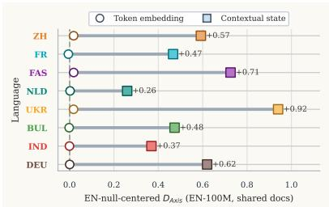  
(a) Representation gap. Contextual axis divergence stays above embedding divergence in the EN-centered C3 pairs.

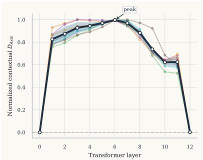  
(b) Layer profile. The middle-layer rise and late-layer persistence remain visible at 100M.

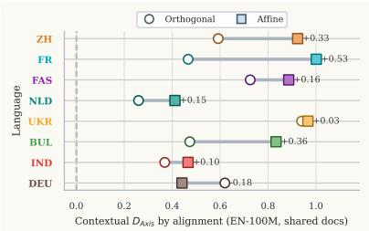  
(c) Alignment family. Changing the alignment family changes values more than the qualitative conclusion.

Figure 10: 100M mirrors of the hidden-state and alignment-method checks. The longer-baseline setting preserves the hidden-state-over-embedding gap, the middle-layer profile, and the qualitative alignment-family robustness.  
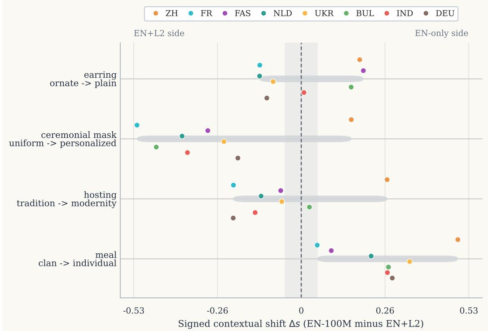  
Figure 11: 100M mirror of Figure 15. The rows match the EN-50M selection so directional stability can be read directly across baselines.

Per-Head Proxy Analysis These artifacts ask whether the middle-layer signal is distributed or concentrated in one small channel set. They are not intended as a full mechanistic account, but as a coarse localization check. Figure 14 shows that divergence is broadly distributed across head-width slices rather than concentrated in a few cells; Table 27 lists the highest-divergence cells.

## A.7 Where the Signal Concentrates Across Categories and Languages

Additional Stratified and Word-Level Diagnostics These diagnostics ask what kinds of probes contribute most to the contextual signal. They complement the main aggregate figures by showing signed examples, broader category concentration, and word-level hotspots.

Non-English Language Snapshot This block extends the multilingual view beyond the two representative main-text languages and asks whether a simple family-level explanation emerges. The additional-language summaries confirm robustness of the hidden-state amplification pattern, while the exploratory regression and scatter plot do not support a strong monotonic typology claim.

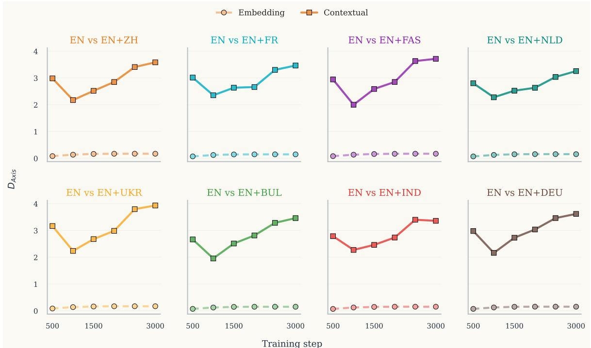  
Figure 12: Dense checkpoints show that the contextual gap is not a late-training artifact. Each panel traces one EN+L2 family at 500-step intervals under shared data. Contextual states remain above token embeddings from the earliest saved checkpoint through 3000 steps.

<table><tr><td>Representation</td><td>Pair</td><td>Anchor residual / anchor</td><td>Anchor residual (Frobenius)</td></tr><tr><td>Embedding</td><td>EN-100M vs EN+BUL</td><td>0.043</td><td>128.572</td></tr><tr><td></td><td>EN-100M vs EN+DEU</td><td>0.044</td><td>131.045</td></tr><tr><td></td><td>EN-100M vs EN+FAS</td><td>0.045</td><td>136.197</td></tr><tr><td></td><td>EN-100M vs EN+FR</td><td>0.044</td><td>131.241</td></tr><tr><td></td><td>EN-100M vs EN+IND</td><td>0.044</td><td>130.703</td></tr><tr><td></td><td>EN-100M vs EN+NLD</td><td>0.044</td><td>131.786</td></tr><tr><td></td><td>EN-100M vs EN+UKR</td><td>0.045</td><td>134.486</td></tr><tr><td></td><td>EN-100M vs EN+ZH</td><td>0.045</td><td>135.875</td></tr><tr><td></td><td>EN-50M vs EN+BUL</td><td>0.037</td><td>109.879</td></tr><tr><td></td><td>EN-50M vs EN+DEU</td><td>0.038</td><td>112.648</td></tr><tr><td></td><td>EN-50M vs EN+FAS</td><td>0.039</td><td>116.123</td></tr><tr><td></td><td>EN-50M vs EN+FR</td><td>0.038</td><td>114.572</td></tr><tr><td></td><td>EN-50M vs EN+IND</td><td>0.038</td><td>112.702</td></tr><tr><td></td><td>EN-50M vs EN+NLD</td><td>0.038</td><td>113.972</td></tr><tr><td></td><td>EN-50M vs EN+UKR</td><td>0.038</td><td>114.549</td></tr><tr><td></td><td>EN-50M vs EN+ZH</td><td>0.039</td><td>115.700</td></tr><tr><td>Contextual</td><td>EN-100M vs EN+BUL</td><td>0.216</td><td>646.757</td></tr><tr><td></td><td>EN-100M vs EN+DEU</td><td>0.209</td><td>626.308</td></tr><tr><td></td><td>EN-100M vs EN+FAS</td><td>0.230</td><td>688.624</td></tr><tr><td></td><td>EN-100M vs EN+FR</td><td>0.197</td><td>591.295</td></tr><tr><td></td><td>EN-100M vs EN+IND</td><td>0.205</td><td>616.292</td></tr><tr><td></td><td>EN-100M vs EN+NLD</td><td>0.214</td><td>642.959</td></tr><tr><td></td><td>EN-100M vs EN+UKR</td><td>0.216</td><td>648.819</td></tr><tr><td></td><td>EN-100M vs EN+ZH</td><td>0.252</td><td>756.882</td></tr><tr><td></td><td>EN-50M vs EN+BUL</td><td>0.166</td><td>498.512</td></tr><tr><td></td><td>EN-50M vs EN+DEU</td><td>0.165</td><td>494.702</td></tr><tr><td></td><td>EN-50M vs EN+FAS</td><td>0.176</td><td>527.434</td></tr><tr><td></td><td>EN-50M vs EN+FR</td><td>0.154</td><td>462.554</td></tr><tr><td></td><td>EN-50M vs EN+IND</td><td>0.166</td><td>498.938</td></tr><tr><td></td><td>EN-50M vs EN+NLD</td><td>0.170</td><td>509.490</td></tr><tr><td></td><td>EN-50M vs EN+UKR</td><td>0.172</td><td>517.038</td></tr><tr><td></td><td>EN-50M vs EN+ZH</td><td>0.192</td><td>575.544</td></tr><tr><td></td><td></td><td></td><td></td></tr></table>

Table 13: Alignment-fit check for Experiment 1. Comparable Procrustes residuals across pairs argue against alignment failure as the main explanation. Separates residual mismatch from a failed anchor fit.

<table><tr><td>Representation</td><td>Family</td><td>Baseline</td><td> $\Delta D _ { N N }$ </td><td> $\Delta D _ { S t r u c t }$ </td><td> $\Delta D _ { A x i s }$ </td></tr><tr><td>Embedding</td><td>EN+BUL</td><td>EN-50M</td><td>-0.017</td><td>-0.008</td><td>-0.008</td></tr><tr><td></td><td>EN+DEU</td><td>EN-50M</td><td>-0.006</td><td>-0.004</td><td>-0.004</td></tr><tr><td></td><td>EN+FAS</td><td>EN-50M</td><td>0.014</td><td>0.004</td><td>-0.001</td></tr><tr><td></td><td>EN+FR</td><td>EN-50M</td><td>-0.006</td><td>-0.001</td><td>0.001</td></tr><tr><td></td><td>EN+IND</td><td>EN-50M</td><td>0.007</td><td>0.005</td><td>0.007</td></tr><tr><td></td><td>EN+NLD</td><td>EN-50M</td><td>0.004</td><td>0.009</td><td>0.008</td></tr><tr><td></td><td>EN+UKR</td><td>EN-50M</td><td>0.023</td><td>0.014</td><td>0.008</td></tr><tr><td></td><td>EN+ZH</td><td>EN-50M</td><td>-0.000</td><td>0.009</td><td>-0.000</td></tr><tr><td></td><td>EN+BUL</td><td>EN-100M</td><td>-0.014</td><td>-0.010</td><td>-0.004</td></tr><tr><td></td><td>EN+DEU</td><td>EN-100M</td><td>0.005</td><td>0.001</td><td>-0.000</td></tr><tr><td></td><td>EN+FAS</td><td>EN-100M</td><td>0.018</td><td>0.003</td><td>0.007</td></tr><tr><td></td><td>EN+FR</td><td>EN-100M</td><td>-0.002</td><td>0.001</td><td>0.002</td></tr><tr><td></td><td>EN+IND</td><td>EN-100M</td><td>0.010</td><td>0.007</td><td>0.008</td></tr><tr><td></td><td>EN+NLD</td><td>EN-100M</td><td>0.014</td><td>0.012</td><td>0.010</td></tr><tr><td></td><td>EN+UKR</td><td>EN-100M</td><td>0.032</td><td>0.018</td><td>0.012</td></tr><tr><td></td><td>EN+ZH</td><td>EN-100M</td><td>-0.003</td><td>0.005</td><td>0.004</td></tr><tr><td>Contextual</td><td>EN+BUL</td><td>EN-50M</td><td>-0.014</td><td>-0.004</td><td>-0.231</td></tr><tr><td></td><td>EN+DEU</td><td>EN-50M</td><td>-0.016</td><td>-0.008</td><td>0.165</td></tr><tr><td></td><td>EN+FAS</td><td>EN-50M</td><td>-0.002</td><td>0.046</td><td>0.151</td></tr><tr><td></td><td>EN+FR</td><td>EN-50M</td><td>0.002</td><td>-0.008</td><td>-0.218</td></tr><tr><td></td><td>EN+IND</td><td>EN-50M</td><td>0.007</td><td>0.041</td><td>-0.214</td></tr><tr><td></td><td>EN+NLD</td><td>EN-50M</td><td>0.005</td><td>0.010</td><td>-0.061</td></tr><tr><td></td><td>EN+UKR</td><td>EN-50M</td><td>0.014</td><td>-0.013</td><td>0.513</td></tr><tr><td></td><td>EN+ZH</td><td>EN-50M</td><td>-0.006</td><td>-0.004</td><td>0.122</td></tr><tr><td></td><td>EN+BUL</td><td>EN-100M</td><td>-0.007</td><td>0.002</td><td>0.270</td></tr><tr><td></td><td>EN+DEU</td><td>EN-100M</td><td>-0.007</td><td>-0.006</td><td>0.113</td></tr><tr><td></td><td>EN+FAS</td><td>EN-100M</td><td>-0.000</td><td>0.059</td><td>0.131</td></tr><tr><td></td><td>EN+FR</td><td>EN-100M</td><td>0.014</td><td>-0.006</td><td>0.208</td></tr><tr><td></td><td>EN+IND</td><td>EN-100M</td><td>-0.001</td><td>0.062</td><td>0.080</td></tr><tr><td></td><td>EN+NLD</td><td>EN-100M</td><td>0.013</td><td>0.022</td><td>0.023</td></tr><tr><td></td><td>EN+UKR</td><td>EN-100M</td><td>0.022</td><td>-0.008</td><td>0.594</td></tr><tr><td></td><td>EN+ZH</td><td>EN-100M</td><td>0.007</td><td>0.001</td><td>-0.007</td></tr><tr><td>Representation</td><td>Baseline</td><td>Family</td><td>n</td><td> $\mathbf { M e d . } \Delta D _ { N N }$ </td><td>p</td></tr><tr><td>Embedding</td><td>EN-50M</td><td>EN+BUL</td><td>1000</td><td>0.000</td><td>5.39e-09</td></tr><tr><td></td><td>EN-50M</td><td>EN+DEU</td><td>1000</td><td>0.000</td><td>1.77e-02</td></tr><tr><td></td><td>EN-50M</td><td>EN+FAS</td><td>1000</td><td>0.000</td><td>1.60e-06</td></tr><tr><td></td><td>EN-50M</td><td>EN+FR</td><td>1000</td><td>0.000</td><td>3.14e-02</td></tr><tr><td></td><td>EN-50M</td><td>EN+IND</td><td>1000</td><td>0.000</td><td>5.06e-04</td></tr><tr><td></td><td>EN-50M</td><td>EN+NLD</td><td>1000</td><td>0.000</td><td>6.70e-02</td></tr><tr><td></td><td>EN-50M</td><td>EN+UKR</td><td>1000</td><td>0.000</td><td>4.89e-15</td></tr><tr><td></td><td>EN-50M</td><td>EN+ZH</td><td>1000</td><td>0.000</td><td>9.87e-01</td></tr><tr><td></td><td>EN-100M</td><td>EN+BUL</td><td>1000</td><td>0.000</td><td>2.98e-07</td></tr><tr><td></td><td>EN-100M</td><td>EN+DEU</td><td>1000</td><td>0.000</td><td>4.49e-03</td></tr><tr><td></td><td>EN-100M</td><td>EN+FAS</td><td>1000</td><td>0.000</td><td>3.32e-10</td></tr><tr><td></td><td>EN-100M</td><td>EN+FR</td><td>1000</td><td>0.000</td><td>3.74e-01</td></tr><tr><td></td><td>EN-100M</td><td>EN+IND</td><td>1000</td><td>0.000</td><td>6.18e-06</td></tr><tr><td></td><td>EN-100M</td><td>EN+NLD</td><td>1000</td><td>0.000</td><td>3.06e-09</td></tr><tr><td></td><td>EN-100M</td><td>EN+UKR</td><td>1000</td><td>0.000</td><td>2.44e-27</td></tr><tr><td></td><td>EN-100M</td><td>EN+ZH</td><td>1000</td><td>0.000</td><td>2.71e-01</td></tr><tr><td>Contextual</td><td>EN-50M</td><td>EN+BUL</td><td>1000</td><td>0.000</td><td>1.75e-05</td></tr><tr><td></td><td>EN-50M</td><td>EN+DEU</td><td>1000</td><td>0.000</td><td>1.09e-09</td></tr><tr><td></td><td>EN-50M</td><td>EN+FAS</td><td>1000</td><td>0.000</td><td>5.08e-01</td></tr><tr><td></td><td>EN-50M</td><td>EN+FR</td><td>1000</td><td>0.000</td><td>7.73e-01</td></tr><tr><td></td><td>EN-50M</td><td>EN+IND</td><td>1000</td><td>0.000</td><td>7.52e-02</td></tr><tr><td></td><td>EN-50M</td><td>EN+NLD</td><td>1000</td><td>0.000</td><td>2.45e-01</td></tr><tr><td></td><td>EN-50M</td><td>EN+UKR</td><td>1000</td><td>0.000</td><td>2.47e-06</td></tr><tr><td></td><td>EN-50M</td><td>EN+ZH</td><td>1000</td><td>0.000</td><td>8.27e-03</td></tr><tr><td></td><td>EN-100M</td><td>EN+BUL</td><td>1000</td><td>0.000</td><td>4.16e-02</td></tr><tr><td></td><td>EN-100M</td><td>EN+DEU</td><td>1000</td><td>0.000</td><td>1.63e-02</td></tr><tr><td></td><td>EN-100M</td><td>EN+FAS</td><td>1000</td><td>0.000</td><td>8.42e-01</td></tr><tr><td></td><td>EN-100M</td><td>EN+FR</td><td>1000</td><td>0.000</td><td>7.59e-06</td></tr><tr><td></td><td>EN-100M</td><td>EN+IND</td><td>1000</td><td>0.000</td><td>7.18e-01</td></tr><tr><td></td><td>EN-100M</td><td>EN+NLD</td><td>1000</td><td>0.000</td><td>8.79e-08</td></tr><tr><td></td><td>EN-100M</td><td>EN+UKR</td><td>1000</td><td>0.010</td><td>4.24e-13</td></tr><tr><td></td><td>EN-100M</td><td>EN+ZH</td><td>1000</td><td>0.000</td><td>2.91e-02</td></tr></table>

Table 14: Detailed overlap-ablation table. Each row reports the per-metric change induced by removing English-document overlap. Shows document identity modulates values without creating the main effect.

Table 15: Word-level overlap test for Experiment 2. The effect is statistically real but sparse, with near-zero medians in almost all settings. Keeps the overlap result from being overstated.

<table><tr><td>Pair</td><td> $D _ { A }$  (Embedding)</td><td> $D _ { A }$  (Contextual)</td><td>Ctx.-Emb.</td></tr><tr><td>EN-50M vs EN+BUL</td><td>0.012</td><td>0.054</td><td>0.042</td></tr><tr><td>EN-50M vs EN+DEU</td><td>0.018</td><td>0.317</td><td>0.299</td></tr><tr><td>EN-50M vs EN+FAS</td><td>0.031</td><td>0.246</td><td>0.215</td></tr><tr><td>EN-50M vs EN+FR</td><td>0.013</td><td>0.108</td><td>0.096</td></tr><tr><td>EN-50M vs EN+IND</td><td>0.014</td><td>0.107</td><td>0.093</td></tr><tr><td>EN-50M vs EN+NLD</td><td>0.018</td><td>0.145</td><td>0.127</td></tr><tr><td>EN-50M vs EN+UKR</td><td>0.035</td><td>0.582</td><td>0.547</td></tr><tr><td>EN-50M vs EN+ZH</td><td>0.036</td><td>0.172</td><td>0.136</td></tr><tr><td>EN-100M vs EN+BUL</td><td>-0.002</td><td>0.473</td><td>0.475</td></tr><tr><td>EN-100M vs EN+DEU</td><td>0.001</td><td>0.620</td><td>0.619</td></tr><tr><td>EN-100M vs EN+FAS</td><td>0.019</td><td>0.726</td><td>0.707</td></tr><tr><td>EN-100M vs EN+FR</td><td>-0.005</td><td>0.467</td><td>0.472</td></tr><tr><td>EN-100M vs EN+IND</td><td>-0.001</td><td>0.369</td><td>0.369</td></tr><tr><td>EN-100M vs EN+NLD</td><td>0.002</td><td>0.260</td><td>0.257</td></tr><tr><td>EN-100M vs EN+UKR</td><td>0.018</td><td>0.940</td><td>0.922</td></tr><tr><td>EN-100M vs EN+ZH</td><td>0.018</td><td>0.592</td><td>0.574</td></tr></table>

Table 16: Detailed hidden-state-versus-embedding table. We report absolute centered axis divergence for both layers and the hidden-state-minus-embedding gap. Supports the hidden-state-over-embedding gap without unstable centered ratios.

<table><tr><td>Language</td><td>Family</td><td>IDV Dist.</td><td>Ratio (50M)</td><td>Ratio (100M)</td></tr><tr><td>French</td><td>(Romance)</td><td>20</td><td>29.49</td><td>35.89</td></tr><tr><td>Indonesian</td><td>Austronesian</td><td>77</td><td>33.79</td><td>27.47</td></tr><tr><td>German</td><td>(Germanic)</td><td>24</td><td>25.41</td><td>28.31</td></tr><tr><td>Bulgarian</td><td>(Slavic)</td><td>61</td><td>27.61</td><td>25.66</td></tr><tr><td>Dutch</td><td>(Germanic)</td><td>11</td><td>24.02</td><td>25.20</td></tr><tr><td>Ukrainian</td><td>(Slavic)</td><td>66</td><td>21.81</td><td>24.85</td></tr><tr><td>Persian</td><td>(Iranian)</td><td>50</td><td>20.41</td><td>22.46</td></tr><tr><td>Chinese</td><td>Sino-Tib.</td><td>71</td><td>17.11</td><td>21.41</td></tr></table>

Table 17: Target-language-centered raw amplification summary. Across the eight non-English pairs, contextual $D _ { A x i s }$ remains much larger than embedding $D _ { A x i s } ;$ these raw ratios are descriptive only and are not used for the centered EN-space claims. Checks that the hiddenstate-over-embedding gap is not English-specific.

<table><tr><td>Pair</td><td>Peak</td><td> $D _ { A } ( \mathrm { p e a k } )$ </td><td> $D _ { A } ( \mathrm { { f i n a l } ) }$ </td><td>F/P</td></tr><tr><td>EN-100M vs EN+BUL</td><td>6</td><td>2775.9</td><td>3.472</td><td>0.001</td></tr><tr><td>EN-100M vs EN+DEU</td><td>7</td><td>2591.2</td><td>3.618</td><td>0.001</td></tr><tr><td>EN-100M vs EN+FAS</td><td>3</td><td>2809.8</td><td>3.720</td><td>0.001</td></tr><tr><td>EN-100M vs EN+FR</td><td>6</td><td>2358.2</td><td>3.466</td><td>0.001</td></tr><tr><td>EN-100M vs EN+IND</td><td>6</td><td>2185.3</td><td>3.366</td><td>0.002</td></tr><tr><td>EN-100M vs EN+NLD</td><td>6</td><td>2372.2</td><td>3.254</td><td>0.001</td></tr><tr><td>EN-100M vs EN+UKR</td><td>6</td><td>2403.2</td><td>3.936</td><td>0.002</td></tr><tr><td>EN-100M vs EN+ZH</td><td>3</td><td>2588.4</td><td>3.590</td><td>0.001</td></tr><tr><td>EN-50M vs EN+BUL</td><td>6</td><td>2240.0</td><td>2.276</td><td>0.001</td></tr><tr><td>EN-50M vs EN+DEU</td><td>9</td><td>1995.8</td><td>2.540</td><td>0.001</td></tr><tr><td>EN-50M vs EN+FAS</td><td>4</td><td>2112.4</td><td>2.469</td><td>0.001</td></tr><tr><td>EN-50M vs EN+FR</td><td>6</td><td>1483.6</td><td>2.333</td><td>0.002</td></tr><tr><td>EN-50M vs EN+IND</td><td>6</td><td>1671.6</td><td>2.330</td><td>0.001</td></tr><tr><td>EN-50M vs EN+NLD</td><td>5</td><td>1692.4</td><td>2.366</td><td>0.001</td></tr><tr><td>EN-50M vs EN+UKR</td><td>4</td><td>1522.9</td><td>2.802</td><td>0.002</td></tr><tr><td>EN-50M vs EN+ZH</td><td>4</td><td>2205.3</td><td>2.398</td><td>0.001</td></tr></table>

Table 18: Layer-summary table for Figure 5a. Peaklayer and final-layer values confirm persistence after late-layer compression. Localizes the residual to contextual processing rather than static embeddings.

<table><tr><td>Baseline</td><td>Control</td><td>Embed.</td><td>Context.</td><td> $\mathrm { G a p }$ </td><td>+Pairs</td><td>Final/Input</td></tr><tr><td>EN-50M</td><td>Row-L2</td><td>0.091</td><td>0.140</td><td>+0.049</td><td>8/8</td><td>1.544</td></tr><tr><td>EN-50M</td><td>Neutral-z</td><td>0.728</td><td>0.824</td><td>+0.097</td><td>8/8</td><td>1.132</td></tr><tr><td>EN-100M</td><td>Row-L2</td><td>0.095</td><td>0.147</td><td>+0.052</td><td>8/8</td><td>1.546</td></tr><tr><td>EN-100M</td><td>Neutral-z</td><td>0.762</td><td>0.904</td><td>+0.142</td><td>8/8</td><td>1.186</td></tr></table>

Table 19: Aggregate norm-control table for Figure 5b. Row-L2 removes per-vector norm scale before alignment; Neutral-z scores each axis using neutral-anchor projections. Contextual values remain larger than embedding values for every shared-document EN+L2 pair under both controls, confirming the gap is not just hidden-state norm scale.

<table><tr><td>Baseline</td><td>Representation</td><td>Mean raw  $D _ { A x i s }$ </td><td>Std.  $\mathrm { d e v . }$ </td><td>EN-seed pairs</td></tr><tr><td>EN-100M</td><td>Contextual</td><td>3.204</td><td>0.295</td><td>6</td></tr><tr><td>EN-100M</td><td>Embedding</td><td>0.150</td><td>0.002</td><td>6</td></tr><tr><td>EN-50M</td><td>Contextual</td><td>2.258</td><td>0.182</td><td>6</td></tr><tr><td>EN-50M</td><td>Embedding</td><td>0.113</td><td>0.002</td><td>6</td></tr></table>

Table 20: Expanded EN-only seed-variation estimate. Raw $D _ { A x i s }$ is summarized across six seed pairings per checkpoint and representation level (embedding or hidden state) to make the centering reference less brittle. The null reference is not a single arbitrary seed comparison.

<table><tr><td>Representation</td><td>Matched-axis  $D _ { A x i s }$ </td><td>Held-out-axis  $D _ { A x i s }$ </td><td>Held-out minus matched</td></tr><tr><td>Contextual</td><td>0.261</td><td>0.390</td><td>0.129</td></tr><tr><td>Embedding</td><td>0.018</td><td>0.014</td><td>-0.004</td></tr></table>

Table 21: Axis-inventory holdout check. Both matchedaxis and held-out-axis evaluations remain elevated, arguing against dependence on one handcrafted subset. The mismatch does not depend on one narrow axis group.

<table><tr><td>Language</td><td>500 Emb.</td><td> $5 0 0 \mathrm { C r x } .$ </td><td>3000 Emb.</td><td> $3 0 0 0 \mathrm { C r x } .$ </td><td>Mean gap</td></tr><tr><td>ZH</td><td>0.079</td><td>2.983</td><td>0.168</td><td>3.581</td><td>2.772</td></tr><tr><td>FR</td><td>0.068</td><td>3.012</td><td>0.144</td><td>3.463</td><td>2.776</td></tr><tr><td>FAS</td><td>0.077</td><td>2.942</td><td>0.168</td><td>3.711</td><td>2.808</td></tr><tr><td>NLD</td><td>0.067</td><td>2.800</td><td>0.152</td><td>3.254</td><td>2.620</td></tr><tr><td>UKR</td><td>0.083</td><td>3.162</td><td>0.167</td><td>3.931</td><td>2.983</td></tr><tr><td>BUL</td><td>0.069</td><td>2.663</td><td>0.147</td><td>3.458</td><td>2.650</td></tr><tr><td>IND</td><td>0.067</td><td>2.784</td><td>0.149</td><td>3.357</td><td>2.704</td></tr><tr><td>DEU</td><td>0.069</td><td>2.977</td><td>0.150</td><td>3.616</td><td>2.864</td></tr></table>

Table 22: Dense checkpoint summary for all eight EN vs EN+L2 C3 pairs. Raw $D _ { A x i s }$ is shown at the start and end of training together with the mean contextualminus-embedding gap across checkpoints. Rules out a late-checkpoint accident.

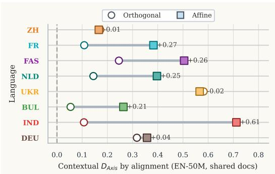  
Figure 13: Alignment family changes values, not the qualitative result. Lines connect orthogonal and affine contextual EN-50M values for each language.

<table><tr><td>Baseline</td><td>Representation</td><td>Anchor subset</td><td> $\mathbf { M e a n } D _ { A x i s }$ </td><td>Residual / anchor</td></tr><tr><td>EN-100M</td><td>Embedding</td><td>500</td><td>0.155</td><td>0.081</td></tr><tr><td>EN-100M</td><td>Embedding</td><td>1000</td><td>0.155</td><td>0.066</td></tr><tr><td>EN-100M</td><td>Embedding</td><td>2000</td><td>0.155</td><td>0.052</td></tr><tr><td>EN-100M</td><td>Embedding</td><td>3000</td><td>0.155</td><td>0.044</td></tr><tr><td>EN-100M</td><td>Contextual</td><td>500</td><td>3.552</td><td>0.495</td></tr><tr><td>EN-100M</td><td>Contextual</td><td>1000</td><td>3.552</td><td>0.364</td></tr><tr><td>EN-100M</td><td>Contextual</td><td>2000</td><td>3.552</td><td>0.264</td></tr><tr><td>EN-100M</td><td>Contextual</td><td>3000</td><td>3.552</td><td>0.217</td></tr><tr><td>EN-50M</td><td>Embedding</td><td>500</td><td>0.135</td><td>0.069</td></tr><tr><td>EN-50M</td><td>Embedding</td><td>1000</td><td>0.135</td><td>0.056</td></tr><tr><td>EN-50M</td><td>Embedding</td><td>2000</td><td>0.135</td><td>0.045</td></tr><tr><td>EN-50M</td><td>Embedding</td><td>3000</td><td>0.135</td><td>0.038</td></tr><tr><td>EN-50M</td><td>Contextual</td><td>500</td><td>2.439</td><td>0.378</td></tr><tr><td>EN-50M</td><td>Contextual</td><td>1000</td><td>2.439</td><td>0.282</td></tr><tr><td>EN-50M</td><td>Contextual</td><td>2000</td><td>2.439</td><td>0.206</td></tr><tr><td>EN-50M</td><td>Contextual</td><td>3000</td><td>2.439</td><td>0.170</td></tr></table>

Table 23: Anchor-subset sensitivity for EN-centered pairs. Mean raw $D _ { A x i s }$ is stable across five random draws at each anchor subset size. The result is not tied to one English-anchor list.

<table><tr><td>Pair</td><td>Alignment source</td><td> $D _ { N N }$ </td><td> $D _ { S t r u c t }$ </td><td> $D _ { A x i s }$ </td><td>Residual/anchor</td></tr><tr><td rowspan="2">EN-50M vs EN+BUL (C3)</td><td>Align on Embedding anchors</td><td>-0.009</td><td>0.051</td><td>0.054</td><td>0.037</td></tr><tr><td>Align on Contextual anchors</td><td>-0.009</td><td>0.051</td><td>0.054</td><td>0.166</td></tr><tr><td rowspan="2">EN-50M vs EN+DEU (C3)</td><td>Align on Embedding anchors</td><td>0.008</td><td>0.007</td><td>0.317</td><td>0.038</td></tr><tr><td>Align on Contextual anchors</td><td>0.008</td><td>0.007</td><td>0.317</td><td>0.165</td></tr><tr><td rowspan="2">EN-50M vs EN+FAS (C3)</td><td>Align on Embedding anchors</td><td>0.025</td><td>0.047</td><td>0.246</td><td>0.039</td></tr><tr><td>Align on Contextual anchors</td><td>0.025</td><td>0.047</td><td>0.246</td><td>0.176</td></tr><tr><td rowspan="2">EN-50M vs EN+FR (C3)</td><td>Align on Embedding anchors</td><td>-0.004</td><td>-0.018</td><td>0.108</td><td>0.038</td></tr><tr><td>Align on Contextual anchors</td><td>-0.004</td><td>-0.018</td><td>0.108</td><td>0.154</td></tr><tr><td rowspan="2">EN-50M vs EN+IND (C3)</td><td>Align on Embedding anchors</td><td>0.017</td><td>0.027</td><td>0.107</td><td>0.038</td></tr><tr><td>Align on Contextual anchors</td><td>0.017</td><td>0.027</td><td>0.107</td><td>0.166</td></tr><tr><td rowspan="2">EN-50M vs EN+NLD (C3)</td><td>Align on Embedding anchors</td><td>-0.001</td><td>0.009</td><td>0.145</td><td>0.038</td></tr><tr><td>Align on Contextual anchors</td><td>-0.001</td><td>0.009</td><td>0.145</td><td>0.170</td></tr><tr><td rowspan="2">EN-50M vs EN+UKR (C3)</td><td>Align on Embedding anchors</td><td>0.025</td><td>0.011</td><td>0.582</td><td>0.038</td></tr><tr><td>Align on Contextual anchors</td><td>0.025</td><td>0.011</td><td>0.582</td><td>0.172</td></tr><tr><td rowspan="2">EN-50M vs EN+ZH (C3)</td><td>Align on Embedding anchors</td><td>0.038</td><td>0.095</td><td>0.172</td><td>0.039</td></tr><tr><td>Align on Contextual anchors</td><td>0.038</td><td>0.095</td><td>0.172</td><td>0.192</td></tr><tr><td rowspan="2">EN-100M vs EN+BUL (C3)</td><td>Align on Embedding anchors</td><td>0.000</td><td>0.087</td><td>0.473</td><td>0.043</td></tr><tr><td>Align on Contextual anchors</td><td>0.000</td><td>0.087</td><td>0.473</td><td>0.216</td></tr><tr><td rowspan="2">EN-100M vs EN+DEU (C3)</td><td>Align on Embedding anchors</td><td>0.015</td><td>0.031</td><td>0.620</td><td>0.044</td></tr><tr><td>Align on Contextual anchors</td><td>0.015</td><td>0.031</td><td>0.620</td><td>0.209</td></tr><tr><td rowspan="2">EN-100M vs EN+FAS (C3)</td><td>Align on Embedding anchors</td><td>0.029</td><td>0.076</td><td>0.726</td><td>0.045</td></tr><tr><td>Align on Contextual anchors</td><td>0.029</td><td>0.076</td><td>0.726</td><td>0.230</td></tr><tr><td rowspan="2">EN-100M vs EN+FR (C3)</td><td>Align on Embedding anchors</td><td>0.005</td><td>0.001</td><td>0.467</td><td>0.044</td></tr><tr><td>Align on Contextual anchors</td><td>0.005</td><td>0.001</td><td>0.467</td><td>0.197</td></tr><tr><td rowspan="2">EN-100M vs EN+IND (C3)</td><td>Align on Embedding anchors</td><td>0.013</td><td>0.051</td><td>0.369</td><td>0.044</td></tr><tr><td>Align on Contextual anchors</td><td>0.013</td><td>0.051</td><td>0.369</td><td>0.205</td></tr><tr><td rowspan="2">EN-100M vs EN+NLD (C3)</td><td>Align on Embedding anchors</td><td>0.006</td><td>0.031</td><td>0.260</td><td>0.044</td></tr><tr><td>Align on Contextual anchors</td><td>0.006</td><td>0.031</td><td>0.260</td><td>0.214</td></tr><tr><td rowspan="2">EN-100M vs EN+UKR (C3)</td><td>Align on Embedding anchors</td><td>0.023</td><td>0.035</td><td>0.940</td><td>0.045</td></tr><tr><td>Align on Contextual anchors</td><td>0.023</td><td>0.035</td><td>0.940</td><td>0.216</td></tr><tr><td rowspan="2">EN-100M vs EN+ZH (C3)</td><td>Align on Embedding anchors</td><td>0.051</td><td>0.130</td><td>0.592</td><td>0.045</td></tr><tr><td>Align on Contextual anchors</td><td>0.051</td><td>0.130</td><td>0.592</td><td>0.252</td></tr></table>

Table 24: Contextual-anchor alignment variant for EN-centered pairs. The contextual axis gap remains large under both embedding- and contextual-anchor alignment. The result survives aligning the contextual family directly.

<table><tr><td>Tokenizer artifact</td><td>Unique hashes across runs</td></tr><tr><td>tokenizer.json</td><td>1</td></tr><tr><td>tokenizer_config.json</td><td>1</td></tr><tr><td>special_tokens_map.json</td><td>1</td></tr></table>

Table 25: Tokenizer comparability check. All active checkpoints share identical tokenizer artifacts on the three files that define the tokenization pipeline. Tokenizer drift cannot explain the reported residuals.

<table><tr><td>Test block</td><td>Slice</td><td>n</td><td>Mean diff.</td><td>One-sided p</td></tr><tr><td>Main EN-centered gap</td><td>EN-50M</td><td>16</td><td>0.181</td><td>1.53e-05</td></tr><tr><td>Main EN-centered gap</td><td>EN-100M</td><td>16</td><td>0.464</td><td>1.53e-05</td></tr><tr><td>Main EN-centered gap</td><td>All</td><td>32</td><td>0.322</td><td> $< 1 0 ^ { - 6 }$ </td></tr><tr><td>Anchor-subset reruns</td><td>EN-50M</td><td>160</td><td>2.304</td><td> $< 1 0 ^ { - 6 }$ </td></tr><tr><td>Anchor-subset reruns</td><td>EN-100M</td><td>160</td><td>3.397</td><td> $< 1 0 ^ { - 6 }$ </td></tr><tr><td>Anchor-subset reruns</td><td>All</td><td>320</td><td>2.850</td><td> $< 1 0 ^ { - 6 }$ </td></tr></table>

Table 26: Aggregate one-sided tests for the two strongest scope-expansion claims. The tests cover contextual > embedding in the main EN-centered comparisons and the same contrast under anchor-subset reruns. Gives compact statistical support for the primary gap and anchor robustness.

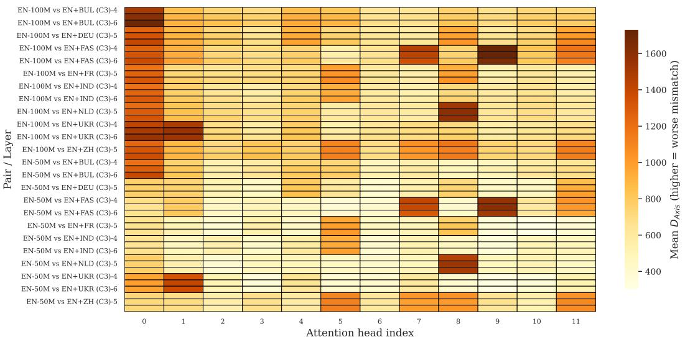  
Figure 14: Per-head proxy view of the middle-layer effect. Each cell reports mean $D _ { A x i s }$ for a head-width channel slice, showing that divergence is distributed rather than isolated to one cell.

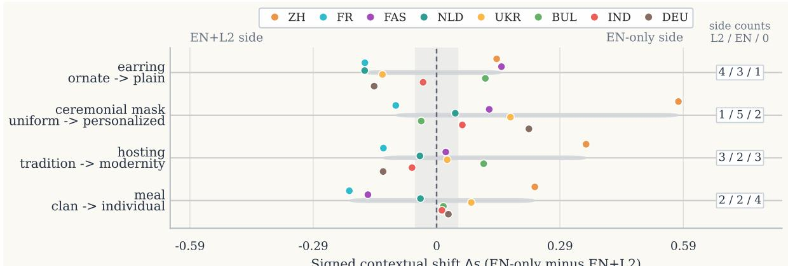  
Signed contextual shift ∆s (EN-only minus EN+L2)  
Figure 15: Signed contextual shifts for representative held-out probe-axis pairs in the Equal exposure + shared data setting. Points show languages and right-side pills report EN+L2-side, EN-side, and near-zero counts. The panel illustrates why absolute $D _ { A x i s }$ summaries are paired with signed diagnostics.

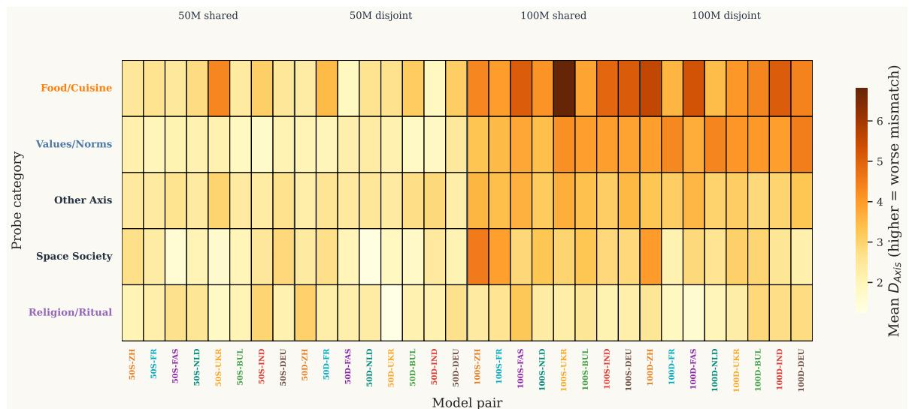  
Figure 16: Category-stratified contextual axis divergence. Food/Cuisine, Symbols/Colors, and Social Identity categories contribute disproportionately to the contextual signal.

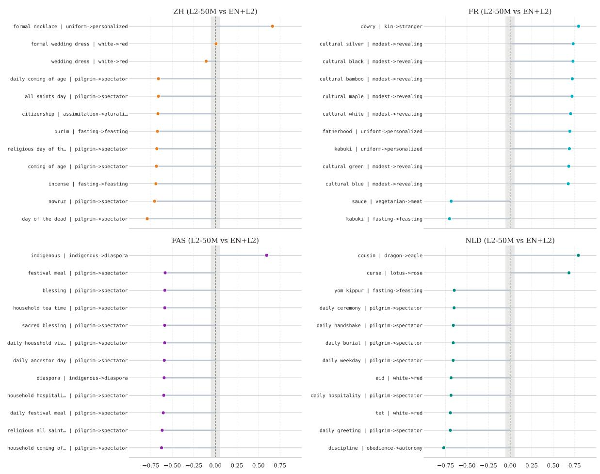  
Figure 17: Per-language signed hotspots in target-language shared spaces, Panel I (●ZH●FR●FAs●NLD). Each subplot shows the largest absolute signed shifts; left indicates EN+L2 higher and right indicates L2-50M higher.  
Signed shift (L2-50M minus EN+L2): left = EN+L2 higher, right = L2-50M higher

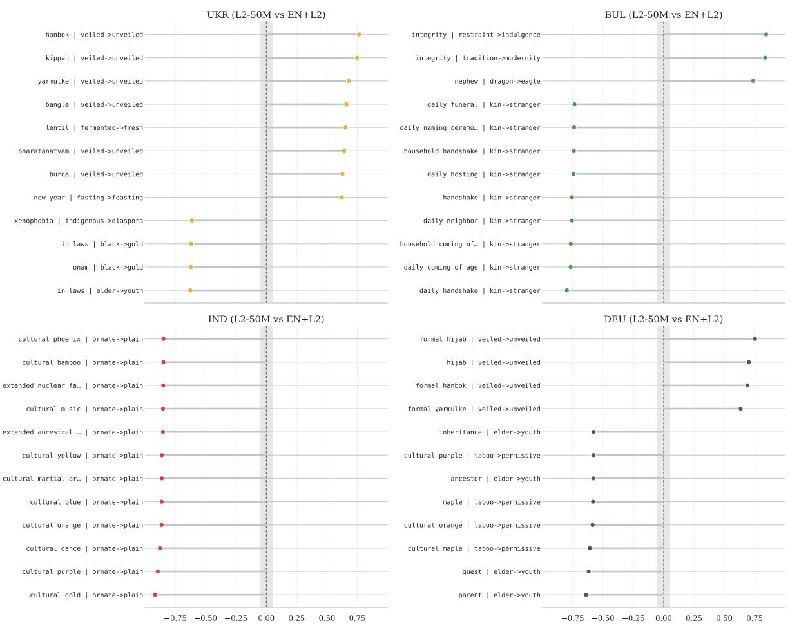  
Signed shift (L2-50M minus EN+L2): left = EN+L2 higher, right = L2-50M higher  
Figure 18: Per-language signed hotspots in target-language shared spaces, Panel II (UKR, BUL, IND, DEU).

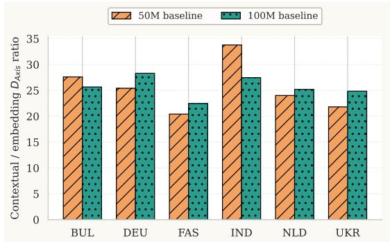

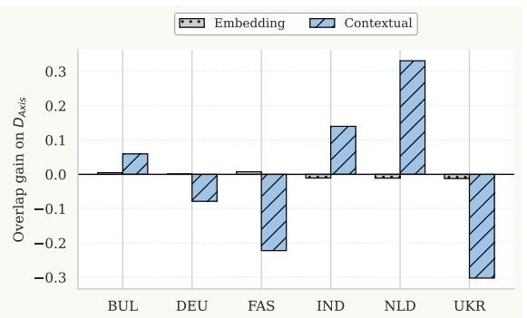  
Figure 19: Additional-language summary for FAS, NLD, UKR, BUL, IND, and DEU. Left, raw hidden-state-toembedding amplification at 50M and 100M; right, overlap gain on axis divergence.

<table><tr><td>Pair</td><td>Layer</td><td>Head</td><td>Mean  $D _ { A x i s }$ </td></tr><tr><td>EN-100M vs EN+FAS (C3)</td><td>5</td><td>9</td><td>1728.146</td></tr><tr><td>EN-100M vs EN+FAS (C3)</td><td>4</td><td>9</td><td>1709.596</td></tr><tr><td>EN-100M vs EN+BUL (C3)</td><td>6</td><td>0</td><td>1703.545</td></tr><tr><td>EN-100M vs EN+FAS (C3)</td><td>6</td><td>9</td><td>1642.973</td></tr><tr><td>EN-100M vs EN+BUL (C3)</td><td>5</td><td>0</td><td>1609.249</td></tr><tr><td>EN-100M vs EN+NLD (C3)</td><td>5</td><td>8</td><td>1595.739</td></tr><tr><td>EN-50M vs EN+FAS (C3)</td><td>5</td><td>9</td><td>1595.471</td></tr><tr><td>EN-100M vs EN+NLD (C3)</td><td>6</td><td>8</td><td>1580.271</td></tr><tr><td>EN-50M vs EN+FAS (C3)</td><td>4</td><td>9</td><td>1559.257</td></tr><tr><td>EN-100M vs EN+UKR (C3)</td><td>5</td><td>1</td><td>1550.235</td></tr><tr><td>EN-100M vs EN+UKR (C3)</td><td>6</td><td>0</td><td>1549.644</td></tr><tr><td>EN-50M vs EN+NLD (C3)</td><td>5</td><td>8</td><td>1528.903</td></tr></table>

Table 27: Highest-divergence cells from the per-head proxy analysis. Checks whether the middle-layer signal is concentrated in a small channel slice.

<table><tr><td colspan="3">Highest contextual divergence</td><td colspan="3">Lowest contextual divergence</td></tr><tr><td>Rank</td><td>Word</td><td>Mean DNN</td><td>Rank</td><td>Word</td><td>Mean DNN</td></tr><tr><td>1</td><td>vegan</td><td>0.999</td><td>1</td><td>extended mother</td><td>0.323</td></tr><tr><td>2</td><td>stereotype</td><td>0.997</td><td>2</td><td>public democracy</td><td>0.333</td></tr><tr><td>3</td><td>bamboo</td><td>0.997</td><td>3</td><td>extended father</td><td>0.338</td></tr><tr><td>4</td><td>homeland</td><td>0.996</td><td>4</td><td>extended son</td><td>0.341</td></tr><tr><td>5</td><td>jewelry</td><td>0.996</td><td>5</td><td>extended daughter</td><td>0.361</td></tr><tr><td>6</td><td>integrity</td><td>0.996</td><td>6</td><td>sacred prayer</td><td>0.362</td></tr><tr><td>7</td><td>lineage</td><td>0.996</td><td>7</td><td>public ministry</td><td>0.373</td></tr><tr><td>8</td><td>espresso</td><td>0.996</td><td>8</td><td>sacred mosque</td><td>0.373</td></tr><tr><td>9</td><td>carnival</td><td>0.996</td><td>9</td><td>local majority</td><td>0.381</td></tr><tr><td>10</td><td>curry</td><td>0.995</td><td>10</td><td>sacred curse</td><td>0.384</td></tr></table>

Table 28: Word-level hotspots under contextual neighbor divergence. These rows identify probes that contribute most strongly to local topology mismatch. They make the aggregate residual inspectable at the word level.

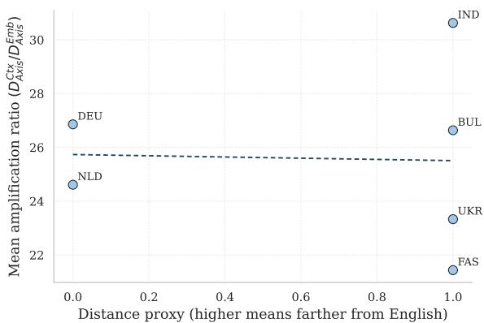  
Figure 20: Exploratory typology check $\scriptstyle ( n = 6 )$ . The coarse distance proxy does not show a clear monotonic relation with hidden-state amplification.

<table><tr><td>Lang</td><td>Ratio@50M</td><td>Ratio@100M</td><td>Gain  $D _ { N N }$  (Embedding)</td><td>Gain  $D _ { N N }$  (Contextual)</td><td>Gain  $D _ { A x i s }$  (Embedding)</td><td>Gain  $D _ { A x i s }$  (Contextual)</td></tr><tr><td>BUL</td><td>27.6</td><td>25.7</td><td>0.008</td><td>0.002</td><td>0.005</td><td>0.060</td></tr><tr><td>DEU</td><td>25.4</td><td>28.3</td><td>-0.001</td><td>0.011</td><td>0.001</td><td>-0.079</td></tr><tr><td>FAS</td><td>20.4</td><td>22.5</td><td>-0.004</td><td>0.007</td><td>0.007</td><td>-0.222</td></tr><tr><td>IND</td><td>33.8</td><td>27.5</td><td>-0.002</td><td>-0.009</td><td>-0.011</td><td>0.140</td></tr><tr><td>NLD</td><td>24.0</td><td>25.2</td><td>-0.011</td><td>-0.017</td><td>-0.011</td><td>0.331</td></tr><tr><td>UKR</td><td>21.8</td><td>24.8</td><td>-0.006</td><td>-0.005</td><td>-0.012</td><td>-0.302</td></tr></table>

Table 29: Compact table for the additional-language view. Ratio columns report raw hidden-state amplification under shared data as a descriptive snapshot, and gain columns report separate data minus shared data averaged across baselines. Extends the robustness check beyond the two representative languages.

<table><tr><td>Lang</td><td>Baseline</td><td>Mean ratio</td><td>CI low</td><td>CI high</td></tr><tr><td>BUL</td><td>100M</td><td>25.7</td><td>22.4</td><td>29.1</td></tr><tr><td>BUL</td><td>50M</td><td>27.7</td><td>23.4</td><td>32.2</td></tr><tr><td>DEU</td><td>100M</td><td>28.3</td><td>24.4</td><td>32.4</td></tr><tr><td>DEU</td><td>50M</td><td>25.5</td><td>21.9</td><td>29.2</td></tr><tr><td>FAS</td><td>100M</td><td>22.4</td><td>18.9</td><td>26.2</td></tr><tr><td>FAS</td><td>50M</td><td>20.5</td><td>17.2</td><td>24.0</td></tr><tr><td>IND</td><td>100M</td><td>27.5</td><td>23.3</td><td>32.1</td></tr><tr><td>IND</td><td>50M</td><td>34.0</td><td>28.4</td><td>39.7</td></tr><tr><td>NLD</td><td>100M</td><td>25.2</td><td>22.0</td><td>28.6</td></tr><tr><td>NLD</td><td>50M</td><td>24.1</td><td>20.6</td><td>27.7</td></tr><tr><td>UKR</td><td>100M</td><td>24.9</td><td>20.7</td><td>29.4</td></tr><tr><td>UKR</td><td>50M</td><td>21.9</td><td>18.5</td><td>25.6</td></tr></table>

Table 30: Bootstrap intervals for the additional-language raw hidden-state-to-embedding ratios under shared data at both baselines; these are not used for centered EN-space claims. Shows uncertainty for the descriptive target-language amplification snapshot.

<table><tr><td>Quantity</td><td>Value</td></tr><tr><td>OLS intercept</td><td>28.621</td></tr><tr><td>OLS coef: script-match (Latin=1)</td><td>1.933</td></tr><tr><td>OLS coef: family-match (Indo-European=1)</td><td>-4.895</td></tr><tr><td>OLS coef: baseline(100M=1)</td><td>0.150</td></tr><tr><td>OLS  $R ^ { 2 }$  (pooled 50M/100M;  $n = 1 2 )$ </td><td>0.515</td></tr><tr><td>Spearman ρ(distance proxy, mean ratio;  $n = 6 )$ </td><td>-0.207</td></tr><tr><td>Spearman p-value</td><td>0.694</td></tr></table>

Table 31: Exploratory cross-language trend analysis. Pooled OLS uses raw ratio observations from both baselines, with script-match and family-match as coarse binary proxies. Keeps typological explanations explicitly exploratory.

<table><tr><td>Quadrant Count of axes</td></tr><tr><td>ZH&gt;0, FR&gt;0 (shared positive tilt) 21</td></tr><tr><td> $\mathrm { Z H } { < } 0 , \mathrm { F R } { > } 0$  (opposite tilt) 4</td></tr><tr><td>ZH&lt;0, FR&lt;0 (shared negative tilt) 23</td></tr><tr><td>ZH&gt;0, FR&lt;0 (opposite tilt) 2</td></tr></table>

Table 32: Quadrant-count summary for Figure 15. Opposite-tilt quadrants indicate language-specific directional effects rather than uniform sign changes, explaining why absolute summaries are paired with signed diagnostics.