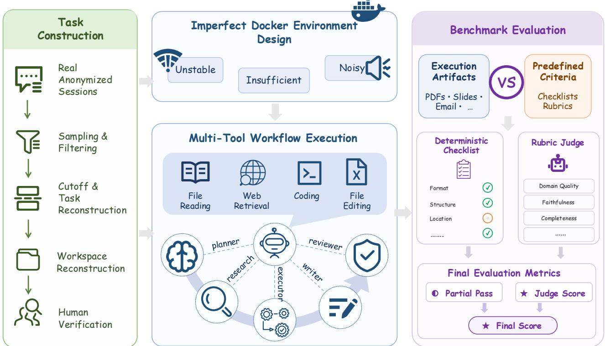
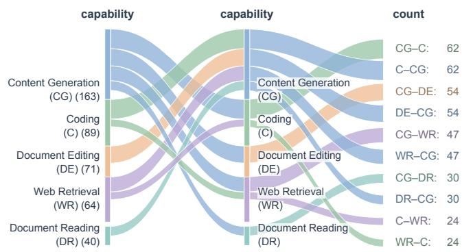
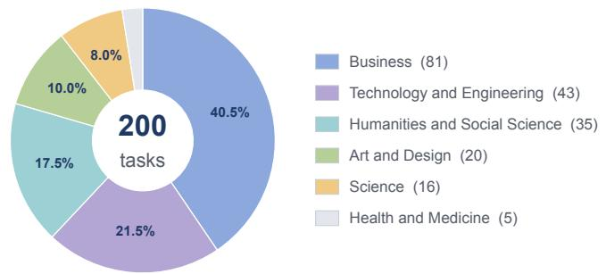
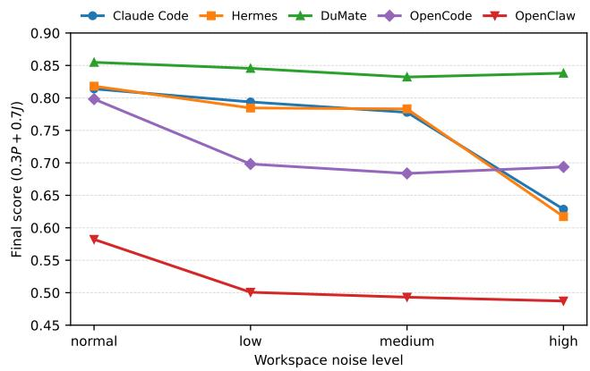

# DuMateBench: Evaluating Autonomous Agents in Complex Real-World Workflows

Zechun Niu∗   
Renmin University of   
China   
Beijing, China   
niuzechun@ruc.edu.cn   
Han Tian   
Nankai University   
Tianjin, China

Yansong Gao Yuchen Li Jianmin Wu Baidu, Inc. Beijing, China

Yukun Zhao∗   
Shandong University   
Jinan, China   
zhaoyukun@sdu.edu.cn   
Can Xu   
East China Normal   
University   
Shanghai, China   
Lingyong Yan†   
Baidu, Inc.   
Beijing, China   
yanlingyong@baidu.com

Jiaxin Zhang Independent Researcher China

Yunfan Song Imperial College London London, United Kingdom

Shuaiqiang Wang†   
Baidu, Inc.   
Beijing, China   
wangshuaiqiang@baidu.com   
Xu Shen   
Jinhua Si   
Michigan State University   
East Lansing, USA   
Jiaxin Mao   
Renmin University of   
China   
Beijing, China   
Dawei Yin†   
Baidu, Inc.   
Beijing, China   
yindawei@acm.org

## Abstract

Autonomous agents are increasingly adopted to complete complex, multi-tool workflows in real-world settings. However, existing benchmarks typically separate tasks by application or capability and evaluate agents in environments that are cleaner and more stable than those encountered in practice. We introduce DuMateBench, a real-session benchmark reconstructed from anonymized and privacy-screened user sessions collected from a large-scale production agent platform. Each task preserves the relevant pre-solution interaction history, persistent configurations, and workspace state, and is then validated through human verification. The resulting benchmark comprises 200 tasks spanning 8 broad scenarios and 17 fine-grained capability categories, with most tasks requiring multiple capability coordination. We execute these tasks in isolated Docker containers injected with three forms of real-world environ mental complexity: Insufficient, Unstable, and Noisy, and assess performance using a hybrid deterministic and LLM-as-Judge evaluation protocol. Experiments across five representative autonomousagent frameworks paired with four state-of-the-art LLMs reveal substantial gaps in strict task completion. Complementary robust ness, eficiency, and diagnostic analyses further show that performance under environmental perturbations is jointly shaped by the

capabilities of the LLM and the surrounding agent framework. The code and data are publicly available at https://dumatebench.com/.

## CCS Concepts

• Computing methodologies → Intelligent agents; • General and reference → Evaluation.

## Keywords

Autonomous Agents, Agent Benchmark, Compositional Workflows, Agent Reliability, Artifact Evaluation

Zechun Niu, Yukun Zhao, Jiaxin Zhang, Xu Shen, Jinhua Si, Han Tian, Can Xu, Yunfan Song, Jiaxin Mao, Yansong Gao, Yuchen Li, Jianmin Wu, Lingyong Yan, Shuaiqiang Wang, and Dawei Yin. 2027. DuMateBench: Evaluating Autonomous Agents in Complex Real-World Workflows. In Proceedings of the 20th ACM International Conference on Web Search and Data Mining (WSDM’27). ACM, New York, NY, USA, 11 pages. https://doi.org/XXXXXXX. XXXXXXX

## 1 Introduction

Powered by large language models (LLMs), autonomous agents are increasingly deployed to tackle complex tasks across software engineering [9, 36], web-based knowledge work [4, 13, 40], ofice productivity [27, 31, 34], and multimodal content creation [6, 13]. To assess whether these capabilities translate into practical utility for end users, agents must be evaluated on tasks grounded in realworld use. This underscores the need for benchmarks that measure whether agents can reliably complete workflows under realistic contextual and environmental conditions.

Recent agent benchmarks have expanded to cover multi-step workflows, extended interaction histories, and professional tasks, as summarized in Table 1. For instance, OficeBench evaluates common productivity applications, OdysseyBench introduces long interaction histories into ofice workflows, APEX-Agents targets longhorizon professional tasks, and WorkBuddyBench spans ofice and coding domains [27, 28, 31, 34]. Despite this progress, a critical chal lenge persists–Challenge 1: limited cross-capability workflow composition. Existing datasets typically group tasks by individual applications or predefined capabilities. Consequently, they provide limited coverage of workflows that integrate document processing, information retrieval, coding, content generation, or other crossapplication operations. Evaluation on these tasks therefore provides limited evidence of an agent’s ability in real-world scenarios, as authentic user requests demand the orchestration of multiple capa bilities within a single end-to-end workflow [14, 19, 39].

Table 1: Comparison with representative workflow-oriented and environment-robustness benchmarks. A check mark indicates explicit benchmark-level coverage rather than in- cidental occurrence in individual tasks.  
(a) Data source and execution environment
<table><tr><td>Benchmark</td><td>Year</td><td>Real-user Session</td><td colspan="3">Execution Environment</td></tr><tr><td></td><td></td><td></td><td>Insufficient</td><td>Unstable</td><td>Noisy</td></tr><tr><td colspan="6">Multi-tool workflow benchmarks</td></tr><tr><td>OfficeBench [34]</td><td>2024</td><td>x</td><td>x</td><td>x</td><td>x</td></tr><tr><td>OdysseyBench [31]</td><td>2025</td><td>x</td><td>x</td><td>x</td><td>x</td></tr><tr><td>APEX-Agents [28]</td><td>2026</td><td>√</td><td>x</td><td>x</td><td>√</td></tr><tr><td>WorkBuddy Bench [27]</td><td>2026</td><td>√</td><td>x</td><td>x</td><td>x</td></tr><tr><td colspan="6">Environment and robustness benchmarks</td></tr><tr><td>ToolSandbox [17]</td><td>2024</td><td>x</td><td>x</td><td>x</td><td>√</td></tr><tr><td>SetupBench [3]</td><td>2025</td><td>√</td><td>√</td><td>x</td><td>x</td></tr><tr><td>ComplexMCP [16]</td><td>2026</td><td>x</td><td>x</td><td>√</td><td>√</td></tr><tr><td>DUMATEBENCH</td><td>2026</td><td>√</td><td>√</td><td>√</td><td>√</td></tr><tr><td colspan="6">(b) Task capabilities</td></tr><tr><td>Benchmark</td><td>Document Reading</td><td>Document Editing</td><td>File Organization</td><td>Coding</td><td>Web Retrieval</td></tr><tr><td colspan="6">Multi-tool workflow benchmarks</td></tr><tr><td>OfficeBench</td><td>√</td><td>√</td><td>x</td><td>x</td><td>x</td></tr><tr><td>OdysseyBench</td><td>√</td><td>√</td><td>x</td><td>x</td><td>x</td></tr><tr><td>APEX-Agents</td><td>√</td><td>√</td><td>√</td><td>x</td><td>x</td></tr><tr><td>WorkBuddy Bench</td><td>√</td><td>√</td><td>x</td><td>√</td><td>x</td></tr><tr><td colspan="6">Environment and robustness benchmarks</td></tr><tr><td>ToolSandbox</td><td>x</td><td>x</td><td>x</td><td>x</td><td>x</td></tr><tr><td>SetupBench</td><td>x</td><td>x</td><td>x</td><td>x</td><td>x</td></tr><tr><td>ComplexMCP</td><td>√</td><td>√</td><td>√</td><td>x</td><td>x</td></tr><tr><td>DUMATEBENCH</td><td>√</td><td>√</td><td>√</td><td>√</td><td>√</td></tr></table>

Robustness-oriented benchmarks such as ToolSandbox [17], SetupBench [3], and ComplexMCP [16] examine the remaining conditions, as compared in Table 1. They typically isolate the conditions from session-grounded workflows that require coordinated tool use and heterogeneous artifact production. This gives rise to Challenge 2: insuficient environmental realism. In practice, agents may encounter unavailable tools, missing dependencies, resource constraints, intermittent networks, API failures, timeouts, and distracting or corrupted files. Furthermore, the above two challenges severely complicate reliable evaluation. Documents, spreadsheets, presentations, and images often admit multiple valid solutions, making exhaustive grading criteria dificult to define. Because reference answers are rarely available for tasks derived from real-world interactions, human evaluators may inadvertently reject valid alternative solutions or overlook substantive errors [7]. Ultimately, as summarized in Table 1, existing benchmarks rarely address compositional workflows, environmental complexity, and heterogeneous task capabilities within a unified setting.

To address these challenges, we introduce DuMateBench, a real-user session-derived benchmark for evaluating autonomous agents on cross-capability workflows that require coordinating multiple productivity tools under realistic, imperfect environmental conditions. DuMateBench derives its tasks from anonymized, privacy-screened user sessions collected from DuMate, a production agent platform. We preserve the user-visible interaction context and persistent configurations, reconstructing the task instance and workspace state to match the environment in which the request originally occurred. Human verification then retains only tasks that are faithful, well-specified, solvable, free of solution leakage, and independently evaluable. The benchmark comprises 200 tasks covering eight broad scenarios and 17 fine-grained task types, with most workflows spanning multiple scenarios and task types. These tasks frequently integrate content generation with coding, document manipulation, or Web retrieval, thereby coupling compositional workflows with challenging execution conditions.

We design the DuMateBench environment around three forms of real-world complexity: Insufficient conditions with missing dependencies and constrained resources, Unstable conditions with transient network and tool failures, and Noisy conditions with distracting files and noisy data. We execute each task in an isolated Docker container initialized with its designed environment and reconstructed workspace. For evaluation, we combine reviewed deterministic checklists for explicit requirements with artifact-specific LLM-as-Judge rubrics for the correctness, completeness, and quality of heterogeneous outputs. Using this protocol, we evaluate five representative autonomous-agent frameworks paired with four state-of-the-art base LLMs and conduct additional analyses of robustness to workspace noise, eficiency, and failure modes. Figure 1 summarizes the task-construction, environment-design, and evaluation pipeline of DuMateBench.

Our contributions are summarized as follows:

• A real-session benchmark for compositional workflows. We introduce DuMateBench, comprising 200 executable tasks derived from real multi-turn DuMate sessions. By reconstructing the pre-task interaction history and workspace state, the benchmark preserves realistic context. It systematically evaluates workflows that integrate multiple capabilities across 8 high-level scenarios and 17 fine-grained task types.

• Reproducible complex work environments. We model three forms of real-world environmental complexity: insufficient environments with missing tools, dependencies, or resources; unstable environments with transient network and tool failures; and noisy environments containing distracting files or noisy data. These conditions are instantiated in isolated Docker containers, enabling controlled and reproducible evaluation of agent reliability.

• Comprehensive evaluation of autonomous agents. We evaluate 20 configurations of five autonomous-agent frameworks and four LLMs on DuMateBench, covering end-toend performance, robustness to workspace noise, eficiency, and failure modes. The results reveal strong agent–model interactions, uneven robustness, and quality–eficiency tradeofs, while trace analysis exposes weaknesses in execution planning, failure recovery, and artifact verification. These findings show that DuMateBench provides a realistic and diagnostic evaluation of the capabilities required for complex end-to-end workflows.

## 2 Related Work

## 2.1 Benchmarks for Multi-Tool Workflows

The evaluation of LLM agents has increasingly shifted from isolated tool calls toward multi-step workflows that require the coordinated use of multiple tools [15, 27, 40]. For instance, OficeBench [34] and SpreadsheetBench [18] evaluate multi-step operations over ofice documents and spreadsheets, while WorkArena++ [4], Work Bench [25], and CRMArena [12] extend evaluation to enterprise applications, structured data, and role-specific business processes. While OSWorld [35] evaluates cross-application tasks in a general computer environment and TheAgentCompany [36] embeds agents in a simulated software company, Workspace-Bench [26], EnterpriseClawBench [41], and AgencyBench [14] emphasize file dependencies, workplace sessions, and extended real-world contexts. Their evaluation ranges from deterministic checks to rubrics, gold deliverables, and visual assessment [14, 19, 28, 29, 41]. Deterministic checks provide reproducible evidence for explicit requirements, while rubric-based LLM judges can assess the semantic, organizational, and perceptual quality of open-ended artifacts [7, 24]. Despite this progress, existing benchmarks isolate tasks within single applications, ofering limited workflows that cut across diferent task types and tools. In reality, user requests frequently require the seamless integration of multiple capabilities. DuMateBench reconstructs multi-tool workflow tasks from anonymized real user sessions on a production agent platform that span multiple capabilities, including document processing, information retrieval, coding, content generation, and cross-application operations. This design enables grounded and reproducible evaluation of agents on authentic, complex user requests.

## 2.2 Benchmarks for Agent Reliability

In real-user settings, agents rarely operate under ideal conditions. Recent work has therefore increasingly evaluated agent reliability under incomplete or unreliable execution conditions. ToolSandbox [17] studies insuficient information and distracting context, whereas EnvBench [8] and SetupBench [3] require agents to resolve missing dependencies and construct incomplete software environments. NIKA [33] examines the diagnosis and recovery of dynamic network failures. Recent benchmarks extend reliability evaluation to a broader range of perturbations: AgentNoiseBench [30] injects controllable user and tool noise; ComplexMCP [16] combines interdependent tools with unpredictable API failures; OccuBench [11] introduces explicit errors and implicit data degradation; and DeployBench [32] covers incomplete or incompatible execution environments. Together, these benchmarks assess information filtering, environment construction, fault diagnosis, and execution recovery. However, these dificulties are generally isolated from session-derived workflows that require coordinated tool use and heterogeneous artifact delivery. DuMateBench instead integrates insuficient, unstable, and noisy conditions into the same real-session tasks. This setting evaluates whether an agent can reliably fulfill user requests and deliver the required artifacts within realistic, imperfect environments.

## 3 DuMateBench Task Construction

DuMateBench is derived from anonymized, privacy-screened user sessions collected from a large-scale production agent platform serving millions of users. We first filter the collected sessions and reconstruct their task inputs, as described in Section 3.1. Human annotators then review each task and remove those with ambiguous intents, invalid test cases, or other critical issues (Section 3.2). The overall task construction procedure is illustrated on the left panel of Figure 1. We present the task statistics in Section 3.3.

## 3.1 Task Derivation & Reconstruction

The task derivation pipeline consists of three stages: interactionhistory reconstruction, cutof-based instruction formulation, and workspace reconstruction.

Interaction-history reconstruction. Our benchmark starts from anonymized, privacy-screened user sessions sampled from a largescale production agent platform. Each source session is represented by a trace containing user messages, agent responses, tool interactions, system events, and file operations. We restore the original event order and retain the user-visible content, including user messages, displayed agent responses, file references, and historical artifacts, while excluding internal execution records such as tool calls, execution results, and orchestration messages. We then discard sessions that are too simple to represent autonomous workflows, including single-turn interactions and sessions with little tool or file activity. The retained records form the ordered interaction history $\boldsymbol { S } = \left( e _ { 1 } , \ldots , e _ { n } \right)$ , where each $e _ { i }$ denotes one retained user-visible record, such as a user message, displayed agent response, file reference, or historical artifact, ordered chronologically, and � is the total number of retained records.

Cutof-based instruction formulation. For each retained interaction history, we use Claude Opus 4.8 [2] to help select one user request as the target task. A request may span multiple user turns when later turns refine the same objective. We place the cutof boundary � immediately before the first user turn of this target request. The user-visible events before � form the historical context $\mathcal { H } _ { c } = \left( e _ { 1 } , \ldots , e _ { c - 1 } \right)$ . We then consolidate all user turns belonging to the target request into a self-contained task instruction $q _ { c }$ that preserves the original objective, deliverables, file references, and constraints. Agent responses, tool outputs, and generated artifacts produced after the cutof are excluded to prevent leakage from the original solution.

  
Figure 1: Overview of our proposed DuMateBench. It is built through two stages: task construction and environment design, detailed in Sections 3 and 4, respectively. Agents execute each task as a multi-tool workflow, and the resulting artifacts are assessed through two complementary channels: deterministic checklists for objectively verifiable requirements and a rubric based LLM judge for semantic and presentation quality. The evaluation protocol is detailed in Section 5.

Workspace reconstruction. We use Claude Opus 4.8 [2] to assist in reconstructing the workspace state $\mathcal { W } _ { c }$ available at the cutof point. Given the session trace and file-operation records, the model identifies the user-uploaded files and historical agent artifacts avail able before � and checks their consistency with the reconstructed instruction and interaction history. Post-cutof files and workspace changes are excluded. If a pre-existing file was overwritten, we restore its latest recoverable pre-cutof version; if an essential version cannot be recovered, we discard the task. The resulting files are stored in workspace\_seed/ and copied to the working directory at runtime.

After these three stages, we obtain a task instance

$$
\mathcal { T } _ { c } = \left( q _ { c } , \mathcal { W } _ { c } , \mathcal { M } _ { c } \right) ,\tag{1}
$$

where $q _ { c }$ denotes the task instruction, $\mathcal { W } _ { c }$ the reconstructed workspace, and $\mathcal { M } _ { c }$ the task metadata and execution constraints. Each instance is serialized into a standardized task package, while task-independent container and environment components are materialized from shared infrastructure at execution time.

## 3.2 Human Verification

We conduct human verification after candidate task reconstruction. Reviewers inspect the source session, reconstructed interaction history, target instruction, and workspace state. They assess whether each task faithfully represents the original request, is solvable from the provided state, contains no solution leakage, and is free of unresolved privacy, security, or safety risks. A candidate task is retained only if it satisfies all of the following criteria:

• Request fidelity. The consolidated instruction preserves the intent, scope, deliverables, and constraints of the original request. It introduces no requirements inferred solely from the downstream agent response.

• Workspace completeness and consistency. The reconstructed workspace provide suficient and mutually consistent information and artifacts to complete the task without irrecoverable ambiguity.

• Absence of solution leakage. The reconstructed task excludes all post-cutof agent responses, tool results, intermediate outputs, generated artifacts, and workspace changes that could reveal the original solution.

• Privacy and security. Reviewers check for residual personally identifiable information, credentials, API keys, private endpoints, confidential files, and other sensitive content. They also inspect the task instructions, artifacts, and evaluation rules for malicious, unsafe, or unauthorized operations. Tasks with unresolved risks are removed or corrected without changing the original task semantics.

  
Figure 2: Coarse-grained scenario composition of Du MateBench.

If a defect can be corrected without altering the original user request, we reconstruct and re-review the task; otherwise, we discard it. We also exclude any sample with unresolved ambiguity, inconsistent state, missing essential context, solution leakage, residual privacy risks, or safety concerns.

Retained tasks receive multi-label capability annotations under five coarse-grained scenarios: content generation (text, image, video, and audio generation); code development (code writing and generation); Web information retrieval (Web information retrieval); ofice document editing (Word, spreadsheet, presentation, and PDF creation or editing); ofice document reading (Word, spreadsheet, presentation, and PDF reading). These categories comprise 14 finegrained capabilities, and each task may receive multiple labels.

## 3.3 Benchmark Statistics

We characterize DuMateBench across three complementary dimensions: capability coverage, capability compositionality, and knowledge-domain coverage. The first two capture the required agent capabilities and the need to coordinate multiple capabilities within a single task, while the third captures subject domains.

Capability coverage. DuMateBench contains 200 tasks annotated with 14 fine-grained capabilities grouped into five coarsegrained scenarios. As shown in Figure 2, content generation is the most prevalent scenario, followed by coding, document editing, Web information retrieval, and document reading (163, 89, 71, 64 and 40 respectively). At the fine-grained level, text generation and editing is the most frequent capability (148 tasks), followed by coding (89) and information retrieval (64). The dataset contains 456 capability assignments in total, averaging 2.28 capabilities per task. Since the annotations are multi-label, the reported counts and percentages do not sum to 200 or 100%.

Capability compositionality. DuMateBench is dominated by tasks that require coordinated capabilities: 159 tasks (79.50%) span at least two coarse-grained scenarios, and 62 of these span three or more. As shown in Figure 2, the most common cross-scenario combinations are code development with content generation (62 tasks), ofice document editing with content generation (54), and Web information retrieval with content generation (47). These results indicate that the benchmark targets realistic multi-capability workflows rather than isolated tool execution.

  
Figure 3: Knowledge-domain distribution of the 200 tasks included in the MMMU-derived topic analysis.

Knowledge-domain coverage. The capability taxonomy describes how a task is performed, but not the knowledge required to complete it. We therefore assign each classified task a single knowledge domain using an MMMU-derived taxonomy [38]. The assignment follows the core subject matter of the instruction rather than its delivery format. For example, producing a financial report is categorized by its financial content rather than as document editing. As shown in Figure 3, the classified tasks span six broad domains. Business is the largest category (40.5%), followed by technology and engineering (21.5%) and humanities and social science (17.5%). At the finer level, the tasks cover 23 populated subjects, among which computer science, finance, marketing, sociology, and management appear most frequently. DuMateBench therefore evaluates agents across varied subject matter rather than within a single professional domain.

## 4 DuMateBench Environment Design

Real-world autonomous agents rarely operate in pristine, fully prepared environments. Required tools may be missing, external services may fail mid-execution, and workspaces often contain irrelevant or conflicting data. We categorize these recurring environmental challenges into three dimensions: Insufficient (missing dependencies and constrained resources), Unstable (transient network and tool failures), and Noisy (distractor files and data). To model these conditions while retaining reproducibility, we execute each task in an isolated Docker container initialized with its reconstructed workspace. The evaluated agent runs as a non-root user and is confined to explicitly defined workspace, output, and logging boundaries.

## 4.1 Insuficient Environment Design

Insufficient environments model missing dependencies and constrained resources. The base image provides general-purpose shell, networking, archive, and document utilities, but it does not guarantee that every task-specific system package, Python library, or ofice tool is preinstalled. Agents therefore need to inspect the environment, diagnose missing dependencies, install permitted packages when appropriate, or use alternative implementations.

Tasks may also impose explicit limits on CPU, memory, storage, and execution time. These constraints evaluate environment diag nosis, configuration, and resource-aware execution, rather than rewarding access to a fully prepared software stack. Evaluation runs outside the task container, so missing agent-side dependencies do not afect the evaluator.

## 4.2 Unstable Environment Design

Unstable environments model transient network and tool-execution failures. We inject faults at the network and tool layers under two schedules: startup faults create a reproducible initial failure window, while periodic faults introduce intermittent disruptions during longer executions. Network perturbations include DNS failures, IP/port blocking, and injected latency or packet loss. Besides, tool wrappers can produce temporary unavailability, delayed responses, missing fields in generated artifacts, and seeded nondeterministic timeouts.

Each fault configuration specifies its type, activation schedule, duration, probability, and random seed. Network controls apply only to agent-issued trafic; model-inference trafic is routed sepa rately and remains exempt. Fault selection, activation, and recovery are recorded in structured logs. To complete a task, agents may need to distinguish transient failures and use retries, backof, fallback tools, or alternative execution plans as appropriate.

## 4.3 Noisy Environment Design

Noisy environments model distractor files and data within the reconstructed workspace. We preserve noise already present in the original session data, including irrelevant, redundant, or outdated materials and similarly named files with diferent contents. To introduce controlled and reproducible variation, we use a noise generator to add task-specific distractor files and data, such as stale intermediate outputs, duplicate records, and irrelevant documents, without altering the inputs required to solve the task. This setting requires agents to identify relevant files, verify data provenance, and distinguish task-relevant evidence from distractors before acting.

In summary, building upon the task and workspace construction described in Section 3, we instantiate each task in an isolated Docker container and inject the insuficient, unstable, and noisy conditions. These designs enable reproducible evaluation of whether an agent can maintain reliable task completion in a complex and challenging environment. The environment is thus an explicit, controlled, and auditable component of benchmark dificulty rather than merely an execution container.

## 5 DuMateBench Evaluation

DuMateBench evaluates explicit requirement satisfaction and overall artifact quality through two complementary mechanisms. Deterministic checklist evaluation verifies objectively testable constraints. Rubric-based evaluation utilizes an artifact-specific LLM judge to assess semantic, organizational, and perceptual properties that cannot be captured by fixed rules. The overall evaluation protocol is illustrated on the right panel of Figure 1.

## 5.1 Deterministic Checklist Evaluation

Each task is associated with a set of atomic checks generated by an LLM and subsequently reviewed by human annotators. The checks cover output existence and location, format validity, required or forbidden content, document structure, spreadsheet values and formulas, and the integrity of protected files. For Web-retrieval tasks, we curate evaluator-only reference sources; for numerical and question-answering tasks with objectively verifiable targets, we provide human-checked gold answers. None of these evaluation materials is exposed to the agent.

For task �, let $c _ { t , i } \in \{ 0 , 1 \}$ denote whether check � is satisfied and $n _ { t }$ the number of checks. The task-level partial pass rate is

$$
P _ { t } = \frac { 1 } { n _ { t } } \sum _ { i = 1 } ^ { n _ { t } } c _ { t , i } .\tag{2}
$$

It measures the proportion of atomic requirements satisfied, thereby crediting partial progress. A task is considered complete only when all of its deterministic checks pass.

Checklist coverage statistics. After applying the eight-task exclusion used in the final evaluation, the inventory contains 200 tasks and 1,257 atomic checks, averaging 6.29 checks per task. Existence checks account for 482 items (38.35%), required-content checks for 459 (36.52%), and format-validity checks for 228 (18.14%). Together, these categories constitute 93.01% of all checks. The remainder comprises directory-structure checks (34, 2.70%), forbidden-content checks (21, 1.67%), and specialized evaluators (33, 2.62%). Thus, the checklist primarily verifies artifact presence, validity, and compliance with explicit requirements before qualitative evaluation.

## 5.2 Rubric-Based Artifact Evaluation

Deterministic checks alone cannot establish whether a report adequately addresses its audience, a workbook provides a useful analysis, or a presentation is visually coherent. DuMateBench therefore uses artifact-specific judges for textual documents, presentations, spreadsheets, PDFs, images, audio, and video. The judge receives the task instruction, candidate artifact, and relevant reference material in modality-appropriate forms, such as extracted text, document structure, spreadsheet formulas, rendered pages, images, or sampled video frames.

For each task, an LLM generates an initial rubric from the instruction, deterministic checks, and reference inventory before any system output is evaluated. Human annotators then review its clarity, coverage, and assessability. The resulting rubric and reference set are fixed and shared across all agent–model configurations, preventing the evaluation criteria from adapting to a particular output.

Each rubric contains between three and sixteen atomic criteria with normalized weights and anchored score levels from 0 to 4. The judge assigns a score and supporting evidence to each criterion. A criterion is marked cannot\_assess when the artifact does not provide suficient evidence.

Rubric coverage statistics. The filtered inventory contains 454 artifact-specific criteria JSON files covering 197 of the 200 tasks. These files define 2,308 atomic criteria, corresponding to 11.54 criteria per task and 5.08 criteria per rubric file on average. The observed rubric files contain three to eleven criteria, within the design range above. By artifact sufix, Markdown files are most frequent (108 files, 23.79%), followed by SVG (60, 13.22%), PNG (51, 11.23%), DOCX (45, 9.91%), Python (43, 9.47%), and HTML (34, 7.49%); these six types comprise 75.11% of rubric files. Across all criteria, the dominant dimensions are requirement completeness (790 criteria, 34.23%), presentation readability (275, 11.92%), functional correctness (251, 10.88%), content relevance (245, 10.62%), and factual correctness and faithfulness (149, 6.46%). The five dimensions together account for 67.63% of criterion instances, while the remaining dimensions provide modality- and artifact-specific coverage such as visual hierarchy, edge-case robustness, and reference fidelity.

Let $\alpha _ { t , a , j }$ be the normalized weight of criterion � for artifact $^ { a , }$ and let $s _ { t , a , j } \in \{ 0 , 1 , 2 , 3 , 4 \}$ denote its score. The artifact-level judge score is

$$
J _ { t , a } = \sum _ { j } \alpha _ { t , a , j } \frac { \tilde { s } _ { t , a , j } } { 4 } , \qquad \tilde { s } _ { t , a , j } = \left\{ \begin{array} { l l } { s _ { t , a , j } , } & { \mathrm { i f ~ a s s e s s e d , } } \\ { 0 , } & { \mathrm { o t h e r w i s e . } } \end{array} \right.\tag{3}
$$

Unassessed criteria receive zero contribution, preventing incomplete evidence from increasing the score. When repeated judge runs are used, criterion-level scores are aggregated by their median.

## 5.3 Score Aggregation

Let A� denote the set of supported target artifacts for task �. The task-level judge score is the macro-average

$$
J _ { t } = \frac { 1 } { | \mathcal { R } _ { t } | } \sum _ { a \in \mathcal { A } _ { t } } J _ { t , a } .\tag{4}
$$

A missing expected artifact receives a score of zero. Unsupported artifact types are recorded but omitted from the artifact average. For a task to which no artifact-specific judge applies by design, the deterministic score is used as its task score.

The final score gives 30% weight to deterministic requirement coverage and 70% weight to artifact quality:

$$
F _ { t } = 0 . 3 P _ { t } + 0 . 7 J _ { t } .\tag{5}
$$

We report $P _ { t } , J _ { t } ,$ and $F _ { t }$ separately and macro-average each metric across tasks.

## 6 Experiments

In this section, we evaluate autonomous agents across four complementary dimensions on DuMateBench to answer the following research questions (RQs):

• RQ1. How do autonomous agents perform on DuMateBench?

• RQ2. How does environmental noise afect the performance of autonomous agents on DuMateBench?

• RQ3. How eficiently do autonomous agents solve tasks on DuMateBench?

• RQ4. What are the common failure modes of autonomous agents on DuMateBench?

## 6.1 Experimental Settings

Agents and models. We evaluate five representative autonomous agents: Claude Code (v2.1.212) [1], Hermes (v0.19.0) [20], DuMate (v1.0.59) [37], OpenCode (v1.18.4) [23], and OpenClaw (v2026.7.1- 2) [22]. Each agent is paired with four base models: GPT-5.5 [21],

Opus-4.8 [2], GLM-5.2 [9], and DeepSeek-V4-Pro [5], yielding 20 agent–model configurations. For each configuration, we preserve the agent’s native control loop, tool-use policy, and model-interface protocol. We retain runtime-specified settings and do not standardize decoding parameters across runtimes.

Execution Harness. For each task, all agent configurations receive the same instruction and initial workspace. Each trial is executed by a non-root agent in an isolated Docker container with a fresh workspace at /workspace. Evaluation files and references remain inaccessible to the agent. After execution or timeout, the final workspace state is preserved and evaluated.

Environment Settings. Following the three environment challenges defined in Section 4, we evaluate agents under Insufficient, Unstable, and Noisy conditions. First, the Insufficient condition models missing capabilities and limited resources in the real world. Each task runs in an isolated Docker container based on python:3.12-slim. The image provides only general-purpose shell, archive, networking, PDF, and process utilities, including bash, curl, git, dnsutils, iproute2, iptables, jq, poppler-utils, procps, unzip, and vim-tiny. The task-specific system tools and Python packages are not preinstalled. Besides, each container is limited to 2 CPUs, 8 GB of memory, 12 GB of storage, and a wall-clock budget of 1,800 seconds.

Second, the Unstable condition introduces controlled failures at the network and tool layers. At startup, DNS failure, latency with packet loss, and destination blocking are each enabled for 8 seconds. During execution, a fault daemon independently samples these three network faults every 45 seconds with probabilities of 0.35, 0.45, and 0.25, respectively. When selected, DNS failure, latency with packet loss, and destination blocking remain active for 6, 10, and 8 seconds, respectively. In addition, The tool layer models transient OCR unreliability: it forces the first eligible OCR call to fail and, with probability 0.4, delays a subsequent OCR response by 5 seconds.

Third, the Noisy condition retains natural noise from the reconstructed workspace, including historical files, temporary notes, and artifacts unrelated to the current task. For RQ2, we additionally inject seeded synthetic distractors, such as similarly named, outdated, duplicate, or conflicting files, to control noise intensity.

Evaluation. For each run, we apply the evaluation protocol described in Section 5. After the agent finishes, a Python evaluator first executes the task’s deterministic checklist and computes the partial pass rate �, the fraction of checklist requirements that are satisfied. We then utilize Gemini-3.1-Pro-Preview [10] as a judge model to evaluate the quality of the outputted artifacts. The judge receives the task instruction, candidate artifacts, and task-relevant reference files, and scores each artifact with predefined task-specific rubrics. We report the partial pass rate �, average artifact-judge score � together with the combined final score $F = 0 . 3 P + 0 . 7 J$ . In addition, we measure each run’s wall-clock time and token usage, including input, output, and total tokens, to characterize eficiency when answering RQ3.

Table 2: Results of autonomous agents on 200 DuMateBench tasks. “Partial” denotes the partial pass rate, “Judge” denotes the LLM judge score, and “Final” denotes the final score (computed as 0.3 Partial + 0.7Judge). The best value for each metric within each model block is shown in bold.
<table><tr><td>Agent</td><td colspan="3">GPT-5.5</td><td colspan="3">Opus-4.8</td><td colspan="3">GLM-5.2</td><td colspan="3">DeepSeek-V4-Pro</td></tr><tr><td></td><td>Partial</td><td>Judge</td><td>Final</td><td>Partial</td><td>Judge</td><td>Final</td><td>Partial</td><td>Judge</td><td>Final</td><td>Partial</td><td>Judge</td><td>Final</td></tr><tr><td>Claude Code</td><td>0.8613</td><td>0.7494</td><td>0.7830</td><td>0.8734</td><td>0.7884</td><td>0.8139</td><td>0.7317</td><td>0.6398</td><td>0.6674</td><td>0.8373</td><td>0.7915</td><td>0.8052</td></tr><tr><td>Hermes</td><td>0.9001</td><td>0.7634</td><td>0.8044</td><td>0.8986</td><td>0.7836</td><td>0.8181</td><td>0.8253</td><td>0.7213</td><td>0.7525</td><td>0.8521</td><td>0.8096</td><td>0.8223</td></tr><tr><td>DuMate</td><td>0.9025</td><td>0.7768</td><td>0.8145</td><td>0.9088</td><td>0.8316</td><td>0.8548</td><td>0.8829</td><td>0.7711</td><td>0.8046</td><td>0.8631</td><td>0.8229</td><td>0.8350</td></tr><tr><td>OpenCode</td><td>0.7696</td><td>0.6568</td><td>0.6906</td><td>0.8555</td><td>0.7736</td><td>0.7982</td><td>0.8613</td><td>0.7396</td><td>0.7761</td><td>0.8721</td><td>0.7716</td><td>0.8017</td></tr><tr><td>OpenClaw</td><td>0.8279</td><td>0.7590</td><td>0.7797</td><td>0.6127</td><td>0.5690</td><td>0.5821</td><td>0.7668</td><td>0.7075</td><td>0.7253</td><td>0.8090</td><td>0.7800</td><td>0.7887</td></tr></table>

## 6.2 RQ1. How Do Autonomous Agents Perform on DuMateBench?

Sensitivity across agent systems. Table 2 shows that sensitivity to the base model varies across agent systems. DuMate has the smallest Final-score range, spanning 0.8046–0.8548 (5.02 percentage points), followed by Hermes at 0.7525–0.8223 (6.98 points). OpenCode varies from 0.6906 to 0.8017 (11.11 points), and Claude Code from 0.6674 to 0.8139 (14.65 points). OpenClaw is the most sensitive, with scores ranging from 0.5821 to 0.7887 (20.66 points). The best-performing model also difers by agent: Opus-4.8 performs best with Claude Code and DuMate, whereas DeepSeek-V4-Pro performs best with Hermes, OpenCode, and OpenClaw. DuMate ranks first within each model block, but its margin over the strongest alternative varies from 1.01 points under GPT-5.5 to 3.67 points under Opus-4.8, with intermediate margins of 2.85 and 1.27 points under GLM-5.2 and DeepSeek-V4-Pro.

Compatibility across base models. The base models likewise differ in their consistency across agent systems. DeepSeek-V4-Pro achieves the highest mean Final score (0.8106), followed by GPT-5.5 (0.7744), Opus-4.8 (0.7734), and GLM-5.2 (0.7452). DeepSeek-V4-Pro also has the smallest cross-agent range, with scores between 0.7887 and 0.8350 (4.63 percentage points). GPT-5.5 and GLM-5.2 show wider ranges of 12.39 and 13.72 points, respectively. Although Opus-4.8 produces the highest individual score in the table (0.8548), its scores span 0.5821–0.8548, yielding the largest cross-agent range of 27.27 points. Thus, GPT-5.5 and Opus-4.8 have nearly identical mean scores, difering by only 0.0010, despite markedly diferent variation across agent systems.

## 6.3 RQ2. How Does Environmental Noise Afect Agent Performance?

Real-world workspaces often contain stale, duplicated, or irrelevant files. We evaluate five agents with Opus-4.8 under four noise levels: normal, low, medium, and high. The normal condition retains only the natural noise present in the reconstructed workspace, as in RQ1. The other conditions introduce seeded filename and content distractors, including backups, historical versions, duplicated text, conflicting values, and corrupted content. Low, medium, and high noise perturb approximately 35%, 65%, and 100% of workspace files, capped at three, six, and ten files per task, respectively. Higher levels also increase the number of distractors generated for each selected file.

  
Figure 4: Final scores of five agents with Opus-4.8 under increasing workspace noise.

As shown in Figure 4, performance generally declines as workspace noise increases. From the normal to the high-noise condition, Hermes, Claude Code, OpenCode, and OpenClaw lose 20.08, 18.53, 10.45, and 9.49 percentage points, respectively. DuMate decreases from 0.8548 to 0.8381, a loss of 1.67 percentage points. Under this experimental setting, the magnitude of degradation therefore varies considerably across agent systems, with DuMate exhibiting the smallest decrease among the evaluated agents.

## 6.4 RQ3. How Eficiently Do Autonomous Agents Solve Tasks on DuMateBench?

We characterize eficiency along two dimensions, latency and token use, rather than treating it as a single scalar quantity. We report the eficiency for each agent–model configuration on DuMateBench in table 3, where input token denotes the aggregation of standard input tokens and cache-read tokens and all values are means per task.

The results reveal a clear quality–eficiency trade-of. DuMate with Opus-4.8 achieves the highest Final score (0.8548), but it is also the slowest configuration (1,038.74 s per task) and consumes 1.56M total tokens per task. At the other end of the latency spectrum, Claude Code with GPT-5.5 is the fastest configuration (274.99 s) and achieves a Final score of 0.7830. OpenClaw with GPT-5.5 has a comparable runtime (293.42 s), but obtains a slightly lower score (0.7797).

Table 3: Eficiency results for the 20 agent–model configu- rations on DuMateBench. All quantities are averaged per task. DS-V4-Pro denotes DeepSeek-V4-Pro for short.
<table><tr><td>Agent</td><td>Model</td><td>Final score Time (s) Input tokens Output tokens Total tokens</td><td></td><td></td><td></td><td></td></tr><tr><td>Claude Code GPT-5.5</td><td></td><td>0.7830</td><td>274.99</td><td>281,539</td><td>7,625</td><td>289,164</td></tr><tr><td></td><td>Claude Code Opus-4.8</td><td>0.8139</td><td>464.43</td><td>336,549</td><td>14,744</td><td>351,293</td></tr><tr><td>Claude Code GLM-5.2</td><td></td><td>0.6674</td><td>943.78</td><td>4,579,662</td><td>24,268</td><td>4,603,930</td></tr><tr><td></td><td>Claude Code DS-V4-Pro</td><td>0.8052</td><td>784.96</td><td>3,043,966</td><td>24,527</td><td>3,068,493</td></tr><tr><td>Hermes</td><td>GPT-5.5</td><td>0.8044</td><td>376.43</td><td>356,906</td><td>9,608</td><td>366,514</td></tr><tr><td>Hermes</td><td>Opus-4.8</td><td>0.8181</td><td>517.24</td><td>757,359</td><td>14,032</td><td>771,391</td></tr><tr><td>Hermes</td><td>GLM-5.2</td><td>0.7525</td><td>810.01</td><td>1,059,625</td><td>20,444</td><td>1,080,069</td></tr><tr><td>Hermes</td><td>DS-V4-Pro</td><td>0.8223</td><td>847.90</td><td>1,151,063</td><td>29,407</td><td>1,180,470</td></tr><tr><td>DuMate</td><td>GPT-5.5</td><td>0.8145</td><td>518.00</td><td>868,023</td><td>8,636</td><td>876,659</td></tr><tr><td>DuMate</td><td>Opus-4.8</td><td>0.8548</td><td>1038.74</td><td>1,548,844</td><td>13,280</td><td>1,562,124</td></tr><tr><td>DuMate</td><td>GLM-5.2</td><td>0.8046</td><td>694.91</td><td>2,231,592</td><td>23,339</td><td>2,254,931</td></tr><tr><td>DuMate</td><td>DS-V4-Pro</td><td>0.8350</td><td>821.65</td><td>1,730,007</td><td>36,219</td><td>1,766,226</td></tr><tr><td>OpenCode</td><td>GPT-5.5</td><td>0.6906</td><td>368.88</td><td>269,280</td><td>4,252</td><td>273,532</td></tr><tr><td>OpenCode</td><td>Opus-4.8</td><td>0.7982</td><td>603.72</td><td>762,894</td><td>13,216</td><td>776,110</td></tr><tr><td>OpenCode</td><td>GLM-5.2</td><td>0.7761</td><td>448.20</td><td>1,191,097</td><td>13,049</td><td>1,204,146</td></tr><tr><td>OpenCode</td><td>DS-V4-Pro</td><td>0.8017</td><td>513.37</td><td>1,029,007</td><td>9,079</td><td>1,038,086</td></tr><tr><td>OpenClaw</td><td>GPT-5.5</td><td>0.7797</td><td>293.42</td><td>485,955</td><td>8,239</td><td>494,194</td></tr><tr><td>OpenClaw</td><td>Opus-4.8</td><td>0.5821</td><td>300.12</td><td>809,440</td><td>7,988</td><td>817,428</td></tr><tr><td>OpenClaw</td><td>GLM-5.2</td><td>0.7253</td><td>389.75</td><td>908,673</td><td>12,847</td><td>921,520</td></tr><tr><td>OpenClaw</td><td>DS-V4-Pro</td><td>0.7887</td><td>482.55</td><td>1,215,111</td><td>20,051</td><td>1,235,162</td></tr></table>

Table 4: Primary failure categories among 50 analyzed non-complete runs for DuMate and Claude Code. Percentages are computed within each agent’s sample.
<table><tr><td>Failure category</td><td>DuMate</td><td>Claude Code</td></tr><tr><td>Incomplete execution or budget exhaustion</td><td>14 (28%)</td><td>16 (32%)</td></tr><tr><td>Incorrect implementation or tool use</td><td>15 (30%)</td><td>11 (22%)</td></tr><tr><td>Requirement or context grounding failure</td><td>7 (14%)</td><td>18 (36%)</td></tr><tr><td>Environment or dependency failure</td><td>12 (24%)</td><td>3 (6%)</td></tr><tr><td>Other failures</td><td>2 (4%)</td><td>2 (4%)</td></tr></table>

OpenCode with GPT-5.5 uses the fewest total tokens (273,532 per task), yet its Final score is only 0.6906. These results suggest that the choice of an autonomous agent should account for the desired trade-of between quality, speed, and computational cost.

## 6.5 RQ4. What Are the Common Failure Modes of Autonomous Agents on DuMateBench?

To characterize residual failures, we analyze DuMate, the bestperforming agent on DuMateBench, and Claude Code, a widely used production agent. For each of DuMate and Claude Code, we stratify the non-complete RQ1 runs by the four evaluated base LLMs, GPT-5.5, Opus-4.8, GLM-5.2, and DeepSeek-V4-Pro, and randomly sample 50 runs in total while preserving the model strata. For each run, we inspect the execution trace and evaluator feedback and assign one primary failure category. Table 4 reports the category distributions, while Table 5 illustrates how three common failures arise in concrete DuMate workflows.

Among the sampled non-complete runs, two failure patterns recur for both agents in Table 4. Incomplete execution or budget exhaustion accounts for 28% of the DuMate sample and 32% of the Claude Code sample. Incorrect implementation or tool use accounts for a further 30% and 22%, respectively. These results show that agents often either fail to close the workflow within the required time limit or deliver artifacts that do not satisfy the task requirements. In addition, requirement or context grounding failure is more frequent for Claude Code (36% versus 14%), whereas environment or dependency failure is more frequent for DuMate (24% versus 6%). These patterns suggest diferent improvement priorities: Claude Code would benefit from stronger context filtering, workspace localization, and requirement tracking, whereas DuMate would benefit from more robust fallback and recovery strategies for environment and dependency failures.

Table 5: Representative DuMate failure cases. Each case iden- tifies the task, decisive agent error, and consequence.
<table><tr><td>Failure category</td><td>Task, failure point, and consequence</td></tr><tr><td rowspan="2">Incomplete execution or budget exhaustion</td><td>Task. Create 20 SVG slides and an inspection report at the specified output paths. Failure point. Although the task required multiple artifacts at exact</td></tr><tr><td>output paths, the agent spent its remaining budget on pixel-level overflow checks after generating the slides, rather than exporting the deliverables. Consequence. The slides and inspection report were not exported</td></tr><tr><td rowspan="2">Environment or dependency failure</td><td>Task. Produce a Markdown report on Huaneng Power International (600011.SH), including market data, news, sentiment, and analysis from external sources.</td></tr><tr><td>Failure point. Under unstable network conditions, web search returned a JSON parsing error and the fallback service failed DNS resolution. The agent attempted additional public sources but could not obtain a verified alternative before finalizing the report. Consequence. The delivered report marked the required news and sentiment sections as &quot;unverifiable.&quot;</td></tr><tr><td rowspan="2">Incorrect implementation or tool use</td><td>Task. Create an investment-facing report from supplied Word documents while keeping every figure consistent with the input content.</td></tr><tr><td>Failure point. Although the task required consistency across source documents and the new artifact, the agent inserted an unverified share-lot value rather than tracing it to the references. Consequence. The report stated 2,000 shares per trading lot, whereas the reference specified 2,500.</td></tr></table>

We present three cases in Table 5 illustrate how the challenges in DuMateBench cause concrete agent failures. In the first case, DuMate generates all requested slides but spends its remaining time budget on fine-grained validation and terminates before exporting the required artifacts. In the second case, successive service failures test the agent’s recovery capability. Despite trying several alternative sources, DuMate cannot obtain verified evidence and leaves required sections incomplete. In the third case, DuMate fails to trace a numeric claim to the supplied Word document and inserts a value that conflicts with the source documents. Together, these cases show how DuMateBench exposes weaknesses in the execution planning, failure recovery, and artifact verification required to complete complex real-world workflows.

## 7 Conclusion

We introduced DuMateBench, a real-session benchmark for evaluating autonomous agents on complex workflows that require coordinated use of multiple productivity tools. Its 200 de-identified and human-reviewed tasks are derived from multi-turn DuMate sessions and reconstruct the user-visible context and workspace state available when each request was issued. The benchmark combines compositional tasks with standardized Docker environments that instantiate insuficient, unstable, and noisy conditions. It further evaluates heterogeneous artifacts through deterministic checklists and artifact-specific LLM-as-Judge rubrics, capturing both explicit task completion and output quality. Experiments with five representative agent frameworks and four state-of-the-art base models, together with robustness, eficiency, and other diagnostic analyses, reveal substantial room for improvement in strict task completion. The results also demonstrate that performance under complex environmental conditions depends on both the base model and the surrounding agent framework. We hope DuMateBench supports the development of autonomous agents that can reliably execute compositional workflows beyond clean, task-ready environments.

## 8 Ethical Considerations

DuMateBench is constructed from anonymized and privacy-screened DuMate sessions. Personally identifiable information, credentials, access tokens, private endpoints, and other sensitive data are removed, and tasks that cannot be safely de-identified are excluded. The remaining tasks undergo human review before inclusion. Because the benchmark reflects usage patterns from a single platform, it may not represent all users, occupations, or workflows. We mitigate security and safety risks through isolated containers, restricted permissions, and task-level workspace boundaries.

## References

[1] Anthropic. 2026. Claude Code. https://docs.anthropic.com/en/docs/claudecode/overview

[2] Anthropic. 2026. Claude Opus 4.8 System Card. https://www.anthropic.com/ claude-opus-4-8-system-card

[3] Avi Arora, Jinu Jang, and Roshanak Zilouchian Moghaddam. 2025. SetupBench: Assessing Software Engineering Agents’ Ability to Bootstrap Development Environments. arXiv preprint arXiv:2507.09063 (2025). https://arxiv.org/abs/2507. 09063

[4] Léo Boisvert, Megh Thakkar, Maxime Gasse, Massimo Caccia, Thibault Le Sel lier De Chezelles, Quentin Cappart, Nicolas Chapados, Alexandre Lacoste, and Alexandre Drouin. 2024. WorkArena++: Towards Compositional Plan ning and Reasoning-Based Common Knowledge Work Tasks. arXiv preprint arXiv:2407.05291 (2024). https://arxiv.org/abs/2407.05291

[5] DeepSeek-AI, Anyi Xu, Bangcai Lin, Bing Xue, Bingxuan Wang, et al. 2026. DeepSeek-V4: Towards Highly Eficient Million-Token Context Intelligence. arXiv preprint arXiv:2606.19348 (2026). doi:10.48550/arXiv.2606.19348

[6] Runpei Dong, Yuang Peng, Zekun Qi, Zheng Ge, Jinrong Yang, Liang Zhao, Jianjian Sun, Hongyu Zhou, Haoran Wei, Xiangwen Kong, et al. 2024. Dreamllm: Synergistic multimodal comprehension and creation. In International Conference on Learning Representations, Vol. 2024. 6666–6702.

[7] Zihan Dong, Zhiyuan Ma, Zekun Wang, Yunqing Li, Zirou Liu, Ruixuan Deng, Qishi Zhan, and Rui Qian. 2026. How Benchmarks Mis-Score Computer-Use Agents. arXiv preprint arXiv:2607.28367 (2026). https://arxiv.org/abs/2607.28367

[8] Aleksandra Eliseeva, Alexander Kovrigin, Ilia Kholkin, Egor Bogomolov, and Yaroslav Zharov. 2025. EnvBench: A Benchmark for Automated Environment Setup. arXiv preprint arXiv:2503.14443 (2025). https://arxiv.org/abs/2503.14443

[9] GLM-5 Team, Aohan Zeng, Xin Lv, Zhenyu Hou, Zhengxiao Du, et al. 2026. GLM 5: From Vibe Coding to Agentic Engineering. arXiv preprint arXiv:2602.15763 (2026). https://arxiv.org/abs/2602.15763

[10] Google. 2026. Gemini 3.1 Pro Preview. https://ai.google.dev/gemini-api/docs/ models

[11] Xiaomeng Hu, Yinger Zhang, Fei Huang, Jianhong Tu, Yang Su, Lianghao Deng, Yuxuan Liu, Yantao Liu, Dayiheng Liu, and Tsung-Yi Ho. 2026. OccuBench: Evaluating AI Agents on Real-World Professional Tasks via Language Environment Simulation. arXiv preprint arXiv:2604.10866 (2026).

[12] Kung-Hsiang Huang, Akshara Prabhakar, Sidharth Dhawan, Yixin Mao, Huan Wang, Silvio Savarese, Caiming Xiong, Philippe Laban, and Chien-Sheng Wu. 2024. CRMArena: Understanding the Capacity of LLM Agents to Perform Professional CRM Tasks in Realistic Environments. arXiv preprint arXiv:2411.02305 (2024). https://arxiv.org/abs/2411.02305

[13] Kimi Team, Tongtong Bai, Yifan Bai, Yiping Bao, et al. 2026. Kimi K3: Open Frontier Intelligence. arXiv preprint arXiv:2607.24653 (2026). https://arxiv.org/ abs/2607.24653

[14] Keyu Li, Junhao Shi, Yang Xiao, Mohan Jiang, Jie Sun, Yunze Wu, Dayuan Fu, Shijie Xia, Xiaojie Cai, Tianze Xu, et al. 2026. Agencybench: Benchmarking the frontiers of autonomous agents in 1m-token real-world contexts. In Proceedings of

the 64th Annual Meeting of the Association for Computational Linguistics (Volume 1: Long Papers). 7422–7440.

[15] Xiangyi Li, Kyoung Whan Choe, Yimin Liu, Xiaokun Chen, Chujun Tao, Bingran You, Wenbo Chen, Zonglin Di, Jiankai Sun, Shenghan Zheng, Jiajun Bao, Yuanli Wang, Weixiang Yan, Yiyuan Li, and Han-chung Lee. 2026. ClawsBench: Evaluating Capability and Safety of LLM Productivity Agents in Simulated Workspaces. arXiv preprint arXiv:2604.05172 (2026). https://arxiv.org/abs/2604.05172

[16] Yuanyang Li, Xue Yang, Longyue Wang, Weihua Luo, and Hongyang Chen. 2026. ComplexMCP: Evaluation of LLM agents in dynamic, interdependent, and large-scale tool sandbox. arXiv preprint arXiv:2605.10787 (2026).

[17] Jiarui Lu, Thomas Holleis, Yizhe Zhang, Bernhard Aumayer, Feng Nan, Felix Bai, Shuang Ma, Shen Ma, Mengyu Li, Guoli Yin, Zirui Wang, and Ruoming Pang. 2024. ToolSandbox: A Stateful, Conversational, Interactive Evaluation Benchmark for LLM Tool Use Capabilities. arXiv preprint arXiv:2408.04682 (2024). https://arxiv.org/abs/2408.04682

[18] Zeyao Ma, Bohan Zhang, Jing Zhang, Jifan Yu, Xiaokang Zhang, Xiaohan Zhang, Sijia Luo, Xi Wang, and Jie Tang. 2024. SpreadsheetBench: Towards Challenging Real World Spreadsheet Manipulation. In Advances in Neural Information Processing Systems, Vol. 37. https://arxiv.org/abs/2406.14991

[19] Fanqing Meng, Lingxiao Du, Zijian Wu, Guanzheng Chen, Xiangyan Liu, Jiaqi Liao, Chonghe Jiang, Zhenglin Wan, Jiawei Gu, Pengfei Zhou, Rui Huang, Ziqi Zhao, Shengyuan Ding, Ailing Yu, Bo Peng, Bowei Xia, Hao Sun, Haotian Liang, Ji Xie, Jiajun Chen, Jiajun Song, Liu Yang, Ming Xu, Qionglin Qiu, Runhao Fu, Shengfang Zhai, Shijian Wang, Tengfei Ma, Tianyi Wu, Weiyang Jin, Yan Wang, Yang Dai, Yao Lai, Youwei Shu, Yue Liu, Yunzhuo Hao, Yuwei Niu, Jinkai Huang, Jiayuan Zhuo, Zhennan Shen, Linyu Wu, Hannah Yao, Charles Chen, Cihang Xie, Yuyin Zhou, Jiaheng Zhang, Zeyu Zheng, Mengkang Hu, and Michael Qizhe Shieh. 2026. ClawMark: A Living-World Benchmark for Multi-Turn, Multi-Day, Multimodal Coworker Agents. arXiv preprint arXiv:2604.23781 (2026). https: //arxiv.org/abs/2604.23781

[20] Nous Research. 2026. Hermes Agent. https://github.com/NousResearch/hermesagent

[21] OpenAI. 2026. GPT-5.5 System Card. https://openai.com/index/gpt-5-5-systemcard/

[22] OpenClaw. 2026. OpenClaw. https://github.com/openclaw/openclaw

[23] OpenCode. 2026. OpenCode. https://github.com/anomalyco/opencode/tree/v1. 18.4

[24] Yangda Peng, Yunjia Qi, Hao Peng, Haotian Xia, Guanzhong He, Xintong Shi, Richeng Xuan, Songyuanyi Lu, Yixian Liu, Zhichao Hu, Yuhong Liu, Lei Hou, Bin Xu, and Juanzi Li. 2026. Can LLM-as-a-Judge Reliably Verify Rubrics in Agentic Scenarios? arXiv preprint arXiv:2606.29920 (2026). https://arxiv.org/abs/2606. 29920

[25] Olly Styles, Sam Miller, Patricio Cerda-Mardini, Tanaya Guha, Victor Sanchez, and Bertie Vidgen. 2024. WorkBench: A Benchmark Dataset for Agents in a Realistic Workplace Setting. In Conference on Language Modeling. https: //arxiv.org/abs/2405.00823

[26] Zirui Tang, Xuanhe Zhou, Yumou Liu, Linchun Li, Weizheng Wang, Hongzhang Huang, Jun Zhou, Jiachen Song, Shaoli Yu, Jinqi Wang, et al. 2026. Workspace-Bench 1.0: Benchmarking AI Agents on Workspace Tasks with Large-Scale File Dependencies. arXiv preprint arXiv:2605.03596 (2026). https://arxiv.org/abs/2605. 03596

[27] Tencent WorkBuddy Bench Team. 2026. Tencent WorkBuddy Bench: A Multi-Domain Coding-Agent Benchmark with Contamination-Resistant Task Construc tion. arXiv preprint arXiv:2607.20911 (2026). https://arxiv.org/abs/2607.20911

[28] Bertie Vidgen, Austin Mann, Abby Fennelly, John Wright Stanly, Lucas Rothman, Marco Burstein, Julien Benchek, David Ostrofsky, Anirudh Ravichandran, Debnil Sur, Neel Venugopal, Alannah Hsia, Isaac Robinson, Calix Huang, Olivia Varones, Daniyal Khan, Michael Haines, Zach Richards, Chirag Mahapatra, Brendan Foody, and Osvald Nitski. 2026. APEX-Agents. arXiv preprint arXiv:2601.14242 (2026). https://arxiv.org/abs/2601.14242

[29] Ben Wang, Kang Zhou, Lifan Guo, Feng Chen, and Chi Zhang. 2026. Fin-ProBench: Evaluating Financial AI Agents with Role-Grounded Rubrics Derived from Professional Deliverables. arXiv preprint arXiv:2608.04077 (2026). https://arxiv.org/abs/2608.04077

[30] Ruipeng Wang, Yuxin Chen, Yukai Wang, Chang Wu, Junfeng Fang, Xiaodong Cai, Qi Gu, Hui Su, An Zhang, Xiang Wang, et al. 2026. Agentnoisebench: Benchmarking robustness of tool-using llm agents under noisy condition. arXiv preprint arXiv:2602.11348 (2026).

[31] Weixuan Wang, Dongge Han, Daniel Madrigal Diaz, Jin Xu, Victor Rühle, and Saravan Rajmohan. 2025. OdysseyBench: Evaluating LLM Agents on Long-Horizon Complex Ofice Application Workflows. arXiv preprint arXiv:2508.09124 (2025). https://arxiv.org/abs/2508.09124

[32] Yuanli Wang, Yaoyao Qian, Yue Zhang, Hanhan Zhou, Jindan Huang, Tianfu Fu, Qiuyang Mang, Huanzhi Mao, Wenhao Chai, Wendong Fan, and Liqiang Jing. 2026. DeployBench: Benchmarking LLM Agents for Research Artifact Deployment. arXiv preprint arXiv:2606.05238 (2026). https://arxiv.org/abs/2606. 05238

[33] Zhihao Wang, Alessandro Cornacchia, Alessio Sacco, Franco Galante, Marco Canini, and Dingde Jiang. 2025. A Network Arena for Benchmarking AI Agents on Network Troubleshooting. arXiv preprint arXiv:2512.16381 (2025). https: //arxiv.org/abs/2512.16381

[34] Zilong Wang, Yuedong Cui, Li Zhong, Zimin Zhang, Da Yin, Bill Yuchen Lin, and Jingbo Shang. 2024. OficeBench: Benchmarking Language Agents across Multiple Applications for Ofice Automation. arXiv preprint arXiv:2407.19056 (2024). https://arxiv.org/abs/2407.19056

[35] Tianbao Xie, Danyang Zhang, Jixuan Chen, Xiaochuan Li, Siheng Zhao, Ruisheng Cao, Toh J Hua, Zhoujun Cheng, Dongchan Shin, Fangyu Lei, et al. 2024. Osworld: Benchmarking multimodal agents for open-ended tasks in real computer environments. Advances in Neural Information Processing Systems 37 (2024), 52040–52094.

[36] Frank F. Xu, Yufan Song, Boxuan Li, Yuxuan Tang, Kritanjali Jain, Mengxue Bao, Zora Z. Wang, Xuhui Zhou, Zhitong Guo, Murong Cao, Mingyang Yang, Hao Yang Lu, Amaad Martin, Zhe Su, Leander Maben, Raj Mehta, Wayne Chi, Lawrence Jang, Yiqing Xie, Shuyan Zhou, and Graham Neubig. 2025. TheAgentCompany: Benchmarking LLM Agents on Consequential Real World Tasks. In Advances in Neural Information Processing Systems. https://arxiv.org/abs/2412.14161

[37] Lingyong Yan, Can Xu, Yukun Zhao, Wenxuan Li, Qingyang Chen, Jiulong Wu, Wenli Song, Xiangnan Li, Weixian Shi, Yiqun Chen, et al. 2026. DuMate-DeepResearch: An Auditable Multi-Agent System with Recursive Search and Rubric-Grounded Reasoning. arXiv preprint arXiv:2606.07299 (2026).

[38] Xiang Yue, Yuansheng Ni, Kai Zhang, Tianyu Zheng, Ruoqi Liu, Ge Zhang, Samuel Stevens, Dongfu Jiang, Weiming Ren, Yuxuan Sun, et al. 2024. MMMU: A Massive Multi-discipline Multimodal Understanding and Reasoning Benchmark for Expert AGI. In Proceedings of the IEEE/CVF Conference on Computer Vision and Pattern Recognition. 9556–9567. doi:10.1109/CVPR52733.2024.00909

[39] Yuxuan Zhang, Yubo Wang, Yipeng Zhu, Penghui Du, Junwen Miao, Xuan Lu, Wendong Xu, Yunzhuo Hao, Songcheng Cai, Xiaochen Wang, et al. 2026. ClawBench: Can AI Agents Complete Everyday Online Tasks? arXiv preprint arXiv:2604.08523 (2026).

[40] Weihuang Zheng, Tianyuan Zou, Eileen Ye, Alphet Liu, Youyong Kong, Ya-Qin Zhang, Duran Zheng, and Maxm Pan. 2026. E-Bench: Benchmarking Multi-Step Tool-Use Agents in Real-World Product Scenarios. arXiv preprint arXiv:2607.23722 (2026). https://arxiv.org/abs/2607.23722

[41] Jincheng Zhong, Weizhi Wang, Che Jiang, Kai Tian, Zhenzhao Yuan, Junlin Yang, Dianqiao Lei, and Kaiyan Zhang. 2026. EnterpriseClawBench: Benchmarking Agents from Real Workplace Sessions. arXiv preprint arXiv:2606.23654 (2026). https://arxiv.org/abs/2606.23654