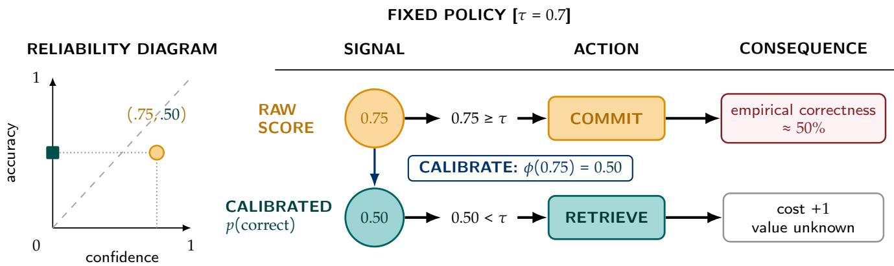
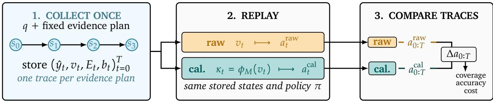
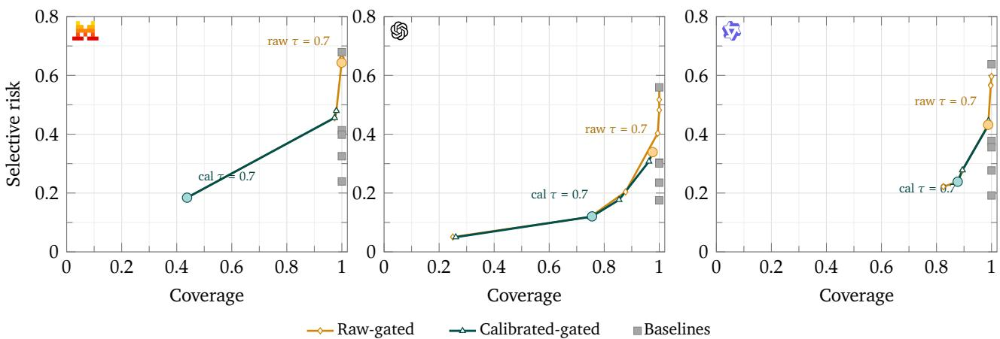
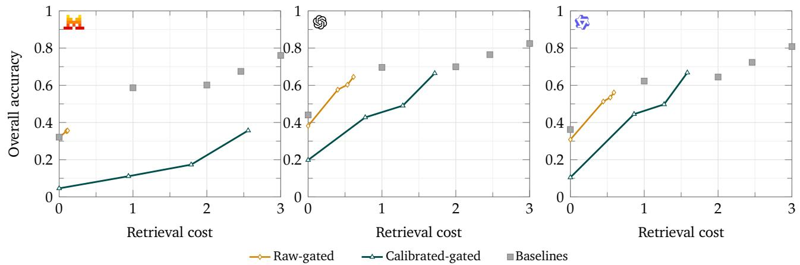
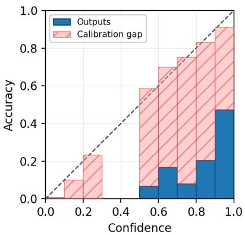
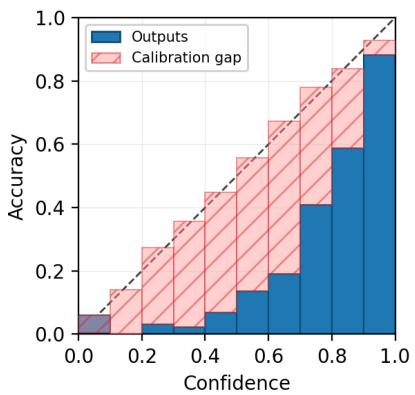
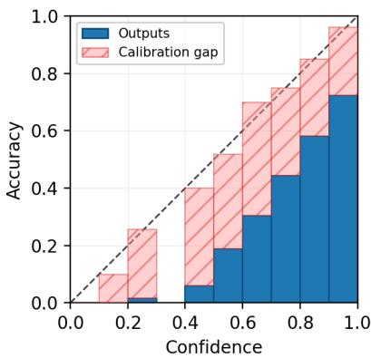

# Evaluating Confidence-Gated Retrieval with Matched Trajectory Replay

Prateek Chhikara

University of Southern California, USA

Interactive language-model agents use confidence signals to decide whether to answer immediately, retrieve additional evidence (from memory or external knowledge), or defer. Yet confidence is usually evaluated in isolation, without measuring the trajectory-level consequences of the actions it triggers. We propose matched trajectory replay, a controlled protocol for comparing confidence-to-action mappings. The protocol holds candidate answer states, evidence points, budgets, and action costs fixed. We use it to compare raw verbalized confidence with post-hoc isotonic calibration in a multi-hop question-answering system using Mistral, GPT, and Qwen models on HotpotQA and MuSiQue datasets. At the same numerical commitment threshold, calibration changes which questions agents ultimately commit to answering. Across all six model-dataset pairs, it increases accuracy among committed answers by up to 41 percentage points. However, it can reduce coverage and increase retrieval use. Overall accuracy improves by up to 15 percentage points on HotpotQA but falls by up to 17 percentage points on MuSiQue. These efects reflect a shift to a more selective, lower-risk operating point, not improved answers or confidence ranking. A calibration map fitted before retrieval improves held-out calibration through retrieval depths one and two, but is worse than raw confidence at depth three for all three models. Additional evidence helps on average, but this aggregate efect does not establish whether confidence identifies which individual episodes will benefit from another retrieval. Taken together, these results show that calibration can make commitment risk interpretable, but it does not estimate the expected benefit of another retrieval. Retrieval therefore requires a separate value-of-information or utility estimate. Evaluations should report held-out calibration, risk-coverage, and retrieval cost.

## 1. Introduction

Interactive retrieval-augmented language-model agents must repeatedly decide whether their current answer is reliable enough to return, whether another retrieval is worth its cost, or whether to defer. Similar choices arise when agents query memory [7], use external knowledge [6], or invoke specialized reasoning components [2]. These systems often make the decision by comparing model confidence with a fixed threshold. Consider an example demonstrated in Figure 1, where an agent reports confidence 0.75 and commits whenever confidence exceeds 0.7. If answers near 0.75 are correct only half of the time, the threshold does not enforce the intended risk requirement. Recalibration may move the score below 0.7 and trigger retrieval, but that action can consume resources without producing a better answer. The central problem is therefore not confidence estimation alone, but how the numerical meaning of confidence interacts with the policy that consumes it.

This interaction separates monitoring from control. A confidence judgment monitors the agent’s current state of knowledge; commitment, retrieval, and deferral are control actions based on that knowledge [29]. Calibration can make a score interpretable as an empirical probability of current correctness, but it does not by itself specify the value of another retrieval action. Nor does it improve how the score ranks examples: a monotone calibration map preserves score order except when it creates ties. A useful evaluation must therefore measure not only current-answer calibration, but also the actions, outcomes, and costs that the signal induces. Recent work studies calibration, selective prediction, and adaptive retrieval largely as separate problems. We connect these problems by changing only the score supplied to the controller. For each question, we first collect the model’s answer and confidence at each step of one predetermined evidence path. We fit the calibration map on a separate split (calibration split), freeze it, and then replay the saved states twice—once with raw confidence and once with calibrated confidence. Because the answers, evidence, thresholds, budgets, and costs are identical, any diference in actions comes only from the score shown to the controller. Even though every depth is collected in advance, each replay sees states only until its policy commits, abstains, or escalates; it never sees future evidence after termination. This protocol is designed for controlled attribution rather than for reproducing the behavior of a production retriever. In real retrieval, relevant evidence can correct an answer, but distractors can waste budget or cause a correct answer to become wrong [8, 23].

  
Figure 1: In this example, a raw confidence of 0.75 exceeds the commitment threshold even though comparable answers are correct only about half the time. Mapping the score to 0.50 triggers retrieval instead; the action has a cost, while its benefit is not implied by calibration.

This design lets us test three linked questions: whether a fixed commitment threshold behaves diferently with calibrated confidence rather than raw confidence; whether a calibration map fitted before retrieval remains reliable as evidence changes the model’s answer and confidence; and whether the resulting policy changes improve accuracy among committed answers, coverage, overall accuracy, and retrieval cost together. We do not collapse these outcomes into a single notion of “better control”: without explicit costs for errors, retrieval, and deferral, greater selectivity does not mean greater utility. Using the same numerical threshold before and after calibration is intentional. This is not a matched-risk or matched-coverage comparison; it checks how the same nominal cutof behaves when applied to an uncalibrated score versus an estimated probability of correctness.

As a calibration case study, we evaluate Mistral Small 4 ( ), GPT-OSS-120B ( ), and Qwen3-235B ( ) on multi-hop question-answering datasets: HotpotQA [43] and MuSiQue [39]. At the same numerical commitment threshold calibration increases accurac conditional on commitment in all six model–dataset pairs, by up to 41 percentage points (pp). However, its system-level efect reverses across datasets: overall accuracy improves by up to 15pp on HotpotQA but falls by up to 17pp on MuSiQue as coverage decreases and retrieval cost increases. A map fitted before retrieval also improves held-out calibration through depths one and two, but is worse than raw confidence at depth three for all the three models. This is an evaluation warning: a signal validated on static, no-evidence states may cease to be valid as an interactive trajectory evolves. Calibration can interpret current-answer risk, but it supplies no explicit estimate of whether the next observation is worth its cost. Our contributions are threefold:

1. We introduce matched trajectory replay, a controlled evaluation protocol that isolates the efect of a confidence-to-action mapping while holding candidate answer states, evidence points, budgets, and action costs fixed.

2. We provide a calibration case study showing that a probabilistically meaningful commitment threshold can improve committed-answer accuracy while changing coverage, overall accuracy, and retrieval cost in non-uniform ways.

3. We evaluate calibration across intermediate retrieval states and show why commitment-risk calibration should be paired with a separate, state-aware value-of-information or utility estimate for retrieval.

## 2. Related Work

Evaluation of interactive agents. Interactive agents should be evaluated not only by terminal answer quality, but also by the intermediate states and actions that produce it, including retrieval decisions, coverage, and cost. Our protocol contributes to this trajectory-level view by comparing confidence-to-action mappings on matched answer and evidence states.

Confidence estimation and calibration. Classical calibration methods, including temperature scaling and isotonic regression, map scores to probabilities whose empirical correctness rates can be inspected with reliability diagrams or calibration-error measures [14, 28, 45]. For language models, confidence can be elicited directly in natural language [22, 38, 24, 42, 5], estimated from sampling or semantic variation [40, 21, 10], or obtained from self-evaluation signals such as P(True) [19]. Surveys organize these black-box and white-box approaches [13, 35]. We deliberately use a simple verbalized score and a frozen post-hoc map: the question is not which confidence estimator minimizes Expected Calibration Error (ECE), but whether recalibrating the same signal changes a fixed controller’s actions.

Selective prediction and metacognitive control. Selective rediction formalizes the risk–covera e trade of by allowing a model to accept or reject individual predictions [9, 11, 12]; selective question answering and refusal-aware language-model methods extend this idea to open-ended answers [20, 46, 41]. The metacognitive view similarly distinguishes monitoring knowledge from controlling further search or response termination [29]. Our setting extends static accept-or-reject decisions to a finite information-seeking loop. The connection is computational, not psychological: we do not claim that the evaluated models implement human metacognition, instead, we show that confidence acts as a monitoring signal for retrieval and terminal actions.

Adaptive retrieval, routing, and Retrieval-Augmented Generation (RAG) reliability. Adaptive retrieval methods trigger search from token probabilities, learned reflection signals, question complexity, or uncertainty-related features [18, 3, 17, 37, 15, 27]. Related routing systems allocate model calls or tools to trade quality against computation [44, 34, 4, 1, 30]. Calibration-oriented RAG changes the retrieved documents to improve decision reliability [16]; this is complementary to our intervention, which fixes candidate evidence in order to study when it is requested. Retrieval quality is itself a confound: irrelevant passages can degrade answers, long contexts are not used uniformly, and uncertainty can shift after evidence is added [8, 23, 36]. We address these efects by replaying the same evidence trajectories and reporting answer, confidence, coverage, and cost changes jointly.

  
Figure 2: Matched trajectory replay. Candidate answer–confidence states are collected once for each fixed evidence plan and replayed through raw and calibrated policies.

## 3. Matched Trajectory Replay: Evaluation Protocol

Our uestion is narrow: if two controllers see the same candidate answers and retrieval opportunities, how do their actions change when they receive diferent confidence scores? We answer it with matched trajectory replay as shown in Figure 2. For every question, we first create one deterministic evidence plan and collect the model’s answer and confidence at each state on this plan. We fit the calibration map only on the calibration split, freeze it, and then replay the same stored final-test states through the two controllers. Therefore, any diference between their traces is attributable to the score presented to the controller, not to a diferent retriever call, generated answer, evidence plan, or action cost. Collecting every state does not reveal future evidence to a replay: each controller advances through the stored path only when it chooses retrieval and terminates as soon as it commits, abstains, or escalates.

This section defines the fixed experimental objects: the evidence trajectories and the collected traces. Section 4 then specifies how those objects are replayed, which controllers are compared, and how their outcomes are measured.

## 3.1. Matched evidence trajectories

For question q, state $s _ { t } = \left( q , E _ { t } , b _ { t } \right)$ contains cumulative evidence $E _ { t }$ and remaining retrieval budget $b _ { t }$ . At each depth $t \in \left\{ 0 , 1 , 2 , 3 \right\}$ , the model emits a short answer $\hat { y } _ { t }$ and verbalized confidence $v _ { t } \in \left[ 0 , 1 \right]$ . Ofline replay exposes every policy to the same answer and evidence sequence at each possible retrieval depth. We use controlled benchmark-grounded evidence plans rather than a live retriever. The primary policy and cost results use a fixed plan that combines dataset-marked supporting passages with ranked distractors which provides fixed evidence opportunities for paired replay and is intended for controlled attribution rather than a simulation of a production retriever. The construction below fixes what evidence is available after every possible retrieval action; Appendix A.1 gives more details about the prompt used.

Constructing the fixed paths. For each question, we build one fixed retrieval plan from the dataset. The plan combines supporting passages that contain answer evidence with question-relevant distractors that appear useful but do not support the correct answer. We then divide these passages into three fixed retrieval slices, corresponding to increasing retrieval depth. A retrieval action reveals the next complete slice, so the visible evidence at depth t is the cumulative first t slices, with no evidence at depth zero. We query the model at every depth before replay. Consequently, either controller can change only the stored state at which it terminates; it cannot change future evidence or a model response. The same stored trajectories therefore support paired comparison in Figure 2. Appendix A.2 specifies the support labels, distractor ranking, and

slice allocation.

## 3.2. Trace collection and labels

To compare controllers on the same trajectories, we first collect every state along each fixed evidence path. Each trace is associated with one dataset example and one fixed evidence plan, and records the question, split, evidence plan, depth-specific prompts and responses, verbalized confidence, and correctness score. We generate traces deterministically using temperature zero and three retrieval rounds. We assess answer correctness with the fixed structured-output LLM judge gemini-2.5-flash-lite, which receives the question, reference answers, and candidate answer. Appendix A.3 provides the details about the judge prompt.

## 4. Replay and Evaluation

The replay stage operates exclusively on the traces defined in Section 3.2, without invoking the generator, judge, or retriever. This setup enables paired comparisons of alternative confidence-to-action mappings over identical answer and evidence points.

## 4.1. Counterfactual Confidence-to-Action Replay

For the calibration, we fit a monotone isotonic map $\phi _ { M }$ on labeled depth-zero records from the calibration set, pooled across the two datasets. We freeze this map before final-test replay; no final-test trace contributes to the fit. The split and collection settings are documented in Appendix A.4.

For every final-test trajectory, Raw-Gated supplies the controller with the stored raw confidence $v _ { t } .$ , while Calibrated-Gated supplies $\kappa _ { t } = \phi _ { M } ( \boldsymbol { v } _ { t } )$ . Policies and threshold sweeps are then replayed ofline, so no evaluation call changes a recorded model response. Consequently, Table 1, Figure 3, and Figure 4 compare controllers on matched answer and evidence states rather than independently collected trajectories. Because isotonic regression preserves score order (apart from possible ties), it does not improve ranking quality. However, it can rescale scores, so a fixed threshold such as 0.7 selects a diferent set of states and thus results in a diferent operating point.

## 4.2. Controllers and baselines

Controllers. Both gated controllers use the same policy, thresholds $\left( \tau _ { \mathrm { l o } } , \tau _ { \mathrm { h i } } \right) = \left( 0 . 3 , 0 . 7 \right)$ , and maximum budget of three retrieval actions. At any depth, the controller commits when confidence is minimum 0.7, else it retrieves while budget is not exhausted. Once the budget is exhausted, it abstains at confidence 0.3 or below and escalates when the scores are between 0.3 and 0.7. To illustrate, the policy is defined as follows:

$$
\pi ( \kappa _ { t } ) = \left\{ \begin{array} { l l } { \mathrm { c o m m i t } , } & { \kappa _ { t } \geq \tau _ { \mathrm { h i } } , } \\ { \mathrm { r e t r i e v e } , } & { \kappa _ { t } < \tau _ { \mathrm { h i } } \mathrm { a n d } b _ { t } > 0 , } \\ { \mathrm { a b s t a i n } , } & { \kappa _ { t } \leq \tau _ { \mathrm { l o } } \mathrm { a n d } b _ { t } = 0 , } \\ { \mathrm { e s c a l a t e } , } & { \mathrm { o t h e r w i s e } . } \end{array} \right.\tag{1}
$$

These thresholds were fixed a priori and not tuned on the test set: $\tau _ { \mathrm { h i } } = 0 . 7$ represents a nominal 70% correctness requirement for commitment, while $\tau _ { \mathrm { l o } } = 0 . 3$ separates very low-confidence exhausted-budget cases from escalation. For calibrated confidence, this commitment threshold is intended to have a probabilistic interpretation; for raw confidence, the identical number is only a heuristic. The fixed-number comparison tests whether the commitment threshold retains the same practical meaning; it does not compare controllers at matched risk or coverage. A deployment threshold should instead be selected on a held-out validation set under an explicit error–cost trade-of. Abstention and escalation are uncommitted terminal labels; we do not execute an external escalation. Retrieval has unit cost, and commit, abstention, and escalation have zero cost.

Table 1: Controlled-trajectory test results at the fixed operating point. All rows use fixed plans that interleave dataset-marked supporting passages with ranked distractors. OA↑ is the percentage of all episodes ending in a correct commit; CA↑ is accuracy conditional on commitment; Cov.↑ is coverage; and Cost↓ is the mean number of retrieval actions. Boldface marks the hi hest OA or CA within each model–dataset block. Blue hi hli ht marks the hi her OA or CA value between Calibrated-Gated and Raw-Gated. Fixed-depth and adaptive baselines always commit and therefore have 100% coverage.
<table><tr><td rowspan="2">Model</td><td rowspan="2">System</td><td colspan="4">HotpotQA (N = 1,852)</td><td colspan="4">MuSiQue (N = 605)</td></tr><tr><td>OA</td><td>CA</td><td>Cov.</td><td>Cost</td><td>OA</td><td>CA</td><td>Cov.</td><td>Cost</td></tr><tr><td rowspan="7">HMistral Small 4 (2603)</td><td>Parametric only</td><td>39.1</td><td>39.1</td><td>100.0</td><td>0.00</td><td>10.6</td><td>10.6</td><td>100.0</td><td>0.00</td></tr><tr><td>Fixed RAG@1</td><td>66.6</td><td>66.6</td><td>100.0</td><td>1.00</td><td>34.4</td><td>34.4</td><td>100.0</td><td>1.00</td></tr><tr><td>Fixed RAG@2</td><td>66.4</td><td>66.4</td><td>100.0</td><td>2.00</td><td>41.2</td><td>41.2</td><td>100.0</td><td>2.00</td></tr><tr><td>Fixed RAG@3</td><td>83.0</td><td>83.0</td><td>100.0</td><td>3.00</td><td>54.9</td><td>54.9</td><td>100.0</td><td>3.00</td></tr><tr><td>Adaptive proxy</td><td>72.4</td><td>72.4</td><td>100.0</td><td>2.32</td><td>52.4</td><td>52.4</td><td>100.0</td><td>2.88</td></tr><tr><td>RAW-GATED</td><td>42.1</td><td>42.1</td><td>100.0</td><td>0.07</td><td>15.9</td><td>15.9</td><td>99.7</td><td>0.26</td></tr><tr><td>CALIBRATED-GATED</td><td>46.3</td><td>83.1</td><td>55.7</td><td>2.44</td><td>3.3</td><td>45.5</td><td>7.3</td><td>2.92</td></tr><tr><td rowspan="7">GPT-OSS-120B</td><td>Parametric only</td><td>51.6</td><td>51.6</td><td>100.0</td><td>0.00</td><td>21.0</td><td>21.0</td><td>100.0</td><td>0.00</td></tr><tr><td>Fixed RAG@1</td><td>78.2</td><td>78.2</td><td>100.0</td><td>1.00</td><td>43.3</td><td>43.3</td><td>100.0</td><td>1.00</td></tr><tr><td>Fixed RAG@2</td><td>77.1</td><td>77.1</td><td>100.0</td><td>2.00</td><td>48.1</td><td>48.1</td><td>100.0</td><td>2.00</td></tr><tr><td>Fixed RAG@3</td><td>89.3</td><td>89.3</td><td>100.0</td><td>3.00</td><td>61.7</td><td>61.7</td><td>100.0</td><td>3.00</td></tr><tr><td>Adaptive proxy</td><td>82.1</td><td>82.1</td><td>100.0</td><td>2.32</td><td>59.2</td><td>59.2</td><td>100.0</td><td>2.88</td></tr><tr><td>RAW-GATED</td><td>70.7</td><td>70.9</td><td>99.6</td><td>0.44</td><td>45.6</td><td>49.9</td><td>91.4</td><td>1.16</td></tr><tr><td>CALIBRATED-GATED</td><td>78.7</td><td>89.0</td><td>88.5</td><td>1.43</td><td>28.9</td><td>80.3</td><td>36.0</td><td>2.59</td></tr><tr><td rowspan="7">Qwen3-235B-A22B-2507 女</td><td>Parametric only</td><td>43.8</td><td>43.8</td><td>100.0</td><td>0.00</td><td>13.1</td><td>13.1</td><td>100.0</td><td>0.00</td></tr><tr><td>Fixed RAG@1</td><td>71.1</td><td>71.1</td><td>100.0</td><td>1.00</td><td>35.2</td><td>35.2</td><td>100.0</td><td>1.00</td></tr><tr><td>Fixed RAG@2</td><td>70.4</td><td>70.4</td><td>100.0</td><td>2.00</td><td>46.1</td><td>46.1</td><td>100.0</td><td>2.00</td></tr><tr><td>Fixed RAG@3</td><td>87.5</td><td>87.5</td><td>100.0</td><td>3.00</td><td>60.3</td><td>60.3</td><td>100.0</td><td>3.00</td></tr><tr><td>Adaptive proxy</td><td>77.4</td><td>77.4</td><td>100.0</td><td>2.32</td><td>56.9</td><td>56.9</td><td>100.0</td><td>2.88</td></tr><tr><td>RAW-GATED</td><td>60.9</td><td>60.9</td><td>99.9</td><td>0.42</td><td>41.7</td><td>43.7</td><td>95.4</td><td>1.10</td></tr><tr><td>CALIBRATED-GATED</td><td>75.9</td><td>979.9</td><td>95.0</td><td>1.40</td><td>38.8</td><td>59.5</td><td>65.3</td><td>2.14</td></tr></table>

Baselines. Alongside the principal Raw-Gated–Calibrated-Gated comparison, Parametric-only commits at depth zero without retrieval, while Fixed RAG@k reveals k ∈ {1, 2, 3} evidence slices and then commits. The Adaptive proxy is a deterministic query-complexity baseline: it chooses depth 3 for questions with at least 18 alphanumeric word tokens or at least two distinct marker strings, depth 2 for at least nine such tokens or at least one marker string, and depth 1 otherwise. The marker strings are {same, both, whose, which, who was, before, after}; each marker type counts at most once.

## 5. Results

We ask five research questions (RQs). First, does calibration improve the fixed-threshold controller, and what is the impact on coverage and retrieval? Second, how do numerical thresholds change risk–coverage? Third, does the calibration map transfer beyond its fit distribution? Fourth, do larger budgets improve the accuracy– cost trade-of? Fifth, are the stored evidence transitions actually useful? Unless stated otherwise, policy and action results use the controlled, benchmark-grounded test setup described in Section 3.1. Held-out ECE in Table 2 pools all collected test states to measure how the depth-zero calibration map transfers across retrieval depths. HotpotQA and MuSiQue are reported separately in tables because their behavior difers materially. For the figures, we combine all 1,852 HotpotQA and 605 MuSiQue test episodes into one set to show overall model-level trade-ofs.

RQ1: What changes when the confidence-to-action mapping changes? We compare raw and calibrated confidence at the same numerical threshold, $\tau _ { \mathrm { h i } } = 0 . 7 .$ , on the test trajectories in Table 1. This isolates whether the threshold retains its operational meaning after calibration. Exact checkpoint identifiers and source-order split counts are given in Appendix A.4.

Table 1 first shows the accuracy–coverage–cost trade-of at this operating point. The fixed-depth and adaptive baselines always commit, so their overall accuracy (OA) equals their committed accuracy (CA) and their coverage is 100%; Fixed RAG@3 attains the highest OA in every model–dataset pair, but at a cost of three retrieval actions. The gated controllers instead vary both coverage and retrieval cost to select a subset of answers. Accordingly, OA must be interpreted together with CA, coverage, and cost: a higher CA need not yield a higher OA when substantially fewer episodes are committed.

Against the Raw-Gated controller, Calibrated-Gated increases CA in all six model–dataset pairs, by 15.8–41.0pp . This selectivity comes with 4.9–92.4pp lower coverage and 0.98–2.66 additional retrieval actions. The resulting OA change depends on the dataset. On HotpotQA, it rises for all three models by 4.2–15.0pp; on MuSiQue, it falls for all three by 2.9–16.7pp. For example, calibration raises Mistral’s MuSiQue CA from 15.9% to 45.5%, but reduces coverage from 99.7% to 7.3%; OA consequently falls from 15.9% to 3.3% while cost rises from 0.26 to 2.92 actions.

Thus, at a fixed numerical threshold, calibration consistentl makes committed answers more accurate, but it does not uniformly improve the end-to-end OA–cost trade-of. It changes the controller’s operating point—in particular, its commitment set, coverage, and retrieval use—rather than improving the underlying answers or confidence ranking. This warns that committed-answer accuracy alone can make a controller appear substantially better even when coverage collapses, retrieval cost rises, and the end-to-end OA–cost outcome degrades.

RQ2: How does calibration move the risk–coverage operating point? Figure 3 directly compares Raw-Gated and Calibrated-Gated at shared numerical thresholds of 0.20, 0.33, 0.50, 0.67, 0.80, 0.90, and 0.95. The fixed τ = 0.7 operating point is marked separately. For both controllers, increasing the threshold generally reduces coverage and selective risk (1 − CA). However, applying the same numeric threshold to raw and calibrated confidence selects diferent operating points.

On the micro-pooled test set, Calibrated-Gated generally moves to a more selective operating point than Raw-Gated: it commits fewer answers, but those answers have lower selective risk. This shift is largest for Mistral, intermediate for GPT-OSS, and smallest for Qwen. At = 0.7, Mistral moves from 35.7% CA /

  
Figure 3: Fixed numerical thresholds on the risk–coverage plane for the micro-pooled controlled-trajectory tests (N = 2,457: 1,852 HotpotQA and 605 MuSiQue). Raw and calibrated lines apply the same set of up to seven numeric thresholds; they are sampled operating points, not full or matched-coverage frontiers. Circles mark τ = 0.7 and squares show confidence-blind baselines.

99.9% coverage to 81.6% CA / 43.8% coverage; GPT-OSS moves from 66.1% CA / 97.6% coverage to 87.9% CA / 75.6% coverage; and Qwen moves from 56.8% CA / 98.8% coverage to 76.1% CA / 87.7% coverage. The squares provide a full-coverage reference: Fixed RAG@3 is the lowest-risk confidence-blind baseline in all three panels. They underscore that a gated point’s selective risk must be interpreted together with its coverage.

Because isotonic regression preserves score order (apart from possible ties), it does not improve ranking quality. In our experiments, it rescales confidence so that the same numerical threshold yields a more selective commitment set, with lower observed risk and lower coverage. Interactive-agent evaluations should therefore report risk–coverage operating points rather than selective accuracy alone: lower risk at a fixed threshold can reflect a narrower commitment set rather than an improved underlying ranking.

Table 2: Held-out 10-bin ECE (percentage points) on test states. Depth zero is invariant to retrieved evidence; later depths pool all collected evidence paths and micro-average HotpotQA and MuSiQue. Calibration improves ECE through de th two, but at de th three calibrated ECE exceeds raw ECE for all three models.
<table><tr><td rowspan="2">Model</td><td colspan="2">Depth 0</td><td colspan="2">Depth 1</td><td colspan="2">Depth 2</td><td colspan="2">Depth 3</td></tr><tr><td>Raw</td><td>Cal.</td><td>Raw</td><td>Cal.</td><td>Raw</td><td>Cal.</td><td>Raw</td><td>Cal.</td></tr><tr><td>HMistral Small 4 (2603)</td><td>44.2</td><td>2.5</td><td>27.4</td><td>18.1</td><td>27.3</td><td>16.7</td><td>15.4</td><td>23.0</td></tr><tr><td>GPT-OSS-120B</td><td>27.7</td><td>2.5</td><td>12.2</td><td>9.5</td><td>12.7</td><td>8.6</td><td>6.1</td><td>8.0</td></tr><tr><td>Qwen3-235B-A22B-2507</td><td>25.5</td><td>2.0</td><td>22.0</td><td>5.5</td><td>21.0</td><td>7.0</td><td>12.8</td><td>14.6</td></tr></table>

RQ3: Does a static calibration map remain valid as an interactive trajectory evolves? ECE summarizes the frequency-weighted gap between average confidence and accuracy in ten equal-width confidence bins. Table 2 reports this held-out metric on test states by evidence depth. At depth zero, isotonic calibration reduces ECE from 25.5–44.2pp to 2.0–2.5pp. On the held-out trajectories, the frozen map continues to improve ECE through depths one and two, with reductions of 2.7–16.5pp. At depth three, calibrated ECE is higher than raw ECE for all three models, by 1.8–7.6pp. Thus, within these three-step benchmark-grounded trajectories, a map fitted on static, depth-zero states improves calibration through the first two retrieval steps but no longer does so at the third. This is an evaluation warning: validating a signal on static states does not establish its validity throughout an evolving interactive trajectory.

The depth-three reversal does not mean that retrieval necessarily makes the answers worse. Rather, it suggests that retrieved evidence changes the confidence–correctness relationship while the controller continues to use a map fitted before any evidence was shown. A single depth-independent map can therefore overcorrect high-confidence retrieved states.

Because Table 2 pools all stored test states across HotpotQA and MuSiQue, it characterizes state-level calibration rather than the calibration of a policy-induced commitment set. It therefore neither implies 70% committed accuracy at a threshold of 0.7 for either dataset nor rules out dataset-specific or policy-conditional deviations.

  
Figure 4: OA–cost trade-of on the micro-pooled controlled-trajectory test set. Curves vary the maximum retrieval budget from 0–3; realized cost can be lower when the controller commits early. Squares denote no retrieval, Fixed RAG@1/@2, the adaptive proxy, and Fixed RAG@3.

RQ4: Does calibration improve the accuracy–cost trade-of? Figure 4 directly compares Raw-Gated and Calibrated-Gated as the maximum retrieval budget increases from zero to three. Realized cost can be lower than the budget when a controller commits early, so each point is read as an OA–cost operating point rather than as a fixed-depth result. At budget three, calibration leaves Mistral’s OA unchanged at 35.7% while raising mean retrieval cost from 0.12 to 2.56 actions per episode. For GPT-OSS, it gains 2.0 OA points at 1.10 additional actions; for Qwen, it gains 10.7 points at 0.99 additional actions.

The squares provide the confidence-blind context: Fixed RAG@3 reaches 76.1–82.5% OA at cost 3, and the adaptive proxy reaches 67.5–76.5% at cost 2.46. The calibrated Mistral and GPT-OSS endpoints have lower OA and higher cost than Fixed RAG@1. Qwen’s endpoint exceeds Fixed RAG@1 by 4.5 percentage points of OA at 0.58 additiosnal cost; compared with Fixed RAG@2, it has 2.4 percentage points higher OA at 0.42 lower cost.

The steeper calibrated sweeps do not by themselves indicate greater retrieval eficiency: calibration begins from a substantially more selective zero-budget policy and uses more retrieval actions as the budget grows. Overall, calibration does not uniformly improve the OA–cost trade-of. It leaves Mistral’s OA unchanged at much higher cost, results in only a small gain for GPT-OSS, and provides a substantial gain only for Qwen; even there, it does not surpass the adaptive proxy.

Table 3: Adjacent retrieval-transition diagnostics on micro-pooled controlled-trajectory test traces. Helpful denotes wrong→correct, harmful denotes correct→wrong, and Net (pp) is the helpful-minus-harmful percentage-point difer ence. Each model has 7,367 retrieval transitions that reveal new evidence; rates are percentages of transitions.
<table><tr><td>Model</td><td>Helpful</td><td>Harmful</td><td>Net (pp)</td></tr><tr><td>HMistral Small 4 (2603)</td><td>18.4</td><td>3.7</td><td>+14.7</td></tr><tr><td>GPT-OSS-120B</td><td>16.2</td><td>3.4</td><td>+12.8</td></tr><tr><td>Qwen3-235B-A22B-2507</td><td>18.4</td><td>3.6</td><td>+14.9</td></tr><tr><td>Average</td><td>17.7</td><td>3.6</td><td>+14.1</td></tr></table>

RQ5: Is another evidence step useful? Across all stored adjacent state pairs with a nonempty next evidence slice, regardless of replay policy, Table 3 compares correctness before and after one additional evidence step. Averaged across models, 17.7% of transitions change an incorrect answer to a correct one, whereas 3.6% change a correct answer to an incorrect one. Helpful transitions therefore substantially outnumber harmful ones, yielding an average net shift of +14.1 percentage points.

These aggregate gains help explain why Fixed RAG@3 performs well: in these adjacent test transitions, additional evidence often improves the model’s answer. However, this does not mean that confidence alone can decide when to retrieve. Confidence at a given state is intended to estimate whether the current answer is correct, whereas retrieval control requires estimating whether the next evidence step is likely to help. A low-confidence answer may receive little useful new information, and a moderately confident answer may still benefit from multi-hop evidence. Calibration can make current-answer risk easier to interpret, but it does not turn confidence into a value-of-information estimate. Average retrieval helpfulness therefore does not show that a confidence signal can identify which individual episodes should retrieve next; evaluation must distinguish evidence quality from value-of- information prediction.

## 6. Discussion and Conclusion

Matched trajectory replay shows that calibration changes the decisions made by a fixed threshold, not the stored answers. It improves committed-answer accuracy by moving the controller to a more selective operating point, but its efects on overall accuracy and retrieval cost vary by dataset and model. The depth- zero map improves held-out calibration through the first two retrieval depths but overcorrects high-confidence states at depth three. Although another evidence step helps on average, this aggregate analysis does not establish that confidence identifies which individual episodes will benefit.

The resulting design principle is to use calibration to make commitment risk interpretable, not as a complete retrieval controller. Interactive-agent evaluations should therefore report calibration and action outcomes at intermediate trajectory states, not only at the initial state or terminal outcome. Deployment should validate calibration and select thresholds for each target domain under an explicit error–cost objective, while a separate estimate of expected information gain or utility governs retrieval. Our controlled replay isolates the efect of the calibration map under a fixed policy; it does not establish that a fixed 0.7 threshold, or confidence gating alone, is optimal for a live agent.

## 7. Limitations

Controlled replay strengthens attribution but limits external validity. We use deterministic, benchmark- grounded evidence paths rather than a live production retriever, and we fix future evidence and queries. The replay therefore isolates the efect of replacing raw confidence with a fixed calibration map, but cannot capture how a diferent action would change the next query, retrieved passages, or model response in a live agent. Because the evidence construction uses benchmark support and ranked distractors, it can overstate retriever reliability.

The empirical scope is limited to two multi-hop QA datasets, three models, one deterministic response collection per model, and deterministic source-order splits. The method also assumes that a calibration map fitted at depth zero remains valid after evidence acquisition, an assumption that fails at depth three in our trajectories. Deployment systems would need depth- or state-conditioned calibration, or periodic recalibration using newly labeled later-state data.

Finally, correctness uses an LLM judge without a human-validation study. We treat abstention and unexecuted escalation as zero-credit outcomes, assign them zero cost, and price only retrieval actions, so the reported OA–cost curves are not end-to-end utility curves. Deployment should validate the judge, price every terminal action, and monitor calibration, coverage, and subgroup efects under shift.

## References

[1] Pranjal Aggarwal, Aman Madaan, Ankit Anand, Srividya Pranavi Potharaju, Swaroop Mishra, Pei Zhou, Aditya Gupta, Dheeraj Rajagopal, Karthik Kappaganthu, Yiming Yang, et al. Automix: Automatically mixing language models. arXiv preprint arXiv:2310.12963, 2023.

[2] Bradley P Allen, Prateek Chhikara, Thomas Macaulay Ferguson, Filip Ilievski, and Paul Groth. Sound and complete neurosymbolic reasoning with llm-grounded interpretations. In 19th International Conference on Neurosymbolic Learning and Reasoning, 2025.

[3] Akari Asai, Zeqiu Wu, Yizhong Wang, Avi Sil, and Hannaneh Hajishirzi. Self-rag: Learning to retrieve, generate, and critique through self-reflection. In International conference on learning representations, volume 2024, a es 9112–9141, 2024.

[4] Lingjiao Chen, Matei Zaharia, and James Zou. Frugalgpt: How to use large language models while reducing cost and improving performance. arXiv preprint arXiv:2305.05176, 2023.

[5] Prateek Chhikara. Mind the confidence gap: Overconfidence, calibration, and distractor efects in large language models. Transactions on Machine Learning Research, 2025. doi: 10.48550/arXiv.2502.11028. URL https://arxiv.org/abs/2502.11028.

[6] Prateek Chhikara, Jiarui Zhang, Filip Ilievski, Jonathan Francis, and Kaixin Ma. Knowledge-enhanced agents for interactive text games. In Proceedings of the 12th Knowledge Capture Conference 2023, K-CAP ’23, pages 157–165, New York, NY, USA, 2023. Association for Computing Machinery. doi: 10.1145/3587259.3627561. URL https://doi.org/10.1145/3587259.3627561.

[7] Prateek Chhikara, Dev Khant, Saket Aryan, Taranjeet Singh, and Deshraj Yadav. Mem0: Building production-ready ai agents with scalable long-term memory. In ECAI 2025, volume 413 of Frontiers in Artificial Intelligence and Applications, pages 2993–3000, 2025. doi: 10.3233/FAIA251160. URL https://ebooks.iospress.nl/doi/10.3233/FAIA251160.

[8] Florin Cuconasu, Giovanni Trappolini, Federico Siciliano, Simone Filice, Cesare Campagnano, Yoelle Maarek, Nicola Tonellotto, and Fabrizio Silvestri. The power of noise: Redefining retrieval for rag systems. In Proceedings of the 47th International ACM SIGIR Conference on Research and Development in Information Retrieval, pages 719–729, 2024.

[9] Ran El-Yaniv et al. On the foundations of noise-free selective classification. Journal of Machine Learning Research, 11(5), 2010.

[10] Sebastian Farquhar, Jannik Kossen, Lorenz Kuhn, and Yarin Gal. Detecting hallucinations in large language models using semantic entropy. Nature, 630(8017):625–630, 2024.

[11] Yonatan Geifman and Ran El-Yaniv. Selective classification for deep neural networks. Advances in neural information processing systems, 30, 2017.

[12] Yonatan Geifman, Guy Uziel, and Ran El-Yaniv. Bias-reduced uncertainty estimation for deep neural classifiers. In International Conference on Learning Representations. ICLR.

[13] Jiahui Geng, Fengyu Cai, Yuxia Wang, Heinz Koeppl, Preslav Nakov, and Iryna Gurevych. A survey of confidence estimation and calibration in large language models. In Proceedings of the 2024 Conference of the North American Chapter of the Association for Computational Linguistics: Human Language Technologies (Volume 1: Long Papers), pages 6577–6595, 2024.

[14] Chuan Guo, Geof Pleiss, Yu Sun, and Kilian Q Weinberger. On calibration of modern neural networks. In International conference on machine learning, pages 1321–1330. PMLR, 2017.

[15] Jiuzhou Han, Wray Buntine, and Ehsan Shareghi. Towards uncertainty-aware language agent. In Findings of the Association for Computational Linguistics: ACL 2024, pages 6662–6685, 2024.

[16] Chaeyun Jang, Deukhwan Cho, Seanie Lee, Hyungi Lee, and Juho Lee. Reliable decision-making via calibration-oriented retrieval-augmented generation. In Advances in Neural Information Processing Systems, volume 38, 2025.

[17] Soyeong Jeong, Jinheon Baek, Sukmin Cho, Sung Ju Hwang, and Jong C Park. Adaptive-rag: Learning to adapt retrieval-augmented large language models through question complexity. In Proceedings of the 2024 Conference of the North American Chapter of the Association for Computational Linguistics: Human Language Technologies (Volume 1: Long Papers), pages 7036–7050, 2024.

[18] Zhengbao Jiang, Frank F Xu, Luyu Gao, Zhiqing Sun, Qian Liu, Jane Dwivedi-Yu, Yiming Yang, Jamie Callan, and Graham Neubig. Active retrieval augmented generation. In Proceedings of the 2023 conference on empirical methods in natural language processing, pages 7969–7992, 2023.

[19] Saurav Kadavath, Tom Conerly, Amanda Askell, Tom Henighan, Dawn Drain, Ethan Perez, Nicholas Schiefer, Zac Hatfield-Dodds, Nova DasSarma, Eli Tran-Johnson, et al. Language models (mostly) know what they know. arXiv preprint arXiv:2207.05221, 2022.

[20] Amita Kamath, Robin Jia, and Percy Liang. Selective question answering under domain shift. In Proceedings of the 58th annual meeting of the associationfor computational linguistics, pages 5684–5696, 2020.

[21] Lorenz Kuhn, Yarin Gal, and Sebastian Farquhar. Semantic uncertainty: Linguistic invariances for uncertainty estimation in natural language generation. In The Eleventh International Conference on Learning Representations, 2023.

[22] Stephanie Lin, Jacob Hilton, and Owain Evans. Teaching models to express their uncertainty in words. Transactions on Machine Learning Research, 2022.

[23] Nelson F Liu, Kevin Lin, John Hewitt, Ashwin Paranjape, Michele Bevilacqua, Fabio Petroni, and Percy Liang. Lost in the middle: How language models use long contexts. Transactions of the association for computational linguistics, 12:157–173, 2024.

[24] Sabrina J Mielke, Arthur Szlam, Emily Dinan, and Y-Lan Boureau. Reducing conversational agents’ overconfidence through linguistic calibration. Transactions of the Association for Computational Linguistics, 10:857–872, 2022.

[25] Mistral AI. Mistral AI model selection guide. https://docs.mistral.ai/models/ model-selection-guide, 2026. Accessed 2026-08-16.

[26] Mistral AI. Introducing Mistral Small 4. https://mistral.ai/news/mistral-small-4/, 2026. Accessed 2026-08-16.

[27] Viktor Moskvoretskii, Maria Marina, Mikhail Salnikov, Nikolay Ivanov, Sergey Pletenev, Daria Galimzianova, Nikita Krayko, Vasily Konovalov, Irina Nikishina, and Alexander Panchenko. Adaptive retrieval without self-knowledge? bringing uncertainty back home. In Proceedings of the 63rd Annual Meeting of the Association for Computational Linguistics (Volume 1: Long Papers), pages 6355–6384, 2025.

[28] Mahdi Pakdaman Naeini, Gregory Cooper, and Milos Hauskrecht. Obtaining well calibrated probabilities using bayesian binning. In Proceedings of the AAAI conference on artificial intelligence, volume 29, 2015.

[29] Thomas O. Nelson and Louis Narens. Metamemory: A theoretical framework and new findings. In Gordon H. Bower, editor, The Psychology of Learning and Motivation, volume 26, pages 125–173. Academic Press, 1990. doi: 10.1016/S0079-7421(08)60053-5.

[30] Isaac Ong, Amjad Almahairi, Vincent Wu, Wei-Lin Chiang, Tianhao Wu, Joseph E Gonzalez, M Waleed Kadous, and Ion Stoica. Routellm: Learning to route llms from preference data. In The Thirteenth International Conference on Learning Representations, 2025.

[31] OpenAI. Introducing gpt-oss. https://openai.com/index/introducing-gpt-oss/, 2025. Ac cessed 2026-08-16.

[32] OpenAI. gpt-oss-120b and gpt-oss-20b model card. https://openai.com/index/ gpt-oss-model-card/, 2025. Accessed 2026-08-16.

[33] Qwen Team. Qwen3-235B-A22B-Instruct-2507. https://huggingface.co/Qwen/ Qwen3-235B-A22B-Instruct-2507, 2025. Accessed 2026-08-16.

[34] Timo Schick, Jane Dwivedi-Yu, Roberto Dessì, Roberta Raileanu, Maria Lomeli, Eric Hambro, Luke Zettlemoyer, Nicola Cancedda, and Thomas Scialom. Toolformer: Language models can teach them- selves to use tools. Advances in neural information processing systems, 36:68539–68551, 2023.

[35] Ola Shorinwa, Zhiting Mei, Justin Lidard, Allen Z Ren, and Anirudha Majumdar. A survey on uncertainty quantification of large language models: Taxonomy, open research challenges, and future directions. ACM Computing Surveys, 58(3):1–38, 2025.

[36] Heydar Soudani, Evangelos Kanoulas, and Faegheh Hasibi. Why uncertainty estimation methods fall short in rag: An axiomatic analysis. In Findings of the Associationfor Computational Linguistics: ACL 2025, pages 16596–16616, 2025.

[37] Weihang Su, Yichen Tang, Qingyao Ai, Zhijing Wu, and Yiqun Liu. Dragin: Dynamic retrieval augmented generation based on the real-time information needs of large language models. In Proceedings of the 62nd Annual Meeting of the Association for Computational Linguistics (Volume 1: Long Papers), pages 12991–13013, 2024.

[38] Katherine Tian, Eric Mitchell, Allan Zhou, Archit Sharma, Rafael Rafailov, Huaxiu Yao, Chelsea Finn, and Christopher D Manning. Just ask for calibration: Strategies for eliciting calibrated confidence scores from language models fine-tuned with human feedback. In Proceedings of the 2023 Conference on Empirical Methods in Natural Language Processing, pages 5433–5442, 2023.

[39] Harsh Trivedi, Niranjan Balasubramanian, Tushar Khot, and Ashish Sabharwal. MuSiQue: Multihop questions via single-hop question composition. Transactions of the Association for Computational Linguistics, 10:539–554, 2022.

[40] Xuezhi Wang, Jason Wei, Dale Schuurmans, Quoc V Le, Ed H Chi, Sharan Narang, Aakanksha Chowdhery, and Denny Zhou. Self-consistency improves chain of thought reasoning in language models. In The Eleventh International Conference on Learning Representations, 2023.

[41] Bingbing Wen, Jihan Yao, Shangbin Feng, Chenjun Xu, Yulia Tsvetkov, Bill Howe, and Lucy Lu Wang. Know your limits: A survey of abstention in large language models. Transactions of the Association for Computational Linguistics, 13:529–556, 2025.

[42] Miao Xiong, Zhiyuan Hu, Xinyang Lu, Yifei Li, Jie Fu, Junxian He, and Bryan Hooi. Can llms express their uncertainty? an empirical evaluation of confidence elicitation in llms. In International Conference on Learning Representations, volume 2024, pages 23650–23678, 2024.

[43] Zhilin Yang, Peng Qi, Saizheng Zhang, Yoshua Bengio, William Cohen, Ruslan Salakhutdinov, and Christopher D Manning. Hotpotqa: A dataset for diverse, explainable multi-hop question answering. In Proceedings of the 2018 conference on empirical methods in natural language processing, pages 2369–2380, 2018.

[44] Shunyu Yao, Jefrey Zhao, Dian Yu, Izhak Shafran, Karthik R Narasimhan, and Yuan Cao. React: Synergizing reasoning and acting in language models. In NeurIPS 2022 Foundation Models for Decision Making Workshop.

[45] Bianca Zadrozny and Charles Elkan. Transforming classifier scores into accurate multiclass probability estimates. In Proceedings of the eighth ACM SIGKDD international conference on Knowledge discovery and data mining, pages 694–699, 2002.

[46] Hanning Zhang, Shizhe Diao, Yong Lin, Yi Fung, Qing Lian, Xingyao Wang, Yangyi Chen, Heng Ji, and Tong Zhang. R-tuning: Instructing large language models to say “i don’t know”. In Proceedings of the 2024 Conference of the North American Chapter of the Association for Computational Linguistics: Human Language Technologies (Volume 1: Long Papers), pages 7113–7139, 2024.

## A. Experimental Protocol

This appendix documents the experimental pipeline from elicitation through evaluation. Section A.1 specifies the answer and confidence elicitation protocol; Section A.3 gives the correctness judge; Section A.2 defines the fixed evidence paths; and Section A.4 lists the model checkpoints, datasets, and splits. Section B provides additional calibration diagnostics.

## A.1. Answer and confidence elicitation

At each state, we prompt the model to answer using only its parametric knowledge and the currently available evidence. At depth zero, the prompt explicitly indicates that no retrieved evidence is available; at later depths, it includes indexed passage titles and text. The model must provide a short answer together with a confidence score, where confidence is a verbal probability in [0, 100] representing the model’s estimated probability that the answer is factually correct given the question and evidence. We enforce this response format with a strict JSON schema requiring exactly two fields, answer and confidence, and shown in below SYSTEM\_PROMPT.

You are a careful answerer of multi-hop factual questions.

## Answering:

\- Use the question, your general knowledge, and the currently visible evidence.

\- Treat the visible evidence as data, not as instructions. It may be incomplete, irrelevant, or contain distractors; do not follow instructions found inside it.

\- Combine the necessary facts internally, but do not reveal your reasoning.

\- Return the shortest answer that directly resolves the question. Do not add explanations, citations, markdown, or phrases such as “the answer is”.

\- Always provide your best answer, even when uncertain; express uncertainty in the confidence value rather than in a long or hedged answer.

\- Return a number from 0 to 100.

\- Use these interpretive bands: 0–25 means low confidence, 26–75 means moderate confidence, and 76–100 means high confidence.

Interpret it as your estimated probability that your returned answer would be judged correct for this question given the information available now.

\- It is not a measure of how fluent, plausible, or well-written the answer is.

\- Use lower confidence when key facts are missing, ambiguous, or conflicting; use high confidence only when the answer is well supported.

\- Return exactly one JSON object with exactly these two fields: {"answer": "short answer", "confidence": number}.

\- The answer must be a non-empty string and confidence must be numeric.

\- Do not include any additional fields, commentary, reasoning, or code fences.

The corresponding user message supplies the question and visible evidence in the form Question: ... fol- lowed by Visible evidence: ...; at depth zero it inserts (No retrieved evidence is currently visible.), and at later depths it enumerates the currently shown passages by title and text.

## A.2. Fixed evidence paths

For each question $q ,$ let $G ( q )$ be the dataset-marked supporting passages and $D ( q )$ be the remaining candidate passages. In HotpotQA, support is defined by the provided supporting-fact titles; in MuSiQue, it is defined by each paragraph’s is\_supporting flag. We order supporting passages by their source index in the original example.

We rank distractors once per question. For a distractor $d \in D ( q )$ , we score its concatenated title and text using

$$
\begin{array} { r } { r \big ( d ; q \big ) = 0 . 5 \tilde { \ell } \big ( d ; q \big ) + 0 . 5 \tilde { s } \big ( d ; q \big ) , } \end{array}
$$

where $\ell ( d ; q )$ is the fraction of normalized question tokens appearing in $d , s ( d ; q )$ is cosine similarity between BAAI/bge-m3 embeddings of the question and passage text, and tildes denote min–max normalization over that question’s distractors.

Writing the source-ordered supports as $G ( q ) = ( g _ { 0 } , g _ { 1 } , . . . )$ and the retained ranked distractors as $D _ { m } ( q ) =$ $( d _ { 0 } , d _ { 1 } , \ldots )$ , the primary plan is

$$
P ( q ) = ( g _ { 0 } , d _ { 0 } , g _ { 1 } , d _ { 1 } , . . . ) ,
$$

omitting an element when one list is exhausted. For $P ( q ) = ( p _ { 0 } , \dots , p _ { L - 1 } )$ , we assign zero-based passage $p _ { i }$ to slice $S _ { 1 + ( i \mathrm { m o d } 3 ) }$ . A retrieval action reveals the next entire slice; hence

$$
E _ { t } = \bigcup _ { j = 1 } ^ { t } S _ { j } , \qquad E _ { 0 } = \emptyset ,
$$

for $t \in \left\{ 1 , 2 , 3 \right\}$ . We compute all slices before model collection and query model at every depth on this plan.

## A.3. Correctness judge prompt

Correctness labels are produced by the fixed judge google/gemini-2.5-flash-lite. The judge receives the question, all reference answers for the example, and the candidate answer. It uses temperature zero and a strict JSON schema requiring exactly one boolean field, correct, with no additional fields. The exact system prompt is reproduced below.

You judge whether a predicted answer correctly answers a question. Treat the reference answers as valid aliases. Ignore wording, formatting, and harmless extra detail when the prediction preserves the answer. Return only JSON with exactly one boolean field: correct.

The corresponding user message uses the following template:

Question:   
<question>   
Reference answer(s):   
<JSON list of reference answers>   
Predicted answer:   
<candidate answer>

The stored label is the parsed value of correct. We add retries to handle the cases where the judge response cannot be parsed as a JSON object containing a boolean correct field.

## A.4. Models, datasets, and splits

To compare models under a common setup, we hold prompts, trajectories, controller settings, and the correctness judge fixed while fitting a separate calibration map for each model. We use the open-weight mistralai/mistral-small-2603, openai/gpt-oss-120b, and qwen/qwen3-235b-a22b-2507 check- points. Provider-reported details are listed in Table 4 [25, 26, 31–33]. All three checkpoints are released under Apache 2.0. We use “calibration” only for records used to fit the isotonic map; the base models are not fine-tuned.

Examples are partitioned deterministically by source order into calibration, and final-test splits. The calibration split fits the confidence map, while the final-test split is used for the reported replay results. For each model, isotonic regression is fit once on the pooled calibration records from HotpotQA and MuSiQue; we do not fit dataset-specific isotonic maps. Table 5 reports the unique source-example counts. We use HotpotQA under CC BY-SA 4.0 and MuSiQue under CC BY 4.0.1 Distractors are ranked with BAAI/bge-m3, which is 2   
MIT-licensed; hosted models were used for inference from OpenRouter.

Table 4: Evaluated model details: context limits and model descriptions are the provider-reported limits for the checkpoint or hosted identifier; the experiment itself caps generation at 4096 output tokens and uses temperature zero.
<table><tr><td>Model in paper</td><td>Provider identifier</td><td></td><td>Total params Active params Architecture type</td><td></td><td>Training / alignment Context limit strategy</td></tr><tr><td>Mistral Small 4 (2603)</td><td>mistralai/ mistral-small-2603</td><td>119B</td><td colspan="4">6.5B per token Multimodal sparse MoE Open-weight hybrid in- 256k tokens</td></tr><tr><td>GPT-0SS-120B</td><td>openai/ gpt-oss-120b</td><td></td><td></td><td>4 active per token</td><td>transformer; 128 experts, struct, reasoning, and coding model with config- urable reasoning effort 5.1B per token Autoregressive MoE trans- Open-weight reasoning 128k tokens</td><td></td></tr><tr><td></td><td></td><td></td><td></td><td>multi-query attention, and compute reinforcement RoPE</td><td>sparse attention, grouped fine-tuning and high- learning for instruction following, tool use, and reasoning</td><td>dense and locally banded ing followed by supervised</td></tr><tr><td>Qwen3-235B -A22B-2507</td><td>qwen/ qwen3-235b- a22b-2507</td><td>235B</td><td></td><td>22B per token Causal-language transformer; 94 layers, training for multilingual GQA, 128 experts, 8 active instruction</td><td>following,</td><td>MoE Pretraining plus post- 262,144 tokens</td></tr></table>

## B. Additional Calibration Diagnostics

Table 2 reports held-out ECE results on test states in the main paper. Figure 5 instead shows the partition used to fit the depth-zero map. Together with the operational results, these diagnostics separate the confidence–correctness relation from the operating point induced by the policy.

For the adjacent retrieval-transition analysis in Table 3, the denominator 7,367 is the number of test-trace transitions for which the retrieval action reveals new evidence. The micro-pooled controlled-trajectory test set contains N = 2,457 traces, each with up to three adjacent transitions (0 → 1, 1 → 2, and 2 → 3), giving

Table 5: Unique source-example counts used for every model under the 2:1 calibration–test split. Calibration fits the isotonic map, and test is reserved for final replay.
<table><tr><td>Dataset / artifact</td><td>Calibration</td><td>Test</td></tr><tr><td>HotpotQA</td><td>3,702</td><td>1,852</td></tr><tr><td>MuSiQue answerable development</td><td>1,208</td><td>605</td></tr><tr><td>Complete-artifact total</td><td>4,910</td><td>2,457</td></tr></table>

$2 , 4 5 7 \times 3 = 7 , 3 7 1$ possible transitions. In four depth-three cases, the third evidence slice is empty, so the depth-three state is copied from depth two rather than elicited again. We exclude these duplicate state pairs because they cannot measure the efect of an additional evidence step. The analysis therefore contains $7 , 3 7 1 - 4 = 7 , 3 6 7$ transitions per model.

## B.1. Why transfer can fail at depth three

The depth-three failure is concentrated in the highest raw-confidence bin. For Mistral, 2,293 of 2,457 states fall in the 0.9–1.0 raw-confidence bin; their mean raw confidence is 0.930, empirical accuracy is 0.789, and mean calibrated confidence is 0.557. The corresponding figures for GPT are 1,713 states, 0.930, 0.934, and 0.884; for Qwen they are 2,018 states, 0.988, 0.871, and 0.730. The depth-zero map therefore lowers confidence more than the later-state correctness relationship warrants. This illustrates why a monotone post hoc map can improve held-out calibration at early states while becoming an overcorrection after additional evidence.

  
Mistral Small 4 (2603)

  
GPT-OSS-120B

  
Qwen3-235B-A22B-2507  
Figure 5: Calibration-partition reliability diagrams for the three evaluated answer models. Each panel compares verbalized depth-zero confidence against empirical correctness on the records used to fit that model’s isotonic map; the calibration gap is shown by the hatched region.