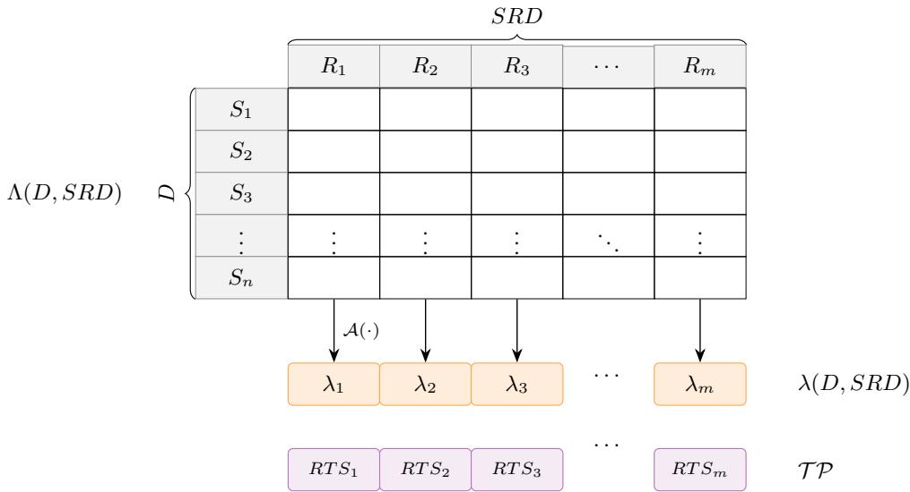
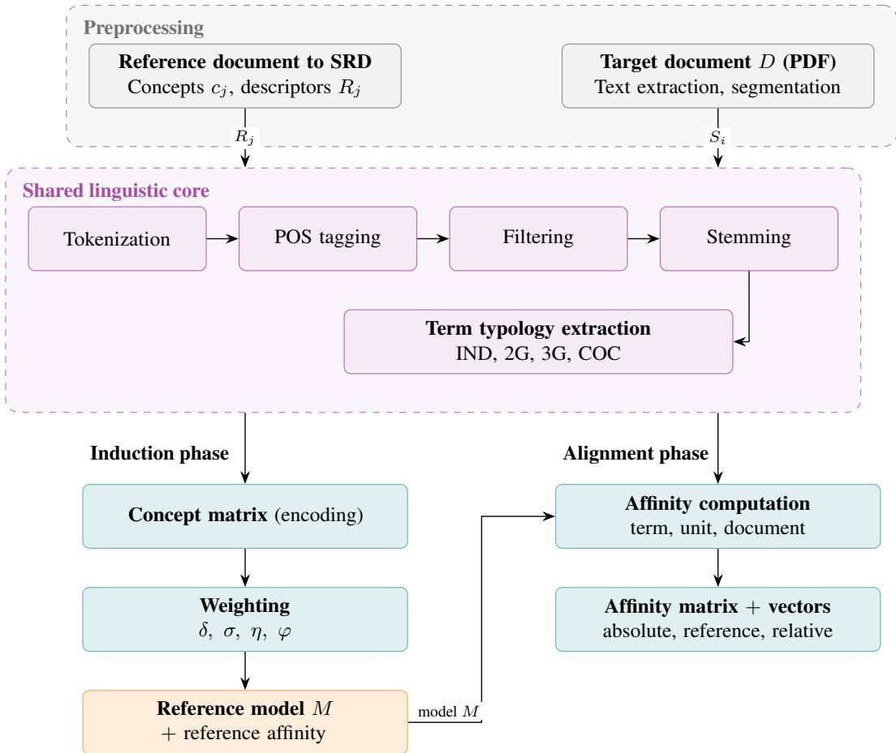

# ITL: INTERPRETABLE DOCUMENT ALIGNMENT WITH STRUCTURED REFERENCE FRAMEWORKS

Raúl Giráldez   
School of Engineering   
Pablo de Olavide University   
ES-41013 Seville, Spain   
giraldez@upo.es   
Dayrelis Mena   
School of Engineering   
Pablo de Olavide University   
ES-41013 Seville, Spain   
dmentor@upo.es   
Jesús S. Aguilar–Ruiz   
School of Engineering   
Pablo de Olavide University   
ES-41013 Seville, Spain   
aguilar@upo.es

August 28, 2026

## ABSTRACT

Measuring alignment between documents and structured reference frameworks requires identifying conceptual evidence distributed throughout the text and reporting it through measures that are quantitative, interpretable, and traceable. Many commonly used retrieval and classification approaches return either pairwise similarity scores or one or more class labels, whereas fewer methods provide concept-level scores that are directly traceable to the terminological evidence supporting them. We present Intelligent Target Locator (ITL), a domain-agnostic and language-portable methodology that estimates the affinity between the textual units of a target document and the concepts defined in a Structured Reference Document (SRD). From the SRD, ITL induces concept-specific terminological profiles built from independent terms, bigrams, trigrams, and co-occurrences. Each term is assigned an importance weight that combines concept membership, term-type specificity and inter-concept discriminability. The output is a textual-unit–concept affinity matrix that can be aggregated at different levels of granularity. We conduct an internal consistency assessment using the 17 Sustainable Development Goals (SDGs), evaluating each official goal statement against the SRD induced from the same set of descriptors. Every statement reached its highest affinity with the corresponding concept, and the mean affinity across the remaining concepts stayed marginal relative to the mean reference affinity. This separation indicates that ITL distinguishes the conceptual profiles of the framework. ITL thus offers a general basis for quantifying document alignment with structured frameworks while keeping each result traceable to the terminological evidence that supports it.

## 1 Introduction

Measuring how closely a document aligns with a structured reference framework is a recurrent task in knowledge management and in assessing compliance with regulatory, strategic, or program frameworks. Many organisations —including public authorities, universities, businesses and non-governmental organisations—need to assess consistently and traceably the extent to which their documentation aligns with a reference framework. This assessment is complicated by the growing volume and heterogeneity of such documentation, its frequent availability in unstructured formats such as PDF, and the semantic ambiguity of high-level texts. Manual assessment is therefore costly, hard to reproduce, and dependent on expert judgment.

Operationalizing document alignment is not straightforward. The relationship between a document and a reference framework is primarily conceptual rather than strictly lexical, and the evidence for it may be scattered across different parts of the text. Identifying which elements of the framework relate to the document is often not enough: in many settings the relationship must also be quantified through a measure that is interpretable, auditable, and comparable across documents, and that supports fine-grained analysis and explanation of the alignment found.

We approach this problem with a general formulation that is independent of domain and language. We estimate the relationship between a target document D and a Structured Reference Document (SRD), which models a domain as a finite set of concepts, each described by a reference textual unit. The SRD thus acts as the terminological reference against which the alignment of external documents is assessed.

Within this formulation we present ITL (Intelligent Target Locator), a computational model that builds an interpretable profile of a document D against the concepts of the SRD most closely related to it and quantifies how strongly those concepts are represented in D, using an original metric we term affinity. Affinity is a weighted measure of the extent to which D shares relevant concepts with the SRD, taking into account their importance within the reference framework. Unlike a single-label classifier, ITL computes an affinity value for every (textual unit, concept) pair, so a single textual unit may align with several concepts when its content warrants it. This design allows concepts to be ranked by relevance and affinity to be analyzed at different levels of granularity within D (the whole document, paragraphs, or sentences), as well as within the SRD.

The contribution of this research is twofold. First, we formalize the affinity metric, which is computed from the weighted number of related concepts shared by D and the SRD, together with the importance of those concepts within the reference framework. Second, we propose a general two-phase methodology. During the reference-model induction phase, a structured and attributed model is induced from the SRD to aggregate and weight its concepts. During the document-alignment phase, a document D is processed to extract and structure its concepts, after which its affinity with each concept in the SRD is computed. Both phases are therefore fully determined by the provided SRD and do not depend on a specific domain or language.

The original motivation for this work arose within the Universitiesfor Sustainable Development1 project, which focused on the Sustainable Development Goals (SDGs) of the United Nations 2030 Agenda [1] in the context of European universities. We use the SDGs as a consistency study and as the basis for the empirical validation of the method. Specifically, we instantiate the SRD using the official text of the goals and evaluate the ability of ITL to assign each textual unit to its corresponding concept. The procedure is not restricted to this setting, however, and can be applied to any context in which a reference document is organized into concepts, including regulations, standards, strategies, and regulatory frameworks.

The remainder of the paper is organized as follows. Section 2 reviews the state of the art and positions the proposed approach. Section 3 formalizes the problem, notation, and the affinity metric. Section 4 describes the ITL methodology and its reference-model induction and document-alignment phases. Section 5 presents the SDG consistency study and the empirical validation of the method. Finally, Section 6 presents the conclusions and directions for future work.

## 2 Related Work

The problem of estimating affinity between a document and a concept-structured reference framework intersects several research directions: (i) semantic similarity and information retrieval for document comparison; (ii) concept and terminology extraction and topic modeling for comparable content representation; (iii) formal representation of reference frameworks through ontologies and knowledge graphs; and (iv) automatic text classification against predefined thematic frameworks. In these contexts, the Sustainable Development Goals (SDGs) are a representative application domain. The following subsections review these research areas and position ITL with respect to the methodological gap addressed in this work.

## 2.1 Semantic Similarity and Information Retrieval

The comparison of documents with reference repositories has traditionally been addressed within Information Retrieval. Lexical models such as BM25 remain competitive due to their efficiency and robustness in general retrieval settings [2]. However, approaches based on term matching are limited when semantic variation is present, including synonymy and paraphrasing, and do not directly capture relationships at the conceptual level.

The development of dense representations has shifted part of the research focus toward semantic approaches. Transformer-based models such as BERT generate contextual embeddings for text matching and classification tasks [3], while Siamese architectures such as Sentence-BERT enable efficient computation of sentence-level similarity [4]. For large-scale retrieval and alignment, dense retrieval methods such as DPR [5] and late-interaction architectures such as ColBERT [6] have also been proposed.

Dense retrieval models provide strong semantic matching capabilities, although their native retrieval scores do not generally decompose a match into concept-specific terminological evidence. Attribution or explainability methods may be applied subsequently, whereas ITL incorporates term-level traceability directly into its scoring rule. Instead, ITL quantifies the affinity with respect to each concept in SRD and preserves traceability to the terms contributing to the resulting value. The two approaches are complementary, since dense representations could be incorporated as a matching component within the ITL procedure.

## 2.2 Concept Extraction, Terminology, and Topic Modeling

Affinity estimation requires the document and reference framework to be represented in comparable forms. The extraction of concepts and terminology therefore provides a natural basis for this task. Linguistic methods based on syntactic patterns have been proposed for terminology recognition [7], together with hybrid linguistic-statistical approaches for multi-word terms, such as the C-value/NC-value method [8]. Keyword extraction has also been addressed through unsupervised graph-based methods such as TextRank [9] and lightweight document-level methods that do not require a training corpus, such as YAKE! [10]. Topic-modeling methods, particularly LDA [11], have been used to identify latent structure in document collections and support thematic comparison.

ITL draws on this research direction through a linguistic-processing core that extracts four term types (independent terms, bigrams, trigrams, and co-occurrences) to characterize each concept in the SRD. Unlike topic modeling, which induces latent topics without explicit correspondence to a predefined framework, ITL anchors the representation to the explicit concepts defined in the SRD and weights each term according to its discriminability and specificity. This representation provides the basis for an interpretable affinity metric.

## 2.3 Formal Representation of Reference Frameworks: Ontologies and Knowledge Graphs

The formal representation of reference frameworks has been extensively addressed within the Semantic Web and Ontology Engineering communities. In the SDG domain, knowledge organization systems have been developed to support interoperability and linkage with open data [12], together with knowledge graphs for progress monitoring, such as SustainGraph [13].

These approaches primarily address the representation and linkage of entities and data rather than the comparison of external documents with a reference framework and the quantification of their alignment. ITL tackles a complementary problem. It does not define a new ontology; instead, it takes a reference document as the SRD, which may originate from resources such as those described above or directly from textual concept definitions, and defines an affinity measure for evaluating external documents against that reference.

## 2.4 Automatic Classification against Thematic Frameworks: The SDG Case

A specific instance of document-to-framework comparison is the automatic assignment of text to categories defined by a thematic framework. The SDGs have been widely used as an application domain for this problem. Multi-label classification tools based on deep learning have been proposed, including SDG-Meter [14] and OSDG [15], together with multilingual datasets for evaluation, such as the SDGi Corpus [16].

These approaches address a labeling problem: they assign one or more categories to a text, frequently using supervised classifiers that require annotated data and produce labels or probabilities without explicitly decomposing the result into the evidence supporting the assignment. ITL targets a different and more general problem. Rather than classifying text against a fixed set of learned categories, it computes a graded affinity with respect to each concept defined in an arbitrary SRD. The resulting affinities are interpretable, traceable, and aggregable at different levels, and the reference framework can be changed without retraining a classifier. In this work, the SDGs constitute one such framework and are used as the validation case; the methodology itself is not specific to this domain.

## 2.5 Positioning of ITL

ITL is defined by three properties that, taken together, are not provided by any single line of work reviewed above. First, its reference model is induced directly from a concept-structured reference document (the SRD), rather than fitted to a fixed, pre-learned category set: the SRD itself supplies the terminological profiles against which alignment is assessed. Second, the resulting alignment is expressed as a concept-level, graded affinity for every (textual unit, concept) pair, rather than a single similarity score or a discrete label, supporting multi-concept association and analysis at different levels of granularity. Third, each affinity value is intrinsically traceable to the specific terms of the target document and their weighted contribution, without requiring a separate explainability layer.

None of the reviewed research directions provides these three properties jointly. Dense retrieval and similarity methods offer strong matching capabilities but no native decomposition into concept-specific terminological evidence.

Concept- and terminology-extraction methods supply comparable representations but no mechanism for inducing a reference model tied to a predefined concept structure. Ontological and knowledge-graph resources formalize reference frameworks but are not designed to compute a graded alignment measure against them. Automatic classification methods assign discrete labels from learned categories, typically require annotated training data, and offer limited traceability to the underlying evidence.

## 3 Problem Formalization

## 3.1 Problem Statement

Let SRD denote a Structured Reference Document that encodes a target semantic domain through a finite set of concepts $\mathcal { C } = \{ c _ { 1 } , \ldots , c _ { m } \}$ . Each concept $c _ { j }$ is described by a reference textual unit $R _ { j } ( { \mathrm { e . g . , : } }$ a definition, paragraph, or text fragment), such that the set of units in the $S R D$ is represented as $U ( S R D ) = \{ R _ { 1 } ^ { ' } , . . . , R _ { m } \}$ . The $S R D$ therefore serves as a semantic and terminological reference against which the alignment of external documents is assessed.

Let D denote a target document composed of an ordered sequence of textual units $U ( D ) = \left\{ S _ { 1 } , \ldots , S _ { n } \right\} ( \mathbf { e } . \mathbf { g } .$ sentences, segments, or paragraphs) obtained through a segmentation process. Hereafter, $S _ { i }$ denotes the i-th textual unit of document D, with $i \in \{ 1 , \ldots , n \}$ . Analogously, SRD is represented through its reference textual units $R _ { j }$ , each associated with a concept $c _ { j }$ , with $j \in \{ 1 , \dots , m \}$

The objective is to quantify the degree of alignment between each unit $S _ { i }$ in D and each concept $c _ { j }$ in the SRD. This makes it possible to identify semantic relationships at the textual-unit level while supporting subsequent aggregation at the paragraph, section, and complete-document levels. Consequently, the resulting representation supports interpretable analyses and visualization techniques, such as textual-unit–concept heatmaps, for explaining the detected alignment.

Within this framework, the objective is to define an affinity function that, given a target document and an SRD, produces a quantitative alignment measure for each (textual unit, concept) pair. Formally, we seek a function Λ such that:

$$
\Lambda ( D , S R D ) \in \mathbb { R } ^ { n \times m } ,\tag{1}
$$

where the component $\Lambda _ { i j } ( D , S R D )$ quantifies the affinity (or alignment) of textual unit $S _ { i }$ in document D with respect to concept $c _ { j }$ defined in the $S R D$ . The resulting textual-unit–concept affinity matrix can be interpreted as a projection of the content of D onto the conceptual space induced by SRD.

For applications requiring a single score per concept, the matrix $\Lambda ( D , S R D )$ can additionally be aggregated along the textual-unit axis to derive a document-level affinity vector, formally defined in Section 3.5.

Overall, this formulation defines the central problem addressed in this work: the construction of a robust and interpretable metric of the conceptual alignment between unstructured documents and a structured reference document.

## 3.2 Terms and Reference Term Sets

Affinity computation is based on comparing the content of the target document D with a reference lexicon induced by the SRD. To do this, we start with a homogeneous terminological representation for any textual unit.

Term Extraction. Let X be a generic textual unit, such that $X \in U ( D ) \cup U ( S R D )$ . We denote by $\mathcal { T } ( X )$ the multiset (set with repeated elements) of terms extracted from X after applying a set of linguistic preprocessing techniques, including orthographic normalization, tokenization, removal of punctuation and stopwords, lemmatization, and stemming, among others, as part of the two-phase methodology described in Section 4. The absolute frequency of a term t in X is defined as:

$$
f ( t \mid X ) = | \{ t ^ { \prime } \in { \mathcal { T } } ( X ) : t ^ { \prime } = t \} | .\tag{2}
$$

The vocabulary of a multiset of terms is defined as the set of its distinct elements, disregarding multiplicity. For a textual unit X, the term vocabulary $\mathcal { V } ( X )$ is accordingly defined as:

$$
\mathcal { V } ( X ) = \{ t \ : \ t \in \mathcal { T } ( X ) \ \} .\tag{3}
$$

The same operator applies directly to any multiset of terms, such as a reference term set $R T S _ { j } .$ , for which $\nu ( R T S _ { j } ) =$ $\{ t : t \in { \dot { R } } T S _ { j } \}$ follows analogously.

The vocabulary $\nu ( X )$ is used when only the presence or absence of terms is relevant, without taking into account their frequency of occurrence.

Reference Term Sets by Concept and Terminological-Profile Collection. As defined above, the set of textual units in the SRD is represented as $\bar { U ( S R D ) } = \{ R _ { 1 } , \dotsc , R _ { m } \}$ , where each unit $R _ { j }$ describes concept $c _ { j }$ . The reference term set associated with $c _ { j }$ is defined as:

$$
R T S _ { j } = \mathcal { T } ( R _ { j } ) , \qquad j \in \{ 1 , . . . , m \} .\tag{4}
$$

$R T S _ { j }$ is a multiset, not a set, and preserves the term multiplicities of $\tau ( R _ { j } )$ , later required for term frequencies within a concept (e.g., Equation 13). For readability, however, the name $R T S _ { j }$ is retained.

Each $R T S _ { i }$ constitutes the terminological profile of concept $c _ { j }$ and provides the basis for evaluating the affinity of each unit $S _ { i }$ in the target document D with respect to that concept through the function $\Lambda ( D , S R D )$ .

The terminological-profile collection, defined as the set of concept-specific terminological profiles, is denoted as:

$$
T \mathcal { P } = \{ R T S _ { 1 } , \ldots , R T S _ { m } \} .\tag{5}
$$

SRD Term Universe. The term universe induced by the SRD is defined as the union of the concept-specific vocabularies:

$$
\mathcal { V } _ { S R D } = \bigcup _ { j = 1 } ^ { m } \mathcal { V } ( R _ { j } ) = \bigcup _ { j = 1 } ^ { m } \mathcal { V } ( R T S _ { j } ) .\tag{6}
$$

## 3.3 Term Typology

Document affinity relies on terminological comparison between textual units. However, relevant linguistic evidence may be expressed not only through isolated terms (unigrams) but also through compound terms, including multi-word expressions and bounded co-occurrences. Therefore, this work defines a term typology that integrates simple and compound terms uniformly within the multiset $\mathcal { T } ( X )$ defined in Section 3.2.

Base Token Sequence. Let $X \in U ( D ) \cup U ( S R D )$ be a generic textual unit. After linguistic preprocessing, an ordered sequence of normalized tokens is obtained:

$$
w ( X ) = ( w _ { 1 } , \dots , w _ { L _ { X } } ) ,\tag{7}
$$

where $L _ { X }$ denotes the final number of tokens after filtering (removal of punctuation marks, short words, and stopwords) and normalization (lemmatization or stemming).

Each token $w _ { k }$ is treated as an atomic unit whose specific internal representation is defined in the methodology (Section $4 . 2 . 1 ) ;$ different term types may draw on different components of that representation, as made explicit at the point of instantiation. Based on $w ( X )$ ), the following term types are defined:

• Independent terms (IND): These correspond to individual tokens (unigrams). The multiset of independent terms is defined as:

$$
{ \mathcal { T } } ^ { \mathrm { I N D } } ( X ) = \bigcup _ { k = 1 } ^ { L _ { X } } \{ w _ { k } \} .\tag{8}
$$

where ⊎ denotes multiset union.

• Bigrams (2G): These consist of pairs of consecutive tokens. The multiset of bigrams is defined as:

$$
{ \mathcal { T } } ^ { \mathrm { 2 G } } ( X ) = \biguplus _ { k = 1 } ^ { L _ { X } - 1 } \{ ( w _ { k } , w _ { k + 1 } ) \} .\tag{9}
$$

• Trigrams (3G): These consist of three consecutive tokens. The multiset of trigrams is defined as:

$$
\mathscr { T } ^ { \mathrm { 3 G } } ( X ) = \biguplus _ { k = 1 } ^ { L _ { X } - 2 } \{ ( w _ { k } , w _ { k + 1 } , w _ { k + 2 } ) \} .\tag{10}
$$

• Co-occurrences (COC): These are ordered pairs of non-adjacent tokens occurring within a bounded window in $w ( X )$ . Unlike bigrams, co-occurrences do not require strict adjacency, but only proximity within the specified window. Furthermore, both directions are considered, such that a pair $( w _ { k } , w _ { k + d } )$ and its reverse constitute distinct co-occurrences. The multiset of co-occurrences is defined as:

$$
\mathcal { T } ^ { \mathrm { C O C } } ( X ) = \bigsqcup _ { k = 1 } ^ { L _ { X } } \big \{ + \big \} \{ ( w _ { k } , w _ { k + d } ) \} .\tag{11}
$$

where d denotes the signed displacement between the positions of the two co-occurring tokens, and $N _ { s w }$ denotes the maximum number of intermediate tokens allowed between them, such that $| \bar { d } | \leq N _ { s w } + 1$ . The displacement $d = 0$ is excluded by definition because a token does not co-occur with itself. Likewise, $d = + 1$ (forward adjacency) is explicitly excluded because it is already represented as a bigram (Equation 9). By contrast, reverse adjacency $d = - 1$ is retained as a co-occurrence. The condition $1 \leq k + d \leq L _ { X }$ ensures that all indices remain within the sequence.

Based on this typology, the term multiset of a textual unit X is defined as the multiset union of the preceding term families:

$$
{ \mathcal { T } } ( X ) = { \mathcal { T } } ^ { \mathrm { I N D } } ( X ) \ \uplus \ { \mathcal { T } } ^ { \mathrm { 2 G } } ( X ) \ \uplus \ { \mathcal { T } } ^ { \mathrm { 3 G } } ( X ) \ \uplus \ { \mathcal { T } } ^ { \mathrm { C O C } } ( X ) ,\tag{12}
$$

The frequency $f ( t \mid X )$ (Equation 2) then represents the multiplicity of occurrences of t in the textual unit, regardless of whether t is a simple or compound term.

## 3.4 Discriminability, Specificity, Relevance, and Importance

Terms differ in the semantic information they contribute to the characterization of a concept. Terms that occur with similar frequency across multiple concepts, for example, have limited discriminative capacity. By contrast, compound terms (n-grams or co-occurrences) generally encode more specific information than isolated terms. To represent these properties, four measures are defined: discriminability, specificity, relevance, and importance. These weighting measures are subsequently used to instantiate the affinity function $\mathrm { \Delta } \mathrm { \ddot { N } } ( \dot { D } , S R D )$

Discriminability. Let $t \in \mathcal { V } _ { S R D }$ be a term in the SRD universe (Section 3.2). To quantify the distribution of t across the m concepts, we define itsfrequency distribution across concepts, normalized by the total frequency f of t in the SRD:

$$
p _ { j } ( t ) = { \frac { f ( t \mid R T S _ { j } ) } { \displaystyle \sum _ { k = 1 } ^ { m } f ( t \mid R T S _ { k } ) } } , \qquad j \in \{ 1 , \ldots , m \} .\tag{13}
$$

By construction, $p _ { j } ( t ) \geq 0$ and $\begin{array} { r } { \sum _ { j = 1 } ^ { m } p _ { j } ( t ) = 1 } \end{array}$ ; therefore, $\{ p _ { j } ( t ) \} _ { j = 1 } ^ { m }$ constitutes a probability distribution over the concepts. The discriminability $\delta ( t ) \in [ 0 , 1 ]$ quantifies the ability of t to discriminate among concepts and is defined as the complement of the normalized discrete entropy of this distribution:

$$
\delta ( t ) = 1 - \left( - \sum _ { j = 1 } ^ { m } p _ { j } ( t ) \ \log _ { m } ( p _ { j } ( t ) ) \right) ,\tag{14}
$$

using the standard convention $0 \cdot \log _ { m } { 0 } = 0$ . The logarithm with base m normalizes entropy to the interval [0, 1], which implies that $\delta ( t ) \in [ 0 , 1 ]$

Intuitively, $\delta ( t )$ approaches 1 when t is predominantly associated with a single concept and approaches 0 when its relative occurrence is similar across all concepts. In the limiting case in which t is associated with only one concept, the distribution $\{ p _ { j } ( t ) \}$ is degenerate, its entropy is zero, and $\delta ( \bar { t } ) = 1$ . In contrast, when the relative frequency of t is identical across all concepts, entropy is maximal and $\delta ( t ) = 0$ , indicating zero discriminative power.

Specificity. The specificity of a term $t , \sigma ( t \mid R T S _ { j } ) \in [ 0 , 1 ]$ , measures the semantic information contributed by the term to concept $c _ { j }$ according to the degree of concreteness or restrictiveness of the linguistic pattern it represents. The underlying assumption is that greater structural complexity, and therefore greater contextual information, corresponds to a lower probability of a chance match and, consequently, to greater semantic value. This notion is formalized by associating each term type κ with its pattern-space size, $a _ { \kappa } ( R _ { j } )$ . For term types generated combinatorially, this is the number of distinct patterns of that type that can be constructed from the independent terms of the concept. For co-occurrences, it corresponds to the number of patterns of that type actually observed in the descriptor. Therefore, a larger pattern space implies a lower probability of matching a specific pattern by chance and, consequently, a higher assigned specificity.

Let $R _ { j }$ be the reference textual unit describing concept $c _ { j } ,$ and let $n _ { j } = | \gamma ^ { \mathrm { I N D } } ( R _ { j } ) |$ denote the number of distinct independent terms in $R _ { j }$ . For each type $\kappa \in \tilde { K = \{ \mathrm { I N D } , 2 \mathrm { \bar { G } } , 3 \mathrm { G } , \mathrm { C O \bar { C } } \} }$ , the pattern-space size $a _ { \kappa } ( R _ { j } )$ is defined as:

$$
\begin{array} { r } { a _ { \mathrm { I N D } } ( R _ { j } ) = n _ { j } , \qquad a _ { 2 \mathrm { G } } ( R _ { j } ) = \binom { n _ { j } } { 2 } , \qquad a _ { 3 \mathrm { G } } ( R _ { j } ) = \binom { n _ { j } } { 3 } , \qquad a _ { \mathrm { C O C } } ( R _ { j } ) = \big | \mathcal { V } ^ { \mathrm { C O C } } ( R _ { j } ) \big | . } \end{array}\tag{15}
$$

Independent terms contribute $n _ { j }$ patterns, corresponding to the tokens themselves. Bigrams and trigrams contribute the numbers of pairs and triples of independent terms that can be formed, namely $\binom { n _ { j } } { 2 }$ and $\binom { n _ { j } } { 3 }$ , respectively. For co-occurrences, $a _ { \mathrm { C O C } } ( R _ { j } )$ denotes the number of distinct co-occurrences actually observed in $R _ { j }$ (Equation 11), that is, the cardinality of its co-occurrence vocabulary $\mathcal { V } ^ { \mathrm { C O C } } ( R _ { j } )$ . Unlike the pattern spaces of bigrams and trigrams, which are fully determined by $n _ { j } .$ , the co-occurrence pattern space also depends on the proximity window $\bar { N _ { s w } }$ and on the specific arrangement of terms in the text. It is therefore quantified directly from the observed co-occurrences, which represent the pattern space effectively available in each descriptor.

The specificity of a term t of type $\kappa ( t )$ is then defined as the fraction of the pattern space corresponding to its type, normalized across all term types:

$$
\sigma ( t \mid R T S _ { j } ) = \sigma _ { \kappa ( t ) } ( R _ { j } ) , \qquad \sigma _ { \kappa } ( R _ { j } ) = \frac { a _ { \kappa } ( R _ { j } ) } { \displaystyle \sum _ { \kappa ^ { \prime } \in { \cal K } } a _ { \kappa ^ { \prime } } ( R _ { j } ) } .\tag{16}
$$

This definition makes specificity concept-dependent through $n _ { j }$ . By definition, the following normalization properties are satisfied:

$$
\sigma _ { \kappa } ( R _ { j } ) \in [ 0 , 1 ] , \qquad \sum _ { \kappa \in K } \sigma _ { \kappa } ( R _ { j } ) = 1 ,\tag{17}
$$

ensuring that specificity is bounded within [0, 1] and distributed across term types in proportion to the relative size of their pattern spaces.

Relevance. For any $t \in \mathcal { V } _ { S R D }$ , define its relevance to concept $c _ { j }$ as:

$$
\eta ( t \mid R T S _ { j } ) = { \left\{ \begin{array} { l l } { 0 , } & { t \not \in \mathcal { V } ( R T S _ { j } ) , } \\ { \sigma ( t \mid R T S _ { j } ) , } & { t \in \mathcal { V } ( R T S _ { j } ) } \end{array} \right. }\tag{18}
$$

In effect, $\eta ( t \mid R T S _ { j } )$ functions as a membership filter for the concept lexicon, weighting the contribution of the term according to the specificity associated with its typology.

Importance. The importance $\varphi ( t \ | \ R T S _ { j } ) \ \in \ [ 0 , 1 ]$ combines intra-concept relevance, represented by filtered specificity, with inter-concept discriminability:

$$
\varphi ( t \mid R T S _ { j } ) = \eta ( t \mid R T S _ { j } ) \cdot \delta ( t ) .\tag{19}
$$

A term therefore has high importance for a concept when it belongs to the concept’s terminological profile (non-zero relevance and high specificity), and it discriminates that concept from the remaining concepts (high discriminability). Since $\eta ( t \mid R T \bar { S _ { j } } ) \bar { \in } [ 0 , 1 ]$ (because $\sigma$ lies within this interval, Equation 17) and $\bar { \delta ( t ) } \in [ \bar { 0 , 1 } ]$ , their product satisfies $\varphi ( t \mid \dot { R T } \dot { S } _ { j } ) \in [ \dot { 0 } , 1 ]$ . These measures are subsequently used to define the weight of matching terms and, consequently, the affinity $\mathrm { \bar { \Lambda } } _ { i j } ( \mathrm { \bar { \it D } } , \dot { S } R D )$ ).

## 3.5 Affinity at the Term, Textual-Unit, and Document Levels

Based on the terminological profiles $R T S _ { j }$ (Section 3.2), the measures defined in Section 3.4 and combined through the importance function $\varphi ( \cdot )$ , and the terms extracted from a target document $D _ { : }$ , affinity is defined at three levels: term affinity, textual-unit affinity, and aggregated document-level affinity. In each case, affinity is interpreted as a nonnegative measure of alignment obtained by aggregating terminological matches between D and the SRD, weighted by frequency, specificity, and discriminability.

Elementary affinity contribution. Let $S _ { i } \in U ( D )$ be a textual unit in the target document, and let $t \in \mathcal { V } ( S _ { i } )$ be a term contained in that unit. The contribution, or elementary affinity, of term t to concept $c _ { j }$ is defined as the product of its frequency in $S _ { i }$ (Equation 2) and its importance with respect to the concept (Equation 19):

$$
\ell ( t ; S _ { i } , R T S _ { j } ) \ = \ f ( t \mid S _ { i } ) \cdot \varphi ( t \mid R T S _ { j } ) .\tag{20}
$$

$\mathrm { ~ I f ~ } t \notin \mathcal { V } ( R T S _ { j } )$ , then $\eta ( t \mid R T S _ { j } ) = 0$ and, consequently, $\varphi ( t \ | \ R T S _ { j } ) = 0$ , so the term does not contribute to alignment with $c _ { j }$

Textual-Unit-Level Affinity. The affinity of a textual unit $S _ { i }$ with respect to concept $c _ { j }$ is defined by aggregating the contributions of its terms. To obtain a measure that is comparable across units of different lengths, the formulation normalizes by the total number of terms in the unit, including multiplicity, $| \mathcal { T } ( S _ { i } ) |$

$$
\Lambda _ { i j } ( D , S R D ) \ = \ \frac { 1 } { | { \cal T } ( S _ { i } ) | } \sum _ { t \in \mathcal { V } ( S _ { i } ) } \ell ( t ; S _ { i } , R T S _ { j } ) \ = \ \frac { 1 } { | { \cal T } ( S _ { i } ) | } \sum _ { t \in \mathcal { V } ( S _ { i } ) } f ( t \mid S _ { i } ) \cdot \varphi ( t \mid R T S _ { j } ) .\tag{21}
$$

Hence, each component $\Lambda _ { i j } ( D , S R D )$ of the affinity matrix (Equation 1) can be interpreted as the mean importance, weighted by frequency, of the terms in $S _ { i }$ that are relevant to concept $c _ { j }$ . Since $\varphi ( t \ | ^ { \cdot } R T S _ { j } ) \in [ 0 , 1 ]$ , the preceding normalization yields $\dot { \Lambda } _ { i j } ( D , S R D ) \in [ 0 , 1 ]$ ].

Aggregated Document-Level Affinity. The affinity of document $D$ with respect to each concept $c _ { j }$ is obtained by aggregating the affinities of its textual units. Consistently with Section 3.1, we define:

$$
\lambda _ { j } ( D , S R D ) = \boldsymbol { \mathcal { A } } \big ( \Lambda _ { 1 j } ( D , S R D ) , \ldots , \Lambda _ { n j } ( D , S R D ) \big ) ,\tag{22}
$$

The operator $\boldsymbol { \mathcal { A } } ( \cdot )$ is selected according to the notion of alignment adopted: sustained alignment throughout the document (mean), strong presence (maximum or high percentile), or accumulated evidence (sum).

The document affinity vector is therefore composed of the aggregated affinities for each concept:

$$
\lambda ( D , S R D ) = [ \lambda _ { 1 } ( D , S R D ) , \ldots , \lambda _ { m } ( D , S R D ) ] .\tag{23}
$$

## 3.6 Absolute Affinity, Reference Affinity, and Relative Affinity

The definitions introduced above yield both the textual-unit-level affinity matrix $\Lambda ( D , S R D ) \ \in \ \mathbb { R } ^ { n \times m }$ and the document-level affinity vector $\lambda ( \dot { D } , S R D ) \in \mathbb { R } ^ { m }$ . However, the magnitude of these affinity values depends on the SRD itself, including its terminological richness and the distribution of terms across concepts, as well as on the aggregation operator $\boldsymbol { \mathcal { A } } ( \cdot )$ . Therefore, no standard reference values are available for direct comparison, which limits the interpretability of the resulting scores. To provide a more consistent basis for interpretation and comparison, three types of affinity are distinguished: absolute affinity, reference affinity, and relative affinity.

Absolute Affinity. The term absolute affinity denotes the values produced directly by the model, namely each component $\Lambda _ { i j } ( \dot { D } , S R D )$ (Equation 21) and the aggregated affinity per concept $\lambda _ { j } \dot { ( D , S R D ) }$ (Equation 22). In particular, $\Lambda _ { i j } \mathbf { \bar { ( } } D , S R D \mathbf { ) } \mathbf { \bar { \Lambda } } \in \mathbf { \Sigma } [ \bar { 0 } , 1 ]$ by construction, whereas the range of $\lambda _ { j } ( D , \mathsf { \bar { S } } R \bar { D } )$ depends on the aggregation operator $\boldsymbol { \mathcal { A } } ( \cdot )$ . For example, if A is the sum, $\lambda _ { j }$ increases with $n ; \operatorname { i f } { \bar { A } }$ is the mean, $\lambda _ { j } \in [ 0 , 1 ]$

Reference Affinity. A concept-specific reference affinity is defined to provide an interpretive anchor. For each concept $c _ { j } ,$ its descriptive text $R _ { j }$ in the $\bar { S R D }$ is considered the reference document and is treated as a document containing a single textual unit:

$$
{ \cal D } _ { j } ^ { \mathrm { r e f } } : U ( { \cal D } _ { j } ^ { \mathrm { r e f } } ) = \{ R _ { j } \} .\tag{24}
$$

The reference affinity of concept $c _ { j }$ is then defined as:

$$
\lambda _ { j } ^ { \mathrm { r e f } } ( S R D ) = \lambda _ { j } ( D _ { j } ^ { \mathrm { r e f } } , S R D ) ,\tag{25}
$$

which, because the reference document contains a single textual unit, is equivalent to the corresponding textual-unit– concept affinity:

$$
\lambda _ { j } ^ { \mathrm { r e f } } ( S R D ) \ = \ \Lambda _ { 1 j } ( D _ { j } ^ { \mathrm { r e f } } , S R D ) \ = \ \frac { 1 } { | { \cal T } ( R _ { j } ) | } \sum _ { t \in \mathcal { V } ( R _ { j } ) } f ( t \mid R _ { j } ) \cdot \varphi ( t \mid R T S _ { j } ) .\tag{26}
$$

  
Figure 1: Schematic representation of the textual-unit–concept affinity matrix $\Lambda ( D , S R D )$ . Rows correspond to the textual units $S _ { i } \in U ( \bar { D ) }$ and columns to the concepts $c _ { j } \in S R D$ , each described by its reference textual unit $R _ { j }$ and characterized by its terminological profile $R T S _ { j }$ . The aggregation operator $\boldsymbol { \mathcal { A } } ( \cdot )$ reduces each column of $\Lambda ( D , { \check { S } } R D )$ to the document-level affinit $\bar { \lambda } _ { j } ( \dot { D } , S R D )$ , jointly forming the vector $\lambda ( D , { \dot { S } } { \dot { R } } D )$ .

The reference affinity $\lambda _ { i } ^ { \mathrm { r e f } } ( S R D )$ thus represents the intrinsic alignment level of the concept descriptor with its terminological profile $R \dot { T } S _ { j }$ and thereby provides a concept-specific reference scale for each $c _ { j }$

This reference affinity is strictly positive under a mild regularity condition on the $S R D { : }$ each concept $c _ { j }$ contains at least one term with nonzero discriminability, that $\mathrm { i s } , \delta ( t ) > 0$ for some $t \in \mathcal { V } ( R _ { j } )$ . Since $\eta ( t \mid R T S _ { j } ) { \dot { } } = { \overset { } { \sigma } } ( t \mid R T S _ { j } ) > 0$ for every term $t \in \mathcal { V } ( R _ { j } )$ actually observed in the descriptor (Section 3.4), this condition alone suffices to guarantee $\lambda _ { j } ^ { \mathrm { r e f } } ( S R D ) > 0$ . The condition is expected to hold whenever the SRD is informative enough to distinguish its concepts: a descriptor composed exclusively of terms with uniform frequency across all concepts would contribute no discriminative evidence to any concept, including its own. In the degenerate case where this condition fails for some $c _ { j }$ the relative affinity $\lambda _ { j } ^ { \mathrm { r e l } } ( D , S R D )$ (Equation 27) is left undefined for that concept, while the corresponding absolute affinity $\lambda _ { j } ( D , S R D )$ remains well defined and can be reported in its place.

Relative Affinity. Based on the reference affinity, the relative affinity of the target document $D$ with respect to concept $c _ { j }$ is defined, whenever $\lambda _ { j } ^ { \mathrm { r e f } } ( S R D ) > 0 .$ , as the normalization ratio:

$$
\lambda _ { j } ^ { \mathrm { r e l } } ( D , S R D ) \ : = \ : \frac { \lambda _ { j } ( D , S R D ) } { \lambda _ { j } ^ { \mathrm { r e f } } ( S R D ) } , \qquad j \in \{ 1 , . . . , m \} .\tag{27}
$$

Similarly, the relative affinity vector is defined as:

$$
\lambda ^ { \mathrm { r e l } } ( D , S R D ) = \left[ \lambda _ { 1 } ^ { \mathrm { r e l } } ( D , S R D ) , \dots , \lambda _ { m } ^ { \mathrm { r e l } } ( D , S R D ) \right] .\tag{28}
$$

A value of $\lambda _ { i } ^ { \mathrm { r e l } } ( D , S R D )$ close to 1 indicates an alignment level comparable to that of the reference text $R _ { j }$ . Lower values indicate weaker alignment, whereas values greater than 1 may occur when the target document accumulates repeated or strong semantic evidence associated with concept $c _ { j } ,$ depending on the aggregation operator $\mathcal { A }$

## 3.7 Model Output and Intermediate Elements

The preceding sections induce, from the SRD, a reference model M that associates each concept $c _ { j }$ with its terminological profile $R T S _ { j }$ and the weighting measures introduced in Section 3.4, together with the concept-specific reference affinity $\lambda _ { j } ^ { \mathrm { r e f } } ( S R D )$ . Thus, given a target document $D ,$ this model determines the textual-unit–concept affinity matrix $\Lambda ( D , S R D )$ and its aggregated absolute and relative vectors, $\lambda ( D , S R D )$ and $\lambda ^ { \mathrm { { r e l } } } ( D , S R D )$ , as illustrated in Figure 1. These elements constitute the formal output of the model and provide a quantitative and interpretable representation of the conceptual alignment of document D with respect to the $\dot { S } R D$ . The complete notation is collected in Appendix B.

  
Figure 2: ITL Architecture.

## 4 Method

The methodology underlying ITL implements the affinity quantification formalized in Section 3 through a reproducible procedure. Its design satisfies three requirements: 1) domain and language independence, allowing the SRD to be instantiated from any concept-structured reference framework regardless of the language in which it is written; 2) interpretability, by preserving traceability from each affinity value to the terminological evidence on which it is based; and 3) applicability to unstructured documents, such as PDFs, which are common in the intended application scenarios.

ITL is structured in two complementary phases: a reference-model induction phase, in which the reference model is induced from the SRD, and a document-alignment phase, in which the affinity of a target document is computed.

During the induction phase (Section 4.2), a reference model is generated from the SRD. This model is a structured and attributed representation that associates each concept $c _ { j }$ with its terminological profile RTS and the weighting measures (discriminability, specificity, relevance, and importance) defined in Section 3.4. The model is computed once for each SRD and subsequently reused to evaluate any target document.

During the alignment phase (Section 4.3), a target document D is segmented into textual units and processed using the same linguistic-processing procedure employed during induction. Its terms are then compared with the reference model to compute the affinity matrix Λ(D, SRD) and the corresponding document-level aggregations (Equations 21, 22, and 27).

Both phases share a common linguistic-processing core, which consists of tokenization, tagging, filtering, stemming, and term-typology extraction. The principal distinction lies in the processing unit: during induction, the unit is the descriptor $R _ { j }$ associated with each concept, whereas during alignment it is each textual unit $S _ { i }$ of the target document. Figure 2 summarizes this architecture and the ITL processing flow.

Algorithm 1: Reference-model induction phase: modeling the SRD   
Input: $S R D = \{ R _ { 1 } , \ldots , R _ { m } \} ;$ : structured reference document with m concept descriptors; min\_short\_len:   
maximum discarded token length; lsw: stopword list; n\_sw\_coo: co-occurrence window.   
Output: M: reference model (terms, types, importance per concept, and concept-specific reference affinities).   
foreach descriptor $R _ { j } \in S R D$ do   
T ← Tokenization $( R _ { j } )$ // tokens   
$T _ { g } \gets \mathrm { T a g g i n g } ( T )$ // POS-tagged tokens   
Tf ← Filtering $ ( T _ { g } ,$ , lsw, min\_short\_len) // filtered tokens   
$\dot { T _ { s } } \gets$ Stemming $( \breve { T } _ { f } )$ // IND term = (stem, tag)   
$\mathcal { T } ( R _ { j } )  T _ { s }$ ⊎ Extract\_2G\_3G\_COC(T , n\_sw\_coo) // term typology   
F ← Encoding $( \{ T ( R _ { j } ) \} _ { j = 1 } ^ { m } )$ // concept matrix (Eq. 29)   
M ← Weighting(F) // δ, σ, η, φ (Eq. 14, 16, 18, 19)   
return M

Section 4.1 describes the preprocessing procedure shared by both phases. Sections 4.2 and 4.3 detail the induction and alignment phases, respectively.

## 4.1 Preprocessing and Construction of the SRD

The starting point is a reference document that must be structured into the concept set $\mathcal { C } = \{ c _ { 1 } , \ldots , c _ { m } \}$ by associating each concept $c _ { j }$ with a descriptive textual unit $R _ { j }$ (Section 3.1). The result of this preprocessing stage is the SRD, represented as $\bar { U } ( S R D ) = \{ \bar { R _ { 1 } } , . . . , R _ { m } \}$ , which constitutes the input to the induction phase. The specific segmentation of the reference document into concepts and descriptors depends on its internal structure and is detailed for the SDG case in Section 5.

Similarly, during the alignment phase, the target document D is transformed into the sequence of textual units $U ( D ) =$ $\{ S _ { 1 } , \ldots , S _ { n } \}$ through sentence segmentation. When D is provided in an unstructured format, this segmentation is preceded by a text-extraction stage.

## 4.2 Reference-Model Induction Phase: Modeling the SRD

The induction phase takes the SRD as input and produces the reference model M. The procedure is summarized in Algorithm 1 and described in detail below.

## 4.2.1 Linguistic-Processing Core

Each descriptor $R _ { j }$ is processed through the following pipeline, whose objective is to transform free text into the normalized sequence of tokens $w ( R _ { j } )$ (Equation 7) used for term extraction.

Tokenization. The text associated with each concept is divided into elementary tokens, including words, punctuation marks, numbers, and symbols, thereby producing a token sequence for each concept.

Part-of-speech tagging (POS tagging). Each token is assigned a grammatical tag (part-of-speech) identifying its category, such as noun, verb, adjective, or adverb. This tag serves two purposes: it provides a lexical-selection criterion during filtering and, for independent terms, forms part of the identity of the term itself (see the stemming step below). The specific tagging system and tag inventory adopted in the reference instantiation are specified in Section 5.

Filtering. The token sequence is filtered to retain only those elements with semantic information relevant to the characterization of concepts. The filtering procedure applies four criteria:

1. Removal of punctuation marks, numbers, and symbols. Tokens that are not words are removed.

2. Removal of stopwords. Words contained in the predefined list lsw, including articles, prepositions, conjunctions, pronouns, and other words without specific semantic content, are removed.

3. Removal of short words. Tokens whose length is less than or equal to the parameter min\_short\_len are removed. This criterion is applied before stemming, using the surface form of each word.

4. Part-of-speech selection. Only tokens whose grammatical categories transmit conceptual content (nouns, verbs, adjectives, and adverbs) are retained.

All retained words are additionally normalized to lowercase.

Stemming. A stemming algorithm is applied to the filtered tokens to reduce each word to its stem. In the methodological instantiation, each token $w _ { k }$ in the base sequence $w ( R _ { j } )$ (Equation 7) is represented by the pair $( \ell _ { k } , g _ { k } )$ , where $\ell _ { k }$ denotes the stem generated by the stemmer and $g _ { k }$ denotes the part-of-speech tag assigned in the preceding step.

Term identity depends on term type. For independent terms, the complete pair $( \ell _ { k } , g _ { k } )$ defines the term, so the same stem associated with different grammatical tags, for example as a noun and as a verb, produces distinct independent terms with distinct weighting measures. This distinction is particularly relevant for single-word terms, for which the same lexical form can take on different meanings depending on its syntactic function.

For each concept, the output is therefore an ordered sequence of independent terms that preserves their order of occurrence in the source text. This ordering is required because compound terms are derived from contiguous or nearby combinations of these independent terms.

Term-Typology Extraction. The sequence of independent terms is used to generate the four term families defined in Section 3.3: independent terms (IND), bigrams (2G), trigrams (3G), and co-occurrences (COC). Bigrams and trigrams correspond to subsequences of two and three consecutive independent terms, respectively. Co-occurrences correspond to pairs of non-consecutive independent terms separated by a bounded number of positions determined by the parameter $\mathtt { n \_ s w \_ c o o }$ , which corresponds to $N _ { s w }$ in Equation 11. The associated window is bidirectional, generates ordered pairs, and excludes only direct forward adjacency $( d { = } { + } 1 )$ , which is already represented by bigrams. Reverse adjacency $( d { = } { - } 1 )$ ) is retained as a co-occurrence.

Compound terms $( 2 \mathrm { G } , 3 \mathrm { G }$ , and COC) differ from independent terms in that they are formed by concatenating only the stems $\ell _ { k }$ , without incorporating the part-of-speech tag. Accordingly, Equations 9, 10, and 11 are instantiated by substituting each token $w _ { k }$ with its stem $\ell _ { k } ,$ whereas Equation 8 is instantiated with the full pair $w _ { k } = ( \ell _ { k } , g _ { k } )$ . This introduces an asymmetry with respect to independent terms: the same stem associated with different grammatical tags produces distinct independent terms but the same bigram, trigram, or co-occurrence. This design prevents fragmentation of the same multi-word pattern across different combinations of constituent tags, which would otherwise increase model sparsity.

## 4.2.2 Concept Matrix (Encoding)

Once the terms associated with all concepts have been extracted, the frequencies $f ( t \mid R T S _ { j } )$ already introduced in Section 3.4 are assembled into a single concept matrix for computational convenience. Formally, given the term universe $\nu _ { S R D }$ (Equation 6), the concept matrix $\mathbf { \bar { F } } \in \mathbb { N } ^ { | \mathcal { V } _ { S R D } | \times m }$ has components:

$$
F _ { t j } = f ( t \mid R T S _ { j } ) , \qquad t \in \mathcal { V } _ { S R D } , \ j \in \{ 1 , \ldots , m \} ,\tag{29}
$$

where each row corresponds to a term, with its type $\kappa ( t )$ , and each column corresponds to a concept $c _ { j }$ . This tabular representation is used in the remainder of the pipeline to compute the weighting measures efficiently across the ful vocabulary.

## 4.2.3 Term Weighting and Model Induction

From the concept matrix, the measures that determine the contribution of each term to alignment are computed for every (term, concept) pair: discriminability $\delta ( t )$ (Equation 14), specificity $\sigma ( t \mid R T S _ { j } )$ (Equation 16), relevance $\eta ( t \mid R T S _ { j } )$ (Equation 18), and importance $\varphi ( t \mid R { \dot { T } } S _ { j } )$ (Equation 19). Their formal definitions are provided in Section 3.4.

Discriminability is computed from the normalized entropy of the distribution of a term across the m concepts (Equation 14). Specificity, in contrast, is computed according to term type and depends on the concept (Equations 15–16).

The resulting reference model M is represented as a table that associates each term with its type $\kappa ( t )$ and, for each concept $c _ { j }$ , its importance $\varphi ( t \mid R T S _ { j } )$ , together with the concept-specific reference affinity $\lambda _ { j } ^ { \mathrm { r e f } } ( S R D )$ (Equation 25), subsequently used as an interpretive anchor during the alignment phase.

## 4.3 Document-Alignment Phase: Affinity Computation

Given a target document D and the reference model M, the alignment phase quantifies the affinity between D and the $S R D$ . The document is segmented into textual units $U ( D ) { \stackrel { \mathbf { = } } { = } } \{ S _ { 1 } , . . . , S _ { n } \}$ , and each unit is processed using the same linguistic-processing core employed during the induction phase (Section 4.2.1). The only distinction is that the processing unit is the sentence $S _ { i }$ rather than the descriptor $R _ { j }$ . This procedure produces, for each textual unit, the multiset of terms $\mathcal { T } ( S _ { i } )$ and their corresponding frequencies.

Algorithm 2: Document-alignment phase: computing the affinity of D   
Input: D: target document; M: reference model; linguistic-core parameters.   
Output: $\bar { \Lambda ( D , S R D ) } , \bar { \lambda ( D , S R D ) } , \bar { \lambda ^ { \mathrm { r e l } } } ( D , S R D )$   
U(D) ← Segmentation(D) // sentences $S _ { 1 } , \ldots , S _ { n }$   
foreach $S _ { i } \in U ( D )$ do   
$\mathcal { T } ( S _ { i } ) $ LinguisticCore $( S _ { i } )$ // steps 1–5 of Alg. 1   
foreach concept $c _ { j }$ do   
$\begin{array} { r } { \big \lfloor \mathbin { \Lambda _ { i j } }  \mathrm { U n i t A f f i n i t y } ( \mathcal { T } ( S _ { i } ) , M , c _ { j } ) } \end{array}$ // Eq. 21   
$\lambda  { \mathcal { A } } ( \Lambda )$ // aggregation per concept (Eq. 22)   
$\lambda ^ { \mathrm { r e l } }  \dot { \lambda } / \lambda ^ { \mathrm { r e f } }$ // Eq. 27   
return $\Lambda , \lambda , \lambda ^ { \mathrm { { r e l } } }$

The extracted terms and the reference model are then used to compute affinity at the three levels defined in Section 3.5: term level (Equation 20), textual-unit level (Equation 21), and document level (Equations 22–23). Relative affinity is subsequently obtained according to Equation 27. The complete procedure is summarized in Algorithm 2.

At the textual-unit level, affinity is computed by weighting each matching term according to its frequency in the unit, $f ( t \mid S _ { i } )$ , and its importance with respect to the concept, $\varphi ( t \mid R T S _ { j } )$ , and then normalizing by the size of the unit (Equation 21). Consequently, $\Lambda _ { i j } ( D , \dot { S } R D ) \in [ 0 , 1 ]$

At the document level, affinity is obtained by aggregating unit-level affinities through the operator $\boldsymbol { \mathcal { A } } ( \cdot )$ (Equation 22). This operator is a configurable parameter of the method and is selected according to the notion of alignment being represented: the mean characterizes sustained alignment throughout the document; the maximum or a high percentile represents strong localized presence; and the sum represents accumulated evidence.

Relative affinity (Equation 27) normalizes the aggregated affinity by the concept-specific reference affinity $\lambda _ { i } ^ { \mathrm { r e f } } ( S R D )$ Thus, a value close to 1 indicates an alignment level comparable to that of the concept descriptor itself. This interpretation is preserved when $\boldsymbol { \mathcal { A } } ( \cdot )$ is scale-invariant with respect to the number of textual units, as in the case of the mean; the maximum and high percentiles remain bounded in [0, 1] but tend to increase with $n ,$ and are therefore only approximately scale-invariant. By contrast, when an extensive operator such as the sum is used, aggregated affinity increases with document length and relative affinity is not upper-bounded. In this case, the sum represents accumulated absolute evidence rather than bounded relative affinity.

## 5 Consistency Study: Sustainable Development Goals

The methodology described in Section 4 is independent of the specific domain, language, and corpus. Both linguistic processing and the computation of the weighting measures can therefore be applied to any SRD and target document, regardless of the language in which they are written.

This section presents a reference instantiation based on the Sustainable Development Goals (SDGs) of the 2030 Agenda of the United Nations [1], which provided the initial motivation for this research within the project Universities for Sustainable Development mentioned above. In addition to illustrating the complete instantiation of the method, this consistency study constitutes an internal consistency assessment of ITL conducted in this work. Specifically, the SDG statements are evaluated against the reference framework that they themselves define, providing a controlled, self-referential setting in which each statement is associated with a clearly dominant concept by construction. This setting enables the assessment of whether the method separates the induced concept profiles by assigning each statement its highest affinity to the corresponding concept.

The parameters and components specific to this instantiation are summarized in Table 2.

## 5.1 The SDG SRD

The SDGs constitute a concept-structured reference framework suitable for instantiating the SRD. The framework consists of 17 goals, each accompanied by a descriptive statement. In this instantiation, each goal corresponds to a concept $c _ { j }$ in the $S R D .$ , and its official statement serves as descriptor $R _ { j }$ , so that the concept set is $\mathcal { C } = \{ c _ { 1 } , \ldots , c _ { 1 7 } \}$ and $m = 1 7$ . The complete official statement of each of the 17 goals, used as its descriptor, is provided in Appendix A. The target document evaluated in this consistency study is the set of SDG statements itself. This configuration enables analysis of the method under controlled conditions in which each textual unit is associated with a known dominant concept.

For each descriptor $R _ { j } ,$ , the linguistic-processing core described in Section 4.2.1 extracts the reference term set $R T S _ { j }$ and its four term families. As an example, Table 1 presents the result for Goal G10: "Reduce inequality within and among countries". From three independent terms (reduc{VB}, inequ{NN}, and countri{NNS}), the corresponding bigrams, trigram, and co-occurrences are derived. This example illustrates two properties of the instantiation. First, the part-of-speech tag forms part of the identity of independent terms. Second, co-occurrences are represented as ordered pairs (e.g., countri inequ and inequ reduc), thereby distinguishing them from direct-adjacency bigrams.

Table 1: Reference Term Set for G10: "Reduce inequality within and among countries".
<table><tr><td>Term</td><td>Type</td></tr><tr><td>reduc</td><td>IND - VB</td></tr><tr><td>inequ</td><td>IND - NN</td></tr><tr><td>countri</td><td>IND - NNS</td></tr><tr><td>inequ countri</td><td>2G</td></tr><tr><td>reduc inequ</td><td>2G</td></tr><tr><td>reduc inequ countri</td><td>3G</td></tr><tr><td>countri inequ</td><td>COC</td></tr><tr><td>countri reduc</td><td>COC</td></tr><tr><td>inequ reduc</td><td>COC</td></tr><tr><td>reduc countri</td><td>COC</td></tr></table>

## 5.2 Instantiation of the Linguistic-Processing Core

Table 2 summarizes the configuration of the reference instantiation. Processing is performed in English, which is the language of the official SDG statements. Sentence segmentation and tokenization are performed using standard natural language processing tools. Part-of-speech tagging uses the Penn Treebank tagset, retaining categories that convey conceptual content, namely nouns, verbs, adjectives, adverbs, and their variants. Normalization is performed using the Snowball (Porter2) stemmer, and the stopword list was generated with KNIME and supplied to the algorithm. Target documents provided in unstructured format undergo a preliminary PDF text-extraction stage using pdfplumber.

Table 2: Parameters and components of the reference instantiation on the SDGs.
<table><tr><td>Element</td><td>Choice</td><td>Version / Reference</td></tr><tr><td>Language</td><td>English</td><td></td></tr><tr><td>Number of concepts (m)</td><td>17 (goals)</td><td></td></tr><tr><td>Runtime</td><td>Python</td><td>3.9</td></tr><tr><td>NLP toolkit</td><td>NLTK</td><td>3.9.1 [17]</td></tr><tr><td>Sentence segmentation</td><td>Punkt tokenizer</td><td>[18]</td></tr><tr><td>Tokenization</td><td>Treebank word tokenizer</td><td>[19]</td></tr><tr><td>POS tagging</td><td>Stanford POS Tagger</td><td>4.2.0 [20]</td></tr><tr><td>POS model</td><td>english-caseless-left3words-distsim</td><td>[20]</td></tr><tr><td>Tagset</td><td>Penn Treebank</td><td>[19]</td></tr><tr><td>Retained categories</td><td>Nouns, verbs, adjectives, adverbs</td><td></td></tr><tr><td>Normalization</td><td>Snowball (Porter2) stemmer, English</td><td>[21]</td></tr><tr><td>Stopword list</td><td>KNIME English stopword list</td><td></td></tr><tr><td>PDF text extraction</td><td>pdfplumber</td><td>0.11.4 [22]</td></tr><tr><td>min_short_len</td><td>3</td><td></td></tr><tr><td>n_sw_coo  $( N _ { s w } )$ </td><td>5</td><td></td></tr></table>

## 5.3 Term Weighting

The weighting measures defined in Section 3.4 are computed over the constructed SRD. Table 3 presents an example for a selected set of terms, reporting their frequency in each goal and their discriminability δ. Terms occurring in a limited subset of goals obtain discriminability values closer to 1 (e.g., promot inclus), with maximum discriminability $( \delta = 1 )$ attained when a term occurs in a single goal. Terms shared across several goals, by contrast, obtain lower discriminability values. More transversal terms $( \mathrm { e . g . }$ , sustain) exhibit lower discriminability, consistent with their reduced capacity to distinguish a specific concept.

Table 3: Frequency and discriminability of terms
<table><tr><td></td><td></td><td colspan="10">G3</td><td colspan="7"></td><td></td></tr><tr><td>Term</td><td>Type</td><td>G1</td><td>G2</td><td></td><td>G4</td><td>G5</td><td>G6</td><td>G7</td><td>G8</td><td>G9</td><td>G10</td><td>G11</td><td>G12</td><td>G13</td><td>G14</td><td>G15</td><td>G16</td><td>G17</td><td>Discriminability</td></tr><tr><td>promot inclus</td><td>COC</td><td></td><td></td><td></td><td>1</td><td></td><td></td><td></td><td>1</td><td></td><td></td><td></td><td></td><td></td><td></td><td></td><td></td><td></td><td>0.612239</td></tr><tr><td>sustain</td><td>IND - JJ</td><td></td><td>1</td><td></td><td></td><td></td><td>1</td><td>1</td><td>2</td><td>1</td><td></td><td>1</td><td>1</td><td></td><td></td><td>1</td><td>1 1</td><td>1</td><td>0.163710</td></tr><tr><td>ensur</td><td>IND - VB</td><td></td><td></td><td></td><td>1</td><td></td><td>1</td><td>1</td><td></td><td></td><td></td><td></td><td></td><td></td><td></td><td></td><td></td><td></td><td>0.431939</td></tr></table>

Table 4 reports the frequency of terms of each type for each goal, which determines the size of the corresponding pattern space and, consequently, the specificity. Table 5 presents the resulting specificity values σ, computed by term type and separately for each concept. The resulting values exhibit the consistent hierarchy across term types: independent terms, which are more numerous, receive lower specificity, whereas more restrictive compound patterns receive higher values. This gradation reflects the assumption that a contextually richer pattern has a lower probability of occurring by chance and is therefore semantically more specific.

Table 4: Frequencies of terms by type and goal
<table><tr><td>Type</td><td>G1</td><td>G2</td><td>G3</td><td>G4</td><td>G5</td><td>G6</td><td>G7</td><td>G8</td><td>G9</td><td>G10</td><td>G11</td><td>G12</td><td>G13</td><td>G14</td><td>G15</td><td>G16</td><td>G17</td></tr><tr><td>IND</td><td>2</td><td>9</td><td>5</td><td>9</td><td>6</td><td>6</td><td>7</td><td>8</td><td>9</td><td>3</td><td>7</td><td>5</td><td>6</td><td>8</td><td>17</td><td>14</td><td>8</td></tr><tr><td>2G</td><td>1</td><td>8</td><td>4</td><td>8</td><td>5</td><td>5</td><td>6</td><td>8</td><td>8</td><td>2</td><td>6</td><td>4</td><td>5</td><td>7</td><td>17</td><td>14</td><td>7</td></tr><tr><td>3G</td><td>0</td><td>7</td><td>3</td><td>7</td><td>4</td><td>4</td><td>5</td><td>7</td><td>7</td><td>1</td><td>5</td><td>3</td><td>4</td><td>6</td><td>16</td><td>13</td><td>6</td></tr><tr><td>COC</td><td>1</td><td>52</td><td>16</td><td>52</td><td>25</td><td>25</td><td>34</td><td>40</td><td>52</td><td>4</td><td>34</td><td>16</td><td>25</td><td>33</td><td>107</td><td>104</td><td>43</td></tr></table>

Table 5: Term-type specificity weights by Sustainable Development Goal.
<table><tr><td>Type</td><td>G1</td><td>G2</td><td>G3</td><td>G4</td><td>G5</td><td>G6</td><td>G7</td><td>G8</td><td>G9</td><td>G10</td><td>G11</td><td>G12</td><td>G13</td><td>G14</td><td>G15</td><td>G16</td><td></td></tr><tr><td>IND</td><td>0.500000</td><td>0.049724</td><td>0.121951</td><td>0.049724</td><td>0.090909</td><td>0.090909</td><td>0.072165</td><td>0.060606</td><td>0.049724</td><td>0.272727</td><td>0.072165</td><td>0.121951</td><td>0.090909</td><td>0.064000</td><td>0.018085</td><td>0.024433</td><td>0.059259</td></tr><tr><td>2G</td><td>0.250000</td><td>0.198895</td><td>0.243902</td><td>0.198895</td><td>0.227273</td><td>0.227273</td><td>0.216495</td><td>0.212121</td><td>0.198895</td><td>0.272727</td><td>0.216495</td><td>0.243902</td><td>0.227273</td><td>0.224000</td><td>0.144681</td><td>0.158813</td><td>0.207407</td></tr><tr><td>3G</td><td>0.000000</td><td>0.464088</td><td>0.243902</td><td>0.464088</td><td>0.303030</td><td>0.303030</td><td>0.360825</td><td>0.424242</td><td>0.464088</td><td>0.090909</td><td>0.360825</td><td>0.243902</td><td>0.303030</td><td>0.448000</td><td>0.723404</td><td>0.635253</td><td>0.414815</td></tr><tr><td>COC</td><td>0.250000</td><td>0.287293</td><td>0.390244</td><td>0.287293</td><td>0.378788</td><td>0.378788</td><td>0.350515</td><td>0.303030</td><td>0.287293</td><td>0.363636</td><td>0.350515</td><td>0.390244</td><td>0.378788</td><td>0.264000</td><td>0.113830</td><td>0.181501</td><td>0.318519</td></tr></table>

The combination of relevance and discriminability determines the importance φ of each term with respect to each goal and therefore defines the reference model M. Table 6 illustrates the portion of the reference model associated with the terms presented in Table 3. Importance consequently integrates the two dimensions of the model: a term attains high importance for a goal when it belongs to the corresponding terminological profile with high specificity and simultaneously discriminates that goal from the remaining goals.

Finally, the concept-specific reference affinity is computed. This value serves as the interpretive anchor during the document-alignment phase, thereby completing the modeling of the SRD and the reference-model induction phase.

## 5.4 Document-Alignment Phase and Affinity Computation

To illustrate the alignment phase and affinity computation, the SDG statements are evaluated against the reference framework that they themselves define. This evaluation produces the affinity matrix shown in Table 7, in which each cell represents the affinity of the statement of goal i with respect to concept j. The resulting matrix exhibits a dominant diagonal: each statement attains its maximum affinity with the corresponding concept, whereas off-diagonal values are substantially lower. The diagonal corresponds to the reference affinity $\bar { \lambda } _ { j } ^ { \mathrm { r e f } } ( \bar { S R D } )$ , that is, the affinity of each statement with itself.

The diagonal affinity values range from 0.18 to 0.38, depending on the goal, whereas cross-affinity between distinct goals is close to zero. The mean off-diagonal affinity is two orders of magnitude lower than the mean diagonal affinity, and the largest observed cross-affinity value (0.020) remains below the lowest reference affinity (0.18). This separation indicates that the method distinguishes among the 17 goals by assigning each statement its maximum affinity to the corresponding dominant concept, with limited cross-affinity among the remaining concepts.

Table 6: Importance of terms distributed among goals.
<table><tr><td>Term</td><td>Type</td><td>G1</td><td>G2</td><td>G3</td><td>G4</td><td>G5</td><td>G6</td><td>G7</td><td>G8</td><td>G9</td><td>G10</td><td>G11</td><td>G12</td><td>G13</td><td>G14</td><td>G15</td><td>G16</td><td>G17</td></tr><tr><td>promot inclus COC</td><td></td><td>0</td><td>0</td><td>0</td><td>0.175891979</td><td>0</td><td></td><td>0</td><td>0.185526784</td><td></td><td></td><td></td><td>0</td><td>0</td><td>0</td><td>0</td><td>0.111121991</td><td>0</td></tr><tr><td>sustain</td><td>IND - JJ</td><td>0</td><td>0.008140316</td><td>0</td><td>0</td><td>0</td><td></td><td>0.014882712 0.011814132</td><td>0.009921808 0.008140316</td><td></td><td>0</td><td></td><td>0.011814132 0.019964598</td><td>0</td><td></td><td>0.0104774400.002960695</td><td></td><td>50.003999926 0.009701291</td></tr><tr><td>ensur</td><td>IND - VB</td><td>0</td><td>0</td><td>0.0526753930.021477735</td><td></td><td>0</td><td></td><td>0.0392671430.031170878</td><td>0</td><td>0</td><td>0</td><td>0</td><td>0.052675393</td><td>0</td><td>0</td><td>0</td><td>0</td><td>0</td></tr></table>

Table 7: Affinity matrix
<table><tr><td></td><td>G1</td><td>G2</td><td>G3</td><td>G4</td><td>G5</td><td>G6</td><td>G7</td><td>G8</td><td>G9</td><td>G10</td><td>G11</td><td>G12</td><td>G13</td><td>G14</td><td>G15</td><td>G16</td><td></td><td>G17</td></tr><tr><td>G1</td><td>0.375</td><td>0</td><td>0</td><td>0</td><td>0</td><td></td><td>0</td><td>0</td><td>0</td><td>0</td><td>0</td><td>0</td><td>0</td><td>0</td><td>0</td><td>0</td><td>0</td><td>0</td></tr><tr><td>G2</td><td>0</td><td>0.261 899</td><td>0.000 503</td><td>0.000 205</td><td></td><td>0.000 904</td><td>0.000196</td><td>0.000155</td><td>0.003895</td><td>0.002024</td><td>0</td><td>0.000155</td><td>0.000 263</td><td>0</td><td>0.000138</td><td>0.001 957</td><td>0.001235</td><td>0.000128</td></tr><tr><td>G3</td><td>0</td><td>0.000556</td><td>0.293 464</td><td>0.016824</td><td>0</td><td></td><td>0.001402</td><td>0.001113</td><td>0.000678</td><td>0.000556</td><td>0</td><td>0</td><td>0.001881</td><td>0</td><td>0</td><td>0.000 202</td><td>0.000273</td><td>0</td></tr><tr><td>G4</td><td>0</td><td>0.000 205</td><td>0.008 953</td><td>0.259792</td><td>0</td><td></td><td>0.000 517</td><td>0.000 410</td><td>0.005 085</td><td>0.002 429</td><td>0</td><td>0.000 426</td><td>0.000 693</td><td>0</td><td>0</td><td>0.000 075</td><td>0.002 927</td><td>0</td></tr><tr><td>G5</td><td>0</td><td>0.000 939</td><td>0</td><td>0</td><td></td><td>0.308 535</td><td>0</td><td>0</td><td>0</td><td>0</td><td>0</td><td>0</td><td>0</td><td>0</td><td>0</td><td>0</td><td>0</td><td>0</td></tr><tr><td>G6</td><td>0</td><td>0.000204</td><td>0.001317</td><td></td><td>0.000537</td><td>0</td><td>0.296 393</td><td>0.013059</td><td>0.000248</td><td>0.000204</td><td>0</td><td>0.000295</td><td>0.007 789</td><td>0</td><td>0.000262</td><td>0.005 013</td><td>0.000100</td><td>0.000243</td></tr><tr><td>G7</td><td>0</td><td>0.000157</td><td>0.001 013</td><td>0.000413</td><td></td><td>0</td><td>0.011003</td><td>0.288723</td><td>0.000191</td><td>0.000157</td><td>0</td><td>0.000227</td><td>0.005 992</td><td>0</td><td>0.000201</td><td>0.000 057</td><td>0.005 705</td><td>0.000187</td></tr><tr><td>G8</td><td>0</td><td>0.006 570</td><td>0.000 606</td><td>0.005 723</td><td></td><td>0</td><td>0.000 472</td><td>0.000375</td><td>0.285260</td><td>0.009 705</td><td>0</td><td>0.000890</td><td>0.019 845</td><td>0</td><td>0.000 333</td><td>0.003 227</td><td>0.006268</td><td>0.000 308</td></tr><tr><td>G9</td><td>0</td><td>0.002 024</td><td>0.000 503</td><td>0.002429</td><td>0</td><td></td><td>0.000196</td><td>0.000155</td><td>0.006 689</td><td>0.251039</td><td>0</td><td>0.014574</td><td>0.000 263</td><td>0</td><td>0.000138</td><td>0.000 792</td><td>0.013324</td><td>0.000128</td></tr><tr><td>G10</td><td>0</td><td>0</td><td>0</td><td>0</td><td>0</td><td></td><td>0</td><td>0</td><td>0</td><td>0</td><td>0.290 909</td><td>0</td><td>0</td><td>0</td><td>0</td><td>0</td><td>0</td><td>0</td></tr><tr><td>G11</td><td>0</td><td>0.000 157</td><td>0</td><td></td><td>0.000429</td><td>0</td><td>0.000286</td><td>0.000227</td><td>0.000 714</td><td>0.017210</td><td>0</td><td>0.287097</td><td>0.000 384</td><td>0</td><td>0.000 201</td><td>0.000 057</td><td>0.005061</td><td>0.000187</td></tr><tr><td>G12</td><td>0</td><td>0.000 291</td><td>0.001 881</td><td></td><td>0.000 767</td><td>0</td><td>0.010216</td><td>0.009199</td><td>0.017137</td><td>0.000 291</td><td>0</td><td>0.000 422</td><td>0.287 966</td><td>0</td><td>0.000374</td><td>0.000106</td><td>0.000143</td><td>0.000346</td></tr><tr><td>G13</td><td>0</td><td>0</td><td>0</td><td></td><td>0</td><td>0</td><td>0</td><td>0</td><td>0</td><td>0</td><td>0</td><td>0</td><td>0</td><td>0.309 091</td><td>0</td><td>0</td><td>0</td><td>0</td></tr><tr><td>G14</td><td>0</td><td>0.000 151</td><td></td><td>0 0</td><td></td><td>0</td><td>0.000276</td><td>0.000219</td><td>0.000184</td><td>0.000151</td><td>0</td><td>0.000 219</td><td>0.000 370</td><td>0</td><td>0.273718</td><td>0.000 308</td><td>0.004209</td><td>0.006814</td></tr><tr><td>G15</td><td>0</td><td>0.002 584</td><td></td><td>0.000243 0.000 099</td><td></td><td>0</td><td>0.004929</td><td>0.000 075</td><td>0.002 760</td><td>0.001 809</td><td>0</td><td>0.000 075</td><td>0.000127</td><td>0</td><td>0.000 375</td><td>0.177 286</td><td>0.001122</td><td>0.000 062</td></tr><tr><td>G16</td><td>0</td><td>0.001 061</td><td></td><td>0.000263</td><td>0.002640</td><td>0</td><td>0.000103</td><td>0.004109</td><td>0.003 868</td><td>0.011336</td><td>0</td><td>0.003 834</td><td>0.000138</td><td>0</td><td>0.002 403</td><td>0.000 415</td><td>0.201280</td><td>0.002538</td></tr><tr><td>G17</td><td>0</td><td>0.000127</td><td></td><td>0</td><td>0</td><td>0</td><td>0.000 233</td><td>0.000185</td><td>0.000155</td><td>0.000127</td><td>0</td><td>0.000185</td><td>0.000312</td><td>0</td><td>0.005444</td><td>0.000 046</td><td>0.003552</td><td>0.278667</td></tr><tr><td></td><td></td><td></td><td></td><td></td><td></td><td></td><td></td><td></td><td></td><td></td><td></td><td></td><td></td><td></td><td></td><td></td><td></td><td></td></tr></table>

Differences in reference affinity across goals reflect differences in the terminological richness of their statements. Goals with longer descriptors and a greater presence of specific compound patterns tend to attain higher reference affinities, whereas shorter statements obtain lower values. These reference values provide the interpretive anchor used to normalize the affinity of external target documents during the alignment phase. This means that relative affinity expresses document alignment on a scale defined with respect to the corresponding concept descriptor.

Overall, this experiment provides an internal consistency assessment of ITL on the reference descriptors from which the model is induced. Because the evaluation units are identical to the concept descriptors used to construct the SRD, this experiment does not assess generalization to unseen wording, paraphrases, or external documents. ITL does not perform exclusive concept assignment. For each textual unit, it instead quantifies affinity with each concept in the SRD. A single unit may therefore align simultaneously with several concepts when supported by its content, with those concepts receiving higher affinity values than the remaining concepts.

In this consistency study, the characteristics of the corpus, that is, official statements evaluated against the framework that they themselves define, result in each statement having a clearly dominant concept. This property provides a known reference against which the results can be assessed. The method assigns each statement its maximum affinity to the corresponding concept and separates this affinity from the marginal affinities associated with the remaining concepts. Within this experimental setting, the result indicates that the weighting measures (discriminability, specificity, and importance) and their integration into the affinity score effectively capture the relationship between a document and a concept-structured reference framework.

The evaluation of ITL on heterogeneous external documents, in which a textual unit may align simultaneously with multiple concepts, as well as its systematic comparison with other semantic-alignment approaches, remains outside the scope of this work and is proposed as future research.

In this consistency study, affinity is evaluated at the textual-unit level; therefore, neither document-level aggregated affinities nor the absolute (Equation 23) and relative (Equation 27) affinity vectors are computed. The reason is that the evaluated set does not constitute a cohesive document, but rather a collection of 17 independent statements, each associated with a distinct concept. Aggregating their affinities into a single vector would therefore combine heterogeneous content units and produce a concept-level score without a meaningful interpretation. By contrast, document-level aggregation is applicable when the target document is a single extended text whose units share a common thematic structure, as in the alignment phase involving external documents.

## 6 Conclusions

This work has presented Intelligent Target Locator (ITL), a methodology for quantifying, in an interpretable and traceable manner, the alignment between a target document and a Structured Reference Document (SRD). Its central contribution is the formalization of an original affinity metric that provides a graded measure for each textual unit, concept pair. To this end, ITL directly induces from the SRD a reference model composed of concept-specific terminological profiles that integrate independent terms, bigrams, trigrams, and co-occurrences. The contribution of each term is determined by combining its frequency in the evaluated unit with its importance for the concept.

This importance is defined according to the term’s membership in the terminological profile, its term-type-dependent specificity, and its discriminability based on the distribution of the term across the concepts in the SRD. Aggregating these contributions produces a textual-unit–concept affinity matrix that preserves traceability to the terms supporting each value. In addition, the reference affinity of a concept with itself provides a concept-specific interpretive anchor, while aggregation operators extend the analysis to higher levels of granularity.

An internal consistency assessment using the 17 SDG descriptors showed that each descriptor received its highest affinity with its corresponding concept. Because these evaluation units also define the SRD, the experiment demonstrates separation of the induced concept profiles rather than generalization to unseen text. Moreover, the mean off-diagonal affinity was two orders of magnitude lower than the mean reference affinity, and the largest cross-affinity remained below the lowest reference affinity. These results support the ability of the affinity metric to distinguish among the conceptual profiles defined by the SRD and the coherence of the proposed weighting scheme.

The architecture is portable in principle to other structured reference frameworks because its concept profiles are induced directly from the reference document. Empirical generalization across domains and languages remains to be established. The methodology could similarly be instantiated for other normative, strategic, regulatory, or programmatic frameworks and adapted to different languages through the corresponding linguistic-processing resources.

This independence from domain and language, together with the traceability of the affinity values, extends its applicability to scenarios requiring the quantification and explanation of the alignment of heterogeneous documentation with an explicit reference framework.

Future work will extend empirical validation to external documents, additional domains, and languages, examine alternative document-level aggregation strategies, and comparatively evaluate ITL against other semantic-representation and alignment approaches.

## Acknowledgements

This work was funded by Grant PID2023-152660NB-I00 funded by the Spanish Ministry of Science, Innovation and Universities.

## References

[1] United Nations General Assembly. Transforming our world: the 2030 agenda for sustainable development. Resolution A/RES/70/1, 2015. Accessed: 2026-01-15.

[2] Stephen E. Robertson and Hugo Zaragoza. The probabilistic relevance framework: BM25 and beyond. Foundations and Trends in Information Retrieval, 3(4):333–389, 2009.

[3] Jacob Devlin, Ming-Wei Chang, Kenton Lee, and Kristina Toutanova. BERT: Pre-training of deep bidirectional transformers for language understanding. In Proceedings of the 2019 Conference of the North American Chapter ofthe Associationfor Computational Linguistics: Human Language Technologies (Volume 1: Long and Short Papers), pages 4171–4186, Minneapolis, Minnesota, 2019. Association for Computational Linguistics.

[4] Nils Reimers and Iryna Gurevych. Sentence-BERT: Sentence embeddings using siamese BERT-networks. In Proceedings of the 2019 Conference on Empirical Methods in Natural Language Processing and the 9th International Joint Conference on Natural Language Processing (EMNLP-IJCNLP), pages 3982–3992, Hong Kong, China, 2019. Association for Computational Linguistics.

[5] Vladimir Karpukhin, Barlas Oguz, Sewon Min, Patrick Lewis, Ledell Wu, Sergey Edunov, Danqi Chen, and Wen-tau Yih. Dense passage retrieval for open-domain question answering. In Proceedings ofthe 2020 Conference on Empirical Methods in Natural Language Processing (EMNLP), pages 6769–6781, Online, 2020. Association for Computational Linguistics.

[6] Omar Khattab and Matei Zaharia. ColBERT: Efficient and effective passage search via contextualized late interaction over BERT. In Proceedings of the 43rd International ACM SIGIR Conference on Research and Development in Information Retrieval (SIGIR ’20), pages 39–48. ACM, 2020.

[7] John S. Justeson and Slava M. Katz. Technical terminology: some linguistic properties and an algorithm for identification in text. Natural Language Engineering, 1(1):9–27, 1995.

[8] Katerina T. Frantzi, Sophia Ananiadou, and Hideki Mima. Automatic recognition of multi-word terms: the c-value/nc-value method. International Journal on Digital Libraries, 3(2):115–130, 2000.

[9] Rada Mihalcea and Paul Tarau. Textrank: Bringing order into text. In Proceedings ofthe 2004 Conference on Empirical Methods in Natural Language Processing, pages 404–411, Barcelona, Spain, 2004. Association for Computational Linguistics.

[10] Ricardo Campos, Vítor Mangaravite, Arian Pasquali, Alípio Jorge, Célia Nunes, and Adam Jatowt. YAKE! keyword extraction from single documents using multiple local features. Information Sciences, 509:257–289, 2020.

[11] David M. Blei, Andrew Y. Ng, and Michael I. Jordan. Latent dirichlet allocation. Journal of Machine Learning Research, 3:993–1022, 2003.

[12] Amit Joshi, Luis G. González Morales, Szymon Klarman, Armando Stellato, Aaron Helton, Sean Lovell, and Artur Haczek. A knowledge organization system for the united nations sustainable development goals. In The Semantic Web (ESWC 2021), volume 12731 of Lecture Notes in Computer Science, pages 548–564. Springer, 2021.

[13] Eleni Fotopoulou, Ioanna Mandilara, Anastasios Zafeiropoulos, Chrysi Laspidou, Giannis Adamos, Phoebe Koundouri, and Symeon Papavassiliou. Sustaingraph: A knowledge graph for tracking the progress and the interlinking among the sustainable development goals’ targets. Frontiers in Environmental Science, 10:1003599, 2022.

[14] Jade Eva Guisiano, Raja Chiky, and Jonathas De Mello. SDG-Meter: A deep learning based tool for automatic text classification of the sustainable development goals. In Intelligent Information and Database Systems (ACIIDS 2022), volume 13757 of Lecture Notes in Computer Science, pages 259–271. Springer, 2022.

[15] Lukas Pukelis, Nuria Bautista-Puig, Guste Statulevi ˙ ciˇ ut¯ e, Vilius Stan ˙ ciauskas, Gokhan Dikmener, and Dina ˇ Akylbekova. OSDG 2.0: A multilingual tool for classifying text data by UN sustainable development goals (SDGs). arXiv preprint arXiv:2211.11252, 2022.

[16] Mykola Skrynnyk, Gedion Disassa, Andrey Krachkov, and Janine DeVera. SDGi corpus: A comprehensive multilingual dataset for text classification by sustainable development goals. In Proceedings ofthe 2nd Symposium on NLPfor Social Good (NSG 2024), volume 3764 of CEUR Workshop Proceedings, pages 32–42, 2024.

[17] Steven Bird, Ewan Klein, and Edward Loper. Natural Language Processing with Python. O’Reilly Media, 2009.

[18] Tibor Kiss and Jan Strunk. Unsupervised multilingual sentence boundary detection. Computational Linguistics, 32(4):485–525, 2006.

[19] Mitchell P. Marcus, Beatrice Santorini, and Mary Ann Marcinkiewicz. Building a large annotated corpus of english: The penn treebank. Computational Linguistics, 19(2):313–330, 1993.

[20] Kristina Toutanova, Dan Klein, Christopher D. Manning, and Yoram Singer. Feature-rich part-of-speech tagging with a cyclic dependency network. In Proceedings ofthe 2003 Conference ofthe North American Chapter ofthe Associationfor Computational Linguistics (NAACL-HLT), pages 173–180, 2003.

[21] Martin F. Porter. Snowball: A language for stemming algorithms. https://snowballstem.org/, 2001.

[22] Jeremy Singer-Vine. pdfplumber: Plumb a PDF for detailed information about each char, rectangle, line and table. https://github.com/jsvine/pdfplumber.

## A The 17 Sustainable Development Goals

The 2030 Agenda for Sustainable Development of the United Nations [1] is organized into 17 goals. The official statement of each goal, used verbatim as the concept descriptor $R _ { j }$ in the reference instantiation of Section 5, is listed below.

1. End poverty in all its forms everywhere.

2. End hunger, achieve food security and improved nutrition and promote sustainable agriculture.

3. Ensure healthy lives and promote well-being for all at all ages.

4. Ensure inclusive and equitable quality education and promote lifelong learning opportunities for all.

5. Achieve gender equality and empower all women and girls.

6. Ensure availability and sustainable management of water and sanitation for all.

7. Ensure access to affordable, reliable, sustainable and modern energy for all.

8. Promote sustained, inclusive and sustainable economic growth, full and productive employment and decent work for all.

9. Build resilient infrastructure, promote inclusive and sustainable industrialization and foster innovation.

10. Reduce inequality within and among countries.

11. Make cities and human settlements inclusive, safe, resilient and sustainable.

12. Ensure sustainable consumption and production patterns.

13. Take urgent action to combat climate change and its impacts.

14. Conserve and sustainably use the oceans, seas and marine resources for sustainable development.

15. Protect, restore and promote sustainable use of terrestrial ecosystems, sustainably manage forests, combat desertification, and halt and reverse land degradation and halt biodiversity loss.

16. Promote peaceful and inclusive societies for sustainable development, provide access to justice for all and build effective, accountable and inclusive institutions at all levels.

17. Strengthen the means of implementation and revitalize the global partnership for sustainable development.

## B Notation Glossary

The symbols, operators, and acronyms used throughout the article are summarized below and grouped according to their role within the formalization. The equation or section in which each element is introduced is indicated in parentheses where applicable.

## Documents and Textual Units.

$S R D { : }$ Structured Reference Document; encodes the target semantic domain against which alignment is assessed (Section 3.1).

$\mathcal { C } = \{ c _ { 1 } , \ldots , c _ { m } \}$ : finite set of concepts encoded in the $S R D$ , where $c _ { j }$ denotes the j-th concept, with $j \in \{ 1 , \dots , m \}$

• m: number of concepts in the SRD.

$R _ { j } { \mathrm { : } }$ reference textual unit (definition, paragraph, or text fragment) describing concept $c _ { j }$

$U ( S R D ) = \{ R _ { 1 } , \dots , R _ { m } \}$ : set of reference textual units in the SRD.

$D \colon$ target document whose conceptual alignment with the $S R D$ is to be quantified.

$U ( D ) = \{ S _ { 1 } , \ldots , S _ { n } \}$ : ordered sequence of textual units in $D \ { \mathrm { ( e . g . } }$ , sentences, segments, or paragraphs) obtained through segmentation.

• $S _ { i }$ : i-th textual unit of document D, with $i \in \{ 1 , \ldots , n \}$

• n: number of textual units in the target document D.

$X \colon$ generic textual unit, $X \in U ( D ) \cup U ( S R D )$ , used to define term extraction uniformly.

$D _ { i } ^ { \mathrm { r e f } }$ : reference document associated with concept $c _ { j } ,$ , consisting of a single textual unit, $U ( D _ { j } ^ { \mathrm { r e f } } ) = \{ R _ { j } \}$ (Equation 24).

## Terms, Vocabularies, and Terminological Profiles.

• t: term; lexical unit resulting from linguistic preprocessing, which may be simple (unigram) or compound (n-gram or co-occurrence).

$\mathcal { T } ( X )$ : multiset (set with multiplicity) of terms extracted from textual unit X (Equation 12).

$f ( t \mid X ) ;$ absolute frequency of term t in X, that is, its multiplicity in $\mathcal { T } ( X )$ (Equation 2).

$\mathcal { V } ( X ) \colon$ term vocabulary of $X ;$ set of distinct terms in $\mathcal { T } ( X )$ , disregarding multiplicity (Equation 3).

$R T S _ { j } = \mathcal { T } ( R _ { j } )$ : Reference Term Set, or terminological profile, associated with concept $c _ { j } ~ ( \mathrm { E q u a t i o n } ~ 4 )$

$\mathcal { T P } = \{ R T S _ { 1 } , \dots , R T S _ { m } \}$ : Terminological-Profile Collection; collection of the terminological profiles of all concepts in the SRD (Equation 5).

$\nu _ { S R D } \mathrm { : }$ term universe induced by the SRD, defined as the union of the concept-specific vocabularies (Equation 6).

$\mathcal { V } ^ { \mathrm { I N D } } ( R _ { j } ) , \mathcal { V } ^ { \mathrm { C O C } } ( R _ { j } )$ : type-specific vocabularies of concept $c _ { j } ;$ the sets of distinct independent terms and of distinct co-occurrences observed in $R _ { j }$ , respectively (Equation 15).

## Term Typology.

$w ( X ) = \{ w _ { 1 } , \dots , w _ { L _ { X } } \}$ : ordered sequence of normalized tokens in textual unit X, obtained after filtering and linguistic normalization (Equation 7).

• $L _ { X }$ : length of $w ( X )$ , i.e., the number of tokens in X after preprocessing.

• ⊎: multiset union operator, which preserves element multiplicities.

$\mathcal { T } ^ { \mathrm { I N D } } ( X )$ : multiset of independent terms, or unigrams, in X (Equation 8).

$\mathcal { T } ^ { \mathrm { 2 G } } ( X )$ : multiset of bigrams formed by two consecutive tokens in $w ( X )$ (Equation 9).

$\mathcal { T } ^ { \mathrm { 3 G } } ( X )$ : multiset of trigrams formed by three consecutive tokens in $w ( X )$ (Equation 10).

${ \mathcal { T } } ^ { \mathrm { C O C } } ( X )$ : multiset of co-occurrences formed by two non-consecutive tokens separated by a bounded number of intermediate tokens (Equation 11).

$N _ { s w } \colon$ maximum number of intermediate tokens allowed between the two tokens forming a co-occurrence (Equation 11).

$\kappa ( t ) \in \{ \mathrm { I N D } , 2 \mathrm { G } , 3 \mathrm { G } , \mathrm { C O C } \}$ : type of term t according to the preceding typology (Section 3.3).

$K = \{ \mathrm { I N D } , 2 \mathrm { G } , 3 \mathrm { G } , \mathrm { C O C } \}$ : set of term types over which specificity is normalized (Equation 16).

$\ell _ { k } , g _ { k } \colon$ : stem and part-of-speech tag of token $w _ { k } ;$ the pair $( \ell _ { k } , g _ { k } )$ defines the identity of an independent term (Section 4.2.1).

## Weighting Quantities of the Reference Model.

$p _ { j } ( t )$ : distribution of term t across the m concepts, normalized by its total frequency in the $S R D ;$ underlies discriminability (Equation 13).

$\delta ( t ) \in [ 0 , 1 ] ;$ : discriminability of term t; ability of t to discriminate among the concepts in the SRD, formulated from the normalized discrete entropy over the m concepts (Equation 14).

$n _ { j } = | \gamma ^ { \mathrm { I N D } } ( R _ { j } ) |$ |: number of distinct independent terms in descriptor $R _ { j }$ (Equation 15).

$a _ { \kappa } ( R _ { j } ) \colon$ pattern-space size of type κ for concept $c _ { j } ;$ combinatorial for IND, 2G, and 3G, and observed for COC (Equation 15).

$\sigma ( t \mid R T S _ { j } ) \in [ 0 , 1 ] \colon$ : specificity of term t with respect to concept $c _ { j } ;$ quantifies the semantic information contributed by the term according to the restrictiveness of the linguistic pattern it represents and depends on its type κ(t) (Equation 16).

$\sigma _ { \mathrm { I N D } } ( R _ { j } ) , \sigma _ { \mathrm { 2 G } } ( R _ { j } ) , \sigma _ { \mathrm { 3 G } } ( R _ { j } ) , \sigma _ { \mathrm { C O C } } ( R _ { j } )$ : specificity values by term type for concept $c _ { j }$ (Equation 16).

$\eta ( t \mid R T S _ { j } ) \in [ 0 , 1 ] \colon$ relevance of term t with respect to concept $c _ { j } ;$ acts as a membership filter for the terminological profile, modulated by specificity (Equation 18).

$\varphi ( t \mid R T S _ { j } ) \in [ 0 , 1 ]$ : importance of term t for concept $c _ { j }$ , defined as the product of its intra-concept relevance and inter-concept discriminability (Equation 19).

## Reference Model.

$\mathbf { F } \in \mathbb { N } ^ { | \mathcal { V } _ { S R D } | \times m }$ : concept matrix, whose entry $F _ { t j } = f ( t \mid R T S _ { j } )$ is the frequency of term t in concept $c _ { j }$ (Equation 29).

• M: reference model induced from the $S R D ;$ associates each term with its type and its importance per concept, together with the concept-specific reference affinities (Section 4.2).

## Affinity and Model Outputs.

$\ell ( t ; S _ { i } , R T S _ { j } ) { \mathrm { : } }$ : elementary affinity, or contribution, of term t in unit $S _ { i }$ to concept $c _ { j }$ (Equation 20).

$\Lambda ( D , S R D ) \in \mathbb { R } ^ { n \times m }$ : textual-unit–concept affinity matrix between the target document D and the SRD (Equation 1).

$\Lambda _ { i j } ( D , S R D ) \in [ 0 , 1 ] ;$ : component of $\Lambda ( D , S R D )$ that quantifies the affinity of textual unit $S _ { i }$ with respect to concept $c _ { j }$ (Equation 21).

$\boldsymbol { \mathcal { A } } ( \cdot )$ : aggregation operator over the textual-unit axis (e.g., sum, mean, maximum, or percentiles), selected according to the analytical objective (Equation 22).

$\lambda _ { j } ( D , S R D )$ : aggregated absolute document-level affinity of document D with respect to concept $c _ { j }$ (Equation 22).

$\lambda ( D , S R D ) \in \mathbb { R } ^ { m }$ : document-level absolute affinity vector (Equation 23).

$\lambda _ { i } ^ { \mathrm { r e f } } ( S R D )$ : reference affinity of concept $c _ { j } ;$ affinity of its own descriptor $R _ { j }$ with respect to the profile $R T S _ { j }$ which serves as an interpretive anchor (Equations 25–26).

$\lambda _ { i } ^ { \mathrm { r e l } } ( D , S R D )$ : relative affinity of document D with respect to concept $c _ { j }$ , obtained by normalizing the absolute affinity by the reference affinity (Equation 27).

$\lambda ^ { \mathrm { r e l } } ( D , S R D ) \in \mathbb { R } ^ { m }$ : document-level relative affinity vector (Equation 28).

## Acronyms.

• ITL: Intelligent Target Locator; methodology proposed in this work.

• SRD: Structured Reference Document.

• RTS: Reference Term Set associated with a concept.

• TP: Terminological-Profile Collection.

• SDG: Sustainable Development Goal.

• NLP: Natural Language Processing.

• IND, 2G, 3G, COC: term types considered (independent term, bigram, trigram, and co-occurrence, respectively).