# Information-Guided Frontier Decoding: Contextual Utility-Driven Commitment in dMLLMs

Xingyou Fang Fuzhou University 832404107@fzu.edu.cn

Jingxing Zhong ∗ Xiaosong Yuan † Xiaofeng Zhang Fuzhou University Jilin University Shanghai Jiao Tong University zhongjingxing083@gmail.com yuanxs19@mails.jlu.edu.cn SemiZxf@163.com

## Abstract

Decoding quality in diffusion multimodal language models (dMLLMs) depends heavily on the order in which masked tokens are committed. Existing confidence-based strategies prioritize locally easy tokens, but confidence does not necessarily reflect contextual usefulness. As a result, structurally easy tokens such as punctuation may be committed before informative semantic anchors, weakening context propagation and increasing error accumulation. We propose Information-Guided Frontier Decoding (IGFD), a training-free decoding strategy that ranks candidates using token confidence, neighborhood uncertainty, and structural commitment risk. IGFD encourages early commitment of reliable semantic anchors while delaying fragile structural tokens, improving contextual support during decoding. A dynamic candidate frontier further constrains token selection to locally expandable regions under the same decoding budget. The method requires no additional training, auxiliary models, or extra forward passes. Experiments across multimodal understanding, reasoning, grounding, and hallucination benchmarks show that IGFD consistently outperforms existing decoding strategies across the majority of benchmarks and diffusion MLLM backbones under identical decoding budgets.

## 1 Introduction

Diffusion multimodal large language models (dM-LLMs) (Du et al., 2026; You et al., 2025; Bie et al., 2025; Li et al., 2026) have emerged as a promising alternative to autoregressive generation. Rather than generating tokens left to right, they begin with a masked sequence and iteratively denoise multiple positions in parallel using bidirectional context, following a broader line of masked iterative generation methods (Ghazvininejad et al., 2019). This flexible decoding paradigm is well suited to multimodal reasoning, long-form generation, and structured outputs such as code.

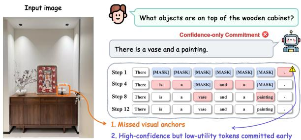  
Figure 1: Confidence-only decoding may commit locally easy but low-utility tokens too early, while delaying content-bearing anchors that are more helpful for resolving nearby masked positions.

However, diffusion decoding quality depends heavily on the order in which masked tokens are committed, since finalized tokens become fixed context for later predictions. Existing strategies mainly rely on confidence (Cai and Li, 2026; Lee et al., 2025), which captures local certainty but does not necessarily measure whether a token is useful for stabilizing unresolved neighbors. As a result, confidence-based decoding may commit locally easy but low-utility tokens, such as punctuation, whitespace, or formatting symbols, before content-bearing anchors such as entities, numbers, variables, or key reasoning words (Fang et al., 2026; Zhai et al., 2026). This produces a locally confident but contextually suboptimal commitment order, weakening the evidence available to later predictions.

We identify two commitment-order failures behind this mismatch. First, contextual utility blindness: confidence measures whether the model is locally certain about a token, but not whether committing that token will reduce uncertainty around it. A token with moderate confidence but highly uncertain neighbors may therefore be more valuable than a high-confidence token in an already stable region(Farquhar et al., 2024; Kuhn et al., 2023; Devlin et al., 2019). Second, structural commitment risk: punctuation, whitespace, and formatting tokens are often easy to predict early, yet committing them too soon can lock unstable boundaries into the sequence. These failures cause weakly informative tokens to be committed early while useful semantic anchors are delayed, leaving nearby masked positions without sufficient local support(Park et al., 2025; Hamilton and Mimno, 2025).

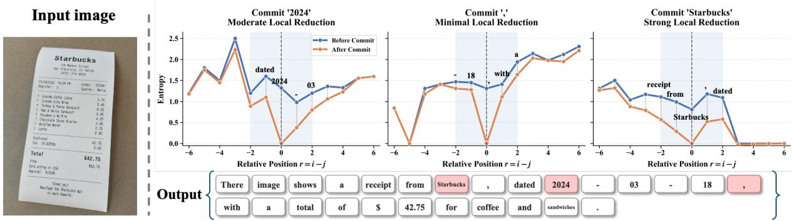  
Figure 2: Single-token intervention. Each subplot compares local entropy profiles before and after committing exactly one token. The x-axis denotes relative position to the committed token. The semantic anchor “Starbucks” produces the largest local entropy reduction, the date token “2024” produces a moderate reduction, and punctuation produces minimal change.

To address these issues, we propose Information-Guided Frontier Decoding (IGFD), a training-free decoding strategy for dMLLMs. IGFD changes the commitment objective from selecting the easiest tokens to selecting tokens that are both reliable and useful. For each candidate position, IGFD computes a composite commitment score that combines token confidence, neighborhood uncertainty and structural commitment risk. The confidenceneighborhood product serves as a lightweight proxy for contextual utility, favoring reliable tokens that may help stabilize nearby uncertain positions. A structure-aware adjustment further encourages content-bearing anchors while delaying fragile structural tokens. Thus, improvements come from a better commitment order rather than increased computation or model modification.

Our contributions are as follows:

• We identify contextual utility blindness and structural commitment risk as two commitment-order failures in confidencebased dMLLM decoding.

• We propose an information-guided commitment score that combines reliability, neighborhood utility, and structural safety.

• We design a dynamic candidate frontier that controls where tokens are eligible for commitment under a fixed decoding budget.

## 2 Related Work

Masked diffusion decoding (Austin et al., 2021; Nie et al., 2026; Bie et al., 2025; Ye et al., 2025; Zhang et al., 2024a, 2025a, 2024b, 2025b, 2026a; Zhao et al., 2026a; Zhang et al., 2026b; Chang et al., 2025; Zuo et al., 2026) generates sequences by beginning with all positions masked. During each refinement step, the model simultaneously predicts distributions for every unresolved token, after which a sampling or selection strategy decides which subset of positions should be fixed before the next iteration.

## 2.1 Ordering Effects in Masked Generative Decoding.

Prior work has shown that the order in which tokens are committed is crucial for generation quality. Kim et al. (Kim et al., 2025) observe that orderagnostic training leads to non-uniform prediction difficulty across masked positions. They further demonstrate that prioritizing positions with higher prediction confidence can substantially improve performance over decoding schemes that follow a predetermined order. This suggests that commitment order is not merely an implementation detail, but a key factor affecting the final output quality.

Zhou et al. (Zhou et al., 2026) introduce HDLM at NeurIPS 2025, which incorporates a coarse-tofine semantic hierarchy into the training objective. Their results indicate, from the perspective of training design, that semantically important or well-grounded positions should be resolved earlier. However, neither of these lines of work provides an inference-time decoding strategy that can dynamically preserve an appropriate commitment order under visual conditioning or long-form generation settings.

## 2.2 Structured Decoding with Localized Segments.

Another line of work modifies the decoding process by imposing or exploiting block-level structure. Block Diffusion divides a sequence into fixed-size segments and performs autoregressive diffusion within each block (Arriola et al., 2025). AdaBlockdLLM further adjusts block boundaries according to confidence volatility, allowing block partitions to better align with semantic changes (Lu et al., 2025). WavefrontDiffusion expands decoding outward from already finalized positions, thereby propagating generation from reliable anchors (Yang et al., 2025). Deferred Commitment Decoding postpones the commitment of high-uncertainty tokens near sliding-window boundaries (Shu et al., 2026). AHD monitors token stability through historical convergence patterns and uses this information to enable earlier cross-block decoding (Zou et al., 2026).

## 2.3 Efficiency-Oriented Commitment Criteria.

Confidence-based scoring is widely used to decide which tokens should be committed or accelerated during diffusion decoding. Wu et al. (Wu et al., 2025) propose Fast-dLLM, which combines KV caching with confidence-threshold decoding to reduce inference cost. Wei et al. (Wei et al., 2025) introduce SlowFast Sampling, a two-stage strategy that switches between exploratory and accelerated decoding according to token confidence and positional stability. Israel et al. (Israel et al., 2026) propose Adaptive Parallel Decoding, which adjusts the sampling budget using diffusion marginals and autoregressive mixtures. AMOM (Xiao et al., 2023) also improves refinement by selectively remasking uncertain positions.

## 2.4 Contextual Dependence and Decoding Robustness.

Recent studies show that token confidence alone is often insufficient for maintaining contextual consistency in long-form decoding. Chen et al. (Chen et al., 2025) propose Coherent Contextual Decoding, which measures trajectory consistency through conditional mutual information over historical context. Context-Aware Decoding (Shi et al., 2024) and C-PMI calibrated decoding (Ren et al., 2023) further adjust token probabilities by contrasting them with contextual evidence, encouraging generations to rely more strongly on the given condition. Li et al. (Li et al., 2025) propose Prophet, which analyzes commitment risk through a two-phase decoding pattern and motivates more adaptive threshold control.

Other work focuses on diagnosing failure modes in confidence-based decoding. Huang et al. (Huang et al., 2026) identify boundary bias and trivialtoken bias as two common problems caused by local confidence scoring, while Zhang et al. (Zhang et al., 2023) propose ReDi to revise unreliable predictions through self-reflective remasking. Zhao et al. (Zhao et al., 2026b) introduce CoTA, showing that context tokens can act as information anchors and that caching may disturb their information flow. Hong et al. (Hong et al., 2026) identify mask-prior drift and positional-attention collapse as key sources of repetition and visual-grounding degradation in diffusion vision-language models. DeCoRe (Gema et al., 2024) also improves contextual faithfulness by contrasting retrieval-head behavior with conditional-entropy signals. Together, these works suggest that robust decoding should account for contextual dependency, positional stability, and attention behavior rather than relying solely on isolated token confidence.

## 3 Motivation

Diffusion multimodal large language models decode by repeatedly predicting all masked positions and committing a subset of them. Since committed tokens become fixed context for later predictions, commitment order directly affects the uncertainty of the remaining sequence. Existing confidence-based decoders implicitly assume that high-confidence tokens are good commitments. We question this assumption: a token may be easy to predict but provide little support to its neighbors.

For each masked position i, the model predicts a

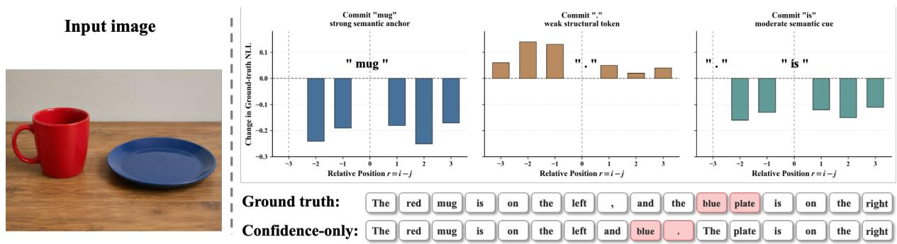  
Figure 3: Single-token intervention on nearby ground-truth NLL. After committing one token, we measure the change in NLL of neighboring correct tokens. Semantic tokens such as “mug” and $\mathrm { \hbar } { \mathfrak { s } } ^ { , \bar { \mathfrak { s } } }$ reduce local NLL, whereas the structural token “.” provides little benefit and may increase prediction loss.

distribution

$$
p _ { t , i } ( v ) = p _ { \theta } ( x _ { i } = v \mid x _ { t } , c ) , \quad v \in \mathcal { V } .
$$

We measure local uncertainty using prediction entropy:

$$
H _ { t , i } = - \sum _ { v \in \mathcal { V } } p _ { t , i } ( v ) \log p _ { t , i } ( v ) .\tag{1}
$$

Lower entropy after intervention indicates that the committed token provides useful local context for nearby masked positions.

## 3.1 Finding 1: Semantic Tokens Provide Unequal Local Support

Figure 2 compares local entropy profiles before and after committing different token types. The x-axis denotes the relative position $r = i - j$ to the committed token. The semantic anchor “Starbucks” produces a strong entropy reduction around the committed position, while the date token “2024” gives a moderate reduction. In contrast, committing punctuation produces only minimal local reduction.

This shows that different committed tokens provide very different amounts of contextual support. Semantic tokens can act as local anchors that make nearby masked positions easier to predict, whereas structural tokens may contribute little even when they are confidently predicted. Therefore, confidence alone cannot measure the contextual value of a commitment.

## 3.2 Finding 2: Structural Tokens Can Be Weak or Harmful Commitments

Entropy measures uncertainty of the model distribution, but we also want to know whether a commitment helps the model predict the correct neighboring tokens. For each nearby ground-truth token $\boldsymbol { x } _ { i } ^ { * }$ , we compute its negative log-likelihood:

$$
\mathrm { N L L } _ { t , i } = - \log p _ { \theta } ( x _ { i } ^ { * } \mid x _ { t } , c ) .\tag{2}
$$

After committing token $j ,$ we measure the local change

$$
\Delta \mathrm { N L L } _ { i } = \mathrm { N L L } _ { t + 1 , i } - \mathrm { N L L } _ { t , i } .\tag{3}
$$

A negative value means the intervention makes the correct neighboring token easier to predict.

Figure 3 shows that committing semantic tokens such as “mug” and “is” reduces nearby groundtruth NLL, indicating improved prediction of correct neighboring tokens. However, committing the structural token “.” provides little benefit and can even increase local NLL. This suggests that punctuation and other structural tokens can be risky early commitments: they may be locally easy to predict, but they do not necessarily improve nearby semantic prediction.

## 3.3 Implication

The two findings expose a mismatch in confidencebased decoding: confidence measures local certainty, but not contextual usefulness. This leads to contextual utility blindness, where easy tokens are preferred over tokens that better support their neighbors. It also leads to structural commitment risk, where punctuation or formatting tokens are committed before the surrounding semantic content is stable. Both failures suggest that commitment order should be governed not only by local confidence, but also by the contextual effect of each committed token.

## 4 Method

Motivated by the observations above, we propose Information-Guided Frontier Decoding (IGFD), a training-free decoding strategy that prioritizes masked positions according to both their prediction reliability and their potential to reduce uncertainty in nearby unresolved tokens. Unlike confidenceonly decoding, IGFD avoids treating positions independently and discourages early commitment of locally easy but low-utility structural tokens.

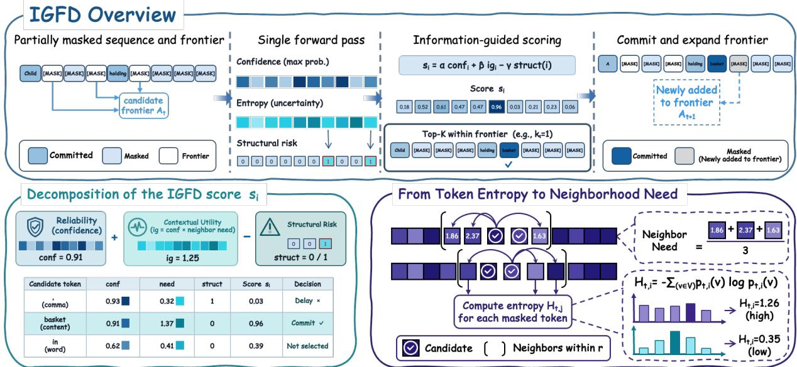  
Figure 4: Framework of IGFD. Given a partially masked sequence, IGFD first builds a dynamic candidate frontier, then computes confidence, entropy-based neighborhood need, and structural risk for each candidate. These signals are combined into an information-guided commitment score, which selects the top-ranked tokens to commit and then expands the frontier for the next denoising step.

At each denoising step, IGFD uses one model forward pass to score candidates with confidence, neighborhood uncertainty, and structural risk, then commits the top-ranked positions under the same per-step budget as the baseline.

## 4.1 Preliminaries

Let $\boldsymbol { x } _ { t } = ( x _ { t , 1 } , \dots , x _ { t , N } )$ denote the partially denoised sequence at decoding step t, where ungenerated positions are represented by a special token [MASK]. Let

$$
M _ { t } = \{ i \mid x _ { t , i } = [ \mathrm { M A S K } ] \} ,\tag{4}
$$

be the set of masked positions. Given the current sequence $x _ { t }$ and conditioning context c, the diffusion language model predicts a distribution over the vocabulary for each masked position:

$$
p _ { t , i } ( v ) = p _ { \theta } ( x _ { i } = v \mid x _ { t } , c ) , \quad v \in \mathcal { V } .\tag{5}
$$

The top-1 prediction and its confidence are

$$
\hat { x } _ { t , i } = \arg \operatorname* { m a x } _ { v \in \mathcal { V } } p _ { t , i } ( v ) ,\tag{6}
$$

$$
{ \mathrm { c o n f } } _ { t , i } = \operatorname* { m a x } _ { v \in \mathcal { V } } p _ { t , i } ( v ) .\tag{7}
$$

## 4.2 Neighborhood Uncertainty

Confidence measures whether the model is reliable at the current position, but it does not measure whether committing this position is useful for the surrounding context. To capture contextual utility, we estimate the uncertainty of nearby masked positions.

For each masked position i, we compute the entropy of the model prediction:

$$
H _ { t , i } = - \sum _ { v \in \mathcal { V } } p _ { t , i } ( v ) \log p _ { t , i } ( v ) .\tag{8}
$$

Higher entropy indicates that the model is less certain about the token at position i.

We then define the neighborhood need of position i as the average entropy of masked neighbors within radius r:

$$
\mathrm { n e e d } _ { t , i } = \frac { \sum _ { j \in \mathcal { N } _ { r } ( i ) \cap M _ { t } } H _ { t , j } } { \operatorname* { m a x } ( 1 , | \mathcal { N } _ { r } ( i ) \cap M _ { t } | ) } ,\tag{9}
$$

where

$$
\begin{array} { r } { \mathcal { N } _ { r } ( i ) = \{ j \mid 0 < | j - i | \leq r \} . } \end{array}\tag{10}
$$

Intuitively, $\mathrm { n e e d } _ { t , i }$ measures how uncertain the local neighborhood around position i remains. A high value means that nearby masked tokens still lack sufficient contextual support.

## 4.3 Information-Guided Commitment Score

IGFD prioritizes positions that satisfy two conditions simultaneously: the model is confident about the current token, and nearby masked positions are still uncertain. We use the product of confidence and neighborhood need as a lightweight proxy for contextual utility:

$$
\mathrm { i g } _ { t , i } = \mathrm { c o n f } _ { t , i } \cdot \mathrm { n e e d } _ { t , i } .\tag{11}
$$

The final commitment score is defined as

$$
s _ { t , i } = \alpha \cdot \mathrm { c o n f } _ { t , i } + \beta \cdot \mathrm { i g } _ { t , i } - \gamma \cdot \mathrm { s t r u c t } ( \hat { x } _ { t , i } ) ,\tag{12}
$$

where $\alpha , \beta ,$ and $\gamma$ are scalar weights.

We implement struct(·) as a lightweight tokenizer-level indicator:

$$
\operatorname { s t r u c t } ( y ) = \mathbb { I } [ y \in { \mathcal { P } } \lor \operatorname { s t r i p } ( y ) = \emptyset \lor y \in { \mathcal { S } } ] ,\tag{13}
$$

where $\mathcal { P }$ contains punctuation symbols, strip(y) = ∅ identifies whitespace-only tokens, and S contains special structural tokens such as newline, tab, end-of-sequence, and tokenizer-specific formatting markers.

Thus, IGFD balances reliability, contextual utility, and structural risk, favoring informative tokens over merely easy ones and delaying fragile structural commitments until the context is more stable.

## 4.4 Dynamic Candidate Frontier

To avoid committing tokens with insufficient local context, IGFD maintains a dynamic candidate frontier $A _ { t } \subseteq M _ { t }$ . The frontier contains masked positions that are close to already committed tokens and are therefore more likely to benefit from existing context.

Let $C _ { t } = \{ i \mid x _ { t , i } \neq [ \mathrm { M A S K } ] \}$ denote committed positions. Given an expansion radius R, the candidate frontier is defined as

$$
A _ { t } = \{ i \in M _ { t } \mid \mathrm { d i s t } ( i , C _ { t } ) \leq R \} .\tag{14}
$$

At initialization, the frontier is seeded using the first F masked positions after the prompt, which approximates the distance-based frontier before sufficient committed tokens are available. After each commitment step, the frontier is updated by adding masked neighbors around newly committed positions. If the frontier exceeds the maximum size F, IGFD retains the $\mathrm { t o p } { - } F$ positions according to the commitment score.

The frontier acts as a context availability constraint, while the information-guided score determines which candidates should be committed first.

Algorithm 1 IGFD: Information-Guided Frontier   
Decoding (one round)   
Require: Sequence x; frontier A; model $p _ { \theta } ;$ bud  
get $k _ { t } ;$ weights $\alpha , \beta , \gamma$   
1: $\ell \gets p _ { \theta } ( x )$ ▷ one forward pass   
2: Compute $p _ { i } , { \hat { x } } _ { i } .$ con $\mathrm { f } _ { i } ,$ and $H _ { i }$ for each masked   
position i   
3: needi ← AvgEntropy $( \mathcal { N } _ { r } ( i ) \cap M )$   
4: $\mathrm { i g } _ { i } \gets \mathrm { c o n f } _ { i }$ · needi   
5: si ← α · confi + β · ig − γ · struct(ˆxi)   
6: $S \gets \mathrm { T o p K } _ { i \in A \cap M } ( s _ { i } , k _ { t } )$   
7: $\mathbf { i f } \mid S \mid < k _ { t }$ then   
8: Add highest-scoring positions from $M \backslash S$   
to $S$   
9: end if   
10: Commit each $i \in S$ with ${ \hat { x } } _ { i }$   
11: Expand frontier around committed positions   
and prune it to size $F$   
12: return updated sequence x and frontier A

## 4.5 Decoding Algorithm

At each step t, IGFD commits a fixed number of positions $k _ { t }$ :

$$
k _ { t } = \left\lfloor { \frac { N } { T } } \right\rfloor + \mathbb { I } [ t \leq N \bmod T ] ,\tag{15}
$$

where $T$ is the total decoding budget.

The selected positions are

$$
S _ { t } = \mathrm { T o p K } _ { i \in A _ { t } } ( s _ { t , i } , k _ { t } ) .\tag{16}
$$

For each $i \in S _ { t } .$ , IGFD replaces [MASK] with the top-1 prediction:

$$
x _ { t + 1 , i } = \hat { x } _ { t , i } .\tag{17}
$$

All unselected masked positions remain unchanged.

If the current frontier contains fewer than $k _ { t }$ positions, IGFD falls back to the highest-scoring positions in $M _ { t }$ to maintain the decoding budget.

## 5 Experiments

We conduct experiments to evaluate whether IGFD improves decoding quality for diffusion multimodal large language models (dMLLMs). Following prior diffusion decoding work, we focus on three research questions:

RQ1: Overall performance. Does IGFD improve generation quality across multimodal generation, hallucination, reasoning, perception, and grounding benchmarks?

Table 1: Comparison of different methods across multiple benchmarks.
<table><tr><td rowspan="2">Model</td><td rowspan="2">Method</td><td colspan="4">LLaVA-Bench</td><td colspan="3">CHAIR</td><td>MathVista</td><td>ScienceQA</td><td colspan="2">MME</td><td>GQA</td></tr><tr><td>all↑</td><td>conv↑</td><td>detail↑</td><td>complex↑</td><td> $C _ { S } \downarrow$ </td><td>Ci ↓</td><td>recall↑</td><td>acc↑</td><td>acc↑</td><td>cog.↑</td><td>perc.↑</td><td>EM↑</td></tr><tr><td rowspan="4">LLaDA-V</td><td>Original</td><td>50.4</td><td>43.4</td><td>57.5</td><td>63.6</td><td>5.6</td><td>4.0</td><td>36.6</td><td>30.8</td><td>79.2</td><td>338.6</td><td>1411.4</td><td>52.3</td></tr><tr><td>AdaBlock</td><td>71.8</td><td>59.7</td><td>68.8</td><td>79.2</td><td>5.8</td><td>4.3</td><td>37.3</td><td>32.3</td><td>81.2</td><td>350.8</td><td>1412.6</td><td>52.6</td></tr><tr><td>Wavefront</td><td>71.6</td><td>61.6</td><td>71.7</td><td>75.9</td><td>5.3</td><td>5.2</td><td>34.2</td><td>33.4</td><td>81.8</td><td>355.7</td><td>1397.5</td><td>51.7</td></tr><tr><td>IGFD</td><td>72.8</td><td>63.1</td><td>74.6</td><td>80.8</td><td>5.2</td><td>3.7</td><td>37.1</td><td>34.2</td><td>82.7</td><td>363.6</td><td>1422.7</td><td>53.7</td></tr><tr><td rowspan="4">MMaDA</td><td>Original</td><td>35.1</td><td>34.4</td><td>39.7</td><td>33.7</td><td>24.6</td><td>11.3</td><td>39.5</td><td>23.5</td><td>50.2</td><td>232.6</td><td>843.9</td><td>39.4</td></tr><tr><td>AdaBlock</td><td>45.9</td><td>38.9</td><td>43.1</td><td>39.9</td><td>22.8</td><td>11.3</td><td>41.8</td><td>24.3</td><td>54.6</td><td>225.8</td><td>845.5</td><td>42.4</td></tr><tr><td>Wavefront</td><td>44.3</td><td>37.2</td><td>49.4</td><td>38.5</td><td>19.3</td><td>10.2</td><td>39.2</td><td>23.4</td><td>56.3</td><td>244.7</td><td>752.8</td><td>43.6</td></tr><tr><td>IGFD</td><td>47.3</td><td>41.9</td><td>50.6</td><td>43.7</td><td>18.7</td><td>9.8</td><td>40.6</td><td>25.9</td><td>57.7</td><td>248.2</td><td>841.6</td><td>44.9</td></tr><tr><td rowspan="4">LaViDa</td><td>Original</td><td>51.1</td><td>32.8</td><td>57.2</td><td>60.1</td><td>6.8</td><td>9.8</td><td>34.8</td><td>41.6</td><td>71.2</td><td>361.7</td><td>1348.5</td><td>56.2</td></tr><tr><td>AdaBlock</td><td>75.6</td><td>56.8</td><td>73.4</td><td>69.3</td><td>6.5</td><td>5.3</td><td>33.9</td><td>44.9</td><td>72.9</td><td>368.2</td><td>1350.9</td><td>56.4</td></tr><tr><td>Wavefront</td><td>77.1</td><td>61.3</td><td>76.3</td><td>72.8</td><td>5.7</td><td>4.8</td><td>33.6</td><td>45.1</td><td>72.1</td><td>372.4</td><td>1358.1</td><td>55.9</td></tr><tr><td>IGFD</td><td>78.7</td><td>65.1</td><td>78.6</td><td>79.7</td><td>5.1</td><td>5.7</td><td>36.1</td><td>45.3</td><td>73.5</td><td>382.9</td><td>1366.2</td><td>58.2</td></tr></table>

RQ2: Component effectiveness. How much does each part of the information-guided commitment score contribute?

RQ3: Semantic quality and commitment behavior. Does IGFD produce semantically more faithful outputs and more desirable commitment orders?

## 5.1 Experimental Setup

Models. We evaluate IGFD on three representative dMLLMs: LLaDA-V(You et al., 2025), MMaDA(Yang et al., 2026), and LaViDa(Li et al., 2026). All methods use the same backbone model within each comparison, ensuring that performance differences come only from the decoding strategy.

Benchmarks. We evaluate on six benchmarks covering complementary capabilities. LLaVA-Bench(Liu et al., 2023) measures multimodal response quality, CHAIR(Rohrbach et al., 2018) evaluates object hallucination, MathVista(Lu et al., 2024) and ScienceQA (Lu et al., 2022) assess multimodal reasoning, MME(Fu et al., 2026) measures cognition and perception, and GQA(Hudson and Manning, 2019) evaluates visual question answering accuracy.

Baselines. We compare IGFD with three decoding baselines: Original decoding, AdaBlock(Lu et al., 2025), and Wavefront(Yang et al., 2025). To ensure a fair comparison, we evaluate IGFD and all baselines under identical model configurations and decoding settings.

Implementation Details. Unless otherwise specified, all methods use deterministic decoding with temperature set to 0. IGFD uses the commitment

score

$$
s _ { t , i } = \alpha \cdot \mathrm { c o n f } _ { t , i } + \beta \cdot \mathrm { i g } _ { t , i } - \gamma \cdot \mathrm { s t r u c t } ( \hat { x } _ { t , i } ) .
$$

We set $\alpha = 0 . 7 , \beta = 0 . 5$ and $\gamma = 0 . 2$ by default. The neighborhood radius is set to $r = 2 .$

## 5.2 Main Results

To answer RQ1, we evaluate IGFD across three dMLLM backbones and multiple benchmarks. Table 1 reports results across three dMLLM backbones and multiple benchmarks. Overall, IGFD achieves the best performance on most metrics, consistently outperforming Original decoding, AdaBlock, and Wavefront.

For LLaDA-V, IGFD achieves the best results on nearly all benchmarks while reducing CHAIR hallucination scores. For MMaDA, IGFD improves most metrics, particularly on reasoning and grounding benchmarks, although AdaBlock performs slightly better on CHAIR recall and MME perception. For LaViDa, IGFD also achieves the best performance on most benchmarks, while Wavefront attains the lowest CHAIR C .

These results demonstrate that IGFD generalizes effectively across different dMLLM backbones and consistently improves multimodal reasoning, visual understanding, and grounding reliability.

## 5.3 Ablation Study

To answer RQ2, we ablate each component of the commitment score. Table 2 reports the CHAIR ablation averaged over three dMLLMs. Removing neighborhood need increases hallucination and lowers recall, showing that contextual utility helps select more informative tokens. Removing the structural penalty also degrades CHAIR performance, confirming the importance of delaying premature punctuation and formatting tokens. Full IGFD achieves the best overall results. Detailed per-model ablations are provided in Appendix D.

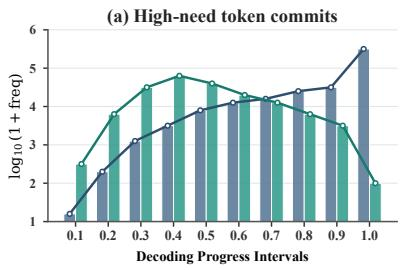

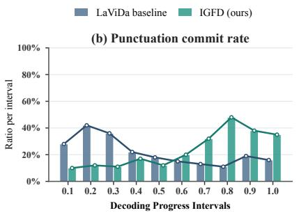

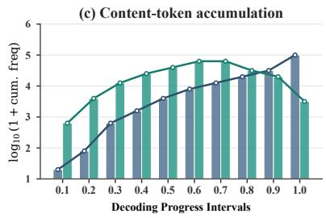  
Figure 5: Analysis of decoding behavior and commitment dynamics. Metrics are tracked across normalized decoding progress intervals. (a) illustrates the frequency of high-need tokens (top 20% uncertainty); (b) shows the punctuation commitment rate per interval; (c) displays the cumulative frequency of committed content-bearing tokens. IGFD significantly prioritizes critical content over structural tokens in early decoding stages.

Table 2: Ablation study of IGFD on CHAIR, averaged over three dMLLMs.
<table><tr><td>Variant</td><td>Cs ↓</td><td>Ci ↓</td><td>Recall↑</td></tr><tr><td>Confidence only</td><td>12.3</td><td>8.4</td><td>37.0</td></tr><tr><td>w/o neighborhood need</td><td>10.3</td><td>6.7</td><td>37.5</td></tr><tr><td>w/o structural penalty</td><td>10.3</td><td>6.7</td><td>37.6</td></tr><tr><td>w/o dynamic frontier</td><td>10.2</td><td>6.6</td><td>37.7</td></tr><tr><td>Full IGFD</td><td>9.7</td><td>6.4</td><td>37.9</td></tr></table>

## 5.4 Commitment Behavior Analysis

To answer RQ3 from the perspective of decoding behavior, we analyze token commitment dynamics. Figure 5 visualizes step-by-step commitment behaviors across normalized decoding progress. Figure 5(a) shows that high-need tokens are committed substantially earlier under IGFD than under the flat baseline, indicating effective prioritization of uncertainty-reducing tokens. Figure 5(b) further demonstrates that IGFD delays premature punctuation commitments until later decoding stages, preventing early structural locking. As a result, content-bearing tokens accumulate more rapidly in the early phase, as reflected by the cumulative curve in Figure 5(c). Importantly, this global reordering introduces no additional forward passes and maintains the same decoding cost as Wavefront.

## 5.5 Semantic Quality Evaluation

To further answer RQ3 from the perspective of semantic quality, we evaluate BERTScore(Zhang et al., 2019) on WikiText(Merity et al., 2016). We randomly sample 1,000 test sentences and generate outputs under the same decoding budget for all methods.

Table 3: Semantic quality evaluation on WikiText using BERTScore. Higher scores indicate better semantic fidelity to reference text.
<table><tr><td>Method</td><td>Precision ↑</td><td>Recall ↑</td><td>F1↑</td></tr><tr><td>Original</td><td>0.842</td><td>0.834</td><td>0.838</td></tr><tr><td>AdaBlock</td><td>0.856</td><td>0.849</td><td>0.852</td></tr><tr><td>Wavefront</td><td>0.861</td><td>0.854</td><td>0.857</td></tr><tr><td>IGFD</td><td>0.873</td><td>0.866</td><td>0.869</td></tr></table>

Table 3 shows that IGFD achieves the best BERTScore precision, recall, and F1, indicating stronger semantic alignment with the reference text. Compared with confidence-based and structured decoding baselines, IGFD better preserves semantic fidelity by prioritizing reliable content tokens and delaying fragile structural tokens until the context becomes more stable.

## 6 Conclusion

We presented IGFD, a training-free decoding strategy for diffusion multimodal large language models. IGFD addresses two commitment-order failures in confidence-based decoding: contextual utility blindness and premature structural commitment. By combining token confidence, neighborhood uncertainty and punctuation risk, IGFD prioritizes tokens that are not only reliable but also contextually informative and useful for stabilizing nearby masked positions. Experiments across multimodal generation, hallucination, reasoning, perception, and grounding benchmarks show consistent improvements over existing decoding strategies without additional training or extra model calls.

## Limitations

Although IGFD improves commitment ordering without additional model calls, it still has several limitations. First, IGFD uses local neighborhood entropy as a proxy for contextual utility, which may not fully capture long-range dependencies or global discourse constraints. Second, the structural penalty relies on tokenizer-level rules. Since tokenizers represent punctuation, whitespace, and formatting tokens differently, the structural token set may require minor adaptation across model families.

## References

Marianne Arriola, Aaron Gokaslan, Justin Chiu, Zhihan Yang, Zhixuan Qi, Jiaqi Han, Subham Sahoo, and Volodymyr Kuleshov. 2025. Block diffusion: Interpolating between autoregressive and diffusion language models. In International Conference on Learning Representations, volume 2025, pages 50726–50753.

Jacob Austin, Daniel D Johnson, Jonathan Ho, Daniel Tarlow, and Rianne Van Den Berg. 2021. Structured denoising diffusion models in discrete state-spaces. Advances in neural information processing systems, 34:17981–17993.

Tiwei Bie, Maosong Cao, Kun Chen, Lun Du, Mingliang Gong, Zhuochen Gong, Yanmei Gu, Jiaqi Hu, Zenan Huang, Zhenzhong Lan, and 1 others. 2025. Llada2. 0: Scaling up diffusion language models to 100b. arXiv preprint arXiv:2512.15745.

Changxiao Cai and Gen Li. 2026. Confidence-based decoding is provably efficient for diffusion language models. arXiv preprint arXiv:2603.22248.

Shuochen Chang, Xiaofeng Zhang, Qingyang Liu, and Li Niu. 2025. D3tom: Decider-guided dynamic token merging for accelerating diffusion mllms. arXiv preprint arXiv:2511.12280.

Kecheng Chen, Ziru Liu, Xijia Tao, Hui Liu, Xinyu Fu, Suiyun Zhang, Dandan Tu, Lingpeng Kong, Rui Liu, and Haoliang Li. 2025. Beyond confidence: Adaptive and coherent decoding for diffusion language models. arXiv preprint arXiv:2512.02044.

Jacob Devlin, Ming-Wei Chang, Kenton Lee, and Kristina Toutanova. 2019. Bert: Pre-training of deep bidirectional transformers for language understanding. In Proceedings of the 2019 conference of the North American chapter ofthe associationfor com putational linguistics: human language technologies, volume 1 (long and short papers), pages 4171–4186.

Zhenbang Du, Kejing Xia, Xinrui Zhong, Yonggan Fu, Nicolai Oswald, Binfei Ji, Brucek Khailany,

Pavlo Molchanov, and Yingyan Lin. 2026. r2- dllm: Accelerating diffusion large language models via spatio-temporal redundancy reduction. arXiv preprint arXiv:2604.18995.

Liancheng Fang, Aiwei Liu, Henry Peng Zou, Yankai Chen, Enze Ma, Leyi Pan, Chunyu Miao, Wei-Chieh Huang, Xue Liu, and Philip S Yu. 2026. Locally confident, globally stuck: The quality-exploration dilemma in diffusion language models. arXiv preprint arXiv:2604.00375.

Sebastian Farquhar, Jannik Kossen, Lorenz Kuhn, and Yarin Gal. 2024. Detecting hallucinations in large language models using semantic entropy. Nature, 630(8017):625–630.

Chaoyou Fu, Peixian Chen, Yunhang Shen, Yulei Qin, Mengdan Zhang, Xu Lin, Jinrui Yang, Xiawu Zheng, Ke Li, Xing Sun, and 1 others. 2026. Mme: A comprehensive evaluation benchmark for multimodal large language models. Advances in Neural Information Processing Systems, 38.

Aryo Pradipta Gema, Chen Jin, Ahmed Abdulaal, Tom Diethe, Philip Teare, Beatrice Alex, Pasquale Minervini, and Amrutha Saseendran. 2024. Decore: decoding by contrasting retrieval heads to mitigate hallucinations. arXiv preprint arXiv:2410.18860, 10.

Marjan Ghazvininejad, Omer Levy, Yinhan Liu, and Luke Zettlemoyer. 2019. Mask-predict: Parallel decoding of conditional masked language models. In Proceedings of the 2019 conference on empirical methods in natural language processing and the 9th international joint conference on natural language processing (EMNLP-IJCNLP), pages 6112–6121.

Sil Hamilton and David Mimno. 2025. Lost in space: Optimizing tokens for grammar-constrained decoding. arXiv e-prints, pages arXiv–2502.

Sujung Hong, Chanyong Yoon, and Seongjae Hwang. 2026. Mitigating mask prior drift and positional attention collapse in large diffusion vision-language models. arXiv preprint arXiv:2605.14530.

Pengcheng Huang, Tianming Liu, Zhenghao Liu, Yukun Yan, Shuo Wang, Tong Xiao, Zulong Chen, and Maosong Sun. 2026. Empirical analysis of decoding biases in masked diffusion models. Preprint, arXiv:2508.13021.

Drew A Hudson and Christopher D Manning. 2019. Gqa: A new dataset for real-world visual reasoning and compositional question answering. In Proceedings of the IEEE/CVF conference on computer vision and pattern recognition, pages 6700–6709.

Daniel Israel, Guy Van den Broeck, and Aditya Grover. 2026. Accelerating diffusion llms via adaptive parallel decoding. Advances in neural information processing systems, 38:52870–52888.

Jaeyeon Kim, Kulin Shah, Vasilis Kontonis, Sham Kakade, and Sitan Chen. 2025. Train for the worst, plan for the best: Understanding token ordering in masked diffusions. arXiv preprint arXiv:2502.06768.

Lorenz Kuhn, Yarin Gal, and Sebastian Farquhar. 2023. Semantic uncertainty: Linguistic invariances for uncertainty estimation in natural language generation. arXiv preprint arXiv:2302.09664.

Sanghyun Lee, Seungryong Kim, Jongho Park, and Dongmin Park. 2025. Lookahead unmasking elicits accurate decoding in diffusion language models. arXiv preprint arXiv:2511.05563.

Pengxiang Li, Yefan Zhou, Dilxat Muhtar, Lu Yin, Shilin Yan, Li Shen, Soroush Vosoughi, and Shiwei Liu. 2025. Diffusion language models know the answer before decoding. arXiv preprint arXiv:2508.19982.

Shufan Li, Konstantinos Kallidromitis, Hritik Bansal, Akash Gokul, Yusuke Kato, Kazuki Kozuka, Jason Kuen, Zhe Lin, Kai-Wei Chang, and Aditya Grover. 2026. Lavida: A large diffusion language model for multimodal understanding. Advances in Neural Information Processing Systems, 38:105101–105134.

Haotian Liu, Chunyuan Li, Qingyang Wu, and Yong Jae Lee. 2023. Visual instruction tuning. Advances in neural information processing systems, 36:34892– 34916.

Guanxi Lu, Hao Mark Chen, Yuto Karashima, Zhican Wang, Daichi Fujiki, and Hongxiang Fan. 2025. Adablock-dllm: Semantic-aware diffusion llm inference via adaptive block size. arXiv preprint arXiv:2509.26432.

Pan Lu, Hritik Bansal, Tony Xia, Jiacheng Liu, Chunyuan Li, Hannaneh Hajishirzi, Hao Cheng, Kai-Wei Chang, Michel Galley, and Jianfeng Gao. 2024. Mathvista: Evaluating mathematical reasoning of foundation models in visual contexts. In International Conference on Learning Representations, volume 2024, pages 23439–23554.

Pan Lu, Swaroop Mishra, Tanglin Xia, Liang Qiu, Kai-Wei Chang, Song-Chun Zhu, Oyvind Tafjord, Peter Clark, and Ashwin Kalyan. 2022. Learn to explain: Multimodal reasoning via thought chains for science question answering. Advances in neural information processing systems, 35:2507–2521.

Stephen Merity, Caiming Xiong, James Bradbury, and Richard Socher. 2016. Pointer sentinel mixture models. arXiv preprint arXiv:1609.07843.

Shen Nie, Fengqi Zhu, Zebin You, Xiaolu Zhang, Jingyang Ou, Jun Hu, Jun Zhou, Yankai Lin, Ji-Rong Wen, and Chongxuan Li. 2026. Large language diffusion models. Advances in Neural Information Processing Systems, 38:50608–50646.

Kanghee Park, Timothy Zhou, and Loris D’Antoni. 2025. Flexible and efficient grammar-constrained decoding. arXiv preprint arXiv:2502.05111.

Liliang Ren, Mankeerat Sidhu, Qi Zeng, Revanth Gangi Reddy, Heng Ji, and ChengXiang Zhai. 2023. Cpmi: Conditional pointwise mutual information for turn-level dialogue evaluation. In Proceedings of the Third DialDoc Workshop on Document-grounded Dialogue and Conversational Question Answering, pages 80–85.

Anna Rohrbach, Lisa Anne Hendricks, Kaylee Burns, Trevor Darrell, and Kate Saenko. 2018. Object hallucination in image captioning. In Proceedings of the 2018 Conference on Empirical Methods in Natural Language Processing, pages 4035–4045.

Weijia Shi, Xiaochuang Han, Mike Lewis, Yulia Tsvetkov, Luke Zettlemoyer, and Wen-tau Yih. 2024. Trusting your evidence: Hallucinate less with contextaware decoding. In Proceedings ofthe 2024 Conference of the North American Chapter of the Association for Computational Linguistics: Human Language Technologies (Volume 2: Short Papers), pages 783–791.

Yingte Shu, Yuchuan Tian, Chao Xu, Yunhe Wang, and Hanting Chen. 2026. Deferred commitment decoding for diffusion language models with confidence-aware sliding windows. arXiv preprint arXiv:2601.02076.

Qingyan Wei, Yaojie Zhang, Zhiyuan Liu, Puyu Zeng, Yuxuan Wang, Biqing Qi, Dongrui Liu, and Linfeng Zhang. 2025. Accelerating diffusion large language models with slowfast sampling: The three golden principles. arXiv preprint arXiv:2506.10848.

Chengyue Wu, Hao Zhang, Shuchen Xue, Zhijian Liu, Shizhe Diao, Ligeng Zhu, Ping Luo, Song Han, and Enze Xie. 2025. Fast-dllm: Training-free acceleration of diffusion llm by enabling kv cache and parallel decoding. arXiv preprint arXiv:2505.22618.

Yisheng Xiao, Ruiyang Xu, Lijun Wu, Juntao Li, Tao Qin, Tie-Yan Liu, and Min Zhang. 2023. Amom: adaptive masking over masking for conditional masked language model. In Proceedings ofthe AAAI Conference on Artificial Intelligence, volume 37, pages 13789–13797.

Haojin Yang, Rui Hu, Zequn Sun, Rui Zhou, Yujun Cai, and Yiwei Wang. 2025. Wavefrontdiffusion: Dynamic decoding schedule for improved reasoning. arXiv preprint arXiv:2511.19473.

Ling Yang, Ye Tian, Bowen Li, Xinchen Zhang, Ke Shen, Yunhai Tong, and Mengdi Wang. 2026. Mmada: Multimodal large diffusion language models. Advances in Neural Information Processing Systems, 38:138867–138907.

Jiacheng Ye, Zhihui Xie, Lin Zheng, Jiahui Gao, Zirui Wu, Xin Jiang, Zhenguo Li, and Lingpeng Kong. 2025. Dream 7b: Diffusion large language models. arXiv preprint arXiv:2508.15487.

Zebin You, Shen Nie, Xiaolu Zhang, Jun Hu, Jun Zhou, Zhiwu Lu, Ji-Rong Wen, and Chongxuan Li. 2025. Llada-v: Large language diffusion models with visual instruction tuning. arXiv preprint arXiv:2505.16933.

Kevin Zhai, Sabbir Mollah, Zhenyi Wang, and Mubarak Shah. 2026. Core: Context-robust remasking for diffusion language models. arXiv preprint arXiv:2602.04096.

Kexun Zhang, Xianjun Yang, William Yang Wang, and Lei Li. 2023. Redi: efficient learning-free diffusion inference via trajectory retrieval. In International Conference on Machine Learning, pages 41770–41785. PMLR.

Tianyi Zhang, Varsha Kishore, Felix Wu, Kilian Q Weinberger, and Yoav Artzi. 2019. Bertscore: Evaluating text generation with bert. arXiv preprint arXiv:1904.09675.

Xiaofeng Zhang, Yihao Quan, Chen Shen, Chaochen Gu, Xiaosong Yuan, Shaotian Yan, Jiawei Cao, Hao Cheng, Kaijie Wu, and Jieping Ye. 2025a. Shallow focus, deep fixes: Enhancing shallow layers vision attention sinks to alleviate hallucination in LVLMs. In Knowledgeable Foundation Models at ACL 2025.

Xiaofeng Zhang, Chen Shen, Xiaosong Yuan, Shaotian Yan, Liang Xie, Wenxiao Wang, Chaochen Gu, Hao Tang, and Jieping Ye. 2024a. From redundancy to relevance: Enhancing explainability in multimodal large language models. NAACL.

Xiaofeng Zhang, Fanshuo Zeng, and Chaochen Gu. 2024b. Simignore: Exploring and enhancing multimodal large model complex reasoning via similarity computation. Neural Networks, page 107059.

Xiaofeng Zhang, Fanshuo Zeng, Yihao Quan, Zheng Hui, and Jiawei Yao. 2025b. Enhancing multimodal large language models complex reason via similarity computation. Proceedings of the AAAI Conference on Artificial Intelligence.

Xiaofeng Zhang, Yuanchao Zhu, Chaochen Gu, Jiawei Cao, Hao Cheng, and Kaijie Wu. 2026a. What drives attention sinks? a study of massive activations and rotational positional encoding in large vision–language models. Information Processing & Management, 63(2):104431.

Xiaofeng Zhang, Yuanchao Zhu, Chaochen Gu, Xiaosong Yuan, Qiyan Zhao, Jiawei Cao, Feilong Tang, Sinan Fan, Yaomin Shen, Chen Shen, and 1 others. 2026b. Hallucination begins where saliency drops. In The Fourteenth International Conference on Learning Representations.

Qiyan Zhao, Xiaofeng Zhang, Shuochen Chang, Qianyu Chen, Xiaosong Yuan, Xuhang Chen, Luoqi Liu, Jiajun Zhang, Xu-Yao Zhang, and Da-Han Wang. 2026a. Context tokens are anchors: Understanding the repetition curse in dmllms from an information flow perspective. In The Fourteenth International Conference on Learning Representations.

Qiyan Zhao, Xiaofeng Zhang, Shuochen Chang, Qianyu Chen, Xiaosong Yuan, Xuhang Chen, Luoqi Liu, Jiajun Zhang, Xu-Yao Zhang, and Da-Han Wang. 2026b. Context tokens are anchors: Understanding the repetition curse in dmllms from an information flow perspective. arXiv preprint arXiv:2601.20520.

Cai Zhou, Chenyu Wang, Dinghuai Zhang, Shangyuan Tong, Yifei Wang, Stephen Bates, and Tommi Jaakkola. 2026. Next semantic scale prediction via hierarchical diffusion language models. Advances in Neural Information Processing Systems, 38:41496– 41531.

Shun Zou, Yong Wang, Zehui Chen, Lin Chen, Chongyang Tao, Feng Zhao, and Xiangxiang Chu. 2026. Breaking block boundaries: Anchor-based history-stable decoding for diffusion large language models. arXiv preprint arXiv:2604.08964.

Haomin Zuo, Yidi Li, Luoxiao Yang, and Xiaofeng Zhang. 2026. Diffusion-cam: Faithful visual explanations for dmllms. arXiv preprint arXiv:2604.11005.

## A Appendix Overview

This appendix provides additional details to support the reproducibility and interpretation of IGFD. We include implementation details, baseline configurations, detailed ablation studies, efficiency analysis, hyperparameter sensitivity analysis, and limitations. These materials clarify the experimental protocol and provide a more complete understanding of how each component contributes to the final decoding performance.

## B Implementation Details

All experiments are conducted under the same model configuration for each backbone, and the only difference among compared methods lies in the decoding strategy. We evaluate IGFD on three diffusion-based multimodal large language models: LLaDA-V, MMaDA, and LaViDa. For all methods, we use deterministic decoding with temperature set to 0. At each decoding step, the model predicts the token distribution for all currently masked positions, and the selected positions are committed using the top-1 prediction.

IGFD uses the following commitment score:

$$
s _ { t , i } = \alpha \cdot \mathrm { c o n f } _ { t , i } + \beta \cdot \mathrm { i g } _ { t , i } - \gamma \cdot \mathrm { s t r u c t } ( \hat { x } _ { t , i } ) ,\tag{18}
$$

where $\mathrm { c o n f } _ { t , i }$ is the token confidence, $\mathrm { i g } _ { t , i }$ is the confidence-weighted neighborhood utility term, and struct $( \widehat { x } _ { t , i } )$ indicates whether the predicted token is a structural token. Unless otherwise specified, we set $\alpha = 0 . 7 , \beta = 0 . 5 , \gamma = 0 . 2$ , and neighborhood radius $r = 2$

Table 4: Ablation study of IGFD components across three dMLLMs.
<table><tr><td rowspan="2">Model</td><td rowspan="2">Variant</td><td colspan="4">LLaVA-Bench</td><td colspan="3">CHAIR</td><td>MathVista</td></tr><tr><td>all↑</td><td>conv↑</td><td></td><td>detail↑ complex↑</td><td> $C _ { S } \downarrow$ </td><td> $C _ { i } \downarrow$ </td><td>recall↑</td><td>acc↑</td></tr><tr><td rowspan="4"> $\mathrm { L L a D A { - } V }$ </td><td>Confidence</td><td>50.4</td><td>43.4</td><td>57.5</td><td>63.6</td><td>5.6</td><td>4.0</td><td>36.6</td><td>30.8</td></tr><tr><td>w/o neighborhood need</td><td>71.7</td><td>61.9</td><td>73.1</td><td>79.1</td><td>5.3</td><td>3.8</td><td>37.0</td><td>33.5</td></tr><tr><td>w/o structural penalty</td><td>72.1</td><td>62.4</td><td>73.8</td><td>79.7</td><td>5.4</td><td>3.9</td><td>36.9</td><td>33.7</td></tr><tr><td>w/o dynamic frontier</td><td>72.0</td><td>62.2</td><td>73.5</td><td>79.5</td><td>5.4</td><td>3.9</td><td>37.0</td><td>33.6</td></tr><tr><td></td><td>Full IGFD</td><td>72.8</td><td>63.1</td><td>74.6</td><td>80.8</td><td>5.2</td><td>3.7</td><td>37.1</td><td>34.2</td></tr><tr><td rowspan="4">MMaDA</td><td>Confidence</td><td>35.1</td><td>34.4</td><td>39.7</td><td>33.7</td><td>24.6</td><td>11.3</td><td>39.5</td><td>23.5</td></tr><tr><td>w/o neighborhood need 45.9</td><td></td><td>40.1</td><td>49.2</td><td>41.9</td><td>20.1</td><td>10.4</td><td>40.1</td><td>24.8</td></tr><tr><td>w/o structural penalty</td><td>46.5</td><td>40.7</td><td>49.8</td><td>42.8</td><td>19.8</td><td>10.2</td><td>40.3</td><td>25.1</td></tr><tr><td>w/o dynamic frontier</td><td>46.2</td><td>40.5</td><td>49.6</td><td>42.4</td><td>19.6</td><td>10.0</td><td>40.4</td><td>25.0</td></tr><tr><td></td><td>Full IGFD</td><td>47.3</td><td>41.9</td><td>50.6</td><td>43.7</td><td>18.7</td><td>9.8</td><td>40.6</td><td>25.9</td></tr><tr><td rowspan="5">LaViDa</td><td>Confidence</td><td>51.1</td><td>32.8</td><td>57.2</td><td>60.1</td><td>6.8</td><td>9.8</td><td>34.8</td><td>41.6</td></tr><tr><td>w/o neighborhood need</td><td>77.2</td><td>63.6</td><td>77.4</td><td>77.9</td><td>5.5</td><td>5.8</td><td>35.5</td><td>44.8</td></tr><tr><td>w/o structural penalty</td><td>77.8</td><td>64.2</td><td>77.9</td><td>78.6</td><td>5.8</td><td>5.9</td><td>35.7</td><td>45.0</td></tr><tr><td>w/o dynamic frontier</td><td>77.6</td><td>64.0</td><td>77.7</td><td>78.4</td><td>5.7</td><td>5.9</td><td>35.7</td><td>44.9</td></tr><tr><td>Full IGFD</td><td>78.7</td><td>65.1</td><td>78.6</td><td>79.7</td><td>5.1</td><td>5.7</td><td>36.1</td><td>45.3</td></tr></table>

The neighborhood utility term is computed as:

$$
\mathrm { i g } _ { t , i } = \mathrm { c o n f } _ { t , i } \cdot \mathrm { n e e d } _ { t , i } ,\tag{19}
$$

where $\mathrm { n e e d } _ { t , i }$ is the average entropy of masked neighboring positions within radius r. This design encourages IGFD to prioritize tokens that are both reliable themselves and useful for reducing uncertainty in nearby unresolved positions.

For structural token detection, we use a lightweight tokenizer-level rule. A token is treated as structural if it belongs to punctuation symbols, whitespace-only tokens, newline or tab markers, end-of-sequence tokens, or tokenizer-specific formatting markers. This rule does not require additional models, parsers, or external linguistic tools. The broader token categories used in the commitment behavior analysis, such as content tokens, relation tokens, function words, punctuation, and formatting tokens, are used only for visualization and analysis rather than for the core decoding algorithm. Unless otherwise specified, we set the neighborhood radius to $r \ = 2 ,$ the frontier expansion radius to $R = 2 ,$ and the maximum frontier size to $F = 8$ . The total decoding budget T follows the default setting of each backbone model and is kept identical across all compared methods. For a generation length of $N .$ , the per-step commitment budget is computed as $k _ { t } = \lfloor N / T \rfloor + \mathbb { I } [ t \leq N$ mod $T ]$ Thus, IGFD primarily changes the commitment order and introduces only lightweight additional computation, without increasing the number of denoising steps, generation length, or model forward evaluations.

## C Baseline Configurations

To ensure a fair comparison, all methods are evaluated with the same backbone model, decoding budget, prompt format, and deterministic decoding setting. The compared methods differ only in how they select masked positions for commitment. Original decoding commits tokens mainly according to confidence over the global masked sequence. AdaBlock introduces adaptive block-level scheduling, while Wavefront restricts commitment to a progressively expanding frontier region. In contrast, IGFD uses the same decoding budget and does not introduce additional training, auxiliary models, or extra forward passes, but changes the commitment criterion from confidence-only ranking to an information-guided score that combines token reliability, neighborhood utility, and structural risk.

This comparison highlights that IGFD is designed as a decoding-time ranking strategy rather than a model modification. Therefore, the observed performance differences mainly come from the commitment order selected by each decoding strategy under the same computational budget.

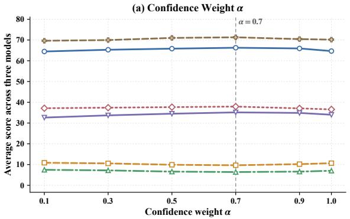

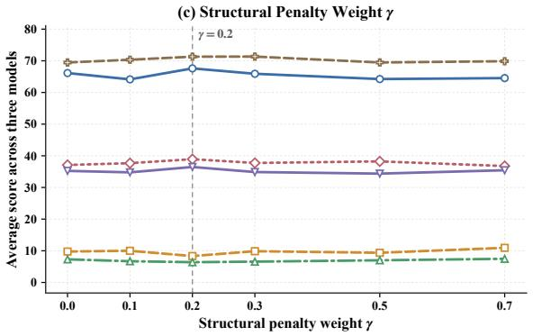

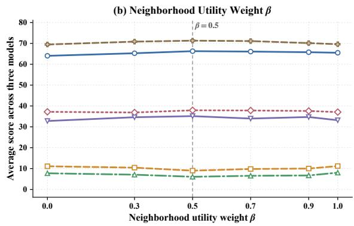

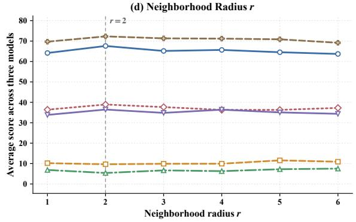  
Figure 6: Hyperparameter sensitivity analysis of the proposed decoding strategy. We evaluate four key hyperparameters: (a) the confidence weight α, (b) the neighborhood utility weight β, (c) the structural penalty weight γ, and (d) the neighborhood radius r. Each curve reports the average performance across three diffusion-based multimodal language models, including LLaDA-V, MMaDA, and LaViDa. The results show that moderate values of $\alpha , \beta ,$ and γ generally achieve better trade-offs across perception, reasoning, and hallucination-related metrics, while an overly large structural penalty or neighborhood radius may degrade performance. The dashed vertical line in each subfigure indicates the selected default setting used in our main experiments.

## D Details of Ablation Studies

We provide detailed per-model ablation results to further analyze the contribution of each component in IGFD. The Confidence variant uses confidencebased commitment. The w/o structural penalty variant removes the structural risk term by setting γ = 0. The w/o neighborhood need variant removes the neighborhood utility term and relies mainly on token confidence and structural penalty. The full IGFD variant uses all components.

The results show that neighborhood utility, structural penalty, and dynamic frontier all contribute to the final performance. Removing neighborhood need consistently lowers LLaVA-Bench and Math-Vista scores, indicating that uncertainty-aware local utility helps select more informative commitments. Removing the structural penalty also degrades the results, especially on hallucination-related metrics, suggesting that delaying premature punctuation and formatting commitments is beneficial. The w/o dynamic frontier variant selects candidates without the adaptive frontier constraint and performs worse than full IGFD, showing that dynamic frontier expansion helps maintain sufficient local context during commitment. Full IGFD achieves the strongest overall performance across the three backbones.

These results are consistent across all evaluated backbones, suggesting that the effectiveness of IGFD does not depend on a specific diffusion architecture. In particular, the gains are simultaneously reflected in perception quality, reasoning accuracy, and hallucination reduction, indicating that the proposed commitment strategy improves generation quality from multiple aspects rather than optimizing for a single metric.

## E Hyperparameter Sensitivity

We further analyze the sensitivity of IGFD to the confidence weight α, information-guided utility weight β, structural penalty weight γ, and neighborhood radius r. The default setting is $\alpha = 0 . 7$

$$
\beta = 0 . 5 , \gamma = 0 . 2 , \mathrm { a n d } r = 2 .
$$

As shown in Figure 6, IGFD is relatively stable around the default setting. A moderate confidence weight is necessary to ensure that committed tokens remain reliable. The neighborhood utility weight improves the ability to prioritize tokens that are useful for nearby uncertain positions, but an overly large value may overemphasize uncertain regions. Similarly, the structural penalty helps delay premature punctuation and formatting tokens, while too large a penalty may excessively postpone necessary structural decisions. The best performance is obtained around $r \ = \ 2$ , suggesting that local neighboring masks provide the most useful uncertainty signal for commitment ordering. Overall, the relatively smooth performance variations across different settings suggest that IGFD is not overly sensitive to hyperparameter choices. This robustness makes the method easier to apply across different diffusion-based multimodal language models without extensive tuning.