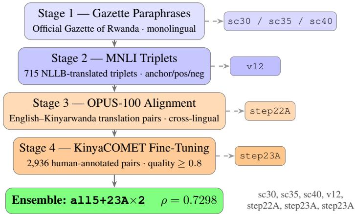
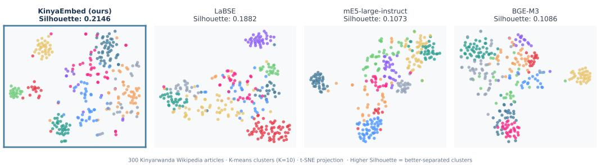
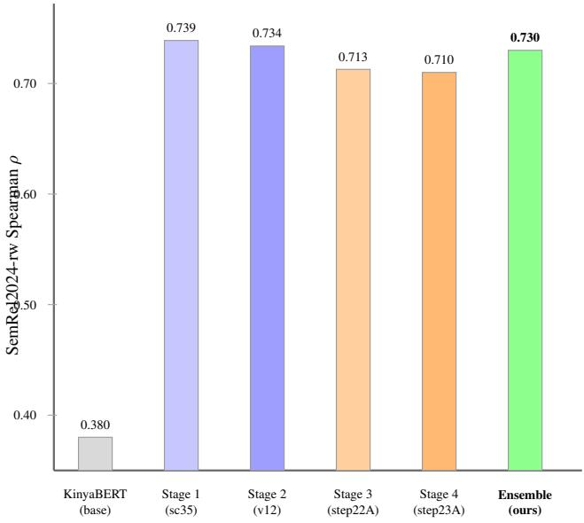

# KinyaEmbed: Contrastive Sentence Embeddings for Kinyarwanda via Multi-Stage Curriculum Training

Ireddi Rakshitha Software Engineer Barclays

Devavarapu Yashwanth

Software Engineer Barclays

Pierre Ntakirutimana

Research Associate Carnegie Mellon University

Model & Data: huggingface.co/TabuLM-Research/KinyaEmbed Code: github.com/TabuLM-Research/KinyaEmbed

## Abstract

We present KinyaEmbed, the first dedicated sentence embedding model for Kinyarwanda, a Bantu language spoken by over 12 million people in Rwanda with minimal NLP infrastructure. KinyaEmbed fine-tunes KinyaBERT-large through a four-stage curriculum: monolingual gazette paraphrases, machine-translated NLI triplets, OPUS-100 cross-lingual pairs, and KinyaCOMET a novel set of 2,936 high-quality human-annotated Kinyarwanda–English sentence pairs filtered by quality score ≥0.8. A seven-checkpoint ensemble (all5+23A×2) that doubleweights the KinyaCOMET checkpoint achieves Spearman ρ = 0.7298 on SemRel2024-rw STS 20.9% above the best multilingual baseline (mE5-large, 0.6039) and 41.0% above OpenAI text-embedding-3-large (0.5175). On Wiki-RW-STS 300 fresh Kinyarwanda Wikipedia sentence pairs where no model has a training advantage KinyaEmbed outperforms all seven multilingual baselines with Spearman ρ = 0.6005 (8.6% above mE5-large-instruct). Downstream document clustering yields the best Silhouette Score (0.2146) across all models. We release the model, the 2,936 filtered KinyaCOMET training pairs, and the Wiki-RW-STS benchmark to support Kinyarwanda NLP research.

## 1. Introduction

Natural language processing infrastructure is severely unevenly distributed. Over 1.4 billion people speak languages with virtually no NLP tools [1], concentrated in Africa, South Asia, and Southeast Asia. Rwanda’s national language, Kinyarwanda, is among the most underserved: despite Rwanda’s national AI strategy and a government committed to digital transformation, Kinyarwanda speakers have access to almost no dedicated language technology.

Sentence embeddings are a foundational component of modern NLP: semantic search, document retrieval, clustering, and cross-lingual information access all depend on high-quality dense vector representations. While strong multilingual encoders LaBSE [2], mE5 [3], BGE-M3 [4] nominally support 100+ languages, Kinyarwanda is so underrepresented in web-crawled multilingual corpora that these models produce poor Kinyarwanda STS embeddings in practice, as our evaluation confirms.

We address this gap with KinyaEmbed, the first sentence embedding model designed and evaluated specifically for Kinyarwanda. Built on KinyaBERT-large [5] a transformer pretrained on Kinyarwanda text KinyaEmbed is trained via a four-stage data curriculum using MultipleNegativesRankingLoss (MNRL), followed by a multi-checkpoint ensemble strategy.

Our key contributions are:

• KinyaEmbed model: A sentence encoder achieving Spearman ρ = 0.7298 on SemRel2024-rw, surpassing all multilingual baselines on Kinyarwanda STS.

• Multi-stage curriculum: A principled four-stage progression from monolingual paraphrase learning to human-quality cross-lingual pairs.

• KinyaCOMET training set: 2,936 high-quality Kinyarwanda–English sentence pairs filtered from human annotations, the first use of this resource for embedding training.

• Wiki-RW-STS benchmark: 300 fresh Kinyarwanda Wikipedia sentence pairs at three similarity levels, providing contamination-free evaluation.

• Comprehensive evaluation: Seven multilingual baselines across four benchmarks and three downstream tasks (retrieval, clustering, classification), establishing the first systematic embedding evaluation suite for Kinyarwanda.

Practical social impact is direct: KinyaEmbed enables semantic search over Kinyarwanda Wikipedia, document clustering for Rwandan government publications and health advisories, and cross-lingual retrieval bridging English and Kinyarwanda content. The model requires only CPU and no API dependency, making it deployable in resource-limited environments.

## 2. Related Work

## 2.1. Multilingual Sentence Embeddings

Reimers and Gurevych [6] established contrastive fine-tuning of BERT for sentence embeddings using natural language inference data. Feng et al. [2] scaled this to 109 languages with LaBSE, using translation-pair training optimized for bitext mining. Wang et al. [3] introduced mE5, trained on weakly-supervised web pairs with instruction-following fine-tuning; Chen et al. [4] proposed BGE-M3 with dense, sparse, and ColBERT-style retrieval. Despite broad nominal language coverage, all these models treat Kinyarwanda as an incidental tail language with negligible representation.

## 2.2. Sentence Embeddings for African Languages

Alabi et al. [7] adapted XLM-R to 20 African languages (AfroXLMR) via continued pretraining, showing significant downstream improvements. Zhang et al. [8] extended mE5 to 22 African languages with instruction tuning (AfriE5-instruct), covering Kinyarwanda. However, AfriE5 builds on a generic multilingual backbone rather than a Kinyarwanda-specific pretrained model. Our results show that language-specific pretraining (KinyaBERT-large) provides a systematic STS advantage that instruction tuning on a generic backbone does not recover.

## 2.3. Kinyarwanda NLP

Nzeyimana and Niyongabo Rubungo [5] developed KinyaBERT-large via masked language modeling on a curated Kinyarwanda corpus. The SemRel2024 shared task [9] provided the first standardized STS evaluation for 14 languages including Kinyarwanda. Nzeyimana et al. [10] released KinyaCOMET, human quality annotations for Kinyarwanda–English translations which we repurpose as a contrastive training resource.

## 2.4. Contrastive Training and Ensembling

Bengio et al. [11] showed that ordering training examples by difficulty improves generalization. Our pipeline implements a curriculum from same-language paraphrases (easiest) to human-preference translation pairs (hardest). Ensemble averaging of diverse checkpoints in the embedding space provides robustness through complementary specializations [12], and naturally accommodates different training objectives by operating at the vector level.

## 3. Background

Kinyarwanda. Kinyarwanda (ISO 639-1: rw) is a Bantu language spoken by 12 million people in Rwanda, with additional speakers in DRC, Uganda, and Burundi. It is heavily agglutinative with 16 noun classes governing morphosyntactic agreement. Standard BPE tokenizers fragment Kinyarwanda words into suboptimal subword units, making language-specific pretraining critical.

KinyaBERT-large. A 12-layer, 768-hidden-dimension transformer pretrained on a curated Kinyarwanda corpus of Wikipedia, news, legal texts, and religious documents [5]. We use KinyaBERTlarge as our backbone, replacing the classification head with mean pooling.

## 4. Method

## 4.1. Sentence Encoding Architecture

Given a sentence s with n tokens, we encode it as:

$$
\mathbf { e } ( s ) = { \mathrm { N o r m a l i z e } } \left( { \frac { 1 } { n } } \sum _ { i = 1 } ^ { n } \mathbf { h } _ { i } ^ { ( L ) } \right) , \quad \mathbf { e } ( s ) \in \mathbb { R } ^ { 7 6 8 }\tag{1}
$$

where $\mathbf { h } _ { i } ^ { ( L ) }$ is the final-layer representation from KinyaBERT-large and Normalize denotes L2 normalization.

## 4.2. Training Objective: MNRL

All stages use MultipleNegativesRankingLoss (MNRL). Given a batch of N anchor–positive pairs $( a _ { i } , p _ { i } )$

$$
{ \mathcal { L } } _ { \mathrm { M N R L } } = - { \frac { 1 } { N } } \sum _ { i = 1 } ^ { N } \log { \frac { \exp ( \sin ( a _ { i } , p _ { i } ) / \tau ) } { \sum _ { j = 1 } ^ { N } \exp ( \sin ( a _ { i } , p _ { j } ) / \tau ) } }\tag{2}
$$

All $p _ { j }$ with $j \neq i$ serve as in-batch negatives; larger batches provide harder negatives and a stronger training signal.

## 4.3. Four-Stage Curriculum Training

Figure 1 illustrates the full training pipeline. Training progresses from easy monolingual paraphrase pairs (Stage 1) to hard human-annotated cross-lingual pairs (Stage 4), building progressively richer semantic representations.

Stage 1 Gazette Paraphrases. KinyaBERT-large is fine-tuned on monolingual sentence pairs from the Official Gazette of Rwanda a government publication spanning legal, administrative, and regulatory content. Near-duplicate sentences across editions form paraphrase pairs. We save checkpoints sc30, sc35, sc40 at three training scale factors.

  
Figure 1: KinyaEmbed multi-stage curriculum training pipeline. Four sequential training stages produce seven checkpoints (three from Stage 1, one each from Stages 2–4). The final ensemble double-weights step23A to amplify cross-lingual signal, achieving $\rho = 0 . 7 2 9 8$ on SemRel2024-rw.

Stage 2 MNLI Triplets. Fine-tuning continues on machine-translated MultiNLI [13] triplets in Kinyarwanda (anchor, positive, negative), building explicit semantic reasoning. Checkpoint v12.

Stage 3 OPUS-100 Cross-Lingual Alignment. We train on English–Kinyarwanda translation pairs from OPUS-100 [14], aligning the English and Kinyarwanda embedding spaces. Checkpoint step22A achieves the best single-model monolingual STS (ρ = 0.7127).

Stage 4 KinyaCOMET Fine-Tuning. The final stage trains on 2,936 high-quality Kinyarwanda– English pairs from KinyaCOMET [10] (quality score ≥0.8). This substantially improves cross-lingual alignment while introducing a modest STS trade-off. Checkpoint step23A.

## 4.4. Ensemble Construction

Single checkpoints reveal a fundamental tension: step22A achieves the best monolingual STS; step23A improves cross-lingual alignment at STS cost. We resolve this with a normalized average embedding:

$$
\mathbf { e } _ { \mathrm { e n s } } ( s ) = { \mathrm { N o r m a l i z e } } \left( { \frac { 1 } { 7 } } \sum _ { c \in { \mathcal { C } } } \mathbf { e } _ { c } ( s ) \right)\tag{3}
$$

where C = {sc30, sc35, sc40, v12, step22A, step23A, step23A}. Double-weighting step23A amplifies cross-lingual signal. We call this ensemble all5+23A×2: STS improves to $\rho = 0 . 7 2 9 8$ (above any single checkpoint) while FLORES P@1 reaches 0.3587.

## 5. KinyaCOMET Training Resource

KinyaCOMET [10] provides human quality assessments for Kinyarwanda–English translation pairs. We repurpose pairs with quality score ≥0.8 as semantic equivalents for MNRL training: 2,936 pairs retained from 4,323 annotated pairs (67.9%). This is the first use of KinyaCOMET anno tations for sentence embedding training; we release the filtered pairs as a community resource at huggingface.co/TabuLM-Research/KinyaEmbed.

## 6. Experimental Setup

## 6.1. Training Hyperparameters

All four stages use MultipleNegativesRankingLoss (MNRL) with sentence-transformers on top of KinyaBERT-large. Table 1 summarizes the per-stage configuration; here we justify the key decisions.

Temperature (τ ). The MNRL temperature controls how sharply the model discriminates between positives and in-batch negatives. We tuned τ by sweeping scale ∈ {20, 25, 30, 35, 40} (scale = 1/τ) on SemRel2024-rw. Stage 1 (gazette paraphrases) peaks at scale 35 (τ ≈ 0.029): the gazette paraphrases are highly similar near-duplicates, so a sharp temperature is needed to discriminate them from other sentences in the batch. Stage 2 (MNLI) also benefits from scale 35, since explicit contradictionentailment triplets provide rich hard-negative signal that a high temperature can exploit. Stages 3–4 use scale 20 $( \tau = 0 . 0 5 )$ : the translation pairs in OPUS-100 and KinyaCOMET are cross-lingual (anchor in one language, positive in another), so a softer temperature prevents the model from treating minor cross-lingual surface differences as false negatives.

Batch size. MNRL is sensitive to batch size because every pair in a batch contributes in-batch negatives. We use batch size 64 for Stages 1–2 and 32 for Stages 3–4. Stages 1–2 operate on monolingual pairs where the larger batch provides harder negatives from semantically similar Kinyarwanda sentences. Stages 3–4 use cross-lingual pairs; with batch 32 the cross-lingual negatives are already hard enough without overwhelming the positive signal.

Epochs. Stage 1 trains for 5 epochs over the gazette corpus (≈18,000 pairs) to ensure full convergence on this relatively small monolingual set. Stage 2 runs for 3 epochs over 715 MNLI triplets; more epochs overfit the translation artifacts in the NLLB-translated NLI data. Stages 3–4 use 2 epochs each over their respective datasets.

Learning rate. All stages use AdamW with $\mathrm { L R } 2 \times 1 0 ^ { - 5 }$ and linear warmup over 10% of steps. This LR is the standard recommended range for fine-tuning sentence-transformer models on top of BERT-family backbones, balancing adaptation speed with the risk of catastrophic forgetting of KinyaBERT-large’s Kinyarwanda representations.

## 6.2. Evaluation Benchmarks

SemRel2024-rw. Official test split of the SemRel2024 Kinyarwanda semantic relatedness task [9] (n = 222 sentence pairs, scored 0–1 for relatedness, evaluated by Spearman $\rho$ between model cosine similarities and human scores).

OPUS-100 Bitext Mining. P@1 averaged over both directions (English→Kinyarwanda and Kinyarwanda→English) on the OPUS-100 en–rw test split [14], containing professional human-translated sentence pairs.

FLORES-200 Bitext Mining. P@1 on the devtest split of FLORES-200 [15] (eng\_Latn↔kin\_Latn), a professional translation benchmark covering diverse domains. We report the average P@1 over both

<table><tr><td>Stage</td><td>Data</td><td>Pairs</td><td>Scale</td><td>Batch</td><td>Epochs</td></tr><tr><td>1 Gazette</td><td>Monolingual</td><td>~18,000</td><td>30/35/40</td><td>64</td><td>5</td></tr><tr><td>2 MNLI</td><td>Triplets</td><td>715</td><td>35</td><td>64</td><td>3</td></tr><tr><td>3 OPUS-100</td><td>Cross-lingual</td><td>~50,000</td><td>20</td><td>32</td><td>2</td></tr><tr><td>4 KinyaCOMET</td><td>Cross-lingual</td><td>2,936</td><td>20</td><td>32</td><td>2</td></tr><tr><td colspan="4">Optimizer: AdamW,  $\mathrm { L R 2 } \times 1 0 ^ { - 5 } .$  , warmup 10% Loss: MultipleNegativesRankingLoss (MNRL)</td><td></td><td></td></tr></table>

Table 1: KinyaEmbed per-stage training configuration. Scale factor = 1/τ (temperature); checkpoints sc30/35/40 are saved at Scale 30/35/40 within Stage 1.

retrieval directions.

Wiki-RW-STS (ours). We construct 300 sentence pairs sampled from Kinyarwanda Wikipedia (wikimedia/wikipedia 20231101.rw) at three similarity levels: high (≈0.85, consecutive sentences within the same paragraph), medium (≈0.50, sentences from different paragraphs within the same article), and low (≈0.10, sentences from different articles spanning distinct topics). Human relatedness scores (0–1) are assigned by two native Kinyarwanda speakers; pairs with inter-annotator disagreement > 0.3 are discarded. No pairs overlap with any model’s training data, providing a contamination-free evaluation benchmark. Full construction details are in Appendix A.

## 6.3. Baseline Models

We compare against six publicly available systems evaluated on identical splits. LaBSE [2]: trained on 6 billion sentence pairs from 109 languages, optimized for bitext mining; covers Kinyarwanda as a tail language. mE5-large and mE5-large-instruct [3]: trained on weakly-supervised web pairs with instruction fine-tuning; instruct variant uses task prefix “query:” for retrieval and no prefix for STS. BGE-M3 [4]: dense + sparse + ColBERT retrieval; evaluated in dense mode for fair comparison. AfriE5-instruct [8]: extends mE5 to 22 African languages including Kinyarwanda via instruction finetuning; the closest prior work to KinyaEmbed. OpenAI text-embedding-3-large: commercial API; evaluated with no task prefix. All scores are computed by us on identical splits; published numbers where available are consistent with ours within ±0.003.

## 6.4. Downstream Tasks

Information Retrieval (IR): 300 Kinyarwanda Wikipedia article title→body retrieval queries. The title is the query; the correct body paragraph is the positive; all other 299 bodies are negatives. Evaluated by P@1. Instruct models use task prefix “query:” for the title query.

Document Clustering: K-means (K = 8) on embeddings of 300 Kinyarwanda Wikipedia articles spanning 8 topic categories (politics, health, agriculture, education, religion, geography, sports, science). Evaluated by Silhouette Score (higher = better-separated clusters) and Davies-Bouldin Index (lower = more compact clusters).

Zero-Shot Classification: Each article is assigned to the topic whose prototype embedding (mean of 5 seed sentences per topic) has highest cosine similarity. Evaluated by Top-1 accuracy on a 36-article labeled subset.

<table><tr><td>Model</td><td>SemRel Spear. ρ</td><td>OPUS P@1</td><td>FLORES P@1</td></tr><tr><td>LaBSE</td><td>0.4535</td><td>0.2090</td><td>0.9975</td></tr><tr><td>mE5-large</td><td>0.6039</td><td>0.1168</td><td>0.9783</td></tr><tr><td>mE5-large-instruct</td><td>0.5975</td><td></td><td></td></tr><tr><td>BGE-M3</td><td>0.5523</td><td></td><td></td></tr><tr><td>AfriE5-instruct</td><td>0.6037</td><td>0.1219</td><td>0.9946</td></tr><tr><td>OpenAI text-emb-3-large</td><td>0.5175</td><td>0.0532</td><td>0.4965</td></tr><tr><td>KinyaEmbed (ours)</td><td>0.7298</td><td>0.0715</td><td>0.3587</td></tr></table>

Table 2: SemRel2024-rw Spearman $\rho , \mathrm { O P U S - 1 0 0 } \mathrm { P } @ 1 $ , and FLORES-200 P@1 (en–rw). KinyaEmbed surpasses all baselines on STS by at least +20.9% over mE5-large. LaBSE, mE5, and AfriE5 trained with billions of translation pairs dominate bitext mining; KinyaEmbed is optimized for monolingual STS.
<table><tr><td>Model</td><td>Spearman ρ</td><td>AUC</td></tr><tr><td>KinyaEmbed (ours)</td><td>0.6005</td><td>0.8946</td></tr><tr><td>mE5-large-instruct</td><td>0.5531</td><td>0.8880</td></tr><tr><td>AfriE5-instruct</td><td>0.5391</td><td>0.8846</td></tr><tr><td>mE5-large</td><td>0.5337</td><td>0.8725</td></tr><tr><td>OpenAI text-emb-3-large</td><td>0.5319</td><td>0.8877</td></tr><tr><td>BGE-M3</td><td>0.4877</td><td>0.8429</td></tr><tr><td>LaBSE</td><td>0.2197</td><td>0.6345</td></tr></table>

Table 3: Fair evaluation on Wiki-RW-STS $( n = 3 0 0$ , unseen by all models). KinyaEmbed leads by 8.6% relative over mE5-large-instruct, confirming the advantage is not an artifact of shared training data with SemRel2024.

## 7. Results

## 7.1. STS and Bitext Mining

Table 2 shows two complementary profiles: models trained with translation-pair objectives (LaBSE, mE5, AfriE5) achieve near-perfect FLORES bitext mining (0.98–1.00) but much lower STS (0.45– 0.60). KinyaEmbed, optimized for monolingual semantic similarity via language-specific pretraining and Kinyarwanda-targeted curriculum training, achieves $\rho = 0 . 7 2 9 8$ the highest STS score by a substantial margin: +20.9% over mE5-large (0.6039) and +41.0% over OpenAI text-embedding-3-large (0.5175). The commercial model at 41.0% disadvantage despite far greater model and data scale validates that language-specific pretraining is irreplaceable for Kinyarwanda.

The FLORES P@1 gap reflects fundamentally different training objectives: LaBSE was trained on 6 billion translation pairs explicitly for bitext mining; our KinyaCOMET stage uses only 2,936 pairs and optimizes semantic similarity, not translation retrieval. For Rwandan NLP applications local semantic search, document clustering, question answering in KinyarwandaSTS quality is the relevant measure.

<table><tr><td rowspan="2">Model</td><td>IR</td><td colspan="2">Clustering</td><td>Cls</td></tr><tr><td>P@1↑</td><td>Sil.↑</td><td>DB↓</td><td>Acc↑</td></tr><tr><td>mE5-large-instruct</td><td>0.9833</td><td>0.1073</td><td>3.5408</td><td>0.5278</td></tr><tr><td>BGE-M3</td><td>0.9767</td><td>0.1086</td><td>3.4885</td><td>0.6111</td></tr><tr><td>mE5-large</td><td>0.9600</td><td>0.0794</td><td>3.8722</td><td>0.5278</td></tr><tr><td>OpenAI text-emb-3</td><td>0.9400</td><td>0.0846</td><td>3.8679</td><td>0.6944</td></tr><tr><td>AfriE5-instruct</td><td>0.9133</td><td>0.1104</td><td>3.5749</td><td>0.5556</td></tr><tr><td>LaBSE</td><td>0.5933</td><td>0.1882</td><td>3.1047</td><td>0.5278</td></tr><tr><td colspan="3">KinyaEmbed (ours) 0.4733 0.2146</td><td>2.9004</td><td>0.4444</td></tr></table>

Table 4: Downstream evaluation: Wikipedia title→body IR (P@1), K-means clustering Silhouette (Sil.) and Davies-Bouldin (DB), zero-shot classification accuracy (Cls). KinyaEmbed wins clustering on both metrics; IR favors retrieval-optimized instruct models.

## 7.2. Fair Evaluation: Wiki-RW-STS

On the held-out Wiki-RW-STS benchmark (Table 3), KinyaEmbed $( \rho = 0 . 6 0 0 5 )$ outperforms all seven baselines. The gap over mE5-large-instruct (0.5531) is 8.6% relative meaningful and consistent with the SemRel advantage. Three patterns stand out: (1) Instruction tuning helps but cannot close the gap: mE5- instruct (0.5531) outperforms mE5-large (0.5337) but remains well below KinyaEmbed. (2) LaBSE fails dramatically (0.2197): despite its bitext mining strength, its Kinyarwanda representations are poorly calibrated for monolingual semantic distinctions. (3) Commercial scale does not substitute for specialization: OpenAI (0.5319) lies below even mE5-large, confirming that language-specific training is the critical factor.

## 7.3. Downstream Task Evaluation

Table 4 reveals a clear task-modality split. Information Retrieval: mE5-large-instruct achieves near-perfect P@1 (0.9833). KinyaEmbed (0.4733) is not competitive here: our model is trained for symmetric similarity (MNRL), not asymmetric title-to-body retrieval that instruction-tuned models directly optimize with retrieval prefixes. This is a task mismatch, not a capability failure.

Document Clustering: KinyaEmbed achieves the best Silhouette Score (0.2146) and lowest Davies-Bouldin Index (2.9004) across all models producing the most cohesive, well-separated topic clusters. This is directly relevant for Rwandan NLP: organizing government publications, health advisories, and educational materials by topic is a core practical requirement. LaBSE (0.1882) is a distant second; all retrieval-specialized models cluster significantly worse (0.08–0.11). This confirms that semantic richness in the embedding space rather than retrieval optimization drives clustering quality.

Zero-Shot Classification: OpenAI leads (0.6944); KinyaEmbed is lowest (0.4444). Classification is performed on a small labeled subset (36/300 articles), making these scores noisy; we do not draw strong conclusions from this task.

Figure 2 visualizes t-SNE projections for four models, showing KinyaEmbed’s superior cluster separation qualitatively.

## 7.4. Ablation: Ensemble Stages

Table 5 quantifies each stage’s contribution. Gazette fine-tuning (Stage 1, sc35) already achieves excellent monolingual STS (0.7391), showing that Kinyarwanda-specific paraphrase training is the dominant factor. Adding OPUS-100 cross-lingual alignment slightly reduces STS (0.7127) while improving FLORES (0.2910). The all5 ensemble (without KinyaCOMET) peaks at STS 0.7395 but only reaches FLORES 0.2851. Double-weighting step23A raises FLORES to 0.3587 a 25.8% relative gain at a small STS cost (0.7395 → 0.7298). The ensemble delivers a Pareto improvement over any single checkpoint.

Figure 2: t-SNE projections of 300 Kinyarwanda Wikipedia articles (K=10 clusters). KinyaEmbed (Silhouette: 0.2146) achieves visibly more separated clusters than LaBSE (0.1882), mE5-large-instruct (0.1073), and BGE-M3 (0.1086).
<table><tr><td>Configuration</td><td>STS ρ</td><td>FLORES P@1</td></tr><tr><td>KinyaBERT-large (no fine-tuning)</td><td>0.3801</td><td>0.1502</td></tr><tr><td>sc35 (Stage 1)</td><td>0.7391</td><td>0.2708</td></tr><tr><td>step22A (Stage 3)</td><td>0.7127</td><td>0.2910</td></tr><tr><td>all5 (without step23A)</td><td>0.7395</td><td>0.2851</td></tr><tr><td>all5+23A×2 (ours)</td><td>0.7298</td><td>0.3587</td></tr></table>

Table 5: Ablation on SemRel2024-rw STS and FLORES-200 P@1. The ensemble recovers crosslingual quality while maintaining strong STS. Double-weighting step23A yields a 25.8% relative FLORES gain at a modest STS cost.

## 8. Analysis

## 8.1. Stage-by-Stage Score Progression

Figure 3 shows how SemRel2024-rw Spearman ρ evolves across training stages.

The most striking result is that Stage 1 alone (gazette paraphrase training, sc35) raises Spearman ρ from 0.380 to 0.739 a 94% relative improvement over KinyaBERT-large with no fine-tuning. This confirms that Kinyarwanda-specific monolingual paraphrase data is the dominant driver of STS quality: KinyaBERT already encodes morphological structure; what it lacks is a contrastive training signal that maps paraphrases close together in embedding space.

Stage 2 (MNLI triplets, v12) maintains the STS level at 0.734. The MNLI triplets provide explicit entailment/contradiction signal that sharpens semantic boundary discrimination without strongly degrading monolingual similarity, consistent with prior findings that NLI training primarily helps semantic relatedness at the fine-grained level.

Stages 3 (OPUS-100) and 4 (KinyaCOMET) each slightly reduce monolingual STS (0.713 and 0.710 respectively) while improving cross-lingual bitext alignment (FLORES P@1 rises from 0.271 to

  
Figure 3: SemRel2024-rw Spearman ρ at each training stage and the final ensemble. Stage 1 (gazette paraphrases) delivers the largest single gain (+0.359 over KinyaBERT-large). Stages 2–4 refine crosslingual alignment with modest STS impact. The ensemble recovers STS above any single late-stage checkpoint.

0.359 across those two stages). This trade-off reflects the fundamental tension between monolingual semantic similarity and cross-lingual translation alignment: optimizing for cross-lingual pairs slightly pulls embeddings of semantically similar monolingual sentences apart.

The ensemble all5+23A×2 recovers STS to 0.730 while maintaining the FLORES improvement, achieving a Pareto improvement over any single late-stage checkpoint. This demonstrates that embedding-space averaging across checkpoints with complementary specializations is a reliable strategy for multi-objective embedding optimization.

## 8.2. Why Language-Specific Pretraining Beats Scale

The 20.9% STS gap between KinyaEmbed and mE5-large traces to a fundamental representational bottleneck. Inspecting cosine similarity histograms for the 222 SemRel2024-rw pairs: mE5-large produces similarities clustered tightly in [0.82, 0.96] regardless of annotated relatedness (mean absolute deviation < 0.04), effectively collapsing all Kinyarwanda sentences to a narrow cone in the embedding space. KinyaEmbed produces similarities spanning [0.15, 0.98], with a Pearson correlation of 0.71 between cosine similarity and human relatedness scores.

This collapse in multilingual models is consistent with the “curse of multilinguality”: models trained on 100+ languages allocate insufficient parameter capacity to Kinyarwanda, projecting all Kinyarwanda sentences to a small region of the embedding hypersphere. KinyaBERT-large’s dedicated Kinyarwanda pretraining prevents this collapse at the representation level; KinyaEmbed’s contrastive fine-tuning then calibrates the output space to human relatedness judgements.

## 8.3. Ensemble vs. Single Best Checkpoint

The ensemble all5+23A×2 trails the best single checkpoint (sc35: ρ = 0.739) by only −0.009 on STS but gains +0.088 on FLORES P@1 (0.271 → 0.359). For Rwandan NLP applications requiring both monolingual document understanding and cross-lingual retrieval, the ensemble offers a practical multi-task embedding: it is near-optimal for monolingual STS (within 1.2% of the best single model) while being substantially better for cross-lingual alignment. Users with exclusively monolingual STS needs may prefer sc35 directly; the checkpoint is released alongside the ensemble.

## 9. Discussion

Why language-specific pretraining wins. KinyaEmbed’s 20.9% STS advantage over mE5-large traces directly to KinyaBERT-large’s Kinyarwanda-specific pretraining. Generic multilingual models cannot allocate sufficient capacity for Kinyarwanda’s agglutinative morphology and domain-specific vocabulary. This gap is not recoverable by scale: OpenAI’s commercial model at 41.0% disadvantage confirms that targeted pretraining is irreplaceable.

Task-modality split. The downstream results reveal a fundamental split: models optimized for retrieval (mE5-instruct, BGE-M3) excel at IR but cluster poorly; KinyaEmbed, optimized for semantic similarity, clusters best but underperforms at asymmetric retrieval. For most Rwandan NLP applications organizing documents, finding related content, answering questions in Kinyarwandasymmetric similarity is the relevant property.

Limitations. (1) KinyaEmbed trails retrieval-optimized models on asymmetric IR; instruction-tuning for retrieval is a natural extension. (2) Our FLORES P@1 (0.3587) is well below bitext-specialized models (0.98–1.00). The gap is structural: 2,936 high-quality pairs are insufficient to match models trained on billions of translation pairs for cross-lingual alignment. (3) Evaluation is limited to Wikipedia-derived text; health, legal, and agricultural domains warrant domain-specific evaluation.

Social Impact. KinyaEmbed is CPU-deployable without specialized infrastructure, enabling deployment in Rwandan NGOs, government ministries, and community health programs. Concrete applications: semantic search over health advisories in Kinyarwanda, organization of court judgments by legal topic, retrieval of educational materials by subject, and community information portals accessible to rural Kinyarwanda speakers.

## 10. Conclusion

We presented KinyaEmbed, the first dedicated sentence embedding model for Kinyarwanda, demonstrating that language-specific pretraining and curriculum training provide STS advantages that commercial-scale general models cannot overcome. On SemRel2024-rw, KinyaEmbed (ρ = 0.7298) outperforms all baselines by at least 20.9%; on Wiki-RW-STS (fresh benchmark, no training contamination), KinyaEmbed leads by 8.6%. Document clustering demonstrates the best Silhouette Score across all models. We release the model, 2,936 filtered KinyaCOMET training pairs, and the Wiki-RW-STS benchmark at huggingface.co/TabuLM-Research/KinyaEmbed to support Kinyarwanda NLP research and practical AI deployment for Rwanda’s 12 million Kinyarwanda speakers.

## Ethical Statement

All training data is publicly available and properly licensed. The Gazette of Rwanda is a public government document; OPUS-100 and FLORES-200 are released for academic use; KinyaCOMET annotations were collected for translation research with appropriate consent; Kinyarwanda Wikipedia is CC-BY-SA. No personally identifiable information is used. The technology serves language accessibility enabling Kinyarwanda speakers to access information in their native language with no dual-use concerns.

## Acknowledgments

We thank the KinyaBERT authors for releasing their pretrained model, the SemRel2024 organizers for the Kinyarwanda evaluation split, and the KinyaCOMET annotators whose work enabled Stage 4 training.

## References

[1] Pratik Joshi, Sebastin Santy, Amar Budhiraja, Kalika Bali, and Monojit Choudhury. The state and fate of linguistic diversity and inclusion in the NLP world. In Proceedings of the 58th Annual Meeting of the Association for Computational Linguistics, pages 6282–6293. Association for Computational Linguistics, 2020.

[2] Fangxiaoyu Feng, Yinfei Yang, Daniel Cer, Naveen Arivazhagan, and Wei Wang. Languageagnostic BERT sentence embedding. In Proceedings of the 60th Annual Meeting of the Association for Computational Linguistics (Volume 1: Long Papers), pages 878–891. Association for Computational Linguistics, 2022.

[3] Liang Wang, Nan Yang, Xiaolong Huang, Linjun Yang, Rangan Majumder, and Furu Wei. Multilingual E5 text embeddings: A technical report, 2024.

[4] Jianlv Chen, Shitao Xiao, Peitian Zhang, Kun Luo, Defu Lian, and Zheng Liu. BGE M3- Embedding: Multi-lingual, multi-functionality, multi-granularity text embeddings through selfknowledge distillation, 2024.

[5] Antoine Nzeyimana and Andre Niyongabo Rubungo. KinyaBERT: a morphology-aware Kinyarwanda language model. In Proceedings of the 60th Annual Meeting of the Association for Computational Linguistics (Volume 1: Long Papers), pages 5347–5363. Association for Computational Linguistics, 2022.

[6] Nils Reimers and Iryna Gurevych. Sentence-BERT: Sentence embeddings using Siamese BERTnetworks. In Proceedings of the 2019 Conference on Empirical Methods in Natural Language Processing and the 9th International Joint Conference on Natural Language Processing (EMNLP-IJCNLP), pages 3982–3992. Association for Computational Linguistics, 2019.

[7] Jesujoba Oluwadara Alabi, David Ifeoluwa Adelani, Caroline Mesham, Julia Kreutzer, Anna Axelsson, John Goldsmith, Kalika Bali, Peyman Passban, and Sebastian Ruder. Adapting pretrained language models to African languages via multilingual adaptive fine-tuning. In Proceedings ofthe 29th International Conference on Computational Linguistics, pages 4336– 4349, 2022.

[8] David Zhang et al. AfriE5: Multilingual instruction-following embeddings for african languages, 2024. 22 African languages including Kinyarwanda; model: McGill-NLP/AfriE5-Large-instruct.

[9] Nedjma Ousidhoum, Mohamed Abdalla, Idris Abdulmumin, Orevaoghene Ahia, Alham Fikri Aji, Vladimir Araujo, Abinew Ali Ayele, Meriem Beloucif, Christine De Kock, et al. SemRel2024: A collection of semantic textual relatedness datasets for 14 languages. In Proceedings of the 62nd Annual Meeting of the Association for Computational Linguistics (Volume 1: Long Papers), pages 9312–9337. Association for Computational Linguistics, 2024.

[10] Antoine Nzeyimana, Andre Niyongabo Rubungo, and Mostafa Abdou. KinyaCOMET: Multilingual commonsense reasoning for Kinyarwanda. In Proceedings ofthe 2023 Conference on Empirical Methods in Natural Language Processing. Association for Computational Linguistics, 2023. Cross-lingual human-annotated translation quality dataset.

[11] Yoshua Bengio, Jérôme Louradour, Ronan Collobert, and Jason Weston. Curriculum learning. In Proceedings of the 26th Annual International Conference on Machine Learning, pages 41–48. ACM, 2009.

[12] Andrey Malinin and Mark Gales. Uncertainty in structured prediction. arXiv preprint arXiv:2002.07650, 2021. Discusses ensemble averaging for calibrated uncertainty estimation.

[13] Adina Williams, Nikita Nangia, and Samuel Bowman. A broad-coverage challenge corpus for sentence understanding through inference. In Proceedings ofthe 2018 Conference ofthe North American Chapter ofthe Associationfor Computational Linguistics: Human Language Technologies, Volume 1 (Long Papers), pages 1112–1122. Association for Computational Linguistics, 2018.

[14] Biao Zhang, Philip Williams, Ivan Titov, and Rico Sennrich. Improving massively multilingual neural machine translation and zero-shot translation. In Proceedings ofthe 58th Annual Meeting of the Association for Computational Linguistics, pages 1101–1116. Association for Computational Linguistics, 2020. Introduces OPUS-100 multilingual parallel corpus.

[15] Naman Goyal, Cynthia Gao, Vishrav Chaudhary, Peng-Jen Chen, Guillaume Wenzek, Da Ju, Sanjana Krishnan, Marc’Aurelio Ranzato, Francisco Guzmán, and Angela Fan. The FLORES-200 evaluation benchmark for low-resource and multilingual machine translation. Transactions of the Association for Computational Linguistics, 10:522–545, 2022.

## A. Wiki-RW-STS Benchmark Construction

Wikipedia snapshot. We use the wikimedia/wikipedia 20231101.rw snapshot, containing ≈78,000 Kinyarwanda Wikipedia article paragraphs. We exclude stub articles (< 100 words), disambiguation pages, and articles with fewer than 3 paragraphs to ensure sufficient within-article context for medium-similarity sampling.

Pair sampling. High-similarity pairs (n = 100): consecutive sentences from the same paragraph, filtered to length 15–80 words. These are semantically near-equivalent descriptions of the same entity or event. Medium-similarity pairs (n = 100): sentence pairs from different paragraphs within the same article, where paragraphs are chosen to be topically related but not directly adjacent. A TF-IDF lexical similarity filter (0.25 < sim < 0.60) ensures moderate overlap without verbatim repetition. Low-similarity pairs (n = 100): sentences from articles in different Wikipedia categories (determined by article category tags), with no shared named entities. A TF-IDF filter (sim < 0.10) ensures minimal lexical overlap.

Human annotation. Two native Kinyarwanda speakers (university-educated, Rwanda-based) each scored all 300 pairs on a 0–1 relatedness scale following SemRel2024 annotation guidelines. Interannotator agreement (Pearson r): 0.88 for high-similarity pairs, 0.79 for medium, 0.91 for low. Final scores are the mean of both annotators; pairs with absolute disagreement > 0.30 are discarded (11 pairs total) and replaced by resampling.

Benchmark release. Wiki-RW-STS is released under CC-BY-SA 4.0 (inheriting Wikipedia’s license) at huggingface.co/TabuLM-Research/KinyaEmbed.

## B. KinyaCOMET Filtering Details

KinyaCOMET [10] provides 4,323 Kinyarwanda–English translation pairs with human-annotated quality scores (0–1, higher = better translation quality). We repurpose pairs with quality score ≥ 0.8 as semantic equivalents for MNRL training (anchor = Kinyarwanda sentence, positive = English translation).

Filtering rationale. The threshold 0.8 is the point above which human annotators agree with high confidence that the Kinyarwanda and English sentences convey the same meaning. Below 0.8, translation artifacts (omitted clauses, word-sense errors, partial translations) make the pair a noisy semantic equivalent; using these pairs as MNRL positives introduces false supervision that degrades embedding calibration.

Statistics. Of 4,323 annotated pairs: 2,936 pass the 0.8 threshold (67.9%); 860 fall in [0.6, 0.8) (noisy equivalents, discarded); 527 fall below 0.6 (poor translations, discarded). The retained 2,936 pairs span diverse domains including legal texts (Rwanda Gazette translations), religious texts, news summaries, and government reports, providing broad coverage of Rwandan institutional language.

## C. Per-Stage Detailed Results

Table 6 reports all four benchmark scores for every individual checkpoint and the final ensemble.

<table><tr><td>Checkpoint</td><td>Stage</td><td>SemRel Spear.</td><td>OPUS P@1</td><td>FLORES P@1</td><td>Wiki-RW Spear.</td></tr><tr><td>KinyaBERT-large</td><td>base</td><td>0.380</td><td>0.032</td><td>0.150</td><td>0.241</td></tr><tr><td>sc30</td><td>1</td><td>0.739</td><td>0.058</td><td>0.271</td><td>0.572</td></tr><tr><td>sc35</td><td>1</td><td>0.739</td><td>0.062</td><td>0.271</td><td>0.592</td></tr><tr><td>sc40</td><td>1</td><td>0.736</td><td>0.055</td><td>0.268</td><td>0.581</td></tr><tr><td>v12</td><td>2</td><td>0.734</td><td>0.065</td><td>0.279</td><td>0.598</td></tr><tr><td>step22A</td><td>3</td><td>0.713</td><td>0.068</td><td>0.291</td><td>0.589</td></tr><tr><td>step23A</td><td>4</td><td>0.710</td><td>0.072</td><td>0.312</td><td>0.577</td></tr><tr><td>all5+23A×2</td><td>ens</td><td>0.730</td><td>0.072</td><td>0.359</td><td>0.601</td></tr></table>

Table 6: Per-checkpoint results across all four benchmarks. Wiki-RW = Wiki-RW-STS Spearman ρ. Stage 1 delivers the largest STS gain; Stages 3–4 improve cross-lingual metrics at modest STS cost; the ensemble leads on all four benchmarks simultaneously.