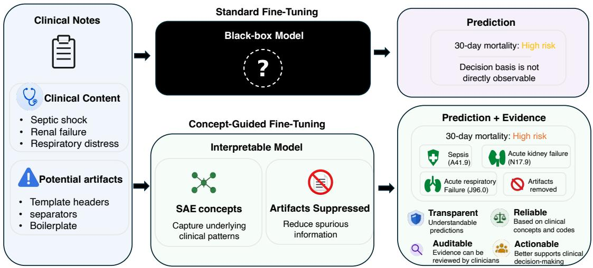
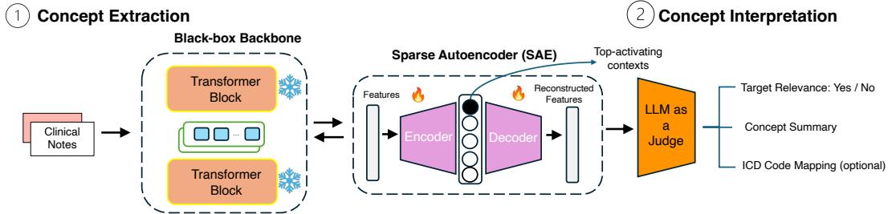
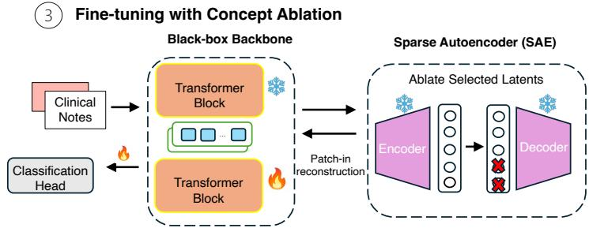
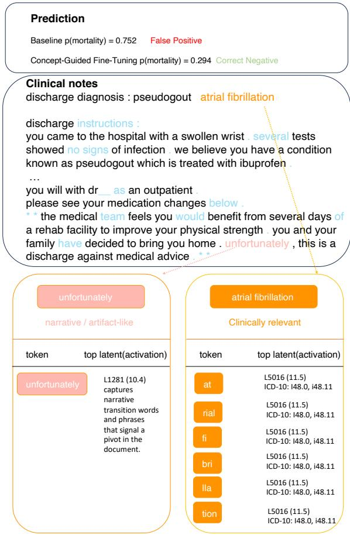
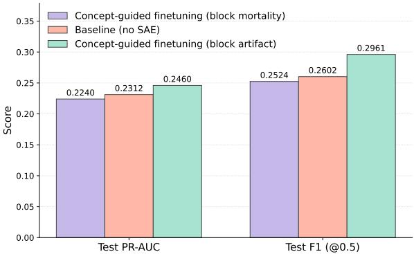
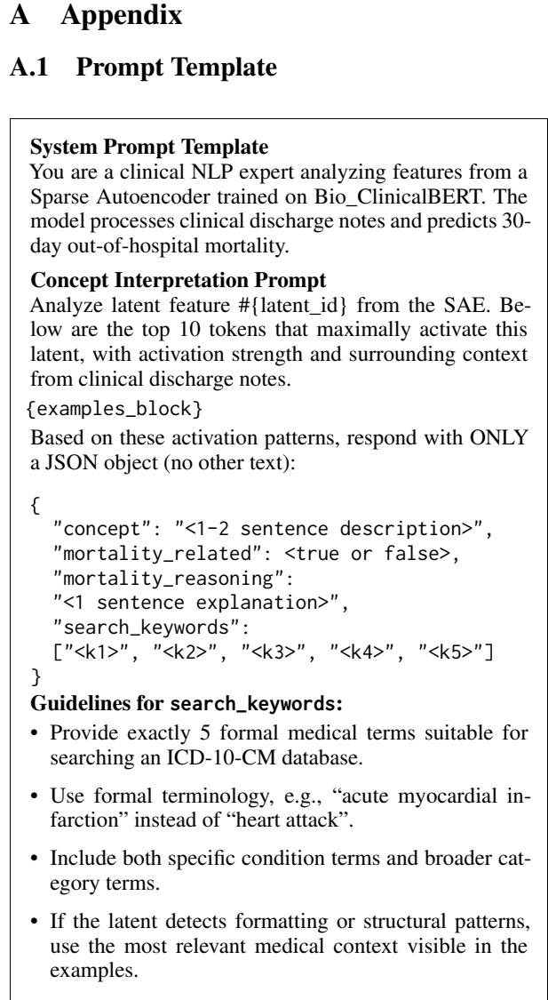

# Making Clinical Language Models Auditable: Concept-Guided Fine-Tuning for Robust Prediction

Jin Mu University of Wisconsin–Madison jmu27@wisc.edu

Guanhua Chen University of Wisconsin–Madison gchen25@wisc.edu

## Abstract

Clinical language models can achieve strong in-hospital accuracy yet fail under deployment shifts because they exploit note-specific artifacts (e.g., templates, separators, boilerplate) that do not reflect patient state. We propose CAST (Concept-guided Artifact Suppression Tuning), an SAE-based framework for auditable clinical text classification. CAST uses Sparse Autoencoders to expose sparse, human-auditable features from intermediate Transformer activations, labels SAE latents with an LLM-assisted interpretation pipeline and ICD-10 retrieval constraints, suppresses verified artifact latents via residual subtraction during fine-tuning, and provides post-hoc perconcept attributions for auditing model decisions. On MIMIC-IV discharge-note mortality prediction, CAST improves over its corresponding fine-tuned encoder baselines and remains competitive with strong LLM baselines, while producing a feature-level audit trail of the clinical concepts that support each prediction and the artifact concepts suppressed during training.

## 1 Introduction

Clinical language models have shown significant potential to transform clinical workflows by processing unstructured electronic health record (EHR) data for tasks such as clinical summarization, diagnostic reasoning, and risk prediction (Maity and Saikia, 2025; Meng et al., 2024; Thirunavukarasu et al., 2023). Compared with structured variables alone, free-text clinical notes contain rich longitudinal information about patient history, disease progression, clinician assessments, and treatment decisions. This makes them especially valuable for high-acuity prediction tasks such as mortality risk estimation. However, despite strong in-distribution performance, the deployment of clinical LLMs remains limited in high-stakes medical settings because their predictions are often difficult to interpret, validate, and trust (Amann et al., 2020; Markus et al., 2021). A central obstacle is shortcut learning: models trained on EHR notes may exploit artifact-based signals that are highly predictive within a dataset but clinically meaningless or unstable under deployment shift. These signals can include note templates, section headers, documentation style, repeated boilerplate, separators, discharge formatting, or institution-specific coding patterns, which may correlate with outcomes because of local documentation practices rather than true patient physiology (Geirhos et al., 2020).

This concern is especially acute in Intensive Care Unit (ICU) settings, where risk predictions may inform time-sensitive decisions. Even when a model correctly identifies a high-risk patient, the prediction has limited clinical value if it is driven by such shortcuts rather than evidence of clinical deterioration. Clinicians cannot justify decisions such as escalating life support or initiating palliative care based on an opaque alert. Clinical interpretability therefore requires more than highlighting salient words or spans: it must expose the internal concepts that causally influence predictions and determine whether they reflect medically meaningful evidence (Rudin, 2019).

Interpretability for clinical language models has traditionally focused on token-level feature attribution, employing label-wise attention or posthoc saliency methods such as Integrated Gradients, LIME, and SHAP (Mullenbach et al., 2018; Vu et al., 2020; Kim et al., 2022; Dolk et al., 2022). While these techniques identify salient input spans, they are mechanistically limited: they pinpoint where a model attends without elucidating the underlying concepts or the functional logic governing their processing. Furthermore, the reliability of such attributions is frequently contested; prior work has demonstrated that attention weights can be poorly correlated with model outputs, posing significant risks for high-stakes clinical auditing (Jain and Wallace, 2019). Consequently, there remains a critical gap in moving beyond superficial, input-level correlations toward understanding the internal representations that drive clinical reasoning.

  
Figure 1: SAE-Guided Fine-Tuning Enables Transparent Clinical Risk Prediction. Unlike standard finetuning, which yields opaque risk predictions, our framework encourages models to rely on clinically meaningful SAE concepts and suppress non-clinical artifacts, producing predictions with interpretable clinical evidence and ICD-10 codes.

Recent work in mechanistic interpretability seeks to reverse-engineer models by decomposing internal neural activations into distinct, humanunderstandable features (Elhage et al., 2021; Olsson et al., 2022). Specifically, Sparse Autoencoders (SAEs) have proven highly effective in general-domain models by disentangling polysemantic neurons into distinct "monosemantic" features (Bricken et al., 2023; Gao et al., 2025). While SAEs improve model transparency, their application in the medical domain remains relatively limited. Prior medical-domain work has used dictionary features for mechanistic explanations and demonstrated feature-based steering (Wu et al., 2024), but integrating such interpretable features as explicit artifact-suppression interventions during task-specific fine-tuning remains underexplored.

In this work, we propose CAST (Conceptguided Artifact Suppression Tuning), a finetuning framework for clinical classification that transforms mechanistic interpretability from a passive analytical tool into an active steering mechanism. As illustrated in Figure 1, standard finetuning maps clinical notes directly to risk predictions through a black-box model, making it difficult to determine whether predictions are based on meaningful clinical evidence or dataset-specific artifacts. In contrast, our framework uses Sparse Autoencoders trained on the large-scale MIMIC datasets (Johnson et al., 2016a,b, 2023) to identify internal model features corresponding to humanunderstandable clinical concepts. We then use these semantic units to guide fine-tuning by suppressing features associated with spurious shortcuts, such as formatting artifacts, while encouraging reliance on clinically meaningful representations. We evaluate our approach on MIMIC-IV ICU discharge notes for 30-day out-of-hospital mortality prediction and show that integrating concept-level control into the training loop yields not only improved predictive performance, but also a transparent feature-level audit trail with supporting clinical concepts and ICD-10 codes.

## 2 Related Work

Feature Extraction via Sparse Autoencoders To optimize the extraction of monosemantic features, several SAE architectures have emerged. Vanilla SAEs isolate monosemantic features by projecting dense activations into a highdimensional, sparse latent space optimized with an $\ell _ { 1 }$ penalty (Ng, 2011). To overcome the feature shrinkage inherent to $\ell _ { 1 }$ regularization, TopK SAEs enforce a hard activation budget by retaining only the K largest values per input (Gao et al., 2025). The BatchTopK variant builds on this by applying selection across entire batches to prevent dead neurons and stabilize training (Bussmann et al., 2024). Additionally, architectures like Matryoshka SAE explore hierarchical representations by constructing nested dictionaries, dividing the latent space into expanding prefixes to encode high-level abstractions in early dimensions and fine-grained details in later ones (Bussmann et al., 2025). Together, these developments have substantially improved the quality, stability, and semantic organization of SAE-derived features, making them increasingly useful for downstream interpretability and intervention.

SAE-Guided Control and Adaptation Once high-quality monosemantic features are extracted, the interpretability paradigm increasingly shifts from passive analysis toward active model intervention. At inference time, several frameworks utilize SAE features for causal interventions— systematically amplifying or ablating specific latents to reliably steer model generation (Bayat et al., 2025). This steering capability has also been extended to complex cognitive and in-context mechanisms; for instance, Chen et al. (2026) combine SAEs with activation patching to isolate “reasoning features” and probe Chain-of-Thought (CoT) faithfulness, while Cho and Hockenmaier (2025) use SAE-guided procedures to track information flow and improve in-context learning behavior. Beyond inference-time steering, recent work has begun incorporating SAE-derived features into model adaptation. For example, Casademunt et al. (2025) integrate SAE-based concept ablation into fine-tuning to suppress unintended generalizations such as gender bias, while Self-Regul (Wu et al., 2025) uses sparse autoencoders to regularize LLM-based classification toward interpretable sparse features. However, these methods primarily target general-domain generation, reasoning, behavioral steering, or controllable classification, rather than clinical risk prediction. Our work addresses this gap by adapting SAE-guided learning to clinical prediction, where the goal is not only to steer model behavior but also to sup press clinically meaningless documentation artifacts.

Mechanistic Interpretability in Clinical Classification Mechanistic interpretability has recently been explored as a way to expose and manipulate internal representations for text classification. In general-domain settings, SPIN (Jiao et al., 2024) identifies and integrates task-relevant internal neurons to obtain more compact and interpretable classifiers. Gallifant et al. (2025) show that features discovered by Sparse Autoencoders can serve as effective classifier representations and transfer across models and modalities. However, these approaches do not use clinically interpreted artifact concepts as explicit suppression targets during task-specific fine-tuning. CAST instead integrates SAE-derived concepts directly into clinical model adaptation, updating representations during training to suppress spurious documentation artifacts.

## 3 Method

We introduce an end-to-end framework that leverages Sparse Autoencoders to map internal representations to interpretable concepts and utilize them for controlled fine-tuning. The complete pipeline is illustrated in Figure 2.

## 3.1 Concept Extraction via SAEs

Let $f _ { \theta }$ denote a pretrained Transformer encoder. Given an input clinical note $\boldsymbol { x } = ( x _ { 1 } , \dots , x _ { T } )$ , we extract the token representations from layer ℓ:

$$
H = f _ { \boldsymbol { \theta } } ^ { ( \boldsymbol { \ell } ) } ( \boldsymbol { x } ) \in \mathbb { R } ^ { T \times d } , \qquad h _ { t } \in \mathbb { R } ^ { d } .
$$

where $h _ { t }$ is the contextual hidden state of token $x _ { t }$ at layer $\ell .$ To convert these black-box features into an interpretable concept interface, we introduce a sparse concept decomposition module parameterized by an encoder-decoder pair $( ~ E _ { \phi } , D _ { \psi } ~ .$ ):

$$
z _ { t } = E _ { \phi } \left( h _ { t } \right) \in \mathbb { R } ^ { d _ { \mathrm { S A E } } } , \quad \hat { h } _ { t } = D _ { \psi } \left( z _ { t } \right) \in \mathbb { R } ^ { d } .
$$

The key requirement is that $z _ { t }$ is sparse (only a few concept dimensions active per token), while $\hat { h } _ { t }$ remains a faithful reconstruction of $h _ { t }$ . We therefore optimize a generic objective:

$$
\mathcal { L } _ { \mathrm { c o n c e p t } } = \sum _ { t = 1 } ^ { T } \left\| h _ { t } - \hat { h } _ { t } \right\| _ { 2 } ^ { 2 } + \lambda \Omega ( z )
$$

where $\Omega ( \cdot )$ specifies the sparsity mechanism and can be instantiated in different SAE variants.

## 3.2 Automated Concept Interpretation

To make the learned concepts interpretable for auditing and steering, we employ an LLM-based interpretation pipeline. For each latent j, we extract a context window (e.g., $[ t - w , t + w ] )$ around its top k highest activating tokens $z _ { t , j }$ from the clinical corpus. Prompted with these empirically grounded contexts, an LLM judge outputs three elements: (i) a concise description of the captured clinical concept, (ii) a binary classification of its relevance to the downstream task versus unintended artifacts (e.g., boilerplate), and (iii) a set of formal medical keywords suitable for querying standardized clinical databases.

  
Figure 2: Framework for clinical concept extraction and controlled fine-tuning. The pipeline consists of three stages: (1) Concept Extraction via a trained Sparse Autoencoder; (2) Concept Interpretation using an LLM to evaluate top activations; and (3) Fine-tuning with Concept Ablation to steer downstream model predictions.

To prevent the LLM from hallucinating medical codes, we implement a retrieval-based safeguard: the generated keywords are used to query an ICD-10 database (National Center for Health Statistics, 2024), allowing the LLM to assign verified clinical codes to the latent by selecting exclusively from the retrieved candidate set.

## 3.3 Fine-Tuning with Concept Steering

To operationalize the learned concepts, we integrate the frozen SAE as an active steering intervention at its training layer K. We partition the L-layer transformer into a frozen prefix (layers 1 through K) and a trainable suffix (layers $K { + 1 }$ through L). Given input tokens x, the frozen prefix produces hidden states $h ^ { ( K ) } ( x )$ , which the SAE rewrites into steered representations $\tilde { h } ^ { ( K ) } ( x )$ as defined in Equation (1) below. The trainable suffix then processes the steered states.

Because clinical discharge notes routinely exceed the encoder’s context window, each document is partitioned into overlapping chunks. The suffix outputs are reduced to a single chunk embedding by mean pooling over non-special tokens, and chunk embeddings are combined into a document embedding through a learned attention pool. The document embedding is then fed to a linear classification head that produces the task logits.

Residual-correction intervention. Let T denote the set of task-relevant concept indices identified by the LLM judge in Section 4.4, and let T denote the indices labeled as task-irrelevant or artifactual. Rather than replacing $h ^ { ( K ) }$ with the SAE reconstruction, which would incur reconstruction error on signals the dictionary fails to capture, we adopt a residual correction that preserves the original hidden state and subtracts only the contribution of the suppressed concepts:

$$
\tilde { h } _ { t } ^ { ( K ) } = h _ { t } ^ { ( K ) } - \sum _ { j \in \overline { { \mathcal { T } } } } z _ { t , j } W _ { \operatorname* { d e c } } [ j , : ] ,\tag{1}
$$

where $z _ { t , j }$ is the SAE activation of latent $j$ at token t, and $W _ { \mathrm { d e c } } [ j , : ]$ is its decoder direction. The unmodeled portion of $h _ { t } ^ { ( K ) }$ , i.e., the SAE residual $h _ { t } ^ { ( K ) } - D _ { \psi } ( z _ { t } )$ , passes through unchanged, so clinical signal the SAE fails to reconstruct is preserved verbatim.

Uniform artifact suppression. We subtract every latent the interpretation pipeline labels as artifactual, regardless of its activation magnitude or estimated downstream impact. Two considerations motivate this choice. First, even lowmagnitude artifact directions can correlate with institution- or template-specific documentation patterns and shift the decision boundary under deployment distribution shift. Second, the residual form in Equation (1) makes uniform suppression more conservative: only the explicit decoder contributions in $\overline { { \tau } }$ are removed, while the rest of $h _ { t } ^ { ( K ) }$ flows through unchanged. This design deliberately decouples what the model is forbidden to use—any verified artifact, set during training—from what evidence the model is shown to rely on, which is defined as a post-hoc audit signal in Section 3.4.

## 3.4 Per-Concept Attribution for Auditability

The suppression mechanism in Section 3.3 controls what the model is forbidden to use; clinical deployment additionally requires evidence of what the trained model actually used. We therefore equip the framework with a post-hoc attribution module that, for every document, scores each SAE latent by its contribution to the prediction without affecting any trained parameter.

Let $F _ { \omega }$ denote the deployed suffix classifier that maps the steered layer-K representation $\tilde { h } ^ { ( K ) } ( x )$ to the positive-class logit,

$$
s ( x ) = F _ { \omega } \Bigl ( \tilde { h } ^ { ( K ) } ( x ) \Bigr ) .
$$

We use the logit rather than the probability to avoid vanishing gradients for confident predictions. For latent j, we define the signed first-order attribution as

$$
A _ { j } ( x ) = \sum _ { t = 1 } ^ { T } z _ { t , j } ( x ) \left. \nabla _ { t } s ( x ) , W _ { \mathrm { d e c } } [ j , : ] \right. ,\tag{2}
$$

where $\nabla _ { t } s ( x ) \equiv \partial s ( x ) / \partial \tilde { h } _ { t } ^ { ( K ) } ( x )$ , and $z _ { t , j } ( x )$ is the SAE activation of latent j at token t.

Equation (2) is the first-order Taylor approximation of the exact counterfactual logit change when concept $j ^ { \circ } \mathbf { s }$ decoder direction is removed from the steered state:

$$
\begin{array} { r l } & { A _ { j } ( x ) \approx F _ { \omega } \Big ( \tilde { h } ^ { ( K ) } ( x ) \Big ) } \\ & { \qquad - F _ { \omega } \Big ( \tilde { h } ^ { ( K ) } ( x ) - z . , j ( x ) W _ { \mathrm { d e c } } [ j , : ] \Big ) . } \end{array}\tag{3}
$$

Positive values of $A _ { j } ( x )$ indicate concepts that push the prediction toward mortality, whereas negative values indicate concepts that push against it.

We rank concepts by $| A _ { j } ( x ) |$ for overall importance and by signed $A _ { j } ( x )$ when presenting perprediction evidence.

Computing Equation (2) requires one forward pass and one backward pass per batch through $F _ { \omega } .$ plus a single matrix multiplication against $W _ { \mathrm { d e c } } ^ { \top }$ This replaces the |D| separate forward passes required by exact counterfactual ablation, where |D| is the SAE dictionary size. In our implementation, the full MIMIC-IV test split is processed in roughly six minutes on a single GPU. On 30 heldout documents, the per-document Spearman rank correlation between $A _ { j } ( x )$ and the exact counterfactual effect is $\rho = 0 . 9 7 6$ with Pearson $r = 0 . 9 3 5$ Appendix A.2 provides the closed-form expression for the linear case, the validation protocol, and detailed use cases, including per-prediction evidence trails, global auditing, and cost-efficient expert review.

## 4 Results and Discussion

## 4.1 Dataset

We use the dataset introduced by Yoon et al. (2025) for 30-day out-of-hospital mortality prediction from ICU discharge notes in MIMIC-IV v2.2 (Johnson et al., 2023), with labels derived by linking encounters to an external death registry. The dataset contains 49,832 admissions/notes from 39,705 patients, with patient-level splits to avoid leakage and exclusions for inhospital death and hospice disposition. Importantly, the classification target is extremely imbalanced (approximately 1,830 positives vs. 48,002 negatives for the 30-day task), posing a challenging setting for robust evaluation on long-form clinical text.

## 4.2 Models and Baselines

For clinical note encoding, we use two domainspecific pretrained Transformer backbones: ClinicalBERT (Alsentzer et al., 2019) for inputs up to 512 tokens, and Clinical-Longformer (Li et al., 2022) for extended notes up to 4,096 tokens. Both are continually pre-trained on the MIMIC corpus.

We compare CAST against standard fine-tuning of the same clinical encoders and two zero-shot general-purpose LLM baselines, GPT-4 (OpenAI et al., 2024) and Llama-3-8B (Grattafiori et al., 2024). We additionally include an input-removal baseline that directly removes identified inputlevel artifacts before fine-tuning, testing whether simple preprocessing alone is sufficient to mitigate artifact-driven shortcuts. We also include two SAE-based baselines: Self-Regul (Wu et al., 2025), which regularizes classification with SAEderived sparse features, and SAE-Probe, adapted from Gallifant et al. (2025), which freezes the encoder and SAE, pools SAE latent activations into document-level features, and trains a lightweight classifier on top. Unlike CAST, both baselines use SAE latents as auxiliary representations rather than as explicit artifact-suppression interventions inside the fine-tuning loop. Additional details are provided in Appendix A.7.

## 4.3 Training setup and hyperparameters

SAE pretraining. We train three variants of SAE, TopK, BatchTopK, and Matryoshka, on hidden activations from the frozen encoder over a mixed clinical corpus of 200,000 MIMIC notes; the corpus split is provided in the Appendix A.5. We report TopK and Matryoshka in the main results, while BatchTopK results are provided in the Appendix A.9. All SAEs use a dictionary size of $d _ { \mathrm { S A E } } ~ = ~ 8 , 1 9 2$ with top-k = 64 active latents per token. The Matryoshka variant uses nested group sizes {512, 2048, 8192}, totaling 10,752 latents. SAEs are trained with AdamW using a learning rate of 1e−3 for approximately 410M tokens, and are frozen during all downstream fine-tuning.

Downstream training. We fine-tune all conceptguided models and fine-tuning baselines for 5 epochs using AdamW with differential learning rates of 5e−5 for the backbone layers and 1e−3 for the classification head. The effective batch size is 256. To handle the approximately 27:1 class imbalance, we use class-weighted focal loss with $\gamma \quad = \quad 2 . 0$ and per-class weights $\alpha \quad =$ $[ 1 . 0 , N _ { \mathrm { n e g } } / N _ { \mathrm { p o s } } ]$ . We train each model for five epochs and evaluate the final checkpoint on the held-out test set, reporting $F _ { 1 }$ both at a fixed decision threshold of 0.5 and at a validation-selected threshold $\tau ^ { \star }$ that maximizes $F _ { 1 }$ on the validation set. Additional optimization details are provided in Appendix A.5.

## 4.4 Feature Extraction and Interpretation

We train sparse autoencoders on frozen hidden activations from layer 8 (mid-encoder) and layer 11 (near the top of the encoder), and insert the resulting modules back into the corresponding layers for downstream fine-tuning (Section 3.3).

  
Figure 3: Real clinical note case study: artifact suppression corrects a false positive while preserving clinical evidence.

To interpret the learned SAE latents, we apply an LLM-based labeling pipeline to the maximally activating clinical contexts of each alive latent. For each latent, gemini-2.5-flash-lite (Gemini Team, Google, 2025) is shown its top-10 activating contexts and asked to produce a concise concept description, assign a semantic category, and determine whether the concept is related to 30- day mortality. For diagnostic concepts, the LLM additionally generates medical search terms that are used to retrieve candidate ICD-10-CM codes; code assignment is restricted to the retrieved candidate set to reduce code hallucination. Full prompts and implementation details are provided in Appendix A.3.

We use these interpretations to construct a conservative suppression set $\overline { { \tau } }$ . Specifically, to improve labeling reliability, we run the interpretation pipeline independently three times for each latent and include a latent in $\overline { { \tau } }$ only when all three runs classify it as either a formatting or deidentification artifact and as not mortality-related.

Table 1: Performance on 30-day out-of-hospital mortality prediction from long discharge notes. Zero-shot results are reported from Yoon et al. (2025). CAST denotes our concept-guided fine-tuning method. $\mathrm { F } 1 _ { \tau ^ { \star } }$ uses the decision threshold that maximizes F1 on the validation set.
<table><tr><td>Backbone</td><td>Layer</td><td>SAE</td><td>Protocol</td><td>Interp.</td><td>F1↑</td><td> $\mathbf { F 1 } _ { \tau ^ { \star } } \uparrow$ </td><td>AUROC↑</td><td>PR-AUC ↑</td><td>Brier ↓</td><td>NLL↓</td><td>ECE↓</td></tr><tr><td>GPT-4</td><td></td><td>一</td><td>Zero-shot</td><td>X</td><td>0.3237</td><td>一</td><td>一</td><td></td><td>一</td><td></td><td></td></tr><tr><td>Llama3-8B</td><td></td><td></td><td>Zero-shot</td><td>x</td><td>0.1948</td><td></td><td></td><td></td><td></td><td></td><td></td></tr><tr><td rowspan="19"></td><td rowspan="6"></td><td>一</td><td>Fine-tuning</td><td>x</td><td>0.2602</td><td>0.2941</td><td>0.8320</td><td>0.2312</td><td>0.0908</td><td>0.3315</td><td>0.2246</td></tr><tr><td></td><td>Input removal</td><td>x</td><td>0.2470</td><td>0.3002</td><td>0.8550</td><td>0.2450</td><td>0.1253</td><td>0.4228</td><td>0.2947</td></tr><tr><td></td><td>Self-Regul</td><td></td><td>0.1663</td><td>0.2415</td><td>0.8353</td><td>0.2011</td><td>0.1944</td><td>0.5756</td><td>0.3960</td></tr><tr><td>TopK</td><td>SAE-Probe</td><td>V</td><td>0.2632</td><td>0.2544</td><td>0.8265</td><td>0.2175</td><td>0.0806</td><td>0.3066</td><td>0.2078</td></tr><tr><td></td><td>CAST</td><td></td><td>0.2961</td><td>0.3000</td><td>0.8579</td><td>0.2460</td><td>0.0879</td><td>0.3190</td><td>0.2150</td></tr><tr><td></td><td>Self-Regul</td><td>V</td><td>0.1631</td><td>0.2991</td><td>0.8390</td><td>0.2235</td><td>0.1948</td><td>0.5764</td><td>0.3963</td></tr><tr><td rowspan="2"></td><td>Matryoshka</td><td>SAE-Probe</td><td>J</td><td>0.2404</td><td>0.2227</td><td>0.8067</td><td>0.1743</td><td>0.0967</td><td>0.3348</td><td>0.2161</td></tr><tr><td></td><td>CAST</td><td>V</td><td>0.2749</td><td>0.2927</td><td>0.8382</td><td>0.2460</td><td>0.0693</td><td>0.2713</td><td>0.1736</td></tr><tr><td rowspan="7"></td><td rowspan="7"></td><td></td><td>Fine-tuning</td><td></td><td>0.2549 0.2612</td><td>0.8246</td><td>0.2089</td><td></td><td>0.0817</td><td>0.3129 0.2122</td></tr><tr><td>Input removal Self-Regul</td><td></td><td>0.2240 0.1639</td><td>0.2901 0.2479</td><td>0.8230 0.8351</td><td>0.1850 0.2036</td><td>0.0911 0.1949</td><td>0.3363 0.5775</td><td>0.2234 0.3979</td></tr><tr><td>TopK</td><td>SAE-Probe</td><td></td><td></td><td></td><td></td><td></td><td></td><td></td></tr><tr><td>CAST</td><td></td><td>0.2308</td><td>0.2345 0.2699</td><td>0.7965 0.8428</td><td>0.1643 0.2362</td><td>0.0899 0.0837</td><td>0.3318 0.3168</td><td>0.2254 0.2163</td></tr><tr><td></td><td>Self-Regul</td><td></td><td>0.2837 0.1664</td><td>0.2594</td><td>0.8379</td><td>0.2059</td><td>0.1937</td><td>0.5746</td></tr><tr><td>Matryoshka</td><td>SAE-Probe</td><td></td><td>0.1637</td><td></td><td></td><td></td><td></td><td>0.3958</td></tr><tr><td rowspan="2"></td><td>CAST</td><td>V</td><td>0.2869</td><td>0.1612 0.2923</td><td>0.7709 0.8422</td><td>0.1084 0.2355</td><td>0.1086 0.0507</td><td>0.3757 0.2242</td><td>0.2554 0.1326</td></tr><tr><td></td><td></td><td></td><td></td><td></td><td></td><td></td><td>0.1909</td><td></td></tr><tr><td rowspan="19">11 Clinical- Longformer</td><td rowspan="4"></td><td>1</td><td>Fine-tuning Input removal</td><td>x x</td><td>0.1759 0.2250</td><td>0.3286 0.3242</td><td>0.8666 0.8570</td><td>0.2648 0.2650</td><td>0.1355</td><td>0.5681 0.4315</td><td>0.3908 0.2968</td></tr><tr><td>Self-Regul</td><td></td><td>0.1726</td><td>0.2771</td><td>0.8436</td><td>0.2342</td><td>0.1860</td><td></td><td>0.5575</td><td>0.3854</td></tr><tr><td></td><td>SAE-Probe</td><td></td><td>0.1333</td><td>0.2313</td><td>0.8151</td><td>0.1553</td><td>0.2245</td><td>0.6350</td><td>0.3997</td></tr><tr><td>TopK</td><td>CAST</td><td></td><td>0.2794</td><td>0.3412</td><td>0.8740</td><td>0.2702</td><td>0.1217</td><td>0.4097</td><td>0.2882</td></tr><tr><td rowspan="3"></td><td>Self-Regul</td><td>V</td><td>0.1943</td><td>0.2731</td><td>0.8465</td><td>0.2393</td><td>0.1760</td><td></td><td>0.5359</td><td>0.3723</td></tr><tr><td>Matryoshka SAE-Probe</td><td></td><td></td><td>0.1454 0.1807</td><td></td><td></td><td>0.1683</td><td>0.2014</td><td>0.5824</td><td>0.3853</td></tr><tr><td>CAST</td><td></td><td></td><td></td><td>0.8028</td><td>0.2511</td><td></td><td></td><td></td><td>0.3464</td></tr><tr><td></td><td></td><td></td><td>S</td><td>0.2038</td><td>0.2760</td><td>0.8641</td><td></td><td>0.1595</td><td>0.4975</td><td></td></tr><tr><td rowspan="6"></td><td></td><td>Fine-tuning</td><td>x</td><td>0.2028 0.3040</td><td>0.2787 0.2843</td><td>0.8556</td><td>0.2433 0.2300</td><td>0.1506 0.1304</td><td>0.4755</td><td>0.3289</td></tr><tr><td></td><td>Input removal Self-Regul</td><td>x</td><td>0.1928</td><td>0.2775</td><td>0.8370</td><td>0.2470</td><td>0.1760</td><td>0.4427 0.5365</td><td>0.3129</td></tr><tr><td>TopK</td><td>SAE-Probe</td><td>L</td><td>0.1777</td><td>0.1426</td><td>0.8502 0.7782</td><td>0.1358</td><td>0.1160</td><td>0.3921</td><td>0.3732 0.2652</td></tr><tr><td></td><td>CAST</td><td></td><td>0.3041</td><td>0.3085</td><td>0.8523</td><td>0.2360</td><td>0.0900</td><td>0.3396</td><td>0.2375</td></tr><tr><td></td><td>Self-Regul</td><td>V √</td><td>0.1855</td><td>0.2741</td><td>0.8514</td><td>0.2506</td><td>0.1797</td><td>0.5443</td><td>0.3779</td></tr><tr><td rowspan="2">Matryoshka</td><td>SAE-Probe</td><td>L</td><td>0.1060</td><td>0.1815</td><td>0.7786</td><td>0.1095</td><td>0.2790</td><td></td><td>0.7566</td><td>0.4773</td></tr><tr><td>CAST</td><td>V</td><td>0.3233</td><td>0.3073</td><td>0.8531</td><td>0.2524</td><td></td><td>0.0820</td><td>0.3196</td><td>0.2224</td></tr></table>

This strict-consensus criterion is designed to reduce erroneous suppression of clinically meaningful features. Across configurations, Fleiss κ (Fleiss, 1971) ranges from 0.707–0.749 for mortality-related labels and 0.749–0.806 for artifact labels, while unanimous agreement ranges from 82.6–87.7% and 87.9–93.3%, respectively. Per-configuration agreement statistics are reported in Appendix A.3.

At the aggregate level, the interpretation results show that many latents capture mortality-related concepts, while roughly half can be grounded to one or more ICD-10 codes. ClinicalBERT yields a higher clinical-concept fraction than Longformer, and layer-11 SAEs capture richer clinical semantics than layer-8 SAEs. Per-configuration statistics are reported in Appendix A.4.

At the instance level, Figure 3 illustrates how these interpreted features translate into the steering behavior of CAST. In a representative MIMIC-IV case, suppressing strict-consensus artifact latents corrects a confident false-positive prediction while preserving activations corresponding to genuine clinical evidence.

## 4.5 Performance Analysis

Table 1 reports results on 30-day out-of-hospital mortality prediction from long discharge notes. The zero-shot LLM baselines provide two useful reference points: GPT-4 remains a strong closed-model baseline, whereas Llama3-8B performs poorly on this long clinical-text task. CAST instead uses compact clinical encoders and exposes predictions through SAE-derived concepts, offering a more auditable alternative to generalpurpose LLMs.

Among encoder-based methods, the results highlight the importance of how SAE information is used. Standard fine-tuning provides a strong but opaque discriminative baseline, SAE-Probe uses SAE activations only as frozen post-hoc features, and Self-Regul applies SAE-based regularization. CAST goes beyond these alternatives by using SAE concepts as training-time steering signals, yielding a stronger balance of discrimination, calibration, and concept-level interpretability.

The input-removal baseline further tests whether direct preprocessing is sufficient to address the identified artifacts. It is competitive on selected metrics, particularly for ClinicalBERT at layer 11, confirming that visible input-level artifacts can sometimes be removed effectively. However, its gains are not consistent across backbones and layers. Input removal also does not provide the concept-level suppression and audit trail available through CAST.

The pattern across backbones further suggests that CAST’s gains are not tied to a single encoder or SAE variant. For ClinicalBERT, TopK at layer 11 gives the strongest discrimination, while Matryoshka at layer 8 yields the most reliable risk estimates. For Clinical-Longformer, the layer 8 Matryoshka CAST model improves operating-point performance while substantially reducing Brier score, NLL, and ECE. These results suggest that SAE-guided steering can improve clinical risk prediction without reducing the model to a purely post-hoc interpretability pipeline. We further assess CAST against the matched fine-tuning baselines using paired bootstrap tests with 10,000 resamples; full results are reported in Appendix A.8.

## 4.6 Feature Importance

We use the per-concept attribution $A _ { j } ( x )$ defined in Section 3.4 to perform a post-hoc analysis of the SAE latents that most influence mortality predictions. For each configuration, we aggregate $A _ { j } ( x )$ over the MIMIC-IV test cohort by taking the signed mean over documents in which latent j is active. This produces a ranked set of SAE concepts that most strongly influence the model’s output.

Table 2 reports the highest-magnitude signed attributions for ClinicalBERT layer 11 across the three SAE variants. The positive attributions correspond to clinically plausible mortality-related factors, including palliative care, COPD exacerbation, metastatic disease, and acute kidney failure. In contrast, the strongest negative attributions are associated with recovery or lower-risk indicators, especially mobility and independent ambulation. Notably, mobility-related concepts appear among the top negative features for all three SAE variants in this layer, suggesting that the attribution analysis captures stable clinically meaningful signals rather than idiosyncratic features of a single SAE construction.

<table><tr><td>SAE</td><td>Latent</td><td> $\bar { A } _ { j }$ </td><td>Concept (ICD-10-CM)</td></tr><tr><td colspan="4">Push prediction ↑ mortality</td></tr><tr><td>BatchTopK</td><td>1108</td><td>+0.18</td><td>palliative care (Z51.5)</td></tr><tr><td>TopK</td><td>6730</td><td>+0.15</td><td>COPD exacerbation (J44.1) metastatic disease /</td></tr><tr><td>Matryoshka</td><td>101</td><td>+0.04</td><td>secondary malignancy (C79.9)</td></tr><tr><td>TopK</td><td>915</td><td>+0.02</td><td>acute kidney failure (N17.9)</td></tr><tr><td colspan="4">Push prediction ↓ mortality</td></tr><tr><td>BatchTopK</td><td>5888</td><td>-0.29</td><td>ambulate independently</td></tr><tr><td>TopK</td><td>7211</td><td>-0.20</td><td>gait/mobility status (R26.89)</td></tr><tr><td>TopK</td><td>6567</td><td>-0.19</td><td>independent ambulation</td></tr><tr><td>BatchTopK</td><td>3189</td><td></td><td>—0.18 discharge mentions</td></tr><tr><td>Matryoshka 581</td><td></td><td></td><td>—0.13 gait/mobility status (R26.89)</td></tr></table>

Table 2: Top signed-attribution SAE concepts for ClinicalBERT layer 11. Positive values push predictions toward mortality; negative values push them away.

These findings complement the ablation results in Section 4.7: suppressing mortality-related concepts harms predictive performance, whereas suppressing artifact concepts improves it. Appendix A.11 expands Table 2 with LLM-generated concept descriptions and representative activating contexts, while Appendix A.12 provides concrete examples of the strict-consensus artifact set suppressed during training.

## 4.7 Ablation and Sensitivity Analysis

Concept ablation. We conduct an ablation study on ClinicalBERT layer 11 to verify that CAST’s gains come from targeted concept-level intervention rather than simply adding an SAE module. We compare three settings: standard finetuning, blocking mortality-related concepts, and blocking artifact-related concepts. To make the comparison controlled, we block the same number of mortality-related and artifact-related latents.

As shown in Figure 4, matched-size interventions have opposite effects: blocking mortalityrelated concepts hurts performance, while blocking artifact-related concepts improves it. This suggests that CAST gains come from targeted semantic steering rather than generic regularization, supporting SAE latents as an actionable interface for auditing and control.

  
Figure 4: Ablation study of concept-guided fine-tuning. Blocking artifact-related concepts improves both PR-AUC and F1, while blocking mortality-related concepts degrades performance.

Layer and hyperparameter sensitivity. We additionally evaluate an earlier intervention layer (layer 4) for both backbones and vary the SAE dictionary size and TopK sparsity in a representative ClinicalBERT layer-11 configuration. Across these sensitivity analyses, CAST remains competitive over the tested settings. Full results are reported in Appendix A.6.

## 5 Conclusion

We introduced an SAE-guided fine-tuning framework for interpretable and controllable clinical prediction. By turning sparse SAE concepts into training-time steering signals, our method moves beyond post-hoc interpretation and provides a direct interface for suppressing spurious artifacts. On MIMIC-IV 30-day mortality prediction, CAST maintains strong predictive performance while improving calibration and exposing concept-level evidence for model decisions. Overall, our framework offers a practical path toward auditable and reliable clinical NLP systems.

## Limitations

Our evaluation focuses on a single prediction task using MIMIC-III and MIMIC-IV discharge notes. Although these datasets span different time periods and documentation systems, they originate from the same institution. Evaluation on external institutions, additional note types, and other clinical tasks is therefore an important direction for future work. Moreover, the modest absolute F1 scores reflect the difficulty of this highly imbalanced task; we view CAST as a research-stage auditing and steering framework rather than a deployable clinical model. Establishing clinically useful operating points will require prospective evaluation and clinician-in-the-loop assessment of the audit trail. Concept interpretation relies on an LLM judge and ICD-10-CM retrieval. Our strict three-run consensus rule is designed to reduce erroneous suppression, but clinician-annotated validation would provide a stronger assessment of labeling reliability. Because artifact and workflowrelated features may also carry valid clinical or demographically correlated information, future work should include expert review of suppression sets and subgroup-specific evaluation before clinical use. Finally, CAST introduces additional offline cost for SAE pretraining and latent interpretation, although the LLM is not used during test-time prediction.

## Acknowledgment

J. Mu and G. Chen’s effort was partially supported by NSF grant DMS-2515263 and by the Patient-Centered Outcomes Research Institute (PCORI) Award ME-2024C1-37433. The statements in this work are solely the responsibility of the authors and do not necessarily represent the views of the Patient-Centered Outcomes Research Institute (PCORI), its Board of Governors, or the Methodology Committee.

## References

Emily Alsentzer, John Murphy, William Boag, Wei-Hung Weng, Di Jindi, Tristan Naumann, and Matthew McDermott. 2019. Publicly available clinical BERT embeddings. In Proceedings of the 2nd Clinical Natural Language Processing Workshop, pages 72–78, Minneapolis, Minnesota, USA. Association for Computational Linguistics.

Julia Amann, Alessandro Blasimme, Effy Vayena, Dietmar Frey, Vince I Madai, and Precise4Q Consortium. 2020. Explainability for artificial intelligence in healthcare: a multidisciplinary perspective. BMC medical informatics and decision making, 20(1):310.

Reza Bayat, Ali Rahimi-Kalahroudi, Mohammad Pezeshki, Sarath Chandar, and Pascal Vincent. 2025. Steering large language model activations in sparse spaces. In Second Conference on Language Modeling.

Trenton Bricken, Adly Templeton, Joshua Batson, Brian Chen, Adam Jermyn, Tom Conerly, Nick

Turner, Cem Anil, Carson Denison, Amanda Askell, Robert Lasenby, Yifan Wu, Shauna Kravec, Nicholas Schiefer, Tim Maxwell, Nicholas Joseph, Zac Hatfield-Dodds, Alex Tamkin, Karina Nguyen, and 6 others. 2023. Towards Monosemanticity: Decomposing language models with dictionary learning. Transformer Circuits Thread. Accessed: 2026- 02-12.

Bart Bussmann, Patrick Leask, and Neel Nanda. 2024. Batchtopk sparse autoencoders. arXiv preprint arXiv:2412.06410.

Bart Bussmann, Noa Nabeshima, Adam Karvonen, and Neel Nanda. 2025. Learning multi-level features with matryoshka sparse autoencoders. In Proceedings of the 42nd International Conference on Machine Learning, volume 267 of Proceedings of Machine Learning Research, pages 6077–6101. PMLR.

Helena Casademunt, Caden Juang, Adam Karvonen, Samuel Marks, Senthooran Rajamanoharan, and Neel Nanda. 2025. Steering out-of-distribution generalization with concept ablation fine-tuning. arXiv preprint arXiv:2507.16795.

Xi Chen, Aske Plaat, and Niki van Stein. 2026. How does chain of thought think? mechanistic interpretability of chain-of-thought reasoning with sparse autoencoding. In Proceedings of the AAAI Conference on Artificial Intelligence, volume 40, pages 30297–30305.

Ikhyun Cho and Julia Hockenmaier. 2025. Toward efficient sparse autoencoder-guided steering for improved in-context learning in large language models. In Proceedings of the 2025 Conference on Empirical Methods in Natural Language Processing, pages 28961–28973, Suzhou, China. Association for Computational Linguistics.

Alexander Dolk, Hjalmar Davidsen, Hercules Dalianis, and Thomas Vakili. 2022. Evaluation of lime and shap in explaining automatic icd-10 classifications of swedish gastrointestinal discharge summaries. In Scandinavian Conference on Health Informatics, pages 166–173.

Nelson Elhage, Neel Nanda, Catherine Olsson, Tom Henighan, Nicholas Joseph, Ben Mann, Amanda Askell, Yuntao Bai, Anna Chen, Tom Conerly, Nova DasSarma, Dawn Drain, Deep Ganguli, Zac Hatfield-Dodds, Danny Hernandez, Andy Jones, Jackson Kernion, Liane Lovitt, Kamal Ndousse, and 6 others. 2021. A mathematical framework for transformer circuits. Transformer Circuits Thread.

Joseph Fleiss. 1971. Measuring nominal scale agreement among many raters. Psychological Bulletin, 76:378–382.

Jack Gallifant, Shan Chen, Kuleen Sasse, Hugo Aerts, Thomas Hartvigsen, and Danielle Bitterman. 2025. Sparse autoencoder features for classifications and transferability. In Proceedings of the 2025 Conference on Empirical Methods in Natural Language

Processing, pages 29939–29963, Suzhou, China. Association for Computational Linguistics.

Leo Gao, Tom Dupre la Tour, Henk Tillman, Gabriel Goh, Rajan Troll, Alec Radford, Ilya Sutskever, Jan Leike, and Jeffrey Wu. 2025. Scaling and evaluating sparse autoencoders. In International Conference on Learning Representations, volume 2025, pages 26721–26754.

Robert Geirhos, Jörn-Henrik Jacobsen, Claudio Michaelis, Richard Zemel, Wieland Brendel, Matthias Bethge, and Felix A Wichmann. 2020. Shortcut learning in deep neural networks. Nature Machine Intelligence, 2(11):665–673.

Gemini Team, Google. 2025. Gemini 2.5: Pushing the frontier with advanced reasoning, multimodality, long context, and next generation agentic capabilities. arXiv preprint arXiv:2507.06261.

Aaron Grattafiori, Abhimanyu Dubey, Abhinav Jauhri, Abhinav Pandey, Abhishek Kadian, Ahmad Al-Dahle, Aiesha Letman, Akhil Mathur, Alan Schelten, Alex Vaughan, Amy Yang, Angela Fan, Anirudh Goyal, Anthony Hartshorn, Aobo Yang, Archi Mitra, Archie Sravankumar, Artem Korenev, Arthur Hinsvark, and 542 others. 2024. The llama 3 herd of models.

Sarthak Jain and Byron C Wallace. 2019. Attention is not explanation. In Proceedings of NAACL-HLT, pages 3543–3556.

Difan Jiao, Yilun Liu, Zhenwei Tang, Daniel Matter, Jürgen Pfeffer, and Ashton Anderson. 2024. SPIN: Sparsifying and integrating internal neurons in large language models for text classification. In Findings of the Association for Computational Linguistics: ACL 2024, pages 4666–4682, Bangkok, Thailand. Association for Computational Linguistics.

Alistair Johnson, Lucas Bulgarelli, Tom Pollard, Steven Horng, Leo Anthony Celi, and Roger Mark. 2023. MIMIC-IV. PhysioNet. Version 2.2.

Alistair Johnson, Tom Pollard, and Roger Mark. 2016a. MIMIC-III Clinical Database. PhysioNet. Version 1.4.

Alistair E. W. Johnson, Tom J. Pollard, Lu Shen, Liwei H. Lehman, Mengling Feng, Mohammad Ghassemi, Benjamin Moody, Peter Szolovits, Leo Anthony Celi, and Roger G. Mark. 2016b. MIMIC-III, a freely accessible critical care database. Scientific Data, 3:160035.

Juyong Kim, Abheesht Sharma, Suhas Shanbhogue, Jeremy Weiss, and Pradeep Ravikumar. 2022. Anemic: A framework for benchmarking icd coding models. In Proceedings of the 2022 Conference on Empirical Methods in Natural Language Processing: System Demonstrations, pages 109–120.

Yikuan Li, Ramsey M Wehbe, Faraz S Ahmad, Hanyin Wang, and Yuan Luo. 2022. Clinical-longformer and clinical-bigbird: Transformers for long clinical sequences. arXiv preprint arXiv:2201.11838.

Subhankar Maity and Manob Jyoti Saikia. 2025. Large language models in healthcare and medical applications: A review. Bioengineering, 12(6):631.

Aniek F Markus, Jan A Kors, and Peter R Rijnbeek. 2021. The role of explainability in creating trustworthy artificial intelligence for health care: a comprehensive survey of the terminology, design choices, and evaluation strategies. Journal of biomedical informatics, 113:103655.

Xiangbin Meng, Xiangyu Yan, Kuo Zhang, Da Liu, Xiaojuan Cui, Yaodong Yang, Muhan Zhang, Chunxia Cao, Jingjia Wang, Xuliang Wang, Jun Gao, Yuan-Geng-Shuo Wang, Jia ming Ji, Zifeng Qiu, Muzi Li, Cheng Qian, Tianze Guo, Shuangquan Ma, Zeying Wang, and 6 others. 2024. The application of large language models in medicine: A scoping review. iScience, 27(5):109713.

James Mullenbach, Sarah Wiegreffe, Jon Duke, Jimeng Sun, and Jacob Eisenstein. 2018. Explainable prediction of medical codes from clinical text. In Proceedings of the 2018 Conference of the North American Chapter of the Association for Computational Linguistics: Human Language Technologies, Volume 1 (Long Papers), pages 1101–1111, New Orleans, Louisiana. Association for Computational Linguistics.

National Center for Health Statistics. 2024. International classification of diseases, tenth revision, clinical modification (icd-10-cm). https://www.cdc. gov/nchs/icd/icd-10-cm/index.html. Centers for Disease Control and Prevention.

Andrew Ng. 2011. Sparse autoencoder. CS294A Lecture Notes, Stanford University. https://web.stanford.edu/class/cs294a/ sparseAutoencoder.pdf.

Catherine Olsson, Nelson Elhage, Neel Nanda, Nicholas Joseph, Nova DasSarma, Tom Henighan, Ben Mann, Amanda Askell, Yuntao Bai, Anna Chen, and 1 others. 2022. In-context learning and induction heads. arXiv preprint arXiv:2209.11895.

OpenAI, Josh Achiam, Steven Adler, Sandhini Agarwal, Lama Ahmad, Ilge Akkaya, Florencia Leoni Aleman, Diogo Almeida, Janko Altenschmidt, Sam Altman, Shyamal Anadkat, Red Avila, Igor Babuschkin, Suchir Balaji, Valerie Balcom, Paul Baltescu, Haiming Bao, Mohammad Bavarian, Jeff Belgum, and 262 others. 2024. Gpt-4 technical report. Preprint, arXiv:2303.08774.

Cynthia Rudin. 2019. Stop explaining black box machine learning models for high stakes decisions and use interpretable models instead. Nature machine intelligence, 1(5):206–215.

Arun James Thirunavukarasu, Darren Shu Jeng Ting, Kabilan Elangovan, Laura Gutierrez, Ting Fang Tan, and Daniel Shu Wei Ting. 2023. Large language models in medicine. Nature medicine, 29(8):1930– 1940.

Thanh Vu, Dat Quoc Nguyen, and Anthony Nguyen. 2020. A label attention model for icd coding from clinical text. In Proceedings of the Twenty-Ninth International Joint Conference on Artificial Intelligence, IJCAI-20, pages 3335–3341. International Joint Conferences on Artificial Intelligence Organization. Main track.

John Wu, David Wu, and Jimeng Sun. 2024. Beyond label attention: Transparency in language models for automated medical coding via dictionary learning. In Proceedings of the 2024 Conference on Empirical Methods in Natural Language Processing, pages 8848–8871, Miami, Florida, USA. Association for Computational Linguistics.

Xuansheng Wu, Wenhao Yu, Xiaoming Zhai, and Ninghao Liu. 2025. Self-regularization with sparse autoencoders for controllable llm-based classification. In Proceedings of the 31st ACM SIGKDD Conference on Knowledge Discovery and Data Mining V. 2, pages 3250–3260.

WonJin Yoon, Shan Chen, Yanjun Gao, Zhanzhan Zhao, Dmitriy Dligach, Danielle S Bitterman, Majid Afshar, and Timothy Miller. 2025. Lcd benchmark: long clinical document benchmark on mortality prediction for language models. Journal of the American Medical Informatics Association, 32(2):285– 295.

  
Figure 5: Prompt template. System prompt and user prompt used for concept interpretation.

## A.2 Per-Concept Attribution: Linear Limit, Validation, and Use Cases

Closed-form linear case. When the suffix and prediction head collapse to a single linear map $W _ { g }$ applied to a document-level aggregate $\bar { z } ( x ) \in$ $\mathbb { R } ^ { d _ { \mathrm { S A E } } }$ , Equation (2) reduces to the analytic ablation expression

$$
A _ { j } ( x ) = \bar { z } _ { j } ( x ) \left( W _ { \mathrm { d e c } } [ j , : ] W _ { g } ^ { \top } \right) ,
$$

which can be evaluated without an additional network forward pass. The gradient-based estimator in Equation (2) generalizes this closed form to the non-linear deployed classifier.

Validation protocol. For each of 30 randomly sampled test documents with predicted probability in [0.05, 0.95], we computed the exact logitlevel counterfactual effect in Equation (3) for the union of (i) the top-100 most activated latents and (ii) the top-100 most attributive latents in that document, yielding approximately 180 concepts per document. We then computed the per-document Spearman rank and Pearson correlations between $A _ { j } ( x )$ and the exact effect. The resulting mean Spearman correlation is $\rho = 0 . 9 7 6$ , with median 0.978, $Q _ { 1 } = 0 . 9 7 0$ , and $Q _ { 3 } = 0 . 9 8 6$ ; the mean Pearson correlation is $r = 0 . 9 3 5 .$ . The mean relative $L _ { 1 }$ error, $\lvert A _ { j } - \Delta s _ { j } \rvert / \overline { { \lvert { \Delta s _ { j } } \rvert } }$ , is 0.38. This residual is composed of higher-order Taylor terms and does not substantially affect ranking or sign.

Use cases. The attribution module serves three roles in our framework, none of which feeds back into training. (i) Per-prediction evidence trail. For each document, the top-ranked active concepts, together with their ICD-10 anchors, form a human-readable explanation that clinicians can review alongside the risk score (Figure 3). (ii) Global behavioral audit. Aggregating $A _ { j } ( x )$ over the test cohort reveals which clinical concepts dominate the model’s decisions and exposes any residual high-impact latent that the LLM judge may have mislabeled or missed. (iii) Costefficient interpretation. Because LLM-based labeling is rate-limited, ranking concepts by $| A _ { j } ( x ) |$ lets us focus expert review on the few hundred latents that most influence predictions, rather than uniformly interpreting all |D| dictionary entries.

## A.3 LLM Interpretation Details

We label each alive SAE latent using gemini-2.5-flash-lite (Gemini Team, Google, 2025) through OpenRouter at temperature 0.3. For each latent, the LLM is shown the 10 maximally activating contexts and asked to summarize the captured concept in one or two sentences, assign one of seven categories (clinical, formatting\_artifact, deid\_artifact, temporal, demographic, structural\_marker, or other), and decide whether the concept is mortality-related. Diagnostic claims are grounded against a retrieval lookup over the ICD-10-CM database to eliminate code hallucination.

We execute the interpretation pipeline three independent times per latent. A latent enters the suppression set T only when all three runs label it as either formatting\_artifact or deid\_artifact and not mortality-related. Table 3 reports interrun agreement for the two binary decisions used by CAST. Of the latents labeled as artifacts in at least one run, only 44.3–51.2% satisfy the strict criterion, reflecting the precision-oriented design.

Table 3: LLM-labeling agreement across three independent runs. We report Fleiss’ κ and the fraction receiving a unanimous (3-of-3) label for mortality (Mort.) and artifact (Art.) decisions. Strict/any is the fraction of latents flagged as artifacts by at least one run that enter the strict-consensus suppression set.
<table><tr><td>Backbone</td><td>SAE / Layer</td><td>κMort.</td><td>κArt.</td><td>3/3 Mort. 3/3 Art.</td><td></td><td>Strict/any</td></tr><tr><td rowspan="7">ClinicalBERT</td><td>BatchTopK / 11</td><td>.749</td><td>.796</td><td>87.7%</td><td>93.0%</td><td>47.5%</td></tr><tr><td>Matryoshka / 11</td><td>.748</td><td>.793</td><td>87.2%</td><td>92.8%</td><td>48.7%</td></tr><tr><td>TopK / 11</td><td>.746</td><td>.806</td><td>87.5%</td><td>93.3%</td><td>50.2%</td></tr><tr><td>BatchTopK / 8</td><td>.745</td><td>.804</td><td>87.0%</td><td>93.1%</td><td>51.2%</td></tr><tr><td>Matryoshka / 8</td><td>.722</td><td>.790</td><td>85.2%</td><td>91.9%</td><td>47.6%</td></tr><tr><td>TopK / 8</td><td>.733</td><td>.801</td><td>86.3%</td><td>92.9%</td><td>48.0%</td></tr><tr><td>BatchTopK / 11</td><td>.726</td><td>.759</td><td>83.7%</td><td>89.6%</td><td>45.7%</td></tr><tr><td rowspan="6">Clinical- Longformer</td><td>Matryoshka / 11</td><td>.717</td><td>.749</td><td>82.6%</td><td>87.9%</td><td>44.3%</td></tr><tr><td>TopK / 11</td><td>.728</td><td>.774</td><td>83.7%</td><td>90.0%</td><td>47.7%</td></tr><tr><td>BatchTopK / 8</td><td>.714</td><td>.773</td><td>82.9%</td><td>89.8%</td><td>49.0%</td></tr><tr><td>Matryoshka / 8</td><td>.713</td><td>.775</td><td>82.6%</td><td>89.6%</td><td>47.9%</td></tr><tr><td>TopK /8</td><td>.707</td><td>.767</td><td>82.7%</td><td>89.4%</td><td>47.5%</td></tr><tr><td></td><td></td><td></td><td></td><td></td><td></td></tr></table>

## A.4 Per-Configuration Interpretation Summary

Table 4 reports, for each backbone–SAEtype–layer configuration, the number of LLMinterpreted latents, the fraction grounded to ICD-10 codes, and the fraction classified as mortality-related.

Backbone comparison. ClinicalBERT consistently yields a higher clinical-concept fraction than Longformer at the same layer and SAE type. This disparity plausibly stems from their distinct attention mechanisms: Longformer’s local sliding-window attention may limit the synthesis of scattered clinical entities, whereas Clinical-BERT’s full self-attention aggregates medical context into a denser semantic space, yielding more interpretable latents.

Layer comparison. SAEs trained on layer 11 yield richer clinical semantics than those trained on layer 8 across backbone–SAE combinations, reflecting the natural progression of high-level, taskspecific representations in deeper Transformer layers.

SAE variant comparison. Matryoshka SAEs match or slightly exceed TopK SAEs in clinicalconcept fraction within comparable settings. This pattern is consistent with the nested structure of Matryoshka dictionaries, which encourages features to be organized across coarser-to-finer representational groups.

The strict-consensus artifact set T used in Section 3.3 is a much smaller subset of the nonmortality side of Table 4, requiring 3-of-3 agreement across independent LLM runs; see Section 4.4.

Table 4: Per-configuration summary of interpreted SAE latents. We report the percentage grounded to ICD-10 codes and the percentage classified as mortality-related across backbone architectures, SAE types, and layer depths.
<table><tr><td>Backbone</td><td>SAE type /Layer</td><td>ICD-10 (%)</td><td>Mortality (%)</td></tr><tr><td rowspan="3">ClinicalBERT</td><td>TopK / 8</td><td>55.3</td><td>78.3</td></tr><tr><td>TopK / 11 BatchTopK / 8</td><td>57.6 55.5</td><td>79.2 78.4</td></tr><tr><td>BatchTopK / 11</td><td>57.5</td><td>79.9</td></tr><tr><td rowspan="3"></td><td>Matryoshka / 8 Matryoshka / 11</td><td>55.5 57.7</td><td>77.4 78.5</td></tr><tr><td>TopK /8</td><td>50.2</td><td>72.9</td></tr><tr><td>TopK / 11</td><td>50.9</td><td>72.7</td></tr><tr><td rowspan="4">Longformer</td><td></td><td></td><td></td></tr><tr><td>BatchTopK / 8</td><td>51.2</td><td>72.2</td></tr><tr><td>BatchTopK / 11</td><td>51.1</td><td>72.6</td></tr><tr><td>Matryoshka / 8</td><td>49.7</td><td>71.7</td></tr><tr><td></td><td>Matryoshka / 11</td><td>48.1</td><td>71.1</td></tr></table>

## A.5 Training Details

SAE pretraining corpus. We pretrain SAEs on 200,000 MIMIC notes: 120,000 from MIMIC-III narrative records and 80,000 from MIMIC-IV discharge summaries.

SAE optimization. Each SAE is trained for 100,000 steps with 4,096 tokens per step, corresponding to approximately 410M training tokens. We use AdamW with learning rate 1e−3, ℓ coefficient 5e−4, and an auxiliary penalty of 1.56e−2 for latents inactive for more than 1,000 batches.

Downstream fine-tuning. We use AdamW with weight decay 0.01 and an effective batch size of 256, using gradient accumulation when needed. All reported runs use random seed 42.

## A.6 Layer and Hyperparameter Sensitivity

We extend the layer analysis to layer 4 and conduct controlled sensitivity experiments on ClinicalBERT with a TopK SAE at layer 11. Unless otherwise varied, the default setting is dSAE = 8,192, k = 64, learning rate 5×10−5, and five fine-tuning epochs.

Earlier-layer intervention. Table 5 complements the layer-8 and layer-11 results in Table 1. Early-layer behavior is more dependent on the SAE architecture: TopK performs best for ClinicalBERT, whereas Matryoshka performs best for Clinical-Longformer.

Table 5: Layer-4 results on MIMIC-IV, complementing the layer-8 and layer-11 evaluations in Table 1.
<table><tr><td>Backbone</td><td>Method</td><td>F1</td><td></td><td>AUROC PR-AUC</td></tr><tr><td rowspan="3">ClinicalBERT</td><td>Fine-tuning</td><td>.2935</td><td>.8415</td><td>.2429</td></tr><tr><td>TopK CAST</td><td>.3061</td><td>.8511</td><td>.2574</td></tr><tr><td>Matryoshka CAST</td><td>.2306</td><td>.8538</td><td>.2342</td></tr><tr><td rowspan="3">Clinical- Longformer</td><td>Fine-tuning</td><td>.2746</td><td>.8464</td><td>.2378</td></tr><tr><td>TopK CAST</td><td>.2432</td><td>.8570</td><td>.2485</td></tr><tr><td>Matryoshka CAST .3025</td><td></td><td>.8484</td><td>.2526</td></tr></table>

SAE dictionary size and sparsity. Table 6 varies $d _ { \mathrm { S A E } }$ and k. Performance remains stable across the tested settings, suggesting that CAST is not sensitive to a particular dictionary size or sparsity level.

Table 6: Dictionary-size and TopK-sparsity sensitivity for ClinicalBERT layer 11 CAST.
<table><tr><td> $d _ { \mathrm { S A E } }$ </td><td>k</td><td>F1</td><td>AUROC</td><td>PR-AUC</td></tr><tr><td>4,096</td><td>64</td><td>.2703</td><td>.8511</td><td>.2531</td></tr><tr><td>8,192</td><td>32</td><td>.2569</td><td>.8525</td><td>.2530</td></tr><tr><td>8,192</td><td>64</td><td>.2961</td><td>.8579</td><td>.2460</td></tr><tr><td>8,192</td><td>128</td><td>.2801</td><td>.8502</td><td>.2344</td></tr><tr><td>16,384</td><td>64</td><td>.2881</td><td>.8538</td><td>.2504</td></tr></table>

## A.7 Baseline implementations.

For fair comparison with the protocols, we adapt both SAE-based baselines to our long-text setting while preserving their characteristic designs.

Self-Regul (Wu et al., 2025) is implemented as a linear probe on a frozen document embedding:

$$
\mathbf { x } = \mathbf { h } \mathbf { - } \mathbf { W } _ { \mathrm { d e c } } ^ { \top } \left( \operatorname { R e L U } \left( \mathbf { W } _ { \mathrm { e n c } } ^ { \top } ( \mathbf { h } - \mathbf { b } _ { \mathrm { d e c } } ) \right) \odot \nVdash _ { \overline { { \tau } } } \right) ,\tag{4}
$$

where h is obtained by attention-masked mean pooling within chunks, followed by mean pooling across chunks, and $\overline { { \tau } }$ is the same strict-consensus artifact set used by CAST. We retain the original weight-projection penalty,

$$
\lambda \left\| \mathbf { W } _ { \mathrm { e n c } } ^ { \top } ( \mathbf { w } - \mathbf { b } _ { \mathrm { d e c } } ) [ \overline { { \mathcal { T } } } ] \right\| _ { 1 } ,\tag{5}
$$

and select λ on the development set.

SAE-Probe (Gallifant et al., 2025) sums pertoken SAE activations across the entire document, excluding special tokens, optionally binarizes at the paper-default threshold $\tau \ = \ 1$ , and trains a linear classifier on the resulting dSAE-dimensional feature vector. Because $\mathbf { F } = \textstyle \sum _ { t } \mathbf { f } _ { t }$ saturates on long discharge notes $( \sim 5 , 0 0 0$ tokens $\times \ k \ = \ 6 4$ active latents per token), we drop the binarization step for SAE configurations whose summed features exceed 95% density on the training set and keep τ = 1 otherwise.

For both baselines and CAST, we use the same single-layer classifier head, class-weighted focal loss $( \gamma = 2 , \alpha = [ 1 , N _ { \mathrm { n e g } } / N _ { \mathrm { p o s } } ] )$ , AdamW optimization, effective batch size 256, and 5 training epochs. The learning rate is $1 \times 1 0 ^ { - 3 }$ for the classifier head and $5 \times 1 0 ^ { - 5 }$ for any trainable backbone layers. Self-Regul and SAE-Probe keep both the encoder and the SAE frozen; CAST and the standard fine-tuning baseline tune the upper backbone layers under an identical schedule.

## A.8 Paired Bootstrap Analysis

We draw 10,000 resamples from the shared test set and apply the same resample to each TopK or Matryoshka CAST model and its matched fine-tuning baseline. Tests are one-sided in the direction of improvement: $\Delta = \mathrm { C A S T }$ − FineTune > 0 for F1, $\mathrm { F l } _ { \tau ^ { \star } }$ , AUROC, and PR-AUC, and $\Delta < 0$ for Brier score, NLL, and ECE. Table 7 reports the p-value for all metrics in Table 1.

## A.9 Additional BatchTopK SAE Results on MIMIC-IV

Table 8 reports BatchTopK SAE performance on the MIMIC-IV discharge-note held-out test set across the four backbone–layer configurations, alongside standard fine-tuning, Self-Regul, and SAE-Probe baselines. We omit BatchTopK from the main results table (Table 1) for space, since its overall behavior closely tracks that of the TopK SAE. The trends mirror those in the main table.

## A.10 Evaluation on MIMIC-III

MIMIC-III is a publicly available critical-care database covering ICU admissions at Beth Israel Deaconess Medical Center between 2001 and 2012. We use its discharge notes, paired with the same 30-day out-of-hospital mortality label as MIMIC-IV (Section 4.1), giving n = 42,548 notes with a positive rate of 4.15%. The two corpora share the source institution, broad dischargenote format, and ICD-based outcome coding, but differ in documentation period, note templates, attending-physician populations, and EHR version. We therefore use MIMIC-III as a second naturally heterogeneous evaluation set, rather than as a distribution-shift test.

Table 7: One-sided paired-bootstrap p-values for TopK and Matryoshka CAST relative to the matched fine-tuning baseline $( B = 1 0 , 0 0 0 )$ . The alternative is an improvement by CAST. Bold entries denote $p < . 0 5$
<table><tr><td>Backbone</td><td>Layer</td><td>SAE</td><td>F1</td><td> $\mathbf { F 1 } _ { \tau ^ { \star } }$ </td><td>AUROC</td><td>PR-AUC</td><td>Brier</td><td>NLL</td><td>ECE</td></tr><tr><td>ClinicalBERT</td><td>11</td><td>TopK</td><td>.0107</td><td>.3389</td><td>.0002</td><td>.1504</td><td>&lt; .001</td><td>&lt; .001</td><td>&lt; .001</td></tr><tr><td></td><td>11</td><td>Matryoshka</td><td>.1769</td><td>.5458</td><td>.2269</td><td>.1030</td><td>&lt; .001</td><td>&lt; .001</td><td>&lt; .001</td></tr><tr><td>ClinicalBERT</td><td>8</td><td>TopK</td><td>.1499</td><td>.4766</td><td>.0108</td><td>.1705</td><td>.9982</td><td>.9925</td><td>1.0000</td></tr><tr><td>Clinical-</td><td>8</td><td>Matryoshka</td><td>.2950</td><td>.1011</td><td>.0330</td><td>.4500</td><td>&lt; .001</td><td>&lt; .001</td><td>&lt; .001</td></tr><tr><td>Longformer</td><td>11</td><td>TopK</td><td>&lt; .001</td><td>.2211</td><td>.0086</td><td>.2335</td><td>&lt; .001</td><td>&lt; .001</td><td>&lt; .001</td></tr><tr><td>Clinical-</td><td>11</td><td>Matryoshka</td><td>&lt; .001</td><td>.9978</td><td>.9983</td><td>.9783</td><td>&lt; .001</td><td>&lt; .001</td><td>&lt; .001</td></tr><tr><td>Longformer</td><td>8</td><td>TopK</td><td>&lt; .001</td><td>.0815</td><td>.6877</td><td>.7398</td><td>&lt; .001</td><td>&lt; .001</td><td>&lt; .001</td></tr><tr><td></td><td>8</td><td>Matryoshka</td><td>&lt; .001</td><td>.1095</td><td>.6131</td><td>.1962</td><td>&lt; .001</td><td>&lt; .001</td><td>&lt; .001</td></tr></table>

Table 9 summarizes the resulting performance. Across all backbone–layer settings, the best-performing CAST variant achieves higher F1 than the corresponding fine-tuning baseline. The largest absolute gains occur on Clinical-Longformer, reaching up to $+ 0 . 1 1 \ \mathrm { F } _ { 1 }$ at layer 8 with the Matryoshka SAE, suggesting that the fine-tuned Longformer model is more sensitive to corpus-specific surface patterns. The calibration metrics show the most consistent improvement: the best-calibrated model in every cell is a CAST variant, with Brier, NLL, and ECE substantially reduced across all four backbone-layer settings.

The relative ranking of SAE families also carries over from Table 1: Matryoshka is preferred for ClinicalBERT, whereas TopK and BatchTopK are preferred for Clinical-Longformer. Overall, the calibration and $\mathrm { F } _ { 1 }$ gains of artifact-guided suppression transfer cleanly from MIMIC-IV to MIMIC-III, supporting our claim that CAST recovers more clinically stable mortality signals than its finetuned counterparts.

## A.11 Top Clinical Concepts by Attribution

Table 10 expands Table 2 with the LLM-generated concept description and a representative maximally activating context for each of the top signed-attribution clinical concepts on Clinical-BERT layer 11 across the three SAE variants. The activating contexts are sampled directly from MIMIC-IV discharge notes; the symbol / denotes a line break, originally represented as <cr>.

## A.12 Examples of Suppressed Artifacts

To make the strict-consensus suppression set $\overline { { \tau } }$ concrete, Table 11 shows representative entries from the strict-consensus artifact latents identified on the ClinicalBERT layer 11 TopK SAE. Two broad sub-categories dominate: formatting artifacts, including line-break tokens, listitem delimiters, parenthetical notations, and structural section markers , and de-identification artifacts, including placeholder tokens introduced by the MIMIC de-identification pipeline such as [\*\*...\*\*] . These patterns may correlate with patient outcomes at the dataset level, for example through documentation density or note structure, but they do not directly reflect patient physiology. Their decoder contributions are therefore subtracted from $\tilde { h } ^ { ( K ) }$ during fine-tuning (Section 3.3).

## A.13 Artifacts and licensing

We use MIMIC-III and MIMIC-IV under the PhysioNet credentialed access and data use requirements, and only for retrospective research on clinical NLP. We use publicly available pretrained clinical encoders in a manner consistent with their research use for clinical text modeling, and use ICD-10-CM terminology only for retrieval-based concept grounding. We do not redistribute MIMIC clinical notes, and any released code or trained artifacts will exclude patient text and follow the corresponding dataset and model usage terms. The models and artifacts created in this work are intended only for research and auditing of clinical language models, not for deployment in clinical decision-making without further validation, approval, and compliance review.

Table 8: Performance of the BatchTopK SAE on 30-day out-of-hospital mortality prediction on the MIMIC-IV discharge-note test set $( n = 7 { , } 5 6 8 .$ , positive rate ∼3.6%). Models are trained on the MIMIC-IV training split following the protocol of Section 4.1. $\mathrm { F } _ { 1 }$ is computed at a fixed decision threshold of 0.5.
<table><tr><td>Backbone</td><td>Layer</td><td>SAE</td><td>Protocol</td><td>Interp.</td><td>F1↑</td><td>AUROC ↑</td><td>PR-AUC ↑</td><td>Brier ↓</td><td>NLL↓</td><td>ECE↓</td></tr><tr><td rowspan="9">ClinicalBERT</td><td rowspan="3">11</td><td></td><td>Fine-tuning</td><td>x</td><td>0.2602</td><td>0.8320</td><td>0.2312</td><td>0.0908</td><td>0.3315</td><td>0.2246</td></tr><tr><td></td><td>Self-Regul</td><td></td><td>0.1617</td><td>0.8358</td><td>0.2109</td><td>0.1954</td><td>0.5776</td><td>0.3969</td></tr><tr><td>BatchTopK</td><td>SAE-Probe</td><td></td><td>0.1288</td><td>0.7282</td><td>0.0786</td><td>0.1738</td><td>0.5158</td><td>0.2670</td></tr><tr><td></td><td></td><td>CAST</td><td></td><td>0.2769</td><td>0.8428</td><td>0.2473</td><td>0.0825</td><td>0.3034</td><td>0.2004</td></tr><tr><td rowspan="4">8</td><td></td><td>Fine-tuning</td><td>X</td><td>0.2549</td><td>0.8246</td><td>0.2089</td><td>0.0817</td><td>0.3129</td><td>0.2122</td></tr><tr><td></td><td>Self-Regul</td><td></td><td>0.1676</td><td>0.8384</td><td>0.2110</td><td>0.1930</td><td>0.5732</td><td>0.3951</td></tr><tr><td>BatchTopK</td><td>SAE-Probe</td><td></td><td>0.1419</td><td>0.7339</td><td>0.0832</td><td>0.0984</td><td>0.4943</td><td>0.1099</td></tr><tr><td></td><td>CAST</td><td></td><td>0.2744</td><td>0.8411</td><td>0.2188</td><td>0.0525</td><td>0.2274</td><td>0.1344</td></tr><tr><td rowspan="8">Clinical- Longformer</td><td rowspan="4">11</td><td rowspan="2"></td><td>Fine-tuning</td><td>X</td><td>0.1759</td><td>0.8666</td><td>0.2648</td><td>0.1909</td><td>0.5681</td><td>0.3908</td></tr><tr><td>Self-Regul</td><td></td><td>0.1804</td><td>0.8433</td><td>0.2363</td><td>0.1820</td><td>0.5489</td><td>0.3802</td></tr><tr><td rowspan="2">BatchTopK</td><td>SAE-Probe</td><td></td><td>0.0985</td><td>0.6671</td><td>0.0585</td><td>0.1739</td><td>0.5341</td><td>0.3683</td></tr><tr><td>CAST</td><td></td><td>0.1991</td><td>0.8649</td><td>0.2652</td><td>0.1627</td><td>0.5013</td><td>0.3472</td></tr><tr><td rowspan="4">8</td><td rowspan="3">一</td><td>Fine-tuning</td><td>X</td><td>0.2028</td><td>0.8556</td><td>0.2433</td><td>0.1506</td><td>0.4755</td><td>0.3289</td></tr><tr><td>Self-Regul</td><td>V</td><td>0.1905</td><td>0.8498</td><td>0.2470</td><td>0.1763</td><td>0.5371</td><td>0.3735</td></tr><tr><td>BatchTopK SAE-Probe</td><td></td><td>0.1981</td><td>0.8013</td><td>0.1496</td><td>0.1160</td><td>0.3889</td><td>0.2652</td></tr><tr><td>CAST</td><td></td><td>0.2927</td><td>0.8527</td><td>0.2351</td><td>0.0897</td><td>0.3355</td><td>0.2336</td></tr></table>

Table 9: Model Performance on MIMIC-III discharge notes $( n = 4 2 , 5 4 8$ , positive rate 4.15%). Models are trained on the MIMIC-IV train set and evaluated on MIMIC-III without further tuning. CAST denotes our concept-guided fine-tuning method.
<table><tr><td>Backbone</td><td>Layer</td><td>Protocol</td><td>SAE</td><td>Interp.</td><td>F1↑</td><td>AUROC ↑</td><td>PR-AUC ↑</td><td>Brier ↓</td><td>NLL↓</td><td>ECE↓</td></tr><tr><td rowspan="6">ClinicalBERT</td><td rowspan="5">11</td><td>Fine-tuning</td><td></td><td>X</td><td>0.2969</td><td>0.8260</td><td>0.2631</td><td>0.1019</td><td>0.3628</td><td>0.2424</td></tr><tr><td>CAST</td><td> $\mathrm { T o p K }$ </td><td>√</td><td>0.2933</td><td>0.8415</td><td>0.2737</td><td>0.1054</td><td>0.3693</td><td>0.2472</td></tr><tr><td>CAST</td><td>BatchTopK</td><td>√</td><td>0.2965</td><td>0.8318</td><td>0.2668</td><td>0.1016</td><td>0.3583</td><td>0.2369</td></tr><tr><td>CAST</td><td>Matryoshka</td><td>√</td><td>0.3130</td><td>0.8317</td><td>0.2688</td><td>0.0802</td><td>0.3066</td><td>0.1948</td></tr><tr><td>Fine-tuning</td><td></td><td>X</td><td>0.2968</td><td>0.8033</td><td>0.2517</td><td>0.0938</td><td>0.3488</td><td>0.2330</td></tr><tr><td rowspan="5">8</td><td>CAST</td><td>TopK</td><td></td><td>0.3037</td><td>0.8275</td><td>0.2697</td><td>0.0957</td><td>0.3498</td><td>0.2341</td></tr><tr><td>CAST</td><td>BatchTopK</td><td>√</td><td>0.2992</td><td>0.8141</td><td>0.2449</td><td>0.0640</td><td>0.2643</td><td>0.1564</td></tr><tr><td>CAST</td><td>Matryoshka</td><td>√</td><td>0.3213</td><td>0.8137</td><td>0.2639</td><td>0.0604</td><td>0.2558</td><td>0.1497</td></tr><tr><td>Fine-tuning</td><td></td><td>X</td><td>0.2334</td><td>0.8484</td><td>0.2786</td><td>0.1713</td><td>0.5271</td><td>0.3617</td></tr><tr><td>CAST</td><td>TopK</td><td></td><td>0.3176</td><td>0.8532</td><td>0.2805</td><td>0.1250</td><td>0.4237</td><td>0.2930</td></tr><tr><td rowspan="5">11 Clinical- Longformer</td><td></td><td>CAST</td><td>BatchTopK</td><td>√ 0.2280</td><td>0.8487</td><td>0.2804</td><td>0.1690</td><td>0.5192</td><td></td><td>0.3550</td></tr><tr><td></td><td>CAST</td><td>Matryoshka</td><td>√</td><td>0.2790</td><td>0.8287</td><td>0.2220</td><td>0.1309</td><td>0.4372</td><td>0.3004</td></tr><tr><td></td><td>Fine-tuning</td><td></td><td>X</td><td>0.2216</td><td>0.8504</td><td>0.2771</td><td>0.1630</td><td>0.5040</td><td>0.3423</td></tr><tr><td rowspan="2">8</td><td>CAST</td><td>TopK</td><td>√</td><td>0.3233</td><td>0.8427</td><td>0.2696</td><td>0.0970</td><td>0.3572</td><td>0.2428</td></tr><tr><td>CAST</td><td>BatchTopK</td><td></td><td>0.3305</td><td>0.8465</td><td>0.2784</td><td>0.0946</td><td>0.3482</td><td>0.2355</td></tr><tr><td></td><td></td><td>CAST</td><td>Matryoshka</td><td>J</td><td>0.3308</td><td>0.8428</td><td>0.2743</td><td>0.0861</td><td>0.3301</td><td>0.2215</td></tr></table>

Table 10: Top signed-attribution clinical concepts $\bar { A } _ { j }$ on ClinicalBERT layer 11. Concepts are aggregated across the three SAE variants and shown in descending order of $| \bar { A } _ { j } |$ within each direction. Concept descriptions are produced by the retrieval-grounded LLM judge (Section 4.4); contexts are sampled from the SAE training corpus.
<table><tr><td>SAE</td><td>L#</td><td> ${ \bar { A } } _ { j }$ </td><td>ICD-10</td><td>Concept (LLM description)</td><td>Representative acti- vating context</td><td></td></tr><tr><td colspan="7">Push prediction ↑ mortality</td></tr><tr><td>TopK</td><td>4415</td><td>+0.21</td><td>R19.1</td><td>Physical exam finding of a “soft&quot; / abd : soft , nt , abdomen, often with descriptors nd , normal</td><td></td><td></td></tr><tr><td>BatchTopK 1108 +0.18 Z51.5</td><td></td><td></td><td></td><td>of normal bowel sounds. Palliative-care services, often in second / round of the context of serious illness or palliative chemo</td><td></td><td></td></tr><tr><td>TopK</td><td>6730</td><td>+0.15</td><td>G70.01, J44.1</td><td>cancer treatment. Worsening of existing symptoms temp or emergence of new symptoms.</td><td>&gt; worsening pain , /</td><td>101.5,</td></tr><tr><td></td><td></td><td></td><td>BatchTopK 7197 +0.12 I27.23, J60–J70</td><td>Mentions of the lung, particularly lung sounds very lung cancer, lung masses, and diminished 1 lung</td><td>drainage</td><td></td></tr><tr><td>TopK</td><td></td><td></td><td>5454 +0.13 F41.1, F06.4</td><td>other pulmonary pathology. Anxiety, often in the context of psychiatric conditions such as de- depression</td><td>fie... 20mg daily</td><td>for 1</td></tr><tr><td>TopK</td><td>3294 +0.09</td><td></td><td></td><td>pression. Improvement of clinical condi- area on buttocks tions, indicating a positive re- has improved since</td><td>anxiety</td><td></td></tr><tr><td colspan="7">sponse to treatment. Push prediction ↓ mortality</td></tr><tr><td>BatchTopK 5888</td><td></td><td>-0.29</td><td></td><td>Patient&#x27;s ability to ambulate inde- activity pendently, indicating a high level : of functional status.</td><td>ambulatory independent</td><td>status</td></tr><tr><td>BatchTopK 7211 -0.26</td><td></td><td></td><td></td><td>Mobility status, specifically am- / activity status bulatory and independent.</td><td>ambulatory independent</td><td></td></tr><tr><td>TopK</td><td></td><td>6567-0.19</td><td>R26.89, M62.3</td><td>Independent ambulation status, &gt; activity status indicating self-mobility ability.</td><td>: ambulatory independent</td><td></td></tr><tr><td>TopK</td><td>1645</td><td>-0.12Y83.8, Y83</td><td></td><td>Presence or absence of major sur- major surgical or gical or invasive procedures.</td><td>invasive procedure</td><td></td></tr><tr><td>BatchTopK 7643 -0.11 R41.82</td><td></td><td></td><td></td><td>Presence and integrity of various bodily systems, particularly neu- concentration rocognitive functions.</td><td>attention grossly intact</td><td>/</td></tr><tr><td>TopK</td><td></td><td></td><td>3082 -0.07 R41.82, I69.0</td><td>Use of the word “intact&quot; when de- attention scribing the status of bodily func- concentration tions.</td><td>grossly intact</td><td>/</td></tr></table>

Table 11: Representative entries from the strict-consensus artifact latents on the ClinicalBERT layer 11 TopK SAE. The 3-of-3 LLM agreement rule (Section 4.4) classifies these latents as documentation-format or de-identification artifacts unrelated to patient state; their decoder contributions are subtracted from $\tilde { h } ^ { ( K ) }$ during fine-tuning.
<table><tr><td>Sub-category</td><td>L#</td><td>LLM concept description</td><td>Representative activating context</td><td></td></tr><tr><td>formatting</td><td>7488</td><td>Line breaks and formatting elements, espe- please take all pills )/ cially the &lt;cr&gt; token in lists.</td><td>/ followup instructions</td><td rowspan="4"></td></tr><tr><td>formatting</td><td>4310</td><td>Structural transition from response to plan sections in clinical notes.</td><td>i cr &gt; response : / plan : / chronic o</td></tr><tr><td>formatting</td><td>1625</td><td>Parenthetical confirmation notations, e.g.,: (x) yes or (  ) no. List-item or code-snippet delimiters, espe-</td><td>services / considered ? ( x ) yes - ( ) no care askingapp</td></tr><tr><td>formatting</td><td>8123</td><td>cially the semicolon character.</td><td>questions . a ; / loving p ; c Phrases indicating that specific details or in- of systems is unchanged</td></tr><tr><td>formatting</td><td>2201</td><td>structions are provided elsewhere.</td><td>from admission except as n needed. [ * * first</td></tr><tr><td>de-id</td><td>2195</td><td>De-identified first- or last-name tokens of the form [**FirstName5(NamePattern1) X**].</td><td>name5 ( namepattern1 ) 1875 * 1 /  * * 2189 - 4 - 8 *</td></tr><tr><td>de-id de-id</td><td>7360 6789</td><td>De-identified date placeholders of the form [**YYYY-MM-DD**].</td><td>* ] De-identified patient-name or title place-  * * last name ( stitle ) 1430 * * ] spoke</td></tr></table>